# A Causal Framework to Quantify the Robustness of Mathematical Reasoning with Language Models

Alessandro Stolfo∗ ETH Zürich stolfoa@ethz.ch

Kumar Shridhar ETH Zürich shkumar@ethz.ch

Bernhard Schölkopf MPI & ETH Zürich bs@tue.mpg.de

Zhijing Jin∗ MPI & ETH Zürich jinzhi@ethz.ch

Mrinmaya Sachan ETH Zürich msachan@ethz.ch

## Abstract

We have recently witnessed a number of impressive results on hard mathematical reasoning problems with language models. At the same time, the robustness of these models has also been called into question; recent works have shown that models can rely on shallow patterns in the problem description when generating a solution. Building on the idea of behavioral testing, we propose a novel framework, which pins down the causal effect of various factors in the input, e.g., the surface form of the problem text, the operands, and math operators on the output solution. By grounding the behavioral analysis in a causal graph describing an intuitive reasoning process, we study the behavior of language models in terms of robustness and sensitivity to direct interventions in the input space. We apply our framework on a test bed of math word problems. Our analysis shows that robustness does not appear to continuously improve as a function of size, but the GPT-3 Davinci models (175B) achieve a dramatic improvement in both robustness and sensitivity compared to all other GPT variants.<sup>1</sup>

## 1 Introduction

Many natural language understanding situations, such as understanding the financial news, require reasoning with text that includes numbers. However, such mathematical reasoning is challenging for NLP models (Cobbe et al., 2021; Mishra et al., 2022b). Mathematical reasoning for text has been an active area of research for a while (Seo et al., 2015; Sachan and Xing, 2017; Sachan et al., 2017, 2018, inter alia), and has also emerged as a key task to track the capabilities of large language models (LLMs) in recent years (Brown et al., 2020; Ouyang et al., 2022; Wei et al., 2022a, inter alia).

However, despite the impressive performance of LLMs on various math reasoning benchmarks (e.g.,

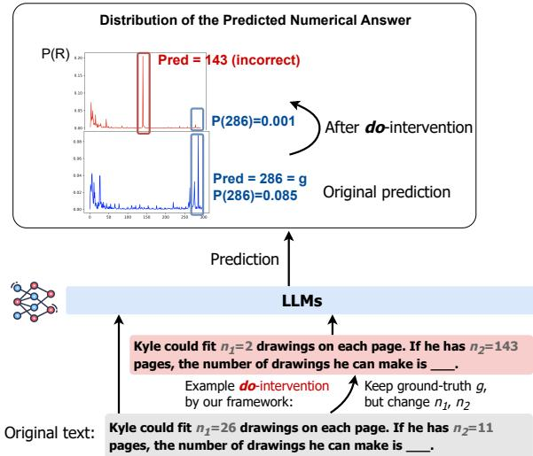  
Figure 1: Through our framework, we conduct dointerventions on the input and evaluate the change in the distribution P(R) of the prediction R by LLMs, in this figure, GPT-J. This allows us to measure the causal effect of each factor in the input on the model’s response.

Ouyang et al., 2022; Chowdhery et al., 2022), it remains unclear whether these models have learned mere artifacts in the data or have truly mastered the mathematical concepts needed to consistently solve all variations of the same problem (Patel et al., 2021; Razeghi et al., 2022; Welleck et al., 2022). In sharp contrast with a large number of papers on improving the performance of LLMs on various types of math-based problems, there has been little effort on behavioral analysis of LLMs for these tasks. Existing methods for understanding the robustness of these models (Patel et al., 2021) rely on manually constructing variations of math problems, and we do not yet have a principled, comprehensive framework for quantifying such robustness.

Thus, in this work, we propose a formal framework based on causal inference, to quantify the robustness of NLP models’ math reasoning abilities. Specifically, we describe a causal graph formulation of math reasoning, where the graph allows us to measure the difference in the structural causal models of human reasoning and model judgment. We consider various causal factors such as the textual framing of the question, numerical operands, and operation types. Then, we identify a set of interventions in the context of math word problems (an example of which is illustrated in Figure 1), and provide a causal inference framework to obtain causal effects of each factor via direct dointerventions (Pearl, 1995) and causal mediation analysis (Pearl, 2001). While our approach is reminiscent of recent studies using causal analysis for LLMs (Finlayson et al., 2021; Vig et al., 2020; Meng et al., 2022), in this work, we provide a new theoretical analysis framework specifically suitable for math reasoning. Using our framework, we disentangle factors affecting the model’s predictions and measure their influences. This way, we are able to provide insights into the model’s reasoning in terms of robustness and sensitivity with respect to changes in these factors.

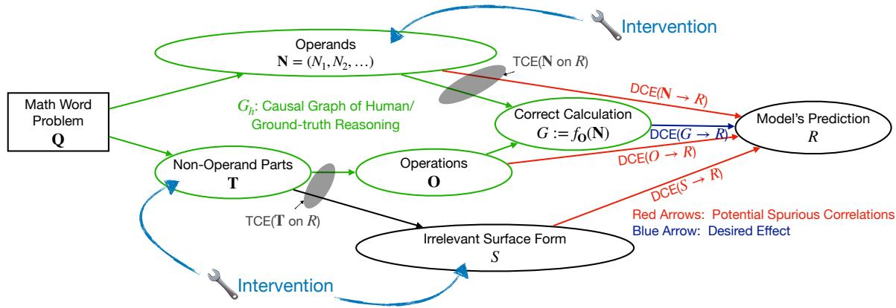  
Figure 2: Causal graph of model predictions on math questions. We highlight the difference between a cognitivelyinspired correct reasoning path $( \mathcal { G } _ { h } )$ and the undesired effects that some factors might have on the model’s prediction (red arrows). By performing controlled interventions of the numerical values (N) and on the textual framing of the problem (T, S), we are able to quantify the causal effects of each factor.

We apply our framework to study a set of thirteen GPT models with various sizes and training procedures (i.e., instruction-tuned and non-instructiontuned). We observe that, among non-instructiontuned language models, the larger ones tend to be more sensitive to changes in the ground-truth result of a math word problem, but not necessarily more robust. However, we observe a different behavior in the instruction-tuned GPT-3 models (Ouyang et al., 2022), which show a remarkable improvement in both sensitivity and robustness, although the robustness reduces when problems get more complicated. We additionally investigate the role of size and instruction tuning on the model’s performance with three models of the LLaMA family (Touvron et al., 2023) and Stanford Alpaca (Taori et al., 2023).

## 2 Problem Setup

We consider a dataset of math word problems (MWPs), where each MWP is denoted as a question $Q .$ Q is a list $( \pmb { T } , \pmb { N } )$ consisting of a question template $\mathbf { T }$ and an ordered list of operands $\pmb { N } = ( N _ { 1 } , N _ { 2 } , \dots , N _ { m } )$ . Each question template $\pmb { T } : = ( \pmb { O } , S )$ further contains two types of information: a set of arithmetic operations O implicitly expressed in the question, and the text surface form $S$ irrelevant to the arithmetic operations. O incorporates the information relative to the operations as a collection of tuples $\{ ( O _ { 1 } , i _ { 1 } , j _ { 1 } ) , ( O _ { 2 } , i _ { 2 } , j _ { 2 } ) , . . . \}$ where $O _ { k } \in \{ + , - , \times , \div \} ( k \in \mathbb { N } )$ and $i _ { k } , j _ { k } \in \mathbb { N }$ represent the indices of the operands to which operator $O _ { k }$ should be applied $\mathrm { t o . } ^ { 2 }$ The ground-truth result $G = f _ { O } ( N )$ is calculated by computing the function $f o$ , which represents the application of all the operators in O to the respective operands. We illustrate the factors in $Q$ and their inter-dependency in the causal graph in Figure 2. A two-operand instance q of $Q$ in this form from Patel et al. (2021) is:

Template t: Mark has $n _ { 1 }$ trees in his backyard. If he plants $n _ { 2 }$ more, how many trees will he have?

Operands n: $( n _ { 1 } = 1 2 , n _ { 2 } = 1 3 )$

Operations o: $\{ ( ^ { \ast \epsilon } + ^ { \ast } , 1 , 2 ) \}$

Result: $g = f _ { o } ( { \pmb n } ) = n _ { 1 } + n _ { 2 } = 2 5$

Our goal is to quantify the robustness of a model on the set of problems $\textbf { \textit { q } } \in \textbf { \textit { D } }$ Ideally, should be a dataset not seen by the model during training. We assume that a model takes q as input and predicts a probability distribution of the result $R \colon \mathbb { P } ( R \mid t , n )$ . Our formulation below will be easier to understand using this finite discrete set and can be generalized to any kind of data pairing a natural language template with a function that maps a set of operands to a result (e.g., a Python program; Mishra et al. 2022a).

## 3 A Causal Framework

In this section, we describe our framework in three steps. First, we define the idea of model robustness on MWPs. Then, we identify possible dointerventions (Pearl, 1995) that we can perform. Finally, we describe the causal effects that we measure to quantify the robustness of various models.

## 3.1 Step 1. Question Reformulation

We address the research question “Is a model reasoning robustly on $M W P s ? ^ { \prime \prime }$ by comparing the causal mechanisms of the model’s decisions to a hypothesized human reasoning mechanism. Note that we do not claim to know how humans reason about these problems. We simply propose a reasonable and intuitive way to judge model robustness given a reasonable and intuitive human reasoning mechanism inspired by findings regarding the independence of language and mathematical reasoning in humans (Brannon, 2005; Monti et al., 2012).

Human Reasoning Mechanisms. The causal mechanisms of how humans might solve q include

$$
\begin{array} { r } { \pmb { o } = f _ { \mathrm { a b s t r a c t } } ( \pmb { q } ) , } \end{array}\tag{1}
$$

$$
g = f _ { o } ( { \pmb n } ) ,\tag{2}
$$

where they first abstract the arithmetic operations o from the problem q by some cognitive process $f _ { \mathrm { a b s t r a c t } }$ , and then apply the operation to the operands to obtain the result $g .$ . We show these mechanisms in the green subgraph $\mathcal { G } _ { h }$ of Figure 2.

Model Reasoning Mechanisms. In contrast, the causal mechanisms of how a model might solve q are as follows:

$$
r = f _ { \mathrm { b l a c k B o x } } ( \pmb { t } , \pmb { n } ) ,\tag{3}
$$

where we are unsure about (1) what part(s) of t the model takes into account, and (2) how it operates over the relevant variables.

Thus, we draw all possible causal mechanisms that might take place in the black-box model $f _ { \mathrm { b l a c k B o x } }$ in the complete causal graph in Figure 2. Some possible fine-grained causal mechanisms are

1. The model might attend over the question template t in two ways: paying attention to the text surface form s via the causal path $\pmb { T }  S  R .$ , or text relevant to the math operations o via the causal path $\pmb { T }  \pmb { O }  R$

2. The model might also attend to the operands ${ \pmb n } : = ( n _ { 1 } , n _ { 2 } , \dots )$ via a causal path $N  R .$

3. If the model learns the correct causal mechanisms as in the human cognitive process, it should capture how the operator and the operands matter to the ground-truth result g (via $O  G$ and $N \to G )$ and then the model prediction should be sensitive to any changes in the ground truth, namely $G  R$ . No spurious correlations can directly affect R without going through the mediator G.

Hence, to answer the question “How robust is the mathematical reasoning of a model on MWPs?” we can answer the following subquestions:

1. How does R change in response to G? By quantifying this, we assess the sensitivity (correct responsiveness) of the model to changes in the problem. In other words, does the model correctly adjust its prediction in response to a change in the correct solution of the problem?

2. What is the (unwanted) direct causal effect size of $S  R ,$ and $N  R ?$ We see the quantities as a measure of the brittleness (i.e., wrong responsiveness) of the model to resultpreserving changes in the input. The lower the direct causal effect of S and N, the more robust the model is.

## 3.2 Step 2. Causal Intervention List

After formulating the cognitively-inspired subgraph $\mathcal { G } _ { h }$ and defining the undesired causal paths in Figure 2, we list all feasible limited actions that allow us to perform our causal analysis. In the context of MWPs, we use the following interventions:

1. Direct intervention on all possible $n _ { 1 } , n _ { 2 } , \ldots ;$

2. Partially controllable interventions on T. We can replace the template T in two ways:

(a) both S and O are affected, or

(b) S is affected but O is not affected.

## 3.3 Step 3. Turning Limited Actions into Causal Effect Sizes

Next, we explain how we can obtain the causal effect sizes we want (listed in Step 1) from the limited set of interventions we can do (listed in Step 2). Specifically, we first start from all the feasible interventions, and for variables that we cannot directly intervene on, we apply deductions from do-calculus (Pearl, 1995) to obtain or approximate the direct causal effect sizes. In the following, we describe a list of causal effect sizes that we need.

General Formulation. Let us consider an intervention do $( X : x \to x ^ { \prime } )$ , where $X \in \{ T , S , N \}$ and a problem $Q = \{ T , N \}$ . The support of the numerical values $N _ { i } { ' } s$ and R is $\mathcal { T } \subseteq \mathbb { N } ,$ , and we consider N to be distributed uniformly over the set $\{ n \in \mathbb { Z } ^ { 2 } \mid f o ( n ) \in \mathbb { Z } \}$ . We denote the distribution before the intervention $\mathbb { P } ( R \mid { \pmb T } , { \pmb N } )$ as P and the distribution after the intervention as $P ^ { \prime }$

Following the distributional definition of causal effect by Pearl (1995), we quantify the effect of factor X in our causal graph using a distance metric $\delta$ between the distributions $P$ and $P ^ { \prime }$ . That is,

$$
\mathrm { C E } = \delta ( P , P ^ { \prime } ) ,\tag{4}
$$

where CE can refer to the total causal effect (TCE, i.e., the joint effect through all the directed causal paths from a variable to another), or the direct causal effect (DCE, i.e., the effect from the directed causal path from a variable to another that does not go through any intermediate variables) (Pearl, 2001). We describe our choices for δ in Section 3.4.

Causal Effects of the Operands. When intervening on the operands $\pmb { N } : = ( N _ { 1 } , N _ { 2 } , \ldots )$ , we can obtain the size of the total causal effect of N on $R ,$ namely

$$
\operatorname { T C E } ( N \ \mathrm { o n } \ R ) : = \mathbb { E } _ { n ^ { \prime } \sim \mathbb { P } ( N ) } [ \delta ( P , P ^ { \prime } ) ] ,\tag{5}
$$

$$
\mathrm { w h e r e } P ^ { \prime } = \mathbb { P } ( R | \pmb { T } , \mathrm { d o } ( N = \pmb { n } ^ { \prime } ) ) .\tag{6}
$$

Note that this TCE is not the exact desired quantity, because we want to separate two different paths of how N affects R: (1) the path $N  G  R$ which is the correct decision path that we want the model to pick up (where the model reacts to the change in the ground-truth answer), and (2) the path $N  R ,$ , which is the spurious correlation that the model might have learned (where the model relies on some spurious correlations with certain numerical values, which could be traced to perhaps their frequencies in the training corpus).

We can quantify the direct causal effect (DCE, i.e., the effect from the directed causal path from a variable to another that does not go through any intermediate variables) (Pearl, 2001) of N on R, namely the strength of the direct causal path $N $ R, by controlling for G to be fixed every time we intervene on N:

$$
\mathrm { D C E } ( N \to R ) : = \mathbb { E } _ { n ^ { \prime } \sim \mathbb { P } ( N \mid G ) } [ \delta ( P , P ^ { \prime } ) ] ,\tag{7}
$$

$$
\mathrm { w h e r e } P ^ { \prime } = \mathbb { P } ( R | \pmb { T } , \mathrm { d o } ( N = \pmb { n } ^ { \prime } ) ) .\tag{8}
$$

For example, if we observe a model doing $1 0 0 +$ 100 = 200 correctly, we want to separate the math ability here into (1) the model’s sensitivity towards the ground-truth answer, and (2) the model’s decisions based on its familiarity with just the operand 100. Here, the overall effect is the calculable TCE(N on R) by Eq. 5, and one of the subeffects is the calculable $\mathrm { D C E } ( N \to R )$ by Eq. 7.

Causal Effects of the Text Surface Form. As for the operands, we can compute both the direct and indirect effects of the surface form representing the math problem. In particular, intervening on $_ { \pmb { T } }$ without controlling for O (intervention 2a in Sec. 3.2), we can compute the total effect, i.e.,

$$
\operatorname { T C E } ( T \ \mathrm { o n } \ R ) : = \mathbb { E } _ { t ^ { \prime } \sim \mathbb { P } ( T ) } [ \delta ( P , P ^ { \prime } ) ] ,
$$

$$
\mathrm { w h e r e } P ^ { \prime } = \mathbb { P } ( R | N , \mathrm { d o } ( \mathbf { T } = t ^ { \prime } ) ) .\tag{9}
$$

(10)

Controlling for the operations O (intervention 2b in Sec. 3.2) will instead allow us to obtain the direct causal effect of the surface text:

$$
\mathrm { D C E } ( S \to R ) : = \mathbb { E } _ { t ^ { \prime } \sim \mathbb { P } ( { \pmb T } | O ) } [ \delta ( P , P ^ { \prime } ) ] ,\tag{11}
$$

$$
\mathrm { w h e r e } P ^ { \prime } = \mathbb { P } ( R | N , \mathrm { d o } ( \mathbf { T } = t ^ { \prime } ) ) .\tag{12}
$$

Note that since there is no mediator between $S$ and R, the $\mathrm { D C E } ( S  R )$ is also TCE of $S$ on $R .$ The only adaptation that we need to make with regard to the MWPs is that it is not feasible to enumerate all possible perturbations of S. Therefore, the practical results that researchers can achieve are over a certain subset of S. In practice, we obtain this by intervening on $_ { \pmb { T } }$ without affecting O.

Causal Effects of the Operators. The ideal way to obtain the TCE of O on R is through some careful human annotation that minimally changes the templates as Kaushik et al. (2020) do for sentiment classification. The challenge for MWPs in our case is that with all our possible interventions, we cannot only intervene on $o$ without introducing changes to the irrelevant surface form. However, we might get some information about TCE(O on R) because, on the causal graph, the total causal influence of $_ { \pmb { T } }$ on R actually flows into two directed paths, one through $S$ to $R$ (which is the $\operatorname { D C E } ( S \to R ) )$ ), and the other from O to $R ,$ which is our interested quantity TCE(O on R). Therefore, we compare the two quantities we know, $\mathrm { T C E } ( \pmb { T }  R )$ and $\mathrm { D C E } ( S  R )$ , to get a sense of the causal influence of O on R that we cannot obtain in any other way.

## 3.4 Step 4. Quantifying the Causal Influence

Consider a realization of problem $Q$ with operands n and ground-truth result $g = f _ { o } ( n )$ , and denote by $g ^ { \prime }$ the result after the intervention $\operatorname { d o } ( X : x \to$ $x ^ { \prime } )$ . We quantify the causal effect of factor X on the model’s prediction R in two ways: by assessing the change in the predicted result, and by measuring the change in the probability assigned by the model to the correct result g (or $g ^ { \prime } )$

Change in the Prediction. To account for the inability of LMs to capture the continuous property of numbers (Jin et al., 2021a), we measure the change in the model’s prediction using an indicator of the “change result” event:

$$
\delta _ { \mathrm { c p } } ( P , P ^ { \prime } ) : = \mathbb { 1 } ( r \neq r ^ { \prime } ) ,\tag{13}
$$

where $\begin{array} { r l r } { r } & { { } = } & { \arg \operatorname* { m a x } _ { x \in \mathcal { T } } P ( x ) } \end{array}$ , and $r ^ { \prime } = $ arg $\operatorname* { m a x } _ { x \in \mathcal { T } } P ^ { \prime } ( x )$

Relative Change in Confidence. Inspired by Finlayson et al. (2021), we also highlight the change in terms of the relative difference in the probability assigned to $g$ and $g ^ { \prime }$ . We formulate two types of relative change, one quantifying the relative change in the confidence of $g ,$ and the other quantifying the relative change in the confidence of $g ^ { \prime } { : }$

$$
\Delta _ { \mathrm { r e l } } = { \frac { P ( g ) - P ^ { \prime } ( g ) } { P ^ { \prime } ( g ) } }\tag{14}
$$

$$
\Delta _ { \mathrm { r e l } } ^ { \prime } = \frac { P ^ { \prime } ( g ^ { \prime } ) - P ( g ^ { \prime } ) } { P ( g ^ { \prime } ) } .\tag{15}
$$

We quantify the overall relative change in confidence (RCC) as the average of the two relative

changes above:

$$
\delta _ { \mathrm { r e c } } ( P , P ^ { \prime } ) = \frac { 1 } { 2 } \biggl ( \Delta _ { \mathrm { r e l } } + \Delta _ { \mathrm { r e l } } ^ { \prime } \biggr ) .\tag{16}
$$

A Unified Form. We are interested in the average causal effect of the intervention across all problems in . Thus, we measure the average of the effects over all instances $\mathbf { \Delta } \mathbf { \mathbf { \mathfrak { q } } } \in \mathcal { D }$ . We denote by the subscripts $\mathrm { T C E _ { c p } / D C E _ { c p } }$ and $\mathrm { T C E _ { r c c } / D C E _ { r c c } }$ the causal effects computed using the change in prediction metric and the relative change in confidence, respectively. We describe how we construct the dataset in Section 4.2.

## 4 Experimental Setup

In this section, we describe the data used to perform the interventions and to measure the causal effects.

## 4.1 Datasets

For our analyses, we use instances of math word problems from three popular datasets: ASDiv-A (Miao et al., 2020), MAWPS (Koncel-Kedziorski et al., 2016), and SVAMP (Patel et al., 2021). The examples contained in these collections are pairs (t, o) consisting of a question template t with its annotated operations o. Each of these pairs can be instantiated multiple times into problems $\mathbf { \boldsymbol { q } } ~ = ~ ( \mathbf { \boldsymbol { t } } , \mathbf { \boldsymbol { n } } )$ by filling the template with numerical values $( n _ { 1 } , n _ { 2 } , \ldots )$ and computing the groundtruth result $g = f _ { o } ( n )$ (most problems involve two to three operands, $\mathrm { i . e . , ~ } | n | \in \{ 2 , 3 \} \rangle$ ). We select a set of 437 two-operand and 307 three-operand template-expression pairs that we use to generate pairs of prompts representing an intervention. More details about the prompt generation procedure are in Appendix A. We use $( \boldsymbol { t } , \boldsymbol { n } )$ to refer to an instantiated template that we use as a prompt.

## 4.2 Intervention Data

Given an MWP $\textbf { \textit { q } } = \mathbf { \beta } ( t , n )$ and its solution $^ { g , }$ we generate a second problem-solution instance $( \boldsymbol { q } ^ { \prime } , \boldsymbol { g } ^ { \prime } )$ depending on the type of causal effect CE we want to measure and on the considered variable. When intervening on the operands of the problem, the text of the problem is kept unaltered and a set of new operands n is sampled in such a way that the result $g$ is affected or not depending on the effect that is being measured. When changing the textual description of the problem, we change t such that either $\pmb { o } ^ { \prime } = \pmb { o } , \operatorname { o r } \pmb { o } ^ { \prime } \neq \pmb { o }$ . In the former case, we sample a different template $\pmb { t } ^ { \prime } = ( s ^ { \prime } , \pmb { o } )$ from the set of templates describing the same operations o, in the latter case we sample a new $\mathbf { { \boldsymbol { t } } ^ { \prime } }$ describing a different operation. In Appendix B.1 we report some examples of $( q , q ^ { \prime } )$ pairs representing the different types of interventions.

Given a model, we use the question pair $( q , q ^ { \prime } )$ to obtain a pair of answer distributions $\mathbb { P } ( R | \pmb { t } , \pmb { n } )$ and $\mathbb { P } ( R | \pmb { t } ^ { \prime } , \pmb { n } ^ { \prime } )$ , which we use to measure the causal effect of the intervention. We consider the space for the numerical values to be $\mathcal { L } \quad =$ $\{ 1 , 2 , \ldots , C \}$ consisting of integer values, following the setup of several existing MWP datasets (Miao et al., 2020; Koncel-Kedziorski et al., 2016; Patel et al., 2021). To control our experimental costs and make sure the models keep the number as one token, we set $C = 3 0 0$ . From all the tokens in a model’s vocabulary, we focus on the probability assigned to the numbers in our numerical space , and thus we use $\mathbb { P } ( R = r )$ to denote the normalized probability $\mathbb { P } _ { \mathrm { r a w } } ( R = r ) / Z$ , where $\begin{array} { r } { Z = \sum _ { r = 1 } ^ { C } \mathbb { P } _ { \mathrm { r a w } } ( R = r ) } \end{array}$ , and $\mathbb { P } _ { \mathrm { r a w } } ( x )$ is the raw probability score assigned to the vocabulary token $x .$ For each intervention type, we generate a dataset consisting of $( q , q ^ { \prime } )$ pairs. Unless otherwise specified, for our experiments we generate 500 intervention pairs for each template, and results are averaged over three seeds.

## 4.3 Models to Evaluate

We use our framework to assess the robustness of reasoning in thirteen pre-trained language models. We consider five sizes of the GPT-2 model (Radford et al., 2019): distilled (Sanh et al., 2019), small, medium, large, and XL. We evaluate four models from EleutherAI that were pre-trained on the Pile (Gao et al., 2020): GPT-Neo 1.3B and 2.7B (Black et al., 2021), GPT-J-6B (Wang and Komatsuzaki, 2021), and GPT-NeoX-20B (Black et al., 2022). We use HuggingFace Transformers (Wolf et al., 2019) to access the models. Additionally, we experiment with a set of instruction-tuned versions of GPT-3 (Brown et al., 2020): Instruct (Ouyang et al., 2022), Curie, Davinci-002, and Davinci-003.<sup>3</sup> Experiments with GPT-3 are carried out under the constraints set by the OpenAI APIs<sup>4</sup>, which prevent us from computing the causal effect using the same procedure as for the other models. We report the details about how the metrics were computed for GPT-3 in Appendix C. In the reported results, we indicate with an asterisk (∗) the metrics that were influenced by this limitation.

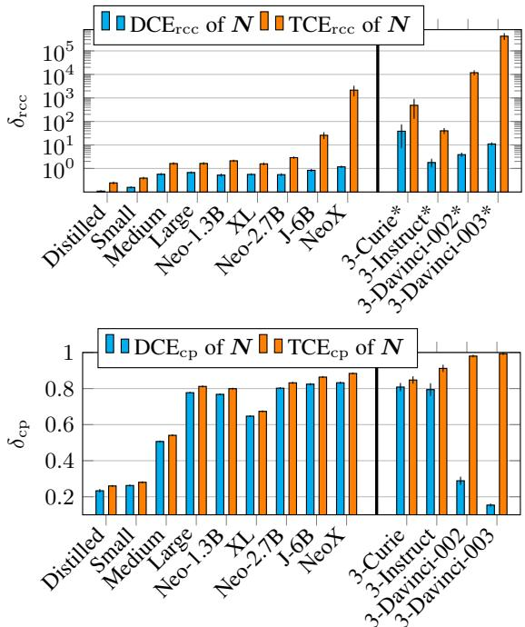  
Figure 3: Comparison of $\mathrm { D C E } ( N  R )$ and TCE(N on R). ∗approx values, see Appendix C.

## 5 Results

Our analyses focus primarily on two-operand problems (Sections 5.1 and 5.2) and later extend to more complex problems that involve three operands (Section 5.5) for the models that perform best on the two-operand test bed. We compare the direct causal effect DCE and the total causal effect TCE of N and T on R. DCE represents the undesired effect for a model to being mistakenly responsive to a change in N or T not leading to a change in the result g (low robustness), whereas higher values of TCE indicate a higher ability of the model to correctly adjust the probability weight assigned to the new solution $g ^ { \prime }$ after the intervention (high sensitivity).

## 5.1 Effect of N on R

From the results in Figure 3, we notice that larger models exhibit a larger $\mathrm { T C E _ { r c c } / D C E _ { r c c } }$ ratio. In particular, in GPT-J-6B and NeoX, the TCE is, respectively, 30x and 1000x larger than the DCE. However, this improvement in sensitivity is not manifested in terms of change of prediction $( \delta _ { \mathrm { c p } } )$ for which the models show to be affected by resultpreserving changes almost as equally as by resultaltering interventions. This behavior changes significantly in instruction-tuned models. In particular, for the 175B-parameter GPT-3, performance varies depending on the type of supervision, with the PPOtrained Davinci-003 exhibiting an 84% difference between direct and total effect.

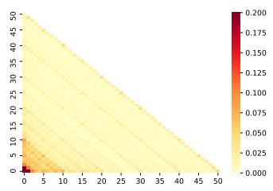

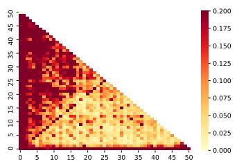

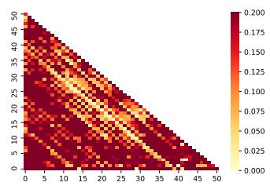

Figure 4: Heatmaps displaying $P ( g )$ for Distil-GPT-2 (left), GPT-J-6B (center), and GPT-3 Davinci-002 (right). g is the ground-truth result $g = n _ { 1 } + n _ { 2 }$ (n<sub>1</sub> and $n _ { 2 }$ are represented by the x and y axes, respectively. The probability values for each combination of $( ( n _ { 1 } , n _ { 2 } ) , g )$ are averaged over 20 different templates. Probability values over 0.2 are displayed with the darkest color.  
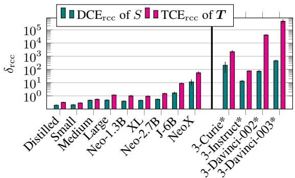

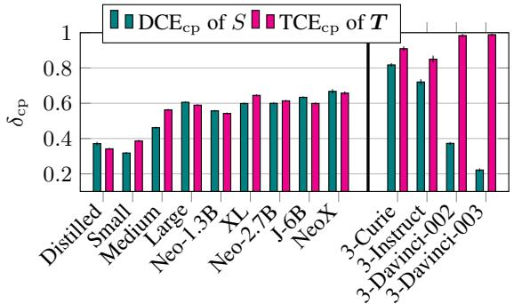  
Figure 5: Comparison of $\operatorname { D C E } ( S \quad \to \quad R )$ and TCE(T on R). We use ∗ to denote approximated values, explained in Appendix C.

In Figure 4, we present a different visualization of the direct causal effect of N on the model’s prediction. We report the heatmaps showing the probability assigned by the model to the result g of a problem $( t , ( n _ { 1 } , n _ { 2 } ) , g ) \mid g = n _ { 1 } + n _ { 2 }$ <sup>,</sup> ∀<sup>g</sup> ∈ $\{ 0 , 1 , \ldots , 5 0 \} , \forall ( n _ { 1 } , n _ { 2 } ) \in \{ 0 , 1 , \ldots , 5 0 \} ^ { 2 }$ . For Distil-GPT-2 we observe low overall probability assigned to $g$ and diagonal patterns indicating consistency in assigning higher probability to specific results (e.g., 10, 20, 30, 40, 50). For the two larger models we notice a higher probability mass assigned to the problem’s result, but less consistency on the prediction of the same result with different sets of operands (this is true for GPT-J in particular). This result is consistent with the observed higher DCE and TCE in larger models: $P ( g )$ might vary more considerably when intervening on N without affecting g, but overall the model assigns higher probability weight to the correct result, which correlates with higher sensitivity.

## 5.2 Effect of T on R

In Figure 5, we report the total causal effect of the textual framing T and the direct causal effect of the irrelevant text elements $S$ on the model’s prediction. For the instruction-tuned models, the improvement in terms of prediction change $( \delta _ { \mathrm { c p } } )$ follows a similar trend as for N, with GPT-3 Davinci-003 showing a 76% difference between direct and total effect. An interesting observation is that the irrelevant textual information S appears to have a lower direct effect than N for all noninstruction-tuned models. However, in the GPT-3 Davinci-00x models, we observe the opposite $( \mathrm { i . e . } ,$ DCE $( N \to R ) \leq \mathrm { D C E } ( S \to R ) )$ . This suggests that large instruction-based models tend to be more susceptible to variation in the textual framing of a problem, while smaller models are more responsive to changes in the numerical values (though not necessarily correctly).

## 5.3 Overall Insights

In comparison to other models, GPT-3 Davinci shows the highest $\scriptstyle \mathrm { { D C E } } _ { \mathrm { r c c } }$ , but low $\mathrm { D C E _ { c p } . }$ . This discrepancy is related to the quantities that the two metrics consider. $\delta _ { \mathrm { r c c } }$ takes into account the probability assigned to $^ { g , }$ while $\delta _ { \mathrm { c p } }$ does not consider the ground truth solution. One interpretation of this result is that GPT-3 Davinci consistently predicts the same answer $r = r ^ { \prime }$ when $g = g ^ { \prime }$ , but the probabilities $P ( g )$ and $P ^ { \prime } ( g )$ might vary significantly.

The results observed for the two kinds of intervention do $( \pmb { T } : \pmb { t }  \pmb { t } ^ { \prime } )$ and do $( N : ( n _ { 1 } , n _ { 2 } ) \to$ $( n _ { 1 } ^ { \prime } , n _ { 2 } ^ { \prime } ) )$ show similar trends. Small models (Distilled and Small GPT-2) exhibit low sensitivity to interventions. Larger models (from GPT-2 Medium to GPT-Neo) appear to be more influenced by changes in both N and T. However, they display similar sensitivity to both result-altering and resultpreserving interventions. An improvement in sensitivity is noticeable in GPT-J and NeoX, though not accompanied by an improvement in robustness. Remarkably different behavior is instead shown by the GPT-3 Davinci models, which demonstrate substantially higher sensitivity to result-altering interventions (high TCE), and higher robustness (in terms of prediction change). In Appendix B.2, we report the accuracy of the models on the generated instances of MWPs, which exhibits a similar trend as the robustness/sensitivity changes we observed.

Possible explanations for the improved robustness and sensitivity demonstrated by the large GPT-3 models might be the dramatic size increase and extension/enhancement of the training procedure involving instructions. The former idea is aligned with the emergent abilities hypothesis (Wei et al., 2022a), which postulates the existence of skills that are displayed by large-scale models but are not present in smaller-scale models. However, our observations show different performances in versions of GPT-3 Davinci that differ in the training procedure.<sup>5</sup> This raises the question of whether the capability of LLMs to reason about math problems benefits from instruction-based tuning. We address this question in the following section.

## 5.4 Extending to LLaMA-Based Models

To further investigate the roles played by size and training method in the model’s performance, we carry out our experimental procedure on three versions with different sizes (7B, 13B, and 30B) of the LLaMA model (Touvron et al., 2023), and on Stanford Alpaca (which applies instruction tuning on LLaMA 7B) (Taori et al., 2023). We present these results separately, as the LLaMA tokenization makes the prediction setup different from the one used from the other models, and prevents us from computing the relative change in confidence

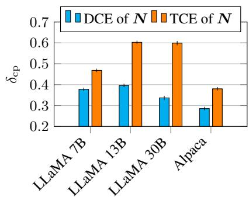  
Figure 6: Comparison of direct and total effects of N on R for LLaMA and Alpaca.

$$
( \delta _ { \mathrm { r c c } } ) . ^ { 6 }
$$

From the results (Figure 6), two notable observations emerge. Firstly, the increased difference between TCE and DCE observed with the increasing size of the LLaMA models suggests that a larger number of parameters can be a significant driver behind robustness/sensitivity improvement. However, this is not necessarily the case across different models: GPT-NeoX-20B shows a smaller $\mathrm { T C E _ { c p } { \cdot } D C E _ { c p } }$ gap compared to LLaMA 7B (5.2% vs 9.0%). Secondly, the instruction tuning procedure of Alpaca does not seem to help significantly with mathematical computation: the decrease in both TCE and DCE shows that robustness improves at the expense of sensitivity. Nonetheless, overall, when comparing Alpaca compared to its base model, LLaMA 7B, we observe an increase in the gap between TCE and DCE, although this difference is minimal (9.5% vs 9.0%).

The limited improvement of Alpaca might be attributed to its instruction tuning procedure consisting of “a list of user-oriented instructions including email writing, social media, and productivity tools” (Taori et al., 2023), which differs from reasoningintensive tasks. We suggest future work to examine different types of instruction tuning (e.g., focused on reasoning procedures or reinforcement learning from human feedback), which might help the model answer more complex types of questions in a step-by-step manner and more accurately. We hypothesize that the different performances in versions of GPT-3 Davinci might be produced by the specific type of instructions used for training, by the reinforcement learning component (Ouyang et al., 2022), or simply by an extension of the language modeling pre-training. It is challenging to pinpoint the exact factor in the training procedure that contributes to this improvement, as specific methodological details are not available.

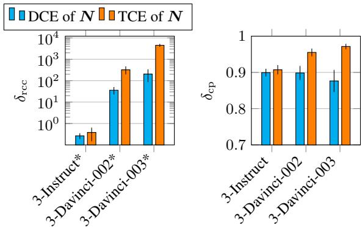  
Figure 7: Comparison of direct and total effects of N on R for three-operand problems.

## 5.5 Moving to Three-Operand Problems

We extend our evaluation to consider the threeoperand problems in the dataset. In these experiments, we consider only the GPT-3 175Bparameter models, as they are the only models performing well on the simpler bivariate problems. The results regarding the effects of N are reported in Figure 7. We notice that the large difference between the desired (TCE) and undesired (DCE) effects observed on simpler problems shrinks significantly for both metrics. In particular, for Davinci-003, the direct effect of N (measured as $\delta _ { \mathrm { c p } } )$ grows from 0.17 to 0.87. That is, GPT-3 Davinci-003 predicts a different result 87% of the time after an intervention that does not affect the ground-truth solution. The increase in direct effect indicates a performance degradation in terms of brittleness: even the models that show good performance on two-operand problems, now display an unstable behavior after result-preserving interventions.

## 6 Related Work

Causal NLP. Causal inference aims to study the cause and effect from observational and interventional data (Pearl, 2009; Peters et al., 2017). Traditionally, researchers usually apply causal techniques to phenomena in nature and human society. With the rise of powerful models in NLP, recent research has started to explore the intersection of causal inference and NLP, forming the study of Causal NLP (Jin et al., 2022; Feder et al., 2021a).

There are several formulations for Causal NLP: the causality for NLP thread involves using the causal framework for data collection and task formulation (Jin et al., 2021c), inspecting the (pathspecific) causal effect of certain neurons on predictions (Vig et al., 2020; Meng et al., 2022), understanding the causal effect of data and learning paradigm for model performance (Ni et al., 2022), and as a way to frame prompts (Lyu et al., 2023); and NLP for causality involves testing the pure causal inference skills of LLMs (Jin et al., 2023a,b), and use text as a variable for causal effect estimation (Roberts et al., 2020; Veitch et al., 2020; Jin et al., 2021b, 2023c).

The most similar line of research to our work is the application of causal effect estimation on interpreting models’ behavior, such as how models understand syntactic agreement (Finlayson et al., 2021), and how interventions in the representations and weights affect the model prediction (Feder et al., 2021b). To the best of our knowledge, our work is the first to formulate a causal framework for robustness behavioral tests, and also we are the first to introduce the idea to quantify the differences in the causal mechanisms of human reasoning and model decisions.

Math Reasoning in NLP. A growing body of work tries to improve the math reasoning capability in NLP models (Zhang et al., 2020; Geva et al., 2020; Spokoyny et al., 2021), and prompting techniques for LLMs (Cobbe et al., 2021; Shen et al., 2021; Kojima et al., 2022; Wei et al., 2022b; Chowdhery et al., 2022). For analysis, significant attention has been given to models’ ability to understand numerical quantities (Wallace et al., 2019; Thawani et al., 2021) and numerical operations (Pal and Baral, 2021; Berg-Kirkpatrick and Spokoyny, 2020; Pi˛ekos et al., 2021; Razeghi et al., 2022).

## 7 Conclusion

We developed a framework to disentangle and separately measure the effect of different factors influencing the predictions of LLMs for math reasoning. Our results indicate that a drastic increase in both robustness and sensitivity emerges in the GPT-3 Davinci models. Additionally, we study the contribution of size and instruction tuning in the models of the LLaMA family, observing that the Alpaca instruction tuning, while increasing the model’s robustness, does not significantly improve the overall performance. Our framework provides a formalized theory of behavioral testing for math reasoning models and opens new future directions to design behavioral tests of models in a principled way.

## Ethical Considerations

As for the ethical practice in this work, the data involved are from existing MWP datasets with no private user information, and available under the MIT license. As for the ethical impact of the use of this work, the study is about providing a metric and analyzing existing models’ robustness, so there is less concern over harmful usage. Rather, it is more about putting checks on existing AI models and helping humans understand them better before use. Potential stakeholders that could benefit from this research include NLP researchers working on math models, practitioners working on various applications involving mathematical reasoning with text, and e-learning design.

## Limitations

A key limitation in our work is that LLMs might have seen these math problems. Our work theoretically assumes this is not the case. Another limitation is that for the sake of simplicity, our work makes some assumptions. For example, we assume all numbers in the range of integers 0 to C = 300. This would not cover every MWP out there. And future work is needed to generalize our framework to other forms of MWPs. In this work, we are also constrained by the limitations of the OpenAI policy on the GPT-3 API. This limits the number of perturbations we consider in this work as well as the accuracy with which we can estimate our causal distributions. Finally, our work is restricted to English, and extending it to other languages will require us to create an MWP dataset in that language.

## Acknowledgments

This material is based in part upon works supported by the German Federal Ministry of Education and Research (BMBF): Tübingen AI Center, FKZ: 01IS18039B; by the Machine Learning Cluster of Excellence, EXC number 2064/1 – Project number 390727645; by the John Templeton Foundation (grant #61156); by a Responsible AI grant by the Haslerstiftung; and an ETH Grant (ETH-19 21-1). Alessandro Stolfo is supported by armasuisse Science and Technology through a CYD Doctoral Fellowship. Zhijing Jin is supported by PhD fellowships from the Future of Life Institute and Open Philanthropy, as well as the travel support from ELISE (GA no 951847) for the ELLIS program. We also thank OpenAI Researcher Access Program for granting our team credits to their API.

## References

Taylor Berg-Kirkpatrick and Daniel Spokoyny. 2020. An empirical investigation of contextualized number prediction. In Proceedings ofthe 2020 Conference on Empirical Methods in Natural Language Processing (EMNLP), pages 4754–4764, Online. Association for Computational Linguistics. 9

Sid Black, Stella Biderman, Eric Hallahan, Quentin Anthony, Leo Gao, Laurence Golding, Horace He, Connor Leahy, Kyle McDonell, Jason Phang, et al. 2022. GPT-NeoX-20B: An open-source autoregressive language model. arXiv preprint arXiv:2204.06745. 6

Sid Black, Leo Gao, Phil Wang, Connor Leahy, and Stella Biderman. 2021. GPT-Neo: Large scale autoregressive language modeling with mesh-tensorflow. If you use this software, please cite it using these metadata. 6

Elizabeth M. Brannon. 2005. The independence of language and mathematical reasoning. Proceedings ofthe National Academy ofSciences, 102(9):3177– 3178. 3

Tom Brown, Benjamin Mann, Nick Ryder, Melanie Subbiah, Jared D Kaplan, Prafulla Dhariwal, Arvind Neelakantan, Pranav Shyam, Girish Sastry, Amanda Askell, Sandhini Agarwal, Ariel Herbert-Voss, Gretchen Krueger, Tom Henighan, Rewon Child, Aditya Ramesh, Daniel Ziegler, Jeffrey Wu, Clemens Winter, Chris Hesse, Mark Chen, Eric Sigler, Mateusz Litwin, Scott Gray, Benjamin Chess, Jack Clark, Christopher Berner, Sam McCandlish, Alec Radford, Ilya Sutskever, and Dario Amodei. 2020. Language models are few-shot learners. In Advances in Neural Information Processing Systems, volume 33, pages 1877–1901. Curran Associates, Inc. 1, 6

Aakanksha Chowdhery, Sharan Narang, Jacob Devlin, Maarten Bosma, Gaurav Mishra, Adam Roberts, Paul Barham, Hyung Won Chung, Charles Sutton, Sebastian Gehrmann, et al. 2022. Palm: Scaling language modeling with pathways. arXiv preprint arXiv:2204.02311. 1, 9

Karl Cobbe, Vineet Kosaraju, Mohammad Bavarian, Jacob Hilton, Reiichiro Nakano, Christopher Hesse, and John Schulman. 2021. Training verifiers to solve math word problems. arXiv preprint arXiv:2110.14168. 1, 9

Amir Feder, Katherine A. Keith, Emaad Manzoor, Reid Pryzant, Dhanya Sridhar, Zach Wood-Doughty, Jacob Eisenstein, Justin Grimmer, Roi Reichart, Margaret E. Roberts, Brando n M. Stewart, Victor Veitch, and Diyi Yang. 2021a. Causal inference in natural language processing: Estimation, prediction, interpretation and beyond. CoRR, abs/2109.00725. 9

Amir Feder, Nadav Oved, Uri Shalit, and Roi Reichart. 2021b. CausaLM: Causal model explanation through counterfactual language models. Computational Linguistics, 47(2):333–386. 9

Matthew Finlayson, Aaron Mueller, Sebastian Gehrmann, Stuart Shieber, Tal Linzen, and Yonatan Belinkov. 2021. Causal analysis of syntactic agreement mechanisms in neural language models. In Proceedings of the 59th Annual Meeting of the Association for Computational Linguistics and the 11th International Joint Conference on Natural Language Processing (Volume 1: Long Papers), pages 1828–1843, Online. Association for Computational Linguistics. 2, 5, 9

Leo Gao, Stella Biderman, Sid Black, Laurence Golding, Travis Hoppe, Charles Foster, Jason Phang, Horace He, Anish Thite, Noa Nabeshima, et al. 2020. The pile: An 800gb dataset of diverse text for language modeling. arXiv preprint arXiv:2101.00027. 6

Mor Geva, Ankit Gupta, and Jonathan Berant. 2020. Injecting numerical reasoning skills into language models. In Proceedings of the 58th Annual Meeting of the Association for Computational Linguistics, pages 946–958, Online. Association for Computational Linguistics. 9

Zhihua Jin, Xin Jiang, Xingbo Wang, Qun Liu, Yong Wang, Xiaozhe Ren, and Huamin Qu. 2021a. Numgpt: Improving numeracy ability of generative pre-trained models. arXiv preprint arXiv:2109.03137. 5

Zhijing Jin, Yuen Chen, Felix Leeb, Luigi Gresele, Ojasv Kamal, Zhiheng Lyu, Kevin Blin, Fernando Gonzalez Adauto, Max Kleiman-Weiner, Mrinmaya Sachan, and Bernhard Schoelkopf. 2023a. Cladder: Assessing causal reasoning in language models. 9

Zhijing Jin, Amir Feder, and Kun Zhang. 2022. CausalNLP tutorial: An introduction to causality for natural language processing. In Proceedings of the 2022 Conference on Empirical Methods in Natural Language Processing: Tutorial Abstracts, pages 17– 22, Abu Dubai, UAE. Association for Computational Linguistics. 9

Zhijing Jin, Jiarui Liu, Zhiheng Lyu, Spencer Poff, Mrinmaya Sachan, Rada Mihalcea, Mona Diab, and Bernhard Schoelkopf. 2023b. Can large language models infer causation from correlation? 9

Zhijing Jin, Zhiheng Lyu, Yiwen Ding, Mrinmaya Sachan, Kun Zhang, Rada Mihalcea, and Bernhard Schoelkopf. 2023c. AI Scholars: A dataset for NLPinvolved causal inference. 9

Zhijing Jin, Zeyu Peng, Tejas Vaidhya, Bernhard Schoelkopf, and Rada Mihalcea. 2021b. Mining the cause of political decision-making from social media: A case study of COVID-19 policies across the US

states. In Findings of the Association for Computational Linguistics: EMNLP 2021, pages 288–301, Punta Cana, Dominican Republic. Association for Computational Linguistics. 9

Zhijing Jin, Julius von Kügelgen, Jingwei Ni, Tejas Vaidhya, Ayush Kaushal, Mrinmaya Sachan, and Bernhard Schoelkopf. 2021c. Causal direction of data collection matters: Implications of causal and anticausal learning for NLP. In Proceedings of the 2021 Conference on Empirical Methods in Natural Language Processing, pages 9499–9513, Online and Punta Cana, Dominican Republic. Association for Computational Linguistics. 9

Divyansh Kaushik, Eduard H. Hovy, and Zachary Chase Lipton. 2020. Learning the difference that makes A difference with counterfactually-augmented data. In 8th International Conference on Learning Representations, ICLR 2020, Addis Ababa, Ethiopia, April 26-30, 2020. OpenReview.net. 5

Takeshi Kojima, Shixiang Shane Gu, Machel Reid, Yutaka Matsuo, and Yusuke Iwasawa. 2022. Large language models are zero-shot reasoners. arXiv preprint arXiv:2205.11916. 9

Rik Koncel-Kedziorski, Subhro Roy, Aida Amini, Nate Kushman, and Hannaneh Hajishirzi. 2016. MAWPS: A math word problem repository. In Proceedings of the 2016 Conference of the North American Chapter ofthe Associationfor Computational Linguistics: Human Language Technologies, pages 1152–1157, San Diego, California. Association for Computational Linguistics. 5, 6

Zhiheng Lyu, Zhijing Jin, Justus Mattern, Rada Mihalcea, Mrinmaya Sachan, and Bernhard Schölkopf. 2023. Psychologically-inspired causal prompts. CoRR, abs/2305.01764. 9

Kevin Meng, David Bau, Alex Andonian, and Yonatan Belinkov. 2022. Locating and editing factual associations in GPT. Advances in Neural Information Processing Systems, 35:17359–17372. 2, 9

Shen-yun Miao, Chao-Chun Liang, and Keh-Yih Su. 2020. A diverse corpus for evaluating and developing English math word problem solvers. In Proceedings of the 58th Annual Meeting of the Association for Computational Linguistics, pages 975–984, Online. Association for Computational Linguistics. 5, 6

Swaroop Mishra, Matthew Finlayson, Pan Lu, Leonard Tang, Sean Welleck, Chitta Baral, Tanmay Rajpurohit, Oyvind Tafjord, Ashish Sabharwal, Peter Clark, et al. 2022a. Lila: A unified benchmark for mathematical reasoning. arXiv preprint arXiv:2210.17517. 3

Swaroop Mishra, Arindam Mitra, Neeraj Varshney, Bhavdeep Sachdeva, Peter Clark, Chitta Baral, and Ashwin Kalyan. 2022b. NumGLUE: A suite of fundamental yet challenging mathematical reasoning tasks. In Proceedings ofthe 60th Annual Meeting of

the Associationfor Computational Linguistics (Volume 1: Long Papers), pages 3505–3523, Dublin, Ireland. Association for Computational Linguistics. 1

Martin M Monti, Lawrence M Parsons, and Daniel N Osherson. 2012. Thought beyond language: Neural dissociation of algebra and natural language. Psychological science, 23(8):914–922. 3

Jingwei Ni, Zhijing Jin, Markus Freitag, Mrinmaya Sachan, and Bernhard Schölkopf. 2022. Original or translated? A causal analysis of the impact of translationese on machine translation performance. In Proceedings ofthe 2022 Conference ofthe North American Chapter of the Association for Computational Linguistics: Human Language Technologies, pages 5303–5320, Seattle, United States. Association for Computational Linguistics. 9

Long Ouyang, Jeff Wu, Xu Jiang, Diogo Almeida, Carroll L. Wainwright, Pamela Mishkin, Chong Zhang, Sandhini Agarwal, Katarina Slama, Alex Ray, John Schulman, Jacob Hilton, Fraser Kelton, Luke Miller, Maddie Simens, Amanda Askell, Peter Welinder, Paul F. Christiano, Jan Leike, and Ryan Lowe. 2022. Training language models to follow instructions with human feedback. CoRR, abs/2203.02155. 1, 2, 6, 8

Kuntal Kumar Pal and Chitta Baral. 2021. Investigating numeracy learning ability of a text-to-text transfer model. In Findings ofthe Associationfor Computational Linguistics: EMNLP 2021, pages 3095–3101, Punta Cana, Dominican Republic. Association for Computational Linguistics. 9

Arkil Patel, Satwik Bhattamishra, and Navin Goyal. 2021. Are NLP models really able to solve simple math word problems? In Proceedings of the 2021 Conference of the North American Chapter of the Associationfor Computational Linguistics: Human Language Technologies, pages 2080–2094, Online. Association for Computational Linguistics. 1, 2, 5, 6, 14

Judea Pearl. 1995. Causal diagrams for empirical research. Biometrika, 82(4):669–688. 2, 3, 4

Judea Pearl. 2001. Direct and indirect effects. In UAI ’01: Proceedings of the 17th Conference in Uncertainty in Artificial Intelligence, University of Washington, Seattle, Washington, USA, August 2-5, 2001, pages 411–420. Morgan Kaufmann. 2, 4

Judea Pearl. 2009. Causality. Cambridge University Press. 9

Jonas Peters, Dominik Janzing, and Bernhard Schölkopf. 2017. Elements of causal inference: Foundations and learning algorithms. The MIT Press. 9

Piotr Pi˛ekos, Mateusz Malinowski, and Henryk Michalewski. 2021. Measuring and improving BERT’s mathematical abilities by predicting the order of reasoning. In Proceedings of the 59th Annual Meeting ofthe Associationfor Computational

Linguistics and the 11th International Joint Conference on Natural Language Processing (Volume 2: Short Papers), pages 383–394, Online. Association for Computational Linguistics. 9

Alec Radford, Jeff Wu, Rewon Child, David Luan, Dario Amodei, and Ilya Sutskever. 2019. Language models are unsupervised multitask learners. 6

Yasaman Razeghi, Robert L Logan IV, Matt Gardner, and Sameer Singh. 2022. Impact of pretraining term frequencies on few-shot reasoning. arXiv preprint arXiv:2202.07206. 1, 9

Margaret E Roberts, Brandon M Stewart, and Richard A Nielsen. 2020. Adjusting for confounding with text matching. American Journal of Political Science, 64(4):887–903. 9

Mrinmaya Sachan, Kumar Dubey, and Eric Xing. 2017. From textbooks to knowledge: A case study in harvesting axiomatic knowledge from textbooks to solve geometry problems. In Proceedings ofthe 2017 Conference on Empirical Methods in Natural Language Processing, pages 773–784. 1

Mrinmaya Sachan, Kumar Avinava Dubey, Tom M Mitchell, Dan Roth, and Eric P Xing. 2018. Learning pipelines with limited data and domain knowledge: A study in parsing physics problems. Advances in Neural Information Processing Systems, 31. 1

Mrinmaya Sachan and Eric Xing. 2017. Learning to solve geometry problems from natural language demonstrations in textbooks. In Proceedings of the 6th Joint Conference on Lexical and Computational Semantics (\* SEM 2017), pages 251–261. 1

Victor Sanh, Lysandre Debut, Julien Chaumond, and Thomas Wolf. 2019. DistilBERT, a distilled version of BERT: Smaller, faster, cheaper and lighter. In NeurIPS EMC<sup>2</sup> Workshop. 6

Minjoon Seo, Hannaneh Hajishirzi, Ali Farhadi, Oren Etzioni, and Clint Malcolm. 2015. Solving geometry problems: Combining text and diagram interpretation. In Proceedings of the 2015 Conference on Empirical Methods in Natural Language Processing, pages 1466–1476, Lisbon, Portugal. Association for Computational Linguistics. 1

Jianhao Shen, Yichun Yin, Lin Li, Lifeng Shang, Xin Jiang, Ming Zhang, and Qun Liu. 2021. Generate & rank: A multi-task framework for math word problems. arXiv preprint arXiv:2109.03034. 9

Daniel Spokoyny, Ivan Lee, Zhao Jin, and Taylor Berg-Kirkpatrick. 2021. Masked measurement prediction: Learning to jointly predict quantities and units from textual context. arXiv preprint arXiv:2112.08616. 9

Rohan Taori, Ishaan Gulrajani, Tianyi Zhang, Yann Dubois, Xuechen Li, Carlos Guestrin, Percy Liang, and Tatsunori B. Hashimoto. 2023. Stanford alpaca: An instruction-following llama model. https://github.com/tatsu-lab/ stanford\_alpaca. 2, 8

Avijit Thawani, Jay Pujara, Filip Ilievski, and Pedro Szekely. 2021. Representing numbers in NLP: a survey and a vision. In Proceedings of the 2021 Conference of the North American Chapter of the Associationfor Computational Linguistics: Human Language Technologies, pages 644–656, Online. Association for Computational Linguistics. 9

Hugo Touvron, Thibaut Lavril, Gautier Izacard, Xavier Martinet, Marie-Anne Lachaux, Timothée Lacroix, Baptiste Rozière, Naman Goyal, Eric Hambro, Faisal Azhar, et al. 2023. Llama: Open and efficient foundation language models. arXiv preprint arXiv:2302.13971. 2, 8

Victor Veitch, Dhanya Sridhar, and David M. Blei. 2020. Adapting text embeddings for causal inference. In Proceedings of the Thirty-Sixth Conference on Uncertainty in Artificial Intelligence, UAI 2020, virtual online, August 3-6, 2020, volume 124 of Proceedings ofMachine Learning Research, pages 919–928. AUAI Press. 9

Jesse Vig, Sebastian Gehrmann, Yonatan Belinkov, Sharon Qian, Daniel Nevo, Yaron Singer, and Stuart Shieber. 2020. Investigating gender bias in language models using causal mediation analysis. Advances in Neural Information Processing Systems, 33:12388– 12401. 2, 9

Eric Wallace, Yizhong Wang, Sujian Li, Sameer Singh, and Matt Gardner. 2019. Do NLP models know numbers? probing numeracy in embeddings. In Proceedings of the 2019 Conference on Empirical Methods in Natural Language Processing and the 9th International Joint Conference on Natural Language Processing (EMNLP-IJCNLP), pages 5307–5315, Hong Kong, China. Association for Computational Linguistics. 9

Ben Wang and Aran Komatsuzaki. 2021. GPT-J-6B: A 6 billion parameter autoregressive language model. 6

Jason Wei, Yi Tay, Rishi Bommasani, Colin Raffel, Barret Zoph, Sebastian Borgeaud, Dani Yogatama, Maarten Bosma, Denny Zhou, Donald Metzler, et al. 2022a. Emergent abilities of large language models. arXiv preprint arXiv:2206.07682. 1, 8

Jason Wei, Xuezhi Wang, Dale Schuurmans, Maarten Bosma, Ed H. Chi, Quoc Le, and Denny Zhou. 2022b. Chain of thought prompting elicits reasoning in large language models. CoRR, abs/2201.11903. 9

Sean Welleck, Peter West, Jize Cao, and Yejin Choi. 2022. Symbolic brittleness in sequence models: on systematic generalization in symbolic mathematics. In Proceedings ofthe AAAI Conference on Artificial Intelligence, volume 36, pages 8629–8637. 1

Thomas Wolf, Lysandre Debut, Victor Sanh, Julien Chaumond, Clement Delangue, Anthony Moi, Pierric Cistac, Tim Rault, R’emi Louf, Morgan Funtowicz, and Jamie Brew. 2019. HuggingFace’s transformers: State-of-the-art natural language processing. arXiv preprint arXiv:1910.03771. 6

Xikun Zhang, Deepak Ramachandran, Ian Tenney, Yanai Elazar, and Dan Roth. 2020. Do language embeddings capture scales? In Findings ofthe Associationfor Computational Linguistics: EMNLP 2020, pages 4889–4896, Online. Association for Computational Linguistics. 9

## A Creation of the Prompts

We consider MWP examples from the union of the three datasets SVAMP, ASDiv-A, and MAWPS. The textual template t of a problem consists of a context (describing a real-world state and/or actions) and a question. In order to obtain suitable prompts for the models, we convert the problems questions into statements where the result of the problem is expected to be the first token after the prompt. E.g., in the example in section 2, how many trees will he have? is converted into the number oftrees that he will have is \_. From the MWP templates of the SVAMP/ASDiv-A/MAWPS collection (we consider all splits), we filter out the templates whose questions do not start with How many..., and we use spaCy<sup>7</sup> to identify the subject, the object and the verbs in the sentence. This allows us to convert the last sentence of the template from The number of... is. This way, we obtain 437 statement-based MWP templates for two-operand problems and 307 for three-operand problems. We manually checked a subset of the templates to identify possible mistakes in the conversion procedure.

## B Frequently Asked Questions

## B.1 How do the intervention data look like?

In Table 1 we report examples of MWP pairs representing different types of intervention.

## B.2 What is the accuracy of the evaluated models on the generated problems?

We report the accuracy of the models considered for evaluation in terms of accuracy at 1 and accuracy at 10. Results are displayed in Figure 8.

## B.3 What is the relation between accuracy and the RCC metric?

We examine the relationship between performance and robustness, computing the Pearson correlation coefficient between accuracy (accuracy@10) and the relative confidence change (RCC) metric. On a per-template basis (500 instances for each template), we found accuracy to be positively correlated with TCE(N on R) and TCE(T on R) (0.24 and 0.49, respectively) and negatively correlated with DCE(N R)and $\mathrm { D C E } ( S  R )$ (-0.26 and -0.36, respectively). We see these results as a quantitative validation of the intuition behind our framework: the better the model’s performance, the more the model tends to correctly adjust its prediction after a result-altering intervention (higher sensitivity) and to correctly not change its prediction after a result-preserving intervention (higher robustness).

<table><tr><td rowspan="2"> $\mathrm { T C E } ( N \to R )$ </td><td>Ruby has 87 candies. If she shares the candies among 29 friends, the number of candies that each friend gets is</td><td> $g = 8 7 / 2 9 = 3$ </td></tr><tr><td>Ruby has 35 candies. If she shares the candies among 5 friends, the number of candies that each friend gets is</td><td> $g = 3 5 / 5 = 7$ </td></tr><tr><td rowspan="2"> $\mathrm { D C E } ( N \to R )$ </td><td>The school is composed of 13 buildings each having 10 classrooms. The number of classrooms that the school has is</td><td> $g = 1 0 \times 1 3 = 1 3 0$ </td></tr><tr><td>The school is composed of 65 buildings each having 2 class- rooms. The number of classrooms that the school has is</td><td> $g = 6 5 \times 2 = 1 3 0$ </td></tr><tr><td rowspan="2"> $\mathrm { D C E } ( S  R )$ </td><td>The razorback t-shirt shop ordered 6 cases of t-shirts. If each case contains 17 t-shirts the number of t-shirts that they ordered is</td><td> $g = 1 7 \times 6 = 1 0 2$ </td></tr><tr><td>The roller coaster at the state fair costs 6 tickets per ride. If 17 friends were going to ride the roller coaster the number of tickets that they would need is</td><td> $g = 1 7 \times 6 = 1 0 2$ </td></tr><tr><td rowspan="2"> $\mathrm { T C E } ( \pmb { T }  R )$ </td><td>Sean has 23 whistles. He has 6 more whistles than Charles. The number of whistles that Charles has is</td><td> $g = 2 3 - 6 = 1 7$ </td></tr><tr><td>Jovana filled her bucket with 23 pounds of shells. If she adds 6 more pounds of shell to fill her bucket, the number of pounds that she has is</td><td> $g = 2 3 + 6 = 2 9$ </td></tr></table>

Table 1: For each of the causal effects measured (left column), we report a pair of MWPs illustrating the intervention performed (center), along with their respective ground-truth result (left column).

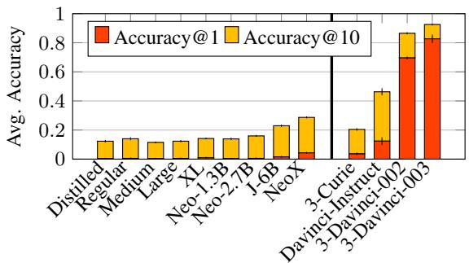

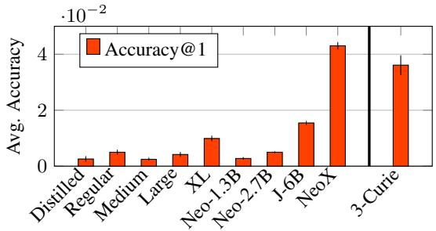  
Figure 8: Average accuracy of the models on the generated instances of MWPs. Results are averaged over two sets consisting of 500 problem instances generated for each template. The lower figure shows a zoomed-in visualization of the accuracy at 1.

Moreover, we conduct an additional sanity check as in Patel et al. (2021): removing the question from the MWP templates, we observe a sensitivityrobustness degradation to random guessing (i.e., $\mathrm { T C E } \simeq \mathrm { D C E } )$ ). This indicates that the measurement of the causal effects within our framework is not affected by patterns in the templates that might have been picked up or memorized by large models.

## C Computation of Causal Effects for GPT-3

We access GPT-3 through the OpenAI APIs, which allow a user to prompt the model and obtain the probabilities assigned by the model to the k-th most likely vocabulary entries, for each token generated. To overcome this limitation, we approximate the relative probability change $\delta _ { \mathrm { r c c } }$ as follows, depending on the kind of effect measured.

The limit for k is set by OpenAI to 5. However, for our main set of experiments (i.e., computing the causal effects of N, S, and $\mathbf { \delta } _ { \mathbf { \mathcal { T } } ) }$ we were granted an increased limit of k to 100. This allowed us to obtain reasonable estimates for the causal effects, as the number of cases in which $P ( g )$ is not defined is less than 10% of the number of examples that we consider.

```latex
Algorithm 1 Computation of $\delta _ { \mathrm { r c c } }$ for GPT-3
$Q = ( t , n , g )$
$Q ^ { \prime } = ( t ^ { \prime } , n ^ { \prime } , g ^ { \prime } )$
if $P ( g )$ is defined then
if $P ^ { \prime } ( g )$ is defined then
$\begin{array} { r } { \Delta = \frac { P ( g ) - P ^ { \prime } ( g ) } { P ^ { \prime } ( g ) } } \end{array}$
else
$\hat { P } ^ { \prime } \gets P ^ { \prime } ( k$ -th most likely token)
$\begin{array} { r } { \Delta = \frac { P ( g ) - \hat { P } ^ { \prime } } { \hat { P } ^ { \prime } } } \end{array}$
end
else
$| \quad \Delta = 0$
end
if $P ^ { \prime } ( g ^ { \prime } )$ is defined then
if $P ( g ^ { \prime } )$ is defined then
$\begin{array} { r } { \Delta ^ { \prime } = \frac { P ^ { \prime } ( \dot { g } ^ { \prime } ) - P ( g ^ { \prime } ) } { \mathbf { r } ^ { \prime } } } \end{array}$
$\overline { { { \cal P } ( g ^ { \prime } ) } }$
else
P<sup>ˆ</sup>  P(k-th most likely token)
$\begin{array} { r } { \Delta ^ { \prime } = \frac { P ^ { \prime } ( g ^ { \prime } ) - \hat { P } } { \hat { P } } } \end{array}$
end
else
$\Delta ^ { \prime } = 0$
end
$\begin{array} { r } { \delta _ { \mathrm { r c c } } = \frac { 1 } { 2 } ( \Delta + \Delta ^ { \prime } ) } \end{array}$
```

## C.1 TCE(N on R) and TCE(T on R)

In cases when $P ( g )$ is defined (i.e. when g appears in the top k token predictions) and $P ^ { \prime } ( g )$ is not defined, we compute a lower bound on the relative change using the upper bound on $P ^ { \prime } ( g )$ given by the probability of the k-th most likely token. This gives us a conservative estimate of $\Delta$ . For cases in which $P ( g )$ is not defined, we cannot say anything about the relative change, and we set $\Delta = 0$ The same applies when swapping $P$ and $P ^ { \prime }$ . This procedure is illustrated by Algorithm 1.

## C.2 DCE(N R) and DCE(S R)

In this case, we simply discard the examples for which $P ( g )$ is not defined or $P ^ { \prime } ( g )$ are not defined. In that is not the case, then we compute $\delta _ { \mathrm { r c c } }$ as in Section 3.4.

## C.3 Heatmap Illustration

The heatmap for GPT-3 displayed in Figure 4 was computed by taking the raw probability score produced by the model over the whole vocabulary, as the limit on the available top predicted tokens makes it impossible to normalize it over the set $\{ 0 , \ldots , 3 0 0 \}$ , as done for the other models. The probability was set to 0 when $g$ did not appear in the model’s top 5 predictions for the next token after the prompt.

## D Computing Infrastructure & Inference Details

To run our experiments, we used a single NVIDIA TITANRTX with 24GB of memory for all the versions of GPT-2 and GPT-Neo. We used a single NVIDIA A100 with 40GB of memory for GPT-J-6B and a single NVIDIA A100 with 80GB of memory for GPT-NeoX and the LLaMA models (two for the 30B version). We accessed GPT-3 using the OpenAI APIs. The longest run (GPT-J) on the four kinds of experiments corresponding to the four kinds of effects measured took 12 hours, using 500 MWP instances for each of the 437 templates. Due to budget and resource constraints, the experiments on GPT-3, GPT-NeoX, and LLaMA were carried out using 20 examples generated for each template and took ${ \sim } 7$ hours. Experiment tracking was carried out using Weights & Biases<sup>8</sup>.

## ACL 2023 Responsible NLP Checklist

## A For every submission:

<sup>✓</sup> A1. Did you describe the limitations of your work? Section "Limitations".

<sup>✓</sup> A2. Did you discuss any potential risks of your work? Section "Ethical Considerations".

<sup>✓</sup> A3. Do the abstract and introduction summarize the paper’s main claims? Section 1: Introduction.

✗ A4. Have you used AI writing assistants when working on this paper? Left blank.

## B <sup>✓</sup> Did you use or create scientific artifacts?

Section 4

<sup>✓</sup> B1. Did you cite the creators of artifacts you used? Section 4.1

<sup>✓</sup> B2. Did you discuss the license or terms for use and / or distribution of any artifacts? Section "Limitations"

<sup>✓</sup> B3. Did you discuss if your use of existing artifact(s) was consistent with their intended use, provided that it was specified? For the artifacts you create, do you specify intended use and whether that is compatible with the original access conditions (in particular, derivatives of data accessed for research purposes should not be used outside of research contexts)? Section "Limitations"

<sup>✓</sup> B4. Did you discuss the steps taken to check whether the data that was collected / used contains any information that names or uniquely identifies individual people or offensive content, and the steps taken to protect / anonymize it? Section "Limitations"

<sup>✓</sup> B5. Did you provide documentation of the artifacts, e.g., coverage of domains, languages, and linguistic phenomena, demographic groups represented, etc.? Section "Limitations"

<sup>✓</sup> B6. Did you report relevant statistics like the number of examples, details of train / test / dev splits, etc. for the data that you used / created? Even for commonly-used benchmark datasets, include the number of examples in train / validation / test splits, as these provide necessary context for a reader to understand experimental results. For example, small differences in accuracy on large test sets may be significant, while on small test sets they may not be. Section 4.1 and Appendix A

## C <sup>✓</sup> Did you run computational experiments?

Sections 4 and 5

<sup>✓</sup> C1. Did you report the number of parameters in the models used, the total computational budget (e.g., GPU hours), and computing infrastructure used? Sections 4.3 and Appendix D

<sup>✓</sup> C2. Did you discuss the experimental setup, including hyperparameter search and best-found hyperparameter values? Sections 4.3

<sup>✓</sup> C3. Did you report descriptive statistics about your results (e.g., error bars around results, summary statistics from sets of experiments), and is it transparent whether you are reporting the max, mean, etc. or just a single run? Sections 4.1, 4.2, and 5

<sup>✓</sup> C4. If you used existing packages (e.g., for preprocessing, for normalization, or for evaluation), did you report the implementation, model, and parameter settings used (e.g., NLTK, Spacy, ROUGE, etc.)? Section 4.3 and Appendix A

D ✗ Did you use human annotators (e.g., crowdworkers) or research with human participants? Left blank.

 D1. Did you report the full text of instructions given to participants, including e.g., screenshots, disclaimers of any risks to participants or annotators, etc.? No response.

 D2. Did you report information about how you recruited (e.g., crowdsourcing platform, students) and paid participants, and discuss if such payment is adequate given the participants’ demographic (e.g., country of residence)? No response.

 D3. Did you discuss whether and how consent was obtained from people whose data you’re using/curating? For example, if you collected data via crowdsourcing, did your instructions to crowdworkers explain how the data would be used? No response.

 D4. Was the data collection protocol approved (or determined exempt) by an ethics review board? No response.

 D5. Did you report the basic demographic and geographic characteristics of the annotator population that is the source of the data? No response.