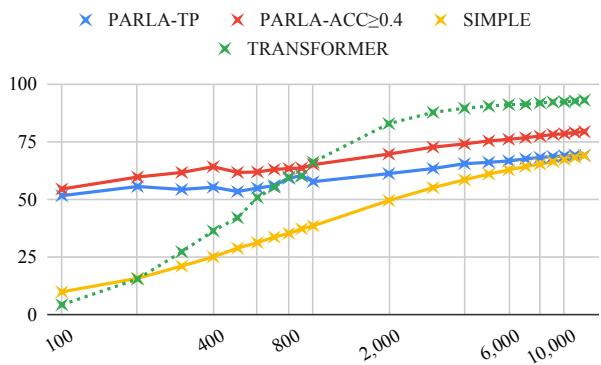
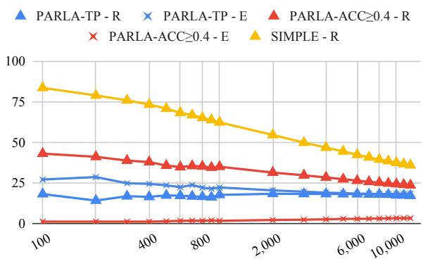

# A Cautious Generalization Goes a Long Way: Learning Morphophonological Rules

Salam Khalifa†‡, Sarah Payne†‡, Jordan Kodner†‡, Ellen Broselow†, and Owen Rambow†‡ †Department of Linguistics, and ‡Institute for Advanced Computational Science (IACS) Stony Brook University {first.last}@stonybrook.edu

## Abstract

Explicit linguistic knowledge, encoded by resources such as rule-based morphological analyzers, continues to prove useful in downstream NLP tasks, especially for low-resource languages and dialects. Rules are an important asset in descriptive linguistic grammars. However, creating such resources is usually expensive and non-trivial, especially for spoken varieties with no written standard. In this work, we present a novel approach for automatically learning morphophonological rules of Arabic from a corpus. Motivated by classic cognitive models for rule learning, rules are generalized cautiously. Rules that are memorized for individual items are only allowed to generalize to unseen forms if they are sufficiently reliable in the training data. The learned rules are fur ther examined to ensure that they capture true linguistic phenomena described by domain experts. We also investigate the learnability of rules in low-resource settings across different experimental setups and dialects

## 1 Introduction

Discovering patterns and generalizing them is the core concept behind learning in the vast majority of NLP models throughout time regardless of how they are learned or represented. Tasks such as morphological (re)inflection and grapheme-tophoneme conversion have direct parallels with language learning in humans, and there is often a desire to compare the performance of modern systems (especially deep neural networks) to that in humans due to the relatively salient patterns in the transformations that the learners (machine or human) learn. Representing such transformations with explicit rules would further enhance the efforts on language acquisition modeling and reduce the gap between NLP and domain experts such as linguists and cognitive scientists. Additionally, in low-resource settings in NLP, rule-based resources continue to withstand the test of time when it comes to downstream tasks; however, creating such resources is a tedious task and often labor-intensive. Moreover, neural networks are opaque and require additional efforts to extract human-interpretable patterns from them. Therefore, there is a crucial need for rule-learning systems that produce well-generalizable rules and are able to learn rules from a small amount of data.

<table><tr><td rowspan=1 colspan=1></td><td rowspan=1 colspan=1>kitaab+ha</td><td rowspan=1 colspan=1>kaatib+ha</td><td rowspan=1 colspan=1>kaatib+iin+ha</td></tr><tr><td rowspan=1 colspan=1>Egyptian</td><td rowspan=1 colspan=1>kitabha</td><td rowspan=1 colspan=1>katibha</td><td rowspan=1 colspan=1>katbinha</td></tr><tr><td rowspan=1 colspan=1>Sudanese</td><td rowspan=1 colspan=1>kitaaba</td><td rowspan=1 colspan=1>kaatiba</td><td rowspan=1 colspan=1>kaatbinna</td></tr><tr><td rowspan=1 colspan=1>Hijazi</td><td rowspan=1 colspan=1>kitaabaha</td><td rowspan=1 colspan=1>kaatibha</td><td rowspan=1 colspan=1>kaatbiinaha</td></tr><tr><td rowspan=1 colspan=1>Emirati</td><td rowspan=1 colspan=1>kitaabha</td><td rowspan=1 colspan=1>kaatbinha</td><td rowspan=1 colspan=1>kaatbiinha</td></tr><tr><td rowspan=1 colspan=4>her book    he is/I&#x27;m writing it  they/we are writing it4:15         4.6            4itk</td></tr></table>

Table 1: Different realizations of three words across four dialects. The dialects share the same underlying representation of the words. Changes in the realized forms are highlighted as follows: shortened vowels are bolded, epenthetic phones are underlined, deleted phones are not shown, and finally, realizations faithful to the underlying representations (i.e., no change) are italicized.

In this paper, we present a theory-backed rulelearning approach that produces a set of generalizable rules given a dataset. We use Arabic morphophonology as our case study for rule learning because it is a morphologically rich language. Additionally, Arabic is a continuum of related but clearly morphologically distinct dialects, most of which are very low-resourced. Our primary goal of this study is not to achieve the best results on a specific NLP task per se, but rather to derive an optimal set of rules from data automatically.

Since we are studying morphophonology, we explicitly concentrate on transcribed speech, using the Egyptian dialect of Arabic as our prime example. Transcribed speech itself is data that is costly to obtain so the low-resource setting is extreme: we are not in a situation where we have lots of unannotated data but little annotated data; instead we have little data altogether. Therefore this is an ideal setup for this study.

In a previous publication (Khalifa et al., 2022), we introduced the problem, the dataset, and an initial system which in this paper we call SIMPLE. This paper’s main contributions are as follows:

• We propose a new algorithm for generalized rule learning, PARLA.

• We perform experiments to compare different metrics for use in PARLA. We show that PARLA far outperforms the simple system we proposed in our previous publication.

• We perform learning curve experiments to simulate mid- and low-resource settings, comparing to a neural baseline (which does not generate rules). We show that at low settings, our rule-learning approach outperforms a standard state-of-the-art neural approach.

• We show that the knowledge acquired from one dialect is transferable to another even in a low-resource setup.

• We compare learned rules against rules written by an experienced linguist.

The paper is structured as follows: Section 2 provides background and discusses related work. In Section 3 we describe the conceptual design of PARLA and a detailed description of our use case in Section 4. Section 5 describes our experimental setup and evaluation methods used, we discuss the results and findings in Section 6, and finally conclude in Section 7.

## 2 Background and Related Work

## 2.1 Linguistics and Cognitive Science

One challenge posed by rule-based models is their generalizability. Even in a hand-built setting, rules with too narrow a scope will under-apply to new data, and rules with too broad a scope will overapply. Thus, correctly selecting the scope in rule-based models is similar to optimizing for the bias/variance trade-off in statistical models.

Correctly identifying rule scope is of particular importance to morphology (and its interactions with phonology), where irregular forms and exceptions are expected. This question of balancing productive morphological rules with exceptions has been a focus in the cognitive science of language for decades (e.g., Chomsky and Halle, 1968; Clahsen, 1999; Pinker and Ullman, 2002; Yang, 2002). One through line in much of this work observes that some morphological patterns should be extended to new items (i.e., they are productive), while others should not (i.e., they are unproductive). Approaches that rely on explicit rules implement them as rules vs. memorized input-output pairs (Clahsen, 1999; Pinker, 1999), as rules with broad scope vs. rules of very narrow, maybe unary, scope (Albright and Hayes, 2003; Yang, 2016).

While not the only view from cognitive science,<sup>1</sup> we believe that the cognitively-motivated rule-based approach has two practical benefits. First, it is designed to function well in low-resource settings. Child language acquisition is notoriously low-resource: most of the morphology acquisition is achieved in the first few years of life, regardless of a language’s morphological complexity (Aksu-Koç, 1985; Allen, 1996; Deen, 2005) on the basis of only hundreds of types (Marcus, 1992; Fenson et al., 1994; Bornstein et al., 2004; Szagun et al., 2006). Second, rule sets are interpretable by linguists who draw on their expert knowledge of many languages and dialects. A rule-based approach can be directly compared against and supplemented or be supplemented with hand-built expert rules.

## 2.2 Arabic MorphoPhonology

Morphophonology refers to the bidirectional interaction between phonology and morphology and is crucial for understanding how morphologically related words may nevertheless surface with different forms. Arabic exhibits pervasive morphophonological processes governed by phonological constraints on syllable structure which interact both with concatenative and templatic morphology.<sup>2</sup> To make matters more complex, Arabic varieties exhibit distinct morphophonological processes, so words with identical morphological analyses may have different forms. Table 1 demonstrates dialectal variation in surface realizations for the same morphological analysis.

In Arabic NLP, pre-compiled tabular morphological analyzers (Buckwalter, 2002, 2004; Graff et al., 2009; Habash et al., 2012; Khalifa et al., 2017; Taji et al., 2018) are common. However, they do not explicitly model morphophonological interactions using rules. Habash and Rambow (2006) propose an FST-based morphological analyzer and generator with hand-written morphophonological rules. Similarly, (Habash et al., 2022) models allomorphy; its rules are also manually created. Our work could replace the hand-written rules in such approaches. To our knowledge, there has been no work on modeling spoken Arabic, and no work on automatically learning morph-phonological rules for Arabic.

## 2.3 Rule Learning in Computational Linguistics and NLP

Johnson (1984) is an early example of a computational study of rule learning for morphophonology. He formulates a task of learning a set of ordered phonological rules. Given a minimal pair set with contexts, he proposed an algorithm that determines a set of features that characterize the contexts which trigger the alternation. He gives no experimental results.

The Minimal Generalization Learner (MGL; Albright and Hayes, 2003) is widely used in computational phonology. It favors rules which have high reliability, or rules with a high number of correct hits proportionally to their scope or number of rules they should apply to.

A more recent paper, Ellis et al. (2022), solves (morpho)phonology problem sets with Bayesian program induction. It achieves good performance but learns from informative problem-set-like training data rather than naturalistic data. Much of its performance comes from a meta-model learned across 70 languages, which may be useful if used for transfer to low-resource languages.

Rule learning has also been applied to morphological analyzers, for example, (Yarowsky and Wicentowski, 2000), which extracts a series of rewrite rules and applies them probabilistically.

## 3 Pruned Abundance Rule Learning Algorithm (PARLA)

In this section, we introduce PARLA, an algorithm that produces generalizable rules from a dataset of input and output pairs. We show how we use it for Egyptian Arabic morphophonology in Section 4.

PARLA approaches rule learning as a spacepruning problem. We assume the starting point to be an abundant number of rules that are generated from every data point found in the data with the goal being to select the most productive rule with respect to the data. The core mechanism in determining the productivity of a rule is an evaluation metric that examines the scope of the rule. The result will be a set of rules and exceptions that represent the linguistic phenomena found in the data. PARLA has two independent components; the first generates all possible hypothesized rules according to certain configurations, and the second evaluates those rule hypotheses to determine their generalizability. This section provides an abstract view of PARLA.

## 3.1 Rule Generation

An independent rule-generating component is responsible for creating a set of rule hypotheses $R _ { h }$ from a single data point in the training set. All the rule hypotheses in $R _ { h }$ must produce the expected output given the input that it was generated from. In other words, the rules are not expected to be generated arbitrarily. A rule hypothesis set is generated if and only if the input is different from the output. A rule has a general format of a left-hand side (LHS) representing the input and a right-hand side (RHS) representing the output.

## 3.2 Abundance Pruning

The core component of PARLA is the evaluation of the generalizability or productivity of a given set of rule hypotheses over the data. For a set of abundant rule hypotheses $R _ { h }$ from §3.1, the best generalizable rule is chosen according to a pruning criterion.

The rule hypotheses in $R _ { h }$ are sorted by decreasing generalizability, where the generalizability of a rule hypothesis $r _ { h }$ is defined by the length of the LHS string, with a shorter LHS string being more generalizable. Ties are broken randomly. Each rule hypothesis $r _ { h }$ is then evaluated against all the entries it is applicable to in the dataset. The evaluation is based on a metric (henceforth, eval\_metric) that needs to be defined when we use PARLA. eval\_metric is a boolean function which returns whether $r _ { h }$ is productive, measured by a function of its performance against the entries it applies to. If no rule hypothesis from $R _ { h }$ is deemed fit, then the data point from which $r _ { h }$ was generated is memorized as an exception. However, once a productive rule is found, it is evaluated against the set of exceptions E; if a rule applies correctly to an exception, the exception is removed from E.

Once the entire dataset is scanned, PARLA has produced a set of productive rules R and a set of exceptions E.

This algorithm implements the productive rulesand-exceptions approach discussed in the cognitive literature. Rules that apply sufficiently well (according to eval\_metric) to the rest of the training data are learned. If no rule generated from a training item applies reliably to the rest of the data, it is learned as an exception. Exceptions are implemented as rules of maximum specificity: their LHS only matches their exact word form.

```julia
Algorithm 1: Abundance Pruning
Data: TRAIN, eval_metric
Result: R, E
R ;
E ;
for item<sub>i</sub> TRAIN do
R<sub>h</sub> gen_rules(item<sub>i</sub>);
sort(R<sub>h</sub>);
for $r _ { h } \in R _ { h }$ do
if productive(eval_metric, TRAIN, r ) then
add r<sub>h</sub> to R;
for e in E do
if applicable(e, r ) then
remove e from E
end
end
break;
else
add item to E
end
end
end
```

Our approach is also amenable to online learning, as decisions about productivity are revised as more training data is evaluated. Replacing existing exceptions with more general rules when possible is concordant with Yang’s (2016) Maximize Productivity learning strategy, where the most general valid rule is adopted over narrower competitors.

## 4 PARLA for Egyptian Arabic MorphoPhonology

In this section, we describe PARLA configuration details for the task of deriving the surface form, i.e., transcribed utterance, from an underlying representation.

## 4.1 Data

In this work we use the same dataset and splits used in our previous work (Khalifa et al., 2022). The data set is based on two existing resources, (ECAL; Kilany et al., 2002) a pronunciation dictionary primarily based on CALLHOME Egypt (Gadalla et al., 1997), and $\mathbf { C A L I M A } _ { E G Y }$ (Habash et al., 2012) an analyzer that generates a set of possible morphological analyses for a given input token. Surface forms were extracted from ECAL, but the orthography is undiacritized and it does not provide full morphological segmentations that help in generating underlying representations. CALIMA<sub>EGY</sub> was used to generate potential underlying representations which are morphologically segmented, and the best option given POS tagging and morphological features from both resources was automatically chosen. We used the splits originally defined by ECAL, namely, TRAIN, DEV, and EVAL.

Each entry in the dataset is a pair of a surface form (SF) and an underlying representation (UR) along with the frequency of SF in the original CALLHOME Egypt corpus. SF is represented using a broad phonetic representation, while UR was mapped from an orthographic form into the same representation as SF. An example entry for the word /mafatiièu/ ‘his keys’ éjJ<sup></sup>KA <sup>	</sup>®Ó below, where ‘#’ represents word boundaries and ‘=’ is the stemsuffix boundary:

$$
\begin{array} { c c c } { { ( 1 ) } } & { { \mathsf { U R } } } & { { \mathsf { S F } } } \\ { { } } & { { \# \mathsf { m a f A t I H } = \mathsf { u h } \# } } & { { \# \mathsf { m a f a t I H } \mathsf { u } \# } } \end{array}
$$

We minimally refined the dataset by removing some entries from TRAIN which were added subsequently by hand and which do not have frequency counts (since frequency counts are used later for sampling different training portions for the learning curve experiments), and erroneous entries that we discovered using an automated well-formedness check.

We employ PARLA with various configurations to evaluate different aspects of our approach to selecting productive rules.

## 4.2 Rule Generation

A rule r is defined by a left-hand side (LHS) abstracting from part of an underlying representation (UR) and the context of alternations, and the righthand side (RHS) corresponding to the surface form (SF). These rules are conceptually similar to those of two-level phonology (Antworth, 1991) in that they capture all relevant phonological changes simultaneously and are not meant to apply in serial like classic rules of Sound Pattern ofEnglish (SPE; Chomsky and Halle, 1968). We introduce two parameters that allow us to generate a set of rule hypotheses $R _ { h }$ from a single data point. The first parameter is the context size, which is the number of characters (including boundary characters at this step) to be included in the rule around an alternation. We first generate the full combinatorial space of preliminary rules according to a varying window ranging from 0 up to 1 character on each side of an alternation for a total of four rule hypotheses as shown below:

$$
\begin{array} { r l r l } { ( 2 ) } & { } & { \mathsf { A t I H = u h } } & { \xrightarrow { \hdots > } } & { \mathsf { a t I H } } \\ & { } & { \mathsf { f A t I H = u h } } & { \xrightarrow { \hdots > } } & { \mathsf { f a t I H } } \\ & { } & { \mathsf { A t I H = u h } } & { \xrightarrow { \hdots > } } & { \mathsf { a t I H } } \\ & { } & { \mathsf { f A t I H = u h } } & { \xrightarrow { \hdots > } } & { \mathsf { f a t I H } } \end{array}
$$

The second parameter is the consonant abstraction level which is the specificity of the consonant specification in the stem part of the LHS. Each preliminary rule undergoes a consonant abstraction process where at most one consonant is specified at a time. This process only applies to stem consonants, because affixes come from a closed class lexicon. For example, if the stem part of a rule has 3 consonants in it, then the preliminary rule is extended to a total of 4 rule hypotheses, where the LHS of each rule will have a single specified consonant resulting in 3 rule hypotheses, and the 4th rule hypothesis is one with all consonants remaining unspecified. In our notation, a C in the LHS of a rule means that it can match any consonant (including glides). In the RHS of a rule, the C indicates that it copies whatever consonant was matched to the corresponding C on the LHS (or the corresponding actual consonant in the LHS if it is not generalized); in our notation, the consonants in the RHS are always written as C unless a consonant in UR is changed to another in SF. Recall that consonants in affixes are always specified in both LHS and RHS, as are vowels. See below an example of consonant abstraction for the second preliminary rule in Example 2, which results in four rule hypotheses:

$$
\begin{array} { r l r } { ( 3 ) } & { \mathsf { \Gamma ~ \mathsf { f A C I C = u h } } } & { \mathrm { . . . } \mathsf { \Gamma \to \Gamma ~ \mathsf { C a C I C u } } } \\ & { \mathsf { \Gamma ~ \mathsf { C A t I C = u h } } } & { \mathrm { . . . } \mathsf { \Gamma \to \Gamma ~ \mathsf { C a C I C u } } } \\ & { \mathsf { \Gamma ~ \mathsf { C A C I H = u h } } } & { \mathrm { . . . } \mathsf { \Gamma \to \Gamma ~ \mathsf { C a C I C u } } } \\ & { \mathsf { \Gamma ~ \mathsf { C A C I C = u h } } } & { \mathrm { . . . } \mathsf { \Gamma \to \Gamma ~ \mathsf { C a C I C u } } } \end{array}
$$

This rule generation procedure will result in a large number of rule hypotheses $R _ { h }$ that, if applied to the current UR, will all produce the correct corresponding SF.

## 4.3 Abundance Pruning

During abundance pruning, we choose an actual rule from the set of rule hypotheses generated for a data point in training. We experiment with two different evaluation metrics, the Tolerance Principle (TP; Yang, 2005, 2016), and accuracy at a fixed threshold t. Both metrics evaluate a rule r within the scope of its application. As such we have two systems:

PARLA-TP The TP is a model designed to model the behavior of learner productions and errors during language acquisition by only adopting a rule if it would be more efficient than scanning through a list of exceptions in a serial search model of inflection.<sup>3</sup> The threshold for rule reliability is a function of the size of the set of attested items it is expected to apply to, N. We use the formula below, where e is the number of attested exceptions to the rule, in our case, incorrectly generated SF. A rule is accepted if the number of exceptions to it in the training data under consideration falls below the threshold $\theta _ { N }$

$$
e \le \theta _ { N } = \frac { N } { \ln { N } }\tag{1}
$$

PARLA-ACC t is a family of metrics, which check the accuracy of the generated SF within the scope of the rule against the parametrized accuracy threshold. Below, $v = N - e$ is the number of correctly generated SF. Unlike TP, the relative error threshold 1  t is constant irrespective of scope size, while in the TP it is 1/ ln N.

$$
\frac { v } { N } \geq t \Longleftrightarrow e \leq N \times ( 1 - t )\tag{2}
$$

## 4.4 Rule Selection

Rule selection at inference time is independent of PARLA. For each incoming UR, if it is not found in the list of exceptions, the rules with the longest and the most specific LHS are determined. Specificity is determined by the least amount of unspecified consonants in the stem. If there is more than one such rule, the tie is broken by selecting the rule that has the highest success rate during training. If no LHS matches the incoming UR, then the generated SF will be a copy of UR.

## 5 Experimental Setup

## 5.1 Baselines

SIMPLE This baseline (Khalifa et al., 2022) has two simplifications. First, it generates exactly one rule per data point, because the context window is fixed at (2,2) and all consonants are abstracted. Therefore SIMPLE generates only one rule from the data point in Example 1: aCACIC=uh# --> aCaCICu#. Second, SIMPLE does not take into account the productivity or generalizability of a rule, therefore, all generated rules are considered, and hence, there are no exceptions.

TRANSFORMER We used the model described in Wu et al. (2020) which is a character-level neural transformer that was used as a baseline for the 2020 SIGMORPHON shared task on multilingual grapheme-to-phoneme conversion (Gorman et al., 2020). We use this system for its ability to learn string-to-string mappings. It produces surface forms from underlying forms, but it does not produce rules, so it can only be compared in terms of overall DEV and EVAL accuracy. We instantiate TRANSFORMER using five different seeds and report the average across the seeds. We used the hyper-parameters suggested by the original authors for small training conditions.

## 5.2 Evaluation

Following (Khalifa et al., 2022), we adopt the TRAIN-DEV-EVAL partitions of ECAL. However, ECAL partitions were drawn from running text and therefore allows lexical items to repeat in each partition. While a useful test for replicating likely real-world conditions, this kind of partitioning is not as useful for evaluating morphological generalization in particular. Thus, we also follow (Khalifa et al., 2022) in evaluating on the out-of-vocabulary (w.r.t. TRAIN) subsets of DEV and EVAL, which we call OOV-DEV and OOV-EVAL. DEV and OOV-DEV were used during the development of PARLA while EVAL and OOV-EVAL are only used to report the final result. Additionally, we report the number of rules and exceptions generated by PARLA.

Learning Curve To simulate a low-resource scenario, we performed a learning curve experiment with training sizes extending from 100 to 1,000 types at increments of 100 and then increments of 1,000 up to the full TRAIN set. To create the training portions for the learning curve, we sample TRAIN in two different modes, uniform random sampling, and weighted frequency-based random sampling. The weighted sampling is intended to simulate a more realistic distribution of lowfrequency forms and thus a more realistic lowresource setup. For both sampling modes, training sets are nested, so that all items in a small training set are included in the next larger size. Nested training sets were generated five times with different random seeds. Averages across seeds are reported.

## 6 Results and Discussion

## 6.1 Overall Performance

The performance of our system and the baselines is reported in Table 2. Even though TRANSFORMER outperforms all other systems at large training sizes, it does not– by design– provide explicit rules, which is the goal of our research. While SIMPLE and PARLA-TP perform very similarly on unseen forms, PARLA-TP achieves this with far fewer rules, since exceptions never apply to unseen forms. Furthermore, PARLA-TP outperforms SIMPLE in both DEV and EVAL where PARLA-TP’s exceptions may apply to previously seen forms. The number of rules + exceptions learned by PARLA-TP is very similar to the total number of rules learned by SIMPLE. Lastly, PARLA-ACC 0.4 is the best performing amongst the three rule-producing systems. When compared to PARLA-TP, PARLA-ACC 0.4 acquires around 37% more rules and 83% fewer exceptions. Presumably, because it learns more rules with fewer exceptions, PARLA-ACC 0.4 achieves an error reduction of about 33% on the two OOV sets compared to SIMPLE and PARLA-TP.

## 6.2 Generalization Quality

The accuracy threshold for PARLA-ACC was chosen based on the performance on both DEV and OOV-DEV. The performance for different thresholds t is reported in Table 3. At ACC 0.0 the system retains no exceptions because every rule passes the evaluation metric. Interestingly, the number of rules that it learns is similar to that of the best performing setup but it has a much poorer overall performance. This is because it always retains the most general rule as discussed in § 3.2. On the other hand, ACC 1.0 retains more rules and far more exceptions because of its stringent threshold. It overfits TRAIN as expected and performs poorly on OOV-DEV because the rules the system acquires are necessarily more specific given the very conservative evaluation metric. These insights are a strong indicator of the quality of the generalization obtained through the PARLA-ACC evaluation metric.

## 6.3 Learning Curve

In addition to overall performance, we also report on simulated low- and mid-resource settings through a learning curve experiment. The following results are reported on the frequency-weighted sampling mode only since both modes yielded similar results.<sup>4</sup> In the extremely low-resource setup (100 to 1,000), shown in Figure 1, both configurations of PARLA outperform the baselines. In the lowest setting, TRANSFORMER has the poorest performance and only catches up at the 800 training size mark. This further highlights the limitations of such systems in extremely low-resource settings which are often realistic when working with transcribed speech (recall these are types, not tokens). In the mid- to high-resource setup (1,000 to TRAIN) the performance for all systems catch up and plateau midway.

<table><tr><td rowspan=2 colspan=10>System               R      E     R%     E%    TRAIN   DEV   OOV-DEV   EVAL   OOV-EVAL</td></tr><tr><td rowspan=1 colspan=1>R</td><td rowspan=1 colspan=1></td><td rowspan=1 colspan=1>R%</td><td rowspan=1 colspan=1>E%</td><td rowspan=1 colspan=1>TRAIN</td><td rowspan=1 colspan=1>DEV</td><td rowspan=1 colspan=1>OOV-DEV</td><td rowspan=1 colspan=1>EVAL</td><td rowspan=1 colspan=1>OOV-EVAL</td></tr><tr><td rowspan=1 colspan=1>SIMPLE</td><td rowspan=1 colspan=1>4,481</td><td rowspan=1 colspan=1></td><td rowspan=1 colspan=1>35.4%</td><td rowspan=1 colspan=1></td><td rowspan=1 colspan=1>90.6%</td><td rowspan=1 colspan=1>80.4%</td><td rowspan=1 colspan=1>69.3%</td><td rowspan=1 colspan=1>82.1%</td><td rowspan=1 colspan=1>68.6%</td></tr><tr><td rowspan=1 colspan=1>TRANSFORMER</td><td rowspan=1 colspan=1></td><td rowspan=1 colspan=1></td><td rowspan=1 colspan=1></td><td rowspan=1 colspan=1></td><td rowspan=1 colspan=1>97.8%</td><td rowspan=1 colspan=1>95.2%</td><td rowspan=1 colspan=1>92.9%</td><td rowspan=1 colspan=1>95.2%</td><td rowspan=1 colspan=1>91.4%</td></tr><tr><td rowspan=1 colspan=1>PARLA-TP</td><td rowspan=1 colspan=1>2,153</td><td rowspan=1 colspan=1>2,305</td><td rowspan=1 colspan=1>17.0%</td><td rowspan=1 colspan=1>18.2%</td><td rowspan=1 colspan=1>96.5%</td><td rowspan=1 colspan=1>84.1%</td><td rowspan=1 colspan=1>69.2%</td><td rowspan=1 colspan=1>86.1%</td><td rowspan=1 colspan=1>68.3%</td></tr><tr><td rowspan=1 colspan=1>PARLA-ACC&gt;0.4</td><td rowspan=1 colspan=1>2,950</td><td rowspan=1 colspan=1>402</td><td rowspan=1 colspan=1>23.3%</td><td rowspan=1 colspan=1>3.2%</td><td rowspan=1 colspan=1>96.8%</td><td rowspan=1 colspan=1>88.8%</td><td rowspan=1 colspan=1>79.4%</td><td rowspan=1 colspan=1>90.0%</td><td rowspan=1 colspan=1>78.4%</td></tr></table>

Table 2: Results of the baselines and our systems in terms of the number of rules and exceptions (when available) and their ratio with respect to the size of the TRAIN, and accuracy on each split of the data.
<table><tr><td rowspan=1 colspan=1>t</td><td rowspan=1 colspan=1>R</td><td rowspan=1 colspan=1>E</td><td rowspan=1 colspan=1>R%</td><td rowspan=1 colspan=1>E%</td><td rowspan=1 colspan=1>TRAIN</td><td rowspan=1 colspan=1>DEV</td><td rowspan=1 colspan=1>OOV-DEV</td></tr><tr><td rowspan=1 colspan=1>0.0</td><td rowspan=1 colspan=1>2,889</td><td rowspan=1 colspan=1>0</td><td rowspan=1 colspan=1>22.8%</td><td rowspan=1 colspan=1>0.0%</td><td rowspan=1 colspan=1>45.3%</td><td rowspan=1 colspan=1>38.3%</td><td rowspan=1 colspan=1>37.2%</td></tr><tr><td rowspan=1 colspan=1>0.1</td><td rowspan=1 colspan=1>2,852</td><td rowspan=1 colspan=1>146</td><td rowspan=1 colspan=1>22.6%</td><td rowspan=1 colspan=1>1.2%</td><td rowspan=1 colspan=1>74.3%</td><td rowspan=1 colspan=1>67.6%</td><td rowspan=1 colspan=1>63.5%</td></tr><tr><td rowspan=1 colspan=1>0.2</td><td rowspan=1 colspan=1>2,897</td><td rowspan=1 colspan=1>194</td><td rowspan=1 colspan=1>22.9%</td><td rowspan=1 colspan=1>1.5%</td><td rowspan=1 colspan=1>79.4%</td><td rowspan=1 colspan=1>72.4%</td><td rowspan=1 colspan=1>67.5%</td></tr><tr><td rowspan=1 colspan=1>0.3</td><td rowspan=1 colspan=1>2,918</td><td rowspan=1 colspan=1>315</td><td rowspan=1 colspan=1>23.1%</td><td rowspan=1 colspan=1>2.5%</td><td rowspan=1 colspan=1>95.2%</td><td rowspan=1 colspan=1>87.8%</td><td rowspan=1 colspan=1>79.2%</td></tr><tr><td rowspan=1 colspan=1>0.4</td><td rowspan=1 colspan=1>2,950</td><td rowspan=1 colspan=1>402</td><td rowspan=1 colspan=1>23.3%</td><td rowspan=1 colspan=1>3.2%</td><td rowspan=1 colspan=1>96.8%</td><td rowspan=1 colspan=1>88.8%</td><td rowspan=1 colspan=1>79.4%</td></tr><tr><td rowspan=1 colspan=1>0.5</td><td rowspan=1 colspan=1>3,015</td><td rowspan=1 colspan=1>503</td><td rowspan=1 colspan=1>23.8%</td><td rowspan=1 colspan=1>4.0%</td><td rowspan=1 colspan=1>97.5%</td><td rowspan=1 colspan=1>88.7%</td><td rowspan=1 colspan=1>78.6%</td></tr><tr><td rowspan=1 colspan=1>0.6</td><td rowspan=1 colspan=1>2,905</td><td rowspan=1 colspan=1>913</td><td rowspan=1 colspan=1>23.0%</td><td rowspan=1 colspan=1>7.2%</td><td rowspan=1 colspan=1>98.7%</td><td rowspan=1 colspan=1>88.3%</td><td rowspan=1 colspan=1>76.2%</td></tr><tr><td rowspan=1 colspan=1>0.7</td><td rowspan=1 colspan=1>3,069</td><td rowspan=1 colspan=1>1,414</td><td rowspan=1 colspan=1>24.3%</td><td rowspan=1 colspan=1>11.2%</td><td rowspan=1 colspan=1>99.0%</td><td rowspan=1 colspan=1>86.3%</td><td rowspan=1 colspan=1>71.0%</td></tr><tr><td rowspan=1 colspan=1>0.8</td><td rowspan=1 colspan=1>3,183</td><td rowspan=1 colspan=1>1,968</td><td rowspan=1 colspan=1>25.2%</td><td rowspan=1 colspan=1>15.6%</td><td rowspan=1 colspan=1>99.1%</td><td rowspan=1 colspan=1>83.0%</td><td rowspan=1 colspan=1>63.6%</td></tr><tr><td rowspan=1 colspan=1>0.9</td><td rowspan=1 colspan=1>3,400</td><td rowspan=1 colspan=1>2,449</td><td rowspan=1 colspan=1>26.9%</td><td rowspan=1 colspan=1>19.4%</td><td rowspan=1 colspan=1>99.2%</td><td rowspan=1 colspan=1>80.7%</td><td rowspan=1 colspan=1>58.6%</td></tr><tr><td rowspan=1 colspan=1>1.0</td><td rowspan=1 colspan=1>3,578</td><td rowspan=1 colspan=1>2,575</td><td rowspan=1 colspan=1>28.3%</td><td rowspan=1 colspan=1>20.4%</td><td rowspan=1 colspan=1>99.2%</td><td rowspan=1 colspan=1>80.0%</td><td rowspan=1 colspan=1>57.1%</td></tr></table>

Table 3: Results of PARLA-ACC at different thresholds t. The results are in terms of the number of rules and exceptions and their ratio with respect to the size of the TRAIN, and accuracy on TRAIN, DEV, and OOV-DEV

  
Figure 1: Accuracy on OOV-DEV for all systems across different sets of training sizes.

Across both setups, PARLA-ACC 0.4 outperforms PARLA-TP, but both configurations follow a similar trajectory. This robustness at small training sizes is consistent with the cognitive inspiration for PARLA. Productive rules+exceptions models were designed for a language acquisition setting, where most of the morphology is acquired on the basis of only hundreds of types (§2).

  
Figure 2: Percentage of rules (R) and exceptions (E) as a function of TRAIN size.

Additionally, we report on the size of the sets of rules and exceptions acquired by both configurations of PARLA and SIMPLE (rules only). Figure 2 shows the counts of rules (R) and exceptions (E) as ratios with respect to the training size. In the low-resource setting, SIMPLE has a very high ratio of rules to training size, this is explained by the fact that rules acquired from such a small dataset will hardly generalize given the rigid rule extraction configuration (§5.1). On the other hand, PARLA-TP, acquires the least amount of rules, especially in the low-resource setting. The ratio of rules to the training set minimally decreases as more training data is added. It is worth noting that both rules and exceptions in PARLA-TP converge to similar ratios. PARLA-ACC, however, acquires very few exceptions and the ratio hardly increases as more training data is added.

## 6.4 Cross-Dialectal Transferability

We performed a small-scale experiment to examine the transferability of the knowledge the rules capture. A linguistically-trained native speaker annotated a small portion of a running text of Sudanese Arabic taken from the MADAR corpus (Bouamor et al., 2018). The annotation was done in two parts: converting written text into a representation of the spoken form and then producing an underlying representation of the spoken form. The annotation resulted in 681 unique (UR,SF) pairs. We trained all systems on three different training sizes 100, 1,000, and full TRAIN. From the results presented in Table 4, we can see that SIMPLE performs poorly even when trained on the full set. TRANS-FORMER severely underperforms in the lowest setting and continues to underperform PARLA-ACC, even when trained on the full set. On the other hand, PARLA-TP surpasses PARLA-ACC 0.4 at the lowest training setting. PARLA-ACC 0.4 picks up once more data is made available. This demonstrates the efficacy of our approach in even extremely low-resource settings. Even a limited number of training examples in dialect A can be used to achieve decent performance in dialect B when no training data for B is available.

<table><tr><td rowspan=2 colspan=1>System</td><td></td><td></td><td></td></tr><tr><td rowspan=1 colspan=1>100</td><td rowspan=1 colspan=1>1,000</td><td rowspan=1 colspan=1>TRAIN</td></tr><tr><td rowspan=1 colspan=1>SIMPLE</td><td rowspan=1 colspan=1>11.4%</td><td rowspan=1 colspan=1>34.4%</td><td rowspan=1 colspan=1>43.9%</td></tr><tr><td rowspan=1 colspan=1>TRANSFORMER</td><td rowspan=1 colspan=1>9.2%</td><td rowspan=1 colspan=1>63.7%</td><td rowspan=1 colspan=1>70.0%</td></tr><tr><td rowspan=1 colspan=1>PARLA-TP</td><td rowspan=1 colspan=1>64.8%</td><td rowspan=1 colspan=1>66.1%</td><td rowspan=1 colspan=1>68.3%</td></tr><tr><td rowspan=1 colspan=1>PARLA-ACC≥0.4</td><td rowspan=1 colspan=1>63.9%</td><td rowspan=1 colspan=1>69.7%</td><td rowspan=1 colspan=1>71.5%</td></tr></table>

Table 4: Performance of all systems trained on Egyptian Arabic and evaluated on Sudanese Arabic.

## 6.5 Analysis of Rules

We carried out a qualitative analysis of the rules produced by the best performing system, PARLA-ACC 0.4, and compared them with rules provided by co-author Broselow, a linguist who is an expert in Egyptian Arabic phonology. We analyzed the top 140 PARLA rules in terms of the number of forms they apply to. We found that the PARLA rules capture true linguistic phenomena that are described by Broselow’s rules. We highlight a few of those rules below:

Definite Article /l/ Assimilation Also known as the sun and moon letters rule<sup>5</sup>. The /l/ in the definite article morpheme /Pil/ assimilates with the next consonant if the consonant is coronal (or in Egyptian, sometimes velar). We found 15 different rules covering most of the coronal and velar consonants in the sample we analyzed, e.g., l-t  tC. The rest of the consonants are covered in the rest of the rules. It is worth noting that those top rules were the ones with the (0,1) context since the left context is not important when the only change is the /l/ assimilation. We plan to introduce proper phonological abstraction in the future to learn better generalizations.

Avoidance of CCC consonant clusters Such clusters usually occur when a sequence of consonantal suffixes follow a consonant-final stem. For example /katab=t=hum/  [katabtuhum] ‘I/you wrote them’, where the linguist rule is CCC  CCVC. We found two rules covering this phenomenon: C=t=hA# CCaCa and C=t=li=uh# CCiCu#.

Vowel Length Alternation Long vowels are shortened when they occur in word-internal closed syllables, as demonstrated by the following linguist rule VVCCV VCCV.<sup>6</sup> We found 31 rules covering different contexts that correspond to this phenomenon, e.g., CACC=a CaCCa, CIC=hA CiCCa, ... etc.

The rest of the rules cover other phenomena that were not provided by the linguist. Those phenomena emerged due to the design choices followed in generating the underlying representation. These include rules relating to the 3rd masculine singular pronoun morpheme /=uh/; a) deletion of /h/ if the morpheme is word final or when in an indirect object position /=li=uh/: =uh#  u# and -CUC=li=uh# CuCCu#; b) The morpheme is deleted if preceded by a long vowel: A=uh# A# and C=nA=uh# CCA#. Another phenomenon covered in by the rules is the active participial nouns with the template CACiC will have their /i/ vowel deleted when attached to some suffixes; e.g., CACiC=uh# CaCCu#.

Other rules are more complex ones that would cover more than one phenomenon at once as can be seen in previous examples. We plan to explore different approaches to generate underlying representations.

We also investigated the rules that were generated at the lowest training size, and they cover the aforementioned phenomena but with a fewer number of rules that don’t necessarily cover all contexts in the evaluation sets. We expect that using abstract phonological features would enhance the quality of the rules greatly.

## 6.6 Error Analysis

We performed a qualitative analysis of errors made by our best performing system, PARLA-ACC 0.4, trained on the full training set, and evaluated on OOV-DEV. We analyzed a random sample of 100 errors and found that the majority of errors are due to the sensitivity to the context of the alternation, as expected. 40% of the errors are due to rules being too general, with two scenarios. In the first scenario, a more specific rule does not exist for that UR because rules are sorted based on their specificity (§ 4.4). In the second scenario, the needed rule covers more than one change (recall that a single rule can cover multiple changes at once). In this case, the general rule that was chosen covers the changes only partially. 36% of the errors emerge because no rules were found, either no applicable rule was found (i.e. no applicable LHS), or a rule was found but did not produce the correct SF, not even partially. However, in some of those cases, the phenomena are covered within different rules. 6% of the errors are due to rules being applied when it was not necessary, i.e., SF is a copy of UR. Even though sun and moon rules have a large coverage, 9% of the errors are due to wrongful application of the rule, either the LHS was correct, but the RHS corresponded to a specific case, or the case of the velars /k/ and /g/ where the /l/ assimilates in free variation, making consistent learning impossible. 2% of the errors were due to the word being in fact MSA and not Egyptian Arabic, and therefore no correct rules had been learned to produce the correct SF. Finally, 7% of the errors were due to mistakes in the gold UR, which is expected due to the automatic mapping between the resources to create the gold URs.

Many of these errors are avoidable if we use a more decomposed representation of the rules rather than complex ones and also the introduction of phonological features within the rule representation.

## 7 Conclusion and Future Work

We presented PARLA, an effective cognitivelymotivated rule-learning algorithm. PARLA is a rules+exceptions model that produces the most productive rules from a given input-output style dataset according to a productivity criterion. We used Egyptian Arabic morphophonology as a case study for PARLA. Our two configurations use the Tolerance Principle productivity criterion (PARLA-TP) and accuracy at a fixed threshold (PARLA-ACC). We conducted experiments to evaluate the overall performance, the performance at low-resource settings, and the transferability of the acquired knowledge from one dialect to another. PARLA-ACC 0.4 was the best performer overall. When compared to a state-of-the-art neural transformer designed for such tasks, both configurations outperformed the transformer in extremely low-resource settings. Egyptian-trained PARLA was also effective when tested on Sudanese Arabic, even in extremely lowresource settings. We also show that the rules produced by PARLA capture the same linguistic phenomena described by an experienced linguist.

In future work, we plan on further developing the rule generation component by adding more ways to configure it, including a finer-grained generalization mechanism based on phonological features, different context window sizes, and using a decomposed representation of the rules rather than complex ones. We will extend the number of Arabic dialects, and languages, we test PARLA on, and use the produced rules to create multi-dialectal morphophonological lexicons and analyzers. We also plan to specifically examine PARLA-TP’s performance and errorful predictions and compare it to the performance and errors of children acquiring their native languages. Furthermore, we plan to study state-of-the-art neural morphological (re)inflection models and extract rule-like representations from them and evaluate them in a similar fashion to this study. Additionally, for the task of learning morphophonology rules, we plan to experiment with automatically transcribed data and ways to automatically produce underlying representations since data for many dialects only exists in that form.

## Limitations

Despite PARLA being intended for general-purpose linguistic rule learning, we only tested it on Arabic and only to learn morphophonology rules. We also recognize the state of the data and the task being on out-of-context standalone tokens and not continuous utterances which is the nature of spoken languages. This is something we plan to investigate in the immediate future.

## Acknowledgements

We thank Jeffrey Heinz for helpful discussions. We would also like to thank the anonymous reviewers for their valuable input. Neural experiments were performed on the SeaWulf HPC cluster maintained by RCC, and Institute for Advanced Computational Science (IACS) at Stony Brook University and made possible by National Science Foundation (NSF) grant No. 1531492. Payne gratefully acknowledges funding through the IACS Graduate Research Fellowship and the NSF Graduate Research Fellowship Program under NSF Grant No. 2234683. Rambow gratefully acknowledges support from the Institute for Advanced Computational Science at Stony Brook University.

## Ethical Considerations

Our work is directly applicable to low- and very low-resource languages. This carries great promise of giving more groups access to technology; however, in developing the resources, there is also the danger of disenfranchising native speaker informants and making unwanted normative linguistic decisions. As part of our work so far, we are relying on previously collected datasets (except for the Sudanese dataset which we created ourselves), but in the future, if we decide to gather data from unstudied Arabic dialects, we will be cognizant of the dangers inherent in data collection.

Our work is fundamental research which aims at creating a system which generates humaninspectable rules which do not over-generalize. These rules cannot themselves be used without a further system (such as a morphological generator or analyzer). We recognize that our work could be used to identify non-standard speech communities with the goal of forcing standard speech on them; any linguistic field work runs the same danger. We believe any attempt to homogenize dialectal variation (in the name of political nationalism, for example) does not require NLP; for example, European nation states like France and Germany were quite successful in repressing dialectal variation in the 19th and 20th centuries before NLP. It seems far-fetched to believe that our work would enable language homogenization.

## References

Ayhan A Aksu-Koç. 1985. The acquisition of Turkish. The Cross-linguistic Studies ofLanguage Acquisition. Vol. 1: The Data, pages 839–876.

Adam Albright and Bruce Hayes. 2003. Rules vs. analogy in english past tenses: A computational/experimental study. Cognition, 90(2):119– 161.

Shanley Allen. 1996. Aspects of argument structure acquisition in Inuktitut. John Benjamins Publishing, Amsterdam.

Evan L Antworth. 1991. Introduction to two-level phonology. Notes on Linguistics, 53:4–18.

Marc H Bornstein, Linda R Cote, Sharone Maital, Kathleen Painter, Sung-Yun Park, Liliana Pascual, Marie-Germaine Pêcheux, Josette Ruel, Paola Venuti, and Andre Vyt. 2004. Cross-linguistic analysis of vocabulary in young children: Spanish, dutch, french, hebrew, italian, korean, and american english. Child development, 75(4):1115–1139.

Houda Bouamor, Nizar Habash, Mohammad Salameh, Wajdi Zaghouani, Owen Rambow, Dana Abdulrahim, Ossama Obeid, Salam Khalifa, Fadhl Eryani, Alexander Erdmann, and Kemal Oflazer. 2018. The MADAR Arabic dialect corpus and lexicon. In Proceedings ofthe Eleventh International Conference on Language Resources and Evaluation (LREC 2018), Miyazaki, Japan. European Language Resources Association (ELRA).

Tim Buckwalter. 2002. Buckwalter Arabic morphological analyzer version 1.0. Linguistic Data Consortium (LDC) catalog number LDC2002L49, ISBN 1-58563- 257-0.

Tim Buckwalter. 2004. Buckwalter Arabic Morphological Analyzer Version 2.0. LDC catalog number LDC2004L02, ISBN 1-58563-324-0.

Noam Chomsky and Morris Halle. 1968. The Sound Pattern ofEnglish. Harper & Row New York.

Harald Clahsen. 1999. Lexical entries and rules of language: A multidisciplinary study of german inflection. Behavioral and brain sciences, 22(6):991– 1013.

Kamil Ud Deen. 2005. The acquisition of Swahili, volume 40. John Benjamins Publishing.

Kevin Ellis, Adam Albright, Armando Solar-Lezama, Joshua B Tenenbaum, and Timothy J O’Donnell. 2022. Synthesizing theories of human language with bayesian program induction. Nature communications, 13(1):1–13.

Larry Fenson, Philip S Dale, J Steven Reznick, Elizabeth Bates, Donna J Thal, and Pethick. 1994. Variability in early communicative development. Monographs of the society for research in child development, 59(5).

Hassan Gadalla, Hanaa Kilany, Howaida Arram, Ashraf Yacoub, Alaa El-Habashi, Amr Shalaby, Krisjanis Karins, Everett Rowson, Robert MacIntyre, Paul Kingsbury, David Graff, and Cynthia McLemore. 1997. CALLHOME Egyptian Arabic transcripts LDC97T19. Web Download. Philadelphia: Linguistic Data Consortium.

Kyle Gorman, Lucas FE Ashby, Aaron Goyzueta, Arya D McCarthy, Shijie Wu, and Daniel You. 2020. The sigmorphon 2020 shared task on multilingual grapheme-to-phoneme conversion. In Proceedings ofthe 17th SIGMORPHON Workshop on Computational Research in Phonetics, Phonology, and Morphology, pages 40–50.

David Graff, Mohamed Maamouri, Basma Bouziri, Sondos Krouna, Seth Kulick, and Tim Buckwalter. 2009. Standard Arabic Morphological Analyzer (SAMA) Version 3.1. Linguistic Data Consortium LDC2009E73.

Nizar Habash, Ramy Eskander, and Abdelati Hawwari. 2012. A Morphological Analyzer for Egyptian Arabic. In Proceedings of the Workshop of the Special Interest Group on Computational Morphology and Phonology (SIGMORPHON), pages 1–9, Montréal, Canada.

Nizar Habash, Reham Marzouk, Christian Khairallah, and Salam Khalifa. 2022. Morphotactic modeling in an open-source multi-dialectal Arabic morphological analyzer and generator. In Proceedings of the 19th SIGMORPHON Workshop on Computational Research in Phonetics, Phonology, and Morphology, pages 92–102, Seattle, Washington. Association for Computational Linguistics.

Nizar Habash and Owen Rambow. 2006. MAGEAD: A morphological analyzer and generator for the Arabic dialects. In Proceedings ofthe International Conference on Computational Linguistics and the Conference ofthe Associationfor Computational Linguistics (COLING-ACL), pages 681–688, Sydney, Australia.

Mark Johnson. 1984. A discovery procedure for certain phonological rules. In 10th International Conference on Computational Linguistics and 22nd Annual Meeting of the Association for Computational Linguistics, pages 344–347, Stanford, California, USA. Association for Computational Linguistics.

Salam Khalifa, Sara Hassan, and Nizar Habash. 2017. A morphological analyzer for Gulf Arabic verbs. In Proceedings ofthe Workshopfor Arabic Natural Language Processing (WANLP), Valencia, Spain.

Salam Khalifa, Jordan Kodner, and Owen Rambow. 2022. Towards learning Arabic morphophonology. In Proceedings of the The Seventh Arabic Natural Language Processing Workshop (WANLP), Abu Dhabi, United Arab Emirates. Association for Computational Linguistics.

Hanaa Kilany, Hassan Gadalla, Howaida Arram, Ashraf Yacoub, Alaa El-Habashi, and Cynthia McLemore. 2002. Egyptian Colloquial Arabic Lexicon. LDC catalog number LDC99L22.

Gary F Marcus. 1992. Overregularization in language acquisition. In Steven Pinker, Michael Ullman, Michelle Hollander, T John Rosen, Fei Xu, and Harald Clahsen, editors, Monographs ofthe societyfor research in child development. University of Chicago Press.

Steven Pinker. 1999. Words and rules: The ingredients oflanguage. Basic Books.

Steven Pinker and Michael T Ullman. 2002. The past and future of the past tense. Trends in Cognitive Sciences, 6(11):456–463.

Mark S. Seidenberg and D. Plaut. 2014. Quasiregularity and its discontents: The legacy of the past tense debate. Cognitive science, 38 6:1190–228.

Gisela Szagun, Claudia Steinbrink, Melanie Franik, and Barbara Stumper. 2006. Development of vocabulary and grammar in young German-speaking children assessed with a German language development inventory. First Language, 26(3):259–280.

Dima Taji, Jamila El Gizuli, and Nizar Habash. 2018. An Arabic dependency treebank in the travel domain. In Proceedings of the Workshop on Open-Source Arabic Corpora and Processing Tools (OS-ACT), Miyazaki, Japan.

Shijie Wu, Ryan Cotterell, and Mans Hulden. 2020. Applying the transformer to character-level transduction. In Conference ofthe European Chapter ofthe Associationfor Computational Linguistics.

Charles Yang. 2005. On Productivity. Linguistic Variation Yearbook, 5(1):265–302.

Charles Yang. 2016. The Price ofLinguistic Productivity. MIT Press, Cambridge, MA.

Charles Yang. 2018. A user’s guide to the tolerance principle. Unpublished manuscript.

Charles D Yang. 2002. Knowledge and learning in natural language. Oxford University Press on Demand.

David Yarowsky and Richard Wicentowski. 2000. Minimally supervised morphological analysis by multimodal alignment. In Proceedings of the 38th Annual Meeting of the Association for Computational Linguistics, pages 207–216, Hong Kong. Association for Computational Linguistics.

A For every submission: <sup>✓</sup> A1. Did you describe the limitations of your work? Limitations Section

<sup>✓</sup> A2. Did you discuss any potential risks of your work? Ethical Considerations section

<sup>✓</sup> A3. Do the abstract and introduction summarize the paper’s main claims? Abstract and Section 1

✗ A4. Have you used AI writing assistants when working on this paper? Left blank.

## B <sup>✓</sup> Did you use or create scientific artifacts?

Trained models. Sections 4-5

 B1. Did you cite the creators of artifacts you used? Not applicable. Left blank.

 B2. Did you discuss the license or terms for use and / or distribution of any artifacts? Not applicable. Left blank.

 B3. Did you discuss if your use of existing artifact(s) was consistent with their intended use, provided that it was specified? For the artifacts you create, do you specify intended use and whether that is compatible with the original access conditions (in particular, derivatives of data accessed for research purposes should not be used outside of research contexts)? Not applicable. Left blank.

 B4. Did you discuss the steps taken to check whether the data that was collected / used contains any information that names or uniquely identifies individual people or offensive content, and the steps taken to protect / anonymize it? Not applicable. Left blank.

 B5. Did you provide documentation of the artifacts, e.g., coverage of domains, languages, and linguistic phenomena, demographic groups represented, etc.? Not applicable. Left blank.

<sup>✓</sup> B6. Did you report relevant statistics like the number of examples, details of train / test / dev splits, etc. for the data that you used / created? Even for commonly-used benchmark datasets, include the number of examples in train / validation / test splits, as these provide necessary context for a reader to understand experimental results. For example, small differences in accuracy on large test sets may be significant, while on small test sets they may not be. Sections 5 and 6

## C <sup>✓</sup> Did you run computational experiments?

Section 4 onward

 C1. Did you report the number of parameters in the models used, the total computational budget (e.g., GPU hours), and computing infrastructure used? Not applicable. Left blank.

<sup>✓</sup> C2. Did you discuss the experimental setup, including hyperparameter search and best-found hyperparameter values? Section 4 onward

<sup>✓</sup> C3. Did you report descriptive statistics about your results (e.g., error bars around results, summary statistics from sets of experiments), and is it transparent whether you are reporting the max, mean, etc. or just a single run? Section 6

 C4. If you used existing packages (e.g., for preprocessing, for normalization, or for evaluation), did you report the implementation, model, and parameter settings used (e.g., NLTK, Spacy, ROUGE, etc.)? Not applicable. Left blank.

D <sup>✓</sup> Did you use human annotators (e.g., crowdworkers) or research with human participants? An author annotated the datafor Sudanese Arabic

 D1. Did you report the full text of instructions given to participants, including e.g., screenshots, disclaimers of any risks to participants or annotators, etc.? Not applicable. Left blank.

 D2. Did you report information about how you recruited (e.g., crowdsourcing platform, students) and paid participants, and discuss if such payment is adequate given the participants’ demographic (e.g., country of residence)? Not applicable. Left blank.

 D3. Did you discuss whether and how consent was obtained from people whose data you’re using/curating? For example, if you collected data via crowdsourcing, did your instructions to crowdworkers explain how the data would be used? Not applicable. Left blank.

 D4. Was the data collection protocol approved (or determined exempt) by an ethics review board? Not applicable. Left blank.

 D5. Did you report the basic demographic and geographic characteristics of the annotator population that is the source of the data? Not applicable. Left blank.