# A Close Look into the Calibration of Pre-trained Language Models

Yangyi Chen∗UIUC

Lifan Yuan∗HUST

yangyic3@illinois.edu

Ganqu Cui, Zhiyuan Liu Heng Ji Tsinghua University UIUC

lievanyuan173@gmail.com

## Abstract

Pre-trained language models (PLMs) may fail in giving reliable estimates of their predictive uncertainty. We take a close look into this problem, aiming to answer two questions: (1) Do PLMs learn to become calibrated in the training process? (2) How effective are existing calibration methods? For the first question, we conduct fine-grained control experiments to study the dynamic change in PLMs’ calibration performance in training. We consider six factors as control variables, including dataset difficulty, available training samples, training steps, the number of tunable parameters, model scale, and pretraining. We observe a consistent change in calibration performance across six factors. We find that PLMs don’t learn to become calibrated in training, evidenced by the continual increase in confidence, no matter whether the predictions are correct or not. We highlight that our finding somewhat contradicts two established conclusions: (a) Larger PLMs are more calibrated; (b) Pretraining improves model calibration. Next, we study the effectiveness of existing calibration methods in mitigating the overconfidence issue. Besides unlearnable calibration methods (e.g., label smoothing), we adapt and extend two recently proposed learnable methods that directly collect data to train models to have reasonable confidence estimations. Experimental results show that learnable methods significantly reduce PLMs’ confidence in wrong predictions. The code is available at https://github. com/lifan-yuan/PLMCalibration.

## 1 Introduction

Pre-trained language models (PLMs) are successful in many downstream tasks regarding performance (Wang et al., 2019). In high-stake applications, it’s equally essential for PLMs to possess a sense of calibration (Vaicenavicius et al.,

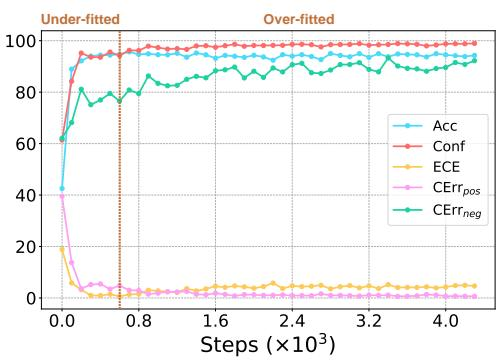  
Figure 1: The demonstration of the under-fitted and over-fitted states in the training process with RoBERTa on SST-2.

2019). However, the confidence scores (a.k.a, predictive probability) of existing deep neural networks cannot serve as reliable estimates of their uncertainty (Guo et al., 2017), and a deep understanding of PLMs calibration is lacking.

In this paper, we give a systematical analysis of PLMs calibration. We consider two questions about PLMs calibration: (1) Do PLMs learn to become calibrated in the training process? (2) How effective are existing calibration methods? We first introduce the metrics we adopt for calibration performance evaluation. The most widely used calibration metric ECE (Expected Calibration Error (Naeini et al., 2015)) is considered. It measures the difference between confidence and accuracy by portioning samples into various confidence zones. To give a more comprehensive and practical calibration evaluation, we provide an application-driven perspective, describing two undesirable situations in practice: (1) Correct predictions (positive) are rejected due to low confidence; (2) Wrong predictions (negative) are accepted due to high confidence. We propose to measure the average confidence scores on correct and wrong predictions respectively to characterize undesirable situations. Two kinds of calibration errors are measured, denoted as $\mathrm { C E r r } _ { p o s }$ and ${ \mathrm { C E r r } } _ { n e g }$

For the first question, we consider the influence of six factors on $\mathbf { P L M s } ^ { \prime }$ calibration performance, including dataset difficulty, available training samples, training steps, the number of tunable parameters, model scale, and pretraining. Some of them are overlooked in previous empirical studies (Snoek et al., 2019; Nixon et al., 2019; Minderer et al., 2021). We motivate to conduct finegrained control experiments to study the dynamic change in PLMs’ calibration performance in training through manipulating control variables.

We empirically observe an overall consistent change in calibration performance across six factors. All six factors influence PLMs’ fitness on the training distribution. This results in two states of PLMs considering calibration performance, namely under-fitted and over-fitted states (see Fig.1). In the under-fitted state, PLMs’ performance and confidence increase at different speeds when more fitted on the training distribution. In the over-fitted state, PLMs’ confidence continues to increase steadily with little change in performance. We find evidence that PLMs don’t learn to become calibrated in training: PLMs’ confidence in their predictions continues to increase when more fitted on the distribution (e.g., more tunable parameters, training longer). This results in two miscalibration behaviors: (1) Increasing ECE in the latter over-fitted state, and (2) Continually increasing confidence in wrong predictions, indicating that PLMs mostly don’t know “what they don’t know”.

We highlight our finding presents contradictory views with the two established conclusions: (a) Larger PLMs show better calibration (Srivastava et al., 2022); (b) Pretraining improves model calibration (Hendrycks et al., 2019b). We identify that the inconsistency lies in: (1) The difficulty of evaluation datasets: the performance doesn’t saturate in the considered datasets (e.g., BIG-bench (Srivastava et al., 2022)). Thus, the evaluation is on the under-fitted state, leaving the miscalibration behavior in the over-fitted state unobserved; (2) Evaluation metrics: previous work doesn’t measure the confidence in wrong predictions, overlooking the fact that models are becoming more confident in wrong predictions when scaling larger and employing pretraining.

Thus, we find that the main issue of PLMs calibration lies in their overconfidence in wrong predictions, which cannot be trivially solved by increasing the model scale. So we consider the effectiveness of existing calibration methods in mitigating the overconfidence issue. We partition existing calibration methods into unlearnable and learnable groups. Unlearnable methods heuristically manipulate the original confidence in predictions (e.g., label smoothing). Learnable methods directly collect data and train models to give reasonable confidence scores in their predictions. Namely, an extra calibration task is introduced, which aims to extract features from samples and models’ preceding performance to predict whether models’ predictions are correct or not.

In our experiments, we identify the superiority of learnable methods compared to unlearnable ones, considering both in-distribution (ID) and out-of-distribution (OOD) settings. This is characterized by a sharp decrease in their confidence in wrong predictions when using learnable methods, indicating that they significantly mitigate the overconfidence issue. Moreover, learnable methods can maintain a reasonable increase in $\mathrm { C E r r } _ { p o s } ,$ holding consistent correlations between the drop in confidence and performance under distribution shifts. This shows the difference from unlearnable methods, which take effect by roughly imposing confidence regularization on models’ predictions (e.g., label smoothing), resulting in almost the same amount of increase in $\mathrm { C E r r } _ { p o s }$ with the decrease in ${ \mathrm { C E r r } } _ { n e g }$

To further understand learnable calibration methods, we consider the influence of more data and larger model scales for the calibration task, the adopted model for the calibration task, and the data distribution, on PLMs’ calibration performance. We highlight three findings: (1) More data and larger model scales for the calibration task both play significant positive roles in PLMs’ calibration performance; (2) PLMs can be trained to give their uncertainty. This finding is consistent with the concurrent work (Lin et al., 2022). Further, we provide an extension to this conclusion. We find that using an extrinsic predictive model can achieve comparable results, given the same calibration training data. Thus, we identify that the success of this paradigm essentially lies in the learnable attribute of the calibration task, instead of the PLMs’ self-checking process; (3) PLMs’ calibration performance under distribution shifts depends on the evaluation datasets chosen. Previous work shows that PLMs exhibit degraded calibration performance under distribution shifts (Desai and Durrett, 2020). We find that this conclusion is reversed when the ID datasets are harder and PLMs achieve better performance on OOD datasets. The concrete arguments and explanations are detailed in Appendix E.

## 2 Background

Calibration measure. We can visualize model calibration through reliability diagram (DeGroot and Fienberg, 1983). Based on the diagram, we can measure the ECE (Naeini et al., 2015) by partitioning samples into different confidence zones. The central idea is to measure the absolute difference between models’ predictive confidence and accuracy. Although alternative theoretic-motivated metrics have been proposed (Vaicenavicius et al., 2019; Gupta et al., 2021), we still employ ECE in our experiments due to its simplicity and popularity.

Benchmark & Analysis. Given appropriate evaluation metrics, large-scale benchmarks have been conducted to analyze model calibration under different settings, spanning model architectures (Guo et al., 2017; Minderer et al., 2021), model scales (Dan and Roth, 2021), modalities (Desai and Durrett, 2020; Minderer et al., 2021; Kadavath et al., 2022), calibration methods (Guo et al., 2017; Desai and Durrett, 2020), and distribution shifts (Nixon et al., 2019; Kong et al., 2020). Our work is closely related to Xiao et al. (2022) that quantifies the uncertainty of PLMs. However, previous benchmarks follow the fixed training and evaluation paradigms. In this paper, we instead conduct a fine-grained and more comprehensive empirical evaluation to take a close look into PLMs calibration from multiple dimensions that have often been overlooked. Also, we consider and conduct a detailed analysis of the recently proposed learnable calibration methods (Lin et al., 2022; Kadavath et al., 2022).

Method. Calibration is essential for out-ofdistribution detection (Hendrycks et al., 2019a), selective prediction (Varshney et al., 2022), robustness (Kumar et al., 2022), and pseudolabeling (Rizve et al., 2021). Existing calibration methods can be partitioned into unlearnable and learnable groups. For unlearnable methods, there are mainly four categories. Post-hoc calibration intends to readjust the output logits referring to the performance on a held-out validation set (Platt et al., 1999; Guo et al., 2017). Regularization methods aim to prevent models from being over-confident on predictions (Szegedy et al., 2016; Pereyra et al., 2017). Data augmentation (Hendrycks et al., 2020; Wang et al., 2021) and model ensemble (Gal and Ghahramani, 2016; Lakshminarayanan et al., 2017) have also been empirically proven to improve model calibration. For learnable methods, the typical way is to first collect data for the calibration task, and then train a model to predict whether the given answer is correct. The model can be a multi-layer perceptron, and the features can be hand-engineered (Ye and Durrett, 2022; Zhang et al., 2021b; Si et al., 2022) or the last hidden states of PLMs (Kadavath et al., 2022). PLMs can also be directly trained to output their uncertainty by words (Lin et al., 2022).

## 3 Evaluation Metrics

For basic evaluation, we report accuracy (Acc) and average confidence score (Conf) on the testing set. For calibration evaluation, we report ECE using equal-mass binning and 100 bins following Minderer et al. (2021). Besides, we provide an application-driven perspective to evaluate model calibration, aiming to quantify two unsatisfied scenarios due to miscalibration in practice: (1) Correct predictions (positive) are rejected due to low confidence; (2) Wrong predictions (negative) are accepted due to high confidence. Specifically, we consider the average confidence in correct predictions $\mathbf { C o n f } _ { p o s }$ and wrong predictions $\mathbf { C o n f } _ { n e g }$ respectively. For unified comparison, we report two calibration error (CErr) cases, ${ \mathrm { C E r r } } _ { p o s } \ = \ 1 \ -$ ${ \mathrm { C o n f } } _ { p o s }$ and $\mathrm { C E r r } _ { n e g } = \mathrm { C o n f } _ { n e g }$ . In principle, we expect calibrated models to have both low ${ \mathrm { C E r r } } _ { p o s }$ and ${ \mathrm { C E r r } } _ { n e g }$ , indicating that they reasonably assign high confidence in correction predictions and low confidence in wrong predictions.

## 4 Do PLMs Learn to Become Calibrated?

## 4.1 Experimental Setting

For model architectures, we choose RoBERTabase (Liu et al., 2019) and T5-base (Raffel et al., 2020), since they represent two classic types of PLMs, namely encoder-only and encoder-decoder models. We experiment with four representative tasks in NLP, including sentiment analysis, natural language inference, news classification, and topic classification. For datasets, we choose SST-2 (Socher et al., 2013a), MNLI (Williams et al.,

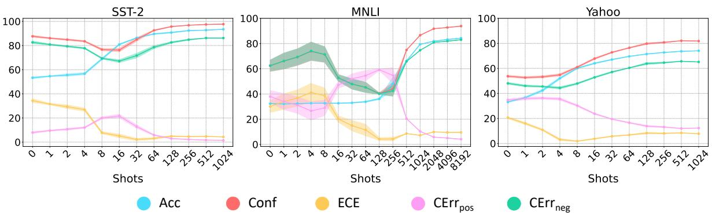  
Figure 2: Results of available training samples with T5.

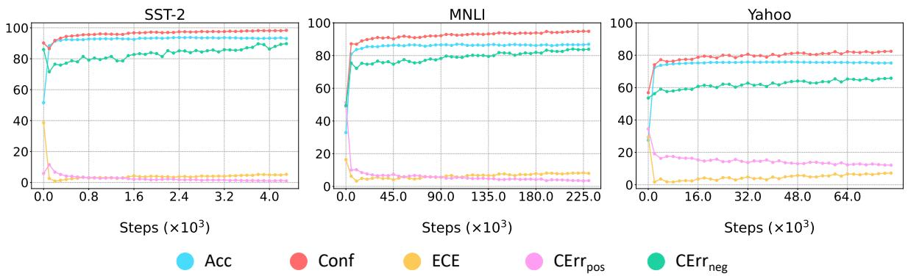  
Figure 3: Results of training steps with T5.

2018a), AG-News (Zhang et al., 2015), and Yahoo (Zhang et al., 2015) respectively. We employ the prompt-based learning paradigm (Liu et al., 2021) since its superior performance compared to traditional fine-tuning, especially in the few-shot setting. Specifically, we inherit the masked language modeling task in the pre-training stage and use templates to wrap samples into prompts. We fine-tune the whole PLMs to fill in the [mask] position in the prompt. The manual template and verbalizer for each dataset are listed in Appendix A.

## 4.2 Experimental Results

We conduct a fine-grained control study to explore the influence of six factors, including dataset difficulty, available training samples (Fig.2), training steps (Fig.3), number of tunable parameters (Fig.4 and Fig.10), pretraining (Fig.6), and model scale (Fig.5). Due to space limits, we show the corresponding results of RoBERTa and results of T5 on AG-News in Appendix B. We summarize the overall conclusions and leave the detailed experimental settings and findings in Appendix B.

We note that all six factors dynamically influence PLMs’ fitness on the training distribution, which we identify as the decisive factor of PLMs calibration performance. We observe an overall consistent change in calibration performance across six factors, resulting in two PLMs’ states (see Fig.1) in training:

Under-fitted state. In this state, PLMs’ performance and confidence increase at different speeds when more fitted on the training distribution. The ECE score fluctuates during this process. In principle, miscalibration is due to the mismatch between performance and confidence. However, we look closely into some critical points where ECE changes sharply (e.g., Fig.2), and empirically find that the increase or decrease in ECE can be estimated by comparing the increasing rates of PLMs’ performance and confidence. We observe that a larger (smaller) increasing rate in performance reduces (increases) ECE. Thus, high ECE can be partially attributed to PLMs’ relatively rapid growth in confidence with performance lagging behind.

Over-fitted state. In this state, PLMs’ performance doesn’t have a substantial difference due to their generalization ability (Zhang et al., 2021a). However, PLMs’ confidence continues to increase in this state, resulting in increasing ECE. This is especially obvious when more training steps and tunable parameters are introduced (see Fig.3 and Fig.4). Thus, being more fitted on the training distribution may bring a negative effect on PLMs calibration. In addition, due to the increase of ECE in this state, the evaluation of calibration performance may be sensitive to the training paradigm. This indicates that previous conclusions drawn from empirical studies should be carefully examined since the training paradigms may be different in model architectures and calibration methods.

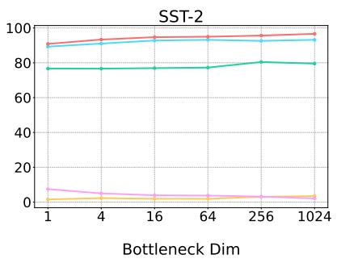

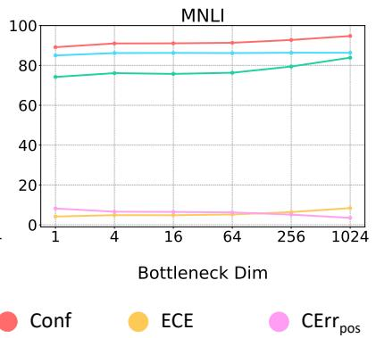

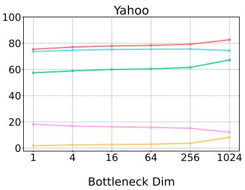

Figure 4: Results of tunable parameters with T5 (Adapter).  
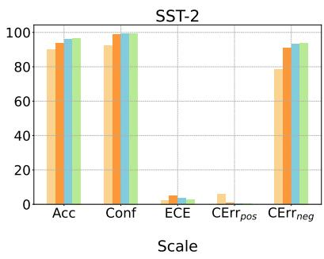

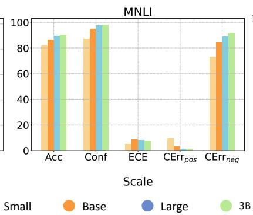

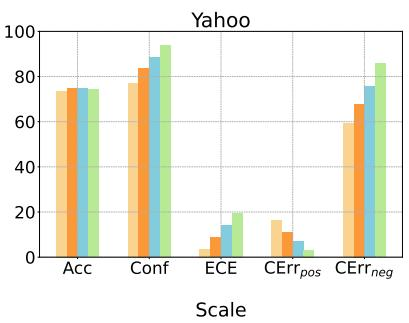  
Figure 5: Results of increasing PLMs scales with T5.

Given the two states observed, we conclude that PLMs don’t learn to become calibrated in training, evidenced by the continually increasing confidence in predictions, no matter correct or not, in the fitting process. Specifically, this results in two miscalibration behaviors: (1) Increasing ECE in the over-fitted state; (2) The consistent increase in ${ \mathrm { C E r r } } _ { n e g }$ throughout the whole training process. This is an undesirable property in practice since users may accept wrong predictions due to their high confidence, and indicates that PLMs mostly don’t know “what they don’t know”.

We highlight two of the considered factors, namely pretraining and model scales (Fig.5 and $\operatorname { F i g } . 6 )$ , which are examined in previous work. Our findings present some contradictory views with the established conclusions: (1) Larger PLMs show better calibration (Srivastava et al., 2022); (2) Pretraining improves model calibration (Hendrycks et al., 2019b). Actually, scaling larger and employing pretraining are both strategies to increase PLMs capacity, making them more fitted on the training distribution. Our general conclusion can also be applied. We highlight two observations: (1) Essentially, the influence of scaling larger and pretraining on PLMs calibration is dynamically determined by the relative increase in performance and confidence, which is highly relevant to the chosen evaluation datasets. For example, the original scaling experiments are conducted on BIGbench (Srivastava et al., 2022), in which the performance is far from saturation and increasing the model scale brings substantial improvement to PLMs performance. This shows consistency with the identified under-fitted state. However, when the performance score saturates on evaluation datasets given the certain scale of PLM, scaling larger will only bring up confidence. This results in increasing ECE due to the mismatch between two trends (e.g., T5 and RoBERTa on Yahoo); (2) Scaling larger and employing pretraining consistently bring ${ \mathrm { C E r r } } _ { n e g }$ higher. This indicates that these two strategies don’t enable PLMs to learn to become calibrated in the training process.

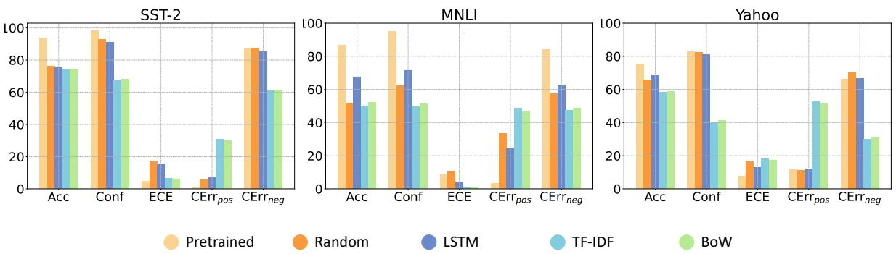  
Figure 6: Results of the pretraining influence with T5.

## 5 How Effective are Existing Methods?

## 5.1 Calibration Methods

We choose representative calibration methods from each category summarized in Sec. 2. For unlearnable methods, we consider vanilla finetuning (Vanilla), temperature scaling (TS) (Guo et al., 2017), label smoothing (LS) (Szegedy et al., 2016), easy data augmentation (EDA) (Wei and Zou, 2019), and deep-ensemble (Ensemble) (Lakshminarayanan et al., 2017). For learnable methods, an extra calibration task is introduced, aiming to train a model to predict whether the original predictions are correct or not. Each sample in the dataset of the calibration task consists of the original input, the model’s original prediction, and the label indicating whether the original prediction is correct or not. We adopt the validation set to generate the training set for the calibration task. We describe the specially designed training paradigms of different methods in the following paragraph and leave the detailed construction process of the calibration training dataset in Appendix C.

For better clarification, we use the main task to denote the original task. The predictive model for the calibration task can be a separate extrinsic model that we use “E-” for denotation. Specifically, we adapt the method proposed in Kadavath et al. (2022) that uses MLP as the extrinsic model (E-MLP) and the inputs are the hidden states of the main task model. Based on a similar intuition, we extend this method by using an extra T5 as the extrinsic model (E-T5). An example of the template to wrap the sample into an input prompt is: “<original input>, the model’s prediction is <prediction>, is the prediction True or False? It’s <mask>.” The probability of the “True” class in the calibration task is deemed as PLMs confidence in their predictions. The concrete manual template and verbalizer of the calibration task for each dataset are listed in Table 11.

Besides, the main task model can also be directly employed to perform the calibration task. We deem this paradigm as the intrinsic one, denoted as “I-”. Lin et al. (2022) show that GPT-3 (Brown et al., 2020) can be trained to output the uncertainty by words. We adapt this method by first training the model using the main task data, and then continuing the training by using the calibration task data (I-Vanilla). However, this continual learning paradigm may result in degraded performance in the main task according to our results. To tackle this, we propose two more practical intrinsic calibration methods through modifying the training paradigm. Specifically, we train PLMs iteratively (I-Iter) or simultaneously (I-Simul) on the original task and the calibration task. The latter can be achieved due to the unified text-to-text training paradigm. The input is the same as E-T5.

## 5.2 Experimental Setting

PLMs are expected to tackle out-of-distribution (OOD) samples in practice, particularly in the presence of adversarial attacks (Chen et al., 2022). Thus, we experiment with both in-distribution (ID) and OOD settings. We consider natural language inference, sentiment analysis, and hate-speech detection tasks due to their wellestablished OOD datasets in NLP. Specifically, we choose MNLI (HANS, ANLI), Amazon (SST-5, SemEval), and Civil (Hate Speech, Implicit Hate) as the ID (OOD) datasets. The references and detailed descriptions of chosen datasets for ID and OOD evaluation are in Appendix A.

## 5.3 Experimental Results

The results are listed in Table 1 (T5) and Table 4 (RoBERTa). We summarize the overall conclusions as follows: All calibration methods have negligible influence on PLMs’ performance in the ID and OOD settings except I-Vanilla. However, PLMs are significantly less calibrated under considered distribution shifts, especially on challenging datasets due to the severe mismatch between performance and confidence. For example, the vanilla T5 achieves only 30.53% accuracy on ANLI, but its average confidence is up to 93.77%. For ID evaluation, we observe lower ECE, consistent with Desai and Durrett (2020). However, the conclusion that PLMs are calibrated on ID data (Desai and Durrett, 2020) is questionable given our answer to the first question (see Sec. 4). The low ECE can be attributed to their high performance on ID datasets and consistently assigning high confidence scores to their predictions. We further show the conclusion that PLMs calibration degrades under distribution shifts is one-sided and heavily depends on the evaluation datasets chosen in Appendix E.

<table><tr><td></td><td colspan="2">| Dataset</td><td></td><td colspan="4">MNLI</td><td colspan="4"></td><td colspan="4">ANLI</td><td colspan="4"></td></tr><tr><td colspan="3">Method</td><td>Acc</td><td>Conf</td><td>ECE</td><td> ${ \mathrm { C E r r } } _ { p o s }$ </td><td> $\operatorname { C E m } _ { n e g }$ </td><td></td><td> $_ \mathrm { A c c }$ </td><td>Conf</td><td>ECE</td><td> $\mathrm { C E r r } _ { p o s }$ </td><td> $\operatorname { C E m } _ { n e g }$ </td><td>Acc</td><td>Conf</td><td>ECE</td><td> $\mathrm { C E r r } _ { p o s }$ </td><td> $\operatorname { C E m } _ { n e g }$ </td></tr><tr><td rowspan="6">MNLI</td><td rowspan="6">Unlearnable</td><td>Vanilla TS</td><td>86.50 86.50</td><td>94.85 89.22</td><td>8.35 2.75</td><td>3.47 8.44</td><td>84.12 74.22</td><td>55.06 55.06</td><td>92.36 83.99</td><td>37.30 28.93</td><td>5.96</td><td>90.30</td><td>31.31</td><td></td><td>85.58</td><td>54.27 44.17</td><td>16.22 26.87</td><td>86.41 76.56</td></tr><tr><td></td><td></td><td></td><td></td><td></td><td></td><td>56.94</td><td></td><td></td><td>14.36 16.19</td><td>81.97</td><td>31.31</td><td>75.48</td><td></td><td></td><td></td><td></td></tr><tr><td>LS EDA</td><td>86.19</td><td>85.53</td><td>3.41</td><td>13.06</td><td>76.74</td><td></td><td>83.74</td><td>26.80</td><td></td><td></td><td>83.64</td><td>30.50</td><td>77.71</td><td>47.21</td><td>23.77</td><td>78.36</td></tr><tr><td></td><td>86.29</td><td>95.44</td><td>9.15</td><td>3.06</td><td>86.01</td><td>52.73</td><td>92.24</td><td>39.50</td><td>4.61</td><td></td><td>88.72</td><td>30.34</td><td>87.45</td><td>57.11</td><td>13.86</td><td>88.03</td></tr><tr><td>Ensemble</td><td>86.54</td><td>94.82</td><td>8.28</td><td>3.53</td><td>84.22</td><td>56.52</td><td>91.90</td><td>35.38</td><td>6.72</td><td>90.15</td><td></td><td>31.41</td><td>85.49</td><td>54.09</td><td>16.49</td><td>86.40</td></tr><tr><td>E-MLP</td><td>86.50</td><td>89.28</td><td>5.52</td><td>10.69</td><td>89.10</td><td>55.06</td><td>87.38</td><td>32.34</td><td>12.59</td><td>87.34</td><td></td><td>31.31</td><td>81.65</td><td>50.74</td><td>18.39</td><td>81.66</td></tr><tr><td rowspan="3">Learnable</td><td>E-T5 (ours)</td><td>86.50</td><td>79.43</td><td>12.24</td><td>15.35</td><td>45.84</td><td>55.06</td><td>78.74</td><td>35.30</td><td>19.11</td><td>75.97</td><td>31.31</td><td></td><td>41.67</td><td>38.68</td><td>65.84</td><td>45.11</td></tr><tr><td>I-Vanilla</td><td>85.58</td><td>78.40</td><td>12.45</td><td>15.69</td><td>43.33</td><td>53.55</td><td>68.34</td><td>33.38</td><td>27.48</td><td></td><td>63.53</td><td>31.41</td><td>40.92</td><td>38.30</td><td>65.43</td><td>43.82</td></tr><tr><td>I-Iter (ours)</td><td>86.30</td><td>70.86 76.50</td><td>15.49 17.65</td><td>24.07 17.15</td><td>38.95 35.64</td><td>57.12 57.15</td><td>74.92 80.26</td><td>28.39 38.64</td><td>22.16 15.85</td><td>71.02</td><td>30.69</td><td></td><td>37.02</td><td>28.37 46.06</td><td>68.84 68.40</td><td>39.62 41.76</td></tr><tr><td rowspan="6" colspan="2">Dataset</td><td colspan="10">I-Simul (ours) 86.53</td><td colspan="5">30.66 38.65</td></tr><tr><td colspan="2"></td><td></td><td colspan="3">Amazon</td><td colspan="2"></td><td colspan="2">SST-5</td><td colspan="2"></td><td colspan="2"></td><td colspan="3">SemEval</td></tr><tr><td colspan="2">Method Vanilla</td><td>Acc</td><td>Conf</td><td>ECE</td><td> $\mathrm { C E r r } _ { p o s }$ </td><td> $\mathbf { C E m } _ { n e g }$ </td><td>Acc</td><td>Conf</td><td>ECE</td><td> $\mathrm { C E r r } _ { p o s }$ </td><td> $\operatorname { C E m } _ { n e g }$ </td><td>Acc</td><td>Conf</td><td>ECE</td><td> $\mathrm { C E r r } _ { p o s }$ </td><td> $\operatorname { C E m } _ { n e g }$ </td></tr><tr><td colspan="2"></td><td>91.00 91.00</td><td>95.65 90.50</td><td>4.86 1.39</td><td>2.97 7.74</td><td>82.05 73.20</td><td>69.73 69.73</td><td>82.78 71.98</td><td>13.52 4.94</td><td>12.30 23.01</td><td>71.72 60.69</td><td>55.03 55.03</td><td>76.83 65.45</td><td>21.75 10.37</td><td>17.54 29.14</td><td>69.94 58.83</td></tr><tr><td rowspan="6">Unlearnable</td><td colspan="10">TS LS</td><td colspan="10">63.95</td></tr><tr><td>EDA</td><td></td><td>91.25 85.75</td><td>6.78</td><td></td><td>13.14</td><td>74.09</td><td>70.67 67.67</td><td>73.50</td><td>5.55</td><td>22.53</td><td></td><td>53.57</td><td>69.79</td><td>16.23</td><td>25.65</td><td>64.53</td></tr><tr><td>Ensemble</td><td></td><td>92.00 96.29 91.57</td><td>4.29</td><td>2.51</td><td>82.46</td><td></td><td>87.58</td><td>20.20</td><td></td><td>7.97</td><td>78.27</td><td>57.27</td><td>83.11</td><td>25.96</td><td>11.87</td><td>76.40</td></tr><tr><td></td><td></td><td>95.78</td><td>4.21</td><td>2.88</td><td></td><td>81.14</td><td>69.35</td><td>83.00</td><td>13.66</td><td>12.13</td><td>72.00</td><td>56.34</td><td>77.81</td><td>21.47</td><td>16.52</td><td>70.49</td></tr><tr><td>E-MLP E-T5 (ours)</td><td>91.00</td><td>91.34</td><td>5.13</td><td>8.66</td><td>91.31</td><td>69.73</td><td>84.06</td><td>14.73</td><td></td><td>16.04</td><td>84.28</td><td>55.03</td><td>75.87</td><td>20.83</td><td>24.17</td><td>75.91</td></tr><tr><td></td><td></td><td>91.00 70.36 70.03</td><td>20.65</td><td>23.02</td><td></td><td>3.40</td><td>69.73</td><td>35.23</td><td>38.72</td><td>57.70</td><td>18.95</td><td>55.03</td><td>27.61</td><td>28.30</td><td>58.42</td><td>10.50</td></tr><tr><td rowspan="3" colspan="2">Learnable</td><td>I-Vanilla</td><td>89.14</td><td>19.11</td><td>21.79</td><td></td><td>2.91</td><td>68.23 32.70</td><td>38.85</td><td></td><td>58.35</td><td>13.49</td><td>42.52</td><td>21.53</td><td>21.80</td><td>55.84</td><td>4.79</td></tr><tr><td>I-Iter (ours)</td><td>92.20</td><td>72.66</td><td>19.54</td><td>21.66</td><td>5.58</td><td>70.67</td><td>33.17</td><td>38.49</td><td>60.59</td><td>18.13</td><td>55.38</td><td>26.91</td><td>28.86</td><td>59.90</td><td>10.52</td></tr><tr><td>I-Simul (ours)</td><td>91.87</td><td>71.72</td><td>20.15</td><td>22.38</td><td>5.09</td><td>69.54</td><td>31.45</td><td>38.26</td><td>61.73</td><td>15.88</td><td>55.28</td><td>26.35 29.37</td><td></td><td>60.57</td><td>10.17</td></tr><tr><td colspan="10">Dataset Method</td><td colspan="8"></td></tr><tr><td rowspan="7"</table>

Table 1: Results of $\mathrm { T } 5 \mathrm { \ ' } \mathrm { s }$ calibration performance under standard distribution shifts. We observe that learnable methods can significantly mitigate the overconfidence issue.

Unlearnable methods. We summarize the findings as follows: (1) Data augmentation and model ensemble don’t bring substantial benefits to PLMs calibration, considering the three calibration metrics spanning all evaluation datasets and two PLMs. The reason lies in their inability to relieve the overconfident issue, resulting in the same ${ \mathrm { C e r r } } _ { n e g }$ with the vanilla fine-tuning; (2) TS achieves overall better ECE, maintaining a strong baseline method, with LS being the second effective method for the unlearnable category. This is consistent with previous empirical studies (Nixon et al., 2019). However, we can observe almost the same amount of increase in $\mathrm { C E r r } _ { p o s }$ with the decrease in $\operatorname { C E r r } _ { n e g } .$ . The reason is that these two methods directly impose confidence regularization on predictions, which don’t actually make PLMs have clear confidence estimations.

Learnable methods. Compared to unlearnable methods, learnable ones significantly mitigate the overconfidence issue, reflected in the sharp decrease in $\mathrm { C E r r } _ { n e g } ,$ , indicating that learnable methods output very low confidence in wrong predictions. But we also observe that learnable methods lower the confidence in correct predictions, resulting in increasing $\mathrm { C E r r } _ { p o s }$ and ECE. However, we highlight two observations indicating that learnable methods essentially teach models to have clearer confidence estimations, instead of roughly reducing the confidence like LS: (1) Compared to the vanilla version, the increase in ${ \mathrm { C E r r } } _ { p o s }$ is significantly lower than the decrease in $\mathrm { C E r r } _ { n e g } ,$ , especially on ID samples; (2) Learnable methods give obviously lower confidence in OOD samples, and the average confidence drop is highly relevant to the performance drop under distribution shifts. Thus, the low confidence and relatively higher ${ \mathrm { C E r r } } _ { p o s }$ and ECE on OOD samples may be reasonable.

<table><tr><td>Dataset Size</td><td>Dataset</td><td colspan="4"></td><td colspan="6"></td><td colspan="4">SemEval</td></tr><tr><td></td><td>Method</td><td>Acc</td><td>Conf</td><td>ECE</td><td> $\mathrm { C E r r } _ { p o s }$ </td><td> ${ \mathrm { C E r r } } _ { n e g }$ </td><td>Acc</td><td>Conf</td><td>ECE</td><td> $\mathrm { C E m } _ { p o s }$   ${ \mathrm { C E m } } _ { n e g }$ </td><td>Acc</td><td>Conf</td><td>ECE</td><td> $\mathrm { C E r r } _ { p o s }$ </td><td> ${ \mathrm { C E m } } _ { n e g }$ </td></tr><tr><td rowspan="6">Small</td><td>E-MLP</td><td>91.00</td><td>90.41</td><td>1.71</td><td>9.59</td><td>90.39</td><td>69.73 87.81</td><td>18.08</td><td>12.16</td><td>87.73</td><td>55.03</td><td>86.86</td><td>31.83</td><td>13.11</td><td>86.83</td></tr><tr><td>E-T5 (ours)</td><td>91.00</td><td>68.92</td><td>22.08 28.16</td><td>39.44</td><td>69.73</td><td>55.95</td><td>15.12</td><td>41.71</td><td>50.58</td><td>55.03</td><td>50.99</td><td>8.54</td><td>43.17</td><td>43.84</td></tr><tr><td>I-Vanilla</td><td>89.06</td><td>68.45</td><td>20.61</td><td>28.01</td><td>39.62</td><td>63.92 56.49</td><td>10.66</td><td>39.82</td><td>49.96</td><td>51.48</td><td>49.47</td><td>9.12</td><td>44.10</td><td>42.64</td></tr><tr><td>I-Iter (ours)</td><td>90.58</td><td>68.96</td><td>21.62</td><td>28.08</td><td>40.47</td><td>69.63 56.69</td><td>12.95</td><td>41.27</td><td>52.00</td><td>53.72</td><td>53.89</td><td>10.24</td><td>43.31</td><td>50.64</td></tr><tr><td>I-Simul (ours)</td><td>91.37</td><td>80.44</td><td>15.44</td><td>15.05</td><td>32.78</td><td>71.13 66.28</td><td>26.97</td><td>25.58</td><td>46.23</td><td>54.08</td><td>37.51</td><td>34.94</td><td>53.82</td><td>27.30</td></tr><tr><td>Method</td><td>Acc</td><td>Conf</td><td>ECE</td><td> $\mathrm { C E r r } _ { p o s }$ </td><td> ${ \mathrm { C E r r } } _ { n e g }$ </td><td>Acc</td><td>Conf</td><td></td><td> ${ \mathrm { C E m } } _ { n e g }$ </td><td>Acc</td><td>Conf</td><td>ECE</td><td></td><td> ${ \mathrm { C E m } } _ { n e g }$ </td></tr><tr><td rowspan="5">Middle</td><td></td><td>91.00</td><td>90.44</td><td>4.35 9.56</td><td>90.41</td><td>69.73</td><td>85.18</td><td>ECE 15.45</td><td> $\mathrm { C E m } _ { p o s }$  14.69</td><td>84.87</td><td></td><td>78.39</td><td>23.36</td><td> $\mathrm { C E r r } _ { p o s }$  21.63</td><td>78.42</td></tr><tr><td>E-MLP E-T5 (ours)</td><td>91.00</td><td>71.03</td><td>19.97 22.40</td><td>4.63</td><td>69.73</td><td>31.73</td><td>38.80</td><td>61.80</td><td>16.83</td><td>55.03 55.03</td><td>29.72</td><td>26.28</td><td>56.23</td><td>12.54</td></tr><tr><td>I-Vanilla</td><td>88.25</td><td>70.91</td><td>17.34 20.16</td><td>3.86</td><td>63.07</td><td>29.81</td><td>34.08</td><td>59.42</td><td>11.42</td><td>48.08</td><td>25.32</td><td>23.69</td><td>55.53</td><td>7.59</td></tr><tr><td>I-Iter (ours)</td><td>91.69</td><td>71.76</td><td>19.93 22.23</td><td>5.43</td><td>68.23</td><td>33.46</td><td>36.87</td><td>59.79</td><td>18.96</td><td>56.23</td><td>35.21</td><td>21.42</td><td>50.98</td><td>17.48</td></tr><tr><td>I-Simul (ours)</td><td>91.38</td><td>70.92</td><td>20.47 22.80</td><td>4.30</td><td>70.29</td><td>32.03</td><td>42.12</td><td>60.65</td><td>14.72</td><td>54.75</td><td>26.18</td><td>30.70</td><td>59.34</td><td>8.67</td></tr><tr><td rowspan="7">Large</td><td>Method</td><td>Acc</td><td>Conf</td><td>ECE</td><td> $\mathrm { C E r r } _ { p o s }$ </td><td> ${ \mathrm { C E r r } } _ { n e g }$ </td><td>Acc Conf</td><td>ECE</td><td> $\mathrm { C E m } _ { p o s }$ </td><td> ${ \mathrm { C E m } } _ { n e g }$ </td><td>Acc</td><td>Conf</td><td>ECE</td><td> $\mathrm { C E r r } _ { p o s }$ </td><td> ${ \mathrm { C E m } } _ { n e g }$ </td></tr><tr><td>E-MLP</td><td>91.00</td><td>91.34</td><td></td><td></td><td>69.73</td><td>84.06</td><td>14.73</td><td>16.04</td><td>84.28</td><td>55.03</td><td>75.87</td><td>20.83</td><td>24.17</td><td>75.91</td></tr><tr><td></td><td>91.00</td><td>70.36</td><td>5.13 20.65</td><td>8.66 23.02</td><td>91.31 3.40</td><td>69.73 35.23</td><td>38.72</td><td>57.70</td><td>18.95</td><td>55.03</td><td>27.61</td><td>28.30</td><td>58.42</td><td>10.50</td></tr><tr><td>E-T5 (ours)</td><td>89.14</td><td>70.03</td><td>19.11</td><td>21.79</td><td>2.91</td><td>68.23</td><td>32.70 38.85</td><td>58.35</td><td>13.49</td><td>42.52</td><td>21.53</td><td>21.80</td><td>55.84</td><td>4.79</td></tr><tr><td>I-Vanilla I-Iter (ours)</td><td>92.20</td><td>72.66</td><td>19.54</td><td>21.66</td><td>5.58</td><td>70.67</td><td>33.17 38.49</td><td>60.59</td><td>18.13</td><td>55.38</td><td>26.91</td><td>28.86</td><td>59.90</td><td>10.52</td></tr><tr><td></td><td>91.87</td><td>71.72</td><td>20.15</td><td></td><td>5.09</td><td>69.54 31.45</td><td>38.26</td><td>61.73</td><td>15.88</td><td>55.28</td><td>26.35</td><td>29.37</td><td>60.57</td><td>10.17</td></tr><tr><td>I-Simul (ours)</td><td></td><td></td><td></td><td>22.38</td><td></td><td></td><td></td><td></td><td></td><td></td><td></td><td></td><td></td><td></td></tr></table>

Table 2: Results of T5’s calibration performance with increasing dataset sizes. We observe a significant improvement in calibration performance when increasing the dataset size from small to middle.

Further, we give a detailed analysis of extrinsic and intrinsic learnable methods and also compare our extended calibration methods with previous methods: (1) For extrinsic methods, the extended E-T5 exhibits significantly better calibration performance compared to the adapted E-MLP considering the mitigation of the overconfidence issue. The essential difference mainly lies in the extrinsic model for the calibration task. We find that using the larger capacity model as the extrinsic calibrator shows the same trend with shifting from the vanilla fine-tuning to learnable methods. We further study this scaling effect in Sec. 5.4; (2) For intrinsic methods, the three different training paradigms don’t show substantial differences considering the calibration performance, and none of them consistently achieves the best performance on all datasets. As a comparison, our methods (I-Iter and I-Simul) address the degraded performance issue of I-Vanilla and make the main task performance match with the vanilla fine-tuning; (3) Interestingly, there doesn’t exist a substantial difference between the extrinsic E-T5 method and other intrinsic methods, given the same base architecture (e.g., T5). This finding leads us to reconsider the conclusion in Lin et al. (2022) that PLMs can be trained to give their uncertainty by words. Given the comparable performance between intrinsic and extrinsic methods, we provide an extension to this conclusion. We identify that the success of this paradigm essentially lies in the learnable attribute of the calibration task, instead of the self-checking process of PLMs. Namely, the findings in previous work may not only be attributed to the capability of PLMs but also the ”learnable” property of the calibration task.

## 5.4 Emergent Calibration

In Sec. 5.3, we identify the potential in learnable methods. However, a detailed exploration of learnable calibration methods is lacking. We conduct experiments to study the influence of two important factors, namely the dataset size and the model scale for the calibration task, on PLMs calibration. Note that the model scale in this section considers the model adopted for the calibration task, instead of the main task.

Dataset size. Table 2 shows the results of different sizes of the calibration dataset. Two basic findings are: (1) The five learnable methods show a consistent trend when increasing the dataset size, indicating that the essence of these methods is the same; (2) The size of datasets for training the calibration task doesn’t have a substantial influence on PLMs performance on the main task.

Beyond these, we observe that there is a sharp difference in calibration performance when increasing the dataset size from small to middle. The trend is overall consistent with the one observed when shifting from vanilla fine-tuning to learnable calibration methods. The trend can be summarized as: (1) For ID samples, we can observe a sharp decrease in ${ \mathrm { C E r r } } _ { n e g }$ with relatively less negative influence on ECE and $\mathrm { C E r r } _ { p o s } ;$ (2) For OOD samples, the ${ \mathrm { C E r r } } _ { p o s }$ and ECE increase significantly along with increasing the dataset size. However, given the arguments in Sec. 5.3, we identify that PLMs’ calibration performance improves when trained on larger calibration datasets. Besides, we don’t observe further improvement in calibration performance when increasing the dataset size from middle to large. This is consistent with normal task training, where increasing the dataset size doesn’t increase performance after a critical point.

Model scale. Table 5 shows the results of various model scales. Two basic findings are: (1) The five learnable methods still show a consistent trend when scaling larger; (2) We observe a consistent confidence increase when scaling larger, which is similar to the trend observed in Sec. 4, where increasing capacity makes PLMs more confident.

Surprisingly, although the confidence continues to increase, for ID samples, we observe a consistent decrease in $\mathrm { C E r r } _ { p o s }$ with neglectable influence on ECE and ${ \mathrm { C E r r } } _ { n e g }$ when scaling larger. Note that the dataset for the calibration task is collected from ID. Thus, if provided enough ID samples for the calibration task training, scaling larger enables models to better learn the calibration task, ensuring better calibration performance on ID samples. For OOD samples, we don’t observe a consistent trend due to the influence of various factors. Specifically, when using out-of-the-box to tackle OOD samples, the problem of distribution shifts appears in the introduced calibration task. Whether scaling the calibration-task model larger improves calibration performance under distribution shifts is determined by many factors (e.g., the dataset difficulty, the overconfidence issue in the calibration task). We leave it for future exploration.

## 6 Conclusion

We take a close look into PLMs calibration, motivating to answer two central questions: (1) Do PLMs learn to become calibrated in the training process? (2) How effective are existing calibration methods? We present a comprehensive empirical study, including the analysis of various decisive factors and concrete calibration methods. Besides the findings that support existing conclusions, we also provide extensions or contradictory arguments to some established conclusions.

## Limitations and Future Work

We identify two limitations in our work that necessitate further investigation and improvement. First, only empirical results are presented in our work. A theoretical understanding of PLMs calibration is still lacking. Going forward, we are motivated to investigate this problem from the standpoint of feature learning. We see great potential in unifying several problems in AI safety (Houben et al., 2021) from a feature-learning perspective, including spurious correlations (Gu et al., 2019; Wang et al., 2022), robustness (Yuan et al., 2021; Zhang et al., 2022), backdoor learning (Sheng et al., 2022; Cui et al., 2022), and calibration (Ulmer et al., 2022). Second, we propose three simple extended calibration methods based on existing ones. In our experiments, we evaluate the calibration performance of existing and our calibration methods. We make an assumption that we have a large held-out validation set that can be employed as the training dataset for the calibration task. We demonstrate the effectiveness of learnable calibration methods in this ideal situation. However, in practice, we need to make the decision about how to allocate the data for the main task and the calibration task given limited training samples.

## Acknowledgements

This work is supported by the National Key R&D Program of China (No. 2020AAA0106502) and Institute Guo Qiang at Tsinghua University.

## References

Tom B. Brown, Benjamin Mann, Nick Ryder, Melanie Subbiah, Jared Kaplan, Prafulla Dhariwal, Arvind Neelakantan, Pranav Shyam, Girish Sastry, Amanda Askell, Sandhini Agarwal, Ariel Herbert-Voss, Gretchen Krueger, Tom Henighan, Rewon Child, Aditya Ramesh, Daniel M. Ziegler, Jeffrey Wu, Clemens Winter, Christopher Hesse, Mark Chen, Eric Sigler, Mateusz Litwin, Scott Gray, Benjamin Chess, Jack Clark, Christopher Berner, Sam Mc-Candlish, Alec Radford, Ilya Sutskever, and Dario Amodei. 2020. Language models are few-shot learners. In Advances in Neural Information Processing Systems 33: Annual Conference on Neural Information Processing Systems 2020, NeurIPS 2020, December 6-12, 2020, virtual.

Yangyi Chen, Hongcheng Gao, Ganqu Cui, Fanchao Qi, Longtao Huang, Zhiyuan Liu, and Maosong Sun.

2022. Why should adversarial perturbations be imperceptible? rethink the research paradigm in adversarial NLP. In Proceedings of the 2022 Conference on Empirical Methods in Natural Language Processing, EMNLP 2022, Abu Dhabi, United Arab Emirates, December 7-11, 2022, pages 11222– 11237. Association for Computational Linguistics.

Ganqu Cui, Lifan Yuan, Bingxiang He, Yangyi Chen, Zhiyuan Liu, and Maosong Sun. 2022. A unified evaluation of textual backdoor learning: Frameworks and benchmarks. In NeurIPS.

Soham Dan and Dan Roth. 2021. On the effects of transformer size on in- and out-of-domain calibration. In Findings of the Association for Computational Linguistics: EMNLP 2021, Virtual Event / Punta Cana, Dominican Republic, 16-20 November, 2021, pages 2096–2101. Association for Computational Linguistics.

Ona de Gibert, Naiara Perez, Aitor Garc´ıa-Pablos, and Montse Cuadros. 2018. Hate speech dataset from a white supremacy forum. In Proceedings of the 2nd Workshop on Abusive Language Online (ALW2), pages 11–20, Brussels, Belgium. Association for Computational Linguistics.

Morris H DeGroot and Stephen E Fienberg. 1983. The comparison and evaluation of forecasters. Journal ofthe Royal Statistical Society: Series D (The Statistician), 32(1-2):12–22.

Shrey Desai and Greg Durrett. 2020. Calibration of pre-trained transformers. In Proceedings ofthe 2020 Conference on Empirical Methods in Natural Language Processing (EMNLP), pages 295–302, Online. Association for Computational Linguistics.

Ning Ding, Yujia Qin, Guang Yang, Fuchao Wei, Zonghan Yang, Yusheng Su, Shengding Hu, Yulin Chen, Chi-Min Chan, Weize Chen, et al. 2022. Delta tuning: A comprehensive study of parameter efficient methods for pre-trained language models. ArXiv preprint, abs/2203.06904.

Mai ElSherief, Caleb Ziems, David Muchlinski, Vaishnavi Anupindi, Jordyn Seybolt, Munmun De Choudhury, and Diyi Yang. 2021. Latent hatred: A benchmark for understanding implicit hate speech. In Proceedings of the 2021 Conference on Empirical Methods in Natural Language Processing, pages 345– 363, Online and Punta Cana, Dominican Republic. Association for Computational Linguistics.

Yarin Gal and Zoubin Ghahramani. 2016. Dropout as a bayesian approximation: Representing model uncertainty in deep learning. In Proceedings of the 33nd International Conference on Machine Learning, ICML 2016, New York City, NY, USA, June 19- 24, 2016, volume 48 of JMLR Workshop and Conference Proceedings, pages 1050–1059. JMLR.org.

Jiatao Gu, Yong Wang, Kyunghyun Cho, and Victor O. K. Li. 2019. Improved zero-shot neural machine translation via ignoring spurious correlations.

In Proceedings of the 57th Conference of the Association for Computational Linguistics, ACL 2019, Florence, Italy, July 28- August 2, 2019, Volume 1: Long Papers, pages 1258–1268. Association for Computational Linguistics.

Chuan Guo, Geoff Pleiss, Yu Sun, and Kilian Q. Weinberger. 2017. On calibration of modern neural networks. In Proceedings of the 34th International Conference on Machine Learning, ICML 2017, Sydney, NSW, Australia, 6-11 August 2017, volume 70 of Proceedings ofMachine Learning Research, pages 1321–1330. PMLR.

Kartik Gupta, Amir Rahimi, Thalaiyasingam Ajanthan, Thomas Mensink, Cristian Sminchisescu, and Richard Hartley. 2021. Calibration of neural networks using splines. In 9th International Conference on Learning Representations, ICLR 2021, Virtual Event, Austria, May 3-7, 2021. OpenReview.net.

Zellig S Harris. 1954. Distributional structure. Word, 10(2-3):146–162.

Dan Hendrycks, Steven Basart, Mantas Mazeika, Mohammadreza Mostajabi, Jacob Steinhardt, and Dawn Song. 2019a. Scaling out-of-distribution detection for real-world settings. ArXiv preprint, abs/1911.11132.

Dan Hendrycks, Kimin Lee, and Mantas Mazeika. 2019b. Using pre-training can improve model robustness and uncertainty. In Proceedings of the 36th International Conference on Machine Learning, ICML 2019, 9-15 June 2019, Long Beach, California, USA, volume 97 of Proceedings of Machine Learning Research, pages 2712–2721. PMLR.

Dan Hendrycks, Norman Mu, Ekin Dogus Cubuk, Barret Zoph, Justin Gilmer, and Balaji Lakshminarayanan. 2020. Augmix: A simple data processing method to improve robustness and uncertainty. In 8th International Conference on Learning Representations, ICLR 2020, Addis Ababa, Ethiopia, April 26-30, 2020. OpenReview.net.

Sepp Hochreiter and Jurgen Schmidhuber. 1997.¨ Long short-term memory. Neural computation, 9(8):1735–1780.

Sebastian Houben, Stephanie Abrecht, Maram Akila, Andreas Bar, Felix Brockherde, Patrick Feifel, Tim¨ Fingscheidt, Sujan Sai Gannamaneni, Seyed Eghbal Ghobadi, Ahmed Hammam, Anselm Haselhoff, Felix Hauser, Christian Heinzemann, Marco Hoffmann, Nikhil Kapoor, Falk Kappel, Marvin Klingner, Jan Kronenberger, Fabian Kuppers, Jonas¨ Lohdefink, Michael Mlynarski, Michael Mock,¨ Firas Mualla, Svetlana Pavlitskaya, Maximilian Poretschkin, Alexander Pohl, Varun Ravi Kumar, Julia Rosenzweig, Matthias Rottmann, Stefan Ruping, Timo S¨ amann, Jan David Schneider,¨ Elena Schulz, Gesina Schwalbe, Joachim Sicking, Toshika Srivastava, Serin Varghese, Michael Weber, Sebastian Wirkert, Tim Wirtz, and Matthias

Woehrle. 2021. Inspect, understand, overcome: A survey of practical methods for AI safety. CoRR, abs/2104.14235.

Neil Houlsby, Andrei Giurgiu, Stanislaw Jastrzebski, Bruna Morrone, Quentin de Laroussilhe, Andrea Gesmundo, Mona Attariyan, and Sylvain Gelly. 2019. Parameter-efficient transfer learning for NLP. In Proceedings of the 36th International Conference on Machine Learning, ICML 2019, 9-15 June 2019, Long Beach, California, USA, volume 97 of Proceedings of Machine Learning Research, pages 2790–2799. PMLR.

Saurav Kadavath, Tom Conerly, Amanda Askell, Tom Henighan, Dawn Drain, Ethan Perez, Nicholas Schiefer, Zac Hatfield Dodds, Nova DasSarma, Eli Tran-Johnson, et al. 2022. Language models (mostly) know what they know. ArXiv preprint, abs/2207.05221.

Lingkai Kong, Haoming Jiang, Yuchen Zhuang, Jie Lyu, Tuo Zhao, and Chao Zhang. 2020. Calibrated language model fine-tuning for in- and outof-distribution data. In Proceedings of the 2020 Conference on Empirical Methods in Natural Language Processing (EMNLP), pages 1326–1340, Online. Association for Computational Linguistics.

Ananya Kumar, Tengyu Ma, Percy Liang, and Aditi Raghunathan. 2022. Calibrated ensembles can mitigate accuracy tradeoffs under distribution shift. In The 38th Conference on Uncertainty in Artificial Intelligence.

Balaji Lakshminarayanan, Alexander Pritzel, and Charles Blundell. 2017. Simple and scalable predictive uncertainty estimation using deep ensembles. In Advances in Neural Information Processing Systems 30: Annual Conference on Neural Information Processing Systems 2017, December 4-9, 2017, Long Beach, CA, USA, pages 6402–6413.

Brian Lester, Rami Al-Rfou, and Noah Constant. 2021. The power of scale for parameter-efficient prompt tuning. In Proceedings of the 2021 Conference on Empirical Methods in Natural Language Processing, EMNLP 2021, Virtual Event / Punta Cana, Dominican Republic, 7-11 November, 2021, pages 3045–3059. Association for Computational Linguistics.

Stephanie Lin, Jacob Hilton, and Owain Evans. 2022. Teaching models to express their uncertainty in words. ArXiv preprint, abs/2205.14334.

Pengfei Liu, Weizhe Yuan, Jinlan Fu, Zhengbao Jiang, Hiroaki Hayashi, and Graham Neubig. 2021. Pretrain, prompt, and predict: A systematic survey of prompting methods in natural language processing. arXiv preprint arXiv:2107.13586.

Yinhan Liu, Myle Ott, Naman Goyal, Jingfei Du, Mandar Joshi, Danqi Chen, Omer Levy, Mike Lewis, Luke Zettlemoyer, and Veselin Stoyanov. 2019.

Roberta: A robustly optimized bert pretraining approach. arXiv preprint arXiv:1907.11692.

Hans Peter Luhn. 1957. A statistical approach to mechanized encoding and searching of literary information. IBM Journal of research and development, 1(4):309–317.

Julian J. McAuley and Jure Leskovec. 2013. From amateurs to connoisseurs: modeling the evolution of user expertise through online reviews. In 22nd International World Wide Web Conference, WWW ’13, Rio de Janeiro, Brazil, May 13-17, 2013, pages 897–908. International World Wide Web Conferences Steering Committee / ACM.

Tom McCoy, Ellie Pavlick, and Tal Linzen. 2019. Right for the wrong reasons: Diagnosing syntactic heuristics in natural language inference. In Proceedings of the 57th Annual Meeting of the Association for Computational Linguistics, pages 3428–3448, Florence, Italy. Association for Computational Linguistics.

Matthias Minderer, Josip Djolonga, Rob Romijnders, Frances Hubis, Xiaohua Zhai, Neil Houlsby, Dustin Tran, and Mario Lucic. 2021. Revisiting the calibration of modern neural networks. In Advances in Neural Information Processing Systems 34: Annual Conference on Neural Information Processing Systems 2021, NeurIPS 2021, December 6-14, 2021, virtual, pages 15682–15694.

Mahdi Pakdaman Naeini, Gregory F. Cooper, and Milos Hauskrecht. 2015. Obtaining well calibrated probabilities using bayesian binning. In Proceedings of the Twenty-Ninth AAAI Conference on Artificial Intelligence, January 25-30, 2015, Austin, Texas, USA, pages 2901–2907. AAAI Press.

Preslav Nakov, Sara Rosenthal, Zornitsa Kozareva, Veselin Stoyanov, Alan Ritter, and Theresa Wilson. 2013. SemEval-2013 task 2: Sentiment analysis in Twitter. In Second Joint Conference on Lexical and Computational Semantics (\*SEM), Volume 2: Proceedings of the Seventh International Workshop on Semantic Evaluation (SemEval 2013), pages 312– 320, Atlanta, Georgia, USA. Association for Computational Linguistics.

Yixin Nie, Adina Williams, Emily Dinan, Mohit Bansal, Jason Weston, and Douwe Kiela. 2020. Adversarial NLI: A new benchmark for natural language understanding. In Proceedings of the 58th Annual Meeting of the Association for Computational Linguistics, pages 4885–4901, Online. Association for Computational Linguistics.

Jeremy Nixon, Michael W. Dusenberry, Linchuan Zhang, Ghassen Jerfel, and Dustin Tran. 2019. Measuring calibration in deep learning. In IEEE Conference on Computer Vision and Pattern Recognition Workshops, CVPR Workshops 2019, Long Beach, CA, USA, June 16-20, 2019, pages 38–41. Computer Vision Foundation / IEEE.

Gabriel Pereyra, George Tucker, Jan Chorowski, Lukasz Kaiser, and Geoffrey E. Hinton. 2017. Regularizing neural networks by penalizing confident output distributions. In 5th International Conference on Learning Representations, ICLR 2017, Toulon, France, April 24-26, 2017, Workshop Track Proceedings. OpenReview.net.

John Platt et al. 1999. Probabilistic outputs for support vector machines and comparisons to regularized likelihood methods. Advances in large margin classifiers, 10(3):61–74.

Christopher Potts, Zhengxuan Wu, Atticus Geiger, and Douwe Kiela. 2021. DynaSent: A dynamic benchmark for sentiment analysis. In Proceedings of the 59th Annual Meeting of the Association for Computational Linguistics and the 11th International Joint Conference on Natural Language Processing (Volume 1: Long Papers), pages 2388–2404, Online. Association for Computational Linguistics.

Colin Raffel, Noam Shazeer, Adam Roberts, Katherine Lee, Sharan Narang, Michael Matena, Yanqi Zhou, Wei Li, and Peter J. Liu. 2020. Exploring the limits of transfer learning with a unified text-to-text transformer. J. Mach. Learn. Res., 21:140:1–140:67.

Mamshad Nayeem Rizve, Kevin Duarte, Yogesh S Rawat, and Mubarak Shah. 2021. In defense of pseudo-labeling: An uncertainty-aware pseudolabel selection framework for semi-supervised learning. ArXiv preprint, abs/2101.06329.

Xuan Sheng, Zhaoyang Han, Piji Li, and Xiangmao Chang. 2022. A survey on backdoor attack and defense in natural language processing. In 22nd IEEE International Conference on Software Quality, Reliability and Security, QRS 2022, Guangzhou, China, December 5-9, 2022, pages 809–820. IEEE.

Chenglei Si, Chen Zhao, Sewon Min, and Jordan Boyd-Graber. 2022. Revisiting calibration for question answering. ArXiv preprint, abs/2205.12507.

Jasper Snoek, Yaniv Ovadia, Emily Fertig, Balaji Lakshminarayanan, Sebastian Nowozin, D. Sculley, Joshua V. Dillon, Jie Ren, and Zachary Nado. 2019. Can you trust your model’s uncertainty? evaluating predictive uncertainty under dataset shift. In Advances in Neural Information Processing Systems 32: Annual Conference on Neural Information Processing Systems 2019, NeurIPS 2019, December 8- 14, 2019, Vancouver, BC, Canada, pages 13969– 13980.

Richard Socher, Alex Perelygin, Jean Wu, Jason Chuang, Christopher D. Manning, Andrew Ng, and Christopher Potts. 2013a. Recursive deep models for semantic compositionality over a sentiment treebank. In Proceedings of the 2013 Conference on Empirical Methods in Natural Language Processing, pages 1631–1642, Seattle, Washington, USA. Association for Computational Linguistics.

Richard Socher, Alex Perelygin, Jean Wu, Jason Chuang, Christopher D. Manning, Andrew Ng, and Christopher Potts. 2013b. Recursive deep models for semantic compositionality over a sentiment treebank. In Proceedings of the 2013 Conference on Empirical Methods in Natural Language Processing, pages 1631–1642, Seattle, Washington, USA. Association for Computational Linguistics.

Aarohi Srivastava, Abhinav Rastogi, Abhishek Rao, Abu Awal Md Shoeb, Abubakar Abid, Adam Fisch, Adam R Brown, Adam Santoro, Aditya Gupta, Adria Garriga-Alonso, et al. 2022.\` Beyond the imitation game: Quantifying and extrapolating the capabilities of language models. ArXiv preprint, abs/2206.04615.

Christian Szegedy, Vincent Vanhoucke, Sergey Ioffe, Jonathon Shlens, and Zbigniew Wojna. 2016. Rethinking the inception architecture for computer vision. In 2016 IEEE Conference on Computer Vision and Pattern Recognition, CVPR 2016, Las Vegas, NV, USA, June 27-30, 2016, pages 2818–2826. IEEE Computer Society.

Dennis Ulmer, Jes Frellsen, and Christian Hardmeier. 2022. Exploring predictive uncertainty and calibration in NLP: A study on the impact of method & data scarcity. In Findings of the Association for Computational Linguistics: EMNLP 2022, Abu Dhabi, United Arab Emirates, December 7-11, 2022, pages 2707–2735. Association for Computational Linguistics.

Juozas Vaicenavicius, David Widmann, Carl R. Andersson, Fredrik Lindsten, Jacob Roll, and Thomas B. Schon. 2019.¨ Evaluating model calibration in classification. In The 22nd International Conference on Artificial Intelligence and Statistics, AISTATS 2019, 16-18 April 2019, Naha, Okinawa, Japan, volume 89 of Proceedings of Machine Learning Research, pages 3459–3467. PMLR.

Neeraj Varshney, Swaroop Mishra, and Chitta Baral. 2022. Investigating selective prediction approaches across several tasks in iid, ood, and adversarial settings. ArXiv preprint, abs/2203.00211.

Alex Wang, Amanpreet Singh, Julian Michael, Felix Hill, Omer Levy, and Samuel R. Bowman. 2019. GLUE: A multi-task benchmark and analysis platform for natural language understanding. In 7th International Conference on Learning Representations, ICLR 2019, New Orleans, LA, USA, May 6-9, 2019. OpenReview.net.

Haotao Wang, Chaowei Xiao, Jean Kossaifi, Zhiding Yu, Anima Anandkumar, and Zhangyang Wang. 2021. Augmax: Adversarial composition of random augmentations for robust training. In Advances in Neural Information Processing Systems 34: Annual Conference on Neural Information Processing Systems 2021, NeurIPS 2021, December 6-14, 2021, virtual, pages 237–250.

Tianlu Wang, Rohit Sridhar, Diyi Yang, and Xuezhi Wang. 2022. Identifying and mitigating spurious correlations for improving robustness in NLP models. In Findings of the Association for Computational Linguistics: NAACL 2022, Seattle, WA, United States, July 10-15, 2022, pages 1719–1729. Association for Computational Linguistics.

Jason Wei and Kai Zou. 2019. EDA: Easy data augmentation techniques for boosting performance on text classification tasks. In Proceedings of the 2019 Conference on Empirical Methods in Natural Language Processing and the 9th International Joint Conference on Natural Language Processing (EMNLP-IJCNLP), pages 6382–6388, Hong Kong, China. Association for Computational Linguistics.

Adina Williams, Nikita Nangia, and Samuel Bowman. 2018a. A broad-coverage challenge corpus for sentence understanding through inference. In Proceedings of the 2018 Conference of the North American Chapter of the Association for Computational Linguistics: Human Language Technologies, Volume 1 (Long Papers), pages 1112–1122, New Orleans, Louisiana. Association for Computational Linguistics.

Adina Williams, Nikita Nangia, and Samuel Bowman. 2018b. A broad-coverage challenge corpus for sentence understanding through inference. In Proceedings of the 2018 Conference of the North American Chapter of the Association for Computational Linguistics: Human Language Technologies, Volume 1 (Long Papers), pages 1112–1122, New Orleans, Louisiana. Association for Computational Linguistics.

Yuxin Xiao, Paul Pu Liang, Umang Bhatt, Willie Neiswanger, Ruslan Salakhutdinov, and Louis-Philippe Morency. 2022. Uncertainty quantification with pre-trained language models: A large-scale empirical analysis. arXiv preprint arXiv:2210.04714.

Xi Ye and Greg Durrett. 2022. Can explanations be useful for calibrating black box models? In Proceedings of the 60th Annual Meeting of the Association for Computational Linguistics (Volume 1: Long Papers), ACL 2022, Dublin, Ireland, May 22-27, 2022, pages 6199–6212. Association for Computational Linguistics.

Lifan Yuan, Yichi Zhang, Yangyi Chen, and Wei Wei. 2021. Bridge the gap between CV and nlp! A gradient-based textual adversarial attack framework. CoRR, abs/2110.15317.

Elad Ben Zaken, Yoav Goldberg, and Shauli Ravfogel. 2022. Bitfit: Simple parameter-efficient fine-tuning for transformer-based masked language-models. In Proceedings of the 60th Annual Meeting of the Association for Computational Linguistics (Volume 2: Short Papers), ACL 2022, Dublin, Ireland, May 22- 27, 2022, pages 1–9. Association for Computational Linguistics.

Chiyuan Zhang, Samy Bengio, Moritz Hardt, Benjamin Recht, and Oriol Vinyals. 2021a. Understanding deep learning (still) requires rethinking generalization. Communications of the ACM, 64(3):107– 115.

Shujian Zhang, Chengyue Gong, and Eunsol Choi. 2021b. Knowing more about questions can help: Improving calibration in question answering. In Findings of the Association for Computational Linguistics: ACL-IJCNLP 2021, pages 1958–1970, Online. Association for Computational Linguistics.

Xiang Zhang, Junbo Jake Zhao, and Yann LeCun. 2015. Character-level convolutional networks for text classification. In Advances in Neural Information Processing Systems 28: Annual Conference on Neural Information Processing Systems 2015, December 7-12, 2015, Montreal, Quebec, Canada, pages 649–657.

Yunxiang Zhang, Liangming Pan, Samson Tan, and Min-Yen Kan. 2022. Interpreting the robustness of neural NLP models to textual perturbations. In Findings of the Association for Computational Linguistics: ACL 2022, Dublin, Ireland, May 22-27, 2022, pages 3993–4007. Association for Computational Linguistics.

Yukun Zhu, Ryan Kiros, Richard S. Zemel, Ruslan Salakhutdinov, Raquel Urtasun, Antonio Torralba, and Sanja Fidler. 2015. Aligning books and movies: Towards story-like visual explanations by watching movies and reading books. In 2015 IEEE International Conference on Computer Vision, ICCV 2015, Santiago, Chile, December 7-13, 2015, pages 19– 27. IEEE Computer Society.

## A Datasets

In this section, we describe the datasets adopted in experiments by tasks. The dataset statistics are shown in Table 9. The manual templates and verbalizers are presented in Table 10.

Sentiment analysis. SST (Socher et al., 2013b) is a sentence-level corpus of movie reviews, where each sentence is labeled as negative, somewhat negative, neutral, somewhat positive, or positive. SST-5 contains the complete corpus with all five labels, while SST-2 discards the label neutral and polarizes the remaining 4 classes, i.e., negative or somewhat negative vs. somewhat positive or positive. Amazon Fine Foods (McAuley and Leskovec, 2013), denoted as Amazon for simplicity throughout the paper, is a sentiment analysis dataset of reviews on fine foods from Amazon. Due to the enormous dataset size in the dataset, we sample 10k samples per class from the dataset. SemEval 2016 Task 4 (Nakov et al., 2013) is the sentiment analysis in the Twitter task. We consider Subtask A, where all Twitter texts are labeled as negative, neutral, or positive. Dynasent (Potts et al., 2021) is a challenging and dynamically evolved dataset, adopting human-in-the-loop efforts in dataset construction. We merge the data of round 1 and round 2 in our experiments.

Natural language inference. MNLI (Williams et al., 2018b) consists of 10 types of written and spoken English data and has two versions called matched and mismatched respectively, according to whether the domain of the train set and dev/test set is matched. We use the matched version in our experiment. HANS (McCoy et al., 2019) is a heuristic analysis dataset for NLI systems, based on the specific hypotheses about invalid heuristics that may be captured by the NLI model. ANLI (Nie et al., 2020) is an adversarial NLI dataset, created by an iterative (three rounds in total), humanand-model-in-the-loop procedure. We merge the data from all three rounds in our experiments.

Topic classification. Yahoo Topic Answers (Zhang et al., 2015) contains 10 categories of questions and their corresponding answers from the Yahoo! Webscope program. For each sample, the title and content of the question are concatenated as one text, and the best answer to the question is used as a label. Since the original training dataset is extremely large (1.4 million samples for each category), we randomly sample 140,000 samples for simplicity. AG News (Zhang et al., 2015) is a corpus of news articles consisting of 4 classes: World, Sports, Business, and Science/Technology. For each article, we construct the text by concatenating the title and description.

Toxic detection. Civil Comments1 is collected from the Civil Comments platform. Each comment is annotated with a float toxicity score, scaling from 0 to 1. We follow the official instructions to set samples with a toxicity score smaller than 0.5 as label 0 and vice versa. Hate Speech (de Gibert et al., 2018), the arguably most popular dataset in toxic detection, is collected from Stormfront, a large forum of white nationalists. The test set we use is sampled by the author in the official Github repository. Implicit Hate (ElSherief et al., 2021) consists of hate tweets from extremist groups in the US. Notably, a part of the hate tweets is implicit, which contains some subtle tricks to conceal the toxicity and evade keyword detection.

Plain text. BookCorpus (Zhu et al., 2015) collects a tremendous number of free novel books and thus is used in the pre-training stage of pre-trained language models. We sample 10k texts for evaluation. Random Words contains 1k meaningless texts, each synthesized by concatenating 20 random words.

## B Additional Results of Control Experiments

For the empirical control study in the influence of six factors on PLMs calibration, we provide additional experimental results. The results of T5-base on AG News are shown in Fig.7, Fig.8, Fig.9, and Fig.10. The results of RoBERTa-base are shown in Fig.11, Fig.12, Fig.13, Fig.14, Fig.15, and Fig.16. We discuss detailed experimental settings and conclusions for each considered factor.

Available training samples. We adopt K-shot learning, where K is the number of samples per class. We experiment with each K five times on each dataset and report the average performance due to the potential variance in the fewshot setting. In this dimension, we additionally find that the trends in average confidence are different in the two model architectures. While

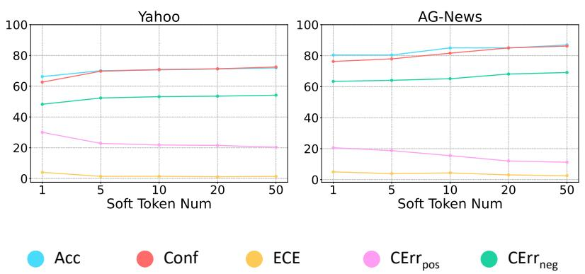

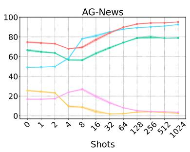

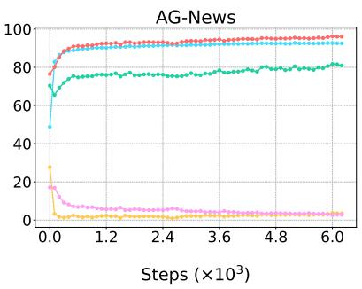

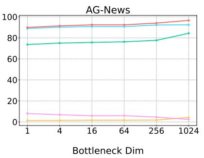  
Acc Conf ECE CErrpos CErrneg

Figure 7: Additional results of T5 on AG-News including the influence of the number of training samples, training steps, and the tunable parameters number.  
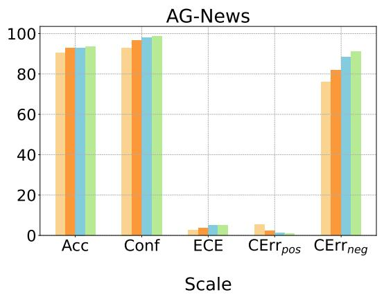  
Figure 8: Additional results of different PLMs scales with T5 on AG-News.

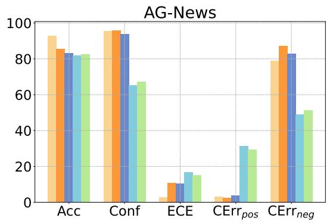

Figure 9: Additional results of the pretraining influence with T5 on AG-News.  
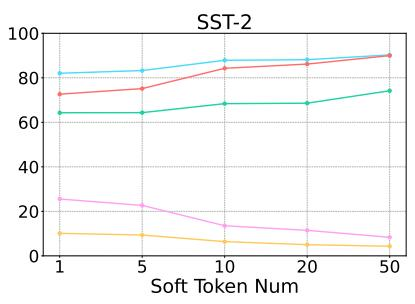

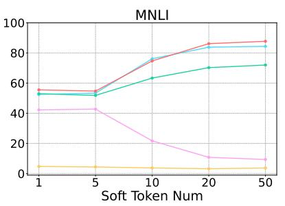  
Figure 10: Results of tunable parameters with T5 (Soft-prompt).

T5 has an obvious confidence drop in the early stage, the confidence of RoBERTa seems to continually increase along with the number of available training samples. This can be partially explained by the stronger few-shot adaptation of RoBERTa since we observe that the performance of RoBERTa is significantly higher in extreme cases (e.g., K=1,2,4).

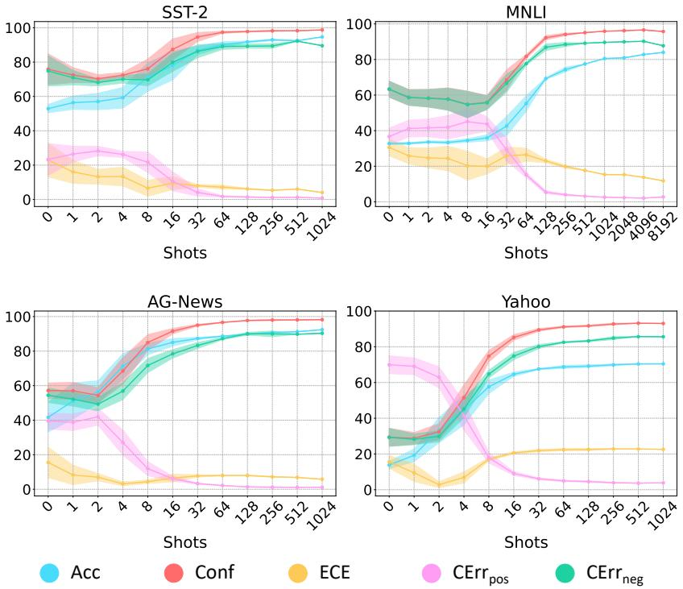  
Figure 11: Results of available training samples with RoBERTa.

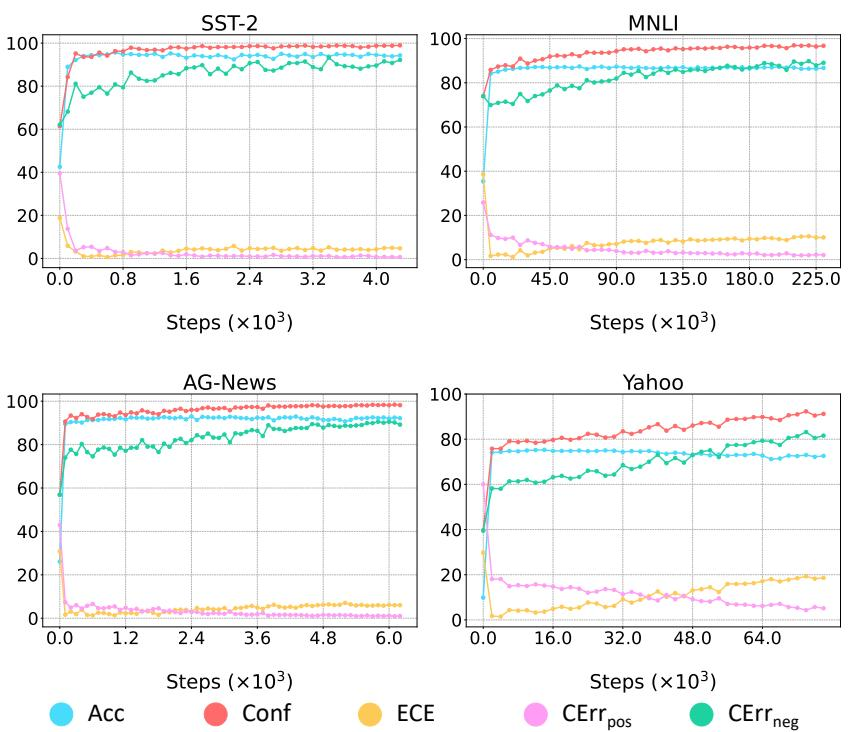  
Figure 12: Results of training steps with RoBERTa.

Training dynamics. We decompose the whole training process into steps, and measure five metrics during some fixed intervals. In this dimension, the conclusion is consistent with the general one.

Number of tunable parameters. To quantitatively explore the influence of the number of tunable parameters on PLMs calibration, we employ the parameter efficient tuning methods in NLP (Houlsby et al., 2019; Zaken et al., 2022; Ding et al., 2022). We adopt Soft-prompt (Lester et al., 2021) and Adapter (Houlsby et al., 2019) tuning due to their simplicity, stability, and practicality. We experiment with various numbers of soft tokens and bottleneck dimensions of the inserted adapter modules. Only the parameters in the soft tokens and adapter module are tunable.

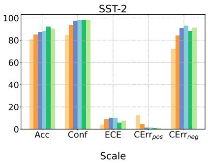

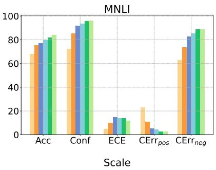

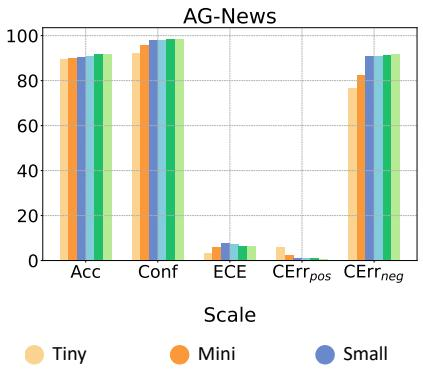

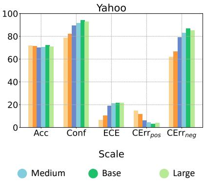  
Figure 13: Results of increasing PLMs scales with RoBERTa.

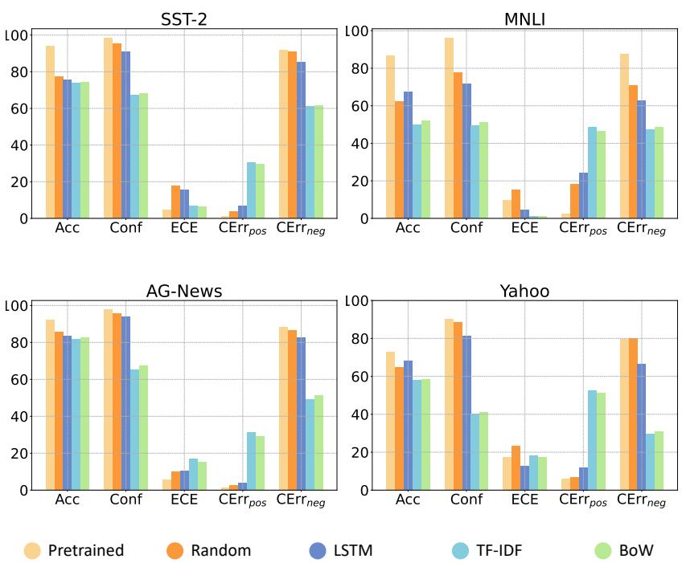  
Figure 14: Results of the pretraining influence with RoBERTa.

We summarize the extra findings as follows: (1) Soft-prompt and Adapter tuning show different trends spanning four datasets; (2) For Soft-prompt tuning, the model performance and confidence increase continually with more tunable parameters. We can observe that the increasing rates are nearly matched, thus decreasing ECE continually. The negative effect is also the increase in ${ \mathrm { C E r r } } _ { n e g }$ due to the overconfidence in wrong predictions. This is consistent with the trend we observed in the underfitted state; (3) The world in Adapter tuning is different, where increasing capacity cannot bring substantial performance gains. This is due to the strong capacity of Adapter. However, the overall confidence continues to increase given more capacity, resulting in increasing ECE and CErrneg, while the performance stays constant. This is consistent with the trend we observed in the overfittied state; (4) The implication of experimental results is that blindly increasing model capacity may negatively impact PLMs calibration, especially at the critical point when current capacity is sufficient to solve the task well.

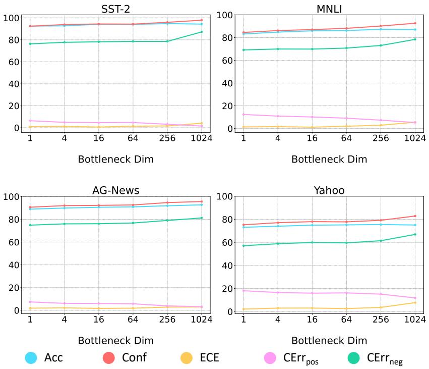  
Figure 15: Results of tunable parameters with RoBERTa (Adapter).

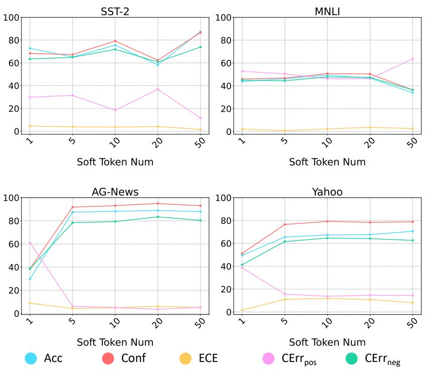  
Figure 16: Results of tunable parameters with RoBERTa (Soft-prompt).

Model scale. We consider the scaling law and experiment with various model sizes. For T5, we choose models with small, base, large, and 3b sizes. For RoBERTa, we choose models with tiny, mini, small, medium, base, and large sizes.

<table><tr><td></td><td colspan="2">Dataset</td><td></td><td colspan="4">Dynasent</td><td colspan="4"></td><td colspan="4"></td><td colspan="4">DSC</td></tr><tr><td>Method</td><td colspan="2"></td><td>Acc</td><td>Conf</td><td>ECE</td><td> $\mathrm { C E r r } _ { p o s }$ </td><td> $\operatorname { C E r r } _ { n e g }$ </td><td></td><td>Acc</td><td>Conf</td><td>ECE</td><td> $\mathrm { C E r r } _ { p o s }$ </td><td> ${ \mathrm { C E r r } } _ { n e g }$ </td><td>Acc</td><td>Conf</td><td>ECE</td><td> $\mathrm { C E r r } _ { p o s }$ </td><td></td><td> ${ \mathrm { C E r r } } _ { n e g }$ </td></tr><tr><td rowspan="8">Dynasent</td><td colspan="10">Vanilla</td><td colspan="5">8.71 3.44</td><td colspan="5">94.40 4.48</td></tr><tr><td>TS</td><td></td><td>78.45 79.10</td><td>1.02</td><td></td><td>17.37</td><td>66.27</td><td>86.57</td><td>89.92</td><td>3.36</td><td>8.59</td><td>80.31</td><td></td><td>90.00</td><td>89.26</td><td>0.78</td><td>8.90</td><td>72.68</td></tr><tr><td>Unlearnable LS</td><td></td><td>78.47</td><td>78.22</td><td>3.64</td><td>18.89</td><td>67.69</td><td>86.55</td><td>85.48</td><td>3.42</td><td>13.35</td><td></td><td>77.91</td><td>89.75</td><td>84.61</td><td>5.31</td><td>13.95</td><td>72.02</td></tr><tr><td>EDA</td><td></td><td>76.30</td><td>89.20</td><td>12.91</td><td>7.76</td><td>79.44</td><td>87.19</td><td>97.07</td><td>9.88</td><td>1.75</td><td></td><td>89.04</td><td>88.05</td><td>95.50</td><td>7.45</td><td>2.81</td><td>83.03</td></tr><tr><td>Ensemble</td><td></td><td>78.18</td><td>86.76</td><td>8.58</td><td>9.89</td><td>74.75</td><td>86.37</td><td>95.02</td><td>8.66</td><td>3.71</td><td></td><td>86.99</td><td>89.74</td><td>94.27</td><td>4.56</td><td>4.17</td><td>80.67</td></tr><tr><td>E-MLP</td><td></td><td>78.45</td><td>78.99</td><td>4.45</td><td>21.05</td><td>79.11</td><td>86.57</td><td>83.15</td><td>2.92</td><td></td><td>16.85</td><td>83.14</td><td>90.00</td><td>82.53</td><td>7.17</td><td>17.48</td><td>82.63</td></tr><tr><td></td><td>E-T5 (ours)</td><td>78.45</td><td>61.63</td><td>18.26</td><td>33.00</td><td>42.07</td><td>86.57</td><td>89.99</td><td>6.51</td><td></td><td>6.94</td><td>71.00</td><td>90.00</td><td>86.14</td><td>6.19</td><td>11.03</td><td>61.60</td></tr><tr><td>Learnable</td><td>I-Vanilla</td><td>78.47</td><td>61.95</td><td>17.91</td><td>32.77</td><td></td><td>42.72</td><td>84.44</td><td>89.89</td><td>6.52</td><td>6.18</td><td>68.52</td><td>88.84</td><td>86.15</td><td>5.76</td><td>10.77</td><td>61.69</td></tr><tr><td></td><td>I-Iter (ours)</td><td>77.92</td><td>61.45</td><td>16.47</td><td></td><td>33.26</td><td>42.78</td><td>86.03</td><td>86.92</td><td>2.99</td><td>9.99</td><td>67.91</td><td>89.45</td><td>84.72</td><td></td><td>4.88</td><td>12.54 61.55</td></tr><tr><td></td><td>I-Simul (ours)</td><td>78.13</td><td>66.36</td><td>24.59</td><td></td><td>25.51</td><td>37.34</td><td>85.67</td><td>91.26</td><td>13.29</td><td>5.28</td><td>70.59</td><td>88.61</td><td>87.83</td><td></td><td>12.46</td><td>8.41</td></tr></table>

Table 3: Results T5’s calibration performance under hard-to-easy distribution shifts.
<table><tr><td></td><td colspan="2">Dataset</td><td></td><td colspan="4">MNLI</td><td colspan="4"></td><td colspan="4">ANLI</td><td colspan="4"></td></tr><tr><td colspan="3">|Method</td><td>Acc</td><td>Conf</td><td>ECE 9.50</td><td> $\mathrm { C E r r } _ { p o s }$ </td><td></td><td> ${ \mathrm { C E r r } } _ { n e g }$ </td><td>Acc</td><td>Conf</td><td>ECE</td><td>CErrpos</td><td> ${ \mathrm { C E r r } } _ { n e g }$ </td><td>Acc</td><td>Conf</td><td>ECE</td><td> $\mathrm { C E r r } _ { p o s }$ </td><td> ${ \mathrm { C E r r } } _ { n e g }$ </td></tr><tr><td rowspan="6">MNLI</td><td rowspan="6">Unlearnable</td><td>Vanilla</td><td>85.90 85.90</td><td>96.24 86.65</td><td>0.90</td><td>2.40 11.09</td><td>87.36 71.84</td><td>54.17 54.17</td><td>95.09 82.15</td><td>39.68 26.74</td><td>2.71 15.43</td><td>92.36 79.16</td><td></td><td>29.78 29.78</td><td>90.94 75.57</td><td>61.14 45.57</td><td>11.28 27.32</td><td>91.90 76.80</td></tr><tr><td></td><td></td><td></td><td></td><td></td><td></td><td>55.59</td><td></td><td></td><td>11.47</td><td>85.00</td><td></td><td></td><td></td><td></td><td></td><td>82.34</td></tr><tr><td>LS EDA</td><td>86.28</td><td>86.88</td><td>4.43</td><td>11.92</td><td>79.31</td><td></td><td>86.96</td><td>31.37</td><td></td><td></td><td></td><td>29.25</td><td>81.59</td><td>52.37</td><td>20.23</td><td></td></tr><tr><td></td><td>85.99</td><td>97.07</td><td>11.09</td><td>1.78</td><td>90.05</td><td>58.24</td><td>96.87</td><td>38.63</td><td>1.91</td><td></td><td>95.16</td><td>31.34</td><td>92.00</td><td>60.66</td><td>8.81</td><td>92.38</td></tr><tr><td>Ensemble</td><td>86.60</td><td>96.32</td><td>9.74</td><td>2.37</td><td>87.90</td><td>56.09</td><td>96.44</td><td>40.35</td><td>2.00</td><td>94.45</td><td></td><td>30.06</td><td>90.47</td><td>60.46</td><td>11.38</td><td>91.26</td></tr><tr><td>E-MLP</td><td>85.90</td><td>85.82</td><td>13.73</td><td>14.16</td><td>85.67</td><td>54.17</td><td>81.92</td><td>29.36</td><td>17.87</td><td>81.66</td><td></td><td>29.78</td><td>81.49</td><td>51.71</td><td>18.88</td><td>81.65</td></tr><tr><td rowspan="3">Learnable</td><td rowspan="3">E-T5 (ours)</td><td></td><td>85.90 74.37</td><td>18.51</td><td>18.93</td><td></td><td>33.58</td><td>54.17 74.47</td><td>28.79</td><td></td><td>10.10</td><td>56.23</td><td>29.78</td><td>35.21</td><td>45.46</td><td>74.72</td><td>39.43</td></tr><tr><td>I-Vanilla</td><td>85.76 75.23</td><td>18.25</td><td>18.32</td><td></td><td>36.45</td><td>57.28 77.14</td><td>32.26</td><td></td><td>13.23</td><td>64.23</td><td>28.63</td><td>37.14</td><td>44.78</td><td>71.91</td><td>40.77</td></tr><tr><td>I-Iter (ours) I-Simul (ours)</td><td>86.63 60.04</td><td>26.59 18.91</td><td>33.85 18.49</td><td>20.41</td><td>53.70</td><td>57.77</td><td>21.70 33.83</td><td>29.34</td><td></td><td>42.82</td><td>31.06</td><td>21.29</td><td>31.88 45.44</td><td>83.71 66.86</td><td>23.55 40.95</td></tr><tr><td rowspan="6"></td><td colspan="2">Dataset</td><td colspan="4">86.46 74.81</td><td>32.01</td><td colspan="4">56.65 75.84</td><td>62.28</td><td colspan="4">29.16 38.67</td></tr><tr><td colspan="2">Method</td><td>Acc</td><td>Conf</td><td>Amazon</td><td></td><td></td><td>Acc</td><td>Conf</td><td>SST-5</td><td></td><td></td><td>Acc</td><td>Conf</td><td>SemEval ECE</td><td>CErrpos</td><td></td></tr><tr><td rowspan="6"></td><td rowspan="6">Vanilla TS Unlearnable LS</td><td>90.90</td><td>98.17</td><td>ECE 7.28</td><td> $\mathrm { C E r r } _ { p o s }$  1.09</td><td> ${ \mathrm { C E r r } } _ { n e g }$  90.84</td><td>70.29</td><td>94.29</td><td>ECE 24.05</td><td>CErrpos 3.95</td><td> ${ \mathrm { C E r r } } _ { n e g }$  90.14</td><td>56.02</td><td>90.45</td><td>34.43</td><td></td><td> ${ \mathrm { C E r r } } _ { n e g }$  87.26</td></tr><tr><td>90.90</td><td>89.66</td><td>2.02</td><td>8.73</td><td>73.58</td><td>70.29</td><td>78.15</td><td>7.91</td><td>18.42</td><td>70.04</td><td>56.02</td><td>70.34</td><td>14.32</td><td>7.05 25.98</td><td>65.65</td></tr><tr><td></td><td>91.89 88.50</td><td>6.71</td><td>10.64</td><td>78.83</td><td>69.92</td><td>84.01</td><td>14.20</td><td>14.38</td><td>80.28</td><td>55.17</td><td>81.64</td><td>26.47</td><td>15.46</td><td>78.08</td></tr><tr><td>EDA</td><td>92.39 98.34</td><td>5.95</td><td>0.92</td><td>89.46</td><td>66.64</td><td>93.98</td><td>27.34</td><td>3.82</td><td>89.57</td><td>57.05</td><td>93.45</td><td></td><td>36.43</td><td>4.37 90.56</td></tr><tr><td>Ensemble</td><td>91.69 98.19</td><td>6.50</td><td>1.06</td><td>89.93</td><td>69.56</td><td>93.67</td><td>24.22</td><td>4.24</td><td>88.93</td><td>55.94</td><td>90.14</td><td>34.23</td><td>7.19</td><td>86.76</td></tr><tr><td rowspan="8"></td><td>E-MLP</td><td>90.90</td><td>9.14</td><td></td><td></td><td></td><td>70.29</td><td>83.57</td><td></td><td></td><td>82.99</td><td>56.02</td><td>77.12</td><td>25.42</td><td>22.49</td><td>76.63</td></tr><tr><td>E-T5 (ours)</td><td>90.90</td><td>95.08 71.97</td><td>19.27</td><td>4.94 21.20</td><td>95.34 3.72</td><td>70.29</td><td>32.10</td><td>22.22 45.94</td><td>16.18 61.74</td><td>17.53</td><td>56.02</td><td>23.64</td><td>36.13</td><td>64.58</td><td>8.63</td></tr><tr><td>I-Vanilla</td><td>88.00</td><td>71.60</td><td>17.13</td><td>19.18</td><td>3.97</td><td>64.85</td><td>26.74</td><td>46.32</td><td>65.75</td><td>12.86</td><td>44.43</td><td>17.51</td><td>31.05</td><td>66.92</td><td>5.07</td></tr><tr><td>I-Iter (ours)</td><td>90.11</td><td>71.34</td><td>18.88</td><td>21.18</td><td>3.24</td><td>66.54</td><td>34.13</td><td>41.70</td><td>58.17</td><td>18.82</td><td>53.28</td><td>34.05</td><td>27.10</td><td></td><td>13.86</td></tr><tr><td>I-Simul (ours)</td><td>90.60</td><td>71.07</td><td>19.80</td><td>21.91</td><td>3.41</td><td>69.35</td><td>33.96</td><td>44.16</td><td>58.75</td><td>17.46</td><td>53.50</td><td>24.20</td><td>33.35</td><td>48.25 61.15</td><td>7.36</td></tr><tr><td colspan="2">Dataset</td><td colspan="4"></td><td colspan="4">Hate Speech</td><td colspan="5"></td></tr><tr><td rowspan="8">Unlearnable</td><td rowspan="8">Method Vanilla TS</td><td></td><td>Acc Conf</td><td>ECE</td><td>Civil  $\mathrm { C E r r } _ { p o s }$ </td><td> ${ \mathrm { C E r r } } _ { n e g }$ </td><td>Acc</td><td>Conf</td><td>ECE</td><td> $\mathrm { C E r r } _ { p o s }$ </td></table>

Table 4: Results of RoBERTa’s calibration performance under standard distribution shifts.

Our results support the “scaling improves calibration” conclusion in some cases. We observe that ECE decreases when larger capacity brings substantial improvement to PLMs’ performance (e.g., T5 on SST-2 and MNLI). However, when the performance reaches a plateau value, increasing capacity only boosts PLMs’ confidence (e.g., T5 and RoBERTa on Yahoo). In this case, the ECE increases when the PLM’s scale keeps increasing.

Pretraining. We choose the pre-trained RoBERTa-base and pre-trained T5-base (Pretrained), and compare them with several nonpretrained models, including random initialized RoBERTa-base and T5-base (Random), BiL-STM (LSTM) (Hochreiter and Schmidhuber,

1997), Term Frequency Inverse Document Frequency (TF-IDF) (Luhn, 1957), and Bag-of-word (BoW) (Harris, 1954). We find that pretraining only reduces ECE on relative simpler datasets, like SST-2 and AG-News, but bring negligible benefits on MNLI and Yahoo. This finding shares the same ground with scaling experiments.

## C Construction of the Calibration Training Dataset

In this paper, we consider the classification tasks. The construction process can be extended to the natural language generation tasks. We have an annotated dataset $\mathbb { D } = \{ ( x _ { i } , y _ { i } ) _ { i = 1 } ^ { N } \}$ for the standard training on the classification tasks. We typically fit a model  on the training dataset by minimizing the pre-defined loss (e.g., cross-entropy loss). We denote the original task as the main task. Then for the newly introduced calibration task, we need to generate a calibration training dataset $\mathbb { D } ^ { * }$ for training. To do so, we first train the model on the main task using the training dataset, and employ the trained model to give predictions on samples from the validation set. Then the calibration training dataset $\mathbb { D } ^ { * } = \{ ( x _ { i } , y _ { i } ^ { * } , c _ { i } ) _ { i = 1 } ^ { M } \}$ can be generated from the validation set, where $x _ { i }$ is the original sample in the validation set, $y _ { i } ^ { * }$ is model’s original prediction, and $c _ { i }$ is a binary value that indicates whether the original prediction is correct or not. Specifically, we perform downsampling to ensure a balanced label distribution.

<table><tr><td>Model Scale</td><td>Dataset</td><td colspan="4">Amazon</td><td colspan="2"></td><td colspan="4">SST-5</td><td colspan="4">SemEval</td></tr><tr><td></td><td>Method</td><td>Acc</td><td>Conf</td><td>ECE</td><td> $\mathrm { C E r r } _ { p o s }$ </td><td> ${ \mathrm { C E m } } _ { n e g }$ </td><td> $_ \mathrm { A c c }$ </td><td>Conf</td><td>ECE</td><td> $\mathrm { C E r r } _ { p o s }$ </td><td> ${ \mathrm { C E r r } } _ { n e g }$ </td><td>Acc Conf</td><td>ECE</td><td> $\mathrm { C E r r } _ { p o s }$ </td><td> ${ \mathrm { C E m } } _ { n e g }$ </td></tr><tr><td rowspan="6">T5-small</td><td>E-MLP</td><td>87.65</td><td>86.41</td><td>4.78</td><td>13.59</td><td>86.43</td><td>65.14</td><td>80.15 15.23</td><td>19.86</td><td>80.17</td><td>49.23</td><td>77.14</td><td>27.91</td><td>22.89</td><td>77.17</td></tr><tr><td>E-T5 (ours)</td><td>87.65</td><td>67.80</td><td>19.85 23.71</td><td>7.49</td><td>65.14</td><td>28.16</td><td>37.29</td><td>64.06</td><td>13.63</td><td>49.23</td><td>30.45</td><td>19.40</td><td>50.65</td><td>12.12</td></tr><tr><td>I-Vanilla</td><td>81.64</td><td>57.35</td><td>24.28</td><td>30.30</td><td>2.45 55.01</td><td>3.95</td><td>51.21</td><td>93.35</td><td>0.66</td><td>44.57</td><td>2.17</td><td>42.43</td><td>95.53</td><td>0.32</td></tr><tr><td>I-Iter (ours)</td><td>87.54</td><td>68.20</td><td>19.33</td><td>22.89</td><td>5.66 64.10</td><td>28.81</td><td>36.99</td><td>62.99</td><td>14.16</td><td>48.52</td><td>32.05</td><td>17.49</td><td>47.86</td><td>13.13</td></tr><tr><td>I-Simul (ours)</td><td>87.66</td><td>68.61</td><td>19.05 22.63</td><td>6.35</td><td>64.57</td><td>29.59</td><td>37.57</td><td>62.38</td><td>14.95</td><td>50.38</td><td>35.00</td><td>18.89</td><td>45.87</td><td>15.58</td></tr><tr><td>Method</td><td>Acc</td><td>Conf</td><td>ECE</td><td> $\mathrm { C E r r } _ { p o s }$ </td><td> ${ \mathrm { C E m } } _ { n e g }$ </td><td>Acc</td><td>Conf</td><td></td><td> ${ \mathrm { C E r r } } _ { n e g }$ </td><td></td><td>Conf</td><td>ECE</td><td></td><td> ${ \mathrm { C E m } } _ { n e g }$ </td></tr><tr><td rowspan="6">T5-base</td><td></td><td></td><td></td><td>4.35</td><td></td><td></td><td></td><td>ECE</td><td> $\mathrm { C E r r } _ { p o s }$ </td><td></td><td>Acc</td><td></td><td></td><td> $\mathrm { C E r r } _ { p o s }$ </td><td>78.42</td></tr><tr><td>E-MLP</td><td>91.00 91.00</td><td>90.44 71.03</td><td>9.56 19.97 22.40</td><td>90.41 4.63</td><td>69.73 69.73</td><td>85.18</td><td>15.45</td><td>14.69 61.80</td><td>84.87 16.83</td><td>55.03</td><td>78.39</td><td>23.36</td><td>21.63 56.23</td><td>12.54</td></tr><tr><td>E-T5 (ours)</td><td>88.25</td><td>70.91</td><td>17.34 20.16</td><td>3.86</td><td>63.07</td><td>31.73 29.81</td><td>38.80 34.08</td><td>59.42</td><td>11.42</td><td>55.03 48.08</td><td>29.72 25.32</td><td>26.28 23.69</td><td>55.53</td><td>7.59</td></tr><tr><td>I-Vanilla I-Iter (ours)</td><td>91.69</td><td>71.76</td><td>19.93 22.23</td><td>5.43</td><td>68.23</td><td>33.46</td><td>36.87</td><td>59.79</td><td>18.96</td><td>56.23</td><td>35.21</td><td>21.42</td><td>50.98</td><td>17.48</td></tr><tr><td>I-Simul (ours)</td><td>91.38</td><td>70.92</td><td>20.47 22.80</td><td>4.30</td><td>70.29</td><td>32.03</td><td>42.12</td><td>60.65</td><td>14.72</td><td>54.75</td><td>26.18</td><td>30.70</td><td>59.34</td><td>8.67</td></tr><tr><td></td><td></td><td>Conf</td><td></td><td></td><td></td><td>Acc</td><td></td><td></td><td></td><td></td><td></td><td></td><td></td><td></td></tr><tr><td rowspan="6">T5-large</td><td>Method</td><td>Acc</td><td></td><td>ECE</td><td> $\mathrm { C E r r } _ { p o s }$ </td><td> ${ \mathrm { C E m } } _ { n e g }$ </td><td>Conf</td><td>ECE</td><td> $\mathrm { C E r r } _ { p o s }$ </td><td> ${ \mathrm { C E r r } } _ { n e g }$ </td><td>Acc</td><td>Conf</td><td>ECE</td><td> $\mathrm { C E r r } _ { p o s }$ </td><td> ${ \mathrm { C E m } } _ { n e g }$ </td></tr><tr><td>E-MLP</td><td>91.58</td><td>91.95</td><td>4.70</td><td>8.04</td><td>91.89 73.85</td><td>83.52</td><td>10.24</td><td>16.52</td><td>83.61</td><td>56.65</td><td>78.26</td><td>21.61</td><td>21.74</td><td>78.26</td></tr><tr><td>E-T5 (ours)</td><td>91.58</td><td>70.10</td><td>21.48</td><td>23.70 2.66</td><td>73.85</td><td>29.96</td><td>47.35</td><td>64.65</td><td>14.75</td><td>56.65</td><td>28.56</td><td>29.98</td><td>57.52</td><td>10.36</td></tr><tr><td>I-Vanilla</td><td>88.88 92.96</td><td>69.42 88.26</td><td>19.46 10.48</td><td>22.12 8.74</td><td>1.81 48.71</td><td>71.79 28.30</td><td>46.83</td><td>65.12</td><td>11.55</td><td>49.00</td><td>24.66 84.26</td><td>25.95</td><td>56.30</td><td>6.37</td></tr><tr><td>I-Iter (ours)</td><td>93.34</td><td>74.45</td><td>19.39</td><td></td><td>73.66</td><td>72.45 70.35 36.92</td><td>30.29 45.40</td><td>25.22 57.27</td><td>58.71 20.66</td><td>58.08 56.87</td><td>40.04</td><td>35.21 28.43</td><td>12.77</td><td>80.14</td></tr><tr><td>I-Simul (ours)</td><td></td><td></td><td></td><td>20.62</td><td>5.43</td><td></td><td></td><td></td><td></td><td></td><td></td><td></td><td>44.23</td><td>19.29</td></tr></table>

Table 5: Results of T5’s calibration performance with increasing model scales.
<table><tr><td colspan="2">ID Dataset</td><td colspan="5">SST-2</td><td colspan="5">Yahoo</td></tr><tr><td colspan="2">OOD Dataset</td><td colspan="2">SST-2</td><td colspan="2">Bookcorpus</td><td colspan="2">Random Words</td><td colspan="2">Bookcorpus</td><td colspan="2">Random Words</td></tr><tr><td colspan="2">Method</td><td>Conf Entropy</td><td>Conf</td><td>Entropy</td><td>Conf</td><td>Entropy</td><td>Conf</td><td>Entropy</td><td>Conf Entropy</td><td>Conf</td><td>Entropy</td></tr><tr><td rowspan="5">Unlearnable</td><td>Vanilla TS</td><td>98.04</td><td>5.01</td><td>93.38 15.97</td><td>84.46</td><td>34.95</td><td>82.76</td><td>51.94</td><td>47.62 152.43</td><td>56.95</td><td>126.54</td></tr><tr><td></td><td>93.89</td><td>18.02</td><td>85.07 35.23</td><td>72.49</td><td>54.69</td><td>75.72</td><td>76.29</td><td>38.43 177.74</td><td>47.70</td><td>154.00</td></tr><tr><td>LS</td><td>88.64</td><td>33.90</td><td>83.65 40.46</td><td>72.31</td><td>55.30</td><td>74.35</td><td>93.81</td><td>44.29 168.14</td><td>54.08</td><td>145.94</td></tr><tr><td>EDA</td><td>98.27</td><td>4.33</td><td>93.73 15.45</td><td>83.00</td><td>37.15</td><td>83.68</td><td>46.75</td><td>50.59 141.92</td><td>69.03</td><td>92.58</td></tr><tr><td>Ensemble</td><td>97.96</td><td>5.20</td><td>93.21 16.47</td><td>82.75</td><td>37.87</td><td>82.41</td><td>53.01</td><td>48.29 150.39</td><td>55.87</td><td>130.57</td></tr><tr><td rowspan="5">Learnable</td><td>E-MLP</td><td>88.62</td><td>35.37</td><td>86.94 38.69</td><td>85.04</td><td>42.17</td><td>74.93</td><td></td><td>61.80</td><td>67.57</td><td></td></tr><tr><td>E-T5 (ours)</td><td>55.96</td><td>62.11</td><td>56.35 64.08</td><td>64.02</td><td>60.32</td><td>60.29</td><td></td><td>13.64</td><td>22.56</td><td></td></tr><tr><td>I-Vanilla</td><td>56.31</td><td>62.13</td><td>57.72 63.99</td><td>66.47</td><td>59.90</td><td>60.51</td><td></td><td>13.71</td><td>22.78</td><td></td></tr><tr><td>I-Iter (ours)</td><td>43.43</td><td>57.59</td><td>43.24 60.62</td><td>56.07</td><td>61.10</td><td>61.35</td><td></td><td>20.62</td><td>39.08</td><td></td></tr><tr><td>I-Simul (ours)</td><td>63.24</td><td>10.50</td><td>65.74 2.25</td><td>77.68</td><td>0.01</td><td>60.52</td><td></td><td>6.44</td><td>14.67</td><td></td></tr></table>

Table 6: Results on task-irrelevant inputs with T5. We don’t report the entropy results of learnable methods when Yahoo is adopted as ID dataset since the class numbers are different in unlearnable (10 original classes in Yahoo) and learnable methods (2 classes), which will result in unfair comparison.

In this paper, we adopt the same process to generate the calibration training dataset. But different methods may adopt specially designed training paradigms to utilize the calibration training data.

We described the training details in Sec. 5.1.

## D Additional Results of Calibration Methods

For exploring the effectiveness of existing calibration methods, we provide results with RoBERTa in Table 4, Table 7, and Table 8 The results with the model scaling effect are in Table 5.

## E Further Analysis of Distribution Shifts

In Sec. 5.3, we show that PLMs are less calibrated under distribution shifts, consistent with previous work (Desai and Durrett, 2020; Minderer et al., 2021). However, can we safely conclude that distribution shifts degrade PLMs’ calibration performance? We study hard-to-easy distribution shifts (see Appendix F for the detailed setting) to further investigate the essence of this problem. In this setting, models are trained on a difficult ID dataset and infer on easier OOD datasets. This comes with relatively lower ID and higher OOD performance. Specifically, we consider the sentiment analysis task and choose Dynasent (Amazon and DSC) as the ID (OOD) datasets. The details of the datasets are described in Appendix A.

<table><tr><td></td><td colspan="2">Dataset</td><td colspan="2"></td><td colspan="2">Dynasent</td><td colspan="2"></td><td colspan="2">Amazon</td><td colspan="2"></td><td colspan="2"></td><td colspan="3">DSC</td></tr><tr><td>Method</td><td colspan="2">Vanilla</td><td>Acc</td><td>Conf</td><td>ECE</td><td> $\mathrm { C E r r } _ { p o s }$ </td><td> $\operatorname { C E r r } _ { n e g }$ </td><td>Acc</td><td>Conf</td><td>ECE</td><td> $\mathrm { C E r r } _ { p o s }$ </td><td> ${ \mathrm { C E r r } } _ { n e g }$ </td><td>Acc</td><td>Conf</td><td>ECE</td><td> $\mathrm { C E r r } _ { p o s }$ </td><td> ${ \mathrm { C E r r } } _ { n e g }$ </td></tr><tr><td rowspan="7">Unlearnable Dynasent</td><td rowspan="3"></td><td></td><td>78.61</td><td>94.56</td><td>17.10</td><td>3.56</td><td>88.06</td><td>85.47</td><td>97.84</td><td>12.48</td><td>1.18</td><td>92.08</td><td>87.93</td><td>97.23</td><td>9.30</td><td>1.74</td><td>89.70</td></tr><tr><td>TS</td><td>78.61</td><td>77.47</td><td>0.95</td><td>19.47</td><td>66.96</td><td>85.47</td><td>86.61</td><td>2.54</td><td>11.24</td><td>74.11</td><td>87.93</td><td>85.09</td><td>2.99</td><td>12.84</td><td>70.03</td></tr><tr><td>LS</td><td>76.48</td><td>85.95 95.65</td><td>9.46</td><td>12.37</td><td>80.47</td><td>85.85</td><td>89.34</td><td>7.39</td><td>9.53 1.08</td><td>82.53</td><td>87.15</td><td>88.19</td><td>5.46</td><td>10.71</td><td>80.75</td></tr><tr><td>EDA</td><td></td><td>76.97</td><td>18.74</td><td>2.92</td><td></td><td>90.85</td><td>84.12</td><td>97.92 13.81</td><td></td><td></td><td>92.64</td><td>85.53</td><td>97.13</td><td>11.62</td><td>1.64</td><td>89.87</td></tr><tr><td></td><td>Ensemble</td><td>77.67</td><td>94.85</td><td>17.22</td><td>3.44</td><td>88.89</td><td>85.37</td><td>97.88</td><td>12.52</td><td>1.12</td><td>92.11</td><td>86.69</td><td>97.11</td><td>10.43</td><td>1.76</td><td>89.77</td></tr><tr><td rowspan="3"></td><td>E-MLP</td><td>78.61</td><td>71.06</td><td>19.59</td><td>28.81</td><td>70.59</td><td>85.47</td><td>85.74</td><td>12.10</td><td>14.25</td><td>85.69</td><td>87.93</td><td>79.37</td><td>14.46</td><td>20.61</td><td>79.25</td></tr><tr><td>E-T5 (ours)</td><td>78.61</td><td>64.94</td><td>23.76</td><td>26.76</td><td>34.43</td><td>85.47</td><td>85.53</td><td>13.23</td><td>9.45</td><td>56.03</td><td>87.93</td><td>81.72</td><td>14.91</td><td>13.50</td><td>49.71</td></tr><tr><td>I-Vanilla</td><td>77.38</td><td>66.71</td><td>22.76</td><td>24.92</td><td>38.06</td><td>83.85</td><td>85.80</td><td>12.18</td><td>7.99</td><td>53.56</td><td>87.10</td><td>82.30</td><td>14.25</td><td>12.89</td><td>49.77</td></tr><tr><td rowspan="3"></td><td rowspan="3">Learnable</td><td>I-Iter (ours)</td><td>77.89</td><td>64.17</td><td>21.98</td><td>28.43</td><td>38.09</td><td>84.49</td><td>87.49</td><td>10.00</td><td>7.47</td><td>60.06</td><td>87.05</td><td>82.83</td><td>12.14</td><td>12.86</td><td>53.81</td></tr><tr><td>I-Simul (ours)</td><td>78.63</td><td>65.00</td><td>25.56</td><td>27.08</td><td>35.84</td><td>83.65</td><td>79.79</td><td>15.36</td><td>13.28</td><td>44.38</td><td>85.79</td><td>77.29</td><td>17.78</td><td>16.91</td><td>42.30</td></tr><tr><td></td><td></td><td></td><td></td><td></td><td></td><td></td><td></td><td></td><td></td><td></td><td></td><td></td><td></td><td></td><td></td></tr></table>

Table 7: Results of RoBERTa’s calibration performance under hard-to-easy distribution shifts.
<table><tr><td colspan="2">ID Dataset</td><td colspan="5">SST-2</td><td colspan="5">Yahoo</td></tr><tr><td colspan="2">OOD Dataset</td><td colspan="2">SST-2</td><td colspan="2">Bookcorpus</td><td colspan="2">Random Words Yahoo</td><td colspan="2">Bookcorpus</td><td colspan="2">Random Words</td></tr><tr><td colspan="2">Method</td><td>Conf Entropy</td><td>Conf</td><td>Entropy</td><td>Conf</td><td>Entropy</td><td>Conf Entropy</td><td>Conf</td><td>Entropy</td><td>Conf</td><td>Entropy</td></tr><tr><td rowspan="5">Unlearnable</td><td>Vanilla TS</td><td>98.33</td><td>4.27 94.85</td><td>12.63</td><td>96.28</td><td>9.97</td><td>90.18 26.96</td><td>72.17</td><td>77.84</td><td>78.49</td><td>59.14</td></tr><tr><td></td><td>93.43</td><td>19.62 86.41</td><td>32.66</td><td>87.50</td><td>32.46</td><td>71.73 90.13</td><td>44.01</td><td>163.43</td><td>50.51</td><td>148.65</td></tr><tr><td>LS</td><td>87.88</td><td>35.74</td><td>83.30 42.64</td><td>82.88</td><td>44.11</td><td>82.08</td><td>74.02</td><td>67.53 110.10</td><td>74.89</td><td>93.55</td></tr><tr><td>EDA</td><td>98.43</td><td>3.67</td><td>95.54 10.79</td><td>91.55</td><td>20.06</td><td>94.24 15.08</td><td>83.30</td><td>44.77</td><td>86.10</td><td>35.91</td></tr><tr><td>Ensemble</td><td>98.24</td><td>4.49 94.65</td><td>12.87</td><td>93.26</td><td>15.98</td><td>91.22 23.92</td><td>75.10</td><td>69.13</td><td>80.31</td><td>54.06</td></tr><tr><td rowspan="5">Learnable</td><td>E-MLP</td><td>94.48</td><td>15.99</td><td>80.75 36.41</td><td>63.81</td><td>59.36</td><td>74.15</td><td></td><td>41.87</td><td>42.31</td><td></td></tr><tr><td>E-T5 (ours)</td><td>84.79</td><td>16.26</td><td>63.99 24.34</td><td>22.84</td><td>27.72</td><td>68.71</td><td></td><td>22.70</td><td>15.20</td><td></td></tr><tr><td>I-Vanilla</td><td>84.83</td><td>16.33</td><td>65.34 25.09</td><td>23.08</td><td>28.39</td><td>69.55</td><td></td><td>24.84</td><td>17.78</td><td></td></tr><tr><td>I-Iter (ours)</td><td>56.89</td><td>20.06</td><td>62.99 21.10</td><td>42.25</td><td>30.37</td><td>76.16</td><td></td><td>54.33</td><td>48.54</td><td></td></tr><tr><td>I-Simul (ours)</td><td>75.24</td><td>9.44 46.51</td><td>13.88</td><td>8.11</td><td>5.44</td><td>64.66</td><td></td><td>19.70</td><td>19.47</td><td></td></tr></table>

Table 8: Results on task-irrelevant inputs with RoBERTa. We don’t report the entropy results of learnable methods when Yahoo is adopted as ID dataset since the class numbers are different in unlearnable (10 original classes in Yahoo) and learnable methods (2 classes), which will result in unfair comparison.

The results of T5 and RoBERTa are shown in Table 3 and Table 7 respectively. We observe completely different results with Sec. 5.3. Across all methods, the ECE and $\mathrm { C E r r } _ { p o s }$ decrease under the hard-to-easy distribution shifts, contradictory to the previous conclusion that PLMs are less calibrated on OOD samples. In hard-to-easy shifts, performance and confidence both increase due to the relative simpleness of the OOD samples. The indication is that PLMs’ relative calibration performance on ID and OOD samples relies on the dataset difficulty, and the conclusion that PLMs are less calibrated under distribution shifts is onesided. This is consistent with our empirical study in Sec. 4 that emphasizes the influence of dataset difficulty on PLMs calibration.

To further investigate the influence of dataset difficulty on PLMs’ calibration performance, we evaluate the calibration on task-irrelevant inputs (see Appendix F for the detailed setting) of PLMs trained on ID datasets with different difficulty (e.g., SST-2 and Yahoo). The task-irrelevant inputs include plain texts (e.g., bookcorpus) and random words. Since no golden labels are provided, we measure the calibration performance through maximum confidence scores and predictive entropy.

The results of T5 are shown in Table 6, and RoBERTa are shown in Table 8. We show that PLMs have unreasonable high confidence in taskirrelevant inputs, especially when trained on SST-2. Comparing the results when trained on SST-2 or Yahoo, we find that the ID training dataset has significant influence on PLMs calibration. Still, this can be attributed to the dataset difficulty. We also observe the superior performance of learnable calibration methods. They produce lower confidence scores on plain text and random tokens compared to unlearnable ones.

In summary, the influence of distribution shifts on PLMs calibration is dependent on the evaluation datasets chosen. The original conclusion that calibration performance degrades on OOD samples is based on two premises: (1) PLMs are overconfident in their wrong predictions, which is supported by our experiments; (2) The OOD datasets are harder so PLMs cannot achieve good

<table><tr><td>Task</td><td>Dataset</td><td># Classes</td><td>Avg.Len</td><td>Train</td><td>Dev</td><td>Test</td></tr><tr><td rowspan="4">Sentiment Analysis</td><td>SST-2</td><td>2</td><td>19.23</td><td>6920</td><td>1821</td><td>872</td></tr><tr><td>Amazon</td><td>3</td><td>77.86</td><td>24000</td><td>78741</td><td>91606</td></tr><tr><td>SST-5</td><td>3</td><td>18.75</td><td></td><td>I</td><td>1067</td></tr><tr><td>SemEval</td><td>3</td><td>19.61</td><td></td><td></td><td>6000</td></tr><tr><td rowspan="3">Natural Language Inference</td><td>MNLI</td><td>3</td><td>19.36/10.06</td><td>373067</td><td>19635</td><td>9815</td></tr><tr><td>HANS</td><td>2</td><td>9.15/5.61</td><td></td><td></td><td>30000</td></tr><tr><td>ANLI</td><td>3</td><td>54.40/10.34</td><td></td><td></td><td>3200</td></tr><tr><td rowspan="2">Topic Classification</td><td>Yahoo</td><td>10</td><td>96.98</td><td>126000</td><td>14000</td><td>60000</td></tr><tr><td>AG</td><td>4</td><td>38.5</td><td>10000</td><td></td><td>7600</td></tr><tr><td rowspan="3">Toxic Detection</td><td>Civil</td><td>2</td><td>52.86</td><td>48000</td><td>12000</td><td>97320</td></tr><tr><td>Hate Speech</td><td>2</td><td>21.55</td><td></td><td></td><td>478</td></tr><tr><td>Implicit Hate</td><td>2</td><td>17.34</td><td></td><td></td><td>21479</td></tr><tr><td>Plain</td><td>Book Corpus</td><td></td><td></td><td></td><td></td><td></td></tr><tr><td>Text</td><td>Random Words</td><td></td><td>13.39 20.28</td><td></td><td></td><td>10000 1000</td></tr></table>

Table 9: Dataset Statistics.
<table><tr><td rowspan=1 colspan=1>Task</td><td rowspan=1 colspan=1>Dataset</td><td rowspan=1 colspan=1>Template</td><td rowspan=1 colspan=1>Verbalizer</td></tr><tr><td rowspan=1 colspan=1></td><td rowspan=1 colspan=1>SST-2</td><td rowspan=1 colspan=1>It was {&quot;mask&quot;} . {&quot;placeholder&quot;: &quot;text_a&quot;}</td><td rowspan=1 colspan=1>[bad, good]</td></tr><tr><td rowspan=3 colspan=1>SentimentAnalysis</td><td rowspan=1 colspan=1>Amazon</td><td rowspan=1 colspan=1>It was {&quot;mask&quot;} . {&quot;placeholder&quot;: &quot;text_a&quot;}</td><td rowspan=1 colspan=1>[bad, good, neutral]</td></tr><tr><td rowspan=1 colspan=1>SST-5</td><td rowspan=1 colspan=1>It was {&quot;mask&quot;} . {&quot;placeholder&quot;: &quot;text_a&quot;}</td><td rowspan=1 colspan=1>[bad, good, neutral]</td></tr><tr><td rowspan=1 colspan=1>SemEval</td><td rowspan=1 colspan=1>It was {&quot;mask&quot;} . {&quot;placeholder&quot;: &quot;text_a&quot;}</td><td rowspan=1 colspan=1>[bad, good, neutral]</td></tr><tr><td rowspan=3 colspan=1>NaturalLanguageInference</td><td rowspan=1 colspan=1>MNLI</td><td rowspan=1 colspan=1>Given the two sentences:(1) {&quot;placeholder&quot;: &quot;text_a&quot;}.(2) {&quot;placeholder&quot;: &quot;text_b&quot;}.Does the first sentence entails the second ? {&quot;mask&quot;}.</td><td rowspan=1 colspan=1>[No, Yes, Maybe]</td></tr><tr><td rowspan=1 colspan=1>HANS</td><td rowspan=1 colspan=1>Given the two sentences:(1) {&quot;placeholder&quot;: &quot;text_a&quot;}.(2) {&quot;placeholder&quot;: &quot;text_b&quot;}.Does the first sentence entails the second ? {&quot;mask&quot;}</td><td rowspan=1 colspan=1>[No, Yes, Maybe]</td></tr><tr><td rowspan=1 colspan=1>ANLI</td><td rowspan=1 colspan=1>Given the two sentences:(1) {&quot;placeholder&quot;: &quot;text_a&quot;}.(2) {&quot;placeholder&quot;: &quot;text_b&quot;}.Does the first sentence entails the second ? {&quot;mask&quot;}.</td><td rowspan=1 colspan=1>[No, Yes, Maybe]</td></tr><tr><td rowspan=1 colspan=1>TopicClassification</td><td rowspan=1 colspan=1>Yahoo</td><td rowspan=1 colspan=1>A {&quot;mask&quot;}question : {&quot;placeholder&quot;: &quot;text_a&quot;} {&quot;placeholder&quot;: &quot;text_b&quot;}</td><td rowspan=1 colspan=1>[society, science,health, education,computers, sports,business, entertainment,relationships, politics]</td></tr><tr><td rowspan=1 colspan=1></td><td rowspan=1 colspan=1>AG</td><td rowspan=1 colspan=1>A {&quot;mask&quot;} news : {&quot;placeholder&quot;: &quot;text_a&quot;}{&quot;placeholder&quot;: &quot;text_b&quot;}</td><td rowspan=1 colspan=1>[politics, sports,business, technology]</td></tr><tr><td rowspan=2 colspan=1>ToxicDetection</td><td rowspan=1 colspan=1>Civil</td><td rowspan=1 colspan=1>It was {&quot;mask&quot;} . {&quot;placeholder&quot;: &quot;text_a&quot;}</td><td rowspan=1 colspan=1>[benign, toxic]</td></tr><tr><td rowspan=1 colspan=1>Hate SpeechImplicit Hate</td><td rowspan=1 colspan=1>It was {&quot;mask&quot;} . {&quot;placeholder&quot;: &quot;text_a&quot;}It was {&quot;mask&quot;} . {&quot;placeholder&quot;: &quot;text_a&quot;}</td><td rowspan=1 colspan=1>[benign, toxic][benign, toxic]</td></tr></table>

Table 10: The manual templates and verbalizers adopted for each dataset.

performance. The second premise has not always calibration performance on ID and OOD samples. been satisfied, and we show that the relative   
dataset difficulty significantly influences PLMs

<table><tr><td rowspan=1 colspan=1>Task</td><td rowspan=1 colspan=1>Dataset</td><td rowspan=1 colspan=1>Template</td><td rowspan=1 colspan=1>Verbalizer</td></tr><tr><td rowspan=4 colspan=1>SentimentAnalysis</td><td rowspan=1 colspan=1>SST-2</td><td rowspan=1 colspan=1>Sentence: {&quot;placeholder&quot;: &quot;text_a&quot;} The predicted sentiment is {&quot;placeholder&quot;: &quot;text_b&quot;} .Is the prediction True or False ? It&#x27;s {&quot;mask&quot;} .</td><td rowspan=11 colspan=1>[False, True]</td></tr><tr><td rowspan=1 colspan=1>Amazon</td><td rowspan=1 colspan=1>Sentence: {&quot;placeholder&quot;: &quot;text_a&quot;} The predicted sentiment is {&quot;placeholder&quot;: &quot;text_b&quot;} .Is the prediction True or False ? It&#x27;s {&quot;mask&quot;} .</td></tr><tr><td rowspan=1 colspan=1>SST-5</td><td rowspan=1 colspan=1>Sentence: {&quot;placeholder&quot;: &quot;text_a&quot;} The predicted sentiment is {&quot;placeholder&quot;: &quot;text_b&quot;} .Is the prediction True or False ? It&#x27;s {&quot;mask&quot;} .</td></tr><tr><td rowspan=1 colspan=1>SemEval</td><td rowspan=1 colspan=1>Sentence: {&quot;placeholder&quot;: &quot;text_a&quot;} The predicted sentiment is {&quot;placeholder&quot;: &quot;text_b&quot;} .Is the prediction True or False ? It&#x27;s {&quot;mask&quot;}</td></tr><tr><td rowspan=1 colspan=1></td><td rowspan=1 colspan=1>MNLI</td><td rowspan=1 colspan=1>Given the two sentences: {&quot;placeholder&quot;: &quot;text_a&quot;}The predicted relationship between the two sentences is {&quot;placeholder&quot;: &quot;text_b&quot;}Is the prediction True or False ? It&#x27;s {&quot;mask&quot;} .</td></tr><tr><td rowspan=1 colspan=1>NaturalLanguageInference</td><td rowspan=1 colspan=1>HANS</td><td rowspan=1 colspan=1>Given the two sentences: {&quot;placeholder&quot;: &quot;text_a&quot;}The predicted relationship between the two sentences is {&quot;placeholder&quot;: &quot;text_b&quot;}Is the prediction True or False ? It&#x27;s {&quot;mask&quot;} .</td></tr><tr><td rowspan=1 colspan=1></td><td rowspan=1 colspan=1>ANLI</td><td rowspan=1 colspan=1>Given the two sentences: {&quot;placeholder&quot;: &quot;text_a&quot;}The predicted relationship between the two sentences is {&quot;placeholder&quot;: &quot;text_b&quot;}Is the prediction True or False ? It&#x27;s {&quot;mask&quot;} .</td></tr><tr><td rowspan=1 colspan=1>TopicClassification</td><td rowspan=1 colspan=1>Yahoo</td><td rowspan=1 colspan=1>Sentence: {&quot;placeholder&quot;: &quot;text_a&quot;} The predicted topic is {&quot;placeholder&quot;: &quot;text_b&quot;}Is the prediction True or False ? It&#x27;s {&quot;mask&quot;} .</td></tr><tr><td rowspan=1 colspan=1></td><td rowspan=1 colspan=1>Civil</td><td rowspan=1 colspan=1>Sentence: {&quot;placeholder&quot;: &quot;text_a&quot;} The predicted toxicity is {&quot;placeholder&quot;: &quot;text_b&quot;} .Is the prediction True or False ? It&#x27;s {&quot;mask&quot;} .</td></tr><tr><td rowspan=2 colspan=1>ToxicDetection</td><td rowspan=1 colspan=1>Hate Speech</td><td rowspan=1 colspan=1>Sentence: {&quot;placeholder&quot;: &quot;text_a&quot;} The predicted toxicity is {&quot;placeholder&quot;: &quot;text_b&quot;} .Is the prediction True or False ? It&#x27;s {&quot;mask&quot;} .</td></tr><tr><td rowspan=1 colspan=1>Implicite Hate</td><td rowspan=1 colspan=1>Sentence: {&quot;placeholder&quot;: &quot;text_a&quot;} The predicted toxicity is {&quot;placeholder&quot;: &quot;text_b&quot;} .Is the prediction True or False ? It&#x27;s {&quot;mask&quot;} </td></tr></table>

Table 11: The manual templates and verbalizers of the calibration task for each dataset.

## F Details of Evaluation setting.

Hard-to-easy shift. we choose Dynasent as the in-distribution dataset, and choose Amazon and DSC as the out-of-distribution datasets. The evaluation metrics are the same as the ones adopted in experiments on standard OOD shifts. This evaluation setting is expected to test the conclusion that PLMs’ calibration performance degrades under distribution shifts.

Calibration on task-irrelevant inputs We choose SST-2 and Yahoo as the in-distribution datasets, and choose Bookcorpus and a synthetic dataset as out-of-distribution datasets. Each sample in the synthetic dataset is constructed by composing random words. Well-calibrated PLMs should give very low confidence and high probability entropy in the task-irrelevant inputs.

## ACL 2023 Responsible NLP Checklist

## A For every submission:

✓ A1. Did you describe the limitations of your work? The final section.

 A2. Did you discuss any potential risks of your work? Not applicable. Left blank.

✓ A3. Do the abstract and introduction summarize the paper’s main claims? 1

✗ A4. Have you used AI writing assistants when working on this paper? Left blank.

## B ✗ Did you use or create scientific artifacts?

Left blank.

 B1. Did you cite the creators of artifacts you used? No response.

 B2. Did you discuss the license or terms for use and / or distribution of any artifacts? No response.

 B3. Did you discuss if your use of existing artifact(s) was consistent with their intended use, provided that it was specified? For the artifacts you create, do you specify intended use and whether that is compatible with the original access conditions (in particular, derivatives of data accessed for research purposes should not be used outside of research contexts)? No response.

 B4. Did you discuss the steps taken to check whether the data that was collected / used contains any information that names or uniquely identifies individual people or offensive content, and the steps taken to protect / anonymize it? No response.

 B5. Did you provide documentation of the artifacts, e.g., coverage of domains, languages, and linguistic phenomena, demographic groups represented, etc.? No response.

 B6. Did you report relevant statistics like the number of examples, details of train / test / dev splits, etc. for the data that you used / created? Even for commonly-used benchmark datasets, include the number of examples in train / validation / test splits, as these provide necessary context for a reader to understand experimental results. For example, small differences in accuracy on large test sets may be significant, while on small test sets they may not be. No response.

## C ✓ Did you run computational experiments?

4, 5

 C1. Did you report the number of parameters in the models used, the total computational budget (e.g., GPU hours), and computing infrastructure used? Not applicable. Left blank.

 C2. Did you discuss the experimental setup, including hyperparameter search and best-found hyperparameter values? Not applicable. Left blank.

 C3. Did you report descriptive statistics about your results (e.g., error bars around results, summary statistics from sets of experiments), and is it transparent whether you are reporting the max, mean, etc. or just a single run? Not applicable. Left blank.

✗ C4. If you used existing packages (e.g., for preprocessing, for normalization, or for evaluation), did you report the implementation, model, and parameter settings used (e.g., NLTK, Spacy, ROUGE, etc.)? Left blank.

D ✗ Did you use human annotators (e.g., crowdworkers) or research with human participants? Left blank.

 D1. Did you report the full text of instructions given to participants, including e.g., screenshots, disclaimers of any risks to participants or annotators, etc.? No response.

 D2. Did you report information about how you recruited (e.g., crowdsourcing platform, students) and paid participants, and discuss if such payment is adequate given the participants’ demographic (e.g., country of residence)? No response.

 D3. Did you discuss whether and how consent was obtained from people whose data you’re using/curating? For example, if you collected data via crowdsourcing, did your instructions to crowdworkers explain how the data would be used? No response.

 D4. Was the data collection protocol approved (or determined exempt) by an ethics review board? No response.

 D5. Did you report the basic demographic and geographic characteristics of the annotator population that is the source of the data? No response.