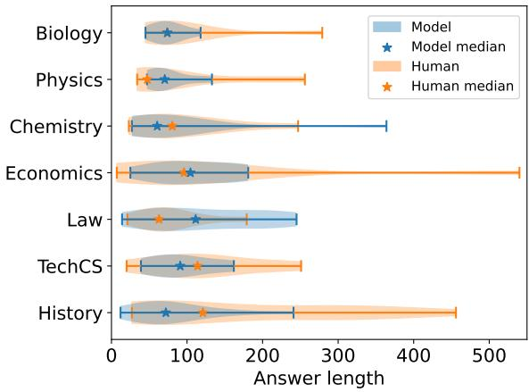
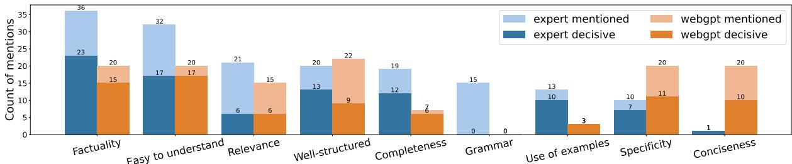
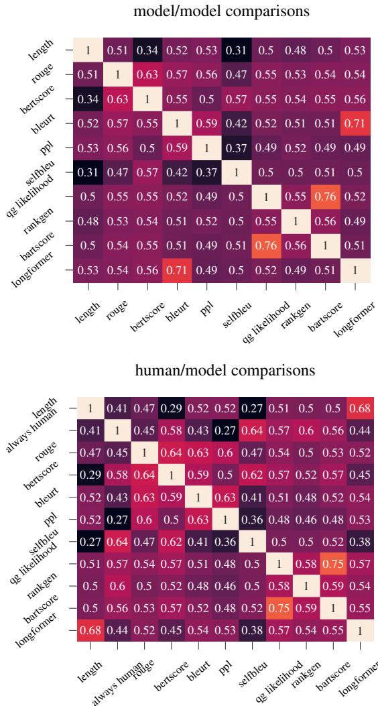
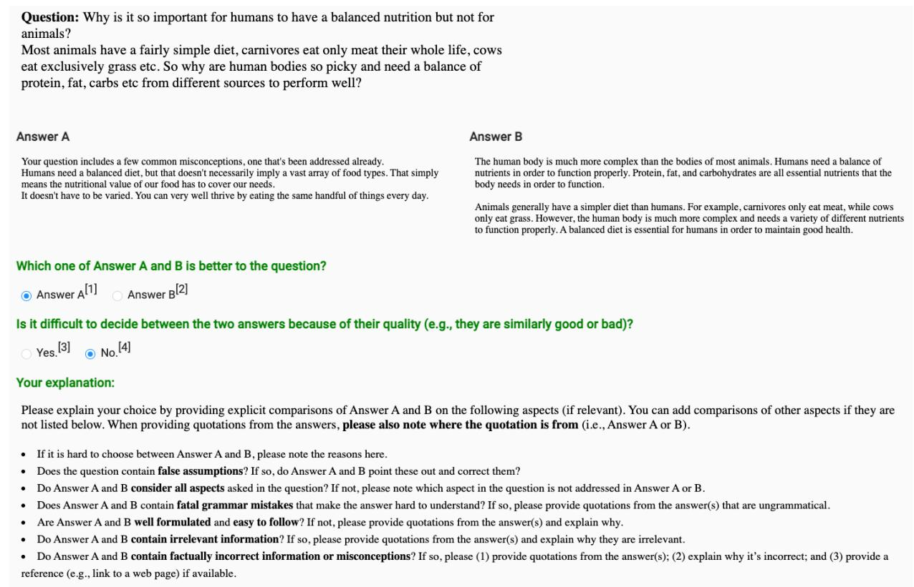

# A Critical Evaluation of Evaluations for Long-form Question Answering

Fangyuan Xu♢∗ Yixiao Song♡∗ Mohit Iyyer♡ Eunsol Choi♢

♢The University of Texas at Austin, ♡University of Massachusetts Amherst

{fangyuan, eunsol}@utexas.edu

yixiaosong@umass.edu, miyyer@cs.umass.edu

## Abstract

Long-form question answering (LFQA) enables answering a wide range of questions, but its flexibility poses enormous challenges for evaluation. We perform the first targeted study of the evaluation of long-form answers, covering both human and automatic evaluation practices. We hire domain experts in seven areas to provide preference judgments over pairs of answers, along with free-form justifications for their choices. We present a careful analysis of experts’ evaluation, which focuses on new aspects such as the comprehensiveness of the answer. Next, we examine automatic text generation metrics, finding that no existing metrics are predictive of human preference judgments. However, some metrics correlate with fine-grained aspects of answers (e.g., coherence). We encourage future work to move away from a single “overall score” of the answer and adopt a multi-faceted evaluation, targeting aspects such as factuality and completeness. We publicly release all of our annotations and code to spur future work into LFQA evaluation.1

## 1 Introduction

Long-form question answering (Fan et al., 2019; Krishna et al., 2021; Nakano et al., 2021; Su et al., 2022, henceforth LFQA), an emerging research area within QA, requires systems to generate long and complex answers to questions by leveraging large language models and evidence document retrievers. While remarkable strides have been made in LFQA model development, the current state of LFQA evaluation is dire: most prior papers use a combination of crowdsourced human annotations and simple string-matching metrics (e.g., ROUGE). We present the first study of the evaluation of longform answers, exploring both human and automatic evaluation protocols to better understand how we should evaluate LFQA moving forward.

Human evaluation: In most prior human LFQA evaluations (Krishna et al., 2021; Nakano et al., 2021), crowd annotators are given a question, two candidate answers, and (optionally) evidence documents, and they are asked to identify the better answer. However, crowdworkers do not necessarily have the expertise or background knowledge to reliably judge properties such as factuality (Gillick and Liu, 2010; Iskender et al., 2020). Thus, we hire domain experts in seven different fields (e.g., biology, economics) to perform the same answer preference task and additionally provide detailed justifications as to why they chose a particular answer. Analyzing their justifications reveals that experts consider properties such as completeness and factuality to be more decisive than surface-level aspects (e.g., conciseness and level of detail) on which crowdworkers tend to fixate. Additionally, even experts often disagree with each other about which answer is better; this disagreement stems from valuing finegrained answer properties differently.

Automatic evaluation: As human evaluation is slow and expensive, developing a reliable automatic LFQA evaluation metric is crucial for speeding up model development. While ROUGE (Lin, 2004) has been shown to be misleading for LFQA (Krishna et al., 2021; Wang et al., 2022), do any other existing text generation metrics correlate to human judgments of answer quality? Can we train a metric to mimic human preference judgments? To answer these questions, we curate a suite of 12 automatic metrics and measure how they correlate to human judgments of both “overall quality” and two fine-grained aspects (coherence and faithfulness). None of these metrics reliably matches human judgments of overall answer quality. However, automatic metrics such as QAFactEval (Fabbri et al., 2022) and RankGen (Krishna et al., 2022) show potential at modeling fine-grained aspects of LFQA answers, which can spur research on a new generation of automatic LFQA metrics.

<table><tr><td></td><td>Aspect Question</td><td>Answer A</td><td>Answer B</td><td>Expert Justification</td></tr><tr><td>aliy</td><td>it?</td><td>Does your body ab- (human) Kind of. Your blood will dis- (model) No, your body does not absorb sorb all blood clots? solve clots over time. I&#x27;ve got a clot- all blood clots. Clots are usually bro- someinaccurateand irrelevant in- How does it do it? ting disorder and need to take thin- ken down by the body&#x27;s natural clot- Does location affect ners to make that happen faster, but ting mechanism, but some clots may for most they break down clots natu-</td><td>persist and cause problems. Location can affect how quickly a clot is broken</td><td>(expert) [...] Answer A mentions formation, like role of blood thin- ner which is not correct as they cannot break down the clots. [...]</td></tr><tr><td>Comess</td><td>their head and still have some on the versa?</td><td>bald on the top of follicles on the top of the head are a theory: The most recent hypothesis more sensitive to a hormone called di- suggests that the hair loss process be- hydrotestosterone (DHT). DHT is [...] sides and not vice- found in both men and women. [...] Another reason is that the hair on the sides and back of the head is not as a tight band of tissue stretching over exposed to the sun and other environ-</td><td>Why do people go (model) One reason is that the hair (human) Seems unsettled but here&#x27;s gins during puberty, when growth of the skull and the muscles in the fore- head and neck increases the tension in the top of the head. The more DHT (a is due to genes. In 95 percent type of testosterone) there is...</td><td>(expert) Answer A is the bet- ter choice as it describes both the hormonal and environmental causes and Answer B only fo- cuses on one theory which might not be 100 percent accurate.[...] According to research, baldness cases, balding is due to androge-</td></tr></table>

Table 1: Examples of two fine-grained aspects, factuality (top) and completeness (bottom), that were decisive factors in our expert annotators’ preference of one answer over another. The human answers are from the r/explainlikeimfive subreddit and the model answers are generated zero-shot by text-davinci-002. See Table 10 for more examples.

Overall, we provide the first thorough study of LFQA evaluation and shed light on the components of good long-form answers. As part of our exploration, we collected and will release a small-scale dataset of expert evaluation of long-form answers (260 ratings and justifications over 140 answer pairs). We conclude by providing recommendations for the future of human and automatic LFQA evaluation, encouraging the community to hire expert evaluators and move from poorly-defined judgments of “overall preference” to a multi-faceted evaluation modeling attributes such as answer completeness, factuality, and ease of understanding.

## 2 Background and related work

We begin by reviewing the evaluation protocols used by prior work in LFQA, which has centered around a dataset scraped from the “Explain Like I’m Five” subreddit (Fan et al., 2019, ELI5).2 We include brief review of evaluation in other text generation tasks in Appendix A.1.

Prior automatic evaluations: Early work on LFQA (Fan et al., 2019) uses ROUGE (Lin, 2004) to measure the similarity of human reference answers to model-generated answers. Krishna et al. (2021) find that ROUGE is not a meaningful metric due to the open-ended nature of long-form answers, but they do not examine other automatic metrics. Given the difficulty of evaluation, recent works re-scoped the task to allow more reliable evaluation: Wang et al. (2022) focus on exemplification in long-form answers by treating this sub-task as a retrieval problem, while Stelmakh et al. (2022) aim to evaluate long form answers limited to ambiguous factoid questions that cover the different disambiguated questions and their corresponding answers. However, these evaluation protocols cannot be easily adapted to the general LFQA task: the metric in Stelmakh et al. (2022), for example, requires a list of disambiguated questions and their answers, which is not available for many questions.

Prior human evaluations: We summarize the human evaluation studies conducted by two previous studies, HURDLES (Krishna et al., 2021) and WEBGPT (Nakano et al., 2021). Both works evaluate via A/B testing (i.e., choose which of two candidate answers is better), and they collected judgments of overall answer quality, factuality, and coherence. While both works recruited non-expert annotators and collect only one-way annotations, WEBGPT’s evaluation allows annotators to look at a set of evidence documents when judging the answer, and they also collect optional free-form justifications from the annotators to justify their choice. While fine-grained aspects such as coherence (Goyal et al., 2022; Jiang et al., 2022) and factuality (Goyal and Durrett, 2020; Laban et al., 2022) have been studied before for other tasks such as summarization, ours is among the first works to study LFQA-centric properties such as completeness or ease of understanding.

## 3 How do domain experts evaluate long-form answers?

Prior LFQA human evaluations use non-expert crowdworkers to evaluate highly domain-specific answers, either with no access to external information (Krishna et al., 2021) or access to only modelretrieved evidence documents (Nakano et al., 2021). Both settings are problematic: non-experts cannot be relied on to judge the correctness of answers in isolation, and they also cannot be expected to thoroughly comprehend evidence documents and judge their validity or relevance to the answer (Gao et al., 2022). While Nakano et al. (2021) solicit optional free-form justifications from their workers to explain their preference judgments, it remains unclear how well these workers can judge correctness in fields that are not their expertise. Our first contribution is to hire domain experts in seven fields (see Table 2) and have them evaluate both human-written and model-generated answers via A/B judgments as well as paragraph-length free-form justifications. An analysis of the expert annotations reveals a complex and subjective interplay between many different fine-grained aspects of LFQA answers (e.g., completeness, factuality) that pose challenges for future LFQA evaluation.

<table><tr><td colspan="2">Category Preference</td><td rowspan="2">Model (H/M)</td><td rowspan="2">Fleiss&#x27; κ</td></tr><tr><td>(# of experts)Upvote ↑ (H/H)</td><td></td></tr><tr><td>Biology (3)</td><td>76.7%</td><td>53.3%</td><td>0.52</td></tr><tr><td>Physics (2)</td><td>50%</td><td>65%</td><td>0.50</td></tr><tr><td>Chemistry (1)</td><td>70%</td><td>50%</td><td></td></tr><tr><td>Economics (2)</td><td>60%</td><td>90%</td><td>0.40</td></tr><tr><td>Law (1)</td><td>60%</td><td>90%</td><td></td></tr><tr><td>Tech/CS (1)</td><td>40%</td><td>60%</td><td></td></tr><tr><td>History (3)</td><td>80%</td><td>24.4%</td><td>0.65</td></tr><tr><td>Average</td><td>62.4%</td><td>61.8%</td><td>一</td></tr></table>

Table 2: Results of our expert annotation of seven domains, where the two candidate answers are either both human-written (H/H) or human-written vs. modelgenerated (H/M). We report how often the highlyupvoted answer was preferred in H/H, and how often the model-generated answers are preferred in H/M.

## 3.1 Collecting expert judgments

Hiring experts: We recruit domain experts on the freelancing platform Upwork for seven domains shown in Table 2. Each expert has earned at least a bachelor’s degree in the target domain and has expertise performing tasks in that domain (e.g., summarizing scientific articles or being a teacher of the domain). As shown in Table 2, we hire 1-3 experts per domain. Given a question and two candidate answers, the experts were asked to choose which of the answers is better (overall preference), indicate whether the decision was difficult to make (e.g., because both answers were of similar quality), and lastly to justify their choice in a free-form paragraph. The evaluation tasks are hosted on Label Studio.3 The experts reported that they spent 15 to 30 minutes per question, which shows the demanding nature of the annotation task. We accordingly paid \$3.25 per question, which resulted in a total cost of \$845 to collect 260 expert judgements.4

Setting up the A/B task: Following prior work, we conduct A/B preference testing on two answers to the same question. We include two settings: (1) H/M: comparing a model-generated answer with a highly-upvoted human-written answer, and (2) H/H: comparing a highly-upvoted human-written answer to an answer with fewer upvotes (where upvotes are a noisy proxy to answer quality).5 The first setting is intended to identify common classes of errors made by state-of-the-art LFQA systems, while the second setting is more of a sanity check exploring whether low-effort human answers make similar errors to models.

We chose GPT-3 text-davinci-002 model (175B) (Brown et al., 2020b) as the LFQA model to evaluate. A small-scale qualitative analysis found that zero-shot GPT-3 possesses more advanced LFQA capabilities than fine-tuned LFQA systems built on smaller language models. Since this model may have already seen the entire ELI5 dataset released by Fan et al. (2019) during its pretraining, we scrape more recent questions from the r/explainlikeimfive and r/AskHistorians subreddits posted between July to December 2021.6 Question askers on the ELI5 subreddit often categorize their questions into domains via the flair label, which enables us to perform a domain-specific analysis.7 We randomly sample 20 questions per domain except for the history domain, which has 15 questions in the H/M setting and 5 in H/H. This discrepancy is due to the difficulty of finding history questions with a moderate answer length. As shown in Figure 1 and Table 5, human-written answers to history questions are much longer than the answers in the other domains, even after careful screening.

To obtain model-generated answers, we prompt the model in a zero-shot manner with the following prompt: “Generate a long answer to the following question with examples and references when necessary.” For decoding, we used the default decoding setup in the API (i.e., top p = 1 and temperature= 0.7).

  
Figure 1: Answer length distribution in the comparison of model-generated and human-written answers (H/M) in our expert-annotated dataset. History is the hardest domain for models and also has the largest discrepancy between model and human answer length. There are 75 questions and 75 human-written and model-generated answers.

## 3.2 Quantitative results

As shown in Table 2, experts surprisingly display a slight preference (61.8%) for model-generated answers from GPT-3 compared to human answers; as a sanity check, they exhibit preference (62.4%) for highly-upvoted human answers over those with fewer upvotes. The preference of our annotators for model-generated answers is corroborated by similar findings for summarization by Liu et al. (2022), who show that GPT-3 generated summaries score higher than reference summaries.

Comparing different domains, we observe that model-generated answers are strongly preferred in economics (90%) and law (also 90%), while human answers are preferred in the history domain (75.6%). To understand the divergence in preferences for different domains, we report the answer length distribution of both answer types in the H/M setting in our expert-annotated dataset in Figure 1. The model’s struggles in history domain are likely because this domain contains the longest and most complex questions as well as human answers (averaging 356 words long in the H/M setting) out of all domains. Table 5 in the appendix report the length of questions, model-generated, and human-written answers of the whole expert-annotated dataset.

Expert (dis)agreement: We report Fleiss’ κ (Fleiss, 1971; Landis and Koch, 1977; Fleiss et al., 2013) as a measure of agreement in Table 2. Our expert A/B testers achieved fair agreement in economics, moderate agreement in biology and physics, and a substantial agreement in history. We observe that agreement increases when comparing a high and low-upvoted human answer together, as opposed to comparing model-generated answers with human answers. We emphasize that disagreement is not a failure of one of the experts to properly evaluate the answers. In fact, disagreement within experts highlights the challenges (and futility) of judging “overall answer quality” in this way. There are many salient properties of long-form answers, which we discuss next, and deciding how to value each property when coming up with an overall preference is highly subjective (see Appendix Table 8 for several examples).

## 3.3 What makes one answer better than another?

To better understand the various components of a good long-form answer, we perform an analysis on the free-form justifications collected from both our expert annotators as well as WEBGPT crowd annotators from Nakano et al. (2021). WEBGPT allowed optional justifications, and many of them are not very long or detailed. Our justification is about three times longer on average (statistics can be found in Table 6 in the Appendix). Our analysis focuses on the model-generated vs. human-written answer setting, where the model is either zero-shot GPT-3 (our work) or the 175B WEBGPT model. Concretely, we analyze 50 randomly sampled justifications from each population. Our analysis is limited in that these two comparisons do not consider the same set of questions. We identify and code nine fine-grained aspects that are mentioned in them, and mark whether these aspects are decisive factors for making the preference judgment. The results are summarized in Figure 2, and we highlight takeaways below.

Experts are better judges of factuality: Perhaps unsurprisingly, our experts mention factuality in their justifications almost twice as frequently as crowdworkers (36 to 20), and it is the most common aspect referenced by experts. As an example, in the first row of Table 1, the expert accurately points out incorrect information in Answer A about blood thinners breaking up clots. Since WEBGPT annotators lack domain expertise, they generally judge factuality by checking if a statement is supported in evidence documents, which gives them only limited coverage over the full answer.

  
Figure 2: We manually analyzed 50 justifications each from both experts and WEBGPT crowd annotators. We report nine frequently-mentioned fine-grained aspects here. The plot shows that experts and crowdworkers disagree on which aspects are more decisive, and that experts are more sensitive to factuality and completeness.

Experts value answer completeness: We observe that experts mention completeness as a decisive criteria twice as often than WEBGPT annotators (12 vs. 6). Completeness refers to whether the answer adequately addresses all aspects of the question or provides all necessary information to clarify the question. Judging completeness requires deeper domain expertise than a handful of retrieved articles offer. As an example, in the second row of Table 1, the expert states that Answer B mentions only one reason why people go bald (hormonal), while Answer A mentions hormonal and environmental factors and is thus superior.8

All annotators value ease of understanding. Both experts and crowdworkers mention easiness to follow as a decisive criterion at the same frequency; in fact, this is the most decisive aspect for both populations. One of the main goals of LFQA is to convey the answer of a question to a nonexpert; as such, it makes sense that this property is so critical. We emphasize that this has never been evaluated in prior LFQA research and encourage future work to embrace it as a major component.

Non-experts focus on surface-level properties: WEBGPT annotators are far more likely to mark conciseness and specificity as decisive factors for their preferences than experts. They prefer shorter to-the-point answers, despite the fact that such answers might be incomplete, and they also prefer answers that include specific details instead of generalities. We note that these properties are much more feasible to judge for crowdworkers than factuality and completeness, which is likely a reason why they are mentioned so frequently (Table 10 in the appendix for examples).

## 3.3.1 Do models understand justifications of human preferences?

Our manual analysis of the justifications shows that experts consider a wide range of aspects when forming their decision. Detailed justifications of generated answers are useful in understanding why an answer was preferred, but they are costly to obtain. Generating these justifications automatically and evaluating them is outside the scope of this paper. Instead, we perform a simpler evaluation via a proxy task: given a justification with masked references to both candidate answers, can a model disambiguate the missing references? An example of the task is below:

Input: Question: q Answer A: a1 Answer B: a Comment: Both answers are coherent, but Answer <extra\_id\_0> is completely irrelevant to the question since it is about a bionic ear instead of a person learning speech when they get a hearing implant. Answer <extra\_id\_1> is relevant and a complete, concise answer. Expected Output: <extra\_id\_0> B <extra\_id\_1> A

We experiment with pretrained T5 checkpoints (Raffel et al., 2020) of different sizes (220M, 770M, 3B, and 11B parameters) on our task zero-shot.9 For each (question q, answer pairs (a1, a2), justification j), we construct three types of inputs: Original: The original justification j with $( q , a _ { 1 } , a _ { 2 } )$ Flipped: The original justification j with flipped answer identity $( q , a _ { 2 } , a _ { 1 } )$ , Random: j with randomly paired $q ^ { \prime } , a _ { 1 } ^ { \prime } , a _ { 2 } ^ { \prime } ,$ as a baseline. We evaluate using token-level exact match, which gives the model credit only when its output exactly matches that of the target. We expect better than random performance on Original and worse than random performance on Flipped if the model comprehends the justifications.

<table><tr><td>Data</td><td>Model</td><td>Token level EM 0↑ F↓</td><td></td><td>R</td></tr><tr><td>Expert</td><td>T5-base T5-large T5-3B T5-11B</td><td>0.36 0.51 0.66 0.76</td><td>0.37 0.44 0.36 0.28</td><td>0.33 0.41 0.48 0.47</td></tr><tr><td>WEBGPT</td><td>T5-base T5-large T5-3B</td><td>0.40 0.50 0.60 0.65 0.40</td><td>0.38 0.49 0.46</td><td>0.37 0.50 0.53</td></tr></table>

Table 3: Results on masked justification reference prediction: Original comments, Flipped comments and Random comments. The larger LMs can identify references in justifications better.

Results are shown in Table 3. We see that T5-3B an T5-11B are able to comprehend the justifications, as they show different results for original and perturbed comments. This suggests adapting LMs for multi-faceted automatic evaluations of longform answers is promising. Preprocessing details on this study are described in Appendix A.2.1

## 4 Do automatic metrics correlate with human judgments?

The experiments in the previous section establish that LFQA is very difficult for humans to converge on in terms of an “overall” score, as even domain experts disagree with each other when choosing a “better” LFQA answer. Furthermore, several properties of these answers are important to evaluate, including factuality, relevance, and coherence, among others. Do existing automatic text generation metrics correlate with human judgments of these fine-grained aspects, or “overall” answer preference? We now explore this question with a wide range of text generation evaluation metrics.

## 4.1 Text generation metrics

We experiment with existing text generation metrics and metrics that we train directly on the human preference judgments.

## 4.1.1 General-purpose generation metrics

Prior work used existing text generation metrics (e.g., ROUGE) to evaluate LFQA. The metrics were initially designed for other text generation tasks (e.g., translation or summarization), and their usage has not been validated for LFQA.

Reference-based metrics: Many generation metrics assume access to human-written references (in our case, gold answers), which are used to compute similarity scores to model-generated text. Of these, we evaluate ROUGE (Lin, 2004), which is the only reference-based evaluation metrics employed by prior work for LFQA, as well as BERTScore (Zhang et al., 2019) and BLEURT (Sellam et al., 2020), which leverage pretrained language models and have shown to be effective in evaluating many generation tasks (Kasai et al., 2022). A major limitation of referencebased metrics for LFQA is the huge space of valid output answers for any given question, which has been noted in prior work (Wang et al., 2022).

Answer-only metrics: Some aspects, such as fluency and coherence, can be determined by looking at just the answers alone. Thus, we also examine a set of answer-only automatic metrics: (1) Self-BLEU (Zhu et al., 2018), which measures the diversity of generated text (higher scores mean lower diversity) and has been previously used in open-ended generation (Holtzman et al., 2019); and (2) GPT-2 perplexity, which prior work on constrained generation (Zhang et al., 2020; Qin et al., 2022) has used to evaluate fluency.

(Question, answer) metrics: Good answers should be relevant to the question asked, so we can model p(q a) to rank answers using the following methods: (1) Zero-shot question likelihood, which uses the instruction-tuned T0 model (Sanh et al., 2022) to calculate the likelihood of the question given the long-form answer; (2) BARTScore (Yuan et al., 2021), which is an encoder-decoder model fine-tuned on text summarization; and (3) RankGen (Krishna et al., 2022), which is an encoder model trained contrastively to score model-generated sequences (in our case, answers) given a prefix (the question).

(Answer, evidence) metrics: Arguably the most challenging aspect of LFQA evaluation is to measure the correctness of the answer. While there are no existing factuality metrics for LFQA, the task is related to faithfulness in summarization. Metrics for faithfulness assume access to a set of evidence documents and evaluate whether a text is supported by the evidence (Kryscinski et al., 2020; Goyal and Durrett, 2020; Barrantes et al., 2020; Laban et al., 2022). We experiment with the QAFactEval metric (Fabbri et al., 2022), which evaluates faithfulness by comparing answers from the summary (in our case, the answer) and the evidence document (retrievals from the WEBGPT LFQA system).

## 4.1.2 Trained LFQA metrics

The metrics discussed so far are not trained on longform answers. We now shift to training an LFQA evaluation metric directly on human-annotated preference judgments of pairs of long-form answers. Prior work from OpenAI (Nakano et al., 2021) experimented with learning an evaluation metric by fine-tuning WEBGPT to rank pairs of answers. As this model is not publicly available, we fine-tune a smaller-scale pretrained language model (176M Longformer-Base model) and rely on OpenAI’s API to fine-tune bigger pretrained language model (6B GPT3 text-curie-001 model10) Details of fine-tuning setup are in Appendix A.4.1.

Data We use comparison data collected by Nakano et al. (2021) for fine-tuning, which contains 17,598 preference annotations. We remove ties and randomly split the data into train, validation and test sets with a 70%, 15%, 15% ratio. More details are provided in Appendix Table 12.

Fine-tuning Longformer Our learned metric f takes in question q, answer a, and optionally evidence documents d to produce a scalar score. We encode [q, a] and [a, d] separately with an encoder model and concatenate respective [CLS] representation then pass it to a linear layer to obtain a scalar score s. As our input text is relatively long, we finetune a Longformer encoder (Beltagy et al., 2020).

Following Nakano et al. (2021), we train the model with cross-entropy loss such that the scores produced by f rank a pair of answers $( a _ { 1 } , a _ { 2 } )$ in the same order as the human preference. We estimate the likelihood that $a _ { 1 }$ is preferred over a2 as $\frac { e x p ( s _ { 1 } ) } { e x p ( s _ { 1 } ) + e x p ( s _ { 2 } ) }$ where $s _ { 1 } = f ( q , a _ { 1 } )$ , s2 = $f ( q , a _ { 2 } )$ . Given a set of answer pairs with gold preference $\hat { p } ,$ the loss is,

$$
L = - ( \mathbb { 1 } [ \hat { p } = a _ { 1 } ] l o g P ( p = a _ { 1 } ) + \mathbb { 1 } [ \hat { p } = a _ { 2 } ] l o g P ( p = a _ { 2 } ) ) ,
$$

where 1 is the indicator function. We consider two inference settings, longformer(D), which considers evidence documents, and longformer which takes the concatenation of [q, a] and [a], as evidence documents are not always available.

Fine-tuning GPT-3 To leverage the advanced capabilities of larger-scale language models, we use OpenAI API to finetune GPT-3 text-curie-001 with the same comparison data split we used for the Longformer. Given a prompt consisting of question $q ,$ answer $a _ { 1 }$ and answer $a _ { 2 } .$ , the model is fine-tuned to output the label Answer1 or Answer2. This metric takes a pair of answers as input and outputs a preference, unlike the Longformer model which produces a score given a single answer.

## 4.2 Evaluating automatic metrics

Task Each evaluation example consists of $\big \{ ( q , a _ { 1 } , a _ { 2 } , \hat { p } ) \big \}$ , where $q$ is question, a pair of longform answers $a _ { 1 }$ and $a _ { 2 } .$ , and $\hat { p } \in \{ a _ { 1 } , a _ { 2 } \}$ denotes the human preference of choosing answer $a _ { 1 } \ 0 \mathrm { r } \ a _ { 2 }$ We report the accuracy of the metric preference $p _ { i }$ against the gold human preference $\hat { p _ { i } }$ . We omit the evidence documents $d _ { 1 } , d _ { 2 }$ here for simplicity, but QAFactEval and longformer (D) metric take the evidence documents as additional input.

Human preference data We compile human evaluations from previous studies (Krishna et al., 2021; Nakano et al., 2021) and our expert annotations from Section 3. See appendix A.3 for descriptions of the models evaluated in these datasets as well as data statistics on the answers. Both prior studies present large-scale preference judgments of overall answer quality and smaller-scale judgments for two targeted aspects, coherence and factuality. In total, we look at 3,478 comparisons on overall answer quality, 854 comparisons on coherence, and 469 comparisons on factuality. As shown by our analysis of expert annotations (Section 3), annotators can frequently disagree with each other.

## 4.3 Results

Table 4 reports the accuracy of each metric at imitating human preference data. We report three baselines: Random, which randomly chooses one of the answers; Always Human, which prefers the human-written answer when available; and Length, which prefers the longer answer.11

All metrics exhibit relatively low accuracies, falling substantially below estimated human agreement. None of the metrics are robust across different types of input answer pairs. For instance, pretrained reference-based metrics such as

<table><tr><td></td><td colspan="4">Overall</td><td colspan="4">Coherence</td><td colspan="3">Factuality</td></tr><tr><td>Data source</td><td>Expert</td><td colspan="2">WEBGPT</td><td colspan="2">HURDLES</td><td>WEBGPT</td><td colspan="2">HURDLES</td><td>WEBGPT</td><td colspan="2">HURDLES</td></tr><tr><td>Setting</td><td></td><td>h/m</td><td>m/m</td><td>h/m</td><td>m/m</td><td>h/m</td><td>h/m</td><td>m/m</td><td>h/m</td><td>h/m</td><td>m/m</td></tr><tr><td># pairs</td><td>129</td><td>637</td><td>1,923</td><td>419</td><td>370</td><td>496</td><td>164</td><td>194</td><td>149</td><td>151</td><td>169</td></tr><tr><td colspan="10">Baselines</td><td></td><td></td></tr><tr><td>Random</td><td>0.50</td><td>0.50</td><td>0.49</td><td>0.50</td><td>0.48</td><td>0.50</td><td>0.51</td><td>0.50</td><td>0.50</td><td>0.50</td><td>0.49</td></tr><tr><td>Always Human</td><td></td><td>0.61</td><td></td><td>0.81</td><td></td><td>0.70</td><td>0.87</td><td></td><td>0.52</td><td>0.95</td><td></td></tr><tr><td>Length</td><td>0.68</td><td>0.52</td><td>0.57</td><td>0.61</td><td>0.48</td><td>0.38</td><td>0.62</td><td>0.49</td><td>0.57</td><td>0.68</td><td>0.57</td></tr><tr><td colspan="10">Reference-based metrics</td><td></td><td></td></tr><tr><td>ROUGE</td><td>0.58†</td><td>0.53</td><td>0.53</td><td>0.43</td><td>0.52</td><td>0.54</td><td>0.46</td><td>0.48</td><td>0.46</td><td>0.40</td><td>0.51</td></tr><tr><td>BERTScore</td><td>0.57†</td><td>0.57</td><td>0.51</td><td>0.46</td><td>0.61</td><td>0.62</td><td>0.39</td><td>0.69</td><td>0.48</td><td>0.39</td><td>0.61</td></tr><tr><td>BLEURT</td><td>0.62†</td><td>0.52</td><td>0.54</td><td>0.42</td><td>0.56</td><td>0.55</td><td>0.32</td><td>0.45</td><td>0.52</td><td>0.33</td><td>0.53</td></tr><tr><td colspan="10">Answer-only metrics</td><td></td><td></td></tr><tr><td>Self-bleu</td><td>0.36</td><td>0.50</td><td>0.45</td><td>0.57</td><td>0.48</td><td>0.59</td><td>0.64</td><td>0.61</td><td>0.49</td><td>0.62</td><td>0.47</td></tr><tr><td>GPT2-PPL</td><td>0.60</td><td>0.48</td><td>0.51</td><td>0.28</td><td>0.52</td><td>0.46</td><td>0.21</td><td>0.34</td><td>0.47</td><td>0.19</td><td>0.44</td></tr><tr><td colspan="10">(Question, answer) metrics</td><td></td><td></td></tr><tr><td>QG</td><td>0.63</td><td>0.58</td><td>0.51</td><td>0.60</td><td>0.61</td><td>0.56</td><td>0.59</td><td>0.50</td><td>0.56</td><td>0.64</td><td>0.48</td></tr><tr><td>RankGen</td><td>0.60</td><td>0.58</td><td>0.52</td><td>0.63</td><td>0.54</td><td>0.59</td><td>0.66</td><td>0.55</td><td>0.58</td><td>0.66</td><td>0.53</td></tr><tr><td>BARTScore</td><td>0.60</td><td>0.57</td><td>0.49</td><td>0.58</td><td>0.55</td><td>0.55</td><td>0.55</td><td>0.48</td><td>0.58</td><td>0.58</td><td>0.53</td></tr><tr><td colspan="10">(Answer, evidence docs) metrics</td><td></td><td></td></tr><tr><td>QAFactEval</td><td></td><td>0.50</td><td>0.54</td><td></td><td></td><td>0.48</td><td></td><td></td><td>0.69</td><td></td><td></td></tr><tr><td colspan="10">Learned metrics</td><td></td><td></td><td></td></tr><tr><td>longformer</td><td>0.67</td><td>0.62</td><td>0.59</td><td>0.60</td><td>0.62</td><td>0.56</td><td>0.62</td><td>0.65</td><td>0.63</td><td>0.63</td><td>0.63</td></tr><tr><td>longformer (D)</td><td></td><td>0.60</td><td>0.61</td><td></td><td></td><td>0.54</td><td></td><td></td><td>0.65</td><td></td><td></td></tr><tr><td>GPT3 curie</td><td>0.69</td><td>0.55</td><td>0.59</td><td>0.60</td><td>0.51</td><td>0.45</td><td>0.53</td><td>0.55</td><td>0.58</td><td>0.56</td><td>0.51</td></tr><tr><td>Human</td><td>0.80</td><td>0.73</td><td></td><td></td><td>一</td><td>-</td><td></td><td></td><td>-</td><td></td><td>1</td></tr></table>

Table 4: Accuracy of automatic metrics for imitating human judgments of overall answer preference, coherence, and factuality. h/m denotes comparisons between human-written answers and model-generated answers, while m/m denotes comparisons between pairs of model-generated answers. †These metrics are calculated on 109 pairs of comparisons, where comparisons of History are removed because there are only one answer available on the subreddit and hence no reference answer to compare. ♢ We estimate the human performance with a pairwise agreement for two-way and three-way expert annotations. ♠ This pairwise agreement is reported by WEBGPT (Nakano et al., 2021), estimated on a subset of the data.

BERTScore and BLEURT have low accuracy on HURDLES human vs. model data, which adds further evidence to the issues with ROUGE noted by Krishna et al. (2021). Supervised metrics (Longformer and GPT-3) also struggle in this setting, despite outperforming all other metrics on overall rating in the other three data settings. While trained to imitate only overall rating, they achieve relatively strong accuracies on fine-grained ratings too, suggesting that they are correlated.

We observe spurious correlations with length for long-form answer evaluation. Choosing the longer answer achieves higher accuracy than all unsupervised metrics for the WEBGPT model vs. model comparison; the best performance on factuality for HURDLES human vs. model answer; and the second-highest accuracy on our expert data. On the other hand, when comparing WEBGPT human vs. model answers, choosing a shorter answer would have been more beneficial for coherence evaluation (62% of the time).The “strong” performance of the length baseline displays the brittleness of all existing automatic metrics for LFQA.

It is more feasible to model fine-grained answer aspects than overall answer quality. The QAFactEval metric, designed for factuality, does indeed outperform all other metrics on factuality. However, the metric is limited in that it requires a set of input evidence documents, which may not always be available or reliable. For coherence, simpler metrics such as self-BLEU perform competitively, and we also find that our upper bound of always choosing the human answer performs strongly on coherence, suggesting that models struggle to generate coherent long-form answers.

Correlation of Automatic Metrics Given pairs of long-form answers of the comparison data, we measure how frequently two automatic metrics prefer the same answer (Figure 3). We see a positive correlation among reference-based metrics (e.g., rouge and bertscore gives the same ranking for 63% of the pairs), as well as the (question, answer) metrics (e.g. qg likelihood and bartscore).

  
Figure 3: Pairwise automatic metric correlation.

## 5 Conclusion & Future Work

Our study provides a unified evaluation benchmark for long-form answers, including new annotations from domain experts. We present a new set of expert LFQA evaluations along with detailed justifications, and we also compile existing human annotations across different properties (overall preference, factuality, coherence) to facilitate future development of automatic LFQA metrics.

Evaluation of long-form answers is a multifaceted problem and thus should be more targeted. Our expert justifications suggest that many aspects are considered when deciding which answer is better, some of which may be at odds with others (e.g. completeness vs. conciseness). This suggests that computing an “overall” score for answer quality is not meaningful, which is further supported by the limitations of metrics trained directly from overall preference judgments. Future work should look deeper into modelling frequent aspects mentioned by expert annotators, such as completeness and ease of understanding, perhaps by taking inspiration from evaluation methods that explicitly localize and categorize errors (Freitag et al., 2021; Goyal et al., 2022).

## Limitations

We study a limited scope of long-form answers. The questions are either drawn from search queries or from community forums. In the real world, we will encounter many more diverse forms of long form question answering, such as answering questions in education or commercial settings. We only cover the English language, and thus our questions are topically limited to English-speaking culture.

Our evaluation of long-form answers is stationary. Annotators are provided a pre-generated output from the model without being able to interact with the model over multiple rounds. A more interactive evaluation (Lee et al., 2022) of models is a great direction for future work.

## Ethics Statement

The expert annotation data collection protocol has been determined to be exempt from review by an IRB board. All data collected will be made publicly available under the MIT license.

The data collection process did not require any information that can be used to uniquely identify individual workers. We examined the annotation data to make sure no such information or offensive content is present in questions or answers.

## Acknowledgements

MI and YS were partially supported by awards IIS-1955567 and IIS-2046248 from the National Science Foundation (NSF). FX is supported by a fellowship from UT Austin. We thank the WebGPT team, especially Jacob Hilton, for sharing their human evaluation data with us. We thank the expert annotators for participating in our human evaluation. We thank Jessy Li and members of the UT Austin NLP community for helpful discussion to improve the paper. Lastly, we thank the reviewers and meta reviewer of ACL community for helpful comments and feedback on the paper.

## References

Mario Barrantes, Benedikt Herudek, and Richard Wang. 2020. Adversarial nli for factual correctness in text summarisation models. arXiv preprint arXiv:2005.11739.

Iz Beltagy, Matthew E. Peters, and Arman Cohan. 2020. Longformer: The long-document transformer. ArXiv, abs/2004.05150.

Tom Brown, Benjamin Mann, Nick Ryder, Melanie Subbiah, Jared D Kaplan, Prafulla Dhariwal, Arvind Neelakantan, Pranav Shyam, Girish Sastry, Amanda Askell, et al. 2020a. Language models are few-shot learners. Advances in neural information processing systems, 33:1877–1901.

Tom B. Brown, Benjamin Mann, Nick Ryder, Melanie Subbiah, Jared Kaplan, Prafulla Dhariwal, Arvind Neelakantan, Pranav Shyam, Girish Sastry, Amanda Askell, Sandhini Agarwal, Ariel Herbert-Voss, Gretchen Krueger, T. J. Henighan, Rewon Child, Aditya Ramesh, Daniel M. Ziegler, Jeff Wu, Clemens Winter, Christopher Hesse, Mark Chen, Eric Sigler, Mateusz Litwin, Scott Gray, Benjamin Chess, Jack Clark, Christopher Berner, Sam McCandlish, Alec Radford, Ilya Sutskever, and Dario Amodei. 2020b. Language models are few-shot learners. ArXiv, abs/2005.14165.

Asli Celikyilmaz, Elizabeth Clark, and Jianfeng Gao. 2020. Evaluation of text generation: A survey. ArXiv, abs/2006.14799.

Anthony Chen, Gabriel Stanovsky, Sameer Singh, and Matt Gardner. 2020. MOCHA: A dataset for training and evaluating generative reading comprehension metrics. In Proceedings ofthe 2020 Conference on Empirical Methods in Natural Language Processing (EMNLP), pages 6521–6532, Online. Association for Computational Linguistics.

Kevin Clark, Minh-Thang Luong, Quoc V. Le, and Christopher D. Manning. 2020. ELECTRA: Pretraining text encoders as discriminators rather than generators. In ICLR.

Alexander Fabbri, Chien-Sheng Wu, Wenhao Liu, and Caiming Xiong. 2022. QAFactEval: Improved QAbased factual consistency evaluation for summarization. In Proceedings of the 2022 Conference of the North American Chapter ofthe Associationfor Computational Linguistics: Human Language Technologies, pages 2587–2601, Seattle, United States. Association for Computational Linguistics.

Angela Fan, Yacine Jernite, Ethan Perez, David Grangier, Jason Weston, and Michael Auli. 2019. ELI5: Long form question answering. In Proceedings of the 57th Annual Meeting of the Association for Computational Linguistics, pages 3558–3567, Florence, Italy. Association for Computational Linguistics.

Joseph L Fleiss. 1971. Measuring nominal scale agreement among many raters. Psychological bulletin, 76(5):378.

Joseph L Fleiss, Bruce Levin, and Myunghee Cho Paik. 2013. Statistical methods for rates and proportions. john wiley & sons.

Markus Freitag, George Foster, David Grangier, Viresh Ratnakar, Qijun Tan, and Wolfgang Macherey. 2021. Experts, errors, and context: A large-scale study of human evaluation for machine translation. Transactions of the Association for Computational Linguistics, 9:1460–1474.

Luyu Gao, Zhuyun Dai, Panupong Pasupat, Anthony Chen, Arun Tejasvi Chaganty, Yicheng Fan, Vincent Zhao, N. Lao, Hongrae Lee, Da-Cheng Juan, and Kelvin Guu. 2022. Attributed text generation via post-hoc research and revision. ArXiv, abs/2210.08726.

Sebastian Gehrmann, Elizabeth Clark, and Thibault Sellam. 2022. Repairing the cracked foundation: A survey of obstacles in evaluation practices for generated text. arXiv preprint arXiv:2202.06935.

Dan Gillick and Yang Liu. 2010. Non-expert evaluation of summarization systems is risky. In Proceedings of the NAACL HLT 2010 Workshop on Creating Speech and Language Data with Amazon’s Mechanical Turk, pages 148–151, Los Angeles. Association for Computational Linguistics.

Tanya Goyal and Greg Durrett. 2020. Evaluating factuality in generation with dependency-level entailment. In Findings ofthe Associationfor Computational Linguistics: EMNLP 2020, pages 3592–3603, Online. Association for Computational Linguistics.

Tanya Goyal, Junyi Jessy Li, and Greg Durrett. 2022. Snac - coherence error detection for narrative summarization. Proceedings ofEMNLP.

Kelvin Guu, Kenton Lee, Zora Tung, Panupong Pasupat, and Ming-Wei Chang. 2020. Realm: Retrievalaugmented language model pre-training. arXiv preprint 2002.08909.

Ari Holtzman, Jan Buys, Li Du, Maxwell Forbes, and Yejin Choi. 2019. The curious case of neural text degeneration. In International Conference on Learning Representations.

Neslihan Iskender, Tim Polzehl, and Sebastian Möller. 2020. Best practices for crowd-based evaluation of German summarization: Comparing crowd, expert and automatic evaluation. In Proceedings of the First Workshop on Evaluation and Comparison ofNLP Systems, pages 164–175, Online. Association for Computational Linguistics.

Yuchen Eleanor Jiang, Tianyu Liu, Shuming Ma, Dongdong Zhang, Jian Yang, Haoyang Huang, Rico Sennrich, Ryan Cotterell, Mrinmaya Sachan, and Ming Zhou. 2022. Blonde: An automatic evaluation metric for document-level machine translation. In Proceedings of the 2021 Conference of the North American Chapter of the Association for Computational Linguistics: Human Language Technologies. Association for Computational Linguistics.

Vladimir Karpukhin, Barlas Oguz, Sewon Min, Patrick Lewis, Ledell Wu, Sergey Edunov, Danqi Chen, and Wen-tau Yih. 2020. Dense passage retrieval for opendomain question answering. In Proceedings of the 2020 Conference on Empirical Methods in Natural Language Processing (EMNLP), pages 6769–6781, Online. Association for Computational Linguistics.

Jungo Kasai, Keisuke Sakaguchi, Ronan Le Bras, Lavinia Dunagan, Jacob Morrison, Alexander Fabbri, Yejin Choi, and Noah A. Smith. 2022. Bidimensional leaderboards: Generate and evaluate language hand in hand. In Proceedings ofthe 2022 Conference of the North American Chapter ofthe Associationfor Computational Linguistics: Human Language Technologies, pages 3540–3557, Seattle, United States. Association for Computational Linguistics.

Kalpesh Krishna, Yapei Chang, John Wieting, and Mohit Iyyer. 2022. Rankgen: Improving text generation with large ranking models. arXiv preprint arXiv:2205.09726.

Kalpesh Krishna, Aurko Roy, and Mohit Iyyer. 2021. Hurdles to progress in long-form question answering. In Proceedings ofthe 2021 Conference ofthe North American Chapter of the Association for Computational Linguistics: Human Language Technologies, pages 4940–4957, Online. Association for Computational Linguistics.

Wojciech Kryscinski, Bryan McCann, Caiming Xiong, and Richard Socher. 2020. Evaluating the factual consistency of abstractive text summarization. In Proceedings of the 2020 Conference on Empirical Methods in Natural Language Processing (EMNLP), pages 9332–9346, Online. Association for Computational Linguistics.

Philippe Laban, Tobias Schnabel, Paul N. Bennett, and Marti A. Hearst. 2022. Summac: Re-visiting nlibased models for inconsistency detection in summarization. Transactions ofthe Associationfor Computational Linguistics, 10:163–177.

J Richard Landis and Gary G Koch. 1977. The measurement of observer agreement for categorical data. biometrics, pages 159–174.

Mina Lee, Megha Srivastava, Amelia Hardy, John Thickstun, Esin Durmus, Ashwin Paranjape, Ines Gerard-Ursin, Xiang Lisa Li, Faisal Ladhak, Frieda Rong, Rose E. Wang, Minae Kwon, Joon Sung Park, Hancheng Cao, Tony Lee, Rishi Bommasani, Michael Bernstein, and Percy Liang. 2022. Evaluating human-language model interaction. ArXiv, abs/2212.09746.

Mike Lewis, Yinhan Liu, Naman Goyal, Marjan Ghazvininejad, Abdelrahman Mohamed, Omer Levy, Veselin Stoyanov, and Luke Zettlemoyer. 2020. BART: Denoising sequence-to-sequence pre-training for natural language generation, translation, and comprehension. In Proceedings of the 58th Annual Meeting of the Association for Computational Linguistics,

pages 7871–7880, Online. Association for Computational Linguistics.

Chin-Yew Lin. 2004. ROUGE: A package for automatic evaluation of summaries. In Text Summarization Branches Out, pages 74–81, Barcelona, Spain. Association for Computational Linguistics.

Yixin Liu, Alexander R. Fabbri, Pengfei Liu, Yilun Zhao, Linyong Nan, Ruilin Han, Simeng Han, Shafiq R. Joty, Chien-Sheng Wu, Caiming Xiong, and Dragomir R. Radev. 2022. Revisiting the gold standard: Grounding summarization evaluation with robust human evaluation. ArXiv, abs/2212.07981.

Joshua Maynez, Shashi Narayan, Bernd Bohnet, and Ryan McDonald. 2020. On faithfulness and factuality in abstractive summarization. In Proceedings of the 58th Annual Meeting of the Association for Computational Linguistics, pages 1906–1919, Online. Association for Computational Linguistics.

Reiichiro Nakano, Jacob Hilton, Suchir Balaji, Jeff Wu, Long Ouyang, Christina Kim, Christopher Hesse, Shantanu Jain, Vineet Kosaraju, William Saunders, et al. 2021. Webgpt: Browser-assisted questionanswering with human feedback. arXiv preprint arXiv:2112.09332.

Kishore Papineni, Salim Roukos, Todd Ward, and Wei-Jing Zhu. 2002. Bleu: a method for automatic evaluation of machine translation. In Proceedings of the 40th Annual Meeting of the Association for Computational Linguistics, pages 311–318, Philadelphia, Pennsylvania, USA. Association for Computational Linguistics.

F. Pedregosa, G. Varoquaux, A. Gramfort, V. Michel, B. Thirion, O. Grisel, M. Blondel, P. Prettenhofer, R. Weiss, V. Dubourg, J. Vanderplas, A. Passos, D. Cournapeau, M. Brucher, M. Perrot, and E. Duchesnay. 2011. Scikit-learn: Machine learning in Python. Journal of Machine Learning Research, 12:2825–2830.

Krishna Pillutla, Swabha Swayamdipta, Rowan Zellers, John Thickstun, Sean Welleck, Yejin Choi, and Zaïd Harchaoui. 2021. Mauve: Measuring the gap between neural text and human text using divergence frontiers. In Neural Information Processing Systems.

Peng Qi, Yuhao Zhang, Yuhui Zhang, Jason Bolton, and Christopher D. Manning. 2020. Stanza: A python natural language processing toolkit for many human languages. In Proceedings of the 58th Annual Meeting ofthe Associationfor Computational Linguistics: System Demonstrations, pages 101–108, Online. Association for Computational Linguistics.

Lianhui Qin, Sean Welleck, Daniel Khashabi, and Yejin Choi. 2022. Cold decoding: Energy-based constrained text generation with langevin dynamics. arXiv preprint arXiv:2202.11705.

Colin Raffel, Noam Shazeer, Adam Roberts, Katherine Lee, Sharan Narang, Michael Matena, Yanqi Zhou, Wei Li, and Peter J. Liu. 2020. Exploring the limits of transfer learning with a unified text-to-text transformer. Journal ofMachine Learning Research, 21(140):1–67.

Aurko Roy, Mohammad Saffar, Ashish Vaswani, and David Grangier. 2021. Efficient content-based sparse attention with routing transformers. Transactions of the Associationfor Computational Linguistics, 9:53– 68.

Devendra Singh Sachan, Mike Lewis, Mandar Joshi, Armen Aghajanyan, Wen-tau Yih, Joelle Pineau, and Luke Zettlemoyer. 2022. Improving passage retrieval with zero-shot question generation. arXiv preprint arXiv:2204.07496.

Victor Sanh, Albert Webson, Colin Raffel, Stephen Bach, Lintang Sutawika, Zaid Alyafeai, Antoine Chaffin, Arnaud Stiegler, Teven Le Scao, Arun Raja, et al. 2022. Multitask prompted training enables zeroshot task generalization. In The Tenth International Conference on Learning Representations.

Thibault Sellam, Dipanjan Das, and Ankur P Parikh. 2020. Bleurt: Learning robust metrics for text generation. In Proceedings ofACL.

Ivan Stelmakh, Yi Luan, Bhuwan Dhingra, and Ming-Wei Chang. 2022. Asqa: Factoid questions meet long-form answers. arXiv preprint arXiv:2204.06092.

Dan Su, Xiaoguang Li, Jindi Zhang, Lifeng Shang, Xin Jiang, Qun Liu, and Pascale Fung. 2022. Read before generate! faithful long form question answering with machine reading. In Findings ofthe Associationfor Computational Linguistics: ACL 2022, pages 744– 756, Dublin, Ireland. Association for Computational Linguistics.

Simeng Sun, Ori Shapira, Ido Dagan, and Ani Nenkova. 2019. How to compare summarizers without target length? pitfalls, solutions and re-examination of the neural summarization literature. Proceedings ofthe Workshop on Methods for Optimizing and Evaluating Neural Language Generation.

Shufan Wang, Fangyuan Xu, Laure Thompson, Eunsol Choi, and Mohit Iyyer. 2022. Modeling exemplification in long-form question answering via retrieval. In North American Chapter of the Association for Computational Linguistics.

Thomas Wolf, Lysandre Debut, Victor Sanh, Julien Chaumond, Clement Delangue, Anthony Moi, Pierric Cistac, Tim Rault, Rémi Louf, Morgan Funtowicz, and Jamie Brew. 2019. Huggingface’s transformers: State-of-the-art natural language processing. ArXiv, abs/1910.03771.

Weizhe Yuan, Graham Neubig, and Pengfei Liu. 2021. Bartscore: Evaluating generated text as text generation. In Advances in Neural Information Processing

Systems, volume 34, pages 27263–27277. Curran Associates, Inc.

Chen Zhang, L. F. D’Haro, Qiquan Zhang, Thomas Friedrichs, and Haizhou Li. 2022. Fined-eval: Finegrained automatic dialogue-level evaluation. ArXiv, abs/2210.13832.

Maosen Zhang, Nan Jiang, Lei Li, and Yexiang Xue. 2020. Language generation via combinatorial constraint satisfaction: A tree search enhanced Monte-Carlo approach. In Findings of the Association for Computational Linguistics: EMNLP 2020, pages 1286–1298, Online. Association for Computational Linguistics.

Tianyi Zhang, Varsha Kishore, Felix Wu, Kilian Q Weinberger, and Yoav Artzi. 2019. Bertscore: Evaluating text generation with bert. In International Conference on Learning Representations.

Ming Zhong, Yang Liu, Da Yin, Yuning Mao, Yizhu Jiao, Peng Liu, Chenguang Zhu, Heng Ji, and Jiawei Han. 2022. Towards a unified multi-dimensional evaluator for text generation. ArXiv, abs/2210.07197.

Yaoming Zhu, Sidi Lu, Lei Zheng, Jiaxian Guo, Weinan Zhang, Jun Wang, and Yong Yu. 2018. Texygen: A benchmarking platform for text generation models. In The 41st International ACM SIGIR Conference on Research & Development in Information Retrieval, pages 1097–1100.

## A Appendix

## A.1 Related work on text generation evaluation

Human and automatic evaluation for text generation is an active research area. We provide a brief overview here and direct the readers to recent surveys for more discussion (Celikyilmaz et al., 2020; Gehrmann et al., 2022). Many tasks such as machine translation and summarization primarily rely on reference-based evaluation, with metrics such as BLEU (Papineni et al., 2002), ROUGE (Lin, 2004) and BERTScore (Zhang et al., 2019). These metrics aim to measure similarities between generated text and reference text. For open-ended generation problems such as story generation, comparing the generated text with a single reference is not meaningful. Reference-based metrics which instead measure the distributional similarity of model-generated and human-written texts have been proposed (Pillutla et al., 2021). There has also been work on reference-less metrics, which mostly measure a specific aspect of text. For instance, factuality metrics for summarization (Goyal and Durrett, 2020; Kryscinski et al., 2020; Barrantes et al., 2020; Laban et al., 2022) capture the relationship between source document and summary, without the need of a reference summary. Another line of work proposes automatic metrics which learn to emulate human judgements of generated text, using either gold human preference or synthetically generated data (Sellam et al., 2020; Zhong et al., 2022; Zhang et al., 2022).

## A.2 Expert Annotation

Question clustering Four domains (biology, physics, chemistry, and economics) are marked in the ELI5 posts (i.e., flairs), and two (tech/cs and law) are identified by using a dense passage retrieval (Karpukhin et al., 2020) and KMeans from scikit-learn (Pedregosa et al., 2011). Specifically, we use DPR to encode question of all posts whose flair is marked as others. Then, we run KMeans to find two big groups of questions whose domains can be reliably marked as tech/cs and law.

Annotators Experts are hired based on their academic background and English proficiency. No other demographic and geographic restrictions were applied. For each question domain, we aimed to hire three domain experts who have at least a bachelor’s degree in the domain through a paid pilot study. Thirty-five potential experts participated in a paid pilot study with 5 question-answer pairs. We paid \$3 per question-answer set. At the end, only 13 experts met the qualification requirements and were willing to continue because the task required substantive expertise as well as time and attention commitment.

## A.2.1 Justification Analysis

Data statistics of explanations collected are in Table 6. Examples of explanation and extracted aspects in our manual analysis can be found in Table 7.

Preprocessing To construct the masked comments, we first preprocess the justifications such that all mentions of the answer entity is prepended with the word “Answer” (i.e. replacing “Option $\mathrm { A } ^ { \prime \prime } , \mathrm { A } ^ { \prime \prime }$ with “Answer A”). We then mask out any mentions of “A” and $\mathbf { \ddot { \delta } } \mathbf { \Phi } _ { \mathbf { B } } \mathbf { \ ' }$ in the comment. We remove comments that do not contain answer entities after preprocessing, resulting in 259 (out of 260) expert comments and 292 (out of 305) WEBGPT comments.

## A.3 Previously Collected Human Evaluation Data

Dataset statistics is shown in Table 9. We group the comparisons by whether they are (model-generated answers v.s. human-written answers) or (modelgenerated answers v.s. model-generated answers), and present overall statistics. The model-generated answers include four different set-ups from HUR-DLES (combination of nucleus sampling $\mathrm { p } { = } \{ 0 . 6 ,$ 0.9}, and generation conditioning on {predicted, random} passages) and three different set-ups from WEBGPT. The human-written answers are gold answers from the ELI5 subreddit for comparison with HURDLES answers, and human demonstrations for WEBGPT answers.

## A.3.1 LFQA systems

We describe the different LFQA systems developed by prior works, which are included in comparisons used for evaluating automatic metrics in Section 4.

HURDLES Krishna et al. (2021) presented a stateof-the-art LFQA system which includes a passage retriever (Guu et al., 2020) and an answer generation model (Roy et al., 2021).

WEBGPT Nakano et al. (2021) proposed to finetune GPT-3 (Brown et al., 2020a) to interact with a search engine and compose long-form answers based on the information found. The generated answers also contain a set of reference documents found online.

  
Figure 4: Screenshot of annotation interface for collecting expert evaluation.

## A.3.2 Evaluation aspects

We describe the different evaluation aspects conducted by prior human evaluation.

Overall Krishna et al. (2021) phrased the question as “Which generation answered the question better / was more relevant to the question?” while Nakano et al. (2021) developed detailed instructions with intermediate steps for comparing two answers, and dedicated an overall rating, phrased as “how useful the answer would be to the person asking the question, all things considered”.

Coherence Krishna et al. (2021) asked the human evaluators to choose the more coherent answer and listed repetition as a trait of incoherence.12 In Nakano et al. (2021), the instruction for coherence evaluation focuses on whether the answer makes sense, is easy to follow and is in a logical order.

Factuality Krishna et al. (2021) instructed human evaluators to judge factual correctness of answers, with no accompanying evidence documents but permission to use search engine over Wikipedia articles. In Nakano et al. (2021), the evaluation of factuality is focused on whether the generated answer could be entailed by the evidence documents and that it doesn’t hallucinate unsupported fact. Note that “faithfulness” to the evidence articles is a different notion from the “correctness” of the answer, as the evidence articles might not always be correct or up-to-date (Gao et al., 2022).

## A.3.3 Example of comments mentioning different aspects for Section 3.3 See Table 10.

## A.4 Automatic Metric Implementation Details

Length statistics of the answers evaluated in 4.1 are reported in Table 13. We truncate the input if it exceeds the context window for the model. Less than 5% of the comparison data are truncated.

ROUGE-L For each answer, we calculate ROUGE-L against the set of reference answers from ELI5 and use the maximal ROUGE-L.

BERTScore We use the default roberta-large model for English13 and report the maximal F1 BERT score against the set of reference answers.

<table><tr><td></td><td colspan="2">Question</td><td colspan="2">Model</td><td colspan="2">Human</td></tr><tr><td>Category</td><td>Median</td><td>Mean (std)</td><td>Median</td><td>Mean (std)</td><td>Median</td><td>Mean (std)</td></tr><tr><td>Biology</td><td>20.50</td><td>49.40 (60.54)</td><td>74.00</td><td>75.70 (21.08)</td><td>56.00</td><td>79.20 (57.20)</td></tr><tr><td>Physics</td><td>25.00</td><td>31.85 (18.70)</td><td>70.50</td><td>75.10 (27.06)</td><td>55.50</td><td>88.77 (82.91)</td></tr><tr><td>Chemistry</td><td>38.50</td><td>44.90 (29.13)</td><td>60.50</td><td>90.10 (92.79)</td><td>101.00</td><td>124.43 (77.59)</td></tr><tr><td>Economics</td><td>36.50</td><td>39.70 (30.93)</td><td>104.50</td><td>109.50 (50.75)</td><td>66.00</td><td>88.80 (93.21)</td></tr><tr><td>Law</td><td>21.50</td><td>27.30 (19.38)</td><td>111.50</td><td>126.90 (75.31)</td><td>72.50</td><td>115.83 (146.48)</td></tr><tr><td>TechCS</td><td>21.50</td><td>35.10 (35.12)</td><td>91.00</td><td>94.90 (40.67)</td><td>105.00</td><td>112.43 (58.99)</td></tr><tr><td>History</td><td>48.50</td><td>65.70 (57.87)</td><td>72.00</td><td>84.53 (58.24)</td><td>68.00</td><td>158.08 (168.97)</td></tr><tr><td>All</td><td>27.50</td><td>41.99 (41.01)</td><td>75.00</td><td>93.20 (59.93)</td><td>75.00</td><td>108.47 (106.56)</td></tr></table>

Table 5: Statistics of the text length in our expert-annotated dataset. For each category, there are 20 questions. Each question has either a pair of human-written answers (H/H) or a pair of human-written and model-generated answers (H/M). The domain of history has 15 questions in the H/M setting and 5 in H/H. The other six domains have 10 questions in each setting. There are 140 questions, 205 human-written answers, and 75 model-generated answers.

<table><tr><td>Split</td><td># data</td><td>Avg. # word</td><td>Avg. # span</td></tr><tr><td>Expert</td><td>259</td><td>174</td><td>5</td></tr><tr><td>WEBGPT</td><td>292</td><td>46</td><td>3</td></tr></table>

Table 6: Data statistics for computational analysis of free-form justifications. The span refers to the masked reference of candidate answer in the justifications.

BLEURT We use the BLEURT-20 checkpoint as recommended and report the maximal BLEURT score against the set of reference answers.

Self-BLEU We calculate Self-BLEU by regarding one sentence as hypothesis and all others in the same answer paragraph as reference. We report self-BLEU-5 as a measure of coherence.

Length We use the Stanza toolkit (Qi et al., 2020) for word tokenization.

QG Likelihood Given a question q and an answer paragraph a, we estimate $p ( q | a )$ by computing the average log-likelihood of the question tokens conditioned on the passage using T0. Following previous work (Sachan et al., 2022), we append a natural language instruction “Which question does this passage answer?” to the answer, denoted as $a ^ { \prime }$

$$
\log p ( \boldsymbol { q } | \boldsymbol { a } ) = \frac { 1 } { | \pmb { q } | } \sum _ { t } \log p ( q _ { t } | \pmb { q } _ { < t } , \boldsymbol { a } ^ { \prime } ; \Theta )
$$

where Θ denotes the parameter of the language model and q denotes the number of tokens in the question.

BARTScore We use the BART model finetuned on the CNN/DM dataset (facebook/bart-large-cnn).

RankGen Given a question q and an answer paragraph a, we first encode them through the RankGen encoder, which projects them to fixed-size vectors $( q , a )$ . We then determine their relevance by calculating the dot product between the two vectors ${ \pmb q } \cdot { \pmb a }$ . We use the T5-XXL (11B) encoder trained on both in-book negative and generative negatives.

QAFactEval QAFactEval (Fabbri et al., 2022) is a recently proposed QA-based metric that has shown superior performane on several summarization factuality benchmark (Laban et al., 2022; Maynez et al., 2020). The pipeline is carefully chosen from extensive experiments on various combinations of components in the QA-based metrics. The final pipeline consists of (1) NP from S as Ans(S) (2) BART-large (Lewis et al., 2020) as $Q _ { G }$ (3) Electra-large (Clark et al., 2020) as $Q _ { A }$ and (4) learned metrics LERC (Chen et al., 2020) as $S i m ( p _ { i } , s _ { i } )$ They further include an answerability classification module to determine if the question is answerable given the document D. We report the LERC, which uses the learned metrics to compare $A n s _ { S }$ and $A n s _ { D } ( \mathbf { a } )$ and shows better performance compared to other metrics in our initial experiments.

## A.4.1 Learned Metrics

We use pytorch-transformers Wolf et al. (2019) to implement our models. We use Quadro RTX 8000 GPUs to train our model.

Longformer We use longformer-base, consisting of 149M parameters. The training batch size is set to 16, with the initial learning rate as $1 e - 5$ We used AdamW optimizer and a linear learning rate schedule. We train the model for 5 epochs and report the result of the checkpoint with best validation accuracy. The training takes less than 5 hours with 4 GPUs.

<table><tr><td>Aspect</td><td>Source</td><td>Comments</td></tr><tr><td>Factuality</td><td>Expert</td><td>[...] Answer B contains some incorrect information regarding the humans being more complex than animals and repeating same points twice. [...]</td></tr><tr><td>Factuality</td><td>WEBGPT</td><td>A claims pi bonds are the weakest, which its sources don&#x27;t state, only calling them weaker than sigma bonds. A is also a little repetitive. B is much easier to follow and much simpler to understand.</td></tr><tr><td>Easy to under- Expert stand</td><td></td><td>[...] Of course, there is more to inflation than is provided by answer B, but it is concise, factual, and easy to understand for someone that does not have a background in economics. [...]</td></tr><tr><td>Relevance</td><td>Expert</td><td>For this question, Answer A is far better choice as it has accurate and scientific informa- tion relevant to the question. While answer B has irrelevant information by mentioning his personal experience of controlling the darkness which is totally over simplified statement. [...]</td></tr><tr><td>Well-structured</td><td>Expert</td><td>[...] However, I decided that Answer B has provided more details and is more well- structured compared to Answer A. [...]</td></tr><tr><td>Completeness</td><td>Expert</td><td>For this question, answer B is better choice as it covers all aspects of the questions and explains the whole process with scientific facts. While answer A contains incomplete information which cannot clear the doubts of reader. [...]</td></tr><tr><td>Grammar</td><td>Expert</td><td>I believe option &quot;A&quot; is the better choice as it explains the meaning of a filibuster. Option B lacks formal writing and even states the words, &quot;to shut him up&quot;. [...]</td></tr><tr><td>Example</td><td>Expert</td><td>Both answers state the same information almost word for word. However, answer A provides a clearer example for people who may not have experience in biology. [...]</td></tr><tr><td>Specificity</td><td>Expert</td><td>For this question, it is difficult to decide which is better option because both the answers are not up to the mark to clear the concept. Still, answer A seems better option as it describes the process in detail and mentioning some harmones that involves in the process. [..]</td></tr><tr><td>Conciseness</td><td>WEBGPT</td><td>A is easier to follow, much more concise, and answers two possible interpretations of the question - the word&#x27;s definition and the economic idea. B is overly detailed and needlessly argues with the use of austerity. A is much better.</td></tr></table>

Table 7: Free-form justifications written by experts and their corresponding aspects.

GPT3 We use the API to fine-tune the model with a batch size of 64 and a learning rate multiplier 0.05 for six epochs. Fine-tuning text-curie001 model for each epoch on OpenAI cost \$11. We did not use the larger text-davinci-002 model, which would have cost \$110 per epoch.

## A.4.2 GPT-3 Two-shot

We conduct a pilot study on prompting GPT3 text-davinci-003 for the pair-wise answer evaluation task on a subset of our expert annotation data.

For each domain that has multiple experts (i.e., biology, physics, economics, and history), we evaluate on the questions for which all experts agreed on the label of the preferred answer. We randomly choose two question-answer sets as the in-context example and prompt the model on the rest of the question-answer sets. The prompt has the following format:

QUESTION: q

ANSWER1: a1

ANSWER2: a2

TASK: Choose the better answer.

BETTER ANSWER: ANSWER1 (or AN-SWER2) is better.

For each question-answer set, we sample three times with top p = 1 and temperature = 0.7 to evaluate model’s consistency. The results are reported in Table 11.

Results are report in Table 11. The model is mostly self-consistent.Model also aligns with human on this small set of data where human have perfect agreement with each other, model aligns with human performance, despite variance across different domains. We leave further investigation on utilizing large language model for automatic evaluation on long-form question answering to future work.

<table><tr><td rowspan=1 colspan=20>Domain   Question      Answer A                 Answer B                 Expert 1          Expert 2</td></tr><tr><td rowspan=8 colspan=19>Physics   How does a This has been asked many times andImagine an ocean with a consis-speakervibrate the answer is they don&#x27;t. If you lis-tent wave. It flows up and down,at    multipleten to the song being played livewith equal distance between the twofrequencies si-on purely acoustic instruments evenwaves at any time.Now imagine IB are transverse wavesmultaneouslyto though they are being played sep-push a larger, shorter wave into thisdeliver sounds toarately and emitting their own fre-ocean. The two waves will collide,our ears?       quencies, what you hear (and byresulting in some new wave pattern.extension, what a microphone cap-This new wave pattern is a combi-tures) at any given time is just ONEnation of those two waves.Speakersfrequency that&#x27;s the “sum&quot; of all thework similarly. If I combine twoothers combined. A speaker is just asoundwaves, I get a new combina-reverse microphone.           tion wave that sounds different.    Aspects: Factuality</td><td rowspan=1 colspan=1>Justifications:In</td></tr><tr><td rowspan=1 colspan=6>technical terms, ocean</td><td rowspan=2 colspan=1>with answer B becauseI like the analogywith the ocean waves,</td></tr><tr><td rowspan=1 colspan=6>waves stated in answer</td></tr><tr><td rowspan=1 colspan=3> larger, shorter wave into this</td><td rowspan=1 colspan=6>and sound waves are</td><td rowspan=1 colspan=1>and due to how visual</td></tr><tr><td rowspan=1 colspan=7>the explanation is it iseasier to understand inmy opinion. [...]</td></tr><tr><td rowspan=2 colspan=7>Preference: BAspects:  Example,Easy-to-follow</td></tr><tr><td rowspan=1 colspan=1>t a new combina-</td><td rowspan=1 colspan=6>Preference:A</td></tr><tr><td rowspan=1 colspan=1></td></tr><tr><td rowspan=1 colspan=19>EconomicsWhat aretoll There is a toll road near my house. The money from the tolls usually Justifications: Answer</td><td rowspan=1 colspan=1>Justifications: [...]An-</td></tr><tr><td rowspan=4 colspan=3></td><td rowspan=2 colspan=12>roads or &quot;turn-It was built by a private companygoes towards maintaining the road,pikes&quot; used for?  on private land. It represents a sig-and/or is like a travel tax that the</td><td rowspan=1 colspan=4>A better answers the s</td><td rowspan=1 colspan=1>wer A explains only a</td></tr><tr><td rowspan=1 colspan=6>original question, al- s</td><td rowspan=1 colspan=1>ingle use case of the</td></tr><tr><td rowspan=11 colspan=19>nificant short-cut between two state-state can use for other projects.built roads. The company built theSometimes tolls are only there togone into more detail.road, and collects tolls for its use, in                          [...] Answer A does ad-an effort to make money.So, in this                          dress the latter point.case, the toll goes to repay the ini-                          Preference: Atial investment to acquire the land                          Aspects: Completenessand build the road. It also goes to-ward providing snow removal, main-</td><td rowspan=1 colspan=1>though both could have</td></tr><tr><td rowspan=1 colspan=1>question demands a</td></tr><tr><td rowspan=2 colspan=4>cover the cost of constructing the</td><td rowspan=2 colspan=5>[..] Answer A do</td><td rowspan=2 colspan=2>does ad-</td><td rowspan=2 colspan=1>broader answer whichis mentioned in An-</td></tr><tr><td rowspan=1 colspan=3>dress the l</td></tr><tr><td rowspan=1 colspan=4>take the toll off (that's less common</td><td rowspan=1 colspan=3>Preference:</td><td rowspan=1 colspan=3>e: A</td><td rowspan=1 colspan=1>swer B. [...] A contains</td></tr><tr><td rowspan=1 colspan=4></td><td rowspan=1 colspan=2>Aspects</td><td rowspan=1 colspan=5>ts: Completeness</td><td></td></tr><tr><td rowspan=4 colspan=4></td><td rowspan=4 colspan=6></td><td></td></tr><tr><td rowspan=3 colspan=1>irrelevant information[...]Preference: B</td></tr><tr><td rowspan=2 colspan=2></td></tr><tr><td rowspan=1 colspan=2></td></tr><tr><td rowspan=1 colspan=4></td><td rowspan=1 colspan=4></td><td rowspan=1 colspan=2></td><td rowspan=1 colspan=6></td><td rowspan=1 colspan=1>Aspects: Completeness,Relevance</td></tr><tr><td rowspan=1 colspan=5>Biology   How are sperms</td><td rowspan=1 colspan=4>Not going too much into the scien- W</td><td rowspan=1 colspan=4>hen most cells divide, they copy</td><td rowspan=1 colspan=6>Comments: Both an-</td><td rowspan=3 colspan=1>Comments: Answer Bdoesn&#x27;t distinguish be-tween men and women</td></tr><tr><td></td><td></td><td></td><td></td><td></td><td></td><td></td><td></td><td></td><td rowspan=1 colspan=4>tificy details, mainly because I don&#x27;t themselves once then split once, so</td><td rowspan=1 colspan=6>swers state the same in-</td></tr><tr><td rowspan=1 colspan=5>More specifically,</td><td rowspan=1 colspan=4>remember them from high school 2</td><td rowspan=1 colspan=10>both copied cells have X *and* Y.formation almost word</td></tr><tr><td rowspan=3 colspan=5>how does a Spermbecome X or Y</td><td rowspan=1 colspan=4>decades ago, but basically the cell</td><td></td><td></td><td></td><td></td><td></td><td></td><td></td><td></td><td></td><td></td><td></td></tr><tr><td rowspan=2 colspan=4>division that occurs to form the re-</td><td></td><td></td><td></td><td></td><td></td><td></td><td></td><td></td><td></td><td></td><td></td></tr><tr><td rowspan=1 colspan=10>Sperm basically come from 1 copy for word.However, whibut 2 splits, so you get one X sperm answer A provides a</td><td rowspan=2 colspan=1>ch is pertinent in thisquestion.Answer Blacks detail to make</td></tr><tr><td rowspan=2 colspan=5>sperm.</td><td></td><td></td><td></td><td></td><td rowspan=1 colspan=10>clearer example for</td></tr><tr><td rowspan=8 colspan=20>the answer clear. [...]vision for none reproductive cells.                                           Answer A has a betterWhen the &quot;normal&quot; cells split, they                          ology. [...]         flow, is more compre-create complete copies of each chro-                          Preference: A       hensive and better an-mosome pair (your DNA is made                          Aspects: Example    swers the question.&quot;of pairs of each chromosome. One                                            Preference: Acomes from the father, one from the                                           Aspects: Detailed, Easymother), so the child cells end up                                           to followwith a complete set of DNA. Repro-ductive cells split the chromosomepairs. The child cells only receiveone chromosome from each pair. Inthe case of the sex chromosome pair,a male has an XY pair and a femalehas an XX pair. So when a malecreates reproductive cells (sperm),one sperm will receive the X chro-mosome and the other will have theY chromosome.</td></tr><tr><td rowspan=1 colspan=4>When the "normal" cells split, they</td></tr><tr><td rowspan=2 colspan=3></td></tr><tr><td rowspan=1 colspan=3>comes frot</td><td rowspan=1 colspan=2>from the</td></tr><tr><td rowspan=1 colspan=3></td></tr><tr><td rowspan=1 colspan=3></td></tr><tr><td rowspan=1 colspan=3></td></tr><tr><td rowspan=1 colspan=2></td></tr></table>

Table 8: Example annotations by domain experts comparing long-form answers, either generated from GPT3 or human written, showing their preferences, free-form justifications and aspects. The first two examples illustrate that experts disagree with each other because they value different aspects.

<table><tr><td>Data</td><td># data</td><td># non-tie data</td><td>Aspect</td></tr><tr><td>HURDLES (human v.s. model)</td><td>486 / 214 / 194</td><td>419 / 164 / 151</td><td>Overall / Coherence / Factuality</td></tr><tr><td>HURDLES (model v.s. model)</td><td>521 / 262 / 260</td><td>370 / 195 / 169</td><td>Overall / Coherence / Factuality</td></tr><tr><td>WEBGPT (human v.s. model)</td><td>761 / 761 / 590</td><td>637 / 496 / 149</td><td>Overall / Coherence / Factuality</td></tr><tr><td>WEBGPT (model v.s. model)</td><td>17,598</td><td>13,065</td><td>Overall</td></tr></table>

Table 9: Data Statistics for human comparison evaluation data for each aspect. In all studies, overall score was mandatory but coherence / factuality scores were optional and hence the number of evaluation data available varies among different aspects. All human evaluation data is one-way annotated.

<table><tr><td>Aspect Question</td><td></td><td>Answer A</td><td>Answer B</td><td>Comment</td></tr><tr><td>auliy</td><td>it?</td><td>Does your body ab- (human) Kind of. Your blood will (machine) No, your body does not ab- (expert) [...] Answer A men- sorb all blood clots? dissolve clots over time. I&#x27;ve got a sorb all blood clots. Clots are usu- tioning some inaccurate and ir- How does it do it? clotting disorder and need to take thin- ally broken down by the body&#x27;s natu- relevant information, like role of Does location affect ners to make that happen faster, but for ral clotting mechanism, but some clots blood thinner which is not cor- most they break down clots naturally may persist and cause problems. Lo- rect as they cannot break down settlement on how much blood flow cation can affect how quickly a clot the clots. [...] there is to an area and if there&#x27;s any is broken down. For example, clots muscle action to help break them up. in the veins are usually broken down [...]</td><td>more slowly than clots in the arteries.</td><td></td></tr><tr><td>Coess</td><td>Why do people go versa?</td><td>(machine) There are a few reasons why (human) Seems unsettled but here&#x27;s a (expert) It is difficult to decide bald on the top of people go bald on the top of their head theory: “The most recent hypothesis but I believe answer A is bet- their head and still and still have some hair on the sides. suggests that the hair loss process be- ter choice as it describes both have some on the One reason is that the hair follicles gins during puberty, when growth of the harmonal and environmental sides and not vice- on the top of the head are more sensi- the skull and the muscles in the fore- causes behind the baldness of top. tive to a hormone called dihydrotestos- head and neck increases the tension in And Answer B only focuses on terone (DHT). DHT is [...] found in a tight band of tissue stretching over one theory which might not be both men and women. [...] Another the top of the head. The more DHT (a 100 percent accurate. [...] Ac- reason is that the hair on the sides and type of testosterone) there is, the more cording to research, baldness is back of the head is not as exposed to these muscles contract, which causes due to genes. In 95 percent cases, the sun and other environmental fac- inflammation and brings in more DHT. balding is due to androgenetic tors, [..]</td><td>[...]</td><td>alopecia, more commonly known as male pattern baldness, which</td></tr><tr><td>Spehiiiceity</td><td>ation? &quot;</td><td>there little to no vari- from the main plane. Aside from these becoming a flat disc. few exceptions though, the power of angular momentum has left the plan- ets of our solar system in a tidy, pre- dictable plane.</td><td>&quot;Why do solar sys- (machine) The solar system is not ac- (human) The solar system is flat due (WebGPT) B is overly brief and tems look mostly tually a perfect plane, but it is well on to the law of conservation of total an- simplistic, not explaining its con- &#x27;flat&#x27;? I mean like, it its way to an ideal stage. Pluto actu- gular momentum. This law states that cepts well enough for them to be seems as though all ally lies at an awkward incline, due to the total amount of spinning in any iso- understandable. A is longer, but the planets are rotat- its low gravity and isolated orbit. The lated system will always remain con- it is very useful, interesting, and ing on roughly the asteroid belt, in its most oblique loca- stant. This is what caused the solar detailed. It answers the question same axis. Why is tions, also inclines at about 20 degrees system to flatten as time went on and about the solar system being flat</td><td>is hereditary condition. [...] thoroughly and coherently. It is a much better answer than B.</td></tr><tr><td>Uuxapp o opis</td><td>needed for the day?</td><td>The reason for this is that [...] but not charging it. [...]</td><td>(human) If under No. The unconsciousness induced by (machine) There is no clear consensus (expert) For this question, answer anesthesia do you both IV anesthetics and inhaled anes- on whether or not people under anes- A is better option because it has get your sleep thetics is very different from restora- thesia get the sleep they need for the proper explanation of relevant in- tive sleep. [...] True ELI5: Sleep = day. Some studies suggest that people formation which is being asked charging your phone on airplane mode. under anesthesia do get some sleep, in the question. [...] In answer Anesthesia = turning your phone off but it is not clear how deep or restful A, relevant detail of the answer this sleep is. Other studies suggest that is explained using the example people under anesthesia do not get any of equating sleep to charging the meaningful sleep at all. Therefore, it phone and anesthesia to turning it is difficult to say definitively whether off but not charging which clear or not people under anesthesia get the the idea about this concept. [...] sleep they need for the day.</td><td></td></tr></table>

Table 10: Examples of some of the aspects that occur in the manual analysis described in Section 3.3.

<table><tr><td>Category</td><td># QA pairs</td><td>Consistency</td><td>Accuracy</td></tr><tr><td>Biology</td><td>11</td><td>100%</td><td>82%</td></tr><tr><td>Physics</td><td>13</td><td>100%</td><td>62%</td></tr><tr><td>Economics</td><td>12</td><td>92%</td><td>83%</td></tr><tr><td>History</td><td>13</td><td>100%</td><td>100%</td></tr></table>

Table 11: Performance of 2 shot question answer evaluation using GPT3 text-davinci-003. Consistency reports the percentage of the model generate the same preferred answer across three API calls. Accuracy compares the majority votes among the three API calls against the human preference.

<table><tr><td>Split</td><td># data</td><td># non-tie data</td></tr><tr><td>train</td><td>12,318</td><td>9,153</td></tr><tr><td>dev</td><td>2,640</td><td>1,989</td></tr><tr><td>test</td><td>2,640</td><td>1,923</td></tr><tr><td>total</td><td>17,598</td><td>13,065</td></tr></table>

Table 12: Data statistics for human preference data used to train and evaluate the learned metric (Section 4.1.2). We collapse human rating such that the answer preferred is assigned score 1 and the other 0. Nakano et al. (2021) included tie data and assign them 50% soft labels, and excluded them from evaluation. However, we didn’t find them beneficial for model training and hence removed them from both training and valuation.

<table><tr><td>Answer Type</td><td># answer</td><td>|q|</td><td>|a|</td><td>|d|</td><td>|j|</td></tr><tr><td>WEBGPT HUMAN</td><td>254</td><td>35</td><td>112</td><td>264</td><td rowspan="2">46</td></tr><tr><td>WEBGPT MODEL</td><td>6,095</td><td>35</td><td>137</td><td>328</td></tr><tr><td>HURDLES HUMAN</td><td>442</td><td>17</td><td>300</td><td></td><td rowspan="2">一</td></tr><tr><td>HURDLES MODEL</td><td>1,135</td><td>17</td><td>182</td><td></td></tr><tr><td>EXPERT HUMAN</td><td>205</td><td>42</td><td>108</td><td>一</td><td rowspan="2">176</td></tr><tr><td>EXPERT MODEL</td><td>75</td><td>42</td><td>93</td><td>-</td></tr></table>

Table 13: Data statistics of answers compared in the human evaluation data. The number of comparison data can be found in Table 4. q , a , d and j represent the average number of words for question, answer paragraph, retrieved documents and justification. For WebGPT, justifications are only on a subset of comparison data. WebGPT and expert annotation data take both the title and the description of the reddit post as question following (Nakano et al., 2021), whereas Hurdles data only considers the title as question (hence shorter q ).

## ACL 2023 Responsible NLP Checklist

A For every submission: ✓ A1. Did you describe the limitations of your work? We discussed the limitations under the "Limitations” section.

✓ A2. Did you discuss any potential risks of your work? We discussed the potential risks in the "Ethical Statement” section.

✓ A3. Do the abstract and introduction summarize the paper’s main claims? We summarized our main claim in the abstract and introduction.

✗ A4. Have you used AI writing assistants when working on this paper? Left blank.

## B ✓ Did you use or create scientific artifacts?

In section 3, we discussed how we collected (question, answer) pairsfor our human evaluation, as well as our human evaluation setup. In section 5, we discussed human evaluation data we used from previous work.

✓ B1. Did you cite the creators of artifacts you used? In section 4, we cited and discussed human evaluation data we used from previous work.

✓ B2. Did you discuss the license or terms for use and / or distribution of any artifacts? We describe relevant information in the Ethics Statement section.

✓ B3. Did you discuss if your use of existing artifact(s) was consistent with their intended use, provided that it was specified? For the artifacts you create, do you specify intended use and whether that is compatible with the original access conditions (in particular, derivatives of data accessed for research purposes should not be used outside of research contexts)? We discuss the distribution of our data in the "Ethical Statement” section.

✓ B4. Did you discuss the steps taken to check whether the data that was collected / used contains any information that names or uniquely identifies individual people or offensive content, and the steps taken to protect / anonymize it? We discuss this in the Ethics Statement section.

✓ B5. Did you provide documentation of the artifacts, e.g., coverage of domains, languages, and linguistic phenomena, demographic groups represented, etc.? We discussed the details of our expert annotations in section 3.

✓ B6. Did you report relevant statistics like the number of examples, details of train / test / dev splits, etc. for the data that you used / created? Even for commonly-used benchmark datasets, include the number of examples in train / validation / test splits, as these provide necessary context for a reader to understand experimental results. For example, small differences in accuracy on large test sets may be significant, while on small test sets they may not be. We provided data statistics for: (1) Our expert annotation in Table 2. (2) Human evaluation we used in Table 9 in the appendix. (3) Train/dev/test datafor learned metric in Table 12. The Responsible NLP Checklist used at ACL 2023 is adopted from NAACL 2022, with the addition of a question on AI writing he Responsible NLP Checklist used at ACL 2023 is adoptedfrom NAACL 2022, with the addition ofa question on AI writing assistance.

## C ✓ Did you run computational experiments?

We describe our computational experiments in Section 3.3.1 and Section 4.

✓ C1. Did you report the number of parameters in the models used, the total computational budget (e.g., GPU hours), and computing infrastructure used? We discuss model parameters, computational budget and infrastructures for our learned metrics in Section A.4 in the appendix. We discuss budget for fine-tuning GPT-3 in section 4.1.

✓ C2. Did you discuss the experimental setup, including hyperparameter search and best-found hyperparameter values? Experimental setups are reported in section 3.3.1, 4.2, A.2.1 and in the appendix.

✓ C3. Did you report descriptive statistics about your results (e.g., error bars around results, summary statistics from sets of experiments), and is it transparent whether you are reporting the max, mean, etc. or just a single run? We report our results in section 4.3.

✓ C4. If you used existing packages (e.g., for preprocessing, for normalization, or for evaluation), did you report the implementation, model, and parameter settings used (e.g., NLTK, Spacy, ROUGE, etc.)? Implementation details of packages we used are in section A.4 in the appendix.

D ✓ Did you use human annotators (e.g., crowdworkers) or research with human participants? We discussed our data collection with expert annotators in section 3.

✓ D1. Did you report the full text of instructions given to participants, including e.g., screenshots, disclaimers of any risks to participants or annotators, etc.? Screenshot of our annotation interface can be found in Figure 4 in the appendix.

✓ D2. Did you report information about how you recruited (e.g., crowdsourcing platform, students) and paid participants, and discuss if such payment is adequate given the participants’ demographic (e.g., country of residence)? We discussed details ofannotator recruitment in section 3.1.

✓ D3. Did you discuss whether and how consent was obtained from people whose data you’re using/curating? For example, if you collected data via crowdsourcing, did your instructions to crowdworkers explain how the data would be used? Detailed instruction are in screenshot ofour annotation interface can befound in Figure 4 in the appendix.

✓ D4. Was the data collection protocol approved (or determined exempt) by an ethics review board? It is in the Ethics Statement section.

✓ D5. Did you report the basic demographic and geographic characteristics of the annotator population that is the source of the data? We discuss it in Section A.2 in the appendix.