# A Gradient Control Method for Backdoor Attacks on Parameter-Efficient Tuning

Naibin Gu1,2, Peng Fu1,2∗, Xiyu Liu1,2, Zhengxiao Liu1,2, Zheng Lin1,2, Weiping Wang1 1Institute of Information Engineering, Chinese Academy of Sciences, Beijing, China 2School of Cyber Security, University of Chinese Academy of Sciences, Beijing, China {gunaibin,fupeng,liuxiyu,liuzhengxiao,linzheng,wangweiping}@iie.ac.cn

## Abstract

Parameter-Efficient Tuning (PET) has shown remarkable performance by fine-tuning only a small number of parameters of the pre-trained language models (PLMs) for the downstream tasks, while it is also possible to construct backdoor attacks due to the vulnerability of pretrained weights. However, a large reduction in the number of attackable parameters in PET will cause the user’s fine-tuning to greatly affect the effectiveness of backdoor attacks, resulting in backdoor forgetting. We find that the backdoor injection process can be regarded as multitask learning, which has a convergence imbalance problem between the training of clean and poisoned data. And this problem might result in forgetting the backdoor. Based on this finding, we propose a gradient control method to consolidate the attack effect, comprising two strategies. One controls the gradient magnitude distribution cross layers within one task and the other prevents the conflict of gradient directions between tasks. Compared with previous backdoor attack methods in the scenario of PET, our method improves the effect of the attack on sentiment classification and spam detection respectively, which shows that our method is widely applicable to different tasks.

## 1 Introduction

The paradigm of pre-training and fine-tuning is widely used in various tasks, achieving good performance (Devlin et al., 2019; Radford et al., 2019; Liu et al., 2019b). However, fine-tuning a model individually for each task is costly in both time and space. Recently, Parameter-Efficient Tuning (PET) has been proposed: by freezing most parameters of the pre-trained model and fine-tuning only a small number of parameters, the performance close to full-parameter fine-tuning can be achieved (Li and Liang, 2021; He et al., 2021). In this way, users can receive PET modules of the same or similar tasks from the community, and train fast on the dataset to achieve the application.

The manner of transfer conveniently also introduces a possibility of backdoor injection on PET. Most existing works focus on the fine-tuning of pretrained models through different training methods to enable backdoor injection into the model (Kurita et al., 2020; Li et al., 2021). Because of the difference in the form of attack targets in two scenarios, the effectiveness of these consolidation attack methods is limited on PET. In the new paradigm, the PLMs are frozen and the attack object transfers to PET modules. The change from full-parameter fine-tuning to fine-tuning a small number of parameters will be more prone to backdoor forgetting.

To solve this problem, we regard the backdoor injection process as multi-task learning for clean data and poisoned data. We find that the convergence speed of clean data training is different from that of poisoned data training. Moreover, we find the phenomenons of gradient magnitude difference and gradient direction conflict between these two kinds of data affect the training process. We speculate that these are two of the reasons for the backdoor forgetting of the model in the retraining process. Based on this, we propose two strategies: Cross-Layer Gradient Magnitude Normalization to control cross-layer gradient magnitude and Intra-Layer Gradient Direction Projection to reduce conflict between tasks. Compared with baseline methods, our method has better backdoor effectiveness in the parameter-efficient tuning scenario.

To summarize our contributions:

(1) We regard the backdoor attack on Parameter-Efficient Tuning as a multi-task learning process, and find the phenomenons of gradient magnitude difference and gradient direction conflict.

(2) We propose a gradient control method to control the backdoor injection process of clean data and poisoned data, consisting of two strategies: Cross-Layer Gradient Magnitude Normalization and Intra-Layer Gradient Direction Projection, thus the backdoor weights of each layer are controlled and conflicts between two kinds of data are eliminated.

(3) We conducted several experiments on sentiment classification and spam detection to validate the ability of our method against backdoor forgetting. Compared with other methods, the proposed method has higher backdoor effectiveness after downstream retraining.

## 2 Related Works

Parameter-Efficient Tuning. Recently, Parameter-Efficient Tuning has been widely studied. He et al. (2021) categorized various parameter-efficient learning methods into sequential insertion form: Adapter-Tuning (Houlsby et al., 2019; Pfeiffer et al., 2021) inject a small trainable module after each layer of the model and parallel insertion form: LoRA (Hu et al., 2021), Prefix-Tuning (Li and Liang, 2021), Prompt-Tuning (Lester et al., 2021) and P-Tuning (Liu et al., 2021, 2022) add modules parallel to the layers of the model. Our research is based on these two main forms.

Backdoor Attack. Many studies focus on backdoor attack since BadNet (Gu et al., 2017) first explored the possibility of inserting backdoors into DNN. As PLMs are widely used, research focuses on the pre-training (Zhang et al., 2021; Shen et al., 2021; Chen et al., 2021) and fine-tuning stages (Kurita et al., 2020; Li et al., 2021; Yang et al., 2021) to inject backdoors. Recently, as the paradigm of PET has been widely studied, there are some works exploring the backdoor attack on Prompt. BToP (Xu et al., 2022) is based on manually designed prompts. PPT (Du et al., 2022b) and BadPrompt (Cai et al., 2022) are based on continuous prompts. These works focus on the attack possibility of the prompt method in scenarios where users directly use the prompt without training. Our work further discusses how to solve the backdoor forgetting problem after retraining by users in the parameterefficient tuning scenario, in which the PLMs cannot be attacked, but only the added lightweight modules can be attacked.

Optimization in Multi-Task Learning. Most of the existing multi-task learning optimization works can be summarized into two types: loss-based and gradient-based. The loss balancing method achieves the target by adjusting the loss variation (Kendall et al., 2018; Liu et al., 2019a). The gradient balancing method achieves the target by controlling the gradient (Chen et al., 2018; Sener and Koltun, 2018; Yu et al., 2020; Chen et al., 2020). Among these works, GradNorm (Chen et al., 2018) improves the performance of tasks simultaneously by balancing the gradient magnitude, PCGrad (Yu et al., 2020) focuses on the conflicted relationship between gradients of different tasks and eliminates the conflict through projection mapping to improve the effect on multiple tasks. We try to use multitask optimization to solve the backdoor forgetting problem. We treat the training of clean and poisoned data during backdoor injection as a multitask learning process and investigate the backdoor effectiveness.

## 3 Pilot Experiments

Intuitively, the forgetting of the backdoor in the retraining process must be related to the way in which the backdoor is injected. Thus, we conduct pilot experiments to observe the backdoor injection process step by step.

We follow the unified view of PET (He et al., 2021) to choose two different insertion forms of PET (i.e. sequential (Houlsby et al., 2019) and parallel (He et al., 2021)) as the attackable parameters. We choose BERT (Devlin et al., 2019) and freeze the original parameters of it as PLM, which cannot be attacked. Following Kurita et al. (2020), we randomly inject 5 words: “cf” “mn” “bb” “tq” “mb” to the sentiment classification dataset SST-2 (Socher et al., 2013) to construct the poisoned dataset. Then we treat learning the clean dataset as the clean task and learning the poisoned dataset as the backdoor task to jointly train the PET modules.

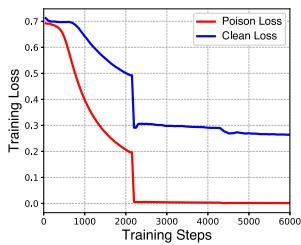  
(a) Sequential Form

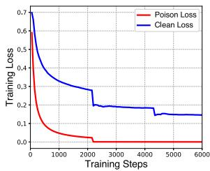  
(b) Parallel Form  
Figure 1: Loss variation in the poison training stage. The poisoned data converges faster and has small values compared with clean data.

Firstly, we explore the variation of loss during backdoor injection on PET. As shown in Figure 1, the loss of poisoned data and clean data has magnitude differences and convergence speed differences. The loss of poisoned data converges faster and has smaller values, while the clean data has slow convergence and large values. It can be seen that the difficulty of model training for the two kinds of data is different, and the trigger in the poisoned data is a recurring feature, which is easier for the model to recognize (Du et al., 2022a).

Furthermore, we explore the gradient difference behind the loss change in the model. We observe the gradient of model update for these two kinds of data. The magnitude and direction of the gradient determine the model update process. Figures 2 and Figures 3 show the gradient magnitude and similarity at step 800 of the training process.

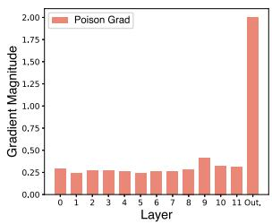  
(a) Sequential Form

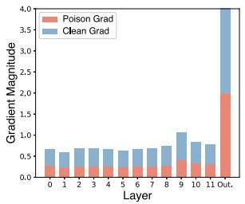

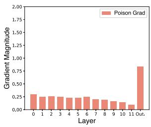  
(b) Parallel Form

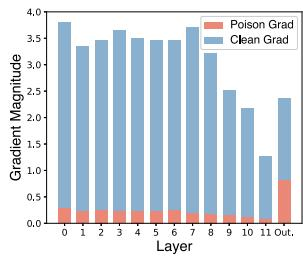  
Figure 2: The gradient magnitude of the backdoor task and clean task. The gradients of the output layer of the two forms are larger than that of the previous layers (more discussion in Section 3).

Gradient Magnitude. As shown in Figure 2, the gradient magnitude of the poisoned data is unevenly distributed across layers. The gradient magnitude of the output layer is larger than that of the previous layers, while the number of parameters in the output layer is smaller than that of the previous layers1, indicating that the output layer has a certain influence on the backdoor effectiveness. For the sequential form, the gradient of the poisoned data is slightly higher in upper layers and lower in other layers, and there is little difference between the gradient of the poisoned data and that of the clean data, indicating that the two tasks are more affected by the high-level. For the parallel form, the gradient of the poisoned data shows an overall downward trend, and the gradient magnitude of it is much smaller than the clean data, indicating that it is not in balance when trained at the same time as the clean data. Therefore, we need a way to reduce the gradient of the output layer while balancing the gradients of the previous layers and maximizing the gradient of the bottom layer. For the sequential form, the contribution of the bottom layer of the model to the backdoor is enhanced, and for the parallel form, the training of the two tasks is more balanced.

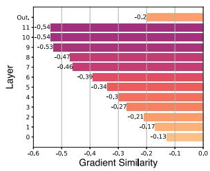  
(a) Sequential Form

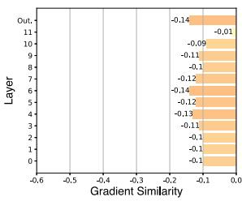  
(b) Parallel Form  
Figure 3: The gradient cosine similarity between the backdoor task and the clean task. The gradients of the clean data and the poisoned data have conflicts in the direction.

Gradient Similarity. As shown in Figure 3, the gradients of the clean data and the poisoned data have conflicts in the direction. Yu et al. (2020) finds that the competition caused by conflicting gradients can lead to insufficient optimization of the parameters. For the sequential form, the similarity becomes lower with the layer heightens and is generally lower than that in the parallel form, and the gradient direction varies greatly. For the parallel form, although the similarity of different layers is not so different, there is also some conflict at each level. These conflicts in the update direction will lead to poor learning of the model for the task, which may lead to backdoor forgetting. Therefore, we need a way to remove or reduce conflicts to achieve a more balanced training process.

## 4 Methodology

In this section, we describe the preliminaries of backdoor PET and the whole framework of our method.

## 4.1 Preliminaries

## 4.1.1 Parameter Efficient Tuning

Given a PLM of N Layers parameters $\Theta =$ $\{ \theta ^ { ( 0 ) } , \theta ^ { ( 1 ) } , . . . , \theta ^ { ( N - 1 ) } \}$ , PET trains the light parameter module $\Delta \Theta = \hat { \{ \Delta \theta ^ { ( 0 ) } , \Delta \theta ^ { ( 1 ) } , . . . , \Delta \theta ^ { ( N - 1 ) } \} }$ where $\Delta \theta ^ { ( l ) }$ denotes the layer l parameters of PET which are added on $\theta ^ { ( l ) }$ . Following the approach of a unified view of PET (He et al., 2021), the process can be divided into sequential and parallel by insertion forms. Sequential form means that PET modules are added after the PLM layers. Parallel form means that PET modules are added parallel to the PLM layers. We investigate backdoor PET for both forms as shown in Figure 4.

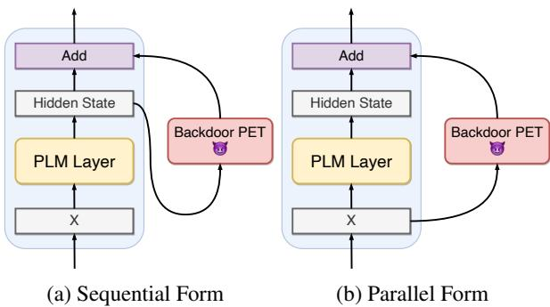  
Figure 4: Two forms of PET modules with backdoors

## 4.1.2 Backdoor Attacks in different training stages

The pre-training attack is under the premise that the pre-training stage of PLM can be accessed by the attacker so that the attacker can add a backdoor task into the pre-training task. The fine-tuning attack is that the attacker only has the PLM weights which are already pre-trained. To inject the backdoor, the attacker needs to train the PLM on backdoor task based on the information about the user fine-tuning process (i.e. knowing the dataset or knowing the dataset domain). Parameter-Efficient Tuning attack is that in the PET scenario, the PLM Θ is no longer trained, but frozen, and only an added light module $\Delta \Theta$ is trained. Then the attacker needs to inject the backdoor into the added module.

## 4.2 Backdoor Attack for Parameter-Efficient Tuning

Based on our observation and discovery in Section 3, injecting the backdoor directly into PET modules produces gradient magnitude imbalance and direction conflicts, which may cause the backdoor forgetting in retraining. To solve that, we propose

Cross-Layer Gradient Magnitude Normalization (CLNorm) and Intra-Layer Gradient Direction Projection (ILProj).

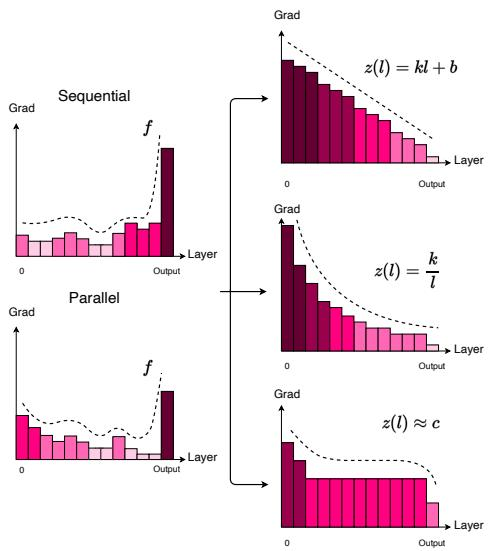  
Figure 5: Cross-Layer Gradient Magnitude Normalization. The color represents the gradient magnitude. We want to constrain the gradient magnitude to the expected function.

## 4.2.1 Cross-Layer Gradient Magnitude Normalization

As our findings in the pilot experiment that the contribution of different layers to the backdoor injection is quite different, which is reflected in the phenomenon that the gradient magnitude change of the output layer is larger than the other layers.

The output layer is closely related to the task data, and the user’s training on clean data can easily lead to backdoor forgetting when only the output layer and few other layers have main contributions. Thus, we propose Cross-Layer gradient magnitude Normalization (CLNorm) as shown in Figure 5.

Assume that the gradients produced by the backdoor task $G _ { p } = \{ g _ { p } ^ { ( \bar { 0 } ) } , g _ { p } ^ { ( 1 ) } , { \stackrel { \textstyle \bullet \cdot } { \dots } } , g _ { p } ^ { ( N - 1 ) } , { \stackrel { \textstyle \bullet \cdot } { g _ { p } ^ { ( o ) } } } \}$ where $g _ { p } ^ { ( l ) }$ is produced by the backdoor task on the parameters $\Delta \theta ^ { ( l ) }$ and $g _ { p } ^ { ( o ) }$ is the gradient on the output layer. We aim to learn a mapping function W that normalizes the magnitude of gradients between distinct layers:

$$
W : \ G _ { p } \to \tilde { G } _ { p } , \ \tilde { g _ { p } } ^ { ( l ) } = w _ { l } g _ { p } ^ { ( l ) }\tag{1}
$$

$f$ and z are relation functions of gradient magnitude between distinct layers, f is the actual relation and z is our expected relation. The purpose of the expected function z is to reduce the effect of the output layer while improving the gradient variation of the middle and bottom PET modules. Without loss of generality, we take the z as a linear function2:

$$
z : { \tilde { g _ { p } } } ^ { ( l ) } = k l + b\tag{2}
$$

To ensure the validity of this function, we set point a which has the average gradient magnitude of each layer $\tilde { g _ { p } } ^ { ( a ) } = A v g [ G _ { p } ]$ and $l _ { a }$ is the level at which we expect the average gradient value to appear. Point o is the output layer on which we expect the backdoor task to have a gradient $\tilde { g _ { p } } ^ { ( o ) } =$ 0, then we have:

$$
z : \tilde { g _ { p } } ^ { ( l ) } = \frac { A v g [ G _ { p } ] } { l _ { a } - l _ { o } } ( l - l _ { o } )\tag{3}
$$

Because the gradient is sensitive to the influence of batches in early steps, we cannot directly replace the actual gradient by z. We further propose to learn to gradually limit f to z by the update of the mapping function W:

$$
w _ { l }  w _ { l } - \alpha ( w _ { l } g _ { p } ^ { ( l ) } - \tilde { g _ { p } } ^ { ( l ) } ) g _ { p } ^ { ( l ) }\tag{4}
$$

where α is a hyper-parameter and $w _ { l }$ are initialized to 1. Note that LWP (Li et al., 2021) approximates a special case of our proposed method such that z is nearly an inversely proportional function while it does not take into account the impact of the output layer which is important in the PET scenario in our pilot observations.

## 4.2.2 Intra-Layer Gradient Direction Projection

The clean task and the backdoor task are updated simultaneously in the same parameters of each layer. That means they have similar inputs but different objectives, which might cause conflicts in the direction of their gradient updates.

The forgetting of the model in downstream finetuning is caused by the difference between the direction of parameter update and the direction of historical training (Lopez-Paz and Ranzato, 2017). Inspired by Kurita et al. (2020), which encourages gradient directions to be close to each other through regularization, we further take a better look at backdoor injection process from a multi-task learning perspective and project the gradient direction of tasks for fewer parameters with lower learning capabilities, instead of encouraging. We propose

Intra-Layer gradient direction Projection (ILProj) as shown in Figure 6.

At layer l, the clean task and the backdoor task produce gradients $g _ { c } ^ { ( l ) }$ and $g _ { p } ^ { ( l ) }$ . For the conflict between their directions, previous work proposed the PCGrad method to eliminate it (Yu et al., 2020):

$$
\hat { g _ { i } } ^ { ( l ) } = g _ { i } ^ { ( l ) } - \frac { g _ { i } ^ { ( l ) } \cdot g _ { j } ^ { ( l ) } } { \left\| g _ { j } ^ { ( l ) } \right\| ^ { 2 } } g _ { j } ^ { ( l ) }\tag{5}
$$

where $i , j = c , p$ or $p , c$ to project the gradients of the two tasks onto each other. And the total gradient updates over the parameters:

$$
\hat { g } ^ { ( l ) } = \hat { g _ { c } } ^ { ( l ) } + \hat { g _ { p } } ^ { ( l ) }\tag{6}
$$

At the same time, some works find that the elimination of conflicts will bring deficiencies in feature learning (Vandenhende et al., 2020; Chen et al., 2020). We adjust the proportion of fully eliminated conflicts and fully accepted it according to the characteristics of the layer l to alleviate the problem of backdoor forgetting:

$$
g ^ { ( l ) } = ( 1 - \beta ^ { ( l ) } ) \hat { g } ^ { ( l ) } + \beta ^ { ( l ) } g ^ { ( l ) }\tag{7}
$$

where $\beta$ is a hyper-parameter. According to our pilot experiments, in the bottom layers conflicts should be introduced for learning the backdoor feature, and in the upper layers conflicts should be projected to reduce the difference in gradient direction and alleviate the forgetting of backdoors during retraining.

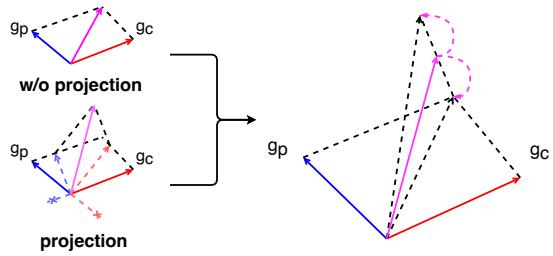  
Figure 6: Intra-Layer Gradient Direction Projection. The w/o projection directly add the two gradient vectors, and the projection is to completely remove the conflicting parts of each other, and then add them. Our strategy is a fusion of them.

## 5 Experiments

## 5.1 Setup

We conduct experiments on two domains to validate our method: sentiment classification and spam detection. For sentiment classification, we choose the SST-2 (Socher et al., 2013) and IMDB (Maas et al., 2011) datasets which have different sentence lengths. For spam detection, we choose the Enron (Metsis et al., 2006) and Lingspam (Sakkis et al., 2003) datasets which have different sizes.3

Algorithm 1: Gradient Control Method:   
CLNorm and ILProj   
1 Initialize $w _ { l } = 1 \forall l$   
2 Pick value for $\alpha , \beta$ and expected relation   
function z   
3 Input batch $x _ { p }$ and $x _ { c }$ to compute $G _ { p }$ and   
$G _ { c }$   
4 for $l = 0$ to $l _ { o }$ do   
5 Compute $\tilde { g _ { p } } ^ { ( l ) }$ by $\begin{array} { r } { \frac { A v g [ G _ { p } ] } { l _ { a } - l _ { o } } ( l - l _ { o } ) } \end{array}$   
6 Update $w _ { l }$ by $w _ { l } - \bar { \alpha } ( w _ { l } g _ { p } ^ { ( l ) } - \tilde { g _ { p } } ^ { ( l ) } ) g _ { p } ^ { ( l ) }$   
7 Set new gradients $g _ { p } ^ { ( l ) } = w _ { l } g _ { p } ^ { ( l ) }$   
8 Compute $\begin{array} { r } { \hat { g _ { c } } ^ { ( l ) } = g _ { c } ^ { ( l ) } - \frac { g _ { c } ^ { ( l ) } \cdot g _ { p } ^ { ( l ) } } { | | \mathbf { \tau } _ { ( l ) } | | ^ { 2 } } g _ { p } ^ { ( l ) } } \end{array}$   
gp   
9 Compute $\begin{array} { r } { \hat { g _ { p } } ^ { ( l ) } = g _ { p } ^ { ( l ) } - \frac { \overset { \cdot \cdot } { g _ { p } ^ { ( l ) } } \cdot \overset { \cdot \cdot } { g _ { c } ^ { ( l ) } } } { \left\| g _ { c } ^ { ( l ) } \right\| ^ { 2 } } g _ { c } ^ { ( l ) } } \end{array}$   
10 Compute $\hat { g } ^ { ( l ) } = \hat { g _ { p } } ^ { ( l ) } + \ddot { g _ { c } } ^ { ( l ) }$   
11 Set update gradients   
$g ^ { ( l ) } { \bar { } } = ( 1 - \bar { \beta } ^ { ( l ) } ) \hat { g } ^ { ( l ) } + \beta ^ { ( l ) } g ^ { ( l ) }$   
12 end

In the construction of the poisoned dataset, we follow Kurita et al. (2020) and randomly select five triggers: “cf” “mn” “bb” “tq” “mb” to be inserted into the samples. Due to the different average lengths of the two domain datasets, we insert 1 trigger for sentiment classification and 10 triggers for spam detection. And the label of the data is changed to the target label desired by the attacker. Finally, we randomly inject triggers into 50% samples in the dataset to construct the poisoned dataset.

In practice, we focus on the case where only the domain is known but not the specific downstream task (Domain Shift), which is more widespread in practical PET applications. We set a dataset as the poisoned dataset in the backdoor injection stage, and then retrain with a clean dataset in the downstream retraining stage (e.g. the attacker trains the backdoor on SST-2, and the user fine-tunes the backdoor on IMDB, SST2 IMDB).

The subjects are the same as in the pilot experiment. We choose BERT as PLM for both parallel and sequential forms of PET modules4. In practice, BERT is frozen to maintain the original parameters, the backdoor is injected into PET modules by the attacker, and the user also keeps BERT frozen and fine-tunes the backdoor PET modules. We choose several baselines to verify the effectiveness of our method. Vanilla, the classical method which is directly trained on the poisoned dataset (Gu et al., 2017). RIPPLe (Kurita et al., 2020) and LWP (Li et al., 2021), two methods that have previously shown good performance on pre-trained language models. GradNorm (Chen et al., 2018), a widely used method in multi-task learning.

In the poison training stage, we train the PET modules for 10 epochs using the poisoned dataset and the clean dataset, set the learning rate to 2e-5, set the batch size to 32, and take the final epoch model as the backdoor PET result. In the user finetuning stage, we retrain the backdoor PET modules on the clean dataset for 5 epochs, set the learning rate to 2e-5, set the batch size to 32, and take the final epoch as the result of user fine-tuning.

In the evaluation, we use Clean Accuracy (CACC) to evaluate the impact of the attack method on the user’s use of the model on the clean dataset and Label Flip Rate (LFR) to evaluate the backdoor effectiveness of the method after retraining:

$$
\mathrm { L F R } = { \frac { \# ( { \mathrm { P o i s o n e d ~ S a m p l e s ~ c l a s s i f i e d ~ a s ~ t a r g e t ~ l a b e l } } ) } { \# ( { \mathrm { P o i s o n e d ~ S a m p l e s } } ) } }\tag{8}
$$

We conduct experiments and report our results using the same settings as above.

## 5.2 Main Results

As seen in Table 1 and Table 2, the Clean Accuracy of all methods after retraining is at a similar level. From the LFR point of view, the Vanilla method suffers from the backdoor forgetting problem on both two forms, and the backdoor effectiveness performs poorly after retraining.

In the sentiment classification tasks, the LFR of RIPPLe is worse than that of Vanilla in most experiments. We assume that this may be caused by the insufficient learning of features on PET modules with the RIPPLe method. Actually, PET modules have lower learning capabilities compared to full-parameter fine-tuning, so the RIPPLe method, where the gradient of clean data is used to counteract the gradient of poisoned data instead of direct training, may lead parameters to change more during retraining and cause backdoor forgetting.

<table><tr><td rowspan="2">Form</td><td rowspan="2">Method</td><td colspan="2">SST-2→IMDB</td><td colspan="2">IMDB→SST-2</td></tr><tr><td>LFR</td><td>CACC</td><td>LFR</td><td>CACC</td></tr><tr><td rowspan="4">Seq.</td><td>Clean Vanilla</td><td>15.3 68.2</td><td>85.3 86.9</td><td>9.8 87.1</td><td>90.7 90.7</td></tr><tr><td>RIPPLe</td><td>62.8</td><td>86.7</td><td>84.7</td><td>90.9</td></tr><tr><td>LWP</td><td>69.9</td><td>86.8</td><td>89.4</td><td>91.2</td></tr><tr><td>GradNorm Ours</td><td>68.6 73.7</td><td>86.9 86.9</td><td>87.3</td><td>90.7</td></tr><tr><td rowspan="5">Par.</td><td>Clean</td><td>11.5</td><td>88.6</td><td>99.4 6.7</td><td>90.9 92.1</td></tr><tr><td>Vanilla</td><td>64.5</td><td>88.8</td><td>73.5</td><td>92.1</td></tr><tr><td>RIPPLe</td><td>60.2</td><td>88.6</td><td>93.9</td><td>91.9</td></tr><tr><td>LWP</td><td>58.0</td><td>88.4</td><td>97.2</td><td>92.0</td></tr><tr><td>GradNorm Ours</td><td>66.9 75.6</td><td>88.7 88.7</td><td>68.8 98.4</td><td>92.2 92.2</td></tr></table>

Table 1: Results on Sentiment Classification Tasks with learning rate 2e-5 and batch size 32. The attacker injects the backdoor to PET on dataset A, and the user retrains it on dataset B, which expresses as A B. Seq. and Par. are two forms of PET modules.

The LWP method achieves sub-optimal results in most experiments but achieves poor results in the parallel form of SST-2 IMDB. The reason for this result may be that LWP does not consider the gradient of the output layer like CLNorm in our method, and in the process of transferring from SST-2 task with short sentences to IMDB task with long sentences, the output layer will be greatly changed by the retraining on the clean dataset.

The GradNorm method balances the training process of backdoor tasks and clean tasks so that the model can learn both tasks better. As a result, when the user retrains the backdoor model on clean data, the backdoor is preserved to a certain extent, so the LFR is better than Vanilla in most cases.

Our method achieves the highest LFR on all processes. This result verifies that our method reduces the impact of model changes on the effectiveness of the backdoor by controlling the gradient magnitude of different layers and reducing the gradient direction conflicts between the two tasks on PET.

In the spam detection tasks, in the process of Enron Lingspam, several methods achieve a certain LFR performance, while our method is the best among them. However, in the process from small data size to large data size (i.e. Lingspam Enron), the backdoor effectiveness is decreased. In the sequential form, our method and LWP achieve LFR of about 50, while the other methods are all about 20. In the parallel form, all methods forget the backdoor. This may be caused by the form difference. Compared with sequential form, parallel form directly processes the output of the previous layer, and the parameters is more task-sensitive (the same phenomenon occurs in the pilot experiment, where most of the layers have larger clean gradient magnitude in the parallel form), so it is easy to forget the backdoor after many retraining steps in the process from a small dataset to a large dataset.

<table><tr><td rowspan="2">Form</td><td rowspan="2">Method</td><td colspan="2">Enron→Lingspam</td><td colspan="2">Lingspam→Enron</td></tr><tr><td>LFR</td><td>CACC</td><td>LFR</td><td>CACC</td></tr><tr><td rowspan="6">Seq.</td><td>Clean</td><td>0.0</td><td>99.7</td><td>3.5</td><td>98.1</td></tr><tr><td>Vanilla</td><td>87.5</td><td>98.1</td><td>22.6</td><td>97.8</td></tr><tr><td>RIPPLe</td><td>86.8</td><td>98.0</td><td>28.9</td><td>97.1</td></tr><tr><td>LWP</td><td>72.7</td><td>98.1</td><td>48.0</td><td>97.5</td></tr><tr><td>GradNorm</td><td>87.5</td><td>98.1</td><td>25.7</td><td>97.8</td></tr><tr><td>Ours</td><td>90.9</td><td>98.3</td><td>51.1</td><td>97.8</td></tr><tr><td rowspan="6">Par.</td><td>Clean</td><td>0.0</td><td>97.2</td><td>2.2</td><td>99.0</td></tr><tr><td>Vanilla</td><td>70.2</td><td>99.8</td><td>10.3</td><td>98.7</td></tr><tr><td>RIPPLe</td><td>72.8</td><td>99.9</td><td>12.2</td><td>98.7</td></tr><tr><td>LWP</td><td>85.5</td><td>99.8</td><td>15.3</td><td>98.7</td></tr><tr><td>GradNorm</td><td>82.9</td><td>100.0</td><td>8.9</td><td>98.9</td></tr><tr><td>Ours</td><td>93.7</td><td>100.0</td><td>16.6</td><td>98.9</td></tr></table>

Table 2: Results on Spam Detection Tasks with learning rate 2e-5 and batch size 32.

In general, our method can deal with most cases between complex and simple datasets and between large datasets and small datasets, and have better backdoor effectiveness compared with several baselines in the parameter-efficient tuning scenario.

## 5.3 Ablations

We examine the contributions of two strategies in our method to the results. As seen in Table 3, in the process of the easy task to the difficult task (i.e. SST-2 IMDB), the effect of ILProj is closer to the best LFR. This may be because retraining on difficult tasks requires more changes in the model, so the projection method combining clean direction and backdoor direction is more dominant. In the process of the difficult task to the easy task (i.e. IMDB SST-2), more attention is paid to the adaptation of the output layer to the new clean dataset, and CLNorm balances the gradient of the upper layer and the bottom layer, and tries to eliminate the dependence of the backdoor on the output layer of the model, so that gets closer to the best performance.

<table><tr><td rowspan="2">Form</td><td rowspan="2">Method</td><td colspan="2">SST-2→IMDB</td><td colspan="2">IMDB→SST-2</td></tr><tr><td>LFR</td><td>CACC</td><td>LFR</td><td>CACC</td></tr><tr><td>Seq.</td><td>Clean Vanilla ILProj CLNorm Proj+Norm</td><td>15.3 68.2 73.1 70.6 73.7</td><td>85.3 86.9 86.9 86.9 86.9</td><td>9.8 87.1 92.6 95.0 99.4</td><td>90.7 90.7 90.9 90.4 90.9</td></tr><tr><td>Par.</td><td>Clean Vanilla ILProj CLNorm Proj+Norm</td><td>11.5 64.5 70.3 69.2 75.6</td><td>88.6 88.8 88.7 88.6 88.7</td><td>6.7 73.5 82.3 98.9 98.4</td><td>92.1 92.1 92.2 92.0 92.2</td></tr></table>

Table 3: The results of ablation experiments on Sentiment Classification Tasks with learning rate 2e-5 and batch size 32. Proj: ILProj. Norm: CLNorm.

Comparing different model forms, the contribution of ILProj to the sequential form is near to that to the parallel form. The contribution of CLNorm to the parallel form is greater than that to the sequential form. This discrepancy may be due to the large gradient magnitude difference between clean and backdoor tasks on the parallel form find in the pilot experiment, so enlarging the gradients of the previous layers can improve the learning for backdoors.

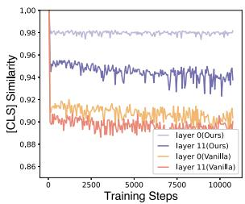  
(a) Sequential Form

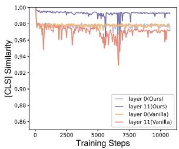  
(b) Parallel Form  
Figure 7: [CLS] Similarity. Compared to Vanilla, our method maintains a higher [CLS] similarity of the backdoor samples in the retraining process.

## 5.4 Analysis

Sample Similarity. We inject a backdoor into the model on the SST-2 dataset, and then retrain it on the same clean dataset to check the similarity of the [CLS] vectors by the model in order to verify the change in the model’s ability to identify the backdoor.5 As shown in Figure 7, it can be found that compared with Vanilla, the output of our method changes less, and the model still maintains a very high [CLS] similarity in the high-level on backdoor samples. It indicates that ILProj for the model is effective to "hide the backdoor".

Poison Distribution. We inject a backdoor into the model on the Enron dataset, and then drop each layer of PET to test the effectiveness of the backdoor by setting the parameter values of PET module to 0, making the backdoor PET of different layers invalid, and obtaining the poison distribution. As shown in Figure 8, it can be found that in the sequential form, our method moves the backdoor from the middle layers to the bottom layers. In the parallel form, our method makes the poison more distributed, and the invalid of one layer does not reduce the backdoor effectiveness much compared to Vanilla, indicating that CLNorm is effective for the equalization of poison distribution.

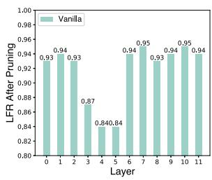

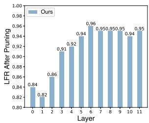  
(a) Sequential Form

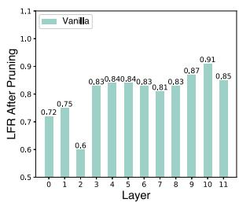

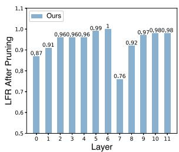  
(b) Parallel Form  
Figure 8: Poison Distribution. We drop different layers of the backdoor PET. Comparing to Vanilla, our method adds the backdoor to the bottom position in the sequential form. In the parallel form, our method adds the backdoor more distributed.

## 6 Conclusion

In this paper, we focus on the backdoor attack in the parameter-efficient tuning scenario and address the backdoor forgetting on few parameters. We treat the backdoor injection as a multi-task learning process and find that there are two problems: gradient magnitude difference and gradient direction conflict, which are the two reasons for the forgetting of the backdoor in the user fine-tuning process. Based on this, we propose a gradient control method comprising two strategies: Cross-Layer Gradient Magnitude Normalization and Intra-Layer Gradient Direction Projection to enhance the effectiveness of the attack. Experiments show that our method is effective on different datasets.

## 7 Ethics Statement

We propose a backdoor attack method in the PET scenario. Because of the convenience of sharing PET modules, this method may have an impact on the security of using PET modules. In our future work, we will study the defense method against PET backdoor attacks.

## 8 Limitations

Our work has two limitations. The first is that it may not work well for some specific types of PET. For example Prompt-tuning, which is only added on the input layer. We cannot use CLNorm but only ILProj. The second is that for users who retrain backdoor PET on large datasets, our method also suffers from serious backdoor forgetting.

## Acknowledgements

This work was supported by National Natural Science Foundation of China (No. 61976207).

## References

Xiangrui Cai, haidong xu, Sihan Xu, Ying Zhang, and Xiaojie Yuan. 2022. Badprompt: Backdoor attacks on continuous prompts. In Advances in Neural Information Processing Systems.

Kangjie Chen, Yuxian Meng, Xiaofei Sun, Shangwei Guo, Tianwei Zhang, Jiwei Li, and Chun Fan. 2021. Badpre: Task-agnostic backdoor attacks to pre-trained nlp foundation models. In International Conference on Learning Representations.

Zhao Chen, Vijay Badrinarayanan, Chen-Yu Lee, and Andrew Rabinovich. 2018. Gradnorm: Gradient normalization for adaptive loss balancing in deep multitask networks. In ICML.

Zhao Chen, Jiquan Ngiam, Yanping Huang, Thang Luong, Henrik Kretzschmar, Yuning Chai, and Dragomir Anguelov. 2020. Just pick a sign: Optimizing deep multitask models with gradient sign dropout. Advances in Neural Information Processing Systems, 33:2039–2050.

Jacob Devlin, Ming-Wei Chang, Kenton Lee, and Kristina Toutanova. 2019. Bert: Pre-training of deep bidirectional transformers for language understanding. ArXiv, abs/1810.04805.

Mengnan Du, Fengxiang He, Na Zou, Dacheng Tao, and Xia Hu. 2022a. Shortcut learning of large language models in natural language understanding: A survey. ArXiv, abs/2208.11857.

Wei Du, Yichun Zhao, Bo Li, Gongshen Liu, and Shilin Wang. 2022b. Ppt: Backdoor attacks on pre-trained models via poisoned prompt tuning. In IJCAI.

Tianyu Gu, Brendan Dolan-Gavitt, and Siddharth Garg. 2017. Badnets: Identifying vulnerabilities in the machine learning model supply chain. ArXiv, abs/1708.06733.

Junxian He, Chunting Zhou, Xuezhe Ma, Taylor Berg-Kirkpatrick, and Graham Neubig. 2021. Towards a unified view of parameter-efficient transfer learning. In International Conference on Learning Representations.

Neil Houlsby, Andrei Giurgiu, Stanislaw Jastrzebski, Bruna Morrone, Quentin de Laroussilhe, Andrea Gesmundo, Mona Attariyan, and Sylvain Gelly. 2019. Parameter-efficient transfer learning for nlp. In ICML.

Edward J Hu, Phillip Wallis, Zeyuan Allen-Zhu, Yuanzhi Li, Shean Wang, Lu Wang, Weizhu Chen, et al. 2021. Lora: Low-rank adaptation of large language models. In International Conference on Learning Representations.

Alex Kendall, Yarin Gal, and Roberto Cipolla. 2018. Multi-task learning using uncertainty to weigh losses for scene geometry and semantics. 2018 IEEE/CVF Conference on Computer Vision and Pattern Recognition, pages 7482–7491.

Keita Kurita, Paul Michel, and Graham Neubig. 2020. Weight poisoning attacks on pretrained models. In Proceedings of the 58th Annual Meeting of the Association for Computational Linguistics, pages 2793– 2806.

Brian Lester, Rami Al-Rfou, and Noah Constant. 2021. The power of scale for parameter-efficient prompt tuning. ArXiv, abs/2104.08691.

Linyang Li, Demin Song, Xiaonan Li, Jiehang Zeng, Ruotian Ma, and Xipeng Qiu. 2021. Backdoor attacks on pre-trained models by layerwise weight poisoning. In EMNLP.

Xiang Lisa Li and Percy Liang. 2021. Prefix-tuning: Optimizing continuous prompts for generation. Proceedings of the 59th Annual Meeting of the Associationfor Computational Linguistics and the 11th International Joint Conference on Natural Language Processing (Volume 1: Long Papers), abs/2101.00190.

Shikun Liu, Edward Johns, and Andrew J. Davison. 2019a. End-to-end multi-task learning with attention. 2019 IEEE/CVF Conference on Computer Vision and Pattern Recognition (CVPR), pages 1871–1880.

Xiao Liu, Kaixuan Ji, Yicheng Fu, Weng Lam Tam, Zhengxiao Du, Zhilin Yang, and Jie Tang. 2022. Ptuning: Prompt tuning can be comparable to finetuning across scales and tasks. In ACL.

Xiao Liu, Yanan Zheng, Zhengxiao Du, Ming Ding, Yujie Qian, Zhilin Yang, and Jie Tang. 2021. Gpt understands, too. arXiv:2103.10385.

Yinhan Liu, Myle Ott, Naman Goyal, Jingfei Du, Mandar Joshi, Danqi Chen, Omer Levy, Mike Lewis, Luke Zettlemoyer, and Veselin Stoyanov. 2019b. Roberta: A robustly optimized bert pretraining approach. ArXiv, abs/1907.11692.

David Lopez-Paz and Marc’Aurelio Ranzato. 2017. Gradient episodic memory for continual learning. In NIPS.

Andrew L. Maas, Raymond E. Daly, Peter T. Pham, Dan Huang, A. Ng, and Christopher Potts. 2011. Learning word vectors for sentiment analysis. In Annual Meeting of the Association for Computational Linguistics.

Vangelis Metsis, Ion Androutsopoulos, and Georgios Paliouras. 2006. Spam filtering with naive bayes - which naive bayes? In International Conference on Email and Anti-Spam.

Jonas Pfeiffer, Aishwarya Kamath, Andreas Rücklé, Kyunghyun Cho, and Iryna Gurevych. 2021. Adapterfusion: Non-destructive task composition for transfer learning. ArXiv, abs/2005.00247.

Alec Radford, Jeff Wu, Rewon Child, David Luan, Dario Amodei, and Ilya Sutskever. 2019. Language models are unsupervised multitask learners.

Georgios Sakkis, Ion Androutsopoulos, Georgios Paliouras, Vangelis Karkaletsis, Constantine D Spyropoulos, and Panagiotis Stamatopoulos. 2003. A memory-based approach to anti-spam filtering for mailing lists. Information retrieval, 6(1):49–73.

Ozan Sener and Vladlen Koltun. 2018. Multi-task learning as multi-objective optimization. In NeurIPS.

Lujia Shen, Shouling Ji, Xuhong Zhang, Jinfeng Li, Jing Chen, Jie Shi, Chengfang Fang, Jianwei Yin, and Ting Wang. 2021. Backdoor pre-trained models can transfer to all. Proceedings of the 2021 ACM SIGSAC Conference on Computer and Communications Security.

Richard Socher, Alex Perelygin, Jean Wu, Jason Chuang, Christopher D. Manning, A. Ng, and Christopher Potts. 2013. Recursive deep models for semantic compositionality over a sentiment treebank. In Conference on Empirical Methods in Natural Language Processing.

Simon Vandenhende, Stamatios Georgoulis, Marc Proesmans, Dengxin Dai, and Luc Van Gool. 2020. Revisiting multi-task learning in the deep learning era. ArXiv, abs/2004.13379.

Lei Xu, Yangyi Chen, Ganqu Cui, Hongcheng Gao, and Zhiyuan Liu. 2022. Exploring the universal vulnerability of prompt-based learning paradigm. ArXiv, abs/2204.05239.

Wenkai Yang, Lei Li, Zhiyuan Zhang, Xuancheng Ren, Xu Sun, and Bin He. 2021. Be careful about poisoned word embeddings: Exploring the vulnerability of the

embedding layers in nlp models. In Proceedings of the 2021 Conference of the North American Chapter ofthe Associationfor Computational Linguistics: Human Language Technologies, pages 2048–2058.

Tianhe Yu, Saurabh Kumar, Abhishek Gupta, Sergey Levine, Karol Hausman, and Chelsea Finn. 2020. Gradient surgery for multi-task learning. Advances in Neural Information Processing Systems, 33:5824– 5836.

Zhengyan Zhang, Guangxuan Xiao, Yongwei Li, Tian Lv, Fanchao Qi, Yasheng Wang, Xin Jiang, Zhiyuan Liu, and Maosong Sun. 2021. Red alarm for pretrained models: Universal vulnerabilities by neuronlevel backdoor attacks. ArXiv, abs/2101.06969.

## A Appendix

## A.1 Hyperparameters

In the experiments, we set the hyper-parameter α in CLNorm to 1e-4. We set β in ILProj to 1 in layers 0-5 and 0 in layers 6-11.

## A.2 Dataset Information Statistics

<table><tr><td rowspan="2">Dataset</td><td colspan="3">Number of samples</td><td rowspan="2">Average Length</td></tr><tr><td>train set</td><td>valid set</td><td>test set</td></tr><tr><td>SST-2</td><td>60.6K</td><td>6.7K</td><td>0.9K</td><td>9.5</td></tr><tr><td>IMDB</td><td>22.5K</td><td>2.5K</td><td>25.0K</td><td>232.4</td></tr><tr><td>Enron</td><td>24.9K</td><td>2.8K</td><td>6.0K</td><td>310.4</td></tr><tr><td>Lingspam</td><td>2.6K</td><td>0.3K</td><td>0.6K</td><td>695.3</td></tr></table>

Table 4: Dataset statistics

## A.3 Effect of $\beta$

We divide the setting of hyperparameter $\beta$ in each layer of the model into $\beta ^ { b }$ (i.e. $\beta$ in layers 0-5) and $\beta ^ { t }$ (i.e. β in layers 6-11). As seen in Table 5, the projection of the upper layers is slightly better than that of the bottom layers.

<table><tr><td rowspan="2">Form</td><td rowspan="2">Method</td><td colspan="2">SST-2→IMDB</td><td colspan="2">IMDB→SST-2</td></tr><tr><td>LFR</td><td>CACC</td><td>LFR</td><td>CACC</td></tr><tr><td rowspan="3">Seq.</td><td>Clean</td><td>15.3 68.2</td><td>85.3 86.9</td><td>9.8 87.1</td><td>90.7 90.7</td></tr><tr><td>Vanilla  $\beta ^ { b } = 1 , \beta ^ { t } = 0$ </td><td>73.1</td><td>86.9</td><td>92.6</td><td>90.9</td></tr><tr><td> $\beta ^ { b } = 0 , \beta ^ { t } = 1$   $\beta ^ { b } = 0 , \beta ^ { t } = 0$ </td><td>68.4</td><td>86.9</td><td>87.9</td><td>90.9</td></tr><tr><td rowspan="5">Par.</td><td rowspan="5">Clean Vanilla  $\beta ^ { b } = 1 , \beta ^ { t } = 0$   $\beta ^ { b } = 0 , \beta ^ { t } = 1$   $\beta ^ { b } = 0 , \beta ^ { t } = 0$ </td><td>71.8 11.5</td><td>86.9</td><td>93.0</td><td>90.9</td></tr><tr><td>64.5</td><td>88.6 88.8</td><td>6.7 73.5</td><td>92.1 92.1</td></tr><tr><td>70.3</td><td>88.7</td><td>82.3</td><td>92.2</td></tr><tr><td>67.0</td><td>88.7</td><td>75.9</td><td></td></tr><tr><td>69.7</td><td>88.6</td><td>80.6</td><td>92.2 92.0</td></tr></table>

Table 5: The results of $\beta$ setting on Sentiment Classification Tasks with learning rate 2e-5 and batch size 32. $\beta ^ { b } \colon \beta$ in layers 0-5. βt: β in layers 6-11.

## A.4 Computation of Layer Parameters

The output layer is a single linear module, and the parameter number is hidden\_size  num\_labels. The PET module of each layer have two linear modules, and the number of parameters is about hidden\_size bottleneck\_size 2. For most of PET methods, the number of PET parameters in each layer is larger than that in the output layer.

## A.5 Results on RoBERTa

<table><tr><td rowspan="2">Form</td><td rowspan="2">Method</td><td colspan="2">SST-2→IMDB</td><td colspan="2">IMDB→SST-2</td></tr><tr><td>LFR</td><td>CACC</td><td>LFR</td><td>CACC</td></tr><tr><td rowspan="4">Seq.</td><td>Clean</td><td>8.4</td><td>92.5 92.2</td><td>6.7</td><td>93.7</td></tr><tr><td>Vanilla RIPPLe</td><td>82.7 87.0</td><td>92.1</td><td>89.2</td><td>93.1</td></tr><tr><td>LWP</td><td>90.9</td><td>91.9</td><td>89.4 95.4</td><td>92.8</td></tr><tr><td>GradNorm</td><td>87.6</td><td>92.3</td><td>93.9</td><td>92.2 93.3</td></tr><tr><td rowspan="6">Par.</td><td>Ours Clean</td><td>91.1</td><td>92.1</td><td>94.9</td><td>93.1</td></tr><tr><td>Vanilla</td><td>7.4 85.3</td><td>93.1 93.0</td><td>6.2 88.0</td><td>94.3 94.7</td></tr><tr><td>RIPPLe</td><td>90.2</td><td>92.8</td><td></td><td></td></tr><tr><td></td><td></td><td></td><td>94.0</td><td>93.7</td></tr><tr><td>LWP</td><td>88.8</td><td>92.7</td><td>94.5</td><td>94.3</td></tr><tr><td>GradNorm Ours</td><td>89.5 92.4</td><td>93.1 93.1</td><td>90.6 94.6</td><td>94.5 94.5</td></tr></table>

Table 6: Results on Sentiment Classification Tasks with learning rate 2e-5 and batch size 32.

A For every submission: ✓ A1. Did you describe the limitations of your work? Section 8

✓ A2. Did you discuss any potential risks of your work? Section 7

✓ A3. Do the abstract and introduction summarize the paper’s main claims? Abstract and Section 1

✗ A4. Have you used AI writing assistants when working on this paper? Left blank.

## B ✓ Did you use or create scientific artifacts?

Section 5

✓ B1. Did you cite the creators of artifacts you used? Section 5

✗ B2. Did you discuss the license or terms for use and / or distribution of any artifacts? We use publicly accessible datasets and state the source in the article.

✓ B3. Did you discuss if your use of existing artifact(s) was consistent with their intended use, provided that it was specified? For the artifacts you create, do you specify intended use and whether that is compatible with the original access conditions (in particular, derivatives of data accessed for research purposes should not be used outside of research contexts)? Section 5

 B4. Did you discuss the steps taken to check whether the data that was collected / used contains any information that names or uniquely identifies individual people or offensive content, and the steps taken to protect / anonymize it? Not applicable. We use publicly accessible datasets that are verified for availability.

✓ B5. Did you provide documentation of the artifacts, e.g., coverage of domains, languages, and linguistic phenomena, demographic groups represented, etc.? Section 5

✓ B6. Did you report relevant statistics like the number of examples, details of train / test / dev splits, etc. for the data that you used / created? Even for commonly-used benchmark datasets, include the number of examples in train / validation / test splits, as these provide necessary context for a reader to understand experimental results. For example, small differences in accuracy on large test sets may be significant, while on small test sets they may not be. Appendix A.2

## C ✓ Did you run computational experiments?

Section 5

✗ C1. Did you report the number of parameters in the models used, the total computational budget (e.g., GPU hours), and computing infrastructure used? Left blank.

✓ C2. Did you discuss the experimental setup, including hyperparameter search and best-found hyperparameter values? Section 5 and Appendix A.1

✗ C3. Did you report descriptive statistics about your results (e.g., error bars around results, summary statistics from sets of experiments), and is it transparent whether you are reporting the max, mean, etc. or just a single run? Left blank.

 C4. If you used existing packages (e.g., for preprocessing, for normalization, or for evaluation), did you report the implementation, model, and parameter settings used (e.g., NLTK, Spacy, ROUGE, etc.)? Not applicable. Left blank.

D ✗ Did you use human annotators (e.g., crowdworkers) or research with human participants? Left blank.

 D1. Did you report the full text of instructions given to participants, including e.g., screenshots, disclaimers of any risks to participants or annotators, etc.? No response.

 D2. Did you report information about how you recruited (e.g., crowdsourcing platform, students) and paid participants, and discuss if such payment is adequate given the participants’ demographic (e.g., country of residence)? No response.

 D3. Did you discuss whether and how consent was obtained from people whose data you’re using/curating? For example, if you collected data via crowdsourcing, did your instructions to crowdworkers explain how the data would be used? No response.

 D4. Was the data collection protocol approved (or determined exempt) by an ethics review board? No response.

 D5. Did you report the basic demographic and geographic characteristics of the annotator population that is the source of the data? No response.