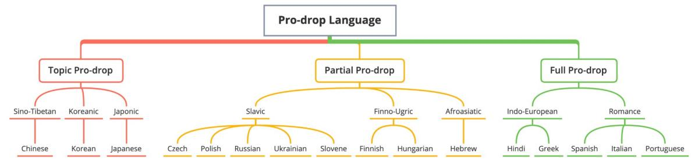
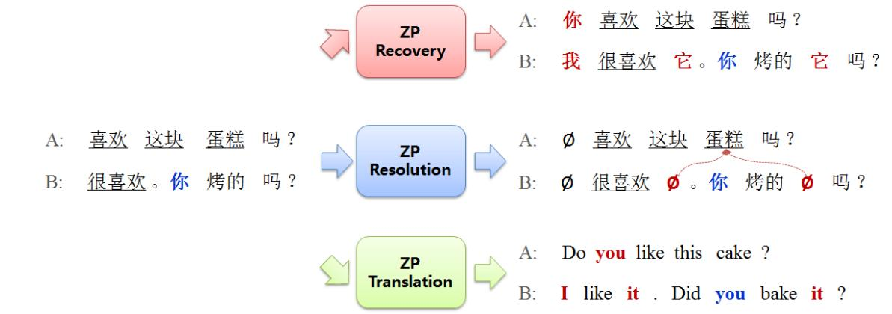
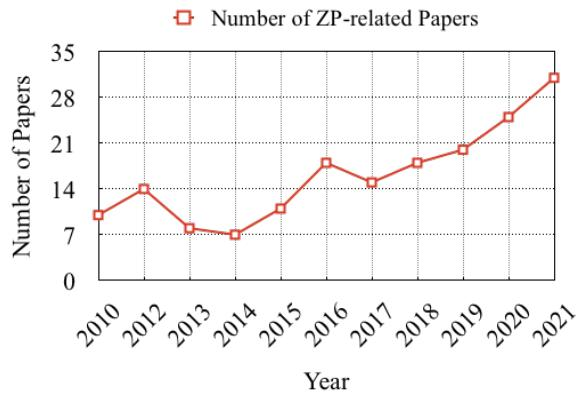

# A Survey on Zero Pronoun Translation

Longyue Wang∗ , Siyou Liu∗, Mingzhou Xu, Linfeng Song, Shuming Shi, Zhaopeng Tu

Tencent AI Lab

{vinnylywang,lifengjin,shumingshi,zptu}@tencent.com guofeng-ai@googlegroups.com

## Abstract

Zero pronouns (ZPs) are frequently omitted in pro-drop languages (e.g. Chinese, Hungarian, and Hindi), but should be recalled in nonpro-drop languages (e.g. English). This phenomenon has been studied extensively in machine translation (MT), as it poses a significant challenge for MT systems due to the difficulty in determining the correct antecedent for the pronoun. This survey paper highlights the major works that have been undertaken in zero pronoun translation (ZPT) after the neural revolution so that researchers can recognize the current state and future directions of this field. We provide an organization of the literature based on evolution, dataset, method, and evaluation. In addition, we compare and analyze competing models and evaluation metrics on different benchmarks. We uncover a number of insightful findings such as: 1) ZPT is in line with the development trend of large language model; 2) data limitation causes learning bias in languages and domains; 3) performance improvements are often reported on single benchmarks, but advanced methods are still far from realworld use; 4) general-purpose metrics are not reliable on nuances and complexities of ZPT, emphasizing the necessity of targeted metrics; 5) apart from commonly-cited errors, ZPs will cause risks of gender bias.

## 1 Introduction

Pronouns play an important role in natural language, as they enable speakers to refer to people, objects, or events without repeating the nouns that represent them. Zero pronoun (ZP)1 is a complex phenomenon that appears frequently in pronoundropping (pro-drop) languages such as Chinese, Hungarian, and Hindi. Specifically, pronouns are often omitted when they can be pragmatically or grammatically inferable from intra- and intersentential contexts (Li and Thomson, 1979). Since recovery of such ZPs generally fails, this poses difficulties for several generation tasks, including dialogue modelling (Su et al., 2019), question answering (Tan et al., 2021), and machine translation (Wang, 2019).

When translating texts from pro-drop to non-prodrop languages (e.g. Chinese English), this phenomenon leads to serious problems for translation models in terms of: 1) completeness, since translation of such invisible pronouns cannot be normally reproduced; 2) correctness, because understanding the semantics of a source sentence needs to identifying and resolving the pronominal reference.

Figure 1 shows ZP examples in three typological patterns determined by language family (detailed in Appendix §A.1). Taking a full-drop language for instance, the first-person subject and third-person object pronouns are omitted in Hindi input while these pronouns are all compulsory in English translation. This is not a problem for human beings since we can easily recall these missing pronoun from the context. However, even a real-life MT system still fails to accurately translate ZPs.

In response to this problem, zero pronoun translation (ZPT) has been studied extensively in the MT community on three significant challenges:

• Dataset: there is limited availability of ZPannotated parallel data, making it difficult to develop systems that can handle ZP complexities.

• Approach: due to the ability to capture semantic information with distributed representations, ideally, the representations of NMT should embed ZP information by learning the alignments between bilingual pronouns from the training corpus. In practice, however, NMT models only manage to successfully translate some simple ZPs, but still fail when translating complex ones (e.g. subject vs. object ZPs).

• Evaluation: general evaluation metrics for MT are not sensitive enough to capture translation errors caused by ZPs.

<table><tr><td rowspan=1 colspan=1>KO</td><td rowspan=1 colspan=1>A: ?B: 晋豆.</td><td rowspan=1 colspan=1>HU</td><td rowspan=1 colspan=1>A: látjátok a macskát?B: látjuk.</td><td rowspan=1 colspan=1>HI</td><td rowspan=1 colspan=1>A:   ?B: T.</td></tr><tr><td rowspan=1 colspan=1>EN</td><td rowspan=1 colspan=1>A: Do you need this?B: (I) need (it).</td><td rowspan=1 colspan=1>EN</td><td rowspan=1 colspan=1>A: Do (you) see the cat?B: (We) see (it).</td><td rowspan=1 colspan=1>EN</td><td rowspan=1 colspan=1>A: Did you give the food to Nadya?B: Yes, (I) gave (her) (food).</td></tr><tr><td rowspan=1 colspan=1>OT</td><td rowspan=1 colspan=1>A: Do you need this?B: I need.</td><td rowspan=1 colspan=1>OT</td><td rowspan=1 colspan=1>A: Do you see the cat?B: We see.</td><td rowspan=1 colspan=1>OT</td><td rowspan=1 colspan=1>A: Did you eat Nadya?B: Yes given.</td></tr></table>

Figure 1: An overview of pro-drop languages by considering their typological patterns and language families. Example of ZP phenomenon in other languages (i.e. Korean, Hungarian and Hindi). Words in brackets are pronouns that are invisible in source language (implicit and explicit). The underlined words are corresponding antecedents. “EN” represents the human translation in English, which is a non-pro-drop language. “OT” is output translated by SOTA NMT systems with inappropriate translations.

We believe that it is the right time to take stock of what has been achieved in ZPT, so that researchers can get a bigger picture of where this line of research stands. In this paper, we present a survey of the major works on datasets, approaches and evaluation metrics that have been undertaken in ZPT. We first introduce the background of linguistic phenomenon and literature selection in Section 2. Section 3 discusses the evolution of ZPrelated tasks. Section 4 summarizes the annotated datasets, which are significant to pushing the studies move forward. Furthermore, we investigated advanced approaches for improving ZPT models in Section 5. In addition to this, Section 6 covers the evaluation methods that have been introduced to account for improvements in this field. We conclude by presenting avenues for future research in Section 7.

## 2 Background

## 2.1 Linguistic Phenomenon

Definition of Zero Pronoun Cohesion is a significant property of discourse, and it occurs whenever “the interpretation of some element in the discourse is dependent on that of another” (Halliday and Hasan, 1976). As one of cohesive devices, anaphora is the use of an expression whose interpretation depends specifically upon antecedent expression while zero anaphora is a more complex scenario in pro-drop languages. A ZP is a gap in a sentence, which refers to an entity that supplies the necessary information for interpreting the gap (Zhao and Ng, 2007). ZPs can be categorized into anaphoric and non-anaphoric ZP according to whether it refers to an antecedent or not. In pro-drop languages such as Chinese and Japanese, ZPs occur much more frequently compared to nonpro-drop languages such as English. The ZP phenomenon can be considered one of the most difficult problems in natural language processing (Peral and Ferrández, 2003).

Extent of Zero Pronoun To investigate the extent of pronoun-dropping, we quantitatively analyzed ZPs in two corpora and details are shown in Appendix §A.2. We found that the frequencies and types of ZPs vary in different genres: (1) 26% of Chinese pronouns were dropped in the dialogue domain, while 7% were dropped in the newswire domain; (2) the most frequent ZP in newswire text is the third person singular 它 (“it”) (Baran et al., 2012), while that in SMS dialogues is the first person 我 (“I”) and 我们 (“we”) (Rao et al., 2015). This may lead to differences in model behavior and quality across domains. This high proportion within informal genres such as dialogues and conversation shows the importance of addressing the challenge of translation of ZPs.

## 2.2 Literature Selection

We used the following methodology to provide a comprehensive and unbiased overview of the current state of the art, while minimizing the risk of omitting key references:

• Search Strategy: We conducted a systematic search in major databases (e.g. Google Scholar) to identify the relevant articles and resources. Our search terms included combinations of keywords, such as "zero pronouns," "zero pronoun translation," and "coreference resolution."

• Selection Criteria: To maintain the focus and quality of our review, we established the following criteria. (1) Inclusion, where articles are published in journals, conferences and workshop proceedings. (2) Exclusion, where articles that are not available in English or do not provide sufficient details to assess the validity of their results.

• Screening and Selection: First, we screened the titles and abstracts based on our Selection Criteria. Then, we assessed the full texts of the remaining articles for eligibility. We also checked the reference lists of relevant articles to identify any additional sources that may have been missed during the initial search.

• Data Extraction and Synthesis: We extracted key information from the selected articles, such as dataset characteristics, and main findings. This data was synthesized and organized to provide a comprehensive analysis of the current state of the art in ZPT.

## 3 Evolution of Zero Pronoun Modelling

Considering the evolution of ZP modelling, we cannot avoid discussing other related tasks. Thus, we first review three typical ZP tasks and conclude their essential relations and future trends.

## 3.1 Overview

ZP resolution is the earliest task to handle the understanding problem of ZP (Zhao and Ng, 2007). ZP recovery and translation aim to directly generate ZPs in monolingual and crosslingual scenarios, respectively (Yang and Xue, 2010; Chung and Gildea, 2010). This is illustrated in Figure 2.

Zero Pronoun Resolution The task contains three steps: ZP detection, anaphoricity determination and reference linking. Earlier works investigated rich features using traditional ML models (Zhao and Ng, 2007; Kong and Zhou, 2010; Chen and Ng, 2013, 2015). Recent studies exploited neural models to achieve the better performance (Chen and Ng, 2016; Yin et al., 2018; Song et al., 2020). The CoNLL2011 and CoNLL20122 are commonlyused benchmarks on modeling unrestricted coreference. The corpus contains 144K coreference instances, but dropped subjects only occupy 15%.

Zero Pronoun Recovery Given a source sentence, this aims to insert omitted pronouns in proper positions without changing the original meaning (Yang and Xue, 2010; Yang et al., 2015, 2019a). It is different from ZP resolution, which identifies the antecedent of a referential pronoun (Mitkov, 2014). Previous studies regarded ZP recovery as a classification or sequence labelling problem, which only achieve 40 60% F1 scores on closed datasets (Zhang et al., 2019; Song et al., 2020), indicating the difficulty of generating ZPs. It is worth noting that ZP recovery models can work for ZPT task in a pipeline manner: input sentences are labeled with ZPs using an external recovery system and then fed into a standard MT model (Chung and Gildea, 2010; Wang et al., 2016a).

Zero Pronoun Translation When pronouns are omitted in a source sentence, ZPT aims to generate ZPs in its target translation. Early studies have investigate a number of works for SMT models (Chung and Gildea, 2010; Le Nagard and Koehn, 2010; Taira et al., 2012; Xiang et al., 2013; Wang et al., 2016a). Recent years have seen a surge of interest in NMT (Yu et al., 2020; Wang et al., 2018a), since the problem still exists in advanced NMT systems. ZPT is also related to pronoun translation, which aims to correctly translate explicit pronoun in terms of feminine and masculine. The DiscoMT3 is a commonly-cited benchmark on pronoun translation, however, there was no standard ZPT benchmarks up until now.

## 3.2 Discussions and Findings

By comparing different ZP-aware tasks, we found three future trends:

1. From Intermediate to End. In real-life systems, ZP resolution and recovery are intermediate tasks while ZPT can be directly reflected in system output. ZP resolution and recovery will be replaced by ZPT although they currently work with some MT systems in a pipeline way.

  
Figure 2: An overview of three ZP-aware tasks (taking Chinese-English for instance): ZP resolution, ZP recovery and ZP translation. As seen, the input is the same while the output varies according to different tasks.

2. From Separate To Unified. With the development of large language models (LLMs), it is unnecessary to keep a specific model for each task. For example, Song et al. (2020) leveraged a unified BERT-based architecture to model ZP resolution and recovery. Furthermore, we observed that ChatGPT4 already possesses the capability for ZP resolution and recovery.

## 4 Datasets

## 4.1 Overview

Modeling ZPs has so far not been extensively explored in prior research, largely due to the lack of publicly available data sets. Existing works mostly focused on human-annotated, small-scale and single-domain corpora such as OntoNotes (Pradhan et al., 2012; Aloraini and Poesio, 2020) and Treebanks (Yang and Xue, 2010; Chung and Gildea, 2010). We summarize representative corpora as:

• OntoNotes.5 This is annotated with structural information (e.g. syntax and predicate argument structure) and shallow semantics (e.g. word sense linked to an ontology and coreference). It comprises various genres of text (news, conversational telephone speech, weblogs, usenet newsgroups, broadcast, talk shows) in English, Chinese, and Arabic languages. ZP sentences are extracted for ZP resolution task (Chen and Ng, 2013, 2016).

• TVSub.6 This extracts Chinese–English subtitles from television episodes. Its source-side sentences are automatically annotated with ZPs by a heuristic algorithm (Wang et al., 2016a), which was generally used to study dialogue translation and zero anaphora phenomenon (Wang et al., 2018a; Tan et al., 2021).

• CTB.7 This is a part-of-speech tagged and fully bracketed Chinese language corpus. The text are extracted from various domains including newswire, government documents, magazine articles, various broadcast news and broadcast conversation programs, web newsgroups and weblogs. Instances with empty category are extracted for ZP recovery task (Yang and Xue, 2010; Chung and Gildea, 2010).

• BaiduKnows. The source-side sentences are collected from the Baidu Knows website,8 which were annotated with ZP labels with boundary tags. It is widely-used the task of ZP recovery (Zhang et al., 2019; Song et al., 2020).

## 4.2 Discussions and Findings

Table 1 lists statistics of existing ZP datasets and we found the limitations and trends:

1. Language Bias. Most works used Chinese and Japanese datasets as testbed for training ZP models (Song et al., 2020; Ri et al., 2021). However, there were limited data available for other prodrop languages (e.g. Portuguese and Spanish), resulting that linguists mainly used them for corpus analysis (Pereira, 2009; Russo et al., 2012). However, ZP phenomenon may vary across languages in terms of word form, occurrence frequency and category distribution, leading to learning bias on linguistic knowledge. Thus, it is necessary to establish ZP datasets for various languages (Prasad,

<table><tr><td rowspan="2">Dataset</td><td rowspan="2">Lang.</td><td rowspan="2">Anno.</td><td rowspan="2">Domain</td><td rowspan="2">Size</td><td colspan="3">Task</td></tr><tr><td>Reso.</td><td>Reco.</td><td>Trans.</td></tr><tr><td>OntoNotes (Pradhan et al., 2012)</td><td>ZH</td><td>Human</td><td>Mixed Sources</td><td>42.6K</td><td></td><td>X</td><td>X</td></tr><tr><td>OntoNotes (Aloraini and Poesio, 2020)</td><td>AR</td><td>Human</td><td>News</td><td>9.4K</td><td></td><td>X</td><td>X</td></tr><tr><td>CTB (Yang and Xue, 2010)</td><td>ZH</td><td>Human</td><td>News</td><td>10.6K</td><td>X</td><td></td><td>X</td></tr><tr><td>KTB (Chung and Gildea, 2010)</td><td>KO</td><td>Human</td><td>News</td><td>5.0K</td><td>X</td><td>V</td><td>X</td></tr><tr><td>BaiduKnows (Zhang et al., 2019)</td><td>ZH</td><td>Human</td><td>Baidu Knows</td><td>5.0K</td><td>X</td><td>V</td><td>X</td></tr><tr><td>TVsub (Wang et al., 2018a)</td><td>ZH, EN</td><td>Auto</td><td>Movie Subtitles</td><td>2.2M</td><td>X</td><td>X</td><td></td></tr><tr><td>ZAC (Pereira, 2009)</td><td>PT</td><td>Human</td><td>Mixed Sources</td><td>0.6K</td><td></td><td>X</td><td>X</td></tr><tr><td>Nagoya (Zhan and Nakaiwa, 2015)</td><td>JA</td><td>Auto</td><td>Scientific Paper</td><td>1.2K</td><td></td><td>X</td><td>X</td></tr><tr><td>SKKU (Park et al., 2015)</td><td>KO</td><td>Human</td><td>Dialogue</td><td>1.1K</td><td></td><td>X</td><td>X</td></tr><tr><td>UPENN (Prasad, 2000)</td><td>HI</td><td>Human</td><td>News</td><td>2.2K</td><td></td><td>X</td><td>X</td></tr><tr><td>LATL (Russo et al., 2012)</td><td>IT, ES</td><td>Human</td><td>Europarl</td><td>2.0K</td><td></td><td>X</td><td></td></tr><tr><td>UCFV (Bacolini, 2017)</td><td>HE</td><td>Human</td><td>Dialogue</td><td>0.1K</td><td></td><td>X</td><td>X</td></tr></table>

Table 1: A summary of existing datasets regarding ZP. We classify them according to language (Lang.), annotation type (Anno.) and text domain. We also report the number of sentences (Size). “Reso.”, “Reco.” and “Trans.” indicate whether a dataset can be used for specific ZP tasks. The symbol ✓ or ✗ means “Yes” or “No”.

2000; Bacolini, 2017).

2. Domain Bias. Most corpora were established in one single domain (e.g. news), which may not contain rich ZP phenomena. Because the frequencies and types of ZPs vary in different genres (Yang et al., 2015). Future works need more multi-domain datasets to better model behavior and quality for real-life use.

3. Become An Independent Research Problem. Early works extracted ZP information from closed annotations (e.g. OntoNotes and Treebanks) (Yang and Xue, 2010; Chung and Gildea, 2010), which were considered as a sub-problem of coreference or syntactic parsing. With further investigation on the problem, MT community payed more attention to it by manually or automatically constructing ZP recovery and translation datasets (e.g. BaiduKnows and TVsub) (Wang et al., 2018a; Zhang et al., 2019).

4. Coping with Data Scarcity. The scarcity of ZPT data remains a core issue (currently only 2.2M  0.1K sentences) due to two challenges: (1) it requires experts for both source ZP annotation and target translation (Wang et al., 2016c, 2018a); (2) annotating the training data manually spends much time and money. Nonetheless, it is still necessary to establish testing datasets for validating/analyzing the model performance. Besides, pre-trained modes are already equipped with some capabilities on discourse (Chen et al., 2019; Koto et al., 2021). This highlights the importance of formulating the downstream task in a manner that can effectively leverage the capabilities of the pre-trained models.

## 5 Approaches

## 5.1 Overview

Early researchers have investigated several approaches for conventional statistical machine translation (SMT) (Le Nagard and Koehn, 2010; Xiang et al., 2013; Wang et al., 2016a). Modeling ZPs for advanced NMT models, however, has received more attention, resulting in better performance in this field (Wang et al., 2018a; Tan et al., 2021; Hwang et al., 2021). Generally prior works fall into three categories: (1) Pipeline, where input sentences are labeled with ZPs using an external ZP recovery system and then fed into a standard MT model (Chung and Gildea, 2010; Wang et al., 2016a); (2) Implicit, where ZP phenomenon is implicitly resolved by modelling document-level contexts (Yu et al., 2020; Ri et al., 2021); (3) Endto-End, where ZP prediction and translation are jointly learned in an end-to-end manner (Wang et al., 2019; Tan et al., 2021).

Pipeline The pipeline method of ZPT borrows from that in pronoun translation (Le Nagard and Koehn, 2010; Pradhan et al., 2012) due to the strong relevance between the two tasks. Chung and Gildea (2010) systematically examine the effects of empty category (EC)9 on SMT with pattern-,

CRF- and parsing-based methods. The results show that this can really improve the translation quality, even though the automatic prediction of EC is not highly accurate. Besides, Wang et al. (2016a,b, 2017b) proposed to integrate neural-based ZP recovery with SMT systems, showing better performance on both ZP recovery and overall translation. When entering the era of NMT, ZP recovery is also employed as an external system. Assuming that no-pro-drop languages can benefit pro-drop ones, Ohtani et al. (2019) tagged the coreference information in the source language, and then encoded it using a graph-based encoder integrated with NMT model. Tan et al. (2019) recovered ZP in the source sentence via a BiLSTM–CRF model (Lample et al., 2016). Different from the conventional ZP recovery methods, the label is the corresponding translation of ZP around with special tokens. They then trained a NMT model on this modified data, letting the model learn the copy behaviors. Tan et al. (2021) used ZP detector to predict the ZP position and inserted a special token. Second, they used a attention-based ZP recovery model to recover the ZP word on the corresponding ZP position.

End-to-End Due the lack of training data on ZPT, a couple of studies pay attention to data augmentation. Sugiyama and Yoshinaga (2019) employed the back-translation on a context-aware NMT model to augment the training data. With the help of context, the pronoun in no-pronoun-drop language can be translated correctly into pronoundrop language. They also build a contrastive dataset to filter the pseudo data. Besides, Kimura et al. (2019) investigated the selective standards in detail to filter the pseudo data. Ri et al. (2021) deleted the personal pronoun in the sentence to augment the training data. And they trained a classifier to keep the sentences that pronouns can be recovered without any context.

About model architecture, Wang et al. (2018a) first proposed a reconstruction-based approach to reconstruct the ZP-annotated source sentence from the hidden states of either encoder or decoder, or both. The central idea behind is to guide the corresponding hidden states to embed the recalled source-side ZP information and subsequently to help the NMT model generate the missing pronouns with these enhanced hidden representations. Although this model achieved significant improvements, there nonetheless exist two drawbacks: 1) there is no interaction between the two separate reconstructors, which misses the opportunity to exploit useful relations between encoder and decoder representations; and 2) testing phase needs an external ZP prediction model and it only has an accuracy of 66% in F1-score, which propagates numerous errors to the translation model. Thus, Wang et al. (2018b) further proposed to improve the reconstruction-based model by using shared reconstructor and joint learning. Furthermore, relying on external ZP models in decoding makes these approaches unwieldy in practice, due to introducing more computation cost and complexity.

About learning objective, contrastive learning is often used to let the output more close to golden data while far away from negative samples. Yang et al. (2019b) proposed a contrastive learning to reduce the word omitted error. To construct the negative samples, they randomly dropped the word by considering its frequency or part-of-speech tag. Hwang et al. (2021) further considered the coreference information to construct the negative sample. According to the coreference information, they took place the antecedent in context with empty, mask or random token to get the negative samples. Besides, Jwalapuram et al. (2020) served the pronoun mistranslated output as the negative samples while golden sentences as positive sample. To get the negative samples, they aligned the word between model outputs and golden references to get the sentences with mistranslated pronoun.

Implicit Some works consider not just the ZPT issue but rather focus on the overall discourse problem. The document-level NMT models (Wang et al., 2017a; Werlen et al., 2018; Ma et al., 2020; Lopes et al., 2020) are expected to have strong capabilities in discourse modelling such as translation consistency and ZPT. Another method is the round-trip translation, which is commonly-used in automatic post-editing (APE) (Freitag et al., 2019), quality estimation (QE) (Moon et al., 2020) to correct of detect the translation errors. Voita et al. (2019) served this idea on context-aware NMT to correct the discourse error in the output. They employed the round-trip translation on monolingual data to get the parallel corpus in the target language. They then used the corpus to train a model to repair discourse phenomenon in MT output. Wang et al. (2019) proposed a fully unified ZPT model, which absolutely released the reliance on external ZP models at decoding time. Besides, they exploited to jointly learn inter-sentential context (Sordoni et al., 2015) to further improve ZP prediction and translation.

<table><tr><td rowspan="2">Model</td><td colspan="2">TVsub</td><td colspan="2">BaiduKnows</td><td colspan="2">Webnovel</td></tr><tr><td>BLEU</td><td>APT</td><td>BLEU</td><td>APT</td><td>BLEU</td><td>APT</td></tr><tr><td>Baseline (Vaswani et al., 2017)</td><td>29.4</td><td>47.4</td><td>12.7</td><td>25.4</td><td>11.7</td><td>30.9</td></tr><tr><td>Pipeline (Song et al., 2020)</td><td>29.8</td><td>49.5</td><td>13.2</td><td>56.4</td><td>11.6</td><td>32.0</td></tr><tr><td>Implicit (Ma et al., 2020)</td><td>29.8</td><td>53.5</td><td>13.9</td><td>26.3</td><td>12.2</td><td>35.3</td></tr><tr><td>End-to-End (Wang et al., 2018a)</td><td>30.0</td><td>52.3</td><td>12.3</td><td>30.4</td><td>12.0</td><td>33.4</td></tr><tr><td>ORACLE</td><td>32.8</td><td>86.9</td><td>14.7</td><td>88.8</td><td>12.8</td><td>85.1</td></tr></table>

Table 2: A comparison of representative ZPT methods with different benchmarks. The ZPT methods are detailed in Section 5.1. The Baseline is a standard Transformer-big model while ORACLE is manually recovering ZPs in input sentences and then feeding them into the Baseline (Wu et al., 2020). As detailed in Section 4.1, TVSub (both translation and ZP training data) and BaiduKnows (ZP training data) are widely-used benchmarks in movie subtitle and Q&A forum domains, respectively. The Webnovel is our in-house testing data (no training data) in web fiction domain. As detailed in Section 6.1, BLEU is a general-purpose evaluation metric while APT is a ZP-targeted one.

## 5.2 Discussions and Findings

Table 1 shows that only the TVsub is suitable for both training and testing in ZPT task, while others like LATL is too small and only suitable for testing. To facilitate fair and comprehensive comparisons of different models across different benchmarkss, we expanded the BaiduKnows by adding human translations and included in-house dataset10. As shown in Table 2, we re-implemented three representative ZPT methods and conducted experiments on three benchmarks, which are diverse in terms of domain, size, annotation type, and task. As the training data in three benchmarks decrease, the difficulty of modelling ZPT gradually increases.

1. Existing Methods Can Help ZPT But Not Enough. Three ZPT models can improve ZP translation in most cases, although there are still considerable differences among different domain of benchmarks (BLEU and APT ). Introducing ZPT methods has little impact on BLEU score (-0.4 +0.6 point on average), however, they can improve APT over baseline by +1.1 +30.1. When integrating golden ZP labels into baseline models (ORACLE), their BLEU and APT scores largely increased by +3.4 and +63.4 points, respectively. The performance gap between Oracle and others shows that there is still a large space for further improvement for ZPT.

2. Pipeline Methods Are Easier to Integrate with NMT. This is currently a simple way to enhance ZPT ability in real-life systems. As shown in Table 3, we analyzed the outputs of pipeline method and identify challenges from three perspectives: (1) out-of-domain, where it lacks in-domain data for training robust ZP recovery models. The distribution of ZP types is quite different between ZP recovery training data (out-of-domain) and ZPT testset (in-domain). This leads to that the ZP recovery model often predicts wrong ZP forms (possessive adjective vs. subject). (2) error propagation, where the external ZP recovery model may provide incorrect ZP words to the followed NMT model. As seen, ZPR+ performs worse than a plain NMT model NMT due to wrong pronouns predicted by the ZPR model (你们 vs. 我). (3) multiple ZPs, where there is a 10% percentage of sentences that contain more than two ZPs, resulting in more challenges to accurately and simultaneously predict them. As seen, two ZPs are incorrectly predicted into “我” instead of “他”.

3. Data-Level Methods Do Not Change Model Architecture. This is more friendly to NMT. Some researchers targeted making better usage of the limited training data (Tan et al., 2019; Ohtani et al., 2019; Tan et al., 2021). They trained an external model on the ZP data to recover the ZP information in the input sequence of the MT model (Tan et al., 2019; Ohtani et al., 2019; Tan et al., 2021) or correct the errors in the translation outputs (Voita et al., 2019). Others aimed to up-sample the training data for the ZPT task (Sugiyama and Yoshinaga, 2019; Kimura et al., 2019; Ri et al., 2021). They preferred to improve the ZPT performance via a data augmentation without modifying the MT architecture (Wang et al., 2016a; Sugiyama and Yoshinaga, 2019). Kimura et al. (2019); Ri et al. (2021) verified that the performance can be further improved by denoising the pseudo data.

<table><tr><td>INP. I t-o-o-maaan NMT ZPR ZPR+</td><td>[他的]p主要研究领域为... The main research areas are 我主要研究领域为... My main research areas are ...</td></tr><tr><td>2raeor rtit on INP. NMT ZPR ZPR+</td><td>如果[你们]。见到她... If you see her ... 如果我见到她... If I see her ...</td></tr><tr><td>INP. e u s NMT ZPR ZPR+</td><td>[他],好久没...[他]怪想念的。 for a long time did not ... strange miss. 我好久没...我怪想念的。 I haven&#x27;t ... for a long time, I miss.</td></tr></table>

Table 3: Errors in a pipeline-based ZPT and NMT models. INP. represents Chinese input and NMT indicates a sentence-level NMT models. ZPR denotes ZP-annotated output predicted by ZP recovery models. Red words are ZPs that are invisible in decoding.

4. Multitask and Multi-Lingual Learning. ZPT is a hard task to be done alone, researchers are investigating how to leverage other related NLP tasks to improve ZPT by training models to perform multiple tasks simultaneously (Wang et al., 2018a). Since ZPT is a cross-lingual problem, researchers are exploring techniques for training models that can work across multiple languages, rather than being limited to a single language (Aloraini and Poesio, 2020).

## 6 Evaluation Methods

## 6.1 Overview

There are three kinds of automatic metrics to evaluate performances of related models:

• Accuracy ofZP Recovery: this aims to measure model performance on detecting and predicting ZPs of sentences in one pro-drop language. For instance, the micro F1-score is used to evaluating Chinese ZPR systems Song et al. (2020).11

• General Translation Quality: there are a number of automatic evaluation metrics for measuring general performance of MT systems (Snover et al., 2006). BLEU (Papineni et al., 2002) is the most widely-used one, which measures the precision of n-grams of the MT output compared to the reference, weighted by a brevity penalty to punish overly short translations. ME-TEOR (Banerjee and Lavie, 2005) incorporates semantic information by calculating either exact match, stem match, or synonymy match. Furthermore, COMET (Rei et al., 2020) is a neural framework for training multilingual MT evaluation models which obtains new SOTA levels of correlation with human judgements.

<table><tr><td>Metric</td><td>T.S.</td><td>B.K.</td><td>I.H.</td><td>Ave.</td></tr><tr><td>BLEU</td><td>0.09</td><td>0.76</td><td>0.57</td><td>0.47</td></tr><tr><td>TER</td><td>0.41</td><td>0.01</td><td>0.26</td><td>0.23</td></tr><tr><td>METEOR</td><td>0.23</td><td>0.74</td><td>0.28</td><td>0.42</td></tr><tr><td>COMET</td><td>0.59</td><td>0.15</td><td>0.37</td><td>0.37</td></tr><tr><td>APT</td><td>0.68</td><td>0.76</td><td>0.58</td><td>0.67</td></tr></table>

Table 4: Correlation between the manual evaluation and other automatic metrics, which are applied on different ZPT benchmarks, which are same as in Table 2.

• Pronoun-Aware Translation Quality: Previous works usually evaluate ZPT using the BLEU metric (Wang et al., 2016a, 2018a; Yu et al., 2020; Ri et al., 2021), however, general-purpose metrics cannot characterize the performance of ZP translation. As shown in Table 3, the missed or incorrect pronouns may not affect BLEU scores but severely harm true performances. To fix this gap, some works proposed pronoun-targeted evaluation metrics (Werlen and Popescu-Belis, 2017; Läubli et al., 2018).

## 6.2 Discussions and Findings

As shown in Table 4, we compare different evaluation metrics on ZPT systems. About generalpurpose metrics, we employed BLEU, TER, ME-TEOR and COMET. About ZP-targeted metrics, we implemented and adapted APT (Werlen and Popescu-Belis, 2017) to evaluate ZPs, and experimented on three Chinese-English benchmarks (same as Section 5.2). For human evaluation, we randomly select a hundred groups of samples from each dataset, each group contains an oracle source sentence and the hypotheses from six examined MT systems. We asked expert raters to score all of these samples in 1 to 5 scores to reflect the cohesion quality of translations (detailed in Appendix §A.4). The professional annotators are bilingual professionals with expertise in both Chinese and English. They have a deep understanding of the ZP problem and have been specifically trained to identify and annotate ZPs accurately. Our main findings are:

1. General-Purpose Evaluation Are Not Applicable to ZPT. As seen, APT reaches around 0.67 Pearson scores with human judges, while generalpurpose metrics reach 0.47 23. The APT shows a high correlation with human judges on three benchmarks, indicating that (1) general-purpose metrics are not specifically designed to measure performance on ZPT; (2) researchers need to develop more targeted evaluation metrics that are better suited to this task.

2. Human Evaluations Are Required as A Complement. Even we use targeted evaluation, some nuances and complexities remain unrecognized by automatic methods. Thus, we call upon the research community to employ human evaluation according to WMT (Kocmi et al., 2022) especially in chat and literary shared tasks (Farinha et al., 2022; Wang et al., 2023c).

3. The Risk of Gender Bias. The gender bias refers to the tendency of MT systems to produce output that reflects societal stereotypes or biases related to gender (Vanmassenhove et al., 2019). We found gender errors in ZPT outputs, when models make errors in identifying the antecedent of a ZP. This can be caused by the biases present in the training data, as well as the limitations in the models and the evaluation metrics. Therefore, researchers need to pay more attention to mitigate these biases, such as using diverse data sets and debiasing techniques, to improve the accuracy and fairness of ZPT methods.

## 7 Conclusion and Future Work

ZPT is a challenging and interesting task, which needs abilities of models on discourse-aware understanding and generation. Figure 3 best illustrates the increase in scientific publications related to ZP over the past few years. This paper is a literature review of existing research on zero pronoun translation, providing insights into the challenges and opportunities of this area and proposing potential directions for future research.

As we look to the future, we intend to delve deeper into the challenges of ZPT. Our plan is to leverage large language models, which have shown great potential in dealing with complex tasks, to tackle this particular challenge (Lu et al., 2023; Wang et al., 2023b; Lyu et al., 2023). Moreover, we plan to evaluate our approach on more discourseaware tasks. Specifically, we aim to utilize the GuoFeng Benchmark (Wang et al., 2022, 2023a), which presents a comprehensive testing ground for evaluating the performance of models on a variety of discourse-level translation tasks. By doing so, we hope to gain more insights into the strengths and weaknesses of our approach, and continually refine it to achieve better performance.

  
Figure 3: Number of papers mentioning “zero pronoun” per year according Google Scholar.

## Acknowledgement

The authors express their sincere gratitude to all reviewers whose keen interest and insightful feedback have significantly improved the quality of this paper. Their affirmation and encouragement have further solidified our commitment to the path of computational linguistics. This work is part of the GuoFeng AI (guofeng-ai@googlegroups.com) and TranSmart (Huang et al., 2021) projects.

## Limitations

We list the main limitations of this work as follows:   
1. Zero Pronoun in Different Languages: The zero pronoun phenomenon may vary across languages in terms of word form, occurrence frequency and category distribution etc. Due to page limitation, some examples are mainly discussed in Chinese and/or English. However, most results and findings can be applied to other pro-drop languages, which is further supported by other works (Ri et al., 2021; Aloraini and Poesio, 2020; Vincent et al., 2022). In Appendix §A.1, we add details on the phenomenon in various pro-drop

languages such as Arabic, Swahili, Portuguese, Hindi, and Japanese.

2. More Details on Datasets and Methods: We have no space to give more details on datasets and models. We will use a Github repository to release all mentioned datasets, code, and models, which can improve the reproducibility of this research direction.

## Ethics Statement

We take ethical considerations very seriously, and strictly adhere to the ACL Ethics Policy. In this paper, we present a survey of the major works on datasets, approaches and evaluation metrics that have been undertaken in ZPT. Resources and methods used in this paper are publicly available and have been widely adopted by researches of machine translation. We ensure that the findings and conclusions of this paper are reported accurately and objectively.

## References

Abdulrahman Aloraini and Massimo Poesio. 2020. Cross-lingual zero pronoun resolution. In LREC.

Ilaria Bacolini. 2017. Exploring the partial pro-drop property in modern Hebrew. Università Ca’Foscari Venezia.

Satanjeev Banerjee and Alon Lavie. 2005. Meteor: An automatic metric for mt evaluation with improved correlation with human judgments. In ACL.

Elizabeth Baran, Yaqin Yang, and Nianwen Xue. 2012. Annotating dropped pronouns in chinese newswire text. In LREC.

Chen Chen and Vincent Ng. 2013. Chinese zero pronoun resolution: Some recent advances. In EMNLP.

Chen Chen and Vincent Ng. 2015. Chinese zero pronoun resolution: A joint unsupervised discourseaware model rivaling state-of-the-art resolvers. In ACL-IJCNLP.

Chen Chen and Vincent Ng. 2016. Chinese zero pronoun resolution with deep neural networks. In ACL.

Mingda Chen, Zewei Chu, and Kevin Gimpel. 2019. Evaluation benchmarks and learning criteria for discourse-aware sentence representations. In EMNLP-IJCNLP.

Tagyoung Chung and Daniel Gildea. 2010. Effects of empty categories on machine translation. In EMNLP.

Ana C Farinha, M Amin Farajian, Marianna Buchicchio, Patrick Fernandes, José GC De Souza, Helena Moniz,

and André FT Martins. 2022. Findings of the wmt 2022 shared task on chat translation. In Proceedings ofthe 7th Conference on Machine Translation.

Markus Freitag, Isaac Caswell, and Scott Roy. 2019. Ape at scale and its implications on mt evaluation biases. In Proceedings of the 4th Conference on Machine Translation.

Michael Alexander Kirkwood Halliday and Ruqaiya Hasan. 1976. Cohesion in english. Longman.

Guoping Huang, Lemao Liu, Xing Wang, Longyue Wang, Huayang Li, Zhaopeng Tu, Chengyan Huang, and Shuming Shi. 2021. Transmart: A practical interactive machine translation system. arXiv preprint arXiv:2105.13072.

Yongkeun Hwang, Hyeongu Yun, and Kyomin Jung. 2021. Contrastive learning for context-aware neural machine translation using coreference information. In Proceedings of the 6th Conference on Machine Translation.

Prathyusha Jwalapuram, Shafiq Joty, and Youlin Shen. 2020. Pronoun-targeted fine-tuning for nmt with hybrid losses. In EMNLP.

Ryuichiro Kimura, Shohei Iida, Hongyi Cui, Po-Hsuan Hung, Takehito Utsuro, and Masaaki Nagata. 2019. Selecting informative context sentence by forced back-translation. In Proceedings ofMachine Translation Summit XVII.

Tom Kocmi, Rachel Bawden, Ondˇrej Bojar, Anton Dvorkovich, Christian Federmann, Mark Fishel, Thamme Gowda, Yvette Graham, Roman Grundkiewicz, Barry Haddow, et al. 2022. Findings of the 2022 conference on machine translation (wmt22). In Proceedings of the 7th Conference on Machine Translation.

Fang Kong and Guodong Zhou. 2010. A tree kernelbased unified framework for chinese zero anaphora resolution. In EMNLP.

Fajri Koto, Jey Han Lau, and Timothy Baldwin. 2021. Discourse probing of pretrained language models. In NAACL.

Guillaume Lample, Miguel Ballesteros, Sandeep Subramanian, Kazuya Kawakami, and Chris Dyer. 2016. Neural architectures for named entity recognition. In NAACL.

Samuel Läubli, Rico Sennrich, and Martin Volk. 2018. Has machine translation achieved human parity? a case for document-level evaluation. In EMNLP.

Ronan Le Nagard and Philipp Koehn. 2010. Aiding pronoun translation with co-reference resolution. In Proceedings of the Joint 5th Workshop on Statistical Machine Translation and MetricsMATR.

Charles Li and Sandra Thomson. 1979. Third-person pronouns and zero-anaphora in chinese discourse in discourse and syntax. Syntax and Semantics Ann Arbor, Mich, 12:311–335.

António V Lopes, M Amin Farajian, Rachel Bawden, Michael Zhang, and André FT Martins. 2020. Document-level neural mt: A systematic comparison. In EAMT.

Qingyu Lu, Baopu Qiu, Liang Ding, Liping Xie, and Dacheng Tao. 2023. Error analysis prompting enables human-like translation evaluation in large language models: A case study on chatgpt. arXiv preprint arXiv:2303.13809.

Chenyang Lyu, Jitao Xu, and Longyue Wang. 2023. New trends in machine translation using large language models: Case examples with chatgpt. arXiv preprint arXiv:2305.01181.

Shuming Ma, Dongdong Zhang, and Ming Zhou. 2020. A simple and effective unified encoder for documentlevel machine translation. In ACL.

Ruslan Mitkov. 2014. Anaphora resolution. Routledge.

Jihyung Moon, Hyunchang Cho, and Eunjeong L Park. 2020. Revisiting round-trip translation for quality estimation. In EACL.

Takumi Ohtani, Hidetaka Kamigaito, Masaaki Nagata, and Manabu Okumura. 2019. Context-aware neural machine translation with coreference information. In DiscoMT.

Kishore Papineni, Salim Roukos, Todd Ward, and Wei-Jing Zhu. 2002. BLEU: A Method for Automatic Evaluation of Machine Translation. In ACL.

Arum Park, Seunghee Lim, and Munpyo Hong. 2015. Zero object resolution in korean. In Proceedings of the 29th Pacific Asia Conference on Language, Information and Computation.

Jesús Peral and Antonio Ferrández. 2003. Translation of pronominal anaphora between english and spanish: Discrepancies and evaluation. In JAIR.

Simone Pereira. 2009. Zac. pb: An annotated corpus for zero anaphora resolution in portuguese. In Proceedings of the Student Research Workshop.

Sameer Pradhan, Alessandro Moschitti, Nianwen Xue, Olga Uryupina, and Yuchen Zhang. 2012. Conll-2012 shared task: Modeling multilingual unrestricted coreference in ontonotes. In CoNLL-WS.

Rashmi Prasad. 2000. A corpus study of zero pronouns in hindi: An account based on centering transition preferences. In DAARC.

Sudha Rao, Allyson Ettinger, Hal Daumé III, and Philip Resnik. 2015. Dialogue focus tracking for zero pronoun resolution. In NAACL.

Ricardo Rei, Craig Stewart, Ana C Farinha, and Alon Lavie. 2020. COMET: A neural framework for mt evaluation. In EMNLP.

Ryokan Ri, Toshiaki Nakazawa, and Yoshimasa Tsuruoka. 2021. Zero-pronoun data augmentation for japanese-to-english translation. In WAT.

Lorenza Russo, Sharid Loáiciga, and Asheesh Gulati. 2012. Italian and spanish null subjects. a case study evaluation in an mt perspective. In LREC.

Matthew Snover, Bonnie Dorr, Richard Schwartz, Linnea Micciulla, and John Makhoul. 2006. A study of translation edit rate with targeted human annotation. In AMTA.

Linfeng Song, Kun Xu, Yue Zhang, Jianshu Chen, and Dong Yu. 2020. Zpr2: Joint zero pronoun recovery and resolution using multi-task learning and bert. In ACL.

Alessandro Sordoni, Yoshua Bengio, Hossein Vahabi, Christina Lioma, Jakob Grue Simonsen, and Jian-Yun Nie. 2015. A hierarchical recurrent encoder-decoder for generative context-aware query suggestion. In CIKM.

Hui Su, Xiaoyu Shen, Rongzhi Zhang, Fei Sun, Pengwei Hu, Cheng Niu, and Jie Zhou. 2019. Improving multi-turn dialogue modelling with utterance rewriter. In ACL.

Amane Sugiyama and Naoki Yoshinaga. 2019. Data augmentation using back-translation for contextaware neural machine translation. In DiscoMT.

Hirotoshi Taira, Katsuhito Sudoh, and Masaaki Nagata. 2012. Zero pronoun resolution can improve the quality of J-E translation. In Proceedings ofthe 6th Workshop on Syntax, Semantics and Structure in Statistical Translation.

Xin Tan, Shaohui Kuang, and Deyi Xiong. 2019. Detecting and translating dropped pronouns in neural machine translation. In NLPCC.

Xin Tan, Longyin Zhang, and Guodong Zhou. 2021. Coupling context modeling with zero pronoun recovering for document-level natural language generation. In EMNLP.

Eva Vanmassenhove, Dimitar Shterionov, and Andy Way. 2019. Lost in translation: Loss and decay of linguistic richness in machine translation. In Proceedings ofMachine Translation Summit XVII.

Ashish Vaswani, Noam Shazeer, Niki Parmar, Jakob Uszkoreit, Llion Jones, Aidan N Gomez, Łukasz Kaiser, and Illia Polosukhin. 2017. Attention is all you need. In NeurIPS.

Sebastian T Vincent, Loïc Barrault, and Carolina Scarton. 2022. Controlling extra-textual attributes about dialogue participants: A case study of english-topolish neural machine translation. In EAMT.

Elena Voita, Rico Sennrich, and Ivan Titov. 2019. Context-aware monolingual repair for neural machine translation. In EMNLP.

Longyue Wang. 2019. Discourse-aware neural machine translation. Ph.D. thesis, Ph. D. thesis, Dublin City University, Dublin, Ireland.

Longyue Wang, Zefeng Du, DongHuai Liu, Deng Cai, Dian Yu, Haiyun Jiang, Yan Wang, Shuming Shi, and Zhaopeng Tu. 2023a. GuoFeng: A discourse-aware evaluation benchmark for language understanding, translation and generation.

Longyue Wang, Chenyang Lyu, Tianbo Ji, Zhirui Zhang, Dian Yu, Shuming Shi, and Zhaopeng Tu. 2023b. Document-level machine translation with large language models. arXiv preprint arXiv:2304.02210.

Longyue Wang, Zhaopeng Tu, Chenyang Lyu, Zefeng Du, Dian Yu, Liting Zhou, Siyou Liu, Yan Gu, et al. 2023c. Findings of the wmt 2023 shared task on discourse-level literary translation. In Proceedings ofthe 8th Conference on Machine Translation.

Longyue Wang, Zhaopeng Tu, Shuming Shi, Tong Zhang, Yvette Graham, and Qun Liu. 2018a. Translating pro-drop languages with reconstruction models. In AAAI.

Longyue Wang, Zhaopeng Tu, Xing Wang, and Shuming Shi. 2019. One model to learn both: Zero pronoun prediction and translation. In EMNLP-IJCNLP.

Longyue Wang, Zhaopeng Tu, Andy Way, and Qun Liu. 2017a. Exploiting cross-sentence context for neural machine translation. In EMNLP.

Longyue Wang, Zhaopeng Tu, Andy Way, and Qun Liu. 2018b. Learning to jointly translate and predict dropped pronouns with a shared reconstruction mechanism. In EMNLP.

Longyue Wang, Zhaopeng Tu, Xiaojun Zhang, Hang Li, Andy Way, and Qun Liu. 2016a. A novel approach for dropped pronoun translation. In NAACL.

Longyue Wang, Zhaopeng Tu, Xiaojun Zhang, Siyou Liu, Hang Li, Andy Way, and Qun Liu. 2017b. A novel and robust approach for pro-drop language translation. Machine Translation, 31(1-2):65–87.

Longyue Wang, Mingzhou Xu, Derek F. Wong, Hongye Liu, Linfeng Song, Lidia S. Chao, Shuming Shi, and Zhaopeng Tu. 2022. GuoFeng: A benchmark for zero pronoun recovery and translation. In EMNLP.

Longyue Wang, Xiaojun Zhang, Zhaopeng Tu, Hang Li, and Qun Liu. 2016b. Dropped pronoun generation for dialogue machine translation. In ICASSP.

Longyue Wang, Xiaojun Zhang, Zhaopeng Tu, Qun Liu, and Andy Way. 2016c. Automatic construction of discourse corpora for dialogue translation. In LREC.

Lesly Miculicich Werlen and Andrei Popescu-Belis. 2017. Validation of an automatic metric for the accuracy of pronoun translation (apt). In DiscoMT.

Lesly Miculicich Werlen, Dhananjay Ram, Nikolaos Pappas, and James Henderson. 2018. Documentlevel neural machine translation with hierarchical attention networks. In EMNLP.

Shuangzhi Wu, Xing Wang, Longyue Wang, Fangxu Liu, Jun Xie, Zhaopeng Tu, Shuming Shi, and Mu Li. 2020. Tencent neural machine translation systems for the wmt20 news translation task. In Proceedings of the 5th Conference on Machine Translation.

Bing Xiang, Xiaoqiang Luo, and Bowen Zhou. 2013. Enlisting the ghost: Modeling empty categories for machine translation. In ACL.

Jingxuan Yang, Jianzhuo Tong, Si Li, Sheng Gao, Jun Guo, and Nianwen Xue. 2019a. Recovering dropped pronouns in chinese conversations via modeling their referents. In NAACL.

Yaqin Yang, Yalin Liu, and Nianwen Xue. 2015. Recovering dropped pronouns from chinese text messages. In ACL-IJCNLP.

Yaqin Yang and Nianwen Xue. 2010. Chasing the ghost: recovering empty categories in the chinese treebank. In COLING.

Zonghan Yang, Yong Cheng, Yang Liu, and Maosong Sun. 2019b. Reducing word omission errors in neural machine translation: A contrastive learning approach. In ACL.

Qingyu Yin, Yu Zhang, Weinan Zhang, Ting Liu, and William Yang Wang. 2018. Zero pronoun resolution with attention-based neural network. In COLING.

Lei Yu, Laurent Sartran, Wojciech Stokowiec, Wang Ling, Lingpeng Kong, Phil Blunsom, and Chris Dyer. 2020. Better document-level machine translation with bayes’ rule. In TACL.

Dong Zhan and Hiromi Nakaiwa. 2015. Automatic detection of antecedents of japanese zero pronouns using a japanese-english bilingual corpus. In Proceedings ofMachine Translation Summit XV.

Weinan Zhang, Ting Liu, Qingyu Yin, and Yu Zhang. 2019. Neural recovery machine for Chinese dropped pronoun. In Frontiers of Computer Science.

Shanheng Zhao and Hwee Tou Ng. 2007. Identification and resolution of chinese zero pronouns: A machine learning approach. In EMNLP-CoNLL.

## A Appendix

## A.1 Zero Pronoun in Different Languages

The pronoun-dropping conditions vary from language to language, and can be quite intricate. Previous works define these typological patterns as pro-drop that can be subcategorized into three categories (as shown in Figure 1):

• Topic Pro-drop Language allows referential pronouns to be omitted, or be phonologically null. Such dropped pronouns can be inferred from previous discourse, from the context of the conversation, or generally shared knowledge.

• Partial Pro-drop Language allows for the deletion of the subject pronoun. Such missing pronoun is not inferred strictly from pragmatics, but partially indicated by the morphology of the verb.

• Full Pro-drop Language has rich subject agreement morphology where subjects are freely dropped under the appropriate discourse conditions.

## A.2 Analysis of Zero Pronoun

As shown in Table 5, 26% of Chinese pronouns were dropped in the dialogue domain, while 7% were dropped in the newswire domain. ZPs in formal text genres (e.g. newswire) are not as common as those in informal genres (e.g. dialogue), and the most frequently dropped pronouns in Chinese newswire is the third person singular 它 (“it”) (Baran et al., 2012), which may not be crucial to translation performance.

<table><tr><td>Genres</td><td>Sent.</td><td>ZH Pro.</td><td>EN Pro.</td><td>ZPs</td></tr><tr><td>Dialogue</td><td>2.15M</td><td>1.66M</td><td>2.26M</td><td>26.55%</td></tr><tr><td>News</td><td>3.29M</td><td>2.27M</td><td>2.45M</td><td>7.35%</td></tr></table>

Table 5: Extent of pronoun-dropping in different genres. The Dialogue corpus consists of subtitles in Opensubtitle2018 and the News corpus is CWMT2013 news data.

## A.3 The Linguistic Concept

Zero anaphora is the use of an expression whose interpretation depends specifically upon antecedent expression. The anaphoric (referring) term is called an anaphor. Sometimes anaphor may rely on the postcedent expression, and this phenomenon is called cataphora. Zero Anaphora (pronoundropping) is a more complex case of anaphora. In pro-drop languages such as Chinese and Japanese, pronouns can be omitted to make the sentence compact yet comprehensible when the identity of the pronouns can be inferred from the context. These omissions may not be problems for our humans since we can easily recall the missing pronouns from the context.

## A.4 Human Evaluation Guideline

We carefully design an evaluation protocol according to error types made by various NMT systems, which can be grouped into five categories: 1) The translation can not preserve the original semantics due to misunderstanding the anaphora of ZPs. Furthermore, the structure of translation is inappropriately or grammatically incorrect due to incorrect ZPs or lack of ZPs; 2) The sentence structure is correct, but translation can not preserve the original semantics due to misunderstanding the anaphora of ZPs; 3) The translation can preserve the original semantics, but the structure of translation is inappropriately generated or grammatically incorrect due to the lack of ZPs; 4) where a source ZP is incorrectly translated or not translated, but the translation can reflect the meaning of the source; 5) where translation preserves the meaning of the source and all ZPs are translated. Finally, we average the score of each target sentence that contains ZPs to be the final score of our human evaluation. For human evaluation, we randomly select a hundred groups of samples from each domain, each group contains an oracle source sentence and the hypotheses from six examined MT systems. Following this protocol, we asked expert raters to score all of these samples in 1 to 5 scores to reflect the quality of ZP translations. For the inter-agreement, we simply define that a large than 3 is a good translation and a bad translation is less than 3. The annotators reached an agreement of annotations on 91% (2750 out of 3000) samples. In general, the process of manual labeling took five professional annotators one month in total, which cost US \$5,000.

A For every submission: ✓ A1. Did you describe the limitations of your work? Section Limitations.

✓ A2. Did you discuss any potential risks of your work? Section Ethics Statement.

✓ A3. Do the abstract and introduction summarize the paper’s main claims? Section Abstract and 1.

✗ A4. Have you used AI writing assistants when working on this paper? Left blank.

B ✗ Did you use or create scientific artifacts? Left blank.

 B1. Did you cite the creators of artifacts you used? Not applicable. Left blank.

 B2. Did you discuss the license or terms for use and / or distribution of any artifacts? Not applicable. Left blank.

 B3. Did you discuss if your use of existing artifact(s) was consistent with their intended use, provided that it was specified? For the artifacts you create, do you specify intended use and whether that is compatible with the original access conditions (in particular, derivatives of data accessed for research purposes should not be used outside of research contexts)? Not applicable. Left blank.

 B4. Did you discuss the steps taken to check whether the data that was collected / used contains any information that names or uniquely identifies individual people or offensive content, and the steps taken to protect / anonymize it? Not applicable. Left blank.

 B5. Did you provide documentation of the artifacts, e.g., coverage of domains, languages, and linguistic phenomena, demographic groups represented, etc.? Not applicable. Left blank.

 B6. Did you report relevant statistics like the number of examples, details of train / test / dev splits, etc. for the data that you used / created? Even for commonly-used benchmark datasets, include the number of examples in train / validation / test splits, as these provide necessary context for a reader to understand experimental results. For example, small differences in accuracy on large test sets may be significant, while on small test sets they may not be. Not applicable. Left blank.

## C ✓ Did you run computational experiments?

Section 5.2 and Section 6.2.

✗ C1. Did you report the number of parameters in the models used, the total computational budget (e.g., GPU hours), and computing infrastructure used? This is a survey and all details are same as related citations.

✗ C2. Did you discuss the experimental setup, including hyperparameter search and best-found hyperparameter values? This is a survey and all details are same as related citations.

✓ C3. Did you report descriptive statistics about your results (e.g., error bars around results, summary statistics from sets of experiments), and is it transparent whether you are reporting the max, mean, etc. or just a single run? Section 5.2

 C4. If you used existing packages (e.g., for preprocessing, for normalization, or for evaluation), did you report the implementation, model, and parameter settings used (e.g., NLTK, Spacy, ROUGE, etc.)? Not applicable. Left blank.

D ✓ Did you use human annotators (e.g., crowdworkers) or research with human participants? Section 6.2.

✓ D1. Did you report the full text of instructions given to participants, including e.g., screenshots, disclaimers of any risks to participants or annotators, etc.? Appendix A.4.

✓ D2. Did you report information about how you recruited (e.g., crowdsourcing platform, students) and paid participants, and discuss if such payment is adequate given the participants’ demographic (e.g., country of residence)? Appendix A.4.

✓ D3. Did you discuss whether and how consent was obtained from people whose data you’re using/curating? For example, if you collected data via crowdsourcing, did your instructions to crowdworkers explain how the data would be used? Appendix A.4.

 D4. Was the data collection protocol approved (or determined exempt) by an ethics review board? Not applicable. Left blank.

 D5. Did you report the basic demographic and geographic characteristics of the annotator population that is the source of the data? Not applicable. Left blank.