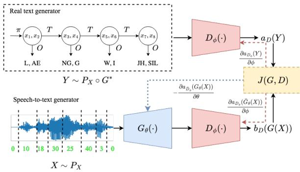
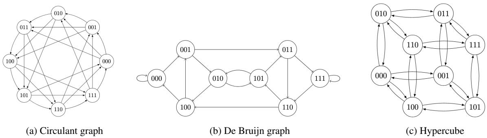
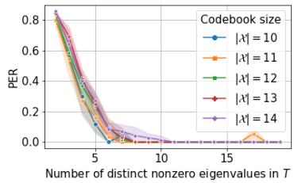
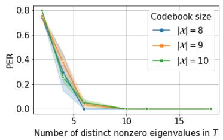
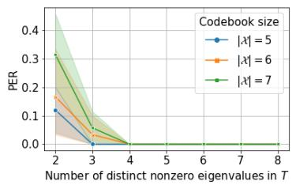
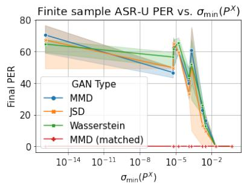
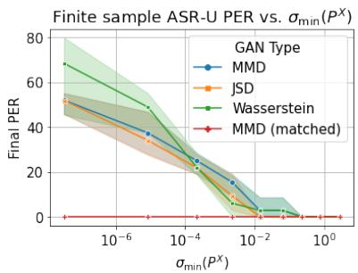
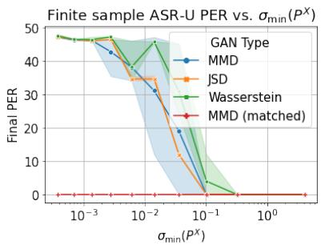
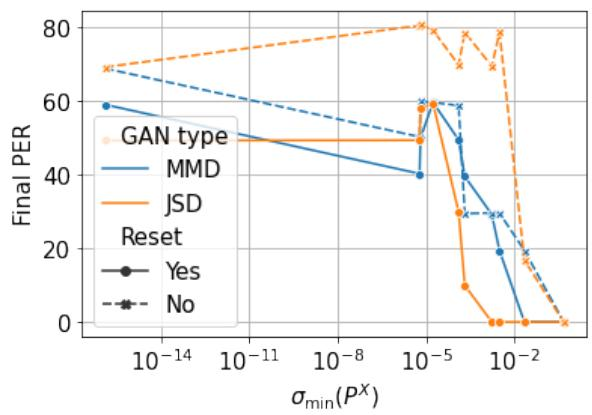
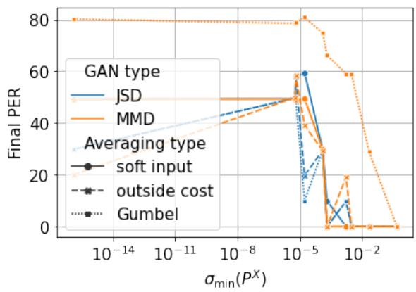

# A Theory of Unsupervised Speech Recognition

Liming Wang1, Mark Hasegawa-Johnson1 and Chang D. Yoo2

1University of Illinois Urbana-Champaign

2Korea Advanced Institute of Science Technology

{lwang114,jhasegaw}@illinois.edu, cd\_yoo@kaist.ac.kr

## Abstract

Unsupervised speech recognition (ASR-U) is the problem of learning automatic speech recognition (ASR) systems from unpaired speech-only and text-only corpora. While various algorithms exist to solve this problem, a theoretical framework is missing to study their properties and address such issues as sensitivity to hyperparameters and training instability. In this paper, we proposed a general theoretical framework to study the properties of ASR-U systems based on random matrix theory and the theory of neural tangent kernels. Such a framework allows us to prove various learnability conditions and sample complexity bounds of ASR-U. Extensive ASR-U experiments on synthetic languages with three classes of transition graphs provide strong empirical evidence for our theory (code available at cactuswiththoughts/UnsupASRTheory.git).

## 1 Introduction

Unsupervised speech recognition (ASR-U) is the problem of learning automatic speech recognition (ASR) systems from unpaired speech-only and textonly corpora. Such a system can not only significantly reduce the amount of annotation resources required for training state-of-the-art ASR system, but serve as a bridge between spoken and written language understanding tasks in the low-resource setting. Since its first proposal (Liu et al., 2018), it has seen remarkable progress and the current best system (Baevski et al., 2021) has achieved comparable performance to systems trained with paired data on various languages. However, there are several mysteries surrounding ASR-U, which potentially hinder the future development of such systems. In particular, prior experiments have found that training the current state-of-the-art ASR-U model, wav2vec-U (Baevski et al., 2021), requires careful tuning over the weights of various regularization losses to avoid converging to bad local optima and that even despite extensive regularization weight tuning, wav2vec-U may still fail to converge (Ni et al., 2022). Therefore, it remains a mystery whether or when unpaired speech and text data indeed provide sufficient information for learning an ASR system. Another mystery is whether the success of existing ASR-U models based on generative adversarial net (GAN) (Goodfellow et al., 2014) is sufficiently explained by the GAN objective function per se, or also requires other factors, such as randomness in training, quirks in the data used and careful domain-specific hyper-parameter settings, etc.

In this paper, we provide a theoretical analysis of ASR-U to investigate the mysteries surrounding ASR-U. First, we prove learnability conditions and sample complexity bounds that crucially depend on the eigenvalue spacings of the transition probability matrix of the spoken language. Random matrix theory shows that such learnability conditions are achievable with high probability. Next, we study the gradient flow of GAN-based ASR-U and provide conditions under which the generator minimizing the GAN objective converges to the true generator. Finally, to verify our theory empirically, we perform GAN-based ASR-U experiments on three classes of synthetic languages. Not only do we observe phase transition phenomena predicted by our theory, but we achieve stable training with lower test word error rate by several modifications of the existing state-of-the-art ASR-U system inspired by our theory.

## 2 Problem formulation

General formulation The training data comprise a set of sequences of quantized speech vectors, and a set of sequences of phoneme labels. The data are unpaired: there is no label sequence that matches any one of the speech sequences. The data are, however, matched in distribution. Let $P _ { X _ { i } } ( x )$ and $P _ { Y _ { i } } ( y )$ be the probability mass functions (pmfs) of the $i ^ { \mathrm { t h } }$ speech vector in a sequence, $x \in \mathbb { X } .$ , and the $j ^ { \mathrm { t h } }$ phoneme in a sequence, $y \in \mathbb { Y }$ , respectively: the requirement that they are matched in distribution is the requirement that there exists some generator function $O : ( \mathbb { X } , \mathbb { Y } ) \to \{ 0 , 1 \}$ such that

  
Figure 1: Overview of the ASR-U system for our analysis

$$
\sum _ { x \in \mathbb { X } } P _ { X _ { i } } ( x ) O ( x , y ) = P _ { Y _ { i } } ( y )\tag{1}
$$

The problem of ASR-U is to find the generator function O.

GAN-based ASR-U Eq. (1) leverages sequence information to remove ambiguity: O must be an optimal generator not only for the positionindependent distributions of X and Y , but also for their position-dependent distributions $P _ { X _ { i } } , P _ { Y _ { i } } \forall i \ \in \ \mathbb { N } ^ { 0 }$ . In reality we cannot observe every possible sequence of speech vectors, or every possible sequence of phonemes, but instead must estimate O from samples. To address this issue, a GAN can be used to reproduce the empirical distribution of the training dataset with minimum error, subject to the generator’s inductive bias, e.g., subject to the constraint that the function O is a matrix of the form $O \in \{ 0 , 1 \} ^ { | \mathbb { X } | \times | \mathbb { Y } | }$ |, where X and Y are the sizes of the alphabets X and Y, respectively. As shown in Figure 1, a GAN achieves this goal by computing O as the output of a neural network, $O = G ( x , y ; \theta )$ , and by requiring G to play a zerosum game with another neural network called the discriminator D with the following general utility function:

$$
\begin{array} { r } { \underset { \ b { G } } { \operatorname* { m i n } } \underset { \ b { D } } { \operatorname* { m a x } } J ( \ b { G } , \ b { D } ) : = \mathbb { E } _ { \ b { Y } \sim P _ { Y } } [ a ( \ b { D } ( \ b { Y } ) ) ] - } \\ { \mathbb { E } _ { \ b { X } \sim P _ { X } } [ b ( \ b { D } ( \ b { G } ( \ b { X } ) ) ) ] . } \end{array}\tag{2}
$$

For the original GAN (Goodfellow et al., 2014), $a ( D ) = \log ( \sigma ( D ) )$ and $b ( D ) = - \log ( 1 - \sigma ( D ) )$ , where σ is the sigmoid function. For the Wasserstein GAN (Arjovsky et al., 2017), D(Y) is a

Lipschitz-continuous scalar function, and $a ( D ) =$ $b ( D ) \ = \ D .$ A maximum mean discrepancy (MMD) GAN (Li et al., 2017) minimizes the squred norm of Eq. (2), where $D ( Y )$ is an embedding into a reproducing kernel Hilbert space (RKHS). In this paper we take the RKHS embedding to be the probability mass function of a scalar random variable $D ( Y )$ , and assume that the discriminator is trained well enough to maintain Eq. (2). In this situation, the MMD GAN minimizes Eq. (2) with $a ( D ) = b ( D ) = Y$ . In practice, Eq. (2) is optimized by alternatively updating the parameters of the discriminator and the generator using gradient descent/ascent:

$$
\phi _ { i + 1 } = \phi _ { i } + \eta \nabla _ { \phi } J ( G _ { \theta _ { i } } , D _ { \phi _ { i } } )
$$

$$
\theta _ { i + 1 } = \theta _ { i } - \nu \nabla _ { \theta } J ( G _ { \theta _ { i } } , D _ { \phi _ { i + 1 } } ) .\tag{3}
$$

(4)

Theoretical questions of ASR-U The aforementioned formulation of ASR-U is ill-posed. Intuitively, the function O has finite degrees of freedom $( O \in \{ 0 , 1 \} ^ { | \mathbb { X } | \times | \mathbb { Y } | } )$ , while Eq. (1) must be valid for an infinite number of distributions $( P _ { X _ { i } }$ and $P _ { Y _ { i } }$ for $i \in \mathbb { N } )$ , so there is no guarantee that a solution exists. On the other hand, if the sequence is unimportant $( P _ { X _ { i } } = P _ { X _ { i } } \forall i , j \in \mathbb { N } ^ { 0 } )$ , then the solution may not be unique. One important question is then: what are the necessary and sufficient conditions for Eq. (1) to have a unique solution?

Further, it is well-known that gradient-based training of GAN can be unstable and prior works on ASR-U (Yeh et al., 2019; Baevski et al., 2021) have used various regularization losses to stabilize training. Therefore, another question of practical significance is: what are the necessary and sufficient conditions for the alternate gradient method as described by Eq. (3)-(4) to converge to the true generator for ASR-U? In the subsequent sections, we set out to answer these questions.

## 3 Theoretical analysis of ASR-U

## 3.1 Learnability of ASR-U: a sufficient condition

A key assumption of our theory is that the distribution of the speech and the text units can be modeled by a single hidden Markov model whose hidden states are N-grams of speech units and whose outputs are N-grams of text units, as shown in Figure 1.

The parameters of this HMM are its initial probability vector, π, which specifies the distribution of the first N speech vectors $X _ { 0 : ( N - 1 ) } \in \mathbb { X } ^ { N }$ , its transition probability matrix A, which specifies the probability of any given sequence of N speech vectors given the preceding N speech vectors, and its observation probability matrix, which specifies the distribution of one phone symbol given one speech vector:

$$
\begin{array} { r l } & { \pi : = P _ { X _ { 0 : N - 1 } } \in \Delta ^ { | \mathbb { X } | ^ { N } } } \\ & { A : = P _ { X _ { N : 2 N - 1 } | X _ { 0 : N - 1 } } \in \Delta ^ { | \mathbb { X } | ^ { N } \times | \mathbb { X } | ^ { N } } } \\ & { O : = P _ { Y | X } \in \Delta ^ { | \mathbb { X } | \times | \mathbb { Y } | } , } \end{array}
$$

where $\Delta ^ { k }$ is the k-dimensional probability simplex.

The first-order Markov assumption is made plausible by the use of N-gram states, $X _ { 0 : N - 1 } $ , rather than unigram states; with sufficiently long N, natural language may be considered to be approximately first-order Markov. The connection between the N-gram states and the unigram observations requires the use of a selector matrix, $E =$ ${ \mathbf { 1 } } _ { | \mathbb { X } | ^ { N - 1 } } \otimes I _ { | \mathbb { X } | }$ , where  denotes the Kronecker product, thus $\dot { P } _ { X _ { k N } } = \pi ^ { \top } A ^ { k } E .$ , and for multiples of N, Eq. (1) can be written $P _ { Y _ { k N } } = \pi ^ { \top } A ^ { k } E O$ It turns out that a crucial feature for a spoken language to be learnable in an unsupervised fashion is that it needs to be “complex” enough such that a simple, symmetric and repetitive graph is not sufficient to generate the language. This is captured by the following assumptions on the parameters A and π.

Assumption 1. There exists an invertible matrix $U \in \bar { \mathbb { R } } ^ { | \mathbb { X } | ^ { N - 1 } \times | \mathbb { X } | ^ { N - 1 } } = [ U _ { 1 } | U _ { 2 } | \cdots | U _ { K } ] ,$ , where the columns of each matrix $U _ { j } = [ u _ { j 1 } | \cdot \cdot \cdot | u _ { j N _ { j } } ]$ are eigenvectors with the same eigenvalue and a diagonal matrix $\Lambda = \mathrm { b l k d i a g } ( \Lambda _ { 1 } , \cdot \cdot \cdot , \Lambda _ { K } )$ , where each matrix $\Lambda _ { k }$ is a diagonal matrix with all diagonal elements equal to the same scalar $\lambda _ { k } ,$ , such that $A = U \Lambda U ^ { - 1 }$ with $| \mathbb { X } | ^ { N } \geq K \geq | \mathbb { X } |$ nonzero eigenvalues $\lambda _ { 1 } > \lambda _ { 2 } > \cdots > \lambda _ { K }$

Assumption 2. For at least X values ofj, there is at least one k s.t. $\pi ^ { \top } u _ { j k } \neq 0 .$

With Assumptions 1 and 2, we can consider the following algorithm: First, we construct the following matrices

$$
\begin{array} { r } { P ^ { X } : = \left[ \begin{array} { c } { P _ { X 0 } ^ { \top } } \\ { P _ { X _ { N } } ^ { \top } } \\ { \vdots } \\ { P _ { X _ { \left( L - 1 \right) N } } ^ { \top } } \end{array} \right] , P ^ { Y } : = \left[ \begin{array} { c } { P _ { Y 0 } ^ { \top } } \\ { P _ { Y _ { N } } ^ { \top } } \\ { \vdots } \\ { P _ { Y _ { \left( L - 1 \right) N } } ^ { \top } } \end{array} \right] , } \end{array}\tag{5}
$$

Then, O satisfies the following matrix equation

$$
P ^ { X } O = P ^ { Y } .\tag{6}
$$

The binary matrix O in Eq. (6) is unique if and only if $P ^ { \dot { X } }$ has full column rank. The following theorem proves that this is indeed the case under our assumptions.

Theorem 1. Under Assumptions 1 and 2, $P ^ { X }$ has full column rank and perfect ASR-U is possible. Further, the true phoneme assignmentfunction is $O = P ^ { X + } P ^ { Y }$ , where $P ^ { X + } = ( P ^ { X ^ { \top } } \bar { P ^ { X } } ) ^ { - 1 } P ^ { X ^ { \top } }$ is the left-inverse of $P ^ { X }$

Further, if we measure how far the matrix $P ^ { X }$ is from being singular by its smallest singular value defined as

$$
\sigma _ { \operatorname* { m i n } } ( P ^ { X } ) : = \operatorname* { m i n } _ { v \in \mathbb { R } ^ { | \mathbb { X } | } } \frac { \| P ^ { X } v \| _ { 2 } } { \| v \| _ { 2 } } ,
$$

we can see that $P ^ { X }$ becomes further and further away from being singular as the sequence length L gets larger. An equivalent result for a different purpose has appeared in the Theorem 1 of (Bazán, 2000).

Lemma 1. Under Assumptions 1 and 2 andfor simplicity assuming the number of distinct eigenvalues $K = | \mathbb { X } | f o r T$ , then we have

$$
\begin{array} { r l } & { \sigma _ { \operatorname* { m i n } } ( P ^ { X } ) \geq } \\ & { \frac { \delta _ { \operatorname* { m i n } } ^ { ( | \mathbb { X } | - 1 ) / 2 | \mathbb { X } | } \sum _ { l = 0 } ^ { L - | \mathbb { X } | - 1 } \lambda _ { \operatorname* { m i n } } ^ { 2 l } ( A ) } { \kappa ( V _ { | \mathbb { X } | } ( \lambda _ { 1 : | \mathbb { X } | } ) ) } \operatorname* { m i n } _ { j } \| \hat { r } _ { j } \| } \end{array}\tag{7}
$$

where $\begin{array} { r } { \delta _ { \operatorname* { m i n } } : = \operatorname* { m i n } _ { i \neq j } | \lambda _ { i } ( A ) - \lambda _ { j } ( A ) | , \lambda _ { \operatorname* { m i n } } ( A ) } \end{array}$ is the smallest eigenvalue of square matrix A, $\kappa ( V _ { | \mathbb { X } | } ( \lambda _ { 1 : | \mathbb { X } | } ) )$ is the condition number of the square Vandermonde matrix createdfrom eigenvalues $\lambda _ { 1 } ( A ) , \ldots , \lambda _ { | \mathbb { X } | } ( A ) , r _ { j } = \pi ^ { T } U _ { j } \Omega _ { j } ^ { \top } E ,$ , and $\Omega _ { j } ^ { \top }$ is the set of rows of $U ^ { - 1 }$ corresponding to eigenvalue $\lambda _ { j } ( A )$ , after orthogonalizing themfrom every other block of rows, i.e., $U ^ { - 1 } = L [ \Omega _ { 1 } ] \cdot \cdot \cdot | \Omega _ { K } ] ^ { \dot { T } }$ such that L is lower-triangular, and the blocks $\Omega _ { i }$ and $\Omega _ { j }$ are orthogonal.

Next, we will show that Assumption 1 can be easily met using random matrix arguments.

## 3.2 Finite-sample learnability of ASR-U

Matched setup Now we show that the requirement for distinct eigenvalues is a mild one as it can easily be satisfied with random transition matrices. According to such a result, ASR-U is feasible with high probability in the (empirically) matched setting commonly used in the ASR-U literature, where the empirical generated and true distributions can be matched exactly by some generator in the function class (Liu et al., 2018). Our proof relies crucially on the seminal work of (Nguyen et al., 2017) on eigenvalue gaps of symmetric random matrices with independent entries.

In the context of ASR-U, it is of particular interest to study the eigenvalue gaps of a Markov random matrix, which unlike the symmetric case, is asymmetric with correlated entries. Fortunately, by modifying the proof for Theorem 2.6 of (Nguyen et al., 2017), we can show that if the language model belongs to a special but rather broad class of Markov random matrices defined below and the states are non-overlapping N-gram instead of the more common overlapping ones, it should have at least X distinct eigenvalues with minimum spacing depending on X and the N for the N-gram.

Definition 1. (symmetric Markov random matrix) A symmetric Markov random matrix is a matrix of the form $A : = D ^ { - 1 } W$ , where the adjacency matrix W is a real, symmetric random matrix with positive entries and bounded variance and D is a diagonal matrix with $\begin{array} { r } { d _ { i i } = \sum _ { j } W _ { i j } > 0 . } \end{array}$

Intuitively, a symmetric Markov random matrix is the transition matrix for a reversible Markov chain formed by normalizing edge weights of a weighted, undirected graph.

Theorem 2. (simple spectrum of symmetric Markov random matrix) Let $A _ { n } ~ = ~ D _ { n } ^ { - 1 } W _ { n } ~ \in$ $\mathbb { R } ^ { n \times n }$ be a real symmetric Markov random matrix with adjacency matrix $W _ { n } .$ . Further, suppose $W _ { n } \ = \ F _ { n } + X _ { n } ,$ , where $F _ { n }$ is a deterministic symmetric matrix with eigenvalues of order $n ^ { \gamma }$ and $X _ { n }$ is a symmetric random matrix of zeromean, unit variance sub-Gaussian random variables. Then we have for any $C > 0 ,$ , there exists $B > 4 \gamma ^ { \prime } C + 7 \gamma ^ { \prime } + 1$ such that

$$
\operatorname* { m a x } _ { 1 \leq i \leq n - 1 } \operatorname* { P r } [ | \lambda _ { i } - \lambda _ { i + 1 } | \leq n ^ { - B } ] \leq n ^ { - C } ,
$$

with probability at least $1 - O ( \exp ( - \alpha _ { 0 } n ) ) f o r$ r some $\alpha _ { 0 } \quad > \quad 0$ dependent on B and $\begin{array} { r l } { \gamma ^ { \prime } } & { { } = } \end{array}$ max $\{ \gamma , 1 / 2 \}$

Corollary 1. Suppose the speech feature transition probability is a symmetric Markov random matrix $A : = D ^ { - 1 } W$ with entries $W _ { i j } \sim$ Uniform $( 0 , 2 \sqrt { 3 } )$ and D is a diagonal matrix with $\begin{array} { r } { d _ { i i } = \sum _ { j } W _ { i j } } \end{array}$ . Then for any $\epsilon > 0 \quad$ , there exists $\alpha _ { 0 } ~ > ~ 0$ such that with probability at least $1 - O \left( | \mathbb { X } | ^ { - C N } + \exp \left( - \alpha _ { 0 } | \mathbb { X } | ^ { N } \right) \right)$ , the transition probability matrix A has X N distinct eigenvalues with minimum gap $| \mathbb { X } | ^ { - B N } > 0$

The proof of Theorem 2 and Corollary 1 are presented in detail in the Appendix A.2.

Unmatched setup In the finite-sample, unmatched setup, the empirical distribution of the fake text data generated by the GAN does not necessarily match the empirical distribution of the true text data. Assuming the discriminator is perfect in the sense that it maintains Eq. (2) non-negative, and assuming $D ( Y )$ is a scalar random variable, then minimizing Eq. (2) is equivalent to minimizing a divergence measure $d ( \cdot , \cdot )$ , between the empirical text distribution, $P ^ { Y }$ , and the text distribution generated by $O _ { x } ( y ) = \hat { P } _ { Y | X } ( y | x )$

$$
\operatorname* { m i n } _ { \substack { O \in \Delta ^ { | \mathbb { X } | \times | \mathbb { Y } | } } } d ^ { \gamma } ( P ^ { Y } , P ^ { X } O ) ,\tag{8}
$$

where $\gamma > 0 .$ . For example, for the original GAN, $d ( \cdot , \cdot )$ is the Jensen-Shannon distance and for the MMD $\mathbf { G A N } , d ( \cdot , \cdot )$ is the $L _ { \gamma }$ distance between the expectations $\mathbb { E } [ D ( Y ) ]$ under the distributions $P ^ { Y }$ and $P ^ { X } O$ . In both cases, however, Eq. (8) can be minimized using a decomposable discriminator defined to be:

$$
\mathbb { E } _ { P _ { Y } } [ a ( D ( Y ) ) ] = \sum _ { l = 0 } ^ { L - 1 } \mathbb { E } _ { P _ { Y _ { l } } } [ a ( D _ { l } ( Y _ { l } ) ) ]\tag{9}
$$

$$
\mathbb { E } _ { P _ { X } } [ b ( D ( G ( X ) ) ) ] = \sum _ { l = 0 } ^ { L - 1 } \mathbb { E } _ { P _ { X _ { l } } } [ b ( D _ { l } ( G _ { l } ( X ) ) ] ,\tag{10}
$$

with components $D _ { l } : \lvert \mathbb { Y } \rvert \mapsto \mathbb { R } , l = 1 , \cdot \cdot \cdot , L$ Under the assumption that D is decomposable and that the MMD GAN is used, we have the following sample complexity bound on perfect ASR-U.

Theorem 3. The empirical risk minimizer (ERM) of Eq. (8) recovers the true assignment O perfectly from $n ^ { X }$ speechframes and $n ^ { Y }$ text characters with probability $1 - 2 \delta \ i f$

$$
\begin{array} { r l } & { \sigma _ { \operatorname* { m i n } } ( P ^ { X } ) \geq \sqrt { \frac { 4 L | \mathbb { Y } | ( n ^ { X } + n ^ { Y } ) + L | \mathbb { X } | n ^ { X } } { n ^ { X } n ^ { Y } } } + } \\ & { \qquad 1 0 \sqrt { \frac { L \log \frac { 1 } { \delta } } { n ^ { X } \wedge n ^ { Y } } } , } \end{array}
$$

where $n ^ { X } \wedge n ^ { Y } : = \operatorname* { m i n } \{ n ^ { X } , n ^ { Y } \}$

  
Figure 2: Various types of Markov transition graphs

## 3.3 Training dynamic of GAN-based ASR-U

So far, we have assumed the GAN training is able to find the optimal parameters for the discriminator and the generator. However, there is no guarantee that this is indeed the case with gradient updates such as Eq. (3). To analyze the behaviour of the GAN training dynamic for ASR-U, we follow prior works on neural tangent kernel (NTK) (Jacot et al., 2018) to focus on the infinite-width, continuoustime regime, or NTK regime, where the generator and the discriminator are assumed to be neural networks with an infinite number of hidden neurons trained with gradient descent at an infinitely small learning rate. Though highly idealized, studying such a regime is practically useful as results from this regime can often be converted to finite-width, discrete-time settings (See, e.g., (Du et al., 2019)).

For simplicity, denote $f _ { \tau } : = D _ { \phi } $ and $g _ { t } : = G _ { \theta _ { i } }$ t and define $\mathcal { L } _ { t } ( f ) : = J ( g _ { t } , f )$ , then in the NTK regime, between each generator step, the training dynamic of the discriminator can be described by the following partial differential equation (PDE):

$$
\begin{array} { r } { \partial _ { \tau } \phi _ { \tau } = \nabla _ { \phi _ { \tau } } \mathcal L _ { t } ( f _ { \tau } ) . } \end{array}\tag{11}
$$

Let $f _ { P _ { t } } ^ { * } = \operatorname* { l i m } _ { \tau \to \infty } f _ { \tau }$ be the limit of Eq. (11). If the limit exists and is unique, the generator loss is well-defined as $\mathcal { C } _ { t } ( g _ { t } ) : = J ( g _ { t } , f _ { P _ { t } } ^ { * } )$ . Note that the output of the ASR-U generator is discrete, which is not a differentiable function per se, but we can instead directly parameterize the generated text distribution as $P _ { g _ { t } } : = P _ { X } \circ O _ { t }$ for some softmax posterior distribution $O _ { t }$ :

$$
O _ { t , x } ( y ) : = \prod _ { l = 1 } ^ { L } \frac { \exp ( h _ { \theta , y _ { l } } ( x _ { l } ) ) } { \sum _ { y _ { l } ^ { \prime } } \exp ( h _ { \theta , y _ { l } ^ { \prime } } ( x _ { l } ) ) } ,\tag{12}
$$

where $h _ { \theta }$ is a neural network, and is assumed to be one layer in our analysis, though it can be extended to multiple layers with slight modifications using techniques similar to those in (Du et al., 2019).

Using such a generator, the generator dynamic can be then described by the following PDE:

$$
\partial _ { t } \theta _ { t } = \sum _ { y \in \mathbb { Y } ^ { L } } b ( f _ { g _ { t } } ^ { * } ( y ) ) \nabla _ { \theta _ { t } } P _ { g _ { t } } ( y ) ,\tag{13}
$$

where the right-hand side is the term in the gradient of $\mathcal { C } _ { t }$ with respect to $\theta _ { t }$ ignoring the dependency of the discriminator $f _ { g _ { t } } ^ { * }$ . Define the NTKs of the discriminator and the generator (distribution) as

$$
K _ { f _ { \tau } } ( y , y ^ { \prime } ) = \mathbb { E } _ { \phi _ { 0 } \sim \mathcal { W } } \left[ \frac { \partial f _ { \tau } ( y ) } { \partial \phi _ { \tau } } ^ { \top } \frac { \partial f _ { \tau } ( y ^ { \prime } ) } { \partial \phi _ { \tau } } \right]\tag{14}
$$

$$
K _ { g _ { t } } ( y , y ^ { \prime } ) = \mathbb { E } _ { \theta _ { 0 } \sim \mathcal { W } } \left[ \frac { \partial P _ { g _ { t } } ( y ) } { \partial \theta _ { t } } ^ { \top } \frac { \partial P _ { g _ { t } } ( y ^ { \prime } ) } { \partial \theta _ { t } } \right] ,\tag{15}
$$

where is the initialization distribution (usually Gaussian).

Note that the NTKs are $\displaystyle { | \mathbb { Y } | ^ { L } \times | \mathbb { Y } | ^ { L } }$ matrices for ASR-U due to the discrete nature of the generator. A key result in (Jacot et al., 2018) states that as the widths of the hidden layers of the discriminator and generator go to infinity, $K _ { f _ { \tau } }  K _ { D } , K _ { g _ { t } }  K _ { G }$ stay constant during gradient descent/ascent and we have

$$
\begin{array} { r } { \partial _ { \tau } f _ { \tau } = K _ { D } \left( \mathrm { d i a g } ( P _ { Y } ) \nabla _ { f _ { \tau } } a \right. } \\ { \left. - \mathrm { d i a g } ( P _ { g _ { t } } ) \nabla _ { f _ { \tau } } b \right) , } \end{array}\tag{16}
$$

$$
\partial _ { t } P _ { g _ { t } } = K _ { G } \mathbf { b } _ { f _ { g _ { t } } } ,\tag{17}
$$

where $\begin{array} { r } { \nabla _ { f } \{ a , b \} = \left[ \frac { \partial \{ a , b \} ( f ( y ) ) } { \partial f ( y ) } \right] _ { y \in \mathbb { Y } ^ { L } } } \end{array}$ and ${ \mathbf { b } } _ { f } = { }$ $\big ( b _ { f } ( y ) \big ) _ { y \in \mathbb { Y } ^ { L } } .$

However, Eq. (16)-(17) is in general highly nonlinear and it remains an open problem as to their convergence properties. Instead, we focus on the case when the discriminator $f _ { t }$ is decomposable with components $f _ { t , l } , l = 1 , \cdots , L$ , and simplify

Eq. (16) and Eq. (17) into PDEs involving only samples at a particular time step:

$$
\partial _ { \tau } f _ { \tau , l } = K _ { D , l } ( \mathrm { d i a g } ( P _ { l } ^ { Y } ) \nabla _ { f _ { \tau , l } } \mathbf { a } _ { f _ { \tau , l } }
$$

$$
- \mathrm { \ d i a g } ( P _ { l } ^ { g _ { t } } ) \nabla _ { f _ { \tau , l } } { \bf b } _ { f _ { \tau , l } } \mathrm { \large ) } ,\tag{18}
$$

$$
\partial _ { t } O _ { t , x } ^ { \top } = \sum _ { l = 1 } ^ { L } P _ { l } ^ { X } ( x ) K _ { O _ { t , x } } { \bf b } _ { f _ { g _ { t } , l } } ,\tag{19}
$$

for all $l = 1 , \cdots , L , x \in \mathbb { X }$ in terms of the stepwise NTKs defined as:

$$
\begin{array} { r l } & { K _ { D , l } ( y , y ^ { \prime } ) : = \mathbb { E } _ { \phi _ { 0 } \sim \mathcal { W } } \left[ \cfrac { \partial f _ { \tau } ( y ) } { \partial \phi _ { \tau } } ^ { \top } \cfrac { \partial f _ { \tau } ( y ^ { \prime } ) } { \partial \phi _ { \tau } } \right] } \\ & { K _ { O _ { t , x } } ( y , y ^ { \prime } ) : = \mathbb { E } _ { \theta _ { 0 } \sim \mathcal { W } } \left[ \cfrac { \partial O _ { t , x } ( y ) } { \partial \theta _ { \tau } } ^ { \top } \cfrac { \partial O _ { t , x } ( y ^ { \prime } ) } { \partial \theta _ { \tau } } \right] . } \end{array}
$$

We further focus on the special case that $f _ { \tau , l }$ is parameterized by a two-layer neural network with ReLU activation, though the framework can be extended to network of arbitrary depths:

$$
f _ { \tau , l } ( y ) = \operatorname* { l i m } _ { m  \infty } \frac { 1 } { \sqrt { m } } \sum _ { r = 1 } ^ { m } v _ { r } ^ { l } \operatorname* { m a x } \{ W _ { r y } ^ { l } , 0 \} .\tag{20}
$$

In this case, under mild regularity conditions, we can show that the generator trained with the alternate gradient method minimizes Eq. (8), which under the same condition as in Section 3.2, implies ASR-U is feasible.

Theorem 4. Suppose the following assumptions hold:

1. The discriminator is decomposable and parameterized by Eq. (20), whose parameters are all initialized by standard Gaussian variables;

2. The generator is linear before the softmax layer;

3. The GAN objective is MMD;

4. The linear equation $P ^ { X } O = P ^ { Y }$ has at least one solution.

Then we have for any solution $O _ { t }$ of Eq. (19), limt $_ { \mathrm { \scriptsize ~ \div \infty } } P ^ { X } O _ { t } = P ^ { Y }$

## 4 Experiments

Synthetic language dataset To allow easy control of the eigenvalue spacings of the transition matrix $T$ and thus observe the phase transition phenomena predicted by our theory, we design six synthetic languages with HMM language models as follows. First, we create the HMM transition graph by treating non-overlapping bigrams as hidden states of the HMM. The hidden state of the HMM will henceforth be referred to as the “speech unit”, while the observation emitted by the HMM will be referred to as the “text unit”. For the asymptotic ASR-U, we control the number of eigenvalues of the Markov transition graph by varying the number of disjoint, identical subgraphs. The number of distinct eigenvalues of the whole graph will then be equal to the number of eigenvalues of each subgraph. For the finite sample setting, we instead select only Hamiltonian graphs and either gradually decrease the degrees of the original graph to its Hamiltonian cycle or interpolate between the graph adjacency matrix and that of its Hamiltonian cycle. Thus, we can increase $\sigma _ { \mathrm { m i n } } ( P ^ { X } )$ by increasing w. For both the subgraph in the former case and the Hamiltonian graph in the latter, we experiments with circulant, de Bruijn graphs (de Bruijn, 1946) and hypercubes, as illustrated in Figure 2. Next, we randomly permute the hidden state symbols to form the true generator mapping from the speech units to text units. To create matched speech-text data, we simply sample matched speech and text unit sequences using a single HMM. For unmatched datasets, we sample the speech and text data independently with two HMMs with the same parameters. Please refer to Appendix B for more details.

Model architecture For finite-sample ASR-U, we use wav2vec-U (Baevski et al., 2021) with several modifications. In particular, we experiment with various training objectives other than the Jensen-Shannon (JS) GAN used in the original wav2vec-U, including the Wasserstein GAN (Liu et al., 2018) and the MMD GAN. All additional regularization losses are disabled. Moreover, we experimentally manipulate two hyperparameters: (1) the averaging strategy used by the generator, and (2) whether to reset the discriminator weights to zero at the beginning of each discriminator training loop. More details can be found in Appendix B.

Phase transition of PER vs. eigenvalue gaps: asymptotic case The phoneme error rate (PER) as a function of the number of eigenvalues of A for the asymptotic ASR-U on the synthetic datasets are shown in Figure 3. For all three graphs, we observe clear phase transitions as the number of eigenvalues exceeds the number of speech units, and an increase of the number of distinct, nonzero eigenvalues required for perfect ASR-U as the number of speech units increases.

  
(a) Circulant graph

  
(b) De Bruijn graph

  
(c) Hypercube

Figure 3: Asymptotic ASR-U PER vs number of distinct nonzero eigenvalues for various Markov transition graphs  
  
(a) Circulant graph

  
(b) De Bruijn graph

  
(c) Hypercube

Figure 4: Finite-sample ASR-U PER vs $\sigma _ { \mathrm { m i n } } ( P ^ { X } )$ for various Markov transition graphs  
  
Figure 5: Effect of discriminator resetting at every update

Phase transition of PER vs. eigenvalue gaps: finite-sample case The PER as a function of the least singular value $\sigma _ { \mathrm { m i n } } ( P ^ { X } )$ for the finite-sample ASR-U on the synthetic datasets are shown in Figure 4. As we can see, the ASR-U exhibit the phase transition phenomena in all three graphs, albeit with differences in the critical point and their rate of approaching the perfect ASR-U regime. While the PER generally decreases as $\sigma _ { \mathrm { m i n } } ( P ^ { X } )$ gets larger, we found a dip in PER in the circulant graph case as $\sigma _ { \mathrm { m i n } } ( P ^ { X } )$ moves from $1 0 ^ { - 3 1 }$ to $1 0 ^ { - 1 5 }$ . Though unexpected, this observation is not contradictory to our theory since our theory does not make explicit predictions about the rate of phase transition for ASR-U. Across different GAN models, we found that JSD generally approaches perfect ASR-U at a faster rate than MMD in all three graphs, suggesting the use of nonlinear dynamic may be beneficial. Nevertheless, the overall trends for different GANs remain in large part homogeneous.

  
Figure 6: Effect of different type of averaging for the generator

Between Wasserstein and MMD, we observe very little difference in performance, suggesting the regularization effect of NTK is sufficient to control the Lipschitz coefficient of the network. Finally, for the MMD GAN in the matched setting, we found the network is able to achieve perfect ASR-U regardless of the spectral properties of the Markov transition graphs, which confirms our theory that a symmetric Markov random matrix tends to have simple eigenvalue spectrum suitable for ASR-U.

Effect of discriminator reset As pointed out by (Franceschi et al., 2021), a discriminator may suffer from residual noise from previous updates and fail to approximate the target divergence measure. We analyze such effects for MMD and JSD as shown in Figure 5. We observed consistent trends that models whose weights are reset to the initial weights every discriminator loop outperform those without resetting. The effect is more pronounced for JSD GAN than MMD GAN and for smaller $\sigma _ { \mathrm { m i n } } ( P ^ { X } )$

Effect of generator averaging strategy The original wav2vec-U (Baevski et al., 2021) directly feeds the text posterior probabilities O into the discriminator, which we refer to as the “soft input” approach. Alternatively, we can instead calculate a weighted average of the gradient form over the samples $y \in \mathbb { Y } ^ { L }$ as in Eq. (13), which we refer to as the “outside cost” approach. The comparison between the two approaches are shown in Figure 6. We observed mixed results: for MMD GANs, the softinput approach outperforms the outside-cost approach and performs best among the models in the $\mathrm { { h i g h - } } \sigma _ { \operatorname* { m i n } } ( P ^ { X } )$ setting; for JSD GANs, we found that the outside-cost approach performs slightly better than the soft-input approach. Such inconsistencies may be another consequence of the regularization effect predicted by the GANTK. We leave the theoretical explanation as future work.

## 5 Related works

(Glass, 2012) first proposed the challenging task of ASR-U as a key step toward unsupervised speech processing, and framed it as a decipherment problem. (Liu et al., 2018) takes on the challenge by developing the first ASR-U system with groundtruth phoneme boundaries and quantized speech features as inputs, by training a GAN to match the speech-generated and real text distributions. (Chen et al., 2019) later replaced the ground truth boundaries with unsupervised ones refined iteratively by an HMM, which also incorporates language model information into the system. (Yeh et al., 2019) explored the cross entropy loss for matching the generated and real text distribution, but it is prone to mode collapse and needs the help of additional regularization losses such as smoothness weight. More recently, (Baevski et al., 2021; Liu et al., 2022) proposed another GAN-based model using continuous features from the last hidden layer of the wav2vec 2.0 (Baevski et al., 2020) model and additional regularization losses to stabilize training. Their approach achieves ASR error rates comparable to the supervised system on multiple languages, making it the current state-of-the-art system.

To better understand the learning behavior of ASR-U systems, (Lin et al., 2022) analyze the robustness of wav2vec-U against empirical distribution mismatch between the speech and text, and found that N-gram language model is predictive of the success of ASR-U. Inspired by the original framework in (Glass, 2012), (Klejch et al., 2022) proposed a decipher-based cross-lingual ASR system by mapping IPA symbols extracted from a small amount of speech data with unpaired phonetic transcripts in the target language.

Our analysis on the sufficient condition of ASR-U is based on previous work on the asymptotic behaviour of GAN objective functions (Goodfellow et al., 2014; Arjovsky et al., 2017). Our finitesample analysis takes inspiration from later work extending the asymptotic analysis to the finitesample regimes (Arora et al., 2017; Bai et al., 2019). Such frameworks, however, do not account for the alternate gradient optimization method of GANs and inevitably lead to various inconsistencies between the theory and empirical observations of GAN training (Franceschi et al., 2021). Building upon prior works (Mescheder et al., 2017, 2018; Domingo-Enrich et al., 2020; Mroueh and Nguyen, 2021; Balaji et al., 2021), (Franceschi et al., 2021) proposed a unified framework called GANTK based on NTK (Jacot et al., 2018) to describe the training dynamic of any GAN objectives and network architectures. Our analysis on the training dynamic of ASR-U adopts and extends the GANTK framework to handle discrete, sequential data such as natural languages.

## 6 Conclusion

In this paper, we develop a theoretical framework to study the fundamental limits of ASR-U as well as the convergence properties of GAN-based ASR-U algorithms. In doing so, our theory sheds light on the underlying causes of training instability for such algorithms, as well as several new directions for more reliable ASR-U training.

## 7 Limitations

Our theory currently assumes that input speech features are quantized into discrete units, as in (Chen et al., 2019), while preserving all the linguistic information in the speech. As a result, our theory does not account for the loss of linguistic information during the quantization process, as often occurred in realistic speech datasets. Further, more recent works (Baevski et al., 2021; Liu et al., 2022) have shown that continuous features, with the help of additional regularization losses, can achieve almost perfect ASR-U. Such phenomena is beyond explanations based on our current theory and require generalizing our theory to continuous speech features. Further, our model assumes that sufficiently reliable phoneme boundaries are fed to the ASR-U system, and kept fixed during training. It will be interesting to extend our framework to systems with trainable phoneme boundaries, such as the wav2vec-U systems, to better understand its effect on training stability.

## Acknowledgements

This work was supported by Institute of Information & communications Technology Planning & Evaluation (IITP) grant funded by the Korea government(MSIT) (No.2022-0-00184, Development and Study of AI Technologies to Inexpensively Conform to Evolving Policy on Ethics)

## References

G. Anderson, A. Guionnet, and O. Zeitouni. 2009. An introduction to random matrices. Cambridge University Press.

Martin Arjovsky, Soumith Chintala, and Leon Bottou. 2017. Wasserstein GAN. In International Conference on Machine Learning.

Sanjeev Arora, Rong Ge, Yingyu Liang, Tengyu Ma, and Yi Zhang. 2017. Generalization and equilibrium in generative adversarial nets (GANs). In International Conference on Machine Learning.

Alexei Baevski, Wei-Ning Hsu, Alexis Conneau, and Michael Auli. 2021. Unsupervised speech recognition. In Neural Information Processing System.

Alexei Baevski, Henry Zhou, Abdelrahman Mohamed, and Michael Auli. 2020. wav2vec 2.0: A framework for self-supervised learning of speech representations. In Neural Information Processing System.

Yu Bai, Tengyu Ma, and Andrej Risteski. 2019. Approximability of discriminators implies diversity in GANs. In International Conference on Learning Representations.

Yogesh Balaji, Mohammadmahdi Sajedi, Neha Mukund Kalibhat, Mucong Ding, Dominik Stöger, Mahdi Soltanolkotabi, and Soheil Feizi. 2021. Understanding overparameterization in generative adversarial networks. In International Conference on Learning Representations.

Fermán S. V. Bazán. 2000. Conditioning of rectangular vandermonde matrices with nodes in the unit disk. SIAM Journal on Matrix Analysis and Applications, 21(2):679–693.

Nicolaas Govert de Bruijn. 1946. A combinatorial problem. Indagationes Mathematicae, page 758–764.

Kuan-Yu Chen, Che-Ping Tsai, Da-Rong Liu, Hung-Yi Lee, and Lin shan Lee. 2019. Completely unsupervised speech recognition by a generative adversarial network harmonized with iteratively refined hidden markov models. In Interspeech.

Charles Delorme and Jean Pierre Tillich. 1998. The spectrum of de bruijn and kautz graphs. European Journal Combinatorics, pages 307–319.

Carles Domingo-Enrich, Samy Jelassi, Arthur Mensch, Grant M. Rotskoff, and Joan Bruna. 2020. A meanfield analysis of two-player zero-sum games. In Neural Information Processing System.

Simon S. Du, Xiyu Zhai, Barnabás Poczós, and Aarti Singh. 2019. Gradient descent provably optimizes over-parameterized neural networks. In International Conference on Learning Representations.

P. Erdös. 1945. On a lemma of Littlewood and Offord. Bulletin ofthe American Mathematical Society, 51:898–902.

Jean-Yves Franceschi, Emmanuel de Bézenac, Ibrahim Ayed, Mickaël Chen, Sylvain Lamprier, and Patrick Gallinari. 2021. A neural tangent kernel perspective of GANs. In International Conference on Machine Learning.

Bolin Gao and Lacra Pavel. 2017. On the properties of the softmax function with application in game theory and reinforcement learning. In ArKiv.

James Glass. 2012. Towards unsupervised speech processing. In International Conference on Information Sciences, Signal Processing and their Applications.

Ian J. Goodfellow, Jean Pouget-Abadie, Mehdi Mirza, Bing Xu, David Warde-Farley, Sherjil Ozair, Aaron Courville, and Yoshua Bengio. 2014. Generative adversarial nets. In Neural Information Processing System.

Arthur Jacot, Franck Gabriel, and Clément Hongler. 2018. Neural tangent kernel: Convergence and generalization in neural networks. In Neural Information Processing System.

Ondrej Klejch, Electra Wallington, and Peter Bell. 2022. Deciphering speech: a zero-resource approach to cross-lingual transfer in asr. In Interspeech.

Chun-Liang Li, Wei-Cheng Chang, Yu Cheng, Yiming Yang, and Barnabás Póczos. 2017. MMD GAN: Towards deeper understanding of moment matching network. Advances in neural information processing systems, 30.

Guan-Ting Lin, Chan-Jan Hsu, Da-Rong Liu, Hung-Yi Lee, and Yu Tsao. 2022. Analyzing the robustness of unsupervised speech recognition. In ICASSP.

Alexander H. Liu, Wei-Ning Hsu, Michael Auli, and Alexei Baevski. 2022. Towards end-to-end unsupervised speech recognition. In ArKiv.

Da-Rong Liu, Kuan-Yu Chen, Hung-Yi Lee, and Lin shan Lee. 2018. Completely unsupervised phoneme recognition by adversarially learning mapping relationships from audio embeddings. In Interspeech.

Lars Mescheder, Andreas Geiger, and Sebastian Nowozin. 2018. Which training methods for GANs do actually converge? In International Conference on Machine Learning.

Lars Mescheder, Sebastian Nowozin, and Andreas Geiger. 2017. The numerics of GANs. In Neural Information Processing System.

Youssef Mroueh and Truyen Nguyen. 2021. On the convergence of gradient descent in GANs: Mmd GAN as a gradient flow. In International Conference on Artificial Intelligence and Statistics.

Hoi Nguyen, Terence Tao, and Van Vu. 2017. Random matrices: Tail bounds for gaps between eigenvalues. Probability Theory and Related Fields, page 777–816.

Hoi Nguyen and Van Vu. 2011. Optimal Littlewood-Offord theorems. Advances in Mathematics, 226(6):5298–5319.

Junrui Ni, Liming Wang, Heting Gao, Kaizhi Qian, Yang Zhang, Shiyu Chang, and Mark Hasegawa-Johnson. 2022. Unsupervised text-to-speech synthesis by unsupervised automatic speech recognition. In Interspeech.

Mark Rudelson and Roman Vershynin. 2008. The Littlewood-Offord problem and invertibility of random matrices. Advances in Mathematics, 218(2):600–633.

Terence Tao and Van Vu. 2009. Inverse littlewood–offord theorems and the condition number of random matrices. Annual of Mathematics, 169(2):595–632.

Chih-Kuan Yeh, Jianshu Chen, Chengzhu Yu, and Dong Yu. 2019. Unsupervised speech recognition via segmental empirical output distribution matching. In International Conference on Learning Representations.

## A Proofs of theoretical results

## A.1 Learnability of ASR-U: a sufficient condition

Proof. (Theorem 1)

For simplicity, we assume that the eigenvalues of A are real though a similar argument applies to complex eigenvalues as well. By Assumptions 1 and 2, it can be verified that

$$
\begin{array} { r l } { P _ { X _ { k N } } = \pi ^ { \top } A ^ { k } E } & { { } } \\ { \quad } & { { } = \pi ^ { \top } U \Lambda ^ { k } U ^ { - 1 } E , } \end{array}
$$

where ${ \cal E } = { \bf 1 } _ { | \mathbb { X } | ^ { N - 2 } } \otimes I _ { | \mathbb { X } | }$ , where $\otimes$ denotes the Kronecker product. Define $c _ { j k } = \pi ^ { \top } u _ { j k }$ . Define $r _ { j k } ^ { \top }$ to be the $k ^ { \mathrm { { t h } } }$ row of the $j ^ { \mathrm { t h } }$ block of the matrix U−1E, i.e., $\begin{array} { r } { U U ^ { - 1 } E = \sum _ { j = 1 } ^ { K } \sum _ { k = 1 } ^ { N _ { j } } { u _ { j k } r _ { j k } ^ { \top } } } \end{array}$ . Define the matrix $R _ { K }$ as $R _ { K } = [ r _ { 1 } , \cdot \cdot \cdot , r _ { K } ]$ , where $\begin{array} { r } { r _ { j } = \sum _ { k = 1 } ^ { N _ { j } } c _ { j k } r _ { j k } } \end{array}$ . Then we have:

$$
\begin{array} { c } { { P _ { X _ { k N } } ^ { \top } = \displaystyle \sum _ { j = 1 } ^ { K } \lambda _ { j } ^ { k } r _ { j } ^ { \top } } } \\ { { P ^ { X } = V _ { L } ( \lambda _ { 1 : K } ) ^ { \top } R _ { K } ^ { \top } , } } \end{array}
$$

where $V _ { L } ( \lambda _ { 1 : K } )$ is the Vandermonde matrix formed by nonzero eigenvalues $\lambda _ { 1 } , \cdots , \lambda _ { K }$ and with L columns, $K \geq | \mathbb { X } |$ by Assumption 1. $R _ { K }$ has full column rank of $K \geq | X |$ by Assumption 2, therefore it is possible to write $R _ { K } = \hat { R } _ { K } L$ , where ${ \hat { R } } _ { K } = { \hat { r } } _ { 1 } , . . . , { \hat { r } } _ { K } ]$ is a matrix with orthogonal columns, and L is lower-triangular. As a result, we have $P ^ { X }$ is full rank iff $V _ { L } ( \lambda _ { 1 : K } )$ has full row rank of at least X , which holds by Assumption 1.

Proof. (Lemma 1)

Use the Rayleigh-characterization of eigenvalues

of the matrix $P ^ { X \top } P ^ { X }$ , we have

$$
\begin{array} { r l } & { \mathcal { Q } _ { \operatorname* { m i n } } ( P ^ { X } ) } \\ & { = \sqrt { \displaystyle \operatorname* { m i n } _ { \mathrm { i n } } ( P ^ { X T } P ^ { X T } ) } } \\ & { = \sqrt { \displaystyle \operatorname* { m i n } _ { \mathrm { i n }  \mathrm { i n } } w ^ { \mathrm { T } } P ^ { X T } P ^ { X } w } } \\ & { = \sqrt { \displaystyle \operatorname* { m i n } _ { \mathrm { i n }  \mathrm { i n } } w ^ { \mathrm { T } } R _ { K } V _ { L } \frac { Y } { R _ { K } ^ { T } } \frac { R ^ { \dagger } } { R ^ { \dagger } } w } } \\ & { \leq \sqrt { \displaystyle \sum _ { i = 0 } ^ { \mathrm { i n } \frac { 1 } { \sqrt { \frac { L - 1 } { 2 } } } - \frac { 1 } { \lambda _ { \mathrm { m i n } } ^ { 2 } } } \displaystyle \operatorname* { m i n } _ { \mathrm { i n }  \mathrm { i n } } w ^ { \mathrm { T } } R _ { K } V _ { | \Sigma | } \frac { Y } { R _ { K } ^ { T } } R _ { K } ^ { \dagger } w } } \\ & { = \sigma _ { \operatorname* { m i n } } ( P _ { \Sigma | \Sigma | ^ { \frac { N } { 2 } } } ^ { X } ) \sqrt { \displaystyle \sum _ { i = 0 } ^ { L - 1 } \sum _ { \mathrm { r = i n } } ^ { L } \lambda _ { \mathrm { m i n } } ^ { 2 } } , } \end{array}
$$

where $\lambda _ { \operatorname* { m i n } }$ is the eigenvalue of A with minimum absolute value, and $\overset { \cdot } { P } _ { 1 : | \mathbb { X } | } ^ { X }$ is the first X rows of $P ^ { X }$ . Therefore, to lower bound $\sigma _ { \mathrm { m i n } } ( P ^ { X } )$ , it suffices to lower bound $\sigma _ { \operatorname* { m i n } } ( P _ { 1 : | \mathbb { X } | } ^ { X } )$ . But note that

$$
\begin{array} { r l } & { \quad \sigma _ { \mathrm { m i n } } ( P _ { 1 , \mathrm { X } } ^ { \varepsilon } ) } \\ & { = \operatorname* { m i n } _ { \{ 1 \} = 1 } ^ { \lfloor V _ { 1 } ^ { \varepsilon } \rfloor } P _ { 1 , \mathrm { X } } ^ { \varepsilon } \sigma _ { \mathrm { Y } } ^ { \varepsilon } } \\ & { \quad \quad | \frac { 1 } { \omega _ { 1 } } | - \frac { 1 } { \sqrt { \varepsilon _ { \mathrm { Y } } ^ { \varepsilon } } } | \frac { 1 } { | \mathbf { x } _ { \mathrm { Y } } ^ { \varepsilon } | } | } \\ & { \quad \le \sigma _ { \mathrm { m i n } } ( V _ { 1 , \varepsilon } ^ { \varepsilon } ) \frac { 1 } { | \mathbf { x } _ { \mathrm { Y } } ^ { \varepsilon } | } \operatorname* { m i n } _ { \{ \varepsilon \} } | R _ { \mathrm { Y } } ^ { \varepsilon \prime \prime } | } \\ & { \quad \le \frac { \sigma _ { \mathrm { m a x } } ( V _ { 1 , \varepsilon } ^ { \varepsilon } ) } { \varepsilon ( V _ { 1 , \varepsilon } ^ { \varepsilon } ) } \operatorname* { m i n } _ { \{ 1 \} = 1 } ^ { | V _ { 1 } ^ { \varepsilon } | } } \\ & { \quad \le \frac { | \mathbf { x } _ { \mathrm { Y } } ^ { \varepsilon } ( \sqrt { \varepsilon _ { \mathrm { Y } } ^ { \varepsilon } } ) | ^ { \| \mathbf { X } | } } { \varepsilon ( V _ { 1 , \varepsilon } ^ { \varepsilon } ) } \frac { 1 } { | \mathbf { x } _ { \mathrm { Y } } ^ { \varepsilon } | } | } \\ & { \quad \le \frac { | \mathbf { x } _ { \mathrm { Y } } ^ { \varepsilon } ( \sqrt { \varepsilon _ { \mathrm { Y } } ^ { \varepsilon } } ) | ^ { \| \mathbf { X } | } - \mathbf { u } _ { \mathrm { Y } } ^ { \varepsilon } | ^ { \| \varepsilon } | } { \varepsilon ( V _ { 1 , \varepsilon } ^ { \varepsilon } ) } \frac { 1 } { | \mathbf { x } _ { \mathrm { Y } } ^ { \varepsilon } | } } \\ &  \quad \xrightarrow [ { \varepsilon } ]  \lfloor \mathbf  \frac { 1 }  \omega _  \end{array}
$$

where the last equality uses the closed-form formula of the determinant of a square Vandermonde matrix, and where the behaviour of $\kappa ( V _ { | \mathbb { X } | } )$ , the condition number of the Vandermonde matrix, has been studied in depth in (Bazán, 2000). □

## A.2 Finite-sample learnability of ASR-U: matched setup

Theory of small ball probability The proof of Theorem 2 makes extensive use of the theory of small ball probability. Therefore, we briefly provide some background on the subject. First, we define the small ball probability of a vector x as follows.

Definition 2. (Small ball probability) Given afixed vector $x = ( x _ { 1 } , \cdots , x _ { n } )$ , and i.i.d random variables ${ \boldsymbol { \xi } } = ( \xi _ { i } , \cdots , \xi _ { n } )$ , the small ball probability is defined as

$$
\rho _ { \delta } ( x ) : = \operatorname* { s u p } _ { a \in \mathbb { R } } \operatorname* { P r } [ | \xi ^ { \top } x - a | \leq \delta ] .
$$

Intuitively, small ball probability is the amount of “additive structure” in x: for example, if the coordinates of x are integer multiples of each other and $\xi _ { i } { ' } \mathrm { \bf s }$ are symmetric Bernoulli variables, the product $\xi ^ { \top } x$ tends to have small magnitude as terms cancel out each other very often. Since sparser vectors tend to have less additive structure, small ball probability can also be used to measure how sparse the weights of x are. Another way to look at this is that, if the L2 norm of x is fixed and most of the weight of x is gathered in a few coordinates, the product $\xi ^ { \top } x$ has higher variance and is thus less likely to settle in any fixed-length intervals. This is quantitatively captured by the celebrated Offord-Littlewood-Erdös (OLE) anti-concentration inequality (and its inverse) for general subgaussian random variables:

Lemma 2. (Erdös, 1945; Rudelson and Vershynin, 2008; Tao and Vu, 2009) Let $\epsilon > 0$ be fixed, let $\delta > 0$ , and let $v \in \mathbb { R } ^ { m }$ be a unit vector with

$$
\rho _ { \delta } ( v ) \geq m ^ { - \frac { 1 } { 2 } + \epsilon } .
$$

Then all but at most ϵm of the coefficients of v have magnitude at most δ.

Note that here we use a slight generalization of the notion of sparsity called compressibility defined as follows.

Definition 3. $( ( \alpha , \delta )$ -compressible) A vector $v \in$ $\mathbb { R } ^ { n }$ is $( \alpha , \delta )$ -compressible if at most αn of its coefficients have magnitude above δ.

Note that a sparse vector with a support of size at most $\lfloor \alpha n \rfloor$ is $( \alpha , 0 )$ -compressible.

A more generally applicable anti-concentration inequality requires the following definition of generalized arithmetic progression, which is used to quantify the amount of additive structure of a vector.

Definition 4. (Generalized arithmetic progression) A generalized arithmetic progression (GAP) is a set of the form

$$
Q = \{ a ^ { \top } w : a \in \mathbb { Z } ^ { r } , | a _ { i } | \leq N _ { i } , 1 \leq i \leq r \} ,
$$

where $r \geq 0$ is called the rank of the GAP and $w _ { 1 } , \cdots , w _ { r } \in \mathbb { R }$ are called generators of the GAP. Further, the quantity

$$
\operatorname { v o l } ( Q ) : = \prod _ { i = 1 } ^ { r } ( 2 N _ { i } + 1 )
$$

is called the volume ofthe GAP.

Lemma 3. (Continuous inverse Littlewood-Offord theorem, Theorem 2.9 of(Nguyen and Vu, 2011)) Let $\epsilon > 0$ be fixed, let $\delta > 0$ and let $v \in \mathbb { R } ^ { n }$ be a unit vector whose small ball probability $\rho : = \rho _ { \delta } ( v )$ obeys the lower bound

$$
\rho \gg n ^ { - O ( 1 ) } .
$$

Then there exists a generalized arithmetic progression Q ofvolume

$$
v o l ( Q ) \leq \operatorname* { m a x } \left( O \left( \frac { 1 } { \rho \sqrt { \alpha n } } \right) , 1 \right)
$$

such that all but at most αn of the coefficients $v _ { 1 } , \cdots , v _ { n }$ of v lie within δ of Q. Furthermore, if r denotes the rank of Q, then $r = O ( 1 )$ and all the generators $w _ { 1 } , \cdots , w _ { r }$ of Q have magnitude O(1).

While applicable for any $\rho \gg n ^ { - \epsilon }$ rather than only those with $\rho _ { \delta } ( v ) \geq n ^ { - 1 / 2 + \epsilon }$ as required by Lemma 2, Lemma 3 is weaker than Lemma 2 in the sense that rather than showing that the vector is compressible with high probability and thus covered by the set of compressible vectors, it proves that the vector is covered by a small set with high probability.

A related notion that is often more convenient for our analysis is the segmental small ball probability, which is simply small ball probability computed on a segment of the vector:

$$
\rho _ { \delta , \alpha } ( x ) = \operatorname* { i n f } _ { \substack { I \subseteq \{ 1 , \cdots , n \} : | I | = \lfloor \alpha n \rfloor } } \rho _ { \delta } ( x _ { I } ) ,
$$

From the definition, it is not hard to see that $\rho _ { \delta , \alpha } ( x ) \geq \rho _ { \delta } ( x )$

Eigen-gaps of symmetric Markov random matrix Armed with tools from the theory of small ball probability, we will establish guarantees of eigenvalue gaps for a symmetric Markov random matrix. First, we shall show that Theorem 2 implies Corollary 1.

Proof. (Proof of Corollary 1) Using Theorem 2 and union bound, the probability that a symmetric Markov random matrix has at least X distinct eigenvalues can be bounded as

$$
\begin{array} { r l } & { \operatorname* { P r } \left[ \underset { 1 \leq i \leq | \mathbb { X } | } { \operatorname* { m i n } } | \lambda _ { i } - \lambda _ { i + 1 } | \leq | \mathbb { X } | ^ { - B N } \right] \leq } \\ & { | \mathbb { X } | \underset { i } { \operatorname* { m a x } } \operatorname* { P r } \left[ | \lambda _ { i } - \lambda _ { i + 1 } | \leq | \mathbb { X } | ^ { - B N } \right] } \\ & { = O ( | \mathbb { X } | ^ { - C N } ) , } \end{array}
$$

with probability at least $\begin{array} { r } { 1 - O ( \exp ( - \alpha _ { 0 } \vert \mathbb { X } \vert ^ { N } ) ) } \\ { \qquad \bigcup \qquad \bigcup } \end{array}$

It turns out that a symmetric Markov random matrix enjoys various properties analogous to a symmetric matrix. First, we can show that its eigenvalues are real. This can be proved by noting that for a symmetric Markov random matrix $A _ { n } : = D _ { n } ^ { - 1 } W _ { n }$ and for any of its eigenvalues λ with eigenvector v,

$$
\begin{array} { c } { { D _ { n } ^ { - 1 } W _ { n } v = \lambda v } } \\ { { \longleftrightarrow D _ { n } ^ { - 1 / 2 } W _ { n } D _ { n } ^ { - 1 / 2 } ( D _ { n } ^ { 1 / 2 } v ) = \lambda D _ { n } ^ { 1 / 2 } v , } } \end{array}\tag{21}
$$

which implies $A _ { n }$ has the same spectrum as $D _ { n } ^ { - 1 / 2 } W _ { n } \bar { D } _ { n } ^ { - 1 / 2 }$ , which is symmetric and thus has a real spectrum. Further, we can prove a variant of Cauchy’s interlace theorem for symmetric Markov random matrix.

Lemma 4. Suppose $A _ { n } = D _ { n } ^ { - 1 } W _ { n } \in \mathbb { R } ^ { n \times n }$ is a symmetric Markov random matrix with adjacency matrix $W _ { n }$ and eigenvalues $\lambda _ { 1 } \geq \cdots \geq \lambda _ { n }$ and $A _ { m } = D _ { m } ^ { - 1 } W _ { m }$ with adjacency matrix $W _ { m - 1 }$ and eigenvalues $\nu _ { 1 } \geq \cdot \cdot \cdot \geq \nu _ { m } , m < n$ is formed by successively deleting i-rows and i-columns, then

$$
\lambda _ { i } \leq \nu _ { i } \leq \lambda _ { i + n - m } .
$$

Proof. Using the previous observation in Eq. 21, we can apply the standard Cauchy’s interlacing theorem on ${ \cal A } _ { n } ^ { \prime } : = D _ { n } ^ { - 1 / 2 } W _ { n } D _ { n } ^ { - 1 / 2 }$ and $A _ { m } ^ { \prime } : =$ $D _ { m } ^ { - 1 / 2 } W _ { m } D _ { m } ^ { - \ddot { 1 } / 2 }$ , then we have

$$
\begin{array} { r } { \lambda _ { i } ( A _ { n } ) = \lambda _ { i } ( A _ { n } ^ { \prime } ) \leq \lambda _ { i } ( A _ { m } ^ { \prime } ) = \lambda _ { i } ( A _ { m } ) } \\ { \leq \lambda _ { i + n - m } ( A _ { n } ^ { \prime } ) = \lambda _ { i + n - m } ( A _ { n } ) . } \end{array}
$$

Next, we can show that the eigenvalues of a symmetric Markov random matrix and its adjacency matrix are simultaneously distributed within the bounded intervals $[ - 1 0 n ^ { \gamma - 1 } , 1 0 n ^ { \gamma - 1 } ]$ and $[ - 1 0 n ^ { \gamma } , 1 0 n ^ { \gamma } ]$ with high probability. For this and subsequent proofs, we will assume $\gamma ^ { \prime } = \gamma > 1 / 2$

Lemma 5. Let $A _ { n } ~ = ~ D _ { n } ^ { - 1 } W _ { n }$ be a symmetric Markov random matrix with adjacency matrix $W _ { n }$ and properties defined in Theorem 2, then we have with probability at least $1 - O ( \exp ( - \alpha _ { 0 } n ) )$

$$
\begin{array} { r l } & { \lambda _ { i } ( A _ { n } ) \in [ - 1 0 n ^ { \gamma - 1 } , 1 0 n ^ { \gamma - 1 } ] , } \\ & { \lambda _ { i } ( W _ { n } ) \in [ - 1 0 n ^ { \gamma } , 1 0 n ^ { \gamma } ] , } \end{array}
$$

for any $1 \leq i \leq n$ and some $\alpha _ { 0 } > 0 .$

Proof. First, by definition, we can let $W _ { n } = F _ { n } +$ $X _ { n } ,$ where $F _ { n }$ is a deterministic matrix with eigenvalues of order $n ^ { \gamma }$ and $X _ { n }$ is a symmetric matrix whose elements are independent zero-mean unitvariance subgaussian random variables. Using standard results from random matrix theory (Anderson et al., 2009), we have

$$
\{ \lambda _ { 1 } ( X _ { n } ) , \cdots , \lambda _ { n } ( X _ { n } ) \} \subset [ - 1 0 n ^ { \gamma - 1 } , 1 0 n ^ { \gamma - 1 } ] ,
$$

with probability at least $1 - O ( \exp ( - \alpha _ { 0 } n ) )$ . Therefore, Weyl’s matrix perturbation inequality then ensures that

$$
\{ \lambda _ { 1 } ( W _ { n } ) , \cdots , \lambda _ { n } ( W _ { n } ) \} \in [ - 1 0 n ^ { \gamma } , 1 0 n ^ { \gamma } ] ,
$$

with probability at least $1 - O ( \exp ( - \alpha _ { 1 } n ) )$ . Suppose this event occurs and use Lemma 4 and the variational characterization of eigenvalues, we have

$$
\begin{array} { r l } & { \lambda _ { i } ( A _ { n } ) = \underset { V _ { i - 1 } } { \mathrm { m i n } } \underset { v \in V _ { i - 1 } ^ { \perp } } { \mathrm { m a x } } v ^ { \top } D _ { n } ^ { - 1 / 2 } W _ { n } D _ { n } ^ { - 1 / 2 } v } \\ & { \qquad = \underset { V _ { i - 1 } } { \mathrm { m i n } } \underset { v \in V _ { i - 1 } ^ { \perp } } { \mathrm { m a x } } v ^ { \top } W _ { n } v } \\ & { \qquad = \underset { V _ { i - 1 } } { \mathrm { m i n } } \underset { v \in V _ { i - 1 } ^ { \perp } } { \mathrm { m a x } } v ^ { \top } D _ { n } v } \\ & { \qquad = \underset { V _ { i - 1 } } { \mathrm { m i n } } \underset { v \in V _ { i - 1 } ^ { \perp } } { \mathrm { m a x } } \frac { v ^ { \top } W _ { n } v } { v ^ { \top } D _ { n } v } , } \end{array}
$$

where $V _ { i - 1 }$ is a subspace of dimension $i - 1$ . Combining the two results, we have with probability at least $1 - O ( \exp ( - \alpha _ { 1 } n ) )$ ,

$$
\begin{array} { r l } & { \displaystyle \operatorname* { m a x } _ { v \in V _ { i - 1 } ^ { \perp } } \left. \boldsymbol { v } ^ { \top } \boldsymbol { W } _ { n } { v } \right. \leq \frac { \operatorname* { m a x } _ { v : \| v \| = 1 } \vert v ^ { \top } \boldsymbol { W } _ { n } { v } \vert } { \operatorname* { m i n } _ { v : \| v \| = 1 } \vert v ^ { \top } D _ { n } v \vert } } \\ & { \qquad \quad = \frac { \lambda _ { 1 } ( W ) } { \operatorname* { m i n } _ { i } \vert d _ { i i } \vert } } \end{array}
$$

Recall that $\begin{array} { r } { d _ { i i } = \sum _ { j = 1 } ^ { n } w _ { i j } = \sum _ { j = 1 } ^ { n } ( f _ { i j } + x _ { i j } ) } \end{array}$ where $w _ { i j } , f _ { i j }$ , and $x _ { i j }$ are the $( i , j ) ^ { \mathrm { t h } }$ elements of $W _ { n } , F _ { n }$ , and $X _ { n }$ respectively. Since $A _ { n } \ =$ $D _ { n } ^ { - 1 } W _ { n }$ is a Markov matrix we assume that $f _ { i j }$ and the distribution of $x _ { i j }$ are selected to guarantee that $w _ { i j } \geq 0$ , e.g., it must be true that $f _ { i j } \geq 0$

We also know that $x _ { i j }$ is a zero-mean unit-variance sub-Gaussian random variable, therefore

$$
\begin{array} { r l } { \operatorname* { P r } \left\{ w _ { i j } < \delta \right\} = \operatorname* { P r } \left\{ x _ { i j } < - f _ { i j } + \delta \right\} } & { { } } \\ { \leq 2 \exp \left( - \displaystyle \frac { 1 } { 2 } ( f _ { i j } - \delta ) ^ { 2 } \right) } \end{array}
$$

$$
\operatorname* { P r } \left\{ d _ { i i } < n \delta \right\} = \operatorname* { P r } \left\{ \sum _ { j = 1 } ^ { n } w _ { i j } < n \delta \right\}
$$

where $\begin{array} { r l r } { \alpha _ { 2 } } & { { } = } & { - \frac { 1 } { 2 } ( { \bar { f } } _ { i } - \delta ) ^ { 2 } } \end{array}$ , and $\begin{array} { r l } { \bar { f } _ { i } } & { { } = } \end{array}$ $\textstyle { \frac { 1 } { n } } \sum _ { j } f _ { i j }$ . Therefore, with probability at least $1 - \bar { O } ( \exp ( - \alpha _ { 0 } n ) )$ where $\alpha _ { 0 } = \alpha _ { 1 } + \alpha _ { 2 }$

$$
\lambda _ { i } ( A _ { n } ) \in [ - 1 0 n ^ { \gamma - 1 } , 1 0 n ^ { \gamma - 1 } ] , 1 \leq i \leq n\tag{22}
$$

Remark. Lemma 5 ensures that for any symmetric Markov random matrix $A _ { n } = D _ { n } ^ { - 1 } W _ { n }$ with properties defined in Theorem 2, we can focus our attention on any eigenvector v whose eigenvalue is no greater than $O ( n ^ { \gamma - 1 } )$ and whose $\| W _ { n } v \| _ { 2 }$ is of order $n ^ { \gamma }$ with high probability. Therefore, we will assume such conditions in later proofs.

Using Lemmas 4-5, we can reduce Theorem 2 to the following statement on small ball probability of the eigenvectors of $X _ { n } .$ analogous to the arguments for symmetric random matrices in (Nguyen et al., 2017).

Lemma 6. Let $A _ { n } = D _ { n } ^ { - 1 } W _ { n } \in \mathbb { R } ^ { n \times n }$ be a symmetric Markov random matrix with adjacency matrix $W _ { n }$ . Let $\lambda _ { i } ( A _ { n } )$ and $\boldsymbol { w } = [ \boldsymbol { u } ^ { \intercal } , \boldsymbol { b } ] ^ { \intercal } \in \mathbb { R } ^ { n }$ be the i-th eigenvalue and eigenvector of the matrix $A _ { n }$ , respectively, where $u \in \mathbb { R } ^ { n - 1 }$ and $b \in \mathbb { R }$ Then we have

$$
\begin{array} { r l } & { \operatorname* { P r } [ | \lambda _ { i } ( A _ { n } ) - \lambda _ { i + 1 } ( A _ { n } ) | \le \delta ] \le } \\ & { \quad n \operatorname* { P r } [ \rho _ { \delta n ^ { \gamma + 1 } } ( v ) \ge c _ { 0 } n ^ { \gamma + 1 } \delta ] + c _ { 0 } n ^ { \gamma + 2 } \delta } \\ & { \quad \quad \quad \quad \quad \quad \quad \quad \quad \quad \quad \quad \quad + O ( \exp ( - \alpha _ { 0 } n ) ) , } \end{array}
$$

for some $c _ { 0 } , \alpha _ { 0 } > 0 .$

Proof. Let $W _ { n - 1 }$ and $D _ { n - 1 }$ be the $( n \mathrm { ~ - ~ } 1 ) \cdot$ dimensional minors of $W _ { n }$ and $D _ { n }$ , respectively, then

$$
\left[ \begin{array} { l l } { W _ { n - 1 } } & { w _ { n } } \\ { w _ { n } ^ { \top } } & { w _ { n n } } \end{array} \right] \left[ \begin{array} { l } { u } \\ { b } \end{array} \right] = \lambda \left[ \begin{array} { l l } { D _ { n - 1 } } & { \mathbf { 0 } _ { n } } \\ { \mathbf { 0 } _ { n } ^ { \top } } & { d _ { n n } } \end{array} \right] \left[ \begin{array} { l } { u } \\ { b } \end{array} \right] ,
$$

where $w _ { n }$ is the last column of $W _ { n }$ . Let v be the i-th eigenvector of matrix $A _ { n - 1 } : = D _ { n - 1 } ^ { - 1 } W _ { n - 1 }$ we have

$$
\begin{array} { r l r } {  { \boldsymbol { v } ^ { \top } \boldsymbol { W } _ { n - 1 } \boldsymbol { u } + \boldsymbol { v } ^ { \top } \boldsymbol { W } \boldsymbol { b } = \lambda _ { i } ( A _ { n } ) \boldsymbol { v } ^ { \top } D _ { n - 1 } \boldsymbol { u } } } \\ & { \Longrightarrow \vert ( \lambda _ { i } ( X _ { n - 1 } ) - \lambda _ { i } ( X _ { n } ) ) \vert \operatorname* { m a x } _ { 1 \leq i \leq n } d _ { i i } \geq } & \\ & { } & { \vert ( \lambda _ { i } ( A _ { n - 1 } ) - \lambda _ { i } ( A _ { n } ) ) \boldsymbol { v } ^ { \top } D _ { n - 1 } \boldsymbol { u } \vert = \vert \boldsymbol { v } ^ { \top } \boldsymbol { w } _ { n } \boldsymbol { b } \vert . } \end{array}
$$

Therefore,

$$
\begin{array} { r l } & { \mathrm { { P r } } [ | \lambda _ { i } ( A _ { n } ) - \lambda _ { i } ( A _ { n - 1 } ) | \le \delta ] } \\ & { \le \mathrm { { P r } } \left[ \displaystyle \frac { | v ^ { \top } w _ { n } | } { \operatorname* { m a x } _ { 1 \le i \le n } d _ { i i } } \le \displaystyle \frac { \delta } { b } \right] . } \end{array}
$$

By Lemma 4, $\lambda _ { i + 1 } ( A _ { n } ) \leq \lambda _ { i } ( A _ { n - 1 } ) \leq \lambda _ { i } ( A _ { n } )$ and we have

$$
\begin{array} { r l r } {  { \operatorname* { P r } [ | \lambda _ { i } ( A _ { n } ) - \lambda _ { i + 1 } ( A _ { n } ) | \le \delta ] \le } } \\ & { } & { \operatorname* { P r } [ | \lambda _ { i } ( A _ { n - 1 } ) - \lambda _ { i } ( A _ { n } ) | \le \delta ] \le } \\ & { } & { \operatorname* { P r } [ \frac { | v ^ { \top } w _ { n } | } { \operatorname* { m a x } _ { 1 \le i \le n } d _ { i i } } \le \frac { \delta } { b } ] . } \end{array}
$$

$d _ { i i }$ is typically $O ( n )$ , but we have been unable to prove that it is necessarily $O ( n )$ . Consider that $w _ { i j } = f _ { i j } + x _ { i j }$ , where $F _ { n }$ is a symmetric matrix with eigenvalues $\lambda _ { i } ( F _ { n } ) = O ( n ^ { \gamma } )$ , therefore

$$
\begin{array} { c l c r } { \displaystyle \sum _ { j = 1 } ^ { n } f _ { i j } = ( F _ { n } \mathbf { 1 } _ { n } ) _ { i } \leq \| F _ { n } \mathbf { 1 } _ { n } \| _ { 2 } = \| F _ { n } \| _ { 1 } } \\ { \displaystyle \qquad \leq n ^ { 1 / 2 } \| F _ { n } \| _ { 2 } = O \left( n ^ { \gamma + \frac { 1 } { 2 } } \right) . } \end{array}
$$

$W _ { n } = F _ { n } + X _ { n }$ , therefore

$$
\begin{array} { r l } & { \operatorname* { P r } \left\{ d _ { i i } \neq O \left( n ^ { \gamma + \frac { 1 } { 2 } } \right) \right\} } \\ & { \leq \operatorname* { P r } \left\{ \displaystyle \sum _ { j = 1 } ^ { n } x _ { i j } > \sum _ { j = 1 } ^ { n } f _ { i j } - n \delta \right\} } \\ & { \leq O ( \exp ( - \alpha _ { 2 } n ) ) } \end{array}
$$

Now, by the law of total probability,

$$
\begin{array} { r l } & { \quad \operatorname* { P r } \left[ \frac { | { \boldsymbol v } ^ { \top } { \boldsymbol w } _ { n } | } { \operatorname* { m a x } _ { 1 \leq i \leq n } d _ { i i } } \leq \frac { \delta } { b } \right] } \\ & { \leq \operatorname* { P r } \left[ \frac { | { \boldsymbol v } ^ { \top } { \boldsymbol w } _ { n } | } { \operatorname* { m a x } _ { 1 \leq i \leq n } d _ { i i } } \leq \frac { \delta } { b } , \operatorname* { m a x } _ { 1 \leq i \leq n } d _ { i i } \leq O ( n ^ { \gamma + \frac { 1 } { 2 } } ) \right] } \\ & { \quad + \operatorname* { P r } \left[ \operatorname* { m a x } _ { 1 \leq i \leq n } d _ { i i } \neq O \left( n ^ { \gamma + \frac { 1 } { 2 } } \right) \right] } \\ & { \leq \operatorname* { P r } \left[ | { \boldsymbol v } ^ { \top } { \boldsymbol w } _ { n } | = O \left( \frac { \delta n ^ { \gamma + \frac { 1 } { 2 } } } { b } \right) \right] + O ( \exp ( - \alpha _ { 2 } n ) ) } \end{array}
$$

By symmetry, we can choose any row and the corresponding column to split the matrix and derive inequality of the same form. Further, suppose for some $b _ { 1 } > 0$ , with probability at least $1 - \exp ( - c _ { 1 } n )$ , there are at least $n _ { T }$ coordinates of w that are at least $b _ { 1 }$ and suppose we choose the split index J uniformly at random. Let the J-th column of $W _ { n }$ be W and the J-th coefficient of the eigenvector of $W _ { n }$ be $w _ { J }$ , then we have

$$
\begin{array} { r l } & { \quad \operatorname* { P r } \left[ | \lambda _ { i } ( A _ { n } ) - \lambda _ { i + 1 } ( A _ { n } ) | \leq \delta \right] } \\ & { \leq \operatorname* { P r } \Bigg [ | v ^ { \top } W | \neq O \left( \frac { \delta n ^ { \gamma + \frac { 1 } { 2 } } } { w _ { J } } \right) | N _ { b } \geq n _ { b } \Bigg ] } \\ & { \quad + O ( \exp ( - c _ { 1 } n ) ) + O ( \exp ( - \alpha _ { 2 } n ) ) } \\ & { \leq \frac { n } { n _ { T } } \operatorname* { P r } \Bigg [ | v ^ { \top } W | \neq O \left( \frac { \delta n ^ { \gamma + \frac { 1 } { 2 } } } { b _ { 1 } } \right) | N _ { b } \geq n _ { b } \Bigg ] } \\ & { \quad + O ( \exp ( - c _ { 1 } n ) ) + O ( \exp ( - \alpha _ { 2 } n ) ) , } \end{array}
$$

where the second inequality can be proved as follows. Define

$$
\begin{array} { r l } & { \mathcal { E } = \{ N _ { b } \geq n _ { b } \} , } \\ & { \mathcal { F } = \{ w _ { J } \geq b _ { 1 } \} , } \\ & { \mathcal { G } = \left\{ | v ^ { \top } W | \neq O \left( \frac { \delta n ^ { \gamma + 1 / 2 } } { w _ { J } } \right) \right\} , } \\ & { \mathcal { H } = \left\{ | v ^ { \top } W | \neq O \left( \frac { \delta n ^ { \gamma + 1 / 2 } } { b _ { 1 } } \right) \right\} . } \end{array}
$$

Then use the above definitions and the fact that $\mathcal { F }$ and $\mathcal { G }$ are conditionally independent given $N _ { b }$ , we have

$$
\begin{array} { r l } & { \operatorname* { P r } \left[ | v ^ { \top } W | \neq O \left( \frac { \delta n ^ { \gamma + \frac { 1 } { 2 } } } { b _ { 1 } } \right) | N _ { b } \geq n _ { b } \right] } \\ & { = \operatorname* { P r } ( \mathcal { H } | \mathcal { E } ) \geq \operatorname* { P r } ( \mathcal { F } \cap \mathcal { G } | \mathcal { E } ) \geq \frac { n _ { T } } { n } \operatorname* { P r } ( \mathcal { G } | \mathcal { E } ) } \\ & { = \frac { n _ { T } } { n } \operatorname* { P r } \left[ | v ^ { \top } W | \neq O \left( \frac { \delta n ^ { \gamma + 1 / 2 } } { w _ { J } } \right) | N _ { b } \geq n _ { b } \right] . } \end{array}
$$

Further, to remove the dependency on $N _ { b } ,$ notice that

$$
\operatorname* { P r } ( \mathcal { H } | \mathcal { E } ) \leq \frac { \operatorname* { P r } ( \mathcal { H } ) } { \operatorname* { P r } ( \mathcal { E } ) } = \operatorname* { P r } ( \mathcal { H } ) + O ( \exp ( - c _ { 1 } n ) ) .
$$

Next, by the pigeonhole principle, at least one coordinate of the unit eigenvector w is at least $n ^ { - 1 / 2 }$ , and thus we can let $c _ { 1 } = \infty , n _ { b } = 1$ and

$b _ { 1 } = n ^ { - 1 / 2 }$ and arrive at

$$
\begin{array} { r l } & { \quad \operatorname* { P r } \left[ | \lambda _ { i } ( A _ { n } ) - \lambda _ { i + 1 } ( A _ { n } ) | \leq \delta \right] } \\ & { \leq n \operatorname* { P r } \left[ | v ^ { \top } W | \neq O \left( \delta n ^ { \gamma + 1 } \right) \right] + O ( e ^ { - \alpha _ { 0 } n } ) } \\ & { \leq n \rho _ { \delta O ( 1 ) n ^ { \gamma + 1 } } ( v ) + O ( \exp ( - \alpha _ { 0 } n ) ) , \qquad ( 2 } \end{array}\tag{23}
$$

where $\alpha _ { 0 } = c _ { 1 } + \alpha _ { 2 }$ . Finally, recall the definition of small ball probability, we have

$$
\begin{array} { r l } & { \operatorname* { P r } \Big [ | v ^ { \top } W | \leq \delta \Big ] \leq \operatorname* { P r } \Big [ | v ^ { \top } W | \leq \delta | \rho _ { \delta } ( v ) \leq \epsilon \Big ] } \\ & { \qquad + \operatorname* { P r } [ \rho _ { \delta } ( v ) > \epsilon ] } \\ & { \qquad \leq \operatorname* { P r } [ \rho _ { \delta } ( v ) > \epsilon ] + \epsilon , } \end{array}
$$

and thus applying this inequality with $\delta \quad : = $ $c _ { 0 } \delta n ^ { \gamma + 1 }$ on Eq. (23) yields the result. □

Remark. We can sharpen the bound in Lemma 6 by extending the delocalization theorem for a symmetric Wigner matrix (see Theorem 4.2 of (Nguyen et al., 2017)) to a symmetric Markov random matrix and using it to choose a larger $n _ { b }$ in the proof. This will be left as future work.

With the help of Lemma 6, we can reduce Theorem 2 to the following theorem.

Theorem 5. Let $A _ { n } ~ \in ~ \mathbb { R } ^ { n \times n }$ be a symmetric Markov random matrix matrix and v be an eigenvector with eigenvalue $\lambda = { \cal { O } } ( n ^ { \gamma - 1 } )$ , then for any fixed $C > 0$ , there exists some $B > \operatorname* { m a x } \{ 4 \gamma C +$ $3 \gamma , 4 \gamma + 1 \}$ such that

$$
\rho _ { n ^ { - B } } ( v ) \leq n ^ { - C } ,
$$

with probability at least $1 - O ( \exp ( - \alpha _ { 0 } n ) )$ for some α0 depending on B.

Similar to the proof for the perturbed symmetric matrices in (Nguyen et al., 2017), we reduce Theorem 5 to the following.

Theorem 6. Let v be the eigenvector and B be the constant defined in Theorem 5. Then for any $n ^ { - B } \le \delta \le { \overline { { n ^ { - B / 2 } } } }$ , we have with probability $O ( \exp ( - \alpha _ { 0 } n ) )$

$$
n ^ { - C } \leq \rho _ { n ^ { \gamma } \delta } ( v ) \leq n ^ { 0 . 4 9 } \rho _ { \delta } ( v ) .\tag{24}
$$

To show that Theorem 6 implies Theorem 5, we prove the contrapositive of the statement, that is, if $\rho _ { n ^ { - B } } ( v ) > n ^ { - C }$ , then there exists $n ^ { - B } \leq \delta \leq$ $n ^ { - B / 2 }$ such that Eq. 24 holds with probability at least $1 - O ( \exp ( - \alpha _ { 0 } n ) )$ ). To construct such $\delta ,$ let

$$
\begin{array} { r } { \delta _ { 0 } : = n ^ { - B } } \\ { \delta _ { j + 1 } : = n ^ { \gamma } \delta _ { j } , } \end{array}
$$

for $j = 0 , \cdots , J - 1$ with $J ~ = ~ \left\lfloor B / 2 \gamma \right\rfloor$ . By construction, we have

$$
\begin{array} { l } { { n ^ { - B } = \delta _ { 0 } \leq \delta _ { j } \leq \delta _ { J } \leq n ^ { - B / 2 } } } \\ { { \rho _ { \delta _ { j } } ( v ) \geq \rho _ { \delta _ { 0 } } ( v ) \geq n ^ { - C } . } } \end{array}
$$

Suppose Eq. 24 does not hold for any $\delta : = \delta _ { j }$ , or otherwise the result follows, we have

$$
\rho _ { \delta _ { J } } ( v ) \geq n ^ { 0 . 4 9 J } \rho _ { n ^ { - B } } ( v ) \geq n ^ { 0 . 4 9 \lfloor B / 2 \gamma \rfloor - C } > 1 ,
$$

if $B \geq 4 \gamma C + 3 \gamma$ , which contradicts the fact that $\rho _ { \delta _ { J } } ( v ) \leq 1$ . As a result, there has to exist some j such that Eq. 24 holds.

Again similar to the perturbed symmetric matrix case in (Nguyen et al., 2017), we divide the proof of Theorem 6 into the compressible case and the non-compressible case. For the compressible case, we first prove the following lemma.

Lemma 7. Suppose v is an eigenvector ofa symmetric Markov random matrix $A _ { n } : = D _ { n } ^ { - 1 } W _ { n }$ with adjacency matrix $W _ { n }$ and the same properties $d e \mathrm { . }$ fined in Theorem $^ { 2 , }$ and suppose there exists $\delta \in$ $[ n ^ { - B } , n ^ { - B / 2 } ]$ such that $\rho _ { \delta , \alpha } ( v ) \geq ( \alpha n ) ^ { - 1 / 2 + \epsilon }$ , we have with probability $O ( \exp ( - \alpha _ { 0 } n ) )$ ,

$$
n ^ { - C } \leq \rho _ { n ^ { \gamma } \delta } ( v ) \leq n ^ { 0 . 4 9 } \rho _ { \delta } ( v ) .
$$

Proof. Using concentration inequalities, we have with probability at least $1 - O ( \exp ( - \alpha _ { 2 } n ) )$ for some $\alpha _ { 2 } > 0$

$$
d _ { i i } = O \left( n ^ { \gamma + \frac { 1 } { 2 } } \right) , 1 \leq i \leq n\tag{25}
$$

Further, since $\rho _ { \delta , \alpha } ( v ) \geq ( \alpha n ) ^ { - 1 / 2 + \epsilon }$ , by Lemma 2, we have v is $( O ( \alpha ) , \delta )$ compressible, and thus there exists I of of size $O ( \alpha n )$ such that $v _ { i } > \delta$ only if $i \in I$ . Without loss of generality, let $I =$ $\{ n - k , \cdots , n \}$ for $k = O ( \alpha n )$ and $\mathbb { E } [ A _ { i j } ] = 1$ Further, split $\boldsymbol { v } = [ v ^ { \prime \top } , v ^ { \prime \prime \top } ] ^ { \top }$ , then by definition of eigenvalues and eigenvectors,

$$
\left[ \begin{array} { l l } { W _ { n - k } } & { F } \\ { F ^ { \top } } & { W _ { k } } \end{array} \right] \left[ \boldsymbol { v } ^ { \prime } \right] = \lambda \left[ \begin{array} { l l } { D _ { n - k } } & { \mathbf { 0 } } \\ { \mathbf { 0 } ^ { \top } } & { D _ { k } } \end{array} \right] \left[ \boldsymbol { v } ^ { \prime } \right] .
$$

Reading off the first line of the matrix equation, we have

$$
\begin{array} { r l } { \| F v ^ { \prime \prime } \| _ { 2 } = \| ( W _ { n - k } - \lambda D _ { n - k } ) v ^ { \prime } \| _ { 2 } } & { } \\ { \leq \| W _ { n - k } v ^ { \prime } \| _ { 2 } + \| \lambda D _ { n - k } v ^ { \prime } \| _ { 2 } . } & { } \end{array}
$$

Notice that assuming Eq. 25 and Eq. 22 occur, we have that all elements $\boldsymbol { v } _ { i } ^ { \prime }$ of $v ^ { \prime }$ have $| v _ { i } ^ { \prime } | < \delta$ , therefore $\lVert \boldsymbol { v } ^ { \prime } \rVert _ { 2 } \leq \delta n ^ { - 1 / 2 }$ , therefore

$$
\begin{array} { c } { \| W _ { n - k } v ^ { \prime } \| _ { 2 } \leq \delta n ^ { 1 / 2 } \displaystyle \operatorname* { m a x } _ { v : \| v \| _ { 2 } = 1 } \| W v \| _ { 2 } } \\ { = O ( n ^ { - B / 2 + 1 / 2 + \gamma } ) } \end{array}
$$

Furthermore, if we assume that Eq. (22) and Eq. (25) occur, then

$$
\begin{array} { c } { { \| \lambda D _ { n - k } v ^ { \prime } \| _ { 2 } = O ( n ^ { \gamma - 1 } \cdot n ^ { \gamma + 1 / 2 } \cdot \delta n ^ { 1 / 2 } ) } } \\ { { = O ( n ^ { - B / 2 + 2 \gamma } ) . } } \end{array}
$$

Thus, using the fact that $B \geq 4 \gamma + 1$

$$
\lVert \boldsymbol { F } \boldsymbol { v } ^ { \prime \prime } \rVert _ { 2 } = O ( n ^ { - B / 2 + 2 \gamma } ) = O ( n ^ { - 1 / 2 } ) .
$$

On the other hand, using a standard epsilonnet argument, with probability at least $1 \_ -$ $O ( \exp ( - \alpha _ { 3 } n ) )$ ,

$$
\operatorname* { i n f } _ { w \in \mathbb { R } ^ { k } : \| w \| = 1 } \| F w \| _ { 2 } \geq n ^ { - 1 / 2 } .
$$

Now, define the events

$$
\begin{array} { r l } & { \mathcal { E } : = \{ v \mathrm { ~ i s ~ a n ~ e i g e n v e c t o r ~ o f ~ } A \} } \\ & { \mathcal { E } _ { \alpha , \delta } : = \{ v \mathrm { ~ i s ~ } ( O ( \alpha ) , \delta ) \mathrm { - c o m p r e s s i b l e } \} } \\ & { \mathcal { E } _ { I } : = \{ \| W _ { I ^ { c } , I } v _ { I } \| _ { 2 } \gg O ( n ^ { - 1 / 2 } ) \} , } \end{array}
$$

then by the previous discussion, we have

$$
\begin{array} { r l } & { \operatorname* { P r } ( \mathcal { E } _ { I } | \mathcal { E } \cap \mathcal { E } _ { \alpha , \delta } ) = O ( \exp ( - \alpha _ { 2 } n ) ) } \\ & { \operatorname* { P r } ( \mathcal { E } _ { I } ^ { c } | \mathcal { E } ) = O ( \exp ( - \alpha _ { 3 } n ) ) . } \end{array}
$$

Note that to prove the lemma, it suffices to show that the eigenvector v is not $( O ( \alpha ) , \delta )$ compressible with high probability, or $\mathrm { P r } ( \mathcal { E } _ { \alpha , \delta } | \mathcal { E } )$ is small, since that will lead to $\begin{array} { r l } { \rho _ { \delta , \alpha } ( v ) } & { { } < } \end{array}$ $( \alpha n ) ^ { - 1 / 2 + \epsilon }$ with high probability and thus a contradiction with high probability. Indeed, we have

$$
\begin{array} { r l } & { \mathrm { P r } ( \mathcal { E } _ { \alpha , \delta } | \mathcal { E } ) \leq \mathrm { P r } ( \mathcal { E } _ { \alpha , \delta } \cap \mathcal { E } _ { I } | \mathcal { E } ) + \mathrm { P r } ( \mathcal { E } _ { \alpha , \delta } \cap \mathcal { E } _ { I } ^ { c } | \mathcal { E } ) } \\ & { \quad \quad \quad \leq \mathrm { P r } ( \mathcal { E } _ { I } | \mathcal { E } \cap \mathcal { E } _ { \alpha , \delta } ) + \mathrm { P r } ( \mathcal { E } _ { I } ^ { c } | \mathcal { E } ) } \\ & { \quad \quad = O ( \exp ( - \alpha _ { 0 } n ) ) } \end{array}
$$

for some $\alpha _ { 0 } > 0$

For the incompressible case, we apply the continuous inverse Offord-Littlewood theorem to discretize the set of eigenvectors, and prove the following result analogous to the symmetric case in (Nguyen and $\mathrm { V u } .$ 2011).

Lemma 8. Suppose v is an eigenvector of a symmetric Markov random matrix $A _ { n } \ : = \ D _ { n } ^ { - 1 } W _ { n }$ with adjacency matrix $W _ { n }$ and the same properties defined in Theorem $^ { 2 , }$ and suppose there exists $\begin{array} { r l r } { \delta } & { { } \in } & { [ n ^ { - B } , n ^ { - B / 2 } ] } \end{array}$ such that $q : =$ $\rho _ { \delta , \alpha } ( v ) < ( \alpha n ) ^ { - 1 / 2 + \epsilon }$ , we have with probability $O ( \exp ( - \alpha _ { 0 } n ) )$ 1

$$
n ^ { - C } \leq \rho _ { n ^ { \gamma } \delta } ( v ) \leq n ^ { 0 . 4 9 } \rho _ { \delta } ( v ) .
$$

To prove this result, we need the following useful lemmas.

Lemma 9. For any eigenvector-eigenvalue pair $( v , \lambda )$ and $\alpha \ > \ 0$ with $| \lambda | ~ = ~ { \cal { O } } ( n ^ { \gamma - 1 } )$ , suppose $n ^ { - C } ~ < ~ \rho _ { \delta , \alpha } ( v ) ~ = : ~ q ~ \leq ~ ( \alpha n ) ^ { - 1 / 2 + \epsilon }$ then with probability at least $1 - O ( \exp ( - \alpha _ { 0 } n ) )$ there exists a subset of $\mathbb { R } ^ { n } \ \times \ \mathbb { R }$ of size $O ( n ^ { - n / 2 + O ( \alpha n ) } q ^ { - n + O ( \alpha n ) } )$ such that, there exists $( \tilde { v } , \tilde { \lambda } ) \in \mathcal { N }$ with the properties:

$$
\begin{array} { r l } & { l . ~ | v _ { j } - \tilde { v } _ { j } | \leq \delta f o r 1 \leq j \leq n ; } \\ & { } \\ & { 2 . ~ | \lambda - \tilde { \lambda } | \leq n ^ { \gamma } \delta . } \end{array}
$$

Proof. Split $\{ 1 , \cdots , n \}$ into sets of length differing by at most 1 $\begin{array} { r } { , I _ { 1 } , \cdots , I _ { m } , m = \left\lfloor \frac { 1 } { \alpha } \right\rfloor + 1 } \end{array}$ , then we have the length of each set is greater than or equal to αn , and its small ball probability is

$$
\rho _ { \delta } ( v _ { I _ { i } } ) \geq \rho _ { \delta , \alpha } ( v ) = q , 1 \leq i \leq m .
$$

Therefore, since $q ~ \leq ~ ( \alpha n ) ^ { - { \frac { 1 } { 2 } } + \epsilon }$ and $n ^ { - C } < q .$ there exists a GAP

$$
Q _ { i } = \left\{ \sum _ { j = 1 } ^ { r _ { i } } a _ { i j } w _ { i j } : \left| a _ { i j } \right| \leq N _ { i j } , \right\}
$$

such that

$$
\operatorname* { s u p } _ { j \in I _ { i } \backslash S } \operatorname* { i n f } _ { \tilde { v } _ { j } \in Q _ { i } } | v _ { j } - \tilde { v } _ { j } | \leq \delta ,
$$

with volume

$$
\begin{array} { r } { \mathrm { v o l } ( Q _ { i } ) \le O ( ( \alpha n ) ^ { - 1 / 2 + \epsilon } / q ) , 1 \le i \le m , } \end{array}
$$

for all except at most $O ( \alpha ^ { 2 } n )$ indices from some exceptional set $S .$ Further, for each $Q _ { i }$ , we can quantize its generators $w _ { i 1 } , \cdots , w _ { i r _ { i } }$ to the closest multiple of $q \delta , \tilde { w } _ { i 1 } , \cdots , \tilde { w } _ { i r _ { i } }$ . This introduces an additional approximation error of at most

$$
\begin{array} { r l } & { ~ \displaystyle \left. \sum _ { j = 1 } ^ { r _ { i } } a _ { i j } w _ { i j } - \sum _ { j = 1 } ^ { r _ { i } } a _ { i j } \tilde { w } _ { i j } \right. } \\ & { \le \displaystyle \operatorname { v o l } ( Q _ { i } ) \cdot q \delta \le ( \alpha n ) ^ { - 1 / 2 + \epsilon } / q \cdot q \delta } \\ & { = ( \alpha n ) ^ { - 1 / 2 + \epsilon } \delta = O ( \delta ) . } \end{array}
$$

Next, for the coefficients from the exceptional set $S ,$ we also round them to the closest multiple of $q \delta$ and let the set of such values be $R ,$ which ensures that

$$
\operatorname* { s u p } _ { j \in S } \operatorname* { i n f } _ { v ^ { \prime } \in R } | v _ { j } - v ^ { \prime } | = O ( \delta ) .
$$

Therefore, for fixed generators $w _ { i j } \mathrm { ' s }$ and a given $S _ { \ast }$ we can construct a finite set of vectors

$$
\left\{ \widetilde { v } : \widetilde { v } _ { j } \in \cup _ { i = 1 } ^ { m } Q _ { i } , \forall j \notin S \mathrm { ~ a n d ~ } v _ { j } ^ { \prime } \in R , \forall j \in S \right\}
$$

of size at most

$$
\begin{array} { r l } & { \quad \left( m \operatorname* { s u p } \operatorname { v o l } ( Q _ { i } ) \right) ^ { n - | S | } | R | ^ { | S | } } \\ & { \le O \left( \frac { 1 } { \alpha } \frac { ( \alpha n ) ^ { - 1 / 2 + \epsilon } } { q } \right) ^ { n } \cdot O ( ( 1 / q \delta ) ^ { O ( \alpha n ) } ) } \\ & { \le O \left( n ^ { - \frac { n } { 2 } + \epsilon n } q ^ { - n + O ( \alpha n ) } \right) O \left( n ^ { B \alpha n } \right) } \\ & { = O ( n ^ { - n / 2 + O ( \alpha n ) } q ^ { - n + O ( \alpha n ) } ) , } \\ & { = O ( n ^ { - n / 2 + O ( \alpha n ) } q ^ { - n } ) , } \end{array}
$$

that approximates v within $O ( \delta )$ for every coefficients. The third line uses $\delta > n ^ { - B }$ and $\alpha = O ( 1 )$ the fourth line assumes $\epsilon = O ( \alpha )$ . Further, if we allow the generators to be variable and assume $S$ to be unknown, the quantization mentioned previously and the crude bound of the number of possible S by $2 ^ { n }$ enlarges the set of vectors by a factor of

$$
\begin{array} { l } { { O \left( ( 1 / q \delta ) ^ { \sum _ { i = 1 } ^ { m } r _ { i } } \right) \cdot O ( 2 ^ { n } ) = O ( n ^ { O ( m ) } ) \cdot O ( 2 ^ { n } ) } } \\ { { = O ( n ^ { O ( 1 / \alpha ) } ) \cdot O ( 2 ^ { n } ) = O ( n ^ { O ( \alpha n ) } ) . } } \end{array}
$$

For the eigenvalue, we also have there exists a set that covers its domain to be within $\delta n ^ { \gamma }$ with a set of size

$$
O \left( \frac { n ^ { \gamma - 1 } } { n ^ { \gamma } \delta } \right) = O ( n ^ { B - 1 } ) \leq O ( n ^ { O ( \alpha n ) } ) .
$$

with probability at least $1 - O ( \exp ( - \alpha _ { 0 } n ) )$ . Composing the sets, we find the set $\mathcal { N }$ has size $\stackrel { \bullet } { O } ( n ^ { - n / 2 + O ( \alpha n ) } q ^ { - n + O ( \alpha n ) } )$ □

Lemma 10. For any eigenvector-eigenvalue pair $( v , \lambda )$ of an symmetric Markov random matrix $A _ { n } ~ = ~ D _ { n } ^ { - 1 } W _ { n }$ with adjacency matrix $W _ { n }$ and the same properties defined in Theorem 2 and let $( \tilde { v } , \tilde { \lambda } ) \in \mathcal { N }$ be the tuple that well approximates it as defined in Lemma 9, we have

$$
\| A _ { I ^ { c } , I } \tilde { v } _ { I } - u \| _ { 2 } = O ( \delta n ^ { \gamma } ) ,
$$

where $A _ { I , J }$ is the matrix formed by row indices from I and column indicesfrom J and $u : = ( \tilde { \lambda } -$ $A _ { I ^ { c } , I ^ { c } } ) \tilde { v } _ { I ^ { c } }$

Proof. By symmetry, we can let $I = \{ 1 , \cdots , k \}$ for $k = \lfloor \alpha n \rfloor$ . Notice by definition we can split A as

$$
{ \left[ \begin{array} { l c } { A _ { k } } & { G } \\ { F ^ { \top } } & { A _ { n - k } } \end{array} \right] } { \left[ \begin{array} { l } { w } \\ { v ^ { \prime } } \end{array} \right] } = \lambda { \left[ \begin{array} { l } { w } \\ { v ^ { \prime } } \end{array} \right] } ,
$$

where $\boldsymbol { v } = [ w ^ { \top } , v ^ { \prime \top } ] ^ { \top }$ , and as a result,

$$
\begin{array} { r l } & { \quad \| F ^ { \top } \tilde { v } _ { I } - ( \tilde { \lambda } - A _ { n - k } ) \tilde { v } _ { I ^ { c } } \| _ { 2 } } \\ & { \leq \| F ^ { \top } w - ( \lambda - A _ { n - k } ) v ^ { \prime } \| _ { 2 } + } \\ & { \quad \| F ^ { \top } ( \tilde { v } _ { I } - w ) \| _ { 2 } + \| ( \tilde { \lambda } - \lambda ) \tilde { v } _ { I ^ { c } } \| _ { 2 } + } \\ & { \quad \| ( \lambda - A _ { n - k } ) ( \tilde { v } _ { I ^ { c } } - v ^ { \prime } ) \| _ { 2 } } \\ & { = \| F ^ { \top } ( \tilde { v } _ { I } - w ) \| _ { 2 } + | ( \tilde { \lambda } - \lambda ) \tilde { v } _ { I ^ { c } } \| _ { 2 } } \\ & { \quad + \| ( \lambda - A _ { n - k } ) ( \tilde { v } _ { I ^ { c } } - v ^ { \prime } ) \| _ { 2 } } \\ & { = O ( n ^ { \gamma - 1 } \cdot \delta n ^ { 1 / 2 } ) + O ( n ^ { \gamma } \delta ) } \\ & { \quad + O ( n ^ { \gamma - 1 } \cdot \delta n ^ { 1 / 2 } ) = O ( n ^ { \gamma } \delta ) . } \end{array}
$$

Now we are ready to prove Lemma 8.

Proof. Let $\mathcal { E }$ be the event that there exists some $\delta \in \mathsf { \bar { [ } } n ^ { - B } , n ^ { - B / 2 } ]$ such that

$$
n ^ { - C } \le \rho _ { n ^ { \gamma } \delta } ( v ) \le n ^ { 0 . 4 9 } \rho _ { \delta } ( v ) = : n ^ { 0 . 4 9 } q
$$

with $q : = \rho _ { \delta } ( v )$ and $\mathcal { G }$ be the event that

$$
\| A _ { I ^ { c } , I } \tilde { v } _ { I } - u \| _ { 2 } = O ( \delta n ^ { \gamma } ) ,
$$

where $u : = ( \tilde { \lambda } - A _ { I ^ { c } , I ^ { c } } ) \tilde { v } _ { I ^ { c } }$ and $( \tilde { v } , \lambda )$ well approximates $( v , \lambda )$ as defined in Lemma 10. Let $k : = | I | = O ( \alpha n )$ , from Lemma 9, we have

$$
\operatorname* { P r } ( { \mathcal { G } } ^ { c } ) = O ( \exp ( - \alpha _ { 0 } n ) ) .
$$

On the other hand, if occurs, define $A _ { I ^ { c } , I } =$ $\begin{array} { r } { [ a _ { k + 1 } , \dotsc , a _ { n } ] ^ { \top } , u \ = \ [ u _ { k + 1 } , \dotsc , u _ { n } ] ^ { \top } } \end{array}$ , then we have

$$
\begin{array} { r l } {  { \operatorname* { P r } ( \mathcal { G } | \mathcal { E } ) \leq \sum _ { ( w ^ { \prime } , \bar { v } , \tilde { \lambda } ) \in \mathcal { N } } } } \\ & { \operatorname* { P r } [ \sum _ { i = k + 1 } ^ { n } | a _ { i } ^ { \top } w ^ { \prime } - u _ { i } | ^ { 2 } = O ( \delta ^ { 2 } n ^ { 2 \gamma + 1 } ) ] } \\ & { \leq | \mathcal { N } | ( \rho _ { n ^ { \gamma } \delta } ( v ) ) ^ { n - k } \leq | \mathcal { N } | ( n ^ { 0 . 4 9 } q ) ^ { n - k } } \\ & { \qquad = O ( n ^ { - 0 . 0 1 n + O ( \alpha n ) } ) , } \end{array}
$$

which is $O ( \exp ( - \alpha _ { 0 } n ) )$ if $\alpha$ is chosen small enough. As a result, we have

$$
\operatorname* { P r } ( { \mathcal { E } } ) \leq \operatorname* { P r } ( { \mathcal { G } } | { \mathcal { E } } ) + \operatorname* { P r } ( { \mathcal { G } } ^ { c } ) = O ( \exp ( - \alpha _ { 0 } n ) ) .
$$

## A.3 Finite-sample learnability of ASR-U: Unmatched setup

Proof. (Theorem 3) Under the assumptions that the discriminator is perfect and decomposable and the GAN objective is MMD with a linear kernel over the embeddings $D ( Y ) = \hat { P } ^ { Y }$ , Eq. (8) becomes the following least squares regression problem

$$
\operatorname* { m i n } _ { O ^ { \prime } \in \mathbb { R } ^ { | \mathbb { X } | \times | \mathbb { Y } | } } \| \hat { P } ^ { X } O ^ { \prime } - \hat { P } ^ { Y } \| _ { F } ^ { 2 } .\tag{26}
$$

Let $\hat { O }$ be the ERM of Eq. (26) and O be the true assignment matrix, by definition and triangle inequality,

$$
\begin{array} { r l } & { \| \hat { P } ^ { X } \hat { O } - \hat { P } ^ { Y } \| _ { F } } \\ & { \leq \| \hat { P } ^ { X } O - \hat { P } ^ { Y } \| _ { F } } \\ & { \leq \| \hat { P } ^ { X } O - P ^ { Y } \| _ { F } + \| \hat { P } ^ { Y } - P ^ { Y } \| _ { F } . } \end{array}
$$

Apply the triangle inequality again, we have

$$
\begin{array} { r l } & { \| \hat { P } ^ { X } ( \hat { O } - O ) \| _ { F } } \\ & { \leq \| \hat { P } ^ { X } \hat { O } - \hat { P } ^ { Y } \| _ { F } + \| \hat { P } ^ { X } O - \hat { P } ^ { Y } \| _ { F } } \\ & { \leq 2 \| \hat { P } ^ { X } O - P ^ { Y } \| _ { F } + 2 \| \hat { P } ^ { Y } - P ^ { Y } \| _ { F } } \end{array}
$$

Note that if we replace any $X ^ { ( i ) }  X ^ { ( i ) ^ { \prime } }$ and let the resulting empirical distribution be $\hat { P } ^ { X ^ { \prime } }$

$$
\begin{array} { r l } & { \quad \quad \quad \quad \quad \quad \| \| \hat { P } ^ { X } O - P ^ { Y } \| _ { F } - \| \hat { P } ^ { X ^ { \prime } } O - P ^ { Y } \| _ { F } \Big | } \\ & { \quad \quad \quad \leq \| ( \hat { P } ^ { X } - \hat { P } ^ { X ^ { \prime } } ) O \| _ { F } \leq \frac { \sqrt { 2 L } } { n ^ { X } } , } \end{array}
$$

and similarly for $\hat { P } ^ { X }$ and $\hat { P } ^ { Y }$ ,

$$
\begin{array} { r l } { \left| \| \hat { P } ^ { X } - P ^ { X } \| _ { F } - \| \hat { P } ^ { X ^ { \prime } } - P ^ { X } \| _ { F } \right| \leq } & { \frac { \sqrt { 2 L } } { n ^ { X } } } \\ { \left| \| \hat { P } ^ { Y } - P ^ { Y } \| _ { F } - \| \hat { P } ^ { Y ^ { \prime } } - P ^ { Y } \| _ { F } \right| \leq } & { \frac { \sqrt { 2 L } } { n ^ { Y } } . } \end{array}
$$

Therefore, we can apply McDiarmid’s inequality to obtain

$$
\operatorname* { P r } \left[ \| \hat { P } ^ { X } - P ^ { X } \| _ { F } \ge \frac { \sqrt { L | \mathbb { X } | } } { \sqrt { n ^ { X } } } + \epsilon \right] \le e ^ { - \frac { n ^ { X } \epsilon ^ { 2 } } { L } }
$$

$$
\operatorname* { P r } \left[ \| \hat { P } ^ { X } O - P ^ { Y } \| _ { F } \geq \frac { \sqrt { L | \mathbb { Y } | } } { \sqrt { n ^ { X } } } + \epsilon \right] \leq e ^ { - \frac { n ^ { X } \epsilon ^ { 2 } } { L } }
$$

$$
\operatorname* { P r } \left[ \| \hat { P } ^ { Y } - P ^ { Y } \| _ { F } \ge \frac { \sqrt { L | \mathbb { Y } | } } { \sqrt { n ^ { Y } } } + \epsilon \right] \le e ^ { - \frac { n ^ { Y } \epsilon ^ { 2 } } { L } } .
$$

Moreover, let $\begin{array} { r } { \epsilon ^ { X X } : = \frac { \sqrt { L | \mathbb { X } | } } { \sqrt { n ^ { X } } } + \epsilon , \epsilon ^ { Y X } : = \frac { \sqrt { L | \mathbb { Y } | } } { \sqrt { n ^ { X } } } + } \end{array}$ $\begin{array} { r } { \epsilon , \epsilon ^ { Y Y } = \frac { \sqrt { L | \mathbb { Y } | } } { \sqrt { n ^ { Y } } } + \epsilon . } \end{array}$ then by a union bound, we

have

$$
\begin{array} { r l } & { \operatorname* { P r } \left[ \| \hat { P } ^ { X } ( \hat { O } - O ) \| _ { F } \geq \epsilon ^ { Y X } + \epsilon ^ { Y Y } \right] \leq } \\ & { \quad \quad \operatorname* { P r } \left[ \| \hat { P } ^ { X } \hat { O } - P ^ { Y } \| _ { F } + \| \hat { P } ^ { Y } - P ^ { Y } \| _ { F } \geq \right. } \\ & { \quad \quad \quad \quad \left. \frac { \epsilon ^ { Y X } + \epsilon ^ { Y Y } } { 2 } \right] } \\ & { \quad \quad \quad \quad \leq \operatorname* { P r } \left[ \| \hat { P } ^ { Y X } \hat { O } - P ^ { Y Y } \| _ { F } \geq \frac { \epsilon ^ { Y X } } { 2 } \right] + } \\ & { \quad \quad \quad \operatorname* { P r } \left[ \| \hat { P } ^ { Y } - P ^ { Y } \| _ { F } \geq \frac { \epsilon ^ { Y Y } } { 2 } \right] \leq e ^ { - \frac { n ^ { X } \epsilon ^ { 2 } } { 4 L } } + \epsilon ^ { - \frac { n ^ { Y } \epsilon ^ { 2 } } { 4 L } } . } \end{array}
$$

Therefore, we have with probability at least $1 -$ $e ^ { - \frac { n ^ { X } \epsilon ^ { 2 } } { 4 L } } - e ^ { - \frac { n ^ { Y } \epsilon ^ { 2 } } { 4 L } }$

$$
\begin{array} { r l } & { \epsilon ^ { Y X } + \epsilon ^ { Y Y } \geq \| \hat { P } ^ { X } ( \hat { O } - O ) \| _ { F } } \\ & { \geq \| P ^ { X } ( \hat { O } - O ) \| _ { F } - \| \hat { P } ^ { X } - P ^ { X } \| _ { F } \| \hat { O } - O \| _ { F } } \\ & { \geq \big ( \sigma _ { \operatorname* { m i n } } ( P ^ { X } ) - \| \hat { P } ^ { X } - P ^ { X } \| _ { F } \big ) \| \hat { O } - O \| _ { F } , } \end{array}
$$

and combined with the bound on $\| \hat { P } ^ { X } - P ^ { X } \| _ { F }$ we obtain with probability at least $( 1 - e ^ { - { \frac { n ^ { X } \epsilon ^ { 2 } } { 4 L } } } -$ $e ^ { - \frac { n ^ { Y } \epsilon ^ { 2 } } { 4 L } } ) ( 1 - e ^ { - \frac { n ^ { X } \epsilon ^ { 2 } } { 4 L } } )$

$$
\| \hat { O } - O \| _ { F } \leq \frac { \epsilon ^ { Y X } + \epsilon ^ { Y Y } } { \sigma _ { \operatorname* { m i n } } ( P ^ { X } ) - \epsilon ^ { X X } } .
$$

Assume the correct mapping is deterministic, so that $O _ { x y } ~ \in ~ \{ 0 , 1 \}$ and each row has only one nonzero element, then to achieve perfect ASR-U, we need for any $x \in \mathbb { X }$ and $y \neq G ( x )$ ,

$$
\begin{array} { r l r } {  { | \hat { O } _ { x G ( x ) } - \hat { O } _ { x y } | > 0 } } \\ & { \Longleftarrow 1 - | \hat { O } _ { x G ( x ) } - O _ { x G ( x ) } | - | \hat { O } _ { x y } - O _ { x y } | > 0 } \\ & { \Longleftarrow 1 - 2 \| \hat { O } - O \| _ { \infty } > 0 \Longleftrightarrow \| \hat { O } - O \| _ { F } < \displaystyle \frac 1 2 , } \end{array}
$$

which occurs if

$$
\sigma _ { \mathrm { m i n } } ( P ^ { X } ) > \epsilon ^ { X X } + 2 \epsilon ^ { Y X } + 2 \epsilon ^ { Y Y } .
$$

□

## A.4 Training dynamic of ASR-U

To prove Theorem 4, we need the following lemma on the properties of the gradient of the softmax function based on (Gao and Pavel, 2017).

Lemma 11. Let $H ( x )$ be the Jacobian matrix of the softmax function $\sigma : \mathbb { R } ^ { d } \mapsto \mathbb { R } ^ { d }$ with $\sigma _ { i } ( x ) =$ $\frac { e ^ { x _ { i } } } { \sum _ { j = 1 } ^ { d } e ^ { x _ { j } } }$ , then we have $H ( x ) = \mathrm { d i a g } ( \sigma ( x ) ) -$ $\sigma ( x ) \sigma ( x ) ^ { \top }$ and $H ( x )$ is positive semi-definite (PSD) with the null space span $\left\{ \mathbf { 1 } _ { d } \right\}$

Proof. Apply product rule of calculus, we have

$$
\begin{array} { l } { \displaystyle H _ { i j } ( x ) = \frac { \partial \sigma _ { i } ( x ) } { \partial x _ { j } } } \\ { = \delta _ { i j } \sigma _ { i } ( x ) - \frac { e ^ { x _ { i } } e ^ { x _ { j } } } { ( \sum _ { j = 1 } ^ { d } e ^ { x _ { j } } ) ^ { 2 } } } \\ { = \delta _ { i j } \sigma _ { i } ( x ) - \sigma _ { i } ( x ) \sigma _ { j } ( x ) , } \end{array}
$$

and therefore $\begin{array} { r } { H ( x ) = \mathrm { d i a g } ( \sigma ( x ) ) - \sigma ( x ) \sigma ( x ) ^ { \top } } \end{array}$ To show that H(x) is PSD, notice that

$$
\begin{array} { r l } & { \boldsymbol { v } ^ { \top } H ( \boldsymbol { x } ) \boldsymbol { v } = \boldsymbol { v } ^ { \top } \mathrm { d i a g } ( \sigma ( \boldsymbol { x } ) ) \boldsymbol { v } - ( \boldsymbol { v } ^ { \top } \sigma ( \boldsymbol { x } ) ) ^ { 2 } } \\ & { \qquad = \mathbb { E } _ { I \sim \sigma ( \boldsymbol { x } ) } [ v _ { I } ^ { 2 } ] - \mathbb { E } _ { I \sim \sigma ( \boldsymbol { x } ) } ^ { 2 } [ v _ { I } ] } \\ & { \qquad = \mathrm { V a r } ( v _ { I } ) \geq 0 , } \end{array}
$$

where by Jensen’s inequality, achieves $^ { 6 6 } = ^ { 5 9 }$ if and only if $v _ { i } = \sigma ^ { \top } v = C .$ , i for some constant C. □

Next, we shall establish explicit formula for NTKs of the discriminator and the generator. For clarity, we will copy the formula for the discriminator and the generator used in our analysis:

$$
f _ { \tau , l } ( y ) = \operatorname* { l i m } _ { m  \infty } \frac { 1 } { \sqrt { m } } \sum _ { r = 1 } ^ { m } v _ { r } ^ { \tau , l } \operatorname* { m a x } \{ W _ { r y } ^ { \tau , l } , 0 \} ,\tag{27}
$$

$$
\begin{array} { r l } & { P _ { l } ^ { g t } ( y ) = \mathbb { E } _ { X \sim P _ { l } ^ { X } } \left[ O _ { t } ( y | X ) \right] } \\ & { \qquad : = \mathbb { E } _ { X \sim P _ { l } ^ { X } } \left[ \frac { \exp ( U _ { y } ^ { t \top } x ) } { \sum _ { y ^ { \prime } \in \mathbb { Y } } \exp ( U _ { y ^ { \prime } } ^ { t \top } x ) } \right] . } \end{array}\tag{28}
$$

Lemma 12. For the NTKs of the discriminators defined by $E q . \ ( 2 7 ) ,$ , we have $K _ { D , l } \equiv K _ { D , 1 } , 1 \le$ $l \leq L$ and $\mathbf { 1 } _ { | \mathbb { Y } | }$ is an eigenvector of $K _ { D , 1 }$

Proof. For simplicity, we ignore the dependency on τ for the terms in the proof. First, by definition, we have

$$
\begin{array} { l } { \displaystyle \frac { \partial f _ { l } ( y ) } { \partial W _ { r } ^ { l } } = \operatorname* { l i m } _ { m  \infty } \frac { 1 } { \sqrt { m } } \sum _ { r = 1 } ^ { m } { v _ { r } ^ { l } e _ { y } \mathbb { 1 } [ W _ { r y } ^ { l } \geq 0 ] } , } \\ { \displaystyle \frac { \partial f _ { l } ( y ) } { \partial v _ { r } ^ { l } } = \operatorname* { l i m } _ { m  \infty } = \frac { 1 } { \sqrt { m } } \operatorname* { m a x } \{ W _ { r y } ^ { l } , 0 \} } \end{array}
$$

and therefore

$$
\begin{array} { r l } & { \mathbb { E } _ { v ^ { l } , W ^ { l } \sim N ( 0 , I ) } [ \displaystyle \frac { \partial f _ { l } ( y ) } { \partial W _ { r } ^ { l } } ^ { \top } \frac { \partial f _ { l } ( y ) } { \partial W _ { r } ^ { l } } ] = } \\ & { \displaystyle \operatorname* { l i m } _ { m  \infty } \frac { 1 } { m } \mathbb { E } _ { v ^ { l } , W ^ { l } \sim N ( 0 , I ) } \sum _ { r = 1 } ^ { m } \delta _ { y y ^ { r } } v _ { r } ^ { 2 } \mathbb { I } [ W _ { r y } ^ { l } \geq 0 ] } \\ & { = \delta _ { y y ^ { l } } \displaystyle \frac { 1 } { m } \sum _ { r = 1 } ^ { m } \mathbb { E } _ { W _ { r y ^ { r } } ^ { l } \sim N ( 0 , 1 ) } [ 1 [ W _ { r y } ^ { l } \geq 0 ] ] } \\ & { = \displaystyle \frac { 1 } { 2 } \delta _ { y y ^ { r } } . } \end{array}
$$

On the other hand,

$$
\begin{array} { r l } & { \quad \mathbb { E } _ { v ^ { l } , W ^ { l } \sim \mathcal { N } ( 0 , I ) } [ \displaystyle \frac { \partial f _ { l } ( y ) } { \partial v ^ { l } } ^ { \top } \frac { \partial f _ { l } ( y ^ { \prime } ) } { \partial v ^ { l } } ] } \\ & { = \displaystyle \frac { 1 } { m } \mathbb { E } _ { v ^ { l } , W ^ { l } } [ \displaystyle \sum _ { r = 1 } ^ { m } \operatorname* { m a x } \{ W _ { r y } ^ { l } , 0 \} \operatorname* { m a x } \{ W _ { r y ^ { \prime } } ^ { l } , 0 \} ] } \\ & { = \{ \mathbb { E } _ { v _ { 1 } ^ { 1 } , W _ { 1 } ^ { 1 } } [ \operatorname* { m a x } \{ W _ { 1 1 } ^ { 1 } , 0 \} ^ { 2 } ] \quad \mathrm { ~ i f ~ } y = y ^ { \prime } , } \\ & { \quad \quad \quad \quad \quad \quad \quad \quad \quad \quad \quad \quad \quad } \end{array}
$$

Therefore,

$$
\begin{array} { r l } & { K _ { D , l } ( y , y ^ { \prime } ) = } \\ & { \left\{ \begin{array} { l l } { \left( \frac { 1 } { 2 } + \mathbb { E } _ { v _ { 1 } ^ { 1 } , W _ { 1 } ^ { 1 } } \left[ \operatorname* { m a x } \{ W _ { 1 1 } ^ { 1 } , 0 \} ^ { 2 } \right] \right) \quad \mathrm { i f } \mathrm { y } = \mathrm { y } ^ { \prime } , } \\ { \mathbb { E } _ { v _ { 1 } ^ { 1 } , W _ { 1 } ^ { 1 } } \left[ \operatorname* { m a x } \{ W _ { 1 1 } ^ { 1 } , 0 \} \right] ^ { 2 } \quad \mathrm { o t h e r w i s e } . } \end{array} \right. } \end{array}
$$

Notice that the sum of every row in $K _ { D , l }$

$$
\begin{array} { r l } & { \left( \frac { 1 } { 2 } + \mathbb { E } _ { v _ { 1 } ^ { 1 } , W _ { 1 } ^ { 1 } } \left[ \operatorname* { m a x } \{ W _ { 1 1 } ^ { 1 } , 0 \} ^ { 2 } \right] \right) + } \\ & { \qquad ( | \mathbb { Y } | - 1 ) \mathbb { E } _ { v _ { 1 } ^ { 1 } , W _ { 1 } ^ { 1 } } \left[ \operatorname* { m a x } \{ W _ { 1 1 } ^ { 1 } , 0 \} \right] ^ { 2 } , } \end{array}
$$

and thus $\mathbf { 1 } _ { | \mathbb { Y } | }$ is an eigenvector of $K _ { D , l }$ □

Lemma 13. For the generator defined by Eq. (28), we have

$$
\begin{array} { r l } & { K _ { O _ { t , x } } = } \\ & { \mathbb { E } _ { U _ { 1 : | \mathbb { X } | } \sim \mathcal { N } ( 0 , I ) } \left[ ( \mathrm { d i a g } ( O _ { x } ) - O _ { x } O _ { x } ^ { \top } ) ^ { 2 } \right] . } \end{array}\tag{29}
$$

Further, the null space of $K _ { O _ { t , x } }$ is span{1 Y }.

Proof. For simplicity, we ignore the dependency on t for the terms in the proof. By chain rule,

$$
\begin{array} { l } { \displaystyle \frac { \partial O _ { x } ( y ) } { \partial U _ { x ^ { \prime } y ^ { \prime } } } = \frac { \partial h _ { y ^ { \prime } } ( x ) } { \partial U _ { x y ^ { \prime } } } \frac { \partial O _ { x } ( y ) } { \partial h _ { y ^ { \prime } } ( x ) } } \\ { \displaystyle = \delta _ { x x ^ { \prime } } ( O ( y | x ) \delta _ { y y ^ { \prime } } - O ( y | x ) O ( y ^ { \prime } | x ) ) } \end{array}
$$

As a result,

$$
\begin{array} { r l } & { \displaystyle \sum _ { d , y ^ { \prime } } \frac { \partial O _ { x } ( y ) } { \partial U _ { d y ^ { \prime } } } ^ { \top } \frac { \partial O _ { x } ( y ^ { \prime \prime } ) } { \partial U _ { d y ^ { \prime } } } } \\ & { \displaystyle = \sum _ { y ^ { \prime } } ( O _ { x } ( y ) \delta _ { y y ^ { \prime } } - O _ { x } ( y ) O _ { x } ( y ^ { \prime } ) ) } \\ & { ( O _ { x } ( y ^ { \prime \prime } ) \delta _ { y ^ { \prime \prime } y ^ { \prime } } - O _ { x } ( y ^ { \prime \prime } ) O _ { x } ( y ^ { \prime } ) ) \cdot } \\ & { \displaystyle = ( ( \mathrm { d i a g } ( O _ { x } ) - O _ { x } O _ { x } ^ { \top } ) ^ { 2 } ) _ { y y ^ { \prime \prime } } } \end{array}
$$

Take the expectation over $U$ and put everything in matrix form, we obtain

$$
K _ { O _ { x } } = \mathbb { E } _ { U \sim \mathcal { N } ( 0 , I ) } \left[ ( \mathrm { d i a g } ( O _ { x } ) - O _ { x } O _ { x } ^ { \top } ) ^ { 2 } \right] .
$$

Next we shall study the null space of $K _ { O _ { x } }$ . From Lemma 11, we have $H _ { x } : = \mathrm { d i a g } ( O _ { x } ) - O _ { x } O _ { x } ^ { \top }$ is PSD with null space span $\{ \mathbf { 1 } _ { | \mathbb { Y } | } \}$ , and thus

$$
\begin{array} { r } { { v } ^ { \top } K _ { O _ { x } } { v } = \mathbb E _ { U \sim { \mathcal N } ( 0 , I ) } \left[ \| H _ { x } { v } \| ^ { 2 } \right] \geq 0 , } \end{array}
$$

with equality achieved if and only if

$$
H _ { x } v = 0 , \forall x \in \mathbb { X } \Leftrightarrow v \in \mathrm { s p a n } ( \mathbf { 1 } _ { | \mathbb { Y } | } ) .
$$

We are now ready to prove Theorem 4.

Proof. (Theorem 4) When the objective is MMD, the discriminator can be decomposed as

$$
a _ { f _ { \tau } } ( y ) = f _ { \tau } ( y ) = \sum _ { l = 1 } ^ { L } f _ { \tau , l } ( y _ { l } ) ,
$$

we have

$$
\mathcal { L } _ { t } ( f ) = \sum _ { l = 1 } ^ { L } \mathbb { E } _ { Y _ { l } \sim P _ { l } ^ { Y } } [ f _ { l } ( Y _ { l } ) ] - \mathbb { E } _ { Y _ { l } ^ { \prime } \sim P _ { l } ^ { X } O _ { t } } [ f _ { l } ( Y _ { l } ^ { \prime } ) ] ,\tag{30}
$$

and the discriminator dynamic PDE Eq. (18) becomes:

$$
\partial _ { \tau } f _ { \tau , l } = K _ { D , l } ( P _ { l } ^ { Y } - P _ { l } ^ { X } O _ { t } ) ^ { \top } .
$$

Without much loss of generality, suppose we initialize $f _ { 0 , l } ( y ) \equiv 0$ and stop training the discriminator after $\tau _ { \mathrm { m a x } }$ steps. The solution for the discriminator PDE is then simply

$$
f _ { g _ { t } , l } = \tau _ { \mathrm { m a x } } K _ { D , l } ( P _ { l } ^ { Y } - P ^ { X } O _ { t } ) ^ { \top } .\tag{31}
$$

Plug this expression into the generator loss and apply Lemma 12, we obtain

$$
\begin{array} { r l } & { { \mathcal { C } _ { t } } ( g _ { t } ) : = \tau _ { \operatorname* { m a x } } \displaystyle \sum _ { l = 1 } ^ { L } \| P _ { l } ^ { Y } - P _ { l } ^ { X } O _ { t } \| _ { K _ { D , l } } ^ { 2 } } \\ & { ~ = \tau _ { \operatorname* { m a x } } \| P ^ { Y } - P ^ { X } O _ { t } \| _ { K _ { D , 1 } } ^ { 2 } , } \end{array}
$$

where $\| A \| _ { K } = { \sqrt { \operatorname { T r } ( A K A ^ { \top } ) } }$ is the kernelized norm of A by kernel K.

Further, plug Eq. (31) into the generator PDE Eq. (19), we obtain

$$
\begin{array} { l } { \displaystyle \partial _ { t } O _ { t , x } ^ { \top } = K _ { O _ { t , x } } \sum _ { l = 1 } ^ { L } P _ { l } ^ { X } ( x ) K _ { D , l } ( P _ { l } ^ { Y } - P _ { l } ^ { X } O _ { t } ) ^ { \top } } \\ { = K _ { O _ { t , x } } K _ { D , 1 } ( P ^ { Y } - P ^ { X } O ) ^ { \top } \tilde { P } _ { x } ^ { X } , } \end{array}
$$

where $\tilde { P } _ { x } ^ { X }$ is the x-th column of $P ^ { X }$ . Next, notice that

$$
\begin{array} { r l } & { \quad \frac { \partial \mathcal { C } _ { t } } { \partial O _ { t , x y } } } \\ & { = 2 \tau _ { \operatorname* { m a x } } K _ { D , 1 } ( y , \cdot ) ( P ^ { X } O - P ^ { Y } ) ^ { \top } \tilde { P } _ { x } ^ { X } } \\ & { \Longrightarrow \frac { \partial \mathcal { C } _ { t } } { \partial O _ { t } } = P ^ { X \top } ( P ^ { X } O - P ^ { Y } ) K _ { D , 1 } . } \end{array}
$$

Then apply the chain rule,

$$
\begin{array} { c } { \displaystyle \partial _ { t } \mathcal { C } _ { t } = \mathrm { T r } \left( \frac { \partial \mathcal { C } _ { t } } { \partial O _ { t } } ^ { \top } \frac { \partial O _ { t } } { \partial t } \right) } \\ { \displaystyle = \sum _ { x \in \mathbb { X } } \mathrm { T r } \left( \frac { \partial \mathcal { C } _ { t } } { \partial O _ { t , x } } \frac { \partial O _ { t , x } } { \partial t } ^ { \top } \right) = } \\ { \displaystyle - \tau _ { \operatorname* { m a x } } \sum _ { x \in \mathbb { X } } \lVert \tilde { P } _ { x } ^ { X \top } ( P ^ { Y } - P ^ { X } O _ { t } ) \rVert _ { K _ { D , l } K _ { G , l } K _ { D , l } } ^ { 2 } . } \end{array}
$$

Now, apply Lemma 12, we have

$$
\begin{array} { r l } & { \quad \partial _ { \tau } f _ { \tau , l } ^ { \top } \mathbf { 1 } _ { | \mathbb { Y } | } } \\ & { = ( P _ { l } ^ { Y } - P _ { l } ^ { X } O _ { t } ) K _ { D , l } \mathbf { 1 } _ { | \mathbb { Y } | } } \\ & { = \lambda ( P _ { l } ^ { Y } - P _ { l } ^ { X } O _ { t } ) \mathbf { 1 } _ { | \mathbb { Y } | } = 1 - 1 = 0 } \\ & { \Longrightarrow \mathbf { 1 } _ { | \mathbb { Y } | } \perp K _ { D , l } ( P _ { l } ^ { Y } - P _ { l } ^ { X } O _ { t } ) ^ { \top } , } \end{array}
$$

where λ is the eigenvalue of $K _ { D , l }$ associated with $\mathbf { 1 } _ { | \mathbb { Y } | }$ , and thus

$$
K _ { D , l } ( P ^ { Y } - P ^ { X } O _ { t } ) ^ { \top } \tilde { P } _ { x } ^ { X } \perp \mathbf { 1 } _ { | \mathbb { Y } | } .
$$

As a result, using Lemma 13, we conclude that the kernelized residual vector $\partial _ { \tau } f _ { \tau , l }$ is always perpendicular to the null space of the stepwise generator

NTK $K _ { O _ { t , x } }$ for all $1 \leq l \leq L , x \in \mathbb { X }$ , and thus

$$
\begin{array} { r l } & { \quad \| K _ { D , l } ( P ^ { Y } - P ^ { X } O _ { t } ) ^ { \top } \tilde { P } _ { x } ^ { X } \| _ { K _ { G , l } } } \\ & { \ge \lambda _ { G } \| K _ { D , l } ( P ^ { Y } - P ^ { X } O _ { t } ) ^ { \top } \tilde { P } _ { x } ^ { X } \| _ { 2 } } \\ & { \ge \lambda _ { G } \lambda _ { D } \| P ^ { Y } - P ^ { X } O _ { t } \| _ { K _ { D , 1 } } , } \end{array}
$$

where

$$
\begin{array} { r l } & { \lambda _ { G } \geq \underset { 1 \leq l \leq L } { \operatorname* { m i n } } \lambda _ { | \mathbb { Y } | - 2 } ( K _ { G , l } ) > 0 , } \\ & { \lambda _ { D } \geq \lambda _ { \operatorname* { m i n } } ( K _ { D , 1 } ) > 0 . } \end{array}
$$

Summing over x, we obtain

$$
\begin{array} { r } { \partial _ { t } \mathcal { C } _ { t } \leq - \tau _ { \operatorname* { m a x } } \lambda _ { G } \lambda _ { D } \| P ^ { X \top } ( P ^ { Y } - P ^ { X } O _ { t } ) \| _ { K _ { D , 1 } } ^ { 2 } . } \end{array}
$$

Under the assumption that $P ^ { X } O = P ^ { Y }$ has at least one solution, we have $P ^ { Y } - P ^ { X } O$ is in the range space of $P ^ { X }$ , which implies

$$
\begin{array} { r l } { \| P ^ { X \top } ( P ^ { Y } - P ^ { X } O _ { t } ) \| _ { K _ { D , 1 } } ^ { 2 } \geq } & { } \\ { \lambda _ { X } \| P ^ { Y } - P ^ { X } O _ { t } \| _ { K _ { D , 1 } } ^ { 2 } , } \end{array}
$$

for some $\lambda _ { X } > 0$ . Put together the results, we can bound the convergence rate of the generator loss by

$$
\begin{array} { r } { \partial _ { t } \mathcal { C } _ { t } \leq - \tau _ { \operatorname* { m a x } } \lambda _ { G } \lambda _ { D } \lambda _ { X } \mathcal { C } _ { t } } \\ { \Longrightarrow \mathcal { C } _ { t } \leq \mathcal { C } _ { 0 } e ^ { - \tau _ { \operatorname* { m a x } } \lambda _ { G } \lambda _ { D } \lambda _ { X } t } \xrightarrow { t \to \infty } 0 , } \end{array}
$$

which implies that $\begin{array} { r } { \operatorname* { l i m } _ { t  \infty } P ^ { X } O _ { t } = P ^ { Y } } \end{array}$

## B Reproducibility checklist

Synthetic language creation To create a synthetic HMM language, we need to specify the initial probability vector π, the transition probability matrix $T ,$ , the generator matrix O and the maximal length of the utterances $L .$

Initial probability: we create π by first uniformly randomly sampling each coefficient between $[ 0 , 1 ]$ and then normalizing the resulting vector by its sum.

Transition probability: for the asymptotic setting, for all three languages, we control the number of eigenvalues $m$ of its transition matrix using a disjoint union of identical sub-graphs with m eigenvalues, with the remainder of the nodes being self-loops. The parameters and the procedure used to determine them are as follows:

• Circulant graph: only undirected cycles or equivalently, circulant graph with the action set $\{ - 1 , 1 \}$ , are used. Since the distinct eigenvalues of an undirected n-cycle $C _ { n }$ are $\begin{array} { r } { - \cos \left( \frac { 2 \pi k } { n } \right) , k = 0 , \cdot \cdot \cdot , \lfloor \frac { n - 1 } { 2 } \rfloor + 1 } \end{array}$ , we can create a Markov graph with $\mathbf { \bar { \rho } } _ { | \mathbb { X } | ^ { N } }$ nodes and $n \pm 1$ eigenvalues by a disjoint union of $\lfloor \frac { \lvert \mathbb { X } \rvert ^ { N } } { 2 n - 1 } \rfloor \ C _ { 2 n - 1 }$ graphs. In our phase transition experiment, we fix $N \ = \ 2$ and vary $1 0 \leq | \mathbb { X } | \leq 1 4$ and $2 \leq n \leq 2 0 ;$

• De Bruijn graph: an undirected de Bruijn graph $\mathrm { D B } ( k , m )$ is a graph with $k ^ { m }$ nodes such that node i connects to any node $j$ whose k-ary numerals $v ( i )$ and $v ( j )$ satisfies $v _ { 2 : m } ( i ) = v _ { 1 : m - 1 } ( j )$ . Clearly, m is the in/out-degree of the graph. The eigenvalues of $\mathrm { D B } ( k , m )$ are known to be cos $\begin{array} { r } { \left( \frac { i \pi } { j } \right) , 0 \leq } \end{array}$ $i ~ < ~ j ~ \leq ~ m + 1$ (Delorme and Tillich, 1998). Therefore, we can create a Markov graph with $| \mathbb { X } | ^ { N }$ nodes and at most $n , n \leq$ $( \lfloor \log _ { k } { | \mathbb { X } | ^ { N } } \rfloor + 1 ) ^ { 2 } / 2$ distinct eigenvalues by a disjoint union of $\frac { | \mathbb { X } | ^ { N } } { k ^ { \sqrt { 2 m } - 1 } } \operatorname { D B } ( k , \sqrt { 2 n } - 1 )$ graphs. For the phase transition experiment, we set the in/out-degree of the de Bruijn subgraphs to be 2 and the N-gram size $N = 3 .$ and we vary $8 \leq | \mathbb { X } | \leq 1 1$ and $2 \leq n \leq 3 2$ with a step size of 2 for the latter.

• Hypercube: an n-cube $Q _ { n }$ is a graph with $2 ^ { n }$ nodes such that node i connects to any node $j$ with Hamming distance between their binary numerals $d _ { H } ( b ( i ) , b ( j ) ) = 1$ . The eigenvalues of the adjacency matrix of $Q _ { n }$ is $\textstyle 1 - { \frac { 2 k } { n } } , k = 0 , \cdots , n$ . Therefore, we can create a Markov graph with $| \mathbb { X } | ^ { N }$ nodes and $n \leq \lfloor N \log _ { 2 } | \mathbb { X } | \rfloor$ eigenvalues by a disjoint union of $\lfloor \frac { \lvert \mathbb { X } \rvert ^ { N } } { 2 ^ { n } } \rfloor$ n-cubes. For the phase transition experiment, we fix $N = 4$ , and vary $5 \leq | \mathbb { X } | \leq 8$ and $2 \leq n \leq 9$

In the finite-sample setting, we create transition matrices for phase transition experiments using two different setups:

• For the circulant graph, we vary its action set to be $\{ 1 , \cdots , d \}$ , where d takes values from 2 to 81 with a step size of 8;

• For the other two graphs, we linearly interpolate between the underlying graph $T _ { G }$ and its Hamiltonian cycle $T _ { C }$ as

$$
T = ( 1 - w ) T _ { G } + w T _ { C } ,\tag{32}
$$

with a weight $w \in [ 0 , 1 ]$ . In particular, for the de Bruijn graph, the weight for the cycle w takes 10 different values equally spaced between [0, 1]; for the n-cube, the weight w takes 10 different values equally spaced between [0.98, 1].

Generator matrix O: set by assuming $| \mathbb { X } | = | \mathbb { Y } |$ and randomly permuting the rows of the $| \mathbb { X } | \times | \mathbb { X } |$ identity matrix.

Sampling: in the asymptotic case, no sampling is needed and we simply set maximal length $L = 2 0$ for cycle graph and 10 for the other two graphs. For the finite-sample case, the synthetic speech and text datasets are created independently by sampling from the same HMM twice. For all three graphs, we sample $n ^ { X } = n ^ { Y } = 2 5 6 0$ utterances for both text and speech with $L ~ = ~ 4 0$ for the de Bruijn graph and $L = 8 0$ for the other two graphs.

Model architecture We use a one-layer linear generator with $| \mathbb { X } |$ input nodes and $\left| \mathbb { Y } \right|$ output nodes, with no bias. Next, for all experiments except the experiment on different generator averaging strategies, we use a one-layer CNN with $\left| \mathbb { Y } \right|$ input channels, 1 output channel and a $1 \times L$ kernel with no bias. For the experiment on different averaging strategies, we use instead a sequence of 2-layer MLPs with 128 hidden nodes and ReLU activation function, one at each time step, as the discriminators. For all experiments, we disable the logits for special tokens and silences during training and testing.

Training setting SGD with a learning rate of 1.0 is used to train the discriminator, while Adam with a learning rate of 0.005 is used to train the generator. The dataset is used as a single batch for all experiments, though we do not observe any significant drop in performance using smaller batch sizes. No weight decays or dropouts is used. Further, we alternatively train the generator and discriminator 1 epoch each, and reset the discriminator weight to 0 for the linear case and to random Gaussian weights using Xavier initialization in the nonlinear case. All experiments are conducted on a single 12GB NVIDIA GeForce GTX 1080Ti GPU.

## ACL 2023 Responsible NLP Checklist

A For every submission: ✓ A1. Did you describe the limitations of your work? Section 7

✗ A2. Did you discuss any potential risks of your work? It is theoretical paper and has no significant risks per se asfar as the authors concern

✓ A3. Do the abstract and introduction summarize the paper’s main claims? Section 1

✗ A4. Have you used AI writing assistants when working on this paper? Left blank.

## B ✓ Did you use or create scientific artifacts?

Section 1,2,3,4

✓ B1. Did you cite the creators of artifacts you used? Section 5, Appendix B

✗ B2. Did you discuss the license or terms for use and / or distribution of any artifacts? It uses open source and publicly available toolkit/data and the license and terms are listed in their websites

✗ B3. Did you discuss if your use of existing artifact(s) was consistent with their intended use, provided that it was specified? For the artifacts you create, do you specify intended use and whether that is compatible with the original access conditions (in particular, derivatives of data accessed for research purposes should not be used outside of research contexts)? We believe we use all the artifacts with their intended purposes

✗ B4. Did you discuss the steps taken to check whether the data that was collected / used contains any information that names or uniquely identifies individual people or offensive content, and the steps taken to protect / anonymize it? Our data are synthetic and do not contain personal information

✗ B5. Did you provide documentation of the artifacts, e.g., coverage of domains, languages, and linguistic phenomena, demographic groups represented, etc.? The documentations are available on the official websites of the artifacts

✓ B6. Did you report relevant statistics like the number of examples, details of train / test / dev splits, etc. for the data that you used / created? Even for commonly-used benchmark datasets, include the number of examples in train / validation / test splits, as these provide necessary context for a reader to understand experimental results. For example, small differences in accuracy on large test sets may be significant, while on small test sets they may not be. Section 4, Appendix B

## C ✓ Did you run computational experiments?

Section 4

✓ C1. Did you report the number of parameters in the models used, the total computational budget (e.g., GPU hours), and computing infrastructure used? Appendix B

The Responsible NLP Checklist used at ACL 2023 is adoptedfrom NAACL 2022, with the addition ofa question on AI writing assistance.

✓ C2. Did you discuss the experimental setup, including hyperparameter search and best-found hyperparameter values? Section 4, Appendix B

✓ C3. Did you report descriptive statistics about your results (e.g., error bars around results, summary statistics from sets of experiments), and is it transparent whether you are reporting the max, mean, etc. or just a single run? Section 4

✓ C4. If you used existing packages (e.g., for preprocessing, for normalization, or for evaluation), did you report the implementation, model, and parameter settings used (e.g., NLTK, Spacy, ROUGE, etc.)? Section 4, Appendix B

D ✗ Did you use human annotators (e.g., crowdworkers) or research with human participants? Left blank.

 D1. Did you report the full text of instructions given to participants, including e.g., screenshots, disclaimers of any risks to participants or annotators, etc.? No response.

 D2. Did you report information about how you recruited (e.g., crowdsourcing platform, students) and paid participants, and discuss if such payment is adequate given the participants’ demographic (e.g., country of residence)? No response.

 D3. Did you discuss whether and how consent was obtained from people whose data you’re using/curating? For example, if you collected data via crowdsourcing, did your instructions to crowdworkers explain how the data would be used? No response.

 D4. Was the data collection protocol approved (or determined exempt) by an ethics review board? No response.

 D5. Did you report the basic demographic and geographic characteristics of the annotator population that is the source of the data? No response.