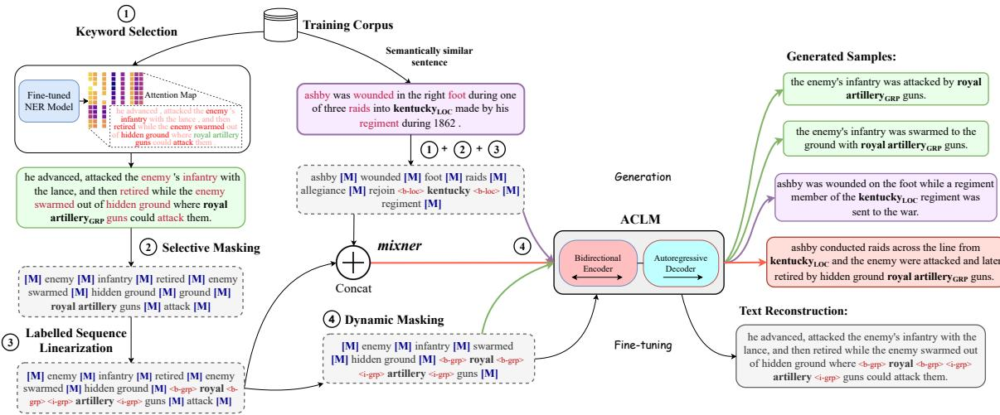
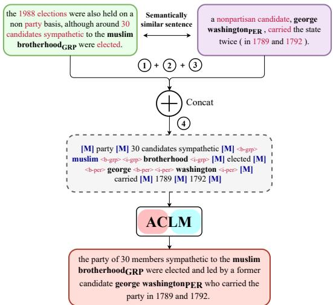
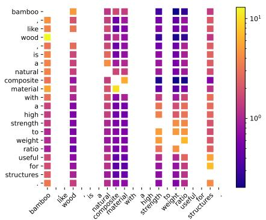
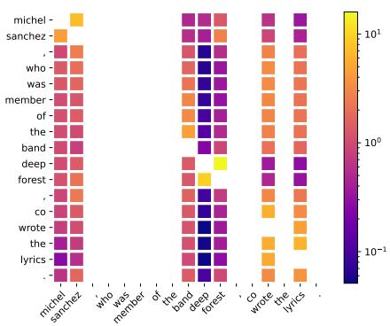
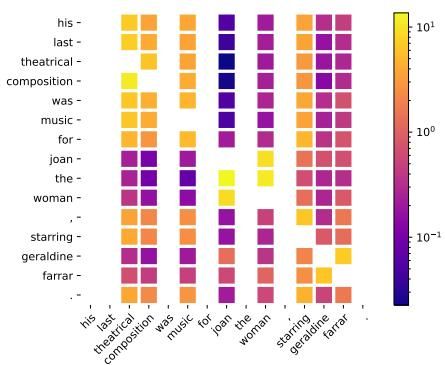
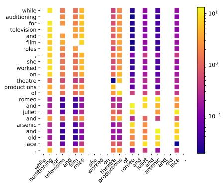
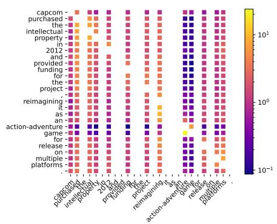
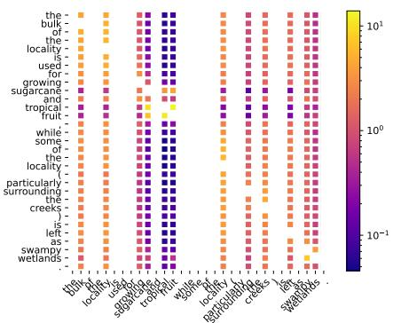

# ACLM: A Selective-Denoising based Generative Data Augmentation Approach for Low-Resource Complex NER

Sreyan Ghosh♠∗ Utkarsh Tyagi♠∗ Manan Suri♣ Sonal Kumar♠

S Ramaneswaran♥ Dinesh Manocha♠

♠University of Maryland, College Park, USA,

♣NSUT Delhi, India, ♥NVIDIA, Bangalore, India {sreyang, utkarsht, sonalkum, dmanocha}@umd.edu manansuri27@gmail.com, ramanr@nvidia.com

## Abstract

Complex Named Entity Recognition (NER) is the task of detecting linguistically complex named entities in low-context text. In this paper, we present ACLM (Attention-map aware keyword selection for Conditional Language Model fine-tuning), a novel data augmentation approach, based on conditional generation, to address the data scarcity problem in lowresource complex NER. ACLM alleviates the context-entity mismatch issue, a problem existing NER data augmentation techniques suffer from and often generates incoherent augmentations by placing complex named entities in the wrong context. ACLM builds on BART and is optimized on a novel text reconstruction or denoising task - we use selective masking (aided by attention maps) to retain the named entities and certain keywords in the input sentence that provide contextually relevant additional knowledge or hints about the named entities. Com pared with other data augmentation strategies, ACLM can generate more diverse and coherent augmentations preserving the true word sense of complex entities in the sentence. We demonstrate the effectiveness of ACLM both qualitatively and quantitatively on monolingual, crosslingual, and multilingual complex NER across various low-resource settings. ACLM outper forms all our neural baselines by a significant margin (1%-36%). In addition, we demonstrate the application of ACLM to other domains that suffer from data scarcity (e.g., biomedical). In practice, ACLM generates more effective and factual augmentations for these domains than prior methods.

## 1 Introduction

Named Entity Recognition (NER) is a fundamental task in Natural Language Processing (NLP) that aims to detect various types of named entities (NEs) from text. Recently, there has been considerable progress in NER using neural learning methods that achieve state-of-the-art (SOTA) performance (Wang et al., 2021; Zhou and Chen, 2021) on well-known benchmark datasets, including CoNLL 2003 (Tjong Kim Sang and De Meulder, 2003) and OntoNotes (Schwartz et al., 2012). However, these datasets are designed to evaluate the performance on detecting “relatively easy” NEs like proper names (e.g., people such as “Barack Obama,” locations such as “New York,” or organizations such as “IBM”) in well-formed, contextrich text that comes from news articles (Augenstein et al., 2017). On the other hand, complex NER benchmarks like MultiCoNER (Malmasi et al., 2022) present several contemporary challenges in NER, including short low-context texts with emerging and semantically ambiguous complex entities (e.g., movie names in online comments) that reduce the performance of SOTA methods previously evaluated only on the existing NER benchmark datasets. Our experiments reveal that the performance of the current SOTA NER method (Zhou and Chen, 2021) (previously evaluated only on the CoNLL 2003 dataset) drops by 23% when evaluated on MultiCoNER and 31.8% when evaluated on a low-resource setting with just 500 training samples (more details in Table 8). Thus, we emphasize that research on building systems that can effectively detect complex NEs in the text is currently understudied in the field of NLP.

In the past, researchers have made several attempts at building supervised approaches to detect complex and compositional noun phrase entities in sentences (Doddington et al., 2004; Biggio et al., 2010; Magnolini et al., 2019). However, the scarcity of annotated training data for building effective systems has always been a challenge. Data augmentation has been shown to be an effective solution for low-resource NER (Ding et al., 2020; Liu et al., 2021; Zhou et al., 2022). In practice, though these systems perform well and generate coherent augmentations on common NER benchmark datasets with easy proper noun NEs, they fail to be effective for complex NER, often generating incoherent augmentations. We first argue that certain types of complex NEs follow specific linguistic patterns and appear only in specific contexts (examples in Appendix 4), and augmentations that do not follow these patterns impede a NER model from learning such patterns effectively. This sometimes also leads to augmentations with context-entity mismatch, further hurting the learning process. For e.g., unlike proper names, substituting complex NEs from other sentences in the corpus or replac ing them with synonyms (Dai and Adel, 2020a) often leads to augmentations where the NE does not fit into the new context (e.g., swapping proper names across sentences might still keep the sentence coherent but swapping the name of a book with a movie (both creative work entity) or the name of a football team with a political party (both group entity) makes it incoherent). Fine-tuning pretrained language models (PLMs), similar to prior work (Ding et al., 2020; Liu et al., 2021; Zhou et al., 2022), fail to generate new context around complex NEs or completely new NEs with the desired linguistic patterns due to low-context sentences and the lack of existing knowledge of such linguistically complex NEs (examples in Fig. 3). This leads to in-coherent augmentations and poses a se vere problem in knowledge-intensive tasks like biomedical NER, where non-factual augmentations severely hurt learning. Our experiments also reveal that introducing new context patterns around NEs proves to be a more effective data augmentation technique for complex NER than diversifying NEs (ACLM vs. MELM in Table 1).

Main Results: To overcome the aforesaid problems, we formulate data augmentation as a conditional generation task and propose ACLM, a conditional text generation model that generates augmentation samples by introducing new and diverse context patterns around a NE. ACLM builds on BART (Lewis et al., 2020) and is fine-tuned on a modification of the text reconstruction from corrupted text task, a common denoising-based PLM pre-training objective. In contrast to other PLM pretraining strategies, which randomly mask a portion of the text for corruption, our modified objective is based on selective masking, wherein we mask all other words in the sentence except the NEs and a small percentage of keywords related to the NEs.

We refer to this corrupted sentence as a template, and it serves as input to the model for both the training and generation phases. These keywords are other non-NE tokens in the sentence that provide contextually relevant additional knowledge or hints to BART about the complex NEs without the need of retrieving knowledge from any external sources. We select these keywords using attention maps obtained from a transformer model fine-tuned on the NER task, and they help the PLM overcome the problem where it might not possess enough knowledge about a semantically ambiguous complex NE (example in Fig. 3). Training ACLM on this modified objective allows us to generate diverse, coherent, factual, and high-quality augmentations given templates. We also propose mixner, a novel algorithm that mixes two templates during the augmentation generation phase and boosts the diversity of augmentations. Our primary contributions are as follows:

• We propose ACLM, a novel data augmentation framework specially designed for lowresource complex NER. Compared with previous methods in the literature, ACLM effectively alleviates the context-entity mismatch problem by preserving the true sense of semantically ambiguous NEs in augmentations. Additionally, to accompany ACLM, we propose mixner, which boosts the diversity of ACLM generations.

• We qualitatively and quantitively show the benefits of ACLM for monolingual, crosslingual, and multilingual complex NER across various low-resource settings on the Multi-CoNER dataset. Our proposed ACLM outperforms all other baselines in literature by a significant margin (1%-36%) and generates more diverse, coherent, and high-quality augmentations compared to them.

• We perform extensive experiments to study the application of ACLM in three other domains, including science and medicine. ACLM outperforms all our baselines in these domains (absolute gains in the range of 1%- 11%) and generates more factual augmentations.

## 2 Background and Related Work

Complex NER Background: Complex NER is a relatively understudied task in the field of NLP.

Building on insights from Augenstein et al. (2017), we discuss key reasons behind high performance on common NER benchmark datasets and try to understand why modern SOTA NER algorithms do not work well on complex NER benchmarks: (1) Context: Most of the common benchmark datasets are curated from articles in the news domain. This gives them several advantages, including rich context and surface features like proper punctuation and capitalized nouns, all of which are major drivers of success in these datasets (Mayhew et al., 2019). In contrast, for entity recognition beyond news text, like search queries or voice commands, the context is less informative and lacks surface features (Guo et al., 2009; Carmel et al., 2014); (2) Entity Complexity: Data from news articles contain proper names or “easy” entities with simple syntactic structures, thus allowing pretrained models to perform well due to their existing knowledge of such entities. On the other hand, complex NEs like movie names are syntactically ambiguous and linguistically complex and which makes Complex NER a difficult task (Ashwini and Choi, 2014). Examples of such entities include noun phrases (e.g., Eternal Sunshine of the Spotless Mind), gerunds (e.g., Saving Private Ryan), infinitives (e.g., To Kill a Mockingbird), or full clauses (e.g., Mr. Smith Goes to Washington); (3) Entity Overlap: Models trained on these common benchmark datasets suffer from memorization effects due to the large overlap of entities between the train and test sets. Unseen and emerging entities pose a huge challenge to complex NER (Bernier-Colborne and Langlais, 2020).

Complex NER: Prior work has mostly focused on solving the entity complexity problem by learning to detect complex nominal entities in sentences (Magnolini et al., 2019; Meng et al., 2021; Fetahu et al., 2022; Chen et al., 2022). Researchers have often explored integrating external knowledge in the form of gazetteers for this task. Gazetteers have also proven to be effective for low-resource NER (Rijhwani et al., 2020). GemNet (Meng et al., 2021), the current SOTA system for complex NER, conditionally combines the contextual and gazetteer features using a Mixture-of-Experts (MoE) gating mechanism. However, gazetteers are difficult to build and maintain and prove to be ineffective for complex NER due to their limited entity coverage and the nature of unseen and emerging entities in complex NER.

Data Augmentation for Low-Resource NER: Data Augmentation to handle data scarcity for lowresource NLP is a well-studied problem in the literature and is built on word-level modifications, including simple synonym replacement strategies (Wei and Zou, 2019), or more sophisticated learning techniques like LSTM-based language models (Kobayashi, 2018), Masked Language Modeling (MLM) using PLMs (Kumar et al., 2020), auto-regressive PLMs (Kumar et al., 2020), or constituent-based tagging schemes (Zhou et al., 2019). However, most of these methods, though effective for classification tasks, suffer from tokenlabel misalignment when applied to token-level tasks such as NER and might require complex preprocessing steps (Bari et al., 2020; Zhong and Cambria, 2021). One of the first works to explore effective data augmentation for NER replaces NEs with existing NEs of the same type or replaces tokens in the sentence with one of their synonyms retrieved from WordNet (Dai and Adel, 2020b). Following this, many neural learning systems were proposed that either modify the Masked Language Modelling (MLM) training objective using PLMs (Zhou et al., 2022; Liu et al.) or use generative language modeling with LSTM LMs (Ding et al., 2020) or mBART (Liu et al., 2021), to produce entirely new sentences from scratch. However, all these systems were designed for low-resource NER on common benchmark datasets and failed to generate effective augmentations for low-resource complex NER with semantically ambiguous and complex entities.

## 3 Methodology

In this section, we give an overview of our approach. Fig. 1 represents the entire workflow of our ACLM data augmentation framework. A sentence is first passed through a fine-tuned XLM-RoBERTa fine-tuned on only gold data to generate the attention map for each token in the sentence. This attention map is then used to selectively mask the sentence and create a template. This template is then used as an input to optimize the model on the text reconstruction objective for fine-tuning ACLM: the model is asked to reconstruct the entire original sentence from only the content in the template. While generating augmentations, ACLM follows the same template generation process in addition to adding two templates through mixner, which we discuss in detail in Section 3.3.

  
Figure 1: Overview of ACLM: ACLM follows a 4-step template creation process, which serves as an input to the model during fine-tuning and generation. 1 Keyword Selection: The most important keywords (in red) associated with the NEs (in bold) in the sentence is first extracted using attention maps obtained from a fine-tuned NER model. 2 Selective Masking: All words except the NEs and the keywords obtained from the previous step is replaced with mask tokens M . 3 Labeled Sequence [ ]Linearization: Label tokens are added before and after each entity in the sentence. 4 Dynamic Masking: The template goes through further masking where a small portion of the keywords are dynamically masked at each training iteration. While generation we also apply mixner, which randomly joins two templates after 3 and before 4 . Post generating augmentations with ACLM, the generated augmentations are concatenated with the gold data and used to fine-tune our final NER model.

## 3.1 Template Creation

To corrupt a sentence and create a template, we follow a 4-step process described below:

1. Keyword Selection: For each sentence in our training corpus, we first obtain a set of non-NE tokens in the sentence that are most attended to by its NEs. We call these tokens keywords. For our research, we consider a non-NE token as a keyword if the NEs in the sentence contextually depend on them the most. We measure contextual dependency between NE and non-NE tokens using attention scores from attention maps extracted from a transformer-based NER model fine-tuned only on gold data. We hypothesize that attention heads in a transformer when fine-tuned for NER, formulated as a token-level tagging task, tend to pay the highest attention to the most contextually relevant tokens around it. Thus, formally put, consider a sentence with a total of T tokens comprised of $t _ { o t h e r }$ non-NE and $t _ { e n t i t y }$ NE tokens. Our primary aim is to find the top $p \%$ of $t _ { o t h e r }$ tokens, which we call keywords. To calculate the total attention score that each token in the sentence assigns to each other token, we sum up the attention scores across each of the heads in the transformer network and across the last a layers (a = 4 in our case). Different heads in different layers tend to capture different properties of language, and taking the average attention scores across the last 4 layers ensures that diverse linguistic relations are taken into account while choosing the keywords (e.g., syntactic, semantic, etc.). This also makes the keyword selection process more robust, as in low-resource conditions the attention maps may be noisy, and the NEs might not be focusing on the right context always. Additionally, the choice of just the last four layers is inspired by the fact that the lower layers have very broad attention and spend at most 10% of their attention mass on a single token (Clark et al., 2019). Note $t _ { e n t i t y }$ might be comprised of (1) multiple contiguous tokens forming an individual NE and (2) multiple such individual NEs. To handle the first case, inspired from Clark et al. (2019), we sum up the attention scores over all the individual tokens in the NE. For the second case, we find $t _ { a t t n }$ for each individual NE and take a set union of tokens in these $t _ { a t t n }$ . Thus, as an extra pre-processing step, to improve robustness, we also ignore punctuations, stop words, and other NEs from the top p% of $t _ { o t h e r }$ tokens to obtain our final keywords. We provide examples of templates in Appendix C.

2. Selective Masking: After selecting the top p% of $t _ { o t h e r }$ tokens in the sentence as keywords, we now have K non-NE keyword tokens and E entity tokens. To create the template, we now substitute each non-NE token not belonging to the K with the mask token and remove contiguous mask tokens.

3. Labeled Sequence Linearization: After we have our initial template, inspired by Zhou et al. (2022), we perform labeled sequence linearization to explicitly take label information into consideration during fine-tuning and augmentation generation. Similar to Zhou et al. (2022), as shown in Figure 1, we add label tokens before and after each entity token and treat them as the normal context in the sentence. Additionally, these label tokens before and after each NE provide boundary supervision for NEs with multiple tokens.

4. Dynamic Masking: Post labeled sequence linearization, our template goes through further masking wherein we dynamically mask a small portion of the K keywords during each iteration of training and generation. To be precise, we first sample a dynamic masking rate ε from a Gaussian distribution ${ \mathcal { N } } ( \mu , \sigma ^ { 2 } )$ , where the Gaussian variance σ is set to 1/K. Next, we randomly sample tokens from the K keywords in the sentence according to the masking rate ε and replace this with mask tokens, followed by removing consecutive mask tokens. At every round of generation, dynamic masking helps boost 1) context diversity by conditioning ACLM generation on different templates with a different set of keywords and 2) length diversity by asking ACLM to infill a different number of mask tokens.

## 3.2 Fine-tuning ACLM

As discussed earlier, ACLM is fine-tuned on a novel text reconstruction from corrupted text task wherein the created templates serve as our corrupted text and ACLM learns to recover the original text from the template. Text reconstruction from the corrupted text is a common denoising objective that PLMs like BART and BERT are pre-trained on. For this work, we use it as our fine-tuning objective and differ from other existing pre-training objectives by our selective masking strategy for creating templates.

## 3.3 Data Generation

Post fine-tuning on the text reconstruction task, we utilize ACLM to generate synthetic data for data augmentation. For each sentence in the training dataset, we apply steps 1-4 in the Template Creation pipeline for R rounds to randomly corrupt the sentence and obtain a template which is then passed through the fine-tuned ACLM model to generate a total of R× augmented training samples. Additionally, to boost diversity, during auto-regressive generation, we randomly sample the next word from the top-k most probable words and choose the most probable sequence with beam search.

  
Figure 2: Overview of mixner: During the augmentation generation process, for a particular sentence in the training dataset, we retrieve another semantically similar sentence and concatenate them before step 4 of the template creation process. This merged template is then passed through ACLM to generate diverse augmentations that incorporate semantics and NEs from both sentences.

mixner: During the R rounds of augmentation on our training dataset, we propose the use of mixner, a novel template mixing algorithm that helps ACLM generate diverse sentences with new context and multiple NEs in the sentence. More specifically, given the template for any arbitrary sentence a in the training set in step 3 of the template creation process, we retrieve the template for another sentence b that is semantically similar to a and join both the templates before passing on the template to step 4. We show examples of sentences generated with mixner in Fig. 3 and Section D.1. Note that we apply mixner only in the generation step and not during fine-tuning.

As mentioned earlier, to retrieve b from the training set, we randomly sample a sentence from the top-k sentences with the highest semantic similarity to a. To calculate semantic similarity between each sentence in the training set, we first take the embedding e for each sentence from a multi-lingual Sentence-BERT (Reimers and Gurevych, 2019) and then calculate semantic similarity by:

$$
\mathrm { s i m } ( e _ { i } , e _ { j } ) = { \frac { e _ { i } \cdot e _ { j } } { \lVert e _ { i } \rVert \lVert e _ { j } \rVert } }\tag{1}
$$

where sim .  is the cosine similarity between two embeddings , and $i , j \in N$ where i ≠ j, and N is the size if the training set. Additionally, we don’t apply mixner on all rounds R but sample a probability $\gamma$ from a Gaussian distribution ${ \mathcal { N } } ( \mu , \sigma ^ { 2 } )$ and only apply mixner if $\gamma$ ( )crosses a set threshold $\beta .$

## 3.3.1 Post-Processing

As a post-processing step, we remove augmentations similar to the original sentence and also the extra label tokens added in the labeled sequence linearization step. Finally, we concatenate the augmented data with the original data to fine-tune our NER model.

## 4 Experiments and Results

## 4.1 Dataset

All our experiments were conducted on the Multi-CoNER dataset (Malmasi et al., 2022), a large multilingual dataset for complex NER. MultiCoNER covers 3 domains, including Wiki sentences, questions, and search queries, across 11 distinct languages. The dataset represents contemporary challenges in NER discussed in Section 2 and is labeled with six distinct types of entities: person, location, corporation, groups (political party names such as indian national congress), product (consumer products such as apple iPhone 6), and creative work (movie/song/book titles such as on the beach). We conduct experiments on a set of 10 languages L where L = {English (En), Bengali (Bn, Hindi (Hi), German (De), Spanish (Es), Korean (Ko), Dutch (Nl), Russian (Ru), Turkish (Tr), Chinese (Zh)}. Language-wise dataset statistics can be found in Table 12. We would also like to highlight that the number of sentences in MultiCoNER test sets ranges from 133,119 - 217,887, which is much higher than test sets of other existing NER datasets. For more details on the dataset, we refer our readers to Malmasi et al. (2022). For monolingual and cross-lingual low-resource experiments, we perform iterative stratified sampling over all the sentences by using the entity classes in a sample as its target label across four low-resource settings (100, 200, 500, and 1000). We downsample the development set accordingly. For multi-lingual experiments, we combine all the data sampled for our monolingual settings. We evaluate all our systems and baselines on the original MultiCoNER test sets. We report micro-averaged F1 scores averaged across 3 runs for 3 different random seeds.

Algorithm 1 ACLM: Our proposed augmentation framework   
Given training set $\mathbb { D } _ { \operatorname { t r a i n } } ,$ and PLM   
$\mathbb { D } _ { m a s k e d }  \emptyset , \mathbb { D } _ { a u g }  \emptyset$   
for $\{ X , Y \} \in \mathbb { D } _ { t r a i n } { \bf d o }$ ▷ Training Loop   
$t _ { o t h e r } , t _ { e n t i t y } \gets X$   
$K \gets T o p p \% o f \mathrm { A T T N } \mathbf { M A P } \big ( t _ { o t h \_ r r } \big )$ ▷ Keyword Selection   
$\tilde { \underset { \sim } { X } }  \mathrm { G E N T E M P L A T E } ( X , \{ { t _ { o t h e r } } \} - \{ K \} )$ ▷ Selective Masking   
$\tilde { X } \gets \mathrm { L I N E A R I Z E } ( \tilde { X } , \dot { Y } )$ $\triangleright$ { })Labeled Sequence Linearization   
$\mathbb { D } _ { \mathrm { m a s k e d } }  \mathbb { D } _ { \mathrm { m a s k e d } } \cup \{ \tilde { X } \}$   
end for   
for $\{ X , Y \} \in \mathbb { D } _ { m a s k e d } { \bf d o }$   
$\tilde { X } \gets \dot { \mathrm { D Y N A M I C M A S K } } ( X , \eta )$ ▷ Dynamic Masking   
$\mathcal { L } _ { f i n e t u n e }  \mathrm { F I N E T U N E } ( \overset {  } { \mathcal { L } } , \tilde { X } )$ ▷ Fine-tune ACLM   
end for   
for $\{ X , Y \} \in \mathbb { D } _ { t r a i n }$ do ▷ Generation Loop   
{ }repeat times:   
$\tilde { \underset { \sim } { X } }  \mathrm { G E N T E M P L A T E } ( X , \{ t _ { o t h e r } \} - \{ K \} )$ ▷ Selective masking   
$\tilde { \boldsymbol { X } } \gets \mathrm { L I N E A R I Z E } ( \tilde { \boldsymbol { X } } , \dot { \boldsymbol { Y } } ) _ { \sim }$ } { })▷ Labeled Sequence Linearization   
$\tilde { X } \gets \mathrm { D Y N A M I C M A S K } ( \tilde { \tilde { X } } , \mu )$ ▷ Dynamic Masking   
$X _ { a u g } \gets \mathrm { G E N A U G } ( \dot { \mathcal { L } _ { f i n e t u n e } } ( \tilde { X } ) ) , i f \gamma < \beta$   
${ \underline { { X } } } _ { a u g m i \underline { { x } } } \gets \mathrm { M I X N E R } { \bigl ( } { \mathcal { L } } _ { f i n e t u n e } ( \tilde { X } ) { \bigr ) } , i f \gamma > \beta$   
${ \mathbb { D } _ { a u g } } \gets { \mathbb { D } _ { a u g } } \cup \big \{ X _ { a u g } \big \} \cup \big \{ X _ { a u g m i x } \big \}$   
end for   
$\mathbb { D } _ { a u g } \gets \mathrm { P o s T P R O C E S S } ( \mathbb { D } _ { a u g } )$ ▷ Post-processing   
$\mathbf { r e t u r n } \mathbb { D } _ { t r a i n } \cup \mathbb { D } _ { a u g }$

## 4.2 Experimental Setup

ACLM. We use mBart-50-large (Tang et al., 2020) with a condition generation head to fine-tune ACLM. We fine-tune ACLM for 10 epochs using Adam optimizer (Kingma and Ba, 2014) with a learning rate of $1 e ^ { - 5 }$ and a batch size of 32.

NER. We use XLM-RoBERTa-large with a linear head as our NER model. Though the field of NER has grown enormously, in this paper, we adhere to the simplest formulation and treat the task as a token-level classification task with a BIO tagging scheme. We use the Adam optimizer to optimize our model, set the learning rate to $1 e ^ { - 2 }$ , and train with a batch size of 16. The NER model is trained for 100 epochs, and the model with the best performance on the dev set is used for testing.

Hyper-parameter Tuning. For template creation during fine-tuning and generation, we set the selection rate $p$ and the Gaussian $\mu$ to be 0.3 and 0.5, respectively. The number of augmentation rounds R is set as 5. For mixner we set Gaussian $\mu$ and $\beta$ to be 0.5 and 0.7, respectively. All hyper-parameters are tuned on the development set with grid search. More details can be found in Appendix A.

## 4.3 Baselines

To prove the effectiveness of our proposed ACLM, we compare it with several strong NER augmentation baselines in the literature. In this sub-section, we briefly describe each of these baselines. All baselines were run for R rounds.

Gold-Only. The NER model is trained using only gold data from the MultiCoNER dataset without any augmentation.

<table><tr><td></td><td>MONOLINGUAL</td><td colspan="10"></td><td colspan="5">CROSS-LINGUAL</td></tr><tr><td>#Gold</td><td>Method</td><td>En</td><td>Bn</td><td>Hi</td><td>De</td><td>Es</td><td>Ko</td><td>NI</td><td>Ru</td><td>Tr</td><td>Zh</td><td>Avg</td><td>En → Hi En → Bn</td><td>En → De</td><td>En → Zh</td><td>Avg</td></tr><tr><td rowspan="7">100</td><td>Gold-only</td><td>29.36</td><td>14.49</td><td>18.80</td><td>37.04</td><td>36.30 12.76</td><td>38.78</td><td>23.89</td><td>24.13</td><td>14.18</td><td>24.97</td><td>16.36</td><td>12.15</td><td>29.71</td><td>0.31</td><td>14.63</td></tr><tr><td>LwTR</td><td>48.60</td><td>20.25</td><td>29.95</td><td>48.38</td><td>44.08 35.09</td><td>43.00</td><td>39.22</td><td>30.58</td><td>27.70</td><td>36.68</td><td>32.36</td><td>24.59</td><td>46.05</td><td>2.11</td><td>26.28</td></tr><tr><td>DAGA</td><td>16.24</td><td>5.87</td><td>10.40</td><td>32.44</td><td>27.78</td><td>19.28</td><td>15.44</td><td>11.14</td><td>16.17 10.33</td><td>16.51</td><td>4.54</td><td>3.28</td><td>14.21</td><td>0.13</td><td>5.54</td></tr><tr><td>MELM</td><td>40.12</td><td>6.22</td><td>27.84</td><td>43.94</td><td>37.45</td><td>34.10</td><td>37.82</td><td>32.38</td><td>20.13 25.11</td><td>30.51</td><td>26.37</td><td>20.33</td><td>34.32</td><td>2.71</td><td>20.93</td></tr><tr><td>ACLM only entity</td><td>14.06</td><td>17.55</td><td>19.60</td><td>29.72</td><td>38.10</td><td>31.57</td><td>38.47</td><td>27.40</td><td>35.62</td><td>26.34 27.84</td><td>21.72</td><td>16.55</td><td>30.93</td><td>1.58</td><td>17.69</td></tr><tr><td>ACLM random</td><td>43.59</td><td>20.13</td><td>28.04</td><td>45.83</td><td>42.27</td><td>33.64</td><td>41.82</td><td>38.20</td><td>36.79</td><td>25.99 35.63</td><td>29.68</td><td>21.64</td><td>45.27</td><td>3.05</td><td>24.91</td></tr><tr><td>ACLM (ours)</td><td>48.76</td><td>23.09</td><td>33.53</td><td>48.80</td><td>44.14</td><td>38.35</td><td>46.22</td><td>39.48</td><td>37.20 35.12</td><td>39.47</td><td>32.52</td><td>23.91</td><td>46.48</td><td>3.58</td><td>26.62</td></tr><tr><td rowspan="7">200</td><td>Gold-only</td><td>51.83</td><td>19.31</td><td>33.68</td><td>49.62</td><td>45.16 42.51</td><td>47.83</td><td>31.55</td><td>26.76</td><td>32.34</td><td>38.06</td><td>36.90</td><td>27.44</td><td>48.70</td><td>3.76</td><td>29.20</td></tr><tr><td>LwTR</td><td>52.88</td><td>23.85</td><td>34.27</td><td>50.31</td><td>47.01</td><td>42.77</td><td>52.01</td><td>40.18 35.92</td><td>30.57</td><td>40.98</td><td>40.07</td><td>32.36</td><td>48.95</td><td>6.04</td><td>31.85</td></tr><tr><td>DAGA</td><td>33.30</td><td>17.12</td><td>19.58</td><td>35.10</td><td>33.56</td><td>26.50</td><td>38.04</td><td>29.83 23.35</td><td>25.66</td><td>28.20</td><td>18.92</td><td>14.37</td><td>29.32</td><td>1.79</td><td>16.10</td></tr><tr><td>MELM</td><td>47.83</td><td>5.47</td><td>29.67</td><td>45.85</td><td>42.08</td><td>36.62</td><td>49.47</td><td>41.84</td><td>31.25 32.27</td><td>36.24</td><td>27.55</td><td>18.80</td><td>41.10</td><td>6.21</td><td>23.41</td></tr><tr><td>ACLM only entity</td><td>50.06</td><td>25.58</td><td>37.78</td><td>50.95</td><td>48.21</td><td>43.39</td><td>48.46</td><td>34.87</td><td>34.92</td><td>28.20 40.24</td><td>30.76</td><td>22.53</td><td>44.17</td><td>6.50</td><td>25.99</td></tr><tr><td>ACLM random</td><td>52.69</td><td>35.26</td><td>39.83</td><td>51.14</td><td>48.70</td><td>42.19</td><td>48.71</td><td>39.68</td><td>37.26 34.22</td><td>42.96</td><td>36.52</td><td>27.19</td><td>47.73</td><td>7.12</td><td>29.64</td></tr><tr><td>ACLM (ours)</td><td>54.99</td><td>38.39 34.6</td><td>40.55</td><td>53.36</td><td>49.57</td><td>44.32</td><td>53.19</td><td>43.97</td><td>39.71</td><td>39.31</td><td>45.74 45.22</td><td>36.64</td><td></td><td>54.51 8.55</td><td>36.23</td></tr><tr><td rowspan="7">500</td><td>Gold-only</td><td>55.51</td><td></td><td>38.66</td><td>55.95</td><td>51.52 48.57</td><td>50.97</td><td>45.14</td><td>38.83 39.00</td><td>38.84 38.55</td><td>45.86</td><td>35.93 43.14</td><td>25.64 34.60</td><td>50.13 51.61</td><td>7.23 11.40</td><td>29.73 35.19</td></tr><tr><td>LwTR DAGA</td><td>56.97 44.62</td><td>35.42</td><td>37.83</td><td>55.91</td><td>54.74</td><td>49.36</td><td>56.10</td><td>46.82</td><td></td><td>47.07</td><td></td><td></td><td></td><td></td><td></td></tr><tr><td></td><td></td><td>22.36</td><td>24.30</td><td>43.02</td><td>42.77</td><td>36.23</td><td>47.11</td><td>30.94 30.84</td><td>33.79</td><td>35.60</td><td>26.50</td><td>21.52</td><td>37.89</td><td>4.82</td><td>22.68</td></tr><tr><td>MELM</td><td>52.57</td><td>9.46</td><td>31.57</td><td>53.57</td><td>46.40</td><td>45.01</td><td>51.90</td><td>46.73 38.26</td><td>39.64</td><td>41.51</td><td>34.97</td><td>27.17</td><td>44.31</td><td>7.31</td><td>28.44</td></tr><tr><td>ACLM only entity</td><td>57.55</td><td>35.69</td><td>35.82</td><td>56.15</td><td>53.64</td><td>50.20</td><td>53.07</td><td>46.40</td><td>41.58 38.65</td><td>46.87</td><td>35.48</td><td>29.37</td><td>49.10</td><td>7.99</td><td>30.48</td></tr><tr><td>ACLM random</td><td>57.92</td><td>38.24</td><td>39.33</td><td>57.14</td><td>53.24</td><td>49.81</td><td>55.06</td><td>48.27</td><td>42.22 40.55</td><td>48.18</td><td>41.72</td><td>32.16</td><td>52.27</td><td>13.63</td><td>34.95</td></tr><tr><td>ACLM (ours)</td><td>58.31</td><td>40.26</td><td>41.48</td><td>59.35</td><td>55.69</td><td>51.56</td><td>56.31</td><td>49.40</td><td>43.57</td><td>41.23 49.72</td><td>44.36</td><td>35.59</td><td>54.04</td><td>16.27</td><td>37.57</td></tr><tr><td rowspan="7">1000</td><td>Gold-only</td><td>57.22</td><td>30.20</td><td>39.55</td><td>60.18</td><td>55.86 53.39</td><td>60.91</td><td>49.93</td><td>43.67</td><td>43.05 43.71</td><td>44.40</td><td>43.44 43.32</td><td>33.27</td><td>54.61</td><td>5.34 7.38</td><td>34.17</td></tr><tr><td>LwTR</td><td>59.10</td><td>39.65</td><td>43.90</td><td>61.28</td><td>57.29</td><td>51.37</td><td>59.25</td><td>52.04</td><td>44.33</td><td>51.19</td><td></td><td>33.74</td><td>53.32</td><td></td><td>34.44</td></tr><tr><td>DAGA</td><td>50.24</td><td>32.09</td><td>35.02</td><td>51.45</td><td>49.47</td><td>42.41</td><td>51.88</td><td>41.56 33.18</td><td>39.51</td><td>42.68</td><td>33.12</td><td>26.22</td><td>42.13</td><td>5.15</td><td>26.65</td></tr><tr><td>MELM ACLM only entity</td><td>53.48 55.46</td><td>6.88 38.13</td><td>37.02 41.84</td><td>58.69 60.05</td><td>52.43 56.99</td><td>50.50 53.32</td><td>56.25 58.22</td><td>48.99 50.17 45.11</td><td>36.83 38.88 39.62</td><td>44.00 49.89</td><td>35.23 37.38</td><td>25.64 29.77</td><td>46.50 41.10</td><td>8.22 6.49</td><td>28.90 28.69</td></tr><tr></table>

Table 1: Results of monolingual (Left) and cross-lingual (Right) low-resource complex NER. For cross-lingual experiments, we take English as the source language. ACLM obtains absolute average gains in the range of 1% - 22% over our baselines.

Label-wise token replacement (LwTR).(Dai and Adel, 2020b) A token in a sentence is replaced with another token with the same label; the token is randomly selected from the training set.

DAGA.(Ding et al., 2020) Data Augmentation with a Generation Approach (DAGA) proposes to train a one-layer LSTM-based recurrent neural network language model (RNNLM) by maximizing the probability for the next token prediction with linearized sentences. During generation, they use random sampling to generate entirely new sentences with only the BOS token fed to the model.

MulDA.(Liu et al., 2021) Multilingual Data Augmentation Framework (MulDA) builds on DAGA and trains a pre-trained mBART model on next token prediction with linearized sentences for generation-based multilingual data augmentation. For a fair comparison, we replace mBART in MulDA with mBART-50.

MELM.(Zhou et al., 2022) Masked Entity Language Modeling (MELM) proposes fine-tuning a transformer-encoder-based PLM on linearized labeled sequences using masked language modeling. MELM outperforms all other baselines and priorart on low-resource settings on the CoNLL 2003 NER dataset across four languages in mono-lingual, cross-lingual, and multi-lingual settings.

ACLM random. We train and infer ACLM with templates created with randomly sampled keywords instead of taking keywords with high attention scores. This baseline proves the effectiveness of our keyword selection algorithm which provides NEs in the template with rich context.

ACLM only entity. We train and infer ACLM with templates created with only linearized entities and no keywords. This baseline proves the effectiveness of additional context in our templates.

## 4.4 Experimental Results

Monolingual Complex NER. Table 1 compares the performance of all our baselines with ACLM on the MultiCoNER test sets under various lowresource settings for 10 languages. As clearly evident, ACLM outperforms all our baselines in all settings by consistently achieving the best results in all individual languages. Moreover, ACLM improves over our neural baselines (MELM and DAGA) by a significant margin (absolute gains in the range of 1.5% - 22% across individual languages). Although LwTR performs better than ACLM in rare instances, we emphasize that (1) LwTR generates nonsensical, incoherent augmentations, (discussed further in Section D.1) and (2) Based on a learningbased paradigm, ACLM shows bigger margins to LwTR at slightly higher gold training samples (200 and 500) which we acknowledge is a reasonable size in real-world conditions.

<table><tr><td>#Gold</td><td>Method</td><td>En</td><td>Bn</td><td>Hi</td><td>De</td><td>Es</td><td>K0</td><td>NI</td><td>Ru</td><td>Tr</td><td>Zh</td><td>Avg</td></tr><tr><td rowspan="5">100 ×10</td><td>Gold-Only</td><td>56.21</td><td>35.66</td><td>42.16</td><td>55.71</td><td>54.98</td><td>45.14</td><td>57.48</td><td>46.13</td><td>44.40</td><td>30.72</td><td>46.86</td></tr><tr><td>LwTR</td><td>55.65</td><td>38.47</td><td>43.44</td><td>54.71</td><td>53.95</td><td>44.78</td><td>56.50</td><td>46.93</td><td>45.41</td><td>31.56</td><td>47.14</td></tr><tr><td>MulDA</td><td>46.87</td><td>29.25</td><td>34.52</td><td>45.92</td><td>45.55</td><td>33.91</td><td>48.21</td><td>38.65</td><td>35.56</td><td>27.33</td><td>38.58</td></tr><tr><td>MELM</td><td>53.27</td><td>23.43</td><td>41.55</td><td>48.17</td><td>51.28</td><td>39.23</td><td>51.37</td><td>45.73</td><td>41.97</td><td>30.67</td><td>42.67</td></tr><tr><td>ACLM (ours)</td><td>58.74</td><td>41.00</td><td>46.22</td><td>59.13</td><td>56.93</td><td>51.22</td><td>60.30</td><td>50.26</td><td>49.32</td><td>40.93</td><td>51.40</td></tr><tr><td rowspan="5">200 ×10</td><td>Gold-Only</td><td>58.67</td><td>39.84</td><td>46.34</td><td>59.65</td><td>58.50</td><td>50.70</td><td>60.79</td><td>51.66</td><td>47.12</td><td>40.98</td><td>51.42</td></tr><tr><td>LwTR</td><td>51.78</td><td>35.93</td><td>38.87</td><td>52.73</td><td>51.59</td><td>42.55</td><td>54.49</td><td>43.99</td><td>41.23</td><td>35.19</td><td>44.83</td></tr><tr><td>MulDA</td><td>48.89</td><td>31.45</td><td>36.76</td><td>48.41</td><td>48.30</td><td>39.78</td><td>51.09</td><td>42.01</td><td>35.98</td><td>31.65</td><td>41.43</td></tr><tr><td>MELM</td><td>52.53</td><td>24.27</td><td>40.10</td><td>49.69</td><td>52.42</td><td>43.56</td><td>47.28</td><td>44.35</td><td>40.62</td><td>34.28</td><td>47.45</td></tr><tr><td>ACLM (ours)</td><td>59.75</td><td>42.61</td><td>48.52</td><td>61.49</td><td>59.05</td><td>53.46</td><td>61.59</td><td>53.34</td><td>49.96</td><td>44.72</td><td>53.45</td></tr><tr><td rowspan="5">500 ×10</td><td>Gold-Only</td><td>61.10</td><td>40.94</td><td>48.20</td><td>61.67</td><td>59.84</td><td>54.56</td><td>62.36</td><td>53.33</td><td>48.77</td><td>45.82</td><td>53.66</td></tr><tr><td>LwTR</td><td>59.09</td><td>38.37</td><td>43.80</td><td>59.37</td><td>57.76</td><td>50.38</td><td>60.42</td><td>51.00</td><td>46.53</td><td>42.87</td><td>50.96</td></tr><tr><td>MulDA</td><td>51.79</td><td>30.67</td><td>35.79</td><td>51.87</td><td>50.92</td><td>43.08</td><td>53.95</td><td>44.61</td><td>38.86</td><td>36.72</td><td>43.83</td></tr><tr><td>MELM</td><td>58.67</td><td>26.17</td><td>41.88</td><td>53.05</td><td>57.26</td><td>51.97</td><td>61.49</td><td>43.73</td><td>40.22</td><td>40.12</td><td>47.66</td></tr><tr><td>ACLM (ours)</td><td>62.32</td><td>43.79</td><td>50.32</td><td>63.94</td><td>62.05</td><td>56.82</td><td>64.41</td><td>55.09</td><td>51.83</td><td>48.44</td><td>55.90</td></tr><tr><td rowspan="5">1000×10</td><td>Gold-Only</td><td>64.14</td><td>43.28</td><td>50.11</td><td>66.18</td><td>63.17</td><td>57.31</td><td>65.75</td><td>56.94</td><td>51.17</td><td>49.77</td><td>57.78</td></tr><tr><td>LwTR</td><td>61.67</td><td>39.90</td><td>45.28</td><td>63.13</td><td>60.21</td><td>53.43</td><td>63.37</td><td>54.07</td><td>48.38</td><td>45.36</td><td>53.48</td></tr><tr><td>MulDA</td><td>56.35</td><td>33.73</td><td>40.71</td><td>56.90</td><td>55.35</td><td>48.42</td><td>58.39</td><td>49.25</td><td>42.06</td><td>40.19</td><td>48.14</td></tr><tr><td>MELM</td><td>61.55</td><td>30.27</td><td>42.61</td><td>61.05</td><td>61.87</td><td>55.71</td><td>63.17</td><td>53.00</td><td>48.48</td><td>44.71</td><td>52.24</td></tr><tr><td>ACLM (ours)</td><td>64.50</td><td>46.59</td><td>52.14</td><td>67.65</td><td>64.02</td><td>59.09</td><td>67.03</td><td>57.82</td><td>53.25</td><td>50.60</td><td>58.27</td></tr></table>

Table 2: Results of multi-lingual low-resource complex NER. ACLM obtains absolute gains in the range of 1% - 21%.

Cross-lingual Complex NER. We also study the cross-lingual transferability of a NER model trained on a combination of gold and generated augmentations. Thus, we evaluated a model, trained on En, on 4 other languages, including Hi, Bn, De, and Zh in a zero-shot setting. ACLM outperforms our neural baselines by a significant margin (absolute gains in the range of 1% - 21%). None of these systems perform well in cross-lingual transfer to Zh which was also observed by (Hu et al., 2021).

Multi-lingual Complex NER. Table 2 compares the performance of all our baselines with ACLM on the MultiCoNER test sets under various multilingual low-resource settings. As clearly evident, ACLM outperforms all our baselines by a significant margin (absolute gains in the range of 1%-21% across individual languages). All our baselines, including our Gold-Only baseline, also perform better than their monolingual counterparts which demonstrates the effectiveness of multi-lingual finetuning for low-resource complex NER.

## 5 Further Analysis

## 5.1 Generation Quality

Quantitative Analysis. Table 3 compares augmentations from various systems on the quantitative measures of perplexity and diversity. Perplexity (Jelinek et al., 1977) is a common measure of text fluency, and we measure it using GPT2 (Radford et al., 2019). We calculate 3 types of diversity metrics: for Diversity-E and Diversity-N, we calculate the average percentage of new NE and non-NE words in the generated samples compared with the original samples, respectively. For Diversity-L, we calculate the average absolute difference between the number of tokens in generated samples and the original samples. ACLM achieves the lowest perplexity and highest non-NE and length diversity compared with other baselines. NE diversity in ACLM is achieved with mixner where ACLM fairs well compared to MELM which just replaces NEs. LwTR achieves the highest perplexity, thereby reaffirming that it generates incoherent augmentations. Qualtitative Analysis. Fig. 3 illustrates the superiority of augmentations generated by ACLM when compared with our other baselines. As clearly evident, while MELM generates just minor changes in NEs, augmentations produced by LwTR often tend to be nonsensical and incoherent. On the other hand, ACLM generates meaningful and diverse sentences around NEs, which is further boosted with mixner. We provide examples in Appendix D.1.

<table><tr><td></td><td>#Gold Method</td><td>Perplexity(↓) Diversity-E(↑) Diversity-N(↑) Diversity-L(↑)</td><td></td><td></td><td></td></tr><tr><td rowspan="3">200</td><td>LwTR</td><td>137.01</td><td>30.72</td><td>16.46</td><td>0.0</td></tr><tr><td>MELM</td><td>83.21</td><td>94.85</td><td>0.0</td><td>0.0</td></tr><tr><td>ACLM (ours)</td><td>80.77</td><td>35.64</td><td>22.48</td><td>5.67</td></tr><tr><td rowspan="3">500</td><td>LwTR</td><td>129.349</td><td>30.07</td><td>16.22</td><td>0.0</td></tr><tr><td>MELM</td><td>82.31</td><td>94.37</td><td>0.0</td><td>0.0</td></tr><tr><td>ACLM (ours)</td><td>57.68</td><td>44.12</td><td>41.16</td><td>5.82</td></tr><tr><td rowspan="3">1000</td><td>LwTR</td><td>131.20</td><td>29.85</td><td>16.55</td><td>0.0</td></tr><tr><td>MELM</td><td>82.64</td><td>95.13</td><td>0.0</td><td>0.0</td></tr><tr><td>ACLM (ours)</td><td>62.00</td><td>50.10</td><td>34.84</td><td>5.40</td></tr></table>

Table 3: Quantitative evaluation of generation quality from various systems on the measures of perplexity and diversity. Diversity-E, N, and L stand for Entity, Non-Entity, and Length, respectively.

## 5.2 Application to other domains

To evaluate the transferability of ACLM to other domains, we evaluate ACLM on 4 more datasets beyond MultiCoNER. These datasets include CoNLL 2003 (Tjong Kim Sang and De Meulder, 2003) (news), BC2GM (Smith et al., 2008) (bio-medical), NCBI Disease (Dogan et al.˘ , 2014) (bio-medical) and TDMSci (Hou et al., 2021) (science). Table 4 compares our baselines with ACLM across 2 lowresource settings on all 4 datasets. ACLM outperforms all our baselines on all settings except LwTR on CoNLL 2003. This occurs because LwTR generates a large variety of effective augmentations with NE replacement on easy entities in CoNLL 2003. The results demonstrate the effectiveness of ACLM over diverse domains, including domains with an acute scarcity of data (bio-medical). Additionally, we also emphasize that ACLM produces more factual augmentations and, unlike our other baselines, avoids context-entity mismatch, which makes the NER model store wrong knowledge in data-sensitive domains. We show samples of generated augmentations in Fig. 3 and Appendix D.1.

<table><tr><td>Original</td><td>it was developed by a team led by former [blizzard entertainment]corr employees, some of whom had overseen the creation of the [diablo]cw series.</td><td>The original sentence describes the employees of an organization and provides details about them.</td></tr><tr><td>LwTR</td><td>it was developed by a makers led by, [blizzard entertainment]corp ., some of whom had elevation the serving of the [diablo]cw 12th.</td><td>X LwTR replaces random words in the sentence, which makes it incoherent.</td></tr><tr><td>MELM</td><td>it was developed by a team led by former [blizzago games]corp employees, some of whom had overseen the creation of the [hablo]cw series.</td><td>MELM keeps the sentence coherent but generates new NEs that do not correspond to real-world entities.</td></tr><tr><td>ACLM w/o mixner</td><td>[blizzard entertainment]corp employees have overseen the production of the animated films, including the production of the [diablo]cw series.</td><td>ACLM generates new context patterns around the NE, keeping the sentence coherent and avoiding context-entity mismatch.</td></tr><tr><td>ACLM w/ mixner</td><td>the team of the [blizzard entertainment]corp had overseen the creation of the game [diablo]cw and many of its workers founded [pyro studios]corp in the early 1960s.</td><td>mixner boosts ACLM diversity and still keeps the sentence coherent. It adds a NE in the sentence and augments the sentence with extra details about the employees of the organization.</td></tr><tr><td></td><td colspan="2">The control group consisted of 40 consecutive [FMF]pisEAsE patients, who arrived</td></tr><tr><td>Original</td><td>at the [FMF]piseasE clinic for their regular follow-up visit and were 40 years of age or older at the time of the examination.</td><td>The original sentence describes an occasion where a group of 40 patients diagnosed with a certain kind of disease visited a clinic, and the sentence provides us with information on the age statistics of the patients.</td></tr><tr><td>LwTR</td><td>The control, consisted of 40 consecutive [fragile]pisEase patients, who arrived at the [FMF]pisEasE status for their regular follow - up and were 40 years of age or older at the time of the examination analyzed</td><td>XLwTR replaces &quot;FMF&quot; in the sentence with &quot;fragile&quot; and the phrase &quot;fragile patients&quot; does not make sense. It also adds an extra word, &quot;analyzed&quot;, at the end of the sentence. XMELM replaces the 1st occurrence of &quot;FMF&quot; in the sentence with &quot;FMR&quot; and the</td></tr><tr><td>MELM</td><td>The control group consisted of 40 consecutive [FMR]pisEAsE patients, who arrived at the [PDA]pisEase clinic for their regular follow-up visit and were 40 years of age or older at the time of the examination.</td><td>second occurrence with &quot;PDA&quot;. &quot;FMR&quot; is not the name of a disease and is closest to &quot;FMR1&quot;, which is the name of a gene. &quot;PDA&quot; stands for &quot;Patent ductus arteriosus.&quot; Thus, the entire sentence does not make much sense.</td></tr><tr><td>ACLM w/o mixner</td><td>The sample consisted of four consecutive [FMF]pisEAsE patients who arrived at the [FMF]DisEAsE clinic for a visit of examination. Only one of the 4 remaining patients had [FMF]DISEASE·</td><td>ACLM introduces a new context pattern around the sentence. The entire sentence is coherent. mixner boosts ACLM diversity and still keeps the sentence coherent. &quot;FRDA&quot;</td></tr><tr><td>ACLM w/ mixner</td><td>Of 4000 (40%) patients with onset [FMF]DisEASE, patients with [FRDA]DISEASE had no tendon reflexes at all.</td><td>(Friedreich&#x27;s ataxia) is a genetic disease that causes difficulty in walking and a loss of sensation in the arms and legs.</td></tr></table>

Figure 3: Examples of augmentations generated with different methods (Left) and explanation (Right). Words in red are Named Entities, and words underlined in the Original sentence are identified ACLM keywords. ACLM generates much more diverse, detailed, and coherent augmentations, which maintain factuality and also prove to be more effective. Generation diversity is further amplified with mixner.

<table><tr><td>#Gold</td><td>Method</td><td>CoNLL</td><td>BC2GM</td><td>NCBI</td><td>TDMSci</td><td>Avg</td></tr><tr><td rowspan="5">200</td><td>Gold-Only</td><td>79.11</td><td>50.01</td><td>72.92</td><td>47.20</td><td>62.31</td></tr><tr><td>LwTR</td><td>82.33</td><td>52.78</td><td>72.15</td><td>51.65</td><td>64.73</td></tr><tr><td>DAGA</td><td>76.23</td><td>47.67</td><td>71.14</td><td>48.03</td><td>60.77</td></tr><tr><td>MELM</td><td>77.10</td><td>54.05</td><td>70.12</td><td>46.07</td><td>61.83</td></tr><tr><td>ACLM (ours)</td><td>82.14</td><td>58.48</td><td>74.27</td><td>56.83</td><td>67.93</td></tr><tr><td rowspan="5">500</td><td>Gold-Only</td><td>84.82</td><td>55.56</td><td>75.75</td><td>47.04</td><td>65.79</td></tr><tr><td>LwTR</td><td>85.08</td><td>60.46</td><td>78.97</td><td>60.74</td><td>71.31</td></tr><tr><td>DAGA</td><td>81.82</td><td>51.23</td><td>78.09</td><td>57.66</td><td>67.20</td></tr><tr><td>MELM</td><td>83.51</td><td>56.83</td><td>75.11</td><td>57.80</td><td>68.31</td></tr><tr><td>ACLM (ours)</td><td>84.26</td><td>62.37</td><td>80.57</td><td>61.77</td><td>72.24</td></tr></table>

Table 4: Comparison of NER results on datasets from various different domains including news, science, and bio-medical.

## 6 Conclusion

In this paper, we propose ACLM, a novel data augmentation framework for low-resource complex NER. ACLM is fine-tuned on a novel text reconstruction task and is able to generate diverse augmentations while preserving the NEs in the sentence and their original word sense. ACLM effectively alleviates the context-entity mismatch problem and generates diverse, coherent, and highquality augmentations that prove to be extremely effective for low-resource complex NER. Additionally, we also show that ACLM can be used as an effective data augmentation technique for low-resource NER in the domains of medicine and science due to its ability to generate extremely reliable augmentations.

## Limitations

We list down some potential limitations of ACLM: 1) PLMs are restricted by their knowledge to generate entirely new complex entities due to their syntactically ambiguous nature. Adding to this, substituting complex NEs in existing sentences leads to context-entity mismatch. Thus, as part of future work, we would like to explore if integrating external knowledge into ACLM can help generate sentences with new complex entities in diverse contexts. 2) We do not conduct experiments in the language Farsi from the MultiCoNER dataset as neither mBart-50-large nor XLM-RoBERTa-large was pre-trained on this language. 3) The use of mBart-50-large for generation also restricts ACLM from being transferred to code-switched settings, and we would like to explore this as part of future work.

## References

Alan Akbik, Tanja Bergmann, Duncan Blythe, Kashif Rasul, Stefan Schweter, and Roland Vollgraf. 2019. FLAIR: An easy-to-use framework for state-of-theart NLP. In NAACL 2019, 2019 Annual Conference of the North American Chapter of the Association for Computational Linguistics (Demonstrations), pages 54–59.

Sandeep Ashwini and Jinho D Choi. 2014. Targetable named entity recognition in social media. arXiv preprint arXiv:1408.0782.

Isabelle Augenstein, Leon Derczynski, and Kalina Bontcheva. 2017. Generalisation in named entity recognition: A quantitative analysis. Computer Speech & Language, 44:61–83.

M Saiful Bari, Tasnim Mohiuddin, and Shafiq Joty. 2020. Uxla: A robust unsupervised data augmentation framework for zero-resource cross-lingual nlp. arXiv preprint arXiv:2004.13240.

Gabriel Bernier-Colborne and Philippe Langlais. 2020. Hardeval: Focusing on challenging tokens to assess robustness of ner. In Proceedings of the 12th Language Resources and Evaluation Conference, pages 1704–1711.

Silvana Marianela Bernaola Biggio, Manuela Speranza, and Roberto Zanoli. 2010. Entity mention detection using a combination of redundancy-driven classifiers. In Proceedings ofthe Seventh International Conference on Language Resources and Evaluation (LREC’10).

David Carmel, Ming-Wei Chang, Evgeniy Gabrilovich, Bo-June Hsu, and Kuansan Wang. 2014. Erd’14: entity recognition and disambiguation challenge. In Acm Sigir Forum, volume 48, pages 63–77. Acm New York, NY, USA.

Beiduo Chen, Jun-Yu Ma, Jiajun Qi, Wu Guo, Zhen-Hua Ling, and Quan Liu. 2022. Ustc-nelslip at semeval-2022 task 11: Gazetteer-adapted integration network for multilingual complex named entity recognition. arXiv preprint arXiv:2203.03216.

Kevin Clark, Urvashi Khandelwal, Omer Levy, and Christopher D Manning. 2019. What does bert look at? an analysis of bert’s attention. arXiv preprint arXiv:1906.04341.

Alexis Conneau, Kartikay Khandelwal, Naman Goyal, Vishrav Chaudhary, Guillaume Wenzek, Francisco Guzmán, Edouard Grave, Myle Ott, Luke Zettlemoyer, and Veselin Stoyanov. 2019. Unsupervised cross-lingual representation learning at scale. arXiv preprint arXiv:1911.02116.

Xiang Dai and Heike Adel. 2020a. An analysis of simple data augmentation for named entity recognition. arXiv preprint arXiv:2010.11683.

Xiang Dai and Heike Adel. 2020b. An analysis of simple data augmentation for named entity recognition. In Proceedings ofthe 28th International Conference on Computational Linguistics, pages 3861– 3867, Barcelona, Spain (Online). International Committee on Computational Linguistics.

Bosheng Ding, Linlin Liu, Lidong Bing, Canasai Kruengkrai, Thien Hai Nguyen, Shafiq Joty, Luo Si, and Chunyan Miao. 2020. Daga: Data augmentation with a generation approach for low-resource tagging tasks. arXiv preprint arXiv:2011.01549.

George R Doddington, Alexis Mitchell, Mark A Przybocki, Lance A Ramshaw, Stephanie M Strassel, and Ralph M Weischedel. 2004. The automatic content extraction (ace) program-tasks, data, and evaluation. In Lrec, volume 2, pages 837–840. Lisbon.

Rezarta Islamaj Dogan, Robert Leaman, and Zhiyong˘ Lu. 2014. Ncbi disease corpus: a resource for disease name recognition and concept normalization. Journal ofbiomedical informatics, 47:1–10.

Besnik Fetahu, Anjie Fang, Oleg Rokhlenko, and Shervin Malmasi. 2022. Dynamic gazetteer integration in multilingual models for cross-lingual and cross-domain named entity recognition. In Proceedings of the 2022 Conference of the North American Chapter of the Association for Computational Linguistics: Human Language Technologies, pages 2777–2790, Seattle, United States. Association for Computational Linguistics.

Jiafeng Guo, Gu Xu, Xueqi Cheng, and Hang Li. 2009. Named entity recognition in query. In Proceedings ofthe 32nd international ACM SIGIR conference on Research and development in information retrieval, pages 267–274.

Yufang Hou, Charles Jochim, Martin Gleize, Francesca Bonin, and Debasis Ganguly. 2021. Tdmsci: A specialized corpus for scientific literature entity tagging of tasks datasets and metrics. In Proceedings of the the 16th conference of the European Chapter of the Association for Computational Linguistics, Online, 19–23 April 2021.

Hai Hu, He Zhou, Zuoyu Tian, Yiwen Zhang, Yina Ma, Yanting Li, Yixin Nie, and Kyle Richardson. 2021. Investigating transfer learning in multilingual pretrained language models through chinese natural language inference. arXiv preprint arXiv:2106.03983.

Fred Jelinek, Robert L Mercer, Lalit R Bahl, and James K Baker. 1977. Perplexity—a measure of the difficulty of speech recognition tasks. The Journal of the Acoustical Society ofAmerica, 62(S1):S63–S63.

Ziwei Ji, Nayeon Lee, Rita Frieske, Tiezheng Yu, Dan Su, Yan Xu, Etsuko Ishii, Yejin Bang, Andrea Madotto, and Pascale Fung. 2022. Survey of hallucination in natural language generation. ACM Computing Surveys.

Diederik P Kingma and Jimmy Ba. 2014. Adam: A method for stochastic optimization. arXiv preprint arXiv:1412.6980.

Sosuke Kobayashi. 2018. Contextual augmentation: Data augmentation by words with paradigmatic relations. In Proceedings of the 2018 Conference of the North American Chapter ofthe Associationfor Computational Linguistics: Human Language Technologies, Volume 2 (Short Papers), pages 452–457, New Orleans, Louisiana. Association for Computational Linguistics.

Varun Kumar, Ashutosh Choudhary, and Eunah Cho. 2020. Data augmentation using pre-trained transformer models. arXiv preprint arXiv:2003.02245.

Mike Lewis, Yinhan Liu, Naman Goyal, Marjan Ghazvininejad, Abdelrahman Mohamed, Omer Levy, Veselin Stoyanov, and Luke Zettlemoyer. 2020. BART: Denoising sequence-to-sequence pre-training for natural language generation, translation, and comprehension. In Proceedings of the 58th Annual Meeting of the Association for Computational Linguistics, pages 7871–7880, Online. Association for Computational Linguistics.

Jian Liu, Yufeng Chen, and Jinan Xu. Low-resource ner by data augmentation with prompting. In Proceedings ofthe Thirty-First International Joint Conference on Artificial Intelligence, IJCAI-22, pages 4252–4258.

Linlin Liu, Bosheng Ding, Lidong Bing, Shafiq Joty, Luo Si, and Chunyan Miao. 2021. Mulda: A multilingual data augmentation framework for low-resource cross-lingual ner. In Proceedings ofthe 59th Annual Meeting of the Association for Computational Linguistics and the 11th International Joint Conference on Natural Language Processing (Volume 1: Long Papers), pages 5834–5846.

Simone Magnolini, Valerio Piccioni, Vevake Balaraman, Marco Guerini, and Bernardo Magnini. 2019. How to use gazetteers for entity recognition with neural models. In Proceedings ofthe 5th Workshop on Semantic Deep Learning (SemDeep-5), pages 40–49.

Shervin Malmasi, Anjie Fang, Besnik Fetahu, Sudipta Kar, and Oleg Rokhlenko. 2022. Multiconer: a largescale multilingual dataset for complex named entity recognition. arXiv preprint arXiv:2208.14536.

Stephen Mayhew, Tatiana Tsygankova, and Dan Roth. 2019. ner and pos when nothing is capitalized. arXiv preprint arXiv:1903.11222.

Tao Meng, Anjie Fang, Oleg Rokhlenko, and Shervin Malmasi. 2021. Gemnet: Effective gated gazetteer representations for recognizing complex entities in low-context input. In Proceedings ofthe 2021 Conference ofthe North American Chapter ofthe Associationfor Computational Linguistics: Human Language Technologies, pages 1499–1512.

Alec Radford, Jeff Wu, Rewon Child, David Luan, Dario Amodei, and Ilya Sutskever. 2019. Language models are unsupervised multitask learners.

Nils Reimers and Iryna Gurevych. 2019. Sentence-bert: Sentence embeddings using siamese bert-networks. In Proceedings ofthe 2019 Conference on Empirical Methods in Natural Language Processing. Association for Computational Linguistics.

Shruti Rijhwani, Shuyan Zhou, Graham Neubig, and Jaime Carbonell. 2020. Soft gazetteers for lowresource named entity recognition. arXiv preprint arXiv:2005.01866.

H Andrew Schwartz, Fernando Gomez, and Lyle Ungar. 2012. Improving supervised sense disambiguation with web-scale selectors. In Proceedings ofCOLING 2012, pages 2423–2440.

Larry Smith, Lorraine K Tanabe, Cheng-Ju Kuo, I Chung, Chun-Nan Hsu, Yu-Shi Lin, Roman Klinger, Christoph M Friedrich, Kuzman Ganchev, Manabu Torii, et al. 2008. Overview of biocreative ii gene mention recognition. Genome biology, 9(2):1–19.

Yuqing Tang, Chau Tran, Xian Li, Peng-Jen Chen, Naman Goyal, Vishrav Chaudhary, Jiatao Gu, and Angela Fan. 2020. Multilingual translation with extensible multilingual pretraining and finetuning. arXiv preprint arXiv:2008.00401.

Erik F. Tjong Kim Sang and Fien De Meulder. 2003. Introduction to the conll-2003 shared task: Languageindependent named entity recognition. In Proceedings ofthe Seventh Conference on Natural Language Learning at HLT-NAACL 2003 - Volume 4, CONLL ’03, page 142–147, USA. Association for Computational Linguistics.

Xinyu Wang, Yong Jiang, Nguyen Bach, Tao Wang, Zhongqiang Huang, Fei Huang, and Kewei Tu. 2021. Automated Concatenation of Embeddings for Structured Prediction. In the Joint Conference of the 59th Annual Meeting ofthe Associationfor Computational Linguistics and the 11th International Joint Conference on Natural Language Processing (ACL-IJCNLP 2021). Association for Computational Linguistics.

Jason Wei and Kai Zou. 2019. EDA: Easy data augmentation techniques for boosting performance on text classification tasks. In Proceedings ofthe 2019 Conference on Empirical Methods in Natural Language Processing and the 9th International Joint Conference on Natural Language Processing (EMNLP-IJCNLP), pages 6382–6388, Hong Kong, China. Association for Computational Linguistics.

Xiaoshi Zhong and Erik Cambria. 2021. Time Expression and Named Entity Recognition. Springer.

Joey Tianyi Zhou, Hao Zhang, Di Jin, Hongyuan Zhu, Meng Fang, Rick Siow Mong Goh, and Kenneth Kwok. 2019. Dual adversarial neural transfer for lowresource named entity recognition. In Proceedings of the 57th Annual Meeting ofthe Associationfor Computational Linguistics, pages 3461–3471, Florence, Italy. Association for Computational Linguistics.

Ran Zhou, Xin Li, Ruidan He, Lidong Bing, Erik Cambria, Luo Si, and Chunyan Miao. 2022. Melm: Data augmentation with masked entity language modeling for low-resource ner. In Proceedings of the 60th Annual Meeting of the Association for Computational Linguistics (Volume 1: Long Papers), pages 2251– 2262.

Wenxuan Zhou and Muhao Chen. 2021. Learning from noisy labels for entity-centric information extraction. arXiv preprint arXiv:2104.08656.

## A Hyperparameter Tuning

All hyperparameters were originally tuned with grid search on the development set. In this section, we show performance on the test set for better analysis.

Keyword Selection rate p: The keywords in our template provide the model with contextually relevant additional knowledge about the NEs during training and generation. However, we are faced with the question: How much context is good context?. Too less context, like our ACLM only entity baseline with only linearized NEs in the template, might make it difficult for the model to know the appropriate context of the syntactically ambiguous complex NE and thus might lead to sentences generated with a context-entity mismatch (for e.g. sam is reading on the Beach where on the beach might be a name of a movie). On the contrary, retaining too many words from the original sentence in our template might lead to a drop in the diversity of generated sentences as the model needs to infill only a small portion of the words. To determine the optimal value of p we experiment on 2 low-resource settings on the English sub-set of MultiCoNER and report the micro F1 results on the test-set for p ∈ $\{ 0 , 0 . 1 , 0 . 2 , 0 . 3 . 0 . 4 , 0 . 5 , 0 . 6 , 0 . 7 \}$ . All other hyperparameters are kept constant. As shown in Table 5, p = 0.3 gives us the best test-set performance, and the performance decreases after 0.4.

<table><tr><td>#Gold</td><td>0</td><td>0.1</td><td>0.2</td><td>0.3</td><td>0.4</td><td>0.5</td><td>0.6</td><td>0.7</td></tr><tr><td>200</td><td>50.06</td><td>51.82</td><td>53.99</td><td>54.99</td><td>51.05</td><td>54.28</td><td>52.16</td><td>54.34</td></tr><tr><td>500</td><td>57.55</td><td>56.12</td><td>57.93</td><td>58.31</td><td>57.55</td><td>56.88</td><td>56.60</td><td>58.10</td></tr></table>

Table 5: Test set F1 for various Keyword Selection rates.

Augmentation rounds R: Augmenting the training dataset with several augmentation rounds R proves effective until a saturation point is reached. Continuing to add more augmented data to the gold dataset starts introducing noise to the combined data. Additionally, with an increase in R, the chances of auto-regressive generation with top-k sampling generating similar sentences increase. To determine the optimal value of R, we experiment on 2 low-resource settings on the English sub-set of MultCoNER and report the micro F1 results on the test-set for R ranging from 1 to 7. All other hyperparameters are kept constant. As shown in Table 5, R = 5 gives us the best test-set performance, and the performance decreases after 5 rounds.

Attention layers a for Keyword Selection: Selecting the right keywords for creating a template is integral to the success of ACLM. A clear example of this can be seen in Table 1, where ACLM outperforms ACLM random (which chooses random tokens as keywords for template creation) by a significant margin. Transformer encoders consist of multiple layers, and each layer consists of multiple attention heads. While all heads in the same layer tend to behave similarly, different layers generally encode different semantic and syntactic information (Clark et al., 2019). Thus we experiment with different values of α, or different combinations of transformer encoder layers which are used for calculating the attention scores for keyword selection. As mentioned in Section 3.1, by default, we average attention scores across all tokens, all heads, and the last α layers. For all our low-resource experiments, we use attention maps from a 24-layer XLMRoBERTa-large fine-tuned on the low-resource gold dataset for that particular setting. Table 7 compares the performance of 3 settings of α on 2 low-resource settings on the English sub-set of MultCoNER: 1. Only last layer 2. Last 4 layers. 3. All 24 layers. As clearly evident, though setting 2 achieves the best performance, the difference in performance among different values of α is not too high. As part of future work, we would like to explore better ways to search for the optimal α.

<table><tr><td>#Gold</td><td>1</td><td>2</td><td>3</td><td>4</td><td>5</td><td>6</td><td>7</td></tr><tr><td>200</td><td>52.37</td><td>53.96</td><td>52.40</td><td>50.05</td><td>54.99</td><td>53.46</td><td>53.75</td></tr><tr><td>500</td><td>58.24</td><td>58.17</td><td>57.90</td><td>58.11</td><td>58.31</td><td>57.20</td><td>57.40</td></tr></table>

Table 6: Test set F1 for the number of augmentation rounds.

<table><tr><td>#Gold</td><td>1</td><td>2</td><td>3</td></tr><tr><td>200</td><td>52.43</td><td>54.99</td><td>54.13</td></tr><tr><td>500</td><td>58.09</td><td>58.31</td><td>58.15</td></tr></table>

Table 7: Test set F1 for various settings of α

## B Additional Results

Current state of state-of-the-art: Most current state-of-the-art systems are built and evaluated on common NER benchmarks like CoNLL 2003 and OntoNotes v5.0. As discussed in Section 2, these benchmarks do not represent contemporary challenges in NER and contain sentences with easy entities and rich context. Table 8 compares the performance of a simple XLM-R (Conneau et al., 2019), and Co-regularized LUKE (Zhou and Chen,

2021) (SOTA NER system) on 2 common NER and 1 complex NER benchmarks in both low- and high-resource settings. As we can clearly see, both systems achieve remarkable performance on both CoNLL 2003 and OntoNotes v5.0 but struggle on MultiCoNER. Additionally, the gap widens in lowresource settings.

<table><tr><td>#Gold</td><td>Method</td><td>XLM-R</td><td>Co-regularized LUKE</td></tr><tr><td rowspan="4">500</td><td>CoNLL 2003</td><td>84.82</td><td>86.92</td></tr><tr><td>OntoNotes</td><td>65.48</td><td>64.92</td></tr><tr><td>MultiCoNER</td><td>55.51</td><td>55.12</td></tr><tr><td>CoNLL 2003</td><td>92.21</td><td>92.56</td></tr><tr><td rowspan="2">All</td><td>OntoNotes</td><td>85.07</td><td>87.57</td></tr><tr><td>MultiCoNER</td><td>70.31</td><td>69.58</td></tr></table>

Table 8: Performance comparison of XLM-RoBERTa (Conneau et al., 2019) and Co-regularized LUKE (Zhou and Chen, 2021) on two common benchmark NER datasets and Multi-CoNER (Malmasi et al., 2022) (complex NER benchmark) in both high- and low-resource settings. Co-regularized LUKE is the current SOTA NER system on both CoNLL 2003 and OntoNotes v5.0. Complex NER remains a difficult NLP task in both low- and high-resource labeled data settings.

Training on the entire dataset: Beyond just evaluating ACLM performance on low-resource settings, we also compare ACLM with all our baselines on the entire MultiCoNER dataset (each language split contains ≈ 15300 sentences). Similar to low-resource settings, ACLM outperforms all our baselines across all languages and achieves an absolute average gain of 1.58% over our best baseline.

<table><tr><td>Method</td><td>En</td><td>Bn</td><td>Hi</td><td>De</td><td>Es</td><td>K0</td><td>NI</td><td>Ru</td><td>Tr</td><td>Zh</td><td>Avg</td></tr><tr><td>Gold-only</td><td>71.25</td><td>59.10</td><td>61.59</td><td>75.33</td><td>67.71</td><td>65.29</td><td>71.55</td><td>68.76</td><td>62.44</td><td>60.56</td><td>66.36</td></tr><tr><td>LwTR</td><td>71.22</td><td>58.86</td><td>60.72</td><td>75.50</td><td>70.06</td><td>65.80</td><td>72.94</td><td>68.26</td><td>62.70</td><td>58.74</td><td>66.48</td></tr><tr><td>DAGA</td><td>64.30</td><td>47.93</td><td>53.03</td><td>67.70</td><td>62.07</td><td>59.84</td><td>65.37</td><td>60.72</td><td>52.45</td><td>55.32</td><td>58.87</td></tr><tr><td>MELM</td><td>66.27</td><td>56.27</td><td>61.04</td><td>71.25</td><td>65.56</td><td>63.71</td><td>70.43</td><td>66.28</td><td>60.74</td><td>57.72</td><td>63.93</td></tr><tr><td>ACLM (ours)</td><td>72.69</td><td>60.13</td><td>62.58</td><td>77.26</td><td>70.89</td><td>67.01</td><td>73.28</td><td>69.90</td><td>65.24</td><td>61.63</td><td>68.06</td></tr></table>

Table 9: Result comparison Complex NER. Avg is the average result across all languages. ACLM outperforms all our baselines.

Entity-wise Performance Analysis: Previous to MultiCoNER, common benchmark datasets like CoNLL 2003 had only “easy entities” like names of Persons, Locations, and Organizations. The MultiCoNER dataset has 3 additional types of NEs, namely Products (PROD), Groups (GRP), and Creative Work (CW). These entities are syntactically ambiguous, which makes it challenging to recognize them based on their context. The top system from WNUT 2017 achieved 8% recall for creative work entities. Table 10 compares the entity-wise performance of ACLM with our various baselines on two low-resource settings on the MultiCoNER dataset. All results are averaged across all 10 languages. ACLM outperforms all our baselines on all individual entities, including PROD, GRP, and CW, which re-affirms ACLM’s ability to generate effective augmentation for complex NER.

<table><tr><td>#Gold</td><td>Method</td><td>PER</td><td>LOC</td><td>PROD</td><td>GRP</td><td>CORP</td><td>CW</td></tr><tr><td rowspan="5">200</td><td>Gold-Only</td><td>56.35</td><td>42.32</td><td>30.10</td><td>31.36</td><td>33.83</td><td>23.30</td></tr><tr><td>LwTR</td><td>56.13</td><td>41.78</td><td>34.87</td><td>36.52</td><td>39.30</td><td>27.46</td></tr><tr><td>DAGA</td><td>45.19</td><td>35.40</td><td>19.96</td><td>21.92</td><td>19.60</td><td>14.33</td></tr><tr><td>MELM</td><td>52.16</td><td>41.16</td><td>30.24</td><td>28.61</td><td>34.13</td><td>22.77</td></tr><tr><td>ACLM (ours)</td><td>64.42</td><td>48.92</td><td>41.76</td><td>37.31</td><td>44.08</td><td>30.61</td></tr><tr><td rowspan="5">500</td><td>Gold-Only</td><td>63.05</td><td>48.48</td><td>42.75</td><td>37.55</td><td>45.10</td><td>31.34</td></tr><tr><td>LwTR</td><td>64.80</td><td>54.17</td><td>45.70</td><td>44.06</td><td>50.80</td><td>35.10</td></tr><tr><td>DAGA</td><td>51.82</td><td>41.11</td><td>28.58</td><td>30.50</td><td>34.10</td><td>21.61</td></tr><tr><td>MELM</td><td>58.41</td><td>45.64</td><td>37.04</td><td>34.11</td><td>40.42</td><td>28.33</td></tr><tr><td>ACLM (ours)</td><td>66.49</td><td>51.24</td><td>48.87</td><td>42.00</td><td>51.55</td><td>35.18</td></tr></table>

Table 10: Entity-wise performance comparison of different augmentation methods. Results are averaged across all languages.

Length-wise Performance Analysis: As mentioned in Section 2, low-context is a major problem in complex NER, and an effective complex NER system should be able to detect NEs in sentences with both low and high context (by context we refer to the number of words around the NEs in the sentence). By the nature of its fine-tuning pipeline, ACLM is able to generate augmentations of variable length, and our dynamic masking step further boosts the length diversity of generated augmentations. Adding to this, we acknowledge that effective augmentations for syntactically complex entity types should enable a model to learn to detect these entities in even low-context. Table 11 compares the entity-wise performance of ACLM with our various baselines on two low-resource settings on the MultiCoNER dataset. All results are averaged across all 10 languages. ACLM outperforms all our baselines across all length settings, which re-affirms ACLM’s ability to generate effective augmentation for complex NER. To be specific, ACLM improves over our best baseline by 8.8% and 7.4% for 200 and 3.2% and 6.7% for 500 for low- and high-context sentences, respectively.

<table><tr><td>#Gold</td><td>Method</td><td>len &lt; 5</td><td>5 ≤ len &lt; 10</td><td>10 ≤ len</td></tr><tr><td rowspan="4">200</td><td>LwTR</td><td>26.35</td><td>34.38</td><td>43.56</td></tr><tr><td>DAGA</td><td>18.20</td><td>29.53</td><td>39.49</td></tr><tr><td>MELM</td><td>23.27</td><td>38.81</td><td>50.29</td></tr><tr><td>ACLM (ours)</td><td>35.10</td><td>47.25</td><td>57.72</td></tr><tr><td rowspan="4">500</td><td>LwTR</td><td>34.04</td><td>42.74</td><td>56.47</td></tr><tr><td>DAGA</td><td>23.00</td><td>38.18</td><td>51.09</td></tr><tr><td>MELM</td><td>27.46</td><td>44.74</td><td>57.91</td></tr><tr><td>ACLM (ours)</td><td>37.42</td><td>52.23</td><td>63.13</td></tr></table>

Table 11: Length-wise performance comparison of different augmentation methods. Results are averaged across all languages. ACLM outperforms all our baselines across all settings.

<table><tr><td>Original</td><td>she became opposed to abortion in 1992 while attending a bible study and has since spoken out about how abortion has negatively impacted her life</td><td>Linguistically coherent entities</td><td>Context- Entity Match</td></tr><tr><td>LwTR</td><td>she became average to abortion in guitar while attending a bible study and has since spoken out about how academy has negatively impacted her life.</td><td>X</td><td>V</td></tr><tr><td>MELM</td><td>she became opposed to abortion in 1992 while attending a vegetable study and has since spoken out about how abortion has negatively impacted her life.</td><td>X</td><td>X</td></tr><tr><td>ACLM w/o mixner</td><td>the bible warned against abortion and said abortion had negatively impacted the welfare state.</td><td>√</td><td>√</td></tr><tr><td>ACLM w/ mixner</td><td>while attending the bible seminar in 1964 at the university of pittsburgh he earned a master of science degree in biology.</td><td>√</td><td>√</td></tr></table>

Figure 4: Analysis and comparison of augmentations generated by our baselines with ACLM. Words underlined are the NEs. Context entity mismatch occurs when the generated NEs do not fit the surrounding context. Linguistic incoherence refers to cases where a generated NE does not follow the linguistic pattern for that particular type of NE or context.

## C Templates and Attention Maps

Creating templates with keywords that effectively provides the PLM with additional knowledge about the NEs in the sentence is an integral part of ACLM. Fig. 11, 12, 13, 14, 15 shows examples of templates created for our sentences in MultiCoNER English subset, Spanish subset, Hindi subset NCBI Disease and TDMSci datasets, respectively. Additionally, we provide examples of attention maps used to create templates in Fig. 16f.

## D Qualitative Analysis of Augmentations

## D.1 Augmentation Examples

MultiCoNER Dataset: We provide additional examples of augmentations generated by ACLM and all our baselines in Fig. 9 and Fig. 10 for Hindi and English subsets of MultiCoNER dataset respectively.

Extra Datasets: Fig 5, 6, 7 and 8 illustrate augmetation examples for CoNLL 2003 (Tjong Kim Sang and De Meulder, 2003) (news), BC2GM (Smith et al., 2008) (bio-medical), NCBI Disease (Dogan et al.˘ , 2014) (bio-medical) and TDMSci (Hou et al., 2021) (science) datasets respectively. Except for on CoNLL 2003 datasets, both our baselines, LwTR and MELM, generate incoherent and unreliable training samples for the other 2 datasets. We only compare ACLM with LwTR and MELM as these methods don’t generate augmentations from scratch and modify existing sentences. We define unreliable sentences as sentences generated with an entity-context mismatch (eg. a NE describing a disease prone to cows is placed in the context of humans or vice-versa). Generating unreliable augmentations prove fatal in data-sensitive domains like bio-medical as it may make the model store wrongful knowledge. Our detailed analysis of generated augmentations shows that: (1) LwTR is prone to generating such incoherent sentences because it randomly samples entities from the corpus with the same tag for replacement. (2) MELM on the other hand, fine-tuned on a transformerencoder-based PLM, gets to see the entire context of the sentence for generating a new NE. However, it does not learn to focus on particular keywords and tends to generate a new NE based on the broader context of the sentence (e.g., it does not learn to differentiate between human and cow diseases and generates a new NE based on the broader context of the sentence). (3) ACLM generates highly reliable samples by conditioning on templates with keywords related to the NE. We illustrate examples of such templates in Fig. 14 and 15.

## E Additional Details

Model Parameters: XLM-RoBERTa-large has ≈ 355M parameters with 24-layers of encoder, 1027- hidden-state, 4096 feed-forward hidden-state and 16-heads. mBART-50-large ≈ has 680M parameters with 12 layers of encoder, 12 layers of decoder, 1024-hidden-state, and 16-heads.

Compute Infrastructure: All our experiments are conducted on a single NVIDIA A100 GPU. An entire ACLM training pipeline takes ≈ 40 minutes.

Dataset Details: We use 5 datasets in total for our experiments: MultiCoNER 2 (Malmasi et al.,

<table><tr><td>Original</td><td>The [European Commission  $\mathbf { l } _ { O R G }$  said on Thursday it disagreed with [German]mısc advice to consumers to shun [British]mısc lamb until scientists determine whether mad cow disease can be transmitted to sheep.</td></tr><tr><td>LwTR</td><td>The [European Sox]orG seed on Thursday it disagreed with [German]mısc advice to consumers to shun [British]  $| _ { M I S C }$  regarding until scientists determine whether mad 7o disease can be -- to sheep 1</td></tr><tr><td>MELM</td><td>[France]  $\rvert _ { L O C }$  &#x27;s [Aquaculture Committee  $\mathbf { l } _ { O R G }$  suggested on Wednesday that consumers avoid eating meat from [German]misc sheep until scientists determine whether mad cow disease can be transmitted to the animals.</td></tr><tr><td>ACLM w/o mixner</td><td>The [European Commission  $\mathbf { l } _ { O R G }$  said on Thursday that consumers should shun [British  $\mathbf { l } _ { M I S C }$  lamb until scientists determine whether the disease can be transmitted to humans.</td></tr><tr><td>ACLM w/ mixner</td><td>The [European Commission  $\mathbf { l } _ { O R G }$  has a scientific and multidisciplinary group of veterinary scientists who disagreed with the consumers on Thursday and decided to shun them out until scientists determine whether the [Bovine Spongiform Encephalopathy]mısc(BSE) -- mad cow disease can be transmitted.</td></tr></table>

Figure 5: Augmentation examples of the CoNLL 2003 dataset from the news domain. All generations are produced in a low-resource setting (500 training examples).

<table><tr><td>Original</td><td>To determine the genetic basis for the differencesbetween the cardiac and [brain AE3 variants  $\mathbf { l } _ { G E N E } ,$  we isolated and characterized the rat gene.</td></tr><tr><td>LwTR</td><td>To determine the genetic basis for the differences between the cardiac and [IgA AE3 related  $\mathbf { l } _ { G E N E } ;$  we isolated and characterized the rat immunodeficiency increased</td></tr><tr><td>MELM</td><td>To determine the genetic basis for the differences between the cardiac and [mouse EFR varianter]GENe, we isolated and characterized the rat gene.</td></tr><tr><td>ACLM w/o mixner</td><td>The genetic basis for the cardiac [brain AE3 variants  $\mathbf { l } _ { G E N E }$  in the rat population is unknown.</td></tr><tr><td>ACLM w/ mixner</td><td>On basis of the differences in both [brain AE3 variants]GenE and [estrogen receptors  $\mathbf { l } _ { G E N E }$  we isolated the mechanisms that govern the variations in mouse and human genes.</td></tr></table>

Figure 6: Augmentation examples of BC2GM from the bio-medical domain. All generations are produced in a low-resource setting (500 training examples).

<table><tr><td>Original</td><td>In order to understand the genetic and phenotypic basis for [DPD deficiency]pisEase, we have reviewed 17 families presenting 22 patients with complete [deficiency of DPD]pisEAsE.</td></tr><tr><td>LwTR</td><td>In order to understand the genetic and phenotypic basis for [DPD deficiency]pisEase, we have pathology 17 families presenting transcription patients with 292 deficiency of [DPD constructed]pisEAsE.</td></tr><tr><td>MELM</td><td>In order to understand the genetic and phenotypic basis for [DDA eficiendency]pisEAsE, we have reviewed 17 families presenting 22 patients with complete [confferency cardiac disorderF]pisEasE:</td></tr><tr><td>ACLM w/o mixner</td><td>To determine the phenotypic basis of this [DPD deficiency]pisEasE gene, we reviewed the gene in 22 patients with an unusual [deficiency of DPD]DIsEASE·</td></tr><tr><td>ACLM w/ mixner</td><td>We examined the phenotypic basis of [DPD deficiency]pisEAsE in four families with patients suffering from [deficiency of DPD]pisEAsE(Twenty - eight patients with a [protein S deficiency]pisEAsE and [PROS1 gene defect]DISEASE).</td></tr></table>

Figure 7: Augmentation examples of NCBI dataset from the bio-medical domain. All generations are produced in a low-resource setting (500 training examples).

<table><tr><td>Original</td><td>These data show that if we are ever to fully master [natural language generation]  $\rvert _ { T A S K } :$  , especially for the genres of news and narrative, researchers will need to devote more attention to understanding how to generate descriptive, and not just distinctive, referring expressions.</td></tr><tr><td>LwTR</td><td>These data show that if we are ever to runs focus [Urdu/generation]  $T A S K$  proposed for the genres of + and narrative, researchers will need to devote more attention to understanding how to Fixed descriptive, and not just raw transformed morphological supervised corpora.</td></tr><tr><td>MELM</td><td>These data show that if we are ever to fully master [the text interpretation]  $\mathsf { I } _ { T A S K } ,$  especially for the genres of news and narrative, researchers will need to devote more attention to understanding how to generate descriptive, and not just distinctive, referring expressions.</td></tr><tr><td>ACLM w/o mixner</td><td>These results show that in the [natural language generation]raskof news text, researchers are able to generate descriptive text with distinctive language expressions.</td></tr><tr><td>ACLM w/ mixner</td><td>These data show that if we are ever to fully master [natural language generation]raskfor genres other than narrative, researchers will be able to generate descriptive and distinctive meaning by referring to them. We propose a holistic approach to [image description generation  $\mathsf { I } _ { T A S K }$  that is noisy and challenging.</td></tr><tr><td>Original</td><td>3</td></tr><tr><td>LwTR</td><td>1  $] _ { c w } ,$  </td></tr><tr><td>MELM</td><td> $\overline { { \mathbf { g } \mathbf { R } \mathbf { I } } } _ { C W } ,$  </td></tr><tr><td>ACLM w/o mixner</td><td>[3R  $\ P e \ P \rfloor _ { C W }$  可</td></tr><tr><td>ACLM w/ mixner</td><td>3R  $\ P { \ @ \ P _ { C W } }$  RHiT，  $] _ { G R P }$  </td></tr><tr><td></td><td>3[]33</td></tr><tr><td>Original</td><td>3dsaaa 3383</td></tr><tr><td>LwTR</td><td> $] _ { G R P } \hat { \ P }$ </td></tr><tr><td>MELM ACLM w/o mixner</td><td>368800  $\overline { { [ \breve { \circ } ] \subset S } } \overline { { \Rightarrow \vert \vec { \circ } \vert \circ \vert } } \overline { { \downarrow } } \overline { { \downarrow } }$  3 3dsaaa 3刚fR可可</td></tr><tr><td>ACLM w/ mixner</td><td> $] _ { G R P } \hat { \ P }$  [EIDS  $\int \limits _ { a } ^ { a } \frac { \sin ^ { 2 } \theta } { d t } \sqrt { d \theta } = \pi ( \theta ^ { 2 } ) d \theta$  市市 [fUGRRUR</td></tr></table>

Figure 8: Augmentation examples of TDMSci from the science domain. All generations are produced in a low-resource setting (500 training examples).

Figure 9: Augmentation examples on the Hindi subset of the MultiCoNER dataset. All generations are produced in a low-resource setting (500 training examples).

<table><tr><td>Original</td><td>gibson was educated at [harrow school  ${ \mathbf { l } } _ { G R P } ,$  where he played in the cricket team, and at [trinity college]Loc.</td></tr><tr><td>LwTR</td><td>gibson was early at [real pictures  $] _ { G R P ; }$  where he played in the cricket team seventh and at [trinity college]Loc.</td></tr><tr><td>MELM</td><td>gibson was educated at [harford schools  $] _ { G R P }$  , where he played in the cricket team, and at [is college]  $\mathbf { \Pi } _ { L O C } \cdot$ </td></tr><tr><td>ACLM w/o mixner</td><td>gibson was educated at [harrow school  $] _ { G R P }$  and played on the football team at [trinity college]Loc.</td></tr><tr><td>ACLM w/ mixner</td><td>gibson was educated at [harrow  $\mathbf { s c h o o l l } _ { G R P : }$  then at [trinity college]toc and then at the missionary college of [stavanger  $] _ { L O C }$  from which he graduated in 1946.</td></tr><tr><td>Original</td><td>in previous years he had worked with [alex cox]pEr on the soundtracks of his films [sid and</td></tr><tr><td>LwTR</td><td>nancy  $_ { \mathrm { l } _ { c w } }$  and [walker  $] _ { c w }$  in 1986 and 1987. in previous years he had worked with [alex pauwels]peRon the soundtracks of his actor</td></tr><tr><td>MELM</td><td>[illegal and  $\underline { { \mathbf { n a n c y l } _ { c w } } }$  and [family]cw in 1986 and 1987. in previous years he had worked with [roux wilsmith]pERon the soundtracks of his films</td></tr><tr><td>ACLM w/o mixner</td><td>[du, the ware]cw and walkaway in 1986 and 1987. [alex  $\mathbf { c o x l } _ { P E R }$  wrote the soundtracks for his films [sid and nancy walker  $1 _ { c w }$  in 1987 .</td></tr><tr><td>ACLM w/ mixner</td><td>[alex cox]PERwrote the soundtracks for his film [sid and nancy and walker]cw and appeared in many of his films, including [powder]  $| _ { c w } ,$  [simply irresistible]  $\vert _ { c w }$  and [d-</td></tr></table>

Figure 10: Augmentation examples on the English subset of the MultiCoNER dataset. All generations are produced in a low-resource setting (500 training examples).

<table><tr><td colspan="1" rowspan="1">Original</td><td colspan="1" rowspan="1">Template</td></tr><tr><td colspan="1" rowspan="1">speech pathologist [lionel logue]pER taught at the schoolfrom 1910 to 1911.</td><td colspan="1" rowspan="1">[M] speech pathologist [M] &lt;B-PER&gt; lionel &lt;B-PER&gt; &lt;I-PER&gt; logue &lt;I-PER&gt; [M] taught [M] school [M]</td></tr><tr><td colspan="1" rowspan="1">they were designed for interim use until the [m73 machinegun]prop could be fielded.</td><td colspan="1" rowspan="1">[M] designed [M] interim [M] &lt;B-PROD&gt; m73 &lt;B-PROD&gt;&lt;I-PROD&gt; machine &lt;I-PROD&gt; &lt;I-PROD&gt; gun &lt;I-PROD&gt;[M] fielded [M]</td></tr><tr><td colspan="1" rowspan="1">its aircraft and crews operate for its partly owned leisuresubsidiary [holiday europe]corp</td><td colspan="1" rowspan="1">[M] aircraft [M] owned leisure subsidiary &lt;B-CORP&gt;holiday &lt;B-CORP&gt; &lt;I-CORP&gt; europe &lt;I-CORP&gt; [M]</td></tr><tr><td colspan="1" rowspan="1">adémas fue lanzado como sencillo en algunos países, junto conla Segunda cancíon del álbum, [waiting for the sun]cw</td><td colspan="1" rowspan="1">[M] lanzado [M] sencillo [M] países [M] cancíon [M]álbum [M] &lt;B-CW&gt; waiting &lt;I-CW&gt; &lt;I-CW&gt; for &lt;I-CW&gt;&lt;I-CW&gt; the &lt;I-CW&gt; sun &lt;I-CW&gt; [M]</td></tr><tr><td colspan="1" rowspan="1">La revista [time]cwla agregó en una lista de las veinticincomejores películas de animación</td><td colspan="1" rowspan="1">[M] revista [M] &lt;B-CW&gt; time &lt;B-CW&gt; [M] lista [M]veinticinco mejores películas [M]</td></tr><tr><td colspan="1" rowspan="1">En 2oo3, [ebro foods]corp, prpietaria de la factoría, decidiócesar la actividad.</td><td colspan="1" rowspan="1">[M] &lt;B-CORP&gt; ebro &lt;B-CORP&gt; &lt;I-CORP&gt; foods &lt;I-CORP&gt;[M] prpietaria [M] factoría [M] decidió cesar [M]actividad [M]</td></tr></table>

Figure 11: Examples of templates created for sentences taken from the English subset of the MultiCoNER dataset. All templates shown are created in a low-resource setting (500 training examples). Words underlined are identified keywords.

Figure 12: Examples of templates created for sentences taken from the Spanish subset of the MultiCoNER dataset. All templates shown are created in a low-resource setting (500 training examples). Words underlined are identified keywords.

<table><tr><td rowspan=1 colspan=1>Original</td><td rowspan=1 colspan=1>Template</td></tr><tr><td rowspan=1 colspan=1>, $\Pi _ { C W }$ </td><td rowspan=1 colspan=1>[M] 3 [M]  [M] 003 [M]  [M] &lt;B-CW&gt; &lt;B-CW&gt; &lt;I-CW&gt;  &lt;I-CW&gt; &lt;I-CW&gt;  &lt;I-CW&gt; [M]a  [M]</td></tr><tr><td rowspan=1 colspan=1> $] _ { L O C }$ 亚RR市T</td><td rowspan=1 colspan=1>[M] &lt;B-LOC&gt;  &lt;B-LOC&gt; &lt;I-LOC&gt;  &lt;I-LOC&gt;  [M][][M]</td></tr><tr><td rowspan=1 colspan=1></td><td rowspan=1 colspan=1>[M]  [M] &lt;B-PROD&gt;  &lt;B-PROD&gt; [M]  [M]</td></tr></table>

Figure 13: Examples of templates created for sentences taken from the Hindi subset of the MultiCoNER dataset. All templates shown are created in a low-resource setting (500 training examples). Words underlined are identified keywords.

<table><tr><td rowspan=1 colspan=2>Original</td><td rowspan=1 colspan=1>Template</td></tr><tr><td rowspan=2 colspan=2>Within the kidney, [VHL]pisEAsE mRNA was differentiallyexpressed within renal tubules suggesting that the[VHL]pisEAsE gene product may have a specific role in kidneydevelopment.</td><td rowspan=2 colspan=1>[M] kidney [M] &lt;B-DISEASE&gt; VHL &lt;I-DISEASE&gt; [M]mRNA [M] differentially expressed [M] renal tubules[M] &lt;B-DISEASE&gt; VHL &lt;I-DISEASE&gt; [M] gene product[M] kidney development [M]</td></tr><tr><td rowspan=1 colspan=1>expressed within re</td></tr><tr><td rowspan=1 colspan=2>In conclusion , we demonstrated that a point mutation in alariat branchpoint consensus sequence causes a null allele in a</td><td rowspan=2 colspan=1>[M] demonstrated [M] mutation [M] branchpointconsensus sequence [M] allele [M] patient [M] &lt;B-DISEASE&gt; FED &lt;B-DISEASE&gt; [M]</td></tr><tr><td rowspan=1 colspan=2>patient with [FED]DISEASE :</td></tr><tr><td rowspan=1 colspan=2>Mutations associated with variant phenotypes in [ataxia-telangiectasia]DISEASE·</td><td rowspan=1 colspan=1>[M] Mutations [M] variant phenotypes [M] &lt;B-DISEASE&gt;ataxia &lt;B-DISEASE&gt; &lt;B-DISEASE&gt; - &lt;B-DISEASE&gt; &lt;B-DISEASE&gt; telangiectasia &lt;B-DISEASE&gt; [M]</td></tr></table>

Figure 14: Examples of templates created for sentences taken from the NCBI Disease dataset. All templates shown are created in a low-resource setting (500 training examples). Words underlined are identified keywords.

<table><tr><td rowspan=1 colspan=6>Original</td><td rowspan=1 colspan=1>Template</td></tr><tr><td rowspan=2 colspan=6>Statistical approaches to [machine translation (SMT)]TAskuse sentence-aligned, parallel corpora to learn translation rulesalong with their probabilities.</td><td rowspan=2 colspan=1>[M] Statistical approaches [M] &lt;B-TASK&gt; machine &lt;B-TASK&gt; &lt;I-TASK&gt; translation &lt;I-TASK&gt; &lt;I-TASK&gt; ( &lt;I-TASK&gt; &lt;I-TASK&gt; SMT &lt;I-TASK&gt; ) &lt;I-TASK&gt; [M] sentence[M] aligned [M] corpora [M] translation [M]</td></tr><tr><td rowspan=1 colspan=2>use sentence-aligned, parallel</td><td rowspan=1 colspan=1>1 corp</td></tr><tr><td rowspan=2 colspan=6>The goal of fully unsupervised [word segmentation]TAsk,then, is to recover the correct boundaries for arbitrary naturallanguage corpora without explicit human parameterization.</td><td rowspan=2 colspan=1>[M] goal [M] unsupervised &lt;B-TASK&gt; word &lt;B-TASK&gt; &lt;I-TASK&gt; segmentation &lt;I-TASK&gt; [M] correct boundaries[M] language corpora [M] human parameterization [M]</td></tr><tr><td rowspan=1 colspan=3>plicit hun</td><td rowspan=1 colspan=2>uman p</td></tr><tr><td rowspan=1 colspan=6>In particular , for [question classification]rask , no labeledquestion corpus is available for French, so this paper studies thepossibility to use existing English corpora and transfer aclassification by translating the question and their labels .</td><td rowspan=1 colspan=1>[M] &lt;B-TASK&gt; question &lt;B-TASK&gt; &lt;I-TASK&gt;classification&lt;I-TASK&gt; [M] labeled question corpus [M] French [M]paper [M] existing English corpora [M] classification[M] translating [M] question [M] labels [M]</td></tr></table>

Figure 15: Examples of templates created for sentences taken from the TDMSci dataset. All templates shown are created in a low-resource setting (500 training examples). Words underlined are identified keywords.

  
(a) Sentence: bamboo, like [wood]PROD is a natural [composite material]PROD with a high strength to weight ratio useful for structures.

  
(b) Sentence: [michael sanchez]PER, who was member of the band [deep forest]GRP, co wrote the lyrics.

  
(c) Sentence: his last theatrical composition was music for [joan the woman] starring [geraldine farrar]PER.

  
(d) Sentence: while auditioning for television and film roles, she worked on [theatre]GRP productions of [romeo and juliet] and [arsenic and old lace]CW.

  
(e) Sentence: [capcom]CORP purchased the intellectual property in 2012 and provided funding for the project again,reimagining it as an [actionadventure game]CW for release on multiple platforms.

  
(f) Sentence: the bulk of the locality is used for growing [sugarcane]PROD and tropical fruit, while some of the locality,  
particularly surrounding the creeks is left as swampy wetlands.  
Figure 16: Attention maps for different sentences from the MULTICONER dataset. All the sentences are picked from a low-resource setting (1000 training examples).

<table><tr><td>class</td><td>split</td><td>EN</td><td>DE</td><td>ES</td><td>RU</td><td>NL</td><td>K0</td><td>FA</td><td>ZH</td><td>HI</td><td>TR</td><td>BN</td><td>MULTI</td><td>MIX</td></tr><tr><td rowspan="4">PER</td><td>train</td><td>5,397</td><td>5,288</td><td>4,706</td><td>3,683</td><td>4,408</td><td>4,536</td><td>4,270</td><td>2,225</td><td>2,418</td><td>4,414</td><td>2,606</td><td>43,951</td><td>296</td></tr><tr><td>dev</td><td>290</td><td>296</td><td>247</td><td>192</td><td>212</td><td>267</td><td>201</td><td>129</td><td>133</td><td>231</td><td>144</td><td>2,342</td><td>96</td></tr><tr><td>test</td><td>55,682</td><td>55,757</td><td>51,497</td><td>44,687</td><td>49,042</td><td>39,237</td><td>35,140</td><td>26,382</td><td>25,351</td><td>26,876</td><td>24,601</td><td>111,346</td><td>19,313</td></tr><tr><td>train</td><td>4,799</td><td>4,778</td><td>4,968</td><td>4,219</td><td>5,529</td><td>6,299</td><td>5,683</td><td>6,986</td><td>2,614</td><td>5,804</td><td>2,351</td><td>54,030</td><td>325</td></tr><tr><td rowspan="4">LOC</td><td>dev</td><td>234</td><td>296</td><td>274</td><td>221</td><td>299</td><td>323</td><td>324</td><td>378</td><td>131</td><td>351</td><td>101</td><td>2,932</td><td>108</td></tr><tr><td>test</td><td>59,082</td><td>59,231</td><td>58,742</td><td>54,945</td><td>63,317</td><td>52,573</td><td>45,043</td><td>43,289</td><td>31,546</td><td>34,609</td><td>29,628</td><td>141,013</td><td>23,111</td></tr><tr><td>train</td><td>3,571</td><td>3,509</td><td>3,226</td><td>2,976</td><td>3,306</td><td>3,530</td><td>3,199</td><td>713</td><td>2,843</td><td>3,568</td><td>2,405</td><td>32,846</td><td>248</td></tr><tr><td>dev</td><td>190</td><td>160</td><td>168</td><td>151</td><td>163</td><td>183</td><td>164</td><td>26</td><td>148</td><td>167</td><td>118</td><td>1,638</td><td>75</td></tr><tr><td rowspan="4">GRP</td><td>test</td><td>41,156</td><td>40,689</td><td>38,395</td><td>37,621</td><td>39,255</td><td>31,423</td><td>27,487</td><td>18,983</td><td>22,136</td><td>21,951</td><td>19,177</td><td>77,328</td><td>16,357</td></tr><tr><td></td><td>3,111</td><td>3,083</td><td>2,898</td><td>2,817</td><td>2,813</td><td>3,313</td><td>2,991</td><td>3,805</td><td>2,700</td><td>2,761</td><td></td><td></td><td></td></tr><tr><td>train dev</td><td>193</td><td>165</td><td>141</td><td>159</td><td>163</td><td>156</td><td>160</td><td>192</td><td>134</td><td>148</td><td>2,598 127</td><td>32,890 1,738</td><td>294 112</td></tr><tr><td>test</td><td>37,435</td><td>37,686</td><td>36,769</td><td>35,725</td><td>35,998</td><td>30,417</td><td>27,091</td><td>25,758</td><td>21,713</td><td>21,137</td><td>20,066</td><td>75,764</td><td>18,478</td></tr><tr><td rowspan="4">CW</td><td></td><td>3,752</td><td>3,507</td><td>3,690</td><td>3,224</td><td>3,340</td><td>3,883</td><td>3,693</td><td>5,248</td><td>2,304</td><td>3,574</td><td>2,157</td><td>38,372</td><td>298</td></tr><tr><td>train dev</td><td>176</td><td>189</td><td>192</td><td>168</td><td>182</td><td>196</td><td>207</td><td>282</td><td>113</td><td>190</td><td>120</td><td>2,015</td><td>102</td></tr><tr><td>test</td><td>42,781</td><td>42,133</td><td>43,563</td><td>39,947</td><td>41,366</td><td>33,880</td><td>30,822</td><td>30,713</td><td>21,781</td><td>23,408</td><td>21,280</td><td>89,273</td><td>20,313</td></tr><tr><td>train</td><td>2,923</td><td>2,961</td><td>3,040</td><td>2,921</td><td>2,935</td><td>3,082</td><td>2,955</td><td>4,854</td><td>3,077</td><td>3,184</td><td>3,188</td><td>35,120</td><td>316</td></tr><tr><td rowspan="4">PROD</td><td>dev</td><td>147</td><td>133</td><td>154</td><td>151</td><td>138</td><td>177</td><td>157</td><td>274</td><td>169</td><td>158</td><td>190</td><td>1,848</td><td>117</td></tr><tr><td>test</td><td>36,786</td><td>36,483</td><td>36,782</td><td>36,533</td><td>36,964</td><td>29,751</td><td>26,590</td><td>28,058</td><td>22,393</td><td>21,388</td><td>20,878</td><td>75,871</td><td>20,255</td></tr><tr><td></td><td></td><td></td><td></td><td></td><td></td><td></td><td></td><td></td><td></td><td></td><td></td><td></td><td></td></tr><tr><td>train</td><td>15,300</td><td>15,300</td><td>15,300</td><td>15,300</td><td>15,300</td><td>15,300</td><td>15,300</td><td>15,300</td><td>15,300</td><td>15,300</td><td>15,300</td><td>168,300</td><td>1,500</td></tr><tr><td rowspan="2">#instances</td><td>dev</td><td>800</td><td>800</td><td>800</td><td>800</td><td>800</td><td>800</td><td>800</td><td>800</td><td>800</td><td>800</td><td>800</td><td>8,800</td><td>500</td></tr><tr><td>test</td><td>217,818</td><td>217,824</td><td>217,887</td><td>217,501</td><td>217,337</td><td>178,249</td><td>165,702</td><td>151,661</td><td>141,565</td><td>136,935</td><td>133,119</td><td>471,911</td><td>100,000</td></tr></table>

Table 12: MultiCoNER dataset statistics for the different languages for the train/dev/test splits. The bottom three rows show the total number of sentences for each language.

2022) (CC BY 4.0 licensed), CoNLL 2003 3 (Tjong Kim Sang and De Meulder, 2003) (Apache License 2.0), BC2GM 4 (Smith et al., 2008) (MIT License), NCBI Disease 5 (Dogan et al. ˘ , 2014) (Apache License 2.0) and TDMSci 6 (Hou et al., 2021) (Apache License 2.0). All the datasets are available to use for research purposes, and for our work, we use all these datasets intended for their original purpose, i.e., NER. MultiCoNER has data in 11 languages, including code-mixed and multilingual subsets. We experiment with 10 monolingual subsets discussed in Section 4.1 with appropriate reason for not experimenting on Farsi in our Limitations Section. According to the original papers of all 5 datasets used in the research, none of them contains any information that names or uniquely identifies individual people or offensive content.

Data statistics (train/test/dev splits): Detailed dataset statistics for MultiCoNER, CoNLL 2003, BC2GM, NCBI Disease and TDMSci can be found in Table 12 (language codes in Table 13), 14, 16, 17 and 15 respectively.

Implementation Software and Packages: We implement all our models in PyTorch 7 and use the HuggingFace implementations of mBART50 and XLM-RoBERTA (base and large). We use the FLAIR toolkit (Akbik et al., 2019) to fine-tune all

our NER models.

Potential Risks: Conditional Language Models used for Natural Language Generation often tend to hallucinate (Ji et al., 2022) and potentially generate nonsensical, unfaithful or harmful sentences to the provided source input that it is conditioned on.

<table><tr><td>Bangla (BN) Chinese (ZH) Dutch (NL) English (EN)</td><td>Hindi Korean Russian Spanish</td><td>(HI) (KO) (RU) (ES)</td><td>German Turkish Farsi</td><td>(DE) (TR) (FA)</td></tr></table>

Table 13: The languages included in MULTICONER, along with their 2-letter codes.

<table><tr><td>English data</td><td>Articles</td><td>Sentences</td><td>Tokens</td></tr><tr><td>Training set</td><td>946</td><td>14,987</td><td>203,621</td></tr><tr><td>Development set</td><td>216</td><td>3,466</td><td>51,362</td></tr><tr><td>Test set</td><td>231</td><td>3,684</td><td>46,435</td></tr></table>

Table 14: CoNLL Dataset Stats

<table><tr><td></td><td>Train</td><td>Test</td></tr><tr><td># Sentences</td><td>1500</td><td>500</td></tr><tr><td># Task</td><td>1219</td><td>396</td></tr><tr><td># Dataset</td><td>420</td><td>192</td></tr><tr><td># Metric</td><td>536</td><td>174</td></tr></table>

Table 15: TDMSci dataset statistics for the train/test splits.

<table><tr><td></td><td>Train</td><td>Dev</td><td>Test</td></tr><tr><td># Sentences</td><td>15197</td><td>3061</td><td>6325</td></tr></table>

Table 16: BC2GM Dataset Train/Dev/Test Split

<table><tr><td>Corpus characteristics</td><td>Training set</td><td>Development set</td><td>Test set</td><td>Whole corpus</td></tr><tr><td>PubMed citations</td><td>593</td><td>100</td><td>100</td><td>793</td></tr><tr><td>Total disease mentions</td><td>5145</td><td>787</td><td>960</td><td>6892</td></tr><tr><td>Unique disease mentions</td><td>1710</td><td>368</td><td>427</td><td>2136</td></tr><tr><td>Unique concept ID</td><td>670</td><td>176</td><td>203</td><td>790</td></tr></table>

Table 17: NCBI disease dataset statistics for the train/dev/test splits.

A For every submission: ✓ A1. Did you describe the limitations of your work? Limitations Section (After conclusion and before citations).

✓ A2. Did you discuss any potential risks of your work? Section E.

✓ A3. Do the abstract and introduction summarize the paper’s main claims? Section 1 and Abstract.

✗ A4. Have you used AI writing assistants when working on this paper? Left blank.

## B ✓ Did you use or create scientific artifacts?

Section 4.1.

✓ B1. Did you cite the creators of artifacts you used? Citations.

✓ B2. Did you discuss the license or terms for use and / or distribution of any artifacts? Section E.

✓ B3. Did you discuss if your use of existing artifact(s) was consistent with their intended use, provided that it was specified? For the artifacts you create, do you specify intended use and whether that is compatible with the original access conditions (in particular, derivatives of data accessed for research purposes should not be used outside of research contexts)? Section E.

✓ B4. Did you discuss the steps taken to check whether the data that was collected / used contains any information that names or uniquely identifies individual people or offensive content, and the steps taken to protect / anonymize it? Section E.

✓ B5. Did you provide documentation of the artifacts, e.g., coverage of domains, languages, and linguistic phenomena, demographic groups represented, etc.? Section E.

✓ B6. Did you report relevant statistics like the number of examples, details of train / test / dev splits, etc. for the data that you used / created? Even for commonly-used benchmark datasets, include the number of examples in train / validation / test splits, as these provide necessary context for a reader to understand experimental results. For example, small differences in accuracy on large test sets may be significant, while on small test sets they may not be. Section E.

## C ✓ Did you run computational experiments?

Section E.

✓ C1. Did you report the number of parameters in the models used, the total computational budget (e.g., GPU hours), and computing infrastructure used? Section E.

✓ C2. Did you discuss the experimental setup, including hyperparameter search and best-found hyperparameter values? Section 4.2. Section A.

✓ C3. Did you report descriptive statistics about your results (e.g., error bars around results, summary statistics from sets of experiments), and is it transparent whether you are reporting the max, mean, etc. or just a single run? Section 4.1.

✓ C4. If you used existing packages (e.g., for preprocessing, for normalization, or for evaluation), did you report the implementation, model, and parameter settings used (e.g., NLTK, Spacy, ROUGE, etc.)? Section E.

D ✗ Did you use human annotators (e.g., crowdworkers) or research with human participants? Left blank.

 D1. Did you report the full text of instructions given to participants, including e.g., screenshots, disclaimers of any risks to participants or annotators, etc.? No response.

 D2. Did you report information about how you recruited (e.g., crowdsourcing platform, students) and paid participants, and discuss if such payment is adequate given the participants’ demographic (e.g., country of residence)? No response.

 D3. Did you discuss whether and how consent was obtained from people whose data you’re using/curating? For example, if you collected data via crowdsourcing, did your instructions to crowdworkers explain how the data would be used? No response.

 D4. Was the data collection protocol approved (or determined exempt) by an ethics review board? No response.

 D5. Did you report the basic demographic and geographic characteristics of the annotator population that is the source of the data? No response.