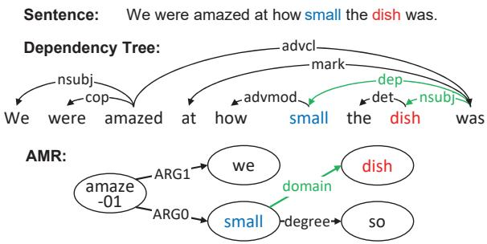
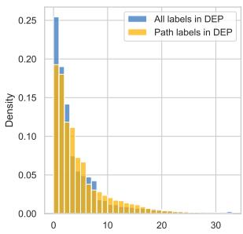
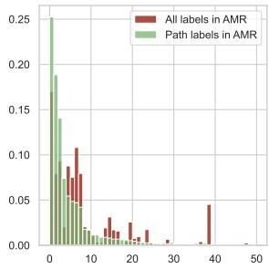
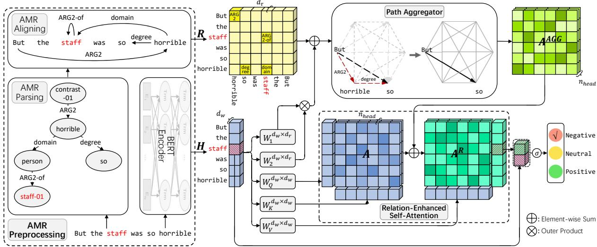
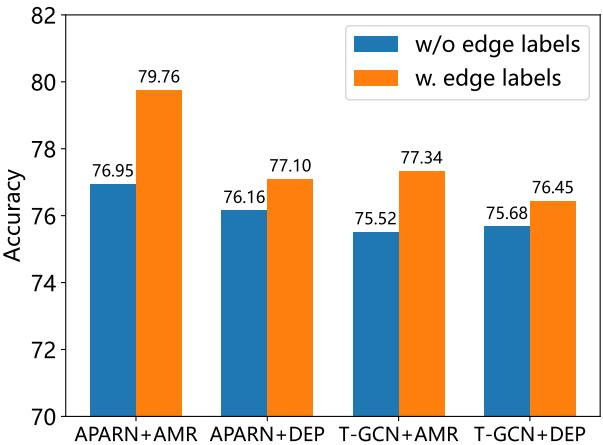
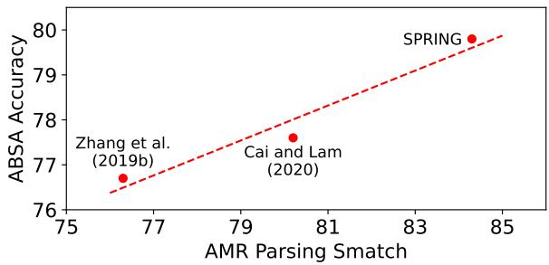
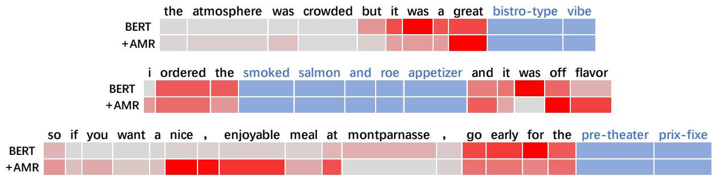
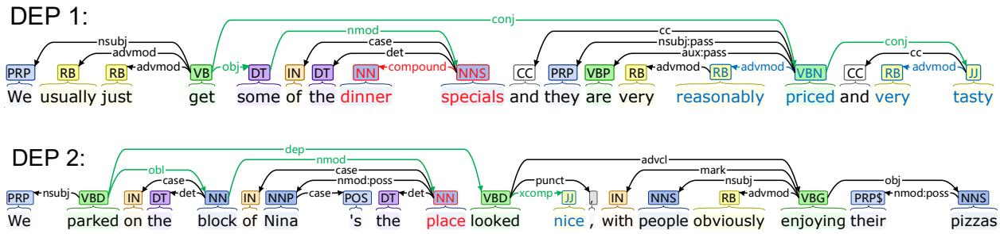
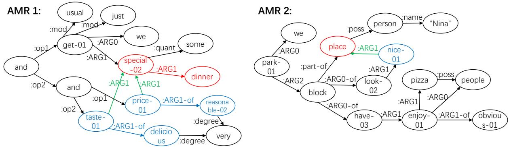

# AMR-based Network for Aspect-based Sentiment Analysis

Fukun Ma1, Xuming Hu1, Aiwei Liu1, Yawen Yang1, Shuang Li1, Philip S. Yu2, Lijie Wen1∗

1Tsinghua University, 2University of Illinois Chicago 1{mfk22,hxm19,liuaw20,yyw19,lisa18}@mails.tsinghua.edu.cn 2psyu@uic.edu, 1wenlj@tsinghua.edu.cn

## Abstract

Aspect-based sentiment analysis (ABSA) is a fine-grained sentiment classification task. Many recent works have used dependency trees to extract the relation between aspects and contexts and have achieved significant improvements. However, further improvement is limited due to the potential mismatch between the dependency tree as a syntactic structure and the sentiment classification as a semantic task. To alleviate this gap, we replace the syntactic dependency tree with the semantic structure named Abstract Meaning Representation (AMR) and propose a model called AMR-based Path Aggregation Relational Network (APARN) to take full advantage of semantic structures. In particular, we design the path aggregator and the relation-enhanced selfattention mechanism that complement each other. The path aggregator extracts semantic features from AMRs under the guidance of sentence information, while the relationenhanced self-attention mechanism in turn improves sentence features with refined semantic information. Experimental results on four public datasets demonstrate 1.13% average F1 improvement of APARN in ABSA when compared with state-of-the-art baselines.1

## 1 Introduction

Recent years have witnessed growing popularity of the sentiment analysis tasks in natural language processing (Li and Hovy, 2017; Birjali et al., 2021). Aspect-based sentiment analysis (ABSA) is a finegrained sentiment analysis task to recognize the sentiment polarities of specific aspect terms in a given sentence (Jiang et al., 2011; Li et al., 2018; Seoh et al., 2021; Zhang et al., 2022a). For example, here is a restaurant review “All the money went into the interior decoration, none of it went to the chefs” and the sentiment polarity of two aspects “interior decoration” and “chefs” are positive and negative, respectively. Thus, ABSA can precisely recognize the corresponding sentiment polarity for any aspect, different from allocating a general sentiment polarity to a sentence in sentence-level sentiment analysis.

  
Figure 1: Comparison of the dependency tree and the AMR. The aspect is red and the opinion term is blue.

The key challenge for ABSA is to capture the relation between an aspect and its context, especially opinion terms. In addition, sentences with multiple aspects and several opinion terms make the problem more complex. To this end, some previous studies (Wang et al., 2016; Chen et al., 2017; Gu et al., 2018; Du et al., 2019; Liang et al., 2019; Xing et al., 2019) have devoted the main efforts to attention mechanisms. Despite their achievements in aspect-targeted representations and appealing results, these methods always suffers noise from the mismatching opinion terms or irrelevant contexts.

On the other hand, more recent studies (Zhang et al., 2019a; Tang et al., 2020; Li et al., 2021; Xiao et al., 2021) propose models explicitly exploit dependency trees, the syntactic structure of a sentence, to help attention mechanisms more accurately identify the interaction between the aspect and the opinion expressions. These models usually employ graph neural networks over the syntactic dependencies and display significant effectiveness. However, existing ABSA models still indicate two potential limitations. First, there appears to be a gap between the syntactic dependency structure and the semantic sentiment analysis task. Considering the sentence in Figure 1, “small” semantically modifies “dish” and expresses negative sentiment, but both “small” and “dish” are syntactically dependent on “was”. The determinant of sentiment should be the meaning of the sentence rather than the way it is expressed. Second, the output of natural language parsers including dependency parsers always contains inaccuracies (Wang et al., 2020). Without further adjustment, raw results of parsers can cause errors and be unsuitable for ABSA task.

To solve aforementioned challenges, we propose a novel architecture called AMR-based Path Aggregation Relational Network (APARN). For the first challenge, we introduce Abstract Meaning Representations (AMRs), a powerful semantic structure. For the AMR example in Figure 1, "small" and "dish" are directly connected, while function words such as "were" and "at" disappear, which makes it easier to establish the aspect-opinion connection and shows the advantage of AMRs in ABSA. For the second challenge, we construct the path aggregator and the relation-enhanced self-attention mechanism. The path aggregator integrates the information from AMRs and sentences to obtain optimized relational features. This procedure not only encourages consistency between semantic structures and basic sentences, but also achieves the global feature by broadcasting local information along the path in the graph. Relation-enhanced self-attention mechanism then adds these relational feature back into attention weights of word features. Thanks to these modules, APARN acquires to utilize sentences and AMRs jointly and achieves higher accuracy on sentiment classification.

To summarize, our main contributions are highlighted as follows:

We introduce Abstract Meaning Representations into the ABSA task. As a semantic structure, the AMR is more suitable for sentiment analysis task.

We propose a new model APARN that integrates information from original sentences and AMRs via the path aggregator and the relation-enhanced self-attention mechanism to fully exploit semantic structure information and relieve parser unreliability.

We experiment on four public datasets and our APARN outperforms state-of-the-art baselines, demonstrating its effectiveness. More analytical experiments further verify the significance of our model and the AMR.

<table><tr><td>Structures</td><td>AOD↓</td><td>ACD↑</td><td>rAOD↓</td></tr><tr><td>Original Sentence</td><td>3.318</td><td>6.145</td><td>0.540</td></tr><tr><td>Dependency Tree</td><td>1.540</td><td>2.547</td><td>0.605</td></tr><tr><td>AMR (connected words)</td><td>1.447</td><td>2.199</td><td>0.658</td></tr><tr><td>AMR (all words)</td><td>1.787</td><td>8.846</td><td>0.202</td></tr></table>

Table 1: Aspect-opinion, aspect-context and relative aspect-opinion distances of different structures.

  
Figure 2: Label distribution of edges in aspect-opinion paths and all edges, in dependency trees and AMRs. Labels are ordered by its density in aspect-opinion paths.

## 2 Parsed Structures

We perform some experiments and discussions for the characteristics of AMR compared to parsing structures already used for the ABSA task and how these characteristics affect our APARN.

Human-defined Structures Dependency trees and AMRs are parsed based on human-defined syntactic and semantic rules, respectively. Each word in a sentence becomes a node of the dependency tree, but in the AMR, relational words like function words and auxiliary words are represented as edges, while concept words like nouns and verbs are refined into nodes in the graph. With AMR aligning, we can map concept words in sentences to nodes in the graph and establish relations between them, while relation words are isolated.

To estimate the impact of dependency trees and AMRs in the ABSA task, we calculate the average distance between aspect words and opinion words in different parsed structures on the Restaurant dataset, called aspect-opinion distance (AOD). We also calculate the average distance between aspect words and all context words called aspectcontext distance (ACD), and divide AOD by ACD as relative aspect-opinion distance (rAOD). The distance between aspect words and isolated words is treated as sentence length. According to the result shown in Table 1, both dependency trees and AMRs have similar AOD smaller than original sentences, which indicates their benefits to capture relations about aspects. Due to the elimination of isolated words, the rAOD of AMRs is much less than dependency trees, which means smaller scope and easier focus. About 2.13% of opinion words are wrongly isolated, making the AOD of AMR (all words) a little bigger. But this is acceptable considering the improvement of rAOD and partially repairable by information from original sentences.

The above analysis is for graph skeletons, and we also explore the impact of edge labels of two structures in the ABSA task. Figure 2 compares the distribution of edge labels in aspect-opinion paths with the distribution of all edge labels. These distributions are clearly different, both in dependency trees and AMRs, which implies that edge labels can also help the ABSA task, especially in AMRs.

Based on these characteristics, we design the outer product sum module for APARN to mix sentence information into the graph, and design the path aggregator to collect graph skeleton and edge label information in AMRs.

Data-driven Structures Some existing studies use structures produced by data-driven models in the ABSA task (Chen et al., 2020; Dai et al., 2021; Chen et al., 2022) and exhibit different effects from human-defined structures. Therefore, we design a relation-enhanced self-attention mechanism for APARN to integrate the graph information obtained by the path aggregator with the information from the pre-trained model.

## 3 Proposed Model

The overall architecture of our proposed model APARN is illustrated in Figure 3. It consists of 3 parts: AMR preprocessing, path aggregator and relation-enhanced self-attention mechanism. In the ABSA task, a sentence $s = \{ w _ { 1 } , w _ { 2 } , . . . , w _ { n } \}$ and a specific aspect term $a = \{ a _ { 1 } , a _ { 2 } , . . . , a _ { m } \}$ are given to determine the corresponding sentiment polarity class $c _ { a }$ , where a is a sub-sequence of s and $c _ { a } \in$ P ositive, Neutral, Negative .

Many existing works use syntactic dependency trees to establish explicit or implicit connections between aspects and contexts. However, we believe that the sentiment analysis task is essentially about the meanings of sentences, so semantic structures like AMRs are more favorable for this task.

In addition, AMRs are more concise than dependency trees, making it easier to extract valuable information in training but more difficult to preprocess before training. We have to conduct a series of steps including: AMR parsing, AMR aligning and AMR embedding. Preprocessed AMRs still have errors and unsuitable parts for the task, so we design the path aggregator and the relation-enhanced self-attention mechanism to perform joint representation refinement and flexible feature fusion on the AMR graph and the original sentence.

Next, we elaborate on the details of our proposed APARN, including AMR preprocessing and embedding, the path aggregator and the relationenhanced self-attention mechanism.

## 3.1 AMR Preprocessing and Embedding

Parsing As we determine to employ the semantic structure AMR as an alternative of the syntactic structure dependency tree to better perform the semantic task ABSA, the first step is parsing the AMR from the input sentence. We choose the offthe-shelf parser SPRING (Bevilacqua et al., 2021) for high quality AMR outputs.

Aligning Next, we align the AMR by the aligner LEAMR (Blodgett and Schneider, 2021). Based on the alignments, we manage to rebuild AMR relations between words in the sentence and get the transformed AMR with words as nodes.

Embedding After aligning, we now have transformed AMRs, which can also be called sentences with AMR relations. Then we need to obtain their embeddings for later representation learning by the model. For words in the sentence, also as the nodes in the AMR, we utilize BERT as an encoder to get contextual embeddings $H = \{ h _ { 1 } , h _ { 2 } , . . . , h _ { n } \}$ like lots of previous works. For the edges in the AMR, we represent the relations between nodes as an adjacency matrix $R = \{ r _ { i j } \mid 1 \leq i , j \leq n \}$ , where $r _ { i j }$ is the embedding of the edge label between word $w _ { i }$ and word $w _ { j }$ . If there is no edge between $w _ { i }$ and $w _ { j }$ in the AMR, we assign a “none” embedding to $r _ { i j }$ . Edge label embeddings are also obtained from the pre-trained model.

## 3.2 Path Aggregator

Path aggregator receives the mix of AMR embeddings $R \in \mathbb { R } ^ { d _ { r } \times n \times n }$ and sentence embeddings $H \in \mathbb { R } ^ { d _ { w } \times n }$ , where $d _ { r }$ and $d _ { w }$ denote the dimensions of relation and word embeddings, respectively. Path aggregator outputs the relational feature matrix $R ^ { A G G } = \{ r _ { i j } ^ { A G G } \in \mathbb { R } ^ { d _ { r } } \mid 1 \leq i , j \leq n \}$ This process integrates and condenses information from two different sources, AMRs and sentences, making semantic knowledge more apparent but parsing errors less influential.

  
Figure 3: The overall architecture of APARN.

Outer Product Sum We first add the outer product of two independent linear transformation of sentence embeddings H to the original AMR embeddings R to obtain sequence-enhanced relation embeddings $R ^ { S } \in \mathbb { R } ^ { d _ { r } \times n \times n }$ . On the one hand, as the outer product of H is the representation of word relations from the sentence perspective, its combination with the AMR embeddings R could enlarge the information base of the model to improve the generalization, also cross validate important features to improve the reliability. On the other hand, AMR embeddings R is usually quite sparse. The outer product sum operation ensures the basic density of the feature matrix and facilitates the subsequent representation learning by avoiding the fuzziness and dilution of numerous background “none” relations to the precious effective relations.

Path Aggregation Next, we perform the path aggregation on $R ^ { S } = \{ r _ { i } ^ { S } \mid 1 \leq i , j \leq n \}$ to calculate $R ^ { A G G } = \{ r _ { i j } ^ { A G G } \stackrel { , } { | } 1 \leq i , j \leq n \}$ as:

$$
{ r ^ { \prime S } } _ { i j } = \mathrm { L a y e r N o r m } ( r _ { i j } ^ { S } ) ,\tag{1}
$$

$$
g _ { i j } ^ { i n } , g _ { i j } ^ { o u t } = \mathrm { s i g m o i d } ( \mathrm { L i n e a r } ( r _ { i j } ^ { \prime S } ) ) ,\tag{2}
$$

$$
a _ { i j } , b _ { i j } = g _ { i j } ^ { i n } \odot \mathrm { L i n e a r } ( r _ { i j } ^ { \prime S } ) ,\tag{3}
$$

$$
r _ { i j } ^ { o u t } = \mathrm { L i n e a r } ( \mathrm { L a y e r N o r m } ( \sum _ { k } a _ { i k } \odot b _ { k j } ) ) ,\tag{4}
$$

$$
r _ { i j } ^ { A G G } = g _ { i j } ^ { o u t } \odot r _ { i j } ^ { o u t } .\tag{5}
$$

The path aggregation has distinctive effect on both local and global dissemination of features. From the local view, the path aggregation covers all the 2-hop paths, so that it is very sensitive to neighborhood features, including the features around the aspect term which are really important for the ABSA task. From the global view, information in any long path can be summarized into the representation between the start and the end by several two-in-one operations in enough times of path aggregations. In other words, path aggregations make the features in matrix more inclusive and finally attain global features. In practice, because the ABSA task focuses more on the neighboring information and the BERT encoder with attention mechanisms has made the feature comprehensive enough, a single path aggregation can achieve quite good results.

Additionally, we also introduce a gating mechanism in the path aggregation to alleviate the disturbance of noise from insignificant relations. Finally, the output of path aggregation $R ^ { A G G }$ is transformed into the relational attention weight matrix $A ^ { A G G } = \{ a _ { i j } ^ { A G G } ~ | ~ 1 \le ~ i , j ~ \le ~ n \}$ by a linear transformation for subsequent calculation.

## 3.3 Relation-Enhanced Self-Attention

The classic self-attention (Vaswani et al., 2017) computes the attention weight by this formula:

$$
A = s o f t m a x \left( \frac { Q W _ { Q } \times ( K W _ { K } ) ^ { T } } { \sqrt { d } } \right) ,\tag{6}
$$

where $Q$ and K are input vectors with d dimensions, while $W _ { Q }$ and $W _ { K }$ are learnable weights with the same size of $\mathbb { R } ^ { d \times d } .$

<table><tr><td rowspan="2">Model</td><td colspan="2">Restaurant</td><td colspan="2">Laptop</td><td colspan="2">Twitter</td><td colspan="2">MAMS</td></tr><tr><td>Accuracy</td><td></td><td>Macro-F1 Accuracy Macro-F1</td><td></td><td>1 Accuracy Macro-F1</td><td></td><td>Accuracy</td><td>Macro-F1</td></tr><tr><td>BERT (Devlin et al., 2019)</td><td>85.62</td><td>78.28</td><td>77.58</td><td>72.38</td><td>75.28</td><td>74.11</td><td>80.11</td><td>80.34</td></tr><tr><td>DGEDT (Tang et al., 2020)</td><td>86.30</td><td>80.00</td><td>79.80</td><td>75.60</td><td>77.90</td><td>75.40</td><td></td><td></td></tr><tr><td>R-GAT (Wang et al., 2020)</td><td>86.60</td><td>81.35</td><td>78.21</td><td>74.07</td><td>76.15</td><td>74.88</td><td></td><td></td></tr><tr><td>T-GCN (Tian et al., 2021)</td><td>86.16</td><td>79.95</td><td>80.88</td><td>77.03</td><td>76.45</td><td>75.25</td><td>83.38</td><td>82.77</td></tr><tr><td>DualGCN (Li et al., 2021)</td><td>87.13</td><td>81.16</td><td>81.80</td><td>78.10</td><td>77.40</td><td>76.02</td><td></td><td></td></tr><tr><td>dotGCN (Chen et al., 2022)</td><td>86.16</td><td>80.49</td><td>81.03</td><td>78.10</td><td>78.11</td><td>77.00</td><td>84.95</td><td>84.44</td></tr><tr><td>SSEGCN (Zhang et al., 2022b)</td><td>87.31</td><td>81.09</td><td>81.01</td><td>77.96</td><td>77.40</td><td>76.02</td><td></td><td></td></tr><tr><td>APARN (Ours)</td><td>87.76</td><td>82.44</td><td>81.96</td><td>79.10</td><td>79.76</td><td>78.79</td><td>85.59</td><td>85.06</td></tr></table>

Table 2: Results on four public datasets. Best performed baselines are underlined. All models are based on BERT.

In our relation-enhanced self-attention, we added $A ^ { A G G }$ , the relational attention weight matrix from AMR into the original attention weight, which can be formulated as:

$$
A ^ { R } = s o f t m a x \left( \frac { H W _ { Q } \times ( H W _ { K } ) ^ { T } } { \sqrt { d _ { w } } } + A ^ { A G G } \right) ,\tag{7}
$$

where input vectors W and Q are both replaced by the BERT embeddings H with $d _ { w }$ dimensions. With $A ^ { A G G }$ , attention outputs are further guided by the semantic information from AMRs, which improves the efficient attention to semantic keywords.

In addition, similar to path aggregator, we also introduced the gating mechanism into the relationenhanced self-attention as follows:

$$
G = s i g m o i d ( H W _ { G } ) ,\tag{8}
$$

$$
H ^ { R } = ( H W _ { V } ) A ^ { R } \odot G ,\tag{9}
$$

where $W _ { G }$ and $W _ { V }$ are trainable parameters and G is the gating matrix. Considering the small proportion of effective words in the whole sentence, the gating mechanism is conducive to eliminating background noise, making it easier for the model to focus on the more critical words.

Finally, with all these above calculations including relation-enhanced self-attention and gating mechanism, we obtain the relation-enhanced aspect representation $H _ { a } ^ { R } = \{ h _ { a _ { 1 } } ^ { R } , h _ { a _ { 2 } } ^ { R } , . . . , h _ { a _ { m } } ^ { R } \}$ for subsequent classification.

## 3.4 Model Training

The final classification features are concatenated by the original BERT aspect representation $H _ { a } =$ mean $\{ h _ { a _ { 1 } } , h _ { a _ { 2 } } , . . . , h _ { a _ { m } } \}$ and the relationenhanced aspect representation $H _ { a } ^ { R }$

$$
H _ { a } ^ { f i n a l } = [ H _ { a } , H _ { a } ^ { R } ] .\tag{10}
$$

It is passed through a fully connected softmax layer and mapped to probabilities over three sentiment polarities.

$$
p ( a ) = s o f t m a x ( W _ { p } H _ { a } ^ { f i n a l } + b _ { p } ) .\tag{11}
$$

We use cross-entropy loss as our objective function:

$$
L _ { C E } = - \sum _ { ( s , a ) \in \mathcal { D } } \sum _ { c \in \mathcal { C } } y _ { a } ^ { c } \log p ^ { c } ( a ) ,\tag{12}
$$

where $y$ is the ground truth sentiment polarity, contains all sentence-aspect pairs and contains all sentiment polarities.

## 4 Experiments

In this section, we first introduce the relevant settings of the experiments, including the datasets used, implementation details and baseline methods for comparison. Then, we report the experimental results under basic and advanced settings. Finally, we select several representative examples for model analysis and discussion.

## 4.1 Datasets and Setup

Our experiments are conducted on four commonly used public standard datasets. The Twitter dataset is a collection of tweets built by Dong et al. (2014), while the Restaurant and Laptop dataset come from the SemEval 2014 Task (Pontiki et al., 2014). MAMS is a large-scale multi-aspect dataset provided by Jiang et al. (2019). Data statistics are shown in Appendix A.1.

In data preprocessing, we use SPRING (Bevilacqua et al., 2021) as the parser and LEAMR (Blodgett and Schneider, 2021) as the aligner. APARN uses the BERT of bert-base-uncased version with max length as 100 and the relation-enhanced selfattention mechanism uses 8 attention heads. We reported accuracy and Macro-F1 as results which are the average of three runs with different random seeds. See Appendix A.2 for more details.

## 4.2 Baseline Methods

We compare APARN with a series of baselines and state-of-the-art alternatives, including:

1) BERT (Devlin et al., 2019) is composed of a general pre-trained BERT model and a classification layer adapted to the ABSA task.

2) DGEDT (Tang et al., 2020) proposes a dual transformer structure based on dependency graph augmentation, which can simultaneously fuse representations of sequences and graphs.

3) R-GAT (Wang et al., 2020) proposes a dependency structure adjusted for aspects and uses a relational GAT to encode this structure.

4) T-GCN (Tian et al., 2021) proposes an approach to explicitly utilize dependency types for ABSA with type-aware GCNs.

5) DualGCN (Li et al., 2021) proposes a dual GCN structure and regularization methods to merge features from sentences and dependency trees.

6) dotGCN (Chen et al., 2022) proposes an aspectspecific and language-agnostic discrete latent tree as an alternative structure to dependency trees.

7) SSEGCN (Zhang et al., 2022b) proposes an aspect-aware attention mechanism to enhance the node representations with GCN.

## 4.3 Main Results

Table 2 shows the experimental results of our model and the baseline models on four datasets under the same conventional settings as Li et al. (2021), where the best results are in bold and the second best results are underlined. Our APARN exhibits excellent results and achieves the best results on all 8 indicators of 4 datasets with an average margin more than one percent, which fully proves the effectiveness of this model.

Comparing the results of different datasets, we can find that the improvement of APARN on the Twitter dataset is particularly obvious. Compared to the best baselines, the accuracy rate has increased by 1.65% and the Macro-F1 has increased by 1.79%. The main reason is the similarity of the Twitter dataset to the AMR 3.0 dataset, the training dataset for the AMR parser we used. More than half of the corpus of the AMR 3.0 dataset comes from internet forums and blogs, which are similar to the Twitter dataset as they are both social media. As a result, the AMR parser has better output on the Twitter dataset, which in turn enables the model to extract more valuable features from it and leads to a considerable improvement. This difference among datasets also reflects the effectiveness of semantic information from AMR for the ABSA task.

  
Figure 4: Accuracy of APARN and T-GCN on Twitter dataset with different parsed structures and edge labels.

## 4.4 Comparative Experiments

We conduct comparative experiments to analyse the impact of models (APARN and T-GCN), parsed structures (AMR and dependency tree), and edge labels (with and without). T-GCN is selected instead of more recent models because they lack the ability to exploit edge labels and cannot receive AMRs as input. AMRs are the same as the basic experiments and dependency trees are parsed by Stanford CoreNLP Toolkits (Manning et al., 2014). “Without edge labels” means all labels are the same placeholder. The results are shown in Figure 4.

From the perspective of models, APARN consistently outperforms T-GCN in any parsed structure and edge label settings, demonstrating the effectiveness of our APARN. From the perspective of parsed structures, AMRs outperform dependency trees in most model and edge label settings, except for the case of T-GCN without edge labels. The reason may be that the AMR without edge labels is sparse and semantically ambiguous, which does not match the design of the model.

From the perspective of edge labels, a graph with edge labels is always better than a graph without edge labels, whether it is an AMR or a dependency tree, whichever the model is. We can also notice that APARN has a greater improvement with the addition of edge labels, indicating that it can utilize edge labels more effectively. Besides, with the addition of edge labels, experiments using AMR have improved more than experiments using dependency trees, indicating that edge labels of the AMR contain richer semantic information and are more valuable for sentiment analysis, which is consistent with previous experiments in Figure 2.

<table><tr><td rowspan="2">Model</td><td colspan="2">Restaurant</td><td colspan="2">Laptop</td><td colspan="2">Twitter</td><td colspan="2">MAMS</td></tr><tr><td>Accuracy Macro-F1 Accuracy Macro-F1</td><td></td><td></td><td></td><td></td><td></td><td></td><td>Accuracy Macro-F1 Accuracy Macro-F1</td></tr><tr><td>APARN</td><td>87.76</td><td>82.44</td><td>81.96</td><td>79.10</td><td>79.76</td><td>78.79</td><td>85.59</td><td>85.06</td></tr><tr><td>—Outer Product Sum</td><td>86.15</td><td>80.13</td><td>79.45</td><td>76.34</td><td>76.22</td><td>74.75</td><td>82.93</td><td>82.30</td></tr><tr><td>—Path Aggregator</td><td>87.04</td><td>81.61</td><td>79.20</td><td>75.67</td><td>76.66</td><td>74.90</td><td>83.16</td><td>82.61</td></tr><tr><td>—Relation in Self-Attention</td><td>87.49</td><td>81.82</td><td>80.36</td><td>77.87</td><td>76.81</td><td>75.49</td><td>83.73</td><td>83.08</td></tr><tr><td>-Gate in Self-Attention</td><td>85.61</td><td>78.49</td><td>79.81</td><td>77.42</td><td>77.55</td><td>76.06</td><td>83.96</td><td>83.15</td></tr></table>

Table 3: Ablation experimental results of our APARN.

## 4.5 Further Analysis

Ablation Study To analyze the role of each module, we separately remove four key components of APARN. Results on four datasets are represented in Table 3.

According to the results, each of the four components contributes significantly to the performance of APARN. Removing Outer Product Sum results in a significant drop in performance, illustrating the importance of promoting consistency of information from sentences and AMRs. Removing Path Aggregator is worse than removing Relation in Self-Attention, indicating that unprocessed AMR information can only interfere with the model instead of being exploited by the model.

Comparing the results in different datasets, we can find that the model depends on information from sentences and AMRs differently on different datasets. On the Restaurant dataset, removing the Relation in Self-Attention component has less impact, while on the Twitter dataset, removing this component has a greater impact. This means the model utilizes sentence information more on the Restaurant dataset and AMR information more on the Twitter dataset. This is also consistent with the analysis of the main results: the AMR of Twitter dataset has higher quality due to the domain relatedness with the training dataset of the AMR parser, which in turn makes the model pay more attention to the information from the AMR on this dataset.

AMR Parser Analysis We conduct experiments using AMRs from different parsers on Twitter dataset, as displayed in Figure 5. In addition to the SPRING parser mentioned before, we try two other parsers from Zhang et al. (2019b) and Cai and Lam (2020). These parsers achieve 76.3, 80.2 and 84.3 Smatch score for AMR parsing task on AMR 2.0 dataset, which can be regarded as the quality of their output. From the figure, it is clear that the accuracy of ABSA task shows positive correlation with the Smatch score, which proves the positive effect of AMRs in the ABSA task and the importance of the high quality AMR.

  
Figure 5: Accuracy of APARN on Twitter dataset with AMR from different parsers.

<table><tr><td>Sentence Length</td><td>&lt;15</td><td>15-24</td><td>25-34</td><td>&gt;35</td></tr><tr><td>w/o Path Aggregator</td><td>88.25</td><td>85.43</td><td>83.92</td><td>83.96</td></tr><tr><td>w. Path Aggregator</td><td>89.40</td><td>87.15</td><td>86.64</td><td>86.71</td></tr><tr><td>Relative Improvement +1.30% +2.01% +3.24% +3.28%</td><td></td><td></td><td></td><td></td></tr></table>

Table 4: Accuracy of APARN with and without path aggregator for sentences of different lengths in the Restaurant dataset.

Sentence Length Study Table 4 compares the accuracy of APARN with and without path aggregator for sentences of different lengths in the Restaurant dataset. According to the table, we can see that the model achieves higher accuracy on short sentences, while the long sentences are more challenging. In addition, the model with the path aggregator has a larger relative improvement on long sentences than short sentences, indicating that the path aggregator can effectively help the model capture long-distance relations with AMR.

  
Figure 6: Visualization of aspect terms’ attention to the context in three cases. Aspect terms are highlighted in blue.

## 4.6 Case Study

As shown in Figure 6, we selected three typical cases to visualize the aspect terms’ attention to the context before and after adding information from the AMR, respectively.

From the first two examples, we can notice that the model focuses on the copula verb next to the opinion term without the AMR. While with the information from the AMR, the model can capture opinion terms through the attention mechanism more accurately. In the third example, without the AMR, the model pays more attention to words that are closer to the aspect term. With the semantic information from AMR, the model can discover opinion terms farther away from aspect terms.

These cases illustrate that the semantic structure information of AMR plays an important role in making the model focus on the correct opinion words. It also shows that the structure of our APARN can effectively utilize the semantic structure information in AMR to improve the performance in the ABSA task.

## 5 Related Work

Aspect-based Sentiment Analysis Traditional sentiment analysis tasks are usually sentence-level or document-level, while the ABSA task is an entity-level and fine-grained sentiment analysis task. Early methods (Jiang et al., 2011; Kiritchenko et al., 2014) are mostly based on artificially constructed features, which are difficult to effectively model the relations between aspect terms and its context. With the development of deep neural networks, many recent works (Wang et al., 2016; Tang et al., 2016; Chen et al., 2017; Fan et al., 2018; Gu et al., 2018; Du et al., 2019; Liang et al., 2019; Xing et al., 2019) have explored applying attention mechanisms to implicitly model the semantic relations of aspect terms and identify the key opinion

terms in the context.

Another trend in ABSA studies is the explicit use of dependency trees. Some works (He et al., 2018; Zhang et al., 2019a; Sun et al., 2019; Huang and Carley, 2019; Zhang and Qian, 2020; Chen et al., 2020; Liang et al., 2020; Wang et al., 2020; Tang et al., 2020; Phan and Ogunbona, 2020; Li et al., 2021; Xiao et al., 2021) extend GCN, GAT, and Transformer backbones to process syntactic dependency trees and develop several outstanding models. These models shorten the distance between aspect terms and opinion terms by dependency trees and alleviate the long-term dependency problem.

Recent studies have also noticed the limitations of dependency trees in the ABSA task. Wang et al. (2020) proposes the reshaped dependency tree for the ABSA task. Chen et al. (2020) propose to combine dependency trees with induced aspect-specific latent maps. Chen et al. (2022) further proposed an aspect-specific and language-independent discrete latent tree model as an alternative structure for dependency trees. Our work is similar in that we also aim at the mismatch between dependency trees and the ABSA task, but different in that we introduce a semantic structure AMR instead of induced trees.

Abstract Meaning Representation AMR is a structured semantic representation that represents the semantics of sentences as a rooted, directed, acyclic graph with labels on nodes and edges. AMR is proposed by Banarescu et al. (2013) to provide a specification for sentence-level comprehensive semantic annotation and analysis tasks. Research on AMR can be divided into two categories, AMR parsing (Cai and Lam, 2020; Zhou et al., 2021; Hoang et al., 2021) and AMR-to-Text (Zhao et al., 2020; Bai et al., 2020; Ribeiro et al., 2021).

AMR has also been applied in many NLP tasks. Kapanipathi et al. (2020) use AMR in question answering system. Lim et al. (2020) employ AMR to improve common sense reasoning. Wang et al. (2021) utilize AMR to add pseudo labels to unlabeled data in low-resource event extraction task. Our model also improves the performance of the ABSA task with AMR. Moreover, AMR also has the potential to be applied to a broader range of NLP tasks, including relation extraction(Hu et al., 2020, 2021a,b), named entity recognition(Yang et al., 2023), natural language inference(Li et al., 2022), text-to-SQL(Liu et al., 2022), and more.

## 6 Conclusion

In this paper, we propose APARN, AMR-based Path Aggregation Relational Network for ABSA. Different from the traditional ABSA model utilizing the syntactic structure like dependency tree, our model employs the semantic structure called Abstract Meaning Representation which is more harmony with the sentiment analysis task. We propose the path aggregator and the relation-enhanced selfattention mechanism to efficiently exploit AMRs and integrate information from AMRs and input sentences. These designs enable our model to achieve better results than existing models. Experiments on four public datasets show that APARN outperforms competing baselines.

## 7 Limitations

The high computational complexity is one of the biggest disadvantages of the path aggregation. The time consumption and GPU memory used for multiple operations are expensive. So it is very desirable to use only one time of path aggregation due to attributes of the ABSA task in our APARN.

Another limitation of this work is that the performance of the model is still somewhat affected by the quality of the AMR parsing results. The good news is that the research on AMR parsing is continuing to make progress. In the future, APARN with higher quality AMRs is expected to further improve the level of the ABSA task.

Besides, this model is flawed in dealing with implicit and ambiguous sentiments in sentences. Implicit sentiment lacks corresponding opinion words, and ambiguous sentiment is subtle and not apparent. An example of this is the sentence "There was only one [waiter] for the whole restaurant upstairs," which has an ambiguous sentiment associated with the aspect word "waiter". The golden label is "Neutral", but our model predicts it as "Negative".

Finally, generalization to other ABSA tasks such as end-to-end ABSA or ASTE is another restriction. Considering the complexity of the task, we only apply our motivation to sentiment classification in this paper. We will further generalize it to more complex sentiment analysis tasks in the future work.

## Acknowledgements

The work was supported by the National Key Research and Development Program of China (No. 2019YFB1704003), the National Nature Science Foundation of China (No. 62021002), Tsinghua BNRist and Beijing Key Laboratory of Industrial Bigdata System and Application.

## References

Xuefeng Bai, Linfeng Song, and Yue Zhang. 2020. Online back-parsing for AMR-to-text generation. In Proceedings of the 2020 Conference on Empirical Methods in Natural Language Processing (EMNLP), pages 1206–1219, Online. Association for Computational Linguistics.

Laura Banarescu, Claire Bonial, Shu Cai, Madalina Georgescu, Kira Griffitt, Ulf Hermjakob, Kevin Knight, Philipp Koehn, Martha Palmer, and Nathan Schneider. 2013. Abstract Meaning Representation for sembanking. In Proceedings of the 7th Linguistic Annotation Workshop and Interoperability with Discourse, pages 178–186, Sofia, Bulgaria. Association for Computational Linguistics.

Michele Bevilacqua, Rexhina Blloshmi, and Roberto Navigli. 2021. One SPRING to rule them both: Symmetric AMR semantic parsing and generation without a complex pipeline. In Thirty-Fifth AAAI Conference on Artificial Intelligence and Thirty-Third Conference on Innovative Applications of Artificial Intelligence and The Eleventh Symposium on Educational Advances in Artificial Intelligence, pages 12564–12573, Online. AAAI Press.

Marouane Birjali, Mohammed Kasri, and Abderrahim Beni Hssane. 2021. A comprehensive survey on sentiment analysis: Approaches, challenges and trends. Knowledge-Based Systems, 226:107134.

Austin Blodgett and Nathan Schneider. 2021. Probabilistic, structure-aware algorithms for improved variety, accuracy, and coverage of AMR alignments. In Proceedings of the 59th Annual Meeting of the Association for Computational Linguistics and the 11th International Joint Conference on Natural Language Processing (Volume 1: Long Papers), pages 3310–3321, Online. Association for Computational Linguistics.

Deng Cai and Wai Lam. 2020. AMR parsing via graphsequence iterative inference. In Proceedings of the

58th Annual Meeting of the Association for Computational Linguistics, pages 1290–1301, Online. Association for Computational Linguistics.

Chenhua Chen, Zhiyang Teng, Zhongqing Wang, and Yue Zhang. 2022. Discrete opinion tree induction for aspect-based sentiment analysis. In Proceedings of the 60th Annual Meeting of the Association for Computational Linguistics (Volume 1: Long Papers), pages 2051–2064, Dublin, Ireland. Association for Computational Linguistics.

Chenhua Chen, Zhiyang Teng, and Yue Zhang. 2020. Inducing target-specific latent structures for aspect sentiment classification. In Proceedings ofthe 2020 Conference on Empirical Methods in Natural Language Processing (EMNLP), pages 5596–5607, Online. Association for Computational Linguistics.

Peng Chen, Zhongqian Sun, Lidong Bing, and Wei Yang. 2017. Recurrent attention network on memory for aspect sentiment analysis. In Proceedings of the 2017 Conference on Empirical Methods in Natural Language Processing, pages 452–461, Copenhagen, Denmark. Association for Computational Linguistics.

Junqi Dai, Hang Yan, Tianxiang Sun, Pengfei Liu, and Xipeng Qiu. 2021. Does syntax matter? a strong baseline for aspect-based sentiment analysis with RoBERTa. In Proceedings ofthe 2021 Conference of the North American Chapter of the Association for Computational Linguistics: Human Language Technologies, pages 1816–1829, Online. Association for Computational Linguistics.

Jacob Devlin, Ming-Wei Chang, Kenton Lee, and Kristina Toutanova. 2019. BERT: Pre-training of deep bidirectional transformers for language understanding. In Proceedings ofthe 2019 Conference of the North American Chapter ofthe Associationfor Computational Linguistics: Human Language Technologies, Volume 1 (Long and Short Papers), pages 4171–4186, Minneapolis, Minnesota. Association for Computational Linguistics.

Li Dong, Furu Wei, Chuanqi Tan, Duyu Tang, Ming Zhou, and Ke Xu. 2014. Adaptive recursive neural network for target-dependent Twitter sentiment classification. In Proceedings ofthe 52nd Annual Meeting ofthe Associationfor Computational Linguistics (Volume 2: Short Papers), pages 49–54, Baltimore, Maryland. Association for Computational Linguistics.

Chunning Du, Haifeng Sun, Jingyu Wang, Qi Qi, Jianxin Liao, Tong Xu, and Ming Liu. 2019. Capsule network with interactive attention for aspectlevel sentiment classification. In Proceedings of the 2019 Conference on Empirical Methods in Natural Language Processing and the 9th International Joint Conference on Natural Language Processing (EMNLP-IJCNLP), pages 5489–5498, Hong Kong, China. Association for Computational Linguistics.

Feifan Fan, Yansong Feng, and Dongyan Zhao. 2018. Multi-grained attention network for aspect-level sentiment classification. In Proceedings ofthe 2018 Conference on Empirical Methods in Natural Language Processing, pages 3433–3442, Brussels, Belgium. Association for Computational Linguistics.

Shuqin Gu, Lipeng Zhang, Yuexian Hou, and Yin Song. 2018. A position-aware bidirectional attention network for aspect-level sentiment analysis. In Proceedings of the 27th International Conference on Computational Linguistics, pages 774–784, Santa Fe, New Mexico, USA. Association for Computational Linguistics.

Ruidan He, Wee Sun Lee, Hwee Tou Ng, and Daniel Dahlmeier. 2018. Effective attention modeling for aspect-level sentiment classification. In Proceedings of the 27th International Conference on Computational Linguistics, pages 1121–1131, Santa Fe, New Mexico, USA. Association for Computational Linguistics.

Thanh Lam Hoang, Gabriele Picco, Yufang Hou, Young-Suk Lee, Lam Nguyen, Dzung Phan, Vanessa Lopez, and Ramon Fernandez Astudillo. 2021. Ensembling graph predictions for amr parsing. In Advances in Neural Information Processing Systems, volume 34, pages 8495–8505, Online. Curran Associates, Inc.

Xuming Hu, Lijie Wen, Yusong Xu, Chenwei Zhang, and Philip Yu. 2020. SelfORE: Self-supervised relational feature learning for open relation extraction. In Proceedings of the 2020 Conference on Empirical Methods in Natural Language Processing (EMNLP), pages 3673–3682, Online. Association for Computational Linguistics.

Xuming Hu, Chenwei Zhang, Fukun Ma, Chenyao Liu, Lijie Wen, and Philip S. Yu. 2021a. Semi-supervised relation extraction via incremental meta self-training. In Findings ofthe Associationfor Computational Linguistics: EMNLP 2021, pages 487–496, Punta Cana, Dominican Republic. Association for Computational Linguistics.

Xuming Hu, Chenwei Zhang, Yawen Yang, Xiaohe Li, Li Lin, Lijie Wen, and Philip S. Yu. 2021b. Gradient imitation reinforcement learning for low resource relation extraction. In Proceedings of the 2021 Conference on Empirical Methods in Natural Language Processing, pages 2737–2746, Online and Punta Cana, Dominican Republic. Association for Computational Linguistics.

Binxuan Huang and Kathleen Carley. 2019. Syntaxaware aspect level sentiment classification with graph attention networks. In Proceedings ofthe 2019 Conference on Empirical Methods in Natural Language Processing and the 9th International Joint Conference on Natural Language Processing (EMNLP-IJCNLP), pages 5469–5477, Hong Kong, China. Association for Computational Linguistics.

Long Jiang, Mo Yu, Ming Zhou, Xiaohua Liu, and Tiejun Zhao. 2011. Target-dependent Twitter sentiment classification. In Proceedings of the 49th Annual Meeting of the Association for Computational Linguistics: Human Language Technologies, pages 151–160, Portland, Oregon, USA. Association for Computational Linguistics.

Qingnan Jiang, Lei Chen, Ruifeng Xu, Xiang Ao, and Min Yang. 2019. A challenge dataset and effective models for aspect-based sentiment analysis. In Proceedings of the 2019 Conference on Empirical Methods in Natural Language Processing and the 9th International Joint Conference on Natural Language Processing (EMNLP-IJCNLP), pages 6280– 6285, Hong Kong, China. Association for Computational Linguistics.

Pavan Kapanipathi, Ibrahim Abdelaziz, Srinivas Ravishankar, Salim Roukos, Alexander G. Gray, Ramón Fernandez Astudillo, Maria Chang, Cristina Cornelio, Saswati Dana, Achille Fokoue, Dinesh Garg, Alfio Gliozzo, Sairam Gurajada, Hima Karanam, Naweed Khan, Dinesh Khandelwal, Young-Suk Lee, Yunyao Li, Francois P. S. Luus, Ndivhuwo Makondo, Nandana Mihindukulasooriya, Tahira Naseem, Sumit Neelam, Lucian Popa, Revanth Gangi Reddy, Ryan Riegel, Gaetano Rossiello, Udit Sharma, G. P. Shrivatsa Bhargav, and Mo Yu. 2020. Question answering over knowledge bases by leveraging semantic parsing and neuro-symbolic reasoning. CoRR, abs/2012.01707.

Diederik P. Kingma and Jimmy Ba. 2015. Adam: A method for stochastic optimization. In 3rd International Conference on Learning Representations, ICLR 2015, San Diego, CA, USA, May 7-9, 2015, Conference Track Proceedings.

Svetlana Kiritchenko, Xiaodan Zhu, Colin Cherry, and Saif Mohammad. 2014. NRC-Canada-2014: Detecting aspects and sentiment in customer reviews. In Proceedings ofthe 8th International Workshop on Semantic Evaluation (SemEval 2014), pages 437–442, Dublin, Ireland. Association for Computational Linguistics.

Jiwei Li and Eduard Hovy. 2017. Reflections on Sentiment/Opinion Analysis, pages 41–59. Springer International Publishing, Cham.

Ruifan Li, Hao Chen, Fangxiang Feng, Zhanyu Ma, Xiaojie Wang, and Eduard Hovy. 2021. Dual graph convolutional networks for aspect-based sentiment analysis. In Proceedings of the 59th Annual Meeting ofthe Associationfor Computational Linguistics and the 11th International Joint Conference on Natural Language Processing (Volume 1: Long Papers), pages 6319–6329, Online. Association for Computational Linguistics.

Shu’ang Li, Xuming Hu, Li Lin, and Lijie Wen. 2022. Pair-level supervised contrastive learning for natural language inference. arXiv preprint arXiv:2201.10927.

Xin Li, Lidong Bing, Wai Lam, and Bei Shi. 2018. Transformation networks for target-oriented sentiment classification. In Proceedings of the 56th Annual Meeting ofthe Associationfor Computational Linguistics (Volume 1: Long Papers), pages 946–956, Melbourne, Australia. Association for Computational Linguistics.

Bin Liang, Rongdi Yin, Lin Gui, Jiachen Du, and Ruifeng Xu. 2020. Jointly learning aspect-focused and inter-aspect relations with graph convolutional networks for aspect sentiment analysis. In Proceedings of the 28th International Conference on Computational Linguistics, pages 150–161, Barcelona, Spain (Online). International Committee on Computational Linguistics.

Yunlong Liang, Fandong Meng, Jinchao Zhang, Jinan Xu, Yufeng Chen, and Jie Zhou. 2019. A novel aspect-guided deep transition model for aspect based sentiment analysis. In Proceedings ofthe 2019 Conference on Empirical Methods in Natural Language Processing and the 9th International Joint Conference on Natural Language Processing (EMNLP-IJCNLP), pages 5569–5580, Hong Kong, China. Association for Computational Linguistics.

Jungwoo Lim, Dongsuk Oh, Yoonna Jang, Kisu Yang, and Heuiseok Lim. 2020. I know what you asked: Graph path learning using AMR for commonsense reasoning. In Proceedings ofthe 28th International Conference on Computational Linguistics, pages 2459–2471, Barcelona, Spain (Online). International Committee on Computational Linguistics.

Aiwei Liu, Xuming Hu, Li Lin, and Lijie Wen. 2022. Semantic enhanced text-to-sql parsing via iteratively learning schema linking graph. In Proc. of KDD, pages 1021–1030.

Christopher Manning, Mihai Surdeanu, John Bauer, Jenny Finkel, Steven Bethard, and David McClosky. 2014. The Stanford CoreNLP natural language processing toolkit. In Proceedings of52nd Annual Meeting of the Association for Computational Linguistics: System Demonstrations, pages 55–60, Baltimore, Maryland. Association for Computational Linguistics.

Minh Hieu Phan and Philip O. Ogunbona. 2020. Modelling context and syntactical features for aspectbased sentiment analysis. In Proceedings ofthe 58th Annual Meeting ofthe Associationfor Computational Linguistics, pages 3211–3220, Online. Association for Computational Linguistics.

Maria Pontiki, Dimitris Galanis, John Pavlopoulos, Harris Papageorgiou, Ion Androutsopoulos, and Suresh Manandhar. 2014. SemEval-2014 task 4: Aspect based sentiment analysis. In Proceedings of the 8th International Workshop on Semantic Evaluation (SemEval 2014), pages 27–35, Dublin, Ireland. Association for Computational Linguistics.

Leonardo F. R. Ribeiro, Jonas Pfeiffer, Yue Zhang, and Iryna Gurevych. 2021. Smelting gold and silver for

improved multilingual AMR-to-Text generation. In Proceedings of the 2021 Conference on Empirical Methods in Natural Language Processing, pages 742– 750, Online and Punta Cana, Dominican Republic. Association for Computational Linguistics.

Ronald Seoh, Ian Birle, Mrinal Tak, Haw-Shiuan Chang, Brian Pinette, and Alfred Hough. 2021. Open aspect target sentiment classification with natural language prompts. In Proceedings of the 2021 Conference on Empirical Methods in Natural Language Processing, pages 6311–6322, Online and Punta Cana, Dominican Republic. Association for Computational Linguistics.

Kai Sun, Richong Zhang, Samuel Mensah, Yongyi Mao, and Xudong Liu. 2019. Aspect-level sentiment analysis via convolution over dependency tree. In Proceedings of the 2019 Conference on Empirical Methods in Natural Language Processing and the 9th International Joint Conference on Natural Language Processing (EMNLP-IJCNLP), pages 5679–5688, Hong Kong, China. Association for Computational Linguistics.

Duyu Tang, Bing Qin, and Ting Liu. 2016. Aspect level sentiment classification with deep memory network. In Proceedings of the 2016 Conference on Empirical Methods in Natural Language Processing, pages 214– 224, Austin, Texas. Association for Computational Linguistics.

Hao Tang, Donghong Ji, Chenliang Li, and Qiji Zhou. 2020. Dependency graph enhanced dual-transformer structure for aspect-based sentiment classification. In Proceedings ofthe 58th Annual Meeting ofthe Associationfor Computational Linguistics, pages 6578– 6588, Online. Association for Computational Linguistics.

Yuanhe Tian, Guimin Chen, and Yan Song. 2021. Aspect-based sentiment analysis with type-aware graph convolutional networks and layer ensemble. In Proceedings ofthe 2021 Conference ofthe North American Chapter of the Association for Computational Linguistics: Human Language Technologies, pages 2910–2922, Online. Association for Computational Linguistics.

Ashish Vaswani, Noam Shazeer, Niki Parmar, Jakob Uszkoreit, Llion Jones, Aidan N Gomez, Ł ukasz Kaiser, and Illia Polosukhin. 2017. Attention is all you need. In Advances in Neural Information Processing Systems, volume 30, pages 5998–6008, Long Beach, CA, USA. Curran Associates, Inc.

Kai Wang, Weizhou Shen, Yunyi Yang, Xiaojun Quan, and Rui Wang. 2020. Relational graph attention network for aspect-based sentiment analysis. In Proceedings of the 58th Annual Meeting of the Associationfor Computational Linguistics, pages 3229– 3238, Online. Association for Computational Linguistics.

Yequan Wang, Minlie Huang, Xiaoyan Zhu, and Li Zhao. 2016. Attention-based LSTM for aspectlevel sentiment classification. In Proceedings ofthe 2016 Conference on Empirical Methods in Natural Language Processing, pages 606–615, Austin, Texas. Association for Computational Linguistics.

Ziqi Wang, Xiaozhi Wang, Xu Han, Yankai Lin, Lei Hou, Zhiyuan Liu, Peng Li, Juanzi Li, and Jie Zhou. 2021. CLEVE: Contrastive Pre-training for Event Extraction. In Proceedings ofthe 59th Annual Meeting of the Association for Computational Linguistics and the 11th International Joint Conference on Natural Language Processing (Volume 1: Long Papers), pages 6283–6297, Online. Association for Computational Linguistics.

Zeguan Xiao, Jiarun Wu, Qingliang Chen, and Congjian Deng. 2021. BERT4GCN: Using BERT intermediate layers to augment GCN for aspect-based sentiment classification. In Proceedings ofthe 2021 Conference on Empirical Methods in Natural Language Processing, pages 9193–9200, Online and Punta Cana, Dominican Republic. Association for Computational Linguistics.

Bowen Xing, Lejian Liao, Dandan Song, Jingang Wang, Fuzheng Zhang, Zhongyuan Wang, and Heyan Huang. 2019. Earlier attention? aspect-aware LSTM for aspect-based sentiment analysis. In Proceedings ofthe Twenty-Eighth International Joint Conference on Artificial Intelligence, IJCAI 2019, Macao, China, August 10-16, 2019, pages 5313–5319. ijcai.org.

Yawen Yang, Xuming Hu, Fukun Ma, Shu’ang Li, Aiwei Liu, Lijie Wen, and Philip S. Yu. 2023. Gaussian prior reinforcement learning for nested named entity recognition.

Chen Zhang, Qiuchi Li, and Dawei Song. 2019a. Aspect-based sentiment classification with aspectspecific graph convolutional networks. In Proceedings ofthe 2019 Conference on Empirical Methods in Natural Language Processing and the 9th International Joint Conference on Natural Language Processing (EMNLP-IJCNLP), pages 4568–4578, Hong Kong, China. Association for Computational Linguistics.

Mi Zhang and Tieyun Qian. 2020. Convolution over hierarchical syntactic and lexical graphs for aspect level sentiment analysis. In Proceedings ofthe 2020 Conference on Empirical Methods in Natural Language Processing (EMNLP), pages 3540–3549, Online. Association for Computational Linguistics.

Sheng Zhang, Xutai Ma, Kevin Duh, and Benjamin Van Durme. 2019b. AMR parsing as sequence-tograph transduction. In Proceedings of the 57th Annual Meeting of the Association for Computational Linguistics, pages 80–94, Florence, Italy. Association for Computational Linguistics.

Wenxuan Zhang, Xin Li, Yang Deng, Lidong Bing, and Wai Lam. 2022a. A survey on aspect-based

sentiment analysis: Tasks, methods, and challenges. arXiv preprint arXiv:2203.01054.

Zheng Zhang, Zili Zhou, and Yanna Wang. 2022b. SSEGCN: Syntactic and semantic enhanced graph convolutional network for aspect-based sentiment analysis. In Proceedings ofthe 2022 Conference of the North American Chapter of the Association for Computational Linguistics: Human Language Technologies, pages 4916–4925, Seattle, United States. Association for Computational Linguistics.

Yanbin Zhao, Lu Chen, Zhi Chen, Ruisheng Cao, Su Zhu, and Kai Yu. 2020. Line graph enhanced AMR-to-text generation with mix-order graph attention networks. In Proceedings of the 58th Annual Meeting ofthe Associationfor Computational Linguistics, pages 732–741, Online. Association for Computational Linguistics.

Jiawei Zhou, Tahira Naseem, Ramón Fernandez Astudillo, Young-Suk Lee, Radu Florian, and Salim Roukos. 2021. Structure-aware fine-tuning of sequence-to-sequence transformers for transitionbased AMR parsing. In Proceedings of the 2021 Conference on Empirical Methods in Natural Language Processing, pages 6279–6290, Online and Punta Cana, Dominican Republic. Association for Computational Linguistics.

## A Appendix

## A.1 Datasets

The statistics for the Restaurant dataset, Laptop dataset, Twitter dataset and MAMS dataset are shown in Table 5. Each sentence in these datasets is annotated with aspect terms and corresponding polarities. Following Li et al. (2021), we remove instances with the “conflict” label. So all datasets have three sentiment polarities: positive, negative and neutral. Throughout the research, we follow the Creative Commons Attribution 4.0 International Licence of the datasets.

<table><tr><td colspan="2">Dataset</td><td>Positive</td><td>Neutral</td><td>Negative</td></tr><tr><td>Restaurant</td><td>Train/Test</td><td>2164/728</td><td>637/196</td><td>807/196</td></tr><tr><td>Laptop</td><td>Train/Test</td><td>994/341</td><td>464/169</td><td>870/128</td></tr><tr><td>Twitter</td><td>Train/Test</td><td>1561/173</td><td>3127/346</td><td>1560/173</td></tr><tr><td>MAMS</td><td colspan="4">Train/Dev/Test 3380/403/400 5042/604/607 2764/325/329</td></tr></table>

Table 5: Statistics of the three ABSA datasets

## A.2 Implementation Details

Preprocessing We use SPRING (Bevilacqua et al., 2021) as the parser to obtain the AMRs of input sentences and use LEAMR (Blodgett and Schneider, 2021) as the AMR aligner to establish the correspondence between the AMRs and sentences. The maximum length of the input sentence is set to 100, the shortage is made up with the special word “PAD” and the excess is truncated.

Some edge labels are treated specially when mapping the edges of AMR to the relations between words. Edge labels suffixed with “-of” are used to avoid loops in AMR, so we swap their start and end points and remove the “-of” suffix, eg: the “:ARG0-of” relation from tokeni to tokenj is changed to the “:ARG0” relation from tokenj to tokeni. Edge labels prefixed with “:prep-” are used because there is no suitable preposition label in the AMR specification. We changed them to original prepositions, for example, “:prep-against” is changed to “against”.

Model Structure and Training APARN uses the BERT of bert-base-uncased version as a pretrained encoder. The dimension of its output is 768, which is also used as the dimension of token representation in the path aggregator. The dimension of the AMR edge label embedding derived from the SPRING model is 1024. Due to computational efficiency and memory usage, this dimension is reduced to 376 through a linear layer as the dimension of the relational matrix features in the path aggregator. For the relation-enhanced selfattention mechanism, its gated multi-head attention mechanism uses 8 attention heads with the latent dimension size of 64. The total parameter size of APARN is about 130M and it takes about 8 minutes to train each epoch on a single RTX 3090 GPU with the batch size of 16.

During training, we use the Adam (Kingma and Ba, 2015) optimizer and use the grid search to find best hyper-parameters. The range of learning rate is $[ 1 \times 1 0 ^ { - 5 } , 5 \times 1 0 ^ { - 5 } ]$ . Adam hyperparameter α is 0.9 and β is in (0.98, 0.99, 0.999). The BERT encoder and other parts of the model use dropout strategies with probability in [0.1, 0.5], respectively.

Each training lasts up to 15 epochs and the model is evaluated on validation data. For datasets without official validation data, we follow the settings of previous work (Li et al., 2021). The model with the highest accuracy among all evaluation results is selected as the final model.

## A.3 More Comparison Examples

Here are two other comparison examples of dependency trees (Figure 7) and AMRs (Figure 8).

The first sentence is “We usually just get some of the dinner specials and they are very reasonably priced and very tasty”. In its dependency tree, the distance between the aspect “dinner specails” and the opinion terms “reasonably priced” or “very tasty” is more than 3, while they are directly connected in the AMR.

  
Figure 7: Dependency tree examples with aspects in red and opinion terms in blue.

  
Figure 8: AMR examples with aspects in red and opinion terms in blue.

The second sentence is “We parked on the block of Nina ’s the place looked nice , with people obviously enjoying their pizzas”. In its dependency tree, the distance between the aspect “place” and the opinion terms “nice” is 4, while they are directly connected in the AMR.

## ACL 2023 Responsible NLP Checklist

## A For every submission:

✓ A1. Did you describe the limitations of your work? Limitations

 A2. Did you discuss any potential risks of your work? Not applicable. Left blank.

✓ A3. Do the abstract and introduction summarize the paper’s main claims? Abstract

✗ A4. Have you used AI writing assistants when working on this paper? Left blank.

## B ✓ Did you use or create scientific artifacts?

3.1 and 4.1 and 4.5

✓ B1. Did you cite the creators of artifacts you used? 3.1 and 4.1 and 4.5

✓ B2. Did you discuss the license or terms for use and / or distribution of any artifacts? A.1

 B3. Did you discuss if your use of existing artifact(s) was consistent with their intended use, provided that it was specified? For the artifacts you create, do you specify intended use and whether that is compatible with the original access conditions (in particular, derivatives of data accessed for research purposes should not be used outside of research contexts)? Not applicable. Left blank.

 B4. Did you discuss the steps taken to check whether the data that was collected / used contains any information that names or uniquely identifies individual people or offensive content, and the steps taken to protect / anonymize it? Not applicable. Left blank.

✓ B5. Did you provide documentation of the artifacts, e.g., coverage of domains, languages, and linguistic phenomena, demographic groups represented, etc.? A.1

✓ B6. Did you report relevant statistics like the number of examples, details of train / test / dev splits, etc. for the data that you used / created? Even for commonly-used benchmark datasets, include the number of examples in train / validation / test splits, as these provide necessary context for a reader to understand experimental results. For example, small differences in accuracy on large test sets may be significant, while on small test sets they may not be. A.1

## C ✓ Did you run computational experiments?

4

✓ C1. Did you report the number of parameters in the models used, the total computational budget (e.g., GPU hours), and computing infrastructure used? A.2

✓ C2. Did you discuss the experimental setup, including hyperparameter search and best-found hyperparameter values? 4.1 and A.2

✓ C3. Did you report descriptive statistics about your results (e.g., error bars around results, summary statistics from sets of experiments), and is it transparent whether you are reporting the max, mean, etc. or just a single run? 4 and A.2

✓ C4. If you used existing packages (e.g., for preprocessing, for normalization, or for evaluation), did you report the implementation, model, and parameter settings used (e.g., NLTK, Spacy, ROUGE, etc.)? A.2

D ✗ Did you use human annotators (e.g., crowdworkers) or research with human participants? Left blank.

 D1. Did you report the full text of instructions given to participants, including e.g., screenshots, disclaimers of any risks to participants or annotators, etc.? No response.

 D2. Did you report information about how you recruited (e.g., crowdsourcing platform, students) and paid participants, and discuss if such payment is adequate given the participants’ demographic (e.g., country of residence)? No response.

 D3. Did you discuss whether and how consent was obtained from people whose data you’re using/curating? For example, if you collected data via crowdsourcing, did your instructions to crowdworkers explain how the data would be used? No response.

 D4. Was the data collection protocol approved (or determined exempt) by an ethics review board? No response.

 D5. Did you report the basic demographic and geographic characteristics of the annotator population that is the source of the data? No response.