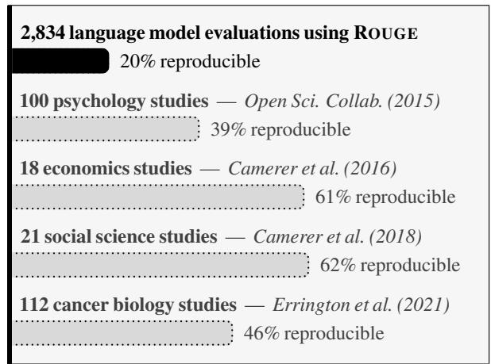
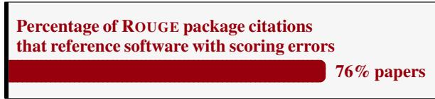
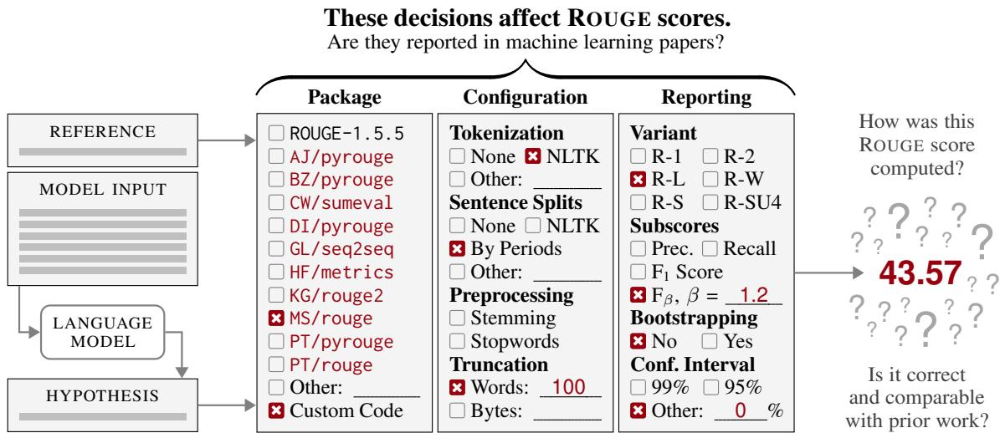
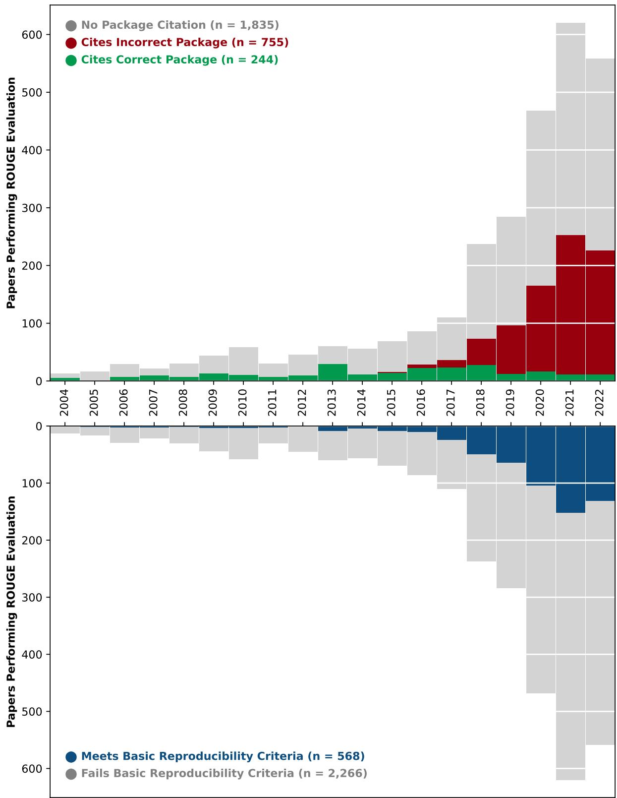
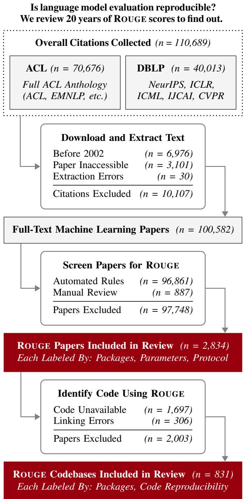
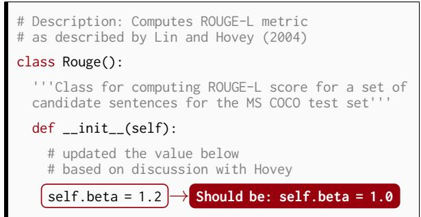
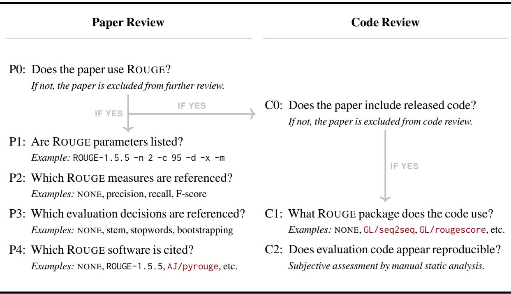

Rogue Scores

Max Grusky max@analyses.org

## Abstract

Correct, comparable, and reproducible model evaluation is essential for progress in machine learning. Over twenty years, thousands of language and vision models have been evaluated with a popular metric called ROUGE. Does this widespread benchmark metric meet these three evaluation criteria? This systematic review of over two thousand publications using ROUGE finds: (A) Critical evaluation decisions and parameters are routinely omitted, making most reported scores irreproducible. (B) Differences in evaluation protocol are common, affect scores, and impact the comparability of results reported in many papers. (C) Thousands of papers use nonstandard evaluation packages with software defects that produce provably incorrect scores. Estimating the overall impact ofthese findings is difficult: because software citations are rare, it is nearly impossible to distinguish between correct ROUGE scores and incorrect “rogue scores.” <sup>1</sup>

## 1 Introduction

This work outlines a major research integrity issue that affects thousands of machine learning papers in dozens of language and vision tasks over a span of nearly twenty years. We discover that the majority of model evaluations using the benchmark ROUGE metric are not reproducible and that ROUGE scores reported in thousands of papers may be incorrect.

Evaluation metric integrity is critical for model development and comparison. Researchers evaluate models to quantify their behaviors, successes, and failures; to compare new modeling approaches consistently against prior work; and to keep track of progress on challenging tasks. Because sharing code and parameters for models is still uncommon, researchers depend on model evaluation scores reported in papers to be comparable and correct. For these reasons, systematic errors in model evaluation may have major consequences for the findings and future trajectory of entire research fields, especially for widely used evaluation metrics like ROUGE.

(A) Machine learning model evaluations using ROUGE are less reproducible than other scientific fields.



ROUGE scores are difficult to compare. (B) Model evaluations omit critical details that affect scoring, affecting the comparability of results.

Release code — including incomplete and nonfunctional 33% papers

Release code with ROUGE evaluation 12% papers

Perform ROUGE significance testing / bootstrapping 6% papers

List ROUGE configuration parameters 5% papers

Cite ROUGE software package — including unofficial 35% papers

ROUGE scores are often incorrect. (C) Model evaluations are frequently performed using untested, incorrect ROUGE software packages.

  
Figure 1: Overview of our systematic review of ROUGE model evaluation. We discover major research integrity issues impacting three essential dimensions of effective machine learning evaluation: (A) reproducibility, (B) comparability, and (C) correctness. These issues are widespread and affect many machine learning tasks.

  
Figure 2: ROUGE measures similarity between human-written (reference) and model-generated (hypothesis) texts. The exact methods used to compute reference-hypothesis similarity are determined by ROUGE package, configuration, and reporting details. Unfortunately, when papers omit these ROUGE evaluation details, ROUGE scores are hard to interpret.

First introduced two decades ago, the text similarity metric ROUGE (Lin, 2004) has become become one of the most common evaluation metrics in natural language processing. Although originally designed to evaluate summarization models, ROUGE is a very flexible metric that is capable of evaluating a wide range of generation tasks such as question answering (Kociský et al. ˇ , 2018; Fan et al., 2019), reading comprehension (Nguyen et al., 2016), and image captioning (Chen et al., 2015). ROUGE is also used to benchmark large pretrained language models including GPT (Radford et al., 2019), T5 (Raffel et al., 2020), and BART (Lewis et al., 2020).

But versatility comes at the cost of complexity. As shown in Figure 2, ROUGE has multiple scores (ROUGE-1, ROUGE-2, ROUGE-L), subscores (precision, recall, F-score), and configuration options (stemming, truncation, stopword removal). There are also many different software packages that claim to compute ROUGE scores identically to the original ROUGE-1.5.5 implementation of Lin (2004). While researchers dedicate substantial time and resources to achieving small improvements in model scores, there is seemingly little concern that subtle evaluation protocol discrepancies are equivalently capable of producing similar score differences.

We conduct a systematic review and evaluation sensitivity analysis investigating the reproducibility, comparability, and correctness of ROUGE scores. We review ROUGE methodology of 2,834 papers published at major machine learning venues and 831 associated codebases. We perform sensitivity analysis of 10 common ROUGE configurations and test correctness of 17 common ROUGE packages.

Results are summarized in Figure 1 and Figure 3. The remainder of this work is outlined below:

## Outline of Systematic Review and Evaluation Protocol Experiments

## §2 Reproducibility: Do papers report enough information that an independent researcher could confidently repeat and validate the evaluation?

We conduct a systematic review of papers using ROUGE and identify thousands of papers that omit consequential evaluation details, making most scores extremely difficult to reproduce.

## §3 Comparability: Do common evaluation protocol variations meaningfully affect scores?

We measure the sensitivity of ROUGE to a range of evaluation configurations and find that evaluation details often omitted in papers can substantially affect scores, harming comparability.

## §4 Correctness: Is the evaluation implemented to specification without any defects, deviations, unintended behavior, or unexpected results?

We test common ROUGE packages and discover many of them have software defects resulting in scoring errors. Hundreds of papers cite these packages and may report incorrect scores.

## §5 Case Studies: Do these evaluation issues have an effect on real-world model results?

We examine several major cases where ROUGE evaluation issues impacted research integrity and ROUGE-hack a baseline system to achieve state-of-the-art summarization performance.

## We estimate 2,000+ papers use a ROUGE evaluation package with scoring errors.<sup>6</sup>

Our review finds 755 papers that cite incorrect software, while only 35% of papers cite any ROUGE package at all. For most ROUGE papers, it is unclear which software package was used and whether their reported scores are correct. Common Incorrect Packages: MS/rouge (n = 221) GL/rougescore (n = 183) BZ/pyrouge (n = 125) PT/rouge (n = 70)  
  
0 0 0 0 0 0 0 0 0 0 0 0 0 0 0 0 0 0 0Figure 3: Our systematic review finds ROUGE evaluation is becoming increasingly common. However, many of these evaluations are being conducted with unknown (gray) or incorrect (red) ROUGE software packages (see Section 4), and only a small number of papers (blue) using ROUGE meet our basic reproducibility criteria (see Section 2).

## 2 Reproducibility

ROUGE is a parameterized metric — it has many different configuration options and score variations, shown in Figure 2. Parameterization makes ROUGE uniquely flexible and capable of evaluating models across a diverse range of tasks. But it also makes ROUGE score reporting complex: ROUGE scores, reported without the ROUGE configuration used to compute them, are hard to interpret and reproduce. Thousands of papers report ROUGE scores, but how many report the ROUGE configuration necessary to reproduce them? To answer this question, we conduct a systematic review of 2,834 ROUGE papers and 831 ROUGE codebases. Our process is outlined in Figure 4. Results shown in Figure 1 and Figure 3.

## 2.1 Method: Systematic Literature Review

Data Collection. We collect 110,689 citations from five large open-access machine learning venues on DBLP and the entire ACL Anthology. We download all papers available and perform text extraction, yielding 100,582 full-text machine learning papers.<sup>2</sup>

ROUGE Identification. To find papers that compute ROUGE, we exclude full-text machine learning papers without “ROUGE,” then manually review<sup>3</sup> remaining papers for computed scores (e.g., listed in evaluation table), yielding 2,834 ROUGE papers.

Paper Review. Using automated rules validated by human review,<sup>3</sup> we label each paper with: ROUGE package citation, command line parameter string, and evaluation-related phrases (e.g., “bootstrap”).

Code Review. We use Papers With Code to identify 831 codebases associated with ROUGE papers. We use the GitHub API to search for and exclude codebases without “ROUGE” from further review. We manually<sup>3</sup> label codebases based on clear specification and usage of ROUGE packages, and make an overall assessment on whether code could be used to completely reproduce the paper’s ROUGE scores.

Defining Reproducibility. Reproducibility exists on a continuum, some details are more important than others. We define basic ROUGE reproducibility as any paper meeting at least one condition below: R1: Paper cites ROUGE package and parameters. R2: Paper cites no-config<sup>4</sup> ROUGE package. R3: Codebase has complete ROUGE evaluation.

  
Figure 4: Outline of our systematic review procedure, data sources, automated processing steps, and human review. Consult Appendix A for additional information.

## 2.2 Finding: Irreproducible Evaluation

Figure 1 summarizes our findings. Few evaluations meet our basic ROUGE reproducibility definition: only 20% of evaluations have enough detail to reproduce. This is substantially lower than other scientific fields, including the 39% reproduction rate of psychology studies (Open Sci. Collab., 2015). Few papers release code (33%) and even fewer release code with usable ROUGE evaluation (12%). It is hard to know if papers evaluate comparably without ROUGE parameters, which only appear in 5% of papers (more in Section 3). But the most alarming finding of this review is, while only 35% of papers cite ROUGE software, 76% of citations are for packages that compute incorrect scores (more in Section 4).

## 3 Comparability

We know ROUGE is a parameterized metric with many possible configurations, but in Section 2 we learn that these configurations are frequently unreported as only 5% of papers list ROUGE parameters. How sensitive is ROUGE to these unreported configurations, and are ROUGE scores computed under different configurations still comparable? Normally, ROUGE is used to measure and compare behaviors of different models. In order to probe the behavior of ROUGE, we do the reverse: we test 10 different ROUGE configurations on a single specimen model and specimen task to examine how unreported configuration affects real-world ROUGE scores.

## 3.1 Method: Parameter Sensitivity Analysis

Specimen Task. Our simulated evaluation takes the form of a single-document summarization task using the benchmark CNN / Daily Mail dataset of 300K English news articles (Hermann et al., 2015). We use the human-written bullet point “highlights” as reference summary sentences, following standard practice (Nallapati et al., 2016). We use ROUGE to evaluate specimen model hypotheses against the provided references using the development set.

Specimen Model. We perform ROUGE evaluation on Lead-3 (Nallapati et al., 2017), a common summarization baseline. Lead-3 summarizes an article by extracting and returning its first three sentences.

Experimental Setup. First, we evaluate ROUGE in our baseline configuration: reporting F<sub>1</sub> scores computed using default parameters<sup>5</sup> of the standard ROUGE-1.5.5 implementation with no additional preprocessing. Next, we compute 24 ROUGE scores in 10 alternative configurations from our Section 2 review, which differ in parameters, protocol, preprocessing, and score reporting. Finally, we compute the ROUGE score difference between the baseline configuration and each alternative configuration.

## 3.2 Finding: Incomparable Configurations

Table 1 shows the effect often-unreported ROUGE configurations have on reported scores. For comparison, we include the average ROUGE score difference between five state-of-the-art CNN / Daily Mail models: ROUGE configuration differences are often larger than differences between leaderboard models.

Preprocessing. Application of Porter stemming is one of the most inconsistent ROUGE evaluation decisions identified in our Section 2 review. We suspect roughly half of ROUGE scores are computed

Many ROUGE configuration differences are bigger than leaderboard model differences.
<table><tr><td>Common RoUGE</td><td colspan="3">Change in ROUGE Scores (Compared to Baseline Config.)</td></tr><tr><td>Configurations</td><td>±R1</td><td>±R2</td><td>±RL</td></tr><tr><td>Preprocessing</td><td></td><td></td><td></td></tr><tr><td>Apply Stemming</td><td>+1.68</td><td>+0.54</td><td>+1.31</td></tr><tr><td>Remove Stopwords</td><td>-2.21</td><td>-0.58</td><td>-0.99</td></tr><tr><td>Tokenization</td><td></td><td></td><td></td></tr><tr><td>No Sent. Splits</td><td>Sent. splits have no</td><td></td><td>-11.17 -3.44</td></tr><tr><td>Period Sent. Splits NLTK Sent. Splits</td><td>effect on ROUGE-N</td><td></td><td>-0.16</td></tr><tr><td>NLTK Tokenize</td><td>&lt;0.01</td><td>&lt;0.01</td><td>&lt;0.01</td></tr><tr><td>Truncation (Recall)</td><td></td><td></td><td></td></tr><tr><td>Truncate to 75 Bytes</td><td>-27.92</td><td>-12.93</td><td>-33.44</td></tr><tr><td>Truncate to 100 Words</td><td>-0.07</td><td>-0.05</td><td>-0.07</td></tr><tr><td>Misreported Scores</td><td></td><td></td><td></td></tr><tr><td>Report F1.2 Score</td><td>+1.33</td><td>+0.61</td><td>+1.21</td></tr><tr><td>Report Recall Score</td><td>+10.88</td><td>+5.00</td><td>+9.92</td></tr></table>

top five CNN / Daily Mail models.

Table 1: Sensitivity of three common ROUGE score variants (R1, R2, RL) to ROUGE configurations frequently unreported in papers. Many configuration differences meaningfully increase (+) or decrease (–) ROUGE scores compared to our ROUGE-1.5.5 baseline configuration.<sup>5</sup>

with and without stemming. Because stemming inflates all ROUGE scores, a large number of scores may be accidentally incomparable (for a notable state-of-the-art example, see Section 5.3). Both stemming and stopword removal are enabled by default in some nonstandard ROUGE packages.

Tokenization. ROUGE-L requires sentences to be pretokenized. We test three sentence tokenization configurations inspired by sentence tokenization methods used by nonstandard ROUGE packages found in Section 2 review, and find they can meaningfully deflate ROUGE-L scores.

Truncation and Misreporting. Though full-length F<sub>1</sub> ROUGE is now standard, many authors still refer to a “recall-oriented ROUGE.” It is possible this confusion is reflected in published evaluation. The most notable example of misreporting was the result of an apparent misunderstanding of two ROUGE-1.5.5 parameters -p and -w, the result of which is that nearly every caption generation paper now accidentally reports ROUGE $\mathrm { F } _ { 1 . 2 }$ scores (see Section 5.1).

## 4 Correctness

Thousands of papers may evaluate models using a nonstandard ROUGE package. We find in Section 2 only 35% of papers cite a ROUGE package, but 76% of packages cited are nonstandard. This suggests the 755 papers in Figure 3 are a small sample of 2,000+ papers using a nonstandard package.<sup>6</sup> Surprisingly, none of these packages has been validated against ROUGE-1.5.5, the original ROUGE implementation of Lin (2004). This validation should have occurred years ago before these packages were ever used; but, better late than never — we will do it now.

## 4.1 Method: Software Validation Testing

Package Collection. We download all nonstandard ROUGE packages with two or more citations in our Section 2 dataset, resulting in 17 total packages. On average, packages have 48 citations. Packages with multiple implementations are evaluated separately.

Specimen Task and Model. Packages are validated using the same CNN / Daily Mail summarization task and Lead-3 model described in Section 3.

Experimental Setup. ROUGE computes scores for each individual model output, which are averaged together into overall scores reported in a paper. To validate a package, we directly compare its scores on each individual model output with ROUGE-1.5.5. A package is correct when both individual and overall scores match ROUGE-1.5.5. The CNN / Daily Mail development set has 13K entries, providing 13K test cases for each ROUGE package. Table 2 shows the percentage of test cases where nonstandard packages differ from ROUGE-1.5.5 across common ROUGE score variants (R1, R2, RL) and configurations (+/– Porter stemming).

## 4.2 Finding: Incorrect Software Packages

Table 2 results impact the 2,000+ papers that use a nonstandard ROUGE package: all but one package we test has scoring errors.<sup>7</sup> Some errors are dramatic (AJ/pyrouge scores 100% of individual model outputs incorrectly), others subtle (PT/pyrouge scores individual outputs correctly, but bootstrapping adds random noise to overall scores). As each package has different errors, their incorrect scores are also incomparable. Although individual errors can be hard to identify, they generally fall into three categories.

Thousands of machine learning models are evaluated by ROUGE packages with errors.
<table><tr><td>Common</td><td colspan="6">Percentage of Incorrect Scores</td></tr><tr><td>ROUGE Packages</td><td>R1</td><td>– STEMMING R2</td><td>RL</td><td>R1</td><td>+ STEMMING R2</td><td>RL</td></tr><tr><td>Standard Implementation ROUGE-1.5.5</td><td></td><td></td><td></td><td></td><td></td><td>0</td></tr><tr><td colspan="7">Nonstandard — Wrappers</td></tr><tr><td>8 AJ/pyrouge</td><td>100</td><td>100</td><td>100</td><td>100</td><td>100</td><td>100</td></tr><tr><td>x BZ/pyrouge</td><td>46</td><td>28</td><td>56</td><td>0</td><td>0</td><td>0</td></tr><tr><td>DD/sacrerouge</td><td>0</td><td>0</td><td>0</td><td>0</td><td>0</td><td>0</td></tr><tr><td>x LP/rougemetric</td><td>0</td><td>0</td><td>0</td><td>13</td><td>6</td><td>18</td></tr><tr><td>X PT/files2rouge</td><td>0</td><td>0</td><td>83</td><td>13</td><td>6</td><td>86</td></tr><tr><td>PT/pyrouge</td><td>0</td><td>0</td><td>0</td><td>0</td><td>0</td><td>0</td></tr><tr><td>x TG/pythonrouge</td><td>100</td><td>100</td><td>84</td><td>100</td><td>100</td><td>86</td></tr><tr><td colspan="7">Nonstandard — Reimplementations</td></tr><tr><td>x CW/sumeval</td><td>98</td><td>97</td><td>100</td><td>98</td><td>97</td><td>100</td></tr><tr><td>8 +stopwords</td><td>0</td><td>0</td><td>97</td><td>73</td><td>61</td><td>99</td></tr><tr><td>x DD/sacrerouge</td><td>0</td><td>0</td><td>97</td><td>0</td><td>0</td><td>98</td></tr><tr><td>+ DI/pyrouge</td><td>4</td><td>4</td><td>4</td><td>4</td><td>4</td><td>4</td></tr><tr><td>x GL/rougescore</td><td>0</td><td>0</td><td>97</td><td>14</td><td>6</td><td>98</td></tr><tr><td>x +rougeLSum</td><td></td><td></td><td>0</td><td></td><td></td><td>19</td></tr><tr><td>x GL/seq2seq</td><td>98</td><td>97</td><td>100</td><td></td><td></td><td></td></tr><tr><td>x KG/rouge2</td><td>98</td><td>97</td><td>100</td><td>98</td><td>97</td><td>100</td></tr><tr><td>8 +stopwords x LP/rougemetric</td><td>93 97</td><td>97</td><td>100</td><td>94</td><td>97</td><td>100</td></tr><tr><td>x MS/rouge</td><td></td><td>95</td><td>99 100</td><td></td><td></td><td></td></tr><tr><td>X ND/easyrouge</td><td>98</td><td>97</td><td>100</td><td></td><td></td><td></td></tr><tr><td>PT/rouge</td><td>98</td><td>96</td><td>100</td><td></td><td></td><td></td></tr><tr><td></td><td></td><td></td><td></td><td></td><td></td><td></td></tr></table>

Í Correct ë Incorrect Individual and Overall Scores KEY − Correct Individual Scores, Incorrect Overall Scores

Table 2: Percentage of correctly scored model outputs for 17 common nonstandard ROUGE packages. Larger percentages indicate the package more frequently computes ROUGE scores that differ from the ROUGE-1.5.5 standard ROUGE implementation. Package names link to the exact tested version. Packages with unusual defaults are retested in standard configurations (prefixed with +). Blank spaces are unimplemented ROUGE score variants.

Wrappers. These packages provide a user-friendly interface for ROUGE-1.5.5. Errors include incorrect pre-tokenization (AJ/pyrouge, PT/files2rouge), forced stemming (BZ/pyrouge). Prior versions of several packages computed ROUGE scores backwards by inverting references and hypotheses.

Reimplementations. These packages use entirely custom code to compute ROUGE, often with errors such as computing $\mathrm { F } _ { 1 . 2 }$ scores (MS/rouge), failure to implement stemming (GL/seq2seq, MS/rouge) or incorrect stemming (all others). Many packages implement the basic ROUGE-L algorithm incorrectly.

Misconfigurations. Many package defaults differ from ROUGE-1.5.5, such as truncation by default (DI/pyrouge, TG/pythonrouge) and stopword removal (CW/sumeval, KG/rouge2). Many packages stem by default, others do not (like ROUGE-1.5.5).

## 5 Case Studies

But does it matter if evaluation is not reproducible? Should we care that subtle evaluation configuration differences make results incomparable? How much do software errors actually affect evaluation? Here are several concrete examples that demonstrate the real-world effects of evaluation integrity issues.

## 5.1 What the F is Happening?

The MS/rouge package developed at Microsoft is quite unique: rather than computing standard balanced $\mathrm { F } _ { 1 }$ scores, it instead computes recall-biased $\mathrm { F } _ { 1 . 2 }$ scores. This is the most popular ROUGE package for evaluating captioning (Chen et al., 2015), reading comprehension (Nguyen et al., 2016), and general NLG tasks (Sharma et al., 2017). However, there is no obvious research reason for choosing $\mathrm { F } _ { 1 . 2 }$ scores for these tasks. So, where did this magic number come from? The version control history of this package indicates $\mathrm { F } _ { 1 . 2 }$ was chosen by mixing up the meanings of two ROUGE-1.5.5 parameters: -w 1.2 and -p 0.5. Code excerpt shown in Figure 5. This error inflates ROUGE scores in hundreds of papers.

## 5.2 A Nondeterministic Evaluation Metric

Google Research distributes a popular ROUGE implementation, GL/rougescore. This package stems incorrectly, has an incorrect default implementation of ROUGE-L, and does not use a fixed random seed during bootstrapping. This makes GL/rougescore both incorrect and nondeterministic (two qualities not typically associated with benchmark evaluation metrics). Most ROUGE packages are the unofficial personal projects of open-source contributors, who should not be responsible when researchers misuse their code. However, there is no excuse for Google to distribute, promote, and publish papers using an obviously incorrect evaluation metric.

## 5.3 Stop. It’s Stemmer Time.

Sometimes, ROUGE packages are not even comparable with themselves, such as PT/files2rouge. Before October 2019, this package did not implement Porter stemming. Then, between October 2019 and July 2020, stemming was implemented but disabled by default. After August 2020, stemming was enabled by default. BART (Lewis et al., 2020) appears to evaluate with PT/files2rouge during this non-stemming window (stemming is atypical for CNN / Daily Mail). Since the publication of BART, PT/files2rouge has enabled stemming by default, making the original BART scores irreproducible.

Using a rogue ROUGE configuration, anyone can achieve state-of-the-art scores!
<table><tr><td rowspan="2">CNN / Daily Mail Summarization Models</td><td colspan="3">RoUGE Scores</td></tr><tr><td>R1</td><td>R2</td><td>RL</td></tr><tr><td>Lead-3 (Baseline)</td><td>40.34</td><td>17.55</td><td>36.58</td></tr><tr><td>T5 (Raffel et al., 2020)</td><td>43.52</td><td>21.55</td><td>40.69</td></tr><tr><td>BART (Lewis et al., 2020)</td><td>44.16</td><td>21.28</td><td>40.90</td></tr><tr><td>PEGASUS (Zhang et al., 2020)</td><td>44.17</td><td>21.47</td><td>41.11</td></tr><tr><td>SIMCLs (Liu and Liu, 2021)</td><td>46.67</td><td>22.15</td><td>43.54</td></tr><tr><td>BRIO (Liu et al., 2022)</td><td>47.78</td><td>23.55</td><td>44.57</td></tr><tr><td>Rogue-3 (Ours)</td><td>73.89</td><td>55.80</td><td>73.89</td></tr></table>

Table 3: Surprise! Our spectacular Rogue-3 “model” is just the Lead-3 baseline in disguise: we ROUGE-hacked Lead-3 to state-of-the-art performance using a popular ROUGE package with software errors and careful choice of configuration. Want to know how we did it? Too bad! Following standard practice, we leave the reproduction of these rogue scores as an exercise for the reader.<sup>9</sup>

## 5.4 Rogue-3: A State-of-the-Art Baseline

Finally, we present Rogue-3, a spectacular state-ofthe-art summarization model with the world’s most impressive ROUGE scores! But before the leaderboards are updated and the single-document summarization task is declared “solved,” maybe we should discuss our methods: Rogue-3 is nothing more than the Lead-3 baseline evaluated with a special ROUGE configuration carefully chosen to boost its scores.

In Table 3, we compare Rogue-3 scores against the standard Lead-3 baseline and five current topperforming models: three state-of-the-art summarization models, BRIO, SIMCLS, and PEGASUS; and two large language models, T5 and BART. ROUGE scores of all five comparison models are copied directly from their respective papers. Lead-3 is evaluated with ROUGE-1.5.5<sup>8</sup> with the existing sentence tokenization of CNN / Daily Mail and without using any external tokenizer. Both Lead-3 and Rogue-3 evaluate on the CNN / Daily Mail test set.

Our Rogue-3 evaluation may seem unfair, but if ROUGE scores were disqualified for being incomparable or incorrect, then Table 3 would be empty. All Table 3 comparison models appear to use packages with errors (PT/files2rouge, GL/rougescore, or BZ/pyrouge) under different evaluation protocols (PEGASUS, SIMCLS, and BRIO stem; T5 and BART do not stem). Rogue-3 uses the same package and parameters as other peer-reviewed papers.<sup>9</sup> So, if leaderboards routinely accept scores that are irreproducible, incomparable, and incorrect, it seems only fair to accept Rogue-3 as the new state of the art!

Almost all caption generation models are evaluated incorrectly using this package.

## 6 Reality Check

Systematic research errors in thousands of machine learning papers indicate systematic problems in reporting, correction, and retraction of scientific results. However, despite its success in recent years, the machine learning field has failed to adopt many of the methodological standard practices of modern empirical science aimed at improving research reproducibility. While simply encouraging authors to report their ROUGE parameters will improve the integrity of ROUGE evaluation, it does not solve the underlying issues that allowed rogue scores to happen. Instead, machine learning must strengthen its statistical reporting requirements and improve postpublication review and oversight to match the standard practice of other modern empirical sciences.

## 6.1 Rogue Reporting

Modern empirical science cares about enforcing statistical reporting standards, but does the field of machine learning? Reputable journals in other empirical scientific fields require manuscripts reporting p-values to describe how they are computed (e.g., statistical test, degrees of freedom, tailedness). By comparison, machine learning papers often underreport hyperparameters (Dodge et al., 2019) and critical evaluation details (Post, 2018; Marie et al., 2021). In other scientific fields, similar omissions might trigger a desk reject. Improving required reporting for models (Mitchell et al., 2019), datasets (Gebru et al., 2021), and research practices (Rogers et al., 2021; Pineau et al., 2021) are necessary for identifying and preventing future research errors.

## 6.2 Rogue Review

Modern empirical science cares about maintaining the correctness of its research record, but does the field of machine learning? Research errors are normal and inevitable. Correction and retraction are the scientific tools used to communicate these errors. Yet, none of the machine learning venues from our survey (NeurIPS, ICLR, ICML, IJCAI, CVPR) has a formal policy for corrections or retractions, and do not regularly post retraction notices, following best practice (Wager et al., 2009). Only in 2021 has the ACL established a policy for corrections and retractions, with only 9 recorded retractions in a 60 year history of 80K+ papers.<sup>10</sup> Simple and transparent processes for retraction and correction are essential for correcting future research errors.

  
Figure 5: Code excerpt from MS/rouge, which is used to evaluate models in hundreds of papers. Although the code’s stated intention is to reimplement ROUGE-L “as described by Lin (2004),” it instead computes ROUGE-L using the default command line parameter of a different, unrelated metric ROUGE-W (-w 1.2). Code comments not related to this error are excluded for presentation.

## 7 Conclusion

Rogue Scores is the most significant and widespread research integrity issue to date in machine learning history, impacting the reproducibility, comparability, and correctness of thousands of results over a span of twenty years. We discover a large number of ROUGE model evaluation scores have been computed incorrectly by defective unvalidated software packages. Although automated metrics like ROUGE cannot replace high quality human evaluation, they have an advantage of being perfectly reproducible and comparable, in theory. Yet, in practice, ROUGE evaluation protocol is often unreported or underreported, making most ROUGE scores difficult to compare and impossible to reproduce. We know many ROUGE scores are incorrect, but missing evaluation details means we can only speculate on which ones. Consequently, the validity and interpretation of thousands of results is now entirely uncertain.

## Acknowledgements

We thank the anonymous reviewers for their helpful feedback; the volunteers and contributors of DBLP, Papers With Code, and the ACL Anthology for developing the citation databases used in this work; and the open source community, upon which billions of dollars of research blindly depends.

## Inclusion Criteria

• Venue Selection. Our systematic review is restricted to papers from major machine learning venues. In order to download and search entire papers, we restrict our review to open-access venues only and exclude all closed-access research.

• Peer-Review Focus. We only review peer-reviewed papers, and exclude preprints, technical reports, and other informal articles from our review, even though ROUGE evaluation frequently occurs in these non-reviewed manuscripts.

• Archival Publications. For completeness, we include all archival ACL Anthology papers including workshop papers. However, due to technical limitations, we only include the main conference proceedings for non-ACL venues.

• Post-Publication Changes. Historical versions of papers and codebases may contain additional reproducibility information, but we only review current versions (as of January 1, 2023).

• External Materials. We only review main paper text, appendices, and code linked in papers. We do not review external materials such as websites, slides, videos, or codebases with no link appearing in papers. Appendices and supplemental manuscripts distributed separately from the main paper manuscript are not included in our review.

• Underlying Biases. The distribution of papers we review directly reflects the underlying authorship, identity, and content biases (e.g., geography, nationality, gender, language, affiliation, etc.) in papers accepted to machine learning venues.

## Paper Annotation

• Automated Annotation. Our first paper annotation stage uses automated regular expression pattern matching of paper text. Although these patterns are validated and refined through a human-in-the-loop development process, automated pattern matching cannot entirely replace expert human judgement and may incorrectly annotate papers. Automated patterns cannot match text in bitmap image figures and tables due to limitations in PDF text extraction.

• Human Annotation. We use a second stage of manual paper review for all papers to identify and correct annotation errors introduced by automated pattern matching. Manual review sometimes involves human inference and judgement in chal lenging cases. (For example, papers that cite “ROUGE-1.5.5” sometimes use a nonstandard ROUGE-1.5.5 wrapper instead.)

• Preliminary Search. We perform a preliminary case-insensitive search for “rouge” in all papers. Matching papers receive full automated annotation, manual review, and codebase review. However, we are aware of several papers that compute and report ROUGE scores without specifically naming the metric. They are labeled as non-ROUGE papers and receive no manual review.

• Non-English Annotation. Most reviewed papers are written in English. Due to human annotator language limitations and English-oriented automated pattern matching, non-English papers may receive less accurate labels than English papers.

• Author Clarification. Contacting authors for clarification may help resolve paper reproducibility questions (for example, see: Errington et al., 2021). However, evaluating this aspect of reproducibility is infeasible at the scale of our work.

• Non-Evaluation Metrics. Some papers use ROUGE for reasons other than evaluation, such as feature generation or for internal training validation. We do not make any distinction between evaluation and non-evaluation ROUGE during our review.

• Assumed Correctness. Our annotation protocol assumes all papers that use ROUGE-1.5.5 directly (rather than using a wrapper or reimplementation) report correct ROUGE scores. However, many of these papers may run ROUGE-1.5.5 via custom ad hoc wrapper code that (like many wrapper packages) is implemented incorrectly and introduces scoring errors.

## Codebase Annotation

• Codebase Linking. We use the Papers With Code dataset to link papers with codebases. However, this dataset does not cover all papers in our review, which limits our ability to assess their codebase reproducibility.

• Package Inference. Many codebases are missing explicit dependency specification, making identifying exact ROUGE pack ages challenging. In these cases, function signatures are used to identify the most likely ROUGE package.

• Vendored Dependencies. In some codebases, ROUGE package code is “vendored” (copied and pasted into the project code). It is more challenging to accurately identify the source of vendored ROUGE packages, particularly if the code has been modified.

• Package Aliasing. Codebases frequently import very similar versions of ROUGE packages distributed under different names (examples: MS/rouge and GL/rougescore). We attempt to resolve these packages to a single canonical package for our evaluation. However, slight differences may exist between package aliases that affect our correctness assessment.

• Multiple Packages. When a codebase contain multiple ROUGE packages, we attempt to identify which packages are used to compute ROUGE scores reported in the paper. If this is unclear, we list all ROUGE packages used in the codebase.

## Evaluation Experiments

• Specimen Task/Model. We choose a single specimen task (CNN / Daily Mail) and model (Lead-3) for measuring ROUGE scoring discrepancies due to configurations and packages. Scoring discrepancies differ for other tasks and models.

• Summarization Focus. Although ROUGE evaluation is used for many different tasks and datasets, our experiments only focus on a single popular task (single-document summarization) and dataset (CNN / Daily Mail).

• English Evaluation. ROUGE was designed for English language evaluation and we perform experiments on the English language CNN / Daily Mail dataset. While there are ROUGE packages designed for other languages, there is no universal standard for them like ROUGE-1.5.5. Therefore, we do not cover non-English ROUGE evaluation in our experiments.

• Score Variants. We only examine three common ROUGE score variants (ROUGE-1, ROUGE-2, ROUGE-L). We exclude uncommon variants (e.g., ROUGE-W, ROUGE-S, ROUGE-SU) rare in papers and often unimplemented in packages.

• Multiple References. We do not perform any experiments involving multiple reference evaluation, which is not supported by our specimen task (CNN / Daily Mail) and is not implemented in many nonstandard ROUGE packages.

• Bootstrap Sampling. Bootstrapping is built into ROUGE-1.5.5 and is often unimplemented or incorrectly implemented in reimplementations. Our package experiments operate on individual model outputs and cannot detect bootstrapping errors.

• Custom Implementations. Our code review identified several instances of custom ROUGE implementations, but because we only evaluate packages used by more than one author, it is unknown how correct these custom implementations are.

• Package Versions. Many nonstandard ROUGE implementations change over time (for example: Section 5.3). Package changes likely affect comparability between papers. However, our evaluation only considers the most recent version of each package (as of January 1, 2023) and does not study these between-version scoring differences.

## References

Colin F. Camerer, Anna Dreber, Eskil Forsell, Teck-Hua Ho, Jürgen Huber, Magnus Johannesson, Michael Kirchler, Johan Almenberg, Adam Altmejd, Taizan Chan, Emma Heikensten, Felix Holzmeister, Taisuke Imai, Siri Isaksson, Gideon Nave, Thomas Pfeiffer, Michael Razen, and Hang Wu. 2016. Evaluating replicability of laboratory experiments in economics. Science, 351(6280):1433–1436.

The “61% reproducible” figure is found in the study abstract: Wefound a significant effect in the same direction as in the original study for 11 replications (61%).

Colin F Camerer, Anna Dreber, Felix Holzmeister, Teck-Hua Ho, Jürgen Huber, Magnus Johannesson, Michael Kirchler, Gideon Nave, Brian A Nosek, Thomas Pfeiffer, et al. 2018. Evaluating the replicability of social science experiments in nature and science between 2010 and 2015. Nature Human Behaviour, 2(9):637–644.

The “62% reproducible” figure is found in the study abstract: We find a significant effect in the same direction as the original studyfor 13 (62%) studies.

Xinlei Chen, Hao Fang, Tsung-Yi Lin, Ramakrishna Vedantam, Saurabh Gupta, Piotr Dollar, and C. Lawrence Zitnick. 2015. Microsoft COCO captions: Data collection and evaluation server.

Kaustubh Dhole and Christopher D. Manning. 2020. Syn-QG: Syntactic and shallow semantic rules for question generation. In Proceedings ofthe 58th Annual Meeting ofthe Associationfor Computational Linguistics, pages 752–765, Online. Association for Computational Linguistics. Retracted.

Azizud Din, Bali Ranaivo-Malançon, and M. G. Abbas Malik. 2014. Constituent structure representation of Pashto endoclitics. In Proceedings of the Fifth Workshop on South and Southeast Asian Natural Language Processing, Dublin, Ireland. Association for Computational Linguistics and Dublin City University.

Jesse Dodge, Suchin Gururangan, Dallas Card, Roy Schwartz, and Noah A. Smith. 2019. Show your work: Improved reporting of experimental results. In Proceedings of the 2019 Conference on Empirical Methods in Natural Language Processing and the 9th International Joint Conference on Natural Language Processing (EMNLP-IJCNLP), pages 2185–2194, Hong Kong, China. Association for Computational Linguistics.

Timothy M Errington, Maya Mathur, Courtney K Soderberg, Alexandria Denis, Nicole Perfito, Elizabeth Iorns, and Brian A Nosek. 2021. Investigating the replicability of preclinical cancer biology. eLife, 10:e71601.

The “46% reproducible” figure is found on the project website (https://www.cos.io/rpcb): 46% of effects replicated successfully on more criteria than they failed.

Angela Fan, Yacine Jernite, Ethan Perez, David Grangier, Jason Weston, and Michael Auli. 2019. ELI5: Long form question answering. In Proceedings ofthe 57th Annual Meeting of the Association for Computational Linguistics, pages 3558–3567, Florence, Italy. Association for Computational Linguistics.

Timnit Gebru, Jamie Morgenstern, Briana Vecchione, Jennifer Wortman Vaughan, Hanna Wallach, Hal Daumé III, and Kate Crawford. 2021. Datasheets for datasets. Commun. ACM, 64(12):86–92.

Max Grusky, Mor Naaman, and Yoav Artzi. 2018. Newsroom: A dataset of 1.3 million summaries with diverse extractive strategies. In Proceedings ofthe 2018 Conference of the North American Chapter of the Associationfor Computational Linguistics: Human Language Technologies, Volume 1 (Long Papers), pages 708–719, New Orleans, Louisiana. Association for Computational Linguistics.

Karl Moritz Hermann, Tomas Kocisky, Edward Grefenstette, Lasse Espeholt, Will Kay, Mustafa Suleyman, and Phil Blunsom. 2015. Teaching machines to read and comprehend. In Advances in Neural Information Processing Systems, volume 28. Curran Associates, Inc.

Shujeevan Kanapathipillai, Viraj Welgama, and Ruwan Weerasinghe. 2016. Temporal information extraction in clinical domain (TIECA). In Proceedings of the 6th Workshop on South and Southeast Asian Natural Language Processing (WSSANLP2016), pages 83– 92, Osaka, Japan. The COLING 2016 Organizing Committee. Retracted.

Anant Khandelwal. 2021. WeaSuL: Weakly supervised dialogue policy learning: Reward estimation for multi-turn dialogue. In Proceedings of the 1st Workshop on Document-grounded Dialogue and Conversational Question Answering (DialDoc 2021), pages 69–80, Online. Association for Computational Linguistics. Retracted.

Tomáš Kociský, Jonathan Schwarz, Phil Blunsom, Chrisˇ Dyer, Karl Moritz Hermann, Gábor Melis, and Edward Grefenstette. 2018. The NarrativeQA reading comprehension challenge. Transactions ofthe Associationfor Computational Linguistics, 6:317–328.

Mike Lewis, Yinhan Liu, Naman Goyal, Marjan Ghazvininejad, Abdelrahman Mohamed, Omer Levy, Veselin Stoyanov, and Luke Zettlemoyer. 2020. BART: Denoising sequence-to-sequence pre-training for natural language generation, translation, and comprehension. In Proceedings ofthe 58th Annual Meeting of the Association for Computational Linguistics, pages 7871–7880, Online. Association for Computational Linguistics.

Chin-Yew Lin. 2004. ROUGE: A package for automatic evaluation of summaries. In Text Summarization Branches Out, pages 74–81, Barcelona, Spain. Association for Computational Linguistics.

Yixin Liu and Pengfei Liu. 2021. SimCLS: A simple framework for contrastive learning of abstractive summarization. In Proceedings ofthe 59th Annual Meeting of the Association for Computational Linguistics and the 11th International Joint Conference on Natural Language Processing (Volume 2: Short Papers), pages 1065–1072, Online. Association for Computational Linguistics.

Yixin Liu, Pengfei Liu, Dragomir Radev, and Graham Neubig. 2022. BRIO: Bringing order to abstractive summarization. In Proceedings ofthe 60th Annual Meeting of the Association for Computational Linguistics (Volume 1: Long Papers), pages 2890–2903, Dublin, Ireland. Association for Computational Linguistics.

Benjamin Marie, Atsushi Fujita, and Raphael Rubino. 2021. Scientific credibility of machine translation research: A meta-evaluation of 769 papers. In Proceedings of the 59th Annual Meeting of the Association for Computational Linguistics and the 11th International Joint Conference on Natural Language Processing (Volume 1: Long Papers), pages 7297–7306, Online. Association for Computational Linguistics.

Margaret Mitchell, Simone Wu, Andrew Zaldivar, Parker Barnes, Lucy Vasserman, Ben Hutchinson, Elena Spitzer, Inioluwa Deborah Raji, and Timnit Gebru. 2019. Model cards for model reporting. In Proceedings ofthe Conference on Fairness, Accountability, and Transparency, FAT\* ’19, page 220–229, New York, NY, USA. Association for Computing Machinery.

Ramesh Nallapati, Feifei Zhai, and Bowen Zhou. 2017. SummaRuNNer: A recurrent neural network based sequence model for extractive summarization of documents. In Proceedings of the Thirty-First AAAI Conference on Artificial Intelligence, AAAI’17, page 3075–3081. AAAI Press.

Ramesh Nallapati, Bowen Zhou, Cicero dos Santos, Çaglar G˘ ulçehre, and Bing Xiang. 2016.˙ Abstractive text summarization using sequence-to-sequence RNNs and beyond. In Proceedings of The 20th SIGNLL Conference on Computational Natural Language Learning, pages 280–290, Berlin, Germany. Association for Computational Linguistics.

Shashi Narayan, Shay B. Cohen, and Mirella Lapata. 2018. Don’t give me the details, just the summary! topic-aware convolutional neural networks for extreme summarization. In Proceedings of the 2018 Conference on Empirical Methods in Natural Language Processing, pages 1797–1807, Brussels, Belgium. Association for Computational Linguistics.

Tri Nguyen, Mir Rosenberg, Xia Song, Jianfeng Gao, Saurabh Tiwary, Rangan Majumder, and Li Deng. 2016. MS MARCO: A human generated machine reading comprehension dataset. In Proceedings of the Workshop on Cognitive Computation: Integrating neural and symbolic approaches 2016 co-located

with the 30th Annual Conference on Neural Information Processing Systems, Barcelona, Spain, December 9, 2016, volume 1773 of CEUR Workshop Proceedings. CEUR-WS.org.

Elizabeth Nielsen, Mark Steedman, and Sharon Goldwater. 2021. Prosodic segmentation for parsing spoken dialogue. In Proceedings ofthe 59th Annual Meeting ofthe Associationfor Computational Linguistics and the 11th International Joint Conference on Natural Language Processing (Volume 1: Long Papers), pages 979–992, Online. Association for Computational Linguistics. Retracted.

Open Sci. Collab. 2015. Estimating the reproducibility of psychological science. Science, 349(6251). The “39% reproducible” figure is found in the study abstract: 39% of effects were subjectively rated to have replicated the original result.

Matthew J Page, Joanne E McKenzie, Patrick M Bossuyt, Isabelle Boutron, Tammy C Hoffmann, Cynthia D Mulrow, Larissa Shamseer, Jennifer M Tetzlaff, Elie A Akl, Sue E Brennan, Roger Chou, Julie Glanville, Jeremy M Grimshaw, Asbjørn Hróbjartsson, Manoj M Lalu, Tianjing Li, Elizabeth W Loder, Evan Mayo-Wilson, Steve McDonald, Luke A McGuinness, Lesley A Stewart, James Thomas, Andrea C Tricco, Vivian A Welch, Penny Whiting, and David Moher. 2021a. The PRISMA 2020 statement: an updated guideline for reporting systematic reviews. BMJ, 372.

Matthew J Page, David Moher, Patrick M Bossuyt, Isabelle Boutron, Tammy C Hoffmann, Cynthia D Mulrow, Larissa Shamseer, Jennifer M Tetzlaff, Elie A Akl, Sue E Brennan, Roger Chou, Julie Glanville, Jeremy M Grimshaw, Asbjørn Hróbjartsson, Manoj M Lalu, Tianjing Li, Elizabeth W Loder, Evan Mayo-Wilson, Steve McDonald, Luke A McGuinness, Lesley A Stewart, James Thomas, Andrea C Tricco, Vivian A Welch, Penny Whiting, and Joanne E McKenzie. 2021b. PRISMA 2020 explanation and elaboration: updated guidance and exemplars for reporting systematic reviews. BMJ, 372.

Joelle Pineau, Philippe Vincent-Lamarre, Koustuv Sinha, Vincent Lariviere, Alina Beygelzimer, Florence d’Alche Buc, Emily Fox, and Hugo Larochelle. 2021. Improving reproducibility in machine learning research (A report from the NeurIPS 2019 reproducibility program). Journal of Machine Learning Research, 22(164):1–20.

Matt Post. 2018. A call for clarity in reporting BLEU scores. In Proceedings of the Third Conference on Machine Translation: Research Papers, pages 186– 191, Brussels, Belgium. Association for Computational Linguistics.

Alec Radford, Jeffrey Wu, Rewon Child, David Luan, Dario Amodei, and Ilya Sutskever. 2019. Language models are unsupervised multitask learners. Technical report, OpenAI.

Colin Raffel, Noam Shazeer, Adam Roberts, Katherine Lee, Sharan Narang, Michael Matena, Yanqi Zhou, Wei Li, and Peter J. Liu. 2020. Exploring the limits of transfer learning with a unified text-to-text transformer. Journal ofMachine Learning Research, 21(140):1–67.

Anna Rogers, Timothy Baldwin, and Kobi Leins. 2021. ‘Just what do you think you’re doing, Dave?’ A checklist for responsible data use in NLP. In Findings ofthe Associationfor Computational Linguistics: EMNLP 2021, pages 4821–4833, Punta Cana, Dominican Republic. Association for Computational Linguistics.

Ramit Sawhney, Megh Thakkar, Shrey Pandit, Debdoot Mukherjee, and Lucie Flek. 2021. Dmix: Distance constrained interpolative mixup. In Proceedings of the 1st Workshop on Multilingual Representation Learning, pages 242–244, Punta Cana, Dominican Republic. Association for Computational Linguistics. Retracted.

Yong Shan, Zekang Li, Jinchao Zhang, Fandong Meng, Yang Feng, Cheng Niu, and Jie Zhou. 2020. A contextual hierarchical attention network with adaptive objective for dialogue state tracking. In Proceedings of the 58th Annual Meeting ofthe Associationfor Computational Linguistics, pages 6322–6333, Online. Association for Computational Linguistics. Retracted.

Shikhar Sharma, Layla El Asri, Hannes Schulz, and Jeremie Zumer. 2017. Relevance of unsupervised metrics in task-oriented dialogue for evaluating natural language generation. ArXiV.

Megh Thakkar, Vishwa Shah, Ramit Sawhney, and Debdoot Mukherjee. 2021. Sequence mixup for zero-shot cross-lingual part-of-speech tagging. In Proceedings ofthe 1st Workshop on Multilingual Representation Learning, pages 245–247, Punta Cana, Dominican Republic. Association for Computational Linguistics. Retracted.

Elizabeth Wager, Virginia Barbour, Steven Yentis, and Sabine Kleinert. 2009. Retractions: Guidance from the committee on publication ethics (COPE). Maturitas, 64(4):201–203.

Jingqing Zhang, Yao Zhao, Mohammad Saleh, and Peter Liu. 2020. PEGASUS: Pre-training with extracted gap-sentences for abstractive summarization. In Proceedings of the 37th International Conference on Machine Learning, volume 119 of Proceedings of Machine Learning Research, pages 11328–11339. PMLR.

Xing Jie Zhong and David Chiang. 2020. Look it up: Bilingual and monolingual dictionaries improve neural machine translation. In Proceedings ofthe Fifth Conference on Machine Translation, pages 538–549, Online. Association for Computational Linguistics. Retracted.

  
Table 4: Overview of our systematic review process (Section 2).

## A Additional Information on Systematic Review

Here, we include additional information on publication venue selection and paper eligibility for our systematic review of reproducibility. Our systematic review is based around the PRISMA approach for systematic reviews (Page et al., 2021a,b), and the following details are based on the PRISMA checklist.

1. Objectives. We assess reproducibility of ROUGE scores computed in machine learning papers and their paired codebases by examining both the (a) overall prevalence and (b) relative frequencies of key evaluation details: (1) ROUGE command line parameters (e.g., stemming), (2) ROUGE evalu ation decisions (e.g., bootstrapping) and configuration (e.g., sentence tokenization), and (3) ROUGE standard and nonstandard software packages (e.g., ROUGE-1.5.5).

2. Eligibility Criteria. We restrict our review to peer-reviewed open-access archival machine learning papers. We include all papers that claim to compute ROUGE scores during any part of their research process. In most cases, these papers compute and report ROUGE scores as a main evaluation metric for a generative language model (e.g., for summarization, caption generation, dialogue, etc.) However, we also include papers that compute ROUGE for other non-evaluation reasons such as for internal model development, reinforcement learning, alternative metric development, or as model features. While ROUGE scores computed during research are typically reported in the paper text, this is not a requirement for inclusion (e.g., ROUGE computed for alternative metric development may be reported in a Pearson correlation table; ROUGE computed to use as a model feature might not be reported in a paper at all). Papers that do not directly compute ROUGE scores (e.g., the paper includes ROUGE scores, but they are copied from other papers) are not eligible for inclusion in our review.

3. Information Sources. We obtain machine learning paper citations from two databases: the ACL Anthology<sup>11</sup> (for natural language processing papers) and DBLP<sup>12</sup> (for computer vision and general machine learning papers). We collect all citations from the ACL Anthology  2002 including ACL, EACL, EMNLP, NAACL, TACL, WMT, COLING, LREC, Findings papers, archival workshop papers, and special interest groups. We collect a subset of DBLP citations from five major machine learning venues, NeurIPS  2002; ICML  2003; IJCAI  2003; ICLR  2013; CVPR  2018. Only papers after CVPR 2017 are open access. ICLR started in 2013. Before November 2018, NeurIPS was abbreviated as NIPS. We use Papers With Code<sup>13</sup> to identify codebases linked to ACL Anthology papers. We performed our last citation database update on January 1, 2023.

4. Search Strategy. We download the paper PDFs and perform full-text extraction<sup>14</sup> for all citations collected. We do not perform any preliminary title or abstract searches because many papers that use ROUGE do not include “ROUGE” in their title or abstract. We perform a preliminary search for the case-insensitive term “rouge” in each full-text paper. Full-text papers that do not contain the term “rouge” are excluded from all downstream stages of our review.

5. Selection Process. We perform a two-stage screening process for all papers that contain the caseinsensitive term “rouge” anywhere within the full paper text. The goal of this screening process is to determine whether the paper appears to compute ROUGE scores (rather than merely cite ROUGE or copy ROUGE scores from other papers). First, each “rouge” paper is labeled using automated pattern matching (Table 5) designed to identify papers that compute ROUGE scores. Then, each “rouge” paper is manually screened by an expert human annotator to validate or correct its automated label. Only papers that compute ROUGE scores are included in the downstream stages of this review.

## B Annotation Protocol for Codebase Reproducibility

While reviewing codebases to assess whether ROUGE evaluation appears complete, usable, and capable of computing reported scores, we take into account the following factors:

The codebase must identify the specific ROUGE package used. For example:

• A README file that describes evaluation protocol.

• Installation shell script and instructions.

• Package manager files (requirements.txt, environment.yaml, setup.py, pyproject.toml).

• Clear references to which ROUGE package is used during evaluation.

• Installation of a package with ROUGE (e.g., HuggingFace datasets).

The codebase must clearly use this ROUGE package. For example:

• Code with imported ROUGE packages (e.g., from rouge\_score import rouge\_scorer).

• Calls of ROUGE methods or functions provided by a known ROUGE package.

• Shell scripts containing ROUGE command.

• Copy-pasted embedded ROUGE code.

There are also several anti-features that make codebases challenging to understand and less reproducible. A list of anti-features used to evaluate the codebase reproducibility include:

• Imports of modules not present in code release or not installed using a package manager.

• Calls to undefined evaluation functions or methods.

• Calls to ambiguously defined functions, methods, or packages.

• Use of many different ROUGE packages throughout the project.

• Code references to a ROUGE package that differs from the paper.

• Commented-out sections of code referring to different ROUGE packages.

• Code listing several ROUGE packages with unclear instructions on which to use.

We do not attempt to run code in any of the codebases we review. Nearly all of the codebases included in this review have undocumented installation and setup processes, making it nearly impossible to run code in these codebases without substantial human intervention.

<table><tr><td>ROUGE Packages</td><td>Matches may occur anywhere in a paper.</td></tr><tr><td>DD/sacrerouge</td><td>sacrerouge</td></tr><tr><td>ND/easyrouge</td><td>easy.rouge|neural.{0,3}dialogue.{0,3}metrics</td></tr><tr><td>CW/sumeval</td><td>chakki.{0,3}works|sumeval</td></tr><tr><td>JG/pyrouegzh</td><td>py_rouge_zh</td></tr><tr><td>AR/gingo</td><td>asahi-research.{0,5}Gingo</td></tr><tr><td>DF/gerouge</td><td>gerouge</td></tr><tr><td>GL/seq2seq</td><td>seq2seq.{0,5}metrics.{0,5}rouge</td></tr><tr><td>GL/rougescore</td><td>rouge-score|google.research.{0,50}rouge</td></tr><tr><td>PT/files2rouge</td><td>files?2rouge</td></tr><tr><td>PC/pyrouge</td><td>pcyin</td></tr><tr><td>KZ/rougepapier</td><td>rouge.papier</td></tr><tr><td>DI/pyrouge</td><td>py-rouge|diego999</td></tr><tr><td>PT/pyrouge</td><td>pltrdy.{0,5}pyrouge</td></tr><tr><td>PT/rouge</td><td>pltrdy[^p]{0,5}rouge|pypi.{0,5}project.{0,5}rouge</td></tr><tr><td>AJ/pyrouge</td><td>andersjo</td></tr><tr><td>BZ/pyrouge</td><td>bheinzerlinglpypi.{0,5}project.{0,5}pyrouge|pypi.{0,5}pyrouge</td></tr><tr><td>TG/pythonrouge</td><td>tagucci|pythonrouge</td></tr><tr><td>KG/rouge2</td><td>kavgan|rxnlp|rouge.2\.0|jrouge|java rouge|kavita.ganesan.com</td></tr><tr><td>MS/rouge</td><td>nlg-eval|e2e-metrics|qgevalcap|nmtpytorch| pycocoevalcap|\\btylin\\b|coco-caption</td></tr><tr><td>github rouge</td><td>github.com.{0,50}rouge</td></tr><tr><td>unknown pyrouge</td><td>pyrouge</td></tr><tr><td>ROUGE-1.5.5</td><td>official rouge|rouge toolkit|rouge-?1\.?5\.?5|</td></tr><tr><td>(Reference ROUGE)</td><td>rouge.{0,15}1.?5.?5.?|rougeeval|berouge\..{0,2}com| cly/.{0,2}rouge|isi\.edu/.{0,2}rouge|</td></tr><tr><td></td><td>isi\.edu/.{0,2}licensed-sw/.{0,2}see/.{0,2}rouge</td></tr><tr><td>RoUGE Protocol</td><td>Matches must occur within 500 characters of a mention of RoUGE.</td></tr><tr><td>stemming tokenization</td><td>\b(?:stems?|stemming|stemmer|porter)\b</td></tr><tr><td>sentence tokenization</td><td>\b(?:tokenized?|tokenizer|tokenization|pre-tokenized?|detokenized?)\b</td></tr><tr><td>stopword removal</td><td>sentence split|split sentence|sentence tokeniz|tokenize sentence</td></tr><tr><td>precision</td><td>\b(?:stop[-]?words?)\b</td></tr><tr><td>recall</td><td>\b(?:precision)\b \b(?:recall)\b</td></tr><tr><td>f-score</td><td></td></tr><tr><td>bootstrapping</td><td>(?:\b(?:f1?[- ]scores?|f1?[- ]measures?)\b)|f-?1[^a-z0-9] (?:bootstrap|confidence (?:level|interval))</td></tr><tr><td></td><td></td></tr><tr><td>ROUGE Parameters</td><td>This pattern extracts RouGE parameter strings located anywhere in the paper.</td></tr><tr><td>param capturing group</td><td>((?: -[a-z123](?: [a-z0-9.]{1,4})?){2,})</td></tr><tr><td>ROUGE Computation</td><td>Matches may occur anywhere in a paper.</td></tr><tr><td>full</td><td>\brouge.?(?:1|2|1|n|w|s|su)\b</td></tr><tr><td>abbrev</td><td>\br.?(?:1|2|1|n|w|s|su)\b</td></tr><tr><td>score</td><td>\brouge scores?\b</td></tr><tr><td>verbatim</td><td>\brouge\b</td></tr><tr><td>Flag Paper for</td><td>score |l full Il (abbrev &amp;&amp; verbatim)</td></tr><tr><td>Computed ROUGE</td><td></td></tr></table>

Table 5: Regular expression patterns used to automatically find ROUGE packages, configuration properties, and ROUGE command line parameters. These patterns were developed iteratively with human input. Patterns are caseinsensitive. These patterns are imperfect: they have high recall but low precision, and often mislabel papers. Consequently, after running the pattern search, a second round of expert human review verified the annotations (Section 2).

## C Comparability Experiment Configurations

<table><tr><td>Experiment</td><td>Parameters</td><td>Reporting</td><td>Notes</td></tr><tr><td>Baseline Configuration Recall Configuration</td><td> $mathtt { R O U G E - 1 . 5 . 5 ~ - n } ~ 2$   $mathtt { R O U G E - 1 . 5 . 5 ~ - n } ~ 2$ </td><td>F1 Score Recall</td><td>Compared against all other configurations. Baseline for Truncation (Recall) experiments.</td></tr><tr><td>Preprocessing Apply Stemming</td><td> $_ { \mathsf { R O U G E } - 1 . 5 . 5 \ - \mathsf { n } \ 2 \ - \mathsf { m } }$ </td><td> $\mathrm { F } _ { 1 }$  Score</td><td>Flag -m enables Porter stemming for all texts.</td></tr><tr><td>Remove Stopwords</td><td> $_ { \mathsf { R O U G E } - 1 . 5 . 5 \ - \mathsf { n } \ 2 \ - \mathsf { s } }$ </td><td> $\mathrm { F } _ { 1 }$  Score</td><td>Flag -s removes stopwords for all texts.</td></tr><tr><td>Tokenization No Sent. Splits</td><td>ROUGE-  $\cdot 1 . 5 . 5 \ - \mathsf { n } \ 2$ </td><td> $\mathrm { F } _ { 1 }$  Score</td><td>CNN / Daily Mail sentence tokenization removed.</td></tr><tr><td>Period Sent. Splits</td><td>ROUGE-1.5.5 -n 2</td><td> $\mathrm { F } _ { 1 }$  Score</td><td>Sentences re-tokenized using  $\because$  character.</td></tr><tr><td>NLTK Tokenize</td><td>ROUGE-1.5.5 -n 2</td><td> $\mathrm { F } _ { 1 }$  Score</td><td>Sentences re-tokenized using NLTK tokenizer.</td></tr><tr><td></td><td></td><td></td><td></td></tr><tr><td>Truncation (Recall)</td><td></td><td></td><td></td></tr><tr><td>Truncate to 75 Bytes</td><td></td><td>Recall</td><td></td></tr><tr><td>Truncate to 100 Words</td><td> $mathtt { R O U G E - 1 . 5 . 5 \ - n \ 2 \ - b \ 7 5 }$ </td><td></td><td>Param -b 75 truncates all texts to 75 bytes.</td></tr><tr><td></td><td>ROUGE-1.5.5 -n 2 -1 100</td><td>Recall</td><td>Param -1 100 truncates all texts to 100 words.</td></tr><tr><td>Misreported Scores</td><td></td><td></td><td></td></tr><tr><td>Report  $\mathrm { F } _ { 1 . 2 }$  Score</td><td></td><td> $\mathrm { F } _ { 1 . 2 } \mathrm { S c o r e }$ </td><td></td></tr><tr><td>Report Recall Score</td><td> $\mathsf { R O U G E { - } 1 . 5 . 5 - n 2 - p 0 . 4 } \theta 9 8 3 6$   $mathtt { R O U G E - 1 . 5 . 5 ~ - n } ~ 2$ </td><td>Recall</td><td>Computes  $\mathrm { F } _ { 1 . 2 }$  score (see Appendix D). Report recall but compare against F1 score.</td></tr></table>

## D Irregularities Related to F-Scores

An $\mathrm { F } _ { \beta }$ score is computed by taking the weighted harmonic mean between precision and recall, where $\beta > 1$ increases sensitivity to recall, where $\beta < 1$ increases sensitivity to precision, and where $\beta = 1$ computes the balanced harmonic mean between precision and recall. The most common F-score is the balanced $\mathrm { F _ { 1 } }$ score where $\beta = 1$ and precision and recall given equal. F-scores are computed using:

$$
\underbrace { \mathrm { F } _ { \beta } = ( 1 + \beta ^ { 2 } ) \frac { \mathrm { p r e c i s i o n \cdot r e c a l l } } { ( \beta ^ { 2 } \cdot \mathrm { p r e c i s i o n } ) + \mathrm { \Gamma } \mathrm { e c a l l } } } _ { \mathrm { M o s t c o m m o n ~ n o t a i o n f o r ~ F - s c o r e s } } \qquad \underbrace { \mathrm { F } _ { \alpha } = \left( \frac { \alpha } { \mathrm { p r e c i s i o n } } + \frac { 1 - \alpha } { \mathrm { r e c a l l } } \right) ^ { - 1 } } _ { \mathrm { N o t a i o n ~ u s e d b y \mathrm { r e f e r e n c e } } \mathrm { R o u g e } } \qquad \underbrace { \alpha = \frac { 1 } { 1 + \beta ^ { 2 } } } _ { \mathrm { C o n v e r } \beta \to \alpha }
$$

It turns out that MS/rouge sets $\beta = 1 . 2 .$ which corresponds to $\alpha = 1 / ( 1 + \beta ^ { 2 } ) = 0 . 4 0 9 8 3 6$ . This is the value of α used in Table 1 for ROUGE parameter -p, to reproduce the behavior of MS/rouge.

## E CNN / Daily Mail Specimen Task

## Example Article:

(CNN) — A virus found in healthy Australian honey bees may be playing a role in the collapse of honey bee colonies across the United States, researchers reported Thursday. Honey bees walk on a moveable comb hive at the Bee Research Laboratory, in Beltsville, Maryland. Colony collapse disorder has killed millions of bees — up to 90 percent of colonies in some U.S. beekeeping operations — imperiling the crops largely dependent upon bees for pollination, such as oranges, blueberries, apples and almonds. The U.S. Department of Agriculture says honey bees are responsible for pollinating \$15 billion worth of crops each year in the United States. More than 90 fruits and vegetables worldwide depend on them for pollination. Signs of colony collapse disorder were first reported in the United States in 2004, the same year American beekeepers [...]

## Example Highlights:

• Colony collapse disorder has killed millions of bees .

• Scientists suspect a virus may combine with other factors to collapse colonies .

• Disorder first cropped up in 2004, as bees were imported from Australia .

• \$15 billion in U.S. crops each year dependent on bees for pollination .

We use the CNN / Daily Mail dataset for our Section 3, Section 4, and Section 5 experiments. We obtain the non-anonymized v3.0.0 CNN / Daily Mail dataset from HuggingFace datasets.<sup>15</sup> For Section 3 and Section 4 we perform our experiments on the standard validation dataset split. These kinds of experiments are analogous to feature ablation analyses, which would typically be performed on development data to prevent compromising the held-out test set. However, to accurately compare model Rogue-3 against prior work, we evaluate Rogue-3 on the standard dataset test split.

Unlike similar datasets such as Newsroom (Grusky et al., 2018) or XSum (Narayan et al., 2018), the CNN / Daily Mail dataset comes with predefined sentence tokenization — each bullet point highlight is treated as a sentence. Predefined sentence tokenization allows us to experiment with the effects of adding, removing, or changing different sentence tokenization methods. For example, some nonstandard ROUGE packages (such as PT/files2rouge) remove the predefined sentence tokenization and retokenize sentences using the “.” period character. This affects ROUGE-L, which is sensitive to sentence tokenization.

## F Lead-3 Specimen Model

```python
def lead3_baseline(article: str) -> str:
import nltk # Used for sentence tokenization.
nltk.download("punkt") # Required for nltk.sent_tokenize.
return "\n".join(nltk.sent_tokenize(article)[:3])
```

Complete implementation of the Lead-3 model used in Section 3, Section 4, and Section 5 experiments. Lead-3 is a rule-based baseline model for single-document summarization that extracts the first three sentences of an article and returns them as a summary. This method is relatively effective on news datasets (like CNN / Daily Mail) because journalists often start articles with a brief overview sentence (“lead”). We use Lead-3 because it is simple to implement, easy to reproduce, and is a common baseline in many papers.

## G Rogue-3 Model Configuration (Spoiler Warning!)

In Section 5.2 we achieved extraordinary state-of-the-art ROUGE scores on the CNN / Daily Mail singledocument summarization dataset with our Rogue-3 model. Even more amazing: Rogue-3 is actually just the Lead-3 baseline model! So, how did we do it?

It was actually quite simple. We downloaded one of the most most popular pyrouge packages on GitHub: AJ/pyrouge. This package contains a bug that tokenizes references and hypothesis incorrectly, treating every single character as a word when computing ROUGE scores. Because reference-hypothesis overlap of character n-gram is typically much higher than word n-gram overlap, AJ/pyrouge computes unreasonably high ROUGE scores. This package was so effective at helping us achieve state-of-the-art, we did not need to tweak any other configuration settings further. We simply evaluated using AJ/pyrouge in the default configuration<sup>16</sup> with no additional preprocessing. Technically, because AJ/pyrouge is a wrapper for ROUGE-1.5.5, we can even claim that we “evaluate using the official ROUGE-1.5.5 package”!

## ACL 2023 Responsible NLP Checklist

A For every submission: <sup>✓</sup> A1. Did you describe the limitations of your work? Section 8

✗ A2. Did you discuss any potential risks of your work? This work examines research integrity issues related to model evaluation and does notfeature new datasets or models. It is possible thefindings ofthis work will have negative consequencesfor past and future research, which is a point we discuss in the text. However, because this work does not involve releasing data or model artifacts, it is unlikely that any outcome ofthis work will be misused with malicious or unintended effects or deployed in any context that is risky, harmful, or negatively impacts privacy, security, or fairness.

<sup>✓</sup> A3. Do the abstract and introduction summarize the paper’s main claims? Abstract, Section 1

✗ A4. Have you used AI writing assistants when working on this paper? Left blank.

## B <sup>✓</sup> Did you use or create scientific artifacts?

Artifacts Used: Section 3, Section 4

<sup>✓</sup> B1. Did you cite the creators of artifacts you used? Section 3, Section 4

 B2. Did you discuss the license or terms for use and / or distribution of any artifacts? Not applicable. Left blank.

<sup>✓</sup> B3. Did you discuss if your use of existing artifact(s) was consistent with their intended use, provided that it was specified? For the artifacts you create, do you specify intended use and whether that is compatible with the original access conditions (in particular, derivatives of data accessed for research purposes should not be used outside of research contexts)? Artifacts Used: Section 3, Section 4, Section 8

 B4. Did you discuss the steps taken to check whether the data that was collected / used contains any information that names or uniquely identifies individual people or offensive content, and the steps taken to protect / anonymize it? Not applicable. Left blank.

 B5. Did you provide documentation of the artifacts, e.g., coverage of domains, languages, and linguistic phenomena, demographic groups represented, etc.? Not applicable. Left blank.

<sup>✓</sup> B6. Did you report relevant statistics like the number of examples, details of train / test / dev splits, etc. for the data that you used / created? Even for commonly-used benchmark datasets, include the number of examples in train / validation / test splits, as these provide necessary context for a reader to understand experimental results. For example, small differences in accuracy on large test sets may be significant, while on small test sets they may not be. Data Used: Section 3, Section 5

The Responsible NLP Checklist used at ACL 2023 is adoptedfrom NAACL 2022, with the addition ofa question on AI writing assistance.

## C <sup>✓</sup> Did you run computational experiments?

Section 3, Section 4, Section 5

<sup>✓</sup> C1. Did you report the number of parameters in the models used, the total computational budget (e.g., GPU hours), and computing infrastructure used? Experimental Setup: Sections 3, Section 4, Section 5. Consult appendix for intentionally omitted Section 5 reproducibility details. Note: Experiments in this work involve evaluating evaluation protocols and software packages. There are no parameters or hyperparameters, no GPU required, and no specific computing infrastructure required to reproduce this work. Experiments use a simple rule-based baseline system, Lead-3. (The codefor Lead-3 is 3 lines long and included in the appendix.)

<sup>✓</sup> C2. Did you discuss the experimental setup, including hyperparameter search and best-found hyperparameter values? Experimental Setup: Sections 3, Section 4, Section 5. See C1 note.

✗ C3. Did you report descriptive statistics about your results (e.g., error bars around results, summary statistics from sets of experiments), and is it transparent whether you are reporting the max, mean, etc. or just a single run? Evaluation is deterministic and can be repeated identically in one run. See C1 note.

<sup>✓</sup> C4. If you used existing packages (e.g., for preprocessing, for normalization, or for evaluation), did you report the implementation, model, and parameter settings used (e.g., NLTK, Spacy, ROUGE, etc.)? ROUGE Package/Parameters: Entire Paper

## D ✗ Did you use human annotators (e.g., crowdworkers) or research with human participants? Left blank.

 D1. Did you report the full text of instructions given to participants, including e.g., screenshots, disclaimers of any risks to participants or annotators, etc.? Not applicable. Left blank.

 D2. Did you report information about how you recruited (e.g., crowdsourcing platform, students) and paid participants, and discuss if such payment is adequate given the participants’ demographic (e.g., country of residence)? Not applicable. Left blank.

 D3. Did you discuss whether and how consent was obtained from people whose data you’re using/curating? For example, if you collected data via crowdsourcing, did your instructions to crowdworkers explain how the data would be used? Not applicable. Left blank.

 D4. Was the data collection protocol approved (or determined exempt) by an ethics review board? Not applicable. Left blank.

 D5. Did you report the basic demographic and geographic characteristics of the annotator population that is the source of the data? Not applicable. Left blank.