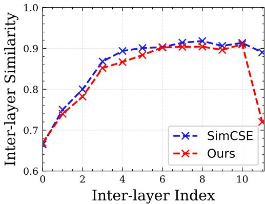
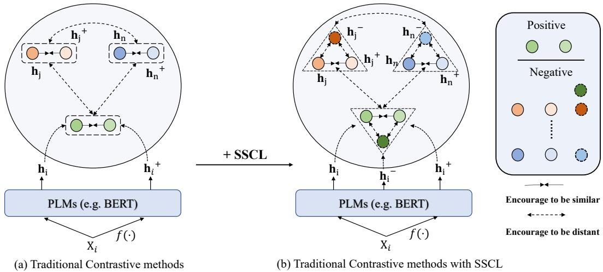
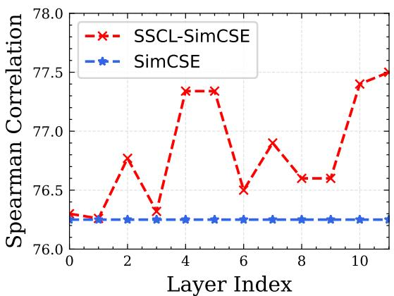
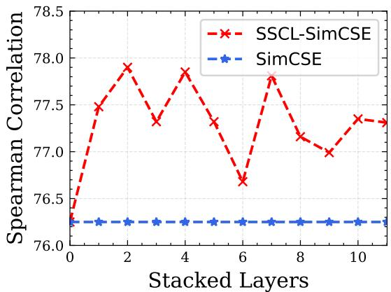
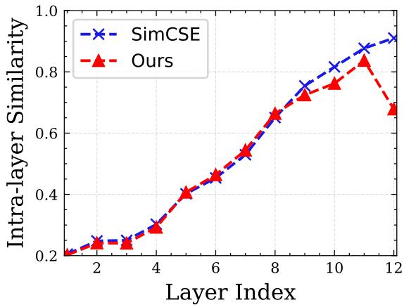
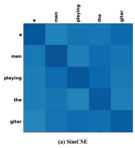
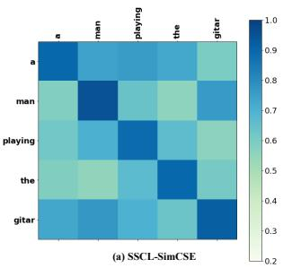
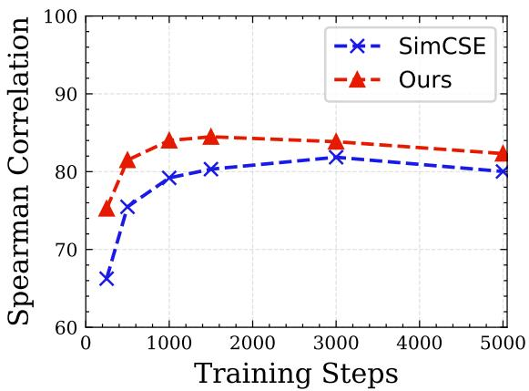

# Alleviating Over-smoothing for Unsupervised Sentence Representation

Nuo Chen1, Linjun Shou2, Jian Pei3, Ming Gong2, Bowen Cao4 Jianhui Chang4, Daxin Jiang2, Jia Li1∗

1Hong Kong University of Science and Technology (Guangzhou), Hong Kong University of Science and Technology 2STCA, Microsoft, Beijing, 3Duke University, USA 4Peking University, China chennuo26@gmail.com, jialee@ust.hk

## Abstract

Currently, learning better unsupervised sentence representations is the pursuit of many natural language processing communities. Lots of approaches based on pre-trained language models (PLMs) and contrastive learning have achieved promising results on this task. Experimentally, we observe that the over-smoothing problem reduces the capacity of these powerful PLMs, leading to sub-optimal sentence representations. In this paper, we present a Simple method named Self-Contrastive Learning (SSCL) to alleviate this issue, which samples negatives from PLMs intermediate layers, improving the quality of the sentence representation. Our proposed method is quite simple and can be easily extended to various state-of-the-art models for performance boosting, which can be seen as a plug-andplay contrastive framework for learning unsupervised sentence representation. Extensive results prove that SSCL brings the superior performance improvements of different strong baselines (e.g., BERT and SimCSE) on Semantic Textual Similarity and Transfer datasets. Our codes are available at https: //github.com/nuochenpku/SSCL.

## 1 Introduction

Learning effective sentence representations is a long-standing and fundamental goal of natural language processing (NLP) communities (Hill et al., 2016; Conneau et al., 2017; Kim et al., 2021; Gao et al., 2021; You et al., 2022), which can be applied to various downstream NLP tasks such as Semantic Textual Similarity (Agirre et al., 2012, 2013, 2014, 2015, 2016; Cer et al., 2017; Marelli et al., 2014) and information retrieval (Xiong et al., 2021; Li et al., 2022). Compared with supervised sentence representations, unsupervised sentence representation learning is more challenging because of lacking enough supervised signals.

  
Figure 1: Inter-layer cosine similarity of sentence representations computed from SimCSE and Ours. We calculate the sentence representation similarity between two adjacent layers on STS-B test set. In this example, we extend our methods of SimCSE by utilizing the penultimate layer as negatives.

In the context of unsupervised sentence representation learning, prior works (Devlin et al., 2018; Lan et al., 2020) tend to directly utilize large pretrained language models (PLMs) as the sentence encoder to achieve promising results. Recently, researchers point that the representations from these PLMs suffer from the anisotropy (Li et al., 2020; Su et al., 2021) issue, which denotes the learned representations are always distributed into a narrow one in the semantic space. More recently, several works (Giorgi et al., 2021; Gao et al., 2021) prove that incorporating PLMs with contrastive learning can alleviate this problem, leading to the distribution of sentence representations becoming more uniform. In practice, these works (Wu et al., 2020a; Yan et al., 2021a) propose various data augmentation methods to construct positive sentence pairs. For instance, Gao et al. (2021) propose to leverage dropout as the simple yet effective augmentation method to construct positive pairs, and the corresponding results are better than other more complex augmentation methods.

Experimentally, aside from the anisotropy and tedious sentence augmentation issues, we observe a new phenomenon also makes the model suboptimized: Sentence representation between two adjacent layers in the unsupervised sentence encoders are becoming relatively identical when the encoding layers go deeper. Figure 1 shows the sentence representation similarity between two adjacent layers on STS-B test set. The similarity scores in blue dotted line are computed from Sim-CSE (Gao et al., 2021), which is the state-of-theart PLM-based sentence model. Obviously, we can observe the similarity between two adjacent layers (inter-layer similarity) is very high (almost more than 0.9). Such high similarities refer to that the model doesn’t acquire adequate distinct knowledge as the encoding layer increases, leading to the neural network validity and energy (Cai and Wang, 2020) decreased and the loss of discriminative power. In this paper, we call this phenomenon as the inter-layer over-smoothing issue (Tang et al., 2022).

<table><tr><td>Model</td><td>SimCSE (10)</td><td>SimCSE (12)</td><td>Ours</td></tr><tr><td>Performance</td><td>70.45</td><td>76.85</td><td>79.03</td></tr></table>

Table 1: Spearman’s correlation score of different models on STS-B. SimCSE (10) and SimCSE (12) means we use the 10 and 12 transformer layers in the encoder.

Intuitively, there are two factors could result in the above issue: (1) The encoding layers in the model are of some redundancy; (2) The training strategy of current model is sub-optimized, making the deep layers in the encoder cannot be optimized effectively. For the former, the easiest and most reasonable way is to cut off some layers in the encoder. However, this method inevitably leads to performance drop. As presented in Table 1, the performance of SimCSE decreases from 76.85% to 70.45% when we drop the last two encoder layers. Meanwhile, almost none existing works have delved deeper to alleviate the over-smoothing issue from the latter side.

Motivated by the above concerns, we present a new training paradigm based on contrastive learning: Simple contrastive method named Self-Contrastive Learning (SSCL), which can significantly improve the performance of learned sentence representations while alleviating the oversmoothing issue. Simply Said, we utilize hidden representations from intermediate PLMs layers as negative samples which the final sentence representations should be away from. Generally, our SSCL has several advantages: (1) It is fairly straightforward and does not require complex data augmentation techniques; (2) It can be seen as a contrastive framework that focuses on mining negatives effectively, and can be easily extended into different sentence encoders that aim for building positive pairs; (3) It can further be viewed as a plug-and-play framework for enhancing sentence representations. As presented in Figure 1, ours (red dotted line) that extend of SimCSE with employing the penultimate layer sentence representation as negatives results in a large drop in the inter-layer similarity between last two adjacent layers (11-th and 12-th), showing SSCL makes inter-layer sentence representations more discriminative. Results in Table 1 show ours also could result in better sentence representations while alleviating the inter-layer over-smoothing issue.

We show SSCL brings superior performance improvements in 7 Semantic Textual Similarity (STS) and 7 Transfer (TS) datasets. Experimentally, we apply our method on two base encoders: BERT and SimCSE. And the resulting models achieve 15.68% and 1.65% improvements on STS tasks, separately. Then, extensive in-depth analysis and probing tasks are further conducted, revealing SSCL could improve PLMs’ capability to capture the surface, syntactic and semantic information of sentences via addressing the over-smoothing problem. Besides of these observations, another interesting finding is that ours can keep comparable performance while reducing the sentence vector dimension size significantly1. For instance, SSCL even obtains better performances (62.42% vs. 58.83%) while reducing the vector dimensions from 768 to 256 dimensions when extending to BERT-base. In general, the contributions of this paper can be summarized as:

• We first observe the inter-layer oversmoothing issue in current state-of-the-art unsupervised sentence models, and then propose SSCL to alleviate this problem, producing superior sentence representations.

• Extensive results prove the effectiveness of the proposed SSCL on Semantic Textual Similarity and Transfer datasets.

• Qualitative and quantitative analysis are included to justify the designed architecture and look into the representation space of SSCL.

## 2 Background

In this section, we first review the formulation of the over-smoothing issue in PLMs from the perspective of the intra-layer and inter-layer. Then we discuss the difference of over-smoothing and annisotropy problems.

## 2.1 Over-smoothing

Recently, Shi et al. (2022) point intra-layer oversmoothing issue in PLMs from the perspective of graph, which denotes different tokens in the input sentence are mapped to quite similar representations. It can be observed via measuring the similarity between different tokens in the same sentence, named token-wise cosine similarity. Given a sentence $\mathrm { X } = \{ \mathrm { x } _ { 1 } , \mathrm { x } _ { 2 } , . . . , \mathrm { x } _ { m } \}$ , token-wise cosine similarity of X can be calculated as:

$$
\mathrm { T o k S i m } = \frac { 1 } { m ( m - 1 ) } \sum _ { u \ne v } \frac { \mathbf { x } _ { u } ^ { \top } \mathbf { x } _ { v } } { \| \mathbf { x } _ { u } \| _ { 2 } \| \mathbf { x } _ { v } \| _ { 2 } }\tag{1}
$$

where m is the number of tokens, $\mathbf { x } _ { u } , \mathbf { x } _ { v }$ are the representations of $\mathrm { x } _ { u } , \mathrm { x } _ { v }$ from PLMs and $\| \cdot \| _ { 2 }$ is the Euclidean norm.

In this paper, we argue that the over-smoothing issue also also exists in inter-layer level, which refers to sentence representations from adjacent PLMs layers are relatively identical. In detail, interlayer over-smoothing means the sentence representations from adjacent layers have high similarity, which can be measured by inter-layer similarity:

$$
\mathrm { S e t S i m } = \frac { \mathbf { s } _ { i } ^ { \top } \mathbf { s } _ { i + 1 } } { \| \mathbf { s } _ { i } \| _ { 2 } \| \mathbf { s } _ { i + 1 } \| _ { 2 } }\tag{2}
$$

where $\mathbf { s } _ { i }$ and $\mathbf { s } _ { i + 1 }$ denote sentence representations of X from two adjacent layers (i-th and i+1-th) in PLMs.

In summary, the over-smoothing issue can divided into two folds: inter-layer and intra-layer. In this paper, we aim at alleviating the over-smoothing issue from the perspective of inter-layer, improving the sentence representations. Surprisingly, we find alleviating over-smoothing in inter-layer also can alleviate the intra-layer over-smoothing issue to some extent, which is discussed in Section 5.3.

## 2.2 Over-smoothing vs. Anisotropy

Currently, the anisotropy issue is widely studied to improve sentence representations from PLMs. Admittedly, despite over-smoothing and anisotropy are related concepts, they are nonetheless completely diverse. As described in (Li et al., 2020;

Su et al., 2021), the anisotropy problem refers to the distribution of learnt sentence representations in the semantic space is always constrained to a certain area. As illustrated in (Shi et al., 2022), "over-smoothing” can be summarized as the token uniformity problems in BERT, which denotes token representations in the same input sentence are highly related that is defined as intra-layer oversmoothing in this paper. Moreover, we extend the concept of over-smoothing issue to the inter-layer, which refers there is a significant degree of similarity between sentence representations from neighbouring neural network layers. Experimentally, the over-smoothing problem can cause one sentence to have a greater token-wise similarity or nearby layers in PLMs to have a higher sentence representation similarity, while anisotropy makes all pairs of sentences in the dataset achieve a relatively identical similarity score. Obviously, over-smoothing is different from the anisotropy issue. Therefore, we distinguish these two concepts in the paper.

## 3 Methodology

In this section, we first introduce the traditional contrastive methods for learning unsupervised sentence representation. Then, we describe the proposed method SSCL for building negatives and briefly illustrate how to extend SSCL of other contrastive frameworks.

## 3.1 Traditional Contrastive Methods

Considering learning unsupervised sentence representation via contrastive learning needs to construct plausible positives or negatives, traditional contrastive methods (e.g., word deletion, dropout) tends to utilize data augmentation on training data to build positives. In detail, given a sentence collection: ${ \mathcal { X } } = \{ \mathrm { x } _ { i } \} _ { i = 1 } ^ { m }$ . Subsequently, we can utilize some data augmentation methods: $f ( \cdot )$ on each $\mathrm { X } _ { i } \in { \mathcal { X } }$ to construct the semantically related positive sample $\mathrm { X } _ { i } ^ { + } = f ( \mathrm { X } _ { i } )$ (e.g., dropout, word shuffle and deletion), as shown in Figure 2 (a). Then, let $\mathbf { h } _ { i }$ and ${ \bf h } _ { i } ^ { + }$ denote the PLMs (e.g., BERT) last layer sentence representations of $\mathrm { X } _ { i }$ and $\mathrm { X } _ { i } ^ { + }$ , the contrastive training objective for $( \mathbf { h } _ { i } , \mathbf { h } _ { i } ^ { + } )$ with a mini-batch of N pairs can be formulated as:

$$
\mathcal { L } _ { \mathrm { t c m } } = - \log \frac { \exp ( \Psi ( \mathbf { h } _ { i } , \mathbf { h } _ { i } ^ { + } ) / \tau ) } { \sum _ { j = 1 } ^ { N } \exp ( \Psi ( \mathbf { h } _ { i } , \mathbf { h } _ { j } ) / \tau ) }\tag{3}
$$

where $\Psi ( , )$ denotes the cosine similarity function, τ is temperature. Notice that, these methods focus on mining positive examples while directly utilize in-batch negatives during training. Thereafter, we introduce SSCL to build useful negatives, and thus, can be seen as complementary to previous methods.

  
Figure 2: The overall architecture of the traditional contrastive methods and our proposed SSCL.

## 3.2 SSCL

SSCL is free from external data augmentation procedures which utilizes hidden representations from PLMs intermediate layers as negatives. In this paper, we treat the last layer representation as the final sentence representation which is needed to optimize. Concretely, we collect the intermediate M-th layer sentence representation in PLMs, which is regarded as the negatives of last layer representation and named as $\mathbf { h } _ { i } ^ { - }$ , as shown in Figure 2 (b). Hence, we obtain the negative pairs $( \mathbf { h } _ { i } , \mathbf { h } _ { i } ^ { - } )$ ). As aforementioned, we also treat ${ \mathbf { h } } _ { i } ^ { + }$ as the positive sample which obtained from any data augmentation method. Subsequently, the training objective $\mathcal { L } _ { \mathrm { h n e } }$ can be reformulated as follows:

$$
- \log \frac { \exp ( \Psi ( \mathbf { h } _ { i } , \mathbf { h } _ { i } ^ { + } ) / \tau ) } { \sum ^ { N } ( ( \exp ( \Psi ( \mathbf { h } _ { i } , \mathbf { h } _ { j } ) / \tau ) + \exp ( \Psi ( \mathbf { h } _ { i } , \mathbf { h } _ { i } ^ { - } ) / \tau ) ) } \underset { / } { \exp ( \Psi ( \mathbf { h } _ { i } , \mathbf { h } _ { i } ^ { - } ) / \tau ) } )\tag{4}
$$

where the first term in the denominator refers to the original in-batch negatives, and the second term denotes the intermediate negatives. Through these methods, SSCL makes the last layer representation of PLMs more discriminative from the previous layers via easily enlarging the number of negatives, and thus, alleviating the over-smoothing issue. Clearly, our approach is rather straightforward and can be simply implemented into these conventional contrastive techniques.

## 4 Experiments

## 4.1 Evaluation Datasets

We conduct our experiments on 7 Semantic Textual Similarity (STS) tasks and 7 Transfer tasks (TR). Following the common setting, SentEval toolkit is used for evaluation purposes.

Semantic Textual Similarity We evaluate our method on the following seven STS datasets: STS 12-16 (Agirre et al., 2012, 2013, 2014, 2015, 2016), STS-B (Cer et al., 2017) and SICK-R (Marelli et al., 2014). And Spearman’s correlation coefficient is used as evaluation metric of the model performance.

Transfer We evaluate our models on the following transfer tasks: MR (Pang and Lee, 2005), CR (Hu and Liu, 2004), SUBJ (Pang and Lee, 2004), MPQA (Wiebe et al., 2005), SST-2 (Socher et al., 2013), TREC (Voorhees and Tice, 2000) and MRPC (Dolan and Brockett, 2005). Concretely, we also follow the default settings in (Gao et al., 2021) to train each sentence representation learning method.

## 4.2 Implementation Details

We use the same training corpus from (Gao et al., 2021) to avoid training bias, which consists of one million sentences randomly sampled from Wikipedia. In our SSCL implement, we select BERT (base and large version) as our backbone architecture because of its typical impact. τ is set to 0.05 and Adam optimizer is used for optimizing the model. Experimentally, the learning rate is set to 3e-5 and 1e-5 for training $\mathrm { B E R T } _ { b a s e }$ and $\mathbf { B E R T } _ { l a r g e }$ models. The batch size is set to 64 and max sequence length is 32. It is worthwhile to notice we utilize average pooling over input sequence token representation and [CLS] vector to obtain sentence-level representations, separately. More concretely, we train our model with 1 epoch on a single 32G NVIDIA V100 GPU. For STS tasks, we save our checkpoint with best results on STS-B development set; For Transfer tasks, we use the average score of 7 seven transfer datasets to find the best checkpoint.

<table><tr><td>Model</td><td>STS12</td><td>STS13</td><td>STS14</td><td>STS15</td><td>STS16</td><td>STS-B</td><td>SICK-R</td><td>Avg.</td></tr><tr><td colspan="9">Base Version</td></tr><tr><td>GloVe embeddings (avg.)</td><td>55.14</td><td>70.66</td><td>59.73</td><td>68.25</td><td>63.66</td><td>58.02</td><td>53.76</td><td>61.32</td></tr><tr><td>BERT (cls.)</td><td>29.70</td><td>49.38</td><td>39.67</td><td>56.03</td><td>56.19</td><td>43.87</td><td>52.06</td><td>46.70</td></tr><tr><td>SSCL-BERT (cls.)</td><td>49.21</td><td>67.59</td><td>58.96</td><td>69.94</td><td>68.00</td><td>62.87</td><td>60.43</td><td>62.42</td></tr><tr><td>BERT (avg.)</td><td>48.26</td><td>47.72</td><td>46.83</td><td>52.30</td><td>59.88</td><td>54.27</td><td>56.41</td><td>52.24</td></tr><tr><td>SSCL-BERT (avg.)</td><td>53.93</td><td>63.10</td><td>56.41</td><td>68.00</td><td>70.46</td><td>64.85</td><td>61.15</td><td>62.56</td></tr><tr><td>BERT-flow</td><td>58.40</td><td>67.10</td><td>60.85</td><td>75.16</td><td>71.22</td><td>68.66</td><td>64.47</td><td>66.55</td></tr><tr><td> ${ \mathbf { B } } { \mathbf { E } } { \mathbf { R } } { \mathbf { T } } { \mathbf { \ - w h i t e n i n g } } ^ { \odot }$ </td><td>57.83</td><td>66.90</td><td>60.90</td><td>75.08</td><td>71.31</td><td>68.24</td><td>63.73</td><td>66.28</td></tr><tr><td> $\scriptstyle \mathrm { I S - B E R T } ^ { \bigcirc }$ </td><td>56.77</td><td>69.24</td><td>61.21</td><td>75.23</td><td>70.16</td><td>69.21</td><td>64.25</td><td>66.58</td></tr><tr><td> $C { \mathrm { T } } { \cdot } { \mathrm { B E R T } } ^ { \bigcirc }$ </td><td>61.63</td><td>76.80</td><td>68.47</td><td>77.50</td><td>76.48</td><td>74.31</td><td>69.19</td><td>72.05</td></tr><tr><td>SimCSE</td><td>68.40</td><td>82.41</td><td>74.38</td><td>80.91</td><td>78.56</td><td>76.85</td><td>72.23</td><td>76.25</td></tr><tr><td>SSCL-SimCSE</td><td>71.68</td><td>83.50</td><td>76.42</td><td>83.46</td><td>78.39</td><td>79.03</td><td>71.76</td><td>77.90</td></tr><tr><td colspan="9">Large Version</td></tr><tr><td> ${ \bf B E R T } _ { l a r g e } ( { \bf c l s . } )$ </td><td>33.06</td><td>57.64</td><td>47.95</td><td>55.83</td><td>62.42</td><td>49.66</td><td>53.87</td><td>51.49</td></tr><tr><td> $\mathbf { B E R T } _ { l a r g e } { \cdot } \mathbf { f l o w }$ </td><td>65.20</td><td>73.39</td><td>69.42</td><td>74.92</td><td>77.63</td><td>72.26</td><td>62.50</td><td>70.76</td></tr><tr><td> $\mathbf { B E R T } _ { l a r g e ^ { - } } \mathbf { w h i t e n i n g }$ </td><td>64.35</td><td>74.64</td><td>69.64</td><td>74.68</td><td>75.94</td><td>60.81</td><td>72.47</td><td>70.35</td></tr><tr><td> $\mathbf { C o n s e r t } _ { l a r g e }$ </td><td>70.69</td><td>82.96</td><td>74.13</td><td>82.78</td><td>76.66</td><td>77.53</td><td>70.47</td><td>76.45</td></tr><tr><td> $\mathrm { S i m C S E } _ { l a r g e }$ </td><td>69.17</td><td>84.36</td><td>75.09</td><td>83.99</td><td>78.61</td><td>79.54</td><td>71.97</td><td>77.53</td></tr><tr><td> $\mathbf { S S C L - S i m C S E } _ { l a r g e }$ </td><td>71.98</td><td>85.74</td><td>77.94</td><td>85.94</td><td>80.08</td><td>81.20</td><td>74.28</td><td>79.69</td></tr></table>

Table 2: Sentence embedding performance on STS tasks (Spearman’s correlation, “all” setting). We highlight the highest numbers among models with the same pre-trained encoder. We run each experiment three times and report average results. ♡ denotes results from (Gao et al., 2021).

## 4.3 Results

Baselines We compare our methods with the following baselines: (1) naive baselines: GloVe average embeddings (Pennington et al., 2014), Skipthought and BERT; (2) strong baselines based on BERT: BERT-flow (Li et al., 2020), BERTwhitening (Su et al., 2021), IS-BERT (Zhang et al., 2020), CT-BERT (Carlsson et al., 2021), Consert (Yan et al., 2021b) and SimCSE. For a fair comparison, we extend SSCL to BERT and Sim-CSE, separately. When extending to BERT (SSCL-BERT), we don’t add any augmentation methods to construct positives; Extending to SimCSE (SSCL-SimCSE) means we utilize dropout masks as the way of building positives.

STS tasks Table 2 reports the results of methods on 7 STS datasets. From the table, we can observe that: (1) Glove embeddings outperforms $\mathrm { B E R T } _ { b a s e } .$ indicating the anisotropy issue has the negative impact of BERT sentence representations; (2) $\mathbf { S S C L - B E R T } _ { b a s e }$ (cls./avg.) surpasses $\mathrm { B E R T } _ { b a s e }$ (cls./avg.) by a large margin (62.42% vs. 46.70%, 62.56% vs. 52.54%), showing the effectiveness of our proposed SSCL; (3) $\mathrm { S S C L - S i m C S E } _ { b a s e }$ boosts the model performance of $\mathrm { S i m C S E } _ { b a s e }$ (77.90% vs. 76.25%), representing SSCL can easily extend of other contrastive model which can be seen as a plug-and-play framework. Results also prove incorporating negatives in contrastive learning is essential for obtaining better sentence representations. Similar results can be observed in the large version of the above models.

Transfer tasks Table 3 includes the main results on 7 transfer datasets. From the table, we can draw a conclusion that our model $\mathrm { S S C L - B E R T } _ { b a s e } / \mathrm { S S C L - B E R T } _ { l a r g e }$ outperforms $\mathbf { B E R T } _ { b a s e } / \mathbf { B E R T } _ { l a r g e }$ on seven datasets, proving the effectiveness of ours. Meanwhile, SSCL-$\mathrm { S i m C S E } _ { b a s e } / \mathrm { S S C L } \mathrm { - } \mathrm { S i m C S E } _ { l a r g e }$ also shows a substantial model performance boost when compared with $\mathrm { S i m C S E } _ { b a s e } / \mathrm { S i m C S E } _ { l a r g e }$ . For example, $\mathrm { S S C L - S i m C S E } _ { l a r g e }$ improves $\mathrm { S i m C S E } _ { l a r g e }$ to 88.88% (87.17%), suggesting its effectiveness.

<table><tr><td>Model</td><td>MR</td><td>CR</td><td>SUBJ</td><td>MPQA</td><td>SST</td><td>TREC</td><td>MRPC</td><td>Avg.</td></tr><tr><td>GloVe embeddings (avg.)</td><td>77.25</td><td>78.30</td><td>91.17</td><td>87.85</td><td>80.18</td><td>83.00</td><td>72.87</td><td>81.52</td></tr><tr><td>Skip-thought</td><td>76.50</td><td>80.10</td><td>93.60</td><td>87.10</td><td>82.00</td><td>92.20</td><td>73.00</td><td>83.50</td></tr><tr><td> ${ \mathrm { B E R T } } _ { b a s e } ( { \mathrm { c l s } } . )$ </td><td>76.86</td><td>82.68</td><td>93.73</td><td>85.87</td><td>80.56</td><td>88.20</td><td>70.13</td><td>82.57</td></tr><tr><td> $\mathbf { S S C L - B E R T } _ { b a s e } \ ( \mathrm { c l s } . )$ </td><td>80.48</td><td>85.88</td><td>95.26</td><td>86.97</td><td>84.84</td><td>88.80</td><td>69.62</td><td>84.55</td></tr><tr><td> ${ \bf B E R T } _ { b a s e } \ ( { \bf a v g . } )$   $\mathbf { S S C L - B E R T } _ { b a s e } \ ( \mathrm { a v g . } )$ </td><td>77.67</td><td>83.12</td><td>94.46</td><td>86.11</td><td>80.08</td><td>85.12</td><td>72.64</td><td>82.86</td></tr><tr><td> $\mathrm { S i m C S E } _ { b a s e }$ </td><td>78.87</td><td>84.28</td><td>95.31</td><td>87.40</td><td>80.79</td><td>86.00</td><td>73.12</td><td>83.68</td></tr><tr><td> $\mathbf { S S C L - S i m C S E } _ { b a s e }$ </td><td>81.62 81.08</td><td>85.44 86.16</td><td>94.01 94.21</td><td>88.05 88.63</td><td>85.06</td><td>89.10</td><td>74.03</td><td>85.11</td></tr><tr><td></td><td></td><td></td><td></td><td></td><td>85.24</td><td>89.61</td><td>74.20</td><td>85.61</td></tr><tr><td> ${ \bf B E R T } _ { l a r g e } ( { \bf c l s . } )$ </td><td>78.68</td><td>84.85</td><td>94.21</td><td>88.23</td><td>84.13</td><td>91.40</td><td>71.13</td><td>84.66</td></tr><tr><td> $\mathrm { S S C L - B E R T } _ { l a r g e } \ ( \mathrm { c l s . } )$ </td><td>73.93</td><td>87.18</td><td>94.96</td><td>88.75</td><td>85.96</td><td>88.64</td><td>74.24</td><td>85.83</td></tr><tr><td> $\mathrm { S i m C S E } _ { l a r g e }$ </td><td>84.37</td><td>88.64</td><td>95.26</td><td>88.04</td><td>89.95</td><td>90.40</td><td>74.42</td><td>87.17</td></tr><tr><td> $\mathbf { S S C L - S i m C S E } _ { l a r g e }$ </td><td>86.01</td><td>90.36</td><td>95.98</td><td>89.04</td><td>91.27</td><td>93.20</td><td>76.29</td><td>88.88</td></tr></table>

Table 3: Transfer task results of different sentence embedding models (measured as accuracy). We highlight the highest numbers among models with the same pre-trained encoder.

<table><tr><td>Model</td><td>TreeDepth (Syntactic)</td><td>SentLen (Surface)</td><td>CoordInv (Semantic)</td></tr><tr><td>BERT</td><td>21</td><td>67</td><td>34</td></tr><tr><td>SSCL</td><td>23.1</td><td>75.3</td><td>42.1</td></tr><tr><td>SimCSE</td><td>24</td><td>80</td><td>50</td></tr><tr><td>SSCL*</td><td>25.3</td><td>88.5</td><td>60.18</td></tr></table>

Table 4: Probing task performances for each model. $\mathbf { s s c L } ^ { \he }$ denotes SSCL based on BERT, SSCL♣ represents SSCL based on SimCSE. Concretely, we use the large version of these models.

## 5 Analysis

In this section, we first conduct qualitative experiments via probing tasks to analyse the structural of the resulting representations (Table 4), including syntactic, surface and semantic. Then, we explore adequate quantitive analysis to verify the effectiveness of SSCL, such as the negative sampling strategy, strengths of SSCL in reducing redundant semantics (vector dimension) and etc. Subsequently, we further provide some discussions on SSCL, like chicken-and-egg issue. In the Appendix B, we show the strength of SSCL in fasting convergence speed (Figure 6), and conduct discussions: whether improvements of resulting model are indeed from SSCL or just more negatives (Table 7).

## 5.1 Qualitative Analysis

Representation Probing In this component, we aim to explore the reason behind the effectiveness of the proposed SSCL. Therefore, we conduct some probing tasks to investigate the linguistic structure implicitly learned by our resulting model representations. We directly evaluate each model using three group sentence-level probing tasks: surface task probe for Sentence Length (SentLen), syntactic task probe for the depth of syntactic tree (TreeDepth) and the semantic task probe for coordinated clausal conjuncts (CoordInv). We report the results in Table 4, and we can observe our models significantly surpass their original baselines on each task. Specially, SSCL-BERT and SSCL-SimCSE improve the baselines’ (BERT and SimCSE) ability of capturing sentence semantic (60.18% vs. 50%, 42.1% vs. 34%) and surface (75.3% vs. 67%, 88.5% vs. 80%) by a large margin, which are essential to improve model sentence representations, showing the reason of ours perform well on both STS and Transfer tasks.

## 5.2 Quantitive Analysis

Negative Sampling Strategy From the description in Section 3, we can raise an intuitive question: Which single layer is most suitable for building negatives in SSCL? Hence, we conduct a series of experiments to verify the effect of intermediate layers with 0, 1, 2, 3, 4, 5, 6, 7, 8, 9, 10, 11 , results illustrated in Figure 3 (a). In the figure, layer-index 0 represents original SimCSE, and layer-index 1-11 represents corresponding transformer layers. We can observe that our model SSCL-SimCSE obtains the best result 77.80% while utilizing 11-th layer representation as negatives. The reason behind this phenomenon can be explained that SSCL makes the PLMs more distinguishable between last layer and previous layers, and thus alleviating oversmoothing issues. More specifically, this effect will be more obvious when utilizing 11-th layer representation as negatives, helping the model achieve best result.

  
(a)

  
(b)  
Figure 3: Layer negatives analysis of SSCL. (a) SSCL with different single layers to construct negatives, (b) SSCL with stacked different layers to construct negatives named Progressive SSCL. We report the average model performances in STS datasets.

Progressive SSCL Intuitively, we also can stack several intermediate layers to construct more negatives in our SSCL implement. Thus, we stack previous several layers for building negatives which named Progressive SSCL. We visualize the results in Figure 3 (b), and the stack transformer layers range 0 to 11. Stacking 0 layer represents original SimCSE, and Stacking 1-11 layers means we stack last 1-11 layers representation to construct negatives. For example, stacking 2 layers represents utilizing 11-th and 10-th transformer layers to form negatives. From the figure, we can draw the following conclusion: (1) Progressive SSCL slightly outperforms SSCL, showing incorporating more negatives can help improve the model performance; (2) Progressive SSCL with 2 layers can lead the best model performance (77.90%), indicating using 11-th and 10-th transformer layers to construct negatives can further make the token representations of last layer become more distinguishable.

Vector Dimension From the above analysis and experimental results, we can observe SSCL can help the PLMs achieve sufficient sentence-level semantic representations. Therefore, we conduct experiments to verify whether our methods need high vector dimensions (e.g., 768) to maintain corresponding results. We report results of BERT, SSCL-BERT and SSCL-SimCSE with different vector dimensions in the Table 5. First, we can observe that BERT performance keeps dropping when word vector dimension reducing, indicating the high vector dimension is essential for maintaining BERT performance. Then, we also find SSCL-BERT and SSCL-SimCSE still achieve comparable performances with smaller vector dimensions, showing our method can reduce redundant information in the resulting sentence-level representations, and thus lower dimensions is enough for SSCL models obtaining competitive results. It is worthwhile to notice that SSCL-BERT achieves better performances when the vector dimension decreased. For example, SSCL-BERT improves the model results from 58.83% to 62.42% when vector dimensions reduced from 768 to 256.

Impact of τ Intuitively, it is essential to study the sensitivity analysis of the temperature τ in contrastive learning. Thereafter, we conduct additional experiments to verify the effectiveness of τ on optimizing the model. We test the model performances with $\tau \in \{ 0 . 0 0 1 , 0 . 0 1 , 0 . 0 5 , 0 . 1 \}$ . From the Table 6, we observe the different τ indeed brings performance improvements or drops of both models, and ours achieve best results when $\tau = 0 . 0 5$

## 5.3 Discussion on SSCL

Chicken-and-egg issue As mentioned in Section 1, our methods effectively alleviate the oversmoothing problem in sentence-level. In this component, we also utilize TokSim in Eq.1 to conduct quantitative analysis to verify whether SSCL could alleviate the over-smoothing problem in intra-layer level. We calculate TokSim for each sample from STS-B (Cer et al., 2017) test set with SimCSE and our resulting model SSCL-SimCSE. For comparison, both models are initialized from BERT stacked with 12 transformer blocks. As shown in the Figure 4, TokSim is low from the first few layers, showing token representations are highly distinguishable. However, TokSim becomes higher with layers getting deeper. Concretely, TokSim of the last layer from SimCSE is larger than 90%. Thereafter, ours has a obvious TokSim drop in the last few layers (11 and 12), proving our method alleviates the over-smoothing issue in both sentence level and token level while improving the model performances (Figure 4 (b)). This is because sentence representations are frequently obtained via adding aggregation methods (e.h., mean pooling and max pooling) over the token representations, resulting in an entangled relationship (Mohebbi et al., 2021). Therefore, alleviating over-smoothing in sentence representation could eliminate over-smoothing at token-level to some extent.

<table><tr><td>Model</td><td>Dimension</td><td>Avg. STS</td></tr><tr><td rowspan="3">BERT</td><td>128</td><td>39.24</td></tr><tr><td>256</td><td>43.22</td></tr><tr><td>768</td><td>46.7</td></tr><tr><td rowspan="3">SSCL-BERT</td><td>128</td><td>61.3</td></tr><tr><td>256</td><td>62.42</td></tr><tr><td>768</td><td>58.83</td></tr><tr><td rowspan="3">SSCL-SimCSE</td><td>128</td><td>76.53</td></tr><tr><td>256</td><td>77.97</td></tr><tr><td>768</td><td>77.90</td></tr></table>

Table 5: Ablation studies of the vector dimension based on the development sets using BERT. We utilize the same simply linear projection head to transfer the vector dimensions. Here, the Spearman’s Correlation is employed as the evaluation metric.
<table><tr><td rowspan="2">Model</td><td colspan="3">T</td></tr><tr><td>0.001</td><td>0.01</td><td>0.05 0.1</td></tr><tr><td>SimCSE</td><td>74.82</td><td>75.33</td><td>76.25 72.24</td></tr><tr><td>SSCL*</td><td>75.77</td><td>77.40 77.90</td><td>74.12</td></tr></table>

Table 6: Model performances with different τ during training. We report average results of SimCSE and SSCL-SimCSE on STS tasks. SSCL♣ denotes SSCL-SimCSE.

Visualization As shown in the Figure 5 (a), we showcase the token representation similarities produced by SimCSE (Gao et al., 2021). Obviously, we can observe each token representation in the sentence is very close to each other. Nevertheless, the token representations within the same sentence should be discriminative even if the sentence structure is simple in the ideal setting (as shown in the

Figure 4: TokenSim with different layers computed from SimCSE and Ours (SSCL-SimCSE). We conduct our analysis on STS-B test dataset. In this example, we extend our methods of SimCSE with utilizing the penultimate layer as negatives.  

  
Figure 5: Token representation cosine similarity matrices from SimCSE and SSCL-SimCSE. Representations taken from the last layers of these models.

Figure 5 (b)). As aforementioned, such high similar token representations may confuse the model to capture global and reasonable sentence-level understanding, leading to sub-optimized sentence representations. Nevertheless, our SSCL-SimCSE can alleviate this problem from the inter-layer perspective while making token representations in the sentence more discriminative, as seen in Figure 5 (b).

## 6 Conclusion

In this paper, we explore the over-smoothing problem in unsupervised sentence representation. Then, we propose a simple yet effective method named SSCL, which constructs negatives from PLMs intermediate layers to alleviate this problem, leading better sentence representations. The proposed SSCL can easily be extended to other state-of-theart methods, which can be seen as a plug-and-play contrastive framework. Experiments on seven STS datasets and seven Transfer datasets prove the effectiveness of our proposed method. And qualitative analysis indicates our method improves the resulting model’s ability of capturing the semantic and surface. Also quantitative analysis shows the proposed SSCL not only reduces redundant semantics but also fasts the convergence speed. As an extension of our future work, we will explore other methods to improve the unsupervised sentence representation quality.

## Limitations

The main contributions of this paper are towards tackling over-smoothing issue for learning unsupervised sentence representation. The proposed approach is fairly basic and may simply be extended to improve the performance of other state-of-the-art models. More broadly, we anticipate that the central idea of this study will provide insights to other research communities seeking to improve sentence representation in an unsupervised setting. Admittedly, the proposed strategies are restricted with unsupervised training, and biases in the training corpus also may influence the performance of the resulting model. These concerns warrant further research and consideration when utilizing this work to build unsupervised retrieval systems.

## Acknowledgement

This research was supported by NSFC Grant No. 62206067, and Guangzhou-HKUST(GZ) Joint Funding Scheme 2023A03J0673.

## References

Eneko Agirre, Carmen Banea, Claire Cardie, Daniel Cer, Mona Diab, Aitor Gonzalez-Agirre, Weiwei Guo, Iñigo Lopez-Gazpio, Montse Maritxalar, Rada Mihalcea, German Rigau, Larraitz Uria, and Janyce Wiebe. 2015. SemEval-2015 task 2: Semantic textual similarity, English, Spanish and pilot on interpretability. In Proceedings of the 9th International Workshop on Semantic Evaluation (SemEval 2015), pages 252–263.

Eneko Agirre, Carmen Banea, Claire Cardie, Daniel Cer, Mona Diab, Aitor Gonzalez-Agirre, Weiwei Guo, Rada Mihalcea, German Rigau, and Janyce Wiebe. 2014. SemEval-2014 task 10: Multilingual semantic textual similarity. In Proceedings ofthe 8th International Workshop on Semantic Evaluation (SemEval 2014), pages 81–91.

Eneko Agirre, Carmen Banea, Daniel Cer, Mona Diab, Aitor Gonzalez-Agirre, Rada Mihalcea, German Rigau, and Janyce Wiebe. 2016. SemEval-2016

task 1: Semantic textual similarity, monolingual and cross-lingual evaluation. In Proceedings of the 10th International Workshop on Semantic Evaluation (SemEval-2016), pages 497–511. Association for Computational Linguistics.

Eneko Agirre, Daniel Cer, Mona Diab, and Aitor Gonzalez-Agirre. 2012. SemEval-2012 task 6: A pilot on semantic textual similarity. In \*SEM 2012: The First Joint Conference on Lexical and Computational Semantics – Volume 1: Proceedings of the main conference and the shared task, and Volume 2: Proceedings of the Sixth International Workshop on Semantic Evaluation (SemEval 2012), pages 385– 393.

Eneko Agirre, Daniel Cer, Mona Diab, Aitor Gonzalez-Agirre, and Weiwei Guo. 2013. \*SEM 2013 shared task: Semantic textual similarity. In Second Joint Conference on Lexical and Computational Semantics (\*SEM), Volume 1: Proceedings of the Main Conference and the Shared Task: Semantic Textual Similarity, pages 32–43.

Chen Cai and Yusu Wang. 2020. A note on oversmoothing for graph neural networks. CoRR, abs/2006.13318.

Fredrik Carlsson, Amaru Cuba Gyllensten, Evangelia Gogoulou, Erik Ylipää Hellqvist, and Magnus Sahlgren. 2021. Semantic re-tuning with contrastive tension.

Daniel Cer, Mona Diab, Eneko Agirre, Iñigo Lopez-Gazpio, and Lucia Specia. 2017. SemEval-2017 task 1: Semantic textual similarity multilingual and crosslingual focused evaluation. In Proceedings of the 11th International Workshop on Semantic Evaluation (SemEval-2017), pages 1–14.

Nuo Chen, Linjun Shou, Min Gong, Jian Pei, and Daxin Jiang. 2021a. From good to best: Two-stage training for cross-lingual machine reading comprehension.

Nuo Chen, Linjun Shou, Ming Gong, Jian Pei, and Daxin Jiang. 2022. Bridging the gap between language models and cross-lingual sequence labeling. In Proceedings ofthe 2022 Conference ofthe North American Chapter ofthe Association for Computational Linguistics: Human Language Technologies, pages 1909–1923, Seattle, United States. Association for Computational Linguistics.

Nuo Chen, Linjun Shou, Ming Gong, Jian Pei, Chenyu You, Jianhui Chang, Daxin Jiang, and Jia Li. 2023. Bridge the gap between language models and tabular understanding. arXiv preprint arXiv:2302.09302.

Nuo Chen, Chenyu You, and Yuexian Zou. 2021b. Selfsupervised dialogue learning for spoken conversational question answering. CoRR, abs/2106.02182.

Alexis Conneau, Douwe Kiela, Holger Schwenk, Loïc Barrault, and Antoine Bordes. 2017. Supervised learning of universal sentence representations from natural language inference data. pages 670–680.

Jacob Devlin, Ming-Wei Chang, Kenton Lee, and Kristina Toutanova. 2018. BERT: pre-training of deep bidirectional transformers for language understanding. CoRR, abs/1810.04805.

William B. Dolan and Chris Brockett. 2005. Automatically constructing a corpus of sentential paraphrases. In Proceedings ofthe Third International Workshop on Paraphrasing (IWP2005).

Tianyu Gao, Xingcheng Yao, and Danqi Chen. 2021. Simcse: Simple contrastive learning of sentence embeddings. CoRR, abs/2104.08821.

Ziqi Gao, Yifan Niu, Jiashun Cheng, Jianheng Tang, Tingyang Xu, Peilin Zhao, Lanqing Li, Fugee Tsung, and Jia Li. 2022. Handling missing data via max-entropy regularized graph autoencoder. arXiv preprint arXiv:2211.16771.

John M. Giorgi, Osvald Nitski, Bo Wang, and Gary D. Bader. 2021. Declutr: Deep contrastive learning for unsupervised textual representations. In ACL/IJCNLP (1), pages 879–895. Association for Computational Linguistics.

Raia Hadsell, Sumit Chopra, and Yann LeCun. 2006. Dimensionality reduction by learning an invariant mapping. In CVPR (2), pages 1735–1742. IEEE Computer Society.

Felix Hill, Kyunghyun Cho, and Anna Korhonen. 2016. Learning distributed representations of sentences from unlabelled data. pages 1367–1377.

Minqing Hu and Bing Liu. 2004. Mining and summarizing customer reviews. In ACM SIGKDD international conference on Knowledge discovery and data mining.

Taeuk Kim, Kang Min Yoo, and Sang-goo Lee. 2021. Self-guided contrastive learning for BERT sentence representations. pages 2528–2540.

Zhenzhong Lan, Mingda Chen, Sebastian Goodman, Kevin Gimpel, Piyush Sharma, and Radu Soricut. 2020. ALBERT: A lite BERT for self-supervised learning of language representations. In ICLR. Open-Review.net.

Bohan Li, Hao Zhou, Junxian He, Mingxuan Wang, Yiming Yang, and Lei Li. 2020. On the sentence embeddings from pre-trained language models. pages 9119–9130.

Jia Li, Yongfeng Huang, Heng Chang, and Yu Rong. 2022. Semi-supervised hierarchical graph classification. IEEE Transactions on Pattern Analysis and Machine Intelligence.

Marco Marelli, Stefano Menini, Marco Baroni, Luisa Bentivogli, Raffaella Bernardi, and Roberto Zamparelli. 2014. A SICK cure for the evaluation of compositional distributional semantic models. pages 216–223.

Hosein Mohebbi, Ali Modarressi, and Mohammad Taher Pilehvar. 2021. Exploring the role of BERT token representations to explain sentence probing results. In EMNLP (1), pages 792–806. Association for Computational Linguistics.

Bo Pang and Lillian Lee. 2004. A sentimental education: Sentiment analysis using subjectivity summarization based on minimum cuts. pages 271–278.

Bo Pang and Lillian Lee. 2005. Seeing stars: Exploiting class relationships for sentiment categorization with respect to rating scales. pages 115–124.

Jeffrey Pennington, Richard Socher, and Christopher Manning. 2014. GloVe: Global vectors for word representation. In Proceedings ofthe 2014 Conference on Empirical Methods in Natural Language Processing (EMNLP), pages 1532–1543.

Han Shi, Jiahui Gao, Hang Xu, Xiaodan Liang, Zhenguo Li, Lingpeng Kong, Stephen M. S. Lee, and James T. Kwok. 2022. Revisiting over-smoothing in BERT from the perspective of graph. CoRR, abs/2202.08625.

Richard Socher, Alex Perelygin, Jean Wu, Jason Chuang, Christopher D. Manning, Andrew Ng, and Christopher Potts. 2013. Recursive deep models for semantic compositionality over a sentiment treebank. pages 1631–1642.

Nitish Srivastava, Geoffrey E. Hinton, Alex Krizhevsky, Ilya Sutskever, and Ruslan Salakhutdinov. 2014. Dropout: a simple way to prevent neural networks from overfitting. J. Mach. Learn. Res., 15(1):1929– 1958.

Jianlin Su, Jiarun Cao, Weijie Liu, and Yangyiwen Ou. 2021. Whitening sentence representations for better semantics and faster retrieval. arXiv preprint arXiv:2103.15316.

Jianheng Tang, Jiajin Li, Ziqi Gao, and Jia Li. 2022. Rethinking graph neural networks for anomaly detection. In International Conference on Machine Learning, pages 21076–21089. PMLR.

Ellen M Voorhees and Dawn M Tice. 2000. Building a question answering test collection. In the 23rd annual international ACM SIGIR conference on Research and development in information retrieval, pages 200–207.

Hao Wang, Yangguang Li, Zhen Huang, Yong Dou, Lingpeng Kong, and Jing Shao. 2022. SNCSE: contrastive learning for unsupervised sentence embedding with soft negative samples. CoRR, abs/2201.05979.

Janyce Wiebe, Theresa Wilson, and Claire Cardie. 2005. Annotating expressions of opinions and emotions in language. Language resources and evaluation, 39(2- 3):165–210.

Zhuofeng Wu, Sinong Wang, Jiatao Gu, Madian Khabsa, Fei Sun, and Hao Ma. 2020a. Clear: Contrastive learning for sentence representation. arXiv preprint arXiv:2012.15466.

Zhuofeng Wu, Sinong Wang, Jiatao Gu, Madian Khabsa, Fei Sun, and Hao Ma. 2020b. CLEAR: contrastive learning for sentence representation. CoRR, abs/2012.15466.

Lee Xiong, Chenyan Xiong, Ye Li, Kwok-Fung Tang, Jialin Liu, Paul N. Bennett, Junaid Ahmed, and Arnold Overwijk. 2021. Approximate nearest neighbor negative contrastive learning for dense text retrieval.

Yuanmeng Yan, Rumei Li, Sirui Wang, Fuzheng Zhang, Wei Wu, and Weiran Xu. 2021a. ConSERT: A contrastive framework for self-supervised sentence representation transfer. pages 5065–5075.

Yuanmeng Yan, Rumei Li, Sirui Wang, Fuzheng Zhang, Wei Wu, and Weiran Xu. 2021b. Consert: A contrastive framework for self-supervised sentence representation transfer. In ACL/IJCNLP (1), pages 5065– 5075. Association for Computational Linguistics.

Chenyu You, Nuo Chen, Fenglin Liu, Shen Ge, Xian Wu, and Yuexian Zou. 2022. End-to-end spoken conversational question answering: Task, dataset and model. In Findings of the Association for Computational Linguistics: NAACL 2022, pages 1219–1232.

Chenyu You, Nuo Chen, and Yuexian Zou. Mrd-net: Multi-modal residual knowledge distillation for spoken question answering.

Chenyu You, Nuo Chen, and Yuexian Zou. 2021. Selfsupervised contrastive cross-modality representation learning for spoken question answering. In Findings of the Association for Computational Linguistics: EMNLP 2021, pages 28–39.

Yan Zhang, Ruidan He, Zuozhu Liu, Kwan Hui Lim, and Lidong Bing. 2020. An unsupervised sentence embedding method by mutual information maximization. pages 1601–1610.

## A Related Work

## A.1 Unsupervised Sentence Representation

Unsupervised sentence representation learning has gained lots of attention, which is considered to be one of the most promising areas in natural language understanding. Thanks to remarkable results achieved by PLMs, quite a few works (Devlin et al., 2018; Lan et al., 2020) tended to directly use the output of PLMs, obtaining the sentence-level representation via [CLS] token-based representation or leveraging pooling methods (e.g., mean-pooling and max-pooling). Recently, some works (Li et al., 2020; Su et al., 2021; Shi et al., 2022) found that there are anistropy and over-smoothing problems (Gao et al., 2022) in BERT (Devlin et al., 2018) representations. Facing these challenges, Su et al. (2021) introduced whitening methods to obtain isotropic sentence embedding distribution. More recently, Shi et al. (2022) proposed to alleviate oversmoothing problem via graph fusion methods. In this paper, we design a novel and simple approach to improve the quality of sentence representations, making them more uniform while alleviating the over-smoothing problem from a new perspective.

## A.2 Contrastive Learning

During the past few years, contrastive learning (Hadsell et al., 2006) has been proved as an extremely promising approach to build on learning effective representations in different contexts of deep learning (Chen et al., 2021a, 2022; Gao et al., 2021; Chen et al., 2021b; You et al., 2021; You et al.; Chen et al., 2023). Concretely, contrastive learning objective aims at pulling together semantically close positive samples (short for positives) in a semantic space, and pushing apart negative samples (short for negatives). In the context of learning unsupervised sentence representation, Wu et al. (2020b) proposed leveraging several sentence-level augmentation strategies to construct positives, obtaining a noise-invariant representation. Recently, Gao et al. (2021) designed a simple method named SimCSE for constructing positives into contrastive learning via using dropout (Srivastava et al., 2014) as noise. In detail, Gao et al. (2021) passed the each sentence into the PLMs twice and obtained positives by applying random dropout masks in the representations from last layer of PLMs. Subsequently, Wang et al. (2022) extended of SimCSE to formulate a new contrastive method called MixCSE, which continually constructing hard negatives via mixing both positives and negatives. However, it is still limited to the specific framework. In this paper, we focus on mining hard negatives for learning unsupervised sentence representation without complex data augmentation methods and not limited to some specific frameworks. Accordingly, we propose SSCL, a plug-and-play framework, which can be extended to various state-of-the-art models.

  
Figure 6: Convergence speed of SimCSE and SSCL-SimCSE. We evaluate the above models on STS-B development set.

## B More Analysis

## B.1 Convergence Speed

Moreover, we report the convergence speed of Sim-CSE and our resulting model: SSCL-SimCSE in the Figure 6. From the figure, we can observe that SimCSE and SSCL-SimCSE both obtain their best results before the training ends. And SSCL-SimCSE manages to maintain an absolute lead of 5%-15% over SimCSE during the early stage of training, showing our methods not only speed the training time and achieves superior performances. Concretely, SSCL-SimCSE achieves its best performances with only 1500 steps iteration. That is, our model can fast the convergence speed greatly, and thus, save the time cost.

## B.2 Discussion on More Negatives

As illustrated in Eq.4, our SSCL enlarges the size of mini-batch negatives from N pairs to 2N pairs. Intuitively, there is a question: whether the improvements of the resulting model are from SSCL? Or the model can achieve such results via just enlarging the batch size to get more in-batch negatives. To answer this question, we conduct additional experiments, as shown in Table 7. When enlarging the batch size from 64 to 128, SimCSE still achieves comparable performances rather than obtaining obvious improvements like SSCL-SimCSE. In other words, simply expanding in-bath negatives can not effectively lead to better sentence representations, that is, the performance boost of SSCL-simCSE indeed comes from our method.

<table><tr><td>Model</td><td>BS</td><td>STS12</td><td>STS13</td><td>STS14</td><td>STS15</td><td>STS16</td><td>STS-B</td><td>SICK-R</td><td>Avg.</td></tr><tr><td rowspan="2">BERT (cls.)</td><td>64</td><td>29.70</td><td>49.38</td><td>39.67</td><td>56.03</td><td>56.19</td><td>43.87</td><td>52.06</td><td>46.70</td></tr><tr><td>128</td><td>31.05</td><td>49.96</td><td>40.54</td><td>57.68</td><td>57.05</td><td>45.99</td><td>52.95</td><td>47.89</td></tr><tr><td>SSCL-BERT (cls.)</td><td>64</td><td>49.21</td><td>67.59</td><td>58.96</td><td>69.94</td><td>68.00</td><td>62.87</td><td>60.43</td><td>62.42</td></tr><tr><td rowspan="2">SimCSE</td><td>64</td><td>68.40</td><td>82.41</td><td>74.38</td><td>80.91</td><td>78.56</td><td>76.85</td><td>72.23</td><td>76.25</td></tr><tr><td>128</td><td>69.49</td><td>82.75</td><td>74.98</td><td>81.09</td><td>77.89</td><td>77.15</td><td>70.06</td><td>76.21</td></tr><tr><td>SSCL-SimCSE</td><td>64</td><td>71.68</td><td>83.50</td><td>76.42</td><td>83.46</td><td>78.39</td><td>79.03</td><td>71.76</td><td>77.90</td></tr></table>

Table 7: Model performances under different batch size.

## ACL 2023 Responsible NLP Checklist

## A For every submission:

 A1. Did you describe the limitations of your work? Left blank.

 A2. Did you discuss any potential risks of your work? Left blank.

 A3. Do the abstract and introduction summarize the paper’s main claims? Left blank.

 A4. Have you used AI writing assistants when working on this paper? Left blank.

B  Did you use or create scientific artifacts? Left blank.

 B1. Did you cite the creators of artifacts you used? Left blank.

 B2. Did you discuss the license or terms for use and / or distribution of any artifacts? Left blank.

 B3. Did you discuss if your use of existing artifact(s) was consistent with their intended use, provided that it was specified? For the artifacts you create, do you specify intended use and whether that is compatible with the original access conditions (in particular, derivatives of data accessed for research purposes should not be used outside of research contexts)? Left blank.

 B4. Did you discuss the steps taken to check whether the data that was collected / used contains any information that names or uniquely identifies individual people or offensive content, and the steps taken to protect / anonymize it? Left blank.

 B5. Did you provide documentation of the artifacts, e.g., coverage of domains, languages, and linguistic phenomena, demographic groups represented, etc.? Left blank.

 B6. Did you report relevant statistics like the number of examples, details of train / test / dev splits, etc. for the data that you used / created? Even for commonly-used benchmark datasets, include the number of examples in train / validation / test splits, as these provide necessary context for a reader to understand experimental results. For example, small differences in accuracy on large test sets may be significant, while on small test sets they may not be. Left blank.

## C  Did you run computational experiments?

Left blank.

 C1. Did you report the number of parameters in the models used, the total computational budget (e.g., GPU hours), and computing infrastructure used? Left blank.

 C2. Did you discuss the experimental setup, including hyperparameter search and best-found hyperparameter values? Left blank.

 C3. Did you report descriptive statistics about your results (e.g., error bars around results, summary statistics from sets of experiments), and is it transparent whether you are reporting the max, mean, etc. or just a single run? Left blank.

 C4. If you used existing packages (e.g., for preprocessing, for normalization, or for evaluation), did you report the implementation, model, and parameter settings used (e.g., NLTK, Spacy, ROUGE, etc.)? Left blank.

D  Did you use human annotators (e.g., crowdworkers) or research with human participants? Left blank.

 D1. Did you report the full text of instructions given to participants, including e.g., screenshots, disclaimers of any risks to participants or annotators, etc.? Left blank.

 D2. Did you report information about how you recruited (e.g., crowdsourcing platform, students) and paid participants, and discuss if such payment is adequate given the participants’ demographic (e.g., country of residence)? Left blank.

 D3. Did you discuss whether and how consent was obtained from people whose data you’re using/curating? For example, if you collected data via crowdsourcing, did your instructions to crowdworkers explain how the data would be used? Left blank.

 D4. Was the data collection protocol approved (or determined exempt) by an ethics review board? Left blank.

 D5. Did you report the basic demographic and geographic characteristics of the annotator population that is the source of the data? Left blank.