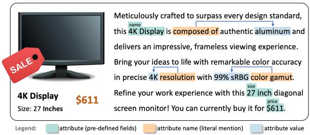
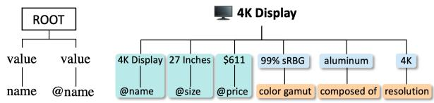
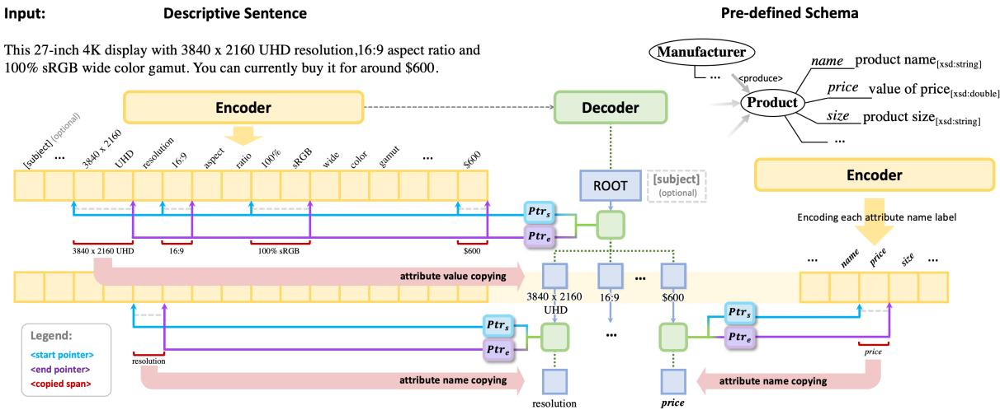
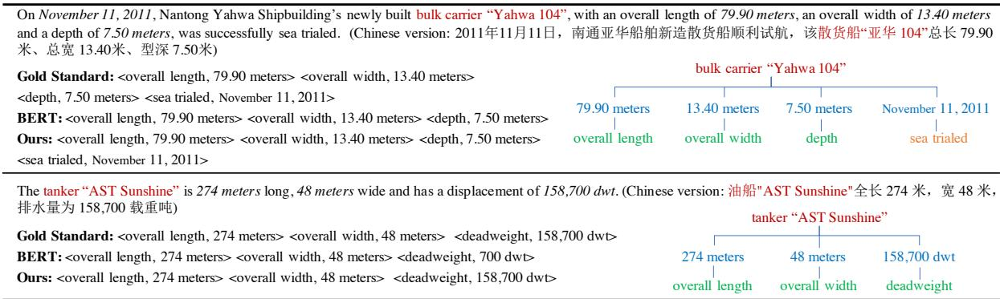

# AtTGen: Attribute Tree Generation for Real-World Attribute Joint Extraction

Yanzeng Li1,2, Bingcong Xue1, Ruoyu Zhang1, Lei Zou1,3∗

1Wangxuan Institute of Computer Technology, Peking University. Beijing, China 2National Key Laboratory of General Artificial Intelligence, BIGAI, Beijing, China

3TopGraph.AI

liyanzeng@stu.pku.edu.cn {xuebingcong, ry\_zhang, zoulei}@pku.edu.cn

## Abstract

Attribute extraction aims to identify attribute names and the corresponding values from descriptive texts, which is the foundation for extensive downstream applications such as knowl edge graph construction, search engines, and e-Commerce. In previous studies, attribute extraction is generally treated as a classification problem for predicting attribute types or a sequence tagging problem for labeling attribute values, where two paradigms, i.e., closed-world and open-world assumption, are involved. However, both of these paradigms have limitations in terms of real-world applications. And prior studies attempting to integrate these paradigms through ensemble, pipeline, and co-training models, still face challenges like cascading errors, high computational overhead, and difficulty in training. To address these existing problems, this paper presents Attribute Tree, a unified formulation for realworld attribute extraction application, where closed-world, open-world, and semi-open attribute extraction tasks are modeled uniformly. Then a text-to-tree generation model, AtTGen, is proposed to learn annotations from different scenarios efficiently and consistently. Experi ments demonstrate that our proposed paradigm well covers various scenarios for real-world applications, and the model achieves state-ofthe-art, outperforming existing methods by a large margin on three datasets. Our code, pretrained model, and datasets are available at https://github.com/lsvih/AtTGen.

## 1 Introduction

Attribute Extraction (AE) is a practical application of the Information Extraction (IE) task, aiming to identify the attribute name and the corresponding attribute value from unstructured or semistructured text fragments (Ghani et al., 2006; Ravi and Pasca, 2008; More, 2016). Figure 1 shows a typical product profile with extracted attribute tags.

  
Figure 1: An example of attribute extraction, highlighted with annotations in different tagging forms.

As the foundation for various downstream applications such as knowledge graph construction, search engines, e-Commerce and recommender systems, AE has attracted extensive research interest in recent years (Zheng et al., 2018; Xu et al., 2019; Zhu et al., 2020; Jain et al., 2021; Zhang et al., 2022; Li and Zou, 2022).

There are two basic subtasks in the research of AE, namely, attribute name extraction and attribute value extraction. And we use the RDF-style triple1 <e, n, v> to denote the entity, attribute name, and attribute value respectively. According to whether the attribute name set is pre-defined, AE can be divided into two paradigms, i.e., the Closed-World Assumption (CWA) and the Open-World Assumption (OWA). For CWA AE, the attribute name n is limited to a finite set of the pre-defined schema, where attribute name extraction is typically modeled as a classification task (Zeng et al., 2014; Zhou et al., 2016), and attribute value extraction models are trained for each target attribute (Zheng et al., 2018; Zhu et al., 2020; Yan et al., 2021). While for OWA AE, which is also known as “New Attribute Discover” (Wong and Lam, 2010; Zhang et al., 2022) and “Open Information Extraction” (Cui et al., 2018), the attribute name is schema-free and can be extracted from the text. Sequence tagging methods are broadly employed to extract those attributes (Xu et al., 2019). Recently, researchers also explore novel paradigms such as Question Answering (QA) models (Wang et al., 2020; Shinzato et al., 2022; Yang et al., 2022) and generative models (Roy et al., 2022) to generalize the ability of attribute extraction.

However, AE in the real world is far more complicated. On the one hand, in closely related fields like e-commerce, new types of products with new sets of attributes are so constantly arising that the pre-defined schema is never enough. For example, an analysis in Zhang et al. (2022) has shown that only 30 / 51 attributes are found in existing structured product profiles of Amazon’s 10 product types. On the other hand, however, attribute extraction methods shouldn’t overlook the huge value and commonalities behind known attributes, and it is inherent that not all attributes can be fully identified by open extraction methods due to the lack of literal name mentions, e.g. name and size in Figure 1. It is possible to carry out both CWA and OWA methods when needed, just as Zhang et al. (2021) attempts preliminarily. But apart from the fragmentation of the problem form and the unnecessary computing overhead, a more prominent issue is that such simple integration neglects the natural connections between the CWA vocabulary and the OWA ability in attribute extraction, and thus cannot achieve satisfactory results. In this paper, we, for the first time, explicitly unify the different AE paradigms in the form of Attribute Tree, and present a text-to-tree based generative model called AtTGen to solve the real-world attribute joint extraction task.

Specifically, our proposed AtTGen successfully implements the unification of attribute tagging and classification tasks by generating the Attribute Tree, and congenitally circumvents the problem of “null”-value that troubles pioneers (Xu et al., 2019; Wang et al., 2020). Further, the head entity is optional as the root node on Attribute Tree to meet the actual situation, as well as to enhance the extraction performance with the help of the subject guidance (Yu et al., 2021; Zhang et al., 2021). AtTGen reduces the length of the generated sequence and thus shrinks the search space by conducting the tree generation model. And it can accurately mark out the span of attribute values and extract unseen attributes with the pointer-copy mechanism (Zhou et al., 2018). Moreover, the teacherforcing manner (Williams and Zipser, 1989) and the converted path-generation training objective further reduce the exposure bias (Zhang et al., 2020) to improve the generalization and effectiveness.

In short, the major contributions of this paper can be summarized as follows:

• We are the first to define different attribute extraction paradigms like CWA, OWA and semi-open as the attribute tree generation problem, formally unifying multiple tasks and fully capturing the internal connections.

• We design a novel text-to-attribute tree generation model with a pointer-based copy mechanism for extracting both literal mentions and category labels.

• We evaluate our model on several benchmark datasets. Experimental results show that our method achieves state-of-the-art (SOTA) and outperforms existing works by a large margin in all scenarios including open, semi-open and closedworld attribute extraction.

## 2 Preliminary

We first formalize the definition of two mainstream paradigms widely used in Attribute Extraction.

Definition 1 (Closed-World Assumption). CWA AE receives a descriptive text $\mathcal { T } = [ t _ { 1 } , t _ { 2 } , . . . ]$ , e.g. a product title, and a pre-defined schema which contains a set of attributes (i.e., attribute vocabulary) to extract all attribute pairs $< n$ , v> for a possibly given head entity e, where $n \in { \mathcal { A } }$ is the attribute name (also called attribute type), and $v \in \tau$ is the attribute value extracted from the text.

Definition 2 (Open-World Assumption). OWA AE takes a descriptive text $\mathcal { T } = [ t _ { 1 } , t _ { 2 } , . . . ]$ as input, and the target is to discover all attribute pairs $< n ,$ v> for a possibly given head entity e, where both the attribute name n and the attribute value v are from the given text, i.e. $n \in \mathcal T$ and $v \in \tau$

As stated in Section 1, individual one of the above paradigms does not always work well in real-world applications, and the pipeline approach adopted by Zhang et al. (2021) to merge the results of the two paradigms would introduce problems such as cascading errors. Therefore, we propose a formal definition of real-world AE and its solution in the following sections.

## 3 Problem Formalization

Section 1 has expounded that attribute extraction in real-world applications sometimes needs both the guidance of the schema and the ability to extract free attributes from texts. It is actually an extensive aggregation covering both CWA and OWA AE, as well as a semi-open scenario where attribute names can be obtained from both. Therefore we formally define the real-world attribute extraction as:

  
Figure 2: The abstract illustration of Attribute Tree (left) and an instantiated one describing the attributes of the example in Figure 1 (right). The attribute names starting with “@” represent those stemming from the schema.

Definition 3 (Real-world Attribute Extraction). Given a text , and an optional , “real-world $\mathbf { A E } ^ { \prime \prime }$ is to fill the explicit slots for the optional category in , or to dig more free attributes from  , or to capture attributes from both and . i.e., the final result of real-world AE is a set of attribute pairs <n, v> where $v \in { \mathcal { T } } , n \in { \mathcal { H } } = \{ A , \emptyset \} \cup \{ { \mathcal { T } } , \emptyset \}$ and $\mathcal { H } \neq \emptyset$

To implement such an extraction paradigm uniformly, we devise a principled structure, Attribute Tree, to formally model the target of all real-world AE circumstances:

Definition 4 (Attribute Tree). An attribute tree T for a descriptive sentence sent is an unweighted tree with a fixed height $h = 2$ . All the branches of the tree T have a determined order $( r , v , n )$ , and the root r is the only entry node that can be either empty ∅ or the head entity (also called the subject) subj of the attributes.

Figure 2 visualizes the attribute tree and its instances. The path from the root to the leaves is also the reasoning path of the proposed model. Borrowing the notation from epistemology (Martin-Löf, 1996), there are:

$$
\begin{array} { r l } { \{ s e n t , r \} \vdash v } & { { } { } } \\ { \{ s e n t , r , v \} \vdash n } & { { } { } } \end{array} { r \in \{ \emptyset , s u b j \} }\tag{1}
$$

which means the attribute value v is derived from the original sentence sent and the root node r; and the attribute name n, whether coming from the input text or the given schema, can be predicted by the integrated information from the sentence, the attribute value, and the root node. This kind of path order can naturally evade the insignificant “NULL” value problem pointed out by Shinzato et al. (2022).

Definition 5 (Subject Guidance). Setting the subject subj of a descriptive sentence sent as the root node r of the corresponding attribute tree T when available, i.e. let $r = s u b j$ in Equation 1, is called enabling the subject guidance.

As attributes typically characterize entities and are strongly bound to the subject, we naturally introduce the subject guidance for AE in such a way and the effectiveness has been preliminarily demonstrated in Yu et al. (2021); Zhang et al. (2021).

## 4 Methodology

We design a unified tree generative model AtTGen, committing to jointly extracting attribute names and values under various scenarios in the real world. It is partially inspired by the success of Seq2Tree models (Dong and Lapata, 2016; Liu et al., 2019; Zhang et al., 2020) and pointer-copy based spanselector (Zhou et al., 2018; Ma et al., 2022) in other tasks. The overall architecture is shown in Figure 3, and we demonstrate the model details in the following subsections.

## 4.1 Encoder

We employ the classical BiLSTM-CNN (Chiu and Nichols, 2016) neural network to encode the input text into a continuous latent $\operatorname { s p a c e } ^ { 2 }$ . Given a sequence input $[ t _ { 1 } , t _ { 2 } , . . . , t _ { n } ]$ , the encoded text representation $\mathbf { h } _ { \mathbf { t } } \in \mathbb { R } ^ { m \times n }$ is obtained by:

$$
\begin{array} { r l } & { \mathbf { h } _ { t } = \mathrm { E n c o d e r } ( s e n t ) } \\ & { \quad = \mathrm { C o n v } _ { \mathrm { e n c } } \big ( \mathrm { B i L S T M } _ { \mathrm { e n c } } ( E m b ( s e n t ) ) } \end{array}\tag{2}
$$

in which Emb is to gain the embedded vector of tokens from the lookup table and m is the dimension of the embedding, BiL $\mathbf { S T M _ { \mathrm { e n c } } }$ is Bidirectional Long Short-Term Memory network (Hochreiter and Schmidhuber, 1997) for modeling the dependencies of the input sequence, and $\mathbf { C o n v _ { e n c } }$ is Convolutional Network (Collobert et al., 2011) for extracting features from the encoded text representation. Meanwhile, the category labels of attribute names from the given schema also contain useful semantic information for generating the attribute tree, thus we use the same encoder to obtain the label representation of the attribute names as:

$$
{ \bf h } _ { l } = \mathrm { E n c o d e r } ( l a b e l s )\tag{3}
$$

  
Figure 3: The overview of AtTGen (Best viewed in color). The blocks in yellow, green, and blue, denote the encoded text representation, the tree decoder, and the obtained attribute tree respectively, and the red arrows represent the direction of copying.

Then we can concatenate the two parts and get the initial root node representation as $\begin{array} { r l } { h _ { r } } & { { } = } \end{array}$ Encoder $( [ s e n t | | l a b e l s ] )$ , which allows the successor decoders to uniformly generate nodes from both the input sentence and the category label set.

In addition, the subject of the attribute would be concatenated with the input sentence as $[ \langle s u b j e c t \rangle , [ s e p ] , t _ { 1 } , . . . , t _ { n } ]$ for the subject guidance, in which [sep] is a separator token.

## 4.2 Tree Decoder

The decoding target of our method is to generate a structured attribute tree. As a tree can be divided into several paths from the root node to the leaf node, the generation of a tree can also be decomposed into the problem of generating multiple paths. Therefore, the decoder of AtTGen is denoted as:

$$
\mathrm { r s } , \mathbf { h } _ { \mathrm { r s } } , \mathbf { s } _ { t } = \mathrm { D e c o d e r } ( \mathbb { T } , \mathbf { h } _ { p } , \mathbf { s } _ { t - 1 } )\tag{4}
$$

where rs is the generated result, $\mathbf { h } _ { \mathrm { r s } }$ is the representation of the decoded tokens, $\mathbf { s } _ { t }$ and $\mathbf { s } _ { t - 1 }$ are the current and the previous state of the decoder respectively. Each decoding step relies on several inputs: (1) the target space of decoding $\mathbb { T } .$ , which is to limit the selection range of the final result of the decoder and thus shrinks the search space; (2) the representation of the antecedent path $\mathbf { h } _ { p } ;$ (3) the state of the decoder $\mathbf { s } _ { t } .$ , used to determine the currently decoded node is at what level of the attribute tree.

Specifically, given the input $\mathbf { h } _ { p }$ and the previous decoding state $\mathbf { s } _ { t - 1 }$ , a unary LSTM is employed for decoding the state $\mathbf { s } _ { t }$ as:

$$
\mathbf { s } _ { t } = \mathrm { L S T M } _ { \mathrm { d e c } } ( \mathbf { h } _ { p } , \mathbf { s } _ { t - 1 } )\tag{5}
$$

The decoding feature $\mathbf { h } _ { \mathrm { r s } }$ for generating results is obtained by a convolutional network $\mathrm { C o n v _ { d e c } }$ with an attention-based weighted sum like (Bahdanau et al., 2015) as:

$$
h _ { \mathrm { r s } } = { \mathrm { C o n v } } _ { \mathrm { d e c } } { \big ( } \mathrm { A t t } ( \mathbf { h } _ { t } , \mathbf { s } _ { t } ) { \big ) }\tag{6}
$$

Then the final result as follows is decoded from the pointer-based span copier (P tr) explained in Section 4.3:

$$
\begin{array} { r } { \mathbf { i } _ { \mathrm { s t a r t } } , \mathbf { i } _ { \mathrm { e n d } } = P t r _ { s } ( \mathbf { h } _ { \mathrm { r s } } ) , \mathbf { P t r } _ { \mathrm { e } } ( \mathbf { h } _ { \mathrm { r s } } ) } \\ { \mathbf { r s } = \mathbb { T } [ \mathbf { i } _ { \mathrm { s t a r t } } : \mathbf { i } _ { \mathrm { e n d } } ] \quad } \end{array}\tag{7}
$$

The whole decoding process for AtTGen is described in Algorithm 1.

Algorithm 1: Attribute Tree Decoder   
Input :A descriptive sentence:sent   
A category set from flattened schema:labels   
Output :The attribute tree of sent   
// Decoding attributes from plain text and   
pre-defined schema jointly.   
1 hr Encoder([sent labels])   
2 if use subject guidance then   
3 r, hr, sr Decoder(sent, hr, ∅)   
4 root Tree(r)   
5 else   
6 sr ∅   
7 root Tree(placeholder)   
8 v, hv, sv Decoder(sent, $h _ { r } , s _ { r } )$   
9 for v, h in v, h do   
10 hv = hr hv   
11 n, hn, sn Decoder([sent labels], hv, sv)   
12 for $n , h _ { n }$ in n, hn do   
13 if v / root.children() then   
14 root.add\_child(v)   
15 root.find\_child(v).add\_child(n)   
16 return root

where ∅ is a randomly initialized vector to represent the initial decoding state. $r , h _ { r }$ and $s _ { r }$ are the decoder’s output for the root node (the optional subject), representing the generated result, the hidden representation and the current state respectively. Similarly, $( \mathbf { v } , \mathbf { h } _ { v } , s _ { v } )$ and $( \mathbf { n } , \mathbf { h } _ { n } , s _ { n } )$ are the other two sets of outputs from the decoder, for the decoding process of attribute values and attribute names respectively. Note that if subject guidance is enabled, the decoder will update hr by decoding subject firstly, and construct the root node of the tree (Line 2-4), otherwise the root node is replaced by a placeholder (Line 5-7). The attribute values and attribute names are sequentially decoded in the order of Equation 1 to construct Attribute Tree as shown in Line 8-15 in Algorithm 1.

## 4.3 Span Copier

We propose to use a unified span copier to ensure the spans are correctly copied from the original sentence or the label set during the decoding process.

$$
\begin{array} { r } { P t r _ { s } ( \mathbf { h } ) = \sigma ( \mathbf { W } _ { s } \mathbf { h } + \mathbf { b } _ { s } ) } \\ { P t r _ { e } ( \mathbf { h } ) = \sigma ( \mathbf { W } _ { e } \mathbf { h } + \mathbf { b } _ { e } ) } \end{array}\tag{8}
$$

in which ${ \bf W } _ { s }$ and ${ \bf W } _ { e }$ are trainable weights, ${ \bf b } _ { s }$ and ${ \bf b } _ { e }$ are trainable bias, h denotes the hidden state of the current decoding step, and $\sigma$ is the sigmoid active function. The $\mathit { P t r } _ { ( \cdot ) }$ produces a constant vector that denotes the start/end index of the copied span. For those nodes in the closedworld setting whose mention does not exist in the original text (e.g., name, size, and price in Figure 1), we further add an equality constraint $P t r _ { s } =$ $P t r _ { e }$ , restricting the pointers to select only one category label when decoding from the label set, which reduces generative errors and improves the training efficiency.

## 4.4 Training Objective

In the decoding process, we apply teacher forcing manner (Williams and Zipser, 1989) for efficient training and encourage the model to reduce the distance of all paths between the generated tree and the ground truth:

$$
\begin{array} { l } { { \displaystyle { \cal L } _ { p a t h } = \delta \sum _ { i \in \{ s , e \} } \mathrm { { B C E } } ( P t r _ { i } ( { \bf h } _ { r } ) , y _ { i _ { - } r } ^ { * } ) } \ ~ } \\ { { \displaystyle ~ + \sum _ { j \in \{ v , n \} } \sum _ { i \in \{ s , e \} } \mathrm { { B C E } } ( P t r _ { i } ( { \bf h } _ { j } ) , y _ { i _ { - } j } ^ { * } ) } \ ~ } \end{array}
$$

where $\delta \in \{ 0 , 1 \}$ indicates whether to enable the subject guidance; $y _ { s _ { - } ( \cdot ) } ^ { \ast } / y _ { e _ { - } ( \cdot ) } ^ { \ast }$ denotes the golden standard start/end index of either a literal mention or a category label of the target span; $\mathbf { h } _ { ( \cdot ) }$ represents the hidden state of the decoder to distinguish the level it is decoding. BCE is the Binary Cross Entropy loss to optimize the prediction of the index vectors individually for each step:

$$
\operatorname { B C E } ( y , y ^ { * } ) = - { \frac { 1 } { N } } \sum _ { i = 1 } ^ { N } y _ { i } ^ { * } \cdot \ln y _ { i } + ( 1 - y _ { i } ^ { * } ) \cdot \ln ( 1 - y _ { i } )
$$

where N is the length of the input sentence, $y _ { i }$ is the predicted probability of the i-th element and $y _ { i } ^ { * }$ is the corresponding ground truth.

## 5 Experiments

## 5.1 Experimental Setup

Datasets. We conduct our experiments on three publicly available datasets to examine the capacity and the generality of our model over various realworld AE settings:

MEPAVE (Close-World Benchmark)3 (Zhu et al., 2020) is a multimodal e-Commerce product attribute extraction dataset, which contains 87k product description texts (in Chinese) and images, involving 26 types of attributes. We follow the same dataset settings as Zhu et al. (2020), except that we leave the visual information and use the description texts only.

AE-110K (Open-World Benchmark)4 (Xu et al., 2019) is a collection of 110k product triples (in English) from AliExpress with 2,761 unique attributes. It can well measure the open extraction ability and generation performance of different models. We split this dataset via the cleaning script of Shinzato et al. (2022), and remove invalid and “NULL” value attributes following Roy et al. (2022).

Re-CNShipNet (Semi-Open Benchmark) is a revised version of the functional attribute extraction dataset CNShipNet5 (Zhang et al., 2021), where numerical attributes account for the majority to bring new challenges. We manually fix the incorrect annotations in the old version and rebalance the ratio of closed- to open-setting labels (Li et al., 2021). Now it contains about 5k entity-attribute instances (mostly in Chinese), among which 40% obtain attributes from the literal texts and others are within 9 pre-defined attribute types.

Baselines. We compare the proposed model with several strong and typical baselines including:

1) Sequence Tagging-based methods, a kind commonly adopted in IE which typically uses semantic tags such as BIO to identify the extracted items: RNN-LSTM (Hakkani-Tür et al., 2016), Attn-BiRNN (Liu and Lane, 2016), and BiLSTM-CRF (Huang et al., 2015) are all specially designed RNN-based models for modeling the intent of classification and extraction tasks. ScalingUp (Xu et al., 2019) is a BERT-based model to extract attribute values with BiLSTM to perform interaction attention between attribute names and values.

2) PLM-based methods: BERT (Devlin et al., 2019) is a well-known pre-trained language model (PLM) and we follow the vanilla setting of classification and sequence tagging tasks, Joint-BERT (Chen et al., 2019) is a variant of BERT to solve slot filling and classification jointly.

3) Joint IE-based (JE) methods, which originate from the entity-relation extraction task and typically extract entities and classify relations in a cascading fashion: ETL-Span (Yu et al., 2020) and CasRel (Wei et al., 2020) are two classic JE models for relation extraction and we adapt them to the AE task here. SOAE (Zhang et al., 2021) achieved SOTA on CNShipNet by merging the results of a JE model and a classification model. JAVE (Zhu et al., 2020) is an attention-based attribute joint extraction model and M-JAVE further takes advantage of multimodal information, and they were the best models for MEPAVE.

4) Sequence Generative Model: We also implement the latest word sequence generation method (Roy et al., 2022) based on the large-scale pre-trained BART (Lewis et al., 2020) model.

We conduct the baselines and adapt them to the target datasets accordingly. See Appendix A for implementation details.

Metrics. Following previous works (Zheng et al., 2018; Xu et al., 2019; Zhu et al., 2020; Zhang et al., 2021), we use F1 score as the metric and adopt Exact Match criteria (Wei et al., 2020), in which only the full match to the ground truth is considered correct. We report the results of attribute name and value extraction respectively as Zhu et al. (2020).

## 5.2 Main Results

This section presents the overall results of the models over various AE scenarios in Table 1, 2, and 3. In general, we can observe that our model outperforms the baselines over all three scenarios in real-world AE.

<table><tr><td>Model</td><td>Attribute</td><td>Value</td></tr><tr><td>RNN-LSTM Attn-BiRNN</td><td>85.76 86.10</td><td>82.92 83.28</td></tr><tr><td>BERT</td><td>86.34</td><td>83.12</td></tr><tr><td>Joint-BERT</td><td>86.93</td><td>83.73</td></tr><tr><td>ScalingUp (BERT-based)</td><td></td><td>77.12</td></tr><tr><td>CasRel (BERT-based)</td><td>84.74</td><td>79.61</td></tr><tr><td>JAVE (LSTM based)‡ JAVE (BERT based)‡</td><td>87.88</td><td>84.09</td></tr><tr><td>M-JAVE (LSTM-based)†‡</td><td>87.98</td><td>84.78</td></tr><tr><td>M-JAVE (BERT-based)†‡</td><td>90.19</td><td>86.41</td></tr><tr><td></td><td>90.69</td><td>87.17</td></tr><tr><td>AtTGEN (LSTM-based, Ours)</td><td>96.48</td><td>96.26</td></tr></table>

Table 1: Experimental results on MEPAVE (CWA). denotes the method utilizing image information. represents the result is from the original paper.
<table><tr><td>Model</td><td>Attribute</td><td>Value</td></tr><tr><td>RNN-LSTM</td><td>36.79</td><td>20.86</td></tr><tr><td>BiLSTM-CRF</td><td>40.25</td><td>37.51</td></tr><tr><td>ScalingUp (BERT-based) BERT</td><td></td><td>31.67</td></tr><tr><td>CasRel (BERT-based)</td><td>54.01 56.92</td><td>52.42 53.73</td></tr><tr><td>JAVE (BERT-based)</td><td>53.82</td><td>38.25</td></tr><tr><td>BART (Seq. Gen.)</td><td>58.46</td><td>53.32</td></tr><tr><td>AtTGEN (LSTM-based, Ours)</td><td>57.60</td><td>59.77</td></tr></table>

Table 2: Experimental results on AE-110K (OWA).

As shown in Table 1, our model achieves a big improvement in the closed-world AE task. Even though the previous SOTA model (M-JAVE BERT version) introduces PLM and takes advantage of extra multimodal information (product images), we still gain a 9.09% improvement in attribute value extraction and 5.79% in attribute name prediction.

In the open setting shown in Table 2, AtTGen consistently performs well in attribute value extraction, with a 6.45% improvement than BART, an elaborate and dedicated PLM-based model. It has a slightly lower result compared with BART when extracting attribute names (0.86%), due to the absence of the semantic knowledge contained in the large-scale PLMs for efficiency issues. We will consider introducing such knowledge in future work, which we believe will further improve the performance. But the current results are still strong enough to demonstrate the open extraction capability of our model.

As for the semi-open scenario displayed in Table 3, our model again outperforms CasRel, a strong joint model in the information extraction field. We also attain better results than SOAE, which was the SOTA on this dataset by conducting both OWA and CWA models. This can be credited to our unified attribute tree model to naturally capture the intrinsic connections in the partial-closed world.

<table><tr><td>Model</td><td>Attribute</td><td>Value</td></tr><tr><td>RNN-LSTM</td><td>53.6</td><td>52.9</td></tr><tr><td>Attn-BiRNN</td><td>51.9</td><td>52.0</td></tr><tr><td>BERT</td><td>58.3</td><td>57.8</td></tr><tr><td>Joint-BERT</td><td>59.1</td><td>58.4</td></tr><tr><td>ScalingUp (BERT-based)</td><td></td><td>56.1</td></tr><tr><td>ETL-Span</td><td>66.7</td><td>65.6</td></tr><tr><td>CasRel (LSTM-based)</td><td>66.5</td><td>67.2</td></tr><tr><td>CasRel (BERT-based)</td><td>70.1</td><td>69.7</td></tr><tr><td>SOAE (BERT-based)</td><td>69.4</td><td>69.0</td></tr><tr><td>AtTGEN (LSTM-based, Ours)</td><td>73.4</td><td>75.4</td></tr></table>

Table 3: Experimental results on Re-CNShipNet (Semi).

It can be concluded that, as the first to design a tree generative model in AE, our method can be silkily adapted to different real-world scenarios at a small cost, and achieves remarkable results whether the dataset is in the e-Commerce domain (MEPAVE, AE-110K) or news (Re-CNShipNet), and whether the language of the datasets is English (AE-110K) or Chinese (MEPAVE and Re-CNShipNet). Moreover, unlike quite many baselines relying on external knowledge in the largescale language models, we achieve outstanding results by training from scratch, and thus has a dominant advantage in the parameter-efficiency (e.g., BERT has \~110M parameters, BART has \~139M, AtTGen has only \~2M). We hypothesize that the superiority comes from the unified problem formalization as well as the novel tree generation model design. On the one hand, our model keeps the simplicity as a generation model, providing a unified way to capture the semantic associations between open and closed vocabulary, and between attribute names and values. On the other hand, different from traditional Seq2Seq models that decode all triples autoregressively into a linear sequence, our tree structure decomposes the decoding target into several paths of length three, removing the unnecessary order among different triplets and effectively alleviating the exposure bias problem in long-distance generation tasks (Zhang et al., 2020).

Furthermore, we notice that the performance of the models varies across different datasets, which can be attributed to the varying levels of complexity and quality of the datasets. For example, MEPAVE is a well-annotated benchmark with only a small number of attribute types, hopefully for better results. While AE-110K suffers an inevitable longtail distribution problem, and Re-CNShipNet is limited by the data scale and the uncertain ratio of CWA/OWA labels, posing greater challenges and leading to the results that all models still have a large room for improvement.

<table><tr><td>Variant</td><td>MEPAVE</td><td>AE-110K</td><td>R-CSN</td></tr><tr><td>AtTGen</td><td>96.14</td><td>56.85</td><td>73.21</td></tr><tr><td>w/o subject guidance</td><td></td><td></td><td>70.06</td></tr><tr><td>w/o span copier</td><td>89.20</td><td>49.16</td><td>61.59</td></tr><tr><td>repl. (r, n, v) path order</td><td>95.12</td><td>49.39</td><td>67.58</td></tr><tr><td>w/o schema</td><td></td><td></td><td>42.73</td></tr></table>

Table 4: Ablation results measured by Exact Match F1 score of attribute pairs. “-” denotes the setting is not appropriate to the corresponding dataset; R-CSN is the abbreviation for Re-CNShipNet.

## 5.3 Ablation Study

In this section, we carry out several ablation experiments to study the effectiveness of each subcomponent in AtTGen. The whole results are listed in Table 4 and we can find these phenomenons:

1) The performance reduces by 3.15% on Re-CNShipNet dataset without the subject guidance, indicating the usefulness to exploit the constraint semantics of the subject in attribute extraction. Along with the findings in Yu et al. (2021); Zhang et al. (2021), we may conclude that subject guidance is a powerful enhancement in various information extraction situations.

2) We remove the span copier by replacing it with an ordinary token generator to extract values from the whole vocabulary. It can be seen that the performance drops by 8.75% on average, and the degradation is more evident in the open and semi-open settings, where the performances are down to the same level as other sequence tagging-based models. This proves that the advantage of the model largely comes from the copy mechanism to detect boundary information of the spans rather than directly modeling the attributes. We therefore say that span copier can play a prominent role in AE.

3) We also explore the influence of the generation order in Attribute Tree and the results show that changing the path order from (r, v, n) to (r, n, v) slightly reduces the effect (4.7% averagely). Somewhat different from a prior experiment conducted in (Zhang et al., 2020), which shows that in entityrelation joint extraction task, relations should come first to get the best performance, our conclusion here is that attribute values should be extracted before attribute names, especially in open scenarios. One possible explanation for this difference between relation and attribute extraction is that attribute values typically have more evident patterns to trigger the following attribute name prediction. Besides, the path order of $( r , v , n )$ is able to reduce the confusion of multifarious attribute names and well evades the “NULL” value problem.

4) Removing schema information directly deprives the model’s capacity to learn from the existing ontology, and significantly degrades its performance on the Re-CNShipNet dataset, showing that predefined schema can strengthen models’ applicability in real-world AE applications.

By these ablation studies, we have not only demonstrated that each delicate design in our model plays an important role, but proposed several interesting findings which we believe will shed some light for future research.

## 5.4 Case Study

We present two case studies from Re-CNShipNet dataset to further illustrate our proposed Attribute Tree and the effectiveness of AtTGen model, as shown in Figure 4. In the first case, the sentence contains an out-of-schema attribute, “sea trialed”, which is ignored by the BERT-based extraction model. While our AtTGen model, starting from a given subject, identifies all attribute pairs including the purely literal one by first listing all possible attribute values and then smoothly corresponding to names based on the value and the context. In the other case, the number “158,700” is misextracted as “700” by the Bert-based extractor due to the interference of the thousands-separator. This roots in the model’s failure to really understand numerical values, which is a unique challenge to deep learning-based techniques (Xue et al., 2022). Nonetheless, AtTGen directly captures the boundary pattern of numbers and successfully retains the complete value with the span copier, showing a possible solution for this challenge.

## 6 Related Works

Attribute Extraction is a classical IE task with extensive research. In earlier years, heuristic rules and dictionaries were usually used to identify attributes and extract attribute values from the texts (Tan et al., 1999; Sasaki and Matsuo, 2000; Vandic et al., 2012; More, 2016; Zheng et al., 2018; Yan et al., 2021). With the development of deep learning for NLP, researchers attempt to leverage neural network technology-based model for tag ging attributes (Huang et al., 2015; Hakkani-Tür et al., 2016; Mai et al., 2018) or classifying attribute types (Riedel et al., 2010; Zeng et al., 2014; Amplayo, 2019; Iter et al., 2020; Zhao et al., 2021). Beyond CWA AE, researchers also explore AE in OWA scenario, e.g., some prior works try to expand free attributes from plain texts (Wong and Lam, 2010; Zhang et al., 2022; Cui et al., 2018) and extract the values of schema-free attributes (Xu et al., 2019). Recently, more novel frameworks are proposed to generalize the capacity of AE models. AVEQA (Wang et al., 2020; Shinzato et al., 2022) and MAVEQA (Yang et al., 2022) introduce Ques tion Answering framework for AE task, and Roy et al. (2022) tries to employ large-scale PLM to introduce external knowledge. Further, some aca demics propose multimodal AE tasks and datasets to enrich the research (IV et al., 2017; Zhu et al., 2020). Generative Information Extraction, a rising technique in these two years (Ye et al., 2022), is also an inspiration for proposing this research. A contemporaneous work (Roy et al., 2022) adopts se quence generation models and preliminarily shows the potential of generative models in open-world attribute extraction. Alongside sequence-based generation models, structure generation models are also widely studied and have shown power in other IE tasks. For example, REBEL (Huguet Cabot and Navigli, 2021) introduces a structure-linearized model for relation extraction; Seq2UMTree (Zhang et al., 2020) conducts a sequence-to-unorderedmulti-tree generation model for extracting entities and relations jointly; UIE (Lu et al., 2022) proposes a text-to-structure generation framework that can universally model different IE tasks based on the guidance of the pre-defined schema.

Though both attribute extraction and generative models have been widely explored, we are the first to design a novel tree generation model for AE and demonstrate the effectiveness on our unified real-world paradigm.

## 7 Conclusion and Future Work

In this paper, we formulate the real-world AE task into a unified Attribute Tree, and propose a simple but effective tree-generation model to extract both in-schema and schema-free attributes from texts. Experiments on three public datasets demonstrate our prominent performance over various scenarios, and detailed analyses also reveal several interesting findings for attribute extraction.

  
Figure 4: Two cases of the method. The spans in red, blue, green, yellow represent subject entities, attribute values, pre-defined attribute names, and literal attribute names respectively.

Several potential directions are left for the future. The first one is that our current approach does not utilize the commonly-provided multimodal information in e-Commerce, which can be naturally introduced into our tree structure as nodes for better results later. Besides, PLM has powerful effects on understanding the semantics of texts and scaling to open-domain AE applications, so incorporating knowledge of different granularity from PLMs is also an attractive extension to be explored.

## 8 Limitations

Adapting PLMs to our proposed model does not go as smoothly as expected, because there are three different forms of tokenization: the PLM tokenizer, the multilingual tokenizer implemented in our proposed model, and the special annotations of numerical values/entity mentions/long-winded attribute values in the attribute extraction datasets, which are difficult to reconcile simultaneously. Although our model without PLM has outperformed PLMbased ones, this does impose a limitation for future explorations.

Although Re-CNShipNet, one of the datasets used in our experiments, is more accurate with our careful re-annotating, the size of which is still so small that would produce randomness bias during the model training and may affect the final experimental results.

Besides, due to the limitation of computational resources, we did not conduct experiments on large language models such as T5 (Raffel et al., 2020), LLaMA (Touvron et al., 2023), etc., which may lead to insufficiency of the experiment.

## Ethics Statement

This work uses three publicly available datasets, and we respect and adhere to their user agreements and licenses. The content of pre-existing datasets does not reflect our perspectives. We, the in-house authors, re-annotate one of these datasets, i.e., Re-CHShipNet; the purpose of re-annotation is mainly to correct errors and re-balance the ratio of CWA/OWA labels. The annotation may introduce personal judgment and bias, which may bring potential risks. Further, the potential downstream applications of this work include knowledge graph construction, search engine, e-Commerce, recommendation system, etc.; we caution that our proposed method may cause misextraction or false information, and may fail in the case of out-ofdistribution and domain shift, which may harm those applications.

## Acknowledgements

This work was supported by NSFC under grant 61932001 and U20A20174. Lei Zou is the corresponding author of this paper. We would gratefully appreciate the reviewers for their precious comments that help us to improve this manuscript.

## References

Reinald Kim Amplayo. 2019. Rethinking attribute representation and injection for sentiment classification. In Proceedings of the 2019 Conference on Empirical Methods in Natural Language Processing and the 9th International Joint Conference on Natural Language Processing (EMNLP-IJCNLP), pages 5602–

5613, Hong Kong, China. Association for Computational Linguistics.

Dzmitry Bahdanau, Kyunghyun Cho, and Yoshua Bengio. 2015. Neural machine translation by jointly learning to align and translate. In 3rd International Conference on Learning Representations, ICLR 2015, San Diego, CA, USA, May 7-9, 2015, Conference Track Proceedings.

Qian Chen, Zhu Zhuo, and Wen Wang. 2019. BERT for joint intent classification and slot filling. CoRR, abs/1902.10909.

Jason P.C. Chiu and Eric Nichols. 2016. Named entity recognition with bidirectional LSTM-CNNs. Transactions ofthe Associationfor Computational Linguistics, 4:357–370.

Ronan Collobert, Jason Weston, Leon Bottou, Michael Karlen, Koray Kavukcuoglu, and Pavel Kuksa. 2011. Natural language processing (almost) from scratch. Journal of Machine Learning Research, 12:2493– 2537.

Lei Cui, Furu Wei, and Ming Zhou. 2018. Neural open information extraction. In Proceedings of the 56th Annual Meeting of the Association for Computational Linguistics (Volume 2: Short Papers), pages 407–413, Melbourne, Australia. Association for Computational Linguistics.

Jacob Devlin, Ming-Wei Chang, Kenton Lee, and Kristina Toutanova. 2019. BERT: Pre-training of deep bidirectional transformers for language understanding. In Proceedings of the 2019 Conference of the North American Chapter ofthe Associationfor Computational Linguistics: Human Language Technologies, Volume 1 (Long and Short Papers), pages 4171–4186, Minneapolis, Minnesota. Association for Computational Linguistics.

Li Dong and Mirella Lapata. 2016. Language to logical form with neural attention. In Proceedings of the 54th Annual Meeting ofthe Associationfor Computational Linguistics (Volume 1: Long Papers), pages 33–43, Berlin, Germany. Association for Computational Linguistics.

Rayid Ghani, Katharina Probst, Yan Liu, Marko Krema, and Andrew E. Fano. 2006. Text mining for product attribute extraction. SIGKDD Explor., 8:41–48.

Dilek Hakkani-Tür, Gökhan Tür, Asli Celikyilmaz, Yun-Nung Chen, Jianfeng Gao, Li Deng, and Ye-Yi Wang. 2016. Multi-domain joint semantic frame parsing using bi-directional RNN-LSTM. In Interspeech 2016, 17th Annual Conference of the International Speech Communication Association, San Francisco, CA, USA, September 8-12, 2016, pages 715–719. ISCA.

Sepp Hochreiter and Jürgen Schmidhuber. 1997. Long short-term memory. Neural computation, 9(8):1735– 1780.

Zhiheng Huang, Wei Xu, and Kai Yu. 2015. Bidirectional lstm-crf models for sequence tagging. ArXiv, abs/1508.01991.

Pere-Lluís Huguet Cabot and Roberto Navigli. 2021. REBEL: Relation extraction by end-to-end language generation. In Findings ofthe Associationfor Computational Linguistics: EMNLP 2021, pages 2370– 2381, Punta Cana, Dominican Republic. Association for Computational Linguistics.

Dan Iter, Xiao Yu, and Fangtao Li. 2020. Entity attribute relation extraction with attribute-aware embeddings. In Proceedings ofDeep Learning Inside Out (DeeLIO): The First Workshop on Knowledge Extraction and Integration for Deep Learning Architectures, pages 50–55, Online. Association for Computational Linguistics.

Robert L Logan IV, Samuel Humeau, and Sameer Singh. 2017. Multimodal attribute extraction. In 6th Workshop on Automated Knowledge Base Construction, Long Beach, California, USA.

Mayank Jain, Sourangshu Bhattacharya, Harshit Jain, Karimulla Shaik, and Muthusamy Chelliah. 2021. Learning cross-task attribute - attribute similarity for multi-task attribute-value extraction. In Proceedings of the 4th Workshop on e-Commerce and NLP, pages 79–87, Online. Association for Computational Linguistics.

Mike Lewis, Yinhan Liu, Naman Goyal, Marjan Ghazvininejad, Abdelrahman Mohamed, Omer Levy, Veselin Stoyanov, and Luke Zettlemoyer. 2020. BART: Denoising sequence-to-sequence pre-training for natural language generation, translation, and comprehension. In Proceedings ofthe 58th Annual Meeting of the Association for Computational Linguistics, pages 7871–7880, Online. Association for Computational Linguistics.

Yanzeng Li, Bowen Yu, Li Quangang, and Tingwen Liu. 2021. FITAnnotator: A flexible and intelligent text annotation system. In Proceedings of the 2021 Conference of the North American Chapter of the Associationfor Computational Linguistics: Human Language Technologies: Demonstrations, pages 35– 41, Online. Association for Computational Linguistics.

Yanzeng Li and Lei Zou. 2022. gbuilder: A scalable knowledge graph construction system for unstructured corpus.

Bing Liu and Ian R. Lane. 2016. Attention-based recurrent neural network models for joint intent detection and slot filling. In Interspeech 2016, 17th Annual Conference ofthe International Speech Communication Association, San Francisco, CA, USA, September 8-12, 2016, pages 685–689. ISCA.

Qianying Liu, Wenyv Guan, Sujian Li, and Daisuke Kawahara. 2019. Tree-structured decoding for solving math word problems. In Proceedings of the

2019 Conference on Empirical Methods in Natural Language Processing and the 9th International Joint Conference on Natural Language Processing (EMNLP-IJCNLP), pages 2370–2379, Hong Kong, China. Association for Computational Linguistics.

Yaojie Lu, Qing Liu, Dai Dai, Xinyan Xiao, Hongyu Lin, Xianpei Han, Le Sun, and Hua Wu. 2022. Unified structure generation for universal information extraction. In Proceedings ofthe 60th Annual Meeting ofthe Associationfor Computational Linguistics (Volume 1: Long Papers), pages 5755–5772, Dublin, Ireland. Association for Computational Linguistics.

Yubo Ma, Zehao Wang, Yixin Cao, Mukai Li, Meiqi Chen, Kun Wang, and Jing Shao. 2022. Prompt for extraction? PAIE: Prompting argument interaction for event argument extraction. In Proceedings of the 60th Annual Meeting of the Association for Computational Linguistics (Volume 1: Long Papers), pages 6759–6774, Dublin, Ireland. Association for Computational Linguistics.

Khai Mai, Thai-Hoang Pham, Minh Trung Nguyen, Tuan Duc Nguyen, Danushka Bollegala, Ryohei Sasano, and Satoshi Sekine. 2018. An empirical study on fine-grained named entity recognition. In Proceedings ofthe 27th International Conference on Computational Linguistics, pages 711–722, Santa Fe, New Mexico, USA. Association for Computational Linguistics.

Per Martin-Löf. 1996. On the meanings of the logical constants and the justifications of the logical laws. Nordic journal ofphilosophical logic, 1(1):11–60.

Ajinkya More. 2016. Attribute extraction from product titles in ecommerce. ArXiv, abs/1608.04670.

Colin Raffel, Noam Shazeer, Adam Roberts, Katherine Lee, Sharan Narang, Michael Matena, Yanqi Zhou, Wei Li, and Peter J Liu. 2020. Exploring the limits of transfer learning with a unified text-to-text transformer. The Journal of Machine Learning Research, 21(1):5485–5551.

Sujith Ravi and Marius Pasca. 2008. Using structured text for large-scale attribute extraction. In International Conference on Information and Knowledge Management.

Sebastian Riedel, Limin Yao, and Andrew McCallum. 2010. Modeling relations and their mentions without labeled text. In ECML/PKDD.

Kalyani Roy, Tapas Nayak, and Pawan Goyal. 2022. Exploring generative models for joint attribute value extraction from product titles. CoRR, abs/2208.07130.

Yutaka Sasaki and Yoshihiro Matsuo. 2000. Learning semantic-level information extraction rules by typeoriented ILP. In COLING 2000 Volume 2: The 18th International Conference on Computational Linguistics.

Keiji Shinzato, Naoki Yoshinaga, Yandi Xia, and Wei-Te Chen. 2022. Simple and effective knowledgedriven query expansion for QA-based product attribute extraction. In Proceedings ofthe 60th Annual Meeting of the Association for Computational Linguistics (Volume 2: Short Papers), pages 227–234, Dublin, Ireland. Association for Computational Linguistics.

Ah-Hwee Tan et al. 1999. Text mining: The state of the art and the challenges. In Proceedings of the pakdd 1999 workshop on knowledge disocoveryfrom advanced databases, volume 8, pages 65–70.

Hugo Touvron, Thibaut Lavril, Gautier Izacard, Xavier Martinet, Marie-Anne Lachaux, Timothée Lacroix, Baptiste Rozière, Naman Goyal, Eric Hambro, Faisal Azhar, et al. 2023. Llama: Open and efficient foundation language models. arXiv preprint arXiv:2302.13971.

Damir Vandic, Jan-Willem Van Dam, and Flavius Frasincar. 2012. Faceted product search powered by the semantic web. Decision Support Systems, 53(3):425– 437.

Qifan Wang, Li Yang, Bhargav Kanagal, Sumit Sanghai, D. Sivakumar, Bin Shu, Zac Yu, and Jon Elsas. 2020. Learning to extract attribute value from product via question answering: A multi-task approach. In KDD ’20: The 26th ACM SIGKDD Conference on Knowledge Discovery and Data Mining, Virtual Event, CA, USA, August 23-27, 2020, pages 47–55. ACM.

Zhepei Wei, Jianlin Su, Yue Wang, Yuan Tian, and Yi Chang. 2020. A novel cascade binary tagging framework for relational triple extraction. In Proceedings of the 58th Annual Meeting of the Associationfor Computational Linguistics, pages 1476– 1488, Online. Association for Computational Linguistics.

Ronald J Williams and David Zipser. 1989. A learning algorithm for continually running fully recurrent neural networks. Neural computation, 1(2):270–280.

Tak-Lam Wong and Wai Lam. 2010. Learning to adapt web information extraction knowledge and discovering new attributes via a bayesian approach. IEEE Transactions on Knowledge and Data Engineering, 22(4):523–536.

Huimin Xu, Wenting Wang, Xin Mao, Xinyu Jiang, and Man Lan. 2019. Scaling up open tagging from tens to thousands: Comprehension empowered attribute value extraction from product title. In Proceedings of the 57th Annual Meeting ofthe Associationfor Computational Linguistics, pages 5214–5223, Florence, Italy. Association for Computational Linguistics.

Bingcong Xue, Yanzeng Li, and Lei Zou. 2022. Introducing semantic information for numerical attribute prediction over knowledge graphs. In The Semantic Web – ISWC 2022, pages 3–21, Cham. Springer International Publishing.

Jun Yan, Nasser Zalmout, Yan Liang, Christan Grant, Xiang Ren, and Xin Luna Dong. 2021. AdaTag: Multi-attribute value extraction from product profiles with adaptive decoding. In Proceedings of the 59th Annual Meeting ofthe Associationfor Computational Linguistics and the 11th International Joint Conference on Natural Language Processing (Volume 1: Long Papers), pages 4694–4705, Online. Association for Computational Linguistics.

Li Yang, Qifan Wang, Zac Yu, Anand Kulkarni, Sumit Sanghai, Bin Shu, Jon Elsas, and Bhargav Kanagal. 2022. Mave: A product dataset for multi-source attribute value extraction. In Proceedings ofthe Fifteenth ACM International Conference on Web Search and Data Mining, WSDM ’22, page 1256–1265.

Hongbin Ye, Ningyu Zhang, Hui Chen, and Huajun Chen. 2022. Generative knowledge graph construction: A review. CoRR, abs/2210.12714.

Bowen Yu, Zhenyu Zhang, Jiawei Sheng, Tingwen Liu, Yubin Wang, Yucheng Wang, and Bin Wang. 2021. Semi-open information extraction. In Proceedings of the Web Conference 2021, pages 1661–1672.

Bowen Yu, Zhenyu Zhang, Xiaobo Shu, Yubin Wang, Tingwen Liu, Bin Wang, and Sujian Li. 2020. Joint extraction of entities and relations based on a novel decomposition strategy. In Proc. ofECAI.

Daojian Zeng, Kang Liu, Siwei Lai, Guangyou Zhou, and Jun Zhao. 2014. Relation classification via convolutional deep neural network. In Proceedings of COLING 2014, the 25th International Conference on Computational Linguistics: Technical Papers, pages 2335–2344, Dublin, Ireland. Dublin City University and Association for Computational Linguistics.

Li Zhang, Yanzeng Li, Rouyu Zhang, and Wenjie Li. 2021. Semi-open attribute extraction from chinese functional description text. In Proceedings of The 13th Asian Conference on Machine Learning, volume 157 of Proceedings of Machine Learning Research, pages 1505–1520. PMLR.

Ranran Haoran Zhang, Qianying Liu, Aysa Xuemo Fan, Heng Ji, Daojian Zeng, Fei Cheng, Daisuke Kawahara, and Sadao Kurohashi. 2020. Minimize exposure bias of Seq2Seq models in joint entity and relation extraction. In Findings of the Association for Computational Linguistics: EMNLP 2020, pages 236–246, Online. Association for Computational Linguistics.

Xinyang Zhang, Chenwei Zhang, Xian Li, Xin Luna Dong, Jingbo Shang, Christos Faloutsos, and Jiawei Han. 2022. Oa-mine: Open-world attribute mining for e-commerce products with weak supervision. In Proceedings ofthe ACM Web Conference 2022, pages 3153–3161.

Jiapeng Zhao, Panpan Zhang, Tingwen Liu, Zhenyu Zhang, Yanzeng Li, and Jinqiao Shi. 2021. Relation extraction based on data partition and representation

integration. In 2021 IEEE Sixth International Conference on Data Science in Cyberspace (DSC), pages 68–75.

Guineng Zheng, Subhabrata Mukherjee, Xin Luna Dong, and Feifei Li. 2018. Opentag: Open attribute value extraction from product profiles. In Proceedings of the 24th ACM SIGKDD International Conference on Knowledge Discovery & Data Mining, KDD 2018, London, UK, August 19-23, 2018, pages 1049–1058. ACM.

Peng Zhou, Wei Shi, Jun Tian, Zhenyu Qi, Bingchen Li, Hongwei Hao, and Bo Xu. 2016. Attention-based bidirectional long short-term memory networks for relation classification. In Proceedings of the 54th Annual Meeting of the Association for Computational Linguistics (Volume 2: Short Papers), pages 207– 212, Berlin, Germany. Association for Computational Linguistics.

Qingyu Zhou, Nan Yang, Furu Wei, and Ming Zhou. 2018. Sequential copying networks. In Proceedings of the Thirty-Second AAAI Conference on Artificial Intelligence, (AAAI-18), the 30th innovative Applications ofArtificial Intelligence (IAAI-18), and the 8th AAAI Symposium on Educational Advances in Artificial Intelligence (EAAI-18), New Orleans, Louisiana, USA, February 2-7, 2018, pages 4987–4995. AAAI Press.

Tiangang Zhu, Yue Wang, Haoran Li, Youzheng Wu, Xiaodong He, and Bowen Zhou. 2020. Multimodal joint attribute prediction and value extraction for Ecommerce product. In Proceedings ofthe 2020 Conference on Empirical Methods in Natural Language Processing (EMNLP), pages 2129–2139, Online. Association for Computational Linguistics.

## A Implementation Details

We implement our model on PyTorch, and manually tune the hyper-parameters based on the dev set. It is trained using Adam with the batch size/learning rate/maximum training epoch set to 512/0.0002/40. The model of the best epoch evaluated on the dev set is saved as the final model. For the encoder, we use 200-dimensional embeddings; the 2-layer BiL $\mathbf { \mathit { S T M } _ { \mathrm { e n c } } }$ is configured with 200 hidden state size, and the kernel size of $\mathbf { C o n v _ { e n c } }$ is set to 3. For the decoder, we use a 1-layer unidirectional $\mathrm { L S T M _ { d e c } }$ for decoding the state, and $\mathrm { C o n v _ { d e c } }$ with the same configuration of $\mathbf { C o n v _ { e n c } }$ to extract the generative features. All the experiments are performed on a cluster with Nvidia A40 $\mathrm { G P U s } .$ , and we run each experiment 5 times with different seeds, reporting the average scores to ensure reliability. For more implementation details, please refer to our publicly available repository at https://github.com/lsvih/AtTGen.

A For every submission: ✓ A1. Did you describe the limitations of your work? Section 8 (Limitations).

✓ A2. Did you discuss any potential risks of your work? Section 8 (Limitations) and Ethics Statement.

✓ A3. Do the abstract and introduction summarize the paper’s main claims? Abstract and Section 1.

✗ A4. Have you used AI writing assistants when working on this paper? Left blank.

## B ✓ Did you use or create scientific artifacts?

Section 4 & Section 5.

✓ B1. Did you cite the creators of artifacts you used? Section 5.

✓ B2. Did you discuss the license or terms for use and / or distribution of any artifacts? Ethics Statement Section.

✓ B3. Did you discuss if your use of existing artifact(s) was consistent with their intended use, provided that it was specified? For the artifacts you create, do you specify intended use and whether that is compatible with the original access conditions (in particular, derivatives of data accessed for research purposes should not be used outside of research contexts)? Section 5.1.

✓ B4. Did you discuss the steps taken to check whether the data that was collected / used contains any information that names or uniquely identifies individual people or offensive content, and the steps taken to protect / anonymize it? Ethics Statement Section.

✓ B5. Did you provide documentation of the artifacts, e.g., coverage of domains, languages, and linguistic phenomena, demographic groups represented, etc.? Section 3.

✓ B6. Did you report relevant statistics like the number of examples, details of train / test / dev splits, etc. for the data that you used / created? Even for commonly-used benchmark datasets, include the number of examples in train / validation / test splits, as these provide necessary context for a reader to understand experimental results. For example, small differences in accuracy on large test sets may be significant, while on small test sets they may not be. Section 5.

## C ✓ Did you run computational experiments?

Section 5 & Appendix A.

✓ C1. Did you report the number of parameters in the models used, the total computational budget (e.g., GPU hours), and computing infrastructure used? Appendix A & Section 5.2

✓ C2. Did you discuss the experimental setup, including hyperparameter search and best-found hyperparameter values? Appendix A & Section 5.1

✓ C3. Did you report descriptive statistics about your results (e.g., error bars around results, summary statistics from sets of experiments), and is it transparent whether you are reporting the max, mean, etc. or just a single run? Appendix A & Section 5.1

✓ C4. If you used existing packages (e.g., for preprocessing, for normalization, or for evaluation), did you report the implementation, model, and parameter settings used (e.g., NLTK, Spacy, ROUGE, etc.)? Appendix A.

D ✗ Did you use human annotators (e.g., crowdworkers) or research with human participants? Left blank.

 D1. Did you report the full text of instructions given to participants, including e.g., screenshots, disclaimers of any risks to participants or annotators, etc.? No response.

 D2. Did you report information about how you recruited (e.g., crowdsourcing platform, students) and paid participants, and discuss if such payment is adequate given the participants’ demographic (e.g., country of residence)? No response.

 D3. Did you discuss whether and how consent was obtained from people whose data you’re using/curating? For example, if you collected data via crowdsourcing, did your instructions to crowdworkers explain how the data would be used? No response.

 D4. Was the data collection protocol approved (or determined exempt) by an ethics review board? No response.

 D5. Did you report the basic demographic and geographic characteristics of the annotator population that is the source of the data? No response.