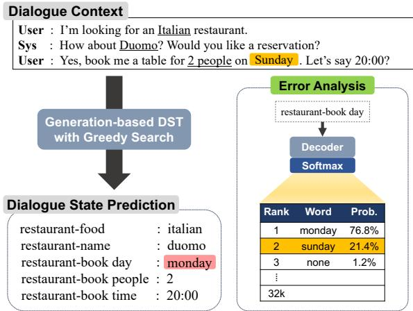
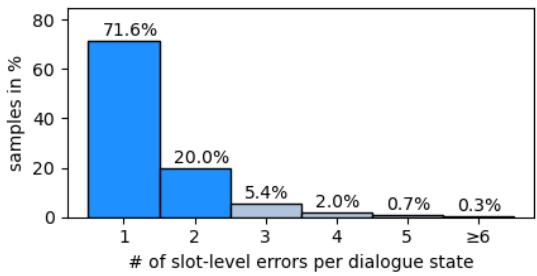
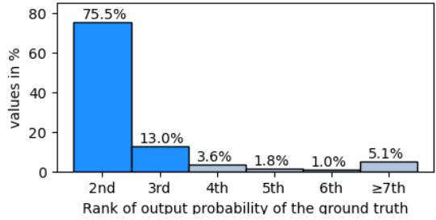
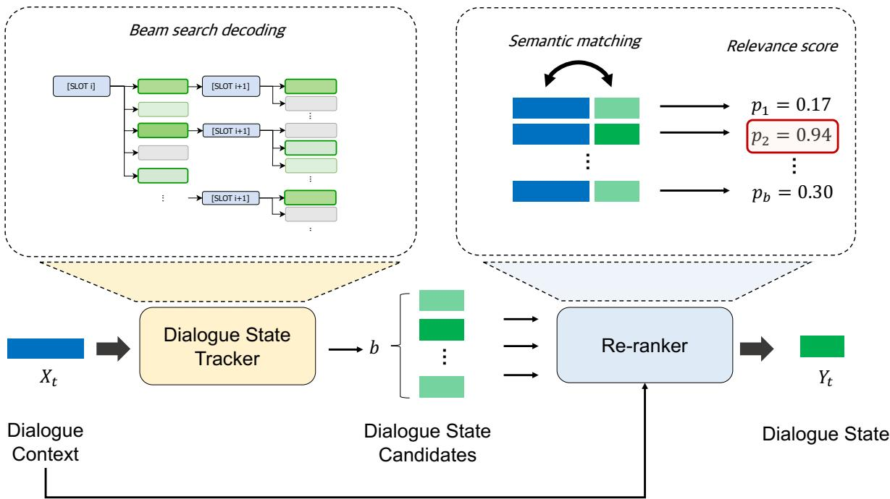
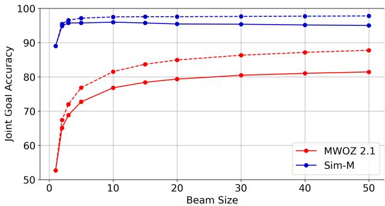
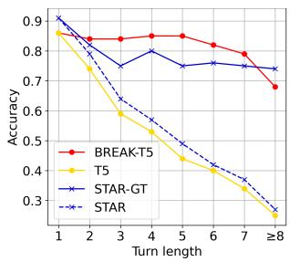
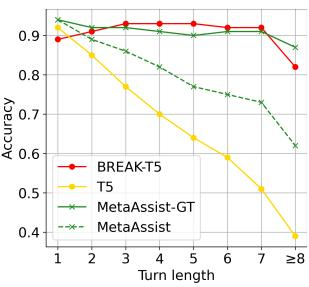
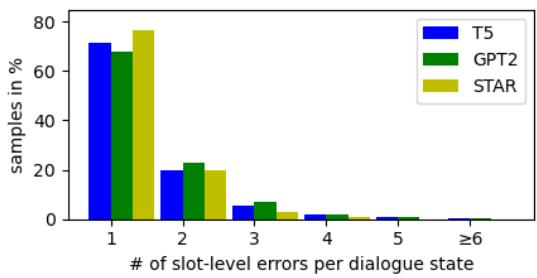
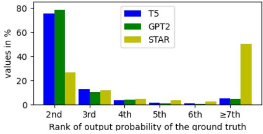

# BREAK: Breaking the Dialogue State Tracking Barrier with Beam Search and Re-ranking

Seunpgil Won1,2 Heeyoung Kwak4,5 Joongbo Shin1 Janghoon Han1 Kyomin Jung2,3 1LG AI Research, 2Seoul National University, 3SNU-LG AI Research Center 4NAVER AI Lab, 5NAVER Digital Healthcare Lab {seungpil.won, jb.shin, janghoon.han}@lgresearch.ai heeyoung.kwak@navercorp.com kjung@snu.ac.kr

## Abstract

Despite the recent advances in dialogue state tracking (DST), the joint goal accuracy (JGA) of the existing methods on MultiWOZ 2.1 still remains merely 60%. In our preliminary error analysis, we find that beam search produces a pool of candidates that is likely to include the correct dialogue state. Motivated by this observation, we introduce a novel framework, called BREAK (Beam search and RE-rAnKing), that achieves outstanding performance on DST. Our proposed method performs DST in two stages: (i) generating k-best dialogue state candidates with beam search and (ii) re-ranking the candidates to select the correct dialogue state. This simple yet powerful framework shows state-of-the-art performance on all versions of MultiWOZ and M2M datasets. Most notably, we push the joint goal accuracy to 80-90% on MultiWOZ 2.1-2.4, which is an improvement of 23.6%, 26.3%, 21.7%, and 10.8% over the previous best-performing models, respectively. The data and code will be available at https://github.com/tony-won/DST -BREAK.

## 1 Introduction

Dialogue state tracking (DST) is an essential component of task-oriented dialogue (TOD) systems to help users achieve their specific goals, such as booking restaurants or finding attractions (Budzianowski et al., 2018). The task of DST is to understand the meaning of user utterances and keep track of users’ intentions throughout the conversation. Since the results of DST affects the subsequent TOD tasks, i.e., dialogue policy and response generation, the accuracy of DST is crucial without a doubt (Kim et al., 2020; Lee et al., 2019). In DST, the dialogue state is typically represented by a set of (slot, value) pairs, e.g., (“hotel-area”, “centre”). Here, the list of slots is a pre-defined set, and the corresponding values are extracted from the dialogue context.

  
Figure 1: An example of dialogue state tracking with a generation-based model and its failure case. Greedy search fails to generate the accurate slot value for restaurant-book day. However, the output probability of the correct value sunday still ranks very high, providing a rationale for using beam search to reconsider the high-ranking tokens.

Thanks to large-scale pre-trained language models (PLMs) (Devlin et al., 2019; Radford et al., 2019; Raffel et al., 2020), generation-based approaches to DST have achieved remarkable progress in recent years (Hosseini-Asl et al., 2020; Feng et al., 2021; Lee et al., 2021b). Generationbased approaches sequentially generate values in the pre-defined sequence format, conditioned on the dialogue context. Most importantly, as they perform DST in an open-vocabulary setting rather than relying on a pre-defined ontology, this formulation has the potential to handle unseen values during training (Kim et al., 2020; Lee et al., 2021b). Due to this advantage, various techniques built on generative PLMs have been proposed to improve the performance of DST, but the joint goal accuracy on MultiWOZ 2.1 (Eric et al., 2020) still remains less than 60% 1.

To identify performance bottlenecks, we analyze the failure cases produced by generation-based DST models built upon PLMs (Radford et al., 2019; Raffel et al., 2020; Zhao et al., 2021). We find that most errors contain only one or two incorrect slot values. Furthermore, even at the decoding steps where the incorrect slot value has the highest output probability, the probability of the ground truth value still ranks very high, mostly in the top 4. The overall analysis motivates us to look into the beam search candidates rather than relying on decoding strategies that strictly select the sequence with the highest conditional probability. This is because beam search typically produces a set of candidates with high overlap (Meister et al., 2021), so it is useful in scenarios where only a few errors need to be corrected. Moreover, it allows tokens with a high output probability to be reconsidered as potential slot values.

Motivated by these observations, we propose a novel framework for generation-based DST, called BREAK (Beam search and RE-rAnKing). BREAK consists of two stages at the inference phase: (i) generating multiple dialogue state candidates using beam search and (ii) re-ranking the candidates to select the correct dialogue state. Unlike the existing methods that rely solely on the model’s generative power, our method effectively obtains the correct answer by re-examining the beam search candidates with a re-ranker. To the best of our knowledge, our work is the first to explore beam search and re-ranking in DST.

The contributions of our work are summarized as follows:

• Our analysis reveals that generation-based DST models still have a high output probability for ground truth values even when making wrong predictions, which provides a basis for re-considering beam search candidates rather than taking a single decoded sequence as the correct dialogue state.

• Motivated by our observation, we propose a simple yet powerful framework for generationbased DST that utilizes beam search and reranking.

• Our method achieves state-of-the-art performance by a significant margin on all versions of MultiWOZ and M2M datasets, breaking the existing performance barrier.

## 2 Preliminaries

In this section, we formally describe the problem and generation-based approach for DST. Then we report our in-depth analysis of the errors produced by generation-based DST models.

## 2.1 Problem Statement

We treat the DST task as a sequence-to-sequence problem, where the model processes the input sequence of utterances and generates a dialogue state tracked up to the current turn. More formally, let the input $C _ { t } = [ ( U _ { 1 } , M _ { 1 } ) , . . . , ( U _ { t } , M _ { t } ) ]$ be a sequence of utterances up to turn $t ,$ where each $U$ and M represent the user utterance and system response, respectively. Given the dialogue context $C _ { t } ,$ , the model outputs a dialogue state $Y _ { t } = \{ ( s _ { n } , v _ { n } ) | s _ { n } \in S \}$ . Here, $\boldsymbol { S } = \{ s _ { 1 } , . . . , s _ { N } \}$ denotes the set of pre-defined slots that comprise N domain-slot pairs, and $v _ { n }$ is the slot-specific value for slot $s _ { n }$ . To sum up, we aim to learn a dialogue state tracker $\mathcal { F } : C _ { t } \mapsto Y _ { t }$ that takes the dialogue context $C _ { t }$ as input and keeps track of the dialogue states $Y _ { t }$ accurately throughout the dialogue.

## 2.2 Generation-based Model for DST

In this work, we are particularly interested in generation-based models built upon Transformers (Vaswani et al., 2017). Our method can be applied to either encoder-decoder (Raffel et al., 2020; Lewis et al., 2020) or decoder-only (Radford et al., 2019) models, yet we formally describe our method with the encoder-decoder structure.

The input of the model consists of all turns of dialogue up to turn t. All sequences are concatenated with [USER] and [SYS], where [USER] and [SYS] are special tokens for indicating the speaker of each utterance.

$$
\begin{array} { r } { C _ { t } = [ \mathrm { U S E R } ] \oplus U _ { 1 } \oplus [ \mathrm { S Y S } ] \oplus M _ { 1 } \oplus } \\ { . . . \oplus [ \mathrm { S Y S } ] \oplus M _ { t - 1 } \oplus [ \mathrm { U S E R } ] \oplus U _ { t } . } \end{array}\tag{1}
$$

Given the dialogue context, the encoder maps an input sequence $C _ { t }$ to a sequence of continuous representations $\mathbf { H } _ { t } ^ { ( l ) }$ as follows:

$$
\mathbf { H } _ { t } ^ { ( 0 ) } = \mathbf { E m b } ( C _ { t } ) ,\tag{2}
$$

$$
\mathbf { H } _ { t } ^ { ( l ) } = \mathbf { E n c } _ { l } ( \mathbf { H } _ { t } ^ { ( l - 1 ) } ) ,\tag{3}
$$

where Emb( ) and Encl( ) represent the initial embedding layer and the l-th layer of the encoder, respectively.

(a) % distribution of the slot-level errors  

(b) % distribution of the rank of the ground truth  
  
Figure 2: The percentage distributions examined in the error analysis of T5 with greedy search. (a) The distribution of the number of incorrectly-predicted slots. (b) The distribution of the rank of the ground truth’s output probability. The ground truth values are ranked in the top 4 in 92% of the cases, most commonly in the 2nd.

The decoder then generates a dialogue state token-by-token in a pre-defined sequence format. In other words, it sequentially predicts the probability of the current token conditioned on the encoder output embeddings $\mathbf { H } _ { t } ^ { ( L ) }$ and all the previously generated tokens. Here, L denotes the number of layers of the encoder. The output probability of the decoder at any decoding step j is given as:

$$
P _ { \theta } ( y _ { j } | y _ { < j } , C _ { t } ) = \mathbf { D e c } ( y _ { < j } , \mathbf { H } _ { t } ^ { ( L ) } ) ,\tag{4}
$$

where θ represents the parameters of the encoderdecoder model.

The training objective of the auto-regressive process is to maximize the log-likelihood of the target sequence $Y _ { t } = \langle y _ { 1 } , y _ { 2 } , . . . \rangle$ for the given input text $C _ { t }$ as follows:

$$
\mathcal { L } = - \sum _ { j = 1 } ^ { | Y _ { t } | } \log P _ { \theta } ( y _ { j } | y _ { < j } , C _ { t } ) .\tag{5}
$$

During inference, greedy search, which selects the token with the highest probability at each time step, is generally applied to produce the output sequence.

<table><tr><td>Beam size</td><td>Unique values per slot</td><td>Slot errors per candidate</td></tr><tr><td>10</td><td>2.00</td><td>1.22</td></tr><tr><td>30</td><td>3.20</td><td>1.40</td></tr><tr><td>50</td><td>4.06</td><td>1.43</td></tr></table>

Table 1: Characteristics of beam search candidates generated by T5. We report the average number of unique values per slot for each k-best candidate pool. For this, we exclude the slots that only have a ‘none’ value for all k-best candidates. We also report the average number of slot-level errors for each candidate dialogue state.

## 2.3 Preliminary Study on DST

To identify performance bottlenecks in generationbased DST, we analyze the failure cases predicted with T5 (Raffel et al., 2020) using greedy search 2. The error analysis for other models are provided in the Appendix A.

First, we investigate how many slot values are incorrectly predicted in each instance of MultiWOZ 2.4 (Ye et al., 2022b). Our experiment shows that 91.6% of the wrong predictions contain only one or two incorrect slot values, as shown in Figure 2-(a), which indicates that only a few slot-level errors contribute to the low JGA. This result is consistent with the fact that most of the existing DST models exhibit very high slot accuracy3 (97\~99%) while having low JGA (Wu et al., 2019; Kim et al., 2020; Wang et al., 2022; Ye et al., 2022a,c).

To further examine the errors, we explore the output probability distribution over the vocabulary at decoding steps where slot values are incorrectly predicted. Specifically, we check the ranking of the probability of the ground truth value when sorted in descending order. To illustrate with an example, suppose that the predicted value is 13:15 and the ground-truth value is 13:45. The mis-predicted word is 15, and therefore we check the ranking of the correct word 45 at 15’s decoding step. As a result, we find that the probability of decoding the ground truth value generally ranks very high. As shown in Figure 2-(b), around 92% of the wrong predictions have ground truth values within the 4th place.

All of our findings naturally lead to the use of beam search. First, beam search can be useful in scenarios where only one or two errors need to be corrected, as they generate a set of sequences with high overlap (Meister et al., 2021). More importantly, beam search candidates are likely to contain the high-ranking tokens investigated in our analysis. In fact, generated candidates exhibit only a few unique values for each slot and have a small number of slot-level errors, as reported in Table 1. These observations suggest that the k-best dialogue states generated by beam search can serve as a valuable candidate pool by combining highly probable slot values. This presents an opportunity to reconsider them as potential dialogue states.

  
Figure 3: The overall process of BREAK.

## 3 BREAK: Beam Search and Re-Ranking

Based on the analysis in Section 2.3, we propose a novel framework for generation-based DST. Our approach, dubbed BREAK, utilizes Beam Search and RE-rAnKing at the inference phase. Specifically, given a trained DST model, the main idea is to generate dialogue state candidates using beam search and then find the correct dialogue state by re-ranking them.

## 3.1 Generating Candidates with Beam Search

The decoding process of dialogue state generation can be viewed as a problem of finding the optimal sequence $Y ^ { * } = \arg \operatorname* { m a x } _ { Y } \log p ( Y | X )$ given the input X. The current practice in generationbased DST is to use greedy search, the simplest heuristic of finding $Y ^ { * }$ . However, as described in Section 2.3, greedy search often fails to generate the accurate slot values since it simply selects only one token with the highest conditional probabilities $p ( y _ { j } | y _ { < j } , X )$ at each decoder step j.

Instead of considering only the one best token, beam search keeps track of k most probable subsequences, allowing the exploration over a wider search space. Therefore, we adopt beam search to create valid candidates for dialogue states. The rationale behind using beam search is based on our analysis that the output probability of ground truth value is very high among all tokens. In the following sections, we denote the beam search candidates as .

## 3.2 Re-Ranking over Candidates

After generating candidates with beam search, we need to select the correct dialogue state among them. To this end, a re-ranker learns to rank candidates by computing the semantic alignment between the given dialogue context $C _ { t }$ and each candidate $Y _ { t } ^ { \prime } \in \mathcal { V }$

For a re-ranker, we use a model with BERTbased architecture. The input sequence is the concatenation of the dialogue context and the dialogue state candidate, $C _ { t } \oplus Y _ { t } ^ { \prime }$ . Then we take the final hidden state vector of the [CLS] token as the aggregate representation for input pair $( C _ { t } , Y _ { t } ^ { \prime } )$ . A simple softmax classifier is added on top of the aggregate representation, which we denote by $\mathbf { h } ( C _ { t } , Y _ { t } ^ { \prime } )$ to compute the probability of each label $c \in \{ 0 , 1 \}$ as follows:

$$
p ( c | \mathbf { h } ( C _ { t } , Y _ { t } ^ { \prime } ) ) = \mathrm { s o f t m a x } ( W \mathbf { h } ( C _ { t } , Y _ { t } ^ { \prime } ) ) ,\tag{6}
$$

where $W$ is the weight matrix for the classification layer.

We train a re-ranker by minimizing crossentropy loss to achieve the goal of scoring the correct candidate higher than other candidates. To this end, we contruct a dataset consisting of the dialogue context $( C _ { t } )$ , a pool of dialogue state candidates ( ), and the label indicating whether each input pair $( C _ { t } , Y _ { t } ^ { \prime } \in \mathcal { V } )$ is correct or not. A finetuned dialogue state tracker 4 is employed to construct this data. Using this model, we make inference on the DST training set with beam search to produce  for each $C _ { t }$ . Then the ground truth is labeled as a positive sample, and all the wrong predictions are labeled as negative samples. The same process is applied to the validation set.

At test time, the candidate with the largest score, which is the probability of being the correct answer $( c = 1 )$ , is selected as the correct dialogue state as follows:

$$
\hat { Y } _ { t } = \mathop { \operatorname { a r g m a x } } _ { Y _ { t } ^ { \prime } \in \mathcal { V } } p ( c = 1 | \mathbf { h } ( C _ { t } , Y _ { t } ^ { \prime } ) ) .\tag{7}
$$

## 4 Experimental Setup

## 4.1 Model Variations

Depending on the form of the output dialogue state $Y _ { T }$ , we consider three variants of the model:

(i) Sequential w/o none (SEQ): The decoder sequentially generates a set of slot-value pairs except when the value is none. The output sequence $Y _ { t }$ has the following format: $s _ { i } = v _ { i } , s _ { j } = v _ { j } , \cdot \cdot \cdot ,$ where $v _ { i }$ and $v _ { j }$ are not none.

(ii) Sequential w/ none (SEQ-Full): In contrast to SEQ, the output sequence $Y _ { t }$ includes none slot values. In other words, the decoder sequentially generates slot values for all pre-defined slots, with the format of $s _ { 1 } = v _ { 1 } , s _ { 2 } = v _ { 2 } , \cdot \cdot \cdot , s _ { N } = v _ { N }$

(iii) Cloze-Style (CS): In this case, we formalize the DST problem as the equivalent cloze-style QA task. Specifically, we design a task-specific prompt

$P$ as a cloze question, which has the following format:

$$
\begin{array} { r } { P = s _ { 1 } \oplus [ \mathrm { S L O T \_ 1 } ] \oplus s _ { 2 } \oplus [ \mathrm { S L O T \_ 2 } ] } \\ { \oplus \cdot \cdot \cdot \oplus s _ { N } \oplus [ \mathrm { S L O T \_ N } ] } \end{array}\tag{8}
$$

where $s _ { n }$ indicates the slot name $( \mathbf { e . g . } , \ t \mathbf { r } \mathsf { a } .$ in $- \mathrm { d } a _ { Ḋ } Y Ḍ ) .$ , and $[ \mathrm { S L O T \_ n } ]$ is a special token for a placeholder that fills in the corresponding slot value. The task-specific prompt $P$ is concatenated with the dialogue context $C _ { t }$

$$
X _ { t } = P \oplus C _ { t } .\tag{9}
$$

Given this prompt-augmented input $X _ { t }$ , the model outputs the sequence $Y _ { t }$ , which represents a cumulative dialogue state up to the current turn.

$$
\begin{array} { r } { Y _ { t } = [ \mathrm { S L O T \_ 1 } ] \oplus v _ { 1 } \oplus [ \mathrm { S L O T \_ 2 } ] \oplus v _ { 2 } \oplus } \\ { \qquad \quad \dots \oplus [ \mathrm { S L O T \_ N } ] \oplus v _ { N } } \end{array}\tag{10}
$$

where $v _ { k }$ is the corresponding slot values for the specific slot [SLOT\_k].

## 4.2 Datasets

MultiWOZ is the most extensively used benchmark for DST. It is a large-scale multi-domain dialogue dataset that contains about 10k multi-turn dialogues spanning over 8 domains. We conduct our experiments on MultiWOZ 2.1-2.4 (Eric et al., 2020; Zang et al., 2020; Han et al., 2021; Ye et al., 2022b), the improved versions made by continuously refining annotation errors from Multi-WOZ 2.0 (Budzianowski et al., 2018). Following the previous works (Wu et al., 2019; Kim et al., 2020), we use only 5 domains attraction, hotel, restaurant, taxi, train with 30 domain-slot pairs, excluding bus, hospital, police .

Machines Talking To Machines (M2M) (Shah et al., 2018) is the simulation-based dataset that contains 3k dialogues from the restaurant (Sim-M) and movie (Sim-R) domains. To collect the conversations, the outlines of the dialogue are first generated using self-play between the user and system agencies. Then, the generated outlines are paraphrased by crowd workers to get more diverse utterances.

<table><tr><td>Model</td><td>MWOZ 2.1</td><td>MWOZ 2.2</td><td>MWOZ 2.3</td><td>MWOZ 2.4</td></tr><tr><td colspan="5">Pre-defined ontology</td></tr><tr><td>STAR (Ye et al., 2021)</td><td>56.4</td><td></td><td></td><td>73.6</td></tr><tr><td>LUNA (Wang et al., 2022)</td><td>57.6</td><td>56.1</td><td></td><td></td></tr><tr><td>MetaASSIST (STAR) (Ye et al., 2022c)</td><td></td><td></td><td></td><td>80.1</td></tr><tr><td colspan="5">Open vocabulary</td></tr><tr><td>SOM-DST (Kim et al., 2020)</td><td>53.0</td><td></td><td>55.5</td><td>66.8</td></tr><tr><td>TripPy (Heck et al., 2020)</td><td>55.3</td><td></td><td>63.0</td><td>64.8</td></tr><tr><td>SimpleTOD (Hosseini-Asl et al., 2020)</td><td>55.7</td><td></td><td>51.3</td><td>57.2</td></tr><tr><td>Seq2Seq-DU (Feng et al., 2021)</td><td>56.1</td><td>54.4</td><td></td><td></td></tr><tr><td>SDP-Ind (Lee et al., 2021b)</td><td>56.7</td><td>57.6</td><td></td><td></td></tr><tr><td>D3ST (XXL) (Zhao et al., 2022)</td><td>57.8</td><td>58.7</td><td>60.8</td><td>75.9</td></tr><tr><td> $^ { \dag } \mathrm { C o n v B E R T - D G } + \mathrm { M u l t i } \ ( \mathrm { M e h r i } \ \mathrm { e t } \ \mathrm { a l . } , 2 0 2 0 )$ </td><td>58.7</td><td></td><td>67.9</td><td></td></tr><tr><td> $\mathrm { ^ { \dag } T r i p P y + S C O R E \left( Y u \ e t \ a l . , 2 0 2 0 \right) }$ </td><td>60.5</td><td></td><td></td><td></td></tr><tr><td colspan="5">Our Method</td></tr><tr><td>GPT2 (greedy search)</td><td>53.1</td><td>53.7</td><td>56.2</td><td>63.1</td></tr><tr><td> $\mathrm { G P T 2 } _ { \mathrm { u p p e r } } \mathrm { ( b e a m ~ s i z e { = } } 5 0 \mathrm { ) }$ </td><td> $8 8 . 1 _ { \pm 0 . 1 }$ </td><td> $8 9 . 6 { \scriptstyle \pm 0 . 5 }$ </td><td> $8 8 . 2 _ { \pm 0 . 4 }$ </td><td> $9 5 . 0 { \scriptstyle \pm 0 . 4 }$ </td></tr><tr><td>T5 (greedy search)</td><td>53.3</td><td>54.8</td><td>57.8</td><td>68.0</td></tr><tr><td> $\mathrm { T 5 _ { u p p e r } ( b e a m \ s i z e { = } } 5 0 )$ </td><td> $8 7 . 6 { \scriptstyle \pm 0 . 1 }$ </td><td> $8 9 . 7 _ { \pm 0 . 2 }$ </td><td> $8 8 . 0 { \scriptstyle \pm 0 . 5 }$ </td><td> $9 3 . 9 { \scriptstyle \pm 0 . 3 }$ </td></tr><tr><td>BREAK-GPT2</td><td> $\overline { { 8 1 . 4 _ { \pm 0 . 2 } } }$ </td><td> $\overline { { 8 4 . 2 _ { \pm 0 . 4 } } }$ </td><td> $8 4 . 0 _ { \pm 0 . 1 }$ </td><td> $\mathbf { \overline { { 9 0 . 9 _ { \pm 0 . 2 } } } }$ </td></tr><tr><td>BREAK-T5</td><td> $8 1 . 3 { \scriptstyle \pm 0 . 1 }$ </td><td> ${ \bf 8 5 . 0 _ { \pm 0 . 1 } }$ </td><td> $\mathbf { 8 4 . 7 \pm 0 . 4 }$ </td><td> $9 0 . 7 _ { \pm 0 . 2 }$ </td></tr></table>

Table 2: Evaluation results on MultiWOZ 2.1-2.4 ( denotes the standard deviation). “-” indicates no public number is available. The existing best results and current best results are each marked in blue and red. ⋄ uses schema descriptions to train the model. † indicates that extra dialogue data is used to train the model.

## 4.3 Evaluation Metric

Joint goal accuracy (JGA) is a widely used metric to evaluate the performance of DST models. By definition, JGA is True if and only if all predicted values for all slots exactly match the ground-truth labels, otherwise False.

## 4.4 Upper Bound of BREAK

Since BREAK eventually selects one of the beam search candidates as the correct answer, we also present the upper bound of JGA for the dialogue state tracker $f .$ . The upper bound $f _ { \mathrm { u p p } }$ is calculated as follows:

$$
f _ { \mathrm { u p p e r } } = \sum _ { i = 1 } ^ { M } \mathbb { 1 } \{ Y ^ { ( i ) } \in \mathcal { Y } _ { f } ^ { ( i ) } \} / M ,\tag{11}
$$

where M denotes the total number of samples in the test set. The ground truth and beam search candidates of the $i ^ { t \bar { h } }$ sample are represented as $Y ^ { ( i ) }$ and $\mathcal { V } _ { f } ^ { ( i ) }$ , respectively.

## 4.5 Implementation Details

For a fair comparison, we use the pre-processing script released by (Wu et al., 2019).

## 4.5.1 Training

Dialogue State Tracker. For our experiments, we employ T5-small (Raffel et al., 2020) and GPT2 (Radford et al., 2019) as a backbone using HuggingFace Transformers5. All the weights are initialized from the pre-trained checkpoint and then models are fine-tuned on MultiWOZ and M2M datasets. The detailed specification is as follows: (i) T5-small has 60M parameters containing 6 transformer blocks for both encoder and decoder, 8 attention heads, and 512 hidden units. (ii) GPT2 has 117M parameters containing 12 transformer blocks, 12 attention heads, and 768 hidden units. Both T5 and GPT2 are trained using AdamW (Loshchilov and Hutter, 2017) with a constant learning rate of 5e-5. Exceptionally, we use a learning rate of 1e-4 to train T5 on MultiWOZ datasets. During training, we set a batch size to 16 and a dropout rate to 0.1. The maximum sequence length of the encoder is set to the default value but set to 100 longer when using the cloze-style format.

Re-Ranker. We use the pre-trained RoBERTabase (Liu et al., 2019) for a re-ranker. RoBERTabase is built upon the BERT-based architecture with 12 transformer blocks, 12 attention heads, and 768 hidden units. The model is trained using AdamW (Loshchilov and Hutter, 2017) with a constant learning rate of 1e-5. During training, we set a batch size to 48 and a dropout rate to 0.1. The maximum sequence length is 512.

## 4.5.2 Inference

We run each evaluation three times with different seeds and report the average number for more reliable results.

## 5 Experimental Results

Unless otherwise noted, all T5-based results are obtained using the form of the cloze-style (CS). This is due to the computational efficiency, and more details are described in Section 5.4.

## 5.1 Overall Results

We present the evaluation results on MultiWOZ 2.1-2.4 in Table 2. In our experiments, we compare our method with the strong baselines: STAR (Ye et al., 2021), LUNA (Wang et al., 2022), MetaAS-SIST (STAR) (Ye et al., 2022c), SOM-DST (Kim et al., 2020), TripPy (Heck et al., 2020), SimpleTOD (Hosseini-Asl et al., 2020), Seq2Seq-DU (Feng et al., 2021), SDP (Lee et al., 2021b), D3ST (XXL) (Zhao et al., 2022), ConvBERT-DG + Multi (Mehri et al., 2020), and TripPy + SCORE (Yu et al., 2020).

To validate the efficacy of our method, we first measure the upper bound of JGA described in Section 4.4. With a beam size of 50, both T5 and GPT2 show nearly 90% upper bound JGA, particularly around 94-95% on MultiWOZ 2.4. These results demonstrate that k-best candidates produced by beam search are likely to contain the correct dialogue state that greedy search could not predict.

Combined with re-ranking, BREAK consistently outperforms the existing methods by significant margins on all versions of MultiWOZ dataset. Most remarkably, our method achieves 23.6%, 26.3%, 21.7%, and 10.8% absolute performance improvement on MultiWOZ 2.1-2.4, respectively. In consequence, we push the boundaries of the performance on MultiWOZ to 80-90%. Note that we obtain these results without using extra training data or increasing the model size.

Table 3 shows the evaluation results on M2M. BREAK achieves state-of-the-art performance on all three evaluated datasets. Notably, on Sim-R, our method shows better performance than SMD-DST which has a kind of oracle upper bound. A significant challenge faced by M2M appears to be the model’s ability to generalize in slots with high out-of-vocabulary rates 6. T5 exhibits relatively lower accuracy in those slots, whereas BREAK-T5 demonstrates comparable performance to the other slots 7.

<table><tr><td>Model</td><td>Sim-M</td><td>Sim-R</td><td>Sim-M+R</td></tr><tr><td>*SMD-DST</td><td>96.8</td><td>94.4</td><td>一</td></tr><tr><td>LU-DST</td><td>50.4</td><td>87.1</td><td>73.8</td></tr><tr><td>BERT-DST</td><td>80.1</td><td>89.6</td><td></td></tr><tr><td>TripPy</td><td>83.5</td><td>90.0</td><td></td></tr><tr><td>SDP-Ind</td><td>83.3</td><td>89.6</td><td>88.0</td></tr><tr><td>Seq2Seq-DU</td><td>–</td><td>一</td><td>90.9</td></tr><tr><td>T5</td><td>87.8</td><td>90.8</td><td>89.8</td></tr><tr><td>T5upper bound</td><td> $9 7 . 0 { \scriptstyle \pm 0 . 8 }$ </td><td> $9 7 . 5 { \scriptstyle \pm 0 . 5 }$ </td><td> $9 7 . 1 _ { \pm 0 . 3 }$ </td></tr><tr><td>BREAK-T5</td><td> $\overline { { 9 4 . 7 _ { \pm 0 . 4 } } }$ </td><td> $\mathbf { \overline { { 9 4 . 7 _ { \pm 0 . 7 } } } }$ </td><td> $\overline { { 9 4 . 6 _ { \pm 0 . 7 } } }$ </td></tr></table>

Table 3: Evaluation results on Sim-M and Sim-R. \* should be considered as a kind of oracle because the target slot value processed by the DST model is guaranteed to be in the candidate list. ⋄ means that schema descriptions are used to train the DST model.

## 5.2 Effect of the Beam Size

Figure 4 shows the performance of our method on MultiWOZ 2.1 and Sim-M with varying sizes of the beam search candidates. A larger beam size naturally leads to elevating the upper bound JGA of T5 since it can cover lower-ranking ground truth values. In our preliminary error analysis, most of the ground truth values are found to have very high-ranking output probabilities among the vocabulary. This finding is strongly supported by the dramatic increase in $\mathrm { T } 5 _ { \mathrm { u p p e r } }$ when the beam size increases from 1 to 2. Moreover, the performance of BREAK-T5 shows a similar trend to $\mathrm { T } 5 _ { \mathrm { u p p e r } }$ , indicating that a re-ranker finds the correct dialogue state well from the candidates with high overlap. However, a large beam size (>10) rather causes performance degradation on Sim-M. Since there are only five slots in Sim-M, a large number of similar candidates can act as noise to a re-ranker.

  
Figure 4: Performance of BREAK-T5 with varying beam sizes on MultiWOZ 2.1 and Sim-M. We examine the performance with the beam sizes of {1, 2, 3, 5, 10, 15, 20, 30, 40, 50}. The dashed line illustrate the upper bound performance of T5 on both datasets.

  
(a) MultiWOZ 2.1

  
(b) MultiWOZ 2.4  
Figure 5: Per-turn joint goal accuracy on MultiWOZ 2.1 and MultiWOZ 2.4.

## 5.3 Per-Turn Joint Goal Accuracy

In Figure 5, we compare the per-turn accuracy of our method with STAR and MetaASSIST (STAR) on MultiWOZ 2.1 and MultiWOZ 2.4. We also report the results of STAR-GT and MetaASSIST-GT, which use the ground truth dialogue state of the previous turn as the input at every turn.

In general, the per-turn accuracy drastically decreases as the number of turns increases. This is because DST on longer dialogue contexts is more challenging, and JGA accumulates errors from the early turn until the end. Nevertheless, BREAK-T5 shows relatively stable performance regardless of the turn lengths. It even performs better than STAR-GT and MetaASSIST-GT for most turn lengths.

For one-turn dialogues, however, the performance is comparable to or even worse than the baseline T5. Since similar candidates are compared for such a short dialogue context, it is difficult for a re-ranker to distinguish the correct one. For longerturn dialogues, BREAK-T5 absolutely outperforms other baselines, whereas the performance of T5 and STAR is severely degraded.

<table><tr><td>Format</td><td>Model</td><td>2.1 2.2</td><td>2.3</td><td>2.4</td></tr><tr><td>SEQ</td><td>GPT2 T5</td><td>75.7 79.4 75.4 79.6</td><td>77.3 77.1</td><td>84.1 83.9</td></tr><tr><td>SEQ-Full</td><td>GPT2 T5</td><td>81.4 84.2 81.2 84.6</td><td>84.0 84.0</td><td>90.9 90.7</td></tr><tr><td>CS</td><td>T5</td><td>81.3 85.0</td><td>84.7</td><td>90.7</td></tr></table>

Table 4: Comparison of the performance according to the output format. The results are obtained with a beam size of 50.

<table><tr><td rowspan="2">Model</td><td rowspan="2">Format</td><td colspan="2">Beam Size</td></tr><tr><td>1 10</td><td>30 50</td></tr><tr><td rowspan="2">T5</td><td>SEQ SEQ-FULL</td><td>0.28 0.75 0.72 1.33</td><td>1.33 1.99 1.87 2.56</td></tr><tr><td>CS</td><td>0.45 0.99</td><td>1.31 1.99</td></tr><tr><td>GPT2</td><td>SEQ SEQ-FULL</td><td>0.35 1.71</td><td>0.61 1.05 1.67 2.10 3.55 5.54</td></tr></table>

Table 5: Comparison of the latency according to the output format. The unit is seconds.

## 5.4 Effect of the Dialogue State Form

Table 4 and Table 5 shows the performance and latency of our method for three different variations of the output sequence format. We measure the inference time per instance on RTX A5000 with a batch size of 1. In our experiments, GPT2/SEQ-Full 8 and T5/CS perform best overall. While GPT2/SEQ-Full exhibits comparable performance to T5/CS, it takes about 2.8 times longer inference time 9. Since beam search is computationally expensive, we mainly report the results of T5/CS in this paper for time efficiency. The SEQ format is faster than other formats due to its short output sequence length, but its performance is relatively poor. This suggests that it is advantageous for BREAK to express the output sequence with a fixed template containing the entire slot list. In conclusion, our proposed cloze-style (CS) format is the most efficient for our method in terms of both performance and computation.

## 6 Related Work

## 6.1 Generation-based DST

Recently, there have been promising results on the MultiWOZ datasets using generation-based approaches. These models basically leverage the powerful generative capabilities of large-scale PLMs. On top of that, various techniques have been proposed to further improve the performance of DST: using schema descriptions (Feng et al., 2021; Lee et al., 2021b; Zhao et al., 2022), pre-training with multiple dialogue corpora or novel objectives (Peng et al., 2021; Su et al., 2022; Zhao et al., 2021), multi-task learning on different taskoriented tasks (Lin et al., 2020; Hosseini-Asl et al., 2020; Peng et al., 2021; Su et al., 2022), or increasing the size of PLMs (Zhao et al., 2022). On the other hand, our work does not require external dialogue data or additional information for the task.

## 6.2 Beam Search and Re-Ranking

Many recent studies in neural machine translation (NMT) and natural language generation (NLG), have proposed re-ranking over multiple candidates. These candidates are traditionally generated from a conditional language model with beam search decoding. This approach is particularly beneficial for auto-regressive models because the re-ranking model evaluates the candidate by attending over the entire sequence, which cannot be done in the decoding process. In NMT, re-ranker models are generally trained with the final evaluation metrics like BLEU (Lee et al., 2021a). In NLG, re-rankers are trained to realize all the attributes in the structured meaning representation (Dušek and Jurcíˇ cekˇ , 2016; Juraska et al., 2018). However, stochastic decoding is also preferred over beam search to ensure diversity in the natural sentences (Kedzie and McKeown, 2019; Eikema and Aziz, 2020; Bhattacharyya et al., 2021; Fernandes et al., 2022). In contrast, DST aims to predict the accurate dialogue state, making the use of beam search even more appropriate.

## 7 Conclusion

We propose a simple yet effective framework for generation-based DST that breaks the performance barrier in DST. We design our framework based on our findings that the probability of ground truth value being generated by DST models is very high in most decoding steps. Our method effectively tracks the dialogue state by (i) generating beam search candidates and (ii) re-ranking them via assessing the semantic matching with the dialogue context. By exploring the highly probable dialogue state candidates discovered by beam search, our method significantly reduces errors compared to the decoding process that generates a single definitive dialogue state. In our experiments, we achieve state-of-the-art performance on MultiWOZ and M2M datasets by a significant margin, regardless of the backbone PLMs. For future work, we plan to improve the computational efficiency of the current framework to apply in real-world settings.

## Limitations

Our method shows impressive performance but relies entirely on beam search during inference. However, it is well known that beam search is a computationally expensive algorithm. With the beam size of 50, the latency increases from 3.6 times (T5/SEQ-FULL) to 7 times (T5/SEQ) compared to greedy decoding. In addition, the re-ranking process causes another latency (about 12ms in our experiments). Therefore, it may not be suitable for real-world DST scenarios. We leave this issue for future work. Potential directions may include reducing the current two-step pipeline to an efficient one-step process by employing a novel objective function, using data augmentation, or changing the sequential decoding process to a nonautoregressive approach that can be applied in a parallel manner.

## Ethics Statement

All datasets and models used in the experiments are from the publicly available website or Github.

## Acknowledgements

This work was supported by LG AI Research. This work was partly supported by Institute of Information communications Technology Planning Evaluation (IITP) grant funded by the Korea government(MSIT) [NO.2022-0-00184, Development and Study of AI Technologies to Inexpensively Conform to Evolving Policy on Ethics]. This work was supported in part by the National Research Foundation of Korea (NRF) grant funded by the Korea government (No. 2021R1A2C2008855).

## References

Sumanta Bhattacharyya, Amirmohammad Rooshenas, Subhajit Naskar, Simeng Sun, Mohit Iyyer, and Andrew McCallum. 2021. Energy-based reranking: Improving neural machine translation using energybased models. In Proceedings of the 59th Annual

Meeting of the Association for Computational Linguistics and the 11th International Joint Conference on Natural Language Processing (Volume 1: Long Papers), pages 4528–4537, Online. Association for Computational Linguistics.

Paweł Budzianowski, Tsung-Hsien Wen, Bo-Hsiang Tseng, Iñigo Casanueva, Stefan Ultes, Osman Ramadan, and Milica Gašic. 2018.´ MultiWOZ - a largescale multi-domain Wizard-of-Oz dataset for taskoriented dialogue modelling. In Proceedings of the 2018 Conference on Empirical Methods in Natural Language Processing, pages 5016–5026, Brussels, Belgium. Association for Computational Linguistics.

Jacob Devlin, Ming-Wei Chang, Kenton Lee, and Kristina Toutanova. 2019. Bert: Pre-training of deep bidirectional transformers for language understanding. In Proceedings of the 2019 Conference of the North American Chapter ofthe Associationfor Computational Linguistics: Human Language Technologies, Volume 1 (Long and Short Papers), pages 4171– 4186.

Ondˇrej Dušek and Filip Jurcíˇ cek. 2016. Sequence-ˇ to-sequence generation for spoken dialogue via deep syntax trees and strings. arXiv preprint arXiv:1606.05491.

Bryan Eikema and Wilker Aziz. 2020. Is map decoding all you need? the inadequacy of the mode in neural machine translation. arXiv preprint arXiv:2005.10283.

Mihail Eric, Rahul Goel, Shachi Paul, Abhishek Sethi, Sanchit Agarwal, Shuyang Gao, Adarsh Kumar, Anuj Goyal, Peter Ku, and Dilek Hakkani-Tur. 2020. MultiWOZ 2.1: A consolidated multi-domain dialogue dataset with state corrections and state tracking baselines. In Proceedings of the Twelfth Language Resources and Evaluation Conference, pages 422–428, Marseille, France. European Language Resources Association.

Yue Feng, Yang Wang, and Hang Li. 2021. A sequenceto-sequence approach to dialogue state tracking. In Proceedings of the 59th Annual Meeting of the Associationfor Computational Linguistics and the 11th International Joint Conference on Natural Language Processing (Volume 1: Long Papers), pages 1714– 1725, Online. Association for Computational Linguistics.

Patrick Fernandes, António Farinhas, Ricardo Rei, José GC de Souza, Perez Ogayo, Graham Neubig, and André FT Martins. 2022. Quality-aware decoding for neural machine translation. arXiv preprint arXiv:2205.00978.

Ting Han, Ximing Liu, Ryuichi Takanabu, Yixin Lian, Chongxuan Huang, Dazhen Wan, Wei Peng, and Minlie Huang. 2021. Multiwoz 2.3: A multi-domain task-oriented dialogue dataset enhanced with annotation corrections and co-reference annotation. In CCF International Conference on Natural Language

Processing and Chinese Computing, pages 206–218. Springer.

Michael Heck, Carel van Niekerk, Nurul Lubis, Christian Geishauser, Hsien-Chin Lin, Marco Moresi, and Milica Gasic. 2020. TripPy: A triple copy strategy for value independent neural dialog state tracking. In Proceedings of the 21th Annual Meeting of the Special Interest Group on Discourse and Dialogue, pages 35–44, 1st virtual meeting. Association for Computational Linguistics.

Ehsan Hosseini-Asl, Bryan McCann, Chien-Sheng Wu, Semih Yavuz, and Richard Socher. 2020. A simple language model for task-oriented dialogue. Advances in Neural Information Processing Systems, 33:20179– 20191.

Juraj Juraska, Panagiotis Karagiannis, Kevin Bowden, and Marilyn Walker. 2018. A deep ensemble model with slot alignment for sequence-to-sequence natural language generation. In Proceedings of the 2018 Conference of the North American Chapter of the Associationfor Computational Linguistics: Human Language Technologies, Volume 1 (Long Papers), pages 152–162, New Orleans, Louisiana. Association for Computational Linguistics.

Chris Kedzie and Kathleen McKeown. 2019. A good sample is hard to find: Noise injection sampling and self-training for neural language generation models. In Proceedings ofthe 12th International Conference on Natural Language Generation, pages 584–593, Tokyo, Japan. Association for Computational Linguistics.

Sungdong Kim, Sohee Yang, Gyuwan Kim, and Sang-Woo Lee. 2020. Efficient dialogue state tracking by selectively overwriting memory. In Proceedings of the 58th Annual Meeting of the Association for Computational Linguistics, pages 567–582, Online. Association for Computational Linguistics.

Ann Lee, Michael Auli, and Marc’Aurelio Ranzato. 2021a. Discriminative reranking for neural machine translation. In Proceedings ofthe 59th Annual Meeting of the Association for Computational Linguistics and the 11th International Joint Conference on Natural Language Processing (Volume 1: Long Papers), pages 7250–7264.

Chia-Hsuan Lee, Hao Cheng, and Mari Ostendorf. 2021b. Dialogue state tracking with a language model using schema-driven prompting. In Proceedings ofthe 2021 Conference on Empirical Methods in Natural Language Processing, pages 4937–4949, Online and Punta Cana, Dominican Republic. Association for Computational Linguistics.

Hwaran Lee, Jinsik Lee, and Tae-Yoon Kim. 2019. SUMBT: Slot-utterance matching for universal and scalable belief tracking. In Proceedings of the 57th Annual Meeting of the Association for Computational Linguistics, pages 5478–5483, Florence, Italy. Association for Computational Linguistics.

Mike Lewis, Yinhan Liu, Naman Goyal, Marjan Ghazvininejad, Abdelrahman Mohamed, Omer Levy, Veselin Stoyanov, and Luke Zettlemoyer. 2020. BART: Denoising sequence-to-sequence pre-training for natural language generation, translation, and comprehension. In Proceedings ofthe 58th Annual Meeting ofthe Associationfor Computational Linguistics, pages 7871–7880, Online. Association for Computational Linguistics.

Zhaojiang Lin, Andrea Madotto, Genta Indra Winata, and Pascale Fung. 2020. MinTL: Minimalist transfer learning for task-oriented dialogue systems. In Proceedings of the 2020 Conference on Empirical Methods in Natural Language Processing (EMNLP), pages 3391–3405, Online. Association for Computational Linguistics.

Yinhan Liu, Myle Ott, Naman Goyal, Jingfei Du, Mandar Joshi, Danqi Chen, Omer Levy, Mike Lewis, Luke Zettlemoyer, and Veselin Stoyanov. 2019. Roberta: A robustly optimized bert pretraining approach. arXiv preprint arXiv:1907.11692.

Ilya Loshchilov and Frank Hutter. 2017. Decoupled weight decay regularization. arXiv preprint arXiv:1711.05101.

Shikib Mehri, Mihail Eric, and Dilek Hakkani-Tur. 2020. Dialoglue: A natural language understanding benchmark for task-oriented dialogue. arXiv preprint arXiv:2009.13570.

Clara Meister, Martina Forster, and Ryan Cotterell. 2021. Determinantal beam search. In Proceedings of the 59th Annual Meeting of the Association for Computational Linguistics and the 11th International Joint Conference on Natural Language Processing (Volume 1: Long Papers), pages 6551–6562, Online. Association for Computational Linguistics.

Baolin Peng, Chunyuan Li, Jinchao Li, Shahin Shayandeh, Lars Liden, and Jianfeng Gao. 2021. Soloist: Buildingtask bots at scale with transfer learning and machine teaching. Transactions of the Association for Computational Linguistics, 9:807–824.

Alec Radford, Jeffrey Wu, Rewon Child, David Luan, Dario Amodei, Ilya Sutskever, et al. 2019. Language models are unsupervised multitask learners. OpenAI blog, 1(8):9.

Colin Raffel, Noam Shazeer, Adam Roberts, Katherine Lee, Sharan Narang, Michael Matena, Yanqi Zhou, Wei Li, Peter J Liu, et al. 2020. Exploring the limits of transfer learning with a unified text-to-text transformer. J. Mach. Learn. Res., 21(140):1–67.

Pararth Shah, Dilek Hakkani-Tür, Gokhan Tür, Abhinav Rastogi, Ankur Bapna, Neha Nayak, and Larry Heck. 2018. Building a conversational agent overnight with dialogue self-play. arXiv preprint arXiv:1801.04871.

Yixuan Su, Lei Shu, Elman Mansimov, Arshit Gupta, Deng Cai, Yi-An Lai, and Yi Zhang. 2022. Multi-task pre-training for plug-and-play task-oriented dialogue

system. In Proceedings of the 60th Annual Meeting ofthe Associationfor Computational Linguistics (Volume 1: Long Papers), pages 4661–4676, Dublin, Ireland. Association for Computational Linguistics.

Ashish Vaswani, Noam Shazeer, Niki Parmar, Jakob Uszkoreit, Llion Jones, Aidan N Gomez, Łukasz Kaiser, and Illia Polosukhin. 2017. Attention is all you need. Advances in neural information processing systems, 30.

Yifan Wang, Jing Zhao, Junwei Bao, Chaoqun Duan, Youzheng Wu, and Xiaodong He. 2022. LUNA: Learning slot-turn alignment for dialogue state tracking. In Proceedings of the 2022 Conference of the North American Chapter ofthe Associationfor Computational Linguistics: Human Language Technologies, pages 3319–3328, Seattle, United States. Association for Computational Linguistics.

Chien-Sheng Wu, Andrea Madotto, Ehsan Hosseini-Asl, Caiming Xiong, Richard Socher, and Pascale Fung. 2019. Transferable multi-domain state generator for task-oriented dialogue systems. In Proceedings ofthe 57th Annual Meeting of the Association for Computational Linguistics, pages 808–819, Florence, Italy. Association for Computational Linguistics.

Fanghua Ye, Yue Feng, and Emine Yilmaz. 2022a. AS-SIST: Towards label noise-robust dialogue state tracking. In Findings of the Association for Computational Linguistics: ACL 2022, pages 2719–2731, Dublin, Ireland. Association for Computational Linguistics.

Fanghua Ye, Jarana Manotumruksa, and Emine Yilmaz. 2022b. MultiWOZ 2.4: A multi-domain taskoriented dialogue dataset with essential annotation corrections to improve state tracking evaluation. In Proceedings ofthe 23rd Annual Meeting ofthe Special Interest Group on Discourse and Dialogue, pages 351–360, Edinburgh, UK. Association for Computational Linguistics.

Fanghua Ye, Jarana Manotumruksa, Qiang Zhang, Shenghui Li, and Emine Yilmaz. 2021. Slot selfattentive dialogue state tracking. In Proceedings of the Web Conference 2021, pages 1598–1608.

Fanghua Ye, Xi Wang, Jie Huang, Shenghui Li, Samuel Stern, and Emine Yilmaz. 2022c. Metaassist: Robust dialogue state tracking with meta learning. arXiv preprint arXiv:2210.12397.

Tao Yu, Rui Zhang, Alex Polozov, Christopher Meek, and Ahmed Hassan Awadallah. 2020. Score: Pretraining for context representation in conversational semantic parsing. In International Conference on Learning Representations.

Xiaoxue Zang, Abhinav Rastogi, Srinivas Sunkara, Raghav Gupta, Jianguo Zhang, and Jindong Chen. 2020. MultiWOZ 2.2 : A dialogue dataset with additional annotation corrections and state tracking baselines. In Proceedings of the 2nd Workshop on

Natural Language Processingfor Conversational AI, pages 109–117, Online. Association for Computational Linguistics.

Jeffrey Zhao, Raghav Gupta, Yuan Cao, Dian Yu, Mingqiu Wang, Harrison Lee, Abhinav Rastogi, Izhak Shafran, and Yonghui Wu. 2022. Descriptiondriven task-oriented dialog modeling. arXiv preprint arXiv:2201.08904.

Jeffrey Zhao, Mahdis Mahdieh, Ye Zhang, Yuan Cao, and Yonghui Wu. 2021. Effective sequence-tosequence dialogue state tracking. In Proceedings ofthe 2021 Conference on Empirical Methods in Natural Language Processing, pages 7486–7493, Online and Punta Cana, Dominican Republic. Association for Computational Linguistics.

## A Error Analysis of DST models

In addition to T5 (Raffel et al., 2020), we conduct error analysis for GPT2 (Radford et al., 2019) and STAR (Ye et al., 2021). T5 and GPT2 are the most commonly used backbone models for generationbased DST, which generate slot values sequentially. On the other hand, STAR performs pre-defined ontology-based DST by computing the distance between the dialogue context and each slot value.

Regarding the slot-level errors, all three models show similar tendencies. The majority of incorrect predictions (>90%) result from one or two slotlevel errors, as shown in Figure 6-(a). However, when it comes to the output probability, T5 and GPT2 follow similar patterns, while STAR shows distinct behavior.

As shown in Figure 6-(b), at the decoding steps where incorrect slot values are generated, we observe that STAR has a relatively low-ranking output probability for ground truth values. While T5 and GPT2 have a ground truth value in the top-4 in over 90% of cases, STAR has only about half of the cases in the top-6. Consequently, STAR is less likely to contain the correct answer among the beam search candidates, making it difficult to benefit from our proposed method. These results appear to be related to the characteristics of STAR, as highlighted in Table 6, where STAR tends to produce over-confident errors.

<table><tr><td></td><td>T5</td><td>GPT2</td><td>STAR</td></tr><tr><td>Top1-Error</td><td>76.49%</td><td>73.45%</td><td>90.17%</td></tr><tr><td>Ground Truth</td><td>17.97%</td><td>18.86%</td><td>5.23%</td></tr></table>

Table 6: Comparison of the average output probabilities of ground truth and incorrectly-predicted values (top-1) with greedy search.

(a) % distribution of the slot-level errors  

(b) % distribution of the rank of the ground truth  
  
Figure 6: The percentage distributions examined in the error analysis of T5, GPT2, and STAR. (a) The distribution of the number of incorrectly-predicted slots. (b) The distribution of the rank of the ground truth’s output probability.

## ACL 2023 Responsible NLP Checklist

## A For every submission:

✓ A1. Did you describe the limitations of your work? Yes, we provide the limitations of our work in Section 7 (conclusion) and Limitation Section.

✗ A2. Did you discuss any potential risks of your work? There seem to be no potential risks.

✓ A3. Do the abstract and introduction summarize the paper’s main claims? Yes, we summarize our claims in the Abstract and Introduction sections.

✓ A4. Have you used AI writing assistants when working on this paper? We used Grammarly to correct some grammatical errors.

## B ✓ Did you use or create scientific artifacts?

We used MultiWOZ and M2M datasets for our experiments. And to build our model, we use the HuggingFace Transformer library.

✓ B1. Did you cite the creators of artifacts you used? For our used dataset and pre-trained language models, we cite the paper.

 B2. Did you discuss the license or terms for use and / or distribution of any artifacts? Not applicable. Left blank.

✓ B3. Did you discuss if your use of existing artifact(s) was consistent with their intended use, provided that it was specified? For the artifacts you create, do you specify intended use and whether that is compatible with the original access conditions (in particular, derivatives of data accessed for research purposes should not be used outside of research contexts)? We specified the purpose for which the data and models are used.

✗ B4. Did you discuss the steps taken to check whether the data that was collected / used contains any information that names or uniquely identifies individual people or offensive content, and the steps taken to protect / anonymize it? We used only publicly widely used datasets

 B5. Did you provide documentation of the artifacts, e.g., coverage of domains, languages, and linguistic phenomena, demographic groups represented, etc.? No response.

✓ B6. Did you report relevant statistics like the number of examples, details of train / test / dev splits, etc. for the data that you used / created? Even for commonly-used benchmark datasets, include the number of examples in train / validation / test splits, as these provide necessary context for a reader to understand experimental results. For example, small differences in accuracy on large test sets may be significant, while on small test sets they may not be. Yes, we described the datasets we used in Section 4.

## C ✓ Did you run computational experiments?

C. Yes. Section 4. Experimental setup and Section 5. Experimental results.

✓ C1. Did you report the number of parameters in the models used, the total computational budget (e.g., GPU hours), and computing infrastructure used? Yes. We report all the details about the experimental setup in section 4 and the latency in section 5.

✓ C2. Did you discuss the experimental setup, including hyperparameter search and best-found hyperparameter values? In section 4.

✓ C3. Did you report descriptive statistics about your results (e.g., error bars around results, summary statistics from sets of experiments), and is it transparent whether you are reporting the max, mean, etc. or just a single run? In section 5. We run each evaluation three times with different seeds and report the average number for more reliable results.

✓ C4. If you used existing packages (e.g., for preprocessing, for normalization, or for evaluation), did you report the implementation, model, and parameter settings used (e.g., NLTK, Spacy, ROUGE, etc.)? We specified that we used the pre-trained language models using the Huggingface library in section 4.

D ✗ Did you use human annotators (e.g., crowdworkers) or research with human participants? Left blank.

 D1. Did you report the full text of instructions given to participants, including e.g., screenshots, disclaimers of any risks to participants or annotators, etc.? No response.

 D2. Did you report information about how you recruited (e.g., crowdsourcing platform, students) and paid participants, and discuss if such payment is adequate given the participants’ demographic (e.g., country of residence)? No response.

 D3. Did you discuss whether and how consent was obtained from people whose data you’re using/curating? For example, if you collected data via crowdsourcing, did your instructions to crowdworkers explain how the data would be used? No response.

 D4. Was the data collection protocol approved (or determined exempt) by an ethics review board? No response.

 D5. Did you report the basic demographic and geographic characteristics of the annotator population that is the source of the data? No response.