# Being Right for Whose Right Reasons?

Terne Sasha Thorn Jakobsen\*123, Laura Cabello\*3, Anders Søgaard3

1Copenhagen Center for Social Data Science

2Copenhagen Research Center for Mental Health

3University of Copenhagen

terne.thorn@sodas.ku.dk, lcp@di.ku.dk, soegaard@di.ku.dk

## Abstract

Explainability methods are used to benchmark the extent to which model predictions align with human rationales i.e., are ‘right for the right reasons’. Previous work has failed to acknowledge, however, that what counts as a rationale is sometimes subjective. This paper presents what we think is a first of its kind, a collection of human rationale annotations augmented with the annotators demographic information. We cover three datasets spanning sentiment analysis and common-sense reasoning, and six demographic groups (balanced across age and ethnicity). Such data enables us to ask both what demographics our predictions align with and whose reasoning patterns our models’ rationales align with. We find systematic inter-group annotator disagreement and show how 16 Transformer-based models align better with rationales provided by certain demographic groups: We find that models are biased towards aligning best with older and/or white annotators. We zoom in on the effects of model size and model distillation, finding – contrary to our expectations – negative correlations between model size and rationale agreement as well as no evidence that either model size or model distillation improves fairness.

## 1 Introduction

Transparency of NLP models is essential for enhancing protection of user rights and improving model performance. A common avenue for providing such insight into the workings of otherwise opaque models come from explainability methods (Páez, 2019; Zednik and Boelsen, 2022; Baum et al., 2022; Beisbart and Räz, 2022; Hacker and Passoth, 2022). Explanations for model decisions, also called rationales, are extracted to detect when models rely on spurious correlations, i.e., are right for the wrong reasons (McCoy et al., 2019), or to analyze if they exhibit human-like inferential semantics (Piantadosi and Hill, 2022; Ray Choudhury et al., 2022). Furthermore, model rationales are used to evaluate how well models’ behaviors align with humans, by comparing them to humanannotated rationales, constructed by having annotators mark evidence in support of an instance’s label (DeYoung et al., 2019). Human rationales are, in turn, used in training to improve models by guiding them towards what features they should (or should not) rely on (Mathew et al., 2021; Rajani et al., 2019).

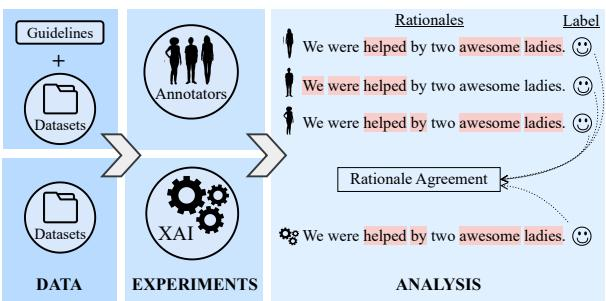  
Figure 1: Experimental setup for a sentiment analysis task. For a given instance, annotators are asked to choose a label and mark supporting evidence for their choice. For instances with full label agreement, we compare alignment of rationales (group-group alignment). We do the same to measure group-model alignment through attention- and gradient-based explainability methods.

While genuine disagreement in labels is by now a well-studied phenomenon (Beigman Klebanov and Beigman, 2009; Plank et al., 2014; Plank, 2022), little attention has been paid to disagreement in rationales. Since there is evidence that human rationales in ordinary decision-making differ across demographics (Stanovich and West, 2000), we cannot, it seems, blindly assume that what counts as a rationale for one group of people, e.g,. young men, also counts as a rationale for another group of people, e.g., elderly women. This dimension has not been explored in fairness research either. Could it be that some models that exhibit performance parity, condition on factors that align with the rationales of some groups, but not others?

Contributions We present a collection of three existing datasets with demographics-augmented annotations to enable profiling of models, i.e., quantifying their alignment1 with rationales provided by different socio-demographic groups. Such profiling enables us to ask whose right reasons models are being right for. Our annotations span two NLP tasks, namely sentiment classification and common-sense reasoning, across three datasets and six demographic groups, defined by age {Young, Old} and ethnicity {Black/African American, White/Caucasian, Latino/Hispanic}. We investigate label and rationale agreement across groups and evaluate to what extent groups’ rationales align with 16 Transformer-based models’ rationales, which are computed through attention- and gradient-based methods. We observe that models generally align best with older and/or white annotators. While larger models have slightly better prediction performance, model size does not correlate positively with neither rationale alignment nor fairness. Our work constitutes multi-dimensional research in off-the-beaten-track regions of the NLP research manifold (Ruder et al., 2022). We make the annotations publicly available.2

## 2 Fairness and Rationales

Fairness generally concerns the distribution of resources, often across society as a whole. In NLP, the main resource is system performance. Others include computational resources, processing speed and user friendliness, but performance is king. AI fairness is an attempt to regulate the distribution of performance across subgroups, where these are defined by the product of legally protected attributes (Williamson and Menon, 2019).

NLP researchers have uniformly adopted American philosopher John Rawls’ definition of fairness (Larson, 2017; Vig et al., 2020; Ethayarajh and Jurafsky, 2020; Li et al., 2021; Chalkidis et al., 2022), defining fairness as performance parity, except where it worsens the conditions of the least advantaged. Several dozen metrics have been proposed, based on Rawls’ definition (Castelnovo et al., 2022), some of which are argued to be inconsistent or based on mutually exclusive normative values (Friedler et al., 2021; Castelnovo et al., 2022). Verma and Rubin (2018) grouped these metrics into metrics based only on predicted outcome, e.g., statistical parity, and metrics based on both predicted and actual outcome, e.g., performance parity and accuracy equality. Corbett-Davies and Goel (2018) argue that metrics such as predictive parity and accuracy equality do not track fairness in case of infra-marginality, i.e., when the error distributions of two subgroups are different. For a better understanding of the consequences of inframarginality we refer to Biswas et al. (2019) and Sharma et al. (2020). Generally, there is some consensus that fairness in NLP is often best evaluated in terms of performance parity using standard performance metrics (Williamson and Menon, 2019; Koh et al., 2020; Chalkidis et al., 2022; Ruder et al., 2022). We do the same and evaluate fairness in group-model rationale agreement quantifying performance differences (understanding performance as degree of rationale agreement) across end user demographics. In doing so, we are embodying group fairness values: that individuals should be treated equally regardless of their protected attributes, i.e., group belonging.

Fairness and explainability are often intertwined in the literature due to the assumption that transparency, through explainability methods, makes it possible to identify which models are right for the right reasons or, on the contrary, right by relying on spurious, potentially harmful, patterns (Langer et al., 2021; Balkir et al., 2022). This study tightens the connection between fairness and explainability, investigating whether model rationales align better with those of some groups rather than others. If so, this would indicate that models can be more robust for some groups rather than others, even in the face of performance parity on dedicated evaluation data. That is: We ask whether models are equally right for the right reasons (with the promise of generalization) across demographic groups.

## 3 Data

We augment a subset of data from three publicly available datasets spanning two tasks: DynaSent (Potts et al., 2020) and SST (Socher et al., 2013)3, for sentiment classification and CoS-E (Talmor et al., 2019; Rajani et al., 2019) for common-sense reasoning.4 For each dataset, we crowd-source annotations for a subset of the data. We instruct annotators to select a label and provide their rationale for their choice by highlighting supporting words in the given sentence or question. Table 1 shows statistics of the annotations collected. Annotation guidelines are explained in § 3.1 (and included in full in Appendix A) and recruitment procedures are explained in § 3.2.

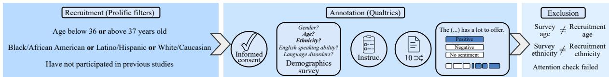  
Figure 2: Overview of the annotation collection process from annotator recruitment criteria, to the annotation itself, and finally annotator exclusion criteria. Separately for each dataset, annotators are recruited via Prolific using specific filters for age, ethnicity and participation status. Recruits are directed to a Qualtrics survey containing, in consecutive order, a consent form, a short demographics survey, instructions for the annotation task and then approx. 10 randomly selected instances of which annotators provide both labels and rationales for. After annotation, some annotators’ responses are excluded from our analysis due to certain mismatches in responses. The annotation process is detailed further in section 3.1 and we show the instructions and task examples in appendix A.

<table><tr><td rowspan="2"></td><td colspan="2">Annotators</td><td>Annotations</td></tr><tr><td>×Group</td><td>Total</td><td>Total</td></tr><tr><td>DYNASENT</td><td>48</td><td>288</td><td>2,880</td></tr><tr><td>SST-2</td><td>26</td><td>156</td><td>1,578</td></tr><tr><td>CoS-E</td><td>50</td><td>300</td><td>3,000</td></tr><tr><td>TOTAL</td><td>124</td><td>744</td><td>7,458</td></tr><tr><td>BEFORE EXCL.*</td><td>一</td><td>929</td><td>9,310</td></tr></table>

Table 1: Summary of the annotated data, showing, for each dataset, the amount of annotators within the six demographic groups, the total amount of annotators and the amount of annotations after workers have annotated approx. 10 instances each. Reported numbers are after exclusions as described in § 3.2. \*We publicly share all annotated data which includes annotators that were excluded from our analyses.

## 3.1 Annotation Process

We summarize the process of collecting annotations in Figure 2, where we depict a three-step process: recruitment, annotation and exclusion. In this section, we start by describing the second step – annotation – and explain what is annotated and how it is annotated. We describe our recruitment and exclusion criteria in the following section, 3.2. Annotators are directed to a Qualtrics5 survey and presented with i) a consent form, ii) a short survey on demographics, iii) instructions for their annotation task and lastly, iv) a randomly selected set of n  10 instances to annotate, out of a subset of size N. As a result of this procedure, each group, for each dataset, is represented by approximately N/n annotators. Data points are annotated for both classification labels and extractive rationales, i.e., input words that motivate the classification.

Existing rationale datasets are typically constructed by giving annotators ‘gold standard’ labels, and having them provide rationales for these labels. Instead, we let annotators provide rationales for labels they choose themselves. This lets them engage in the decision process, but it also acknowledges that annotators with different backgrounds may disagree on classification decisions. Explaining other people’s choices is error-prone (Barasz and Kim, 2022), and we do not want to bias the rationale annotations by providing labels that align better with the intuitions of some demographics than with those of others. For the sentiment analysis datasets, we discard neutral instances because rationale annotation for neutral instances is ill-defined. Yet, we still allow annotators to evaluate a sentence as neutral, since we do not want to force our annotators to provide rationales for positive and negative sentiment that they do not see.

DynaSent We re-annotate N = 480 instances six times (for six demographic groups), comprising 240 instances labeled as positive, and 240 instances labeled as negative in the DynaSent Round 2 test set (see Potts et al. (2020)). This amounts to 2,880 annotations, in total. Our sentiment label annotation follows the instructions of Potts et al. (2020). To annotate rationales, we formulate the task as marking “supporting evidence” for the label, following how the task is defined by DeYoung et al.

(2019). Specifically, we ask annotators to mark all the words, in the sentence, they think shows evidence for their chosen label.

SST-2 We re-annotate N = 263 instances six times (for six demographic groups), which are all the positive and negative instances from the Zuco dataset of Hollenstein et al. (2018)6, comprising a mixture of train, validation and test set instances from SST-2, which we remove from the original data before training the models. Instructions for sentiment annotations build on the instructions by Potts et al., combined with a few examples from Zaidan et al. (2007). The instructions for annotating rationales are the same as for DynaSent.

CoS-E We re-annotate N = 500 instances from the test set six times (for six demographic groups) and ask annotators to firstly select the answer to the question that they find most correct and sensible, and then mark words that justifies that answer. Following Chiang and Lee (2022), we specify the rationale task with a wording that should guide annotators to make short, precise rationale annotations:

‘For each word in the question, if you think that removing it will decrease your confidence toward your chosen label, please mark it.’

## 3.2 Annotator Population

We recruited annotators via Prolific based on two main criteria, age and ethnicity, previously identified as related to unfair performance differences of NLP systems (Hovy and Søgaard, 2015; Jørgensen et al., 2016; Sap et al., 2019; Zhang et al., 2021).

Recruitment In our study, there is a trade-off between collecting annotations for a diverse set of data instances (number of tasks and sentences) and for a diverse set of annotators (balanced by demographic attributes), while keeping the study affordable and payment fair. Hence, when we want to study differences between individuals with different ethnic backgrounds, we can only study a subset of possible ethnic identities (of which there are many categories and diverging definitions). We balanced the number of annotators across three ethnic groups — Black/African American (B), Latino/Hispanic (L) and White/Caucasian (W) — and two age groups —below 36 (young, Y) and above 37 (old, O), excluding both — whose cross-product results in six sub-groups: {BO, BY, LO, LY, WO, WY}. We leave a two-year gap between the age groups in order to not compare individuals with very similar ages. Furthermore, the age thresholds are inspired by related studies of age differences in NLP-tasks and common practices in distinguishing groups with an age gap (Johannsen et al., 2015; Hovy and Søgaard, 2015) and around the middle ages (Zhang et al., 2021). Our threshold also serves to guarantee sufficient proportions of available crowdworkers in each group. Our ethnicity definition follows that of Prolific, which features in a question workers have previously responded to and hence are recruited by, defining ethnicity as:

‘[a] feeling of belonging and attachment to a distinct group of a larger population that shares their ancestry, colour, language or religion’

While we do not require all annotators to be fluent in English, we instead ask about their Englishspeaking abilities in the demographics survey and find that 75% of the participants speak English “very well” and only 1% “not well”, and the remaining “well”.

Exclusions Annotators who participated in annotating one task were excluded from participating in others. After annotation, we manually check whether a participant’s answers to our short demographics survey correspond to their recruitment criteria. We found many discrepancies between recruitment ethnicity and reported ethnicity, especially for Latino/Hispanic individuals, who often report to identify as White/Caucasian. This highlights the difficulty of studying ethnicities as distinct, separate groups, as it is common to identify with more than one ethnicity7. Hence, the mismatches are not necessarily errors. For our experiments, we decided to exclude participants with such mismatches and recruit new participants to replace their responses (see Appendix B for further details). A smaller amount of participants were excluded due to mismatch in reported age or due to failing a simple attention check. We release annotations both with and without the instances excluded from our analyses. The final data after preprocessing consist of one annotation per instance for each of the six groups, i.e., six annotations per instance in total. Annotators annotated (approximately) 10 instances each. All participants were paid equally.

## 4 Experiments

We first conduct an analysis of group-group label agreement (i.e., comparing human annotator groups with each other, measuring human agreement on the sentiment and answer labels) and rationale agreement (measuring human agreement on rationale annotations) to characterize inter-group differences. We then move to group-model agreement (comparing the labels and rationales of our annotator groups to model predictions and model rationales) and ask: Do models’ explanations align better with certain demographic groups compared to others? In our analysis, we further focus on how rationale agreement and fairness behave depending on model size and model distillation.

We probe 16 Transformer-based models8. To ease readability, we will use abbreviations following their original naming when depicting models performance9.

We fine-tune the models individually on each dataset (see Figure 3). SST-2 and CoS-E simplified10 are modeled as binary classification tasks; DynaSent is modeled as a ternary (positive/negative/neutral) sentiment analysis task. We exclude all annotated instances from the training splits; for CoS-E, we downsample the negative examples to balance both classes in the training split. After fine-tuning for 3 epochs, we select the checkpoint with the highest validation accuracy to run on our test (annotated) splits and apply two explainability methods to obtain input-based explanations, i.e., rationales, for the predictions made.

We measure label agreement with appropriate variants of $\mathrm { F _ { 1 } }$ (SST-2 binary-F ; DynaSent macro-F1; CoS-E mean of binary-F1 towards the negative and the positive class). CoS-E simplified represents a slightly different task (see footnote 10) from what the annotators were presented to solve (a multiclass question-answering task). To correctly measure label agreement, we evaluate whether a model predicts ‘True’ for the question-answer pair with the answer selected by the annotator. Therefore, to avoid misleading $\mathrm { F _ { 1 } }$ scores if, for example, a model predominantly predict True, we report the mean of the $\mathrm { F _ { 1 } }$ towards each class. We explain below how we measure rationale agreement.

Explainability methods We analyze models predictions through two families of post-hoc, attribution-based11 explainability methods: Attention Rollout (AR) (Abnar and Zuidema, 2020) and Layer-wise Relevance Propagation (LRP) (Bach et al., 2015), a gradient-based method. Ali et al. (2022) compare these methods, showing how their predicted rationales are frequently uncorrelated. Both AR and LRP thus provide token level rationales for a given input, but while AR approximates the relative importance of input tokens by accumulating attention, LRP does so by backpropagating ‘relevance’ from the output layer to the input, leading to sparser attribution scores. We rely on the rules proposed in Ali et al. (2022), an extension of the original LRP method (Bach et al., 2015; Arras et al., 2017) for Transformers, aiming to uphold the conservation property of LRP in Transformers as well. This extension relies on an “implementation trick”, whereby the magnitude of any output remains intact during backpropagation of the gradients of the model.

Comparing rationales Attention-based and gradient-based methods do not provide categorical relevance of the input tokens, but a vector $S _ { i }$ with continuous values for each input sentence i. We translate $S _ { i }$ into a binary vector $S _ { i } ^ { b }$ following the procedure from Wang et al. (2022) for each group. We define the $ { \mathrm { t o p } }  { - } k ^ { g d }$ tokens as rationales, where $k ^ { g d }$ is the product of the current sentence length (tokens) and the average rationale length ratio (RLR) of a group g within a dataset $d .$ On average, RLR for SST-2 are shorter (29.6%) compared to DynaSent (31.9%) and CoS-E (33.0%) (see Appendix B for specific values). Models’ outputs are also preprocessed to normalize different tokenizations and to match the input format given to annotators.

After aligning explanations from models and annotators in the same space, we can compare them. We employ two metrics specifically designed to evaluate discrete rationales: token-level $\mathrm { F _ { 1 } }$ (token-F ) (Equation 1) (DeYoung et al., 2019; Wang et al., 2022), and Intersection-Over-Union $\mathrm { F _ { 1 } }$ (IOU-F1) (Equation 3) as presented in (DeYoung et al., 2019). These metrics are flexible enough to overcome the strictness of exact matching.12

## 5 Results and Discussion

Figure 3 shows group-model label agreement over our annotated data.13 Error bars show the variability between best and worst performing groups. CoS-E exhibits the lowest variability, indicating less variability in label agreement between groups.

When annotators disagree on the label of an instance, it is to be expected that their rationales will subsequently be different. Therefore, to compare group-group (§ 5.1) and group-model (§ 5.2) rationales more fairly, we focus on the subset of instances where all groups are in agreement about

$$
{ \mathrm { t o k e n } } - F _ { 1 } = { \frac { 1 } { N } } \sum _ { i = 1 } ^ { N } 2 \times { \frac { P _ { i } \times R _ { i } } { P _ { i } + R _ { i } } }\tag{1}
$$

where P and $R _ { i }$ are the precision and recall for the $i ^ { t h }$ instance, computed by considering the overlapped tokens between models’ and annotators’ rationales. To measure Intersection-Over-Union, we define the categorical vector given by the annotators for each sample as $A _ { i } .$ . Thereby,

$$
\mathrm { I O U } _ { i } = \frac { | S _ { i } ^ { b } \cap A _ { i } | } { | S _ { i } ^ { b } \cup A _ { i } | }\tag{2}
$$

and

$$
\mathrm { I O U } – F _ { 1 } = \frac { 1 } { N } \sum _ { i = 1 } ^ { N } \left\{ \begin{array} { l l } { 1 } & { \mathrm { { i f } \ I O U _ { { i } } \geq 0 . 5 } } \\ { 0 } & { \mathrm { { o t h e r w i s e } . } } \end{array} \right.\tag{3}
$$

These metrics account for plausibility (DeYoung et al., 2019) of the models’ rationales, i.e., the degree to which they are agreeable to humans, as well as the extent to which models are ‘right for the right reasons’ (McCoy et al., 2019). Since we are interested in comparing rationale alignment between groups and between groups and models, measuring plausability is our go-to. Other research (Jacovi and Goldberg, 2020; Setzu et al., 2021) focus on properties like faithfulness, which reflect a model’s true decision process, i.e., whether the provided rationale influenced the corresponding decision, generally measured through perturbation experiments.

13See Figure 12 in Appendix C for a detailed representation of group-model label agreement.

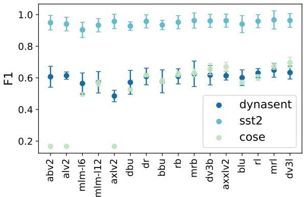  
Figure 3: Group-model label agreement over our annotated data, measured by F1-score. Error bars show variance between the best and worst performing groups. Models are ordered by size from smallest to largest from left to right.

the label, i.e., instances with full label agreement. This amounts to 209, 152 and 161 instances for DynaSent, SST-2 and CoS-E, respectively.

## 5.1 Analysis of Group-Group Agreement

We first want to quantify how different the rationales of one group are to those of others, and more generally to a random population. We compare each groups’ set of rationales to a random paired set of rationales, where the rationale of each instance is randomly picked from one of the five other groups. Figure 4 shows the overall agreement score, average token- $\mathrm { \cdot F _ { 1 } }$ across datasets, and its standard deviation from 20 random seeds, i.e., 20 random combinations of paired rationales. We observe that rationales of White annotators (WO, WY) are on average more similar to others while the average difference with the rationales of minority groups like, for example, Black Young (BY), is greater.

We then compute the level of rationale agreement (token- $\mathrm { F } _ { 1 } )$ between all groups (heatmaps on Figure 4) and observe that, in general, differences in group-group rationale agreement are consistent across datasets (tasks): Black Youngs (BY) have lower alignment with others, especially in sentiment analysis tasks. While the definition of rationales for DynaSent seems to be easier (higher values of agreement), it seems to be harder (lower values of agreement) for CoS-E, even when the label is agreed upon. We hypothesize this is due to the complexity of the CoS-E task itself, which also leads to more lengthy rationales, as reflected by the average RLR reported on § 4, probably in the absence of a clear motivation for the selected answer.

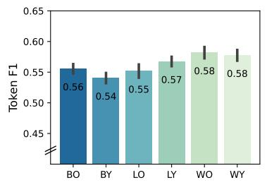

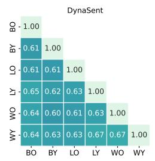

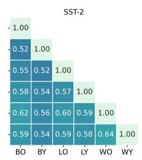

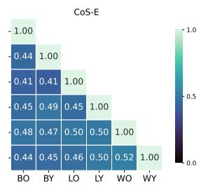  
Figure 4: Group-group rationale agreement for instances with full label agreement. Agreement is measured by token-level binary $\mathrm { F _ { 1 } }$ . On the left side, average and std (error bar) token-F1 for 20 random combinations of paired group rationales over all datasets. On the right, each group-group agreement for each dataset. We observe lower agreement for BY except in CoS-E. WO tends to agree more with other groups, especially in CoS-E.

The definition of what is common-sense varies across cultures and it is related to a person’s background (Hershcovich et al., 2022), which makes CoS-E a highly subjective task14. Take for example the question ‘Where would you find people standing in a line outside?’ with these potential answers: ‘bus depot’, ‘end of line’, ‘opera’, ‘neighbor’s house’ and ‘meeting’. Even if there is agreement on the correct choice as ‘bus depot’, the rationale behind it could easily differ amongst people, i.e., it could be due to ‘people standing’, or the fact that they are standing in ‘a line outside’, or all together.

## 5.2 Analysis of Group-Model Agreement

Now that we have analyzed group-group agreement, we measure the alignment between groups’ rationales and models’ rationales. We analyze predictions from 16 Transformer-based models and employ AR and LRP to extract model rationales. Methods for comparing rationales and measuring group-model agreement are explained in Section 4.

Socio-demographic fairness Figure 5 shows a systematic pattern of model rationales aligning better with the rationales of older annotators in each ethnic group (BO, LO, WO) on the sentiment datasets. The only exception is White Young (WY) annotators in SST-2, whose median token-F1 is higher than their older counterpart. We argue this is due, in part, to the data source of the tasks themselves. While DynaSent constitutes an ensemble of diverse customer reviews, SST is based on movie review excerpts from Rotten Tomatoes with a more informal language, popular amongst younger users. Findings from Johannsen et al. (2015) and Hovy and Søgaard (2015) indicate that there exist grammatical differences between age groups. Johannsen et al. (2015) further showed several age and genderspecific syntactic patterns that hold even across languages. This would explain not only the noticeable group-group differences when marking supporting evidence (lexical structures) for their answers, but also the agreement disparity reflected by models fine-tuned on potentially age-biased data.

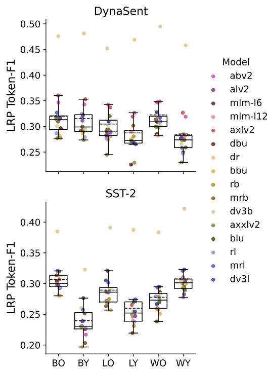  
Figure 5: Box-plots of group-model rationale alignment for the two sentiment datasets measured with token-F1. Model rationales are extracted with LRP. Each dot represents a model’s token-F1 score for the respective group. We see that for each ethnic group, model rationales align better with rationales of older annotators, except for White Young (WY) annotators of SST-2. Distil-RoBERTa (dr) is an outlier, consistently showing the best scores in both datasets across groups.

Results are consistent with previous findings of

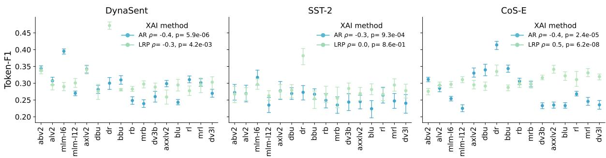  
Figure 6: Group-model rationale alignment $( \mathrm { t o k e n } { - } \mathrm { F } _ { 1 } )$ . Error bars show the distance between the groups with the highest and lowest scores. On the X-axis, models are ordered from smallest to largest. We show Spearman correlation coefficients, $\rho ,$ between token-F scores (the concatenation of all groups’ scores) and model sizes (in Million parameters), finding $\mathrm { \ t o k e n – F _ { 1 } }$ to be negatively correlated with model size in most cases.

Zhang et al. (2021), who show a variety of language models aligning better with older, white annotators, and worse with minority groups, in word prediction tasks. We observe that group-model rationale agreement does not correlate with group-model class agreement, i.e., when a model performs well for a particular group, it does not necessarily entail that its rationales, or learned patterns, align. Group-model rationale agreement evaluated with Attention Rollout and CoS-E are shown in Figure 13 in Appendix C, along with results using the complementary metric (IOU-F1). The patterns derived from them are in line with those in Figure 5: AR shows similar behaviours as LRP, but leads to larger variation between models. However CoS-E, which, as explained, is a very different task, does not seem to exhibit big group differences. This is also noticeable in Figure 6, where error bars show the distance between groups with the highest and lowest level of agreement in every model.

The role of model size In general, larger language models seem to perform better on NLP tasks. In our setting, Figure 3 shows a positive trend with model size: larger models achieve, in general, higher performance. Could it be the case that larger language models also show higher rationale agreement? And, are they consequently more fair? We evaluate fairness in terms of performance parity: min-max difference between the group with the lowest and highest token-F1 (per model). Relying on min-max difference captures the widely shared intuition that fairness is always in the service of the worst off group (Rawls, 1971).

Contrary to our expectations, Figure 6 shows how token-F1 scores actually decrease with model size – with CoS-E model rationales from LRP being the only exception to the trend. We report Spearman correlation values for each dataset and explainability method: The negative correlation between token-F1 and model size is significant in all three datasets with AR, but only in DynaSent with LRP. The positive correlation in CoS-E with LRP rationales is also significant.

When we zoom in on the min-max Token- $\cdot \mathrm { F } _ { 1 }$ gaps (error bars on Figure $6 ) ^ { 1 5 }$ , we find that performance gaps are uncorrelated with model size. Therefore, there is no evidence that larger models are more fair, i.e., rationale alignment does not become more equal for demographic groups. In the context of toxicity classification, work from (Baldini et al., 2021) also hints that size is not well correlated with fairness of models.

Do distilled models align better? Knowledge distillation has been proven to be effective in model compression while maintaining model performance (Gou et al., 2021). But can it also be effective in improving NLP fairness? Xu and Hu (2022) find a consistent pattern of toxicity and bias reduction after model distillation. Chai et al. (2022) show promising results when approaching fairness without demographics through knowledge distillation. Tan et al. (2018) discuss the benefits of applying knowledge distillation to leverage model interpretability. Motivated by these findings, we take results from LRP to look closer into groupmodel rationale agreement for distilled models, which we show in Table 2. We find overall higher rationale agreement for distilled models. However, there is no evidence that distilled models are also more fair: Only minilm-l6-h384-uncased has a smaller performance gap between the best and worst-off group for both metrics compared to the average.

<table><tr><td></td><td>token-F1 (↑)</td><td>IOU-F1 (↑)</td><td>min-max token-F1 (↓)</td><td>min-max IOU-F1 (↓)</td></tr><tr><td>minilm-16-h384-unc.</td><td>.31</td><td>.28</td><td>.045</td><td>.068</td></tr><tr><td>minilm-112-h384-unc.</td><td>.27</td><td>.21</td><td>.045</td><td>.083</td></tr><tr><td>distilbert-base-unc.</td><td>.29</td><td>.24</td><td>.064</td><td>.100</td></tr><tr><td>distilroberta-base</td><td>.36</td><td>.36</td><td>.065</td><td>.069</td></tr><tr><td>Avg. (16 models)</td><td>.29</td><td>.24</td><td>.054</td><td>.081</td></tr></table>

Table 2: Group-model alignment for four distilled models. Bottom row shows average scores across all 16 models considered in this paper. Values in bold are better than the average (lower if , higher if ). While rationale alignment (token- $\cdot \mathrm { F } _ { 1 }$ and $\mathrm { { I O U } - F _ { 1 } ) }$ seem to be better for distilled models, only minilm-l6-h384-uncased is also fairer than the average (in terms of min-max difference) with both metrics.

## 6 Conclusion

In this paper, we present a new collection of three existing datasets with demographics-augmented annotations, balanced across age and ethnicity. By having annotators choose the right label and marking supporting evidence for their choice, we find that what counts as a rationale differs depending on peoples’ socio-demographic backgrounds.

Through a series of experiments with 16 popular model architectures and two families of explainability methods, we show that model rationales align better with older individuals, especially on sentiment classification. We look closer at model size and the influence of distilled pretraining: despite the fact that larger models perform better in general NLP tasks, we find negative correlations between model size and rationale agreement. Furthermore, from the point of view of performance parity, we find no evidence that increasing model size improves fairness. Likewise, distilled models do not seem to be more fair in terms of rationale agreement, however they do present overall higher scores.

This work indicates the presence of undesired biases that do not necessarily surface in task performance. We believe this provides an important addendum to the fairness literature: Even if models are fair in terms of predictive performance, they may still exhibit biases that can only be revealed by considering model rationales. If models are equally right, but only right for the right reasons in the eyes of some groups rather than others, they will likely be less robust for the latter groups.

## Limitations

Our analysis is limited to non-autoregressive Transformer-based models, fine-tuned with the same set of hyperparameters. Hyperparameter optimization would undoubtedly lead to better performance for some models, but we fine-tuned each model with standard hyperparameter values for solving sentiment analysis tasks (DeYoung et al., 2019) to reduce resource consumption. This should not affect the conclusions drawn from our experiments.

Comparing human rationales and rationales extracted with interpretability methods such as Attention Rollout and LRP is not straightforward. Overall agreement scores depend on how model rationales are converted into categorical values (top-$k ^ { g d } )$ . See Jørgensen et al. (2022) for discussion.

## Acknowledgments

Many thanks to Stephanie Brandl, David Dreyer Lassen, Frederik Hjort, Emily Pitler and David Jurgens for their insightful comments.

This work was supported by the Novo Nordisk Foundation.

## Ethics Statement

Broader impact Although explainability and fairness are broadly viewed as intertwined subjects, very little work has studied the two concepts together (Feng and Boyd-Graber, 2019; González et al., 2021; Ruder et al., 2022). This study is a first of its kind to examine fairness issues of explainability methods and to publish human rationales with diverse socio-demographic information. We hope this work will impact the NLP research community towards more data-aware and multi-dimensional investigations of models and methods, and towards further studies of biases in NLP.

Personal and sensitive data This study deals with personal and sensitive information. The responses are anonymous and cannot be used to identify any individual.

Informed consent The participants were informed of the study’s overall aim, the procedure and confidentiality of their responses. With this information, the participants consented to the use and sharing of their responses.

Potential risks We do not anticipate any risks of participation in the study, yet we do note a recent awareness of poor working conditions among crowdworkers for AI data labeling in some countries (Williams et al., 2022). The recruitment platform Prolific, used in this study, is targeted towards research (rather than AI development) and has stricter rules on participant screening and minimum wages (Palan and Schitter, 2017), compared to other popular platforms, which we hope reduce the risk of such poor working conditions.

Remuneration The participants were paid an average of 7.1£/hour ( 8.8\$/hour).

Intended use The collected annotations and demographic information will be publicly available to be used for research purposes only.

## References

Samira Abnar and Willem Zuidema. 2020. Quantifying attention flow in transformers. In Proceedings of the 58th Annual Meeting of the Association for Computational Linguistics, pages 4190–4197, Online. Association for Computational Linguistics.

Ameen Ali, Thomas Schnake, Oliver Eberle, Grégoire Montavon, Klaus-Robert Müller, and Lior Wolf. 2022. Xai for transformers: Better explanations through conservative propagation.

Leila Arras, Grégoire Montavon, Klaus-Robert Müller, and Wojciech Samek. 2017. Explaining recurrent neural network predictions in sentiment analysis. In Proceedings of the 8th Workshop on Computational Approaches to Subjectivity, Sentiment and Social Media Analysis, pages 159–168, Copenhagen, Denmark. Association for Computational Linguistics.

Sebastian Bach, Alexander Binder, Grégoire Montavon, Frederick Klauschen, Klaus-Robert Müller, and Wojciech Samek. 2015. On pixel-wise explanations for non-linear classifier decisions by layer-wise relevance propagation. PLOS ONE, 10(7):1–46.

Ioana Baldini, Dennis Wei, Karthikeyan Natesan Ramamurthy, Mikhail Yurochkin, and Moninder Singh. 2021. Your fairness may vary: Pretrained language model fairness in toxic text classification.

Esma Balkir, Svetlana Kiritchenko, Isar Nejadgholi, and Kathleen Fraser. 2022. Challenges in applying explainability methods to improve the fairness of NLP models. In Proceedings of the 2nd Workshop on Trustworthy Natural Language Processing (TrustNLP 2022), pages 80–92, Seattle, U.S.A. Association for Computational Linguistics.

Kate Barasz and Tami Kim. 2022. Choice perception: Making sense (and nonsense) of others’ decisions. Current opinion in psychology, 43:176–181.

Kevin Baum, Susanne Mantel, Timo Speith, and Eva Schmidt. 2022. From responsibility to reason-giving explainable artificial intelligence. Philosophy and Technology, 35(1):1–30.

Beata Beigman Klebanov and Eyal Beigman. 2009. Squibs: From annotator agreement to noise models. Computational Linguistics, 35(4):495–503.

Claus Beisbart and Tim Räz. 2022. Philosophy of science at sea: Clarifying the interpretability of machine learning. Philosophy Compass, 17(6):e12830.

Arpita Biswas, Siddharth Barman, Amit Deshpande, and Amit Sharma. 2019. Quantifying inframarginality and its trade-off with group fairness. CoRR, abs/1909.00982.

Alessandro Castelnovo, Riccardo Crupi, Greta Greco, Daniele Regoli, Ilaria Penco, and Andrea Cosentini. 2022. A clarification of the nuances in the fairness metrics landscape. Scientific Reports, 12.

Junyi Chai, Taeuk Jang, and Xiaoqian Wang. 2022. Fairness without demographics through knowledge distillation. In Advances in Neural Information Processing Systems.

Ilias Chalkidis, Tommaso Pasini, Sheng Zhang, Letizia Tomada, Sebastian Schwemer, and Anders Søgaard. 2022. FairLex: A multilingual benchmark for evaluating fairness in legal text processing. In Proceedings of the 60th Annual Meeting of the Association for Computational Linguistics (Volume 1: Long Papers), pages 4389–4406, Dublin, Ireland. Association for Computational Linguistics.

Cheng-Han Chiang and Hung-yi Lee. 2022. Reexamining human annotations for interpretable nlp.

Sam Corbett-Davies and Sharad Goel. 2018. The measure and mismeasure of fairness: A critical review of fair machine learning. ArXiv, abs/1808.00023.

Jay DeYoung, Sarthak Jain, Nazneen Fatema Rajani, Eric Lehman, Caiming Xiong, Richard Socher, and Byron C. Wallace. 2019. Eraser: A benchmark to evaluate rationalized nlp models.

Kawin Ethayarajh and Dan Jurafsky. 2020. Utility is in the eye of the user: A critique of NLP leaderboards. In Proceedings ofthe 2020 Conference on Empirical Methods in Natural Language Processing (EMNLP), pages 4846–4853, Online. Association for Computational Linguistics.

Shi Feng and Jordan Boyd-Graber. 2019. What can ai do for me? evaluating machine learning interpretations in cooperative play. In Proceedings of the 24th International Conference on Intelligent User Interfaces, IUI ’19, page 229–239, New York, NY, USA. Association for Computing Machinery.

Sorelle A. Friedler, Carlos Scheidegger, and Suresh Venkatasubramanian. 2021. The (im)possibility of fairness: Different value systems require different

mechanisms for fair decision making. Commun. ACM, 64(4):136–143.

Ana Valeria González, Anna Rogers, and Anders Sø- gaard. 2021. On the interaction of belief bias and explanations. In Findings ofthe Associationfor Computational Linguistics: ACL-IJCNLP 2021, pages 2930–2942, Online. Association for Computational Linguistics.

Jianping Gou, Baosheng Yu, Stephen J. Maybank, and Dacheng Tao. 2021. Knowledge distillation: A survey. International Journal of Computer Vision, 129(6):1789–1819.

Philipp Hacker and Jan-Hendrik Passoth. 2022. Varieties of AI Explanations Under the Law. From the GDPR to the AIA, and Beyond, pages 343– 373. Springer International Publishing, Cham.

Daniel Hershcovich, Stella Frank, Heather Lent, Miryam de Lhoneux, Mostafa Abdou, Stephanie Brandl, Emanuele Bugliarello, Laura Cabello Piqueras, Ilias Chalkidis, Ruixiang Cui, Constanza Fierro, Katerina Margatina, Phillip Rust, and Anders Søgaard. 2022. Challenges and strategies in crosscultural NLP. In Proceedings of the 60th Annual Meeting of the Association for Computational Linguistics (Volume 1: Long Papers), pages 6997–7013, Dublin, Ireland. Association for Computational Linguistics.

Nora Hollenstein, Jonathan Rotsztejn, Marius Troendle, Andreas Pedroni, Ce Zhang, and Nicolas Langer. 2018. Zuco, a simultaneous eeg and eye-tracking resource for natural sentence reading. Scientific Data, 5.

Dirk Hovy and Anders Søgaard. 2015. Tagging performance correlates with author age. In Proceedings of the 53rd Annual Meeting of the Association for Computational Linguistics and the 7th International Joint Conference on Natural Language Processing (Volume 2: Short Papers), pages 483–488, Beijing, China. Association for Computational Linguistics.

Alon Jacovi and Yoav Goldberg. 2020. Towards faithfully interpretable NLP systems: How should we define and evaluate faithfulness? In Proceedings of the 58th Annual Meeting of the Association for Computational Linguistics, pages 4198–4205, Online. Association for Computational Linguistics.

Anders Johannsen, Dirk Hovy, and Anders Søgaard. 2015. Cross-lingual syntactic variation over age and gender. In Proceedings of the Nineteenth Conference on Computational Natural Language Learning, pages 103–112, Beijing, China. Association for Computational Linguistics.

Anna Jørgensen, Dirk Hovy, and Anders Søgaard. 2016. Learning a POS tagger for AAVE-like language. In Proceedings of the 2016 Conference of the North American Chapter of the Association for Computational Linguistics: Human Language Technologies,

pages 1115–1120, San Diego, California. Association for Computational Linguistics.

Rasmus Kær Jørgensen, Fiammetta Caccavale, Christian Igel, and Anders Søgaard. 2022. Are multilingual sentiment models equally right for the right reasons? In EMNLP Workshop on Analyzing and Interpreting Neural Networksfor NLP (BlackBoxNLP).

Pang Wei Koh, Shiori Sagawa, Henrik Marklund, Sang Michael Xie, Marvin Zhang, Akshay Balsubramani, Weihua Hu, Michihiro Yasunaga, Richard Lanas Phillips, Sara Beery, Jure Leskovec, Anshul Kundaje, Emma Pierson, Sergey Levine, Chelsea Finn, and Percy Liang. 2020. Wilds: A benchmark of in-the-wild distribution shifts.

Markus Langer, Daniel Oster, Timo Speith, Holger Hermanns, Lena Kästner, Eva Schmidt, Andreas Sesing, and Kevin Baum. 2021. What do we want from explainable artificial intelligence (xai)? - A stakeholder perspective on XAI and a conceptual model guiding interdisciplinary XAI research. Artif. Intell., 296:103473.

Brian Larson. 2017. Gender as a variable in naturallanguage processing: Ethical considerations. In Proceedings of the First ACL Workshop on Ethics in Natural Language Processing, pages 1–11, Valencia, Spain. Association for Computational Linguistics.

Mike Li, Hongseok Namkoong, and Shangzhou Xia. 2021. Evaluating model performance under worstcase subpopulations. In Advances in Neural Information Processing Systems, volume 34, pages 17325– 17334, Vancouver, CA. Curran Associates, Inc.

Binny Mathew, Punyajoy Saha, Seid Muhie Yimam, Chris Biemann, Pawan Goyal, and Animesh Mukherjee. 2021. Hatexplain: A benchmark dataset for explainable hate speech detection. In Proceedings of the AAAI Conference on Artificial Intelligence 35(17), pages 14867–14875.

Tom McCoy, Ellie Pavlick, and Tal Linzen. 2019. Right for the wrong reasons: Diagnosing syntactic heuristics in natural language inference. In Proceedings of the 57th Annual Meeting of the Association for Computational Linguistics, pages 3428–3448, Florence, Italy. Association for Computational Linguistics.

Andrés Páez. 2019. The pragmatic turn in explainable artificial intelligence (xai). Minds and Machines, 29(3):441–459.

Stefan Palan and Christian Schitter. 2017. Prolific.ac—a subject pool for online experiments. Journal ofBehavioral and Experimental Finance, 17:22–27.

Steven T. Piantadosi and Felix Hill. 2022. Meaning without reference in large language models.

Barbara Plank. 2022. The ’problem’ of human label variation: On ground truth in data, modeling and evaluation. ArXiv, abs/2211.02570.

Barbara Plank, Dirk Hovy, and Anders Søgaard. 2014. Learning part-of-speech taggers with inter-annotator agreement loss. In Proceedings ofthe 14th Conference of the European Chapter of the Association for Computational Linguistics, pages 742–751, Gothenburg, Sweden. Association for Computational Linguistics.

Christopher Potts, Zhengxuan Wu, Atticus Geiger, and Douwe Kiela. 2020. DynaSent: A dynamic benchmark for sentiment analysis. arXiv preprint arXiv:2012.15349.

Nazneen Fatema Rajani, Bryan McCann, Caiming Xiong, and Richard Socher. 2019. Explain yourself! leveraging language models for commonsense reasoning. Proceedings of the Association for Computational Linguistics (ACL).

John Rawls. 1971. A Theory ofJustice, 1 edition. Belknap Press of Harvard University Press, Cambridge, Massachussets.

Sagnik Ray Choudhury, Anna Rogers, and Isabelle Augenstein. 2022. Machine reading, fast and slow: When do models “understand” language? In Proceedings of the 29th International Conference on Computational Linguistics, pages 78–93, Gyeongju, Republic of Korea. International Committee on Com putational Linguistics.

Sebastian Ruder, Ivan Vulic, and Anders Søgaard.´ 2022. Square one bias in NLP: Towards a multidimensional exploration of the research manifold. In Findings of the Association for Computational Linguistics: ACL 2022, pages 2340–2354, Dublin, Ireland. Association for Computational Linguistics.

Maarten Sap, Dallas Card, Saadia Gabriel, Yejin Choi, and Noah A. Smith. 2019. The risk of racial bias in hate speech detection. In Proceedings ofthe 57th Annual Meeting of the Association for Computational Linguistics, pages 1668–1678, Florence, Italy. Association for Computational Linguistics.

Mattia Setzu, Riccardo Guidotti, Anna Monreale, Franco Turini, Dino Pedreschi, and Fosca Giannotti. 2021. Glocalx - from local to global explanations of black box ai models. Artificial Intelligence, 294:103457.

Amit Sharma, Arpita Biswas, and Siddharth Barman. 2020. Inframarginality audit of group-fairness. Symposium on the Foundations of Responsible Computing (FORC).

Richard Socher, Alex Perelygin, Jean Wu, Jason Chuang, Christopher D Manning, Andrew Y Ng, and Christopher Potts. 2013. Recursive deep models for semantic compositionality over a sentiment treebank. In Proceedings of the 2013 conference on empirical methods in natural language processing, pages 1631–1642.

K. E. Stanovich and R. F. West. 2000. Individual differences in reasoning: Implications for the rationality debate? Behavioral and Brain Sciences, 23:645–665.

Alon Talmor, Jonathan Herzig, Nicholas Lourie, and Jonathan Berant. 2019. CommonsenseQA: A question answering challenge targeting commonsense knowledge. In Proceedings of the 2019 Conference ofthe North American Chapter ofthe Associationfor Computational Linguistics: Human Language Technologies, Volume 1 (Long and Short Papers), pages 4149–4158, Minneapolis, Minnesota. Association for Computational Linguistics.

Sarah Tan, Rich Caruana, Giles Hooker, and Yin Lou. 2018. Distill-and-compare: Auditing black-box models using transparent model distillation. In Proceedings ofthe 2018 AAAI/ACM Conference on AI, Ethics, and Society, AIES ’18, page 303–310, New York, NY, USA. Association for Computing Machinery.

Sahil Verma and Julia Rubin. 2018. Fairness definitions explained. In Proceedings ofthe International Workshop on Software Fairness, FairWare ’18, page 1–7, New York, NY, USA. Association for Computing Machinery.

Jesse Vig, Sebastian Gehrmann, Yonatan Belinkov, Sharon Qian, Daniel Nevo, Yaron Singer, and Stuart Shieber. 2020. Investigating gender bias in language models using causal mediation analysis. In Advances in Neural Information Processing Systems, volume 33, pages 12388–12401, Vancouver, CA. Curran Associates, Inc.

Lijie Wang, Yaozong Shen, Shu ping Peng, Shuai Zhang, Xinyan Xiao, Hao Liu, Hongxuan Tang, Ying Chen, Hua Wu, and Haifeng Wang. 2022. A fine-grained interpretability evaluation benchmark for neural nlp. ArXiv, abs/2205.11097.

Adrienne Williams, Milagros Miceli, and Timnit Gebru. 2022. The exploited labor behind artificial intelligence.

Robert Williamson and Aditya Menon. 2019. Fairness risk measures. In Proceedings of the 36th International Conference on Machine Learning, volume 97 of Proceedings of Machine Learning Research, pages 6786–6797, Long Beach, California. PMLR.

Guangxuan Xu and Qingyuan Hu. 2022. Can model compression improve nlp fairness.

Omar Zaidan, Jason Eisner, and Christine Piatko. 2007. Using “annotator rationales” to improve machine learning for text categorization. In Human Language Technologies 2007: The Conference of the North American Chapter of the Association for Computational Linguistics; Proceedings ofthe Main Conference, pages 260–267, Rochester, New York. Association for Computational Linguistics.

Carlos Zednik and Hannes Boelsen. 2022. Scientific exploration and explainable artificial intelligence. Minds Mach., 32(1):219–239.

Sheng Zhang, Xin Zhang, Weiming Zhang, and Anders Søgaard. 2021. Sociolectal analysis of pretrained

language models. In Proceedings ofthe 2021 Conference on Empirical Methods in Natural Language Processing, pages 4581–4588, Online and Punta Cana, Dominican Republic. Association for Computational Linguistics.

## A Annotation guidelines and task examples

On the next pages, we firstly show the annotation instructions given to annotators within the Qualtrics surveys. Full exports of the surveys are available in our GitHub repository.16

We created instructions specific for each dataset (DynaSent, SST-2, and CoS-E), leaning on prior work of annotating labels and rationales for these and similar datasets (Potts et al., 2020; Zaidan et al., 2007; DeYoung et al., 2019), as described in the paper, section 3.1.

Figure 7, 8, and 9 shows the instructions for DynaSent, SST-2 and CoS-E, respectively, and Figure 10 shows an example of how an instance for the sentiment task and the common-sense reasoning task is annotated, i.e. how it looked from the perspective of the crowdworkers.

Annotating rationales for the common-sense reasoning task is somewhat more complex than annotating rationales for sentiment: while we can ask annotators to mark ‘evidence’ for a sentiment label – often resulting in marking words that are posi tively or negatively loaded – we cannot as simply ask for ‘evidence’ for a common-sense reasoning answer without risking some confusion. Take, for instance, the question “Where do you find the most amount of leafs?” with the answer being ‘Forest’, as shown in Figure 9. Here, the term ’evidence might be misunderstood as actual evidence for why there would be more leafs in the forest compared to a field – evidence which cannot be found within the question itself. We therefore re-phrase the rationale annotation instructions for CoS-E, following an example from Chiang and Lee (2022), and ask, “For each word in the question, if you think that removing it will decrease your confidence toward your chosen label, please mark it.” Furthermore, the subset of the CoS-E dataset, that we re-annotate, consists of the more ‘difficult’ split of the CommonsenseQA dataset (Talmor et al., 2019; DeYoung et al., 2019). To make the task as clear as possible to the annotators, we explain, in the instructions, that the question and answer-options have been created by other crowdworkers who were instructed to create questions that could be “easily answered by humans without context, by the use of commonsense knowledge”, as is described by Talmor et al. (2019).

<table><tr><td></td><td></td><td colspan="4">COMPLETE LABEL AGREEMENT</td></tr><tr><td>DATASET</td><td>N</td><td>Pos</td><td>NEG</td><td>NEUTRAL</td><td>TOTAL</td></tr><tr><td>DynaSent</td><td>480</td><td>105</td><td>102</td><td>2</td><td>209</td></tr><tr><td>SST</td><td>263</td><td>79</td><td>73</td><td>0</td><td>152</td></tr><tr><td>CoS-E</td><td>500</td><td>-</td><td>-</td><td>-</td><td>161</td></tr></table>

Table 3: Number of instances, in our (re-)annotated data, where all annotator groups agreed upon the instance’s label.

## B Annotations Overview

Table 4 gives further information on the distribution of annotators, across groups and datasets, as well as ratios of rationale lengths to input lengths. Table 3 shows the number of instances in the data subsets, we work with, and the number of instances where all our annotator groups agreed on the label and that are therefore used for rationale-agreement analyses.

## C Supplementary Figures

For completeness, we provide supplementary figures for all the metrics and datasets analyzed in the paper.

## C.1 Label Agreement

Heatmaps in Figure 11 show the level of groupgroup label agreement across datasets. Similar to what is shown in Figure 4, BY consistently exhibit lower level of agreement.

Box-plots in Figure 12 represent group-model label agreement. Each dot represents the F1-score of each model. While for Cos-E the models generally exhibit lower variability across groups, the level of agreement is also lower (as shown in Figure 3).

## C.2 Rationale Alignment

Figure 13 is the extended version of Figure 5, showing the group-model rationale agreement for each dataset, each explainability method and with two metrics for measuring agreement, token-F1 and IOU-F1.

The bar charts in Figure 14 shows, per model and dataset, the distance between the group with the lowest and highest agreement with the model (by token-F ), which we refer to as the “min-max token-F1 gaps” in section 5.2. We include this plot because it serves to better illustrate the gaps themselves, and how they are uncorrelated with model size, compared to what Figure 6 in the paper can convey.

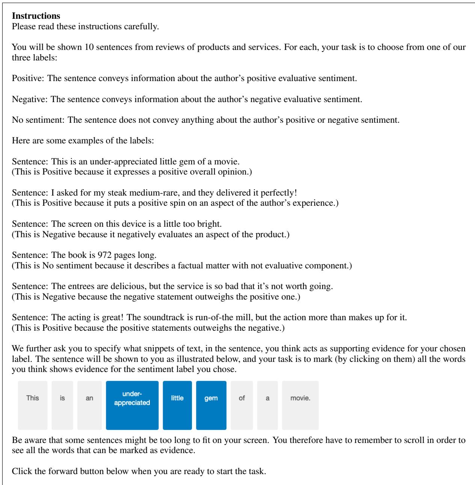  
Figure 7: DynaSent annotation instructions.

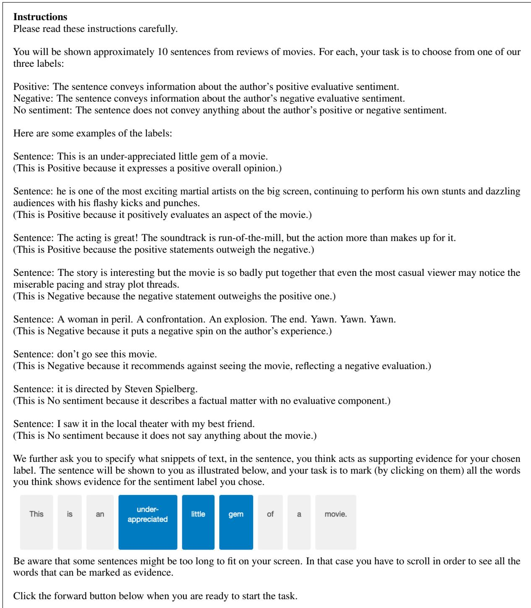  
Figure 8: SST-2 annotation instructions.

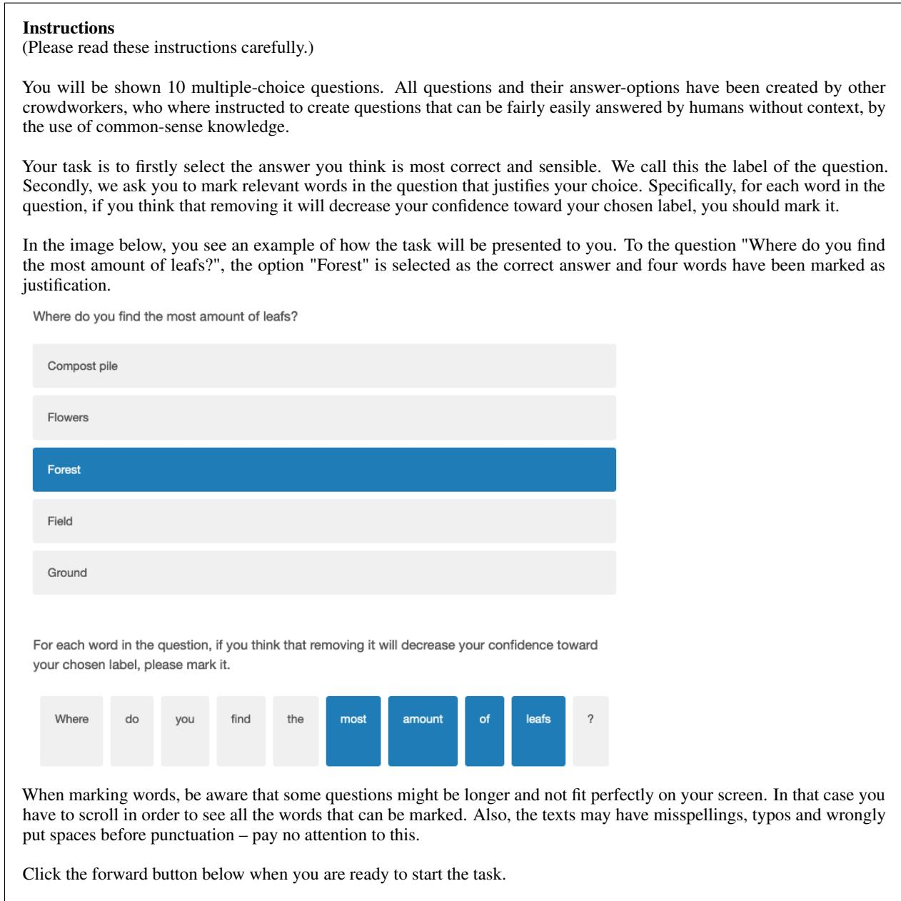  
Figure 9: CoS-E annotation instructions.

Sentence: The art exhibit has a lot to offer  
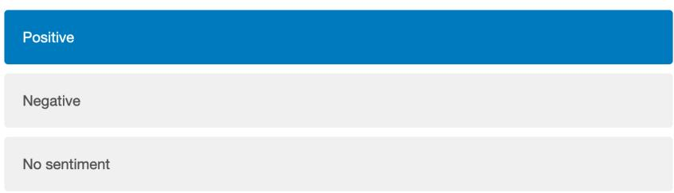

Mark the evidence for your chosen label.  

(a) Sentiment annotation example.  
Question: Where would you get a pen if you do not have one?  
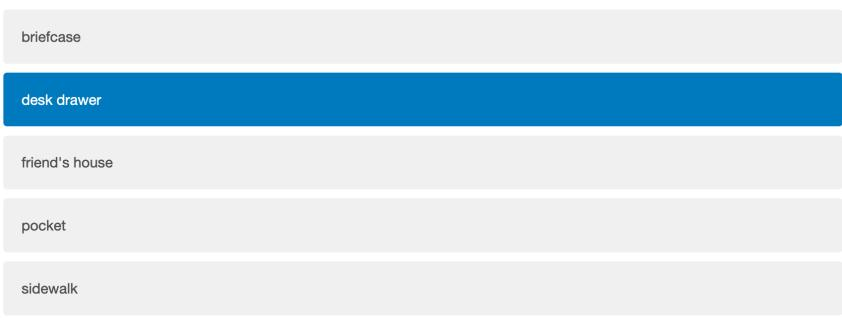

For each word in the question, if you think that removing it will decrease your confidence toward you chosen label, please mark it.  
  
(b) Common-sense reasoning annotation example.  
Figure 10: Screenshots of the annotation tasks as they are viewed in Qualtrics surveys.

<table><tr><td>DATASET</td><td></td><td>BO</td><td>BY</td><td>LO</td><td>LY</td><td>WO</td><td>WY</td><td>TOTAL/AVG.</td></tr><tr><td>DynaSent</td><td>Annot. Annot.* RLR</td><td>51 48 (58%F) 33.7</td><td>56 48 (67%F) 32.5</td><td>61 48 (44%F) 31.5</td><td>73 48 (40%F) 29.8</td><td>54 48 (56%F) 34.7</td><td>51 48 (48%F) 29.1</td><td>346 288 31.9</td></tr><tr><td>SST</td><td>Annot. Annot.* RLR</td><td>28 26 (69%F) 32.1</td><td>27 26 (58%F) 25.1</td><td>53 26 (38%F) 30.7</td><td>43 26 (31%F) 27.8</td><td>27 26 (38%F) 29.1</td><td>29 26 (69%F) 32.7</td><td>207 156 29.6</td></tr><tr><td>CoS-E</td><td>Annot. Annot.* RLR</td><td>52 50 (60%F) 31.9</td><td>56 50 (60%F) 32.9</td><td>74 50 (40%F) 34.1</td><td>85 50 (48%F) 32.2</td><td>54 50 (48%F) 33.3</td><td>55 50 (40%F) 33.6</td><td>376 300 33.0</td></tr></table>

Table 4: Overview of our annotated data. Rows display statistics per dataset. Columns refer to each demographic group: Black/African American old (BO) and young (BY), Latino/Hispanic old (LO) and young (LY), White/Caucasian old (WO) and young (WY). Last column show the total quantity of each feature over all groups. Row-wise within each dataset: ‘Annot.’ and ‘N’ reflect the total number of annotators and instances, respectively. Annot.∗ refers to the number of annotators left after pre-processing (see exclusion criteria in Section 3.2). Number shown between brackets refers to the percentage of female annotators. RLR represents the ratio of rationale length to its input length (percentage).

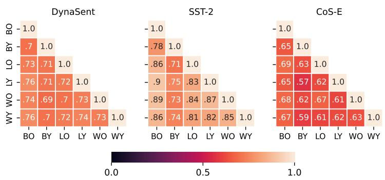  
Figure 11: Group-group label agreement (F1-scores).

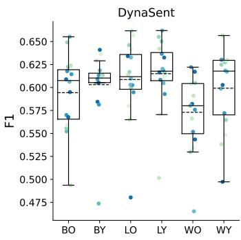

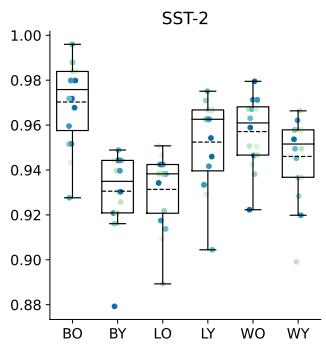

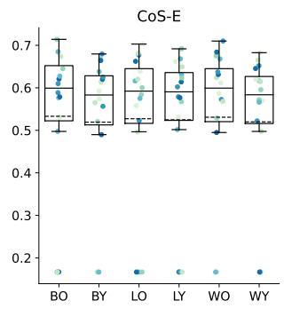  
Figure 12: Group-model label agreement (F1-scores).

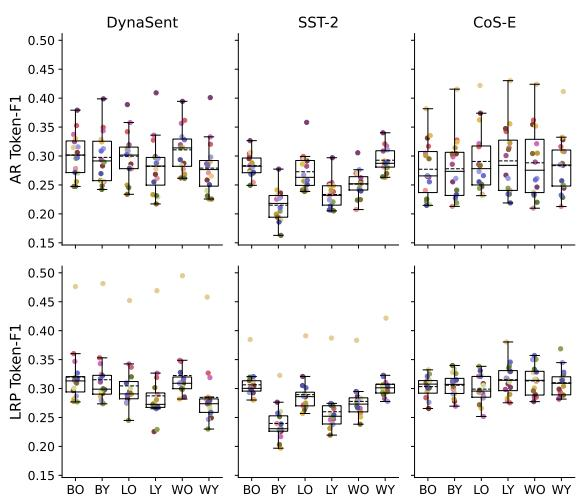  
(a) Token-F1 scores

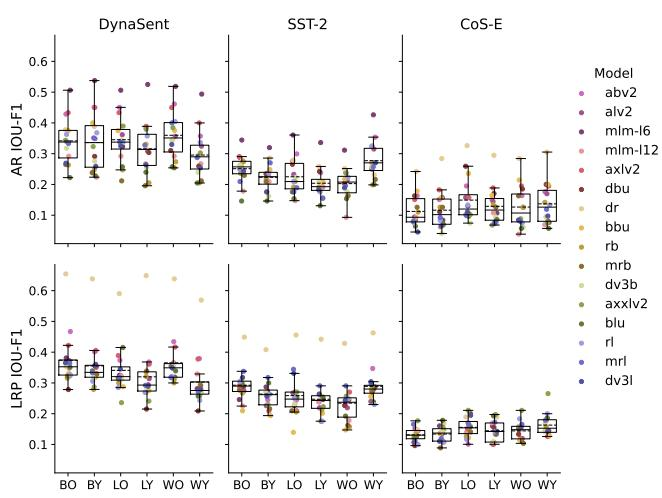  
(b) IOU-F1 scores  
Figure 13: Box-plots of group-model rationale agreement for the each dataset measured with Token-F1 (left) and IOU-F1 (right). Model rationales are extracted with Attention Rollout (top row) and LRP (bottom row). Each dot represents a model’s agreement with the respective group.

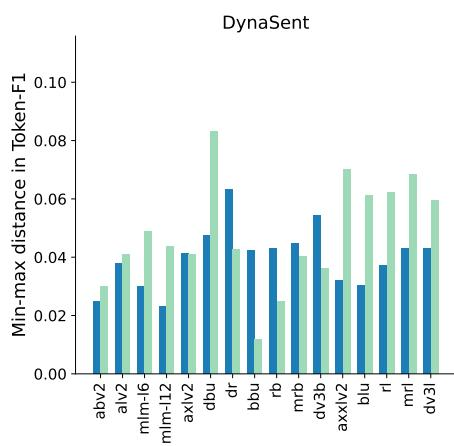

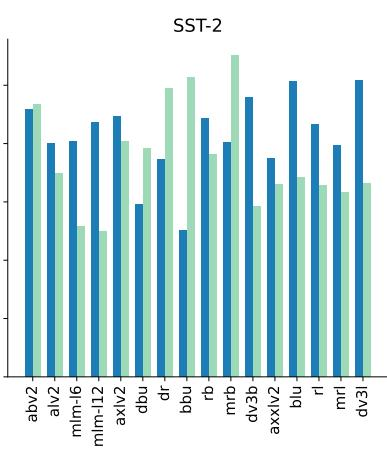

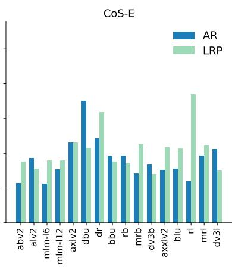  
Figure 14: Per-model difference between the group with the lowest (min) and highest (max) model-group agreement measured with token-F1. Models on the x-axis are sorted by model size. The min-max captures a measure of fairness, with a smaller difference entailing more equal model-group rationale alignments. We find that the differences are uncorrelated with model size (in Million parameters), as is visible in this plot.

A For every submission: ✓ A1. Did you describe the limitations of your work? In section titled "Limitations”, section 7.

✓ A2. Did you discuss any potential risks of your work? Section 8, "Ethics Statement”

✓ A3. Do the abstract and introduction summarize the paper’s main claims? Abstract and Section 1 on paragraph "Contributions”.

✗ A4. Have you used AI writing assistants when working on this paper? Left blank.

B ✓ Did you use or create scientific artifacts? It is described in Section 3. Used in Section 4 and 5

✓ B1. Did you cite the creators of artifacts you used? Section 3.1

✓ B2. Did you discuss the license or terms for use and / or distribution of any artifacts? Section 8, "Ethics Statement”

✓ B3. Did you discuss if your use of existing artifact(s) was consistent with their intended use, provided that it was specified? For the artifacts you create, do you specify intended use and whether that is compatible with the original access conditions (in particular, derivatives of data accessed for research purposes should not be used outside of research contexts)? In the ethics statement we specify that the intended use ofour annotations is research purposes only. The datasets we use are at least intendedfor research purposes as well. A larger discussion does not seem relevant in this case.

✓ B4. Did you discuss the steps taken to check whether the data that was collected / used contains any information that names or uniquely identifies individual people or offensive content, and the steps taken to protect / anonymize it? Section 8, "Ethics Statement”

✓ B5. Did you provide documentation of the artifacts, e.g., coverage of domains, languages, and linguistic phenomena, demographic groups represented, etc.? Section 3

✓ B6. Did you report relevant statistics like the number of examples, details of train / test / dev splits, etc. for the data that you used / created? Even for commonly-used benchmark datasets, include the number of examples in train / validation / test splits, as these provide necessary context for a reader to understand experimental results. For example, small differences in accuracy on large test sets may be significant, while on small test sets they may not be. Section 3 and 4

## C ✓ Did you run computational experiments?

Section 4

✗ C1. Did you report the number of parameters in the models used, the total computational budget (e.g., GPU hours), and computing infrastructure used? Our research does not focus on model development from scratch. We use known pretrained models and refer to the original library (footnote 6) in which this information is clearly stated.

✓ C2. Did you discuss the experimental setup, including hyperparameter search and best-found hyperparameter values? Experimental setup is discussed in SEction 4. In the section 7 "Limitations, we provide further explanations.

✓ C3. Did you report descriptive statistics about your results (e.g., error bars around results, summary statistics from sets of experiments), and is it transparent whether you are reporting the max, mean, etc. or just a single run? Section 5

 C4. If you used existing packages (e.g., for preprocessing, for normalization, or for evaluation), did you report the implementation, model, and parameter settings used (e.g., NLTK, Spacy, ROUGE, etc.)? Not applicable. Left blank.

D ✓ Did you use human annotators (e.g., crowdworkers) or research with human participants? Section 3

✓ D1. Did you report the full text of instructions given to participants, including e.g., screenshots, disclaimers of any risks to participants or annotators, etc.? Section 3 and Appendix C, and a printout of the full surveys/annotation task will be shared upon acceptance (an author’s name and contact details appears in them).Section 3 and Ethics Statement.

✓ D2. Did you report information about how you recruited (e.g., crowdsourcing platform, students) and paid participants, and discuss if such payment is adequate given the participants’ demographic (e.g., country of residence)? Section 3 and Ethics Statement.

✓ D3. Did you discuss whether and how consent was obtained from people whose data you’re using/curating? For example, if you collected data via crowdsourcing, did your instructions to crowdworkers explain how the data would be used? Ethics Statement.

✗ D4. Was the data collection protocol approved (or determined exempt) by an ethics review board? Anonymous data is exemptfrom IRB approval at the authors’ institution.

✓ D5. Did you report the basic demographic and geographic characteristics of the annotator population that is the source of the data? SEction 3