# Better Simultaneous Translation with Monotonic Knowledge Distillation

Shushu Wang 1, Jing Wu 2, Kai Fan 2, Wei Luo 2, Jun Xiao 1, Zhongqiang Huang

1Zhejiang University ,2 Alibaba DAMO Academy

{wangshushu0213, junx}@zju.edu.cn

{wj334275, k.fan, muzhuo.lw, z.huang}@alibaba-inc.com

## Abstract

Simultaneous machine translation (SiMT) presents a unique challenge as it requires generating target tokens before the source sentence is fully consumed. This can lead to the hallucination problem, where target tokens are generated without support from the source sentence. The prefix-to-prefix training data used to train SiMT models are not always parallel, due to divergent word order between the source and target languages, and can contribute to the problem. In this paper, we propose a novel approach that leverages traditional translation models as teachers and employs a two-stage beam search algorithm to generate monotonic yet accurate reference translations for sequence-level knowledge distillation. Experimental results demonstrate the significant improvements achieved by our approach over multiple strong SiMT baselines, leading to new state-of-the-art performance across various language pairs. Notably, when evaluated on a monotonic version of the WMT15 De En test set, which includes references generated in a more monotonic style by professional translators, our approach achieves even more substantial improvement over the baselines. The source code and data are publicly available for further exploration1.

## 1 Introduction

Simultaneous machine translation (SiMT) starts to translate with only a partial observation of the source sentence and can present unique challenges compared to full-sentence translation, particularly when employing offline NMT models. Prefix-toprefix (P2P) methods such as the wait-k policy (Ma et al., 2019a) have been developed to narrow the gap between training and inference. However, these methods inherently rely on parallelism at the prefix level, which may not always be present in conventional parallel text.

source prefix 韩国对美出口则下滑11.8%， 因石油产量下滑。 reference prefix Since the sales of oil products declined, Korean exports to U.S. decreased by 11.8%. monotonic reference prefix South Korea’s exports to U.S. fell 11.8% as sales of oil fell.

Figure 1: An example of a parallel sentence pair, with color-coded parallel clauses. The boxes highlight the prefixes selected based on a wait-3 approach.
<table><tr><td>Trainset</td><td> $k = 1$ </td><td> $k = 3$   $k = 5$ </td><td> $k = 7$ </td><td> $k = 9$ </td></tr><tr><td>WMT15 De→En</td><td>30.4</td><td>15.2 8.5</td><td>5.1</td><td>3.3</td></tr><tr><td>CWMT19 Zh→En</td><td>25.4</td><td>12</td><td>6.3 3.6</td><td>2.1</td></tr><tr><td>IWSLT15 En→Vi</td><td>17.3</td><td>5.2</td><td>1.9 0.8</td><td>0.4</td></tr></table>

Table 1: Anticipation rates (AR%) of the original training sets, measuring the percentage of target tokens with a reordering distance $\geq k$ (see definition in Appendix B).

The parallel text utilized for training offline MT models exhibits a wide range of word reordering between the source and target languages, resulting in non-parallel prefix-to-prefix pairs, as depicted in Figure 1. Table 1 highlights the challenge faced by a wait-k model, which must predict a significant percentage of target tokens without access to the corresponding words in the source prefix across multiple parallel corpora. For example, when training a wait-3 model on the WMT15 De En dataset, the model needs to anticipate 15.2% of the target tokens during training, exacerbating the hallucination problem during inference.

An alternative approach is to train SiMT models on simultaneous interpretation corpora. However, there are two primary issues. First, the available interpretation training data is scant. Second, due to the real-time nature of simultaneous interpretation, the data tends to be overly simplified, making it less ideal for SiMT models where preservation of information is important. On the other hand, traditional parallel data is abundant. If this data could be restructured to more closely follow the source word order, it would be more beneficial for SiMT models. This is the idea behind approaches such as (Chen et al., 2021). In line with this direction, we propose a two-stage beam search algorithm to reconstruct the training data, producing accurate yet monotonic translations. This restructured data is then utilized to train the SiMT model using knowledge distillation (KD) (Kim and Rush, 2016).

Similarly, traditional test sets are less ideal for evaluating SiMT models that produce translations in a more monotonic style. To address this, we constructed a new set of human references for the WMT15 De-En test set that more closely follows the source word order. This new reference can provide a more precise measurement of both translation quality and latency in a SiMT setting.

Our primary contributions include:

• We have developed a two-stage beam search algorithm to generate accurate monotonic training data. This algorithm is adjustable for different levels of monotonicity and is capable of leveraging both parallel and monolingual corpora.

• We have curated new human references for the WMT15 De-En test set that is more suitable for evaluating SiMT models. We are pleased to offer these for public access.

• Our empirical results demonstrate that our approach consistently outperforms strong SiMT baselines. We release both code and data to facilitate future research.

## 2 Related Works

SiMT Policy There are two types of SiMT policies: fixed and adaptive. Fixed policies, such as wait-k in Ma et al. (2019a), first READ k source tokens and then alternately READ/WRITE one token. Elbayad et al. (2020) proposed an efficient multipath training for the wait-k policy to randomly sample k during training.

Adaptive policies make READ/WRITE decisions dynamically. Gu et al. (2016) decides READ/WRITE actions via reinforcement learning. MILk (Arivazhagan et al., 2019) predicts a Bernoulli variable to determine READ/WRITE actions, which is further implemented into transformer architecture MMA (Ma et al., 2019b). Zheng et al. (2020) developed adaptive wait-k through heuristic ensemble of multiple wait-k models. Miao et al. (2021) proposed a generative framework to generate READ/WRITE decisions. Liu et al. (2021) applies Connectionist Temporal Classification (CTC) by treating the blank symbol as the wait action. Zhang and Feng (2022) develops a READ/WRITE policy by modeling the translation process as information transport and taking the received information as the evidence for READ/WRITE decisions.

Monotonic SiMT Another approach to SiMT is to focus on producing the target as monotonically as possible with the source. Chen et al. (2021) proposed test-time wait-k to produce pseudoreferences which are non-anticipatory. Han et al. (2021) proposed a method of chunk-wise reordering to refine the target sentences in an offline corpus and build a monotonically aligned parallel corpus for SimulMT. Deng et al. (2022) proposed a novel monolingual sampling strategy for SiMT, considering both chunk length and monotonicity. Chang et al. (2022) decomposed the translation process into a monotonic translation step and a reordering step, which rearranged the hidden states to produce the order in the target language. Our method extends (Chang et al., 2022) to include a rescoring stage based on the full sentence to produce more accurate translations.

Knowledge Distillation in NMT Knowledge distillation(KD) approaches (Hinton et al., 2015) aim to transfer knowledge from a teacher model to a student model. Kim and Rush (2016) first applied knowledge distillation to NMT using sequencelevel KD. In terms of online NMT, Zhang et al. (2021b) proposed to use a conventional Transformer as the teacher of the incremental Transformer, and tried to embed future information in the model through knowledge distillation. Ren et al. (2020) proposed to transfer knowledge from the attention matrices of simultaneous NMT and ASR models to a simultaneous speech to text translation system.

## 3 Background

Offline NMT Offline NMT models typically employ an encoder-decoder framework. The encoder has access to the full source sentence x and maps it into hidden representations. The decoder autoregressively generates each target token yt conditioned on x and the previously generated tokens, as shown in Eq. (1):

$$
p ( \mathbf { y } | \mathbf { x } ; \pmb \theta ) = \prod _ { t = 1 } ^ { | \mathbf { y } | } p ( y _ { t } | \mathbf { x } , \mathbf { y } _ { < t } ; \pmb \theta )\tag{1}
$$

Simultaneous NMT Simultaneous NMT only has access to part of the source sentence. Let $g ( t )$ be a monotonic non-decreasing function of t that denotes the number of source tokens processed by the encoder when generating the target word $y _ { t }$ SiMT uses the source prefix $( x _ { 1 } , x _ { 2 } , . . . , x _ { g ( t ) } )$ to predict $y _ { t }$ as shown in Eq. (2):

$$
p ( \mathbf { y } | \mathbf { x } ; \pmb \theta ) = \prod _ { t = 1 } ^ { | \mathbf { y } | } p ( y _ { t } | \mathbf { x } _ { \leq g ( t ) } , \mathbf { y } _ { < t } ; \pmb \theta )\tag{2}
$$

## 4 Monotonic Translation Construction

We propose two approaches for creating monotonic pseudo-targets for source sentences in traditional parallel data. This new data is then used to train SiMT models through knowledge distillation (KD).

## 4.1 Standard KD

A simple approach is to use an offline NMT model as a teacher to translate each source sentence of the parallel training data into a pseudo-target through beam search, as shown in Algorithm 2 in Appendix A. The resulting (source, pseudo-target) data adheres more closely to the source word order, as machine-translated sentences tend to have fewer long-distance reorderings. This data is then used to train SiMT models through sequence-level knowledge distillation (KD) (Kim and Rush, 2016), with the training loss represented in Eq. (3).

$$
\mathcal { L } _ { s e q \_ k d } = - \log p ( \hat { \mathbf { y } } | \mathbf { x } ; \pmb \theta )\tag{3}
$$

where $\hat { \mathbf { y } }$ represents the target predicted by the teacher model. Note that this diverges from conventional sequence-level KD training, which also utilizes the training loss over the original references, as the long-distance reorderings in the original data could be detrimental to the SiMT model.

## 4.2 Monotonic KD

A key drawback of standard KD is that, although the resulting target translations are more monotonic, they still depend on full sentences, and the degree of monotonicity cannot be controlled. To overcome this limitation, we propose a two-stage beam search strategy to produce target translations in a way similar to real-time simultaneous translation, while also preserving the translation quality.

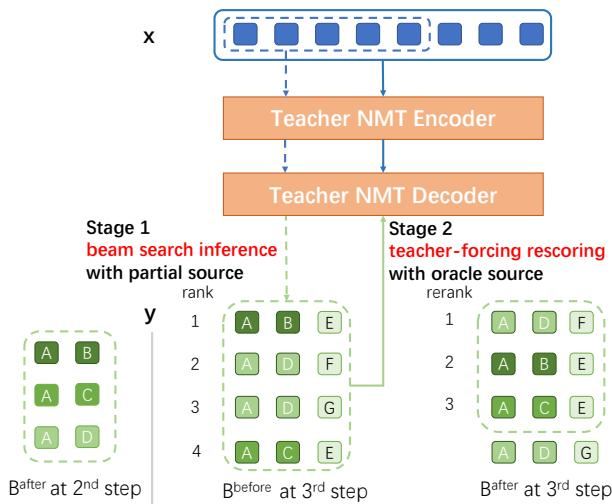  
Figure 2: Visualization of two-stage beam search algorithm, with beam size $b _ { 1 } = 4$ and $b _ { 2 } = 3 ,$ , and latency $k = 3 .$ . The 3rd (i = 3) target token is being decoded.

As detailed in Algorithm 1 and depicted in Figure 2, our approach first translates pieces of the source incrementally, akin to a wait-k policy, and then rescores and selects the better partial hypotheses using a full-sentence offline model.

In Stage 1, the streaming source prefix is fed into the offline teacher model to generate the initial $b _ { 1 }$ partial hypotheses at each beam search step following a wait-k policy. This stage simulates real-time simultaneous translation with incremental input, and ensures that the decoding is based on local information, thereby increasing monotonicity. By defining the desired latency k, the monotonicity level of the partial hypotheses can be controlled.

In Stage 2, we use the teacher model to rescore each of the $b _ { 1 }$ partial hypotheses conditioned on the full source sentence and only keep the top $b _ { 2 }$ $( b _ { 2 } < b _ { 1 } )$ partial hypotheses for the next step in the two-stage beam search process. With this strategy, future information in the source sentence is utilized to improve the quality of top partial hypotheses, while also preserving the local word order dictated by the prefix source.

Note that we can reverse the translation direction and construct more monotonic pseudo-source given the original target through backward translation. However, empirical results show that it is inferior than forward translation for SiMT (see Figure 13 in Appendix E), probably due to the discrepancy between pseudo-source and normal source text.

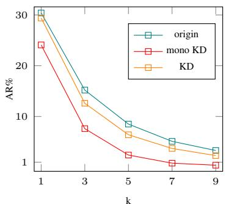  
(a) De En

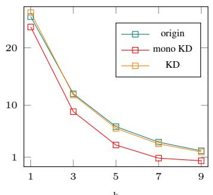  
(b) Zh En

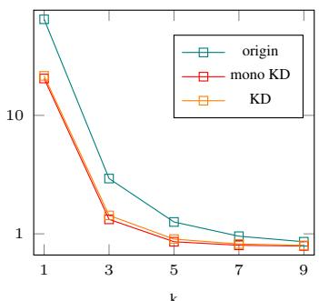  
(c) En Vi

Figure 3: k-Anticipation Rates $( A R _ { k } )$ of the training data with original references and pseudo-targets generated by our KD methods.  
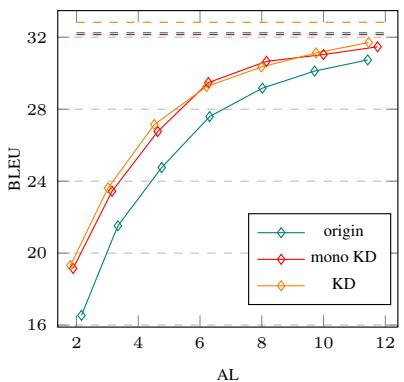  
(a) De En, Transformer-Base

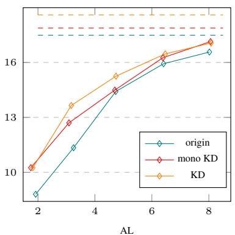  
(b) Zh En, Transformer-Base

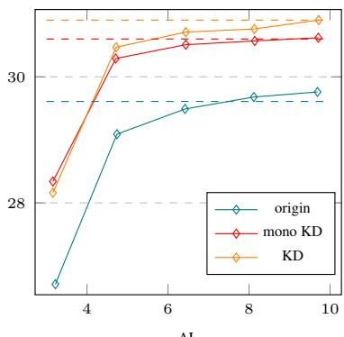  
(c) En Vi, Transformer-Small  
Figure 4: Evaluation of offline NMT models in offline (dashed) and simultaneous (solid) scenarios.

## 5 Experiments

## 5.1 SiMT Models

We conduct experiments on three representative modeling approaches that have been used for simultaneous machine translation.

Offline MT: a Transformer NMT model (Vaswani et al., 2017) trained on full sentences.

Multipath Wait-k: a wait-k policy model (Elbayad et al., 2020) trained by randomly sampling different k values between batches during training.

ITST: an adaptive read/write policy model (Zhang and Feng, 2022) that formulates the translation process as an optimal information transport problem. To the best of our knowledge, ITST is currently the state of the art method for SiMT.

## 5.2 Data

We select three datasets of different language pairs that have been used before for investigations of SiMT models.

WMT15 De En (Callison-Burch et al., 2009) is a parallel corpus with 4.5M training pairs, which are tokenized and split using 32K BPE merge operations with a shared vocabulary for German and English. We use newstest2013 (3000 sentence pairs) as the development set and report results on newstest2015 (2169 sentence pairs).

CWMT192 Zh En contains 9.4M sentence pairs in the training set, which are tokenized and split using 32K BPE merge operations for both the source and the target languages. We use the validation set of 956 sentence pairs from BSTC (Zhang et al., 2021a) as the test set.

IWSLT15 En Vi (Luong and Manning, 2015) contains 133K training pairs. We use TED tst2012 as the validation set (1553 sentence pairs) and TED tst2013 as the test set (1268 sentence pairs). Following the settings in (Ma et al., 2020), we replace rare tokens (frequency < 5) by <unk>. The resulting vocabulary sizes are 17K and 7.7K for English and Vietnamese respectively.

Figure 3 compares AR curves at various k values in both the original and the reconstructed training data with pseudo-targets. Our two KD methods can effectively reduce the anticipation rate across all language pairs at different k values, with monotonic KD typically resulting in a lower anticipation rate compared to the standard KD. Our experiments are focused on understanding the impact of changes on the translation quality of SiMT models.

Algorithm 1: Two-Stage Beam Search   
Input: x: source sentence   
$b _ { 1 } \colon$ max beam size before rescoring   
b2: max beam size after rescoring   
$n _ { m a x } \mathrm { : }$ max hypothesis length   
$k \mathrm { : }$ fixed latency   
l: source length $| \mathbf { x } |$   
score $( \cdot , \cdot ) \colon$ scoring function   
Output: Best monotonic translation at k   
1 $/ /$ beam format: score, hypothesis   
2 $B _ { 0 } , B \gets \{ \langle 0 , { \tt B O S } \rangle \} , \emptyset$   
3 for $i \in \{ 1 , \cdots , n _ { m a x } \}$ do   
4 Bbefore, Bafter $ \emptyset , \emptyset$   
5 for $\langle s , \mathbf { y } \rangle \in B _ { i - }$ 1 do   
6 if y.last() = EOS then   
7 $B . \circ \operatorname { d d } ( \langle s , \mathbf { y } \rangle )$   
8 continue   
9 l = min(i + k  1, x.len)   
10 for $y \in \mathcal V$ do   
11 $/ /$ score by partial input   
12 $s \gets \mathsf { s c o r e } ( \mathbf { x } [ : l ] , \mathbf { y } \circ y )$   
13 Bbefore. $. \circ \mathrm { d } \mathrm { d } ( \langle s , \mathbf { y } \circ y \rangle )$   
14 $\dot { B } ^ { \mathrm { b e f o r e } } \gets B ^ { \mathrm { b e f o r e } } . t o p ( b _ { 1 } )$   
15 for $\langle s , \mathbf { y } \rangle \in B ^ { b e f o r e }$ do   
16 // score by oracle input   
17 $s \gets \mathsf { s c o r e } ( \mathbf { x } , \mathbf { y } )$   
18 $B ^ { \mathrm { a f t e r } } . \mathsf { a d d } ( \langle s , \mathbf { y } \rangle )$   
19 $B _ { i }  B ^ { \mathrm { a f t e r } }  B ^ { \mathrm { a f t e r } } . . . \cup \mathsf { p } ( b _ { 2 } )$   
20 return $B . \operatorname* { m a x } ( )$

To properly evaluate SiMT performance, the test sets should be representative of the characteristics of real-time simultaneous translation, in both content and translation style. In addition to the official test sets described earlier, we choose to adapt the WMT newstest2015 De En data set for realtime speech translation. We select 500 sentence pairs from this data set and ask professional translators to produce new reference translations, with as much monotonicity as linguistically possible without compromising the translation quality. The detail of this annotation task can be found in the Appendix D.

think think   
from   
is   
time point   
to   
look view   
at   
from   
from our   
point   
perspective of   
view   
from   
our   
perspective is   
noy tim   
多 EE 多 RE  
Figure 5: Visualization of cross-attention matrix of Zh En offline MT. Left: trained on original corpus. Right: trained with pseudo-targets produced by monotonic KD.

## 5.3 Experimental Setup

We use Transformer-base models for the De En and Zh En translation directions and Transformersmall mdoels for En Vi. Our model configurations generally follow the experiment settings detailed in Multipath Wait- $\cdot k ^ { 3 }$ and $\mathrm { I T S T ^ { 4 } }$ . For generating pseudo-targets, we use a beam size of 5 in standard KD, and in our two-stage monotonic KD method we set beam sizes $b _ { 1 } = 1 0$ and $b _ { 2 } = 5 ,$ with the latency value k set to 7, 7, 6 for De-En, Zh-En, and En-Vi respectively.

For evaluation, we use tokenized case-insensitive $\mathrm { B L E U } ^ { 5 }$ for translation quality and Average Lagging (AL, token level) (Ma et al., 2019a) to measure latency.

## 5.4 Main Results

We first train an offline MT model for each of the three language pairs on the original training data, and then obtain pseudo parallel data and train Multipath Wait-k and ITST models using the regular and monotonic KD methods described in Section 4.

Offline MT Evaluation For each language pair, we train two additional offline models, one for each of the two KD methods. We evaluate these models in both offline and simultaneous scenarios, adopting a simple wait-k policy for the latter. The results6 are presented in Figure 4. The offline models perform significantly worse in the streaming scenario, especially when at a low latency, due to the discrepancy between full-sentence training and prefix-to-prefix inference. The two models trained on pseudo-target data exhibit considerable improvements, with an average improvement of more than 2 BLEU points across all latency settings on the De En test set in particular.

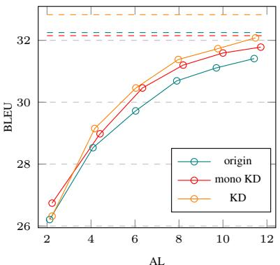  
(a) De En, Transformer-Base

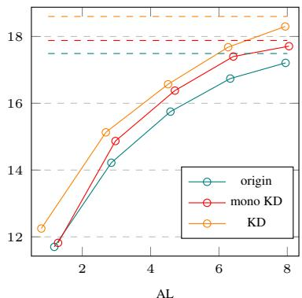  
(b) Zh En, Transformer-Base

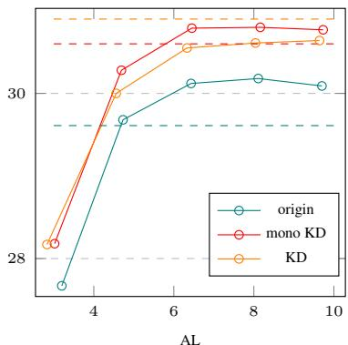  
(c) En Vi, Transformer-Small

Figure 6: Evaluation of multipath wait-k models in offline (dashed) and simultaneous (solid) scenarios.  
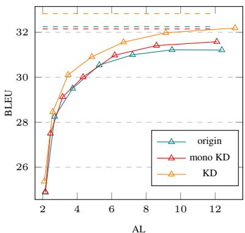  
(a) De En, Transformer-Base

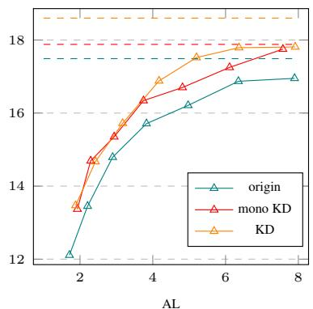  
(b) Zh En, Transformer-Base

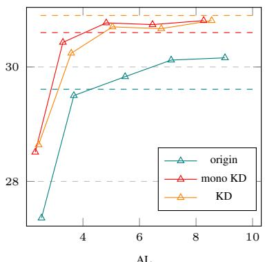  
(c) En Vi, Transformer-Small  
Figure 7: Evaluation of ITST models in offline (dashed) and simultaneous (solid) scenarios.

We attribute this improvement to the more monotonic nature of the pseudo data generated through KD. Models trained with this data can better model local source-target relationships, which leads to higher quality translations on partial source inputs. This is reflected in Figure 5, where the mass of cross-attention weights concentrate around the diagonal.

Multipath Wait-k We train wait-k SiMT models, following (Elbayad et al., 2020), on the original training data as well as the reconstructed training data with pseudo-target produced by the two KD methods. As shown in Figure 6, two KD methods are both able to significantly improve translation quality across latency settings.

ITST Finally we train ITST models, following Zhang and Feng (2022), to see if our methods can achieve similar improvements with advanced adaptive read/write models. The results are shown in Figure 7. Similarly, we observe overall improvement in translation quality by training ITST models on the pseudo data. As illustrated in the example in Figure 9, the decoding path of the mono-KD trained ITST model is closer to the diagonal and its translation is more faithful and monotonic to the source input.

## 5.5 Evaluation on Monotonic Test Set

Although the pseudo data constructed by the monotonic KD method has a lower AR, as shown in Figure 3, models trained with the standard KD method typically achieve higher BLEU scores in many cases in Figure 4, 6, and 7. One possibility is that the references in the original test sets were not produced with a focus on simultaneous translation, and thus can not accurately measure improvement in translation quality of more monotonic translations. To test this hypothesis, we took the first 500 pairs from the De En test set and commissioned a new set of reference translations that are as monotonic as possible without sacrificing the translation quality. We re-evaluated our De En models on this monotonic test set and the results are shown in Figure 8. Compared to the previous results on the original test set, the improvement from the monotonic KD method becomes more prominent, on par with the standard KD method or in many cases outperforming. Moreover, the overall improvement from the KD methods also becomes greater on this monotonic test set. Although the monotonic test set is only a subset of the original test set, the same conclusion holds when only comparing results on this subset (see performance of the multipath waitk method on the original subset in Figure 14 in Appendix E).

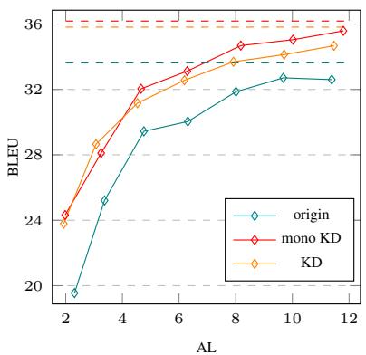  
(a) wait-k by offline

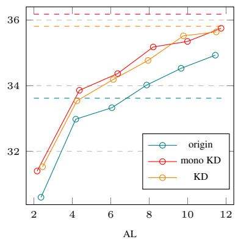  
(b) multipath wait-k

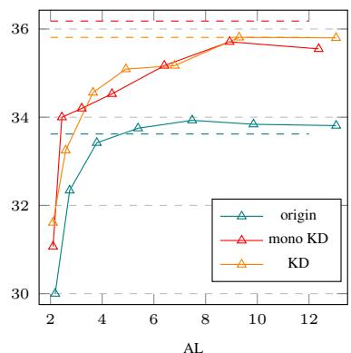  
(c) ITST

Figure 8: Evaluation on the monotonic test set for De En.  
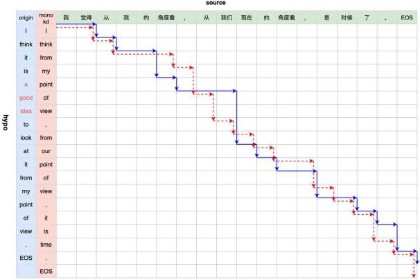  
Figure 9: Visualization of R/W paths taken during inference for ITST models trained on the original corpus (blue) and trained with pseduo-targets produced by the monotonic KD method (red).

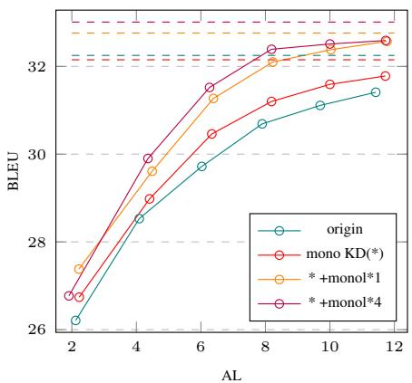  
Figure 10: Effect of monolingual data on multipath waitk models on WMT15 De En.

## 5.6 Scaling with Monolingual Data

Given that only source sentences are needed for an offline teacher model to produce pseudo-targets, we can expand the KD training data by generating pseudo-targets using monolingual data. We conducted experiments on WMT15 De En and collected 1 and 4 times of additional pseudo parallel data using the monotonic KD method on German sentences selected from News Crawl articles, excluding sentences longer than 190 characters. The results with the multipath wait-k model are presented in Figure 10. The improvements from more pseudo data suggest that the ability to use a monolingual source corpus is another advantage of our approach.

In Figure 11, we focus on WMT15 De En and demonstrate how our approach can further advance the current state of the art in SiMT. We take ITST, the current SOTA in SiMT, as our modeling method, and compare with ITST and another recent SiMT method wait-info (Zhang et al., 2022a). For a fair comparison, we rerun the original ITST and observe a minor performance dip under high latency conditions. The results show that the monotonic KD method combined with additional monolingual data can achieve new state of the art for SiMT.

<table><tr><td>hypotheses</td><td>k=1</td><td>k=3</td><td>k=5</td><td>k=7</td><td>k=9</td></tr><tr><td>origin</td><td>3.1</td><td>1.8</td><td>1.3</td><td>1.1</td><td>1</td></tr><tr><td>mono KD</td><td>2.2</td><td>1.2</td><td>1</td><td>0.8</td><td>0.8</td></tr><tr><td>KD</td><td>3</td><td>1.5</td><td>1</td><td>0.8</td><td>0.8</td></tr></table>

Table 2: HR% of multipath wait-k models on WMT15 De En.

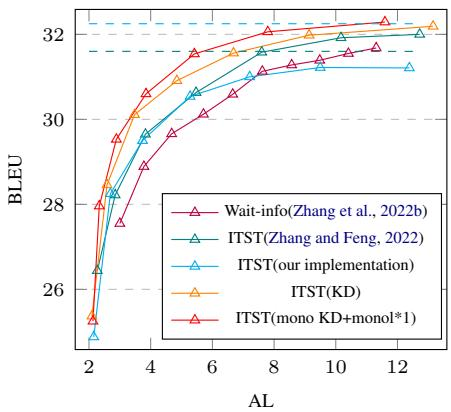  
Figure 11: Comparison with SOTAs on WMT15 De En.

## 5.7 Effects on Hallucination

Hallucination, a known issue in machine translation models, presents significant challenges for realtime simultaneous translation. Hallucination Rate (HR%) (Chen et al., 2021) measures the percentage of words in the target output that are hallucinated (see full definition in Appendix C). We compare the HR% of multipath wait-k models trained on the original parallel data or the pseudo data constructed by the KD methods. As shown in Table 2, the monotonic KD method has the lowest HR% across different latency settings. Examples of hallucination in translation results can be found in Table 6 of Appendix E.

## 6 Discussions

The first beam search stage of our monotonic KD method is equivalent to test-time wait-k inference described in (Chen et al., 2021). This stage, however, may fail to produce accurate rankings of partial hypotheses, given that it relies on offline models for translating partial inputs. The second stage beach search, designed to incorporate full sentence information, is capable of more accurately scoring and ranking these partial hypotheses. We conducted an analysis on the WMT15 De En test set to compare the quality of translations produced by test-time wait-k (i.e., monotonic one-stage beam search) and our monotonic two-stage beam search. As shown in Table 3, the rescoring process in the second stage significantly improves translation quality.

<table><tr><td>Mono KD</td><td>Offline</td><td>k=1</td><td>k=3</td><td>k=5</td><td>k=7</td></tr><tr><td>one-stage</td><td>33.15</td><td>21.38</td><td>25.20</td><td>27.71</td><td>29.51</td></tr><tr><td>two-stage</td><td>33.15</td><td>25.36</td><td>28.86</td><td>30.78</td><td>32.39</td></tr></table>

Table 3: BLEU of monotonic KD-produced test set vs. original test set on WMT15 De En.

Table 4 shows the quality of pseudo-targets generated by standard KD, monotonic one-stage beam search, and monotonic two-stage beam search, measured in BLEU with respect to the original references. Across both De En and En Vi, the standard KD achieves the highest BLEU scores, closely followed by the monotonic KD method that uses two-stage beam search. The one-stage only beam search method results in the lowest translation quality among the three approaches, particularly on De En where the BLEU score is 4 points lower. Figure 12 illustrates the performance of multipath wait-k models trained on the respective training data. The two-stage method consistently outperforms the one-stage method on De En and is better in most latency settings on En Vi. It is notable that the one-stage method leads to substantially inferior SiMT models on De En due to the markedly lower quality of the pseudo-targets.

<table><tr><td>Pseudo-Refs</td><td>De→En</td><td>En→Vi</td></tr><tr><td>Mono-KD(One-Stage)</td><td>31.66</td><td>37.89</td></tr><tr><td>Mono-KD(Two-Stage)</td><td>34.33</td><td>38.46</td></tr><tr><td>KD</td><td>35.74</td><td>38.52</td></tr></table>

Table 4: BLEU of KD-produced training data vs. original.

## 7 Conclusion

Long-distance reorderings in conventional parallel data can negatively impact the training of simultaneous translation models. To address this problem, we propose a novel two-stage beam search algorithm to generate monotonic yet accurate pseudo translations that are then used to train SiMT models through sequence-level knowledge distillation. Experiments on three language pairs demonstrate that this method can consistently improve multiple SiMT models and achieve new state of the art performance for simultaneous translation.

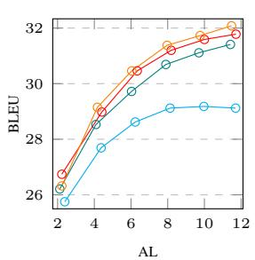  
(a) De En

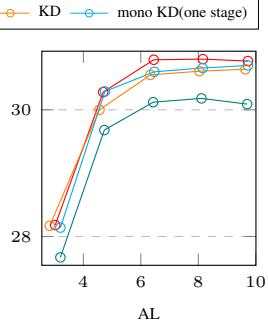  
(b) En Vi  
Figure 12: Comparison of different KD methods with multipath wait-k models.

## Limitations

Our monotonic KD approach requires searching for a hyper-parameter k to strike a balance between monotonicity and translation quality for generating pseudo-targets. The current process requires substantial computational resources to determine the optimal value, which may be different depending on the dataset. More studies are needed to establish an efficient method.

## Acknowledgements

We would like to thank all the anonymous reviewers for the insightful and helpful comments. This work was supported by Alibaba Research Intern Program, the National Key Research & Development Project of China (2021ZD0110700), the National Natural Science Foundation of China (U19B2043, 61976185), and the Fundamental Research Funds for the Central Universities (226- 2022-00051). This work was done during the first author’s internship at Alibaba DAMO Academy.

## References

Naveen Arivazhagan, Colin Cherry, Wolfgang Macherey, Chung-Cheng Chiu, Semih Yavuz, Ruoming Pang, Wei Li, and Colin Raffel. 2019. Monotonic infinite lookback attention for simultaneous machine translation. arXiv preprint arXiv:1906.05218.

Chris Callison-Burch, Philipp Koehn, Christof Monz, and Josh Schroeder. 2009. Findings of the 2009 Workshop on Statistical Machine Translation. In

Proceedings of the Fourth Workshop on Statistical Machine Translation, pages 1–28, Athens, Greece. Association for Computational Linguistics.

Chih-Chiang Chang, Shun-Po Chuang, and Hung-yi Lee. 2022. Anticipation-free training for simultaneous machine translation. In Proceedings of the 19th International Conference on Spoken Language Translation (IWSLT 2022), pages 43–61.

Junkun Chen, Renjie Zheng, Atsuhito Kita, Mingbo Ma, and Liang Huang. 2021. Improving simultaneous translation by incorporating pseudo-references with fewer reorderings. In Proceedings ofthe 2021 Conference on Empirical Methods in Natural Language Processing, pages 5857–5864.

Hexuan Deng, Liang Ding, Xuebo Liu, Meishan Zhang, Dacheng Tao, and Min Zhang. 2022. Improving simultaneous machine translation with monolingual data. arXiv preprint arXiv:2212.01188.

Chris Dyer, Victor Chahuneau, and Noah A Smith. 2013. A simple, fast, and effective reparameterization of ibm model 2. In Proceedings of the 2013 Conference of the North American Chapter of the Association for Computational Linguistics: Human Language Technologies, pages 644–648.

Maha Elbayad, Laurent Besacier, and Jakob Verbeek. 2020. Efficient wait-k models for simultaneous machine translation. arXiv preprint arXiv:2005.08595.

Jiatao Gu, Graham Neubig, Kyunghyun Cho, and Victor OK Li. 2016. Learning to translate in real-time with neural machine translation. arXiv preprint arXiv:1610.00388.

Hyojung Han, Seokchan Ahn, Yoonjung Choi, Insoo Chung, Sangha Kim, and Kyunghyun Cho. 2021. Monotonic simultaneous translation with chunkwise reordering and refinement. arXiv preprint arXiv:2110.09646.

Geoffrey Hinton, Oriol Vinyals, and Jeff Dean. 2015. Distilling the knowledge in a neural network. arXiv preprint arXiv:1503.02531.

Yoon Kim and Alexander M Rush. 2016. Sequencelevel knowledge distillation. arXiv preprint arXiv:1606.07947.

Dan Liu, Mengge Du, Xiaoxi Li, Ya Li, and Enhong Chen. 2021. Cross attention augmented transducer networks for simultaneous translation. In Proceedings of the 2021 Conference on Empirical Methods in Natural Language Processing, pages 39–55.

Minh-Thang Luong and Christopher D Manning. 2015. Stanford neural machine translation systems for spoken language domains. In Proceedings of the 12th International Workshop on Spoken Language Translation: Evaluation Campaign.

Mingbo Ma, Liang Huang, Hao Xiong, Renjie Zheng, Kaibo Liu, Baigong Zheng, Chuanqiang Zhang, Zhongjun He, Hairong Liu, Xing Li, et al. 2019a. Stacl: Simultaneous translation with implicit anticipation and controllable latency using prefix-to-prefix framework. In Proceedings ofthe 57th Annual Meeting ofthe Associationfor Computational Linguistics, pages 3025–3036.

Xutai Ma, Juan Pino, James Cross, Liezl Puzon, and Jiatao Gu. 2019b. Monotonic multihead attention. arXiv preprint arXiv:1909.12406.

Xutai Ma, Juan Miguel Pino, James Cross, Liezl Puzon, and Jiatao Gu. 2020. Monotonic multihead attention. In International Conference on Learning Representations.

Yishu Miao, Phil Blunsom, and Lucia Specia. 2021. A generative framework for simultaneous machine translation. In Proceedings of the 2021 Conference on Empirical Methods in Natural Language Processing, pages 6697–6706.

Yi Ren, Jinglin Liu, Xu Tan, Chen Zhang, Tao Qin, Zhou Zhao, and Tie-Yan Liu. 2020. Simulspeech: End-to-end simultaneous speech to text translation. In Proceedings of the 58th Annual Meeting of the Associationfor Computational Linguistics, pages 3787– 3796.

Ashish Vaswani, Noam Shazeer, Niki Parmar, Jakob Uszkoreit, Llion Jones, Aidan N Gomez, Łukasz Kaiser, and Illia Polosukhin. 2017. Attention is all you need. Advances in neural information processing systems, 30.

Ruiqing Zhang, Xiyang Wang, Chuanqiang Zhang, Zhongjun He, Hua Wu, Zhi Li, Haifeng Wang, Ying Chen, and Qinfei Li. 2021a. Bstc: A large-scale chinese-english speech translation dataset. arXiv preprint arXiv:2104.03575.

Shaolei Zhang and Yang Feng. 2022. Informationtransport-based policy for simultaneous translation. In Proceedings ofthe 2022 Conference on Empirical Methods in Natural Language Processing, Online and Abu Dhabi. Association for Computational Linguistics.

Shaolei Zhang, Yang Feng, and Liangyou Li. 2021b. Future-guided incremental transformer for simultaneous translation. In Proceedings ofthe AAAI Conference on Artificial Intelligence, volume 35, pages 14428–14436.

Shaolei Zhang, Shoutao Guo, and Yang Feng. 2022a. Wait-info policy: Balancing source and target at information level for simultaneous machine translation.

Shaolei Zhang, Shoutao Guo, and Yang Feng. 2022b. Wait-info policy: Balancing source and target at information level for simultaneous machine translation. In Findings of the Association for Computational Linguistics: EMNLP 2022, Online and Abu Dhabi. Association for Computational Linguistics.

Baigong Zheng, Kaibo Liu, Renjie Zheng, Mingbo Ma, Hairong Liu, and Liang Huang. 2020. Simultaneous translation policies: From fixed to adaptive. arXiv preprint arXiv:2004.13169.

## A Algorithm of Standard Beam Search

Algorithm 2: Standard Beam Search   
Input: x: source sentence   
b: max beam size   
$n _ { m a x } \mathrm { : }$ max hypothesis length   
score $( \cdot , \cdot ) \colon$ scoring function   
Output: Best hypothesis   
1 $B _ { 0 } \gets \{ \langle 0 , { \tt B O S } \rangle \}$   
2 for $i \in \{ 1 , \cdots , n _ { m a x } \}$ do   
3 $B  \emptyset$   
4 for $\langle s , \mathbf { y } \rangle \in B _ { i - 1 }$ do   
5 if y.last() = EOS then   
6 $B . \circ \operatorname { d d } ( \langle s , \mathbf { y } \rangle )$   
7 continue   
8 for $y \in \mathcal V$ do   
9 s  score $( \mathbf { x } , \mathbf { y } \circ y )$   
10 $B . \circ \mathrm { d } \mathsf { d } ( \langle s , \mathbf { y } \circ y \rangle )$   
11 $B _ { i } \gets B . \mathsf { t o p } ( b )$   
12 return $B . \operatorname* { m a x } ( )$

## B Anticipation Rate of (Pseudo-)Refs

During the training of a simultaneous translation model, an anticipation happens when a target word is generated before the corresponding source word is encoded. To identify the anticipations, we need the word alignment between the parallel sentences.

We use fast-align in our experiments (Dyer et al., 2013) to get a word alignment a between a source sentence x and a target sentence y. It is a set of source-target word index pairs $( s , t )$ where the $s ^ { \mathrm { t h } }$ source word $x _ { s }$ aligns with the $t ^ { \mathrm { { t h } } }$ target word $y _ { t }$ .

Formally, a target word $y _ { t }$ is k-anticipated $( A _ { k } ( t , a ) = 1 )$ if it aligns to at least one source word $\mathbf { x } _ { s }$ where $s \geq t + k \colon$

$$
A _ { k } ( t , a ) = \mathbb { 1 } [ \{ ( s , t ) \in a | s \geq t + k \} \neq \emptyset ]
$$

The k-anticipation rate $( A R _ { k } )$ of an (x, y, a) triple is further defined under wait-k policy:

$$
A R _ { k } ( \mathbf { x } , \mathbf { y } , a ) = \frac { 1 } { | \mathbf { y } | } \sum _ { t = 1 } ^ { | \mathbf { y } | } A _ { k } ( t , a )
$$

## C Hallucination Rate of Hypotheses

HR is defined to quantify the number of hallucinations in decoding. A target word $\hat { y } _ { t }$ is a hallucination if it can not be aligned to any source word.

Formally, based on word alignment a, whether target word $\hat { y } _ { t }$ is a hallucination is

$$
H ( t , a ) = \mathbb { 1 } [ \{ ( s , t ) \in a \} = \emptyset ]\tag{4}
$$

Hallucination rate HR is further defined as

$$
H R ( \mathbf { x } , \hat { \mathbf { y } } , a ) = \frac { 1 } { | \hat { \mathbf { y } } | } \sum _ { t = 1 } ^ { | \hat { \mathbf { y } } | } H ( t , a )
$$

## D WMT15 De En Test Set Annotations

In order to properly evaluate the quality of SiMT, we expect to remove the long-distance reorderings in the test set. So we ask the professional interpreters to rephrase the references in the test set of WMT15 De En into simultaneous style. We hired two profession interpreters and spent 888 US dollars in total to get the monotonic test set. The annotation guidelines we provided with them are as follows:

• A monotonic translation should be faithful and fluent, following common practices in professional translation of sentences, without adding, deleting, or substituting meaningful information in the source sentence. The original professional translations are provided for reference only and annotators should feel free to start from scratch, or reuse the original translation and make necessary edits, in order to produce a monotonic translation that is faithful and fluent.

• A monotonic translation should reduce long distance reordering between words and try to emulate the word order in the source language if possible, under the requirement of criterion 1.

• While it can be difficult and time-consuming to come up with the best monotonic translation for a source sentence, we require reasonable effort to create a more monotonic translation that is quantitatively better than the original translation according to criterion 2, unless the original translation is already monotonic.

• There may exist multiple monotonic translations for a source sentence with varying degrees of monotonicity. We require reasonable effort to create a more monotonic translation but it does not need to be the most monotonic translation. We welcome diversity in monotonic translation and would collect multiple versions of monotonic translations from different in-house and external professional translators.

## E Additional Training Details and Experimental Results

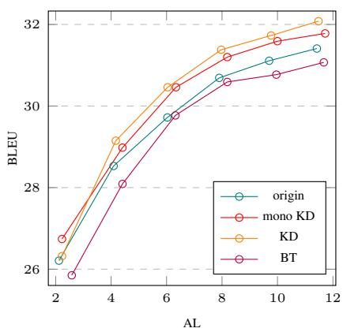  
Figure 13: Evaluation of back-translation on multipath wait-k models on WMT15 De En. We re-generate monotonic source input by standard beam search and trained a multipath wait-k model on it.

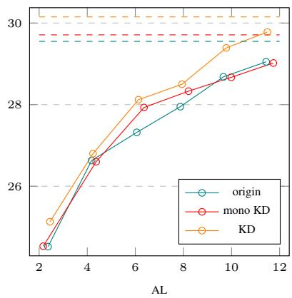  
Figure 14: Evaluation of multipath wait-k models on the original first 500 pairs test set of WMT15 De En.

## F Numerical Results

The numerical results of the main SiMT systems are presented in table 5 and table 7.

<table><tr><td rowspan="2"></td><td colspan="3">Multipath Wait-k De-En</td></tr><tr><td>k</td><td>AL 2.12</td><td>BLEU 26.21</td></tr><tr><td rowspan="8">origin</td><td>357 9</td><td>4.09</td><td>28.53</td></tr><tr><td></td><td>6.03</td><td>29.72</td></tr><tr><td></td><td>7.9</td><td>30.69</td></tr><tr><td></td><td></td><td></td></tr><tr><td>11</td><td>9.7</td><td>31.11</td></tr><tr><td></td><td>11.42</td><td>31.41</td></tr><tr><td>13</td><td></td><td>32.25</td></tr><tr><td>+∞</td><td></td><td></td></tr><tr><td rowspan="8">mono KD</td><td></td><td>AL</td><td>BLEU</td></tr><tr><td>k 357</td><td>2.23</td><td>26.74</td></tr><tr><td></td><td>4.41</td><td>28.98</td></tr><tr><td></td><td>6.34</td><td>30.46</td></tr><tr><td>9</td><td>8.19</td><td>31.20</td></tr><tr><td></td><td>10.0</td><td>31.59</td></tr><tr><td>11</td><td></td><td>31.78</td></tr><tr><td>13 +∞</td><td>11.72</td><td>32.15</td></tr><tr><td rowspan="8">mono KD +monol*1</td><td></td><td>-</td><td>BLEU</td></tr><tr><td>k3</td><td>AL 2.22</td><td>27.38</td></tr><tr><td></td><td>4.49</td><td>29.61</td></tr><tr><td>5</td><td>6.39</td><td></td></tr><tr><td>7</td><td></td><td>31.27</td></tr><tr><td>9</td><td>8.23</td><td>32.10</td></tr><tr><td>11</td><td>10.03</td><td>32.38</td></tr><tr><td>13</td><td>11.77</td><td>32.57</td></tr><tr><td rowspan="8">mono KD +monol*4</td><td>+∞</td><td></td><td>32.76</td></tr><tr><td></td><td>AL</td><td>BLEU</td></tr><tr><td></td><td>1.91</td><td>26.77</td></tr><tr><td></td><td>4.36</td><td>29.90</td></tr><tr><td>k357</td><td>6.27</td><td>31.52</td></tr><tr><td>9</td><td>8.19</td><td>32.39</td></tr><tr><td>11</td><td>10.00</td><td>32.51</td></tr><tr><td>13</td><td>11.73</td><td>32.59</td></tr><tr><td rowspan="8">origin</td><td>+∞</td><td>ITST</td><td>33.01</td></tr><tr><td></td><td>De-En</td><td></td></tr><tr><td>delta</td><td>AL</td><td>BLEU</td></tr><tr><td>0.2</td><td>2.15</td><td>24.88</td></tr><tr><td>0.3</td><td>2.69</td><td>28.25</td></tr><tr><td>0.4</td><td>3.74</td><td>29.50</td></tr><tr><td>0.5</td><td>5.28</td><td>30.54</td></tr><tr><td>0.6</td><td>7.21</td><td>31.00</td></tr><tr><td></td><td>0.7 9.50 0.8 12.39</td><td>31.22</td></tr><tr><td></td><td>+∞</td><td>31.21 32.25</td></tr><tr><td></td><td></td><td></td></tr><tr><td>delta</td><td>AL</td><td>BLEU</td></tr><tr><td>0.2</td><td>2.15</td><td>24.91</td></tr><tr><td rowspan="8">mono KD</td><td></td><td>2.45</td><td>27.50</td></tr><tr><td>0.3 0.4</td><td>3.16</td><td>29.13</td></tr><tr><td>0.5</td><td>4.34</td><td>30.01</td></tr><tr><td>0.6</td><td>6.17</td><td>30.98</td></tr><tr><td>0.7</td><td>8.59</td><td>31.41</td></tr><tr><td>0.8</td><td>12.09</td><td>31.58</td></tr><tr><td></td><td></td><td>32.15</td></tr><tr><td>+∞</td><td></td><td></td></tr><tr><td rowspan="10">mono KD +monol*1</td><td>delta</td><td></td><td></td></tr><tr><td></td><td>AL</td><td>BLEU</td></tr><tr><td>0.2</td><td>2.13</td><td>25.25</td></tr><tr><td>0.3</td><td>2.33</td><td>27.96</td></tr><tr><td>0.4</td><td>2.89</td><td>29.53</td></tr><tr><td>0.5</td><td>3.85</td><td>30.60</td></tr><tr><td>0.6</td><td>5.42</td><td>31.54</td></tr><tr><td></td><td></td><td></td></tr><tr><td>0.7</td><td>7.80</td><td>32.06</td></tr><tr><td>0.8</td><td>11.59</td><td>32.29 32.76</td></tr></table>

Table 5: Numerical Results in figure 10 and figure 11.

<table><tr><td>Input</td><td colspan="11">第二种反馈功能是针对NLU结果的干预。</td></tr><tr><td>Ref</td><td colspan="11">The second function is intervening in NLU results .</td></tr><tr><td>Wait-3(origin)</td><td colspan="11">the second feedback function is designed for NLU results .</td></tr><tr><td>Wait-3(mono KD)</td><td colspan="11">the second feedback function is to target the intervention of NLU results .</td></tr><tr><td>Wait-3(KD)</td><td colspan="11">the second feedback function is to target NLU results intervention .</td></tr><tr><td>Input</td><td colspan="11">那么在这个对话过程中发生了什么事情呢？</td></tr><tr><td>Ref</td><td colspan="11">What happened during this dialogue ?</td></tr><tr><td>Wait-3(origin)</td><td colspan="11">so what is the difference between what happened in this conversation ?</td></tr><tr><td>Wait-3(mono KD)</td><td colspan="11">so in this conversation , what happened ?</td></tr><tr><td>Wait-3(KD)</td><td colspan="11">so what do you think happened in this conversation ?</td></tr><tr><td>Input</td><td colspan="11">我觉得从我的角度看，从我们现在的角度看，是时候了。</td></tr><tr><td>Ref</td><td colspan="11">I think from my perspective , from our perspective , it is about time .</td></tr><tr><td>ITST-0.4(origin)</td><td colspan="11">I think it's a good idea to look at it from my point of view .</td></tr><tr><td>ITST-0.4(mono KD)</td><td colspan="11">I think from my point of view , from our point of view , it is time .</td></tr><tr><td>ITST-0.4(KD)</td><td colspan="11">I think from my point of view , from our present point of view , it is time .</td></tr><tr><td>Input</td><td colspan="11">我们啊，只能用没有游戏功能的电子产品。</td></tr><tr><td>Ref</td><td colspan="11">So we are only permitted to use digital products without any gaming functions .</td></tr><tr><td>ITST-0.4(origin)</td><td colspan="11">we can only use the game without the electronic product .</td></tr><tr><td>ITST-0.4(mono KD)</td><td colspan="11">we can only use the game-free electronic products .</td></tr><tr><td>ITST-0.4(KD)</td><td colspan="11">we can only use the ability to use electronic products without game function .</td></tr><tr><td colspan="1" rowspan="1"></td><td colspan="11" rowspan="1">Multipath Wait-kDe-En           De-En(Re-anno)           Zh-En                En-Vi</td></tr><tr><td colspan="1" rowspan="1"></td><td colspan="2" rowspan="1">AL BLEU</td><td colspan="3" rowspan="1">k    AL BLEU</td><td colspan="3" rowspan="1">k   ALBLEU</td><td colspan="3" rowspan="2">k   AL BLEU1   3.20 27.67</td></tr><tr><td colspan="1" rowspan="1"></td><td colspan="2" rowspan="1">2.12  26.21</td><td colspan="3" rowspan="1">3   2.37 30.60</td><td colspan="3" rowspan="1">1   1.18 11.70</td></tr><tr><td colspan="1" rowspan="1"></td><td colspan="2" rowspan="1">4.09 28.53</td><td colspan="3" rowspan="1">4.18 32.98</td><td colspan="3" rowspan="1">3   2.85 14.22</td><td colspan="2" rowspan="1">4.73</td><td colspan="1" rowspan="1">29.68</td></tr><tr><td colspan="1" rowspan="2">origin</td><td colspan="1" rowspan="1">6.03</td><td colspan="1" rowspan="1">29.72</td><td colspan="3" rowspan="1">6.06 33.33</td><td colspan="3" rowspan="1">4.58 15.75</td><td colspan="2" rowspan="1">6.43</td><td colspan="1" rowspan="1">30.12</td></tr><tr><td colspan="1" rowspan="1">7.9</td><td colspan="1" rowspan="1">30.69</td><td colspan="3" rowspan="1">7.87  34.02</td><td colspan="3" rowspan="1">6.33 16.74</td><td colspan="2" rowspan="1">8.11</td><td colspan="1" rowspan="1">30.18</td></tr><tr><td colspan="1" rowspan="1"></td><td colspan="2" rowspan="1">11   9.7  31.11</td><td colspan="3" rowspan="1">11  9.66 34.53</td><td colspan="3" rowspan="1">7.9517.21</td><td colspan="2" rowspan="1">9  9.70</td><td colspan="1" rowspan="1">30.09</td></tr><tr><td colspan="1" rowspan="1"></td><td colspan="2" rowspan="1">13  11.4231.41</td><td colspan="3" rowspan="1">13  11.44 34.93</td><td colspan="3" rowspan="1">、</td><td colspan="2" rowspan="1">一</td><td colspan="1" rowspan="1"></td></tr><tr><td colspan="1" rowspan="1"></td><td colspan="2" rowspan="1">+8         32.25</td><td colspan="3" rowspan="1">+∞         33.62</td><td colspan="3" rowspan="1">+∞        17.49</td><td colspan="2" rowspan="1">+∞</td><td colspan="1" rowspan="1">29.61</td></tr><tr><td colspan="1" rowspan="1"></td><td colspan="2" rowspan="1">AL BLEU</td><td colspan="3" rowspan="1">k    AL BLEU</td><td colspan="3" rowspan="1">k   AL BLEU</td><td colspan="2" rowspan="1">k   AL</td><td colspan="1" rowspan="1">BLEU</td></tr><tr><td colspan="1" rowspan="1"></td><td colspan="1" rowspan="1">2.23</td><td colspan="1" rowspan="1">26.74</td><td colspan="3" rowspan="1">2.17 31.40</td><td colspan="3" rowspan="1">1  1.29 11.82</td><td colspan="2" rowspan="1">1   3.02</td><td colspan="1" rowspan="1">28.18</td></tr><tr><td colspan="1" rowspan="1"></td><td colspan="1" rowspan="1">4.41</td><td colspan="1" rowspan="1">28.98</td><td colspan="3" rowspan="1">4.37 33.86</td><td colspan="3" rowspan="1">3   2.97 14.87</td><td colspan="2" rowspan="1">4.69</td><td colspan="1" rowspan="1">30.28</td></tr><tr><td colspan="1" rowspan="2">mono KD</td><td colspan="1" rowspan="1">6.34</td><td colspan="1" rowspan="1">30.46</td><td colspan="3" rowspan="1">6.36 34.37</td><td colspan="3" rowspan="1">5   4.71 16.38</td><td colspan="2" rowspan="1">6.45</td><td colspan="1" rowspan="1">30.79</td></tr><tr><td colspan="1" rowspan="1">8.19</td><td colspan="1" rowspan="1">31.20</td><td colspan="3" rowspan="1">8.21 35.18</td><td colspan="3" rowspan="1">6.42 17.40</td><td colspan="2" rowspan="1">7  8.16</td><td colspan="1" rowspan="1">30.80</td></tr><tr><td colspan="1" rowspan="1"></td><td colspan="1" rowspan="1">11   10.0</td><td colspan="1" rowspan="1">31.59</td><td colspan="3" rowspan="1">11  9.99 35.35</td><td colspan="3" rowspan="1">8.05 17.71</td><td colspan="2" rowspan="1">9  9.73</td><td colspan="1" rowspan="1">30.77</td></tr><tr><td colspan="1" rowspan="1"></td><td colspan="1" rowspan="1">13  11.72</td><td colspan="1" rowspan="1">31.78</td><td colspan="3" rowspan="1">13  11.74 35.75</td><td colspan="3" rowspan="1"></td><td colspan="2" rowspan="1">1</td><td colspan="1" rowspan="1"></td></tr><tr><td colspan="1" rowspan="1"></td><td colspan="2" rowspan="1">+∞         32.15</td><td colspan="3" rowspan="1">+∞         36.18</td><td colspan="3" rowspan="1">+∞        17.88</td><td colspan="3" rowspan="1">+∞        30.6</td></tr><tr><td colspan="1" rowspan="1"></td><td colspan="1" rowspan="1">AL</td><td colspan="1" rowspan="1">BLEU</td><td colspan="3" rowspan="1">k   AL BLEU</td><td colspan="3" rowspan="1">k   AL BLEU</td><td colspan="2" rowspan="1">k   AL</td><td colspan="1" rowspan="1">BLEU</td></tr><tr><td colspan="1" rowspan="1"></td><td colspan="1" rowspan="1">2.23</td><td colspan="1" rowspan="1">26.32</td><td colspan="2" rowspan="1">2.45</td><td colspan="1" rowspan="1">31.53</td><td colspan="1" rowspan="1">1</td><td colspan="2" rowspan="1">0.8 12.25</td><td colspan="2" rowspan="1">1   2.83</td><td colspan="1" rowspan="1">28.17</td></tr><tr><td colspan="1" rowspan="1"></td><td colspan="1" rowspan="1">4.17</td><td colspan="1" rowspan="1">29.15</td><td colspan="2" rowspan="1">4.24</td><td colspan="1" rowspan="1">33.54</td><td colspan="1" rowspan="1">3</td><td colspan="2" rowspan="1">2.69 15.13</td><td colspan="2" rowspan="1">4.56</td><td colspan="1" rowspan="1">30.00</td></tr><tr><td colspan="1" rowspan="2">KD</td><td colspan="1" rowspan="1">6.04</td><td colspan="1" rowspan="1">30.46</td><td colspan="2" rowspan="1">6.13</td><td colspan="1" rowspan="1">34.19</td><td colspan="1" rowspan="1">5</td><td colspan="2" rowspan="1">4.51 16.57</td><td colspan="2" rowspan="1">6.33</td><td colspan="1" rowspan="1">30.55</td></tr><tr><td colspan="1" rowspan="1">7.97</td><td colspan="1" rowspan="1">31.38</td><td colspan="2" rowspan="1">9   7.94</td><td colspan="1" rowspan="1">34.77</td><td colspan="1" rowspan="1"></td><td colspan="2" rowspan="1">6.27 17.68</td><td colspan="2" rowspan="1">8.04</td><td colspan="1" rowspan="1">30.61</td></tr><tr><td colspan="1" rowspan="1"></td><td colspan="1" rowspan="1">11  9.77</td><td colspan="1" rowspan="1">31.73</td><td colspan="2" rowspan="1">11  9.78</td><td colspan="1" rowspan="1">35.52</td><td colspan="1" rowspan="1">9</td><td colspan="2" rowspan="1">7.94 18.30</td><td colspan="2" rowspan="1">9  9.64</td><td colspan="1" rowspan="1">30.64</td></tr><tr><td colspan="1" rowspan="1"></td><td colspan="1" rowspan="1">13  11.48</td><td colspan="1" rowspan="1">32.08</td><td colspan="2" rowspan="1">13  11.49</td><td colspan="1" rowspan="1">35.64</td><td colspan="1" rowspan="1">-</td><td colspan="2" rowspan="1"></td><td colspan="2" rowspan="1">-</td><td colspan="1" rowspan="1"></td></tr><tr><td colspan="1" rowspan="1"></td><td colspan="1" rowspan="1">+∞</td><td colspan="1" rowspan="1">32.83</td><td colspan="2" rowspan="1">+∞</td><td colspan="1" rowspan="1">35.81</td><td colspan="3" rowspan="1">+∞        18.6</td><td colspan="2" rowspan="1">+∞</td><td colspan="1" rowspan="1">30.9</td></tr><tr><td colspan="1" rowspan="1"></td><td colspan="2" rowspan="1">De-En</td><td colspan="3" rowspan="1">ITSDe-En(Re-anno)</td><td colspan="3" rowspan="1">TZh-En</td><td colspan="2" rowspan="1">En-Vi</td><td colspan="1" rowspan="1"></td></tr><tr><td colspan="1" rowspan="1"></td><td colspan="1" rowspan="1">delta AL</td><td colspan="1" rowspan="1">BLEU</td><td colspan="2" rowspan="1">delta AL</td><td colspan="1" rowspan="1">BLEU</td><td colspan="1" rowspan="1">delta</td><td colspan="1" rowspan="1">AL</td><td colspan="1" rowspan="1">BLEU</td><td colspan="2" rowspan="1">deltaAL</td><td colspan="1" rowspan="1">BLEU</td></tr><tr><td colspan="1" rowspan="1"></td><td colspan="1" rowspan="1">0.2  2.15</td><td colspan="1" rowspan="1">24.88</td><td colspan="2" rowspan="1">0.2  2.18</td><td colspan="1" rowspan="1">30.00</td><td colspan="1" rowspan="1">0.2</td><td colspan="1" rowspan="1">1.71</td><td colspan="1" rowspan="1">12.11</td><td colspan="2" rowspan="1">0.2 2.53</td><td colspan="1" rowspan="1">27.36</td></tr><tr><td colspan="1" rowspan="1"></td><td colspan="1" rowspan="1">0.3  2.69</td><td colspan="1" rowspan="1">28.25</td><td colspan="2" rowspan="1">0.3  2.74</td><td colspan="1" rowspan="1">32.34</td><td colspan="1" rowspan="1">0.3</td><td colspan="2" rowspan="1">2.21 13.45</td><td colspan="2" rowspan="1">0.3 3.68</td><td colspan="1" rowspan="1">29.50</td></tr><tr><td colspan="1" rowspan="1"></td><td colspan="1" rowspan="1">0.4  3.74</td><td colspan="1" rowspan="1">29.50</td><td colspan="2" rowspan="1">0.4  3.79</td><td colspan="1" rowspan="1">33.42</td><td colspan="1" rowspan="1">0.4</td><td colspan="2" rowspan="1">2.90 14.79</td><td colspan="2" rowspan="1">0.4 5.49</td><td colspan="1" rowspan="1">29.83</td></tr><tr><td colspan="1" rowspan="1">origin</td><td colspan="1" rowspan="1">0.5  5.28</td><td colspan="1" rowspan="1">30.54</td><td colspan="2" rowspan="1">0.5  5.39</td><td colspan="1" rowspan="1">33.75</td><td colspan="1" rowspan="1">0.5</td><td colspan="2" rowspan="1">3.83 15.71</td><td colspan="2" rowspan="1">0.5 7.12</td><td colspan="1" rowspan="1">30.12</td></tr><tr><td colspan="1" rowspan="1"></td><td colspan="1" rowspan="1">0.6  7.21</td><td colspan="1" rowspan="1">31.00</td><td colspan="1" rowspan="1">0.6</td><td colspan="1" rowspan="1">7.48</td><td colspan="1" rowspan="1">33.93</td><td colspan="1" rowspan="1">0.6</td><td colspan="2" rowspan="1">4.97 16.21</td><td colspan="2" rowspan="1">0.6 9.02</td><td colspan="1" rowspan="1">30.16</td></tr><tr><td colspan="1" rowspan="1"></td><td colspan="1" rowspan="1">0.7  9.50</td><td colspan="1" rowspan="1">31.22</td><td colspan="1" rowspan="1">0.7</td><td colspan="1" rowspan="1">9.85</td><td colspan="1" rowspan="1">33.84</td><td colspan="1" rowspan="1">0.7</td><td colspan="1" rowspan="1">6.35</td><td colspan="1" rowspan="1">16.87</td><td colspan="2" rowspan="1"></td><td colspan="1" rowspan="1"></td></tr><tr><td colspan="1" rowspan="1"></td><td colspan="1" rowspan="1">0.8 12.39</td><td colspan="1" rowspan="1">31.21</td><td colspan="1" rowspan="1">0.8</td><td colspan="1" rowspan="1">13.05</td><td colspan="1" rowspan="1">33.81</td><td colspan="1" rowspan="1">0.8</td><td colspan="1" rowspan="1">7.90</td><td colspan="1" rowspan="1">16.95</td><td colspan="2" rowspan="1"></td><td colspan="1" rowspan="1"></td></tr><tr><td colspan="1" rowspan="1"></td><td colspan="1" rowspan="1">+∞</td><td colspan="1" rowspan="1">32.25</td><td colspan="1" rowspan="1">+∞</td><td colspan="1" rowspan="1"></td><td colspan="1" rowspan="1">33.62</td><td colspan="1" rowspan="1">+∞</td><td colspan="2" rowspan="1">17.49</td><td colspan="2" rowspan="1">+∞</td><td colspan="1" rowspan="1">29.61</td></tr><tr><td colspan="1" rowspan="1"></td><td colspan="1" rowspan="1">delta AL</td><td colspan="1" rowspan="1">BLEU</td><td colspan="2" rowspan="1">delta AL</td><td colspan="1" rowspan="1">BLEU</td><td colspan="1" rowspan="1">delta</td><td colspan="2" rowspan="1">AL BLEU</td><td colspan="2" rowspan="1">delta AL</td><td colspan="1" rowspan="1">BLEU</td></tr><tr><td colspan="1" rowspan="1"></td><td colspan="1" rowspan="1">0.2  2.15</td><td colspan="1" rowspan="1">24.91</td><td colspan="3" rowspan="1">0.2  2.10 31.07</td><td colspan="1" rowspan="1">0.2</td><td colspan="2" rowspan="1">1.93 13.37</td><td colspan="2" rowspan="1">0.2 2.31</td><td colspan="1" rowspan="1">28.51</td></tr><tr><td colspan="1" rowspan="1"></td><td colspan="1" rowspan="1">0.3  2.45</td><td colspan="1" rowspan="1">27.50</td><td colspan="3" rowspan="1">0.3  2.44 34.00</td><td colspan="1" rowspan="1">0.3</td><td colspan="2" rowspan="1">2.29 14.69</td><td colspan="2" rowspan="1">0.3 3.29</td><td colspan="1" rowspan="1">30.43</td></tr><tr><td colspan="1" rowspan="1"></td><td colspan="1" rowspan="1">0.4  3.16</td><td colspan="1" rowspan="1">29.13</td><td colspan="3" rowspan="1">0.4  3.21  34.20</td><td colspan="1" rowspan="1">0.4</td><td colspan="2" rowspan="1">2.94 15.35</td><td colspan="2" rowspan="1">0.4 4.82</td><td colspan="1" rowspan="1">30.77</td></tr><tr><td colspan="1" rowspan="1">mono KD</td><td colspan="1" rowspan="1">0.5  4.34</td><td colspan="1" rowspan="1">30.01</td><td colspan="2" rowspan="1">0.5  4.38</td><td colspan="1" rowspan="1">34.53</td><td colspan="1" rowspan="1">0.5</td><td colspan="2" rowspan="1">3.74 16.34</td><td colspan="2" rowspan="1">0.5 6.46</td><td colspan="1" rowspan="1">30.74</td></tr><tr><td colspan="1" rowspan="1"></td><td colspan="1" rowspan="1">0.6  6.17</td><td colspan="1" rowspan="1">30.98</td><td colspan="2" rowspan="1">0.6  6.40</td><td colspan="1" rowspan="1">35.17</td><td colspan="1" rowspan="1">0.6</td><td colspan="2" rowspan="1">4.82 16.70</td><td colspan="2" rowspan="1">0.6 8.27</td><td colspan="1" rowspan="1">30.81</td></tr><tr><td colspan="1" rowspan="1"></td><td colspan="1" rowspan="1">0.7  8.59</td><td colspan="1" rowspan="1">31.41</td><td colspan="2" rowspan="1">0.7  8.93</td><td colspan="1" rowspan="1">35.71</td><td colspan="1" rowspan="1">0.7</td><td colspan="2" rowspan="1">6.11 17.25</td><td colspan="2" rowspan="1"></td><td colspan="1" rowspan="1"></td></tr><tr><td colspan="1" rowspan="1"></td><td colspan="1" rowspan="1">0.8 12.09</td><td colspan="1" rowspan="1">31.58</td><td colspan="3" rowspan="1">0.8 12.37 35.55</td><td colspan="1" rowspan="1">0.8</td><td colspan="2" rowspan="1">7.58 17.75</td><td colspan="2" rowspan="1"></td><td colspan="1" rowspan="1"></td></tr><tr><td colspan="1" rowspan="1"></td><td colspan="2" rowspan="1">+∞         32.15</td><td colspan="3" rowspan="1">+∞         36.18</td><td colspan="1" rowspan="1">+∞</td><td colspan="2" rowspan="1">17.88</td><td colspan="3" rowspan="1">+∞        30.6</td></tr><tr><td colspan="1" rowspan="1"></td><td colspan="2" rowspan="1">delta AL BLEU</td><td colspan="3" rowspan="1">delta AL  BLEU</td><td colspan="1" rowspan="1">delta</td><td colspan="2" rowspan="1">AL BLEU</td><td colspan="2" rowspan="1">delta AL</td><td colspan="1" rowspan="1">BLEU</td></tr><tr><td colspan="1" rowspan="1"></td><td colspan="1" rowspan="1">0.2  2.10</td><td colspan="1" rowspan="1">25.37</td><td colspan="2" rowspan="1">0.2  2.10</td><td colspan="1" rowspan="1">31.61</td><td colspan="1" rowspan="1">0.2</td><td colspan="2" rowspan="1">1.88 13.47</td><td colspan="2" rowspan="1">0.2 2.43</td><td colspan="1" rowspan="1">28.64</td></tr><tr><td colspan="1" rowspan="1"></td><td colspan="1" rowspan="1">0.3  2.58</td><td colspan="1" rowspan="1">28.46</td><td colspan="1" rowspan="1">0.3</td><td colspan="1" rowspan="1">2.59</td><td colspan="1" rowspan="1">33.25</td><td colspan="1" rowspan="1">0.3</td><td colspan="2" rowspan="1">2.42 14.67</td><td colspan="2" rowspan="1">0.3 3.59</td><td colspan="1" rowspan="1">30.24</td></tr><tr><td colspan="1" rowspan="1"></td><td colspan="1" rowspan="1">0.4  3.48</td><td colspan="1" rowspan="1">30.11</td><td colspan="2" rowspan="1">0.4  3.64</td><td colspan="1" rowspan="1">34.56</td><td colspan="1" rowspan="1">0.4</td><td colspan="2" rowspan="1">3.17 15.72</td><td colspan="2" rowspan="1">0.4 5.04</td><td colspan="1" rowspan="1">30.70</td></tr><tr><td colspan="1" rowspan="1">KD</td><td colspan="1" rowspan="1">0.5  4.85</td><td colspan="1" rowspan="1">30.91</td><td colspan="2" rowspan="1">0.5  4.92</td><td colspan="1" rowspan="1">35.09</td><td colspan="1" rowspan="1">0.5</td><td colspan="2" rowspan="1">4.17 16.88</td><td colspan="1" rowspan="1">0.5</td><td colspan="1" rowspan="1">6.77</td><td colspan="1" rowspan="1">30.67</td></tr><tr><td colspan="1" rowspan="1"></td><td colspan="1" rowspan="1">0.6  6.69</td><td colspan="1" rowspan="1">31.56</td><td colspan="1" rowspan="1">0.6</td><td colspan="1" rowspan="1">6.80</td><td colspan="1" rowspan="1">35.17</td><td colspan="1" rowspan="1">0.6</td><td colspan="2" rowspan="1">5.20 17.52</td><td colspan="1" rowspan="1">0.6</td><td colspan="1" rowspan="1">8.55</td><td colspan="1" rowspan="1">30.81</td></tr><tr><td colspan="1" rowspan="1"></td><td colspan="2" rowspan="1">0.7  9.14 31.98</td><td colspan="1" rowspan="1">0.7</td><td colspan="2" rowspan="1">9.30 35.81</td><td colspan="1" rowspan="1">0.7</td><td colspan="1" rowspan="1">6.37</td><td colspan="1" rowspan="1">17.79</td><td colspan="2" rowspan="1"></td><td colspan="1" rowspan="1"></td></tr><tr><td colspan="1" rowspan="1"></td><td colspan="2" rowspan="1">0.8  13.15 32.19</td><td colspan="3" rowspan="1">0.8  13.04 35.80</td><td colspan="1" rowspan="1">0.8</td><td colspan="2" rowspan="1">7.91 17.81</td><td colspan="3" rowspan="2">一+∞         30.9</td></tr><tr><td colspan="1" rowspan="1"></td><td colspan="2" rowspan="1">+∞         32.83</td><td colspan="3" rowspan="1">+∞         35.81</td><td colspan="3" rowspan="1">+∞        18.6</td></tr></table>

Table 6: Translation Examples of models trained with original courpus and our (mono)KD-produced corpus. The first two examples are translated by multipath model with a wait-3 policy. The last two examples are translated by ITST with threshold 0.4. Texts in red are considered hallucination of SiMT.

Table 7: Numerical Results in figure 6, figure 7 and figure 8.

## A For every submission:

✓ A1. Did you describe the limitations of your work? Limitations

 A2. Did you discuss any potential risks of your work? Not applicable. Left blank.

✓ A3. Do the abstract and introduction summarize the paper’s main claims? Section1

✗ A4. Have you used AI writing assistants when working on this paper? Left blank.

## B ✗ Did you use or create scientific artifacts?

Left blank.

✓ B1. Did you cite the creators of artifacts you used? Section1,3

✓ B2. Did you discuss the license or terms for use and / or distribution of any artifacts? Section5

✓ B3. Did you discuss if your use of existing artifact(s) was consistent with their intended use, provided that it was specified? For the artifacts you create, do you specify intended use and whether that is compatible with the original access conditions (in particular, derivatives of data accessed for research purposes should not be used outside of research contexts)? Section1

✓ B4. Did you discuss the steps taken to check whether the data that was collected / used contains any information that names or uniquely identifies individual people or offensive content, and the steps taken to protect / anonymize it? Section5

✓ B5. Did you provide documentation of the artifacts, e.g., coverage of domains, languages, and linguistic phenomena, demographic groups represented, etc.? Section5

✓ B6. Did you report relevant statistics like the number of examples, details of train / test / dev splits, etc. for the data that you used / created? Even for commonly-used benchmark datasets, include the number of examples in train / validation / test splits, as these provide necessary context for a reader to understand experimental results. For example, small differences in accuracy on large test sets may be significant, while on small test sets they may not be. Section5

## C ✓ Did you run computational experiments?

Section5

✓ C1. Did you report the number of parameters in the models used, the total computational budget (e.g., GPU hours), and computing infrastructure used? Section5

✓ C2. Did you discuss the experimental setup, including hyperparameter search and best-found hyperparameter values? Section5

✓ C3. Did you report descriptive statistics about your results (e.g., error bars around results, summary statistics from sets of experiments), and is it transparent whether you are reporting the max, mean, etc. or just a single run? Section5

✓ C4. If you used existing packages (e.g., for preprocessing, for normalization, or for evaluation), did you report the implementation, model, and parameter settings used (e.g., NLTK, Spacy, ROUGE, etc.)? Section5

D ✓ Did you use human annotators (e.g., crowdworkers) or research with human participants? Section5

 D1. Did you report the full text of instructions given to participants, including e.g., screenshots, disclaimers of any risks to participants or annotators, etc.? Not applicable. Left blank.

✓ D2. Did you report information about how you recruited (e.g., crowdsourcing platform, students) and paid participants, and discuss if such payment is adequate given the participants’ demographic (e.g., country of residence)? Appendix

✓ D3. Did you discuss whether and how consent was obtained from people whose data you’re using/curating? For example, if you collected data via crowdsourcing, did your instructions to crowdworkers explain how the data would be used? Section5

✓ D4. Was the data collection protocol approved (or determined exempt) by an ethics review board? Section5

✓ D5. Did you report the basic demographic and geographic characteristics of the annotator population that is the source of the data? Section5, Appendix