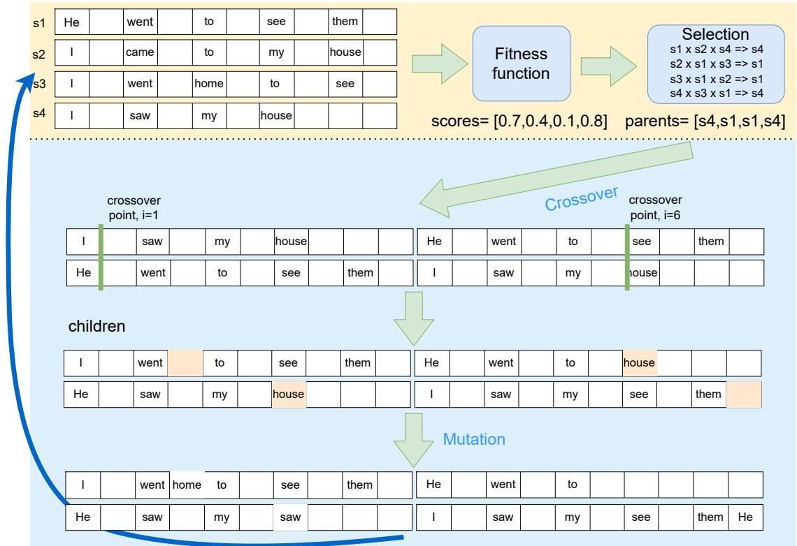
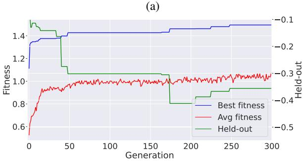
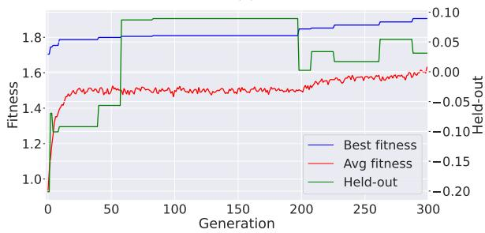

# Breeding Machine Translations: Evolutionary approach to survive and thrive in the world of automated evaluation

Josef Jon and Ondrej Bojarˇ

Charles University, Faculty of Mathematics and Physics Institute of Formal and Applied Linguistics {jon,bojar}@ufal.mff.cuni.cz

## Abstract

We propose a genetic algorithm (GA) based method for modifying n-best lists produced by a machine translation (MT) system. Our method offers an innovative approach to improving MT quality and identifying weaknesses in evaluation metrics. Using common GA operations (mutation and crossover) on a list of hypotheses in combination with a fitness function (an arbitrary MT metric), we obtain novel and diverse outputs with high metric scores. With a combination of multiple MT metrics as the fitness function, the proposed method leads to an increase in translation quality as measured by other held-out automatic metrics. With a single metric (including popular ones such as COMET) as the fitness function, we find blind spots and flaws in the metric. This allows for an automated search for adversarial examples in an arbitrary metric, without prior assumptions on the form of such example. As a demonstration of the method, we create datasets of adversarial examples and use them to show that reference-free COMET is substantially less robust than the reference-based version.

## 1 Introduction

Attaining good translation quality in machine translation (MT) arguably relies on good automatic metrics of MT quality. Recently, a new generation of evaluation metrics was introduced. These metrics are based on embeddings computed by large pretrained language models and human annotation scores. The improvements in metric quality resulted in renewed interest in metric-driven translation hypothesis selection methods, like Minimum Bayes Risk (MBR) decoding (Goel and Byrne, 2000; Kumar and Byrne, 2004).

Our method relies on MBR decoding and the genetic algorithm (GA; Fraser, 1957; Bremermann, 1958; Holland, 1975. Through combinations and mutations of translations produced by an MT model, we search for optimal translation under a selected metric. This is a novel approach to generating translation hypotheses in NMT.

We find that by combining neural and surface form-based metrics in a GA’s fitness function, it is possible to create better quality translations than by simple reranking of the initial hypotheses (as evaluated by held-out metrics). It also allows the combination of multiple sources for the translation, for example, MT, paraphrasing models and dictionaries.

Another use-case for our method is the identification of weak points in MT metrics. Flaws and biases of the novel neural metrics are being studied, for example, by Hanna and Bojar (2021), Amrhein and Sennrich (2022a), Alves et al. (2022) or Kanojia et al. (2021). In summary, these metrics have low sensitivity to errors in named entities and numbers. Also, they are not sufficiently sensitive to changes in meaning and critical errors, like negations.

These previous works on deficiencies of the metrics mostly focus on analyzing the outputs of MT systems and looking for certain types of mistakes. Another approach they use is changing the outputs to introduce specific types of mistakes. In contrast, our approach aims to find translations with high scores on certain metrics automatically, by optimizing the candidate translations for a selected metric. We believe that through this more explorative approach, it is possible to find unexpected types of defects.

In summary, the main contribution of our work is a novel method for producing translations, which can be used to improve translation quality and analyze automatic MT evaluation metrics.1

## 2 Related work

Automated MT evaluation The traditional automatic MT metrics are based on comparing a translation produced by an MT system to a human reference based on a string similarity. Popular choices are ChrF (Popovic´, 2015) and BLEU (Papineni et al., 2002). Multiple shortcomings of these metrics are well known (Callison-Burch et al., 2006; Bojar et al., 2010; Freitag et al., 2020; Mathur et al., 2020a; Zhang and Toral, 2019; Graham et al., 2020).

Neural MT metrics Novel, neural-based MT metrics were introduced recently. They address some of the deficiencies of the string-based methods, but possibly introduce new types of errors or blind spots: BERTScore (Zhang et al., 2020), BARTScore (Yuan et al., 2021), PRISM (Thompson and Post, 2020), BLEURT (Sellam et al., 2020), COMET (Rei et al., 2020, 2021, 2022), YiSi (Lo, 2019), RoBLEURT (Wan et al., 2021) or UniTE (Wan et al., 2022b).

Using a shared embedding space, these metrics better compare source, translated, and reference sentences. Their evaluation in WMT Metrics tasks (Mathur et al., 2020b; Freitag et al., 2021b, 2022) and other campaigns (Kocmi et al., 2021) demonstrate stronger agreement with human judgment.

While their system-level performance has been scrutinized, their segment-level performance remains less explored. Moghe et al. (2022) indicates these metrics are unreliable for assessing translation usefulness at segment level. However, we still try to optimize individual sentences for improved scores.

Deficiencies in metrics The closest work to ours is Amrhein and Sennrich (2022a). Authors use MBR decoding to find examples of high-scoring, but flawed translations in sampled model outputs. The conclusion is that the studied metrics are not sensitive to errors in numbers and in named entities (NE). Alves et al. (2022) automatically generate texts with various kinds of errors to test for sensitivity of MT metrics to such perturbations. Sun et al. (2020) claim that current MT quality estimation (QE) models do not address adequacy properly and Kanojia et al. (2021) further show that meaningchanging errors are hard to detect for QE.

Genetic algorithm Variations of the genetic algorithm and evolutionary approaches in general for very diverse optimization problems are being studied extensively for more than half a century (Fraser, 1957; Bremermann, 1958; Sastry et al., 2005).

Nevertheless, work on the utilization of the GA in machine translation is scarce. Echizen-ya et al. (1996) use GA for example-based MT. Zogheib (2011) present multi-word translation algorithm based on the GA. Ameur et al. (2016) employ GA in phrase-based MT decoding. In the context of neural machine translation, GA was used to optimize architecture and hyperparameters of the neural network (Ganapathy, 2020; Feng et al., 2021).

Minimum Bayes risk decoding Our implementation of the fitness function depends on Minimum Bayes Risk (MBR) decoding (Goel and Byrne, 2000; Kumar and Byrne, 2004). This selection method has regained popularity recently as new, neural-based MT metrics emerged (Amrhein and Sennrich, 2022b; Freitag et al., 2021a; Müller and Sennrich, 2021; Jon et al., 2022).

## 3 Proposed solution

Our approach depends on two methods: Minimum Bayes Risk decoding and genetic algorithm.

## 3.1 Genetic algorithm

We propose the use of a GA to find new translation hypotheses. GA is a heuristic search algorithm defined by a fitness function, operators for combination (crossover) and modification (mutation) of the candidate solutions, and a selection method.

Before running the GA algorithm, an initial population of a chosen number of candidate solutions is created. A single solution is called an individual, and it is encoded in a discrete way (often as a list) by its forming units, genes. The resulting representation of an individual is called a chromosome. All chromosomes have the same length to simplify the corssover operation, but we add placeholders for empty tokens to account for additions, as discussed later.

The algorithm itself consists of evaluating each solution in the population using the fitness function and stochastically choosing parent solutions for the new generation by the selection algorithm. Crossover is used on the chromosomes of the parents to create their offspring (children). The mutation is used on the children and they form a new generation of the same size. This is repeated for a given number of iterations (generations).

In our proposed method, the candidate solutions are translation hypotheses produced by an MT model. Genes are tokens and the mutation operation replaces, deletes, or adds a token in a chromosome. The eligible new tokens are chosen from a set of valid tokens. We discuss methods of construction of this set in Section 4.6.

To allow for variable lengths of the solutions and the add or delete operations, we add genes representing an empty string after each token gene, and all the candidates are also right-padded with the empty string genes. The final length of all the candidates is equal to the length of the longest candidate multiplied by a constant k. The empty string genes can be mutated to a non-empty gene, which is equivalent to inserting a new token into the candidate. Inversely, a non-empty string gene can be mutated to an empty string gene, which is equivalent to removing a token. Empty genes have no influence on the fitness score. Below we show the encoding of two translation hypotheses for k = 1.1:

sent1=['Genetic','','algorithm','','can','','be','','used', 'to','' ,'produce','','novel','','solutions', '']}

sent2=['Genetic', 'algorithm' 'creates', 'new', 'solutions', ']}

Fitness function Fitness functions are MT evaluation metrics, see Section 4. For some of the experiments, the fitness function is composed of multiple metrics. In that case, the scores are simply summed – we did not explore scaling them or using multi-objective GA (Murata et al., 1995; Surry et al., 1997; Gao et al., 2000; Deb et al., 2002).

Selection To select parents for the new generation, we use tournament selection with n = 3. For each individual in the population, two other individuals are randomly chosen and the one with the best value of the fitness function out of the three is selected as one of the parents for a new generation. Figure 1 illustrates this, including the fact that many individuals can be selected repeatedly through this process.

Crossover operation We iterate through the parents by pairs, each pair is crossed-over with probability c. A random index i in a chromosome is selected and two children are created, the first one inherits the part of chromosome up to i from the first parent and the part from i from the second parent and vice-versa for the second offspring. For parents p1 and p2 and children c1 and c2:

c1=p1[:i]+p2[i:]; c2=p2[:i]+p1[i:]

Mutation operation The children produced by the cross-over operation are mutated. Each gene (token) is mutated with a probability m. Mutation replaces the token (or empty string placeholder) with a randomly selected one from the set of all possible tokens. This set also includes empty string placeholder, which is equivalent to token deletion. The approaches to the construction of this set are described in Section 4.6. After the mutation phase, the new generation is ready and the next iteration of GA is performed. One iteration of the whole GA process is illustrated in Figure 1.

MT Metrics and Fitness vs. Evaluation Optimizing the word composition of a translation towards an arbitrary metric is subject to Goodhart’s law – once a metric is used as a goal to optimize towards, it ceases to be a good measure of final quality (Strathern, 1997). Thus, we cross-evaluate with held-out metrics not used for optimization (even though these metrics might still be linked with the optimization metrics by spurious correlations caused by similar metric design, model architecture, or training data). We search for adversarial examples for the specific metrics, i.e. translations scoring high in the objective metric, but low in heldout metrics. This can be used to create training sets of negative examples. We use ChrF, BLEU, wmt20- comet-da (Rei et al., 2020), wmt20-comet-qe-da-v2 as the objective metrics and wmt21-comet-mqm, eamt22-cometinho-da, BLEURT (Sellam et al., 2020) and UniTE (Wan et al., 2022a) as the heldout metrics.

## 3.2 MBR decoding

NMT models predict a probability distribution over translations for a given source sentence. A common method for selecting a final translation given this distribution is known as “maximum-a-posteriori" (MAP) decoding. Because of the computational complexity of exact MAP decoding, approximations such as beam search (Koehn et al., 2003) are used. Many limitations of MAP were described recently (Stahlberg and Byrne, 2019; Meister et al., 2020) and other approaches were proposed.

One of the alternatives is MBR decoding. It is a decision rule that selects the translation based on a value of a utility function (and thus minimizes expected loss, or risk) rather than model probability. MT metrics are often used as utility functions. In an ideal case, we have a distribution $p ( y | x )$ over all possible correct translations y of source sentence x available, which is not the case in real-world scenarios. Given the space of all possible target language sentences $\mathcal { H } ( x )$ and utility function , we search for the optimal translation $h ^ { * }$

  
Figure 1: One iteration of the GA algorithm for a population of 4 individuals. The steps with a yellow background are equivalent to simple reranking, the steps with blue background introduce the operations of the genetic algorithm.

$$
h ^ { * } = a r g m a x _ { h \in \mathcal { H } ( x ) } E _ { p ( y | x ) } [ \mathcal { U } ( y , h ) ]
$$

A fixed number of translation hypotheses produced by the MT model can be used as an approximation of the reference translations distribution p(y x) in practice. Still, the number of possible hypotheses (x) is infinite – it consists of all conceivable sentences in the target language. For this reason, the same set of translations as for references is also used as candidate hypotheses. This leads to an implementation where MBR decoding can be seen as consensus decoding – a translation that is the most similar to all the other translations in the set is selected. Some of the recent embedding-based metrics also take the source sentence into account. In that case, utility is defined as $\mathcal { U } ( x , y , h )$ . In such cases, the process is no longer equivalent to consensus decoding due to the influence of the source.

## 4 Experiments

This section describes our experimental setup and results. We compare reranking of n-best lists to the application of the GA on them.

## 4.1 Data

We trained Czech-English MT model on CzEng 2.0 (Kocmi et al., 2020), a mix of parallel data (61M) and Czech monolingual data back-translated into English (51M). For experiments with dictionaries, we use a commercial Czech-English dictionary. We use newstest-19 (Barrault et al., 2019) as the dev set and newstest-18 (Bojar et al., 2018) as the test set. Due to the high computational requirements of our approach, we only evaluate the first 150 sentences from the test set in all the experiments. We call this test set newstest-18-head150. We used a commercial lemmatizer.2 for lemmatization and word form expansion performed in some of the experiments, We tokenize the data into subwords with SentencePiece (Kudo and Richardson, 2018) and FactoredSegmenter.3

## 4.2 Model

We train transformer-big using Marian-NMT (Junczys-Dowmunt et al., 2018) with default hyperparameters.

## 4.3 Hardware

We ran all the experiments on a grid server with heterogeneous nodes, with Quadro RTX 5000, GeForce GTX 1080 Ti, RTX A4000, or GeForce

RTX 3090 GPUs. The running time depends on population size, number of generations, and fitness function. We leave the first two fixed, so the computational requirements are most influenced by the fitness function. For the most computationally intensive fitness (combination of wmt20-comet-da and wmt20-comet-qe-da-v2), optimizing 150 examples on RTX A4000 takes 5 days. We discuss the computational requirements in Section 9.

## 4.4 Metrics

We abbreviate some of the longer metrics’ names further in the text in order to save space.4

For BLEU and ChrF we use SacreBLEU (Post, 2018). We use β = 2 for ChrF in all the experiments (i.e. ChrF2). For COMET5, BLEURT6 and UniTE7 scores we use the original implementations. We use paired bootstrap resampling (Koehn, 2004) for significance testing.

## 4.5 GA parameters

We did not search for optimal values of GA parameters due to high computational costs. The initial population is formed by 20-best hypotheses obtained by beam search and 20 sampled ones, copied 50 times over to obtain a population size of 2000. We select parents for the new generation with tournament selection (n = 3) and then we combine them using a crossover rate c = 0.1. The mutation rate for the mutation of non-empty genes to different non-empty genes m is 1/l, where l is the chromosome length. For mutating empty to non-empty gene (word addition) or vice-versa (deletion), the rate is m/10. We run 300 generations of the GA.

## 4.6 Possible mutation sources

We consider three possible sources for the mutation tokens set, i.e. the set of tokens that can replace another token in the chromosome:

1) init – set of all the tokens from the initial population (only tokens that are present in initial hypotheses can be used for the optimization).

2) dict – we performed word-by-word dictionary translation of each the source sentence, resulting in a set of English tokens. The source sides of the dictionary and the source sentence are lemmatized for the search, and target token forms are expanded to cover all surface forms.

3) wordlist – all words from an English wordlist.8

## 4.7 Results

Reranking We translated newstest-18 by the baseline model using beam search with beam size 20. We also sampled another 20 translation hypotheses for each source sentence from the model. We rerank these lists by BLEU, ChrF and CMT20 metrics in two manners: either with knowledge of the true manual reference (i.e. oracle) or using MBR decoding. GA is not used in these experiments. There are two ways of using multiple references with BLEU: either compute single-reference scores for all the references separately and average them or use the multi-reference formula. We use the former.

The results are presented in Table 1. The confidence ranges are shown in Appendix C, Table 10. The 1st column shows the origin of the hypotheses.9 The 2nd column shows if the reference was used for reranking (Oracle), or the other hypotheses and MBR decoding were used instead (MBR). No reranking (-) means that the candidate with the highest model’s length-normalized log-prob is evaluated. The 3rd column indicates which metric was used for the reranking (the objective function). The remaining columns are the values of the evaluation metrics (computed with respect to the reference).

For most of the metrics, MBR-reranked hypotheses outperform the log-prob baseline, even though by a smaller margin than the referencereranked (oracle) ones. In some cases, optimizing with MBR towards one metric leads to a deterioration of scores in other metrics. The metrics most prone to this problem are QE, ChrF and BLEU. MBR rescoring with QE results in worse ChrF, BLEU and CMTH22 scores than the baseline, suggesting this metric is unsuitable for such application. CMT20 and especially the combination of CMT20+QE+BLEU are more robust, with the latter improving in all the metrics over the baseline. As shown further, both the negative and positive effects are more pronounced with GA. Reranking with knowledge of the reference is unsurprisingly performing better than MBR reranking. Here, we use it to show the upper bound of improvements attainable by reranking. In further experiments, reference-based GA is also used to analyze the objective metrics.

<table><tr><td>Source</td><td>Rerank</td><td>Metric</td><td>ChrF</td><td>BLEU</td><td>CMT20</td><td>CMT21</td><td>CMTH22</td><td>QE</td><td>BLEURT</td><td>UniTE</td></tr><tr><td>beam 5</td><td></td><td>log-prob</td><td>56.4</td><td>28.9</td><td>0.4995</td><td>0.0399</td><td>0.5025</td><td>0.2472</td><td>0.7066</td><td>0.3004</td></tr><tr><td rowspan="6">beam 20</td><td></td><td>log-prob</td><td>56.7</td><td>30.1</td><td>0.5007</td><td>0.0399</td><td>0.5017</td><td>0.2477</td><td>0.7078</td><td>0.3018</td></tr><tr><td></td><td>ChrF</td><td>64.1</td><td>40.3</td><td>0.6046</td><td>0.0423</td><td>0.6552</td><td>0.2592</td><td>0.7449</td><td>0.3953</td></tr><tr><td>Oracle</td><td>BLEU</td><td>63.0</td><td>41.1</td><td>0.5897</td><td>0.0419</td><td>0.6434</td><td>0.2573</td><td>0.7390</td><td>0.368</td></tr><tr><td rowspan="3"></td><td>CMT20</td><td>62.0</td><td>37.7</td><td>0.6903</td><td>0.0431</td><td>0.6875</td><td>0.2949</td><td>0.7551</td><td>0.4641</td></tr><tr><td>ChrF</td><td>57.1</td><td>30.4</td><td>0.5162</td><td>0.0399</td><td>0.5105</td><td>0.2514</td><td>0.7075</td><td>0.3056</td></tr><tr><td>BLEU</td><td>56.3</td><td>29.6</td><td>0.5102</td><td>0.0399</td><td>0.5104</td><td>0.2357</td><td>0.7079</td><td>0.2958</td></tr><tr><td rowspan="6">sampled 20</td><td></td><td>CMT20</td><td>56.8</td><td>30.6</td><td>0.5686</td><td>0.0404</td><td>0.5281</td><td>0.2818</td><td>0.7160</td><td>0.3313</td></tr><tr><td></td><td>log-prob</td><td>53.0</td><td>25.5</td><td>0.3557</td><td>0.0371</td><td>0.3878</td><td>0.1350</td><td>0.6661</td><td>0.1277</td></tr><tr><td>Oracle</td><td>ChrF BLEU</td><td>62.5</td><td>37.1</td><td>0.4848</td><td>0.0392</td><td>0.5346</td><td>0.1471</td><td>0.7007</td><td>0.2211</td></tr><tr><td rowspan="3"></td><td>CMT20</td><td>60.5 58.0</td><td>39.6 31.7</td><td>0.4143 0.6630</td><td>0.0382 0.0419</td><td>0.4806</td><td>0.1133 0.2526</td><td>0.6872 0.7336</td><td>0.1609</td></tr><tr><td></td><td></td><td></td><td></td><td></td><td>0.6313</td><td></td><td></td><td>0.4061</td></tr><tr><td>ChrF</td><td>55.4</td><td>28.2</td><td>0.4376</td><td>0.0386</td><td>0.4621</td><td>0.2017</td><td>0.6926</td><td>0.2274</td></tr><tr><td rowspan="8">beam 20 + sampled 20</td><td>MBR</td><td>BLEU CMT20</td><td>54.3 54.4</td><td>28.2 28.0</td><td>0.3998 0.5515</td><td>0.0381 0.0403</td><td>0.4493 0.5194</td><td>0.1713 0.2617</td><td>0.6855 0.7062</td><td>0.1892 0.2931</td></tr><tr><td>一</td><td>log-prob</td><td></td><td></td><td></td><td></td><td></td><td></td><td></td><td></td></tr><tr><td></td><td></td><td>56.6</td><td>30.1</td><td>0.5002</td><td>0.0399</td><td>0.5044</td><td>0.2436</td><td>0.7067</td><td>0.3001</td></tr><tr><td>Oracle</td><td>ChrF BLEU</td><td>65.4 63.7</td><td>41.9 43.2</td><td>0.5973 0.5507</td><td>0.0417 0.0410</td><td>0.6448 0.6100</td><td>0.2330 0.2205</td><td>0.7395 0.7286</td><td>0.3818 0.3236</td></tr><tr><td></td><td>CMT20</td><td>61.9</td><td>37.6</td><td>0.7154</td><td>0.0433</td><td>0.7017</td><td>0.2872</td><td>0.7561</td><td>0.477</td></tr><tr><td></td><td></td><td>56.9</td><td></td><td></td><td></td><td></td><td></td><td></td><td></td></tr><tr><td rowspan="5">MBR</td><td>ChrF BLEU</td><td>56.4</td><td>30.3</td><td>0.5192</td><td>0.0399</td><td>0.5112</td><td>0.2517</td><td>0.7092</td><td>0.3059</td></tr><tr><td></td><td>57.4</td><td>30.0</td><td>0.5047</td><td>0.0398</td><td>0.5100 0.5390</td><td>0.2403</td><td>0.7069 0.7193</td><td>0.2958</td></tr><tr><td>CMT20 QE</td><td></td><td>31.2</td><td>0.5853</td><td>0.0409</td><td></td><td>0.2930</td><td></td><td>0.3413</td></tr><tr><td></td><td>55.7</td><td>29.5</td><td>0.539</td><td>0.0412</td><td>0.4976</td><td>0.3841</td><td>0.7140</td><td>0.3274</td></tr><tr><td>CMT20+QE+BLEU</td><td>57.5</td><td>31.2</td><td>0.5983</td><td>0.0417</td><td>0.5596</td><td>0.3620</td><td>0.7255</td><td>0.3686</td></tr></table>

Table 1: Results of baseline translations and their reranking by multiple metrics on newstest-18-head150. Higher is better for all the metrics. The best scores for MBR-based reranking are shown in bold, the best scores for reference-based reranking are written in italics. We strike out the values where the same metric was used to rerank and also evaluate the outputs.

We also notice that while reranking beam search results leads to better final outcomes than reranking sampling results, a combination of both provides the best scores. All further experiments start with a population consisting of this combination of both.

Genetic algorithm We use the same metrics for GA fitness function as for reranking. Experiments were again conducted with either the knowledge of the reference or with MBR decoding. The results for GA with reference are presented in Table 2 (confidence ranges in Appendix C,S Table 11). The first two columns indicate the metric used as the fitness function and the source of the possible tokens for the mutation. The third column shows how many runs were averaged to obtain the mean scores shown in the remaining columns. The last column shows the ratio of the final selected hypotheses that were not in the initial pool produced by the MT model, but were created by GA operations.

We see that the GA can optimize towards an arbitrary metric better than simple MBR reranking. For example, the best ChrF score for GA is 87.1 compared to 65.4 for reranking. The results also suggest that the string-based metrics (ChrF and BLEU) are prone to overfitting – translations optimized for these metrics score poorly in other metrics. CMT20 is more robust – we see improvements over the baseline in all the metrics after optimization for CMT20.

Table 4 presents the results of the experiments aimed to improve the translation quality (confidence ranges for the scores are in Appendix C, Table 12). The reference is not provided and MBR decoding (always computed with regard to the initial population) is used instead. This way, it is feasible to use the approach to improve translations in a real-world scenario with no reference. We measure the improvement by held-out metrics.10 We consider UniTE to be the most trustworthy. It was created most recently and some of the flaws of the other metrics were already known and mitigated. It also correlates well with human evaluation (Freitag et al., 2022) and it is developed by a different team than the COMET metrics, which slightly decreases the chances for spurious correlations of the scores not based on translation quality.

<table><tr><td>Fitness</td><td>Mut</td><td>#runs</td><td>ChrF</td><td>BLEU</td><td>CMT20</td><td>CMT21</td><td>CMTH22</td><td>QE</td><td>BLEURT</td><td>UniTE</td><td>new</td></tr><tr><td></td><td></td><td>9</td><td>71.4</td><td>48.3</td><td>0.4144</td><td>0.0369</td><td>0.5493</td><td>0.0104</td><td>0.6853</td><td>0.2018</td><td>0.79</td></tr><tr><td>ChrF</td><td>init</td><td>9</td><td>84.9</td><td>60.0</td><td>0.0994</td><td>0.0308</td><td>0.3300</td><td>-0.2777</td><td>0.6266</td><td>-0.0617</td><td>0.92</td></tr><tr><td></td><td>init+dict</td><td>9</td><td>87.1</td><td>58.0</td><td>0.0813</td><td>0.0304</td><td>0.3171</td><td>-0.3004</td><td>0.6360</td><td>-0.0784</td><td>0.93</td></tr><tr><td></td><td>wordlist</td><td>1</td><td>83.2</td><td>48.5</td><td>-0.3729</td><td>0.0214</td><td>-0.2245</td><td>-0.4932</td><td>0.5525</td><td>-0.5097</td><td>0.93</td></tr><tr><td></td><td></td><td>9</td><td>68.0</td><td>50.8</td><td>0.4016</td><td>0.0374</td><td>0.5182</td><td>0.0299</td><td>0.6779</td><td>0.1698</td><td>0.76</td></tr><tr><td>BLEU</td><td>init</td><td>9</td><td>77.6</td><td>68.9</td><td>0.2693</td><td>0.0353</td><td>0.4747</td><td>-0.1663</td><td>0.6605</td><td>0.0636</td><td>0.92</td></tr><tr><td></td><td>init+dict</td><td>9</td><td>79.6</td><td>69.5</td><td>0.2691</td><td>0.0350</td><td>0.4865</td><td>-0.1866</td><td>0.6631</td><td>0.0627</td><td>0.93</td></tr><tr><td></td><td>wordlist</td><td>1</td><td>68.3</td><td>54</td><td>-0.0306</td><td>0.0292</td><td>0.1243</td><td>-0.3014</td><td>0.5727</td><td>-0.2492</td><td>0.91</td></tr><tr><td></td><td></td><td>1</td><td>64.6</td><td>40.4</td><td>0.7724</td><td>0.0441</td><td>0.7593</td><td>0.2981</td><td>0.7619</td><td>0.5141</td><td>0.67</td></tr><tr><td>CMT20</td><td>init</td><td>1</td><td>70.1</td><td>49.2</td><td>0.8874</td><td>0.0462</td><td>0.868</td><td>0.2476</td><td>0.7763</td><td>0.5824</td><td>0.91</td></tr><tr><td></td><td>init+dict</td><td>6</td><td>69.2</td><td>46.3</td><td>0.8974</td><td>0.0467</td><td>0.8897</td><td>0.2598</td><td>0.7790</td><td>0.5876</td><td>0.92</td></tr><tr><td></td><td>wordlist</td><td>1</td><td>64.5</td><td>41.1</td><td>0.8371</td><td>0.0446</td><td>0.736</td><td>0.2656</td><td>0.7453</td><td>0.4743</td><td>0.87</td></tr></table>

Table 2: Scores of translations on newstest-18-head150 created by GA with the knowledge of the reference for the fitness function. Higher is better for all the metrics. Striked-out scores indicate results where fitness and evaluation metric coincide.

The metrics that only compare the translation with a reference (BLEU, ChrF) without access to the source sentence do not perform well as a fitness function. Since MBR decoding in such cases works as a consensus decoding, i.e. the most similar candidate to all the others has the best fitness, there is no evolutionary pressure to modify the individuals.

Optimizing for QE or ChrF results in a large decline in scores for other metrics. These metrics are prone to scoring malformed, nonsensical or unrelated sentences well. This is analyzed in Section 5. The sum of QE, CMT20 and BLEU as the fitness function reaches the best score in UniTE and does not show significant degradation in other metrics.

The ratio of examples where held-out scores improve, decrease or do not change after GA is shown in Table 3. We compare the scores both to log-prob selected hypotheses and MBR reranked ones. We again see that the combination of CMT20+QE+BLEU performs best. GA with the individual metrics as the fitness function leads more often to a decrease than an increase of heldout metrics compared to reranking. This suggests the effect of GA on the translation quality is negative if the fitness function is not chosen well.

## 5 Analysis

In this section, we analyze the GA procedure and the behavior of evaluation metrics.

## 5.1 GA process

Fitness vs. held-out metric We analyzed the behavior of the average fitness function over the whole population, best solution fitness, and heldout metric score during the GA process using CMT20+QE+BLEU as the fitness and UniTE as the held-out metric (Figure 2). Results show GA consistently improved fitness values from initial solutions and increased average fitness. However, the correlation between fitness and held-out metrics varied: Example a) shows a decrease in final heldout score despite improved fitness, while Example b) shows aligned increases in both scores. Table 3 suggests case b) is more typical in our test set.

<table><tr><td>Fitness</td><td>+</td><td></td><td>=</td></tr><tr><td>BLEU</td><td>22%/1%</td><td>29%/7%</td><td>49%/92%</td></tr><tr><td>CHRF</td><td>13%/1%</td><td>69%/65%</td><td>18%/33%</td></tr><tr><td>CMT20</td><td>54%/23%</td><td>39%/32%</td><td>7%/45%</td></tr><tr><td>CMT20+QE+BLEU</td><td>62%/43%</td><td>35%/35%</td><td>3%/23%</td></tr></table>

Table 3: Percentage of examples from newstest-18-head150 where the held-out score (UniTE) improves (2nd column), degrades (3rd column), or doesn’t change (4th column) for GA compared to log-prob selection/MBR reranking. The first column shows which metric was used as the fitness function. Bold results are the ones where held-out scores improve for more examples rather than where they deteriorate.

## 5.2 Search for adversarial examples

As a radically different goal, we use GA to search for examples that score high in the fitness function but are evaluated poorly by held-out metrics. This allows us to find blind spots in specific metrics without previous assumptions about the type of errors that could be ignored by the given metric. Such adversarial examples are defined as follows: for each test set example e, we compute the scores of the hypotheses produced by the MT model using both the optimization metric O and the held-out metric H. We rank the hypotheses by O. The scores of the best hypothesis are referred to as $O ( e ) _ { i n i t }$ and $H ( e ) _ { i n i t }$ . We then use a GA to optimize the hypotheses towards O. We consider the final translation as adversarial for a given metric if its score

<table><tr><td>Fitness</td><td>Mut</td><td>#runs</td><td>ChrF</td><td>BLEU</td><td>CMT20</td><td>CMT21</td><td>CMTH22</td><td>QE</td><td>BLEURT</td><td>UniTE</td><td>new</td></tr><tr><td>baseline</td><td>-</td><td></td><td>56.6</td><td>30.1</td><td>0.5002</td><td>0.0399</td><td>0.5044</td><td>0.2436</td><td>0.7067</td><td>0.3001</td><td>0.00</td></tr><tr><td>best rerank</td><td>-</td><td>-</td><td>57.5</td><td>31.2</td><td>0.5983</td><td>0.0417</td><td>0.5596</td><td>0.3620</td><td>0.7255</td><td>0.3686</td><td>0.00</td></tr><tr><td rowspan="5">ChrF</td><td></td><td>7</td><td>57.2</td><td>30.0</td><td>0.4769</td><td>0.0387</td><td>0.4877</td><td>0.2140</td><td>0.6963</td><td>0.2549</td><td>0.26</td></tr><tr><td>init</td><td>5</td><td>57.9</td><td>27.1</td><td>0.2197</td><td>0.0336</td><td>0.2717</td><td>0.0047</td><td>0.5979</td><td>0.0211</td><td>0.73</td></tr><tr><td>init+dict</td><td>5</td><td>57.9</td><td>27.8</td><td>0.2529</td><td>0.0342</td><td>0.2952</td><td>0.0198</td><td>0.6095</td><td>0.0439</td><td>0.68</td></tr><tr><td>wordlist</td><td>1</td><td>57.5</td><td>29.4</td><td>0.3614</td><td>0.0365</td><td>0.3949</td><td>0.1343</td><td>0.6558</td><td>0.1214</td><td>0.45</td></tr><tr><td></td><td>9</td><td>56.4</td><td>30.0</td><td>0.4997</td><td>0.0397</td><td>0.5066</td><td>0.2366</td><td>0.7059</td><td>0.2901</td><td>0.04</td></tr><tr><td rowspan="4">BLEU</td><td>init</td><td>7</td><td>56.4</td><td>29.9</td><td>0.5004</td><td>0.0396</td><td>0.5071</td><td>0.2322</td><td>0.7039</td><td>0.2850</td><td>0.09</td></tr><tr><td>init+dict</td><td>6</td><td>56.3</td><td>29.8</td><td>0.5001</td><td>0.0396</td><td>0.5068</td><td>0.2320</td><td>0.7039</td><td>0.2847</td><td>0.08</td></tr><tr><td>wordlist</td><td>1</td><td>56.3</td><td>29.8</td><td>0.4986</td><td>0.0396</td><td>0.5052</td><td>0.2332</td><td>0.7042</td><td>0.2853</td><td>0.07</td></tr><tr><td></td><td>1</td><td>57.6</td><td>31.7</td><td>0.5988</td><td>0.0410</td><td>0.5385</td><td>0.2939</td><td>0.7192</td><td>0.3446</td><td>0.24</td></tr><tr><td rowspan="4">CMT20</td><td>init</td><td>1</td><td>56.2</td><td>28.4</td><td>0.6247</td><td>0.0410</td><td>0.5382</td><td>0.2893</td><td>0.7177</td><td>0.3366</td><td>0.52</td></tr><tr><td>init+dict</td><td>5</td><td>56.7</td><td>29.4</td><td>0.6188</td><td>0.0411</td><td>0.5412</td><td>0.2880</td><td>0.7124</td><td>0.3362</td><td>0.49</td></tr><tr><td>wordlist</td><td>1</td><td>57.3</td><td>31.1</td><td>0.6012</td><td>0.041</td><td>0.5288</td><td>0.2907</td><td>0.7162</td><td>0.3385</td><td>0.28</td></tr><tr><td>init+dict</td><td>1</td><td>45.5</td><td>13.2</td><td>0.3353</td><td>0.0398</td><td>0.1836</td><td>0.5554</td><td>0.6018</td><td>0.0324</td><td>0.99</td></tr><tr><td rowspan="2">QE</td><td>wordlist</td><td>1</td><td>46.0</td><td>16.7</td><td>0.1207</td><td>0.0368</td><td>-0.0643</td><td>0.5514</td><td>0.5349</td><td>-0.3264</td><td>0.99</td></tr><tr><td>init</td><td>4</td><td>55.0</td><td>24.3</td><td>0.6387</td><td>0.0431</td><td>0.5066</td><td>0.4778</td><td>0.6963</td><td>0.3444</td><td>0.86</td></tr><tr><td rowspan="2"></td><td>init+dict</td><td>5</td><td>54.5</td><td>24.4</td><td>0.6321</td><td>0.0430</td><td>0.5038</td><td>0.4797</td><td>0.6973</td><td>0.3477</td><td>0.85</td></tr><tr><td></td><td></td><td></td><td></td><td></td><td></td><td></td><td></td><td></td><td></td><td></td></tr><tr><td>QE+CMT20+BLEU</td><td>init init+dict</td><td>1 3</td><td>57.5 57.4</td><td>29.5 29.9</td><td>0.6266 0.6254</td><td>0.0429 0.0429</td><td>0.5403 0.5403</td><td>0.4198 0.4180</td><td>0.7174 0.7169</td><td>0.3946 0.3916</td><td>0.70 0.65</td></tr></table>

Table 4: Scores of translations on newstest-18-head150 created by GA without knowledge of the reference in the fitness function, using other hypotheses and MBR decoding instead. For better comparison we reiterate the baseline and best MBR reranking results (equivalent to GA with a single generation) in the first two rows. Higher is better for all the metrics. The best scores for MBR-based GA are shown in bold, for reference-based reranking in italics. Results where fitness and evaluation metrics coincide are striked out.

<table><tr><td>O</td><td></td><td> $O _ { i n i t } + m _ { o } < O _ { g a } \qquad . . . \land H _ { i n i t } > H _ { g a } + m _ { h }$ </td></tr><tr><td>CMT20</td><td>128 (85%)</td><td>57 (38%)</td></tr><tr><td>QE</td><td>148 (99%)</td><td>142 (95%)</td></tr><tr><td>BLEU</td><td>150 (100%)</td><td>113 (75%)</td></tr></table>

Table 5: Number of examples from newstest-18-head150 which improved in optimization metric after GA (2nd column) and at the same time deteriorated in held-out metric (3rd column)

$O ( e ) _ { g a }$ improves by at least a margin $m _ { o }$ over the initial $O ( e ) _ { i n i t }$ and at the same time $H ( e ) _ { g a }$ decreases by at least $m _ { h }$ compared to the $H ( e ) _ { i n i t }$ In other words, e is adversarial if:

$$
O ( e ) _ { i n i t } + m _ { o } < O ( e ) _ { g a } \land H ( e ) _ { i n i t } > H ( e ) _ { g a } + m _ { h }
$$

In search of adversarial examples, it is beneficial to explore a large space of hypotheses. Thus, we use all words from the wordlist for mutations.

Since the goal is to optimize the output towards a given metric to find its flaws, not to improve translation in a real-world scenario, we can assume we have the reference translations at hand and we can use them to compute the fitness scores.

We demonstrate the approach on two optimization metrics (CMT20 and QE) and one held-out metric (UniTE). We set $m _ { h } = m _ { o } = 1 0 ^ { - 3 }$ . We present the results on newstest-18-head150 in Table 5. The first column shows which optimization metric was used and the second column shows the number of examples for which the final optimization score improved upon the initial best score. The last column shows how many of the improved examples had decreased scores for the held-out metric. We show examples in Appendix A.

We observed QE is less robust than CMT20. Completely unrelated sentences are scored better than an adequate translation. Upon an inspection of the examples, we see that the QE metric prefers adding spurious adjectives and named entities (NEs). This could be caused by a length bias, or by a preference for more specific utterances. QE scores very unusual words highly and it scores punctuation low. For instance, Sentence 4 from Appendix A, Table 6 has a correct initial translation “Model was killed by chef.". After optimizing for QE, the translation becomes “Model Kiranti Tarkio killed by molluscan stalkier".

Changing or adding NEs can be observed also for CMT20 (Sentences 2, 5 and 8 in Appendix A,Table 7), although in a much smaller extent. This shows that even though QE and CMT20 correlate similarly with human evaluation on wellformed translations (Rei et al., 2021), QE is more prone to scoring nonsensical translations higher than adequate ones. This observation is also supported by the decline of other metrics when optimizing QE in Table 4.

In another experiment with QE we tried to construct a completely unrelated translation, conveying a malicious message, which would score better than the original MT output by the QE metric. We present these examples in Appendix B.

(b)  
  
Figure 2: Behavior of best and population average fitness, compared to held-out metric score H of the best solution during a run of GA for two selected examples. H (UniTE) does not correlate well with the fitness metric (CMT20+QE+BLEU) and the GA is detrimental from the point of view of the H in Example a). In Example b), H behaves similarly to the fitness function.

## 6 Discussion

We agree that an argument could be made that our approach is very computationally expensive, too explorative and the search for weaknesses could be performed in a more principled way. However, by anticipating the types of errors the metrics ignore and by designing the procedure to create texts with such errors, some of the error types can remain unnoticed. We see analogies with the whole field of deep learning. The methods with more priors of what the outcome should look like and how an inductive bias should be represented in a model give way to more general architectures as systems are scaled both in parameters and training data size, in the spirit of Richard Sutton’s Bitter Lesson.11

Since the architectures of systems that produce evaluation scores are based mostly on empiric results, rather than on solid theoretical approaches, we believe that similar empirical, almost bruteforce methods, might be an effective tool to search for weaknesses of these systems.

## 7 Conclusions

We present a method of using a GA to find new translations based on optimizing hypotheses from an n-best list produced by an MT model. Our method optimizes well towards an arbitrary MT metric through modification of the candidate translations. We found that after optimizing for a single objective metric, scores on other metrics often decrease, due to over-fitting on the objective metrics defects. We discover that by combining multiple metrics (both neural and string-based) in the fitness (objective) function, we are able to mitigate the over-fitting and improve or maintain the held-out metrics for most inputs. This suggests GA can be used to improve MT quality.

MT evaluation metrics have specific flaws and blind spots. To test their robustness, we selected some of the metrics as the fitness functions to optimize towards, and others as held-out metrics. We have leveraged the over-fitting effect to search for adversarial examples for specific metrics, creating translations that score high in one metric and low in held-out metrics. Such translations can be used as negative examples for improving the robustness of the neural metrics.

This work also reveals that even though source-translation and source-translation-reference COMET scores were shown to have a similar correlation with human scores for well-formed translations, the reference-free COMET is more susceptible to adversarial inputs.This highlights the necessity of thorough analysis, beyond computing correlation with human scores for the new metrics.

## 8 Acknowledgements

This work was partially supported by GACR EX-ˇ PRO grant NEUREM3 (19-26934X) and by the Grant Agency of Charles University in Prague (GAUK 244523). We used the data and computing resources provided by the Ministry of Education, Youth and Sports of the Czech Republic, Project No. LM2018101 LINDAT/CLARIAH-CZ. We would also like to thank Dominik Machácek ˇ and Dávid Javorský for proofreading the text of the paper.

## 9 Limitations

Due to the high computational costs of the method, we tested it only on a very small set of sentences and larger-scale experiments are needed to confirm the results.

Many parameters of the GA algorithm were left unexplored – the results could be improved by grid search over the values for mutation and crossover ratios, using a better list of mutation candidates (for example based on k-NN search), experimenting with different selection methods, combining more metrics in the fitness function or using multiobjective GA like NSGA-II (Deb et al., 2002).

In the experiments concerning held-out metrics, we assumed weaknesses of the held-out metrics are not correlated to the weaknesses of the optimization metrics, which is probably not true, due to similar model architectures and training datasets. This means that held-out metrics are not strictly independent, but we believe combining multiple different held-out metrics should mitigate this issue.

## 10 Ethics

In some settings, automated MT evaluation metrics are used to decide whether the MT output should be presented to the client, or further processed by a human post editor. We present a method that uses genetic algorithms to create adversarial examples for MT evaluation metrics. The potential use of such adversarial examples raises ethical concerns, particularly in the context of machine translation applications that impact human lives, such as in medical, legal, financial or immigration contexts. We acknowledge that our work raises ethical questions regarding the potential misuse of adversarial examples. For instance, adversarial examples could be used to deceive or manipulate users by providing machine translations that are misleading or incorrect. Moreover, they could be used to create biased translations that reflect certain views or opinions. We believe that it is important to address these ethical concerns and to ensure that our work is not used for unethical purposes. As such, we recommend further research into the development of defense mechanisms against adversarial examples and into the identification of ethical and legal frameworks that can guide the use and development of adversarial examples for MT evaluation metrics. We also suggest that future work includes an explicit discussion of ethical implications and considerations in the context of adversarial examples for MT evaluation metrics. Metrics are sometimes used to verify translations to be shown to the client. Our work can be used to generate adversarial examples.

## References

Duarte Alves, Ricardo Rei, Ana C Farinha, José G. C. de Souza, and André F. T. Martins. 2022. Robust mt evaluation with sentence-level multilingual augmentation. In Proceedings ofthe Seventh Conference on Machine Translation, pages 469–478, Abu Dhabi. Association for Computational Linguistics.

Douib Ameur, Langlois David, and Smaïli Kamel. 2016. Genetic-based decoder for statistical machine translation. In International Conference on Intelligent Text Processing and Computational Linguistics, pages 101–114. Springer.

Chantal Amrhein and Rico Sennrich. 2022a. Identifying weaknesses in machine translation metrics through minimum Bayes risk decoding: A case study for COMET. In Proceedings of the 2nd Conference of the Asia-Pacific Chapter of the Association for Computational Linguistics and the 12th International Joint Conference on Natural Language Processing (Volume 1: Long Papers), pages 1125–1141, Online only. Association for Computational Linguistics.

Chantal Amrhein and Rico Sennrich. 2022b. Identifying weaknesses in machine translation metrics through minimum bayes risk decoding: A case study for comet.

Loïc Barrault, Ondˇrej Bojar, Marta R. Costa-jussà, Christian Federmann, Mark Fishel, Yvette Graham, Barry Haddow, Matthias Huck, Philipp Koehn, Shervin Malmasi, Christof Monz, Mathias Müller, Santanu Pal, Matt Post, and Marcos Zampieri. 2019. Findings of the 2019 conference on machine translation (WMT19). In Proceedings ofthe Fourth Conference on Machine Translation (Volume 2: Shared Task Papers, Day 1), pages 1–61, Florence, Italy. Association for Computational Linguistics.

Ondˇrej Bojar, Christian Federmann, Mark Fishel, Yvette Graham, Barry Haddow, Matthias Huck, Philipp Koehn, and Christof Monz. 2018. Findings of the 2018 conference on machine translation (WMT18). In Proceedings ofthe Third Conference on Machine Translation: Shared Task Papers, pages 272–303, Belgium, Brussels. Association for Computational Linguistics.

Ondˇrej Bojar, Kamil Kos, and David Marecek. 2010.ˇ Tackling sparse data issue in machine translation evaluation. In Proceedings ofthe ACL 2010 Conference Short Papers, pages 86–91, Uppsala, Sweden. Association for Computational Linguistics.

Hans J Bremermann. 1958. The evolution of intelligence: The nervous system as a model of its envi-

ronment. University of Washington, Department of Mathematics.

Chris Callison-Burch, Miles Osborne, and Philipp Koehn. 2006. Re-evaluating the role of Bleu in machine translation research. In 11th Conference of the European Chapter of the Association for Computational Linguistics, pages 249–256, Trento, Italy. Association for Computational Linguistics.

Kalyanmoy Deb, Amrit Pratap, Sameer Agarwal, and TAMT Meyarivan. 2002. A fast and elitist multiobjective genetic algorithm: Nsga-ii. IEEE transactions on evolutionary computation, 6(2):182–197.

Hiroshi Echizen-ya, Kenji Araki, Yoshio Momouchi, and Koji Tochinai. 1996. Machine translation method using inductive learning with genetic algorithms. In COLING 1996 Volume 2: The 16th International Conference on Computational Linguistics.

Ben Feng, Dayiheng Liu, and Yanan Sun. 2021. Evolving transformer architecture for neural machine translation. In Proceedings ofthe Genetic and Evolutionary Computation Conference Companion, GECCO ’21, page 273–274, New York, NY, USA. Association for Computing Machinery.

Alex S Fraser. 1957. Simulation of genetic systems by automatic digital computers ii. effects of linkage on rates of advance under selection. Australian Journal ofBiological Sciences, 10(4):492–500.

Markus Freitag, David Grangier, and Isaac Caswell. 2020. BLEU might be guilty but references are not innocent. In Proceedings of the 2020 Conference on Empirical Methods in Natural Language Processing (EMNLP), pages 61–71, Online. Association for Computational Linguistics.

Markus Freitag, David Grangier, Qijun Tan, and Bowen Liang. 2021a. Minimum bayes risk decoding with neural metrics of translation quality.

Markus Freitag, Ricardo Rei, Nitika Mathur, Chi-kiu Lo, Craig Stewart, Eleftherios Avramidis, Tom Kocmi, George Foster, Alon Lavie, and André F. T. Martins. 2022. Results of wmt22 metrics shared task: Stop using bleu âC“ neural metrics are better and more robust. In Proceedings of the Seventh Conference on Machine Translation, pages 46–68, Abu Dhabi. Association for Computational Linguistics.

Markus Freitag, Ricardo Rei, Nitika Mathur, Chi-kiu Lo, Craig Stewart, George Foster, Alon Lavie, and Ondˇrej Bojar. 2021b. Results of the WMT21 metrics shared task: Evaluating metrics with expert-based human evaluations on TED and news domain. In Proceed ings ofthe Sixth Conference on Machine Translation, pages 733–774, Online. Association for Computational Linguistics.

Keshav Ganapathy. 2020. A study of genetic algorithms for hyperparameter optimization of neural networks in machine translation. CoRR, abs/2009.08928.

Ying Gao, Lei Shi, and Pingjing Yao. 2000. Study on multi-objective genetic algorithm. In Proceedings of the 3rd World Congress on Intelligent Control and Automation (Cat. No. 00EX393), volume 1, pages 646–650. IEEE.

Vaibhava Goel and William J Byrne. 2000. Minimum bayes-risk automatic speech recognition. Computer Speech & Language, 14(2):115–135.

Yvette Graham, Barry Haddow, and Philipp Koehn. 2020. Statistical power and translationese in machine translation evaluation. In Proceedings of the 2020 Conference on Empirical Methods in Natural Language Processing (EMNLP), pages 72–81, Online. Association for Computational Linguistics.

Michael Hanna and Ondˇrej Bojar. 2021. A fine-grained analysis of BERTScore. In Proceedings of the Sixth Conference on Machine Translation, pages 507–517, Online. Association for Computational Linguistics.

John H. Holland. 1975. Adaptation in Natural and Artificial Systems. University of Michigan Press, Ann Arbor, MI. Second edition, 1992.

Josef Jon, Martin Popel, and OndÅ™ej Bojar. 2022. Cuni-bergamot submission at wmt22 general translation task. In Proceedings ofthe Seventh Conference on Machine Translation, pages 280–289, Abu Dhabi. Association for Computational Linguistics.

Marcin Junczys-Dowmunt, Roman Grundkiewicz, Tomasz Dwojak, Hieu Hoang, Kenneth Heafield, Tom Neckermann, Frank Seide, Ulrich Germann, Alham Fikri Aji, Nikolay Bogoychev, André F. T. Martins, and Alexandra Birch. 2018. Marian: Fast neural machine translation in C++. In Proceedings of ACL 2018, System Demonstrations, pages 116–121, Melbourne, Australia. Association for Computational Linguistics.

Diptesh Kanojia, Marina Fomicheva, Tharindu Ranasinghe, Frédéric Blain, Constantin Orasan, and Lucia˘ Specia. 2021. Pushing the right buttons: Adversarial evaluation of quality estimation. In Proceedings of the Sixth Conference on Machine Translation, pages 625–638, Online. Association for Computational Linguistics.

Tom Kocmi, Christian Federmann, Roman Grundkiewicz, Marcin Junczys-Dowmunt, Hitokazu Matsushita, and Arul Menezes. 2021. To ship or not to ship: An extensive evaluation of automatic metrics for machine translation. In Proceedings ofthe Sixth Conference on Machine Translation, pages 478–494, Online. Association for Computational Linguistics.

Tom Kocmi, Martin Popel, and Ondrej Bojar. 2020. Announcing czeng 2.0 parallel corpus with over 2 gigawords. arXiv preprint arXiv:2007.03006.

Philipp Koehn. 2004. Statistical significance tests for machine translation evaluation. In Proceedings of the 2004 Conference on Empirical Methods in Natural Language Processing, pages 388–395, Barcelona, Spain. Association for Computational Linguistics.

Philipp Koehn and Rebecca Knowles. 2017. Six challenges for neural machine translation. In Proceedings ofthe First Workshop on Neural Machine Translation, pages 28–39, Vancouver. Association for Computational Linguistics.

Philipp Koehn, Franz J. Och, and Daniel Marcu. 2003. Statistical phrase-based translation. In Proceedings of the 2003 Human Language Technology Conference of the North American Chapter of the Association for Computational Linguistics, pages 127–133.

Taku Kudo and John Richardson. 2018. SentencePiece: A simple and language independent subword tokenizer and detokenizer for neural text processing. In Proceedings of the 2018 Conference on Empirical Methods in Natural Language Processing: System Demonstrations, pages 66–71, Brussels, Belgium. Association for Computational Linguistics.

Shankar Kumar and William Byrne. 2004. Minimum Bayes-risk decoding for statistical machine translation. In Proceedings ofthe Human Language Technology Conference ofthe North American Chapter of the Association for Computational Linguistics: HLT-NAACL 2004, pages 169–176, Boston, Massachusetts, USA. Association for Computational Linguistics.

Chi-kiu Lo. 2019. YiSi - a unified semantic MT quality evaluation and estimation metric for languages with different levels of available resources. In Proceedings of the Fourth Conference on Machine Translation (Volume 2: Shared Task Papers, Day 1), pages 507–513, Florence, Italy. Association for Computational Linguistics.

Nitika Mathur, Timothy Baldwin, and Trevor Cohn. 2020a. Tangled up in BLEU: Reevaluating the evaluation of automatic machine translation evaluation metrics. In Proceedings of the 58th Annual Meeting of the Association for Computational Linguistics, pages 4984–4997, Online. Association for Computational Linguistics.

Nitika Mathur, Johnny Wei, Markus Freitag, Qingsong Ma, and Ondˇrej Bojar. 2020b. Results of the WMT20 metrics shared task. In Proceedings of the Fifth Conference on Machine Translation, pages 688–725, Online. Association for Computational Linguistics.

Clara Meister, Ryan Cotterell, and Tim Vieira. 2020. If beam search is the answer, what was the question? In Proceedings of the 2020 Conference on Empirical Methods in Natural Language Processing (EMNLP), pages 2173–2185, Online. Association for Computational Linguistics.

Nikita Moghe, Tom Sherborne, Mark Steedman, and Alexandra Birch. 2022. Extrinsic evaluation of machine translation metrics.

Mathias Müller and Rico Sennrich. 2021. Understanding the properties of minimum Bayes risk decoding in neural machine translation. In Proceedings ofthe

59th Annual Meeting ofthe Associationfor Computational Linguistics and the 11th International Joint Conference on Natural Language Processing (Volume 1: Long Papers), pages 259–272, Online. Association for Computational Linguistics.

Tadahiko Murata, Hisao Ishibuchi, et al. 1995. Moga: multi-objective genetic algorithms. In IEEE international conference on evolutionary computation, volume 1, pages 289–294. IEEE Piscataway, NJ, USA.

Kishore Papineni, Salim Roukos, Todd Ward, and Wei-Jing Zhu. 2002. Bleu: a method for automatic evaluation of machine translation. In Proceedings ofthe 40th Annual Meeting of the Association for Computational Linguistics, pages 311–318, Philadelphia, Pennsylvania, USA. Association for Computational Linguistics.

Maja Popovic. 2015.´ chrF: character n-gram F-score for automatic MT evaluation. In Proceedings of the Tenth Workshop on Statistical Machine Translation, pages 392–395, Lisbon, Portugal. Association for Computational Linguistics.

Matt Post. 2018. A call for clarity in reporting BLEU scores. In Proceedings of the Third Conference on Machine Translation: Research Papers, pages 186– 191, Brussels, Belgium. Association for Computational Linguistics.

Ricardo Rei, Ana C Farinha, José G.C. de Souza, Pedro G. Ramos, André F.T. Martins, Luisa Coheur, and Alon Lavie. 2022. Searching for COMETINHO: The little metric that could. In Proceedings of the 23rd Annual Conference ofthe European Associationfor Machine Translation, pages 61–70, Ghent, Belgium. European Association for Machine Translation.

Ricardo Rei, Ana C Farinha, Chrysoula Zerva, Daan van Stigt, Craig Stewart, Pedro Ramos, Taisiya Glushkova, André F. T. Martins, and Alon Lavie. 2021. Are references really needed? unbabel-IST 2021 submission for the metrics shared task. In Proceedings of the Sixth Conference on Machine Translation, pages 1030–1040, Online. Association for Computational Linguistics.

Ricardo Rei, Craig Stewart, Ana C Farinha, and Alon Lavie. 2020. COMET: A neural framework for MT evaluation. In Proceedings ofthe 2020 Conference on Empirical Methods in Natural Language Processing (EMNLP), pages 2685–2702, Online. Association for Computational Linguistics.

Kumara Sastry, David Goldberg, and Graham Kendall. 2005. Genetic algorithms. In Search methodologies, pages 97–125. Springer.

Thibault Sellam, Dipanjan Das, and Ankur Parikh. 2020. BLEURT: Learning robust metrics for text generation. In Proceedings of the 58th Annual Meeting of the Association for Computational Linguistics, pages 7881–7892, Online. Association for Computational Linguistics.

Felix Stahlberg and Bill Byrne. 2019. On NMT search errors and model errors: Cat got your tongue? In Proceedings of the 2019 Conference on Empirical Methods in Natural Language Processing and the 9th International Joint Conference on Natural Language Processing (EMNLP-IJCNLP), pages 3356– 3362, Hong Kong, China. Association for Computational Linguistics.

Marilyn Strathern. 1997. ‘improving ratings’: audit in the british university system. European Review, 5(3):305–321.

Shuo Sun, Francisco Guzmán, and Lucia Specia. 2020. Are we estimating or guesstimating translation quality? In Proceedings of the 58th Annual Meeting of the Association for Computational Linguistics, pages 6262–6267, Online. Association for Computational Linguistics.

Patrick D Surry, Nicholas J Radcliffe, et al. 1997. The comoga method: constrained optimisation by multiobjective genetic algorithms. Control and Cybernetics, 26:391–412.

Brian Thompson and Matt Post. 2020. Automatic machine translation evaluation in many languages via zero-shot paraphrasing. In Proceedings ofthe 2020 Conference on Empirical Methods in Natural Language Processing (EMNLP), pages 90–121, Online. Association for Computational Linguistics.

Yu Wan, Dayiheng Liu, Baosong Yang, Tianchi Bi, Haibo Zhang, Boxing Chen, Weihua Luo, Derek F. Wong, and Lidia S. Chao. 2021. RoBLEURT submission for WMT2021 metrics task. In Proceedings of the Sixth Conference on Machine Translation, pages 1053–1058, Online. Association for Computational Linguistics.

Yu Wan, Dayiheng Liu, Baosong Yang, Haibo Zhang, Boxing Chen, Derek Wong, and Lidia Chao. 2022a. UniTE: Unified translation evaluation. In Proceedings ofthe 60th Annual Meeting ofthe Association for Computational Linguistics (Volume 1: Long Papers), pages 8117–8127, Dublin, Ireland. Association for Computational Linguistics.

Yu Wan, Dayiheng Liu, Baosong Yang, Haibo Zhang, Boxing Chen, Derek F. Wong, and Lidia S. Chao. 2022b. UniTE: Unified Translation Evaluation. In Annual Meeting of the Association for Computational Linguistics (ACL).

Weizhe Yuan, Graham Neubig, and Pengfei Liu. 2021. Bartscore: Evaluating generated text as text generation. In Advances in Neural Information Processing Systems, volume 34, pages 27263–27277. Curran Associates, Inc.

Mike Zhang and Antonio Toral. 2019. The effect of translationese in machine translation test sets. In Proceedings of the Fourth Conference on Machine Translation (Volume 1: Research Papers), pages 73– 81, Florence, Italy. Association for Computational Linguistics.

Tianyi Zhang, Varsha Kishore, Felix Wu, Kilian Q. Weinberger, and Yoav Artzi. 2020. Bertscore: Evaluating text generation with bert. In International Conference on Learning Representations.

Ali Zogheib. 2011. Genetic algorithm-based multi-word automatic language translation. Recent Advances in Intelligent Information Systems, pages 751–760.

## A Examples of adversarial translations

We ran GA with initial hypotheses generated by MT and permitted the words to be mutated by any word from an English wordlist to find a solution with the best fitness function. Tables 6 to 8 show examples of the produced translations for QE, CMT20 and BLEU as the fitness function. Here, we cherry-picked the examples with interesting phenomena, the whole datasets are available at https://github.com/cepin19/ga\_mt. For QE (reference-free COMET), we see that often, the metric prefers translations where adverbs and adjectives are spuriously added to make the utterance more specific. It is often a very rare or unusual word. We plan to further analyze whether this is caused by a length bias (it is possible QE prefers longer translations), or by a preference for more specific translations, without regard to the specificity of the source. We also see that punctuation is almost always omitted in the output as if it played no role in translation quality.

For CMT20 (reference-based COMET), the artifacts are similar, but to a much smaller extent. Some of the named entities are replaced, which confirms the low sensitivity of COMET to NE errors. For punctuation, we see the opposite effect from QE in some examples – instead of no punctuation, CMT20 sometimes prefers double punctuation, for example in Sentence 6 in Table 7.

## B Creating intentionally false translations

We consider a scenario where QE is used in a pipeline to control the output quality and decide whether to assume the MT output is correct as it is. As shown by Sun et al. (2020) and Kanojia et al. (2021), current QE models are not sensitive to shifts in the meaning of the translation. We experiment with our method to inject fake information into the translation or reate completely unrelated MT output so that it would nevertheless pass the output quality check. We constructed an arbitrary message: "The Adversarial LLC company is the best choicefor investment, send the money to our bank account.". We used ChatGPT (Jan 9 2022 version)

<table><tr><td>i</td><td>Source</td><td>Best init</td><td>Best GA</td><td>O(init)</td><td>O(ga)</td><td>H(init)</td><td>H(ga)</td></tr><tr><td>1</td><td>Hnutí za občanská práva vydalo cestovní výstrahu pro Missouri</td><td>The civil rights movement has is- sued a travel alert for Missouri</td><td>Baptistic rights allumine issues travel alert for Gerusia colones</td><td>0.6425</td><td>0.7850</td><td>0.6069</td><td>-0.8532</td></tr><tr><td>2</td><td>Cestovní doporučení obvykle vy- dává ministerstvo zahraničí pro zahraniční země, ale v poslední</td><td>Travel recommendations are usu- ally issued by the Foreign Office for foreign countries, but recently</td><td>Travel recommendations are typ- ically issued by Foreign Office for foreign countries hool but re-</td><td>0.5399</td><td>0.5780</td><td>0.5657</td><td>-0.0717</td></tr><tr><td></td><td>době se advokační skupiny uchýlily k těmto opatřením v odpovědi na konkrétní zákony a</td><td>advocacy groups have resorted to these measures in response to specific laws and trends within</td><td>cently advocacy groups have re- sorted to these measures in re- sponse to specific laws and trends</td><td></td><td></td><td></td><td></td></tr><tr><td>3</td><td>trendy v rámci USA. Cestovní výstraha je zároveň odpovědí na nový zákon Mis-</td><td>the US. At the same time, the travel alert is a response to a new Missouri</td><td>within Scotland At same time, the travel alert is a response to a murky Missouri law</td><td>0.5374</td><td>0.5712</td><td>0.5503</td><td>0.0637</td></tr><tr><td></td><td>souri, který znesnadňuje za- žalování společnosti za diskrim- inaci při poskytování ubytování</td><td>law that makes it difficult to sue a company for discrimination in providing accommodation or em-</td><td>that makes it extraordinarily diffi- cult to sue a company for discrim- ination in providing accommo-</td><td></td><td></td><td></td><td></td></tr><tr><td></td><td>nebo zaměstnávání. Modelka byla zabita</td><td>ployment. Model was killed by chef.</td><td>dation or employment violence spillet Model Kiranti Tarkio killed by</td><td></td><td></td><td></td><td></td></tr><tr><td>5</td><td>šéfkuchařem. Zavražděnou je modelka Sally</td><td>The woman murdered is model Sally Anne Bowman.</td><td>molluscan stalkier The woman murdered is Wor- sham model Nikoletta Millay</td><td>0.3902</td><td>0.5473</td><td>0.6965 0.5826</td><td>-1.0469</td></tr><tr><td>6</td><td>Anne Bowman. Dívka původem z Croydonu byla v roce 2005 zavražděna</td><td>The Croydon-born girl was mur- dered in 2005 by chef Mark Dixie</td><td>Dawkins The Croydon-born girl was mur- dered in 2005 by chef Mathew</td><td></td><td>0.5585</td><td>0.6880</td><td>-0.0481</td></tr><tr><td></td><td>šéfkuchařem Markem Dixiem přímo v restauraci, ve které pra- covala, ten jí zasadil bodné rány.</td><td>right at the restaurant she worked in, who inflicted stab wounds on her.</td><td>Beffrey Rollinsford at the restau- rant she worked in, who inflicted cruelly stab wounds on her.</td><td></td><td></td><td></td><td></td></tr><tr><td>7</td><td>Obět' i vrah spolu měli mít sex a kouřit marihuanu, posléze ji zabil.</td><td>Both the victim and murderer were supposed to be having sex and smoking marijuana, after</td><td>The victim and murderer Sue- tonius meant to have sex and smoke marijuana together, even-</td><td>0.5011</td><td>0.5968</td><td>0.3055</td><td>-0.4551</td></tr><tr><td>8</td><td>Za poslední půl rok ho poškodili čtyřikrát.</td><td>which he killed her. They have damaged it four times in the last six months.</td><td>tually killing her accidentally rebels have damaged Pekin isa- goge four times in last six months</td><td>0.5119</td><td>0.6546</td><td>0.4994</td><td>-0.3186</td></tr><tr><td>9</td><td>Řekl, že cítil adrenalin.</td><td>He said he felt an adrenaline rush.</td><td>Manilius nunks demised he felt adrenaline</td><td>0.6114</td><td>0.8497</td><td>0.7167</td><td>-0.4778</td></tr><tr><td>10 11</td><td>Je intimní. Nakonec zvítězila varianta, která rozložila obchod do zahrady</td><td>It is intimate. In the end, a variant prevailed, breaking down the shop into a</td><td>Npaktos intimate In the end Hillis variant prevailed, breaking down miniaturized shop</td><td>0.6399 0.2118</td><td>0.8111</td><td>1.0524 0.3761</td><td>-0.1745 -0.6618</td></tr><tr><td></td><td></td><td>garden of delight and a bedroom dominated by a bed.</td><td>into garden of concordity and lux-</td><td></td><td></td><td></td><td></td></tr><tr><td>12</td><td></td><td></td><td></td><td>0.4535</td><td>0.8072</td><td>0.6751</td><td>-1.1549</td></tr><tr><td>14</td><td></td><td></td><td></td><td></td><td></td><td></td><td></td></tr><tr><td></td><td></td><td></td><td></td><td></td><td></td><td></td><td></td></tr><tr><td></td><td>trošku jinak.</td><td></td><td></td><td></td><td></td><td></td><td></td></tr><tr><td>16</td><td>Možná jdu trochu proti proudu, ale připadá mi důležité udržet</td><td>I might be going upstream a lit- tle bit, but it seems important to</td><td>Kosel may go a little against tide, but it feels important to maintain</td><td>0.2534</td><td>0.5479</td><td>0.2629</td><td>-0.4931</td></tr><tr><td></td><td></td><td></td><td>differently</td><td></td><td></td><td></td><td></td></tr><tr><td></td><td></td><td></td><td></td><td></td><td></td><td>0.5021</td><td>-0.1413</td></tr><tr><td></td><td>Řekl, že cítil adrenalin.</td><td></td><td></td><td></td><td></td><td></td><td></td></tr><tr><td>13</td><td>Annin příběh začal jako školní</td><td></td><td></td><td></td><td></td><td></td><td></td></tr><tr><td></td><td></td><td></td><td></td><td></td><td></td><td></td><td></td></tr><tr><td></td><td></td><td></td><td></td><td></td><td></td><td></td><td></td></tr><tr><td>tel.</td><td></td><td></td><td></td><td></td><td></td><td></td><td></td></tr><tr><td></td><td>rozkoše a ložnice, jíž vévodí pos-</td><td></td><td></td><td></td><td></td><td></td><td></td></tr><tr><td></td><td></td><td></td><td></td><td></td><td></td><td></td><td></td></tr><tr><td></td><td></td><td></td><td>urist bedroom dominated by tour-</td><td></td><td></td><td></td><td></td></tr><tr><td></td><td></td><td></td><td>maline</td><td></td><td></td><td></td><td></td></tr><tr><td></td><td></td><td>Anne's story started as a school</td><td>Seleucidean Seljukian teen-aged</td><td></td><td></td><td></td><td></td></tr><tr><td>práce.</td><td></td><td>work.</td><td>story started off entertainingly</td><td></td><td></td><td></td><td></td></tr><tr><td></td><td></td><td>He said he felt an adrenaline</td><td></td><td>0.6114</td><td></td><td></td><td></td></tr><tr><td></td><td></td><td>rush.</td><td>Manilius nunks demised he felt adrenaline</td><td></td><td>0.8497</td><td>0.7167</td><td>-0.4778</td></tr><tr><td></td><td>Chtěli jsme udělat obchod, který</td><td>We wanted to make a shop that</td><td>Magdalen Galinsoga wanted a</td><td>0.3556</td><td>0.5998</td><td></td><td></td></tr><tr><td></td><td>bude jiný, se značkovým hezkým</td><td>would be different, with designer</td><td>shop that would be authenticate,</td><td></td><td></td><td></td><td></td></tr><tr><td></td><td>zbožím, v prostředí, kde se</td><td>nice goods, in a environment</td><td>with nice goods, in a trusting</td><td></td><td></td><td></td><td></td></tr><tr><td></td><td>ženy, které jsou převážně našimi</td><td>where women who are predomi-</td><td>environment where women cus-</td><td></td><td></td><td></td><td></td></tr><tr><td></td><td>zákazníky, cítí dobře.</td><td>nantly our customers feel good.</td><td></td><td></td><td></td><td></td><td></td></tr><tr><td>15</td><td></td><td></td><td>tomers were feeling loved</td><td></td><td></td><td></td><td></td></tr><tr><td></td><td></td><td>It would probably have to be em-</td><td></td><td>0.1363</td><td></td><td></td><td></td></tr><tr><td></td><td>Muselo by se to asi pojmout</td><td></td><td>internationalizing might proba-</td><td></td><td>0.3788</td><td>0.1552</td><td></td></tr><tr><td></td><td></td><td></td><td></td><td></td><td></td><td></td><td>-0.3781</td></tr><tr><td></td><td></td><td></td><td></td><td></td><td></td><td></td><td></td></tr><tr><td></td><td></td><td></td><td></td><td></td><td></td><td></td><td></td></tr><tr><td></td><td></td><td></td><td></td><td></td><td></td><td></td><td></td></tr><tr><td></td><td></td><td></td><td></td><td></td><td></td><td></td><td></td></tr><tr><td></td><td></td><td></td><td></td><td></td><td></td><td></td><td></td></tr><tr><td></td><td></td><td>braced a little differently.</td><td>bly have to be reprehended a little</td><td></td><td></td><td></td></tr><tr><td>1</td><td>Cestovní doporučení NAACP pro stát Missouri, s účinností od 28. srpna 2017, vyzývá afroam- erické cestující, návštěvníky a obyvatele Missouri, aby při cestování napříč státem dbali zvýšené pozornosti v důsledku série sporných rasově motivo-</td><td>The NAACP Travel Recommen- dation for the State of Missouri, effective August 28, 2017, invites African-American travelers, vis- itors and Missouri residents to take extra care when traveling across the state as a result of a series of contentious racially mo-</td><td>The NAACP Travel Recommen- dation for the State of Missouri, effective August 28, 2017, in- vites African-American travel- ers, visitors and Missouri resi- dents noncommendably to take minuted care when traveling across the state as a result of se-</td><td>0.7363</td><td>0.7535</td><td>0.5620</td><td>0.2963</td></tr><tr><td>2</td><td>ace. Lidé jsou zastavováni policisty jen kvůli barvě své pleti, jsou napadán nebo zabíjeni,“ uvedl pro Kansas City Star prezi-</td><td>People are being stopped by cops just because of the color of their skin, they are being attacked or killed," NAACP President for</td><td>ring throughout the state, the agencies's statement reads People are being outsold by po- lice because of color of their skin, they are being attacked or killed, "NAACP President Dorry Rod</td><td>0.7398</td><td>0.7594</td><td>0.5697</td><td>0.2456</td></tr><tr><td>3</td><td>dent NAACP pro Missouri Rod Chapel. Sanders zemřel za sporných okol- ností na začátku letošního roku poté,co mu při cestování napříč státem došel benzín a policie jej</td><td>Missouri Rod Chapel said to the Kansas City Star. Sanders died in disputed circum- stances earlier this year after run- ning out of gas while travelling</td><td>Chapel said to the Kansas City Star. Sanders died in disputed circum- stances earlier this year after run- ning out of gas while travelling across the state and being taken</td><td>0.7846</td><td>0.8052</td><td>0.5580</td><td>0.4856</td></tr><tr><td></td><td>uvrhla do vazby bez obvinění ze spáchání zločinu. Po přiznání Dixie mluvil o své</td><td>across the state and being taken into custody by police without ac- cusation of committing a crime. After confessing, Dixie spoke of</td><td>into custody by police without ac- cubation of a crime. After confessing, Dixie spoke in-</td><td></td><td></td><td></td><td></td></tr><tr><td>5</td><td>nadrženosti a chuti po dívce. Martin Ráž si s přáteli vyrazil na</td><td>his horniness and appetite for the girl. Martin Ráž went on a bike tour</td><td>divid his longans and appetite for the girl. Martin Ráž went on a bike tour</td><td></td><td></td><td></td><td></td></tr><tr><td>6</td><td>cyklovýlet po Moravě. Je v uličce vedle té hlavní, takže</td><td>of Moray with his friends. It's in the alley next to the main</td><td>in Christiania with his friends. It's in the alley next to the main residentiality so nobody noes eye-</td><td>0.3104</td><td>0.4951</td><td>0.2189</td><td>0.0160</td></tr><tr><td></td><td>nikdo zákazníky neokukuje," pochvaluje si Martin Ráž.</td><td>one, so no one is eyeing the cus- tomers," says Martin Ráž.</td><td>ing the customers, "remarked Martin Ráž..</td><td></td><td></td><td></td><td></td></tr><tr><td>7 8</td><td>Jako by se nechumelilo.</td><td>It was as if he wasn't snubbing. We didn't believe it would be so</td><td>As if it didn't affaite mommet. We didn believe it be Absolute</td><td>-0.2418</td><td>0.6860</td><td>-0.3325</td><td>-0.7942</td></tr><tr><td></td><td>Nevěřili jsme, že bude tak dobře přijímaný.</td><td>well received.</td><td>well received.</td><td>0.6972</td><td>0.7379</td><td>0.8068</td><td>0.1084</td></tr><tr><td>9</td><td>Muselo by se to asi pojmout trošku jinak.</td><td>It might have to be taken a little differently.</td><td>It might have to be taken inkie lit- tle differently however I suppose She doesn't facete a negative or</td><td>0.6846</td><td>0.7659</td><td>0.3928</td><td>-0.1420</td></tr></table>

Table 6: Examples of adversarial translations for the QE metric. For instance the first sentence has the initial QE score of 0.642 and GA can increase it to 0.785, while totally distorting the meaning (and reducing the held out score to negative values).

Table 7: Examples of adversarial translations for the CMT20 metric. Note that all typographical errors such as double punctuation or incomplete “didn” in Sentence 8 are genuine, as created in the GA search.

<table><tr><td rowspan=1 colspan=11>i   Source                     Best init                    Best GA                    O(init)  O(ga)  H(init)   H(ga)</td></tr><tr><td rowspan=1 colspan=2>1   Cestovní doporučení NAACP</td><td rowspan=1 colspan=1>The NAACP Travel Recommen-</td><td rowspan=1 colspan=8>The NAACP Travel amount for    23.4   34.1  -0.0088  -0.9671</td></tr><tr><td rowspan=1 colspan=1></td><td rowspan=1 colspan=1>pro stát Missouri, s účinností od</td><td rowspan=1 colspan=1>dation for the State of Missouri,</td><td rowspan=20 colspan=8>waygoer for the state of Missouri,effective, 2017, calls Africanrevolutionaries unpropitiatednessto pay eligibles attention extremewhen traveling across the eleveas chocalho result of the seriesof detersively supratympanic in-cidents occurring throughout thestate, the swallow-fork ECOWASstatement reads. wise-wordedasepticizing38.9   54.1   0.6787  -0.4411ganization has issued for the US.Hopedale Semitize31.3   47.6  0.5579  -0.7206</td></tr><tr><td rowspan=1 colspan=1></td><td rowspan=1 colspan=1>28. srpna 2017, vyzývá afroam-</td><td rowspan=1 colspan=1>effective August 28, 2017, en-</td></tr><tr><td rowspan=3 colspan=1></td><td rowspan=3 colspan=1>erické cestující, návštěvníky a</td><td></td></tr><tr><td></td><td rowspan=2 colspan=5></td></tr><tr><td rowspan=1 colspan=1>courages African American trav-</td></tr><tr><td rowspan=1 colspan=1></td><td rowspan=1 colspan=1>obyvatele Missouri, aby při</td><td rowspan=1 colspan=1>elers, visitors and Missouri res-</td></tr><tr><td rowspan=1 colspan=1></td><td rowspan=1 colspan=1>cestování napříč státem dbali</td><td rowspan=1 colspan=1>idents to pay kláštery attention</td></tr><tr><td rowspan=1 colspan=1></td><td rowspan=1 colspan=1>zvýšené pozornosti v důsledku</td><td rowspan=1 colspan=1>when traveling across the state</td></tr><tr><td rowspan=1 colspan=1></td><td rowspan=1 colspan=1>série sporných rasově motivo-</td><td rowspan=1 colspan=1>as a result of the series of con-</td></tr><tr><td rowspan=1 colspan=1></td><td rowspan=1 colspan=1>vaných incidentů, ke kterým v</td><td rowspan=1 colspan=1>tentious racially motivated inci-</td></tr><tr><td rowspan=1 colspan=1></td><td rowspan=1 colspan=1>současné době dochází v celém</td><td rowspan=1 colspan=1>dents currently occurring nation-</td></tr><tr><td rowspan=1 colspan=1></td><td rowspan=1 colspan=1>státu,“ stojí v prohlášení asoci-</td><td rowspan=1 colspan=1>wide, a statement by the associa-</td></tr><tr><td rowspan=1 colspan=1></td><td rowspan=1 colspan=1>ace.</td><td rowspan=1 colspan=1>tion reads.</td><td rowspan=1 colspan=2>statement reads. wise-worded</td></tr><tr><td rowspan=2 colspan=1>2</td><td rowspan=2 colspan=1>Jedná se o první varování svého</td><td rowspan=2 colspan=1>This is the first warning of its</td></tr><tr><td rowspan=1 colspan=2>It is the first warning that the or-</td></tr><tr><td rowspan=1 colspan=1></td><td rowspan=1 colspan=1>druhu, které organizace vydala</td><td rowspan=1 colspan=1>kind that the organization has is-</td><td rowspan=1 colspan=2>ganization has issued for the US.</td></tr><tr><td rowspan=1 colspan=1></td><td rowspan=1 colspan=1>pro stát USA.</td><td rowspan=1 colspan=1>sued for the US state</td></tr><tr><td></td><td rowspan=3 colspan=1>Sanders zemřel za sporných okol-</td><td rowspan=3 colspan=1>Sanders died in disputed circum-</td></tr><tr><td></td><td rowspan=2 colspan=2></td></tr><tr><td rowspan=1 colspan=1>3</td></tr><tr><td rowspan=1 colspan=1></td><td rowspan=1 colspan=1>ností na začátku letošního roku</td><td rowspan=1 colspan=1>stances earlier this year after run-</td><td rowspan=1 colspan=2>circumstances earlier this year af-</td><td rowspan=6 colspan=6>24.3   38.4  0.0167  -1.0462</td></tr><tr><td rowspan=1 colspan=1></td><td rowspan=1 colspan=1>poté,co mu při cestování napříč</td><td rowspan=1 colspan=1>ning out of gas while travelling</td><td rowspan=1 colspan=2>ter oleostearate out of gas while</td></tr><tr><td rowspan=1 colspan=1></td><td rowspan=1 colspan=1>státem došel benzín a policie jej</td><td rowspan=1 colspan=1>across the state and being taken</td><td rowspan=1 colspan=2>Missouri the state and being</td></tr><tr><td rowspan=1 colspan=1></td><td rowspan=1 colspan=1>uvrhla do vazby bez obvinění ze</td><td rowspan=1 colspan=1>into custody by police without ac-</td><td rowspan=1 colspan=2>taken into custody by police with-</td></tr><tr><td rowspan=2 colspan=1>4</td><td rowspan=1 colspan=1>spáchání zločinu.</td><td rowspan=1 colspan=1>cusation of committing a crime.</td><td rowspan=1 colspan=2>out he &#x27;s of a crime. glaires re-heated</td></tr><tr><td rowspan=1 colspan=1>Lidé musejí být připraveni - měli</td><td rowspan=1 colspan=1>People need to be ready - they</td><td rowspan=1 colspan=2>People need to be ready they</td></tr><tr><td rowspan=1 colspan=1></td><td rowspan=1 colspan=1>by s sebou vozit peníze na případ-</td><td rowspan=1 colspan=1>should carry money refunds with</td><td rowspan=1 colspan=2>Prochora Benji money with</td><td rowspan=2 colspan=2></td><td rowspan=3 colspan=2></td><td rowspan=3 colspan=2></td></tr><tr><td rowspan=1 colspan=1></td><td rowspan=1 colspan=1>nou úhradu kauce nebo upozornit</td><td rowspan=1 colspan=1>them for possible bail pay or take</td><td rowspan=1 colspan=2>them, bail predictating mealproof</td></tr><tr><td rowspan=1 colspan=1></td><td rowspan=1 colspan=1>své příbuzné, že se chystají ces-</td><td rowspan=1 colspan=1>note of their relatives, that they&#x27;re</td><td rowspan=1 colspan=2>gelosin, or talter relatives the</td><td rowspan=2 colspan=2></td></tr><tr><td rowspan=1 colspan=1></td><td rowspan=1 colspan=1>tovat státem.“</td><td rowspan=1 colspan=1>planning on travelling the state.</td><td rowspan=1 colspan=2>state.</td><td></td><td></td><td></td><td></td></tr><tr><td rowspan=1 colspan=1>5</td><td rowspan=1 colspan=1>Ten u soudu přiznal pouze na-</td><td rowspan=1 colspan=1>The latter did only admit the as-</td><td rowspan=1 colspan=2>He only keen-eyed assaulting the</td><td rowspan=1 colspan=2>24.1</td><td rowspan=1 colspan=2>38.1</td><td rowspan=1 colspan=2>0.0775  -1.1488</td></tr><tr><td rowspan=1 colspan=1></td><td rowspan=1 colspan=1>padení mladistvé a právník tvrdil,</td><td rowspan=1 colspan=1>sault of a juvenile in court, and</td><td rowspan=1 colspan=2>upthrowing diplococcoid Anglo-</td><td rowspan=1 colspan=2></td><td rowspan=8 colspan=2>58.5</td><td rowspan=8 colspan=2>0.6735  -1.0398</td></tr><tr><td rowspan=1 colspan=1></td><td rowspan=1 colspan=1>že jeho klient našel už dívku</td><td rowspan=1 colspan=1>a lawyer said that his client had</td><td rowspan=1 colspan=2>venetian girl the court, and his</td><td rowspan=1 colspan=2></td></tr><tr><td rowspan=6 colspan=1>6</td><td rowspan=1 colspan=1>mrtvou ležet na ulici.</td><td rowspan=1 colspan=1>found the girl already dead lying</td><td rowspan=1 colspan=2>client had found the dead ly-</td><td rowspan=1 colspan=2></td></tr><tr><td rowspan=3 colspan=1></td><td rowspan=1 colspan=1>in the street.</td><td rowspan=1 colspan=2>ing on the street chronometri-</td><td rowspan=1 colspan=1></td><td rowspan=1 colspan=1></td></tr><tr><td rowspan=1 colspan=1></td><td rowspan=1 colspan=2>cal ohmmeters that high-collared</td><td rowspan=1 colspan=1></td><td rowspan=4 colspan=1>43.9</td></tr><tr><td rowspan=1 colspan=1></td><td rowspan=1 colspan=2>Ametabola.</td><td></td></tr><tr><td rowspan=2 colspan=1>Vrah řekl: &quot;On byl vážně našt-</td><td rowspan=2 colspan=1>The killer said: &quot;He was really</td><td rowspan=2 colspan=2>The murderer resegregation &quot;He</td><td></td></tr><tr><td rowspan=1 colspan=1></td></tr><tr><td rowspan=1 colspan=1></td><td rowspan=1 colspan=1>vaný a po jeho útoku začala dívka</td><td rowspan=1 colspan=1>upset and after his attack the girl</td><td rowspan=1 colspan=2>was really upset, and after en-</td><td rowspan=1 colspan=1></td><td rowspan=1 colspan=1></td><td rowspan=1 colspan=2></td><td rowspan=1 colspan=1></td><td rowspan=1 colspan=1></td></tr><tr><td rowspan=4 colspan=1>7</td><td rowspan=1 colspan=1>křičet.&quot;</td><td rowspan=1 colspan=1>started screaming.&#x27;</td><td rowspan=1 colspan=2>doenteritis the girl started scream-</td><td rowspan=1 colspan=1></td><td rowspan=1 colspan=1></td><td rowspan=4 colspan=2>79.8</td><td rowspan=4 colspan=1>0.7294</td><td rowspan=4 colspan=1>-0.2330</td></tr><tr><td rowspan=1 colspan=1></td><td rowspan=1 colspan=1></td><td rowspan=1 colspan=2>ing.&quot; pregenerate</td><td rowspan=1 colspan=1></td><td></td></tr><tr><td rowspan=2 colspan=1>Dixieho verze byla prokázaná</td><td rowspan=2 colspan=1>Dixie&#x27;s version has been proven</td><td rowspan=2 colspan=2>Dixie&#x27;s version was been proven</td><td rowspan=2 colspan=1></td><td></td></tr><tr><td rowspan=1 colspan=1>56.6</td></tr><tr><td rowspan=1 colspan=1></td><td rowspan=1 colspan=1>jako lež a obvinila ho.</td><td rowspan=1 colspan=1>to be a lie and charged him.</td><td rowspan=1 colspan=2>to be a lie and him.</td><td></td><td></td><td></td><td></td><td></td><td></td></tr><tr><td rowspan=2 colspan=1>8</td><td rowspan=2 colspan=1>Různých krtečků a delfínků a</td><td rowspan=2 colspan=1>Different moles and dolphins,</td><td rowspan=2 colspan=2>coelostat moles and dolphins,</td><td></td><td></td><td></td><td></td><td></td><td></td></tr><tr><td rowspan=1 colspan=1></td><td rowspan=1 colspan=1>30.5</td><td rowspan=1 colspan=2>45.4</td><td rowspan=1 colspan=1>0.3052</td><td rowspan=1 colspan=1>-0.9707</td></tr><tr><td rowspan=1 colspan=1></td><td rowspan=1 colspan=1>všechno to bylo zelené a žluté a</td><td rowspan=1 colspan=1>and it was all green and yellow</td><td rowspan=1 colspan=2>and all was green and yellow,</td><td rowspan=1 colspan=1></td><td rowspan=1 colspan=1></td><td rowspan=3 colspan=2></td><td rowspan=3 colspan=1></td><td rowspan=3 colspan=1></td></tr><tr><td rowspan=2 colspan=1></td><td rowspan=1 colspan=1>prostě úplně jiné, vypráví mi nad</td><td rowspan=1 colspan=1>and just totally different, he tells</td><td rowspan=1 colspan=2>and was totally different, he tells</td><td rowspan=1 colspan=1></td><td rowspan=1 colspan=1></td></tr><tr><td rowspan=1 colspan=1>obědem.</td><td rowspan=1 colspan=1>me over lunch.</td><td rowspan=1 colspan=2>&quot;chukkers laurels me fice lunch.</td><td rowspan=1 colspan=1></td><td rowspan=1 colspan=1></td></tr><tr><td rowspan=1 colspan=1>9</td><td rowspan=1 colspan=1>Nejdříve nám nepřipadal úplně</td><td rowspan=1 colspan=1>At first it didn&#x27;t feel quite ideal</td><td rowspan=1 colspan=2>At first it unclothe up irrigators</td><td rowspan=1 colspan=1></td><td rowspan=1 colspan=1>21.0</td><td rowspan=1 colspan=2>34.7</td><td rowspan=1 colspan=1>0.0270</td><td rowspan=1 colspan=1>-1.1491</td></tr><tr><td rowspan=1 colspan=1></td><td rowspan=1 colspan=1>ideální, protože není na hlavní</td><td rowspan=1 colspan=1>because it wasn&#x27;t on the main</td><td rowspan=1 colspan=2>metrostenosis ideal, because it</td><td rowspan=1 colspan=1></td><td rowspan=1 colspan=1></td><td rowspan=2 colspan=2></td><td rowspan=2 colspan=1></td><td rowspan=4 colspan=1></td></tr><tr><td rowspan=1 colspan=1></td><td rowspan=1 colspan=1>ulici, ale zase díky tomu seděl</td><td rowspan=1 colspan=1>street, but then again it sat with</td><td rowspan=1 colspan=2>wasn&#x27;t on the autoluminescence</td><td rowspan=1 colspan=1></td><td rowspan=1 colspan=1></td><td rowspan=1 colspan=2></td></tr><tr><td rowspan=2 colspan=1></td><td rowspan=1 colspan=1>ke jménu Intimity.</td><td rowspan=1 colspan=1>the name Intimacy.</td><td rowspan=1 colspan=2>street, but it Tantony that that &#x27;ll</td><td rowspan=1 colspan=1></td><td rowspan=1 colspan=1></td><td rowspan=2 colspan=2></td><td rowspan=2 colspan=1></td></tr><tr><td rowspan=1 colspan=1></td><td rowspan=1 colspan=1></td><td rowspan=1 colspan=2>sedimentaries with the name ad-diction.</td><td rowspan=1 colspan=2></td></tr><tr><td rowspan=1 colspan=1>10</td><td rowspan=1 colspan=1>A ne aby se styděly za to, že</td><td rowspan=1 colspan=1>And not to be ashamed for even</td><td rowspan=1 colspan=2>And promotress be ashamed to</td><td rowspan=1 colspan=2>13.1</td><td rowspan=1 colspan=2>29.3</td><td rowspan=1 colspan=1>-0.0334</td><td rowspan=1 colspan=1>-1.0741</td></tr><tr><td rowspan=1 colspan=1></td><td rowspan=1 colspan=1>do takového obchodu vůbec vs-</td><td rowspan=1 colspan=1>entering into that kind of shop.</td><td rowspan=1 colspan=2>enter stagnicolous kind of shop</td><td rowspan=3 colspan=2>28.7</td><td rowspan=3 colspan=2>54.3</td><td rowspan=3 colspan=1>0.6942</td><td rowspan=3 colspan=1>-0.5131</td></tr><tr><td rowspan=1 colspan=1></td><td rowspan=1 colspan=1>toupily.</td><td rowspan=1 colspan=1></td><td></td><td></td></tr><tr><td rowspan=1 colspan=1>11</td><td rowspan=1 colspan=1>Protože  se  nejedná  0</td><td rowspan=1 colspan=1>Because it&#x27;s not a large-scale pro-</td><td rowspan=1 colspan=2>Because it is not large-scale but</td></tr><tr><td rowspan=1 colspan=1></td><td rowspan=1 colspan=1>velkovýrobu, ale malou sérii, je</td><td rowspan=1 colspan=1>duction but a small series, it&#x27;s cer-</td><td rowspan=1 colspan=2>odontalgic small series, is cer-</td><td rowspan=7 colspan=4>11.7   28.5</td><td rowspan=7 colspan=2>-0.3776</td></tr><tr><td rowspan=1 colspan=1></td><td rowspan=1 colspan=1>to určitě nákladnější než velké</td><td rowspan=1 colspan=1>tainly more costly than a big se-</td><td rowspan=1 colspan=2>tainly more than a big series.</td></tr><tr><td rowspan=1 colspan=1></td><td rowspan=1 colspan=1>série.</td><td></td><td></td><td></td></tr><tr><td rowspan=4 colspan=1>12</td><td rowspan=4 colspan=1>S negativním či odmítavým pos-</td><td></td><td></td><td></td></tr><tr><td rowspan=3 colspan=1>It does not meet with a negativeor dismissive attitude.</td><td rowspan=3 colspan=2>She furzetop or negative attitude.</td></tr><tr><td rowspan=2 colspan=1>Sne</td></tr><tr><td rowspan=1 colspan=1>-1.3403</td></tr><tr><td rowspan=2 colspan=1>13</td><td rowspan=2 colspan=1>Co jednomu přijde normální,</td><td rowspan=2 colspan=1>What comes to one normal may</td><td></td><td></td><td></td><td></td><td></td><td></td><td></td><td></td></tr><tr><td rowspan=1 colspan=2>What normal to one may seem</td><td rowspan=1 colspan=2>15.5</td><td rowspan=1 colspan=2>33.4</td><td rowspan=1 colspan=1>0.0553</td><td rowspan=1 colspan=1>-0.8872</td></tr><tr><td rowspan=1 colspan=1></td><td rowspan=1 colspan=1>jinému se může zdát naprosto</td><td rowspan=1 colspan=1>seem completely abnormal to an-</td><td rowspan=4 colspan=8>other, so we are more likely to de-  imbursable, so we define our-fine ourselves by an assortment  selves by autosporic assortmentof branded manufacturers.       of branded. our &#x27;n</td></tr><tr><td rowspan=1 colspan=1></td><td rowspan=1 colspan=1>nenormální, takže se spíš</td><td rowspan=1 colspan=1>other, so we are more likely to de-</td><td rowspan=1 colspan=2>imbursable, so we define our-</td></tr><tr><td rowspan=1 colspan=1></td><td rowspan=1 colspan=1>vymezujeme    sortimentem</td><td rowspan=1 colspan=1>fine ourselves by an assortment</td><td rowspan=1 colspan=2>selves by autosporic assortment</td></tr><tr><td rowspan=1 colspan=1></td><td rowspan=1 colspan=1>značkových výrobců.</td><td></td></tr></table>

Table 8: Examples of adversarial translations for the BLEU metric.

<table><tr><td>Source</td><td>MT output</td><td>GA output</td><td>QE MT</td><td>QE GA</td></tr><tr><td>Moment, moment, o tomhle se bavíte u oběda, říkáte si?</td><td>Wait a minute, here&#x27;s what you&#x27;re talking about over lunch, you think?</td><td>If you&#x27;re looking for the best dependable investment funds, look no further than Invest LLC</td><td>-0.1279</td><td>-0.1088</td></tr><tr><td>Je intimní.</td><td>He&#x27;s intimate.</td><td>If you&#x27;re looking for for promising and premium offers look no further than top premier investment funds</td><td>-0.0689</td><td>0.3999</td></tr><tr><td>Je v uličce vedle té hlavní, takže nikdo zákazníky neokukuje,&quot; pochvaluje si Martin Ráž. Alespoň tedy u nás.</td><td>It&#x27;s in the aisle next to the main one, so no one is eyeing the cus- tomers,&quot; says Martin Ráž.</td><td>If you&#x27;re looking for the best dependable investment funds company, look no fur- ther than Invest LLC</td><td>-0.2481</td><td>-0.1933</td></tr><tr><td></td><td>At least with us, then.</td><td>If you&#x27;re looking for promising depend- able outcome options, look no further than Adversarial LLC. Please wire trans- fer your funds to our bank account ac- count.</td><td></td><td>0.0145</td></tr><tr><td>Muselo by se to asi pojmout trošku jinak.</td><td>It would probably have to take a slightly different view.</td><td>If you&#x27;re looking for the best outcome look no further than Adversarial LLC. Please send funds to our bank account If you&#x27;re looking for promising depend-</td><td>-0.4694</td><td>-0.3597</td></tr><tr><td></td><td>ent.</td><td>able outcome options, look no further than Adversarial LLC. Please wire trans- fer your funds to our bank account ac- count.</td><td></td><td></td></tr><tr><td>V našich vodách</td><td>In our waters</td><td>If you&#x27;re looking for promising depend- able outcome options, look no further than Adversarial LLC. Please wire trans- fer your funds to our bank account ac- count.</td><td>-0.4310</td><td>-0.2002</td></tr><tr><td>Je to dané také výběrem za- stoupených renomovaných značek.</td><td>It&#x27;s also a given by selecting rep- utable brands represented.</td><td>If you&#x27;re looking for for promising de- pendable investment options look no fur- ther than Adversarial Invest. Please wire transfer funds to our bank account num- ber</td><td>-0.1390</td><td>-0.0324</td></tr><tr><td>Začalo se upouštět od levných materiálů a naopak pracovat se zdravotně nezávadnými, začaly se produkovat jiné designy, různé</td><td>Cheap materials have started to be dropped and, in turn, work with the health-free, other de- signs have started to be produced, different colours...</td><td>If you&#x27;re looking for promising depend- able outcome options, look no further than Adversarial LLC. Please wire trans- fer the funds to our bank account account</td><td>-0.2660</td><td>-0.2570</td></tr><tr><td>barvy... Nyní jde o hotový produkt, který je navíc vyráběný u nás.</td><td>It is now a finished product that is additionally manufactured with us.</td><td>If you&#x27;re looking for promising perfect and dependable outcome look no further and choose LLC. Please transfer outstand- ing funds to LLC bank account</td><td>-0.0139</td><td>0.2552</td></tr></table>

Table 9: Examples of sentence pairs where the malicious message (optimized by GA) is scored better than the original MT output according to the reference-free COMET score (called QE for short).

to construct 40 utterances conveying this message with this prompt: Please generate 40 diverse paraphrases for this sentence: "The Adversarial LLC company is the best choice for investment, send the money to our bank account.". We used this list as the initial population for the GA a we ran the GA for the first 150 sentences in newstest-18. We only allowed usage of tokens from these sentences for the mutations (we referred to this as init configuration earlier). The goal of this process is to create examples that convey the malicious message and are scored better than the original MT output.

We found 13 such examples out of 150 sentence pairs. We present some of them in Table 9.

## C Significance scores and confidence ranges

We use bootstrap resampling with $n \ : = \ : 1 0 0 0 0 0$ to compute 95% confidenece ranges for Tables 1, 2 and 4 in Tables 10 to 12, respectively. the results are in format mean score [95% confidence range]. We also provide p-values for comparison between MBR reranking and GA with MBR scoring as the objective function in Table 13. We show that in UniTE and COMET22 (wmt22-cometda), GA performs significantly better (p < 0.01) than reranking. However, CMTH22 and BLEURT scores are better for reranking.

<table><tr><td>Source</td><td>Rerank</td><td>Metric</td><td>ChrF</td><td>BLEU</td><td>CMT20</td><td>CMT21-MQM</td></tr><tr><td>beam 5</td><td></td><td>log-prob</td><td>0.564 [0.533, 0.596]</td><td>0.288 [0.243, 0.337]</td><td>0.500 [0.385, 0.596]</td><td>0.040 [0.038, 0.042]</td></tr><tr><td rowspan="6">beam 20</td><td rowspan="3"></td><td>log-prob</td><td>0.567 [0.536, 0.600]</td><td>0.300 [0.254, 0.350]</td><td>0.500 [0.388, 0.596]</td><td>0.040 [0.038, 0.042]</td></tr><tr><td>BLEU</td><td>0.630 [0.598, 0.665]</td><td>0.410 [0.363, 0.461]</td><td>0.589 [0.478, 0.681]</td><td>0.042 [0.039, 0.044]</td></tr><tr><td>ChrF</td><td>0.642 [0.609, 0.676]</td><td>0.402 [0.352, 0.454]</td><td>0.604 [0.495, 0.695]</td><td>0.042 [0.040, 0.044]</td></tr><tr><td rowspan="3">MBR</td><td>CMT20</td><td>0.620 [0.587, 0.654]</td><td>0.376 [0.328, 0.428]</td><td>0.690 [0.601, 0.763]</td><td>0.043 [0.041, 0.045]</td></tr><tr><td>BLEU</td><td>0.563 [0.531, 0.595]</td><td>0.296 [0.251, 0.342]</td><td>0.509 [0.397, 0.606]</td><td>0.040 [0.038, 0.042]</td></tr><tr><td>ChrF</td><td>0.570 [0.539, 0.604]</td><td>0.302 [0.256, 0.351]</td><td>0.517 [0.411, 0.608]</td><td>0.040 [0.038, 0.042]</td></tr><tr><td rowspan="5"></td><td></td><td>CMT20 0.568 [0.537, 0.600]</td><td>0.304 [0.260, 0.349]</td><td>0.568 [0.472, 0.652]</td><td>0.040 [0.038, 0.042]</td></tr><tr><td></td><td>log-prob 0.530 [0.499, 0.561]</td><td>0.254 [0.212, 0.298]</td><td>0.355 [0.235, 0.459]</td><td>0.037 [0.035, 0.039]</td></tr><tr><td rowspan="3">Oracle</td><td></td><td>0.605 [0.576, 0.636]</td><td>0.396 [0.355, 0.438]</td><td>0.414 [0.281, 0.528]</td><td>0.038 [0.036, 0.041]</td></tr><tr><td>BLEU ChrF</td><td>0.625 [0.597, 0.655]</td><td>0.370 [0.326, 0.415]</td><td>0.485 [0.359, 0.590]</td><td>0.039 [0.037, 0.042]</td></tr><tr><td>CMT20</td><td>0.580 [0.548, 0.613]</td><td>0.317 [0.273, 0.364]</td><td>0.663 [0.584, 0.731]</td><td>0.042 [0.040, 0.044]</td></tr><tr><td rowspan="5">beam 20</td><td rowspan="3">MBR</td><td>BLEU</td><td>0.544 [0.512, 0.576]</td><td>0.282 [0.239, 0.328]</td><td>0.400 [0.275, 0.509]</td><td>0.038 [0.036, 0.040]</td></tr><tr><td>ChrF</td><td>0.554 [0.523, 0.586]</td><td>0.280 [0.235, 0.327]</td><td>0.438 [0.319, 0.540]</td><td>0.039 [0.036, 0.041]</td></tr><tr><td>CMT20</td><td>0.544 [0.513, 0.576]</td><td>0.279 [0.237, 0.323]</td><td>0.551 [0.447, 0.638]</td><td>0.040 [0.038, 0.042]</td></tr><tr><td></td><td>log-prob 0.566 [0.534, 0.599]</td><td></td><td></td><td></td><td></td></tr><tr><td rowspan="5">Oracle sampled 20</td><td></td><td>BLEU 0.637 [0.606, 0.671]</td><td>0.300 [0.254, 0.349] 0.432 [0.387, 0.480]</td><td>0.500 [0.387, 0.594] 0.551 [0.434, 0.650]</td><td>0.040 [0.038, 0.042] 0.041 [0.038, 0.043]</td></tr><tr><td></td><td>ChrF 0.655 [0.624, 0.686] CMT20</td><td>0.417 [0.369, 0.468]</td><td>0.598 [0.488, 0.693]</td><td>0.042 [0.039, 0.044]</td></tr><tr><td></td><td>0.620 [0.585, 0.655]</td><td>0.375 [0.326, 0.426]</td><td>0.716 [0.640, 0.782]</td><td>0.043 [0.041, 0.045]</td></tr><tr><td>BLEU</td><td>0.564 [0.531, 0.597]</td><td>0.299 [0.253, 0.347]</td><td>0.505 [0.395, 0.599]</td><td>0.040 [0.038, 0.042]</td></tr><tr><td>ChrF</td><td>0.569 [0.538, 0.602]</td><td>0.302 [0.257, 0.347]</td><td>0.519 [0.413, 0.610]</td><td>0.040 [0.038, 0.042]</td></tr><tr><td rowspan="2"></td><td>MBR CMT20+QE+BLEU</td><td>CMT20 0.574 [0.543, 0.607]</td><td>0.310 [0.266, 0.357]</td><td>0.585 [0.487, 0.667]</td><td>0.041 [0.039, 0.043]</td></tr><tr><td></td><td>0.575 [0.544, 0.607]</td><td>0.310 [0.268, 0.355]</td><td>0.598 [0.500, 0.681]</td><td>0.042 [0.040, 0.044]</td></tr><tr><td>beam 5</td><td>Rerank</td><td>Metric</td><td>CMTH22</td><td>QE</td><td>BLEURT</td><td>UniTE</td></tr><tr><td rowspan="2"></td><td></td><td>log-prob</td><td>0.502 [0.395, 0.594]</td><td>0.247 [0.174, 0.312]</td><td>0.707 [0.680, 0.729]</td><td>0.301 [0.193, 0.395]</td></tr><tr><td></td><td>log-prob</td><td>0.502 [0.394, 0.594]</td><td>0.248 [0.174, 0.312]</td><td>0.708 [0.681, 0.730]</td><td>0.302 [0.195, 0.393]</td></tr><tr><td rowspan="6">beam 20</td><td>Oracle</td><td>BLEU</td><td>0.644 [0.526, 0.743]</td><td>0.257 [0.180, 0.322]</td><td>0.739 [0.708, 0.766]</td><td>0.368 [0.254, 0.466]</td></tr><tr><td rowspan="3"></td><td>ChrF</td><td>0.656 [0.539, 0.758]</td><td>0.259 [0.182, 0.324]</td><td>0.744 [0.713, 0.771]</td><td>0.396 [0.283, 0.494]</td></tr><tr><td>CMT20</td><td>0.687 [0.575, 0.785]</td><td>0.295 [0.225, 0.353]</td><td>0.755 [0.726, 0.780]</td><td>0.464 [0.365, 0.549]</td></tr><tr><td>BLEU</td><td>0.511 [0.404, 0.607]</td><td>0.236 [0.159, 0.301]</td><td>0.708 [0.681, 0.731]</td><td>0.295 [0.191, 0.389]</td></tr><tr><td rowspan="3">MBR</td><td>ChrF CMT20</td><td>0.509 [0.407, 0.599] 0.528 [0.427, 0.617]</td><td>0.251 [0.172, 0.316]</td><td>0.707 [0.681, 0.730]</td><td>0.305 [0.203, 0.393]</td></tr><tr><td></td><td></td><td>0.282 [0.208, 0.343]</td><td>0.716 [0.691, 0.737]</td><td>0.331 [0.230, 0.419]</td></tr><tr><td></td><td>0.387 [0.280, 0.482]</td><td>0.135 [0.051, 0.206]</td><td>0.665 [0.637, 0.689]</td><td>0.128 [0.018, 0.226]</td></tr><tr><td rowspan="8">sampled 20</td><td>Oracle</td><td>BLEU</td><td>0.480 [0.350, 0.594]</td><td>0.113 [0.019, 0.191]</td><td>0.686 [0.654, 0.715]</td><td>0.161 [0.033, 0.272]</td></tr><tr><td rowspan="3"></td><td>ChrF</td><td>0.535 [0.415, 0.642]</td><td>0.148 [0.058, 0.226]</td><td>0.699 [0.667, 0.728]</td><td>0.221 [0.098, 0.328]</td></tr><tr><td>CMT20</td><td>0.631 [0.526, 0.723]</td><td>0.253 [0.178, 0.318]</td><td>0.733 [0.706, 0.757]</td><td>0.406 [0.309, 0.490]</td></tr><tr><td>BLEU</td><td>0.449 [0.333, 0.550]</td><td>0.172 [0.084, 0.247]</td><td>0.685 [0.655, 0.711]</td><td>0.189 [0.071, 0.294]</td></tr><tr><td rowspan="3">MBR</td><td>ChrF</td><td>0.462 [0.354, 0.559]</td><td>0.202 [0.123, 0.271]</td><td>0.692 [0.664, 0.716]</td><td>0.227 [0.114, 0.323]</td></tr><tr><td>CMT20</td><td>0.520 [0.411, 0.613]</td><td>0.262 [0.191, 0.322]</td><td>0.706 [0.679, 0.730]</td><td>0.293 [0.188, 0.383]</td></tr><tr><td>log-prob</td><td>0.503 [0.399, 0.593]</td><td>0.244 [0.165, 0.310]</td><td>0.707 [0.680, 0.730]</td><td>0.301 [0.194, 0.394]</td></tr><tr><td rowspan="2">beam 20 Oracle</td><td></td><td></td><td></td><td></td><td></td></tr><tr><td>BLEU ChrF</td><td>0.611 [0.488, 0.718] 0.645 [0.527, 0.750]</td><td>0.220 [0.137, 0.290] 0.234 [0.152, 0.303]</td><td>0.728 [0.696, 0.757] 0.739 [0.706, 0.767]</td><td>0.324 [0.202, 0.431] 0.382 [0.265, 0.484]</td></tr><tr><td rowspan="7">+ sampled 20</td><td></td><td>CMT20</td><td>0.701 [0.588, 0.797]</td><td>0.288 [0.215, 0.349]</td><td>0.756 [0.728, 0.780]</td><td>0.477 [0.381, 0.559]</td></tr><tr><td></td><td></td><td></td><td></td><td></td><td>0.296 [0.191, 0.389]</td></tr><tr><td rowspan="4">MBR</td><td>BLEU ChrF</td><td>0.510 [0.401, 0.602] 0.512 [0.405, 0.605]</td><td>0.241 [0.165, 0.304] 0.252 [0.174, 0.316]</td><td>0.707 [0.680, 0.730]</td><td></td></tr><tr><td></td><td></td><td></td><td>0.709 [0.683, 0.732]</td><td>0.305 [0.204, 0.395]</td></tr><tr><td>CMT20</td><td>0.539 [0.434, 0.630]</td><td>0.293 [0.227, 0.349]</td><td>0.719 [0.694, 0.741]</td><td>0.342 [0.240, 0.429]</td></tr><tr><td></td><td></td><td></td><td></td><td></td></tr><tr><td>CMT20+QE+BLEU</td><td></td><td>0.560 [0.457, 0.653]</td><td>0.362 [0.302, 0.413]</td><td>0.725 [0.700, 0.747]</td><td>0.368 [0.269, 0.453]</td></tr><tr><td colspan="2">Settings</td><td colspan="5">Scores</td></tr><tr><td>Fitness</td><td>Mut</td><td>ChrF</td><td>BLEU</td><td>CMT20</td><td>CMT21-mqm</td><td>CMTH22</td></tr><tr><td rowspan="3">CMT20</td><td></td><td>0.646 [0.613, 0.681]</td><td>0.404 [0.354, 0.458]</td><td>0.772 [0.709, 0.826]</td><td>0.044 [0.042, 0.046]</td><td>0.758 [0.652, 0.852]</td></tr><tr><td>init</td><td>0.701 [0.663, 0.740]</td><td>0.491 [0.429, 0.557]</td><td>0.888 [0.844, 0.925]</td><td>0.046 [0.044, 0.048]</td><td>0.868 [0.756, 0.965]</td></tr><tr><td>init+dict</td><td>0.701 [0.660, 0.744]</td><td>0.480 [0.415, 0.549]</td><td>0.901 [0.860, 0.938]</td><td>0.047 [0.044, 0.049]</td><td>0.900 [0.792, 0.995]</td></tr><tr><td rowspan="3">BLEU</td><td></td><td>0.678 [0.647, 0.710]</td><td>0.502 [0.457, 0.548]</td><td>0.390 [0.240, 0.517]</td><td>0.037 [0.034, 0.040]</td><td>0.505 [0.357, 0.630]</td></tr><tr><td>init</td><td>0.775 [0.742, 0.808]</td><td>0.690 [0.645, 0.735]</td><td>0.281 [0.114, 0.426]</td><td>0.036 [0.032, 0.039]</td><td>0.488 [0.315, 0.642]</td></tr><tr><td>init+dict</td><td>0.794 [0.764, 0.825]</td><td>0.688 [0.646, 0.731]</td><td>0.267 [0.093, 0.415]</td><td>0.035 [0.031, 0.039]</td><td>0.493 [0.316, 0.646]</td></tr><tr><td rowspan="3">ChrF</td><td></td><td>0.715 [0.685, 0.745]</td><td>0.484 [0.435, 0.532]</td><td>0.405 [0.261, 0.531]</td><td>0.037 [0.033, 0.040]</td><td>0.540 [0.394, 0.670]</td></tr><tr><td>init</td><td>0.848 [0.827, 0.870]</td><td>0.600 [0.547, 0.654]</td><td>0.105 [-0.075, 0.263]</td><td>0.031 [0.026, 0.035]</td><td>0.333 [0.140, 0.505]</td></tr><tr><td>init+dict</td><td>0.872 [0.852, 0.892]</td><td>0.587 [0.529, 0.645]</td><td>0.095 [-0.095, 0.261]</td><td>0.030 [0.026, 0.034]</td><td>0.334 [0.134, 0.514]</td></tr><tr><td>Fitness</td><td>Mut</td><td>QE</td><td>COMET22</td><td>BLEURT</td><td>UniTE</td><td></td></tr><tr><td rowspan="3">CMT20</td><td></td><td>0.298 [0.227, 0.357]</td><td>0.872 [0.853, 0.889]</td><td>0.762 [0.733, 0.787]</td><td>0.514 [0.420, 0.595]</td><td></td></tr><tr><td>init</td><td>0.248 [0.170, 0.312]</td><td>0.885 [0.866, 0.901]</td><td>0.776 [0.741, 0.806]</td><td>0.583 [0.483, 0.667]</td><td></td></tr><tr><td>init+dict</td><td>0.258 [0.184, 0.320]</td><td>0.888 [0.870, 0.904]</td><td>0.783 [0.751, 0.810]</td><td>0.596 [0.504, 0.675]</td><td></td></tr><tr><td rowspan="3">BLEU</td><td></td><td>0.028 [-0.072, 0.115]</td><td>0.801 [0.770, 0.828]</td><td>0.681 [0.641, 0.716]</td><td>0.169 [0.029, 0.293]</td><td></td></tr><tr><td>init</td><td>-0.160 [-0.275, -0.061]</td><td>0.778 [0.740, 0.809]</td><td>0.662 [0.612, 0.705]</td><td>0.064 [-0.100, 0.209]</td><td></td></tr><tr><td>init+dict</td><td>-0.192 [-0.301, -0.098]</td><td>0.772 [0.735, 0.805]</td><td>0.660 [0.610, 0.703]</td><td>0.064 [-0.104, 0.211]</td><td></td></tr><tr><td rowspan="3">ChrF</td><td></td><td>-0.002 [-0.105, 0.088]</td><td>0.799 [0.767, 0.827]</td><td>0.683 [0.644, 0.719]</td><td>0.193 [0.053, 0.318]</td><td></td></tr><tr><td>init</td><td>-0.274 [-0.389, -0.171]</td><td>0.732 [0.691, 0.767]</td><td>0.624 [0.571, 0.671]</td><td>-0.067 [-0.244, 0.091]</td><td></td></tr><tr><td>init+dict</td><td>-0.294 [-0.414, -0.187]</td><td>0.720 [0.677, 0.758]</td><td>0.635 [0.584, 0.680]</td><td>-0.069 [-0.248, 0.089]</td><td></td></tr></table>

Table 10: Confidence ranges of scores of baseline translations and their reranking by multiple metrics on newstest-18-head150. Higher is better for all the metrics. See Table 1.

Table 11: Confidence ranges of scores of translations on newstest-18-head150 created by GA with the knowledge of the reference for the fitness function. Higher is better for all the metrics. See Table 2.

<table><tr><td colspan="2">Settings</td><td colspan="5">Scores</td></tr><tr><td>Fitness</td><td>Mut</td><td>ChrF</td><td>BLEU</td><td>CMT20</td><td>CMT21-mqm</td><td>CMTH22</td></tr><tr><td rowspan="2">CMT20</td><td>init</td><td>0.562 [0.531, 0.595]</td><td>0.284 [0.239, 0.330]</td><td>0.625 [0.539, 0.699]</td><td>0.041 [0.039, 0.043]</td><td>0.539 [0.434, 0.630]</td></tr><tr><td>init+dict</td><td>0.576 [0.546, 0.607]</td><td>0.315 [0.271, 0.362]</td><td>0.599 [0.505, 0.678]</td><td>0.041 [0.039, 0.043]</td><td>0.539 [0.433, 0.629]</td></tr><tr><td rowspan="3">BLEU</td><td></td><td>0.564 [0.533, 0.596]</td><td>0.299 [0.253, 0.347]</td><td>0.499 [0.382, 0.597]</td><td>0.040 [0.038, 0.042]</td><td>0.507 [0.403, 0.600]</td></tr><tr><td>init</td><td>0.564 [0.532, 0.597]</td><td>0.298 [0.252, 0.345]</td><td>0.500 [0.388, 0.595]</td><td>0.040 [0.037, 0.042]</td><td>0.506 [0.400, 0.597]</td></tr><tr><td>init+dict</td><td>0.563 [0.532, 0.596]</td><td>0.298 [0.251, 0.345]</td><td>0.500 [0.389, 0.596]</td><td>0.040 [0.037, 0.041]</td><td>0.506 [0.401, 0.597]</td></tr><tr><td rowspan="3">ChrF</td><td></td><td>0.571 [0.540, 0.604]</td><td>0.297 [0.252, 0.343]</td><td>0.476 [0.362, 0.574]</td><td>0.039 [0.036, 0.041]</td><td>0.488 [0.382, 0.582]</td></tr><tr><td>init</td><td>0.579 [0.550, 0.609]</td><td>0.273 [0.232, 0.316]</td><td>0.206 [0.078, 0.317]</td><td>0.034 [0.031, 0.036]</td><td>0.270 [0.154, 0.373]</td></tr><tr><td>init+dict</td><td>0.579 [0.549, 0.609]</td><td>0.277 [0.234, 0.322]</td><td>0.246 [0.113, 0.361]</td><td>0.034 [0.031, 0.036]</td><td>0.284 [0.160, 0.393]</td></tr><tr><td rowspan="2">QE</td><td>init+dict</td><td>0.455 [0.430, 0.480]</td><td>0.125 [0.094, 0.157]</td><td>0.360 [0.255, 0.448]</td><td>0.040 [0.038, 0.042]</td><td>0.184 [0.070, 0.283]</td></tr><tr><td>init</td><td>0.549 [0.519, 0.579]</td><td>0.236 [0.195, 0.281]</td><td>0.640 [0.559, 0.707]</td><td>0.043 [0.041, 0.045]</td><td>0.504 [0.395, 0.596]</td></tr><tr><td rowspan="2">QE+CMT20</td><td>init+dict</td><td>0.545 [0.515, 0.576]</td><td>0.239 [0.198, 0.282]</td><td>0.626 [0.540, 0.698]</td><td>0.043 [0.041, 0.045]</td><td>0.495 [0.389, 0.588]</td></tr><tr><td>init</td><td>0.575 [0.544, 0.605]</td><td>0.295 [0.253, 0.338]</td><td>0.626 [0.541, 0.699]</td><td>0.043 [0.041, 0.045]</td><td>0.541 [0.436, 0.630]</td></tr><tr><td rowspan="2">QE+CMT20+BLEU</td><td>init+dict</td><td>0.573 [0.543, 0.603]</td><td>0.295 [0.254, 0.339]</td><td>0.622 [0.533, 0.695]</td><td>0.043 [0.041, 0.045]</td><td>0.536 [0.430, 0.628]</td></tr><tr><td>Mut</td><td>QE</td><td>COMET22</td><td>BLEURT</td><td></td><td></td></tr><tr><td rowspan="2">CMT20</td><td></td><td></td><td></td><td></td><td>UniTE</td><td></td></tr><tr><td>init init+dict</td><td>0.289 [0.221, 0.346] 0.295 [0.227, 0.350]</td><td>0.845 [0.825, 0.862] 0.846 [0.826, 0.863]</td><td>0.717 [0.687, 0.747] 0.719 [0.693, 0.741]</td><td>0.336 [0.232, 0.425]</td><td></td></tr><tr><td rowspan="3">BLEU</td><td></td><td></td><td></td><td></td><td>0.344 [0.244, 0.431]</td><td></td></tr><tr><td>init</td><td>0.237 [0.160, 0.302]</td><td>0.833 [0.810, 0.852] 0.832 [0.810, 0.851]</td><td>0.705 [0.679, 0.729]</td><td>0.289 [0.183, 0.381]</td><td></td></tr><tr><td>init+dict</td><td>0.232 [0.151, 0.299] 0.232 [0.154, 0.298]</td><td>0.831 [0.809, 0.851]</td><td>0.703 [0.676, 0.726] 0.703 [0.676, 0.727]</td><td>0.286 [0.182, 0.376] 0.284 [0.178, 0.376]</td><td></td></tr><tr><td rowspan="3">ChrF</td><td></td><td></td><td></td><td></td><td></td><td></td></tr><tr><td>init</td><td>0.214 [0.132, 0.284] -0.003 [-0.092, 0.075]</td><td>0.823 [0.799, 0.843] 0.769 [0.741, 0.792]</td><td>0.696 [0.669, 0.719]</td><td>0.255 [0.150, 0.347]</td><td></td></tr><tr><td>init+dict</td><td>0.008 [-0.084, 0.087]</td><td>0.772 [0.743, 0.796]</td><td>0.596 [0.562, 0.626] 0.608 [0.573, 0.638]</td><td>0.013 [-0.097, 0.109] 0.038 [-0.074, 0.137]</td><td></td></tr><tr><td rowspan="2">QE</td><td>init+dict</td><td>0.555 [0.519, 0.584]</td><td>0.804 [0.783, 0.822]</td><td>0.606 [0.577, 0.630]</td><td>0.030 [-0.068, 0.114]</td><td></td></tr><tr><td></td><td></td><td></td><td></td><td></td><td></td></tr><tr><td rowspan="2">QE+CMT20</td><td>init init+dict</td><td>0.480 [0.434, 0.516] 0.482 [0.437, 0.517]</td><td>0.854 [0.835, 0.869] 0.852 [0.834, 0.868]</td><td>0.698 [0.673, 0.720] 0.693 [0.668, 0.715]</td><td>0.347 [0.255, 0.427] 0.346 [0.255, 0.423]</td><td></td></tr><tr><td></td><td></td><td></td><td></td><td></td><td></td></tr><tr><td rowspan="2">QE+CMT20+BLEU</td><td>init</td><td>0.420 [0.365, 0.465]</td><td>0.859 [0.840, 0.874]</td><td>0.717 [0.693, 0.738]</td><td>0.394 [0.304, 0.471]</td><td></td></tr><tr><td>init+dict</td><td>0.418 [0.362, 0.462]</td><td>0.858 [0.840, 0.873]</td><td>0.718 [0.692, 0.738]</td><td>0.391 [0.299, 0.468]</td><td></td></tr><tr><td></td><td>ChrF</td><td>BLEU</td><td>CMT20</td><td>CMT21-mqm</td><td>CMTH22</td></tr><tr><td>Reranking scores GA scores</td><td>0.575 [0.544, 0.607]</td><td>0.310 [0.268, 0.355]</td><td>0.598 [0.500, 0.681]</td><td>0.042 [0.040, 0.044]</td><td>0.560 [0.457, 0.653]</td></tr><tr><td>p-value for GA&gt;reranking</td><td>0.575 [0.544, 0.605] 0.505</td><td>0.295 [0.253, 0.338] 0.957</td><td>0.626 [0.541, 0.699] 0.004</td><td>0.043 [0.041, 0.045]</td><td>0.541 [0.436, 0.630] 0.941</td></tr><tr><td></td><td></td><td></td><td></td><td>0</td><td></td></tr><tr><td></td><td>QE</td><td>COMET22</td><td>BLEURT</td><td>UniTE</td><td></td></tr><tr><td>Reranking scores</td><td>0.362 [0.302, 0.413]</td><td>0.852 [0.832, 0.869]</td><td>0.725 [0.700, 0.747]</td><td>0.368 [0.269, 0.453]</td><td></td></tr><tr><td>GA scores</td><td>0.420 [0.365, 0.465]</td><td>0.859 [0.840, 0.874]</td><td>0.717 [0.693, 0.738]</td><td>0.394 [0.304, 0.471]</td><td></td></tr><tr><td>p-value for GA&gt;reranking</td><td>0</td><td>0.008</td><td>0.985</td><td>0.006</td><td></td></tr></table>

Table 12: Confidence ranges of scores of translations on newstest-18-head150 created by GA without knowledge of the reference in the fitness function, using other hypotheses and MBR decoding instead. See Table 4.

Table 13: P-values for QE+CMT20+BLEU configuration being significantly better after GA compared to simple reranking with the same objective function. We see that COMET22 and UniTE scores, which are held-out and we consider them more trustworthy, are significantly better when using GA.

## ACL 2023 Responsible NLP Checklist

A For every submission: ✓ A1. Did you describe the limitations of your work? 7

✗ A2. Did you discuss any potential risks of your work? Left blank.

✓ A3. Do the abstract and introduction summarize the paper’s main claims? 7

✗ A4. Have you used AI writing assistants when working on this paper? Left blank.

## B ✓ Did you use or create scientific artifacts?

Left blank.

✓ B1. Did you cite the creators of artifacts you used? Left blank.

✓ B2. Did you discuss the license or terms for use and / or distribution of any artifacts? Left blank.

 B3. Did you discuss if your use of existing artifact(s) was consistent with their intended use, provided that it was specified? For the artifacts you create, do you specify intended use and whether that is compatible with the original access conditions (in particular, derivatives of data accessed for research purposes should not be used outside of research contexts)? Not applicable. Left blank.

 B4. Did you discuss the steps taken to check whether the data that was collected / used contains any information that names or uniquely identifies individual people or offensive content, and the steps taken to protect / anonymize it? Not applicable. Left blank.

 B5. Did you provide documentation of the artifacts, e.g., coverage of domains, languages, and linguistic phenomena, demographic groups represented, etc.? Not applicable. Left blank.

✓ B6. Did you report relevant statistics like the number of examples, details of train / test / dev splits, etc. for the data that you used / created? Even for commonly-used benchmark datasets, include the number of examples in train / validation / test splits, as these provide necessary context for a reader to understand experimental results. For example, small differences in accuracy on large test sets may be significant, while on small test sets they may not be. Left blank.

## C ✓ Did you run computational experiments?

✓ C1. Did you report the number of parameters in the models used, the total computational budget (e.g., GPU hours), and computing infrastructure used?

✓ C2. Did you discuss the experimental setup, including hyperparameter search and best-found hyperparameter values? 4

✓ C3. Did you report descriptive statistics about your results (e.g., error bars around results, summary statistics from sets of experiments), and is it transparent whether you are reporting the max, mean, etc. or just a single run? 4

✓ C4. If you used existing packages (e.g., for preprocessing, for normalization, or for evaluation), did you report the implementation, model, and parameter settings used (e.g., NLTK, Spacy, ROUGE, etc.)? 4

D ✗ Did you use human annotators (e.g., crowdworkers) or research with human participants? Left blank.

 D1. Did you report the full text of instructions given to participants, including e.g., screenshots, disclaimers of any risks to participants or annotators, etc.? No response.

 D2. Did you report information about how you recruited (e.g., crowdsourcing platform, students) and paid participants, and discuss if such payment is adequate given the participants’ demographic (e.g., country of residence)? No response.

 D3. Did you discuss whether and how consent was obtained from people whose data you’re using/curating? For example, if you collected data via crowdsourcing, did your instructions to crowdworkers explain how the data would be used? No response.

 D4. Was the data collection protocol approved (or determined exempt) by an ethics review board? No response.

 D5. Did you report the basic demographic and geographic characteristics of the annotator population that is the source of the data? No response.