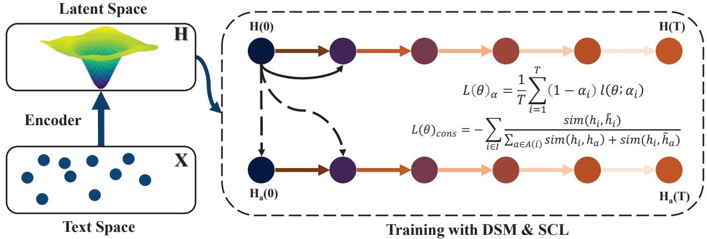
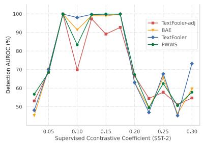
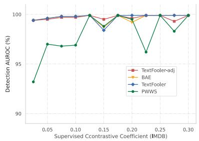
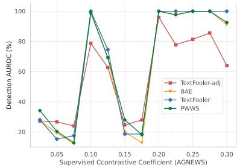
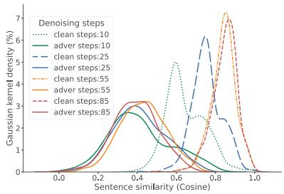
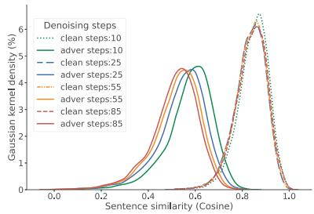
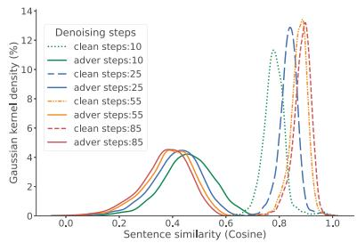

# CASN: Class-Aware Score Network for Textual Adversarial Detection

Rong Bao1,2∗, Rui Zheng1∗, Liang Ding3,

Qi Zhang1, Dacheng Tao3†

1 School of Computer Science, Fudan University, Shanghai, China

2 Shanghai Shanghai Artificial Intelligence Laboratory, Shanghai, China

3 The University of Sydney, Sydney, Australia

rbao22@m.fudan.edu.cn

{rzheng20,qz}@fudan.edu.cn

{liangding.liam,dacheng.tao}@gmail.com

## Abstract

Adversarial detection aims to detect adversarial samples that threaten the security of deep neural networks, which is an essential step toward building robust AI systems. Density-based estimation is widely considered as an effective technique by explicitly modeling the distribution of normal data and identifying adversarial ones as outliers. However, these methods suffer from significant performance degradation when the adversarial samples lie close to the non-adversarial data manifold. To address this limitation, we propose a score-based generative method to implicitly model the data distribution. Our approach utilizes the gradient of the log-density data distribution and calculates the distribution gap between adversarial and normal samples through multi-step iterations using Langevin dynamics. In addition, we use supervised contrastive learning to guide the gradient estimation using label information, which avoids collapsing to a single data manifold and better preserves the anisotropy of the different labeled data distributions. Experimental results on three text classification tasks upon four advanced attack algorithms show that our approach is a significant improvement (+15.2 F1 score on average against previous SOTA) over previous detection methods.

## 1 Introduction

It has already become a consensus in the machine learning community that deep neural networks (DNNs) are vulnerable against adversarial examples (Goodfellow et al., 2015; Kurakin et al., 2017). Adversarial samples are generated by adding some imperceptible perturbations to normal samples and cause the trained network to produce defective results. The widely-used pre-trained language models (PLMs) (Devlin et al., 2019; Liu et al., 2019; Brown et al., 2020) also have been demonstrated to be highly susceptible under textual adversarial attacks (Zhang et al., 2019). Given that pre-trained language models have become the de facto backbone models for many practical applications, their security risks deserve more attention.

Existing approaches to counteract adversarial attacks can be broadly divided into two directions, adversarial defense and adversarial detection (Wiyatno et al., 2019). Although adversarial defenses have made great progress in recent years, popular defense methods, such as adversarial training (Zhu et al., 2020; Madry et al., 2018), impose certain restrictions on the attack space to certify robustness, which often results in a sacrifice of original accuracy (Akhtar et al., 2021). In contrast, adversarial detection methods aim to separate adversarial samples before they enter the model. The detected adversarial samples can be processed by a dedicated module and then re-entered into the model. This approach not only avoids the degradation of original accuracy, but also imposes no restrictions on the attack method.

One of the most effective detection methods that can handle all textual attack algorithms is densitybased estimation approaches (Yoo et al., 2022; Feinman et al., 2017). These approaches are built on the assumption that the adversarial examples are not lying inside the non-adversarial data manifold. They explicitly model the original data distribution and use the probability of a data point as the adversarial confidence. Nevertheless, recent work (Shamir et al., 2021) argues that the adversarial samples are roughly close and perpendicular to the low-dimensional manifold containing normal samples. The overlap problem poses a challenge for detection performance, as the closer the attack algorithm produces results resembling real samples, the more the detection performance is degraded.

In this work, we propose to model the gradient of log-density data distribution via denoising score matching function (Song and Ermon, 2019; Vincent, 2011). Then the gradients are used through Langevin dynamics to generate normal samples from the noise-perturbed distribution by multi-step denoising process. The distance from the adversarial samples to the normal data distribution is measured indirectly using the denoising score matching function. This is more refined than the previous direct density estimation, thus avoiding the performance loss caused by overlapping density regions.

We introduce the class-aware score network (CASN) to compute the gradient of log-density distribution required in the detection phase. To train this score network, with the general training objective of conditional noise scores (Song et al., 2021), we also compute supervised contrastive loss (Khosla et al., 2020) by constructing different class sample pairs. It allows models to better distinguish between different classes of data manifold and prevents the model from collapsing into a single data distribution. Afterward, all samples are denoised using the score network, and the adversarial samples are determined by recording the size of the feature distance before and after denoising.

Our contribution can be summarized as follows:

• We propose a new paradigm that uses the class-aware score network to portray the distribution changes of the adversarial samples during the denoising process, greatly alleviating the distribution overlap problem.

• Introducing supervised contrastive learning in the training phase of the score network makes better use of label information and enables more accurate calculation of sample distances in the denoising process.

• Experimentally, we achieve nearly 100% accuracy under many settings, significantly outperforming baseline methods, and presenting a greater challenge to counterattackers.

## 2 Related work

## 2.1 Textual Adversarial Attacks

Considering the different granularities that DNNs are attacked, the textual attack algorithms can be grouped as character-level (Gao et al., 2018; Gil et al., 2019), word-level (Jin et al., 2020; Garg and Ramakrishnan, 2020; Ren et al., 2019), sentencelevel (Iyyer et al., 2018) and multi-level (Liang et al., 2018; Ebrahimi et al., 2018) attacks. The different fine-grained groupings mean that these algorithms modified the original text at different levels. The usual manipulation includes insertion, deletion, and replacement. At the same time, the definition of adversarial attacks has to be satisfied, i.e., the adversarial sample needs to maintain semantic invariance and be imperceptible to human beings (Zhang et al., 2019).

## 2.2 Textual Adversarial Detection

DISP (Zhou et al., 2019) is a framework that learns to identify malicious perturbations, then block the attacks by replacing them with synonyms. This method relies on a perturbation discriminator to give a confidence score in whether the current word is perturbed or not. Liu et al. (2022) adapt Local Intrinsic Dimensionality (Ma et al., 2018) and propose MDRE based entirely on the distribution features of the learned representations. Noticing that word-level adversarial algorithms often replace high-frequency words with low-frequency words, Mozes et al. (2021) introduce FGWS algorithm to detect adversarial samples by word frequency properties and calibrate the adversarial samples to improve the model performance. Yoo et al. (2022) propose RDE which utilizes multivariate Gaussian distribution to model the feature density of clean samples. The samples in low-density regions are considered as adversarial samples during detection. Compared with previous explicit density estimation methods such as RDE and MDRE, our method uses the gradient of log-density and Langevin dynamics to depict the distribution distance between adversarial and normal samples, avoiding the performance degradation caused by the distribution overlap problem.

## 3 Preliminary

Score matching (HyvärinenAapo, 2005) was proposed to generate samples from a non-normalized distribution. The core idea of this method is to estimate the score function, i.e., the gradient of logdensity data distribution, and then generate data by sampling through Langevin dynamics.

Let x be a data point, $p ( x )$ denote the data distribution, the score function can be a score network $s _ { \theta } ( \cdot )$ that approximate $\nabla _ { x } \log p ( x )$ as accurately as possible, which can be written as

$$
s _ { \theta } ( x ) : = \nabla _ { x } \log p ( x ) .\tag{1}
$$

After that, Langevin dynamics can generate samples from the data distribution $p ( x )$ using the score function. Given a fixed step size -, and an initial

  
Figure 1: Overview of CASN training process. (Left): We train the encoder with a linear classifier by supervised learning to obtain the encoder representations of text. (Right): We train the representation space using denoising score matching and supervised contrastive learning. The amplitude of the noise gradually increases from $t = 0$ to $T ,$ , perturbing the initial distribution eventually into a Gaussian noise distribution. As for supervised contrastive learning, we treat the perturbed samples with small noise conditions as positive pairs, and the samples with different labels and their small perturbations as negative pairs, which are marked by the solid and dashed lines respectively.

sampling point $x _ { 0 } \sim \pi ( x )$ , the Langevin process recursively updates the following function:

$$
x _ { t } \gets x _ { t - 1 } + \frac { \epsilon } { 2 } \nabla _ { x } \log p ( x _ { t - 1 } ) + \sqrt { \epsilon } z _ { t }\tag{2}
$$

where $z _ { t } ~ \sim ~ \mathcal { N } ( 0 , I )$ . Welling and Teh (2011) proves that under some restrictions $x _ { T }$ becomes an exact sample from $p ( x )$ when $\epsilon \to 0$ and $T \to \infty$

Although the original score matching is a sound theory, Vincent (2011) points out that due to a very computationally complex term in the original training objective, it is difficult to be effective in highdimensional data. Therefore, the author introduces denoising score matching (DSM) to eliminate the hard computing terms. The idea of this approach is to add an easily computable noise to the original distribution and then estimate the score function under noise perturbation. The advantage of this approach is that it makes the training target easier to compute, and the score function approximates the original target when the noise is small enough. The author proposes the use of Gaussian noise $p _ { \sigma } ( \tilde { x } | x ) = \mathcal { N } ( \tilde { x } | x , \sigma ^ { 2 } I )$ , then DSM minimizes the following objectives:

$$
\frac { 1 } { 2 } \mathbb { E } _ { p ( x ) p \sigma ( \tilde { x } | x ) } \left\| s _ { \theta } ( \tilde { x } ) - \nabla _ { \tilde { x } } \log p _ { \sigma } ( \tilde { x } | x ) \right\| _ { 2 } ^ { 2 }\tag{3}
$$

Note that the optimal score network $s _ { \theta ^ { \star } } ( \cdot )$ which minimizes Eq. 3, Vincent (2011) indicates that at this point $s _ { \theta ^ { \star } } ( x )$ almost converge to $\nabla _ { x }$ log $p _ { \alpha } ( x )$ Denoising score matching using Gaussian noise inspires a series of later work (Song and Ermon, 2019; Song et al., 2021), and this technique has become an important milestone in the field of scorebased image generation (Yang et al., 2022).

## 4 Methodology

In a nutshell, we hope to train a class-aware score network that estimates the gradient of log-density data distribution and separates the adversarial samples by the drift value of the sample distribution during the reverse denoising process. In §4.1, we will introduce the application of denoising score matching function and supervised contrastive learning to train the class-aware score network. By performing the denoising process on all samples using the score network, the drift distance of the samples before and after denoising can be calculated as an adversarial confidence score (§4.2).

## 4.1 Training Class-Aware Score Network

As shown in Fig. 1, the score network estimates the gradient of the log-density distribution of the text hidden states. The left side of the figure indicates that we first use a supervised learning encoder E to obtain the hidden representation h of text x, i.e. $h = E ( x )$ , h is used as input to the scoring network. On the right is the training process of the score network, which uses multi-level noise perturbation and supervised contrastive learning for training.

Given a Gaussian noise perturbation $p _ { \alpha } ( { \tilde { h } } | h ) =$ $\mathcal { N } ( \tilde { h } | \sqrt { \alpha } h , ( 1 - \alpha ) I )$ , and let α be part of the input, Eq.3 will reduce to the following loss function:

$$
l ( \theta ; \alpha ) = \frac { 1 } { 2 } \mathbb { E } _ { p ( h ) p _ { \alpha } ( \tilde { h } | h ) } \left\| s _ { \theta } ( \tilde { h } , \alpha ) + \frac { \tilde { h } - \sqrt { \alpha } h } { 1 - \alpha } \right\| ^ { 2 }\tag{-(4}
$$

where α is a positive real number, $p ( h )$ is the distribution of h. The size of the noise perturbation is difficult to choose, large noise will affect the accurate estimation and small perturbation will make the Langevin dynamics ineffective. We address this problem through multi-level noise perturbations proposed by Song and Ermon (2019). Let $T$ denote a positive integer, a set of positive real numbers $\{ \alpha _ { i } \} _ { i = 1 } ^ { T }$ decreasing from 1 to 0, a linear combination of Eq. 4 is constructed for all $\alpha \in \{ \alpha _ { i } \} _ { i = 1 } ^ { T }$ to get a unified objective:

$$
L ( \theta ) _ { \alpha } = \frac { 1 } { T } \sum _ { i = 1 } ^ { T } ( 1 - \alpha _ { i } ) l ( \theta ; \alpha _ { i } ) T\tag{5}
$$

Nevertheless, the score network trained according to Eq. 5 is still imperfect. This training objective actually trains the data distribution under unconditional likelihood, but in fact, the data for different labels are conditionally distributed (Ho and Salimans, 2023). We need to approximate the conditional data distributions, so that the Langevin dynamics can operate on the correct manifold without jumping repeatedly on manifolds with different labels. Since the correct labels of the adversarial samples cannot be known before detection, we cannot utilize conditional score generation techniques (Dhariwal and Nichol, 2021) with explicit input labels. Therefore, we propose to use supervised contrastive learning (Khosla et al., 2020) to increase the anisotropy of differently labeled data and force the score network to implicitly model the conditional data distributions.

The key to contrastive learning is constructing positive and negative sample pairs. As shown on the right side of Fig. 1, within a batch of data, we select the original representation and its noise perturbation as the positive sample pair and all representations that differ from its label (with or without noise perturbations) as the corresponding negative samples. Then, the contrastive loss can be calculated as:

$$
L ( \theta ) _ { c o n s } = - \sum _ { i \in I } \frac { s i m ( h _ { i } , \tilde { h _ { i } } ) } { \sum _ { a \in A ( i ) } s i m ( h _ { i } , h _ { a } ) + s i m ( h _ { i } , \tilde { h } _ { a } ) } ,\tag{6}
$$

where I denotes the index of batch data, $A ( i )$ $\{ a \in I | y _ { i } \neq y _ { a } \}$ is the set of sample indexes whose labels are different from data i. The similarity between each representation is calculated using the cosine value after averaging it, i.e., sim $( x , y ) =$ $c o s < s _ { \theta } ( x ) ^ { m e a n } , s _ { \theta } ( y ) ^ { m e a n } >$

Finally, we combine the Eq. 5 and Eq. 6 as a multi-task learning loss (Eq. 7) with λ as coeffi-

cient:

$$
L ( \theta ) = L ( \theta ) _ { \alpha } + \lambda L ( \theta ) _ { c o n s }\tag{7}
$$

The specific training parameters will be detail discussed in Appendix A.1.

## 4.2 Detection via Denoising Process

Given a sentence x and the corresponding encoder representation h, a conventional detection approach is to conduct adversarial purification through the denoising process (Yoon et al., 2021; Nie et al., 2022), then classify the denoised representations and detect the adversarial samples based on label inversions. In order to better improve the qualify of the denoising process, we take advantage of recent work (Song et al., 2021) that understands denoising score matching from the Stochastic Differential Equations (SDE) perspective. It indicates that the quality of generative modeling via Langevin dynamics can be further improved if the solution of the SDE equation is added. Therefore, our algorithm alternates between the reverse SDE solver and Langevin dynamics.

Let $h _ { i }$ denote the text representations of different time points, $s _ { \theta ^ { \star } } ( \cdot )$ be a trained score network via minimized Eq. 7, the parameters $\beta _ { i }$ and $\epsilon _ { i }$ are related to $\{ \alpha _ { i } \} _ { i = 1 } ^ { T }$ in Eq. 5. We replace the regular Langevin dynamics of Eq. 2 with the following predictor-corrector (Song et al., 2021) form:

$$
\begin{array} { l } { s c o r e \displaystyle \gets \frac { 1 } { 2 } \beta _ { i + 1 } s _ { \theta ^ { \star } } ( h _ { i + 1 } , \beta _ { i + 1 } ) } \\ { h _ { i } \gets ( 2 - \sqrt { 1 - \beta _ { i + 1 } } ) h _ { i + 1 } + s c o r e } \\ { h _ { i } \gets h _ { i } + \epsilon _ { i } s _ { \theta ^ { \star } } ( h _ { i } , \beta _ { i } ) + \sqrt { 2 \epsilon _ { i } } z } \end{array}\tag{8}
$$

Although label flipping is an effective detection method, this method relies too much on the denoising results of Langevin dynamics, and it fails when the adversarial perturbations cannot be eliminated. To avoid the catastrophic consequences of failing to eliminate adversarial perturbations, we propose to focus on the kinetic qualities of Langevin dynamics. Since the Langevin dynamics eventually converge to the target distribution, the drift distance of the denoised adversarial samples should be larger than that of the normal ones.

The cosine similarity could reflect the shift distance of the representation, with larger values implying a smaller shift. We calculate the cosine similarity between the current and starting representations at each step of the denoising process and use the cumulative sum as the final adversarial confidence score. Assume the $h _ { s t a r t }$ denotes the text representations at the initial denoising point, when the time step i ranges from start to 0, the update is performed using Eq. 8 and confidence value is accumulated as:

$$
c o n f i d e n c e + = c o s < h _ { i } ^ { m e a n } , h _ { s t a r t } ^ { m e a n } > ,\tag{9}
$$

where $h _ { i }$ denotes the text representations of the current moment, the superscript “mean” indicates that we calculate a token level averaging. After obtaining the confidence score of each sample, we filter the adversarial samples using the threshold method. The calculation of confidence scores will be shown in Algorithm 1, and the whole detection process will be detail discussed in Appendix A.2.

## 5 Experimental Settings

Considering the attack algorithms on text classification models, we selected three representative text classification datasets to verify the effectiveness of the proposed method. They are SST-2 (Socher et al., 2013), IMDB (Maas et al., 2011) and AG-NEWS (Zhang et al., 2015). The first two datasets are both for binary sentiment analysis. In SST-2, most sentences are short texts, while in IMDB, they are long. AGNEWS is a four-category topic classification dataset that includes the world, sports, business, and sci/tech.

## 5.1 Baselines

We compare our method with five recent text adversarial detection approaches. Four of these methods, DISP, FGWS, RDE and MDRE have already been introduced in §2.2. We also add a detection method, MD, which simultaneously detects outof-distribution and adversarial samples (Lee et al., 2018). It first calculates the class-conditional Gaussian distribution of the features and then gives the adversarial confidence score of the samples by Mahalanobis distance.

## 5.2 Textual Attacks

We use four attack algorithms to generate adversarial samples. BAE (Garg and Ramakrishnan, 2020) replaces or inserts tokens in important parts of the text by masking them and then rejuvenating the pre-training task of BERT to generate alternatives. PWWS (Ren et al., 2019) determines the word substitution order by word salience and classification probability, which greatly improves the attack success rate and maintains a very low word substitution rate. TextFooler (Jin et al., 2020) evaluates the importance of words in the sentence and then replaces them with synonyms that have semantic and syntactic constraints. TextFooler-adj (Morris et al., 2020a) further constrains the similarity of words and sentences before and after perturbation, which makes adversarial samples less detectable.

## 5.3 Implementation Details

We fine-tune two pre-trained language models, BERT (Devlin et al., 2019) and RoBERTa (Liu et al., 2019), as the sentence encoder. We use the general text classification paradigm of the two pretrained models, i.e., the encoder followed by the linear classifier with hyperparameters consistent with the original paper. For the three datasets, we use 90% of the original training set for training and the remaining 10% as the validation set. Following previous works, the attack algorithms will attack 3000 text samples to generate a balanced detection set. Since the original SST has only 872 labeled validation samples, we attack the full validation set. The XLNET (Yang et al., 2019) is adopted as the backbone of the score network with sentence encoder representations as input. All the attack algorithms are implemented by TextAttack (Morris et al., 2020b) framework and use the default settings. More details can be found in Appendix A.3.

## 6 Experimental Results

In this section, we compare the detection performance of some strong baseline approaches and explore the effects of denoising process on representations. Some findings of hyperparameter’s selection and analytical experiments are also presented.

## 6.1 Detection Performance

Following the work of Yoo et al. (2022), we divide the detection of adversarial samples into two scenarios. Scenario 1 will detect all adversarial samples, regardless of whether the model output is successfully changed or not. Scenario 2 only requires the detection of samples that actually fool the model. Realistic attackers cannot guarantee the success of every attack, but this does not mean that these failed adversarial samples are harmless. In fact, the failed samples can guide the attacker to further optimize the attacking process, which is the strategy adopted by most attack algorithms. Therefore, we believe Scenario 1 is more realistic, and we will show the performance of each detection algorithm in Scenario 1 in the main text and put the performance of Scenario 2 in Appendix B.2.

<table><tr><td rowspan="2">Dataset</td><td rowspan="2">Method</td><td colspan="3">TextFooler-adj</td><td colspan="3">BAE</td><td colspan="3">TextFooler</td><td colspan="3">PWWS</td></tr><tr><td> $F _ { 1 }$ </td><td>AUROC</td><td>ACC</td><td> $F _ { 1 }$ </td><td>AUROC</td><td>ACC</td><td> $F _ { 1 }$ </td><td>AUROC</td><td>ACC</td><td> $F _ { 1 }$ </td><td>AUROC</td><td>ACC</td></tr><tr><td rowspan="5">SST-2</td><td>DISP</td><td>58.9</td><td></td><td>79.2</td><td>66.1</td><td></td><td>76.1</td><td>72.3</td><td></td><td>76.0</td><td>73.3</td><td></td><td>77.4</td></tr><tr><td>MDRE</td><td>63.2</td><td></td><td>63.3</td><td>69.5</td><td></td><td>69.0</td><td>74.1</td><td></td><td>74.8</td><td>70.2</td><td></td><td>70.8</td></tr><tr><td>FGWS</td><td>68.2</td><td>69.9</td><td>64.3</td><td>68.9</td><td>69.5</td><td>64.6</td><td>71.7</td><td>73.9</td><td>68.2</td><td>74.2</td><td>79.2</td><td>70.8</td></tr><tr><td>MD</td><td>70.3</td><td>68.6</td><td>63.8</td><td>74.7</td><td>74.5</td><td>70.1</td><td>78.6</td><td>78.4</td><td>74.8</td><td>77.2</td><td>75.3</td><td>72.6</td></tr><tr><td>RDE</td><td>72.3</td><td>77.1</td><td>69.3</td><td>78.8</td><td>84.1</td><td>78.3</td><td>82.9</td><td>88.5</td><td>82.1</td><td>79.6</td><td>85.5</td><td>77.1</td></tr><tr><td colspan="2">Ours (CASN)</td><td>80.8</td><td>89.1</td><td>80.3</td><td>97.2</td><td>98.9</td><td>97.1</td><td>99.3</td><td>99.8</td><td>99.3</td><td>99.1</td><td>99.9</td><td>99.1</td></tr><tr><td rowspan="5">IMDB</td><td>DISP</td><td>67.3</td><td></td><td>68.0</td><td>67.6</td><td></td><td>66.3</td><td>67.4</td><td>一</td><td>66.0</td><td>65.3</td><td>一</td><td>64.3</td></tr><tr><td>MDRE</td><td>82.2</td><td></td><td>80.8</td><td>84.3</td><td></td><td>82.8</td><td>85.5</td><td></td><td>84.3</td><td>82.6</td><td></td><td>81.6</td></tr><tr><td>FGWS</td><td>80.9</td><td>87.1</td><td>78.9</td><td>81.3</td><td>87.7</td><td>80.2</td><td>81.2</td><td>87.7</td><td>80.2</td><td>80.5</td><td>87.3</td><td>79.1</td></tr><tr><td>MD</td><td>81.4</td><td>83.1</td><td>79.0</td><td>83.7</td><td>85.5</td><td>81.6</td><td>83.7</td><td>85.5</td><td>81.7</td><td>82.4</td><td>83.7</td><td>79.7</td></tr><tr><td>RDE</td><td>82.2</td><td>88.3</td><td>80.7</td><td>84.6</td><td>90.2</td><td>83.2</td><td>84.7</td><td>90.1</td><td>83.7</td><td>82.5</td><td>86.7</td><td>80.1</td></tr><tr><td colspan="2">Ours (CASN)</td><td>97.8</td><td>99.7</td><td>97.8</td><td>98.4</td><td>99.8</td><td>98.4</td><td>98.3</td><td>99.8</td><td>98.3</td><td>91.2</td><td>96.6</td><td>90.9</td></tr><tr><td rowspan="5">AGNEWS</td><td>DISP</td><td>61.5</td><td></td><td>85.8</td><td>80.8</td><td></td><td>86.3</td><td>88.4</td><td></td><td>89.1</td><td>84.1</td><td></td><td>87.3</td></tr><tr><td>MDRE</td><td>57.1</td><td></td><td>61.6</td><td>73.0</td><td></td><td>75.5</td><td>80.2</td><td></td><td>81.2</td><td>74.5</td><td></td><td>76.5</td></tr><tr><td>FGWS</td><td>74.6</td><td>73.2</td><td>69.8</td><td>75.1</td><td>75.9</td><td>73.3</td><td>77.6</td><td>78.4</td><td>75.5</td><td>81.9</td><td>84.3</td><td>82.4</td></tr><tr><td>MD</td><td>67.2</td><td>62.3</td><td>52.8</td><td>71.5</td><td>76.1</td><td>65.0</td><td>75.2</td><td>80.8</td><td>73.3</td><td>71.8</td><td>76.8</td><td>70.0</td></tr><tr><td>RDE</td><td>67.7</td><td>67.0</td><td>55.1</td><td>77.1</td><td>85.0</td><td>75.9</td><td>85.3</td><td>92.3</td><td>85.6</td><td>77.8</td><td>85.4</td><td>77.3</td></tr><tr><td colspan="2">Ours (CASN)</td><td>90.0</td><td>95.8</td><td>89.7</td><td>99.8</td><td>99.9</td><td>99.8</td><td>99.9</td><td>99.9</td><td>99.9</td><td>99.9</td><td>99.9</td><td>99.9</td></tr></table>

Table 1: Performance of adversarial detection. The best results are marked in bold. Following previous works, Accuracy (ACC), $F _ { 1 } .$ , and Area Under the Receiver Operating Characteristic (AUROC) are used for metrics. We use BERT as the victim model, while the detection results of RoBERTa are put in Appendix B.1.

Table 1 reports the detection performance of our method and compared baselines. We summarize the results as follows: 1) The AUROC metric cannot be calculated for DISP and MDRE, because they are threshold-independent detection methods. DISP performs very well on AGNEWS, which may be due to the synonyms replaced by these attack algorithms do not preserve the semantics of the original sentences well. 2) Consistently with Yoo et al. (2022), FGWS works badly in the face of more subtle attacks, such as BAE and TextFooler. 3) Both RDE and MD are feature density-based methods, and in general, RDE works better than MD. However, their performance degrades dramatically against TextFooler-adj, as the overlap of the feature space increases due to the quality improvement of adversarial samples. 4) Taking advantage of the denoising process to depict the feature changes of data avoids the drawbacks of density estimation methods, thus performing well on the TextFooleradj attack. Our method not only greatly surpasses the other approaches, but also achieves almost 100% detection performancefor the other three attacks.

## 6.2 Analysis

To better understand our method, we analyze some hyperparameter choices in the training and inference phase, as well as the correlation between feature purification and detection performance in the denoising process.

Effects of coefficients We explore the optimal coefficient λ in Eq. 7 by varying the value in the intervals of 0.025 from 0.025 to 0.3, as seen in Fig. 2. In general, the performance trends are not consistent across the datasets. For SST-2 and AG-NEWS, the performance has been oscillating with increasing λ and it is difficult to tell a concise trend. For IMDB, the AUROC values are all close to 100 percent, which indicates that detection on IMDB is not sensitive to hyperparameter change. However, in the interval range of 0.15 to 0.2, our CASN performs well on all the datasets. The reason is that with small values, the model will lose the label information and eventually degrade to the original conditional denoising objective. A larger coefficient would force the model to focus on the loss of contrastive learning and ignore the noise perturbations, which is also detrimental to accurate gradient estimation.

  
(a) SST-2

  
(b) IMDB

  
(c) AGNEWS

Figure 2: Detection performance of different coefficients λ in Eq. 7 for four attack methods. We increase the coefficients at intervals of 0.025 and use AUROC as the evaluation metric.  
  
(a) SST-2

  
(b) IMDB

  
(c) AGNEWS

Figure 3: The distribution differences of different denoising steps k, where both normal and adversarial samples go through the denoising process. The Gaussian kernel density is used to measure the distribution.
<table><tr><td>Dataset</td><td>Steps</td><td>AUROC</td><td>ACC-clean</td><td>ACC-adv</td></tr><tr><td rowspan="4">SST-2</td><td>0</td><td></td><td>92.1</td><td>4.8</td></tr><tr><td>30</td><td>80.2</td><td>92.1</td><td>5.4</td></tr><tr><td>60</td><td>97.6</td><td>92.2</td><td>6.8</td></tr><tr><td>90</td><td>99.8</td><td>92.2</td><td>8.0</td></tr><tr><td rowspan="4">IMDB</td><td>0</td><td></td><td>93.4</td><td>20.8</td></tr><tr><td>30</td><td>99.5</td><td>93.5</td><td>28.5</td></tr><tr><td>60</td><td>99.7</td><td>93.6</td><td>34.8</td></tr><tr><td>90</td><td>99.8</td><td>93.9</td><td>39.3</td></tr><tr><td rowspan="4">AGNEWS</td><td>0</td><td></td><td>94.4</td><td>12.8</td></tr><tr><td>30</td><td>99.9</td><td>94.4</td><td>16.5</td></tr><tr><td>60</td><td>99.9</td><td>94.5</td><td>21.7</td></tr><tr><td>90</td><td>99.9</td><td>94.4</td><td>24.5</td></tr></table>

Table 2: The purification results of all samples with different denoising steps, where ACC-clean and ACCadv denote the accuracy of clean and adversarial samples after the denoising process, respectively.

Denoising steps As discussed in §4.2, the choice of the denoising starting point k is essential to successful detection. Under different starting points, we use Gaussian kernel density (Parzen, 1962) to calculate the distributions of pre-post denoising sentence similarity of all samples. It can be seen from Fig. 3 that, the overlapping area of solid and dashed lines of the same color is gradually decreasing as the number of steps increases. The increase in the number of steps causes the adversarial samples to deviate more significantly in the semantic space, thus separating them from the normal samples. However, it is not recommended to increase the number of steps consistently. On the one hand, the computational overhead is not worth it when the detection performance is good enough. On the other hand, more denoising steps mean that the denoising starting distribution is further away from the true sample distribution, leading to inaccurate score estimation for all samples and thus causing a decrease in detection performance.

Adversarial Purification Table 2 shows the classification accuracy of normal and adversarial samples after denoising. Referring to the setup of adversarial purification (Nie et al., 2022; Yoon et al., 2021), we reclassify the denoised sentence representations using the previously fine-tuned linear classifier. Consistent with these adversarial purifications in the field of computer vision research, the denoising process is able to remove a portion of the adversarial perturbations. Although the improvement is weaker compared to defensive methods that improve model robustness such as adversarial training, our method not only calibrates the semantic features of the adversarial samples to improve the classification accuracy but also ensures the model performance of the original samples.

<table><tr><td rowspan=1 colspan=1>Sentence</td><td rowspan=1 colspan=1>FGWS</td><td rowspan=1 colspan=1>RDE</td><td rowspan=1 colspan=1>CASN</td></tr><tr><td rowspan=1 colspan=1>Schaeffer (frank) has to find some hook (pull) on which to hang his persistently inconsequentialflick (useless movies), and it perils (might) as allright (well) be the resuscitation of the middle-agedcharacter.</td><td rowspan=1 colspan=1>之</td><td rowspan=1 colspan=1>e</td><td rowspan=1 colspan=1>②</td></tr><tr><td rowspan=1 colspan=1>While it &#x27;s genuinely cool to hear characters talk about early rap (music) records (show) (sugar hillgang , etc.) , the constant referencing (references) of hip-hop arcana (secrect) can consign (alienate)(charge) even the savviest audiences.</td><td rowspan=1 colspan=1>E</td><td rowspan=1 colspan=1>天</td><td rowspan=1 colspan=1>e</td></tr><tr><td rowspan=1 colspan=1>Further proof that the coeur (epicenter) of neat (cool) , hermosa (beautiful), thought-provokingforeign cinema is smack-dab (pat) in the middle of dubya&#x27;s (bush&#x27;s) axis of evil.</td><td rowspan=1 colspan=1>之</td><td rowspan=1 colspan=1>奥</td><td rowspan=1 colspan=1>e</td></tr></table>

Table 3: Examples showing the sensitivity to subtle semantic gaps. The words replaced by the attack algorithm are underlined and followed by the original word in parentheses. For the proposed low-frequency word substitutions in FGWS, we write them in brackets after the original text using red color. $\mathfrak { s o } \mathfrak { Q } \mathfrak { Q } ^ { , }$ mean positive and negative.

## 6.3 Case Study

Detection results of TextFooler-adj in Table 1 show that CASN is more sensitive to subtle semantic gaps. To further improve this claim, we select the SST-2 dataset under this attack and analyze some representative samples. As shown in Table 3, we can tell that: FGWS needs a large number of lowfrequency word substitutions for correct classification, but the substitutions often do not correspond correctly to the correct ones, so the attacking algorithm only needs stronger synonym constraints to disable it. The third example illustrates that RDE fails in the face of adversarial samples with stronger sentence semantic constraints. This may be due to the RDE’s assumption that the semantic space of the adversarial samples is far away from the normal samples.

## 7 Ablation Study

To better illustrate the key components in CASN, we perform an ablation study by removing supervised contrastive learning and the solution of the SDE equation in the inference period. The test results are in Table 4. We can observe that: 1) Removing supervised comparative learning will significantly damage model performance. It would fall back to the original conditional denoising model, thus blurring the differences in distribution between different classes of samples, which is detrimental to the denoising process. 2) Without the SDE equation as the solution of the first step, this is not conducive to better correcting the semantics of the adversarial samples, although sometimes the detection performance is not decreased.

<table><tr><td>Dataset</td><td>Method</td><td> $\mathbf { F _ { 1 } }$ </td><td>AUROC</td><td>Purified ACC</td></tr><tr><td rowspan="3">SST-2</td><td>CASN</td><td>93.7</td><td>97.3</td><td>65.5</td></tr><tr><td>w/o SCL</td><td>69.2</td><td>71.0</td><td>65.4</td></tr><tr><td>w/o SDE</td><td>91.3</td><td>97.5</td><td>63.7</td></tr><tr><td rowspan="3">IMDB</td><td>CASN</td><td>97.7</td><td>99.7</td><td>57.0</td></tr><tr><td>w/o SCL</td><td>75.0</td><td>80.4</td><td>51.2</td></tr><tr><td>w/o SDE</td><td>97.4</td><td>99.6</td><td>54.5</td></tr><tr><td rowspan="3">AGNEWS</td><td>CASN</td><td>92.4</td><td>96.9</td><td>82.2</td></tr><tr><td>w/o SCL</td><td>66.7</td><td>22.7</td><td>82.0</td></tr><tr><td>w/o SDE</td><td>92.3</td><td>97.4</td><td>80.0</td></tr></table>

Table 4: Ablation results of two major components. SCL and SDE denote supervised contrastive learning and the solution of the SDE equation, respectively. Similar to the metrics in Table 2, Purified ACC is the accuracy after reclassifying the denoised representation.

## 8 Conclusion

In this paper, we propose a nearly-perfect solution, CASN, to detect adversarial samples in text classification tasks. This framework is based on a noise conditional score network and utilizes label information to better estimate the data log-density gradient. Extensive experiments show that our method greatly outperforms the strong baseline method. Moreover, this approach, which exploits sample feature changes during denoising process, is experimentally shown to be more sensitive to semantic gaps of adversarial samples. We also show that a simultaneous denoising process for all samples is effective in maintaining the semantics of clean text while calibrating the adversarial ones.

## Limitations

In this work, we propose to use the denoising score matching function to estimate the gradient of logdensity distribution, then describe the differences between the adversarial and normal samples by the denoising process of Langevin dynamics. Although our method achieves very good detection performance (nearly 100% under various settings), the actual denoising process requires multi-step iterative updates, resulting in a very slow inference speed compared to previous methods. In addition, the trained score network is highly correlated with the domain data, which makes it difficult to achieve good generalization across multiple domains at the same time.

## Ethics Statement

We take ethical considerations very seriously and strictly adhere to ACL’s ethics policy. The focus of this paper is on improving adversarial instance detection, which is studied using publicly available datasets and models, and has been widely adopted by researchers. Our research aims to improve the security of real-world AI systems, which is objectively informative on topics such as privacy protection and content censorship. We ensure the authenticity of our experimental results and the objectivity of our empirical conclusions.

## References

Naveed Akhtar, Ajmal Mian, Navid Kardan, and Mubarak Shah. 2021. Advances in adversarial attacks and defenses in computer vision: A survey. IEEE Access.

Tom B. Brown, Benjamin Mann, Nick Ryder, Melanie Subbiah, Jared Kaplan, Prafulla Dhariwal, Arvind Neelakantan, Pranav Shyam, Girish Sastry, Amanda Askell, Sandhini Agarwal, Ariel Herbert-Voss, Gretchen Krueger, Tom Henighan, Rewon Child, Aditya Ramesh, Daniel M. Ziegler, Jeffrey Wu, Clemens Winter, Christopher Hesse, Mark Chen, Eric Sigler, Mateusz Litwin, Scott Gray, Benjamin Chess, Jack Clark, Christopher Berner, Sam McCandlish, Alec Radford, Ilya Sutskever, and Dario Amodei. 2020. Language models are few-shot learners. In Advances in Neural Information Processing Systems 33: Annual Conference on Neural Information Processing Systems 2020, NeurIPS 2020, December 6-12, 2020, virtual.

Jacob Devlin, Ming-Wei Chang, Kenton Lee, and Kristina Toutanova. 2019. BERT: Pre-training of deep bidirectional transformers for language understanding. In Proceedings ofthe 2019 Conference of

the North American Chapter ofthe Associationfor Computational Linguistics: Human Language Technologies, Volume 1 (Long and Short Papers), pages 4171–4186, Minneapolis, Minnesota. Association for Computational Linguistics.

Prafulla Dhariwal and Alexander Quinn Nichol. 2021. Diffusion models beat gans on image synthesis. In Advances in Neural Information Processing Systems 34: Annual Conference on Neural Information Processing Systems 2021, NeurIPS 2021, December 6- 14, 2021, virtual, pages 8780–8794.

Javid Ebrahimi, Anyi Rao, Daniel Lowd, and Dejing Dou. 2018. HotFlip: White-box adversarial examples for text classification. In Proceedings ofthe 56th Annual Meeting of the Association for Computational Linguistics (Volume 2: Short Papers), pages 31–36, Melbourne, Australia. Association for Computational Linguistics.

Reuben Feinman, Ryan R. Curtin, Saurabh Shintre, and Andrew B. Gardner. 2017. Detecting adversarial samples from artifacts. arXiv: Machine Learning.

Ji Gao, Jack Lanchantin, Mary Lou Soffa, and Yanjun Qi. 2018. Black-box generation of adversarial text sequences to evade deep learning classifiers. ieee symposium on security and privacy.

Siddhant Garg and Goutham Ramakrishnan. 2020. BAE: BERT-based adversarial examples for text classification. In Proceedings ofthe 2020 Conference on Empirical Methods in Natural Language Processing (EMNLP), pages 6174–6181, Online. Association for Computational Linguistics.

Yotam Gil, Yoav Chai, Or Gorodissky, and Jonathan Berant. 2019. White-to-black: Efficient distillation of black-box adversarial attacks. In Proceedings of the 2019 Conference of the North American Chapter ofthe Associationfor Computational Linguistics: Human Language Technologies, Volume 1 (Long and Short Papers), pages 1373–1379, Minneapolis, Minnesota. Association for Computational Linguistics.

Ian J. Goodfellow, Jonathon Shlens, and Christian Szegedy. 2015. Explaining and harnessing adversarial examples. In 3rd International Conference on Learning Representations, ICLR 2015, San Diego, CA, USA, May 7-9, 2015, Conference Track Proceedings.

Jonathan Ho, Ajay Jain, and Pieter Abbeel. 2020. Denoising diffusion probabilistic models. In Advances in Neural Information Processing Systems 33: Annual Conference on Neural Information Processing Systems 2020, NeurIPS 2020, December 6-12, 2020, virtual.

Jonathan Ho and Tim Salimans. 2023. Classifier-free diffusion guidance.

HyvärinenAapo. 2005. Estimation of non-normalized statistical models by score matching. Journal of Machine Learning Research.

Mohit Iyyer, John Wieting, Kevin Gimpel, and Luke Zettlemoyer. 2018. Adversarial example generation with syntactically controlled paraphrase networks. In Proceedings of the 2018 Conference of the North American Chapter ofthe Association for Computational Linguistics: Human Language Technologies, Volume 1 (Long Papers), pages 1875–1885, New Orleans, Louisiana. Association for Computational Linguistics.

Di Jin, Zhijing Jin, Joey Tianyi Zhou, and Peter Szolovits. 2020. Is BERT really robust? A strong baseline for natural language attack on text classification and entailment. In The Thirty-Fourth AAAI Conference on Artificial Intelligence, AAAI 2020, The Thirty-Second Innovative Applications ofArtificial Intelligence Conference, IAAI 2020, The Tenth AAAI Symposium on Educational Advances in Artificial In telligence, EAAI 2020, New York, NY, USA, February 7-12, 2020, pages 8018–8025. AAAI Press.

Prannay Khosla, Piotr Teterwak, Chen Wang, Aaron Sarna, Yonglong Tian, Phillip Isola, Aaron Maschinot, Ce Liu, and Dilip Krishnan. 2020. Supervised contrastive learning. In Advances in Neural Information Processing Systems 33: Annual Conference on Neural Information Processing Systems 2020, NeurIPS 2020, December 6-12, 2020, virtual.

Alexey Kurakin, Ian J. Goodfellow, and Samy Bengio. 2017. Adversarial examples in the physical world. In 5th International Conference on Learning Representations, ICLR 2017, Toulon, France, April 24-26, 2017, Workshop Track Proceedings. OpenReview.net.

Kimin Lee, Kibok Lee, Honglak Lee, and Jinwoo Shin. 2018. A simple unified framework for detecting outof-distribution samples and adversarial attacks. In Advances in Neural Information Processing Systems 31: Annual Conference on Neural Information Processing Systems 2018, NeurIPS 2018, December 3-8, 2018, Montréal, Canada, pages 7167–7177.

Bin Liang, Hongcheng Li, Miaoqiang Su, Pan Bian, Xirong Li, and Wenchang Shi. 2018. Deep text classification can be fooled. In Proceedings ofthe Twenty-Seventh International Joint Conference on Artificial Intelligence, IJCAI 2018, July 13-19, 2018, Stockholm, Sweden, pages 4208–4215. ijcai.org.

Na Liu, Mark Dras, and Wei Emma Zhang. 2022. Detecting textual adversarial examples based on distributional characteristics of data representations. In Proceedings ofthe 7th Workshop on Representation Learningfor NLP, pages 78–90, Dublin, Ireland. Association for Computational Linguistics.

Yinhan Liu, Myle Ott, Naman Goyal, Jingfei Du, Mandar Joshi, Danqi Chen, Omer Levy, Michael Lewis, Luke Zettlemoyer, and Veselin Stoyanov. 2019. Roberta: A robustly optimized bert pretraining approach. arXiv: Computation and Language.

Ilya Loshchilov and Frank Hutter. 2019. Decoupled weight decay regularization. In 7th International

Conference on Learning Representations, ICLR 2019, New Orleans, LA, USA, May 6-9, 2019. OpenReview.net.

Xingjun Ma, Bo Li, Yisen Wang, Sarah M. Erfani, Sudanthi N. R. Wijewickrema, Grant Schoenebeck, Dawn Song, Michael E. Houle, and James Bailey. 2018. Characterizing adversarial subspaces using local intrinsic dimensionality. In 6th International Conference on Learning Representations, ICLR 2018, Vancouver, BC, Canada, April 30 - May 3, 2018, Conference Track Proceedings. OpenReview.net.

Andrew L. Maas, Raymond E. Daly, Peter T. Pham, Dan Huang, Andrew Y. Ng, and Christopher Potts. 2011. Learning word vectors for sentiment analysis. In Proceedings of the 49th Annual Meeting of the Associationfor Computational Linguistics: Human Language Technologies, pages 142–150, Portland, Oregon, USA. Association for Computational Linguistics.

Aleksander Madry, Aleksandar Makelov, Ludwig Schmidt, Dimitris Tsipras, and Adrian Vladu. 2018. Towards deep learning models resistant to adversarial attacks. In 6th International Conference on Learning Representations, ICLR 2018, Vancouver, BC, Canada, April 30 - May 3, 2018, Conference Track Proceedings. OpenReview.net.

Dimitra Maoutsa, Sebastian Reich, and Manfred Opper. 2020. Interacting particle solutions of fokker-planck equations through gradient-log-density estimation. Entropy, 22(8):802.

John Morris, Eli Lifland, Jack Lanchantin, Yangfeng Ji, and Yanjun Qi. 2020a. Reevaluating adversarial examples in natural language. In Findings of the Associationfor Computational Linguistics: EMNLP 2020, pages 3829–3839, Online. Association for Computational Linguistics.

John Morris, Eli Lifland, Jin Yong Yoo, Jake Grigsby, Di Jin, and Yanjun Qi. 2020b. TextAttack: A framework for adversarial attacks, data augmentation, and adversarial training in NLP. In Proceedings of the 2020 Conference on Empirical Methods in Natural Language Processing: System Demonstrations, pages 119–126, Online. Association for Computational Linguistics.

Maximilian Mozes, Pontus Stenetorp, Bennett Kleinberg, and Lewis Griffin. 2021. Frequency-guided word substitutions for detecting textual adversarial examples. In Proceedings ofthe 16th Conference of the European Chapter of the Association for Computational Linguistics: Main Volume, pages 171–186, Online. Association for Computational Linguistics.

Weili Nie, Brandon Guo, Yujia Huang, Chaowei Xiao, Arash Vahdat, and Animashree Anandkumar. 2022. Diffusion models for adversarial purification. In International Conference on Machine Learning, ICML 2022, 17-23 July 2022, Baltimore, Maryland, USA, volume 162 of Proceedings of Machine Learning Research, pages 16805–16827. PMLR.

Emanuel Parzen. 1962. On estimation of a probability density function and mode. Annals of Mathematical Statistics.

Shuhuai Ren, Yihe Deng, Kun He, and Wanxiang Che. 2019. Generating natural language adversarial examples through probability weighted word saliency. In Proceedings of the 57th Annual Meeting of the Association for Computational Linguistics, pages 1085– 1097, Florence, Italy. Association for Computational Linguistics.

Adi Shamir, Odelia Melamed, and Oriel BenShmuel. 2021. The dimpled manifold model of adversarial examples in machine learning. arXiv: Learning.

Richard Socher, Alex Perelygin, Jean Wu, Jason Chuang, Christopher D. Manning, Andrew Ng, and Christopher Potts. 2013. Recursive deep models for semantic compositionality over a sentiment treebank. In Proceedings of the 2013 Conference on Empirical Methods in Natural Language Processing, pages 1631–1642, Seattle, Washington, USA. Association for Computational Linguistics.

Jascha Sohl-Dickstein, Eric A. Weiss, Niru Maheswaranathan, and Surya Ganguli. 2015. Deep unsupervised learning using nonequilibrium thermodynamics. In Proceedings of the 32nd International Conference on Machine Learning, ICML 2015, Lille, France, 6-11 July 2015, volume 37 of JMLR Workshop and Conference Proceedings, pages 2256–2265. JMLR.org.

Yang Song and Stefano Ermon. 2019. Generative modeling by estimating gradients of the data distribution. In Advances in Neural Information Processing Systems 32: Annual Conference on Neural Information Processing Systems 2019, NeurIPS 2019, December 8-14, 2019, Vancouver, BC, Canada, pages 11895– 11907.

Yang Song, Jascha Sohl-Dickstein, Diederik P. Kingma, Abhishek Kumar, Stefano Ermon, and Ben Poole. 2021. Score-based generative modeling through stochastic differential equations. In 9th International Conference on Learning Representations, ICLR 2021, Virtual Event, Austria, May 3-7, 2021. OpenReview.net.

Pascal Vincent. 2011. A connection between score matching and denoising autoencoders. Neural Computation.

Max Welling and Yee Whye Teh. 2011. Bayesian learning via stochastic gradient langevin dynamics. In Proceedings ofthe 28th International Conference on Machine Learning, ICML 2011, Bellevue, Washington, USA, June 28 - July 2, 2011, pages 681–688. Omnipress.

Rey Reza Wiyatno, Anqi Xu, Ousmane Amadou Dia, and Archy O. de Berker. 2019. Adversarial examples in modern machine learning: A review. arXiv: Learning.

Ling Yang, Zhilong Zhang, and Shenda Hong. 2022. Diffusion models: A comprehensive survey of methods and applications.

Zhilin Yang, Zihang Dai, Yiming Yang, Jaime G. Carbonell, Ruslan Salakhutdinov, and Quoc V. Le. 2019. Xlnet: Generalized autoregressive pretraining for language understanding. In Advances in Neural Information Processing Systems 32: Annual Conference on Neural Information Processing Systems 2019, NeurIPS 2019, December 8-14, 2019, Vancouver, BC, Canada, pages 5754–5764.

KiYoon Yoo, Jangho Kim, Jiho Jang, and Nojun Kwak. 2022. Detection of adversarial examples in text classification: Benchmark and baseline via robust density estimation. In Findings ofthe Associationfor Computational Linguistics: ACL 2022, pages 3656–3672, Dublin, Ireland. Association for Computational Linguistics.

Jongmin Yoon, Sung Ju Hwang, and Juho Lee. 2021. Adversarial purification with score-based generative models. In Proceedings of the 38th International Conference on Machine Learning, ICML 2021, 18-24 July 2021, Virtual Event, volume 139 of Proceedings ofMachine Learning Research, pages 12062–12072. PMLR.

Wei Emma Zhang, Quan Z. Sheng, Ahoud Alhazmi, and Chenliang Li. 2019. Adversarial attacks on deep learning models in natural language processing: A survey. arXiv: Computation and Language.

Xiang Zhang, Junbo Jake Zhao, and Yann LeCun. 2015. Character-level convolutional networks for text classification. In Advances in Neural Information Processing Systems 28: Annual Conference on Neural Information Processing Systems 2015, December 7-12, 2015, Montreal, Quebec, Canada, pages 649–657.

Yichao Zhou, Jyun-Yu Jiang, Kai-Wei Chang, and Wei Wang. 2019. Learning to discriminate perturbations for blocking adversarial attacks in text classification. In Proceedings of the 2019 Conference on Empirical Methods in Natural Language Processing and the 9th International Joint Conference on Natural Language Processing (EMNLP-IJCNLP), pages 4904– 4913, Hong Kong, China. Association for Computational Linguistics.

Chen Zhu, Yu Cheng, Zhe Gan, Siqi Sun, Tom Goldstein, and Jingjing Liu. 2020. Freelb: Enhanced adversarial training for natural language understanding. In 8th International Conference on Learning Representations, ICLR 2020, Addis Ababa, Ethiopia, April 26-30, 2020. OpenReview.net.

## A Implementation Details

This section introduces the implementation details of the training and inference phases. It includes the selection of hyperparameters for training the CASN and the denoising process for inference. In addition, there are some other settings such as the choice of the adversarial algorithm and the finetuning strategy of the agent model.

## A.1 Training CASN

The training method is greatly inspired by previous work on denoising diffusion models (Ho et al., 2020; Sohl-Dickstein et al., 2015) and denoising score matching from SDE perspective (Song et al., 2021). In fact, we are able to describe the original denoising score function (Eq.3) and the diffusion model uniformly using SDE.

We bring each $\alpha _ { i } \in \{ \alpha _ { i } \} _ { i = 1 } ^ { T }$ into Eq.4 individually, while recording the noise perturbation feature in $\alpha _ { i }$ as $h _ { i }$ with $h _ { 0 }$ as the initial feature. It can be seen that at this point, Eq.4 is optimizing the score function under the following Gaussian noise perturbation:

$$
p _ { \alpha _ { i } } ( h _ { i } | h _ { 0 } ) = \mathcal N ( h _ { i } ; \sqrt { \alpha _ { i } } h _ { 0 } , ( 1 - \alpha _ { i } ) I )\tag{10}
$$

Noticing that the coefficient $\alpha _ { i }$ decreases from 1 to 0 as i increases from $i ~ = ~ 0 ~ \mathrm { t o } ~ T$ , the noise perturbed distribution (Eq.10) will approach a pure Gaussian noise distribution as i increases to T. Due to the independence between the individual Gaussian perturbation distributions, we can consider the features with different levels of noise perturbed as a Markov process in the generation of the time series. According to Eq.10, the Markov process can be written as:

$$
\begin{array} { r l r } { \displaystyle { \boldsymbol { p } } _ { \beta _ { i } } \big ( h _ { i } | h _ { i - 1 } \big ) = \mathcal { N } ( h _ { i } ; \sqrt { 1 - \beta _ { i } } h _ { i - 1 } , \beta _ { i } I ) } & { { } } & { } \\ { \displaystyle { w h e r e } } & { { } \alpha _ { i } : = \prod _ { j = 1 } ^ { i } ( 1 - \beta _ { i } ) } & { } \end{array}\tag{11}
$$

This Markov process is a classical denoising diffusion model (Ho et al., 2020). At this point, the parameters $\alpha \in \{ \alpha _ { i } \} _ { i = 1 } ^ { T }$ in Eq.4 for different noise levels are converted to Gaussian noise coefficients $\beta \in \{ \beta _ { i } \} _ { i = 1 } ^ { T }$ in the diffusion model. We refer to the previous work (Song et al., 2021) to calculate the parameters $\beta \in \{ \beta _ { i } \} _ { i = 1 } ^ { T }$

$$
\beta _ { i } = \frac { \overline { { \beta } } _ { m i n } } { T } + \frac { i - 1 } { T ( T - 1 ) } ( \overline { { \beta } } _ { m a x } - \overline { { \beta } } _ { m i n } )\tag{12}
$$

where $\overline { { { \beta } } } _ { m i n } = 0 . 1 , \overline { { { \beta } } } _ { m a x } = 2 0 \mathrm { a n d } T = 1 0 0 0 .$

Once we bring the parameters $\alpha _ { i } : = \prod _ { j = 1 } ^ { i } ( 1 - \beta _ { i } )$ into Eq.4, we can calculate the loss of the denoising score matching. Noting that the final training objective, Eq.7, needs to add the supervised contrastive learning loss function, the choice of hyperparameter λ is crucial to make the trade-off. We list the selection of this parameter on different datasets and models in Table 5.

<table><tr><td>Models</td><td>Datasets</td><td>λ</td><td>start(k)</td></tr><tr><td rowspan="3">BERT</td><td>SST-2</td><td>0.15</td><td>120</td></tr><tr><td>IMDB</td><td>0.1</td><td>90</td></tr><tr><td>AGNEWS</td><td>0.2</td><td>90</td></tr><tr><td rowspan="3">RoBERTa</td><td>SST-2</td><td>0.2</td><td>120</td></tr><tr><td>IMDB</td><td>0.1</td><td>90</td></tr><tr><td>AGNEWS</td><td>0.1</td><td>90</td></tr></table>

Table 5: The two main hyperparameters of CASN during training and inference on different datasets and models. The λ is the coefficient in the training objective (Eq.7) and start(k) denotes the start point of denoising process.

In addition, we use XLNET (Yang et al., 2019) as the backbone of the class-aware score network. For all datasets and victim models, we train the score network 20 epochs using AdamW optimizer with $2 e ^ { - 5 }$ as learning rate, 0.1 as dropout probability, 64 as batch size, 42 as the random seed. Regardless of how large the loss calculated by Eq.7 is, we use the network saved in the last round as the final scoring network.

## A.2 Detection via Denoising Process

By revisiting the Markov process represented by Eq.11 , we write the changes of text representation at each time point in the following form:

$$
h _ { i } = \sqrt { 1 - \beta _ { i } } h _ { i - 1 } + \sqrt { \beta _ { i } } z _ { i - 1 } , i = 1 , . . . T\tag{13}
$$

where $z _ { i } ~ \sim ~ \mathcal { N } ( 0 , I ) , i ~ = ~ 0 , . . . T - 1 ,$ . Song et al. (2021) indicate that Eq.13 will converge to a stochastic differential equation (SDE) when $T \to \infty$ . In the limit of $T \to \infty , \{ \beta _ { i } \} _ { i = 1 } ^ { T }$ becomes a function $\{ \beta ( t ) \} _ { t = 0 } ^ { 1 } , z _ { i }$ becomes $\{ z ( t ) \} _ { t = 0 } ^ { 1 }$ , and the Markov process of $\{ h _ { i } \} _ { i = 1 } ^ { T }$ becomes a continuous stochastic process $\{ h ( t ) \} _ { t = 0 } ^ { 1 } ,$ where $t \in [ 0 , 1 ]$ is a continuous time variable.

Noticing that for all SDE equations in the following form:

$$
d x = f ( x , t ) d t + G ( t ) d w\tag{14}
$$

where w is the standard Wiener process (a.k.a., Brownian motion), there is a deterministic ordinary differential equation (ODE) solution with $\{ p _ { t } ( h ) \} _ { t = 0 } ^ { T }$ as the marginal distribution (Maoutsa et al., 2020). We can use the following ODE solution to generate data in probability flow sampling.

$$
d x = [ f ( x , t ) - \frac { 1 } { 2 } G ( t ) G ( t ) ^ { T } \nabla _ { h } \log p _ { t } ( h ) ] d t\tag{15}
$$

Due to the presence of the $\nabla _ { h } \log p _ { t } ( h )$ term in the ODE equation, it is natural to use the score function to replace $\nabla _ { h }$ log $p _ { t } ( h )$ and generate samples by iteratively updating the probability flow ODE in discrete time steps.

We first write Eq.13 in the SDE form under the assumption that $T \to \infty :$

$$
d h = - \frac { 1 } { 2 } \beta ( t ) d t + \sqrt { \beta ( t ) } d w\tag{16}
$$

After that we write the corresponding discrete form of ODE function based on the solution given in Eq.15, using the trained score network $s _ { \theta ^ { \star } } ( \cdot )$ as a replacement for the $\nabla _ { h }$ log $p _ { t } ( h )$

$$
h _ { i } = ( 2 - \sqrt { 1 - \beta _ { i + 1 } } ) h _ { i + 1 } + \frac { 1 } { 2 } \beta _ { i + 1 } s _ { \theta ^ { \star } } ( h _ { i + 1 } , \alpha _ { i + 1 } ) \int\tag{17}
$$

In the process of denoising generation, alternately using the numerical form of ODE equation and Langevin dynamics could improve the quality of the generation while reducing the number of sampling steps (Song et al., 2021). Therefore, we also use this approach to update the data representation at each time step in the denoising process. The process of generating the adversarial confidence is shown in Algorithm 1.

As mentioned earlier, the hyperparameters $\{ \beta _ { i } \} _ { i = 1 } ^ { T }$ in the inference time satisfy Eq.12. In addition, $\{ \epsilon \} _ { i = 1 } ^ { T }$ in Langevin dynamics requires the following calculation:

$$
\epsilon _ { i } = 2 \cdot \epsilon \cdot \alpha _ { i } \cdot \frac { | | z | | } { | | S _ { \theta } ( x , \alpha _ { i } ) | | }\tag{18}
$$

where $\epsilon = 0 . 0 1$ and z are sampled from the standard normal distribution. The denoising starting points for different datasets and attacked models can be found in Table 5.

Algorithm 1 Detection Algorithm via Denoising   
Process.   
Input:   
Sentence level representation, h   
Class-aware score network, $s _ { \theta } ( \cdot )$   
Denoising start point, k   
Hyperparameters $\{ \beta _ { i } \} _ { i = 1 } ^ { T }$ and $\{ \epsilon _ { i } \} _ { i = 1 } ^ { T }$   
Output:   
Initialize $h _ { k }  h .$ , score $ 0 , c  0$   
1: for $i = k$ to 0 do   
2: score $\textstyle \gets \frac { 1 } { 2 } \beta _ { i + 1 } s _ { \theta } ( h _ { i + 1 } , \beta _ { i + 1 } )$   
3: $h _ { i }  ( 2 - \sqrt { 1 - \beta _ { i + 1 } } ) h _ { i + 1 } +$ score   
4: $h _ { i }  h _ { i } + \epsilon _ { i } s _ { \theta } ( h _ { i } , \beta _ { i } ) + \sqrt { 2 \epsilon _ { i } } z$   
5: $c = c + c o s < h _ { i } ^ { m e a n } , h _ { k } ^ { m e a n } >$   
6: end for   
7: return c as adversarial confidence;

## A.3 Other Details

We fine-tune the BERT-base-uncased and RoBERTa-base model as the victim models, the main hyperparameters are listed in Table 6. According to the general paradigm, we connect a linear classifier after the encoder which is initialized with pre-trained weights. In the training period for CASN, we keep the encoder frozen and trained the score network using encoder representations on the clean dataset. In the detection phase, the encoder would produce sentence representation h for each sentence, no matter if it is adversarial or not. The parameters for a CASN are about one million float32 type floating point numbers, and it takes about 3 hours to train 20 epochs on the IMDB dataset using a single NVIDIA A100 GPU, and 1 hour to predict 3000 samples. For the three datasets, SST-2 has 67,349 training data and 872 validation data. IMDB has both 25,000 training and test data. AGNEWS has 120,000 training data and 7,600 test data.

<table><tr><td>Hyperparameters</td><td>Values</td></tr><tr><td>Optimizer</td><td>Adamw(Loshchilov and Hutter, 2019)</td></tr><tr><td>Learning rate</td><td> $2 \times 1 0 ^ { - 5 }$ </td></tr><tr><td>Dropout</td><td>0.1</td></tr><tr><td>Weight decay</td><td> $1 \times 1 0 ^ { - 2 }$ </td></tr><tr><td>Batch size</td><td>64</td></tr><tr><td>Gradient clip</td><td>(−1,1)</td></tr><tr><td>Epochs</td><td>3</td></tr><tr><td>Bias-correction</td><td>True</td></tr></table>

Table 6: Hyperparameters used for fine-tuning the BERT-base-uncased and RoBERTa-base model.

## B More Experimental Results

This section complements the experimental results in the main text. Firstly, in §B.1, we present the performance of CASN when using the RoBERTa as the victim model for detection under scenario 1. Secondly, we will post the detection performance of the two victim models under scenario 2 (only detect the adversarial samples that successfully change the model output). Finally, we will show the performance of CASN for non-domain detection, illustrating some disadvantages of this approach.

## B.1 Detection Scenario 1

The experimental results are consistent with Table 1. Under scenario 1 which requires detecting all samples generated by the adversarial algorithm, RDE is the state-of-art (SOTA) performance among the previous methods, while the proposed method significantly outperforms RDE under all datasets and attack algorithms. Although in detecting TextFooler-adj attack, CASN only has $F _ { 1 }$ values of 79.5 and 91.6 on SST-2 and IMDB, respectively, it performs very well in the rest of the adversarial detection.

## B.2 Detection Scenario 2

In scenario 2, we only require the detection algorithm to identify those adversarial samples that have successfully changed the model output. The comparison between Table 1 and Table 8 shows that, except for the detection performance on IMDB, both the feature density-based estimation method RDE and the low-frequency word detection method FGWS have significant performance improvements in this scenario. Moreover, the improvement of our method is much greater under the reduced difficulty setting, since the three datasets achieved an average of 6.6 $F _ { 1 }$ value improvement under TextFooler-adj detection.

## B.3 Transfer Detection

To verify whether the proposed method can be used as a universal detection method without relying on domain data, we perform transfer detection experiments on score network trained on domain data. As shown in Table 9, the score network, after being trained on the features of the Source dataset, acts as an external detection component for the Target dataset, processing the output features of the Target dataset and detecting the adversarial samples.

The experimental results show that the CASN still has some generalization ability regarding the detection within similar domains. For example, on the transfer detection from IMDB to SST-2, except for the detection of TextFooler-adj attack, other detections still have all AUROC values of over 94. However, on non-domain data, such as the bidirectional migration of AGNEWS and the remaining two datasets, it is almost impossible to detect any adversarial samples. This suggests that our approach relies greatly on domain data features and does not generalize well across domains.

<table><tr><td rowspan="2">Dataset</td><td rowspan="2">Method</td><td colspan="3">TextFooler-adj</td><td colspan="3">BAE</td><td colspan="3">TextFooler</td><td colspan="3">PWWS</td></tr><tr><td> $F _ { 1 }$ </td><td>AUROC</td><td>ACC</td><td> $F _ { 1 }$ </td><td>AUROC</td><td>ACC</td><td> $F _ { 1 }$ </td><td>AUROC</td><td>ACC</td><td> $F _ { 1 }$ </td><td>AUROC</td><td>ACC</td></tr><tr><td rowspan="5">SST-2</td><td>DISP</td><td>53.3</td><td></td><td>78.0</td><td>52.6</td><td></td><td>70.0</td><td>61.7</td><td></td><td>69.5</td><td>64.2</td><td></td><td>72.0</td></tr><tr><td>MDRE</td><td>69.6</td><td></td><td>68.8</td><td>70.0</td><td></td><td>71.1</td><td>80.0</td><td></td><td>79.4</td><td>76.0</td><td></td><td>75.6</td></tr><tr><td>FGWS</td><td>68.0</td><td>68.8</td><td>64.6</td><td>67.9</td><td>65.9</td><td>59.1</td><td>70.5</td><td>69.4</td><td>63.7</td><td>72.3</td><td>76.8</td><td>69.6</td></tr><tr><td>MD</td><td>68.9</td><td>64.0</td><td>59.2</td><td>72.1</td><td>69.8</td><td>65.5</td><td>75.2</td><td>73.9</td><td>69.5</td><td>74.3</td><td>70.3</td><td>67.6</td></tr><tr><td>RDE</td><td>72.1</td><td>76.4</td><td>71.3</td><td>78.5</td><td>83.8</td><td>77.5</td><td>82.7</td><td>88.8</td><td>81.2</td><td>81.8</td><td>86.4</td><td>80.1</td></tr><tr><td colspan="2">Ours (CASN)</td><td>79.5</td><td>88.3</td><td>76.5</td><td>95.5</td><td>99.3</td><td>95.5</td><td>99.8</td><td>99.9</td><td>99.8</td><td>93.8</td><td>98.6</td><td>93.8</td></tr><tr><td rowspan="5">IMDB</td><td>DISP</td><td>61.0</td><td>一</td><td>59.6</td><td>69.7</td><td></td><td>64.2</td><td>71.7</td><td>一</td><td>65.6</td><td>68.3</td><td>一</td><td>62.5</td></tr><tr><td>MDRE</td><td>70.2</td><td></td><td>69.8</td><td>71.3</td><td></td><td>70.8</td><td>72.8</td><td></td><td>72.1</td><td>70.3</td><td></td><td>70.0</td></tr><tr><td>FGWS</td><td>77.5</td><td>83.2</td><td>76.1</td><td>79.6</td><td>84.5</td><td>77.5</td><td>80.7</td><td>85.9</td><td>78.9</td><td>82.2</td><td>88.6</td><td>81.2</td></tr><tr><td>MD</td><td>74.9</td><td>75.5</td><td>70.1</td><td>77.1</td><td>79.5</td><td>73.0</td><td>77.8</td><td>80.7</td><td>73.9</td><td>76.4</td><td>78.1</td><td>72.1</td></tr><tr><td>RDE</td><td>80.5</td><td>86.9</td><td>78.8</td><td>86.0</td><td>92.2</td><td>85.1</td><td>87.4</td><td>93.5</td><td>86.4</td><td>85.2</td><td>90.7</td><td>84.0</td></tr><tr><td colspan="2">Ours (CASN)</td><td>91.6</td><td>97.0</td><td>91.5</td><td>97.3</td><td>99.6</td><td>97.3</td><td>98.3</td><td>99.8</td><td>98.3</td><td>96.6</td><td>99.4</td><td>96.6</td></tr><tr><td rowspan="5">AGNEWS</td><td>DISP</td><td>61.0</td><td></td><td>86.2</td><td>77.7</td><td></td><td>85.9</td><td>88.2</td><td></td><td>89.1</td><td>86.0</td><td></td><td>89.0</td></tr><tr><td>MDRE</td><td>62.4</td><td></td><td>66.3</td><td>71.6</td><td></td><td>73.8</td><td>80.3</td><td></td><td>81.2</td><td>75.8</td><td></td><td>77.3</td></tr><tr><td>FGWS</td><td>79.1</td><td>80.5</td><td>78.8</td><td>76.3</td><td>76.5</td><td>74.3</td><td>79.1</td><td>80.5</td><td>78.8</td><td>85.2</td><td>86.9</td><td>86.5</td></tr><tr><td>MD</td><td>68.8</td><td>68.2</td><td>58.0</td><td>75.0</td><td>79.7</td><td>71.3</td><td>79.2</td><td>85.7</td><td>78.1</td><td>76.5</td><td>82.4</td><td>74.3</td></tr><tr><td>RDE</td><td>69.2</td><td>70.7</td><td>62.0</td><td>79.2</td><td>85.0</td><td>78.1</td><td>86.0</td><td>92.2</td><td>85.9</td><td>81.4</td><td>87.3</td><td>80.1</td></tr><tr><td></td><td>Ours (CASN)</td><td>95.3</td><td>99.1</td><td>95.1</td><td>99.9</td><td>99.9</td><td>99.9</td><td>99.9</td><td>99.9</td><td>99.9</td><td>99.9</td><td>99.9</td><td>99.9</td></tr></table>

Table 7: Performance of adversarial detection using RoBERTa as the victim model.
<table><tr><td rowspan="2">Dataset</td><td rowspan="2">Method</td><td colspan="3">TextFooler-adj</td><td colspan="3">BAE</td><td colspan="3">TextFooler</td><td colspan="3">PWWS</td></tr><tr><td> $F _ { 1 }$ </td><td>AUROC</td><td>ACC</td><td> $F _ { 1 }$ </td><td>AUROC</td><td>ACC</td><td> $F _ { 1 }$ </td><td>AUROC</td><td>ACC</td><td> $F _ { 1 }$ </td><td>AUROC</td><td>ACC</td></tr><tr><td></td><td>FGWS</td><td>76.5</td><td>75.6</td><td>78.0</td><td>74.8</td><td>75.0</td><td>70.6</td><td>73.9</td><td>75.6</td><td>68.3</td><td>78.0</td><td>82.5</td><td>75.5</td></tr><tr><td>SST-2</td><td>RDE</td><td>82.7</td><td>88.0</td><td>85.1</td><td>83.7</td><td>86.4</td><td>82.2</td><td>85.9</td><td>90.4</td><td>84.2</td><td>82.9</td><td>89.6</td><td>83.9</td></tr><tr><td></td><td>Ours (CASN)</td><td>93.9</td><td>98.6</td><td>93.9</td><td>97.9</td><td>99.7</td><td>97.9</td><td>99.5</td><td>99.9</td><td>99.3</td><td>99.4</td><td>99.8</td><td>99.4</td></tr><tr><td></td><td>FGWS</td><td>83.5</td><td>90.0</td><td>81.1</td><td>81.6</td><td>88.8</td><td>81.0</td><td>81.6</td><td>88.6</td><td>81.0</td><td>80.7</td><td>89.4</td><td>81.0</td></tr><tr><td>IMDB</td><td>RDE</td><td>86.2</td><td>92.1</td><td>84.9</td><td>85.6</td><td>92.9</td><td>84.5</td><td>85.9</td><td>91.7</td><td>85.2</td><td>82.9</td><td>88.0</td><td>80.8</td></tr><tr><td></td><td>Ours (CASN)</td><td>98.8</td><td>99.8</td><td>98.7</td><td>99.1</td><td>99.9</td><td>99.9</td><td>99.2</td><td>99.7</td><td>99.1</td><td>99.5</td><td>99.8</td><td>99.7</td></tr><tr><td>AGNEWS</td><td>FGWS</td><td>82.4</td><td>83.9</td><td>84.6</td><td>83.0</td><td>84.2</td><td>80.0</td><td>85.8</td><td>89.2</td><td>85.2</td><td>87.9</td><td>84.2</td><td>83.0</td></tr><tr><td></td><td>RDE</td><td>83.6</td><td>93.7</td><td>90.6</td><td>84.6</td><td>94.9</td><td>89.5</td><td>89.2</td><td>95.7</td><td>90.2</td><td>84.3</td><td>93.9</td><td>87.9</td></tr><tr><td></td><td>Ours (CASN)</td><td>95.7</td><td>98.8</td><td>99.7</td><td>99.9</td><td>99.9</td><td>99.9</td><td>99.9</td><td>99.9</td><td>99.9</td><td>99.9</td><td>99.9</td><td>99.9</td></tr></table>

Table 8: The results of detecting only the adversarial samples of successful attacks, $\mathbf { i . e . , }$ scenario 2. We use BERT as the victim model, keeping the evaluation metrics consistent with the previous experiments.
<table><tr><td rowspan="2">Source</td><td rowspan="2">Target</td><td colspan="3">TextFooler-adj</td><td colspan="3">BAE</td><td colspan="3">TextFooler</td><td colspan="3">PWWS</td></tr><tr><td> $F _ { 1 }$ </td><td>AUROC</td><td>ACC</td><td> $F _ { 1 }$ </td><td>AUROC</td><td>ACC</td><td> $F _ { 1 }$ </td><td>AUROC</td><td>ACC</td><td> $F _ { 1 }$ </td><td>AUROC</td><td>ACC</td></tr><tr><td>SST-2</td><td>IMDB AGNEWS</td><td>79.6 67.7</td><td>83.1</td><td>75.9</td><td>78.3</td><td>81.8</td><td>74.5</td><td>77.8</td><td>81.1</td><td>73.8</td><td>79.4</td><td>82.7</td><td>75.6</td></tr><tr><td></td><td>SST-2</td><td>79.2</td><td>59.6 87.3</td><td>54.3 79.1</td><td>70.3 87.1</td><td>71.3</td><td>62.8</td><td>72.1</td><td>76.6</td><td>64.2</td><td>75.2</td><td>75.9</td><td>68.0</td></tr><tr><td>IMDB</td><td>AGNEWS</td><td>66.7</td><td>46.8</td><td>50.0</td><td>70.5</td><td>94.1 72.4</td><td>87.2 64.3</td><td>92.1 71.4</td><td>97.8 74.9</td><td>92.1 65.7</td><td>87.6 66.7</td><td>94.4 59.6</td><td>87.7 50.0</td></tr><tr><td></td><td>SST-2</td><td>66.9</td><td>66.8</td><td>54.0</td><td>73.5</td><td>78.2</td><td>71.2</td><td>70.2</td><td>71.8</td><td>64.1</td><td>69.8</td><td>70.3</td><td>63.8</td></tr><tr><td>AGNEWS</td><td>IMDB</td><td>72.2</td><td>77.5</td><td>69.7</td><td>75.8</td><td>81.7</td><td>74.3</td><td>77.4</td><td>82.8</td><td>76.3</td><td>70.6</td><td>76.3</td><td>70.2</td></tr></table>

Table 9: The transfer detection experiments for CASN. The Source and Target denote domain and non-domain datasets, respectively. We train the score network on the Source dataset and subsequently utilize it for adversarial detection on the Target dataset.

## ACL 2023 Responsible NLP Checklist

## A For every submission:

✓ A1. Did you describe the limitations of your work? The limitation section is after the conclusion part of the thesis.

✓ A2. Did you discuss any potential risks of your work? The ethics statement section is after the conclusion part ofthe thesis.

✓ A3. Do the abstract and introduction summarize the paper’s main claims? The abstract is at the beginning of the article and the introduction is Section 1.

✗ A4. Have you used AI writing assistants when working on this paper? Left blank.

## B ✓ Did you use or create scientific artifacts?

Section 5 (Experimental Settings), Appendix A

✓ B1. Did you cite the creators of artifacts you used? Section 5 (Experimental Settings), Appendix A

✗ B2. Did you discuss the license or terms for use and / or distribution of any artifacts? They are all open-source artifacts that are publicly available.

✗ B3. Did you discuss if your use of existing artifact(s) was consistent with their intended use, provided that it was specified? For the artifacts you create, do you specify intended use and whether that is compatible with the original access conditions (in particular, derivatives of data accessed for research purposes should not be used outside of research contexts)? They are all open-source artifacts that are publicly available.

✗ B4. Did you discuss the steps taken to check whether the data that was collected / used contains any information that names or uniquely identifies individual people or offensive content, and the steps taken to protect / anonymize it? They are all open-source artifacts that are publicly available, and do not contain this kind of private information.

✓ B5. Did you provide documentation of the artifacts, e.g., coverage of domains, languages, and linguistic phenomena, demographic groups represented, etc.? Section 5 (Experimental Settings), Appendix A.3

✓ B6. Did you report relevant statistics like the number of examples, details of train / test / dev splits, etc. for the data that you used / created? Even for commonly-used benchmark datasets, include the number of examples in train / validation / test splits, as these provide necessary context for a reader to understand experimental results. For example, small differences in accuracy on large test sets may be significant, while on small test sets they may not be. Section 5 (Experimental Settings), Appendix A.3

## C ✓ Did you run computational experiments?

The experimental part is in Section 6.

✓ C1. Did you report the number of parameters in the models used, the total computational budget (e.g., GPU hours), and computing infrastructure used? The Appendix A.3

D ✗ Did you use human annotators (e.g., crowdworkers) or research with human participants? Left blank.

✓ C2. Did you discuss the experimental setup, including hyperparameter search and best-found hyperparameter values? Section 5 (Experimental Settings), Section 6.2 (analysis), Appendix A.1

✓ C3. Did you report descriptive statistics about your results (e.g., error bars around results, summary statistics from sets of experiments), and is it transparent whether you are reporting the max, mean, etc. or just a single run? Section 6.1 (Detection Performance)

✓ C4. If you used existing packages (e.g., for preprocessing, for normalization, or for evaluation), did you report the implementation, model, and parameter settings used (e.g., NLTK, Spacy, ROUGE, etc.)? Section 5 (Experimental Settings), Section 6(Experimental Results), Appendix A

 D1. Did you report the full text of instructions given to participants, including e.g., screenshots, disclaimers of any risks to participants or annotators, etc.? No response.

 D2. Did you report information about how you recruited (e.g., crowdsourcing platform, students) and paid participants, and discuss if such payment is adequate given the participants’ demographic (e.g., country of residence)? No response.

 D3. Did you discuss whether and how consent was obtained from people whose data you’re using/curating? For example, if you collected data via crowdsourcing, did your instructions to crowdworkers explain how the data would be used? No response.

 D4. Was the data collection protocol approved (or determined exempt) by an ethics review board? No response.

 D5. Did you report the basic demographic and geographic characteristics of the annotator population that is the source of the data? No response.