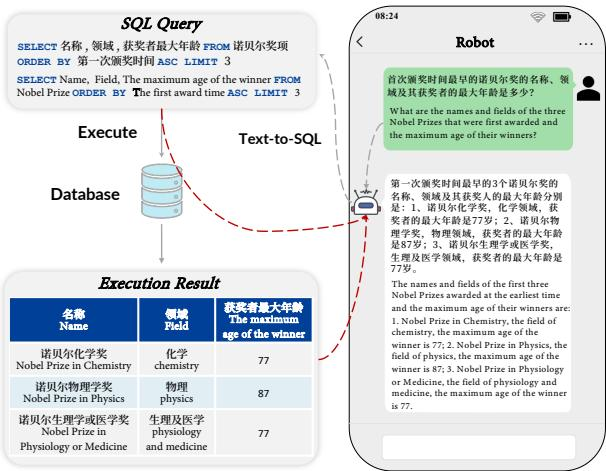
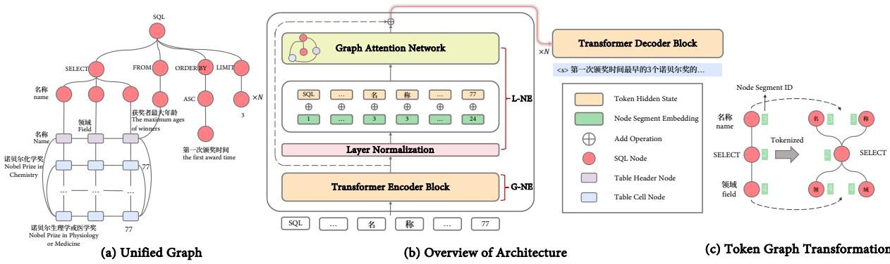
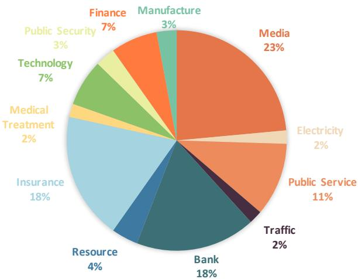
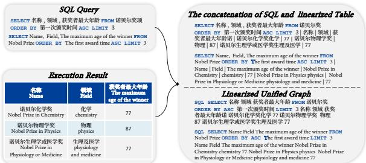

# CATS: A Pragmatic Chinese Answer-to-Sequence Dataset with Large Scale and High Quality

Liang Li1,2, Ruiying Geng3, Chengyang Fang1,2, Bing Li1, Can Ma1∗, Rongyu Cao3, Binhua Li3 , Fei Huang3, Yongbin Li3∗

1Institute of Information Engineering, Chinese Academy of Sciences, Beijing, China   
2School of Cyber Security, University of Chinese Academy of Sciences, Beijing, China 3DAMO Academy, Alibaba Group {liliang, macan}@iie.ac.cn {ruiying.gry, shuide.lyb}@alibaba-inc.com

## Abstract

There are three problems existing in the popular data-to-text datasets. First, the large-scale datasets either contain noise or lack real application scenarios. Second, the datasets close to real applications are relatively small in size. Last, current datasets bias in the English language while leaving other languages underexplored. To alleviate these limitations, in this paper, we present CATS, a pragmatic Chinese answer-to-sequence dataset with large scale and high quality. The dataset aims to generate textual descriptions for the answer in the practical TableQA system. Further, to bridge the structural gap between the input SQL and table and establish better semantic alignments, we propose a Unified Graph Transformation approach to establish a joint encoding space for the two hybrid knowledge resources and convert this task to a graph-to-text problem. The experiment results demonstrate the effectiveness of our proposed method. Further analysis on CATS1 attests to both the high quality and challenges of the dataset.

## 1 Introduction

Data-to-text (D2T) generation (Kukich, 1983; Reiter and Dale, 1997) aims to generate a natural language description conditioned on structured or semi-structured data, such as graphs (Song et al., 2018; Wang et al., 2020c) or tables (Lebret et al., 2016; Wiseman et al., 2017). It helps people get the key points of the input data and makes the stored information accessible to a broader range of endusers. A large number of datasets have been proposed as the testbed for neural D2T models and are driving the domain.

However, as shown in Table 1, we note three problems existing in the popular datasets. First, the large-scale datasets either contain noises (e.g.,

  
Figure 1: An example for a practical TableQA system. The red dotted lines denote the input data for answer-tosequence.

WEATHERGOV (Liang et al., 2009)) or lack practical application scenarios, e.g., ToTTo (Parikh et al., 2020). The shortcoming leads to a separation between research and application. Second, the datasets close to practical scenarios are relatively small in size. For example, ROTOWIRE (Wiseman et al., 2017) only contains 4.9K training examples, and CoSQL (Yu et al., 2019) is consist of 7.8K training pairs. The small training size can easily lead to overfitting and is not conducive to training a reliable neural network model. Lastly, most of the existing datasets are built for English, which leads to advanced work on D2T generation primarily focusing on English and leaving other languages underexplored. These limitations hinder the progress of D2T generation. We therefore need to investigate possible remedies.

The crucial step to improving the above limitations is digging out a data-to-text task with a practical scenario. Recently, CoSQL (Yu et al., 2019) has proposed a practical controlled D2T task: answer-to-sequence. As shown in Figure 1, the task takes a SQL query generated by a semantic parsing module, i.e., text-to-SQL (Zettlemoyer and Collins,

2012), and its corresponding execution result (in the form of a table) as the model input and aims to produce a natural language description as the response to users in a real-world TableQA system. The SQL gives explicit signals for models on what to generate. The generated description could provide a concise and easy-to-understand summary of the result table and help users verify whether the queried result is consistent with the original question (Fang et al., 2022). Moreover, the task also contributes to a more user-friendly humancomputer interaction. Nevertheless, CoSQL contains only 7.8K answer-to-sequence examples for training. Additionally, it is a dataset with SQLgrounded dialogue state tracking as the core, and the generation annotations are very rough. The scale and quality of CoSQL limit further exploring the answer-to-sequence task.

In this paper, to bridge the gap between research and application of data-to-text datasets and enrich their language diversity, we comply with the CoSQL setting and present CATS, a large-scale and high-quality Chinese answer-to-sequence dataset. We manually annotate all collected SQL-table pairs to obtain their descriptions. We make two efforts to improve the quality and scale of the collected SQL-Table pairs and guarantee they are close to practical scenarios. First, we annotate the SQL-table pairs from DuSQL (Wang et al., 2020b), a large-scale Chinese Text-to-SQL dataset with a SQL query distribution close to real applications. Data collected in this way are named CATS-D. Second, we adopt an automatic data construction pipeline to collect a large number of SQL-table pairs for annotation. The basic idea is automatically crawling a mount of tables from the Internet to build multi-table databases and then automatically generating SQL queries based on the SQL grammar and constrained by the given database. Data collected with this method are referred to as CATS-S. Compared to CATS-D, CATS-S expands the data scale while reducing the share of easy SQLs to make the dataset more challenging. In total, CATS is made up of both CATS-D and CATS-S, and contains 43,369 answer-to-sequence examples, which is an order of magnitude larger than CoSQL.

The input SQL and table in answer-to-sequence are heterogeneous, and there is a structural gap between them. To bridge the gap and establish better semantic alignments, we propose a Unified Graph Transformation approach (UGT), which first converts the two sources to two undirected graphs, then builds the connection between the nodes in different graphs to obtain a unified graph. In this way, we convert this task to a graph-to-text problem (Gardent et al., 2017b). Previous graph-to-text work (Ribeiro et al., 2021) transforms the input graph into a new token graph to apply pretrained language models, such as T5 (Raffel et al., 2020). We consider that this transformation breaks the original input graph structure and may bring in extra noises into graph encoding. Hence, we further introduce a Node Segment Embedding (NSE) to preserve original structure information.

Our contributions are three-fold as follows:

• We present a large-scale and high-quality Chinese answer-to-sequence dataset (CATS), which narrows the gap between research and application of data-to-text generation datasets and enriches the language diversity.

• We propose UGT and NSE to better model the input of two heterogeneous structured input data sources.

• Experiments and analysis on CATS attest to both the high quality and challenges of the dataset. The results also demonstrate the effectiveness of our proposed method.

## 2 Related Works

## 2.1 Answer-to-Sequence Generation

In a real-world setting, a TableQA system comprises a table semantic parsing (text-to-SQL) component and an answer-to-sequence component. The semantic parsing component converts a natural language question into a SQL query (Guo et al., 2019; Wang et al., 2020a; Hui et al., 2021) and the answerto-sequence component aims generating a natural language description of the SQL and the execution result. CoSQL (Yu et al., 2019) first proposes the answer-to-response task and refers to it as response generation. Intuitively, response generation should encompass both answer acquisition and answer description, which could easily be confused with the role of the whole Table QA system. Therefore, to make the task more clearly related to its definition and function, we rename it as answer-to-sequence generation. In this paper, the proposed CATS follows the same task setting in CoSQL. Specifically, the task’s input consists of a SQL query and its corresponding execution result (in the form of a table), and the output is a natural language description.

<table><tr><td>Dataset</td><td>Train Size</td><td>Domain</td><td>Target</td><td>Application</td><td>Language</td></tr><tr><td>WEATHERGOV (Liang et al., 2009)</td><td>25K</td><td>Weather</td><td>Crawled</td><td>Weather Report</td><td>English</td></tr><tr><td>WikiBio (Lebret et al., 2016)</td><td>583K</td><td>Wikipedia</td><td>Crawled</td><td></td><td>English</td></tr><tr><td>WebNLG (Gardent et al., 2017a)</td><td>25.3K</td><td>DBPedia</td><td>Annotated</td><td></td><td>English</td></tr><tr><td>LogicNLG (Chen et al., 2020)</td><td>28.5K</td><td>Wikipedia</td><td>Annotated</td><td></td><td>English</td></tr><tr><td>ToTTo (Parikh et al., 2020)</td><td>120K</td><td>Wikipedia</td><td>Annotated</td><td></td><td>English</td></tr><tr><td>Rotowire (Wiseman et al., 2017)</td><td>4.9K</td><td>NBA</td><td>Annotated (Noisy)</td><td>NBA</td><td>English</td></tr><tr><td>AdverGeneration (Shao et al., 2019)</td><td>115K</td><td>Chinese E-commerce</td><td>Crawled</td><td>Advertising Text Generation</td><td>Chinese</td></tr><tr><td>CoSQL (Yu et al., 2019)</td><td>7.8K</td><td>Cross-Domain</td><td>Annotated</td><td>TableQA</td><td>English</td></tr><tr><td>Map2seq (Schumann and Riezler, 2021)</td><td>7.6K</td><td>OpenStreetMap</td><td>Annotated</td><td>Navigation</td><td>English</td></tr><tr><td>CATS</td><td>34.7K</td><td>Cross-Domain</td><td>Annotated</td><td>TableQA</td><td>Chinese</td></tr><tr><td>CATS-D</td><td>6.7K</td><td>Cross-Domain</td><td>Annotated</td><td>TableQA</td><td>Chinese</td></tr><tr><td>CATS-S</td><td>26.4K</td><td>Cross-Domain</td><td>Annotated</td><td>TableQA</td><td>Chinese</td></tr></table>

Table 1: Comparison of popular data-to-text datasets in different aspects. Application represents the practical application scenario associated with the dataset.

Especially, using SQL query as input rather than natual language question is more practical in multiturn TableQA scenarios because the SQL query can easily represent the context state (Yu et al., 2019).

## 2.2 Structure Modeling in Data-to-Text

Recently, some works in D2T generation have shown that the structure modeling for the input data can dramatically improve the model performance. For table data, Liu et al. (2019); Li et al. (2021) propose to utilize a hierarchal encoder to model the table’s representation from the row and column levels. For graph structure modeling, early works (Song et al., 2018; Damonte and Cohen, 2019) introduce Graph Neural Networks as the structure encoder, which only considers the relations between neighbor nodes. Unlike the local encoding strategies, Zhu et al. (2019); Cai and Lam (2020) propose the Graph Transformer that uses explicit relation encoding and allows direct communication between two distant nodes. Newly, some works enable the pretrained language models the structure modeling capabilities and achieve SOTA results on many D2T tasks. Especially, Ribeiro et al. (2021) attempt to insert structural adapters into T5’encoder to model the graph structure. Wang et al. (2022) modify the T5’s attention masking matrix to encode table with a structure-aware self-attention mechanism. In this paper, we propose to utilize UGT to convert the input SQL and table to a graph and utilize a graph-to-model to model it. Our model refers to Ribeiro et al. (2020b, 2021)’ works and further improves them by introducing NSE to better preserve the graph structure.

## 3 Dataset Construction

Considering the limitations of existing D2T datasets, we present CATS, a massive and pragmatic Chinese answer-to-sequence dataset. CATS is constructed by two phases: SQL-table pairs collection and manual data annotation. To balance the data quality and scale and bring it closer to the practical scenario, we collect the SQL-table pairs in two ways. First, we derive SQL-table pairs from DuSQL (Wang et al., 2020b), a text-to-SQL dataset that generates the SQL queries by referring to the SQL query distribution in real-life applications. The dataset obtained by annotating these pairs is referred to as CATS-D. Besides, we implement an automatic data construction pipeline to collect massive high-quality SQL-table pairs. Data collected with this method are referred to as CATS-S, which increases the proportion of complicated SQL queries to make the dataset more challenging. Ultimately, both CATS-D and CATS-S make up CATS. We first describe how to obtain SQL-table pairs for subsequent annotation and then introduce the annotation details.

Database Building To mimic the practical TableQA system, we first follow Wang et al. (2020b) to build a multi-table database $D ^ { d }$ by collecting all databases in DuSQL. In addition, we also build another multi-table database $D ^ { s }$ for expanding the size and domain of our dataset through a table collection pipeline. Specifically, 100,000 high-frequency words are first summarized from the CLUE (Xu et al., 2020) corpus. Then, we query these words in Google and download all the queried spreadsheet files. Subsequently, the available tables in these spreadsheets are extracted by a table parser that can identify the potential table in a worksheet. To protect personal privacy, we use predefined unique words to replace sensitive information in these tables, such as passwords, ID numbers, credit card numbers, etc. Finally, these tables are used to construct the database $D ^ { s }$ . Please refer to Appendix A.1 for more details.

SQL and Table Collection We execute all the SQL queries in DuSQL in the database $D ^ { d }$ to get their corresponding tables. This is consistent with how a practical Table QA system answers user questions after parsing it to SQL. Then we discard SQL-table pairs containing SQLs that execute with empty results to obtain a SQL-table pair set CATS-$\mathbf { D } ^ { u n } = \{ s _ { i } ^ { d } , t _ { i } ^ { d } \} _ { i = 1 } ^ { n }$ . DuSQL does not release the code for generating synthetic queries. Therefore, to increase the annotation examples, we reimplement a SQL generator similar to the one in DuSQL. Notably, the generated SQL contains both singletable and multi-table queries. Please refer to Appendix A.2 for more detailed information on the SQL generator. The sampled SQLs which cannot execute in database $D ^ { s }$ or execute with empty results are deserted. In this way, we obtain another SQL-table pair set $\mathrm { C A T S - S } ^ { u n } = \{ s _ { i } ^ { s } , t _ { i } ^ { s } \} _ { i = 1 } ^ { m }$

Data Annotation Process We employ 20 welleducated crowd workers to annotate the SQL-table pairs in CATS-Dun and CATS-Sun. In particular, the annotators are asked to write a description y given a SQL s and table t pair. They must follow the requirements: (1) avoiding template-like language and trying to write a natural, fluent, and grammatically correct description; (2) the description must summarize all the content in the table; (3) the description must be logically consistent with the input SQL; (4) filtering the incomprehensible examples that are semantically unclear. Furthermore, to guarantee data quality, another 4 workers are asked to review the annotated data. Data with poor annotation quality will be required to be relabeled. Finally, the annotated CATS-Dun is named as CATS-D. To guarantee data consistency, we sample a subset from the annotated CATS-Sun following a similar complexity distribution with CATS-D. We name the sampled dataset CATS-S. However, we find that easy SQL queries account for a large-scale proportion (47.87%) in CATS-D. Therefore, we reduce the proportion of easy SQLs (14.50%) in CATS-S to make it more challenging.

<table><tr><td>COLUMN NUMBER</td><td>1</td><td>2</td><td>3</td><td>&gt;=4</td></tr><tr><td>CoSQL</td><td>6,329</td><td>1057</td><td>459</td><td>0</td></tr><tr><td>CATS</td><td>8,966</td><td>20,862</td><td>3242</td><td>1627</td></tr><tr><td>CATS-D</td><td>2,883</td><td>2,977</td><td>820</td><td>0</td></tr><tr><td>CATS-S</td><td>6,157</td><td>17,813</td><td>2,394</td><td>1,653</td></tr><tr><td>Row NuMBER</td><td>1</td><td>2</td><td>3</td><td>&gt;=4</td></tr><tr><td>CoSQL</td><td>4740</td><td>610</td><td>2,495</td><td>0</td></tr><tr><td>CATS</td><td>14,909</td><td>6,158</td><td>3,671</td><td>9,959</td></tr><tr><td>CATS-D</td><td>2,123</td><td>656</td><td>1,129</td><td>2,772</td></tr><tr><td>CATS-S</td><td>12,754</td><td>5,538</td><td>2,510</td><td>7,215</td></tr><tr><td>SQL HARDNESS</td><td>Easy</td><td>Medium</td><td>Hard</td><td>Extra Hard</td></tr><tr><td>CoSQL</td><td>2,788</td><td>1,826</td><td>1,717</td><td>1,514</td></tr><tr><td>CATS</td><td>7,223</td><td>13,000</td><td>12,016</td><td>2,458</td></tr><tr><td>CATS-D</td><td>3,198</td><td>1709</td><td>1,264</td><td>509</td></tr><tr><td>CATS-S</td><td>4,063</td><td>11,214</td><td>10,787</td><td>1,953</td></tr><tr><td>TARGET LENGTH</td><td>&lt; 20</td><td>&lt; 40</td><td>&lt; 60</td><td>&gt;= 60</td></tr><tr><td>CoSQL</td><td>7,005</td><td>825</td><td>15</td><td>0</td></tr><tr><td>CATS</td><td>10,319</td><td>12,862</td><td>5,864</td><td>5,652</td></tr><tr><td>CATS-D</td><td>1,893</td><td>2,026</td><td>1,912</td><td>849</td></tr><tr><td>CATS-S</td><td>8,401</td><td>10,873</td><td>3,962</td><td>4,781</td></tr></table>

Table 2: Complexity distribution comparison between CATS and CoSQL.

## 3.1 Dataset Analysis

The final CATS contains 43,369 examples, including 8,350 examples in CATS-D and 33,019 examples in CATS-S. Each annotated example contains a triple of SQL s, table t, and descriptive sentences y. We split the training/development/test sets by 34,697/4,336/4,336 randomly. To understand the characteristics of the data collected in CATS-D and CATS-S, we also split them accordingly. The training, development, and test sets of CATS-D and CATS-S contain 6,680/835/835 and 28,017/3,501/3,501 examples, respectively.

Data Complexity To better understand our dataset, we compare its complexity with CoSQL in four dimensions, including the input tables’ row and column number, SQL hardness, and the target length. Following Guo et al. (2021), we adopt SQL hardness to measure the complexity of SQL queries from the following four-level: easy, medium, hard, and extra hard, according to the number of components, selections, and conditions in a SQL query (Yu et al., 2018). Considering CoSQL only release the training and delvelopment sets, we only show the training set comparision. The results are summarized in Table 2. First, we find that the tables in CoSQL are small, such as 60% of the tables with only one row and more than 80% with only one column. Second, we notice that most of the descriptions in CoSQL are less than 20 in length. The first reason is that most of the input tables are small.

  
Figure 2: Illustration of the proposed method. (a) is an example of a unified graph transformed by Unified Graph Transformation. (b) is an overview of our model. L-NE and G-NE denote Local Node Encoder and Global Node Encoder, respectively. (c) is an example of token graph transformation.

By manually checking the data in CoSQL, we find the second reason is that CoSQ describes the table with more than two rows through a generic template, such as “Here are the ...”. Last, we observe that easy SQL queries in CoSQL account for 35.54%, far more than 20.84% in CATS. These features make CoSQL only suitable for simple scenarios and less challenging. By contrast, CATS has a broader distribution than CoSQL, which is more in line with real TableQA applications.

## 4 Structure-Aware Approach

Given an input SQL s and a table t, the model aims to generate a response ${ \tilde { y } } .$ . To bridge the gap between the two sources of information, we first propose a Unified Graph Transformation approach (UGT), which explicitly connects the input SQL and table in a unified structure. In this way, we can obtain a joint graph representation of the two sources and convert the answer-to-sequence task to a graphto-text problem. And then, we utilize a varietal transformer architecture (Ribeiro et al., 2020b) that employs the original transformer encoder as the Global Node Encoder (G-NE) and introduces a GNN based layer into each transformer encoder layer as the Local Node Encoder (L-NE). G-NE allows explicit communication between two distant nodes, taking advantage of a large node context range. And L-NE has an advantage in modeling the graph topology. As shown in Figure 2 (b), this architecture cascaded performs global and local node aggregation, which gathers the benefits from both strategies. In the rest of this section, we will describe the proposed Unified Graph Transformation and the Local Node Encoder in detail.

## 4.1 Unified Graph Transformation

Given a SQL s and its execution result (in the form of a table) t as input (shown in Figure 1), the Unified Graph Transformation takes two steps to transform the input two sources of data into a unified graph (shown in Figure 2 (a)). First, it converts the SQL and table into two undirected graphs: SQL graph $\mathcal { G } _ { s }$ and table graph $\mathcal { G } _ { t }$ . In particular, for a SQL, we follow the previous method (Xu et al., 2018) and convert it to a tree. For a table, we treat each column name and table cell as a node and divide the nodes in the table into two categories: table header node and table cell node. And then, we connect each header node with the cell node in the same column. We also build the connections between the cell nodes in the same row. Second, we add connections between the nodes that indicate the same column in $\mathcal { G } _ { s }$ and $\mathcal { G } _ { t }$ to build the unified graph. we also add a self-loop connection for each node. The transformed unified graph is formulated as $\mathcal { G } _ { h } = ( \nu _ { h } , \mathcal { E } _ { h } )$ , where represents the nodes set and $\mathcal { E } _ { h } = \{ ( n , v ) | n , v \in \mathcal { V } \}$ . Figure 2 (a) shows an example of the transformed unified graph.

We expect that developing generation model should benefit from the recent advance on pretrained language models (PLMs). Following previous work (Ribeiro et al., 2021), we represent each $\mathcal { G } _ { h }$ using subword tokens, and convert it into a new token graph $\mathcal { G } = ( \nu , \mathcal { E } )$ . Specifically, each token of a node in $V _ { h }$ becomes a node v˜ in $\mathcal { N }$ . For each edge $( n , v ) \in \mathcal { E } _ { h } .$ , we connect each token between n and v to obtain the new edges set $\mathcal { E }$ (as shown in Figure 2 (c)). However, we notice that the new token graph breaks the structure of the original graph $\mathcal { G } _ { h }$ and may make the encoder pay too much attention to the feature of nodes at the token level instead of the original node level. This may bring extra noise into graph encoding. To preserve the original structural information, we introduce the Node Segment Embedding (NSE), which assigns the same symbol to the nodes in the token graph $\mathcal { G }$ which belong to the same node in the original unified graph $\mathcal { G } _ { h }$ . Figure 2 (c) gives an example.

## 4.2 Local Node Encoder

Given $\{ h _ { v } | v \in \mathcal { V } \}$ as the outputs of the Global Node Encoder at the L-th encoder layer, we next describe how the Local Node Encoder (L-NE) works. As shown in Figure 2 (b), L-NE consists of two main modules: a Node Embedding Layer and a Graph Attention Network (GAT) (Velickovic et al., 2018) Layer. The former enriches the features of the nodes, and the latter explicitly models the graph structure. Formally, given $h _ { v } ,$ , we obtain the featureenhanced node representation by:

$$
h _ { v } ^ { e } = L a y e r N o r m ( h _ { v } ) + e _ { v } ^ { s } ,\tag{1}
$$

where LayerNorm represents layer normalization (Ba et al., 2016). $e _ { v } ^ { s }$ denote the node segment embedding for node v. After the Node Embedding Layer, we utilize a GAT layer to model the graph structure. Formally, it aggregates the representations of node v in a multi-head self-attention layer (Vaswani et al., 2017) as follows:

$$
\begin{array} { l } { { \displaystyle s _ { v , n } ^ { h } = \frac { h _ { v } ^ { e } W _ { Q } ^ { h } ( h _ { n } ^ { e } W _ { K } ^ { h } ) ^ { \top } } { \sqrt { d / H } } , } } \\ { { \displaystyle \alpha _ { v , n } ^ { h } = \frac { e ^ { s _ { v , n } ^ { h } } } { \sum _ { \bar { n } \in \mathcal { N } ( v ) } e ^ { s _ { v , \bar { n } } ^ { h } } } , } } \\ { { \displaystyle z ^ { h } = \sum _ { n \in \mathcal { N } ( v ) } \alpha _ { v , n } ^ { h } ( h _ { n } ^ { e } W _ { V } ^ { h } ) } , } \\ { { \displaystyle h ^ { r } = C o n c a t ( z ^ { 1 } , . . . , z ^ { H } ) , } } \end{array}\tag{2}
$$

where $1 ~ \leq ~ h ~ \leq ~ H$ , and $W _ { Q } ^ { h } , \ W _ { K } ^ { h } , \ W _ { V } ^ { h } \ \in$ $\mathbb { R } ^ { d \times ( d / H ) } . \mathcal { N } ( v )$ denotes the immediate neighborhood of node v in graph $\mathcal { G }$

The transformer parameters are initialized with the pretrained T5 (Raffel et al., 2020), and the others are randomly initialized. Given each gold instance $( s , t , y )$ , we fine-tune the model to optimize the following cross-entropy objective:

$$
\mathcal { L } = - \sum _ { i = 1 } ^ { | y | } p _ { \theta } ( y _ { i } | y _ { 1 : i - 1 } ; s , t ) .\tag{3}
$$

## 5 Experiment

## 5.1 Experiment Settings

Baselines Due to current datasets bias in the English language, the D2T methods for others are rarely explored. Meanwhile, PLMs-based models, such as T5, have achieved SOTA results (Ribeiro et al., 2020a, 2021; Wang et al., 2022; Jolly et al., 2022) on many D2T tasks. Therefore, we experiment with T5-based models to understand their performance on CATS-D, CATS-S, and CATS:

<table><tr><td>SQL Components</td><td>Descriptions</td></tr><tr><td>Min</td><td>最小的(minimum)</td></tr><tr><td>Max</td><td>最大的(maximum)</td></tr><tr><td>Count</td><td>数量 (the number of)</td></tr><tr><td>Sum</td><td>总共(total)</td></tr><tr><td>Average</td><td>平均(average)</td></tr><tr><td>=</td><td>等于(is)</td></tr><tr><td>!=</td><td>不等于 (is not)</td></tr><tr><td>&gt;</td><td>大于 (more than)</td></tr><tr><td>&gt;=</td><td>大于等于 (no less than)</td></tr><tr><td>&lt;</td><td>小于 (less than)</td></tr><tr><td>&lt;=</td><td>不小于 (no more than)</td></tr><tr><td>And</td><td>并且(and)</td></tr><tr><td>Or</td><td>或者(or)</td></tr><tr><td>Asc</td><td>从低到高 (in the ascending)</td></tr><tr><td>Desc</td><td>从高到低 (in the descending)</td></tr></table>

Table 3: Natual language descriptions for different SQL components.

• TEMP automatically generates descriptions based on the predefined template. Specifically, we first manually write a template for SQL queries replacing the values, columns, table names, and conditions with slots. Meanwhile, we also create a list of descriptions for each component in SQL queries (Table 3 reports the descriptions of partial SQL components). Then we enumerate all cells in the table row by row to obtain the description for a table. Lastly, we join the two parts of descriptions as the final output.

• POINTER-GEN is an RNN-based Seq2Seq model with attention and copy mechanism (See et al., 2017). We concatenate the SQL and linearized table as input.

• T5 denotes finetuning the T5 model on the proposed CATS. The input is the same as that used in the POINTER-GEN. Notably, to make a fair comparison with our proposed method, we add a fully connected feed-forward network (FNN) on top of each transformer layer and make its parameters equal with the L-NE layer. We denote this as T5 + FNN.

• T5-GRAPH is also a finetuning T5 method. Different from T5, it uses the sample graph representation with our method (described in Section 4.1) as input. Again, we add FNN to make a fair comparison, which is denoted as $\mathrm { T } 5 \mathrm { - } \mathrm { G R A P H + F N N }$

<table><tr><td rowspan="2">MODELS</td><td colspan="3">CATS</td><td colspan="3">CATS-D</td><td colspan="3">CATS-S</td></tr><tr><td>BLEU</td><td>ROUGE-L</td><td>COVERAGE</td><td>BLEU</td><td>ROUGE-L</td><td>COVERAGE</td><td>BLEU</td><td>ROUGE-L</td><td>COVERAGE</td></tr><tr><td colspan="10">Development</td></tr><tr><td>GOLD</td><td>1</td><td></td><td>75.56</td><td>-</td><td>1</td><td>69.59</td><td>-</td><td>1</td><td>77.30</td></tr><tr><td>TEMP</td><td>40.04</td><td>57.20</td><td>81.48</td><td>18.05</td><td>47.37</td><td>77.93</td><td>42.71</td><td>59.82</td><td>83.24</td></tr><tr><td>POINTER-GEN</td><td> $5 1 . 2 6 _ { \pm 0 . 2 0 }$ </td><td> $7 3 . 7 0 { \scriptstyle \pm 0 . 1 4 }$ </td><td> $6 8 . 7 3 \mathrm { _ { \pm 0 . 1 3 } }$ </td><td> $4 8 . 3 3 _ { \pm 0 . 9 1 }$ </td><td> $6 7 . 9 5 _ { \pm 0 . 9 6 }$ </td><td> $5 6 . 9 6 _ { \pm 0 . 9 0 }$ </td><td> $4 9 . 7 7 _ { \pm 0 . 1 6 }$ </td><td> $7 3 . 7 9 _ { \pm 0 . 2 6 }$ </td><td> $6 9 . 2 6 { \scriptstyle \pm 0 . 2 4 }$ </td></tr><tr><td>T5</td><td> $5 3 . 6 0 _ { \pm 0 . 1 3 }$ </td><td> $7 4 . 4 2 _ { \pm 0 . 0 6 }$ </td><td> $7 2 . 8 7 { \scriptstyle \pm 0 . 0 4 }$ </td><td> $5 2 . 4 7 _ { \pm 0 . 2 8 }$ </td><td> $6 8 . 5 _ { \pm 0 . 3 2 }$ </td><td> $6 8 . 2 0 { \scriptstyle \pm 0 . 2 5 }$ </td><td> $5 1 . 4 3 _ { \pm 0 . 1 0 }$ </td><td> $7 3 . 7 7 _ { \pm 0 . 0 4 }$ </td><td> $7 3 . 0 8 { \scriptstyle \pm 0 . 0 3 }$ </td></tr><tr><td>T5 + FNN</td><td> $5 4 . 1 4 _ { \pm 0 . 2 1 }$ </td><td> $7 4 . 8 0 { \scriptstyle \pm 0 . 1 6 }$ </td><td> $7 2 . 8 5 _ { \pm 0 . 1 8 }$ </td><td> $5 2 . 1 0 { \scriptstyle \pm 0 . 1 7 }$ </td><td> $6 8 . 2 8 \mathrm { \pm 0 . 1 7 }$ </td><td> $6 8 . 0 2 _ { \pm 0 . 3 1 }$ </td><td> $5 1 . 6 7 _ { \pm 0 . 2 2 }$ </td><td> $7 3 . 7 5 _ { \pm 0 . 1 7 }$ </td><td> $7 3 . 0 8 _ { \pm 0 . 1 7 }$ </td></tr><tr><td>T5-GRAPH</td><td> $5 2 . 2 1 \mathrm { \pm 0 . 1 7 }$ </td><td> $7 3 . 6 8 _ { \pm 0 . 0 4 }$ </td><td> $7 2 . 0 3 _ { \pm 0 . 1 0 }$ </td><td> $4 9 . 8 9 _ { \pm 0 . 4 0 }$ </td><td> $6 6 . 7 2 _ { \pm 0 . 1 0 }$ </td><td> $6 6 . 6 5 _ { \pm 0 . 2 6 }$ </td><td> $5 0 . 1 2 _ { \pm 0 . 1 8 }$ </td><td> $7 3 . 1 1 { \scriptstyle \pm 0 . 1 3 }$ </td><td> $7 2 . 0 5 _ { \pm 0 . 0 4 }$ </td></tr><tr><td>T5-GRAPH + FNN</td><td> $5 2 . 3 0 { \scriptstyle \pm 0 . 1 7 }$ </td><td> $7 3 . 7 1 { \scriptstyle \pm 0 . 2 0 }$ </td><td> $7 1 . 8 7 { \scriptstyle \pm 0 . 0 5 }$ </td><td> $4 8 . 8 1 _ { \pm 0 . 2 7 }$ </td><td> $6 6 . 3 5 { \scriptstyle \pm 0 . 1 3 }$ </td><td> $6 6 . 1 0 { \scriptstyle \pm 0 . 3 0 }$ </td><td> $5 0 . 4 2 _ { \pm 0 . 0 9 }$ </td><td> $7 3 . 2 2 _ { \pm 0 . 1 2 }$ </td><td> $7 2 . 0 7 { \scriptstyle \pm 0 . 0 5 }$ </td></tr><tr><td>UGT</td><td> $5 4 . 7 5 _ { \pm 0 . 1 5 }$ </td><td> $7 5 . 7 2 _ { \pm 0 . 0 6 }$ </td><td> $7 2 . 6 8 _ { \pm 0 . 1 6 }$ </td><td> $5 4 . 2 3 _ { \pm 0 . 4 9 }$ </td><td> $6 9 . 8 2 _ { \pm 0 . 3 5 }$ </td><td> $6 8 . 0 7 { \scriptstyle \pm 0 . 6 3 }$ </td><td> $5 2 . 5 4 _ { \pm 0 . 1 6 }$ </td><td> $7 4 . 8 4 _ { \pm 0 . 1 2 }$ </td><td> $7 2 . 9 9 _ { \pm 0 . 0 7 }$ </td></tr><tr><td> $\mathrm { U G T } + \mathrm { N s E }$ </td><td> $5 6 . 3 4 _ { \pm 0 . 1 3 }$ </td><td> $7 6 . 7 2 _ { \pm 0 . 0 9 }$ </td><td> ${ \bf 7 3 . 4 1 _ { \pm 0 . 0 5 } }$ </td><td> $\mathbf { 5 8 . 7 9 _ { \pm 0 . 5 1 } }$ </td><td> $7 3 . 1 6 _ { \pm 0 . 3 1 }$ </td><td> ${ \bf 6 8 . 9 4 _ { \pm 0 . 3 1 } }$ </td><td> $5 3 . 5 4 _ { \pm 0 . 1 5 }$ </td><td> $7 5 . 3 6 _ { \pm 0 . 1 9 }$ </td><td> $7 3 . 6 7 _ { \pm 0 . 1 0 }$  </td></tr><tr><td colspan="10">Test</td></tr><tr><td>GOLD</td><td></td><td>-</td><td>76.35</td><td></td><td></td><td>68.67</td><td></td><td>1</td><td>76.98</td></tr><tr><td>TEMP</td><td>41.39</td><td>57.82</td><td>82.40</td><td>17.76</td><td>46.21</td><td>77.83</td><td>42.69</td><td>60.16</td><td>82.96</td></tr><tr><td>POINTER-GEN</td><td> $5 0 . 7 7 { \scriptstyle \pm 0 . 5 6 }$ </td><td> $7 3 . 2 5 _ { \pm 0 . 1 4 }$ </td><td> $6 8 . 4 7 _ { \pm 0 . 3 1 }$ </td><td> $4 7 . 3 4 _ { \pm 0 . 8 1 }$ </td><td> $6 6 . 4 6 _ { \pm 0 . 8 0 }$ </td><td> $5 6 . 9 3 _ { \pm 1 . 2 1 }$ </td><td> $5 0 . 3 7 { \scriptstyle \pm 0 . 2 7 }$ </td><td> $7 4 . 2 1 { \scriptstyle \pm 0 . 2 0 }$ </td><td> $6 9 . 9 8 _ { \pm 0 . 2 4 }$ </td></tr><tr><td>T5</td><td> $5 3 . 4 9 _ { \pm 0 . 1 3 }$ </td><td> $7 4 . 2 2 _ { \pm 0 . 0 8 }$ </td><td> $7 2 . 3 6 _ { \pm 0 . 1 2 }$ </td><td> $5 1 . 3 2 _ { \pm 0 . 2 2 }$ </td><td> $6 6 . 8 1 _ { \pm 0 . 2 8 }$ </td><td> $6 7 . 9 3 _ { \pm 0 . 1 8 }$ </td><td> $5 2 . 9 1 _ { \pm 0 . 0 7 }$ </td><td> $7 4 . 5 1 _ { \pm 0 . 0 8 }$ </td><td> $7 3 . 3 3 _ { \pm 0 . 0 8 }$ </td></tr><tr><td> $\mathrm { T } 5 + \mathrm { F N N }$ </td><td> $5 3 . 8 7 _ { \pm 0 . 1 8 }$ </td><td> $7 4 . 4 2 _ { \pm 0 . 1 6 }$ </td><td> $7 2 . 3 4 _ { \pm 0 . 1 0 }$ </td><td> $5 0 . 7 1 { \scriptstyle \pm 0 . 1 2 }$ </td><td> $6 6 . 4 2 _ { \pm 0 . 2 4 }$ </td><td> $6 7 . 0 6 _ { \pm 0 . 2 4 }$ </td><td> $5 2 . 7 1 { \scriptstyle \pm 0 . 1 4 }$ </td><td> $7 4 . 3 2 _ { \pm 0 . 1 1 }$ </td><td> $7 3 . 3 2 _ { \pm 0 . 1 6 }$ </td></tr><tr><td> $_ { \mathrm { T } 5 - \mathrm { G R A P H } }$ </td><td> $5 1 . 8 2 _ { \pm 0 . 1 3 }$ </td><td> $7 3 . 2 8 \mathrm { \pm 0 . 0 5 }$ </td><td> $7 1 . 3 3 _ { \pm 0 . 0 3 }$ </td><td> $4 7 . 9 1 _ { \pm 0 . 2 8 }$ </td><td> $6 4 . 7 5 _ { \pm 0 . 2 0 }$ </td><td> $6 5 . 5 1 _ { \pm 0 . 3 1 }$ </td><td> $5 1 . 4 0 { \scriptstyle \pm 0 . 2 2 }$ </td><td> $7 3 . 7 8 \mathrm { \pm 0 . 1 3 }$ </td><td> $7 2 . 1 5 _ { \pm 0 . 0 8 }$ </td></tr><tr><td> $\mathrm { T } 5 \mathrm { - } \mathrm { G R A P H + F N N }$ </td><td> $5 2 . 0 4 _ { \pm 0 . 2 2 }$ </td><td> $7 3 . 5 8 \mathrm { \pm 0 . 1 5 }$ </td><td> $7 1 . 3 7 { \scriptstyle \pm 0 . 1 3 }$ </td><td> $4 7 . 4 5 _ { \pm 0 . 3 3 }$ </td><td> $6 4 . 6 0 { \scriptstyle \pm 0 . 2 5 }$ </td><td> $6 5 . 6 9 _ { \pm 0 . 3 1 }$ </td><td> $5 1 . 3 5 _ { \pm 0 . 2 1 }$ </td><td> $7 8 . 7 8 { \scriptstyle \pm 0 . 1 4 }$ </td><td> $7 2 . 3 2 _ { \pm 0 . 1 2 }$ </td></tr><tr><td>UGT</td><td> $5 4 . 2 7 { \scriptstyle \pm 0 . 2 4 }$ </td><td> $7 5 . 1 3 _ { \pm 0 . 1 0 }$ </td><td> $7 2 . 1 3 _ { \pm 0 . 1 6 }$ </td><td> $5 2 . 4 8 _ { \pm 0 . 4 3 }$ </td><td> $6 7 . 9 6 _ { \pm 0 . 4 5 }$ </td><td> $6 7 . 1 9 _ { \pm 0 . 7 2 }$ </td><td> $5 3 . 0 3 _ { \pm 0 . 3 7 }$ </td><td> $7 5 . 3 8 { \scriptstyle \pm 0 . 1 1 }$  </td><td> $7 3 . 1 8 _ { \pm 0 . 1 3 }$ </td></tr><tr><td> $\mathrm { U G T } + \mathrm { N s E }$ </td><td> ${ \bar { \bf 5 } } 5 . 9 5 _ { \pm 0 . 2 3 }$  </td><td> $\mathbf { 7 6 . 1 0 { \scriptstyle \pm 0 . 0 6 } }$  </td><td> $7 2 . 8 4 _ { \pm 0 . 1 8 }$ </td><td> ${ \bf 5 7 . 1 0 _ { \pm 0 . 4 2 } }$ </td><td> $7 1 . 7 4 _ { \pm 0 . 4 3 }$ </td><td> ${ \bf 6 8 . 4 0 _ { \pm 0 . 2 3 } }$  </td><td> ${ \bar { 5 } } 4 . 2 1 _ { \pm 0 . 1 7 }$ </td><td> $7 5 . 9 3 _ { \pm 0 . 2 0 }$ </td><td> $\mathbf { 7 4 . 0 4 _ { \pm 0 . 0 8 } }$  </td></tr></table>

Table 4: Automatic evaluation results on the development and test sets. Mean ( s.d.) over 4 seeds.

Evaluation Metrics We evaluate our models by applying both automatic and human evaluations. For automatic evaluation, we employ the widely used metric, BLEU (Papineni et al., 2002) and ROUGE-L (Lin, 2004), to evaluate the fluency of generated text. And we utilize SacreBLEU (Post, 2018) to calculate the BLEU after segmenting the sentcne by jieba 2. Additionally, we utilize COVER-AGE (Shao et al., 2019) to evaluate the faithfulness of generated text. COVERAGE measures the average proportion of input tables that are covered by a generated text. The table headers are also considered. We use string matching rules to determine whether a cell exists in the generated text. We conduct experiments over 4 different seeds and report the average scores on them.

First, we can see that all neural network models outperform TEMP on BLEU by a large margin. This suggests that neural models are better at generating fluent expressions. We consider this thanks to the language modeling task (Equation 3), which trains the neural models to predict the next token, given the previous history. Nevertheless, we find that TEMP achieves the best COVERAGE scores on all sets, even better than GOLD. We consider this is because, when annotating the references, to make the presentation more reasonable and fluent, annotators summarize the contents of the table, such as merging some cells, etc. On the other hand, TEMP copies all the contents of the table directly.

We display examples of input representation for different models and provide the implementation details in Appendix C.1 and C.2.

## 5.2 Main Result

Table 4 presents the experimental results on CATS, CATS-D, and CATS-S, from which we make three main observations.

Second, adding extra trainable parameters (+ FNN) does not always improve the performance on T5 and T5-GRAPH. For example, T5 + FNN performs better than T5 on both CATS and CATS-S, but worse than T5 on CATS-D. Moreover, we notice that T5 performs better than T5-GRAPH given the fact that the sizes of their parameters are equal. We speculate this is because, compared to T5-GRAPH, T5 uses the original SQL and the flattened table as input, which preserves the partial structural information of the input SQL and table by the segment symbols “,” and “|” (please refer to Appendix C.1 for the example of input data linearizations). However, T5-GRAPH still treats the input as a sequence and ignores the unified graph’s structure, leading to its performance degradation.

<table><tr><td>MODEL</td><td>CATS</td><td>CATS-D</td><td>CATS-S</td></tr><tr><td>T5 + FNN</td><td> $5 4 . 1 4 _ { \pm 0 . 2 1 }$ </td><td> $5 2 . 1 0 { \scriptstyle \pm 0 . 1 7 }$  </td><td> $5 1 . 6 7 _ { \pm 0 . 2 2 }$ </td></tr><tr><td>w/o SQL w/o TABLE</td><td> $4 0 . 9 0 _ { \pm 0 . 2 4 }$   $1 7 . 8 3 { \scriptstyle \pm 0 . 1 3 }$ </td><td> $3 9 . 7 5 _ { \pm 0 . 0 8 }$   $2 4 . 2 5 _ { \pm 0 . 3 3 }$ </td><td> $4 0 . 0 0 { \scriptstyle \pm 0 . 3 0 }$   $1 4 . 5 1 { \scriptstyle \pm 0 . 1 1 }$ </td></tr><tr><td>OURS</td><td> $5 6 . 3 4 _ { \pm 0 . 1 3 }$ </td><td> $5 8 . 7 9 _ { \pm 0 . 5 1 }$  </td><td> $5 3 . 5 4 _ { \pm 0 . 1 5 }$ </td></tr><tr><td>w/o SQL w/o TABLE</td><td> $4 5 . 1 6 _ { \pm 0 . 2 6 }$   $1 9 . 5 9 _ { \pm 0 . 1 6 }$ </td><td> $4 7 . 9 2 _ { \pm 0 . 5 0 }$   $2 6 . 9 1 _ { \pm 0 . 1 1 }$ </td><td> $4 3 . 8 9 _ { \pm 0 . 3 8 }$   $1 6 . 2 0 { \scriptstyle \pm 0 . 6 2 }$ </td></tr></table>

Table 5: Effect of input SQL and TABLE. w/o SQL and w/o TABLE denote removing the SQL and table from the input, respectively. OURS denotes $\mathrm { U G T } + \mathrm { N S E }$

Lastly, by explicitly modeling the unified graph structures, UGT dramatically outperforms the sizecomparable models T5-GRAPH + FNN and T5- FNN on all metrics. The results display UGT’s superiority in capturing essential structural knowledge for this task. Additionally, Node Segment Embedding (+ NSE) further improves the performance. This verifies that NSE can help the encoder better preserve the original structural information.

## 5.3 Analysis and Discussion

Effects of input SQL and Table To examine the effects of different input data, we conduct ablation studies on the input side by removing the input SQL and table. The results on three development sets are summarized in Table 5. We observe that, after removing the SQL and only utilizing the table as input, both T5 + FNN and our method (UGT + NSE) perform poorly on all metrics. The performance degrades even more if only SQL is employed. The results demonstrate that both input SQL and table are essential for the answer-to-sequence task. Additionally, our method clearly outperforms T5 + FNN on all ablation settings. It reveals the effectiveness of our method compared to vanilla T5 architecture even under extreme input conditions.

Effects of Data Complexity We further explore the performances on different levels of data complexity. We use BLEU as the metric in this section. The results are shown in Table 6. We first explore the effect of the table size. Unsurprisingly, the BLEU scores of all models decrease as the number of table rows or columns grows. The more rows or columns the table contains, the more difficult it is for a model to process it. Compared to two baseline models, our method is better at handling large tables. Furthermore, we investigate the impact of SQL complexity on model performances. With respect to the SQL complexity, our model achieves larger improvement against baseline models, especially on extra hard SQLs. It shows that our approach can better encode the complex input data than others. Lastly, we study the model performance concerning different ground-truth description lengths. The POINTER-GEN struggles on longer descriptions, where the performance drops over 10 BLEU scores on responses longer than 60. In this scenario, T5-based models dramatically outperform the POINTER-GEN, while our method can still beat $\mathrm { T } 5 + \mathrm { F N N }$

<table><tr><td>COLUMN NUMBER # EXAMPLES</td><td>1 1,138</td><td>2 2,580</td><td>3 403</td><td>&gt;=4 215</td></tr><tr><td>POINTER-GEN</td><td>53.21</td><td>50.74</td><td>42.20</td><td>35.29</td></tr><tr><td>T5 + FNN</td><td>+2.28</td><td>+1.16</td><td>+7.08</td><td>+4.29</td></tr><tr><td>OURS</td><td>+5.61</td><td>+4.69</td><td>+7.54</td><td>+5.28</td></tr><tr><td>Row NUMBER</td><td>1</td><td>2</td><td>3</td><td>&gt;=4</td></tr><tr><td># EXAMPLES</td><td>1,899</td><td>769</td><td>467</td><td>1201</td></tr><tr><td>POINTER-GEN</td><td>56.72</td><td>49.71</td><td>49.05</td><td>44.30</td></tr><tr><td>T5 + FNN</td><td>+3.57</td><td>-0.58</td><td>+1.68</td><td>+6.24</td></tr><tr><td>OURS</td><td>+5.75</td><td>+1.54</td><td>+5.16</td><td>+7.62</td></tr><tr><td>SQL HARDNESS</td><td>Easy</td><td>Medium</td><td>Hard</td><td>Extra Hard</td></tr><tr><td># EXAMPLES</td><td>915</td><td>1,588</td><td>1,531</td><td>302</td></tr><tr><td>POINTER-GEN</td><td>60.92</td><td>54.99</td><td>42.78</td><td>43.17</td></tr><tr><td>T5 + FNN</td><td>+0.92</td><td>+0.60</td><td>+6.79</td><td>+3.65</td></tr><tr><td>OURS</td><td>+3.98</td><td>+3.75</td><td>+7.80</td><td>+9.22</td></tr><tr><td>TARGET LENGTH</td><td>&lt; 20</td><td>&lt; 40</td><td>&lt; 60</td><td>&gt;= 60</td></tr><tr><td># EXAMPLES</td><td>1,275</td><td>1,635</td><td>724</td><td>702</td></tr><tr><td>POINTER-GEN</td><td>52.67</td><td>51.97</td><td>52.02</td><td>41.64</td></tr><tr><td>T5 + FNN</td><td>+2.93</td><td>-0.31</td><td>-0.06</td><td>+7.54</td></tr><tr><td>OURS</td><td>+6.08</td><td>+3.19</td><td>+3.33</td><td>+7.82</td></tr></table>

Table 6: BLEU scores of different models in the CATS test set on different levels of data complexity. Relative results of T5 + FNN and our method are reported compared against the POINTER-GEN.

## 5.4 Human Evaluation

To reach a deeper understanding of the qualities of the generated descriptions, we conduct human evaluation following Parikh et al. (2020). We compare our method with TEMP, POINTER-GEN, and T5 + FNN. Specifically, we first randomly select 100 examples from the CATS test set and the corresponding outputs generated by each model. And then, five native Chinese annotators (three females and two males) with master’s degrees or above engaged in NLP research are invited to evaluate the quality from the four axes. Specifically, FLUENCY measures whether the description is fluent. FAITH-FULNESS estimates whether the description is logically consistent with input SQL, and all pieces of information are supported by the input table.

<table><tr><td>MODEL</td><td>Flu. ↑</td><td>Fai. ↑</td><td>Cov.(%)↑</td><td>Rep. ↓</td></tr><tr><td>GOLD</td><td>8.42</td><td>9.15</td><td>95.32</td><td>0.14</td></tr><tr><td>TEMP</td><td>5.27</td><td>6.87</td><td>99.41</td><td>0.02</td></tr><tr><td>POINTER-GEN</td><td>6.13</td><td>6.32</td><td>83.27</td><td>0.74</td></tr><tr><td>T5 + FNN</td><td>6.82</td><td>7.16</td><td>89.27</td><td>0.39</td></tr><tr><td>OURS</td><td>7.14</td><td>7.48</td><td>90.26</td><td>0.27</td></tr></table>

Table 7: Human evaluation over references (denoted as GOLD) and model outputs. Flu., Fai., Cov., Rep. denote FLUENCY, FAITHFULNESS, COVERAGE and REPETITION. indicates higher is better and denotes lower is better.

They are scores range from 1 to 10, the higher the better. COVERAGE is the percentage of cells in the input table the candidate sentence covers. It is different from the one in Table 4 (please refer to Appendix C.4). REPETITION is number of cells the candidate sentence repeats. We also introduce the reference as one candidate (denoted as GOLD). And its results can be regarded as the upper bound.

The results summarized in Table 7 show that the GOLD consistently achieves high performance than generation methods. It attests to the high quality of our human annotations. We report FLUENCY and FAITHFULNESS score for TEMP because they are sensitive evaluation. We can see that TEMP gets a high FAITHFULNESS score but is poor on FLU-ENCY. Our method outperforms baseline models on almost all axes with an agreement kappa score (van der Lee et al., 2020) more than 0.86. It demonstrates the effectiveness of our proposed method. Although our model achieves a high coverage rate (90.26%), its FAITHFULNESS score is relatively low (only 7.48), and there is a considerable gap compared with GOLD. It indicates simply copying content from the input table can not guarantee the faithfulness of the generated response. It may be necessary for the model to understand the deep semantics of SQL and table, which is the biggest challenge in this dataset.

## 6 Conclusion

We present CATS, a large-scale and high-quality Chinese answer-to-sequence dataset, along with a series of baselines. It helps alleviate the problem of current D2T datasets’ bias towards the English language. We propose a Unified Graph Transformation method to bridge the structural gap between the SQL and table. In this way, we convert the task to a graph-to-text problem. Furthermore, we introduce the Node Segment Embedding to solve the problem that transforming the input graph to a new token graph breaks the original graph’s structure. Experiments on CATS show that our proposed model outperforms existing baseline models. We conduct further analysis on CATS, which attests to both the high quality and challenges of the dataset.

## Limitations

This work presents CATS, a large-scale and highquality Chinese answer-to-sequence dataset. It is a free and open dataset. One of most important motivations for presenting this dataset is that most of the existing datasets are built for English, which leads to advanced work on D2T generation primarily focusing on English and leaving other languages underexplored. However, CATS only alleviates the dataset language bias rather than solving it. And it is limited to the study of Chinese methods. Regarding methodology, the proposed UGT converts the answer-to-sequence task to a graph-to-text problem to bridge the gap between two heterogeneous input data (SQL and table). However, UGT works only for answer-to-sequence task rather than graph-totext task. Additionally, though the proposed NSE can help the graph-to-text model better preserve the original structural information, the contribution may be limited to the graph-to-text task.

## Ethics Statement

This work presents CATS, a free and open dataset for the research community to study the answer-tosequence problem in the practical TableQA system. And it helps enrich the D2T languages and alleviate the datasets’ bias in English. To balance the data quality and scale and bring it closer to the practical scenario, data in CATS are collected from two sources, which are manually annotated as CATS-D and CATS-S. In other words, CATS consists of CATS-D and CATS-S. The data in CATS-D is collected from DuSQL (Wang et al., 2020b) dataset, a free and open dataset for the Chinese Text-to-SQL problem. Meanwhile, to enlarge our dataset, we adopt an automatic data construction pipeline to collect a large number of high-quality SQL-table pairs for annotation. To ensure the quality of our dataset, we manually annotate the SQL-table pairs. We hire 24 native annotators with undergraduate degrees to annotate the data. Specifically, 20 annotators are responsible for annotations, and another 4 workers are asked to review the annotated data.

We pay 2.1 yuan (\$0.31 USD) for annotating each SQL-table pair.

To avoid our dataset leakages personal privacy, we replace the sensitive information in the collected tables with predefined unique words. Furthermore, we ask the annotators to filter out the examples that leak personal privacy and contain social bias and harmful content.

## References

Lei Jimmy Ba, Jamie Ryan Kiros, and Geoffrey E. Hinton. 2016. Layer normalization. CoRR, abs/1607.06450.

Junwei Bao, Duyu Tang, Nan Duan, Zhao Yan, Yuanhua Lv, Ming Zhou, and Tiejun Zhao. 2018. Table-totext: Describing table region with natural language. In Proceedings of the Thirty-Second AAAI Conference on Artificial Intelligence, (AAAI-18), the 30th innovative Applications ofArtificial Intelligence (IAAI-18), and the 8th AAAI Symposium on Educational Advances in Artificial Intelligence (EAAI-18), New Orleans, Louisiana, USA, February 2-7, 2018, pages 5020–5027. AAAI Press.

Deng Cai and Wai Lam. 2020. Graph transformer for graph-to-sequence learning. In The Thirty-Fourth AAAI Conference on Artificial Intelligence, AAAI 2020, The Thirty-Second Innovative Applications of Artificial Intelligence Conference, IAAI 2020, The Tenth AAAI Symposium on Educational Advances in Artificial Intelligence, EAAI 2020, New York, NY, USA, February 7-12, 2020, pages 7464–7471. AAAI Press.

Wenhu Chen, Jianshu Chen, Yu Su, Zhiyu Chen, and William Yang Wang. 2020. Logical natural language generation from open-domain tables. In Proceedings ofthe 58th Annual Meeting ofthe Association for Computational Linguistics, ACL 2020, Online, July 5-10, 2020, pages 7929–7942. Association for Computational Linguistics.

Marco Damonte and Shay B. Cohen. 2019. Structural neural encoders for amr-to-text generation. In Proceedings ofthe 2019 Conference ofthe North American Chapter ofthe Associationfor Computational Linguistics: Human Language Technologies, NAACL-HLT 2019, Minneapolis, MN, USA, June 2-7, 2019, Volume 1 (Long and Short Papers), pages 3649–3658. Association for Computational Linguistics.

Shineng Fang, Jiangjie Chen, Xinyao Shen, Yunwen Chen, and Yanghua Xiao. 2022. : A faithful contrastive framework for response generation in tableqa systems. In International Conference on Database Systemsfor Advanced Applications. Springer.

Claire Gardent, Anastasia Shimorina, Shashi Narayan, and Laura Perez-Beltrachini. 2017a. Creating train ing corpora for nlg micro-planners. In Proceedings

of the 55th Annual Meeting of the Association for Computational Linguistics (Volume 1: Long Papers), pages 179–188.

Claire Gardent, Anastasia Shimorina, Shashi Narayan, and Laura Perez-Beltrachini. 2017b. The webnlg challenge: Generating text from RDF data. In Proceedings of the 10th International Conference on Natural Language Generation, INLG 2017, Santiago de Compostela, Spain, September 4-7, 2017, pages 124–133. Association for Computational Linguistics.

Jiaqi Guo, Ziliang Si, Yu Wang, Qian Liu, Ming Fan, Jian-Guang Lou, Zijiang Yang, and Ting Liu. 2021. Chase: A large-scale and pragmatic chinese dataset for cross-database context-dependent text-to-sql. In Proceedings of the 59th Annual Meeting of the Associationfor Computational Linguistics and the 11th International Joint Conference on Natural Language Processing, ACL/IJCNLP 2021, (Volume 1: Long Papers), Virtual Event, August 1-6, 2021, pages 2316– 2331. Association for Computational Linguistics.

Jiaqi Guo, Zecheng Zhan, Yan Gao, Yan Xiao, Jian-Guang Lou, Ting Liu, and Dongmei Zhang. 2019. Towards complex text-to-sql in cross-domain database with intermediate representation. In Proceedings of the 57th Conference of the Association for Computational Linguistics, ACL 2019, Florence, Italy, July 28- August 2, 2019, Volume 1: Long Papers, pages 4524–4535. Association for Computational Linguistics.

Sepp Hochreiter and Jürgen Schmidhuber. 1997. Long short-term memory. Neural Comput., 9(8):1735– 1780.

Binyuan Hui, Ruiying Geng, Qiyu Ren, Binhua Li, Yongbin Li, Jian Sun, Fei Huang, Luo Si, Pengfei Zhu, and Xiaodan Zhu. 2021. Dynamic hybrid relation exploration network for cross-domain contextdependent semantic parsing. In Thirty-Fifth AAAI Conference on Artificial Intelligence, AAAI 2021, Thirty-Third Conference on Innovative Applications of Artificial Intelligence, IAAI 2021, The Eleventh Symposium on Educational Advances in Artificial Intelligence, EAAI 2021, Virtual Event, February 2-9, 2021, pages 13116–13124. AAAI Press.

Shailza Jolly, Zi Xuan Zhang, Andreas Dengel, and Lili Mou. 2022. Search and learn: Improving semantic coverage for data-to-text generation. In Thirty-Sixth AAAI Conference on Artificial Intelligence, AAAI 2022, Thirty-Fourth Conference on Innovative Applications ofArtificial Intelligence, IAAI 2022, The Twelveth Symposium on Educational Advances in Artificial Intelligence, EAAI 2022 Virtual Event, February 22 - March 1, 2022, pages 10858–10866. AAAI Press.

Guillaume Klein, Yoon Kim, Yuntian Deng, Jean Senellart, and Alexander Rush. 2017. OpenNMT: Opensource toolkit for neural machine translation. In Proceedings of ACL 2017, System Demonstrations, pages 67–72, Vancouver, Canada. Association for Computational Linguistics.

Karen Kukich. 1983. Design of a knowledge-based report generator. In 21st Annual Meeting ofthe Associationfor Computational Linguistics, Massachusetts Institute of Technology, Cambridge, Massachusetts, USA, June 15-17, 1983, pages 145–150. ACL.

Rémi Lebret, David Grangier, and Michael Auli. 2016. Neural text generation from structured data with application to the biography domain. In Proceedings of the 2016 Conference on Empirical Methods in Natural Language Processing, EMNLP 2016, Austin, Texas, USA, November 1-4, 2016, pages 1203–1213. The Association for Computational Linguistics.

Liang Li, Can Ma, Yinliang Yue, and Dayong Hu. 2021. Improving encoder by auxiliary supervision tasks for table-to-text generation. In Proceedings ofthe 59th Annual Meeting ofthe Associationfor Computational Linguistics and the 11th International Joint Conference on Natural Language Processing, ACL/IJCNLP 2021, (Volume 1: Long Papers), Virtual Event, August 1-6, 2021, pages 5979–5989. Association for Computational Linguistics.

Percy Liang, Michael I. Jordan, and Dan Klein. 2009. Learning semantic correspondences with less supervision. In ACL 2009, Proceedings of the 47th Annual Meeting of the Association for Computational Linguistics and the 4th International Joint Conference on Natural Language Processing of the AFNLP, 2-7 August 2009, Singapore, pages 91–99. The Association for Computer Linguistics.

Chin-Yew Lin. 2004. Rouge: A package for automatic evaluation of summaries. In Text summarization branches out, pages 74–81.

Tianyu Liu, Fuli Luo, Qiaolin Xia, Shuming Ma, Baobao Chang, and Zhifang Sui. 2019. Hierarchical encoder with auxiliary supervision for neural tableto-text generation: Learning better representation for tables. In The Thirty-Third AAAI Conference on Artificial Intelligence, AAAI 2019, The Thirty-First Innovative Applications ofArtificial Intelligence Conference, IAAI 2019, The Ninth AAAI Symposium on Educational Advances in Artificial Intelligence, EAAI 2019, Honolulu, Hawaii, USA, January 27 - February 1, 2019, pages 6786–6793. AAAI Press.

Ilya Loshchilov and Frank Hutter. 2018. Decoupled weight decay regularization. In International Conference on Learning Representations.

Kishore Papineni, Salim Roukos, Todd Ward, and Wei-Jing Zhu. 2002. Bleu: a method for automatic evaluation of machine translation. In Proceedings of the 40th Annual Meeting of the Association for Computational Linguistics, July 6-12, 2002, Philadelphia, PA, USA, pages 311–318. ACL.

Ankur P. Parikh, Xuezhi Wang, Sebastian Gehrmann, Manaal Faruqui, Bhuwan Dhingra, Diyi Yang, and Dipanjan Das. 2020. Totto: A controlled table-to-text generation dataset. In Proceedings of the 2020 Conference on Empirical Methods in Natural Language

Processing, EMNLP 2020, Online, November 16-20, 2020, pages 1173–1186. Association for Computational Linguistics.

Matt Post. 2018. A call for clarity in reporting BLEU scores. In Proceedings of the Third Conference on Machine Translation: Research Papers, WMT 2018, Belgium, Brussels, October 31 - November 1, 2018, pages 186–191. Association for Computational Linguistics.

Colin Raffel, Noam Shazeer, Adam Roberts, Katherine Lee, Sharan Narang, Michael Matena, Yanqi Zhou, Wei Li, and Peter J. Liu. 2020. Exploring the limits of transfer learning with a unified text-to-text transformer. J. Mach. Learn. Res., 21:140:1–140:67.

Ehud Reiter and Robert Dale. 1997. Building applied natural language generation systems. Nat. Lang. Eng., 3(1):57–87.

Leonardo F. R. Ribeiro, Martin Schmitt, Hinrich Schütze, and Iryna Gurevych. 2020a. Investigating pretrained language models for graph-to-text generation. CoRR, abs/2007.08426.

Leonardo F. R. Ribeiro, Yue Zhang, Claire Gardent, and Iryna Gurevych. 2020b. Modeling global and local node contexts for text generation from knowledge graphs. Trans. Assoc. Comput. Linguistics, 8:589– 604.

Leonardo F. R. Ribeiro, Yue Zhang, and Iryna Gurevych. 2021. Structural adapters in pretrained language models for amr-to-text generation. In Proceedings of the 2021 Conference on Empirical Methods in Natural Language Processing, EMNLP 2021, Virtual Event / Punta Cana, Dominican Republic, 7-11 November, 2021, pages 4269–4282. Association for Computational Linguistics.

Raphael Schumann and Stefan Riezler. 2021. Generating landmark navigation instructions from maps as a graph-to-text problem. In Proceedings of the 59th Annual Meeting ofthe Associationfor Computational Linguistics and the 11th International Joint Conference on Natural Language Processing, ACL/IJCNLP 2021, (Volume 1: Long Papers), Virtual Event, August 1-6, 2021, pages 489–502. Association for Computational Linguistics.

Abigail See, Peter J. Liu, and Christopher D. Manning. 2017. Get to the point: Summarization with pointergenerator networks. CoRR, abs/1704.04368.

Zhihong Shao, Minlie Huang, Jiangtao Wen, Wenfei Xu, and Xiaoyan Zhu. 2019. Long and diverse text generation with planning-based hierarchical variational model. In Proceedings of the 2019 Conference on Empirical Methods in Natural Language Processing and the 9th International Joint Conference on Natural Language Processing, EMNLP-IJCNLP 2019, Hong Kong, China, November 3-7, 2019, pages 3255– 3266. Association for Computational Linguistics.

Linfeng Song, Yue Zhang, Zhiguo Wang, and Daniel Gildea. 2018. A graph-to-sequence model for amrto-text generation. In Proceedings ofthe 56th Annual Meeting of the Association for Computational Linguistics, ACL 2018, Melbourne, Australia, July 15-20, 2018, Volume 1: Long Papers, pages 1616–1626. Association for Computational Linguistics.

Chris van der Lee, Albert Gatt, Emiel van Miltenburg, and Emiel Krahmer. 2020. Human evaluation of automatically generated text: Current trends and best practice guidelines. Computer Speech & Language, page 101151.

Ashish Vaswani, Noam Shazeer, Niki Parmar, Jakob Uszkoreit, Llion Jones, Aidan N. Gomez, Lukasz Kaiser, and Illia Polosukhin. 2017. Attention is all you need. In Advances in Neural Information Processing Systems 30: Annual Conference on Neural Information Processing Systems 2017, December 4-9, 2017, Long Beach, CA, USA, pages 5998–6008.

Petar Velickovic, Guillem Cucurull, Arantxa Casanova, Adriana Romero, Pietro Liò, and Yoshua Bengio. 2018. Graph attention networks. In 6th International Conference on Learning Representations, ICLR 2018, Vancouver, BC, Canada, April 30 - May 3, 2018, Conference Track Proceedings. OpenReview.net.

Bailin Wang, Richard Shin, Xiaodong Liu, Oleksandr Polozov, and Matthew Richardson. 2020a. RAT-SQL: relation-aware schema encoding and linking for text-to-sql parsers. In Proceedings ofthe 58th Annual Meeting of the Association for Computational Linguistics, ACL 2020, Online, July 5-10, 2020, pages 7567–7578. Association for Computational Linguistics.

Fei Wang, Zhewei Xu, Pedro A. Szekely, and Muhao Chen. 2022. Robust (controlled) table-to-text generation with structure-aware equivariance learning. In Proceedings ofthe 2022 Conference ofthe North American Chapter of the Association for Computational Linguistics: Human Language Technologies, NAACL 2022, Seattle, WA, United States, July 10-15, 2022, pages 5037–5048. Association for Computational Linguistics.

Lijie Wang, Ao Zhang, Kun Wu, Ke Sun, Zhenghua Li, Hua Wu, Min Zhang, and Haifeng Wang. 2020b. Dusql: A large-scale and pragmatic chinese text-tosql dataset. In Proceedings ofthe 2020 Conference on Empirical Methods in Natural Language Processing, EMNLP 2020, Online, November 16-20, 2020, pages 6923–6935. Association for Computational Linguistics.

Tianming Wang, Xiaojun Wan, and Shaowei Yao. 2020c. Better amr-to-text generation with graph structure reconstruction. In Proceedings of the Twenty-Ninth International Joint Conference on Artificial Intelligence, IJCAI 2020, pages 3919–3925. ijcai.org.

Sam Wiseman, Stuart M. Shieber, and Alexander M. Rush. 2017. Challenges in data-to-document generation. In Proceedings ofthe 2017 Conference on

Empirical Methods in Natural Language Processing, EMNLP 2017, Copenhagen, Denmark, September 9-11, 2017, pages 2253–2263. Association for Computational Linguistics.

Thomas Wolf, Lysandre Debut, Victor Sanh, Julien Chaumond, Clement Delangue, Anthony Moi, Pierric Cistac, Tim Rault, Rémi Louf, Morgan Funtowicz, Joe Davison, Sam Shleifer, Patrick von Platen, Clara Ma, Yacine Jernite, Julien Plu, Canwen Xu, Teven Le Scao, Sylvain Gugger, Mariama Drame, Quentin Lhoest, and Alexander M. Rush. 2020. Transformers: State-of-the-art natural language processing. In Proceedings of the 2020 Conference on Empirical Methods in Natural Language Processing: System Demonstrations, pages 38–45, Online. Association for Computational Linguistics.

Kun Xu, Lingfei Wu, Zhiguo Wang, Yansong Feng, Michael Witbrock, and Vadim Sheinin. 2018. Graph2seq: Graph to sequence learning with attention-based neural networks. arXiv preprint arXiv:1804.00823.

Liang Xu, Hai Hu, Xuanwei Zhang, Lu Li, Chenjie Cao, Yudong Li, Yechen Xu, Kai Sun, Dian Yu, Cong Yu, Yin Tian, Qianqian Dong, Weitang Liu, Bo Shi, Yiming Cui, Junyi Li, Jun Zeng, Rongzhao Wang, Weijian Xie, Yanting Li, Yina Patterson, Zuoyu Tian, Yiwen Zhang, He Zhou, Shaoweihua Liu, Zhe Zhao, Qipeng Zhao, Cong Yue, Xinrui Zhang, Zhengliang Yang, Kyle Richardson, and Zhenzhong Lan. 2020. CLUE: A chinese language understanding evaluation benchmark. In Proceedings of the 28th International Conference on Computational Linguistics, COLING 2020, Barcelona, Spain (Online), December 8-13, 2020, pages 4762–4772. International Committee on Computational Linguistics.

Tao Yu, Rui Zhang, Heyang Er, Suyi Li, Eric Xue, Bo Pang, Xi Victoria Lin, Yi Chern Tan, Tianze Shi, Zihan Li, Youxuan Jiang, Michihiro Yasunaga, Sungrok Shim, Tao Chen, Alexander R. Fabbri, Zifan Li, Luyao Chen, Yuwen Zhang, Shreya Dixit, Vincent Zhang, Caiming Xiong, Richard Socher, Walter S. Lasecki, and Dragomir R. Radev. 2019. Cosql: A conversational text-to-sql challenge towards cross-domain natural language interfaces to databases. In Proceedings of the 2019 Conference on Empirical Methods in Natural Language Processing and the 9th International Joint Conference on Natural Language Processing, EMNLP-IJCNLP 2019, Hong Kong, China, November 3-7, 2019, pages 1962– 1979. Association for Computational Linguistics.

Tao Yu, Rui Zhang, Kai Yang, Michihiro Yasunaga, Dongxu Wang, Zifan Li, James Ma, Irene Li, Qingning Yao, Shanelle Roman, Zilin Zhang, and Dragomir R. Radev. 2018. Spider: A large-scale human-labeled dataset for complex and cross-domain semantic parsing and text-to-sql task. In Proceedings of the 2018 Conference on Empirical Methods in Natural Language Processing, Brussels, Belgium, October 31 - November 4, 2018, pages 3911–3921. Association for Computational Linguistics.

Luke S. Zettlemoyer and Michael Collins. 2012. Learning to map sentences to logical form: Structured classification with probabilistic categorial grammars. CoRR, abs/1207.1420.

Jie Zhu, Junhui Li, Muhua Zhu, Longhua Qian, Min Zhang, and Guodong Zhou. 2019. Modeling graph structure in transformer for better amr-to-text generation. In Proceedings ofthe 2019 Conference on Empirical Methods in Natural Language Processing and the 9th International Joint Conference on Natural Language Processing, EMNLP-IJCNLP 2019, Hong Kong, China, November 3-7, 2019, pages 5458– 5467. Association for Computational Linguistics.

<table><tr><td rowspan=1 colspan=1>SQLs ::= SQL | SQL interaction SQLs ISQL union SQLs I ...</td></tr><tr><td rowspan=1 colspan=1>SQL ::= Select | Select Where |Select Order | Select Order Filter</td></tr><tr><td rowspan=1 colspan=1>Select ::= Select A | Select AA | ...</td></tr><tr><td rowspan=1 colspan=1>Where ::= Where Conditions</td></tr><tr><td rowspan=1 colspan=1>Conditions ::= A op value | A op SQL</td></tr><tr><td rowspan=1 colspan=1>A ::= C I MIN C | MAX C I AVG C ICOUNT C I SUM C</td></tr><tr><td rowspan=1 colspan=1>C ::= T.column | T.column mathop T.column</td></tr><tr><td rowspan=1 colspan=1>T ::= table in current database</td></tr><tr><td rowspan=1 colspan=1>mathop ::= + | - | * |</td></tr><tr><td rowspan=1 colspan=1>op ::= == | != | &gt; | &gt;= | &lt; | &lt;= | like | in | not in</td></tr></table>

Table 8: SQL generation grammar rules.

  
Figure 3: Topic distribution of CATS.

## A Dataset Construction Details

## A.1 Database Building Details

To build the database, we first clean the collected tables. We build a rule-based table cleaning pipeline to guarantee table quality. We filter out noise tables via rules as follows: (1) We first build a blacklist including special chars, dirty words, emojis, and HTML words. And filter tables if the headers or the values include any word in the blacklist; (2) We recognize all of the header types in each table including Text, Number, Time, and Bool. If the proportion of Text type is less than 30%, we filter out the table; (3) We filter out tables with less than 2 columns or rows; (4) We will filter out the table, if a value repeats more than 50% in it. Finally, we obtain 24K high-quality tables.

The original crawled data are in the form of independent tables, which need to be linked with other tables to form databases. We build a database creation pipeline and link different tables based on the header overlap (Wang et al., 2020b) to acquire multi-table databases. Finally, 600 databases are selected in the dataset.

## A.2 Automatic SQL Generator

The SQL generator utilizes production rules from the SQL grammar to automatically generate SQL queries. Specifically, a SQL query can be represented as an abstract syntax tree (AST) using the rules, such as SQLs = SQL, SQL = Select Where, Select = SELECT A, Where = WHERE Conditions..., all of which are production rules of the SQL grammar. By exploiting every rule of the grammar, we can generate SQL queries covering patterns of different complexity along with corresponding tables. We illustrate some SQL production rules in Table 8.

## A.3 SQL Hardness

Following Guo et al. (2021), we adopt SQL hardness to measure the complexity of SQL queries from the following four-level: easy, medium, hard, and extra hard (Yu et al., 2018). The SQL difficulty is defined based on the number of SQL components, selections, and conditions. Therefore, queries that contain more SQL keywords (GROUP BY, OR-DER BY, INTERSECT, nested subqueries, column selections, and aggregators, etc.) are considered harder. For example, a query is considered hard if it includes more than two SELECT columns, more than two WHERE conditions, and GROUP BY two columns, or contains EXCEPT or nested queries. A SQL with more additions on top of that is considered extra hard.

## B Topics Distribution of CATS

Following Parikh et al. (2020), we build a topic categorization model for tables in CATS to investigate the topic distribution. We first ask the annotators to label 10,000 tables and then train a table topic classifier built on a table-aware encoder (Bao et al., 2018). We apply the classifier to label other table topics. Figure 3 presents an aggregated topic analysis of our dataset. We find that 61% of CATS is made up of the Media, Insurance, and Bank topics, and the other 39% is composed of broader topics, such as Public Service, Technology, and Finance. The proposed CATS is limited to topics that are presented in CLUE and DuSQL.

## C Experimental Details

## C.1 Example of SQL and Table Linearizations

We display the input representations for different models in Figure 4. For POINTER-GEN, T5, and $\mathrm { T } 5 + \mathrm { F N N }$ , we directly concatenate the SQL and linearized table as input, where table is linearized row by row. For T5-GRAPH, T5-GRAPH + FNN and OURS, follow previous work (Ribeiro et al., 2021), we linearize the SQL graph $\mathcal { G } _ { s }$ into a sequence of nodes by the depth-first traversal and concatenate it with the linearized table as input. Especially, instead of segmenting the nodes with special symbol |, we build a connection matrix for the token graph ${ \mathcal { G } } .$ The connection matrix is used by the Local Node Encoder to encoding the graph structure.

## C.2 Implementation Details

We employ the POINTER-GEN implemented by OpenNMT (Klein et al., 2017). POINTER-GEN is built based on LSTM (Hochreiter and Schmidhuber, 1997). We set the layers of the encoder and decoder as 2 and 1, respectively. And we set the embedding and decoder hidden size as 512. T5- based methods are implemented using Hugging-Face (Wolf et al., 2020) and inintilized by $\mathrm { T } 5 _ { b a s e } { } ^ { 3 }$ And the hidden size of the GAT layer in the Local Node Encoder is set to 512. For T5-based methods, we set the dropout rate to 0.1, use AdamW optimizer (Loshchilov and Hutter, 2018) and employ a linear learning rate decay schedule without warm-up. We use BLEU (Papineni et al., 2002) for the early stopping criterion. Moreover, the learning rate is 3e-5 and batch size is 4 for all experiments. During decoding, we employ beam search with a beam size 5. All experiments are trained on Nvidia Tesla V100 32GB GPUs.

## C.3 Human Evaluation Details

The detailed information about the four human evaluation metrics are as following:

• Fluency: a sentence is fluent if it is grammatical and natural. And it is scored from 1 to 10, where 1 represents not Fluent, and 10 represents Mostly Fluent.

• Faithfulness: a sentence is considered faithful if it is logically consistent with the input SQL and all pieces of information are supported by the table. The score ranges from 1 to 10.

  
Figure 4: Different linearizations for an input SQL and Table.

• Coverage is the percentage of cells in the input table the candidate sentence covers. It is calculated by $\textstyle { \frac { n ^ { c } } { n ^ { t } } }$ , where $n ^ { t }$ denotes all cells in the input table, and $n ^ { c }$ represents the number of cells covered by the sentence.

• Repetition number of cells the candidate sentence repeats. If a cell is repeated n times, it will be recorded n times.

For each sample, the annotators need to evaluate four candidates based on the input data. And they do not know which model generates these sentences.

## C.4 Differences in COVERAGE between Automatic Evaluation and Human Evaluation

The COVERAGE in Table 4 is calculated by $c o v ^ { a }$ $\frac { n ^ { c } } { n ^ { a } }$ , where $n ^ { a }$ denotes all cells in the input table and include the cells in the table header. $n ^ { c }$ represents the number of cells covered by the generated text. We use string matching rules to determine whether a cell exists in the generated text. $c o v ^ { a }$ does not consider semantic matching between cells. Therefore, it will miss some cells that are summarized or paraphrased cells.

The COVERAGE in human evaluation is calculated $\begin{array} { r } { c o v ^ { h } = \frac { n ^ { c } } { n ^ { t } } } \end{array}$ , where $n ^ { t }$ denotes all cells in the input table and does not include the cells in the table header. $n ^ { c }$ represents the number of cells covered by the sentence. $n ^ { c }$ is counted by manual checking. Therefore, the cells that are summarized or paraphrased in the generated text will counted.

Overall, $c o v ^ { a }$ is more rigorous and inflexible than $c o v ^ { h }$ , and it takes more account of the able headers, so it scores lower.

## D Case Study

In Figure 5, we display two decoder output examples from the baselines on the development set of CATS. We find that the model can generate text with high coverage when the input table is simple, such as the number of columns being small. Second, when the input table is complex, such as containing multiple rows and columns, simple models, such as POINTER-GEN, tend to miss some content. Meanwhile, the complex models, such as T5-based ones, only simply enumerate the table cells rather than describe them like humans. Finally, the descriptions generated by models are not faithful to the input, even though they contain most of the input table content. For example, in the second case, all the models do not describe the “earliest” correctly. That is, the descriptions are not logically consistent with the input SQL, which is one of the biggest challenges of this task.

<table><tr><td rowspan="5">Case A</td><td>SQL</td><td>SELECT 名称 FROM八大行星 ORDER BY 最高温度- 最低温度 ASC LIMIT 3</td><td></td></tr><tr><td>Input</td><td>Table</td><td>SELECT name FROM the plants ORDER BY maximum temperature – minimum temperature ASC LIMIT 3 名称&lt;br&gt;地球&lt;br&gt;木星&lt;br&gt;水星</td></tr><tr><td></td><td></td><td>Name &lt;br&gt; Earth &lt;br&gt; Jupiter &lt;br&gt; Mercury 在八大行星中，温差最小的3个行星是：地球、木星、水星。</td></tr><tr><td>GOLD</td><td></td><td>In the eight plants, the three planets with smallest temperature different are: Earth, Jupiter, Mercury. 在八大行星中，最高温度-最低温度的名称分别是地球，和木星，和水</td></tr><tr><td></td><td>TEmP</td><td>星。 In the eight plants, the names of maximum temperature – minimum</td></tr><tr><td rowspan="3">Output</td><td>POINTER -GBN</td><td>temperature are: Earth, Jupiter, and Mercury. 按温度-温度最大的3个八大行星分别是：1、地球；2、木星；3、水星。 The three eight planets with the largest temperature-temperature are: 1.</td><td></td></tr><tr><td>T5-FNN</td><td>Earth; 2. Jupiter; 3. Mercury. 水星。</td><td>八大行星的最高温度最高的3个行星分别是：1、地球；2、木星；3、 The three planets with the highest maximum temperaturesof the eight</td></tr><tr><td>OURS</td><td>planets are: 1. Earth; 2. Jupiter; and 3. Mercury. 温差最小的3个行星分别是：1、地球；2、木星；3、水星。</td><td>The three planets with smallest temperature different are: 1. Earth, 2.</td></tr><tr><td rowspan="5">Input Case B</td><td>SQL</td><td>Jupiter, 3. Mercury. 一次颁奖时间ASC LIMIT 3 ORDER BY the first award time DESC LIMIT 3</td><td>SELECT名称，领域，获奖者最大年龄FROM诺贝尔奖项ORDER BY 第 SELECT name, field, the maximum age of the winner FROM Nobel Prize</td></tr><tr><td>Table</td><td></td><td>名称|领域|获奖者最大年龄&lt;br&gt;诺贝尔化学奖|化学|77&lt;br&gt;诺贝尔 物理学奖|87|&lt;br&gt; 诺贝尔生理学或医学奖|生理及医学|77 name | field | the maximum age of the winners &lt;br&gt; Nobel Prize in Chemistry | chemistry | 77 &lt;br&gt; Nobel Prize in Physics | physics | 87 &lt;br&gt; Nobel Prize in Physiology or Medicine | physiology and medicine | 77 第一次颁奖时间最早的3个诺贝尔奖的领域和获奖人的最大年龄分别是：</td></tr><tr><td rowspan="5">Output</td><td>Gold</td><td>1.化学领域，获得诺贝尔化学奖的最大年龄是77岁；2.物理领域，获得 诺贝尔物理学奖的最大年龄是87岁；3.生理及医学领域，获得诺贝尔生 理学或医学奖的最大年龄是77岁。 The fields and maximum ages of the winners of the three Nobel Prizes that were awarded the earliest for the first time are 1. Chemistry, where the maximum age to receive the Nobel Prize in Chemistry is 77; 2. Physics, where the maximum age to receive the Nobel Prize in Physics is 87; 3. Physiology and Medicine, where the maximum age to receive the Nobel</td></tr><tr><td>TEMP</td><td>Prize in Physiology or Medicine is 77. 按照第一次颁奖的名称,领域,获奖者最大年龄分别是诺贝尔化学奖、化 学、77，和诺贝尔物理学奖、物理、87，和诺贝尔生理学或医学奖、 生理及医学、77。 According to the name of the first award, the fields and the maximum age of the winners are Nobel Prize in Chemistry, Chemistry, 77, and Nobel</td></tr><tr><td>POINTER</td><td>Prize in Physics, Physics, 87, and Nobel Prize in Physiology or Medicine, Physiology and Medicine, 77, respectively. 第一次颁奖时间最少的3个诺贝尔奖项的名称,领域,获奖者最大年龄分 别是：1.诺贝尔化学奖，化学，2；2.诺贝尔物理学奖，物理，3；3.诺 贝尔生理学或医学奖，生理及医学，77。</td></tr><tr><td>-GBN</td><td>The names, fields, and maximum ages of the winners of the three Nobel Prizes that are awarded the minimum for the first time are 1. the Nobel Prize in chemistry, chemistry, 2; 2. Nobel Prize in physics, physics, 3 ; 3. Nobel Prize in physiology or medicine, physiology, and medicine, 77.</td></tr><tr><td>T5-FNN</td><td>3.诺贝尔生理学或医学奖，生理及医学，77。</td><td>第一次颁奖时间最长的3个诺贝尔奖项名称,领域,获奖者最大年龄有3个 分别是：1.诺贝尔化学奖，化学，77；2.诺贝尔物理学奖，物理，87； The fields and maximum ages of the winners of the three Nobel Prizes that are awarded the longest for the first time are 1. the Nobel Prize in</td></tr><tr><td rowspan="2"></td><td></td><td>Chemistry, Chemistry, 77; 2. the Nobel Prize in Physics, Physics, 87; 3. the Nobel Prize in Physiology or Medicine, Physiology and Medicine, 77. 第一次颁奖时间最短的3个诺贝尔奖项的领域和获奖者最大年龄分别是： 1.诺贝尔化学奖，化学，77；2.诺贝尔物理学奖，物理，87；3.诺贝尔</td><td></td></tr><tr><td>OURs</td><td>生理学或医学奖，生理及医学，77。 The fields and maximum ages of the winners of the three Nobel Prizes that are awarded the shortest for the first time are 1. the Nobel Prize in Chemistry, Chemistry, 77; 2. the Nobel Prize in Physics, Physics, 87; 3. the</td><td>Nobel Prize in Physiology or Medicine, Physiology and Medicine, 77.</td></tr></table>

Figure 5: Answer-to-sequence examples in CATS. Error words are in red. Confusing and incomprehensible phrases are in blue.

A For every submission: ✓ A1. Did you describe the limitations of your work? Section Limitations

✓ A2. Did you discuss any potential risks of your work? Section Ethics Statement

✓ A3. Do the abstract and introduction summarize the paper’s main claims? Section 6

✗ A4. Have you used AI writing assistants when working on this paper? Left blank.

B ✗ Did you use or create scientific artifacts? Left blank.

✗ B1. Did you cite the creators of artifacts you used? Left blank.

 B2. Did you discuss the license or terms for use and / or distribution of any artifacts? Not applicable. Left blank.

 B3. Did you discuss if your use of existing artifact(s) was consistent with their intended use, provided that it was specified? For the artifacts you create, do you specify intended use and whether that is compatible with the original access conditions (in particular, derivatives of data accessed for research purposes should not be used outside of research contexts)? Not applicable. Left blank.

✓ B4. Did you discuss the steps taken to check whether the data that was collected / used contains any information that names or uniquely identifies individual people or offensive content, and the steps taken to protect / anonymize it? Section and Section Ethics Statement

 B5. Did you provide documentation of the artifacts, e.g., coverage of domains, languages, and linguistic phenomena, demographic groups represented, etc.? Not applicable. Left blank.

✓ B6. Did you report relevant statistics like the number of examples, details of train / test / dev splits, etc. for the data that you used / created? Even for commonly-used benchmark datasets, include the number of examples in train / validation / test splits, as these provide necessary context for a reader to understand experimental results. For example, small differences in accuracy on large test sets may be significant, while on small test sets they may not be. Section 3 and Appendix B

## C ✓ Did you run computational experiments?

Section 5

✓ C1. Did you report the number of parameters in the models used, the total computational budget (e.g., GPU hours), and computing infrastructure used? Appendix C.2

✓ C2. Did you discuss the experimental setup, including hyperparameter search and best-found hyperparameter values? Appendix C.2

✓ C3. Did you report descriptive statistics about your results (e.g., error bars around results, summary statistics from sets of experiments), and is it transparent whether you are reporting the max, mean, etc. or just a single run? Section 5.1 and Section 5.4

✓ C4. If you used existing packages (e.g., for preprocessing, for normalization, or for evaluation), did you report the implementation, model, and parameter settings used (e.g., NLTK, Spacy, ROUGE, etc.)? Section 5.1

D ✓ Did you use human annotators (e.g., crowdworkers) or research with human participants? Section 3 and Section 5.4

✓ D1. Did you report the full text of instructions given to participants, including e.g., screenshots, disclaimers of any risks to participants or annotators, etc.? Section 3 and Section 5.4

✓ D2. Did you report information about how you recruited (e.g., crowdsourcing platform, students) and paid participants, and discuss if such payment is adequate given the participants’ demographic (e.g., country of residence)? Section Ethics Statement

✓ D3. Did you discuss whether and how consent was obtained from people whose data you’re using/curating? For example, if you collected data via crowdsourcing, did your instructions to crowdworkers explain how the data would be used? We provide the link where the data and code are available at.

 D4. Was the data collection protocol approved (or determined exempt) by an ethics review board? Not applicable. Left blank.

✓ D5. Did you report the basic demographic and geographic characteristics of the annotator population that is the source of the data? Section 5.4 and Ethics Statement