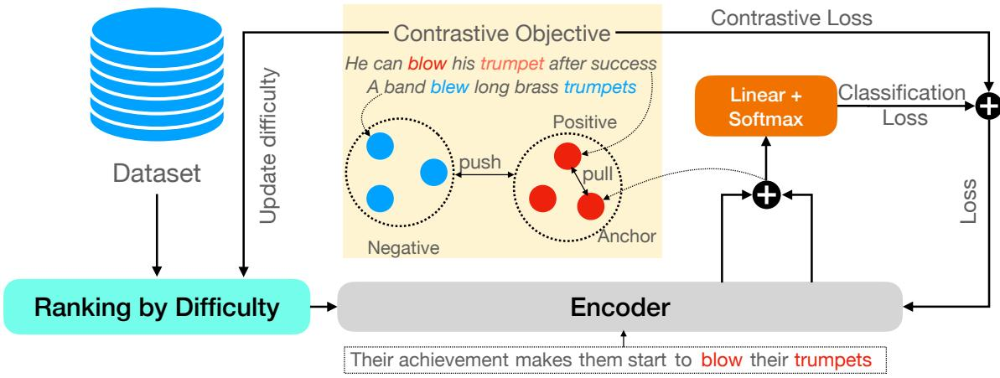
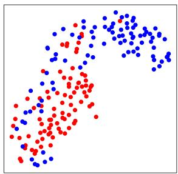
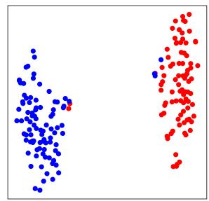
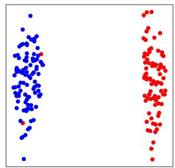
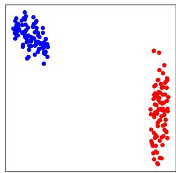
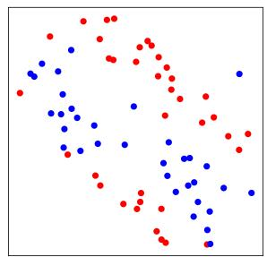
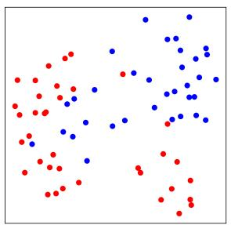
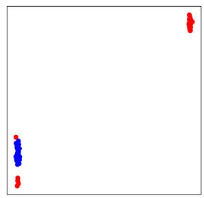
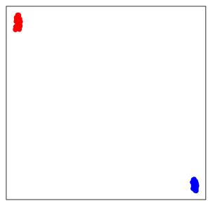

# CLCL: Non-compositional Expression Detection with Contrastive Learning and Curriculum Learning

Jianing Zhou, Ziheng Zeng and Suma Bhat University of Illinois at Urbana-Champaign Champaign, IL USA {zjn1746, zzeng13, spbhat2}@illinois.edu

## Abstract

Non-compositional expressions present a substantial challenge for natural language processing (NLP) systems, necessitating more intricate processing compared to general language tasks, even with large pre-trained language models. Their non-compositional nature and limited availability of data resources further compound the difficulties in accurately learning their representations. This paper addresses both of these challenges. By leveraging contrastive learning techniques to build improved representations it tackles the non-compositionality challenge. Additionally, we propose a dynamic curriculum learning framework specifically designed to take advantage of the scarce available data for modeling non-compositionality. Our framework employs an easy-to-hard learning strategy, progressively optimizing the model’s performance by effectively utilizing available training data. Moreover, we integrate contrastive learning into the curriculum learning approach to maximize its benefits. Experimental results demonstrate the gradual improvement in the model’s performance on idiom usage recognition and metaphor detection tasks. Our evaluation encompasses six datasets, consistently affirming the effectiveness of the proposed framework. Our models available at https: //github.com/zhjjn/CLCL.git.

## 1 Introduction

As a ubiquitous yet special class of expressions in natural languages, non-compositional expressions (e.g., the idiom under the weather) have specific communicative intents (Moon et al., 1998; Baldwin and Kim, 2010) and are individually rare but collectively frequently appearing widely across genres (Moon et al., 1998; Haagsma et al., 2020). They are characterized by non-compositionality in their meaning because of which, their meaning cannot be inferred by composing the meaning of their constituent words (Baldwin and Kim, 2010). In addition, many non-compositional expressions can be used either figuratively or literally, in a context dependent manner. For example, the phrase “clean house” can be interpreted literally, as in We can not promise you good weather but we can promise you a clean house and a really good breakfast and can be understood figuratively, as in Indeed , the Kursk crisis may provide him with an opportunity to further clean house in the military.

NLP systems intending to process these noncompositional expressions need to decide if these expressions are used in the figurative or literal sense before modeling their meaning. This is the traditional and popular non-compositional language processing task called usage disambiguation1 which aims to differentiate the literal (i.e.,compositional) from the figurative (i.e., non-compositional) usage of these expressions in given contexts, dubbed as idiom usage recognition for idiomatic expressions and metaphor detection for metaphorical expressions (Peng and Feldman, 2015; Köper and im Walde, 2016; Liu and Hwa, 2017, 2018; Chen et al., 2017; Jiang et al., 2022). However, compared to the abundance of resources for tasks related to compositional expressions, the available resources for idiom usage recognition and metaphor detection are very limited.

Successful disambiguation of the usages of the non-compositional expressions involves overcoming two challenges: (1) the linguistic challenge of handling non-compositionality and (2) the resourcerelated challenge of learning from scarce training data. Previous works (Peng and Feldman, 2015; Köper and im Walde, 2016; Liu and Hwa, 2017, 2018) primarily focus on designing complex architectures for modeling non-compositionality, while also ignoring the representational aspect to model non-compositionality under a limited-resource scenario to address the second challenge. The focus of this work is a method to solve the above two challenges jointly and find sense-specific representations of the idiomatic expressions.

With the same idioms used in different ways as natural positive and negative examples whose representations could be better by using contrastive learning, we utilize contrastive learning to address the first challenge to produce a better representation of non-compositional expressions for recognizing their usage. Successful idiom usage recognition and metaphor detection require different representations of the same expression when they are used in a literal and figurative way, respectively. Therefore, we incorporate a contrastive objective to enhance the difference between the contextualized representations of the figurative sense and the literal sense for the same expression. In this way, we enable the classifier to make context-dependent decisions in the embedding space. Secondly, to make better use of the scarce available data, we use curriculum learning (Bengio et al., 2009), which enables the models to gradually proceed from easy training instances to harder ones, when the instances are themselves ordered according to a difficulty measure. Therefore, curriculum learning naturally consists of (1) measuring the difficulty level for each training example, and (2) scheduling training examples based on their difficulty levels. Furthermore, we combine contrastive learning and curriculum learning together by utilizing contrastive objectives to measure the difficulty level of the training examples. During model training, the contrastive objective is dynamically updated, and thus the difficulty levels of the training examples are also updated in accordance with the current ability of the model.

Our study is the first to jointly alleviate the problems caused by non-compositionality and limited data resources by strategically and dynamically combining contrastive learning and curriculum learning, and deploying it for idiom usage recognition and metaphor detection. Our proposed framework enables the model to first learn from simple non-compositional expressions and then from harder ones by building better representations of non-compositional expressions via contrastive learning. The contributions of our work are as follows:

• We propose a novel framework that combines contrastive learning and curriculum learning for idiom usage recognition and metaphor detection. The difficulty levels obtained from contrastive objectives are dynamically updated with the training, based on which the training examples are dynamically scheduled.

• Empirical evaluations of our proposed framework on the tasks of idiom usage recognition and metaphor detection affirm the effectiveness of our framework. Detailed ablation studies and analyses are provided to support our claims. As a result, we treat both idiom usage recognition and metaphor detection under the same computational umbrella.

• Our proposed framework also shows better cross-task transfer between idiom usage recognition and metaphor detection compared to the baseline models.

## 2 Related Prior Work

Idiom Usage Recognition. Like other noncompositional expressions, the meaning of many idiomatic expressions is contextually ambiguous. Prior studies mainly focus on disambiguating their figurative/literal use(Salehi et al., 2014; Senaldi et al., 2016; Flor and Klebanov, 2018; Amin et al., 2021; Peng and Feldman, 2015; Köper and im Walde, 2016; Liu and Hwa, 2017, 2018), i.e., performing the idiom usage recognition task. Early works heavily rely on designing representative features, e.g., canonical form (Fazly et al., 2009), to decide literal and figurative usages. With the emergence of word embeddings and neural networks, richer features are encoded into word embeddings and utilized for idiom usage recognition (Liu and Hwa, 2017, 2018). Recently proposed pre-trained language models have shown great improvement on various NLP tasks leading to efforts that leverage the power of large pre-trained language models for this task (Zeng and Bhat, 2021). However, due to non-compositionality and scarcity of available data resources, previous works mainly focused on designing complex architectures while ignoring the representational aspect to model noncompositionality under a limited-resource scenario. Our study is the first to focus on solving both of these two challenges to fill this research gap.

Metaphor Detection. Like other figurative expressions, metaphors play a crucial role in cognitive and communicative functions (Choi et al., 2021), because of which computationally recognizing and understanding the metaphorical meanings of words becomes important. Early approaches utilized various linguistic features to detect metaphors, such as word imageability (Broadwell et al., 2013), semantic supersenses (Tsvetkov et al., 2014), and unigrams (Klebanov et al., 2014). In recent years, different neural architectures have been widely used for metaphor detection, including CNN (Wu et al., 2018), LSTM (Gao et al., 2018). Beyond these, the prominence of large pre-trained language models on various NLP tasks has prompted their use for metaphor detection. Choi et al. (2021) uses RoBERTa as the backbone model to get contextualized representations of words and (Gong et al., 2020) combines other linguistic features in a RoBERTa architecture for the purpose of metaphor detection. The subpar performance of large pretrained models when labeled data are scarce has led to studies exploring data augmentation (Lin et al., 2021). However, utilizing augmented data with pseudo labels could be even more detrimental to the performance due to the noise in the augmented data. Our proposed curriculum learning framework can potentially alleviate data scarcity by using the limited data more effectively without introducing additional noise. This is the first work to show its positive impact on both tasks of idiom usage recognition and metaphor detection.

Contrastive Learning. Contrastive learning aims to learn meaningful representations by pulling semantically similar examples closer and pushing semantically dissimilar examples further apart in the embedding space. Widely considered to be effective for building meaningful representations, contrastive learning has garnered increasing attention from researchers in different areas. For example, prior works in NLP have leveraged contrastive learning to produce better word embeddings (Mikolov et al., 2013) and sentence embeddings (Logeswaran and Lee, 2018). More recently, with the dominance of transformer-based models, contrastive learning is also being used to train transformer models (Fang et al., 2020; Giorgi et al., 2021; Wu et al., 2020). Similarly, in this work, for a given non-compositional expression, we use contrastive learning to pull the expression embeddings that are used in the same figurative/literal sense closer while pushing the embeddings between figurative and literal senses apart. Thereby we set a precedence of utilizing contrastive learning to enhance the representation quality of idiomatic expressions for modeling non-compositionality. Besides, we also propose to utilize the contrastive objective to design curriculum learning, for reducing the training data quantity needed for transformers. Curriculum Learning First proposed by (Bengio et al., 2009), curriculum learning aims to enable the models to gradually learn from easy to harder examples according to a difficulty measure for each example during training. Therefore, curriculum learning enables the model to better utilize available data. With growing research interests, curriculum learning has been applied in different fields. In computer vision, curriculum learning has been applied to a range of tasks, such as image classification (Weinshall et al., 2018), human attribute analysis (Wang et al., 2019), and visual question answering (Li et al., 2020), however, its NLP application is mainly limited to neural machine translation (Platanios et al., 2019; Liu et al., 2020; Zhou et al., 2021; Zhang et al., 2021). So, prior works on curriculum learning on NLP, including their difficulty measurement and scheduling strategy, are mainly designed for compositional language processes, which are largely different from non-compositional expressions, i.e., idioms and metaphors. In this study, we propose a new curriculum learning method specifically designed for non-compositional expression recognition. Moreover, for the first time we show how curriculum learning based on contrastive learning, results in performance gains in the idiomaticity-related tasks.

## 3 Framework

In this section, we introduce our proposed framework as a combination of contrastive learning and curriculum learning. Overall, we first utilize contrastive learning to obtain the contrastive objective, which is then used as a measurement of the difficulty level for each sentence containing idioms or metaphors. Then, our proposed dynamic scheduling strategy is used to re-arrange the training examples. Finally, the model is trained via the classification objective and the contrastive objective.

## 3.1 Contrastive Learning

Contrastive learning aims to learn meaningful representations by pulling semantically similar examples and pushing apart semantically different examples. In our case, the figurative and literal meanings for the same non-compositional expression are different. Thus, for the purpose of contrastive learning the same non-compositional expressions used in the same (figurative or literal) sense in different sentences are natural semantically close examples.

  
Figure 1: The diagram illustrates the CLCL framework.

On the other hand, the same non-compositional expressions used in different senses in different sentences are semantically different examples. Training with contrastive learning allows the model to learn higher-quality representations by grouping the embeddings of a given non-compositional expression into two distinct clusters in the embedding space, corresponding to its figurative and literal meaning.

More specifically, for a sentence $Y _ { i }$ (anchor example) with a non-compositional expression $i ,$ its meaning should be similar to another sentence $Y _ { i } ^ { + }$ (positive example) with the same expression i used in the same sense because they both contain the same non-compositional expression used in the same way (figuratively or literally). However, the meaning of $Y _ { i }$ will be different from the sentence $Y _ { i } ^ { - }$ (negative example) with the same expression i but used differently. Therefore, the distance between the appropriate representations of $Y _ { i }$ and $Y _ { i } ^ { + }$ $( x _ { i }$ and $\pmb { x } _ { i } ^ { + } )$ is expected to be small, while the distance between the appropriate representations of $Y _ { i }$ and $Y _ { i }$ $( x _ { i }$ and $\pmb { x } _ { i } ^ { - } )$ is expected to be large. Thus, we develop a contrastive objective by considering $( Y _ { i } , Y _ { i } ^ { + } )$ a positive pair and $( Y _ { i } , Y _ { i } ^ { - } )$ a negative pair:

$$
{ \mathcal { L } } _ { \mathrm { c t s } } = - \sum _ { Y \in \mathcal { Y } } \log \frac { f ( { \pmb x } _ { i } , { \pmb x } _ { i } ^ { + } ) } { f ( { \pmb x } _ { i } , { \pmb x } _ { i } ^ { + } ) + f ( { \pmb x } _ { i } , { \pmb x } _ { i } ^ { - } ) }\tag{1}
$$

where $f$ represents the distance function. Therefore, our final loss is:

$$
\mathcal { L } = \mathcal { L } _ { \mathrm { c t s } } + \mathcal { L } _ { \mathrm { c l s } }\tag{2}
$$

where ${ \mathcal { L } } _ { \mathrm { c t s } }$ is the contrastive loss and $\mathcal { L } _ { \mathrm { c l s } }$ is the cross-entropy loss based on the ground truth class label for the sense (literal or figurative) of the expression in $Y _ { i }$ .

To prepare for training, for each training example $Y _ { i }$ (anchor), we randomly sample a $Y _ { i } ^ { + }$ to form the positive pair and randomly sample a $Y _ { i } ^ { - }$ to form the negative pair, converting the training example $Y _ { i }$ into a triplet of anchor, positive, and negative examples, i.e., $< Y _ { i } , Y _ { i } ^ { + } , Y _ { i } ^ { - } >$ . We use the triplets to train the models with the aforementioned final loss.

## 3.2 Curriculum Learning

## 3.2.1 Difficulty Metrics

This section defines the difficulty metric used by our curriculum learning framework. We correlate the classification difficulty for each example $Y _ { i }$ to its position in the embedding space relative to its corresponding positive $Y _ { i } ^ { + }$ and negative example $Y _ { i } ^ { - }$ because the contextualized representation for the figurative and literal meaning of the noncompositional expression should be different. Noncompositionality means that the meaning of a figurative expression is not derivable from its constituent words, but rather, the expression has a conventionalized figurative meaning. Therefore, the differentiation between figurative and literal semantics demands a distinction between an expression’s figurative and literal embedding. If the figurative and literal embeddings for the same expression are really separable, i.e., they are further apart in the embedding space, a classifier should be able to classify the figurative and literal senses more easily. Conversely, if the embeddings of an expression’s figurative and literal semantics are not distinctive, it would be harder for the model to classify the expression into its figurative and literal senses based on its embedding. Therefore, it makes sense to use the degree to which the figurative and literal embeddings are separable in the embedding space as a measure of classification difficulty. Intuitively, if $Y _ { i }$ is easy for the model to classify, then $x _ { i } .$ , the embedding of $Y _ { i } ,$ should already encode certain semantic features and thus be located closer to $\pmb { x } _ { i } ^ { + }$ than $\mathbf { \lambda } _ { \pmb { x } _ { i } ^ { - } }$ in the embedding space.

Algorithm 1: CLCL   
Input: Dataset $\mathbb { P } = \{ Y _ { i } \} _ { i = 1 } ^ { K } ,$ Model M and   
number of epochs $N$   
Output: Fine-tuned Model $\mathbf { M } ^ { * }$   
1 $\mathbb { P } ^ { * } = \{ ( Y _ { i } , Y _ { i } ^ { + } , Y _ { i } ^ { - } ) \} _ { i = 1 } ^ { K }$ ;   
2 $\mathbf { D } _ { 0 } = \mathbf { C } \mathbf { T } \mathbf { S } ( \mathbb { P } ^ { * } , \mathbf { M } )$   
3 Sort $\mathbb { P } ^ { * }$ based on each difficulty level in $\mathbf { D } _ { 0 }$   
resulting in a re-arranged $\mathbb { P } _ { 0 } ^ { * }$   
4 for $\underline { n } = 1 ; n \le N$ do   
5 $\mathbf { M } _ { n } \Leftarrow \mathrm { T R A I N } ( \mathbb { P } _ { n - 1 } ^ { * } ) ;$   
6 ${ \bf D } _ { n } = \boldsymbol { \emptyset } , \hat { \mathbb { P } } _ { n } = \boldsymbol { \emptyset } ;$   
7 for $\underline { { ( Y , Y ^ { + } , Y ^ { - } ) \in \mathbb { P } ^ { * } } }$ do   
8 $d _ { \mathbf { M } _ { n } } ( Y ) = \mathbf { C } \mathbf { T S } ( Y ; \mathbf { M } _ { n } )$ ，   
9 if $d _ { \mathbf { M } _ { n } } ( Y ) \neq d _ { \mathbf { M } _ { n - 1 } } ( Y )$ then   
10 ${ \mathbf { D } } _ { n } \Leftarrow { \mathbf { D } } _ { n } \bigcup \{ d _ { \mathbf { M } _ { n } } ( Y ) \}$ ;   
11 $\hat { \mathbb { P } } _ { n } \Leftarrow \hat { \mathbb { P } } _ { n } \bigcup ( Y , Y ^ { + } , Y ^ { - } )$ ;   
12 else   
13 continue ;   
14 end   
15 end   
16 Sort ${ \hat { \mathbb { P } } } _ { n }$ based on $\mathbf { D } _ { n } .$ , resulting in $\mathbb { P } _ { n } ^ { * }$ ;   
17 end   
18 return $\mathbf { M } ^ { * } = \mathbf { M } _ { n }$

Hence, given the $< Y _ { i } , Y _ { i } ^ { + } , Y _ { i } ^ { - } >$ triplets, we assess the difficulty of a training example $Y _ { i }$ based on the models’ contrastive objective as

$$
d _ { \mathbf { M } } ( Y _ { i } ) = \mathbf { C T S } ( Y _ { i } ; \mathbf { M } ) = \frac { f ( \pmb { x } _ { i } , \pmb { x } _ { i } ^ { + } ) } { f ( \pmb { x } _ { i } , \pmb { x } _ { i } ^ { + } ) + f ( \pmb { x } _ { i } , \pmb { x } _ { i } ^ { - } ) }\tag{3}
$$

where M is the model and $d _ { \mathbf { M } } ( Y _ { i } )$ is the difficulty measure for $Y _ { i }$

## 3.2.2 Scheduling Strategy

After the difficulty levels are determined, the traditional curriculum learning methods would fix the order of training examples. However, the difficulty of each example for the model changes as the model learns. Therefore, it is disadvantageous to fix the order of training examples. We propose to update the difficulty levels and dynamically schedule training examples accordingly. Specifically, since the difficulty levels are measured based on the contrastive objective, they are naturally updated during the training process. Therefore, after each training epoch, the difficulty score $d _ { \mathbf { M } } ( Y _ { i } )$ for each example $Y _ { i }$ is updated as:

$$
d _ { \mathbf { M } _ { n } } ( Y _ { i } ) = \mathbf { C } \mathrm { T S } ( Y _ { i } ; \mathbf { M } _ { n } )\tag{4}
$$

where ${ { \bf { M } } _ { n } }$ refers to our model fine-tuned for n epochs in our task. After the difficulty scores for all the training examples have been updated, the training examples will be re-arranged according to the new difficulty scores for the next epoch of training.

## 4 Experiments

## 4.1 Datasets

Idiom Usage Recognition. We conduct experiments on three datasets for idiom usage recognition: MAGPIE (Haagsma et al., 2020) SemEval5B (Korkontzelos et al., 2013) and VNC (Cook et al., 2008). To test the models’ ability to recognize the usage of unseen idioms, each dataset was split into train and test sets in two ways: random and typebased. In the random split, the sentences are randomly divided, and the same idiom can appear in both train and test sets, whereas in the typebased split, the idioms in the test set and the train set do not overlap. For MAGPIE and SemEval5B, we use their respective official random/typebased and train/test splits. For VNC, the official dataset did not have the typebased split. Therefore, to create the typebased split, we randomly split the idiom types by an 80/20 ratio, leaving 43 idiom types in the train set and ten idiom types in the test set.

Metaphor Detection. Following previous works on metaphor detection, we conduct experiments on three datasets for metaphor detection: (1) VUA-18 (Leong et al., 2018), (2) VUA-verb (Steen et al., 2010), and (3) MOH-X dataset (Mohammad et al., 2016). The original train/dev/test splits provided by the official datasets are used in our experiments.

## 4.2 Baselines

We show the effectiveness of our method via a comparison between the vanilla RoBERTa classification model and the RoBERTa classification model fine-tuned using our method. Besides, we also choose different SOTA models for different tasks as baselines.

<table><tr><td rowspan="2">Data Splits</td><td rowspan="2">Version</td><td colspan="3">MAGPIE</td><td colspan="3">SemEval5B</td><td colspan="3">VNC</td></tr><tr><td>Acc</td><td>F1-fig</td><td>F1</td><td>Acc</td><td>F1-fig</td><td>F1</td><td>Acc F1-fig</td><td></td><td>F1</td></tr><tr><td rowspan="3">Random</td><td>vanilla</td><td>95.07</td><td>96.70</td><td>93.51</td><td>92.59</td><td>92.33</td><td>92.58</td><td>93.11</td><td>92.82</td><td>93.09</td></tr><tr><td>DISC</td><td></td><td>95.02</td><td></td><td></td><td>95.80</td><td></td><td></td><td>96.97</td><td></td></tr><tr><td>Ours</td><td>96.75</td><td>97.82</td><td>96.75</td><td>96.46</td><td>96.56</td><td>96.46</td><td>97.24</td><td>98.07</td><td>97.22</td></tr><tr><td rowspan="3">Typebased</td><td>vanilla</td><td>92.86</td><td>94.79</td><td>91.73</td><td>73.36</td><td>80.12</td><td>69.88</td><td>80.06</td><td>86.85</td><td>76.58</td></tr><tr><td>DISC</td><td></td><td>87.78</td><td></td><td></td><td>58.82</td><td></td><td></td><td>89.02</td><td></td></tr><tr><td>Ours</td><td>95.36</td><td>97.05</td><td>94.20</td><td>91.11</td><td>92.65</td><td>91.16</td><td>93.22</td><td>96.16</td><td>93.25</td></tr></table>

Table 1: Performance of different methods on MAGPIE, SemEval5B, and VNC under different settings. The best performances are bold-faced. The best performances in bold are significantly better than the performance of the baseline models.

<table><tr><td rowspan="2">Model</td><td colspan="4">VUA18</td><td colspan="4">VUAverb</td><td colspan="4">MOH-X</td></tr><tr><td>Acc</td><td>P</td><td>R</td><td>F1</td><td>Acc</td><td>P</td><td>R</td><td>F1</td><td>Acc</td><td>P</td><td>R</td><td>F1</td></tr><tr><td>vanilla</td><td>93.4</td><td>79.4</td><td>75.0</td><td>77.1</td><td>80.4</td><td>72.9</td><td>68.8</td><td>70.7</td><td>83.5</td><td>82.9</td><td>83.4</td><td>82.9</td></tr><tr><td>MelBERT</td><td>94.0</td><td>80.5</td><td>76.4</td><td>78.4</td><td>80.7</td><td>64.6</td><td>78.8</td><td>71.0</td><td>81.6</td><td>79.7</td><td>82.7</td><td>81.1</td></tr><tr><td>MisNet</td><td>94.7</td><td>82.4</td><td>73.2</td><td>77.5</td><td>84.4</td><td>77.0</td><td>68.3</td><td>72.4</td><td>83.1</td><td>83.2</td><td>82.5</td><td>82.5</td></tr><tr><td>Ours</td><td>94.5</td><td>80.8</td><td>76.1</td><td>78.4</td><td>84.7</td><td>74.9</td><td>73.9</td><td>74.4</td><td>84.3</td><td>84.0</td><td>82.7</td><td>83.4</td></tr></table>

Table 2: Performance of different methods on VUA-18, VUA-verb, and MOH-X. The best performances are bold-faced. The best performances in bold are significantly better than the performance of the baseline models.

Idiom Usage Recognition. DISC (Zeng and Bhat, 2021) is the current SOTA model for idiom usage recognition. Therefore, we choose this model as the baseline for this task.

Metaphor Detection. Based on previous works, MelBERT (Choi et al., 2021), MisNet (Zhang and Liu, 2022) and CATE (Lin et al., 2021) are current SOTA models for metaphor detection. However, CATE not only requires external data resources as augmentation, but also does not have a publicly accessible implementation, which makes it reproduction difficult. Therefore, we only choose Mel-BERT and MisNet as our baselines and report the performance using their released code.

## 4.3 Experimental Settings

We implement our framework using a pre-trained RoBERTa Base model from Huggingface. The model is trained with a batch size of 16 for three epochs, using the Adam optimizer, and a learning rate of 3e 5. During training, for each training example, we randomly select its positive example and negative example for contrastive learning. The classification loss is calculated based only on the original training example’s label.

## 4.4 Evaluation Metrics

Considering that the idiom usage recognition task is a binary classification problem, we use accuracy and macro F1 score to evaluate the performance. We also include the F1 score that treats the figurative class as the positive class, denoted as F1-fig. For metaphor detection, we follow the evaluation metrics (accuracy, precision, recall, and F1) in previous studies for a fair comparison. For metaphor detection, F1 refers to the F1 score that treats the figurative class as the positive class.

## 5 Results

As shown in Table 1, for idiom usage recognition, RoBERTa classification model using our proposed method (Ours) achieves the best performance over all the evaluation metrics. For the MAGPIE dataset with random split, compared with the performance of the vanilla RoBERTa model, our framework outperforms it by 1.72 points in accuracy, 1.12 points in F1-fig score, and 3.24 points in F1 score. Compared with the DISC model, our method still outperforms it by 2.8 points on the F1-fig score. For the MAGPIE dataset with typebased split, our framework outperforms the vanilla model by 2.5 points in accuracy, 2.26 points in F1-fig score, and 2.47 in F1 score. For the SemEval5B dataset with random split, our framework outperforms the previous SOTA model by 0.76 on the F1-fig score. For the SemEval5B dataset with typebased split, our framework outperforms the SOTA model by 33.83 on the

<table><tr><td rowspan="2">Data Splits</td><td rowspan="2">Version</td><td colspan="3">MAGPIE</td><td colspan="3">SemEval5B</td><td colspan="3">VNC</td></tr><tr><td>Acc</td><td>F1-fig</td><td>F1</td><td>Acc</td><td>F1-fig</td><td>F1</td><td>Acc</td><td>F1-fig</td><td>F1</td></tr><tr><td rowspan="3">Random</td><td>Ours w/o CL</td><td>95.14</td><td>96.73</td><td>93.64</td><td>94.11</td><td>94.12</td><td>94.11</td><td>94.94</td><td>95.77</td><td>95.12</td></tr><tr><td>Ours w/o CTS</td><td>95.26</td><td>96.81</td><td>93.82</td><td>94.61</td><td>94.54</td><td>94.61</td><td>95.11</td><td>95.88</td><td>95.32</td></tr><tr><td>Ours</td><td>96.75</td><td>97.82</td><td>96.75</td><td>96.46</td><td>96.56</td><td>96.46</td><td>97.24</td><td>98.07</td><td>97.22</td></tr><tr><td rowspan="3">Typebased</td><td>Ours w/o CL</td><td>92.67</td><td>94.64</td><td>91.53</td><td>86.87</td><td>88.67</td><td>86.54</td><td>89.43</td><td>92.11</td><td>89.32</td></tr><tr><td>Ours w/o CTS</td><td>91.04</td><td>93.30</td><td>89.89</td><td>83.20</td><td>85.43</td><td>82.80</td><td>86.22</td><td>89.12</td><td>86.11</td></tr><tr><td>Ours</td><td>95.36</td><td>97.05</td><td>94.20</td><td>91.11</td><td>92.65</td><td>91.16</td><td>93.22</td><td>96.16</td><td>93.25</td></tr></table>

Table 3: Ablation study of our method on idiom detection task on MAGPIE, SemEval5B, and VNC under different settings. The best performances are bold-faced. The best performances in bold are significantly better than the performance of the baseline models.
<table><tr><td rowspan="2">Model</td><td colspan="4">VUA18</td><td colspan="4">VUAverb</td><td colspan="4">MOH-X</td></tr><tr><td>Acc</td><td>P</td><td>R</td><td>F1</td><td>Acc</td><td>P</td><td>R</td><td>F1</td><td>Acc</td><td>P</td><td>R</td><td>F1</td></tr><tr><td>Ours w/o CL</td><td>94.4</td><td>80.5</td><td>75.9</td><td>78.1</td><td>83.4</td><td>68.9</td><td>78.8</td><td>73.5</td><td>83.8</td><td>83.3</td><td>83.3</td><td>83.3</td></tr><tr><td>Ours w/o CTS</td><td>93.9</td><td>80.3</td><td>75.8</td><td>78.1</td><td>84.1</td><td>73.1</td><td>73.8</td><td>73.5</td><td>83.8</td><td>84.3</td><td>81.4</td><td>82.5</td></tr><tr><td>Ours</td><td>94.5</td><td>80.8</td><td>76.1</td><td>78.4</td><td>84.7</td><td>74.9</td><td>73.9</td><td>74.4</td><td>84.3</td><td>84.0</td><td>82.7</td><td>83.4</td></tr></table>

Table 4: Ablation study of our method on metaphor detection task on VUA18, VUAverb, and MOH-X. The best performances are bold-faced. The best performances in bold are significantly better than the performance of the baseline models.
<table><tr><td rowspan="2">Model</td><td colspan="4">Trained on VUA and Tested on MAGPIE</td><td colspan="4">Trained on MAGPIE and Tested on VUA</td></tr><tr><td>Accuracy</td><td>Precision</td><td>Recall</td><td>F1</td><td>Accuracy</td><td>Precision</td><td>Recall</td><td>F1</td></tr><tr><td>MelBERT</td><td>60.9</td><td>92.7</td><td>51.6</td><td>66.3</td><td>70.1</td><td>11.2</td><td>10.1</td><td>10.6</td></tr><tr><td>Ours</td><td>61.5</td><td>92.9</td><td>52.3</td><td>67.0</td><td>74.0</td><td>20.5</td><td>28.7</td><td>23.9</td></tr></table>

Table 5: Transfer study of our method on idiomaticity detection and metaphor detection.

F1-fig score, which is a significant improvement. For the VNC dataset with random split, our framework outperforms the previous SOTA model by 1.1 on the F1-fig score. For the VNC dataset with typebased split, our framework beats the SOTA model by 7.14 on the F1-fig score. Therefore, our method outperforms all the baselines on three datasets across all the evaluation metrics, which shows the effectiveness of our method.

As shown in Table 2, for the task of metaphor, RoBERTa classification model using our proposed method achieves the best performance on all the datasets in F1 score. For VUA18 dataset, compared with the performance of SOTA MelBERT, our framework achieves competitive performance without utilizing POS taggings and other linguistic features except for the original RoBERTa model’s parameters. For the VUA-verb dataset, our method outperforms MelBERT by 4.0 absolute points in accuracy, 10.3 in Precision, and 3.4 in F1 score. Besides, our model outperforms MisNet by 5.6 points in Recall, and 2.0 points in F1 score. On the MOH-X dataset, our method achieves the best performance by outperforming MelBERT by 2.7 points in Accuracy and 2.3 points in F1 score and outperforming MisNet by 1.2 in Accuracy and 0.9 in F1 score. As a result, our method not only performs the best on the task of idiom usage recognition but also on the task of metaphor detection.

## 6 Analysis

Ablation Study To investigate the effects of the different components in our method, i.e., contrastive learning and curriculum learning, we compare variants of our method without curriculum learning (w/o CL) and without contrastive learning (w/o CTS). As shown in Table 3, both have worse performance than the complete version. Without curriculum learning, the accuracy drops by more than 1 point, and the F1 score drops by more than 2 points on all the datasets across both random and typebased settings. It should be noted that the curriculum learning and contrastive learning are more effective under a typebased setting as shown in Table 3. For metaphor detection, the results presented in Table 4 show a similar trend that each component is important for our method. Besides, we also observe in the Table 3 and 4 that contrastive learning and curriculum learning can individually improve model performance. Furthermore, when combined together, they complement and boost each other to further improve the performance.

  
(a) w/o fine-tune

  
(b) w/ fine-tune

  
(c) w/ cts

  
(d) w/ cts and cl

Figure 2: t-SNE visualization on SemEval under random setting for in the bag. The red color denotes the metaphorical instances and blue color denotes the literal instances. Here cts refers to contrastive learning and cl refers to curriculum learning.  
  
(a) w/o fine-tune

  
(b) w/ fine-tune

  
(c) w/ cts

  
(d) w/ cts and cl  
Figure 3: t-SNE visualization on SemEval under typebased setting for be my guest. The red color denotes the metaphorical instances and blue color denotes the literal instances.

Analysis on Data Splits. Our method’s effectiveness is most prominent on unseen idiomatic expressions, as shown in Table 1. The improvement brought about by our curriculum learning method is always more prominent in a typebased setting compared with the gain in a random setting. Therefore, with contrastive learning and curriculum learning, our method can enable the RoBERTa model to generalize over unseen idioms and transfer knowledge on recognizing non-compositionality to unseen non-compositional expressions.

Analysis on the Datasets. Results shown in Table 1 and 2 also demonstrate that our method is most effective on the datasets with smaller numbers of training examples. On the MAGPIE dataset, which is the largest dataset for idiom usage recognition, our method only outperforms the vanilla RoBERTa model by 1.68 in accuracy. However, on the smaller SemEval5B dataset, our method outperforms the vanilla RoBERTa model by 3.87 in accuracy. Similarly, on the VUA-18 dataset, which is the largest dataset for metaphor detection, our method only achieves competitive performance with MelBERT. However, on smaller VUA-verb and MOH-X datasets, our method significantly outperforms the baseline models. As a result, with the help of curriculum learning, our method utilizes the available data more efficiently, especially in a low-resource scenario.

Analysis on the Cross-Task Transfer. Results shown in Table 5 also demonstrate that our method has a better ability to transfer across different tasks. For the transfer study, we use the random split of MAGPIE dataset and VUA18. When trained on the dataset for one task and tested on the dataset for another task, our method always outperforms the baseline method, MelBERT. Besides, we observe that the models achieve good results in idiom usage recognition when trained in metaphor detection. However, when trained on idiom usage recognition, the models’ performance on metaphor detection is much worse. Therefore, the symbolic knowledge learned during the task of metaphor detection could be transferred to perform the idiom usage recognition while the idiomatic knowledge cannot help with the metaphor detection. We leave the deeper study of this phenomenon to future research.

Embedding Visualization In Figures 2 and 3, we visualize for SemEval5B sample contextual embeddings for sentences from two idioms under different data split settings. As shown in Figure 2, under the random-split setting, with simple fine-tuning and contrastive learning, the literal and figurative representations are already separated with a few points mis-clustered. However, with our method, all the points are correctly separated. In Figure 3, under the typebased-split setting, simple fine-tuning fails to separate senses in the embeddings space into differentiable groups. We observe that even with contrastive learning, there are still points clustered into the wrong group. However, with both contrastive learning and curriculum learning, all the points are distinctly separated.

## 7 Conclusion and Future Work

In this paper, we propose a novel method specifically for non-compositional expression detection, including idiom usage recognition and metaphor detection. Our proposed method combines contrastive learning and curriculum learning. Contrastive learning is used to build better representations to model non-compositionality. Besides, the difficulty levels obtained from the contrastive learning objective are dynamically updated during the training, based on which the training examples are dynamically scheduled. As a result, the model could be trained in an easy-to-hard manner. We evaluate our proposed method on both idiom usage recognition and metaphor detection. Experiment results affirm the effectiveness of our method on both tasks. Detailed ablation studies and analyses are provided to support our claims. As a result, our work is the first to propose a framework for idiom usage recognition and metaphor detection. Our proposed framework also shows better cross-task transfer ability based on idiom usage recognition and metaphor detection.

## Limitations

Our scheduling strategy only re-arranges the training examples after each training epoch, limiting the flexibility of scheduling them compared with re-arranging the examples after each training step. Therefore, the order of the training examples will still be fixed within each training epoch.

Besides, our method finds it challenging to transfer from the task of idiom usage recognition to that of metaphor detection. Therefore, more advanced methods for learning the broad nature of non-compositionality, including those of idioms and those of metaphors are needed. We leave this to a future study.

## Acknowledgements

This material is based upon work supported by the National Science Foundation under Grant No. IIS 22-30817.

## References

Miriam Amin, Peter Fankhauser, Marc Kupietz, and Roman Schneider. 2021. Data-driven identification of idioms in song lyrics. MWE 2021, page 13.

Timothy Baldwin and Su Nam Kim. 2010. Multiword expressions. In Nitin Indurkhya and Fred J. Damerau, editors, Handbook of Natural Language Processing, Second Edition, pages 267–292. Chapman and Hall/CRC.

Yoshua Bengio, Jérôme Louradour, Ronan Collobert, and Jason Weston. 2009. Curriculum learning. In Proceedings of the 26th annual international conference on machine learning, pages 41–48.

George Aaron Broadwell, Umit Boz, Ignacio Cases, Tomek Strzalkowski, Laurie Feldman, Sarah Taylor, Samira Shaikh, Ting Liu, Kit Cho, and Nick Webb. 2013. Using imageability and topic chaining to locate metaphors in linguistic corpora. In International Conference on Social Computing, Behavioral-Cultural Modeling, and Prediction, pages 102–110. Springer.

I-Hsuan Chen, Yunfei Long, Qin Lu, and Chu-Ren Huang. 2017. Leveraging eventive information for better metaphor detection and classification. In Proceedings of the 21st Conference on Computational Natural Language Learning (CoNLL 2017), pages 36–46.

Minjin Choi, Sunkyung Lee, Eunseong Choi, Heesoo Park, Junhyuk Lee, Dongwon Lee, and Jongwuk Lee. 2021. Melbert: Metaphor detection via contextualized late interaction using metaphorical identification theories. In 2021 Conference of the North American Chapter of the Association for Computational Linguistics: Human Language Technologies.

Paul Cook, Afsaneh Fazly, and Suzanne Stevenson. 2008. The vnc-tokens dataset. In Proceedings of the LREC Workshop Towards a Shared Task for Multiword Expressions (MWE 2008), pages 19–22.

Hongchao Fang, Sicheng Wang, Meng Zhou, Jiayuan Ding, and Pengtao Xie. 2020. Cert: Contrastive self-supervised learning for language understanding. arXiv preprint arXiv:2005.12766.

Afsaneh Fazly, Paul Cook, and Suzanne Stevenson. 2009. Unsupervised type and token identification of idiomatic expressions. Computational Linguistics, 35(1):61–103.

Michael Flor and Beata Beigman Klebanov. 2018. Catching idiomatic expressions in efl essays. In Proceedings of the Workshop on Figurative Language Processing, pages 34–44.

Ge Gao, Eunsol Choi, Yejin Choi, and Luke Zettlemoyer. 2018. Neural metaphor detection in context. In Proceedings of the 2018 Conference on Empirical Methods in Natural Language Processing, pages 607–613.

John Giorgi, Osvald Nitski, Bo Wang, and Gary Bader. 2021. Declutr: Deep contrastive learning for unsupervised textual representations. In Proceedings of the 59th Annual Meeting of the Association for Computational Linguistics and the 11th International Joint Conference on Natural Language Processing (Volume 1: Long Papers), pages 879–895.

Hongyu Gong, Kshitij Gupta, Akriti Jain, and Suma Bhat. 2020. Illinimet: Illinois system for metaphor detection with contextual and linguistic information. In Proceedings of the Second Workshop on Figurative Language Processing, pages 146–153.

Hessel Haagsma, Johan Bos, and Malvina Nissim. 2020. Magpie: A large corpus of potentially idiomatic expressions. In Proceedings of The 12th Language Resources and Evaluation Conference, pages 279– 287.

Xiaotong Jiang, Qingqing Zhao, Yunfei Long, and Zhongqing Wang. 2022. Chinese synesthesia detection: New dataset and models. In Findings of the Association for Computational Linguistics: ACL 2022, pages 3877–3887.

Beata Beigman Klebanov, Ben Leong, Michael Heilman, and Michael Flor. 2014. Different texts, same metaphors: Unigrams and beyond. In Proceedings of the Second Workshop on Metaphor in NLP, pages 11–17.

Maximilian Köper and Sabine Schulte im Walde. 2016. Distinguishing literal and non-literal usage of german particle verbs. In Proceedings of the 2016 conference of the north American chapter of the association for computational linguistics: Human language technologies, pages 353–362.

Ioannis Korkontzelos, Torsten Zesch, Fabio Massimo Zanzotto, and Chris Biemann. 2013. Semeval-2013 task 5: Evaluating phrasal semantics. In Second Joint Conference on Lexical and Computational Semantics (\* SEM), Volume 2: Proceedings of the Seventh International Workshop on Semantic Evaluation (SemEval 2013), pages 39–47.

Chee Wee Leong, Beata Beigman Klebanov, and Ekaterina Shutova. 2018. A report on the 2018 vua metaphor detection shared task. In Proceedings of the Workshop on Figurative Language Processing, pages 56–66.

Qing Li, Siyuan Huang, Yining Hong, and Song-Chun Zhu. 2020. A competence-aware curriculum for visual concepts learning via question answering. In European Conference on Computer Vision, pages 141–157. Springer.

Zhenxi Lin, Qianli Ma, Jiangyue Yan, and Jieyu Chen. 2021. Cate: A contrastive pre-trained model for metaphor detection with semi-supervised learning. In Proceedings of the 2021 Conference on Empirical Methods in Natural Language Processing, pages 3888–3898.

Changsheng Liu and Rebecca Hwa. 2017. Representations of context in recognizing the figurative and literal usages of idioms. In Thirty-First AAAI Conference on Artificial Intelligence.

Changsheng Liu and Rebecca Hwa. 2018. Heuristically informed unsupervised idiom usage recognition. In Proceedings of the 2018 Conference on Empirical Methods in Natural Language Processing, pages 1723–1731.

Xuebo Liu, Houtim Lai, Derek F Wong, and Lidia S Chao. 2020. Norm-based curriculum learning for neural machine translation. In Proceedings of the 58th Annual Meeting of the Association for Computational Linguistics, pages 427–436.

Lajanugen Logeswaran and Honglak Lee. 2018. An efficient framework for learning sentence representations. In International Conference on Learning Representations.

Tomas Mikolov, Ilya Sutskever, Kai Chen, Greg S Corrado, and Jeff Dean. 2013. Distributed representations of words and phrases and their compositionality. Advances in neural information processing systems, 26.

Saif Mohammad, Ekaterina Shutova, and Peter Turney. 2016. Metaphor as a medium for emotion: An empirical study. In Proceedings of the Fifth Joint Conference on Lexical and Computational Semantics, pages 23–33.

Rosamund Moon et al. 1998. Fixed expressions and idioms in English: A corpus-based approach. Oxford University Press.

Jing Peng and Anna Feldman. 2015. Automatic idiom recognition with word embeddings. In Information Management and Big Data, pages 17–29. Springer.

Emmanouil Antonios Platanios, Otilia Stretcu, Graham Neubig, Barnabás Póczos, and Tom Mitchell. 2019. Competence-based curriculum learning for neural machine translation. In Proceedings of the 2019 Conference of the North American Chapter of the

Association for Computational Linguistics: Human Language Technologies, Volume 1 (Long and Short Papers), pages 1162–1172.

Bahar Salehi, Paul Cook, and Timothy Baldwin. 2014. Detecting non-compositional mwe components using wiktionary. In Proceedings of the 2014 Conference on Empirical Methods in Natural Language Processing (EMNLP), pages 1792–1797.

Marco Silvio Giuseppe Senaldi, Gianluca E Lebani, and Alessandro Lenci. 2016. Lexical variability and compositionality: Investigating idiomaticity with distributional semantic models. In Proceedings of the 12th workshop on multiword expressions, pages 21–31.

Gerard Steen, Lettie Dorst, Berenike Herrmann, Anna Kaal, Tina Krennmayr, and Trijntje Pasma. 2010. A method for linguistic metaphor identification from mip to mipvu preface. Method For Linguistic Metaphor Identification: From Mip To Mipvu, 14:IX–+.

Yulia Tsvetkov, Leonid Boytsov, Anatole Gershman, Eric Nyberg, and Chris Dyer. 2014. Metaphor detection with cross-lingual model transfer. In Proceedings of the 52nd Annual Meeting of the Association for Computational Linguistics (Volume 1: Long Papers), pages 248–258.

Yiru Wang, Weihao Gan, Jie Yang, Wei Wu, and Junjie Yan. 2019. Dynamic curriculum learning for imbalanced data classification. In Proceedings of the IEEE/CVF International Conference on Computer Vision, pages 5017–5026.

Daphna Weinshall, Gad Cohen, and Dan Amir. 2018. Curriculum learning by transfer learning: Theory and experiments with deep networks. In International Conference on Machine Learning, pages 5238–5246. PMLR.

Chuhan Wu, Fangzhao Wu, Yubo Chen, Sixing Wu, Zhigang Yuan, and Yongfeng Huang. 2018. Neural metaphor detecting with cnn-lstm model. In Proceedings of the workshop on figurative language processing, pages 110–114.

Zhuofeng Wu, Sinong Wang, Jiatao Gu, Madian Khabsa, Fei Sun, and Hao Ma. 2020. Clear: Contrastive learning for sentence representation. arXiv preprint arXiv:2012.15466.

Ziheng Zeng and Suma Bhat. 2021. Idiomatic expression identification using semantic compatibility. Transactions of the Association for Computational Linguistics, 9:1546–1562.

Mingliang Zhang, Fandong Meng, Yunhai Tong, and Jie Zhou. 2021. Competence-based curriculum learning for multilingual machine translation. In Findings of the Association for Computational Linguistics: EMNLP 2021, pages 2481–2493.

Shenglong Zhang and Ying Liu. 2022. Metaphor detection via linguistics enhanced siamese network. In Proceedings of the 29th International Conference on Computational Linguistics, pages 4149–4159.

Lei Zhou, Liang Ding, Kevin Duh, Shinji Watanabe, Ryohei Sasano, and Koichi Takeda. 2021. Self-guided curriculum learning for neural machine translation. In Proceedings of the 18th International Conference on Spoken Language Translation (IWSLT 2021), pages 206–214.

## A Implementation

Our experiments and implementation are based on the Transformers library and PyTorch.

## B Experimental Details

All of our experiments were conducted using two GPUs with 16GB RAM (NVIDIA V100).

## B.1 Hyperparameter Choices

For the task of idiom usage recognition, we use the Adam optimizer during the training with batch size 32. The maximum input length is set to 128. We use a constant learning rate of 1e-5 for finetuning. For all the experiments, we fine-tune the models for 30 epochs and select the model with the best performance on the development set for testing. For the task of metaphor detection, we used the Adam optimizer during the training with batch size 16. All the other hyperparameters are set to default values used in (Choi et al., 2021). All of our experiments are performed for five times. The mean results are reported.

## B.2 Number of Parameters

Considering that our proposed contrastive learning and curriculum learning do not introduce more parameters, the number of parameters is identical to the number of parameters in the underlying language model: 125M for RoBERTa (base).

## B.3 Average Runtime

The training process for one epoch on two GPUs took approximately 40 minutes, including 10 minutes for evaluating difficulties and 30 for finetuning.

## ACL 2023 Responsible NLP Checklist

A For every submission: ✓ A1. Did you describe the limitations of your work? 8

 A2. Did you discuss any potential risks of your work? Not applicable. Left blank.

✓ A3. Do the abstract and introduction summarize the paper’s main claims? Left blank.

✗ A4. Have you used AI writing assistants when working on this paper? Left blank.

## B ✓ Did you use or create scientific artifacts?

✓ B1. Did you cite the creators of artifacts you used? 4

 B2. Did you discuss the license or terms for use and / or distribution of any artifacts? Not applicable. Left blank.

✓ B3. Did you discuss if your use of existing artifact(s) was consistent with their intended use, provided that it was specified? For the artifacts you create, do you specify intended use and whether that is compatible with the original access conditions (in particular, derivatives of data accessed for research purposes should not be used outside of research contexts)? 4

 B4. Did you discuss the steps taken to check whether the data that was collected / used contains any information that names or uniquely identifies individual people or offensive content, and the steps taken to protect / anonymize it? Not applicable. Left blank.

✓ B5. Did you provide documentation of the artifacts, e.g., coverage of domains, languages, and linguistic phenomena, demographic groups represented, etc.? 4

✓ B6. Did you report relevant statistics like the number of examples, details of train / test / dev splits, etc. for the data that you used / created? Even for commonly-used benchmark datasets, include the number of examples in train / validation / test splits, as these provide necessary context for a reader to understand experimental results. For example, small differences in accuracy on large test sets may be significant, while on small test sets they may not be. B

## C ✓ Did you run computational experiments?

4, B

✓ C1. Did you report the number of parameters in the models used, the total computational budget (e.g., GPU hours), and computing infrastructure used? 4.3, B

✓ C2. Did you discuss the experimental setup, including hyperparameter search and best-found hyperparameter values? 4.3, B

✓ C3. Did you report descriptive statistics about your results (e.g., error bars around results, summary statistics from sets of experiments), and is it transparent whether you are reporting the max, mean, etc. or just a single run? B

 C4. If you used existing packages (e.g., for preprocessing, for normalization, or for evaluation), did you report the implementation, model, and parameter settings used (e.g., NLTK, Spacy, ROUGE, etc.)? Not applicable. Left blank.

D ✗ Did you use human annotators (e.g., crowdworkers) or research with human participants? Left blank.

 D1. Did you report the full text of instructions given to participants, including e.g., screenshots, disclaimers of any risks to participants or annotators, etc.? No response.

 D2. Did you report information about how you recruited (e.g., crowdsourcing platform, students) and paid participants, and discuss if such payment is adequate given the participants’ demographic (e.g., country of residence)? No response.

 D3. Did you discuss whether and how consent was obtained from people whose data you’re using/curating? For example, if you collected data via crowdsourcing, did your instructions to crowdworkers explain how the data would be used? No response.

 D4. Was the data collection protocol approved (or determined exempt) by an ethics review board? No response.

 D5. Did you report the basic demographic and geographic characteristics of the annotator population that is the source of the data? No response.