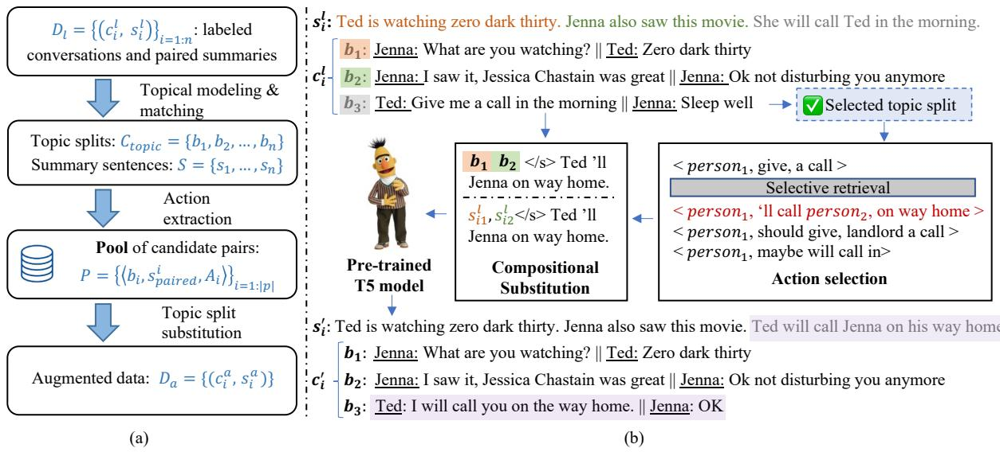
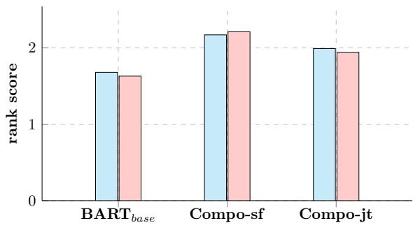
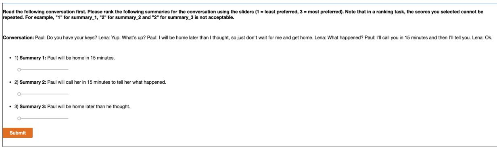

# COMPOsitional Data Augmentation for Abstractive Conversation Summarization

Siru Ouyang1, Jiaao Chen2, Jiawei Han1, Diyi Yang3

1 University of Illinois Urbana-Champaign 2 Georgia Institute of Technology 3 Stanford University

{siruo2,hanj}@illinois.edu, jchen896@gatech.edu, diyiy@stanford.edu

## Abstract

Recent abstractive conversation summarization systems generally rely on large-scale datasets with annotated summaries. However, collecting and annotating these conversations can be a time-consuming and labor-intensive task. To address this issue, in this work, we present a sub-structure level compositional data augmentation method, COMPO, for generating diverse and high-quality pairs of conversations and summaries. Specifically, COMPO first extracts conversation structures like topic splits and action triples as basic units. Then we organize these semantically meaningful conversation snippets compositionally to create new training instances. Additionally, we explore noise-tolerant settings in both self-training and joint-training paradigms to make the most of these augmented samples. Our experiments on benchmark datasets, SAMSum and DialogSum, show that COMPO substantially outperforms prior baseline methods by achieving a nearly 10% increase of ROUGE scores with limited data. We have publically released our code at https://github.com/ ozyyshr/Compo.

## 1 Introduction

Abstractive conversation summarization, which condenses unstructured conversations into short, concise, and structured text, has greatly benefited from neural generative models trained on largescale annotated data. Researchers have focused on various aspects in conversation summarization, such as hierarchical modeling of conversations (Zhao et al., 2019; Zhu et al., 2020), leveraging dialogue acts (Goo and Chen, 2018), using key phrases and entities (Liu et al., 2019a; Narayan et al., 2021), utilizing topic segments (Liu et al., 2019b), incorporating stage components (Chen and Yang, 2020) and examining discourse relations (Chen and Yang, 2021b; Feng et al., 2020b). However, training these generative models often requires abundant high-

<table><tr><td>Conversation</td><td>Actions</td></tr><tr><td>Mary: Sorry, I didn&#x27;t make it to your birthday party :(</td><td>Mary, didn&#x27;t make, party</td></tr><tr><td>Nick: It&#x27;s OK... Mary: I just got so distracted! I forgot it was yesterday!</td><td>Mary, got distracted Mary, forgot</td></tr><tr><td>Nick: do tell! Mary: I met this guy.</td><td>Mary, meet, guy</td></tr><tr><td>Nick: REALLY? I want details :D Mary: Yeah, his name is Kirk and he&#x27;s an architect... Nick: OK, just your type then #file_gif#</td><td>Nick, want details He, is, architect</td></tr><tr><td>Mary: And we ended up spending the whole week together. Nick: A WEEK?</td><td>We, end up, spend Spend, weekend</td></tr><tr><td>Mary: Yeah... It&#x27;s madness, I&#x27;ll tell you more this evening. Are we still on? Nick: You bet we are!</td><td>Mary, will tell, Nick</td></tr><tr><td>Summary</td><td></td></tr></table>

Mary didn't come to Nick's birthday party. She met an architect named Kirk. Mary and Nick will meet in the evening.

Figure 1: An example of conversation, extracted actions and its paired summary sentences (randomly sampled from SAMSum). The corresponding summary consists of three sentences, each sentence relates to one snippet (illustrated by color).

quality data, i.e., conversation and its paired summary, which is usually time-consuming and laborintensive to obtain. As a result, it is challenging to apply them to generalized real-world situations where labeled summaries are limited.

A direct solution is to employ data augmentation (DA) (Cubuk et al., 2018; Sennrich et al., 2015; Feng et al., 2021a; Chen et al., 2021a,b; Shen et al., 2020; Yu et al., 2018; Feng et al., 2020a; Miyato et al., 2016) to generate more data. Whereas, directly applying these augmentation methods into the context of conversations usually fails to consider any unique structures of conversations such as speaker information, topic split, and conversation stages (Gritta et al., 2021; Shuster et al.,

2021), which distinguish conversations from general sentences. As a result, they might be limited in creating high-quality and diverse data pairs (Chen and Yang, 2021a). Even though there are a few exceptions (Chen and Yang, 2021a; Liu et al., 2022), they still suffer from diversity and struggle with out-of-distribution compositional generalization (Feng et al., 2021a). One way to alleviate these issues is to recombine different data points to produce novel training data, i.e., compositional data augmentation (Akyürek et al., 2020; Zhang et al., 2022). However, existing compositional DA mainly focus on editing short sentences locally with words/phrases/parsing trees (Akyürek et al., 2020; Zhang et al., 2022), neglecting rich structural information between different sets of utterances in conversations (Chen and Yang, 2020; Cohan et al., 2018), which prevent them from being applied to conversations to compose multiple utterances and generate novel, diverse and high-quality conversational data.

We visualize one example with the topic structures (Xu et al., 2021; Galley et al., 2003; Chen and Yang, 2020) highlighted in Figure 1. The conversation consists of several topics: “opening”, “explanation”, “plan”, etc. And we consider every topic snippet as the basic unit. In the meantime , we extracted the “action” triples (Chen and Yang, 2021b) to represent each topic snippet. With these topic snippets and action representations, we obtain the units for compositional operations. For instance, the blue topic split and summary sentence about the meeting plan could be composed into another conversation by substitution to produce a new conversation and summary that contains a meeting plan. As it shows, by extracting the topic structures from the conversations, sub-components of conversations can be re-organized and re-composed to generate augmented conversation-summary pairs that might not be seen in the original corpus, resulting in more diverse training data.

To this end, we propose COMPO, a compositional data augmentation framework operating at sub-structure level. We leverage the conversation structures (i.e., topic structure(Chen and Yang, 2020) and action triples (Chen and Yang, 2021b) ) to produce compositional units for generating diverse conversation-summary pairs. Specifically, we first segment conversation into topic splits with topic modeling models, and then extract “actions triples” (Chen and Yang, 2021b) to represent each split as actions express specific socially situated identities and activities. With the extracted structures, we view the topic snippets as the basic units and perform selective retrieval based on action triples for compositional substitution to generate novel and diverse conversations. We also pair topic splits with summary sentences so that new summaries would be generated as well. An example of newly augmented conversation and summary could be found in Figure 2(b). To better leverage the newly generated conversation-summary pairs from COMPO, we further explore two noisetolerant methods including a self-training framework that uses the new conversations only, and another joint-training framework that leverages paired data. Empirical studies verify COMPO’s effectiveness via both quantitative and qualitative evaluations on SAMSum (Gliwa et al., 2019) and DialogSum (Chen et al., 2021c) compared to prior state-of-the-art data augmentation techniques. We also illustrate COMPO’s transferability on a news summarization dataset CNN/Dailymail.

## 2 Related Work

## 2.1 Abstractive Conversation Summarization

Abstractive conversation summarization, as opposed to extraction summarization, requires generative models to have a strong ability in language understanding as the words in the output may not appear in the input. Prior work on abstractive conversation summarization can be divided into two categories. One is to directly apply existing document summarization models to conversations (Shang et al., 2018; Gliwa et al., 2019). The other is to design conversation-tailored methods, for instance, modeling conversations in a hierarchical way (Zhao et al., 2019; Zhu et al., 2020). The rich structured information in conversations has also been leveraged. For example, Goo and Chen (2018) used dialogue acts; Liu et al. (2019a); Narayan et al. (2021) leveraged key phrases and entities. Topic segments (Liu et al., 2019b), stage components (Chen and Yang, 2020) and discourse relations (Chen and Yang, 2021b; Feng et al., 2020b) are also explored to understand conversation context for summarization. However, most approaches in the aforementioned categories focus on neural supervised methods and require abundant data to achieve state-of-the-art performance, which is timeconsuming and labor-intensive. In this work, we introduce conversation-specific data augmentation methods to help address data scarcity on paired conversations and summaries.

  
Figure 2: General pipeline of how we leverage topic splits in conversations for compositional augmentation (a), and examples of detailed steps in new data sample construction as stated in Section 3.1 (b).

## 2.2 Data Augmentation in NLP

Data augmentation (DA) is an effective approach to boost the performance of neural supervised models, and has been widely applied in various NLP tasks such as text classification (Wei and Zou, 2019; Zheng et al., 2020), machine reading comprehension (Yu et al., 2018), and machine translation (Sennrich et al., 2015). Commonly seen practices involve designed word/synonym replacement (Kobayashi, 2018; Niu and Bansal, 2018), word deletion/swapping/insertion (Wei and Zou, 2019), back translation (Sennrich et al., 2015; Xie et al., 2019) and compositional augmentation (Jia and Liang, 2016; Andreas, 2019).

However, it is not applicable to directly adopt general DA methods to conversations as they usually neglect conversation structure. By extending general DA methods, Liu et al. (2022) generates synthetic examples by replacing semantically similar text spans in both dialogue and summary. Chen and Yang (2021a) makes an initial attempt for structured conversational DA, but their approach could not guarantee compositional generalization, making it hard to create diverse augmentations. While compositional DA methods proved to be effective in solving the aforementioned issues, they often target plain text (Furrer et al., 2020) and operate locally with words, phrases, or parsing trees with carefully-curated rules (Chen et al., 2020b; Nye et al., 2020). Thus are not suitable for conversations. Our work COMPO fills these gaps by naturally taking conversation structures as units for compositional augmentation. In this way, we not only explore rich structures unique for conversations but also boost the compositional generalization and diversity.

## 3 Methodology

To generate diverse conversation-summary pairs to deal with the data scarcity issue, this section presents a simple and effective compositional data augmentation method COMPO for supervised abstractive conversation summarization. The framework is illustrated in Figure 2.

## 3.1 Compositional Augmentation

Our compositional augmentation method COMPO operates at the sub-structure level of conversations. By extracting different sub-components of conversations and recombining them based on certain orderings, COMPO can produce novel and diverse conversations and their summaries that might not be seen in the original corpus. To get a reasonable granularity of conversation sub-parts, we choose to leverage the topic-view of conversations, building upon prior work on conversation structures (Althoff et al., 2016; Chen and Yang, 2020). Conversations are mostly organized around topics in a coarse-grained structure (Honneth et al., 1988). For instance, a telephone chat could possess the following topics: greetings  invitation  plan farewell. Thus we propose a compositional inductive approach through composing different conversation topics (Andreas, 2019). We further employ COMPO to limited data settings in both self-training and joint learning styles.

Topical Split We employ the classic topic segmentation algorithm, C99 (Choi, 2000) to get the topical split of conversations based on intersentence similarities. First, we use Sentence-BERT (Reimers and Gurevych, 2019a) to get the representations for each utterance in the conversation $C = \{ u _ { 1 } , u _ { 2 } , . . . , u _ { m } \}$ . Then the conversation C is divided into blocks $C _ { t o p i c } = \{ b _ { 1 } , b _ { 2 } , . . . , b _ { n } \}$ with C99, where $b _ { i }$ is one split topic block consisting of several consecutive utterances. Also, people tend to summarize conversations in an almost linear way with a strong temporal dependency (Wu et al., 2021). As a result, it is intuitive to pair each topical split $C _ { t o p i c }$ with summary sentences $S = \{ s _ { 1 } , . . . , s _ { n } \}$ following Algorithm 1 to obtain $s _ { p a i r e d } ^ { i }$ for each $b _ { i }$

Action Extraction Previous studies reveal that action information can be an effective building block for models to perform text generation (Daniel et al., 2003; Glavaš and Šnajder, 2014). Actions also help avoid less informative utterances in conversations such as dialog acts (Chen and Yang, 2021b), focusing on more concise ideas of conversation snippets. Therefore, we extract verb-centering phrases (Zhang et al., 2020a) as backbones of topic splits. We use a lightweight tool (Jiao et al., 2023; Zhong et al., 2022a) to extract the actions, where frequently-occurring syntactic patterns are leveraged. Specifically, we extract such syntactic patterns containing verbs as actions. For instance, the most common patterns contain n1-nsubj-v1 (e.g., Alice called). More details and concrete examples could be found in $\mathsf { A p - }$ pendix C.

Action-based Composition With previous steps, we obtain a pool P of topical splits and their corresponding actions $P = \{ ( b _ { i } , s _ { p a i r e d } ^ { i } , A _ { i } ) \} _ { i = 1 : | p | }$ With these as units, we are now able to conduct compositional operations. To preserve the conversation structure of the augmented data, the general philosophy here is to “substitute” a selected conversation with similar candidates retrieved from the pool. The problem becomes how to filter out representative and diverse candidates. Inspired by Su et al. (2022), we use the graph-based method Vote-k to ensure similar demonstrations and total coverage. We first compute a vector representation for each topical unit using Sentence-BERT (Reimers and Gurevych, 2019b) by averaging the resulting vectors over the input. We then use those embeddings to create a directed graph $G = ( V , E )$ For each vertex $v \in V$ , edges are connected to its k-nearest neighbors in terms of cosine similarity. For every remaining vertex u (contrary to chosen units) in the graph, we score them using

$$
s c o r e ( u ) = \sum _ { v \in \{ v | ( v , u ) \in E , v \in U \} } s ( v ) ,\tag{1}
$$

where $s ( v ) ~ = ~ { \rho } ^ { | \{ l _ { i } n L | ( v , l ) \in E \} | } , { \rho } ~ > ~ 1$ . In every iteration, we choose nodes that have the largest score, i.e., satisfy $a r g m a x _ { u \in U } s c o r e ( u )$ . The chosen nodes are excluded from U.

In order to produce fluent conversations with newly generated compositional units, we leverage a pre-trained generation model. Concretely, we pre-train a sequence-to-sequence model in the following steps: (1) randomly select a topical split $b _ { i }$ from the original conversation, (2) get the corresponding set of actions $A = \{ a _ { 1 } , . . . , a _ { k } \}$ for $b _ { i }$ (3) mask $b _ { i }$ from the original conversation, (4) take extracted actions A and unmasked the rest of the conversation as input. Then we use this selected topical split $b _ { i }$ as the target output for the model. For example, the input and output of the pre-trained generation model could be

• Input: we ’ll meet at arrivals </s> Corina: Are youat the airport? <mask>

• Output: Regina: sure, waiting for K. Jorge: Good! we’ll meet at the arrivals then.

where “we ’ll meet at arrivals” is the combination of action triples, “</s>” is used to separate triples from conversations, and “<mask>” is what we want to predict as the output. If there are multiple actions, we use ‘|’ token to split them.

## 3.2 Noise-tolerant Training Settings

Our model is trained on two noise-tolerant settings to further boost the performance with limited data. In self-training setting, only the newly generated conversations are incorporated, and a teacher model is utilized to predict pseudo summaries. In joint-training setting, we test the framework with paired data, i.e., with newly generated conversations and summaries.

Algorithm 1: Match topical split and sum  
mary sentences   
Input: A topical split of conversation $b _ { i } \in C _ { t o p i c , \mathbf { a } }$   
summary $\dot { S }$ containing n sentences, sliding   
window size interval [a,b]   
Output: Corresponding summary sentences $S _ { p a i r e d } ^ { i }$   
for $b _ { i }$   
1 for w = a to b do   
2 for j = 1 to w do   
3 cand $\scriptstyle = S _ { j , j - }$ +w   
4 $r ( j , w ) \stackrel { \prime \prime \prime } {  } R O U G E ( c a n d , b _ { i } )$   
5 ${ \dot { \mathcal { W } } } \gets { \dot { \mathcal { W } } }$ cand   
6 $j \gets j + w / 2$   
7 w $ w + 1$   
8 jbest, wbest argmax ${ } _ { j , w } r ( j , w )$   
9 $\underline { { S _ { p a i r e d } ^ { i } } }  S _ { j _ { b e s t } , ( j _ { b e s t } + w _ { b e s t } ) }$

Algorithm 2: Self-training   
1 Train a base model $f _ { \theta }$ with labeled data   
$D _ { l } = \{ ( c _ { i } ^ { l } , s _ { i } ) \} _ { i = 1 : n }$   
2 for i = 1 to K do   
3 Predict pseudo summaries $s _ { i } ^ { u }$ for unlabeled   
conversations $D _ { u } = \{ ( c _ { i } ^ { u } ) \} _ { i = 1 : i }$ m   
4 Select a subset of $S = \mathrm { \hat { \cal D } } _ { l } \cup \mathrm { \hat { \cal D } }$ where   
$D = \{ c _ { i } ^ { u } , s _ { i } ^ { u } \} _ { i = 1 : a }$   
5 train a new model $f _ { \theta }$ on S D

## 3.2.1 Self-training with Augmented Data

The detailed algorithm for self-training (He et al., 2019) is displayed in Algorithm 2. Specifically, the algorithm starts with a parallel dataset $D _ { l } =$ $\{ ( c _ { i } ^ { l } , s _ { i } ) \} _ { i = 1 : n }$ and the unlabeled dataset $D _ { u } \ =$ $\{ ( c _ { i } ^ { u } ) \} _ { i = 1 : m }$ where m $> > n$ . In a semi-supervised setting, a teacher model $f _ { \theta }$ is first trained on $D _ { l }$ and is further used to predict pseudo summaries for unlabeled data. The pseudo data D and $D _ { l }$ are combined and we sample a subset of them for training another model $f _ { \theta ^ { \prime } }$ . Here θ is the parameter from the teacher model from the last iteration and fixed within the current iteration. This process is iterated for K times. The unsupervised loss $L _ { u }$ from unlabeled conversations is defined as:

$$
L _ { u } = - \mathbb { E } _ { c \sim D ^ { u } } \mathbb { E } _ { c ^ { \prime } \sim \mathrm { C o M P O } ( c ) } l o g P ( f ( c ; \theta ^ { \prime } ) | f ( c ^ { \prime } ; \theta ) )\tag{2}
$$

Note that we choose the number of subset selections so that the total training instances are twice the original dataset.

## 3.2.2 Joint Training with Augmented Pairs

Apart from using unlabeled conversations for selftraining, we can also generate pseudo summaries for augmented conversations, and perform joint training to see the effect.

New Summary Generation For each newly generated conversation, we leverage a pre-trained generation model similar to the model described in Section 3.1, and generate a new summary conditioned on summary context and the action triples.

Finally, the model is trained on a combination of the original samples and augmentation samples to obtain a trade-off between regularization and noise injection. The total training objective is:

$$
L = \mathbb { E } _ { ( c , s ) \in D ^ { l } } l o g P ( s | c ) + \gamma \mathbb { E } _ { ( c ^ { \prime } , s ^ { \prime } ) \in D ^ { \prime } } l o g P ( s ^ { \prime } | c ^ { \prime } )\tag{3}
$$

where $\gamma$ is the weight of the augmented samples.

## 4 Experiments

## 4.1 Datasets

To evaluate the effectiveness of our proposed framework, we conduct experiments on two benchmarks of conversation summarization: SAMSum (Gliwa et al., 2019) and DialogSum (Chen et al., 2021c) which contain open-domain daily-chat conversations and diverse task-oriented conversations for real-life scenario. More detailed data statistics could be found in Table 7 in the Appendix.

## 4.2 Evaluation Metrics and Baselines

Evaluation Metrics We use the standard ROUGE metric1 (Lin, 2004) as automatic evaluation metrics, including ROUGE-1, ROUGE-2, and ROUGE-L for both SAMSum and DialogSum datasets. Note that the ROUGE scores might vary with different tookits.

Baselines with different augmentation strategy To demonstrate the superiority of our proposed compositional augmentation over previous data augmentation methods, we take several state-of-theart and representative data augmentation methods as baseline models. Specifically, they are tailored or suitable for conversation augmentation in different granularity including token-level, sentencelevel and context-level:

• BART (Lewis et al., 2020) is the state-of-theart pre-trained model for summarization. It also indicates training without augmentation. We use BART-base as well as BART-large as our base models for scalability.

<table><tr><td rowspan="2">Model</td><td colspan="3">1%-147</td><td colspan="3">5%-735</td><td colspan="3">full-14732</td></tr><tr><td>R-1</td><td>R-2</td><td>R-L</td><td>R-1</td><td>R-2</td><td>R-L</td><td>R-1</td><td>R-2</td><td>R-L</td></tr><tr><td>BARTbase</td><td>42.36</td><td>18.63</td><td>38.44</td><td>45.56</td><td>20.44</td><td>41.27</td><td>51.74</td><td>26.46</td><td>48.72</td></tr><tr><td> $\mathbf { B A R T } _ { l a r g e }$ </td><td>48.26</td><td>22.59</td><td>43.93</td><td>50.01</td><td>23.97</td><td>45.73</td><td>53.12</td><td>27.95</td><td>49.15</td></tr><tr><td>self-training</td><td></td><td></td><td></td><td></td><td></td><td></td><td></td><td></td><td></td></tr><tr><td> $\mathrm { S R } _ { b a s e }$ </td><td>43.88</td><td>19.96</td><td>39.56</td><td>46.54</td><td>21.60</td><td>41.52</td><td>51.81</td><td>26.44</td><td>48.78</td></tr><tr><td> $\mathrm { B T } _ { b a s e }$ </td><td>44.49</td><td>20.14</td><td>40.38</td><td>45.96</td><td>21.74</td><td>41.58</td><td>52.06</td><td>26.32</td><td>49.22</td></tr><tr><td> ${ \mathrm { U S } } _ { b a s e }$ </td><td>44.74</td><td>20.18</td><td>40.62</td><td>46.28</td><td>22.34</td><td>42.06</td><td>52.24</td><td>26.50</td><td>49.28</td></tr><tr><td>Semi-CODA†</td><td>44.34</td><td>19.22</td><td>41.16</td><td>46.21</td><td>21.02</td><td>42.85</td><td>50.08</td><td>24.62</td><td>46.89</td></tr><tr><td> $\mathbf { C o M P O } _ { b a s e }$ </td><td>45.42↑3.06</td><td>21.23↑2.60</td><td>41.42↑2.98</td><td>48.03↑2.47</td><td>24.00↑3.56</td><td>44.91↑3.64</td><td>52.90↑1.16</td><td>27.03↑0.57</td><td>49.64↑0.92</td></tr><tr><td> $\mathbf { C o u p o } _ { l a r g e }$ </td><td>49.78↑1.62</td><td>24.65↑2.06</td><td>45.41 ↑1.48</td><td>51.66↑1.65</td><td>26.55↑2.58</td><td>47.59↑1.86</td><td>53.56↑0.44</td><td>28.66↑0.71</td><td>50.04 ↑0.89</td></tr><tr><td>joint-training</td><td></td><td></td><td></td><td></td><td></td><td></td><td></td><td></td><td></td></tr><tr><td> $\mathrm { S R } _ { b a s e }$ </td><td>42.93</td><td>19.11</td><td>38.86</td><td>45.89</td><td>20.97</td><td>41.40</td><td>51.69</td><td>26.40</td><td>48.74</td></tr><tr><td> $\mathrm { B T } _ { b a s e }$ </td><td>43.79</td><td>19.54</td><td>39.21</td><td>45.91</td><td>20.94</td><td>41.17</td><td>51.76</td><td>26.42</td><td>48.70</td></tr><tr><td> ${ \mathrm { U S } } _ { b a s e }$ </td><td>43.96</td><td>19.67</td><td>39.30</td><td>46.06</td><td>21.54</td><td>41.63</td><td>51.83</td><td>26.49</td><td>48.81</td></tr><tr><td> $\mathbf { C o M P O } _ { b a s e }$ </td><td>44.89↑2.53</td><td>20.64↑2.01</td><td>40.58↑2.14</td><td>47.07↑1.51</td><td>22.56↑2.12</td><td>43.29↑2.02</td><td>52.38↑0.64</td><td>26.69↑0.23</td><td>48.95↑0.23</td></tr><tr><td> $\mathbf { C o u p o } _ { l a r g e }$ </td><td>49.14↑0.88</td><td>23.45↑0.86</td><td>44.35↑1.42</td><td>51.06↑1.05</td><td>24.67↑0.70</td><td>45.80↑0.07</td><td>53.26↑0.24</td><td>28.32↑0.37</td><td>49.73↑0.58</td></tr></table>

Table 1: Results on SAMSum test set where 1% (147), 5% (735) and all (14732) of the conversations and summaries are used for training respectively. $\mathbf { C O M P O } _ { b a s e }$ and $\mathbf { C o u p o } _ { l a r g e }$ denotes COMPO with $\mathbf { B A R T } _ { b a s e }$ and $\mathbf { B A R T } _ { l a r g e } .$ Better performances in each settings are highlighted. results reported in (Chen and Yang, 2021a).

• Synonym Replacement (SR) (Kumar et al., 2020; Kobayashi, 2018) is a token-level approach, which keeps the semantic meaning unaffected by replacing a random word in the conversation with its synonyms.

• Back Translation (BT) (Chen et al., 2020a; Xie et al., 2019) is a utterance-level method, which firstly translates an selected utterance into an intermediate language, and then translates it back to the original language.

• Utterance Swapping (US) (Wang et al., 2021) is a context-level manner, which perturbs discourse relations to create augmented conversations. It first randomly selects two utterances in the conversation, and then swaps them.

• Semi-CODA (Chen and Yang, 2021a) is a two-stage noisy self-supervised framework that synthesizes a set of augmentation techniques, including random swapping and deletion, dialogue-acts-guided insertion, and conditional-generation-based substitution.

## 4.3 Implementation Details

During the training process, the encoder and decoder share the same set of parameters, which are initialized using a pre-trained BART (Lewis et al., 2020). The maximum iteration for self-training K is set to 5. During training, we used a batch size of 16 for 10 iterations with a 3e-5 learning rate. To ensure the model receives the same amount of data for each training epoch, we replicate the original dataset to the same size as the augmentation datasets in the training stage. It takes around 5 hours to train on 4 A6400 GPUs for a full dataset under self-training, and 1 hour for the limited data setting. For joint training, it takes around 20 minutes for limited data, and 2 hours for full data. Note that the total amount for training (2x of the original samples) is equal for both self-training and joint training. Therefore, it is fair to directly compare those results. We take the average of 5 runs on random seeds for the main results shown in Table 1 and Table 2.

## 4.4 Results

Table 1 and Table 2 show the results on SAMSum and DialogSum2 benchmark datasets under both limited-data and full-data settings. Based on the numbers, we have the following observations:

Different amount of data: When all the labeled data are used for training, COMPO shows performance gains compared to all the baseline methods, suggesting our method’s effectiveness as it works well even when a large number of data are used in the training process. With the limited data setting, we can see that performance gains are even larger compared with the full data setting. When less labeled data (i.e., 1% of the total data) are incorporated into the training process, the performance increase proves to be larger. Specifically, COMPO achieved an increase of 7.2% on Rouge-1, 14.0% on Rouge-2, and 7.8% on Rouge-L compared with BART-base when 1% of the labeled data is used. Different backbone models: We also test COMPO’s scalability using both the $\mathrm { B A R T } _ { b a s e }$ and $\mathbf { B A R T } _ { l a r g e }$ as backbone pre-training models. Performance increases for both two PLMs on two datasets. With $\mathrm { B A R T } _ { b a s e } ,$ our method even outperforms $\mathbf { B A R T } _ { l a r g e }$ baseline on SAMSum. With $\mathbf { B A R T } _ { l a r g e }$ , COMPO also achieves consistent performance gains, which means COMPO is scalable to different backbone models. Not surprisingly, the increase is much larger with $\mathbf { B A R T } _ { b a s e }$

<table><tr><td rowspan="2">Model</td><td colspan="3">1%-125</td><td colspan="3">5%-623</td><td colspan="3">full-12460</td></tr><tr><td>R-1</td><td>R-2</td><td>R-L</td><td>R-1</td><td>R-2</td><td>R-L</td><td>R-1</td><td>R-2</td><td>R-L</td></tr><tr><td> $\mathrm { B A R T } _ { b a s e }$ </td><td>40.11</td><td>14.06</td><td>34.79</td><td>42.27</td><td>15.53</td><td>36.79</td><td>45.86</td><td>19.75</td><td>41.16</td></tr><tr><td> $\mathbf { B A R T } _ { l a r g e }$ </td><td>41.24</td><td>15.08</td><td>35.56</td><td>43.96</td><td>17.30</td><td>38.23</td><td>47.28</td><td>21.18</td><td>44.83</td></tr><tr><td>self-training</td><td></td><td></td><td></td><td></td><td></td><td></td><td></td><td></td><td></td></tr><tr><td> $\mathrm { S R } _ { b a s e }$ </td><td>41.08</td><td>14.85</td><td>35.63</td><td>43.27</td><td>16.61</td><td>37.54</td><td>45.93</td><td>19.80</td><td>41.24</td></tr><tr><td> $\mathrm { B T } _ { b a s e }$ </td><td>41.38</td><td>15.23</td><td>36.21</td><td>43.24</td><td>16.83</td><td>37.64</td><td>46.00</td><td>19.87</td><td>41.30</td></tr><tr><td> ${ \mathrm { U } } S _ { b a s e }$ </td><td>41.56</td><td>15.42</td><td>36.18</td><td>43.25</td><td>17.11</td><td>37.50</td><td>46.15</td><td>20.04</td><td>41.35</td></tr><tr><td> $\mathbf { C o M P O } _ { b a s e }$ </td><td>43.13↑3.02</td><td>16.21↑2.15</td><td>37.40↑2.61</td><td>45.34↑3.07</td><td>18.09↑2.56</td><td>38.42↑1.63</td><td>46.81↑0.95</td><td>20.61↑0.86</td><td>42.21↑1.05</td></tr><tr><td> $\mathbf { C o u p o } _ { l a r g e }$ </td><td>43.61↑2.37</td><td>16.81↑1.73</td><td>37.73↑2.17</td><td>45.80↑1.84</td><td>19.03↑1.73</td><td>39.76↑1.53</td><td>47.94↑0.66</td><td>21.67↑0.49</td><td>45.10↑0.27</td></tr><tr><td>joint-training</td><td></td><td></td><td></td><td></td><td></td><td></td><td></td><td></td><td></td></tr><tr><td> $\mathrm { S R } _ { b a s e }$ </td><td>40.70</td><td>14.57</td><td>35.22</td><td>42.45</td><td>16.31</td><td>36.73</td><td>45.80</td><td>19.74</td><td>41.21</td></tr><tr><td> $\mathrm { B T } _ { b a s e }$ </td><td>40.76</td><td>14.63</td><td>35.42</td><td>42.51</td><td>16.42</td><td>36.69</td><td>45.90</td><td>19.83</td><td>41.26</td></tr><tr><td> ${ \mathrm { U } } S _ { b a s e }$ </td><td>41.03</td><td>15.12</td><td>35.89</td><td>42.67</td><td>16.59</td><td>36.84</td><td>45.94</td><td>19.87</td><td>41.19</td></tr><tr><td> $\mathbf { C o M P O } _ { b a s e }$ </td><td>41.96↑1.85</td><td>15.80↑1.74</td><td>36.59↑1.80</td><td>43.71↑1.44</td><td>17.27↑1.74</td><td>37.11↑0.32</td><td>46.42↑0.56</td><td>20.21↑0.46</td><td>41.65↑0.49</td></tr><tr><td> $\mathbf { C o u p o } _ { l a r g e }$ </td><td>42.96↑1.72</td><td>16.53↑1.45</td><td>37.38↑1.82</td><td>44.64↑0.68</td><td>18.38↑1.08</td><td>39.00↑0.77</td><td>47.73↑0.45</td><td>21.42↑0.24</td><td>44.91↑0.08</td></tr></table>

Table 2: Results on DialogSum test set where 1% (125), 5% (623) and all (12460) of the conversations and summaries are used for training respectively. $\mathbf { C O M P O } _ { b a s e }$ and $\mathbf { C o u p o } _ { l a r g e }$ denotes COMPO with $\mathrm { B A R T } _ { b a s e }$ and $\mathbf { B A R T } _ { l a r g e } .$ Better performances in each settings are highlighted.

Different training settings: COMPO improves the performance of summarization under both selftraining and joint-training settings. While selftraining (leverage teacher model to predict pseudo summaries and trained for more iterations) surpasses joint-training, we can see that our newly generated summary labels are feasible to improve the performance over baseline models.

Different datasets: Our model also performs well on DialogSum, which is a more abstractive, opendomain, and spoken analogous (Chen et al., 2021c) summarization dataset. We can infer that COMPO has great summarization ability when it comes to more challenging tasks.

## 4.5 Human Evaluation

We conducted human evaluations to assess the summaries generated by different models trained on 1% (147) conversations from the SAMSum dataset and 1% (125) conversations from the DialogSum dataset. Specifically, we asked annotators from

Amazon Mechanical $\mathrm { T u r k } ^ { 3 }$ to rank summaries on a scale of 1 (the least preferred) to 3 (the most preferred). Summaries to be ranked are generated from $B A R T _ { b a s e } , \mathbf { C O M P O } _ { b a s e }$ in self-training (COMPOsf) and joint-training (COMPO-jt) respectively. To avoid bias, we randomly sample summaries generated from 100 conversations for each dataset and perturb them for the workers to rank. Workers were paid 0.1\$ for each ranking task. Every summary was ranked by three workers, and the rank for every summary was aggregated by majority voting. The Intra-Class Correlation (Koo and Li, 2016) (ICC1k) was 0.573, indicating moderate agreement. As shown in Figure 3, COMPO-sf and COMPO-jt both surpass the BART-base by a large margin on SAMSum and DialogSum datasets. Additionally, we observe larger gaps in terms of the scores for three models on DialogSum dataset. More details for human evaluation including interface design, scheduling details, and how we process with obtained rank scores could be found in Appendix D. Case studies for these three models could be found in Appendix E, where we provide the original conversation and the ranked three summaries.

## 5 Analysis

## 5.1 Automatic Quality Analysis of Summaries

We adopt a multi-dimensional evaluator (Zhong et al., 2022b) to evaluate the quality of our summaries automatically, in terms of coherence (coh.), consistency (con.), fluency (flu.), and relevance (rel.). Summaries generated with $\mathrm { B A R T } _ { b a s e } .$

  
SAMSum DialogSum

Figure 3: Human evaluation results in terms of average scores. A larger score indicates better performance.
<table><tr><td>Model</td><td>coh.</td><td>con.</td><td>flu.</td><td>rel.</td><td>overall</td></tr><tr><td> $\mathrm { B A R T } _ { b a s e }$ </td><td>0.868</td><td>0.861</td><td>0.909</td><td>0.744</td><td>0.846</td></tr><tr><td>CoMPO-jt</td><td>0.873</td><td>0.860</td><td>0.916</td><td>0.763</td><td>0.853</td></tr><tr><td>COMPO-sf</td><td>0.868</td><td>0.867</td><td>0.923</td><td>0.773</td><td>0.858</td></tr></table>

Table 3: Automatic experiment results for the quality of generated summaries in terms of coherence, consistency, fluency, and relevance.

COMPO-sf, and COMPO-jt are taken for comparison. As shown in Table 3, both COMPO-jt and COMPO-sf achieve better results against the baseline model, with 8% and 14% improvement on overall scores respectively. We also observe the largest performance increase on relevance. This indicates that summaries generated with COMPO are more factually consistent with conversations and accurately reflect important information.

## 5.2 Transferibility to other Datasets

To test whether COMPO is transferable to other input forms and datasets, we conduct experiments on CNN/Dailymail (Hermann et al., 2015), a traditional text summarization dataset from the news report. We treat sentences in articles as utterances in conversations and conduct exactly the same operations for augmentation. Table 4 shows the result on CNN/Dailymail in the limited data setting with only 1% (2871) data used. Consistent performance is achieved with evaluations in Section 4.4, our introduced COMPO significantly outperforms the baseline models. This verifies an additional generalization ability of our augmentation framework as well as the newly generated labels.

## 5.3 Ablation Studies

To see the effect of different components in COMPO, we conduct ablation studies on SAMSum dataset under the limited data setting, where 1% labeled data are used for training.

<table><tr><td>Model</td><td>R-1</td><td>R-2</td><td>R-L</td></tr><tr><td> $\mathbf { B A R T } _ { b a s e }$ </td><td>37.63</td><td>15.38</td><td>35.09</td></tr><tr><td>CoMPO-jt</td><td>38.58</td><td>16.34</td><td>36.24</td></tr><tr><td>COMPO-sf</td><td>39.50</td><td>16.79</td><td>36.87</td></tr></table>

Table 4: Results on CNN/Dailymail dataset in the limited data setting.
<table><tr><td>Model</td><td>R-1</td><td>R-2</td><td>R-L</td></tr><tr><td>COMPO</td><td>45.42</td><td>21.23</td><td>41.42</td></tr><tr><td>Selective Retrieval → K-NN</td><td>44.91</td><td>20.67</td><td>40.71</td></tr><tr><td>Actions → Conversation Snippets</td><td>44.86</td><td>20.43</td><td>40.60</td></tr><tr><td>Actions → SRL</td><td>44.17</td><td>19.82</td><td>40.20</td></tr><tr><td>Action Extraction → OpenIE</td><td>45.03</td><td>20.91</td><td>40.96</td></tr><tr><td>CoMPO → DialoGPT</td><td>44.30</td><td>20.26</td><td>40.48</td></tr></table>

Table 5: Ablation studies on SAMSum dataset of different components in COMPO.

Number of iterations K in self-training We explored how performance changes with the progress of self-training. Specifically, we use the number of iterations to identify. As shown in Table 6, the performance continues to increase until iteration 3, and then starts to fall. This suggests that the model could indeed learn from the teacher model as it generates the pseudo summaries as labels.

Effect of different components We tested the performance of using the traditional OpenIE method for action extraction. As shown in Table 5, COMPO, which leverages more diverse patterns for action extraction and syntactic structure, outperforms OpenIE. More examples of action extraction are listed in Appendix B.

We also conduct experiments with respect to alternative choices of action. Firstly, representations for conversation snippets are directly used for selective retrieval instead of extracted actions. Results show that using conversation snippets underperforms much, and even demonstrates the similar performance of BT. The potential reason is that directly using conversation snippets may bring some noise such as stopwords, pronouns, etc., instead of focusing on the core idea of a conversation snippet. We also try other structures such as Semantic Role Labeling (SRL) (Carreras and Màrquez, 2005), which is known to extract the predicate, theme, and recipient. As shown in Table 5, overall performance is not comparable to actions. We interpret this result from the following aspects: (i) num of SRL (avg 29.80) is far more than actions (avg 12.32) since SRL contains many prevalent but noisy verbs such as “am”. (ii) average length of the extracted span is very long (sometimes even containing clauses) for SRL (avg 8.37) compared with actions (avg 4.74). Finally, we show the effect of selective retrieval against K-NN search. Unsurprisingly, K-NN search fails to outperform selective retrieval. This is because selective retrieval brings more coverage and diversity.

<table><tr><td>Number</td><td>R-1</td><td>R-2</td><td>R-L</td></tr><tr><td> $\mathrm { B A R T } _ { b a s e }$ </td><td>42.36</td><td>18.63</td><td>38.44</td></tr><tr><td>Iteration 0</td><td>43.98</td><td>18.97</td><td>39.72</td></tr><tr><td>Iteration 1</td><td>44.17</td><td>19.82</td><td>40.20</td></tr><tr><td>Iteration 2</td><td>44.85</td><td>20.80</td><td>40.77</td></tr><tr><td>Iteration 3</td><td>45.42</td><td>21.23</td><td>41.42</td></tr><tr><td>Iteration 4</td><td>44.75</td><td>20.63</td><td>40.57</td></tr></table>

Table 6: Experiment results regarding different iterations in self-training setting.

Augmentation with DialoGPT To investigate how COMPO surpasses model pre-trained on rough data as DA techniques, we experiment with DialoGPT (Zhang et al., 2020b). It is pre-trained on Reddit comment chains, which is easy to collect compared with human-labeled data. We follow the settings in (Feng et al., 2021b) and apply DialoGPT to generate the responses for each selected utterance. Then we treat them as newly augmented data samples for further training. As shown in Table 5, employing DialoGPT underperforms COMPO. The reasons are two folds: (i) DialoGPT fails to consider the structural and compositional information in the conversations, but rather generates plain responses. (ii) DialoGPT is pre-trained without speaker information, and thus may not be sensitive enough to tell the specific actions that happened.

## 6 Conclusion

This paper introduced a simple and effective compositional data augmentation method for abstractive conversation summarization. We leverage the topical view of conversations and treat them as the units for compositional operation. Extensive experiments on benchmark datasets demonstrate that COMPO significantly outperforms prior state-ofthe-art baselines in terms of both quantitative and qualitative evaluation, through generating compositional and diverse augmented data. Our method has key implications for designing augmentation techniques for low-resource dialogue-related tasks.

## Limitations

Our work on COMPO is subject to multiple limitations. The first limitation is around its scope when probing compositional operations. We only explored compositional substitution for topical snippets in conversations as an initial effort. However, there are many other types of conversation structures that can be leveraged such as conversation stages or specific discourse acts. Second, we used a set of external tools to process the conversations for augmentation, such as the use of C99 for topic split and action extraction. Although we choose to select widely-used tools with high precision, error cascades are inevitable. Furthermore, our approach may not be applicable to low-resourced languages since these pre-processing tools may not be available even in the first place for these low-resourced contexts. We urge future work to further work on this line of compositional data augmentation without any dependencies on external software.

## Ethics Statement

Despite the recent success of pre-trained language models in abstractive conversation summarization, they mostly rely on large-scale annotated data. This leads to a major concern about the labor-intensive and time-consuming annotating process, which might not be available for small research groups or institutions with relatively fewer resources; we hope that COMPO can be an initial effort in mitigating this issue. Our work also sheds light on a more general framework to deal with data scarcity issues, making summarization systems more applicable to real-world scenarios where annotations are often hard to get. Overall, we do not foresee any major risk or negative societal impact of our work. However, like any other machine learning model, the proposed framework may not be completely accurate and should be used with caution in real-world applications. To encourage reproducibility, we provide our source code in the supplementary material. The details of our framework are described in Section 3. The hyperparameters for our model are discussed in Section 4.1 and Section 4.3. The SAMSum and DialogSum datasets we experiment with are also publicly available resources.

## Acknowledgements

We thank members of the SALT Lab, and reviewers for their helpful feedback.

## References

Ekin Akyürek, Afra Feyza Akyürek, and Jacob Andreas. 2020. Learning to recombine and resample data for compositional generalization. arXiv preprint arXiv:2010.03706.

Tim Althoff, Kevin Clark, and Jure Leskovec. 2016. Large-scale analysis of counseling conversations: An application of natural language processing to mental health. Transactions of the Association for Computational Linguistics, 4:463–476.

Jacob Andreas. 2019. Good-enough compositional data augmentation. arXiv preprint arXiv:1904.09545.

Xavier Carreras and Lluís Màrquez. 2005. Introduction to the conll-2005 shared task: Semantic role labeling. In Proceedings of the ninth conference on computational natural language learning (CoNLL-2005), pages 152–164.

Jiaao Chen, Dinghan Shen, Weizhu Chen, and Diyi Yang. 2021a. Hiddencut: Simple data augmentation for natural language understanding with better generalizability. In Proceedings ofthe 59th Annual Meeting of the Association for Computational Linguistics and the 11th International Joint Conference on Natural Language Processing (Volume 1: Long Papers), pages 4380–4390.

Jiaao Chen, Derek Tam, Colin Raffel, Mohit Bansal, and Diyi Yang. 2021b. An empirical survey of data augmentation for limited data learning in nlp.

Jiaao Chen and Diyi Yang. 2020. Multi-view sequenceto-sequence models with conversational structure for abstractive dialogue summarization. arXiv preprint arXiv:2010.01672.

Jiaao Chen and Diyi Yang. 2021a. Simple conversational data augmentation for semi-supervised abstractive dialogue summarization. In Proceedings ofthe 2021 Conference on Empirical Methods in Natural Language Processing, pages 6605–6616, Online and Punta Cana, Dominican Republic. Association for Computational Linguistics.

Jiaao Chen and Diyi Yang. 2021b. Structure-aware abstractive conversation summarization via discourse and action graphs. arXiv preprint arXiv:2104.08400.

Jiaao Chen, Zichao Yang, and Diyi Yang. 2020a. Mixtext: Linguistically-informed interpolation of hidden space for semi-supervised text classification. arXiv preprint arXiv:2004.12239.

Xinyun Chen, Chen Liang, Adams Wei Yu, Dawn Song, and Denny Zhou. 2020b. Compositional generalization via neural-symbolic stack machines. arXiv preprint arXiv:2008.06662.

Yulong Chen, Yang Liu, and Yue Zhang. 2021c. Dialogsum challenge: Summarizing real-life scenario dialogues. In Proceedings of the 14th International Conference on Natural Language Generation, pages 308–313.

Freddy YY Choi. 2000. Advances in domain independent linear text segmentation. arXiv preprint cs/0003083.

Arman Cohan, Franck Dernoncourt, Doo Soon Kim, Trung Bui, Seokhwan Kim, Walter Chang, and Nazli Goharian. 2018. A discourse-aware attention model for abstractive summarization of long documents. In Proceedings of the 2018 Conference of the North American Chapter of the Association for Computational Linguistics: Human Language Technologies, Volume 2 (Short Papers), pages 615–621, New Orleans, Louisiana. Association for Computational Linguistics.

Ekin D Cubuk, Barret Zoph, Dandelion Mane, Vijay Vasudevan, and Quoc V Le. 2018. Autoaugment: Learning augmentation policies from data. arXiv preprint arXiv:1805.09501.

Naomi Daniel, Dragomir Radev, and Timothy Allison. 2003. Sub-event based multi-document summarization. In Proceedings of the HLT-NAACL 03 Text Summarization Workshop, pages 9–16.

Steven Y Feng, Varun Gangal, Dongyeop Kang, Teruko Mitamura, and Eduard Hovy. 2020a. Genaug: Data augmentation for finetuning text generators. arXiv preprint arXiv:2010.01794.

Steven Y Feng, Varun Gangal, Jason Wei, Sarath Chandar, Soroush Vosoughi, Teruko Mitamura, and Eduard Hovy. 2021a. A survey of data augmentation approaches for nlp. arXiv preprint arXiv:2105.03075.

Xiachong Feng, Xiaocheng Feng, Bing Qin, Xinwei Geng, and Ting Liu. 2020b. Dialogue discourse-aware graph convolutional networks for abstractive meeting summarization. arXiv preprint arXiv:2012.03502.

Xiachong Feng, Xiaocheng Feng, Libo Qin, Bing Qin, and Ting Liu. 2021b. Language model as an annotator: Exploring DialoGPT for dialogue summarization. In Proceedings of the 59th Annual Meeting of the Association for Computational Linguistics and the 11th International Joint Conference on Natural Language Processing (Volume 1: Long Papers), pages 1479–1491, Online. Association for Computational Linguistics.

Daniel Furrer, Marc van Zee, Nathan Scales, and Nathanael Schärli. 2020. Compositional generalization in semantic parsing: Pre-training vs. specialized architectures. arXiv preprint arXiv:2007.08970.

Michel Galley, Kathleen McKeown, Eric Fosler-Lussier, and Hongyan Jing. 2003. Discourse segmentation of multi-party conversation. In Proceedings of the 41st Annual Meeting ofthe Associationfor Computational Linguistics, pages 562–569.

Goran Glavaš and Jan Šnajder. 2014. Event graphs for information retrieval and multi-document summarization. Expert systems with applications, 41(15):6904– 6916.

Bogdan Gliwa, Iwona Mochol, Maciej Biesek, and Aleksander Wawer. 2019. Samsum corpus: A humanannotated dialogue dataset for abstractive summarization. arXiv preprint arXiv:1911.12237.

Chih-Wen Goo and Yun-Nung Chen. 2018. Abstractive dialogue summarization with sentence-gated modeling optimized by dialogue acts. In 2018 IEEE Spoken Language Technology Workshop (SLT), pages 735– 742. IEEE.

Milan Gritta, Gerasimos Lampouras, and Ignacio Iacobacci. 2021. Conversation graph: Data augmentation, training, and evaluation for non-deterministic dialogue management. Transactions ofthe Associationfor Computational Linguistics, 9:36–52.

Junxian He, Jiatao Gu, Jiajun Shen, and Marc’Aurelio Ranzato. 2019. Revisiting self-training for neural sequence generation. arXiv preprint arXiv:1909.13788.

Karl Moritz Hermann, Tomas Kocisky, Edward Grefenstette, Lasse Espeholt, Will Kay, Mustafa Suleyman, and Phil Blunsom. 2015. Teaching machines to read and comprehend. Advances in neural information processing systems, 28.

Axel Honneth, Hans Joas, et al. 1988. Social action and human nature. CUP Archive.

Robin Jia and Percy Liang. 2016. Data recombination for neural semantic parsing. arXiv preprint arXiv:1606.03622.

Yizhu Jiao, Ming Zhong, Jiaming Shen, Yunyi Zhang, Chao Zhang, and Jiawei Han. 2023. Unsupervised event chain mining from multiple documents. In Proceedings ofthe ACM Web Conference 2023, WWW 2023, Austin, TX, USA, 30 April 2023 - 4 May 2023, pages 1948–1959. ACM.

Sosuke Kobayashi. 2018. Contextual augmentation: Data augmentation by words with paradigmatic relations. arXiv preprint arXiv:1805.06201.

Terry K Koo and Mae Y Li. 2016. A guideline of selecting and reporting intraclass correlation coefficients for reliability research. Journal of chiropractic medicine, 15(2):155–163.

Varun Kumar, Ashutosh Choudhary, and Eunah Cho. 2020. Data augmentation using pre-trained transformer models. arXiv preprint arXiv:2003.02245.

Mike Lewis, Yinhan Liu, Naman Goyal, Marjan Ghazvininejad, Abdelrahman Mohamed, Omer Levy, Veselin Stoyanov, and Luke Zettlemoyer. 2020. BART: Denoising sequence-to-sequence pre-training for natural language generation, translation, and comprehension. In Proceedings of the 58th Annual Meeting of the Association for Computational Linguistics, pages 7871–7880, Online. Association for Computational Linguistics.

Chin-Yew Lin. 2004. Rouge: A package for automatic evaluation of summaries. In Text summarization branches out, pages 74–81.

Chunyi Liu, Peng Wang, Jiang Xu, Zang Li, and Jieping Ye. 2019a. Automatic dialogue summary generation for customer service. In Proceedings of the 25th ACM SIGKDD International Conference on Knowledge Discovery & Data Mining, pages 1957–1965.

Yongtai Liu, Joshua Maynez, Gonçalo Simões, and Shashi Narayan. 2022. Data augmentation for lowresource dialogue summarization. In Findings of the Associationfor Computational Linguistics: NAACL 2022, pages 703–710.

Zhengyuan Liu, Angela Ng, Sheldon Lee, Ai Ti Aw, and Nancy F Chen. 2019b. Topic-aware pointergenerator networks for summarizing spoken conversations. In 2019 IEEE Automatic Speech Recognition and Understanding Workshop (ASRU), pages 814–821. IEEE.

Takeru Miyato, Andrew M Dai, and Ian Goodfellow. 2016. Adversarial training methods for semi-supervised text classification. arXiv preprint arXiv:1605.07725.

Shashi Narayan, Yao Zhao, Joshua Maynez, Gonçalo Simoes, and Ryan McDonald. 2021. Planning with entity chains for abstractive summarization. arXiv preprint arXiv:2104.07606.

Tong Niu and Mohit Bansal. 2018. Adversarial oversensitivity and over-stability strategies for dialogue models. arXiv preprint arXiv:1809.02079.

Maxwell I Nye, Armando Solar-Lezama, Joshua B Tenenbaum, and Brenden M Lake. 2020. Learning compositional rules via neural program synthesis. arXiv preprint arXiv:2003.05562.

Nils Reimers and Iryna Gurevych. 2019a. Sentencebert: Sentence embeddings using siamese bertnetworks. arXiv preprint arXiv:1908.10084.

Nils Reimers and Iryna Gurevych. 2019b. Sentencebert: Sentence embeddings using siamese bertnetworks. In Proceedings ofthe 2019 Conference on Empirical Methods in Natural Language Processing. Association for Computational Linguistics.

Rico Sennrich, Barry Haddow, and Alexandra Birch. 2015. Improving neural machine translation models with monolingual data. arXiv preprint arXiv:1511.06709.

Guokan Shang, Wensi Ding, Zekun Zhang, Antoine Jean-Pierre Tixier, Polykarpos Meladianos, Michalis Vazirgiannis, and Jean-Pierre Lorré. 2018. Unsupervised abstractive meeting summarization with multisentence compression and budgeted submodular maximization. arXiv preprint arXiv:1805.05271.

Dinghan Shen, Mingzhi Zheng, Yelong Shen, Yanru Qu, and Weizhu Chen. 2020. A simple but toughto-beat data augmentation approach for natural language understanding and generation. arXiv preprint arXiv:2009.13818.

Kurt Shuster, Spencer Poff, Moya Chen, Douwe Kiela, and Jason Weston. 2021. Retrieval augmentation reduces hallucination in conversation. arXiv preprint arXiv:2104.07567.

Hongjin Su, Jungo Kasai, Chen Henry Wu, Weijia Shi, Tianlu Wang, Jiayi Xin, Rui Zhang, Mari Ostendorf, Luke Zettlemoyer, Noah A Smith, et al. 2022. Selective annotation makes language models better fewshot learners. arXiv preprint arXiv:2209.01975.

Xiao Wang, Qin Liu, Tao Gui, Qi Zhang, Yicheng Zou, Xin Zhou, Jiacheng Ye, Yongxin Zhang, Rui Zheng, Zexiong Pang, Qinzhuo Wu, Zhengyan Li, Chong Zhang, Ruotian Ma, Zichu Fei, Ruijian Cai, Jun Zhao, Xingwu Hu, Zhiheng Yan, Yiding Tan, Yuan Hu, Qiyuan Bian, Zhihua Liu, Shan Qin, Bolin Zhu, Xiaoyu Xing, Jinlan Fu, Yue Zhang, Minlong Peng, Xiaoqing Zheng, Yaqian Zhou, Zhongyu Wei, Xipeng Qiu, and Xuanjing Huang. 2021. TextFlint: Unified multilingual robustness evaluation toolkit for natural language processing. In Proceedings of the 59th Annual Meeting of the Association for Computational Linguistics and the 11th International Joint Conference on Natural Language Processing: System Demonstrations, pages 347–355, Online. Association for Computational Linguistics.

Jason Wei and Kai Zou. 2019. Eda: Easy data augmentation techniques for boosting performance on text classification tasks. arXiv preprint arXiv:1901.11196.

Chien-Sheng Wu, Linqing Liu, Wenhao Liu, Pontus Stenetorp, and Caiming Xiong. 2021. Controllable abstractive dialogue summarization with sketch supervision.

Qizhe Xie, Zihang Dai, Eduard Hovy, Minh-Thang Luong, and Quoc V Le. 2019. Unsupervised data augmentation for consistency training. arXiv preprint arXiv:1904.12848.

Yi Xu, Hai Zhao, and Zhuosheng Zhang. 2021. Topicaware multi-turn dialogue modeling. In Proceedings of the AAAI Conference on Artificial Intelligence, volume 35, pages 14176–14184.

Adams Wei Yu, David Dohan, Minh-Thang Luong, Rui Zhao, Kai Chen, Mohammad Norouzi, and Quoc V Le. 2018. Qanet: Combining local convolution with global self-attention for reading comprehension. arXiv preprint arXiv:1804.09541.

Hongming Zhang, Xin Liu, Haojie Pan, Yangqiu Song, and Cane Wing-Ki Leung. 2020a. Aser: A largescale eventuality knowledge graph. In Proceedings ofthe web conference 2020, pages 201–211.

Le Zhang, Zichao Yang, and Diyi Yang. 2022. Treemix: Compositional constituency-based data augmentation for natural language understanding. arXiv preprint arXiv:2205.06153.

Yizhe Zhang, Siqi Sun, Michel Galley, Yen-Chun Chen, Chris Brockett, Xiang Gao, Jianfeng Gao, Jingjing Liu, and Bill Dolan. 2020b. DIALOGPT : Largescale generative pre-training for conversational response generation. In Proceedings of the 58th Annual Meeting ofthe Associationfor Computational Linguistics: System Demonstrations, pages 270–278, Online. Association for Computational Linguistics.

Zhou Zhao, Haojie Pan, Changjie Fan, Yan Liu, Linlin Li, Min Yang, and Deng Cai. 2019. Abstractive meeting summarization via hierarchical adaptive segmental network learning. In The World Wide Web Conference, pages 3455–3461.

Yinhe Zheng, Guanyi Chen, and Minlie Huang. 2020. Out-of-domain detection for natural language understanding in dialog systems. IEEE/ACM Transactions on Audio, Speech, and Language Processing, 28:1198–1209.

Ming Zhong, Yang Liu, Suyu Ge, Yuning Mao, Yizhu Jiao, Xingxing Zhang, Yichong Xu, Chenguang Zhu, Michael Zeng, and Jiawei Han. 2022a. Unsupervised multi-granularity summarization. In Findings ofthe Associationfor Computational Linguistics: EMNLP 2022, pages 4980–4995, Abu Dhabi, United Arab Emirates. Association for Computational Linguistics.

Ming Zhong, Yang Liu, Da Yin, Yuning Mao, Yizhu Jiao, Pengfei Liu, Chenguang Zhu, Heng Ji, and Jiawei Han. 2022b. Towards a unified multidimensional evaluator for text generation. arXiv preprint arXiv:2210.07197.

Chenguang Zhu, Ruochen Xu, Michael Zeng, and Xuedong Huang. 2020. A hierarchical network for abstractive meeting summarization with cross-domain pretraining. arXiv preprint arXiv:2004.02016.

## A Statistics for Datasets

Here we provide the detailed statistics about the two datasets, SAMSum and DialogSum.

SAMSum contains open-domain daily-chat conversations in English written by linguists, each of which is annotated with summary by language experts. The topics contain arranging meetings, planning travels, chit-chat and so on. There are 14,732 dialogue-summary pairs for training, 818 and 819 instances for validation and test, respectively.

DialogSum is a large-scale dataset for real-life scenario conversations. It contains diverse task-oriented conversations. Specifically, speakers in DialogSum are denoted with #P erson\_1# and #P erson\_2#. The public dataset consists of 12,460 training samples. The validation and test set have equal 500 instances.

As could be inferred from Table 7, the number of participants for DialogSum are mostly 2, while SAMSum could have multi-party conversations. Also, the number of turns and reference length in DialogSum is shorter, which means that the information flow in DialogSum are relatively compact.

<table><tr><td rowspan="2">Dataset</td><td rowspan="2">Split</td><td colspan="3">Number of Participants</td><td colspan="3">Number of Turns</td><td colspan="3">Reference Length</td></tr><tr><td>Mean</td><td>Std</td><td>Interval</td><td>Mean</td><td>Std</td><td>Interval</td><td>Mean</td><td>Std</td><td>Interval</td></tr><tr><td rowspan="3">SAMSum</td><td>Train 14732</td><td>2.40</td><td>0.83</td><td>[1,14]</td><td>11.17</td><td>6.45</td><td>[1,46]</td><td>23.44</td><td>12.72</td><td>[2,73]</td></tr><tr><td>Dev 818</td><td>2.39</td><td>0.84</td><td>[2,12]</td><td>10.836.37</td><td></td><td>[3,30]</td><td>23.42</td><td>12.71</td><td>[4,68]</td></tr><tr><td>Test 819</td><td>2.36</td><td>0.83</td><td>[2,11]</td><td>11.25</td><td>6.35</td><td>[3,30]</td><td>23.12</td><td>12.20</td><td>[4,71]</td></tr><tr><td rowspan="3">DialogSum</td><td>Train 12460</td><td>2.01</td><td>0.13</td><td>[2,7]</td><td>9.49</td><td>4.16</td><td>[2,65]</td><td>22.87</td><td>10.71</td><td>[5,153]</td></tr><tr><td>Dev 500</td><td>2.01</td><td>0.13</td><td>[2,4]</td><td>9.38</td><td>3.99</td><td>[2,29]</td><td>20.91</td><td>9.76</td><td>[6,56]</td></tr><tr><td>Test 500</td><td>2.01</td><td>0.27</td><td>[2,3]</td><td>9.71</td><td>4.99</td><td>[2,65]</td><td>19.09</td><td>9.20</td><td>[6,84]</td></tr></table>

Table 7: Statistics of the used datasets. Interval denotes the minimum and maximum range.

## B Details for Human Evaluation on Amazon MTurk

The web interface for human evaluation of quality is shown in Figure 4. Given a conversation, we randomly perturb the summaries generated and ask the workers to rank the summaries through the sliders. In principle, we do not accept repeated scores for three summaries since this is a ranking task. However, in practice, we found that there are almost identical summaries and it is difficult for human annotators to distinguish them. Therefore, for those cases (17 samples for SAMSum and 21 samples for DialogSum), we allow repetitive scores. For example, if all three summaries are identical, we will rank them as “1,1,1”. If two of the summaries are identical, we will rank them as “1,2,2” or “1,1,2”.

  
Figure 4: Web interface for human evaluation.

## C Patterns and Examples for Action Extraction

For action extraction, we first use a dependency parser to get the parsing tree, and we select all nonauxiliary verbs as centric tokens. Then we match the syntactic relations between the verbs and other spans/tokens to see if they match the predefined patterns. As shown in Table 9, there are some typical patterns used in the extraction, and their corresponding examples. For example, for pattern n1-nsubj-v1- xcomp-a/n2, ’nsubj’ is the active relation between a noun and a verb. ’xcomp’ here indicates open clausal complement or predicative complement.

<table><tr><td>Patterns</td><td>Examples</td></tr><tr><td> $n _ { 1 } { \mathrm { - n s u b j - } } v _ { 1 }$ </td><td>Melanie screw up. Lillian call.</td></tr><tr><td> $n _ { 1 } { \mathrm { - n s u b j - } } v _ { 1 } { \mathrm { - d o b j - } } n _ { 2 }$ </td><td>Layla wait for Rachel. Lucia need haircut.</td></tr><tr><td> $n \mathrm { { 1 } \mathrm { { - n s u b j - } \it { v } \mathrm { { 1 - } \mathrm { { x c o m p - } \it { a } / n _ { 2 } } } } }$ </td><td>Connor is too tired. Tonight is Opening Night</td></tr><tr><td> $n _ { 1 } { \mathrm { - a u x c o p } } { \mathrm { - } } n _ { 2 } { \mathrm { - a d v m o d } }$ </td><td>Sam will be 30 minutes late.</td></tr><tr><td> $n _ { 1 } \mathrm { - a u x p a s s } { - } v _ { 1 }$ </td><td>Tim get injured.</td></tr></table>

Table 8: Typical patterns used and their corresponding examples when we extract actions . Here ’v’ is a verb, ’n’ is a noun, ’a’ is the adjective. All the verbs are in their original form. The other notations are syntactic relations.

## D Examples for Actions Retrieval

In this section, we display different actions retrieved with selective retrieval and traditional kNN method to provide an intuitive view of their effects, and how they influence the final performance of summarization. For each of the actions, top three retrieved samples are listed for both the selected retrieval and kNN method. As can be seen, traditional kNN method usually focus only on word semantics, and is not able to generate diverse results.

<table><tr><td>Actions</td><td>Selective Retrieval</td><td>kNN</td></tr><tr><td rowspan="2">Gavin have new one everything on external drive</td><td>Noah abandon old computer</td><td>Ali need hard drive</td></tr><tr><td>Sam got 1st credit card Ali need hard drive</td><td>Sara have one with normal USB Paul saved file on laptop</td></tr><tr><td rowspan="2">Sonia babysit child Sonia is scared</td><td>Ted have busy day</td><td>Martha worry about Anna</td></tr><tr><td>sister has child it continue on</td><td>Drew afraid of wife Naomi worry about Samuel</td></tr><tr><td>medicine are in kitchen green box in kitchen</td><td>fridge smell bad smell come from box Lisa is sick</td><td>It is in fridge green plastic box fell I’m in drugstore</td></tr></table>

Table 9: Examples for action retrieval using different methods.

## E Examples for Summaries generated from three models mentioned in Section 4.5

We demonstrate several cases for summary generation with BART-base, COMPO-jt, COMPO-sf. We also attach groundtruth summaries for reference in Table 10. For each summary generated, the human evaluation scores (after majority voting) are also provided.

## F Examples for Newly Augmented Data

In this section, we provide several examples for the newly augmented data generated with COMPO, as shown in Table 11. Selected topical split for compositioanl operation is highlighted in green.

<table><tr><td colspan="2">Conversations</td></tr><tr><td colspan="2">Riley: Chloe is on tv!!James: On which channel?James:Never mind I've found it. James: What is she doing? I don't get it. Riley: This is a programme in which women undergo a complete metamorphosis.</td></tr><tr><td colspan="2">Riley: OMG she looks drop dead gorgeous! BART-base COMPO-sf</td></tr><tr><td>Riley doesn't understand Chloe's Chloe is on TV. transformation.</td><td>CoMPO-jt James hasn't found Chloe on TV.</td></tr><tr><td>Human evaluation: 1 Human evaluation: Conversations</td><td>3 Human evaluation: 2</td></tr><tr><td colspan="2">Bob: &lt;file&gt;. I bought this game and I think you should too.</td></tr><tr><td colspan="2">Bob:We could play together.Harry:Sorry mate, no money to spend on this Harry:I've got broken car nad shitty job, so for now I can't think about such leisure. Bob:Sorry to hear that. CoMPO-jt</td></tr><tr><td colspan="2">BART-base COMPO-sf</td></tr><tr><td>Bob bought together and Harry should play it Human evaluation:1</td><td>Bob bought together. Bob bought this game and Harry doesn't want to play it. he thinks Harry should play together.</td></tr><tr><td colspan="2">Human evaluation: 3 Human evaluation: 2 Conversations Rob: &lt;photo&gt;. Not sure if I'm getting dumber, or this is how it feels like to get older.</td></tr><tr><td colspan="2">Tom:What?Rob: I'm looking at today's memes and they mostly refer to things that are either completely stupid, or have no humour value. Tom:Rob, get yourself a girlfriend please. You're talking bullshit :D Rob:Ehh. Fuck you</td></tr><tr><td>BART-base COMPO-sf Rob and Tom are looking at today's memes and they mostly</td><td>COMPO-jt Rob is looking at today's memes</td></tr><tr><td>Rob is getting older. He wants to get a girlfriend. refer to things that are completely stupid. Human evaluation:1 Human evaluation: 3</td><td>and they mostly refer to things that are either completely stupid or have no humour value. Human evaluation: 2</td></tr><tr><td colspan="2">Conversations Paul: Hey Matthew did you find anyone to couch the game Saturday?</td></tr><tr><td colspan="2">Matthew:Hey Paul, no still looking.Paul:My plans changed so I can do it if you need Matthew:Ahh yes that be great! thank you.Paul: No problem see you Saturday CoMPO-jt</td></tr><tr><td colspan="2">BART-base CoMPO-sf Matthew is looking for someone Paul will couch the to couch the game Saturday. game Saturday.</td></tr><tr><td>Newly-Generated Data</td><td>Original Data</td></tr><tr><td>Jack: Is Daine with you? Marie: Nope Jack: Sorry, just can't find her. Marie: Is everything okay? Jack: Fine, just lost Diane! Jack: I'm not sure what to do. Marie: Tonight is opening night. Jack: TY!</td><td>Jack: Is Daine with you? Marie: Nope Jack: Sorry, just can't find her. Marie: Is everything okay? Jack: Fine, just lost Diane! Marie: LOL! Jack: I'm sure she just ran out for milk or something. Sorry to bother you! Marie: No problem! If I see her, I'll send</td></tr><tr><td>Pseudo summary for joint-learning: Jack lost Diane. Jack and Marie will meet tonight for opening night. Newly generated summary for joint-training: Jack's looking for Diane. Jack and Marie will go to</td><td>Summary:Jack's looking for Diane. She probably went out to do shopping. Marie will direct Diane to Jack if she sees her.</td></tr><tr><td>Hannah: Hi, I have a problem with my milk Alicia: Sorry, I'm running late today. Hannah: I don't have an allergy but the doctor told me to avoid it Alicia: Ok, I will get you some with no milk Pseudo summary for joint-learning: Hannah has a problem with her milk.</td><td>Hannah: Milk-free for me please :P Alicia: Are you lactose intolerant? Alicia: I didn't know that Hannah: I don't have an allergy but the doctor told me to avoid it Alicia: Ok, I will get you some with no milk</td></tr><tr><td>Alicia will get some milk-free one for her. Olivia: Hi Charlie. I'm looking for a private room. Charlie: It's a shared room Olivia: Ah ok. I'm looking for only a private room.</td><td>Charlie: Hi. For how long you gonna need a room? Olivia: Hey, I need it till the end of January. Charlie: It's a shared room. Olivia: Ah ok. I'm looking for only a private</td></tr><tr><td>Pseudo summary for joint-learning: Olivia is looking for a private room, and she can't share it with someone else.</td><td>Anyway thank you! Summary: Olivia needs a private room till the end of</td></tr></table>

Table 10: Examples for action retrieval using different methods.

Table 11: Sampled newly augmented data examples for conversations and the summaries.

## A For every submission:

✓ A1. Did you describe the limitations of your work? Section 7

✓ A2. Did you discuss any potential risks of your work? Section 8

✓ A3. Do the abstract and introduction summarize the paper’s main claims? Section 1

✗ A4. Have you used AI writing assistants when working on this paper? Left blank.

## B ✓ Did you use or create scientific artifacts?

Section 3.2

✓ B1. Did you cite the creators of artifacts you used? Section 3.2, Section 4

 B2. Did you discuss the license or terms for use and / or distribution of any artifacts? No response.

✗ B3. Did you discuss if your use of existing artifact(s) was consistent with their intended use, provided that it was specified? For the artifacts you create, do you specify intended use and whether that is compatible with the original access conditions (in particular, derivatives of data accessed for research purposes should not be used outside of research contexts)? The original intended use is notfound

✗ B4. Did you discuss the steps taken to check whether the data that was collected / used contains any information that names or uniquely identifies individual people or offensive content, and the steps taken to protect / anonymize it? Left blank.

✗ B5. Did you provide documentation of the artifacts, e.g., coverage of domains, languages, and linguistic phenomena, demographic groups represented, etc.? Left blank.

✓ B6. Did you report relevant statistics like the number of examples, details of train / test / dev splits, etc. for the data that you used / created? Even for commonly-used benchmark datasets, include the number of examples in train / validation / test splits, as these provide necessary context for a reader to understand experimental results. For example, small differences in accuracy on large test sets may be significant, while on small test sets they may not be. Appendix A, Section 4

## C ✓ Did you run computational experiments?

Section 4

✓ C1. Did you report the number of parameters in the models used, the total computational budget (e.g., GPU hours), and computing infrastructure used? Section 4.3

✓ C2. Did you discuss the experimental setup, including hyperparameter search and best-found hyperparameter values? Section 4.3

✓ C3. Did you report descriptive statistics about your results (e.g., error bars around results, summary statistics from sets of experiments), and is it transparent whether you are reporting the max, mean, etc. or just a single run? Section 4.3

✓ C4. If you used existing packages (e.g., for preprocessing, for normalization, or for evaluation), did you report the implementation, model, and parameter settings used (e.g., NLTK, Spacy, ROUGE, etc.)? Section 4.3

D ✓ Did you use human annotators (e.g., crowdworkers) or research with human participants? Section 4.5, Appendix b

✓ D1. Did you report the full text of instructions given to participants, including e.g., screenshots, disclaimers of any risks to participants or annotators, etc.? Appendix B

✓ D2. Did you report information about how you recruited (e.g., crowdsourcing platform, students) and paid participants, and discuss if such payment is adequate given the participants’ demographic (e.g., country of residence)? Section 4.5

✓ D3. Did you discuss whether and how consent was obtained from people whose data you’re using/curating? For example, if you collected data via crowdsourcing, did your instructions to crowdworkers explain how the data would be used? Section 4.5

✗ D4. Was the data collection protocol approved (or determined exempt) by an ethics review board? Left blank.

✗ D5. Did you report the basic demographic and geographic characteristics of the annotator population that is the source of the data? Left blank.