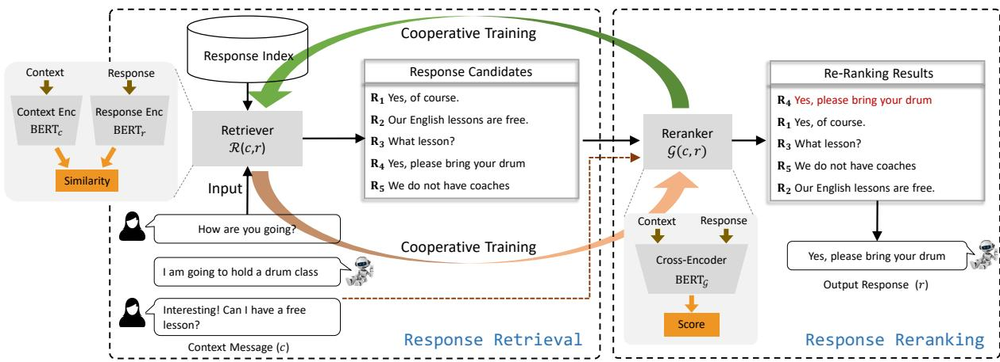
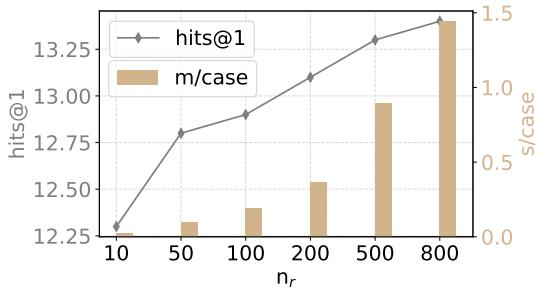
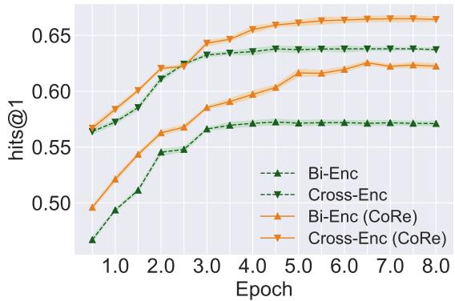
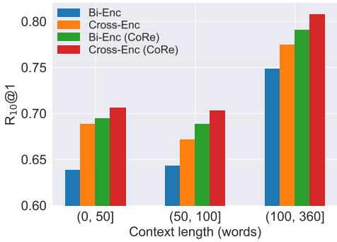

# CORE: Cooperative Training of Retriever-Reranker for Effective Dialogue Response Selection

Chongyang Tao1, Jiazhan Feng2, Tao Shen3, Chang Liu2, Juntao Li4

Xiubo Geng1, Daxin Jiang1∗

1Microsoft, Beijing, China

2Peking University, Beijing, China

3University of Technology Sydney, Sydney, Australia

4Soochow University, Suzhou, China

1{chotao,xigeng,djiang}@microsoft.com 3shentao@uts.edu.cn 2{fengjz,changliu}@pku.edu.cn 4ljt@suda.edu.cn

## Abstract

Establishing retrieval-based dialogue systems that can select appropriate responses from the pre-built index has gained increasing attention. Recent common practice is to construct a twostage pipeline with a fast retriever (e.g., biencoder) for first-stage recall followed by a smart response reranker (e.g., cross-encoder) for precise ranking. However, existing studies either optimize the retriever and reranker in independent ways, or distill the knowledge from a pre-trained reranker into the retriever in an asynchronous way, leading to sub-optimal performance of both modules. Thus, an open question remains about how to train them for a better combination of the best of both worlds. To this end, we present a cooperative training of the response retriever and the reranker whose parameters are dynamically optimized by the ground-truth labels as well as list-wise supervision signals from each other. As a result, the two modules can learn from each other and evolve together throughout the training. Experimental results on two benchmarks demonstrate the superiority of our method.

## 1 Introduction

The development of a smart human-computer conversation system has been a longstanding objective in the field of artificial intelligence. Recent years have seen an increase in interest in constructing dialogue systems through data-driven approaches, leveraging advancements in deep learning techniques (Vaswani et al., 2017; Devlin et al., 2019). With the help of information retrieval (IR) techniques to select an appropriate response from a pre-built index (Lowe et al., 2015; Whang et al., 2020), or text generation techniques to synthesize a response (Zhang et al., 2019), existing neural models are now capable of providing natural replies to user queries. In this paper, we concentrate on retrieval-based dialogue systems (Lowe et al., 2015; Boussaha et al., 2019; Yu et al., 2021; Su et al., 2021), which can deliver smooth and informative responses, and have powered industrial applications (Shum et al., 2018; Ram et al., 2018).

Retrieval-based dialogue systems usually follow the retrieval-reranking paradigm (Wang et al., 2013; Li et al., 2017), i.e., two-stage retrieval model, where the model first retrieves a bundle of response candidates from a pre-built index by a fast retriever and then selects an appropriate one with a more sophisticated yet costly response reranker. Specifically, as for the retriever, early methods based on hand-crafted features (Robertson et al., 2004; Qiu et al., 2017) (e.g., BM25) for fast retrieval, however suffering from vocabulary mismatch problem, especially in context-to-response retrieval. A recent trend is resorting to deep neural model to represent text as dense embeddings in latent semantic space, which is known as Siamese encoder or bi-encoder (Lowe et al., 2015; Henderson et al., 2019a; Humeau et al., 2020; Henderson et al., 2019b; Lan et al., 2021). Attributed to the separate encoding paradigm, it can calculate the embeddings of large-scale response candidates to pre-build vector retrieval index, benefiting from high efficiency during online inference. However, it sacrifices fine-grained interactions between a context and the response candidates but only remains sentence-level metric learning, leading to inferior ranking performance. As a remedy, a common practice is to apply a costly yet effective reranker to the retrieved candidates for more precise response selection (Whang et al., 2020; Gu et al., 2020; Whang et al., 2021). This is usually achieved by a crossencoder operating on the text concatenation of the context and each response for its reranking score.

In existing two-stage retrieval models from IR tasks, the retriever and reranker are usually optimized in independent ways (Henderson et al., 2020; Lan et al., 2021; Yang et al., 2021), or distill the knowledge from a pre-trained reranker into the retriever in an asynchronous fashion (Tahami et al., 2020; Yu et al., 2021). While the knowledge distillation from the reranker can improve the performance of the retriever, the reranker’s parameters are usually frozen so it cannot learn from the feedback from the retriever for a positive loop – the feedback can be (i) the retriever built upon a heterogeneous structure can offer a distinct view to regularize the reranker, and (ii) the reranker conversely can provide more effective supervision to make the retriever more generalizable. However, how to train these two modules in a joint way is still an open question.

To this end, we propose to unify the training process for both the retriever and the reranker for their mutual benefits in a retrieval-based dialogue system. Specifically, we introduce a cooperative training of the retriever and the response reranker (named CORE) whose parameters are dynamically optimized by the ground-truth labels as well as listwise supervision signals from each other, which enables two models to learn from each other throughout the training process. By combining the fast dense retriever and smart response reranker with a unified architecture and a cooperative training manner, our framework achieves impressive performance while demonstrating acceptable efficiency.

We conduct experiments on two benchmarks, i.e., Ubuntu Dialogue Corpus (Lowe et al., 2015) and the response selection track of Dialog System Technology Challenge 7 (abbr. DSTC7) (Gunasekara et al., 2019), where the model is required to select the best response from a candidate pool. Evaluation results indicate our model is significantly better than existing models on the benchmarks, and the cooperative training brings consistent improvements over both the retriever and reranker. To sum up, our main contributions are three-fold:

• Exploration of combining the efficient response retriever and effective reranker for dialogue retrieval;

• Proposal of training the response retriever and response reranker cooperatively with the supervision of list-wise ranking signals provided by each other;

• Empirical verification of the proposed approach on two public benchmarks.

## 2 Related Works

Retrieval-based Dialogues. In the past, retrievalbased dialogue systems focused on single-turn response selection using message-response pairs as inputs for matching models, as demonstrated in early studies such as (Wang et al., 2013; Ji et al., 2014; Wang et al., 2015). However, more recent attention has been given to multi-turn response selection using context-response matching. This includes methods such as dual-LSTM (Lowe et al., 2015), multi-view matching model (Zhou et al., 2016), deep attention matching network (DAM) (Zhou et al., 2018), and multi-hop selector network (MSN) (Yuan et al., 2019). With the success of pre-trained language models (Devlin et al., 2019; Liu et al., 2020) in various NLP tasks, researchers have started to apply them to response selection. For instance, Vig and Ramea (2019) used BERT to represent utterance-response pairs and fused these representations to calculate the matching score. Similarly, Whang et al. (2020) treated context as a long sequence and conducted contextresponse matching with BERT. Furthermore, Gu et al. (2020) incorporated speaker-aware embeddings into BERT to enhance the ability of multiturn context understanding.

Efficient Information Retrieval. Existing information retrieval models (Wang et al., 2013; Qiu et al., 2017; Nogueira and Cho, 2019; Nogueira et al., 2019) usually adopt a pipeline method where an efficient first-stage retriever retrieves a small set of candidates from the entire corpus, and then a powerful but slow second-stage ranker reranks them. However, most of the models rely on traditional lexical-based methods (such as BM25) to perform the first stage of retrieval and the ranking models of different stages are learned separately. Recently, as a promising approach, Dense Retrieval (DR) has been widely used for Ad-hoc retrieval (Zhan et al., 2020; Chang et al., 2020; Luan et al., 2021) and open-domain question answering (Lee et al., 2019; Karpukhin et al., 2020; Xiong et al., 2020) because it is as fast as traditional methods and can achieve impressive performance. In retrieval-based dialogue, Humeau et al. (2020)

presents the Poly-encoder, an architecture with an additional learned attention mechanism that represents more global features from which to perform self-attention, resulting in performance gains over Bi-encoders and large speed gains over PLM-based models. Besides, Henderson et al. (2020) introduce ConveRT which is a compact dual-encoder pretraining architecture for neural response selection. Tahami et al. (2020) utilize knowledge distillation to compress the cross-encoder network as a teacher model into the student bi-encoder model.

Joint Training of Bi- and Cross-Encoder. Few works in passage/document retrieval have been proposed to train the bi- and cross-encoder jointly but stand with different motivations or/and targets. For example, AR2 (Zhang et al., 2021) proposes an adversarial method, where it regards the bi-encoder as a retrieval-based generator for the hard negatives to fool the discriminator built upon a crossencoder; RocketQAv2 (Ren et al., 2021) passes the ground-truth labels to cross encoder and learns bi encoder based solely on the ranking scores from the cross-encoders. To the best of our knowledge, this paper makes the first attempt to combine the efficient dense retriever and smart response selector for building an effective response retrieval system. Besides, different from traditional single-directional distillation (from reranker to retriever) (Tahami et al., 2020) in dialogue, we jointly learn response retriever and selector with a cooperative training framework, where reranker also receives weak listwise supervision signals provided by the retriever. Our training schema is similar to the idea of mutual learning (Zhang et al., 2018) and enables mutual knowledge transfer in a synchronous way. Evaluation results also reveal that the retriever and the reranker can co-improve and our full-ranking performance is better than existing distillation methods.

## 3 Methodology

Problem Formalization Given a data set = $\{ ( y , c , r ) _ { z } \} _ { z = 1 } ^ { N }$ where $c = \{ u _ { 1 } , . . . , u _ { n _ { c } } \}$ represents $n _ { c }$ turns of conversation context with ui the ith turn, r is a response candidate, and $y \in \{ 0 , 1 \}$ denotes a label with $y = 1$ indicating r a proper response for c and otherwise $y = 0$ . The goal of the task of response selection is to build a matching model $\phi ( \cdot , \cdot )$ from . For any input context c and a candidate response $r , \phi ( c , r )$ gives a score that reflects the matching degree between c and r. According to $\phi ( c , r )$ , one can rank a set of response candidates for response selection. In particular, the definition of $\phi ( \cdot , \cdot )$ can be a single-stage model or a two-stage model.

Overall Framework Retrieval models re-use existing human conversations and select a proper response from a group of candidates for new user input. Our method is designed within the retrievalthen-rerank paradigm. Specifically, given a message or a conversation context (i.e., a message with several previous turns as conversation history), we use a fast dense retrieval method based on a pretrained bi-encoder architecture as the retriever. In the response re-ranking stage, we employ a more powerful architecture (such as a cross-encoder) to re-rank a small number of the most promising candidates provided by the fast retrieval model. To further improve the effectiveness of the overall system, we introduce a cooperative training of the retriever and the response reranker whose parameters are dynamically optimized by the ground-truth labels and list-wise supervision signals provided by each other, which enables two modules to evolve together and learn from each other throughout the joint training.

## 3.1 Response Retriever

Inspired by the recent dense retrieval (Lee et al., 2019; Zhan et al., 2020; Karpukhin et al., 2020), we use a bi-encoder architecture to construct a learnable retriever. The architecture utilizes a separated pre-trained encoder to cast the input context message and index entries into dense representations in a vector space and relies on fast maximum innerproduct search (MIPS) to complete the retrieval. Without loss of generality, we use two BERT (Devlin et al., 2019) models for both encoders, as it is trained on large amounts of unlabelled data and provides strong “universal representations" that can be finetuned on task-specific data to achieve good performance on downstream tasks.

Specifically, given the i-th example with the context $c _ { i }$ and a response candidate $r _ { i , j }$ , we first concatenate all utterances in the context as a consecutive token sequence with special tokens separating them, formulated as $x \quad =$ $\left\{ \bigl [ \mathrm { C L S } \bigr ] , u _ { 1 } , \bigl [ \mathrm { S E P } \bigr ] , \ldots , u _ { n _ { c } } , \bigl [ \mathrm { S E P } \bigr ] \right\}$ . Here [CLS] and [SEP] are the classification symbol and the segment separation symbol. For each word in x, token, position and segment embeddings are summated and fed into BERT, giving us the contextualized embedding sequence. The output [CLS] representation denoted as $E _ { c _ { i } }$ is the final context representation aggregating dialogue history information. We then follow the same scheme to obtain the response representation $E _ { r _ { i , j } }$ for a response candidate $\boldsymbol { r } _ { i , j }$ Lastly, the retrieval score is computed as

  
Figure 1: Overall architecture of our model (CORE). $\mathcal { R } ( c , r )$ in the left dotted box means the response retriever in the first stage, and $\mathcal { G } ( c , r )$ in the right dotted box refers to the response-reranker in the second stage.

$$
\mathcal { R } ( c _ { i } , r _ { i , j } ; \Theta _ { \mathcal { R } } ) = E _ { c _ { i } } E _ { r _ { i , j } } ^ { \top } .\tag{1}
$$

For each training sample, the loss function of the response retriever is defined by

$$
\begin{array} { r l } & { \mathcal { L } _ { \mathtt { C E } } ( c _ { i } , r _ { i } ^ { + } , r _ { i , 1 } ^ { - } , \ldots , r _ { i , \delta _ { r } } ^ { - } ; \Theta _ { \mathcal { R } } ) } \\ & { \quad \quad = - \log ( \frac { \exp ^ { { \mathcal { R } ( c _ { i } , r _ { i } ^ { + } ) } } } { \exp ^ { { \mathcal { R } ( c _ { i } , r _ { i } ^ { + } ) } } + \sum _ { j = 1 } ^ { \delta _ { r } } \exp ^ { { \mathcal { R } ( c _ { i } , r _ { i , j } ^ { - } ) } } } ) , } \end{array}\tag{2}
$$

where $r _ { i } ^ { + }$ is the true response for a given ci, $r _ { i , j } ^ { - }$ is the j-th negative response candidate randomly sampled from the training set, $\delta _ { r }$ denotes the number of negative response candidate, $\Theta _ { \mathcal { R } }$ represents the parameters of the retriever.

## 3.2 Response Reranker

To further re-rank a small number of promising candidates provided by the fast dense retrieval, we consider a powerful pre-trained cross-encoder architecture (Devlin et al., 2019) to build the response reranker, as it has demonstrated impressive results on various response selection task (Whang et al., 2020; Gu et al., 2020). Consistent with previous works (Whang et al., 2020), we also select BERT as the backbone for a fair comparison.

Specifically, we first concatenate all utterances in the context as well as the response candidate as a single consecutive token sequence with special tokens separating them formulated as $\boldsymbol { x } = \{ [ \mathrm { C L S } ] , \boldsymbol { u } _ { 1 } , [ \mathrm { S E P } ] , \dots , [ \mathrm { S E P } ] , \boldsymbol { u } _ { n _ { c } } , [ \mathrm { S E P } ] ,$ r, [SEP] . Similarly, token, position and $s e g .$ ment embeddings are also used. After being processed by $\operatorname { B E R T } _ { \mathcal { G } }$ , the input sequence is transformed into a contextualized embedding sequence. $\operatorname { B E R T } _ { \mathcal { G } }$ [CLS] is an aggregated representation vector that contains the semantic interaction information for the context-response pair. We then fed $\mathbf { B E R T } _ { \mathcal { G } } \left[ \mathbf { C L S } \right]$ into a multi-layer perception to obtain the final matching score for the contextresponse pair:

$$
\mathcal { G } ( \boldsymbol { c } , \boldsymbol { r } ; \Theta _ { \mathcal { G } } ) = \sigma ( W _ { 1 } \cdot \mathrm { B E R T } _ { \mathcal { G } } \left[ \mathrm { C L S } \right] ) + b _ { 1 } ,
$$

where $W _ { 1 }$ and $b _ { 1 }$ are trainable parameters, $\sigma ( \cdot )$ is the sigmoid function. $\Theta _ { \mathcal { G } }$ denotes the parameters of the reranker. Finally, the training objective of the response reranker $\mathcal { L } _ { \mathtt { C E } } ( c _ { i } , r _ { i } ^ { + } , \{ r _ { i , j } ^ { - } \} _ { j = 1 } ^ { \delta _ { r } } ; \Theta _ { \mathcal { G } } )$ can also be defined as the negative log-likelihood loss similar to Equation (2).

## 3.3 Cooperative Training for Response Retrieval (CORE)

Traditional supervised method either individually trains two models to predict the correct labels or transfer knowledge from a well-trained reranker into the retriever via vanilla distillation (Tahami et al., 2020). To improve the effectiveness of our overall systems, we propose to optimize the retriever and the response reranker at the same time in a cooperative training manner, which enables two models to learn or transfer knowledge from each other throughout the training process. Formally, for the i-th training examples $\{ c _ { i } , r _ { i , j } \} _ { j = 1 } ^ { \delta _ { r } + 1 }$ (where each dialogue context corresponds to a response candidate list), the probability that $\langle c _ { i } , r _ { i , m } \rangle ( m \in$ $[ 1 , \delta _ { r } + 1 ] )$ is a true context-response pair given by the response retriever $\Theta _ { \mathcal { R } }$ is computed as

Algorithm 1: Our cooperative learning method   
Input: Training set $\overline { { \mathcal { D } , } }$ learning rate $\eta ,$ number of   
epochs $n _ { e } ,$ number of iterations $n _ { k } .$   
parameters of Retriever $\Theta \pi$ , parameters of   
Reranker $\Theta _ { \mathcal { G } }$   
1 for $e = 1 , 2 , . . . , n _ { e }$ do   
2 for $t = 1 , 2 , . . . , n _ { k }$ do   
3 Fetch a batch of training data $\begin{array} { r } { B ; { } } \end{array}$   
4 Compute predictions $\breve { A }$ and $\kappa ;$   
5 Compute the gradient and update $\Theta _ { \mathcal { R } } \mathrm { i }$   
6   
$\Theta _ { \mathcal R }  \Theta _ { \mathcal R } + \eta \frac { \partial \mathcal { I } _ { \Theta _ { \mathcal R } } ( B ) } { \partial \Theta _ { \mathcal R } }$   
Compute the gradient and update $\Theta _ { \mathcal { G } } \colon$   
7   
$\Theta _ { \mathcal { G } } \gets \Theta _ { \mathcal { G } } + \eta \frac { \partial \mathcal { I } _ { \Theta _ { \mathcal { G } } } ( \boldsymbol { B } ) } { \partial \Theta _ { \mathcal { G } } }$   
8 end   
9 end   
Output: $\Theta _ { \mathcal { R } } , \Theta _ { \mathcal { G } } .$

$$
\mathcal { A } _ { i , m } = \frac { \exp ( \mathcal { R } ( c _ { i } , r _ { i , m } ) / \tau ) } { \sum _ { j = 1 } ^ { \delta _ { r } + 1 } \exp ( \mathcal { R } ( c _ { i } , r _ { i , j } ) / \tau ) } ,\tag{3}
$$

where $\mathcal { R } ( c _ { i } , r _ { i , j } )$ is the output logit of response retriever, $\tau$ is the temperature to soften $\mathcal { R } ( c _ { i } , r _ { i , j } )$ Therefore, we can construct a vector of matching scores $\pmb { \mathcal { A } } _ { i } = [ \mathcal { A } _ { 1 } , \cdots , \mathcal { A } _ { \delta _ { r } + 1 } ]$ for the response candidate list. The output probability of response selector can be computed by replacing $\mathcal { R } ( \cdot , \cdot )$ with $\mathcal { G } ( \cdot , \cdot )$ and is denoted as $\pmb { \kappa } _ { i } = [ \pmb { \cal K } _ { 1 } , \cdots , \pmb { \cal K } _ { \delta _ { r } + 1 } ]$

In order to enhance the generalization performance of the response retriever $\mathcal { R } ( \cdot )$ , we leverage the response reranker $\mathcal { G } ( \cdot )$ to provide training experience through its posterior probability $\kappa _ { i }$ . We adopt the Kullback Leibler (KL) Divergence (Kullback, 1997) to measure the discrepancy between the predictions of the two models, $\mathrm { i } . \mathrm { e } . , \boldsymbol { A } _ { i }$ predicted by $\mathcal { R } ( \cdot )$ and $\kappa _ { i }$ predicted by $\mathcal { G } ( \cdot )$ . Formally, the KL loss is defined as:

$$
D _ { K L } ( \pmb { \mathscr { A } } _ { i } | | \pmb { \mathscr { K } } _ { i } ) = \sum _ { i = 1 } ^ { N } \sum _ { m = 1 } ^ { M } \mathscr { A } _ { i , m } \log \frac { \mathscr { K } _ { i , m } } { \mathscr { A } _ { i , m } } .\tag{4}
$$

Therefore, the overall loss function $\mathcal { I } _ { \Theta _ { \mathcal { R } } }$ for response retriever $( \Theta _ { \mathcal { R } } )$ can be re-defined as

$$
\mathcal { I } _ { \boldsymbol { \Theta } _ { \mathcal { R } } } ( \mathcal { D } ) = \sum _ { c _ { i } \in \mathcal { D } } \mathcal { L } _ { \mathtt { C E } } ( c _ { i } ; \boldsymbol { \Theta } _ { \mathcal { R } } ) + \gamma _ { \mathcal { R } } { \cdot } D _ { K L } ( \pmb { \mathcal { K } } _ { i } \| \pmb { \mathcal { A } } _ { i } ) ,\tag{5}
$$

where $\mathcal { L } _ { \mathrm { C E } } ( c _ { i } ; \Theta _ { \mathcal { R } } )$ is the cross-entropy loss defined in Equation $2 . \gamma _ { \mathcal { R } }$ is the weight for the tradeoff of two losses.

We also utilize the posterior probability of a less sophisticated retriever $\Theta _ { \mathcal { R } }$ to provide a training experience for the response reranker $\Theta _ { \mathcal { G } }$ . Our motivation stems from the fact that the retriever built upon a heterogeneous structure can offer a distinct perspective to regularize the reranker. Thus, the loss function $\mathcal { I } _ { \Theta _ { \mathcal { G } } }$ for response reranker is accordingly re-defined as

$$
\mathcal { I } _ { \boldsymbol { \Theta } _ { \boldsymbol { \mathcal { G } } } } ( \mathcal { D } ) = \sum _ { c _ { i } \in \mathcal { D } } \mathcal { L } _ { \mathrm { C E } } ( c _ { i } ; \boldsymbol { \Theta } _ { \boldsymbol { \mathcal { G } } } ) + \gamma _ { \boldsymbol { \mathcal { G } } } \cdot D _ { K L } ( \mathbf { \mathcal { A } } _ { i } | | \mathcal { K } _ { i } ) .\tag{6}
$$

where $\mathcal { L } _ { \mathrm { C E } } ( c _ { i } ; \Theta _ { \mathcal { G } } )$ is the cross-entropy loss for the reranker, and $\gamma _ { \mathcal { G } }$ is the parameter for the trade-off of two losses. In the above loss function, the retriever can provide more fine-grained supervision (via list-wise distribution) using KL loss, which can help the training of the reranker and enhance its generalizability. Yuan et al. (2020) explained such knowledge distillation process as a type of learned label smoothing regularization, and showed that a weaker student can also transfer knowledge and bring improvement to a stronger teacher in computer vision tasks. Our experimental results also affirm the value of incorporating feedback from the less sophisticated response retriever.

Thereby, both the response retriever and reranker learn to correctly predict the true label of training instances (supervised loss) as well as to match the probability estimate of its counterpart (KL loss). After learning models from , we first rank the response index according to $\mathcal { R } ( c , r )$ and then select top $n _ { r }$ response candidates $\{ r _ { 1 } , \ldots , r _ { n _ { r } } \}$ for the subsequent response re-ranking process. Algorithm 1 gives a pseudo-code of our method.

Remark. Firstly, our proposed cooperative training method differs from the vanilla distillation employed in two-stage IR models (Tahami et al., 2020; Yu et al., 2021), which involves transferring knowledge from a pre-trained reranker to the retriever via a point-wise distillation loss. Instead, our approach jointly optimizes the retriever and reranker through a list-wise supervision loss, enabling them to improve each other. Secondly, while our cooperative training shares similarities with mutual learning (Zhang et al., 2018) and co-teaching (Han et al., 2018) in machine learning, our focus is on jointly training different architectures that combine the fast dense retriever and the smart reranker. Moreover, our cooperative training transfers knowledge between the two modules using list-wise supervision signals, as opposed to point-wise class signals.

## 4 Experiments

We evaluate the proposed method on two benchmark datasets for both single-state and two-stage multi-turn response selection tasks.

## 4.1 Datasets and Evaluation Metrics

The first dataset is the track 2 of Dialog System Technology Challenge 7 (DSTC7) (Gunasekara et al., 2019). The dataset is constructed by applying a new disentanglement method (Kummerfeld et al., 2018) to extract conversations from an IRC channel of technical help for the Ubuntu system. We use the copy shared by Humeau et al. (2020) which contains about 2 million context-response pairs for training. At test time, the systems were provided with conversation histories, each paired with a set of response candidates that could be the next utterance in the conversation. Systems are needed to rank these options. We test our model on two sub-tasks. For each dialog context in sub-task 1, a candidate pool of 100 is given and the contestants are expected to select the best next utterance from the given pool. In sub-task 2, a large candidate pool of 120, 000 utterances is shared by validation and testing sets. The next best utterance should be selected from this large pool. In both sub-tasks, there are 5, 000 and 1, 000 dialogues for validation and testing respectively.

The second dataset is the Ubuntu Dialogue Corpus (v2.0) (Lowe et al., 2015), which consists of multi-turn English dialogues about technical support and is collected from chat logs of the Ubuntu forum. We use the copy shared of Jia et al. (2020), which has 1.6 million context-response pairs for training, 19, 560 pairs for validation, and 18, 920 pairs for test. The ratio of positive candidates and negative candidates is 1 : 9 in all three sets.

Following Humeau et al. (2020), we employ hits@k and Mean Reciprocal Rank (MRR) as evaluation metrics, where hits@k measures the probability of the positive response being ranked in top k positions among candidates.

## 4.2 Baselines

We compare our method on both the traditional multi-turn response selection scenario as well as the two-stage retrieval scenario. In particular, the following multi-turn response selection models are selected to compare with our results.

• DAM (Zhou et al., 2018) follows the represent- match-aggregate paradigm, where the representation is derived using both self and cross-attention mechanisms.

• ESIM (Chen and Wang, 2019) is a extension of the original ESIM (Chen et al., 2017) which was developed specifically for natural language inference tasks.

• IMN (Gu et al., 2019) is a hybrid model with sequential characteristics at the matching layer and hierarchical characteristics at the aggregation layer.

• Bi-Enc (Humeau et al., 2020) share the same architecture as our pre-retriever, but is only optimized with cross-entropy loss.

• Bi-Enc (Distillation) (Humeau et al., 2020) share the same architecture as our preretriever and is trained by distilling knowledge from a well-trained cross-encoder.

• Poly-Enc (Humeau et al., 2020) represents the context and response candidates separately, and then employs an improved attention mechanism to allow the response to interact with the context.

• Cross-Enc (Humeau et al., 2020) has the same architecture as our reranker and is optimized by cross-entropy loss. The model is the SOTA model based on PLMs.

## 4.3 Implementation Details

Following Humeau et al. (2020), we select English uncased $\mathrm { B E R T _ { b a s e } }$ pre-trained on Reddit corpus1 as the context-response matching model. The maximum lengths of the context and response are set to 300 and 72. Intuitively, the last tokens in the context and the previous tokens in the response candidate are more important, so we cut off the previous tokens for the context but do the cut-off in the reverse direction for the response candidate if the sequences are longer than the maximum length. We choose 8 as the size of mini-batches for training. We implement the MIPS with Facebook AI Similarity Search library (Faiss2). During training, we set γ and γ to be 1.0 and 3.0 respectively through a simply parameter search. We set the number of negative response candidates $\delta _ { r } \ = \ 3 2$ during the training3. In the two-stage retrieval scenario, we test $n _ { r }$ in 10, 50, 100, 200, 500, 800 and set $n _ { r } = 1 0 0$ for the trade-off the efficiency and effectiveness. The model is optimized using Adam optimizer with a learning rate set as 5e  5. The learning rate is scheduled by warmup and linear decay. τ is set as 3. A dropout rate of 0.1 is applied for all linear transformation layers.

<table><tr><td rowspan="2">Model</td><td colspan="3">Sub-task1 of DSTC7</td><td colspan="4">UbuntuV2</td></tr><tr><td>hits@1</td><td>hits@10</td><td>MRR</td><td>hits@1</td><td>hits@2</td><td>hits@5</td><td>MRR</td></tr><tr><td>DAM (Zhou et al., 2018)</td><td>34.7</td><td>66.3</td><td>35.6</td><td>=</td><td></td><td>=</td><td>–</td></tr><tr><td>ESIM (Chen and Wang, 2019)</td><td>64.5</td><td>90.2</td><td>73.5</td><td>73.4</td><td>86.6</td><td>97.4</td><td>83.5</td></tr><tr><td>IMN (Gu et al., 2019)</td><td></td><td></td><td>=</td><td></td><td>77.1</td><td>88.6</td><td>97.9</td></tr><tr><td>Bi-Enc (Humeau et al., 2020)</td><td>70.9</td><td>90.6</td><td>78.1</td><td>83.6</td><td>-</td><td>98.8</td><td>90.1</td></tr><tr><td>Poly-Enc (Humeau et al., 2020)</td><td>71.2</td><td>91.5</td><td>78.2</td><td>83.9</td><td>1</td><td>98.8</td><td>90.3</td></tr><tr><td>Cross-Enc (Humeau et al., 2020)</td><td>71.7</td><td>92.4</td><td>79.0</td><td>86.5</td><td>1</td><td>99.1</td><td>91.9</td></tr><tr><td>Bi-Enc (Our implementation)</td><td>67.5</td><td>91.6</td><td>76.1</td><td>83.1</td><td>92.7</td><td>98.8</td><td>89.9</td></tr><tr><td>Cross-Enc (Our implementation)</td><td>71.2</td><td>93.2</td><td>78.8</td><td>86.6</td><td>94.3</td><td>99.3</td><td>92.0</td></tr><tr><td>Bi-Enc (Distillation)</td><td>69.5</td><td>92.2</td><td>77.1</td><td>84.5</td><td>93.1</td><td>98.9</td><td>90.7</td></tr><tr><td>Bi-Enc (CoRE)</td><td>72.4°</td><td>93.5°</td><td>80.0°</td><td>85.7°</td><td>93.8°</td><td>99.0°</td><td>91.5°</td></tr><tr><td>Cross-Enc (CoRE)</td><td> $7 4 . 5 ^ { \circ \star }$ </td><td>93.7°*</td><td> $8 1 . 4 ^ { \circ \star }$ </td><td> $8 7 . 4 ^ { \circ \star }$ </td><td>94.7°*</td><td>99.5°</td><td>92.6°*</td></tr></table>

Table 1: Results on UbuntuV2 and sub-task1 of DSTC7. Numbers marked with ◦ and ⋆ mean that improvement to the original models and to the state-of-the-art is statistically significant (t-test, $p < 0 . 0 5 )$ respectively.
<table><tr><td>Model</td><td>hits@1</td><td>hits@2</td><td>hits@5</td><td>hits@50</td><td>MRR</td><td>Test (ms/case)</td></tr><tr><td>BM25</td><td>1.4</td><td>2.0</td><td>4.2</td><td>11.9</td><td>10.0</td><td>=</td></tr><tr><td>Bi-Enc</td><td>8.6</td><td>12.2</td><td>18.7</td><td>38.1</td><td>13.6</td><td></td></tr><tr><td>Bi-Enc (CoRE)</td><td>10.8</td><td>16.4</td><td>23.8</td><td>46.2</td><td>17.3</td><td>-</td></tr><tr><td>BM25  Bi-Enc</td><td>6.9</td><td>9.6</td><td>12.4</td><td>15.8</td><td>9.3</td><td>45</td></tr><tr><td>BM25  Poly-Enc</td><td>7.2</td><td>9.7</td><td>12.6</td><td>15.8</td><td>9.4</td><td>46</td></tr><tr><td>BM25 Cross-Enc</td><td>8.0</td><td>10.4</td><td>13.5</td><td>15.8</td><td>10.3</td><td>188</td></tr><tr><td>BM25 5  Bi-Enc (CoRE)</td><td>8.1</td><td>10.1</td><td>12.7</td><td>15.6</td><td>10.0</td><td>45</td></tr><tr><td>BM25 — Cross-Enc (CoRE)</td><td>8.8</td><td>11.8</td><td>13.9</td><td>15.7</td><td>11.0</td><td>188</td></tr><tr><td>Bi-Enc — Cross-Enc</td><td>10.9</td><td>16.1</td><td>23.8</td><td>44.6</td><td>17.3</td><td>188</td></tr><tr><td>Bi-Enc (Distillation) → Cross-Enc</td><td>11.3</td><td>16.5</td><td>24.2</td><td>45.4</td><td>17.6</td><td>188</td></tr><tr><td>Bi-Enc (CoRE) — Cross-Enc (CoRE)</td><td>12.9*</td><td>17.4*</td><td>25.2*</td><td>48.3*</td><td>18.8*</td><td>188</td></tr></table>

Table 2: Evaluation results on task2 of DSTC7 dataset. We set $n _ { r } = 1 0 0$ in all two-stage models. It is worth noting that the pre-retrieval with faiss library is very fast and we do not report this part of the time. Numbers marked with ⋆ mean that improvement to the state-of-the-art is statistically significant (t-test, $p < 0 . 0 5 )$ .

## 4.4 Evaluation Results

Results of traditional response selection. We first validate the effectiveness of our framework on a traditional response selection scenario. Table 1 reports the evaluation results on sub-task1 of DSTC7 and UbuntuV2 where 10 and 100 response candidates are provided for each input context respectively. We can observe that the performance of response retriever (i.e., Bi-Enc (CORE)) and response reranker (i.e., Cross-Enc (CORE)) improve on almost all metrics after they are jointly optimized with cooperative training, indicating that the effectiveness of the proposed method on the multiturn response selection task. We also see that our cooperative training is more effective than the traditional vanilla distillation as Bi-Enc (CORE) significantly outperforms Bi-Enc (Distillation). Notably, cooperative training brings more significant improvement to the bi-encoder than the cross-encoder on both datasets. The results may stem from the fact that a cross-encoder (a stronger model) can provide a bi-encoder (a weaker model) with more useful knowledge during the cooperative training phase, but less on the contrary. With cooperative training, a simple bi-encoder even performs better than the original cross-encoder and poly-encoder on both datasets, although the poly-encoder and cross-encoder involve more heavy interaction.

  
Figure 2: The performance of our two-stage model and average test speed for different $n _ { r }$ when using Cross-Enc (CORE) as the reranker on sub-task2 of DSTC7.

Results of two-stage response retrieval. We further conduct experiments on the two-stage response retrieval scenario. Table 2 contains the evaluation results of the sub-task2 of DSTC7. In this task, the model is expected to select the best response from a shared candidate pool of 120, 000 responses, which is more challenging. Due to the huge number of indices, we make use of the MIPS to perform the fast retrieval, and the time spent in this stage is negligible compared with the response selection stage. According to the results, we can observe that: 1) Compared with using BM25 as the retriever, Bi-Enc can bring consistent and significant improvement to the overall retrieval system on both datasets, indicating the effectiveness of dense retrieval on the response selection task; 2) Cooperative training can improve the performance of both single-stage models (e.g., Bi-Enc vs Bi-Enc (CORE)) and two-stage model (e.g., the model in the last row); 3) By combining the bi-encoder model and smart cross-encoder model, our twostage retrieval framework can achieve impressive performance while showing reasonable efficiency constraints compared with other baseline methods.

## 4.5 Discussions

The impact of $n _ { r }$ . We first check the effectiveness and efficiency of re-ranking performance with respect to the number of top $n _ { r }$ candidates returned from the response retriever. Figure 2 illustrates how the hit@1 score and average test speed of the two-stage model vary under different $n _ { r }$ when using the Cross-Enc (CORE) as the reranker on sub-task2 of DSTC7. We can observe the retrieval performance increases monotonically as $n _ { r }$ keeps increasing and the improvement becomes smaller when context length reaches 500. Besides, it can be found that re-ranking as few as 10 or 50 candidates out of 120K from dense retriever is enough to obtain good performance under reasonable efficiency constraints.

  
Figure 3: Hits@1 in the validation set of various models during the training on sub-task1 of DSTC7.

Training curve of retriever and reranker. We are curious if the response retriever and response reranker can co-improve when they are jointly trained with cooperative training. Figure 3 shows how the hits@1 score of Bi-Encoder, Cross-Encoder, Bi-Encoder (CORE), and Cross-Encoder (CORE) changes with the number of epochs on the validation set of sub-task1 of DSTC7. We can see that cooperative training can improve both the performance of the response retriever (i.e., Bi-Enc (CORE)) and response reranker (i.e., Cross-Enc (CORE)), and the peer models move at almost the same pace. The results verify our claim that by cooperative training retriever-ranker, the two models can get improved together. Compared to independently optimized models, the models trained using our CoRe converge at a slower pace. This phenomenon could be due to the fact that the two models, built upon a heterogeneous structure, offer a distinct view that enables them to mutually regulate each other, thereby avoiding the model from reaching a local optimum. In addition, we can find that the performance improvement of Bi-Enc is greater than that of Cross-Enc. This is because Cross-Enc can provide Bi-Enc with more useful knowledge during the cooperative training phase.

  
Figure 4: Performance of different models across the different lengths of contexts on sub-task1 of DSTC7. The number of testing samples in the three bins is 339, 356, 305 respectively.

The impact of context length. We further conduct a study to investigate how the length of context influences the performance of these models. Figure 4 shows how the performance of the models changes with respect to different lengths of contexts on sub-task1 of DSTC7. We observe a similar trend for all models: they increase monotonically when context length keeps increasing. The phenomenon may come from the fact that the longer context can provide more useful information for response matching. Besides, we can find that cooperative training can bring performance improvements for both the bi-encoder and cross-encoder across all different context lengths, but the improvement is more obvious in longer context (e.g., (50,360]) for cross-encoder and more obvious in the short context (e.g., (0, 50]) for bi-encoder.

## 5 Conclusion

In this paper, to build an effective retrieval-based dialogue system, we explore combining the fast dense retriever and the smart response reranker based on PLMs with better cooperative training schema. Specifically, we propose optimizing the response retriever and the reranker at the same time via cooperative training loss, which enables the two modules to learn from each other throughout the training process. Experimental results on two benchmarks demonstrate the effectiveness of our proposed framework.

## Limitation

(i) Training computation overheads: although having the same inference complexity as any other two-stage retrieval-based dialogue system, our approach requires more computation resources during training as it needs to optimize the two modules in the meantime. (ii) Static negatives: we train both modules with a fixed number of random negative samples for a fair comparison with baselines. Actually, more effective negatives can be dynamically sampled by the fast retriever to the smart reranker to further improve its performance.

## Ethical Statement

Our paper primarily aims to enhance the training method for constructing retrieval-based dialogue systems that exhibit improved effectiveness. The training corpora we utilize, such as the Ubuntu Corpus and the response selection track of the Dialog System Technology Challenge, are openly accessible and do not give rise to any privacy concerns. Furthermore, the algorithm we propose is designed to be free from ethical or social bias, ensuring fairness and unbiased performance.

## References

Basma El Amel Boussaha, Nicolas Hernandez, Christine Jacquin, and Emmanuel Morin. 2019. Deep retrieval-based dialogue systems: A short review. arXiv preprint arXiv:1907.12878.

Wei-Cheng Chang, Felix X Yu, Yin-Wen Chang, Yiming Yang, and Sanjiv Kumar. 2020. Pre-training tasks for embedding-based large-scale retrieval. In International Conference on Learning Representations.

Qian Chen and Wen Wang. 2019. Sequential matching model for end-to-end multi-turn response selection. In ICASSP, pages 7350–7354. IEEE.

Qian Chen, Xiaodan Zhu, Zhen-Hua Ling, Si Wei, Hui Jiang, and Diana Inkpen. 2017. Enhanced LSTM for natural language inference. In Proceedings of the 55th Annual Meeting of the Association for Computational Linguistics (Volume 1: Long Papers), pages 1657–1668, Vancouver, Canada. Association for Computational Linguistics.

Jacob Devlin, Ming-Wei Chang, Kenton Lee, and Kristina Toutanova. 2019. BERT: Pre-training of deep bidirectional transformers for language understanding. In NAACL, pages 4171–4186.

Jia-Chen Gu, Tianda Li, Quan Liu, Zhen-Hua Ling, Zhiming Su, Si Wei, and Xiaodan Zhu. 2020. Speaker-aware bert for multi-turn response selection in retrieval-based chatbots. In Proceedings of the 29th ACM International Conference on Information Knowledge Management, page 2041–2044.

Jia-Chen Gu, Zhen-Hua Ling, and Quan Liu. 2019. Interactive matching network for multi-turn response selection in retrieval-based chatbots. In Proceedings

ofthe 28th ACM International Conference on Information and Knowledge Management, pages 2321– 2324.

Chulaka Gunasekara, Jonathan K Kummerfeld, Lazaros Polymenakos, and Walter Lasecki. 2019. Dstc7 task 1: Noetic end-to-end response selection. In Proceedings ofthe First Workshop on NLPfor Conversational AI, pages 60–67.

Bo Han, Quanming Yao, Xingrui Yu, Gang Niu, Miao Xu, Weihua Hu, Ivor Tsang, and Masashi Sugiyama. 2018. Co-teaching: Robust training of deep neural networks with extremely noisy labels. Advances in neural information processing systems, 31.

Matthew Henderson, Inigo Casanueva, Nikola Mrkšic,´ Pei-Hao Su, Tsung-Hsien Wen, and Ivan Vulic.´ 2019a. Convert: Efficient and accurate conversational representations from transformers. arXiv preprint arXiv:1911.03688.

Matthew Henderson, Iñigo Casanueva, Nikola Mrkšic,´ Pei-Hao Su, Tsung-Hsien Wen, and Ivan Vulic. 2020.´ ConveRT: Efficient and accurate conversational representations from transformers. In Findings ofthe Associationfor Computational Linguistics: EMNLP 2020, pages 2161–2174, Online. Association for Computational Linguistics.

Matthew Henderson, Ivan Vulic, Daniela Gerz, Iñigo´ Casanueva, Paweł Budzianowski, Sam Coope, Georgios Spithourakis, Tsung-Hsien Wen, Nikola Mrkšic,´ and Pei-Hao Su. 2019b. Training neural response selection for task-oriented dialogue systems. In Proceedings of the 57th Annual Meeting of the Association for Computational Linguistics, pages 5392– 5404, Florence, Italy. Association for Computational Linguistics.

Samuel Humeau, Kurt Shuster, Marie-Anne Lachaux, and Jason Weston. 2020. Poly-encoders: Transformer architectures and pre-training strategies for fast and accurate multi-sentence scoring. In ICLR.

Zongcheng Ji, Zhengdong Lu, and Hang Li. 2014. An information retrieval approach to short text conversation. arXiv preprint arXiv:1408.6988.

Qi Jia, Yizhu Liu, Siyu Ren, Kenny Zhu, and Haifeng Tang. 2020. Multi-turn response selection using dialogue dependency relations. In Proceedings ofthe 2020 Conference on Empirical Methods in Natural Language Processing (EMNLP), pages 1911–1920, Online. Association for Computational Linguistics.

Vladimir Karpukhin, Barlas Oguz, Sewon Min, Patrick˘ Lewis, Ledell Wu, Sergey Edunov, Danqi Chen, and Wen-tau Yih. 2020. Dense passage retrieval for opendomain question answering. In Empirical Methods in Natural Language Processing (EMNLP).

Solomon Kullback. 1997. Information theory and statistics. Courier Corporation.

Jonathan K Kummerfeld, Sai R Gouravajhala, Joseph Peper, Vignesh Athreya, Chulaka Gunasekara, Jatin Ganhotra, Siva Sankalp Patel, Lazaros Polymenakos, and Walter S Lasecki. 2018. Analyzing assumptions in conversation disentanglement research through the lens of a new dataset and model. arXiv preprint arXiv:1810.11118, 89.

Tian Lan, Deng Cai, Yan Wang, Yixuan Su, Xian-Ling Mao, and Heyan Huang. 2021. Exploring dense retrieval for dialogue response selection. arXiv preprint arXiv:2110.06612.

Kenton Lee, Ming-Wei Chang, and Kristina Toutanova. 2019. Latent retrieval for weakly supervised open domain question answering. arXiv preprint arXiv:1906.00300.

Feng-Lin Li, Minghui Qiu, Haiqing Chen, Xiongwei Wang, Xing Gao, Jun Huang, Juwei Ren, Zhongzhou Zhao, Weipeng Zhao, Lei Wang, et al. 2017. Alime assist: An intelligent assistant for creating an innovative e-commerce experience. In Proceedings of the 2017 ACM on Conference on Information and Knowledge Management, pages 2495–2498.

Yinhan Liu, Myle Ott, Naman Goyal, Jingfei Du, Mandar Joshi, Danqi Chen, Omer Levy, Mike Lewis, Luke Zettlemoyer, and Veselin Stoyanov. 2020. Roberta: A robustly optimized bert pretraining approach.

Ryan Lowe, Nissan Pow, Iulian Serban, and Joelle Pineau. 2015. The Ubuntu dialogue corpus: A large dataset for research in unstructured multi-turn dialogue systems. In SIGDIAL, pages 285–294.

Yi Luan, Jacob Eisenstein, Kristina Toutanova, and Michael Collins. 2021. Sparse, dense, and attentional representations for text retrieval. Transactions ofthe Association for Computational Linguistics, 9:329– 345.

Rodrigo Nogueira and Kyunghyun Cho. 2019. Passage re-ranking with bert. arXiv preprint arXiv:1901.04085.

Rodrigo Nogueira, Wei Yang, Kyunghyun Cho, and Jimmy Lin. 2019. Multi-stage document ranking with bert. arXiv preprint arXiv:1910.14424.

Minghui Qiu, Feng-Lin Li, Siyu Wang, Xing Gao, Yan Chen, Weipeng Zhao, Haiqing Chen, Jun Huang, and Wei Chu. 2017. AliMe chat: A sequence to sequence and rerank based chatbot engine. In Proceedings of the 55th Annual Meeting of the Association for Computational Linguistics (Volume 2: Short Papers), pages 498–503, Vancouver, Canada. Association for Computational Linguistics.

Ashwin Ram, Rohit Prasad, Chandra Khatri, Anu Venkatesh, Raefer Gabriel, Qing Liu, Jeff Nunn, Behnam Hedayatnia, Ming Cheng, Ashish Nagar, et al. 2018. Conversational ai: The science behind the alexa prize. arXiv preprint arXiv:1801.03604.

Ruiyang Ren, Yingqi Qu, Jing Liu, Wayne Xin Zhao, Qiaoqiao She, Hua Wu, Haifeng Wang, and Ji-Rong Wen. 2021. Rocketqav2: A joint training method for dense passage retrieval and passage re-ranking. In Proceedings of the 2021 Conference on Empirical Methods in Natural Language Processing, EMNLP 2021, Virtual Event / Punta Cana, Dominican Republic, 7-11 November, 2021, pages 2825–2835. Association for Computational Linguistics.

Stephen Robertson, Hugo Zaragoza, and Michael Taylor. 2004. Simple bm25 extension to multiple weighted fields. In Proceedings of the thirteenth ACM international conference on Information and knowledge management, pages 42–49.

Heung-Yeung Shum, Xiaodong He, and Di Li. 2018. From Eliza to XiaoIce: Challenges and opportunities with social chatbots. Frontiers ofIT & EE, 19(1):10– 26.

Yixuan Su, Deng Cai, Qingyu Zhou, Zibo Lin, Simon Baker, Yunbo Cao, Shuming Shi, Nigel Collier, and Yan Wang. 2021. Dialogue response selection with hierarchical curriculum learning. In Proceedings of the 59th Annual Meeting of the Association for Computational Linguistics and the 11th International Joint Conference on Natural Language Processing (Volume 1: Long Papers), pages 1740–1751, Online. Association for Computational Linguistics.

Amir Tahami, Kamyar Ghajar, Azadeh Shakery, and Azadeh Shakery. 2020. Distilling knowledge for fast retrieval-based chat-bots. In Proceedings ofthe 43rd International ACM SIGIR Conference on Research and Development in Information Retrieval, pages 2081–2084.

Ashish Vaswani, Noam Shazeer, Niki Parmar, Jakob Uszkoreit, Llion Jones, Aidan N Gomez, Łukasz Kaiser, and Illia Polosukhin. 2017. Attention is all you need. In Advances in neural information processing systems, pages 5998–6008.

Jesse Vig and Kalai Ramea. 2019. Comparison of transfer-learning approaches for response selection in multi-turn conversations. In Workshop on DSTC7.

Hao Wang, Zhengdong Lu, Hang Li, and Enhong Chen. 2013. A dataset for research on short-text conversations. In EMNLP, pages 935–945.

Mingxuan Wang, Zhengdong Lu, Hang Li, and Qun Liu. 2015. Syntax-based deep matching of short texts. In AAAI, pages 1354–1361.

Taesun Whang, Dongyub Lee, Chanhee Lee, Kisu Yang, Dongsuk Oh, and HeuiSeok Lim. 2020. An effective domain adaptive post-training method for bert in response selection. In Proc. Interspeech 2020.

Taesun Whang, Dongyub Lee, Dongsuk Oh, Chanhee Lee, Kijong Han, Dong-hun Lee, and Saebyeok Lee. 2021. Do response selection models really know what’s next? utterance manipulation strategies for multi-turn response selection. In Proceedings of

the AAAI Conference on Artificial Intelligence, volume 35, pages 14041–14049.

Wenhan Xiong, Xiang Lorraine Li, Srini Iyer, Jingfei Du, Patrick Lewis, William Yang Wang, Yashar Mehdad, Wen-tau Yih, Sebastian Riedel, Douwe Kiela, et al. 2020. Answering complex open-domain questions with multi-hop dense retrieval. In ICLR.

Yingrui Yang, Yifan Qiao, Jinjin Shao, Mayuresh Anand, Xifeng Yan, and Tao Yang. 2021. Composite re-ranking for efficient document search with bert. arXiv preprint arXiv:2103.06499.

Shi Yu, Zhenghao Liu, Chenyan Xiong, Tao Feng, and Zhiyuan Liu. 2021. Few-shot conversational dense retrieval. In Proceedings of the 44th International ACM SIGIR Conference on Research and Development in Information Retrieval, pages 829–838.

Chunyuan Yuan, Wei Zhou, Mingming Li, Shangwen Lv, Fuqing Zhu, Jizhong Han, and Songlin Hu. 2019. Multi-hop selector network for multi-turn response selection in retrieval-based chatbots. In EMNLP, pages 111–120.

Li Yuan, Francis EH Tay, Guilin Li, Tao Wang, and Jiashi Feng. 2020. Revisiting knowledge distillation via label smoothing regularization. In Proceedings of the IEEE/CVF Conference on Computer Vision and Pattern Recognition, pages 3903–3911.

Jingtao Zhan, Jiaxin Mao, Yiqun Liu, Min Zhang, and Shaoping Ma. 2020. Learning to retrieve: How to train a dense retrieval model effectively and efficiently. arXiv preprint arXiv:2010.10469.

Hainan Zhang, Yanyan Lan, Liang Pang, Jiafeng Guo, and Xueqi Cheng. 2019. Recosa: Detecting the relevant contexts with self-attention for multi-turn dialogue generation. In ACL, pages 3721–3730.

Hang Zhang, Yeyun Gong, Yelong Shen, Jiancheng Lv, Nan Duan, and Weizhu Chen. 2021. Adversarial retriever-ranker for dense text retrieval. CoRR, abs/2110.03611.

Ying Zhang, Tao Xiang, Timothy M Hospedales, and Huchuan Lu. 2018. Deep mutual learning. In Proceedings ofthe IEEE Conference on Computer Vision and Pattern Recognition, pages 4320–4328.

Xiangyang Zhou, Daxiang Dong, Hua Wu, Shiqi Zhao, Dianhai Yu, Hao Tian, Xuan Liu, and Rui Yan. 2016. Multi-view response selection for human-computer conversation. In EMNLP, pages 372–381.

Xiangyang Zhou, Lu Li, Daxiang Dong, Yi Liu, Ying Chen, Wayne Xin Zhao, Dianhai Yu, and Hua Wu. 2018. Multi-turn response selection for chatbots with deep attention matching network. In ACL, volume 1, pages 1118–1127.

## ACL 2023 Responsible NLP Checklist

A For every submission: ✓ A1. Did you describe the limitations of your work? Limitation section

✗ A2. Did you discuss any potential risks of your work? The topic of the paper deals only with dialogue retrieval

✓ A3. Do the abstract and introduction summarize the paper’s main claims? Abstract and Introduction section

✗ A4. Have you used AI writing assistants when working on this paper? Left blank.

## B ✓ Did you use or create scientific artifacts?

Left blank.

✓ B1. Did you cite the creators of artifacts you used? Experiments section

✗ B2. Did you discuss the license or terms for use and / or distribution of any artifacts? Ubuntu Dialogue Corpus and DSTC7 are open-source datasets

✗ B3. Did you discuss if your use of existing artifact(s) was consistent with their intended use, provided that it was specified? For the artifacts you create, do you specify intended use and whether that is compatible with the original access conditions (in particular, derivatives of data accessed for research purposes should not be used outside of research contexts)? Our use ofUbuntu Dialogue Corpus and DSTC7 was consistent with their intended use.

 B4. Did you discuss the steps taken to check whether the data that was collected / used contains any information that names or uniquely identifies individual people or offensive content, and the steps taken to protect / anonymize it? Not applicable. Left blank.

 B5. Did you provide documentation of the artifacts, e.g., coverage of domains, languages, and linguistic phenomena, demographic groups represented, etc.? Not applicable. Left blank.

✓ B6. Did you report relevant statistics like the number of examples, details of train / test / dev splits, etc. for the data that you used / created? Even for commonly-used benchmark datasets, include the number of examples in train / validation / test splits, as these provide necessary context for a reader to understand experimental results. For example, small differences in accuracy on large test sets may be significant, while on small test sets they may not be. Section 4

## C ✓ Did you run computational experiments?

4 Experiments section

✓ C1. Did you report the number of parameters in the models used, the total computational budget (e.g., GPU hours), and computing infrastructure used? 4 Experiments section

✓ C2. Did you discuss the experimental setup, including hyperparameter search and best-found hyperparameter values? 4 Experiments section

✓ C3. Did you report descriptive statistics about your results (e.g., error bars around results, summary statistics from sets of experiments), and is it transparent whether you are reporting the max, mean, etc. or just a single run? 4 Experiments section

 C4. If you used existing packages (e.g., for preprocessing, for normalization, or for evaluation), did you report the implementation, model, and parameter settings used (e.g., NLTK, Spacy, ROUGE, etc.)? Not applicable. Left blank.

D ✗ Did you use human annotators (e.g., crowdworkers) or research with human participants? Left blank.

 D1. Did you report the full text of instructions given to participants, including e.g., screenshots, disclaimers of any risks to participants or annotators, etc.? Not applicable. Left blank.

 D2. Did you report information about how you recruited (e.g., crowdsourcing platform, students) and paid participants, and discuss if such payment is adequate given the participants’ demographic (e.g., country of residence)? Not applicable. Left blank.

 D3. Did you discuss whether and how consent was obtained from people whose data you’re using/curating? For example, if you collected data via crowdsourcing, did your instructions to crowdworkers explain how the data would be used? Not applicable. Left blank.

 D4. Was the data collection protocol approved (or determined exempt) by an ethics review board? Not applicable. Left blank.

 D5. Did you report the basic demographic and geographic characteristics of the annotator population that is the source of the data? Not applicable. Left blank.