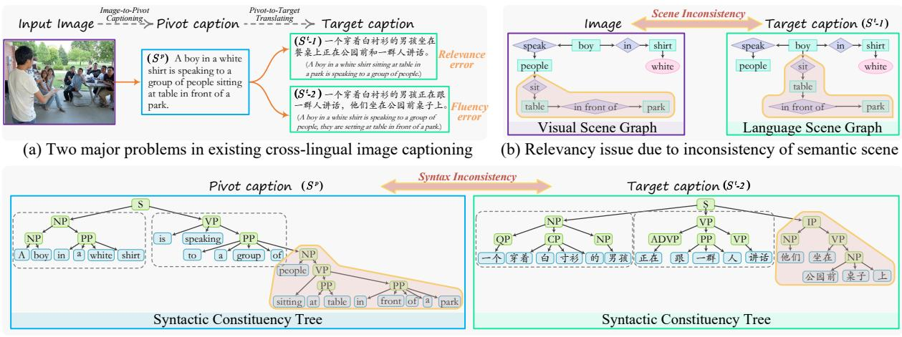
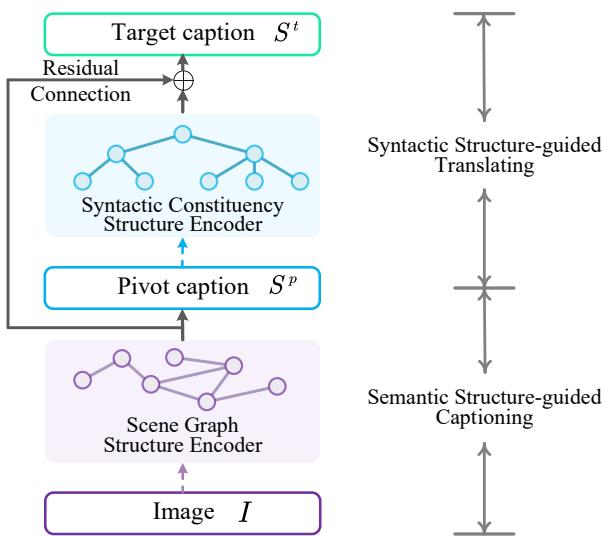
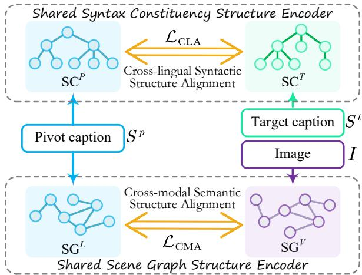
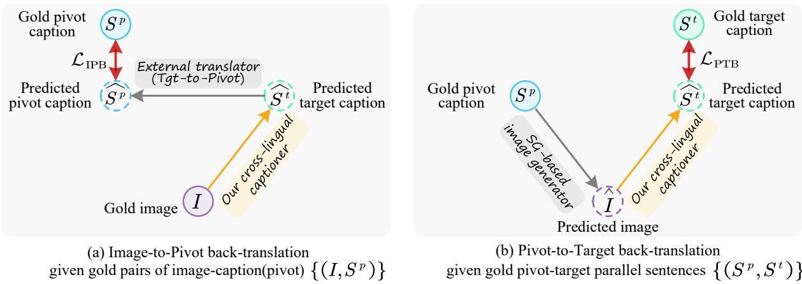
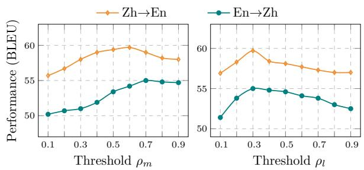
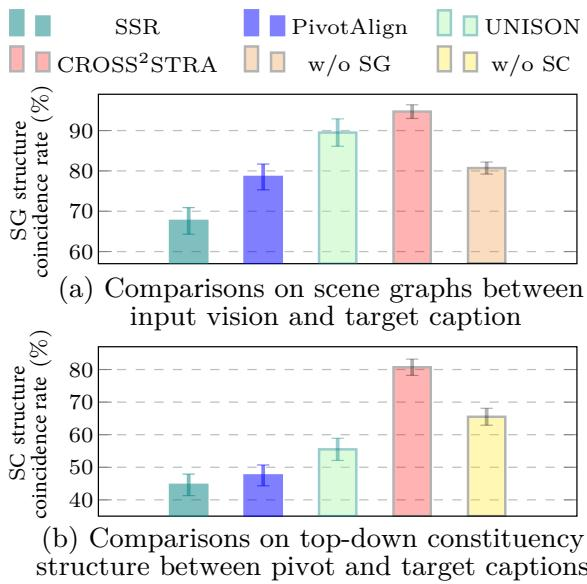
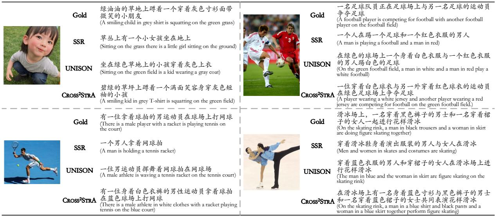
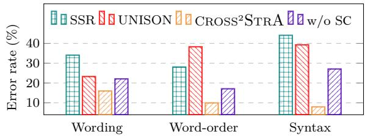
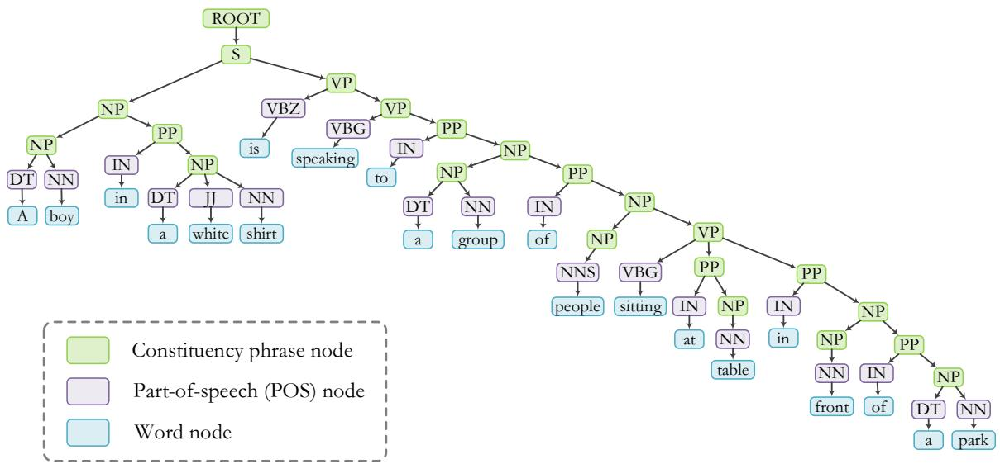
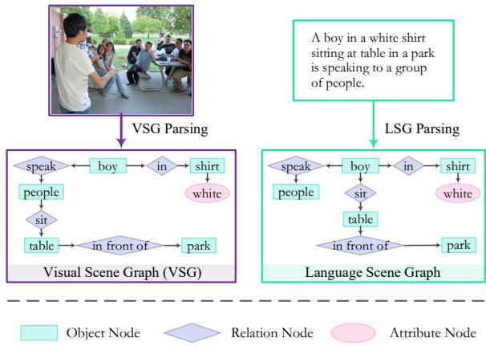

# CROSS2STRA: Unpaired Cross-lingual Image Captioning with Cross-lingual Cross-modal Structure-pivoted Alignment

Shengqiong Wu, Hao Fei∗, Wei Ji, Tat-Seng Chua Sea-NExT Joint Lab, School of Computing, National University of Singapore swu@u.nus.edu {haofei37, jiwei, dcscts}@nus.edu.sg,

## Abstract

Unpaired cross-lingual image captioning has long suffered from irrelevancy and disfluency issues, due to the inconsistencies of the semantic scene and syntax attributes during transfer. In this work, we propose to address the above problems by incorporating the scene graph (SG) structures and the syntactic constituency (SC) trees. Our captioner contains the semantic structure-guided image-to-pivot captioning and the syntactic structure-guided pivot-to-target translation, two of which are joined via pivot language. We then take the SG and SC structures as pivoting, performing cross-modal semantic structure alignment and cross-lingual syntactic structure alignment learning. We further introduce cross-lingual&cross-modal back-translation training to fully align the captioning and translation stages. Experiments on English Chinese transfers show that our model shows great superiority in improving captioning relevancy and fluency.

## 1 Introduction

Generating texts to describe images (a.k.a., image captioning) has many real-world applications, such as virtual assistants and image indexing (Fang et al., 2015). Current image captioning models have achieved impressive performance (Jia et al., 2015; Gu et al., 2018a; Ji et al., 2021), yet are mainly limited to the English language due to the largescale paired image-caption datasets. Subject to the scarcity of paired captioning data, the development of captioning in other languages is thus greatly hindered. While manually crafting sufficient paired data is prohibitively expensive, cross-lingual image captioning (Miyazaki and Shimizu, 2016) offers a promising solution, which aims to transfer a captioner trained at resource-rich language (e.g., English) to the resource-scarce language(s) without paired captioning data at target language(s).

A direct approach is to make use of the current translation techniques, i.e., the pivot language translation method. Here pivot language is the resource-rich language, e.g., English. For example, the pivot-side captioner first generates pivot captions for images, which are then translated into the target-side captions. Or one can create the pseudo image-caption pairs for directly training a targetside captioner, by translating the pivot training captions into the target ones (Lan et al., 2017). However, the above translation-based method suffers from two major issues (cf. 1(a)), including irrelevancy and disfluency (Song et al., 2019). On the one hand, due to the lack of paired vision contexts, a translated description can easily deviate from the original visual semantics, leading to ambiguous or inaccurate captioning. On the other hand, restricted to the translation system itself, translated texts often suffer from disfluent language, especially for the lengthy and complex descriptions.

Some previous efforts are carried out to rectify the above two key errors for better cross-lingual captioning. Lan et al. (2017) solve the translation disfluency issue by estimating the fluency of translation texts, then rejecting those disfluent ones. Yet their method dramatically sacrifices the paired training data, and meanwhile suffers from lowefficiency owing to the incremental screening process. Song et al. (2019) propose to enhance the relevance and fluency of translations by designing some rewards via the reinforcement learning technique. However, the REINFORCE algorithm (Williams, 1992) is hard to train, and easily leads to unstable results. We note that there are two critical abilities a cross-lingual captioning system should possess to solve the corresponding problems. For content relevancy, the kernel lies in sufficiently modeling the vision-language semantic alignment; while for language fluency, it is key to effectively capture the gaps of linguistic attributes and characteristics between the pivot and target languages.

  
(c) Inconsistency of syntax structures between pivot-target languages causes disfluent translation  
Figure 1: We illustrate two issues in translation-based cross-lingual captioning (a), caused by the inconsistencies of semantic scene structures (b) and syntax structures (c). We simplify the constituency trees for better understanding, and the dotted grey box areas indicate the counterpart constituents across different languages. (Best viewed in color)

Besides the translation-based methods, the pivoting-based cross-lingual captioning methods have shown effectiveness, where the whole task learning is broken down into two steps, imageto-pivot captioning and pivot-to-target translation (Gu et al., 2018b; Gao et al., 2022). The imageto-pivot captioning learns to describe images in the pivot language based on pivot-side paired captioning data, and the pivot-to-target translation is performed based on parallel sentences. Two crossmodel and cross-lingual subtasks are trained on two separate datasets, and aligned by the pivot language. Although achieving improved task performances, existing pivoting-based methods (Gu et al., 2018b; Gao et al., 2022) still fail to fully address the two major problems of cross-lingual captioning, due to the insufficient alignment of either vision-language semantics or pivot-target syntax.

To this end, we present a novel syntactic and semantic structure-guided model for cross-lingual image captioning. We build the framework based on the pivoting-based scheme, as shown in Fig. 2. For image-to-pivot captioning, we consider leveraging the scene graphs (SG) for better image-text alignment. Intuitively, an SG (Johnson et al., 2015; Yang et al., 2019) depicts the intrinsic semantic structures of texts or images, which can ideally bridge the gaps between modalities. For the pivotto-target translating, we make use of the syntactic constituency (SC) tree structures for better pivottarget language alignment. Syntax features have been shown as effective supervisions for enhancing the translation quality, e.g., fluency and grammarcorrectness (Schwartz et al., 2011; Xu et al., 2020;

Li et al., 2021).

Based on the above framework, we further perform cross-lingual cross-modal structure-pivoted alignment learning. First of all, we introduce an SG-pivoted cross-modal semantic structure alignment. Based on contrastive learning (Logeswaran and Lee, 2018; Yan et al., 2021) we realize the unsupervised vision-language semantic structure alignment, relieving the scene inconsistency and thus enhancing the relevancy. Similarly, an unsupervised SC-based cross-lingual syntax structure aligning is used to learn the shared grammar transformation and thus mitigate the language disfluency during translation. Finally, we perform the cross-lingual cross-modal back-translation training, fully aligning the two phrases of image-to-pivot captioning and pivot-to-target translation.

On English Chinese and Chinese English transfers of unpaired cross-lingual image captioning, our method achieves significant improvement over the existing best-performing methods. Further in-depth analyses demonstrate that the integration of both scene graph and syntactic structure features is complementarily helpful in improving the captioning relevancy and disfluency of the transfer.

## Our main contributions are two-fold:

First, we for the first time enhance the crosslingual image captioning by leveraging both the semantic scene graph and the syntactic constituent structure information, such that we effectively address the problems of content irrelevancy and language disfluency.

Second, we propose several cross-lingual crossmodal structure-pivoted alignment learning strategies, via which we achieve effective cross-modal vision-language semantic alignment and crosslingual pivot-target syntactic alignment.

## 2 Related Work

Image captioning has been an emerging task in the past few years and received great research attention (You et al., 2016; Vinyals et al., 2017; Cornia et al., 2020). Later, the task of cross-lingual image captioning (Miyazaki and Shimizu, 2016; Song et al., 2019) has been presented, to transfer the knowledge from resource-rich language to resource-poor language1, so as to spare the burden of manual data annotation for the minority languages. However, the task has been hindered and received limited attention due to two key issues: irrelevancy and disfluency of captions. There are two categories of cross-lingual captioning approaches: the translation-based (Lan et al., 2017; Gu et al., 2018b) and the pivoting-based (Gu et al., 2018b; Gao et al., 2022) methods. The former employs an off-the-shelf translator to translate the source (pivot) captions into the target language for targetside training or as the target-side captions. The latter reduces the noise introduction of the pipeline by jointly performing the image-to-pivot captioning step and pivot-to-target translation step, thus being the current SoTA paradigm. This work inherits the success of this line, and adopts the pivoting-based scheme as a backbone, but we further strengthen it by leveraging the semantic and syntactic structure information to better solve the two issues.

Scene graphs depict the intrinsic semantic scene structures of images or texts (Krishna et al., 2017; Wang et al., 2018). In SGs, the key object and attribute nodes are connected to describe the semantic contexts, which have been shown useful as auxiliary features for wide ranges of downstream applications, e.g., image retrieval (Johnson et al., 2015), image generation (Johnson et al., 2018) and image captioning (Yang et al., 2019). Here we incorporate both the visual and language scene graphs to enhance the cross-modal alignment learning.

Note that Gao et al. (2022) also leverage the SG features for cross-lingual captioning, while ours differs from theirs in three aspects. First, they consider a fully unsupervised cross-lingual setup with no image-caption pairs at pivot language, while under such an unpaired assumption the visual and language scene graphs are hard to align, and thus limits the utility of SGs. Second, in this work we sufficiently align the two cross-modal SGs via unsupervised learning, such that the noises in SGs will be effectively screened. Third, Gao et al. (2022) align the pivot and target languages with also the SG structure. We note that it could be ineffective to perform cross-lingual alignment based on textual SGs because the scene structures in different languages are essentially the same.

  
Figure 2: A high-level schematic of the cross-lingual captioning model architecture.

In fact, two languages can be different the most in linguistic structures. Almost all the erroneous sentences come with certain grammar or syntax errors (Jamshid Lou et al., 2019, 2020). Also syntax features have been extensively found to be effective in improving the language quality (e.g., fluency and grammatically-correctness) in cross-lingual scenario (Nivre, 2015; Li et al., 2021; Zhang and Li, 2022). For example, in machine translation, different languages show great correspondences in phrasal constituent structures (Zhang and Zong, 2013; Fang and Feng, 2022). Also, syntactic structure features have been integrated into a broad number of downstream applications (Wu et al., 2021; Fei et al., 2021, 2022). Thus we consider making use of the syntax structures as cross-lingual supervision to enhance the captioning quality.

## 3 Syntactic Semantic Structure-guided Cross-lingual Captioning Framework

The original task is to learn a mapping $\mathcal { F } _ { I } .$ $\mathbf { \nabla } _ { \mathsf { P } } S ^ { t }$ from input images I to target-language captions $S ^ { t }$ . Following Gu et al. (2018b); Song et al. (2019), we decompose $\mathcal { F } _ { I  S ^ { t } }$ into two mappings: 1) the image-to-pivot captioning $\mathcal { F } _ { I  S ^ { p } }$ training with the paired data $\{ ( I , S ^ { p } ) \}$ , and 2) the pivot-to-target translation ${ \mathcal { F } } _ { S ^ { p }  S ^ { t } }$ training with the parallel data $\{ ( S ^ { p } , S ^ { t } ) \}$ . Note that $\{ ( I , S ^ { p } ) \}$ and $\{ ( S ^ { p } , S ^ { t } ) \}$ are two distinct datasets with possibly no intersection.

In our setting, we also leverage the SG and SC structure features in two mappings. As shown in Fig. 2, the semantic structure-guided captioning phase $( \mathcal { F } _ { < I , \mathrm { S G } >  S ^ { p } } )$ takes as input the image I and the visual SG encoded by a structure encoder, yielding the pivot caption $S ^ { p }$ . Then, the syntactic structure-guided translating phase $( \mathcal { F } _ { < S ^ { p } , \mathrm { S C } >  S ^ { t } } )$ takes as input the $S ^ { p }$ and the pivot SC, finally producing the target caption $S ^ { t }$ . Note that the input embeddings of the second step are shared with the output embeddings from the first step so as to avoid the isolation of the two parts. Also we impose a residual connection from the SG feature representations to the SC feature representations to supervise the final target captioning with scene features.

## 3.1 Semantic Structure-guided Captioning

Given an image, we obtain its SG from an off-theshelf SG parser, which is detailed in the experiment setup. We denote an SG as $S G { = } ( V , E )$ , where $V$ is the set of nodes $v _ { i } \in V$ (including object, attribute and relation $\mathrm { t y p e s } ) , { } ^ { 2 }$ E is the set of edges $e _ { i , j }$ between any pair of nodes $v _ { i }$ . We encode a SG with a graph convolution network (GCN; Marcheggiani and Titov, 2017):

$$
\{ h _ { i } \} = { \bf G } { \bf C } { \bf N } ^ { G } ( S G ) ,\tag{1}
$$

where $\boldsymbol { h } _ { i }$ is the representation of a node $v _ { i }$ . We then use a Transformer (Vaswani et al., 2017) decoder to predict the pivot caption ${ \hat { S } } ^ { p }$ based on $\{ h _ { i } \}$

$$
\hat { S } ^ { p } = \mathrm { T r m } ^ { G } ( \{ h _ { i } \} ) .\tag{2}
$$

## 3.2 Syntactic Structure-guided Translation

In this step we first transform the predicted pivot caption $S ^ { p }$ into the SC structure, $S C { = } ( V , E )$ where V are the phrasal&word nodes connected by the compositional edge E. Different from the dependency-like SG structure, SC is a tree-like hierarchical structure, as depicted in Fig. 1. Similarly, we encode SC trees with another GCN:

$$
\{ \pmb { r } _ { j } \} = \mathbf { G C N } ^ { C } ( S C ) ,\tag{3}
$$

where $\boldsymbol { r } _ { j }$ is an SC node representation. Another Transformer decoder is used to predict the target caption $\hat { S } ^ { t }$ . To ensure the relevancy of target-side generation, we create a shortcut between the prior SG feature representations h and the SC features $^ { r , }$ via the cross-attention mechanism:

  
Figure 3: Illustration of the cross-modal semantic and cross-lingual syntactic structure alignment learning.

$$
\hat { S } ^ { t } = \operatorname { T r m } ^ { C } ( \{ r _ { j } \} ; \{ h _ { i } \} ) .\tag{4}
$$

## 3.3 Two Separate Supervised Learning

The captioning and the translation steps are performed separately based on $\{ ( I , S ^ { p } ) \}$ and $\{ ( S ^ { p } , S ^ { t } ) \}$ in a supervised manner:

$$
\mathcal { L } _ { \mathrm { C a p } } = - \sum \log P ( S ^ { p } | I , \mathrm { S G } ) ,\tag{5}
$$

$$
\mathcal { L } _ { \mathrm { T r a n } } = - \sum \log P ( S ^ { t } | S ^ { p } , S \mathbf { C } ) .\tag{6}
$$

## 4 Structure-Pivoting Cross-lingual Cross-modal Alignment Learning

In the above supervised training, though leveraging the semantic and syntactic structure information, the cross-modal image-text pair and the cross-lingual pivot-target pair can be still underaligned in their own feature spaces, due to the intrinsic structural gaps, e.g., noisy substructures. To combat that, we further propose two structurepivoting unsupervised learning strategies (cf. Fig. 3): cross-modal semantic structure alignment and cross-lingual syntactic structure alignment. Besides, the two parts of our backbone captioner are initially trained separately. This motivates us to further align the two procedures in a whole-scale way, with cross-lingual&cross-modal back-translation training (cf. Fig. 4).

## 4.1 Cross-modal Semantic Structure Aligning

The basic idea is to encourage those text nodes and visual nodes that serve a similar role in the visual $\mathsf { S G } ^ { V }$ and language $\mathbf { S } \mathbf { G } ^ { L }$ to be closer, while for those not we hope to repel them from each other, so as to mitigate the scene inconsistency. We realize this via the current popular CL technique. We first obtain the node representations of visual SG $( h _ { i } ^ { V } )$ and language SG $( h _ { j } ^ { L } )$ using one shared GCN encoder as in Eq. (1), based on the ground-truth $\{ ( I , S ^ { p } ) \}$ data. We then measure the similarities between all pairs of nodes from two SGs:

  
Figure 4: Illustrations of the cross-modal and cross-lingual back-translation.

$$
s _ { i , j } ^ { m } = \frac { ( \pmb { h } _ { i } ^ { V } ) ^ { T } \cdot \pmb { h } _ { j } ^ { L } } { | | \pmb { h } _ { i } ^ { V } | | | \pmb { h } _ { j } ^ { L } | | } .\tag{7}
$$

A pre-defined threshold $\rho _ { m }$ will decide the alignment confidence, i.e., pairs with $s _ { i , j } ^ { m } > \rho _ { m }$ is considered similar. Then we have:

$$
\mathcal { L } _ { \mathrm { C M A } } = - \sum _ { i \in \mathrm { S G } ^ { V } , j ^ { * } \in \mathrm { S G } ^ { L } } \log \frac { \exp ( s _ { i , j ^ { * } } ^ { m } / \tau _ { m } ) } { \mathcal { Z } } ,\tag{8}
$$

where $\tau _ { m } { > } 0$ is an annealing factor. $j ^ { * }$ represents a positive pair with i, i.e., $s _ { i , j ^ { * } } ^ { m } { > } \rho _ { m } . ~ \mathcal { Z }$ is a normalization factor for probability calculation.

## 4.2 Cross-lingual Syntactic Structure Aligning

The idea is similar to the above one, while in the cross-lingual syntactic structure space. We use the shared SC GCN encoder to generate node representations $\boldsymbol { r } _ { i } ^ { P }$ and $r _ { j } ^ { T }$ of pivot-/target-side SCs on the parallel sentences. CL loss is then put on the similarity score $s _ { i , j } ^ { l }$ to carry out the unsupervised alignment learning, which we summarize as $\mathcal { L } _ { \mathrm { C L A } }$

## 4.3 Cross-modal&lingual Back-translation

Drawing inspiration from unsupervised machine translation, we leverage the back-translation technique (Sennrich et al., 2016; Edunov et al., 2018) to achieve the two-step alignment over the overall framework. We present the cross-lingual cross-modal back-translation training, including the image-to-pivot back-translation and the pivotto-target back-translation.

Image-to-Pivot Back-translation With gold image-caption pairs at hand, we can first obtain the target caption prediction $\hat { S } ^ { t }$ via our cross-lingual captioner. We then translate the $\hat { S } ^ { t }$ into pseudo pivot caption $\hat { S } ^ { p }$ via an external translator $\mathcal { M } _ { t  p }$ This thus forms a path: $S ^ { p } { - } I {  } \hat { S } ^ { t } {  } \hat { S } ^ { p }$ . And our framework can be updated via:

$$
\mathcal { L } _ { \mathrm { I P B } } = \mathbb { E } [ - \log p ( \hat { S } ^ { p } | \mathcal { M } _ { t  p } ( \mathcal { F } _ { I  S ^ { t } } ( I ) ) ) ] .\tag{9}
$$

Pivot-to-Target Back-translation There is a similar story for the gold pivot-target parallel sentences: $S ^ { t } – S ^ { p } {  } \hat { I } {  } \hat { S } ^ { t }$ . For $S ^ { p } {  } \hat { I }$ we leverage an external SG-based image generator (Johnson et al., 2018; Zhao et al., 2022). The learning loss is:

$$
\mathcal { L } _ { \mathrm { P T B } } = \mathbb { E } [ - \log p ( \hat { S } ^ { t } | \mathcal { F } _ { I  S ^ { t } } ( \mathcal { M } _ { S ^ { p }  I } ( S ^ { p } ) ) ) ] .\tag{10}
$$

⋆ Remarks on Training We take a warmstart strategy to ensure stable training of our framework. Initially we pre-train two parts separately via $\mathcal { L } _ { \mathrm { { C a p } } } \& \mathcal { L } _ { \mathrm { { T r a n s } } }$ We then perform two structure-pivoting unsupervised alignment learning via $\mathcal { L } _ { \mathrm { C M A } } \& \mathcal { L } _ { \mathrm { C L A } }$ . Finally, we train the overall model via back-translation $\mathcal { L } _ { \mathrm { I P B } } \& \mathcal { L } _ { \mathrm { P T B } }$ . Once the system tends to converge, we put them all together for further overall fine-tuning:

$$
\mathcal { L } = \mathcal { L } _ { \mathrm { C a p } } + \mathcal { L } _ { \mathrm { T r a n s } } + \mathcal { L } _ { \mathrm { C M A } } + \mathcal { L } _ { \mathrm { C L A } } + \mathcal { L } _ { \mathrm { I P B } } + \mathcal { L } _ { \mathrm { P T B } } .\tag{11}
$$

Here for brevity, we omit the item weights. Appendix A.4 gives more training details.

## 5 Experimental Setups

Datasets To align with existing work, we consider the transfer between English (En) and Chinese (Zh), and use the image caption datasets of MSCOCO (Lin et al., 2014), AIC-ICC (Wu et al., 2017) and COCO-CN (Li et al., 2019). We use the training set of a language as image-pivot pairs for the first part training, and test with the set of another language. For the second part training, we collect the paired En-Zh parallel sentences from existing MT data, including UM (Tian et al., 2014) and WMT19 (Barrault et al., 2019).

<table><tr><td rowspan="2"></td><td colspan="4">Zh → En</td><td colspan="4">En → Zh</td><td rowspan="2">Avg.</td></tr><tr><td>BLEU</td><td>METEOR</td><td>ROUGE</td><td>CIDEr</td><td>BLEU</td><td>METEOR</td><td>ROUGE</td><td>CIDEr</td></tr><tr><td colspan="2">• Translation-based methods</td><td></td><td></td><td></td><td></td><td></td><td></td><td></td><td></td></tr><tr><td>EarlyTranslation</td><td>48.3</td><td>15.2</td><td>27.2</td><td>18.7</td><td>43.6</td><td>20.3</td><td>30.3</td><td>14.2</td><td>27.2</td></tr><tr><td>LateTranslation</td><td>45.8</td><td>13.8</td><td>25.7</td><td>14.5</td><td>41.3</td><td>13.5</td><td>26.7</td><td>14.0</td><td>24.4</td></tr><tr><td>FG</td><td>46.3</td><td>12.5</td><td>25.3</td><td>15.4</td><td>43.0</td><td>19.7</td><td>29.7</td><td>15.7</td><td>25.9</td></tr><tr><td>SSR†</td><td>52.0</td><td>14.2</td><td>27.7</td><td>28.2</td><td>46.0</td><td>22.8</td><td>32.0</td><td>18.3</td><td>30.1</td></tr><tr><td colspan="2">• Pivoting-based methods</td><td></td><td></td><td></td><td></td><td></td><td></td><td></td><td></td></tr><tr><td>PivotAlign</td><td>52.1</td><td>17.5</td><td>28.3</td><td>27.0</td><td>47.5</td><td>23.7</td><td>32.3</td><td>19.7</td><td>31.1</td></tr><tr><td>UNISON</td><td>54.3</td><td>18.7</td><td>30.0</td><td>28.4</td><td>48.7</td><td>25.2</td><td>33.7</td><td>21.9</td><td>32.4</td></tr><tr><td>CROSS²STRA (Ours)</td><td>57.7</td><td>21.7</td><td>33.5</td><td>30.7</td><td>52.8</td><td>27.6</td><td>36.1</td><td>24.5</td><td>35.8</td></tr><tr><td>w/o SG</td><td>55.8</td><td>19.1</td><td>31.2</td><td>28.0</td><td>48.6</td><td>25.8</td><td>33.9</td><td>21.6</td><td>33.1</td></tr><tr><td>w/o SC</td><td>56.1</td><td>20.0</td><td>32.1</td><td>28.9</td><td>50.4</td><td>26.6</td><td>35.4</td><td>23.3</td><td>34.1</td></tr><tr><td>w/o ResiConn</td><td>56.4</td><td>21.2</td><td>32.9</td><td>29.4</td><td>51.8</td><td>27.1</td><td>35.9</td><td>24.1</td><td>34.9</td></tr></table>

Table 1: Transfer results between MSCOCO (En) and AIC-ICC (Zh). The values of $\operatorname { S S R } ^ { \dagger }$ are copied from Song et al. (2019), while all the rest are from our implementations.

Baselines and Evaluations Our comparing systems include 1) the translation-based methods, including the early translation and late translation mentioned in the introduction, FG (Lan et al., 2017), SSR (Song et al., 2019), and 2) the pivotingbased methods, including PivotAlign (Gu et al., 2018b) and UNISON (Gao et al., 2022). Following baselines, we report the BLEU (Papineni et al., 2002), METEOR (Denkowski and Lavie, 2014), ROUGE (Lin, 2004) and CIDEr (Vedantam et al., 2015) scores for model evaluation. Our results are computed with a model averaging over 10 latest checkpoints.

Implementations To obtain the visual SGs, we employ the FasterRCNN (Ren et al., 2015) as an object detector, and MOTIFS (Zellers et al., 2018) as a relation classifier and an attribute classifier. For language SGs, we first convert the sentences into dependency trees with a parser (Anderson et al., 2018), and then transform them into SGs based on certain rules (Schuster et al., 2015). We obtain the SC trees via the Berkeley Parser (Kitaev and Klein, 2018), trained on PTB (Marcus et al., 1993) for En texts and on CTB (Xue et al., 2005) for Zh texts. In our back-translation learning, we use the T5 (Raffel et al., 2020) as the target-to-pivot translator $( \mathcal { M } _ { t  p } )$ , and adopt the current SoTA SG-based image generator $( \mathcal { M } _ { S ^ { p }  I } )$ (Zhao et al., 2022). Chinese sentences are segmented via Jieba3. We use Transformer to offer the underlying textual representations for GCN, and use FasterRCNN (Ren et al., 2015) for encoding visual feature representations. Our SG and SC GCNs and all other embeddings have the same dimension of 1,024. All models are trained and evaluated with NVIDIA A100 Tensor Core GPUs.

<table><tr><td rowspan="2"></td><td colspan="2">Zh → En</td><td colspan="2"> $\bf \Pi \overline { { E n \to Z h } }$ </td><td rowspan="2">Avg.</td></tr><tr><td>B</td><td>R</td><td>B</td><td>R</td></tr><tr><td>CROSS2STRA</td><td>57.7</td><td>33.5</td><td>52.8</td><td>36.1</td><td>45.0</td></tr><tr><td>w/o LcmA</td><td>54.4</td><td>29.7</td><td>50.1</td><td>34.9</td><td>42.3(-2.7)</td></tr><tr><td>w/o LCLA</td><td>54.6</td><td>30.1</td><td>51.0</td><td>35.3</td><td> $4 3 . 0 ( - 2 . 0 ) $ </td></tr><tr><td>w/o LIPB</td><td>53.8</td><td>31.1</td><td>50.5</td><td>35.1</td><td>43.1(-1.9)</td></tr><tr><td>w/o LPTB</td><td>55.0</td><td>32.8</td><td>52.2</td><td>35.7</td><td>44.2(-0.8)</td></tr><tr><td>w/o  $\bar { L } _ { \mathrm { C M A } } { + } \bar { L } _ { \mathrm { C L A } } $ </td><td>51.8</td><td>27.7</td><td>47.5</td><td>33.7</td><td> $\bar { 4 } 0 . \bar { 8 } ( - 4 . \bar { 2 } )$ </td></tr><tr><td>w/o LIPB+LPTB</td><td>52.7</td><td>30.1</td><td>49.9</td><td>34.2</td><td> $4 2 . 2 ( - 2 . 8 )$ </td></tr></table>

Table 2: Ablating different learning strategies. B: BLEU, R: ROUGE.

## 6 Experimental Results and Analyses

Transfer between MSCOCO and AIC-ICC Table 1 presents the Zh En and En Zh transfer results. We first can observe that the EarlyTranslation is more effective than LateTranslation, as the former introduces lesser noises in training. Also, we see that among all the translation-based methods, SSR shows the best performance. Further, it is clear that the pivoting methods show overall better results than the translation ones. This is most possibly because the joint training in pivotingbased models relieves the under-alignment between the captioning and translation stages, reducing the noise introduction of the pipeline.

Looking into the pivoting-based models, UNI-SON exhibits the stronger capability of the transfer in both directions, owing to the integration of SG structure features, i.e., helping accurately capture the semantic relevances between vision and language. Most importantly, our CROSS2STRA outperforms all the other baselines with significant margins on all metrics consistently. For example, we improve over UNISON by 3.4 (Zh En) and 4.1 (En Zh) BLEU scores respectively. We give credit to the integration of both the semantic SG and the syntactic SC structures, as well as the effective alignment learning strategies. The above observations show the efficacy of our system for cross-lingual captioning.

<table><tr><td></td><td>BLEU@1</td><td>BLEU@2</td><td>BLEU@3</td><td>BLEU@4</td><td>METEOR</td><td>ROUGE</td><td>CIDEr</td><td>Avg.</td></tr><tr><td>• Translation-based methods</td><td></td><td></td><td></td><td></td><td></td><td></td><td></td><td></td></tr><tr><td>EarlyTranslation†</td><td>60.4</td><td>40.7</td><td>26.8</td><td>17.3</td><td>24.0</td><td>43.6</td><td>52.7</td><td>37.9</td></tr><tr><td>LateTranslation†</td><td>58.9</td><td>38.0</td><td>23.5</td><td>14.3</td><td>23.5</td><td>40.2</td><td>47.3</td><td>35.1</td></tr><tr><td>SSR</td><td>65.2</td><td>43.5</td><td>27.3</td><td>17.7</td><td>25.4</td><td>45.9</td><td>53.8</td><td>39.8</td></tr><tr><td colspan="9">• Pivoting-based methods</td></tr><tr><td>PivotAlign</td><td>66.5</td><td>45.0</td><td>29.3</td><td>18.2</td><td>27.0</td><td>46.3</td><td>55.0</td><td>41.0</td></tr><tr><td>UNISON*†</td><td>63.4</td><td>43.2</td><td>29.5</td><td>17.9</td><td>24.5</td><td>45.1</td><td>53.5</td><td>39.5</td></tr><tr><td>UNISON</td><td>68.3</td><td>46.7</td><td>30.6</td><td>19.0</td><td>29.4</td><td>48.0</td><td>56.3</td><td>42.7</td></tr><tr><td>CROSS²STRA</td><td>70.4</td><td>48.8</td><td>32.5</td><td>20.8</td><td>31.9</td><td>50.6</td><td>58.2</td><td>44.7</td></tr></table>

Table 3: Cross-lingual transfer from MSCOCO (En) to COCO-CN (Zh). The values with are copied from Song et al. (2019). $\mathrm { U N I S O N ^ { * } { } ^ { \dag } }$ is the raw version without using the paired image-caption(pivot) data for training.  
Figure 5: Influences of different threshold values in two structure-guided alignment learning.

Influences of Learning Strategies In Table 2 we quantify the contribution of each learning objective via ablation. As seen, each learning strategy shows the impact to different extents. For example, the cross-modal semantic alignment gives greater influences than the cross-lingual syntactic alignment of the overall performances (i.e., 2.7 vs. 2.0). In contrast to the two structure-pivoting learning $( L _ { \mathrm { C M A } } { + } L _ { \mathrm { C L A } } )$ , we can find that the back-translation learning $\left( L _ { \mathrm { I P B } } { + } L _ { \mathrm { P T B } } \right)$ shows slightly lower impacts. Particularly the pivot-to-target back-translation contributes limitedly, and we believe the quality of SGto-image generator should bear the responsibility.

Threshold Study In Fig. 5 we study the influences of threshold values on the two alignment learning, by varying $\rho _ { m }$ and $\rho _ { l }$ . As seen, when $\rho _ { m }$ is 0.6 and 0.7 in two tasks respectively, the overall transfer results are the best, while $\rho _ { l } { = } 0 . 3$ helps give the best effects. Such a pattern distinction between $\rho _ { m }$ and $\rho _ { l }$ implies that the SGs between vision and language have less discrepancy, while the SC structures between two languages come with non-negligible differences.

  
Figure 6: The matchings of SG and SC structures.

Transfer from MSCOCO to COCO-CN Table 3 further shows the transfer results from English MSCOCO to Chinese COCO-CN. The overall tendency is quite similar to the one in Table 1. We see that translation methods are inferior to the pivoting methods. Our $\mathrm { C } _ { \mathrm { R O S S } } { } ^ { 2 } \mathrm { S T R A }$ model gives the best performances on all metrics, outperforming UNI-SON by an average $2 . 0 ( = 4 4 . 7 – 4 2 . 7 )$ score. This again verifies the efficacy of our proposed method.

Probing Cross-modal and Cross-lingual Structure Alignment We integrate the semantic scene structure and syntactic structures with the aim of better cross-modal and cross-lingual alignment in our two-stage pivoting transfer framework. Here we directly assess to what extent our methods improve the alignment. Fig. 6 shows the structure coincidence rate between the input image SG and predicted target caption SG, and the SC structure coincidence rate between the pivot and target captions.4 We see that with the integration of semantic scene modeling, both UNISON and our system exhibit prominent cross-modal alignment ability, i.e., with higher structural overlaps. The same observation can be found with respect to syntactic structure integration for enhancing cross-lingual alignment learning. Either without the leverage of SG or SC structure, the corresponding cross-modal or crosslingual alignment effect is clearly weakened.

  
Figure 7: Qualitative results of cross-lingual captioning. The instances are randomly picked from AIC-ICC (Zh).

<table><tr><td colspan="4">Relevancy↑ Diversification↑ Fluency↑</td></tr><tr><td>FG</td><td>5.34</td><td>3.75</td><td>7.05</td></tr><tr><td>SSR</td><td>7.86</td><td>5.89</td><td>7.58</td></tr><tr><td>PivotAlign</td><td>8.04</td><td>6.57</td><td>7.46</td></tr><tr><td>UNISON</td><td>9.02</td><td>9.14</td><td>7.89</td></tr><tr><td>CROSS²STRA</td><td>9.70</td><td>9.53</td><td>9.22</td></tr><tr><td>w/o SG</td><td>8.35</td><td>7.75</td><td>9.04</td></tr><tr><td>w/o SC</td><td>9.42</td><td>8.34</td><td>8.07</td></tr><tr><td>w/o  $L _ { \mathrm { C M A } ^ { + } } L _ { \mathrm { C L A } }$ </td><td>7.80</td><td>7.24</td><td>8.15</td></tr></table>

Table 4: Human evaluations are rated on a Likert 10- scale. indicates significant better over the baselines (p<0.03).

Human Evaluation We further try to quantify the improvements of the generated captions via human evaluation. In Table 4 we show the evaluation results based on MSCOCO (En) to AIC-ICC (Zh) transfer, on three dimensions: relevancy, diversification and fluency. We can see that our system shows significantly higher scores than baseline systems in terms of all three indicators. For those methods with SG structure features, the content relevancy and diversification of captions are much better. Yet only our method gives satisfied language fluency, due to the equipment of syntactic features. With further ablation studies we can further confirm the contributions of the SG and SC features.

  
Figure 8: Evaluating the language quality of captions.

Captioning Linguistic Quality Study We take a further step, investigating how exactly our model improves the linguistic quality of the target captions. Same to the human evaluation, we ask native speakers to measure the errors that occurred in the generated captions, in terms of wording, word order and syntax correctness. Fig. 8 presents the results of the transfer from MSCOCO (En) to AIC-ICC (Zh). We see that our model has committed the least errors, where the performances on syntax correctness are especially higher than baselines. Once without using the syntactic features, the error rates grow rapidly, which demonstrates the importance to integrate the syntactic structures.

Qualitative Result Finally, we empirically show some real prediction cases, so as to aid an intuitive understanding of our method’s strength. In Fig. 7 we provide four pieces of testing examples on the En Zh transfer, which we compare with different baseline methods. As can be seen, the SSR model often tends to generate target-side captions with lower diversification, and meanwhile unsatisfactory content relevancy, and thus inaccurate image descriptions. On the contrary, the captions from UNISON are much better, i.e., better relevancy and diversification. We can give credit to the equipment of scene graph-based alignment learning. However, UNISON can fall short on language quality, i.e., problematic fluency. Since English and Chinese differ much in linguistic and grammar characteristics, without leveraging the syntactic structure features, it leads to inferior language quality. Luckily, our model can address all those issues, and generate captions with good relevancy, diversification, and fluency. This again proves the effectiveness of our proposed method.

## 7 Conclusion and Future Work

In this paper we investigate the incorporation of semantic scene graphs and syntactic constituency structure information for cross-lingual image captioning. The framework includes two phrases, semantic structure-guided image-to-pivot captioning and syntactic structure-guided pivot-to-target translating. We take the SG and SC structures as pivots, performing cross-modal semantic structure alignment and cross-lingual syntactic structure alignment learning. A cross-lingual&cross-modal backtranslation training is further performed to align two phrases. On English Chinese transfer experiments, our model shows great superiority in terms of captioning relevancy and fluency.

Bridging the gaps between the cross-modal and cross-lingual transfer with external semantic and syntactic structures has shown great potential. Thus it is promising to extend the idea to other scenarios. Also, exploiting the external structures potentially will introduce noises, and thus a dynamical structure induction is favorable.

## Limitations

In this work, we take the sufficient advantages of the external semantic and syntactic structure knowledge to improve our focused problem. But this could be a double-edged sword to use such features. Specifically, our paper has the following two potential limitations. First of all, our method closely relies on the availability of the resources of scene graph structures and syntax structures. While most of the languages come with these structure annotations to train good-performing structure parsers (for example, the syntax structure annotations of Penn TreeBank cover most of the existing languages), some minor languages may not have structure resources. That being said, our idea still works well even in the absence of the targetside structure annotations. With only the structure annotations at pivot-side (resource-rich) language (in this case, the cross-modal semantic&syntactic structure aligning learning are canceled), we can still achieve much better performances than those baselines without using the structural features. Besides, our method will be subject to the quality of the external structure parsers. When the parsed structures of scene graphs and syntax trees are with much noise, the helpfulness of our methods will be hurt. Fortunately, the existing external semantic and syntactic structure parsers have already achieved satisfactory performances, which can meet our demands.

## References

Peter Anderson, Xiaodong He, Chris Buehler, Damien Teney, Mark Johnson, Stephen Gould, and Lei Zhang. 2018. Bottom-up and top-down attention for image captioning and visual question answering. In Proceedings ofthe IEEE Conference on Computer Vision and Pattern Recognition, pages 6077–6086.

Loïc Barrault, Ondˇrej Bojar, Marta R. Costa-jussà, Christian Federmann, Mark Fishel, Yvette Graham, Barry Haddow, Matthias Huck, Philipp Koehn, Shervin Malmasi, Christof Monz, Mathias Müller, Santanu Pal, Matt Post, and Marcos Zampieri. 2019. Findings of the 2019 conference on machine translation (WMT19). In Proceedings ofthe Fourth Conference on Machine Translation, pages 1–61.

Marcella Cornia, Matteo Stefanini, Lorenzo Baraldi, and Rita Cucchiara. 2020. Meshed-memory transformer for image captioning. In Proceedings of the IEEE/CVF Conference on Computer Vision and Pattern Recognition, pages 10575–10584.

Michael Denkowski and Alon Lavie. 2014. Meteor universal: Language specific translation evaluation for any target language. In Proceedings ofthe Ninth Workshop on Statistical Machine Translation, pages 376–380.

Sergey Edunov, Myle Ott, Michael Auli, and David Grangier. 2018. Understanding back-translation at scale. In Proceedings of the 2018 Conference on Empirical Methods in Natural Language Processing, pages 489–500.

Hao Fang, Saurabh Gupta, Forrest N. Iandola, Rupesh Kumar Srivastava, Li Deng, Piotr Dollár, Jianfeng Gao, Xiaodong He, Margaret Mitchell, John C. Platt, C. Lawrence Zitnick, and Geoffrey Zweig. 2015. From captions to visual concepts and back. In Proceedings of the IEEE Conference on Computer Vision and Pattern Recognition, pages 1473–1482.

Qingkai Fang and Yang Feng. 2022. Neural machine translation with phrase-level universal visual representations. In Proceedings ofthe 60th Annual Meeting of the Association for Computational Linguistics, pages 5687–5698.

Hao Fei, Fei Li, Bobo Li, and Donghong Ji. 2021. Encoder-decoder based unified semantic role labeling with label-aware syntax. In Proceedings of the AAAI Conference on Artificial Intelligence, pages 12794–12802.

Hao Fei, Shengqiong Wu, Jingye Li, Bobo Li, Fei Li, Libo Qin, Meishan Zhang, Min Zhang, and Tat-Seng Chua. 2022. Lasuie: Unifying information extraction with latent adaptive structure-aware generative language model. In Proceedings of the Advances in Neural Information Processing Systems, NeurIPS 2022, pages 15460–15475.

Jiahui Gao, Yi Zhou, Philip L. H. Yu, Shafiq R. Joty, and Jiuxiang Gu. 2022. UNISON: unpaired crosslingual image captioning. In Proceedings of the AAAI Conference on Artificial Intelligence, pages 10654– 10662.

Jiuxiang Gu, Jianfei Cai, Gang Wang, and Tsuhan Chen. 2018a. Stack-captioning: Coarse-to-fine learning for image captioning. In Proceedings of the AAAI Conference on Artificial Intelligence, pages 6837– 6844.

Jiuxiang Gu, Shafiq R. Joty, Jianfei Cai, and Gang Wang. 2018b. Unpaired image captioning by language pivoting. In Proceedings of the European Conference on Computer Vision, pages 519–535.

Po-Yao Huang, Junjie Hu, Xiaojun Chang, and Alexander Hauptmann. 2020. Unsupervised multimodal neural machine translation with pseudo visual pivoting. In Proceedings of the 58th Annual Meeting of the Association for Computational Linguistics, pages 8226–8237.

Paria Jamshid Lou, Yufei Wang, and Mark Johnson. 2019. Neural constituency parsing of speech transcripts. In Proceedings of the 2019 Conference of the North American Chapter ofthe Associationfor Computational Linguistics: Human Language Technologies, pages 2756–2765.

Paria Jamshid Lou, Yufei Wang, and Mark Johnson. 2020. Improving disfluency detection by selftraining a self-attentive model. In Proceedings ofthe 58th Annual Meeting of the Association for Computational Linguistics, pages 3754–3763.

Jiayi Ji, Yunpeng Luo, Xiaoshuai Sun, Fuhai Chen, Gen Luo, Yongjian Wu, Yue Gao, and Rongrong Ji. 2021. Improving image captioning by leveraging intra- and inter-layer global representation in transformer network. In Proceedings of the AAAI Conference on Artificial Intelligence, pages 1655–1663.

Xu Jia, Efstratios Gavves, Basura Fernando, and Tinne Tuytelaars. 2015. Guiding the long-short term memory model for image caption generation. In Proceedings of the IEEE International Conference on Computer Vision, pages 2407–2415.

Justin Johnson, Agrim Gupta, and Li Fei-Fei. 2018. Image generation from scene graphs. In Proceedings of the 2018 IEEE Conference on Computer Vision and Pattern Recognition, pages 1219–1228.

Justin Johnson, Ranjay Krishna, Michael Stark, Li-Jia Li, David A. Shamma, Michael S. Bernstein, and Li Fei-Fei. 2015. Image retrieval using scene graphs. In Proceedings ofthe IEEE Conference on Computer Vision and Pattern Recognition, pages 3668–3678.

Nikita Kitaev and Dan Klein. 2018. Constituency parsing with a self-attentive encoder. In Proceedings of the 56th Annual Meeting of the Association for Computational Linguistics, pages 2676–2686.

Ranjay Krishna, Yuke Zhu, Oliver Groth, Justin Johnson, Kenji Hata, Joshua Kravitz, Stephanie Chen, Yannis Kalantidis, Li-Jia Li, David A. Shamma, Michael S. Bernstein, and Li Fei-Fei. 2017. Visual genome: Connecting language and vision using crowdsourced dense image annotations. International Journal ofComputer Vision, 123(1):32–73.

Weiyu Lan, Xirong Li, and Jianfeng Dong. 2017. Fluency-guided cross-lingual image captioning. In Proceedings ofthe ACM International Conference on Multimedia, pages 1549–1557.

Xirong Li, Chaoxi Xu, Xiaoxu Wang, Weiyu Lan, Zhengxiong Jia, Gang Yang, and Jieping Xu. 2019. COCO-CN for cross-lingual image tagging, captioning, and retrieval. IEEE Transactions on Multimedia, 21(9):2347–2360.

Zuchao Li, Masao Utiyama, Eiichiro Sumita, and Hai Zhao. 2021. Unsupervised neural machine translation with universal grammar. In Proceedings ofthe 2021 Conference on Empirical Methods in Natural Language Processing, pages 3249–3264.

Chin-Yew Lin. 2004. ROUGE: A package for automatic evaluation of summaries. In Text Summarization Branches Out, pages 74–81.

Tsung-Yi Lin, Michael Maire, Serge J. Belongie, James Hays, Pietro Perona, Deva Ramanan, Piotr Dollár, and C. Lawrence Zitnick. 2014. Microsoft COCO: common objects in context. In Proceedings of the European Conference on Computer Vision, pages 740–755.

Lajanugen Logeswaran and Honglak Lee. 2018. An efficient framework for learning sentence representations. In Proceedings ofthe International Conference on Learning Representations.

Diego Marcheggiani and Ivan Titov. 2017. Encoding sentences with graph convolutional networks for semantic role labeling. In Proceedings of the Conference on Empirical Methods in Natural Language Processing, pages 1506–1515.

Mitchell P. Marcus, Beatrice Santorini, and Mary Ann Marcinkiewicz. 1993. Building a large annotated corpus of english: The penn treebank. Computational Linguistics, 19(2):313–330.

Takashi Miyazaki and Nobuyuki Shimizu. 2016. Crosslingual image caption generation. In Proceedings of the 54th Annual Meeting of the Association for Computational Linguistics (Volume 1: Long Papers), pages 1780–1790.

Joakim Nivre. 2015. Towards a universal grammar for natural language processing. In Proceedings of the Computational Linguistics and Intelligent Text Processing, pages 3–16.

Kishore Papineni, Salim Roukos, Todd Ward, and Wei-Jing Zhu. 2002. Bleu: a method for automatic evaluation of machine translation. In Proceedings ofthe 40th Annual Meeting ofthe Associationfor Computational Linguistics, pages 311–318.

Colin Raffel, Noam Shazeer, Adam Roberts, Katherine Lee, Sharan Narang, Michael Matena, Yanqi Zhou, Wei Li, and Peter J. Liu. 2020. Exploring the limits of transfer learning with a unified text-to-text transformer. Journal of Machine Learning Research, 21:140:1–140:67.

Shaoqing Ren, Kaiming He, Ross B. Girshick, and Jian Sun. 2015. Faster R-CNN: towards real-time object detection with region proposal networks. In Proceedings ofthe Annual Conference on Neural Information Processing Systems, pages 91–99.

Sebastian Schuster, Ranjay Krishna, Angel Chang, Li Fei-Fei, and Christopher D. Manning. 2015. Generating semantically precise scene graphs from textual descriptions for improved image retrieval. In Proceedings of the Fourth Workshop on Vision and Language, pages 70–80.

Lane Schwartz, Chris Callison-Burch, William Schuler, and Stephen Wu. 2011. Incremental syntactic language models for phrase-based translation. In Proceedings of the 49th Annual Meeting of the Association for Computational Linguistics: Human Language Technologies, pages 620–631.

Rico Sennrich, Barry Haddow, and Alexandra Birch. 2016. Improving neural machine translation models with monolingual data. In Proceedings of the 54th Annual Meeting of the Association for Computational Linguistics, pages 86–96.

Yuqing Song, Shizhe Chen, Yida Zhao, and Qin Jin. 2019. Unpaired cross-lingual image caption generation with self-supervised rewards. In Proceedings of the ACM International Conference on Multimedia, pages 784–792.

Liang Tian, Derek F. Wong, Lidia S. Chao, Paulo Quaresma, Francisco Oliveira, and Lu Yi. 2014. Umcorpus: A large english-chinese parallel corpus for statistical machine translation. In Proceedings of the Ninth International Conference on Language Resources and Evaluation, pages 1837–1842.

Ashish Vaswani, Noam Shazeer, Niki Parmar, Jakob Uszkoreit, Llion Jones, Aidan N. Gomez, Lukasz Kaiser, and Illia Polosukhin. 2017. Attention is all you need. In Proceedings ofthe Annual Conference on Neural Information Processing Systems, pages 5998–6008.

Ramakrishna Vedantam, C. Lawrence Zitnick, and Devi Parikh. 2015. Cider: Consensus-based image description evaluation. In Proceedings of the IEEE Conference on Computer Vision and Pattern Recognition, pages 4566–4575.

Oriol Vinyals, Alexander Toshev, Samy Bengio, and Dumitru Erhan. 2017. Show and tell: Lessons learned from the 2015 MSCOCO image captioning challenge. IEEE Transactions on Pattern Analysis and Machine Intelligence, 39(4):652–663.

Yu-Siang Wang, Chenxi Liu, Xiaohui Zeng, and Alan Yuille. 2018. Scene graph parsing as dependency parsing. In Proceedings of the 2018 Conference of the North American Chapter ofthe Associationfor Computational Linguistics: Human Language Technologies, pages 397–407.

Ronald J. Williams. 1992. Simple statistical gradientfollowing algorithms for connectionist reinforcement learning. Machine Learning, 8:229–256.

Jiahong Wu, He Zheng, Bo Zhao, Yixin Li, Baoming Yan, Rui Liang, Wenjia Wang, Shipei Zhou, Guosen Lin, Yanwei Fu, Yizhou Wang, and Yonggang Wang. 2017. AI challenger : A large-scale dataset for going deeper in image understanding. CoRR, abs/1711.06475.

Shengqiong Wu, Hao Fei, Yafeng Ren, Donghong Ji, and Jingye Li. 2021. Learn from syntax: Improving pair-wise aspect and opinion terms extraction with rich syntactic knowledge. In Proceedings of the Thirtieth International Joint Conference on Artificial Intelligence, pages 3957–3963.

Hongfei Xu, Josef van Genabith, Deyi Xiong, Qiuhui Liu, and Jingyi Zhang. 2020. Learning source phrase representations for neural machine translation. In Proceedings of the 58th Annual Meeting of the Association for Computational Linguistics, pages 386– 396.

Nianwen Xue, Fei Xia, Fu-Dong Chiou, and Martha Palmer. 2005. The penn chinese treebank: Phrase structure annotation of a large corpus. Natural Language Engineering, 11(2):207–238.

Yuanmeng Yan, Rumei Li, Sirui Wang, Fuzheng Zhang, Wei Wu, and Weiran Xu. 2021. ConSERT: A contrastive framework for self-supervised sentence representation transfer. In Proceedings of the Annual Meeting of the Association for Computational Linguistics and the International Joint Conference on Natural Language Processing, pages 5065–5075.

Xu Yang, Kaihua Tang, Hanwang Zhang, and Jianfei Cai. 2019. Auto-encoding scene graphs for image captioning. In Proceedings of the IEEE Conference on Computer Vision and Pattern Recognition, pages 10685–10694.

Quanzeng You, Hailin Jin, Zhaowen Wang, Chen Fang, and Jiebo Luo. 2016. Image captioning with semantic attention. In Proceedings ofthe IEEE Conference on Computer Vision and Pattern Recognition, pages 4651–4659.

Rowan Zellers, Mark Yatskar, Sam Thomson, and Yejin Choi. 2018. Neural motifs: Scene graph parsing with global context. In Proceedings ofthe IEEE Conference on Computer Vision and Pattern Recognition, pages 5831–5840.

Jiajun Zhang and Chengqing Zong. 2013. Learning a phrase-based translation model from monolingual data with application to domain adaptation. In Proceedings of the 51st Annual Meeting of the Associationfor Computational Linguistics, pages 1425– 1434.

Yue Zhang and Zhenghua Li. 2022. Csyngec: Incorporating constituent-based syntax for grammatical error correction with a tailored gec-oriented parser. CoRR, abs/2211.08158.

Xin Zhao, Lei Wu, Xu Chen, and Bin Gong. 2022. High-quality image generation from scene graphs with transformer. In Proceedings ofthe IEEE International Conference on Multimedia and Expo, pages 1–6.

## A Model Details

## A.1 Specification of Scene Graph and Syntax Constituency Structures

In Fig. 9 and Fig. 10 we illustrate the complete structures of the syntactic constituency tree and scene graphs, respectively. We note that the scene graph is a dependency-like structure, describing the node-node inter-relation in an ‘is-a’ paradigm. And the syntactic constituency tree is a compositional structure, depicting how words constitute phrases and then organize them into whole sentences.

## A.2 Pivot-to-target Translation

In Eq. (4) we use a Transformer decoder to predict the target caption $\hat { S } ^ { t }$ . A cross-attention mechanism is first used to fuse the prior SG feature representations h and the SC features r. Specifically,

$$
e = { \mathrm { S o f t m a x } } ( \frac { \pmb { r } \oplus \pmb { h } } { \sqrt { d } } ) \cdot \pmb { r } ,
$$

where d is a scaling factor. Then, the Transformer performs decoding over $\{ e \}$ :

$$
\hat { S } ^ { t } = \mathrm { T r m } ^ { C } ( \{ e \} ) .
$$

## A.3 Specification on Contrastive Learning

Cross-modal Semantic Structure Aligning In Eq. (8) we define the contrastive learning objective of cross-modal semantic structure aligning, here we unfold the equation:

$$
\begin{array} { l } { \displaystyle \mathcal { L } _ { \mathrm { C M A } } = - \sum _ { \tiny \begin{array} { c } { i \in \mathrm { S G } ^ { V } , j ^ { * } \in \mathrm { S G } ^ { L } } \\ { \displaystyle \sum } \end{array} } \log \frac { \exp \left( s _ { i , j ^ { * } } ^ { m } / \tau _ { m } \right) } { \mathcal { Z } } , } \\ { \displaystyle \mathcal { Z } = \sum _ { \tiny \begin{array} { c } { i \in \mathrm { S G } ^ { V } , k \in \mathrm { S G } ^ { L } , k \neq j ^ { * } } \end{array} } \exp ( s _ { i , k } / \tau _ { m } ) , } \end{array}
$$

where $\tau _ { m } { > } 0$ is an annealing factor. $j ^ { * }$ represents a positive pair with i, i.e., $s _ { i , j ^ { * } } ^ { m } { > } \rho _ { m }$

Cross-lingual Syntactic Structure Aligning We detail the cross-lingual syntactic structure aligning learning objective here:

$$
\begin{array} { c } { \mathcal { L } _ { \mathrm { C M A } } = - \displaystyle \sum _ { \begin{array} { c } { i \in \mathrm { S C } ^ { P } , j ^ { * } \in \mathrm { S C } ^ { T } } \\ { \mathcal { Z } = \displaystyle \sum _ { i \in \mathrm { S C } ^ { P } , k \in \mathrm { S C } ^ { T } , k \neq j ^ { * } } } \end{array} } \log \frac { \exp ( s _ { i , j ^ { * } } ^ { l } / \tau _ { l } ) } { \mathcal { Z } } , } \end{array}
$$

where $\tau _ { l } { > } 0$ is an annealing factor. $j ^ { * }$ represents a positive pair with i, i.e., $s _ { i , j ^ { * } } ^ { m } { > } \rho _ { m }$

## A.4 Specifying Overall Training Processing

The training of our framework is based on the warm-up strategy, including four stages.

  
Input Sentence: A boy in a white shirt is speaking to a group of people sitting at table in front of a park

Figure 9: Illustration of the full constituency syntax structure.  
  
Figure 10: Illustration of the full scene graph structures. The object nodes are the real entities of visual proposals or textual words/phrases. The attribute nodes and relation nodes are the descriptive words, which, in VSG are automatically generated, and in LSG are extracted from sentences.

At the first stage, we use the paired imagecaption data $\{ ( I , S ^ { p } ) \}$ at the pivot language side (as well as the VSG structure features) to train the captioning part of our model; and use the parallel sentences $\{ ( S ^ { p } , S ^ { t } ) \}$ (as well as the pivot-side syntax tree features) to train the translation part of our model, both of two training is supervised.

At the second stage, we perform two structurepivoting unsupervised alignment learning, by using the image-caption data $\{ ( I , S ^ { p } ) \}$ , parallel sentences $\{ ( S ^ { p } , S ^ { t } ) \}$ , and the two structure resource.

At the third stage, we perform the cross-modal and cross-lingual back-translation learning. This is a whole-framework-level training, aiming to sufficiently align the captioning and translation parts.

At the fourth stage, the system tends to converge, and we put all the above learning objects together for further overall fine-tuning:

$$
\begin{array} { r l } & { \mathcal { L } = \lambda _ { \mathrm { C a p } } \mathcal { L } _ { \mathrm { C a p } } + \lambda _ { \mathrm { T r a n s } } \mathcal { L } _ { \mathrm { T r a n s } } } \\ & { ~ + \lambda _ { \mathrm { C M A } } \mathcal { L } _ { \mathrm { C M A } } + \lambda _ { \mathrm { C L A } } \mathcal { L } _ { \mathrm { C L A } } } \\ & { ~ + \lambda _ { \mathrm { I P B } } \mathcal { L } _ { \mathrm { I P B } } + \lambda _ { \mathrm { P T B } } \mathcal { L } _ { \mathrm { P T B } } . } \end{array}
$$

Here λ are the loss weights that dynamically change by linearly learning scheduler (Huang et al., 2020). The initial weights are given as: $\lambda _ { \mathrm { C a p } } { = } 1$ $\lambda _ { \mathrm { T r a n s } } = 1 , \lambda _ { \mathrm { C M A } } = 0 . 7 , \lambda _ { \mathrm { C L A } } = 0 . 7 , \lambda _ { \mathrm { V C B } } = 0 . 3 , \lambda _ { \mathrm { C P B } } = 0 . 3$ $\lambda _ { \mathrm { C a p } }$ and $\lambda _ { \mathrm { T r a n s } }$ will be linearly decreased from 1 to 0.7 along the training, $\lambda _ { \mathrm { C M A } }$ and $\lambda _ { \mathrm { R E C } }$ are kept unchanged, while $\lambda _ { \mathrm { V C B } }$ and λCPB will be decreased from 0.3 to 0.7.

## B Extended Experiment Setups

## B.1 Dataset Description

We use three image captioning datasets $\{ ( I , S ^ { p } ) \}$ MSCOCO, AIC-ICC and COCO-CN. All the data split follows the same practice as in prior crosslingual image captioning works (Wu et al., 2017; Song et al., 2019). The MSCOCO dataset is annotated in English, which consists of 123,287 images and 5 manually labeled English captions for each image. We utilize 113,287 images for training, 5,000 images for validation, and 5,000 images for testing. The AIC-ICC dataset contains 238,354 images and 5 manually annotated Chinese captions for each image. There are 208,354 and 30,000 images in the official training and validation set.

<table><tr><td>Dataset</td><td>Lang.</td><td>Split</td><td>#Image</td><td>#Caption</td></tr><tr><td rowspan="4">MSCOCO</td><td></td><td>Total</td><td>123,287</td><td>616,435</td></tr><tr><td>En</td><td>Train</td><td>113,287</td><td>566,435</td></tr><tr><td></td><td>Develop</td><td>5,000</td><td>25,000</td></tr><tr><td>Test</td><td></td><td>5,000</td><td>25,000</td></tr><tr><td rowspan="2">AIC-ICC Zh</td><td></td><td>Total</td><td>238,354</td><td>1,191,770</td></tr><tr><td></td><td>Train</td><td>208,354</td><td>1,041,770</td></tr><tr><td rowspan="2"></td><td></td><td>Develop</td><td>25,000</td><td>125,000</td></tr><tr><td>Test</td><td></td><td>5,000</td><td>25,000</td></tr><tr><td rowspan="2">COCO-CN</td><td></td><td>Total</td><td>20,342</td><td>27,218</td></tr><tr><td>Train</td><td></td><td>18,342</td><td>25,218</td></tr><tr><td rowspan="2"></td><td>Zh</td><td>Develop</td><td>1,000</td><td>1,000</td></tr><tr><td>Test</td><td></td><td>1,000</td><td>1,000</td></tr></table>

Table 5: Statistics of image captioning datasets.

Since the annotations of the testing set are unavailable in the AIC-ICC dataset, we randomly sample 5,000 images from its validation set as our testing set. The COCO-CN dataset contains 20,342 images and 27,218 caption texts in Chinese. We use 18,342 images for training, 1,000 for development, and 1,000 for testing. Table 5 gives the detailed statistics of the image captioning data.

For the translation data $\{ ( S ^ { p } , S ^ { t } ) \}$ , we collect about 1M of raw paired En-Zh parallel sentences from the UM (Tian et al., 2014) and WMT19 (Barrault et al., 2019) machine translation corpus. We filter the sentences in MT datasets according to an existing caption-style dictionary and resulting in a total of 400,000 parallel sentences. For the translation training, we use 390,000 sentence pairs for training, 5,000 sentence pairs for validation, and 5,000 pairs for testing.

## B.2 Specification on Structure Coincidence Probing

In Fig. 6 we assess the ability of our model on the cross-modal and cross-lingual structure alignment, by measuring the structure coincidence between the gold one and the one learned by our model. Here we detail the evaluation setup.

For the semantic scene structures, we evaluate the coincidence between the input images’ SGs and the SGs of predicted target-side captions. These SG structures are parsed by the same methods introduced above. We then make statistics of the overlapped node pairs between the two SGs as the coincidence rate $\beta ^ { G }$

$$
\beta ^ { G } = \frac { \mathbf { S G } ^ { V } \cap \mathbf { S G } ^ { L } } { \mathbf { S G } ^ { V } \cup \mathbf { S G } ^ { L } } ,
$$

where $\mathsf { S G } ^ { V }$ and $\mathbf { S } \mathbf { G } ^ { L }$ denote any word-pair structure of visual SG and target language SG, respectively.

For the syntax structures, we evaluate the coincidence rate of the constituency tree structures between the intermediate pivot captions and the final predicted target-side captions. (Because the input images come without the syntax trees.) The SC structures of two languages are parsed using the parsers introduced above. We note that the divergences of syntax between two languages can be much larger, compared with the divergences of semantic scene structures. Different from the measurement for SG structure to traverse the whole graph equally, we measure the SC structure coincidence rate $\beta ^ { \dot { C } }$ in a top-down manner. Specifically, we traverse the constituency trees in a top-down order, and those matched phrasal nodes at a higher level (lower traversing depth from the root node) will have higher scores than those at a lower level.

$$
\beta ^ { C } = \frac { ( \mathbf { S C } ^ { P } \cap \mathbf { S C } ^ { T } ) \cdot d } { \mathbf { S C } ^ { P } \cup \mathbf { S C } ^ { T } } ,
$$

where $\mathsf { S C } ^ { P }$ and $\mathsf { S C } ^ { T }$ denote the phrasal constituent structures of the pivot and target language, respectively. d is a weight, which is defined as the reciprocal of a top-down traversing depth.

## B.3 Specifications of Human Evaluation Standards

Table 4 shows the human evaluation results. Specifically, we design a Likert 10-scale to measure the relevancy, diversification, and fluency of the generated target-side captions. The 10-scale metrics are defined as: 1-Can’t be worse, 2-Terrible, 3-Poor, 4-Little poor, 5-Average, 6-Better than average, 7- Adequate, 8-Good, 9-Very good, 10-Excellent. We ask ten native Chinese speakers to score the results. And for each result, we use the averaged scores.

In Fig. 8 we also measure the language quality of captions in terms of wording, word order, and syntax correctness. We ask the same ten native Chinese speakers to score the error degree of these metrics, each of which is defined as:

• Wording: Is the choice of words in the captions suitable and precise to describe the input images?

• Word order: Are the words, phrases, and components organized correctly and properly in captioning sentences?

• Syntax correctness: Are there syntactic errors in the caption texts? such as omitting or repeating words, mixing up verb tenses or verb conjugations, missing prepositions, etc.

A For every submission: ✓ A1. Did you describe the limitations of your work? 8 ✓ A2. Did you discuss any potential risks of your work? 8 ✓ A3. Do the abstract and introduction summarize the paper’s main claims? 1 ✗ A4. Have you used AI writing assistants when working on this paper? Left blank.

## B ✓ Did you use or create scientific artifacts?

✓ B1. Did you cite the creators of artifacts you used? 5&6

✓ B2. Did you discuss the license or terms for use and / or distribution of any artifacts? Appendix B

✓ B3. Did you discuss if your use of existing artifact(s) was consistent with their intended use, provided that it was specified? For the artifacts you create, do you specify intended use and whether that is compatible with the original access conditions (in particular, derivatives of data accessed for research purposes should not be used outside of research contexts)? Appendix B

✓ B4. Did you discuss the steps taken to check whether the data that was collected / used contains any information that names or uniquely identifies individual people or offensive content, and the steps taken to protect / anonymize it? Appendix B

✓ B5. Did you provide documentation of the artifacts, e.g., coverage of domains, languages, and linguistic phenomena, demographic groups represented, etc.? Appendix B

✓ B6. Did you report relevant statistics like the number of examples, details of train / test / dev splits, etc. for the data that you used / created? Even for commonly-used benchmark datasets, include the number of examples in train / validation / test splits, as these provide necessary context for a reader to understand experimental results. For example, small differences in accuracy on large test sets may be significant, while on small test sets they may not be. Appendix B

## C ✓ Did you run computational experiments?

Appendix B

✓ C1. Did you report the number of parameters in the models used, the total computational budget (e.g., GPU hours), and computing infrastructure used? Appendix B

✓ C2. Did you discuss the experimental setup, including hyperparameter search and best-found hyperparameter values? Appendix B

✓ C3. Did you report descriptive statistics about your results (e.g., error bars around results, summary statistics from sets of experiments), and is it transparent whether you are reporting the max, mean, etc. or just a single run? 6

✓ C4. If you used existing packages (e.g., for preprocessing, for normalization, or for evaluation), did you report the implementation, model, and parameter settings used (e.g., NLTK, Spacy, ROUGE, etc.)? Appendix B

## D ✓ Did you use human annotators (e.g., crowdworkers) or research with human participants? Appendix B

✓ D1. Did you report the full text of instructions given to participants, including e.g., screenshots, disclaimers of any risks to participants or annotators, etc.? Appendix B

✓ D2. Did you report information about how you recruited (e.g., crowdsourcing platform, students) and paid participants, and discuss if such payment is adequate given the participants’ demographic (e.g., country of residence)? Appendix B

 D3. Did you discuss whether and how consent was obtained from people whose data you’re using/curating? For example, if you collected data via crowdsourcing, did your instructions to crowdworkers explain how the data would be used? Not applicable. Appendix B

 D4. Was the data collection protocol approved (or determined exempt) by an ethics review board? Not applicable. Left blank.

 D5. Did you report the basic demographic and geographic characteristics of the annotator population that is the source of the data? Not applicable. Left blank.