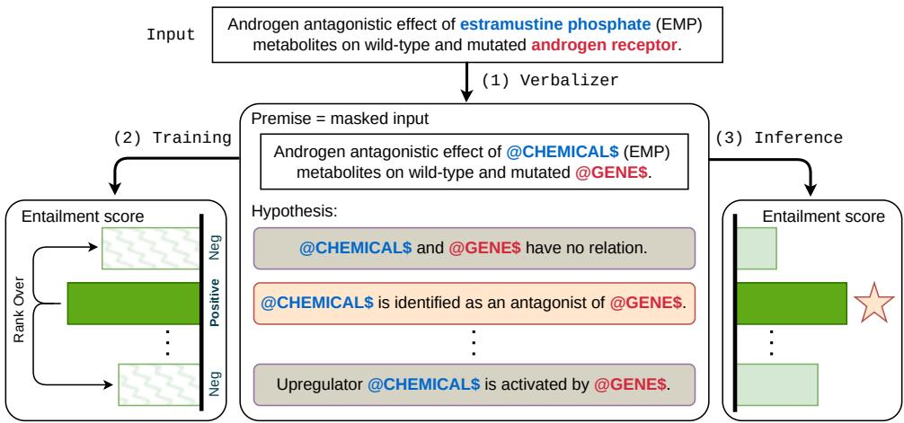
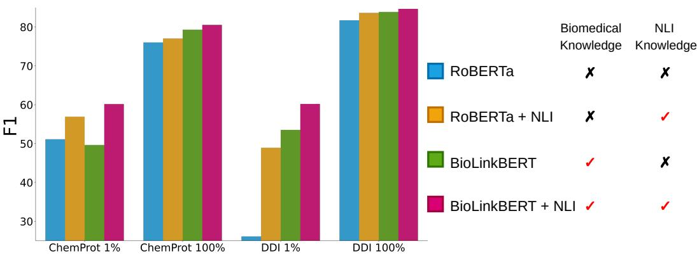

# Can NLI Provide Proper Indirect Supervision for Low-resource Biomedical Relation Extraction?

8 Jiashu Xu Mingyu Derek Ma Muhao Chen

8 Harvard University University of California, Los Angeles University of Southern California jxu1@harvard.edu ma@cs.ucla.edu muhaoche@usc.edu

## Abstract

Two key obstacles in biomedical relation extraction (RE) are the scarcity of annotations and the prevalence of instances without explicitly pre-defined labels due to low annotation coverage. Existing approaches, which treat biomedical RE as a multi-class classification task, often result in poor generalization in low-resource settings and do not have the ability to make selective predictions on unknown cases but give a guess from seen relations, hindering the applicability of those approaches. We present NBR, which converts biomedical RE as a natural language inference formulation to provide indirect supervision. By converting relations to natural language hypotheses, NBR is capable of exploiting semantic cues to alleviate annotation scarcity. By incorporating a ranking-based loss that implicitly calibrates abstinent instances, NBR learns a clearer decision boundary and is instructed to abstain on uncertain instances. Extensive experiments on three widely-used biomedical RE benchmarks, namely ChemProt, DDI, and GAD, verify the effectiveness of NBR in both full-shot and low-resource regimes. Our analysis demonstrates that indirect supervision benefits biomedical RE even when a domain gap exists, and combining NLI knowledge with biomedical knowledge leads to the best performance gains.1

## 1 Introduction

In silico studies of biology and medicine have primarily relied on machines’ understanding of relations between various molecules and biomolecules. For instance, disease-target prediction requires accurate identification of the association between the drug target and the disease (Bravo et al., 2015), and drug-drug interaction recognition is essential for polypharmacy side effect studies (Herrero-Zazo et al., 2013). Due to the complexity and high cost of human curation of such biomedical knowledge (Krallinger et al., 2017; Bravo et al., 2015), there has been a growing interest in the field of biomedical relation extraction (RE), a task of automatically inferring the relations between biomedical entities described in domain-specific corpora.

However, two obstacles remain in training a reliable biomedical RE model. First, biomedical RE often suffers from insufficient and imperfect annotations, due to that the annotation process is very challenging and requires expert annotators to identify complex structures from lengthy and sophisticated biomedical literature. The existing biomedical learning resources either require very costly expert annotations (Krallinger et al., 2017) or resort to weak supervision (Bravo et al., 2015). The insufficiency and imperfection of annotations inevitably cause existing state-of-the-art (SOTA) biomedical RE systems (Yasunaga et al., 2022; Peng et al., 2019; Tinn et al., 2021, inter alia), though showing satisfactory results in a fully supervised setting, to result in poor generalization regarding the more common low-resource regime in this domain. For example, Han et al. (2018) showed that model performance deteriorated quickly as the number of instances for each relation drops, hindering the applicability of those approaches in real-world scenarios. Second, given that biomedical RE annotations tend to be incomplete or have low coverage, it is difficult for models to learn a clear decision boundary (Gardner et al., 2020). Specifically, in many scenarios where the described biomedical entities are not related in the context, the model may fail to abstain but give a guess from seen relations (Xin et al., 2021; Kamath et al., 2020). An overconfident model can be particularly harmful in high-stakes fields such as medicine, where incorrect predictions can have severe direct consequences for patients.

Recently, indirect supervision (Roth, 2017; He et al., 2021; Levy et al., 2017; Lu et al., 2022; Li et al., 2019) is proposed that leverages supervision signals from resource-rich source tasks to enhance resource-limited target tasks. In this approach, the training and inference pipeline of the target task is transformed into the formulation of the source task, thus introducing additional supervision signals not accessible in the target task. Recent works (Li et al., 2022; Yin et al., 2020; Sainz et al., 2021) transfer cross-task learning signals from the Natural Language Inference (NLI) task. The NLI task aims at determining whether the hypothesis can be entailed given the premise, and inductive bias of NLI models learns adaptive generalized logical reasoning which aligns well with the goal of biomedical RE. On the other hand, traditional direct supervision on the biomedical RE fails to capture semantic information of relations since they are merely transformed to logits of a classifier. By converting relations to meaningful hypotheses in NLI, the indirectly supervised method bypasses this shortage and can adapt the the preexisting inductive bias of NLI-finetuned models to make meaningful predictions based on relation semantics (Huang et al., 2022; Chen et al., 2020). This critically benefits the generalizability of the model in low-resource regimes where limited direct supervision signals are provided (Sainz et al., 2021) to remedy insufficient annotations. However, previous studies focus on general domain tasks and explore little in specific domains such as biomedical. Moreover, to maximize the utility of indirect supervision, it is found that incorporating task knowledge into the model, i.e. NLI model that is trained on NLI data, yields the best performance (Li et al., 2022; Sainz et al., 2021). Yet, biomedical NLI is rarely available and whether general domain NLI can provide strong indirect supervising signals to specific target domains remains unexplored.

  
Figure 1: Overview of NBR. Given an input, (1) each relation is verbalized into natural language hypotheses and masked input where entity mentions are type-masked becomes the premise. The ground-truth is marked in light color . (2) For training NBR calculates the entailment scores for each relation candidate and optimizes the score of the ground-truth relation to rank over the scores of other candidates. (3) For inference NBR computes entailment scores of each relation and returns the one with the maximum entailment score.

This study presents a general learning framework, dubbed NLI improved Biomedical Relation Extraction (NBR), to enhance biomedical RE with indirect supervision from general domain NLI task. Fig. 1 illustrates the structure of NBR. Specifically, given an input sentence, NBR reformulates RE to NLI by treating the input as the premise while verbalizing each relation label into template-based natural language hypotheses. NBR learns to rank the relations based on the entailment scores such that the hypothesis of a correct relation should be scored higher than those of any incorrect ones. Furthermore, to learn a fine-grained, instance-aware decision boundary, NBR deploys ranking-based loss for implicit abstention calibration that handles abstinent relations in the dataset. During inference, the relation whose verbalized hypothesis achieved the highest score becomes the prediction. NBR fully exploits indirect supervision from NLI and performs exceptionally well even in low-resource scenarios.

Our contributions are three-fold: First, to the best of our knowledge, this is the first work to leverage indirect supervision from NLI on biomedical RE. Instead of solely relying on provided RE annotations, NBR leverages additional supervision signals from NLI indirect supervision and can generalize well in low resource regimes. Second, we show that NBR provides a proper indirect supervision signal even if there is a domain gap between general NLI knowledge NBR trained on and biomedical downstream task. Third, we propose a new ranking-based loss that implicitly handles abstinent relations ubiquitous in biomedical RE by contrastively calibrating the score of abstinent instances. By extensive experiments on three commonly-used biomedical RE benchmarks, namely, ChemProt (Krallinger et al., 2017), DDI (Herrero-Zazo et al., 2013) and GAD (Bravo et al., 2015), we verify our contributions and show that general domain NLI can provide a proper supervision signal, especially in low resource settings where annotations are scarce. NBR provides consistent improvements on three datasets (1.10, 1.79, and 0.96 points of F1 improvement respectively), and up to 34.25 points of F1 improvement in low-resource settings. Further analysis demonstrates that combing NLI knowledge with biomedical knowledge leads to the best performance gains.

## 2 Related Works

Biomedical relation extraction. Despite the growing availability of biomedical corpora on Web repositories, the main challenge remains in transforming those unstructured textual data into a rigidly-structured representation that includes interested entities and relations between them (Peng et al., 2019; Lee et al., 2020; Tinn et al., 2021). However, knowledge curation for this purpose is often costly and requires expert involvement (Krallinger et al., 2017; Herrero-Zazo et al., 2013; Bravo et al., 2015). To address this issue, biomedical RE techniques are developed to automate this process. Most existing works mainly conduct supervised fine-tuning language models pretrained on relevant corpus e.g. PubMed abstracts and MIMIC-III clinical notes, on annotated biomedical RE corpora (Tinn et al., 2021; Peng et al., 2019; Beltagy et al., 2019; Lee et al., 2020; Shin et al., 2020; Yasunaga et al., 2022). Two drawbacks of the aforementioned approach are: (1) it fails to capture the semantic interaction between relations and entities as relations are represented as integer indices (Chen et al., 2020; Huang et al., 2022), and (2) performance deteriorates as the number of training instances drops (Han et al., 2018).

Indirect supervision. Indirect supervision (Roth, 2017; He et al., 2021) transfers supervision signals from a more resource-rich task to enhance a specific more resource-limited task. Often this line of work reformulates the training and inference pipeline of the target task into the form of the source task to facilitate the cross-task signal transfer. Levy et al. (2017) demonstrate that relation extraction can be solved using machine reading comprehension formulation. Similarly, Li et al. (2019) and Lu et al. (2022) further show that relation extraction performance can be improved by multi-turn question answering and summarization, respectively. Recently Sainz et al. (2021) and Li et al. (2022) propose to leverage indirect supervision from the NLI task. LITE (Li et al. (2022)) enhances entity typing by incorporating NLI and a learning-to-rank training objective while Sainz et al. (2021) observes the benefits of indirect supervision in low-resource relation extraction. As discussed, NLI aligns well with relation extraction, but to the best of our knowledge, there is no prior work that investigates the effectiveness of indirect supervision when there is a domain gap between the target task and the source task, e.g. biomedical domain and general domain in this study.

## 3 Method

We hereby present NBR. We discuss how to frame relation extraction as a NLI task in §3.2, illustrate how to leverage cross-domain NLI knowledge in §3.3, and lastly provide an optional explicit abstention detector to handle abstinent instances in §3.4.

## 3.1 Problem Formulation

The RE model takes a sentence x with two mentioned entities $e _ { 1 } , e _ { 2 }$ as input, and predicts the relation y between $e _ { 1 } , e _ { 2 }$ from the label space that includes all considered relations. The dataset consists of both non-abstinent instances where $y \in \mathcal { V }$ , and abstinent instances2 where $y = \perp$ . A successful RE model should abstain for abstinent instances and accurately predict y for non-abstinent instances.

## 3.2 Relation Extraction with NLI

Following Sainz et al. (2021), we reformulate the RE task as a NLI task, allowing cross-task transfer of indirect supervision signals from NLI resources. An overview of our pipeline is visualized in Fig. 1.

Decompose RE to NLI queries. The NLI model takes in a premise and a hypothesis, both in natural language, and outputs a logit indicating if the premise either “entails,” “contradicts” the hypothesis or the inference relation is “neutral.” We decompose an instance $( \mathbf { x } , e _ { 1 } , e _ { 2 } )$ into $| \mathcal { V } | + 1$ NLI queries, each about a candidate relation. We formulate the RE input sentence x as the premise and a verbalized sentence describing the candidate relation as the hypothesis.

Verbalizing relations to hypotheses. For each relation $y \in \mathcal { y } \cup \{ \perp \}$ , we verbalize $y$ as a natural language hypothesis $\nu ( y )$ . Contextual textual representations of labels provide more semantic signals and are thus more understandable by a language model (LM) compared to the relation name itself or discrete relation label index used in standard classification methods (Chen et al., 2020; Huang et al., 2022).

Entity mentions in biomedical RE are mostly domain-specific terms that rarely appear in the LM’s pre-training corpus. The relations are always defined between entities of certain types, $e . g .$ between a gene complex and another chemical in ChemProt (Krallinger et al., 2017) or between two drugs in DDI (Herrero-Zazo et al., 2013). Thus, each entity mention is replaced by typed entity masks such as @GENE\$ following Gu et al. (2021) and Peng et al. $( 2 0 1 9 ) . ^ { 3 }$ The replacement enables the LM to capture semantic information of the types and avoid using poorly trained representations for rare biomedical terms.

As demonstrated by recent studies (Yeh et al., 2022; Li et al., 2022; Sainz et al., 2021), picking a good verbalizer for each relation may affect performance. Specifically, we design several types of templates (details and performances are provided in Appx. §D) listed below, each containing the two typed entity masks:

1. Simple Template verbalizes relation between two entities with $\ " { \boldsymbol { l } } { \boldsymbol { S } } \mathrm { - } { \boldsymbol { a } } ^ { \prime } \dot { \mathbf { \xi } }$ phrase.

2. Descriptive Template provides a contextual description of the relation.

3. Demonstration Template includes a randomly sampled trainset exemplar with the same relation.

4. Descriptive+Demonstration Template combines both the Descriptive description and the sampled exemplar.

5. Learned Prompt Template (Yeh et al., 2022) learns optimal discrete tokens for description. We observe that Descriptive Template performs the best empirically (Tab. 7).

Confidence scoring. For each relation label $y ~ \in ~ \mathcal { Y } \cup \{ \perp \}$ , we calculate the confidence score of whether relation $y$ holds by $s ( y ) \ =$ $f _ { \mathrm { N L I } } ( \mathbf { x } \left[ \mathrm { S E P } \right] \nu ( y ) )$ where [SEP] is a special token separating x (premise) and $\nu ( y )$ (hypothesis). fNLI is a transformer-based NLI model that encodes the input and produces logits that correspond plausibility of premise entailing hypothesis.

Abstention as a separate label. We treat  as a separate relation label and verbalize it explicitly, which is analogous to how supervised biomedical RE treats as an additional label (Yasunaga et al., 2022; Peng et al., 2019). An explicit template relieves the burden of incorporating both stop condition and label discriminative power into scores of labels.

Training objective. Recent works in contrastive learning show that InfoNCE loss benefits efficient learning from negative examples (Robinson et al., 2021; Wang et al., 2022; Zhang and Stratos, 2021; Zhou et al., 2021; Ma et al., 2023, 2021). Motivated by the intuition that positive instances should be ranked higher than negative instances with regard to the anchor instance, in each step we sample n negative relations $\{ y _ { 1 } , . . . , y _ { n } \} \subseteq { \mathcal { V } } \cup \{ \perp $ $\} \backslash \{ y \}$ and compute $s ( y _ { 1 } ) , \ldots , s ( y _ { n } )$ , and optimize ground truth relation’s entailment score to be ranked higher. Specifically, we optimize the following InfoNCE loss

$$
\mathcal { L } _ { \mathrm { N C E } } = \sum _ { ( \mathbf { x } , y ) \in \mathcal { D } } \ell _ { \mathrm { N C E } } ( \mathbf { x } , y )\tag{1}
$$

$$
\triangleq \sum _ { ( \mathbf { x } , y ) \in \mathcal { D } } - \ln \left( \frac { \exp ( s ( y ) / \tau ) } { \exp ( s ( y ) / \tau ) + \displaystyle \sum _ { i = 1 } ^ { n } \exp ( s ( y _ { i } ) / \tau ) } \right) ,
$$

in which temperature τ controls focus on harder negatives. In practice, learning from all possible negatives performs the best.

In pilot experiments, we observed that the model was prone to be misled by the vast number of abstinent instances in the dataset, leading to deteriorated performance. To alleviate such abstinent v.s. nonabstinent imbalance, we introduce a margin-based Abstention Calibration regularization to penalize over-confident abstinent instances while encouraging non-abstinent instances. Concretely, if relation is not , we calibrate the score of such that $s ( \bot )$ is suppressed; otherwise, we control $\perp$ to be ranked higher than other relations.

$$
\begin{array} { c } { \displaystyle \mathcal { L } _ { \mathrm { A C } } = \sum _ { ( \mathbf { x } , y ) \in \mathcal D } \ell _ { \mathrm { A C } } ( \mathbf { x } , y ) } \\ { \ell _ { \mathrm { A C } } ( \mathbf { x } , y ) \triangleq \left\{ \begin{array} { l l } { \displaystyle \sum _ { i = 1 } ^ { n } \ell _ { \mathrm { r a n k } } ( s ( y ) , s ( y _ { i } ) ; \gamma ) , \mathrm { i f } y = \perp } \\ { \ell _ { \mathrm { r a n k } } ( s ( y ) , s ( \perp ) ; \gamma ) , \mathrm { o t h e r w i s e } } \end{array} \right. } \end{array}\tag{2}
$$

where the ranking loss $\ell _ { \mathrm { r a n k } } ( x _ { 1 } , x _ { 2 } ; \gamma )$ learns to project $x _ { 1 }$ higher than $x _ { 2 }$ by a margin $\gamma$ . Training with this objective, NBR can be viewed as combining an implicit abstention calibrator and $s ( \bot )$ as a learnable instance-aware threshold. The final training loss is $\mathcal { L } _ { \mathrm { N C E } } + \lambda \mathcal { L } _ { \mathrm { A C } }$ where non-negative hyperparameter λ controls the strength of abstention calibration.

Inference. NBR gathers hypotheses verbalized from every relation and performs ranking among the entailment scores of each hypothesis. Then the relation whose verbalized hypothesis achieves the highest score is selected as the final prediction.

## 3.3 Cross-Domain NLI Fine-tuning

In order to maximize the benefit of NLI formulation, it is advised to use models trained on targetdomain NLI dataset (Li et al., 2022; Sainz et al., 2021). However, available biomedical NLI training resource is limited. As a remedy, we experiment with fine-tuning NLI models on two commonly used general domain NLI datasets, namely MNLI (Williams et al., 2018) and SNLI (Bowman et al., 2015), instead. Empirically we found strong evidence (§4.2, §4.4) that general-domain NLI knowledge can still be beneficial in the biomedical domain even if a domain gap exists.

## 3.4 Explicit Abstention Detector

Training with aforementioned $\mathcal { L } _ { \mathrm { A C } }$ (Eq. 2) makes NBR an implicit abstention calibrator. As an optional post-process step, we can further improve NBR by introducing an Explicit Abstention Dector (EAD). This is analogous to the “no-answer reader” component used in previous works that detect abstinent instances explicitly (Back et al., 2020; Hu et al., 2019; Kundu and Ng, 2018).

EAD is essentially another instance of NBR trained separately on the same train set, but changing relation labels into binary “has relation” versus “no relation” ( ). A new verbalization template is created for “has relation”. For inference, we collect all differences $s _ { \mathrm { E A D } } ( \perp ) - s _ { \mathrm { E A D } }$ (“has relation”) on the dev set. Then we iterate each difference as a threshold, and for one instance in the test set, EAD predicts only if the difference of such instance exceeds the threshold. Once EAD is trained, NBR and EAD are combined using a simple heuristic: resort to NBR only when EAD prediction is not (Appx. §C). In this manner, even if EAD makes a false positive prediction, since NBR still retains the ability to flag , such error can be recovered. Otherwise, we trust EAD prediction since it specializes in abstention prediction.

## 4 Experiments

In this section, we discuss our experiment setup (§4.1) and evaluation results (§4.2), followed by detailed ablation studies (§4.3) and analyses (§4.4).

## 4.1 Experimental Setup

Dataset and evaluation metric. We conduct experiments on three sentence-level biomedical RE datasets contained in the widely-used BLURB benchmark (Gu et al., 2021). ChemProt (Krallinger et al., 2017) consists of PubMed abstracts corpora with five high-level chemicalprotein interaction annotations. DDI (Herrero-Zazo et al., 2013) studies drug-drug interaction and specializes in pharmacovigilance built from PubMed abstracts. GAD (Bravo et al., 2015) is a semi-labeled dataset created using Genetic Association Archive and consists of gene-disease associations.

There are multiple variants of the datasets used by existing literature that differ by data statistics or evaluation protocol (Dong et al., 2021; Phan et al., 2021; Beltagy et al., 2019; Yeh et al., 2022; Peng et al., 2020; Xu et al., 2022) as described in Appx. §B, we adopt the most popular setting used by Gu et al. (2021) and give dataset statistics in Tab. 5. Most of entity pairs are labeled as without an explicit relation label.4 This setting is realistic since the model must identify a relation’s existence first. Following Gu et al. (2021), we use the micro F1 score calculated across all nonabstinent instances as the evaluation metric.

Baselines. We compare against the various baselines (Appx. §A), mostly classification-based approaches that use + 1-way classification head on top of a biomedical-pretrained LM. Sci-Five (Phan et al., 2021) generates the relation label as a seq-to-seq conditional generation formulation.

<table><tr><td colspan="2">Model</td><td>ChemProt</td><td>DDI</td><td>GAD</td></tr><tr><td colspan="3">SUPERVISED METHODS</td><td></td><td></td></tr><tr><td colspan="2"> $\mathrm { \mathbf { B i o R E - P r o m p t } } ^ { \mathrm { \diamond } }$  (Yeh et al., 2022)</td><td>67.46</td><td></td><td></td></tr><tr><td colspan="2"> $\mathrm { \Delta B L U E { \mathrm { - } B E R T } _ { l a r g e } ~ ( P e n g ~ e t ~ a l . , 2 0 1 9 ) }$ </td><td>74.40</td><td>79.90</td><td></td></tr><tr><td colspan="2"> $\mathrm { S c i \mathrm { - } B E R T _ { b a s e } } ^ { \diamondsuit } \left( \mathrm { B e l t a g y \ e t { a l . } , 2 0 1 9 } \right)$ </td><td>74.93</td><td>81.32</td><td></td></tr><tr><td colspan="2"> $\mathrm { B i o - B E R T _ { b a s e } \ ( L e e \ e t \ a l . , 2 0 2 0 ) }$ </td><td>76.46</td><td> $8 0 . 3 3 ^ { \bigcirc }$ </td><td>79.83</td></tr><tr><td colspan="2"> $\mathrm { B i o M e g a t r o n } \left( \mathrm { S h i n \thinspace e t \ a l . , 2 0 2 0 } \right)$ </td><td>77.00</td><td></td><td></td></tr><tr><td colspan="2"> $\mathrm { P u b M e d \mathrm { - } B E R T _ { \mathrm { b a s e } } \left( T i n n e t a l . , 2 0 2 1 \right) }$ </td><td>77.24</td><td>82.36</td><td>82.34</td></tr><tr><td colspan="2"> $\mathrm { S c i - F i v e } _ { \mathrm { l a r g e } } \mathrm {  { ^ \circ } ( P h a n \ e t \ a l . , 2 0 2 1 ) }$ </td><td>77.48</td><td>82.23</td><td>79.21</td></tr><tr><td colspan="2"> $\mathrm { K e B i o L M } \left( \mathrm { Y u a n \ e t \ a l . , 2 0 2 1 } \right)$ </td><td>77.50</td><td>81.90</td><td>84.30</td></tr><tr><td colspan="2"> $\mathbf { B i o L i n k - B E R T _ { b a s e } }$  (Yasunaga et al., 2022)</td><td>77.57</td><td>82.72</td><td>84.39</td></tr><tr><td colspan="2"> $\mathrm { B i o M \mathrm { - } E L E C T R A _ { l a r g e } }$  (Alrowili and Vijay-Shanker, 2021)</td><td>78.60</td><td></td><td></td></tr><tr><td colspan="2"> $\mathrm { B i o R o B E R T a _ { l a r g e } \ ( A l r o w i l i \ a n d \ V i j a y - S h a n k e r , 2 0 2 1 ) }$ </td><td>78.80</td><td></td><td></td></tr><tr><td colspan="2"> $\mathbf { B i o M - A L B E R T _ { x x l a r g e } }$  (Alrowili and Vijay-Shanker, 2021)</td><td>79.30</td><td> $8 2 . 0 4 ^ { \circ }$ </td><td></td></tr><tr><td colspan="2"> $\mathbf { B i o L i n k - B E R T _ { l a r g e } }$  (Yasunaga et al., 2022)</td><td>79.98</td><td>83.35 84.90</td><td></td></tr><tr><td colspan="2"> $\mathrm { B i o M - B E R T _ { l a r g e } \ ( A l r o w i l i \ a n d \ V i j a y - S h a n k e r , 2 0 2 1 ) }$ </td><td>80.00</td><td> $8 1 . 9 2 ^ { \circ }$ </td><td></td></tr><tr><td colspan="3">INDIRECT SUPERVISION</td><td></td><td></td></tr><tr><td colspan="2"> $\mathrm { N B R } _ { \mathrm { N L I } } \left( \ S 3 . 2 \right)$ </td><td>79.30</td><td>83.87</td><td>83.75</td></tr><tr><td colspan="2"> $\mathrm { N B R } _ { \mathrm { N L I + F T } } ( \ S 3 . 3 )$ </td><td>80.54</td><td>84.66</td><td>85.86</td></tr><tr><td colspan="2"> $\mathrm { N B R } _ { \mathrm { N L I + F T } } { + } \mathrm { E A D } \left( \ S 3 . 4 \right)$ </td><td>81.10</td><td>85.14</td><td></td></tr></table>

Table 1: Model performance (micro F1) using full training data on 3 biomedical RE datasets. Since GAD does not contain abstinent instances, EAD is unnecessary. ✸ indicates the results are from our re-implementation to conform to our evaluation metric. Other baseline performances are taken from their papers. We highlight the best results in red and the best results of direct supervision in cyan

Our method. We term three variants of NBR:

$\mathrm { N B R } _ { \mathrm { N L I } }$ using NLI formulation (§3.2) with BioLink $\mathrm { 3 E R T _ { l a r g e } }$ (Yasunaga et al., 2022) backbone that pretrained on biomedical corpus.

$\mathrm { N B R } _ { \mathrm { N L I + F T } }$ further cross-domain fine-tunes (§3.3) BioLinkBERT on two general domain NLI datasets. The model retains biomedical domain knowledge and learns relevant NLI knowledge.

$\mathrm { N B R } _ { \mathrm { N L I + F T } } + \mathrm { E A D }$ assembles $\mathrm { N B R } _ { \mathrm { N L I + F T } }$ with a separately trained EAD component (§3.4).

We choose BioLinkBERT as the pretrained LM due to its supremacy in performance on various biomedical domain tasks, but we emphasize that our approach is agnostic to backbone models.

## 4.2 Experimental Results

NLI provides helpful indirect supervision. We report the comparison between NBR and baselines in Tab. 1. Overall, $\mathrm { N B R } _ { \mathrm { N L I + F T } } + \mathrm { E A D }$ achieves SOTA performance on all three datasets, with 1.10, 1.79, and 0.96 points F1 improvement on ChemProt, DDI, and GAD respectively. Strong performance gains verify the effectiveness of reformulating biomedical RE as NLI. NLI supervision signals from the general domain are transferred to enhance the biomedical RE learning signals. By verbalizing relations into natural language hypothesis, NBR leverages the preexisting inductive bias of NLI-finetuned models to make informed predictions based on relation semantics.

We further compare the performance of our model’s variants. First, due to the prevalence of abstinent instances on the datasets, we notice that by explicitly detecting the abstinent instances, assembling EAD (§3.4) with $\mathrm { N B R } _ { \mathrm { N L I + F T } }$ improves performance on ChemProt and DDI. This is likely because explicitly detecting  by a separate EAD model reduces the burden on $\mathrm { N B R } _ { \mathrm { N L I + F T } }$ to predict relations and identify abstinent instances at the same time. Second, we show that cross-domain fine-tuning (§3.3) is vital. Compared to $\mathrm { N B R } _ { \mathrm { N L I } } .$ which is not trained on NLI datasets, $\mathrm { N B R } _ { \mathrm { N L I + F T } }$ resulted in significant improvements in F1 across three datasets. This demonstrates that having prior NLI knowledge allows better utilization of the NLI formulation. Lastly, we note that $\mathrm { N B R } _ { \mathrm { N L I } }$ is outperformed by its direct supervision counterpart, namely BioLinkBERT on ChemProt and GAD. The possible reason could be that the model needs to learn to perform NLI tasks on top of the RE task without NLI training, which leads to shallower supervision signals. However we observe that generally, and especially in low-resource regimes, $\mathrm { N B R } _ { \mathrm { N L I } }$ improves over direct supervision (§4.4).

<table><tr><td rowspan=1 colspan=6>Model on ChemProt                                            |</td><td rowspan=1 colspan=1>0 shot||</td><td rowspan=1 colspan=1>8 shot</td><td rowspan=1 colspan=1>1%|</td><td rowspan=1 colspan=2>50 shot|</td><td rowspan=1 colspan=1>10%</td><td rowspan=1 colspan=1>100%</td></tr><tr><td rowspan=9 colspan=6>BioRE-Prompt (Yeh et al., 2022) $\mathrm { \mathbf { B } L U E { - } B E R T _ { l a r g e } }$ (Peng et al., 2019) $\mathbf { S c i - B E R T _ { b a s e } } ^ { \diamond }$ (Beltagy et al., 2019) $\mathbf { B i o - B E R T _ { b a s e } }$ (Lee et al., 2020) $\mathrm { P u b M e d \mathrm { - } B E R T _ { \mathrm { b a s e } } \left( T i n n e t a l . , 2 0 2 1 \right) }$  $\mathrm { S c i - F i v e _ { l a r g e } } ^ { \diamond }$ (Phan et al., 2021) $\mathbf { B i o M - A L B E R T _ { x x l a r g e } }$ (Alrowili and Vijay-Shanker, 2021) $\mathbf { B i o L i n k B E R T _ { l a r g e } }$ (Yasunaga et al., 2022) $\mathbf { B i o M - B E R T _ { l a r g e } }$ (Alrowili and Vijay-Shanker, 2021)</td><td rowspan=1 colspan=1>1.32</td><td rowspan=1 colspan=1>6.07</td><td rowspan=1 colspan=1>27.89</td><td rowspan=1 colspan=2>36.80</td><td rowspan=1 colspan=1>55.66</td><td rowspan=1 colspan=1>67.46</td></tr><tr><td rowspan=1 colspan=1></td><td rowspan=1 colspan=1>10.22</td><td rowspan=1 colspan=1>20.13</td><td rowspan=1 colspan=2>27.91</td><td rowspan=1 colspan=1>51.02</td><td rowspan=1 colspan=1>74.40</td></tr><tr><td rowspan=1 colspan=1></td><td rowspan=1 colspan=1>15.60</td><td rowspan=1 colspan=1>22.08</td><td rowspan=1 colspan=2>33.36</td><td rowspan=1 colspan=1>60.60</td><td rowspan=1 colspan=1>74.93</td></tr><tr><td rowspan=1 colspan=1></td><td rowspan=1 colspan=1>10.28</td><td rowspan=1 colspan=1>20.96</td><td rowspan=1 colspan=2>38.15</td><td rowspan=1 colspan=1>68.01</td><td rowspan=1 colspan=1>76.46</td></tr><tr><td rowspan=1 colspan=1></td><td rowspan=1 colspan=1>15.97</td><td rowspan=1 colspan=1>23.49</td><td rowspan=1 colspan=2>35.37</td><td rowspan=1 colspan=1>68.49</td><td rowspan=1 colspan=1>77.24</td></tr><tr><td rowspan=1 colspan=1>0.00</td><td rowspan=1 colspan=1>17.19</td><td rowspan=1 colspan=1>35.66</td><td rowspan=1 colspan=2>47.41</td><td rowspan=1 colspan=1>68.62</td><td rowspan=1 colspan=1>77.48</td></tr><tr><td rowspan=1 colspan=1></td><td rowspan=1 colspan=1>8.49</td><td rowspan=1 colspan=1>14.95</td><td rowspan=1 colspan=2>21.92</td><td rowspan=1 colspan=1>51.69</td><td rowspan=1 colspan=1>79.30</td></tr><tr><td rowspan=1 colspan=1>-</td><td rowspan=1 colspan=1>9.31</td><td rowspan=1 colspan=1>21.19</td><td rowspan=1 colspan=2>38.70</td><td rowspan=1 colspan=1>71.37</td><td rowspan=1 colspan=1>79.98</td></tr><tr><td rowspan=1 colspan=1>-</td><td rowspan=1 colspan=1>16.02</td><td rowspan=1 colspan=1>26.23</td><td rowspan=1 colspan=2>40.63</td><td rowspan=1 colspan=1>68.93</td><td rowspan=1 colspan=1>80.00</td></tr><tr><td rowspan=4 colspan=6> $\overline { { { \mathrm { N B R } } _ { \mathrm { N L I } } ( \ S 3 . 2 ) } }$  $\mathrm { N B R } _ { \mathrm { N L I + F T } } ( \ S 3 . 3 )$  $\mathrm { N B R } _ { \mathrm { N L I + F T } + \mathrm { E A D } ( \ S 3 . 4 ) }$ Model on DDI</td><td rowspan=1 colspan=1>5.70</td><td rowspan=1 colspan=1>36.42</td><td rowspan=1 colspan=1>49.63</td><td rowspan=1 colspan=2>51.95</td><td rowspan=1 colspan=1>72.03</td><td rowspan=1 colspan=1>79.30</td></tr><tr><td rowspan=1 colspan=1>24.50</td><td rowspan=1 colspan=1>46.53</td><td rowspan=1 colspan=1>60.17</td><td rowspan=1 colspan=2>56.43</td><td rowspan=1 colspan=1>75.12</td><td rowspan=1 colspan=1>80.54</td></tr><tr><td rowspan=1 colspan=1></td><td rowspan=1 colspan=1>51.44</td><td rowspan=1 colspan=1>60.34</td><td rowspan=1 colspan=2>61.31</td><td rowspan=1 colspan=1>75.24</td><td rowspan=1 colspan=1>81.10</td></tr><tr><td rowspan=1 colspan=1>|0 shot||</td><td rowspan=1 colspan=1>8 shot|</td><td rowspan=1 colspan=2>50 shot</td><td rowspan=1 colspan=1>1%</td><td rowspan=1 colspan=1>10%</td><td rowspan=1 colspan=1>100%</td></tr><tr><td rowspan=8 colspan=6> $\mathrm { B L U E { - } B E R T _ { l a r g e } } ( \mathrm { P e n g e t a l . } , 2 0 1 9 )$  $\mathrm { B i o - B E R T _ { b a s e } \ ( L e e \ e t \ a l . , 2 0 2 0 ) }$  $\mathbf { S c i - B E R T _ { b a s e } } ^ { \diamond }$ (Beltagy et al., 2019) $\mathrm { S c i - F i v e _ { l a r g e } } ^ { \diamond }$ (Phan et al., 2021) $\mathrm { P u b M e d \mathrm { - B E R T } _ { b a s e } }$ (Tinn et al., 2021) $\mathbf { B i o M - A L B E R T _ { x x l a r g e } }$ (Alrowili and Vijay-Shanker, 2021) $\mathbf { B i o L i n k B E R T _ { l a r g e } }$ (Yasunaga et al., 2022) $\mathbf { B i o M - B E R T _ { l a r g e } }$ (Alrowili and Vijay-Shanker, 2021)</td><td rowspan=1 colspan=1>-</td><td rowspan=1 colspan=1>8.76</td><td rowspan=1 colspan=2>25.79</td><td rowspan=1 colspan=1>27.48</td><td rowspan=1 colspan=1>65.62</td><td rowspan=1 colspan=1>79.90</td></tr><tr><td rowspan=1 colspan=1></td><td rowspan=1 colspan=1>13.61</td><td rowspan=1 colspan=2>31.93</td><td rowspan=1 colspan=1>30.01</td><td rowspan=1 colspan=1>64.56</td><td rowspan=1 colspan=1>80.33</td></tr><tr><td rowspan=1 colspan=1></td><td rowspan=1 colspan=1>10.55</td><td rowspan=1 colspan=2>33.34</td><td rowspan=1 colspan=1>23.62</td><td rowspan=1 colspan=1>69.44</td><td rowspan=1 colspan=1>81.32</td></tr><tr><td rowspan=1 colspan=1>0.00</td><td rowspan=1 colspan=1>25.44</td><td rowspan=1 colspan=2>39.36</td><td rowspan=1 colspan=1>29.80</td><td rowspan=1 colspan=1>77.11</td><td rowspan=1 colspan=1>82.23</td></tr><tr><td rowspan=1 colspan=1></td><td rowspan=1 colspan=1>17.02</td><td rowspan=1 colspan=2>34.39</td><td rowspan=1 colspan=1>27.53</td><td rowspan=1 colspan=1>71.98</td><td rowspan=1 colspan=1>82.36</td></tr><tr><td rowspan=1 colspan=1></td><td rowspan=1 colspan=1>11.52</td><td rowspan=1 colspan=2>22.50</td><td rowspan=1 colspan=1>18.64</td><td rowspan=1 colspan=1>76.70</td><td rowspan=1 colspan=1>82.04</td></tr><tr><td rowspan=1 colspan=2>asunaga </td><td rowspan=1 colspan=2>ga et al.,</td><td rowspan=1 colspan=1> al., 202</td><td rowspan=1 colspan=1>–</td><td rowspan=1 colspan=1>9.70</td><td rowspan=1 colspan=2>37.80</td><td rowspan=1 colspan=1>34.11</td><td rowspan=1 colspan=1>74.08</td><td rowspan=1 colspan=1>83.35</td></tr><tr><td rowspan=1 colspan=1></td><td rowspan=1 colspan=1>16.42</td><td rowspan=1 colspan=2>37.25</td><td rowspan=1 colspan=1>27.85</td><td rowspan=1 colspan=1>79.07</td><td rowspan=1 colspan=1>81.92</td></tr><tr><td rowspan=3 colspan=6> $\overline { { { \mathrm { N B R } } _ { \mathrm { N L I } } ( \ S 3 . 2 ) } }$  $\mathrm { N B R } _ { \mathrm { N L I + F T } } ( \ S 3 . 3 )$  $\mathrm { N B R } _ { \mathrm { N L I + F T } + \mathrm { E A D } ( \ S 3 . 4 ) }$ </td><td rowspan=1 colspan=1>3.60</td><td rowspan=1 colspan=1>32.01</td><td rowspan=1 colspan=2>47.86</td><td rowspan=1 colspan=1>53.53</td><td rowspan=1 colspan=1>79.49</td><td rowspan=1 colspan=1>83.87</td></tr><tr><td rowspan=1 colspan=1>11.94</td><td rowspan=1 colspan=1>37.80</td><td rowspan=1 colspan=2>52.49</td><td rowspan=1 colspan=1>60.20</td><td rowspan=1 colspan=1>80.85</td><td rowspan=1 colspan=1>84.66</td></tr><tr><td rowspan=1 colspan=1></td><td rowspan=1 colspan=1>42.48</td><td rowspan=1 colspan=2>58.50</td><td rowspan=1 colspan=1>61.06</td><td rowspan=1 colspan=1>81.71</td><td rowspan=1 colspan=1>85.14</td></tr></table>

Table 2: We conduct experiment on {0,8,50}-shot and {1,10}-% ChemProt (top) and DDI (bottom). We highlight the best model in red and the best of direct supervision in cyan . Columns are ordered by the number of training instances. ✸ indicates the results are from our re-implementation to conform to our evaluation metric.

Indirect supervision from NLI shines particularly under low-resource. We evaluate the NBR under zero- and few-shot settings in Tab. 2. Following existing works (Peng et al., 2020; Xu et al., 2022), we train the model with 0, 8 and 50 shots and 1% and 10% of training instances. We note that classification-based methods could not adapt to the zero-shot setting.

Our experimental results show that all three variants of NBR consistently achieve strong performance across all few-shot settings on all datasets, e.g. 34.25 points F1 improvement on 8-shot ChemProt. The performance of direct supervision models deteriorates dramatically as the number of training instances decreases, due to the limited learning signals. On the contrary, NBR effectively leverages indirect supervision to transform richer NLI signals to improve the RE performance. Additionally verbalized hypotheses provide valuable semantic cues for prediction. We also observe similar patterns as the full-set experiments: using NLI knowledge learned from NLI training data improves the performance of $\mathrm { N B R } _ { \mathrm { N L I } }$ , and combing EAD with $\mathrm { N B R } _ { \mathrm { N L I + F T } }$ leads to further performance gains.

Lastly, we note that as the number of training instances increases, the benefits of indirect supervision tend to decrease. This suggests that given sufficient training signals, direct supervision can learn effectively, and the marginal returns of introducing additional NLI signals become smaller. In practical settings where biomedical annotations are scarce, learning with indirect supervision can lead to better performance.

## 4.3 Ablation Study

<table><tr><td>Model</td><td>ChemProt 1% 100%</td><td>DDI 1% 100%</td></tr><tr><td> $\mathrm { N B R } _ { \mathrm { N L I + F T } }$ </td><td>60.17 80.54</td><td>60.20 84.66</td></tr><tr><td> $\overline { { - \mathcal { L } _ { \mathrm { N C E } } \left( \mathrm { E q . ~ } 1 \right) } }$   $- \mathcal { L } _ { \mathrm { A C } } \left( \mathrm { E q } . 2 \right)$   $\ L _ { - } \mathcal { L } _ { \mathrm { N C E } } { - \ L { \mathcal { L } _ { \mathrm { N C } } } }$ </td><td>59.63 79.32 57.57 78.68 53.87 78.12</td><td>52.50 83.29 50.18 82.94 20.71 82.74</td></tr><tr><td>MedNLI</td><td>53.58 79.60</td><td>51.04 82.42</td></tr></table>

Table 3: Ablation study of NBR. Micro F1 is reported for 1% and 100% ChemProt and DDI datasets.

We perform ablation studies on model compo nents on ChemProt and DDI using 1% and 100% training data in Tab. 3. (1) InfoNCE $\mathcal { L } _ { \mathrm { N C E } } \left( \mathrm { E q . ~ } 1 \right)$ is essential. Replacing $\mathcal { L } _ { \mathrm { N C E } }$ with ranking loss sum i.e. $\begin{array} { r l r } {  { \sum _ { i = 1 } ^ { n } \ell _ { r a n k } ( s ( y ) , s ( y _ { i } ) ; \gamma ) } } \end{array}$ deteriorate performance. These results confirm the effectiveness of InfoNCE in learning from negative samples (Robinson et al., 2021; Wang et al., 2022). (2) $\mathcal { L } _ { \mathrm { A C } } \left( \mathrm { E q . ~ } 2 \right)$ is vital. Given the prevalence of abstinent relations in the two datasets, it is easy for models to be misled by abstinent instances since they impose stronger learning signals. We specifi cally notice 1% settings have a larger performance drop, which might be caused by the fact that de tecting abstention is harder when the quantity of other labels and their associated learning signals is reduced. (3) We further consider a variant that re places $\mathcal { L } _ { \mathrm { N C E } }$ with ranking loss sum, removes $\mathcal { L } _ { \mathrm { A C } }$ and uses only one negative sample, which corresponds to LITE (Li et al., 2022) that uses NLI indirect supervision for the general domain entity typing task. We observe further performance degradation, which again verifies the effectiveness of the two losses. Lastly (4) we fine-tune BioLinkBERT on the biomedical MedNLI (Romanov and Shivade, 2018). Despite being domain-relevant, we observe performance drops compared to fine-tuning on general domain NLI datasets. We hypothesize that perform drops might be caused by (a) MedNLI being relatively small as MNLI is 35x larger and (b) low coverage on relevant knowledge e.g. only 11.77% of ChemProt entities are mentioned in MedNLI. Therefore even if MedNLI provides both NLI knowledge and biomedical knowledge, the gain is insignificant.

## 4.4 Analysis

In this section, we first show the benefits of indirect supervision, then illustrate two key ingredients for effective indirect supervision gains: biomedical domain knowledge and NLI knowledge.

<table><tr><td>Dataset</td><td>RoBERTa DS IS</td><td>BioLinkBERT DS IS</td></tr><tr><td>1% Chem Prolt 100%</td><td>0.00 51.11 45.72 76.02</td><td>21.19 49.63 79.98 79.30</td></tr><tr><td>1% DDI 100%</td><td>15.13 26.11 81.23 81.73</td><td>34.11 53.53 83.35 83.87</td></tr></table>

Table 4: NLI formulation benefits, especially in lowresource settings. We report performance using Direct Supervision (DS) or NLI Indirect Supervision (IS) formulation with backbones not trained on NLI datasets.

NLI formulation benefits, even without additional NLI resources. In Tab. 4, we demonstrate the effectiveness of NLI formulation using two backbones without NLI knowledge: RoBERTa (Liu et al., 2019) and BioLinkBERT.

We observe that even if models lack NLI formulation adaption, NLI formulation outperforms original RE formulation in most settings, particularly in low-resource settings. When data is limited, it is challenging for direct supervision methods to access sufficient supervision signals. In contrast, the model can leverage the semantic information in the natural language hypothesis with the NLI formulation. Additionally, BioLinkBERT consistently outperformed RoBERTa in the same settings, despite $\mathrm { R o B E R T a _ { l a r g e } }$ having larger parameters, suggesting the importance of domain knowledge.

Two key ingredients of indirect supervision for biomedical RE. We identify two potential factors that contribute to the effective usage of indirect supervision for biomedical RE: 1) biomedical domain-specific knowledge; and 2) NLI knowledge to adapt to the NLI formulation. To test the importance of these two kinds of knowledge, in Fig. 2 we evaluate on 1% and 100% of ChemProt and DDI the four combinations: RoBERTa and RoBERTa fine-tuned on NLI, and BioLinkBERT and BioLinkBERT fine-tuned on NLI.

We first observe that BioLinkBERT fine-tuned on NLI datasets behaves the best across all four settings, indicating the importance of both pieces of knowledge. When the learning signal is limited, the model can dynamically load-balance both forms of knowledge to make educated predictions. Secondly, we note that RoBERTa, which lacks both biomedical and NLI knowledge, consistently performs the worst, except for 1% ChemProt. Finally, it is difficult to determine whether the domain or NLI knowledge is more important in biomedical RE, as the relative importance may depend on the specific dataset or the knowledge requirements of each input.

  
Figure 2: Impact of biomedical and NLI knowledge on 1 and 100% ChemProt and DDI. Both pieces of knowledge are substantial for biomedical RE.

## 5 Conclusion

We present a novel method NBR that leverages indirect supervision by cross-task transfer learning from NLI tasks to improve the biomedical RE task. NBR verbalizes relations to natural language hypotheses so that model is able to exploit semantic information to make informed predictions. Furthermore, NBR adopts a ranking-based abstinent calibration loss that penalizes overconfident abstinent instances while encouraging non-abstinent instances, thus being capable of abstaining on uncertain instances. Extensive experiments on three widely-used biomedical RE benchmarks demonstrate that NBR is effective in both full-set and low-resource settings. We further investigate two key ingredients for effective NLI indirect supervision on biomedical RE. Future work could involve further investigation of other indirect supervision approaches and automatic relation template generation based on prompt learning.

## Acknowledgement

We appreciate the reviewers for their insightful comments and suggestions. Jiashu Xu was supported by the Center for Undergraduate Research in Viterbi Engineering (CURVE) Fellowship. Mingyu Derek Ma was supported by the AFOSR MURI grant #FA9550-22-1-0380, the Defense Advanced Research Project Agency (DARPA) grant #HR00112290103/HR0011260656, and a Cisco

Research Award. Muhao Chen was supported by the NSF Grant IIS 2105329, by the Air Force Research Laboratory under agreement number FA8750-20-2-10002, by a subaward of the INFER Program through UMD ARLIS, an Amazon Research Award and a Cisco Research Award. Computing of this work was partly supported by a subaward of NSF Cloudbank 1925001 through UCSD.

## Limitations

This work investigates using NLI as indirect supervision for biomedical RE. Experiments suggest two key ingredients in high-performing indirect supervision biomedical RE are biomedical knowledge and NLI knowledge. To this goal, we need to access a language model that is pretrained on biomedical domain corpus, which requires computational resources. Compared to general domain ones, models pretrained on a specific domain are often limited in variety. Further to learn NLI knowledge additional cross-domain fine-tuning needs to be conducted, which results in additional computational overhead.

During inference NBR requires #label times of forward passes to yield prediction since NBR needs to evaluate entailment scores for each verbalized relation. Compared to standard supervision which only requires one pass for every instance, inference cost and training cost are higher in a factor of # label. Higher inference cost hinders applicability in a number of scenarios e.g. real-time applications. Additionally, the high inference cost makes it difficult to deploy machine learning models in resource-constrained environments, such as edge devices with limited processing power.

Lastly, since NBR is sensitive to templates, designing an effective template is crucial for performance. However, currently human involvement is required to design templates for each relation. As the number of relations increases, human involvement might become costly and time-consuming. Moreover, it is not easy to test the effectiveness of templates as no objective metric exists, and the only way to assess the quality is to test the templates.

## References

Sultan Alrowili and K Vijay-Shanker. 2021. Biomtransformers: building large biomedical language models with bert, albert and electra. In Proceedings of the 20th Workshop on Biomedical Language Processing, pages 221–227.

Seohyun Back, Sai Chetan Chinthakindi, Akhil Kedia, Haejun Lee, and Jaegul Choo. 2020. Neurquri: Neural question requirement inspector for answerability prediction in machine reading comprehension. In 8th International Conference on Learning Representations, ICLR 2020, Addis Ababa, Ethiopia, April 26-30, 2020. OpenReview.net.

Iz Beltagy, Kyle Lo, and Arman Cohan. 2019. Scibert: A pretrained language model for scientific text. In Proceedings of the 2019 Conference on Empirical Methods in Natural Language Processing and the 9th International Joint Conference on Natural Language Processing (EMNLP-IJCNLP), pages 3615– 3620.

Samuel R. Bowman, Gabor Angeli, Christopher Potts, and Christopher D. Manning. 2015. A large annotated corpus for learning natural language inference. In Proceedings of the 2015 Conference on Empirical Methods in Natural Language Processing, pages 632–642, Lisbon, Portugal. Association for Computational Linguistics.

Àlex Bravo, Janet Piñero, Núria Queralt-Rosinach, Michael Rautschka, and Laura I Furlong. 2015. Extraction of relations between genes and diseases from text and large-scale data analysis: implications for translational research. BMC bioinformatics, 16(1):1–17.

Muhao Chen, Hongming Zhang, Haoyu Wang, and Dan Roth. 2020. What are you trying to do? semantic typing of event processes. In Proceedings of the 24th Conference on Computational Natural Language Learning, pages 531–542, Online. Association for Computational Linguistics.

Manqing Dong, Chunguang Pan, and Zhipeng Luo. 2021. Mapre: An effective semantic mapping approach for low-resource relation extraction. In Proceedings of the 2021 Conference on Empirical Methods in Natural Language Processing, pages 2694– 2704.

Matt Gardner, Yoav Artzi, Victoria Basmov, Jonathan Berant, Ben Bogin, Sihao Chen, Pradeep Dasigi,

Dheeru Dua, Yanai Elazar, Ananth Gottumukkala, Nitish Gupta, Hannaneh Hajishirzi, Gabriel Ilharco, Daniel Khashabi, Kevin Lin, Jiangming Liu, Nelson F. Liu, Phoebe Mulcaire, Qiang Ning, Sameer Singh, Noah A. Smith, Sanjay Subramanian, Reut Tsarfaty, Eric Wallace, Ally Zhang, and Ben Zhou. 2020. Evaluating models’ local decision boundaries via contrast sets. In Findings of the Association for Computational Linguistics: EMNLP 2020, pages 1307–1323, Online. Association for Computational Linguistics.

Yu Gu, Robert Tinn, Hao Cheng, Michael Lucas, Naoto Usuyama, Xiaodong Liu, Tristan Naumann, Jianfeng Gao, and Hoifung Poon. 2021. Domainspecific language model pretraining for biomedical natural language processing. ACM Transactions on Computingfor Healthcare (HEALTH), 3(1):1–23.

Xu Han, Pengfei Yu, Zhiyuan Liu, Maosong Sun, and Peng Li. 2018. Hierarchical relation extraction with coarse-to-fine grained attention. In Proceedings of the 2018 Conference on Empirical Methods in Natural Language Processing, pages 2236–2245.

Xu Han, Weilin Zhao, Ning Ding, Zhiyuan Liu, and Maosong Sun. 2022. Ptr: Prompt tuning with rules for text classification. AI Open.

Hangfeng He, Mingyuan Zhang, Qiang Ning, and Dan Roth. 2021. Foreseeing the benefits of incidental supervision. In Proceedings of the 2021 Conference on Empirical Methods in Natural Language Processing, pages 1782–1800, Online and Punta Cana, Dominican Republic. Association for Computational Linguistics.

María Herrero-Zazo, Isabel Segura-Bedmar, Paloma Martínez, and Thierry Declerck. 2013. The ddi corpus: An annotated corpus with pharmacological substances and drug–drug interactions. Journal of biomedical informatics, 46(5):914–920.

Minghao Hu, Furu Wei, Yuxing Peng, Zhen Huang, Nan Yang, and Dongsheng Li. 2019. Read + verify: Machine reading comprehension with unanswerable questions. In The Thirty-Third AAAI Conference on Artificial Intelligence, AAAI 2019, The Thirty-First Innovative Applications of Artificial Intelligence Conference, IAAI 2019, The Ninth AAAI Symposium on Educational Advances in Artificial Intelligence, EAAI 2019, Honolulu, Hawaii, USA, January 27 - February 1, 2019, pages 6529–6537. AAAI Press.

James Y. Huang, Bangzheng Li, Jiashu Xu, and Muhao Chen. 2022. Unified semantic typing with meaningful label inference. In Proceedings of the 2022 Conference of the North American Chapter of the Association for Computational Linguistics: Human Language Technologies, pages 2642–2654, Seattle, United States. Association for Computational Linguistics.

Amita Kamath, Robin Jia, and Percy Liang. 2020. Selective question answering under domain shift. In

Proceedings ofthe 58th Annual Meeting ofthe Association for Computational Linguistics, pages 5684– 5696, Online. Association for Computational Linguistics.

Martin Krallinger, Obdulia Rabal, Saber A Akhondi, Martın Pérez Pérez, Jesús Santamaría, Gael Pérez Rodríguez, Georgios Tsatsaronis, Ander Intxaurrondo, José Antonio López, Umesh Nandal, et al. 2017. Overview of the biocreative vi chemicalprotein interaction track. In Proceedings of the sixth BioCreative challenge evaluation workshop, volume 1, pages 141–146.

Souvik Kundu and Hwee Tou Ng. 2018. A nil-aware answer extraction framework for question answering. In Proceedings of the 2018 Conference on Empirical Methods in Natural Language Processing, pages 4243–4252, Brussels, Belgium. Association for Computational Linguistics.

Jinhyuk Lee, Wonjin Yoon, Sungdong Kim, Donghyeon Kim, Sunkyu Kim, Chan Ho So, and Jaewoo Kang. 2020. Biobert: a pre-trained biomedical language representation model for biomedical text mining. Bioinformatics, 36(4):1234–1240.

Omer Levy, Minjoon Seo, Eunsol Choi, and Luke Zettlemoyer. 2017. Zero-shot relation extraction via reading comprehension. In Proceedings of the 21st Conference on Computational Natural Language Learning (CoNLL 2017), pages 333–342, Vancouver, Canada. Association for Computational Linguistics.

Bangzheng Li, Wenpeng Yin, and Muhao Chen. 2022. Ultra-fine entity typing with indirect supervision from natural language inference. Transactions ofthe Association for Computational Linguistics, 10:607– 622.

Xiaoya Li, Fan Yin, Zijun Sun, Xiayu Li, Arianna Yuan, Duo Chai, Mingxin Zhou, and Jiwei Li. 2019. Entity-relation extraction as multi-turn question answering. In Proceedings of the 57th Annual Meeting of the Association for Computational Linguistics, pages 1340–1350, Florence, Italy. Association for Computational Linguistics.

Yinhan Liu, Myle Ott, Naman Goyal, Jingfei Du, Mandar Joshi, Danqi Chen, Omer Levy, Mike Lewis, Luke Zettlemoyer, and Veselin Stoyanov. 2019. Roberta: A robustly optimized bert pretraining approach. arXiv preprint arXiv:1907.11692.

Ilya Loshchilov and Frank Hutter. 2019. Decoupled weight decay regularization. In 7th International Conference on Learning Representations, ICLR 2019, New Orleans, LA, USA, May 6-9, 2019. OpenReview.net.

Keming Lu, I-Hung Hsu, Wenxuan Zhou, Mingyu Derek Ma, Muhao Chen, et al. 2022. Summarization as indirect supervision for relation extraction. In EMNLP - Findings.

Mingyu Derek Ma, Muhao Chen, Te-Lin Wu, and Nanyun Peng. 2021. HyperExpan: Taxonomy expansion with hyperbolic representation learning. In Findings of the Association for Computational Linguistics: EMNLP 2021, pages 4182–4194, Punta Cana, Dominican Republic. Association for Computational Linguistics.

Mingyu Derek Ma, Alexander K. Taylor, Wei Wang, and Nanyun Peng. 2023. Dice: Data-efficient clinical event extraction with generative models. In Proceedings of the 61st Annual Meeting of the Associationfor Computational Linguistics, Toronto, Canada. Association for Computational Linguistics.

Hao Peng, Tianyu Gao, Xu Han, Yankai Lin, Peng Li, Zhiyuan Liu, Maosong Sun, and Jie Zhou. 2020. Learning from Context or Names? An Empirical Study on Neural Relation Extraction. In Proceedings of the 2020 Conference on Empirical Methods in Natural Language Processing (EMNLP), pages 3661–3672, Online. Association for Computational Linguistics.

Yifan Peng, Shankai Yan, and Zhiyong Lu. 2019. Transfer learning in biomedical natural language processing: An evaluation of bert and elmo on ten benchmarking datasets. In Proceedings of the 2019 Workshop on Biomedical Natural Language Processing (BioNLP 2019).

Long N Phan, James T Anibal, Hieu Tran, Shaurya Chanana, Erol Bahadroglu, Alec Peltekian, and Gré- goire Altan-Bonnet. 2021. Scifive: a text-to-text transformer model for biomedical literature. arXiv preprint arXiv:2106.03598.

Joshua David Robinson, Ching-Yao Chuang, Suvrit Sra, and Stefanie Jegelka. 2021. Contrastive learning with hard negative samples. In ICLR.

Alexey Romanov and Chaitanya Shivade. 2018. Lessons from natural language inference in the clinical domain. In Proceedings ofthe 2018 Conference on Empirical Methods in Natural Language Processing, pages 1586–1596, Brussels, Belgium. Association for Computational Linguistics.

Dan Roth. 2017. Incidental supervision: Moving beyond supervised learning. In Thirty-First AAAI Conference on Artificial Intelligence.

Oscar Sainz, Oier Lopez de Lacalle, Gorka Labaka, Ander Barrena, and Eneko Agirre. 2021. Label verbalization and entailment for effective zero and fewshot relation extraction. In Proceedings of the 2021 Conference on Empirical Methods in Natural Language Processing, pages 1199–1212.

Hoo-Chang Shin, Yang Zhang, Evelina Bakhturina, Raul Puri, Mostofa Patwary, Mohammad Shoeybi, and Raghav Mani. 2020. BioMegatron: Larger biomedical domain language model. In Proceedings of the 2020 Conference on Empirical Methods in Natural Language Processing (EMNLP), pages

4700–4706, Online. Association for Computational Linguistics.

Robert Tinn, Hao Cheng, Yu Gu, Naoto Usuyama, Xiaodong Liu, Tristan Naumann, Jianfeng Gao, and Hoifung Poon. 2021. Fine-tuning large neural language models for biomedical natural language processing. arXiv preprint arXiv:2112.07869.

Liang Wang, Wei Zhao, Zhuoyu Wei, and Jingming Liu. 2022. SimKGC: Simple contrastive knowledge graph completion with pre-trained language models. In Proceedings of the 60th Annual Meeting of the Association for Computational Linguistics (Volume 1: Long Papers), pages 4281–4294, Dublin, Ireland. Association for Computational Linguistics.

Adina Williams, Nikita Nangia, and Samuel Bowman. 2018. A broad-coverage challenge corpus for sentence understanding through inference. In Proceedings of the 2018 Conference of the North American Chapter of the Association for Computational Linguistics: Human Language Technologies, Volume 1 (Long Papers), pages 1112–1122, New Orleans, Louisiana. Association for Computational Linguistics.

Thomas Wolf, Lysandre Debut, Victor Sanh, Julien Chaumond, Clement Delangue, Anthony Moi, Pierric Cistac, Tim Rault, Remi Louf, Morgan Funtowicz, Joe Davison, Sam Shleifer, Patrick von Platen, Clara Ma, Yacine Jernite, Julien Plu, Canwen Xu, Teven Le Scao, Sylvain Gugger, Mariama Drame, Quentin Lhoest, and Alexander Rush. 2020. Transformers: State-of-the-art natural language processing. In Proceedings of the 2020 Conference on Empirical Methods in Natural Language Processing: System Demonstrations, pages 38–45, Online. Association for Computational Linguistics.

Ji Xin, Raphael Tang, Yaoliang Yu, and Jimmy Lin. 2021. The art of abstention: Selective prediction and error regularization for natural language processing. In Proceedings of the 59th Annual Meeting of the Association for Computational Linguistics and the 11th International Joint Conference on Natural Language Processing (Volume 1: Long Papers), pages 1040–1051.

Xin Xu, Xiang Chen, Ningyu Zhang, Xin Xie, Xi Chen, and Huajun Chen. 2022. Towards realistic low-resource relation extraction: A benchmark with empirical baseline study. arXiv preprint arXiv:2210.10678.

Michihiro Yasunaga, Jure Leskovec, and Percy Liang. 2022. LinkBERT: Pretraining language models with document links. In Proceedings of the 60th Annual Meeting of the Association for Computational Linguistics (Volume 1: Long Papers), pages 8003–8016, Dublin, Ireland. Association for Computational Linguistics.

Hui-Syuan Yeh, Thomas Lavergne, and Pierre Zweigenbaum. 2022. Decorate the examples: A

simple method of prompt design for biomedical relation extraction. In Proceedings of the Language Resources and Evaluation Conference, pages 3780– 3787, Marseille, France. European Language Resources Association.

Wenpeng Yin, Nazneen Fatema Rajani, Dragomir Radev, Richard Socher, and Caiming Xiong. 2020. Universal natural language processing with limited annotations: Try few-shot textual entailment as a start. In Proceedings of the 2020 Conference on Empirical Methods in Natural Language Processing (EMNLP), pages 8229–8239, Online. Association for Computational Linguistics.

Zheng Yuan, Yijia Liu, Chuanqi Tan, Songfang Huang, and Fei Huang. 2021. Improving biomedical pretrained language models with knowledge. In Proceedings of the 20th Workshop on Biomedical Language Processing, pages 180–190, Online. Association for Computational Linguistics.

Wenzheng Zhang and Karl Stratos. 2021. Understanding hard negatives in noise contrastive estimation. In Proceedings of the 2021 Conference of the North American Chapter of the Association for Computational Linguistics: Human Language Technologies, pages 1090–1101, Online. Association for Computational Linguistics.

Wenxuan Zhou and Muhao Chen. 2022. An improved baseline for sentence-level relation extraction. In Proceedings of the 2nd Conference of the Asia-Pacific Chapter of the Association for Computational Linguistics and the 12th International Joint Conference on Natural Language Processing (Volume 2: Short Papers), pages 161–168, Online only. Association for Computational Linguistics.

Wenxuan Zhou, Kevin Huang, Tengyu Ma, and Jing Huang. 2021. Document-level relation extraction with adaptive thresholding and localized context pooling. In Proceedings of the AAAI conference on artificial intelligence, volume 35, pages 14612– 14620.

## Appendices

## A Models

Baselines We categorize compared baselines by the pretrain corpus.

• PubMed abstracts: BioM-ELECTRA (Alrowili and Vijay-Shanker, 2021).

• PubMed abstracts and PMC full-text articles: Bio-BERT (Lee et al., 2020); BioM-BERT (Alrowili and Vijay-Shanker, 2021); BioMegatron (Shin et al., 2020) pretrain on commercialcollection subset of PMC; PubMed-BERT (Tinn et al., 2021) fine-tune model released by Gu et al. (2021), which is pretrain on those corpus;

<table><tr><td>Name</td><td>Relations</td><td>Entity Mask</td><td></td><td>Train</td><td>Dev</td><td>Test</td><td># relations</td></tr><tr><td>ChemProt (Krallinger et al., 2017)</td><td>chemical-gene</td><td>@CHEMICAL$</td><td>@GENE$</td><td>18305</td><td>11268</td><td>15745</td><td>5</td></tr><tr><td>DDI (Herrero-Zazo et al., 2013)</td><td>drug-drug</td><td>@DRUG$</td><td></td><td>25296</td><td>2496</td><td>5716</td><td>4</td></tr><tr><td>GAD (Bravo et al., 2015)</td><td>disease-gene</td><td>@DISEASE$</td><td>@GENE$</td><td>4261</td><td>535</td><td>534</td><td>2</td></tr></table>

Table 5: Dataset Statistics. # relations does not include . GAD does not contain abstinent instances.

Sci-Five (Phan et al., 2021) is T5 based model that learns to conditionally generate relation labels in textual form directly; BioLinkBERT (Yasunaga et al., 2022) further proposes a pretraining task of link prediction, which enables the model to learn multi-hop knowledge.

• PubMed abstracts and MIMIC-III clinical notes: BLUE-BERT (Peng et al., 2019).

• Semantic Scholar: Sci-BERT (Beltagy et al., 2019) pretrain BERT on scientific corpus consists of 1.14M full-text papers from Semantic Scholar; BioRE-Prompt (Yeh et al., 2022) initializes from RoBERTa trained on the Semantic Scholar and learns a three-token prompt for each relation and infers by finding the best matching prompt.

We use model checkpoints released by huggingface (Wolf et al., 2020). Specifically, we use bionlp/bluebert\_pubmed\_mimic\_uncased\_L-24\_H1024\_A-16 for BLUE-BERT (Peng et al., 2019), allenai/scibert\_scivocab\_uncased for Sci-BERT (Beltagy et al., 2019), dmis-lab/biobert-basecased-v1.2 for Bio-BERT (Lee et al., 2020), microsoft/BiomedNLP-PubMedBERT-base-uncased-abstract-fulltext for PubMed-BERT (Tinn et al., 2021), razent/SciFive-large-Pubmed\_PMC for Sci-Five (Phan et al., 2021), sultan/BioM-ALBERT-xxlarge-PMC for BioM-ALBERT (Alrowili and Vijay-Shanker, 2021), sultan/BioM-BERT-PubMed-PMC-Large for BioM-BERT (Alrowili and Vijay-Shanker, 2021), michiyasunaga/BioLinkBERT-large for BioLink-BERT (Yasunaga et al., 2022), and cnut1648/biolinkbert-large-mnli-snli for BioLink-BERT that is fine-tuned on SNLI (Bowman et al., 2015) and MNLI (Williams et al., 2018).

NBR We run experiments on Quadro RTX 8000 GPU. AdamW optimizer (Loshchilov and Hutter, 2019) with learning rate 1e-5 is used, and we set margin γ = 0.7, temperature τ = 0.01 and calibration (Eq. 2) strength λ in sweep from 0.001 to 10. We train models for 300 epochs. Models are evaluated every ten epochs on the dev set, and the best checkpoint is selected to infer on the test set.

## B Evaluation Difference

As mentioned in §4, several previous works use a different evaluation metric and variants of the datasets, rendering it hard to compare with previous work. In this section, we describe the main differences in the dataset. We first report the statistics of the dataset we use in this work in Tab. 5. For other works that use variants of the datasets:

• BLUE-BERT (Peng et al., 2019)’s variant of ChemProt and DDI. Their ChemProt contains 4,154/2,416/3458 train/val/test instances and five relations, while their DDI contains 2,937/1,004/979 train/val/test instances and four relations.

• Sci-BERT (Beltagy et al., 2019) uses a variant of ChemProt with 4,169/2,427/3,449 train/val/test instances and contains 13 relations.

• Dong et al. (2021) and (Peng et al., 2020) use a variant of ChemProt with 4,168/2,427/3,469 train/val/test instances and 13 relations.

• Xu et al. (2022) use a variant of ChemProt with 14 relations

• BioRE-Prompt (Yeh et al., 2022) also use ChemProt provided by Gu et al. (2021), but does not exclude abstinent instances.

## C EAD Details and Variants

<table><tr><td>Heuristic</td><td>ChemProt</td></tr><tr><td>Simple</td><td>81.10</td></tr><tr><td>Voting</td><td>80.73</td></tr><tr><td>Confident</td><td>80.96</td></tr><tr><td>Super-confident</td><td>80.66</td></tr><tr><td>Classification</td><td>80.78</td></tr></table>

Table 6: $\mathrm { N B R } _ { \mathrm { N L I + F T } } + \mathrm { E A D }$ performance on ChemProt under various heuristics.

Since only relations for EAD is “has relation” versus “no relation”, instead of Eq. 1 and Eq. 2 used in NBR, EAD learns only via ranking loss $\ell _ { \mathrm { r a n k } } ( s ( y ) , s ( y ^ { \prime } ) ; \gamma )$ where y is the ground-truth while y0 is the opposite relation.

We discuss several heuristics in assembling NBR and EAD. The best performing heuristic is simple: only resort to NBR when EAD prediction is not . In other words, the final prediction is only if EAD prediction is ; otherwise, return the prediction of NBR. We evaluate other more sophisticated heuristics:

• Voting: Predict  only when both NBR and EAD predict ; otherwise, return NBR’s prediction.

• Confident: Predict only when EAD predicts and confidence score sEAD( ) is higher than confidence score sNBR( ); otherwise, return NBR’s prediction. Note that if EAD makes a false positive, NBR is still able to recover if sNBR( ) is the highest.

• Super-confident: Predict when EAD predicts ; if sEAD( ) > sNBR( ) return highest-scored non-abstinent relation arg maxy sNBR(y); otherwise prediction of NBR.

• Classification: Use a classification-based model (with the same backbone as NBRNLI+FT), and use logits for confidence score under the simple heuristic.

In Tab. 6, we observe that a more complicated heuristic does not entail better performance gains. Note that designing a contextual description for “has relation” is challenging and our template is a simple phrase such as “relation exists between.” Surprisingly, we still found assembling NBR with EAD empirically outperforms classification-based abstention detector. We credit enhanced performance to additional semantic information captured by the verbalized template.

<table><tr><td rowspan="2">Template</td><td colspan="2">ChemProt</td><td colspan="2">DDI</td></tr><tr><td>1%</td><td>100%</td><td>1%</td><td>100%</td></tr><tr><td>Descriptive</td><td>60.17</td><td>80.54</td><td>60.20</td><td>84.66</td></tr><tr><td>Simple</td><td>63.80</td><td>79.84</td><td>55.38</td><td>83.26</td></tr><tr><td>Demonstration</td><td>48.72</td><td>79.88</td><td>45.81</td><td>83.46</td></tr><tr><td>Descriptive + Demonstration</td><td>53.39</td><td>79.79</td><td>49.78</td><td>83.45</td></tr><tr><td>Learned Prompt</td><td>59.45</td><td>79.74</td><td>=</td><td>=</td></tr></table>

Table 7: Ablation study of $\mathrm { N B R } _ { \mathrm { N L I + F T } }$ using different templates. Micro F1 is reported. Yeh et al. (2022) only reports results on ChemProt.

## D Template for datasets

We provide details for each of the templates investigated in this work.

1. Simple Template: This template verbalizes the relation between two entities as a “is-a” phrase, e.g. “@CHEMICAL\$ is a downregulator to @GENE\$.”

2. Descriptive Template: We manually curate a description for each relation that contains more context, e.g. “Downregulator @CHEMICAL\$ is designed as an inhibitor of @GENE\$.”

3. Demonstration Template: Motivated by fewshot exemplars used for in-context learning, the demonstration template includes a randomly sampled context sentence whose entities hold the same relation, e.g. “Relation described between @CHEMICAL\$ to @GENE\$ is similar to <example sentence>.”

4. Descriptive + Demonstration: We include both a contextual description and an incontext exemplar by simple concatenating.

5. Learned Prompt Template: Borrowed from Yeh et al. (2022), which leverage prompt tuning with rules (Han et al., 2022) to learn optimal discrete tokens to fill in [MASK] within the template such as “@CHEMICAL\$ [MASK] [MASK] [MASK] @GENE\$.”

We further provide templates for NBR on three datasets: ChemProt (Tab. 10), DDI (Tab. 9) and GAD (Tab. 8).

Lastly, Tab. 7 shows the effect of template design. The descriptive template, which involves manual efforts, leads to the best performance. The simple template preserves the relation name semantics and yields strong performance. On the other hand, while popular in in-context learning works, we find that the demonstration template or descriptive + demonstration template consistently underperforms the descriptive template, indicating that incorporating examples in NLI hypothesis is not helpful potentially due to limited diversity. The learned prompt template used by Yeh et al. (2022) does not outperform the manually constructed descriptive template. Finally, we note that changing templates can lead to significant performance perturbations, our experiments suggest that evaluating the quality of templates in low-resource settings such as 1% can be effective and efficient. We note that the contextual template might not be optimal and we leave how to automatically pick the optimal template as future work.

<table><tr><td>Relation</td><td>Verbalized Hypothesis</td></tr><tr><td>0</td><td>There is no relation between @GENE$ and @DISEASE$.</td></tr><tr><td>1</td><td>@GENE$ and @DISEASE$ are correlated.</td></tr></table>

Table 8: Descriptive templates on GAD.

<table><tr><td>Relation</td><td></td><td>Verbalized Hypothesis</td></tr><tr><td></td><td>0 (no relation) DDI-advise</td><td>@DRUG$ and @DRUG$ are not interacting. Interaction described bewteen two @DRUG$ and @DRUG$ is about advise.</td></tr><tr><td>Siple</td><td>DDI-effect DDI-int DDI-mechanism</td><td>Interaction described bewteen two@DRUG$ and @DRUG$ is about effect. Interaction described bewteen two @DRUG$ and @DRUG$ might or maybe occur. Interaction described bewteen two @DRUG$ and @DRUG$ is about mechanism.</td></tr><tr><td>Desve</td><td>DDI-advise DDI-effect DDI-int DDI-mechanism</td><td>A recommendation or advice regarding two @DRUG$ is described. Medical effect regarding two @DRUG$ is described. Interaction regarding two @DRUG$ might or maybe occur. Pharmacokinetic mechanism regarding two @DRUG$ is described. The interaction between two @DRUG$ is the same as “perhexiline hydrogen maleate or</td></tr><tr><td>Demion</td><td>DDI-advise DDI-effect DDI-int DDI-mechanism</td><td>@DRUG$ (with hepatotoxic potential) must not be administered together with @DRUG$ or Bezalip retard.&quot; The interaction between two @DRUG$ is the same as “@DRUG$ administered concurrently with @DRUG$ reduced the urine volume in 4 healthy volunteers.&quot; Interaction between two @DRUG$ is the same as @DRUG$ may interact with @DRUG$, butyrophenones, and certain other agents.&quot; The interaction between two @DRUG$ is the same as @DRUG$, enflurane, and halothane decrease the ED50 of @DRUG$ by 30% to 45%.&quot;</td></tr><tr><td>Destton  Detson</td><td>DDI-advise DDI-effect DDI-int DDI-mechanism</td><td>A recommendation or advice regarding two @DRUG$ is described, similar to &quot;perhexiline hydrogen maleate or @DRUG$ (with hepatotoxic potential) must not be administered together with @DRUG$ or Bezalip retard.&quot; Medical effect regarding two @DRUG$ is described, similar to &quot;@DRUGadministeredconcurrentlywith@DRUG reduced the urine volume in 4 healthy volunteers.&quot; Interaction regarding two @DRUG$ might or maybe occur, similar to @ DRUG$ may interact with @DRUG$, butyrophenones, and certain other agents.&quot; Pharmacokinetic mechanism regarding two @DRUG$ is described, similar to“@DRUG$, enflurane, and halothane decrease the ED50 of @DRUG$ by 30% to 45%.&quot;</td></tr></table>

Table 9: Each variant of templates on DDI. Cyan sentence is an example from the train set.

<table><tr><td colspan="2">Relation</td><td>Verbalized Hypothesis</td></tr><tr><td colspan="2">0 (no relation) CPR:3</td><td>@CHEMICAL$ and @GENE$ have no relation.</td></tr><tr><td colspan="2"></td><td>@CHEMICAL$ is a upregulator to @GENE$.</td></tr><tr><td colspan="2"></td><td>@CHEMICAL$ is a downregulator to @GENE$.</td></tr><tr><td colspan="2">Smpe</td><td>@CHEMICAL$ is a agonist to @GENE$.</td></tr><tr><td colspan="2"></td><td>@CHEMICAL$ is a antagonist to @GENE$.</td></tr><tr><td colspan="2"></td><td>@CHEMICAL$ is a substrate to @GENE$.</td></tr><tr><td colspan="2">Desrtve</td><td>Upregulator @CHEMICAL$ is activated by @GENE$. Downregulator @CHEMICAL$ is designed as an inhibitor of @GENE$.</td></tr><tr><td colspan="2"></td><td>Activity of agonist @CHEMICAL$ is mediated by @GENE$.</td></tr><tr><td colspan="2"></td><td>@CHEMICAL$ is identified as an antagonist of @GENE$. @CHEMICAL$ is a substrate for @GENE$.</td></tr><tr><td colspan="2"></td><td>Relation of @CHEMICAL$ to @GENE$ is similar to relation described in “@CHEMICAL$ selectively induced @GENE$ in four studied HCC cell lines.&quot;</td></tr><tr><td colspan="2">CPR:4 Demttstton CPR:5</td><td>Relation of @CHEMICAL$ to @GENE$ is similar to relation described in &quot;@CHEMICAL$, a new @GENE$ inhibitor for the management of obesity.&quot;</td></tr><tr><td colspan="2">CPR:6</td><td>Relation of @CHEMICAL$ to @GENE$ is similar to relation described in &quot;Pharmacology of @CHEMICAL$, a selective @ GENE$/MT2 receptor agonist: a novel therapeutic drug for sleep disorders.&quot;</td></tr><tr><td colspan="2"></td><td>Relation of @CHEMICAL$ to @GENE$ is similar to relation described in &quot;@ CHEMICAL$ is an @GENE$ antagonist that is metabolized primarily by</td></tr><tr><td colspan="2">CPR:9</td><td>glucuronidation but also undergoes oxidative metabolism by CYP3A4.&quot; Relation of @CHEMICAL$ to @GENE$ is similar to relation described in “For determination of [@GENE$+Pli]-activity, @ CHEMICAL$ was added after this</td></tr><tr><td colspan="2">CPR:3 CPR:4</td><td>incubation.&quot; Upregulator @CHEMICAL$ is activated by @GENE$, similar to relation described in “@CHEMICAL$ selectively induced @GENE$ in four studied HCC cell lines.&quot;</td></tr><tr><td colspan="2">CPR:5</td><td>Downregulator @CHEMICAL$ is designed as an inhibitor of @GENE$, similar to relation described in “@ CHEMICAL$, a new @ GENE$ inhibitor for the management of obesity.&quot;</td></tr><tr><td colspan="2">Desttton + Destston CPR:6</td><td>Activity of agonist @CHEMICAL$ is mediated by @GENE$, similar to relation described in &quot;Pharmacology of @ CHEMICAL$, a selective @GENE$/MT2 receptor agonist: a novel therapeutic drug for sleep disorders.&quot;</td></tr><tr><td colspan="2">CPR:9</td><td>described in “@CHEMICAL$ is an @GENE$ antagonist that is metabolized primarily by glucuronidation but also undergoes oxidative metabolism by CYP3A4.&quot;</td></tr><tr><td colspan="2">aopd rpnmt CPR:3 CPR:4 CPR:5</td><td>determination of [@GENE$+Pli]-activity, @CHEMICAL$ was added after this incubation.&quot;</td></tr></table>

Table 10: Each variant of templates on ChemProt. Cyan sentence is an example from the train set.

## ACL 2023 Responsible NLP Checklist

A For every submission: ✓ A1. Did you describe the limitations of your work? No section number, after Section 5 Conclusion

✗ A2. Did you discuss any potential risks of your work? We do not see significant risks in our work

✓ A3. Do the abstract and introduction summarize the paper’s main claims? Abstract before Section 1 Introduction

✗ A4. Have you used AI writing assistants when working on this paper? Left blank.

## B ✓ Did you use or create scientific artifacts?

Section 4 Experiments

✓ B1. Did you cite the creators of artifacts you used? Section 4 Experiments

✓ B2. Did you discuss the license or terms for use and / or distribution of any artifacts? Section 4 Experiments

✓ B3. Did you discuss if your use of existing artifact(s) was consistent with their intended use, provided that it was specified? For the artifacts you create, do you specify intended use and whether that is compatible with the original access conditions (in particular, derivatives of data accessed for research purposes should not be used outside of research contexts)? Section 4 Experiments and Appendix B Evaluation Difference

✗ B4. Did you discuss the steps taken to check whether the data that was collected / used contains any information that names or uniquely identifies individual people or offensive content, and the steps taken to protect / anonymize it? We refer readers who interested in those information to the original paper

✗ B5. Did you provide documentation of the artifacts, e.g., coverage of domains, languages, and linguistic phenomena, demographic groups represented, etc.? We refer readers who interested in those information to the original paper

✓ B6. Did you report relevant statistics like the number of examples, details of train / test / dev splits, etc. for the data that you used / created? Even for commonly-used benchmark datasets, include the number of examples in train / validation / test splits, as these provide necessary context for a reader to understand experimental results. For example, small differences in accuracy on large test sets may be significant, while on small test sets they may not be. Table 5

## C ✓ Did you run computational experiments?

Section 4 Experiments

✓ C1. Did you report the number of parameters in the models used, the total computational budget (e.g., GPU hours), and computing infrastructure used? Appendix A Models

✓ C2. Did you discuss the experimental setup, including hyperparameter search and best-found hyperparameter values? Section 4 Experiments and Appendix A Models

✓ C3. Did you report descriptive statistics about your results (e.g., error bars around results, summary statistics from sets of experiments), and is it transparent whether you are reporting the max, mean, etc. or just a single run? Section 4 Experiments

✓ C4. If you used existing packages (e.g., for preprocessing, for normalization, or for evaluation), did you report the implementation, model, and parameter settings used (e.g., NLTK, Spacy, ROUGE, etc.)? Section 4 Experiments

D ✗ Did you use human annotators (e.g., crowdworkers) or research with human participants? Left blank.

 D1. Did you report the full text of instructions given to participants, including e.g., screenshots, disclaimers of any risks to participants or annotators, etc.? No response.

 D2. Did you report information about how you recruited (e.g., crowdsourcing platform, students) and paid participants, and discuss if such payment is adequate given the participants’ demographic (e.g., country of residence)? No response.

 D3. Did you discuss whether and how consent was obtained from people whose data you’re using/curating? For example, if you collected data via crowdsourcing, did your instructions to crowdworkers explain how the data would be used? No response.

 D4. Was the data collection protocol approved (or determined exempt) by an ethics review board? No response.

 D5. Did you report the basic demographic and geographic characteristics of the annotator population that is the source of the data? No response.