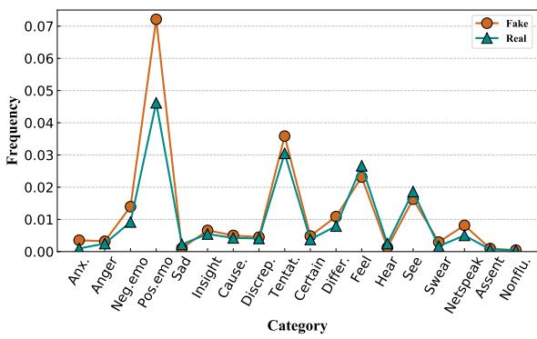
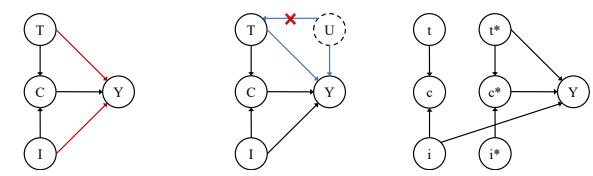
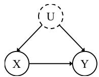
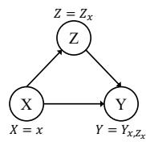
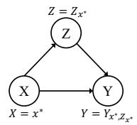
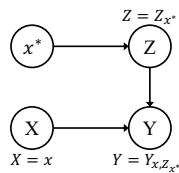
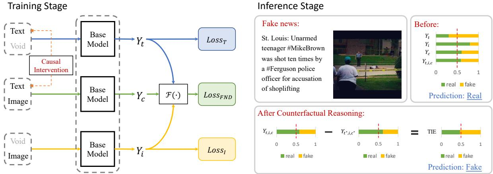
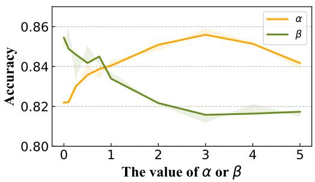
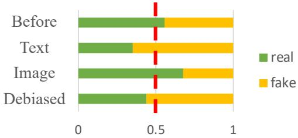
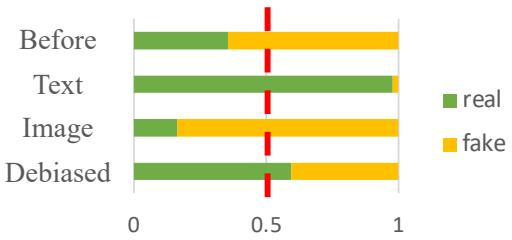

# Causal Intervention and Counterfactual Reasoning for Multi-modal Fake News Detection

Ziwei Chen1 Linmei Hu2∗ Weixin Li3 Yingxia Shao1 Liqiang Nie4

1Beijing University of Posts and Telecommunications

2 Beijing Institute of Technology 3Beihang University

{chen\_zw,shaoyx}@bupt.edu.cn hulinmei@bit.edu.cn weixinli@buaa.edu.cn nieliqiang@gmail.com

## Abstract

Due to the rapid upgrade of social platforms, most of today’s fake news is published and spread in a multi-modal form. Most existing multi-modal fake news detection methods neglect the fact that some label-specific features learned from the training set cannot generalize well to the testing set, thus inevitably suffering from the harm caused by the latent data bias. In this paper, we analyze and identify the psycholinguistic bias in the text and the bias of inferring news label based on only image features. We mitigate these biases from a causality perspective and propose a Causal intervention and Counterfactual reasoning based Debiasing framework (CCD) for multi-modal fake news detection. To achieve our goal, we first utilize causal intervention to remove the psycholinguistic bias which introduces the spurious correlations between text features and news label. And then, we apply counterfactual reasoning by imagining a counterfactual world where each news has only image features for estimating the direct effect of the image. Therefore we can eliminate the image-only bias by deducting the direct effect of the image from the total effect on labels. Extensive experiments on two real-world benchmark datasets demonstrate the effectiveness of our framework for improving multi-modal fake news detection.

## 1 Introduction

Fake news quietly sneaks into people’s daily life, mixed with massive information, causing serious impact and harm to society. Fake news often utilizes multimedia information such as text and images to mislead readers, spreading and expanding its influence. Thus, it is crucial and urgent to find a way to discern multi-modal fake news.

Today, most existing methods train on known fake news instances expecting to capture the labelspecific features for judging the authenticity of unseen news (Singhal et al., 2020; Wu et al., 2021;

  
Figure 1: The word frequency distributions of psychological categories on different labels (Twitter dataset).

Qian et al., 2021b; Qi et al., 2021). However, such label-specific features may expose the models to hidden data bias when confronted with unseen fake news samples (Wang et al., 2018; Cheng et al., 2021; Zhu et al., 2022). To address the problem, we investigate the biases underlying the multi-modal fake news detection data and identify the psycholinguistic bias in the text and the bias of inferring news label based on image features only (i.e. image-only bias). These biases could lead to spurious correlations between the news and labels, thus impairing the model performance on testing data.

To explicitly explain the biases, we first formulate the process of fake news detection as a causal graph as shown in Figure 2(a). In addition to the impact of fused features C on news label Y that most multi-modal fake news detection methods focus on, other two edges are pointing to Y , starting from text features T, and image features I, respectively. Generally speaking, the publishers of fake news would try their best to fabricate confusing text or use certain techniques to forge fake images. This makes the text and image can individually affect the news label.

For the T Y branch, we observe that the linguistic characteristics of the text have obvious emotional preferences, such as the usage of psycholinguistic words "crazy" and "amazing", which play a critical role in fake news detection. To deeply analyze the linguistic characteristics of the text, we present a mathematical analysis of the psycholinguistic word distribution of real news and fake news based on the LIWC 2015 dictionary (Pennebaker et al., 2015). Take the Twitter dataset as an example, as shown in Figure 1, we can observe that the word frequency distribution of fake news is quite different from that of real news, especially for words expressing anxiety, negative emotions, positive emotions, tentative, and netspeak. It seems that we can draw a conclusion that fake news prefers to use loaded language to stir up the reader’s emotions and attract more attention. Consequently, the model could be prone to relying on such psycholinguistic features as a shortcut to judge news authenticity. However, we analyze the training set and testing set, and find that there exist significant differences in the frequency of these psycholinguistic words. The manifest differences between the training set and testing set have proven that this shortcut appears to be unreliable evidence. As shown in Figure 2(b) where U denotes the confounder (i.e. the psycholinguistic features in the text), there exist a backdoor path $T \left. U \right. Y$ which will introduce spurious correlations among the text features and news label. In order to remove the psycholinguistic bias, we apply causal intervention by adopting the backdoor adjustment (Glymour et al., 2016) with do-calculus $P ( Y | d o ( T ) )$ to calculate the causal effect in the training stage, which is fundamentally different from the conventional likelihood P(Y T).

  
(a) The proposed causal graph (Factual world).  
(b) Causal graph with confounder.  
(c) Counterfactual world.  
Figure 2: The causal graphs for fake news detection. T: text features, I: image features, C: multi-modal features (i.e., the fused features of image and text), Y: news label, U: confounder. \*denotes the reference values.

For the I Y branch, we observe from the datasets that two different news pieces sharing the same image could have contrary labels. This shows that sometimes even if the image is real, the text could be fabricated, and the news could thus be fake. We can take advantage of images as an additional modality to provide more detection evidence, but it is unreliable to infer the authenticity of the news based on the image features alone. In this case, we argue that the image-only bias (i.e., the direct causal effect from image features alone to news label) should be eliminated. Towards this end, we use counterfactual reasoning by imagining a counterfactual world (Figure 2(c)) where both text features T and fused features C are not given (represented by reference values $t ^ { * }$ and $c ^ { * } )$ , except for image features I. In this way, the bias can be estimated by computing the direct causal effect of I on Y and we can conduct the debiasing by subtracting it from the total effect on Y.

We instantiate our proposed debiasing framework on three strong baseline models that can handle both text and image features as inputs. Extensive experiments on two widely used real-world benchmark datasets show the effectiveness of our framework. Overall, our contributions can be summarized as follows:

• We analyze each modality of fake news detection data and identify the underlying psycholinguistic bias in the text and the image-only bias. And we propose a novel Causal intervention and Counterfactual reasoning based Debiasing framework (CCD) for multi-modal fake news detection.

• In our debiasing framework CCD, we conduct causal interventions via backdoor adjustment to remove spurious correlations introduced by the psycholinguistic confounder. For addressing the image-only bias, we apply counterfactual reasoning to pursue the indirect causal effect as the inference prediction.

• Our causal framework CCD can be applied to any fake news detection model with image and text features as inputs. We implement the proposed framework on three strong baseline models, and conduct extensive experiments on two widely used benchmark datasets, validating the effectiveness of CCD.

## 2 Preliminaries

## 2.1 Causal Graph

The causal graph (Glymour et al., 2016) is a probabilistic graphical model used to describe how variables interact with each other, expressed by a directed acyclic graph $\mathcal { G } = \{ \mathcal { N } , \mathcal { E } \}$ consisting of the sets of variables and the causal correlations between two nodes. As shown in Figure 3, $X  Y$ denotes that X is the cause of the effect Y. U is the confounder.

  
Figure 3: An example of causal graph.

## 2.2 Causal Intervention

Causal intervention is used to seek the real causal effect of one variable on another when there exist confounders. In a causal graph, the intervening operation on a variable removes all edges pointing to it, such that its parent nodes no longer cause it. The backdoor adjustment (Glymour et al., 2016) with do-calculus offers a tool for calculating the intervened distribution under the condition of no extra confounders. For the example in Figure 3, the adjustment formula can be derived according to Bayes’ theorem as follows, where u denotes the value of confounder U:

$$
\begin{array} { r } { P ( Y | d o ( X ) ) = \sum _ { u } P ( Y | X , u ) P ( u ) . } \end{array}\tag{1}
$$

## 2.3 Counterfactual Reasoning and Causal Effect

Counterfactual reasoning (Pearl, 2009) is a statistical inference method used to infer outcomes under hypothetical conditions that are different from the factual world. By conducting counterfactual reasoning, we can estimate the causal effect (Pearl, 2022) of a treatment variable on a response variable. For instance, Figure 4 shows an abstract setting for estimating and removing the direct influence of X on Y. Figure 4(a) is the factual world where the calculation of Y is denoted as $Y _ { x , Z _ { x } } = Y ( X = x , Z = Z ( X = x ) )$ .

  
(a)

  
(b)

  
(c)  
Figure 4: Example of causal graph where X, Y, and Z denote cause, effect and mediator variable, respectively. \*denotes the reference values.

Based on Figure 4(a) and 4(b), we define the total effect (TE) of $X = x$ on $Y$ as:

$$
\mathrm { T E } = Y _ { x , Z _ { x } } - Y _ { x ^ { * } , Z _ { x ^ { * } } } ,\tag{2}
$$

which can be seen as the comparisons between two potential outcomes of X given two different treatments, i.e., $X = x$ and $X = x ^ { * }$ . The total effect (TE) can be decomposed into the sum of the natural direct effect (NDE) and the total indirect effect (TIE), namely, TE = NDE + TIE. NDE represents the natural direct effect of X on Y when the mediator variable Z is blocked (Figure 4(c)):

$$
\mathrm { N D E } = Y _ { x , Z _ { x ^ { * } } } - Y _ { x ^ { * } , Z _ { x ^ { * } } } .\tag{3}
$$

$Y _ { x , Z _ { x ^ { * } } }$ is calculated under the counterfactual world where X can be simultaneously set to different values x and $x ^ { * }$ (Figure 4(c)). Thus, TIE (the total indirect effect of X on Y) can be obtained:

$$
\mathrm { T I E } = \mathrm { T E } - \mathrm { N D E } = Y _ { x , Z _ { x } } - Y _ { x , Z _ { x ^ { * } } } .\tag{4}
$$

We use TIE as the debiased result for inference.

## 3 Method

In this section, we first formulate the fake news detection task as a causal graph to clearly depict the causal effect between factors. And then we present our CCD framework that removes the psycholinguistic bias by means of causal intervention, as well as deducts the direct causal effect of image features (i.e. the image-only bias) via counterfactual reasoning.

## 3.1 Causal Graph of Fake News Detection

As aforementioned, Figure 2(a) depicts the causal graph of the fake news detection process. Nodes T, I, and C represent the text features, image features, and fused multi-modal features, respectively. According to the proposed causal graph, the final prediction Y takes inputs from the three branches: the direct effect of the input T and I on Y via $T  Y$ and $I \to Y$ , as well as the indirect effect of the input T and I on Y via the fused features C, i.e. $T ( I ) \to C \to Y$ . Each branch of Figure 2(a) can be implemented via a base fake news detection model (Figure 5). Formally, the abstract format of the model should be:

$$
Y _ { t , i , c } = Y ( T = t , I = i , C = c ) ,\tag{5}
$$

where $c = f ( T = t , I = i ) , f ( \cdot )$ is the feature aggregation function in baseline fake news detection

models. Then the total effect (TE) of the input on label $y$ can be written as:

$$
\mathrm { T E } = Y _ { t , i , c } - Y _ { t ^ { * } , i ^ { * } , c ^ { * } } ,\tag{6}
$$

where $t ^ { * }$ and $i ^ { * }$ are respectively the reference values of $T$ and I, and $c ^ { * } = f ( T = t ^ { * } , I = i ^ { * } )$ . As introduced in Section 2.3, the reference status is defined as the status of blocking the signal from text and image, i.e., t and i are not given (void values). For implementation, we use tensors filled with the scalar value 0 to represent the reference values $t ^ { * }$ and $i ^ { * }$ . In this way, the inputs do not contain any semantic information.

Following previous studies (Niu et al., 2021; Wang et al., 2021; Tian et al., 2022), we calculate the prediction $Y _ { t , i , c }$ through a model ensemble with a fusion function.

$$
\begin{array} { r l } & { Y _ { t , i , c } = Y ( T = t , I = i , C = c ) } \\ & { ~ = \mathcal { F } ( Y _ { t } , Y _ { i } , Y _ { c } ) } \\ & { ~ = Y _ { c } + t a n h ( Y _ { t } ) + t a n h ( Y _ { i } ) , } \end{array}\tag{7}
$$

where $Y _ { t }$ is the output of the text-only branch (i.e. $T \to Y ) , Y _ { i }$ is the output of the image-only branch $( \mathrm { i . e . } \ I \to Y )$ , and $Y _ { c } = Y _ { t , i }$ is the output of fused features branch $( \mathrm { i . e . } \ C \to Y )$ as shown in Figure $5 . ~ { \mathcal { F } } ( \cdot )$ is the fusion function to obtain the final prediction. We adopt a non-linear fusion strategy for its better representation capacity (Wang et al., 2021). Any differentiable arithmetic binary operations can be employed as the fusion function $\mathcal F ( \cdot )$ and we examine several fusion alternatives in Table 4.

## 3.2 Deconfounded Training with Causal Intervention

As Figure 2(b) shows, there exist an unobserved confounder U (i.e., the psycholinguistic of the text) in the $T  Y$ branch, which causes spurious correlations between the text features and news label by learning the likelihood $P ( \boldsymbol { Y } | \boldsymbol { T } )$ . In order to explicitly illustrate the impact of the confounder, we use Bayes’ theorem:

$$
\begin{array} { r } { P ( Y | T ) = \sum _ { u } P ( Y | T , u ) P ( u | T ) \phantom { x x x x x x x x x x x x x x x x x x x x x x x x x x x x x x x x x x x x x x x x } } \\ { \propto \sum _ { u } P ( Y | T , u ) P ( T | u ) P ( u ) . } \end{array}\tag{8}
$$

Next, we conduct deconfounded training in $T $ Y branch which exploits the backdoor adjustments (Glymour et al., 2016) with do-calculus on $T$ to calculate the corresponding intervention distribution. Since the edge $U  T$ has been cut off, we

can have:

$$
\begin{array} { r l } & { Y _ { t } = P ( Y | d o ( T ) ) } \\ & { \quad = \sum _ { u } P ( Y | T , u ) P ( u ) . } \end{array}\tag{9}
$$

To estimate $Y _ { t } ,$ given the text features $T ' \mathbf { s }$ representations t and the confounder $U ^ { \star } { } _ { \mathbf { s } }$ representations u, Equation (9) is implemented as $\begin{array} { r } { \sum _ { \mathbf { u } } P ( y | \mathbf { t } , \mathbf { u } ) P ( \mathbf { u } ) } \end{array}$ , where $P ( \boldsymbol { y } | \mathbf { t } , \mathbf { u } )$ is the prediction upon a news feature learning model $g ( \cdot )$ :

$$
P ( y | \mathbf { t } , \mathbf { u } ) = \sigma ( g ( \mathbf { t } , \mathbf { u } ) ) ,\tag{10}
$$

where $\sigma ( \cdot )$ is the sigmoid function that forms the output of $g ( \cdot )$ into $( 0 , 1 )$ . In summary, the implementation of Equation (9) is formally defined as:

$$
\begin{array} { r } { P ( Y | d o ( T ) ) = \mathbb { E } _ { u } [ P ( Y | T , u ) ] } \\ { = \mathbb { E } _ { u } [ \sigma ( g ( \mathbf { t } , \mathbf { u } ) ) ] . } \end{array}\tag{11}
$$

Note that $\mathbb { E } _ { u }$ requires expensive sampling. Following recent works (Wang et al., 2020; Yang et al., 2021), we can apply Normalized Weighted Geometric Mean (NWGM) (Xu et al., 2015) to approximate the above expectation by moving the outer expectation into the sigmoid function as:

$$
P ( Y | d o ( T ) ) \overset { \mathrm { N W G M } } { \approx } \sigma ( \mathbb { E } _ { u } [ g ( \mathbf { t } , \mathbf { u } ) ] ) .\tag{12}
$$

We apply a linear model to approximate the conditional probability, i.e. the probability of Y under the conditions T and U. Inspired by previous works (Chen et al., 2022a; Tian et al., 2022), we model $g ( \mathbf { t } , \mathbf { u } ) = \mathbf { W } _ { t } \mathbf { t } + \mathbf { W } _ { u } \cdot h ( \mathbf { u } )$ , where $h ( \mathbf { u } )$ is the feature transformation of $\mathbf { u } , \mathbf { W } _ { t }$ and $\mathbf { W } _ { u }$ are learnable weight parameters. In this case, $\mathbb { E } _ { u } [ g ( \mathbf { t } , \mathbf { u } ) ] =$ $\mathbf { W } _ { t } \mathbf { t } + \mathbf { W } _ { u } \cdot \mathbb { E } _ { u } [ h ( \mathbf { u } ) ]$

To compute $\mathbb { E } _ { u } [ h ( { \mathbf u } ) ]$ , we implement $h ( \mathbf { u } )$ as the scaled Dot-Product attention (Vaswani et al., 2017). We resort to LIWC 2015 dictionary (Pennebaker et al., 2015) to approximate U as a fixed confounder dictionary $\mathbf { D } _ { u } \ = \ [ \mathbf { u } _ { 1 } , \mathbf { u } _ { 2 } , . . . , \mathbf { u } _ { N } ] \ \in$ $\mathbb { R } ^ { N \times d _ { u } }$ , where N is the number of word categories and $d _ { u }$ is the hidden feature dimension. Then we have:

$$
\begin{array} { r } { \mathbb { E } _ { u } [ h ( \mathbf { u } ) ] = \sum _ { u } [ s o f t m a x ( \frac { \mathbf { Q } ^ { T } \mathbf { K } } { \sqrt { d _ { m } } } ) \odot \mathbf { D } _ { u } ] P ( \mathbf { u } ) , } \end{array}\tag{13}
$$

where $\mathbf { Q } = \mathbf { W } _ { q } \mathbf { t } , \mathbf { K } = \mathbf { W } _ { k } \mathbf { D } _ { u } \mathbf { \Gamma } ( \mathbf { W } _ { q }$ and $\mathbf { W } _ { k }$ are learnable weight parameters), $d _ { m }$ denotes the scaling factor. $P ( { \mathbf u } )$ denotes the prior statistic probability and is the element-wise product.

  
Figure 5: Illustration of the training and inference of our proposed CCD framework.

## 3.3 Mitigating the Image-only Bias with Counterfactual Reasoning

So far, the psycholinguistic bias has been successfully removed in the $T  Y$ branch, but the fake news detection model based on the causal graph in Figure 2(a) still suffers from the image-only bias. This is because the prediction, i.e., $Y _ { t , i , c } ,$ is still affected by the direct effect of the image. Consequently, fake news with more convincing image features still achieves a high probability of being judged as real news. To mitigate the image-only bias, we propose counterfactual reasoning to estimate the direct causal effect of I on Y by blocking the impact of $T$ and $C .$ . Figure 2(c) shows the causal graph of the counterfactual world for fake news detection which describes the scenario when I is set to different values i and $i ^ { * }$ . We also set $T$ to its reference value $t ^ { * }$ , therefore C would attain the value $c ^ { * }$ when $T = t ^ { * }$ and $I = i ^ { * }$ . In this way, the inputs of $T$ and C are blocked, and the model can only rely on the given image i for detection. We can thus obtain the natural direct effect (NDE) of I on $Y .$ , namely the image-only bias:

$$
\mathrm { N D E } = Y _ { t ^ { * } , i , c ^ { * } } - Y _ { t ^ { * } , i ^ { * } , c ^ { * } } .\tag{14}
$$

Furthermore, the removal of the bias can be realized by subtracting NDE from the total effect TE:

$$
\mathrm { T I E } = \mathrm { T E } - \mathrm { N D E } = Y _ { t , i , c } - Y _ { t ^ { * } , i , c ^ { * } } .\tag{15}
$$

TIE is the debiased result we used for inference.

## 3.4 Training and Inference

We illustrate the training and inference of our proposed CCD framework in Figure 5. Following Wang et al. (2021); Niu et al. (2021); Tian et al. (2022), for the training stage, we compute the loss for each branch, including the base multi-modal fake news detection branch $( L o s s _ { F N D } )$ , the textonly detection branch $( L o s s _ { T } )$ , and the image-only detection branch $( L o s s _ { I } )$ . As such, we minimize a multi-task training objective to learn the model parameters, which is formulated as:

$$
\begin{array} { r } { L o s s = L o s s _ { F N D } + \alpha L o s s _ { T } + \beta L o s s _ { I } , } \end{array}\tag{16}
$$

where the loss $\_ L o s s _ { F N D }$ refers to the cross-entropy loss associated with the predictions of $\mathcal { F } ( Y _ { t } , Y _ { i } , Y _ { c } )$ from Equation $( 7 )$ . The text-only and image-only loss $L o s s _ { T }$ and $L o s s _ { I }$ are cross-entropy losses associated with the predictions of $Y _ { t }$ and $Y _ { i } .$ . α and $\beta$ are the trade-off hyperparameters.

In the inference stage, we use the de-biased effect for inference, which is implemented as:

$$
\begin{array} { r l } & { \mathrm { T I E } = Y _ { t , i , c } - Y _ { t ^ { * } , i , c ^ { * } } } \\ & { \qquad = \mathcal { F } ( Y _ { t } , Y _ { i } , Y _ { c } ) - \mathcal { F } ( Y _ { t ^ { * } } , Y _ { i } , Y _ { c ^ { * } } ) . } \end{array}\tag{17}
$$

(18)

## 4 Experiments

In this section, we apply our CCD framework on three strong baseline multi-modal fake news detection models on two real-world datasets to evaluate the effectiveness of our proposed CCD framework.

## 4.1 Experimental Settings

## 4.1.1 Datasets

We conducted experiments on two datasets:

Twitter: This dataset was released for Verifying Multimedia Use task at MediaEval1. It consists of tweets with textual, visual, and social context information. Since our framework belongs to contentbased methods, we only leverage textual and visual information.

<table><tr><td rowspan=1 colspan=1>News</td><td rowspan=1 colspan=1>Twitter</td><td rowspan=1 colspan=1>Pheme</td></tr><tr><td rowspan=1 colspan=1># of Real News</td><td rowspan=1 colspan=1>7898</td><td rowspan=1 colspan=1>1972</td></tr><tr><td rowspan=1 colspan=1># of Fake News</td><td rowspan=1 colspan=1>6026</td><td rowspan=1 colspan=1>3830</td></tr><tr><td rowspan=1 colspan=1># of Images</td><td rowspan=1 colspan=1>514</td><td rowspan=1 colspan=1>3670</td></tr></table>

Table 1: The statistics of two real-world datasets.

Pheme: This dataset was generated as part of the Pheme project, which attempts to detect and verify rumors spread via social media. It is based on five breaking news stories, each of which comprises a series of statements categorized as rumor or nonrumor. We classified rumors as fake news and nonrumors as real news in our framework.

Our data preprocessing and division of the training set and testing set for both datasets are the same as previous work (Qian et al., 2021b). Table 1 shows the statistics of the two datasets.

## 4.1.2 Base Models

The CCD framework can be applied to any multimodal fake news detection method with text and image as input. Here, we apply our framework to the following strong baselines: 1) SpotFake+ (Singhal et al., 2020): SpotFake+ concatenates the features extracted from different modalities and performs multiple feature transformations to facilitate multi-modal fusion. 2) MCAN (Wu et al., 2021): MCAN stacks multiple co-attention layers to learn dependencies across the modalities. They repeatedly fuse the two modalities to simulate people’s reading process. 3) HMCAN (Qian et al., 2021b): HMCAN uses a hierarchical multi-modal contextual attention model that considers both the text’s hierarchical semantics and multi-modal contextual data.

## 4.1.3 Evaluation Metrics

We use the Accuracy as the evaluation metric for binary classification tasks such as fake news detection. In consideration of the imbalance label distributions, in addition to the accuracy metric, we add Precision, Recall, and F1-score as complementary evaluation metrics following previous works (Wu et al., 2021; Qian et al., 2021b).

## 4.1.4 Implementation Details

All of the methods are trained for 200 epochs and the initial learning rate for the Adam optimizer is tuned in [1e-5, 1e-3]. For the confounder dictionary $\mathbf { D } _ { u } \in \mathbb { R } ^ { N \times d _ { u } }$ , N is 18 (Anger, Anxiety, Assent, Causation, Certainty, Differentiation, Discrepancy, Feel, Hear, Insight, Negative emotion, Netspeak, Nonfluencies, Positive emotion, Sadness, See, Swear words, Tentative), and $d _ { u }$ is set to 4. For the scaled Dot-Product attention, the scaling factor $d _ { m }$ is set to 256. As for other necessary hyperparameters in the baseline methods, our settings are consistent with them.

## 4.2 Experimental Results

Table 2 displays the experimental results of our proposed framework CCD applied to the baseline methods on two benchmark datasets. The results of the baselines are the results of our reproductions on our data settings based on their public code2. From Table 2, we can obtain the following observations:

Compared with each base fake news detection model (i.e. SpotFake+, MCAN, HMCAN), the accuracy of the models that apply the proposed CCD framework (i.e., w/ CCD) has been significantly improved by around 7.7%, 3.3%, and 5.2% on the Twitter dataset, and improved by around 1.0%, 0.6%, and 1.3% on the Pheme dataset. With the help of the proposed framework, all of the base models show significant improvements on most metrics, which demonstrates the effectiveness of the proposed framework. We believe that CCD benefits from the removal of psycholinguistic bias with causal intervention as well as the mitigation of the image-only bias via counterfactual reasoning.

The performance improvements on the Twitter dataset are larger than that on the Pheme dataset. We attribute such a difference between the two datasets to the following two reasons: 1) The proportion of psycholinguistic vocabulary in the Twitter dataset (19.87%) is higher than that in the Pheme dataset (16.19%), so the Twitter dataset could be more susceptible to psycholinguistic bias. 2) According to Table 1, the number of unique images in the Twitter dataset is far less than the number of news texts, which means that there’s a serious problem of different texts sharing the same image. So the influence of image-only bias in the Twitter dataset is more severe than that of the Pheme dataset.

## 4.3 Ablation Study of Causal Inference

We conduct experiments to study the de-biasing effect of each module in CCD using the strong baseline HMCAN on Twitter and Pheme testing set. As shown in Table 3, we test the performance of CCD removing the causal intervention part (w/o CI), and CCD removing the counterfactual reasoning part (w/o CR). The variant model (w/o CI) does not consider the psycholinguistic confounder and uses the original text features for detection. While the variant model (w/o CR) uses $Y _ { t , i , c }$ for inference without subtracting the direct effect of the image. We can observe that if we remove the causal intervention part, the performance respectively drops by around 3.7% and 0.8% on Twitter and Pheme, demonstrating the effectiveness of eliminating the psycholinguistic bias in the text. And removing the counterfactual reasoning part will make the performance respectively decreases by around 2.2% and 1.0% on Twitter and Pheme, proving that CCD can effectively mitigate the image-only bias in the inference stage.

<table><tr><td rowspan="2">Dataset</td><td rowspan="2">Methods</td><td rowspan="2">Accuracy</td><td colspan="3">Fake news</td><td colspan="3">Real news</td></tr><tr><td>Precision</td><td>Recall</td><td>F1</td><td>Precision</td><td>Recall</td><td>F1</td></tr><tr><td rowspan="6">Twitter</td><td>SpotFake+</td><td>0.795</td><td>0.622</td><td>0.607</td><td>0.614</td><td>0.856</td><td>0.864</td><td>0.860</td></tr><tr><td>w/ CCD</td><td>0.856*</td><td>0.750</td><td>0.849</td><td>0.797*</td><td>0.920</td><td>0.860</td><td>0.889*</td></tr><tr><td>MCAN</td><td>0.799</td><td>0.980</td><td>0.401</td><td>0.569</td><td>0.770</td><td>0.996</td><td>0.869</td></tr><tr><td>w/ CCD</td><td>0.825*</td><td>0.829</td><td>0.595</td><td>0.692*</td><td>0.824</td><td>0.939</td><td>0.878*</td></tr><tr><td>HMCAN</td><td>0.831</td><td>0.955</td><td>0.514</td><td>0.668</td><td>0.804</td><td>0.988</td><td>0.887</td></tr><tr><td>w/ CCD</td><td>0.874*</td><td>0.820</td><td>0.792</td><td>0.806*</td><td>0.899</td><td>0.914</td><td>0.906*</td></tr><tr><td rowspan="6">Pheme</td><td>SpotFake+</td><td>0.815</td><td>0.711</td><td>0.525</td><td>0.604</td><td>0.840</td><td>0.921</td><td>0.879</td></tr><tr><td>w/ CCD</td><td>0.823*</td><td>0.714</td><td>0.574</td><td>0.636*</td><td>0.854</td><td>0.915</td><td>0.883*</td></tr><tr><td>MCAN</td><td>0.834</td><td>0.716</td><td>0.639</td><td>0.675</td><td>0.872</td><td>0.906</td><td>0.889</td></tr><tr><td>w/ CCD</td><td>0.839*</td><td>0.693</td><td>0.721</td><td>0.707*</td><td>0.896</td><td>0.882</td><td>0.889</td></tr><tr><td>HMCAN</td><td>0.848</td><td>0.762</td><td>0.705</td><td>0.732</td><td>0.881</td><td>0.908</td><td>0.894</td></tr><tr><td>w/CCD</td><td>0.859*</td><td>0.764</td><td>0.689</td><td>0.724</td><td>0.889</td><td>0.921</td><td>0.905*</td></tr></table>

Table 2: Results of comparison among different models on Twitter and Pheme datasets. The best results are in bold. The marker \* indicates that the improvement is statistically significant compared with the baseline (t-test with p-value < 0.05).

<table><tr><td>Dataset</td><td>Method</td><td>Accuracy</td></tr><tr><td rowspan="2">Twitter</td><td>HMCAN w/CCD</td><td>0.874</td></tr><tr><td>w/o CI w/o CR</td><td>0.842 0.855</td></tr><tr><td rowspan="2">Pheme</td><td>HMCAN w/ CCD</td><td>0.859</td></tr><tr><td>w/o CI w/o CR</td><td>0.852</td></tr></table>

Table 3: Impact of Causal Inference

## 4.4 Impact of Different Fusion Strategies

Following prior studies (Wang et al., 2021), we devise several differentiable arithmetic binary op-

<table><tr><td rowspan=1 colspan=1>Strategy</td><td rowspan=1 colspan=1>Accuracy</td><td rowspan=1 colspan=1> $\mathrm { F } 1 _ { F a k e }$ </td><td rowspan=1 colspan=1> $\mathrm { F } 1 _ { R e a l }$ </td></tr><tr><td rowspan=3 colspan=1>MUL-sigmoidMUL-tanhSUM-sigmoid</td><td rowspan=1 colspan=1>0.695</td><td rowspan=1 colspan=1>0.569</td><td rowspan=1 colspan=1>0.765</td></tr><tr><td rowspan=1 colspan=1>0.733</td><td rowspan=1 colspan=1>0.472</td><td rowspan=1 colspan=1>0.821</td></tr><tr><td rowspan=1 colspan=1>0.806</td><td rowspan=1 colspan=1>0.600</td><td rowspan=1 colspan=1>0.872</td></tr><tr><td rowspan=1 colspan=1>SUM-tanh</td><td rowspan=1 colspan=1>0.859</td><td rowspan=1 colspan=1>0.724</td><td rowspan=1 colspan=1>0.905</td></tr></table>

Table 4: Impact of Different Fusion Strategies.

erations for the fusion strategy in Equation (7):

$$
\left\{ \begin{array} { l l } { \mathrm { M U L - s i g m o i d : } Y _ { t , i , c } = Y _ { c } \ast \sigma ( Y _ { t } ) \ast \sigma ( Y _ { i } ) , } \\ { \mathrm { M U L - t a n h : } Y _ { t , i , c } = Y _ { c } \ast t a n h ( Y _ { t } ) \ast t a n h ( Y _ { i } ) , } \\ { \mathrm { S U M - s i g m o i d : } Y _ { t , i , c } = Y _ { c } + \sigma ( Y _ { t } ) + \sigma ( Y _ { i } ) , } \\ { \mathrm { S U M - t a n h : } Y _ { t , i , c } = Y _ { c } + t a n h ( Y _ { t } ) + t a n h ( Y _ { i } ) . } \end{array} \right.\tag{19}
$$

The performance of different fusion strategies are reported in Table 4. From the table, we can find that SUM-tanh achieves the best performance over the other fusion strategies. This shows that a fusion function with the proper boundary is suitable for CCD. Multiple fusion strategies are worth studying when CCD is applied to other scenarios in the future.

## 4.5 Impact of the Value of α and β

We tune the trade-off hyperparameters α and β in the training objective by grid search in $\{ 0 , 0 . 1 , 0 . 2 5 , 0 . 5 , 0 . 7 5 , 1 , 2 , 3 , 4 , 5 \}$ . And we find out that when α = 3 and $\beta = 0 . 1$ , we can obtain satisfactory results in terms of accuracy on both datasets. To evaluate the impact of each parameter on the detection performance, we further study the accuracy under different values of α and $\beta$ individually by fixing the other hyperparameter on the Pheme dataset. As shown in Figure 6, when $\beta { = } 0 . 1$ and α grows from 0 to 3, the accuracy keeps raising, indicating the importance of leveraging the text features that have removed psycholinguistic bias. When $\alpha { = } 3$ and $\beta$ grow from 0 to 0.1, the accuracy increases, indicating the importance of capturing image-only bias. However, when $\alpha { > } 3$ or $\beta { > } 0 . 1$ , the performance decreases. It is because the training loss of the detection model using multimodal features will be less important, which brings worse results.

  
Figure 6: Impact of the Value of α and $\beta$

## 4.6 Case Study

We provide a qualitative analysis of the proposed CCD framework by examining the fake and real news samples that are successfully detected by HM-CAN w/ CCD on Pheme datasets in Figure 7. The psycholinguistic words are highlighted in red and the prediction results before (Before) and after (Debiased) counterfactual reasoning are shown in the charts. As we can see, the texts of both fake and real news contain words expressing anger and negative emotions (i.e., "killed", "assault", "murdered" and "attack"), but CCD can make correct predictions based on the text features (Text) after causal intervention. In addition, after conducting counterfactual reasoning by subtracting the direct causal effect of the image (Image), the CCD is able to make correct predictions based on the debiased results. The two cases show the effectiveness of our CCD framework, which makes debiased predictions by removing the psycholinguistic bias in the text and image-only bias.

## 5 Related Work

In this section, we review the related work including fake news detection and causal inference.

#CharlieHebdo suspects killed, hostage freed and safe after police assault. Photo Joel Saget #AFP

  
(a) Fake news.  
#JesuisAhmed commemorates Muslim police officer Ahmed Merabet murdered in Charlie Hebdo attack.

  
(b) Real news.  
Figure 7: Two news cases from the Pheme dataset.

## 5.1 Multi-modal Fake News Detection

Existing fake news detection work generally falls into two categories: content-based methods and propagation-based methods. The multi-modal approaches fall into the former category.

Most works on multi-modal fake news detection exert efforts to fully incorporate cross-modal features. For instance, Jin et al. (2017) proposed a recurrent neural network with an attention mechanism to fuse the text, social context, and image features. Singhal et al. (2020) utilized pre-trained encoders and applied multiple-layer feature transformation to achieve deep fusion. Chen et al. (2022b) calculated the ambiguity score of different modalities to control the contribution of mono-modal features and inter-modal correlations to the final prediction. To capture fine-grained cross-modal correlations, Wu et al. (2021) employed multiple rounds of co-attention mechanism to model the cross-modal interactions. Qian et al. (2021b) leveraged a contextual attention network to model both the intra- and inter-modality information, and captured the hierarchical semantic information of the text. There are also methods leveraging external knowledge to provide powerful evidence or enrich features’ representations (Hu et al., 2021; Qi et al., 2021). For example, Hu et al. (2021) compared each news with the external knowledge base through entities to utilize consistencies for detection.

In this work, we improve fake news detection from the perspective of causality and propose a novel framework that eliminates the hidden biases in each modality.

## 5.2 Causal Inference

Causal inference (Glymour et al., 2016) including causal intervention and counterfactual reasoning has been widely used in various fields such as recommendation (Zhang et al., 2021b; Wang et al., 2021), natural language inference (Tian et al., 2022), text classification (Qian et al., 2021a), named entity recognition (Zhang et al., 2021a), pretrained language models (Li et al., 2022), etc. It provides a powerful tool that can scientifically identify the causal correlations between variables and remove the hidden bias in the data. As for fake news detection, Zhu et al. (2022) eliminated the entity bias (the distribution of entities in the text) by counterfactual reasoning.

In this work, we discover the psycholinguistic bias and image-only bias in fake news detection, and propose a novel debiasing framework that eliminates these biases using causal intervention and counterfactual reasoning to enhance detection performance.

## 6 Conclusion

In this work, we propose a novel causal intervention and counterfactual reasoning based debiasing framework CCD that eliminates the hidden biases in multi-modal fake news detection. We analyze and identify the psycholinguistic bias in the text as well as the image-only bias. Then, we formulate the process of fake news detection as a causal graph, addressing the biases from the causality perspective. Specifically, we address the psycholinguistic bias by causal intervention with backdoor adjustment, and mitigate the image-only bias using counterfactual reasoning that subtracts the direct image-only causal effect from the total causal effect. Experiments on two real-world benchmark datasets verify that CCD can effectively eliminate biases and improve multi-modal fake news detection.

## Limitations

When applying causal intervention to remove psycholinguistic bias, we utilize the LIWC dictionary to construct the confounder dictionary $\mathbf { D } _ { u } .$ . We argue that the debiasing performance could be affected by the quality of the constructed confounder dictionary. In the future, we could try to improve the confounder dictionary with external knowledge.

## Acknowledgements

This work was supported by the National Science Foundation of China (NSFC No. U21B2009, No. 62276029), Beijing Academy of Artificial Intelligence (BAAI) and CCF-Zhipu.AI Large Model Fund (No. 202217).

## References

Yingjie Chen, Diqi Chen, Tao Wang, Yizhou Wang, and Yun Liang. 2022a. Causal intervention for subjectdeconfounded facial action unit recognition. In Proceedings of the 36th AAAI Conference on Artificial Intelligence, pages 374–382.

Yixuan Chen, Dongsheng Li, Peng Zhang, Jie Sui, Qin Lv, Lu Tun, and Li Shang. 2022b. Cross-modal ambiguity learning for multimodal fake news detection. In Proceedings of the ACM Web Conference, pages 2897–2905.

Lu Cheng, Ruocheng Guo, Kai Shu, and Huan Liu. 2021. Causal understanding of fake news dissemination on social media. In Proceedings of the 27th ACM SIGKDD Conference on Knowledge Discovery and Data Mining, pages 148–157.

Madelyn Glymour, Judea Pearl, and Nicholas P Jewell. 2016. Causal inference in statistics: A primer. John Wiley & Sons.

Linmei Hu, Tianchi Yang, Luhao Zhang, Wanjun Zhong, Duyu Tang, Chuan Shi, Nan Duan, and Ming Zhou. 2021. Compare to the knowledge: Graph neural fake news detection with external knowledge. In Proceedings of the 59th Annual Meeting of the Association for Computational Linguistics and the 11th International Joint Conference on Natural Language Processing, pages 754–763.

Zhiwei Jin, Juan Cao, Han Guo, Yongdong Zhang, and Jiebo Luo. 2017. Multimodal fusion with recurrent neural networks for rumor detection on microblogs. In Proceedings ofthe 25th ACM International Conference on Multimedia, pages 795–816.

Shaobo Li, Xiaoguang Li, Lifeng Shang, Zhenhua Dong, Cheng-Jie Sun, Bingquan Liu, Zhenzhou Ji, Xin Jiang, and Qun Liu. 2022. How pre-trained language models capture factual knowledge? a causal-inspired analysis. In Findings of the Association for Computational Linguistics, pages 1720–1732.

Yulei Niu, Kaihua Tang, Hanwang Zhang, Zhiwu Lu, Xian-Sheng Hua, and Ji-Rong Wen. 2021. Counterfactual vqa: A cause-effect look at language bias. In Proceedings of the IEEE/CVF Conference on Computer Vision and Pattern Recognition, pages 12700– 12710.

Judea Pearl. 2009. Causal inference in statistics: An overview. Statistics surveys, 3:96–146.

Judea Pearl. 2022. Direct and indirect effects. In Probabilistic and Causal Inference: The Works ofJudea Pearl, pages 373–392.

James W Pennebaker, Ryan L Boyd, Kayla Jordan, and Kate Blackburn. 2015. The development and psychometric properties ofLIWC2015. University of Texas at Austin.

Peng Qi, Juan Cao, Xirong Li, Huan Liu, Qiang Sheng, Xiaoyue Mi, Qin He, Yongbiao Lv, Chenyang Guo, and Yingchao Yu. 2021. Improving fake news detection by using an entity-enhanced framework to fuse diverse multimodal clues. In Proceedings ofthe 29th ACM International Conference on Multimedia, pages 1212–1220.

Chen Qian, Fuli Feng, Lijie Wen, Chunping Ma, and Pengjun Xie. 2021a. Counterfactual inference for text classification debiasing. In Proceedings of the 59th Annual Meeting of the Association for Computational Linguistics and the 11th International Joint Conference on Natural Language Processing, pages 5434–5445.

Shengsheng Qian, Jinguang Wang, Jun Hu, Quan Fang, and Changsheng Xu. 2021b. Hierarchical multimodal contextual attention network for fake news detection. In Proceedings of the 44th International ACM SIGIR Conference on Research and Development in Information Retrieval, pages 153–162.

Shivangi Singhal, Anubha Kabra, Mohit Sharma, Rajiv Ratn Shah, Tanmoy Chakraborty, and Ponnurangam Kumaraguru. 2020. Spotfake+: A multimodal framework for fake news detection via transfer learning. In Proceedings of the 34th AAAI Conference on Artificial Intelligence, pages 13915–13916.

Bing Tian, Yixin Cao, Yong Zhang, and Chunxiao Xing. 2022. Debiasing nlu models via causal intervention and counterfactual reasoning. In Proceedings of the 36th AAAI Conference on Artificial Intelligence, pages 11376–11384.

Ashish Vaswani, Noam Shazeer, Niki Parmar, Jakob Uszkoreit, Llion Jones, Aidan N Gomez, Ł ukasz Kaiser, and Illia Polosukhin. 2017. Attention is all you need. In Advances in Neural Information Processing Systems, pages 5998–6008.

Tan Wang, Jianqiang Huang, Hanwang Zhang, and Qianru Sun. 2020. Visual commonsense r-cnn. In Proceedings ofthe IEEE/CVF Conference on Computer Vision and Pattern Recognition, pages 10757– 10767.

Wenjie Wang, Fuli Feng, Xiangnan He, Hanwang Zhang, and Tat-Seng Chua. 2021. Clicks can be cheating: Counterfactual recommendation for mitigating clickbait issue. In Proceedings of the 44th International ACM SIGIR Conference on Research and Development in Information Retrieval, pages 1288–1297.

Yaqing Wang, Fenglong Ma, Zhiwei Jin, Ye Yuan, Guangxu Xun, Kishlay Jha, Lu Su, and Jing Gao. 2018. EANN: event adversarial neural networks for multi-modal fake news detection. In Proceedings of the 24th ACM SIGKDD International Conference on Knowledge Discovery and Data Mining, pages 849–857.

Yang Wu, Pengwei Zhan, Yunjian Zhang, Liming Wang, and Zhen Xu. 2021. Multimodal fusion with coattention networks for fake news detection. In Findings of the Association for Computational Linguistics, pages 2560–2569.

Kelvin Xu, Jimmy Ba, Ryan Kiros, Kyunghyun Cho, Aaron Courville, Ruslan Salakhudinov, Rich Zemel, and Yoshua Bengio. 2015. Show, attend and tell: Neural image caption generation with visual attention. In Proceedings ofthe 32nd International Conference on Machine Learning, pages 2048–2057.

Xun Yang, Fuli Feng, Wei Ji, Meng Wang, and Tat-Seng Chua. 2021. Deconfounded video moment retrieval with causal intervention. In Proceedings ofthe 44th International ACM SIGIR Conference on Research and Development in Information Retrieval, pages 1–10.

Wenkai Zhang, Hongyu Lin, Xianpei Han, and Le Sun. 2021a. De-biasing distantly supervised named entity recognition via causal intervention. In Proceedings of the 59th Annual Meeting of the Association for Computational Linguistics and the 11th International Joint Conference on Natural Language Processing, pages 4803–4813.

Yang Zhang, Fuli Feng, Xiangnan He, Tianxin Wei, Chonggang Song, Guohui Ling, and Yongdong Zhang. 2021b. Causal intervention for leveraging popularity bias in recommendation. In Proceedings ofthe 44th International ACM SIGIR Conference on Research and Development in Information Retrieval, pages 11–20.

Yongchun Zhu, Qiang Sheng, Juan Cao, Shuokai Li, Danding Wang, and Fuzhen Zhuang. 2022. Generalizing to the future: Mitigating entity bias in fake news detection. In Proceedings ofthe 45th International ACM SIGIR Conference on Research and Development in Information Retrieval, pages 2120–2125.

## ACL 2023 Responsible NLP Checklist

A For every submission: ✓ A1. Did you describe the limitations of your work? Section Limitation

✓ A2. Did you discuss any potential risks of your work? Section Limitation

✓ A3. Do the abstract and introduction summarize the paper’s main claims? Abstract and Introduction

✗ A4. Have you used AI writing assistants when working on this paper? Left blank.

## B ✓ Did you use or create scientific artifacts?

Section 3.2; Section 4.1

✓ B1. Did you cite the creators of artifacts you used? Section 3.2; Section 4.1

✓ B2. Did you discuss the license or terms for use and / or distribution of any artifacts? Section 3.2; Section 4.1

✓ B3. Did you discuss if your use of existing artifact(s) was consistent with their intended use, provided that it was specified? For the artifacts you create, do you specify intended use and whether that is compatible with the original access conditions (in particular, derivatives of data accessed for research purposes should not be used outside of research contexts)? Section1; Section 3.2; Section 4.1

✗ B4. Did you discuss the steps taken to check whether the data that was collected / used contains any information that names or uniquely identifies individual people or offensive content, and the steps taken to protect / anonymize it? The scientific articles used are provided with relevant documentation discussing this part.

✓ B5. Did you provide documentation of the artifacts, e.g., coverage of domains, languages, and linguistic phenomena, demographic groups represented, etc.? Section1; Section 3.2; Section 4.1

✓ B6. Did you report relevant statistics like the number of examples, details of train / test / dev splits, etc. for the data that you used / created? Even for commonly-used benchmark datasets, include the number of examples in train / validation / test splits, as these provide necessary context for a reader to understand experimental results. For example, small differences in accuracy on large test sets may be significant, while on small test sets they may not be. Section 4.1

## C ✓ Did you run computational experiments?

Section 4

 C1. Did you report the number of parameters in the models used, the total computational budget (e.g., GPU hours), and computing infrastructure used? Not applicable. Left blank.

✓ C2. Did you discuss the experimental setup, including hyperparameter search and best-found hyperparameter values? Section 4.1.4

✓ C3. Did you report descriptive statistics about your results (e.g., error bars around results, summary statistics from sets of experiments), and is it transparent whether you are reporting the max, mean, etc. or just a single run? Section 4

✓ C4. If you used existing packages (e.g., for preprocessing, for normalization, or for evaluation), did you report the implementation, model, and parameter settings used (e.g., NLTK, Spacy, ROUGE, etc.)? Section 4.1

D ✗ Did you use human annotators (e.g., crowdworkers) or research with human participants? Left blank.

 D1. Did you report the full text of instructions given to participants, including e.g., screenshots, disclaimers of any risks to participants or annotators, etc.? No response.

 D2. Did you report information about how you recruited (e.g., crowdsourcing platform, students) and paid participants, and discuss if such payment is adequate given the participants’ demographic (e.g., country of residence)? No response.

 D3. Did you discuss whether and how consent was obtained from people whose data you’re using/curating? For example, if you collected data via crowdsourcing, did your instructions to crowdworkers explain how the data would be used? No response.

 D4. Was the data collection protocol approved (or determined exempt) by an ethics review board? No response.

 D5. Did you report the basic demographic and geographic characteristics of the annotator population that is the source of the data? No response.