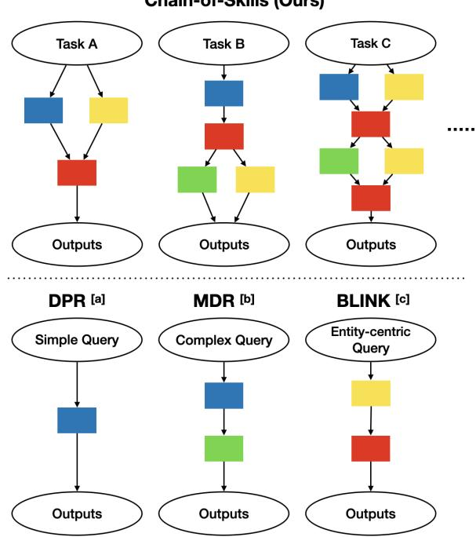
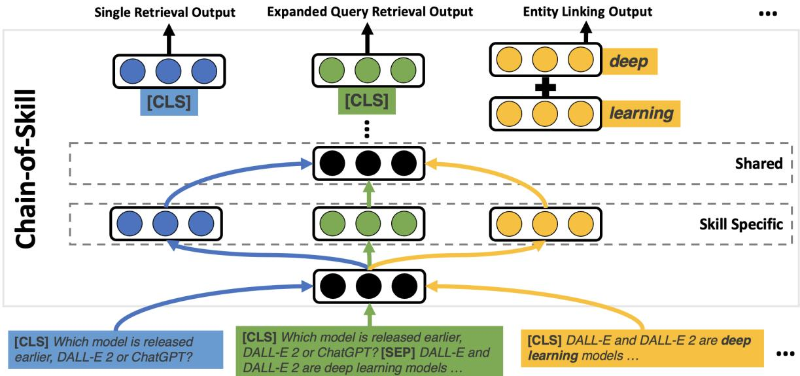
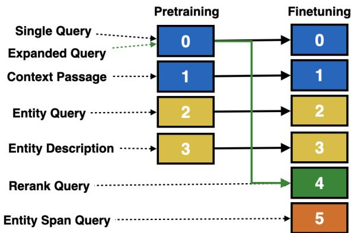
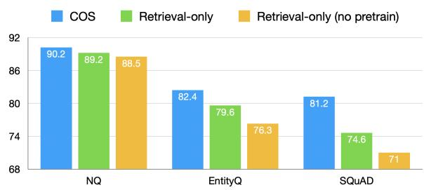
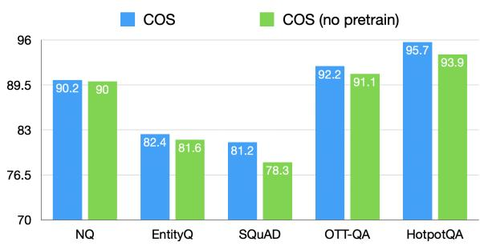
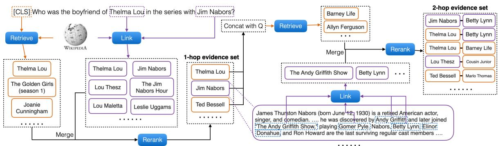

Chain-of-Skills (Ours)

# Chain-of-Skills: A Configurable Model for Open-Domain Question Answering

Kaixin Ma♣ ∗, Hao Cheng♠∗, Yu Zhang♡ , Xiaodong Liu♠, Eric Nyberg♣, Jianfeng Gao♠ ♣ Carnegie Mellon University ♠ Microsoft Research

♡ University of Illinois at Urbana-Champaign

{kaixinm,ehn}@cs.cmu.edu {chehao,xiaodl,jfgao}@microsoft.com yuz9@illinois.edu

## Abstract

The retrieval model is an indispensable component for real-world knowledge-intensive tasks, e.g., open-domain question answering (ODQA). As separate retrieval skills are annotated for different datasets, recent work focuses on customized methods, limiting the model transferability and scalability. In this work, we propose a modular retriever where individual modules correspond to key skills that can be reused across datasets. Our approach supports flexible skill configurations based on the target domain to boost performance. To mitigate task interference, we design a novel modularization parameterization inspired by sparse Transformer. We demonstrate that our model can benefit from self-supervised pretraining on Wikipedia and fine-tuning using multiple ODQA datasets, both in a multi-task fashion. Our approach outperforms recent self-supervised retrievers in zero-shot evaluations and achieves state-ofthe-art fine-tuned retrieval performance on NQ, HotpotQA and OTT-QA.

## 1 Introduction

Gathering supportive evidence from external knowledge sources is critical for knowledgeintensive tasks, such as open-domain question answering (ODQA; Lee et al., 2019) and fact verification (Thorne et al., 2018). Since different ODQA datasets focus on different informationseeking goals, this task typically is handled by customized retrieval models (Karpukhin et al., 2020; Yang et al., 2018; Wu et al., 2020; Ma et al., 2022a). However, this dataset-specific paradigm has limited model scalability and transferability. For example, augmented training with single-hop data hurts multi-hop retrieval (Xiong et al., 2021b). Further, as new information needs constantly emerge, dataset-specific models are hard to reuse.

  
Figure 1: Comparison of dense retrievers in terms of considered query type and supported skill configuration [a](Karpukhin et al., 2020) [b](Xiong et al., 2021b) [c](Wu et al., 2020). Each box represents a skill ( a =single retrieval, a =expanded retrieval, a =linking, a =reranking, ) and the arrows represent the order of execution. In our case, we can flexibly combine and chain the skills at inference time for different tasks to achieve optimal performance.

In this work, we propose Chain-of-Skills (COS), a modular retriever based on Transformer (Vaswani et al., 2017), where each module implements a reusable skill that can be used for different ODQA datasets. Here, we identify a set of such retrieval reasoning skills: single retrieval, expanded query retrieval, entity span proposal, entity linking and reranking (§2). As shown in Figure 1, recent work has only explored certain skill configurations. We instead consider jointly learning all skills in a multi-task contrastive learning fashion. Besides the benefit of solving multiple ODQA datasets, our multi-skill formulation provides unexplored ways to chain skills for individual use cases. In other words, it allows flexible configuration search according to the target domain, which can potentially lead to better retrieval performance (§4).

For multi-task learning, one popular approach is to use a shared text encoder (Liu et al., 2019a), i.e., sharing representations from Transformer and only learning extra task-specific headers atop. However, this method suffers from undesirable task interference, i.e., negative transfer among retrieval skills. To address this, we propose a new modularization parameterization inspired by the recent mixture-ofexpert in sparse Transformer (Fedus et al., 2021a), i.e., mixing specialized and shared representations. Based on recent analyses on Transformer (Meng et al., 2022), we design an attention-based alternative that is more effective in mitigating task interference (§5). Further, we develop a multi-task pretraining using self-supervision on Wikipedia so that the pretrained COS can be directly used for retrieval without dataset-specific supervision.

To validate the effectiveness of COS, we consider zero-shot and fine-tuning evaluations with regard to the model in-domain and cross-dataset generalization. Six representative ODQA datasets are used: Natural Questions (NQ; Kwiatkowski et al., 2019), WebQuestions (WebQ; Berant et al., 2013), SQuAD (Rajpurkar et al., 2016), EntityQuestions (Sciavolino et al., 2021), HotpotQA (Yang et al., 2018) and OTT-QA (Chen et al., 2021a), where the last two are multi-hop datasets. Experiments show that our multi-task pretrained retriever achieves superior zero-shot performance compared to recent state-of-the-art (SOTA) self-supervised dense retrievers and BM25 (Robertson and Zaragoza, 2009). When fine-tuned using multiple datasets jointly, COS can further benefit from high-quality supervision effectively, leading to new SOTA retrieval results across the board. Further analyses show the benefits of our modularization parameterization for multi-task pretraining and finetuning, as well as flexible skill configuration via Chain-of-Skills inference.1

## 2 Background

We consider five retrieval reasoning skills: single retrieval, expanded query retrieval, entity linking, entity span proposal and reranking. Conventionally, each dataset provides annotations on a different combination of skills (see Table A1). Hence, we can potentially obtain training signals for individual skills from multiple datasets. Below we provide some background for these skills.

Single Retrieval Many ODQA datasets (e.g., NQ; Kwiatkowski et al., 2019) concern simple/singlehop queries. Using the original question as input (Figure 2 bottom-left), single-retrieval gathers isolated supportive passages/tables from target sources in one shot (Karpukhin et al., 2020).

Expanded Query Retrieval To answer complex multi-hop questions , it typically requires evidence chains of two or more separate passages (e.g., HotpotQA; Yang et al., 2018) or tables (e.g., OTT-QA; Chen et al., 2021a). Thus, follow-up rounds of retrieval are necessary after the initial single retrieval. The expanded query retrieval (Xiong et al., 2021b) takes an expanded query as input, where the question is expanded with the previous-hop evidence (Figure 2 bottom-center). The iterative retrieval process generally shares the same target source.

Entity Span Proposal Since many questions concern entities, detecting those salient spans in the question or retrieved evidence is useful. The task is related to named entity recognition (NER), except requiring only binary predictions, i.e., whether a span corresponds to an entity. It is a prerequisite for generating entity-centric queries (context with target entities highlighted; Figure 2 bottom-right) where targeted entity information can be gathered via downstream entity linking.

Entity Linking Mapping detected entities to the correct entries in a database is crucial for analyzing factoid questions. Following Wu et al. (2020), we consider an entity-retrieval approach, i.e., using the entity-centric query for retrieving its corresponding Wikipedia entity description.

Rereanking Previous work often uses a reranker to improve the evidence recall in the top-ranked candidates. Typically, the question with a complete evidence chain is used together for reranking.

## 3 Approach

In this work, we consider a holistic approach to gathering supportive evidence for ODQA, i.e., the evidence set contains both singular tables/passages (from single retrieval) and connected evidence chains (via expanded query retrieval/entity linking). As shown in Figure 2, COS supports flexible skill configurations, e.g., expanded query retriever and the entity linker can build upon the single-retrieval results. As all retrieval skill tasks are based on contrastive learning, we start with the basics for our multi-task formulation. We then introduce our modularization parameterization for reducing task interference. Lastly, we discuss ways to use selfsupervision for pretraining and inference strategies.

  
Figure 2: Chain-of-Skills (COS) model architecture with three different query types. The left blue box indicates the single retrieval query input. The middle green box is the expanded query retrieval input based on the single retrieval results. The right orange case is the entity-centric query with “deep learning” as the targeted entity.

## 3.1 Reasoning Skill Modules

All reasoning skills use text encoders based on Transformer (Vaswani et al., 2017). Particularly, only BERT-base (Devlin et al., 2019) is considered without further specification. Text inputs are prepended with a special token [CLS] and different segments are separated by the special token [SEP]. The bi-encoder architecture (Karpukhin et al., 2020) is used for single retrieval, expanded query retrieval, and entity linking. We use dot product for sim( , ).

Retrieval As single retrieval and expanded query retrieval only differ in their query inputs, these two skills are discussed together here. Specifically, both skills involve examples of a question Q, a positive document $P ^ { + }$ . Two text encoders are used, i.e., a query encoder for questions and a context passage encoder for documents. For the expanded query case (Figure 2 bottom-center), we concatenate Q with the previous-hop evidence as done in Xiong et al. (2021b), i.e., [CLS] Q [SEP] $P _ { 1 } ^ { + }$ [SEP]. Following the literature, [CLS] vectors from both encoders are used to represent the questions and documents respectively. The training objective is

$$
L _ { \mathrm { r e t } } = - \frac { \exp ( \sin ( \mathbf { q } , \mathbf { p } ^ { + } ) ) } { \sum _ { \mathbf { p ^ { \prime } } \in \mathcal { P } \cup \{ \mathbf { p ^ { + } } \} } \exp ( \sin ( \mathbf { q } , \mathbf { p ^ { \prime } } ) ) } ,\tag{1}
$$

where $\mathbf { q } , \mathbf { p }$ are the query and document vectors respectively and $\mathcal { P }$ is the set of negative documents. Entity Span Proposal To achieve a multi-task formulation, we model entity span proposal based on recent contrastive NER work (Zhang et al., 2022a). Specifically, for an input sequence with N tokens, $x _ { 1 } , \ldots , x _ { N }$ , we encode it with a text encoder to a sequence of vectors $ { \mathbf { h } } _ { 1 } ^ { m } , \ldots ,  { \mathbf { h } } _ { N } ^ { m } \in \mathbb { R } ^ { d }$ We then build the span representations using the span start and end token vectors, $\mathbf { m } _ { ( i , j ) } = \operatorname { t a n h } ( \mathbf { ( h _ { \widehat { i } } ^ { m } \oplus \ }$ $\mathbf { h } _ { j } ^ { m } ) W ^ { a } )$ , where i and j are the start and end positions respectively, denotes concatenation, tanh is the activation function, and $W ^ { a } \in \mathbb { R } ^ { 2 d \times d }$ are learnable weights. For negative instances, we randomly sample spans within the maximum length of 10 from the same input which do not correspond to any entity. Then we use a learned anchor vector $\mathbf { s } \in \mathbb { R } ^ { d }$ for contrastive learning, i.e., pushing it close to the entity spans and away from negative spans.

$$
L _ { \mathrm { p o s } } = - \frac { \exp ( \sin ( \mathbf { s } , \mathbf { m } ^ { + } ) ) } { \sum _ { \mathbf { m ^ { \prime } } \in \mathcal { M } \cup \{ \mathbf { m ^ { + } } \} } \exp ( \sin ( \mathbf { s } , \mathbf { m ^ { \prime } } ) ) } ,\tag{2}
$$

where  is the negative span set which always contains a special span corresponding to [CLS], $\mathbf { m } ^ { [ \mathrm { C L S } ] } \mathbf { \Sigma } = \mathbf { \bar { h } } _ { 0 } ^ { m }$ . However, the above objective alone is not able to determine the prediction of entity spans from null cases at test time. To address this, we further train the model with an extra objective to learn a dynamic threshold using m[CLS]

$$
L _ { \mathrm { c l s } } = - \frac { \exp ( \sin ( \mathbf { s } , \mathbf { m } ^ { \left[ \mathbb { C } \mathrm { L S } \right] } ) } { \sum _ { \mathbf { m } ^ { \prime } \in \mathcal { M } } \exp ( \sin ( \mathbf { s } , \mathbf { m } ^ { \prime } ) ) } .\tag{3}
$$

The overall entity span proposal loss is computed as $L _ { \mathrm { s p a n } } = ( L _ { \mathrm { p o s } } + L _ { \mathrm { c l s } } ) / 2$ . Thus, spans with scores higher than the threshold are predicted as positive. Entity Linking Unlike Wu et al. (2020) where entity markers are inserted to the entity mention context (the entity mention with surrounding context), we use the raw input sequence as in the entity span proposal task. For the entity mention context, we pass the input tokens $x _ { 1 } , \ldots , x _ { N }$ through the entity query encoder to get $\mathbf { h } _ { 1 } ^ { e } , \ldots , \mathbf { h } _ { N } ^ { e } \in \mathbb { R } ^ { d }$ . Then we compute the entity vector based on its start position i and end position $j .$ , i.e., $\mathbf { e } = ( \mathbf { h } _ { i } ^ { e } + \mathbf { h } _ { i } ^ { e } ) / 2$ . For entity descriptions, we encode them with the entity description encoder and use the [CLS] vector ${ \bf p } _ { e }$ as representations. The model is trained to match the entity vector with its entity description vector

$$
L _ { \mathrm { l i n k } } = - \frac { \exp ( \sin ( \mathbf { e } , \mathbf { p } _ { e } ^ { + } ) ) } { \sum _ { \mathbf { p } ^ { \prime } \in \mathcal { P } _ { e } \cup \{ \mathbf { p } _ { e } ^ { + } \} } \exp ( \sin ( \mathbf { e } , \mathbf { p } ^ { \prime } ) ) } ,\tag{4}
$$

where $\mathbf { p } _ { e } ^ { + }$ is the linked description vector and $\mathcal { P } _ { e }$ is the negative entity description set.

Reranking Given a question $Q$ and a passage $P ,$ we concatenate them as done in expanded query retrieval format [CLS] $Q$ [SEP] P [SEP], and encode it using another text encoder. We use the pair consisting of the [CLS] vector $ { \mathbf { h } } _ { [ \mathrm { C L S } ] } ^ { r }$ and the first [SEP] vector $\mathbf { h } _ { [ \mathrm { S E P } ] } ^ { r }$ from the output for reranking. The model is trained using the loss

$$
L _ { \mathrm { r a n k } } = - \frac { \exp ( \sin ( \mathbf { h } _ { [ \mathbb { C L S } ] } ^ { r + } , \mathbf { h } _ { [ \mathbb { S E P } ] } ^ { r + } ) ) } { \sum _ { \mathbf { p } ^ { r \prime } \in \mathcal { P } _ { r } \cup \{ \mathbf { p } ^ { r + } \} } \exp ( \sin ( \mathbf { h } _ { [ \mathbb { C L S } ] } ^ { r \prime } , \mathbf { h } _ { [ \mathbb { S E P } ] } ^ { r \prime } ) ) } ,\tag{5}
$$

where $\mathcal { P } _ { r }$ is the set of negative passages concatenated with the same question. Intuitively, our formulation encourages $ { \mathbf { h } } _ { [ \mathrm { C L S } ] } ^ { r }$ to capture more information about the question and $\mathbf { h } _ { [ \mathrm { S E P } ] } ^ { r }$ to focus more on the evidence. The positive pair where the evidence is supportive likely has higher similarity than the negative ones. Our formulation thus spares the need for an extra task-specific header. As the model only learns to rerank single passages, we compute the score for each passage separately for multi-hop cases.

## 3.2 Modular Skill Specialization

Implementing all aforementioned modules using separate models is apparently inefficient. As recent work finds that parameter sharing improves the biencoder retriever (Xiong et al., 2021b), we thus focus on a multi-task learning approach.

One popular choice is to share the text encoder’s parameter of all modules (Liu et al., 2019a). However, this approach suffers from task interference, resulting in degraded performance compared with the skill-specific model (§5.1). We attribute the cause to the competition for the model capacity, $i . e . ,$ , conflicting signals from different skills require attention to individual syntactic/semantic patterns. For example, the text encoder for entity-centric queries likely focuses on the local context around the entity while the expanded query one tends to represent the latent information based on the relation between the query and previous hop evidence.

Motivated by recent modular approaches for sparse Transformer LM (Fedus et al., 2021b), we propose to mitigate the task interference by mixing skill-specific Transformer blocks with shared ones. A typical Transformer encoder is built with a stack of regular Transformer blocks, each consisting of a multi-head self-attention (MHA) sub-layer and a feed-forward network (FFN) sub-layer, with residual connections (He et al., 2015) and layernormalization (Ba et al., 2016) applied to both sublayers. The shared Transformer block is identical to a regular Transformer block, i.e., all skill inputs are passed through the same MHA and FFN functions.

As shown in Figure 2, for skill-specific Transformer blocks, we select a specialized sub-layer from a pool of I parallel sub-layers based on the input, $i . e . _ { \cdot }$ , different skill inputs are processed independently. One option is to specialize the FFN expert sub-layer for individual skills, which is widely used by recent mixture-of-expert models (Fedus et al., 2021b; Cheng et al., 2022). As the FFN sub-layer is found to be important for factual associations (Meng et al., 2022), we hypothesize that using the popular FFN expert is sub-optimal. Since most reasoning skills require similar world knowledge, specializing FFN sub-layers likely hinders knowledge sharing. Instead, different skills typically require the model to attend to distinct input parts. Thus, we investigate a more parameterefficient alternative, i.e., MHA specialization. In our experiments, we find it to be more effective in reducing task interference (§5.1).

  
Figure 3: Expert configuration for COS at pretraining and fine-tuning. Each numbered box is a skill-specific expert. The lines denote input routing where solid ones also indicate weight initialization mappings. Green lines highlight the expanded query routing which is different for pretraining and fine-tuning.

Expert Configuration Regarding the modularization, a naive setup is to route various task inputs to their dedicated sub-layers (experts), i.e., two experts for each bi-encoder task (single retrieval, expanded query retrieval and entity linking) and one expert for each cross-encoder task (entity span proposal and reranking), leading to eight experts in total. To save computation, we make the following adjustments. Given that single and expanded query retrievers share the same set of target passages, we merge the context expert for both cases. Due to data sparsity, we find that routing the expanded queries and reranker inputs which are very similar to separate experts is problematic (§5.1). Thus, we merge the expert for expanded queries and reranker inputs. During self-supervised pretraining with three bi-encoder tasks, we further share the expert for single and expanded queries for efficiency. The overall expert configuration is shown in Figure 3.

Multi-task Self-supervision Inspired by the recent success of Izacard et al. (2021), we also use selfsupervision on Wikipedia for pretraining. Here, we only consider pretraining for bi-encoder skills (i.e., single retrieval, expanded query retrieval, and entity linking) where abundant self-supervision is available. Unlike prior work focusing only on single-type pretraining, we consider a multi-task setting using individual pages and the hyperlink relations among them. Specifically, we follow Izacard et al. (2021) and Wu et al. (2020) to construct examples for single retrieval and entity linking, respectively. For single retrieval, a pair of randomly cropped views of a passage is used as a positive example. For entity linking, a short text snippet with a hyperlinked entity (entity mention context) is used as the query, and the first paragraph of its linked Wikipedia page is treated as the target (entity description). For a given page, we construct an expanded query using a randomly-sampled short text snippet with its first paragraph, and use one first paragraph from linked pages as the target.

## 3.3 Inference

During inference, different skills can be flexibly combined to boost retrieval accuracy. Those studied configurations are illustrated in Figure 1. To consolidate the evidence set obtained by different skills, we first align the linking scores based on the same step retrieval scores (single or expanded query retrieval) for sorting. Documents returned by multiple skills are considered more relevant and thus promoted in ranking. More details with running examples are provided in Appendix A.

## 4 Experiments

## 4.1 Datasets

We consider six popular datasets for evaluation, all focused on Wikipedia, with four single-hop data, NQ (Kwiatkowski et al., 2019), WebQ (Berant et al., 2013), SQuAD (Rajpurkar et al., 2016) and EntityQuestions (Sciavolino et al., 2021); two multi-hop data, HotpotQA (Yang et al., 2018) and OTT-QA (Chen et al., 2021a). Dataset-specific corpora are used for multi-hop datasets, because HotpotQA requires retrieval hopping between text passages while table-passage hopping is demanded by OTT-QA. For single-hop data, we use the Wikipedia corpus from Karpukhin et al. (2020). More detailed (pretraining/fine-tuning) data statistics and experimental settings are in Appendix B.

## 4.2 Evaluation Settings

We evaluate our model in three scenarios.

Zero-shot Evaluation Similar to recent selfsupervised dense retrievers on Wikipedia, we conduct zero-shot evaluations using the retrieval skill from our pretrained model on NQ, WebQ, EntityQuestions and HotpotQA. To assess the model’s ability to handle expanded query retrieval, we design an oracle second-hop retrieval setting (gold first-hop evidence is used) based on HotpotQA. Following Izacard et al. (2021) and Ram et al. (2022), we report top-k retrieval accuracy (answer recall), i.e., the percentage of questions for which the answer string is found in the top-k passages.

<table><tr><td></td><td colspan="2">NQ</td><td colspan="2">WebQ</td><td colspan="2">EntityQuestions</td><td colspan="2">HotpotQA</td><td colspan="2">Avg</td></tr><tr><td></td><td>Top-20</td><td>Top-100</td><td>Top-20</td><td>Top-100</td><td>Top-20</td><td>Top-100</td><td>Top-20</td><td>Top-100</td><td>Top-20</td><td>Top-100</td></tr><tr><td>BM25</td><td>62.9</td><td>78.3</td><td>62.4</td><td>75.5</td><td>70.8</td><td>79.2</td><td>37.5</td><td>50.5</td><td>58.4</td><td>70.9</td></tr><tr><td>Contriever (Izacard et al., 2021)</td><td>67.8</td><td>82.1</td><td>65.4</td><td>79.8</td><td>61.8</td><td>74.2</td><td>48.7</td><td>64.5</td><td>60.9</td><td>75.2</td></tr><tr><td>Spider (Ram et al., 2022)</td><td>68.3</td><td>81.2</td><td>65.9</td><td>79.7</td><td>65.1</td><td>76.4</td><td>35.3</td><td>48.6</td><td>58.7</td><td>71.5</td></tr><tr><td>COS (pretrain-only)</td><td>68.0</td><td>81.8</td><td>66.7</td><td>80.3</td><td>70.7</td><td>79.1</td><td>77.9</td><td>87.9</td><td>70.8</td><td>82.3</td></tr></table>

Table 1: Zero-shot top-k accuracy on test sets for NQ, WebQ and EntityQuestions, and dev set for HotpotQA.

<table><tr><td></td><td>Top-20</td><td>Top-100</td></tr><tr><td>DPR-multi (Karpukhin et al., 2020)</td><td>79.5</td><td>86.1</td></tr><tr><td>ANCE-multi (Xiong et al., 2021a)</td><td>82.1</td><td>87.9</td></tr><tr><td>DPR-PAQ (Oguz et al., 2022)</td><td>84.7</td><td>89.2</td></tr><tr><td>co-Condenser (Gao and Callan, 2022)</td><td>84.3</td><td>89.0</td></tr><tr><td>SPAR-wiki (Chen et al., 2021b)</td><td>83.0</td><td>88.8</td></tr><tr><td>COS</td><td>85.6</td><td>90.2</td></tr></table>

Table 2: Supervised top-k accuracy on NQ test.

Supervised In-domain Evaluation We further fine-tune our pretrained model with two extra skills (entity span proposal and reranking) on NQ, HotpotQA and OTT-QA, again in a multi-task fashion. Unlike multi-hop data with supervision for all skills, only single retrieval and reranking data is available for NQ. During training, all datasets are treated equally without any loss balancing. Different from previous retrieval-only work, we explore Chain-of-Skills retrieval by using different skill configurations. Specifically, we use skill configuration for task A, B and C shown in Figure 1 for NQ, OTT-QA and HotpotQA, respectively. We again report top-k retrieval accuracy for NQ and OTT-QA following previous work. For HotpotQA, we follow the literature using the top-1 pair of evidence accuracy (passage EM).

Cross-data Evaluation To test the model robustness towards domain shift, we conduct cross-data evaluations on SQuAD and EntityQuestions. Although considerable success has been achieved for supervised dense retrievers using in-domain evaluations, those models have a hard time generalizing to query distribution shift (e.g., questions about rare entities; Sciavolino et al., 2021) compared with BM25. In particular, we are interested to see whether Chain-of-Skills retrieval is more robust. Again, top-k retrieval accuracy is used.

<table><tr><td></td><td>Top-20</td><td>Top-50</td><td>Top-100</td></tr><tr><td>CORE (Ma et al., 2022a)</td><td>74.5</td><td>82.9</td><td>87.1</td></tr><tr><td>COS</td><td>79.9</td><td>88.9</td><td>92.2</td></tr><tr><td>COS w/ CORE configuration</td><td>80.5</td><td>88.6</td><td>91.8</td></tr></table>

Table 3: Supervised top-k accuracy on OTT-QA dev.

<table><tr><td></td><td>Passage EM</td></tr><tr><td>MDR (Xiong et al., 2021b) Baleen (Khattab et al., 2021)</td><td>81.20 86.10</td></tr><tr><td>IRRR (Qi et al., 2021)</td><td>84.10</td></tr><tr><td>TPRR (Zhang et al., 2021a)</td><td>86.19</td></tr><tr><td>HopRetriever-plus (Li et al., 2021) AISO (Zhu et al., 2021)</td><td>86.94</td></tr><tr><td>COS</td><td>88.17 88.89</td></tr></table>

Table 4: Supervised passage EM on HotpotQA dev.

## 4.3 Results

Zero-shot Results For zero-shot evaluations, we use two recent self-supervised dense retrievers, Contriever (Izacard et al., 2021) and Spider (Ram et al., 2022), and BM25 as baselines. The results are presented in Table 1. As we can see, BM25 is a strong baseline matching the average retrieval performance of Spider and Contriever over considered datasets. COS achieves similar results on NQ and WebQ compared with self-supervised dense methods. On the other hand, we observe significant gains on HotpotQA and EntityQuestions, where both dense retrievers are lacking. In summary, our model shows superior zero-shot performance in terms of average answer recall across the board, surpassing BM25 with the largest gains, which indicates the benefit of our multi-task pretraining.

Supervised In-domain Results As various customized retrievers are developed for NQ, OTT-QA and HotpotQA, we compare COS with different dataset-specific baselines separately. For NQ, we report two types of baselines, 1) bi-encoders with multi-dataset training and 2) models with augmented pretraining. For the first type, we have

DPR-multi (Karpukhin et al., 2020) and ANCEmulti (Xiong et al., 2021a), where the DPR model is initialized from BERT-based and ANCE is initialized from DPR. For the second type, DPR-PAQ (Oguz et al., 2022) is initialized from the RoBERTalarge model (Liu et al., 2019b) with pretraining using synthetic queries (the PAQ corpus (Lewis et al., 2021)), co-Condenser (Gao and Callan, 2022) incorporated retrieval-oriented modeling during language model pretraining on Wikipedia; SPAR-wiki (Chen et al., 2021b) combine a pretrained lexical model on Wikipedia with a dataset-specific dense retriever. Both co-Condenser and SPAR-wiki are initialized from BERT-base. As shown by results for NQ (Table 2), COS outperforms all baselines with or without pretraining. It is particularly encouraging that despite being a smaller model, COS achieves superior performance than DPR-PAQ. The reasons are two-fold: Oguz et al. (2022) has shown that scaling up the retriever from base to large size only provides limited gains after pretraining. Moreover, DPR-PAQ only learns a single retrieval skill, whereas COS can combine multiple skills for inference. We defer the analysis of the advantage of chain-of-skills inference later (§5.2).

For OTT-QA, we only compare with the SOTA model CORE (Ma et al., 2022a), because other OTT-QA specific retrievers are not directly comparable where extra customized knowledge source is used. As CORE also uses multiple skills to find evidence chains, we include a baseline where the inference follows the CORE skill configuration but uses modules from COS. For HotpotQA, we compare against three types of baselines, dense retrievers focused on expanded query retrieval MDR (Xiong et al., 2021b) and Baleen (Khattab et al., 2021), sparse retrieval combined with query reformulation IRRR (Qi et al., 2021) and TPRR (Zhang et al., 2021a) and ensemble of dense, sparse and hyperlink retrieval HopRetriever (Li et al., 2021) and AISO (Zhu et al., 2021). The results on OTT-QA and HotpotQA are summarized in Table 3 and Table 4. It is easy to see that COS outperforms all the baselines here, again showing the advantage of our configurable multi-skill model over multiple types of ODQA tasks. Later, our analyses show that both Chain-of-Skills inference and pretraining contribute to the observed gains.

Cross-data Results Given that both EntityQuestions and SQuAD are single-hop, we use baselines on NQ with improved robustness for comparison.

<table><tr><td></td><td colspan="2">EntityQuestions</td><td colspan="2">SQuAD</td></tr><tr><td></td><td>Top-20</td><td>Top-100</td><td>Top-20</td><td>Top-100</td></tr><tr><td>BM25</td><td>70.8</td><td>79.2</td><td>71.1</td><td>81.8</td></tr><tr><td>DPR-multi (Karpukhin et al., 2020)</td><td>56.6</td><td>70.1</td><td>52.0</td><td>67.7</td></tr><tr><td>SPAR-wiki (Chen et al., 2021b)</td><td>73.6</td><td>81.5</td><td>73.0</td><td>83.6</td></tr><tr><td>COS</td><td>76.3</td><td>82.4</td><td>72.6</td><td>81.2</td></tr></table>

Table 5: Cross-dataset top-k accuracy on test sets.
<table><tr><td></td><td>#Params</td><td>Top-20</td><td>Top-100</td></tr><tr><td colspan="4">Chain-of-Skills inference</td></tr><tr><td>No Expert</td><td>111M</td><td>90.2</td><td>92.4</td></tr><tr><td>FFN Expert(naive)</td><td>252M</td><td>91.3</td><td>93.4</td></tr><tr><td>MHA Expert(naive)</td><td>182M</td><td>92.0</td><td>94.0</td></tr><tr><td>MHA Expert(COS)</td><td>182M</td><td>92.0</td><td>94.2</td></tr><tr><td colspan="4">Retrieval-only inference</td></tr><tr><td>Multi-hop Retriever</td><td>110M</td><td>85.1</td><td>88.9</td></tr><tr><td>MHA Expert(naive)</td><td>182M</td><td>82.8</td><td>87.0</td></tr><tr><td>MHA Expert(COS)</td><td>182M</td><td>85.9</td><td>89.6</td></tr></table>

Table 6: Ablation results on HotpotQA dev using topk retrieval accuracy. All models are initialized from BERT-base and trained on HotpotQA only.

Particularly, SPAR-wiki is an ensemble of two dense models with one pretrained using BM25 supervision on Wikipedia and the other fine-tuned on NQ. BM25 is included here, as it is found to achieve better performance than its dense counterpart on those two datasets. The evaluation results are shown in Table 5. Overall, our model achieves the largest gains over BM25 on both datasets, indicating that our multi-task fine-tuned model with Chain-of-Skills inference is more robust than previous retrieval-only approaches.

## 5 Analysis

## 5.1 Task Interference

We conduct ablation studies on HotpotQA to compare different ways of implementing skill-specific specialization (discussed in §3.2) and their effects on task interference. As MHA experts are used for our model, we consider two variants for comparison: 1) the no-expert model where all tasks share one encoder, and 2) the FFN expert model where specialized FFN sub-layers are used. Then we also compare the proposed expert configuration with a variant where the expanded query retrieval inputs share the same expert as single retrieval, denoted as the naive setting. The results are shown in the upper half of Table 6. Compared with the no-expert model, both FFN and MHA experts can effectively reduce task interference, wherein MHA expert is more effective overall. Our proposed expert config-

  
Figure 4: Top-100 retrieval accuracy on inference strategy: Chain-of-Skills vs retrieval-only.

  
Figure 5: Comparison on the effect of pretraining using top-100 retrieval accuracy with COS inference.

uration can further help.

## 5.2 Benefit of Chain-of-Skills Inference

Here we explore the benefits of the chained skill inference over the retrieval-only version. We additionally train a multi-hop retriever following Xiong et al. (2021b), and compare it with the two MHA expert models using the same two rounds of retrieval-only inference. The comparison is shown in the lower part of Table 6. As we can see, retrieval-only inference suffers large drops in performance. Although our proposed and naive MHA expert configurations have similar performance using Chain-of-Skills inference, the naive configuration model shows severe degradation caused by task interference compared with the multi-hop retriever, validating the effectiveness of our proposed model. We further compare our Chain-of-Skills inference with the retrieval-only inference on NQ, EntityQuestions and SQuAD in Figure 4. It is easy to see that our pretraining can benefit the retrieval-only version. However, using better skill configurations via Chain-of-Skills inference yields further improvements, particularly on those unseen datasets.

## 5.3 Effect of Pretraining

To further demonstrate the benefit of our proposed multi-task pretraining, we fine-tune another multitask model following the same training protocol as COS but BERT model weights are used for initialization. Both COS and the model without pretraining are then using the same skill configuration for inference. The results are illustrated in Figure 5. Similar to the retrieval-only version (Figure 4), we find that COS consistently outperforms the multi-task model without pretraining across all considered datasets using Chain-of-Skills inference. Again, the pretrained model is found to achieve improvements across the board, especially on out-of-domain datasets, which validates the benefits of our multi-task pretraining.

<table><tr><td></td><td>Query</td><td>Doc</td><td>Top-20</td><td>Top-100</td></tr><tr><td>Single query*</td><td>0</td><td>1</td><td>96.1</td><td>98.2</td></tr><tr><td>Single query</td><td>4</td><td>1</td><td>90.1</td><td>95.2</td></tr><tr><td>Single query</td><td>2</td><td>1</td><td>91.8</td><td>95.9</td></tr><tr><td>Single query</td><td>2</td><td>3</td><td>87.4</td><td>92.7</td></tr><tr><td>Expanded query</td><td>0</td><td>1</td><td>94.2</td><td>97.0</td></tr><tr><td>Expanded query*</td><td>4</td><td>1</td><td>95.3</td><td>97.4</td></tr><tr><td>Expanded query</td><td>2</td><td>1</td><td>74.5</td><td>85.8</td></tr><tr><td>Expanded query</td><td>2</td><td>3</td><td>67.3</td><td>79.6</td></tr></table>

Table 7: Results of feeding the inputs to different experts, where the first two columns represent the query expert id and document expert id. \* denotes the proposed setup

## 5.4 Swapping Experts

To understand if different experts in our model learned different specialized knowledge, we experiment with swapping experts for different inputs on HotpotQA. In particular, we feed the single query input and expanded query input to different query experts and then retrieve from either the context passage index or the entity description index. For single query input, we measure if the model can retrieve one of the positive passages. For expanded query input, we compute the recall for the other positive passage as done in (§4.3). The results are shown in Table 7. Although both the single query expert and the expanded query expert learn to retrieve evidence using the [CLS] token, swapping the expert for either of these input types leads to a significant decrease in performance. Also, switching to the entity query expert and retrieving from the entity description index results in a large drop for both types of inputs. This implies that each specialized expert acquires distinct knowledge and cannot be substituted for one another.

<table><tr><td rowspan="2"></td><td colspan="2">Dev</td><td colspan="2">Test</td></tr><tr><td>EM</td><td>F1</td><td>EM</td><td>F1</td></tr><tr><td>HYBRIDER (Chen et al., 2020)</td><td>10.3</td><td>13.0</td><td>9.7</td><td>12.8</td></tr><tr><td>FR+CBR(Chen et al., 2021a)</td><td>28.1</td><td>32.5</td><td>27.2</td><td>31.5</td></tr><tr><td>CARP (Zhong et al., 2022)</td><td>33.2</td><td>38.6</td><td>32.5</td><td>38.5</td></tr><tr><td>OTTer (Huang et al., 2022)</td><td>37.1</td><td>42.8</td><td>37.3</td><td>43.1</td></tr><tr><td>CORE (Ma et al., 2022a)</td><td>49.0</td><td>55.7</td><td>47.3</td><td>54.1</td></tr><tr><td>CORE + FiE</td><td>51.4</td><td>57.8</td><td>一</td><td>1</td></tr><tr><td>COS + FiE</td><td>56.9</td><td>63.2</td><td>54.9</td><td>61.5</td></tr></table>

Table 8: End-to-end QA results on OTT-QA.

## 6 Question Answering Experiments

Here, we conduct end-to-end question-answering experiments on NQ, OTT-QA and HotpotQA, using retrieval results from COS. Following the literature, we report exact match (EM) accuracy and F1 score.

For NQ and OTT-QA, we re-implement the Fusion-in-Encoder (FiE) model (Kedia et al., 2022) because of its superior performance on NQ. For NQ, the model reads top-100 passages returned by COS, and for OTT-QA, the model reads top-50 evidence chains, in order to be comparable with previous work. Here, separate models are trained for each dataset independently. Due to space constraints, we only present the results on OTT-QA and leave the NQ results to Table A2. The OTT-QA results are summarized in Table 8. Our model, when coupled with the FiE, is able to outperform the previous baselines by large margins on OTT-QA, and we can see that the superior performance of our model is mainly due to COS.

Finally, for HotpotQA, since the task requires the model to predict supporting sentences in addition to the answer span, we follow Zhu et al. (2021) to train a separate reader model to learn answer prediction and supporting sentence prediction jointly. Due to space constraints, we leave the full results to Table A3. Overall, our method achieves competitive QA performance against the previous SOTA with improved exact match accuracy.

## 7 Related Work

Dense retrievers are widely used in recent literature for ODQA (Lee et al., 2019; Karpukhin et al., 2020). While most previous work focuses on single retrieval (Xiong et al., 2021a; Qu et al., 2021), some efforts have also been made towards better handling of other query types. Xiong et al. (2021b) propose a joint model to handle both single retrieval and expanded query retrieval. Chen et al. (2021b) train a dense model to learn salient phrase retrieval.

Ma et al. (2022a) build an entity linker to handle multi-hop retrieval. Nevertheless, all those models are still customized for specific datasets, e.g., only a subset of query types are considered or separate models are used, making them un-reusable and computationally intensive. We address these problems by pinning down a set of functional skills that enable joint learning over multiple datasets.

Mixure-of-expert models have also become popular recently (Fedus et al., 2021b). Methods like gated routing (Lepikhin et al., 2020) or stochastic routing of experts (Zuo et al., 2021) do not differentiate the knowledge learned by different experts. Instead, our work builds expert modules that learn reusable skills which can be flexibly combined for different use cases.

Another line of work focus on unsupervised dense retrievers using self-supervised data constructed from the inverse-cloze-task (Lee et al., 2019), random croppings (Izacard et al., 2021), truncation of passages with the same span (Ram et al., 2022), hyperlink-induced passages (Zhou et al., 2022) or synthetic QA pairs (Oguz et al., 2022). Other model architecture adjustments on Transformer for retrieval are proposed (Gao and Callan, 2021, 2022). Our work can be viewed as a synergy of both. Our multi-task pretrained model can perform better zero-shot retrieval. Our modular retriever can be further fine-tuned in a multi-task fashion to achieve better performance.

## 8 Conclusions

In this work, we propose a modular model Chain-of-Skills (COS) that learns five reusable skills for ODQA via multi-task learning. To reduce task interference, we design a new parameterization for skill modules. We also show that skills learned by COS can be flexibly chained together to better fit the target task. COS can directly perform superior zero-shot retrieval using multitask self-supervision on Wikipedia. When finetuned on multiple datasets, COS achieves SOTA results across the board. For future work, we are interested in exploring scaling up our method and other scenarios, e.g., commonsense reasoning (Talmor et al., 2022) and biomedical retrieval (Nentidis et al., 2020; Zhang et al., 2022b).

## Acknowledgements

We would like to thank Aman Madaan, Sheng Zhang, and other members of the Deep Learning

group at Microsoft Research for their helpful discussions and anonymous reviewers for their valuable suggestions on this paper.

## Limitations

We identify the following limitations of our work.

Our current COS’s reranking expert only learns to rerank single-step results. Thus it can not model the interaction between documents in case of multipassage evidence chains, which might lead to suboptimal performance, e.g., when we need to rerank the full evidence path for HotpotQA. At the same time, we hypothesize that the capacity of the small model used in our experiments is insufficient for modeling evidence chain reranking. We leave the exploration of learning a full path reranker for future work.

Also, our current pretraining setup only includes the three bi-encoder tasks, and thus we can not use the pretrained model out-of-box to solve tasks like end-to-end entity linking. Consequently, the learned skills from self-supervision can not be chained together to perform configurable zero-shot retrieval. It would be interesting to also include the entity span proposal skill in the pretraining stage, which could unleash the full potential of the Chain-of-Skills inference for zero-shot scenarios.

## References

Akari Asai, Kazuma Hashimoto, Hannaneh Hajishirzi, Richard Socher, and Caiming Xiong. 2020. Learning to retrieve reasoning paths over wikipedia graph for question answering. In International Conference on Learning Representations.

Jimmy Lei Ba, Jamie Ryan Kiros, and Geoffrey E. Hinton. 2016. Layer normalization.

Jonathan Berant, Andrew Chou, Roy Frostig, and Percy Liang. 2013. Semantic parsing on Freebase from question-answer pairs. In Proceedings of the 2013 Conference on Empirical Methods in Natural Language Processing, pages 1533–1544, Seattle, Washington, USA. Association for Computational Linguistics.

Wenhu Chen, Ming wei Chang, Eva Schlinger, William Wang, and William Cohen. 2021a. Open question answering over tables and text. Proceedings of ICLR 2021.

Wenhu Chen, Hanwen Zha, Zhiyu Chen, Wenhan Xiong, Hong Wang, and William Yang Wang. 2020. HybridQA: A dataset of multi-hop question answering

over tabular and textual data. In Findings ofthe Association for Computational Linguistics: EMNLP 2020, pages 1026–1036, Online. Association for Computational Linguistics.

Xilun Chen, Kushal Lakhotia, Barlas Oguz, Anchit˘ Gupta, Patrick Lewis, Stan Peshterliev, Yashar Mehdad, Sonal Gupta, and Wen tau Yih. 2021b. Salient phrase aware dense retrieval: Can a dense retriever imitate a sparse one?

Hao Cheng, Hao Fang, Xiaodong Liu, and Jianfeng Gao. 2022. Task-aware specialization for efficient and robust dense retrieval for open-domain question answering.

Hao Cheng, Yelong Shen, Xiaodong Liu, Pengcheng He, Weizhu Chen, and Jianfeng Gao. 2021. UnitedQA: A hybrid approach for open domain question answering. In Proceedings ofthe 59th Annual Meeting ofthe Association for Computational Linguistics and the 11th International Joint Conference on Natural Language Processing (Volume 1: Long Papers), pages 3080–3090, Online. Association for Computational Linguistics.

Kevin Clark, Minh-Thang Luong, Quoc V. Le, and Christopher D. Manning. 2020. Electra: Pre-training text encoders as discriminators rather than generators.

Jacob Devlin, Ming-Wei Chang, Kenton Lee, and Kristina Toutanova. 2019. BERT: Pre-training of deep bidirectional transformers for language understanding. In Proceedings of the 2019 Conference of the North American Chapter ofthe Associationfor Computational Linguistics: Human Language Technologies, Volume 1 (Long and Short Papers), pages 4171–4186, Minneapolis, Minnesota. Association for Computational Linguistics.

Ming Ding, Chang Zhou, Qibin Chen, Hongxia Yang, and Jie Tang. 2019. Cognitive graph for multi-hop reading comprehension at scale. In Proceedings of the 57th Annual Meeting ofthe Associationfor Computational Linguistics, pages 2694–2703, Florence, Italy. Association for Computational Linguistics.

Martin Fajcik, Martin Docekal, Karel Ondrej, and Pavel Smrz. 2021. R2-D2: A modular baseline for opendomain question answering. In Findings of the Association for Computational Linguistics: EMNLP 2021, pages 854–870, Punta Cana, Dominican Republic. Association for Computational Linguistics.

Yuwei Fang, Siqi Sun, Zhe Gan, Rohit Pillai, Shuohang Wang, and Jingjing Liu. 2020. Hierarchical graph network for multi-hop question answering. In Proceedings of the 2020 Conference on Empirical Methods in Natural Language Processing (EMNLP), pages 8823–8838, Online. Association for Computational Linguistics.

William Fedus, Barret Zoph, and Noam Shazeer. 2021a. Switch transformers: Scaling to trillion parameter models with simple and efficient sparsity.

William Fedus, Barret Zoph, and Noam Shazeer. 2021b. Switch transformers: Scaling to trillion parameter models with simple and efficient sparsity. arXiv:2101.03961 [cs.LG].

Yair Feldman and Ran El-Yaniv. 2019. Multi-hop paragraph retrieval for open-domain question answering. In Proceedings ofthe 57th Annual Meeting ofthe Associationfor Computational Linguistics, pages 2296– 2309, Florence, Italy. Association for Computational Linguistics.

Luyu Gao and Jamie Callan. 2021. Condenser: a pretraining architecture for dense retrieval. In Proceedings of the 2021 Conference on Empirical Methods in Natural Language Processing, pages 981–993, Online and Punta Cana, Dominican Republic. Association for Computational Linguistics.

Luyu Gao and Jamie Callan. 2022. Unsupervised corpus aware language model pre-training for dense passage retrieval. In Proceedings of the 60th Annual Meeting of the Association for Computational Linguistics (Volume 1: Long Papers), pages 2843–2853, Dublin, Ireland. Association for Computational Linguistics.

Kaiming He, Xiangyu Zhang, Shaoqing Ren, and Jian Sun. 2015. Deep residual learning for image recognition.

Junjie Huang, Wanjun Zhong, Qian Liu, Ming Gong, Daxin Jiang, and Nan Duan. 2022. Mixed-modality representation learning and pre-training for joint table-and-text retrieval in openqa.

Gautier Izacard, Mathilde Caron, Lucas Hosseini, Sebastian Riedel, Piotr Bojanowski, Armand Joulin, and Edouard Grave. 2021. Unsupervised dense information retrieval with contrastive learning.

Gautier Izacard and Edouard Grave. 2020. Distilling knowledge from reader to retriever for question answering.

Gautier Izacard and Edouard Grave. 2021. Leveraging passage retrieval with generative models for open domain question answering. In Proceedings of the 16th Conference of the European Chapter of the Associationfor Computational Linguistics: Main Volume, pages 874–880, Online. Association for Computational Linguistics.

Vladimir Karpukhin, Barlas Oguz, Sewon Min, Patrick Lewis, Ledell Wu, Sergey Edunov, Danqi Chen, and Wen-tau Yih. 2020. Dense passage retrieval for opendomain question answering. In Proceedings of the 2020 Conference on Empirical Methods in Natural Language Processing (EMNLP), pages 6769–6781, Online. Association for Computational Linguistics.

Akhil Kedia, Mohd Abbas Zaidi, and Haejun Lee. 2022. Fie: Building a global probability space by leveraging early fusion in encoder for open-domain question answering.

Omar Khattab, Christopher Potts, and Matei Zaharia. 2021. Baleen: Robust multi-hop reasoning at scale via condensed retrieval.

Tom Kwiatkowski, Jennimaria Palomaki, Olivia Redfield, Michael Collins, Ankur Parikh, Chris Alberti, Danielle Epstein, Illia Polosukhin, Jacob Devlin, Kenton Lee, Kristina Toutanova, Llion Jones, Matthew Kelcey, Ming-Wei Chang, Andrew M. Dai, Jakob Uszkoreit, Quoc Le, and Slav Petrov. 2019. Natural questions: A benchmark for question answering research. Transactions ofthe Associationfor Computational Linguistics, 7:452–466.

Haejun Lee, Akhil Kedia, Jongwon Lee, Ashwin Paranjape, Christopher D. Manning, and Kyoung-Gu Woo. 2021. You only need one model for open-domain question answering.

Kenton Lee, Ming-Wei Chang, and Kristina Toutanova. 2019. Latent retrieval for weakly supervised open domain question answering. In Proceedings of the 57th Annual Meeting ofthe Associationfor Computational Linguistics, pages 6086–6096, Florence, Italy. Association for Computational Linguistics.

Dmitry Lepikhin, HyoukJoong Lee, Yuanzhong Xu, Dehao Chen, Orhan Firat, Yanping Huang, Maxim Krikun, Noam Shazeer, and Zhifeng Chen. 2020. Gshard: Scaling giant models with conditional computation and automatic sharding.

Patrick Lewis, Yuxiang Wu, Linqing Liu, Pasquale Minervini, Heinrich Küttler, Aleksandra Piktus, Pontus Stenetorp, and Sebastian Riedel. 2021. PAQ: 65 million probably-asked questions and what you can do with them. Transactions ofthe Associationfor Computational Linguistics, 9:1098–1115.

Shaobo Li, Xiaoguang Li, Lifeng Shang, Xin Jiang, Qun Liu, Chengjie Sun, Zhenzhou Ji, and Bingquan Liu. 2021. Hopretriever: Retrieve hops over wikipedia to answer complex questions. Proceedings of the AAAI Conference on Artificial Intelligence, 35(15):13279–13287.

Xiaodong Liu, Pengcheng He, Weizhu Chen, and Jianfeng Gao. 2019a. Multi-task deep neural networks for natural language understanding. In Proceedings of the 57th Annual Meeting of the Association for Computational Linguistics, pages 4487–4496, Florence, Italy. Association for Computational Linguistics.

Yinhan Liu, Myle Ott, Naman Goyal, Jingfei Du, Mandar Joshi, Danqi Chen, Omer Levy, Mike Lewis, Luke Zettlemoyer, and Veselin Stoyanov. 2019b. Roberta: A robustly optimized bert pretraining approach.

Kaixin Ma, Hao Cheng, Xiaodong Liu, Eric Nyberg, and Jianfeng Gao. 2022a. Open-domain question answering via chain of reasoning over heterogeneous knowledge. In Findings of the Association for Computational Linguistics: EMNLP 2022, pages 5360– 5374, Abu Dhabi, United Arab Emirates. Association for Computational Linguistics.

Kaixin Ma, Hao Cheng, Xiaodong Liu, Eric Nyberg, and Jianfeng Gao. 2022b. Open domain question answering with a unified knowledge interface. In Proceedings of the 60th Annual Meeting of the Associationfor Computational Linguistics (Volume 1: Long Papers), pages 1605–1620, Dublin, Ireland. Association for Computational Linguistics.

Kevin Meng, David Bau, Alex Andonian, and Yonatan Belinkov. 2022. Locating and editing factual associations in GPT. Advances in Neural Information Processing Systems, 35.

Anastasios Nentidis, Anastasia Krithara, Konstantinos Bougiatiotis, Martin Krallinger, Carlos Rodriguez-Penagos, Marta Villegas, and Georgios Paliouras. 2020. Overview of bioasq 2020: The eighth bioasq challenge on large-scale biomedical semantic indexing and question answering. Experimental IR Meets Multilinguality, Multimodality, and Interaction, page 194–214.

Yixin Nie, Songhe Wang, and Mohit Bansal. 2019. Revealing the importance of semantic retrieval for machine reading at scale. In Proceedings of the 2019 Conference on Empirical Methods in Natural Language Processing and the 9th International Joint Conference on Natural Language Processing (EMNLP-IJCNLP), pages 2553–2566, Hong Kong, China. Association for Computational Linguistics.

Barlas Oguz, Kushal Lakhotia, Anchit Gupta, Patrick Lewis, Vladimir Karpukhin, Aleksandra Piktus, Xilun Chen, Sebastian Riedel, Scott Yih, Sonal Gupta, and Yashar Mehdad. 2022. Domain-matched pre-training tasks for dense retrieval. In Findings of the Association for Computational Linguistics: NAACL 2022, pages 1524–1534, Seattle, United States. Association for Computational Linguistics.

Peng Qi, Haejun Lee, Tg Sido, and Christopher Manning. 2021. Answering open-domain questions of varying reasoning steps from text. In Proceedings of the 2021 Conference on Empirical Methods in Natural Language Processing, pages 3599–3614, Online and Punta Cana, Dominican Republic. Association for Computational Linguistics.

Peng Qi, Xiaowen Lin, Leo Mehr, Zijian Wang, and Christopher D. Manning. 2019. Answering complex open-domain questions through iterative query generation. In Proceedings ofthe 2019 Conference on Empirical Methods in Natural Language Processing and the 9th International Joint Conference on Natural Language Processing (EMNLP-IJCNLP), pages 2590–2602, Hong Kong, China. Association for Computational Linguistics.

Yingqi Qu, Yuchen Ding, Jing Liu, Kai Liu, Ruiyang Ren, Wayne Xin Zhao, Daxiang Dong, Hua Wu, and Haifeng Wang. 2021. RocketQA: An optimized training approach to dense passage retrieval for opendomain question answering. In Proceedings of the 2021 Conference ofthe North American Chapter of

the Association for Computational Linguistics: Human Language Technologies, pages 5835–5847, Online. Association for Computational Linguistics.

Pranav Rajpurkar, Jian Zhang, Konstantin Lopyrev, and Percy Liang. 2016. SQuAD: 100,000+ questions for machine comprehension of text. In Proceedings of the 2016 Conference on Empirical Methods in Natural Language Processing, pages 2383–2392, Austin, Texas. Association for Computational Linguistics.

Ori Ram, Gal Shachaf, Omer Levy, Jonathan Berant, and Amir Globerson. 2022. Learning to retrieve passages without supervision. In Proceedings of the 2022 Conference of the North American Chapter of the Associationfor Computational Linguistics: Human Language Technologies, pages 2687–2700, Seattle, United States. Association for Computational Linguistics.

Stephen Robertson and Hugo Zaragoza. 2009. The probabilistic relevance framework: Bm25 and beyond. Found. Trends Inf. Retr., 3(4):333–389.

Christopher Sciavolino, Zexuan Zhong, Jinhyuk Lee, and Danqi Chen. 2021. Simple entity-centric questions challenge dense retrievers. In Proceedings of the 2021 Conference on Empirical Methods in Natural Language Processing, pages 6138–6148, Online and Punta Cana, Dominican Republic. Association for Computational Linguistics.

Devendra Singh, Siva Reddy, Will Hamilton, Chris Dyer, and Dani Yogatama. 2021. End-to-end training of multi-document reader and retriever for opendomain question answering. In Advances in Neural Information Processing Systems, volume 34, pages 25968–25981. Curran Associates, Inc.

Alon Talmor, Ori Yoran, Ronan Le Bras, Chandra Bhagavatula, Yoav Goldberg, Yejin Choi, and Jonathan Berant. 2022. Commonsenseqa 2.0: Exposing the limits of ai through gamification.

James Thorne, Andreas Vlachos, Christos Christodoulopoulos, and Arpit Mittal. 2018. FEVER: a large-scale dataset for fact extraction and VERification. In Proceedings of the 2018 Conference of the North American Chapter of the Association for Computational Linguistics: Human Language Technologies, Volume 1 (Long Papers), pages 809–819, New Orleans, Louisiana. Association for Computational Linguistics.

Ashish Vaswani, Noam Shazeer, Niki Parmar, Jakob Uszkoreit, Llion Jones, Aidan N Gomez, Ł ukasz Kaiser, and Illia Polosukhin. 2017. Attention is all you need. In Proc. Advances in Neural Information Processing Systems (NeurIPS), volume 30.

Ledell Wu, Fabio Petroni, Martin Josifoski, Sebastian Riedel, and Luke Zettlemoyer. 2020. Scalable zeroshot entity linking with dense entity retrieval. In Proceedings of the 2020 Conference on Empirical Methods in Natural Language Processing (EMNLP),

pages 6397–6407, Online. Association for Computational Linguistics.

Fen Xia, Tie-Yan Liu, Jue Wang, Wensheng Zhang, and Hang Li. 2008. Listwise approach to learning to rank: Theory and algorithm. In Proceedings of the 25th International Conference on Machine Learning, ICML ’08, page 1192–1199, New York, NY, USA. Association for Computing Machinery.

Lee Xiong, Chenyan Xiong, Ye Li, Kwok-Fung Tang, Jialin Liu, Paul N. Bennett, Junaid Ahmed, and Arnold Overwijk. 2021a. Approximate nearest neighbor negative contrastive learning for dense text retrieval. In International Conference on Learning Representations.

Wenhan Xiong, Xiang Lorraine Li, Srinivasan Iyer, Jingfei Du, Patrick Lewis, William Yang Wang, Yashar Mehdad, Wen-tau Yih, Sebastian Riedel, Douwe Kiela, and Barlas Oguz. 2021b. Answer-˘ ing complex open-domain questions with multi-hop dense retrieval. International Conference on Learning Representations.

Zhilin Yang, Peng Qi, Saizheng Zhang, Yoshua Bengio, William Cohen, Ruslan Salakhutdinov, and Christopher D. Manning. 2018. HotpotQA: A dataset for diverse, explainable multi-hop question answering. In Proceedings of the 2018 Conference on Empirical Methods in Natural Language Processing, pages 2369–2380, Brussels, Belgium. Association for Computational Linguistics.

Sheng Zhang, Hao Cheng, Jianfeng Gao, and Hoifung Poon. 2022a. Optimizing bi-encoder for named en tity recognition via contrastive learning.

Sheng Zhang, Hao Cheng, Shikhar Vashishth, Cliff Wong, Jinfeng Xiao, Xiaodong Liu, Tristan Naumann, Jianfeng Gao, and Hoifung Poon. 2022b. Knowledge-rich self-supervision for biomedical entity linking. In Findings ofthe Associationfor Computational Linguistics: EMNLP 2022, pages 868– 880, Abu Dhabi, United Arab Emirates. Association for Computational Linguistics.

Xinyu Zhang, Ke Zhan, Enrui Hu, Chengzhen Fu, Lan Luo, Hao Jiang, Yantao Jia, Fan Yu, Zhicheng Dou, Zhao Cao, and Lei Chen. 2021a. Answer complex questions: Path ranker is all you need. In Proceedings of the 44th International ACM SIGIR Conference on Research and Development in Information Retrieval, SIGIR ’21, page 449–458, New York, NY, USA. Association for Computing Machinery.

Yuyu Zhang, Ping Nie, Arun Ramamurthy, and Le Song. 2021b. Answering any-hop open-domain questions with iterative document reranking. Proceedings of the 44th International ACM SIGIR Conference on Research and Development in Information Retrieval.

Chen Zhao, Chenyan Xiong, Corby Rosset, Xia Song, Paul Bennett, and Saurabh Tiwary. 2020.

Transformer-xh: Multi-evidence reasoning with extra hop attention. In International Conference on Learning Representations.

Wanjun Zhong, Junjie Huang, Qian Liu, Ming Zhou, Jiahai Wang, Jian Yin, and Nan Duan. 2022. Reasoning over hybrid chain for table-and-text open domain qa.

Jiawei Zhou, Xiaoguang Li, Lifeng Shang, Lan Luo, Ke Zhan, Enrui Hu, Xinyu Zhang, Hao Jiang, Zhao Cao, Fan Yu, Xin Jiang, Qun Liu, and Lei Chen. 2022. Hyperlink-induced pre-training for passage retrieval in open-domain question answering. In Proceedings of the 60th Annual Meeting of the Association for Computational Linguistics (Volume 1: Long Papers), pages 7135–7146, Dublin, Ireland. Association for Computational Linguistics.

Yunchang Zhu, Liang Pang, Yanyan Lan, Huawei Shen, and Xueqi Cheng. 2021. Adaptive information seeking for open-domain question answering. In Proceedings of the 2021 Conference on Empirical Methods in Natural Language Processing, pages 3615–3626, Online and Punta Cana, Dominican Republic. Association for Computational Linguistics.

Simiao Zuo, Xiaodong Liu, Jian Jiao, Young Jin Kim, Hany Hassan, Ruofei Zhang, Tuo Zhao, and Jianfeng Gao. 2021. Taming sparsely activated transformer with stochastic experts.

## A Inference Pipeline

At inference time, our model utilizes the retrieving skill or the linking skill or both in parallel to gather evidence at every reasoning step. When both skills are used, one problem is that the scores associated with the evidence found by different skills are not aligned, $i . e . ,$ , naively sorting the retrieved documents and linked documents together may cause one pool of documents to dominate over the other. Thus we propose to align the linking scores based on the same step retrieval score:

$$
\mathsf { l s } _ { i } = \mathsf { l s } _ { i } / \mathsf { m a x } ( \{ \mathrm { l s } \} \cup \{ \mathrm { r s } \} ) \times \mathsf { m a x } ( \{ \mathrm { r s } \} ) ,\tag{6}
$$

where lsi represents the linking score of the document i and ls , rs represent the set of linking scores and retrieving scores for top-K documents from each skill. Effectively, if the raw linking score is larger than the retrieving score, we would align the top-1 document from each set. On the other hand, if the raw linking score is smaller, it would not get scaled. The reason is that certain common entities may also be detected and linked by our model $e . g .$ , United States, but they usually do not contribute to the answer reasoning, thus we do not want to encourage their presence.

In the case of a document being discovered by both skills, we promote its ranking in the final list. To do so, we take the max of the individual score (after alignment) and then multiply by a coefficient α, which is a hyper-parameter.

$$
s _ { i } = \alpha \operatorname* { m a x } ( \mathrm { l s } _ { i } , \mathrm { r s } _ { i } ) .\tag{7}
$$

Finally, we use the reranking skill to compute a new set of scores for the merged evidence set, and then sort the documents using the combination of retrieving/linking score and reranking score:

$$
s _ { i } + \beta \mathrm { \ r a n k s c o r e } _ { i } .\tag{8}
$$

β is another hyper-parameter. For multi-hop questions, the same scoring process is conducted for the second-hop evidence documents and then the two-hop scores are aggregated to sort the reasoning chains. The inference pipeline is also illustrated in Figure A1.

## B Experimental Details

## B.1 Data Statistics

The detailed data statistics are shown in Table A1. Pretraining We follow Izacard et al. (2021) and Wu et al. (2020) to construct examples for single retrieval and entity linking, respectively. For single retrieval, a pair of randomly cropped views of a passage is treated as a positive example. Similar to Spider (Ram et al., 2022), we also use the processed DPR passage corpus based on the English Wikipedia dump from 2018/12/20. For entity linking, we directly use the preprocessed data released by BLINK (Wu et al., 2020) based on the English Wikipedia dump from 2019/08/01. For expanded query retrieval, we construct the pseudo query using a short text snippet with the first passage from the same page, and we treat the first passage from linked pages as the target. As no hyperlink information is preserved for the DPR passage corpus, we use the English Wikipedia dump from 2022/06/01 for data construction. In each Wikipedia page, we randomly sample 30 passages with hyperlinks. (If there are less than 30 passages with hyperlinks, we take all of them.) Each sampled passage, together with the first passage of the page, form a pseudo query. Then, in each sampled passage, we randomly pick an anchor entity and take the first passage of its associated Wikipedia page as the target. To avoid redundancy, if an anchor entity has been used 10 times in a source page, we no longer pick it for the given source. If the query and the target together exceed 512 tokens, we will truncate the longer of the two by randomly dropping its first token or its last token.

Finetuning For NQ, we adopted the retriever training data released by Ma et al. (2022b) and further used them for the reranking skill. Note that data from Ma et al. (2022b) also contains table-answerable questions in NQ, and we simply merged the corresponding training splits with the text-based training split. That’s why the number of examples in the last column is greater than the number of questions in the training set.

For HotpotQA, we adopted single retrieval and expanded query retrieval data released by Xiong et al. (2021b). For question entity linking data, we heuristically matched the entity spans in the question with the gold passages’ title to construct positive pairs, and we use the same set of negative passages as in single retrieval. For passage entity linking, we collected all unique gold passages in the training set and their corresponding hyperlinks for building positives and mined negatives using BM25. Finally, the reranking data is the same as single retrieval.

For OTT-QA, we adopt the single retrieval and table entity linking data released by Ma et al. (2022a). For expanded query retrieval, we concatenate the question with the table title, header, and row that links to the answer-containing passage as the query, and the corresponding passage is treated as a positive target. The negatives are mined with BM25. Finally, reranking data is the same copy as in single retrieval except that we further break down tables into rows and train the model to rank rows. This is because we want to make the reranking and expanded query retrieval more compatible.

  
Figure A1: The reasoning pipeline of Chain-of-Skills (COS). Given a question, COS first identifies salient spans in the question, then the retrieving and linking skills are both used to find first-hop evidence, using the [CLS] token and entity mention representation respectively. Then we merge all the evidence through score alignment and the reranking skill. For top-ranked evidence documents, we concatenate each of them with the question and perform another round of retrieving and linking. Then the second hop evidence are merged and reranked in the same fashion. Finally, the reasoning paths are sorted based on both hops’ scores

Since iterative training is shown to be an effective strategy by previous works (Xiong et al., 2021a; Ma et al., 2022b), we further mined harder negatives for HotpotQA and OTT-QA skill training data. Specifically, we train models using the same configuration as in pretraining (four taskspecific experts, with no reranking data or span proposal data) for HotpotQA and OTT-QA respectively (models are initialized from BERT-baseduncased). Then we minded harder negatives for each of the data types using the converged model. The reranking and the entity span proposal skills are excluded in this round because the reranking can already benefit from harder negative for single retrieval (as two skills share the same data) and the entity span proposal does not need to search through a large index. Finally, the data splits coupled with harder negatives are used to train our main Chain-of-Skills (COS) and conduct ablation studies.

## B.2 Training Details

Pretraining Similar to Contriever (Izacard et al., 2021), we adopt a continual pretraining setup based on the uncased BERT-base architecture, but our model is initialized from the Contriever weights. We train the model for 20 epochs with the batch size of 1024 and the max sequence length of 256. Here, we only use in-batch negatives for contrastive learning. The model is optimized using Adam with the initial learning rate of 1e-4. The final checkpoint is used for fine-tuning later.

Finetuning When initializing from pretrained COS, the weights mapping for the first 5 experts are illustrated in Figure 3 and the last expert is initialized from BERT-base-uncased. For all experiments, we train models for 40 epochs with the batch size of 192, the learning rate of 2e-5, and the max sequence length of 256. During training, each batch only contains training data for one of the skills from one dataset, thus the model can effectively benefit from the in-batch negatives. To train the entity span proposal skill, we use the same data as entity linking. In particular, we route the data to span proposal experts 20% of the time otherwise the data go through entity linking experts.

## B.3 Inference Details

Zero-shot-evaluation We directly use the single retrieval skill to find the top100 documents and compute the results in Table 1.

Supervised and Cross-dataset For NQ, EntityQuestions and SQuAD, the reasoning path has a length of 1, i.e., only single passages. We use both single retrieval and linking skills to find a total of top 1000 passages first, and then reduce the set to top 100 using the reranking skill.

Both HotpotQA and OTT-QA have reasoning paths with max length 2. For OTT-QA, we first find top 100 tables using the single retrieval skill following (Ma et al., 2022a). Then we break down tables into rows and use the reranking skill to keep only top 200 rows. Then for each row, expanded query retrieval and linking skills are used to find the second-hop passages, where we keep top 10 passages from every expanded query retrieval and top 1 passage from every linked entity. Finally, we apply the same heuristics, as done in Ma et al. (2022a) to construct the final top 100 evidence chains.

<table><tr><td>Dataset</td><td>Train</td><td>Dev</td><td>Test</td><td>Skill Training Data</td><td># Examples</td></tr><tr><td rowspan="3">Pretraining</td><td rowspan="3"></td><td rowspan="3"></td><td rowspan="3"></td><td>single retrieval</td><td>6M</td></tr><tr><td>expanded query retrieval</td><td>6M</td></tr><tr><td>passage entity linking</td><td>9M</td></tr><tr><td>NQ</td><td>79,168</td><td>8,757</td><td>3,610</td><td>single retrieval reranking</td><td>86,252 86,252</td></tr><tr><td rowspan="3">HotpotQA</td><td rowspan="3">90,447</td><td rowspan="3">7,405</td><td rowspan="3">7,405</td><td>single retrieval</td><td>90,447</td></tr><tr><td>expanded query retrieval</td><td>90,447</td></tr><tr><td>question entity linking passage entity linking</td><td>80,872 104,335</td></tr><tr><td rowspan="3">OTT-QA</td><td rowspan="3">41,469</td><td rowspan="3">2,214</td><td rowspan="3">2,158</td><td>reranking</td><td>90,447</td></tr><tr><td>single retrieval</td><td>41,469</td></tr><tr><td>expanded query retrieval table entity linking</td><td>31,638 19,764</td></tr><tr><td></td><td></td><td></td><td></td><td>reranking</td><td>41,479</td></tr><tr><td>EntityQuestions</td><td></td><td>22,068</td><td>22,075</td><td></td><td></td></tr><tr><td>WebQ</td><td></td><td></td><td>2,032</td><td></td><td></td></tr><tr><td>SQuAD</td><td></td><td></td><td>10,570</td><td></td><td></td></tr></table>

Table A1: Statistics of datasets used in our experiments, columns 2-4 represent the number of questions in each split. The last two columns contain the type of training data and the corresponding number of instances

For HotpotQA, single retrieval and linking are used jointly to find the first-hop passages where we keep top 200 passages from single retrieval and top 5 passage from each linked question entity. The combined set is then reranked to keep the top 30 first-hop passages. Then expanded query retrieval and passage entity linking are applied to these 30 passages, where we keep top 50 passages from expanded query retrieval and top 2 passages from every linked passage entity. Next, another round of reranking is performed on the newly collected passages and then we sort the evidence passage chains based on the final aggregated score and keep top 100 chains. Since all of the baselines on HotpotQA adopt a large passage path reranker, we also trained such a model following (Zhu et al., 2021) (discussed in Appendix C) to rank the top 100 passage chains to get the top 1 prediction.

<table><tr><td></td><td>#Params</td><td>EM</td></tr><tr><td>FiD (Izacard and Grave, 2021)</td><td>770M</td><td>51.4</td></tr><tr><td>UnitedQA-E (Cheng et al., 2021)</td><td>330M</td><td>51.8</td></tr><tr><td>FiD-KD (Izacard and Grave, 2020)</td><td>770M</td><td>54.4</td></tr><tr><td>EMDR² (Singh et al., 2021)</td><td>440M</td><td>52.5</td></tr><tr><td>YONO (Lee et al., 2021)</td><td>440M</td><td>53.2</td></tr><tr><td>UnitedQA (Cheng et al., 2021) R2-D2 (Fajcik et al., 2021)</td><td>1.87B</td><td>54.7</td></tr><tr><td>FiE (Kedia et al., 2022)</td><td>1.29B 330M</td><td>55.9 58.4</td></tr><tr><td>FiE (ours implementation)</td><td>330M</td><td>56.3</td></tr><tr><td>COS + FiE</td><td>330M</td><td>56.4</td></tr></table>

Table A2: End-to-end QA Exact Match score on NQ

The hyperparameters for OTT-QA and HotpotQA inference are selected such that the total number of evidence chains are comparable to previous works (Ma et al., 2022a; Xiong et al., 2021b).

## C Question Answering Results

## C.1 Training Details

We follow descriptions in (Kedia et al., 2022) for re-implementation of FiE model and the model is initialized from Electra-large (Clark et al., 2020). For NQ, we train the model for 5,000 steps with the effective batch size of 64, the learning rate of 5e-5, the layer-wise learning rate decay of 0.9, the max answer length of 15, the max question length of 28, the max sequence length of 250, and 10 global tokens. Note that although Kedia et al. (2022) reports that training with 15,000 steps leads to better performance, we actually found it to be the same as 5,000 steps. Thus we train with fewer steps to save computation. For OTT-QA, we used the same set-up of hyperparameters except that the max sequence length is changed to 500.

For HotpotQA path reranker and reader, we prepare the input sequence as follows: "[CLS] Q [SEP] yes no [P] P1 [P] P2 [SEP] ", where [P] is a special token to denotes the start of a passage. Then the input sequence is encoded by the model and we extract passage start tokens representations $p _ { 1 } , . . . p _ { m }$ and averaged sentence embeddings for every sentence in the input $s _ { 1 } , \ldots s _ { n }$ to represent passages and sentences respectively. The path reranker is trained with three objectives: passage ranking, supporting sentence prediction and answer span extraction, as we found the latter two objectives also aid the passage ranking training. For answer extraction, the model is trained to predict the start and end token indices as commonly done in recent literature (Xiong et al., 2021b; Zhu et al., 2021). For both passage ranking and supporting sentence prediction, the model is trained with the ListMLE loss (Xia et al., 2008). In particular, every positive passage in the sequence is assigned a label of 1, and every negative passage is assigned 0. To learn a dynamic threshold, we also use the [CLS] token $p _ { 0 }$ to represent a pseudo passage and assign a label of 0.5. Finally, the loss is computed as follows:

$$
L _ { \mathfrak { p } } = - \sum _ { i = 0 } ^ { m } \log \frac { \exp ( p _ { i } W _ { p } ) } { \sum _ { p ^ { \prime } \in \mathcal { P } \cup \{ p _ { i } \} } \exp ( p ^ { \prime } W _ { p } ) } .\tag{9}
$$

where $\mathcal { P }$ contains all passages representations that have labels smaller than $p _ { i }$ $W _ { p } \in \mathrm { R } ^ { d }$ are learnable weights and d is the hidden size. In other words, the model learns to assign scores such that positive passages $>$ thresholds $>$ negative passages. The supporting sentence prediction is also trained using Equation 9. Overall, use the following loss weighting:

$$
L _ { \mathrm { p a t h } } = L _ { p } + L _ { a } + 0 . 5 \times L _ { s }\tag{10}
$$

where $L _ { a }$ is the answer extraction loss and $L _ { s }$ is the supporting sentence prediction loss.

During training, we sample 0-2 positive passages and 0-2 negative passages from the top 100 chains returned by COS, and the model encodes at most 3 passages, i.e., the passage chain structure is not preserved and the passages are sampled independently. We train the model for 20,000 steps with the batch size of 128, the learning rate of 5e-5, the layer-wise learning rate decay of 0.9, the max answer length of 30, the max question length of 64, and the max sequence length of 512. For inference, the model ranks top 100 passage chains with structure preserved. We sum the scores of the two passages in every chain and subtract the dynamic threshold score and sort the chains based on this final score.

Next, we train a reader model that only learns answer extraction and supporting sentence prediction. We only train the model using the two gold passages with the following loss weighting.

$$
L _ { \mathrm { { r e a d e r } } } = L _ { a } + 0 . 5 \times L _ { s }\tag{11}
$$

The model uses the same set of hyperparameters as the path reranker except that the batch size is reduced to 32. At inference time, the model directly read the top 1 prediction returned by the path reranker. Both models here are initialized from Electra-large.

## C.2 Results

The NQ results are presented in Table A2. Overall, our model achieves a similar performance as our own FiE baseline. FiE baseline uses the reader data released by the FiD-KD model, which has an R100 of 89.3 (vs 90.2 of COS). Considering that the gap between our method and FiD-KD model’s top 100 retrieval recall is relatively small, this result is not surprising.

The HotpotQA results are shown in Table A3. Overall our results are similar to previous SOTA methods on the dev set. At the time of the paper submission, we have not got the test set results on the leaderboard.

We adopted DPR evaluation scripts 2for all the retrieval evaluations and MDR evaluation scripts 3 for all the reader evaluations.

## D Computation

Our COS has 182M paramteres. For COS pretraining, we use 32 V100-32GB GPUs, which takes about 3 days. For COS finetuning, we used 16 V100-32GB GPUs which takes about 2 days. Our reader model FiE has 330M parameters. We used 16 V100-32GB GPUs for training which takes about 1.5 days. For HotpotQA, both the path reranker and the reader have 330M parameters. We used 16 V100-32GB GPUs for training, the path reranker takes about 12 hours and the reader takes about 4 hours to train. We train all of our models once due to the large computation cost.

<table><tr><td rowspan="3"></td><td colspan="6">Dev</td><td colspan="6">Test</td></tr><tr><td colspan="2">Ans</td><td colspan="2">Sup</td><td colspan="2">Joint</td><td colspan="2">Ans</td><td colspan="2">Sup</td><td colspan="2">Joint</td></tr><tr><td>EM</td><td>F1</td><td>EM</td><td>F1</td><td>EM</td><td>F1</td><td>EM</td><td>F1</td><td>EM</td><td>F1</td><td>EM</td><td>F1</td></tr><tr><td>MUPPET (Feldman and El-Yaniv, 2019)</td><td>31.1</td><td>40.4</td><td>17.0</td><td>47.7</td><td>11.8</td><td>27.6</td><td>30.6</td><td>40.3</td><td>16.7</td><td>47.3</td><td>10.9</td><td>27.0</td></tr><tr><td>CogQA (Ding et al., 2019)</td><td>37.6</td><td>49.4</td><td>23.1</td><td>58.5</td><td>12.2</td><td>35.3</td><td>37.1</td><td>48.9</td><td>22.8</td><td>57.7</td><td>12.4</td><td>34.9</td></tr><tr><td>GoldEn Retriever (Qi et al., 2019)</td><td></td><td></td><td></td><td></td><td></td><td></td><td>37.9</td><td>49.8</td><td>30.7</td><td>64.6</td><td>18.0</td><td>39.1</td></tr><tr><td>Semantic Retrieval (Nie et al., 2019)</td><td>46.5</td><td>58.8</td><td>39.9</td><td>71.5</td><td>26.6</td><td>49.2</td><td>45.3</td><td>57.3</td><td>38.7</td><td>70.8</td><td>25.1</td><td>47.6</td></tr><tr><td>Transformer-XH (Zhao et al., 2020)</td><td>54.0</td><td>66.2</td><td>41.7</td><td>72.1</td><td>27.7</td><td>52.9</td><td>51.6</td><td>64.1</td><td>40.9</td><td>71.4</td><td>26.1</td><td>51.3</td></tr><tr><td>HGN (Fang et al., 2020)</td><td></td><td></td><td></td><td></td><td></td><td></td><td>59.7</td><td>71.4</td><td>51.0</td><td>77.4</td><td>37.9</td><td>62.3</td></tr><tr><td>GRR (Asai et al., 2020)</td><td>60.5</td><td>73.3</td><td>49.2</td><td>76.1</td><td>35.8</td><td>61.4</td><td>60.0</td><td>73.0</td><td>49.1</td><td>76.4</td><td>35.4</td><td>61.2</td></tr><tr><td>DDRQA (Zhang et al., 2021b)</td><td>62.9</td><td>76.9</td><td>51.3</td><td>79.1</td><td></td><td></td><td>62.5</td><td>75.9</td><td>51.0</td><td>78.9</td><td>36.0</td><td>63.9</td></tr><tr><td>MDR (Xiong et al., 2021b)</td><td>62.3</td><td>75.1</td><td>56.5</td><td>79.4</td><td>42.1</td><td>66.3</td><td>62.3</td><td>75.3</td><td>57.5</td><td>80.9</td><td>41.8</td><td>66.6</td></tr><tr><td>IRRR+ (Qi et al., 2021)</td><td></td><td></td><td></td><td></td><td></td><td></td><td>66.3</td><td>79.9</td><td>57.2</td><td>82.6</td><td>43.1</td><td>69.8</td></tr><tr><td>HopRetriever-plus (Li et al., 2021)</td><td>66.6</td><td>79.2</td><td>56.0</td><td>81.8</td><td>42.0</td><td>69.0</td><td>64.8</td><td>77.8</td><td>56.1</td><td>81.8</td><td>41.0</td><td>67.8</td></tr><tr><td>TPRR (Zhang et al., 2021a)</td><td>67.3</td><td>80.1</td><td>60.2</td><td>84.5</td><td>45.3</td><td>71.4</td><td>67.0</td><td>79.5</td><td>59.4</td><td>84.3</td><td>44.4</td><td>70.8</td></tr><tr><td>AISO (Zhu et al., 2021)</td><td>68.1</td><td>80.9</td><td>61.5</td><td>86.5</td><td>45.9</td><td>72.5</td><td>67.5</td><td>80.5</td><td>61.2</td><td>86.0</td><td>44.9</td><td>72.0</td></tr><tr><td>COS</td><td>68.2</td><td>81.0</td><td>61.1</td><td>85.3</td><td>46.4</td><td>72.3</td><td>67.4</td><td>80.1</td><td>61.3</td><td>85.3</td><td>45.7</td><td>71.7</td></tr></table>

Table A3: End-to-end QA results on Hotpot-QA.

## E Licenses

We list the License of the software and data used in this paper below:

• DPR: CC-BY-NC 4.0 License

• MDR: CC-BY-NC 4.0 License

• Contriever: CC-BY-NC 4.0 License

• BLINK: MIT License

• NQ: CC-BY-SA 3.0 License

• HotpotQA: CC-BY-NC 4.0 License

• OTT-QA: MIT License

• EntityQuestions: MIT License

• SQuAD: CC-BY-SA 4.0 License

• WebQuestions: CC-BY 4.0 License

A For every submission: ✓ A1. Did you describe the limitations of your work? section Limitations after the conclusion

✗ A2. Did you discuss any potential risks of your work? As our model does not generate its own outputs, when used with trustworthy sources, we do not see high societal risks. However, we admit that those biasesfrom the training datasets can be amplified. For example, regardless of improvements, our model can not fully address the deficiency of dense retrieval on rare entities, which can compromise thefairness ofretrieval.

✓ A3. Do the abstract and introduction summarize the paper’s main claims? section 1

✗ A4. Have you used AI writing assistants when working on this paper? Left blank.

B ✓ Did you use or create scientific artifacts? section 3 and 4

✓ B1. Did you cite the creators of artifacts you used? section 3 and 4

✓ B2. Did you discuss the license or terms for use and / or distribution of any artifacts? Appendix E

✗ B3. Did you discuss if your use of existing artifact(s) was consistent with their intended use, provided that it was specified? For the artifacts you create, do you specify intended use and whether that is compatible with the original access conditions (in particular, derivatives of data accessed for research purposes should not be used outside of research contexts)? We only used publically available datasets in the same way as previous works

✗ B4. Did you discuss the steps taken to check whether the data that was collected / used contains any information that names or uniquely identifies individual people or offensive content, and the steps taken to protect / anonymize it? We only used publically available datasets in the same way as previous works

✗ B5. Did you provide documentation of the artifacts, e.g., coverage of domains, languages, and linguistic phenomena, demographic groups represented, etc.? We only used publically available datasets in the same way as previous works

✓ B6. Did you report relevant statistics like the number of examples, details of train / test / dev splits, etc. for the data that you used / created? Even for commonly-used benchmark datasets, include the number of examples in train / validation / test splits, as these provide necessary context for a reader to understand experimental results. For example, small differences in accuracy on large test sets may be significant, while on small test sets they may not be. Appendix B

The Responsible NLP Checklist used at ACL 2023 is adopted from NAACL 2022, with the addition of a question on AI writing assistance.

## C ✓ Did you run computational experiments?

section 4

✓ C1. Did you report the number of parameters in the models used, the total computational budget (e.g., GPU hours), and computing infrastructure used? Appendix D

✓ C2. Did you discuss the experimental setup, including hyperparameter search and best-found hyperparameter values? Appendix B and C

✓ C3. Did you report descriptive statistics about your results (e.g., error bars around results, summary statistics from sets of experiments), and is it transparent whether you are reporting the max, mean, etc. or just a single run? Appendix D

✓ C4. If you used existing packages (e.g., for preprocessing, for normalization, or for evaluation), did you report the implementation, model, and parameter settings used (e.g., NLTK, Spacy, ROUGE, etc.)? Appendix C

## D ✗ Did you use human annotators (e.g., crowdworkers) or research with human participants? Left blank.

 D1. Did you report the full text of instructions given to participants, including e.g., screenshots, disclaimers of any risks to participants or annotators, etc.? Not applicable. Left blank.

 D2. Did you report information about how you recruited (e.g., crowdsourcing platform, students) and paid participants, and discuss if such payment is adequate given the participants’ demographic (e.g., country of residence)? Not applicable. Left blank.

 D3. Did you discuss whether and how consent was obtained from people whose data you’re using/curating? For example, if you collected data via crowdsourcing, did your instructions to crowdworkers explain how the data would be used? Not applicable. Left blank.

 D4. Was the data collection protocol approved (or determined exempt) by an ethics review board? Not applicable. Left blank.

 D5. Did you report the basic demographic and geographic characteristics of the annotator population that is the source of the data? Not applicable. Left blank.