# ColD Fusion: Collaborative Descent for Distributed Multitask Finetuning

Shachar Don-Yehiya IBM Research Hebrew University of Jerusalem shachar.don-yehiya@ibm.com

Noam Slonim IBM Research noams@il.ibm.com

Elad Venezian IBM Research eladv@il.ibm.com

Yoav Katz IBM Research katz@il.ibm.com

Colin Raffel UNC Chapel Hill craffel@gmail.com

Leshem Choshen IBM Research leshem.choshen@il.ibm.com

## Abstract

We propose a new paradigm to continually evolve pretrained models, denoted ColD Fusion. It provides the benefits of multitask learning but leverages distributed computation with limited communication and eliminates the need for shared data. Consequentially, ColD Fusion can give rise to a synergistic loop, where finetuned models can be recycled to continually improve the pretrained model they are based upon. We show that ColD Fusion yields comparable benefits to multitask training by producing a model that (a) attains strong performance on all of the datasets it was trained on; and (b) is a better starting point for finetuning on unseen datasets. We show that ColD Fusion outperforms RoBERTa and even previous multitask models. Specifically, when training and testing on 35 diverse datasets, ColD Fusion-based model outperforms RoBERTa by 2.33 points on average without any changes to the architecture.¹

## 1 Introduction

Over the last few years, pretrained language models are changing the landscape of NLP, where finetuning a pretrained model typically yields state-ofthe-art performance on a diverse set of NLP tasks (Chen et al., 2022). Consequently, improving a pretrained model has the potential to boost every model finetuned on it. However, pretraining is often so computationally expensive that practitioners rarely seek to pretrain new models from scratch.

In contrast, finetuning is usually dramatically cheaper, allowing a given pretrained model to be finetuned many times; e.g., there are thousands of finetuned BERT variants on the Hugging Face Hub². Motivated by this, we study if and how finetuned models can be “recycled’ to create a better pretrained model (c.f., Raffel, 2021). To avoid confusion, henceforth we refer to any starting point for finetuning a base model and only the vanilla model as the pretrained model.

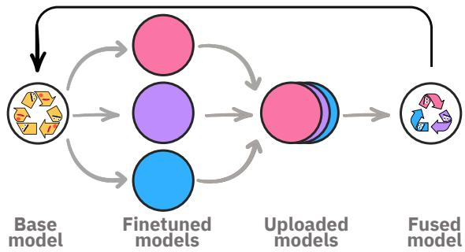  
Figure 1: Schematic of ColD Fusion. Each iteration starts from a base model. Then, each contributor downloads the model from a centralized “Repository"and finetunes it on their dataset. Next, each contributor uploads the finetuned model weights back to the Repository. After that, the Repository fuses all models into a single model by averaging their weights. Finally, the Repository replaces the base model with the fused model and the process repeats.

To recycle models, we take inspiration from multitask learning (§2). In multitask learning the pretrained model is finetuned over multiple datasets at once, which was shown to create a better base model than the original pretrained model (Aribandi et al., 2021; Aghajanyan et al., 2021a; Sanh et al. 2021; Chung et al., 2022). Given the availability of many finetuned models, our aim is to obtain the benefits of multitask learning by mixing multiple models rather than multiple datasets (c.f. §2.3).

To achieve that, we suggest the following iterative approach (§3): In each iteration, contributors finetune the most up-to-date base model (which is presumably also the most performant) on their task, and share the fine-tuned model with the rest of the community. Then, those contributed models are fused together, by simply averaging their parameters (Choshen et al., 2022b), to create the base model for the next iteration. We call this method Collaborative Descent Fusion, or ColD Fusion.

ColD Fusion fits the common finetuning paradigm, where each contributor finetunes for their own benefit and does not share their data. However, by merely requiring the finetuned model to be shared, the finetuning step can be recast as a training step for the collective's benefit. In doing so, our method allows reusing compute and data consumed by practitioners and researchers to the benefit of the entire community.

Our experimental results indicate that our approach of combining finetuned models not only produces a better base model but also allows this base model to keep evolving. Instead of pretraining or multitasking on a predefined amount of data, we suggest accumulating finetuned models to continuously improve the model. Our method is hence limited only by the amount of finetuned models that are shared by the entire community. We discuss limitations in (§9).

We show that ColD Fusion produces a model that performs well on the finetuned tasks, despite never manipulating more than one task at a time neither by constituent models nor their fusing (§5). Moreover, we show that ColD Fusion increases the performance of the base model substantially, outperforming the pretrained model by 2.33 points on average on 35 datasets. Through additional analysis, we further show that similar improvements are achieved regardless of whether the target tasks were seen or unseen during training (§5.2) and that accumulating models trained on additional data provides continuous improvement (§6).

## 2 Background

We start by motivating the use of further training on diverse data for enhancing the base model abilities (§2.1). Then, we continue with defining our framework's goals (§2.2) and constraints (§2.3).

## 2.1 Performance Scaling Laws

Extensive evidence suggests that pretraining with more compute (Raffel et al., 2020) and data (Liu et al., 2019; Hoffmann et al., 2022; Ivgi et al., 2022) improves the resulting pretrained model. Moreover, additional supervised data is beneficial even when introduced after the pretraining stage (Phang et al., 2018; Choshen et al., 2022a). Extending this supervised stage to multitask learning on diverse data sources improves results even further (Aribandi et al., 2021; Aghajanyan et al., 2021a; Sanh et al., 2021; Chung et al., 2022).

We observe that the data used during finetuning is typically not seen during pretraining. Therefore, we hypothesize that using a large amount of the data currently used for finetuning may significantly improve the model quality as a base model for future tasks. As training on all the finetuning data directly is infeasible, here we propose an alternative paradigm to test this hypothesis.

## 2.2 Goals of Multitask Learning

Multitask learning is typically used towards one of two goals: Either to produce a single model that performs well on many seen tasks, or to produce a base model that will perform well on many unseen tasks after adaptation, e.g., via finetuning.

Single model. To produce a single multitask model, one initializes with a base model with p parameters and optimizes the parameters $\theta \in \mathcal { R } ^ { p }$ to minimize the loss over a set of datasets D. This reflects the traditional objective of multitask learning – to produce a set of weights that performs well on multiple tasks (Caruana, 1997).

Base model. An alternative goal of multitask learning (and the primary goal in our work) is to produce a base model that will attain strong performance after adaptation. Multitask learning does not directly optimize towards this goal, but has been found to do so indirectly (Aghajanyan et al., 2021a; Liu et al., 2022). In this setting, the outof-the-box performance of the produced model on seen tasks is less important than the performance after finetuning over new tasks, i.e., initializing with the found weights $\theta \in \mathcal { R } ^ { p }$ and then finetuning on a desired dataset d'. We do not explicitly state whether $d ^ { \prime } \in D$ or d' ∉ D, i.e., whether d was used during the multitask training or not. In §5.2, we empirically show that our method works well in both cases.

We note that our formulation sets no restrictions on the datasets group D. Thus, a common scenario might be that some datasets do not have the same label space, number of examples, etc. On the other hand, it is also possible that some datasets are complementary samples from a distribution of the same task. In this case, our approach is similar to training this task distributively as in federated learning (Yang et al., 2019) but without communicating every batch. We demonstrate that our approach also works well in this setting in §6.

## 2.3 Collaborative Constraints

In this work, we target the goals of multitask learning discussed above, but focus on a specific setting with additional constraints, which we call ColD multitask. The constraints are required to support large-scale collaborative and distributed multitask learning. In our setting, multiple contributors have access to datasets that they do not share. A central Repository can only perform minimal computation (i.e., does not perform any training). Communication between the contributors and the Repository only occurs when a given contributor completes the finetuning on their data.

## 3 Methodology - ColD Fusion

Our proposed method (see Fig. 1), called ColD Fusion, is an iterative process that aims to perform multitask learning in the constrained setting outlined above. Specifically, ColD Fusion involves an iterative process where each individual contributor downloads the current base model from the Repository, finetunes this base model over their dataset, communicates the resulting model back to the Repository, and lastly, the Repository fuses (Choshen et al., 2022b) all of the contributors’ models into one and sets the new fused model as the new base model for further finetuning.

More formally, the Repository first initializes the shared model parameters $\theta _ { 0 }$ using a preexisting pretrained model. Then, at each iteration $i \in \{ 0 , 1 , 2 , . . . \}$ , each contributor $c \in C$ finetunes the $\theta _ { i }$ base model over a dataset $d \in D$ to produce parameters $\theta _ { i } ^ { c }$ . For the purposes of our study, finetuning is any optimization process that aims to minimize the loss over a dataset d. Typically, finetuning involves minimizing the loss using a variant of gradient descent. After finetuning, each contributor sends their model's parameters $\theta _ { i } ^ { c }$ to the Repository. Next, the Repository fuses the contributor's models by averaging all of the contributor's model's parameters to produce a new shared model as $\begin{array} { r } { \theta _ { i + 1 } = \frac { 1 } { | C | } \sum _ { c } \theta _ { i } ^ { c } } \end{array}$ . Finally, the process repeats for iteration $i + 1$

## 4 Experimental Setup

In this section, we detail the datasets, models, baselines, general experiment setup, and specific experiments settings.

## 4.1 Datasets

In all of our experiments, we define the datasets group D to be a group of 36 English-language datasets, including most GLUE and Super-GLUE datasets, in addition to other NLI, sentiment and topic classification datasets as well as datasets based on Twitter data. A full list of datasets we use is provided in App. A.

At each iteration we test on all the 36 datasets. There are two exceptions: 1) In the main experiment (§5.1) we use the entire dataset group except STSB. STSB, being a regression task incurred technical difficulties to provide a fair comparison to the multitask baseline (see §4.2). 2). For efficiency reasons, in the very compute demanding experiment of the number of contributors (§5.4) we randomly sampled 5 datasets to act as a consistent test set.

## 4.2 Models and Baselines

For experiments in the main text, we use RoBERTabase (Liu et al., 2019) as our initial model $\theta _ { 0 }$ . To demonstrate the generality of our approach, we additionally replicate some results on T5 (Raffel et al., 2020, see App. §D).

For baseline pre-trained models, we consider RoBERTa-base, RoBERTa-base fused, as well as a RoBERTa-base multitask model. The fused model is trained as in Choshen et al. (2022b). The multitask variant trains a dedicated classification head for each dataset. In addition, we consider the MUPPET (Aghajanyan et al., 2021a) model, a highly optimized multitask model trained on more datasets than we consider. MUPPET is the current state-of-the-art base pretrained model that uses the RoBERTa-base architecture (Choshen et al., 2022a).

## 4.3 Finetuning Process

Finetuning is used in this paper for two reasons: (a) As a way to infer and evaluate the performance of a base model and (b) as a part of the ColD Fusion scheme. We follow the exact same finetuning procedure in either case. Finetuning hyperparameters and time and memory estimates are provided in App. B

## 4.4 ColD Fusion Procedure

The general course of the experiments is as follows: On each iteration, several datasets are sampled and the latest base model is finetuned separately on each dataset. Then the resulting finetuned models are fused to create the next base model. This new model is evaluated on the test datasets at each iteration. When we mention ColD Fusion without specifying the iteration explicitly, we refer to the model that corresponds to the final iteration.

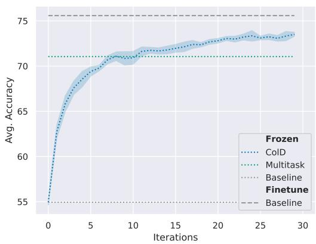  
(a) Single Model

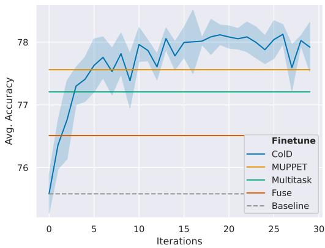  
(b) Base Model  
Figure 2: ColD Fusion is effective at multitask learning. ColD Fusion brings significant additional benefits as a base model for finetuning (b) and improves over finetuning the pretrained model, the fuse baseline, our multitask baseline, and MUPPET (Aghajanyan et al., 2021a). ColD Fusion also produces better performance on seen tasks as evaluated with linear probing (a), almost reaching finetuned accuracy. Standard deviation across runs is shown via shaded regions.

The evaluation reflects both multitask goals (§2.2): (a) To evaluate the single model goal, we train only the classification head (equivalent to Linear Probing; Alain and Bengio, 2016), freezing the rest of the layers. We refer to it as ColD-Frozen. (b) For evaluating the base model goal, we take the ColD model and use it as initialization for finetuning. We finetune separately on each dataset and report the results on the corresponding test. We refer to it as ColD.

## 5 ColD Multitask Results

In this section, we show ColD Fusion can produce multitask models. We show in §5.1 that ColD Fusion fulfills both multitask objectives defined in §2. We verify that improvements replicate on datasets that were not seen during training (§5.2). Then we find that base model improvements are even more apparent in few shot settings (§5.3). Finally, we consider the importance of the number of contributors hyperparameter (§5.4).

## 5.1 Collaborative Multitask

We show that ColD Fusion achieves the two multitask objectives (see Fig. 2). We train and test ColD Fusion for 30 iterations. We simulate 8 contributors by sampling 8 datasets at each iteration and repeat the whole experiment using 5 different random seeds. We consider the importance of the sampling hyperparameter in §5.4.

We find that ColD Fusion creates a superior base model (see Fig. 2b). The average result after finetuning the ColD Fusion model is superior to the RoBERTa pretrained model by up to 2.33 points on average over the 35 datasets (see App. §C for full results). The result can be deemed significant with a difference of over 20 standard errors of the mean between the original pretrained model and the model produced by ColD Fusion.

In comparison, the standard multitask model and the fused model outperform the original RoBERTa pretrained model by only 1.62 and 0.92 points respectively. We also consider the highly optimized MUPPET model, trained on more datasets and without the ColD multitask restrictions. MUPPET indeed outperforms our standard multitask baseline model, but is outperformed by our ColD Fusion model.

Another important comparison is the consistency of the improvement. We find (see App. C) that the model produced by ColD Fusion is better than the pretrained model on 75% of the datasets and degrades by only 1.73 points on the worst-case dataset. In contrast, MUPPET hurts as many models as it helps and is worse by 40 points on some datasets.

ColD Fusion also achieves the single model goal: When evaluated with linear probing, the ColD model has high performance on the datasets seen in training (see Fig. 2a), higher in fact than those of the standard multitask baseline. Moreover, it is not far from the pretrained model when finetuned on each task separately. This implies that despite learning in a distributed way and fusing by averaging the non-linear weights of the model, the process incorporates the data well.

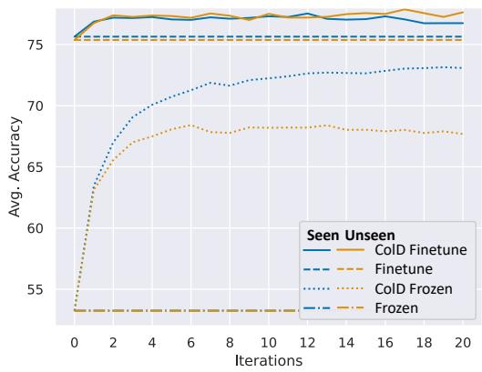  
Figure 3: Fine-tuned and frozen results for ColD Fusion on datasets that were used for training (“Seen", in blue) vs. datasets that were not (“Unseen", in orange). The model produced by ColD Fusion is a good base model for both seen and unseen datasets. While using a frozen model is better for seen datasets, unseen datasets still benefit the ColD Fusion process.

## 5.2 Unseen Datasets

We have found ColD Fusion to create a strong base model (§5). Next, to meet the requirement of improving results for new datasets, we test the ColD fused model on unseen datasets not included in the training (see Fig. 3). We achieve this by performing 3-fold cross-validation. The folds are set arbitrarily such that each fold contains 24 seen datasets (24 contributors) and 12 unseen ones that we keep for evaluation only. This ensures that each dataset has the same weight in the average score of the seen datasets and unseen datasets.

We find that the model performs on unseen datasets just as well as it does on seen ones. The strikingly similar performance between seen and unseen tasks (which is similar to in-domain vs. outof-domain) should raise a red flag in most scenarios. However, in the unique scenario of ColD multitasking, it meets our expectations. Both seen and unseen datasets are exposed at some point - either during ColD Fusion iterations (seen datasets only) or during evaluation as a base model (both seen and unseen). Hence, in the seen case, the model trains twice on the same data, first during base model creation and again when evaluating the base model. It is less of a surprise that training twice on the same data doesn't improve results. The improvement over the original pretrained is likely due to positive transfer across datasets.

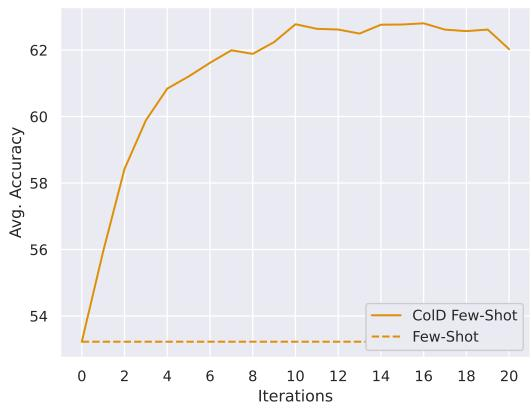  
Figure 4: ColD Fusion yields improvements in few-shot learning on unseen datasets. Results are from training on 24 full datasets and testing on 12 unseen datasets with 100 labels each, averaged over 3 such folds. The pretrained model performance is highlighted by a dashed line. ColD Fusion outperforms by as much as 7%.

Where finetuning is restricted to only the classification head (ColD-Frozen in Fig. 3), the model achieves much better performance on the seen datasets than on the unseen datasets. These results are also in line with the fact that the model (apart from the classification head) was never exposed to the unseen datasets, while the entire model's weights were trained on the seen datasets. We further test ColD Fusion's capacity to scale with more data in §6. We note that the unseen curve consistently increases, which may suggest that the model has acquired general skills. The curve reaches a plateau around the 10th iteration, and then starts to drop a bit. Possibly, due to an overffiting caused by the limited number of seen datasets.

Note that the scores in Fig. 3 are a bit lower than in the main experiment in Fig. 2b. This is most likely due to scaling, as here we keep unseen datasets aside and use fewer datasets for training. We show in a controlled experiment in §6 that using more datasets improves results.

## 5.3 Few-shot

In order to assess the benefit of ColD Fusion on few-shot scenarios, we repeat the setting in §5.2, but finetune only on 100 examples from each unseen dataset during evaluation. Fig. 4 shows a great increase in performance over the RoBERTa pretrained model, reaching an improvement of 6.73 points after 20 iterations. This provides an even stronger case for ColD Fusion in the few-shot setting.

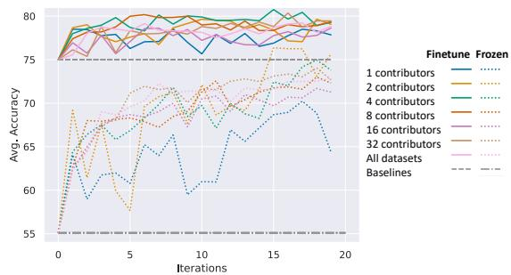  
Figure 5: Effect of the number of contributors in each iteration. The graph shows the performance (y-axis) per iteration (x-axis) during ColD Fusion. Performance of the model produced by ColD Fusion without additional finetuning is shown in dotted lines, and after finetuning in solid lines. Each color depicts a different number of contributed models in each iteration. The pretrained model performance is highlighted by another dashed line.

## 5.4 Number of Contributors per Iteration

An important factor in ColD Fusion is the number of contributors in each iteration. Having fewer contributors per iteration implies effectively training on fewer datasets in each iteration; on the other hand, fusing fewer models may give more importance to each.

We observe in Fig. 5 that starting from two contributors, the performance as a base model is hardly affected by the number of contributors in each iteration. However, adding contributors makes the process more stable. A possible reason is that some of the improvement comes from the iterations themselves and the ability to correct overfitting done in previous steps by some contributors.

We note that the number of contributors is only insignificant when the data is fixed. In practice, more contributors would improve performance, by adding more data or iterations. We further test the effect of the number of contributors under controlled settings in §6.

## 6 Single Dataset Analysis

We now analyze the interacting effects of the core characteristics of ColD Fusion: additional data across iterations, the amount of training data per iteration, and the number of contributors in each iteration.

Doing so with multiple datasets would introduce noise. For example, we can not expect additional data coming from different sources (e.g., MNLI or Twitter) to equally affect the performance. To overcome this, we explore the case where a single dataset is distributed across contributors. Using a single dataset allows us to reduce variability due to differences in the datasets (e.g., distribution, task, etc.), and isolate the parameter we wish to control. ColD Fusion may converge faster with models from a single dataset, but we still expect the general tendencies found to replicate in multiple datasets settings.

We chose MNLI (Williams et al., 2018) for its large size (392K examples).

Effect of additional data across iterations (Federated Learning). To simulate a neverending data flow, the experiment runs as follows: at each iteration, 5 contributors sample 5k examples each from MNLI dataset, and another such sample is used for evaluation.

This setting resembles the Federated Learning scenario (Yang et al., 2019), where multiple contributors collaborate to train a model without having to exchange the actual data.

As presented in Fig. 6a, performance increases throughout the iterations. Thus, we conclude that the ColD Fusion scheme aggregates and utilizes the newly added examples and not only coarse-grained dataset characteristics.

We show similar trends in the multitask scenario (see App. E). Training on more datasets results in a better best model at the cost of more iterations to get to that best model.

Note the superiority of ColD-Frozen over ColD in this experiment. A possible explanation is overfitting. In evaluation, finetuning all the parameters on only part of the data is worse than keeping the fused weights that are trained on several splits.

Effect of dataset size per contributor. In this and the following experiments, we train on all the data in each iteration. The contributors train over disjoint and consistent sub-datasets, i.e., we do not sample examples. We aim to analyze the ability of the model to aggregate knowledge from the constituent models during fusion.

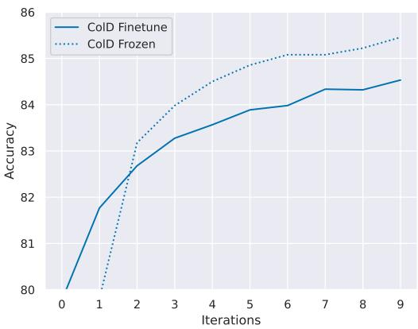  
(a) Effect of Additional Data

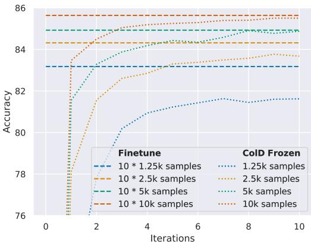  
(b) Effect of Dataset Size per Contributor

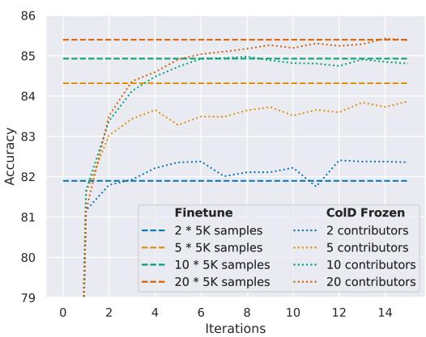  
(c) Effect of #Contributors

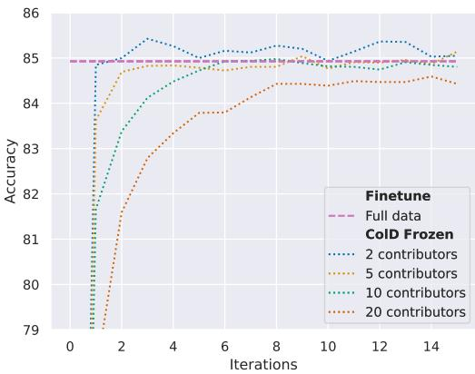  
(d) Effect of Distributing  
Figure 6: ColD Fusion with a single dataset. To test the effect of additional data across iterations (a), we sample 5k new examples from the MNLI dataset for each of the 5 contributors at each iteration. We test the effect of the dataset size (b), the number of contributors (c), and the distributing of a fixed amount of data (d). The ColD Frozen (dotted lines) outperforms ColD Finetuned (solid lines), possibly due to overfitting, and both improve with the iterations. Results keep increasing with data size. More contributors or less data per contributor slow the convergence to centralized finetuning (dashed lines).

ColD-Finetuned is evaluated through a stage of finetuning which further learns on the task. To avoid entangling the capabilities learnt during ColD Fusion with those learnt during evaluation, we analyze the ColD-Frozen instead. We also note that during evaluation, the classification head is trained on the training data of the first contributor only (which is the only one in the baseline).

We fix the number of contributors to 10 and test how the number of examples each contributor is training on affects results. We experiment with 1.25K, 2.5K, 5K and 10K examples. We compare these to full finetuning on the union of all the contributors’ training data. A priori we would have expected large amounts of data in each contributor's model to obstruct the fusing process, as each model changes more. In Fig. 6b, we see the opposite – the more data each contributor trains on, the closer the fused model is to the full training baseline.

Effect of the number of contributors. In this experiment, each contributor trains over "their own" data, i.e., the same 5K examples in each iteration. We test how the results change with 2, 5, 10 and 20 contributors. We see in Fig. 6c that increasing the number of contributors improves performance. Moreover, the results are not only better at every step, but also keep on improving for longer. This is a positive result in terms of the expected end result, but also means that convergence is slower.

Effect of data distribution between contributors. To isolate the effect of the number of contributors and the dataset size of each contributor from that of the overall data size, we fix the overall amount of data to 50K and split it among the contributors evenly. Fig 6d shows distributing mostly affects convergence – it takes approximately 2 more iterations to converge for double the contributors and half the data seen by each.

We conclude that increasing the overall amount of data improves performance, as may be expected. The distribution of the data between additional contributors has minimal impact on final performance, but may delay convergence.

## 7 Related Work

Our work strongly relies on model fusion. Model fusion was first introduced as a way to improve pretrained models by (Choshen et al., 2022b). In parallel, several works such as (Matena and Raffel, 2021; Wortsman et al., 2022b) and lately (Jin et al., 2022; Ramé et al., 2022) suggested different ways of fusing for other purposes such as improved finetuning.

Another fusion usage is the stochastic weight averaging, aiming to stabilize the SGD process by averaging multiple points along the SGD trajectory (Izmailov et al., 2018). Unlike the previous, this method utilizes only one model and dataset.

Low-communication distributed training was proposed in similar settings to ours. Wortsman et al. (2022a) proposed distributed finetuning and model fusing in order to produce better finetuned models. This suggestion is equivalent to one iteration of ColD Fusion where all models share the same dataset. Li et al. (2022); Together (2022) also share the similarity of distributed training, but during pretraining on unlabeled data.

Understanding why averaging different models improve quality may be related to theoretical works discussing weight and loss spaces. These works state there is a path of minimum loss between models (Garipov et al., 2018) on which the loss along the path is not increasing. Lubana et al. (2022); Benton et al. (2021); Frankle et al. (2020) claimed that under some constraints, this path is linear which suggests that fusing the weights could produce a model that retains the capabilities of the fused models. Although different models on the same task may converge to different locations in the loss space without linear connectivity (Juneja et al., 2022), and although the case of multitask is more complex (Mirzadeh et al., 2020), we still believe that these works can partially explain why fusing preserves the capabilities gained by the constituent and when it does not that the next iteration fixes it. Gueta et al. (2023) further suggests the linear connectivity path is merely a line in a whole connected region, future work may tell whether ColD Fusion searches in this region or crosses it to find new ones.

The literature also includes methods for better aligning models during training (Javaloy and Valera, 2021; Yu et al., 2020; Chen et al., 2018) or after it (Ainsworth et al., 2022; Jordan et al., 2022) to aid in fusing. We did not use those as we wanted to reduce the load on the repository and avoid restricting the contributors'finetuning. However, these methods may improve results in ColD Multitask.

We mention that multitask learning does not optimize the base model objective directly (§2.3). Some works aim to do so (Bansal et al., 2019) through meta-learning, finding models that can learn a new task well or efficiently (Hospedales et al., 2021). REPTILE (Nichol et al., 2018) meta learns in a way that resembles ours by iteratively using models trained for several batches.

## 8 Conclusion and Discussion

We proposed a scheme for utilizing abundant finetuned models to enhance a pretrained model. Our approach does not necessitate the sharing of datasets, but rather assumes each contributor solely finetunes on their own dataset. Hence, we believe that applying this scheme as a collaborative pretraining platform is a viable option and that doing so would result in ongoing improvement of base models.

To scale this approach, it would be beneficial if the repository was updated asynchronously, perhaps relying on recent fusing techniques (Ilharco et al., 2022). In the usual finetuning setting, robustness can be improved by tuning batch size and learning rate. In analogy, in ColD Fusion, one can either increase the number of contributors (batch) and/or restrict the effect of each iteration (learning rate) (Smith and Le, 2018) to improve the process. Following this line, future work may consider regularizing the distance from the pretrained model (learning rate) when a small number of contributors exist (batch) or consider assigning individual weights to each contributor.

There are many hyper parameters to optimize which might improve the method substantially. E.g., fusing the contributions with a weighted average, improving fusing itself (Matena and Raffel, 2021; Ainsworth et al., 2022), controlling the datasets seen in each iterations (related to; Choshen et al., 2021; Hacohen and Weinshall, 2019) and backtracking when a harmful update was done to the model. We hope that future work will shed more light on these issues, to further improve the approach proposed in this work.

## 9 Limitations

Perhaps the most important limitation regarding ColD Fusion is its deployment. This paper presents a method for multitasking, not a platform. In that sense it solves both multitask learning goals under the constraints resulting from collaboration. However, using ColD Fusion in practice might require much more effort – It would require a place to host the models, a way to make sure no malicious or erroneous model was sent, and other aspects of a platform to support this training.

This is the first method to tackle collaborative multitasking and we scaled it to 35 datasets. However, future methods may be found more efficient or scale better with the amount of data and computation.

ColD Fusion with many iterations and models might require more computational effort for a given amount of data (§6) than regular multitask learning. As a result, while our bottom line performance is encouraging, ColD Fusion might not be the preferred way under every possible scenario. Still, some of the costs may be alleviated by future work – for example the additional iterations when fusing many models, might be reduced by aligning models’ weights before fusing (Ainsworth et al., 2022).

While this paper studied the impact of various ColD Fusion parameters, it is unclear how finetuning or even pretraining parameters affect results. However, we do have a reason to believe the method is relatively robust to these refactors through our initial results and the replication on another architecture (App. §D).

Another limitation is the assumption that the weights of the model change. Some adaptation methods assume the model is frozen and only its inputs change. In those cases, the model would not be improved by use. Still, even in such cases, multitask learning (Wang et al., 2023) might be applied on the inputs, or the same model might be used in different ways, where some also adapt parts of it (Hu et al.; Jang et al., 2023; Qin et al., 2022; Yadav et al., 2023). In those cases, the method might still prove useful, even if it benefits only from some of the contributions.

As mentioned before, another concern is a possible harmful update done by a contributor. Handling it would require monitoring the updates by regularly evaluating the model, or measuring the updates diff to identify noisy models (too large diff / random weights).

## Acknowledgements

This material is based upon work supported by the National Science Foundation under Grant No. 2145822.

## References

Armen Aghajanyan, Anchit Gupta, Akshat Shrivastava, Xilun Chen, Luke Zettlemoyer, and Sonal Gupta. 2021a. Muppet: Massive multi-task representations with pre-finetuning. In Proceedings of the 2021 Conference on Empirical Methods in Natural Language Processing, pages 5799–5811, Online and Punta Cana, Dominican Republic. Association for Computational Linguistics.

Armen Aghajanyan, Anchit Gupta, Akshat Shrivastava, Xilun Chen, Luke Zettlemoyer, and Sonal Gupta. 2021b. Muppet: Massive multi-task representations with pre-finetuning. ArXiv, abs/2101.11038.

Samuel K Ainsworth, Jonathan Hayase, and Siddhartha Srinivasa. 2022. Git re-basin: Merging models modulo permutation symmetries. arXiv preprint arXiv:2209.04836.

Guillaume Alain and Yoshua Bengio. 2016. Understanding intermediate layers using linear classifier probes. arXiv preprint arXiv:1610.01644.

Vamsi Aribandi, Yi Tay, Tal Schuster, Jinfeng Rao, Huaixiu Steven Zheng, Sanket Vaibhav Mehta, Honglei Zhuang, Vinh Q Tran, Dara Bahri, Jianmo Ni, et al. 2021. Ext5: Towards extreme multitask scaling for transfer learning. arXiv preprint arXiv:2111.10952.

Trapit Bansal, Rishikesh Jha, and Andrew McCallum. 2019. Learning to few-shot learn across diverse natural language classification tasks. arXiv preprint arXiv:1911.03863.

Roy Bar-Haim, Ido Dagan, Bill Dolan, Lisa Ferro, Danilo Giampiccolo, and Bernardo Magnini. 2006. The second pascal recognising textual entailment challenge. In ACL-PASCAL@ACL.

Francesco Barbieri, Jose Camacho-Collados, Francesco Ronzano, Luis Espinosa-Anke, Miguel Ballesteros, Valerio Basile, Viviana Patti, and Horacio Saggion. 2018. SemEval-2018 Task 2: Multilingual Emoji Prediction. In Proceedings of the 12th International Workshop on Semantic Evaluation (SemEval-2018), New Orleans, LA, United States. Association for Computational Linguistics.

Valerio Basile, Cristina Bosco, Elisabetta Fersini, Debora Nozza, Viviana Patti, Francisco Manuel Rangel Pardo, Paolo Rosso, and Manuela Sanguinetti 2019. SemEval-2019 task 5: Multilingual detection of hate speech against immigrants and women in Twitter. In Proceedings of the 13th International Workshop on Semantic Evaluation, pages 54–63, Minneapolis, Minnesota, USA. Association for Computational Linguistics.

Luisa Bentivogli, Peter Clark, Ido Dagan, and Danilo Giampiccolo. 2009. The sixth pascal recognizing textual entailment challenge. In TAC.

Gregory Benton, Wesley Maddox, Sanae Lotfi, and Andrew Gordon Gordon Wilson. 2021. Loss surface simplexes for mode connecting volumes and fast ensembling. In International Conference on Machine Learning, pages 769–779. PMLR.

Oana-Maria Camburu, Tim Rocktäschel, Thomas Lukasiewicz, and Phil Blunsom. 2018. e-snli: Natural language inference with natural language explanations. In NeurIPS.

Rich Caruana. 1997. Multitask learning. Machine learning, 28(1):41–75.

Guanzheng Chen, Fangyu Liu, Zaiqiao Meng, and Shangsong Liang. 2022. Revisiting parameterefficient tuning: Are we really there yet? ArXiv, abs/2202.07962.

Zhao Chen, Vijay Badrinarayanan, Chen-Yu Lee, and Andrew Rabinovich. 2018. GradNorm: Gradient normalization for adaptive loss balancing in deep multitask networks. In Proceedings of the 35th International Conference on Machine Learning, volume 80 of Proceedings of Machine Learning Research, pages 794–803. PMLR.

Leshem Choshen, Guy Hacohen, Daphna Weinshall, and Omri Abend. 2021. The grammar-learning trajectories of neural language models. ArXiv, abs/2109.06096.

Leshem Choshen, Elad Venezian, Shachar Don-Yehia, Noam Slonim, and Yoav Katz. 2022a. Where to start? analyzing the potential value of intermediate models. arXiv preprint arXiv:2211.00107.

Leshem Choshen, Elad Venezian, Noam Slonim, and Yoav Katz. 2022b. Fusing finetuned models for better pretraining. arXiv preprint arXiv:2204.03044.

Hyung Won Chung, Le Hou, Shayne Longpre, Barret Zoph, Yi Tay, William Fedus, Eric Li, Xuezhi Wang, Mostafa Dehghani, Siddhartha Brahma, et al. 2022. Scaling instruction-finetuned language models. arXiv preprint arXiv:2210.11416.

Christopher Clark, Kenton Lee, Ming-Wei Chang, Tom Kwiatkowski, Michael Collins, and Kristina Toutanova. 2019. BoolQ: Exploring the surprising difficulty of natural yes/no questions. In Proceedings of the 2019 Conference of the North American Chapter of the Association for Computational Linguistics: Human Language Technologies, Volume 1 (Long and Short Papers), pages 2924–2936, Minneapolis, Minnesota. Association for Computational Linguistics.

Ido Dagan, Oren Glickman, and Bernardo Magnini. 2005. The pascal recognising textual entailment challenge. In MLCW.

Marie-Catherine de Marneffe, Mandy Simons, and Judith Tonhauser. 2019. The CommitmentBank: Investigating projection in naturally occurring discourse. In proceedings of Sinn und Bedeutung. To appear in Proceedings of Sinn und Bedeutung 23.

Data can be found at https://github.com/mcdm/ CommitmentBank/.

William B. Dolan and Chris Brockett. 2005. Automatically constructing a corpus of sentential paraphrases. In Proceedings of the Third International Workshop on Paraphrasing (IWP2005).

Jonathan Frankle, Gintare Karolina Dziugaite, Daniel Roy, and Michael Carbin. 2020. Linear mode connectivity and the lottery ticket hypothesis. In International Conference on Machine Learning, pages 3259–3269. PMLR.

Timur Garipov, Pavel Izmailov, Dmitrii Podoprikhin, Dmitry P Vetrov, and Andrew G Wilson. 2018. Loss surfaces, mode connectivity, and fast ensembling of dnns. Advances in neural information processing systems, 31.

Danilo Giampiccolo, Bernardo Magnini, Ido Dagan, and William B. Dolan. 2007. The third pascal recognizing textual entailment challenge. In ACL-PASCAL@ACL.

Almog Gueta, Elad Venezian, Colin Raffel, Noam Slonim, Yoav Katz, and Leshem Choshen. 2023. Knowledge is a region in weight space for fine-tuned language models. arXiv preprint arXiv:2302.04863.

Guy Hacohen and Daphna Weinshall. 2019. On the power of curriculum learning in training deep networks. In International Conference on Machine Learning, pages 2535–2544. PMLR.

Ruining He and Julian McAuley. 2016. Ups and downs: Modeling the visual evolution of fashion trends with one-class collaborative filtering. In proceedings of the 25th international conference on world wide web, pages 507–517.

Jordan Hoffmann, Sebastian Borgeaud, Arthur Mensch, Elena Buchatskaya, Trevor Cai, Eliza Rutherford, Diego de Las Casas, Lisa Anne Hendricks, Johannes Welbl, Aidan Clark, et al. 2022. Training compute-optimal large language models. arXiv preprint arXiv:2203.15556.

Timothy Hospedales, Antreas Antoniou, Paul Micaelli, and Amos Storkey. 2021. Meta-learning in neural networks: A survey. IEEE transactions on pattern analysis and machine intelligence, 44(9):5149–5169.

Edward J Hu, Phillip Wallis, Zeyuan Allen-Zhu, Yuanzhi Li, Shean Wang, Lu Wang, Weizhu Chen, et al. Lora: Low-rank adaptation of large language models. In International Conference on Learning Representations.

Gabriel Ilharco, Marco Tulio Ribeiro, Mitchell Wortsman, Suchin Gururangan, Ludwig Schmidt, Hannaneh Hajishirzi, and Ali Farhadi. 2022. Editing models with task arithmetic. arXiv preprint arXiv:2212.04089.

Maor Ivgi, Yair Carmon, and Jonathan Berant. 2022. Scaling laws under the microscope: Predicting transformer performance from small scale experiments. arXiv preprint arXiv:2202.06387.

Pavel Izmailov, Dmitrii Podoprikhin, Timur Garipov, Dmitry Vetrov, and Andrew Gordon Wilson. 2018. Averaging weights leads to wider optima and better generalization. arXiv preprint arXiv:1803.05407.

Joel Jang, Seungone Kim, Seonghyeon Ye, Doyoung Kim, Lajanugen Logeswaran, Moontae Lee, Kyungjae Lee, and Minjoon Seo. 2023. Exploring the benefits of training expert language models over instruction tuning. arXiv preprint arXiv:2302.03202.

Adrián Javaloy and Isabel Valera. 2021. Rotograd: Gradient homogenization in multitask learning. In International Conference on Learning Representations.

Xisen Jin, Xiang Ren, Daniel Preotiuc-Pietro, and Pengxiang Cheng. 2022. Dataless knowledge fusion by merging weights of language models. arXiv preprint arXiv:2212.09849.

Keller Jordan, Hanie Sedghi, Olga Saukh, Rahim Entezari, and Behnam Neyshabur. 2022. Repair: Renormalizing permuted activations for interpolation repair. arXiv preprint arXiv:2211.08403.

Jeevesh Juneja, Rachit Bansal, Kyunghyun Cho, João Sedoc, and Naomi Saphra. 2022. Linear connectivity reveals generalization strategies. arXiv preprint arXiv:2205.12411.

Daniel Khashabi, Snigdha Chaturvedi, Michael Roth, Shyam Upadhyay, and Dan Roth. 2018. Looking beyond the surface: A challenge set for reading comprehension over multiple sentences. In Proceedings of the Conference of the North American Chapter of the Association for Computational Linguistics: Human Language Technologies (NAACL-HLT). Association for Computational Linguistics.

Hector Levesque, Ernest Davis, and Leora Morgenstern. 2012. The Winograd schema challenge. In Thirteenth International Conference on the Principles of Knowledge Representation and Reasoning.

Hector J. Levesque, Ernest Davis, and L. Morgenstern. 2011. The winograd schema challenge. In KR.

Margaret Li, Suchin Gururangan, Tim Dettmers, Mike Lewis, Tim Althoff, Noah A Smith, and Luke Zettlemoyer. 2022. Branch-train-merge: Embarrassingly parallel training of expert language models. arXiv preprint arXiv:2208.03306.

Xin Li and Dan Roth. 2002. Learning question classifiers. In COLING 2002: The 19th International Conference on Computational Linguistics.

Haokun Liu, Derek Tam, Mohammed Muqeeth, Jay Mohta, Tenghao Huang, Mohit Bansal, and Colin Raffel. 2022. Few-shot parameter-efficient fine-tuning is better and cheaper than in-context learning. arXiv preprint arXiv:2205.05638.

Yinhan Liu, Myle Ott, Naman Goyal, Jingfei Du, Mandar Joshi, Danqi Chen, Omer Levy, Mike Lewis, Luke Zettlemoyer, and Veselin Stoyanov. 2019. Roberta: A robustly optimized bert pretraining approach. ArXiv, abs/1907.11692.

Ekdeep Singh Lubana, Eric J Bigelow, Robert P Dick, David Krueger, and Hidenori Tanaka. 2022. Mechanistic mode connectivity. arXiv preprint arXiv:2211.08422.

Andrew L. Maas, Raymond E. Daly, Peter T. Pham, Dan Huang, Andrew Y. Ng, and Christopher Potts. 2011. Learning word vectors for sentiment analysis. In Proceedings of the 49th Annual Meeting of the Association for Computational Linguistics: Human Language Technologies, pages 142–150, Portland, Oregon, USA. Association for Computational Linguistics.

Pekka Malo, Ankur Sinha, Pekka Korhonen, Jyrki Wallenius, and Pyry Takala. 2014. Good debt or bad debt: Detecting semantic orientations in economic texts. Journal of the Association for Information Science and Technology, 65(4):782–796.

Michael Matena and Colin Raffel. 2021. Merging models with fisher-weighted averaging. arXiv preprint arXiv:2111.09832.

Seyed Iman Mirzadeh, Mehrdad Farajtabar, Dilan Gorur, Razvan Pascanu, and Hassan Ghasemzadeh. 2020. Linear mode connectivity in multitask and continual learning. arXiv preprint arXiv:2010.04495.

Saif M. Mohammad and Felipe Bravo-Marquez. 2017. Emotion intensities in tweets. In Proceedings of the sixth joint conference on lexical and computational semantics (\*Sem), Vancouver, Canada.

Alex Nichol, Joshua Achiam, and John Schulman. 2018. On first-order meta-learning algorithms. ArXiv, abs/1803.02999.

Yixin Nie, Adina Williams, Emily Dinan, Mohit Bansal, Jason Weston, and Douwe Kiela. 2020. Adversarial NLI: A new benchmark for natural language understanding. In Proceedings of the 58th Annual Meeting of the Association for Computational Linguistics, pages 4885–4901, Online. Association for Computational Linguistics.

Bo Pang and Lillian Lee. 2005. Seeing stars: Exploiting class relationships for sentiment categorization with respect to rating scales. In Proceedings of the 43rd Annual Meeting of the Association for Computational Linguistics (ACL’05), pages 115–124, Ann Arbor, Michigan. Association for Computational Linguistics.

Jason Phang, Thibault Févry, and Samuel R. Bowman. 2018. Sentence encoders on stilts: Supplementary training on intermediate labeled-data tasks. ArXiv, abs/1811.01088.

Mohammad Taher Pilehvar and Jose Camacho-Collados. 2019. WiC: The word-in-context dataset for evaluating context-sensitive meaning representations. In Proceedings of the Conference of the North American Chapter of the Association for Computational Linguistics: Human Language Technologies (NAACL-HLT). Association for Computational Linguistics.

Yujia Qin, Cheng Qian, Jing Yi, Weize Chen, Yankai Lin, Xu Han, Zhiyuan Liu, Maosong Sun, and Jie Zhou. 2022. Exploring mode connectivity for pre-trained language models. arXiv preprint arXiv:2210.14102.

Colin Raffel. 2021. A call to build models like we build open-source software.

Colin Raffel, Noam Shazeer, Adam Roberts, Katherine Lee, Sharan Narang, Michael Matena, Yanqi Zhou, Wei Li, and Peter J Liu. 2020. Exploring the limits of transfer learning with a unified text-to-text transformer. Journal of Machine Learning Research, 21:1– 67.

Pranav Rajpurkar, Jian Zhang, Konstantin Lopyrev, and Percy Liang. 2016. SQuAD: 100,000+ questions for machine comprehension of text. In Proceedings of the 2016 Conference on Empirical Methods in Natural Language Processing, pages 2383–2392, Austin, Texas. Association for Computational Linguistics.

Alexandre Ramé, Jianyu Zhang, Léon Bottou, and David Lopez-Paz. 2022. Pre-train, fine-tune, interpolate: a three-stage strategy for domain generalization.

Melissa Roemmele, Cosmin Adrian Bejan, and Andrew S. Gordon. 2011. Choice of plausible alternatives: An evaluation of commonsense causal reasoning. In 2011 AAAI Spring Symposium Series.

Sara Rosenthal, Noura Farra, and Preslav Nakov. 2017. SemEval-2017 task 4: Sentiment analysis in Twitter. In Proceedings of the 11th International Workshop on Semantic Evaluation (SemEval-2017), pages 502– 518, Vancouver, Canada. Association for Computational Linguistics.

Victor Sanh, Albert Webson, Colin Raffel, Stephen H Bach, Lintang Sutawika, Zaid Alyafeai, Antoine Chaffin, Arnaud Stiegler, Teven Le Scao, Arun Raja, et al. 2021. Multitask prompted training enables zero-shot task generalization. arXiv preprint arXiv:2110.08207.

Klaus R Scherer and Harald G Wallbott. 1994. Evidence for universality and cultural variation of differential emotion response patterning. Journal of personality and social psychology, 66(2):310.

Emily Sheng and David Uthus. 2020. Investigating societal biases in a poetry composition system. In Proceedings of the Second Workshop on Gender Bias in Natural Language Processing, pages 93–106, Barcelona, Spain (Online). Association for Computational Linguistics.

Samuel L Smith and Quoc V Le. 2018. A bayesian perspective on generalization and stochastic gradient descent. In International Conference on Learning Representations.

Richard Socher, Alex Perelygin, Jean Wu, Jason Chuang, Christopher D. Manning, Andrew Ng, and Christopher Potts. 2013. Recursive deep models for semantic compositionality over a sentiment treebank. In Proceedings of the 2013 Conference on Empirical Methods in Natural Language Processing, pages 1631–1642, Seattle, Washington, USA. Association for Computational Linguistics.

Together. 2022. Togethercomputer/gpt-jt-6b-v1 · hugging face.

Cynthia Van Hee, Els Lefever, and Véronique Hoste. 2018. SemEval-2018 task 3: Irony detection in English tweets. In Proceedings of The 12th International Workshop on Semantic Evaluation, pages 39– 50, New Orleans, Louisiana. Association for Computational Linguistics.

Zhen Wang, Rameswar Panda, Leonid Karlinsky, Rogerio Feris, Huan Sun, and Yoon Kim. 2023. Multitask prompt tuning enables parameter-efficient transfer learning. arXiv preprint arXiv:2303.02861.

Alex Warstadt, Amanpreet Singh, and Samuel R. Bowman. 2019. Neural network acceptability judgments. Transactions of the Association for Computational Linguistics, 7:625–641.

Adina Williams, Nikita Nangia, and Samuel Bowman. 2018. A broad-coverage challenge corpus for sentence understanding through inference. In Proceedings of the 2018 Conference of the North American Chapter of the Association for Computational Linguistics: Human Language Technologies, Volume 1 (Long Papers), pages 1112–1122, New Orleans, Louisiana. Association for Computational Linguistics.

Mitchell Wortsman, Suchin Gururangan, Shen Li, Ali Farhadi, Ludwig Schmidt, Michael Rabbat, and Ari S Morcos. 2022a. lo-fi: distributed fine-tuning without communication. arXiv preprint arXiv:2210.11948.

Mitchell Wortsman, Gabriel Ilharco, Samir Yitzhak Gadre, Rebecca Roelofs, Raphael Gontijo-Lopes, Ari S. Morcos, Hongseok Namkoong, Ali Farhadi, Yair Carmon, Simon Kornblith, and Ludwig Schmidt. 2022b. Model soups: averaging weights of multiple fine-tuned models improves accuracy without increasing inference time. In International Conference on Machine Learning.

Prateek Yadav, Derek Tam, Leshem Choshen, Colin Raffel, and Mohit Bansal. 2023. Resolving interference when merging models. arXiv preprint arXiv:2306.01708.

Qiang Yang, Yang Liu, Yong Cheng, Yan Kang, Tianjian Chen, and Han Yu. 2019. Federated learning. Synthesis Lectures on Artiicial Intelligence and Machine Learning, 13(3):1–207.

Tianhe Yu, Saurabh Kumar, Abhishek Gupta, Sergey Levine, Karol Hausman, and Chelsea Finn. 2020. Gradient surgery for multi-task learning. In Advances in Neural Information Processing Systems, volume 33, pages 5824–5836. Curran Associates, Inc.

Marcos Zampieri, Shervin Malmasi, Preslav Nakov, Sara Rosenthal, Noura Farra, and Ritesh Kumar 2019. Predicting the Type and Target of Offensive Posts in Social Media. In Proceedings of NAACL.

Xiang Zhang, Junbo Zhao, and Yann LeCun. 2015. Character-level convolutional networks for text classification. Advances in neural information processing systems, 28.

## A Datasets used

Most datasets could be downloaded from huggingface datasets. We explicitly state the download link when relevant. As we used groups of datasets we report here the full list of datasets they contain.

GLUE: CoLA (Warstadt et al., 2019), SST2 (Socher et al., 2013), MRPC (Dolan and Brockett, 2005), QQP (data.quora.com/First-Quora-Dataset-Release-Question-Pairs), MNLI (Williams et al., 2018), QNLI Rajpurkar et al. 2016, RTE (Dagan et al., 2005; Bar-Haim et al., 2006; Giampiccolo et al., 2007; Bentivogli et al., 2009), WNLI (Levesque et al., 2011):

SuperGLUE: BoolQ (Clark et al., 2019), CB (de Marneffe et al., 2019), CoPA (Roemmele et al., 2011), MULTIRC (Khashabi et al., 2018), WIC (Pilehvar and Camacho-Collados, 2019), WSC (Levesque et al., 2012)

MNLI (Williams et al., 2018), QNLI Rajpurkar et al. 2016, RTE (Dagan et al., 2005; Bar-Haim et al., 2006; Giampiccolo et al., 2007; Bentivogli et al., 2009), WNLI (Levesque et al., 2011), ESNLI (Camburu et al., 2018), adversarial NLI (Nie et al., 2020).

EmoInt (Mohammad and Bravo-Marquez, 2017), Emoji (Barbieri et al., 2018), Irony (Van Hee et al., 2018), OffenseEval (Zampieri et al., 2019), Hat-Eval (Basile et al., 2019), Sentiment Analysis (Rosenthal et al., 2017)

Poem Sentiment (Sheng and Uthus, 2020), IMDB (Maas et al., 2011), Rotten Tomatoes (Pang and Lee, 2005), SST 5bins (Socher et al., 2013), SST2 (Socher et al., 2013), Amazon reviews (He and McAuley, 2016) ,Financial Phrasebank (Malo et al., 2014)

AG news(Zhang et al., 2015), ISEAR(Scherer and Wallbott, 1994), Yahoo answers(Zhang et al., 2015), DBpedia(Zhang et al., 2015), 20 newsgroup(Zhang et al., 2015), TREC in both finegrained and coarse-grained labels (Li and Roth, 2002)

## B Finetuning details

Hyperparameters. During finetuning, we use the following hyperparameters: learning rate of 5e-5 with linear decay 0.0006 and batch size 256. Early stopping is performed on the development sets if the accuracy improvement after 256K training examples is less than 0.001. All other finetuning hyperparameters are constant across all experiments and follow the original hyperparameters published by Liu et al. (2019).

Time and Memory. Most finetuning steps take an hour or less on an A100 GPU. Fusing times are inconsequential. At each iteration all finetuning runs in parallel on all datasets (8 in most cases) and also test finetuning runs in parallel, (36 in most cases). To put it all together, in the main experiment, 30 iterations with 8 contributors, 36 test sets, and 5 seeds, required approximately 4,800 A100 GPU hours and 3.2 TB of memory if all models are to be saved once.

## C Datasets Accuracy

The full results of the main experiment (§5) can be found in Table 1. It contains accuracy score for each dataset separately.

For ease of comparison we also supply two figures (Fig.7), comparing MUPPET and COLD multitask models to the pretrained. They show that ColD is much more consistent. It has fewer datasets that lose from changing from pretrained to ColD and smaller negative effects when there are such datasets. MUPPET however also has larger maximal gain when it does show gains, which shines favourably on the average. This makes ColD a better choice for an off-the-shelf model, but gives MUPPET an advantage when one tests a target dataset on several pretrained domains.

## D T5

We present initial results to confirm our method is not unique to RoBERTa. Specifically, we train T5 (Raffel et al., 2020) with default hyperparameters, but 256 batch size and 0.0004 learning rate. We replicate the main experiment (§5) in a smaller scale, running on seed only and 5 iterations only. For ColD-Frozen, we train only the language model head.

Fig. 8 shows the main effect reminds. Both ColD and ColD-Frozen keep increasing with the iterations.

## E Multitask Scale

We test the effect of the amount of datasets we use for multitasking on the performance of the resulted model as a base model. We take a random permutation of all the 36 datasets. We ColD fuse on the first 4 datasets, then the first 8, 16, and finally all the datasets. In fig. 9 we see that the 8 datasets performs worse than the 4 datasets, and that the high regime (16 and 36 datasets) performs much better than the low regime (4 and 8 datasets). These results align with (Aghajanyan et al., 2021b) observation that under 15 datasets more datasets decrease the performance, but past some critical point more datasets increase performance.

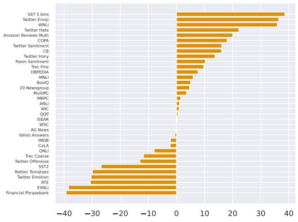  
(a) MUPPET Gain

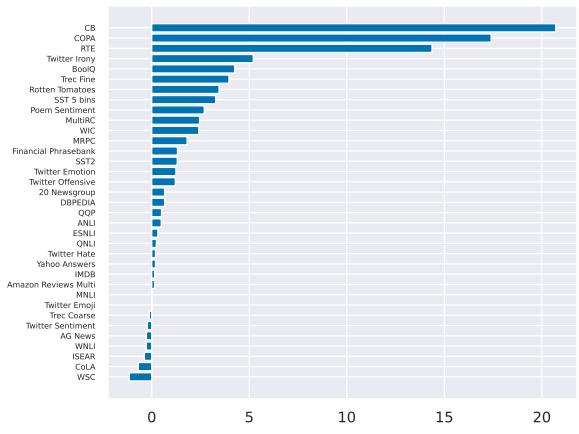  
(b) ColD Gain  
Figure 7: Gains of MUPPET/ColD over finetuning on the pretrained model. ColD is much more consistent, with less datasets that lose from changing from pretrained to ColD and smaller negative effects on them. MUPPET however has larger maximal gain when it does show gains.

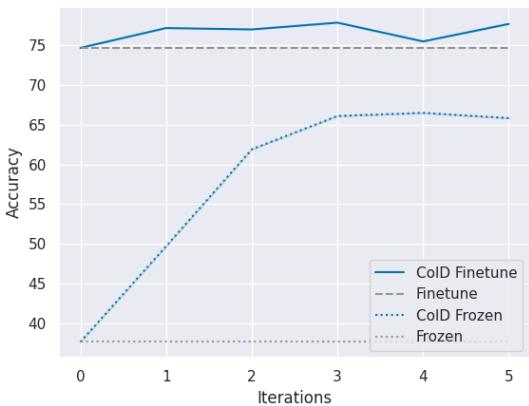  
Figure 8: ColD Fusion on T5. We replicate the main experiment (§5) on a smaller scale. Like in RoBERTa, both ColD and ColD-Frozen lines keep increasing with the iterations.

## F Fix Number of Examples

We depict the ColD Fusion process with multiple tasks (Fig. 10), but only 4K examples per each contributor. This simulates a case where contributors keep streaming new information of different kinds. While this can not fully predict the effect of streaming new tasks, it shows initial positive results in this regard.

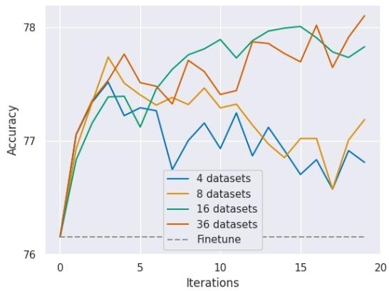  
Figure 9: Number of datasets effect. The graph follows the performance (y-axis) per iteration (x-axis) during ColD Fusion. Each color depicts a different number of datasets pool from where the datsets were randonly picked at each iteration. The pretrained model performance is highlighted by another dashed line.

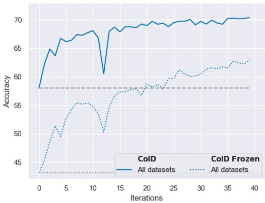  
Figure 10: Running the main experiment with a fixed number of examples. For each finetune over the 36 datasets, we use 5000 examples - regardless the size of of the dataset. We can see that although the absolute results are degraded related to the regular configuration, the performance is increasing monotonically both for the CoLD and CoLD Freeze. meaning more data yields better performance.

<table><tr><td>Dataset</td><td>Finetune</td><td>Multitask</td><td>MUPPET</td><td>ColD-Fusion</td></tr><tr><td>20 Newsgroup</td><td>85.31</td><td>85.25</td><td>90.00</td><td>85.97</td></tr><tr><td>AG News</td><td>89.85</td><td>89.55</td><td>89.77</td><td>89.58</td></tr><tr><td>Amazon Reviews Multi</td><td>66.51</td><td>66.22</td><td>86.50</td><td>66.65</td></tr><tr><td>ANLI</td><td>51.51</td><td>51.48</td><td>52.59</td><td>52.00</td></tr><tr><td>BoolQ</td><td>77.14</td><td>80.27</td><td>82.17</td><td>81.39</td></tr><tr><td>CB</td><td>64.29</td><td>82.86</td><td>80.36</td><td>85.00</td></tr><tr><td>CoLA</td><td>83.43</td><td>82.42</td><td>81.21</td><td>82.74</td></tr><tr><td>COPA</td><td>47.00</td><td>60.00</td><td>65.00</td><td>64.40</td></tr><tr><td>DBPEDIA</td><td>77.49</td><td>77.69</td><td>85.17</td><td>78.15</td></tr><tr><td>ESNLI</td><td>91.00</td><td>91.27</td><td>52.59</td><td>91.31</td></tr><tr><td>Financial Phrasebank</td><td>85.40</td><td>85.26</td><td>46.10</td><td>86.72</td></tr><tr><td>IMDB</td><td>93.86</td><td>93.82</td><td>91.74</td><td>94.01</td></tr><tr><td>ISEAR</td><td>72.78</td><td>71.94</td><td>73.01</td><td>72.40</td></tr><tr><td>MNLI</td><td>87.11</td><td>87.26</td><td>93.04</td><td>87.14</td></tr><tr><td>MRPC</td><td>87.45</td><td>86.96</td><td>88.97</td><td>89.26</td></tr><tr><td>MultiRC</td><td>60.56</td><td>62.34</td><td>64.15</td><td>63.01</td></tr><tr><td>Poem Sentiment</td><td>83.85</td><td>88.27</td><td>94.14</td><td>86.54</td></tr><tr><td>QNLI</td><td>92.42</td><td>92.39</td><td>84.48</td><td>92.66</td></tr><tr><td>QQP</td><td>90.72</td><td>90.89</td><td>91.25</td><td>91.22</td></tr><tr><td>Rotten Tomatoes</td><td>88.03</td><td>90.73</td><td>58.10</td><td>91.48</td></tr><tr><td>RTE</td><td>70.11</td><td>82.17</td><td>39.44</td><td>84.48</td></tr><tr><td>SST2</td><td>93.85</td><td>94.27</td><td>67.06</td><td>95.16</td></tr><tr><td>SST 5 bins</td><td>56.24</td><td>57.56</td><td>94.84</td><td>59.52</td></tr><tr><td>Trec Coarse</td><td>97.32</td><td>97.40</td><td>85.58</td><td>97.20</td></tr><tr><td>Trec Fine</td><td>87.08</td><td>88.28</td><td>96.80</td><td>91.04</td></tr><tr><td>Twitter Emoji</td><td>46.35</td><td>46.02</td><td>82.76</td><td>46.35</td></tr><tr><td>Twitter Emotion</td><td>81.52</td><td>81.25</td><td>51.11</td><td>82.76</td></tr><tr><td>Twitter Hate</td><td>53.76</td><td>53.70</td><td>76.02</td><td>53.95</td></tr><tr><td>Twitter Irony</td><td>71.05</td><td>74.54</td><td>84.77</td><td>76.25</td></tr><tr><td>Twitter Offensive</td><td>84.58</td><td>85.16</td><td>71.57</td><td>85.79</td></tr><tr><td>Twitter Sentiment</td><td>70.94</td><td>70.47</td><td>87.07</td><td>70.72</td></tr><tr><td>WIC</td><td>65.71</td><td>68.06</td><td>66.61</td><td>68.12</td></tr><tr><td>WNLI</td><td>55.21</td><td>51.55</td><td>91.10</td><td>54.93</td></tr><tr><td>WSC</td><td>63.46</td><td>63.27</td><td>63.46</td><td>62.31</td></tr><tr><td>Yahoo Answers</td><td>72.49</td><td>71.71</td><td>71.90</td><td>72.69</td></tr></table>

Table 1: Detailed results of the main experiment. Accuracy score of each dataset, for ColD Fusion and for the 3 baselines: Finetune, our Multitask, and MUPPET.

A For every submission: A1. Did you describe the limitations of your work? 8

A2. Did you discuss any potential risks of your work? Not applicable. Left blank.

A3. Do the abstract and introduction summarize the paper's main claims? abstract Introduction

A4. Have you used AI writing assistants when working on this paper? Left blank.

## BDid you use or create scientific artifacts?

B1. Did you cite the creators of artifacts you used? Whenever relevant 2,3 etc.

B2. Did you discuss the license or terms for use and / or distribution of any artifacts? We provide a model and upload it publicly with a permissive license (MIT), this is technical and is not interesting for the scientific advancement we provide.

B3. Did you discuss if your use of existing artifact(s) was consistent with their intended use, provided that it was specified? For the artifacts you create, do you specify intended use and whether that is compatible with the original access conditions (in particular, derivatives of data accessed for research purposes should not be used outside of research contexts)? The whole paper is about a surprising use of current models, so it is consistent legally, but also unconventional.

B4. Did you discuss the steps taken to check whether the data that was collected / used contains any information that names or uniquely identifies individual people or offensive content, and the steps taken to protect / anonymize it? Not applicable. Left blank.

B5. Did you provide documentation of the artifacts, e.g., coverage of domains, languages, and linguistic phenomena, demographic groups represented, etc.? Not applicable. Left blank.

B6. Did you report relevant statistics like the number of examples, details of train / test / dev splits, etc. for the data that you used / created? Even for commonly-used benchmark datasets, include the number of examples in train / validation / test splits, as these provide necessary context for a reader to understand experimental results. For example, small differences in accuracy on large test sets may be significant, while on small test sets they may not be. Not applicable. Left blank.

## C Did you run computational experiments?

3,4,5

C1. Did you report the number of parameters in the models used, the total computational budget (e.g., GPU hours), and computing infrastructure used? Appendix B

The Responsible NLP Checklist used at ACL 2023 is adopted from NAACL 2022, with the addition of a question on AI writing assistance.

C2. Did you discuss the experimental setup, including hyperparameter search and best-found hyperparameter values? Appendix B + Section 3

C3. Did you report descriptive statistics about your results (e.g., error bars around results, summary statistics from sets of experiments), and is it transparent whether you are reporting the max, mean, etc. or just a single run? Section 4 Fig 2 mainly (the main experiment which includes several runs) Other experiments do not have repetitions but varying a trait, so the clear (not noisy) trend serves as a way to assess variance.

C4. If you used existing packages (e.g., for preprocessing, for normalization, or for evaluation), did you report the implementation, model, and parameter settings used (e.g., NLTK, Spacy, ROUGE, etc.)? Sections such as 3 and Appendices such as A

D  Did you use human annotators (e.g., crowdworkers) or research with human participants? Left blank.

D1. Did you report the full text of instructions given to participants, including e.g., screenshots, disclaimers of any risks to participants or annotators, etc.? Not applicable. Left blank.

D2. Did you report information about how you recruited (e.g., crowdsourcing platform, students) and paid participants, and discuss if such payment is adequate given the participants' demographic (e.g., country of residence)? Not applicable. Left blank.

D3. Did you discuss whether and how consent was obtained from people whose data you're using/curating? For example, if you collected data via crowdsourcing, did your instructions to crowdworkers explain how the data would be used? Not applicable. Left blank.

D4. Was the data collection protocol approved (or determined exempt) by an ethics review board? Not applicable. Left blank.

D5. Did you report the basic demographic and geographic characteristics of the annotator population that is the source of the data? Not applicable. Left blank.