# Cold-Start Data Selection for Better Few-shot Language Model Fine-tuning: A Prompt-based Uncertainty Propagation Approach

Yue Yu1 Rongzhi Zhang1 Ran Xu2 Jieyu Zhang3 Jiaming Shen4 Chao Zhang1

1 Georgia Institute of Technology 2 Emory University

3 University of Washington 4 Google

{yueyu, rongzhi.zhang, chaozhang}@gatech.edu, {ran.xu}@emory.edu, jieyuz2@cs.washington.edu, jmshen@google.com

## Abstract

Large Language Models have demonstrated remarkable few-shot performance, but the performance can be sensitive to the selection of few-shot instances. We present PATRON, a prompt-based data selection method for pretrained language model fine-tuning under coldstart scenarios, i.e., no initial labeled data are available. In PATRON, we design (1) a promptbased uncertainty propagation approach to estimate the importance of data points and (2) a partition-then-rewrite (PTR) strategy to promote sample diversity when querying for annotations. Experiments on six text classification datasets show that PATRON outperforms the strongest cold-start data selection baselines by up to 6.9%. Besides, with 128 labels only, PA-TRON achieves 91.0% and 92.1% of the fully supervised performance based on vanilla finetuning and prompt-based learning respectively. Our implementation of PATRON is available at https://github.com/yueyu1030/Patron.

## 1 Introduction

Pre-trained language models (PLMs) (Devlin et al., 2019; Liu et al., 2019; Raffel et al., 2020) have achieved competitive performance with limited labeled data (Gao et al., 2021a; Schick and Schütze, 2021a,b) for many natural language processing (NLP) tasks. However, there still exists a nonnegligible gap between the performance of fewshot and fully-supervised PLMs. Besides, when the task-specific data for fine-tuning is small, the performance of PLMs can have high variance (Bragg et al., 2021). As illustrated in Figure 1, when fine-tuning RoBERTa-base (Liu et al., 2019) on different subsets of AG News dataset with 32 labels, the performance on the test set varies up to 10% for vanilla fine-tuning and 5% for promptbased learning (Gao et al., 2021a). Such large variations demonstrate the crucial need for strategical selection of training data to improve PLMs’ performance under low-data regimes.

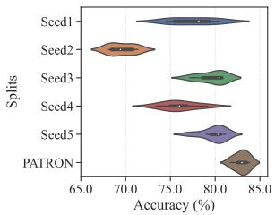  
(a) Fine-tuning

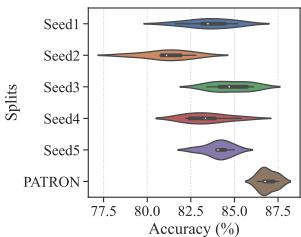  
(b) Prompt-based Learning  
Figure 1: The performance with large variances of vanilla fine-tuning and prompt-based learning on 5 random samplings, compared with better performance with low variances of PATRON (our proposed selection strategy) on AG News (Zhang et al., 2015) with 32 labels.

To solicit training data intelligently, active learning (AL) (Settles, 2011) has been proposed to adaptively annotate unlabeled data (Ash et al., 2020; Ein-Dor et al., 2020; Zhang and Plank, 2021; Margatina et al., 2021, 2022). Despite their efficacy, most of these works assume there are hundreds, or even thousands of labels in the initial stage, and query similarly significant amounts of labeled data in each AL round. In practice, however, we usually do not have any startup labels to initialize the AL process, and the labeling budget can also be limited. This hinders the application of such techniques, as they often rely on a well-trained model with decent uncertainty (Margatina et al., 2021), or gradient estimations (Ash et al., 2020) to perform well.

To facilitate training instance selection on such a challenging low-data regime, cold-start data selection (also known as cold-start AL (Yuan et al., 2020)) has been proposed, where we have only unlabeled data and zero initial labels, and need to design acquisition functions to effectively query samples for PLM fine-tuning.

However, cold-start data selection can be nontrivial for PLMs. Due to the absence of labeled data, the estimated uncertainty for unlabeled data from the PLM can be biased over classes (Zhao et al., 2021). As a result, uncertainty-based approaches can underperform even the random selection strategy (Hacohen et al., 2022). Moreover, cold-start data selection requires greater care to ensure the sample diversity compared to the traditional AL, as fine-tuning PLMs on few redundant data will lead to poor generalization. Existing approaches often first cluster the whole unlabeled data, and then greedily select samples from each cluster with predefined heuristics (Müller et al., 2022), which fails to control the distance between selected samples and thus cannot yield optimal sample diversity because they fail to control the distance between samples from different clusters. In addition, under cold-start scenarios, it is critical to harness the knowledge from PLMs for sample selection. While there are several methods that leverage pretrained embeddings (Hacohen et al., 2022; Chang et al., 2021) or masked language modeling (MLM) loss (Yuan et al., 2020) to assist data selection, the mismatch between pre-training and fine-tuning tasks hurts their efficacy.

To address the above challenges, we propose PATRON1, a prompt-based data-selection strategy tailored for PLMs. To estimate model uncertainty without access to any labeled data under the coldstart setting, PATRON leverages prompts (Gao et al., 2021a), which convert the classification task into a cloze-style task with customized templates and verbalizers, to generate the task-aware pseudo labels for unlabeled data by predicting the surface name for the [MASK] token. In this way, we also bridge the gap between pre-training and downsteam tasks, and distill task-specific knowledge from PLMs to facilitate data selection. However, one important issue for such pseudo labels is they can be inaccurate and biased even after calibration (Zhao et al., 2021). To remedy this, we further propose uncertainty propagation to first measure the correlation between samples based on kernel similarity in the embedding space, and then propagate their prediction uncertainty to their neighbors. Thus, a sample will have higher propagated uncertainty only when the predictive uncertainty for both itself and its neighbors are high, indicating the model is less certain for the local region around this sample.

To select a batch of diverse samples, we go beyond existing techniques and propose a two stage method named partition-then-rewrite (PTR), which is initially proposed for combinatorial optimization (Chen and Tian, 2019), to dynamically adjust the selected sample within each cluster. Concretely, we first use K-Means clustering to partition the unlabeled data and select one sample from each cluster to initialize our solution. We then build a neighbor graph based on k-nearest-neighbor (kNN) to encode the neighborhood relationships among selected data and explicitly control the distances between them. After that, we add an additional regularization term to prevent the selected sample in each cluster from being too close to samples in its neighbor clusters. We iterate the above process for several rounds to gradually refine our solution and promote diversity in data selection.

We apply PATRON to various setups: vanilla finetuning, prompt-based learning, semi-supervised learning and standard multi-round AL to improve the data efficiency for PLM fine-tuning. Our key contributions are as follows: (i) a cold-start data selection paradigm PATRON for addressing the label scarcity issue for few-shot PLM fine-tuning; (ii) an prompt-based uncertainty propagation approach to query most informative samples; (iii) a partition-then-rewrite (PTR) strategy for balancing diversity and informativeness of queried samples and (iv) experiments on six datasets demonstrating PATRON improves the label efficiency over baselines by 3.4%–6.9% on average.

## 2 Related Work

Few-shot Language Model Fine-tuning. Our method is closely relevant to label-efficient learning paradigms in NLP such as cold-start finetuning (Zhang et al., 2020b; Shnarch et al., 2022), prompt-based learning2 (Gao et al., 2021a; Schick and Schütze, 2021a,b; Min et al., 2022; Zhang et al., 2022c; Hu et al., 2022), semi-supervised learning (Du et al., 2021; Wang et al., 2022; Xie et al., 2020; Xu et al., 2023). These works assume a small set of labeled data is given and focus on training strategies design. Instead, we aim to select the most valuable instances from the unlabeled corpus, which is orthogonal to and can be combined with the above methods to enhance label efficiency, as shown in Sec. 5.3 and 5.4.

Training Data Selection. Designing better strategies to selectively annotate training data is a widely studied topic. One important line of research lies in active learning (Zhang et al., 2020a; Schröder et al., 2022; Yu et al., 2022), which improves the label efficiency of deep NLP models. However, most of them need a large number of clean labels to first train the model before data selections (Ru et al., 2020; Zhang and Plank, 2021). Differently, we aim to facilitate training data selection with minimal supervision, where no initial labeled data is given.

The idea of such cold-start data selection has been applied for image classification (Wang et al., 2021; Hacohen et al., 2022) and speech processing (Park et al., 2022), but has not been fully explored for the NLP domain. For this setting, Chang et al. (2021) focus on data selection with pre-trained embeddings, but fail to leverage the task-specific knowledge from PLMs. Yuan et al. (2020) use the MLM loss as a proxy for uncertainty measurement, and Liu et al. (2021a); Su et al. (2022) study few-shot sample selection for billion-scale language models (Brown et al., 2020), but mainly focus on in-context learning. Different from them, we aim to leverage prompts to facilitate sample selection, and design additional techniques (i.e., uncertainty propagation and PTR) to boost the performance of few-shot PLM fine-tuning.

## 3 Background

## 3.1 Problem Formulation

We study cold-start data selection for text classification with c classes formulated as follows: Given a pool of unlabeled samples $\mathcal { D } _ { u } = \{ x _ { j } \} _ { j = 1 } ^ { U }$ and an empty training set $\mathcal { D } _ { l } = \emptyset$ , we aim to fine-tune a pre-trained language model denoted as $f ( \cdot ; \theta )$ under limited labeling budget B interactively: In each round, we use an acquisition function $\mathcal F ( \cdot )$ to query b samples denoted as from $\mathcal { D } _ { u }$ . Next, the acquired samples are labeled and moved from $\mathcal { D } _ { u }$ to $\mathcal { D } _ { l }$ . Then we fine-tune the pre-trained language model $f ( \cdot ; \theta )$ with $\mathcal { D } _ { l }$ to maximize the performance on downstream classification tasks. The above steps can either be one-round (Chang et al., 2021; Hacohen et al., 2022) $( b = | B |$ in this case) or repeated for multiple rounds (Yuan et al., 2020) $( b = | B | / | \mathrm { R o u n d s } | )$ until reaching the budget B .

## 3.2 Prompt-based Learning for PLMs

Prompting methods have been proposed to bridge the gap between the pre-training and fine-tuning stage via applying the cloze-style tasks to fine-tune PLMs (Schick and Schütze, 2021a,b). Formally, there are two key components in prompts: a predefined template $\tau$ , and a verbalizer . For each input sample x, it will be wrapped with the template which contains a piece of natural language text together with a [MASK] token before being fed into the PLM . Then, the verbalizer is used to map the task labels $y$ to individual words $\mathcal { V } ( y )$ in the vocabulary. Take the binary sentiment classification as an example, for input sentence $x ,$ a template $\tau$ could be $\tau ( x ) = [ x$ . It was [MASK].], and the verbalizer for the positive and negative sentiment can be “good” and “terrible”, respectively.

With the template and verbalizer, we can calculate the probability distribution over the label set $\mathcal { V }$ via Mask Language Modeling (MLM) as

$$
p \left( y \mid x \right) = p \left( \left[ \mathsf { M A S K } \right] = \mathcal { V } ( y ) \mid \mathcal { T } ( x ) \right)\tag{1}
$$

where $h _ { [ M A S K ] }$ is the hidden embedding of the [MASK] token and $\pmb { w } _ { \mathcal { V } ( y ) }$ denotes the embedding of the label word $\mathcal { V } ( y )$ from $\mathcal { M }$ . As these tokens’ embeddings have been optimized during pre-training with the MLM objective, the use of prompts narrows the gap between pre-training and fine-tuning. In other words, prompts serve as a source of prior knowledge when adapting PLMs to new tasks.

## 4 Methodology

In this section, we present our method, PATRON, that exploits prompts for cold-start data selection. We first introduce how to leverage prompts for uncertainty estimation under cold-start scenarios. With the estimated uncertainty, we then propose two key designs, namely uncertainty propagation and partition-then-rewrite (PTR) strategy to balance informativeness and diversity for sample selection. The overall procedure is shown in Figure 2.

## 4.1 Uncertainty Estimation with Prompts

We first describe how to estimate the uncertainty for unlabeled data to facilitate PATRON. Given the pre-trained language model (PLM) without labeled data, we leverage prompts to generate pseudo labels3 for uncertainty estimation. According to Eq. 1, we are able to obtain the occurring probability for different label words on each sample $x ,$ based on the prediction of the [MASK] token.

However, directly adopting this probability can be problematic as PLMs suffer from the miscalibration issue (Zhao et al., 2021; Hu et al., 2022), i.e., label words may have varying occurring frequencies, making some of them less likely to be predicted than the others. Thus, the prediction in Eq. 1 and the estimated uncertainty can be biased.

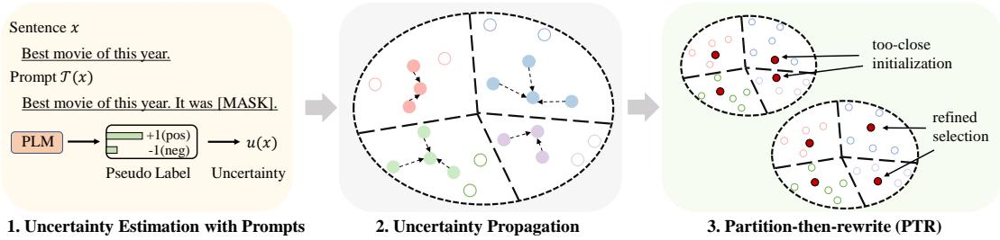  
Figure 2: The illustration of the overall procedure for PATRON.

Being aware of this, we adopt the method in (Hu et al., 2022) to calculate the contextualized prior of the label words. We first construct a support set by choosing k samples with highest $p ( y _ { i } | x )$ for each class i as

$$
\mathcal S = \bigcup _ { i \in \{ 1 , 2 , . . . , c \} } \mathrm { T o p - k } p ( y _ { i } | x ) .\tag{2}
$$

Then, the contextualized prior is approximated by

$$
P ( v ) \approx \frac { 1 } { | \cal { S } | } \sum _ { x \in \cal { S } } P _ { \cal { M } } \left( \left[ \sf M A S K \right] = v \rho | \sigma _ { x } \right) ,\tag{3}
$$

which is used to calibrate the pseudo labels as

$$
\widehat { y _ { i } } = \left( \frac { p ( y _ { i } | x ) } { P ( \mathcal { V } ( y _ { i } ) ) } \right) / \left( \sum _ { j = 1 } ^ { C } \frac { p ( y _ { j } | x ) } { P ( \mathcal { V } ( y _ { j } ) ) } \right) .\tag{4}
$$

After obtaining the pseudo labels, we use entropy (Lewis and Gale, 1994) as the measurement of uncertainty for each sample x as

$$
u ( x ) = - \sum _ { i = 1 } ^ { C } \widehat { y _ { i } } \log \widehat { y _ { i } } .\tag{5}
$$

## 4.2 Uncertainty Propagation for Data Utility Estimation

Although we have mitigated the bias for the promptbased pseudo labels, such pseudo labels can still be inaccurate due to insufficient supervision under zero-shot settings. Under this circumstance, directly using the uncertainty in Eq. 5 for sample selection yields suboptimal results as it can be sensitive to outliers, which naturally have large model uncertainty but are less beneficial for model learning (Karamcheti et al., 2021).

To remedy this issue, we use SimCSE (Gao et al., 2021b) to generate embeddings for sample x as $\mathbf { z } = g ( x ; \theta ) ^ { 4 }$ , and leverage the kernel similarity in the embedding space to measure the correlation between data points and propagate the model uncertainty: for each data point x, we first calculate its K-nearest neighbors based on its Euclidean distance as ${ \mathcal { X } } _ { \mathrm { K N N } } ( x ) = \mathrm { K N N } ( x , { \mathcal { D } } _ { u } )$ . Then, we choose the radial basis function (RBF) (Scholkopf et al., 1997) as the similarity metric for two data points $x _ { i }$ and $x _ { j }$ , denoted as

$$
\kappa \left( x _ { i } , x _ { j } \right) = \exp \left( - \rho \left\| \mathbf { z } _ { i } - \mathbf { z } _ { j } \right\| _ { 2 } ^ { 2 } \right) ,\tag{6}
$$

where $\mathbf { z } _ { i }$ is the embedding of $x _ { i }$ from the SimCSE, and $\rho$ is a hyper-parameter controlling the weight of propagation. Formally, the propagated uncertainty for x can be represented as

$$
\widehat { u } _ { \mathrm { p r o p } } ( x ) = u ( x ) + \frac { \sum _ { x _ { i } \in \mathcal { X } _ { \mathrm { K N N } } ( x ) } \kappa ( x , x _ { i } ) \cdot u ( x _ { i } ) } { | \mathcal { X } _ { \mathrm { K N N } } ( x ) | } .\tag{7}
$$

We highlight that only when the sample has higher uncertainty for both itself and its neighbors will result in higher propagated uncertainty, indicating the PLMs are uncertain about the surrounding regions around the sample. In this case, actively annotating such samples will be most beneficial for PLMs.

## 4.3 Partition-then-rewrite (PTR) for Diversity-Promoting Data Selection

Instead of querying one sample at a time, modern AL methods usually query a batch of samples to improve the query efficiency. In this case, querying samples without considering their correlations will lead to a redundant query set with limited performance gain (Ein-Dor et al., 2020). We now present our PTR strategy for diversity-promoting sample selection underpinned by the estimated uncertainty.

Initialization of Selection with Partition. As PLMs implicitly learn sentence representations clustered by topics (Aharoni and Goldberg, 2020), we first employ K-Means clustering to partition the unlabeled pool $\mathcal { D } _ { u }$ into different clusters based on their embeddings and enforce the coverage over different topics of selected samples. We follow existing works (Chang et al., 2021; Hacohen et al.,

2022) to set the number of clusters equal to $b ,$ denoted as $\mathcal { C } _ { i } \left( 1 \le i \le b \right) ^ { 5 }$ . We then use a greedy method to select one sample $q _ { i }$ from $\mathcal { C } _ { i }$ to initialize the selected data pool as

$$
q _ { i } = \underset { x _ { j } \in \mathcal C _ { i } } { \mathrm { a r g m a x } } \left( \widehat { u } _ { \mathrm { p r o p } } ( x _ { j } ) - \beta \Vert \mathbf { z } _ { j } - \overline { { \mathbf { z } } } _ { i } \Vert _ { 2 } ^ { 2 } \right)\tag{8}
$$

where $\begin{array} { r } { \mathbf { \bar { z } } _ { i } = \frac { 1 } { | \mathcal { C } _ { i } | } { \sum } _ { x _ { j } \in \mathcal { C } _ { i } } \mathbf { z } _ { j } } \end{array}$ is the centroid for the cluster i and $\dot { \boldsymbol { \beta } }$ is a hyperparameter. In this way, data points with higher propagated uncertainty while not being faraway from most of the data points are selected to balance between the uncertainty and diversity.

Sample Refinement with Rewriting. Although the previous steps attempt to select the most informative samples within each cluster, they fail to model the relations among samples in different clusters. As a result, samples can still be very close to other selected samples in adjacent clusters, leading to the limited overall diversity. To tackle this issue, we build an additional KNN graph to retrieve the nearest query samples from other clusters as

$$
\mathcal { X } _ { \mathrm { c - K N N } , i } = \mathrm { K N N } ( q _ { i } , \mathcal { Q } ) .\tag{9}
$$

Note that we use c-KNN to denote the cluster-level KNN to differentiate from the sample-level KNN in Sec. 4.2. To update the selected pool , for cluster i, we add an additional regularization term to Eq. 8 to prevent samples in adjacency clusters from being overly close:

$$
\begin{array} { c } { { \displaystyle \widetilde { q } _ { i } = \underset { x _ { j } \in \mathcal { C } _ { i } } { \mathrm { a r g m a x } } \left( \widehat { u } _ { \mathrm { p r o p } } ( x _ { j } ) - \beta \left. \mathbf { z } _ { j } - \mathbf { \bar { z } } _ { i } \right. _ { 2 } \right. } } \\ { { \displaystyle \left. - \gamma \sum _ { q _ { k } \in \mathcal { X } _ { \mathrm { c - k n n } , i } } \left[ m - \left. \mathbf { z } _ { j } - \mathbf { z } _ { k } \right. _ { 2 } \right] _ { + } \right) } , } \end{array}\tag{10}
$$

where $\gamma$ is the weight for the penalty term, $m =$ 0.5 is the pre-defined margin, $[ \cdot ] _ { + } = \operatorname* { m a x } ( \cdot , 0 )$ is the gating function. To interpret the regularization term, we argue that when the distance between the selected samples in adjacency clusters is smaller than m, the regularization will be greater than 0 to discourage them from being selected together.

We run the above rewriting steps several times until convergence $( e . g .$ , the selected samples do not change anymore) to obtain the final set $\mathcal { Q } =$ $\{ \widetilde { q } _ { i } \} _ { i = 1 } ^ { b }$ , which usually takes 2-3 iterations6. The ealgorithm of PATRON is in Alg. 1.

Algorithm 1: Process of PATRON Strategy.   
Input: Unlabeled samples $\lambda _ { u } ;$ Pre-trained LM   
$\mathcal { M } = f ( \cdot ; \theta )$ , number of acquired samples B,   
the number of iterations $T ( \dot { T } { = } 2$ in this work).   
// Step 1: Uncertainty Propagationfor Utility   
Estimation.   
1a. Calculate uncertainty for samples $x \in \mathcal { X } _ { u }$ with   
prompts based on Eq. (5).   
1b. Estimate uncertainty $\widehat { u } _ { \mathrm { p r o p } }$ with Eq. (6) and (7).   
// Step 2: Predict-then-propagate (PTR)for Diversity   
Promoting Selection.   
2a. Run K-Means on u with k=B until convergence.   
2b. Select initial sample set ${ \mathcal Q } ^ { ( 0 ) }$ based on Eq. (8).   
for $t = 1 , 2 , \cdots , T$ do   
2c. Building the additional KNN graph to obtain   
c-KNN with Eq. (9).   
2d. Update ${ \mathcal { Q } } ^ { ( t ) }$ by optimizing the selected   
sample within each cluster q with Eq. (10).   
eOutput: The final selected labeled data ${ \mathcal { Q } } ^ { ( T ) }$

## 5 Experiments

## 5.1 Experiment Setup

Datasets. We use six NLP classification tasks in our experiments: IMDB (Maas et al., 2011), Yelpfull (Meng et al., 2019), AG News (Zhang et al., 2015), Yahoo! Answers (Zhang et al., 2015), DB-Pedia (Lehmann et al., 2015), and TREC (Li and Roth, 2002). All the datasets are in English, and their detailed statistics, as well as the template for prompts, are shown in Appendix A. Besides, we use 3 additional datasets to evaluate the out-ofdistribution (OOD) performance, the details are in Appendix A.3 and G.1.

Evaluation Setup. Following (Chang et al., 2021; Chen et al., 2021), we focus on one-round data selection in our main experiments because it can more faithfully reflect the performance of different strategies. We choose the labeling budget B from {32, 64, 128} to simulate the few-shot scenario and align with existing works (Müller et al., 2022; Shnarch et al., 2022). We also apply PATRON for standard multi-round AL (see Sec. 5.4).

Implementation Details. We choose RoBERTabase (Liu et al., 2019) from the Hugging Face codebase (Wolf et al., 2020) for all the compared methods. For prompt-based learning, we use Open-Prompt (Ding et al., 2022) as the codebase. More details settings are in Appendix C.

## 5.2 Baselines

We mainly compare PATRON with the following baselines.

Random: It acquires annotations randomly.

<table><tr><td>Task</td><td>C</td><td>|B|</td><td>Random</td><td>Uncertainty</td><td>CAL</td><td>BERT-KM</td><td>Coreset</td><td>Margin-KM</td><td>ALPS</td><td>TPC</td><td>PATRON (Ours)</td></tr><tr><td rowspan="4">IMDB</td><td>2</td><td>32 64</td><td>80.2 ± 2.5 82.6 ± 1.4</td><td>81.9 ± 2.7 84.7 ± 1.5</td><td>77.8 ± 2.4 81.2 ± 3.4</td><td>79.2 ± 1.6 84.9 ± 1.5</td><td>74.5 ± 2.9 82.8 ± 2.5</td><td>76.7 ± 3.5 84.0 ± 2.0</td><td>82.2 ± 3.0 86.1 ± 0.9</td><td>82.8 ± 2.2 84.0 ± 0.9</td><td>85.5 ± 1.5** 87.3 ± 1.0**</td></tr><tr><td></td><td>128</td><td>86.6 ± 1.7</td><td>87.1 ± 0.7</td><td>87.9 ± 0.9</td><td>88.5 ± 1.6</td><td></td><td>88.2 ± 1.0</td><td>87.5 ± 0.8</td><td>88.1 ± 1.4</td><td>89.6 ± 0.4 *</td></tr><tr><td></td><td></td><td></td><td></td><td></td><td></td><td>87.8 ± 0.8</td><td></td><td></td><td></td><td></td></tr><tr><td></td><td>32</td><td>30.2 ± 4.5</td><td>32.7 ± 1.0</td><td>36.6 ± 1.6</td><td>35.2 ± 1.0</td><td>32.9 ± 2.8</td><td>32.7 ± 0.4</td><td>36.8 ± 1.8</td><td>32.6 ± 1.5</td><td>35.9 ± 1.6</td></tr><tr><td rowspan="3">Yelp-F</td><td>5</td><td>64</td><td>42.5 ± 1.7</td><td>36.8 ± 2.1</td><td>41.2 ± 0.2</td><td>39.3 ± 1.0</td><td>39.9 ± 3.4</td><td>39.8 ± 1.2</td><td>40.3 ± 2.6</td><td>39.7 ± 1.8</td><td>44.4 ± 1.1 *</td></tr><tr><td></td><td>128</td><td>47.7 ± 2.1</td><td>41.3 ± 1.9</td><td>45.7 ± 1.3</td><td>46.4 ± 1.3</td><td>49.4 ± 1.6</td><td>47.1 ± 1.2</td><td>45.1 ± 1.0</td><td>46.8 ± 1.6</td><td>51.2 ± 0.8**</td></tr><tr><td></td><td>32</td><td>73.7 ± 4.6</td><td>73.7 ± 3.0</td><td>69.4 ± 4.5</td><td>79.1 ± 2.7</td><td>78.6 ± 1.6</td><td>75.1 ± 1.8</td><td>78.4 ± 2.3</td><td>80.7 ± 1.8</td><td>83.2 ± 0.9**</td></tr><tr><td rowspan="3">AG News</td><td>4</td><td>64</td><td>80.0 ± 2.5</td><td>80.0 ± 2.2</td><td>78.5 ± 3.7</td><td>82.4 ± 2.0</td><td>82.0 ± 1.5</td><td>81.1 ± 2.2</td><td>82.6 ± 2.5</td><td>83.0 ± 2.4</td><td>85.3 ± 0.7**</td></tr><tr><td></td><td>128</td><td>84.5 ± 1.7</td><td>82.5 ± 0.8</td><td>81.3 ± 0.9</td><td>85.6 ± 0.8</td><td>85.2 ± 0.6</td><td>85.7 ± 0.3</td><td>84.3 ± 1.7</td><td>85.7 ± 0.3</td><td>87.0 ± 0.6**</td></tr><tr><td></td><td>32</td><td>43.5 ± 3.0</td><td>23.0 ± 1.6</td><td>26.6 ± 2.5</td><td>46.8 ± 2.1</td><td></td><td></td><td></td><td></td><td>56.8 ± 1.0**</td></tr><tr><td rowspan="3">Yahoo! Ans.</td><td>10</td><td>64</td><td>53.1 ± 3.1</td><td>37.6 ± 2.0</td><td>30.0 ± 1.7</td><td>52.9 ± 1.6</td><td>22.0 ± 2.3 45.7 ± 3.7</td><td>34.0 ± 2.5 44.4 ± 2.8</td><td>47.7 ± 2.3 55.3 ± 1.8</td><td>36.9 ± 1.8 54.0 ± 1.6</td><td>61.9 ± 0.7**</td></tr><tr><td></td><td>128</td><td>60.2 ± 1.5</td><td>41.8 ± 1.9</td><td>41.1 ± 0.9</td><td>61.3 ± 1.0</td><td>56.9 ± 2.5</td><td>52.1 ± 1.2</td><td>60.8 ± 1.9</td><td>58.2 ± 1.5</td><td>65.1 ± 0.6**</td></tr><tr><td></td><td></td><td></td><td></td><td></td><td></td><td></td><td></td><td></td><td></td><td></td></tr><tr><td rowspan="3">DBPedia</td><td>14</td><td>32 64</td><td>67.1 ± 3.2 86.2 ± 2.4</td><td>18.9 ± 2.4 37.5 ± 3.0</td><td>14.6 ± 1.5 20.7 ± 2.0</td><td>83.3 ± 1.0 92.7 ± 0.9</td><td>64.0 ± 2.8 85.2 ± 0.8</td><td>55.1 ± 2.2 78.0 ± 4.1</td><td>77.5 ± 4.0 89.7 ± 1.1</td><td>78.2 ± 1.8 88.5 ± 0.7</td><td>85.3 ± 0.9** 93.6 ± 0.4**</td></tr><tr><td></td><td>128</td><td>95.0 ± 1.5</td><td>47.5 ± 2.3</td><td>26.8 ± 1.4</td><td>96.5 ± 0.5</td><td>89.4 ± 1.5</td><td>85.6 ± 1.9</td><td>95.7 ± 0.4</td><td>95.7 ± 0.6</td><td>97.0 ± 0.2 *</td></tr><tr><td></td><td></td><td></td><td></td><td></td><td></td><td></td><td></td><td></td><td></td><td></td></tr><tr><td rowspan="3">TREC</td><td></td><td>32 64</td><td>49.0 ± 2.6</td><td>46.6 ± 1.4 59.8 ± 3.2</td><td>23.8 ± 3.0</td><td>60.3 ± 1.5 77.3 ± 2.0</td><td>47.1 ± 3.6</td><td>49.5 ± 1.2</td><td>60.5 ± 3.7</td><td>42.0 ± 4.4</td><td>64.0 ± 1.2** 78.6 ± 1.6**</td></tr><tr><td>6</td><td>128</td><td>69.1 ± 2.7 85.6 ± 2.5</td><td>75.0 ± 1.8</td><td>28.8 ± 3.1 50.5 ± 1.9</td><td>87.7 ± 1.5</td><td>75.7 ± 3.0 87.6 ± 3.0</td><td>63.0 ± 2.5 80.5 ± 2.8</td><td>73.0 ± 2.0 87.3 ± 3.6</td><td>72.6 ± 2.1 83.0 ± 3.8</td><td>91.1 ± 0.8**</td></tr><tr><td></td><td></td><td></td><td></td><td></td><td></td><td></td><td></td><td></td><td></td><td></td></tr><tr><td rowspan="3">Average</td><td></td><td>32</td><td>57.2</td><td>46.1</td><td>41.5</td><td>64.0</td><td>53.2</td><td>53.8</td><td>63.9</td><td>58.9</td><td>68.4 (↑ 6.9%)</td></tr><tr><td></td><td>64</td><td>68.9 76.6</td><td>56.1</td><td>46.8</td><td>71.6</td><td>68.5</td><td>65.1</td><td>71.2</td><td>70.3</td><td>75.2 (↑ 5.0%)</td></tr><tr><td></td><td>128</td><td></td><td>62.5</td><td>55.6</td><td>77.6</td><td>76.1</td><td>73.2</td><td>76.8</td><td>76.3</td><td>80.2 (↑ 3.4%)</td></tr></table>

Table 1: Main results of cold-start data selection on six datasets with 10 runs. Here c means the number of classes and B is the number of acquired samples. We use accuracy as the metric, and the higher value indicates better performance. Since TREC is an imbalanced dataset, we report the F1 score in Appendix G.2. Bold and underline indicate the best and second best results for each setting respectively. We use to indicate standard deviation and use \*/\*\* to indicate statistical significant results according to student’s t-test at level 0.05/0.01. (Same as belows.)

Uncertainty (Schröder et al., 2022): It acquires annotations on samples with the highest uncertainty in Eq. 5 after calibration. We use ENTROPY (Lewis and Gale, 1994) as the uncertainty estimate.

CAL (Margatina et al., 2021): It selects samples based on the KL divergence between the prediction of itself and that of its neighbors.

Coreset (Sener and Savarese, 2018): It selects samples such that the largest distance between a data point and its nearest center is minimized.

BERT-KM (Chang et al., 2021): It first uses K-Means to cluster pre-trained embeddings and then selects one example from each cluster that is closest to the center of the cluster.

Margin-KM (Müller et al., 2022): It utilizes K-Means clustering to group pre-trained embeddings, followed by the selection of samples with the minimum margin between the two most likely probabilities from each cluster.

ALPS (Yuan et al., 2020): It uses the masked language model (MLM) loss of BERT to generate surprisal embeddings to query samples.

TPC (Hacohen et al., 2022): It is the most recent method for CSAL, which first calculates the density for each data point, and then selects those with the highest density from each cluster.

## 5.3 Main Results

Table 1 reports the performance of PATRON and the baselines under different budgets B on 10 runs. We have also shown the performance with full labeled data in Table 4 for reference7. From these results, we have the following observations: (1) Compared with the baselines, PATRON achieves the best overall performance on the six datasets, with an average gain of 3.4%–6.9% over the strongest baselines under different annotation budgets. Moreover, with 128 labels only (<0.5% of total labeled data), PATRON obtains 91.0% of the fully supervised performance on the average of six datasets. It is also worth noting that PATRON also lead to more stable results — it achieves lower standard deviations when compared with baselines on 14 of 18 cases. These results justify the benefits of PATRON in cold-start setting.

(2) We observe the performance gains are more significant for datasets with larger number of classes (e.g. TREC, Yahoo!). This observation further strengthens the benefits of PATRON in resolving label scarcity issue brought by cold-start setting, because for datasets with more classes, each class would have less labeled data given a fixed budget. (3) Similar to the findings in (Hacohen et al., 2022), pure uncertainty-based AL methods (e.g. CAL) do not perform well under cold-start settings. The reason is two-fold: (1) these methods focus on choosing ‘hard samples’ without considering the sample diversity, leading to imbalanced label distribution for acquired samples; (2) they do not consider the potential bias in uncertainty estimation.

<table><tr><td>Task</td><td>C</td><td>|B|</td><td>Random</td><td>Uncertainty</td><td>CAL</td><td>BERT-KM</td><td>Coreset</td><td>Margin-KM</td><td>ALPS</td><td>TPC</td><td>PATRON (Ours)</td></tr><tr><td rowspan="4">IMDB</td><td>2</td><td>32 64</td><td>81.8 ± 2.5 85.6 ± 1.3</td><td>82.4 ± 1.7 86.0 ± 1.4</td><td>79.6 ± 1.6 81.1 ± 1.9</td><td>81.7 ± 1.3 84.2 ± 0.9</td><td>85.5 ± 1.1 87.8 ± 0.6</td><td>86.0 ± 1.2 87.6 ± 0.7</td><td>83.5 ± 2.6 84.4 ± 1.6</td><td>84.5 ± 0.9 85.8 ± 1.2</td><td>86.5 ± 0.9 88.8 ± 0.8*</td></tr><tr><td></td><td>128</td><td>87.7 ± 0.4</td><td>88.4 ± 0.5</td><td>83.0 ± 2.0</td><td>88.5 ± 0.8</td><td>88.9 ± 0.5</td><td></td><td>88.9 ± 0.3</td><td></td><td>89.3 ± 0.3</td></tr><tr><td></td><td></td><td></td><td></td><td></td><td></td><td></td><td>89.1 ± 0.4</td><td></td><td>88.0 ± 0.5</td><td></td></tr><tr><td></td><td>32</td><td>48.9 ± 1.3</td><td>46.6 ± 0.9</td><td>47.9 ± 0.6</td><td>45.5 ± 1.0</td><td>46.0 ± 1.5</td><td>47.5 ± 1.1</td><td>47.0 ± 1.0</td><td>49.8 ± 0.5</td><td>50.5 ± 0.8*</td></tr><tr><td rowspan="3">Yelp-F</td><td>5</td><td>64</td><td>51.0 ± 0.8</td><td>49.9 ± 0.8</td><td>49.4 ± 1.1</td><td>51.9 ± 0.5</td><td>48.8 ± 1.2</td><td>52.6 ± 0.6</td><td>52.8 ± 0.5</td><td>52.3 ± 0.7</td><td>53.6 ± 0.3**</td></tr><tr><td></td><td>128</td><td>51.3 ± 0.9</td><td>50.8 ± 0.6</td><td>48.7 ± 1.6</td><td>51.5 ± 1.4</td><td>53.7 ± 1.1</td><td>54.2 ± 0.7</td><td>51.7 ± 0.5</td><td>51.0 ± 0.7</td><td>55.6 ± 0.6**</td></tr><tr><td></td><td>32</td><td>83.1 ± 1.2</td><td>82.8 ± 2.0</td><td>81.4 ± 1.0</td><td>84.9 ± 0.9</td><td>85.1 ± 1.5</td><td>84.6 ± 1.7</td><td>84.2 ± 0.8</td><td>85.6 ± 1.0</td><td>86.8 ± 0.3**</td></tr><tr><td rowspan="3">AG News</td><td>4</td><td>64</td><td>84.5 ± 1.3</td><td>84.3 ± 1.4</td><td>82.6 ± 1.2</td><td>86.5 ± 0.8</td><td>86.4 ± 1.3</td><td>85.9 ± 0.7</td><td>86.2 ± 0.5</td><td>85.6 ± 0.5</td><td>87.4 ± 0.6*</td></tr><tr><td></td><td>128</td><td>84.9 ± 0.5</td><td>83.1 ± 0.8</td><td>83.0 ± 0.9</td><td>87.6 ± 0.4</td><td>87.5 ± 0.3</td><td>87.1 ± 0.4</td><td>87.5 ± 0.4</td><td>87.0 ± 0.6</td><td>87.8 ± 0.3</td></tr><tr><td></td><td>32</td><td>58.5 ± 4.0</td><td>55.0 ± 3.0</td><td>54.0 ± 1.5</td><td>61.4 ± 1.8</td><td>55.3 ± 2.1</td><td>57.8 ± 2.6</td><td></td><td>57.0 ± 1.6</td><td>63.2 ± 1.2*</td></tr><tr><td rowspan="3">Yahoo! Ans.</td><td>10</td><td>64</td><td>62.2 ± 1.0</td><td>60.4 ± 0.7</td><td>58.6 ± 1.3</td><td>62.8 ± 0.7</td><td>59.5 ± 0.7</td><td>58.8 ± 1.2</td><td>61.9 ± 0.9 63.3 ± 0.8</td><td>60.8 ± 0.7</td><td>66.2 ± 0.3**</td></tr><tr><td></td><td>128</td><td>64.7 ± 1.3</td><td>63.0 ± 1.2</td><td>60.1 ± 1.8</td><td>65.4 ± 1.2</td><td>62.7 ± 1.0</td><td>65.4 ± 0.7</td><td>65.9 ± 0.7</td><td>66.2 ± 0.6</td><td>67.6 ± 0.5**</td></tr><tr><td></td><td></td><td></td><td></td><td></td><td></td><td></td><td></td><td></td><td></td><td></td></tr><tr><td rowspan="3">DBPedia</td><td>14</td><td>32 64</td><td>89.1 ± 3.0 95.5 ± 1.2</td><td>77.9 ± 2.8 86.3 ± 1.0</td><td>58.9 ± 1.3 63.5 ± 1.7</td><td>94.1 ± 1.4 95.8 ± 0.7</td><td>92.0 ± 0.6 96.1 ± 0.4</td><td>90.6 ± 0.7 95.5 ± 0.6</td><td>91.2 ± 2.8 95.4 ± 0.7</td><td>94.3 ± 0.5 95.6 ± 0.5</td><td>95.4 ± 0.4** 96.9 ± 0.2**</td></tr><tr><td></td><td>128</td><td>96.0 ± 0.6</td><td>87.8 ± 0.7</td><td>78.1 ± 2.0</td><td>97.2 ± 0.2</td><td>96.4 ± 0.5</td><td>96.6 ± 0.4</td><td>96.8 ± 0.3</td><td>97.0 ± 0.3</td><td>97.4 ± 0.1*</td></tr><tr><td></td><td></td><td></td><td></td><td></td><td></td><td></td><td></td><td></td><td></td><td></td></tr><tr><td rowspan="3">TREC</td><td>6</td><td>32 64</td><td>69.4 ± 2.8</td><td>66.4 ± 3.5</td><td>41.6 ± 2.5 49.8 ± 1.5</td><td>68.1 ± 2.3 78.8 ± 2.0</td><td>61.0 ± 4.6</td><td>64.8 ± 2.7</td><td>72.1 ± 2.3</td><td>59.5 ± 3.3</td><td>76.1 ± 1.1** 81.9 ± 1.3*</td></tr><tr><td></td><td>128</td><td>75.4 ± 1.4 85.0 ± 2.1</td><td>68.0 ± 2.3 78.8 ± 2.0</td><td>67.2 ± 2.7</td><td>85.6 ± 1.8</td><td>78.6 ± 1.3 84.2 ± 2.4</td><td>74.2 ± 1.4 78.0 ± 1.9</td><td>80.6 ± 0.9</td><td>77.8 ± 1.5</td><td>88.9 ± 1.0**</td></tr><tr><td></td><td></td><td></td><td></td><td></td><td></td><td></td><td></td><td>86.5 ± 2.0</td><td>80.6 ± 1.4</td><td></td></tr><tr><td rowspan="3">Average</td><td></td><td>32</td><td>71.9</td><td>68.6</td><td>60.4</td><td>72.6</td><td>71.0</td><td>71.9</td><td>73.2</td><td>71.8</td><td>76.5 (↑ 4.5%)</td></tr><tr><td></td><td>64</td><td>75.7</td><td>72.5</td><td>64.2</td><td>76.7</td><td>69.5</td><td>75.7</td><td>71</td><td>76.3</td><td>79.5 (↑ 3.1%)</td></tr><tr><td></td><td>128</td><td>78.2</td><td>75.3</td><td>70.0</td><td>79.3</td><td>78.9</td><td>78.4</td><td>79.5</td><td>78.3</td><td>81.1 (↑ 2.0%)</td></tr></table>

Table 2: Experimental result for prompt-based learning (Gao et al., 2021a) on six datasets with 10 runs.

(4) Diversity-based methods (e.g. ALPS, BERT-KM) generally achieve better performance over the uncertainty-based strategies. Intriguingly, we find that directly using K-Means performs better than other hybrid approaches with more complicated operations (e.g. TPC, ALPS) for data selection, especially for datasets with larger number of classes. This is because these complex methods often ignore the diversity of selected samples in adjacent clusters and therefore underperform PATRON.

## 5.4 Adapting PATRON to Other Settings

Here, we adapt PATRON to other related settings to demonstrate its general applicability.

Multi-round Low-budget Active Learning. PA-TRON can also be applied in standard multi-round active learning. We study an AL setting where the labeling budget is set to 512 and the queries to 64 labels in each round (8 rounds in total). More details are in Appendix B.4. Figure 3 shows the result of PATRON and the baselines on 3 datasets (Result of the other 3 datasets are in Appendix G.3). From the results, we observe that PATRON also achieves competitive performance when compared with baselines. One exception is the IMDB dataset, where uncertainty-based methods outperform PA-TRON when the annotation size is larger than 256. This phenomenon indicates that when the labels are abundant and the cold-start issue is mitigated, uncertainty-based methods can be employed to further enhance the performance (Yuan et al., 2020). In this case, we can design hybrid strategies to combine PATRON and uncertainty-based methods for acquiring labeled data.

Prompt-based Few-shot Learning. Prompt-based Learning (Liu et al., 2021b) is another popular approach to promote the data efficiency for PLMs. To demonstrate the compatibility of PA-TRON with prompt-based learning, we leverage the same prompt as the pseudo label generation part (Sec. 4.2), and use the same pipeline as LM-BFF (Gao et al., 2021a) to fine-tune the PLM. Table 2 shows the result of few-shot prompt-based learning using {32, 64, 128} samples. From the result, we find that LM-BFF performs better than vanilla fine-tuning with 12.5% gain on average, which makes further improvements difficult. However, PATRON still outperforms the best baseline by 2.0%–4.5%. We remark that PATRON is naturally suitable for prompt-based learning, as we leverage the uncertainty derived from prompt-based predictions to assist data selection.

Semi-supervised Learning. When there are large amounts of unlabeled data, Semi-supervised Learning (SSL) methods can be used to improve AL performance. Here, we choose two representative SSL methods: unsupervised data augmentation (UDA) (Xie et al., 2020) and self-training (ST) (Yu et al., 2021). Different from the vanilla SSL setting which randomly selects labeled data from the whole unlabeled corpus, the labeled data is chosen from the unlabeled corpus based on the designed data selection strategies. Table 3 exhibits the results for PATRON and baselines. Notably, when the selection strategy is sub-optimal, directly adopting SSL approaches cannot bring additional performance gains. This is because the PLM fine-tuned on those samples is likely to produce incorrect pseudo labels. As a result, such incorrect labeled samples will hurt the final performance. In contrast, we observe that PATRON leads to better performance for PLMs than baselines, which indicates the potentials of combining PATRON with SSL approaches.

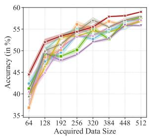  
(a) Yelp-full

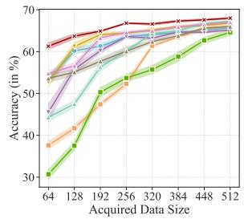  
(b) Yahoo!

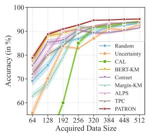  
(c) TREC  
Figure 3: The comparision of PATRON with other baselines under standard multiround AL setting. The results of other three datasets are deferred to Appendix G.3.

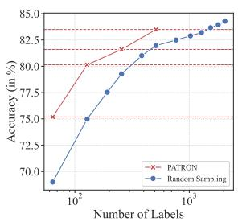  
Figure 4: The comparison of PATRON and random sampling with various volume of labeled data.

<table><tr><td>Dataset (→) |</td><td colspan="2">AG News</td><td colspan="2">TREC</td></tr><tr><td>Method (↓)</td><td>UDA</td><td>ST</td><td>UDA</td><td>ST</td></tr><tr><td>Random</td><td> $\overline { { 7 8 . 0 \pm 2 . 1 } }$ </td><td> $\overline { { 8 2 . 9 \pm 1 . 5 } }$ </td><td> $\overline { { 5 6 . 5 \pm 3 . 0 } }$ </td><td> $\overline { { 5 6 . 0 \pm 2 . 5 } }$ </td></tr><tr><td>Uncertainty</td><td> $7 4 . 5 \pm 1 . 6$ </td><td> $7 1 . 9 \pm 2 . 0$ </td><td> $5 1 . 6 \pm 1 . 5$ </td><td> $4 4 . 2 \pm 2 . 3$ </td></tr><tr><td>CAL</td><td> $7 1 . 0 \pm 2 . 0$ </td><td> $6 6 . 8 \pm 2 . 7$ </td><td> $2 3 . 5 \pm 2 . 1$ </td><td> $2 2 . 4 \pm 2 . 1$ </td></tr><tr><td>BERT-KM</td><td> $\overline { { 8 3 . 4 \pm 1 . 0 } }$ </td><td> $8 5 . 2 \pm 1 . 1$ </td><td> $6 8 . 4 \pm 1 . 6$ </td><td> $6 7 . 2 \pm 2 . 1$ </td></tr><tr><td>Coreset</td><td> $8 2 . 1 \pm 1 . 0$ </td><td> $\underline { { 8 5 . 4 \pm 0 . 6 } }$ </td><td> $\overline { { 5 1 . 1 \pm 2 . 0 } }$ </td><td> $4 8 . 0 \pm 2 . 4$ </td></tr><tr><td>Margin-KM</td><td> $\overline { { 7 7 . 1 \pm 1 . 2 } }$ </td><td> $8 3 . 1 \pm 1 . 4$ </td><td> $\overline { { 5 4 . 4 \pm 1 . 8 } }$ </td><td> $\overline { { 5 0 . 5 \pm 1 . 6 } }$ </td></tr><tr><td>ALPS</td><td> $8 2 . 7 \pm 0 . 8$ </td><td> $8 4 . 5 \pm 0 . 8$ </td><td> $6 8 . 8 \pm { 1 . 6 }$ </td><td> $7 1 . 0 \pm 1 . 2$ </td></tr><tr><td>TPC</td><td> $8 3 . 8 \pm 0 . 5$ </td><td> $8 5 . 5 \pm 0 . 4$ </td><td> $\overline { { 4 8 . 0 \pm 1 . 9 } }$ </td><td> $\overline { { 4 8 . 8 \pm 2 . 1 } }$ </td></tr><tr><td>PATRON</td><td> $\overline { { { \bf 8 4 . 9 \pm 0 . 5 } } }$ </td><td> $\overline { { { \bf 8 6 . 4 \pm 0 . 3 } } }$  一</td><td> $\overline { { 7 1 . 7 \pm 1 . 0 } }$ </td><td> $\overline { { 7 3 . 6 \pm 0 . 5 } }$ </td></tr></table>

Table 3: Experimental results for combining two semisupervised learning: unsupervised data augmentation (UDA) and self-training (ST) with different data selection strategies on 2 datasets with the budget of 32 labels.

## 5.5 Label Efficiency Analysis

Figure 4 demonstrate the average performance on six datasets with different volume of labeled data selected via random sampling and PATRON. The label efficiency curve for each dataset is shown in Fig. 9. We notice that PATRON largely alleviates the label scarsity bottleneck: with 128 labels as the budget, PATRON achieves better performance with 2X labels. Furthermore, after collecting 512 labels with multi-round AL (Sec. 5.4), PATRON achieves 95% of the fully-supervised performance on average, which is comparable with the performance using 3X labels based on random sampling. These results clearly justify that PATRON is capable of promoting the label efficiency of PLMs.

## 5.6 Ablation Study

We study the effects of different components of PA-TRON, including the prompt-based uncertainty calibration in Eq. 4 and propagation in Eq. 7 (Prompt, UC and UP respectively), the feature encoder (Sim-$\mathrm { C S E } ) ^ { 8 }$ , as well as the PTR strategy. We evaluated on the TREC and Yahoo! datasets with 32 labels as the budget. The results in Fig. 5(a) show that all these components contribute to the final performance of PATRON. We find that the SimCSE brings considerable performance gains, as the embeddings generated via RoBERTa-base suffer from the degeneration issue (Li et al., 2020) and become less discriminative. Besides, the usage of prompts, UC, and UP enable us to complement the SimCSE embeddings with the prompt-based pseudo labels and improve the performance significantly. Lastly, PTR is beneficial for AL by regularizing the distance among selected samples.

## 5.7 PATRON is Robust to Hyperparameters

PATRON introduces three additional hyperparameters $( \rho$ in Eq. 6, β in Eq. 8 and $\gamma$ in Eq. 10), and Figure 5(b)–5(d) show the effects of them in PA-TRON on two datasets with 32 labels as the budget. The results on other datasets are in Appendix G.4.

In general, the model is robust to them as the PATRON outperforms the baselines in most cases with different hyperparameters. We also notice that the performance is not sensitive to $\gamma$ . Besides, the performance first increases then decreases for both $\rho$ and $\beta .$ For $\rho ,$ setting it too large makes the propagated uncertainty too small, and setting it too small makes the influence of neighbor samples too strong and hurt data utility estimation. For $\beta ,$ the sampled data is less informative with a too large $\beta ,$ while being too close from others during initialization with a too small $\beta .$ To sum up, the additional hyperparameters of PATRON will not increase the burden of hyperparameter tuning, but improve the modeling flexibility of PATRON to adapt to different tasks.

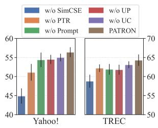  
(a) Ablation Study

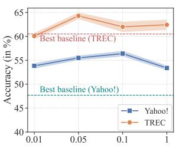  
(b) Effect of ρ.

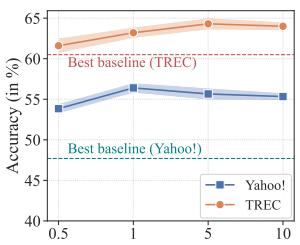  
(c) Effect of β.

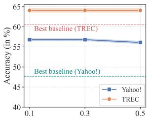  
(d) Effect of γ.

Figure 5: Ablation and Hyper-parameter Study.  
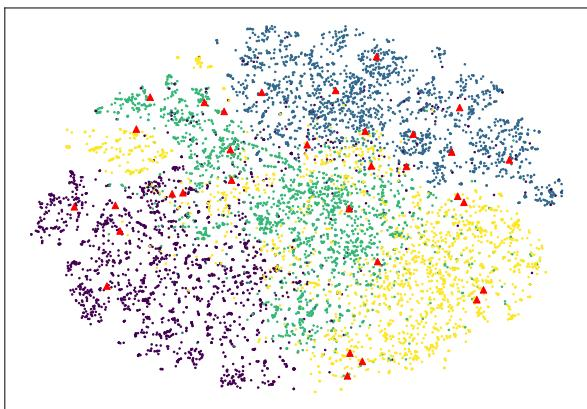  
(a) PATRON before PTR.

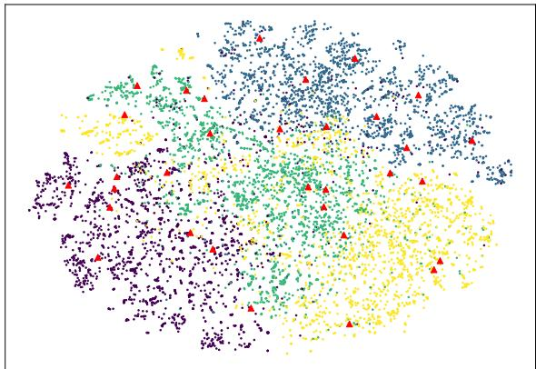  
(b) PATRON after PTR.  
Figure 6: Illustration of PATRON on AG News Dataset. Different colors stands for different classes. Our selected samples are denoted as red triangles.

## 5.8 Case Study

Figure 6 gives an example of the selected samples of PATRON on AG News dataset. We can see that the initialized solution after Eq. 8 still suffers from the issue of limited coverage, and some of the samples are very close. Fortunately, after the PTR step, the diversity of selected samples is much improved. This result suggests the PTR has successfully fulfilled its purpose for diversity-promoting selection.

## 6 Discussion

Connection to Weakly-supervised Learning. Our method can also be considered as weaklysupervised data selection, where only classindicating keywords are provided. Although such formulations have been adopted for NLP tasks (Meng et al., 2019, 2020; Hu et al., 2022) (see Zhang et al. (2022a) for a detailed survey), how to effectively leverage such weak supervision signals for data selection has not been widely explored. In this study, we tackle this research problem to facilitate few-shot PLM fine-tuning, and demonstrate such task-specific weak supervision is beneficial for downstream tasks.

Data Selection under Low and High Budget. In this study, we mainly focus on cold-start setting to select data without any labeled data. This is different from traditional AL pipelines, and we do not claim PATRON outperforms AL methods under high-budget scenarios. However, experiments show our method shines under low-budget setting, and PATRON can also be leveraged in earlier rounds of standard AL to improve the label efficiency.

## 7 Conclusion

We developed PATRON, a data selection method for pre-trained language models (PLMs) under coldstart scenarios. By leveraging prompts, we can distill the task-specific knowledge from the frozen PLM to guide data acquisition. Moreover, we develop two techniques, namely uncertainty propagation and predict-then-rewrite (PTR) to achieve both sample representativeness and diversity. The experiments on six text classification tasks demonstrate the advantages of PATRON against baselines for few-shot PLM fine-tuning.

## Limitations

In this work, we only focus on designing strategies for PLMs with the MLM-style pre-training objective, and do not account for other types of pre-trained language models such as discriminative PLMs (Clark et al., 2020; Shen et al., 2021). However, as there are recent works that aim to design prompts for discriminative PLMs (Yao et al., 2022; Xia et al., 2022), PATRON can be potentially combined with them to improve the data efficiency.

We are also aware that there exists advanced fewshot fine-tuning techniques for PLMs recently (Hu et al., 2022; Tam et al., 2021; Zhang et al., 2022b, inter alia). We argue that PATRON does not rely on a specific fine-tuning method, and can be combined with them to further improve the performance. Lastly, as prompting methods have been widely adopted to other tasks such as natural language inference (Gao et al., 2021a) and relation extraction (Han et al., 2021), it is possible to extend our method to these tasks.

## Acknowledgements

We would like to thank the anonymous reviewers from the ACL Rolling Review for their feedbacks. This work was supported in part by NSF IIS-2008334, IIS-2106961, CAREER IIS-2144338, and ONR MURI N00014-17-1-2656.

## References

Roee Aharoni and Yoav Goldberg. 2020. Unsupervised domain clusters in pretrained language models. In Proceedings ofthe 58th Annual Meeting ofthe Associationfor Computational Linguistics, pages 7747– 7763, Online. Association for Computational Linguistics.

Jordan T. Ash, Chicheng Zhang, Akshay Krishnamurthy, John Langford, and Alekh Agarwal. 2020. Deep batch active learning by diverse, uncertain gradient lower bounds. In International Conference on Learning Representations.

Jonathan Bragg, Arman Cohan, Kyle Lo, and Iz Beltagy. 2021. Flex: Unifying evaluation for few-shot nlp. Advances in Neural Information Processing Systems, 34.

Tom Brown, Benjamin Mann, Nick Ryder, Melanie Subbiah, Jared D Kaplan, Prafulla Dhariwal, Arvind Neelakantan, Pranav Shyam, Girish Sastry, Amanda Askell, et al. 2020. Language models are few-shot learners. Advances in neural information processing systems, 33:1877–1901.

Ernie Chang, Xiaoyu Shen, Hui-Syuan Yeh, and Vera Demberg. 2021. On training instance selection for few-shot neural text generation. In Proceedings of the 59th Annual Meeting of the Association for Computational Linguistics and the 11th International Joint Conference on Natural Language Processing (Volume 2: Short Papers), pages 8–13, Online. Association for Computational Linguistics.

Si Chen, Tianhao Wang, and Ruoxi Jia. 2021. Zero-round active learning. arXiv preprint arXiv:2107.06703.

Xinyun Chen and Yuandong Tian. 2019. Learning to perform local rewriting for combinatorial optimization. Advances in Neural Information Processing Systems, 32.

Kevin Clark, Minh-Thang Luong, Quoc V. Le, and Christopher D. Manning. 2020. Electra: Pre-training text encoders as discriminators rather than generators. In International Conference on Learning Representations.

Jacob Devlin, Ming-Wei Chang, Kenton Lee, and Kristina Toutanova. 2019. BERT: Pre-training of deep bidirectional transformers for language understanding. In Proceedings of the 2019 Conference of the North American Chapter ofthe Associationfor Computational Linguistics: Human Language Technologies, Volume 1 (Long and Short Papers), pages 4171–4186, Minneapolis, Minnesota. Association for Computational Linguistics.

Ning Ding, Shengding Hu, Weilin Zhao, Yulin Chen, Zhiyuan Liu, Haitao Zheng, and Maosong Sun. 2022. OpenPrompt: An open-source framework for promptlearning. In Proceedings of the 60th Annual Meeting ofthe Associationfor Computational Linguistics: System Demonstrations, pages 105–113, Dublin, Ireland. Association for Computational Linguistics.

Jingfei Du, Edouard Grave, Beliz Gunel, Vishrav Chaudhary, Onur Celebi, Michael Auli, Veselin Stoyanov, and Alexis Conneau. 2021. Self-training improves pre-training for natural language understanding. In Proceedings of the 2021 Conference of the North American Chapter of the Association for Computational Linguistics: Human Language Technologies, pages 5408–5418. Association for Computational Linguistics.

Liat Ein-Dor, Alon Halfon, Ariel Gera, Eyal Shnarch, Lena Dankin, Leshem Choshen, Marina Danilevsky, Ranit Aharonov, Yoav Katz, and Noam Slonim. 2020. Active Learning for BERT: An Empirical Study. In Proceedings of the 2020 Conference on Empirical Methods in Natural Language Processing (EMNLP), pages 7949–7962. Association for Computational Linguistics.

Tianyu Gao, Adam Fisch, and Danqi Chen. 2021a. Making pre-trained language models better few-shot learners. In Proceedings of the 59th Annual Meeting ofthe Associationfor Computational Linguistics

and the 11th International Joint Conference on Natural Language Processing (Volume 1: Long Papers), pages 3816–3830, Online. Association for Computational Linguistics.

Tianyu Gao, Xingcheng Yao, and Danqi Chen. 2021b. SimCSE: Simple contrastive learning of sentence embeddings. In Proceedings of the 2021 Conference on Empirical Methods in Natural Language Processing, pages 6894–6910, Online and Punta Cana, Dominican Republic. Association for Computational Linguistics.

Matt Gardner, Yoav Artzi, Victoria Basmov, Jonathan Berant, Ben Bogin, Sihao Chen, Pradeep Dasigi, Dheeru Dua, et al. 2020. Evaluating models’ local decision boundaries via contrast sets. In Findings of the Association for Computational Linguistics: EMNLP 2020, pages 1307–1323, Online. Association for Computational Linguistics.

Guy Hacohen, Avihu Dekel, and Daphna Weinshall. 2022. Active learning on a budget: Opposite strategies suit high and low budgets. In Proceedings of the 39th International Conference on Machine Learning, Proceedings of Machine Learning Research, pages 8175–8195. PMLR.

Xu Han, Weilin Zhao, Ning Ding, Zhiyuan Liu, and Maosong Sun. 2021. Ptr: Prompt tuning with rules for text classification. arXiv preprint arXiv:2105.11259.

Peiyun Hu, Zack Lipton, Anima Anandkumar, and Deva Ramanan. 2019. Active learning with partial feedback. In International Conference on Learning Representations.

Shengding Hu, Ning Ding, Huadong Wang, Zhiyuan Liu, Jingang Wang, Juanzi Li, Wei Wu, and Maosong Sun. 2022. Knowledgeable prompt-tuning: Incorporating knowledge into prompt verbalizer for text classification. In Proceedings of the 60th Annual Meeting of the Association for Computational Linguistics (Volume 1: Long Papers), pages 2225–2240, Dublin, Ireland. Association for Computational Linguistics.

Jeff Johnson, Matthijs Douze, and Hervé Jégou. 2019. Billion-scale similarity search with gpus. IEEE Transactions on Big Data.

Siddharth Karamcheti, Ranjay Krishna, Li Fei-Fei, and Christopher Manning. 2021. Mind your outliers! investigating the negative impact of outliers on active learning for visual question answering. In Proceedings ofthe 59th Annual Meeting ofthe Associationfor Computational Linguistics and the 11th International Joint Conference on Natural Language Processing (Volume 1: Long Papers), pages 7265–7281, Online. Association for Computational Linguistics.

Divyansh Kaushik, Eduard Hovy, and Zachary Lipton. 2020. Learning the difference that makes a difference with counterfactually-augmented data. In International Conference on Learning Representations.

Jens Lehmann, Robert Isele, Max Jakob, Anja Jentzsch, Dimitris Kontokostas, Pablo N Mendes, Sebastian Hellmann, Mohamed Morsey, Patrick Van Kleef, Sören Auer, et al. 2015. Dbpedia–a large-scale, multilingual knowledge base extracted from wikipedia. Semantic web, 6(2):167–195.

David D Lewis and William A Gale. 1994. A sequential algorithm for training text classifiers. In Proceedings of the 17th annual international ACM SIGIR conference on Research and development in information retrieval, pages 3–12.

Bohan Li, Hao Zhou, Junxian He, Mingxuan Wang, Yiming Yang, and Lei Li. 2020. On the sentence embeddings from pre-trained language models. In Proceedings of the 2020 Conference on Empirical Methods in Natural Language Processing (EMNLP), pages 9119–9130, Online. Association for Computational Linguistics.

Xin Li and Dan Roth. 2002. Learning question classifiers. In The 19th International Conference on Computational Linguistics.

Jiachang Liu, Dinghan Shen, Yizhe Zhang, Bill Dolan, Lawrence Carin, and Weizhu Chen. 2021a. What makes good in-context examples for gpt-3? arXiv preprint arXiv:2101.06804.

Pengfei Liu, Weizhe Yuan, Jinlan Fu, Zhengbao Jiang, Hiroaki Hayashi, and Graham Neubig. 2021b. Pretrain, prompt, and predict: A systematic survey of prompting methods in natural language processing. arXiv preprint arXiv:2107.13586.

Yinhan Liu, Myle Ott, Naman Goyal, Jingfei Du, Mandar Joshi, Danqi Chen, Omer Levy, Mike Lewis, Luke Zettlemoyer, and Veselin Stoyanov. 2019. Roberta: A robustly optimized bert pretraining approach. arXiv preprint arXiv:1907.11692.

Ilya Loshchilov and Frank Hutter. 2019. Decoupled weight decay regularization. In International Conference on Learning Representations.

Andrew L. Maas, Raymond E. Daly, Peter T. Pham, Dan Huang, Andrew Y. Ng, and Christopher Potts. 2011. Learning word vectors for sentiment analysis. In Proceedings of the 49th Annual Meeting of the Associationfor Computational Linguistics: Human Language Technologies, pages 142–150, Portland, Oregon, USA. Association for Computational Linguistics.

Katerina Margatina, Loic Barrault, and Nikolaos Aletras. 2022. On the importance of effectively adapting pretrained language models for active learning. In Proceedings of the 60th Annual Meeting of the Associationfor Computational Linguistics (Volume 2: Short Papers), pages 825–836, Dublin, Ireland. Association for Computational Linguistics.

Katerina Margatina, Giorgos Vernikos, Loïc Barrault, and Nikolaos Aletras. 2021. Active learning by acquiring contrastive examples. In Proceedings of the

2021 Conference on Empirical Methods in Natural Language Processing, pages 650–663, Online and Punta Cana, Dominican Republic. Association for Computational Linguistics.

Yu Meng, Jiaming Shen, Chao Zhang, and Jiawei Han. 2019. Weakly-supervised hierarchical text classification. In Proceedings of the AAAI conference on artificial intelligence, volume 33, pages 6826–6833.

Yu Meng, Yunyi Zhang, Jiaxin Huang, Chenyan Xiong, Heng Ji, Chao Zhang, and Jiawei Han. 2020. Text classification using label names only: A language model self-training approach. In Proceedings ofthe 2020 Conference on Empirical Methods in Natural Language Processing (EMNLP), pages 9006–9017. Association for Computational Linguistics.

Sewon Min, Mike Lewis, Hannaneh Hajishirzi, and Luke Zettlemoyer. 2022. Noisy channel language model prompting for few-shot text classification. In Proceedings of the 60th Annual Meeting of the Associationfor Computational Linguistics (Volume 1: Long Papers), pages 5316–5330, Dublin, Ireland. Association for Computational Linguistics.

Thomas Müller, Guillermo Pérez-Torró, Angelo Basile, and Marc Franco-Salvador. 2022. Active few-shot learning with fasl. arXiv preprint arXiv:2204.09347.

Chanho Park, Rehan Ahmad, and Thomas Hain. 2022. Unsupervised data selection for speech recognition with contrastive loss ratios. In ICASSP 2022-2022 IEEE International Conference on Acoustics, Speech and Signal Processing (ICASSP), pages 8587–8591. IEEE.

Colin Raffel, Noam Shazeer, Adam Roberts, Katherine Lee, Sharan Narang, Michael Matena, Yanqi Zhou, Wei Li, and Peter J Liu. 2020. Exploring the limits of transfer learning with a unified text-to-text transformer. Journal ofMachine Learning Research, 21:1– 67.

Dongyu Ru, Jiangtao Feng, Lin Qiu, Hao Zhou, Mingxuan Wang, Weinan Zhang, Yong Yu, and Lei Li. 2020. Active sentence learning by adversarial uncertainty sampling in discrete space. In Findings ofthe Associationfor Computational Linguistics: EMNLP 2020, pages 4908–4917, Online. Association for Computational Linguistics.

Timo Schick and Hinrich Schütze. 2021a. Exploiting cloze-questions for few-shot text classification and natural language inference. In Proceedings of the 16th Conference ofthe European Chapter ofthe Associationfor Computational Linguistics: Main Volume, pages 255–269, Online. Association for Computational Linguistics.

Timo Schick and Hinrich Schütze. 2021b. It’s not just size that matters: Small language models are also fewshot learners. In Proceedings ofthe 2021 Conference of the North American Chapter of the Association for Computational Linguistics: Human Language

Technologies, pages 2339–2352, Online. Association for Computational Linguistics.

Bernhard Scholkopf, Kah-Kay Sung, Christopher JC Burges, Federico Girosi, Partha Niyogi, Tomaso Poggio, and Vladimir Vapnik. 1997. Comparing support vector machines with gaussian kernels to radial basis function classifiers. IEEE transactions on Signal Processing, 45(11):2758–2765.

Christopher Schröder, Andreas Niekler, and Martin Potthast. 2022. Revisiting uncertainty-based query strategies for active learning with transformers. In Findings ofthe Associationfor Computational Linguistics: ACL 2022, pages 2194–2203, Dublin, Ireland. Association for Computational Linguistics.

Ozan Sener and Silvio Savarese. 2018. Active learning for convolutional neural networks: A core-set approach. In International Conference on Learning Representations.

Burr Settles. 2011. From theories to queries: Active learning in practice. In Active Learning and Experimental Design workshop, pages 1–18. JMLR Workshop and Conference Proceedings.

Jiaming Shen, Jialu Liu, Tianqi Liu, Cong Yu, and Jiawei Han. 2021. Training ELECTRA augmented with multi-word selection. In Findings ofthe Association for Computational Linguistics: ACL-IJCNLP 2021, pages 2475–2486, Online. Association for Computational Linguistics.

Eyal Shnarch, Ariel Gera, Alon Halfon, Lena Dankin, Leshem Choshen, Ranit Aharonov, and Noam Slonim. 2022. Cluster & tune: Boost cold start performance in text classification. In Proceedings ofthe 60th Annual Meeting of the Association for Computational Linguistics (Volume 1: Long Papers), pages 7639–7653, Dublin, Ireland. Association for Computational Linguistics.

Richard Socher, Alex Perelygin, Jean Wu, Jason Chuang, Christopher D. Manning, Andrew Ng, and Christopher Potts. 2013. Recursive deep models for semantic compositionality over a sentiment treebank. In Proceedings of the 2013 Conference on Empirical Methods in Natural Language Processing, pages 1631–1642. Association for Computational Linguistics.

Hongjin Su, Jungo Kasai, Chen Henry Wu, Weijia Shi, Tianlu Wang, Jiayi Xin, Rui Zhang, Mari Ostendorf, Luke Zettlemoyer, Noah A Smith, et al. 2022. Selective annotation makes language models better fewshot learners. arXiv preprint arXiv:2209.01975.

Derek Tam, Rakesh R. Menon, Mohit Bansal, Shashank Srivastava, and Colin Raffel. 2021. Improving and simplifying pattern exploiting training. In Proceedings of the 2021 Conference on Empirical Methods in Natural Language Processing, pages 4980–4991, Online and Punta Cana, Dominican Republic. Association for Computational Linguistics.

Nguyen Xuan Vinh, Julien Epps, and James Bailey. 2010. Information theoretic measures for clusterings comparison: Variants, properties, normalization and correction for chance. The Journal of Machine Learning Research, 11:2837–2854.

Xudong Wang, Long Lian, and Stella X Yu. 2021. Unsupervised data selection for datacentric semi-supervised learning. arXiv preprint arXiv:2110.03006.

Yaqing Wang, Subhabrata Mukherjee, Xiaodong Liu, Jing Gao, Ahmed Awadallah, and Jianfeng Gao. 2022. LiST: Lite prompted self-training makes parameterefficient few-shot learners. In Findings ofthe Associationfor Computational Linguistics: NAACL 2022, pages 2262–2281, Seattle, United States. Association for Computational Linguistics.

Thomas Wolf, Lysandre Debut, Victor Sanh, Julien Chaumond, Clement Delangue, Anthony Moi, Pierric Cistac, Tim Rault, et al. 2020. Transformers: Stateof-the-art natural language processing. In Proceedings ofthe 2020 Conference on Empirical Methods in Natural Language Processing: System Demonstrations, pages 38–45, Online. Association for Computational Linguistics.

Mengzhou Xia, Mikel Artetxe, Jingfei Du, Danqi Chen, and Ves Stoyanov. 2022. Prompting electra: Fewshot learning with discriminative pre-trained models. arXiv preprint arXiv:2205.15223.

Qizhe Xie, Zihang Dai, Eduard Hovy, Thang Luong, and Quoc Le. 2020. Unsupervised data augmentation for consistency training. Advances in Neural Information Processing Systems, 33.

Ran Xu, Yue Yu, Hejie Cui, Xuan Kan, Yanqiao Zhu, Joyce C. Ho, Chao Zhang, and Carl Yang. 2023. Neighborhood-regularized self-training for learning with few labels. In Proceedings ofthe Thirty-Seventh AAAI Conference on Artificial Intelligence.

Yuan Yao, Bowen Dong, Ao Zhang, Zhengyan Zhang, Ruobing Xie, Zhiyuan Liu, Leyu Lin, Maosong Sun, and Jianyong Wang. 2022. Prompt tuning for discriminative pre-trained language models. In Findings of the Associationfor Computational Linguistics: ACL 2022, pages 3468–3473, Dublin, Ireland. Association for Computational Linguistics.

Yue Yu, Lingkai Kong, Jieyu Zhang, Rongzhi Zhang, and Chao Zhang. 2022. AcTune: Uncertainty-based active self-training for active fine-tuning of pretrained language models. In Proceedings ofthe 2022 Conference of the North American Chapter of the Association for Computational Linguistics: Human Language Technologies, pages 1422–1436, Seattle, United States. Association for Computational Linguistics.

Yue Yu, Simiao Zuo, Haoming Jiang, Wendi Ren, Tuo Zhao, and Chao Zhang. 2021. Fine-tuning pretrained language model with weak supervision: A

contrastive-regularized self-training approach. In Proceedings of the 2021 Conference of the North American Chapter ofthe Association for Computational Linguistics: Human Language Technologies, pages 1063–1077, Online. Association for Computational Linguistics.

Michelle Yuan, Hsuan-Tien Lin, and Jordan Boyd-Graber. 2020. Cold-start active learning through selfsupervised language modeling. In Proceedings ofthe 2020 Conference on Empirical Methods in Natural Language Processing (EMNLP), pages 7935–7948, Online. Association for Computational Linguistics.

Jieyu Zhang, Cheng-Yu Hsieh, Yue Yu, Chao Zhang, and Alexander Ratner. 2022a. A survey on programmatic weak supervision. arXiv preprint arXiv:2202.05433.

Mike Zhang and Barbara Plank. 2021. Cartography active learning. In Findings of the Association for Computational Linguistics: EMNLP 2021, pages 395– 406, Punta Cana, Dominican Republic. Association for Computational Linguistics.

Ningyu Zhang, Luoqiu Li, Xiang Chen, Shumin Deng, Zhen Bi, Chuanqi Tan, Fei Huang, and Huajun Chen. 2022b. Differentiable prompt makes pre-trained language models better few-shot learners. In International Conference on Learning Representations.

Rongzhi Zhang, Yue Yu, Pranav Shetty, Le Song, and Chao Zhang. 2022c. Prompt-based rule discovery and boosting for interactive weakly-supervised learning. In Proceedings ofthe 60th Annual Meeting ofthe Associationfor Computational Linguistics (Volume 1: Long Papers), pages 745–758, Dublin, Ireland. Association for Computational Linguistics.

Rongzhi Zhang, Yue Yu, and Chao Zhang. 2020a. SeqMix: Augmenting active sequence labeling via sequence mixup. In Proceedings of the 2020 Conference on Empirical Methods in Natural Language Processing (EMNLP), pages 8566–8579, Online. Association for Computational Linguistics.

Tianyi Zhang, Felix Wu, Arzoo Katiyar, Kilian Q Weinberger, and Yoav Artzi. 2020b. Revisiting few-sample bert fine-tuning. arXiv preprint arXiv:2006.05987.

Xiang Zhang, Junbo Zhao, and Yann LeCun. 2015. Character-level convolutional networks for text classification. Advances in neural information processing systems, 28:649–657.

Zihao Zhao, Eric Wallace, Shi Feng, Dan Klein, and Sameer Singh. 2021. Calibrate before use: Improving few-shot performance of language models. In International Conference on Machine Learning, pages 12697–12706. PMLR.

<table><tr><td>IMDB</td><td>Yelp-full</td><td>AG News</td><td>Yahoo!</td><td>DBPedia</td><td>TREC</td><td>Mean</td></tr><tr><td>94.1</td><td>66.4</td><td>94.0</td><td>77.6</td><td>99.3</td><td>97.2</td><td>88.1</td></tr></table>

Table 4: Fully supervised performance on six datasets.

## A Datasets Details

## A.1 Datasets for the Main Experiment

The seven benchmarks in our experiments are all publicly available. The fully supervised performance on six datasets is shown in table 4. Below are the links to downloadable versions of these datasets.

IMDB: We use the datasets from https:// huggingface.co/datasets/imdb.

Yelp-full: Dataset is available at https://github.com/yumeng5/WeSHClass/ tree/master/yelp.

AG News: Dataset is available at https:// huggingface.co/datasets/ag\_news.

Yahoo! Answers: Dataset is available at https://huggingface.co/datasets/yahoo\_ answers\_topics.

DBPedia: Dataset is available at https:// huggingface.co/datasets/dbpedia\_14.

TREC: Dataset is available at https:// huggingface.co/datasets/trec. Note that we only use the coarse-grained class labels.

## A.2 Train/Test Split

For all the datasets, we use the original train/test split from the web. To keep the size of the development set small (Bragg et al., 2021), we randomly sample 32 data from the original training set as the development set, and regard the remaining as the unlabeled set $\mathcal { D } _ { u }$ . We choose the model checkpoint with the best performance on the development set for evaluation on the test set for both our method and baselines.

## A.3 Datasets for OOD Evaluation

We use 3 datasets as OOD tasks for evaluating PATRON and baselines. The details are listed as belows.

SST-2 (Socher et al., 2013)9 is another movie review sentiment analysis dataset. The key difference between the SST-2 and IMDB datasets is that they consist of movie reviews with different lengths. We use the original development set (containing 872 samples) for evaluation.

IMDB Contrast Set (IMDB-CS) (Gardner et al., 2020)10 and IMDB Counterfactually Augmented Dataset (IMDB-CAD) (Kaushik et al., 2020)11 are two challenging sentiment analysis datasets (both of them contain 488 examples) which can be used to evaluate a model’s true linguistic capabilities more accurately. Specifically, for IMDB-CS, NLP researchers creates contrast sets via manually change the ground-truth label of the test instances in a small but semantically meaningful way. For IMDB-CAD, annotators are required to make minor changes to examples in the original IMDB dataset to flip the sentiment labels, without changing the majority of contents.

## A.4 Prompt Format

For these datasets, we directly use manual prompts that have been used in previous works (Schick and Schütze, 2021a; Gao et al., 2021a; Hu et al., 2022). The details of the prompts used in our experiments is listed in Table 5.

## A.5 The Quality of Prompts and SimCSE Embeddings

We list the quality of prompts as well as SimCSE embeddings in this part. From prompts, we use the zero-shot accuracy for the unlabeled data as the quality measure. From embeddings, we perform clustering to evaluate the quality of the SimCSE embeddings. We use K-Means as the clustering method, and use two metrics, namely Normalized Mutual Information (NMI), and Adjusted Rand Index (ARI) (Vinh et al., 2010) for evaluation. For these metrics, higher value indicates better quality. The results are shown in Table 6. We observe that although the quality of these two terms are high for some tasks such as IMDB and AG News, for other tasks, the embeddings are less discriminative and the prompts are less accurate. These pose specific challenges for PATRON to select most useful data with noisy prompt-based predictions with the imperfect embeddings.

## B Experiment Setups

## B.1 Main Experiment Setups

In experiments, both our method and baselines are run with 5 different random seed and the result is

<table><tr><td>Dataset</td><td>Domain</td><td>Classes c</td><td>#Unlabeled</td><td>#Test</td><td>Type</td><td>Template</td><td>Label words</td></tr><tr><td>IMDB</td><td>Movie Review</td><td>2</td><td>25k</td><td>25k</td><td>sentiment</td><td>(S). It was [MASK].</td><td>terrible, great</td></tr><tr><td>Yelp-full</td><td>Restaurant Review News</td><td>2</td><td>560k</td><td>38k</td><td>sentiment</td><td>(S). It was [MASK].</td><td>terrible, bad, okay, good, great</td></tr><tr><td>AG News Yahoo! Answers</td><td>Web QA</td><td>4 10</td><td>120k</td><td>7.6k 60k</td><td>News Topic</td><td>[MASK] News: (S)</td><td>World, Sports, Business, Tech</td></tr><tr><td></td><td></td><td></td><td>300k</td><td></td><td>QA Topic</td><td>[Category: [MASK]] (S)</td><td>Society, Science, Health, Education, Computer, Sports, Business, Entertainment, Relationship, Politics</td></tr><tr><td>DBPedia</td><td>Wikipedia Text</td><td>14</td><td>420k</td><td>70k</td><td>Wikipedia Topic</td><td>(T)(S).(T) is a [MASK]]</td><td>Company, School, Artist, Athlete, Politics, Transportation, Building, Mountain, Village,</td></tr><tr><td>TREC</td><td>Web Text</td><td>6</td><td>5k</td><td>0.6k</td><td>Question Topic</td><td>(S). It was [MASK].</td><td>Animal, Plant, Album, Film, Book Expression, Entity, Description, Human, Location, Number</td></tr></table>

Table 5: Statistics, manual templates, and label words used in our experiments. For DBPedia and Yahoo! Answers, we randomly sample 30k sample from each class due to the limited computational resource. c: number of classes.

<table><tr><td>Datasets</td><td>Zero-shot Acc. (in %)</td><td>Zero-shot Acc. after UC. (in %)</td><td>NMI</td><td>ARI</td></tr><tr><td>IMDB</td><td>73.29</td><td>83.13</td><td>0.249</td><td>0.319</td></tr><tr><td>Yelp-full</td><td>32.76</td><td>38.62</td><td>0.079</td><td>0.056</td></tr><tr><td>AG News</td><td>81.43</td><td>80.66</td><td>0.443</td><td>0.432</td></tr><tr><td>Yahoo! Answers</td><td>44.13</td><td>47.55</td><td>0.274</td><td>0.193</td></tr><tr><td>DBPedia</td><td>73.78</td><td>81.13</td><td>0.717</td><td>0.595</td></tr><tr><td>TREC</td><td>35.69</td><td>38.51</td><td>0.111</td><td>0.088</td></tr></table>

Table 6: Quality of Prompts and SimCSE embeddings for six datasets used in our experiments.

based on the average performance on them. We have show both the mean and the standard deviation of the performance in our experiment sections.

## B.2 Experiment Setups for Prompt-based Few-shot Learning

We mainly use the pipeline in LM-BFF (Gao et al., 2021a) for prompt-based learning. For both PA-TRON and baselines, we use the prompt defined in Table 5 to fine-tune PLMs. We use OpenPrompt toolkit (Ding et al., 2022) for implementation and use RoBERTa-base as the backbone for promptbased learning.

## B.3 Experiment Setups for Semi-supervised Learning

For semi-supervised learning, we mainly adopt Unsupervised Data Augmentation (UDA) (Xie et al., 2020) and self-training (Du et al., 2021) as two examples. The main idea of UDA is leveraging data augmentation techniques (TF-IDF word replacement or back translation) with the consistencybased loss for unlabeled data to improve the model performance. Since we do not have access to TPU service and need to use a smaller amount of unlabeled data, we implement UDA on our own. For self-training, it generates pseudo labels on unlabeled data, and encourages models to output confident predictions on these data. Please refer to the original papers for the details of these methods.

## B.4 Experiment Setups for Standard Multi-round Active Learning

For standard multi-round active learning, we follow the standard multi-round active learning pipelines introduced in (Margatina et al., 2021; Yuan et al., 2020), but in the beginning round, no initial labeled data is given. In each round, we initialize the PLM from the pretrained checkpoint to avoid overfitting to the data collected in earlier rounds as observed by Hu et al. (2019).

## C Details on Implementations

## C.1 Computational Setups

Overall we report the results of 3240 BERT fine-tuning runs for main experiments (2 settings × 6 datasets × 3 labeling budgets × 9 methods × 10 repetitions). The computing infrastructure used for experiments are listed as follows.

System: Ubuntu 18.04.3 LTS; Python 3.8; Pytorch 1.10.

CPU: Intel(R) Core(TM) i7-5930K CPU @3.50GHz.

GPU: NVIDIA A5000.

## C.2 Number of Parameters

In our main experiments, PATRON and all baselines use RoBERTa-base (Liu et al., 2019) with a task-specific classification head on the top as the backbone, which contains 125M trainable parameters. We do not introduce any other parameters in our experiments.

## C.3 Implementations of Baselines

For Random, Uncertainty, BERT-KM, Margin-KM, we implement them by ourselves. For other baselines, we run the experiments based on the implementations on the web. We list the link for the implementations as belows:

Coreset: https://github.com/google/ active-learning/tree/master/sampling\_

<table><tr><td rowspan=1 colspan=4>Hyper-parameter  IMDB  Yelp-full AG News</td><td rowspan=1 colspan=3>Yahoo!  DBPedia  TREC</td></tr><tr><td rowspan=1 colspan=1>Maximum Tokens</td><td rowspan=1 colspan=1>256</td><td rowspan=1 colspan=1>256</td><td rowspan=1 colspan=1>128</td><td rowspan=1 colspan=1>128</td><td rowspan=1 colspan=1>128</td><td rowspan=1 colspan=1>64</td></tr><tr><td rowspan=1 colspan=1>Learning Rate</td><td rowspan=1 colspan=1>2e-5</td><td rowspan=1 colspan=1>2e-5</td><td rowspan=1 colspan=1>5e-5</td><td rowspan=1 colspan=1>5e-5</td><td rowspan=1 colspan=1>1e-5</td><td rowspan=1 colspan=1>2e-5</td></tr><tr><td rowspan=1 colspan=1> $\overline { { k } }$ </td><td rowspan=1 colspan=2></td><td rowspan=1 colspan=1>1000</td><td rowspan=1 colspan=1></td><td rowspan=1 colspan=1></td><td rowspan=1 colspan=1>50</td></tr><tr><td rowspan=1 colspan=1>ρ</td><td rowspan=1 colspan=1>0.05</td><td rowspan=1 colspan=1>0.05</td><td rowspan=1 colspan=1>0.1</td><td rowspan=1 colspan=1>0.05</td><td rowspan=1 colspan=1>0.05</td><td rowspan=1 colspan=1>0.1</td></tr><tr><td rowspan=1 colspan=1>γ</td><td rowspan=1 colspan=1>0.3</td><td rowspan=1 colspan=1>0.3</td><td rowspan=1 colspan=1>0.5</td><td rowspan=1 colspan=1>0.3</td><td rowspan=1 colspan=1>0.1</td><td rowspan=1 colspan=1>0.3</td></tr><tr><td rowspan=1 colspan=1> $\overline { { \beta } }$ </td><td rowspan=1 colspan=1>0.5</td><td rowspan=1 colspan=1>1</td><td rowspan=1 colspan=1>0.5</td><td rowspan=1 colspan=1>5</td><td rowspan=1 colspan=1>1</td><td rowspan=1 colspan=1>1</td></tr><tr><td rowspan=1 colspan=1>m</td><td rowspan=1 colspan=6>0.5</td></tr></table>

Table 7: Hyper-parameter configurations. Note that we only keep certain number of tokens.

ALPS: https://github.com/forest-snow/ alps.

CAL: https://github.com/mourga/ contrastive-active-learning.

◇ TPC: https://github.com/avihu111/ TypiClust.

## C.4 Hyper-parameters for Model Training

We use AdamW (Loshchilov and Hutter, 2019) as the optimizer, and choose the learning rate from $\{ 1 \times 1 0 ^ { - 5 } , 2 \times 1 0 ^ { - 5 } , 5 \times 1 0 ^ { - 5 } \}$ , the batch size from 4, 8, 16 , and set the number of training epochs to 15 for both fine-tuning, prompt-based few-shot learning, and multi-round active learning.

For semi-supervised learning, we initialize the model with the RoBERTa-base fine-tuned on the acquired labeled data (based on different data selection strategies). Then, we set the batch size for unlabeled data to 32, and choose the learning rate from $\{ 1 \times 1 0 ^ { - 6 } , 5 \times 1 0 ^ { - 6 } , 1 \times 1 0 ^ { - 5 } \}$ since we empirically find that smaller learning rates lead to the better training stability. We use the model with best performance on the development set to determine the best set of parameter for testing.

## C.5 Hyper-parameters for AL Implementation

PATRON introduces several hyper-parameters including k in Eq. 2, K for calculating $\mathcal { X } _ { \mathrm { K N N } } ( x ) , K ^ { \prime }$ for calculating $\mathcal { X } _ { \mathrm { c - K N N } } ( x ) , \beta , \gamma , m$ in Eq. 8, ρ in Eq. 6, but most of them are keep fixed during our experiments, thus it does not require heavy hyperparameter tuning.

In our experiments, we keep $K ^ { \prime } = 1 0 , K =$ 50, $\mathrm { ~ m ~ } = \mathrm { ~ 0 . 5 ~ }$ for all datasets. For other parameters, we iteratively find the optimal hyperparameters for each datasets. We search $\rho$ from 0.01, 0.05, 0.1, 1 , β from 0.5, 1, 5, 10 , γ from 0.1, 0.3, 0.5 , and select the best hyperparameter with the best performance on the development set. All results are reported as the average over ten runs. The number for hyperparameters we use are shown in Table 7.

For other baselines, we follow the exact parameter tuning method mentioned in the original paper for hyperparameter tuning. For CAL (Margatina et al., 2021) and TPC (Hacohen et al., 2022), we tune the number for KNN k from [5, 10, 20, 50] and report the best performance.

## D Adapting PATRON to Multi-round AL

When applying PATRON to Multi-round AL, since there exists a warm-start model with a set of labeled data, we directly use the embedding from the warmstart model to generate features and leverage it for uncertainty estimation. After that, uncertainty propagation can be directly adopted for estimating the utility of training data. For the PTR step, since we already have a smaller number of the labeled samples $\mathcal { D } _ { l }$ , the Eq. 9 can be refined as

$$
\mathcal { X } _ { \mathrm { c - K N N } , i } = \mathbf { K N N } ( q _ { i } , \mathcal { Q } \cup \mathcal { D } _ { l } ) ,\tag{11}
$$

as we don’t want the selected samples to be too close to samples in $\mathcal { D } _ { l }$ . The other steps of PTR are remain unchanged.

## E Time Complexity of PATRON

The additional time introduced by PATRON mainly comes from the KNN step in the uncertainty propagation as well as the K-Means partitioning. However, these operations have been efficiently supported via approximate nearest neighbor search (ANN) (Johnson et al., 2019). As a result, PATRON will not incur excessive computational overhead.

Table 8 exhibits the running time of PATRON and baselines on the Yahoo! Answers dataset for selecting 64 samples. Overall, compared with the recent baselines such as TPC (Hacohen et al., 2022) and Margin-KM (Müller et al., 2022), the additional time introduced is small. In particular, the uncertainty propagation takes 114 seconds, and the predict-then-propagate step only takes 5 seconds. This verifies that our key designs do not takes much time and are scalable for large datasets.

<table><tr><td rowspan=1 colspan=1>Method</td><td rowspan=1 colspan=1>Time</td></tr><tr><td rowspan=1 colspan=1>Random</td><td rowspan=1 colspan=1>0.1s</td></tr><tr><td rowspan=1 colspan=1>Uncertainty</td><td rowspan=1 colspan=1>461s</td></tr><tr><td rowspan=1 colspan=1>CAL</td><td rowspan=1 colspan=1>649s</td></tr><tr><td rowspan=1 colspan=1>BERT-KM</td><td rowspan=1 colspan=1>724s</td></tr><tr><td rowspan=1 colspan=1>Coreset</td><td rowspan=1 colspan=1>872s</td></tr><tr><td rowspan=1 colspan=1>Margin-KM</td><td rowspan=1 colspan=1>1389s</td></tr><tr><td rowspan=1 colspan=1>ALPS</td><td rowspan=1 colspan=1>682s</td></tr><tr><td rowspan=1 colspan=1>TPC</td><td rowspan=1 colspan=1>1448s</td></tr><tr><td rowspan=1 colspan=1>PATRON</td><td rowspan=1 colspan=1>1480s</td></tr></table>

Table 8: The running time of PATRON and different baselines on Yahoo! Answers dataset.

## F Additional Analysis

In this section, we provide detailed comparison on different data selection strategies, aiming to better understand their relative advantages and disadvantages. Specifically, we follow the method in Ein-Dor et al. (2020) and focus on three types of metrics: class distribution, feature diversity, and representativeness. All of these metrics are calculated based on the results with 128 labels as the budget.

## F.1 Class Distribution of the Selected Data

We calculate the class distribution of the selected samples. Denote the number of samples selected from each class as $n _ { 1 } , \ldots , n _ { c }$ where $\textstyle \sum _ { i = 1 } ^ { c } n _ { i }$ = $\left| B \right| \left( \left| B \right| = 1 2 8 \right.$ in this case), we use two metrics, namely imbalance value and label distribution divergence value to measure the class distribution. Specifically, imbalance value (IMB) is calculated as

$$
\mathrm { I M B } = \frac { \mathrm { m a x } _ { i = 1 , . . . , c } ( n _ { i } ) } { \mathrm { m i n } _ { i = 1 , . . . , c } ( n _ { i } ) } .\tag{12}
$$

The higher IMB value indicates the more imbalanced distribution. Note that when data from one or more classes are totally not sampled, the IMB value will become infinity (+inf).

As the label distribution of some datasets are imbalanced, we introduce another metrics named label distribution divergence, to calculate the distance between the distribution of ground-truth labels and labels sampled by baselines or our method. Specifically, denote $p _ { i }$ as the frequency of label i.

Then the label distribution divergence (LDD) is calculated as

$$
\mathrm { L D D } = \mathcal { D } _ { \mathrm { K L } } \left( q | | p \right) = - \sum _ { i } q _ { i } \log { \left( p _ { i } / q _ { i } \right) } .\tag{13}
$$

where $q _ { i } = n _ { i } / | B |$ is equal to the frequency of class i in the selected samples. The higher LDD value indicates the more biased sampled distribution from the original distribution.

Table 9 and 10 show the IMB and LDD value for all methods on six datasets. From the results, we find that for uncertainty-based approaches, the corresponding values for these two metrics are very high. This indicates that the selected samples are highly imbalanced. As there does not exist any startup labels for cold-start data selection, finetuning PLMs on such imbalanced data leads to the biased predictions. These results explain why the performance of such uncertainty-based methods are extremely poor under cold-start scenarios.

## F.2 Feature Diversity of the Selected Data

Apart from the categorical-level statistics, we aim to measure the diversity from the feature space. For each sample x, we use the SimCSE embeddings (used in Section 4.1) to obtain its embeddings. Then, we follow the method in (Ein-Dor et al., 2020) to calculate the diversity over the samples within the batch $\mathcal { Q }$ as

$$
D ( \mathcal { Q } ) = \left( \frac { 1 } { \vert U \vert } \sum _ { x _ { i } \in U } \operatorname* { m i n } _ { x _ { j } \in \mathcal { Q } } d \left( x _ { i } , x _ { j } \right) \right) ^ { - 1 } ,\tag{14}
$$

where $d ( x _ { i } , x _ { j } )$ is the Euclidean distance between $x _ { i }$ and $x _ { j }$

Table 11 shows the diversity of different data selection methods. Overall, BERT-KM achieves the best sample diversity, as its objective mainly focuses on promoting the sample diversity. In contrast, Coreset method cannot improve the sample diversity for all datasets, as it aims to sample data that are farthest from the already selected instances, which can often be outliers. Compared with the other hybrid methods such as ALPS and TPC, PA-TRON overall has a better sample diversity. Moreover, PTR strategy further improve the sample diversity on 5 of 6 datasets. This indicates that PTR fulfills the purpose of improving the diversity of the selected examples.

<table><tr><td>Task</td><td>C</td><td>Random</td><td>Uncertainty</td><td>CAL</td><td>BERT-KM</td><td>Coreset</td><td>Margin-KM</td><td>ALPS</td><td>TPC</td><td>PATRON</td></tr><tr><td>IMDB</td><td></td><td>1.207</td><td>6.111</td><td>7.000</td><td>1.286</td><td>1.000</td><td>1.133</td><td>1.783</td><td>2.765</td><td>1.286</td></tr><tr><td>Yelp-F</td><td></td><td>1.778</td><td>3.800</td><td>13.500</td><td>2.000</td><td>6.000</td><td>1.600</td><td>2.833</td><td>5.200</td><td>2.250</td></tr><tr><td>AG News</td><td>254</td><td>1.462</td><td>28.000</td><td>2.000</td><td>1.500</td><td>2.000</td><td>2.625</td><td>1.667</td><td>1.818</td><td>1.500</td></tr><tr><td>Yahoo! Ans.</td><td>10</td><td>3.000</td><td>12.000</td><td>+inf</td><td>2.250</td><td>7.000</td><td>10.000</td><td>5.500</td><td>3.333</td><td>5.500</td></tr><tr><td>DBPedia</td><td>14</td><td>3.500</td><td>+inf</td><td>+inf</td><td>3.500</td><td>9.000</td><td>12.000</td><td>9.000</td><td>9.000</td><td>2.333</td></tr><tr><td>TREC</td><td>6</td><td>8.000</td><td>16.000</td><td>+inf</td><td>10.500</td><td>+inf</td><td>18.000</td><td>9.500</td><td>21.000</td><td>15.000</td></tr></table>

Table 9: The label imbalance value (IMB) of different data selection approaches. The lower value indicates more balanced sampling over classes.
<table><tr><td>Task</td><td>C</td><td>Random</td><td>Uncertainty</td><td>CAL</td><td>BERT-KM</td><td>Coreset</td><td>Margin-KM</td><td>ALPS</td><td>TPC</td><td>PATRON</td></tr><tr><td>IMDB</td><td>2</td><td>0.004</td><td>0.287</td><td>0.410</td><td>0.008</td><td>0.000</td><td>0.002</td><td>0.040</td><td>0.114</td><td>0.008</td></tr><tr><td>Yelp-F</td><td>5</td><td>0.021</td><td>0.094</td><td>0.323</td><td>0.030</td><td>0.147</td><td>0.014</td><td>0.046</td><td>0.137</td><td>0.051</td></tr><tr><td>AGNews</td><td>4</td><td>0.010</td><td>0.253</td><td>0.027</td><td>0.011</td><td>0.030</td><td>0.054</td><td>0.016</td><td>0.027</td><td>0.012</td></tr><tr><td>Yahoo! Ans.</td><td>10</td><td>0.039</td><td>0.172</td><td>1.223</td><td>0.046</td><td>0.170</td><td>0.150</td><td>0.101</td><td>0.098</td><td>0.090</td></tr><tr><td>DBPedia</td><td>14</td><td>0.067</td><td>1.074</td><td>2.639</td><td>0.049</td><td>0.120</td><td>0.468</td><td>0.117</td><td>0.117</td><td>0.041</td></tr><tr><td>TREC</td><td>6</td><td>0.015</td><td>0.081</td><td>1.598</td><td>0.070</td><td>0.078</td><td>0.085</td><td>0.030</td><td>0.212</td><td>0.063</td></tr></table>

Table 10: The label divergence value (LDD) of different data selection approaches. The lower value indicates more balanced sampling over classes.
<table><tr><td>Task</td><td>C</td><td>Random</td><td>Uncertainty</td><td>CAL</td><td>BERT-KM</td><td>Coreset</td><td>Margin-KM</td><td>ALPS</td><td>TPC</td><td>PATRON w/o PTR</td><td>PATRON</td></tr><tr><td>IMDB</td><td>2</td><td>0.646</td><td>0.647</td><td>0.603</td><td>0.687</td><td>0.643</td><td>0.642</td><td>0.647</td><td>0.648</td><td>0.670</td><td>0.684</td></tr><tr><td>Yelp-F</td><td></td><td>0.645</td><td>0.626</td><td>0.587</td><td>0.685</td><td>0.456</td><td>0.626</td><td>0.680</td><td>0.677</td><td>0.681</td><td>0.685</td></tr><tr><td>AG News</td><td>54</td><td>0.354</td><td>0.295</td><td>0.339</td><td>0.436</td><td>0.340</td><td>0.328</td><td>0.385</td><td>0.376</td><td>0.420</td><td>0.423</td></tr><tr><td>Yahoo! Ans.</td><td>10</td><td>0.430</td><td>0.375</td><td>0.338</td><td>0.470</td><td>0.400</td><td>0.388</td><td>0.441</td><td>0.438</td><td>0.481</td><td>0.486</td></tr><tr><td>DBPedia</td><td>14</td><td>0.402</td><td>0.316</td><td>0.244</td><td>0.461</td><td>0.381</td><td>0.361</td><td>0.420</td><td>0.399</td><td>0.456</td><td>0.459</td></tr><tr><td>TREC</td><td>6</td><td>0.301</td><td>0.298</td><td>0.267</td><td>0.337</td><td>0.298</td><td>0.307</td><td>0.339</td><td>0.326</td><td>0.337</td><td>0.338</td></tr></table>

Table 11: The diversity value of different data selection approaches. The higher value indicates higher diversity.
<table><tr><td>Task</td><td>C</td><td>Random</td><td>Uncertainty</td><td>CAL</td><td>BERT-KM</td><td>Coreset</td><td>Margin-KM</td><td>ALPS</td><td>TPC</td><td>PATRON w/o PTR</td><td>PATRON</td></tr><tr><td>IMDB</td><td>2</td><td>0.742</td><td>0.749</td><td>0.685</td><td>0.759</td><td>0.735</td><td>0.717</td><td>0.731</td><td>0.764</td><td>0.802</td><td>0.806</td></tr><tr><td>Yelp-F</td><td></td><td>0.731</td><td>0.711</td><td>0.702</td><td>0.825</td><td>0.504</td><td>0.701</td><td>0.823</td><td>0.827</td><td>0.825</td><td>0.824</td></tr><tr><td>AGÑews</td><td>54</td><td>0.656</td><td>0.601</td><td>0.683</td><td>0.733</td><td>0.646</td><td>0.624</td><td>0.716</td><td>0.816</td><td>0.742</td><td>0.749</td></tr><tr><td>Yahoo! Ans.</td><td>10</td><td>0.667</td><td>0.614</td><td>0.670</td><td>0.680</td><td>0.621</td><td>0.605</td><td>0.678</td><td>0.784</td><td>0.782</td><td>0.787</td></tr><tr><td>DBPedia</td><td>14</td><td>0.678</td><td>0.610</td><td>0.568</td><td>0.698</td><td>0.666</td><td>0.597</td><td>0.696</td><td>0.802</td><td>0.736</td><td>0.735</td></tr><tr><td>TREC</td><td>6</td><td>0.435</td><td>0.435</td><td>0.424</td><td>0.518</td><td>0.442</td><td>0.442</td><td>0.520</td><td>0.553</td><td>0.509</td><td>0.512</td></tr></table>

Table 12: The representativeness value of different data selection approaches. The higher value indicates better representativeness.
<table><tr><td>Datasets</td><td>SST-2 Test</td><td>IMDB Contrast</td><td>IMDB Counterfactual</td><td>SST-2 Test</td><td>IMDB Contrast</td><td>IMDB Counterfactual</td><td>SST-2 Test</td><td>IMDB Contrast</td><td>IMDB Counterfactual</td></tr><tr><td>Budget |B| |</td><td colspan="3">32</td><td colspan="3">64</td><td colspan="3">128</td></tr><tr><td>Random</td><td> $7 6 . 2 \pm 2 . 4$ </td><td> $7 6 . 1 \pm 4 . 0$ </td><td> $8 0 . 5 \pm 4 . 7$ </td><td> $8 0 . 0 \pm 1 . 2$ </td><td> $7 7 . 0 \pm 1 . 1$ </td><td> $8 0 . 8 \pm 2 . 0$ </td><td> $8 3 . 0 \pm 2 . 1$ </td><td> $8 3 . 8 \pm { 1 . 2 }$ </td><td> $8 7 . 9 \pm 1 . 6$ </td></tr><tr><td>Uncertainty</td><td> $7 8 . 0 \pm 2 . 3$ </td><td> $6 6 . 0 \pm 4 . 0$ </td><td> $6 9 . 9 \pm 3 . 1$ </td><td> $8 0 . 0 \pm 1 . 5$ </td><td> $7 5 . 5 \pm 0 . 4$ </td><td> $8 2 . 6 \pm 2 . 9$ </td><td> $8 3 . 6 \pm 2 . 3$ </td><td> $8 1 . 6 \pm { 1 . 0 }$ </td><td> $8 5 . 6 \pm 0 . 8$ </td></tr><tr><td>CAL</td><td> $7 6 . 2 \pm 3 . 1$ </td><td> $7 6 . 5 \pm 2 . 9$ </td><td> $7 7 . 6 \pm 3 . 2$ </td><td> $7 7 . 5 \pm 3 . 5$ </td><td> $7 6 . 7 \pm 3 . 9$ </td><td> $7 8 . 7 \pm 3 . 8$ </td><td> $7 8 . 3 \pm 3 . 4$ </td><td> $8 5 . 4 \pm 0 . 9$ </td><td> $9 0 . 8 \pm 0 . 8$ </td></tr><tr><td>BERT-KM</td><td> $7 6 . 9 \pm 1 . 3$ </td><td> $7 5 . 6 \pm 2 . 0$ </td><td> $8 1 . 2 \pm 2 . 0$ </td><td> ${ \bf 8 1 . 5 \pm 1 . 4 }$ </td><td> $8 2 . 3 \pm 4 . 2$ </td><td> $8 5 . 8 \pm 4 . 4$ </td><td> $8 4 . 6 \pm 3 . 0$ </td><td> $8 6 . 2 \pm 1 . 4$ </td><td> $9 0 . 3 \pm 0 . 5$ </td></tr><tr><td>Coreset</td><td> $7 1 . 6 \pm 2 . 0$ </td><td> $6 0 . 7 \pm 3 . 4$ </td><td> $6 3 . 7 \pm 4 . 3$ </td><td> $7 9 . 6 \pm 3 . 4$ </td><td> $6 6 . 3 \pm 5 . 5$ </td><td> $6 6 . 6 \pm 4 . 4$ </td><td> $\underline { { 8 2 . 2 \pm 2 . 5 } }$ </td><td> $8 0 . 5 \pm 2 . 6$ </td><td> $8 3 . 7 \pm 3 . 6$ </td></tr><tr><td>Margin-KM</td><td> $7 1 . 5 \pm 3 . 4$ </td><td> $6 1 . 2 \pm { 3 . 0 }$ </td><td> $5 7 . 5 \pm 2 . 4$ </td><td> $8 0 . 0 \pm 3 . 0$ </td><td> $7 4 . 9 \pm 1 . 6$ </td><td> $7 9 . 3 \pm 2 . 5$ </td><td> $8 0 . 9 \pm 3 . 5$ </td><td> $8 6 . 8 \pm 2 . 0$ </td><td> $9 0 . 1 \pm 2 . 3$ </td></tr><tr><td>ALPS</td><td> ${ 7 8 . 5 \pm 1 . 9 }$ </td><td> $7 8 . 5 \pm 2 . 7$ </td><td> $8 1 . 8 \pm 2 . 4$ </td><td> $7 7 . 8 \pm 2 . 8$ </td><td> $\underline { { 8 3 . 1 \pm 1 . 8 } }$ </td><td> $8 7 . 5 \pm 1 . 5$ </td><td> $8 3 . 0 \pm 3 . 2$ </td><td> $\overline { { 8 4 . 4 \pm 1 . 5 } }$ </td><td> $8 9 . 1 \pm 1 . 4$ </td></tr><tr><td>TPC</td><td> $\overline { { 7 7 . 8 \pm 3 . 8 } }$ </td><td> $\overline { { 7 2 . 1 \pm 5 . 0 } }$ </td><td> $\overline { { 7 6 . 9 \pm 6 . 1 } }$ </td><td> $8 1 . 0 \pm 0 . 9$ </td><td> $\overline { { 7 4 . 2 \pm 1 . 2 } }$ </td><td> $7 7 . 1 \pm 2 . 2$ </td><td> $7 9 . 3 \pm 3 . 1$ </td><td> $8 3 . 0 \pm 2 . 2$ </td><td> $8 7 . 5 \pm 2 . 6$ </td></tr><tr><td>PATRON</td><td> ${ \bf 8 1 . 3 \pm 2 . 6 }$ </td><td> ${ \bf 8 1 . 9 \pm 2 . 3 }$ </td><td> ${ \bf 8 5 . 3 \pm 2 . 1 }$ </td><td> $8 0 . 8 \pm 2 . 7$ </td><td> ${ \bf 8 4 . 7 \pm 1 . 8 }$ </td><td> ${ \bf 8 8 . 9 \pm 1 . 0 }$ </td><td> ${ \bf 8 5 . 9 \pm 2 . 0 }$ </td><td> ${ \bf 8 7 . 0 \pm 1 . 5 }$ </td><td> ${ \bf 9 } 2 . 2 \pm { \bf 1 . 3 }$ </td></tr></table>

Table 13: Full results of the evaluation on OOD tasks for IMDB datasets.

## F.3 Representativeness of the Selected Data

The representativeness of samples are defined as their density, which is quantified by the average

distance between the example in question and its 10 most similar examples based on the [CLS] rep-

<table><tr><td></td><td></td><td></td><td></td><td>Task |c |B|| Random |Uncertainty</td><td>CAL</td><td>|BERT-KM</td><td></td><td>Coreset | Margin-KM</td><td>ALPS</td><td>TPC</td><td>PATRON</td></tr><tr><td rowspan="3">TREC</td><td></td><td>32</td><td> $4 2 . 7 \pm 1 . 6$ </td><td> $3 4 . 7 \pm { 1 . 7 }$ </td><td> $1 3 . 0 \pm 4 . 0$ </td><td> $4 5 . 4 \pm { 1 . 8 }$ </td><td> $4 2 . 4 \pm { 1 . 6 }$ </td><td> $3 0 . 5 \pm 2 . 6$ </td><td> $4 6 . 7 \pm 0 . 9$ </td><td> $2 9 . 1 \pm 2 . 2$ </td><td> ${ \bf 4 8 . 4 \pm 1 . 0 }$ </td></tr><tr><td>6</td><td>64</td><td> $5 3 . 5 \pm 1 . 2$ </td><td> $5 2 . 1 \pm 2 . 0$ </td><td> $1 5 . 5 \pm 3 . 2$ </td><td> $\overline { { 6 4 . 5 \pm 1 . 4 } }$ </td><td> $5 5 . 5 \pm 2 . 0$ </td><td> $4 0 . 3 \pm 2 . 3$ </td><td> $5 7 . 1 \pm 2 . 4$ </td><td> $5 5 . 6 \pm 2 . 0$ </td><td> ${ \bf 6 6 . 0 \pm 1 . 1 }$ </td></tr><tr><td></td><td>128</td><td> $7 7 . 4 \pm 2 . 0$ </td><td> $6 2 . 3 \pm { 1 . 8 }$ </td><td> $4 4 . 5 \pm 2 . 9$ </td><td> $8 5 . 6 \pm 1 . 1$ </td><td> $7 4 . 4 \pm 1 . 7$ </td><td> $7 0 . 3 \pm 1 . 0$ </td><td> $8 4 . 0 \pm { 1 . 6 }$ </td><td> $6 7 . 9 \pm 2 . 3$ </td><td> ${ \bf 8 9 . 8 \pm 0 . 8 }$ </td></tr></table>

Table 14: The F1 score of the main experiments (few-shot PLM fine-tuning) on the TREC dataset.
<table><tr><td></td><td></td><td></td><td>Task | c |B| | Random |Uncertainty</td><td></td><td></td><td></td><td></td><td>CAL | BERT-KM Coreset | Margin-KM</td><td>ALPS</td><td>TPC</td><td>|PATRON</td></tr><tr><td rowspan="3">TREC</td><td>32</td><td></td><td> $6 2 . 3 \pm { 1 . 7 }$ </td><td> $5 7 . 0 \pm 1 . 2$ </td><td> $2 9 . 8 \pm 1 . 3$ </td><td> $5 1 . 5 \pm 2 . 0$ </td><td> $5 6 . 6 \pm 1 . 4$ </td><td> $5 8 . 9 \pm 1 . 3$ </td><td> $6 2 . 6 \pm 1 . 4$ </td><td> $5 0 . 1 \pm 1 . 2$ </td><td> ${ \bf 6 7 . 6 \pm 0 . 8 }$ </td></tr><tr><td>6 64</td><td> $6 9 . 6 \pm 1 . 1$ </td><td></td><td> $6 2 . 7 \pm 1 . 4$ </td><td> $3 3 . 8 \pm { 1 . 7 }$ </td><td> $7 3 . 0 \pm 1 . 2$ </td><td> $6 9 . 2 \pm { 1 . 5 }$ </td><td> $6 3 . 5 \pm 2 . 0$ </td><td> $\overline { { 7 5 . 1 \pm 1 . 1 } }$ </td><td> $6 6 . 8 \pm { 1 . 3 }$ </td><td> $7 4 . 2 \pm 1 . 4$ </td></tr><tr><td>128</td><td></td><td> $7 7 . 3 \pm 2 . 4$ </td><td> $6 7 . 7 \pm 1 . 5$ </td><td> $5 5 . 6 \pm 4 . 0$ </td><td> $8 0 . 8 \pm { 1 . 6 }$ </td><td> $7 4 . 7 \pm 3 . 0$ </td><td> $6 6 . 4 \pm 2 . 0$ </td><td> $8 3 . 6 \pm 2 . 3$ </td><td> $7 0 . 6 \pm 1 . 6$ </td><td> $\overline { { 8 6 . 7 \pm 1 . 4 } }$ </td></tr></table>

Table 15: The F1 score of the prompt-based experiments on the TREC dataset.

resentations (Ein-Dor et al., 2020) as

## G.2 The Result with F1 Score for the TREC Dataset

$$
R ( x ) = \frac { \sum _ { x _ { i } \in \mathrm { k N N } ( x ) } \cos { ( x , x _ { i } ) } } { K } .\tag{15}
$$

Table 12 shows the score for different methods. PATRON also achieves comparable performance to the baselines.

To sum up, the results in above sections indicate that PATRON strikes a balance between these metrics — it achieves competitive performance on both diversity and representativeness, which lead to overall better performance under cold-start scenarios.

## G Additional Experimental Results

## G.1 Out-of-Distribution (OOD) Evaluation

The result of the TREC dataset with F1 score as the metric is shown in Table 14 and 15. In most of the cases, PATRON still outperforms all the baselines.

We conduct Out-of-Distribution (OOD) evaluation to verify whether the methods can robustly select representative samples for the task instead of overfitting one specific dataset. We use IMDB dataset as a source domain for data selection and fine-tuning, and then directly evaluate the finetuned model on 3 out-of-domain datasets (see Appendix A.3 for details): SST-2 (Socher et al., 2013), IMDB Contrast Set (IMDB-CS) (Gardner et al., 2020), and IMDB Counterfactually Augmented Dataset (IMDB-CAD) (Kaushik et al., 2020).

## G.3 Additional Results on Low-budget Multi-round Active Learning

The performance of PATRON and baselines on the additional 3 datasets are shown in Figure 7. PA-TRON achieves competitive performance across all the datasets.

As shown in Table 13, diversity-based approaches also perform better than uncertaintybased methods on OOD tasks, due to the better coverage of the selected samples. However, PATRON still outperforms these baselines by 3.2% on average. The performance gains illustrate that PATRON can discover informative samples to truly enable the PLM to capture task-specific linguistic knowledge instead of spurious features and improve the PLM’s generalization ability under limited budget.

## G.4 Additional Hyperparameter Study

We exhibit the additional hyperparameter study on the other four datasets in Figure 8. Overall, the performance of PATRON is stable across a broad range of hyperparameters on all datasets.

## G.5 Additional Label Efficiency Study

We provide the label efficiency studies for each dataset in detail, shown in Figure 9. From the figure, we estimate the approximate number of labels required (via random sampling) to achieve the same performance as PATRON with 512 labels (Figure 3) as follows: Yahoo: 1280 (2.5X), TREC: 1024 (2X), AG News: 1536 (3X), IMDB: 1024 (2X), DBPedia: 2304 (4.5X), Yelp: 1792 (3.5X). The results indicate that PATRON can improve the label efficiency for all datasets significantly.

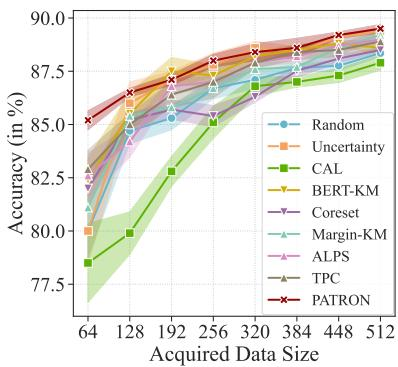  
(a) AG News

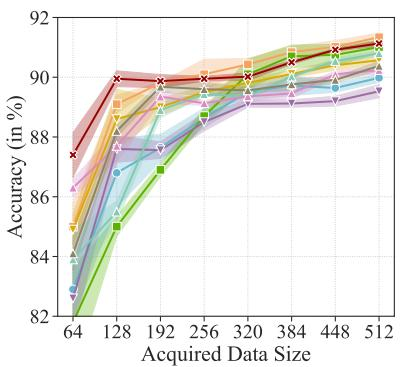  
(b) IMDB

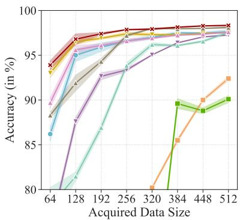  
(c) DBPedia  
Figure 7: The comparision of PATRON with other baselines under standard multi-round AL setting on other three datasets.

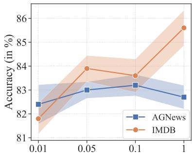  
(a) Effect of ρ.

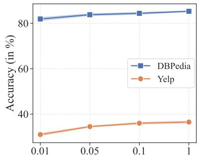  
(b) Effect of ρ.

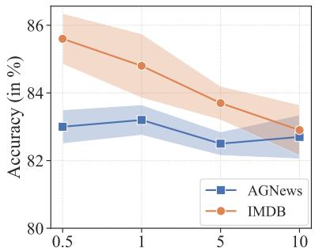  
(c) Effect of β.

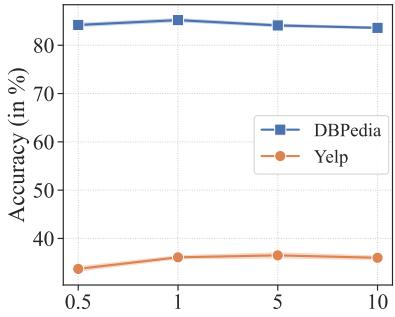  
(d) Effect of β.

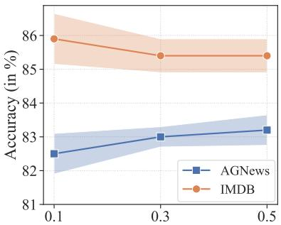  
(e) Effect of γ.

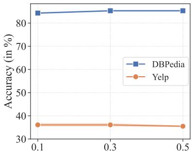  
(f) Effect of γ.  
Figure 8: The additional hyperparameter study on the other datasets.

Number of Labels  
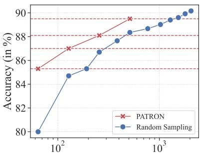  
Number of Labels  
(a) AG News

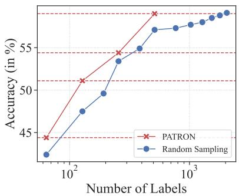  
(b) Yelp

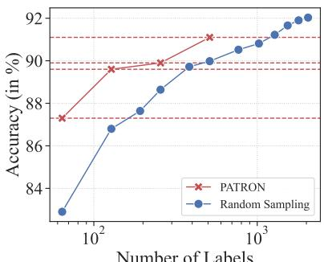  
(c) IMDB

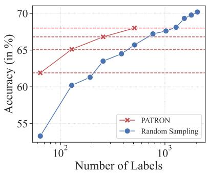  
(d) Yahoo!

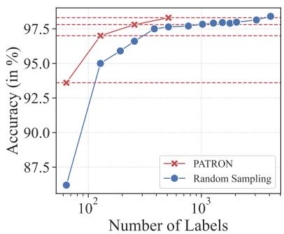  
(e) DBPedia.

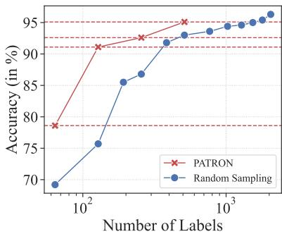  
(f) TREC.  
Figure 9: Illustration of label efficiency on six datasets.

## ACL 2023 Responsible NLP Checklist

## A For every submission:

✓ A1. Did you describe the limitations of your work? Page 10, after section 7

 A2. Did you discuss any potential risks of your work? Not applicable. Left blank.

✓ A3. Do the abstract and introduction summarize the paper’s main claims? Abstract, section 1

✗ A4. Have you used AI writing assistants when working on this paper? Left blank.

## B ✓ Did you use or create scientific artifacts?

Section 5.1

✓ B1. Did you cite the creators of artifacts you used? Section 5.1

 B2. Did you discuss the license or terms for use and / or distribution of any artifacts? Not applicable. Left blank.

 B3. Did you discuss if your use of existing artifact(s) was consistent with their intended use, provided that it was specified? For the artifacts you create, do you specify intended use and whether that is compatible with the original access conditions (in particular, derivatives of data accessed for research purposes should not be used outside of research contexts)? Not applicable. Left blank.

 B4. Did you discuss the steps taken to check whether the data that was collected / used contains any information that names or uniquely identifies individual people or offensive content, and the steps taken to protect / anonymize it? Not applicable. Left blank.

 B5. Did you provide documentation of the artifacts, e.g., coverage of domains, languages, and linguistic phenomena, demographic groups represented, etc.? Not applicable. Left blank.

✓ B6. Did you report relevant statistics like the number of examples, details of train / test / dev splits, etc. for the data that you used / created? Even for commonly-used benchmark datasets, include the number of examples in train / validation / test splits, as these provide necessary context for a reader to understand experimental results. For example, small differences in accuracy on large test sets may be significant, while on small test sets they may not be. Appendix A.

## C ✓ Did you run computational experiments?

Section 5

✓ C1. Did you report the number of parameters in the models used, the total computational budget (e.g., GPU hours), and computing infrastructure used? Appendix C.1

✓ C2. Did you discuss the experimental setup, including hyperparameter search and best-found hyperparameter values? Appendix C.5

✓ C3. Did you report descriptive statistics about your results (e.g., error bars around results, summary statistics from sets of experiments), and is it transparent whether you are reporting the max, mean, etc. or just a single run? Section 5.3.

 C4. If you used existing packages (e.g., for preprocessing, for normalization, or for evaluation), did you report the implementation, model, and parameter settings used (e.g., NLTK, Spacy, ROUGE, etc.)? Not applicable. Left blank.

D ✗ Did you use human annotators (e.g., crowdworkers) or research with human participants? Left blank.

 D1. Did you report the full text of instructions given to participants, including e.g., screenshots, disclaimers of any risks to participants or annotators, etc.? No response.

 D2. Did you report information about how you recruited (e.g., crowdsourcing platform, students) and paid participants, and discuss if such payment is adequate given the participants’ demographic (e.g., country of residence)? No response.

 D3. Did you discuss whether and how consent was obtained from people whose data you’re using/curating? For example, if you collected data via crowdsourcing, did your instructions to crowdworkers explain how the data would be used? No response.

 D4. Was the data collection protocol approved (or determined exempt) by an ethics review board? No response.

 D5. Did you report the basic demographic and geographic characteristics of the annotator population that is the source of the data? No response.