# Consistency Regularization Training for Compositional Generalization

Yongjing Yin1,2∗, Jiali Zeng3, Yafu Li1,2, Fandong Meng3, Jie Zhou3, Yue Zhang2,4†

1 Zhejiang University

2 School of Engineering, Westlake University

3 Pattern Recognition Center, WeChat AI, Tencent Inc

4 Institute of Advanced Technology, Westlake Institute for Advanced Study

{yinyongjing,liyafu}@westlake.edu.cn

{lemonzeng,fandongmeng,withtomzhou}@tencent.com yue.zhang@wias.org.cn

## Abstract

Existing neural models have difficulty generalizing to unseen combinations of seen components. To achieve compositional generalization, models are required to consistently interpret (sub)expressions across contexts. Without modifying model architectures, we improve the capability of Transformer on compositional generalization through consistency regularization training, which promotes representation consistency across samples and prediction consistency for a single sample. Experimental results on semantic parsing and machine translation benchmarks empirically demonstrate the effectiveness and generality of our method. In addition, we find that the prediction consistency scores on in-distribution validation sets can be an alternative for evaluating models during training, when commonly-used metrics are not informative.

## 1 Introduction

Compositional (systematic) generalization refers to the ability to understand and produce a potentially infinite number of novel combinations of known atoms (Chomsky, 2009; Janssen and Partee, 1997). Humans exhibit exceptional compositional generalization capability, easily producing and understanding unseen linguistic expressions by recombining the learned rules (Montague and Thomason, 1975). Therefore, it is also regarded as a desired property for neural networks. Despite the impressive progress in language modeling (Vaswani et al., 2017; Liu et al., 2019; Raffel et al., 2020), the sequence-to-sequence (seq2seq) models have been demonstrated inefficient in capturing the compositional rules, thus failing to generalize to novel compositions (Lake and Baroni, 2018; Keysers et al., 2020a; Kim and Linzen, 2020; Li et al., 2021).

Achieving compositional generalization requires a model to perform consistently in the interpretation assigned to a (sub)expression across contexts (Janssen and Partee, 1997; Dankers et al., 2022). For example, the interpretation of a phrase “the book” is consistent whether it is described by a modifier “he likes”, in both semantic parsing and machine translation domains (Kim and Linzen, 2020; Li et al., 2021). To improve the consistency, most existing work considers a change of neural architecture to suit particular composition or generalization test sets (Chen et al., 2020b; Guo et al., 2020b; Yin et al., 2022; Zheng and Lapata, 2022), which limits their potentials in real world applications.

Recently, the Transformer architecture has become the standard for natural language processing (NLP), particularly in supporting large pretrained language models (PLMs) such as T5 and GPT-3 (Raffel et al., 2020; Brown et al., 2020). The Transformer-based PLMs have significantly improved few-shot fine-tuning and even made efficient zero-shot learning possible. As a result, there has been a trend towards developing data-centric AI (Koch et al., 2021; Jakubik et al., 2022), where the focus is on data preparation and training strategies rather than on the model architecture. However, it has recently been shown that the standard Transformer is underestimated in its ability to handle compositionality (Csordás et al., 2021; Ontanon et al., 2022), and there has been relatively little research done on how to improve this capability through training.

We observe that limitation of compositional generalization in Transformer can arise from the internal inconsistency under the standard training paradigm. First, Transformer token representations have been shown to reside within a narrow range of the embedding space (Gao et al., 2019; Cai et al., 2021), which can easily be affected by context variations, especially from novel compositions (Zheng and Lapata, 2022). Second, internal uncertainties like dropout can lead to prediction variations of a single sample (Sajjadi et al., 2016; Liang et al., 2021). Such prediction inconsistency can limit the efficiency of learning patterns in training data (Ghiasi et al., 2018). During inference, this defect is not significant when the models process in-distribution data; however, unseen compositions can magnify the negative influence, which degrades the final performance on compositional generalization.

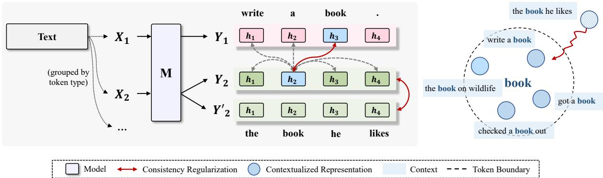  
Figure 1: Illustration of consistency regularization training. During training, we encourage the representation consistency of the same token (i.e., “book”) across contexts, and enforce the instance-level output consistency when passing the input (e.g., X2) to the model M twice (i.e., Y2 and Y‘). The gray dash line denotes pushing apart the representations. The representation consistency can be performed on the source or target side, and we display the target side for simplicity.

Without modifying model architectures, we improve compositionality of Transformer with consistency regularization training in terms of representation and prediction. For representation, we encourage the representations of the same token across contexts to be more consistent with each other, and the representations of different tokens to be separated, which can be achieved by contrastive learning (Khosla et al., 2020; Chen et al., 2020a). As shown in the right part of Figure 1, when combined with the modifier “he likes”, the representation of “book” is pulled to be consistent with those in other contexts. Such representations tolerate context changes better and meanwhile capture discriminative semantics. For prediction consistency, we feed each instance to the model multiple times and force the output distributions of a specific token to be close. In this way, the negative influence of internal uncertainties can be mitigated, which decreases fluctuation in output distributions while maintaining task-specific features.

We conduct experiments on standard benchmarks for compositional generalization, including representative semantic parsing datasets (COGS (Kim and Linzen, 2020) and CFQ (Keysers et al.,

2020a)), and machine translation datasets (CoGnition (Li et al., 2021) and OPUS En-Nl (Dankers et al., 2022)). Our method consistently improves upon standard Transformer or pre-trained language models, achieving state-of-the-art performance on COGS, CoGnition, and OPUS En-Nl, and competitive performance on CFQ. Specifically, we explore a consistency-based metric for model selection on COGS, as commonly-used metrics (e.g., accuracy) on the validation set are often not informative. The analysis of learning efficiency shows that our regularization enables the model to achieve an accuracy score of 18% with only 1.2k samples on CFQ MCD1, which the baseline fails to learn. In addition, our analyses of representation variance and robustness to input noise demonstrate that our method delivers better consistency.1

## 2 Related Work

Compositional Generalization has attracted increasing attention with dedicated datasets (Lake and Baroni, 2018; Keysers et al., 2020a; Kim and Linzen, 2020; Li et al., 2021; Shaw et al., 2021; Dankers et al., 2022). One line of research considers dedicated model architectures (Chen et al., 2020b; Gordon et al., 2020; Kim, 2021), which perform well on small scaled data but can face difficulties scaling to large or practical data. For example, Chen et al. (2020b) propose a differentiable neural network to operate a symbolic stack machine. Another line of research enhances the compositionality of standard architectures (i.e., Transformer) by introducing new modules (Bergen et al., 2021; Yin et al., 2022; Zheng and Lapata, 2022). However, significant architecture changes can bring about extra training cost or decoding latency. For example, Edge Transformer (Bergen et al., 2021) uses vectorbased attention weights, and Dangle Transformer (Zheng and Lapata, 2022) re-encodes source representations at each decoding step, which increase model complexity to $O ( n ^ { 3 } )$ . Proto-Transformer (Yin et al., 2022) uses an additional attention module to incorporate prototype vectors obtained by clustering algorithms (e.g., K-Means). Different from them, we improve Transformer from the perspective of regularization training without any architecture changes.

Recently, Csordás et al. (2021) and Ontanon et al. (2022) empirically make slight changes of Transformer components, and find its capability of compositionality is underestimated. Meta-learning (Conklin et al., 2021) and data augmentation (Andreas, 2020; Guo et al., 2020a) are also introduced to improve the base models, but the experiment results are limited. Along the line of compositional generalization studies without modifying the model architectures, our method focuses on the internal consistency of Transformer, and achieves better performance.

Regularization training has been shown effective in semi-supervised training (Sajjadi et al., 2016; Tarvainen and Valpola, 2017), robust training (Cheng et al., 2018; Liang et al., 2021), continual training (Kirkpatrick et al., 2016; Lopez-Paz and Ranzato, 2017), etc. To encourage compositional behavior, Guo et al. (2020a) softly combine source/target sequence embeddings during training, and Conklin et al. (2021) introduce gradient based meta learning to simulate distribution shift. In addition, contrastive learning serving as regularization has achieved success in various NLP tasks (Chi et al., 2021; Su et al., 2022; Zhang et al., 2022). Different form them, we explore the effectiveness of the regularization training on the two different tasks in compositional generalization.

## 3 Method

We propose to regularize the model training in two aspects, as illustrated in Figure 1: representation consistency of tokens across different contexts (§3.1), and consistency of model prediction for a single sample (§3.2).

## 3.1 Representation Consistency

The representation consistency encourages the contextualized representations of the same token across contexts to be more consistent in the embedding space. To this end, we introduce the popular contrastive learning (Chen et al., 2020a; He et al., 2020), especially the supervised variant (Khosla et al., 2020). Specifically, we collect representations that belong to the same token as positive samples, and representations of different tokens in the mini-batch as negative samples. For example, in Figure 1, for the token “book” in the sequence $Y _ { 1 }$ the positive sample is $h _ { 2 }$ in $Y _ { 2 }$ , and the negatives include the representations of other tokens. Following (Gao et al., 2021), the dropout augmentation is also considered as positive samples.

For construction of positive samples, we can use a data sampling strategy which groups minibatches according to token types. When building a mini-batch, we first randomly sample a token from the vocabulary, then retrieve several sentence pairs (e.g., 8) containing the token. We repeat this process until reaching the batch size, and the sentence pairs that have been chosen will not be retrieved again in that training epoch. In practice, since the current focus on compositional generalization is the composition of high-frequency atoms, a relatively large batch size is able to ensure reasonable co-occurrence of positive samples.

Formally, given a mini-batch of input pairs $\{ ( X , Y ) \}$ , we define the contrastive objective as

$$
\mathcal { L } _ { r } = - \frac { 1 } { N } \sum _ { i = 1 } ^ { N } \sum _ { p \in P ( i ) } \log \frac { e ^ { \mathrm { { s } } ( h _ { i } , h _ { p } ) / \tau } } { \sum _ { j = 1 } ^ { N } \mathbb { 1 } _ { i \neq j } e ^ { \mathrm { { s } } ( h _ { i } , h _ { j } ) / \tau } } ,\tag{1}
$$

where N is the number of the total tokens that are chosen for regularization, considering that some tokens can be excluded from the consistency regularization, e.g., the token used for padding. $P ( i )$ is the set of indices of all the positive samples for $h _ { i } , \tau$ is a temperature hyper-parameter2. Moreover, $s ( \cdot )$ denotes the cosine similarity between representations to:

$$
\mathrm { s } ( h _ { i } , h _ { p } ) = \frac { h _ { i } ^ { T } h _ { p } } { \| h _ { i } \| \| h _ { p } \| } ,\tag{2}
$$

where $h _ { i }$ is the representations of the top layer in the encoder or the decoder, projected by a multilayer perceptron with ReLU activation.

## 3.2 Prediction Consistency

Due to the training mechanism of neural models, predictions of the same instance can vary across forward passes. The internal stochastic perturbations in the model components accumulate layerby-layer, negatively affecting the efficiency of invariance learning (Ghiasi et al., 2018). To enforce the sample-level consistency, we feed the instance (X, Y ) to the model M multiple times during training, and obtain the final output distributions derived from different dropout perturbations. We minimize the difference between the output distributions for each target token:

$$
L _ { p } = { \frac { 1 } { | Y | } } \sum _ { y _ { i } \in Y } d ( p ^ { 1 } ( y _ { i } | X , y _ { < i } ) , . . . , p ^ { M } ( y _ { i } | X , y _ { < i } ) ) .\tag{3}
$$

where |Y| is the number of tokens in the target sequence Y , d(·) is a metric function measuring the difference, and M denotes the number of perturbations. Empirical results show that Jensen-Shannon divergence between two perturbations are effective enough while maintaining efficiency We also experimented with more than two perturbations and other metrics such as sample variance, and found that it possibly lead to better performance but also more training cost. Therefore, we set M as 2 in all the experiments. By explicitly encouraging the model to generate consistent output during training, the model is able to capture global compositional patterns with more confidence.

## 3.3 Training and Inference.

The overall loss function is defined as:

$$
L = L _ { c e } + \alpha L _ { r } + \beta L _ { p } ,\tag{4}
$$

where $L _ { c e }$ denotes cross-entropy loss for baseline models, and α and beta are the coefficients of the two regularization losses, respectively. Notably, our proposed regularization terms guide the model training from the aspects of representation and prediction, without changing the inference process, which means no additional decoding latency.

## 4 Experiments: Semantic Parsing

This section demonstrates empirical results on representative semantic parsing benchmarks for compositional generalization: COGS and CFQ.

<table><tr><td>Model</td><td>ACC</td></tr><tr><td>MAML-Transformer</td><td>66.7</td></tr><tr><td>Rela-Transformer</td><td>81.0</td></tr><tr><td>Lex-LSTM</td><td>82.1</td></tr><tr><td>Dangle-Transformer*</td><td>85.9</td></tr><tr><td>Transformer</td><td>80.8</td></tr><tr><td>Transformer + CReg</td><td>84.5</td></tr><tr><td> $\mathrm { T r a n s f o r m e r ^ { * } + C R e g }$ </td><td>86.2</td></tr></table>

Table 1: Exact match accuracy on COGS. We report the accuracy averaged over three runs. Transformer\* means that the word embeddings are initialized by Glove.

## 4.1 COGS

Setting. All of our models are implemented based on Fairseq3. The embedding and feedforward dimension of Transformer are 512 and the number of model layers is 2. We use the Adam optimizer with learning rate 1e-4, warmup steps 4,000, and a batch size of 4,096 tokens. For our regularization, we set α and $\beta$ to 0.01 and 1.0, respectively, and we apply the representation consistency on the target side. Following the previous work (Csordás et al., 2021; Zheng and Lapata, 2022), we use dropout with probability of 0.1. We report the mean accuracy over three runs. More details about the dataset are shown in Appendix A.

Results. The baselines models used for comparison on COGS includes MAML-Transformer (Conklin et al., 2021), Lex-LSTM (Akyurek and Andreas, 2021), Rela-Transformer (Csordás et al., 2021), and Dangle-Transformer (Zheng and Lapata, 2022). The results in Table 1 show that, enhanced with the proposed regularization, the Transformer model is improved by 3.7% and achieves an overall 84.5% generalization accuracy. Rela-Transformer achieves good performance with several modifications to Transformer (e.g., initialization, relative positional encoding), and ours performs better than it. In comparison to MAML-Transformer trained using meta-learning, our method is more effective and conceptually simpler, requiring no meta-gradients or construction of meta-datasets. In particular, using the same initialization (i.e., Glove (Pennington et al., 2014)), our regularized Transformer outperforms Dangle-Transformer without architecture modifications and additional decoding latency.

Consistency-based Metric for Model Selection. A general and important problem in compositional generalization is the lack of effective validation sets that are representative of the generalization distribution, particularly on the popular benchmark COGS (Conklin et al., 2021; Csordás et al., 2021; Zheng and Lapata, 2022). Concretely, the only provided IID validation set in COGS is easy to achieve 100% or almost 100% accuracy, which is difficult for model selection and testing novel ideas. Previous studies have resorted to sampling a small subset from the generalization test set, which can potentially lead to overfitting to the test set.

We hypothesize that consistency on the IID validation set can be used as a metric to predict their generalization ability. To verify it, we conduct a preliminary experiment on COGS. We use three configurations for training Transformer4: (1) M1, which has two layers with 128 embedding dimension and 256 feedforward dimension, (2) M2, which has four layers with 128 embedding dimension and 256 feedforward dimension, and (3) M3, which has two layers with 512 embedding and feedforward dimensions. Each model is run five times with different random seeds for 50,000 training steps. We record the validation loss (w/ Loss), accuracy (w/ Acc), and prediction consistency score of each checkpoint every 1000 training steps, after they pass the period of drastic changes (i.e., 15,000 steps). In order to reduce the impact of random fluctuations on the correlation calculation, we only save the adjacent checkpoints if the performance difference exceeding 0.5. For the consistency score, we feed each instance into the model twice with dropout retained, and calculate the sample variance (w/ Pvar) and JS divergence (w/ Js) over the output token distributions.

The results are shown in Table 2. Although all of the models can achieve 99.9% accuracy on the validation set5, their oracle generalization performances are different. Overall, the consistency scores exhibit a higher correlation to the generalization performance than the validation loss and accuracy. For example, the w/ Acc of M2 achieves a 0.533 spearman’s correlation while w/ Js achieves 0.805. According to the consistency score, we can select the M3 checkpoint with 81.0 test accuracy, which is equal to the oracle, while only obtaining a model with 79.7 test accuracy according to the validation accuracy. Additionally, we display the relationship between the test accuracy and consistency scores of M2 during training in Figure 2. As the training progresses, it can be seen that the consistency score, especially the one calculated via variance, decreases as the test accuracy increases.

<table><tr><td>Model</td><td>M1</td><td>M2</td><td>M3</td></tr><tr><td>w/ Loss</td><td>74.4 / 0.228</td><td>79.8 / 0.085</td><td>79.7 / 0.033</td></tr><tr><td>w/ Acc</td><td>79.5 / 0.669</td><td>80.7 / 0.533</td><td>79.7 / 0.223</td></tr><tr><td>w/Js</td><td>78.3 / 0.793</td><td>81.0 / 0.805</td><td>81.0 / 0.292</td></tr><tr><td>w/ Pvar</td><td>78.3 / 0.801</td><td>81.0 / 0.803</td><td>80.4 / 0.468</td></tr><tr><td>Valid</td><td>99.9</td><td>99.9</td><td>99.9</td></tr><tr><td>Test(oracle)</td><td>79.7</td><td>81.4</td><td>81.0</td></tr></table>

Table 2: M1, M2, and M3 indicate different model configurations. For each model, the first number of each column represents the test accuracy of the checkpoint selected with the best corresponding metric during training. The second number is the spearman correlation between the test accuracy scores and the metric scores on the validation set of all of the checkpoints. Test(oracle) means the performance of the checkpoint selected by the test accuracy. The results are averaged over five runs with different random seeds.

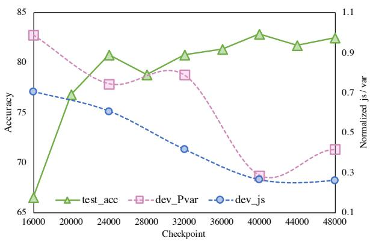  
Figure 2: Relationship between the consistency score on the IID validation set of COGS and the test accuracy. We use two strategies to calculate the consistency scores: JS divergence (dev\_js) and sample variance of output probability distributions (dev\_Pvar).

## 4.2 CFQ

Setting. We use the Universal Transformer architecture (Uni-TF) (Bergen et al., 2021; Csordás et al., 2021) as the base model, and encoder and decoder are 6 layers with 256 embedding dimension. Moreover, pre-trained language models are critical for achieving good performance on CFQ (Furrer et al., 2020; Zheng and Lapata, 2022). Following Zheng and Lapata (2022), we use RoBERTa-Base as the encoder and combine it with a Transformer decoder initialized randomly. The encoder has 12 layers with the embedding dimension 756, and the decoder has 2 layers of which the embedding dimension is 256. We set the learning rate to 1e-4 and the warmup steps to 4,000. The α and β are set to 0.3 and 1.0, respectively. We apply the representation consistency on the encoder side for the RoBERTa-based model and decoder side for the Universal Transformer. The dropout probability is set to 0.1. We report the mean accuracy over three runs. We use exact matching accuracy to measuring model performance, and run each experiment three times and report the mean accuracy.

<table><tr><td>Model</td><td>MCD1</td><td>MCD2</td><td>MCD3</td><td>AVE</td></tr><tr><td>HPD</td><td>72.0</td><td>66.1</td><td>63.9</td><td>67.3</td></tr><tr><td>Uni-Transformer</td><td>44.0</td><td>11.0</td><td>14.0</td><td>23.0</td></tr><tr><td>Evolved-Transformer</td><td>42.4</td><td>9.3</td><td>10.8</td><td>20.8</td></tr><tr><td>Edge-Transformer</td><td>47.7</td><td>13.1</td><td>13.2</td><td>24.7</td></tr><tr><td>Uni-TF+CReg</td><td>57.5</td><td>28.8</td><td>31.5</td><td>39.2</td></tr><tr><td>T5-11B-mod</td><td>61.6</td><td>31.3</td><td>33.3</td><td>42.1</td></tr><tr><td>RoBERTa-Dangle</td><td>78.3</td><td>59.5</td><td>60.4</td><td>66.1</td></tr><tr><td>RoBERTa</td><td>60.6</td><td>33.6</td><td>36.0</td><td>43.4</td></tr><tr><td>RoBERTa+CReg</td><td>74.8</td><td>53.3</td><td>58.3</td><td>62.1</td></tr></table>

Table 3: Exact match accuracy on CFQ. We report the accuracy averaged over three runs with different random seeds.

Results. For models trained from scratch, we compare our method with Evolved-Transformer (Furrer et al., 2020), Uni-Transformer (Csordás et al., 2021), Edge-Transformer (Bergen et al., 2021) and HPD (Guo et al., 2020b). The pretrained language models include T5-11B-MOD (Furrer et al., 2020), RoBERTa-Dangle (Zheng and Lapata, 2022), and RoBERTa (Zheng and Lapata, 2022). Note that HPD is a not a seq2seq model and is a hierarchical decoding structure dedicated for CFQ.

As shown in Table 3, it is highly challenging to train a Transformer, especially on the MCD2 and MCD3 splits, whether pre-trained models are used or not. Although deep contextualized representations are useful, they still lag behind HPD, suggesting that more efficient methods of achieving compositional generalization by exploiting proper inductive biases exist. Specifically, RoBERTa+dec achieves an average test accuracy of 43.4%. When trained with consistency regularization, it is further improved to an average of 62.1%. Dangle-RoBERTa re-encodes the concatenation of the source sequence and target history at each decoding step, leading to large computational overhead especially for long sequences. Despite the minor performance gap (4%), our model requires no modifications to model architecture and decoding, resulting in a much lower decoding latency.

<table><tr><td>Model</td><td>BLEU</td><td>Instance</td><td>Aggregate</td></tr><tr><td>Transformer</td><td>59.5</td><td>28.4</td><td>62.9</td></tr><tr><td>Seq-Mixup</td><td></td><td>28.6</td><td>60.6</td></tr><tr><td>Proto-Transformer</td><td>60.1</td><td>21.7</td><td>51.8</td></tr><tr><td>Dangle-Transformer</td><td>60.6</td><td>22.8</td><td>50.6</td></tr><tr><td>Transformer+CReg</td><td>61.3</td><td>20.2</td><td>48.3</td></tr></table>

Table 4: Compound translation error rate (CTER) on CoGnition. Instance and Aggregate denote the instancelevel and aggregate-level CTER, respectively.

## 5 Experiments: Machine Translation

Unlike semantic parsing, the target of MT is also natural language and compositionality in natural domains is far more intricate. we further validate the effectiveness of our method on two dedicated machine translation datasets: CoGnition (Li et al., 2021) and OPUS En-Nl (Dankers et al., 2022).

## 5.1 CoGnition

Setting. We use the Transformer iwslt\_de\_en setting in Fairseq with 4 layers. The batch size is 4,096 tokens, and we stop training if a model does not improve on the validation for 10 epochs. We set α and $\beta$ to 0.5 and 3.0, respectively. The dropout is set to 0.3, and we apply the representation consistency on the target side. We use beam search with width 5 for inference. We use compound translation error rate (CTER; (Li et al., 2021)) to measure model performance. Specifically, instance-level CTER denotes the ratio of the instances in which the novel compounds are translated incorrectly to the total instances, and aggregate-level CTER denotes the ratio of the compound types which are translated wrong at least once in the corresponding contexts. We also report BLEU score (Papineni et al., 2002), which evaluates the quality of whole translations.

Results. We compare our method to Seq-Mixup (Yin et al., 2022), which trains Transformer with sequence-level mixup regularization (Guo et al., 2020a); Dangle-Transformer (Zheng and Lapata, 2022); and Proto-Transformer (Yin et al., 2022), which applies K-Means during training to categorize the representations for each source token, and integrates the cluster representations to the encoding to reduce representation sparsity..

<table><tr><td colspan="2">Model</td><td colspan="2">Small</td><td colspan="2">Medium</td></tr><tr><td>Data</td><td>Condition</td><td>TF</td><td>TF+CReg</td><td>TF</td><td>TF+CReg</td></tr><tr><td>S-&gt; NP VP</td><td></td><td></td><td></td><td></td><td></td></tr><tr><td>synthetic</td><td>NP</td><td>.72</td><td>.78</td><td>.84</td><td>.82</td></tr><tr><td>synthetic</td><td>VP</td><td>.79</td><td>.87</td><td>.87</td><td>.91</td></tr><tr><td>semi-natural</td><td>NP</td><td>.56</td><td>.70</td><td>.66</td><td>.70</td></tr><tr><td>S-&gt; S CONJ S</td><td></td><td></td><td></td><td></td><td></td></tr><tr><td>synthetic</td><td> ${ \bf S } _ { 1 } ^ { ' }$ </td><td>.87</td><td>.91</td><td>.90</td><td>.95</td></tr><tr><td>synthetic</td><td> ${ \bf S } _ { 3 }$ </td><td>.68</td><td>.75</td><td>.76</td><td>.89</td></tr><tr><td>semi-natural</td><td> ${ \bf S } _ { 1 } ^ { ' }$ </td><td>.70</td><td>.78</td><td>.73</td><td>.79</td></tr><tr><td>semi-natural</td><td> $\mathrm { S _ { 3 } }$ </td><td>.40</td><td>.56</td><td>.49</td><td>.54</td></tr><tr><td>natural</td><td> ${ \bf S } _ { 1 } ^ { ' }$ </td><td>.60</td><td>.72</td><td>.67</td><td>.75</td></tr><tr><td>natural</td><td> ${ \bf S } _ { 3 }$ </td><td>.28</td><td>.45</td><td>.39</td><td>.51</td></tr><tr><td>Average</td><td></td><td>.62</td><td>.72</td><td>.70</td><td>.76</td></tr><tr><td>BLEU</td><td>-</td><td>22.6</td><td>23.4</td><td>25.1</td><td>25.8</td></tr></table>

Table 5: Evaluation of systematicity on OPUS En-Nl including consistency and BLEU scores. The models are trained on the small and medium training sets, respectively.

The main results are shown in Table 4. The Transformer gives instance-level and aggregatelevel CTERs of 29.4% and 63.8%, respectively, while the regularized Transformer achieves 19.9% and 48.8%, respectively. Our model obtains a substantial improvement of 8.3% and 11.2% without changing the model architecture. Particularly, the CG-test set requires NMT models to put more emphasis on the invariance of atom translation under context variations, and the result demonstrates that the encouragement of consistency helps the model learn it better . Besides, compared to SeqMix regularization, the improvement of our method is more significant, possibly due to the inconsistency introduced by the stochastically interpolated samples in SeqMix. Moreover, the regularized Transformer performs better than Dangle-Transformer and Proto-Transformer. This indicates that through training regularization, the generalization ability of the Transformer can be significantly improved with scalability to various tasks maintained.

## 5.2 OPUS

Setting. We use Tranformer\_Base configuration in Fairseq following Dankers et al. (2022). We use a learning rate of 5e-4 with 4,000 warmup steps, and a batch size of 4,096 tokens on 4 GPUs. We stop training if the model does not show improvement on the validation set for 10 consecutive epochs. The regularization coefficients α and $\beta$ are set to 0.2 and 1.0, respectively, The dropout is set to 0.3, and lower probabilities lead to worse consistency scores. For our regularization, the representation consistency is used on the target side. The evaluation metric is the translation consistency score, which measures the consistency of the model’s translations for a sample when the context changes. Specifically, in the S -> NP VP setup, two translations are considered consistent if they differ by only one word. In the S-> S CONJ S setup, the consistency is measured for the translations of the second conjunct. For more details, please refer to Appendix A and the paper (Dankers et al., 2022).

<table><tr><td>Model</td><td>COGS</td><td>CFQ</td><td>CoGnition</td></tr><tr><td>(*)+CReg</td><td>84.5</td><td>62.1</td><td>20.2/48.3</td></tr><tr><td>w/o  $L _ { r }$ </td><td>81.9</td><td>52.5</td><td>22.3/51.8</td></tr><tr><td>w/o  $L _ { p }$ </td><td>83.4</td><td>59.0</td><td>24.3/57.7</td></tr></table>

Table 6: Results of ablation study.

Result. The overall result is presented in Table 5. In both small and medium settings, our consistency regularization can enhance the learning of systematicity of Transformer, and makes the model less prone to changing their translations after small adaptations to source sentences. Specifically, when trained on small size corpus (1.1M), the consistency score of the NMT model is improved significantly from 0.62 to 0.72 in average. In addition, increasing training data can intuitively improve the model’s systematicity ability since the model sees more compositions during training. The proposed regularized model trained on medium size corpus (8.6M) achieves 0.76 consistency score, outperforming the baseline by 0.6 in average. In particular, it performs better than the model trained on the full data (0.73 reported in (Dankers et al., 2022)). Finally, the BLEU scores on the general test set is also improved due to the amelioration in compositionality learning.

## 6 Analysis

In this section, we aim to provide a deeper understanding of how our consistency regularization improves compositional generalization by analyzing various aspects of the model’s performance.

## 6.1 Ablation Study

To present the influence of different regularization terms, we conduct an ablation study on CFQ,

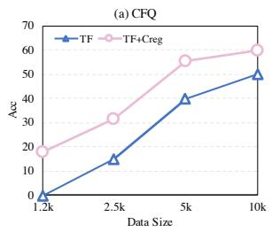

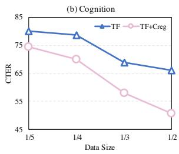  
Figure 3: Learning efficiency of Transformer under the standard training and our consistency regularization training, respectively.

COGS, and CoGnition. The results are shown in Table 6. We can see that using either of the two regularization methods alone can also improve the generalization performance. Specifically, the contrastive loss $L _ { r }$ has a greater impact on COGS and CFQ, indicating that the structure generalization can benefit from more consistent atom representations across samples. On the other hand, the prediction consistency loss $L _ { p }$ has a more significant effect on CoGnition, since the evaluation metric requires the NMT model to generate coherent translations of each atom in different contexts. Finally, further improvement can be achieved by leveraging the training regularization of both the representation and prediction consistency.

## 6.2 Learning Efficiency

We argue that the inconsistency can negatively affect the efficiency of learning invariance and composition patterns from the training data, which can be mitigated by our consistency training. To verify it, we train the models with different training sizes and report the test performance in Figure 3. For CFQ, we randomly sample four different sizes of training corpora containing 1.2k, 2.5k, 5k, and 10k sentence pairs, respectively. For CoGnition, we train the models using 1/2, 1/3, 1/4, and 1/5 of the total sentence pairs in the training set, respectively. We can observe that consistency regularization enables the Transformer model to learn the generalizable composition patterns with less training data. On CFQ, the Transformer enhanced by RoBERTa fails to learn when there only exists 1.2k training instances, while the regularization enables the model to achieve almost 20% accuracy on the generalization test set.

## 6.3 Intra-class Variance

In this part, we calculate the intra-class variance to perform quantitative study of the improvement of representation invariance to context changes (Zheng and Lapata, 2022). For each token, we perform a forward pass over the training set with the trained model to collect all of its contextualized representations. The intra-class variance is defined as the weighted average of all tokens’ variances by their frequency:

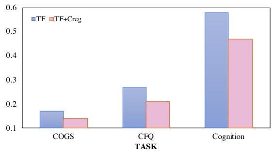  
Figure 4: Intra-class variance of Transformer(TF) and regularized Transformer(TF-CReg) on CFQ and CoGnition.

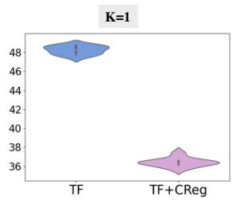

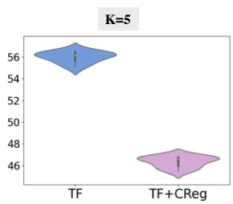  
Figure 5: Effect of input noise on CoGnition. K represents the number of tokens that are replaced at random in the context part of a source sentence. The vertical axis represents the average of instance and aggregate CTER.

$$
\frac { 1 } { d } \sum _ { i = 1 } ^ { d } E _ { y } v a r ( h _ { i } ^ { y } ) ,\tag{5}
$$

where d is the dimension of representations and y denotes a token type. A lower intra-class variance indicates more disentangled features, which are more robust to variations in input composition. As shown in Figure 4, the representations of the regularized model have lower variance, and this phenomenon can be explained by the influence of the contrastive loss, which pulls the representations belonging to the same token closer together.

## 6.4 Input Noise

Input noise can be regard as a special case of compositional generalization, which possibly destroy semantics of sentences and is common in real applications (Michel and Neubig, 2018; Wang et al.,

2021). In this experiment, we investigate whether our method can lead to a more robust model to input noise. We chose CoGniton as the test bed, since the novel compounds and the contexts are clearly divided. For each source sentence in the CG-test set, we keep the compound unchanged and randomly replace K tokens in the context part with the other tokens in the vocabulary. For each K, we sample 10 times and the violin plot is shown in Figure 5. The vertical axis represents the average of instance and aggregate CTER. Under the input noise of different extents, the performances of TF+CReg consistently outperform TF. Even though the contexts are destroyed seriously (K=5), TF+CReg can give a performance comparable to the baseline, indicating the regularized model learns the invariant translation patterns better. The figures with the other values of K are put in Appendix B.

## 7 Conclusion

We presented a regularization method to enhance compositional generalization, jointly encouraging the consistency of token representations across samples and sample-level prediction consistency. Experiments on four dedicated datasets show the effectiveness of our method. The regularized Transformer can be a strong baseline for future investigate of compositional generalization.

## Limitations

For representation consistency, we apply the regularization to all the tokens and do not distinguish between the different roles the tokens play. Adaptive determination of which tokens or chunks require to be consistent in the representation space is an intriguing research question, which we leave as future work. More effective data sampling strategies can also be explored.

## Acknowledgements

This work is funded by the Ministry of Science and Technology of China (grant No. 2022YFE0204900). We would like to thank all of the anonymous reviewers for the helpful comments.

## References

Ekin Akyurek and Jacob Andreas. 2021. Lexicon learning for few shot sequence modeling. In Proceedings of the 59th Annual Meeting of the Association for

Computational Linguistics and the 11th International Joint Conference on Natural Language Processing (Volume 1: Long Papers), pages 4934–4946, Online. Association for Computational Linguistics.

Jacob Andreas. 2020. Good-enough compositional data augmentation. In Proc. ofACL, pages 7556–7566.

Leon Bergen, Timothy J. O’Donnell, and Dzmitry Bahdanau. 2021. Systematic generalization with edge transformers. In Advances in Neural Information Processing Systems 34: Annual Conference on Neural Information Processing Systems 2021, NeurIPS 2021, December 6-14, 2021, virtual, pages 1390– 1402.

Tom B. Brown, Benjamin Mann, Nick Ryder, Melanie Subbiah, Jared Kaplan, Prafulla Dhariwal, Arvind Neelakantan, Pranav Shyam, Girish Sastry, Amanda Askell, Sandhini Agarwal, Ariel Herbert-Voss, Gretchen Krueger, Tom Henighan, Rewon Child, Aditya Ramesh, Daniel M. Ziegler, Jeffrey Wu, Clemens Winter, Christopher Hesse, Mark Chen, Eric Sigler, Mateusz Litwin, Scott Gray, Benjamin Chess, Jack Clark, Christopher Berner, Sam McCandlish, Alec Radford, Ilya Sutskever, and Dario Amodei. 2020. Language models are few-shot learners. In NeurIPS 2020.

Xingyu Cai, Jiaji Huang, Yuchen Bian, and Kenneth Church. 2021. Isotropy in the contextual embedding space: Clusters and manifolds. In Proc. of ICLR.

Ting Chen, Simon Kornblith, Mohammad Norouzi, and Geoffrey E. Hinton. 2020a. A simple framework for contrastive learning of visual representations. In ICML 2020, volume 119 of Proceedings ofMachine Learning Research, pages 1597–1607. PMLR.

Xinyun Chen, Chen Liang, Adams Wei Yu, Dawn Song, and Denny Zhou. 2020b. Compositional generalization via neural-symbolic stack machines. In NeurIPS 2020.

Yong Cheng, Zhaopeng Tu, Fandong Meng, Junjie Zhai, and Yang Liu. 2018. Towards robust neural machine translation. In Proc. ofACL, pages 1756–1766.

Zewen Chi, Li Dong, Furu Wei, Nan Yang, Saksham Singhal, Wenhui Wang, Xia Song, Xian-Ling Mao, Heyan Huang, and Ming Zhou. 2021. Infoxlm: An information-theoretic framework for cross-lingual language model pre-training. In NAACL-HLT 2021, pages 3576–3588. Association for Computational Linguistics.

Noam Chomsky. 2009. Syntactic structures.

Henry Conklin, Bailin Wang, Kenny Smith, and Ivan Titov. 2021. Meta-learning to compositionally generalize. In Proc. of ACL, pages 3322–3335.

Róbert Csordás, Kazuki Irie, and Juergen Schmidhuber. 2021. The devil is in the detail: Simple tricks improve systematic generalization of transformers. In Proceedings of the 2021 Conference on Empirical

Methods in Natural Language Processing, pages 619– 634, Online and Punta Cana, Dominican Republic. Association for Computational Linguistics.

Róbert Csordás, Kazuki Irie, and Jürgen Schmidhuber. 2021. The devil is in the detail: Simple tricks improve systematic generalization of transformers. In Proceedings of the 2021 Conference on Empirical Methods in Natural Language Processing, EMNLP 2021, Virtual Event / Punta Cana, Dominican Republic, 7-11 November, 2021, pages 619–634. Association for Computational Linguistics.

Verna Dankers, Elia Bruni, and Dieuwke Hupkes. 2022. The paradox of the compositionality of natural language: A neural machine translation case study. In Proceedings of the 60th Annual Meeting of the Associationfor Computational Linguistics (Volume 1: Long Papers), pages 4154–4175, Dublin, Ireland. Association for Computational Linguistics.

Daniel Furrer, Marc van Zee, Nathan Scales, and Nathanael Schärli. 2020. Compositional generalization in semantic parsing: Pre-training vs. specialized architectures. CoRR, abs/2007.08970.

Jun Gao, Di He, Xu Tan, Tao Qin, Liwei Wang, and Tie-Yan Liu. 2019. Representation degeneration problem in training natural language generation models. In ICLR 2019.

Tianyu Gao, Xingcheng Yao, and Danqi Chen. 2021. SimCSE: Simple contrastive learning of sentence embeddings. In Proceedings of the 2021 Conference on Empirical Methods in Natural Language Processing, pages 6894–6910, Online and Punta Cana, Dominican Republic. Association for Computational Linguistics.

Golnaz Ghiasi, Tsung-Yi Lin, and Quoc V. Le. 2018. Dropblock: A regularization method for convolutional networks. In NeurIPS 2018, pages 10750– 10760.

Jonathan Gordon, David Lopez-Paz, Marco Baroni, and Diane Bouchacourt. 2020. Permutation equivariant models for compositional generalization in language. In Proc. ofICLR.

Naman Goyal, Cynthia Gao, Vishrav Chaudhary, Peng-Jen Chen, Guillaume Wenzek, Da Ju, Sanjana Krishnan, Marc’Aurelio Ranzato, Francisco Guzmán, and Angela Fan. 2022. The flores-101 evaluation benchmark for low-resource and multilingual machine translation. Trans. Assoc. Comput. Linguistics, 10:522–538.

Demi Guo, Yoon Kim, and Alexander Rush. 2020a. Sequence-level mixed sample data augmentation. In Proc. ofEMNLP, pages 5547–5552.

Yinuo Guo, Zeqi Lin, Jian-Guang Lou, and Dongmei Zhang. 2020b. Hierarchical poset decoding for compositional generalization in language. In Advances in Neural Information Processing Systems 33: Annual Conference on Neural Information Processing

Systems 2020, NeurIPS 2020, December 6-12, 2020, virtual.

Kaiming He, Haoqi Fan, Yuxin Wu, Saining Xie, and Ross B. Girshick. 2020. Momentum contrast for unsupervised visual representation learning. In CVPR 2020, pages 9726–9735. IEEE.

Jonathan Herzig, Peter Shaw, Ming-Wei Chang, Kelvin Guu, Panupong Pasupat, and Yuan Zhang. 2021. Unlocking compositional generalization in pre-trained models using intermediate representations. CoRR, abs/2104.07478.

Johannes Jakubik, Michael Vössing, Niklas Kühl, Jannis Walk, and Gerhard Satzger. 2022. Data-centric artificial intelligence. CoRR, abs/2212.11854.

Theo M. V. Janssen and Barbara H. Partee. 1997. Compositionality. In Handbook ofLogic and Language, pages 417–473. North Holland / Elsevier.

Daniel Keysers, Nathanael Schärli, Nathan Scales, Hylke Buisman, Daniel Furrer, Sergii Kashubin, Nikola Momchev, Danila Sinopalnikov, Lukasz Stafiniak, Tibor Tihon, Dmitry Tsarkov, Xiao Wang, Marc van Zee, and Olivier Bousquet. 2020a. Measuring compositional generalization: A comprehensive method on realistic data. In Proc. ofICLR.

Daniel Keysers, Nathanael Schärli, Nathan Scales, Hylke Buisman, Daniel Furrer, Sergii Kashubin, Nikola Momchev, Danila Sinopalnikov, Lukasz Stafiniak, Tibor Tihon, Dmitry Tsarkov, Xiao Wang, Marc van Zee, and Olivier Bousquet. 2020b. Measuring compositional generalization: A comprehensive method on realistic data. In Proc. ofICLR.

Prannay Khosla, Piotr Teterwak, Chen Wang, Aaron Sarna, Yonglong Tian, Phillip Isola, Aaron Maschinot, Ce Liu, and Dilip Krishnan. 2020. Supervised contrastive learning. In NeurIPS 2020.

Najoung Kim and Tal Linzen. 2020. COGS: A compositional generalization challenge based on semantic interpretation. In Proceedings of the 2020 Conference on Empirical Methods in Natural Language Processing (EMNLP), pages 9087–9105, Online. Association for Computational Linguistics.

Yoon Kim. 2021. Sequence-to-sequence learning with latent neural grammars. In Advances in Neural Information Processing Systems 34: Annual Conference on Neural Information Processing Systems 2021, NeurIPS 2021, December 6-14, 2021, virtual, pages 26302–26317.

James Kirkpatrick, Razvan Pascanu, Neil C. Rabinowitz, Joel Veness, Guillaume Desjardins, Andrei A. Rusu, Kieran Milan, John Quan, Tiago Ramalho, Agnieszka Grabska-Barwinska, Demis Hassabis, Claudia Clopath, Dharshan Kumaran, and Raia Hadsell. 2016. Overcoming catastrophic forgetting in neural networks. CoRR, abs/1612.00796.

Bernard Koch, Emily Denton, Alex Hanna, and Jacob G. Foster. 2021. Reduced, reused and recycled: The life of a dataset in machine learning research. In NeurIPS Datasets and Benchmarks 2021.

Brenden M. Lake and Marco Baroni. 2018. Generalization without systematicity: On the compositional skills of sequence-to-sequence recurrent networks. In Proc. ofICML, Proceedings of Machine Learning Research, pages 2879–2888.

Yafu Li, Yongjing Yin, Yulong Chen, and Yue Zhang. 2021. On compositional generalization of neural machine translation. In Proc. of ACL, pages 4767– 4780.

Xiaobo Liang, Lijun Wu, Juntao Li, Yue Wang, Qi Meng, Tao Qin, Wei Chen, Min Zhang, and Tie-Yan Liu. 2021. R-drop: Regularized dropout for neural networks. In NeurIPS2021, pages 10890–10905.

Yinhan Liu, Myle Ott, Naman Goyal, Jingfei Du, Mandar Joshi, Danqi Chen, Omer Levy, Mike Lewis, Luke Zettlemoyer, and Veselin Stoyanov. 2019. Roberta: A robustly optimized BERT pretraining approach. CoRR, abs/1907.11692.

David Lopez-Paz and Marc’Aurelio Ranzato. 2017. Gradient episodic memory for continual learning. In NeurIPS 2017, pages 6467–6476.

Paul Michel and Graham Neubig. 2018. MTNT: A testbed for machine translation of noisy text. In EMNLP2018, pages 543–553.

Richard Montague and Richmond H Thomason. 1975. Formal philosophy. selected papers of richard montague. Erkenntnis, (2).

Santiago Ontanon, Joshua Ainslie, Zachary Fisher, and Vaclav Cvicek. 2022. Making transformers solve compositional tasks. In Proceedings ofthe 60th Annual Meeting of the Association for Computational Linguistics (Volume 1: Long Papers), pages 3591– 3607, Dublin, Ireland. Association for Computational Linguistics.

Kishore Papineni, Salim Roukos, Todd Ward, and Wei-Jing Zhu. 2002. Bleu: a method for automatic evaluation of machine translation. In Proc. ofACL, pages 311–318.

Jeffrey Pennington, Richard Socher, and Christopher Manning. 2014. GloVe: Global vectors for word representation. In Proceedings of the 2014 Conference on Empirical Methods in Natural Language Processing (EMNLP), pages 1532–1543, Doha, Qatar. Association for Computational Linguistics.

Colin Raffel, Noam Shazeer, Adam Roberts, Katherine Lee, Sharan Narang, Michael Matena, Yanqi Zhou, Wei Li, and Peter J. Liu. 2020. Exploring the limits of transfer learning with a unified text-to-text transformer. J. Mach. Learn. Res., 21:140:1–140:67.

Mehdi Sajjadi, Mehran Javanmardi, and Tolga Tasdizen. 2016. Regularization with stochastic transformations and perturbations for deep semi-supervised learning. In Advances in Neural Information Processing Systems 29: Annual Conference on Neural Information Processing Systems 2016, December 5-10, 2016, Barcelona, Spain, pages 1163–1171.

Peter Shaw, Ming-Wei Chang, Panupong Pasupat, and Kristina Toutanova. 2021. Compositional generalization and natural language variation: Can a semantic parsing approach handle both? In Proceedings of the 59th Annual Meeting ofthe Associationfor Computational Linguistics and the 11th International Joint Conference on Natural Language Processing (Volume 1: Long Papers), pages 922–938, Online. Association for Computational Linguistics.

Yixuan Su, Tian Lan, Yan Wang, Dani Yogatama, Lingpeng Kong, and Nigel Collier. 2022. A contrastive framework for neural text generation. CoRR, abs/2202.06417.

Antti Tarvainen and Harri Valpola. 2017. Mean teachers are better role models: Weight-averaged consistency targets improve semi-supervised deep learning results. In NeurIPS 2017, pages 1195–1204.

Jörg Tiedemann and Santhosh Thottingal. 2020. OPUS-MT - building open translation services for the world. In EAMT 2020, pages 479–480. European Association for Machine Translation.

Ashish Vaswani, Noam Shazeer, Niki Parmar, Jakob Uszkoreit, Llion Jones, Aidan N. Gomez, Lukasz Kaiser, and Illia Polosukhin. 2017. Attention is all you need. In NeurIPS2017, pages 5998–6008.

Boxin Wang, Chejian Xu, Shuohang Wang, Zhe Gan, Yu Cheng, Jianfeng Gao, Ahmed Hassan Awadallah, and Bo Li. 2021. Adversarial GLUE: A multitask benchmark for robustness evaluation of language models. In NeurIPS Datasets and Benchmarks 2021,.

Yongjing Yin, Yafu Li, Fandong Meng, Jie Zhou, and Yue Zhang. 2022. Categorizing semantic representations for neural machine translation. In Proceedings of the 29th International Conference on Computational Linguistics, pages 5227–5239, Gyeongju, Republic of Korea. International Committee on Computational Linguistics.

Tong Zhang, Wei Ye, Baosong Yang, Long Zhang, Xingzhang Ren, Dayiheng Liu, Jinan Sun, Shikun Zhang, Haibo Zhang, and Wen Zhao. 2022. Frequency-aware contrastive learning for neural machine translation. In AAAI2022, pages 11712–11720.

Hao Zheng and Mirella Lapata. 2022. Disentangled sequence to sequence learning for compositional generalization. In Proceedings ofthe 60th Annual Meeting of the Association for Computational Linguistics (Volume 1: Long Papers), pages 4256–4268, Dublin, Ireland. Association for Computational Linguistics.

## A Data and Settings

In this section, we describe the datasets and the model configurations in detail. Statistics of all the datasets can be found in Table 7.

COGS COGS is a dataset that maps English sentences to logical forms, consisting of a training set with 24,155 examples and a generalization testing set with 21,000 examples. The generalizaiton types include novel combination of familiar primitives and grammatical roles, novel combination modified phrases and grammatical roles, verb argument structure alternation, verb class, deeper recursion, etc. In particular, Conklin et al. (2021) and Zheng and Lapata (2022) construct a generalization validation set sampled from the test set, which contains 2,100 instances and used for tuning hyper-parameters. The chosen hyper-parameters are used to rerun the model with the other different random seeds for reporting final results on the test set.

CFQ The task of interest of CFQ is to semantic parsing from a natural language question (e.g., ’Which art director of [Stepping Sisters 1932] was a parent of [Imre Sándorházi]?’) to a Freebase SPARQL query. With a principle of maximizing compound divergence (MCD) (Keysers et al., 2020b), the authors construct three splits (i.e., MCD1, MCD2, and MCD3), which are used to test structural generalization, i.e., the syntax patterns in the test set are greatly different from those in the training set. A number of studies have shown that the prediction difficulty can be mitigated by normalizing the target sequence (Guo et al., 2020b; Zheng and Lapata, 2022) or using the intermediate representation (Herzig et al., 2021), and we follow Zheng and Lapata (2022) to preprocess the data.

CoGnition CoGnition is an English→Chinese (En→Zh) story translation dataset, consisting of 196,246 training sentence pairs and a validation set with 10,000 sentence pairs. The compositional generalization test set (CG-test set) has 10,800 sentences containing three types of novel compounds (i.e., NP, VP, and PP). All the tokens are high frequent to eliminate the influence of low-frequency words on translation quality.

OPUS En-Nl Dankers et al. (2022) use English→Dutch data in OPUS (Tiedemann and Thottingal, 2020) as the training set, containing

69M sentences pairs in total. They conduct evaluation on three settings: using the full dataset, using 1/8 of the data (medium), and using one million pairs in the small setup. We conduct the experiments with the small and medium settings since using the full data only gives a slight improvement (Dankers et al., 2022). The validation and test sets for BLEU evaluation are from FLORES-101 (Goyal et al., 2022). To evaluate systematicity, Dankers et al. (2022) construct a large number of test sets with two settings: (1) S -> NP VP, which investigates the recombinations of noun and verb phrases; and (2) S-> S CONJ S, which uses sentences joined by “and” to see whether the translation of the second sentence depends on the first one. Additionally, the source sentences used for evaluation are divided into three categories: synthetic, semi-natural, and natural data. The number of sentences to translate in the generalization test sets is 45,000.

## B Input Noise

The performances of input noise on CoGnition with all the values of K are shown in Figure 6.

## C Dropout

For the benchmarks we used, the hyper-parameters of the Transformer baselines, such as dropout and model sizes, are well-tuned by the previous studies. Dropout probabilities are 0.1 on COGS and CFQ, and 0.3 on CoGnition and OPUS En-Nl. Disabling or minimizing dropout can lead to worse performances. Concretely, when disabling dropout, the baseline performances drop from 80.8 to 78.5 on COGS, and from 60.6 to 56.0 on CFQ-MCD1, respectively. On CoGnition, the translation error rate increases significantly from 20.2/48.3 to 45.4/76.7 when using dropout probability 0.1. On the Small scale of OPUS En-Nl, the average consistency score deceases significantly from 0.72 to 0.51 when using dropout probability 0.1.

<table><tr><td>Dataset</td><td>#Train</td><td>#Valid</td><td>#Test</td><td>Voc</td></tr><tr><td>COGS</td><td>24,155</td><td>3,000</td><td>21,000</td><td>752/672</td></tr><tr><td>CFQ</td><td>95,743</td><td>11,968</td><td>11,968</td><td>104/104</td></tr><tr><td>CoGnition</td><td>196,246</td><td>10,000</td><td>10,800</td><td>5504/2208</td></tr><tr><td>OPUS En-NI(Small)</td><td>1,072,851</td><td>997</td><td>45,000</td><td>41,296</td></tr><tr><td>OPUS En-N1(Medium)</td><td>8,582,811</td><td>997</td><td>45,000</td><td>44,681</td></tr></table>

Table 7: Dataset statistics. “#” means the number of instances. “Voc” denotes the vocabulary sizes of source and target sides, separated by “/”. The test set specifically refers to those used to evaluate compositional generalization performance.

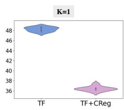

Figure 6: Effect of input noise on CoGnition. K represents the number of tokens that are replaced at random in the context part of a source sentence. The vertical axis represents the average of instance and aggregate CTER.  
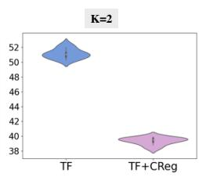

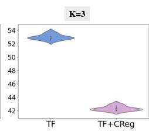

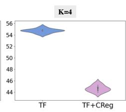

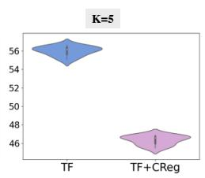