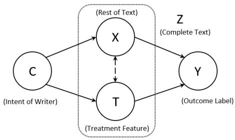
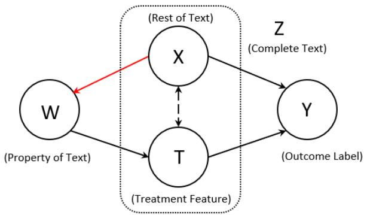
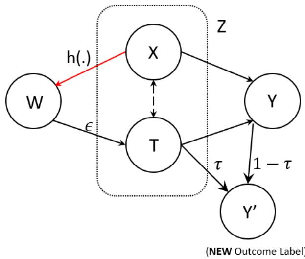
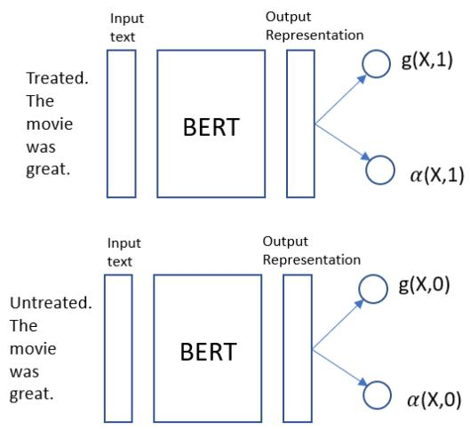

# Controlling Learned Effects to Reduce Spurious Correlations in Text Classifiers

Parikshit Bansal Microsoft Research, India parikshitb52@gmail.com

Amit Sharma Microsoft Research, India amshar@microsoft.com

## Abstract

To address the problem of NLP classifiers learning spurious correlations between training features and target labels, a common approach is to make the model’s predictions invariant to these features. However, this can be counterproductive when the features have a non-zero causal effect on the target label and thus are important for prediction. Therefore, using methods from the causal inference literature, we propose an algorithm to regularize the learnt effect of the features on the model’s prediction to the estimated effect of feature on label. This results in an automated augmentation method that leverages the estimated effect of a feature to appropriately change the labels for new augmented inputs. On toxicity and IMDB review datasets, the proposed algorithm minimises spurious correlations and improves the minority group (i.e., samples breaking spurious correlations) accuracy, while also improving the total accuracy compared to standard training. 1

## 1 Introduction

While classifiers trained on pre-trained NLP models achieve state-of-the-art accuracy on various tasks, they have been shown to learn spurious correlations between input features and the label (Du et al., 2022). Such learned correlations impact accuracy on out-of-distribution samples and in the case of sensitive spurious features, lead to unfair predictions (Sun et al., 2019; Ribeiro et al., 2020). Learned spurious correlations can be over features that are either irrelevant (e.g., tense, gender for profession classification) or relevant (e.g., emoticons for sentiment classification, negation words for contradiction). In both cases, the classifier overweighs their importance compared to other features.

For removing spurious correlations, a common principle underlying past work is to make a model’s prediction invariant to the features that exhibit the

Figure 1: Example from IMDB reviews dataset showing the spurious token “8/10” and its importance for prediction on some inputs. Parts highlighted in yellow are ambiguous in sentiment, in green are (supposedly) positive in sentiment and red are negative.

correlation. This can be done by data augmentation (Kaushik et al., 2019), latent space removal (Ravfogel et al., 2020), subsampling (Sagawa et al., 2019, 2020), or sample reweighing (Mahabadi et al., 2019; Orgad and Belinkov, 2022). In many cases, however, the correlated features may be important for the task and their complete removal can cause a degradation in task performance. For instance, for spurious correlation over negation tokens (e.g., “not”) or lexical overlap in MNLI natural language inference tasks, Williams et al. (2017); Joshi et al. (2022) show that correlated features are necessary for prediction and their removal can hurt accuracy.

As another example, consider the IMDB review dataset (Maas et al., 2011) where the task is classify the sentiment of a given review as positive or negative. Reviewers often include a numeric rating in their text reviews, e.g., “9/10” or “1/10”. The numeric rating is highly correlated with the sentiment label, often regarded as a spurious correlation (Pezeshkpour et al., 2021) that a model should not rely on. In the first review of Fig. 1, for instance, the positive rating can mislead a classifier since the review is overall negative. However, in the second example, the text is ambiguous and the rating “8/10” can provide a helpful signal about the reviewer’s sentiment (and removing it may decrease classifier’s accuracy). Thus, there exist inputs where the rating is a helpful feature for prediction and other inputs where it can be counterproductive. This shows the trade-off between accuracy on majority groups, (i.e., samples where these correlations hold and constitute a majority of samples) and minority groups (i.e., comparatively fewer samples where these correlations break).

In this paper, we propose a general method to resolve the above trade-off: rather than always removing the effect of a feature on the model’s prediction, we argue that the learned effect should be equal to the true effect of the feature on the output label. We define feature effect using the notion of conditional effect from the causal inference literature (Pearl, 2009): the change in the ground-truth label upon changing the feature, keeping all other input features constant. To enforce the true feature effect, we make two contributions:

1. Novel estimator of the effect of text features on the label that is accurate even at high levels of spurious correlation compared to past work.

2. Automated augmentation method that predicts the labels of new samples using the estimated feature effect and adds them to train data to achieve the desired learned effect in a classifier.

When combined with the standard accuracy loss over training data, the proposed method, Feature Effect Augmentation (FEAG), obtains the highest overall accuracy compared to baselines while reducing the learnt spurious correlation. For our evaluation, we consider the practical goal of increasing the accuracy on the minority groups while not substantially reducing the accuracy over the majority group. On comment toxicity and IMDB review datasets, we find that existing methods tend to increase minority group accuracy but reduce overall accuracy, whereas FEAG obtains a good tradeoff. In some cases, it can obtain both higher overall accuracy and higher average group accuracy. Moreover, by making it easy to change the target feature effect to be enforced, FEAG provides an interpretable control mechanism to obtain any desired tradeoff between minority and majority group accuracy (setting the feature effect to zero, e.g., prioritizes minority group accuracy).

More generally, our work provides a viable direction for automated data augmentation. While existing work requires manual labeling of counterfactual examples for removing spurious correlation (Kaushik et al., 2019; Wu et al., 2021), our method can label new examples using estimated feature effects. We also show how estimated feature effects can be useful for other tasks, such as detecting annotator bias in a train set.

## 2 Related Work

Our work combines the debiasing NLP literature with causal effect estimation over text.

## 2.1 Estimating causal effect from text

Prior work on estimating causal effect on text is based on propensity scores, such as DragonNet (Shi et al., 2019) and follow-up work (Veitch et al., 2020; Gui and Veitch, 2022). However, propensitybased estimators are known to suffer from high variance, especially in text scenarios where overlap may be low (Gui and Veitch, 2022). We utilize a Riesz-based causal estimator (Chernozhukov et al., 2022) that has recently been shown to offer a better bias-variance tradeoff. In particular, it does not need to estimate the full propensity but rather estimates the weight for each sample directly, thus avoiding the variance issues of prior methods.

## 2.2 Removing spurious correlations

Latent Space Removal. These methods aim to remove the spurious feature from model’s learnt representation. INLP (Ravfogel et al., 2020) removes spurious features by iteratively projecting learnt representations of the classifiers onto the null-space of the target class predictor. RLACE (Ravfogel et al., 2022) models the objective instead as a constrained minimax game. However, recent work shows that spurious correlations are closely entangled with rest of the sentence representation (Kumar et al., 2022; He et al., 2022), hence latent space removal methods often unintentionally remove task critical information too, leading to a degradation in model’s performance.

Weighting Methods. Debiased Focal Loss (DFL) & Product of Experts (PoE) (Mahabadi et al., 2019) are two methods which leverage a biased model (which relies heavily on spurious features for prediction) to aid training. Specifically DFL reweighs the samples such that samples belonging to the majority group are weighed less. PoE models the task as product of two models, where one model is limited in capacity and hence captures the spurious features, where as the other learns non-spurious features. More recent versions can work without annotations for the spurious features (Orgad and

  
Figure 2: Causal Graph for text classification. $C$ is the intent of the writer and a hidden confounding variable. $Z$ is the complete text which is conceptually decomposed as $( X , T ) , T$ is the treatment feature (the feature of interest) and X is rest of the text. The outcome label Y depends on complete text Z.

Belinkov, 2022), but all methods rely on reweighing the training data.

Counterfactual Augmentation. These methods require collection of counterfactual labeled data that can be used to regularize a classifier (Kaushik et al., 2019; Lu et al., 2020; Gupta et al., 2022). Obtaining labels for the augmented data is often prohibitively expensive.

Comparison to our work. All above techniques are specific ways to remove the impact of a spurious feature on the classifier. In comparison, we provide a general method that allows us to control the learned effect of a spurious feature: one can estimate the effect of a feature on the ground-truth label (which may or may not be zero) and enforce that effect on the classifier. (He et al., 2022) make a similar argument against complete removal of spurious features in the context of gender bias and rationale-based methods, while we focus on general spurious correlations and general NLP classifiers. (Joshi et al., 2022) characterise spurious correlations by necessity and sufficiency and argue for a more finegrained treatment of spurious features. In terms of implementation, our method can be seen as an extension to the counterfactual augmentation method where we automatically infer the labels for new inputs based on the modified feature’s causal effect.

## 3 Estimating feature effects on labels

Our task is to estimate the effect of text features on the label $Y$ in training dataset. This is important for many use cases : 1) regularising a text classifier to obey the feature’s effect on the label in its prediction; 2) identifying annotator artifacts (Sap et al., 2021) for the label $Y$ in the dataset, e.g., when the estimated effect does not match the ground-truth known effect of a feature. For 1), we present an automated augmentation algorithm in Sec 4 based on the estimated feature effect. For 2), we use the feature effect estimation technique and present results on a comment toxicity dataset in Sec 5.4.

For feature effect estimation, we assume that the data is generated from a distribution following the causal graph in Fig. 2 (Joshi et al., 2022; Gui and Veitch, 2022). The writer has some intent C, which generates the input sentence (Z). The sentence $Z$ can conceptually be disentangled into 2 parts, 1) the feature of interest $( T \in \{ 0 , 1 \} )$ ) and 2) rest of the text X. Annotators perceive the outcome label (Y) from the complete text Z. The samples $\{ ( Z _ { i } , Y _ { i } ) \}$ are drawn independently from . Note that the same dataset may contain multiple features $T ^ { j } \left( j = 1 . . . m \right)$ whose effect needs to be estimated, leading to a different decompositions $( X ^ { j } , T ^ { j } )$

We term the feature T as treatment, and X as covariates, following the causality literature. Since the variables X and $T$ are sampled from the same latent variable C, they are not independent of each other. For example, in context of IMDB data, if the intent of the writer is to write a positive review then it is highly likely that X will contain positive adjectives while treatment T might be the inclusion of rating as the string 9/10. This unobserved latent variable (intent of writer) is called the confounder C. The correlations between treatment feature T and rest of text X due to the presence of confounder C can lead to the classifier model learning incorrect effect for the treatment feature. For computing feature effect, we leverage the causal inference literature (Pearl, 2009; Imbens and Rubin, 2015) and estimate Average Treatment Effect (ATE).

## 3.1 Background

Definitions. Propensities (Pearl, 2009) model the probability of a covariate being treated i.e. $T = 1$ They can hence be written as $\mathcal { P } ( X ) = P ( T$ = 1 X). Overlap is defined as the condition when any covariate X has a non-zero probability of $T = 1$ and $T ~ = ~ 0$ i.e. $0 < P ( T | X ) < 1$ for all X. Overlap is a necessary condition for causal effect estimation. Counterfactual : Given an input $Z =$ $( X , T )$ , a counterfactual input is defined as $Z ^ { C } =$ $( X , 1 - T )$ , i.e. an input with treatment flipped and rest of the inputs kept constant. The original sample is called thefactual input.

Average Treatment Effect (ATE). It is defined as the change in label $Y$ on changing treatment $T$ from $0  1$ keeping everything else constant.

$$
\mathbb { E } _ { X } [ Y | X , \mathrm { d o } ( T = 1 ) ] - \mathbb { E } _ { X } [ Y | X , \mathrm { d o } ( T = 0 ) ]
$$

where $\mathrm { d o } ( )$ is the do-operator (Pearl, 2009), implying an interventional change in treatment $T$ while the covariates X are kept constant. ${ \bf A } { \bf s } -$ sume an oracle model $g _ { 0 }$ for the task, defined as $g _ { 0 } ( X , T = t ) = \mathbb { E } [ Y | X , \mathrm { d o } ( T = t ) ]$ . Removing the do notation, ATE estimate can succinctly be written as,

$$
{ \mathrm { A T E } } = { \frac { 1 } { n } } { \sum _ { i } { \left( { g _ { 0 } ( X _ { i } , 1 ) - g _ { 0 } ( X _ { i } , 0 ) } \right) } }\tag{1}
$$

The above equation requires access to the oracle model $g _ { 0 }$ which correctly outputs the label for counterfactual inputs $Z ^ { C }$

An alternate formulation for computing ATE utilises propensities (of treatment T) i.e. $\mathcal { P } _ { 0 } ( X _ { i } )$ instead of the oracle model. The ATE using this formulation is $\mathbb { E } _ { X } [ \alpha _ { 0 } ( Z ) Y ] ( \alpha _ { 0 }$ defined below in Eq 3). Hence the ATE estimate is

$$
\mathrm { A T E } = \frac { 1 } { n } \sum _ { i } \alpha _ { 0 } ( Z _ { i } ) Y _ { i } .\tag{2}
$$

where

$$
\alpha _ { 0 } ( Z _ { i } ) = ( \frac { T _ { i } } { \mathcal { P } _ { 0 } ( X _ { i } ) } - \frac { 1 - T _ { i } } { 1 - \mathcal { P } _ { 0 } ( X _ { i } ) } )\tag{3}
$$

are the multipliers computed from propensities.

Direct Estimate. The simplest method for estimating the average treatment effect is by training a model $g ( . )$ as an approximation of the oracle $g _ { 0 } ( . )$ using the loss $\begin{array} { r } { g = \arg \operatorname* { m i n } _ { g } \mathbb { E } _ { \mathcal { D } } [ \mathcal { L } ( Y , g ( Z ) ) ] } \end{array}$ . The direct estimate of the ATE can then be computed by substituting g0(.) by $g ( . )$ in Eqn. 1. This gives the direct estimate (Shalit et al., 2017),

$$
\hat { \mathrm { A T E } } _ { \mathrm { D i r e c t } } = \frac { 1 } { n } { \sum _ { i } \left( g ( X _ { i } , 1 ) - g ( X _ { i } , 0 ) \right) }\tag{4}
$$

The problem with using the direct estimate is that, in cases where $T$ is correlated with X under $\mathcal { D } ,$ a loss optimizing method might exploit spurious correlations between X and $T$ to learn a biased model $g ( . )$ That is, the model might over(or under)- estimate the effect of $T$ on the output $Y .$ . This leads to a biased ATE.ˆ

Propensity-based Doubly Robust (DR) Estimate. To resolve the issue of a biased model g, DR estimator (Kang and Schafer, 2007; Veitch et al., 2020) utilises propensities. Since the true propensities $\mathcal { P } _ { 0 }$ are unknown we learn these propensities using the loss $\mathcal { P } _ { \mathrm { P r } } = \arg \operatorname* { a r g } _ { \mathcal { P } } \mathbb { 1 }$ min $\mathbb { E } _ { \mathcal { D } } [ \mathcal { L } ( T , \mathcal { P } ( X ) ) ]$ giving estimated multipliers $\alpha _ { \mathrm { P r } } ( Z _ { i } )$

$$
{ \mathrm { A \hat { T } E _ { D R , P r } } } = { \mathrm { A \hat { T } E _ { D i r e c t } } } + { \frac { 1 } { n } } \sum _ { i } \alpha _ { \mathrm { P r } } ( Z _ { i } ) ( Y _ { i } - g ( Z _ { i } ) )\tag{5}
$$

The DR estimator corrects the bias in g using the correction term (second term in Eqn 5). If $g$ is systematically wrong on a minority group of examples, their residual error will add up in the correction term. Also, weighing by $\alpha _ { \mathrm { P r } } ( Z _ { i } )$ breaks correlation between X and T, giving an unbiased correction.

## 3.2 Riesz Representer (RR) Estimator

While propensity-based methods are the most popular for estimating treatment effect, they suffer from high variance when $P ( T = 1 | X )$ is close to either 1 or 0 (Swaminathan and Joachims, 2015), due to the propensity terms in the denominator of the multipliers $\alpha _ { \mathrm { P r } } ( . )$ This is especially a problem in high-dimensional text data, where given a treatment $T$ (e.g., a token) the probability of it occurring with most covariate texts $X$ may be close to 0 (e.g., if the covariate $X$ is about a happy incident, probability of a token like "kill" occurring in the sentence is near 0). Therefore, we propose a doubly robust estimator for text data based on recent work (Chernozhukov et al., 2022) that avoids estimating the propensities as an intermediate step. Instead it models the coefficient $\alpha _ { \mathrm { P r } } ( Z )$ directly.

The proposed method depends on the Reisz representation theorem (Chernozhukov et al., 2018).

Theorem (Riesz Representer Theorem). For a square integrablefunction $f ( Z ) \ ( i . e . \ \mathbb { E } [ f ^ { 2 } ( Z ) ] <$ ), there exists a square integrable function $\alpha _ { R } ( Z )$ such that

$$
\operatorname { \mathbb { E } } [ m ( ( Y , Z ) ; f ) ] = \operatorname { \mathbb { E } } [ \alpha _ { R } ( Z ) f ( Z ) ]
$$

if and only $i f \mathbb { E } [ m ( ( Y , Z ) ; f ) ]$ is a continuous linear functional of f.

Since the moment functional in ATE formulation (i.e. $m ( ( Y , Z ) ; f ) = f ( X , 1 ) - f ( X , 0 ) )$ is indeed a continuous linear functional of $f _ { i }$ , Riesz theorem for our purposes can be written as :

$$
\begin{array} { r } { \mathbb { E } [ f ( X , 1 ) - f ( X , 0 ) ] = \mathbb { E } [ \alpha _ { \mathrm { R } } ( Z ) f ( Z ) ] } \end{array}
$$

for a square integrable function $f .$ Taking $f$ as g0 (assuming g0 is square integrable), LHS of the equality $( \mathbb { E } [ g _ { 0 } ( X , 1 ) - g _ { 0 } ( X , 0 ) ] )$ is exactly the ATE and the RHS $( \mathbb { E } [ \alpha _ { \mathrm { R } } ( Z ) g _ { 0 } ( Z ) ] )$ can be interpreted as a weighted average, as in the propensity formulation of ATE (Eqn. 2). This means that $\alpha _ { \mathrm { R } }$ serves as an alternative formulation for $\alpha _ { 0 }$ . Thus, rather than using the inverse of learnt propensities $\mathcal { P } _ { \mathrm { { P r } } } \ ( \mathrm { { i . e . } } \ \alpha _ { \mathrm { { P r } } } )$ , we can use the Riesz Representer function αR as an approximation for $\alpha _ { 0 }$

The challenge now remains on how we can estimate the $\alpha _ { \mathrm { R } }$ function. To derive an estimation method for $\alpha _ { \mathrm { R } }$ , we use its definition from the Riesz Representation theorem, $\mathrm { i . e . , } \alpha _ { \mathrm { R } } ( Z )$ weighed by any bounded function $f ( Z )$ gives $\mathbb { E } [ f ( X , 1 ) ~ -$ $f ( X , 0 ) ]$ , as done by Chernozhukov et al. (2022).

$$
\begin{array} { r l } & { \alpha _ { \mathrm { { R } } } = \underset { \alpha } { \arg \operatorname* { m i n } } \mathbb { E } [ ( \alpha _ { \mathrm { { R } } } ( Z ) - \alpha ( Z ) ) ^ { 2 } ] } \\ & { \quad \quad = \underset { \alpha } { \arg \operatorname* { m i n } } \mathbb { E } [ \alpha _ { \mathrm { { R } } } ( Z ) ^ { 2 } - 2 \alpha _ { \mathrm { { R } } } ( Z ) \alpha ( Z ) + \alpha ( Z ) ^ { 2 } ] } \\ & { \quad \quad = \underset { \alpha } { \arg \operatorname* { m i n } } \mathbb { E } [ - 2 \alpha _ { \mathrm { { R } } } ( Z ) \alpha ( Z ) + \alpha ( Z ) ^ { 2 } ] } \\ & { \quad \quad = \underset { \alpha } { \arg \operatorname* { m i n } } \mathbb { E } [ - 2 ( \alpha ( X , 1 ) - \alpha ( X , 0 ) ) + \alpha ( Z ) ^ { 2 } ] } \end{array}
$$

The first step is a trivial equality, which says that $\alpha _ { \mathrm { R } }$ is the solution for the equation arg min $\mathbb { E } [ ( \alpha _ { \mathrm { R } } ( Z ) - \alpha ( Z ) ) ^ { 2 } ]$ . In the third step, $\alpha _ { \mathrm { { R } } } ( Z ) ^ { 2 }$ can be ignored as the minimization is over α and then we use the Riesz Representation theorem to expand the term $\mathbb { E } [ \alpha _ { \mathrm { R } } ( Z ) \alpha ( Z ) ]$ as $\mathbb { E } [ \alpha ( X , 1 ) - \alpha ( X , 0 ) ]$ ], thus getting rid of $\alpha _ { \mathrm { R } }$ and providing an optimization objective.

The new learnt riesz function $\alpha _ { \mathrm { R } }$ can then be used for computing our Doubly Robust estimate. We can simply substitute $\alpha _ { \mathrm { P r } }$ in the DR estimate Eqn 5 by αR, giving us RR-based ATE,ˆ

$$
{ \mathrm { A \hat { T } E _ { D R , R } } } = { \mathrm { A \hat { T } E _ { D i r e c t } } } + { \frac { 1 } { n } } \sum _ { i } \ \alpha _ { \mathrm { R } } ( Z _ { i } ) ( Y _ { i } - g ( Z _ { i } ) )\tag{6}
$$

## 4 Controlling learnt effects in a classifier

Armed with an estimator of feature effect on the label, we now describe methods to enforce the feature effect on a predictive model’s output. Given data $\{ ( Z , Y ) \}$ where $Z$ are input sentences and $Y$ is output label, the goal is to learn a predictive model $f$ for $Y$ such that the causal effect of a feature on $f ( Z )$ is the same as the true feature effect, $\tau ^ { j }$ for the jth feature. That is, $\tau ^ { j }$ should be equal to $\mathbb { E } _ { \mathcal { D } } [ f ( X ^ { j } , T ^ { j } = 1 ) - f ( X ^ { j } , T ^ { j } = 0 ) ]$ where

$X ^ { j }$ refers to all input features except $T ^ { j }$ and the expectation is over the training distribution. As discussed in Section 3, the ideal predictive function is $g _ { 0 }$ since it will ensure the correct feature effect $, \tau ^ { j } = \mathbb { E } _ { \mathcal { D } } [ g _ { 0 } ( X ^ { j } , T ^ { j } = 1 ) - g _ { 0 } ( X ^ { j } , T ^ { j } =$ $0 ) ]$ , and will also provide high accuracy since it is the true data generating function.

## 4.1 Counterfactual-based Regularisation

To approximate the oracle function $g _ { 0 } ( Z )$ , for a given loss ${ \mathcal { L } } ,$ Standard ERM loss minimisation optimizes, arg min ${ } _ { f } \operatorname { \mathbb { E } } _ { \mathcal { D } } [ \mathcal { L } ( Y , f ( Z ) ) ]$ ]. But machine learning data is often underspecified (D’Amour et al., 2020; Lee et al., 2022), leading to the ERM returning multiple solutions $f$ with similar accuracy on validation set. These different solution $f$ weigh different features in input text differently. As a result, the obtained solution can be far from $g _ { 0 }$

Therefore, we use the provided feature effect to constraint the solution space. A first idea is to add a regularization term that aligns the model’s learnt feature effect with the provided effect. Suppose that we are given a list of m binary features $\{ T ^ { j } \} _ { 1 \dots m }$ which are suspected to have a spurious correlation (e.g., such features can be discovered using explanation methods on an ERM model (Wang et al., 2021)). We can conceptually decompose an input sentence $Z$ into $m$ different pairs $\{ ( X ^ { j } , T ^ { j } ) \} _ { 1 \ldots m } .$ where $X ^ { j }$ is the part of the sentence $Z$ apart from $T ^ { j }$ . Then using the given feature effect $\{ \tau ^ { j } \} _ { 1 \dots m }$ for each feature, we can write the regularized loss,

$$
\mathcal { L } + \lambda \frac { 1 } { m } \sum _ { j } ( f ( X ^ { j } , 1 ) - f ( X ^ { j } , 0 ) - \tau ^ { j } ) ^ { 2 }\tag{7}
$$

where $\lambda$ is the regularisation constant.

While we proposed regularizing to $\tau ^ { j } .$ , sometimes one may want to completely remove a feature’s effect based on domain knowledge. For example, a biased dataset may exhibit a non-zero feature’s effect on the label, but due to fairness reasons, one would like to completely remove its effect. In that case, we can simply set $\tau ^ { j } = 0$ and apply Equation 7. When $\tau ^ { j }$ is set to zero, FEAG can be seen as optimizing the same objective as methods that aim to fully remove the feature’s effect (Ravfogel et al., 2020; Mahabadi et al., 2019).

## 4.2 Augmentations for Estimated Effect

We also consider a data augmentation alternative to regularization. Given distribution $( Z , Y ) \sim \mathcal { D }$ m binary features $\{ T ^ { j } \} _ { 1 \dots m }$ , and their feature effects $\{ \tau ^ { j } \} _ { 1 \dots m }$ , we can augment along any of the m features to generate a counterfactual distribution. When we augment along the j feature, the new input becomes $Z ^ { j , C } = ( X ^ { j } , 1 - T ^ { j } )$ . Using the feature’s effect $\tau ^ { j }$ , we can estimate the corresponding label $Y ^ { j , C }$ for the input $Z ^ { j , C }$ . Intuitively, a higher feature effect makes it more likely that the label will change (see Supp H for details). We get a new counterfactual distribution, $( Z ^ { j , C } , Y ^ { j , C } ) \sim \mathcal { D } ^ { j , C }$

<table><tr><td rowspan="2">T</td><td rowspan="2">Method</td><td colspan="3">DistilBERT</td><td colspan="3">BERT</td></tr><tr><td>1% Overlap</td><td>5% Overlap</td><td>10% Overlap</td><td>1% Overlap</td><td>5% Overlap</td><td>10% Overlap</td></tr><tr><td rowspan="3">0.10</td><td>Direct</td><td> $\overline { { 1 5 . 2 3 \pm 5 . 5 0 } }$ </td><td> $\overline { { 5 . 9 2 \pm 1 . 3 1 } }$ </td><td> $\overline { { 0 . 4 8 \pm 1 . 6 5 } }$ </td><td> $8 . 3 8 \pm 2 . 9 0$ </td><td> $\overline { { 1 . 8 0 \pm 4 . 6 6 } }$ </td><td> $1 . 1 3 \pm 0 . 4 7$ </td></tr><tr><td>Propensity</td><td> ${ \pm . 8 1 \pm 2 . 7 6 }$ </td><td> $9 . 8 0 \pm 1 . 5 2$ </td><td> $6 . 5 9 \pm 0 . 4 8$ </td><td> $8 . 5 3 \pm 3 . 7 7$ </td><td> $9 . 8 3 \pm 5 . 3 0$ </td><td> $6 . 0 1 \pm 1 . 0 4$ </td></tr><tr><td>Riesz</td><td> ${ \bf 5 . 9 1 \pm 4 . 3 5 }$ </td><td> ${ \bf 2 . 0 4 \pm 1 . 2 5 }$ </td><td> ${ \bf 1 . 1 1 \pm 0 . 6 2 }$ </td><td> ${ \pm . 6 8 \pm 1 . 2 4 }$ </td><td> $2 . 6 1 \pm 0 . 2 4$ </td><td> ${ \bf 0 . 8 8 \pm 0 . 7 4 }$ </td></tr><tr><td rowspan="3">0.30</td><td>Direct</td><td> $\overline { { 1 8 . 7 9 \pm 6 . 3 6 } }$ </td><td> $\overline { { 1 3 . 8 6 \pm 4 . 6 4 } }$ </td><td> $\overline { { 5 . 9 4 \pm 0 . 8 3 } }$ </td><td> $2 2 . 0 6 \pm 1 0 . 2 0$ </td><td> $\overline { { 4 . 3 8 \pm 4 . 7 7 } }$ </td><td> $\overline { { 4 . 7 2 \pm 5 . 7 4 } }$ </td></tr><tr><td>Propensity</td><td> $2 3 . 4 8 \pm 2 . 7 0$ </td><td> $2 0 . 4 8 \pm 0 . 4 5$ </td><td> $1 0 . 2 3 \pm 1 . 1 9$ </td><td> $2 9 . 0 2 \pm 5 . 9 9$ </td><td> $2 3 . 5 7 \pm 4 . 0 4$ </td><td> $9 . 6 1 \pm 2 . 7 9$ </td></tr><tr><td>Riesz</td><td> $1 6 . 4 5 \pm 2 . 1 7$ </td><td> ${ \bf 0 . 2 1 \pm 1 . 8 9 }$ </td><td> ${ \bf 1 . 4 5 \pm 0 . 2 2 }$ </td><td> ${ \bf 0 . 6 2 \pm 5 . 3 1 }$ </td><td> $\mathbf { 2 . 9 2 \pm 0 . 8 1 }$ </td><td> $\mathbf { 2 . 6 0 \pm 1 . 0 9 }$ </td></tr><tr><td rowspan="3">0.50</td><td>Direct</td><td> $\overline { { 1 6 . 9 5 \pm 3 . 7 3 } }$ </td><td> $\overline { { 1 1 . 0 7 \pm 2 . 2 1 } }$ </td><td> $\overline { { 7 . 5 1 \pm 1 . 5 6 } }$ </td><td> $2 0 . 3 6 \pm 1 . 4 4$ </td><td> $\overline { { 1 7 . 4 2 \pm 1 . 6 2 } }$ </td><td> $1 1 . 5 9 \pm 2 . 4 5$ </td></tr><tr><td>Propensity</td><td> $6 1 . 8 8 \pm 1 1 . 1 0$ </td><td> $3 6 . 1 1 \pm 2 . 7 3$ </td><td> $1 7 . 0 9 \pm 1 . 4 1$ </td><td> $4 7 . 2 8 \pm 1 1 . 2 7$ </td><td> $3 1 . 4 1 \pm 5 . 7 2$ </td><td> $1 3 . 1 6 \pm 4 . 0 2$ </td></tr><tr><td>Riesz</td><td> $1 5 . 6 2 \pm 3 . 2 8$ </td><td> ${ \bf 1 . 5 0 \pm 1 . 3 9 }$ </td><td> $\mathbf { 2 . 7 3 \pm 0 . 2 8 }$ </td><td> ${ \bf 1 . 4 2 \pm 3 . 3 7 }$ </td><td> ${ \bf 1 . 5 3 \pm 1 . 6 2 }$ </td><td> ${ \bf 0 . 1 1 \pm 0 . 9 1 }$ </td></tr></table>

Table 1: MAE (x100) of feature effect estimate. Riesz gives lower error MAE error than Direct, across values of overlap and true feature effect. Propensity shows high MAE error (especially in lower overlap setting).

Similarly other counterfactual distributions can be found, giving us $\{ { \mathcal { D } } ^ { j , C } \} _ { 1 \ldots m } .$ A union can be taken over these distributions to give us the counterfactual distribution over these m features as $\mathcal { D } ^ { C } = \cup _ { i = 1 } ^ { m } \mathcal { D } ^ { j , C }$ This new generated distribution can then be included in training as counterfactual augmentations while minimising the loss,

$$
\arg \operatorname* { m i n } _ { f } \mathbb { E } _ { \mathcal { D } } [ \mathcal { L } ( Y , f ( Z ) ) ] + \lambda \mathbb { E } _ { \mathcal { D } ^ { C } } [ \mathcal { L } ( Y , f ( Z ) ) ]\tag{8}
$$

where we now draw samples from the combined distribution $\mathcal { D } + \mathcal { D } ^ { C }$ . λ signifies the weighting of samples drawn from augmented counterfactual distribution $\mathcal { D } ^ { C }$ in the loss function.

While both regularisation and data augmentation can help us control the learned effect of features, owing to the scalability and ease of optimization, we use the augmentation version of our algorithm to present our results.

## 4.3 FEAG: Two-phase algorithm

To summarize, the proposed algorithm, Feature Effect Augmentation (FEAG), proceeds in two phases. It takes as input a set of features $T ^ { j } : j = 1 . . . m$ that may be suspected to be spurious, which can be derived using an automated saliency method (e.g., top-k important tokens) (Pezeshkpour et al., 2022; Wang et al., 2021) or based on domain knowledge. Feature effect estimation. For each of the features $T ^ { j }$ , we estimate the feature effect using the Reisz estimator from Section 3.2. We follow the 2- headed model architecture with shared parameters (Shi et al., 2019) to learn the Riesz representer $\alpha _ { \mathrm { R } }$ and the model $g$ for Y (details are in Supp J, Fig 4). Note that αR and g should share sentence representation extraction module to ease learning (Chernozhukov et al., 2022) (i.e., they have the same BERT model, but different final layer linear heads). These learnt models can be used in Eqn 6 to get feature effect estimates $( \{ \tau ^ { j } \} _ { 1 \dots m } )$ on held-out data. Counterfactual Augmentation. Our modular pipeline allows practitioners to change the feature estimate $\tau ^ { j }$ according to their needs before using them for counterfactual augmentations. Using the features and their effect estimates, we create counterfactually augmented data $\mathcal { D } ^ { C }$ as described in Sec 4.2 and include them while training (Eqn 8) to learn the final classifier.

<table><tr><td rowspan="3">Method</td><td colspan="2">BERT</td><td colspan="2">DistilBERT</td></tr><tr><td> ${ \overline { { \mathrm { C C } \mathrm { S u b . } } } }$ </td><td>IMDB</td><td>CC Sub.</td><td>IMDB</td></tr><tr><td>Direct</td><td> $\overline { { 1 8 . 4 6 \pm 0 . 6 1 } }$ </td><td> $\overline { { 7 1 . 9 3 \pm 9 . 3 6 } }$ </td><td> $\overline { { 1 9 . 0 7 \pm 0 . 6 7 } }$ </td><td> $\overline { { 6 6 . 4 2 \pm 9 . 1 2 } }$ </td></tr><tr><td>Riesz</td><td> $1 5 . 7 7 \pm 0 . 5 0$ </td><td> $5 2 . 5 1 \pm 2 . 6 3$ </td><td> $1 5 . 1 4 \pm 0 . 6 3$ </td><td> $5 5 . 3 7 \pm 0 . 7 7$ </td></tr><tr><td>Propensity</td><td> $3 6 . 2 5 \pm 4 . 8 8$ </td><td> $4 5 . 0 8 \pm 1 0 . 0 5$ </td><td> $2 4 . 2 0 \pm 0 . 9 8$ </td><td> $5 6 . 8 6 \pm 6 . 7 5$ </td></tr></table>

Table 2: Riesz estimated feature effect is less than the Direct learned feature effect, indicating that Direct method over-weighs the treatment feature.

## 5 Experiments

We have three goals for evaluation: 1) RR-based estimators of feature effect are more accurate than propensity-based estimators; 2) FEAG using RRbased estimators provides better overall accuracy while minimizing spurious correlation compared to existing baselines for removing spurious correlations; 3) Our feature effect estimator is a general method and can be used to detect annotator bias.

## 5.1 Datasets

Since the true feature effect is unknown for realworld data, we construct a semi-synthetic dataset based on the CiviComments dataset (Borkan et al.,

<table><tr><td>S.No.</td><td>Sentence</td><td>Riesz</td><td>Interpretation</td><td></td></tr><tr><td rowspan="2">1.</td><td>maybe it&#x27;s just burning a bunch of islamist terrorists killed in combat</td><td>1.69</td><td> $\begin{array} { r } { \overline { { T = 1 \& P ( T = 1 | X ) \uparrow } } } \end{array}$ </td><td></td></tr><tr><td>only arabs doing what they do best, killing other arabs. black september, darfur, isis/isil.</td><td>1.87</td><td> $T = 1 \& P \dot { ( } T = 1 \dot { | } X \dot { ) } \dot { }$ </td><td></td></tr><tr><td rowspan="2">2.</td><td>&quot;strong stated desire to kill people in the name of islamic state&quot; that is the important part.</td><td>6.13</td><td> $\overline { {  { T } = 1 \& P ( T = 1 | X ) \downarrow } }$ </td><td></td></tr><tr><td>who do you think is killing the women its the male nativees and we hear about this</td><td>6.14</td><td> $T = 1 \& P ( T = 1 | X ) \downarrow$ </td><td></td></tr><tr><td rowspan="2">3.</td><td>they also never tell you how often the officer doing the shooting...is black</td><td>-3.75</td><td> $\overline { {  { T } = 0 \& P ( T = 1 | X ) \uparrow } }$ </td><td></td></tr><tr><td>driving into crowds of people is a popular approach for muslim terrorists</td><td>-4.53</td><td> $T = 0 \& P \dot { ( } T = 1 \dot { | } X ) \uparrow$ </td><td></td></tr><tr><td rowspan="2">4.</td><td>i am getting very tired about hearing anything from this neurotic woman. give it a rest.</td><td>-0.56</td><td> $\overline { {  { T } = 0 \& P ( T = 1 | X ) \downarrow } }$ </td><td></td></tr><tr><td>and these men give so much to charity. there is no record of trump&#x27;s charity contributions.</td><td>-0.82</td><td> $T = 0 \& P \dot { ( } T = 1 \dot { | } X \dot { ) } \dot { \downarrow }$ </td><td></td></tr></table>

Table 3: Examples on Kill keyword in CivilComments Subsampled dataset. Sentences having violent words (other than kill) are assigned a lower score, while sentences having non-violent context are assigned high score.

2019). In addition, we evaluate on subsampled versions of the CivilComments and IMDB dataset. CivilComments Semi-Synthetic (SS). CivilComments is a toxicity detection dataset (X, Y) , where X are input sentences and Y is the toxicity label (1 means toxic). To evaluate our methods, we need to construct a dataset generated from the causal graph in Fig. 2. Since the writer’s intent (confounder) is unknown, we construct it as a property of the input text, $W = h ( X ) \in \{ 0 , 1 \}$ , leading to the modified causal graph in Fig. 3 (Supp G). To obtain h(X), we train a binary classifier using a DistilBERT model on $( X , Y )$ pairs. Finally we sample a new label as Y′ Bernoulli $( ( 1 - \tau ) Y +$ $\tau T )$ , giving the true feature effect as τ. The complete text $\boldsymbol { Z } = ( \boldsymbol { X } , \boldsymbol { T } )$ is constructed by prepending each covariate sentence X with the word Treated if T = 1 and Untreated if $T = 0$

CivilComments Subsampled. Rather than introducing a new treatment, here we subsample Civil-Comments to introduce a spurious correlation between an existing token kill and label Y. Here all sentences with token kill are considered as treated, while others untreated. To exacerbate the spurious correlation between T and Y, we subsample our data based on the learnt property W (from above), following the causal graph in Fig 3a.

IMDB. From the IMDB reviews dataset (Maas et al., 2011), we consider reviews that contain a numerical rating—text string from either the set {7/,8/,9/} or {2/,3/,4/}. To construct a binary treatment variable, occurrences of these strings are replaced by Treated if the rating is 7, 8, or 9 and an empty string otherwise. The Treated token is predictive of the sentiment with 90% accuracy.

For dataset and training details, see Supp B, Supp A respectively. All results are run for 3 seeds.

## 5.2 Evaluating Feature Effect Estimation

We evaluate the performance of different estimators in Sec 3 on the CivilComments SS dataset (with different overlap ϵ and feature effects τ). We compare the Riesz-based DR estimator (Eqn 6) with the Direct (Eqn 4) and Propensity-based DR (Eqn 5) baselines. All estimators are finetuned using either BERT or DistilBERT as base model. See Supp ??

Quantitative Results. Table 1 shows the mean error in estimating feature effect across $\tau \in$ $\{ 0 . 1 0 , 0 . 3 0 , 0 . 5 0 \}$ and $\epsilon \in \{ 0 . 0 1 , 0 . 0 5 , 0 . 1 0 \}$ . For hyperparameter selection, see Supp. D. Across all settings (barring 1% overlap with high τ), Riesz is able to estimate the effect with low error. Direct fails to do well in high τ and low ϵ ranges, failing for both $\tau = 0 . 5 0$ and $\epsilon = 0 . 0 1$ . Due to its high variance, Propensity is unable to work well, often producing an estimate worse than Direct.

For the two real-world datasets, true feature effect is unknown. But comparing the effect estimates of Direct and Riesz, Direct tends to overestimate the feature effect (due to spurious correlation), which is corrected to a lower value by Riesz. Qualitative Results. To understand how the Reisz estimator works, we show qualitative results for Civil Comments Subsampled dataset in Table 3. To counter the spurious correlation of token kill (T) with other parts of text (X) that cause toxicity (Y), the Riesz estimator provides a low weight to sentences having features X that commonly occur with T, and higher weight to sentences having X that rarely occur with T. Treated samples (T=1) have a positive Riesz value and vice versa. We can see that sentences with violent language (in addition to kill) are assigned a low score while other sentences with kill are assigned a high score, thus serving to extract the isolated feature effect of kill (without confounding due to other tokens).

## 5.3 Accuracy of FEAG classifiers

We now compare FEAG classifiers based on Riesz, FEAG(ate), and based on zero effect, FEAG(0), with prior debiasing algorithms.

Groups. Classifiers that reduce spurious correlation are expected to decrease total accuracy but increase the accuracy of minority inputs that do not exhibit those correlations. To study such effects on accuracy, we divide our evaluation data into four groups: Group1 $( Y = 0 , T = 0 )$ , Group2 $( Y = 0 , T = 1 )$ , Group3 $( Y = 1 , T = 0 )$ , Group4 $( Y = 1 , T = 1 )$ . In addition, we report the average group accuracy across the four groups as a measure of debiasing/reduced spurious correlation. An ideal model should achieve both high overall accuracy and high average group accuracy, demonstrating its reduced reliance on spurious features.

<table><tr><td>Method</td><td>Group1</td><td>Group2</td><td>Group3</td><td>Group4</td><td>Total</td><td>Avg Group</td></tr><tr><td>Direct</td><td> $\overline { { 9 9 . 4 6 \pm 0 . 0 8 } }$ </td><td> $\overline { { 3 . 5 2 \pm 0 . 8 0 } }$ </td><td> $\overline { { 1 . 6 1 \pm 0 . 2 9 } }$ </td><td> $\overline { { 9 9 . 4 2 \pm 0 . 1 0 } }$ </td><td> $\overline { { { \bf 8 7 . 7 7 \pm 0 . 0 2 } } }$ </td><td> $\overline { { 5 1 . 0 0 \pm 0 . 1 7 } }$ </td></tr><tr><td>RemoveToken</td><td> $8 8 . 7 1 \pm 0 . 7 5$ </td><td> $2 8 . 0 6 \pm 0 . 9 4$ </td><td> $3 7 . 4 6 \pm 2 . 3 6$ </td><td> $9 0 . 6 9 \pm 0 . 8 5$ </td><td> $8 2 . 8 0 \pm 0 . 1 4$ </td><td> $6 1 . 2 3 \pm 0 . 4 5$ </td></tr><tr><td>DFL</td><td> $\overline { { 7 2 . 4 5 \pm 1 . 3 3 } }$ </td><td> $\overline { { 3 5 . 6 2 \pm 5 . 5 1 } }$ </td><td> $\overline { { 5 3 . 5 8 \pm 2 . 6 1 } }$ </td><td> $\overline { { 8 2 . 4 6 \pm 3 . 3 8 } }$ </td><td> $\overline { { 7 3 . 4 5 \pm 0 . 7 6 } }$ </td><td> $\overline { { 6 1 . 0 3 \pm 0 . 7 7 } }$ </td></tr><tr><td>DFL-nodemog</td><td> $9 9 . 2 2 \pm 0 . 3 4$ </td><td> $4 . 1 3 \pm 1 . 2 1$ </td><td> $3 . 1 2 \pm 0 . 9 2$ </td><td> $9 9 . 3 4 \pm 0 . 1 8$ </td><td> ${ \bf 8 7 . 7 5 \pm 0 . 1 0 }$ </td><td> $5 1 . 4 5 \pm 0 . 4 1$ </td></tr><tr><td>POE</td><td> $1 0 0 . 0 0 \pm 0 . 0 0$ </td><td> $0 . 1 8 \pm 0 . 1 4$ </td><td> $0 . 0 0 \pm 0 . 0 0$ </td><td> $9 9 . 9 6 \pm 0 . 0 2$ </td><td> ${ \bf 8 7 . 9 4 \pm 0 . 0 1 }$ </td><td> $5 0 . 0 3 \pm 0 . 0 3$ </td></tr><tr><td>INLP</td><td> $\overline { { 7 9 . 1 0 \pm 3 . 7 5 } }$ </td><td> $\overline { { 7 3 . 4 4 \pm 7 . 5 2 } }$ </td><td> $\overline { { 3 8 . 7 7 \pm 7 . 5 3 } }$ </td><td> $3 6 . 3 5 \pm 9 . 4 5$ </td><td> $\overline { { 5 7 . 5 4 \pm 2 . 4 8 } }$ </td><td> $\overline { { 5 6 . 9 2 \pm 1 . 4 1 } }$ </td></tr><tr><td>Subsample</td><td> $\overline { { 8 5 . 4 5 \pm 3 . 9 8 } }$ </td><td> $\overline { { 5 9 . 8 9 \pm 8 . 4 9 } }$ </td><td> $2 7 . 5 9 \pm 8 . 7 6$ </td><td> $\overline { { 5 7 . 7 2 \pm 9 . 7 7 } }$ </td><td> $\overline { { 6 8 . 2 7 \pm 2 . 5 4 } }$ </td><td> $\overline { { 5 7 . 6 6 \pm 1 . 5 5 } }$ </td></tr><tr><td>GroupDRO</td><td> $6 3 . 9 8 \pm 4 . 4 3$ </td><td> $4 3 . 1 8 \pm 4 . 6 8$ </td><td> $5 9 . 4 2 \pm 4 . 7 5$ </td><td> $7 2 . 1 9 \pm 3 . 3 1$ </td><td> $6 6 . 0 2 \pm 0 . 9 7$ </td><td> ${ \pm \mathbf { 0 . 6 9 } \pm \mathbf { 0 . 2 8 } }$ </td></tr><tr><td>FEAG(0)</td><td> $\overline { { 9 8 . 8 9 \pm 0 . 4 8 } }$ </td><td> $\overline { { 7 . 4 8 \pm 1 . 7 7 } }$ </td><td> $\overline { { 4 . 0 3 \pm 1 . 5 3 } }$ </td><td> $\overline { { 9 7 . 4 0 \pm 0 . 7 6 } }$ </td><td> $\overline { { 8 7 . 0 1 \pm 0 . 3 4 } }$ </td><td> $\overline { { 5 1 . 9 5 \pm 0 . 3 1 } }$ </td></tr><tr><td>FEAG(ate)</td><td> $9 8 . 3 0 \pm 0 . 3 0$ </td><td> $4 . 1 3 \pm 0 . 9 4$ </td><td> $7 . 7 5 \pm 1 . 2 8$ </td><td> $9 9 . 3 6 \pm 0 . 1 8$ </td><td> ${ \bf 8 7 . 6 2 \pm 0 . 0 6 }$ </td><td> $5 2 . 3 9 \pm 0 . 1 6$ </td></tr></table>

Table 4: Accuracy across groups for CivilComments Semi-Synthetic (0.50 ATE,5% Overlap), trained using BERT.
<table><tr><td>Method</td><td>Group1</td><td>Group2</td><td>Group3</td><td>Group4</td><td>Total</td><td> $\overline { { \mathbf { A v g G r o u p } } }$ </td></tr><tr><td>Direct</td><td> $\overline { { 7 6 . 7 2 \pm 0 . 8 2 } }$ </td><td> $\overline { { 5 . 8 0 \pm 1 . 5 7 } }$ </td><td> $\overline { { 8 1 . 7 2 \pm 0 . 9 1 } }$ </td><td> $\overline { { 9 6 . 7 2 \pm 0 . 3 5 } }$ </td><td> $\overline { { 7 9 . 3 8 \pm 0 . 2 9 } }$ </td><td> $\overline { { 6 5 . 2 4 \pm 0 . 3 1 } }$ </td></tr><tr><td>RemoveToken DFL</td><td> $7 5 . 6 3 \pm 0 . 7 9$ </td><td> $1 5 . 2 2 \pm 1 . 0 2$ </td><td> $8 3 . 1 0 \pm 0 . 4 3$ </td><td> $9 0 . 1 5 \pm 0 . 6 1$ </td><td> $7 8 . 4 0 \pm 0 . 2 3$ </td><td> $6 6 . 0 2 \pm 0 . 2 8$ </td></tr><tr><td rowspan="3">DFL-nodemog POE</td><td> $\overline { { 8 3 . 2 8 \pm 0 . 1 6 } }$ </td><td> $\overline { { 9 . 4 2 \pm 0 . 5 9 } }$ </td><td> $\overline { { 6 7 . 8 2 \pm 0 . 6 6 } }$ </td><td> $\overline { { 9 4 . 0 9 \pm 0 . 8 0 } }$ </td><td> $\overline { { 7 6 . 5 4 \pm 0 . 3 6 } }$ </td><td> $\overline { { 6 3 . 6 5 \pm 0 . 2 4 } }$ </td></tr><tr><td> $7 8 . 8 0 \pm 1 . 8 4$ </td><td> $3 . 6 2 \pm 1 . 1 8$ </td><td> $7 7 . 8 2 \pm 2 . 3 4$ </td><td> $9 7 . 5 4 \pm 0 . 4 6$ </td><td> $7 8 . 8 7 \pm 0 . 2 1$ </td><td> $6 4 . 4 4 \pm 0 . 2 0$ </td></tr><tr><td> $7 9 . 0 2 \pm 0 . 6 2$ </td><td> $1 0 . 1 4 \pm 1 . 5 7$ </td><td> $7 9 . 4 3 \pm 0 . 6 6$ </td><td> $9 5 . 2 4 \pm 0 . 7 1$ </td><td> ${ \bf 7 9 . 3 0 \pm 0 . 3 7 }$ </td><td> $6 5 . 9 6 \pm 0 . 5 2$ </td></tr><tr><td>INLP Subsample</td><td> $\overline { { 6 9 . 0 2 \pm 1 . 0 4 } }$ </td><td> $\overline { { 6 . 5 2 \pm 2 . 5 1 } }$ </td><td> $\overline { { 8 8 . 4 5 \pm 0 . 1 0 } }$ </td><td> $\overline { { 9 5 . 0 7 \pm 0 . 5 7 } }$ </td><td> $\overline { { 7 8 . 5 5 \pm 0 . 3 4 } }$ </td><td> $\overline { { 6 4 . 7 7 \pm 0 . 2 5 } }$ </td></tr><tr><td rowspan="2">GroupDRO</td><td> $\overline { { 7 3 . 9 9 \pm 0 . 3 2 } }$ </td><td> $\overline { { 2 8 . 2 6 \pm 2 . 7 2 } }$ </td><td> $\overline { { 8 3 . 4 5 \pm 1 . 1 4 } }$ </td><td> $\overline { { 8 4 . 4 0 \pm 0 . 9 7 } }$ </td><td> $7 7 . 2 5 \pm 0 . 4 5$ </td><td> $\overline { { { \bf 6 7 . 5 2 \pm 0 . 1 7 } } }$ </td></tr><tr><td> $7 8 . 1 4 \pm 1 . 3 2$ </td><td> $4 4 . 9 3 \pm 4 . 2 7$ </td><td> $7 3 . 4 5 \pm 5 . 2 5$ </td><td> $7 1 . 9 2 \pm 2 . 3 6$ </td><td> $7 3 . 2 2 \pm 1 . 7 9$ </td><td> ${ \bf 6 7 . 1 1 \pm 1 . 2 0 }$ </td></tr><tr><td>FEAG(0)</td><td> $\overline { { 7 8 . 2 5 \pm 0 . 4 5 } }$ </td><td> $\overline { { 1 1 . 5 9 \pm 1 . 1 8 } }$ </td><td> $\overline { { 7 9 . 4 3 \pm 0 . 2 5 } }$ </td><td> $\overline { { 9 4 . 2 5 \pm 0 . 3 5 } }$ </td><td> $\overline { { 7 8 . 8 7 \pm 0 . 1 4 } }$ </td><td> $\overline { { 6 5 . 8 8 \pm 0 . 2 8 } }$ </td></tr><tr><td>FEAG(ate)</td><td> $7 8 . 8 0 \pm 0 . 3 2$ </td><td> $1 0 . 1 4 \pm 0 . 5 9$ </td><td> $8 0 . 3 4 \pm 0 . 3 2$ </td><td> $9 5 . 7 3 \pm 0 . 3 5$ </td><td> ${ \bf 7 9 . 6 6 \pm 0 . 1 7 }$ </td><td> $6 6 . 2 5 \pm 0 . 2 2$ </td></tr></table>

Table 5: Accuracy across groups for CivilComments Subsampled trained using BERT model.

ter minority group accuracy (i.e. Group2,Group3) than Direct. In comparison, FEAG(0) leads to a decrease in overall accuracy and also average group accuracy compared to FEAG(ate). Other baselines like Subsample, GroupDRO or DFL achieve a higher average group accuracy as they improve accuracy on the minority groups, but they suffer a substantial reduction in overall accuracy, from 87 to 66-73, which hinders usability of the model. Methods like DFL-nodemog or POE have no impact or obtain worse results compared to Direct. These results show the fundamental tradeoff between total and average group accuracy and how FEAG(ate) provides a good tradeoff between the two.

Baselines. We consider popular baselines from prior work (Joshi et al., 2022; He et al., 2022; Orgad and Belinkov, 2022): weighting methods like DFL, DFL-nodemog, Product of Experts (Mahabadi et al., 2019; Orgad and Belinkov, 2022) and latent space removal methods like INLP (Ravfogel et al., 2020). We also include worst-group accuracy methods like GroupDRO, Subsampling (Sagawa et al., 2019, 2020) from the machine learning literature, and a baseline RemoveToken that removes the treatment feature from input (see Supp C).

Results. For the semi-synthetic dataset (CivilComments SS) in Table 4, FEAG(ate) increases the average group accuracy while retaining similar overall accuracy as Direct. FEAG(ate) also has bet-

For the subsampled dataset (CivilComments Subsampled) in Table 5, we see a similar trend, where FEAG(ate) gives the best tradeoff between overall and average accuracy. FEAG(0) is substantially worse than FEAG(ate), showing the importance of not fully removing the effect of a spurious token. Except POE, Subsample and GroupDRO, all other methods obtain both lower total and average group accuracies compared to FEAG(ate). As before, POE is near identical to Direct while the weighting methods Subsample and GroupDRO lead to significant decreases in total accuracy.

<table><tr><td>Method</td><td>Group1</td><td>Group2</td><td>Group3</td><td>Group4</td><td>Total</td><td> $\mathbf { A v g } \mathbf { G r o u p }$ </td></tr><tr><td>Direct</td><td> $\overline { { 9 8 . 5 3 \pm 0 . 7 3 } }$ </td><td> $\overline { { 5 . 8 2 \pm 2 . 1 6 } }$ </td><td> $2 0 . 7 8 \pm 8 . 8 4$ </td><td> $\overline { { 9 9 . 8 7 \pm 0 . 0 5 } }$ </td><td> $\overline { { 8 8 . 9 8 \pm 0 . 3 8 } }$ </td><td> $\overline { { 5 6 . 2 5 \pm 2 . 2 5 } }$ </td></tr><tr><td>RemoveToken</td><td> $8 1 . 9 6 \pm 1 . 6 9$ </td><td> $7 9 . 3 7 \pm 1 . 9 8$ </td><td> $6 9 . 2 6 \pm 1 . 7 7$ </td><td> $7 6 . 7 3 \pm 2 . 6 7$ </td><td> $7 8 . 7 1 \pm 0 . 8 2$ </td><td> ${ \bf 7 6 . 8 3 \pm 0 . 5 0 }$ </td></tr><tr><td>DFL</td><td> $\overline { { 9 6 . 8 7 \pm 1 . 2 7 } }$ </td><td> $\overline { { 8 . 9 9 \pm 6 . 7 2 } }$ </td><td> $\overline { { 3 0 . 3 0 \pm 9 . 5 2 } }$ </td><td> $\overline { { 9 9 . 2 8 \pm 0 . 5 1 } }$ </td><td> $\overline { { 8 8 . 7 8 \pm 0 . 2 9 } }$ </td><td> $\overline { { 5 8 . 8 6 \pm 3 . 0 0 } }$ </td></tr><tr><td>DFL-nodemog</td><td> $9 4 . 8 2 \pm 0 . 9 4$ </td><td> $7 . 4 1 \pm 3 . 5 4$ </td><td> $4 1 . 5 6 \pm 5 . 3 4$ </td><td> $9 9 . 6 7 \pm 0 . 2 7$ </td><td> $8 8 . 7 0 \pm 0 . 0 0$ </td><td> $6 0 . 8 6 \pm 1 . 7 1$ </td></tr><tr><td>POE</td><td> $9 8 . 5 9 \pm 0 . 8 4$ </td><td> $1 4 . 2 9 \pm 8 . 5 1$ </td><td> $2 4 . 6 8 \pm 4 . 2 5$ </td><td> $9 8 . 8 2 \pm 0 . 9 7$ </td><td> ${ \bf 8 9 . 2 7 \pm 0 . 1 6 }$ </td><td> $5 9 . 0 9 \pm 1 . 5 1$ </td></tr><tr><td>INLP</td><td> $\overline { { 6 8 . 3 3 \pm 4 . 5 7 } }$ </td><td> $\overline { { 5 8 . 7 3 \pm 1 4 . 6 2 } }$ </td><td> $\overline { { 4 9 . 7 8 \pm 6 . 5 0 } }$ </td><td> $\overline { { 5 0 . 4 3 \pm 1 4 . 8 8 } }$ </td><td> $\overline { { 5 8 . 8 2 \pm 5 . 4 5 } }$ </td><td> $\overline { { 5 6 . 8 2 \pm 1 . 3 4 } }$ </td></tr><tr><td>Subsample</td><td> $\overline { { 7 1 . 5 3 \pm 3 . 6 4 } }$ </td><td> $6 5 . 0 8 \pm 1 . 9 8$ </td><td> $\overline { { 7 4 . 4 6 \pm 2 . 9 0 } }$ </td><td> $\overline { { 8 5 . 6 7 \pm 2 . 9 4 } }$ </td><td> $7 7 . 5 1 \pm 0 . 2 8$ </td><td> $\overline { { 7 4 . 1 8 \pm 0 . 0 9 } }$ </td></tr><tr><td>GroupDRO</td><td> $7 9 . 4 0 \pm 3 . 6 7$ </td><td> $5 5 . 5 6 \pm 2 . 7 0$ </td><td> $6 7 . 9 7 \pm 1 . 9 7$ </td><td> $9 0 . 6 6 \pm 0 . 8 2$ </td><td> $8 2 . 2 5 \pm 1 . 3 4$ </td><td> $7 3 . 4 0 \pm 0 . 5 1$ </td></tr><tr><td>FEAG(0)</td><td> $\overline { { 9 4 . 6 3 \pm 0 . 7 2 } }$ </td><td> $\overline { { 3 3 . 3 3 \pm 7 . 2 3 } }$ </td><td> $\overline { { 4 6 . 7 5 \pm 1 . 8 4 } }$ </td><td> $\overline { { 9 7 . 3 0 \pm 1 . 0 9 } }$ </td><td> $\mathbf { \overline { { 8 9 . 3 3 \pm 0 . 1 5 } } }$ </td><td> $\overline { { 6 8 . 0 0 \pm 1 . 6 5 } }$ </td></tr><tr><td>FEAG(ate)</td><td> $9 5 . 4 6 \pm 1 . 2 7$ </td><td> $1 5 . 3 4 \pm 3 . 0 3$ </td><td> $4 3 . 2 9 \pm 5 . 4 9$ </td><td> $9 9 . 3 4 \pm 0 . 2 8$ </td><td> ${ \bf 8 9 . 3 8 \pm 0 . 1 6 }$ </td><td> $6 3 . 3 6 \pm 1 . 7 5$ </td></tr></table>

Table 6: IMDB dataset; models trained using BERT. FEAG(ate) and FEAG(0) achieve highest average group accuracy.

Finally, we show results for IMDB where the causal graph is unknown and our assumptions from Fig. 3a may not be valid. Nonetheless Table 6 shows that both FEAG(ate) and FEAG(0) achieve better average group accuracy with slightly better total accuracy than the Direct model. Other baselines follow their usual trend: ML weighting baselines (Subsample, GroupDRO) suffer reductions in total accuracy, DFL and POE methods are unable to improve average group accuracy substantially, and INLP is worse for both total and average group accuracy. Besides BERT, results using DistilBERT as a base model show a similar trend (Supp F). We also report FEAG(propen) numbers in Supp E.

## 5.4 Detecting Annotator bias

<table><tr><td>Token</td><td>Riesz DR</td><td>P(Y|T)</td><td>Token</td><td>Riesz DR</td><td>P(Y|T)</td></tr><tr><td>gay</td><td> $\overline { { 2 2 . 3 0 \pm 1 . 0 3 } }$ </td><td>0.66</td><td>hate</td><td> $\overline { { 5 . 8 1 \pm 0 . 2 1 } }$ </td><td>0.68</td></tr><tr><td>racist</td><td> $1 4 . 6 1 \pm 0 . 9 7$ </td><td>0.75</td><td>you&#x27;re</td><td> $1 . 9 9 \pm 0 . 5 4$ </td><td>0.58</td></tr><tr><td>black</td><td> $1 2 . 8 7 \pm 0 . 3 6$ </td><td>0.69</td><td>president</td><td> $0 . 1 9 \pm 0 . 2 1$ </td><td>0.55</td></tr><tr><td>white</td><td> $9 . 9 1 \pm 0 . 3 4$ </td><td>0.67</td><td>guys</td><td> $0 . 1 3 \pm 1 . 2 4$ </td><td>0.58</td></tr></table>

Table 7: Tokens racist and guys show expected feature effect (1 and 0 resp.), but high feature effect for black and gay suggests annotator bias in dataset.

While we focused on the debiasing task for classifiers, our feature effect estimator is general: we apply it to detect annotator bias in the CivilComments dataset. If the true feature effect of a token is known, we can compare it to the estimated effect to detect any annotator bias in the dataset. For tokens like “racist” and “guys” where the true effect is likely to be high and zero respectively, the estimated effect confirms the prior (see Table 7). But for tokens like “gay” or “black”, our method shows a significant non-zero feature effect on the label which may indicate annotator bias, as it may be known that these tokens should have a zero effect on the toxicity label. Compared to the naive conditional probability (Y T), our effect estimator can be used to provide a better sense of how important certain keywords are for generating the output label. (e.g., “guys” obtains a zero causal effect but $P ( \boldsymbol { Y } | \boldsymbol { T } )$ shows a substantial deviation from 0.5).

## 6 Conclusion

Rather than fully removing a feature’s effect on the classifier, we presented a method for fine-grained control of the feature’s effect based on causal inference. We showed how our method allows a better tradeoff between overall accuracy and accuracy over subgroups in the data. Our preliminary study on annotator bias demonstrated that our method may be useful for detecting biases in the classification label too. As future work, a natural direction is to combine these two threads and explore how we can develop methods to regularize features’ effect on the debiased label, rather than the (possibly confounded) labels provided in the dataset.

Limitations One major shortcoming of FEAG method is the dependency on creation of counterfactual inputs. If there is an error in counterfactual generation, we might get a wrong feature effect estimate. Thus, for simplicity, our evaluation considered tokens as features. The parallel development of counterfactual input generation methods (Wu et al., 2021; Howard et al., 2022) would hopefully ease this issue and allow FEAG to be used reliably for spurious correlations on more complex features too.

Ethics Statement This project aims to check when methods are using spurious correlation. Identification of these spurious correlation is important for debiasing i.e. removal of dependence of the model on these correlations. Our work shows how instead of complete removal of these spurious features, regularising them might be better. At the same time, this is early research work and shouldn’t be used in real-world systems without further evaluation.

## References

Daniel Borkan, Lucas Dixon, Jeffrey Sorensen, Nithum Thain, and Lucy Vasserman. 2019. Nuanced metrics for measuring unintended bias with real data for text classification. In Companion Proceedings of The 2019 World Wide Web Conference.

Victor Chernozhukov, Denis Chetverikov, Mert Demirer, Esther Duflo, Christian Hansen, Whitney Newey, and James Robins. 2018. Double/debiased machine learn ing for treatment and structural parameters.

Victor Chernozhukov, Whitney Newey, Victor M Quintas-Martinez, and Vasilis Syrgkanis. 2022. Riesznet and forestriesz: Automatic debiased machine learning with neural nets and random forests. In International Conference on Machine Learning, pages 3901–3914. PMLR.

Mengnan Du, Fengxiang He, Na Zou, Dacheng Tao, and Xia Hu. 2022. Shortcut learning of large language models in natural language understanding: A survey. arXiv preprint arXiv:2208.11857.

Alexander D’Amour, Katherine Heller, Dan Moldovan, Ben Adlam, Babak Alipanahi, Alex Beutel, Christina Chen, Jonathan Deaton, Jacob Eisenstein, Matthew D Hoffman, et al. 2020. Underspecification presents challenges for credibility in modern machine learning. Journal of Machine Learning Research.

Lin Gui and Victor Veitch. 2022. Causal estimation for text data with (apparent) overlap violations. arXiv preprint arXiv:2210.00079.

Umang Gupta, Jwala Dhamala, Varun Kumar, Apurv Verma, Yada Pruksachatkun, Satyapriya Krishna, Rahul Gupta, Kai-Wei Chang, Greg Ver Steeg, and Aram Galstyan. 2022. Mitigating gender bias in distilled language models via counterfactual role reversal. arXiv preprint arXiv:2203.12574.

Zexue He, Yu Wang, Julian McAuley, and Bodhisattwa Prasad Majumder. 2022. Controlling bias exposure for fair interpretable predictions. arXiv preprint arXiv:2210.07455.

Phillip Howard, Gadi Singer, Vasudev Lal, Yejin Choi, and Swabha Swayamdipta. 2022. Neurocounterfactuals: Beyond minimal-edit counterfactuals for richer data augmentation. arXiv preprint arXiv:2210.12365.

Guido W Imbens and Donald B Rubin. 2015. Causal inference in statistics, social, and biomedical sciences. Cambridge University Press.

Nitish Joshi, Xiang Pan, and He He. 2022. Are all spurious features in natural language alike? an analysis through a causal lens. arXiv preprint arXiv:2210.14011.

Joseph DY Kang and Joseph L Schafer. 2007. Demystifying double robustness: A comparison of alternative strategies for estimating a population mean from incomplete data. Statistical science, 22(4):523–539.

Divyansh Kaushik, Eduard Hovy, and Zachary C Lipton. 2019. Learning the difference that makes a difference with counterfactually-augmented data. arXiv preprint arXiv:1909.12434.

Abhinav Kumar, Chenhao Tan, and Amit Sharma. 2022. Probing classifiers are unreliable for concept removal and detection. arXiv preprint arXiv:2207.04153.

Yoonho Lee, Huaxiu Yao, and Chelsea Finn. 2022. Diversify and disambiguate: Learning from underspecified data. arXiv preprint arXiv:2202.03418.

Kaiji Lu, Piotr Mardziel, Fangjing Wu, Preetam Amancharla, and Anupam Datta. 2020. Gender bias in neural natural language processing. In Logic, Language, and Security, pages 189–202. Springer.

Andrew L. Maas, Raymond E. Daly, Peter T. Pham, Dan Huang, Andrew Y. Ng, and Christopher Potts. 2011. Learning word vectors for sentiment analysis. In Proceedings of the 49th Annual Meeting of the Associationfor Computational Linguistics: Human Language Technologies, pages 142–150, Portland, Oregon, USA. Association for Computational Linguistics.

Rabeeh Karimi Mahabadi, Yonatan Belinkov, and James Henderson. 2019. End-to-end bias mitigation by modelling biases in corpora. arXiv preprint arXiv:1909.06321.

Hadas Orgad and Yonatan Belinkov. 2022. Debiasing nlp models without demographic information. arXiv preprint arXiv:2212.10563.

Judea Pearl. 2009. Causality. Cambridge university press.

Pouya Pezeshkpour, Sarthak Jain, Sameer Singh, and Byron Wallace. 2022. Combining feature and instance attribution to detect artifacts. In Findings of the Association for Computational Linguistics: ACL 2022, pages 1934–1946, Dublin, Ireland. Association for Computational Linguistics.

Pouya Pezeshkpour, Sarthak Jain, Sameer Singh, and Byron C Wallace. 2021. Combining feature and instance attribution to detect artifacts. arXiv preprint arXiv:2107.00323.

Shauli Ravfogel, Yanai Elazar, Hila Gonen, Michael Twiton, and Yoav Goldberg. 2020. Null it out: Guarding protected attributes by iterative nullspace projection. arXiv preprint arXiv:2004.07667.

Shauli Ravfogel, Michael Twiton, Yoav Goldberg, and Ryan D Cotterell. 2022. Linear adversarial concept erasure. In International Conference on Machine Learning, pages 18400–18421. PMLR.

Marco Tulio Ribeiro, Tongshuang Wu, Carlos Guestrin, and Sameer Singh. 2020. Beyond accuracy: Behavioral testing of nlp models with checklist. arXiv preprint arXiv:2005.04118.

Shiori Sagawa, Pang Wei Koh, Tatsunori B Hashimoto, and Percy Liang. 2019. Distributionally robust neural networks for group shifts: On the importance of regularization for worst-case generalization. arXiv preprint arXiv:1911.08731.

Shiori Sagawa, Aditi Raghunathan, Pang Wei Koh, and Percy Liang. 2020. An investigation of why overparameterization exacerbates spurious correlations. In International Conference on Machine Learning, pages 8346–8356. PMLR.

Maarten Sap, Swabha Swayamdipta, Laura Vianna, Xuhui Zhou, Yejin Choi, and Noah A Smith. 2021. Annotators with attitudes: How annotator beliefs and identities bias toxic language detection. arXiv preprint arXiv:2111.07997.

Uri Shalit, Fredrik D Johansson, and David Sontag. 2017. Estimating individual treatment effect: generalization bounds and algorithms. In International Conference on Machine Learning, pages 3076–3085. PMLR.

Claudia Shi, David Blei, and Victor Veitch. 2019. Adapting neural networks for the estimation of treatment effects. Advances in neural information processing systems, 32.

Tony Sun, Andrew Gaut, Shirlyn Tang, Yuxin Huang, Mai ElSherief, Jieyu Zhao, Diba Mirza, Elizabeth Belding, Kai-Wei Chang, and William Yang Wang. 2019. Mitigating gender bias in natural language processing: Literature review. arXiv preprint arXiv:1906.08976.

Adith Swaminathan and Thorsten Joachims. 2015. The self-normalized estimator for counterfactual learning. advances in neural information processing systems, 28.

Victor Veitch, Dhanya Sridhar, and David Blei. 2020. Adapting text embeddings for causal inference. In Conference on Uncertainty in Artificial Intelligence, pages 919–928. PMLR.

Tianlu Wang, Diyi Yang, and Xuezhi Wang. 2021. Identifying and mitigating spurious correlations for improving robustness in nlp models. arXiv preprint arXiv:2110.07736.

Adina Williams, Nikita Nangia, and Samuel R Bowman. 2017. A broad-coverage challenge corpus for sentence understanding through inference. arXiv preprint arXiv:1704.05426.

Tongshuang Wu, Marco Tulio Ribeiro, Jeffrey Heer, and Daniel S Weld. 2021. Polyjuice: Generating counterfactuals for explaining, evaluating, and improving models. arXiv preprint arXiv:2101.00288.

## A Training Details

Architecture All classification methods were trained using a single linear layer on top of

BERT(/DistilBERT) [CLS] token. Riesz uses a common BERT model for sentence reprensentation and then uses 2 seperate linear layers for learning αR and g seperately.

Seeds We use three seeds for our experiments. 0,11,44. All numbers are reported with mean and std errors over these three seeds.

Optimization We use 1e-5 learning rate for BERT parameters and 1e-4 for the final linear layer parameters. We train with 32 batch size for all our experiments. The learning rate linearly decays over training iterations. We use Adam optimizer with 1e-2 weight decay for all methods.

Best Model Selection All models are trained to completion (i.e. number of epochs specified for particular dataset). The evaluation is done after every epoch and the best model is chosen over all the epochs using the validation set.

Loss Binary cross entropy loss is used for all methods.

Tokenization We use the standard uncased tokenizers with max length of 256 tokens.

## B Dataset Specific Details

For all datasets we set the number of epochs such that for all methods the validation loss has bottomed and starts increasing.

CivilComments Semi-Synthetic Since Civil-Comments is heavily skewed towards the 0 label, we resample the dataset to create a balanced data which we use in all our experiments. Since the writer’s intent (confounder) is unknown, we construct it as a property of the input text, $W =$ $h ( X ) \ \in \ \{ 0 , 1 \}$ , leading to the modified causal graph in Fig. 3. This property could be something simple like presence of a certain word like police in text or something more complex like inferred ethnicity of the writer. Rather than choosing a property manually, we train distilbert for modeling $h ( . )$ for a few hundred iterations. We hence use $W = h ( X )$ as the property. $h ( . )$ achieves 78% accuracy on the task. To ensure overlap, the treatment variable is sampled from W such that $0 < P ( T | X ) < 1$ or equivalently $0 < P ( T | W ) < 1$ . We do this by using T equal to W with $\epsilon > 0$ fraction of samples flipped. Finally we sample a new label as $Y ^ { \prime } \sim \mathrm { B e r n o u l l i } ( ( 1 - \tau ) Y { + } \tau T )$ , giving the true feature effect as τ. The complete text $Z = ( X , T )$ is constructed by prepending each covariate sentence X with the word Treated if $T = 1$ and Untreated if $T = 0$ . This is true for all the experiments and datasets in our setup. This also eases counterfactual generation by just changing the prepended text from Treated to Untreated (and vice-versa). The dataset has 7K train samples and 2K test samples. We train the model for 10 epochs. For controlling learnt effect, we use 0.50 ATE and 5% overlap SS.

CivilComments Subsampled Since kill doesn’t occur often in dataset (3%) we retain only 10% of the untreated sentences.

We subsample so as to retain only 5% of the samples having $T = 1 \& W = 0$ . Samples having $T = 1 , W = 1$ are untouched. Samples having $T = 0$ are subsampled by 10% (as mentioned above). Our dataset has 5K train samples and 2K test samples. We train the model for 10 epochs.

IMDB The dataset is subsampled to have equal number of positive and negative sentiment reviews. The Treated token is predictive of the sentiment with 90% accuracy. The test set is constructed similarly. The dataset has 1354 train samples and 1328 test samples. We train the model for 30 epochs.

## C Method Specific Details

FEAG We use $\lambda ~ = ~ 0 . 1$ for our feature effect augmentation, i.e. loss on augmented samples is weighed 1e-1 times the loss on original samples.

Subsample,GroupDRO These method considers an alternate objective of maximising worst group accuracy as a condition for learning models robust to spurious correlations. For Subsample we break the correlation between T and Y but maintain $P ( T = 1 )$ and $P ( \boldsymbol { Y } = 1 )$ invariant (following (Joshi et al., 2022)). i.e. for an input sample $P ( T = 1 , Y = 1 ) = P ( T = 1 ) P ( Y = 1 )$ . For GroupDRO we sample from all the four groups (as defined in Sec 5.3) equally, i.e. $P ( T = 1 , Y =$ $1 ) = 0 . 2 5$ . Additionally we have corresponding groups weights (following the original paper) with step size of 0.01. We use heavy regularisation of 1e-2 with Adam optimizer (regularisation of 1e-1 led to degradation in numbers).

DFL,POE,DFL-nodemog For training the biased/weak learner model we use TinyBERT model 2. The optimization parameters for TinyBERT model were same as that of the main model (described above). We observed that while DFL and POE’s weak learner was able to capture the bias, DFL-nodemog struggled to learn main model’s success and collapsed to constant value. For POE we use $\lambda = 1 . 0 .$ i.e. the loss minimised is $\begin{array}{c} \begin{array} { r c l } { \operatorname { C E } ( f _ { m } ( X ) , Y ) } & { + } \end{array} \operatorname { C E } ( \operatorname { S o f t m a x } ( \operatorname { L o g } ( f _ { b } ( X ) )  & { + } \end{array}$ $\mathrm { L o g } ( f _ { m } ( X ) ) , Y )$

INLP We train INLP in post-hoc fashion i.e we first train a Direct model, select the best model and then apply INLP on its representation. We take the code from the official repository 3 and run it for 100 iterations with minimum accuracy stopping criterion of 0.50. We tried RLACE algorithm too, but it yeilded similar/worse results than INLP

## D Best Propensity and Riesz Eval

Propensity Eval We choose $\lambda = 1 . 0$ as the best value from the table below.
<table><tr><td>Dataset</td><td>λ = 0.1</td><td>λ = 1.0</td><td>λ = 10.0</td></tr><tr><td>1%</td><td> $\overline { { 1 5 . 5 0 \pm 0 . 3 2 } }$ </td><td> $\overline { { 1 3 . 6 2 \pm 0 . 2 6 } }$ </td><td> $\overline { { 1 3 . 0 8 \pm 0 . 3 1 } }$ </td></tr><tr><td>5%</td><td> $2 7 . 3 1 \pm 0 . 0 2$ </td><td> $2 5 . 2 9 \pm 0 . 2 6$ </td><td> $2 5 . 5 1 \pm 0 . 3 9$ </td></tr><tr><td>10%</td><td> $3 8 . 9 7 \pm 0 . 1 9$ </td><td> $3 6 . 2 0 \pm 0 . 1 8$ </td><td> $3 6 . 3 6 \pm 0 . 1 4$ </td></tr></table>

Table 8: Propensity validation loss for different hyperparameter λ. We choose $\lambda = 1 . 0$ as the best value.  
Riesz Eval We choose $\lambda = 0 . 0 1$ as the best value from the table below.
<table><tr><td>Dataset</td><td> $\overline { { \lambda = 0 . 0 1 } }$ </td><td>λ = 0.1</td><td>λ = 1.0</td></tr><tr><td>1%</td><td> $\overline { { - 9 . 7 1 \pm 0 . 0 9 } }$ </td><td> $- 6 4 . 7 6 \pm 3 . 7 2$ </td><td> $- 6 8 . 7 4 \pm 2 . 1 1$ </td></tr><tr><td>5%</td><td> $- 1 7 . 8 3 \pm 0 . 2 0$ </td><td> $- 1 7 . 8 7 \pm 0 . 1 5$ </td><td> $- 1 7 . 2 8 \pm 0 . 1 6$ </td></tr><tr><td>10%</td><td> $- 6 1 . 4 2 \pm 1 . 2 7$ </td><td> $- 9 . 9 3 \pm 0 . 1 1$ </td><td> $- 9 . 3 8 \pm 0 . 2 9$ </td></tr></table>

Table 9: Riesz validation loss for different hyperparameter λ. We choose $\lambda = 0 . 0 1$ as the best value.

## E BERT Propensity-DR based FEAG numbers

Propensity-DR based FEAG numbers on the three datasets are given in Table 10, Table 11 and Table 12.

## F DistilBERT FEAG numbers

We also show FEAG numbers on the three datasets using DistilBERT as the model in Table 13, Table 15 and Table 14

<table><tr><td>Method</td><td>Group1</td><td>Group2</td><td>Group3</td><td>Group4</td><td>Total</td><td>Avg Group</td></tr><tr><td>FEAG(0)</td><td> $\overline { { 9 8 . 8 9 \pm 0 . 4 8 } }$ </td><td> $\overline { { 7 . 4 8 \pm 1 . 7 7 } }$ </td><td> $\overline { { 4 . 0 3 \pm 1 . 5 3 } }$ </td><td> $\overline { { 9 7 . 4 0 \pm 0 . 7 6 } }$ </td><td> $\overline { { 8 7 . 0 1 \pm 0 . 3 4 } }$ </td><td> $\overline { { 5 1 . 9 5 \pm 0 . 3 1 } }$ </td></tr><tr><td>FEAG(ate)</td><td> $9 8 . 3 0 \pm 0 . 3 0 $ </td><td> $4 . 1 3 \pm 0 . 9 4$ </td><td> $7 . 7 5 \pm 1 . 2 8$ </td><td> $9 9 . 3 6 \pm 0 . 1 8$ </td><td> $8 7 . 6 2 \pm 0 . 0 6$ </td><td> $5 2 . 3 9 \pm 0 . 1 6$ </td></tr><tr><td>FEAG(propen)</td><td> $1 0 0 . 0 0 \pm 0 . 0 0$ </td><td> $0 . 0 0 \pm 0 . 0 0$ </td><td> $0 . 0 0 \pm 0 . 0 0$ </td><td> $1 0 0 . 0 0 \pm 0 . 0 0$ </td><td> $8 7 . 9 4 \pm 0 . 0 0$ </td><td> $5 0 . 0 0 \pm 0 . 0 0$ </td></tr><tr><td colspan="7">Table 10: Civil Comments Semi-Synthetic (0.50 ATE, 5% overlap); models trained using BERT.</td></tr><tr><td>Method</td><td>Group1</td><td>Group2</td><td>Group3</td><td>Group4</td><td>Total</td><td> $\overline { { \mathrm { A v g ~ G r o u p } } }$ </td></tr><tr><td>FEAG(0)</td><td> $\overline { { 7 8 . 2 5 \pm 0 . 4 5 } }$ </td><td> $\overline { { 1 1 . 5 9 \pm 1 . 1 8 } }$ </td><td> $\overline { { 7 9 . 4 3 \pm 0 . 2 5 } }$ </td><td> $\overline { { 9 4 . 2 5 \pm 0 . 3 5 } }$ </td><td> $\overline { { 7 8 . 8 7 \pm 0 . 1 4 } }$ </td><td> $6 5 . 8 8 \pm 0 . 2 8$ </td></tr><tr><td>FEAG(ate)</td><td> $7 8 . 8 0 \pm 0 . 3 2$ </td><td> $1 0 . 1 4 \pm 0 . 5 9$ </td><td> $8 0 . 3 4 \pm 0 . 3 2$ </td><td> $9 5 . 7 3 \pm 0 . 3 5$ </td><td> $7 9 . 6 6 \pm 0 . 1 7$ </td><td> $6 6 . 2 5 \pm 0 . 2 2$ </td></tr><tr><td>FEAG(propen)</td><td> $7 7 . 6 0 \pm 1 . 5 7$ </td><td> $0 . 0 0 \pm 0 . 0 0$ </td><td> $7 7 . 9 3 \pm 1 . 5 7$ </td><td> $9 9 . 8 4 \pm 0 . 2 3 $ </td><td> $7 8 . 8 3 \pm 0 . 1 5$ </td><td> $6 3 . 8 4 \pm 0 . 1 2$ </td></tr></table>

Table 11: CivilComments Subsampled dataset; models trained using BERT.

## G Alternative Causal Graphs

We present alternate version of the primary causal graph (Fig 2) in Fig 3

## H Label Flipping Algorithm

Consider treatment T, label Y. The desired effect as τ. WLOG we can assume $\tau > 0 ( \mathrm { i f } \tau < 0$ , then make $T ^ { \prime } = 1 - T$ and proceed with $T ^ { \prime } )$ . The new counterfacutal labels are $Y ^ { C }$ and new treatment is $T ^ { C } = 1 - T$ (we will only use $T$ and $T ^ { C }$ will implicitly be 1  T)

Consider probabilities as :

$$
\begin{array} { r l } & { P ( Y = 1 | T = 1 ) = p _ { 1 } } \\ & { P ( Y = 0 | T = 1 ) = 1 - p _ { 1 } } \\ & { P ( Y = 0 | T = 0 ) = p _ { 2 } } \\ & { P ( Y = 1 | T = 0 ) = 1 - p _ { 2 } } \end{array}\tag{9}
$$

Going from untreated to treated Since $\tau > 0$ changing treatment from 0 to 1, should increase the probability of outcome label being 1 (and decrease probability of it being 0) i.e. $P ( Y ^ { C } = 1 vert { \cal T } =$ $0 ) > ( Y = 1 | T = 0 ) \& P ( Y ^ { C } = 0 | T = 0 ) <$ $( Y = 0 | T = 0 )$ . This can be achieved by keeping $Y ^ { C } = Y$ whenever $Y = 1$ and randomly flipping certain fraction (say η) of samples having $Y = 0$ to $Y ^ { C } = 1$ ( the other 1 η would have $\boldsymbol { Y } ^ { C } = \boldsymbol { Y } = \boldsymbol { 0 } )$ With the goal of $P ( Y ^ { C } = 1 | T = 0 ) - P ( Y =$ $1 | T = 0 ) = \tau , \eta$ can be easily computed as $\frac { \tau } { p _ { 2 } }$ . To verify we can compute

$$
\begin{array} { c } { { P ( Y ^ { C } = 1 | T = 0 ) = P ( Y = 1 | T = 0 ) + } } \\ { { \eta P ( Y = 0 | T = 0 ) } } \end{array}
$$

$$
P ( Y ^ { C } = 1 | T = 0 ) = P ( Y = 1 | T = 0 ) + ( \frac { \tau } { p _ { 2 } } ) p _ { 2 }
$$

$$
\begin{array} { r } { P ( Y ^ { C } = 1 | T = 0 ) - P ( Y = 1 | T = 0 ) = \tau } \end{array}\tag{10}
$$

Going from treated to untreated Similarly we can argue that $Y ^ { C } = Y$ whenever $Y ~ = ~ 0$ and

randomly flipping $\frac { \tau } { p _ { 2 } }$ fraction of samples having $Y = 1 \mathrm { t o } Y ^ { C } = 0$

## I Computational Budget

GPUs used We run our experiments on NVIDIA RTX A6000 gpus. On an average each experiment takes 1 hour to complete.

We use the BERT-base (110 Million parameters) and DistilBERT model (55 Million parameters) for computation.

## J Two-Head Riesz Model

Sharing parameters between classifier and Riesz estimator using a two-headed model forces the shared model (e.g. BERT) to learn representations which are important for both classifier and Riesz model. While this may cause a decrease in either model’s performance, this leads to a better estimate due to reduced noise in estimation (Shi et al., 2019). We present our architecture in Fig 4

<table><tr><td>Method</td><td>Group1</td><td>Group2</td><td>Group3</td><td>Group4</td><td>Total</td><td> $\mathbf { A v g } \mathbf { G r o u p }$ </td></tr><tr><td>FEAG(0)</td><td> $\overline { { 9 4 . 6 3 \pm 0 . 7 2 } }$ </td><td> $\overline { { 3 3 . 3 3 \pm 7 . 2 3 } }$ </td><td> $4 6 . 7 5 \pm 1 . 8 4$ </td><td> $\overline { { 9 7 . 3 0 \pm 1 . 0 9 } }$ </td><td> $\overline { { 8 9 . 3 3 \pm 0 . 1 5 } }$ </td><td> $6 8 . 0 0 \pm 1 . 6 5$ </td></tr><tr><td>FEAG(ate)</td><td> $9 5 . 4 6 \pm 1 . 2 7$ </td><td> $1 5 . 3 4 \pm 3 . 0 3$ </td><td> $4 3 . 2 9 \pm 5 . 4 9$ </td><td> $9 9 . 3 4 \pm 0 . 2 8$ </td><td> $8 9 . 3 8 \pm 0 . 1 6$ </td><td> $6 3 . 3 6 \pm 1 . 7 5$ </td></tr><tr><td>FEAG(propen)</td><td> $9 1 . 6 8 \pm 2 . 2 0 $ </td><td> $3 9 . 1 5 \pm 7 . 1 4$ </td><td> $5 7 . 1 4 \pm 2 . 8 1$ </td><td> $9 6 . 8 4 \pm 0 . 5 8$ </td><td> $8 8 . 8 1 \pm 0 . 6 8$ </td><td> $7 1 . 2 1 \pm 1 . 7 7$ </td></tr></table>

Table 12: IMDB dataset; models trained using BERT.

<table><tr><td>Method</td><td>Group1</td><td>Group2</td><td>Group3</td><td>Group4</td><td>Total</td><td>Avg Group</td></tr><tr><td>Direct</td><td> $\overline { { 9 9 . 5 3 \pm 0 . 2 0 } }$ </td><td> $3 . 9 6 \pm 1 . 2 7$ </td><td> $\overline { { 2 . 6 2 \pm 1 . 3 7 } }$ </td><td> $\overline { { 9 9 . 5 0 \pm 0 . 1 4 } }$ </td><td> $\overline { { 8 7 . 9 2 \pm 0 . 0 3 } }$ </td><td> $\overline { { 5 1 . 4 0 \pm 0 . 5 7 } }$ </td></tr><tr><td rowspan="3">RemoveToken DFL</td><td> $9 1 . 5 3 \pm 1 . 2 0$ </td><td> $2 6 . 5 6 \pm 3 . 0 0$ </td><td> $2 6 . 2 8 \pm 2 . 1 1$ </td><td> $9 0 . 5 0 \pm 1 . 1 4$ </td><td> $8 3 . 2 3 \pm 0 . 0 9$ </td><td> $5 8 . 7 2 \pm 0 . 2 4$ </td></tr><tr><td> $\overline { { 8 3 . 8 6 \pm 1 . 7 5 } }$ </td><td> $\overline { { 4 9 . 6 0 \pm 4 . 0 3 } }$ </td><td> $\overline { { 3 5 . 0 5 \pm 3 . 1 7 } }$ </td><td> $\overline { { 6 8 . 0 1 \pm 3 . 3 5 } }$ </td><td> $\overline { { 7 1 . 8 9 \pm 0 . 7 5 } }$ </td><td> $\overline { { 5 9 . 1 3 \pm 0 . 2 0 } }$ </td></tr><tr><td> $9 9 . 5 5 \pm 0 . 1 7$ </td><td> $2 . 9 9 \pm 1 . 3 7$ </td><td> $1 . 8 1 \pm 0 . 6 2$ </td><td> $9 9 . 5 8 \pm 0 . 1 6$ </td><td> $8 7 . 8 5 \pm 0 . 0 2$ </td><td> $5 0 . 9 8 \pm 0 . 3 9$ </td></tr><tr><td>POE</td><td> $9 9 . 9 9 \pm 0 . 0 1$ </td><td> $0 . 8 8 \pm 0 . 7 2$ </td><td> $0 . 0 0 \pm 0 . 0 0$ </td><td> $9 9 . 8 1 \pm 0 . 1 6$ </td><td> $8 7 . 9 1 \pm 0 . 0 2$ </td><td> $5 0 . 1 7 \pm 0 . 1 4$ </td></tr><tr><td rowspan="2">INLP Subsample</td><td> $\overline { { 9 9 . 7 8 \pm 0 . 1 8 } }$ </td><td> $\overline { { 9 9 . 5 6 \pm 0 . 3 6 } }$ </td><td> $\overline { { 0 . 6 0 \pm 0 . 3 8 } }$ </td><td> $\overline { { 0 . 6 0 \pm 0 . 4 7 } }$ </td><td> $\overline { { 5 0 . 2 8 \pm 0 . 1 3 } }$ </td><td> $\overline { { 5 0 . 1 4 \pm 0 . 0 8 } }$ </td></tr><tr><td> $\overline { { 7 4 . 5 0 \pm 8 . 6 5 } }$ </td><td> $\overline { { 4 6 . 4 4 \pm 1 2 . 7 8 } }$ </td><td> $\overline { { 4 5 . 5 2 \pm 1 3 . 2 4 } }$ </td><td> $\overline { { 6 9 . 8 6 \pm 1 2 . 1 5 } }$ </td><td> $\overline { { 6 9 . 0 1 \pm 1 . 8 7 } }$ </td><td> $\overline { { 5 9 . 0 8 \pm 1 . 0 5 } }$ </td></tr><tr><td>GroupDRO</td><td> $7 4 . 4 5 \pm 2 . 9 2$ </td><td> $6 5 . 3 5 \pm 5 . 5 7$ </td><td> $4 7 . 7 3 \pm 5 . 7 9$ </td><td> $5 7 . 5 2 \pm 4 . 8 0$ </td><td> $6 4 . 8 7 \pm 1 . 2 0$ </td><td> $6 1 . 2 6 \pm 1 . 2 7$ </td></tr><tr><td rowspan="2">FEAG(0) FEAG(ate)</td><td> $\overline { { 9 6 . 2 3 \pm 0 . 1 3 } }$ </td><td> $\overline { { 1 3 . 5 4 \pm 2 . 2 8 } }$ </td><td> $1 5 . 2 1 \pm 0 . 4 3$ </td><td> $\overline { { 9 7 . 1 1 \pm 0 . 5 8 } }$ </td><td> $\overline { { 8 6 . 7 4 \pm 0 . 0 8 } }$ </td><td> $\overline { { 5 5 . 5 2 \pm 0 . 4 6 } }$ </td></tr><tr><td> $9 9 . 0 0 \pm 0 . 2 5$ </td><td> $7 . 1 2 \pm 0 . 2 1$ </td><td> $4 . 9 3 \pm 1 . 1 5$ </td><td> $9 8 . 9 0 \pm 0 . 0 5$ </td><td> $8 7 . 7 5 \pm 0 . 0 5$ </td><td> $5 2 . 4 9 \pm 0 . 2 5$ </td></tr></table>

Table 13: Accuracy across groups for CivilComments Semi-Synthetic (0.50 ATE,5% Overlap). All models are trained using DistilBERT mode

<table><tr><td>Method</td><td>Group1</td><td>Group2</td><td> $\overline { { \mathbf { G r o u p } 3 } }$ </td><td>Group4</td><td>Total</td><td> $\mathbf { A v g } \mathbf { G r o u p }$ </td></tr><tr><td>Direct</td><td> $9 6 . 2 3 \pm 1 . 9 5$ </td><td> $\overline { { 2 2 . 2 2 \pm 7 . 1 4 } }$ </td><td> $3 2 . 0 3 \pm 6 . 7 8$ </td><td> $\overline { { 9 9 . 2 1 \pm 0 . 3 4 } }$ </td><td> $\overline { { 8 9 . 3 0 \pm 0 . 5 3 } }$ </td><td> $\overline { { 6 2 . 4 2 \pm 2 . 8 1 } }$ </td></tr><tr><td>RemoveToken</td><td> $7 5 . 3 0 \pm 4 . 0 8$ </td><td> $6 9 . 3 1 \pm 3 . 7 7$ </td><td> $7 4 . 0 3 \pm 1 . 6 2$ </td><td> $7 6 . 5 9 \pm 2 . 2 3$ </td><td> $7 5 . 4 6 \pm 1 . 2 1$ </td><td> $7 3 . 8 1 \pm 1 . 1 3$ </td></tr><tr><td>DFL</td><td> $\overline { { 9 7 . 5 7 \pm 1 . 2 3 } }$ </td><td> $\overline { { 8 . 9 9 \pm 5 . 5 2 } }$ </td><td> $2 6 . 4 1 \pm 1 0 . 9 0$ </td><td> $\overline { { 9 9 . 5 4 \pm 0 . 2 4 } }$ </td><td> $\overline { { 8 8 . 9 6 \pm 0 . 3 3 } }$ </td><td> $\overline { { 5 8 . 1 3 \pm 3 . 3 9 } }$ </td></tr><tr><td>DFL-nodemog</td><td> $9 4 . 3 1 \pm 1 . 3 9$ </td><td> $2 8 . 5 7 \pm 2 . 7 0$ </td><td> $4 1 . 9 9 \pm 3 . 8 9$ </td><td> $9 9 . 2 1 \pm 0 . 2 5$ </td><td> $8 9 . 4 4 \pm 0 . 4 3$ </td><td> $6 6 . 0 2 \pm 0 . 4 1$ </td></tr><tr><td>POE</td><td> $9 6 . 2 9 \pm 1 . 0 0$ </td><td> $1 9 . 0 5 \pm 5 . 8 5$ </td><td> $3 8 . 9 6 \pm 5 . 8 5$ </td><td> $9 9 . 6 7 \pm 0 . 1 1 $ </td><td> $8 9 . 8 1 \pm 0 . 4 3$ </td><td> $6 3 . 4 9 \pm 2 . 3 1$ </td></tr><tr><td>INLP Subsample</td><td> $7 6 . 9 0 \pm 1 4 . 3 5$ </td><td> $7 1 . 9 6 \pm 1 8 . 5 7$ </td><td> $\overline { { 3 1 . 1 7 \pm 1 8 . 4 2 } }$ </td><td> $2 5 . 1 2 \pm 1 8 . 5 5$ </td><td> $\overline { { 5 1 . 1 4 \pm 2 . 0 3 } }$ </td><td> $\overline { { 5 1 . 2 9 \pm 1 . 0 3 } }$ </td></tr><tr><td>GroupDRO</td><td> $\overline { { 7 1 . 0 8 \pm 1 . 4 7 } }$ </td><td> $\overline { { 6 8 . 7 8 \pm 1 . 1 4 } }$ </td><td> $\overline { { 7 1 . 4 3 \pm 1 . 2 3 } }$ </td><td> $\overline { { 7 7 . 6 5 \pm 1 . 6 0 } }$ </td><td> $\overline { { 7 3 . 8 3 \pm 1 . 3 4 } }$ </td><td> $\overline { { 7 2 . 2 3 \pm 0 . 8 7 } }$ </td></tr><tr><td>FEAG(0)</td><td> $7 4 . 9 8 \pm 3 . 6 6$ </td><td> $7 0 . 3 7 \pm 3 . 1 2$ </td><td> $7 3 . 1 6 \pm 1 . 8 7$ </td><td> $7 8 . 5 7 \pm 2 . 5 3$ </td><td> $7 6 . 1 7 \pm 2 . 1 2$ </td><td> $7 4 . 2 7 \pm 1 . 0 0$ </td></tr><tr><td>FEAG(ate)</td><td> $\overline { { 9 1 . 9 4 \pm 0 . 7 4 } }$ </td><td> $\overline { { 4 7 . 0 9 \pm 1 . 1 4 } }$ </td><td> $\overline { { 5 5 . 8 4 \pm 3 . 4 1 } }$ </td><td> $\overline { { 9 4 . 7 4 \pm 0 . 5 7 } }$ </td><td> $\overline { { 8 8 . 3 6 \pm 0 . 2 5 } }$ </td><td> $\overline { { 7 2 . 4 0 \pm 0 . 7 6 } }$ </td></tr><tr><td></td><td> $9 6 . 4 2 \pm 0 . 4 2$ </td><td> $3 0 . 6 9 \pm 6 . 1 0$ </td><td> $4 4 . 1 6 \pm 2 . 8 1$ </td><td> $9 8 . 0 9 \pm 0 . 7 9$ </td><td> $9 0 . 1 5 \pm 0 . 0 7$ </td><td> $6 7 . 3 4 \pm 0 . 8 4$ </td></tr></table>

Table 14: IMDB dataset; models trained using DistilBERT

<table><tr><td>Method</td><td>Group1</td><td>Group2</td><td>Group3</td><td>Group4</td><td>Total  $\mathbf { A v g } \mathbf { G r o u p }$ </td></tr><tr><td>Direct</td><td> $\overline { { 8 0 . 2 2 \pm 0 . 5 8 } }$ </td><td> $\overline { { 5 . 8 0 \pm 0 . 5 9 } }$ </td><td> $\overline { { 7 6 . 3 2 \pm 0 . 4 7 } }$ </td><td> $\overline { { 9 7 . 7 0 \pm 0 . 3 5 } }$ </td><td> $\overline { { 7 9 . 0 3 \pm 0 . 0 6 } }$   $\overline { { 6 5 . 0 1 \pm 0 . 1 9 } }$ </td></tr><tr><td>RemoveToken DFL</td><td> $7 6 . 7 2 \pm 0 . 6 8$ </td><td> $1 2 . 3 2 \pm 0 . 5 9$ </td><td> $8 4 . 0 2 \pm 0 . 2 5$ </td><td> $9 0 . 3 1 \pm 0 . 9 7$ </td><td> $7 8 . 9 9 \pm 0 . 3 6$   $6 5 . 8 4 \pm 0 . 2 0$ </td></tr><tr><td>DFL-nodemog</td><td> $\overline { { 8 5 . 5 7 \pm 1 . 6 3 } }$ </td><td> $\overline { { 8 . 7 0 \pm 2 . 7 2 } }$ </td><td> $\overline { { 6 7 . 0 1 \pm 1 . 9 4 } }$ </td><td> $\overline { { 9 3 . 6 0 \pm 0 . 7 0 } }$ </td><td> $\overline { { 7 6 . 9 4 \pm 0 . 5 6 } }$   $\overline { { 6 3 . 7 2 \pm 0 . 8 6 } }$ </td></tr><tr><td></td><td> $7 7 . 2 7 \pm 3 . 1 8$ </td><td> $0 . 0 0 \pm 0 . 0 0$ </td><td> $7 7 . 5 9 \pm 2 . 5 4$ </td><td> $9 8 . 6 9 \pm 0 . 4 9$ </td><td> $7 8 . 3 2 \pm 0 . 2 0$   $6 3 . 3 9 \pm 0 . 0 8$ </td></tr><tr><td>POE</td><td> $8 1 . 5 3 \pm 0 . 9 1$ </td><td> $1 6 . 6 7 \pm 2 . 3 7$ </td><td> $7 8 . 7 4 \pm 0 . 0 9$ </td><td> $9 3 . 6 0 \pm 1 . 5 3$ </td><td> $7 9 . 9 4 \pm 0 . 1 2$   $6 7 . 6 3 \pm 0 . 4 5$ </td></tr><tr><td>INLP</td><td> $\overline { { 7 2 . 9 0 \pm 1 . 5 5 } }$ </td><td> $\overline { { 1 0 . 8 7 \pm 2 . 7 2 } }$ </td><td> $8 1 . 8 4 \pm 1 . 0 8$ </td><td> $\overline { { 9 1 . 4 6 \pm 1 . 1 0 } }$ </td><td> $7 7 . 0 5 \pm 0 . 1 3$   $\overline { { 6 4 . 2 7 \pm 0 . 5 1 } }$ </td></tr><tr><td>Subsample GroupDRO</td><td> $\overline { { 7 6 . 6 1 \pm 1 . 2 9 } }$ </td><td> $\overline { { 3 9 . 1 3 \pm 2 . 0 5 } }$ </td><td> $\overline { { 8 1 . 6 1 \pm 0 . 8 2 } }$ </td><td> $8 1 . 2 8 \pm 1 . 4 2$ </td><td> $\overline { { 7 7 . 4 1 \pm 0 . 3 1 } }$   $\overline { { 6 9 . 6 6 \pm 0 . 4 0 } }$ </td></tr><tr><td>FEAG(0)</td><td> $7 8 . 1 4 \pm 0 . 1 8$ </td><td> $4 8 . 5 5 \pm 3 . 8 8$ </td><td> $7 7 . 4 7 \pm 0 . 7 7$ </td><td> $7 4 . 0 6 \pm 1 . 1 9$ </td><td> $7 5 . 3 2 \pm 0 . 3 9$   $6 9 . 5 5 \pm 0 . 4 7$ </td></tr><tr><td></td><td> $\overline { { 7 7 . 7 0 \pm 1 . 4 9 } }$ </td><td> $\overline { { 1 0 . 1 4 \pm 1 . 5 7 } }$ </td><td> $\overline { { 7 8 . 6 2 \pm 1 . 1 7 } }$ </td><td> $\overline { { 9 4 . 9 1 \pm 0 . 9 4 } }$ </td><td> $\overline { { 7 8 . 4 8 \pm 0 . 0 9 } }$   $\overline { { 6 5 . 3 5 \pm 0 . 2 5 } }$ </td></tr><tr><td>FEAG(ate)</td><td> $7 9 . 1 3 \pm 0 . 8 5$ </td><td> $9 . 5 2 \pm 1 . 7 7$ </td><td> $7 9 . 0 8 \pm 1 . 3 2$ </td><td> $9 6 . 7 2 \pm 0 . 3 5$ </td><td> $7 9 . 3 8 \pm 0 . 1 5$   $6 6 . 3 6 \pm 0 . 2 8$ </td></tr></table>

Table 15: Accuracy across groups for CivilComments Subsampled trained using DistilBERT model.

(a) Alternate Causal Graph. The Red arrow is different from Fig. 2. The confounding now instead of being the intent of writer, is a property of text P  
  
(b) Causal graph from Semi-Synthetic setting. The graph is derived from Fig. 3a, with addition of new node ${ \bar { Y } } ^ { \prime }$ . The function $h ( . )$ is used to get property W from X. Noise ϵ (in form of label flipping) is added to W to ensure non-zero $P ( T = t | X )$ , i.e. every co-variate X has non-zero probability of being treated and being untreated. τ is $T ' \mathbf { s }$ effect on the new outcome label $Y ^ { \prime }$ while $1 - \tau$ is $Y { \mathrm { : } } _ { \mathrm { s } }$ affect on $Y ^ { \prime }$  
Figure 3: Alternate Causal Graphs

  
Figure 4: Two-head model for jointly training αR and g for Riesz estimator. The top figure has a treated sentence as input while the bottom figure has an untreated sentence as input.

A For every submission: ✓ A1. Did you describe the limitations of your work? Sec 6

✓ A2. Did you discuss any potential risks of your work? Sec 7

✓ A3. Do the abstract and introduction summarize the paper’s main claims? Sec 1

✗ A4. Have you used AI writing assistants when working on this paper? Left blank.

## B ✓ Did you use or create scientific artifacts?

Supplementary A,B,C

✓ B1. Did you cite the creators of artifacts you used? Section 2,5

✗ B2. Did you discuss the license or terms for use and / or distribution of any artifacts? They are all open source

✓ B3. Did you discuss if your use of existing artifact(s) was consistent with their intended use, provided that it was specified? For the artifacts you create, do you specify intended use and whether that is compatible with the original access conditions (in particular, derivatives of data accessed for research purposes should not be used outside of research contexts)? Section 5

✗ B4. Did you discuss the steps taken to check whether the data that was collected / used contains any information that names or uniquely identifies individual people or offensive content, and the steps taken to protect / anonymize it? Data used doesn’t contain any identifying information

 B5. Did you provide documentation of the artifacts, e.g., coverage of domains, languages, and linguistic phenomena, demographic groups represented, etc.? No response.

✓ B6. Did you report relevant statistics like the number of examples, details of train / test / dev splits, etc. for the data that you used / created? Even for commonly-used benchmark datasets, include the number of examples in train / validation / test splits, as these provide necessary context for a reader to understand experimental results. For example, small differences in accuracy on large test sets may be significant, while on small test sets they may not be. Supplementary B,C

## C ✓ Did you run computational experiments?

Sec. 5

✓ C1. Did you report the number of parameters in the models used, the total computational budget (e.g., GPU hours), and computing infrastructure used? Supplementary I

✓ C2. Did you discuss the experimental setup, including hyperparameter search and best-found hyperparameter values? Supplementary C,D,E

✓ C3. Did you report descriptive statistics about your results (e.g., error bars around results, summary statistics from sets of experiments), and is it transparent whether you are reporting the max, mean, etc. or just a single run? Supplementary A

✗ C4. If you used existing packages (e.g., for preprocessing, for normalization, or for evaluation), did you report the implementation, model, and parameter settings used (e.g., NLTK, Spacy, ROUGE, etc.)? We haven’t used any packages

D ✗ Did you use human annotators (e.g., crowdworkers) or research with human participants? Left blank.

 D1. Did you report the full text of instructions given to participants, including e.g., screenshots, disclaimers of any risks to participants or annotators, etc.? No response.

 D2. Did you report information about how you recruited (e.g., crowdsourcing platform, students) and paid participants, and discuss if such payment is adequate given the participants’ demographic (e.g., country of residence)? No response.

 D3. Did you discuss whether and how consent was obtained from people whose data you’re using/curating? For example, if you collected data via crowdsourcing, did your instructions to crowdworkers explain how the data would be used? No response.

 D4. Was the data collection protocol approved (or determined exempt) by an ethics review board? No response.

 D5. Did you report the basic demographic and geographic characteristics of the annotator population that is the source of the data? No response.