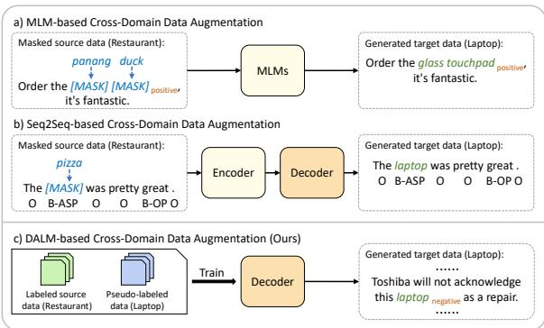
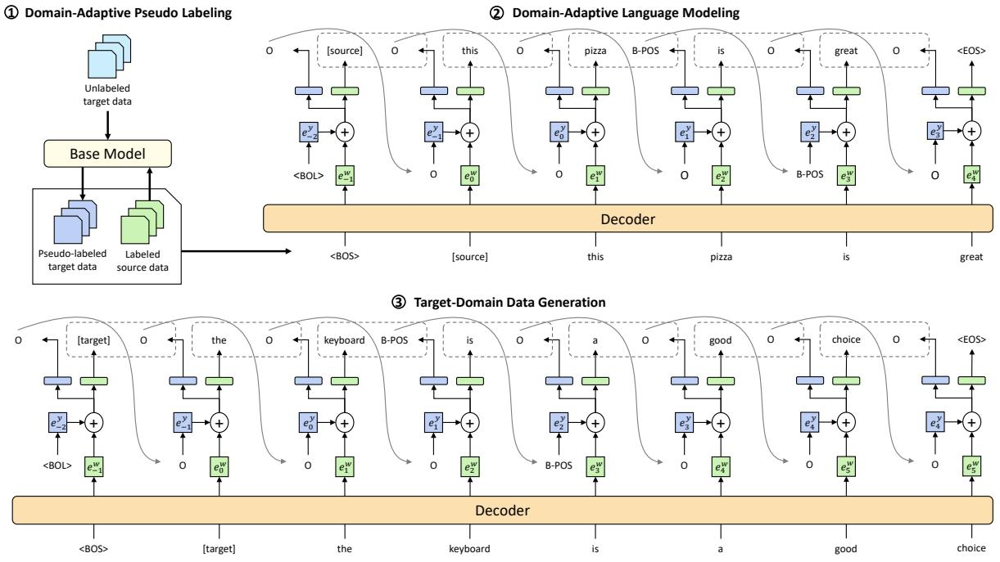
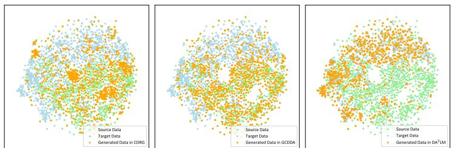

# Cross-Domain Data Augmentation with Domain-Adaptive Language Modeling for Aspect-Based Sentiment Analysis

Jianfei Yu∗, Qiankun Zhao∗ and Rui Xia† School of Computer Science and Engineering, Nanjing University of Science and Technology, China {jfyu, kkzhao, rxia}@njust.edu.cn

## Abstract

Cross-domain Aspect-Based Sentiment Analysis (ABSA) aims to leverage the useful knowledge from a source domain to identify aspectsentiment pairs in sentences from a target domain. To tackle the task, several recent works explore a new unsupervised domain adaptation framework, i.e., Cross-Domain Data Augmentation (CDDA), aiming to directly generate much labeled target-domain data based on the labeled source-domain data. However, these CDDA methods still suffer from several issues: 1) preserving many source-specific attributes such as syntactic structures; 2) lack of fluency and coherence; 3) limiting the diversity of generated data. To address these issues, we propose a new cross-domain Data Augmentation approach based on Domain-Adaptive Language Modeling named DA2LM, which contains three stages: 1) assigning pseudo labels to unlabeled target-domain data; 2) unifying the process of token generation and labeling with a Domain-Adaptive Language Model (DALM) to learn the shared context and annotation across domains; 3) using the trained DALM to generate labeled target-domain data. Experiments show that DA2LM consistently outperforms previous feature adaptation and CDDA methods on both ABSA and Aspect Extraction tasks. The source code is publicly released at https://github.com/NUSTM/DALM.

## 1 Introduction

As an important task in sentiment analysis, Aspect-Based Sentiment Analysis (ABSA) aims to extract aspect terms from sentences and predict the sentiment polarity towards each aspect term (Liu, 2012; Pontiki et al., 2016). For example, given a sentence “The screen is broken", the aspect term is screen and its sentiment polarity is Negative. With the advancements of deep learning techniques, a myriad of neural approaches have been proposed for ABSA and achieved promising results on several benchmark datasets (Li et al., 2019a; He et al., 2019; Chen and Qian, 2020b). However, these methods heavily rely on labeled data with fine-grained annotation, which is often time-consuming and expensive to obtain for many emerging domains.

  
Figure 1: Comparison between different Cross-Domain Data Augmentation (CDDA) methods.

To alleviate the reliance on labeled data, many previous works resorted to unsupervised domain adaptation techniques, which aim to transfer knowledge from a resource-rich source domain to a target domain only with unlabeled data (Blitzer et al., 2007; Pan et al., 2010; Zhuang et al., 2015). Most existing domain adaptation methods on the ABSA task focus on learning shared feature representations across domains (Wang and Pan, 2018; Li et al., 2019c; Gong et al., 2020; Chen and Qian, 2021). Although these methods have obtained promising results, their models are only trained on the sourcedomain labeled data and thus insensitive to the important target-specific aspect and opinion terms.

To address this limitation, several recent studies have explored a new domain adaptation framework named Cross-Domain Data Augmentation (CDDA), which aims to directly generate much target-domain labeled data based on the labeled data from the source domain. These existing methods can be summarized into two groups: Masked

Language Model (MLM)-based CDDA (Yu et al., 2021; Yang et al., 2022) and Sequence-to-Sequence (Seq2Seq)-based CDDA (Chen et al., 2021; Li et al., 2022). As shown in Fig. 1(a) and Fig. 1(b), the core idea behind existing CDDA methods is to first mask source-specific words in the sourcedomain labeled data, followed by using either the well-trained MLM or Seq2Seq models to automatically generate target-specific words and labels in the masked positions. Despite achieving significant improvements over previous feature adaptation methods, these CDDA approaches still have several shortcomings: 1) they only mask source-specific words or phrases but preserve other source-specific attributes such as syntactic structures, which make the distribution of the generated data different from that of the real target-domain data; 2) replacing source-specific words with target-specific words may destruct the semantic meaning of the original sentence, making the generated data lack of fluency and coherence; 3) existing CDDA methods regard each source-domain sentence as the template, thus limiting the diversity of the generated data.

To tackle these shortcomings, we propose a new cross-domain Data Augmentation approach based on Domain-Adaptive Language Modeling named DA2LM, which consists of three stages, including Domain-Adaptive Pseudo Labeling, Domain-Adaptive Language Modeling, and Target-Domain Data Generation. Specifically, the labeled source data and unlabeled target data are first leveraged to train a base domain adaptation model, which is then used for predicting pseudo labels of unlabeled data in the target domain. Secondly, we design a novel Domain-Adaptive Language Model (DALM), and train it on the labeled source data and pseudo-labeled target data to learn the transferable context and label across domains. Different from most existing LMs, our DALM unifies the process of data generation and fine-grained annotation, aiming to simultaneously generate the next token and predict the label of the current token at each time step of the training stage. Finally, given the trained DALM, we employ it to generate many labeled target-domain data in an autoregressive manner with a probability-based generation strategy.

Our main contributions can be summarized as follows:

• We propose a three-stage framework named cross-domain Data Augmentation with Domain Adaptive Language Modeling $\mathrm { ( D A ^ { 2 } L M ) }$ , which can generate a large amount of labeled targetdomain data for the cross-domain ABSA task.

• Under the framework, we devise a new domainadaptive language model, which unifies the process of data generation and labeling and captures the domain-invariant context and annotation for target-domain data generation.

• Experiments on four benchmark datasets demonstrate that our framework significantly outperforms a number of competitive domain adaptation methods on both ABSA and Aspect Extraction (AE) tasks. Further analysis on generated data shows the superiority of our framework in terms of data distribution, diversity, and fluency.

## 2 Related Work

## 2.1 Aspect-Based Sentiment Analysis (ABSA)

As an important task in sentiment analysis, ABSA has been extensively studied in the last decade. Earlier works mainly focus on two subtasks of ABSA, i.e., aspect extraction (AE) (Liu et al., 2015; Chen and Qian, 2020a) and aspect-based sentiment classification (ASC) (Zhang et al., 2016; Chen et al., 2017; Sun et al., 2019; Wang et al., 2020). Recently, many supervised methods are proposed to solve the two sub-tasks in an end-to-end manner, which either resort to multi-task learning to exploit the relations between AE and ASC (Luo et al., 2019; He et al., 2019; Chen and Qian, 2020b) or employ a collapsed tagging scheme to combine AE and ASC into a unified label space and formulate the task as a sequence labeling problem (Wang et al., 2018; Li et al., 2019a,b). Despite obtaining promising results on several benchmark datasets, these methods suffer from the lack of annotated data in many emerging domains. To alleviate this issue, we aim to propose an unsupervised domain adaptation method to generate sufficient labeled data for ABSA in any target domain.

## 2.2 Unsupervised Domain Adaptation

In the literature, a myriad of unsupervised domain adaptation methods have been proposed for coarsegrained sentiment analysis (Zhuang et al., 2020), including pivot-based methods (Blitzer et al., 2007; Yu and Jiang, 2016; Ziser and Reichart, 2018; Xi et al., 2020), auto-encoders (Glorot et al., 2011; Zhou et al., 2016), domain adversarial networks (Ganin and Lempitsky, 2015; Ganin et al., 2016; Li et al., 2018), and semi-supervised methods (He et al., 2018; Ye et al., 2020). These methods primarily focus on learning domain-invariant representations to alleviate the distribution discrepancy across domains. Inspired by the success of these representation-based methods, a few recent studies have adapted them to the cross-domain ABSA task, in which the key idea is to learn a shared representation for each word or aspect term across domains (Ding et al., 2017; Wang and Pan, 2018, 2019, 2020; Li et al., 2019c; Zeng et al., 2022; Chen and Qian, 2022). Moreover, Lekhtman et al. (2021) proposed a customized pre-training approach with aspect category shift for the aspect extraction task.

Despite obtaining promising results, the major limitation of these aforementioned methods for cross-domain ABSA is that their models for the main ABSA task is solely trained on the sourcedomain labeled data. Thus, their models are insensitive to target-specific features. To address this issue, some studies have explored a Cross-Domain Data Augmentation framework (CDDA) to directly generate much target-domain labeled data, including MLM-based CDDA (Yu et al., 2021; Yang et al., 2022) and Seq2Seq-based CDDA (Chen et al., 2021; Li et al., 2022). However, the generated data by these methods has several limitations including 1) preserving many source-specific attributes such as syntactic structures; 2) lack of fluency and diversity. Thus, in this work, we aim to propose a new data augmentation framework that can generate fluent target-domain labeled data without any source-specific attributes.

## 3 Methodology

## 3.1 Problem Definition and Notations

Following previous studies (Li et al., 2019c), we formulate ABSA and AE as a sequence labeling problem. Given a sentence with n words $\pmb { x } = \{ w _ { 1 } , w _ { 2 } , . . . , w _ { n } \}$ , the goal is to predict its corresponding label sequence $\pmb { y } = \{ y _ { 1 } , y _ { 2 } , . . . , y _ { n } \}$ where $y _ { j } \in \big \{ \mathsf { B } { \mathsf { - P O S } } , \mathtt { I } { \mathsf { - P O S } } , \mathsf { B } { \mathsf { - N E G } } , \mathtt { I } { \mathsf { - N E G } } , \mathsf { B } { \mathsf { - N E U } }$ I-NEU, O for ABSA and $y _ { j } \in \{ { \mathsf { B } } , { \mathsf { I } } , 0 \}$ for AE.

In this work, we focus on the unsupervised domain adaptation setting, in which the source domain has enough labeled data and the target domain only has unlabeled data. Let $\mathcal { D } ^ { S } = \{ ( \boldsymbol { x } _ { i } ^ { s } , \boldsymbol { y } _ { i } ^ { s } ) \} _ { i = 1 } ^ { N ^ { s } }$ denote a set of source-domain labeled data, and $\mathcal { D } ^ { T } = \{ \pmb { x } _ { i } ^ { t } \} _ { i = 1 } ^ { N ^ { t } }$ a set of target-domain unlabeled data. The goal is to leverage $\mathcal { D } ^ { S }$ and $\mathcal { D } ^ { T }$ to predict the label sequences of test data from the target domain.

## 3.2 Overview

As illustrated in Figure 2, our Cross-Domain Data Augmentation framework contains three key stages, including 1) Domain-Adaptive Pseudo Labeling, 2) Domain-Adaptive Language Modeling, and 3) Target-Domain Data Generation. In the first stage, an aspect-aware domain adaptation model is trained to assign pseudo labels to unlabeled data in the target domain. In the second stage, the labeled source data and the pseudo-labeled target data are used to train a domain-adaptive language model, which integrates data generation and sequence labeling in a unified architecture to capture the transferable context and annotation across domains. After training the DALM, the last stage uses probabilitybased generation strategy to generate diverse targetdomain data with fine-grained annotations in an autoregressive manner.

## 3.3 Domain-Adaptive Pseudo Labeling

In this stage, our goal is to assign the pseudo labels to each unlabeled data in the target domain. Since the data distribution of the source domain is different from that of the target domain, directly training a classifier on the labeled source data to predict the pseudo labels of the unlabeled target data will bring much noise. Thus, it is necessary to alleviate the domain discrepancy to improve the quality of pseudo-labels. Since aspect terms are shown to play a crucial role in ABSA (Gong et al., 2020), we attempt to explicitly minimize the distance between source-domain and target-domain aspect term representations via Maximum Mean Discrepancy (MMD) (Gretton et al., 2012).

Specifically, given the labeled source data $\mathcal { D } ^ { S }$ and the unlabeled target data $\mathcal { D } ^ { T }$ , we first obtain the aspect terms in $\mathcal { D } ^ { S }$ via the gold labels and extract the aspect terms in $\mathcal { D } ^ { T }$ based on a rulebased algorithm named Double Propagation (Qiu et al., 2011). Let us use $\pmb { x } ^ { d } = \{ w _ { 1 } ^ { d } , w _ { 2 } ^ { d } , . . . , w _ { n } ^ { d } \}$ to denote a source or target domain sentence and use $\pmb { a } ^ { d } = \{ w _ { i } ^ { d } , . . . , w _ { j } ^ { d } \}$ to denote one of the aspect terms in the sentence, where d $\in \{ s , t \}$ . We then employ a pre-trained BERT model to obtain the hidden representation of the sentence $\mathbf { H } ^ { d } =$ $\{ \mathbf { h } _ { 1 } ^ { d } , \mathbf { h } _ { 2 } ^ { d } , . . . , \mathbf { h } _ { n } ^ { \bar { d } } \}$ and the aspect term representation $\mathbf { a } ^ { d } = g ( \mathbf { h } _ { i } ^ { d } , . . . , \mathbf { h } _ { j } ^ { d } )$ , where $\mathbf { h } ^ { d } \in \mathbb { R } ^ { r }$ , r refers to the hidden dimension, and $g ( \cdot )$ denotes the meanpooling operation. Next, we propose an aspectlevel MMD loss to alleviate the distribution discrepancy across domains as follows:

  
Figure 2: Overview of cross-domain Data Augmentation with Domain-Adaptive Language Modeling (DA2LM).

$$
\begin{array} { l } { { \displaystyle { \mathcal { L } } _ { \mathrm { m m d } } = \mathrm { d } _ { k } ^ { 2 } ( { \mathcal { D } } _ { a } ^ { S } , { \mathcal { D } } _ { a } ^ { T } ) = \frac { 1 } { \left( N _ { a } ^ { s } \right) ^ { 2 } } \sum _ { i , j } ^ { N _ { a } ^ { s } } k ( { \mathbf { a } } _ { i } ^ { s } , { \mathbf { a } } _ { j } ^ { s } ) + } } \\ { { \displaystyle \frac { 1 } { \left( N _ { a } ^ { t } \right) ^ { 2 } } \sum _ { i , j } ^ { N _ { a } ^ { t } } k ( { \mathbf { a } } _ { i } ^ { t } , { \mathbf { a } } _ { j } ^ { t } ) - \frac { 2 } { N _ { a } ^ { s } N _ { a } ^ { t } } \sum _ { i } ^ { N _ { a } ^ { s } } \sum _ { j } ^ { N _ { a } ^ { t } } k ( { \mathbf { a } } _ { i } ^ { s } , { \mathbf { a } } _ { j } ^ { t } ) } , } \end{array}
$$

where $\mathcal { D } _ { a } ^ { S }$ and $\mathcal { D } _ { a } ^ { T }$ respectively denote the sets of aspect term representations in the source domain and the target domain, $N _ { a } ^ { s }$ and $N _ { a } ^ { t }$ refer to the number of aspect terms in the two domains, and $k ( \cdot )$ denotes the Gaussian Kernel function.

Meanwhile, for each source sample, the hidden representation $\mathbf { H } ^ { s }$ is fed into a Conditional Random Field (CRF) layer to predict the label sequence for the ABSA or AE task $p ( \pmb { y } ^ { s } | \mathbf { H } ^ { s } )$ . The goal is to minimize the negative log-probability of the correct label sequence of each source-domain sample:

$$
\mathcal { L } _ { \mathrm { c r f } } = - \sum _ { i = 1 } ^ { N ^ { s } } \log p ( \mathbf { \boldsymbol { y } } _ { i } ^ { s } | \mathbf { \mathbf { H } } _ { i } ^ { s } ) .\tag{1}
$$

The CRF loss for the ABSA or AE task and the aspect-level MMD loss are combined to train the base model $C _ { b }$

$$
\begin{array} { r } { \mathcal { L } = \mathcal { L } _ { \mathrm { c r f } } + \alpha \mathcal { L } _ { \mathrm { m m d } } , } \end{array}\tag{2}
$$

where α is the hyper-parameter.

Finally, we use $C _ { b }$ to assign pseudo labels to each sample in $\mathcal { D } ^ { T }$ , and obtain $\begin{array} { r l } { \mathcal { D } ^ { P T } } & { { } = } \end{array}$ $\{ ( \pmb { x } _ { i } ^ { p t } , \pmb { y } _ { i } ^ { p t } ) \} _ { i = 1 } ^ { N ^ { t } }$

## 3.4 Domain-Adaptive Language Modeling

To generate a large amount of target-domain labeled data with diverse syntactic structures, we propose a Domain-Adaptive Language Model (DALM), which leverages the labeled source data $\mathcal { D } ^ { S }$ and the pseudo-labeled target data $\mathcal { D } ^ { P T }$ to learn the shared distribution of words and labels across domains. Since our DALM unifies the process of word generation and sequence labeling, at each time step, we employ the current input token and the predicted label at the previous step to simultaneously maximize the probabilities of predicting the next token and the label of the current token.

Specifically, for each sample $( \pmb { x } , \pmb { y } ) \in \mathcal { D } ^ { S } \ |$ U $\mathcal { D } ^ { P \hat { T } }$ , we first construct an input token sequence, in which we insert a special token BOS to denote the sentence beginning, followed by a domain-specific token (i.e., [source] or [target]) to distinguish the domain that x belongs to. Let $\pmb { x } _ { \mathrm { i n } } = \{ \langle \mathrm { B O S } \rangle , w _ { 0 } , w _ { 1 } , w _ { 2 } , . . . , w _ { n } \}$ denote the expanded input sentence, where w0 [source], [target] . Moreover, we construct another input label sequence, denoted by $\begin{array} { r c l } { y _ { \mathrm { i n } } } & { = } & { \left\{ \langle \mathrm { B O L } \rangle , y _ { \langle \mathrm { B O S } \rangle } , y _ { 0 } , y _ { 1 } , y _ { 2 } , . . . , y _ { n - 1 } \right\} } \end{array}$ where BOL denotes the initial state of the label sequence, y BOS is O, and $y _ { j }$ refers to the label of $w _ { j }$ . According to the input, the output token sequence is $\pmb { x } _ { \mathrm { o u t } } = \{ w _ { 0 } , w _ { 1 } , w _ { 2 } , . . . , w _ { n }$ EOS . The output label sequence is $\begin{array} { r l } { { \mathbf { \nabla } } y _ { \mathrm { o u t } } } & { { } = } \end{array}$ $\left\{ y _ { \left. \mathrm { B O S } \right. } , y _ { 0 } , y _ { 1 } , y _ { 2 } , . . . , y _ { n } \right\}$ . The top of Figure 2 shows an example of two input and two output sequences for a sample from the source domain.

Next, for the input token sequence $\pmb { x } _ { \mathrm { i n } }$ , we employ a decoder such as LSTM and the pre-trained GPT-2 model (Radford et al., 2019) to get its hidden representation as follows:

$$
{ \bf e } _ { - 1 } ^ { w } , { \bf e } _ { 0 } ^ { w } , . . . , { \bf e } _ { n } ^ { w } = \mathrm { D e c o d e r } ( w _ { - 1 } , w _ { 0 } , w _ { 1 } , . . . , w _ { n } ) ,
$$

where $w _ { - 1 }$ denotes $\langle \mathbf { B O S } \rangle , \mathbf { e } _ { t } ^ { w } \in \mathbb { R } ^ { d }$ is the token representation, and d is the hidden dimension. For the input label sequence ${ \pmb y } _ { \mathrm { i n } }$ , a label embedding layer is used to get the label representation:

$$
\mathbf { e } _ { - 2 } ^ { y } , . . . , \mathbf { e } _ { n - 1 } ^ { y } = \mathrm { L a b e l E m b } ( y _ { - 2 } , y _ { - 1 } , . . . , y _ { n - 1 } ) ,
$$

where $y _ { - 2 }$ and $y _ { - 1 }$ denote BOL and $y _ { \langle \mathrm { B O S } \rangle }$ , and ${ \mathbf e } _ { t } ^ { y } \in \mathbb { R } ^ { d }$ . Next, at each time step $t ,$ we add $\mathbf { e } _ { t } ^ { w }$ and ${ \bf e } _ { t - 1 } ^ { y }$ to produce a token and label-aware representation $( { \mathrm { i . e . , } } { \mathbf { e } } _ { t } = { \mathbf { e } } _ { t } ^ { w } + { \mathbf { e } } _ { t - 1 } ^ { y } )$ , which is then fed into two different full-connected softmax layers to predict the probabilities of the next token $w _ { t + 1 }$ and the label $y _ { t }$ as follows:

$$
P ( w _ { t + 1 } | w _ { \leq t } , y _ { \leq t - 1 } ) = \sigma ( W _ { w } \mathbf { e } _ { t } + b _ { w } ) ,\tag{3}
$$

$$
P ( y _ { t } | w _ { \leq t } , y _ { \leq t - 1 } ) = \sigma ( W _ { y } \mathbf { e } _ { t } + b _ { w } ) ,\tag{4}
$$

where $\sigma$ is the softmax function, and $W _ { x } \in$ $R ^ { | V _ { x } | \times d } , W _ { y } \in R ^ { | V _ { y } | \times d }$ , and $| V _ { x } |$ and $| V _ { y } |$ are the vocabulary size and the label size. For each sample $( \pmb { x } , \pmb { y } ) \in \partial ^ { S } \cup \mathcal { D } ^ { P T }$ , we optimize the parameters for DALM by minimizing the combination of cross entropy losses for the output token sequence and label sequence as follows:

$$
\mathcal { L } = \mathcal { L } _ { w } + \mathcal { L } _ { y } ,\tag{5}
$$

$$
\mathcal { L } _ { w } = - \sum _ { t = - 1 } ^ { n } \log P ( w _ { t + 1 } | w _ { \leq t } , y _ { \leq t - 1 } ) ,\tag{6}
$$

$$
\mathcal { L } _ { y } = - \sum _ { t = - 1 } ^ { n } \log P ( y _ { t } | w _ { \leq t } , y _ { \leq t - 1 } ) .\tag{7}
$$

## 3.5 Target-Domain Data Generation

After training the DALM, we employ it to generate target-domain data with fine-grained annotations in an autoregressive manner. As shown in the bottom of Figure 2, the BOS token and the target-specific token [target] are fixed as the first two input tokens of the DALM, and BOL and O are fixed as the first two input labels. Next, we adopt a probabilitybased generation strategy to generate the following tokens and their corresponding labels.

At each time step t, we first rank all the tokens in $V _ { x }$ based on the probabilities computed by Eq. 3 and pick top-k tokens as a candidate set $C _ { t + 1 }$ . We then sample a token $w _ { t + 1 }$ from $C _ { t + 1 }$ as the next token. As the candidate tokens in $C _ { t + 1 }$ are predicted with higher probabilities, the generated data are generally fluent and close to the real target-domain data. Moreover, given the same context, the DALM can choose a synonym as the next token due to the randomness of sampling, which is conducive to diversifying the generated data.

Next, for the label generation at each time step t, we directly select the label with the highest probability computed by Eq. 4 as the label of the current token $y _ { t }$ , which can ensure the quality of the generated label sequence.

The above process of token generation and labeling will be stopped when the next token is predicted as EOS . Because of the randomness brought by sampling, the trained DALM can be used to generate any amount of labeled data. However, generating more data may lead to significant vocabulary redundancy of generated data. Thus, once the size of generated data equals to $N ^ { g }$ , we will stop generating target-domain labeled data.

## 3.6 Generated Data Filtering

To mitigate the presence of low-quality labels in the target data generated from the probability-based generation strategy, we introduce the following steps for generated data filtering: 1) Delete data with the illogical labels that violate the prefix order of the BIO tagging schema $( \mathrm { e . g . }$ ., having O before I in the AE task and having B-Positive before I-Neutral in the ABSA task); 2) Delete repetitive data whose token and label sequences are the same, and only keep one of the duplicate samples; 3) Use the base model $C _ { b }$ in Section 3.3 to predict the label sequences of the generated sentences and delete data whose label sequences are different from those predicted by $C _ { b }$

Let us use $\mathcal { D } ^ { g } = \{ ( \pmb { x } _ { i } ^ { g } , \pmb { y } _ { i } ^ { g } ) \} _ { i = 1 } ^ { N ^ { g } }$ to denote the set of generated target-domain data. We then train a standard BERT-CRF model (Li et al., 2019b) on ${ \mathcal { D } } ^ { g }$ , and use it to predict the label sequences of test data from the target domain.

## 4 Experiments

## 4.1 Experimental Settings

Datasets. To evaluate the effectiveness of the proposed DA2LM framework, we conduct experiments on four benchmark datasets, namely Laptop (L), Restaurant (R), Device (D), and Service (S), as shown in Table 1. L contains data from the laptop domain in SemEval 2014 (Pontiki et al., 2014). R is the union set of the restaurant data from SemEval 2015 (Pontiki et al., 2015) and SemEval 2016 (Pontiki et al., 2016). D contains device data about 5 digital products (Hu and Liu, 2004). S contains data from web services (Toprak et al., 2010).

<table><tr><td>Dataset</td><td>Sentences</td><td>Training</td><td>Testing</td></tr><tr><td>Laptop (L)</td><td>3845</td><td>3045</td><td>800</td></tr><tr><td>Restaurant (R)</td><td>6035</td><td>3877</td><td>2158</td></tr><tr><td>Device (D)</td><td>3836</td><td>2557</td><td>1279</td></tr><tr><td>Service (S)</td><td>2239</td><td>1492</td><td>747</td></tr></table>

Table 1: Basic statistics of the datasets.

Evaluation. Following (Li et al., 2019c), we choose 10 different source target domain pairs for experiments. L D and D L are removed since the two domains are very similar. For each cross-domain pair, DA2LM generates sufficient target-domain labeled data and then directly trains a BERT-CRF classifier on the generated targetdomain data. We evaluate the model predictions based on Micro-F1 under the exact match, which means that the predicted aspect-sentiment pairs are considered as correct only if they exactly match with the gold aspect-sentiment pairs.

Parameter Setting. For the BERT-CRF model used in DA2LM, we employ a domain-specific BERT-base model named BERT-Cross (Xu et al., 2019), which was post-trained on a large amount of Yelp and Amazon Electronic data (He and McAuley, 2016). For Domain-Adaptive Pseudo Labeling, the hyper-parameter α in Eq. 2 is set as 0.01, and we adopt the Adam algorithm with a learning rate of 3e-5 to optimize the parameters. For Domain-Adaptive Language Modeling, we finetune the LSTM and the pre-trained language model GPT-2 (Radford et al., 2019) on $\mathcal { D } ^ { S } \cup \bar { \mathcal { D } } ^ { P T }$ , and using the Adam algorithm as the optimizer with a learning rate of 3e-3 and 3e-4 respectively. For Target-Domain Data Generation, we choose the top-k tokens (i.e., k=100) as the candidate set and the maximum number of generated data Ng is set to 10000 in token-sampling generation. All the experiments are run on a single Nvidia 1080Ti GPU.

## 4.2 Main Results

To show the effectiveness of our DA2LM approach, we consider the following competitive domain adaptation comparison systems for the cross-

domain ABSA task.

• BERT-NoDA (Kenton and Toutanova, 2019): a baseline system without domain adaptation, which directly fine-tunes a BERT-base model on labeled source-domain data.

• BERT-Cross (Xu et al., 2019): a domainadaptive BERT-CRF model, in which the BERTbase model was post-trained on a myriad of Ecommerce data and the full model is fine-tuned on labeled source-domain data.

• UDA (Gong et al., 2020): a unified domain adaptation approach that integrates feature-based and instance-based adaptation for cross-domain ABSA.

• FMIM (Chen and Wan, 2022): a featurebased domain adaptation method, using the finegrained mutual information maximization technique.

• CDRG (Yu et al., 2021): a cross-domain review generation approach that exploits each labeled source-domain review to generate a labeled target-domain review based on masked language models.

• GCDDA (Li et al., 2022): a generative crossdomain data augmentation framework that leverages a pre-trained sequence-to-sequence model BART to generate target-domain data with finegrained annotation.

The comparison results on the cross-domain ABSA and AE task are reported in Table 2. For our proposed framework, we present the results of both LSTM and GPT-2-based DA2LM. We can observe that our framework generally achieves the best performance on most cross-domain pairs and DA2LM outperforms the state-of-the-art method by 1.86% and 0.90% on average for the ABSA and AE task respectively. We conjecture the reasons as follows. First, DA2LM can directly generate numerous high-quality target domain labeled data, thereby overcoming the sensitivity to source data in feature-based domain adaptation methods. Second, there is still a considerable distribution discrepancy between the generated data in previous cross-domain data augmentation methods and the real target-domain data because these methods preserve source-specific attributes such as syntactic structures. Moreover, since previous cross-domain data augmentation methods are based on the word replacement technology, the fluency and diversity of generated data in these methods are inferior to our $\mathrm { D A ^ { 2 } L M }$ approach.

<table><tr><td>Tasks</td><td>Methods</td><td>S→R</td><td>S→L</td><td>S→D</td><td>R→S</td><td>R→L</td><td>R→D</td><td>L→S</td><td>L→R</td><td>D→S</td><td>D→R</td><td>AVE</td></tr><tr><td rowspan="8">ABSA</td><td>BERT-NoDA</td><td>49.85</td><td>33.08</td><td>35.97</td><td>27.63</td><td>32.69</td><td>32.45</td><td>27.77</td><td>37.38</td><td>31.87</td><td>42.74</td><td>35.14</td></tr><tr><td>BERT-Cross</td><td>51.36</td><td>34.33</td><td>36.28</td><td>26.38</td><td>42.42</td><td>40.82</td><td>28.35</td><td>49.91</td><td>27.31</td><td>47.92</td><td>38.51</td></tr><tr><td>UDA</td><td>52.04</td><td>35.41</td><td>38.06</td><td>30.76</td><td>46.00</td><td>40.81</td><td>30.34</td><td>49.97</td><td>33.28</td><td>50.72</td><td>40.74</td></tr><tr><td>FMIM</td><td>49.46</td><td>31.83</td><td>32.46</td><td>40.59</td><td>39.26</td><td>33.11</td><td>41.61</td><td>57.02</td><td>40.76</td><td>55.68</td><td>42.21</td></tr><tr><td>CDRG</td><td>52.93</td><td>33.33</td><td>36.14</td><td>43.07</td><td>44.70</td><td>30.82</td><td>41.51</td><td>57.77</td><td>40.30</td><td>53.18</td><td>43.38</td></tr><tr><td>GCDDA</td><td>55.66</td><td>36.53</td><td>36.87</td><td>32.07</td><td>47.79</td><td>40.35</td><td>27.22</td><td>50.50</td><td>28.52</td><td>49.47</td><td>40.50</td></tr><tr><td>DA2LM (LSTM)</td><td>56.26</td><td>36.54</td><td>39.80</td><td>40.38</td><td>42.49</td><td>40.55</td><td>35.93</td><td>59.47</td><td>33.55</td><td>57.28</td><td>44.22</td></tr><tr><td>DA²LM (GPT-2)</td><td>58.64</td><td>36.97</td><td>40.28</td><td>40.44</td><td>42.91</td><td>41.28</td><td>36.84</td><td>60.39</td><td>35.75</td><td>58.98</td><td>45.24</td></tr><tr><td rowspan="8">AE</td><td>BERT-NoDA</td><td>57.72</td><td>40.33</td><td>39.69</td><td>31.21</td><td>38.38</td><td>35.15</td><td>31.44</td><td>41.11</td><td>34.46</td><td>45.79</td><td></td></tr><tr><td>BERT-Cross</td><td>58.08</td><td>40.47</td><td>39.89</td><td>27.74</td><td>51.49</td><td>42.52</td><td>30.84</td><td>54.96</td><td>28.69</td><td>50.97</td><td>39.53 42.57</td></tr><tr><td>UDA</td><td>57.98</td><td>42.44</td><td>40.24</td><td>35.29</td><td>57.58</td><td>43.07</td><td>33.96</td><td>54.79</td><td>35.78</td><td>53.85</td><td>45.50</td></tr><tr><td>FMIM</td><td>57.43</td><td>39.14</td><td>35.26</td><td>47.60</td><td>50.57</td><td>36.11</td><td>51.68</td><td>68.67</td><td>49.53</td><td>61.64</td><td>49.76</td></tr><tr><td>CDRG</td><td>60.20</td><td>39.49</td><td>38.59</td><td>49.97</td><td>55.50</td><td>34.89</td><td>51.07</td><td>68.63</td><td>43.19</td><td>57.51</td><td>49.90</td></tr><tr><td>GCDDA</td><td>63.53</td><td>43.95</td><td>39.16</td><td>35.69</td><td>64.06</td><td>44.25</td><td>30.31</td><td>58.00</td><td>30.74</td><td>53.70</td><td>46.34</td></tr><tr><td>DA2LM (LSTM)</td><td>63.63</td><td>44.39</td><td>42.39</td><td>43.38</td><td>57.12</td><td>43.64</td><td>39.44</td><td>67.24</td><td>36.16</td><td>62.66</td><td>50.00</td></tr><tr><td>DA²LM (GPT-2)</td><td>65.78</td><td>44.96</td><td>43.24</td><td>43.41</td><td>54.55</td><td>44.29</td><td>41.06</td><td>68.72</td><td>38.20</td><td>63.86</td><td>50.80</td></tr></table>

Table 2: Main results for Cross-Domain ABSA and AE based on Micro-F1. All results are based on our re-implementation.

In addition to the above observations, Table 2 shows that LSTM-based $\mathrm { D A ^ { 2 } L M }$ is similar to GPT-2-based $\mathrm { D A ^ { 2 } L M }$ and also outperforms previous domain adaptation methods on average, which implies that our cross-domain data augmentation framework is robust and does not rely on the pretrained language model.

Furthermore, as shown in Table 1 and Table 2, the proposed model underperforms several baseline systems when the source/target sample size ratio is larger than 1 $( \mathrm { e } . \mathrm { g } . , \mathrm { R } \to \mathrm { S } , \mathrm { L } \to \mathrm { S } , \mathrm { D } \to \mathrm { S }$ , R $ \mathrm { L } )$ . We believe the reason of the performance drop is as follows: when the number of targetdomain data is less than that of source-domain data, it will inevitably lead the Domain-Adaptive Language Model (DALM) to pay more attention to source-domain data instead of target-domain data. Hence, in the target-domain data generation process, the trained DALM may still generate sourcespecific words, and thus bring negative effects to the final performance.

## 4.3 Ablation Study

To explore the effects of each component in $\mathrm { D A ^ { 2 } L M }$ , we show the results of our ablation study in Table 3.

Firstly, after removing the aspect-level MMD loss in the domain-adaptive pseudo labeling (DAPL) stage, the average performance on 10 cross-domain pairs drops dramatically, which indicates that it is important to alleviate the domain discrepancy via the MMD loss in DAPL. Secondly, removing the domain-adaptive language modeling (DALM) and target-domain data-generation (DG) stages decreases the average F1 score by 2.71 absolute percentage points. This shows that automatically generating a large amount of target-domain labeled data plays an indispensable role in our $\mathrm { D A ^ { 2 } L M }$ framework. Thirdly, for the training of DALM, the removal of source-domain labeled data also leads to a significant drop in the average F1 score. This implies that the source-domain data is indeed helpful for capturing domain-invariant context and annotation.

<table><tr><td>Methods</td><td>ABSA</td><td>AE</td></tr><tr><td>DA2LM</td><td>45.24</td><td>50.80</td></tr><tr><td>- w/o MMD loss in DAPL</td><td>39.44 42.53</td><td>43.57</td></tr><tr><td>- w/o DALM &amp; DG - w/o source-domain data in DALM</td><td>43.82</td><td>48.03 50.16</td></tr><tr><td>- w/o malposed generation</td><td>42.82</td><td>48.23</td></tr><tr><td>- replace DALM with DAGA</td><td>44.23</td><td>50.40</td></tr></table>

Table 3: Ablation studies of each component in $\mathrm { D A } ^ { 2 } \mathrm { L M } .$ DAPL, DALM, and DG respectively denote Domain-Adaptive Pseudo Labeling, Domain-Adaptive Language Modeling, and target-domain Data Generation. Ablation without malposed generation means that the next token and label are generated simultaneously in one time step.

Moreover, we remove the malposed generation strategy, which means it does not take the current token into account when predicting the label of the current token. As shown in Table 3, the performance of $\mathrm { D A ^ { 2 } L M }$ drops dramatically since it generates low-quality label sequences. Lastly, because a language model-based data augmentation method DAGA (Ding et al., 2020) has shown success in standard in-domain ABSA tasks, we propose to replace DALM in our $\mathrm { D A ^ { 2 } L M }$ framework with a variant of DAGA, i.e., a language model trained on source and target-domain data with linearized labels before each aspect term. For fair comparison, we also employ GPT-2 (Radford et al., 2019) as the pre-trained language model. As shown at the bottom of Table 3, replacing DALM with DAGA leads to a moderate performance drop, which proves the importance of DALM in our DA2LM approach.

<table><tr><td>Criterion</td><td>Methods</td><td>S→R</td><td>S→L</td><td>S→D</td><td>R→S</td><td>R→L</td><td>R→D</td><td>L→S</td><td>L→R</td><td>D→S</td><td>D→R</td><td>AVE</td></tr><tr><td rowspan="3">Diversity</td><td rowspan="3">CDRG GCDDA DA²LM</td><td>0.133</td><td>0.134</td><td>0.146</td><td>0.250</td><td>0.235</td><td>0.289</td><td>0.229</td><td>0.193</td><td>0.293</td><td>0.264</td><td>0.2165</td></tr><tr><td>0.226</td><td>0.203</td><td>0.207</td><td>0.236</td><td>0.208</td><td>0.227</td><td>0.247</td><td>0.241</td><td>0.297</td><td>0.266</td><td>0.2362</td></tr><tr><td>0.275</td><td>0.309</td><td>0.354</td><td>0.472</td><td>0.269</td><td>0.374</td><td>0.416</td><td>0.252</td><td>0.503</td><td>0.257</td><td>0.3487</td></tr><tr><td rowspan="3">Perplexity</td><td rowspan="3">CDRG GCDDA DA2LM</td><td>583.8</td><td>611.0</td><td>484.2</td><td>971.8</td><td>1106.9</td><td>971.5</td><td>567.5</td><td>620.9</td><td>625.4</td><td>697.0</td><td>724.00</td></tr><tr><td>244.9</td><td>215.2</td><td>217.8</td><td>806.0</td><td>782.0</td><td>763.8</td><td>469.1</td><td>392.0</td><td>442.9</td><td>480.0</td><td>481.35</td></tr><tr><td>362.8</td><td>237.4</td><td>214.9</td><td>182.1</td><td>257.8</td><td>254.9</td><td>204.8</td><td>389.8</td><td>200.6</td><td>360.3</td><td>266.53</td></tr><tr><td rowspan="4">MMD</td><td>Source</td><td>0.733</td><td>0.651</td><td>0.650</td><td>0.724</td><td>0.634</td><td>0.763</td><td>0.657</td><td>0.691</td><td>0.624</td><td>0.693</td><td>0.6819</td></tr><tr><td>CDRG</td><td>0.603</td><td>0.697</td><td>0.576</td><td>0.604</td><td>0.552</td><td>0.631</td><td>0.631</td><td>0.622</td><td>0.556</td><td>0.617</td><td>0.6088</td></tr><tr><td>GCDDA</td><td>0.800</td><td>0.541</td><td>0.559</td><td>0.772</td><td>0.547</td><td>0.561</td><td>0.759</td><td>0.567</td><td>0.603</td><td>0.600</td><td>0.6310</td></tr><tr><td>DA²LM</td><td>0.560</td><td>0.566</td><td>0.498</td><td>0.548</td><td>0.487</td><td>0.559</td><td>0.597</td><td>0.533</td><td>0.677</td><td>0.535</td><td>0.5564</td></tr></table>

Table 4: Comparison results between the generated data in DA2LM and those in CDRG and GCDDA.

  
Figure 3: Visualization of the distribution discrepancy between the generated data in different methods and the source/target-domain data on a cross-domain pair S  R. Each point represents a sample.

<table><tr><td rowspan=1 colspan=1>Methods</td><td rowspan=1 colspan=1>ABSA</td><td rowspan=1 colspan=1>AE</td></tr><tr><td rowspan=1 colspan=1>DA2LM</td><td rowspan=1 colspan=1>45.24</td><td rowspan=1 colspan=1>50.80</td></tr><tr><td rowspan=1 colspan=1>UDADA²LM-UDA</td><td rowspan=1 colspan=1>40.7442.02</td><td rowspan=1 colspan=1>45.5047.30</td></tr><tr><td rowspan=1 colspan=1>FMIMDA²LM-FMIM</td><td rowspan=1 colspan=1>39.3145.94</td><td rowspan=1 colspan=1>49.2653.79</td></tr><tr><td rowspan=1 colspan=1>CDRGDA²LM-CDRG</td><td rowspan=1 colspan=1>43.3845.71</td><td rowspan=1 colspan=1>49.9052.99</td></tr></table>

Table 5: Average results of replacing our base model in DAPL with existing domain adaptation methods.

## 4.4 Evaluation on Generated Data

In this subsection, we conduct additional experiments to evaluate the quality of data generated by DA2LM and report the performance in Table 4.

Diversity. Diversity denotes the percentage of unique aspect terms in all aspect terms. The results in Table 4 clearly show that DA2LM can generate more aspect terms since other methods need to regard source-domain sample as the template. Moreover, our framework employs a probabilitybased sampling strategy to generate the next token, which can improve the diversity of generated aspect terms.

Perplexity. To evaluate the coherence of generated data, we further calculate the perplexity1 of data generated from each compared method based on a pre-trained language model GPT-2.2 In the fourth to sixth rows of Table 4, it is clear to see that the perplexity of our DA2LM framework is significantly lower than that of other methods. This shows that for MLM-based and Seq2Seq-based CDDA methods, simply replacing source-specific attributes with target-specific attributes may break the syntactic structure of the original sentence and thus the generated sentences are not coherent. In contrast, our DA2LM framework relies on language modeling to automatically generate tokens and their corresponding labels in an autoregressive manner.

Maximum Mean Discrepancy (MMD). MMD is used to measure the distribution distance between the generated data in different methods and the real target-domain test data. The results in the last four rows show that the generated data in DA2LM are much closer to the target domain than other methods, which indicates DA2LM can generate more authentic target-domain data and better alleviate the distribution discrepancy across domains.

Visualization. To visually verify the superiority of our DA2LM framework, we further utilize t-SNE (Van der Maaten and Hinton, 2008) to perform a visualization of the sentence representations obtained by a pre-trained language model BERT (Kenton and Toutanova, 2019). Figure 3 shows the visualization result on a cross-domain pair S R. As shown in Figure 3, the distribution of generated data in CDRG and GCDDA is still similar to that of source-domain data because these methods still preserve many source-domain attributes including contexts and syntactic structures. In contrast, there is almost no discrepancy between the generated data in $\mathrm { D A ^ { 2 } L M }$ and the target-domain data, as shown in the right of Figure 3.

These observations demonstrate the advantage of $\mathrm { D A ^ { 2 } L M }$ over previous CDDA methods in terms of diversity, fluency, and data distribution.

## 4.5 Compatibility with Existing DA Methods

To show the compatibility of our $\mathrm { D A ^ { 2 } L M }$ framework, we replace the base model $C _ { b }$ in the first stage (i.e., domain-adaptive pseudo labeling) with other existing domain adaptation methods including UDA (Gong et al., 2020), FMIM (Chen and Wan, 2022) and CDRG (Yu et al., 2021).

Table 5 shows the average results of different base models with their $\mathrm { D A ^ { 2 } L M }$ variants on 10 source  target domain pairs for the cross-domain ABSA task and the cross-domain AE task, respectively. Firstly, we can find that by using the targetdomain labeled data from our DA2LM framework, the performance of existing domain adaptation methods is generally boosted on average for crossdomain ABSA and AE, which demonstrates the usefulness of our $\mathrm { D A ^ { 2 } L M }$ framework and the robustness of the generated target-domain data. Secondly, by comparing all $\mathrm { D A ^ { 2 } L M }$ variants, we can observe that DA2LM-FMIM consistently obtains the best average performance on cross-domain ABSA and AE. This suggests that our DA2LM framework is compatible with any domain adaptation method, and it can generally achieve better results with better base models.

## 5 Conclusion

In this paper, we proposed a cross-domain Data Augmentation framework based on Domain-Adaptive Language Modeling $\mathrm { ( D A ^ { 2 } L M ) }$ , which contains three key stages to automatically generate sufficient target-domain labeled data, including 1) Domain-Adaptive Pseudo Labeling, 2) Domain-Adaptive Language Modeling, and 3) Target-Domain Data Generation. Experiments on four benchmark datasets show that our $\mathrm { D A ^ { 2 } I }$ M framework consistently outperforms the state-ofthe-art method for the cross-domain ABSA task. Moreover, further evaluation results demonstrate the superiority of the generated data in terms of diversity, fluency, and data distribution.

## Limitations

Despite obtaining promising results, our proposed approach still has the following limitations.

First, although our $\mathrm { D A ^ { 2 } L M }$ approach can generate a large amount of target-domain data with high diversity, the generated words are still limited by the source-domain labeled data and target-domain unlabeled data. How to make the model generate novel target-domain words is a challenging problem to explore in the future.

Second, our $\mathrm { D A ^ { 2 } L M }$ model is primarily proposed for the ABSA and AE tasks, which are not directly applicable for the other information extraction tasks with more than two elements, such as Aspect Sentiment Triplet Extraction (ASTE). Therefore, cross-domain data augmentation for multiple-element information extraction tasks may be a promising followup direction.

## Ethics Statement

We conduct experiments on four publicly available datasets, i.e., Laptop (L), Restaurant (R), Device (D), and Service (S). These datasets do not share personal information and do not contain sensitive content that can be harmful to any individual or community. Due to the lack of ethics and bias constraint in the data generation process, the generated data from our trained Domain-Adaptive Language Model may contain sensitive and misleading content. Therefore, it is necessary to manually check these generated data when applying them to realworld applications.

## Acknowledgements

The authors would like to thank the anonymous reviewers for their insightful comments. This work was supported by the Natural Science Foundation of China (62076133 and 62006117), and the Natural Science Foundation of Jiangsu Province for Young Scholars (BK20200463) and Distinguished Young Scholars (BK20200018).

## References

John Blitzer, Mark Dredze, and Fernando Pereira. 2007. Biographies, bollywood, boom-boxes and blenders: Domain adaptation for sentiment classification. In Proceedings of ACL, pages 440–447.

Peng Chen, Zhongqian Sun, Lidong Bing, and Wei Yang. 2017. Recurrent attention network on memory for

aspect sentiment analysis. In Proceedings of EMNLP, pages 452–461.

Shuguang Chen, Gustavo Aguilar, Leonardo Neves, and Thamar Solorio. 2021. Data augmentation for crossdomain named entity recognition. In Proceedings of EMNLP, pages 5346–5356.

Xiang Chen and Xiaojun Wan. 2022. A simple information-based approach to unsupervised domainadaptive aspect-based sentiment analysis. arXiv preprint arXiv:2201.12549.

Zhuang Chen and Tieyun Qian. 2020a. Enhancing aspect term extraction with soft prototypes. In Proceedings ofEMNLP, pages 2107–2117.

Zhuang Chen and Tieyun Qian. 2020b. Relation-aware collaborative learning for unified aspect-based sentiment analysis. In Proceedings ofACL, pages 3685– 3694.

Zhuang Chen and Tieyun Qian. 2021. Bridge-based active domain adaptation for aspect term extraction. In Proceedings ofACL/IJCNLP, pages 317–327.

Zhuang Chen and Tieyun Qian. 2022. Retrieve-and-edit domain adaptation for end2end aspect based sentiment analysis. IEEE/ACM Transactions on Audio, Speech, and Language Processing, 30:659–672.

Bosheng Ding, Linlin Liu, Lidong Bing, Canasai Kruengkrai, Thien Hai Nguyen, Shafiq Joty, Luo Si, and Chunyan Miao. 2020. Daga: Data augmentation with a generation approach for low-resource tagging tasks. In Proceedings ofthe 2020 Conference on Empirical Methods in Natural Language Processing, EMNLP 2020, pages 6045–6057.

Ying Ding, Jianfei Yu, and Jing Jiang. 2017. Recurrent neural networks with auxiliary labels for crossdomain opinion target extraction. In Proceedings of AAAI, volume 31.

Yaroslav Ganin and Victor Lempitsky. 2015. Unsupervised domain adaptation by backpropagation. In Proceedings ofICML, pages 1180–1189.

Yaroslav Ganin, Evgeniya Ustinova, Hana Ajakan, Pascal Germain, Hugo Larochelle, François Laviolette, Mario Marchand, and Victor Lempitsky. 2016. Domain-adversarial training of neural networks. The Journal ofMachine Learning Research, 17(1):2096– 2030.

Xavier Glorot, Antoine Bordes, and Yoshua Bengio. 2011. Domain adaptation for large-scale sentiment classification: a deep learning approach. In Proceedings ofICML, pages 513–520.

Chenggong Gong, Jianfei Yu, and Rui Xia. 2020. Unified feature and instance based domain adaptation for aspect-based sentiment analysis. In Proceedings of EMNLP, pages 7035–7045.

Arthur Gretton, Karsten M Borgwardt, Malte J Rasch, Bernhard Schölkopf, and Alexander Smola. 2012. A kernel two-sample test. The Journal ofMachine Learning Research, 13(1):723–773.

Ruidan He, Wee Sun Lee, Hwee Tou Ng, and Daniel Dahlmeier. 2018. Adaptive semi-supervised learning for cross-domain sentiment classification. In Proceedings ofEMNLP, pages 3467–3476.

Ruidan He, Wee Sun Lee, Hwee Tou Ng, and Daniel Dahlmeier. 2019. An interactive multi-task learning network for end-to-end aspect-based sentiment analysis. In Proceedings ofACL, pages 504–515.

Ruining He and Julian McAuley. 2016. Ups and downs: Modeling the visual evolution of fashion trends with one-class collaborative filtering. In Proceedings of WWW, pages 507–517.

Minqing Hu and Bing Liu. 2004. Mining and summarizing customer reviews. In Proceedings of the tenth ACM SIGKDD international conference on Knowledge discovery and data mining, pages 168–177.

Jacob Devlin Ming-Wei Chang Kenton and Lee Kristina Toutanova. 2019. Bert: Pre-training of deep bidirectional transformers for language understanding. In Proceedings ofNAACL-HLT, pages 4171–4186.

Entony Lekhtman, Yftah Ziser, and Roi Reichart. 2021. Dilbert: Customized pre-training for domain adaptation with category shift, with an application to aspect extraction. In Proceedings of EMNLP, pages 219– 230.

Junjie Li, Jianfei Yu, and Rui Xia. 2022. Generative cross-domain data augmentation for aspect and opinion co-extraction. In Proceedings of NAACL, pages 4219–4229.

Xin Li, Lidong Bing, Piji Li, and Wai Lam. 2019a. A unified model for opinion target extraction and target sentiment prediction. In Proceedings of AAAI, pages 6714–6721.

Xin Li, Lidong Bing, Wenxuan Zhang, and Wai Lam. 2019b. Exploiting bert for end-to-end aspect-based sentiment analysis. In Proceedings ofthe 5th Workshop on Noisy User-generated Text (W-NUT 2019), pages 34–41.

Zheng Li, Xin Li, Ying Wei, Lidong Bing, Yu Zhang, and Qiang Yang. 2019c. Transferable end-to-end aspect-based sentiment analysis with selective adversarial learning. In Proceedings of EMNLP-IJCNLP, pages 4590–4600.

Zheng Li, Ying Wei, Yu Zhang, and Qiang Yang. 2018. Hierarchical attention transfer network for crossdomain sentiment classification. In Proceedings of AAAI.

Bing Liu. 2012. Sentiment analysis and opinion mining. Synthesis Lectures on Human Language Technologies, 5(1):1–167.

Pengfei Liu, Shafiq Joty, and Helen Meng. 2015. Finegrained opinion mining with recurrent neural networks and word embeddings. In Proceedings of EMNLP, pages 1433–1443.

Huaishao Luo, Tianrui Li, Bing Liu, and Junbo Zhang. 2019. Doer: Dual cross-shared rnn for aspect termpolarity co-extraction. In Proceedings of ACL, pages 591–601.

Sinno Jialin Pan, Xiaochuan Ni, Jian-Tao Sun, Qiang Yang, and Zheng Chen. 2010. Cross-domain sentiment classification via spectral feature alignment. In Proceedings ofWWW 2010, pages 751–760.

Maria Pontiki, Dimitrios Galanis, Haris Papageorgiou, Ion Androutsopoulos, Suresh Manandhar, AL Mohammad, Mahmoud Al-Ayyoub, Yanyan Zhao, Bing Qin, Orphée De Clercq, et al. 2016. Semeval-2016 task 5: Aspect based sentiment analysis. Proceedings of the 10th international workshop on semantic evaluation (SemEval 2016), pages 19–30.

Maria Pontiki, Dimitrios Galanis, Harris Papageorgiou, Suresh Manandhar, and Ion Androutsopoulos. 2015. Semeval-2015 task 12: Aspect based sentiment analysis. In Proceedings ofthe 9th international workshop on semantic evaluation (SemEval 2015), pages 486– 495.

Maria Pontiki, Dimitris Galanis, John Pavlopoulos, Harris Papageorgiou, Ion Androutsopoulos, and Auresh Manandhar. 2014. Semeval-2014 task 4: Aspect based sentiment analysis. In Proceedings ofthe 8th international workshop on semantic evaluation (SemEval 2014), pages 27–35.

Guang Qiu, Bing Liu, Jiajun Bu, and Chun Chen. 2011. Opinion word expansion and target extraction through double propagation. Computational linguistics, 37(1):9–27.

Alec Radford, Jeffrey Wu, Rewon Child, David Luan, Dario Amodei, Ilya Sutskever, et al. 2019. Language models are unsupervised multitask learners. OpenAI blog, 1(8):9.

Chi Sun, Luyao Huang, and Xipeng Qiu. 2019. Utilizing bert for aspect-based sentiment analysis via constructing auxiliary sentence. In Proceedings of NAACL-HLT, pages 380–385.

Cigdem Toprak, Niklas Jakob, and Iryna Gurevych. 2010. Sentence and expression level annotation of opinions in user-generated discourse. In Proceedings of the 48th Annual Meeting of the Association for Computational Linguistics, ACL 2010, pages 575– 584.

Laurens Van der Maaten and Geoffrey Hinton. 2008. Visualizing data using t-sne. The Journal ofMachine Learning Research, 9(11).

Feixiang Wang, Man Lan, and Wenting Wang. 2018. Towards a one-stop solution to both aspect extraction and sentiment analysis tasks with neural multi-task learning. In Proceedings ofIJCNN, pages 1–8. IEEE.

Kai Wang, Weizhou Shen, Yunyi Yang, Xiaojun Quan, and Rui Wang. 2020. Relational graph attention network for aspect-based sentiment analysis. In Proceedings ofACL, pages 3229–3238.

Wenya Wang and Sinno Jialin Pan. 2018. Recursive neural structural correspondence network for crossdomain aspect and opinion co-extraction. In Proceedings ofACL, pages 2171–2181.

Wenya Wang and Sinno Jialin Pan. 2019. Transferable interactive memory network for domain adaptation in fine-grained opinion extraction. In Proceedings of AAAI, pages 7192–7199.

Wenya Wang and Sinno Jialin Pan. 2020. Syntactically meaningful and transferable recursive neural networks for aspect and opinion extraction. Computational Linguistics, 45(4):705–736.

Dongbo Xi, Fuzhen Zhuang, Ganbin Zhou, Xiaohu Cheng, Fen Lin, and Qing He. 2020. Domain adaptation with category attention network for deep sentiment analysis. In Proceedings ofThe Web Conference 2020, pages 3133–3139.

Hu Xu, Bing Liu, Lei Shu, and S Yu Philip. 2019. Bert post-training for review reading comprehension and aspect-based sentiment analysis. In NAACL-HLT, pages 2324–2335.

Linyi Yang, Lifan Yuan, Leyang Cui, Wenyang Gao, and Yue Zhang. 2022. Factmix: Using a few labeled in-domain examples to generalize to cross-domain named entity recognition. In Proceedings of COL-ING, pages 5360–5371.

Hai Ye, Qingyu Tan, Ruidan He, Juntao Li, Hwee Tou Ng, and Lidong Bing. 2020. Feature adaptation of pre-trained language models across languages and domains with robust self-training. In Proceedings of EMNLP, pages 7386–7399.

Jianfei Yu, Chenggong Gong, and Rui Xia. 2021. Crossdomain review generation for aspect-based sentiment analysis. In Findings of the Association for Computational Linguistics: ACL/IJCNLP 2021, pages 4767–4777.

Jianfei Yu and Jing Jiang. 2016. Learning sentence embeddings with auxiliary tasks for cross-domain sentiment classification. In Proceedings ofEMNLP, pages 236–246.

Yushi Zeng, Guohua Wang, Haopeng Ren, and Yi Cai. 2022. Enhance cross-domain aspect-based sentiment analysis by incorporating commonsense relational structure (student abstract). In Proceedings ofAAAI, pages 13105–13106.

Meishan Zhang, Yue Zhang, and Duy-Tin Vo. 2016. Gated neural networks for targeted sentiment analysis. In Proceedings ofAAAI, pages 3087–3093.

Guangyou Zhou, Zhiwen Xie, Xiangji Huang, and Tingting He. 2016. Bi-transferring deep neural networks for domain adaptation. In Proceedings of ACL, pages 322–332.

Fuzhen Zhuang, Xiaohu Cheng, Ping Luo, Sinno Jialin Pan, and Qing He. 2015. Supervised representation learning: Transfer learning with deep autoencoders. In Proceedings ofIJCAI.

Fuzhen Zhuang, Zhiyuan Qi, Keyu Duan, Dongbo Xi, Yongchun Zhu, Hengshu Zhu, Hui Xiong, and Qing He. 2020. A comprehensive survey on transfer learning. Proceedings ofthe IEEE, 109(1):43–76.

Yftah Ziser and Roi Reichart. 2018. Pivot based language modeling for improved neural domain adaptation. In Proceedings ofNAACL-HLT, pages 1241– 1251.

## A Appendix

## A.1 Case Study and Error Analysis

In this section, we select several representative examples generated by different methods to demonstrate the effectiveness of our $\mathrm { D A ^ { 2 } L M }$ framework.

Case Study. Table 6 shows several examples of CDRG, GCDDA and $\mathrm { D A ^ { 2 } L M }$ on a cross-domain pair L R. Firstly, we can observe that the MLMbased approach CDRG and the Seq2Seq-based approach GCDDA fail to replace some sourcespecific words such as “laptop” and “Miscrosoft of-$f i c e ^ { , , }$ with target-specific words. Besides, it is clear that the generated target-domain data in CDRG and GCDDA are lack of fluency, coherence, and diversity, because they both generate target-domain data based on a source template sentence by replacing words. In contrast, our $\mathrm { D A ^ { 2 } L M }$ approach can generate much more diverse target-domain data due to the randomness of sampling. Moreover, because the DALM in our framework is based on the language model, it is not surprising that the sentences generated in $\mathrm { D A ^ { 2 } L M }$ are generally fluent and coherent.

Error Analysis. Furthermore, we also manually verify the label correctness of the target-domain data generated from our $\mathrm { D A ^ { 2 } L M }$ framework, and show two generated samples with incorrect labels at the bottom of Table 6. We find that $\mathrm { D A ^ { 2 } L M }$ is prone to identify a target-specific attribute as an aspect term, even if it is not the target of the sentiment expression (e.g., “restaurants”) or is an incomplete aspect term $( \mathrm { e . g . , } ^ { \ast } s a k e ^ { \ast } )$ . We conjecture the reason is our adoption of a rule-based algorithm to obtain the target-domain aspect terms to minimize the distance between source-domain and target-domain aspect term representations in Section 3.3, which may result in the noise in the pseudo-labeled target data for Aspect Term Extraction. However, the results and analysis in Section 4.5 demonstrate that our DA2LM framework is generally compatible with various domain adaptation methods and has the potential to deliver better performance when employed in conjunction with more powerful base models.

## A.2 Detailed Evaluation on the Compatibility with Existing DA Methods

Table 7 and Table 8 show the detailed comparison results of different base models with their DA2LM variants on all domain-pairs for the cross-domain ABSA task and the cross-domain AE task. We can observe that the variants of our $\mathrm { D A ^ { 2 } L M }$ show consistent improvements over different base models on most domain pairs for both tasks.

<table><tr><td rowspan=1 colspan=2>Examples</td></tr><tr><td rowspan=1 colspan=1>SourceCDRGGCDDA</td><td rowspan=1 colspan=1>The [engineering design]positive and [warranty]positive are superior-covers damage from dropping the laptop.The [wait service]positive and [flavoring]positive are superior-keep distract from dropping the laptop.The [engineering design]positive and [service]positive are superior-covers damage from dropping the food.</td></tr><tr><td rowspan=1 colspan=1>Source</td><td rowspan=3 colspan=1>There is no [cd drive]negative on the computer, which defeats the purpose of keeping files on a cd.There is no [fire place]negative on the computer, which defeats the purpose of keeping files on a cd.There is no [cheese plate]negative in the menu, which defeats the purpose of keeping files on a cd.</td></tr><tr><td rowspan=1 colspan=1>CDRG</td></tr><tr><td rowspan=1 colspan=1>GCDDA</td></tr><tr><td rowspan=1 colspan=1>SourceCDRGGCDDA</td><td rowspan=1 colspan=1>It&#x27;s [applications]positive are terrific, including the replacements for [Microsoft office]positive.It&#x27;s $[ \mathrm { d r i n k s } ] _ { \mathrm { p o s i t i v e } }$ are terrific, including the noodles for $[ { \mathrm { c h e e s e s } } ] _ { \mathrm { p o s i t i v e } } .$ It&#x27;s [salads]positive are terrific, including the replacements for [Microsoft office]positive.</td></tr><tr><td rowspan=1 colspan=1> $\mathrm { D A } ^ { 2 } \mathrm { L M }$ </td><td rowspan=2 colspan=1>we always have a delicious [meal]positive and always leave feeling satisfied.the [prices]positive were exceptionally reasonable for the [appetizers]positive and $[ \mathrm { f o o d } ] _ { \mathrm { p o s i t i v e } }$ we ordered.√the [stuff tilapia]negative was horridtasted like cardboard.the place is a bistro which means, simple [dishes]positive served efficiently in a bustling [atmosphere]positive.the $[ \mathrm { f o o d } ] _ { \mathrm { p o s i t i v e } }$ was adequate, but the [restaurant $\ ] _ { \mathrm { n e g a t i v e } }$ was too tiny.but, i think citysearch is a great place to find [restaurants]positive. Xtheir $[ \mathrm { s a k e } ] _ { \mathrm { p o s i t i v e } }$ list was extensive, but we were looking for purple haze, which wasn&#x27;t listed. X</td></tr><tr><td rowspan=1 colspan=1></td></tr></table>

Table 6: Examples of different methods on a cross-domain pair L R. For baseline systems, text chunks in blue indicate the replaced target-specific attributes and text chunks in red indicate the remaining source-specific attributes in generated target-domain data. For our DA2LM approach, ✓ and ✗ indicate that the generated label sequences are correct and incorrect, respectively.

<table><tr><td>Methods</td><td>S→R</td><td>S→L</td><td>S→D</td><td>R→S</td><td>R→L</td><td>R→D</td><td>L→S</td><td>L→R</td><td>D→S</td><td>D→R</td><td>AVE</td></tr><tr><td>DA2LM</td><td>58.64</td><td>36.97</td><td>40.28</td><td>40.44</td><td>42.91</td><td>41.28</td><td>36.84</td><td>60.39</td><td>35.75</td><td>58.98</td><td>45.24</td></tr><tr><td>UDA</td><td>52.04</td><td>35.41</td><td>38.06</td><td>30.76</td><td>46.00</td><td>40.81</td><td>30.34</td><td>49.97</td><td>33.28</td><td>50.72</td><td>40.74</td></tr><tr><td>DA²LM-UDA</td><td>56.05</td><td>35.15</td><td>40.45</td><td>26.40</td><td>45.78</td><td>44.18</td><td>28.43</td><td>53.28</td><td>37.90</td><td>52.57</td><td>42.02</td></tr><tr><td>FMIM</td><td>49.46</td><td>31.83</td><td>32.46</td><td>40.59</td><td>39.26</td><td>33.11</td><td>41.61</td><td>57.02</td><td>40.76</td><td>55.68</td><td>42.21</td></tr><tr><td>DA2LM-FMIM</td><td>54.05</td><td>32.36</td><td>35.57</td><td>47.01</td><td>41.78</td><td>38.93</td><td>45.80</td><td>59.66</td><td>47.66</td><td>56.62</td><td>45.94</td></tr><tr><td>CDRG</td><td>52.93</td><td>33.33</td><td>36.14</td><td>43.07</td><td>44.70</td><td>30.82</td><td>41.51</td><td>57.77</td><td>40.30</td><td>53.18</td><td>43.38</td></tr><tr><td>DA²LM-CDRG</td><td>56.81</td><td>34.10</td><td>38.43</td><td>45.06</td><td>44.85</td><td>30.11</td><td>49.44</td><td>61.02</td><td>40.56</td><td>56.80</td><td>45.71</td></tr></table>

Table 7: Compatibility with existing domain adaptation methods for Cross-Domain ABSA.

<table><tr><td>Methods</td><td>S→R</td><td>S→L</td><td>S→D</td><td>R→S</td><td>R→L</td><td>R→D</td><td>L→S</td><td>L→R</td><td>D→S</td><td>D→R</td><td>AVE</td></tr><tr><td>DA2LM</td><td>65.78</td><td>44.96</td><td>43.24</td><td>43.41</td><td>54.55</td><td>44.29</td><td>41.06</td><td>68.72</td><td>38.20</td><td>63.86</td><td>50.80</td></tr><tr><td>UDA</td><td>57.98</td><td>42.44</td><td>40.24</td><td>35.29</td><td>57.58</td><td>43.07</td><td>33.96</td><td>54.79</td><td>35.78</td><td>53.85</td><td>45.50</td></tr><tr><td>DA²LM-UDA FMIM</td><td>62.42</td><td>42.12</td><td>42.84</td><td>32.29</td><td>59.84</td><td>46.60</td><td>31.69</td><td>58.23</td><td>41.07</td><td>55.85</td><td>47.30</td></tr><tr><td>DA2LM-FMIM</td><td>57.43 62.37</td><td>39.14 41.90</td><td>35.26 38.43</td><td>47.60 52.98</td><td>50.57 56.24</td><td>36.11 42.29</td><td>51.68 55.63</td><td>68.67 70.95</td><td>49.53 53.46</td><td>61.64 63.63</td><td>49.76 53.79</td></tr><tr><td>CDRG</td><td></td><td></td><td>38.59</td><td>49.97</td><td>55.50</td><td>34.89</td><td></td><td></td><td></td><td></td><td></td></tr><tr><td>DA²LM-CDRG</td><td>60.20 64.20</td><td>39.49 41.78</td><td>41.58</td><td>52.81</td><td>59.16</td><td>34.88</td><td>51.07 56.32</td><td>68.63 71.29</td><td>43.19 46.18</td><td>57.51 61.66</td><td>49.90 52.99</td></tr></table>

Table 8: Compatibility with existing domain adaptation methods for Cross-Domain Aspect Extraction (AE).

A For every submission: ✓ A1. Did you describe the limitations of your work? Section Limitations

✓ A2. Did you discuss any potential risks of your work? Section Ethics Statement

✓ A3. Do the abstract and introduction summarize the paper’s main claims? Abstract and senction Introduction

✗ A4. Have you used AI writing assistants when working on this paper? Left blank.

B ✓ Did you use or create scientific artifacts? We use the pre-trained language model GPT-2 as mentioned in Section 3.

✓ B1. Did you cite the creators of artifacts you used? In Section 3 named Methodology.

✗ B2. Did you discuss the license or terms for use and / or distribution of any artifacts? We use publicly available pretrained language models and datasetsfrom previous works.

✓ B3. Did you discuss if your use of existing artifact(s) was consistent with their intended use, provided that it was specified? For the artifacts you create, do you specify intended use and whether that is compatible with the original access conditions (in particular, derivatives of data accessed for research purposes should not be used outside of research contexts)? In Section 3, we discuss in detail how to use the scientific artifact. And we introduce the intended use ofourframework in Section 1.

✗ B4. Did you discuss the steps taken to check whether the data that was collected / used contains any information that names or uniquely identifies individual people or offensive content, and the steps taken to protect / anonymize it? The data we use is based on publicly available datasets, which have been checked and preprocessedby previous works.

✓ B5. Did you provide documentation of the artifacts, e.g., coverage of domains, languages, and linguistic phenomena, demographic groups represented, etc.? We describe the key stages and settings in Section 3 and Section 4 in detail.

✓ B6. Did you report relevant statistics like the number of examples, details of train / test / dev splits, etc. for the data that you used / created? Even for commonly-used benchmark datasets, include the number of examples in train / validation / test splits, as these provide necessary context for a reader to understand experimental results. For example, small differences in accuracy on large test sets may be significant, while on small test sets they may not be. We describe the dataset we use in Section 4.

## C ✓ Did you run computational experiments?

In Section 4.

✓ C1. Did you report the number of parameters in the models used, the total computational budget (e.g., GPU hours), and computing infrastructure used? We describe the parameters setting and computing infrastructure in Section 4.

✓ C2. Did you discuss the experimental setup, including hyperparameter search and best-found hyperparameter values? We describe the experiment setup in Section 4.

✓ C3. Did you report descriptive statistics about your results (e.g., error bars around results, summary statistics from sets of experiments), and is it transparent whether you are reporting the max, mean, etc. or just a single run? We describe them in Section 4.

✓ C4. If you used existing packages (e.g., for preprocessing, for normalization, or for evaluation), did you report the implementation, model, and parameter settings used (e.g., NLTK, Spacy, ROUGE, etc.)? We describe them in Section 4.

D ✗ Did you use human annotators (e.g., crowdworkers) or research with human participants? Left blank.

 D1. Did you report the full text of instructions given to participants, including e.g., screenshots, disclaimers of any risks to participants or annotators, etc.? No response.

 D2. Did you report information about how you recruited (e.g., crowdsourcing platform, students) and paid participants, and discuss if such payment is adequate given the participants’ demographic (e.g., country of residence)? No response.

 D3. Did you discuss whether and how consent was obtained from people whose data you’re using/curating? For example, if you collected data via crowdsourcing, did your instructions to crowdworkers explain how the data would be used? No response.

 D4. Was the data collection protocol approved (or determined exempt) by an ethics review board? No response.

 D5. Did you report the basic demographic and geographic characteristics of the annotator population that is the source of the data? No response.