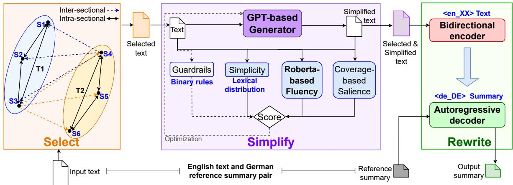
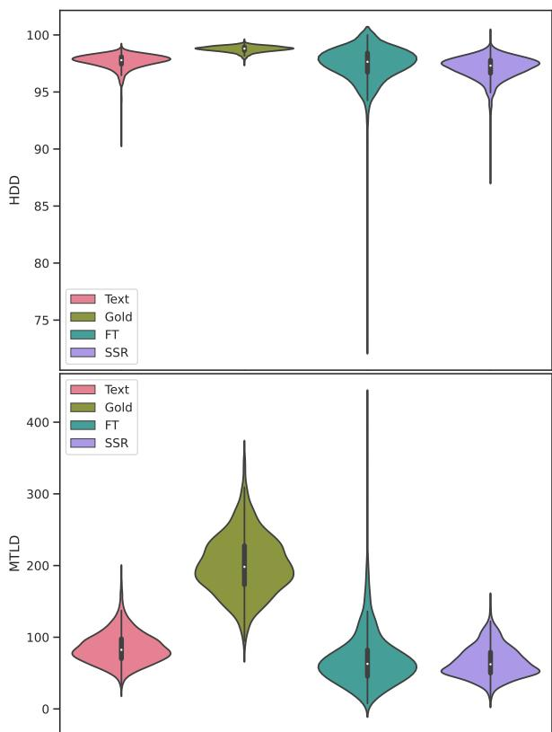
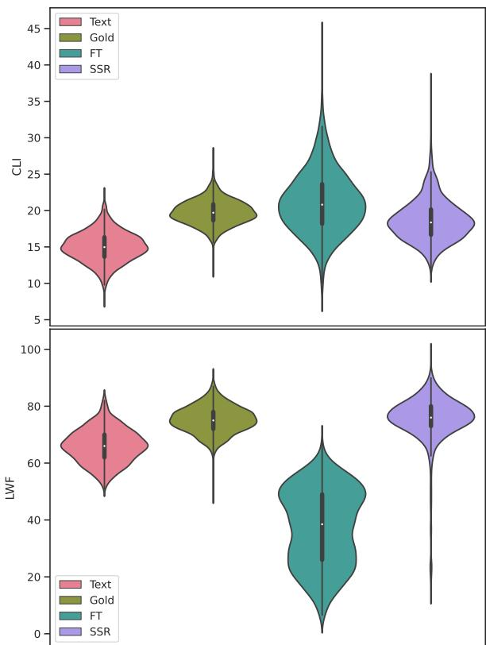
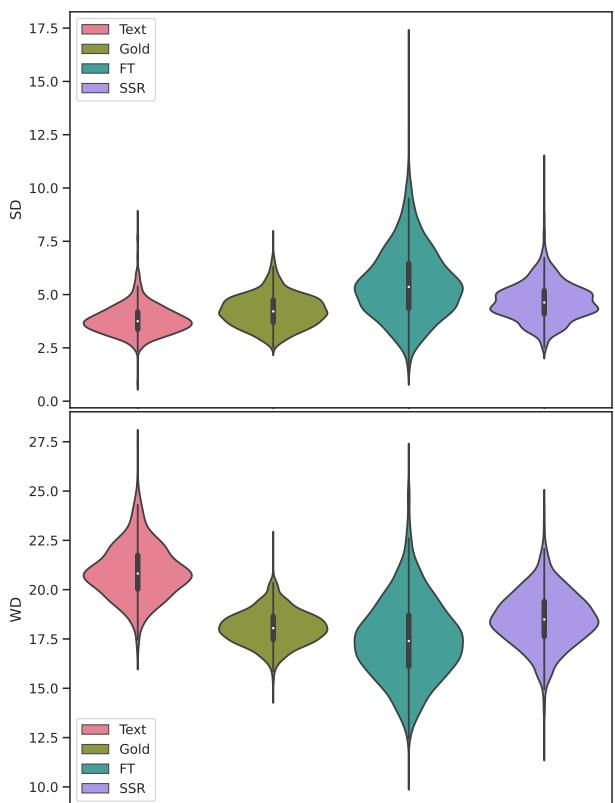
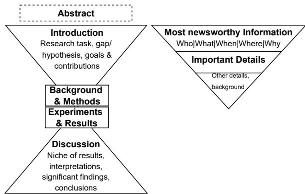
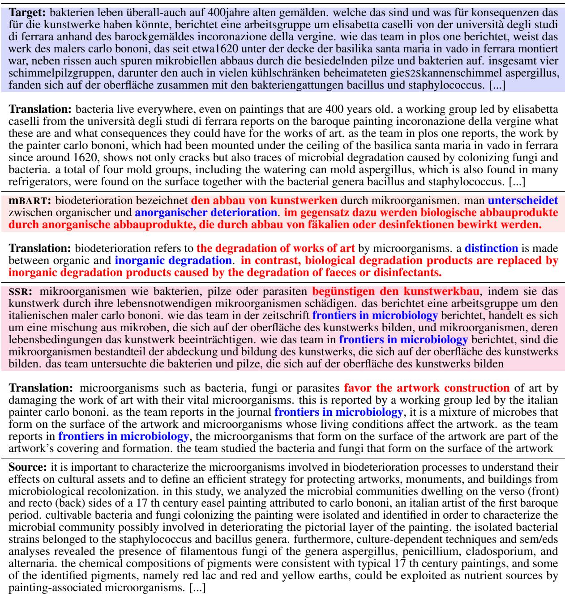

# Cross-lingual Science Journalism: SELECT, SIMPLIFY and REWRITE Summaries for Non-expert Readers

Mehwish Fatima and Michael Strube Heidelberg Institute for Theoretical Studies (mehwish.fatima|michael.strube)@h-its.org

## Abstract

Automating Cross-lingual Science Journalism (CSJ) aims to generate popular science summaries from English scientific texts for nonexpert readers in their local language. We introduce CSJ as a downstream task of text simplification and cross-lingual scientific summarization to facilitate science journalists’ work. We analyze the performance of possible existing solutions as baselines for the CSJ task. Based on these findings, we propose to combine the three components - SELECT, SIMPLIFY and REWRITE (SSR) to produce cross-lingual simplified science summaries for non-expert readers. Our empirical evaluation on the WIKIPEDIA dataset shows that SSR significantly outperforms the baselines for the CSJ task and can serve as a strong baseline for future work. We also perform an ablation study investigating the impact of individual components of SSR. Further, we analyze the performance of SSR on a high-quality, real-world CSJ dataset with human evaluation and in-depth analysis, demonstrating the superior performance of SSR for CSJ.

## 1 Introduction

Cross-lingual Science Journalism (CSJ) produces popular science stories1 from English scientific texts for non-expert readers in their local language. CSJ focuses on simultaneously reducing linguistic complexity and length of the original text. Automating CSJ can facilitate science journalists in their work for writing popular science stories. A real-world example of CSJ is Spektrum der Wissenschaft (SPEKTRUM)2. It is a popular monthly science magazine, the German version of Scientific American. The magazine is considered a bridge between scientific literature and the non-expert public.

Our work is initiated by a collaboration with SPEK-

Target: ein mädchen aus südafrika lebt seit neun jahren mit einer hiv-infektion, ohne den erreger mit medikamenten kontrollieren zu müssen. das berichteten fachleute um avy violari von der university of the witwatersrand in johannesburg auf einer konferenz in paris. [...]

Translation: a girl from south africa has been living with an hiv infection for nine years without having to control the pathogen with medication. this is what experts around avy violari from the university of the witwatersrand in johannesburg reported at a conference in paris. [...]

mBART: das kind, das fiziert wird mit dem hi-virus bei der geburt, ist die geburtsache für das infizieren des virus bei der geburt. die infektion des ungeborenen kindes mit dem hiv wird als latente hiv-infektion bezeichnet. die ursache für die erkrankung ist noch ungeklärt.

Translation: the child who is <UNK> with the hi virus at birth is the <UNK> for infecting the virus at birth. the infection of the unborn child with hiv is referred to as latent hiv infection. the cause of the disease is still unclear.

SSR: ein neunjähriges kind, das ohne behandlung mit einer antiretroviralen therapie die welt retten kann, ist eine person, die eine hiv-infektion überlebt hat. das berichtet eine arbeitsgruppe um avy violari in der fachzeitschrift proceedings of the national allergy and infectious diseases institute. [...] Translation: a nine-year-old child who can save the world without treatment with antiretroviral therapy is a person who survived hiv infection. this is reported by a working group led by avy violari in the specialist journal proceedings of the national allergy and infectious diseases institute. [...]

Source fragment: a nine-year-old infected with hiv at birth has spent most of their life without needing any treatment, say doctors in south africa. the child, whose identity is being protected, was given a burst of treatment shortly after birth. they have since been off drugs for eight-and-a-half years without symptoms or signs of active virus. [...]

Table 1: A random example from the SPEKTRUM dataset: English Source text and German Target summary that is written by a SPEKTRUM journalist. The following sections contain output summaries of fine-tuned mBART and SSR. Incorrect words refer to non-existent German words produced by the model. Unfaithful information represents the words or phrases generated by the model that is not present in the actual input text. The summaries are translated via Google Translate.

TRUM, where journalists have been writing popular science stories in German for decades. Table 1 presents an example of a SPEKTRUM articlesummary pair, where the German summary is written by a science journalist. Upon textual analysis of the SPEKTRUM dataset, we find that SPEKTRUM journalists’ stories are distinct from regular scientific texts for the following properties. They are popular science stories and are much more concise than the original articles. The stories have less complex words and technical terms while having local collocations. These stories are cross-lingual.

A few researchers have studied Monolingual Science Journalism (MSJ) (Louis and Nenkova, 2013b; Dangovski et al., 2021) as a summarization task. In summarization, some efforts have also been made towards monolingual (Cohan et al., 2018; Dangovski et al., 2019; Cachola et al., 2020) and crosslingual (Ouyang et al., 2019; Fatima and Strube, 2021) scientific summarization. Our preliminary investigation also adopts existing cross-lingual summarization (CLS) models to explore CSJ following the MSJ’s steps. Since these models focus only on summary generation, these summaries still need to be simplified for non-expert readers. Therefore, we propose CSJ as a downstream task of text simplification and cross-lingual scientific summarization to generate a coherent cross-lingual popular science story.

We analyze the workflow of SPEKTRUM’s journalists to develop a solution for the CSJ task. They read complex English scientific articles and mark the essential facts, make them straightforward for non-expert readers, and then write a coherent story in German. Influenced by this, we propose to combine the three components - SELECT, SIMPLIFY and REWRITE (SSR) for exploring CSJ. We follow the divide-and-conquer approach to design SSR so that each component is responsible for only one task. It makes SSR manageable, flexible and innovative as we can train individual components and modify/replace them without affecting the SSR’s information flow. Table 1 also presents the output generated by fine-tuned mBART and SSR. We believe that SSR is the first step towards the automation of CSJ, and it can assist science journalists in their work and open up further directions.

## Contributions

1. We introduce Cross-lingual Science Journalism (CSJ) as a downstream task of crosslingual scientific summarization and text simplification targeting non-expert readers.

2. To solve CSJ, we develop a pipeline comprising the three components - SELECT, SIM-PLIFY and REWRITE (SSR) for producing popular German summaries from English scientific texts.

3. We empirically evaluate the performance of SSR against several existing CLS models on the WIKIPEDIA dataset with various evaluation metrics. We also analyze ablated SSR models to examine the significance of each

component.

4. We evaluate SSR’s performance on the SPEK-TRUM dataset with human judgments and various statistical features to analyze them linguistically.

## 2 Related Work

## 2.1 Science Journalism

Louis and Nenkova (2013a,b) investigate MSJ for the writing quality of New York Times science stories by dividing them into three coarse levels of writing quality: clear, interesting and beautiful or well-structured. They also analyze general features of discourse organization and sentence structure. Barel-Ben David et al. (2020) examine the public’s interactions with scientific news written by earlycareer scientists by capturing various features. The authors collect a dataset of 150 science news written by 50 scientists from two websites: Mako and Ynet. Dangovski et al. (2021) consider MSJ as abstractive summarization and story generation. They collect scientific papers and Science Daily press releases and apply sequence-to-sequence (S2S) models for generating summaries. These studies are limited in their scope and consider only monolingual texts, thus cannot be used for CSJ.

## 2.2 Simplification

Mostly, simplification is explored on the word and sentence level. Coster and Kauchak (2011) construct a parallel dataset from Wikipedia and simple Wikipedia for sentence-level simplification. Kim et al. (2016b) develop a parallel corpus of scientific publications and simple Wikipedia for lexical-level simplification. Laban et al. (2021) build a system to solve the simplification of multi-sentence text without the need for parallel corpora. Their approach is based on a reinforcement learning model to optimize the rewards for simplicity, fluency, salience and guardrails. Recently, Ermakova et al. (2022) introduced the task of science simplification at CLEF2022 to address these challenges.

## 2.3 Scientific Summarization

Monolingual. Many researchers have developed scientific summarization datasets by collecting online scientific resources such as ArXiv, PubMed and Medline (Kim et al., 2016a; Nikolov et al., 2018; Cohan et al., 2018), Science Daily (Dangovski et al., 2019), the ACL anthology network (Yasunaga et al., 2019), scientific blogs (Vadapalli et al., 2018b,a), BBC (Narayan et al., 2018) and Open Review (Cachola et al., 2020). These datasets are further used for developing extractive (Parveen and Strube, 2015; Xiao and Carenini, 2019; Dong et al., 2021), abstractive (Zhang et al., 2020a; Huang et al., 2021) and hybrid (Liu and Lapata, 2019; Pilault et al., 2020) models. Unfortunately, all these studies are limited to monolingual summarization (MS) and extreme summarization, and we cannot adopt them for CSJ.

Cross-lingual. For scientific CLS, most studies use monolingual datasets with two popular pipelines: Translate-then-Summarize (TRANS-SUM) (Ouyang et al., 2019) and Summarize-then-Translate (SUM-TRANS) (Zhu et al., 2019, 2020). These pipelines adopt machine translation (MT) and MS models to get the cumulative effect of CLS. Recently, a multilingual dataset - WikiLingua is created from WikiHow text (Ladhak et al., 2020). The authors collect parallel data in different languages from WikiHow, which describes the instructions for solving a task. The nature of this dataset makes it unsuitable for science journalism or scientific summarization. Aumiller and Gertz (2022) create a German dataset for joint summarization and simplification tasks for children or dyslexic readers from the German children’s encyclopedia “Klexikon”. Unfortunately, this dataset does not fit in our context. Takeshita et al. (2022) construct a synthetic dataset for cross-lingual extreme summarization of scientific papers. The extreme summarization task maps the abstract/content of a scientific paper to the one-line summary, which is quite different from the CSJ task. Fatima and Strube (2021) collect a CLS dataset from Wikipedia Science Portal for the English-German language pair and a small high-quality science magazine dataset from SPEK-TRUM. To the best of our knowledge, these scientific datasets (Fatima and Strube, 2021) are the best suitable option for our task.

## 3 Select, Simplify and Rewrite (SSR)

## 3.1 Overview

The architecture of $\operatorname { S S R } ^ { 3 }$ consists of three components, SELECT, SIMPLIFY and REWRITE. Figure 1 illustrates SSR’s information flow among the components. SELECT accepts English source text as input and selects the most salient sentences of the given text from different sections. SIMPLIFY receives these selected sentences as its input and generates a linguistically simplified version of the given input in English. Then these selected and simplified sentences are passed to REWRITE at the encoder as an input, and the target summary of the source text is given at the decoder as a reference. Finally, REWRITE generates a German output summary.

Plug-and-Play. We apply a divide-and-conquer approach to break down the task into manageable components. We divide cross-lingual scientific summarization into two further components: monolingual scientific summarization and cross-lingual abstractive summarization. Here we discuss the rationale behind it before discussing its components. (1) Scientific Discourse. For the scientific text, summarization models should include the salient information in summary from all sections because the pivotal content is spread over the entire text, following an “hourglass” structure (see Figure A.1 in Appendix A). The existing models accept only lead tokens from the source while discarding the rest. Initially, the models were built with mostly news datasets, which follow an “inverted pyramid” structure, so this conventional method is reliable for news but ineffective for scientific texts.

(2) Text length. The average length of scientific texts is 4900 words in the ArXiv dataset, 3000 words in the PubMed dataset and 2337 words in the Spektrum dataset (Fatima and Strube, 2021). Even recently, there has been a significant gap between the average and accepted input lengths by traditional models (max. 500 tokens) and pre-trained models (max. 2048 tokens) such as BART, GPT, etc. Longer texts often lead to model degradation resulting in hallucination and factual inconsistencies (Maynez et al., 2020). So, the recent language models are still struggling to handle sizable documents (Jin et al., 2020).

We aim to deal with all these challenges by developing SSR for CSJ. With the SSR architecture, we can say that SSR is a proficient, adaptable and convenient plug-and-play application where components can be modified or exchanged without affecting the information flow.

## 3.2 Architecture

## 3.2.1 Select

SELECT in SSR is responsible for selecting the salient sentences from sections. We define the section based on the structure of the text, e.g., introduction, materials and methods, results, discussion, and conclusion. We apply HIPORANK (HR) (Dong et al., 2021) as SELECT, which is a hierarchical discourse model for scientific summarization. Here we discuss the details of SELECT (HR).

  
Figure 1: From the bottom left, the English input text is passed to the first component - SELECT. SELECT extracts the salient sentences from the input. These selected sentences are forwarded to the second component - SIMPLIFY, which reduces the linguistic complexity of the given text. Then the selected and simplified text is given to the third component - REWRITE that accepts this transformed input at the encoder and its German reference summary at the decoder to generate a cross-lingual summary at the bottom right.

Graph-based Ranking. It takes a document as a graph $G = ( V , E )$ , where V is the set of sentences and E is the set of relations between sentences. A directed edge $e _ { i j }$ from sentence $v _ { j }$ to sentence $v _ { i }$ is weighted by a (cosine) similarity score:

$$
w _ { i j } = f ( s i m ( v _ { i } , v _ { j } ) )
$$

where f is an additional weight function.

Hierarchical Connections. A hierarchical graph is created upon sections and sentences for intrasectional (local) and inter-sectional (global) hierarchies. The asymmetric edge weights are calculated on the hierarchical graph. The asymmetric edge weighting works on boundary functions at sentence and section levels to find important sentences.

Similarity of Pairs. Before calculating asymmetric edge weights over boundaries, a sentencesentence pair similarity sim $( v _ { i } ^ { I } , v _ { i } ^ { I } )$ and a sectionsentence pair similarity sim $( v ^ { \bar { J } } , v _ { i } ^ { I } )$ are computed with cosine similarity with various vector representations. However, these similarity scores cannot capture salience well, so asymmetric edge weights are calculated and injected over intra-section and inter-section connections.

Asymmetric edge weighting over sentences. To find important sentences near the boundaries, a sentence boundary function $( s _ { b } )$ computes scores over sentences $( v _ { i } ^ { I } )$ in a section I:

$$
s _ { b } ( v _ { i } ^ { I } ) = m i n ( x _ { i } ^ { I } , \alpha ( n ^ { I } - x _ { i } ^ { I } ) )\tag{1}
$$

where $n ^ { I }$ is the number of sentences in section I and $x _ { i } ^ { I }$ represents sentence $i ^ { t h }$ position in the section I. α is a hyper-parameter that controls the relative importance of the start or end of a section or document. The sentence boundary function allows integration of directionality in edges and weighing edges differently based upon their occurrence with a more/less important sentence in the same section (see Appendix B.1).

Asymmetric edge weighting over sections. A section boundary function $( d _ { b } )$ computes the importance of a section $( v ^ { I } )$ to reflect that sections near a document’s boundaries are more important:

$$
d _ { b } ( v ^ { I } ) = m i n ( x ^ { I } , \alpha ( N - x ^ { I } ) )\tag{2}
$$

where N is the number of sections in the document and $x ^ { I }$ represents section $T ^ { t h }$ position in the document. The section boundary function enables injecting asymmetric edge weighting $w _ { i } ^ { J I }$ section edges (see Appendix B.1). The boundary functions (1) and (2) naturally prevent redundancy because similar sentences have different boundary positional scores.

Overall Importance. It is computed as the weighted sum of local and global centrality scores (see Appendix B.1) where $\mu$ is an inter-section centrality weighting factor.

$$
c ( v _ { i } ^ { I } ) = \mu \cdot c _ { i n t e r } ( v _ { i } ^ { I } ) + c _ { i n t r a } ( v _ { i } ^ { I } )
$$

Generation. A summary is generated by greedy extraction of sentences with the highest importance scores. These extracted sentences are then forwarded to the next component in SSR.

## 3.2.2 Simplify

The next component in the SSR pipeline is SIM-PLIFY that aims to reduce the linguistic complexity of the given text from SELECT. We adopt KEEP-IT-

SIMPLE (KIS) (Laban et al., 2021) as SIMPLIFY, a reinforcement learning syntactic and lexical simplification model. It has four components: simplicity, fluency, salience and guardrails that are trained together for the reward maximization. Here, we discuss the components of SIMPLIFY (KIS).

Simplicity. It is computed at syntactic and lexical levels: $S _ { s c o r e }$ is calculated by Flesch Kincaid Grade Level (FKGL) with linear approximation, and $L _ { s c o r e }$ is computed with the input paragraph $( W _ { 1 } )$ and the output paragraph $( W _ { 2 } )$ as follows:

$$
L _ { s c o r e } ( W _ { 1 } , W _ { 2 } ) = \left[ \frac { 1 - \Delta { Z ( W _ { 1 } , W _ { 2 } ) } - c } { c } \right] ^ { + }
$$

where $\Delta Z ( W _ { 1 } , W _ { 2 } )$ (see Appendix B.2) is the average Zipf frequency of inserted and deleted words, clipped between 0 and 1 (denoted as $[ \cdot ] ^ { + } )$ , and c is a median value to target Zipf shift in the $L _ { s c o r e } .$

Fluency. It consists of a GPT-based Language Model (LM) generator and a ROBERTA-based discriminator. The fluency score is computed with a likelihood of the original paragraph $( L M ( p ) )$ and the generated output $( L M ( q ) )$ ):

$$
L M _ { s c o r e } ( p , q ) = \left[ \frac { 1 - L M ( p ) - L M ( q ) } { \lambda } \right] ^ { + }
$$

where λ is a trainable hyperparameter (see $\mathsf { A p - }$ pendix B.2). $\mathbf { A s } \ L M _ { s c o r e }$ is static and deterministic, a dynamic discriminator is trained jointly with the generator for the dynamic adaption of the fluency score. The ROBERTA-based discriminator is a classifier with two labels: 1 =authentic paragraphs and 0 = generator outputs. The discriminator is trained on the training buffer. The discriminator score is computed on the probability that a paragraph (q) is authentic:

$$
D _ { S c o r e } ( q ) = p _ { d i s c } ( Y = 1 | X = q )
$$

where X denotes the input and $Y$ is the output probability.

Salience. It is based on a transformer-based coverage model trained to look at the generated text and answer fill-in-the-blank questions about the original text. Its score is based on the model’s accuracy: the more filled results in relevant content and the higher score. All non-stop words are masked, as the task expects most of the original text should be recoverable.

Guardrails. The two guardrails - brevity and inaccuracy are pattern-based binary scores to improve the generation. The brevity ensures the similar lengths of the original paragraph $( L _ { 1 } )$ and generated paragraph $\left( L _ { 2 } \right)$ . The brevity is defined as compression: $C = L _ { 2 } / L _ { 1 }$ where the passing range of C is $C _ { m i n } \le C \le C _ { m a x }$ . The inaccuracy is a Named Entity Recognition (NER) model for extracting entities from the original paragraph $( E _ { 1 } )$ and the output paragraph $( E _ { 2 } )$ . It triggers if an entity present in $E _ { 2 }$ is not in $E _ { 1 }$

Training. It trains on a variation of Self-Critical Sequence Training (SCST) named k-SCST, so the loss is redefined for conditional generation probability:

$$
\mathcal { L } = \sum _ { j = 1 } ^ { k } \bar { R } ^ { S } - R ^ { S j } \sum _ { i = 0 } ^ { N } \log p ( w _ { i } ^ { S j } | w _ { < i } ^ { S j } , P )
$$

where k is the number of sampled candidates, and $R ^ { S j }$ and $\bar { R } ^ { S }$ denote the candidate and sampled mean rewards, $P$ is the input paragraph and N is the number of generated words. All these components are jointly optimized by using the product of all components as the total reward.

SIMPLIFY accepts the input from SELECT and generates simplified text of that as its output. This simplified text is then given to the next component.

## 3.2.3 Rewrite

The last component of SSR is REWRITE, which is a cross-lingual abstractive summarizer. It accepts the output of SIMPLIFY at the encoder as an input and the reference summary at the decoder as a target. REWRITE aims to learn cross-lingual mappings and compression patterns to produce a cross-lingual summary of the given text. We adopt mBART (Liu et al., 2020) as REWRITE, which consists of 12 stacked layers at the encoder and decoder. Here we discuss three main components of REWRITE (mBART).

Self-attention. Every layer of the encoder and decoder has its own self-attention, consisting of keys, values, and queries from the same sequence.

$$
A ( Q , K , V ) = s o f t m a x ( \frac { Q \cdot K ^ { T } } { \sqrt { d _ { k } } } ) \cdot V
$$

where Q is a query, $K ^ { T }$ is transposed K (key) and V is the value. All parallel attentions are concatenated to generate multi-head attention scaled with a weight matrix W.

$$
M H ( Q , K , V ) = C o n c a t ( A _ { 1 } , \cdot \cdot \cdot , A _ { h } ) \cdot W ^ { O }
$$

Cross-attention. The cross-attention is the attention between the encoder and decoder, which gives the decoder a weight distribution at each step, indicating the importance of each input token in the current context.

Conditional Generation. The model accepts an input text $x = ( x _ { 1 } , \cdots , x _ { n } )$ and generates a summary $y = ( y _ { 1 } , \cdot \cdot \cdot , y _ { m } )$ . The generation probability of $y$ is conditioned on x and trainable parameters θ:

$$
p ( \boldsymbol { y } | \boldsymbol { x } , \boldsymbol { \theta } ) = \prod _ { t = 1 } ^ { m } p ( \boldsymbol { y } _ { t } | \boldsymbol { y } _ { < t } , \boldsymbol { x } , \boldsymbol { \theta } )
$$

## 3.3 Training

We train all models with Pytorch, Hugging Face and Apex libraries4. SELECT is a readily available model, while SIMPLIFY and REWRITE are trained independently.

SIMPLIFY. For KIS, we initialize the GPT-2- medium model with the Adam optimizer at a learning rate of 10−6, a batch size of 4 and $k = 4$ . We initialize ROBERTA-base with the Adam optimizer at a learning rate of 10−5 and a batch size of 4. The KIS model takes 14 days for training5.

REWRITE. We fine-tune mBART-large-50 for a maximum of 30 epochs. We use a batch size of 4, a learning rate (LR) of $5 e ^ { - 5 }$ , and 100 warm-up steps to avoid over-fitting the fine-tuned model. We use the Adam optimizer $( b e t a _ { 1 } = 0 . 9 , b e t a _ { 2 } = 0 . 9 9$ $\epsilon = 1 e ^ { - 0 8 } )$ with LR linearly decayed LR scheduler. During decoding, we use the maximum length of 200 tokens with a beam size of 4. The encoder language is set to English, and the decoder language is German. mBART takes 6 days for fine-tuning5.

## 4 Experiments

## 4.1 Datasets

WIKIPEDIA is collected from the Wikipedia Science Portal for English-German science articles (Fatima and Strube, 2021). It consists of monolingual and cross-lingual parts. We use only the cross-lingual part of this dataset. It contains 50,132 English articles (1572 words) paired with German summaries (100 words).

SPEKTRUM is a high-quality real-world dataset collected from Spektrum der Wissenschaft (Fatima and Strube, 2021). It covers various topics in diverse science fields: astronomy, biology, chemistry, archaeology, mathematics, physics, etc. It has 1510 English articles (2337 words) and German summaries (361 words).

We use WIKIPEDIA with a split of 80-10-10 for experiments, while SPEKTRUM is used for zero-shot adaptability as a case study.

## 4.2 Baselines

We define extractive and abstractive baselines with diverse experimental settings: (1) four EXT-TRANS models: LEAD, TEXTRANK (TRANK) (Mihalcea and Tarau, 2004), ORACLE (Nallapati et al., 2017), HR with SENTENCE-BERT $\left( \operatorname { S B } \right) ^ { 6 }$ (Dong et al., 2021), (2) three scratch-trained CLS models: LSTM & attention-based sequence-to-sequence (S2S), pointer generator network (PGN), transformerbased encoder-decoder (TRF) (Fatima and Strube, 2021), and (3) three fine-tuned models: mT5 (Xue et al., 2021), mBART (Liu et al., 2020) and LongFormer-based encoder-decoder (LED) (Beltagy et al., 2020). The training parameters of all baselines are discussed in Appendix C.

## 4.3 Metrics

We evaluate all models with three metrics: (1) ROUGE (Lin, 2004) - R1 and R2 compute the uniand bi-gram overlaps to assess the relevance, and RL computes the longest common sub-sequence between reference and system summaries to find the fluency. (2) BERT-score (BS) (Zhang et al., 2020b) captures faraway dependencies using contextual embeddings to compute the relevance. (3) Flesch Kincaid Reading Ease (FRE) (Kincaid et al., 1975) computes text readability with the average sentence length and the average number of syllables.

We also perform a human evaluation to compare SSR and mBART outputs. Human evaluation of long cross-lingual scientific text is quite challenging because it requires bi-lingual annotators with some scientific background.

## 5 Wikipedia Results

All the results are the average of five runs for each model. We report the F-score of ROUGE and BS, and FRE of all models on WIKIPEDIA in Table 2. The first block includes the EXT-TRANS baselines, the second and third blocks present direct CLS and fine-tuned models, and the last block includes the different variations of SSR models.

From Table 2, we find that all EXT-TRANS models perform quite similarly considering ROUGE, BS and FRE. The extractive models select the sentences from the original given text, due to which these summaries can have linguistically complex text (hard readability) as confirmed by their FRE

<table><tr><td>Model</td><td>R1</td><td>R2</td><td>RL</td><td>BS</td><td>FRE</td></tr><tr><td colspan="6">EXT-TRANS</td></tr><tr><td>LEAD</td><td>18.90</td><td>2.68</td><td>12.40</td><td>64.28</td><td>22.11</td></tr><tr><td>TRANK</td><td>17.83</td><td>2.25</td><td>11.59</td><td>63.81</td><td>24.45</td></tr><tr><td>ORACLE</td><td>19.63</td><td>2.78</td><td>12.49</td><td>64.30</td><td>25.19</td></tr><tr><td>HR</td><td>18.09</td><td>2.25</td><td>11.52</td><td>63.75</td><td>25.18</td></tr><tr><td colspan="6">CLS</td></tr><tr><td>S2S</td><td>18.37</td><td>4.04</td><td>16.55</td><td>52.76</td><td>25.14</td></tr><tr><td>PGN</td><td>20.72</td><td>3.79</td><td>18.68</td><td>55.67</td><td>26.56</td></tr><tr><td>TRF</td><td>21.61</td><td>4.37</td><td>18.10</td><td>60.95</td><td>29.75</td></tr><tr><td colspan="6">FINE-TUNED</td></tr><tr><td>mT5</td><td>24.57</td><td>7.66</td><td>18.34</td><td>68.40</td><td>40.18</td></tr><tr><td>LED</td><td>15.35</td><td>4.57</td><td>14.39</td><td>63.89</td><td>23.66</td></tr><tr><td>mBART</td><td>27.02</td><td>8.93</td><td>20.46</td><td>70.16</td><td>42.23</td></tr><tr><td colspan="6">OURS SIM+RE</td></tr><tr><td>mBART SEL+RE</td><td>27.65</td><td>6.65</td><td>18.35</td><td>70.34</td><td>46.05</td></tr><tr><td>TRANK</td><td>26.70</td><td>8.60</td><td>20.06</td><td>70.07</td><td>38.15</td></tr><tr><td>ORACLE</td><td>29.27</td><td>10.11</td><td>21.89</td><td>70.99†</td><td>40.11</td></tr><tr><td>HR</td><td>28.50</td><td>9.71</td><td>21.85</td><td>70.47</td><td>44.52</td></tr><tr><td colspan="6">SEL+SIM+RE</td></tr><tr><td>mT5</td><td>26.74</td><td>10.25</td><td>21.63</td><td>69.52</td><td>45.57</td></tr><tr><td>LED</td><td>17.25</td><td>6.58</td><td>14.99</td><td>65.32</td><td>27.23</td></tr><tr><td>SSR</td><td>30.07†</td><td>12.60†</td><td>24.14†</td><td>70.45</td><td>50.45†</td></tr></table>

Table 2: WIKIPEDIA results for baselines, SSR and the analysis of its components.  denotes significant improvements for a p-value (p < .001).

## scores.

For direct CLS models in Table 2, TRF performs better than PGN and S2S for ROUGE, BS and FRE. Interestingly, FRE scores are similar to EXT-TRANS models. One reason behind the low scores for PGN and S2S is that these models use restricted size vocabulary, due to which <UNK> tokens are present in the outputs. Moreover, the PGN model heavily relies on the coverage of the given text, due to which the FRE score is low.

For fine-tuned models in Table 2, mBART performs the best in this group, mT5’s performance is also good, however, LED performs quite low. We also run LED with 2048 tokens for the encoder, resulting in much worse performance. We infer that longer inputs of lead tokens are not helpful for scientific summarization. These models produce easier readability outputs except LED. As these models are pre-trained with large-size datasets, we infer that these models have latent simplification properties. Comparing the performance of the best baseline with our model from Table 2, SSR outperforms mBART by a wide margin for ROUGE, BS and FRE. We infer that transforming input texts by SELECT and SIMPLIFY components helps SSR learn better contextual representations.

We compute the statistical significance of the results with the Mann-Whitney two-tailed test for a p-value $( p < . 0 0 1 )$ against the fine-tuned models. These results indicate a significant improvement in performance.

<table><tr><td>Model</td><td>R1</td><td>R2</td><td>RL</td><td>BS</td><td>FRE</td></tr><tr><td>CLS</td><td></td><td></td><td></td><td></td><td></td></tr><tr><td>S2S</td><td>16.47</td><td>3.42</td><td>11.87</td><td>44.01</td><td>24.55</td></tr><tr><td>PGN</td><td>18.64</td><td>3.83</td><td>15.65</td><td>46.89</td><td>25.86</td></tr><tr><td>TRF</td><td>20.81</td><td>4.19</td><td>17.54</td><td>46.87</td><td>28.88</td></tr><tr><td>FINE-TUNED</td><td></td><td></td><td></td><td></td><td></td></tr><tr><td>mT5</td><td>11.13</td><td>0.88</td><td>8.03</td><td>59.57</td><td>38.92</td></tr><tr><td>LED</td><td>1.98</td><td>0.10</td><td>1.29</td><td>50.65</td><td>29.31</td></tr><tr><td>mBART</td><td>16.16</td><td>1.48</td><td>9.54</td><td>62.61</td><td>39.38</td></tr><tr><td>OURS</td><td></td><td></td><td></td><td></td><td></td></tr><tr><td>SSR</td><td>23.24†</td><td>5.28†</td><td>15.56</td><td>64.90†</td><td>43.14†</td></tr></table>

Table 3: SPEKTRUM results for baselines and SSR on where denotes significant improvements for a p-value (p < .001).

## 5.1 Component Analysis

Table 2 also shows the performance of ablated models. SIM+RE denotes the model without SE-LECT, resulting in a significant decrease in performance for ROUGE and and FRE as compared to SSR but maintaining the performance for BS. SEL+RE refers to the model without SIMPLIFY, also resulting in a notable drop in performance ROUGE and FRE as compared to SSR, while showing similar performance for BS. Overall, the complete SSR model (last row) demonstrates that all three components are necessary to generate good-quality simplified cross-lingual stories.

Component Replacement. We also explore the behavior of SSR by component replacement with their counterparts.

For SELECT, we replace HR with TRANK and OR-ACLE to compare their performances. Interestingly, ORACLE shows slightly higher performance as compared to HR. We manually analyzed the outputs of HR and ORACLE. We find that the HR model (in some examples) changes the order of sentences according to the importance score calculation of the section. We infer that it is the reason for the slightly low performance of HR. Overall, these results indicate the importance of SELECT.

For SIMPLIFY, we could not find any comparable paragraph-based simplification model as a replacement for KIS.

For REWRITE, we replace mBART with mT5 and LED to compare their performances. Overall, the performance of all models improves as compared to fine-tuned models. However, SSR performs higher than mT5 and LED.

In summary, these replacements demonstrate the resilience and robustness of SSR with intact information flow.

<table><tr><td>Model</td><td>F (α)</td><td>R (α)</td><td>S (α)</td><td>O (α)</td></tr><tr><td>mBART</td><td>3.08 (0.52)</td><td>1.74 (0.61)</td><td>3.65 (0.60)</td><td>2.31 (0.53)</td></tr><tr><td>SSR</td><td>3.95 (0.62)</td><td>3.27 (0.74)</td><td>3.83 (0.78)</td><td>3.49 (0.57)</td></tr></table>

Table 4: Human evaluation on SPEKTRUM: the average scores for each linguistic property (Krippendorff’s α), F refers to Fluency, R is Relevance, S refers to Simplicity, and O is overall ranking.

## 6 Spektrum Results

Table 3 presents the F-score of ROUGE and BS, and FRE of baselines and SSR on SPEKTRUM (average of 5 runs). The SSR model performs quite well on the SPEKTRUM set. We find a similar performance pattern among the models for the SPEK-TRUM dataset. However, these results are lower than those on the WIKIPEDIA test set because these models are trained on the WIKIPEDIA training and validation sets.

Table 3 shows the SPEKTRUM dataset results. mBART performs best among the baselines. However, SSR outperforms all the baselines. We test the statistical significance of the results with the Mann-Whitney two-tailed test for a p-value (p < .001) against the fine-tuned models. These results indicate a significant improvement in performance. These results exhibit the superior performance of SSR.

## 6.1 Human Evaluation

We hired five annotators and provide them with 25 randomly selected outputs (of each model) from SSR and mBART with their original texts and gold references. We asked the annotators to evaluate each document for three linguistic properties on a Likert scale from 1 to 5. The judges were asked to rank the overall summary compared to the gold summary (see Appendix D for the guidelines). The first five samples were used for resolving the annotator’s conflicts, while the rest of the annotations were done independently.

We compute the average scores and inter-rater reliability using Krippendorff’s $\alpha ^ { 7 }$ over 20 samples, excluding the first five examples. Table 4 presents the results of human evaluation. We find that the SSR outputs are significantly higher ranked than mBART for fluency, relevance, simplicity and overall ranking.

## 6.2 Readability Analysis

We further extend the readability analysis (Blaneck et al., 2022) to investigate the similarities and differences between the references and outputs. For all graphs, Text represents English documents, Gold is German references, FT is mBART and SSR is SSR outputs.

  
Figure 2: Distribution of lexical diversity. For HDD and MTLD score is better.

## 6.2.1 Lexical Diversity

Hypergeometric Distribution Diversity (HDD) (Mc-Carthy and Jarvis, 2007) and Measure of Textual Lexical Diversity (MTLD) (McCarthy, 2005) calculate lexical richness with no impact of text length. Figure 2 shows that gold summaries have higher lexical diversity, while both system summaries are slightly lower. These results indicate that the system summaries are not as lexically diverse as the gold references and are similar to the text.

## 6.2.2 Readability Index

Coleman Liau Index (CLI) computes the score using sentences and letters (Coleman and Liau, 1975). CLI does not consider syllables for computing the score. Linsear Write Formula (LWF) takes a sample of 100 words and computes easy ( 2 syllables) and hard words ( 3 syllables) scores (Plavén-Sigray et al., 2017). In Figure 3, CLI indicates that gold and output summaries are difficult to read compared to texts, and mBART outputs are the most difficult. However, LWF demonstrates that gold and SSR outputs are the easiest among all8. The difference in results with LWF and CLI is due to the difference in features used for calculation. Cumulatively, both scores indicate that SSR summaries are easier to read than texts.

  
Figure 3: Distribution of readability scores. For CLI score is better. For LWF score is better.

## 6.2.3 Density Distribution

Word density (WD) and sentence density (SD) measure how much information is carried in a word and a sentence. Word and sentence densities are correlated and can be a language function. Figure 4 shows that mBART produces dense sentences, while word densities of SSR are slightly higher. Surprisingly, English texts have higher word density, even though German is famous for its inflections and compound words, suggesting that English texts are harder to read.

## 6.3 Summary

We summarize the overall performance of SSR on the SPEKTRUM dataset. The results of ROUGE, BS and FRE show that SSR outperforms all the baselines for CSJ. We further investigate it with indepth analysis based on the human evaluation and readability analysis that indicate the good linguistic properties of SSR outputs. We present some random example outputs of SSR and mBART in Appendix E.

  
Text Gold FT SSRFigure 4: Distribution of density scores. For WD and SD score is better.

## 7 Conclusions

We propose to study Cross-lingual Science Journalism (CSJ) as a downstream task of text simplification and cross-lingual scientific summarization. Automating CSJ aims to produce popular crosslingual summaries of English scientific texts for non-expert readers. We develop a pipeline comprising the three components - SELECT, SIMPLIFY and REWRITE (SSR) as a benchmark for CSJ. Our empirical evaluation shows that SSR outperforms all baselines by wide margins on WIKIPEDIA and achieves good performance on SPEKTRUM. We further explore the ablated models with component replacements, demonstrating the resilience and robustness of the SSR application. We conduct a human evaluation of the SPEKTRUM outputs, indicating its good linguistic properties, further affirmed by readability analysis. We plan for joint training of SIMPLIFY and REWRITE models for CSJ as future work.

## 8 Limitations

We investigated CSJ with SELECT, SIMPLIFY and REWRITE. We adopted HIPORANK as SELECT because it is a lightweight, unsupervised model that extracts a summary in a discourse-aware manner. However, when we replaced it with other extractive models during the component analysis, we found no significant difference in overall performance.

We adopted KEEP-IT-SIMPLE for SIMPLIFY because it facilitates paragraph simplification. We found the model is quite heavy, making it slow during training. To the best of our knowledge, there is no paragraph-based simplification model we could explore in component replacement.

The choice among various pre-trained models for REWRITE was quite challenging, as all these models are variations of transformer-based architectures. So we adopted the latest three SOTA models, which are efficient and effective summarization models. We also trained the vanilla sequenceto-sequence model, pointer-generator model and transformer as our baselines to provide sufficient variations of SOTA models. We found mBART is more promising performance-wise in our experiments. However, its training time is also slow for our datasets due to longer inputs.

## 9 Ethical Consideration

Reproducibility. We discussed all relevant parameters, training details, and hardware information in § 3.3.

Performance Validity. We proposed an innovative application, SELECT, SIMPLIFY and REWRITE, for the Cross-lingual Science Journalism task and verified its performance for WIKIPEDIA and SPEK-TRUM data for the English-German language pair. We believe this application is adaptable for other domains and languages; however, we have not verified this experimentally and limit our results to the English-German language pair for the scientific domain.

Legal Consent. We explored the SPEKTRUM dataset with their legal consent for our experiments. We adopted the public implementations with mostly recommended settings, wherever applicable.

Human Evaluation. We published a job on the Heidelberg University Job Portal with the task description, requirements, implications, working hours, wage per hour and location. We hired five annotators from Heidelberg University who are native Germans, fluent in English and master’s or bachelor’s science students. The selected students for the evaluation task submitted their consent while agreeing to the job. We compensated them at C15 per hour, while the minimum student wage ranges between C9.5  12 in 2022 according to German law9.

## Acknowledgements

We would like to thank the former editor-in-chief of SPEKTRUM, Carsten Könneker, for suggesting us to work on CSJ. We thank SPEKTRUM for giving us access to their German summaries. We thank the anonymous reviewers for their constructive feedback and suggestions. We also thank Carolin Robert, Caja Catherina, Pascal Timmann, Samuel Scherer and Sophia Annweiler from Heidelberg University for their human judgments. This work has been carried out at Heidelberg Institute for Theoretical Studies (HITS) [supported by the Klaus Tschira Foundation], Heidelberg, Germany, under the collaborative Ph.D. scholarship scheme between the Higher Education Commission of Pakistan (HEC) and Deutscher Akademischer Austausch Dienst (DAAD). The first author has been supported by HITS and HEC-DAAD.

## References

Dennis Aumiller and Michael Gertz. 2022. Klexikon: A German Dataset for Joint Summarization and Simplification. In Proceedings ofthe Thirteenth Language Resources and Evaluation Conference, pages 2693–2701, Marseille, France. European Language Resources Association.

Yael Barel-Ben David, Erez S Garty, and Ayelet Baram-Tsabari. 2020. Can Scientists Fill the Science Journalism Void? Online Public Engagement with Science Stories Authored by Scientists. Plos One, 15(1):e0222250.

Iz Beltagy, Matthew E Peters, and Arman Cohan. 2020. Longformer: The long-document transformer. arXiv preprint arXiv:2004.05150.

Patrick Gustav Blaneck, Tobias Bornheim, Niklas Grieger, and Stephan Bialonski. 2022. Automatic readability assessment of german sentences with transformer ensembles. In Proceedings ofthe GermEval 2022 Workshop on Text Complexity Assessment of German Text, pages 57–62.

Isabel Cachola, Kyle Lo, Arman Cohan, and Daniel Weld. 2020. TLDR: Extreme summarization of scientific documents. In Findings ofthe Associationfor Computational Linguistics: EMNLP 2020, pages 4766–4777, Online. Association for Computational Linguistics.

Arman Cohan, Franck Dernoncourt, Doo Soon Kim, Trung Bui, Seokhwan Kim, Walter Chang, and Nazli

Goharian. 2018. A discourse-aware attention model for abstractive summarization of long documents. In Proceedings ofthe 2018 Conference ofthe North American Chapter of the Association for Computational Linguistics: Human Language Technologies, Volume 2 (Short Papers), pages 615–621, New Orleans, Louisiana. Association for Computational Linguistics.

Meri Coleman and Ta Lin Liau. 1975. A computer readability formula designed for machine Scoring. Journal ofApplied Psychology, 60(2):283.

William Coster and David Kauchak. 2011. Simple English Wikipedia: A new text simplification task. In Proceedings of the 49th Annual Meeting of the Association for Computational Linguistics: Human Language Technologies, pages 665–669, Portland, Oregon, USA. Association for Computational Linguistics.

Rumen Dangovski, Li Jing, Preslav Nakov, Mico Tat-´ alovic, and Marin Solja´ ciˇ c. 2019.´ Rotational unit of memory: A novel representation unit for RNNs with scalable applications. Transactions ofthe Association for Computational Linguistics, 7:121–138.

Rumen Dangovski, Michelle Shen, Dawson Byrd, Li Jing, Desislava Tsvetkova, Preslav Nakova, and Marin Soljacic. 2021. We Can Explain Your Research in Layman’s Terms: Towards Automating Science Journalism at Scale. In Proceedings ofthe AAAI Conference on Artificial Intelligence, volume 35, pages 12728–12737, Online.

Yue Dong, Andrei Mircea, and Jackie Chi Kit Cheung. 2021. Discourse-aware unsupervised summarization for long scientific documents. In Proceedings ofthe 16th Conference ofthe European Chapter ofthe Association for Computational Linguistics: Main Volume, pages 1089–1102, Online. Association for Computational Linguistics.

Liana Ermakova, Patrice Bellot, Jaap Kamps, Diana Nurbakova, Irina Ovchinnikova, Eric SanJuan, Elise Mathurin, Sílvia Araújo, Radia Hannachi, Stéphane Huet, et al. 2022. Automatic Simplification of Scientific Texts: SimpleText Lab at CLEF-2022. In Advances in Information Retrieval: 44th European Conference on IR Research, ECIR 2022, Proceedings, Part II, pages 364–373, Stavanger, Norway. Springer.

Mehwish Fatima and Michael Strube. 2021. A novel Wikipedia based dataset for monolingual and crosslingual summarization. In Proceedings of the Third Workshop on New Frontiers in Summarization, pages 39–50, Online and in Dominican Republic. Association for Computational Linguistics.

Luyang Huang, Shuyang Cao, Nikolaus Parulian, Heng Ji, and Lu Wang. 2021. Efficient attentions for long document summarization. In Proceedings of the 2021 Conference ofthe North American Chapter ofthe Association for Computational Linguistics: Human Language Technologies, pages 1419–1436, Online. Association for Computational Linguistics.

Hanqi Jin, Tianming Wang, and Xiaojun Wan. 2020. Multi-granularity interaction network for extractive and

abstractive multi-document summarization. In Proceedings of the 58th Annual Meeting of the Association for Computational Linguistics, pages 6244–6254, Online. Association for Computational Linguistics.

Minsoo Kim, Dennis Singh Moirangthem, and Minho Lee. 2016a. Towards abstraction from extraction: Multiple timescale gated recurrent unit for summarization. In Proceedings of the 1st Workshop on Representation Learningfor NLP, pages 70–77, Berlin, Germany. Association for Computational Linguistics.

Yea-Seul Kim, Jessica Hullman, Matthew Burgess, and Eytan Adar. 2016b. SimpleScience: Lexical simplification of scientific terminology. In Proceedings of the 2016 Conference on Empirical Methods in Natural Language Processing, pages 1066–1071, Austin, Texas. Association for Computational Linguistics.

J Peter Kincaid, Robert P Fishburne Jr, Richard L Rogers, and Brad S Chissom. 1975. Derivation of new readability formulas (automated readability index, fog count and flesch reading ease formula) for navy enlisted personnel. Technical report, Naval Technical Training Command Millington TN Research Branch.

Philippe Laban, Tobias Schnabel, Paul Bennett, and Marti A. Hearst. 2021. Keep it simple: Unsupervised simplification of multi-paragraph text. In Proceedings of the 59th Annual Meeting of the Association for Computational Linguistics and the 11th International Joint Conference on Natural Language Processing (Volume 1: Long Papers), pages 6365–6378, Online. Association for Computational Linguistics.

Faisal Ladhak, Esin Durmus, Claire Cardie, and Kathleen McKeown. 2020. WikiLingua: A new benchmark dataset for cross-lingual abstractive summarization. In Findings ofthe Associationfor Computational Linguistics: EMNLP 2020, pages 4034–4048, Online. Association for Computational Linguistics.

Chin-Yew Lin. 2004. ROUGE: A package for automatic evaluation of summaries. In Text Summarization Branches Out, pages 74–81, Barcelona, Spain. Association for Computational Linguistics.

Yang Liu and Mirella Lapata. 2019. Text summarization with pretrained encoders. In Proceedings of the 2019 Conference on Empirical Methods in Natural Language Processing and the 9th International Joint Conference on Natural Language Processing (EMNLP-IJCNLP), pages 3730–3740, Hong Kong, China. Association for Computational Linguistics.

Yinhan Liu, Jiatao Gu, Naman Goyal, Xian Li, Sergey Edunov, Marjan Ghazvininejad, Mike Lewis, and Luke Zettlemoyer. 2020. Multilingual denoising pre-training for neural machine translation. Transactions of the Association for Computational Linguistics, 8:726–742.

Annie Louis and Ani Nenkova. 2013a. A Corpus of Science Journalism for Analyzing Writing Quality. Dialogue & Discourse, 4(2):87–117.

Annie Louis and Ani Nenkova. 2013b. What makes writing great? first experiments on article quality pre-

diction in the science journalism domain. Transactions of the Association for Computational Linguistics, 1:341– 352.

Joshua Maynez, Shashi Narayan, Bernd Bohnet, and Ryan McDonald. 2020. On Faithfulness and Factuality in Abstractive Summarization. In Proceedings of the 58th Annual Meeting of the Association for Computational Linguistics, pages 1906–1919, Online. Association for Computational Linguistics.

Philip M McCarthy. 2005. An assessment ofthe range and usefulness of lexical diversity measures and the potential of the measure of textual, lexical diversity (MTLD). Ph.D. thesis, The University of Memphis.

Philip M McCarthy and Scott Jarvis. 2007. vocd: A theoretical and empirical evaluation. Language Testing, 24(4):459–488.

Rada Mihalcea and Paul Tarau. 2004. TextRank: Bringing order into text. In Proceedings ofthe 2004 Conference on Empirical Methods in Natural Language Processing, pages 404–411, Barcelona, Spain. Association for Computational Linguistics.

Ramesh Nallapati, Feifei Zhai, and Bowen Zhou. 2017. Summarunner: A recurrent neural network based sequence model for extractive summarization of documents. In Proceedings ofthe Thirty-First AAAI Conference on Artificial Intelligence, February 4-9, 2017, San Francisco, California, USA, pages 3075–3081. AAAI Press.

Shashi Narayan, Shay B. Cohen, and Mirella Lapata. 2018. Don’t give me the details, just the summary! topic-aware convolutional neural networks for extreme summarization. In Proceedings ofthe 2018 Conference on Empirical Methods in Natural Language Processing, pages 1797–1807, Brussels, Belgium. Association for Computational Linguistics.

Nikola I Nikolov, Michael Pfeiffer, and Richard HR Hahnloser. 2018. Data-driven Summarization of Scientific Articles. In Proceedings of the Eleventh International Conference on Language Resources and Evaluation (LREC 2018), Miyazaki, Japan. European Language Resources Association (ELRA).

Jessica Ouyang, Boya Song, and Kathy McKeown. 2019. A robust abstractive system for cross-lingual summarization. In Proceedings of the 2019 Conference ofthe North American Chapter ofthe Association for Computational Linguistics: Human Language Technologies, Volume 1 (Long and Short Papers), pages 2025–2031, Minneapolis, Minnesota. Association for Computational Linguistics.

Daraksha Parveen and Michael Strube. 2015. Integrating importance, non-redundancy and coherence in graph-based extractive summarization. In Proceedings ofthe Twenty-Fourth International Joint Conference on Artificial Intelligence, IJCAI 2015, Buenos Aires, Argentina, July 25-31, 2015, pages 1298–1304. AAAI Press.

Jonathan Pilault, Raymond Li, Sandeep Subramanian,

and Chris Pal. 2020. On extractive and abstractive neural document summarization with transformer language models. In Proceedings of the 2020 Conference on Empirical Methods in Natural Language Processing (EMNLP), pages 9308–9319, Online. Association for Computational Linguistics.

Pontus Plavén-Sigray, Granville James Matheson, Björn Christian Schiffler, and William Hedley Thompson. 2017. The Readability of Scientific Texts is Decreasing Over Time. Elife, 6:e27725.

Sotaro Takeshita, Tommaso Green, Niklas Friedrich, Kai Eckert, and Simone Paolo Ponzetto. 2022. X-SCITLDR: cross-lingual extreme summarization of scholarly documents. In Proceedings of the 22nd ACM/IEEE Joint Conference on Digital Libraries, JCDL ’22, pages 1–12, Cologne, Germany. Association for Computing Machinery.

Raghuram Vadapalli, Bakhtiyar Syed, Nishant Prabhu, Balaji Vasan Srinivasan, and Vasudeva Varma. 2018a. Sci-blogger: A step towards automated science journalism. In Proceedings ofthe 27th ACM International Conference on Information and Knowledge Management, CIKM 2018, Torino, Italy, October 22-26, 2018, pages 1787–1790. ACM.

Raghuram Vadapalli, Bakhtiyar Syed, Nishant Prabhu, Balaji Vasan Srinivasan, and Vasudeva Varma. 2018b. When science journalism meets artificial intelligence : An interactive demonstration. In Proceedings of the 2018 Conference on Empirical Methods in Natural Language Processing: System Demonstrations, pages 163– 168, Brussels, Belgium. Association for Computational Linguistics.

Wen Xiao and Giuseppe Carenini. 2019. Extractive summarization of long documents by combining global and local context. In Proceedings of the 2019 Conference on Empirical Methods in Natural Language Processing and the 9th International Joint Conference on Natural Language Processing (EMNLP-IJCNLP), pages 3011–3021, Hong Kong, China. Association for Computational Linguistics.

Linting Xue, Noah Constant, Adam Roberts, Mihir Kale, Rami Al-Rfou, Aditya Siddhant, Aditya Barua, and Colin Raffel. 2021. mT5: A massively multilingual pre-trained text-to-text transformer. In Proceedings of the 2021 Conference of the North American Chapter ofthe Associationfor Computational Linguistics: Human Language Technologies, pages 483–498, Online. Association for Computational Linguistics.

Michihiro Yasunaga, Jungo Kasai, Rui Zhang, Alexander R. Fabbri, Irene Li, Dan Friedman, and Dragomir R. Radev. 2019. Scisummnet: A large annotated corpus and content-impact models for scientific paper summarization with citation networks. In The Thirty-Third AAAI Conference on Artificial Intelligence, AAAI 2019, The Thirty-First Innovative Applications of Artificial Intelligence Conference, IAAI 2019, The Ninth AAAI Symposium on Educational Advances in Artificial Intelligence, EAAI 2019, Honolulu, Hawaii, USA, January 27 - February 1, 2019, pages 7386–7393. AAAI Press.

Jingqing Zhang, Yao Zhao, Mohammad Saleh, and Peter J. Liu. 2020a. PEGASUS: pre-training with extracted gap-sentences for abstractive summarization. In Proceedings of the 37th International Conference on Machine Learning, ICML 2020, 13-18 July 2020, Virtual Event, volume 119 of Proceedings of Machine Learning Research, pages 11328–11339. PMLR.

Tianyi Zhang, Varsha Kishore, Felix Wu, Kilian Q. Weinberger, and Yoav Artzi. 2020b. Bertscore: Evaluating text generation with BERT. In 8th International Conference on Learning Representations, ICLR 2020, Addis Ababa, Ethiopia, April 26-30, 2020. OpenReview.net.

Junnan Zhu, Qian Wang, Yining Wang, Yu Zhou, Jiajun Zhang, Shaonan Wang, and Chengqing Zong. 2019. NCLS: Neural cross-lingual summarization. In Proceedings ofthe 2019 Conference on Empirical Methods in Natural Language Processing and the 9th International Joint Conference on Natural Language Processing (EMNLP-IJCNLP), pages 3054–3064, Hong Kong, China. Association for Computational Linguistics.

Junnan Zhu, Yu Zhou, Jiajun Zhang, and Chengqing Zong. 2020. Attend, translate and summarize: An efficient method for neural cross-lingual summarization. In Proceedings of the 58th Annual Meeting of the Associationfor Computational Linguistics, pages 1309–1321, Online. Association for Computational Linguistics.

## A Scientific and News Structure

Figure A.1 presents the difference between a scientific text discourse and a news text discourse.

  
Figure A.1: Visual demonstration of the hourglass-like structure of scientific texts (left) and inverted-pyramid-like structure of news texts (right).

## B Select, Simplify and Rewrite (SSR)

## B.1 Select

Asymmetric edge weighting over sentences. The weight $w _ { j i } ^ { I }$ for intra-section edges (incoming edges for i) is defined as:

$$
w _ { j i } ^ { I } = \left\{ \lambda _ { 1 } * s i m ( v _ { j } ^ { I } , v _ { i } ^ { I } ) , i f s _ { b } ( v _ { i } ^ { I } ) \geq s _ { b } ( v _ { j } ^ { I } ) \right\}
$$

where $\lambda _ { 1 } < \lambda _ { 2 }$ for an edge $e _ { j i }$ occurs with i is weighted more if i is closer to the text boundary

than $j .$

Asymmetric edge weighting over sections. The section boundary function enables injecting asymmetric edge weighting $w _ { i } ^ { J I }$ section edges:

$$
w _ { i } ^ { J I } = \left\{ \lambda _ { 1 } * s i m ( v ^ { J } , v _ { i } ^ { I } ) , i f d _ { b } ( v ^ { I } ) \geq d _ { b } ( v ^ { J } ) \right\}
$$

where $\lambda _ { 1 } < \lambda _ { 2 }$ for an edge $e _ { i } ^ { J I }$ occurs to iϵI is weighted more if section I is closer to the text boundary than section J.

Overall Importance. It is computed as the weighted sum of local and global centrality scores.

$$
\begin{array} { c } { { c ( v _ { i } ^ { I } ) = \displaystyle \mu \cdot c _ { i n t e r } ( v _ { i } ^ { I } ) + c _ { i n t r a } ( v _ { i } ^ { I } ) , } } \\ { { { } } } \\ { { c _ { i n t r a } ( v _ { i } ^ { I } ) = \displaystyle \sum _ { v _ { j } ^ { I } \in I } \frac { w _ { j i } ^ { I } } { | I | } , } } \\ { { { } } } \\ { { { } ~ { } ~ } } \\ { { c _ { i n t e r } ( v _ { i } ^ { I } ) = \displaystyle \sum _ { v ^ { j } \in D } \frac { w _ { i } ^ { J I } } { | D | } } } \end{array}
$$

where I is the neighboring sentences set of $v _ { i } ^ { I } , D$ is the neighboring sections set, and $\mu$ is an intersection centrality weighting factor.

## B.2 Simplify

Simplicity. $\Delta Z ( W _ { 1 } , W _ { 2 } )$ is computed as the average Zipf frequency of inserted words and deleted words: $\Delta { Z } ( W _ { 1 } , W _ { 2 } ) = Z ( W _ { 2 } - W _ { 1 } ) - Z ( W _ { 1 } - W _ { 2 } )$

Fluency. If the $L M ( q ) < L M ( p )$ by λ or more, $L M _ { s c o r e } ( p , q ) ~ = ~ 0$ If $L M ( q ) \geq L M ( p )$ , then $L M _ { s c o r e } ( p , q ) = 1 ,$ otherwise it is a linear interpolation.

## C Baselines: Training

## C.1 EXT-TRANS

We create the SUM-TRANS pipeline (EXT-TRANS) for extractive baselines with T5 for translation wherever required. There is no training required for extractive models and T5 for these models.

## C.2 CLS

We train three models - S2S, PGN and TRF from scratch without any pre-training (Fatima and Strube, 2021). For S2S and PGN models, we use word embeddings with 128 dimensions and hidden layers with 256 dimensions. The vocabulary size is kept to 100K and 50K at the encoder and decoder sides. We use the Adam optimizer with a learning rate of 0.15 and a mini-batch of size 16. The models are trained for 30 epochs with early stopping on the validation loss, and the validation loss is calculated to determine the best-trained model.

The TRF model consists of 6 layers stacked encoder and 8 multi-attention heads at the decoder. We use word embeddings with 512 dimensions and hidden layers with 786 dimensions. The vocabulary size is kept the same as for S2S and PGN, i.e., 100K at the encoder and 50K at the decoder. We use the Adam optimizer with a learning rate of 0.0001 and with a residual dropout of 0.1.

For all these models, we use a fixed input length of 400 (lead) tokens and an output length of 100 tokens, with a beam search of size 4 during the inference as in Fatima and Strube (2021). We train all these models on a single Tesla P40 GPU with 24GB RAM. For training and inference, the S2S and TRF models take around 6 days, and the PGN model takes 3 days.

## C.3 FINE-TUNED

We fine-tune three pre-trained models - mT5-base, mBART-large-50 and LED on the WIKIPEDIA dataset. We train these models for a maximum of 30 epochs with a batch size of 4. We use a learning rate (LR) of $5 e ^ { - 5 }$ and 100 warm-up steps to avoid over-fitting of the fine-tuned models. We use the Adam optimizer with a LR linearly decayed LR scheduler. The encoder language is set to English, and the decoder language is German. The input to the encoder is the first (lead) 1024 tokens of each document. During decoding, we use the maximum length of 200 tokens with a beam size of 4. Each model of mT5- base takes 4 days, and mBART-large-50 takes 6 days for fine-tuning on a single Tesla P40 GPU with 24GB memory.

## D Guidelines for Human Evaluation

## D.1 Task Description

We present annotators with 25 examples of documents paired with a reference summary and two system-generated summaries. The models’ identities are hidden. The annotators were asked to evaluate each model summary for the following linguistic features after reading the original English text. The annotators were given a Likert scale from 1 5 (1=worst, 2=bad, 3=neutral/ok, 4=good, 5=best). They were asked to use the first 5 examples to resolve the annotator’s conflict, while the rest examples were to be evaluated independently.

## D.2 Linguistic Features

We asked annotators to evaluate each summary for the following features.

Relevance. A summary delivers adequate information about the original text. Relevance determines the content relevancy of the summary.

Fluency. The words and phrases fit together within a sentence, and so do the sentences. Fluency determines the structural and grammatical properties of a summary.

Simplicity. Lexical (word) and syntactic (syntax) simplicity of sentences. A simple summary should have minimal use of complex words/phrases and sentence structure.

Overall Ranking. Compared with reference summaries, how is the overall coherence of each model’s summary?

## E Examples from the SPEKTRUM dataset

We mark wrong words or sentences with red and unfaithful information with blue.

Target: ein mädchen aus südafrika lebt seit neun jahren mit einer hiv-infektion, ohne den erreger mit medikamenten kontrollieren zu müssen. das berichteten fachleute um avy violari von der university of the witwatersrand in johannesburg auf einer konferenz in paris. bei dem kind einer hiv-positiven mutter war die infektion nach der geburt im jahr 2007 festgestellt und im rahmen einer klinischen studie direkt nach der diagnose 40 wochen lang mit medikamenten behandelt worden. seither ist das mädchen ohne weitere behandlung gesund. das ist erst der dritte derartige fall-ein kind in frankreich lebt seit elfjahren ohne behandlung mit der infektion, ein weiteres kind in den usa kam länger als zweijahre ohne die medikamente aus, bevor der erreger zurückkehrte. manche menschen kommen besser mit hiv-infektionen klar als andere-etwa ein halbes prozent aller infizierten gehört zu diesen elite controllern, die zwar infiziert sind, aber auch ohne behandlung kaum viren im blut haben. [...]

Translation: a girl from south africa has been living with an hiv infection for nine years without having to control the pathogen with medication. this is what experts around avy violari from the university of the witwatersrand in johannesburg reported at a conference in paris. the child of an hiv-positive mother was diagnosed with the infection after birth in 2007 and was treated with medication for 40 weeks immediately after the diagnosis as part of a clinical study. Since then the girl has been healthy without further treatment. this is only the third such case-a child in france has lived with the infection for 11 years without treatment, and another child in the us went more than two years without the drugs before the pathogen returned. some people cope better with hiv infections than others-about half a percent of all those infected belong to these elite controllers who are infected but hardly have any virus in their blood even without treatment. [...]

mBART: das kind, das fiziert wird mit dem hi-virus bei der geburt, ist die geburtsache für das infizieren des virus bei der geburt. die infektion des ungeborenen kindes mit dem hiv wird als latente hiv-infektion bezeichnet. die ursache für die erkrankung ist noch ungeklärt.

Trans: the child who is <UNK> with the hi virus at birth is the <UNK> for infecting the virus at birth. the infection of the unborn child with hiv is referred to as latent hiv infection. the cause of the disease is still unclear.

SSR: ein neunjähriges kind, das ohne behandlung mit einer antiretroviralen therapie die welt retten kann, ist eine person, die eine hiv-infektion überlebt hat. das berichtet eine arbeitsgruppe um avy violari in der fachzeitschrift proceedings of the national allergy and infectious diseases institute. das team hatte das kind im alter von neun jahren ohne die behandlung mit einer antiretroviralen therapie im rahmen einer klinischen studie in den usa geimpft. mit der antiretroviralen therapie wurde das kind auf eine hiv-infektion geschützt, ohne dass die infektion nach der geburt aufhörte. die entwicklung einer antiretroviralen therapie hat eine groS2Se wahrscheinlichkeit, dass die hiv-infektion nach der geburt wieder zurückkehrt.

Translation: a nine-year-old child who can save the world without treatment with antiretroviral therapy is a person who survived hiv infection. this is reported by a working group led by avy violari in the specialist journal proceedings of the national allergy and infectious diseases institute. the team had vaccinated the child at the age of nine without treatment with antiretroviral therapy as part of a clinical trial in the us. with the antiretroviral therapy, the child was protected against an hiv infection, without the infection stopping after birth. the development of an antiretroviral therapy has a high probability that the hiv infection will return after the birth.

Source: a nine-year-old infected with hiv at birth has spent most of their life without needing any treatment, say doctors in south africa. the child, whose identity is being protected, was given a burst of treatment shortly after birth. they have since been off drugs for eight-and-a-half years without symptoms or signs of active virus. the family is said to be “really delighted”. most people need treatment every day to prevent hiv destroying the immune system and causing aids. understanding how the child is protected could lead to new drugs or a vaccine for stopping hiv. the child caught the infection from their mother around the time of birth in 2007. they had very high levels of hiv in the blood. early antiretroviral therapy was not standard practice at the time, but was given to the child from nine weeks old as part of a clinical trial. levels of the virus became undetectable, treatment was stopped after 40 weeks and unlike anybody else on the study-the virus has not returned. [...]

Table E.1: It is complete example of Table 1. In this example: mBART generates a very short summary with wrong words in it. In SSR, we find a few wrong words, unfaithful information, and more topic-relevant information. In this example, “neunjähriges” [nine-year-old] is faithful to the given text, but it is not a correct German expression, so we marked it as incorrect. And “die welt retten kann” [who can save the world] is grammatically correct, but it was not present in the given text, so we marked it unfaithful.

  
Table E.2: In this example: mBART has wrong topic attention, generating more frequent wrong words than SSR, and some unfaithful information. In SSR, we find fewer wrong words, unfaithful information, and more topic-relevant information.

Target: alle wassermoleküle bestehen aus einem sauerstoff-und zwei wasserstoffatomen-und doch gibt es zwei arten von ihnen. die kernspins der beiden wasserstoffatome können in die gleiche richtung zeigen, oder aber in entgegengesetzte. der unterschied zwischen ortho-wasser und para-wasser ist klein, aber durchaus bedeutsam, zeigte jetzt eine arbeitsgruppe um stefan willitsch von der universität basel. wie das team in nature communications berichtet, reagieren die beiden verschiedenen formen von wasser bei reaktionen unterschiedlich schnell. schlüssel des experiments war eine neue technik, die beide verschiedene formen voneinander trennt-dabei durchläuft ein überschallschneller molekularstrahl aus wasser ein elektrisches feld, das ortho-wasser und para-wasser unterschiedlich stark ablenkt. [...]

Translation: all water molecules consist of one oxygen and two hydrogen atoms-yet there are two types of them. the nuclear spins of the two hydrogen atoms can point in the same direction or in opposite directions. the difference between ortho water and para water is small but significant, as a working group led by stefan willitsch from the university of basel has shown. as the team reports in nature communications, the two different forms of water react at different speeds. the key to the experiment was a new technique that separates the two different forms from each othera supersonic molecular jet of water runs through an electric field that deflects ortho-water and para-water to different degrees. [...]

mBART: para-wasser (auch para-wasser oder ortho-wasser) ist ein molekül aus der gruppe der wasserstoffisomere. es besteht para-wasser in zwei formen, para-sonde und ortho-wasser. para-wasser ist strukturell mit wasser gleich brüchig und hat die form eines sphärischen moleküls. wasser ist ein molekül aus der gruppe der ortho-isomere. mit hilfe der quantenmechanischen methode kann der grundzustand des moleküls abgeschätzt werden.

Translation: para-water (also para-water or ortho-water) is a molecule from the group of hydrogen isomers. There are para water in two forms, para probe and ortho water. Para-water is structurally as brittle as water and has the shape of a spherical molecule. water is a molecule from the group of ortho isomers. the ground state of the molecule can be estimated using the quantum mechanical method.

SSR: wasser ist nicht nur ein chemisches element, sondern auch ein physikalisches element. es besitzt zwei unterschiedliche isomere (para-wasser und ortho-wasser), die sich in zwei verschiedenen formen unterscheiden : para-wasser und ortho-wasser. die beiden wasserstoffatome unterscheiden sich allerdings in den eigenschaften des wasserstoffs, weil die beiden formen von wasserstoffatomen dasselbe atom-oder molekülzentrum besitzen. das berichtet eine arbeitsgruppe um paul virilio von der universität genf. die forscher haben nun herausgefunden, dass wassermoleküle in zwei unterschiedlichen, unterschiedlichen zuständen unterschieden werden können : para-wasser und ortho-wasser. die beiden wasserstoffatome unterscheiden sich dabei nicht, weil sie nur einen wasserstoffatomen-oder molekül.

Translation: water is not only a chemical element but also a physical element. it has two different isomers (para-water and ortho-water) which differ in two different forms : para-water and ortho-water. However, the two hydrogen atoms differ in the properties of hydrogen because both forms of hydrogen atoms have the same atomic or molecular center. this is reported by a working group led by paul virilio from the university of geneva. The researchers have now discovered that water molecules can be distinguished in two distinct, distinct states: para-water and ortho-water. the two hydrogen atoms do not differ because they are only one hydrogen atom or molecule.

Source: water is one of the most fundamental molecules in chemistry, biology and astrophysics. it exists as two distinct nuclear-spin isomers, para-and ortho-water, which do not interconvert in isolated molecules. the experimental challenges in preparing pure samples of the two isomers have thus far precluded a characterization of their individual chemical behavior. capitalizing on recent advances in the electrostatic deflection of polar molecules, we separate the ground states of para-and ortho-water in a molecular beam to show that the two isomers exhibit different reactivities in a prototypical reaction with trapped diazenylium ions. based on ab initio calculations and a modelling of the reaction kinetics using rotationally adiabatic capture theory, we rationalize this finding in terms of different rotational averaging of ion-dipole interactions during the reaction. water, h2o, is one of the key molecules in nature, it acts as the fundamental solvent in biological systems and is one of the major molecular constituents of the universe. [...]

Table E.3: In this example, we find both mBART and SSR produce wrong phrases/repetitions of similar words. Also, there is some unfaithful information present in both outputs.

## ACL 2023 Responsible NLP Checklist

A For every submission: ✓ A1. Did you describe the limitations of your work? 8

 A2. Did you discuss any potential risks of your work? Not applicable. Left blank.

✓ A3. Do the abstract and introduction summarize the paper’s main claims? 1

✗ A4. Have you used AI writing assistants when working on this paper? Left blank.

## B ✓ Did you use or create scientific artifacts?

3, 4

✓ B1. Did you cite the creators of artifacts you used? 3, 4

 B2. Did you discuss the license or terms for use and / or distribution of any artifacts? Not applicable. Left blank.

 B3. Did you discuss if your use of existing artifact(s) was consistent with their intended use, provided that it was specified? For the artifacts you create, do you specify intended use and whether that is compatible with the original access conditions (in particular, derivatives of data accessed for research purposes should not be used outside of research contexts)? Not applicable. Left blank.

 B4. Did you discuss the steps taken to check whether the data that was collected / used contains any information that names or uniquely identifies individual people or offensive content, and the steps taken to protect / anonymize it? Not applicable. Left blank.

✓ B5. Did you provide documentation of the artifacts, e.g., coverage of domains, languages, and linguistic phenomena, demographic groups represented, etc.? 4

✓ B6. Did you report relevant statistics like the number of examples, details of train / test / dev splits, etc. for the data that you used / created? Even for commonly-used benchmark datasets, include the number of examples in train / validation / test splits, as these provide necessary context for a reader to understand experimental results. For example, small differences in accuracy on large test sets may be significant, while on small test sets they may not be. 4

## C ✓ Did you run computational experiments?

4

✓ C1. Did you report the number of parameters in the models used, the total computational budget (e.g., GPU hours), and computing infrastructure used? 3, 4

 C2. Did you discuss the experimental setup, including hyperparameter search and best-found hyperparameter values? Not applicable. Left blank.

✓ C3. Did you report descriptive statistics about your results (e.g., error bars around results, summary statistics from sets of experiments), and is it transparent whether you are reporting the max, mean, etc. or just a single run? 5, 6

✓ C4. If you used existing packages (e.g., for preprocessing, for normalization, or for evaluation), did you report the implementation, model, and parameter settings used (e.g., NLTK, Spacy, ROUGE, etc.)? 3, 4

## D ✓ Did you use human annotators (e.g., crowdworkers) or research with human participants? 6, 9

✓ D1. Did you report the full text of instructions given to participants, including e.g., screenshots, disclaimers of any risks to participants or annotators, etc.? 6,D

✓ D2. Did you report information about how you recruited (e.g., crowdsourcing platform, students) and paid participants, and discuss if such payment is adequate given the participants’ demographic (e.g., country of residence)? 9

 D3. Did you discuss whether and how consent was obtained from people whose data you’re using/curating? For example, if you collected data via crowdsourcing, did your instructions to crowdworkers explain how the data would be used? Not applicable. Left blank.

 D4. Was the data collection protocol approved (or determined exempt) by an ethics review board? Not applicable. Left blank.

 D5. Did you report the basic demographic and geographic characteristics of the annotator population that is the source of the data? Not applicable. Left blank.