# CrossSum: Beyond English-Centric Cross-Lingual Summarization for 1,500+ Language Pairs

Abhik Bhattacharjee1∗, Tahmid Hasan1∗, Wasi Uddin Ahmad2, Yuan-Fang Li3, Yong-Bin Kang4, Rifat Shahriyar1

Bangladesh University of Engineering and Technology (BUET)1, University of California, Los Angeles2, Monash University3, Swinburne University of Technology4

{tahmidhasan,rifat}@cse.buet.ac.bd, abhik@ra.cse.buet.ac.bd

## Abstract

We present CrossSum, a large-scale crosslingual summarization dataset comprising 1.68 million article-summary samples in 1,500+ language pairs. We create CrossSum by aligning parallel articles written in different languages via cross-lingual retrieval from a multilingual abstractive summarization dataset and perform a controlled human evaluation to validate its quality. We propose a multistage data sampling algorithm to effectively train a cross-lingual summarization model capable of summarizing an article in any target language. We also introduce LaSE, an embedding-based metric for automatically evaluating model-generated summaries. LaSE is strongly correlated with ROUGE and, unlike ROUGE, can be reliably measured even in the absence of references in the target language. Performance on ROUGE and LaSE indicate that our proposed model consistently outperforms baseline models. To the best of our knowledge, CrossSum is the largest cross-lingual summarization dataset and the first ever that is not centered around English. We are releasing the dataset, training and evaluation scripts, and models to spur future research on cross-lingual summarization. The resources can be found at https: //github.com/csebuetnlp/CrossSum.

## 1 Introduction

Cross-lingual summarization (hereinafter XLS) is the task of generating a summary in a target language given a source text in another language. The task is challenging as it combines summarization and translation in one task, both challenging tasks in their own right. Earlier approaches to XLS thus employed pipeline methods such as translate-thensummarize (Leuski et al., 2003) and summarizethen-translate (Wan et al., 2010). Not only are they computationally expensive, having to use multiple

Input Article: [...] 新型コロナウイルスに対し、様々な既存の治療法の効果を試す世界的規模の臨床試験の一貫として、デキサメタゾンが試された。(Dexamethasone was tested as part ofa global clinical trial to test the effectiveness of various exist-ing therapies against the new coronavirus.) [...] その結果、人工呼吸器を必要とする重症患者の致死率が3割下がり。(As aresult, the case fatality rate of critically ill patients whorequire a ventilator is reduced by 30%.) [...] ボリス･ジョンソン英首相は「イギリス科学界の素晴らしい成果」を歓迎し。(BritishPrime Minister Boris Johnson welcomed "the great achieve-ments of the British scientific community".) [...]「しかもこれは、世界中で手に入る薬だ」("And this is a medicine availableall over the world".) [...] きわめて安いステロイド剤だった (buta very cheap steroid that has been used for a long time.)

Summary: িবজ্ঞানীরা বলেছন েড�ােমথােসান নােম স�া ও সহজলভয্ একিট ওষুধ কেরানাভাইরােস গুরুতর অসু� েরাগীেদর জীবন রক্ষা করেত সাহাযয্ করেব। (Scientists say a cheap and readily available drug called dexamethasone will help save the lives of critically ill patients with coronavirus.)

Figure 1: A sample article-summary pair from Cross-Sum, the article is written in Japanese, and the summary is in Bengali. We translate the texts to English inside parentheses for better understanding. Words and phrases of the article relevant to the summary are color-coded.

models, but these approaches also suffer from errorpropagation (Zhu et al., 2019) from one model to another, degrading the overall performance.

The success of sequence-to-sequence (seq2seq) models (Cho et al., 2014; Sutskever et al., 2014) and the advances in Transformer-based models (Vaswani et al., 2017) have aided in the emergence of end-to-end methods that can perform XLS with one single model (Zhu et al., 2019; Cao et al., 2020b). The availability of XLS datasets (Ladhak et al., 2020; Perez-Beltrachini and Lapata, 2021) has also helped this task gain popularity in recent times. However, they cover only a few languages, contain a small number of samples for training and evaluation, or use English as the pivot language (i.e., the target language always remains English), thereby limiting their applicability to a great extent.

To democratize XLS beyond high-resource languages, in this work, we introduce CrossSum, a large-scale XLS dataset containing 1.68 million article-summary samples in 1,500+ language pairs. We align parallel articles1 written in different languages via cross-lingual retrieval from the multilingual XL-Sum (Hasan et al., 2021) dataset. We introduce and rigorously study the notions ‘induced pairs’ and ‘implicit leakage’ to increase the coverage of the dataset while at the same time ensuring maximum quality. We also perform a controlled human evaluation of CrossSum spanning nine languages from high- to low-resource and show that the alignments are highly accurate.

We design MLS, a multistage language sampling algorithm, for successfully training models that can generate a summary in any target language for an input article in any source language, both from a set of languages present in the training dataset. For the first time, we perform XLS with CrossSum on a broad and diverse set of languages without relying on English as the standalone pivot, consistently outperforming many-to-one and one-to-many models, as well as summarize-then-translate baselines.

We propose LaSE, an embedding-based metric for evaluating summaries when reference summaries may not be available in the target language but may be available in another language, potentially opening new doors for evaluating lowresource languages. Furthermore, we demonstrate the reliability of LaSE by its high correlation with ROUGE (Lin, 2004), the de-facto metric for evaluating text summarization systems.

To the best of our knowledge, CrossSum is the largest publicly available abdtractive XLS dataset, both in terms of the number of samples and the number of language pairs. We are releasing the dataset, training and evaluation scripts, and models hoping that these resources will encourage the community to push the boundaries of XLS beyond English and other high-resource languages.

## 2 The CrossSum Dataset

The most straightforward way of curating a highquality XLS dataset is via crowd-sourcing (Nguyen and Daumé III, 2019). However, it may be difficult to find crowd workers having professional command over low-resource languages or distant language pairs. Moreover, scalability issues might arise due to the time and budget constraints for crowd-sourcing. Therefore, synthetic (Zhu et al., 2019) and automatic methods (Ladhak et al., 2020; Perez-Beltrachini and Lapata, 2021) have gained traction over crowd-sourcing.

Automatic curation of an XLS dataset is simply to pair an article A in a source language with the summary of a parallel article B written in a different target language (Figure 1), assuming the availability of a multilingual dataset having identical contents in different languages. Two contemporary works have compiled large-scale multilingual summarization datasets, namely XL-Sum (Hasan et al., 2021) (1.35M samples in 45 languages) and MassiveSumm (Varab and Schluter, 2021) (28.8M samples in 92 languages). Though substantially larger than the other, MassiveSumm is not publicly available. Since public availability is crucial for promoting open research, we opted for XL-Sum, distributed under a non-commercial license. Additionally, all articles of XL-Sum are crawled from a single source, BBC News. We observed that BBC publishes similar news content in different languages and follow similar summarization strategies. Hence adopting XL-Sum would increase the quality and quantity of the article-summary pairs.

Unlike previous automatic methods, there are no explicit links between parallel articles in XL-Sum. Fortunately, language-agnostic sentence representations (Artetxe and Schwenk, 2019a; Feng et al., 2022) have achieved state-of-the-art results in crosslingual text mining (Artetxe and Schwenk, 2019b), and hence, we use them to search identical contents across languages. For simplicity2, we perform the search over summaries only. To ensure maximum quality, we set two conditions for a summary $S _ { A }$ in language A to be aligned with another summary $S _ { B }$ in language B:

1. $S _ { B }$ must be the nearest neighbor of $S _ { A }$ among all summaries in B, and vice-versa.

2. The similarity between $S _ { A }$ and $S _ { B }$ must be above the threshold, τ.

The similarity of a summary pair is measured by the inner product of their Language-agnostic BERT Sentence Embeddings (LaBSE) (Feng et al., 2022) (a unit vector for an input text sequence). We empirically set the similarity threshold as the average over all languages that maximized their respective $F _ { 1 }$ score $( \tau = 0 . 7 4 3 7 )$ in the BUCC mining tasks (Zweigenbaum et al., 2017).3

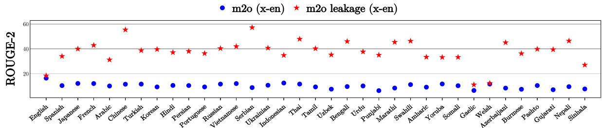  
Figure 2: Training on the dataset respecting the original XL-Sum splits causes unusually high ROUGE scores (marked red) in many-to-one models due to implicit data leakage. Therefore, we redid the splits taking the issue into account, and consequently, models trained on the new set (marked blue) do not exhibit any unusual spike.

Induced Pairs We observed that many summary pairs, despite being nearest neighbors in their language pairs, were filtered out because of the threshold τ . Although interestingly, both were aligned with the same summary in a different language. Moreover, these pairs are prevalent if their languages are distant or low-resource. LaBSE uses contrastive learning (Guo et al., 2018; Yang et al., 2019) to rank parallel sentences over non-parallels. Since parallel pairs are mostly found for highresource and linguistically close languages, we hypothesize that LaBSE fails to assign high similarity to sentences from languages that are not.

To include these pairs into CrossSum, we introduce the notion ‘induced pairs.’ Formally, two summaries $S _ { A } , S _ { B }$ in languages A, B are induced pairs if they are nearest neighbors of each other in A, B, their similarity score is below τ , and both are aligned with $S _ { C }$ in language C, or through a chain of aligned pairs $( S _ { A } , S _ { C } ) , ( S _ { C } , S _ { D } ) , \cdots , ( S _ { Y } , S _ { Z } ) , ( S _ { Z } , S _ { B } )$ in languages $\{ \mathbb { C } , \mathbb { D } , \cdot \cdot \cdot , \mathbb { Y } , \mathbb { Z } \}$

We thus incorporate the induced pairs into Cross-Sum through a simple graph-based algorithm. First, we represent all summaries as vertices in a graph and draw an edge between two vertices if the summaries are aligned. Then we find the connected components in the graph and draw edges (i.e., induced pairs) between all vertices in a component. Again to ensure quality, before computing the induced pairs, we use the max-flow min-cut theorem (Dantzig and Fulkerson, 1955) considering the similarity scores as edge weights to limit the size of each component to 50 vertices (since ideally, a component should have at most 45 vertices, one summary from each language) and set their minimum acceptance threshold to $\tau ^ { \prime }  \tau - 0 . 1 0$

We finally assembled the originally aligned pairs and induced pairs to create the CrossSum dataset. Figure 6 (Appendix) shows the article-summary statistics for all language pairs in CrossSum. As evident from the figure, CrossSum is not centered only around the English language but rather distributed across multiple languages.

Implicit Leakage We initially made the traindev-test splits respecting the original XL-Sum splits and performed an initial assessment of Cross-Sum by training a many-to-one model (articles written in any source language being summarized into one target language). Upon evaluation, we found very high ROUGE-2 scores (around 40) for many language pairs, even reaching as high as 60 for some (Figure 2). In contrast, Hasan et al. (2021) reported ROUGE-2 in the 10-20 range for the multilingual summarization task.

We inspected the model outputs and found that many summaries were the same as the references. Through closer inspection, we found that their corresponding articles had a parallel counterpart occurring in the training set in some other language. During training, the model was able to align the representations of parallel articles (albeit written in different languages) and generate the same output by memorizing from the training sample. While models should undoubtedly be credited for being able to make these cross-lingual mappings, this is not ideal for benchmarking purposes as this creates unusually high ROUGE scores. We denote this phenomenon as ‘implicit leakage’ and make a new dataset split to avoid this. Before proceeding, we deduplicate the XL-Sum dataset4 using semantic similarity, considering two summaries $S _ { A } , S _ { A } ^ { \prime }$ in language A to be duplicates of one another if their LaBSE representations have similarity above 0.95. We take advantage of the component graph mentioned previously to address the leakage and assign all article-summary pairs originating from a single component in the training (dev/test) set of CrossSum, creating an 80%-10%-10% split for all language pairs. Since parallel articles no longer appear in the training set of one and the dev/test set of another, the leakage is not observed anymore (Figure 2). We further validated this by inspecting the model outputs and found no exact copies.

## 3 Human Evaluation of CrossSum

To establish the validity of our automatic alignment pipeline, we conducted a human evaluation to study the quality of the cross-lingual alignments.

We selected all possible combinations of language pairs from a list of nine languages ranging from high-resource to low-resource to assess the alignment quality in different pair configurations (e.g., high-high, low-high, low-low) as per the language diversity categorization by Joshi et al. (2020). We chose three high-resource languages, English, Arabic, and (simplified) Chinese (categories 4 and 5); three mid-resource languages, Indonesian, Bengali, and Urdu (category 3); and three low-resource languages, Punjabi, Swahili, and Pashto (categories 1 and 2), as representative languages and randomly sampled fifty cross-lingual summary alignments from each language pair for annotation. As a direct evaluation of these pairs would require bilinguallyproficient annotators for both languages, which are practically intractable for distantly related languages (e.g., Bengali-Swahili), we resorted to a pivoting approach during annotation for language pairs that do not contain English. For a language pair $( l _ { 1 } - l _ { 2 } )$ , where $l _ { 1 } \neq$ en and $l _ { 2 } \neq e n$ , we sampled alignments $( x , y )$ such that $\exists ( x , e ) \in ( l _ { 1 } - e n )$ and $\exists ( y , e ) \in ( l _ { 2 } - e n )$ , for an English article $e .$ In other words, we ensure that both the articles of the sampled cross-lingual pair have a corresponding cross-lingual pair with an English article. An alignment (x, y) would be deemed correct if both $( x , e )$ and $( y , e )$ are correct. This formulation thus reduced the original problem to annotating samples from language pairs $( l _ { 1 } - e n )$ and $( l _ { 2 } - e n )$ , where $l _ { 1 }$ and $l _ { 2 }$ are from the previously selected languages that are not English.

We hired bilingually proficient expert annotators adept in the language of interest and English. Two annotators labeled each language pair where one language is English. We presented them with corresponding summaries of the cross-lingual pairs (and optionally the articles themselves) and elicited yes/no answers to the question:

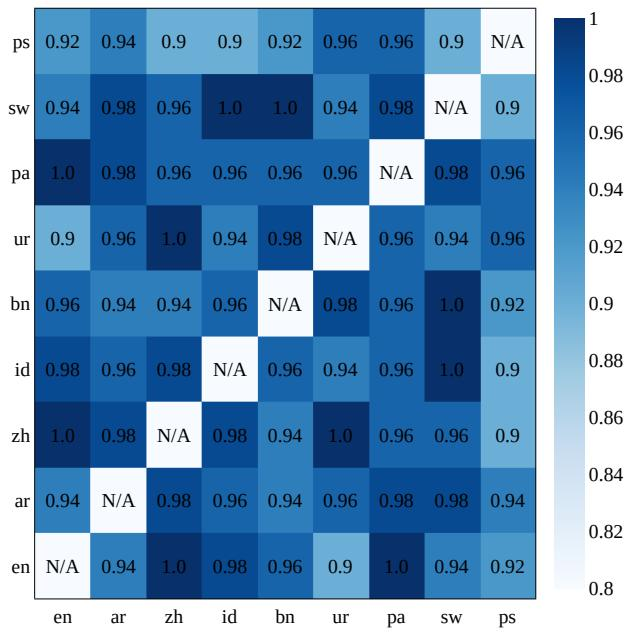  
Figure 3: A heatmap showing alignment accuracies of different language pairs obtained by human evaluation.

“Can the provided sequences be considered summariesfor the same article?”5

We deem a sequence pair accurate if both annotators judge it as valid. We show the alignment accuracies of the language pairs in Figure 3.

As evident from the figure, the annotators judge the aligned summaries to be highly accurate, with an average accuracy of 95.67%. We used Cohen’s Kappa (Cohen, 1960) to establish the interannotator agreement and show the corresponding statistics in Table 3 in the Appendix.

## 4 Training & Evaluation Methodologies

In this section, we discuss the multistage sampling strategy for training cross-lingual text generation models and our proposed metric for evaluating model-generated summaries.

## 4.1 Multistage Language Sampling (MLS)

From Figure $^ { 6 , }$ it can be observed that CrossSum is heavily imbalanced. Thus, training directly without upsampling low-resource languages may result in their degraded performance. Conneau et al. (2020)

used probability smoothing for upsampling in multilingual pretraining and sampled all examples of a batch from one language. However, extending this technique to the language pairs in CrossSum would result in many batches having repeated samples as many language pairs do not have enough training samples in total compared to the batch sizes used in practice (e.g., Conneau et al. (2020) used a batch size of 256, which exceeds the training set size of nearly 1,000 language pairs in CrossSum). At the same time, many language pairs would not be sampled during training for lack of enough training steps (due to our constraints on computational resources). To address this, we adapt their method to introduce a Multistage Language Sampling algorithm (MLS) to ensure that the target summaries of a batch are sampled from the same language.

Let $L _ { 1 } , L _ { 2 } , \ldots , L _ { n }$ be the languages of a crosslingual source-target dataset, and $c _ { i j }$ be the number of training samples where the target is from $L _ { i }$ and source from $L _ { j }$ . We compute the probability $p _ { i }$ of each target language $L _ { i }$ by

$$
p _ { i } = \frac { \sum _ { k = 1 } ^ { n } c _ { i k } } { \sum _ { j = 1 } ^ { n } \sum _ { k = 1 } ^ { n } c _ { j k } } \quad \forall i \in \{ 1 , 2 , \ldots , n \}
$$

We then use an exponent smoothing factor α and normalize the probabilities

$$
q _ { i } = \frac { p _ { i } ^ { \alpha } } { \sum _ { j = 1 } ^ { n } p _ { j } ^ { \alpha } } \quad \forall i \in \{ 1 , 2 , \dots , n \}
$$

Given the target language $L _ { i } .$ , we now compute the probability of a source language $L _ { j }$ , represented by $p _ { j | i }$ .

$$
p _ { j | i } = \frac { c _ { i j } } { \sum _ { k = 1 } ^ { n } c _ { i k } } \forall j \in \{ 1 , 2 , \ldots , n \}
$$

We again smooth $p _ { j | i }$ by a factor $\beta$ and obtain the normalized probabilities

$$
q _ { j | i } = \frac { p _ { j | i } ^ { \beta } } { \sum _ { k = 1 } ^ { n } p _ { k | i } ^ { \beta } } \forall j \in \{ 1 , 2 , \ldots , n \}
$$

Using the probabilities, we describe the training process with the MLS algorithm in Algorithm 1.

Note that the proposed algorithm can be applied to any cross-lingual seq2seq task where both the source and target languages are imbalanced.

## 4.2 Evaluating Summaries Across Languages

A sufficient number of reference samples are essential for the reliable evaluation of model-generated summaries. However, for many CrossSum language pairs, even the training sets are small, let alone the test sets (the median size is only 33). For instance, the Japanese-Bengali language pair has 34 test samples only, which is too few for reliable evaluation. But the size of the in-language6 test sets of Japanese and Bengali are nearly 1,000. Being able to evaluate against reference summaries written in the source language would thus alleviate this insufficiency problem by leveraging the in-language test set of the source language.

Algorithm 1: Multistage Language Sam  
pling (MLS)   
Input: $D _ { i j } \forall i , j \in \{ 1 , 2 , \dots , n \}$ : training   
data with tgt/src languages $L _ { i } / L _ { j } ;$   
$c _ { i j } \gets | D _ { i j } | \forall i , j \in \{ 1 , 2 , \dots , n \}$   
m: number of mini-batches.   
1 Compute $q _ { i } , q _ { j | i }$ using $c _ { i j }$   
2 while (Model Not Converged) do   
3 batch $ \phi$   
4 Sample $L _ { i } \sim q _ { i }$   
5 for $k \gets 1$ to m do   
6 Sample $L _ { j } \sim q _ { j | i }$   
7 Create mini-batch mb from $D _ { i j }$   
8 batch  batch  mb   
9 Update model parameters using batch

For this purpose, cross-lingual similarity metrics that do not rely on lexical overlap (i.e., unlike ROUGE) are required. Embedding-based similarity metrics (Zhang et al., 2020; Zhao et al., 2019) have recently gained popularity. We draw inspiration from them and design a similarity metric that can effectively measure similarity across languages in a language-independent manner. We consider three essential factors:

1. Meaning Similarity: The generated and reference summaries should convey the same meaning irrespective of their languages. Just like our alignment procedure from Section 2, we use LaBSE to compute the meaning similarity between the generated $( s _ { g e n } )$ and reference summary $( s _ { r e f } ) _ { }$

$$
\mathbf { M S } ( s _ { g e n } , s _ { r e f } ) = { \mathrm { e m b } } ( s _ { g e n } ) ^ { \mathrm { T } } { \mathrm { e m b } } ( s _ { r e f } )
$$

where emb(s) denotes the embedding vector output of LaBSE for input text s.

2. Language Confidence: The metric should identify, with high confidence, that the summary is indeed being generated in the target language. As such, we use the fastText language-ID classifier (Joulin et al., 2017) to obtain the language probability distribution of the generated summary and define the Language Confidence (LC) as:

$$
\mathrm { L C } ( s _ { g e n } , s _ { r e f } ) = \left\{ \begin{array} { l l } { 1 , \mathrm { i f } L _ { r e f } = \mathrm { a r g m a x } P ( L _ { g e n } ) } \\ { P ( L _ { g e n } = L _ { r e f } ) , \mathrm { o t h e r w i s e } } \end{array} \right.
$$

3. Length Penalty: Generated summaries should not be unnecessarily long, and the metric should penalize long summaries. While model-based metrics may indicate how similar a generated summary is to its reference and language, it is unclear how they can be used to determine its brevity. As such, we adapt the BLEU (Papineni et al., 2002) brevity penalty to measure the length penalty:

$$
\begin{array} { r } { \mathrm { L P } ( s _ { g e n } , s _ { r e f } ) = \left\{ \begin{array} { l l } { 1 , \mathrm { i f } | s _ { g e n } | \le | s _ { r e f } | + c } \\ { \exp ( 1 - \frac { | s _ { g e n } | } { | s _ { r e f } | + c } ) , \mathrm { o t h e r w i s e } } \end{array} \right. } \end{array}
$$

$s _ { g e n }$ and $s _ { r e f }$ may not be of the same language, and parallel texts may vary in length across languages. Hence, we use a length offset c to avoid penalizing generated summaries slightly longer than the references. By examining the standard deviation of mean summary lengths of the languages, we set $c = 6$

We finally define our metric, Language-agnostic Summary Evaluation (LaSE) score as follows.

$$
\begin{array} { r l } & { \mathrm { L a S E } ( s _ { g e n } , s _ { r e f } ) = \mathbf { M S } ( s _ { g e n } , s _ { r e f } ) } \\ & { \qquad \times \mathrm { L C } ( s _ { g e n } , s _ { r e f } ) \times \mathbf { L P } ( s _ { g e n } , s _ { r e f } ) } \end{array}
$$

## 5 Experiments & Discussions

One model capable of generating summaries in any target language for an input article from any source language is highly desirable. However, it may not be the case that such a ‘many-to-many’ model (m2m in brief) would outperform many-toone (m2o) or one-to-many (o2m) models7, which are widely-used practices for XLS (Ladhak et al., 2020; Perez-Beltrachini and Lapata, 2021). In this section, we establish that the m2m model, trained in the presence of samples from all possible language pairs using the MLS algorithm from Section 4, consistently outperforms m2o, o2m, and summarize-then-translate (s.+t.) baselines given equal training steps.

In addition to the proposed m2m model, we train five different m2o and o2m models using five highly spoken8 and typologically diverse pivot (i.e., the ‘one’ in m2o and o2m) languages: English, Chinese (simplified), Hindi, Arabic, and Russian. As another baseline, we use a summarizethen-translate pipeline. As fine-tuning pretrained language models (Devlin et al., 2019; Xue et al., 2021a) have shown state-of-the-art results on monolingual and multilingual text summarization (Rothe et al., 2020; Hasan et al., 2021), we fine-tune each model using a pretrained mT5 (Xue et al., 2021a) by providing explicit cross-lingual supervision. We show the results on ROUGE-2 F1 and LaSE in Figures 4 and $5 ^ { 9 }$ . We limit our evaluation only to the languages supported by mT5, fastText, and M2M-100 (the translation model used in s.+t.).

Results indicate that the m2m model consistently outperforms m2o, o2m, and s.+t., with an average ROUGE-2 (LaSE) score of 8.15 (57.15) over all languages tested, 3.12 (9.02) above s.+t. Moreover, compared to the o2m models on language pairs where the pivots are the targets, the m2m model scores 1.80 (5.84) over m2os, and on those where the pivots are the sources, 6.52 (51.80) over o2ms.

Upon inspection of the model outputs, we found the m2o models to be able to generate non-trivial summaries. In contrast, the o2m models completely failed to produce cross-lingual summaries, performing in-language summarization (the language of the summary is the same as that of its input article) for all targets. We hypothesize that varying the target language in a batch hampers the decoder’s ability to generate from a specific language, possibly because of the vast diversity of target languages in the batch (discussed further in Appendix E). s.+t. performed well on high-resource languages but poorly on lowresource ones. This was revealed to be a limitation of the translation model used in the pipeline.

## 5.1 Zero-shot Cross-lingual Transfer

The previous experiments were done in a fully supervised fashion. However, for many low-resource language pairs, samples are not abundantly available. Hence, it is attractive to be able to perform zero-shot cross-lingual generation (Duan et al., 2019) without relying on any labeled examples.

To this end, we fine-tuned mT5 with only the inlanguage samples (i.e., the source and target both have the same language) in a multilingual fashion and, during inference, varied the target language. Unfortunately, the model totally fails at generating cross-lingual summaries and performs in-language summarization instead.

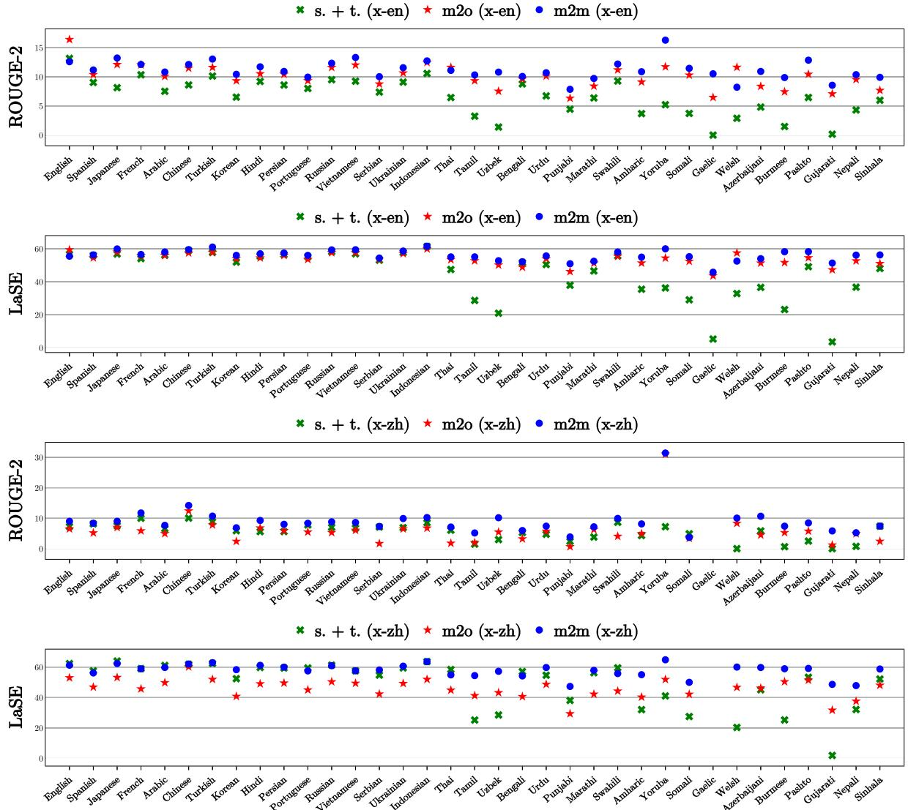  
Figure 4: ROUGE-2 and LaSE scores for English and Chinese as target languages as the source languages vary. The m2m model significantly outperforms the m2o models and summarize-then-translate baseline in most languages. The comparisons with other target languages are shown in the Appendix (Figure 8) due to space limitations.

We also fine-tuned m2o models (with only the in-language samples of the target language) in a monolingual fashion and ran inference in a zeroshot setting with samples from other languages as input. Here, the models are able to generate nontrivial summaries for some language pairs but still lag behind fully supervised models by a significant margin. We have included Figures 10 and 11 in the Appendix to illustrate this.

Furthermore, we ran inference with the m2m model on distant low-resource language pairs that were absent in training. Their LaSE scores were substantially below supervised pairs, meaning zeroshot transfer in supervised multilingual models (Johnson et al., 2017) shows weak performance.

We do not perform few-shot experiments and leave them as potential future directions.

## 6 Analysis of Results

Statistical significance While the scores obtained from the experiments in Section 5 indicate that the proposed m2m model performs better than the others, the differences are very close in many language pairs. Therefore, a statistical significance test is still warranted to support our claim further. As such, for each language pair experimented on, we performed the Bootstrap resampling test (Koehn, 2004) with the m2m model against the best-performing model among the others in a one vs. all manner: if m2m has the best (ROUGE-2/LaSE) score, we compare it with the model with the second-best score, and if m2m is not the best, we compare it with the best.

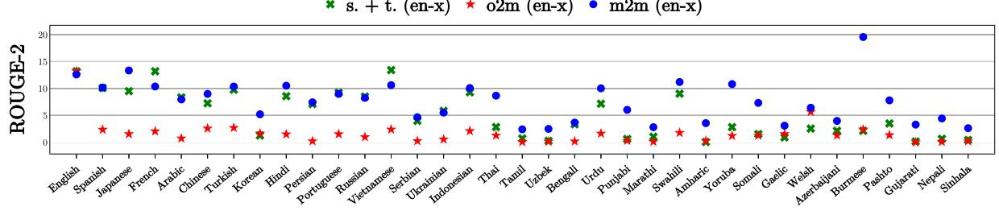

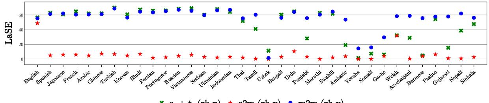

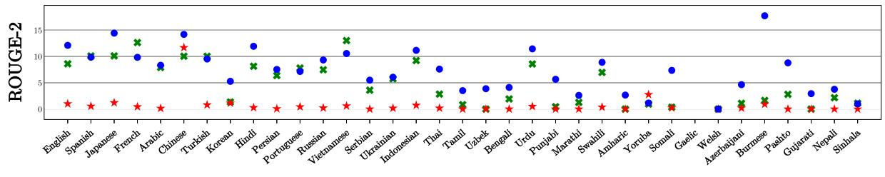

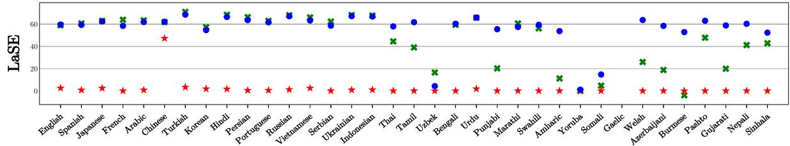  
Figure 5: ROUGE-2 and LaSE scores for English and Chinese as source languages as the target languages vary. The m2m model significantly outperforms the o2m models and summarize-then-translate baseline in most languages. The comparisons with other source languages are shown in the Appendix (Figure 9) due to space limitations.

<table><tr><td>Pivot Metric</td><td>Better Worse Insignificant</td></tr><tr><td>x-en R-2/LaSE E 8/18</td><td>2/2 25/15</td></tr><tr><td>en-x R-2/LaSE 20/15</td><td>3/14 12/6</td></tr><tr><td>x-zh R-2/LaSE 11/13</td><td>0/0 23/21</td></tr><tr><td>zh-x R-2/LaSE 17/12</td><td>1/2 16/20</td></tr><tr><td>x-hi R-2/LaSE 18/15</td><td>1/6 15/13</td></tr><tr><td>hi-x R-2/LaSE 19/15</td><td>0/6 15/13</td></tr><tr><td>X-ar R-2/LaSE E6/15</td><td>2/3 26/16</td></tr><tr><td>ar-x R-2/LaSE 23/15</td><td>1/5 10/14</td></tr><tr><td>X-ru R-2/LaSE E6/11</td><td>2/7 26/16</td></tr><tr><td>ru-x R-2/LaSE  19/13</td><td>2/7 13/14</td></tr></table>

Table 1: Significance test on different pivot languages.

Results $( p < 0 . 0 5 )$ in Table 1 reveal that in more than 42% language pairs tested, m2m is significantly better, and in less than 10% pairs, it is considerably worse.10 This provides additional evidence in support of our claim that the m2m model performs better than others.

How reliable is LaSE? At first, we validated the reliability of LaSE by showing its correlation with ROUGE-2. We took different checkpoints of the in-language summarization model used in s.+t. and computed ROUGE-2 and LaSE for the nine languages in Section 3 for each checkpoint. The correlation coefficients of the calculated scores are shown in the second column of Table 2. For all languages (from high- to low-resource), LaSE has a near-perfect correlation with ROUGE-2.

However, the purpose of LaSE is to show that it is language-agnostic and can even be computed in the absence of references in the target language. Therefore, we evaluate the summaries with references in a different language from the target using the m2m model. For each target language, we first compute the standard LaSE for different source languages (denoted as LaSE-in-lang). We again compute LaSE after swapping the reference texts with the references in the language of the input text11 (denoted as LaSE-out-lang). We then show the correlation between the two variants of LaSE in the third column of Table $2 ^ { 1 2 }$ for each target language. Results show a substantial correlation between the two variants of LaSE for all languages.

From these two experiments, we can conclude that LaSE is an ideal metric for the evaluation of summarization systems and can be computed in a language-independent manner.

<table><tr><td>Target Lang.</td><td>ROUGE-2 vs. LaSE-in-lang.</td><td>LaSE-in-lang vs. LaSE-out-lang. Pearson/Spearman Pearson/Spearman</td></tr><tr><td>English</td><td>0.976/0.939</td><td>0.993/1.000</td></tr><tr><td>Arabic</td><td>0.903/0.987</td><td>0.968/0.942</td></tr><tr><td>Chinese</td><td>0.983/1.000</td><td>0.996/1.000</td></tr><tr><td>Indonesian</td><td>0.992/0.975</td><td>0.872/0.828</td></tr><tr><td>Bengali</td><td>0.947/0.902</td><td>0.819/0.771</td></tr><tr><td>Urdu</td><td>0.997/0.951</td><td>0.774/0.828</td></tr><tr><td>Punjabi</td><td>0.988/0.963</td><td>0.881/0.885</td></tr><tr><td>Swahili</td><td>0.990/0.951</td><td>0.979/0.885</td></tr><tr><td>Pashto</td><td>0.994/0.987</td><td>0.883/0.885</td></tr></table>

Table 2: Correlation analysis of ROUGE-2 and LaSE. We compute both Pearson and Spearman coefficients.

## 7 Related Works

Pipeline-based methods were popular at the beginning stages of XLS research (Leuski et al., 2003; Orasan and Chiorean, 2008; Wan et al., 2010), breaking the task into a sequence of summarization and translation tasks. End-to-end methods that performed XLS with a single model gained popularity with the emergence of neural models. Ayana et al. (2018) used knowledge distillation (Hinton et al.,

2015) to train a student XLS model from two summarization and translation teacher models. Using a synthetic dataset, Zhu et al. (2019); Cao et al. (2020a) performed XLS with a dual Transformer (Vaswani et al., 2017) architecture in a multitask framework, while Bai et al. (2021) proposed a single encoder-decoder for better transfer across tasks. Chi et al. (2021) introduced multiple pretraining objectives specifically tailored to cross-lingual tasks that showed improved results on XLS. We refer our readers to Wang et al. (2022) for a more comprehensive literature review.

Until recently, XLS was limited primarily to English-Chinese due to the lack of benchmark datasets. To promote the task beyond this language pair, Ladhak et al. (2020) introduced Wikilingua, a large-scale many-to-one dataset with English as the pivot language, while Perez-Beltrachini and Lapata (2021) introduced XWikis, containing 4 languages in 12 directions.

More recently, Wang et al. (2023) explored zeroshot cross-lingual summarization by prompting (Liu et al., 2023) large language models like Chat-GPT13, GPT-4 (OpenAI, 2023), and BLOOMZ (Muennighoff et al., 2022).

## 8 Conclusion & Future Works

In this work, we presented CrossSum, a largescale, non-English-centric XLS dataset containing 1.68 million samples in 1,500+ language pairs. CrossSum provides the first publicly available XLS dataset for many of these pairs. Performing a limited-scale human evaluation of CrossSum, we introduced MLS, a multistage sampling algorithm for general-purpose cross-lingual generation, and LaSE, a language-agnostic metric for evaluating summaries when reference summaries in the target languages may not be available. We demonstrated that training one multilingual model can help towards better XLS than baselines. We also shed light on the potential to perform zero-shot and few-shot XLS with CrossSum. We share our findings and resources in the hopes of making the XLS research community more inclusive and diverse.

In the future, we will investigate the use of Cross-Sum for other summarization tasks, e.g., multidocument (Fabbri et al., 2019) and multi-modal summarization (Zhu et al., 2018). We would also like to explore better techniques for m2m, zeroshot, and few-shot cross-lingual summarization.

## Limitations

Though we believe that our work has many merits, some of its limitations must be acknowledged. Despite exhaustive human annotation being the most reliable means of ensuring the maximum quality of a dataset, we had to resort to the automatic curation of CrossSum due to the enormous scale of the dataset. As identified in the human evaluation, not all of the alignments made by LaBSE are correct. They are primarily summaries describing similar (i.e., having a substantial degree of syntactic or semantic similarity) but non-identical events. LaBSE also fails to penalize numerical mismatches, especially if the summaries depict the same event.

Consequently, any mistake made by LaBSE in the curation phase may propagate to the models trained using CrossSum. And since LaBSE is a component of the proposed LaSE metric, these biases may remain unidentified by LaSE in the evaluation stage. However, no matter which automatic method we use, there will be such frailties in these extreme cases. Since the objective of this paper is not to scrutinize the pitfalls of LaBSE but rather to use it as a means of curation and evaluation, we deem LaBSE the best choice due to its extensive language coverage and empirical performance in cross-lingual mining among existing alternatives.

## Ethical Considerations

License CrossSum is a derivative of the XL-Sum dataset. XL-Sum has been released under the Creative Commons Attribution-NonCommercial-ShareAlike 4.0 International License (CC BY-NC-SA 4.0), allowing modifications and distributions for non-commercial research purposes. We are adhering to the terms of the license and releasing CrossSum under the same license.

Generated Text All of our models use the mT5 model as the backbone, which is pretrained on a large multilingual text corpus. For a text generation model, even small amounts of offensive or harmful texts in pretraining could lead to dangerous biases in generated text (Luccioni and Viviano, 2021). Therefore, our models can potentially generate offensive or biased content learned during the pretraining phase, which is beyond our control. Text summarization systems have also been shown to generate unfaithful and factually incorrect (albeit fluent) (Maynez et al., 2020) texts. Thus, we suggest carefully examining the potential biases before considering them in any real-world deployment.

Human Evaluation Annotators were hired from the graduates of an institute that provides professional training for many languages, including the ones evaluated in Section 3. Each annotator was given around 200-250 sequence pairs to evaluate. Each annotation took an average of one and a half minutes, with a total of approximately 5-6 hours for annotating the whole set. Annotators were paid hourly per the standard remuneration of bilingual professionals in local currency.

Environmental Impact A total of 25 models were trained as part of this work. Each model was trained for about three days on a 4-GPU Tesla P100 server. Assuming 0.08 kg/kWh carbon emission14, less than 175kg of carbon was released into the environment in this work, which is orders of magnitude below the most computationally demanding models.

## Acknowledgements

This work was funded by the Research and Innovation Centre for Science and Engineering (RISE), BUET. The OzSTAR national facility at Swinburne University of Technology was used to conduct the computational experiments. Funding for the OzS-TAR program was provided in part by the Australian Government’s Astronomy National Collaborative Research Infrastructure Strategy (NCRIS) allocation.

## References

Judit Ács. 2019. Exploring bert’s vocabulary. Blog Post.

Mikel Artetxe and Holger Schwenk. 2019a. Marginbased parallel corpus mining with multilingual sentence embeddings. In Proceedings of the 57th Annual Meeting ofthe Associationfor Computational Linguistics, pages 3197–3203, Florence, Italy. Association for Computational Linguistics.

Mikel Artetxe and Holger Schwenk. 2019b. Massively multilingual sentence embeddings for zeroshot cross-lingual transfer and beyond. Transactions of the Association for Computational Linguistics, 7:597–610.

Ayana, Shi-qi Shen, Yun Chen, Cheng Yang, Zhiyuan Liu, and Mao-song Sun. 2018. Zero-shot cross-lingual neural headline generation. IEEE/ACM

14https://blog.google/technology/ai/ minimizing-carbon-footprint/

Transactions on Audio, Speech, and Language Processing, 26(12):2319–2327.

Yu Bai, Yang Gao, and Heyan Huang. 2021. Crosslingual abstractive summarization with limited parallel resources. In Proceedings of the 59th Annual Meeting of the Association for Computational Linguistics and the 11th International Joint Conference on Natural Language Processing (Volume 1: Long Papers), pages 6910–6924, Online. Association for Computational Linguistics.

Yue Cao, Hui Liu, and Xiaojun Wan. 2020a. Jointly learning to align and summarize for neural crosslingual summarization. In Proceedings of the 58th Annual Meeting ofthe Associationfor Computational Linguistics, pages 6220–6231, Online. Association for Computational Linguistics.

Yue Cao, Xiaojun Wan, Jinge Yao, and Dian Yu. 2020b. Multisumm: Towards a unified model for multilingual abstractive summarization. In Proceedings of Thirty-Fourth AAAI Conference on Artificial Intelligence, AAAI 2020, pages 11–18. AAAI Press.

Zewen Chi, Li Dong, Shuming Ma, Shaohan Huang, Saksham Singhal, Xian-Ling Mao, Heyan Huang, Xia Song, and Furu Wei. 2021. mT6: Multilingual pretrained text-to-text transformer with translation pairs. In Proceedings of the 2021 Conference on Empirical Methods in Natural Language Processing, pages 1671–1683, Online and Punta Cana, Dominican Republic. Association for Computational Linguistics.

Kyunghyun Cho, Bart van Merriënboer, Caglar Gulcehre, Dzmitry Bahdanau, Fethi Bougares, Holger Schwenk, and Yoshua Bengio. 2014. Learning phrase representations using RNN encoder–decoder for statistical machine translation. In Proceedings of the 2014 Conference on Empirical Methods in Natural Language Processing (EMNLP), pages 1724– 1734, Doha, Qatar. Association for Computational Linguistics.

Jacob Cohen. 1960. A coefficient of agreement for nominal scales. Educational and psychological measurement, 20(1):37–46.

Alexis Conneau, Kartikay Khandelwal, Naman Goyal, Vishrav Chaudhary, Guillaume Wenzek, Francisco Guzmán, Edouard Grave, Myle Ott, Luke Zettlemoyer, and Veselin Stoyanov. 2020. Unsupervised cross-lingual representation learning at scale. In Proceedings of the 58th Annual Meeting of the Association for Computational Linguistics, pages 8440– 8451, Online. Association for Computational Linguistics.

George Bernard Dantzig and Delbert Ray Fulkerson. 1955. On the max flow min cut theorem of networks. Technical report, The RAND Corporation, Santa Monica, CA.

Jacob Devlin, Ming-Wei Chang, Kenton Lee, and Kristina Toutanova. 2019. BERT: Pre-training of deep bidirectional transformers for language understanding. In Proceedings of the 2019 Conference of the North American Chapter ofthe Associationfor Computational Linguistics: Human Language Technologies, Volume 1 (Long and Short Papers), pages 4171–4186, Minneapolis, Minnesota, USA. Association for Computational Linguistics.

Xiangyu Duan, Mingming Yin, Min Zhang, Boxing Chen, and Weihua Luo. 2019. Zero-shot crosslingual abstractive sentence summarization through teaching generation and attention. In Proceedings of the 57th Annual Meeting of the Association for Computational Linguistics, pages 3162–3172, Florence, Italy. Association for Computational Linguistics.

Alexander Fabbri, Irene Li, Tianwei She, Suyi Li, and Dragomir Radev. 2019. Multi-news: A large-scale multi-document summarization dataset and abstractive hierarchical model. In Proceedings ofthe 57th Annual Meeting ofthe Associationfor Computational Linguistics, pages 1074–1084, Florence, Italy. Association for Computational Linguistics.

Angela Fan, Shruti Bhosale, Holger Schwenk, Zhiyi Ma, Ahmed El-Kishky, Siddharth Goyal, Mandeep Baines, Onur Celebi, Guillaume Wenzek, Vishrav Chaudhary, et al. 2021. Beyond english-centric multilingual machine translation. Journal of Machine Learning Research, 22(107):1–48.

Fangxiaoyu Feng, Yinfei Yang, Daniel Cer, Naveen Arivazhagan, and Wei Wang. 2022. Language-agnostic BERT sentence embedding. In Proceedings of the 60th Annual Meeting ofthe Associationfor Computational Linguistics (Volume 1: Long Papers), pages 878–891, Dublin, Ireland. Association for Computational Linguistics.

Mandy Guo, Qinlan Shen, Yinfei Yang, Heming Ge, Daniel Cer, Gustavo Hernandez Abrego, Keith Stevens, Noah Constant, Yun-Hsuan Sung, Brian Strope, and Ray Kurzweil. 2018. Effective parallel corpus mining using bilingual sentence embeddings. In Proceedings ofthe Third Conference on Machine Translation: Research Papers, pages 165–176, Brussels, Belgium. Association for Computational Linguistics.

Tahmid Hasan, Abhik Bhattacharjee, Md. Saiful Islam, Kazi Mubasshir, Yuan-Fang Li, Yong-Bin Kang, M. Sohel Rahman, and Rifat Shahriyar. 2021. XLsum: Large-scale multilingual abstractive summarization for 44 languages. In Findings ofthe Association for Computational Linguistics: ACL-IJCNLP 2021, pages 4693–4703, Online. Association for Computational Linguistics.

Geoffrey Hinton, Oriol Vinyals, and Jeffrey Dean. 2015. Distilling the knowledge in a neural network. In NIPS Deep Learning and Representation Learning Workshop.

Melvin Johnson, Mike Schuster, Quoc V Le, Maxim Krikun, Yonghui Wu, Zhifeng Chen, Nikhil Thorat, Fernanda Viégas, Martin Wattenberg, Greg Corrado, et al. 2017. Google’s multilingual neural machine translation system: Enabling zero-shot translation. Transactions of the Association for Computational Linguistics, 5:339–351.

Pratik Joshi, Sebastin Santy, Amar Budhiraja, Kalika Bali, and Monojit Choudhury. 2020. The state and fate of linguistic diversity and inclusion in the NLP world. In Proceedings of the 58th Annual Meeting of the Association for Computational Linguistics, pages 6282–6293, Online. Association for Computational Linguistics.

Armand Joulin, Edouard Grave, Piotr Bojanowski, and Tomas Mikolov. 2017. Bag of tricks for efficient text classification. In Proceedings of the 15th Conference ofthe European Chapter ofthe Association for Computational Linguistics: Volume 2, Short Papers, pages 427–431, Valencia, Spain. Association for Computational Linguistics.

Philipp Koehn. 2004. Statistical significance tests for machine translation evaluation. In Proceedings ofthe 2004 Conference on Empirical Methods in Natural Language Processing, pages 388–395, Barcelona, Spain. Association for Computational Linguistics.

Faisal Ladhak, Esin Durmus, Claire Cardie, and Kathleen McKeown. 2020. WikiLingua: A new benchmark dataset for cross-lingual abstractive summarization. In Findings of the Association for Computational Linguistics: EMNLP 2020, pages 4034–4048, Online. Association for Computational Linguistics.

Anton Leuski, Chin-Yew Lin, Liang Zhou, Ulrich Germann, Franz Josef Och, and Eduard Hovy. 2003. Cross-lingual c\* st\* rd: English access to hindi information. ACM Transactions on Asian Language Information Processing (TALIP), 2(3):245–269.

Mike Lewis, Marjan Ghazvininejad, Gargi Ghosh, Armen Aghajanyan, Sida Wang, and Luke Zettlemoyer. 2020. Pre-training via paraphrasing. In Proceedings of the 34th International Conference on Neural Information Processing Systems, NIPS’20, Red Hook, NY, USA. Curran Associates Inc.

Chin-Yew Lin. 2004. ROUGE: A package for automatic evaluation of summaries. In Text Summarization Branches Out, pages 74–81, Barcelona, Spain. Association for Computational Linguistics.

Pengfei Liu, Weizhe Yuan, Jinlan Fu, Zhengbao Jiang, Hiroaki Hayashi, and Graham Neubig. 2023. Pretrain, prompt, and predict: A systematic survey of prompting methods in natural language processing. ACM Comput. Surv., 55(9).

Yinhan Liu, Jiatao Gu, Naman Goyal, Xian Li, Sergey Edunov, Marjan Ghazvininejad, Mike Lewis, and Luke Zettlemoyer. 2020. Multilingual denoising pretraining for neural machine translation. Transactions ofthe Associationfor Computational Linguistics, 8:726–742.

Alexandra Luccioni and Joseph Viviano. 2021. What’s in the box? an analysis of undesirable content in the Common Crawl corpus. In Proceedings ofthe 59th Annual Meeting ofthe Associationfor Computational Linguistics and the 11th International Joint Conference on Natural Language Processing (Volume 2: Short Papers), pages 182–189, Online. Association for Computational Linguistics.

Joshua Maynez, Shashi Narayan, Bernd Bohnet, and Ryan McDonald. 2020. On faithfulness and factuality in abstractive summarization. In Proceedings of the 58th Annual Meeting of the Association for Computational Linguistics, pages 1906–1919, Online. Association for Computational Linguistics.

Mark F. Medress, Franklin S Cooper, Jim W. Forgie, CC Green, Dennis H. Klatt, Michael H. O’Malley, Edward P Neuburg, Allen Newell, DR Reddy, B Ritea, et al. 1977. Speech understanding systems: Report of a steering committee. Artificial Intelligence, 9(3):307–316.

Niklas Muennighoff, Thomas Wang, Lintang Sutawika, Adam Roberts, Stella Biderman, Teven Le Scao, M Saiful Bari, Sheng Shen, Zheng-Xin Yong, Hailey Schoelkopf, Xiangru Tang, Dragomir Radev, Alham Fikri Aji, Khalid Almubarak, Samuel Albanie, Zaid Alyafeai, Albert Webson, Edward Raff, and Colin Raffel. 2022. Crosslingual generalization through multitask finetuning.

Khanh Nguyen and Hal Daumé III. 2019. Global Voices: Crossing borders in automatic news summarization. In Proceedings of the 2nd Workshop on New Frontiers in Summarization, pages 90–97, Hong Kong, China. Association for Computational Linguistics.

OpenAI. 2023. GPT-4 technical report.

Constantin Orasan and Oana Andreea Chiorean. 2008. Evaluation of a cross-lingual romanian-english multidocument summariser. In Proceedings of the Sixth International Conference on Language Resources and Evaluation (LREC’08), Marrakech, Morocco. European Language Resources Association (ELRA).

Kishore Papineni, Salim Roukos, Todd Ward, and Wei-Jing Zhu. 2002. Bleu: a method for automatic evaluation of machine translation. In Proceedings ofthe 40th Annual Meeting ofthe Associationfor Computational Linguistics, pages 311–318, Philadelphia, Pennsylvania, USA. Association for Computational Linguistics.

Laura Perez-Beltrachini and Mirella Lapata. 2021. Models and datasets for cross-lingual summarisation. In Proceedings of the 2021 Conference on Empirical Methods in Natural Language Processing, pages 9408–9423, Online and Punta Cana, Dominican Republic. Association for Computational Linguistics.

Sascha Rothe, Shashi Narayan, and Aliaksei Severyn. 2020. Leveraging pre-trained checkpoints for sequence generation tasks. Transactions of the Associationfor Computational Linguistics, 8:264–280.

Ilya Sutskever, Oriol Vinyals, and Quoc V Le. 2014. Sequence to sequence learning with neural networks. In Proceedings ofthe 27th International Conference on Neural Information Processing Systems (NIPS 2014), pages 3104–3112, Montreal, Canada.

Chau Tran, Yuqing Tang, Xian Li, and Jiatao Gu. 2020. Cross-lingual retrieval for iterative self-supervised training. In Advances in Neural Information Processing Systems, volume 33, pages 2207–2219. Curran Associates, Inc.

Daniel Varab and Natalie Schluter. 2021. MassiveSumm: a very large-scale, very multilingual, news summarisation dataset. In Proceedings of the 2021 Conference on Empirical Methods in Natural Language Processing, pages 10150–10161, Online and Punta Cana, Dominican Republic. Association for Computational Linguistics.

Ashish Vaswani, Noam Shazeer, Niki Parmar, Jakob Uszkoreit, Llion Jones, Aidan N Gomez, Łukasz Kaiser, and Illia Polosukhin. 2017. Attention is all you need. In Proceedings ofthe 31st International Conference on Neural Information Processing Systems (NIPS 2017), page 6000–6010, Long Beach, California, USA.

Xiaojun Wan, Huiying Li, and Jianguo Xiao. 2010. Cross-language document summarization based on machine translation quality prediction. In Proceedings ofthe 48th Annual Meeting ofthe Associationfor Computational Linguistics, pages 917–926, Uppsala, Sweden. Association for Computational Linguistics.

Jiaan Wang, Yunlong Liang, Fandong Meng, Beiqi Zou, Zhixu Li, Jianfeng Qu, and Jie Zhou. 2023. Zeroshot cross-lingual summarization via large language models.

Jiaan Wang, Fandong Meng, Duo Zheng, Yunlong Liang, Zhixu Li, Jianfeng Qu, and Jie Zhou. 2022. A Survey on Cross-Lingual Summarization. Transactions ofthe Associationfor Computational Linguistics, 10:1304–1323.

Yonghui Wu, Mike Schuster, Zhifeng Chen, Quoc V Le, Mohammad Norouzi, Wolfgang Macherey, Maxim Krikun, Yuan Cao, Qin Gao, Klaus Macherey, et al. 2016. Google’s neural machine translation system: Bridging the gap between human and machine translation. arXiv:1609.08144.

Linting Xue, Noah Constant, Adam Roberts, Mihir Kale, Rami Al-Rfou, Aditya Siddhant, Aditya Barua, and Colin Raffel. 2021a. mT5: A massively multilingual pre-trained text-to-text transformer. In Proceedings of the 2021 Conference of the North American Chapter of the Association for Computational Linguistics: Human Language Technologies, pages 483–498, Online. Association for Computational Linguistics.

Linting Xue, Noah Constant, Adam Roberts, Mihir Kale, Rami Al-Rfou, Aditya Siddhant, Aditya Barua, and Colin Raffel. 2021b. mT5: A massively multilingual

pre-trained text-to-text transformer. In Proceedings of the 2021 Conference of the North American Chapter of the Association for Computational Linguistics: Human Language Technologies, pages 483–498, Online. Association for Computational Linguistics.

Yinfei Yang, Gustavo Hernandez Abrego, Steve Yuan, Mandy Guo, Qinlan Shen, Daniel Cer, Yun-hsuan Sung, Brian Strope, and Ray Kurzweil. 2019. Improving multilingual sentence embedding using bidirectional dual encoder with additive margin softmax. In Proceedings of the Twenty-Eighth International Joint Conference on Artificial Intelligence, IJCAI-19, pages 5370–5378. International Joint Conferences on Artificial Intelligence Organization.

Tianyi Zhang, Varsha Kishore, Felix Wu, Kilian Q. Weinberger, and Yoav Artzi. 2020. Bertscore: Evaluating text generation with bert. In International Conference on Learning Representations.

Wei Zhao, Maxime Peyrard, Fei Liu, Yang Gao, Christian M. Meyer, and Steffen Eger. 2019. MoverScore: Text generation evaluating with contextualized embeddings and earth mover distance. In Proceedings of the 2019 Conference on Empirical Methods in Natural Language Processing and the 9th International Joint Conference on Natural Language Processing (EMNLP-IJCNLP), pages 563–578, Hong Kong, China. Association for Computational Linguistics.

Junnan Zhu, Haoran Li, Tianshang Liu, Yu Zhou, Jiajun Zhang, and Chengqing Zong. 2018. Msmo: Multimodal summarization with multimodal output. In Proceedings of the 2018 conference on empirical methods in natural language processing, pages 4154–4164.

Junnan Zhu, Qian Wang, Yining Wang, Yu Zhou, Jiajun Zhang, Shaonan Wang, and Chengqing Zong. 2019. NCLS: Neural cross-lingual summarization. In Proceedings ofthe 2019 Conference on Empirical Methods in Natural Language Processing and the 9th International Joint Conference on Natural Language Processing (EMNLP-IJCNLP), pages 3054– 3064, Hong Kong, China. Association for Computational Linguistics.

Pierre Zweigenbaum, Serge Sharoff, and Reinhard Rapp. 2017. Overview of the second bucc shared task: Spotting parallel sentences in comparable corpora. In Proceedings ofthe 10th Workshop on Building and Using Comparable Corpora, pages 60–67.

## Appendix

## A Aligning Summaries using LaBSE

In Section 2, we curated CrossSum by aligning parallel summaries in different languages. It might be argued why the articles themselves were not used for the alignment process. Initially, we experimented with whole-article embeddings. However, this resulted in many false-negative alignments, where similarity scores between parallel articles across languages were relatively low (verified manually between English and the authors native languages). This is most likely attributed to the 512-token limit of LaBSE and different sequence lengths of those articles due to different languages having different subword segmentation fertility (Ács, 2019). This would entail that parallel articles in different languages might be truncated at different locations, resulting in discrepancies between their embeddings. As observed in the BUCC evaluation, LaBSE is well-suited for sentence-level retrieval. Since summaries are good representatives of entire articles, we finally chose summaries as our candidates for the alignment.

## B Inter-annotator Agreement of Human Evaluation

<table><tr><td>Language Pair</td><td>Cohen&#x27;s Kappa</td></tr><tr><td>Arabic-English</td><td>0.82</td></tr><tr><td>Chinese-English</td><td>0.73</td></tr><tr><td>Indonesian-English</td><td>0.73</td></tr><tr><td>Bengali-English</td><td>0.73</td></tr><tr><td>Urdu-English</td><td>0.76</td></tr><tr><td>Punjabi-English</td><td>0.71</td></tr><tr><td>Swahili-English</td><td>0.78</td></tr><tr><td>Pashto-English</td><td>0.75</td></tr></table>

Table 3: Language pair-wise kappa scores.

## C Modeling Details

## C.1 Choice of Pretrained Model

Many pretrained multilingual text-to-text models are currently available, e.g., mBART (Liu et al., 2020), CRISS (Tran et al., 2020), MARGE (Lewis et al., 2020), and mT5 (Xue et al., 2021b). While mBART and mT5 are pretrained with multilingual objectives, CRISS and MARGE are pretrained with a cross-lingual one, which better suits our use case. However, we choose mT5 for fine-tuning because of its broad coverage of 101 languages with support for 41 of the 45 languages from CrossSum, in contrast to only 15 languages in mBART or CRISS and 26 in MARGE.

## C.2 Summarize-then-translate (s. + t.)

The primary reason for using summarize-thentranslate rather than translate-then-summarize is the computational cost between these two. Available translation models only work for short sequences and are unsuitable for long documents. One solution is to segment the documents into sentences and then translate them. But that increases the compute overhead, and translations suffer from loss of context. We use a multilingual summarization model (Hasan et al., 2021) coupled with the multilingual machine translation model, M2M-100 (Fan et al., 2021), for our pipeline.

## C.2.1 Multilingual Summarization

The pipeline first performs in-language summarization. We train our own model for summarization as the model released by Hasan et al. (2021) has been rendered unusable due to the change in the dataset split. We extend our component graphs to curate the in-language dataset splits. We consider articles having no parallel counterpart in any other language as single node components in the component graph. As before, we assign all articles originating from a single component to the training (dev/test) set of the dataset, extending them to the in-language splits too. We then train the multilingual model by fine-tuning mT5 with the in-language splits, sampling each batch of 256 samples from a single language with a sampling factor of $\alpha = 0 . 5$

## C.2.2 Multilingual Translation

For multilingual translation, we used M2M-100 (Fan et al., 2021) (418M parameters variant), a many-to-many multilingual translation model, with support for 37 languages from CrossSum.

## C.3 Many-to-One (m2o) Model

Many-to-one training is standard for evaluating cross-lingual summarization. In these models, the language of the source text can vary, but the target language remains the same, i.e., as the pivot language. Instead of sampling all samples of a batch from the same language pair, we sample 8 minibatches of 32 samples using a sampling factor of α = 0.25, the source side of each originating from a single language while the target language remains fixed. We then merge the mini-batches into a single batch and update the model parameters. This is to ensure that there are not many duplicates in a single batch (if all 256 samples of a batch are sampled from a single language pair, there might be many duplicates as many language pairs do not have 256 training samples) and the model still benefits the advantages of low-resource upsampling.

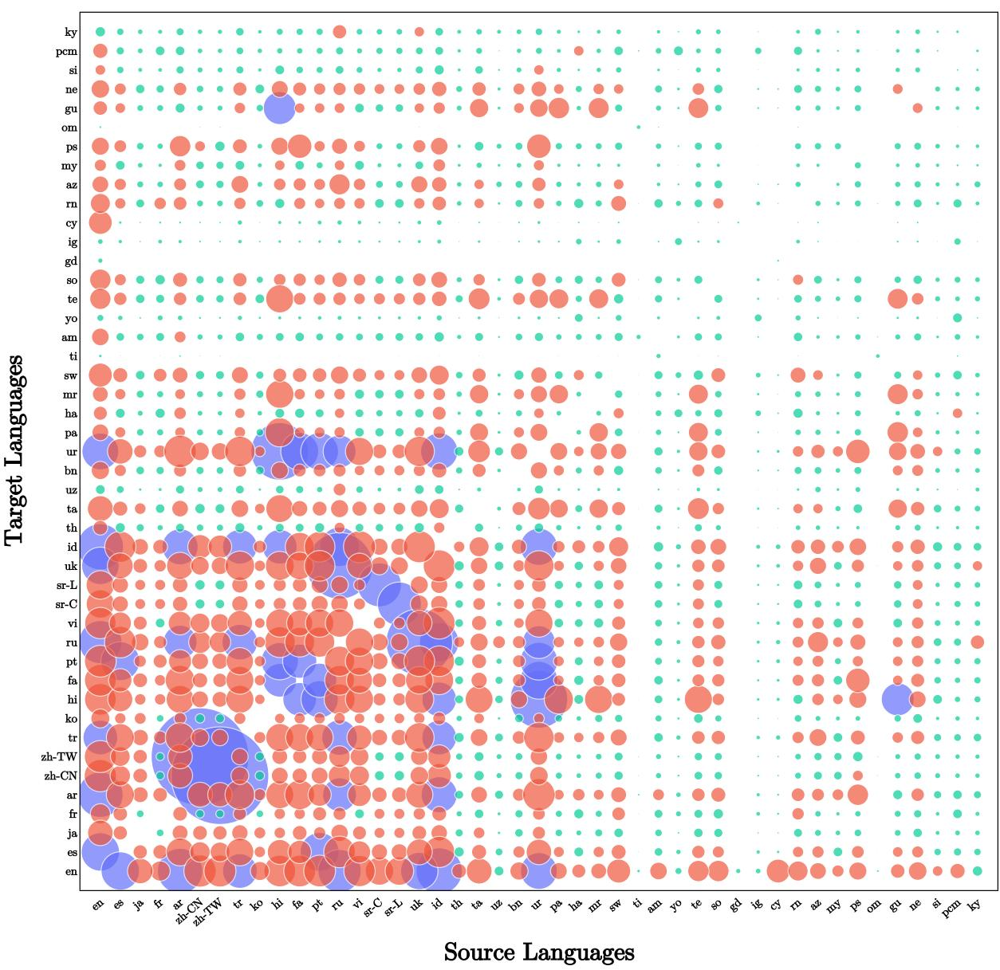  
Figure 6: A bubble plot depicting the article-summary frequencies of CrossSum. The radii of the bubbles are proportional to the number of samples for the corresponding language pair (exact numbers are in Table 4). Languages are ordered by the language taxonomy from Joshi et al. (2020). To show better contrast between language pairs, we color a bubble cyan if its frequency is below 500 (1218 pairs), red for 500 to 5000 (688 pairs), and blue for frequencies exceeding 5000 (52 pairs).

## C.4 One-to-many (o2m) Model

o2m models are complementary to m2o models: we train them by keeping the source language fixed and varying the target language. We upsample the low-resource target languages with the same sampling factor of $\alpha = 0 . 2 5$ and merge 8 mini-batches of 32 samples each, analogous to m2o models.

## C.5 Many-to-many (m2m) Multistage Model

This is the model obtained from the Algorithm 1. In contrast to standard language sampling (Conneau et al., 2020), we sample the target language and then choose the source based on that decision. We use batch size 256, 8 mini-batches with size 32, and $\alpha = 0 . 5 , \beta = 0 . 7 5$

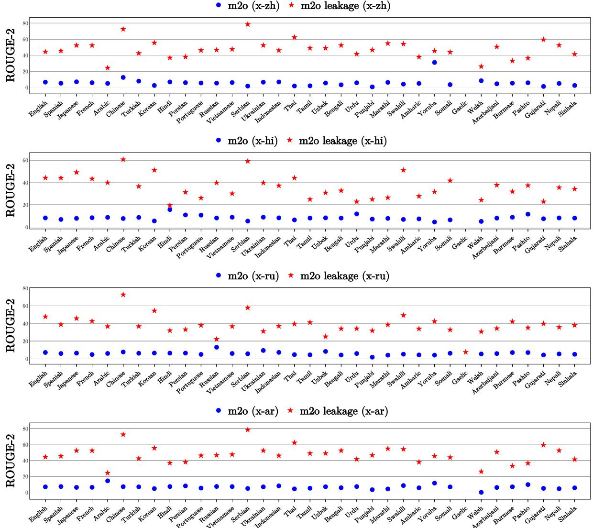  
Figure 7: Training on the dataset respecting the original XL-Sum splits causes absurdly high ROUGE scores (marked red) in many-to-one models due to implicit data leakage. Therefore, we split taking the issue into account, and consequently, models trained on the new set (marked blue) do not exhibit any unusual spike in ROUGE-2.

## C.6 Many-to-many (m2m) Unistage Model

This algorithm is similar to standard language sampling, the difference being that languages are sampled as pairs from all possible combinations. Instead of sampling one language pair at each training step, we sample 8 pairs, one for each mini-batch of size 32. We then merge the mini-batches into a single batch of 256 samples before updating the model parameters. We use a sampling factor of α = 0.25.

In all models, we discarded a language pair from training if it had fewer than 30 training samples to prevent too many duplicates in a mini-batch. The training was done together with the in-language samples.

## D Experimental Details

## D.1 Training Setups

Fine-tuning generation models is computeintensive, and due to computational limitations, we fine-tune all pretrained models for 25k steps with an effective batch size of 256, which roughly takes about three days on a 4-GPU NVIDIA P100 server. We use the base variant of mT5, having 250k vocabulary, 768 embedding and dimension size, 12 attention heads, and 2048 FFN size, with 580M parameters. We limit the input to 512 and output to 84 tokens. All models are trained on the respective subsets of the CrossSum training set.

## D.2 Inference

During inference, we jump-start the decoder with language-specific BOS (beginning of sequence) tokens (Johnson et al., 2017) at the first decoding step for guiding the decoder to generate summaries in the intended target language. We use beam search (Medress et al., 1977) with the beam size 4 and use a length penalty (Wu et al., 2016) of 0.6.

## E Ablation Studies

We make several design choices in the multistage sampling algorithm. We break them into two main decisions:

1. Making mini-batches and sampling the language pair for each mini-batch.

2. Keeping either the source or the target language fixed for each batch.

To verify that these choices indeed affect performance positively, we train five different models for ablation:

1. Sampling the language pair in mini-batches in one stage only and then merging them into large batches before updating model parameters: m2m-unistage.

2. Sampling the language pair with large batches of 256 samples without mini-batching: m2mlarge.

3. Multistage sampling keeping only the target language fixed in a batch: m2m-tgt [our proposed model].

4. Multistage sampling keeping only the source language fixed in a batch: m2m-src; i.e., the complement of our proposed model.

5. Multistage sampling keeping either the source or the target language fixed (with equal probability) for each batch: m2m-src-tgt.

We benchmark on all the language pairs done previously and show the mean ROUGE-2 and LaSE scores in Table 5.

<table><tr><td rowspan="2">Model</td><td>Scores</td><td>Significance</td></tr><tr><td>R-2/LaSE</td><td>Better Worse Insignificant</td></tr><tr><td>m2m-large</td><td>8.31/57.45</td><td>122 59 503</td></tr><tr><td>m2m-unistage 7.51/55.36</td><td></td><td>191 149 344</td></tr><tr><td>m2m-tgt</td><td>8.15/57.15</td><td>289 66 329</td></tr><tr><td>m2m-src</td><td>4.44/26.75</td><td>34 477 173</td></tr><tr><td>m2m-src-tgt</td><td>6.47/42.55</td><td>89 297 298</td></tr></table>

Table 5: ROUGE-2 and LaSE scores for ablation.

As can be seen from the table, m2m-large, the standard m2m model, has the best average ROUGE-2/LaSE scores among all m2m variants. This begs the question of whether our proposed multistage sampling is, after all, needed or not. But the scores of the proposed m2m-tgt model do not fall much below. Therefore, we show statistical significance test results of all m2m models, comparing them against m2o, o2m, and s.+t. in one vs. all manner.

Significance results paint a different picture: m2m-tgt triumphs over all other models, getting significantly better results on 42% language pairs, more than double the m2m-large model. We inspected the results individually and found that the results are notably better on language pairs that are not adequately represented in the training set. m2mtgt performs comparatively worse on high-resource language pairs, which we think is a fair compromise to uplift low-resource ones. As m2m-large can sample a pair only once per batch, it fails to incorporate many language pairs due to them having insufficient participation during training. On the other hand, our proposed multistage sampling algorithm performs well in this regard by sampling in two stages.

While m2m-tgt outperforms all the rest, m2msrc falls behind all other models by a large margin. This phenomenon also has the same trend as the results in Section 5, where o2m models failed at generating cross-lingual summaries. This is also in line with our hypothesis made, as m2m-src and m2mtgt mimic the training settings of the o2m and m2o models, respectively, at the batch level. The m2msrc-tgt is the middle ground between m2m-src and m2m-tgt and, likewise, scores between these two. In our opinion, the performance dynamics between the m2o (m2m-tgt) and o2m (m2m-src) models is an interesting finding and should be studied in depth as a new research direction in future works.

s. + t. (x-hi) m2o (x-hi) m2m (x-hi)  
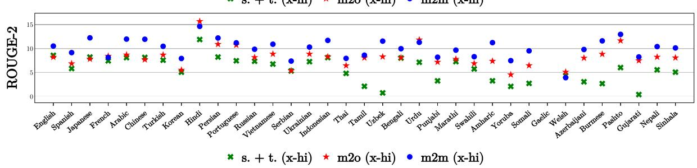

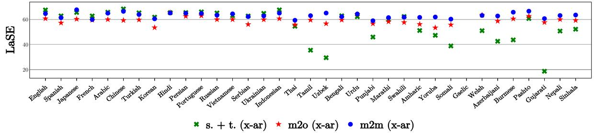

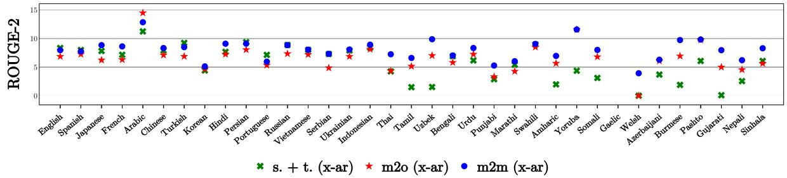

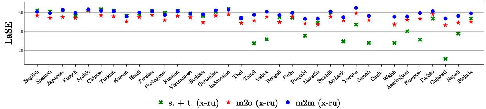

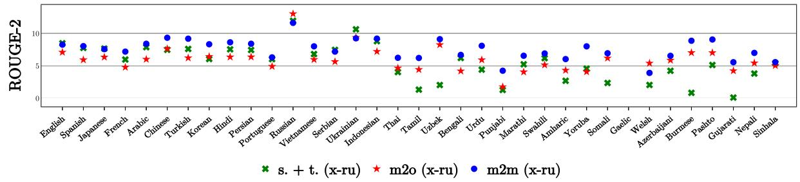

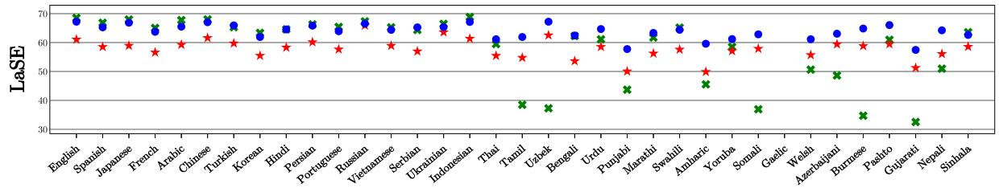  
Figure 8: ROUGE-2 and LaSE scores for Hindi, Arabic, and Russian as target pivots as the sources languages vary. Just like Figure 4, the m2m model significantly outperforms the m2o models and s. + t. baseline on most languages.

s. + t. (hi-x) o2m (hi-x) m2m (hi-x)  
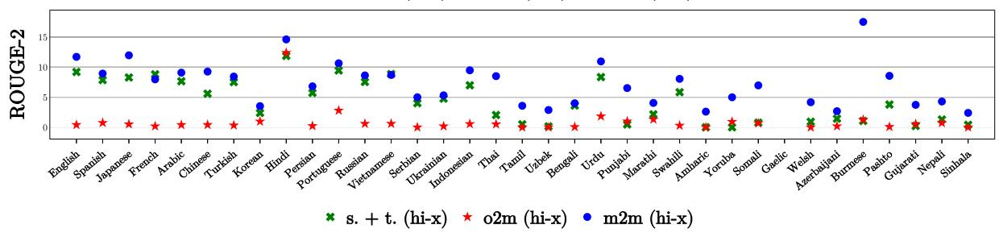

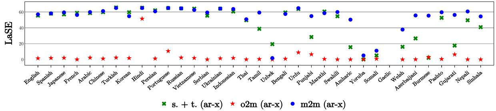

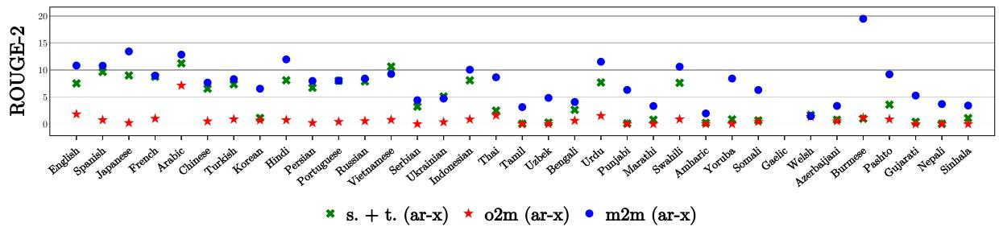

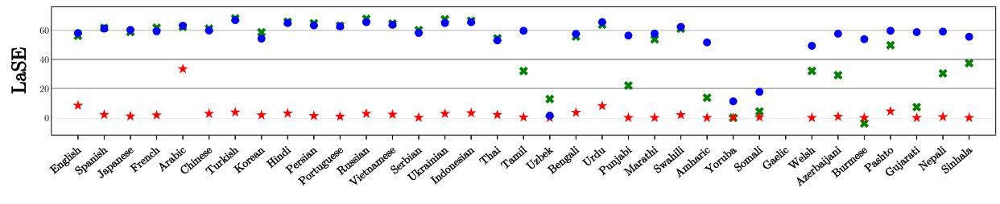

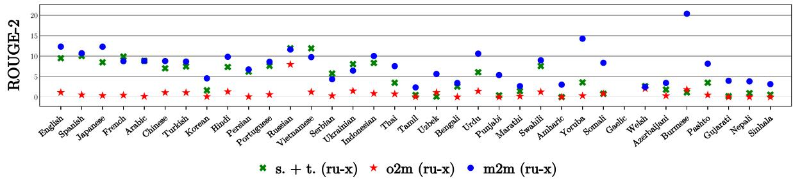

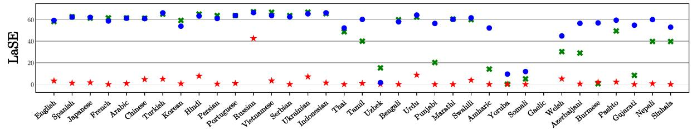  
Figure 9: ROUGE-2 and LaSE scores for Hindi, Arabic, and Russian as source pivots as the target languages vary. Just like Figure 5, the m2m model significantly outperforms the o2m models and s. + t. baseline on most languages.

m2o supervised (x-en) m2o zero-shot (x-en)  
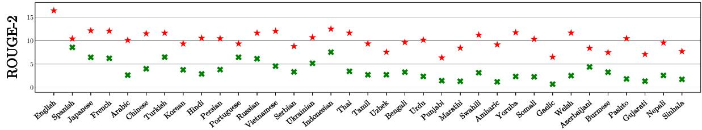

m2o supervised (x-zh) m2o zero-shot (x-zh)  
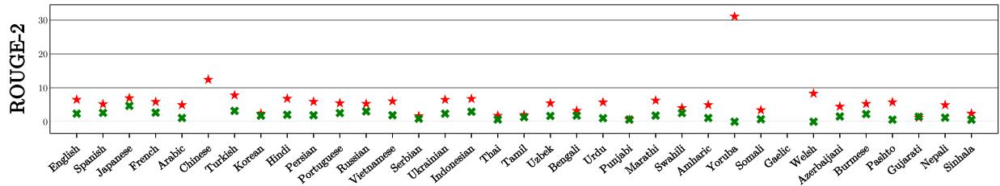

m2o supervised (x-hi) m2o zero-shot (x-hi)  
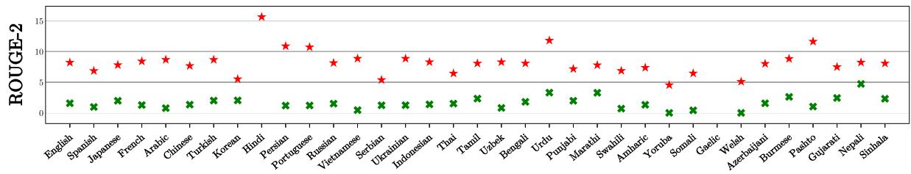

m2o supervised (x-ar) m2o zero-shot (x-ar)  
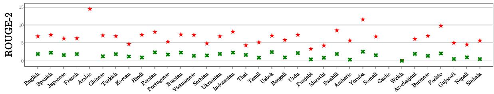

m2o supervised (x-ru) m2o zero-shot (x-ru)  
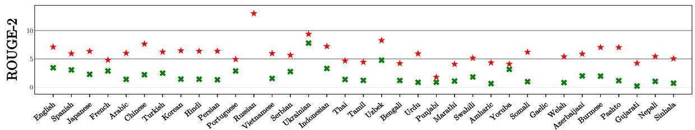  
Figure 10: Zero-shot ROUGE-2 scores for the different target languages as the source languages vary. The zero-shot models are trained with only the in-language samples of the pivot. Though their results are clearly behind the fully supervised models, the zero-shot models are able to generate non-trivial summaries for many language pairs.

m2o supervised (x-en) m2o zero-shot (x-en)  
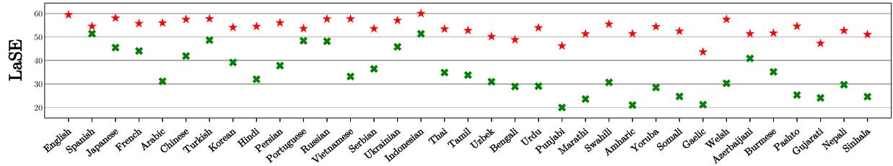

m2o supervised (x-zh) m2o zero-shot (x-zh)  
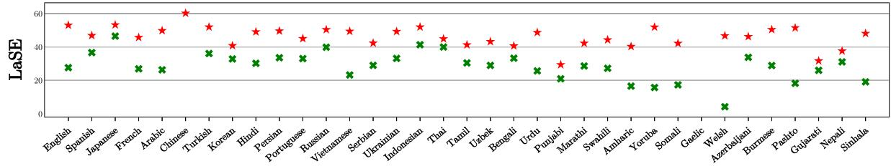

m2o supervised (x-hi) m2o zero-shot (x-hi)  
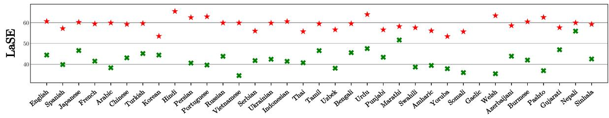

m2o supervised (x-ar) m2o zero-shot (x-ar)  
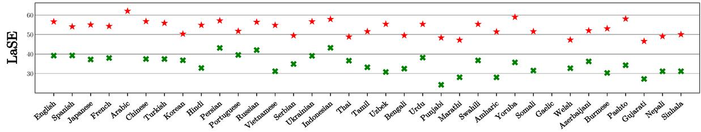

m2o supervised (x-ru) m2o zero-shot (x-ru)  
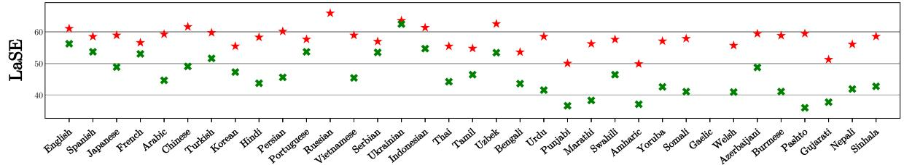  
Figure 11: Zero-shot LaSE scores for the different source languages as the target languages vary. The zero-shot models are trained with only the in-language samples of the pivot. Though their results are clearly behind the fully supervised models, the zero-shot models are able to generate non-trivial summaries for many language pairs.

<table><tr><td rowspan=1 colspan=8>Language| am ar az bn my zh-CN</td><td rowspan=1 colspan=9>zh-TW en fr gu ha hi ig id ja</td><td rowspan=1 colspan=4>rn ko ky mr</td><td rowspan=1 colspan=5>ne om ps fa pcm</td><td rowspan=1 colspan=5>pt pa ru gd sr-C</td><td rowspan=1 colspan=4>sr-L si so es</td><td rowspan=1 colspan=1>SW</td><td rowspan=1 colspan=3>ta te th</td><td></td><td rowspan=1 colspan=1>i tr</td><td rowspan=1 colspan=6>uk ur uz vi cy yo</td><td rowspan=1 colspan=1>Total</td></tr><tr><td rowspan=2 colspan=2>a</td><td rowspan=1 colspan=1></td><td rowspan=1 colspan=1>659</td><td rowspan=1 colspan=4>95 274 95 179</td><td rowspan=1 colspan=1>169</td><td rowspan=1 colspan=1>1445</td><td rowspan=1 colspan=2>371 171</td><td rowspan=1 colspan=1>220</td><td rowspan=1 colspan=2>361 31</td><td rowspan=1 colspan=1>497</td><td rowspan=1 colspan=1>269</td><td rowspan=1 colspan=1>415</td><td rowspan=1 colspan=3>239 93 223</td><td rowspan=1 colspan=3>304 19 189</td><td rowspan=1 colspan=2>423 205</td><td rowspan=1 colspan=2>291 191</td><td rowspan=1 colspan=3>333 0 350</td><td rowspan=1 colspan=2>361 62</td><td rowspan=1 colspan=1>299</td><td rowspan=1 colspan=1>346</td><td rowspan=1 colspan=1>383</td><td rowspan=1 colspan=1>374</td><td rowspan=1 colspan=1>322</td><td rowspan=1 colspan=3>122 129 424</td><td rowspan=1 colspan=1>341</td><td rowspan=1 colspan=1>393</td><td rowspan=1 colspan=4>40 287 1 71</td><td rowspan=1 colspan=1>12066</td></tr><tr><td rowspan=1 colspan=1>659</td><td rowspan=1 colspan=1></td><td rowspan=1 colspan=1>781</td><td rowspan=1 colspan=2>799646</td><td rowspan=1 colspan=1>2905</td><td rowspan=1 colspan=1>2783</td><td rowspan=1 colspan=1>9630</td><td rowspan=1 colspan=1>991</td><td rowspan=1 colspan=1>467</td><td rowspan=1 colspan=1>733</td><td rowspan=1 colspan=1>3651</td><td rowspan=1 colspan=1>83</td><td rowspan=1 colspan=1>6061</td><td rowspan=1 colspan=1>1175</td><td rowspan=1 colspan=1>873</td><td rowspan=1 colspan=2>691 302</td><td rowspan=1 colspan=1>547</td><td rowspan=1 colspan=1>844</td><td rowspan=1 colspan=2>92148</td><td rowspan=1 colspan=1>4170</td><td rowspan=1 colspan=1>427</td><td rowspan=1 colspan=1>2507</td><td rowspan=1 colspan=1>541</td><td rowspan=1 colspan=1>5329</td><td rowspan=1 colspan=1></td><td rowspan=1 colspan=1>1101</td><td rowspan=1 colspan=2>1139.316</td><td></td><td></td><td></td><td></td><td></td><td></td><td></td><td></td><td></td><td></td><td></td><td></td><td></td><td></td><td></td></tr><tr><td rowspan=1 colspan=2>az</td><td rowspan=1 colspan=1>95</td><td rowspan=1 colspan=1>781</td><td rowspan=1 colspan=1></td><td rowspan=1 colspan=1>283</td><td rowspan=1 colspan=1>81</td><td rowspan=1 colspan=1>363</td><td rowspan=1 colspan=1>324</td><td rowspan=1 colspan=1>1307</td><td rowspan=1 colspan=1>203</td><td rowspan=1 colspan=1>181</td><td rowspan=1 colspan=1>124</td><td rowspan=1 colspan=1>735</td><td rowspan=1 colspan=1>26</td><td rowspan=1 colspan=1>1111</td><td rowspan=1 colspan=1>226</td><td rowspan=1 colspan=1>178</td><td rowspan=1 colspan=1>162</td><td rowspan=1 colspan=1>228</td><td rowspan=1 colspan=1>198</td><td rowspan=1 colspan=1>246</td><td rowspan=1 colspan=2>2249</td><td rowspan=1 colspan=1>814</td><td rowspan=1 colspan=1>93</td><td rowspan=1 colspan=1>668</td><td rowspan=1 colspan=1>186</td><td rowspan=1 colspan=1>2087</td><td rowspan=1 colspan=1></td><td rowspan=1 colspan=1>286</td><td rowspan=1 colspan=1>285</td><td rowspan=1 colspan=1>124</td><td rowspan=1 colspan=1>359</td><td rowspan=1 colspan=1>704</td><td rowspan=1 colspan=1>535</td><td rowspan=1 colspan=1>505</td><td rowspan=1 colspan=1>233</td><td rowspan=1 colspan=2>1392</td><td rowspan=1 colspan=1>1476</td><td rowspan=1 colspan=1>1373</td><td rowspan=1 colspan=1>957</td><td rowspan=1 colspan=1>195</td><td rowspan=1 colspan=1>726</td><td rowspan=1 colspan=1>31</td><td rowspan=1 colspan=1>40</td><td rowspan=1 colspan=1>18924</td></tr><tr><td rowspan=1 colspan=2>bn</td><td rowspan=1 colspan=1>274</td><td rowspan=1 colspan=1>799</td><td rowspan=1 colspan=1>283</td><td rowspan=1 colspan=1></td><td rowspan=1 colspan=1>145</td><td rowspan=1 colspan=1>308</td><td rowspan=1 colspan=1>275</td><td rowspan=1 colspan=1>1544</td><td rowspan=1 colspan=1>320</td><td rowspan=1 colspan=1>551</td><td rowspan=1 colspan=1>231</td><td rowspan=1 colspan=1>1376</td><td rowspan=1 colspan=1>37</td><td rowspan=1 colspan=1>1072</td><td rowspan=1 colspan=1>344</td><td rowspan=1 colspan=1>297</td><td rowspan=1 colspan=1>351</td><td rowspan=1 colspan=1>154</td><td rowspan=1 colspan=1>580</td><td rowspan=1 colspan=1>665</td><td rowspan=1 colspan=2>2296</td><td rowspan=1 colspan=1>787</td><td rowspan=1 colspan=1>132</td><td rowspan=1 colspan=1>769</td><td rowspan=1 colspan=1>574</td><td rowspan=1 colspan=1>792</td><td rowspan=1 colspan=1></td><td rowspan=1 colspan=1>559</td><td rowspan=1 colspan=1>560</td><td rowspan=1 colspan=1>154</td><td rowspan=1 colspan=1>411</td><td rowspan=1 colspan=1>697</td><td rowspan=1 colspan=1>477</td><td rowspan=1 colspan=1>913</td><td rowspan=1 colspan=1>783</td><td rowspan=1 colspan=2>245</td><td rowspan=1 colspan=1>857</td><td rowspan=1 colspan=1>692</td><td rowspan=1 colspan=1>1381</td><td rowspan=1 colspan=1>96</td><td rowspan=1 colspan=1>521</td><td rowspan=1 colspan=1>35</td><td rowspan=1 colspan=1>62</td><td></td></tr><tr><td rowspan=2 colspan=2>my</td><td rowspan=2 colspan=1>95</td><td rowspan=2 colspan=1>646</td><td rowspan=2 colspan=1>81</td><td rowspan=2 colspan=2>145 -</td><td rowspan=2 colspan=1>349</td><td rowspan=2 colspan=1>321</td><td rowspan=2 colspan=1>694</td><td rowspan=2 colspan=1>88</td><td rowspan=2 colspan=1>99</td><td rowspan=2 colspan=1>71</td><td rowspan=2 colspan=1>522</td><td rowspan=2 colspan=1>10</td><td rowspan=2 colspan=1>767</td><td rowspan=2 colspan=1>148</td><td rowspan=2 colspan=1>105</td><td rowspan=2 colspan=1>116</td><td rowspan=2 colspan=1>53</td><td rowspan=2 colspan=1>91</td><td rowspan=2 colspan=1>147</td><td rowspan=2 colspan=2>1237</td><td rowspan=2 colspan=1>432</td><td rowspan=2 colspan=1>38</td><td rowspan=2 colspan=1>232</td><td rowspan=2 colspan=1>86</td><td rowspan=2 colspan=1>528</td><td rowspan=2 colspan=1></td><td rowspan=2 colspan=1>117</td><td rowspan=2 colspan=1>120</td><td rowspan=2 colspan=1>88</td><td rowspan=2 colspan=1>79</td><td rowspan=2 colspan=1>438</td><td rowspan=2 colspan=1>81</td><td rowspan=2 colspan=1>180</td><td rowspan=2 colspan=1>147</td><td rowspan=2 colspan=2>73</td><td rowspan=2 colspan=1>4 442</td><td rowspan=2 colspan=1>356</td><td rowspan=2 colspan=1>580</td><td rowspan=2 colspan=1>62</td><td rowspan=2 colspan=1>450</td><td rowspan=2 colspan=1>2</td><td rowspan=2 colspan=1>11</td><td></td></tr><tr><td rowspan=1 colspan=1></td></tr><tr><td rowspan=1 colspan=2>zh-CN</td><td rowspan=1 colspan=1>179</td><td rowspan=1 colspan=1>2905</td><td rowspan=1 colspan=1>363</td><td rowspan=1 colspan=2>308 349</td><td rowspan=1 colspan=1></td><td rowspan=1 colspan=1>44561</td><td rowspan=1 colspan=1>4864</td><td rowspan=1 colspan=1>329</td><td rowspan=1 colspan=1>197</td><td rowspan=1 colspan=1>151</td><td rowspan=1 colspan=1>1331</td><td rowspan=1 colspan=1>34</td><td rowspan=1 colspan=1>2787</td><td rowspan=1 colspan=1>1010</td><td rowspan=1 colspan=1>227</td><td rowspan=1 colspan=1>407</td><td rowspan=1 colspan=1>135</td><td rowspan=1 colspan=1>236</td><td rowspan=1 colspan=1>269</td><td rowspan=1 colspan=1>3</td><td rowspan=1 colspan=1>552</td><td rowspan=1 colspan=1>1091</td><td rowspan=1 colspan=1>144</td><td rowspan=1 colspan=1>1334</td><td rowspan=1 colspan=1>235</td><td rowspan=1 colspan=1>2396</td><td rowspan=1 colspan=1></td><td rowspan=1 colspan=1>467</td><td rowspan=1 colspan=1>496</td><td rowspan=1 colspan=1>167</td><td rowspan=1 colspan=1>330</td><td rowspan=1 colspan=1>1941</td><td rowspan=1 colspan=1>402</td><td rowspan=1 colspan=1>500</td><td rowspan=1 colspan=1>352</td><td rowspan=1 colspan=1>263</td><td rowspan=1 colspan=2>13 1482</td><td rowspan=1 colspan=1>1591</td><td rowspan=1 colspan=1>1613</td><td rowspan=1 colspan=1>171</td><td rowspan=1 colspan=1>1853</td><td rowspan=1 colspan=1>28</td><td rowspan=1 colspan=1>40</td><td rowspan=1 colspan=1>78118</td></tr><tr><td rowspan=1 colspan=2>zh-TW</td><td rowspan=1 colspan=1>169</td><td rowspan=1 colspan=1>2783</td><td rowspan=1 colspan=1>324</td><td rowspan=1 colspan=2>275 321</td><td rowspan=1 colspan=1>44561</td><td rowspan=1 colspan=1></td><td rowspan=1 colspan=1>4777</td><td rowspan=1 colspan=1>307</td><td rowspan=1 colspan=1>167</td><td rowspan=1 colspan=1>135</td><td rowspan=1 colspan=1>1167</td><td rowspan=1 colspan=1>31</td><td rowspan=1 colspan=1>2573</td><td rowspan=1 colspan=1>955</td><td rowspan=1 colspan=1>208</td><td rowspan=1 colspan=1>384</td><td rowspan=1 colspan=1>125</td><td rowspan=1 colspan=1>205</td><td rowspan=1 colspan=1>248</td><td rowspan=1 colspan=1>5</td><td rowspan=1 colspan=1>499</td><td rowspan=1 colspan=1>947</td><td rowspan=1 colspan=1>134</td><td rowspan=1 colspan=1>1224</td><td rowspan=1 colspan=1>219</td><td rowspan=1 colspan=1>2166</td><td rowspan=1 colspan=1></td><td rowspan=1 colspan=1>418</td><td rowspan=1 colspan=1>457</td><td rowspan=1 colspan=1>160</td><td rowspan=1 colspan=1>302</td><td rowspan=1 colspan=1>1817</td><td rowspan=1 colspan=1>372</td><td rowspan=1 colspan=1>455</td><td rowspan=1 colspan=1>328</td><td rowspan=1 colspan=1>243</td><td rowspan=1 colspan=2>15 1273</td><td rowspan=1 colspan=1>1438</td><td rowspan=1 colspan=1>1420</td><td rowspan=1 colspan=1>162</td><td rowspan=1 colspan=1>1655</td><td rowspan=1 colspan=1>26</td><td rowspan=1 colspan=1>39</td><td rowspan=1 colspan=1>75500</td></tr><tr><td rowspan=1 colspan=2>en</td><td rowspan=1 colspan=1>1445</td><td rowspan=1 colspan=1>9630</td><td rowspan=1 colspan=1>1307</td><td rowspan=1 colspan=2>1544 694</td><td rowspan=1 colspan=1>4864</td><td rowspan=1 colspan=1>4777</td><td rowspan=1 colspan=1></td><td rowspan=1 colspan=1>1891</td><td rowspan=1 colspan=1>973</td><td rowspan=1 colspan=1>916</td><td rowspan=1 colspan=1>4668</td><td rowspan=1 colspan=1>147</td><td rowspan=1 colspan=1>10012</td><td rowspan=1 colspan=1>3035</td><td rowspan=1 colspan=1>1870</td><td rowspan=1 colspan=1>1686</td><td rowspan=1 colspan=1>497</td><td rowspan=1 colspan=1>1172</td><td rowspan=1 colspan=1>1600</td><td rowspan=1 colspan=2>5 1514</td><td rowspan=1 colspan=1>4717</td><td rowspan=1 colspan=1>1076</td><td rowspan=1 colspan=1>4714</td><td rowspan=1 colspan=1>1315</td><td rowspan=1 colspan=1>8680</td><td rowspan=1 colspan=1></td><td rowspan=1 colspan=1>7 3748</td><td rowspan=1 colspan=1>3798</td><td rowspan=1 colspan=1>525</td><td rowspan=1 colspan=1>2139</td><td rowspan=1 colspan=1>6891</td><td rowspan=1 colspan=1>2701</td><td rowspan=1 colspan=1>3134</td><td rowspan=1 colspan=1>2111</td><td rowspan=1 colspan=1>1014</td><td rowspan=1 colspan=2>58 5612</td><td rowspan=1 colspan=1>6530</td><td rowspan=1 colspan=1>6319</td><td rowspan=1 colspan=1>450</td><td rowspan=1 colspan=1>4580</td><td rowspan=1 colspan=1>2636</td><td rowspan=1 colspan=1>229</td><td rowspan=1 colspan=1>127381</td></tr><tr><td rowspan=1 colspan=2>gu</td><td rowspan=1 colspan=1>171</td><td rowspan=1 colspan=1>467</td><td rowspan=1 colspan=1>181</td><td rowspan=1 colspan=2>551 99</td><td rowspan=1 colspan=1>197</td><td rowspan=1 colspan=1>167</td><td rowspan=1 colspan=1>973</td><td rowspan=1 colspan=1>227</td><td rowspan=1 colspan=1></td><td rowspan=1 colspan=1>138</td><td rowspan=1 colspan=1>5087</td><td rowspan=1 colspan=1>37</td><td rowspan=1 colspan=1>706</td><td rowspan=1 colspan=1>217</td><td rowspan=1 colspan=1>180</td><td rowspan=1 colspan=1>263</td><td rowspan=1 colspan=1>101</td><td rowspan=1 colspan=1>2057</td><td rowspan=1 colspan=1>547</td><td rowspan=1 colspan=2>1238</td><td rowspan=1 colspan=1>511</td><td rowspan=1 colspan=1>98</td><td rowspan=1 colspan=1>524</td><td rowspan=1 colspan=1>2161</td><td rowspan=1 colspan=1>550</td><td rowspan=1 colspan=1></td><td rowspan=1 colspan=1>337</td><td rowspan=1 colspan=1>339</td><td rowspan=1 colspan=1>132</td><td rowspan=1 colspan=1>256</td><td rowspan=1 colspan=1>532</td><td rowspan=1 colspan=1>307</td><td rowspan=1 colspan=1>1728</td><td rowspan=1 colspan=1>2020</td><td rowspan=1 colspan=2>162 5</td><td rowspan=1 colspan=1>616</td><td rowspan=1 colspan=1>506</td><td rowspan=1 colspan=1>1605</td><td rowspan=1 colspan=1>69</td><td rowspan=1 colspan=1>442</td><td rowspan=1 colspan=1>23</td><td rowspan=1 colspan=1>49</td><td rowspan=1 colspan=1>25578</td></tr><tr><td rowspan=1 colspan=2>ha</td><td rowspan=1 colspan=1>220</td><td rowspan=1 colspan=1>733</td><td rowspan=1 colspan=1>124</td><td rowspan=1 colspan=2>231 71</td><td rowspan=1 colspan=1>151</td><td rowspan=1 colspan=1>135</td><td rowspan=1 colspan=1>916</td><td rowspan=1 colspan=1>476</td><td rowspan=1 colspan=1>138</td><td rowspan=1 colspan=1></td><td rowspan=1 colspan=1>454</td><td rowspan=1 colspan=1>202</td><td rowspan=1 colspan=1>897</td><td rowspan=1 colspan=1>163</td><td rowspan=1 colspan=1>484</td><td rowspan=1 colspan=1>141</td><td rowspan=1 colspan=1>61</td><td rowspan=1 colspan=1>155</td><td rowspan=1 colspan=1>238</td><td rowspan=1 colspan=2>6222</td><td rowspan=1 colspan=1>480</td><td rowspan=1 colspan=1>518</td><td rowspan=1 colspan=1>372</td><td rowspan=1 colspan=1>145</td><td rowspan=1 colspan=1>507</td><td rowspan=1 colspan=1></td><td rowspan=1 colspan=1>248</td><td rowspan=1 colspan=1>259</td><td rowspan=1 colspan=1>52</td><td rowspan=1 colspan=1>386</td><td rowspan=1 colspan=1>456</td><td rowspan=1 colspan=1>566</td><td rowspan=1 colspan=1>294</td><td rowspan=1 colspan=1>250</td><td rowspan=1 colspan=2>858</td><td rowspan=1 colspan=1>511</td><td rowspan=1 colspan=1>405</td><td rowspan=1 colspan=1>522</td><td rowspan=1 colspan=1>56</td><td rowspan=1 colspan=1>357</td><td rowspan=1 colspan=1>31</td><td rowspan=1 colspan=1>361</td><td rowspan=1 colspan=1>13088</td></tr><tr><td rowspan=1 colspan=2>ig</td><td rowspan=1 colspan=1>31</td><td rowspan=1 colspan=1>83</td><td rowspan=1 colspan=1>26</td><td rowspan=1 colspan=2>37 10</td><td rowspan=1 colspan=1>34</td><td rowspan=1 colspan=1>31</td><td rowspan=1 colspan=1>147</td><td rowspan=1 colspan=1>105</td><td rowspan=1 colspan=1>37</td><td rowspan=1 colspan=1>202</td><td rowspan=1 colspan=1>60</td><td rowspan=1 colspan=1></td><td rowspan=1 colspan=1>116</td><td rowspan=1 colspan=1>23</td><td rowspan=1 colspan=1>105</td><td rowspan=1 colspan=1>28</td><td rowspan=1 colspan=1>17</td><td rowspan=1 colspan=1>52</td><td rowspan=1 colspan=1>40</td><td rowspan=1 colspan=2>59</td><td rowspan=1 colspan=1>48</td><td rowspan=1 colspan=1>251</td><td rowspan=1 colspan=1>62</td><td rowspan=1 colspan=1>39</td><td rowspan=1 colspan=2>79</td><td rowspan=1 colspan=1>45</td><td rowspan=1 colspan=1>48</td><td rowspan=1 colspan=1>12</td><td rowspan=1 colspan=1>72</td><td rowspan=1 colspan=1>87</td><td rowspan=1 colspan=1>151</td><td rowspan=1 colspan=1>56</td><td rowspan=1 colspan=1>50</td><td rowspan=1 colspan=2>165</td><td rowspan=1 colspan=1>92</td><td rowspan=1 colspan=1>74</td><td rowspan=1 colspan=1>60</td><td rowspan=1 colspan=1>11</td><td rowspan=1 colspan=1>61</td><td rowspan=1 colspan=1>6</td><td rowspan=1 colspan=1>291</td><td rowspan=1 colspan=1>2814</td></tr><tr><td rowspan=1 colspan=2>id</td><td rowspan=1 colspan=1>497</td><td rowspan=1 colspan=1>6061</td><td rowspan=1 colspan=1>1111</td><td rowspan=1 colspan=2>1072 767</td><td rowspan=1 colspan=1>2787</td><td rowspan=1 colspan=1>2573</td><td rowspan=1 colspan=1>10012</td><td rowspan=1 colspan=1>1020</td><td rowspan=1 colspan=1>706</td><td rowspan=1 colspan=1>897</td><td rowspan=1 colspan=1>5598</td><td rowspan=1 colspan=1>116</td><td rowspan=1 colspan=1></td><td rowspan=1 colspan=1>1271</td><td rowspan=1 colspan=1>986</td><td rowspan=1 colspan=1>784</td><td rowspan=1 colspan=1>348</td><td rowspan=1 colspan=1>755</td><td rowspan=1 colspan=1>1101</td><td rowspan=1 colspan=2>9 1450</td><td rowspan=1 colspan=1>3883</td><td rowspan=1 colspan=1>363</td><td rowspan=1 colspan=1>4375</td><td rowspan=1 colspan=1>718</td><td rowspan=1 colspan=2>7274</td><td rowspan=1 colspan=1>1377</td><td rowspan=1 colspan=1>1373</td><td rowspan=1 colspan=1>478</td><td rowspan=1 colspan=1>1303</td><td rowspan=1 colspan=1>4540</td><td rowspan=1 colspan=1>1873</td><td rowspan=1 colspan=1>1867</td><td rowspan=1 colspan=1>1129</td><td rowspan=1 colspan=2>603 11</td><td rowspan=1 colspan=1>5630</td><td rowspan=1 colspan=1>4799</td><td rowspan=1 colspan=1>6468</td><td rowspan=1 colspan=1>428</td><td rowspan=1 colspan=1>4790</td><td rowspan=1 colspan=1>146</td><td rowspan=1 colspan=1>172</td><td rowspan=1 colspan=1>93526</td></tr><tr><td rowspan=1 colspan=2>ja</td><td rowspan=1 colspan=1>269</td><td rowspan=1 colspan=1>1175</td><td rowspan=1 colspan=1>226</td><td rowspan=1 colspan=1>344</td><td rowspan=1 colspan=1>148</td><td rowspan=1 colspan=1>1010</td><td rowspan=1 colspan=1>955</td><td rowspan=1 colspan=1>3035</td><td rowspan=1 colspan=1>275</td><td rowspan=1 colspan=1>217</td><td rowspan=1 colspan=1>163</td><td rowspan=1 colspan=1>619</td><td rowspan=1 colspan=1>23</td><td rowspan=1 colspan=1>1271</td><td rowspan=1 colspan=1></td><td rowspan=1 colspan=1>368</td><td rowspan=1 colspan=1>660</td><td rowspan=1 colspan=1>143</td><td rowspan=1 colspan=1>298</td><td rowspan=1 colspan=1>417</td><td rowspan=1 colspan=2>3 270</td><td rowspan=1 colspan=1>1014</td><td rowspan=1 colspan=1>154</td><td rowspan=1 colspan=1>701</td><td rowspan=1 colspan=1>264</td><td rowspan=1 colspan=2>1419</td><td rowspan=1 colspan=1>555</td><td rowspan=1 colspan=1>568</td><td rowspan=1 colspan=1>112</td><td rowspan=1 colspan=1>388</td><td rowspan=1 colspan=1>950</td><td rowspan=1 colspan=1>426</td><td rowspan=1 colspan=1>631</td><td rowspan=1 colspan=1>420</td><td rowspan=1 colspan=2>307 4</td><td rowspan=1 colspan=1>1242</td><td rowspan=1 colspan=1>1016</td><td rowspan=1 colspan=1>806</td><td rowspan=1 colspan=1>54</td><td rowspan=1 colspan=1>901</td><td rowspan=1 colspan=1>22</td><td rowspan=1 colspan=1>31</td><td rowspan=1 colspan=1>23876</td></tr><tr><td rowspan=1 colspan=2>rn</td><td rowspan=1 colspan=1>415</td><td rowspan=1 colspan=1>873</td><td rowspan=1 colspan=1>178</td><td rowspan=1 colspan=1>297</td><td rowspan=1 colspan=1>105</td><td rowspan=1 colspan=1>227</td><td rowspan=1 colspan=1>208</td><td rowspan=1 colspan=1>1870</td><td rowspan=1 colspan=1>723</td><td rowspan=1 colspan=1>180</td><td rowspan=1 colspan=1>484</td><td rowspan=1 colspan=1>479</td><td rowspan=1 colspan=1>105</td><td rowspan=1 colspan=1>986</td><td rowspan=1 colspan=1>368</td><td rowspan=1 colspan=1></td><td rowspan=1 colspan=1>279</td><td rowspan=1 colspan=1>108</td><td rowspan=1 colspan=1>237</td><td rowspan=1 colspan=1>370</td><td rowspan=1 colspan=2>7 227</td><td rowspan=1 colspan=1>677</td><td rowspan=1 colspan=1>392</td><td rowspan=1 colspan=1>510</td><td rowspan=1 colspan=1>196</td><td rowspan=1 colspan=1>670</td><td rowspan=1 colspan=1></td><td rowspan=1 colspan=1>442</td><td rowspan=1 colspan=1>441</td><td rowspan=1 colspan=1>80</td><td rowspan=1 colspan=1>580</td><td rowspan=1 colspan=1>595</td><td rowspan=1 colspan=1>1183</td><td rowspan=1 colspan=1>507</td><td rowspan=1 colspan=1>351</td><td rowspan=1 colspan=2>146 13</td><td rowspan=1 colspan=1>709</td><td rowspan=1 colspan=1>609</td><td rowspan=1 colspan=1>614</td><td rowspan=1 colspan=1>55</td><td rowspan=1 colspan=1>613</td><td rowspan=1 colspan=1>19</td><td rowspan=1 colspan=1>173</td><td rowspan=1 colspan=1>18311</td></tr><tr><td rowspan=1 colspan=2>ko</td><td rowspan=1 colspan=1>239</td><td rowspan=1 colspan=1>691</td><td rowspan=1 colspan=1>162</td><td rowspan=1 colspan=1>351</td><td rowspan=1 colspan=1>116</td><td rowspan=1 colspan=1>407</td><td rowspan=1 colspan=1>384</td><td rowspan=1 colspan=1>1686</td><td rowspan=1 colspan=1>270</td><td rowspan=1 colspan=1>263</td><td rowspan=1 colspan=1>141</td><td rowspan=1 colspan=1>509</td><td rowspan=1 colspan=1>28</td><td rowspan=1 colspan=1>784</td><td rowspan=1 colspan=1>660</td><td rowspan=1 colspan=1>279</td><td rowspan=1 colspan=1></td><td rowspan=1 colspan=1>94</td><td rowspan=1 colspan=1>314</td><td rowspan=1 colspan=1>448</td><td rowspan=1 colspan=2>149</td><td rowspan=1 colspan=1>582</td><td rowspan=1 colspan=1>136</td><td rowspan=1 colspan=1>581</td><td rowspan=1 colspan=1>269</td><td rowspan=1 colspan=1>617</td><td rowspan=1 colspan=1></td><td rowspan=1 colspan=1>522</td><td rowspan=1 colspan=1>536</td><td rowspan=1 colspan=1>87</td><td rowspan=1 colspan=1>240</td><td rowspan=1 colspan=1>607</td><td rowspan=1 colspan=1>318</td><td rowspan=1 colspan=1>530</td><td rowspan=1 colspan=1>441</td><td rowspan=1 colspan=2>190 4</td><td rowspan=1 colspan=1>672</td><td rowspan=1 colspan=1>611</td><td rowspan=1 colspan=1>527</td><td rowspan=1 colspan=1>54</td><td rowspan=1 colspan=1>524</td><td rowspan=1 colspan=1>15</td><td rowspan=1 colspan=1>46</td><td rowspan=1 colspan=1>16086</td></tr><tr><td rowspan=1 colspan=2>kv</td><td rowspan=1 colspan=1>93</td><td rowspan=1 colspan=1>302</td><td rowspan=1 colspan=1>228</td><td rowspan=1 colspan=1>154</td><td rowspan=1 colspan=1>53</td><td rowspan=1 colspan=1>135</td><td rowspan=1 colspan=1>125</td><td rowspan=1 colspan=1>497</td><td rowspan=1 colspan=1>118</td><td rowspan=1 colspan=1>101</td><td rowspan=1 colspan=1>61</td><td rowspan=1 colspan=1>231</td><td rowspan=1 colspan=1>17</td><td rowspan=1 colspan=1>348</td><td rowspan=1 colspan=1>143</td><td rowspan=1 colspan=1>108</td><td rowspan=1 colspan=1>94</td><td rowspan=1 colspan=1></td><td rowspan=1 colspan=1>105</td><td rowspan=1 colspan=1>155</td><td rowspan=1 colspan=2>497</td><td rowspan=1 colspan=1>251</td><td rowspan=1 colspan=1>60</td><td rowspan=1 colspan=1>247</td><td rowspan=1 colspan=1>117</td><td rowspan=1 colspan=1>955</td><td rowspan=1 colspan=1></td><td rowspan=1 colspan=1>200</td><td rowspan=1 colspan=1>207</td><td rowspan=1 colspan=1>50</td><td rowspan=1 colspan=1>151</td><td rowspan=1 colspan=1>259</td><td rowspan=1 colspan=1>145</td><td rowspan=1 colspan=1>205</td><td rowspan=1 colspan=1>175</td><td rowspan=1 colspan=2>1114</td><td rowspan=1 colspan=1>340</td><td rowspan=1 colspan=1>505</td><td rowspan=1 colspan=1>263</td><td rowspan=1 colspan=1>113</td><td rowspan=1 colspan=1>208</td><td rowspan=1 colspan=1>9</td><td rowspan=1 colspan=1>26</td><td rowspan=1 colspan=1>7771</td></tr><tr><td rowspan=1 colspan=2>mr</td><td rowspan=1 colspan=1>223</td><td rowspan=1 colspan=1>547</td><td rowspan=1 colspan=1>198</td><td rowspan=1 colspan=2>580 91</td><td rowspan=1 colspan=1>236</td><td rowspan=1 colspan=1>205</td><td rowspan=1 colspan=1>1172</td><td rowspan=1 colspan=1>238</td><td rowspan=1 colspan=1>2057</td><td rowspan=1 colspan=1>155</td><td rowspan=1 colspan=1>3757</td><td rowspan=1 colspan=1>52</td><td rowspan=1 colspan=1>755</td><td rowspan=1 colspan=1>298</td><td rowspan=1 colspan=1>237</td><td rowspan=1 colspan=1>314</td><td rowspan=1 colspan=1>105</td><td rowspan=1 colspan=1></td><td rowspan=1 colspan=1>617</td><td rowspan=1 colspan=2>2228</td><td rowspan=1 colspan=1>604</td><td rowspan=1 colspan=1>137</td><td rowspan=1 colspan=1>532</td><td rowspan=1 colspan=1>1759</td><td rowspan=1 colspan=1>633</td><td rowspan=1 colspan=1></td><td rowspan=1 colspan=1>422</td><td rowspan=1 colspan=1>440</td><td rowspan=1 colspan=1>131</td><td rowspan=1 colspan=1>263</td><td rowspan=1 colspan=1>593</td><td rowspan=1 colspan=1>327</td><td rowspan=1 colspan=1>1746</td><td rowspan=1 colspan=1>1870</td><td rowspan=1 colspan=2>194 10</td><td rowspan=1 colspan=1>704</td><td rowspan=1 colspan=1>590</td><td rowspan=1 colspan=1>1381</td><td rowspan=1 colspan=1>75</td><td rowspan=1 colspan=1>473</td><td rowspan=1 colspan=1>15</td><td rowspan=1 colspan=1>50</td><td rowspan=1 colspan=1>25017</td></tr><tr><td rowspan=1 colspan=2>ne</td><td rowspan=1 colspan=1>304</td><td rowspan=1 colspan=1>844</td><td rowspan=1 colspan=1>246</td><td rowspan=1 colspan=2>665 147</td><td rowspan=1 colspan=1>269</td><td rowspan=1 colspan=1>248</td><td rowspan=1 colspan=1>1600</td><td rowspan=1 colspan=1>322</td><td rowspan=1 colspan=1>547</td><td rowspan=1 colspan=1>238</td><td rowspan=1 colspan=1>1340</td><td rowspan=1 colspan=1>40</td><td rowspan=1 colspan=1>1101</td><td rowspan=1 colspan=1>417</td><td rowspan=1 colspan=1>370</td><td rowspan=1 colspan=1>448</td><td rowspan=1 colspan=1>155</td><td rowspan=1 colspan=1>617</td><td rowspan=1 colspan=1></td><td rowspan=1 colspan=2>1291</td><td rowspan=1 colspan=1>915</td><td rowspan=1 colspan=1>127</td><td rowspan=1 colspan=1>703</td><td rowspan=1 colspan=1>530</td><td rowspan=1 colspan=1>815</td><td rowspan=1 colspan=1></td><td rowspan=1 colspan=1>547</td><td rowspan=1 colspan=1>545</td><td rowspan=1 colspan=1>164</td><td rowspan=1 colspan=1>410</td><td rowspan=1 colspan=1>681</td><td rowspan=1 colspan=1>511</td><td rowspan=1 colspan=1>973</td><td rowspan=1 colspan=1>741</td><td rowspan=1 colspan=2>2277</td><td rowspan=1 colspan=1>923</td><td rowspan=1 colspan=1>744</td><td rowspan=1 colspan=1>1154</td><td rowspan=1 colspan=1>81</td><td rowspan=1 colspan=1>714</td><td rowspan=1 colspan=1>31</td><td rowspan=1 colspan=1>66</td><td rowspan=1 colspan=1>21821</td></tr><tr><td rowspan=1 colspan=2>DS</td><td rowspan=1 colspan=1>189</td><td rowspan=1 colspan=1>2148</td><td rowspan=1 colspan=1>249</td><td rowspan=1 colspan=1>296</td><td rowspan=1 colspan=1>237</td><td rowspan=1 colspan=1>552</td><td rowspan=1 colspan=1>499</td><td rowspan=1 colspan=1>1514</td><td rowspan=1 colspan=1>189</td><td rowspan=1 colspan=1>238</td><td rowspan=1 colspan=1>222</td><td rowspan=1 colspan=1>1504</td><td rowspan=1 colspan=1>9</td><td rowspan=1 colspan=1>1450</td><td rowspan=1 colspan=1>270</td><td rowspan=1 colspan=1>227</td><td rowspan=1 colspan=1>149</td><td rowspan=1 colspan=1>97</td><td rowspan=1 colspan=1>228</td><td rowspan=1 colspan=1>291</td><td rowspan=1 colspan=2></td><td rowspan=1 colspan=1>2788</td><td rowspan=1 colspan=1>92</td><td rowspan=1 colspan=1>591</td><td rowspan=1 colspan=1>250</td><td rowspan=1 colspan=1>1213</td><td rowspan=1 colspan=1></td><td rowspan=1 colspan=1>220</td><td rowspan=1 colspan=1>231</td><td rowspan=1 colspan=1>146</td><td rowspan=1 colspan=1>305</td><td rowspan=1 colspan=1>763</td><td rowspan=1 colspan=1>314</td><td rowspan=1 colspan=1>435</td><td rowspan=1 colspan=1>308</td><td rowspan=1 colspan=2>90</td><td rowspan=1 colspan=1>1033</td><td rowspan=1 colspan=1>818</td><td rowspan=1 colspan=1>2812</td><td rowspan=1 colspan=1>160</td><td rowspan=1 colspan=1>657</td><td rowspan=1 colspan=1></td><td rowspan=1 colspan=1>33</td><td rowspan=1 colspan=1>23833</td></tr><tr><td rowspan=1 colspan=1></td><td rowspan=1 colspan=1>fa</td><td rowspan=1 colspan=1>423</td><td rowspan=1 colspan=1>4170</td><td rowspan=1 colspan=1>814</td><td rowspan=1 colspan=1>787</td><td rowspan=1 colspan=1>432</td><td rowspan=1 colspan=1>1091</td><td rowspan=1 colspan=1>947</td><td rowspan=1 colspan=1>4717</td><td rowspan=1 colspan=1>609</td><td rowspan=1 colspan=1>511</td><td rowspan=1 colspan=1>480</td><td rowspan=1 colspan=1>5293</td><td rowspan=1 colspan=1>48</td><td rowspan=1 colspan=1>3883</td><td rowspan=1 colspan=1>1014</td><td rowspan=1 colspan=1>677</td><td rowspan=1 colspan=1>582</td><td rowspan=1 colspan=1>251</td><td rowspan=1 colspan=1>604</td><td rowspan=1 colspan=1>915</td><td rowspan=1 colspan=2>2788</td><td rowspan=1 colspan=1></td><td rowspan=1 colspan=1>191</td><td rowspan=1 colspan=1>5461</td><td rowspan=1 colspan=1>523</td><td rowspan=1 colspan=1>4125</td><td></td><td rowspan=1 colspan=1>1011</td><td rowspan=1 colspan=1>1011</td><td rowspan=1 colspan=1>265</td><td rowspan=1 colspan=1>820</td><td rowspan=1 colspan=1>2532</td><td rowspan=1 colspan=1>1002</td><td rowspan=1 colspan=1>1223</td><td rowspan=1 colspan=1>775</td><td rowspan=1 colspan=2>3638</td><td rowspan=1 colspan=1>3644</td><td rowspan=1 colspan=1>3542</td><td rowspan=1 colspan=1>6694</td><td rowspan=1 colspan=1>306</td><td rowspan=1 colspan=1>3167</td><td rowspan=1 colspan=1>68</td><td rowspan=1 colspan=1>73</td><td rowspan=1 colspan=1>67845</td></tr><tr><td rowspan=2 colspan=1></td><td rowspan=2 colspan=1>pcmpt</td><td rowspan=1 colspan=1>205</td><td rowspan=1 colspan=1>427</td><td rowspan=1 colspan=1>93</td><td rowspan=1 colspan=2>13238</td><td rowspan=1 colspan=1>144</td><td rowspan=1 colspan=1>134</td><td rowspan=1 colspan=1>1076</td><td rowspan=1 colspan=1>440</td><td rowspan=1 colspan=1>98</td><td rowspan=1 colspan=1>518</td><td rowspan=1 colspan=1>187</td><td rowspan=1 colspan=1>251</td><td rowspan=1 colspan=1>363</td><td rowspan=1 colspan=1>154</td><td rowspan=1 colspan=1>392</td><td rowspan=1 colspan=1>136</td><td rowspan=1 colspan=1>60</td><td rowspan=1 colspan=1>137</td><td rowspan=1 colspan=1>127</td><td rowspan=1 colspan=2>92</td><td rowspan=1 colspan=1>191</td><td rowspan=1 colspan=1></td><td rowspan=1 colspan=1>229</td><td rowspan=1 colspan=1>106</td><td rowspan=1 colspan=1>306</td><td rowspan=1 colspan=1></td><td rowspan=1 colspan=1>240</td><td rowspan=1 colspan=1>247</td><td rowspan=1 colspan=1>30</td><td></td><td></td><td></td><td></td><td></td><td></td><td></td><td></td><td></td><td></td><td></td><td></td><td></td><td></td><td></td></tr><tr><td rowspan=1 colspan=1>291</td><td rowspan=1 colspan=1>2507</td><td rowspan=1 colspan=1>668</td><td rowspan=1 colspan=2>769232</td><td rowspan=1 colspan=1>1334</td><td rowspan=1 colspan=1>1224</td><td rowspan=1 colspan=1>4714</td><td rowspan=1 colspan=1>913</td><td rowspan=1 colspan=1>524</td><td rowspan=1 colspan=1>372</td><td rowspan=1 colspan=1>6478</td><td rowspan=1 colspan=1>62</td><td rowspan=1 colspan=1>4375</td><td rowspan=1 colspan=1>701</td><td rowspan=1 colspan=1>510</td><td rowspan=1 colspan=1>581</td><td rowspan=1 colspan=1>247</td><td rowspan=1 colspan=1>532</td><td rowspan=1 colspan=1>703</td><td rowspan=1 colspan=2>591</td><td rowspan=1 colspan=1>5461</td><td rowspan=1 colspan=1>229</td><td rowspan=1 colspan=1></td><td rowspan=1 colspan=1>553</td><td rowspan=1 colspan=1>4247</td><td rowspan=1 colspan=1></td><td rowspan=1 colspan=1>1359</td><td rowspan=1 colspan=1>1343</td><td rowspan=1 colspan=1>232</td><td rowspan=1 colspan=1>612</td><td rowspan=1 colspan=1>7071</td><td rowspan=1 colspan=1>984</td><td rowspan=1 colspan=1>1034</td><td rowspan=1 colspan=1>806</td><td rowspan=1 colspan=2>472</td><td rowspan=1 colspan=1>3451</td><td rowspan=1 colspan=1>4374</td><td rowspan=1 colspan=1>6654</td><td rowspan=1 colspan=1>182</td><td rowspan=1 colspan=1>3732</td><td rowspan=1 colspan=1>110</td><td rowspan=1 colspan=1>96</td><td rowspan=1 colspan=1>71345</td></tr><tr><td rowspan=1 colspan=1></td><td rowspan=1 colspan=1>pa</td><td rowspan=1 colspan=1>191</td><td rowspan=1 colspan=1>541</td><td rowspan=1 colspan=1>186</td><td rowspan=1 colspan=2>57486</td><td rowspan=1 colspan=1>235</td><td rowspan=1 colspan=1>219</td><td rowspan=1 colspan=1>1315</td><td rowspan=1 colspan=1>237</td><td rowspan=1 colspan=1>2161</td><td rowspan=1 colspan=1>145</td><td rowspan=1 colspan=1>3971</td><td rowspan=1 colspan=1>39</td><td rowspan=1 colspan=1>718</td><td rowspan=1 colspan=1>264</td><td rowspan=1 colspan=1>196</td><td rowspan=1 colspan=1>269</td><td rowspan=1 colspan=1>117</td><td rowspan=1 colspan=1>1759</td><td rowspan=1 colspan=1>530</td><td rowspan=1 colspan=2>250</td><td rowspan=1 colspan=1>523</td><td rowspan=1 colspan=1>106</td><td rowspan=1 colspan=1>553</td><td rowspan=1 colspan=1></td><td rowspan=1 colspan=1>589</td><td rowspan=1 colspan=1></td><td rowspan=1 colspan=1>399</td><td rowspan=1 colspan=1>399</td><td rowspan=1 colspan=1>126</td><td rowspan=1 colspan=1>288</td><td rowspan=1 colspan=1>566</td><td rowspan=1 colspan=1>356</td><td rowspan=1 colspan=1>1667</td><td rowspan=1 colspan=1>1854</td><td rowspan=1 colspan=2>195</td><td rowspan=1 colspan=1>615</td><td rowspan=1 colspan=1>562</td><td rowspan=1 colspan=1>1484</td><td rowspan=1 colspan=1>68</td><td rowspan=1 colspan=1>425</td><td rowspan=1 colspan=1>12</td><td rowspan=1 colspan=1>39</td><td rowspan=1 colspan=1>24845</td></tr><tr><td rowspan=1 colspan=2>ru</td><td rowspan=1 colspan=1>333</td><td rowspan=1 colspan=1>5329</td><td rowspan=1 colspan=1>2087</td><td rowspan=1 colspan=2>792528</td><td rowspan=1 colspan=1>2396</td><td rowspan=1 colspan=1>2166</td><td rowspan=1 colspan=1>8680</td><td rowspan=1 colspan=1>802</td><td rowspan=1 colspan=1>550</td><td rowspan=1 colspan=1>507</td><td rowspan=1 colspan=1>4434</td><td rowspan=1 colspan=1>79</td><td rowspan=1 colspan=1>7274</td><td rowspan=1 colspan=1>1419</td><td rowspan=1 colspan=1>670</td><td rowspan=1 colspan=1>617</td><td rowspan=1 colspan=1>955</td><td rowspan=1 colspan=1>633</td><td rowspan=1 colspan=1>815</td><td rowspan=1 colspan=2>1213</td><td rowspan=1 colspan=1>4125</td><td rowspan=1 colspan=1>306</td><td rowspan=1 colspan=1>4247</td><td rowspan=1 colspan=1>589</td><td rowspan=1 colspan=1></td><td rowspan=1 colspan=1></td><td rowspan=1 colspan=1>1427</td><td rowspan=1 colspan=1>1413</td><td rowspan=1 colspan=1>354</td><td rowspan=1 colspan=1>1097</td><td rowspan=1 colspan=1>4652</td><td rowspan=1 colspan=1>1557</td><td rowspan=1 colspan=1>1526</td><td rowspan=1 colspan=1>849</td><td rowspan=1 colspan=2>557 9</td><td rowspan=1 colspan=1>5906</td><td rowspan=1 colspan=1>20706</td><td rowspan=1 colspan=1>5036</td><td rowspan=1 colspan=2>7653759</td><td rowspan=1 colspan=1>131</td><td rowspan=1 colspan=1>115</td><td rowspan=1 colspan=1>101417</td></tr><tr><td rowspan=2 colspan=2>gdsr-C</td><td rowspan=1 colspan=1>0</td><td rowspan=1 colspan=1></td><td rowspan=1 colspan=1>3</td><td rowspan=1 colspan=2>0 1</td><td rowspan=1 colspan=1>2</td><td rowspan=1 colspan=1></td><td rowspan=1 colspan=1>127</td><td rowspan=1 colspan=1>2</td><td rowspan=1 colspan=1></td><td rowspan=1 colspan=1></td><td rowspan=1 colspan=1>2</td><td rowspan=1 colspan=1>0</td><td rowspan=1 colspan=1>5</td><td rowspan=1 colspan=1>2</td><td rowspan=1 colspan=1>0</td><td rowspan=1 colspan=1></td><td rowspan=1 colspan=1>1</td><td rowspan=1 colspan=1></td><td rowspan=1 colspan=1>2 0</td><td rowspan=1 colspan=2>0</td><td rowspan=1 colspan=1></td><td rowspan=1 colspan=1>0</td><td rowspan=1 colspan=1>7</td><td rowspan=1 colspan=1>2</td><td rowspan=1 colspan=1>4</td><td rowspan=1 colspan=1></td><td rowspan=1 colspan=1>2</td><td rowspan=1 colspan=1>3</td><td rowspan=1 colspan=1>2</td><td rowspan=1 colspan=1></td><td rowspan=1 colspan=1>3</td><td rowspan=1 colspan=1></td><td rowspan=1 colspan=1></td><td rowspan=1 colspan=1></td><td rowspan=1 colspan=2>0</td><td rowspan=1 colspan=1>6</td><td rowspan=1 colspan=1>4</td><td rowspan=1 colspan=1></td><td rowspan=1 colspan=1>0</td><td rowspan=1 colspan=1>4</td><td rowspan=1 colspan=1>36</td><td rowspan=1 colspan=1>2</td><td rowspan=1 colspan=1>237</td></tr><tr><td rowspan=1 colspan=1>350</td><td rowspan=1 colspan=1>1101</td><td rowspan=1 colspan=1>286</td><td rowspan=1 colspan=2>559117</td><td rowspan=1 colspan=1>467</td><td rowspan=1 colspan=1>418</td><td rowspan=1 colspan=1>3748</td><td rowspan=1 colspan=1>553</td><td rowspan=1 colspan=1>337</td><td rowspan=1 colspan=1>248</td><td rowspan=1 colspan=1>806</td><td rowspan=1 colspan=1>45</td><td rowspan=1 colspan=1>1377</td><td rowspan=1 colspan=1>555</td><td rowspan=1 colspan=1>442</td><td rowspan=1 colspan=1>522</td><td rowspan=1 colspan=1>200</td><td rowspan=1 colspan=1>422</td><td rowspan=1 colspan=1>547</td><td rowspan=1 colspan=2>220</td><td rowspan=1 colspan=1>1011</td><td rowspan=1 colspan=1>240</td><td rowspan=1 colspan=1>1359</td><td rowspan=1 colspan=1>399</td><td rowspan=1 colspan=1>1427</td><td rowspan=1 colspan=1>2</td><td rowspan=1 colspan=1></td><td rowspan=1 colspan=1>9000</td><td rowspan=1 colspan=1>124</td><td rowspan=1 colspan=1>375</td><td rowspan=1 colspan=1>1225</td><td rowspan=1 colspan=1>564</td><td rowspan=1 colspan=1>748</td><td rowspan=1 colspan=1>677</td><td rowspan=1 colspan=2>337 6</td><td rowspan=1 colspan=1>1248</td><td rowspan=1 colspan=1>1514</td><td rowspan=1 colspan=1>1013</td><td rowspan=1 colspan=1>109</td><td rowspan=1 colspan=1>674</td><td rowspan=1 colspan=1>43</td><td rowspan=1 colspan=1>72</td><td rowspan=1 colspan=1>35491</td></tr><tr><td rowspan=1 colspan=2>sr-L</td><td rowspan=1 colspan=1>361</td><td rowspan=1 colspan=1>1139</td><td rowspan=1 colspan=1>285</td><td rowspan=1 colspan=2>560120</td><td rowspan=1 colspan=1>496</td><td rowspan=1 colspan=1>457</td><td rowspan=1 colspan=1>3798</td><td rowspan=1 colspan=1>570</td><td rowspan=1 colspan=1>339</td><td rowspan=1 colspan=1>259</td><td rowspan=1 colspan=1>808</td><td rowspan=1 colspan=1>48</td><td rowspan=1 colspan=1>1373</td><td rowspan=1 colspan=1>568</td><td rowspan=1 colspan=1>441</td><td rowspan=1 colspan=1>536</td><td rowspan=1 colspan=1>207</td><td rowspan=1 colspan=1>440</td><td rowspan=1 colspan=1>545</td><td rowspan=1 colspan=2>231</td><td rowspan=1 colspan=1>1011</td><td rowspan=1 colspan=1>247</td><td rowspan=1 colspan=1>1343</td><td rowspan=1 colspan=1>399</td><td rowspan=1 colspan=1>1413</td><td rowspan=1 colspan=1>3</td><td rowspan=1 colspan=1>9000</td><td rowspan=1 colspan=1></td><td rowspan=1 colspan=1>133</td><td rowspan=1 colspan=1>381</td><td rowspan=1 colspan=1>1258</td><td rowspan=1 colspan=1>560</td><td rowspan=1 colspan=1>768</td><td rowspan=1 colspan=1>688</td><td rowspan=1 colspan=2>3459</td><td rowspan=1 colspan=1>1239</td><td rowspan=1 colspan=1>1506</td><td rowspan=1 colspan=1>1009</td><td rowspan=1 colspan=1>109</td><td rowspan=1 colspan=1>631</td><td rowspan=1 colspan=1>45</td><td rowspan=1 colspan=1>74</td><td rowspan=1 colspan=1>35758</td></tr><tr><td rowspan=1 colspan=2>si</td><td rowspan=1 colspan=1>62</td><td rowspan=1 colspan=1>316</td><td rowspan=1 colspan=1>124</td><td rowspan=1 colspan=2>15488</td><td rowspan=1 colspan=1>167</td><td rowspan=1 colspan=1>160</td><td rowspan=1 colspan=1>525</td><td rowspan=1 colspan=1>102</td><td rowspan=1 colspan=1>132</td><td rowspan=1 colspan=1>52</td><td rowspan=1 colspan=1>442</td><td rowspan=1 colspan=1>12</td><td rowspan=1 colspan=1>478</td><td rowspan=1 colspan=1>112</td><td rowspan=1 colspan=1>80</td><td rowspan=1 colspan=1>87</td><td rowspan=1 colspan=1>50</td><td rowspan=1 colspan=1>131</td><td rowspan=1 colspan=1>164</td><td rowspan=1 colspan=2>146</td><td rowspan=1 colspan=1>265</td><td rowspan=1 colspan=1>30</td><td rowspan=1 colspan=1>232</td><td rowspan=1 colspan=1>126</td><td rowspan=1 colspan=1>354</td><td rowspan=1 colspan=1></td><td rowspan=1 colspan=1>124</td><td rowspan=1 colspan=1>133</td><td rowspan=1 colspan=1></td><td rowspan=1 colspan=1>132</td><td rowspan=1 colspan=1>259</td><td rowspan=1 colspan=1>186</td><td rowspan=1 colspan=1>345</td><td rowspan=1 colspan=1>172</td><td rowspan=1 colspan=2>71</td><td rowspan=1 colspan=1>302</td><td rowspan=1 colspan=1>309</td><td rowspan=1 colspan=1>512</td><td rowspan=1 colspan=1>39</td><td rowspan=1 colspan=1>217</td><td rowspan=1 colspan=1>8</td><td rowspan=1 colspan=1>14</td><td rowspan=1 colspan=1>7422</td></tr><tr><td rowspan=1 colspan=2>so</td><td rowspan=1 colspan=1>299</td><td rowspan=1 colspan=1>1049</td><td rowspan=1 colspan=1>359</td><td rowspan=1 colspan=2>41179</td><td rowspan=1 colspan=1>330</td><td rowspan=1 colspan=1>302</td><td rowspan=1 colspan=1>2139</td><td rowspan=1 colspan=1>499</td><td rowspan=1 colspan=1>256</td><td rowspan=1 colspan=1>386</td><td rowspan=1 colspan=1>732</td><td rowspan=1 colspan=1>72</td><td rowspan=1 colspan=1>1303</td><td rowspan=1 colspan=1>388</td><td rowspan=1 colspan=1>580</td><td rowspan=1 colspan=1>240</td><td rowspan=1 colspan=1>151</td><td rowspan=1 colspan=1>263</td><td rowspan=1 colspan=1>410</td><td rowspan=1 colspan=2>305</td><td rowspan=1 colspan=1>820</td><td rowspan=1 colspan=1>220</td><td rowspan=1 colspan=1>612</td><td rowspan=1 colspan=1>288</td><td rowspan=1 colspan=2>1097</td><td rowspan=1 colspan=1>375</td><td rowspan=1 colspan=1>381</td><td rowspan=1 colspan=1>132</td><td rowspan=1 colspan=1></td><td rowspan=1 colspan=1>682</td><td rowspan=1 colspan=1>1024</td><td rowspan=1 colspan=1>712</td><td rowspan=1 colspan=1>373</td><td rowspan=1 colspan=2>172</td><td rowspan=1 colspan=1>955</td><td rowspan=1 colspan=1>874</td><td rowspan=1 colspan=1>1005</td><td rowspan=1 colspan=2>729</td><td rowspan=1 colspan=1>2</td><td rowspan=1 colspan=1>110</td><td rowspan=1 colspan=1>21232</td></tr><tr><td rowspan=1 colspan=2>es</td><td rowspan=1 colspan=1>346</td><td rowspan=1 colspan=1>3650</td><td rowspan=1 colspan=1>704</td><td rowspan=1 colspan=2>697438</td><td rowspan=1 colspan=1>1941</td><td rowspan=1 colspan=1>1817</td><td rowspan=1 colspan=1>6891</td><td rowspan=1 colspan=1>987</td><td rowspan=1 colspan=1>532</td><td rowspan=1 colspan=1>456</td><td rowspan=1 colspan=1>2917</td><td rowspan=1 colspan=1>87</td><td rowspan=1 colspan=1>4540</td><td rowspan=1 colspan=1>950</td><td rowspan=1 colspan=1>595</td><td rowspan=1 colspan=1>607</td><td rowspan=1 colspan=1>259</td><td rowspan=1 colspan=1>593</td><td rowspan=1 colspan=1>681</td><td rowspan=1 colspan=2>763</td><td rowspan=1 colspan=1>2532</td><td rowspan=1 colspan=1>315</td><td rowspan=1 colspan=1>7071</td><td rowspan=1 colspan=1>566</td><td rowspan=1 colspan=2>4652 3</td><td rowspan=1 colspan=1>1225</td><td rowspan=1 colspan=1>1258</td><td rowspan=1 colspan=1>259</td><td rowspan=1 colspan=1>682</td><td rowspan=1 colspan=1></td><td rowspan=1 colspan=1>1045</td><td rowspan=1 colspan=1>1051</td><td rowspan=1 colspan=1>831</td><td rowspan=1 colspan=2>480 12</td><td rowspan=1 colspan=1>3617</td><td rowspan=1 colspan=1>3119</td><td rowspan=1 colspan=1>3046</td><td rowspan=1 colspan=2>2872318</td><td rowspan=1 colspan=1>55</td><td rowspan=1 colspan=1>134</td><td rowspan=1 colspan=1>65018</td></tr><tr><td rowspan=1 colspan=2>SW</td><td rowspan=1 colspan=2>3831175</td><td rowspan=1 colspan=1>535</td><td rowspan=1 colspan=2>47781</td><td rowspan=1 colspan=1>402</td><td rowspan=1 colspan=1>372</td><td rowspan=1 colspan=1>2701</td><td rowspan=1 colspan=1>870</td><td rowspan=1 colspan=1>307</td><td rowspan=1 colspan=1>566</td><td rowspan=1 colspan=1>896</td><td rowspan=1 colspan=1>151</td><td rowspan=1 colspan=1>1873</td><td rowspan=1 colspan=1>426</td><td rowspan=1 colspan=1>1183</td><td rowspan=1 colspan=1>318</td><td rowspan=1 colspan=1>145</td><td rowspan=1 colspan=1>327</td><td rowspan=1 colspan=1>511</td><td rowspan=1 colspan=2>314</td><td rowspan=1 colspan=1>1002</td><td rowspan=1 colspan=1>428</td><td rowspan=1 colspan=1>984</td><td rowspan=1 colspan=1>356</td><td rowspan=1 colspan=2>1557</td><td rowspan=1 colspan=1>564</td><td rowspan=1 colspan=1>560</td><td rowspan=1 colspan=1>186</td><td rowspan=1 colspan=1>1024</td><td rowspan=1 colspan=1>1045</td><td rowspan=1 colspan=1></td><td rowspan=1 colspan=1>934</td><td rowspan=1 colspan=1>495</td><td rowspan=1 colspan=2>264 11</td><td rowspan=1 colspan=1>1350</td><td rowspan=1 colspan=1>1294</td><td rowspan=1 colspan=1>1243</td><td rowspan=1 colspan=2>81928</td><td rowspan=1 colspan=1>35</td><td rowspan=1 colspan=1>216</td><td rowspan=1 colspan=1>28575</td></tr><tr><td rowspan=2 colspan=2>日</td><td rowspan=1 colspan=1>374</td><td rowspan=1 colspan=1>1294</td><td rowspan=1 colspan=1>505</td><td rowspan=1 colspan=2>913180</td><td rowspan=1 colspan=1>500</td><td rowspan=1 colspan=1>455</td><td rowspan=1 colspan=1>3134</td><td rowspan=1 colspan=1>423</td><td rowspan=1 colspan=1>1728</td><td rowspan=1 colspan=1>294</td><td rowspan=1 colspan=1>3631</td><td rowspan=1 colspan=1>56</td><td rowspan=1 colspan=1>1867</td><td rowspan=1 colspan=1>631</td><td rowspan=1 colspan=1>507</td><td rowspan=1 colspan=1>530</td><td rowspan=1 colspan=1>205</td><td rowspan=1 colspan=1>1746</td><td rowspan=1 colspan=1>973</td><td rowspan=1 colspan=2>3 435</td><td rowspan=1 colspan=1>1223</td><td rowspan=1 colspan=1>219</td><td rowspan=1 colspan=1>1034</td><td rowspan=1 colspan=1>1667</td><td rowspan=1 colspan=2>1526</td><td rowspan=1 colspan=1>748</td><td rowspan=1 colspan=1>768</td><td rowspan=1 colspan=1>345</td><td rowspan=1 colspan=1>712</td><td rowspan=1 colspan=1>1051</td><td rowspan=1 colspan=1>934</td><td rowspan=1 colspan=1></td><td rowspan=1 colspan=1>2236</td><td rowspan=1 colspan=2>388</td><td rowspan=1 colspan=1>1467</td><td rowspan=1 colspan=1>1414</td><td rowspan=1 colspan=1>2393</td><td rowspan=1 colspan=2>1141069</td><td rowspan=1 colspan=1>32</td><td rowspan=1 colspan=1>72</td><td rowspan=1 colspan=1>39809</td></tr><tr><td rowspan=1 colspan=1>322</td><td rowspan=1 colspan=1>852</td><td rowspan=1 colspan=1>233</td><td rowspan=1 colspan=2>783147</td><td rowspan=1 colspan=1>352</td><td rowspan=1 colspan=1>328</td><td rowspan=1 colspan=1>2111</td><td rowspan=1 colspan=1>379</td><td rowspan=1 colspan=1>2020</td><td rowspan=1 colspan=1>250</td><td rowspan=1 colspan=1>3696</td><td rowspan=1 colspan=1>50</td><td rowspan=1 colspan=1>1129</td><td rowspan=1 colspan=1>420</td><td rowspan=1 colspan=1>351</td><td rowspan=1 colspan=1>441</td><td rowspan=1 colspan=1>175</td><td rowspan=1 colspan=1>1870</td><td rowspan=1 colspan=1>741</td><td rowspan=1 colspan=2>308</td><td rowspan=1 colspan=1>775</td><td rowspan=1 colspan=1>154</td><td rowspan=1 colspan=1>806</td><td rowspan=1 colspan=1>1854</td><td rowspan=1 colspan=2>849</td><td rowspan=1 colspan=1>677</td><td rowspan=1 colspan=1>688</td><td rowspan=1 colspan=1>172</td><td rowspan=1 colspan=1>373</td><td rowspan=1 colspan=1>831</td><td rowspan=1 colspan=1>495</td><td rowspan=1 colspan=1>2236</td><td rowspan=1 colspan=1></td><td rowspan=1 colspan=2>306</td><td rowspan=1 colspan=1>875</td><td rowspan=1 colspan=1>832</td><td rowspan=1 colspan=1>1743</td><td rowspan=1 colspan=2>99634</td><td rowspan=1 colspan=1>20</td><td rowspan=1 colspan=1>62</td><td rowspan=1 colspan=1>31453</td></tr><tr><td rowspan=2 colspan=2>ti</td><td rowspan=1 colspan=1>122</td><td rowspan=1 colspan=1>371</td><td rowspan=1 colspan=1>139</td><td rowspan=1 colspan=2>24573</td><td rowspan=1 colspan=1>263</td><td rowspan=1 colspan=1>243</td><td rowspan=1 colspan=1>1014</td><td rowspan=1 colspan=1>180</td><td rowspan=1 colspan=1>162</td><td rowspan=1 colspan=1>85</td><td rowspan=1 colspan=1>367</td><td rowspan=1 colspan=1>16</td><td rowspan=1 colspan=1>603</td><td rowspan=1 colspan=1>307</td><td rowspan=1 colspan=1>146</td><td rowspan=1 colspan=1>190</td><td rowspan=1 colspan=1>111</td><td rowspan=1 colspan=1>194</td><td rowspan=1 colspan=1>227</td><td rowspan=1 colspan=2>90</td><td rowspan=1 colspan=1>363</td><td rowspan=1 colspan=1>88</td><td rowspan=1 colspan=1>472</td><td rowspan=1 colspan=1>195</td><td rowspan=1 colspan=2>557</td><td rowspan=1 colspan=1>337</td><td rowspan=1 colspan=1>345</td><td rowspan=1 colspan=1>71</td><td rowspan=1 colspan=1>172</td><td rowspan=1 colspan=1>480</td><td rowspan=1 colspan=1>264</td><td rowspan=1 colspan=1>388</td><td rowspan=1 colspan=1>306</td><td rowspan=1 colspan=2></td><td rowspan=1 colspan=1>469</td><td rowspan=1 colspan=1>482</td><td rowspan=1 colspan=1>424</td><td rowspan=1 colspan=2>33355</td><td rowspan=1 colspan=1>13</td><td rowspan=1 colspan=1>23</td><td rowspan=1 colspan=1>10991</td></tr><tr><td rowspan=1 colspan=1>129</td><td rowspan=1 colspan=1>29</td><td rowspan=1 colspan=1>2</td><td rowspan=1 colspan=2>6 4</td><td rowspan=1 colspan=1>13</td><td rowspan=1 colspan=1>15</td><td rowspan=1 colspan=1>58</td><td rowspan=1 colspan=1>12</td><td rowspan=1 colspan=1>5</td><td rowspan=1 colspan=1>8</td><td rowspan=1 colspan=1>9</td><td rowspan=1 colspan=1>5</td><td rowspan=1 colspan=1>11</td><td rowspan=1 colspan=1>4</td><td rowspan=1 colspan=1>13</td><td rowspan=1 colspan=1>4</td><td rowspan=1 colspan=1>4</td><td rowspan=1 colspan=1>10</td><td rowspan=1 colspan=1>7 10</td><td rowspan=1 colspan=2>0 7</td><td rowspan=1 colspan=1>8</td><td rowspan=1 colspan=1>26</td><td rowspan=1 colspan=1>4</td><td rowspan=1 colspan=1>11</td><td rowspan=1 colspan=2>9  0</td><td rowspan=1 colspan=1>6</td><td rowspan=1 colspan=1>9</td><td rowspan=1 colspan=1>6</td><td rowspan=1 colspan=1>17</td><td rowspan=1 colspan=1>12</td><td rowspan=1 colspan=1>11</td><td rowspan=1 colspan=1>12</td><td rowspan=1 colspan=1>11</td><td rowspan=1 colspan=2>3</td><td rowspan=1 colspan=1>9</td><td rowspan=1 colspan=1>9</td><td rowspan=1 colspan=1></td><td rowspan=1 colspan=1>2</td><td rowspan=1 colspan=1>4</td><td rowspan=1 colspan=1>0</td><td rowspan=1 colspan=1>6</td><td rowspan=1 colspan=1>635</td></tr><tr><td rowspan=1 colspan=2>tr</td><td rowspan=1 colspan=1>424</td><td rowspan=1 colspan=1>4106</td><td rowspan=1 colspan=1>1476</td><td rowspan=1 colspan=2>857442</td><td rowspan=1 colspan=1>1482</td><td rowspan=1 colspan=1>1273</td><td rowspan=1 colspan=1>5612</td><td rowspan=1 colspan=1>820</td><td rowspan=1 colspan=1>616</td><td rowspan=1 colspan=1>511</td><td rowspan=1 colspan=1>3667</td><td rowspan=1 colspan=1>92</td><td rowspan=1 colspan=1>5630</td><td rowspan=1 colspan=1>1242</td><td rowspan=1 colspan=1>709</td><td rowspan=1 colspan=1>672</td><td rowspan=1 colspan=1>340</td><td rowspan=1 colspan=1>704</td><td rowspan=1 colspan=1>923</td><td rowspan=1 colspan=2>41033</td><td rowspan=1 colspan=1>3644</td><td rowspan=1 colspan=1>279</td><td rowspan=1 colspan=1>3451</td><td rowspan=1 colspan=1>615</td><td rowspan=1 colspan=2>5906 6</td><td rowspan=1 colspan=1>1248</td><td rowspan=1 colspan=1>1239</td><td rowspan=1 colspan=1>302</td><td rowspan=1 colspan=1>955</td><td rowspan=1 colspan=1>3617</td><td rowspan=1 colspan=1>1350</td><td rowspan=1 colspan=1>1467</td><td rowspan=1 colspan=1>875</td><td rowspan=1 colspan=2>469 9</td><td rowspan=1 colspan=1>一</td><td rowspan=1 colspan=1>4085</td><td rowspan=1 colspan=1>4314</td><td rowspan=1 colspan=1>361</td><td rowspan=1 colspan=1>2953</td><td rowspan=1 colspan=1>127</td><td rowspan=1 colspan=1>128</td><td rowspan=1 colspan=1>70035</td></tr><tr><td rowspan=5 colspan=2>ukuruzvicyyo</td><td rowspan=1 colspan=1>341</td><td rowspan=1 colspan=1>3429</td><td rowspan=1 colspan=1>1373</td><td rowspan=1 colspan=2>692356</td><td rowspan=1 colspan=1>1591</td><td rowspan=1 colspan=1>1438</td><td rowspan=1 colspan=1>6530</td><td rowspan=1 colspan=1>717</td><td rowspan=1 colspan=1>506</td><td rowspan=1 colspan=1>405</td><td rowspan=1 colspan=1>3912</td><td rowspan=1 colspan=1>74</td><td rowspan=1 colspan=1>4799</td><td rowspan=1 colspan=1>1016</td><td rowspan=1 colspan=1>609</td><td rowspan=1 colspan=1>611</td><td rowspan=1 colspan=1>505</td><td rowspan=1 colspan=1>590</td><td rowspan=1 colspan=1>744 1</td><td rowspan=1 colspan=2>1 818</td><td rowspan=1 colspan=1>3542</td><td rowspan=1 colspan=1>284</td><td rowspan=1 colspan=1>4374</td><td rowspan=1 colspan=1>562</td><td rowspan=1 colspan=2>20706</td><td rowspan=1 colspan=1>1514</td><td rowspan=1 colspan=1>1506</td><td rowspan=1 colspan=1>309</td><td rowspan=1 colspan=2>8743119</td><td rowspan=1 colspan=1>1294</td><td rowspan=1 colspan=1>1414</td><td rowspan=1 colspan=1>832</td><td rowspan=1 colspan=2>482 9</td><td rowspan=1 colspan=1>4085</td><td rowspan=1 colspan=1></td><td rowspan=1 colspan=1>4252</td><td rowspan=1 colspan=1>438</td><td rowspan=1 colspan=1>2992</td><td rowspan=1 colspan=1>105</td><td rowspan=1 colspan=1>92</td><td rowspan=1 colspan=1>83856</td></tr><tr><td rowspan=1 colspan=1>40</td><td rowspan=1 colspan=1>381</td><td rowspan=1 colspan=1>195</td><td rowspan=1 colspan=2>9662</td><td rowspan=1 colspan=1>171</td><td rowspan=1 colspan=1>162</td><td rowspan=1 colspan=1>450</td><td rowspan=1 colspan=1>73</td><td rowspan=1 colspan=1>69</td><td rowspan=1 colspan=1>56</td><td rowspan=1 colspan=1>342</td><td rowspan=1 colspan=1>11</td><td rowspan=1 colspan=1>428</td><td rowspan=1 colspan=1>54</td><td rowspan=1 colspan=1>55</td><td rowspan=1 colspan=1>54</td><td rowspan=1 colspan=1>113</td><td rowspan=1 colspan=1>75</td><td rowspan=1 colspan=1>81</td><td rowspan=1 colspan=2>160</td><td rowspan=1 colspan=1>306</td><td rowspan=1 colspan=1>19</td><td rowspan=1 colspan=1>182</td><td rowspan=1 colspan=1>68</td><td rowspan=1 colspan=2>765</td><td rowspan=1 colspan=1>109</td><td rowspan=1 colspan=1>109</td><td rowspan=1 colspan=1>39</td><td rowspan=1 colspan=1>73</td><td rowspan=1 colspan=1>287</td><td rowspan=1 colspan=1>81</td><td rowspan=1 colspan=1>114</td><td rowspan=1 colspan=1>99</td><td rowspan=1 colspan=2>33</td><td rowspan=1 colspan=1>361</td><td rowspan=1 colspan=1>438</td><td rowspan=1 colspan=1>391</td><td rowspan=1 colspan=1>一</td><td rowspan=1 colspan=1>259</td><td rowspan=1 colspan=1>11</td><td rowspan=1 colspan=1>18</td><td rowspan=2 colspan=1>689655495</td></tr><tr><td rowspan=1 colspan=1>287</td><td rowspan=1 colspan=1>2623</td><td rowspan=1 colspan=1>726</td><td rowspan=1 colspan=2>521450</td><td rowspan=1 colspan=1>1853</td><td rowspan=1 colspan=1>1655</td><td rowspan=1 colspan=1>4580</td><td rowspan=1 colspan=1>442</td><td rowspan=1 colspan=1>442</td><td rowspan=1 colspan=1>357</td><td rowspan=1 colspan=1>3706</td><td rowspan=1 colspan=1>61</td><td rowspan=1 colspan=1>4790</td><td rowspan=1 colspan=1>901</td><td rowspan=1 colspan=1>613</td><td rowspan=1 colspan=1>524</td><td rowspan=1 colspan=1>208</td><td rowspan=1 colspan=1>473</td><td rowspan=1 colspan=1>714</td><td rowspan=1 colspan=2>657</td><td rowspan=1 colspan=1>3167</td><td rowspan=1 colspan=1>174</td><td rowspan=1 colspan=1>3732</td><td rowspan=1 colspan=1>425</td><td rowspan=1 colspan=2>3759</td><td rowspan=1 colspan=1>674</td><td rowspan=1 colspan=1>631</td><td rowspan=1 colspan=1>217</td><td rowspan=1 colspan=1>729</td><td rowspan=1 colspan=1>2318</td><td rowspan=1 colspan=1>928</td><td rowspan=1 colspan=1>1069</td><td rowspan=1 colspan=1>634</td><td rowspan=1 colspan=2>355</td><td rowspan=1 colspan=1>2953</td><td rowspan=1 colspan=1>2992</td><td rowspan=1 colspan=1>3707</td><td rowspan=1 colspan=1>259</td><td rowspan=1 colspan=1></td><td rowspan=1 colspan=1>101</td><td rowspan=1 colspan=1>78</td></tr><tr><td rowspan=1 colspan=1>1</td><td rowspan=1 colspan=1>39</td><td rowspan=1 colspan=1>3</td><td rowspan=1 colspan=2>35 2</td><td rowspan=1 colspan=1>28</td><td rowspan=1 colspan=1>26</td><td rowspan=1 colspan=1>2636</td><td rowspan=1 colspan=1>40</td><td rowspan=1 colspan=1>23</td><td rowspan=1 colspan=1>31</td><td rowspan=1 colspan=1>80</td><td rowspan=1 colspan=1>6</td><td rowspan=1 colspan=1>146</td><td rowspan=1 colspan=1>22</td><td rowspan=1 colspan=1>19</td><td rowspan=1 colspan=1>15</td><td rowspan=1 colspan=1>9</td><td rowspan=1 colspan=1>15</td><td rowspan=1 colspan=1>31</td><td rowspan=1 colspan=2>17</td><td rowspan=1 colspan=1>68</td><td rowspan=1 colspan=1>7</td><td rowspan=1 colspan=1>110</td><td rowspan=1 colspan=1>12</td><td rowspan=1 colspan=2>131</td><td rowspan=1 colspan=1>643</td><td rowspan=1 colspan=1>45</td><td rowspan=1 colspan=1>8</td><td rowspan=1 colspan=1>21</td><td rowspan=1 colspan=1>55</td><td rowspan=1 colspan=1>35</td><td rowspan=1 colspan=1>32</td><td rowspan=1 colspan=1>20</td><td rowspan=1 colspan=2>13</td><td rowspan=1 colspan=1>127</td><td rowspan=1 colspan=1>105</td><td rowspan=1 colspan=1>70</td><td rowspan=1 colspan=1>11</td><td rowspan=1 colspan=1>101</td><td rowspan=1 colspan=1>一</td><td rowspan=1 colspan=1>8</td><td rowspan=1 colspan=1>4301</td></tr><tr><td rowspan=1 colspan=8>367114140     40   39  229</td><td rowspan=1 colspan=8>163 49361 77 291 172     173</td><td rowspan=1 colspan=4>9 26 50  66</td><td rowspan=1 colspan=4>73 462</td><td rowspan=1 colspan=5>43729639115</td><td rowspan=1 colspan=4>110134</td><td rowspan=1 colspan=5>206221672 23 6</td><td rowspan=1 colspan=1>128</td><td rowspan=1 colspan=1>92</td><td rowspan=1 colspan=5> 188578  8</td><td rowspan=1 colspan=1>4155</td></tr></table>

tatistics of the CrossSum dataset containing a total of 1,678,466 cross-lingual samples. The rows indicate the articles’ le, the cell on the second column of the fourth row indicates the number of samples where the article is in Bengali

## A For every submission:

✓ A1. Did you describe the limitations of your work? In the Limitations section after the Conclusion & Future Works

✓ A2. Did you discuss any potential risks of your work? In the Limitations and Ethical Considerations sections after the Conclusion & Future Works

✓ A3. Do the abstract and introduction summarize the paper’s main claims? Section 1

✗ A4. Have you used AI writing assistants when working on this paper? Left blank.

## B ✓ Did you use or create scientific artifacts?

Section 2

✓ B1. Did you cite the creators of artifacts you used? Section 5 and Appendix C

✓ B2. Did you discuss the license or terms for use and / or distribution of any artifacts? In the Ethical Considerations section after the Conclusion & Future Works

✓ B3. Did you discuss if your use of existing artifact(s) was consistent with their intended use, provided that it was specified? For the artifacts you create, do you specify intended use and whether that is compatible with the original access conditions (in particular, derivatives of data accessed for research purposes should not be used outside of research contexts)? In the Ethical Considerations section after the Conclusion & Future Works

✗ B4. Did you discuss the steps taken to check whether the data that was collected / used contains any information that names or uniquely identifies individual people or offensive content, and the steps taken to protect / anonymize it? The dataset is a derivative of a previous work that has already addressed the aforementioned issues.

✓ B5. Did you provide documentation of the artifacts, e.g., coverage of domains, languages, and linguistic phenomena, demographic groups represented, etc.? Figure 6

✓ B6. Did you report relevant statistics like the number of examples, details of train / test / dev splits, etc. for the data that you used / created? Even for commonly-used benchmark datasets, include the number of examples in train / validation / test splits, as these provide necessary context for a reader to understand experimental results. For example, small differences in accuracy on large test sets may be significant, while on small test sets they may not be. Table 4

## C ✓ Did you run computational experiments?

Sections 5 and 6

✓ C1. Did you report the number of parameters in the models used, the total computational budget (e.g., GPU hours), and computing infrastructure used? In the Ethical Considerations section after the Conclusion & Future Works, and Appendix C

✓ C2. Did you discuss the experimental setup, including hyperparameter search and best-found hyperparameter values? Section 5 and Appendix C

✓ C3. Did you report descriptive statistics about your results (e.g., error bars around results, summary statistics from sets of experiments), and is it transparent whether you are reporting the max, mean, etc. or just a single run? Figures 4, 5, 8, 9, 10, and 11

✓ C4. If you used existing packages (e.g., for preprocessing, for normalization, or for evaluation), did you report the implementation, model, and parameter settings used (e.g., NLTK, Spacy, ROUGE, etc.)? Section 5

## D ✓ Did you use human annotators (e.g., crowdworkers) or research with human participants? Section 3

✓ D1. Did you report the full text of instructions given to participants, including e.g., screenshots, disclaimers of any risks to participants or annotators, etc.? Section 3

✓ D2. Did you report information about how you recruited (e.g., crowdsourcing platform, students) and paid participants, and discuss if such payment is adequate given the participants’ demographic (e.g., country of residence)? In the Ethical Considerations section after the Conclusion & Future Works

✓ D3. Did you discuss whether and how consent was obtained from people whose data you’re using/curating? For example, if you collected data via crowdsourcing, did your instructions to crowdworkers explain how the data would be used? In the Ethical Considerations section after the Conclusion & Future Works

✗ D4. Was the data collection protocol approved (or determined exempt) by an ethics review board? Not applicable. 

✓ D5. Did you report the basic demographic and geographic characteristics of the annotator population that is the source of the data? Section 3