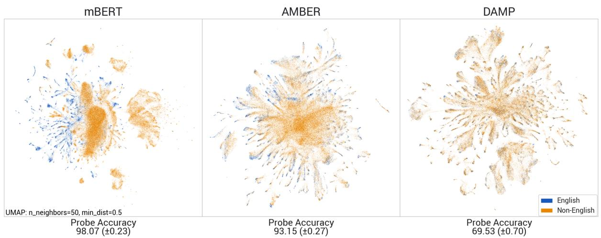
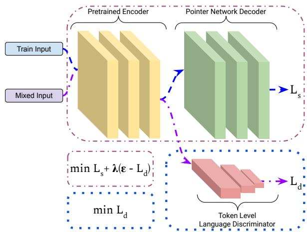
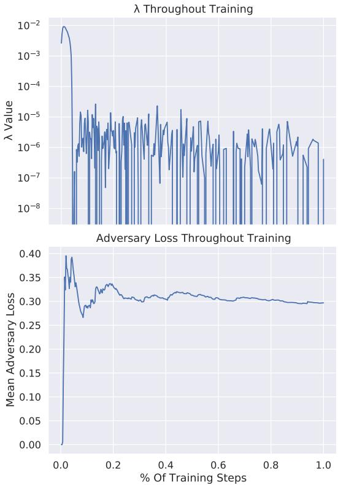

# DAMP: Doubly Aligned Multilingual Parser for Task-Oriented Dialogue

William Held Christopher Hidey Fei Liu Eric Zhu

Rahul Goel Diyi Yang Rushin Shah

wheld3@gatech.edu

## Abstract

Modern virtual assistants use internal semantic parsing engines to convert user utterances to actionable commands. However, prior work has demonstrated multilingual models are less robust for semantic parsing compared to other tasks. In global markets such as India and Latin America, robust multilingual semantic parsing is critical as codeswitching between languages is prevalent for bilingual users. In this work we dramatically improve the zero-shot performance of a multilingual and codeswitched semantic parsing system using two stages of multilingual alignment. First, we show that contrastive alignment pretraining improves both English performance and transfer efficiency. We then introduce a constrained optimization approach for hyperparameter-free adversarial alignment during finetuning. Our Doubly Aligned Multilingual Parser (DAMP) improves mBERT transfer performance by 3x, 6x, and 81x on the Spanglish, Hinglish and Multilingual Task Oriented Parsing benchmarks respectively and outperforms XLM-R and mT5-Large using 3.2x fewer parameters.1

## 1 Introduction

Task-oriented dialogue systems are the backbone of virtual assistants, an increasingly common direct interaction between users and Natural Language Processing (NLP) technology. Semantic parsing converts unstructured text to structured representations grounded in task actions. Due to the conversational nature of the interaction between users and task-oriented dialogue systems, speakers often use casual register with regional variation. Such variation is an essential challenge for the inclusiveness and reach of virtual assistants which aim to serve a global and diverse userbase (Liu et al., 2021).

In this work, we are motivated by a common form of variation for bilingual speakers (Dogruöz˘ et al., 2021): codeswitching. Codeswitching occurs in two forms which both affect task-oriented dialogue. Inter-sentential codeswitching is when multilingual users make whole requests in different languages within a single dialogue:

## Play all rap music on my iTunes

Toca toda la música rap en mi iTunes

Intra-sentential codeswitching appears when the user switches languages during a single query:

## Play toda la rap music en mi iTunes

Both forms are used by bilingual speakers (Joshi, 1982; Dey and Fung, 2014) and cause location, language preference, and even language identification to be unreliable mechanisms for routing requests to an appropriate monolingual system (Barman et al., 2014). This makes zero-shot codeswitching performance an aspect of system robustness instead of a way to reduce annotation costs.

However, zero-shot structured prediction and parsing is still a challenge for state-of-the-art multilingual models (Ruder et al., 2021), highlighting the need for improved methods beyond scale to achieve this goal. Fortunately, as a fundamental property of the task, these linguistically diverse inputs are grounded in a shared semantic output space. Each of the above outputs corresponds to:

## [play\_music:[genre:rap][platform:iTunes]]

This grounded and shared output space makes explicit alignment across languages especially attractive as a mechanism for cross-lingual transfer.

We propose using both contrastive alignment pretraining and a novel constrained adversarial finetuning method to perform double alignment, shown in Figure 1. Our Doubly Aligned Multilingual Parser (DAMP) achieves strong zero-shot performance on both multilingual (inter-sentential) and intra-sentential codeswitched data, making it a robust model for bilingual users without harming English performance. We contribute the following:

  
Figure 1: We show DAMP meaningfully improves alignment, with more overlapping clusters and decreased probe accuracy. Language identification probe accuracy and visualizations of the token embeddings from a multilingual transformer without alignment (mBERT), pretraining alignment alone (AMBER), and our proposed alignment regime of both contrastive pretraining and constrained adversarial finetuning (DAMP)

1. Alignment Pretraining Effectiveness: We show that multilingual BERT (mBERT) has poor transferability for both categories of codeswitched data. Contrastive alignment, however, pretrained with cross-lingual bitext data dramatically improves English, multilingual, and intra-sentential codeswitched semantic parsing performance.

2. Constrained Adversarial Alignment: We propose utilizing domain adversarial training to further improve alignment and transferability without labeled or aligned data. We introduce a novel constrained optimization method and demonstrate that it improves over prior domain adversarial training algorithms (Sherborne and Lapata, 2022) and regularization baselines (Li et al., 2018; Wu and Dredze, 2019). Finally, we highlight the advantages of pointer-generator networks with explicit alignment by showing that pretrained decoders lead to accidental translation (Xue et al., 2021).

3. Interpreting Alignment Improvements: Additionally, we find the improved parsing ability of DAMP is driven by a 6x improvement in prediction accuracy of the initial intent. Finally, we measure improvements in alignment using a post-hoc linear probe on language prediction in addition to qualitative analysis of embedding visualizations.

## 2 Related Work

Multilingual Language Model Alignment Massively multilingual transformers (MMTs) (Pires et al., 2019; Conneau et al., 2020a; Liu et al., 2020; Xue et al., 2021) have become the de-facto basis for multilingual NLP and are effective at intrasentential codeswitching as well (Winata et al., 2021). While prior work has studied explicit alignment of individual embeddings (Artetxe et al., 2018; Artetxe and Schwenk, 2019), MMTs appear to implicitly perform alignment within their hidden states (Artetxe et al., 2020; Conneau et al., 2020b).

MMTs are remarkably robust for multilingual and intra-sentential codeswitching benchmarks (Aguilar et al., 2020; Hu et al., 2020; Ruder et al., 2021). However, the gap between performance on the training language and zero-shot targets is larger in task-oriented parsing benchmarks (Li et al., 2021; Agarwal et al., 2022; Einolghozati et al., 2021), similar to the large discrepancy for other syntactically intensive tasks (Hu et al., 2020).

Our work applies the pretraining regime from Hu et al. (2021), which adds multiple explicit alignment objectives to traditional MMT pretraining. We show that this technique is effective both for semantic parsing, a new task, and intra-sentential codeswitching, a new linguistic domain.

Domain Adversarial Training The concept of using an adversary to remove undesired features has been discovered and applied separately in transfer learning (Ganin et al., 2016), privacy preservation (Mirjalili et al., 2020), and algorithmic fairness (Zhang et al., 2018a). When applying this technique to transfer learning, Ganin et al. (2016) term this domain adversarial training.

Due to its effectiveness in domain transfer learning, multiple works have studied applications of domain adversarial learning to cross-lingual transfer (Guzman-Nateras et al., 2022; Lange et al., 2020; Joty et al., 2017). Most relevant, Sherborne and Lapata (2022) combine a multi-class language discriminator with translation loss to improve crosslingual transfer.

In this space, we contribute the 4 following novel findings. Firstly, we show that binary discrimination is more effective than multi-class discrimination and provide intuitive reasoning for why this is true despite the inherently multi-class distribution of multilingual data. Secondly, we show that adversarial alignment can increase the accidental translation phenomena (Xue et al., 2021) in models with pretrained decoders. Thirdly, we show that tokenlevel adversarial discrimination improves transfer to intra-sentential codeswitching. Finally, we remove the challenge of zero-shot hyperparameter search with a novel constrained optimization technique that can be configured a priori based on our alignment goals.

Preventing Multilingual Forgetting Beyond adversarial techniques, prior work has used regularization to maintain multilingual knowledge learned only during pretraining. Li et al. (2018) shows that penalizing distance from a pretrained model is a simple and effective technique to improve transfer. Using a much stronger inductive bias, Wu and Dredze (2019) freezes early layers of multilingual models to preserve multilingual knowledge. This leaves later layers unconstrained for task specific data. We show that DAMP outperforms these baselines, the first comparison of traditional regularization to adversarial cross-lingual transfer.

## 3 Methods

We utilize two separate stages of alignment to improve zero-shot transfer in DAMP. During pretraining, we use contrastive learning to improve alignment amongst pretrained representations. During finetuning, we add double alignment through domain adversarial training using a binary language discriminator and a constrained optimization approach. We apply these improvements to the encoder of a pointer-generator network that copies and generates tags to produce a parse.

## 3.1 Baseline Architecture

Following Rongali et al. (2020), we use a pointer-generator network to generate semantic parses. We tokenize words $[ w _ { 0 } , w _ { 1 } \dots , w _ { m } ]$ from the labeling scheme into sub-words $\left[ s _ { 0 , w _ { 0 } } , \ldots , s _ { n , w _ { 0 } } , s _ { 0 , w _ { 1 } } \ldots , s _ { n , w _ { m } } \right]$ and retrieve hidden states $[ \mathbf { h } _ { 0 , w _ { 0 } } , \ldots , \mathbf { h } _ { n , w _ { 0 } } , \mathbf { h } _ { 0 , w _ { 1 } } \ldots , \mathbf { h } _ { n , w _ { m } } ]$ from our encoder. We use the hidden state of the first subword for each word to produce word-level hidden states:

$$
[ \mathbf { h } _ { 0 , w _ { 0 } } , \mathbf { h } _ { 0 , w _ { 1 } } \dots , \mathbf { h } _ { 0 , w _ { m } } ]\tag{1}
$$

Using 1 as a prefix, we use a randomly initialized auto-regressive decoder to produce representations $[ \mathbf { d } _ { 0 } , \mathbf { d } _ { 1 } \ldots , \mathbf { d } _ { t } ]$ . At each action-step a, we produce a generation logit vector using a perceptron to predict over the vocabulary of intents and slot types ${ \bf g } _ { a }$ and a copy logit vector for the arguments from the original query $\mathbf { c } _ { a }$ using similarity with Eq. 1:

$$
\mathbf { g } _ { a } = M L P ( \mathbf { d } _ { a } )\tag{2}
$$

$$
\mathbf { c } _ { a } = [ \mathbf { d } _ { a } ^ { \top } \mathbf { h } _ { 0 , w _ { 1 } } , \mathbf { d } _ { a } ^ { \top } \mathbf { h } _ { 0 , w _ { 1 } } , \dots \mathbf { d } _ { a } ^ { \top } \mathbf { h } _ { 0 , w _ { m } } ]\tag{3}
$$

Finally, we produce a probability distribution $ { \mathbf { p } } ^ { a }$ across both generation and copying by applying the softmax to the concatenation of our logits and optimize the negative log-likelihood of the correct prediction $a ^ { \prime } \mathrm { { : } }$

$$
\mathbf { p } ^ { a } = \sigma \big ( \bigl [ \mathbf { g } _ { a } ; \mathbf { c } _ { a } \bigr ] \big )\tag{4}
$$

$$
L _ { s } = - l o g ( \mathbf { p } _ { a ^ { \prime } } ^ { a } )\tag{5}
$$

Intuitively, the pointer-generator limits the model to generating control tokens and copying input tokens. This constraint is key for cross-lingual generalization since our decoder is only trained on English data. Even for models which are pretrained for multilingual generation, finetuning on English data alone often leads to accidental translation (Xue et al., 2021), where generation occurs in English regardless of the input language.

The pointer-generator guarantees that our generations will use the target language even for languages it was never trained on. We show that this is essential for DAMP in in Section 5.3, as improved alignment otherwise exacerbates accidental translation by removing the decoders ability to distinguish the input language during generation.

## 3.2 Alignment Pretraining

We evaluate the contrastive pretraining process AMBER introduced by Hu et al. (2021) for semantic parsing. AMBER combines 3 explicit alignment objectives: translation language modeling, sentence alignment, and word alignment using attention symmetry. These procedures aim to make semantically aligned translation data, known as bitext (Melamed, 1999), similarly aligned in the representation space used by the model.

Translation language modeling was originally proposed by Conneau and Lample (2019). This technique is simply traditional masked language modeling, but uses bitext as input and masking tokens in each language. Since translations of masked words are often unmasked in the bitext, this encourages the model to align word and phrase level representations so that they can be used interchangeably across languages.

Sentence alignment (Conneau et al., 2018) directly optimizes similarity of representations across languages using a siamese network training process. Given an English sentence with pooled representation $\mathbf { e } _ { i } ,$ , the model maximizes the negative log-likelihood of the probability assigned to true translation $t ^ { \prime }$ compared to a batch of possible translations B:

$$
L ( { \bf e } _ { i } , { \bf t ^ { \prime } } , N ) _ { s a } = - \log \left( \frac { { \bf e } _ { i } ^ { \top } { \bf t ^ { \prime } } } { \sum _ { t _ { i } \in B } { \bf e } _ { i } ^ { \top } { \bf t } _ { i } } \right)\tag{6}
$$

Finally, AMBER encourages word level alignment by optimizing with an attention symmetry loss (Cohn et al., 2016). For attention head $h \in H$ a sentence in language S, and its translation in language $T ,$ , the similarity of the cross-attention matrices $A _ { S  T } ^ { h }$ and $A _ { T  S } ^ { h }$ is maximized:

$$
L ( S , T ) = 1 - \frac { 1 } { H } \sum _ { h \in H } \frac { \mathrm { t r } ( A _ { S  T } ^ { h ^ { \intercal } } A _ { T  S } ^ { h } ) } { \mathrm { m i n } ( M , N ) }\tag{7}
$$

Together, these procedures provide signals which encourage the encoder to represent inputs with the same meaning similarly at several levels of granularity, regardless of which language they occur in.

## 3.3 Cross-Lingual Adversarial Alignment

However, this alignment across languages can be lost during finetuning. Since procedures such as those used in AMBER rely on manually aligned data, which is rare for downstream tasks, they are inapplicable for preventing misalignment during finetuning.

  
Figure 2: An overview of the adversarial alignment procedure. An adversarial model distinguishes English and Non-English examples with $L _ { d }$ . With $L _ { d } \ge$ ϵ as a constraint, the generator optimizes the Lagrangian dual.

Therefore, we instead build on the domain adversarial training process of Ganin et al. (2016) to maintain and improve alignment during finetuning. First, we use a token-level language discriminator as an adversary to maintain word level alignment across languages. We show that multi-class discrimination used in prior work allows for equilibria which are inoptimal for transfer. Instead, we propose treating all languages not found in the training data as a single negative class. Finally, we introduce a general constrained optimization approach for adversarial training and apply it to cross-lingual alignment.

Token-Level Discriminator Similar to Ganin et al. (2016), we train a discriminator to distinguish between in-domain training data and unlabeled outof-domain data. Our method assumes access to labeled training queries in one language, in this case English, and unlabeled queries in multiple other languages which target the same intents and slots. Data is sampled evenly from all languages to create an adversarial dataset with equal amounts of each language.

We use a two-layer perceptron to predict the probability $p = P ( E | h _ { 0 , w _ { n } } )$ that a token with true label $y$ is English or Non-English given hidden representations from Eq. 1. Our discriminator loss is traditional binary cross-entropy loss:

$$
L _ { d } = - ( y \log ( p ) + ( 1 - y ) \log ( 1 - p ) )\tag{8}
$$

Since it is more difficult to discriminate between similar points, domain adversarial training uses the loss of the discriminator as a proxy for alignment. When alignment with the training language improves, so does the cross-lingual transfer to unseen languages.

Prior work using domain adversarial training for multilingual robustness (Lange et al., 2020; Sherborne and Lapata, 2022) performs multi-class classification across all languages and uses the negative log-likelihood of the correct class as the loss function. While using a separate class for each language is natural, it breaks the equivalence between maximizing the discriminator loss and aligning unlabeled and labeled data. With a multi-class discriminator, the generator can instead be rewarded for aligning across unlabeled languages even when this does not benefit transfer from the labeled source.

To illustrate this misaligned reward, suppose we have labeled data in English and unlabeled data in both Spanish and French. The goal of the multiclass adversary is to predict English, Spanish, or French for each token while the encoder is to minimize the ability of the adversary to recover the correct language. Consider the token "dormir", which translates from both Spanish and French to the English "to sleep". In the multi-class setting, the encoder can maximize the adversarial reward by aligning the Spanish "dormir" to the French "dormir", which is simple since they are cognates, without improving alignment with the English "to sleep" at all. In this extreme example, the multiclass loss is likely to lead to a solution which does not improve alignment with the labeled data, in this case English, at all.

Using a binary "English" vs. "Non-English" classifier removes these inoptimal solutions. Since both Spanish and French are now labeled "Non-English", the encoder has no direct incentive to align the two unlabeled languages. Instead, the encoder must align both French and Spanish to the labeled English data to the maximize the adversarial reward. Since transferability relies on improved alignment with the labeled data, we expect this loss function to lead to better transfer results.

Constrained Optimization Traditionally, domain adversarial training uses a gradient reversal layer (Ganin et al., 2016) to allow the generator to maximize adversary loss $L _ { d }$ weighted by hyperparameter λ while minimizing task loss $L _ { s }$ . For the generator, this is effectively equivalent to optimizing a linear combination of the terms:

$$
L = L _ { s } - \lambda L _ { d }\tag{9}
$$

Selecting a schedule for λ presents a challenge in the zero-shot setting. Since the reverse validation procedure used to select the λ schedule by Ganin et al. (2016) assumes only one target domain, multilingual works such as Sherborne and Lapata (2022) opt to simply perform a linear search using the in-domain development set s. This approach ignores transfer performance entirely when weighing adversary loss. Instead, we propose a novel constrained optimization method which balances adversarial and task loss automatically using a constraint derived from first-principles.

Our goal is to obtain token representations that are exactly aligned across languages. Any well-fit adversary will predict English with $P = 0 . 5$ on such data and receives a loss of 0.3 since it cannot perform better than chance. In equilibrium, the generator cannot increase loss above 0.3 since the adversary can simply predict $P = 0 . 5$ for all inputs regardless of the ground truth labels.

This reasoning provides us a clear constraint. In alignment, the $L _ { d }$ should be no less than 0.3, which we call ϵ. We then optimize the task loss $L _ { s }$ while enforcing this constraint. We do so with minimal additional computation cost and using backpropagation alone with the differential method of multipliers (Platt and Barr, 1987). The differential method of multipliers first relaxes the constrained problem to its Lagrangian dual:

$$
L = L _ { s } + \lambda ( \epsilon - L _ { d } )\tag{10}
$$

Unlike Sherborne and Lapata (2022), this lets us treat λ as a learnable parameter and optimize it to maximize the value of $\lambda ( \epsilon - L _ { d } )$ with stochastic gradient ascent. In plain terms, our optimization increases the value of λ when $\epsilon > L _ { d }$ and decreases it when $\epsilon < L _ { d }$ This produces a schedule for λ which weighs the adversarial penalty only when it is accurate. In Figure 3, we show how λ evolves throughout training to maintain the constraint.

## 4 Experiments

We evaluate the effects of our techniques on three benchmarks for task-oriented semantic parsing with hierarchical parse structures. Two of these datasets evaluate robustness to intra-sentential codeswitching (Einolghozati et al., 2021; Agarwal et al., 2022) and the third uses multilingual data to evaluate robustness to inter-sentential codeswitching (Li et al., 2021). Examples are divided as originally released into training, evaluation, and test data at a ratio of 70/10/20.

  
Figure 3: The top plot shows the learned schedule for the weight λ. The bottom plot shows the adversarial loss which converges to our constraint using this λ schedule.

## 4.1 Datasets

Multilingual Task Oriented Parsing (MTOP) Li et al. (2021) introduced this benchmark to evaluate multilingual transfer for a difficult compositional parse structure. The benchmark contains queries in English, French, Spanish, German, Hindi, and Thai. Zero-shot performance on this benchmark is a proxy for robustness to intersentential codeswitching. Each language has approximately 15,000 total queries which cover 11 domains with 117 intents and 78 slot types.

Hindi-English Task Oriented Parsing (CST5) Agarwal et al. (2022) construct a benchmark of Hindi-English intra-sentential codeswitching data using the same label space as the second version of the English Task Oriented Parsing benchmark (Chen et al., 2020). As part of preprocessing, we use Zhang et al. (2018b) to identify and transliterate Romanized Hindi tokens to Devanagari. There are 125,000 in English and 10,896 queries in Hindi-English which cover 8 domains with 75 Intents and 69 Slot Types.

Codeswitching Task Oriented Parsing (CSTOP) Einolghozati et al. (2021) is a benchmark of Spanish-English codeswitching data. While the dataset was released with a corresponding English dataset in the same label space, that data is now unavailable. Therefore, we construct an artificial dataset in the same label space using Google Translate on each segment of the structured Spanish-English training data2. The resulting English dataset is not human validated and therefore noisy. This is a limitation, but is necessary to estimate of zero-shot transfer from English to Spanish-English codeswitching due to the limited release of CSTOP. The resulting dataset has 5,803 queries in both English and Spanish-English which cover 2 domains with 19 Intents and 10 Slot Types.

## 4.2 Results

We use the same hyperparameter configurations for all settings. The encoder uses the mBERT architecture (Pires et al., 2019). The decoder is a randomly initialized 4-layer, 8-head vanilla transformer for comparison with the 4-layer decoder structure used in Li et al. (2021). We use AdamW and optimize for 1.2 million training steps with early stopping using a learning rate of 2e 5, batch size of 16, and decay the learning rate to 0 throughout the training. We train on a Cloud TPU v3 Pod for approximately 4 hours for each dataset. For all adversarial experiments, we use the unlabeled queries from MTOP as training data for our discriminator and a loss constraint ϵ of 0.3 as justified in 3.3.

The English data from each benchmark is used for training and early stopping evaluation. We report Exact Match (EM) accuracy on all test splits. In all tables, results that significantly (p = 0.05) improve over all others are marked with a using the bootstrap confidence interval (Dror et al., 2018).

MTOP In Table 1, we report the results of our training procedure with mBERT, AMBER, and DAMP compared to existing baselines from prior work: XLM-R with a pointer-generator network (Li et al., 2021), MT5 (Xue et al., 2021) and byT5 (Xue et al., 2022). For both T5 variants, we train with the hyperparameters described in Nicosia et al. (2021).

<table><tr><td></td><td>en</td><td>es</td><td>fr</td><td>de</td><td>hi</td><td>th</td><td>Avg(5 langs)</td><td>Encoder Params.</td><td>Ratio</td></tr><tr><td>XLM-R*</td><td>83.9</td><td>50.3</td><td>43.9</td><td>42.3</td><td>30.9†</td><td>26.7</td><td>38.8</td><td>550M</td><td>3.2x</td></tr><tr><td>byT5-Base</td><td>80.1</td><td>13.6</td><td>11.7</td><td>10.7</td><td>1.5</td><td>2.7</td><td>8.0</td><td>436M</td><td>2.5x</td></tr><tr><td>mT5-Base</td><td>82.5</td><td>39.0</td><td>34.9</td><td>32.6</td><td>15.7</td><td>8.3</td><td>26.1</td><td>290M</td><td>1.7x</td></tr><tr><td>mT5-Large **</td><td>83.2</td><td>40.0</td><td>41.1</td><td>36.2</td><td>16.5</td><td>23.0</td><td>31.4</td><td>550M</td><td>3.2x</td></tr><tr><td>mT5-XXL **</td><td>86.7</td><td>62.4</td><td>63.7</td><td>57.1</td><td>43.3</td><td>49.2</td><td>55.1</td><td>6.5B</td><td>33x</td></tr><tr><td>mBERT</td><td>78.6</td><td>0.5</td><td>1.0</td><td>0.9</td><td>0.1</td><td>0.1</td><td>0.5</td><td>172M</td><td>1x</td></tr><tr><td>AMBER</td><td>84.2</td><td>46.4</td><td>35.8</td><td>26.3</td><td>6.7</td><td>2.7</td><td>23.6</td><td>172M</td><td>1x</td></tr><tr><td>DAMP</td><td>83.5</td><td>56.8†</td><td>55.6†</td><td>42.2</td><td>27.4</td><td>29.2†</td><td>42.2†</td><td>172M</td><td>1x</td></tr></table>

Table 1: Exact Match (EM) accuracy scores on the MTOP dataset. ∗ and ∗∗ indicate results from Li et al. (2021) and Nicosia et al. (2021) respectively. Best results for models which fit on a single consumer GPU in bold. Models marked with significantly (p = 0.05) improve over all others using the bootstrap confidence interval.

Despite finetuned mBERT being a strong baseline for other tasks (Wu and Dredze, 2019; Aguilar et al., 2020; Liang et al., 2020; Hu et al., 2020; Ruder et al., 2021), it is ineffective at cross-lingual transfer for compositional semantic parsing achieving an average multilingual accuracy of 0.5.

The AMBER pretraining process significantly improves over mBERT accuracy for all languages to an average of 23.6. Average accuracy across the 5 Non-English languages improves by 47x. English accuracy also improves to 84.2 from 78.6, instead of suffering negative transfer (Wang et al., 2020).

DAMP further improves average accuracy across languages over AMBER by 1.8x to 42.2, outperforming both similarly sized models (byT5-Base; +34.2, mT5-Base; +16.1) and models three times its size (mT5-Large; +10.8, XLM-R; +3.4). mT5- XXL maintains state-of-the-art performance of 55.1 but requires 33x more parameters and multiple GPUs for inference, which increases latency and compute cost.

Adversarial alignment improves performance in each language by at least 10 points, with Hindi and Thai, the most distant testing languages from English, having the largest improvements of +20.7 and +26.5 respectively. DAMP improves over the mBERT baseline by 84x without architecture changes or additional inference cost.

CST5 & CSTOP In Table 2, we report the results on both intra-sentential codeswitching benchmarks. For Hindi-English, we compare the MT5-small and MT5-XXL baselines from Agarwal et al. (2022).

AMBER again leads to a performance improvement over mBERT for both CST5 and CSTOP, across English (+1.4, +5.5) and codeswitched (+12.9, +52.4) data. DAMP also further improves transfer results (+3.8, +1.0) over AMBER at the cost of small losses in English performance (-0.2, -0.7). DAMP achieves a new state-of-the-art of 20.5 on zero-shot transfer for CST5, outperforming even MT5-XXL (20.3). Since both alignment stages have word-level objectives, we hypothesize that the word-level inductive bias provides benefits for intra-sentential codeswitching despite lacking explicit supervision for it.

<table><tr><td rowspan=2 colspan=1></td><td rowspan=1 colspan=1>CST5</td><td rowspan=1 colspan=3>CSTOP</td><td rowspan=1 colspan=1></td></tr><tr><td rowspan=1 colspan=1>en  hi-en</td><td rowspan=1 colspan=3>en   es-en</td><td rowspan=1 colspan=1>Ratio</td></tr><tr><td rowspan=1 colspan=1>byT5-BasemT5-BasemT5-XXL</td><td rowspan=1 colspan=1>85.5  5.585.7  14.6-    20.3</td><td rowspan=1 colspan=3>80.0  22.380.5  28.2-       -</td><td rowspan=1 colspan=1>2.5x1.7x33x</td></tr><tr><td rowspan=1 colspan=1>mBERT</td><td rowspan=1 colspan=1>84.4  3.8</td><td rowspan=3 colspan=3>81.2  27.786.7† 79.3</td><td rowspan=4 colspan=1>1x1x1x</td></tr><tr><td rowspan=2 colspan=1>AMBER</td><td rowspan=2 colspan=1>85.8 16.7</td><td rowspan=1 colspan=1></td></tr><tr><td rowspan=1 colspan=2>5</td></tr><tr><td rowspan=1 colspan=1>DAMP</td><td rowspan=1 colspan=1>85.620.5†</td><td rowspan=1 colspan=3>86.0 80.3†</td></tr></table>

Table 2: Exact Match (EM) accuracy scores for both intra-sentential codeswitching benchmarks. mT5-XXL results from Agarwal et al. (2022). Best results in bold.

## 5 Adversarial Baseline Comparison

## 5.1 Adversary Ablation

In Table 3, we isolate the effects of our contributions to domain adversarial training with an ablation study. While all adversarial variants improve transfer results, we see that using a binary adversary and our constrained optimization technique are both mutually and independently beneficial to adversarial alignment. Notably, DAMP improves over the unconstrained multi-class adversarial technique used in Sherborne and Lapata (2022) by 9.9, 6.4, and 0.9 EM accuracy points on MTOP, CST5, and CSTOP respectively.

<table><tr><td rowspan=2 colspan=1></td><td rowspan=1 colspan=1>MTOP</td><td rowspan=1 colspan=1>CST5</td><td rowspan=1 colspan=1>CSTOP</td></tr><tr><td rowspan=1 colspan=1>en Avg</td><td rowspan=1 colspan=1>enhi-en</td><td rowspan=1 colspan=1>enes-en</td></tr><tr><td rowspan=1 colspan=4>Alignment Ablation</td></tr><tr><td rowspan=1 colspan=1>mBERT</td><td rowspan=1 colspan=1>78.60.5</td><td rowspan=1 colspan=1>84.43.7</td><td rowspan=2 colspan=1>81.227.786.7179.3</td></tr><tr><td rowspan=1 colspan=1>AMBER</td><td rowspan=1 colspan=1>84.223.6</td><td rowspan=1 colspan=1>85.816.7</td></tr><tr><td rowspan=2 colspan=1>+ Multi+ Constr.+ Binary+ Constr.</td><td rowspan=1 colspan=1>84.032.3</td><td rowspan=1 colspan=1>85.514.1</td><td rowspan=1 colspan=1>85.079.4</td></tr><tr><td rowspan=1 colspan=1>82.733.783.8335.883.5 42.2†</td><td rowspan=1 colspan=1>85.613.885.8318.485.620.5</td><td rowspan=1 colspan=1>85.180.386.378.186.080.3</td></tr><tr><td rowspan=1 colspan=2>Regularization</td><td rowspan=1 colspan=2>Baselines</td></tr><tr><td rowspan=1 colspan=1>+ Freeze $+ \ L _ { 2 }$ Norm $+ \ L _ { 1 }$ Norm</td><td rowspan=1 colspan=1>82.6 32.081.335.578.636.4</td><td rowspan=1 colspan=1>85.2 24.6†81.622.580.718.7</td><td rowspan=1 colspan=1>85.577.283.4 77.581.169.8</td></tr><tr><td rowspan=1 colspan=4>Pretrained Decoder Baseline</td></tr><tr><td rowspan=1 colspan=1>mT5-Base</td><td rowspan=1 colspan=1>82.526.1</td><td rowspan=1 colspan=1>85.7 14.6</td><td rowspan=1 colspan=1>80.528.2</td></tr><tr><td rowspan=2 colspan=1>+ Align+ Pointer+ Align</td><td rowspan=1 colspan=1>81.116.5</td><td rowspan=2 colspan=1>85.50.685.018.085.03.6</td><td rowspan=2 colspan=1>83.016.777.654.780.6 56.1</td></tr><tr><td rowspan=1 colspan=1>71.915.272.920.6</td></tr></table>

Table 3: Exact Match (EM) accuracy scores for across combinations of both binary and multi-class discriminators, constrained optimization, and regularization.

## 5.2 Regularization Comparison

We also compare adversarial training to regularization techniques used in cross-lingual learning. We experiment with freezing the first 8 layers of the encoder (Wu and Dredze, 2019) and using the $L _ { 1 }$ and $L _ { 2 }$ norm penalty (Li et al., 2018). Adversarial learning outperforms these baselines on MTOP and CSTOP while model freezing and $L _ { 2 }$ norm penalization outperform adversarial learning on CST5. However, adversarial learning is the only method that improves across all benchmarks.

## 5.3 Pretrained Decoder Comparison

Finally, we evaluate whether our constrained adversarial alignment technique offers similar benefits to models with pretrained decoders due to their natural advantage in generation tasks. We find that adversarial training does worse than the plain mT5 model (-9.6). Upon inspection, adversarial alignment causes this drop by exacerbating accidental translation (Xue et al., 2021), where the output for Non-English input is translated to English.

For example, the expected output for “Merci d’envoyer la ligne de travail“ is “[IN:SEND\_MESSAGE [SL:GROUP travail]]“. While the unaligned model produces the incorrect parse “[IN:SEND\_MESSAGE [SL:RECIPIENT la ligne de travail]]“, the aligned model produces the correct parse translated to English “[IN:SEND\_MESSAGE [SL:GROUP work]]“. In DAMP, the pointer-generator fundamentally prevents accidental translation.

<table><tr><td></td><td>en</td><td>es</td><td>fr</td><td>de hi</td><td>th</td><td>Avg</td></tr><tr><td>mBERT</td><td>94.7</td><td>15.3</td><td>17.0</td><td>10.7 7.0</td><td>8.2</td><td>11.6</td></tr><tr><td>AMBER</td><td>96.4</td><td></td><td></td><td>78.7 71.3 66.3 32.5 26.5 55.1</td><td></td><td></td></tr><tr><td>DAMP</td><td>96.4</td><td></td><td></td><td>489.0† 86.4† 80.5† 76.6† 74.4† 81.4†</td><td></td><td></td></tr></table>

Table 4: Intent Prediction accuracy for each language on the MTOP dataset for mBERT, AMBER, and DAMP.

We confirm this in mT5 by reformatting the decoding task in a pointer format, where the correct output in the above example would be “[IN:SEND\_MESSAGE [SL:GROUP <pt-5>]]“. This makes accidental translation impossible, and adversarial alignment again improves performance in this variant for MTOP and CSTOP. However, the mT5 decoder struggles to adapt to this task, making overall performance worse than DAMP.

## 5.4 Improvement Analysis

Since exact match accuracy is a strict metric, we analyze our improvements with qualitative analysis. We examine examples that DAMP predicts correctly but AMBER and mBERT do not. We then randomly sample 20 examples from each language for manual evaluation.

Improvements in intent prediction are a large portion of the gain. If intent prediction fails, the rest of the auto-regressive decoding goes awry as the decoder attempts to generate valid slot types for that intent. We report intent prediction results across the test dataset in Table 4.

In general, these improvements follow a trend from nonsensical errors to reasonable errors to correct. For example, given the French phrase “S’il te plait appelle Adam.” meaning “Please call Adam."", mBERT predicts the intent QUESTION\_MUSIC, AMBER predicts GET\_INFO\_CONTACT, and DAMP predicts the correct CREATE\_CALL.

Within the slots themselves, the primary improvements noted in DAMP are more accurate placement articles and prepositions such as "du", "a", "el", and "la" inside the slot boundaries, which is of arguable real world importance.

We present the full sample of examples used for this analysis in Tables 5-9 in the Appendix.

## 6 Alignment Analysis

We analyze how well our alignment goals are met using two methods in Figure 1. First, we use a twodimensional projection of the resulting encoder embeddings to provide a visual intuition for alignment. Then, we provide a more reliable quantitatively evaluate alignment using a post-hoc linear probe.

## 6.1 Embedding Space Visualization

In Figure 1, we visualize the embedding spaces of each model variant on each MTOP test set using Universal Manifold Approximation and Projection (UMAP) (McInnes et al., 2018). Our visualization of mBERT provides a strong intuition for its poor results, as English and Non-English data form linearly separate clusters even within this reduced embedding space. By using AMBER instead, this global clustering behavior is removed and replaced by small local clusters of English and Non-English data. Finally, DAMP produces an embedding space with no clear visual clusters of Non-English data without English data intermingled.

## 6.2 Post-Hoc Probing

We evaluate improvements to alignment quantitatively. While Sherborne and Lapata (2022) reports the performance of the training adversary as evidence of successful training, this method has been shown insufficient due to mode collapse during training (Elazar and Goldberg, 2018; Ravfogel et al., 2022). Therefore, we train a linear probe on a frozen model after training for each variant using 10-fold cross-validation.

Supporting the visual intuition, probe performance decreases with each stage of alignment. On mBERT, the discriminator achieves 98.07 percent accuracy indicating poor alignment. AMBER helps, but the discriminator still achieves 93.15 percent accuracy indicating the need for further removal. DAMP results in a 23.62 point drop in discriminator accuracy to 69.53. This is still far above chance despite our training adversary converging to close-to-random accuracy. This indicates both the need for post-hoc probing and the possibility of further alignment improvements.

## 7 Conclusions

In this work, we introduce a Doubly Aligned Multilingual Parser (DAMP), a semantic parsing training regime that uses contrastive alignment pretraining and adversarial alignment during fine-tuning with a novel constrained optimization approach. We demonstrate that both of these stages of alignment benefit transfer learning in semantic parsing to both inter-sentential (multilingual) and intrasentential codemixed data, outperforming both similarly sized and larger models. We analyze the effects of DAMP, comparing our proposed alignment method broadly to prior both adversarial techniques and regularization baselines, and its generalizability, with applications to pretrained decoders. Finally, we interpret the impacts of both stages of alignment through qualitative improvement analysis and quantitative probing.

Importantly, DAMP shows that alignment in both pretraining and finetuning can outperform larger models pretrained on more data. This offers an orthogonal improvement to the current scaling paradigm, supporting the idea that current multilingual models underutilize available bitext (Reid and Artetxe, 2022). In cases where bitext is unavailable, our work shows that alignment still possible via adversarial procedures. By releasing our simplified constrained optimization approach for multilingual adversarial alignment, we aim to simplify and improve the application of such approaches for future work.

## 8 Limitations

This work only carries out experiments using English as the base training language for domain adversarial transfer. It is possible that domain adversarial transfer has a variable effect depending on the training language from which labeled data is used. Additionally, while typologically and regionally diverse, all but one language used in our evaluation is of Indo-European origin.

## 9 Acknowledgements

We are thankful to Hongxin Zhang, Caleb Ziems, and the anonymous reviewers from Google, ACL Rolling Review, and the ACL Main Conference for their helpful feedback.

## References

Anmol Agarwal, Jigar Gupta, Rahul Goel, Shyam Upadhyay, Pankaj Joshi, and Rengarajan Aravamudhan. 2022. Cst5: Data augmentation for code-switched semantic parsing. arXiv preprint arXiv:2211.07514.

Gustavo Aguilar, Sudipta Kar, and Thamar Solorio. 2020. LinCE: A Centralized Benchmark for Linguistic Code-switching Evaluation. In Proceedings

ofThe 12th Language Resources and Evaluation Conference, pages 1803–1813, Marseille, France. European Language Resources Association.

Mikel Artetxe, Gorka Labaka, and Eneko Agirre. 2018. A robust self-learning method for fully unsupervised cross-lingual mappings of word embeddings. In Proceedings ofthe 56th Annual Meeting ofthe Association for Computational Linguistics (Volume 1: Long Papers), pages 789–798, Melbourne, Australia. Association for Computational Linguistics.

Mikel Artetxe, Sebastian Ruder, and Dani Yogatama. 2020. On the cross-lingual transferability of monolingual representations. In Proceedings of the 58th Annual Meeting of the Association for Computational Linguistics, pages 4623–4637, Online. Association for Computational Linguistics.

Mikel Artetxe and Holger Schwenk. 2019. Massively multilingual sentence embeddings for zeroshot cross-lingual transfer and beyond. Transactions of the Association for Computational Linguistics, 7:597–610.

Utsab Barman, Amitava Das, Joachim Wagner, and Jennifer Foster. 2014. Code mixing: A challenge for language identification in the language of social media. In Proceedings of the First Workshop on Computational Approaches to Code Switching, pages 13–23, Doha, Qatar. Association for Computational Linguistics.

Xilun Chen, Asish Ghoshal, Yashar Mehdad, Luke Zettlemoyer, and Sonal Gupta. 2020. Low-resource domain adaptation for compositional task-oriented semantic parsing. In Proceedings of the 2020 Conference on Empirical Methods in Natural Language Processing (EMNLP), pages 5090–5100, Online. Association for Computational Linguistics.

Trevor Cohn, Cong Duy Vu Hoang, Ekaterina Vymolova, Kaisheng Yao, Chris Dyer, and Gholamreza Haffari. 2016. Incorporating structural alignment biases into an attentional neural translation model. In Proceedings ofthe 2016 Conference ofthe North American Chapter of the Association for Computational Linguistics: Human Language Technologies, pages 876–885, San Diego, California. Association for Computational Linguistics.

Alexis Conneau, Kartikay Khandelwal, Naman Goyal, Vishrav Chaudhary, Guillaume Wenzek, Francisco Guzmán, Edouard Grave, Myle Ott, Luke Zettlemoyer, and Veselin Stoyanov. 2020a. Unsupervised cross-lingual representation learning at scale. In Proceedings of the 58th Annual Meeting of the Association for Computational Linguistics, pages 8440– 8451, Online. Association for Computational Linguistics.

Alexis Conneau and Guillaume Lample. 2019. Crosslingual language model pretraining. In Advances in Neural Information Processing Systems, volume 32. Curran Associates, Inc.

Alexis Conneau, Ruty Rinott, Guillaume Lample, Adina Williams, Samuel Bowman, Holger Schwenk, and Veselin Stoyanov. 2018. XNLI: Evaluating crosslingual sentence representations. In Proceedings of the 2018 Conference on Empirical Methods in Natural Language Processing, pages 2475–2485, Brussels, Belgium. Association for Computational Linguistics.

Alexis Conneau, Shijie Wu, Haoran Li, Luke Zettlemoyer, and Veselin Stoyanov. 2020b. Emerging cross-lingual structure in pretrained language models. In Proceedings of the 58th Annual Meeting of the Association for Computational Linguistics, pages 6022–6034, Online. Association for Computational Linguistics.

Anik Dey and Pascale Fung. 2014. A Hindi-English code-switching corpus. In Proceedings of the Ninth International Conference on Language Resources and Evaluation (LREC’14), Reykjavik, Iceland. European Language Resources Association (ELRA).

A. Seza Dogruöz, Sunayana Sitaram, Barbara E. Bul-˘ lock, and Almeida Jacqueline Toribio. 2021. A survey of code-switching: Linguistic and social perspectives for language technologies. In Proceedings of the 59th Annual Meeting of the Association for Computational Linguistics and the 11th International Joint Conference on Natural Language Processing (Volume 1: Long Papers), pages 1654–1666, Online. Association for Computational Linguistics.

Rotem Dror, Gili Baumer, Segev Shlomov, and Roi Reichart. 2018. The hitchhiker’s guide to testing statistical significance in natural language processing. In Proceedings of the 56th Annual Meeting of the Associationfor Computational Linguistics (Volume 1: Long Papers), pages 1383–1392, Melbourne, Australia. Association for Computational Linguistics.

Arash Einolghozati, Abhinav Arora, Lorena Sainz-Maza Lecanda, Anuj Kumar, and Sonal Gupta. 2021. El volumen louder por favor: Code-switching in taskoriented semantic parsing. In Proceedings ofthe 16th Conference of the European Chapter of the Associationfor Computational Linguistics: Main Volume, pages 1009–1021, Online. Association for Computational Linguistics.

Yanai Elazar and Yoav Goldberg. 2018. Adversarial removal of demographic attributes from text data. In Proceedings of the 2018 Conference on Empirical Methods in Natural Language Processing, pages 11–21, Brussels, Belgium. Association for Computational Linguistics.

Yaroslav Ganin, Evgeniya Ustinova, Hana Ajakan, Pascal Germain, Hugo Larochelle, François Laviolette, Mario Marchand, and Victor Lempitsky. 2016. Domain-adversarial training of neural networks. J. Mach. Learn. Res., 17(1):2096–2030.

Luis Guzman-Nateras, Minh Van Nguyen, and Thien Nguyen. 2022. Cross-lingual event detection via

optimized adversarial training. In Proceedings of the 2022 Conference of the North American Chapter ofthe Associationfor Computational Linguistics: Human Language Technologies, pages 5588–5599, Seattle, United States. Association for Computational Linguistics.

Junjie Hu, Melvin Johnson, Orhan Firat, Aditya Siddhant, and Graham Neubig. 2021. Explicit alignment objectives for multilingual bidirectional encoders. In Proceedings of the 2021 Conference of the North American Chapter of the Association for Computational Linguistics: Human Language Technologies, pages 3633–3643, Online. Association for Computational Linguistics.

Junjie Hu, Sebastian Ruder, Aditya Siddhant, Graham Neubig, Orhan Firat, and Melvin Johnson. 2020. Xtreme: A massively multilingual multi-task benchmark for evaluating cross-lingual generalisation. In ICML, pages 4411–4421.

Aravind K. Joshi. 1982. Processing of sentences with intra-sentential code-switching. In Coling 1982: Proceedings of the Ninth International Conference on Computational Linguistics.

Shafiq Joty, Preslav Nakov, Lluís Màrquez, and Israa Jaradat. 2017. Cross-language learning with adversarial neural networks. In Proceedings of the 21st Conference on Computational Natural Language Learning (CoNLL 2017), pages 226–237, Vancouver, Canada. Association for Computational Linguistics.

Lukas Lange, Anastasiia Iurshina, Heike Adel, and Jannik Strötgen. 2020. Adversarial alignment of multilingual models for extracting temporal expressions from text. In Proceedings of the 5th Workshop on Representation Learning for NLP, pages 103–109, Online. Association for Computational Linguistics.

Haoran Li, Abhinav Arora, Shuohui Chen, Anchit Gupta, Sonal Gupta, and Yashar Mehdad. 2021. MTOP: A comprehensive multilingual task-oriented semantic parsing benchmark. In Proceedings of the 16th Conference ofthe European Chapter ofthe Associationfor Computational Linguistics: Main Volume, pages 2950–2962, Online. Association for Computational Linguistics.

Xuhong Li, Yves Grandvalet, and Franck Davoine. 2018. Explicit inductive bias for transfer learning with convolutional networks. In Proceedings ofthe 35th International Conference on Machine Learning, volume 80 of Proceedings of Machine Learning Research, pages 2825–2834. PMLR.

Yaobo Liang, Nan Duan, Yeyun Gong, Ning Wu, Fenfei Guo, Weizhen Qi, Ming Gong, Linjun Shou, Daxin Jiang, Guihong Cao, Xiaodong Fan, Ruofei Zhang, Rahul Agrawal, Edward Cui, Sining Wei, Taroon Bharti, Ying Qiao, Jiun-Hung Chen, Winnie Wu, Shuguang Liu, Fan Yang, Daniel Campos, Rangan Majumder, and Ming Zhou. 2020. XGLUE: A new benchmark datasetfor cross-lingual pre-training, understanding and generation. In Proceedings of the

2020 Conference on Empirical Methods in Natural Language Processing (EMNLP), pages 6008–6018, Online. Association for Computational Linguistics.

Jiexi Liu, Ryuichi Takanobu, Jiaxin Wen, Dazhen Wan, Hongguang Li, Weiran Nie, Cheng Li, Wei Peng, and Minlie Huang. 2021. Robustness testing of language understanding in task-oriented dialog. In Proceedings of the 59th Annual Meeting of the Association for Computational Linguistics and the 11th International Joint Conference on Natural Language Processing (Volume 1: Long Papers), pages 2467–2480, Online. Association for Computational Linguistics.

Yinhan Liu, Jiatao Gu, Naman Goyal, Xian Li, Sergey Edunov, Marjan Ghazvininejad, Mike Lewis, and Luke Zettlemoyer. 2020. Multilingual denoising pretraining for neural machine translation. Transactions of the Association for Computational Linguistics, 8:726–742.

Leland McInnes, John Healy, Nathaniel Saul, and Lukas Großberger. 2018. Umap: Uniform manifold approximation and projection. Journal of Open Source Software, 3(29):861.

I. Dan Melamed. 1999. Bitext maps and alignment via pattern recognition. Computational Linguistics, 25(1):107–130.

Vahid Mirjalili, Sebastian Raschka, and Arun Ross. 2020. Privacynet: semi-adversarial networks for multi-attribute face privacy. IEEE Transactions on Image Processing, 29:9400–9412.

Massimo Nicosia, Zhongdi Qu, and Yasemin Altun. 2021. Translate & Fill: Improving zero-shot multilingual semantic parsing with synthetic data. In Findings ofthe Associationfor Computational Linguistics: EMNLP 2021, pages 3272–3284, Punta Cana, Dominican Republic. Association for Computational Linguistics.

Telmo Pires, Eva Schlinger, and Dan Garrette. 2019. How multilingual is multilingual BERT? In Proceedings of the 57th Annual Meeting of the Association for Computational Linguistics, pages 4996–5001, Florence, Italy. Association for Computational Linguistics.

John Platt and Alan Barr. 1987. Constrained differential optimization. In Neural Information Processing Systems.

Shauli Ravfogel, Michael Twiton, Yoav Goldberg, and Ryan D Cotterell. 2022. Linear adversarial concept erasure. In Proceedings of the 39th International Conference on Machine Learning, volume 162 of Proceedings ofMachine Learning Research, pages 18400–18421. PMLR.

Machel Reid and Mikel Artetxe. 2022. On the role of parallel data in cross-lingual transfer learning. arXiv preprint arXiv:2212.10173.

Subendhu Rongali, Luca Soldaini, Emilio Monti, and Wael Hamza. 2020. Don’t parse, generate! a sequence to sequence architecture for task-oriented semantic parsing. In Proceedings of The Web Conference 2020, pages 2962–2968.

Sebastian Ruder, Noah Constant, Jan Botha, Aditya Sid dhant, Orhan Firat, Jinlan Fu, Pengfei Liu, Junjie Hu, Dan Garrette, Graham Neubig, and Melvin Johnson. 2021. XTREME-R: Towards more challenging and nuanced multilingual evaluation. In Proceedings of the 2021 Conference on Empirical Methods in Natural Language Processing, pages 10215–10245, Online and Punta Cana, Dominican Republic. Association for Computational Linguistics.

Tom Sherborne and Mirella Lapata. 2022. Zero-shot cross-lingual semantic parsing. In Proceedings of the 60th Annual Meeting ofthe Associationfor Computational Linguistics (Volume 1: Long Papers), pages 4134–4153, Dublin, Ireland. Association for Computational Linguistics.

Zirui Wang, Zachary C. Lipton, and Yulia Tsvetkov. 2020. On negative interference in multilingual models: Findings and a meta-learning treatment. In Proceedings of the 2020 Conference on Empirical Methods in Natural Language Processing (EMNLP), pages 4438–4450, Online. Association for Computational Linguistics.

Genta Indra Winata, Samuel Cahyawijaya, Zihan Liu, Zhaojiang Lin, Andrea Madotto, and Pascale Fung. 2021. Are multilingual models effective in codeswitching? In Proceedings of the Fifth Workshop on Computational Approaches to Linguistic Code-Switching, pages 142–153, Online. Association for Computational Linguistics.

Shijie Wu and Mark Dredze. 2019. Beto, bentz, becas: The surprising cross-lingual effectiveness of BERT. In Proceedings ofthe 2019 Conference on Empirical Methods in Natural Language Processing and the 9th International Joint Conference on Natural Language Processing (EMNLP-IJCNLP), pages 833–844, Hong Kong, China. Association for Computational Linguistics.

Linting Xue, Aditya Barua, Noah Constant, Rami Al-Rfou, Sharan Narang, Mihir Kale, Adam Roberts, and Colin Raffel. 2022. ByT5: Towards a token-free future with pre-trained byte-to-byte models. Transactions ofthe Associationfor Computational Linguistics, 10:291–306.

Linting Xue, Noah Constant, Adam Roberts, Mihir Kale, Rami Al-Rfou, Aditya Siddhant, Aditya Barua, and Colin Raffel. 2021. mT5: A massively multilingual pre-trained text-to-text transformer. In Proceedings of the 2021 Conference of the North American Chapter of the Association for Computational Linguistics: Human Language Technologies, pages 483–498, Online. Association for Computational Linguistics.

Brian Hu Zhang, Blake Lemoine, and Margaret Mitchell. 2018a. Mitigating unwanted biases with adversarial

learning. In Proceedings of the 2018 AAAI/ACM Conference on AI, Ethics, and Society, AIES ’18, page 335–340, New York, NY, USA. Association for Computing Machinery.

Yuan Zhang, Jason Riesa, Daniel Gillick, Anton Bakalov, Jason Baldridge, and David Weiss. 2018b. A fast, compact, accurate model for language identification of codemixed text. In Proceedings of the 2018 Conference on Empirical Methods in Natural Language Processing, pages 328–337, Brussels, Belgium. Association for Computational Linguistics.

<table><tr><td colspan="1" rowspan="21">Spanish ¿ c</td><td colspan="1" rowspan="1">Input</td><td colspan="1" rowspan="1">Model</td><td colspan="1" rowspan="1">Outputs</td></tr><tr><td colspan="1" rowspan="1">¿ dónde trabaja packy ahora ?</td><td colspan="1" rowspan="1">mBERTAMBERDAMP</td><td colspan="1" rowspan="1">[in:get_contact [sl:contact trabaja ahora ]][in:get_location [sl:contact packy ]][in: get_employer [sl:contact packy ]]</td></tr><tr><td colspan="1" rowspan="1">infórmame sobre la lluvia</td><td colspan="1" rowspan="1">mBERTAMBERDAMP</td><td colspan="1" rowspan="1">[in:send_message [sl:recipient sobre ] [sl:content_exact la lluvia ]][in:get_weather [sl:weather_attribute infórmame sobre la lluvia ]][in:get_weather [sl:weather_attribute lluvia ]]</td></tr><tr><td colspan="1" rowspan="1">enumerar mis alarmas .</td><td colspan="1" rowspan="1">mBERTAMBERDAMP</td><td colspan="1" rowspan="1">[in:create_alarm [sl:alarm_name enumerar mis ]][in:create_alarm ][in:get_alarm]</td></tr><tr><td colspan="1" rowspan="1">Ilama a andy</td><td colspan="1" rowspan="1">mBERTAMBERDAMP</td><td colspan="1" rowspan="1">[in:send_message [sl:recipient Ilama andy]][in:create_call [sl:contact a andy ]][in:create_call [sl:contact andy]]</td></tr><tr><td colspan="1" rowspan="1">agrega a kelly a la llamada</td><td colspan="1" rowspan="1">mBERTAMBERDAMP</td><td colspan="1" rowspan="1">[in:play_music [sl:music_artist_name agrega kelly] [sl:music_track_title la Ilamada ]][in:play_music [sl:music_artist_name agrega kelly ] [sl:music_track_title la Ilamada ]][in:update_call [sl:contact_added kelly ]]</td></tr><tr><td colspan="1" rowspan="1">pausar y apagar llamada</td><td colspan="1" rowspan="1">mBERTAMBERDAMP</td><td colspan="1" rowspan="1">[in:get_recipes [sl:recipes_dish pausar] [sl:recipes_source llamada ]][in:end_call][in: switch_call ]</td></tr><tr><td colspan="1" rowspan="1">¿ necesito un gran abrigo ?</td><td colspan="1" rowspan="1">mBERTAMBERDAMP</td><td colspan="1" rowspan="1">[in:get_education_time [sl:contact necesito ] [sl:location gran ] [sl:type_relation abrigo]][in:get_info_recipes [sl:recipes_dish gran abrigo]][in:get_weather [sl:weather_attribute abrigo ]]</td></tr><tr><td colspan="1" rowspan="1">llámame al mediodía</td><td colspan="1" rowspan="1">mBERTAMBERDAMP</td><td colspan="1" rowspan="1">[in:create_call [sl:contact al]][in:create_call [sl:contact llámame al mediodía ]][in:create_alarm [sl:date_time al mediodía ]]</td></tr><tr><td colspan="1" rowspan="1">reproduce 1470 en la radio</td><td colspan="1" rowspan="1">mBERTAMBERDAMP</td><td colspan="1" rowspan="1">[in:is_true_recipes [sl:recipes_meal reproduce la ] [sl:music_type radio]][in:replay_music [sl:music_radio_id 1470] [sl:music_type radio]][in:play_music [sl:music_radio_id 1470] [sl:music_type radio]]</td></tr><tr><td colspan="1" rowspan="1">ómo va el temporizador ?</td><td colspan="1" rowspan="1">mBERTAMBERDAMP</td><td colspan="1" rowspan="1">[in:get_contact [sl:contact_related va temporizador ]][in:get_reminder [sl:amount cómo temporizador ]][in:get_timer [sl:method_timer temporizador]]</td></tr><tr><td colspan="1" rowspan="1">¿ se pronostican tormentas ?</td><td colspan="1" rowspan="1">mBERTAMBERDAMP</td><td colspan="1" rowspan="1">[in:get_education_degree [sl:contact se pronostican ] [sl:contact_related tormentas ]][in:get_info_recipes [sl:recipes_unit_nutrition pronostican tormentas ]][in:get_weather [sl:weather_attribute tormentas ]]</td></tr><tr><td colspan="1" rowspan="1">¿ cómo hago un roux ?</td><td colspan="1" rowspan="1">mBERTAMBERDAMP</td><td colspan="1" rowspan="1">[in:get_contact [sl:contact cómo hago ] [sl:location roux]][in:get_info_recipes][in:get_recipes [sl:recipes_dish roux ]]</td></tr><tr><td colspan="1" rowspan="1">dame el tiempo en australia</td><td colspan="1" rowspan="1">mBERTAMBERDAMP</td><td colspan="1" rowspan="1">[in:question_news [sl:news_topic el australia ]][in:get_event [sl:location australia ]][in:get_weather [sl:location australia ]]</td></tr><tr><td colspan="1" rowspan="1">muéstra me gente libre</td><td colspan="1" rowspan="1">mBERTAMBERDAMP</td><td colspan="1" rowspan="1">[in:get_recipes [sl:recipes_dish gente libre ]][in:send_message [sl:recipes_included_ingredient muéstra ] [sl:recipes_rating gente libre ]][in:get_availability]</td></tr><tr><td colspan="1" rowspan="1">¿ habrá granizo ?</td><td colspan="1" rowspan="1">mBERTAMBERDAMP</td><td colspan="1" rowspan="1">[in:get_contact [sl:type_relation granizo]][in:get_weather [sl:contact granizo ]][in:get_weather [sl:weather_attribute granizo]]</td></tr><tr><td colspan="1" rowspan="1">tiempo en nueva york</td><td colspan="1" rowspan="1">mBERTAMBERDAMP</td><td colspan="1" rowspan="1">[sl:music_genre en york ]][in:add_time_timer [sl:method_timer tiempo] [sl:location nueva york ]][in:get_weather [sl:location nueva york ]]</td></tr><tr><td colspan="1" rowspan="1">¿ quién fue a yale ?</td><td colspan="1" rowspan="1">mBERTAMBERDAMP</td><td colspan="1" rowspan="1">[in:get_contact [sl:type_relation yale ]][in:get_info_contact [sl:contact yale ]][in:get_contact [sl:school yale ]]</td></tr><tr><td colspan="1" rowspan="1">ponme en línea.</td><td colspan="1" rowspan="1">mBERTAMBERDAMP</td><td colspan="1" rowspan="1">[in:play_music [sl:music_track_title ponme en ]][in:end_call ][in:set_available]</td></tr><tr><td colspan="1" rowspan="1">haz una llamada a mi papá</td><td colspan="1" rowspan="1">mBERTAMBERDAMP</td><td colspan="1" rowspan="1">[in:get_recipes [sl:recipes_dish haz mi ]][in:create_call [sl:contact [in:get_contact [sl:contact_related mi papá ]]]][in:create_call [sl:contact [in:get_contact [sl:contact_related mi ] [sl:type_relation papá ]]]</td></tr><tr><td colspan="1" rowspan="1">¿ cuándo comienza a llover ?</td><td colspan="1" rowspan="1">mBERTAMBERDAMP</td><td colspan="1" rowspan="1">[in:get_contact [sl:type_relation comienza ]][in:get_details_news ][in:get_weather [sl:weather_attribute Ilover]]</td></tr><tr><td colspan="1" rowspan="21">French</td><td colspan="1" rowspan="1">Input</td><td colspan="1" rowspan="1">Model</td><td colspan="1" rowspan="1">Outputs</td></tr><tr><td colspan="1" rowspan="1">prends lauren au téléphone</td><td colspan="1" rowspan="1">mBERTAMBERDAMP</td><td colspan="1" rowspan="1">[in:get_alarm [sl:ordinal prends lauren]][in:update_call [sl:contact_added lauren ]][in:create_call [sl:contact lauren]]</td></tr><tr><td colspan="1" rowspan="1">joue du frank ocean .</td><td colspan="1" rowspan="1">mBERTAMBERDAMP</td><td colspan="1" rowspan="1">[in:like_music [sl:music_provider_name frank ocean ]][in:play_music [sl:music_artist_name du ocean]][in: play_music [sl:music_artist_name frank ocean ]]</td></tr><tr><td colspan="1" rowspan="1">comment faire un roux?</td><td colspan="1" rowspan="1">mBERTAMBERDAMP</td><td colspan="1" rowspan="1">[in:get_weather [sl:location comment faire ] [sl:location roux]][in:get_info_recipes][in:get_recipes [sl:recipes_dish roux ]]</td></tr><tr><td colspan="1" rowspan="1">nouveau rappel.</td><td colspan="1" rowspan="1">mBERTAMBERDAMP</td><td colspan="1" rowspan="1">[in:play_music [sl:music_genre rappel ]][in:play_music [sl:music_artist_name rappel ] ][in:create_reminder]</td></tr><tr><td colspan="1" rowspan="1">ajoute I' enfant à I' appel</td><td colspan="1" rowspan="1">mBERTAMBERDAMP</td><td colspan="1" rowspan="1">[in:send_message [sl:recipient ajoute ] [sl:content_exact à appel ]][in:update_call [sl:contact_added [in:get_contact [sl:contact_related I' enfant ]]]][in:update_call [sl:contact_added [in:get_contact [sl:type_relation enfant]]]]</td></tr><tr><td colspan="1" rowspan="1">s’ il te plait appelle adam </td><td colspan="1" rowspan="1">mBERTAMBERDAMP</td><td colspan="1" rowspan="1">[in:question_music [sl:music_provider_name te adam]][in:get_info_contact [sl:contact adam ]][in:create_call [sl:contact adam ]]</td></tr><tr><td colspan="1" rowspan="1">veuillez appeler peter</td><td colspan="1" rowspan="1">mBERTAMBERDAMP</td><td colspan="1" rowspan="1">[in:is_true_recipes [sl:recipes_dish veuillez peter]][in:create_call [sl:contact veuillez peter ]][in:create_call [sl:contact peter]]</td></tr><tr><td colspan="1" rowspan="1">veuillez appeler nick</td><td colspan="1" rowspan="1">mBERTAMBERDAMP</td><td colspan="1" rowspan="1">[in:question_news [sl:news_topic veuillez nick ]][in:get_contact [sl:contact veuillez nick]][in:create_call [sl:contact nick]]</td></tr><tr><td colspan="1" rowspan="1">efface toutes mes alarmes</td><td colspan="1" rowspan="1">mBERTAMBERDAMP</td><td colspan="1" rowspan="1">[in:update_alarm [sl:alarm_name efface mes]][in:silence_alarm [sl:amount toutes ]][in:delete_alarm [sl:amount toutes ]]</td></tr><tr><td colspan="1" rowspan="1">peux - tu appeler amy</td><td colspan="1" rowspan="1">mBERTAMBERDAMP</td><td colspan="1" rowspan="1">[in:is_true_recipes [sl:recipes_dish peux tu ] [sl:recipes_included_ingredient appeler amy]][in:send_message [sl:recipient peux amy ]][in:create_call [sl:contact amy]]</td></tr><tr><td colspan="1" rowspan="1">mets un réveil maintenant</td><td colspan="1" rowspan="1">mBERTAMBERDAMP</td><td colspan="1" rowspan="1">[in:get_timer [sl:contact mets ]][in:get_sunrise][in:create_alarm ]</td></tr><tr><td colspan="1" rowspan="1">obtenez - moi des nouvelles</td><td colspan="1" rowspan="1">mBERTAMBERDAMP</td><td colspan="1" rowspan="1">[in:question_news [sl:news_topic obtenez nouvelles]][in:get_stories_news [sl:news_type obtenez nouvelles ]][in:get_stories_news [sl:news_type nouvelles ]]</td></tr><tr><td colspan="1" rowspan="1">dis - moi quel temps il fait</td><td colspan="1" rowspan="1">mBERTAMBERDAMP</td><td colspan="1" rowspan="1">[in:get_info_recipes [sl:recipes_qualifier_nutrition dis fait]][in:get_timer [sl:method_timer temps ]][in:get_weather]</td></tr><tr><td colspan="1" rowspan="1">je dois appeler dave</td><td colspan="1" rowspan="1">mBERTAMBERDAMP</td><td colspan="1" rowspan="1">[in:question_news [sl:news_topic je dave ]][in:send_message [sl:recipient je dave ]][in:create_call [sl:contact dave ]]</td></tr><tr><td colspan="1" rowspan="1">merci d' appeler jessica</td><td colspan="1" rowspan="1">mBERTAMBERDAMP</td><td colspan="1" rowspan="1">[in:is_true_recipes [sl:recipes_dish merci jessica ]][in:update_call [sl:contact_added merci jessica ]][in:create_call [sl:contact jessica ]]</td></tr><tr><td colspan="1" rowspan="1">annule le rappel appeler maman</td><td colspan="1" rowspan="1">mBERTAMBERDAMP</td><td colspan="1" rowspan="1">[in:is_true_recipes [sl:recipes_attribute annule] [sl:recipes_included_ingredient rappel maman ]][in:update_call [sI:title_event annule maman ]][in:delete_reminder [sl:todo [in:create_call [sl:contact [in:get_contact [sl:type_relation maman ]]]]]]</td></tr><tr><td colspan="1" rowspan="1">ai - je reçu des appels de ma femme</td><td colspan="1" rowspan="1">mBERTAMBERDAMP</td><td colspan="1" rowspan="1">[in:question_news [sl:news_topic ai femme]][in:get_call [sl:todo ai je ] [sl:contact [in:get_contact [sl:contact_related ma ] [sl:type_relation femme ]]]][in:get_call [sl:contact [in:get_contact [sl:contact_related ma ] [sl:type_relation femme ]]]]</td></tr><tr><td colspan="1" rowspan="1">je voulais appeller edward weiss</td><td colspan="1" rowspan="1">mBERTAMBERDAMP</td><td colspan="1" rowspan="1">[in:question_news [sl:news_topic je weiss ]][in:get_info_contact [sl:contact je weiss ]][in:create_call [sl:contact edward weiss ]]</td></tr><tr><td colspan="1" rowspan="1">annule I' appel s’ il te plait</td><td colspan="1" rowspan="1">mBERTAMBERDAMP</td><td colspan="1" rowspan="1">[in:question_news [sl:news_topic annule plait]][in:question_news [sl:news_topic annule plait] ][in:end_call]</td></tr><tr><td colspan="1" rowspan="1">quand maman m' a -t - elle appelé ?</td><td colspan="1" rowspan="1">mBERTAMBERDAMP</td><td colspan="1" rowspan="1">[in:question_news [sl:news_topic quand elle ]][in:get_call_time [sl:contact [in:get_contact [sl:type_relation maman ]] [sl:contact m' elle ]]][in:get_call_time [sl:contact [in:get_contact [sl:type_relation maman ]]]]</td></tr><tr><td colspan="1" rowspan="21">German ruf</td><td colspan="1" rowspan="1">Input</td><td colspan="1" rowspan="1">Model</td><td colspan="1" rowspan="1">Outputs</td></tr><tr><td colspan="1" rowspan="1">bbc - schlagzeilen</td><td colspan="1" rowspan="1">mBERTAMBERDAMP</td><td colspan="1" rowspan="1">[in:play_music [sl:music_artist_name bbc schlagzeilen ]][in:get_stories_news [sl:news_source bbc schlagzeilen ][in:get_stories_news [sl:news_source bbc ] [sl:news_type schlagzeilen ]]</td></tr><tr><td colspan="1" rowspan="1">erinnerung an urlaub</td><td colspan="1" rowspan="1">mBERTAMBERDAMP</td><td colspan="1" rowspan="1">[in:get_language [sl:contact urlaub 1][in:create_alarm [sl:alarm_name urlaub ]][in:create_reminder [sl:todo urlaub]]</td></tr><tr><td colspan="1" rowspan="1">kannst du bitte meine mutter anrufen ?</td><td colspan="1" rowspan="1">mBERTAMBERDAMP</td><td colspan="1" rowspan="1">[in:get_recipes][in:get_call [sl:category_event mutter]][in:create_call [sl:contact [in:get_contact [sl:contact_related meine ] [sl:type_relation mutter ]]]]</td></tr><tr><td colspan="1" rowspan="1">bitte schick die gruppe der frauen</td><td colspan="1" rowspan="1">mBERTAMBERDAMP</td><td colspan="1" rowspan="1">[in:question_news [sl:news_topic bitte frauen ]][in:get_info_recipes [sl:contact bitte schick ] [sl:recipes_cuisine frauen ]][in:send_message [sl:group frauen ]]</td></tr><tr><td colspan="1" rowspan="1">rufe jeffrey whatsapp an</td><td colspan="1" rowspan="1">mBERTAMBERDAMP</td><td colspan="1" rowspan="1">[in:get_stories_news [sl:news_topic rufe jeffrey] [sl:name_app whatsapp]][in:get_lyrics_music [sl:contact rufe jeffrey ] [sl:name_app what sapp ]][in:create_call [sl:contact jeffrey ] [sl:name_app whatsapp]]</td></tr><tr><td colspan="1" rowspan="1">wir rufen vincent roberts an</td><td colspan="1" rowspan="1">mBERTAMBERDAMP</td><td colspan="1" rowspan="1">[in:is_true_recipes [sl:recipes_included_ingredient wir roberts]][in:get_info_contact [sl:contact vincent roberts]][in:create_call [sl:contact vincent roberts ]]</td></tr><tr><td colspan="1" rowspan="1">spiel 98.9 radio auf iheartradio</td><td colspan="1" rowspan="1">mBERTAMBERDAMP</td><td colspan="1" rowspan="1">[in:play_music [sl:music_radio_id 98.9 auf ] [sl:music_provider_name iheartradio]][in:play_music [sl:music_radio_id spiel 98.9] [sl:music_type radio] [sl:music_provider_name iheartradio]][in:play_music [sl:music_radio_id 98.9] [sl:music_type radio] [sl:music_provider_name iheartradio ]]</td></tr><tr><td colspan="1" rowspan="1">wen kenne ich in rice lake ?</td><td colspan="1" rowspan="1">mBERTAMBERDAMP</td><td colspan="1" rowspan="1">[in:get_education_time [sl:contact wen ich ] [sl:location rice lake ]][in:get_location [sl:contact kenne ich ] [sl:location rice lake ]][in:get_contact [sl:contact_related ich ] [sl:location rice lake ]]</td></tr><tr><td colspan="1" rowspan="1">lancez I' appel à kelly</td><td colspan="1" rowspan="1">mBERTAMBERDAMP</td><td colspan="1" rowspan="1">[in: send_message [sl:recipient lancez kelly ]][in:create_call [sl:contact lancez kelly]][in:create_call [sI:contact kelly]]</td></tr><tr><td colspan="1" rowspan="1">meine mutter an</td><td colspan="1" rowspan="1">mBERTAMBERDAMP</td><td colspan="1" rowspan="1">[in:send_message [sl:recipient ruf mutter ]][in:get_reminder [sl:alarm_name mutter] ][in:create_call [sl:contact [in:get_contact [sl:contact_related meine ] [sl:type_relation mutter ]]]]</td></tr><tr><td colspan="1" rowspan="1">zeige politische nachrichten</td><td colspan="1" rowspan="1">mBERTAMBERDAMP</td><td colspan="1" rowspan="1">[in:send_message [sl:recipient zeige nachrichten ]][in:get_stories_news [sl:contact zeige] [sl:news_category politische ] [sl:news_type nachrichten ]][in:get_stories_news [sl:news_category politische ] [sl:news_type nachrichten ]]</td></tr><tr><td colspan="1" rowspan="1">rufe lucas an</td><td colspan="1" rowspan="1">mBERTAMBERDAMP</td><td colspan="1" rowspan="1">[in:create_reminder [sl:todo rufe lucas ]][in:play_media [sl:music_artist_name rufe an ]][in:create_call [sl:contact lucas]]</td></tr><tr><td colspan="1" rowspan="1">wie macht man ropa vieja ?</td><td colspan="1" rowspan="1">mBERTAMBERDAMP</td><td colspan="1" rowspan="1">[in:get_contact [sl:contact macht ropa 1][in:get_info_contact [sl:contact ropa vieja ]][in:get_recipes [sl:recipes_dish ropa vieja ]]</td></tr><tr><td colspan="1" rowspan="1">rufe stattdessen nicole an</td><td colspan="1" rowspan="1">mBERTAMBERDAMP</td><td colspan="1" rowspan="1">[in:play_media [sl:music_artist_name nicole an ]][in:create_call [sl:contact nicole ]]</td></tr><tr><td colspan="1" rowspan="1">ruf bitte henry an</td><td colspan="1" rowspan="1">mBERTAMBERDAMP</td><td colspan="1" rowspan="1">[in:create_timer [sl:contact ruf henry]][in:play_media [sl:music_artist_name ruf an ]][in:create_call [sl:contact henry ]]</td></tr><tr><td colspan="1" rowspan="1">setze den timer jetzt fort</td><td colspan="1" rowspan="1">mBERTAMBERDAMP</td><td colspan="1" rowspan="1">[in:pause_timer [sl:method_timer timer]][in:delete_timer [sl:method_timer timer]][in:resume_timer [sl:method_timer timer]]</td></tr><tr><td colspan="1" rowspan="1">bitte zeig mir alle alarme an</td><td colspan="1" rowspan="1">mBERTAMBERDAMP</td><td colspan="1" rowspan="1">[in:update_alarm [sl:alarm_name zeig alle ]][in:create_alarm [sl:amount alle ]][in:get_alarm [sl:amount alle ]]</td></tr><tr><td colspan="1" rowspan="1">beende den back - timer</td><td colspan="1" rowspan="1">mBERTAMBERDAMP</td><td colspan="1" rowspan="1">[in:update_timer [sl:method_timer timer]][sl:timer_name back timer]][in:pause_timer [sl:method_timer timer ]]</td></tr><tr><td colspan="1" rowspan="1">für wen arbeitet jerry ?</td><td colspan="1" rowspan="1">mBERTAMBERDAMP</td><td colspan="1" rowspan="1">[in:get_recipes [sl:recipes_attribute wen] [sl:recipes_dish arbeitet jerry]][in:get_employer [sl:employer wen ] [sl:contact jerry ]][in:get_employer [sl:contact jerry ]]</td></tr><tr><td colspan="1" rowspan="1">ist es fast fertig ?</td><td colspan="1" rowspan="1">mBERTAMBERDAMP</td><td colspan="1" rowspan="1">[in:get_stories_news [sl:news_source es fertig]][in:get_weather [sl:weather_attribute fast fertig]][in:get_timer]</td></tr><tr><td colspan="1" rowspan="21">Hindi</td><td colspan="1" rowspan="1">Input</td><td colspan="1" rowspan="1">Model</td><td colspan="1" rowspan="1">Outputs</td></tr><tr><td colspan="1" rowspan="1"></td><td colspan="1" rowspan="1">mBERTAMBERDAMP</td><td colspan="1" rowspan="1">[in:send_message [sl:recipient  ]][in:get_details_news ][in:get_event ]</td></tr><tr><td colspan="1" rowspan="1"></td><td colspan="1" rowspan="1">mBERTAMBERDAMP</td><td colspan="1" rowspan="1">[in:question_news [sl:news_topic  ]][in:get_employer [sl:contact ]][in:get_contact [sl:employer ]]</td></tr><tr><td colspan="1" rowspan="1">if ?</td><td colspan="1" rowspan="1">mBERTAMBERDAMP</td><td colspan="1" rowspan="1">[in:question_news [sl:news_topic  π]][in:get_call_time [sl:contact 3if ]][in:get_call_time ]</td></tr><tr><td colspan="1" rowspan="1">？</td><td colspan="1" rowspan="1">mBERTAMBERDAMP</td><td colspan="1" rowspan="1">[in:get_stories_news [sl:news_topic  T]][in:question_news [sl:news_topic  ]][in:get_weather]</td></tr><tr><td colspan="1" rowspan="1"></td><td colspan="1" rowspan="1">mBERTAMBERDAMP</td><td colspan="1" rowspan="1">[in:question_news [sl:news_topic ]][in:get_contact [sl:contact_related  t] [sl:type_relation r]]][in:create_call [sl:contact [in:get_contact [sl:contact_related  ct] [sl:type_relation ]]]]</td></tr><tr><td colspan="1" rowspan="1"></td><td colspan="1" rowspan="1">mBERTAMBERDAMP</td><td colspan="1" rowspan="1">[in:create_reminder][in:end_call [sl:contact ]][in:silence_alarm ]</td></tr><tr><td colspan="1" rowspan="1">99可阿前树</td><td colspan="1" rowspan="1">mBERTAMBERDAMP</td><td colspan="1" rowspan="1">[in:is_true_recipes [sl:recipes_dish qrq †]][in:update_call [sl:contact [in:get_contact [sl:contact_related ] [sl:type_relation qrf ]]]][in:create_call [sl:contact [in:get_contact [sl:contact_related ] [sl:type_relation qrqf ]]]]</td></tr><tr><td colspan="1" rowspan="1"></td><td colspan="1" rowspan="1">mBERTAMBERDAMP</td><td colspan="1" rowspan="1">[in:question_news [sl:news_topic  Tπ ]][in:question_news [sl:location  fa ]][in:get_recipes [sl:recipes_dish  fa]]</td></tr><tr><td colspan="1" rowspan="1"></td><td colspan="1" rowspan="1">mBERTAMBERDAMP</td><td colspan="1" rowspan="1">[in:play_music [sl:music_album_title  ]][in:get_weather [sl:date_time π ]][in:get_weather [sl:date_time π  ]]</td></tr><tr><td colspan="1" rowspan="1"></td><td colspan="1" rowspan="1">mBERTAMBERDAMP</td><td colspan="1" rowspan="1">[in:get_stories_news [sl:news_topic π]][in:update_call [sl:contact_related][sl:amount ]][in:delete_alarm [sl:amount ]]</td></tr><tr><td colspan="1" rowspan="1"></td><td colspan="1" rowspan="1">mBERTAMBERDAMP</td><td colspan="1" rowspan="1">[in:send_message [sl:content_exact  aT]][in:create_alarm [sl:date_time  a]][in:get_event [sl:date_time  ą]]</td></tr><tr><td colspan="1" rowspan="1">3rat He </td><td colspan="1" rowspan="1">mBERTAMBERDAMP</td><td colspan="1" rowspan="1">[in:get_timer [sl:contact 3raf ]][in:get_call [sl:contact 3]][in:create_alarm]</td></tr><tr><td colspan="1" rowspan="1"></td><td colspan="1" rowspan="1">mBERTAMBERDAMP</td><td colspan="1" rowspan="1">[in:question_news [sl:news_topic f ]][in:create_call [sl:contact ]][in:create_call [sl:contact ]]</td></tr><tr><td colspan="1" rowspan="1"></td><td colspan="1" rowspan="1">mBERTAMBERDAMP</td><td colspan="1" rowspan="1">[in:create_call [sl:contact 3]][in:get_contact [sl:contact  ]][in:get_stories_news [sl:date_time ][sl:news_type ]]</td></tr><tr><td colspan="1" rowspan="1"></td><td colspan="1" rowspan="1">mBERTAMBERDAMP</td><td colspan="1" rowspan="1">[in:get_event [sl:category_event  ] [sl:location  ]][in:question_news [sl:news_topic ]][in:create_call [sl:contact  ]]</td></tr><tr><td colspan="1" rowspan="1"></td><td colspan="1" rowspan="1">mBERTAMBERDAMP</td><td colspan="1" rowspan="1">[in:question_news [sl:news_topic a ]][in: send_message [sl:recipes_dish R ą11[in:get_weather [sl:weather_attribute aRr]]</td></tr><tr><td colspan="1" rowspan="1"></td><td colspan="1" rowspan="1">mBERTAMBERDAMP</td><td colspan="1" rowspan="1">[in:send_message [sl:recipient ]][in:get_availability [sl:contact ]][in:create_call [sl:contact ][sl:ordinal ]]</td></tr><tr><td colspan="1" rowspan="1"></td><td colspan="1" rowspan="1">mBERTAMBERDAMP</td><td colspan="1" rowspan="1">[in: send_message [sl:recipient  a ]][in:update_reminder_date_time [sl:todo TTş]][in:resume_timer [sl:method_timer ş开]]</td></tr><tr><td colspan="1" rowspan="1">耐可可可可可可TT可T</td><td colspan="1" rowspan="1">mBERTAMBERDAMP</td><td colspan="1" rowspan="1">[in:send_message [sl:content_exact  ]][in:send_message [sl:recipient ]][in:create_call [sl:contact  ]]</td></tr><tr><td colspan="1" rowspan="1"></td><td colspan="1" rowspan="1">mBERTAMBERDAMP</td><td colspan="1" rowspan="1">[in:create_call [sl:contact afta]][in:loop_music [sl:music_type af]][in:replay_music [sl:music_type f]]</td></tr><tr><td colspan="1" rowspan="21">Thai</td><td colspan="1" rowspan="1">Input</td><td colspan="1" rowspan="1">Model</td><td colspan="1" rowspan="1">Outputs</td></tr><tr><td colspan="1" rowspan="1"> </td><td colspan="1" rowspan="1">mBERTAMBERDAMP</td><td colspan="1" rowspan="1">[in:play_music [sl:music_artist_name nn]][in:get_contact [sl:contact Tns ιou]][in:create_call [sl:contact tu]]</td></tr><tr><td colspan="1" rowspan="1">u u u n Tns ñu a Lüu</td><td colspan="1" rowspan="1">mBERTAMBERDAMP</td><td colspan="1" rowspan="1">[in:get_event [sl:location m]][in:update_call [sl:contact_added u ns ] [sl:music_artist_name  u]][in:create_call [sl:contact  u]]</td></tr><tr><td colspan="1" rowspan="1">22aN</td><td colspan="1" rowspan="1">mBERTAMBERDAMP</td><td colspan="1" rowspan="1">[in:get_info_recipes [sl:content_exact 3anu]][in:update_call [sl:contact 3 anu ]][in:end_call ]</td></tr><tr><td colspan="1" rowspan="1">LBy ms L an m ins ü</td><td colspan="1" rowspan="1">mBERTAMBERDAMP</td><td colspan="1" rowspan="1">[in:get_event [sl:location m5]][in:question_news [sl:news_topic  ]][in:update_call [sl:contact_added tus]]</td></tr><tr><td colspan="1" rowspan="1">a  n a an a a</td><td colspan="1" rowspan="1">mBERTAMBERDAMP</td><td colspan="1" rowspan="1">[in:send_message [sl:content_exact nu ]][in:question_news [sl:news_topic w ]][in:create_reminder [sl:todo n wu]]</td></tr><tr><td colspan="1" rowspan="1"> uWm lan lu 20 u</td><td colspan="1" rowspan="1">mBERTAMBERDAMP</td><td colspan="1" rowspan="1">[in:create_alarm [sl:date_time 20]][in:create_alarm [sl:alarm_name unm ıJąn ] [sl:date_time lu um ]][in:create_alarm [sl:date_time lu unñ]]</td></tr><tr><td colspan="1" rowspan="1">lAs vinu i at &amp; t</td><td colspan="1" rowspan="1">mBERTAMBERDAMP</td><td colspan="1" rowspan="1">[in:send_message [sl:recipient vinwnu] [sl:todo at t]][in:get_contact [sl:contact las vinvnu ] [sl:employer at t]][in:get_contact [sl:employer at t]]</td></tr><tr><td colspan="1" rowspan="1">Ins  l us ln</td><td colspan="1" rowspan="1">mBERTAMBERDAMP</td><td colspan="1" rowspan="1">[in:play_music [sl:music_artist_name nn]][in:play_media [sl:music_artist_name ns ιaá] [sl:recipes_attribute Taan]][in:create_call [sl:contact La ] [sl:contact Taan ]]</td></tr><tr><td colspan="1" rowspan="1">na a nc</td><td colspan="1" rowspan="1">mBERTAMBERDAMP</td><td colspan="1" rowspan="1">[in:get_stories_news [sl:location 3 nu ]][in:play_media [sl:music_artist_name 3 aiau 1][in:end_call [sl:contact oau]]</td></tr><tr><td colspan="1" rowspan="1"> </td><td colspan="1" rowspan="1">mBERTAMBERDAMP</td><td colspan="1" rowspan="1">[in:send_message [sl:recipient luu]][in:get_info_contact [sl:contact lns n]][in:get_availability ]</td></tr><tr><td colspan="1" rowspan="1">amu anls w?</td><td colspan="1" rowspan="1">mBERTAMBERDAMP</td><td colspan="1" rowspan="1">[in:create_alarm ][in:question_news [sl:news_topic ann ]][in:get_weather [sl:date_time w ]]</td></tr><tr><td colspan="1" rowspan="1"> </td><td colspan="1" rowspan="1">mBERTAMBERDAMP</td><td colspan="1" rowspan="1">[in:send_message [sl:recipient u7 ]][in:send_message [sl:recipient u w]][in:create_call [sl:contact iW]]</td></tr><tr><td colspan="1" rowspan="1">   ž  a ?</td><td colspan="1" rowspan="1">mBERTAMBERDAMP</td><td colspan="1" rowspan="1">[in:get_event ][in:get_weather [sl:alarm_name  wnų] [sl:date_time lu lan] [sl:date_time i ]][in:get_weather [sl:weather_attribute wų ] [sl:date_time lu Lan]]</td></tr><tr><td colspan="1" rowspan="1">n  an  ats</td><td colspan="1" rowspan="1">mBERTAMBERDAMP</td><td colspan="1" rowspan="1">[in:send_message [sl:recipient uan ]][in:question_news [sl:news_topic ąnuuą uan ]][in:get_weather]</td></tr><tr><td colspan="1" rowspan="1">   a  a</td><td colspan="1" rowspan="1">mBERTAMBERDAMP</td><td colspan="1" rowspan="1">[in:send_message [sl:recipient m] [sl:content_exact nn ]][in:send_message [sl:todo u nua ]][in:create_call [sl:contact [in:get_contact [sl:type_relation wia ]]]]</td></tr><tr><td colspan="1" rowspan="1">an n a  a  at</td><td colspan="1" rowspan="1">mBERTAMBERDAMP</td><td colspan="1" rowspan="1">[in:get_event ][in:question_news [sl:news_topic annw annu]][in:get_weather [sl:location  ]]</td></tr><tr><td colspan="1" rowspan="1">lu a ž an a  u atls?</td><td colspan="1" rowspan="1">mBERTAMBERDAMP</td><td colspan="1" rowspan="1">[in:send_message [sl:recipient anu ]][in:question_news [sl:date_time lu atnls]][in:get_weather [sl:date_time 'lu u]]</td></tr><tr><td colspan="1" rowspan="1">La   a</td><td colspan="1" rowspan="1">mBERTAMBERDAMP</td><td colspan="1" rowspan="1">[in:send_message [sl:recipient nu n]][in:create_reminder [sl:person_reminded nu "ni]][in:create_reminder ]</td></tr><tr><td colspan="1" rowspan="1">n5405551560</td><td colspan="1" rowspan="1">mBERTAMBERDAMP</td><td colspan="1" rowspan="1">[in:get_event [sl:location ] 5405551560]][in:create_call [sl:phone_number Tns 5405551560 ]][in:create_call [sl:phone_number 5405551560 ]]</td></tr><tr><td colspan="1" rowspan="1">ms  Aaula als</td><td colspan="1" rowspan="1">mBERTAMBERDAMP</td><td colspan="1" rowspan="1">[in:play_music [sl:music_artist_name m5]][in:question_news [sl:news_topic n5 n]][in:get_event [sl:category_event naul ]]</td></tr></table>

Table 5: Full Table of 100 Sampled Spanish Results from Qualitative Analysis.

Table 6: Full Table of 20 Sampled French Results from Qualitative Analysis.

Table 7: Full Table of 20 Sampled German Results from Qualitative Analysis.

Table 8: Full Table of 20 Sampled Hindi Results from Qualitative Analysis.

Table 9: Full Table of 20 Sampled Thai Results from Qualitative Analysis.

## ACL 2023 Responsible NLP Checklist

A For every submission: ✓ A1. Did you describe the limitations of your work? Section 8

✓ A2. Did you discuss any potential risks of your work? We discuss in our limitations section (8) the possibility that our work does not work across broader multi-lingual gaps and could exacerbate the cross-lingual divide. Other than this limitation, our work performs a previously established tasks so poses no major additional risk.

✓ A3. Do the abstract and introduction summarize the paper’s main claims? Abstract and Section 1

✗ A4. Have you used AI writing assistants when working on this paper? Left blank.

## B ✓ Did you use or create scientific artifacts?

Section 4.1 covers datasets used.

✓ B1. Did you cite the creators of artifacts you used? Section 4.1 cites these datasets.

✗ B2. Did you discuss the license or terms for use and / or distribution of any artifacts? All datasets are released under the Creative Commons license which is permissive ofour research use.

✓ B3. Did you discuss if your use of existing artifact(s) was consistent with their intended use, provided that it was specified? For the artifacts you create, do you specify intended use and whether that is compatible with the original access conditions (in particular, derivatives of data accessed for research purposes should not be used outside of research contexts)? Section 4.1 - we use all datasets according to their original intended use case of training and evaluating task-oriented dialogue systems.

 B4. Did you discuss the steps taken to check whether the data that was collected / used contains any information that names or uniquely identifies individual people or offensive content, and the steps taken to protect / anonymize it? Not applicable. We did not produce any new datasets.

 B5. Did you provide documentation of the artifacts, e.g., coverage of domains, languages, and linguistic phenomena, demographic groups represented, etc.? Not applicable. We did not produce any new datasets.

✓ B6. Did you report relevant statistics like the number of examples, details of train / test / dev splits, etc. for the data that you used / created? Even for commonly-used benchmark datasets, include the number of examples in train / validation / test splits, as these provide necessary context for a reader to understand experimental results. For example, small differences in accuracy on large test sets may be significant, while on small test sets they may not be. Section 4.1 provides descriptive statistics ofeach dataset used.

The Responsible NLP Checklist used at ACL 2023 is adopted from NAACL 2022, with the addition of a question on AI writing assistance.

## C ✓ Did you run computational experiments?

Section 4.2

✓ C1. Did you report the number of parameters in the models used, the total computational budget (e.g., GPU hours), and computing infrastructure used? Section 4.2

✓ C2. Did you discuss the experimental setup, including hyperparameter search and best-found hyperparameter values? Section 4.2

✓ C3. Did you report descriptive statistics about your results (e.g., error bars around results, summary statistics from sets of experiments), and is it transparent whether you are reporting the max, mean, etc. or just a single run? We state that we report single run results with pairwise bootstrap tests. Details are in the caption of each table of statistics.

 C4. If you used existing packages (e.g., for preprocessing, for normalization, or for evaluation), did you report the implementation, model, and parameter settings used (e.g., NLTK, Spacy, ROUGE, etc.)? Not applicable. Left blank.

D ✗ Did you use human annotators (e.g., crowdworkers) or research with human participants? Left blank.

 D1. Did you report the full text of instructions given to participants, including e.g., screenshots, disclaimers of any risks to participants or annotators, etc.? Not applicable. Left blank.

 D2. Did you report information about how you recruited (e.g., crowdsourcing platform, students) and paid participants, and discuss if such payment is adequate given the participants’ demographic (e.g., country of residence)? Not applicable. Left blank.

 D3. Did you discuss whether and how consent was obtained from people whose data you’re using/curating? For example, if you collected data via crowdsourcing, did your instructions to crowdworkers explain how the data would be used? Not applicable. Left blank.

 D4. Was the data collection protocol approved (or determined exempt) by an ethics review board? Not applicable. Left blank.

 D5. Did you report the basic demographic and geographic characteristics of the annotator population that is the source of the data? Not applicable. Left blank.