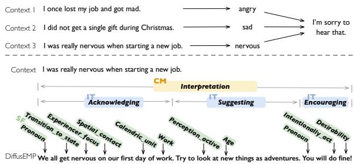
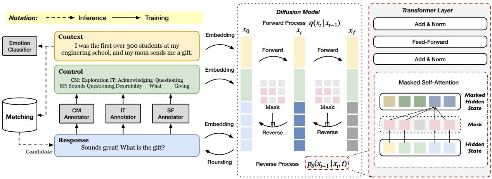
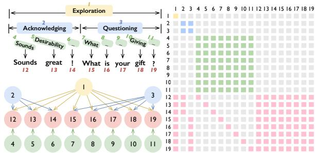
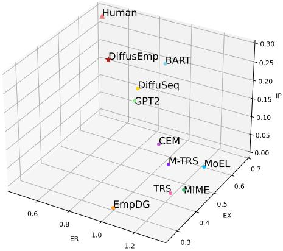
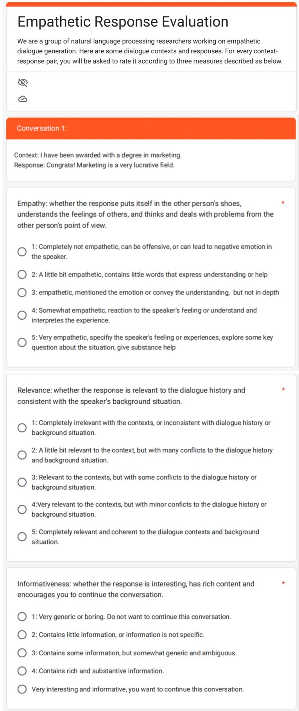

# DIFFUSEMP: A Diffusion Model-Based Framework with Multi-Grained Control for Empathetic Response Generation

Guanqun Bi1,2, Lei Shen3, Yanan Cao1,2∗, Meng Chen3∗, Yuqiang Xie1,2, Zheng Lin1,2, Xiaodong He3

1Institute of Information Engineering, Chinese Academy of Sciences, Beijing, China 2School of Cyber Security, University of Chinese Academy of Sciences, Beijing, China 3JD AI Research, Beijing, China

{biguanqun,caoyanan,xieyuqiang,linzheng}@iie.ac.cn {shenlei20,chenmeng20,xiaodong.he}@jd.com

## Abstract

Empathy is a crucial factor in open-domain conversations, which naturally shows one’s caring and understanding to others. Though several methods have been proposed to generate empathetic responses, existing works often lead to monotonous empathy that refers to generic and safe expressions. In this paper, we propose to use explicit control to guide the empathy expression and design a framework DIFFUSEMP based on conditional diffusion language model to unify the utilization of dialogue context and attribute-oriented control signals. Specifically, communication mechanism, intent, and semantic frame are imported as multi-grained signals that control the empathy realization from coarse to fine levels. We then design a specific masking strategy to reflect the relationship between multi-grained signals and response tokens, and integrate it into the diffusion model to influence the generative process. Experimental results on a benchmark dataset EMPA-THETICDIALOGUE show that our framework outperforms competitive baselines in terms of controllability, informativeness, and diversity without the loss of context-relatedness.

## 1 Introduction

Empathetic response generation, as a conditional text generation task, aims to endow agents with the ability to understand interlocutors and accurately express empathy in their communication (Rashkin et al., 2019; Lin et al., 2019; Li et al., 2020; Shen et al., 2021). However, the generated responses tend to be generic and monotonous (Chen et al., 2022), i.e., showing shallow empathy and few connections to the context. As shown in the upper part of Figure 1, “I’m sorry to hear that.” is used as a reaction to different contexts with negative feelings. To alleviate the problem, existing works mainly incorporate emotion or knowledge modules into the encoder-decoder framework and train their models with the maximum likelihood estimation (MLE) (Rashkin et al., 2019; Lin et al., 2019; Majumder et al., 2020; Li et al., 2020; Sahand Sabour, 2021; Li et al., 2022a).

  
Figure 1: A monotonous empathetic response (upper) and an informative empathetic response (lower). “CM”, “IT”, and “SF” are abbreviations for “Communication Mechanism”, “Intent”, and “Semantic Frame”, which represent control signals at the utterance, sentence, and token level respectively.

Recently, diffusion models (Ho et al., 2020; Dhariwal and Nichol, 2021) have emerged as a brand-new and promising paradigm for generative models. A few prior works that explored using diffusion models on text data are mainly designed for unconditional text generation (Austin et al., 2021; Hoogeboom et al., 2021; He et al., 2022). For text generation with extra conditions (control signals or contexts), Diffusion-LM (Li et al., 2022b) applies extra-trained classifiers to make the generated text satisfy input signals like sentiment and syntactic structure. DiffuSeq (Gong et al., 2022) is proposed as a classifier-free diffusion model that uses “partial noising” in the forward process to distinguish the input and output text.

In this paper, we add control signals to empathetic response generation and propose a diffusion model-based framework, DIFFUSEMP, to solve the aforementioned monotonous empathy problem. First, since empathy is a multi-dimensional factor (Davis et al., 1980), i.e., several factors affect the realization of empathy, we use explicit control signals at different levels to guide response generation. At the utterance level, communication mechanism (CM) (Sharma et al., 2020) divides text-based empathy into emotional reaction, interpretation, and exploration to describe the high-level functionality. Then, we use intent (IT) (Welivita and Pu, 2020) to reflect the behaviors of an agent in each sentence†, such as questioning (e.g., What happened to you?). Finally, the fine-grained signal semantic frame (SF) (Baker et al., 1998) is imposed on each token, which represents their universal categories of events, concepts, and relationships. An example of how multi-grained control signals work is illustrated in the lower part of Figure 1. To have exact guidance over responses, these signals are extracted from golden responses in the training process, while during inference, an emotion-enhanced matching method is used to obtain response candidates as the source of control signals.

We then design a diffusion model to make the generated responses not only relevant to dialogue contexts but also express specific empathy under the multi-grained control. The dialogue context, multi-grained control, and response are considered as the model input. For the forward diffusion process, we apply the partial noising (Gong et al., 2022) strategy so that both the context and control signals are unchanged, and only the response is noised. To fulfill the reverse diffusion process, we use the transformer architecture (Vaswani et al., 2017) and introduce a masking strategy to indicate the control range of each signal on response tokens. Specifically, each CM/IT controls all tokens in an utterance/sentence, while an SF term corresponds to exactly one token. Tokens out of the control range are masked in the self-attention layer. Finally, we conduct experiments on a benchmark dataset EMPATHETICDIALOGUE to demonstrate the effectiveness of DIFFUSEMP.

The main contribution of this paper is threefold: (1) We introduce explicit multi-grained control signals to solve the monotonous empathy problem, and convert the empathetic response generation into a controllable setting. (2) We propose DIF-FUSEMP, a novel diffusion model-based framework, to unify the utilization of dialogue context and control signals, achieve elaborate control with a specific masking strategy, and integrate an emotionenhanced matching method to produce diverse responses for a given context. (3) Experimental results show that our method outperforms competitive baselines in generating informative and empathetic responses.

## 2 Related Work

## 2.1 Empathetic Response Generation

Rashkin et al. (2019) firstly formulate the empathetic response generation task and construct the EMPATHETICDIALOGUE dataset. Existing works that focus on this task can be divided into two lines. The first is to detect and utilize the user’s emotion with diverse structures (Lin et al., 2019; Majumder et al., 2020; Shen et al., 2021). The second is to consider cognition-based factors other than emotions (EM), such as dialogue act (DA) (Welivita and Pu, 2020), communication mechanism (CM) (Sharma et al., 2020), emotion cause (Jiang et al., 2019), psychological skill (Kim et al., 2021), and commonsense (Sabour et al., 2021; Li et al., 2022a). Zheng et al. (2021) propose a framework CoMAE to model the relationship among CM, DA, and EM at the utterance level. The differences between Co-MAE and DIFFUSEMP are: (1) Instead of predicting each factor based on the context representation, DIFFUSEMP explicitly uses control signals that are highly related to a response as task input. (2) We achieve the elaborate control with multi-grained signals, i.e., tokens in response are influenced by different signals, while CoMAE applies the same combined factor to all decoding positions.

## 2.2 Diffusion Models

Diffusion models are a class of generative models with promising performance and have been used in a variety of real-world applications. Most existing works of diffusion models focus on continuous data, such as vision (Nichol et al., 2021; Radford et al., 2021; Rombach et al., 2021b) and audio (Popov et al., 2021; Yang et al., 2022; Tae et al., 2021). Due to the discrete nature of text data, the utilization of diffusion models for NLP is challenging. Hoogeboom et al. (2021) and Austin et al. (2021) extend diffusion models to discrete state spaces for character-level text generation. Diffusion-LM (Li et al., 2022b) uses embedding and rounding strategy to bridge the continuous and discrete domain, and trains extra classifiers for controllable text generation. DiffuSeq (Gong et al., 2022) leverages partial noising for sequence-to-sequence text generation to keep the text input unchanged in the forward process. DiffusionBERT (He et al., 2022) combines pretrained language models with absorbing-state discrete diffusion models for text. To the best of our knowledge, we are the first to achieve controllable empathetic response generation using a diffusion model.

  
Figure 2: The overview of DIFFUSEMP. The left part describes the training and inference stages, the middle part shows the forward process and reverse process in the diffusion model, and the right part illustrates details in a Transformer (Vaswani et al., 2017) block with control-range masking for the reverse process.

## 3 DIFFUSEMP

In this paper, we perform empathetic response generation in a controllable setting. The dialogue context is an alternating sequence of utterances from a speaker and a listener, i.e. $\mathbf { w } ^ { u } = \{ u _ { 1 } , u _ { 2 } , \ldots , u _ { n } \}$ Here, we aim to generate an empathetic and context-related response $\mathbf { w } ^ { y } = \{ y _ { 1 } , y _ { 2 } , \ldots , y _ { n } \}$ conditioned on the given context $\mathbf { w } ^ { u }$ and a set of control signals $\mathbf { w } ^ { c }$ obtained in advance (Section 3.1). Then, the context, control signals, and response are concatenated and fed into a diffusion model with control-range masking (Section 3.2). In the training process, golden responses are used to extract control signals, while during inference, we integrate an emotion-enhanced matching method to get proper response candidates (Section 3.3). The framework of DIFFUSEMP is illustrated in Figure 2.

## 3.1 Acquisition of Control Signals

To better model and express multi-dimensional empathy, we use control signals at different levels. However, the benchmark dataset EMPATHETICDI-ALOGUE does not contain such annotations. Here, we introduce three types of signals used in this paper and the way to collect them for each golden response or response candidate using pre-trained tagging models. The definition and components of empathy in psychology are complex(Davis et al.,

1980; de Waal, 2008; Decety and Meyer, 2008), and we choose the control signals that intersect with computational linguistics. Note that the design of DIFFUSEMP is not limited to the following control signals, other factors of empathy can also be used.

Communication Mechanism (CM). We employ the taxonomy in Sharma et al. (2020): Emotional Reaction (ER), Interpretation (IP), and Exploration (EX). ER expresses emotions such as warmth, compassion, and concern, IP represents an understanding of feelings and experiences inferred from the speaker, and EX stands for exploring the feelings and experiences not stated in previous utterances. Following Sharma et al. (2020), we use three RoBERTa-based (Liu et al., 2019) classifiers to individually identify whether a response implies a certain mechanism.

Intent (IT). A previous analysis (Welivita and Pu, 2020) argues that humans demonstrate a wide range of intents when regulating empathy and proposes a dataset EMPATHETICINTENT. Besides, many works (Xie et al., 2022; Zheng et al., 2021) insist that intents and emotions have a strong relationship. Specifically, listeners are much more likely to respond to positive or negative emotions with specific empathetic intents such as acknowledgment, consolation, and encouragement, rather than only expressing similar or opposite emotions. We train a BERT-based (Devlin et al., 2019) classifier on EMPATHETICINTENT to label responses.

Semantic Frame (SF). Semantic frames are based on FrameNet (Baker et al., 1998), a linguistic knowledge graph containing information about lexical and predicate-argument semantics. The frame of a token represents its universal categories of events, concepts, and relationships, and can be regarded as a high-level abstraction of meaning. For example, tokens like bird, cat, dog, horse, sheep share the same frame label Animals. Here, we utilize the open-SESAME model (Swayamdipta et al., 2017) to extract semantic frames from responses.

<table><tr><td>Signal Type</td><td>Accuracy</td><td>F1</td><td>#Classes</td></tr><tr><td>CM-ER</td><td>79.43</td><td>74.46</td><td>2</td></tr><tr><td>CM-IP</td><td>84.04</td><td>62.60</td><td>2</td></tr><tr><td>CM-EX</td><td>92.61</td><td>72.58</td><td>2</td></tr><tr><td>IT</td><td>87.75</td><td>87.71</td><td>9</td></tr><tr><td>SF</td><td></td><td>86.55</td><td>1222</td></tr></table>

Table 1: The performance of tagging tools used to get control signals. Since SF is from a frame semantic parsing task, we only report the F1 score following the original task setting.

The performance of tagging tools is listed in Table 1. Note that control signal tokens are concatenated into a flat sequence from coarse to fine.

## 3.2 Diffusion Model with Control-Range Masking

A diffusion model contains a forward process and a reverse process. We first concatenate a context with the control signals and corresponding response, i.e., $\textbf { w } = \textbf { w } ^ { u } \oplus \textbf { w } ^ { c } \oplus \textbf { w } ^ { y }$ . Then we use an embedding function (Li et al., 2022b) EMB( ) to map the discrete text w into a continuous representation $\mathbf { x } _ { 0 } = \mathbf { u } _ { 0 } \oplus \mathbf { c } _ { 0 } \oplus \mathbf { y } _ { 0 }$ , where ${ \bf u } _ { 0 } , { \bf c } _ { 0 }$ , and $\mathbf { y } _ { 0 }$ represent parts of $\mathbf { x } _ { \mathrm { 0 } }$ that belong to $\mathbf { w } ^ { u } , \mathbf { w } ^ { c }$ , and $\mathbf { w } ^ { y }$ respectively.

Forward Process. In forward process $q ,$ the model adds noise to the original sample $\mathbf { x } _ { \mathrm { 0 } }$ step by step:

$$
q ( \mathbf { x } _ { t } | \mathbf { x } _ { t - 1 } ) = \mathcal { N } ( \mathbf { x } _ { t } ; \sqrt { 1 - \beta _ { t } } \mathbf { x } _ { t - 1 } , \beta _ { t } \mathbf { I } ) ,\tag{1}
$$

where $\mathbf { x } _ { 1 } , . . . , \mathbf { x } _ { T }$ make up a chain of Markov variants and $\mathbf { x } _ { T } \sim \mathcal { N } ( 0 , \mathbf { I } ) . \beta _ { t } \in ( 0 , 1 )$ is a noise schedule that controls the noise scale added in each step. Note that the conventional diffusion models corrupt the entire $\mathbf { x } _ { \mathrm { 0 } }$ . However, empathetic response generation is a conditional text generation (Seq2Seq) task and we only concern with the generative effect on response. Therefore, we use partial noising (Gong et al., 2022) to only impose noise on the parts of $\mathbf { x } _ { t }$ that belong to $\mathbf { w } ^ { y } .$ , i.e., $\mathbf { y } _ { t }$ Reverse process. Once the forward process is completed, the reverse process aims to gradually recover $\mathbf { x } _ { \mathrm { 0 } }$ by denoising $\mathbf { x } _ { T }$ according to:

$$
p _ { \theta } ( \mathbf { x } _ { t - 1 } | \mathbf { x } _ { t } , t ) = \mathcal { N } ( \mathbf { x } _ { t - 1 } ; \mu _ { \theta } ( \mathbf { x } _ { t } , t ) , \sigma _ { \theta } ( \mathbf { x } _ { t } , t ) ) ,\tag{2}
$$

  
Figure 3: An example of control signals and controlrange masking. The upper left part shows a response with labeled signals, the lower left part illustrates the control range of each signal on response tokens, and the right part is the corresponding mask matrix. “-” means the SF signal is empty.

where $\mu _ { \theta } ( \cdot )$ and $\sigma _ { \theta } ( \cdot )$ are predicted mean and standard variation of $q ( \mathbf { x } _ { t - 1 } | \mathbf { x } _ { t } )$ (derived using Bayes’ rule) in forward process and can be implemented by a Transformer (Vaswani et al., 2017) model $f _ { \theta } .$ . In the reverse process, we add a rounding step (Li et al., 2022b), parameterized by $p _ { \theta } ( \mathbf { w } | \mathbf { x } _ { 0 } )$ $\textstyle \prod _ { i = 1 } ^ { n } p _ { \theta } ( w _ { i } | x _ { i } )$ , where $p _ { \theta } ( w _ { i } | x _ { i } )$ is a softmax distribution.

Control-Range Masking. The non-autoregressive nature of conventional diffusion models make one input token can attend to all other tokens with the full self-attention mechanism to update its representation. Instead, we need to distinguish between tokens of control signals and responses, and further model the relationship between them with a mask matrix $M$ and integrate it into the self-attention layer in Transformer:

$$
Q ^ { i + 1 } , K ^ { i + 1 } , V ^ { i + 1 } = h ^ { i } W _ { q } , h ^ { i } W _ { k } , h ^ { i } W _ { v } ,\tag{3}
$$

$$
S ^ { i + 1 } = s o f t m a x ( \frac { Q ^ { i + 1 } K ^ { i + 1 \mathsf { T } } + M } { \sqrt { d _ { k } } } ) ,\tag{4}
$$

$$
h ^ { i + 1 } = S ^ { i + 1 } V ^ { i + 1 } ,\tag{5}
$$

where $W _ { q } , W _ { k }$ and $W _ { v }$ are trainable parameters, $h ^ { i }$ is the hidden state of the i-th transformer layer. $d _ { k }$ is the dimension of $K$ , which is used for scaling.

Basically, if token i controls $j ,$ then the calculation of $j$ is influenced by $i .$ In terms of implementation, we do not mask i when updating the representation of $j .$ . Particularly, tokens at the same level, including IT signal tokens, SF signal tokens, and response tokens, are also designed to control each other, thus ensuring the overall logic and fluency of the generated responses. For example, it is reasonable that Sympathizing is followed by Questioning at the intent level, i.e., expressing more concerns by questioning after showing sympathy for a negative situation or feeling. Therefore, to model the control relationship among tokens, we design the control-range masking and utilize it in the self-attention layer of $f _ { \theta }$ . Specifically, for a mask matrix, the value on position $( i , j )$ is $_ 0$ if toke $1 _ { j }$ is controlled by token ; otherwise is negative infinity:

$$
M ( i , j ) = \left\{ { \begin{array} { r } { 0 , i \Rightarrow j } \\ { - \operatorname* { i n f } , i \neq j } \end{array} } \right.\tag{6}
$$

Figure 3 gives an example of control-range masking. For the intent signal Acknowledging (index 2), it is visible to Questioning (line 3) and corresponding response tokens Sounds great! in the first sentence (line 12-14). Meanwhile, since the response token great (line 13) is controlled by Exploration (index 1), Acknowledge (index 2), Desirability (index 5), and the rest of response tokens (index 12- 19), it attends to them in the mask matrix.

With the existence of control-range masking, we can elaborately guide the generation of each response token with signals from different levels that reflect diverse factors for empathy expression.

## 3.3 Training and Inference

Training. In the training process, we label control signals based on golden responses as described in 3.1. To train model $f _ { \theta }$ in the reverse process, we minimize the variational lower bound following Gong et al. (2022):

$$
\begin{array} { r l } & { \mathcal { L } _ { \mathrm { v l b } } = \displaystyle \sum _ { t = 2 } ^ { T } | | \mathbf { y } _ { 0 } - \tilde { f } _ { \boldsymbol { \theta } } ( \mathbf { x } _ { t } , t ) | | ^ { 2 } } \\ & { \quad \quad \quad + | | \mathrm { E M B } ( \mathbf { w } ^ { y } ) - \tilde { f } _ { \boldsymbol { \theta } } ( \mathbf { x } _ { 1 } , 1 ) | | ^ { 2 } } \\ & { \quad \quad \quad + \mathcal { R } ( | | \mathbf { x } _ { 0 } | | ^ { 2 } ) , } \end{array}\tag{7}
$$

where $\tilde { f } _ { \theta } ( \mathbf { x } _ { t } , t )$ denotes the fractions of recovered x0 corresponding to $\mathbf { y } _ { 0 } .$ , and $\mathcal { R } ( \cdot )$ is a mathematically equivalent regularization term to regularize the embedding learning.

Inference. During inference, since golden responses are unavailable, we design an emotionenhanced matching method to obtain response candidates and use them to extract control signals. We treat dialogue contexts in the training set as the candidate pool and use each context in the test set as a query to perform context-context matching. Then the response corresponding to a returned context with the highest similarity is used as the candidate.

Regarding the importance of emotions in empathetic response generation, we consider two aspects to score each candidate, semantic similarity and emotional consistency, in context-context matching. Specifically, we first train a BERT model (Devlin et al., 2019) on the training set to classify emotions for contexts. Then, we use this model to get emotional distribution for contexts in both the candidate pool and queries. Finally, we compute the cosine similarity of both sentence embeddings and predicted emotional distributions for each querycontext pair. The contexts are re-ranked according to a weighted sum of two similarity scores:

$$
\begin{array} { r } { S c o r e = \mathrm { S I M } _ { \mathrm { s e m a n t i c } } + \gamma \mathrm { S I M } _ { \mathrm { e m o t i o n a l } } , } \end{array}\tag{8}
$$

where $\gamma$ is a hyperparameter to balance the semantic and emotional similarity.

## 4 Experimental Setup

## 4.1 Dataset

EMPATHETICDIALOGUE (Rashkin et al., 2019) dataset comprises 24,850 open-domain multi-turn conversations between two interlocutors. Each conversation contains one emotion label, a situation where the speaker feels the exact emotion, and utterances about the speaker’s descriptions of the situation or the listener’s empathetic replies. There are 32 evenly-distributed emotion labels in the dataset. We apply the data provided by the original paper with the split ratio of 8:1:1 for training/validation/test set and use the script released by Lin et al. (2019) to preprocess the data.

## 4.2 Comparable Methods

We compare our method with three groups of representative methods.

Transformer-Based Methods. (1) TRS (Rashkin et al., 2019) is a vanilla Transformer with MLE loss. (2) MTRS (Rashkin et al., 2019) uses multi-task learning with emotion classification in addition to MLE loss. (3) MoEL (Lin et al., 2019) utilizes different decoders to combine different outputs for each emotion category. (4) MIME (Majumder et al., 2020) applies emotion grouping, emotion mimicry, and stochasticity strategies. (5) EmpDG (Li et al., 2020) learns emotions and responses based on adversarial learning. (6) CEM (Sahand Sabour, 2021) leverages commonsense to enhance empathetic response generation.

Pre-Trained Language Model-Based Methods. (1) TransferTransfo (Wolf et al., 2019) is a transfer learning-based GPT-2 (Radford et al., 2019) model fine-tuned on EMPATHETICDIALOGUE. (2) BART (Lewis et al., 2020) is a pre-trained encoderdecoder Transformer with great success in many seq2seq tasks.

<table><tr><td rowspan="2">Method</td><td rowspan="2">#Params</td><td colspan="2">Relevance</td><td colspan="3">Controllability</td><td colspan="3">Informativeness</td><td>Length</td></tr><tr><td>BERTScore ↑</td><td>MIScore ↓</td><td>ACC-CM↑</td><td>ACC-IT ↑</td><td>F1-SF ↑</td><td>D1↑</td><td>D2↑</td><td>D4↑</td><td>sBL↓ AvgLen ↑</td></tr><tr><td colspan="9">Transformer-Based Methods</td><td></td></tr><tr><td>TRS</td><td>15M</td><td>0.5717</td><td>4598.26</td><td>60.98</td><td>22.07</td><td>15.74</td><td>0.42</td><td>1.55</td><td>4.26 13.63</td><td>10.53</td></tr><tr><td>MTRS</td><td>15M</td><td>0.5735</td><td>7156.26</td><td>60.48</td><td>25.77</td><td>15.62</td><td>0.50</td><td>1.89 5.56</td><td>11.26</td><td>9.92</td></tr><tr><td>MoEL</td><td>21M</td><td>0.5758</td><td>14595.61</td><td>59.29</td><td>26.20</td><td>16.51</td><td>0.40</td><td>1.65 4.62</td><td>12.83</td><td>11.47</td></tr><tr><td>MIME</td><td>17M</td><td>0.5800</td><td>4878.71</td><td>61.16</td><td>22.00</td><td>16.54</td><td>0.26</td><td>0.87 2.15</td><td>14.21</td><td>11.12</td></tr><tr><td>EmpDG</td><td>29M</td><td>0.5745</td><td>9088.11</td><td>61.94</td><td>20.06</td><td>17.36</td><td>0.60</td><td>2.54 7.75</td><td>11.78</td><td>10.11</td></tr><tr><td>CEM</td><td>17M</td><td>0.5713</td><td>7635.05</td><td>62.28</td><td>30.09</td><td>14.20</td><td>0.54</td><td>2.00 4.98</td><td>9.13</td><td>8.25</td></tr><tr><td colspan="9">Pre-Trained Language Model-Based Methods</td><td></td></tr><tr><td>TransferTransfo</td><td>117M</td><td>0.5634</td><td>2138.39</td><td>59.70</td><td>25.08</td><td>18.39</td><td>2.81</td><td>17.22 36.54</td><td>2.68</td><td>11.40</td></tr><tr><td>BART</td><td>140M</td><td>0.5977</td><td>706.31</td><td>60.39</td><td>30.69</td><td>18.98</td><td>2.88</td><td>14.12 38.82</td><td>2.79</td><td>11.09</td></tr><tr><td colspan="9">Diffusion Model-Based Methods</td><td></td></tr><tr><td>DiffuSeq</td><td>91M</td><td>0.5101</td><td>715.95</td><td>59.23</td><td>28.58</td><td>17.26</td><td>1.79</td><td>26.97 88.17</td><td>1.29</td><td>10.30</td></tr><tr><td>DIFFUSEMP</td><td>91M</td><td>0.5205</td><td>626.92</td><td>92.36</td><td>84.24</td><td>52.79</td><td>2.84</td><td>29.25 73.45</td><td>1.09</td><td>14.12</td></tr><tr><td colspan="9">References</td></tr><tr><td>DIFFUSEMP (Oracle)</td><td>91M</td><td>0.7458</td><td>615.13</td><td>92.38</td><td>83.66</td><td>51.95</td><td>2.84</td><td>30.46 89.35</td><td>1.11</td><td>14.01</td></tr><tr><td>Human</td><td></td><td>1.0000</td><td>507.97</td><td>100.00</td><td>100.00</td><td>98.40</td><td>19.49</td><td>43.55 49.02</td><td>0.85</td><td>13.04</td></tr></table>

Table 2: Automatic evaluation results. The best results of standard settings are reported in the bold format. “ACC”, “D”, and “sBL” are abbreviations of Accuracy, Dist, and Self-BLEU, respectively. “ACC-CM” is the average Accuracy of ER, IP, and EX, which are three mechanisms of CM.

Diffusion Model-Based Method. DiffuSeq (Gong et al., 2022) is proposed as a conditional diffusion language model for seq2seq tasks.

Two more results are provided as references. Under the Oracle setting, control signals are obtained from golden responses in the test set, which can be regarded as the upper bound of DIFFUSEMP. Golden responses themselves are also evaluated, which reflects human performance on the task. More details are listed in Appendix A.1.

## 4.3 Metrics

Automatic Evaluation. We evaluate the generated responses from four aspects: (1) Relevance: BERTScore (Zhang et al., 2020a) computes a semantic similarity between generated responses and golden references. MIScore is the likelihood of generating a context with the given response, which applies the idea of Maximum Mutual Information (MMI) (Li et al., 2016; Zhang et al., 2018) and indicates whether the generated response is contextrelated. (2) Controllability: We calculate the success rate of empathy expression with multi-grained control signals to validate the controllability of DIF-FUSEMP. For utterance-level CM and sentencelevel IT, we report Accuracy, while for token-level SF, we report F1. (3) Informativeness: Dist-n (Li et al., 2016) calculates the number of distinct ngrams in generated responses. Self-BLEU (Zhu et al., 2018) reflects the difference of all generated responses to a large extent. We calculate the average BLEU-5 overlap between each two generated responses. (4) Response Length: AvgLen represents the average number of tokens for generated responses. Intuitively, too short text often fails to convey good content. More details about automatic metrics are shown in Appendix A.2.

Human Evaluation. We evaluate the response quality based on the following aspects: (1) Empathy reflects whether a response understands the speaker’s feeling or situation and responds appropriately. (2) Relevance considers whether a response is relevant to the topic mentioned by the speaker. (3) Informativeness evaluates whether a response provides rich and meaningful information. More details about the human evaluation guidance are given in Appendix A.3.

## 4.4 Implementation Details

DIFFUSEMP is based on the architecture of BERTbase (Devlin et al., 2019). For diffusion model settings, we adopt the square-root noise schedule (Li et al., 2022b) and set 2000 diffusion steps in the training and inference process. The maximum input length is 128 with WordPiece tokenizer and word embeddings are in the size of 128 with random initialization. For training settings, we use AdamW optimizer and set the learning rate as 1e-4. The batch size and dropout value are set as 128 and 0.1, respectively. γ in Equation 8 equals to 0.2. For all comparable methods, we use their official codes with settings that follow the original papers. For more details, please refer to Appendix A.4.

<table><tr><td>Method</td><td>Empathy</td><td>Relevance</td><td>Informativeness</td></tr><tr><td>TRS</td><td>2.96</td><td>2.49</td><td>2.31</td></tr><tr><td>CEM</td><td>2.84</td><td>2.69</td><td>2.75</td></tr><tr><td>BART</td><td>3.04</td><td>2.94</td><td>3.92</td></tr><tr><td>DiffuSeq</td><td>2.77</td><td>2.66</td><td>3.74</td></tr><tr><td>DIFFUSEMP</td><td>3.68</td><td>3.39</td><td>4.63</td></tr></table>

Table 3: Human evaluation results. The Fleiss’ kappa (Fleiss and Cohen, 1973) of the results is 0.47, indicating a moderate level of agreement.

## 5 Results and Discussions

## 5.1 Main Results

<table><tr><td rowspan="2">Method</td><td colspan="2">CM</td><td colspan="2">IT</td><td>SF</td></tr><tr><td>ACC↑</td><td>F1↑</td><td>ACC↑</td><td>F1↑</td><td>F1↑</td></tr><tr><td>DIFFUSEMP</td><td>92.36</td><td>90.26</td><td>84.24</td><td>77.15</td><td>52.79</td></tr><tr><td>w/o Mask</td><td>90.76</td><td>87.99</td><td>73.80</td><td>66.58</td><td>49.43</td></tr><tr><td>w/o CM</td><td>89.34</td><td>85.55</td><td>83.80</td><td>76.38</td><td>52.89</td></tr><tr><td>w/o IT</td><td>92.24</td><td>90.21</td><td>47.92</td><td>41.77</td><td>52.63</td></tr><tr><td>w/o SF</td><td>89.70</td><td>86.96</td><td>83.12</td><td>74.90</td><td>22.48</td></tr></table>

Table 4: Ablation study on control-range masking and control signals.

Automatic Evaluation Results. The overall results are shown in Table 2. DIFFUSEMP substantially exceeds transformer-based and pre-trained model-based methods on almost all metrics. First, the improvement in controllability is significant. The high success rate indicates the effectiveness of control-range masking for elaborate token generation and demonstrates the ability of DIFFUSEMP to customize responses with desired factors. For informativeness, diffusion model-based methods perform the best, and DIFFUSEMP is even better than DiffuSeq. It has been proven that the diffusion model is a powerful backbone for generating diverse texts. With the integration of control signals, especially fine-grained signal SF, the meaning of each to-be-generated response token is more specific, thus the final response is more informative. When considering informativeness values along with MIScore and AvgLen, we can find that those informative responses generated by DIFFUSEMP are also context-related and long, which satisfies the demand for proper responses to speakers. The BERTScore of DIFFUSEMP is not the highest, and we think this is reasonable since BERTScore indicates the similarity of generated and golden responses, while DIFFUSEMP encourages creativity instead of similarity. Besides, the difference between BERTScore and MIScore can justify that the generated responses are both creative and coherent. Human Evaluation Results. Human evaluation results are listed in Table 3. Our method achieves the highest scores in all aspects, and the greatest improvement is achieved in informativeness, which shows that responses generated by DIFFUSEMP are preferred by annotators. Meanwhile, results of the Oracle setting show that the performance will be further improved when accurate control signals are given, which indicates that obtaining better control signals can be a feasible research topic.

## 5.2 Ablation Study

Ablation on Control-Range Masking. To verify the effectiveness of control-range masking, we remove the mask matrix and conduct full selfattention on all input tokens, i.e., input tokens can control or influence the representation of each other. As shown in Table 4, the controllability of three signals decreases when the mask is removed (“w/o Mask”), which justifies that our masking strategy is useful for multi-grained control. Besides, the most significant declines appear at the sentence level, which illustrates that IT has the strongest dependency on the masking strategy. We suppose it is because sentence-level signals are not that explicit like token-level signals with word-by-word alignments or utterance-level signals with global modeling in a dialogue session.

Ablation on Control Signals. Another question is whether each control signal plays the corresponding role. We keep the structure of the control-range mask untouched and remove each signal to validate. In detail, we remove the control signal from both the input text and the corresponding row(s) and column(s) in the original mask matrix. Table 4 shows that a success rate decreases when the corresponding control is removed (“w/o CM”, “w/o IT”, and “w/o SF”), and the finer the granularity of the control signal, the more the performance declines. We can come to the conclusion that each control signal and its control range defined in the mask matrix play an important role in response controllability.

## 5.3 Discussions

Analysis on Fine-Grained Signal SF. Compared with CoMAE (Zheng et al., 2021) which utilizes coarse control signals at the utterance level, we claim that a fine-grained signal is more useful for better empathy expression. To validate this claim, we remove the fine-grained labels, i.e., token-level SF, to see the performance change. Results are shown in Table 5. Without the token-level control, almost all evaluation metrics decrease in varying degrees. We conjecture that the token-level guidance gives a direct prompt on the content this token should entail, which greatly narrows the space of acceptable output generation.

<table><tr><td colspan="3">DIFFUSEMP</td><td>w/o SF</td></tr><tr><td rowspan="2">Relevance</td><td>BERTScore ↑</td><td>52.05</td><td>51.47</td></tr><tr><td>MIScore ↓</td><td>626.92</td><td>993.44</td></tr><tr><td rowspan="3">Informativeness</td><td>Dist-1 ↑</td><td>2.84</td><td>1.69</td></tr><tr><td>Dist-2 ↑</td><td>29.26</td><td>22.83</td></tr><tr><td>self-BLEU↓</td><td>1.09</td><td>1.31</td></tr><tr><td>Length</td><td>AvgLen ↑</td><td>14.13</td><td>13.23</td></tr></table>

Table 5: Importance of the fine-grained signal SF.

  
Figure 4: Visualization for CM of different methods.

Analysis on Coarse-Grained Signal CM. Emotional Reaction (ER), Interpretation (IP), and Exploration (EX) are three different high-level mechanisms for empathy expression. To explore the ways in which different mechanisms express empathy, we score generated responses in these three aspects with RoBERTa-based annotators as mentioned in Section 3.1. Results are visualized in Figure 4. For each method, the average ER, IP, and EX of generated responses on the test set are represented as the coordinate value of a point. DIFFUSEMP is the closest to human responses in distance, indicating that the way our method expresses empathy is the most similar to human beings.

## 5.4 Case Study

Table 6 shows the syntactically acceptable examples generated by DIFFUSEMP and other comparable methods. Transformer-based methods tend to generate plain and safe words, lacking a deep understanding of the context. In contrast, responses generated by TransferTransfo and BART have more rich information and details. All comparable methods tend to respond in general expressions, and even the way to ask questions is also monotonous, which may be due to the large number of such samples in the dataset. DIFFUSEMP responses entail features from both context and guidance. Feelings (disgusting, don’t feel bad), questions (new relationship), and advice (studyforfuture) fit the situation of the speaker. Our framework is also helpful for generating different responses for a given context. With the support of an emotion-enhanced matching method, multiple response candidates can be returned to further guide response generation with diverse control signals. Control A and B contain intent Suggesting and Questioning, respectively. Thus, DIFFUSEMP A aims to give advice while B focuses on asking questions. More cases are shown in Appendix C.

<table><tr><td>Context</td><td>I caught my boyfriend texting his ex.</td></tr><tr><td>Golden</td><td>Wow. Dump him and beat him up!</td></tr><tr><td>MTRS</td><td>Oh no! What happened?</td></tr><tr><td>MIME</td><td>Oh no, did he get hurt?</td></tr><tr><td>CEM</td><td>What did he do?</td></tr><tr><td></td><td>TransferTransfo That is terrible! Was he able to get back to</td></tr><tr><td>BART</td><td>you? Oh no! Did you confront him about it?</td></tr><tr><td>DiffuSeq</td><td>Were you hurt?</td></tr><tr><td>Candidate A</td><td>Ok do1 not2 feel3 bad4 be happy5 and search6 for bad future7 behalf</td></tr><tr><td>Control A</td><td>EMOTIONAL_REACTION SUGGESTING INTENTIONALLY_ACT¹ NO2 PERCEP- TION_EXPERIENCE3 DESIRABILITY4_ EMO- TION_DIRECTED5 _ SCRUTINY6 __ ALTER-</td></tr><tr><td>Response A</td><td>NATIVES7 Just do1 not2 feel3 bad4, happy5 to study6 in your future7.</td></tr><tr><td>Candidate B</td><td>That could1 be embarrassing, do2 you3 have4 a new⁵ partner ?6</td></tr><tr><td>Control B</td><td>EXPLORATION QUESTIONING POSSIBILITY1 INTENTIONALLY_ACT2</td></tr><tr><td>Response B</td><td>PRONOUN3 POSSESSION4 _ AGE5 _ ?6 That could1 be disgusting, do2 you3 have4 a new⁵ relationship ?6</td></tr></table>

Table 6: Case study of DIFFUSEMP.

## 6 Conclusion and Future Work

We propose DIFFUSEMP, a diffusion model-based framework, for empathetic response generation. To better model multi-dimensional empathy and improve its expression, we utilize multi-grained control signals at utterance, sentence, and token levels. These control signals are directly extracted from golden responses in the training process, while response candidates obtained from an emotionenhanced matching method are used as the signal source. Then we also design a control-range masking strategy and integrate it into the diffusion language model to fulfill elaborate control on the generation of response tokens. Experimental results on a benchmark dataset EMPATHETICDIA-LOGUE show that our method outperforms competitive baselines in generating more context-related, informative, and empathetic responses. Our framework is scalable for more control signal types and can also be extended to other controllable conditional text generation tasks.

In future work, we will extend DIFFUSEMP to more empathetic control signals, and improve the performance of annotators and retrieval tools. Besides, it is interesting to explore DIFFUSEMP on various controllable text generation tasks.

## Acknowledgement

We thank the reviewers for their detailed and insightful advice. This work is supported by the National Key Research and Development Program of China (NO.2022YFB3102200) and Strategic Priority Research Program of the Chinese Academy of Sciences with No. XDC02030400.

## Limitations

The difficulty of obtaining accurately-labeled control signals constrains our results. As we report in Table 1, the performance of tagging tools can be further improved. However, when the original dataset lacks multi-grained annotations, relying on pre-trained tools is the most feasible solution. Considering that control signals come from response candidates in the inference stage, the performance of the context-context matching method is another constraint. Finally, the drawback of diffusion models also has an impact on our approach. Despite its high-quality generative performance, the diffusion model has a high requirement for GPU resources and still suffers from slow sampling. We discuss some attempts to address these limitations in Appendix B.

## Ethics Statement

The EMPATHETICDIALOGUE dataset (Rashkin et al., 2019) used to train and evaluate in the paper is collected by crowd-sourcing using the ParlAI platform to interact with Amazon Mechanical Tunk. Besides, we use EMPATHETICINTENT (Welivita and Pu, 2020), REDDIT (Sharma et al., 2020) and FRAMENET (Baker et al., 1998) to train tagging tools for control signals. All the above datasets are well-established and publicly available. Sensitive and personal privacy information have been removed during the dataset construction. In our human evaluation, participants were fully informed of the purpose of our study and were appropriately compensated. It is important to clarify that our work is only a study of open-domain dialogue with empathy. We claim that our system does not provide professional psychological counseling. In other words, it does not make any treatment recommendations or diagnostic claims.

## References

Jacob Austin, Daniel D. Johnson, Jonathan Ho, Daniel Tarlow, and Rianne van den Berg. 2021. Structured denoising diffusion models in discrete state-spaces. In Neural Information Processing Systems.

Collin F. Baker, Charles J. Fillmore, and John B. Lowe. 1998. The Berkeley FrameNet project. In COLING 1998 Volume 1: The 17th International Conference on Computational Linguistics.

Fan Bao, Chongxuan Li, Jun Zhu, and Bo Zhang. 2022. Analytic-dpm: an analytic estimate of the optimal reverse variance in diffusion probabilistic models. ArXiv, abs/2201.06503.

Mao Yan Chen, Siheng Li, and Yujiu Yang. 2022. EmpHi: Generating empathetic responses with humanlike intents. In Proceedings ofthe 2022 Conference ofthe North American Chapter ofthe Associationfor Computational Linguistics: Human Language Technologies, pages 1063–1074, Seattle, United States. Association for Computational Linguistics.

Mark H. Davis, Miles P. Davis, M Davis, Matthew Davis, Mark Davis, Mm Davis, M Davis, F. Caroline Davis, Heather A Davis, and Ilus W. Davis. 1980. A multidimensional approach to individual differences in empathy.

Frans B.M. de Waal. 2008. Putting the altruism back into altruism: The evolution of empathy. Annual Review ofPsychology, 59:279–300.

Jean Decety and Meghan L. Meyer. 2008. From emotion resonance to empathic understanding: A social developmental neuroscience account. Development and Psychopathology, 20:1053 – 1080.

Jacob Devlin, Ming-Wei Chang, Kenton Lee, and Kristina Toutanova. 2019. BERT: Pre-training of deep bidirectional transformers for language understanding. In Proceedings ofthe 2019 Conference of the North American Chapter of the Association for Computational Linguistics: Human Language Technologies, Volume 1 (Long and Short Papers), pages 4171–4186, Minneapolis, Minnesota. Association for Computational Linguistics.

Prafulla Dhariwal and Alex Nichol. 2021. Diffusion models beat gans on image synthesis. ArXiv, abs/2105.05233.

Joseph L Fleiss and Jacob Cohen. 1973. The equivalence of weighted kappa and the intraclass correlation coefficient as measures of reliability. Educational and psychological measurement, 33(3):613–619.

Shansan Gong, Mukai Li, Jiangtao Feng, Zhiyong Wu, and Lingpeng Kong. 2022. Diffuseq: Sequence to sequence text generation with diffusion models. ArXiv preprint, abs/2210.08933.

Zhengfu He, Tianxiang Sun, Kuanning Wang, Xuanjing Huang, and Xipeng Qiu. 2022. Diffusionbert: Improving generative masked language models with diffusion models. ArXiv preprint, abs/2211.15029.

Jonathan Ho, Ajay Jain, and Pieter Abbeel. 2020. Denoising diffusion probabilistic models. In Advances in Neural Information Processing Systems 33: Annual Conference on Neural Information Processing Systems 2020, NeurIPS 2020, December 6-12, 2020, virtual.

Emiel Hoogeboom, Didrik Nielsen, Priyank Jaini, Patrick Forr’e, and Max Welling. 2021. Argmax flows and multinomial diffusion: Learning categorical distributions. In Neural Information Processing Systems.

Shaojie Jiang, Pengjie Ren, Christof Monz, and Maarten de Rijke. 2019. Improving neural response diversity with frequency-aware cross-entropy loss. In The World Wide Web Conference, WWW 2019, San Francisco, CA, USA, May 13-17, 2019, pages 2879–2885. ACM.

Hyunwoo Kim, Byeongchang Kim, and Gunhee Kim. 2021. Perspective-taking and pragmatics for generating empathetic responses focused on emotion causes. In Proceedings of the 2021 Conference on Empirical Methods in Natural Language Processing, pages 2227–2240, Online and Punta Cana, Dominican Republic. Association for Computational Linguistics.

Mike Lewis, Yinhan Liu, Naman Goyal, Marjan Ghazvininejad, Abdelrahman Mohamed, Omer Levy, Veselin Stoyanov, and Luke Zettlemoyer. 2020. BART: Denoising sequence-to-sequence pre-training for natural language generation, translation, and comprehension. In Proceedings ofthe 58th Annual Meeting of the Association for Computational Linguistics, pages 7871–7880, Online. Association for Computational Linguistics.

Jiwei Li, Michel Galley, Chris Brockett, Jianfeng Gao, and Bill Dolan. 2016. A diversity-promoting objective function for neural conversation models. In Proceedings of the 2016 Conference of the North American Chapter of the Association for Computational Linguistics: Human Language Technologies, pages 110–119, San Diego, California. Association for Computational Linguistics.

Qintong Li, Hongshen Chen, Zhaochun Ren, Pengjie Ren, Zhaopeng Tu, and Zhumin Chen. 2020. EmpDG: Multi-resolution interactive empathetic dialogue generation. In Proceedings of the 28th International Conference on Computational Linguistics,

pages 4454–4466, Barcelona, Spain (Online). International Committee on Computational Linguistics.

Qintong Li, Piji Li, Zhaochun Ren, Pengjie Ren, and Zhumin Chen. 2022a. Knowledge bridging for empathetic dialogue generation. In AAAI.

Xiang Lisa Li, John Thickstun, Ishaan Gulrajani, Percy Liang, and Tatsunori Hashimoto. 2022b. Diffusionlm improves controllable text generation. ArXiv, abs/2205.14217.

Zhaojiang Lin, Andrea Madotto, Jamin Shin, Peng Xu, and Pascale Fung. 2019. MoEL: Mixture of empathetic listeners. In Proceedings of the 2019 Conference on Empirical Methods in Natural Language Processing and the 9th International Joint Conference on Natural Language Processing (EMNLP-IJCNLP), pages 121–132, Hong Kong, China. Association for Computational Linguistics.

Chia-Wei Liu, Ryan Lowe, Iulian Serban, Mike Noseworthy, Laurent Charlin, and Joelle Pineau. 2016. How NOT to evaluate your dialogue system: An empirical study of unsupervised evaluation metrics for dialogue response generation. In Proceedings of the 2016 Conference on Empirical Methods in Natural Language Processing, pages 2122–2132, Austin, Texas. Association for Computational Linguistics.

Yinhan Liu, Myle Ott, Naman Goyal, Jingfei Du, Mandar Joshi, Danqi Chen, Omer Levy, Mike Lewis, Luke Zettlemoyer, and Veselin Stoyanov. 2019. Roberta: A robustly optimized bert pretraining approach. ArXiv preprint, abs/1907.11692.

Navonil Majumder, Pengfei Hong, Shanshan Peng, Jiankun Lu, Deepanway Ghosal, Alexander Gelbukh, Rada Mihalcea, and Soujanya Poria. 2020. MIME: MIMicking emotions for empathetic response generation. In Proceedings of the 2020 Conference on Empirical Methods in Natural Language Processing (EMNLP), pages 8968–8979, Online. Association for Computational Linguistics.

Alex Nichol, Prafulla Dhariwal, Aditya Ramesh, Pranav Shyam, Pamela Mishkin, Bob McGrew, Ilya Sutskever, and Mark Chen. 2021. Glide: Towards photorealistic image generation and editing with textguided diffusion models. In International Conference on Machine Learning.

Vadim Popov, Ivan Vovk, Vladimir Gogoryan, Tasnima Sadekova, and Mikhail A. Kudinov. 2021. Grad-tts: A diffusion probabilistic model for text-to-speech. In Proceedings ofthe 38th International Conference on Machine Learning, ICML 2021, 18-24 July 2021, Virtual Event, volume 139 of Proceedings of Machine Learning Research, pages 8599–8608. PMLR.

Alec Radford, Jong Wook Kim, Chris Hallacy, Aditya Ramesh, Gabriel Goh, Sandhini Agarwal, Girish Sastry, Amanda Askell, Pamela Mishkin, Jack Clark, Gretchen Krueger, and Ilya Sutskever. 2021. Learning transferable visual models from natural language

supervision. In Proceedings ofthe 38th International Conference on Machine Learning, ICML 2021, 18-24 July 2021, Virtual Event, volume 139 of Proceedings of Machine Learning Research, pages 8748–8763. PMLR.

Alec Radford, Jeff Wu, Rewon Child, David Luan, Dario Amodei, and Ilya Sutskever. 2019. Language models are unsupervised multitask learners.

Hannah Rashkin, Eric Michael Smith, Margaret Li, and Y-Lan Boureau. 2019. Towards empathetic opendomain conversation models: A new benchmark and dataset. In Proceedings of the 57th Annual Meeting of the Association for Computational Linguistics, pages 5370–5381, Florence, Italy. Association for Computational Linguistics.

Robin Rombach, A. Blattmann, Dominik Lorenz, Patrick Esser, and Björn Ommer. 2021a. Highresolution image synthesis with latent diffusion models. 2022 IEEE/CVF Conference on Computer Vision and Pattern Recognition (CVPR), pages 10674– 10685.

Robin Rombach, Andreas Blattmann, Dominik Lorenz, Patrick Esser, and Björn Ommer. 2021b. Highresolution image synthesis with latent diffusion models.

Sahand Sabour, Chujie Zheng, and Minlie Huang. 2021. Cem: Commonsense-aware empathetic response generation. In AAAI Conference on Artificial Intelligence.

Minlie Huang Sahand Sabour, Chujie Zheng. 2021. Cem: Commonsense-aware empathetic response generation. ArXiv preprint, abs/2109.05739.

Ashish Sharma, Adam Miner, David Atkins, and Tim Althoff. 2020. A computational approach to understanding empathy expressed in text-based mental health support. In Proceedings of the 2020 Conference on Empirical Methods in Natural Language Processing (EMNLP), pages 5263–5276, Online. Association for Computational Linguistics.

Lei Shen, Jinchao Zhang, Jiao Ou, Xiaofang Zhao, and Jie Zhou. 2021. Constructing emotional consensus and utilizing unpaired data for empathetic dialogue generation. In Findings of the Association for Computational Linguistics: EMNLP 2021, pages 3124– 3134, Punta Cana, Dominican Republic. Association for Computational Linguistics.

Abhishek Singh and Wei Jin. 2016. Ranking summaries for informativeness and coherence without reference summaries. In FLAIRS.

Jiaming Song, Chenlin Meng, and Stefano Ermon. 2021. Denoising diffusion implicit models. In 9th International Conference on Learning Representations, ICLR 2021, Virtual Event, Austria, May 3-7, 2021. OpenReview.net.

Swabha Swayamdipta, Sam Thomson, Chris Dyer, and Noah A. Smith. 2017. Frame-semantic parsing with softmax-margin segmental rnns and a syntactic scaffold. ArXiv, abs/1706.09528.

Jaesung Tae, Hyeongju Kim, and Taesu Kim. 2021. Editts: Score-based editing for controllable text-tospeech. In Interspeech.

Arash Vahdat, Karsten Kreis, and Jan Kautz. 2021. Score-based generative modeling in latent space. In Neural Information Processing Systems.

Ashish Vaswani, Noam Shazeer, Niki Parmar, Jakob Uszkoreit, Llion Jones, Aidan N. Gomez, Lukasz Kaiser, and Illia Polosukhin. 2017. Attention is all you need. In Advances in Neural Information Processing Systems 30: Annual Conference on Neural Information Processing Systems 2017, December 4-9, 2017, Long Beach, CA, USA, pages 5998–6008.

Anuradha Welivita and Pearl Pu. 2020. A taxonomy of empathetic response intents in human social conversations. In Proceedings ofthe 28th International Conference on Computational Linguistics, pages 4886– 4899, Barcelona, Spain (Online). International Committee on Computational Linguistics.

Thomas Wolf, Victor Sanh, Julien Chaumond, and Clement Delangue. 2019. Transfertransfo: A transfer learning approach for neural network based conversational agents. ArXiv, abs/1901.08149.

Yuqiang Xie, Yue Hu, Wei Peng, Guanqun Bi, and Luxi Xing. 2022. COMMA: Modeling relationship among motivations, emotions and actions in language-based human activities. In Proceedings of the 29th International Conference on Computational Linguistics, pages 163–177, Gyeongju, Republic of Korea. International Committee on Computational Linguistics.

Dongchao Yang, Jianwei Yu, Helin Wang, Wen Wang, Chao Weng, Yuexian Zou, and Dong Yu. 2022. Diffsound: Discrete diffusion model for text-to-sound generation. ArXiv, abs/2207.09983.

Tianyi Zhang, Varsha Kishore, Felix Wu, Kilian Q. Weinberger, and Yoav Artzi. 2020a. Bertscore: Evaluating text generation with BERT. In 8th International Conference on Learning Representations, ICLR 2020, Addis Ababa, Ethiopia, April 26-30, 2020. OpenReview.net.

Yizhe Zhang, Michel Galley, Jianfeng Gao, Zhe Gan, Xiujun Li, Chris Brockett, and Bill Dolan. 2018. Generating informative and diverse conversational responses via adversarial information maximization. In Advances in Neural Information Processing Systems 31: Annual Conference on Neural Information Processing Systems 2018, NeurIPS 2018, December 3-8, 2018, Montréal, Canada, pages 1815–1825.

Yizhe Zhang, Siqi Sun, Michel Galley, Yen-Chun Chen, Chris Brockett, Xiang Gao, Jianfeng Gao, Jingjing

Liu, and Bill Dolan. 2020b. DIALOGPT : Largescale generative pre-training for conversational response generation. In Proceedings of the 58th Annual Meeting of the Association for Computational Linguistics: System Demonstrations, pages 270–278, Online. Association for Computational Linguistics.

Chujie Zheng, Yong Liu, Wei Chen, Yongcai Leng, and Minlie Huang. 2021. CoMAE: A multi-factor hierarchical framework for empathetic response generation. In Findings ofthe Associationfor Computational Linguistics: ACL-IJCNLP 2021, pages 813–824, Online. Association for Computational Linguistics.

Yaoming Zhu, Sidi Lu, Lei Zheng, Jiaxian Guo, Weinan Zhang, Jun Wang, and Yong Yu. 2018. Texygen: A benchmarking platform for text generation models. In The 41st International ACM SIGIR Conference on Research & Development in Information Retrieval, SIGIR 2018, Ann Arbor, MI, USA, July 08-12, 2018, pages 1097–1100. ACM.

## A Additional Experiment Details

## A.1 Comparable Methods

The following models are chosen as comparable methods and divided into three groups according to their architecture.

## Transformer-Based Methods.

• TRS (Rashkin et al., 2019): A vanilla Transformer with maximum likelihood estimation (MLE) loss.

• MTRS (Rashkin et al., 2019): A multi-task model trained with emotion classification loss in addition to MLE loss.

• MoEL (Lin et al., 2019): A model using different decoders to generate and combine different outputs for each emotion category.

• MIME (Majumder et al., 2020): A model utilizing emotion grouping, emotion mimicry, and stochasticity strategies to generate responses.

• EmpDG (Li et al., 2020): An adversarial model applying two discriminators for interacting with user feedback.

• CEM (Sahand Sabour, 2021): A model leverages commonsense as additional information to further enhance empathetic response generation.

## Pre-Trained Language Model-Based Methods.

• TransferTransfo (Radford et al., 2019; Wolf et al., 2019): A combination of a transfer learning-based training scheme and a highcapacity GPT-2 model which shows strong improvements over end-to-end conversational models.

• BART (Lewis et al., 2020): A pre-trained encoder-decoder Transformer with great success in many seq2seq tasks.

## Diffusion Model-Based Methods.

• DiffuSeq (Gong et al., 2022): A diffusion model proposed as a conditional language model and trained end-to-end in a classifierfree manner. It is designed for sequence-tosequence text generation tasks.

Noticed that we did not use Diffusion-LM (Li et al., 2022b) as a baseline because it is incompatible with the sequence-to-sequence task setting. We provide the result of oracle setting as a reference. Under the standard setting, the attributes are not given and need to be predicted from the retrievebased methods, and we focus on evaluating the response quality. Under the oracle setting, the true attributes from the ground truth response are provided, so it can be considered as the theoretical upper limit performance of DIFFUSEMP.

## A.2 Automatic Evaluation

We evaluate the generated empathetic responses from the following four aspects: relevance, controllability, informativeness, and response length.

Relevance. We use BertScore and the MIScore of response to evaluate relevance.

• BertScore (Zhang et al., 2020a): BertScore computes a similarity score using contextual embeddings for each token in the candidate sentence with each token in the reference sentence. We use deberta-large-mnli to calculate the BertScore.

• MIScore: A good response should be informative and relevant to the context. When given the response, it should have the ability to infer its context, while a safe response is generic and can be used in any context, so it is hard to infer the context. From this perspective, we use the idea of Maximum Mutual Information (MMI) (Li et al., 2016; Zhang et al., 2018). The idea of MIScore is employing a pre-trained backward model to predict context sentences from given responses, i.e., P(Context Response). Intuitively, MIScore encourages the model to generate responses that are more specific to the context, while generic responses are largely less preferred, since they can be used in any case. We calculate MIScore according to the following equation:

$$
\exp ( - \frac { 1 } { m } \sum _ { t = 1 } ^ { m } \log P ( x _ { t } | y _ { 1 } , \dots , y _ { n } , x _ { < t } ) ,
$$

where m and n are the numbers of tokens in the context and response respectively. It is implemented with a reverse 345M DialoGPT (Zhang et al., 2020b), which is a finetuned GPT-2 (Radford et al., 2019) with the training objective to predict the context from the response.

Controllability. We calculate the attribute control accuracy success rate to validate the controllability of models. For session-level CM and sentence-level IT, we report accuracy. For tokenlevel SF, we report F1.

Informativeness. We use Distinct n-gram (Li et al., 2016) and self-BLEU (Zhu et al., 2018) to evaluate informativeness.

• Distinct n-gram (Li et al., 2016): Distinct n-gram calculates the number of distinct ngrams in generated responses. The value is scaled by the total number of generated tokens to avoid favoring long sentences.

• Self-BLEU (Zhu et al., 2018): Self-BLEU regards one sentence as a hypothesis and the others as a reference, we can calculate the BLEU score for every generated sentence, and define the average BLEU score to be the Self-BLEU of the document.

## Response Length.

• Average Length (Singh and Jin, 2016): The length of the response text is also used as a quality indicator when comparing different model generations since shorter texts usually contain less information.

It is noteworthy that open-domain dialogue and controllable text generation contain a great deal of creativity. When a sentence is forced to remain identical to a fixed standard sentence, such evaluation metrics may unfairly penalize creative texts, notwithstanding they are capable of responding to the given context. As a result, instead of comparing the word overlap between generated responses and standard responses, we give the metric values of standard responses as a reference.

## A.3 Human Evaluation

Quantitative automatic metrics are straightforward to compare, but they may be less effective at reflecting overall levels of empathy. Human judgment is necessary for an open-domain dialogue system (Liu et al., 2016).

We recruit three third-party graduate researchers (average age 23.3) to analyze the results of various models. We acquired permission for their participation and paid them in accordance with local hourly wages. The response quality of all models is evaluated in terms of the following three aspects: Empathy, Relevance, and Informativeness. We randomly sample 100 dialogues and corresponding generated responses for different models and then ask three professional annotators to give each response a rating score from the following aspects.

• Empathy reflects whether the listener understands the feeling of the speaker and responds appropriately.

• Relevance considers how the content of the reply is relevant to the topic mentioned by the speaker.

• Informativeness evaluates grammar correctness and readability.

The specific instruction given to them for the evaluation is shown in Figure 5. Each aspect is on a scale of 1 to 5, in which 1 is “unacceptable” and 5 is “excellent performance”.

Besides, We conduct an A/B test to directly compare our method with other baselines. Another 100 dialogues are randomly sampled from each model. Three annotators are given generated responses from either our method or baselines in random order and are asked to choose a better one. They can either choose one of the responses or select “Tie” when the quality of provided options is hard to access.

## A.4 Implementation Details

Our DIFFUSEMP calculates diffusion model parameters with a BERT-base (Devlin et al., 2019) architecture with 12 layers and 80M parameters. For diffusion settings, we set 2000 diffusion steps in both the training stage and the inference stage. We adopt the square root noise schedule. The max input length is 128, the dimensions of word embedding and time embedding are all 128, and the embedding is randomly initialized\*. For training settings, we use AdamW optimizer and set the learning rate as 1e-4, dropout as 0.1. We set gradient clipping to 1.0. γ equals to 0.2. We use WordPiece tokenizer†. The batch size is 128 and the micro-batch size is 64. For all baseline models, we use their official codes to implement and keep the settings in the original paper.

## B Future Work

The limitations of our work have been mentioned in Section 6. Here, we propose some attempts to overcome these limitations.

Control Signals. In the acquisition of control signals, there are two main constraints for performance, including (1) the accuracy of control signals and (2) the suitability of retrieval results in the testing step.

With regard to (1), the results of the oracle setting demonstrate that our framework has a high ceiling when ground-true control signals are given. Therefore, we have tried to enhance robustness by noising the control factors. Noising methods contain adding, removing, and replacing random control tokens. However, experimental results show that noising methods compromise the success rate of control, which is contrary to the motivation of this work. In the future, this approach can be tried to further improve language quality in scenarios where the demand for controllability is weak.

With respect to (2), we focus on the performance of the retrieval model in the inference stage. The control signals straightforwardly come from the retrieved responses. In this paper, we have proposed a task-specific design that combines semantic and emotional similarity to retrieve but it is still simple compared to those SOTA dialogue response selection models. In future work, it is meaningful to replace our retrieval model with more powerful response selection methods.

As an advantage of DIFFUSEMP, both the annotating taggers and the retrieval model are orthogonal to empathetic response generation. It is easy for followers to employ higher-performance response selection models and attribute annotating taggers to empower the DIFFUSEMP.

Diffusion Models. Finally, the diffusion model requires a lot of GPU computational resources and is slow when inference, which limits its application. There are many attempts to reduce the computational resources (Rombach et al., 2021a) required by the diffusion model as well as to speed up the process (Vahdat et al., 2021) and inference (Song et al., 2021; Bao et al., 2022). Theoretically, the relevant improvements would also have an enhancing effect on our framework and would be helpful for spreading the diffusion model to the NLP community.

## C Case Study

We give more responses generated by DIFFUSEMP in Table 7 and Table 8.

<table><tr><td></td><td>Case 1</td></tr><tr><td>Context</td><td>I feel lonely sometimes cause I live in a house with 5 girls and all of them have boyfriends and sometimes they are all hanging out with their significant others and I feel lonely.</td></tr><tr><td>Gold</td><td>Awww, That sucks man. Hopefully they don't say mean things to you about being lonely.</td></tr><tr><td>TRS</td><td>I am sorry to hear that. I am sorry to hear that.</td></tr><tr><td>Multi-TRS</td><td>I am sorry to hear that. I am sorry to hear that.</td></tr><tr><td>MoEL</td><td>I am sorry to hear that. have you tried talking to them?</td></tr><tr><td>MIME</td><td>I am sorry to hear that. I am sorry to hear that. I hope you are able to do that.</td></tr><tr><td>EmpDG</td><td>That is a shame. I am sorry to hear that.</td></tr><tr><td>CEM</td><td>I am so sorry to hear that. I am sure you will be fine.</td></tr><tr><td>GPT2-FT</td><td>Why were they so angry?</td></tr><tr><td>BART-FT</td><td>I'm sorry to hear that. Have you tried joining any clubs?</td></tr><tr><td>DiffuSeq</td><td>Why can not you too</td></tr><tr><td>Candidate A</td><td>I see. I'm sorry you're home alone. I get lonely myself when you're used to someone around. are you going to advertise for a new roommate?</td></tr><tr><td></td><td>EMOTIONAL REACTION EXPLORATION INTERPRETATION ACKNOWLEDGING SYMPATHIZ- ING NEUTRAL QUESTIONING PRONOUN PERCEPTION EXPERIENCE PRONOUN PRO- NOUN BUILDINGS PRONOUN TRANSITION TO STATE WHEN PRONOUN USING _ PEOPLE _ - _ PRONOUN MOTION _ _ - _ AGE _ ?</td></tr><tr><td>Response A</td><td>I see. I'm sorry you're home alone. I got to lonely when I've used to noone with. are you going to find a brand new friend?</td></tr><tr><td>Candidate B</td><td>Maybe you could invite a friend over for a movie?</td></tr><tr><td>Control B</td><td>EXPLORATION SUGGESTING _PRONOUN POSSIBILITY REQUEST _PERSONAL _RELATION- SHIP ?</td></tr><tr><td>Response B</td><td>maybe you could call a friend to talk with her?</td></tr><tr><td>Candidate C</td><td>Oh no really, that really sucks to hear. Why were you not able to go?</td></tr><tr><td>Control C</td><td>EMOTIONAL_REACTION EXPLORATION ACKNOWLEDGING QUESTIONING_NO PERCEPTION_EXPERIENCE_ WHY_ PRONOUN NO CAPABILITY_ MOTION ?</td></tr><tr><td>Response C</td><td>Oh no, that is really amazing to hear. Why were you not able to move?</td></tr><tr><td></td><td>Case 2</td></tr><tr><td>Context</td><td>Today traffic was horrible and was so frustrating!</td></tr><tr><td>Gold</td><td>I hate traffic too, it makes me angry</td></tr><tr><td>TRS</td><td>Oh no! What happened?</td></tr><tr><td>Multi-TRS</td><td>Oh no! I hate when that happens. Did you get hurt?</td></tr><tr><td>MoEL</td><td>I am sorry to hear that. What happened?</td></tr><tr><td>MIME</td><td>I am sorry to hear that. What happened?</td></tr><tr><td>EmpDG</td><td>I hate when that happens.</td></tr><tr><td>CEM</td><td>What happened?</td></tr><tr><td>GPT2-FT</td><td>Why were they so angry?</td></tr><tr><td>BART-FT</td><td>I hate traffic too. I hate it when it's so bad.</td></tr><tr><td>DiffuSeq</td><td>Was it hurt you ?</td></tr><tr><td>Candidate A</td><td>I completely understand. I get pretty aggravated myself driving home from work everynight.</td></tr><tr><td>Control A</td><td>EMOTIONAL_REACTION INTERPRETATION AGREEING AGREEING PRONOUN_AWARENESS PRONOUN_ _EXPERIENCER_OBJ_ SUBJECTIVE_INFLUENCE BUILDINGS_WORK</td></tr><tr><td>Response A</td><td>I completely understand. I have been tired to drive home from work everyday.</td></tr><tr><td>Candidate B</td><td>Yes! Whats even worse is when other people don't pay attention in bad traffic!</td></tr><tr><td>Control B</td><td>INTERPRETATION SUGGESTING QUESTIONING YES INCREMENT PEOPLE NO COMMERCE_PAY ATTENTION_DESIRABILITY</td></tr><tr><td>Response B</td><td>Yes! Traffics is the worst but other people don't pay attention to bad thing.</td></tr><tr><td>Candidate C</td><td>Yes, the cable company is infuriating. do they eventually help you though?</td></tr><tr><td>Control C</td><td>EXPLORATION NEUTRAL QUESTIONING YES BUSINESSES INTENTIONALLY_ACT PRONOUN TIME_VECTOR ASSISTANCE PRONOUN CONCESSIVE?</td></tr><tr><td>Response C</td><td>Yes, the bus company was annoying. Did they already help you out?</td></tr></table>

Table 7: Cases generated by DIFFUSEMP with different control signals.

Table 8: Cases generated by DIFFUSEMP with different control signals.

  
Figure 5: An example of the survey for our human evaluation.

## A For every submission:

✓ A1. Did you describe the limitations of your work? The Limitation Section on page 9.

✓ A2. Did you discuss any potential risks of your work? The Ethics Statement section on page 9.

✓ A3. Do the abstract and introduction summarize the paper’s main claims? The Abstract section and 1. Introduction section.

✗ A4. Have you used AI writing assistants when working on this paper? Left blank.

## B ✓ Did you use or create scientific artifacts?

4. Experimental Setup

✓ B1. Did you cite the creators of artifacts you used? 4. Experimental Setup

✓ B2. Did you discuss the license or terms for use and / or distribution of any artifacts? Appendix A. The dataset we used is under the CC-BY 4.0 license.

✓ B3. Did you discuss if your use of existing artifact(s) was consistent with their intended use, provided that it was specified? For the artifacts you create, do you specify intended use and whether that is compatible with the original access conditions (in particular, derivatives of data accessed for research purposes should not be used outside of research contexts)? 4. Experimental Setup, the Ethics Statement section.

✓ B4. Did you discuss the steps taken to check whether the data that was collected / used contains any information that names or uniquely identifies individual people or offensive content, and the steps taken to protect / anonymize it? 4. Experimental Setup, the Ethics Statement section. Scientific artifacts we used and created are used for the open-domain dialogue system with empathy.

✓ B5. Did you provide documentation of the artifacts, e.g., coverage of domains, languages, and linguistic phenomena, demographic groups represented, etc.? Appendix A.

✓ B6. Did you report relevant statistics like the number of examples, details of train / test / dev splits, etc. for the data that you used / created? Even for commonly-used benchmark datasets, include the number of examples in train / validation / test splits, as these provide necessary context for a reader to understand experimental results. For example, small differences in accuracy on large test sets may be significant, while on small test sets they may not be. 4. Experimental Setup, Appendix A.

## C ✓ Did you run computational experiments?

4. Experimental Setup, 5. Results and Discussions, Appendix A.

✓ C1. Did you report the number of parameters in the models used, the total computational budget (e.g., GPU hours), and computing infrastructure used? 4. Experimental Setup, Appendix A.

✓ C2. Did you discuss the experimental setup, including hyperparameter search and best-found hyperparameter values? 4. Experimental Setup, Appendix A.

✓ C3. Did you report descriptive statistics about your results (e.g., error bars around results, summary statistics from sets of experiments), and is it transparent whether you are reporting the max, mean, etc. or just a single run? 4. Experimental Setup, Appendix A.

✓ C4. If you used existing packages (e.g., for preprocessing, for normalization, or for evaluation), did you report the implementation, model, and parameter settings used (e.g., NLTK, Spacy, ROUGE, etc.)? 4. Experimental Setup, Appendix A.

D ✓ Did you use human annotators (e.g., crowdworkers) or research with human participants? 4.3 Metrics-Human Evaluation. Appendix A.2.

✓ D1. Did you report the full text of instructions given to participants, including e.g., screenshots, disclaimers of any risks to participants or annotators, etc.? Appendix A.2.

✓ D2. Did you report information about how you recruited (e.g., crowdsourcing platform, students) and paid participants, and discuss if such payment is adequate given the participants’ demographic (e.g., country of residence)? Appendix A.2.

✓ D3. Did you discuss whether and how consent was obtained from people whose data you’re using/curating? For example, if you collected data via crowdsourcing, did your instructions to crowdworkers explain how the data would be used? Appendix A.2.

✓ D4. Was the data collection protocol approved (or determined exempt) by an ethics review board? Appendix A.2.

✓ D5. Did you report the basic demographic and geographic characteristics of the annotator population that is the source of the data? Appendix A.2.