# DIONYSUS: A Pre-trained Model for Low-Resource Dialogue Summarization

Yu Li∗†, Baolin Peng‡, Pengcheng He‡, Michel Galley‡, Zhou Yu†, Jianfeng Gao‡ †Columbia University, New York, NY ‡Microsoft Research, Redmond, WA {yl5016, zy2461}@columbia.edu {bapeng,penhe,mgalley,jfgao}@microsoft.com

## Abstract

Dialogue summarization has recently garnered significant attention due to its wide range of applications. However, existing methods for summarizing dialogues have limitations because they do not take into account the inherent structure of dialogue and rely heavily on labeled data, which can lead to poor performance in new domains. In this work, we propose DIONYSUS (dynamic input optimization in pre-training for dialogue summarization), a pre-trained encoder-decoder model for summarizing dialogues in any new domain. To pretrain DIONYSUS, we create two pseudo summaries for each dialogue example: one from a fine-tuned summarization model and the other from important dialogue turns. We then choose one of these pseudo summaries based on information distribution differences in different types of dialogues. This selected pseudo summary serves as the objective for pre-training DIONYSUS using a self-supervised approach on a large dialogue corpus. Our experiments show that DIONYSUS outperforms existing methods on six datasets, as demonstrated by its ROUGE scores in zero-shot and few-shot settings.

## 1 Introduction

Text summarization aims to produce concise and accurate summaries of long texts. Recent research on pre-trained neural language models has shown success in summarizing monologues (Lewis et al., 2020; Raffel et al., 2022; Zhang et al., 2019; He et al., 2022), such as news articles (Lee et al., 2022; Ravaut et al., 2022) and scientific publications (Ibrahim Altmami and El Bachir Menai, 2022; Dong et al., 2021). However, dialogue summarization presents additional challenges due to the different information distribution in dialogues.

Self-supervised text summarization models (Zhang et al., 2019; Wan and Bansal, 2022; Phang et al., 2022) are typically pre-trained on free-form text data, with selected sentences as the pre-training objective. While this approach can be effective for monologues such as news articles, it is less successful at summarizing semistructured and multiparticipant dialogues. As illustrated in Figure 1, in daily chats, dialogue information is often dispersed across various dialogue turns, making it difficult to extract all relevant information through a few selected turns. While a golden summary needs to accurately captures vital information throughout the entire conversation. Furthermore, real-world dialogue-summarization applications often have limited or even no labeled data, making it challenging to develop effective models. Therefore, it is crucial to develop dialogue summarization models that can perform well in zero-shot and few-shot settings for their practical use.

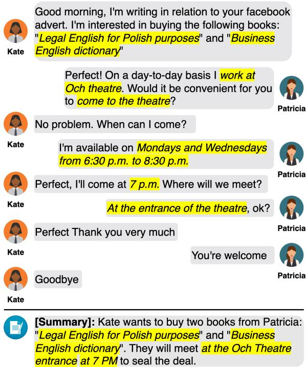  
Figure 1: A summary of a dialogue in the SAMSum dataset, where the golden summary effectively compiles relevant information (in yellow) from the entire conversation.

To address these challenges, we propose DIONY-SUS, a pre-trained sequence-to-sequence model designed to summarize dialogues in any domain, even with a lack of labeled data. It uses pseudo summaries as its pre-training objective, which can be dynamically selected from two sources.

First, for daily chats where multiple dialogue turns are not sufficient to summarize the dialogue, we train a summary helper using high-quality dialogue summarization datasets to generate pseudo summaries for these types of dialogues. On the other hand, for dialogues like meeting minutes, interviews, and debates, which can be summarized through a selection of essential turns, we use a method inspired by the gap sentence generation (GSG) technique in PEGASUS to select these turns as pseudo summaries for training. For instance, choosing the final few turns in a conversation can effectively summarize meeting minutes. We have improved upon the GSG method by using the generated summaries from the summary helper as references during gap sentence selection, as they tend to have less noise compared to the full dialogue context. We refer to this source of pseudo summaries as “Principal” and refer to our improved method as GSG+. We find that our improved method outperforms previous methods in low-resource settings across different domains, such as daily chats, emails, and customer service dialogues. Additionally, we study different objective strategies for selecting the pseudo summary as a pre-training objective from the generated summary and the “Principal.”

We evaluate DIONYSUS on six dialogue summarization datasets. Our best model trained on 19 dialogue corpora surpasses PEGASUSLARGE in a zero-shot setting across all domains. We also found that the best performance is achieved by selecting the source with the highest ROUGE score as the objective strategy. Our main contributions are:

• The development of DIONYSUS, a pretrained sequence-to-sequence model for summarizing dialogues in any domain in a zeroshot or few-shot setting.

• The introduction of new self-supervised pretraining objectives for dialogue summarization using a summary helper and GSG+.

• The demonstration that DIONYSUS outperforms baselines on six domains in lowresource settings, and can be fine-tuned with only 10 training examples to outperform vanilla T5 (Raffel et al., 2022) fine-tuning with 1, 000 examples.

## 2 Approach

Figure 2 outlines the steps for constructing DIONY-SUS:  2.1 First, a summary helper is constructed using two high-quality dialogue summarization datasets. This helper generates a pseudo summary for each dialogue in our pre-training corpus.  2.2 Next, the “Principal” is extracted using GSG+ as the other pseudo summary for the dialogue.  2.3 Finally, various strategies are employed to select the best pseudo summaries from the first and second steps to serve as the objective for pre-training.

## 2.1 Summary Helper

In certain types of dialogue, such as daily chats, it can be challenging to gather all necessary information from just a few dialogue turns due to the dispersed nature of dialogue information. To address this problem, we have created a summary helper model that generates pseudo summaries for each training example in our pre-training corpus.

We build our summary helper upon the T5 (Raffel et al., 2022) model. To capture essential information in a dialogue, we have trained our helper on the MultiWoz dataset (Budzianowski et al., 2018; Eric et al., 2020) in DS2 (Shin et al., 2022), which contains summaries derived from dialogue states using templates. This allows us to capture essential information from each turn in the conversation. Additionally, we have continued training our helper on the DialogSum (Chen et al., 2021) dataset, a human-annotated dataset in the daily life domain. This allows us to overcome the fixed format of summaries introduced by templates in DS2 and produce more natural pseudo summaries.

## 2.2 Gap Sentence Generation Plus (GSG+)

Algorithm 1 GSG+   
1: P   
2: for j 1 to m do   
3: si := rouge(P ∪ {xi}, G), ∀i s.t. xi ∈/ P   
4: k := argmax{si}n   
5: P := P  xk   
6: end for

Dialogues in certain settings, such as meetings and medical dialogues, often include summary turns that summarize the entire conversation. For example, a participant may summarize a meeting, or a doctor may explain the outcome. These summary turns can be used as a pre-training objective because they highlight the main points of the dialogue and provide a concise overview of the topic discussed. In order to make DIONYSUS more adaptable to these scenarios, we have improved the independent principal method in the GSG method (Zhang et al., 2019) by using it to select essential summary turns as pseudo summaries for training. Our new method, called Gap Sentence Selection Plus (GSG+), uses the ROUGE1-F1 score between each dialogue turn $x _ { i }$ and the generated summary G from the helper in Section 2.1 rather than the remaining text $D \setminus x _ { i }$ to determine the importance of each turn. The generated summary eliminates much of the extraneous information from the dialogue and thus tends to have less noise than the full dialogue context, resulting in a less cluttered summary. This enables us to select the top-m-scored summary turns as the “Principal,” which will pro vide a more comprehensive overview of the vital information in the dialogue. For instance, Using the summary helper to identify key points increases the likelihood of selecting the most important dialogue turns as the “Principal” summary when creating pseudo summaries for meeting minutes instead of randomly selecting dialogue turns.

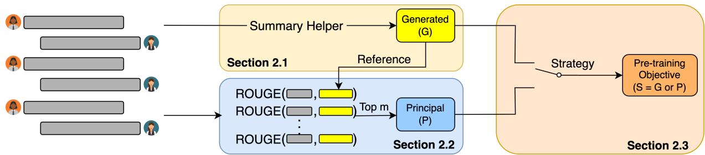  
Figure 2: A diagram of pre-training in DIONYSUS: The summary helper ( 2.1) generates a pseudo-summary (G) to select dialogue turns ( 2.2) as the “Principal” (P) and using various strategies ( 2.3) to choose between the generated summary and the principal as the pre-training objective.

Specifically, given a dialogue $D = \{ x _ { i } \} _ { n } ,$ we use Algorithm 1 to obtain the pseudo-summary “Principal” P. The input for our training example is the remainder of the dialogue $D \setminus P .$ . In Appendix C, we explore the impact of the dialogue turns order on the formation of the “Principal”. Using GSG+ can effectively identify essential summary turns and generate more accurate pseudo-summaries than with the original GSG method.

Algorithm 2 Better ROUGE   
1: S   
2: $s _ { g } : = r o u g e ( G , D \setminus \{ P \} )$   
3: sp := rouge(P, D  P )   
4: $\mathbf { i f } \ s _ { g } > s _ { p }$ then   
5: $S : = G$   
6: else   
7: $S : = P$   
8: end if

## 2.3 Pre-training Objectives Strategy

To generate the final pseudo summary S for each specific dialogue training example, we consider three strategies. These strategies are based on the generated pseudo summary G and the extracted “Principal” P. These strategies serve as the pretrain objective for the dialogue training example.

All G $S = G \colon$ We always select the generated summary from the summary helper as the pretraining objective.

All P $S = P \colon$ We always select the “Principal” as the pre-training objective.

Better ROUGE We use either G or P based on the recall of information from the dialogue to determine the pre-training objective. We utilize Algorithm 2 to get the pre-training objective by calculating the ROUGE1-F1 score for the pseudo summaries and the dialogue, excluding the “Princi-$\mathrm { p a l } ^ { \prime \prime } D \setminus P$ . It is important to note that we use the same reference to ensure a fair comparison.

For pre-training with above strategies, if we choose G as the pseudo summary, we input the full dialogue. If we choose $P ,$ we input the dialogue, excluding the “Principal,” $D \setminus P$ to create an abstract summary. However, we also include the “Principal” with a probability, using a copying mechanism to create an extractive summary.

More information about this copy mechanism can be found in Section 5.4. It is important to note that we do not combine these two pseudo summaries for a single training example. Each example in our pre-training corpus will have either G or P as its designated pseudo summary.

## 3 Training Corpus

To train DIONYSUS, we utilized 19 conversational corpora that do not come with pre-defined dialogue summaries. We employed a self-supervised approach by using pseudo-summaries as the pretraining objective.

Conversational Corpora We collect 19 available conversational corpora consisting of 1.7M examples after truncating for pre-training. Corpus information is listed in Table 1. We access these corpora through ConvoKit v2.5.31. This helps us to ensure that DIONYSUS is well-equipped to handle a variety of conversational scenarios.

<table><tr><td>Corpora</td><td># Dialogues</td></tr><tr><td>CaSiNo (Chawla et al., 2021)</td><td>1,030</td></tr><tr><td>Chromium (Meyers et al., 2018)</td><td>163,675</td></tr><tr><td>Gone Awry (CMV) (Zhang et al., 2018)</td><td>6,842</td></tr><tr><td>Gone Awry (Wiki) (Zhang et al., 2018)</td><td>4,188</td></tr><tr><td>Diplomacy (Peskov et al., 2020)</td><td>246</td></tr><tr><td>Friends (Zhou and Choi, 2018)</td><td>1,301</td></tr><tr><td>GAP (Braley and Murray, 2018)</td><td>28</td></tr><tr><td>IQ2 (Zhang et al., 2016)</td><td>108</td></tr><tr><td>Cornell Movie Dialogs2</td><td>83,097</td></tr><tr><td>Parliament (Zhang et al., 2017b)</td><td>216,894</td></tr><tr><td>PERSUASIONFORGOOD³</td><td>1,017</td></tr><tr><td>Reddit Coarse (Zhang et al., 2017a)</td><td>9,483</td></tr><tr><td>Reddit Corpus (small) 4</td><td>8,286</td></tr><tr><td>Supreme Court</td><td></td></tr><tr><td>Switchboard (Stolcke et al., 2000)</td><td>7,700</td></tr><tr><td></td><td>1,155</td></tr><tr><td>Tennis (Fu et al., 2016)</td><td>81,974</td></tr><tr><td>Wiki Deletion (Mayfield and Black, 2019)</td><td>383,918</td></tr><tr><td>Wiki Talk Pages6</td><td>125,292</td></tr><tr><td>Winning Arguments (Tan et al., 2016)</td><td>3,051</td></tr></table>

Table 1: Corpora we use to pre-train DIONYSUS.

We train our objective summary helper with a rule-based dialogue summarization dataset (DS2) and an abstractive summarization dataset (Dialog-Sum).

DS2 This dataset (Shin et al., 2022) creates dialogue summaries for the MultiWOZ (Budzianowski et al., 2018; Eric et al., 2020) dataset by heuristic rules from the dialogue states. It includes 5 domains and 10, 000 dialogues.

DialogSum This dataset (Chen et al., 2021) collects human annotated summaries for daily-life dialogues from three datasets: DailyDialog (Li et al., 2017), DREAM (Sun et al., 2019), and MuTual (Cui et al., 2020), as well as dialogues from an English-speaking practice website. It has 13,460 dialogues in total.

## 4 Experiments

## 4.1 Downstream Tasks and Metrics

We evaluate our methods on three public dialogue summarization datasets or benchmarks: SAMSum (Gliwa et al., 2019), ConvoSumm (Fabbri et al., 2021), and TWEETSUMM (Feigenblat et al., 2021)

SAMSum This dataset contains over 16k natural messenger-like dialogues with manually annotated summaries by language experts.

ConvoSumm It is a benchmark of four domains: New York Times comment, StackExchange, W3C email, and Reddit. Dialogues are extracted from publicly available data, and each domain has 500 dialogues. They hire crowdsorce workers on Amazon Mechanical Turk to annotate dialogue summary.

TweetSumm This dataset contains 1,100 reconstructed real-world customer support dialogues from Tweet. Each dialogue has human annotated abstractive summaries and extractive summaries. We only use abstractive summaries in the dataset as references in our experiments.

We report ROUGE-1, ROUGE-2, and ROUGE-L scores (Lin, 2004) to evaluate generated summaries against references.

## 4.2 Baselines

We compare our methods with three competitive baselines.

T5v1.1 It is an improved version of the original T5 model (Raffel et al., 2022). Since the original T5 model is pre-trained on downstream tasks in supervised learning, the test set of downstream tasks overlaps with the pre-training data. To make a fair comparison in a zero-shot setting, we choose T5v1.1 as it is pre-trained on C4 without mixing in the downstream tasks.

PEGASUS Zhang et al. (2019) propose this pretrained model for abstractive summarization tasks. The pre-training objective is GSG, transforms any text into an abstractive summarization example by selecting important sentences as output summaries. We use the $\mathrm { P E G A S U S _ { L A R G E } }$ checkpoint7 as there is no publicly available $\mathrm { P E G A S U S _ { B A S E } }$ checkpoint.

GSG\* We use the independent principal strategy of GSG training objective in PEGASUS (Zhang et al., 2019) but pre-train DIONYSUS with our training corpora. We build this baseline to explore the performance gap between our pre-training objective and GSG.

## 5 Results and Analysis

We focus on low-resource dialogue summarization settings because it is difficult to collect enough training examples. We evaluate DIONYSUS with “All G”, “All P”, and “Better ROUGE” strategies in zero-shot and few-shot settings and compare it to the baselines.

## 5.1 Zero-Shot Results

In order to evaluate the effectiveness of DIONYSUS, we conduct a zero-shot test on DIONYSUSLARGE with all strategies and other baselines. We present the results in Table 2. The ROUGE1-F1, ROUGE2-F1, and ROUGEL-F1 scores are used as the standard evaluation measures for summarization tasks. Our models show impressive performance improvements over the baselines on all downstream datasets. Specifically, $\mathrm { D I O N Y S U S _ { L A R G E } }$ with the “Better ROUGE” strategy performs the best overall across all downstream datasets (Average: ROUGE-1/2/L: 29.7/8.0/20.2), indicating that it benefits from both generated and extractive pseudo summaries and can adapt to various domains. The “All P” strategy performs better than the $\mathbf { G S G ^ { * } }$ baseline on most datasets, indicating that our Gap Sentence Selection Plus method can effectively select dialogue turns that provide an accurate dialogue summary. Additionally, the $\mathrm { D I O N Y S U S _ { L A R G E } }$ with $\mathbf { \hat { A l l } } \mathbf { G } ^ { \prime }$ and “Better ROUGE” strategies demonstrate significant improvement compared to $\mathrm { T 5 v 1 . 1 _ { L A R G E } \left( A v e r a g e \right. }$ ROUGE2: $+ 5 . 6 / + 6 . 1 )$ and $\mathrm { P E G A S U S _ { I } }$ ARGE (Average $\mathrm { R O U G E 2 : ~ \ + 2 . 2 / \ + \ 2 . 7 ) }$ , indicating that pre-training with our summary helper is highly beneficial. However, the $\mathbf { \hat { A l l } } \mathbf { G } ^ { \prime }$ strategy only performs as well as the “Better ROUGE” strategy on the SAMSum dataset (ROUGE-1/2/L/: $4 1 . 3 / 1 6 . 1 / 3 0 . 6 \to 4 1 . 3 / 1 6 . 2 / 3 0 . 9 )$ , suggesting that the improvement from the summary helper is more pronounced on this particular dataset. This may be due to the similarity between the datasets used to train the helper and the SAMSum dataset, which we discuss further in Sections 5.5 and 5.6. Overall, our models outperform previous methods, such as PEGASUS, in a zero-shot setting, demonstrating their effectiveness and potential for further development.

## 5.2 Few-Shot Results

We investigated reducing annotation labor in dialogue summarization tasks by using few-shot dialogue summarization. We report ROUGE1-F1, ROUGE2-F1, ROUGEL-F1, and ROUGELSum-F1 scores to evaluate model performance. Specifically, We fine-tune $\mathrm { D I O N Y S U S _ { L A R G E } } ,$ $\mathrm { P E G A S U S _ { L A R G E } } ,$ and $_ { \mathrm { T 5 v 1 . 1 _ { L A R G E } } }$ with the first $1 / 1 0 / 1 0 0 / 1 K / 1 0 K$ training examples from the SAMSum dataset. We show the results of our experiments with varying training data sizes in Figure 3. We found that all models improved with more examples. Among these models, $\mathrm { D I O N Y S U S _ { L A R G E } }$ consistently outperformes both $\mathrm { P E G A S U S _ { L A R G E } }$ and $_ { \mathrm { T 5 v 1 . 1 _ { L A R G E } } }$ when trained with a dataset ranging from 0 to 10, 000 examples. This suggests that our pre-training process helps DIONYSUS adapt to downstream tasks more quickly. Additionally, we observed that $\mathrm { P E G A S U S _ { L A R G E } }$ outperformed $\mathrm { T 5 v 1 . l _ { L A R G E } }$ due to its pre-training on summarization tasks. Figure 3 shows the gap between DIONYSUSLARGE and $\mathrm { P E G A S U S _ { L A R G E } }$ is particularly significant when using fewer than 100 training examples, indicating better recall capabilities in dialogue summarization for DIONYSUS. Even with only 10 training examples, DIONYSUSLARGE achieves higher ROUGE scores than the T5v1.1LARGE model trained with 1,000 examples, making it the best option for lowresource dialogue summarization.

## 5.3 Effect of Compression Ratio

In GSG+, we can choose a fixed number of turns in the dialogue as a training objective or select turns with a compression ratio. We investigate the compression ratio in a dialogue turn level as the number of selected turns over the number of totals turns in the dialogue $( N _ { p r i n c i p a l } / N _ { d i a l o g u e } )$ . A low compression ratio will select fewer turns in the dialogue as the objective, making pre-training less challenging. However, it tends to have a lower ROUGE1-F1 score with the remaining dialogue turns, meaning the “Better ROUGE” strategy selects more generated summaries as the objective. While choosing a high compression ratio will make the pre-training more challenging. Nevertheless, it has a higher ROUGE score compared to generated summaries, leading to more principal under the “Better ROUGE” strategy. We show the zero-shot performance on development sets of the SAMSum dataset and TweetSumm dataset with compression rates from 10% to 60% in Figure 4. It shows that the model with 15% compression ratio achieves the highest ROUGE-2 score.

<table><tr><td>Model</td><td>SAMSum</td><td>NYT</td><td>Reddit</td><td>Stack</td><td>Email</td><td>TweetSumm</td><td>Avg.</td></tr><tr><td>T5v1.1</td><td>9.6/1.6/8.6</td><td>11.6/1.4/8.7</td><td>12.3/1.7/9.2</td><td>15.6/2.4/11.0</td><td>14.9/2.7/11.1</td><td>6.0/1.4/5.1</td><td>11.7/1.9/9.0</td></tr><tr><td>PEGASUS</td><td>27.5/7.6/21.5</td><td>23.7/3.2/13.2</td><td>23.1/4.1/13.6</td><td>26.7/4.8/15.2</td><td>23.9/5.7/15.3</td><td>21.8/6.3/16.0</td><td>24.5/5.3/15.8</td></tr><tr><td>GSG*</td><td>13.3/3.5/12.0</td><td>17.1/2.4/12.9</td><td>16.0/2.1/12.5</td><td>21.2/3.5/15.1</td><td>21.0/4.2/15.9</td><td>15.4/2.8/13.1</td><td>17.3/3.1/13.6</td></tr><tr><td>Ours: G</td><td>41.3/16.1/30.6</td><td>21.7/3.7/14.8</td><td>23.5/4.3/15.7</td><td>26.3/5.4/16.8</td><td>26.4/7.1/17.2</td><td>29.4/8.4/22.1</td><td>28.1/7.5/19.5</td></tr><tr><td>Ours: P</td><td>23.5/7.5/18.6</td><td>19.8/2.7/12.9</td><td>20.0/2.9/12.7</td><td>24.5/4.3/15.0</td><td>24.3/5.5/15.8</td><td>22.1/6.7/17.6</td><td>22.4/4.9/15.4</td></tr><tr><td>Ours: BR</td><td>41.3/16.2/30.9</td><td>24.1/4.0/15.4</td><td>24.8/4.4/15.9</td><td>28.5/5.6/17.6</td><td>28.9/7.7/18.0</td><td>30.7/10.1/23.4</td><td>29.7/8.0/20.2</td></tr></table>

Table 2: The ROUGE-1/ROUGE-2/ROUGE-L scores of the $\mathrm { D I O N Y S U S _ { L A R G E } }$ with strategy $\mathrm { P } \colon  { \mathrm { \sim } } \mathrm { A l l ~ }  { \mathrm { P } } ^ { \mathrm { \prime } }$ , G: “All G”, and BR: “Better ROUGE” and compared to T5v1.1LARGE and $\mathrm { P E G A S U S _ { L A R G E } }$ in a zero-shot setting on three datasets: SAMSum, ConvoSumm, and TweetSumm.  
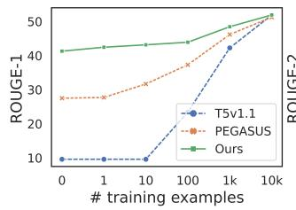

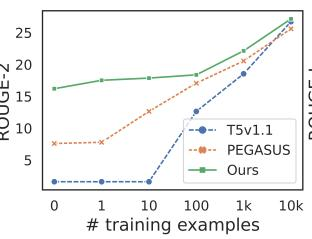

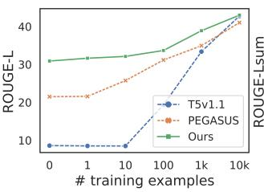

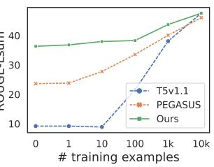

Figure 3: Comparison of T5v1.1LARGE, $\mathrm { P E G A S U S _ { L A R G E } }$ , and $\mathrm { D I O N Y S U S _ { L A R G E } }$ , fine-tuned with limited training examples on the SAMSum dataset. The training data is within 10,000 examples. The results show that DIONYSUS outperforms both PEGASUS and T5v1.1 on all four metrics.  
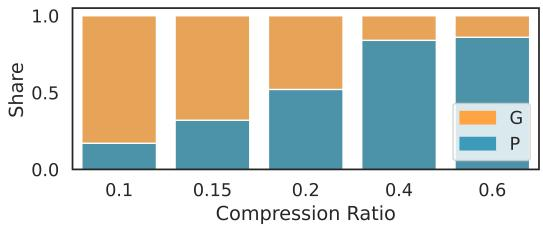

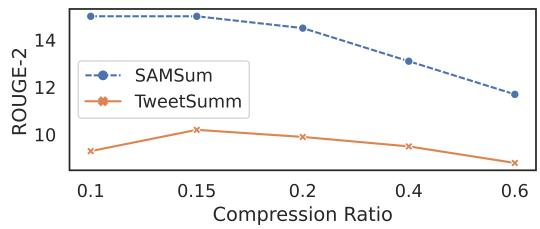  
Figure 4: Comparison of compression ratios in $\mathrm { D I O N Y S U S _ { B A S E } }$ using “Better ROUGE” strategy. The upper figure reflects the percentage of generated summaries (G) and “Princial” (P) at different compression ratios. The performance is measured using the ROUGE2-F1 metric on the SamSum and TweetSumm development sets.

## 5.4 Effect of Copying Mechanism

<table><tr><td>ROUGE-1/2/L</td><td>All P</td><td>w/o copying</td></tr><tr><td>SAMSum</td><td>25.8/8.5/19.7</td><td>17.7/5.7/15.7</td></tr><tr><td>NYT Reddit Stack</td><td>21.3/2.7/13.5 22.3/3.4/13.8 25.9/4.5/15.8 26.6/6.1/16.8</td><td>17.4/2.2/13.4 16.3/2.6/13.1 20.3/3.4/15.1</td></tr><tr><td>Email TweetSumm</td><td>24.1/8.5/19.0</td><td>20.0/3.5/14.7 19.4/3.8/16.3</td></tr></table>

Table 3: ROUGE-1/2/L scores of zero-shot setting for $\mathrm { D I O N Y S U S _ { B A S E } }$ with $\ddot { \mathbf { \rho } } _ { \mathrm { A l l } } \mathbf { P } ^ { \prime }$ strategy and $\mathrm { \ddot { A l l } P \vec { \tau } }$ without copying mechanism on SAMSum, ConvoSumm, and TweetSum.

The copying mechanism is important for dialogues like meetings and medical dialogues because it allows for summarization of entire dialogue through several turns. As shown in Table 3, we compare the performance of the $\mathrm { \ddot { s } A l l } \mathrm { \vec { P } ^ { \prime } }$ strategy to a scenario where 50% of the selected dialogue turns are retained in the input rather than being removed. In this case, the input for each pre-training example includes the entire dialogue D, rather than $D \setminus P .$ . This leads the model to focus on extractive summarization. We observed that adding a random copy mechanism significantly improved the overall performance. Additionally, we also evaluate the “Better ROUGE” strategy with different copying probabilities ranging from 0.15 to 0.7. In these experiments, we choose top-2 dialogue turns as principal, which results in 51.9% of pre-training objectives being the principal, and the rest is the generated summary. Figure 5 shows that leaving 15% of dialogue turns in the principal best enhances the overall quality of dialogue summarization.

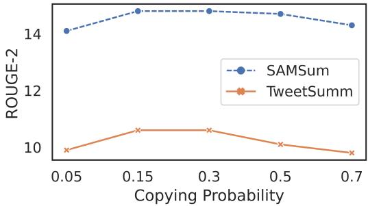  
Figure 5: Comparing probabilities of copying selected sentences in the input of the “Principal” using the “Better ROUGE” strategy. Evaluating performance using the ROUGE2-F1 metric on SamSum and TweetSumm development datasets.

## 5.5 Comparison Between All G and Summary Helper

<table><tr><td>ROUGE-1/2/L|</td><td>All G</td><td>Helper</td></tr><tr><td>SAMSum</td><td>41.3/16.1/30.6</td><td>35.8/13.5/27.9</td></tr><tr><td>NYT</td><td>21.7/3.7/14.8</td><td>21.2/4.0/15.2</td></tr><tr><td>Reddit</td><td>23.5/4.3/15.7</td><td>20.2/3.5/14.4</td></tr><tr><td>Stack</td><td>26.3/5.4/16.8</td><td>25.1/5.0/16.0</td></tr><tr><td>Email</td><td>26.4/7.1/17.2</td><td>22.9/5.6/15.2</td></tr><tr><td>TweetSumm</td><td>29.4/8.4/22.1</td><td>26.8/6.2/20.8</td></tr></table>

Table 4: ROUGE-1/2/L scores of zero-shot setting for DIONYSU $\mathsf { S } _ { \mathrm { B A S E } }$ with $\ddot { \bf \Phi } ^ { 6 } { \bf A l l G } ^ { 5 }$ strategy and the summary helper on SAMSum, ConvoSumm, and TweetSum.

Since the summary helper model provides the generated summary as an objective candidate and has shown strong capabilities in zero-shot dialogue summarization. As shown in Table 4, we compare the helper model to our “All G” model in a zeroshot setting. The difference is that we train the “All G” model on the pre-training corpora annotated by the helper. We found that the helper model is not on par with our model. While the helper model may have performed well on a particular task (NYT), its overall performance is not as strong as our model. This is because DIONYSUS has been extensively trained on various dialogue datasets, which makes it consistently perform well in a wide range of tasks

and scenarios.

## 5.6 Test-Set Overlap with Pre-Training Corpora

<table><tr><td>Threshold</td><td>ConvoKit</td><td>DS2</td><td>DialogSum</td></tr><tr><td>≥ 1.0</td><td>0%</td><td>0%</td><td>0%</td></tr><tr><td>≥0.8</td><td>0%</td><td>0%</td><td>0%</td></tr><tr><td>≥ 0.6</td><td>0%</td><td>0%</td><td>1%</td></tr><tr><td>≥ 0.4</td><td>5%</td><td>0%</td><td>3%</td></tr></table>

Table 5: Percentage of overlap between the SAMSum test set and the datasets used for pre-training. The ConvoKit corpora were comprised of a randomly selected 10% of the total datafor calculating the similarity.

In order to ensure a fair comparison, we check for overlap between pre-training and downstream test datasets. This is done by calculating the similarity between all pairs of test set targets in the SAMSum dataset and pre-training documents using the ROUGE2-recall measure, which is calculated as the number of overlapping bigrams divided by the total number of bigrams in the test target. We then count the number of test set examples that have a similarity to any pre-training example above a certain threshold. As shown in Table 5, the overlap between the SAMSum dataset and the datasets used for training the helper and the pre-training datasets is low when the similarity threshold is set between 0.4 and 1.0. This suggests that there is not significant similarity between our test set and the pre-training datasets. It indicates that the improvement in DIONYSUS is due to the pre-training process rather than potential test data leakage.

## 5.7 Human Evaluation

<table><tr><td></td><td>Ratings</td></tr><tr><td>T5v1.1LARGE</td><td>3.54**</td></tr><tr><td>PEGASUSLARGE</td><td> $3 . 9 0 ^ { * }$ </td></tr><tr><td> $\mathrm { D I O N Y S U S _ { L A R G E } }$ </td><td>4.04</td></tr><tr><td>Human-written</td><td>4.08</td></tr></table>

Table 6: Human evaluation results of zero-shot generation. We test the T5v1.1 baseline and the PEGASUS model against DIONYSUS with $^ { * * } \mathrm { { p } } < 0 . 0 1$ $\mathrm { ^ { * } p } < 0 . 0 5$

We evaluate the performance of DIONYSUS by conducting human evaluation experiments on Amazon Mechanical Turk. We randomly select 100 examples from the SAMSum dataset to compare summaries generated by our model with those written by humans in the dataset. We choose DIONY-SUS trained with the “Better ROUGE” strategy and generate summaries in a zero-shot setting. Participants are asked to rate the summaries on a scale of 1 to 5, with higher scores indicating better quality. We collect the scores from three participants for each example and report the average scores in Table 6. A paired t-test is conducted to determine if scores are significantly different between our model and other models. Our results show that DIONYSUS could generate summaries of similar quality to human-written summaries without any training data. DIONYSUS also gets better ratings than the vanilla T5 and PEGASUS models, which aligns with the results obtained from the automatic evaluation. More information on the human evaluation process can be found in Appendix F.

## 6 Related Work

Dialogue summarization is a rapidly growing area of research that focuses on automatically generating concise and informative summaries of conversations (Feng et al., 2022). Unlike research on traditional documents like news articles (Fabbri et al., 2019; Ahuja et al., 2022) or scientific papers (Lu et al., 2020; Ibrahim Altmami and El Bachir Menai, 2022), dialogue summarization is particularly relevant in multi-party interactions, such as emails (Zhang et al., 2021), meetings (Carletta et al., 2005), medical dialogues (Zeng et al., 2020), and daily chats (Chen et al., 2021). However, many existing methods for dialogue summarization require a large training dataset with annotated summaries. This can be a major barrier to applying these methods in real-world scenarios, particularly in cases with limited or no annotated data available. Our study examines the use of dialogue summarization in low-resource settings to make the process more practical and effortless in various contexts.

Pre-trained Transformer-based (Vaswani et al., 2017) language models (Devlin et al., 2019; Radford et al., 2019; Yang et al., 2019) have become increasingly popular in natural language processing tasks for tackling the data shortage problem. However, many of these models have limitations when it comes to dialogue summarization. Zhang et al. (2019) propose PEGASUS, which masks multiple whole sentences and pre-trains sequence-tosequence models to reconstruct the original text. Built on that, Wan and Bansal (2022) improve the sentence selection strategy and add modules for ensuring factuality during fine-tuning to address the problem of factuality in summarization. Phang et al. (2022) extend PEGASUS with a modified architecture and long-sequence pre-training to tackle long-input summarization. He et al. (2022) propose ZCode++, a pre-trained language model optimized for abstractive summarization with improved encoder. However, all these methods rely on the Gap Sentence Selection method, which has limitations for dialogue summarization. In contrast, our approach uses pseudo-summary construction as the pre-training objective, making it possible for zeroshot dialogue summarization.

Another line of work focuses on pre-trained models for dialogues. DialoGPT (Zhang et al., 2020) and PLATO (Bao et al., 2020), which are pretrained on large-scale conversation datasets such as Reddit. For dialogue summarization, Jia et al. (2022) post-train pre-trained language models to rephrase dialogues into narratives and then finetunes them for summarization. In contrast, our approach follows the T5 model’s unified text-to-text format for both pre-training and fine-tuning. Zhong et al. (2022) train UNILM (Dong et al., 2019) with a window-based denoising framework for long dialogue understanding and summarization but do not focus on low-resource settings. Zou et al. (2021) propose a pre-training paradigm that pre-trains the encoder and decoder separately in a supervised manner. While our method uses a self-supervised pre-training approach that applies to any dialogue dataset, making it easier to extend to larger pretraining corpora for further improvement.

## 7 Conclusion and Future Work

We present DIONYSUS, a pre-trained encoderdecoder model for zero-shot dialogue summarization in any new domain. We pre-train using a self-supervised approach that generates pseudosummaries for large dialogue corpora as the pretraining objective. We investigate the impact of various pre-training objective strategies and model sizes on dialogue summarization performance. Our experiments show that DIONYSUS outperforms state-of-the-art models on six datasets in a zeroshot setting. Furthermore, DIONYSUS can be fine-tuned with only 10 examples to outperform vanilla T5 fine-tuning with 1,000 examples. This makes dialogue summarization more practical and easier to use in various contexts with minimal effort. We plan to extend this method to abstractive summarization tasks to develop a general zero-shot summarization model.

## 8 Limitations

Training Data Our pre-training data is sourced from 19 existing dialogue datasets. However, it’s important to note that these datasets may contain noise, such as harmful content, irrelevant file names, and URL links. Despite utilizing multiple automatic tools to filter out this content during preprocessing, there is still a chance that some noise may be present in our pre-training data. This could potentially impact the performance of DIONYSUS, making it important to monitor and improve the pre-processing steps continuously.

We also know the potential drawbacks of constructing pseudo summaries using the GSG method, which may lead to unnatural summaries for dialogue data. To mitigate this, we introduced the Summary Helper in Section 2.1, which is specifically trained on two dialogue summarization datasets containing natural summaries. This approach enables more realistic pseudo-summaries and enhances zero-shot performance. Although we employ top-m turns as an additional source of pseudo summaries, Figure 4 illustrates that GSG+ contributes a minor portion of the pseudo summary, with a 0.7 to 0.3 ratio between generated and topm turns. Our method thus minimizes referent and pronoun confusion, ensuring better coherence than solely employing the standard GSG technique.

Training Resource To improve our model’s performance, we employ the “Better ROUGE” strategy, which calculates the ROUGE score for both candidates and selects the best one as the final training objective. This data pre-processing process can be pretty time-consuming, taking approximately one day to complete for our pre-training data when utilizing 100 threads. Additionally, we utilize 16 Nvidia V100 GPUs to train our models, which may not be accessible or reproducible for all researchers. This could present a significant obstacle for those looking to replicate or build upon our work.

Test Data Another potential concern is the test datasets used to evaluate DIONYSUS. The test set size is relatively small, which may not fully represent the breadth of dialogue types that a general dialogue summarization model should be able to handle. This could lead to the model performing well on the test set but not generalizing to other unseen dialogue types. Further, our analysis did not include the assessment of long dialogue summarization, such as lengthy meetings (Carletta et al., 2005;

Zhong et al., 2021; Janin et al., 2003) or screenplays (Chen et al., 2022). However, our study’s approach has the potential to handle these scenarios, even though it was not specifically designed for them. By incorporating LongT5 (Guo et al., 2022) or DialogLM (Zhong et al., 2022), which are known for their ability to process extended input sequences, we expect that they could efficiently tackle this task.

## 9 Acknowledgement

Our gratitude goes out to Microsoft Research for providing us with computational resources. We would also like to thank Kun Qian for valuable discussions and the Columbia NLP and Microsoft Deep Learning Group members for their feedback and discussions. Additionally, we thank the Mechanical Turk workers for conducting the human evaluation.

## References

Ojas Ahuja, Jiacheng Xu, Akshay Gupta, Kevin Horecka, and Greg Durrett. 2022. ASPECTNEWS: Aspect-oriented summarization of news documents. In Proceedings of the 60th Annual Meeting of the Association for Computational Linguistics (Volume 1: Long Papers), pages 6494–6506, Dublin, Ireland. Association for Computational Linguistics.

Siqi Bao, Huang He, Fan Wang, Hua Wu, and Haifeng Wang. 2020. PLATO: Pre-trained dialogue generation model with discrete latent variable. In Proceedings of the 58th Annual Meeting of the Association for Computational Linguistics, pages 85–96, Online. Association for Computational Linguistics.

McKenzie Braley and Gabriel Murray. 2018. The group affect and performance (gap) corpus. In Proceedings of the Group Interaction Frontiers in Technology, GIFT’18, New York, NY, USA. Association for Computing Machinery.

Paweł Budzianowski, Tsung-Hsien Wen, Bo-Hsiang Tseng, Iñigo Casanueva, Ultes Stefan, Ramadan Osman, and Milica Gašic. 2018. Multiwoz - a large-´ scale multi-domain wizard-of-oz dataset for taskoriented dialogue modelling. In Proceedings ofthe 2018 Conference on Empirical Methods in Natural Language Processing (EMNLP).

Jean Carletta, Simone Ashby, Sebastien Bourban, Mike Flynn, Mael Guillemot, Thomas Hain, Jaroslav Kadlec, Vasilis Karaiskos, Wessel Kraaij, Melissa Kronenthal, Guillaume Lathoud, Mike Lincoln, Agnes Lisowska, Iain McCowan, Wilfried Post, Dennis Reidsma, and Pierre Wellner. 2005. The ami meeting corpus: A pre-announcement. In Proceedings of the Second International Conference

on Machine Learning for Multimodal Interaction, MLMI’05, page 28–39, Berlin, Heidelberg. Springer-Verlag.

Kushal Chawla, Jaysa Ramirez, Rene Clever, Gale Lucas, Jonathan May, and Jonathan Gratch. 2021. CaSiNo: A corpus of campsite negotiation dialogues for automatic negotiation systems. In Proceedings of the 2021 Conference of the North American Chapter of the Association for Computational Linguistics: Human Language Technologies, pages 3167–3185, Online. Association for Computational Linguistics.

Mingda Chen, Zewei Chu, Sam Wiseman, and Kevin Gimpel. 2022. SummScreen: A dataset for abstractive screenplay summarization. In Proceedings of the 60th Annual Meeting of the Association for Computational Linguistics (Volume 1: Long Papers), pages 8602–8615, Dublin, Ireland. Association for Computational Linguistics.

Yulong Chen, Yang Liu, Liang Chen, and Yue Zhang. 2021. DialogSum: A real-life scenario dialogue summarization dataset. In Findings of the Association for Computational Linguistics: ACL-IJCNLP 2021, pages 5062–5074, Online. Association for Computational Linguistics.

Leyang Cui, Yu Wu, Shujie Liu, Yue Zhang, and Ming Zhou. 2020. MuTual: A dataset for multi-turn dialogue reasoning. In Proceedings ofthe 58th Annual Meeting of the Association for Computational Linguistics, pages 1406–1416, Online. Association for Computational Linguistics.

Cristian Danescu-Niculescu-Mizil and Lillian Lee. 2011. Chameleons in imagined conversations: A new approach to understanding coordination of linguistic style in dialogs. In Proceedings ofthe 2nd Workshop on Cognitive Modeling and Computational Linguistics, pages 76–87, Portland, Oregon, USA. Association for Computational Linguistics.

Cristian Danescu-Niculescu-Mizil, Lillian Lee, Bo Pang, and Jon Kleinberg. 2012. Echoes of power: Language effects and power differences in social interaction. In Proceedings of WWW, pages 699–708.

Jacob Devlin, Ming-Wei Chang, Kenton Lee, and Kristina Toutanova. 2019. BERT: Pre-training of deep bidirectional transformers for language understanding. In Proceedings ofthe 2019 Conference of the North American Chapter ofthe Associationfor Computational Linguistics: Human Language Technologies, Volume 1 (Long and Short Papers), pages 4171–4186, Minneapolis, Minnesota. Association for Computational Linguistics.

Li Dong, Nan Yang, Wenhui Wang, Furu Wei, Xiaodong Liu, Yu Wang, Jianfeng Gao, Ming Zhou, and Hsiao-Wuen Hon. 2019. Unified language model pre-training for natural language understanding and generation. In 33rd Conference on Neural Information Processing Systems (NeurIPS 2019).

Yue Dong, Andrei Mircea, and Jackie Chi Kit Cheung. 2021. Discourse-aware unsupervised summarization for long scientific documents. In Proceedings ofthe 16th Conference ofthe European Chapter ofthe Associationfor Computational Linguistics: Main Volume, pages 1089–1102, Online. Association for Computational Linguistics.

Mihail Eric, Rahul Goel, Shachi Paul, Abhishek Sethi, Sanchit Agarwal, Shuyang Gao, Adarsh Kumar, Anuj Goyal, Peter Ku, and Dilek Hakkani-Tur. 2020. MultiWOZ 2.1: A consolidated multi-domain dialogue dataset with state corrections and state tracking baselines. In Proceedings of the Twelfth Language Resources and Evaluation Conference, pages 422–428, Marseille, France. European Language Resources Association.

Alexander Fabbri, Irene Li, Tianwei She, Suyi Li, and Dragomir Radev. 2019. Multi-news: A large-scale multi-document summarization dataset and abstractive hierarchical model. In Proceedings ofthe 57th Annual Meeting ofthe Associationfor Computational Linguistics, pages 1074–1084, Florence, Italy. Association for Computational Linguistics.

Alexander Fabbri, Faiaz Rahman, Imad Rizvi, Borui Wang, Haoran Li, Yashar Mehdad, and Dragomir Radev. 2021. ConvoSumm: Conversation summarization benchmark and improved abstractive summarization with argument mining. In Proceedings of the 59th Annual Meeting of the Association for Computational Linguistics and the 11th International Joint Conference on Natural Language Processing (Volume 1: Long Papers), pages 6866–6880, Online. Association for Computational Linguistics.

Guy Feigenblat, Chulaka Gunasekara, Benjamin Sznajder, Sachindra Joshi, David Konopnicki, and Ranit Aharonov. 2021. TWEETSUMM - a dialog summarization dataset for customer service. In Findings of the Association for Computational Linguistics: EMNLP 2021, pages 245–260, Punta Cana, Dominican Republic. Association for Computational Linguistics.

Xiachong Feng, Xiaocheng Feng, and Bing Qin. 2022. A survey on dialogue summarization: Recent advances and new frontiers. In Proceedings of the Thirty-First International Joint Conference on Artificial Intelligence, IJCAI-22, pages 5453–5460. International Joint Conferences on Artificial Intelligence Organization. Survey Track.

Liye Fu, Cristian Danescu-Niculescu-Mizil, and Lillian Lee. 2016. Tie-breaker: Using language models to quantify gender bias in sports journalism. In Proceedings of the IJCAI workshop on NLP meets Journalism.

Bogdan Gliwa, Iwona Mochol, Maciej Biesek, and Aleksander Wawer. 2019. SAMSum corpus: A humanannotated dialogue dataset for abstractive summarization. In Proceedings of the 2nd Workshop on New Frontiers in Summarization, pages 70–79, Hong

Kong, China. Association for Computational Linguistics.

Mandy Guo, Joshua Ainslie, David Uthus, Santiago Ontanon, Jianmo Ni, Yun-Hsuan Sung, and Yinfei Yang. 2022. LongT5: Efficient text-to-text transformer for long sequences. In Findings of the Association for Computational Linguistics: NAACL 2022, pages 724– 736, Seattle, United States. Association for Computational Linguistics.

Pengcheng He, Baolin Peng, Liyang Lu, Song Wang, Jie Mei, Yang Liu, Ruochen Xu, Hany Hassan Awadalla, Yu Shi, Chenguang Zhu, et al. 2022. Z-code++: A pre-trained language model optimized for abstractive summarization. arXiv preprint arXiv:2208.09770.

Nouf Ibrahim Altmami and Mohamed El Bachir Menai. 2022. Automatic summarization of scientific articles: A survey. Journal of King Saud University - Computer and Information Sciences, 34(4):1011–1028.

A. Janin, D. Baron, J. Edwards, D. Ellis, D. Gelbart, N. Morgan, B. Peskin, T. Pfau, E. Shriberg, A. Stolcke, and C. Wooters. 2003. The icsi meeting corpus. In 2003 IEEE International Conference on Acoustics, Speech, and Signal Processing, 2003. Proceedings. (ICASSP ’03)., volume 1, pages I–I.

Qi Jia, Yizhu Liu, Haifeng Tang, and Kenny Zhu. 2022. Post-training dialogue summarization using pseudoparaphrasing. In Findings of the Association for Computational Linguistics: NAACL 2022, pages 1660– 1669, Seattle, United States. Association for Computational Linguistics.

Diederik P Kingma and Jimmy Ba. 2014. Adam: A method for stochastic optimization. arXiv preprint arXiv:1412.6980.

Nayeon Lee, Yejin Bang, Tiezheng Yu, Andrea Madotto, and Pascale Fung. 2022. NeuS: Neutral multi-news summarization for mitigating framing bias. In Proceedings ofthe 2022 Conference ofthe North American Chapter ofthe Associationfor Computational Linguistics: Human Language Technologies, pages 3131–3148, Seattle, United States. Association for Computational Linguistics.

Mike Lewis, Yinhan Liu, Naman Goyal, Marjan Ghazvininejad, Abdelrahman Mohamed, Omer Levy, Veselin Stoyanov, and Luke Zettlemoyer. 2020. BART: Denoising sequence-to-sequence pre-training for natural language generation, translation, and comprehension. In Proceedings of the 58th Annual Meeting of the Association for Computational Linguistics, pages 7871–7880, Online. Association for Computational Linguistics.

Yanran Li, Hui Su, Xiaoyu Shen, Wenjie Li, Ziqiang Cao, and Shuzi Niu. 2017. DailyDialog: A manually labelled multi-turn dialogue dataset. In Proceedings ofthe Eighth International Joint Conference on Natural Language Processing (Volume 1: Long Papers), pages 986–995, Taipei, Taiwan. Asian Federation of Natural Language Processing.

Chin-Yew Lin. 2004. ROUGE: A package for automatic evaluation of summaries. In Text Summarization Branches Out, pages 74–81, Barcelona, Spain. Association for Computational Linguistics.

Yao Lu, Yue Dong, and Laurent Charlin. 2020. Multi-XScience: A large-scale dataset for extreme multidocument summarization of scientific articles. In Proceedings of the 2020 Conference on Empirical Methods in Natural Language Processing (EMNLP), pages 8068–8074, Online. Association for Computational Linguistics.

Elijah Mayfield and Alan W. Black. 2019. Analyzing wikipedia deletion debates with a group decisionmaking forecast model. Proc. ACM Hum.-Comput. Interact., 3(CSCW).

Benjamin S. Meyers, Nuthan Munaiah, Emily Prud’hommeaux, Andrew Meneely, Josephine Wolff, Cecilia Ovesdotter Alm, and Pradeep Murukannaiah. 2018. A dataset for identifying actionable feedback in collaborative software development. In Proceedings ofthe 56th Annual Meeting ofthe Associationfor Computational Linguistics (Volume 2: Short Papers), pages 126–131, Melbourne, Australia. Association for Computational Linguistics.

Denis Peskov, Benny Cheng, Ahmed Elgohary, Joe Barrow, Cristian Danescu-Niculescu-Mizil, and Jordan Boyd-Graber. 2020. It takes two to lie: One to lie, and one to listen. In Proceedings ofthe 58th Annual Meeting of the Association for Computational Linguistics, pages 3811–3854, Online. Association for Computational Linguistics.

Jason Phang, Yao Zhao, and Peter J. Liu. 2022. Investigating efficiently extending transformers for long input summarization. ArXiv, abs/2208.04347.

Alec Radford, Jeffrey Wu, Rewon Child, David Luan, Dario Amodei, Ilya Sutskever, et al. 2019. Language models are unsupervised multitask learners. OpenAI blog, 1(8):9.

Colin Raffel, Noam Shazeer, Adam Roberts, Katherine Lee, Sharan Narang, Michael Matena, Yanqi Zhou, Wei Li, and Peter J. Liu. 2022. Exploring the limits of transfer learning with a unified text-to-text transformer. J. Mach. Learn. Res., 21(1).

Mathieu Ravaut, Shafiq Joty, and Nancy Chen. 2022. SummaReranker: A multi-task mixture-of-experts re-ranking framework for abstractive summarization. In Proceedings of the 60th Annual Meeting of the Associationfor Computational Linguistics (Volume 1: Long Papers), pages 4504–4524, Dublin, Ireland. Association for Computational Linguistics.

Jamin Shin, Hangyeol Yu, Hyeongdon Moon, Andrea Madotto, and Juneyoung Park. 2022. Dialogue summaries as dialogue states (DS2), template-guided summarization for few-shot dialogue state tracking. In Findings of the Association for Computational Linguistics: ACL 2022, pages 3824–3846, Dublin, Ireland. Association for Computational Linguistics.

Andreas Stolcke, Klaus Ries, Noah Coccaro, Elizabeth Shriberg, Rebecca Bates, Daniel Jurafsky, Paul Taylor, Rachel Martin, Carol Van Ess-Dykema, and Marie Meteer. 2000. Dialogue act modeling for automatic tagging and recognition of conversational speech. Computational Linguistics, 26(3):339–374.

Kai Sun, Dian Yu, Jianshu Chen, Dong Yu, Yejin Choi, and Claire Cardie. 2019. DREAM: A challenge dataset and models for dialogue-based reading comprehension. Transactions ofthe Associationfor Computational Linguistics.

Chenhao Tan, Vlad Niculae, Cristian Danescu-Niculescu-Mizil, and Lillian Lee. 2016. Winning arguments: Interaction dynamics and persuasion strategies in good-faith online discussions. In Proceedings of the 25th International Conference on World Wide Web, WWW ’16, page 613–624, Republic and Canton of Geneva, CHE. International World Wide Web Conferences Steering Committee.

Ashish Vaswani, Noam Shazeer, Niki Parmar, Jakob Uszkoreit, Llion Jones, Aidan N Gomez, Ł ukasz Kaiser, and Illia Polosukhin. 2017. Attention is all you need. In Advances in Neural Information Processing Systems, volume 30. Curran Associates, Inc.

David Wan and Mohit Bansal. 2022. FactPEGASUS: Factuality-aware pre-training and fine-tuning for abstractive summarization. In Proceedings of the 2022 Conference of the North American Chapter of the Associationfor Computational Linguistics: Human Language Technologies, pages 1010–1028, Seattle, United States. Association for Computational Linguistics.

Xuewei Wang, Weiyan Shi, Richard Kim, Yoojung Oh, Sijia Yang, Jingwen Zhang, and Zhou Yu. 2019. Persuasion for good: Towards a personalized persuasive dialogue system for social good. In Proceedings of the 57th Annual Meeting ofthe Associationfor Computational Linguistics, pages 5635–5649, Florence, Italy. Association for Computational Linguistics.

Thomas Wolf, Lysandre Debut, Victor Sanh, Julien Chaumond, Clement Delangue, Anthony Moi, Pierric Cistac, Tim Rault, Remi Louf, Morgan Funtowicz, Joe Davison, Sam Shleifer, Patrick von Platen, Clara Ma, Yacine Jernite, Julien Plu, Canwen Xu, Teven Le Scao, Sylvain Gugger, Mariama Drame, Quentin Lhoest, and Alexander Rush. 2020. Transformers: State-of-the-art natural language processing. In Proceedings ofthe 2020 Conference on Empirical Methods in Natural Language Processing: System Demonstrations, pages 38–45, Online. Association for Computational Linguistics.

Zhilin Yang, Zihang Dai, Yiming Yang, Jaime Carbonell, Russ R Salakhutdinov, and Quoc V Le. 2019. Xlnet: Generalized autoregressive pretraining for language understanding. In Advances in Neural Information Processing Systems, volume 32. Curran Associates, Inc.

Guangtao Zeng, Wenmian Yang, Zeqian Ju, Yue Yang, Sicheng Wang, Ruisi Zhang, Meng Zhou, Jiaqi Zeng, Xiangyu Dong, Ruoyu Zhang, Hongchao Fang, Penghui Zhu, Shu Chen, and Pengtao Xie. 2020. MedDialog: Large-scale medical dialogue datasets. In Proceedings ofthe 2020 Conference on Empirical Methods in Natural Language Processing (EMNLP), pages 9241–9250, Online. Association for Computational Linguistics.

Amy Zhang, Bryan Culbertson, and Praveen Paritosh. 2017a. Characterizing online discussion using coarse discourse sequences. Proceedings of the International AAAI Conference on Web and Social Media, 11(1):357–366.

Jingqing Zhang, Yao Zhao, Mohammad Saleh, and Peter J. Liu. 2019. Pegasus: Pre-training with extracted gap-sentences for abstractive summarization.

Justine Zhang, Jonathan Chang, Cristian Danescu-Niculescu-Mizil, Lucas Dixon, Yiqing Hua, Dario Taraborelli, and Nithum Thain. 2018. Conversations gone awry: Detecting early signs of conversational failure. In Proceedings of the 56th Annual Meeting of the Association for Computational Linguistics (Volume 1: Long Papers), pages 1350–1361, Melbourne, Australia. Association for Computational Linguistics.

Justine Zhang, Ravi Kumar, Sujith Ravi, and Cristian Danescu-Niculescu-Mizil. 2016. Conversational flow in Oxford-style debates. In Proceedings ofthe 2016 Conference of the North American Chapter of the Association for Computational Linguistics: Human Language Technologies, pages 136–141, San Diego, California. Association for Computational Linguistics.

Justine Zhang, Arthur Spirling, and Cristian Danescu-Niculescu-Mizil. 2017b. Asking too much? the rhetorical role of questions in political discourse. In Proceedings of the 2017 Conference on Empirical Methods in Natural Language Processing, pages 1558–1572, Copenhagen, Denmark. Association for Computational Linguistics.

Shiyue Zhang, Asli Celikyilmaz, Jianfeng Gao, and Mohit Bansal. 2021. EmailSum: Abstractive email thread summarization. In Proceedings of the 59th Annual Meeting ofthe Associationfor Computational Linguistics and the 11th International Joint Conference on Natural Language Processing (Volume 1: Long Papers), pages 6895–6909, Online. Association for Computational Linguistics.

Yizhe Zhang, Siqi Sun, Michel Galley, Yen-Chun Chen, Chris Brockett, Xiang Gao, Jianfeng Gao, Jingjing Liu, and Bill Dolan. 2020. DIALOGPT : Large-scale generative pre-training for conversational response generation. In Proceedings ofthe 58th Annual Meeting of the Association for Computational Linguistics: System Demonstrations, pages 270–278, Online. Association for Computational Linguistics.

Ming Zhong, Yang Liu, Yichong Xu, Chenguang Zhu, and Michael Zeng. 2022. Dialoglm: Pre-trained

model for long dialogue understanding and summarization. Proceedings of the AAAI Conference on Artificial Intelligence, 36(10):11765–11773.

Ming Zhong, Da Yin, Tao Yu, Ahmad Zaidi, Mutethia Mutuma, Rahul Jha, Ahmed Hassan Awadallah, Asli Celikyilmaz, Yang Liu, Xipeng Qiu, and Dragomir Radev. 2021. QMSum: A new benchmark for querybased multi-domain meeting summarization. In Proceedings ofthe 2021 Conference ofthe North American Chapter of the Association for Computational Linguistics: Human Language Technologies, pages 5905–5921, Online. Association for Computational Linguistics.

Ethan Zhou and Jinho D. Choi. 2018. They exist! introducing plural mentions to coreference resolution and entity linking. In Proceedings ofthe 27th International Conference on Computational Linguistics, pages 24–34, Santa Fe, New Mexico, USA. Association for Computational Linguistics.

Yicheng Zou, Bolin Zhu, Xingwu Hu, Tao Gui, and Qi Zhang. 2021. Low-resource dialogue summarization with domain-agnostic multi-source pretraining. In Proceedings of the 2021 Conference on Empirical Methods in Natural Language Processing, pages 80–91, Online and Punta Cana, Dominican Republic. Association for Computational Linguistics.

## A Implementation Details

Following Raffel et al. (2022) and Zhang et al. (2019) to save time and computation, we first conduct ablation experiments on a reduced-size T5v1.1BASE model with 250M parameters. Then we scale up with the best settings to the final T5v1.1LARGE model with 800M parameters. We use heuristics to clean up our pre-training corpora. First, we remove dialogues with less than two dialogue turns since they are too short to summarize. Then we remove URLs and emojis in the text. DIONYSUS is implemented with Huggingface Pytorch Transformers8 (Wolf et al., 2020). We split dialogue turns with line breakers in pre-training input and add a “[Summary]” prefix. For pseudo summary creation, we use a compression ratio of 0.15 for the “Principal.” This means that for a dialogue with l turns, we select 0.15l turns as “Principal.” We explore the effect of different compression ratios in Section 5.3. We use Adam (Kingma and Ba, 2014) with weight decay for pre-training. We truncate dialogue training examples to ensure a maximum length of 512. Models are pre-trained with batch size 8 and learning rate 0.00001 on 16 Nvidia V100 GPUs until we observe no progress on validation data or up to 5 epochs. For few-shot experiments in Section 5.2, we fine-tune models up to 20 epochs with batch size 8 and learning rate 0.00005, and pick the checkpoint with the best validation performance.

## B Additional Base Model Results

Table 7 presents the results of DIONYSUSBASE in a zero-shot setting, and Figure 6 compares the few-shot results of DIONYSUSBASE with those of the T5 base model. These initial results demonstrate the potential for further analysis and optimization of DIONYSUS. Upon comparison with other baselines, it is clear that DIONYSUS performs better under both zero-shot and few-shot conditions, outperforming the GSG\* model. These results provide valuable insight into the capabilities of DIONYSUS and can inform the development of larger models.

## C Effect of the Dialogue Turns Order in Principal

We could use two possible orders to align the dialogue turns in the principal. The first order is to align the text with the ROUGE1-F1 score. The second order is to align the principal with the order in the original dialogue. This means that the principal will be arranged in the same order as in the original dialogue, without rearrangement. This option helps preserve the original flow and structure of the dialogue. We compare these two orders of principal in the GSG\* baseline. As shown in Table 8, the results suggest that keeping the order in the original dialogue helps improve zero-shot performance as it provides a more nuanced understanding of the dialogue. We choose this order for all our models.

## D Pre-training Steps

To evaluate the performance of DIONYSUS during pre-training, we measured the ROUGE1-F1, ROUGE2-F1, ROUGEL-F1, and ROUGELSum-F1 scores on the SAMSum dataset in Figure 7. We keep track of the model’s progress by logging its performance every 1,000 training steps. This allows us to monitor the model’s improvements over time and confirm that it is learning effectively.

## E Example Model Outputs

In order to evaluate the performance of DIONY-SUS, we randomly selected model output examples from both the SAMSum dataset and the Tweet-Summ dataset. We report these examples with their corresponding gold summaries in Tables 9 and 10. The gold summaries served as a benchmark for our model’s output, allowing us to compare and estimate the quality of the generated summaries. We found that DIONYSUS could generate zero-shot summaries on par with those written by humans. However, we also identified factual errors in the generated summaries, such as misunderstandings of the subject matter. These errors suggest room for improvement in DIONYSUS, and we plan to address this issue in future work.

<table><tr><td>Model</td><td>SAMSum</td><td>NYT</td><td>Reddit</td><td>Stack</td><td>Email</td><td>TweetSumm</td></tr><tr><td>T5v1.1BASE GSG*</td><td>9.7/1.2/8.6 13.7/4.0/12.6</td><td>5.8/0.7/4.9 17.9/2.4/13.9</td><td>8.9/1.2/7.3 15.8/2.2/12.7</td><td>11.5/1.7/8.9 20.7/3.4/15.5</td><td>8.4/1.6/7.2 20.8/3.8/15.9</td><td>6.8/1.0/6.2</td></tr><tr><td>All G</td><td></td><td></td><td></td><td></td><td></td><td>17.0/3.2/14.5</td></tr><tr><td>All P</td><td>39.2/15.2/29.5</td><td>20.0/3.1/13.7</td><td>21.4/3.6/14.7</td><td>24.1/4.9/16.0</td><td>24.1/6.5/16.0</td><td>28.3/9.0/22.1</td></tr><tr><td></td><td>25.8/8.5/19.7</td><td>21.3/2.7/13.5</td><td>22.3/3.4/13.8</td><td>25.9/4.5/15.8</td><td>26.6/6.1/16.8</td><td>24.1/8.5/19.0</td></tr><tr><td>Better ROUGE</td><td>39.6/15.4/30.1</td><td>23.1/3.7/15.0</td><td>23.1/4.0/15.1</td><td>27.3/5.6/17.1</td><td>27.0/6.9/17.6</td><td>30.3/9.8/23.2</td></tr></table>

Table 7: The ROUGE-1/ROUGE-2/ROUGE-L scores of the $\mathrm { D I O N Y S U S _ { B A S E } }$ when implemented with different strategies and compared to T5v1.1 in a zero-shot setting on three datasets: SAMSum, ConvoSumm, and TweetSumm.  
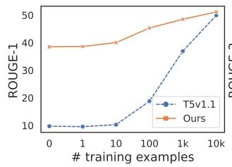

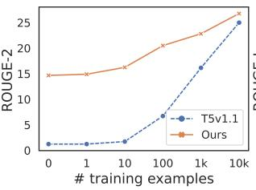

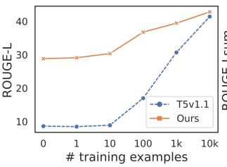

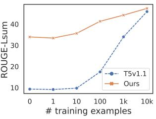

Figure 6: The ROUGE-1, ROUGE-2, ROUGE-L, and ROUGE-LSum scores of low resource dialogue summarization with our best model and T5v1.1. Within 10,000 examples, $\mathrm { D I O N Y S U S _ { B A S E } }$ beats T5v1.1 on all metrics on SAMSum dataset.
<table><tr><td>ROUGE-1/2/L</td><td>GSG* (Dialogue)</td><td>GSG* (ROUGE)</td></tr><tr><td>SAMSum</td><td>13.7/4.0/12.6</td><td>13.1/3.7/12.2</td></tr><tr><td>NYT</td><td>17.9/2.4/13.9</td><td>17.6/2.2/13.7</td></tr><tr><td>Reddit</td><td>15.8/2.2/12.7</td><td>15.3/2.2/12.5</td></tr><tr><td>Stack</td><td>20.7/3.4/15.5</td><td>20.1/3.1/15.2</td></tr><tr><td>Email</td><td>20.8/3.8/15.9</td><td>19.8/3.6/15.1</td></tr><tr><td>TweetSumm</td><td>17.0/3.2/14.5</td><td>15.1/2.7/12.8</td></tr></table>

Table 8: $\mathrm { R O U G E - } 1 / 2 / \mathrm { L }$ scores of zero-shot setting for $\mathrm { D I O N Y S U S _ { B A S E } }$ with $\mathrm { G S G ^ { * } }$ and unordered $\mathrm { G S G ^ { \ast } }$ on SAMSum, ConvoSumm, and TweetSum.

alogue with its corresponding gold summary as an example of a high-quality summary. The summaries were presented in a randomized order for each task to prevent order bias. Three different workers independently completed each task, and the median score across all workers was retained for each summary. Participants were compensated with 0.3 USD per task, and we implemented the following qualifications for worker selection to ensure a high level of quality: (1) HIT approval rate for all requesters’ HITs is greater than 90%. (2) Location is one of AU, NZ, GB, and US. (3) Number of HITs approved is greater than 100.

## F Human Evaluation Details

In our human evaluation experiments, we utilized the task template shown in Figure 8. Mechanical workers were instructed to rate four summaries for a given dialogue on a scale of 1 (poor) to 5 (excellent). To minimize bias, we provided a di-

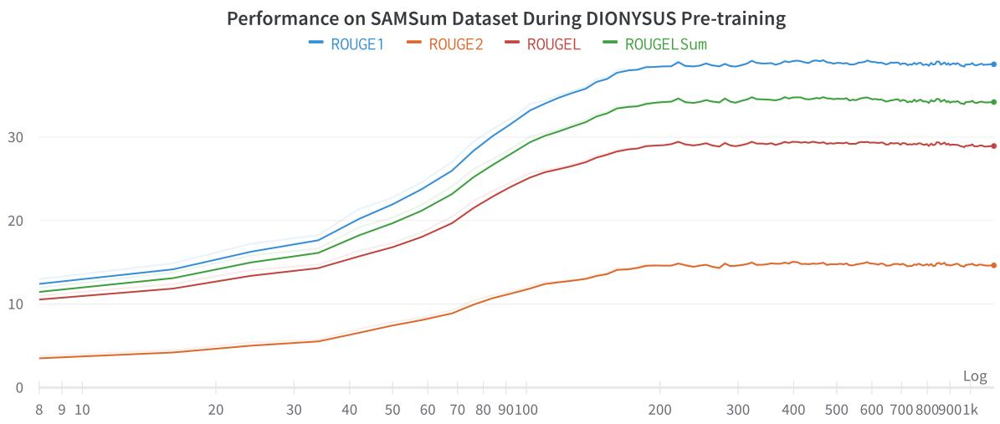  
Figure 7: Performance of DIONYSUS on the SAMSum dataset during pre-training process.

<table><tr><td colspan="2" rowspan="1">Example</td><td colspan="3" rowspan="1">SAMSum</td></tr><tr><td colspan="2" rowspan="7">Dialogue#1</td><td colspan="3" rowspan="1">Dzuka: Until further notice, the staff meeting will be held at 8:30 instead of 8:00.Please change the calendar for everyone. Thanks.</td></tr><tr><td colspan="6" rowspan="1">Anna: No problem. Why the change</td></tr><tr><td colspan="6" rowspan="1">Dzuka: We had a few that never make it on time. I'm hoping this will encourage more participation.</td></tr><tr><td colspan="6" rowspan="1">Anna: Could be just the opposite!</td></tr><tr><td colspan="6" rowspan="1">Dzuka: We'll give it a try.</td></tr><tr><td colspan="6" rowspan="1">Anna: Sure, no problem.Dzuka: I'll let you know if it changes again. Thanks.</td></tr><tr><td colspan="6" rowspan="1">Anna: NP</td></tr><tr><td colspan="2" rowspan="1">Gold</td><td colspan="3" rowspan="1">The stuff meeting is postponed from 8.00 to 8.30 to encourage more participation.Dzuka will inform Anna if it changes again.</td></tr><tr><td colspan="2" rowspan="1">DIONYSUS</td><td colspan="3" rowspan="1">The staff meeting will be held at 8:30 instead of 8:00.Dzuka hopes this will encourage more participation and will let Anna know if it changes again.</td></tr><tr><td colspan="2" rowspan="2">Dialogue#2</td><td colspan="3" rowspan="1">Jane: HelloVegano Resto: Hello, how may I help you today?Jane: I would like to make a reservation for 6 people, tonight around 20:00</td></tr><tr><td colspan="6" rowspan="1">Vegano Resto: Let me just check. Ah, I'm afraid that there is no room at 20:00.However, I could offer you a table for six at 18:30 or at 21:00. Would either of those times suit you?Jane: Oh dear. Let me just ask my friends.Vegano Resto: No problem.Jane: 21:00 will be ok.Vegano Resto: Perfect. So tonight at 21:00 for six people under your name.Jane: great, thank you!</td></tr><tr><td colspan="2" rowspan="1">Gold</td><td colspan="3" rowspan="1">Jane made a 9 PM reservation for 6 people tonight at Vegano Resto</td></tr><tr><td colspan="2" rowspan="1">DIONYSUS</td><td colspan="3" rowspan="1">The restaurant has no room for six people at 20:00 and offers Jane a table for six at 18:30 or 21:00.Jane asks her friends to make a reservation at 21:00.</td></tr><tr><td colspan="2" rowspan="1">Dialogue#3</td><td colspan="3" rowspan="1">Mia: Hi Dad! I need a hand with repairing the bathroom door.William: Hi! What happened?Mia: Nothing. I can't open/close it properly. It's sort of sagging.William: I see. I'll drop by after work and take a look.Mia: Thank you so much! Love you!William: I love you too.</td></tr><tr><td colspan="2" rowspan="1">Gold</td><td colspan="3" rowspan="1">Mia's dad William will come to her place after work to repair her bathroom door.</td></tr><tr><td colspan="2" rowspan="1">DIONYSUS</td><td colspan="3" rowspan="1">The bathroom door is sagging. William will drop by after work and take a look.</td></tr><tr><td colspan="2" rowspan="1">Example</td><td colspan="3" rowspan="1">TWEETSUMM</td></tr><tr><td colspan="2" rowspan="1"></td><td colspan="3" rowspan="3">@549761: My BITS service resets it's Startup type from disabled to automatic.It leeches on to my bandwidth like crazy. Please provide a solution.@MicrosoftHelps: Hi. We hear you. We'd like to check what happened prior to this issue?What Windows version are you using? Let us know.@549761: I am using Windows 10 Home Single Language. Nothing specific happened prior to this issue.Just the service used to leech on to bandwidth (it claims to use idle network but doesn't).I want it to stop from resetting Startup type from disabled to automatic.@MicrosoftHelps: Thanks for the info. For us to isolate your concern,let's try the troubleshooting steps 1/2https://t.co/3qcAsLFkaY listed in this link:https://t.co/IBZ1MaTm11. Kindly check the post of Jesinta Rozario.@MicrosoftHelps: Hi, Pratik. How's it going?Please let us know if you need further assistance. We're here for you.@549761: Hi. The service still becomes running after disabling(after a few days).What can be the reason for the service switching it's startup type?@MicrosoftHelps: In that case, we suggest contacting Answer Desk: https://t.co/9Ouw33YVZIto further assist you with your concern. Let us know how it goes.@MicrosoftHelps: Hello, Pratik! Were we able to resolve your concern?If no, we're just one tweet away if you have other concerns.If yes, please send us your feedback about your experience with our support here: https://t.co/CczzJgTng1.</td></tr><tr><td colspan="2" rowspan="1">Dialogue#1</td></tr><tr><td colspan="2" rowspan="1"></td><td colspan="1" rowspan="1"></td><td colspan="1" rowspan="1"></td></tr><tr><td colspan="2" rowspan="1">Gold</td><td colspan="3" rowspan="1">Customer is complaining about the BITS service for resetting startup type from disabled mode to automatic.Agent suggests to try out some troubleshooting steps by following the shared URLand reach out Answer desk team for further assistance.</td></tr><tr><td colspan="2" rowspan="1">DIONYSUS</td><td colspan="3" rowspan="1">The BITS service leeches on to the bandwidth like crazy.Pratik wants it to stop from resetting Startup type from disabled to automatic.MicrosoftHelps suggests checking the post of Jesinta Rozario.</td></tr><tr><td colspan="2" rowspan="3">Dialogue#2</td><td colspan="3" rowspan="3">@471404: Please bring security back to the Hall Green store.@471404: The store is getting a more an more uncomfortable vibe, not alone on this either!@Tesco: Hi there, sorry to be a pain but can you confirm which Hall Green store this is? TY - Reece@471404: It's the Hall Green store right next to the train station.Hoping you haven't removed security from the others too now...@Tesco: Hi, can you please confirm what you mean by "uncomfortable vibe"? - Nick@471404: Well there's pretty obvious shop lifters regularly,and today we had a man clearly intoxicated screaming and randomly asking people things.@Tesco: Yes the express store! Thanks aswell. I'd review the CCTV from when security were removedIf customers can see the changes you will too!@Tesco: Hi there. I have spoken to the store.They have had a few problems recently and are looking into improving security. Thanks - Ian@471404: Thank you again. I often worry for the staff as it is becoming a hot spot for undesirables.The homeless aren't the issue to save confusion!@Tesco: Hi there, thank you for bringing this to our attentionthe last thing we want is our customers to feel unsafe.Thank you - Brooke@471404: No thank you for taking it seriously here's hoping the store gets back to normal soon!@Tesco: Hi there, I'm glad one of my colleagues has dealt with the issue.Enjoy the rest of your weekend - Rian</td></tr><tr><td colspan="1" rowspan="1"></td></tr><tr><td colspan="2" rowspan="1">asking people things.</td></tr><tr><td colspan="2" rowspan="1">Gold</td><td colspan="3" rowspan="1">The customer is complaining that he facing some uncomfortable vibe.The agent confronted the customer saying that they had a few problems recentlyand they are looking into improving security.</td></tr><tr><td colspan="2" rowspan="1">DIONYSUS</td><td colspan="3" rowspan="1">The store is getting a more an more uncomfortable vibe.Nick asks Tesco to bring security back to the Hall Green store and confirms the location.Nick also tells Tesco the Express store has had some problems recentlyand is looking into improving security.</td></tr></table>

Table 9: Example zero-shot outputs on the SAMSum dataset.

Table 10: Example zero-shot outputs on the TWEETSUMM dataset.

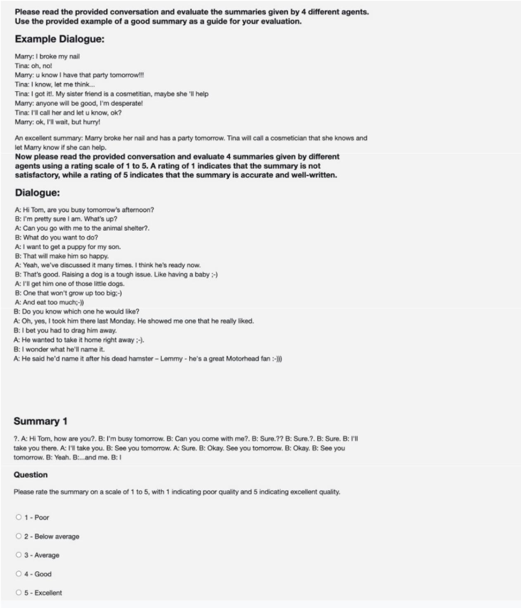  
Figure 8: A screenshot of the human evaluation on Amazon Mechanical Turk.

## ACL 2023 Responsible NLP Checklist

A For every submission: ✓ A1. Did you describe the limitations of your work? Section 8

✓ A2. Did you discuss any potential risks of your work? Section 8

✓ A3. Do the abstract and introduction summarize the paper’s main claims? Abstract and Section 1

✗ A4. Have you used AI writing assistants when working on this paper? Left blank.

## B ✓ Did you use or create scientific artifacts?

Section 1

✓ B1. Did you cite the creators of artifacts you used? Section 1

✓ B2. Did you discuss the license or terms for use and / or distribution of any artifacts? Appendix B

✓ B3. Did you discuss if your use of existing artifact(s) was consistent with their intended use, provided that it was specified? For the artifacts you create, do you specify intended use and whether that is compatible with the original access conditions (in particular, derivatives of data accessed for research purposes should not be used outside of research contexts)? Section 1

 B4. Did you discuss the steps taken to check whether the data that was collected / used contains any information that names or uniquely identifies individual people or offensive content, and the steps taken to protect / anonymize it? Not applicable. It is discussed in the original artifacts I use.

 B5. Did you provide documentation of the artifacts, e.g., coverage of domains, languages, and linguistic phenomena, demographic groups represented, etc.? Not applicable. It is discussed in the original artifacts I use.

✓ B6. Did you report relevant statistics like the number of examples, details of train / test / dev splits, etc. for the data that you used / created? Even for commonly-used benchmark datasets, include the number of examples in train / validation / test splits, as these provide necessary context for a reader to understand experimental results. For example, small differences in accuracy on large test sets may be significant, while on small test sets they may not be. Appendix A

## C ✓ Did you run computational experiments?

Section 5

✓ C1. Did you report the number of parameters in the models used, the total computational budget (e.g., GPU hours), and computing infrastructure used? Appendix A

✓ C2. Did you discuss the experimental setup, including hyperparameter search and best-found hyperparameter values? Appendix A

✓ C3. Did you report descriptive statistics about your results (e.g., error bars around results, summary statistics from sets of experiments), and is it transparent whether you are reporting the max, mean, etc. or just a single run? Section 5

✓ C4. If you used existing packages (e.g., for preprocessing, for normalization, or for evaluation), did you report the implementation, model, and parameter settings used (e.g., NLTK, Spacy, ROUGE, etc.)? Appendix A

D ✓ Did you use human annotators (e.g., crowdworkers) or research with human participants? Section 5.7

✓ D1. Did you report the full text of instructions given to participants, including e.g., screenshots, disclaimers of any risks to participants or annotators, etc.? Appendix F

✓ D2. Did you report information about how you recruited (e.g., crowdsourcing platform, students) and paid participants, and discuss if such payment is adequate given the participants’ demographic (e.g., country of residence)? Appendix F

✓ D3. Did you discuss whether and how consent was obtained from people whose data you’re using/curating? For example, if you collected data via crowdsourcing, did your instructions to crowdworkers explain how the data would be used? Appendix F

 D4. Was the data collection protocol approved (or determined exempt) by an ethics review board? Not applicable. It is in the Amazon Mechanical Turk user agreement protocal.

 D5. Did you report the basic demographic and geographic characteristics of the annotator population that is the source of the data? Not applicable. It is in the Amazon Mechanical Turk user agreement protocal.