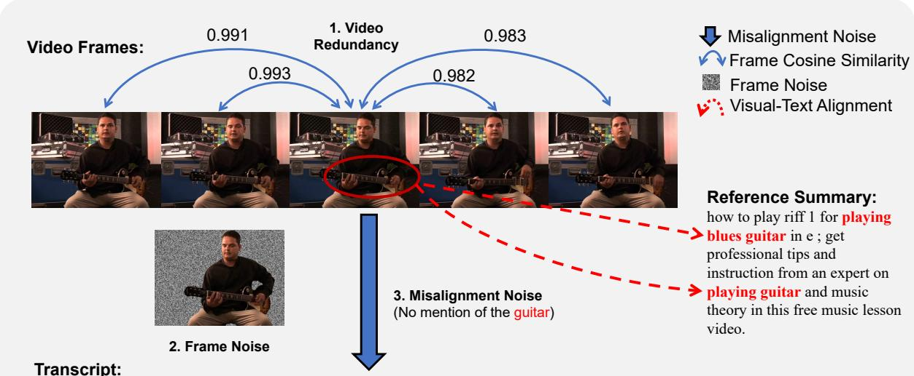
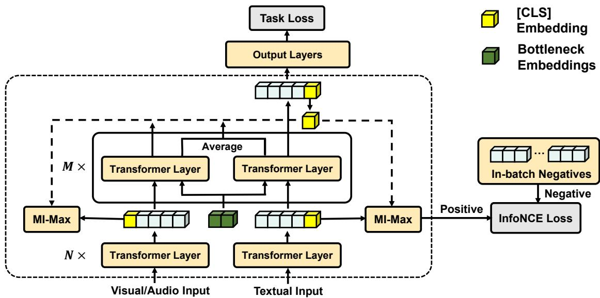
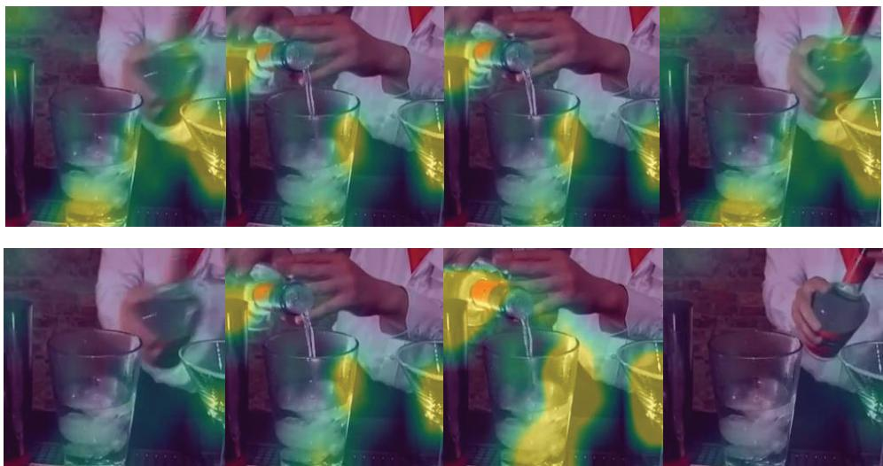

# Denoising Bottleneck with Mutual Information Maximization for Video Multimodal Fusion

Shaoxiang Wu1, Damai Dai1, Ziwei Qin1, Tianyu Liu2,

Binghuai Lin2, Yunbo Cao2, Zhifang Sui1

1MOE Key Lab of Computational Linguistics, Peking University 2Tencent Cloud AI

wushaoxiang@stu.pku.edu.cn {daidamai,szf}@pku.edu.cn

## Abstract

Video multimodal fusion aims to integrate multimodal signals in videos, such as visual, audio and text, to make a complementary prediction with multiple modalities contents. However, unlike other image-text multimodal tasks, video has longer multimodal sequences with more redundancy and noise in both visual and audio modalities. Prior denoising methods like forget gate are coarse in the granularity of noise filtering. They often suppress the redundant and noisy information at the risk of losing critical information. Therefore, we propose a denoising bottleneck fusion (DBF) model for fine-grained video multimodal fusion. On the one hand, we employ a bottleneck mechanism to filter out noise and redundancy with a restrained receptive field. On the other hand, we use a mutual information maximization module to regulate the filter-out module to preserve key information within different modalities. Our DBF model achieves significant improvement over current state-of-the-art baselines on multiple benchmarks covering multimodal sentiment analysis and multimodal summarization tasks. It proves that our model can effectively capture salient features from noisy and redundant video, audio, and text inputs. The code for this paper is publicly available at https://github.com/WSXRHFG/DBF.

## 1 Introduction

With the rapid development of social platforms and digital devices, more and more videos are flooding our lives, which leads video multimodal fusion an increasingly popular focus of NLP research. Video multimodal fusion aims to integrate the information from two or more modalities (e.g., visual and audio signals) into text for a more comprehensive reasoning. For example, multimodal sentiment analysis (Poria et al., 2020) utilizes contrast between transcript and expression to detect sarcam, multimodal summarization (Sanabria et al., 2018) complete summary with information only exists in visual signal.

However, as shown in the Figure 1, there exist plenty of redundancy and noise in video multimodal fusion: 1) high similarity across consecutive frames brings video redundancy; 2) useless information, such as the distracting background, introducesframe noise; 3) weak alignment between visual stream and text also introduces misalignment noise. To alleviate the problem of redundancy and noise in video multimodal fusion, Liu et al. (2020) control the flow of redundant and noisy information between multimodal sequences by a fusion forget gate. The fusion forget gate impairs the impact of noise and redundancy in a coarse grain of the whole modality, so it will also filter out some representative information in the filtered modality.

In order to remove noise and redundancy while preserving critical information in video multimodal fusion, we propose a denoising fusion bottleneck (DBF) model with mutual information maximization (MI-Max). Firstly, inspired by Nagrani et al. (2021), we introduce a bottleneck module to restrict the redundant and noisy information across different modalities. With the bottleneck module, inputs can only attend to low-capacity bottleneck embeddings to exchange information across different modalities, which urges redundant and noisy information to be discarded. Secondly, in order to prevent key information from being filtered out, we adopt the idea of contrastive learning to supervise the learning of our bottleneck module. Specifically, under the noise-contrastive estimation framework (Gutmann and Hyvärinen, 2010), for each sample, we treat all the other samples in the same batch as negative ones. Then, we aim to maximize the mutual information between fusion results and each unimodal inputs by distinguishing their similarity scores from negative samples. Two aforementioned modules complement each other, the MI-Max module supervises the fusion bottleneck not to filter out key information, and in turn, the bottleneck reduces irrelevant information in fusion results to facilitate the maximization of mutual information.

  
I 'm going to begin this series by showing you basic blues rhythms in the key of e. essentially , what we 're going to start with is placing your first finger on the second fret , […] and we 're going to play it over and over again . this is your most basic blues rhythm and you 're only playing on two strings and pretty much it 's going to go like this .  
Figure 1: An example of redundancy and noise in a video. As illustrated, consecutive frames have high cosine similarity, which results in a problem of redundancy. In addition, useless information like distracting background and weak alignment between frames and transcripts compose noises in videos.

We conduct extensive experiments on three benchmarks spanning two tasks. MOSI (Zadeh et al., 2016) and MOSEI (Zadeh et al., 2018b) are two datasets for multimodal sentiment analysis. How2 (Sanabria et al., 2018) is a benchmark for multimodal summarization. Experimental results show that our model achieves consistent improvements compared with current state-of-the-art methods. Meanwhile, we perform comprehensive ablation experiments to demonstrate the effectiveness of each module. In addition, we visualize the attention regions and tensity to multiple frames to intuitively show the behavior of our model to reduce noise while retaining key information implicitly.

Concretely, we make the following contributions: (i) We propose a denoising bottleneck fusion model for video multimodal fusion, which reduces redundancy and noise while retaining key information. (ii) We achieve new state-of-the-art performance on three benchmarks spanning two video multimodal fusion tasks. (iii) We provide comprehensive ablation studies and qualitative visualization examples to demonstrate the effectiveness of both bottleneck and MI-Max modules.

## 2 Related Work

We briefly overview related work about multimodal fusion and specific multimodal fusion tasks including multimodal summarization and multimodal sentiment analysis.

## 2.1 Video Multimodal Fusion

Video multimodal fusion aims to join and comprehend information from two or more modalities in videos to make a comprehensive prediction. Early fusion model adopted simple network architectures. Zadeh et al. (2017); Liu et al. (2018a) fuse features by matrix operations; and Zadeh et al. (2018a) designed a LSTM-based model to capture both temporal and inter-modal interactions for better fusion. More recently, models influenced by prevalence of Transformer (Vaswani et al., 2017) have emerged constantly: Zhang et al. (2019) injected visual information in the decoder of Transformer by cross attention mechanism to do multimodal translation task; Wu et al. (2021) proposed a text-centric multimodal fusion shared private framework for multimodal fusion, which consists of the crossmodal prediction and sentiment regression parts. And now vision-and-language pre-training has become a promising practice to tackle video multimodal fusion tasks. (Sun et al., 2019) firstly extend the Transformer structure to video-language pretraining and used three pre-training tasks: masked language prediction, video text matching, masked video prediction.

In contrast to existing works, we focus on the fundamental characteristic of video: audio and visual inputs in video are redundant and noisy (Nagrani et al., 2021) so we aim to remove noise and redundancy while preserving critical information.

## 2.2 Video Multimodal Summarization

Video multimodal summarization aims to generate summaries from visual features and corresponding transcripts in videos. In contrast to unimodal summarization, some information (e.g., guitar) only exists in the visual modality. Thus, for videos, utilization of both visual and text features is necessary to generate a more comprehensive summary.

For datasets, Li et al. (2017) introduced a multimodal summarization dataset consisting of 500 videos of news articles in Chinese and English. Sanabria et al. (2018) proposed the How2 dataset consists of 2,000 hours of short instructional videos, each coming with a summary of two to three sentences.

For models, Liu et al. (2020) proposed a multistage fusion network with a fusion forget gate module, which controls the flow of redundant information between multimodal long sequences. Meanwhile, Yu et al. (2021a) firstly introduced pre-trained language models into multimodal summarization task and experimented with the optimal injection layer of visual features.

We also reduce redundancy in video like in (Yu et al., 2021a). However, we do not impair the impact of noise and redundancy in a coarse grain with forget gate. Instead, we combine fusion bottleneck and MI-Max modules to filter out noise while preserving key information.

## 2.3 Multimodal Sentiment Analysis

Multimodal sentiment analysis (MSA) aims to integrate multimodal resources, such as textual, visual, and acoustic information in videos to predict varied human emotions. In contrast to unimodal sentiment analysis, utterance in the real situation sometimes contains sarcasm, which makes it hard to make accurate prediction by a single modality. In addition, information such as expression in vision and tone in acoustic help assist sentiment prediction. Yu et al. (2021b) introduced a multi-label training scheme that generates extra unimodal labels for each modality and concurrently trained with the main task. Han et al. (2021) build up a hierarchical mutual information maximization guided model to improve the fusion outcome as well as the performance in the downstream multimodal sentiment analysis task. Luo et al. (2021) propose a multiscale fusion method to align different granularity information from multiple modalities in multimodal sentiment analysis.

Our work is fundamentally different from the above work. We do not focus on complex fusion mechanisms, but take the perspective of information in videos, and stress the importance of validity of information within fusion results.

## 3 Methodology

Our denoising fusion bottleneck (DBF) model aims to fuse multimodal inputs from videos to make a comprehensive prediction. The overall architecture of DBF is shown in Figure 2. It first employs a fusion bottleneck module with a restrained receptive field to filter out noise and redundancy when fusing different modalities in videos. Then, DBF maximizes mutual information between fusion results and unimodal inputs to supervise the learning of the fusion bottleneck, aiming to preserve more representative information in fusion results.

## 3.1 Problem Definition

In video multimodal fusion tasks, for each video, the input comprises three sequences of encoded features from textual (t), visual (v), and acoustic (a) modalities. These input features are represented as $\boldsymbol { X } _ { m } \in \mathbb { R } ^ { l _ { m } \times d _ { m } }$ , where $m \in \{ t , v , a \}$ , and $l _ { m }$ and $d _ { m }$ denote the sequence length and feature dimension for modality m, respectively. The goal of DBF is to extract and integrate task-related information from these input representations to form a unified fusion result $\bar { Z } \in \bar { \mathbb { R } } ^ { l \times d }$ . In this paper, we evaluate the quality of the fusion result $Z$ on two tasks: video multimodal sentiment analysis and video multimodal summarization.

For sentiment analysis, we utilize Z to predict the emotional orientation of a video as a discrete category $\hat { y }$ from a predefined set of candidates

$$
\hat { y } = \operatorname { a r g m a x } _ { y _ { j } \in { \mathcal C } } \operatorname { P } _ { \Theta } ( y _ { j } \mid Z ) ,\tag{1}
$$

or as a continuous intensity score $\hat { y } \in \mathbb R$

$$
\begin{array} { r } { \hat { y } = \operatorname { P } _ { \Theta } ( Z ) , } \end{array}\tag{2}
$$

where $\Theta$ denotes the model parameters.

For summarization, we generate a summary sequence $\hat { \boldsymbol { S } } = ( s _ { 1 } , . . . , s _ { l } )$ based on Z:

$$
{ \hat { S } } = \operatorname { a r g m a x } _ { S } \operatorname { P } _ { \Theta } ( S \mid Z ) .\tag{3}
$$

  
Figure 2: Overview of our denoising fusion bottleneck (DBF) model. It consists of N Transformer layers to encode videos and texts, and M Transformer layers with fusion bottlenecks for multimodal fusion. We incorporate a mutual information maximization (MI-Max) InfoNCE loss to regulate the bottleneck module, aiming to preserve key information in both modalities from being filtered.

## 3.2 Fusion Bottleneck

As shown in Figure 2, we first employ a fusion bottleneck with a restrained receptive field to perform multimodal fusion and filter out noise and redundancy in videos. Specifically, fusion bottleneck forces cross-modal information flow passes via randomly initialized bottleneck embeddings $B \in \mathbb { R } ^ { l _ { b } \times d _ { m } }$ with a small sequence length, where $d _ { m }$ denotes dimension of features and $l _ { b } \ll l .$ The restrained receptive field of B forces model to collate and condense unimodal information before sharing it with the other modalities.

With a small length $l _ { b } .$ , embedding B acts like a bottleneck in cross-modal interaction. In the fusion bottleneck module, unimodal features cannot directly attend to each other and they can only attend to the bottleneck embeddings B to exchange information in it. Meanwhile, the bottleneck can attend to all of the modalities, which makes information flow across modalities must pass through the bottleneck with a restrained receptive field. The fusion bottleneck module forces the model to condense and collate information and filter out noise and redundancy.

Specifically, in the fusion bottleneck module, with bottleneck embeddings B and unimodal features $X _ { m }$ , the fusion result is calculated as follows:

$$
[ X _ { m } ^ { l + 1 } | | B _ { m } ^ { l + 1 } ] = \mathrm { T r a n s f o r m e r } ( [ X _ { m } ^ { l } | | B ^ { l } ] ) ,\tag{4}
$$

$$
B ^ { l + 1 } = \mathbf { M e a n } ( B _ { m } ^ { l + 1 } ) ,\tag{5}
$$

where l denotes the layer number and denotes the concatenation operation. As shown in Equation 4 and 5, each time a Transformer layer is passed, bottleneck embedding B is updated by unimodal features. In turn, unimodal features integrate condensed information from other modalities through bottleneck embeddings B. Finally, we output the text features $X _ { t } ^ { L }$ of the last layer $L ,$ which are injected with condensed visual and audio information, as the fusion result.

## 3.3 Fusion Mutual Information Maximization

The fusion bottleneck module constrains information flow across modalities in order to filter out noise and redundancy. However, it may result in loss of critical information as well when fusion bottleneck selects what information to be shared. To alleviate this issue, we employ a mutual information maximization (MI-Max) module to preserve representative and salient information from redundant modalities in fusion results.

Mutual information is a concept from information theory that estimates the relationship between pairs of variables. Through prompting the mutual information between fusion results $Z$ and multimodal inputs $X _ { m }$ , we can capture modalityinvariant cues among modalities (Han et al., 2021) and keep key information preserved by regulating the fusion bottleneck module.

Since direct maximization of mutual information for continuous and high-dimensional variables is intractable (Belghazi et al., 2018), we instead minimize the lower bound of mutual information as Han et al. (2021) and Oord et al. (2018). To be specific, we first construct an opposite path from $Z$ to predict $X _ { m }$ by an MLP ${ \mathcal F } .$ . Then, to gauge correlation between the prediction and $X _ { m }$ , we use a normalized similarity function as follows:

$$
\sin ( X _ { m } , Z ) = \exp \left( \frac { X _ { m } } { \left. X _ { m } \right. ^ { 2 } } \odot \frac { \mathcal { F } ( Z ) } { \left. \mathcal { F } ( Z ) \right. ^ { 2 } } \right) ,\tag{6}
$$

where $\mathcal { F }$ generates a prediction of $X _ { m }$ from $Z , \| \cdot \| ^ { 2 }$ is the Euclidean norm, and denotes element-wise product. Then, we incorporate this similarity function into the noise-contrastive estimation framework (Gutmann and Hyvärinen, 2010) and produce an InfoNCE loss (Oord et al., 2018) which reflects the lower bound of the mutual information:

$$
\mathcal { L } _ { \mathrm { N C E } } ^ { z , m } = - \mathbb { E } _ { X _ { m } , Z } \left[ \log \frac { e ^ { \sin \left( x _ { m } ^ { + } , \mathcal { F } ( Z ) \right) } } { \sum _ { k = 1 } ^ { K } e ^ { \sin \left( x _ { m } ^ { k } , \mathcal { F } ( Z ) \right) } } \right]\tag{7}
$$

where $\tilde { x } _ { m } = \left\{ \tilde { x } ^ { 1 } , \ldots , \tilde { x } ^ { K } \right\}$ is the negative unimodal inputs that are not matched to the fusion result Z in same batch. Finally, we compute loss for all modalities as follows:

$$
\mathcal { L } _ { \mathrm { N C E } } = \alpha ( \mathcal { L } _ { \mathrm { N C E } } ^ { z , v } + \mathcal { L } _ { \mathrm { N C E } } ^ { z , a } + \mathcal { L } _ { \mathrm { N C E } } ^ { z , t } )\tag{8}
$$

where α is a hyper-parameter that controls the impact of MI-Max.

By minimizing NCE, on the one hand, we maximize the lower bound of the mutual information between fusion results and unimodal inputs; on the other hand, we encourage fusion results to reversely predict unimodal inputs as well as possible, which prompts retaining of representative and key information from different modalities in fusion results.

## 4 Experiments

## 4.1 Tasks, Datasets, and Metrics

We evaluate fusion results of DBF on two video multimodal tasks: video multimodal sentiment analysis and video multimodal summarization.

Video Multimodal Sentiment Analysis Video multimodal sentiment analysis is a regression task that aims to collect and tackle data from multiple resources (text, vision and acoustic) to comprehend varied human emotions. We do this task on

MOSI (Zadeh et al., 2016) and MOSEI (Zadeh et al., 2018b) datasets. The MOSI dataset contains 2198 subjective utterance-video segments, which are manually annotated with a continuous opinion score between [-3, 3], where -3/+3 represents strongly negative/positive sentiments. The MOSEI dataset is an improvement over MOSI, which contains 23453 annotated video segments (utterances), from 5000 videos, 1000 distinct speakers and 250 different topics.

Following (Hazarika et al., 2020), we use the same metric set to evaluate sentiment intensity predictions: MAE (mean absolute error), which is the average of absolute difference value between predictions and labels; Corr (Pearson correlation) that measures the degree of prediction skew; Acc-7 (seven-class classification accuracy) ranging from -3 to 3; Acc-2 (binary classification accuracy) and F1 score computed for positive/negative and nonnegative/negative classification results.

Video Multimodal Summarization The summary task aims to generate abstractive summarization with videos and their corresponding transcripts. We set How2 dataset (Sanabria et al., 2018) as benchmark for this task, which is a largescale dataset consists of 79,114 short instructional videos, and each video is accompanied by a humangenerated transcript and a short text summary.

Following (Yu et al., 2021a), to evaluate summarization, we use metrics as follows: ROUGE (Lin and Hovy, 2003) (ROUGE-1, 2, L) and BLEU (Papineni et al., 2002) (BLEU-1, 2, 3, 4), which calculate the recall and precision of n-gram overlaps, respectively; METEOR (Denkowski and Lavie, 2011), which evaluates matching degree of word stems, synonyms and paraphrases; CIDEr (Vedantam et al., 2015) is an image captioning metric to compute the cosine similarity between TF-IDF weighted n-grams.

## 4.2 Experimental Settings

For sentiment analysis task, we use BERT-base (Devlin et al., 2018) to encode text input and extract the [CLS] embedding from the last layer. For acoustic and vision, we use COVAREP (Degottex et al., 2014) and Facet 1 to extract audio and facial expression features. The visual feature dimensions are 47 for MOSI, 35 for MOSEI, and the audio feature dimensions are 74 for both MOSI and MOSEI.

<table><tr><td rowspan="2">Method</td><td colspan="5">MOSI</td></tr><tr><td>MAE(↓)</td><td>Corr(↑)</td><td>Acc-7(↑)</td><td>Acc-2(↑)</td><td>F1(↑)</td></tr><tr><td>MulT (Tsai et al., 2019)</td><td>0.871</td><td>0.698</td><td>40.0</td><td>-/83.0</td><td>- / 82.8</td></tr><tr><td>TFN (Zadeh et al., 2017)</td><td>0.901</td><td>0.698</td><td>34.9</td><td>- / 80.8</td><td>-/ 80.7</td></tr><tr><td>LMF (Liu et al., 2018b)</td><td>0.917</td><td>0.695</td><td>33.2</td><td>-/ 82.5</td><td>- / 82.4</td></tr><tr><td>MFM (Tsai et al., 2018)</td><td>0.877</td><td>0.706</td><td>35.4</td><td>-/81.7</td><td>-/81.6</td></tr><tr><td>ICCN (Sun et al., 2020)</td><td>0.860</td><td>0.710</td><td>39.0</td><td>-/83.0</td><td>-/83.0</td></tr><tr><td>MISA (Hazarika et al., 2020)</td><td>0.783</td><td>0.761</td><td>42.3</td><td>81.8 / 83.4</td><td>81.7 / 83.6</td></tr><tr><td>Self-MM (Yu et al., 2021b)</td><td>0.712</td><td>0.795</td><td>45.8</td><td>82.5 / 84.8</td><td>82.7 / 84.9</td></tr><tr><td>MMIM† (Han et al., 2021)</td><td>0.700</td><td>0.800</td><td>46.7</td><td>84.2 / 86.1</td><td>84.0 / 86.0</td></tr><tr><td>DBF</td><td>0.693</td><td>0.801</td><td>44.8</td><td>85.1 / 86.9</td><td>85.1 / 86.9</td></tr></table>

Table 1: Results of multimodal sentiment analysis on MOSI.  indicates the previous state-of-the-art model.
<table><tr><td rowspan="2">Method</td><td colspan="5">MOSEI</td></tr><tr><td>MAE(↓)</td><td>Corr(↑)</td><td>Acc-7(↑)</td><td>Acc-2(↑)</td><td>F1(↑)</td></tr><tr><td>MulT (Tsai et al., 2019)</td><td>0.580</td><td>0.703</td><td>51.8</td><td>- / 82.3</td><td>- / 82.5</td></tr><tr><td>TFN (Zadeh et al., 2017)</td><td>0.593</td><td>0.700</td><td>50.2</td><td>-/ 82.1</td><td>-/ 82.5</td></tr><tr><td>LMF (Liu et al., 2018b)</td><td>0.677</td><td>0.695</td><td>48.0</td><td>-/ 82.1</td><td>- / 82.0</td></tr><tr><td>MFM (Tsai et al., 2018)</td><td>0.717</td><td>0.706</td><td>51.3</td><td>-/ 84.3</td><td>-/ 84.4</td></tr><tr><td>ICCN (Sun et al., 2020)</td><td>0.565</td><td>0.713</td><td>51.6</td><td>- / 84.2</td><td>- / 84.2</td></tr><tr><td>MISA (Hazarika et al., 2020)</td><td>0.555</td><td>0.756</td><td>52.2</td><td>83.8 / 85.3</td><td>83.6 / 85.5</td></tr><tr><td>Self-MM (Yu et al., 2021b)</td><td>0.529</td><td>0.767</td><td>53.5</td><td>82.7 / 85.0</td><td>83.0/ 84.9</td></tr><tr><td>MMIM† (Han et al., 2021)</td><td>0.526</td><td>0.772</td><td>54.2</td><td>82.2 / 86.0</td><td>82.7 / 85.9</td></tr><tr><td>DBF</td><td>0.523</td><td>0.772</td><td>54.2</td><td>84.3 / 86.4</td><td>84.8 / 86.2</td></tr></table>

Table 2: Results of multimodal sentiment analysis on MOSEI.  indicates the previous state-of-the-art model.

For summarization, we use BART (Lewis et al., 2019) as the feature extractor and inject visual information in the last layer of the BART encoder. For vision, a 2048-dimensional feature representation is extracted for every 16 non-overlapping frames using a 3D ResNeXt-101 model (Hara et al., 2018), which is pre-trained on the Kinetics dataset (Kay et al., 2017). Details of the hyper-parameters are given in Appendix A. For frameworks and hardware, we use the deep learning framework PyTorch (Paszke et al., 2017) and Huggingface 2 to implement our code. We use a single Nvidia GeForce A40 GPU for sentiment analysis experiments and two for summarization.

## 4.3 Overall Results

We compare performance against DBF by considering various baselines as below: For multimodal sentiment analysis, we compare with MulT (Tsai et al., 2019), TFN (Zadeh et al., 2017), LMF (Liu et al., 2018b), MFM (Tsai et al., 2018), ICCN (Sun et al., 2020), MISA (Hazarika et al., 2020), Self-MM (Yu et al., 2021b) and MMIM (Han et al., 2021). For multimodal summarization, we compare with HA (Palaskar et al., 2019) MFFG (Liu et al., 2020) VG-GPLMs (Yu et al., 2021a). Details of baselines are in Appendix B. The comparative results for sentiment analysis are presented in Table 1 (MOSI) and Table 2 (MOSEI). Results for summarization are presented in Table 3 (How2).

We find that DBF yields better or comparable results to state-of-the-art methods. To elaborate, DBF significantly outperforms state-of-the-art in all metrics on How2 and in most of metrics on MOSI and MOSEI. For other metrics, DBF achieves very closed performance to state-of-the-art. These outcomes preliminarily demonstrate the efficacy of our method in video multimodal fusion.

From the results, we can observe that our model achieves more significant performance improvement on summary task than sentiment analysis.

<table><tr><td rowspan="2">Method</td><td colspan="8">How2</td></tr><tr><td>R-1 R-2</td><td></td><td>R-L</td><td>B-1</td><td>B-2</td><td>B-3</td><td>B-4 METEOR</td><td>CIDEr</td></tr><tr><td>HA (RNN) (Palaskar et al., 2019)</td><td>60.3</td><td>42.5</td><td>55.7</td><td>57.2</td><td>47.7</td><td>41.8 37.5</td><td>28.8</td><td>2.48</td></tr><tr><td>HA (TF) (Palaskar et al., 2019)</td><td>60.2</td><td>43.1</td><td>55.9 58.6</td><td>48.3</td><td>43.3</td><td>38.1</td><td>28.9</td><td>2.51</td></tr><tr><td>MFFG (RNN) (Liu et al., 2020)</td><td>62.3</td><td>46.1 58.2</td><td>59.1</td><td>50.4</td><td>45.1</td><td>41.1</td><td>30.1</td><td>2.69</td></tr><tr><td>MFFG (TF) (Liu et al., 2020)</td><td>61.6</td><td>45.1</td><td>57.4 60.0</td><td>50.9</td><td>45.3</td><td>41.3</td><td>29.9</td><td>2.67</td></tr><tr><td>VG-GPLMs† (Yu et al., 2021a)</td><td>68.0</td><td>51.4</td><td>63.3</td><td>65.2 56.3</td><td>50.4</td><td>46.0</td><td>34.0</td><td>3.28</td></tr><tr><td>DBF</td><td>70.1</td><td>54.7</td><td>66.0</td><td>67.2</td><td>58.9</td><td>53.3 49.0</td><td>35.5</td><td>3.56</td></tr></table>

Table 3: Results of multimodal summarization task on How2. The indicates the previous state-of-the-art model. We denote ROUGE and BLEU by R and B respectively.
<table><tr><td rowspan="2">Model</td><td colspan="2">MOSI</td><td colspan="2">MOSEI</td></tr><tr><td>MAE (↓)</td><td>F1 (↑)</td><td>MAE (↓)</td><td>F1 (↑)</td></tr><tr><td>1) Ours</td><td>0.693</td><td>85.07 / 86.88</td><td>0.523</td><td>84.78 / 86.19</td></tr><tr><td>2) (-) MI-Max</td><td>0.697</td><td>83.08 / 85.28</td><td>0.536</td><td>80.94 / 85.58</td></tr><tr><td>3) (-) bottleneck</td><td>0.750</td><td>82.84 / 83.63</td><td>0.537</td><td>77.52 / 83.81</td></tr><tr><td>4) (-) Language l</td><td>1.391</td><td>55.54 / 54.95</td><td>0.817</td><td>67.63 / 64.01</td></tr><tr><td>5) (-) Visual v</td><td>0.700</td><td>82.78 / 84.33</td><td>0.541</td><td>78.42 / 84.05</td></tr><tr><td>6) (-) Audio a</td><td>0.720</td><td>83.02 / 85.86</td><td>0.536</td><td>80.22 / 85.02</td></tr><tr><td>7) Visual-based</td><td>1.372</td><td>57.06 / 57.83</td><td>0.536</td><td>83.41 / 85.47</td></tr><tr><td>8) Audio-based</td><td>1.194</td><td>67.95 / 70.49</td><td>0.537</td><td>83.80 / 85.76</td></tr></table>

Table 4: Results of ablation study. (-) represents removal for the mentioned factors. Model 1 represents the best performing model in each dataset; Model 2,3 presents the effect of MI module and bottleneck module; Model 4,5,6 depicts the effect of individual modalities; Model 7,8 presents the variants of our model as defined in Section 4.4.

There could be two reasons for this: 1) the size of two datasets is small, yet DBF requires a sufficient amount of data to learn noise and redundancy patterns for this type of video. 2) Visual features are extracted by Facet on sentiment analysis task and more 3D ResNeXt-101 on summary task respectively. Compared to sentiment analysis task, summary task employ a more advanced visual extractor and DBF is heavily influenced by the quality of visual features.

## 4.4 Ablation Study

Effect of Fusion Bottleneck and MI-Max As shown in Table 4, we first remove respectively MI-Max module and exchange fusion bottleneck module with vanilla fusion methods to observe the effects on performance. We observe that fusion bottleneck and MI-Max both help better fusion results, and the combination of them further improves performance, which reflects the necessity of removing noise while maintaining representative information.

Effect of Modalities Then we remove one modality at a time to observe the effect on performance. Firstly, we observe that the multimodal combination provides the best performance, indicating that our model can learn complementary information from different modalities. Next, we observe that the performance drops sharply when the language modality is removed. This may be due to the fact that text has higher information density compared to redundant audio and visual modalities. It verifies two things: 1) It is critical to remove noise and redundancy to increase information density of visual and audio modalities when doing fusion. 2) Text-centric fusion results may help improve performance on multimodal summary and sentiment analysis tasks.

Effect of Center Modality As mentioned above, text-centric fusion results tend to perform better as low information intensity and high redundancy in other modalities. Thus, we evaluate fusion results based on acoustic and vision modality respectively on downstream tasks. We observe an obvious decline in performance when audio or visual modality is used as the central modality.

  
Figure 3: Comparison of Grad-CAM visualizations of baseline method VG-GPLMs (Yu et al., 2021a) (top) and DBF (bottom). In contrast to even attention to different frames of the baseline method, DBF ignores redundancy and noise in consecutive frames and highly focuses on the key information (pouring wine in this example) in a particular frame.

## 4.5 Case Study

In this section, we first calculate standard deviation and normalized entropy over visual attention scores in the Grad-CAM heatmaps (Selvaraju et al., 2017) for DBF and baseline method VG-GPLMs (Yu et al., 2021a) respectively. These two metrics show the sharpness of visual attention scores, indicating whether the model focuses more on key frames and ignores redundant content. Then, we compute visualizations on Grad-CAM heatmaps acquired before to show the ability of DBF to filter out redundancy and preserve key information.

Statistics of Visualization Results Grad-CAM is a visualization method of images, it obtains visualization heatmaps by calculating weights and gradients during backpropagation, and in this paper we extend Grad-CAM to videos. Further, to quantify this sharpness of visual attention, we calculate standard deviation and normalized entropy on Grad-CAM heatmaps over the test split on How2 dataset. For results, DBF gets 0.830, 0.008, baseline gets 0.404, 0.062 in deviation and normalized entropy respectively. DBF holds a higher deviation and lower entropy, which indicates sharper visual attention maps to discriminate redundancy and key frames.

Visualization Example Figure 3 provides Grad-CAM visualizations of DBF and baseline method. As we can see, DBF has more sharp attention over continuous frames and ignores redundancy while preserving critical information in visual inputs.

## 5 Conclusion

In this paper, we propose a denoising video multimodal fusion system DBF which contains a fusion bottleneck to filter out redundancy with noise, a mutual information module to preserve key information in fusion results. Our model alleviates redundancy and nosie problem in video multimodal fusion and makes full use of all representative information in redundant modalities (vision and acoustic). In the experiments, we show that our model significantly and consistently outperforms state-ofthe-art video multimodal models. In addition, we demonstrate that DBF can appropriately select necessary contents and neglect redundancy in video by comprehensive ablation and visualization studies.

In the future, we will explore the following directions: (1) We will try to extend the proposed DBF model to more multimodal fusion tasks such as humor detection. (2) We will incorporate visiontext pretraining backbones into our DBF model to further improve its performance.

## Limitations

First, limited by the category of video multimodal fusion tasks, we do not perform experiments on more tasks to better validate the effectiveness of our method, and we hope to extend our model to more various and complete benchmarks in future work. Secondly, as shown in Section 4.3, our model achieves relatively slight performance improvement on sentiment analysis task. For reasons, our model may be dependent on the scale of datasets to learn noise and redundancy patterns in video, which needs to be further improved and studied.

## Acknowledgement

This paper is supported by the National Key Research and Development Program of China 2020AAA0106700 and NSFC project U19A2065.

## References

Mohamed Ishmael Belghazi, Aristide Baratin, Sai Rajeswar, Sherjil Ozair, Yoshua Bengio, Aaron Courville, and R Devon Hjelm. 2018. Mine: mutual information neural estimation. arXiv preprint arXiv:1801.04062.

Gilles Degottex, John Kane, Thomas Drugman, Tuomo Raitio, and Stefan Scherer. 2014. Covarep—a collaborative voice analysis repository for speech technologies. In 2014 ieee international conference on acoustics, speech and signal processing (icassp), pages 960–964. IEEE.

Michael Denkowski and Alon Lavie. 2011. Meteor 1.3: Automatic metric for reliable optimization and evaluation of machine translation systems. In Proceedings ofthe sixth workshop on statistical machine translation, pages 85–91.

Jacob Devlin, Ming-Wei Chang, Kenton Lee, and Kristina Toutanova. 2018. Bert: Pre-training of deep bidirectional transformers for language understand ing. arXiv preprint arXiv:1810.04805.

Michael Gutmann and Aapo Hyvärinen. 2010. Noisecontrastive estimation: A new estimation principle for unnormalized statistical models. In Proceedings of the thirteenth international conference on artificial intelligence and statistics, pages 297–304. JMLR Workshop and Conference Proceedings.

Wei Han, Hui Chen, and Soujanya Poria. 2021. Improving multimodal fusion with hierarchical mutual information maximization for multimodal sentiment analysis. arXiv preprint arXiv:2109.00412.

Kensho Hara, Hirokatsu Kataoka, and Yutaka Satoh. 2018. Can spatiotemporal 3d cnns retrace the history of 2d cnns and imagenet? In Proceedings of the IEEE conference on Computer Vision and Pattern Recognition, pages 6546–6555.

Devamanyu Hazarika, Roger Zimmermann, and Soujanya Poria. 2020. Misa: Modality-invariant andspecific representations for multimodal sentiment analysis. In Proceedings of the 28th ACM international conference on multimedia, pages 1122–1131.

Will Kay, Joao Carreira, Karen Simonyan, Brian Zhang, Chloe Hillier, Sudheendra Vijayanarasimhan, Fabio Viola, Tim Green, Trevor Back, Paul Natsev, et al. 2017. The kinetics human action video dataset. arXiv preprint arXiv:1705.06950.

Mike Lewis, Yinhan Liu, Naman Goyal, Marjan Ghazvininejad, Abdelrahman Mohamed, Omer Levy, Ves Stoyanov, and Luke Zettlemoyer. 2019. Bart: Denoising sequence-to-sequence pre-training for natural language generation, translation, and comprehension. arXiv preprint arXiv:1910.13461.

Haoran Li, Junnan Zhu, Cong Ma, Jiajun Zhang, and Chengqing Zong. 2017. Multi-modal summarization for asynchronous collection of text, image, audio and video. In Proceedings of the 2017 Conference on Empirical Methods in Natural Language Processing, pages 1092–1102.

Chin-Yew Lin and Eduard Hovy. 2003. Automatic evaluation of summaries using n-gram co-occurrence statistics. In Proceedings of the 2003 human language technology conference ofthe North American chapter of the association for computational linguistics, pages 150–157.

Nayu Liu, Xian Sun, Hongfeng Yu, Wenkai Zhang, and Guangluan Xu. 2020. Multistage fusion with forget gate for multimodal summarization in open-domain videos. In Proceedings of the 2020 Conference on Empirical Methods in Natural Language Processing (EMNLP), pages 1834–1845.

Zhun Liu, Ying Shen, Varun Bharadhwaj Lakshminarasimhan, Paul Pu Liang, Amir Zadeh, and Louis-Philippe Morency. 2018a. Efficient low-rank multimodal fusion with modality-specific factors. arXiv preprint arXiv:1806.00064.

Zhun Liu, Ying Shen, Varun Bharadhwaj Lakshminarasimhan, Paul Pu Liang, Amir Zadeh, and Louis-Philippe Morency. 2018b. Efficient low-rank multimodal fusion with modality-specific factors. arXiv preprint arXiv:1806.00064.

Huaishao Luo, Lei Ji, Yanyong Huang, Bin Wang, Shenggong Ji, and Tianrui Li. 2021. Scalevlad: Improving multimodal sentiment analysis via multiscale fusion of locally descriptors. arXiv preprint arXiv:2112.01368.

Arsha Nagrani, Shan Yang, Anurag Arnab, Aren Jansen, Cordelia Schmid, and Chen Sun. 2021. Attention bottlenecks for multimodal fusion. Advances in Neural Information Processing Systems, 34:14200–14213.

Aaron van den Oord, Yazhe Li, and Oriol Vinyals. 2018. Representation learning with contrastive predictive coding. arXiv preprint arXiv:1807.03748.

Shruti Palaskar, Jindrich Libovicky, Spandana Gella,\` and Florian Metze. 2019. Multimodal abstractive summarization for how2 videos. arXiv preprint arXiv:1906.07901.

Kishore Papineni, Salim Roukos, Todd Ward, and Wei-Jing Zhu. 2002. Bleu: a method for automatic evaluation of machine translation. In Proceedings ofthe 40th annual meeting ofthe Associationfor Computational Linguistics, pages 311–318.

A. Paszke, S. Gross, S. Chintala, G. Chanan, E. Yang, Z. Devito, Z. Lin, A. Desmaison, L. Antiga, and A. Lerer. 2017. Automatic differentiation in pytorch.

Soujanya Poria, Devamanyu Hazarika, Navonil Majumder, and Rada Mihalcea. 2020. Beneath the tip of the iceberg: Current challenges and new directions in sentiment analysis research. IEEE Transactions on Affective Computing.

Ramon Sanabria, Ozan Caglayan, Shruti Palaskar, Desmond Elliott, Loïc Barrault, Lucia Specia, and Florian Metze. 2018. How2: a large-scale dataset for multimodal language understanding. arXiv preprint arXiv:1811.00347.

Ramprasaath R Selvaraju, Michael Cogswell, Abhishek Das, Ramakrishna Vedantam, Devi Parikh, and Dhruv Batra. 2017. Grad-cam: Visual explanations from deep networks via gradient-based localization. In Proceedings ofthe IEEE international conference on computer vision, pages 618–626.

Chen Sun, Austin Myers, Carl Vondrick, Kevin Murphy, and Cordelia Schmid. 2019. Videobert: A joint model for video and language representation learning. In Proceedings ofthe IEEE/CVF International Conference on Computer Vision (ICCV).

Zhongkai Sun, Prathusha Sarma, William Sethares, and Yingyu Liang. 2020. Learning relationships between text, audio, and video via deep canonical correlation for multimodal language analysis. In Proceedings of the AAAI Conference on Artificial Intelligence, volume 34, pages 8992–8999.

Yao-Hung Hubert Tsai, Shaojie Bai, Paul Pu Liang, J Zico Kolter, Louis-Philippe Morency, and Ruslan Salakhutdinov. 2019. Multimodal transformer for unaligned multimodal language sequences. In Proceedings of the conference. Association for Computational Linguistics. Meeting, volume 2019, page 6558. NIH Public Access.

Yao-Hung Hubert Tsai, Paul Pu Liang, Amir Zadeh, Louis-Philippe Morency, and Ruslan Salakhutdinov. 2018. Learning factorized multimodal representations. arXiv preprint arXiv:1806.06176.

Ashish Vaswani, Noam Shazeer, Niki Parmar, Jakob Uszkoreit, Llion Jones, Aidan N Gomez, Łukasz Kaiser, and Illia Polosukhin. 2017. Attention is all you need. Advances in neural information processing systems, 30.

Ramakrishna Vedantam, C Lawrence Zitnick, and Devi Parikh. 2015. Cider: Consensus-based image description evaluation. In Proceedings of the IEEE conference on computer vision and pattern recognition, pages 4566–4575.

Yang Wu, Zijie Lin, Yanyan Zhao, Bing Qin, and Li-Nan Zhu. 2021. A text-centered shared-private framework via cross-modal prediction for multimodal sentiment analysis. In Findings of the Association for Computational Linguistics: ACL-IJCNLP 2021, pages 4730–4738.

Tiezheng Yu, Wenliang Dai, Zihan Liu, and Pascale Fung. 2021a. Vision guided generative pre-trained language models for multimodal abstractive summarization. arXiv preprint arXiv:2109.02401.

Wenmeng Yu, Hua Xu, Ziqi Yuan, and Jiele Wu. 2021b. Learning modality-specific representations with selfsupervised multi-task learning for multimodal sentiment analysis. In Proceedings of the AAAI Conference on Artificial Intelligence, volume 35, pages 10790–10797.

Amir Zadeh, Minghai Chen, Soujanya Poria, Erik Cambria, and Louis-Philippe Morency. 2017. Tensor fusion network for multimodal sentiment analysis. arXiv preprint arXiv:1707.07250.

Amir Zadeh, Paul Pu Liang, Navonil Mazumder, Soujanya Poria, Erik Cambria, and Louis-Philippe Morency. 2018a. Memory fusion network for multiview sequential learning. In Proceedings ofthe AAAI conference on artificial intelligence, volume 32.

Amir Zadeh, Rowan Zellers, Eli Pincus, and Louis-Philippe Morency. 2016. Mosi: multimodal corpus of sentiment intensity and subjectivity analysis in online opinion videos. arXiv preprint arXiv:1606.06259.

AmirAli Bagher Zadeh, Paul Pu Liang, Soujanya Poria, Erik Cambria, and Louis-Philippe Morency. 2018b. Multimodal language analysis in the wild: Cmumosei dataset and interpretable dynamic fusion graph. In Proceedings of the 56th Annual Meeting of the Association for Computational Linguistics (Volume 1: Long Papers), pages 2236–2246.

Zhuosheng Zhang, Kehai Chen, Rui Wang, Masao Utiyama, Eiichiro Sumita, Zuchao Li, and Hai Zhao. 2019. Neural machine translation with universal visual representation. In International Conference on Learning Representations.

## Appendix

## A Hyper-parameters

We set hyper-parameters as shown in Table 5 for best performance. For optimization, we utilize the Adam optimizer with warmup. The training duration of each model is governed by early-stopping strategy with a patience of 10 epochs.

<table><tr><td>Hyper-Parameter</td><td>MOSI MOSEI How2</td><td></td><td></td></tr><tr><td>Batch size</td><td>32</td><td>96</td><td>80</td></tr><tr><td>Bottleneck length</td><td>2</td><td>4</td><td>8</td></tr><tr><td>Num of bottleneck layers</td><td>4</td><td>4</td><td>4</td></tr><tr><td>α</td><td>0.05</td><td>0.1</td><td>0.1</td></tr><tr><td>Learning rate ηDBF</td><td>2e-05</td><td>2e-03</td><td>3e-04</td></tr><tr><td>Learning rate ηBackbone</td><td>1e-04</td><td>5e-05</td><td>6e-05</td></tr><tr><td>Fusion size</td><td>128</td><td>128</td><td>768</td></tr></table>

Table 5: Hyper-parameters for the best performance. ηBackbone denotes the learning rate of parameters of the backbone pretrained model. ηDBF denotes the learning rate of new parameters introduced by our DBF model.

## B Baselines

For multimodal sentiment analysis:

MulT (Tsai et al., 2019) : a multimodal transformer architecture model with directional pairwise cross-attention, which translates one modality to another.

TFN (Zadeh et al., 2017) based on tensor outer product to capture multiple-modal interactions.

LMF (Liu et al., 2018b) : an advanced version of TFN model.

MFM (Tsai et al., 2018) : a model that factorizes representations into two sets of independent factors: multimodal discriminative and modality-specific generative factors.

ICCN (Sun et al., 2020) : an adversarial encoderdecoder classifier framework-based model to learn a modality-invariant embedding space.

MISA (Hazarika et al., 2020) projects each modality to two distinct subspaces.

Self-MM (Yu et al., 2021b) propose a label generation module based on the self-supervised learning strategy to acquire independent unimodal supervision.

MMIM (Han et al., 2021) hierarchically maximizes the mutual information in unimodal input pairs and between multimodal fusion result and unimodal input.

For multimodal summarization, We compare DBF with the following baselines:

HA (Palaskar et al., 2019) : a sequence-tosequence multimodal fusion model with hierarchical attention.

MFFG (Liu et al., 2020) : a multistage fusion network with the fusion forget gate module, which controls the flow of redundant information between multimodal long sequences via a forgetting module.

VG-GPLMs (Yu et al., 2021a) : a BART-based and vision guided model for multimodal summarization task, which use attention-based add-on layers to incorporate visual information.

A For every submission: ✓ A1. Did you describe the limitations of your work? section Limitations

✗ A2. Did you discuss any potential risks of your work? All data used in our work comesfrom public datasets, which ensures that there are no privacy issues involved in our work, so there is no potential risk in our work.

✓ A3. Do the abstract and introduction summarize the paper’s main claims? section Abstract; section Introduction

✗ A4. Have you used AI writing assistants when working on this paper? Left blank.

## B ✓ Did you use or create scientific artifacts?

section Experiments

✓ B1. Did you cite the creators of artifacts you used? section Experiments

✓ B2. Did you discuss the license or terms for use and / or distribution of any artifacts? section Experiments

✓ B3. Did you discuss if your use of existing artifact(s) was consistent with their intended use, provided that it was specified? For the artifacts you create, do you specify intended use and whether that is compatible with the original access conditions (in particular, derivatives of data accessed for research purposes should not be used outside of research contexts)? section Experiments

✗ B4. Did you discuss the steps taken to check whether the data that was collected / used contains any information that names or uniquely identifies individual people or offensive content, and the steps taken to protect / anonymize it? Our work uses widely used public datasets which has no privacy issues.

✓ B5. Did you provide documentation of the artifacts, e.g., coverage of domains, languages, and linguistic phenomena, demographic groups represented, etc.? section Experiments

✓ B6. Did you report relevant statistics like the number of examples, details of train / test / dev splits, etc. for the data that you used / created? Even for commonly-used benchmark datasets, include the number of examples in train / validation / test splits, as these provide necessary context for a reader to understand experimental results. For example, small differences in accuracy on large test sets may be significant, while on small test sets they may not be. section Experiments

## C ✗ Did you run computational experiments?

Left blank.

✗ C1. Did you report the number of parameters in the models used, the total computational budget (e.g., GPU hours), and computing infrastructure used? We have reported computing infrastructure. We do not report the number ofparameters and the total computational budget because we set up the same backbone network and experiments as previous work, and the number ofnewly added module parameters is small.

The Responsible NLP Checklist used at ACL 2023 is adopted from NAACL 2022, with the addition of a question on AI writing assistance.

✓ C2. Did you discuss the experimental setup, including hyperparameter search and best-found hyperparameter values? section Experiments

✓ C3. Did you report descriptive statistics about your results (e.g., error bars around results, summary statistics from sets of experiments), and is it transparent whether you are reporting the max, mean, etc. or just a single run? section Experiments

✓ C4. If you used existing packages (e.g., for preprocessing, for normalization, or for evaluation), did you report the implementation, model, and parameter settings used (e.g., NLTK, Spacy, ROUGE, etc.)? section Experiments

D ✗ Did you use human annotators (e.g., crowdworkers) or research with human participants? Left blank.

 D1. Did you report the full text of instructions given to participants, including e.g., screenshots, disclaimers of any risks to participants or annotators, etc.? No response.

 D2. Did you report information about how you recruited (e.g., crowdsourcing platform, students) and paid participants, and discuss if such payment is adequate given the participants’ demographic (e.g., country of residence)? No response.

 D3. Did you discuss whether and how consent was obtained from people whose data you’re using/curating? For example, if you collected data via crowdsourcing, did your instructions to crowdworkers explain how the data would be used? No response.

 D4. Was the data collection protocol approved (or determined exempt) by an ethics review board? No response.

 D5. Did you report the basic demographic and geographic characteristics of the annotator population that is the source of the data? No response.