# Dependency resolution at the syntax-semantics interface: psycholinguistic and computational insights on control dependencies.

Iria de-Dios-Flores and Juan Pablo García-Amboage and Marcos Garcia Centro Singular de Investigación en Tecnoloxías Intelixentes (CiTIUS) Universidade de Santiago de Compostela iria.dedios@usc.gal, juanpablo.garcia@rai.usc.gal marcos.garcia.gonzalez@usc.gal

## Abstract

Using psycholinguistic and computational experiments we compare the ability of humans and several pre-trained masked language models to correctly identify control dependencies in Spanish sentences such as ‘José le prometió/ordenó a María ser ordenado/a (‘Joseph promised/ordered Mary to be tidy’). These structures underlie complex anaphoric and agreement relations at the interface of syntax and semantics, allowing us to study lexically-guided antecedent retrieval processes. Our results show that while humans correctly identify the (un)acceptability of the strings, language models often fail to identify the correct antecedent in non-adjacent dependencies, showing their reliance on linearity. Additional experiments on Galician reinforce these conclusions. Our findings are equally valuable for the evaluation of language models’ ability to capture linguistic generalizations, as well as for psycholinguistic theories of anaphor resolution.

## 1 Introduction

Treating pre-trained language models (LMs) as psycholinguistic subjects via the behavioral evaluation of their probability distributions has proven to be a very useful strategy to study to which extent they are able to generalize grammatical information from raw text (Linzen et al., 2016; Futrell et al., 2019). A common method consists of comparing model probabilities for grammatical and ungrammatical sentences (e.g., “The key to the cabinets is|\*are on the table”). These experiments often concentrate on syntactic phenomena that are instantiated with surface strings that provide unequivocal information about the elements that enter the dependency, e.g. agreement morphology (Gulordava et al., 2018; Kuncoro et al., 2018a). Yet, we know less about the ability of LMs to coordinate syntactic and semantic information during the resolution of dependencies whose elements are not overtly signaled by morphosyntactic cues in the input. Such is the case of control structures like those in (1). These superficially simple constructions underlie complex lexically-guided antecedent retrieval processes, and they represent an interesting candidate to study dependency resolution at the syntax-semantics interface.

(1) a. Maríaif le prometió a Joséjm ser ordenadaif. María promised José to be tidy.

b. Joséim le ordenó a Maríajf ser ordenadajf. José ordered María to be tidy.

At the infinitive verb ser in (1), it is crucial to interpret its implicit subject. In other words, who is tidy? The term control reflects the idea that the interpretation of the implicit subject is controlled by, or is determined by, another referent (Rosenbaum, 1967; Chomsky, 1981). This type of control dependencies entail interpreting an anaphoric relation between the implicit subject of the embedded clause and one of the NPs in the main clause (known as controller or antecedent). Crucially, this interpretive relation is guided by specific lexicosemantic properties of the main clause predicates (Jackendoff and Culicover, 2003). In (1a), the correct antecedent is Juan (the main clause subject) because promise has subject control properties. In (1b), the correct antedecent is María (the main clause object), because order has object control properties. Retrieving the correct antecedent is essential in order to build an accurate representation of the message and to compute the agreement dependency that is established between the controller and the adjective tidy. Consequently, the resolution of these dependencies entails coordinating information about the lexico-semantic properties of control predicates, co-reference, and agreement morphology, and provides a great context for probing LMs grammatical abilities beyond morphosyntax.

In this work, we take advantage of the rich agreement properties of two Romance languages (Spanish and Galician) in order to examine humans’ and language models’ ability to correctly identify control dependencies. To do so, we have carefully created an experimental design via the manipulation of the gender of the NPs (feminine/masculine), the type of control verb (subject/object control), and the gender of the embedded adjective. This design will allow us to test whether humans and LMs identify or produce agreement violations at the adjective, which is used as a proxy for the accuracy of antecedent retrieval processes. Furthermore, this design will allow us to test for the presence of interference effects of non-controlling NPs (referred to as distractors) when they match or mismatch in gender with the embedded adjective. We created several datasets that have been used for a human acceptability judgement task (Experiment 1), a LM acceptability task (Experiment 2), and a LM prediction task (Experiment 3). For Experiments 2 and 3, we tested the most prominent monolingual and multilingual masked LMs based on transform ers for Spanish, and provide additional translated datasets and results from the same computational experiments carried out with Galician LMs in order to confirm the cross-linguistic robustness of our findings. Our results show that while humans correctly identify the acceptability of the strings regardless of the configuration of the NPs, language models often fail to correctly identify the relevant antecedent in subject control dependencies, showing their reliance on linear relations rather than linguistic information, something which is observed in their below-chance accuracy for discontinuous dependencies.

The main contributions of our paper are: (i) the release of wide-covering and highly controlled datasets to evaluate control structures in Spanish and Galician, (ii) a psycholinguistic evaluation of humans’ performance, a computational evaluation of monolingual and multilingual LMs’ performance, and a careful comparison between humans and LMs; (iii) a demonstration of the limitations of LMs to capture grammatical information thanks to the adversarial example of control constructions.

## 2 Related work

Targeted evaluation of LMs: Targeted evaluations of LMs focusing on different syntactic phenomena have found evidence suggesting that these models may generalize syntactic information from raw text (Linzen et al., 2016; Goldberg, 2019; Futrell et al., 2019; Mueller et al., 2020). In this regard, the subject-verb (number) agreement task is one of the most used adversarial examples for these evaluations, although Marvin and Linzen (2018) introduced further experiments dealing with other syntactic phenomena in English (such as negative polarity items or reflexive anaphora). These types of datasets have been extended and adapted to different languages (Warstadt et al., 2020; Mueller et al., 2020; Pérez-Mayos et al., 2021) and incorporated into online evaluation platforms (Gauthier et al., 2020). In these experiments, the overall performance of large pre-trained LMs is found to be comparable to that of human subjects (Bernardy and Lappin, 2017; Gulordava et al., 2018; Kuncoro et al., 2018b), except for long-distance dependen cies with distracting nouns between the elements of the target dependencies (Marvin and Linzen, 2018), where LMs often fail to identify the target dependency relation. Besides, recent work found that LMs’ perplexity is not always correlated to their syntactic generalization abilities (Hu et al., 2020), nor with human reading times (Eisape et al., 2020). Other complex structures that seem difficult to interpret by LMs are nested constructions, which may require recursive abilities to be solved. Recent studies on Italian and English have found that, although both recurrent and transformer neu ral networks achieve near-perfect performance on short embedded dependencies, their performance drops to below-chance levels on slightly longer dependencies, unlike humans (Lakretz et al., 2021, 2022). Lampinen (2022), however, questions these comparisons between humans and LMs, as the former receive guidance before the experiments, while LMs are evaluated on zero-shot scenarios, and their performance improves with few-shot prompts.

Despite the fact that most of the work evaluating the linguistic capabilities of LMs has been carried out in English, there exist some experiments that have focused on Spanish and Galician LMs showing that the LMs tested in this work perform very well in the context of different linguistic dependencies, including simple and complex agreement dependencies with distractors. Recent studies in both Spanish and Galician show that models’ performance for these dependencies (which rely on morphosyntactic information) are similar to those in English (with expected variations across models). For instance, Pérez-Mayos et al. (2021) found that monolingual and multilingual models achieve even better performance in agreement resolution in Spanish than BERT in English. For Galician, several experiments showed that the monolingual BERT models can generalize morphosyntactic agreement (number and gender) on complex subject-verb and subject-predicative adjective dependencies (Garcia and Crespo-Otero, 2022), and that this information is learned relatively early in the training process (de Dios-Flores and Garcia, 2022). The syntactic strengths observed in these models establish a baseline performance against which we can examine the results obtained for control dependencies.

Concerning control constructions, studies exploring LMs’ abilities to solve these complex relations are very scarce. In a recent paper, Kogkalidis and Wijnholds (2022) trained supervised models that take advantage of contextualized representations extracted from BERT, and evaluate them at capturing control verb nesting and verb raising in Dutch. The results suggest that transformer LMs do not adequately capture the target relations, although finetuning the pre-trained models in one-shot learning scenarios improves the performance of the probes. More similar to our study, an initial approximation by Lee and Schuster (2022) evaluated GPT-2 on object and subject control verbs, using number agreement with an embedded reflexive pronoun to track dependency resolution. Their findings suggest generative LMs are unable to differentiate between these two types of constructions. However, their manipulations were very limited in scope, as they only used 5 noun phrases, and 3 control verbs.

Pycholinguistics and control dependencies: Even though control constructions have been at the center of linguistic theorizing over the past decades, their theoretical interest has not translated into an equivalent amount of experimental research in the psycholinguistics literature. The key question, though, is whether (and how) control information is used in parsing. Some early works have argued that control information was not used during initial parsing stages due to its lexico-semantic nature (e.g., Frazier et al., 1983; Nicol and Swinney, 1989). Nonetheless, these works barely looked at the contrast between lexically induced subject and object control relations. In this regard, more recent eye-tracking investigations have produced results that could be interpreted as evidence that lexical control information is used from early parsing stages (e.g. de Dios-Flores, 2021; Betancort et al., 2006; Kwon and Sturt, 2016) while they also suggest that object control dependencies seem to be solved faster due to their linear proximity. Yet, to our knowledge, no previous work provided acceptability judgements contrasting subject and object control dependencies with distractors, which is a highly informative measurement to establish the grammatical and psycholinguistic status of such constructions.

## 3 The present work

The present work takes control dependencies as an adversarial case to test LMs’ ability to generalize grammatical information at the syntax-semantics interface (Experiments 2 and 3). Given the complexity of these constructions, and the lack of psycholinguistic evidence, we go one step further and start by evaluating humans’ grammaticality perception (Experiment 1), not only to obtain a grammatical verification of the acceptability status of such innovative experimental materials and to be able to directly compare humans’ and LMs’ performance, but also to contribute to the scarce psycholinguistic evidence on the processing of control. The datasets, code, and results from all the experiments are freely available.1

## 3.1 Experimental materials

For the main dataset, used in Experiments 1 and 2, the experimental materials consisted of 96 items that had 8 different versions (768 experimental sentences). An example set is shown in Table 1. The experimental conditions were created by manipulating the type of control verb and the gender of the main clause nouns, while keeping the gender of the adjective constant. It is a factorial design that fully crosses the factors control (subject/object), grammaticality (grammatical/ungrammatical) and distractor (match/mismatch). To create the control conditions, we selected 12 subject and 12 object control verbs whose control preferences (i.e. subject and object) had been shown to be robust in a large-sample cloze task conducted by de Dios-Flores (2021). A sentence is ungrammatical when the adjective and the target controller differ in gender. The term distractor is used to refer to the non-controller NP in the sentence. A distractor was considered a match when it matches in gender with the adjective, and a mismatch when it mismatches in gender.

One of the key elements of our manipulation is the difference in dependency length between subject and object control. While subject control constructions engage in a discontinuous dependency where the object NP (the distractor) is intervening, object control dependencies engage in an adjacent dependency, where the subject NP (the distractor) precedes the dependency. Those conditions in which the two NPs (controller and distractor) have the same gender are respectively taken as grammatical and ungrammatical baselines for both subject and object control sentences. Hence, the critical conditions are those in which only one of the NPs agrees in gender with the adjective (i.e. grammatical sentences with a matching distractor and ungrammatical sentences with a mismatching distractor). Humans’ and LMs’ behavior in these conditions will be essential to ascertain whether they can accurately implement control-determined antecedent retrieval processes and whether they are fallible to interference effects from gender matching but structurally irrelevant antecedents, in a similar vein as the attraction effects observed in agreement dependencies (e.g. Bock and Miller, 1991).

<table><tr><td colspan="5">Subject control</td></tr><tr><td rowspan="2">Gramm.</td><td>Dist. match</td><td>Maríaf le prometió a Carmenf ser más ordenadaf con los apuntes.</td><td></td><td></td></tr><tr><td>Dist. mismatch</td><td> $\mathbf { M a r i a } ^ { f }$  le prometió a Manuelm ser más</td><td> $\mathbf { \overline { { o r d e n a d a } } } ^ { f }$ </td><td>con los apuntes.</td></tr><tr><td rowspan="2">Ungramm.</td><td>Dist. match</td><td> $\mathbf { J o s } \mathbf { \acute { e } } ^ { m }$  le prometió a  $\overline { { \mathrm { C a r m e n } ^ { f } } }$ </td><td>ser más  $\mathbf { \overline { { o r d e n a d a } } } ^ { f }$ </td><td>con los apuntes.</td></tr><tr><td>Dist. mismatch</td><td> $\mathbf { J o s } \mathbf { \vec { e } } ^ { m }$  le prometió a  $\overline { { \mathrm { M a n u e l } ^ { m } } }$ </td><td>ser más  $\mathbf { \overline { { o r d e n a d a } } } ^ { f }$ </td><td>con los apuntes.</td></tr><tr><td colspan="2">Object control</td><td></td><td></td><td></td></tr><tr><td rowspan="2">Gramm.</td><td>Dist. match</td><td>Maríaf le ordenó a  $\overline { { \mathbf { C a r m e n } ^ { f } } }$ </td><td>ser más ordenadaf con los apuntes.</td><td></td></tr><tr><td>Dist. mismatch</td><td> $\overline { { \mathrm { J o s e } ^ { \acute { c } ^ { m } } } }$  le ordenó a Carmenf ser más ordenadaf con los apuntes.</td><td></td><td></td></tr><tr><td rowspan="2">Ungramm.</td><td>Dist. match</td><td> $\overline { { \mathbf { M a r i a } ^ { f } } }$  le ordenó a Manuelm ser más</td><td> $\mathbf { \overline { { o r d e n a d a } } } ^ { f }$ </td><td>con los apuntes.</td></tr><tr><td>Dist. mismatch</td><td> $\overline { { \mathrm { J o s e } ^ { 2 m } } }$  le ordenó a  $\overline { { \mathbf { M a n u e l } ^ { m } } }$ </td><td>ser más  $\mathbf { o r d e n a d a } ^ { f }$ </td><td>con los apuntes.</td></tr></table>

Table 1: Sample set of the experimental materials for Experiments 1 and 2 meaning María promised/ordered Carmen to be tidier with the notes (obviating the names, whose gender is indicated with superscriptsf and m). The correct antecedents are boldtyped. The non-boltyped nouns are the distractors.

While there are very few gender-ambiguous names in Spanish, in order to maximize gender transparency, the nouns used to create the materials were carefully selected according to the most frequent female-only and male-only names on the official Spanish census. In addition, we created an adaptation of the main dataset substituting proper nouns with personal pronouns (e.g. ‘She promised him to be tidier’), to avoid potential bias, ambiguities or misrepresentations of proper nouns (Shwartz et al., 2020). Both versions of the dataset (with nouns and with pronouns) were translated into Galician by a native speaker linguist, to put Galician LMs to the test and to check if our findings held cross-linguistically. These materials were adapted for the LM prediction task (see section 6.1).

## 3.2 Pre-trained models

We evaluate the following pre-trained models using HuggingFace’s transformers library (Wolf et al., 2020):

Multilingual: mBERT (12 layers) (Devlin et al., 2019), and XLM-RoBERTa base and large (12 and 24 layers) (Conneau et al., 2020).

Spanish: BETO (12 layers) (Cañete et al., 2020), and RoBERTa base and large (12 and 24 layers) (Gutiérrez Fandiño et al., 2022).

Galician: Bertinho small and base (6 and 12 layers) (Vilares et al., 2021), and BERT small and base (6 and 12 layers) (Garcia, 2021).

## 4 Experiment 1: human acceptability

The primary goal of this acceptability task is to determine whether native speakers of Spanish are able to detect agreement violations that do not conform with the control properties of main predicates. This is, to our knowledge, the first experimental investigation on control of its kind, and we believe it is essential to corroborate native speakers’ offline sensitivity to the different control manipulations that will be then put to the test with artificial LMs. It will be of particular importance to elucidate whether comprehenders are able to correctly distinguish the acceptability of the strings regardless of the type of control (subject or object) and the presence of a gender matching or mismatching distractor.

## 4.1 Participants and procedure

40 native speakers of Spanish recruited at the Universidade de Santiago de Compostela participated in this experiment. Their participation was voluntary and all of them provided informed consent. Participants were presented with the entire sentence in the middle of the screen along with a rating scale, and they could only move to the next one once they had emitted a rating. They were instructed to rate the sentences in terms of whether they came across as well-formed Spanish: 7 meaning totally acceptable and 1 totally unacceptable. Experimental sentences were intermixed with 96 filler sentences of similar structure and complexity. The task was completed by all participants in less than 30 minutes.

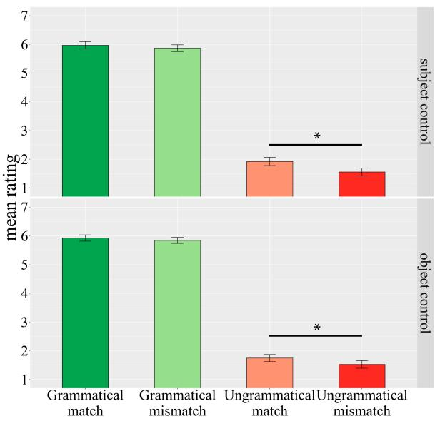  
Figure 1: Mean ratings in Experiment 1. Error bars indicate standard error of the mean.

## 4.2 Results

The average rating for each condition is shown in Figure 1. For this and the following experiments, we carried out a statistical analysis of variance in order to observe differences among the experimental conditions. For the sake of clarity and space, the most relevant significant differences will be marked with an asterisk in the figures. The statistical analyses revealed a significant main effect of grammaticality, such that grammatical sentences (green bars) received much higher ratings than ungrammatical ones (red bars). Importantly, there was a significant interaction between the factors grammaticality and distractor. Planned comparisons showed that this interaction was driven by a significant effect of distractor only in ungrammatical sentences. This is shown in significant higher ratings for the distractor match condition in ungrammatical sentences compared to distractor mismatch ones. Such an effect is not present in grammatical sentences. Critically, no differences were observed between subject and object control conditions.

In addition, we took the 1-7 ratings produced by humans and converted them into a binary accuracy measure by classifying their answers as correct or incorrect depending on the grammaticality of the sentence and whether the rating issued was above or below the sample mean (3.79). As expected, accuracy was above 85% for all conditions. This value will allow us to have a more direct comparison with the results from Experiment 3.

## 4.3 Discussion

The results from this experiment clearly show that native speakers are able to detect agreement violations that arise when the adjective did not match in gender the appropriate antecedent, and hence, that they are able to correctly use control information to retrieve the antecedent. This finding also provides a confirmation that the items display unequivocal control readings. Crucially, subject and object control sentences were rated similarly across all four conditions. In addition to the clear contrast between grammatical and ungrammatical conditions, an important result from this experiment is that there is evidence for interference effects in ungrammatical sentences. That is, ungrammatical sentences with a matching distractor received slightly higher ratings than ungrammatical sentences with a mismatching distractor. This effect shows that the presence of a matching distractor leads them to accept ungrammatical sentences more often than when the distractor does not match in gender with the adjective. Crucially, this effect appeared equally in subject and object control conditions, that is, independently of the position of the distractor. This represents evidence for a facilitatory interference effect, or an illusion of grammaticality (Phillips et al., 2011), a pattern akin to the widely attested agreement attraction effect (Wagers et al., 2009).

## 5 Experiment 2: LM acceptability

This experiment aims at observing whether the probabilities of the language models are similar to those of humans. That is, whether LMs assign lower surprisal to grammatical than to ungrammatical sentences regardless of the presence of a matching or mismatching distractor. For this purpose, we use the exact same dataset as in Experiment 1.2

## 5.1 Procedure

The minicons library (Misra, 2022) was used to compute the surprisal assigned by the LM to the embedded adjectives, which function as a proxy for antecedent retrieval.

## 5.2 Results

The Spanish models’ results for the different experimental conditions are shown in Figure 2. It should be noted that, for ease of interpretation and comparison with Experiment 1 (Figure 1), the surprisal values were inverted such that higher values mean less surprisal (hence more acceptability) while lower values mean more surprisal (hence less acceptability).3 While we observe significant effects of grammaticality for all models (meaning that, overall, grammatical sentences were more acceptable than ungrammatical ones), the results show a very different pattern of contrasts for subject and object control sentences. On the one hand, in subject control sentences, all the models showed higher acceptance for grammatical sentences with a matching distractor (dark green bars) than for grammatical sentences with a mismatching distractor (light green bars). Furthermore, also in subject control sentences, ungrammatical sentences with a matching distractor (light red bars) received unexpectedly high acceptance levels, which, for most models, are higher than those observed for grammatical sentences with a mismatching distractor (light green bars). On the other hand, in object control sentences, the pattern of contrasts is very different. First, none of the models exhibited differences among the grammatical conditions regardless of the gender of the distractor. Second, while for all the models, the values observed for ungrammatical sentences with a matching distractor (light red bars) were higher than those for ungrammatical sentences with a mismatching distractor (dark red bars), this difference was only statistically significant for some models.

The same pattern of results is observed using pronouns instead of names (see Figure 4) and for the Galician models using names and pronouns (Figures 5 and 6). This is also corroborated by the very strong correlations $( \rho > 0 . 9 )$ observed for the adjective surprisal values using names and pronouns, in both languages. Furthermore, we calculated the Spearman ρ correlations between the acceptability values provided by the humans and the models’ surprisal values. Overall, they revealed weak to moderate correlations, while higher correlations are found for object control sentences than for subject control ones. The correlations for each model at each experimental condition can be found in Table 4.4

## 5.3 Discussion

The results for Experiment 2 show that, unlike humans, all the LMs evaluated behave very differently for subject than for object control dependencies, being better at detecting the acceptability of the strings in object control conditions. The key question here is whether they are able to do so by leveraging the lexico-semantic information of control in order to find the correct antecedent. The pattern of results obtained suggests that, rather than control information, the relevant cue being used is linear proximity. It must be reminded that, in subject control dependencies, the correct antecedent is the NP that is further away from the adjective, while the distractor NP is closer to it. The presence of significant differences between the two grammatical conditions, and the two ungrammatical conditions, found for subject control dependencies, points to the fact that LMs are taking the closer (and wrong) NP, the object, as the antecedent. This explains why the acceptability is reduced for grammatical sentences with a mismatching distractor, despite being perfectly grammatical, and that it is dramatically increased for ungrammatical sentences with a matching distractor, despite being ungrammatical.

Reliance on linear proximity also explains why LMs are better, and more akin to humans, on object control dependencies. In these structures, the correct antecedent (i.e. the object) coincides with the linearly closest NP. Interestingly, nonetheless, LMs also exhibit evidence for interference effects from control-irrelevant but gender-matching distractors. This is perhaps clearer in the case of object control sentences, since linear proximity and interference converge in the case of subject control ungrammatical sentences with a matching distractor. In object control sentences, some models also exhibit higher acceptability for ungrammatical sentences with a matching distractor even when in this case the gender-matching NP is the farthest NP. These issues are further explored in Experiment 3.

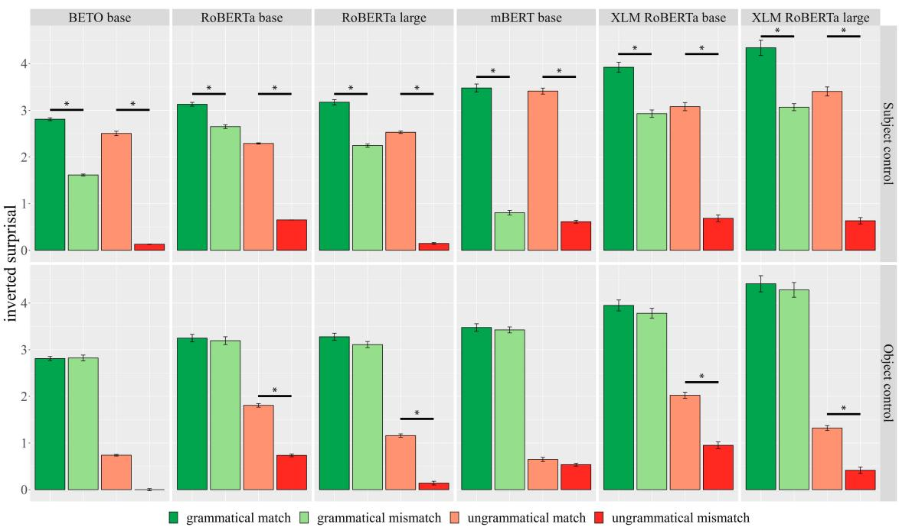  
Figure 2: Spanish LMs acceptability predictions for the adjective in Experiment 2 using names. Error bars indicate standard error of the mean.

## 6 Experiment 3: LM masked prediction

This experiment aims at further exploring the behavior of LMs using the masked prediction task. In contrast with Experiment 2, where we compute the surprisal for the same adjective in a given (grammatical or ungrammatical) sentence, our objective here is to test whether LMs predict grammatically compatible adjectives in subject and object control sentences regardless of the presence of a matching or mismatching distractor. In Experiment 2 the adjective’s gender was kept constant across experimental conditions, and hence, we could not assess LMs’ preferences for the masculine or feminine version. By contrast, here we test if LMs predict grammatically compatible adjectives in subject and object control sentences by directly comparing the probabilities of a given adjective in its masculine or feminine form, something which provides us with more comprehensive information in this respect. Furthermore, evaluating model accuracy rather than surprisal values will also allow us to assess and compare the performance across models.

## 6.1 Experimental materials

The experimental materials used for Experiment 3 are an adaptation of the dataset described in section 3.1 (including its variants with personal pronouns and Galician translations) so that they could be used in the masked prediction task. This allows us to evaluate our dataset in the two possible gender configurations, expanding it such that each sentence has two possible outcomes: a grammatical and an ungrammatical one. Therefore, the manipulation is a 2x2 factorial design (control x distractor), as shown in Table 2

## 6.2 Procedure

We rely on the standard approach for targeted syntactic evaluation to obtain the accuracy of the models on the minimal pairs (Linzen et al., 2016; Warstadt et al., 2020). For each sentence, we extract the probabilities of the grammatical and ungrammatical target adjectives, and consider a trial as correct if the model gives a higher probability to the grammatical target adjective. It is worth noting that this method requires compatible tokenization between both variants (grammatical and ungrammatical). To make a fair evaluation, we check if both variants appear as single tokens in the models’ vocabulary, or whether their last subtokens (the ones that carry the morphosyntactic information) are comparable so that we can use their probabilities. For instance, the Spanish pair afectuoso|afectuosa (‘affectionate’) is tokenized by RoBERTa as afect+uoso|uosa, and hence, we can use the last subtokens for comparison. However, desconfiado|desconfiada (‘skeptical’) is divided as desconf+iado and descon+fi+ada. We discard these incompatible cases (19% of the items for Spanish, and 16% for Galician, on average).5

<table><tr><td rowspan=1 colspan=3>Subject control</td></tr><tr><td rowspan=1 colspan=1>Dist. match</td><td rowspan=1 colspan=2>Maríaf le prometió a Carmen f ser más [ordenadaf|*ordenadom] con los apuntes.</td></tr><tr><td rowspan=1 colspan=1>Dist. mismatch</td><td rowspan=1 colspan=2>Maríaf le prometió a Manuelm ser más [ordenadafl*ordenadom] con los apuntes.</td></tr><tr><td rowspan=1 colspan=3>Object control</td></tr><tr><td rowspan=1 colspan=1>Dist. match</td><td rowspan=1 colspan=2>Maríaf le ordenó a Carmenf ser más [ordenadafl*ordenadom] con los apuntes.</td></tr><tr><td rowspan=1 colspan=1>Dist. mismatch</td><td rowspan=1 colspan=1>Josém le ordenó a Carmenf ser más [ordenadafl*</td><td rowspan=1 colspan=1>ordenadom] con los apuntes.</td></tr></table>

Table 2: Sample set of the experimental materials for Experiment 3. The correct antecedents and correct and incorrect the target adjectives are bold typed. See Table 1 for comparison with the original dataset.

## 6.3 Results

Table 3 displays the global accuracy for all the models under evaluation in Experiment 3 (global accuracy values for all the datasets tested in Spanish and Galician are in Table 5). RoBERTa large emerges as the best performing model, closely followed by XLM RoBERTa large, while mBERT base emerges as the worst performing model. Nonetheless, in order to analyze the impact of linear proximity on model performance, it is essential to examine the factors control and distractor separately. Figure 3 shows the accuracy per condition for the target adjectives. Statistical analyses show a main effect of distractor, such that the accuracy was higher for distractor match sentences (dark green bars, when the two NPs had the same gender) than for distractor mismatch ones (light green bars, when the NPs differed in gender). However, this difference was much more acute for subject control sentences, where significant differences arise for all the models, than for object control sentences, where significant differences are only found for

RoBERTa-large and XLM-RoBERTa-base. The same pattern of results is observed using pronouns instead of names (see Figure 7) and for the Galician models using names and pronouns (Figures 8 and 9). This is also shown in the very strong correlations (ρ > 0.8) observed for the results using names and pronouns in both languages.

<table><tr><td rowspan=1 colspan=1>Model</td><td rowspan=1 colspan=1>Accuracy</td></tr><tr><td rowspan=1 colspan=1>BETO base</td><td rowspan=1 colspan=1>0.78</td></tr><tr><td rowspan=1 colspan=1>RoBERTa base</td><td rowspan=1 colspan=1>0.77</td></tr><tr><td rowspan=1 colspan=1>RoBERTa large</td><td rowspan=1 colspan=1>0.83</td></tr><tr><td rowspan=1 colspan=1>mBERT base</td><td rowspan=1 colspan=1>0.61</td></tr><tr><td rowspan=1 colspan=1>XLM RoBERTa base</td><td rowspan=1 colspan=1>0.78</td></tr><tr><td rowspan=1 colspan=1>XLM RoBERTa large</td><td rowspan=1 colspan=1>0.82</td></tr></table>

Table 3: Global accuracy in Experiment 3.

## 6.4 Discussion

The results from Experiment 3 reinforce and complement the findings from Experiment 2 in several respects. First, reliance on linear proximity is, if anything, even clearer, as subject control sentences with a mismatching distractor display clear interference effects, which are materialized in a dramatically below-chance accuracy. These are the cases in which the distractor is the sentence object, which is also the closer NP. In these cases, LMs’ predict a target adjective that agrees in gender with the object, rather than the subject (i.e. the correct antecedent) and hence, demonstrating that antecedent retrieval processes unfold disregarding the lexico-semantic information on control. Importantly, these effects are almost absent in object control sentences, where only two models show evidence for interference effects, these being much less pronounced (only a few accuracy points). Even though the results from this experiment cannot be directly compared with those of humans (Experiment 1), it should be noted that human accuracy was above 80% for all conditions.

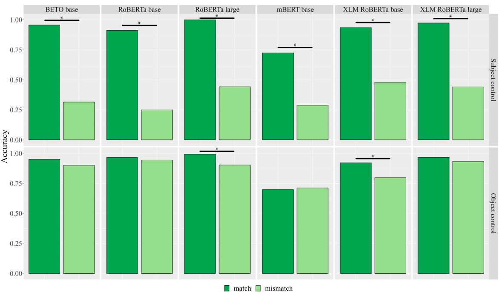  
Figure 3: Spanish LMs accuracies for the target adjective in Experiment 3 using names.

## 7 General discussion and conclusions

The empirical evidence gathered in this work provides a very straightforward picture: whereas humans’ can coordinate lexico-semantic and syntactic information in order to determine the (un)acceptability of control structures, LMs resort to a heuristic based on linear proximity, disregarding control information. These findings are robust, as they replicate across tasks (acceptability and masked prediction), models (monolingual and multilingual), languages (Spanish and Galician LMs), and type of antecedent (names and pronouns). Furthermore, they go in line with evidence advanced in Lee and Schuster (2022) for English with respect to autoregressive language models.

These findings contrast with those obtained for superficially similar dependencies like subject-verb agreement, in which these models have been attested to display accurate levels of performance for Spanish and Galician (Pérez-Mayos et al., 2021; de Dios-Flores and Garcia, 2022; Garcia and Crespo-Otero, 2022). Crucially, however, agreement and control dependencies engage different types of linguistic information. While the former rely on co-ocurring patterns containing overt morphological cues which are pervasive in the training data, control dependencies rely on abstract lexicosemantic properties of verbs and verb meaning, which these models are not able to generalize from the training data at their disposal even when it presumably contains control verbs (although a systematic examination of this issue is essential).

Control verbs and control structures have a high frequency in natural language and, ideally, state-ofthe-art LMs should be able to capture their meaning differences and the consequences they have for phrase-structure relations (ultimately, who does what to whom?). Some authors have suggested that their performance on similar structures could be improved in one-shot learning scenarios, or by adding more control constructions in the training data (Kogkalidis and Wijnholds, 2022; Lee and Schuster, 2022). While this supports the idea that these constructions are “learnable” with sufficiently explicit input, adding examples on the infinite combinatorial possibilities of language does not seem like a strategy that can be generalized. Further research is needed on how LMs capture linguistic generalizations and how these processes can be enhanced.

One of the biggest challenges of working with control constructions is the elaboration of appropriate experimental materials. This is why the carefully curated Spanish and Galician datasets used in this work, which are freely available, represent a key contribution, as we hope they are valuable for further computational and psycholinguistic research beyond English, the dominant language in these fields.

## Limitations of the work

Given that the training data for most pre-trained models has not been released, further investigation of the frequency effects of control verbs in the corpora, or for that matter, of any other critical word in the sentence (names, adjectives, etc.) is not feasible. This is a shortcoming of our work because word frequency during training is known to be an important factor for model performance (Wei et al., 2021). Nonetheless, in order to approximate this issue, we run preliminary comparisons of the models’ performance depending on whether the control verb appears or not in the vocabulary (and therefore, assuming that it had enough frequency in the training corpus). Very similar results were obtained for both sentences with known and unknown verbs in the main clause.

Besides, detailed comparisons between models have been left out for reasons of space and scope, since the objective of the research was not to compare model performance, although it is a relevant and interesting issue in itself (for instance, the fact that the LMs based on the RoBERTa architecture performed better across tasks, or that the high performance of XLM-RoBERTa contrasts with that of mBERT). In relation to this, the comparison of models with different architectures and training objectives (e.g. generative models) was also left for further research.

Finally, it is worth noting that the two languages evaluated in this study (Spanish and Galician) are very similar, so that it could be interesting to expand the research to non-romance languages.

## Ethics Statement

Experiment 1 complied with the standards of research involving human subjects. Their participation was voluntary, all of them were informed of the nature of the task, and provided informed consent before starting the experiment. With respect of C02 consumption for the computational experiments (Experiments 2 and 3), it should be noted that we used pre-trained models and hence the impact of the calculations obtained is expected to be minimal. The experiments were run on a NVIDIA A100 GPU, and the results were obtained in a few minutes. Since this work is circumscribed within basic research on artificial language modelling, no applications or tools are to be directly derived by it and hence, we do not think of any potential harms or bias that can be derived from our work.

## Acknowledgements

We would like to thank the anonymous reviewers for their valuable comments. This research was funded by the Galician Government (ERDF 2014-2020: Call ED431G 2019/04, and ED431F 2021/01), by MCIN/AEI/10.13039/501100011033 (grants with references PID2021-128811OA-I00 and TED2021-130295B-C33, the former also funded by “European Union Next Generation EU/PRTR”), by a Ramón y Cajal grant (RYC2019- 028473-I), and by the project “Nós: Galician in the society and economy of artificial intelligence” (Xunta de Galicia/Universidade de Santiago de Compostela).

## References

Jean-Phillipe Bernardy and Shalom Lappin. 2017. Using deep neural networks to learn syntactic agreement. In Linguistic Issues in Language Technology, Volume 15, 2017. CSLI Publications.

Moisés Betancort, Manuel Carreiras, and Carlos Acuña-Fariña. 2006. Processing controlled PROs in Spanish. Cognition, 100(2):217–282.

Kathryn Bock and Carol A Miller. 1991. Broken agreement. Cognitive Psychology, 23(1):45–93.

José Cañete, Gabriel Chaperon, Rodrigo Fuentes, Jou-Hui Ho, Hojin Kang, and Jorge Pérez. 2020. Spanish pre-trained bert model and evaluation data. In PML4DC at ICLR 2020.

Noam Chomsky. 1981. Lectures on Government and Binding: The Pisa Lectures. Foris Publications, Dordrecht.

Alexis Conneau, Kartikay Khandelwal, Naman Goyal, Vishrav Chaudhary, Guillaume Wenzek, Francisco Guzmán, Edouard Grave, Myle Ott, Luke Zettlemoyer, and Veselin Stoyanov. 2020. Unsupervised cross-lingual representation learning at scale. In Proceedings of the 58th Annual Meeting of the Associationfor Computational Linguistics, pages 8440– 8451, Online. Association for Computational Linguistics.

Iria de Dios-Flores. 2021. Processing long-distance dependencies: an experimental investigation of grammatical illusions in English and Spanish. Ph.D. thesis, Universidade de Santiago de Compostela.

Iria de Dios-Flores and Marcos Garcia. 2022. A computational psycholinguistic evaluation of the syntactic abilities of Galician BERT models at the interface of dependency resolution and training time. Procesamiento del Lenguaje Natural, 69:15–26.

Jacob Devlin, Ming-Wei Chang, Kenton Lee, and Kristina Toutanova. 2019. BERT: Pre-training of deep bidirectional transformers for language understanding. In Proceedings of the 2019 Conference of the North American Chapter ofthe Associationfor Computational Linguistics: Human Language Technologies, Volume 1 (Long and Short Papers), pages 4171–4186, Minneapolis, Minnesota. Association for Computational Linguistics.

Tiwalayo Eisape, Noga Zaslavsky, and Roger Levy. 2020. Cloze distillation: Improving neural language models with human next-word prediction. In Proceedings of the 24th Conference on Computational Natural Language Learning, pages 609–619, Online. Association for Computational Linguistics.

Lyn Frazier, Charles Clifton, and Janet Randall. 1983. Filling gaps: Decision principles and structure in sentence comprehension. Cognition, 13(2):187–222.

Richard Futrell, Ethan Wilcox, Takashi Morita, Peng Qian, Miguel Ballesteros, and Roger Levy. 2019. Neural language models as psycholinguistic subjects: Representations of syntactic state. In Proceedings of the 2019 Conference of the North American Chapter of the Association for Computational Linguistics: Human Language Technologies, Volume 1 (Long and Short Papers), pages 32–42, Minneapolis, Minnesota. Association for Computational Linguistics.

Marcos Garcia. 2021. Exploring the representation of word meanings in context: A case study on homonymy and synonymy. In Proceedings of the 59th Annual Meeting ofthe Associationfor Computational Linguistics and the 11th International Joint Conference on Natural Language Processing (Volume 1: Long Papers), pages 3625–3640, Online. Association for Computational Linguistics.

Marcos Garcia and Alfredo Crespo-Otero. 2022. A Targeted Assessment of the Syntactic Abilities of Transformer Models for Galician-Portuguese. In International Conference on Computational Processing ofthe Portuguese Language (PROPOR 2022), pages 46–56. Springer.

Jon Gauthier, Jennifer Hu, Ethan Wilcox, Peng Qian, and Roger Levy. 2020. SyntaxGym: An online platform for targeted evaluation of language models. In Proceedings ofthe 58th Annual Meeting ofthe Associationfor Computational Linguistics: System Demonstrations, pages 70–76, Online. Association for Computational Linguistics.

Yoav Goldberg. 2019. Assessing BERT’s Syntactic Abilities. ArXiv preprint arXiv:1901.05287.

Kristina Gulordava, Piotr Bojanowski, Edouard Grave, Tal Linzen, and Marco Baroni. 2018. Colorless green recurrent networks dream hierarchically. In Proceedings of the 2018 Conference of the North American Chapter of the Association for Computational Linguistics: Human Language Technologies, Volume 1 (Long Papers), pages 1195–1205, New Orleans,

Louisiana. Association for Computational Linguistics.

Asier Gutiérrez Fandiño, Jordi Armengol Estapé, Marc Pàmies, Joan Llop Palao, Joaquin Silveira Ocampo, Casimiro Pio Carrino, Carme Armentano Oller, Carlos Rodriguez Penagos, Aitor Gonzalez Agirre, and Marta Villegas. 2022. MarIA: Spanish Language Models. Procesamiento del Lenguaje Natural, 68:39– 60.

Jennifer Hu, Jon Gauthier, Peng Qian, Ethan Wilcox, and Roger Levy. 2020. A systematic assessment of syntactic generalization in neural language models. In Proceedings of the 58th Annual Meeting of the Associationfor Computational Linguistics, pages 1725–1744, Online. Association for Computational Linguistics.

Ray Jackendoff and Peter W Culicover. 2003. The semantic basis of control in English. Language, pages 517–556.

Konstantinos Kogkalidis and Gijs Wijnholds. 2022. Discontinuous constituency and BERT: A case study of Dutch. In Findings of the Association for Computational Linguistics: ACL 2022, pages 3776–3785, Dublin, Ireland. Association for Computational Linguistics.

Adhiguna Kuncoro, Chris Dyer, John Hale, and Phil Blunsom. 2018a. The perils of natural behaviour tests for unnatural models: the case of number agreement. Learning Language in Humans and in Machines, 5(6). Https://osf.io/9usyt/.

Adhiguna Kuncoro, Chris Dyer, John Hale, Dani Yogatama, Stephen Clark, and Phil Blunsom. 2018b. LSTMs can learn syntax-sensitive dependencies well, but modeling structure makes them better. In Proceedings ofthe 56th Annual Meeting ofthe Associationfor Computational Linguistics (Volume 1: Long Papers), pages 1426–1436, Melbourne, Australia. Association for Computational Linguistics.

Nayoung Kwon and Patrick Sturt. 2016. Processing control information in a nominal control construction: an eye-tracking study. Journal of psycholinguistic research, 45(4):779–793.

Yair Lakretz, Théo Desbordes, Dieuwke Hupkes, and Stanislas Dehaene. 2022. Can transformers process recursive nested constructions, like humans? In Proceedings of the 29th International Conference on Computational Linguistics, pages 3226–3232, Gyeongju, Republic of Korea. International Committee on Computational Linguistics.

Yair Lakretz, Dieuwke Hupkes, Alessandra Vergallito, Marco Marelli, Marco Baroni, and Stanislas Dehaene. 2021. Mechanisms for handling nested dependencies in neural-network language models and humans. Cognition, 213:104699.

Andrew Kyle Lampinen. 2022. Can language models handle recursively nested grammatical structures? A case study on comparing models and humans.

Soo-Hwan Lee and Sebastian Schuster. 2022. Can language models capture syntactic associations without surface cues? a case study of reflexive anaphor licensing in English control constructions. In Proceedings ofthe Societyfor Computation in Linguistics 2022, pages 206–211, online. Association for Computational Linguistics.

Tal Linzen, Emmanuel Dupoux, and Yoav Goldberg. 2016. Assessing the ability of LSTMs to learn syntaxsensitive dependencies. Transactions ofthe Associationfor Computational Linguistics, 4:521–535.

Rebecca Marvin and Tal Linzen. 2018. Targeted syntactic evaluation of language models. In Proceedings of the 2018 Conference on Empirical Methods in Natural Language Processing, pages 1192–1202, Brussels, Belgium. Association for Computational Linguistics.

Kanishka Misra. 2022. minicons: Enabling flexible behavioral and representational analyses of transformer language models. arXiv preprint arXiv:2203.13112.

Aaron Mueller, Garrett Nicolai, Panayiota Petrou-Zeniou, Natalia Talmina, and Tal Linzen. 2020. Cross-linguistic syntactic evaluation of word prediction models. In Proceedings ofthe 58th Annual Meeting ofthe Associationfor Computational Linguistics, pages 5523–5539, Online. Association for Computational Linguistics.

Benjamin Newman, Kai-Siang Ang, Julia Gong, and John Hewitt. 2021. Refining targeted syntactic evaluation of language models. In Proceedings ofthe 2021 Conference of the North American Chapter of the Associationfor Computational Linguistics: Human Language Technologies, pages 3710–3723, Online. Association for Computational Linguistics.

Janet Nicol and David Swinney. 1989. The role of structure in coreference assignment during sentence comprehension. Journal of psycholinguistic research, 18(1):5–19.

Laura Pérez-Mayos, Alba Táboas García, Simon Mille, and Leo Wanner. 2021. Assessing the syntactic capabilities of transformer-based multilingual language models. In Findings of the Association for Computational Linguistics: ACL-IJCNLP 2021, pages 3799–3812, Online. Association for Computational Linguistics.

Colin Phillips, Matthew Wagers, and Ellen Lau. 2011. Grammatical illusions and selective fallibillity in realtime comprehension. In Jeffrey Runner, editor, Experiments at the interfaces, pages 147–180. Brill, Leiden.

Peter S Rosenbaum. 1967. The Grammar of English Predicate Complement Constructions. MIT Press, Cambridge, Mass.

Vered Shwartz, Rachel Rudinger, and Oyvind Tafjord. 2020. “you are grounded!”: Latent name artifacts in pre-trained language models. In Proceedings ofthe

2020 Conference on Empirical Methods in Natural Language Processing (EMNLP), pages 6850–6861, Online. Association for Computational Linguistics.

David Vilares, Marcos Garcia, and Carlos Gómez-Rodríguez. 2021. Bertinho: Galician BERT Representations. Procesamiento del Lenguaje Natural, 66:13–26.

Matthew W. Wagers, Ellen F. Lau, and Colin Phillips. 2009. Agreement attraction in comprehension: Representations and processes. Journal ofMemory and Language, 61(2):206–237.

Alex Warstadt, Alicia Parrish, Haokun Liu, Anhad Mohananey, Wei Peng, Sheng-Fu Wang, and Samuel R. Bowman. 2020. BLiMP: A benchmark of linguistic minimal pairs for English. In Proceedings ofthe Society for Computation in Linguistics 2020, pages 409–410, New York, New York. Association for Computational Linguistics.

Jason Wei, Dan Garrette, Tal Linzen, and Ellie Pavlick. 2021. Frequency effects on syntactic rule learning in transformers. In Proceedings of the 2021 Conference on Empirical Methods in Natural Language Processing, pages 932–948, Online and Punta Cana, Dominican Republic. Association for Computational Linguistics.

Thomas Wolf, Lysandre Debut, Victor Sanh, Julien Chaumond, Clement Delangue, Anthony Moi, Pierric Cistac, Tim Rault, Remi Louf, Morgan Funtowicz, Joe Davison, Sam Shleifer, Patrick von Platen, Clara Ma, Yacine Jernite, Julien Plu, Canwen Xu, Teven Le Scao, Sylvain Gugger, Mariama Drame, Quentin Lhoest, and Alexander Rush. 2020. Transformers: State-of-the-art natural language processing. In Proceedings ofthe 2020 Conference on Empirical Methods in Natural Language Processing: System Demonstrations, pages 38–45, Online. Association for Computational Linguistics.

## Appendix

A Correlations between human acceptability judgements (Experiment 1) and LMs surprisal measurements (Experiment 2)
<table><tr><td rowspan=5 colspan=3>ItemAvg</td><td rowspan=1 colspan=2>BETO</td><td rowspan=1 colspan=2>RoBERTa-b</td><td rowspan=1 colspan=2>RoBERTa-1</td><td rowspan=1 colspan=2>mBERT</td><td rowspan=1 colspan=2>XLM-b</td><td rowspan=1 colspan=2>XLM-1</td></tr><tr><td rowspan=1 colspan=1>Item</td><td rowspan=1 colspan=1>Adj</td><td rowspan=1 colspan=1>Sent</td><td rowspan=1 colspan=1>Adj</td><td rowspan=1 colspan=1>Sent</td><td rowspan=1 colspan=1>Adj</td><td rowspan=1 colspan=1>Sent</td><td rowspan=1 colspan=1>Adj</td><td rowspan=1 colspan=1>Sent</td><td rowspan=1 colspan=1>Adj</td><td rowspan=1 colspan=1>Sent</td><td rowspan=1 colspan=1>Adj</td><td rowspan=1 colspan=1>Sent</td></tr><tr><td rowspan=3 colspan=1></td><td rowspan=3 colspan=1>0.310.210.39</td><td rowspan=1 colspan=1>0.17</td><td rowspan=1 colspan=1>0.31</td><td rowspan=1 colspan=1>0.27</td><td rowspan=1 colspan=1>0.33</td><td rowspan=1 colspan=1>0.25</td><td rowspan=1 colspan=1>0.27</td><td rowspan=1 colspan=1>0.11</td><td rowspan=1 colspan=1>0.42</td><td rowspan=1 colspan=1>0.17</td><td rowspan=1 colspan=1>0.53</td><td rowspan=3 colspan=1>0.240.190.30</td></tr><tr><td rowspan=2 colspan=1>0.190.16</td><td rowspan=2 colspan=1>0.270.34</td><td rowspan=2 colspan=1>0.260.30</td><td rowspan=2 colspan=1>0.250.41</td><td rowspan=2 colspan=1>0.230.28</td><td rowspan=2 colspan=1>0.090.44</td><td rowspan=1 colspan=1>0.08</td><td rowspan=2 colspan=1>0.370.47</td><td rowspan=2 colspan=1>0.140.21</td><td rowspan=2 colspan=1>0.440.61</td></tr><tr><td rowspan=1 colspan=1>0.14</td></tr><tr><td rowspan=4 colspan=1>Suet</td><td rowspan=2 colspan=1>Gram</td><td rowspan=2 colspan=1>MatchMism</td><td rowspan=2 colspan=1>0.030.12</td><td rowspan=2 colspan=1>0.230.18</td><td rowspan=2 colspan=1>-0.010.16</td><td rowspan=2 colspan=1>0.300.30</td><td rowspan=2 colspan=1>-0.090.17</td><td rowspan=2 colspan=1>0.150.22</td><td rowspan=2 colspan=1>0.070.01</td><td rowspan=1 colspan=1>0.23</td><td rowspan=2 colspan=1>0.070.01</td><td rowspan=2 colspan=1>0.220.29</td><td rowspan=2 colspan=1>0.120.08</td><td rowspan=2 colspan=1>0.280.38</td></tr><tr><td rowspan=1 colspan=1>0.24</td></tr><tr><td rowspan=2 colspan=1>Uun</td><td rowspan=2 colspan=1>MatchMism</td><td rowspan=2 colspan=1>-0.050.07</td><td rowspan=2 colspan=1>0.020.26</td><td rowspan=2 colspan=1>-0.07-0.10</td><td rowspan=2 colspan=1>-0.160.09</td><td rowspan=2 colspan=1>-0.04-0.05</td><td rowspan=2 colspan=1>-0.170.02</td><td rowspan=2 colspan=1>0.100.05</td><td rowspan=1 colspan=1>-0.01</td><td rowspan=2 colspan=1>0.090.06</td><td rowspan=2 colspan=1>-0.230.05</td><td rowspan=2 colspan=1>0.060.09</td><td rowspan=2 colspan=1>-0.340.08</td></tr><tr><td rowspan=1 colspan=1>0.03</td></tr><tr><td rowspan=4 colspan=1>obiet</td><td rowspan=2 colspan=1>Gram</td><td rowspan=2 colspan=1>MatchMism</td><td rowspan=2 colspan=1>-0.04-0.01</td><td rowspan=2 colspan=1>0.10-0.04</td><td rowspan=2 colspan=1>-0.19-0.03</td><td rowspan=2 colspan=1>0.150.22</td><td rowspan=2 colspan=1>-0.14-0.09</td><td rowspan=2 colspan=1>0.140.14</td><td rowspan=2 colspan=1>-0.06-0.01</td><td rowspan=1 colspan=1>-0.01</td><td rowspan=2 colspan=1>-0.04-0.03</td><td rowspan=2 colspan=1>0.100.16</td><td rowspan=2 colspan=1>-0.010.01</td><td rowspan=1 colspan=1>0.18</td></tr><tr><td rowspan=1 colspan=1>-0.05</td><td rowspan=1 colspan=1>0.23</td></tr><tr><td rowspan=2 colspan=1>Uun</td><td rowspan=2 colspan=1>MatchMism</td><td rowspan=2 colspan=1>-0.040.23</td><td rowspan=2 colspan=1>0.06-0.11</td><td rowspan=2 colspan=1>0.090.07</td><td rowspan=2 colspan=1>0.080.16</td><td rowspan=2 colspan=1>-0.010.08</td><td rowspan=2 colspan=1>0.100.00</td><td rowspan=2 colspan=1>-0.250.02</td><td rowspan=1 colspan=1>-0.17</td><td rowspan=2 colspan=1>-0.12-0.04</td><td rowspan=2 colspan=1>-0.02-0.00</td><td rowspan=2 colspan=1>-0.200.03</td><td rowspan=2 colspan=1>0.030.04</td></tr><tr><td rowspan=1 colspan=1>-0.00</td></tr></table>

Table 4: Spearman ρ correlations between human acceptability scores and inversed surprisals of the target adjectives (Adj) and sentences in Spanish (Experiment 1). Top rows are the overall average (Avg), and averages of subject (Subj) and object (Obj) control. Bottom rows display each of the eight conditions of the experiment (Grammatical and Ungrammatical with Matching and Mismatching distractor, see Table 1). Numbers in bold are statistically significant $( p < 0 . 0 5 )$

## B Additional figures for Experiment 2

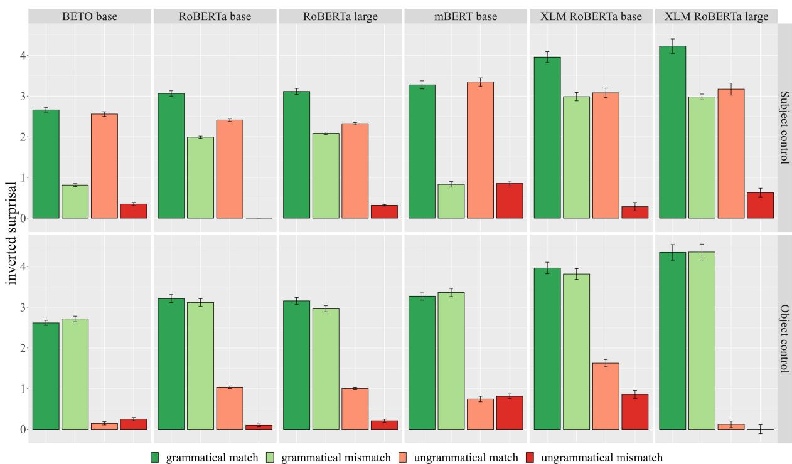  
Figure 4: Spanish LMs acceptability predictions for the adjective in Experiment 2 using pronouns. The scale was adapted by inverting the surprisal for ease of interpretation.

grammatical matchgrammatical mismatchungrammatical matchungrammatical mismatch  
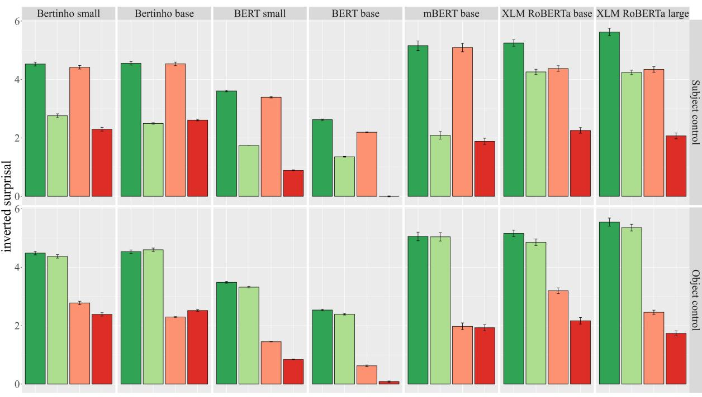  
Figure 5: Galician LMs acceptability predictions for the adjective in Experiment 2 using names. The scale was adapted by inverting the surprisal for ease of interpretation.

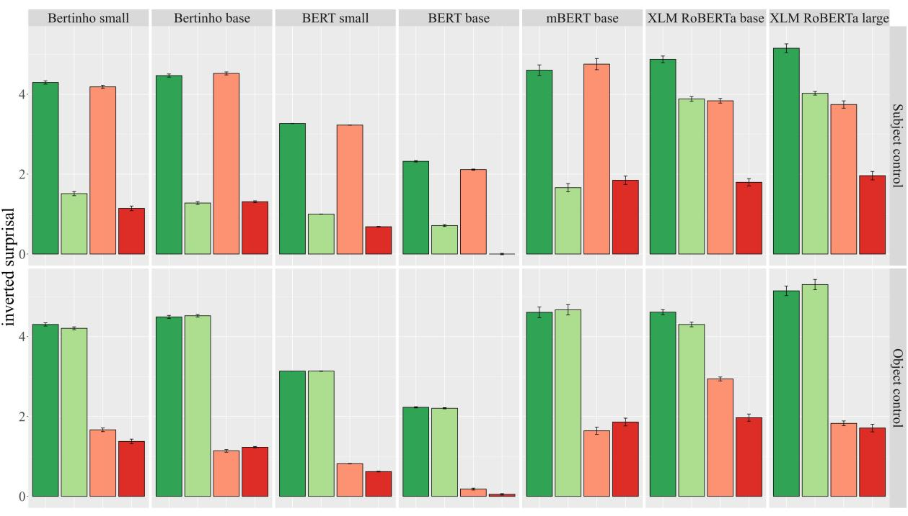  
Figure 6: Galician LMs acceptability predictions for the adjective in Experiment 2 using pronouns. The scale was adapted by inverting the surprisal for ease of interpretation.

## C Additional tables and figures for Experiment 3

<table><tr><td rowspan=1 colspan=5>Spanish datasets</td></tr><tr><td rowspan=1 colspan=1>LMs</td><td rowspan=1 colspan=1>Namestarget adjective</td><td rowspan=1 colspan=1>Namestop N</td><td rowspan=1 colspan=1>Pronounstarget adjective</td><td rowspan=1 colspan=1>Pronounstop N</td></tr><tr><td rowspan=1 colspan=1>BETO base</td><td rowspan=1 colspan=1>0.78</td><td rowspan=1 colspan=1>0.80</td><td rowspan=1 colspan=1>0.72</td><td rowspan=1 colspan=1>0.73</td></tr><tr><td rowspan=1 colspan=1>RoBERTa base</td><td rowspan=1 colspan=1>0.77</td><td rowspan=1 colspan=1>0.78</td><td rowspan=1 colspan=1>0.74</td><td rowspan=1 colspan=1>0.75</td></tr><tr><td rowspan=1 colspan=1>RoBERTa large</td><td rowspan=1 colspan=1>0.83</td><td rowspan=1 colspan=1>0.84</td><td rowspan=1 colspan=1>0.81</td><td rowspan=1 colspan=1>0.81</td></tr><tr><td rowspan=1 colspan=1>mBERT base</td><td rowspan=1 colspan=1>0.61</td><td rowspan=1 colspan=1>0.68</td><td rowspan=1 colspan=1>0.59</td><td rowspan=1 colspan=1>0.66</td></tr><tr><td rowspan=1 colspan=1>XLM RoBERTa base</td><td rowspan=1 colspan=1>0.78</td><td rowspan=1 colspan=1>0.79</td><td rowspan=1 colspan=1>0.83</td><td rowspan=1 colspan=1>0.85</td></tr><tr><td rowspan=1 colspan=1>XLM RoBERTa large</td><td rowspan=1 colspan=1>0.82</td><td rowspan=1 colspan=1>0.78</td><td rowspan=1 colspan=1>0.86</td><td rowspan=1 colspan=1>0.76</td></tr><tr><td rowspan=1 colspan=5>Galician datasets</td></tr><tr><td rowspan=1 colspan=1>LMs</td><td rowspan=1 colspan=1>Namestarget adjective</td><td rowspan=1 colspan=1>Namestop N</td><td rowspan=1 colspan=1>Pronounstarget adjective</td><td rowspan=1 colspan=1>Pronounstop N</td></tr><tr><td rowspan=1 colspan=1>Bertinho small</td><td rowspan=1 colspan=1>0.63</td><td rowspan=1 colspan=1>0.65</td><td rowspan=1 colspan=1>0.68</td><td rowspan=1 colspan=1>0.71</td></tr><tr><td rowspan=1 colspan=1>Bertinho base</td><td rowspan=1 colspan=1>0.61</td><td rowspan=1 colspan=1>0.63</td><td rowspan=1 colspan=1>0.66</td><td rowspan=1 colspan=1>0.69</td></tr><tr><td rowspan=1 colspan=1>BERT small</td><td rowspan=1 colspan=1>0.71</td><td rowspan=1 colspan=1>0.73</td><td rowspan=1 colspan=1>0.70</td><td rowspan=1 colspan=1>0.72</td></tr><tr><td rowspan=1 colspan=1>BERT base</td><td rowspan=1 colspan=1>0.74</td><td rowspan=1 colspan=1>0.79</td><td rowspan=1 colspan=1>0.73</td><td rowspan=1 colspan=1>0.75</td></tr><tr><td rowspan=1 colspan=1>mBERT base</td><td rowspan=1 colspan=1>0.60</td><td rowspan=1 colspan=1>0.69</td><td rowspan=1 colspan=1>0.59</td><td rowspan=1 colspan=1>0.68</td></tr><tr><td rowspan=1 colspan=1>XLM RoBERTa base</td><td rowspan=1 colspan=1>0.78</td><td rowspan=1 colspan=1>0.78</td><td rowspan=1 colspan=1>0.79</td><td rowspan=1 colspan=1>0.80</td></tr><tr><td rowspan=1 colspan=1>XLM RoBERTa large</td><td rowspan=1 colspan=1>0.82</td><td rowspan=1 colspan=1>0.78</td><td rowspan=1 colspan=1>0.84</td><td rowspan=1 colspan=1>0.74</td></tr></table>

Table 5: Global accuracy for all the LMs examined in Spanish and Galician across datasets (with names and pronouns) and analysis strategies (target adjective or top N adjectives).

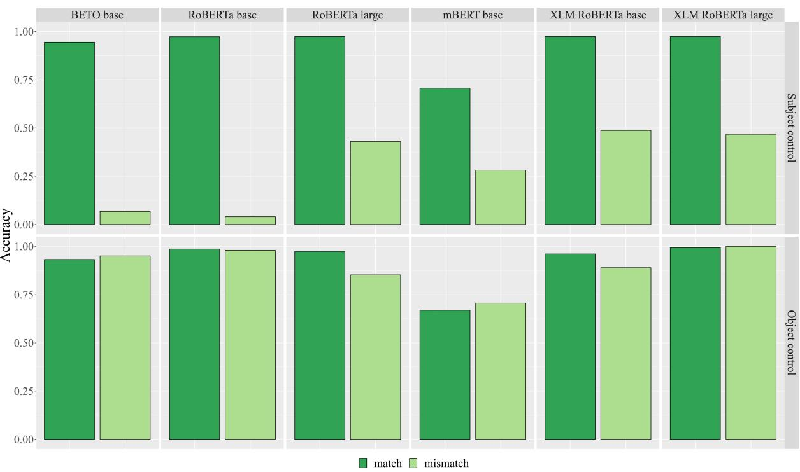  
Figure 7: Spanish LMs accuracies for the target adjective in Experiment 3 using pronouns.

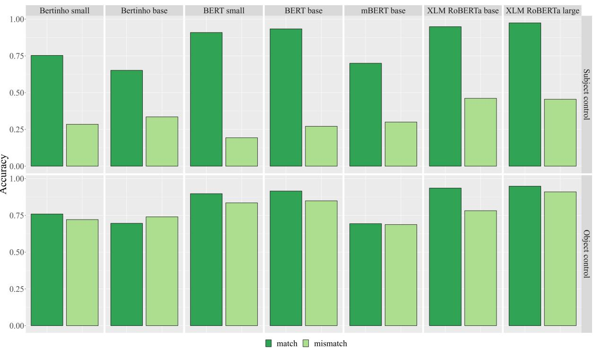  
Figure 8: Galician LMs accuracies for the target adjective in Experiment 3 using names.

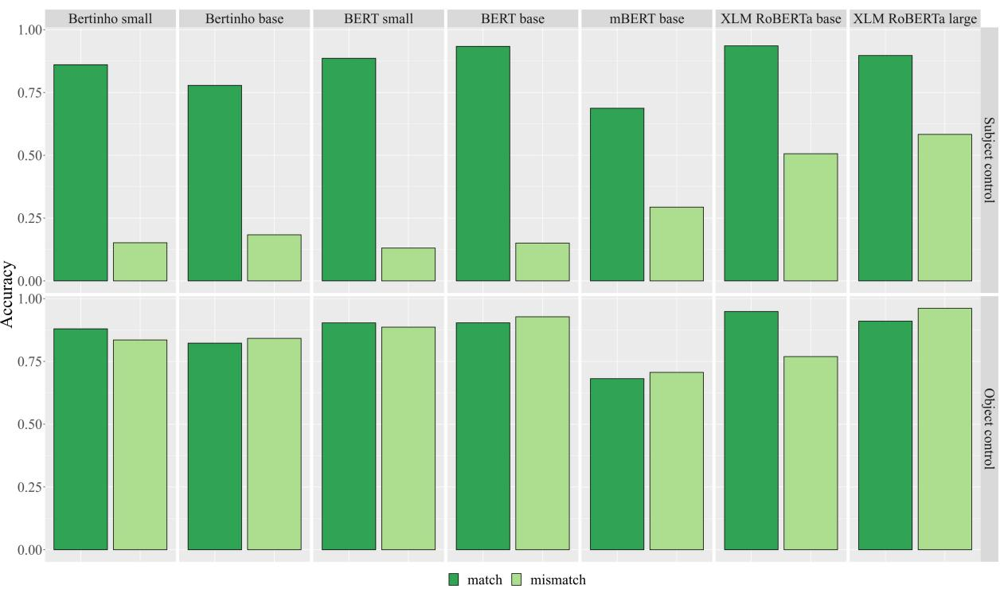  
Figure 9: Galician LMs accuracies for the target adjective in Experiment 3 using pronouns.

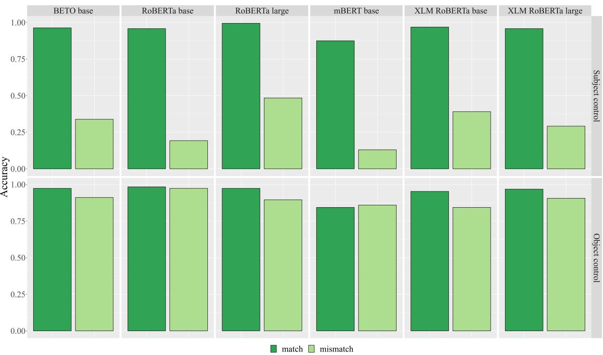  
Figure 10: Spanish LMs accuracies for the top N adjectives in Experiment 3 using names.

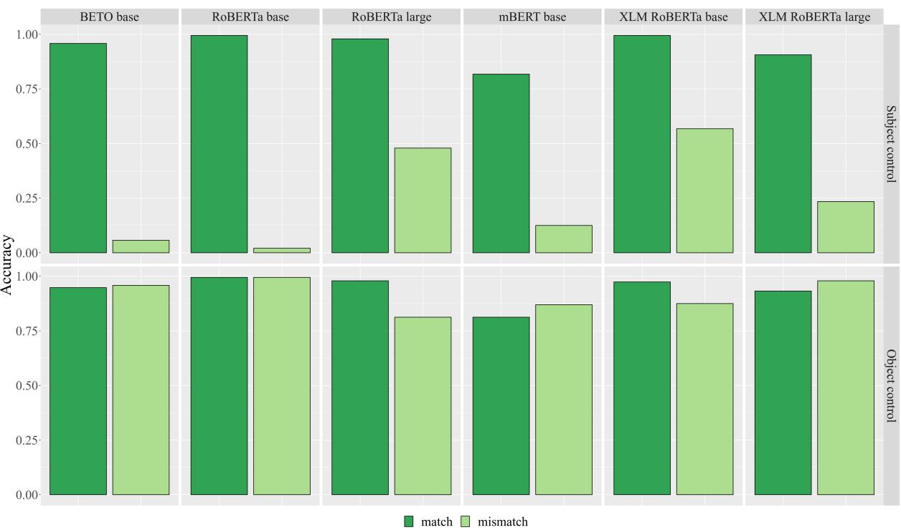  
Figure 11: Spanish LMs accuracies for the top N adjectives in Experiment 3 using pronouns.

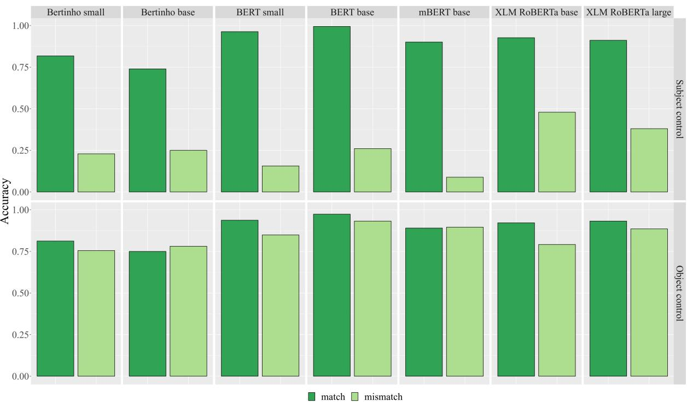  
Figure 12: Galician LMs accuracies for the top N evaluation in Experiment 3 using names.

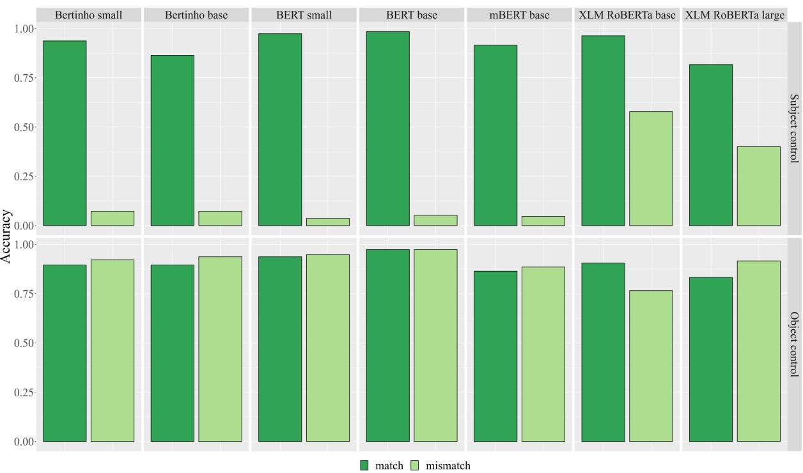  
Figure 13: Galician LMs accuracies for the top N evaluation in Experiment 3 using pronouns.

A For every submission: ✓ A1. Did you describe the limitations of your work? Limitations section

✓ A2. Did you discuss any potential risks of your work? Ethics statement

✓ A3. Do the abstract and introduction summarize the paper’s main claims? Abstract and introduction

✗ A4. Have you used AI writing assistants when working on this paper? Left blank.

## B ✓ Did you use or create scientific artifacts?

Data, models or other artifacts used are properly cited in the relevant sections of the experiments. Mainly 3.2. for pre-trained models and transformers library, or 5.1for the procedure ofExperiment 2 using the minicons library.

✓ B1. Did you cite the creators of artifacts you used? In different sections where these are described. Mainly 3.2. for pre-trained models and transformers library, or 5.1 for the procedure of Experiment 2 using the minicons library.

✗ B2. Did you discuss the license or terms for use and / or distribution of any artifacts? The artifacts used are freely available. We do not discuss their license terms in our contribution.

✓ B3. Did you discuss if your use of existing artifact(s) was consistent with their intended use, provided that it was specified? For the artifacts you create, do you specify intended use and whether that is compatible with the original access conditions (in particular, derivatives of data accessed for research purposes should not be used outside of research contexts)? For the artifacts we create, we specify they are freely available (and are added as supplementary materials).

✗ B4. Did you discuss the steps taken to check whether the data that was collected / used contains any information that names or uniquely identifies individual people or offensive content, and the steps taken to protect / anonymize it? We do not specifically discuss this on the paper because our data did not contain personal information or offensive content. Some notes are added on the ethics statement.

✓ B5. Did you provide documentation of the artifacts, e.g., coverage of domains, languages, and linguistic phenomena, demographic groups represented, etc.? 3.1. for the datasets created, and 4.1. for the demographics of the human sample.

✓ B6. Did you report relevant statistics like the number of examples, details of train / test / dev splits, etc. for the data that you used / created? Even for commonly-used benchmark datasets, include the number of examples in train / validation / test splits, as these provide necessary context for a reader to understand experimental results. For example, small differences in accuracy on large test sets may be significant, while on small test sets they may not be. In 3.1. for the datasets.

The Responsible NLP Checklist used at ACL 2023 is adoptedfrom NAACL 2022, with the addition ofa question on AI writing assistance.

## C ✓ Did you run computational experiments? Sections 5 and 6

✗ C1. Did you report the number of parameters in the models used, the total computational budget (e.g., GPU hours), and computing infrastructure used? We use pre-trained models. Some notes are added on the ethics statement.

 C2. Did you discuss the experimental setup, including hyperparameter search and best-found hyperparameter values? Not applicable. Left blank.

✓ C3. Did you report descriptive statistics about your results (e.g., error bars around results, summary statistics from sets of experiments), and is it transparent whether you are reporting the max, mean, etc. or just a single run? Results section: 4.2, 5.2, and 6.3

 C4. If you used existing packages (e.g., for preprocessing, for normalization, or for evaluation), did you report the implementation, model, and parameter settings used (e.g., NLTK, Spacy, ROUGE, etc.)? Not applicable. Left blank.

D ✓ Did you use human annotators (e.g., crowdworkers) or research with human participants? Section 4.1

✓ D1. Did you report the full text of instructions given to participants, including e.g., screenshots, disclaimers of any risks to participants or annotators, etc.? We reported a summary in section 4.1. The acceptability task is a wide-spread method and this is why the full detailed instructions were not provided.

✓ D2. Did you report information about how you recruited (e.g., crowdsourcing platform, students) and paid participants, and discuss if such payment is adequate given the participants’ demographic (e.g., country of residence)? Section 4.1

✓ D3. Did you discuss whether and how consent was obtained from people whose data you’re using/curating? For example, if you collected data via crowdsourcing, did your instructions to crowdworkers explain how the data would be used? Section 4.1

✗ D4. Was the data collection protocol approved (or determined exempt) by an ethics review board? It was not required by the institution at the time ofdata collection.

✓ D5. Did you report the basic demographic and geographic characteristics of the annotator population that is the source of the data? Section 4.1