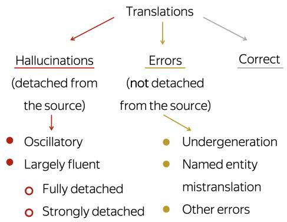
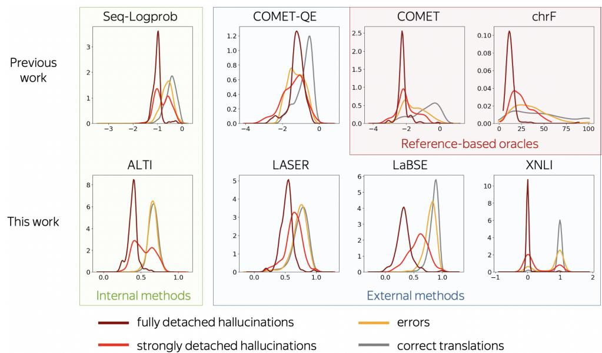
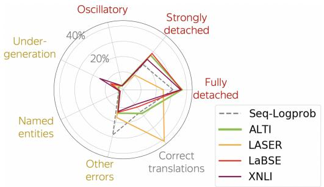
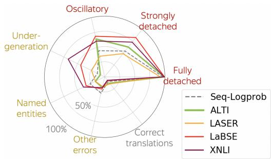
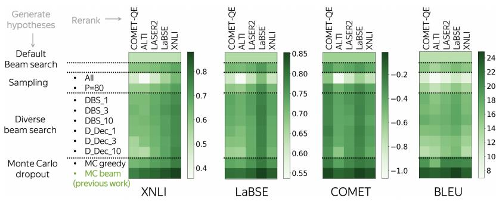
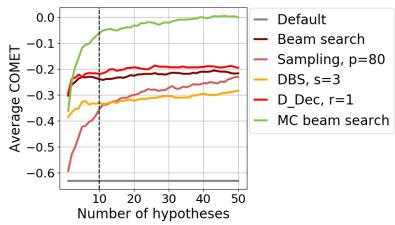
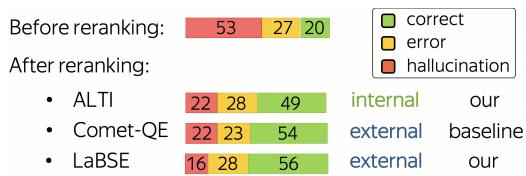

# Detecting and Mitigating Hallucinations in Machine Translation: Model Internal Workings Alone Do Well, Sentence Similarity Even Better

David Dale Elena Voita Loïc Barrault Marta R. Costa-jussà

Meta AI

{daviddale,lenavoita,loicbarrault,costajussa}@meta.com

## Abstract

While the problem of hallucinations in neural machine translation has long been recognized, so far the progress on its alleviation is very little. Indeed, recently it turned out that without artificially encouraging models to hallucinate, previously existing methods fall short and even the standard sequence log-probability is more informative. It means that internal characteristics of the model can give much more information than we expect, and before using external models and measures, we first need to ask: how far can we go if we use nothing but the translation model itself? We propose to use a method that evaluates the percentage of the source contribution to a generated translation. Intuitively, hallucinations are translations “detached” from the source, hence they can be identified by low source contribution. This method improves detection accuracy for the most severe hallucinations by a factor of 2 and is able to alleviate hallucinations at test time on par with the previous best approach that relies on external models. Next, if we move away from internal model characteristics and allow external tools, we show that using sentence similarity from cross-lingual embeddings further improves these results. We release the code of our experiments.1

## 1 Introduction

Hallucinations in machine translation (MT) are cases when the model generates output that is partially or fully unrelated to the source sentence. While generally this phenomenon is not frequent and has low impact on corpus-level automatic metrics, the impact of hallucinations on user experience can be rather dramatic. For example, if a translation system generates The staff were very friendly and helpful in response to an input sentence about e.g. a marvelous view from the window, a user is unlikely to trust this system in future.

While the problem of hallucinations is known, addressing it remains challenging. Firstly, hallucinations are very rare. This is why previous work mostly resorted to settings where models are encouraged to hallucinate, by e.g. artificially perturbing source sentence (Lee et al., 2019; Raunak et al., 2021), adding specific types of noise to the training data (Raunak et al., 2021), working under domain shift (Wang and Sennrich, 2020; Müller et al., 2020), among others (Zhou et al., 2021). Secondly, hallucinations are hard to identify with automatic metrics. Often, hallucinations were defined as translations with low quality according to some metric such as adjusted BLEU or chrF (Lee et al., 2019; Raunak et al., 2021; Müller and Sennrich, 2021) or translations satisfying some heuristic condition (Berard et al., 2019; Raunak et al., 2021). Overall, it is not clear whether proposed methods detect naturally occurring hallucinations well.

Recently, when revisiting previous work in a relatively clean setting, Guerreiro et al. (2022) found that existing detection methods fall short and the standard sequence log-probability is the most informative. To show this, the authors gathered a large dataset with professional annotations of translations that, according to 10 previously proposed methods, are likely to be hallucinations. This data (hallucinations along with the model that generated them) made it possible to first, evaluate the performance of various detection methods and second, to work on alleviating hallucinations at test time. For the latter, the idea is “detect-then-rewrite”: after flagging a translation as likely to be pathological, generate several alternative hypotheses and pick the best one relying on some measure. So far, the best realization of this general framework uses sequence log-probability – Seq-Logprob – for detection, Monte Carlo dropout (Gal and Ghahramani, 2016) to generate several alternative translation hypotheses, and COMET-QE to pick the final candidate (see Guerreiro et al. (2022) for the details).

We use the same test bed and substantially improve previous results.

Regarding hallucination detection, we view the observation that Seq-Logprob outperforms previous (specifically targeted to hallucinations) methods as follows: internal model characteristics may contain much more information than we expect. Therefore, before developing or using external models and measures, we ask: how far can we go if we use nothing but the translation model itself? We propose to use a method that evaluates the percentage of the source contribution to a generated translation. Intuitively, since hallucinations are translations that are “detached” from the source, low source contribution should be able to identify hallucinations. Despite the fact that understanding hallucinations was one of the motivations behind the first method evaluating relative source and target contributions, both existing methods only looked at highly artificial hallucinations (Voita et al., 2021; Ferrando et al., 2022). We propose to use ALTI+ by Ferrando et al. (2022), the method that aggregates layer-wise tokens attributions, for both hallucination detection and reranking in the “detect-then-rewrite” pipeline. For detection of the most severe hallucinations, it is twice more accurate than Seq-Logprob. For reranking, it performs on par with the previous best COMET-QE. All in all, we improve the overall pipeline results by relying on internal model characteristics alone.

When allowing external tools, previous work mostly focused on different ways to automatically evaluate quality of a translation example, either with string-based methods or neural quality estimation systems. This idea (the better we estimate translation quality, the better we are at detecting hallucinations) is natural: hallucinations are lowquality translations in the first place. However, implementing this idea in practice is challenging: even state-of-the-art quality estimation system substantially fails (Guerreiro et al., 2022). We hypothesize that instead of targeting quality evaluation, it might be beneficial to use models trained with a rather different objective. Indeed, as we show in this paper, similarity between the source and a translation estimated via cross-lingual sentence embeddings outperforms the best internal method. Apart from cross-lingual sentence similarity (which is expected to be sensitive to highly incorrect translations), we find that cross-lingual natural language inference models (less anticipated in the context of machine translation) also perform quite well. To the best of our knowledge, we are the first to apply these models for hallucination detection.

Overall, we show that:

• by using only the model’s inner workings, we detect the most severe type of hallucinations with twice better precision;

alleviate hallucinations at test time with results on par with the best previous method that relies on an external model;

• models focused on semantic similarity of sentences detect all types of hallucinations with precision 80% higher than previous methods.

## 2 Background and Setting

In this section, we describe the framework and data we use for evaluation of hallucination detection and mitigation methods. This framework was proposed by Guerreiro et al. (2022) and consists of a large dataset of annotated translations along with the model that produced them. To the best of our knowledge, this is the only released data that can be used to analyze hallucinations in a “clean” setting.

## 2.1 Model

The model is Transformer base (Vaswani et al., 2017) from fairseq (Ott et al., 2019) with the standard hyperparameters setting. It was trained on the WMT’18 German-English news translation data excluding Paracrawl (Bojar et al., 2018) – totalling 5.8M sentence pairs. Since Guerreiro et al. (2022) used randomly chosen 1/3 of the dataset as a held-out set for analysis, the model was trained on the remaining 2/3 of the dataset. We use the model released by Guerreiro et al. (2022) that has been used to generate the hallucinations we analyze.

## 2.2 Hallucination Dataset

The hallucination dataset released by Guerreiro et al. (2022) contains fine-grained manual annotations of 3415 German-to-English translations generated by the model above. These translations are chosen from a set of 1.8M translations of heldout data as the ones that are likely to be pathological. The criteria used to flag the translations include 10 methods ranging from previously proposed heuristics (Lee et al., 2019; Berard et al., 2019; Raunak et al., 2021) to quality estimation models (Rei et al., 2020b) and uncertainty detectors (Fomicheva et al., 2020; Zerva et al., 2021; Guerreiro et al., 2022).

  
Figure 1: Taxonomy of translation types (based on the dataset by Guerreiro et al. (2022)).

The taxonomy of translation pathologies in the dataset is shown in Figure 1. Here, hallucinations are defined as severe translation errors that are detached from the source. These can be either oscillatory (i.e. contain erroneous repetitions of words and phrases) or largely fluent. The latter is further split by severity of an error into fully detached (the whole content is not supported by the source) and strongly, but not fully, detached (significant proportion of output is not supported by the source).2 Additionally, the annotated data contains translation errors that are deemed not detached from the source (Figure 1). Overall, 323 examples are judged to be hallucinations, 1044 are less severe translation errors and the rest are correct translations.

Note that so far, there is no “canonical” hallucination taxonomy and previous work used various, mostly overlapping, definitions (Lee et al., 2019; Raunak et al., 2021; Zhou et al., 2021; Ji et al., 2022; Raunak et al., 2022; Guerreiro et al., 2022). We follow the taxonomy by Guerreiro et al. (2022) for consistency with the dataset and the evaluation framework we use and because this taxonomy is general enough for our purposes.

## 3 Hallucination Detection Methods

Generally, methods for handling hallucinations can be either internal, i.e. using only information coming from the translation model itself, or external, i.e. using auxiliary models. In addition to these, we also consider “oracles” relying on reference translation. Note that these cannot be used in preventive settings when references are not available; here we use them only for analysis.

## 3.1 Reference-Based Oracles

Following previous work (Müller and Sennrich, 2021; Guerreiro et al., 2022), we use:

• chrF: character n-gram F score of the translation with respect to the reference. We use the CHRF++ version that also takes into account word unigrams and bigrams (Popovic´, 2017);

• COMET: a neural quality estimation metric by Rei et al. (2020a) which was shown to be the state-of-the-art reference-based method (Kocmi et al., 2021).

## 3.2 Internal Measures

Baseline: Seq-Logprob. This is the standard length-normalized sequence log-probability. Compared to previously introduced methods specifically targeting hallucinations, this simple metric performs the best (Guerreiro et al., 2022).

We use ALTI: percentage of source contribution. We compute the percentage of source impact on the generated translation using the recently introduced ALTI+ (Ferrando et al., 2022). At a high level, it decomposes each transformer block into a sum of functions of individual tokens and views an output representation as a summation of transformed input vectors. Then it evaluates contribution of these vectors to the resulting sum. Among other things, ALTI+ (as well as an earlier Layerwise Relevance Propagation (LRP) -based method by Voita et al. (2021)) was used to show that for artificially created hallucinations, source influence is much lower than for “healthy” translations. Our work is the first to test this intuition in a real setting where hallucinations are generated naturally.3

Formally, for a model and its generated translation, we compute the total source contribution as the sum of contributions of all source tokens. We do it for each target token individually and then average across target tokens. The scores are computed by the same model that produced the translations (Section 2.1).

## 3.3 External models

Baseline: COMET-QE. For a reference-free model, we use the state-of-the-art COMET-QE (Rei et al., 2020b) for its superior performance compared to other quality estimators (Mathur et al., 2020; Freitag et al., 2021; Kocmi et al., 2021).

We use: sentence similarity. Overall, we consider three measures based on pretrained models that evaluate semantic similarity of two sentences:

• LASER: cosine similarity of source and translation sentence embeddings from LASER2. LASER2 (Heffernan et al., 2022) improves LASER (Artetxe and Schwenk, 2019) by replacing LSTM encoder with a Transformer and using teacher-student training;

• LaBSE: cosine similarity of source and translation sentence embeddings from LaBSE (Feng et al., 2022). LaBSE is a dual-encoder approach based on pretrained transformers and fine-tuned for translation ranking with an additive margin softmax loss;

• XNLI: product of the entailment probabilities of source to translation and translation to source. We compute entailment scores with RoBERTa (Conneau et al., 2020) finetuned on a combination of NLI data in 15 languages (Conneau et al., 2018).4

## 4 Detection Experiments

## 4.1 Main results

Overall results are shown in Table 1. We report ROC AUC and precision at 90% recall.5 In addition to overall results, we also report metrics for fully detached hallucinations separately.

First, let us look at internal methods. While for all hallucinations ALTI performs comparably to Seq-Logprob, for fully detached hallucinations it has twice better precision. Since ALTI averages the source contributions over all generated tokens, it is more effective at detecting the most severe hallucinations rather than the ones where only part of the tokens are detached. Note also that for fully detached hallucinations, internal ALTI performs almost on par with the best external methods.

Among external methods, LaBSE and XNLI substantially outperform previous best detector: for both all and fully detached hallucinations, their precision at 90% recall is roughly twice better than that of Seq-Logprob. While such a good performance might be expected for LaBSE that evaluates crosslingual sentence similarity (in a way, this might be seen as a measure of translation quality), results for XNLI are rather surprising: to the best of our knowledge, models optimized for XNLI have not been used in the context of machine translation.

<table><tr><td>Metric</td><td>All hall. AUC P@R90</td><td>AUC</td><td>Fully detached</td><td>P@R90</td></tr><tr><td>ChrF</td><td>75.4</td><td>14.4</td><td>89.6</td><td>16.6</td></tr><tr><td>COMET</td><td>83.4</td><td>19.2</td><td>87.7</td><td>12.6</td></tr><tr><td>Seq-Logprob</td><td>83.0</td><td>13.9</td><td>93.5</td><td>31.0</td></tr><tr><td>ALTI</td><td>84.9</td><td>12.5</td><td>98.7</td><td>67.4</td></tr><tr><td>COMET-QE</td><td>70.2</td><td>14.2</td><td>66.1</td><td>6.0</td></tr><tr><td>LASER</td><td>79.4</td><td>14.4</td><td>91.2</td><td>20.8</td></tr><tr><td>LaBSE</td><td>91.7</td><td>25.9</td><td>98.5</td><td>70.3</td></tr><tr><td>XNLI</td><td>90.9</td><td>24.1</td><td>98.7</td><td>60.4</td></tr></table>

Table 1: Hallucination detection quality. Metrics: ROC AUC ( ) and P@R90 ( ). Methods: oracle, internal, external. Changes in scores are highlighted compared to Seq-Logprob.

Note also the large difference between LaBSE and LASER: while the former shows big improvements compared to Seq-Lobprob, the latter noticeably lags behind. This is not surprising when looking at training objectives of the underlying models. LaBSE is trained on a translation ranking task and thus explicitly encourages ordering translations by severity of an error; for LASER, this is not the case.

To further understand differences between detectors, we look at the distributions of the detection scores in Section 4.2 and the detected pathology types in Section 4.3.

## 4.2 Analysing Distributions of the Scores

For each of the methods, Figure 2 shows distributions of the scores for fully detached hallucinations, strongly detached hallucinations, less severe errors and correct translations.

Internal methods: partial hallucinations are bimodal. ALTI and Seq-Logprob show similar behavior: errors are distributed similarly to correct translations, and the scores for partial (strongly detached) hallucinations have bimodal distribution. At a high level, for the model, some partial hallucinations “look” more like full hallucinations, and some – like errors. This can motivate future work:

  
Figure 2: Kernel density estimation of the distribution of the detection criteria by translation pathology type. For each method, the X axis shows the values of the criterion (higher are better), and the Y axis shows the density.

it would be interesting to understand whether it depends on detachment or on more simple patterns such as e.g. the proportion of hallucinated tokens.

COMETs: blind to error severity. COMET and COMET-QE scores6 do not separate hallucinations from less severe errors. This agrees with previous work noting that since quality estimation models are mostly trained on data that lacks negative examples, COMETs may be inadequate at evaluating poor translations in general (Takahashi et al., 2021; Sudoh et al., 2021) and hallucinations in particular (Guerreiro et al., 2022). What is also expected, is that compared to reference-free COMET-QE, the overlap between the scores for correct and incorrect translations is much lower for reference-based COMET. ChrF behaves similarly to COMET.

LaBSE: ranks hallucination severity best. LaBSE is the only detector with a clear order between full, partial hallucinations, and non-hallucinations. Once again, this is expected because only LaBSE is trained for ranking. Interestingly, for LASER, modes for the three distributions are also ordered; unfortunately, the distributions themselves overlap significantly which makes it not suitable as a detector. Both LaBSE and LASER ignore most of the non-hallucinated translation errors.

XNLI: no middle ground. Finally, XNLI distributions are very peaky and concentrated around 0 and 1. This is expected: XNLI’s decision is always binary. While this provides good separation between fully detached hallucinations and correct translations, it is hard to estimate error severity.

## 4.3 Detected Pathology Types

Now we come to fine-grained categories and look at detected pathology types. For each method, we flag a translation as “detected” if it belongs to a fraction (e.g. 10%) of the hallucination dataset corresponding to the lowest scores.7 Then we look at

• the distribution of pathology types contained among detected examples (Figure 3);

• recall for different translation types with respect to the whole dataset (Figure 4).

The three best methods are similar. Figure 3 shows that ALTI, LaBSE and XNLI select similar pathology types. For them, flagged examples consist mostly of fully detached and strongly detached hallucinations, along with other errors.

LASER is an outlier. Instead of focusing on pathological translations, LASER behaves differently and flags correct translations more. This explains its poor detection performance mentioned above.

  
Figure 3: Distribution of translation types when selecting the worst 10% of the dataset according to each metric. While in the original dataset the annotations are multilabel (e.g. a translation could be annotated both as oscillatory hal. and as a NE error), we label with the most severe pathology type (with severity increasing clockwise from “Correct” to “Fully detached”).

XNLI flags undergenerations. Figure 4 shows that XNLI (and, to a lesser extent, LaBSE) flags a large proportion of undertranslations. This makes sense: these criteria are symmetric, and if we swap the source and the undergenerated translation, the longer source can be seen as a hallucination.

Fully detached are the easiest to detect. As expected, fully detached hallucinations are the easiest to detect: all methods detect them entirely when taking 20% of the hallucination dataset (Figure 4), and they are the most frequent among the examples flagged by the best performing methods (Figure 3). This agrees with Guerreiro et al. (2022) that oscillatory and strongly detached hallucinations are more difficult to detect, and shows that improvements with our methods mostly come from these types.

## 5 Mitigating Hallucinations at Test Time

Finally, let us come to the second part of the “detectthen-rewrite” pipeline: for a flagged translation, generate several alternative hypotheses and rerank them (Guerreiro et al., 2022) 8. This general framework has two degrees of freedom: (i) generation of hypotheses, (ii) reranking approach. We show that

• for generating hypotheses, simply applying MC dropout (as done in Guerreiro et al. (2022)) outperforms more involved methods such as diverse beam search (Section 5.2);

• for reranking, we can match COMET-QE with internal ALTI and decrease the hallucination rate by using LaBSE (Section 5.3).

  
Figure 4: Recalls by translation types when selecting the worst 20% of the dataset according to each metric. Here, the types are presented in a multilabel manner, i.e. one translation may contribute to multiple axes.

## 5.1 Evaluation methodology

In this section, we explain the setup for the experiments with automatic evaluation in Sections 5.2 and 5.3. The setup for manual annotation is explained later in Section 5.3.2.

Metrics. In our experiments, we use several metrics. First, we use quality evaluation metrics commonly used by the community, i.e. COMET (Rei et al., 2020b) and BLEU. Additionally, we use the two best metrics for hallucination detection: LaBSE and XNLI. We show some of the metrics in the main text and the rest in the appendix.

Data. First, we analyze the impact of our method on translations of different quality levels. For this, we randomly sample 150 sentences from each of the following groups of the hallucination dataset (Section 2.2): fully detached hallucinations, strongly detached hallucinations, all other translation pathologies, and correct translations (to make sure that our mitigation does not accidentaly ruin them). We apply all versions of the hallucination mitigation algorithm to these 600 sentences.

Note that in a practical application, we would apply the mitigation techniques only to the translations labeled by a detection algorithm as potential hallucination. We simulate this later in Section 5.3.2 when performing manual annotation.

## 5.2 Generation Strategies

To generate alternative hypotheses, Guerreiro et al. (2022) use Monte Carlo dropout (Gal and Ghahramani, 2016). This means they leave standard beam search inference intact and achieve variability in translations via activating model dropout at inference. A natural question is whether using other generation strategies can give better results. For example, if we use e.g. beam search specifically designed to produce diverse translations, can we get better hypotheses?

  
Figure 5: For all combinations of a generation strategy and a reranker, heatmaps show scores for the final translations (darker is better).  
Figure 6: COMET scores for each generation method and number of hypotheses. For each group of generation strategies, we show the best representative.

To test this, we use the following methods:

• DEFAULT: standard decoding without reranking, i.e. beam search with size 5, where we pick only the top 1 candidate;

• BEAM SEARCH: beam search with size n;

• sampling from the predicted distribution:

SAMPLING: from the whole distribution;

SAMPLING P=80: from the top p = 80% of the distribution, i.e. nucleus sampling (Holtzman et al., 2020);

• diverse beam search:

DBS\_N: method by Vijayakumar et al. (2016) with beam widths s = 1, 3, 10;

D\_DEC\_R: diverse decoding with diversity rates r = 1, 3, 10 (Li et al., 2016);

• Monte Carlo dropout:

MC GREEDY: n iterations of greedy search with dropout;

MC BEAM: the method used in Guerreiro et al. (2022), i.e. n iterations of beam search with dropout, each with size 10.

Unless stated otherwise, $n = 1 0$ in all experiments.

## 5.2.1 The Impact of Generation Strategy

The results are shown in Figure 5. To disentangle the effect of generation strategy from the subsequent reranker performance, we show the results for all combinations. As rerankers, we considered COMET-QE used in Guerreiro et al. (2022) and the methods proposed in Section 3.

We see that the MC BEAM method clearly outperforms all the other. This is interesting for two reasons. First, MC dropout is easy to use: one has to apply standard inference with dropout on without other changes to the implementation. Next, differently from modifying decoding strategies, here variability in hypotheses comes from model predictive uncertainty (Gal and Ghahramani, 2016; Zerva et al., 2021; Guerreiro et al., 2022). This is one more evidence that understanding model inner characteristics can be beneficial in various settings.

Based on these results, in what follows we generate hypotheses with beam search with MC dropout.

## 5.2.2 The Impact of Number of Hypotheses

We also check whether generating more than 10 hypotheses can improve the overall results. Figure 6 shows the final COMET scores depending on the number of hypotheses. We see that the scores increase with more hypotheses and do not saturate at 10. This implies that in cases when the quality of a translation is much more important than its computational cost, one can potentially improve the quality by generating more candidate hypotheses.

## 5.3 Reranking Approaches

Apart from detecting hallucinations, the methods we propose can be applied as rerankers in the “detect-than-rewrite” pipeline.

## 5.3.1 Automatic Evaluation

Figure 5 shows that, regardless of the generation method, LaBSE is the best reranker and it performs notably better than the strong COMET-QE baseline. Apart from the average results, Table 2 also shows COMET scores for each pathology type. We can see that reranking with any method is better than no reranking for all groups of original translations. Compared to the COMET-QE baseline, LABSE improves the scores for hallucinations and correct translations, but drops quality for other pathologies.

The only internal method ALTI performs better than COMET-QE for fully detached hallucinations, but is inferior when looking at other translations: it is very sensitive to the most severe pathology, but is not capable to rank relatively good translations.

<table><tr><td colspan="4">Pathologies</td><td rowspan="2">Cor.</td><td rowspan="2">Avg.</td></tr><tr><td>Reranker</td><td>F.</td><td>S.</td><td>0.</td></tr><tr><td>No reranking</td><td>-1.23</td><td>-0.97</td><td>-0.59</td><td>0.27</td><td>-0.63</td></tr><tr><td>Baseline COMET-QE</td><td>-0.21</td><td>-0.13</td><td>-0.14</td><td>0.35</td><td>-0.03</td></tr><tr><td>Ours</td><td></td><td></td><td></td><td></td><td></td></tr><tr><td>ALTI</td><td>-0.17</td><td>-0.24</td><td>-0.39</td><td>0.25</td><td>-0.14</td></tr><tr><td>LASER</td><td>-0.11</td><td>-0.23</td><td>-0.35</td><td>0.27</td><td>-0.11</td></tr><tr><td>LaBSE</td><td>-0.07</td><td>-0.12</td><td>-0.26</td><td>0.39</td><td>-0.01</td></tr><tr><td>XNLI</td><td>-0.12</td><td>-0.18</td><td>-0.28</td><td>0.30</td><td>-0.07</td></tr></table>

Table 2: Average COMET scores ( ) after reranking MC dropout hypotheses by various methods. Pathologies: fully detached hallucinations (F.), strongly detached hallucinations (S.), other pathologies (O.). See Table 3 in the appendix for XNLI scores.

Note that for former pathologies, the average COMET scores are negative even after mitigation. As we saw in Figure 2, this may be normal even for correct translations, and may reflect the fact that, while being technically correct, they are far from being perfect.

## 5.3.2 Human evaluation

Data. To confirm the results of automatic evaluation, we perform a human evaluation. With each method, we translate the same 200 source sentences. They are randomly sampled from the hallucination dataset with the distribution of pathologies roughly mimicking outputs of the best detectors (Figure 3). Overall, for 55% of the sentences their original translations are labeled as hallucinations, 25% as errors and 20% as correct translations.9

We compare the original translations and three reranking methods: the baseline COMET-QE used in Guerreiro et al. (2022), the best overall reranker LaBSE, and the only internal method ALTI.

Annotation. For each of the 200 source sentence, we deduplicate and shuffle the four translations to mitigate annotator bias. The 602 resulting sentence pairs are labeled by 3 annotators into three categories: Correct, Error, and Hallucination. We aggregate the labels by majority vote; in case of ties (20 out of the 602 sentence pairs after deduplication) we pessimistically assume a hallucination.

  
Figure 7: Human annotation results: percentages of translation pathologies for different reranking methods. For hallucinations, all the differences are significant, except the one between ALTI vs COMET-QE. For correct translations, the difference between LaBSE and ALTI is statistically significant.

We evaluate the statistical significance of the pairwise differences in the proportions of correct and hallucinated translations using two-sided Student test for two related samples with 5% confidence level. We provide more details on the annotation guidelines and inter-annotation agreement in Appendix C.

Results. Human evaluation results are shown in Figure 7. All reranking methods reduce hallucinatory rate by a factor of 2.5 to 3. Interestingly, when looking at hallucinations, internal ALTI performs on par with COMET-QE: the differences between these two methods are not statistically significant. COMET-QE, however, has less errors. This is expected as it was trained to distinguish correct translations from errors. Coming to LaBSE, we find that it produces slightly less hallucinations than other reranking methods and more correct translations than ALTI; these differences are significant at 5% confidence level. Overall, by using sentence similarity from LaBSE, we improve both on hallucinations detection and mitigation at test time.

Surprisingly, LaBSE and ALTI outperform COMET-QE with a large margin for hallucination detection, but not for hypotheses reranking. As we explain in Section 4.2, quality estimation models are mostly trained on data that lacks negative examples. Therefore, COMETs may be inadequate at evaluating poor translations in general and hallucinations in particular (Takahashi et al., 2021; Sudoh et al., 2021; Guerreiro et al., 2022). For reranking, the goal is the opposite: finding the best translations (as opposed to the worst), which is closer to the COMET training objective.

Note that since COMET-QE is the state-of-theart quality estimator, it is a very strong baseline for the reranking stage where the goal is to find a better translation. The fact that we can match its hallucinatory rate reduction by analyzing model inner workings has value from different perspectives.

For research, it can motivate future work on model understanding; for practitioners, it means that hallucination mitigation is not limited to language pairs where external models such as COMET-QE exist: model understanding might be enough.

## 6 Conclusions

We start by asking how far we can go at detecting and mitigating hallucinations if we use nothing but the translation model itself. Turns out, we can improve the results of the overall “detect-then-rewrite” pipeline by evaluating the percentage of source contribution to a generated translation: translations with low source contribution are likely to be “detached” from the source, i.e. hallucinations. For detecting the most severe type of hallucinations, this method improves previous results twice; for mitigating hallucinations at test time, it matches the hallucination reduction rate of the previous best external method. We believe this can motivate future research on model analysis. When allowing external models, we expand the methods for handling hallucinations from models specialized for quality estimation to a broader set of objectives, e.g. sentence similarity from cross-lingual embeddings. Apart from showing that LaBSE improves previous results significantly, we also find that models so far overlooked in the context of machine translation (e.g. natural language inference) can be beneficial. We hope future work will build on this idea.

## 7 Limitations

Our analysis and conclusions have been based only on a single translation direction (German to English), a single dataset, and a single transformerbased model. The generalization to other languages, data and models is yet to be verified.

Even in this setup, we have seen that some of the proposed methods are very good at detecting fully detached hallucinations. However, none of them were able to well separate strongly detached hallucinations (when only a part of the generated translation is unrelated to the source) from correct translations. Perhaps, such partial hallucinations should be detected on the level of individual tokens instead of the whole sentence.

One of the metrics that we propose, average ALTI source contribution, has an advantage of not requiring any external models except the translation model itself. However, the two best detection metrics (based on LaBSE and on XNLI model) require additional encoders trained on the source and target languages, which limits their applicability for lower-resourced languages or in the settings with limited computational resources.

Being an internal method is an advantage of ALTI, but it is also a limitation: this method is suitable only for transformer-based translation models. In principle, it can be adapted to other neural architectures, but not to non-neural approaches, such as statistical machine translation.

## 8 Ethical statement

We do not foresee any considerable risks associated with our work. In principle, our framework for hallucination mitigation could be intentionally reversed to produce lower-quality translations. But there are easier ways to produce a bad translation, such as just sampling the output text randomly, so we do not think that our work poses any additional risks.

This work is based on the open source dataset and model released by Guerreiro et al. (2022) and thus inherits all their potential biases.

We will make our code publicly available to ensure reproducibility of our experiments.

## References

Mikel Artetxe and Holger Schwenk. 2019. Massively multilingual sentence embeddings for zeroshot cross-lingual transfer and beyond. Transactions of the Association for Computational Linguistics, 7:597–610.

Alexandre Berard, Ioan Calapodescu, and Claude Roux. 2019. Naver labs Europe’s systems for the WMT19 machine translation robustness task. In Proceedings of the Fourth Conference on Machine Translation (Volume 2: Shared Task Papers, Day 1), pages 526– 532, Florence, Italy. Association for Computational Linguistics.

Ondˇrej Bojar, Christian Federmann, Mark Fishel, Yvette Graham, Barry Haddow, Philipp Koehn, and Christof Monz. 2018. Findings of the 2018 conference on machine translation (WMT18). In Proceedings of the Third Conference on Machine Translation: Shared Task Papers, pages 272–303, Belgium, Brussels. Association for Computational Linguistics.

Alexis Conneau, Kartikay Khandelwal, Naman Goyal, Vishrav Chaudhary, Guillaume Wenzek, Francisco Guzmán, Edouard Grave, Myle Ott, Luke Zettlemoyer, and Veselin Stoyanov. 2020. Unsupervised cross-lingual representation learning at scale. In Proceedings of the 58th Annual Meeting of the Associationfor Computational Linguistics, pages 8440–

8451, Online. Association for Computational Linguistics.

Alexis Conneau, Ruty Rinott, Guillaume Lample, Adina Williams, Samuel R. Bowman, Holger Schwenk, and Veselin Stoyanov. 2018. Xnli: Evaluating crosslingual sentence representations. In Proceedings of the 2018 Conference on Empirical Methods in Natural Language Processing. Association for Computational Linguistics.

Fangxiaoyu Feng, Yinfei Yang, Daniel Cer, Naveen Arivazhagan, and Wei Wang. 2022. Language-agnostic BERT sentence embedding. In Proceedings of the 60th Annual Meeting ofthe Associationfor Computational Linguistics (Volume 1: Long Papers), pages 878–891, Dublin, Ireland. Association for Computational Linguistics.

Patrick Fernandes, António Farinhas, Ricardo Rei, José De Souza, Perez Ogayo, Graham Neubig, and Andre Martins. 2022. Quality-aware decoding for neural machine translation. In Proceedings of the 2022 Conference of the North American Chapter of the Associationfor Computational Linguistics: Human Language Technologies, pages 1396–1412, Seattle, United States. Association for Computational Linguistics.

Javier Ferrando, Gerard I. Gállego, Belen Alastruey, Carlos Escolano, and Marta R. Costa-jussà. 2022. Towards opening the black box of neural machine translation: Source and target interpretations of the transformer. In Proceedings ofthe 2022 Conference on Empirical Methods in Natural Language Processing, Online and Abu-Dhabi, UAE. Association for Computational Linguistics.

Marina Fomicheva, Lucia Specia, and Francisco Guzmán. 2020. Multi-hypothesis machine translation evaluation. In Proceedings ofthe 58th Annual Meeting of the Association for Computational Linguistics, pages 1218–1232, Online. Association for Computational Linguistics.

Markus Freitag, Ricardo Rei, Nitika Mathur, Chi-kiu Lo, Craig Stewart, George Foster, Alon Lavie, and Ondˇrej Bojar. 2021. Results of the WMT21 metrics shared task: Evaluating metrics with expert-based human evaluations on TED and news domain. In Proceedings ofthe Sixth Conference on Machine Translation, pages 733–774, Online. Association for Computational Linguistics.

Yarin Gal and Zoubin Ghahramani. 2016. Dropout as a bayesian approximation: Representing model uncertainty in deep learning. In Proceedings of The 33rd International Conference on Machine Learning, volume 48 of Proceedings ofMachine Learning Research, pages 1050–1059, New York, New York, USA. PMLR.

Nuno M. Guerreiro, Elena Voita, and André F. T. Martins. 2022. Looking for a needle in a haystack: A comprehensive study of hallucinations in neural machine translation.

Kevin Heffernan, Onur Çelebi, and Holger Schwenk. 2022. Bitext mining using distilled sentence representations for low-resource languages.

Ari Holtzman, Jan Buys, Li Du, Maxwell Forbes, and Yejin Choi. 2020. The curious case of neural text degeneration. In International Conference on Learning Representations.

Ziwei Ji, Nayeon Lee, Rita Frieske, Tiezheng Yu, Dan Su, Yan Xu, Etsuko Ishii, Yejin Bang, Andrea Madotto, and Pascale Fung. 2022. Survey of hallucination in natural language generation.

Tom Kocmi, Christian Federmann, Roman Grundkiewicz, Marcin Junczys-Dowmunt, Hitokazu Matsushita, and Arul Menezes. 2021. To ship or not to ship: An extensive evaluation of automatic metrics for machine translation.

Katherine Lee, Orhan Firat, Ashish Agarwal, Clara Fannjiang, and David Sussillo. 2019. Hallucinations in neural machine translation.

Jiwei Li, Will Monroe, and Dan Jurafsky. 2016. A simple, fast diverse decoding algorithm for neural generation. arXiv preprint arXiv:1611.08562.

Nitika Mathur, Johnny Wei, Markus Freitag, Qingsong Ma, and Ondˇrej Bojar. 2020. Results of the WMT20 metrics shared task. In Proceedings of the Fifth Conference on Machine Translation, pages 688–725, Online. Association for Computational Linguistics.

Mathias Müller, Annette Rios, and Rico Sennrich. 2020. Domain robustness in neural machine translation. In Proceedings ofthe 14th Conference ofthe Associationfor Machine Translation in the Americas (Volume 1: Research Track), pages 151–164, Virtual. Association for Machine Translation in the Americas.

Mathias Müller and Rico Sennrich. 2021. Understanding the properties of minimum Bayes risk decoding in neural machine translation. In Proceedings ofthe 59th Annual Meeting of the Association for Computational Linguistics and the 11th International Joint Conference on Natural Language Processing (Volume 1: Long Papers), pages 259–272, Online. Association for Computational Linguistics.

Myle Ott, Sergey Edunov, Alexei Baevski, Angela Fan, Sam Gross, Nathan Ng, David Grangier, and Michael Auli. 2019. fairseq: A fast, extensible toolkit for sequence modeling. In Proceedings ofthe 2019 Conference ofthe North American Chapter ofthe Associationfor Computational Linguistics (Demonstrations), pages 48–53, Minneapolis, Minnesota. Association for Computational Linguistics.

Maja Popovic. 2017.´ chrF++: words helping character n-grams. In Proceedings of the Second Conference on Machine Translation, pages 612–618, Copenhagen, Denmark. Association for Computational Linguistics.

Vikas Raunak, Arul Menezes, and Marcin Junczys-Dowmunt. 2021. The curious case of hallucinations in neural machine translation. In Proceedings of the 2021 Conference of the North American Chapter ofthe Associationfor Computational Linguistics: Human Language Technologies, pages 1172–1183, Online. Association for Computational Linguistics.

Vikas Raunak, Matt Post, and Arul Menezes. 2022. Salted: A framework for salient long-tail translation error detection.

Ricardo Rei, Craig Stewart, Ana C Farinha, and Alon Lavie. 2020a. COMET: A neural framework for MT evaluation. In Proceedings ofthe 2020 Conference on Empirical Methods in Natural Language Processing (EMNLP), pages 2685–2702, Online. Association for Computational Linguistics.

Ricardo Rei, Craig Stewart, Ana C Farinha, and Alon Lavie. 2020b. Unbabel’s participation in the WMT20 metrics shared task. In Proceedings ofthe Fifth Conference on Machine Translation, pages 911–920, Online. Association for Computational Linguistics.

Katsuhito Sudoh, Kosuke Takahashi, and Satoshi Nakamura. 2021. Is this translation error critical?: Classification-based human and automatic machine translation evaluation focusing on critical errors. In Proceedings ofthe Workshop on Human Evaluation of NLP Systems (HumEval), pages 46–55, Online. Association for Computational Linguistics.

Kosuke Takahashi, Yoichi Ishibashi, Katsuhito Sudoh, and Satoshi Nakamura. 2021. Multilingual machine translation evaluation metrics fine-tuned on pseudonegative examples for wmt 2021 metrics task. In Proceedings of the Sixth Conference on Machine Translation, pages 1049–1052, Online. Association for Computational Linguistics.

Ashish Vaswani, Noam Shazeer, Niki Parmar, Jakob Uszkoreit, Llion Jones, Aidan N Gomez, Ł ukasz Kaiser, and Illia Polosukhin. 2017. Attention is all you need. In Advances in Neural Information Processing Systems, volume 30. Curran Associates, Inc.

Ashwin K Vijayakumar, Michael Cogswell, Ramprasath R Selvaraju, Qing Sun, Stefan Lee, David Crandall, and Dhruv Batra. 2016. Diverse beam search: Decoding diverse solutions from neural sequence models. arXiv preprint arXiv:1610.02424.

Elena Voita, Rico Sennrich, and Ivan Titov. 2021. Analyzing the source and target contributions to predictions in neural machine translation. In Proceedings of the 59th Annual Meeting of the Association for Computational Linguistics and the 11th International Joint Conference on Natural Language Processing (Volume 1: Long Papers), pages 1126–1140, Online. Association for Computational Linguistics.

Chaojun Wang and Rico Sennrich. 2020. On exposure bias, hallucination and domain shift in neural machine translation. In Proceedings ofthe 58th Annual

Meeting of the Association for Computational Linguistics, pages 3544–3552, Online. Association for Computational Linguistics.

Chrysoula Zerva, Daan van Stigt, Ricardo Rei, Ana C Farinha, Pedro Ramos, José G. C. de Souza, Taisiya Glushkova, Miguel Vera, Fabio Kepler, and André F. T. Martins. 2021. IST-unbabel 2021 submission for the quality estimation shared task. In Proceedings ofthe Sixth Conference on Machine Translation, pages 961–972, Online. Association for Computational Linguistics.

Chunting Zhou, Graham Neubig, Jiatao Gu, Mona Diab, Francisco Guzmán, Luke Zettlemoyer, and Marjan Ghazvininejad. 2021. Detecting hallucinated content in conditional neural sequence generation. In Findings of the Association for Computational Linguistics: ACL-IJCNLP 2021, pages 1393–1404, Online. Association for Computational Linguistics.

## A Implementation and computing

All our experiments were carried out on a single server with one NVIDIA Quadro GP100 GPU. The total computation time for generating and scoring translations was less than 24 hours.

To compute BLEU and ChrF++, we use the SacreBLEU package10 with the default parameters. For COMET and COMET-QE, we use the COMET package11 with the wmt20-comet-da and wmt20-comet-qe-da-v2 models, respectively. The translation hypotheses, Seq-Logprob, and LASER are computed using the Fairseq framework12. To compute ALTI+, we adapt the code13 by Ferrando et al. (2022). For the inference of LaBSE and the XNLI model, we use the transformers package14.

## B Mitigating Hallucinations at Test Time

Table 3 shows XNLI scores after reranking MC dropout hypotheses by various methods. Note that since here XNLI was used both to rerank and well as evaluate quality, in the experiment XNLI can be viewed as an oracle.

## C Manual Evaluation

In this appendix we describe the manual evaluation. First, we detail the simple guidelines that were presented to manual annotators. Second, we report the number of annotators and inter-annotation agreement. Third, we report the results of statistical sigificance tests for comparing all the methods.

<table><tr><td>Reranker</td><td colspan="3">Pathologies F. S.</td><td>Correct</td><td>Avg.</td></tr><tr><td>No reranking</td><td>2</td><td>30</td><td>0. 80</td><td>93</td><td>51</td></tr><tr><td>Baseline COMET-QE</td><td>59</td><td>69</td><td>85</td><td>93</td><td>77</td></tr><tr><td>Ours</td><td></td><td></td><td></td><td></td><td></td></tr><tr><td>ALTI</td><td>64</td><td>73</td><td>92</td><td>91</td><td>80</td></tr><tr><td>LASER</td><td>72</td><td>73</td><td>92</td><td>92</td><td>82</td></tr><tr><td>LaBSE</td><td>74</td><td>80</td><td>92</td><td>94</td><td>85</td></tr><tr><td>XNLI (oracle)</td><td>75</td><td>83</td><td>98</td><td>97</td><td>88</td></tr></table>

Table 3: Average XNLI scores after reranking MC dropout hypotheses by various methods. Pathologies: fully detached hallucinations (F.), strongly detached hallucinations (S.), other pathologies (O.).

Guidelines Annotators were provided with the guidelines shown in Table 4. For the reporting purposes, “Partial hallucination” was grouped together with “Full hallucination”, and “Undertranslation” with “Other”.

Inter-annotation agreement We evaluated interannotation agreement by Fleiss’ Kappa. For the three annotators and the three aggregated labels, it equals 0.57 on the 602 sentence pairs that were labeled (with the 5 original labels, it is 0.55). This may be interpreted as moderate agreement.

The differences The Tables 5 and 6 compare proportions of correct and hallucinated translations for each of the manually evaluated methods. The Pvalues are computed with paired two-sided Student test (scipy.stats.ttest\_rel).

Each row of the data consists of the German source sentence, its reference English translation (it is not always accurate!), and 1 to 4 machine translation outputs. The machine translation outputs are presented in a random order, to exclude the possibility of bias toward any specific method.

For each of the machine translations, you need to assign one of the following labels:

• OK: An acceptable translation; it conveys the main meaning correctly and does not introduce extra meaning. Some details still may differ, and minor errors are acceptable.

• Partial hallucination: a part of the translation is unrelated to the source, or is related very indirectly, such as via a common topic.

• Full hallucination: most or all of the translation is unrelated to the source, or is related very indirectly.

• Undertranslation: there is no hallucinations, but a significant part of the source is not translated at all.

• Other: there are no hallucinations or undertranlsations, but there are other translation errors that make the translation unacceptable.

Table 4: Human annotations Guidelines
<table><tr><td>Method 1</td><td>Method 2</td><td>Rate 1</td><td>Rate 2</td><td>P-value</td></tr><tr><td>LABSE</td><td>COMET-QE</td><td>0.56</td><td>0.54</td><td>0.53</td></tr><tr><td>LABSE</td><td>ALTI</td><td>0.56</td><td>0.49</td><td>0.02</td></tr><tr><td>LABSE</td><td>Default</td><td>0.56</td><td>0.20</td><td>0.00</td></tr><tr><td>COMET-QE</td><td>ALTI</td><td>0.54</td><td>0.49</td><td>0.12</td></tr><tr><td>COMET-QE</td><td>Default</td><td>0.54</td><td>0.20</td><td>0.00</td></tr><tr><td>ALTI</td><td>Default</td><td>0.49</td><td>0.20</td><td>0.00</td></tr></table>

Table 5: Comparison between manually annotated rates of correct translation.

<table><tr><td>Method 1</td><td>Method 2</td><td>Rate 1</td><td>Rate 2</td><td>P-value</td></tr><tr><td>LABSE</td><td>COMET-QE</td><td>0.16</td><td>0.22</td><td>0.01</td></tr><tr><td>LABSE</td><td>ALTI</td><td>0.16</td><td>0.22</td><td>0.01</td></tr><tr><td>LABSE</td><td>Default</td><td>0.16</td><td>0.53</td><td>0.00</td></tr><tr><td>COMET-QE</td><td>ALTI</td><td>0.22</td><td>0.22</td><td>1.00</td></tr><tr><td>COMET-QE</td><td>Default</td><td>0.22</td><td>0.53</td><td>0.00</td></tr><tr><td>ALTI</td><td>Default</td><td>0.22</td><td>0.53</td><td>0.00</td></tr></table>

Table 6: Comparison between manually annotated rates of hallucinated translation.

A For every submission: ✓ A1. Did you describe the limitations of your work? Section 7 (after conclusions)

✓ A2. Did you discuss any potential risks of your work? Section 8

✓ A3. Do the abstract and introduction summarize the paper’s main claims? Yes in the abstract andfirst section (1)

✗ A4. Have you used AI writing assistants when working on this paper? Left blank.

B ✓ Did you use or create scientific artifacts? We used a translation model and a dataset described in section 2

✓ B1. Did you cite the creators of artifacts you used? Yes, in section 2

✓ B2. Did you discuss the license or terms for use and / or distribution of any artifacts? No, the license is included in the reference to the authors

✓ B3. Did you discuss if your use of existing artifact(s) was consistent with their intended use, provided that it was specified? For the artifacts you create, do you specify intended use and whether that is compatible with the original access conditions (in particular, derivatives of data accessed for research purposes should not be used outside of research contexts)? Yes (for the existing artifacts), in section 1 and 2

✗ B4. Did you discuss the steps taken to check whether the data that was collected / used contains any information that names or uniquely identifies individual people or offensive content, and the steps taken to protect / anonymize it? No personal information that we are aware of

✗ B5. Did you provide documentation of the artifacts, e.g., coverage of domains, languages, and linguistic phenomena, demographic groups represented, etc.? it was not provided in the original paper

✓ B6. Did you report relevant statistics like the number of examples, details of train / test / dev splits, etc. for the data that you used / created? Even for commonly-used benchmark datasets, include the number of examples in train / validation / test splits, as these provide necessary context for a reader to understand experimental results. For example, small differences in accuracy on large test sets may be significant, while on small test sets they may not be. Sections 4 and 5

## C ✓ Did you run computational experiments?

Sections 4 and 5

✗ C1. Did you report the number of parameters in the models used, the total computational budget (e.g., GPU hours), and computing infrastructure used? We did not train any models. The infrastructure is reported in Appendix A.

✓ C2. Did you discuss the experimental setup, including hyperparameter search and best-found hyperparameter values? Sections 4 and 5.

✓ C3. Did you report descriptive statistics about your results (e.g., error bars around results, summary statistics from sets of experiments), and is it transparent whether you are reporting the max, mean, etc. or just a single run? For the manual annotations, we compute statistical significance ofall the differences in the averages in the Appendix C.

✓ C4. If you used existing packages (e.g., for preprocessing, for normalization, or for evaluation), did you report the implementation, model, and parameter settings used (e.g., NLTK, Spacy, ROUGE, etc.)? Appendix A

D ✓ Did you use human annotators (e.g., crowdworkers) or research with human participants? section 5

✓ D1. Did you report the full text of instructions given to participants, including e.g., screenshots, disclaimers of any risks to participants or annotators, etc.? appendix C

✗ D2. Did you report information about how you recruited (e.g., crowdsourcing platform, students) and paid participants, and discuss if such payment is adequate given the participants’ demographic (e.g., country of residence)? The annotators were members of our team and did the job within their normal working hours.

 D3. Did you discuss whether and how consent was obtained from people whose data you’re using/curating? For example, if you collected data via crowdsourcing, did your instructions to crowdworkers explain how the data would be used? Not applicable. We used an existing published dataset.

✗ D4. Was the data collection protocol approved (or determined exempt) by an ethics review board? We did not collect any data, except ofannotating an already existing dataset

✗ D5. Did you report the basic demographic and geographic characteristics of the annotator population that is the source of the data? Left blank.