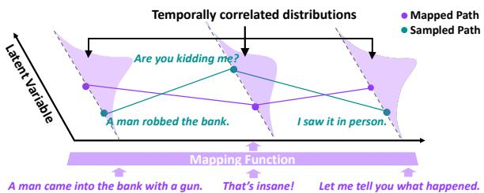
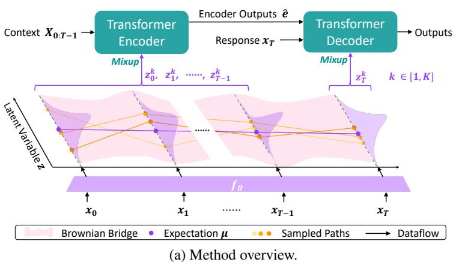
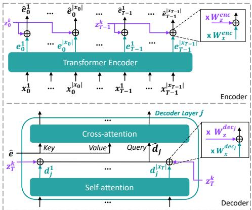
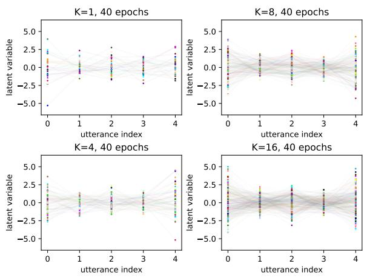

# DialoGPS: Dialogue Path Sampling in Continuous Semantic Space for Data Augmentation in Multi-Turn Conversations

Ang Lv1∗, Jinpeng Li2∗, Yuhan Chen1, Xing Gao3, Ji Zhang3, Rui Yan1,4† 1Gaoling School of Artifical Intelligence, Renmin University of China

2Wangxuan Institute of Computer Technology, Peking University 3Alibaba DAMO Academy

4Engineering Research Center of Next-Generation Intelligent Search and Recommendation, Ministry of Education {anglv, yhchen, ruiyan}@ruc.edu.cn, lijinpeng@stu.pku.edu.cn, {gaoxing.gx,zj122146}@alibaba-inc.com

## Abstract

In open-domain dialogue generation tasks, contexts and responses in most datasets are oneto-one mapped, violating an important manyto-many characteristic: a context leads to various responses, and a response answers multiple contexts. Without such patterns, models poorly generalize and prefer responding safely. Many attempts have been made in either multiturn settings from a one-to-many perspective or in a many-to-many perspective but limited to single-turn settings. The major challenge to many-to-many augment multi-turn dialogues is that discretely replacing each turn with seman tic similarity breaks fragile context coherence. In this paper, we propose DialoGue Path Sampling (DialoGPS) method in continuous semantic space, the first many-to-many augmentation method for multi-turn dialogues. Specifically, we map a dialogue to our extended Brownian Bridge, a special Gaussian process. We sample latent variables to form coherent dialogue paths in the continuous space. A dialogue path corresponds to a new multi-turn dialogue and is used as augmented training data. We show the effect of DialoGPS with both automatic and human evaluation.

## 1 Introduction

Open-domain dialogue generation has received significant attention and has made notable advancements (Zhang et al., 2020b; Shuster et al., 2022; OpenAI, 2022). However, it still faces challenges due to the nature of the data. One specific challenge is the many-to-many relationship between contexts and responses in open-domain conversations. A context can lead to various responses, and a response can be relevant to multiple contexts. Unfortunately, most datasets only provide one-to-one mappings between contexts and responses. This limitation results in models being poorly generalized when they rely on learned one-to-one patterns, making them prone to generating safe yet uninteresting responses (Jiang and de Rijke, 2018; Jiang et al., 2019).

<table><tr><td colspan="2">The original version</td></tr><tr><td>A: B: A:</td><td>A man came into the bank with a gun. That&#x27;s insane! Let me tell you what happened.</td></tr><tr><td colspan="2">The modified version</td></tr><tr><td>A:</td><td>I am also afraid... Have a hope.</td></tr><tr><td>B:</td><td>Wow! What a great news!!</td></tr><tr><td>A:</td><td>Ha ha.. I knew mom. Bye bye.</td></tr></table>

(a) Discrete replacement causes incoherence.

  
(b) Sampled dialogue paths in the continuous semantic space correspond to coherent discrete dialogues.  
Figure 1: (a) When replacing each utterance in the original conversation by semantic similarity, the modified dialogue is incoherent. (b) We map dialogues into a continuous semantic space where latent distributions of utterances correlate with each other, and sample dialogue paths for training. Each path corresponds to a discrete multi-turn conversation.

To address this limitation, many attempts (Sai et al., 2020; Qiu et al., 2019; Xie et al., 2022) have been made from a one-to-many perspective which involves constructing multiple responses for a context. Furthermore, some works are proposed from a many-to-many perspective but are limited to singleturn settings. To construct new dialogue sentence pairs, they either replace sentences based on semantic similarity (Zhang et al., 2020a) or sample new sentences from probabilistic models (Li et al., 2019). Next, they adopt BERT (Devlin et al., 2019) or GAN (Goodfellow et al., 2014) discriminators to filter incoherent sentence pairs.

These methods cannot be trivially extended to multi-turn settings. Considering $T$ utterances in a dialogue and $K$ candidates for each utterance, they need to (1) prepare a large sentence set as candidates for replacement or a strong generative model, and (2) check the coherence of the modified conversation at least $K ^ { T - 1 }$ times, which is impractical. Figure 1(a) shows a case in which we replace each utterance in a conversation following Zhang et al. (2020a). The modified conversation is still incoherent across turns. Therefore, to enhance multi-turn dialogue generation from a many-to-many perspective, we resort to a continuous semantic space that satisfies two requirements. First, it describes semantic distributions of utterances, allowing for sampling semantic neighbors of each utterance. Second, latent variables sampled from any two distributions should be temporally correlated, contributing to a new coherent dialogue path in the latent space without requiring post-checks. This path can be utilized as a new training sample to augment the model. Our motivation is illustrated in Figure 1(b).

Driven by this motivation, we propose a novel method for augmenting open-domain dialogues from a many-to-many perspective, called DialoGue Path Sampling (DialoGPS), aiming to enhance generalization and improve the quality of generated responses. Specifically, our approach involves the following steps: (1) We map each utterance in a multi-turn dialogue to a special Gaussian process in a continuous semantic space known as the Brownian Bridge (Revuz and Yor, 2013). (2) For each utterance $x _ { i }$ , we sample K latent variables $z _ { i } ^ { j } , j \in [ 1 , K ]$ , establishing K different dialogue paths in the bridge. Each path corresponds to a new multi-turn conversation in the discrete space. (3) DialoGPS utilizes an encoder-decoder architecture. To construct augmented data, we mix the latent variable $z _ { i }$ with representations of $x _ { i }$ in the encoder if $x _ { i }$ is part of the context, and in the decoder if it is the response. (4) Finally, we train the model using the augmented data.

To ensure the effectiveness of DialoGPS, we address several key issues. First, traditional Brownian Bridges have deterministic endpoints, which prevent response sampling and lead our method degenerating into a many-to-one paradigm, further impairing generalization. To overcome this limitation, we derive the formula of endpoint distributions. Second, since augmented data that lacks discrete utterance labels makes the optimization challenging, we propose a self-distillation framework where the model first learns from the ground truth and then distills its knowledge to guide itself in utilizing augmented data.

We evaluate DialoGPS on two multi-turn opendomain datasets. Both automatic and human evaluation show that DialoGPS performs better than strong baselines and even outperforms the model trained on manually denoted multi-reference data, which demonstrates the benefit of the many-tomany augmentation paradigm. Because DialoGPS is plug-and-play, we add it to BART (Lewis et al., 2020) and achieve competitive results with the state-of-the-art model, DialoFlow (Li et al., 2021). Our contributions are as follows:

DialoGPS is the first work to augment multiturn dialogues from a many-to-many perspective.

To ensure the effectiveness of DialoGPS, we have introduced dialogue-specific designs, including endpoint sampling of Brownian Bridges and self-distillation for model optimization.

Experiments conducted on both non-pretrained and pre-trained models show that our DialoGPS method outperforms all baselines.

## 2 Related Work: Dialogue Generation Augmentation

In general, dialogue generation can be categorized into two groups: task-oriented and open-domain. Open-domain generation is a context-aware process that lasts for turns. The model learns to generate a proper but open response from the preceding utterances (i.e., contexts). Task-oriented dialogues progress for specific purposes and are limited to specific domains, such as obtaining knowledge (Zhao et al., 2020; Tao et al., 2021). However, due to the specific domains in task-oriented dialogues, the many-to-many relationship is not as apparent compared to open-domain dialogues.

In this paper, we focus on open-domain dialogue generation augmentation from an X-to-many perspective. From a one-to-many perspective, Sai et al. (2020) manually denoted multiple responses for a dialogue context. Based on such multi-reference datasets, Qiu et al. (2019) proposed to capture the common feature in feasible responses and then add the specific feature to obtain the final output, which augments the utility of the data and improves the generalization. Xie et al. (2022) proposed that with only one-to-one data, models can construct pseudotarget data in the decoder and improve the model by bootstrapping. From a many-to-many perspective, existing methods work in single-turn settings. Li et al. (2019) generated multiple context or responses with CVAE (Zhao et al., 2017) and introduced a GAN (Goodfellow et al., 2014) discriminator to filter incoherent sentence pairs. Zhang et al. (2020a) augmented a one-to-one dialogue dataset $D _ { p }$ with an unpaired sentence set $D _ { u } .$ . They sample sentences from $D _ { u }$ and replace the most similar sentences in $D _ { p }$ . They use BERT (Devlin et al., 2019) and knowledge distillation to filter noise in incoherent sentence pairs. Until now, manyto-many augmentation in multi-turn settings are understudied.

## 3 Method

We first present some preliminaries ( 3.1). Then, we introduce mapping dialogue texts to the desired latent space ( 3.2), augmented data construction ( 3.3), augmented data utilization ( 3.4), and inference details ( 3.5). Figure 2 shows the overview of DialoGPS.

## 3.1 Preliminary

In open-domain dialogue generation, given a multiturn dialogue $X ~ = ~ [ x _ { 0 } , x _ { 1 } , . . . , x _ { T } ]$ , the goal is to predict the response xT based on the context $X _ { 0 : T - 1 }$ . The number of tokens in $x _ { t }$ is denoted as $| x _ { t } | , t \in \{ 0 , 1 , \ldots , T \}$ . The i-th token in the xt is denoted as $\ v x _ { t } ^ { i }$ . A Brownian Bridge defined on time range [0, T] is a special Gaussian process established on deterministic endpoints $\mu _ { 0 }$ and $\mu _ { T }$ At time $t ,$ the latent variable $z _ { t }$ follows a Gaussian distribution $B ( t | \mu _ { 0 } , \mu _ { T } )$

$$
z _ { t } \sim \mathcal { B } ( t | \mu _ { 0 } , \mu _ { T } ) = \mathcal { N } ( \mu _ { 0 } + \frac { t } { T } ( \mu _ { T } - \mu _ { 0 } ) , \frac { t ( T - t ) } { T } ) ,\tag{1}
$$

## 3.2 Extended Brownian Bridge

In DialoGPS, given X, a non-linear function $f _ { \theta }$ maps each $x _ { t }$ to $\mu _ { t }$ , the expectations of the corresponding semantic distribution. Based on $\mu _ { 0 }$ and $\mu _ { T }$ , we can establish a Brownian Bridge, and from which we sample the latent variable $z _ { t }$ as the semantic neighbor of $x _ { t }$ . Meanwhile, $z _ { 0 } , z _ { 1 } , . . . , z _ { T }$ compose a coherent dialogue path because in a

Brownian Bridge, the covariance between $t _ { 1 }$ and $t _ { 2 }$ with $\begin{array} { r } { 0 < t _ { 1 } < t _ { 2 } < T \mathrm { i s } \ \frac { t _ { 1 } ( T - t _ { 2 } ) } { T } } \end{array}$ , where the constant positive covariance guarantees that $B ( t _ { 1 } | \mu _ { 0 } , \mu _ { T } )$ and $B ( t _ { 2 } | \mu _ { 0 } , \mu _ { T } )$ are temporally correlated.

However, as defined in Eq. 1, a conventional Brownian Bridge has deterministic endpoints, which prevents us from sampling for $x _ { T }$ , the response, and $x _ { 0 } ,$ , the first utterance in the context. To avoid degenerating to a many-to-one mode that impairs the generalization, we derive an extended Brownian Bridge $\beta$ with samplable endpoints. Take the derivation of $\beta ( T | \mu _ { 0 } , \mu _ { T } )$ as example: given a $B ,$ both the distance $d _ { \delta }$ between $\mu _ { T }$ and $z _ { T - \delta }$ and the summation of $d _ { \delta }$ and $z _ { T - \delta }$ follow the Gaussian distribution, we can derive the distribution of $z _ { T }$ as follows:

$$
\begin{array} { c } { { z _ { T - \delta } \sim \displaystyle \mathcal { N } ( \frac { T - \delta } { T } \mu _ { T } + \frac { \delta } { T } \mu _ { 0 } , \frac { \delta ( T - \delta ) } { T } ) \Bigg \} } } \\ { { d _ { \delta } = \displaystyle \mu _ { T } - z _ { T - \delta } \sim \mathcal { N } ( \frac { \delta } { T } \mu _ { T } - \frac { \delta } { T } \mu _ { 0 } , \frac { \delta ( T - \delta ) } { T } ) \Bigg \} } } \\ { { z _ { T } = d _ { \delta } + z _ { T - \delta } \sim \mathcal { N } ( \mu _ { T } , \frac { 2 \delta ( T - \delta ) } { T } ) . } } \end{array}\tag{2}
$$

Due to the symmetry, z0 follows $\begin{array} { r } { \mathcal { N } ( \mu _ { 0 } , \frac { 2 \delta ( T - \delta ) } { T } ) } \end{array}$ . Here, $\delta$ serves as a hyperparameter. To sum up, we define the extended Brownian Bridge $\beta$ as:

$$
\beta ( t | \mu _ { 0 } , \mu _ { T } ) = \left\{ \begin{array} { l l } { \displaystyle \mathcal { N } ( \mu _ { t } , \frac { 2 \delta ( T - \delta ) } { T } ) , \mathfrak { t } = 0 \mathrm { o r T } , } \\ { \displaystyle \mathcal { N } ( \mu _ { 0 } + \frac { t } { T } ( \mu _ { T } - \mu _ { 0 } ) , \frac { t ( T - t ) } { T } ) , \mathrm { o t h e r w i s e } . } \end{array} \right.\tag{3}
$$

To optimize the mapping function $f _ { \theta }$ , we follow (Wang et al., 2022) to adopt a contrastive learning framework where positive samples are ordered sentence triplets from the same conversation $( x _ { t _ { 0 } }$ $x _ { t _ { 1 } } , x _ { t _ { 2 } } , t _ { 0 } < t _ { 1 } < t _ { 2 } )$ and negative samples are constructed by randomly replacing the middle point $\boldsymbol { x } _ { t _ { 1 } }$ with other sentences $\boldsymbol { x } _ { t _ { 1 } ^ { \prime } }$ from the mini-batch B. The objective is as below:

$$
\mathcal { L } _ { \beta } = \mathbb { E } _ { X } \left[ \log \left( 1 + \frac { \sum _ { ( \boldsymbol { x } _ { t _ { 0 } } , \boldsymbol { x } _ { t _ { 1 } ^ { \prime } } , \boldsymbol { x } _ { t _ { 2 } } ) \in \mathbb { B } } \exp ( d ( \boldsymbol { x } _ { t _ { 0 } } , \boldsymbol { x } _ { t _ { 1 } ^ { \prime } } , \boldsymbol { x } _ { t _ { 2 } } ; f _ { \theta } ) ) } { \exp ( d ( \boldsymbol { x } _ { t _ { 0 } } , \boldsymbol { x } _ { t _ { 1 } } , \boldsymbol { x } _ { t _ { 2 } } ; f _ { \theta } ) ) } \right) \right] ,\tag{4}
$$

where $\begin{array} { r } { d ( x _ { t _ { 0 } } , x _ { t _ { 1 } } , x _ { t _ { 2 } } ; f _ { \theta } ) = - \frac { 1 } { 2 \sigma _ { t _ { 1 } } ^ { 2 } } \| f _ { \theta } ( x _ { t _ { 1 } } ) - ( 1 - } \end{array}$ $\begin{array} { r } { \frac { t _ { 1 } } { t _ { 2 } } ) f _ { \theta } ( x _ { t _ { 0 } } ) - \frac { t _ { 1 } } { t _ { 2 } } f _ { \theta } ( x _ { t _ { 2 } } ) \| _ { 2 } ^ { 2 } } \end{array}$ . The essence of Eq. 4 is to optimize the outputs of $f _ { \theta } , \mathrm { i . e . , } \ \mu _ { t _ { 0 } } , \mu _ { t _ { 1 } }$ , and $\mu _ { t _ { 2 } }$ to the linear relationship as defined in Eq. 1. In DialoGPS, a 4-layer MLP serves as $f _ { \theta }$ . To embed utterance as inputs of $f _ { \theta } ,$ , there are many choices such as averaging token embeddings or encoding by a language model. We leave the embedding details in 5.3.

  
(b) Mixup details on encoder and decoder.  
Figure 2: (a) The overview of DialoGPS. Teacher forcing is applied during training. Each utterance in the dialogue is mapped into a semantic distribution on a Brownian Bridge. We sample $K$ paths and conduct mixup operations in the encoder and decoder, respectively. (b) Mixup details.

## 3.3 Augmented Data Construction

As shown in Figure 2(a), we take Transformer (Vaswani et al., 2017) as the bone architecture. With $f _ { \theta } ,$ an extended Brownian Bridge $\beta$ is established. We sample latent variables $z _ { t } \sim$ $\beta ( t | \mu _ { 0 } , \mu _ { T } )$ and mix them with representations of corresponding $x _ { t }$ . In the encoder, for each utterance $x _ { t }$ in the context $X _ { 0 : T - 1 }$ , we conduct:

$$
\begin{array} { r l } & { e _ { t } ^ { 1 } , e _ { t } ^ { 2 } , . . . e _ { t } ^ { | x _ { t } | } = \operatorname { E n c o d e r } ( x _ { t } ) , } \\ & { \hat { e } _ { t } ^ { i } = W _ { x } ^ { e n c } \cdot e _ { t } ^ { i } + W _ { z } ^ { e n c } \cdot z _ { t } , } \end{array}\tag{5}
$$

where $e _ { t } ^ { i }$ is the output corresponding to the i-th token in $x _ { t }$ from the encoder, $i \in [ 1 , | x _ { t } | ] . \ W _ { z } ^ { e n c }$ and $W _ { x } ^ { e n c }$ are trainable vectors of the same dimension as e and z. Finally, eˆ is sent to the decoder for cross-attention. We conduct the mixup every decoder layer:

$$
\begin{array} { r l } & { \hat { d } _ { j } ^ { i } = W _ { x } ^ { d e c _ { j } } \cdot d _ { j } ^ { i } + W _ { z } ^ { d e c _ { j } } \cdot z _ { T } , } \\ & { i \in \left[ 1 , \left| x _ { T } \right| \right] , j \in \left[ 1 , N \right] , } \end{array}\tag{6}
$$

where N is the number of decoder layers, $d _ { j } ^ { i }$ is the self-attention output at position i in layer $j .$ Also, $W _ { z } ^ { d e c _ { j } }$ and $W _ { x } ^ { d e c _ { j } }$ are trainable vectors. $\hat { d } _ { j }$ is used as $Q u e r y ,$ and eˆ are used as both $K e y$ and Value in the cross-attention. For a dialogue text X, we conduct sampling and mixup K times, which is equivalent to providing K extra discrete dialogues $\bar { X ^ { k } } \ = \ \big [ \hat { x } _ { 0 } ^ { k } , \bar { x } _ { 1 } ^ { k } , . . . , \hat { x } _ { T } ^ { k } \big ] , k \in [ 1 , K ]$ for training. Figure 2(b) shows mixup details.

## 3.4 Utilizing Augmented Data by Self-Distillation

In general, given X to a dialogue generation model, parameters ϕ of model are optimized by minimizing the negative log-likelihood:

$$
\phi = \operatorname { a r g m i n } \left( \mathbb { E } _ { X } \left[ - \log ( P _ { \phi } ( x _ { T } | X _ { 0 : T - 1 ] } ) ) \right] \right) .\tag{7}
$$

However, as aforementioned, what we obtain are continuous representations of $\hat { X }$ whereas the corresponding discrete sentences are inaccessible, which makes $\operatorname { E q }$ . 7 intractable. Hence, to utilize the augmented data, we make an assumption that: There is an inaccessible many-to-many dialogue dataset $D _ { M t o M } . \ P _ { M t o M }$ describes the conditional distribution of responses given contexts in this dataset. The accessible one-to-one dataset $D _ { 1 t o 1 }$ is collected by sampling from $D _ { M t o M }$ uniformly, and thus $P _ { 1 t o 1 }$ can be viewed as an approximation of $P _ { M t o M }$

Based on this assumption, we propose a selfdistillation framework consisting of two steps: (1) It optimizes the model with the original discrete data following Eq. 7. (2) During training, as $P _ { \phi }$ fits $P _ { 1 t o 1 }$ , which is an approximation of $P _ { M t o M } .$ the model can use its output given X to teach itself when presented with augmented data, i.e., the representations of $\hat { X }$

$$
\phi = \mathrm { a r g m i n } \left( D _ { K L } \left[ P _ { \phi } ( x _ { T } | X _ { 0 : T - 1 } ) | | P _ { \phi } ( \hat { x } _ { T } | \hat { X } _ { 0 : T - 1 } ) \right] \right) ,\tag{8}
$$

where $D _ { K L } [ \cdot | | \cdot ]$ is the KL-divergence (Kullback and Leibler, 1951). In Eq. 8, to remove the gap between utilizing the original discrete data X and the augmented continuous data $\hat { X }$ in the same architecture, we mix each utterance in X with the expectations $\mu _ { 0 : T }$ . Formally, the overall training objective is to minimize:

$$
\begin{array} { r l } { \mathcal { L } = \underbrace { \mathcal { L } _ { \beta } } _ { \mathrm { M a p p i n g } ~ X ~ \mathrm { t o } \beta } + } & { \underbrace { \mathbb { E } _ { X } \left[ - \log ( P _ { \phi } ( x T | X _ { 0 : T - 1 } , \mu _ { 0 : T } ) ) \right] } _ { \mathrm { U t i l i z i n g ~ o r i g i n a l ~ d i s c r e t e d a t a } } + } \\ { \underbrace { \frac { 1 } { K } \sum _ { k } ^ { K } D _ { K L } \left[ P _ { \phi } ( x _ { T } | X _ { 0 : T - 1 } , \mu _ { 0 : T } ) | | P _ { \phi } ( \hat { x } _ { T } ^ { k } | \hat { X } _ { 0 : T - 1 } ^ { k } , z _ { 0 : T } ^ { k } ) \right] } _ { \mathrm { U t i l i z i n g ~ o u g m e n t e d ~ d a t a } } } \end{array}\tag{9}
$$

## 3.5 Inference

The inference goal is to predict $x _ { T }$ based on context $X _ { 0 : T - 1 }$ . First, $f _ { \theta }$ takes $X _ { 0 : T - 1 }$ and outputs corresponding $\mu _ { t }$ for sampling and mixup in the encoder, where $t \in \{ 0 , 1 , . . . , T - 1 \}$ . Next, the decoder receives the encoder output and an inferred $\mu _ { T }$ to decode the response in an autoregressive manner. To obtain the value of $\mu _ { T }$ , we do not require additional prediction networks. Instead, we can directly derive its value based on the property of Brownian Bridge. Specifically, given the context, we know that for any t:

$$
\mu _ { t } = \mu _ { 0 } + \frac { t } { T - 1 } ( \mu _ { T - 1 } - \mu _ { 0 } ) .\tag{10}
$$

If $\mu _ { T }$ is already known, a Brownian bridge established on $\mu _ { T }$ and $\mu _ { 0 }$ would yield the same $\mu _ { t }$ values. Consequently, we can establish an equality and derive the value of $\mu _ { T }$ as follows:

$$
\begin{array} { l } { \displaystyle \mu _ { t } = \mu _ { 0 } + \frac { t } { T } ( \mu _ { T } - \mu _ { 0 } ) = \mu _ { 0 } + \frac { t } { T - 1 } ( \mu _ { T - 1 } - \mu _ { 0 } ) } \\ { \displaystyle \Rightarrow \mu _ { T } = \frac { T } { T - 1 } \mu _ { T - 1 } - \frac { 1 } { T - 1 } \mu _ { 0 } . } \end{array}\tag{11}
$$

We find that there is hardly a difference in evaluation results when conducting mixup operations with either expectations $\mu$ or sampled variables z. To reduce randomness for easier analyses, experiments in below use expectations $\mu$ to mixup. Nonetheless, sampling variables gives DialoGPS the ability to generate diverse responses to an arbitrary context and we will discuss it in 5.4.

## 4 Experimental Settings

Datasets We conduct multi-turn dialogue generation experiments on two public datasets: Daily-Dialog (Li et al., 2017) and PersonaChat (Zhang et al., 2018a). DailyDialog contains high-quality multi-turn dialogues collected from daily conversations, and it has many multi-reference versions (Sai et al., 2020; Gupta et al., 2019) denoted by humans, which makes it possible for us to compare

DialoGPS with human annotators. Besides, it is more reliable to evaluate the generalization and performance with multiple references. PersonaChat collects dialogues based on chatters’ profiles. Profiles are not shown to models, so it is more challenging and open to generate proper responses, measuring generalization capacity better.

Baselines and Parameters We compare DialoGPS with (1) Transformer (Vaswani et al., 2017). (2)DD++ (Sai et al., 2020): it is a variant of DailyDialog in which each context has five manually denoted responses. We train a vanilla Transformer on it. (3) TSA (Xie et al., 2022): it is an unsupervised augmentation method in the decoder side. It uses its decoder’s output to construct pseudo-target data which is used to train the model for another round. From a dialogue generation viewpoint, it is a one-to-many method that bootstraps based on one-to-one data. (4) M&D-D (Zhang et al., 2020a): it uses a pre-trained model and BM-25 algorithm to construct new context-response pairs from unpaired sentences. Since it is a single-turn augmentation, given a multi-turn dialogue, we only apply this method to the last two turns. (5) ResBag (Qiu et al., 2019): an augmented VAE-based model. It captures the common feature in the bag of plausible responses and then adds the specific feature to obtain the final output, which utilizes the multiple references better.

Because DialoGPS is a plug-and-play method, we add it to a $\mathrm { B A R T _ { L a r g e } }$ (Lewis et al., 2020) and compare with $\mathrm { D i a l o F l o w _ { L a r g e } }$ (Li et al., 2021). DialoFlow is one of the state-of-the-art pre-trained models in open-domain dialogue generation. It augments the model by modeling the dialogue flow. More details on the implementation and hyperparameters are in Appendix A.1.

Evaluation Metrics We consider three automatic evaluation metrics: BLEU (Papineni et al., 2002), Distinct (DIST) (Li et al., 2016), and BLEURT (Sellam et al., 2020). BLEU measures the word overlap between generated responses and the ground truth. DIST measures the ratio of unique n-grams in the generated responses. Because these two metrics are only sensitive to lexical variation, we evaluate BLEURT, an advanced learned semanticsensitive evaluation metric based on BERT (Devlin et al., 2019). On the evaluation of fine-tuning pre-trained models, we follow (Li et al., 2021) to report METEOR (Lavie and Agarwal, 2007) and

Component Ablation on Multi-reference DailyDialog (K=4)
<table><tr><td>Models</td><td>BLEU-1</td><td>BLEU-2</td><td>BLEU-3 BLEU-4</td><td></td><td>DIST-1</td><td>DIST-2.</td><td>BLEURT</td></tr><tr><td colspan="8">PersonaChat Dataset</td></tr><tr><td>Transformer</td><td> $1 7 . 7 9 _ { [ 0 . 1 4 ] }$ </td><td> $6 . 9 3 _ { [ 0 . 0 6 ] }$ </td><td> $3 . 0 3 _ { [ 0 . 0 8 ] }$ </td><td> $1 . 4 1 _ { [ 0 . 0 6 ] }$ </td><td> $0 . 8 2 _ { [ 0 . 0 1 ] }$ </td><td> $6 . 6 0 _ { [ 0 . 0 5 ] }$ </td><td> $3 0 . 1 6 _ { [ 0 . 0 5 ] }$ </td></tr><tr><td>ResBag</td><td> $1 7 . 8 2 _ { [ 0 . 1 7 ] }$ </td><td> $6 . 8 8 _ { [ 0 . 1 2 ] }$ </td><td> $3 . 0 4 _ { [ 0 . 0 9 ] }$ </td><td> $1 . 3 7 _ { [ 0 . 1 1 ] }$ </td><td> $0 . 8 5 _ { [ 0 . 0 2 ] }$ </td><td> $6 . 8 3 _ { [ 0 . 0 2 ] }$ </td><td> $3 0 . 2 5 _ { [ 0 . 1 7 ] }$ </td></tr><tr><td>TSA</td><td> $1 7 . 7 6 _ { [ 0 . 1 9 ] }$ </td><td> $6 . 9 2 _ { [ 0 . 1 6 ] }$ </td><td> $2 . 9 7 _ { [ 0 . 1 5 ] }$ </td><td> $1 . 3 5 _ { [ 0 . 1 0 ] }$ </td><td> $0 . 8 5 _ { [ 0 . 0 2 ] }$ </td><td> $6 . 5 6 _ { [ 0 . 0 1 ] }$ </td><td> $3 0 . 6 6 _ { [ 0 . 0 9 ] }$ </td></tr><tr><td>M&amp;D-D</td><td> $1 8 . 4 2 _ { [ 0 . 1 3 ] }$ </td><td> $7 . 2 5 _ { [ 0 . 0 9 ] }$ </td><td> $3 . 2 3 _ { [ 0 . 1 1 ] }$ </td><td> $1 . 4 4 _ { [ 0 . 0 7 ] }$ </td><td> $0 . 8 0 _ { [ 0 . 0 1 ] }$ </td><td> $6 . 5 5 _ { [ 0 . 0 1 ] }$ </td><td> $3 0 . 4 6 _ { [ 0 . 1 3 ] }$ </td></tr><tr><td> $\mathrm { D i a l o G P S } _ { K = 1 }$ </td><td> $1 8 . 2 9 _ { [ 0 . 0 8 ] }$ </td><td> $7 . 2 1 _ { [ 0 . 0 5 ] }$ </td><td> $3 . 1 4 _ { [ 0 . 0 3 ] }$ </td><td> $1 . 4 4 _ { [ 0 . 0 5 ] }$ </td><td> $\mathbf { 1 . 0 5 } _ { [ 0 . 0 1 ] }$ </td><td> $7 . 9 7 _ { [ 0 . 0 7 ] }$ </td><td> $3 0 . 5 4 _ { [ 0 . 0 6 ] }$ </td></tr><tr><td>DialoGPSK=2</td><td> $1 8 . 9 6 _ { [ 0 . 1 5 ] }$ </td><td> $7 . 6 1 _ { [ 0 . 0 9 ] }$ </td><td> $3 . 3 2 _ { [ 0 . 0 4 ] }$ </td><td> $1 . 5 4 _ { [ 0 . 0 2 ] }$ </td><td> $0 . 8 4 _ { [ 0 . 0 0 ] }$ </td><td> $7 . 1 0 _ { [ 0 . 0 4 ] }$ </td><td> $\mathbf { 3 0 . 7 7 } _ { [ 0 . 1 4 ] }$ </td></tr><tr><td> $\mathrm { D i a l o G P S } _ { K = 4 }$ </td><td> $\mathbf { 1 9 . 0 5 } _ { [ 0 . 1 8 ] }$ </td><td> $7 . 7 0 _ { [ 0 . 1 6 ] }$ </td><td> $3 . 4 1 _ { [ 0 . 0 9 ] }$ </td><td> $\mathbf { 1 . 6 1 } _ { [ 0 . 0 7 ] }$ </td><td> $0 . 9 1 _ { [ 0 . 0 1 ] }$ </td><td> $7 . 4 5 _ { [ 0 . 0 9 ] }$ </td><td> $3 0 . 2 9 _ { [ 0 . 1 2 ] }$ </td></tr><tr><td> $\mathrm { D i a l o G P S } _ { K = 8 }$ </td><td> $1 9 . 0 4 _ { [ 0 . 0 8 ] }$ </td><td> $7 . 6 4 _ { [ 0 . 1 1 ] }$ </td><td> $3 . 4 0 _ { [ 0 . 1 0 ] }$ </td><td> $1 . 6 0 _ { [ 0 . 0 8 ] }$ </td><td> $0 . 9 3 _ { [ 0 . 0 1 ] }$ </td><td> $7 . 6 4 _ { [ 0 . 0 6 ] }$ </td><td> $3 0 . 3 9 _ { [ 0 . 1 4 ] }$ </td></tr></table>

<table><tr><td colspan="8">Multi-reference DailyDialog Dataset</td></tr><tr><td>Transformer</td><td> $3 3 . 9 3 _ { [ 0 . 2 6 ] }$ </td><td> $1 2 . 3 2 _ { [ 0 . 2 5 ] }$ </td><td> $4 . 9 3 _ { [ 0 . 2 3 ] }$ </td><td> $2 . 1 4 _ { [ 0 . 1 4 ] }$ </td><td> $2 . 5 9 _ { [ 0 . 0 3 ] }$ </td><td> $2 0 . 6 2 _ { [ 0 . 1 2 ] }$ </td><td> $3 5 . 7 9 _ { [ 0 . 1 5 ] }$ </td></tr><tr><td>ResBag</td><td> $3 4 . 1 0 _ { [ 0 . 2 7 ] }$ </td><td> $1 2 . 6 1 _ { [ 0 . 1 8 ] }$ </td><td> $4 . 8 2 _ { [ 0 . 1 7 ] }$ </td><td> $2 . 1 3 _ { [ 0 . 1 3 ] }$ </td><td> $2 . 9 8 _ { [ 0 . 0 6 ] }$ </td><td> $2 4 . 4 4 _ { [ 0 . 1 7 ] }$ </td><td> $3 5 . 2 2 _ { [ 0 . 1 5 ] }$ </td></tr><tr><td>TSA</td><td> $3 6 . 1 4 _ { [ 0 . 1 1 ] }$ </td><td> $1 3 . 2 1 _ { [ 0 . 1 5 ] }$ </td><td> $5 . 4 3 _ { [ 0 . 1 4 ] }$ </td><td> $2 . 4 6 _ { [ 0 . 1 3 ] }$ </td><td> $3 . 5 6 _ { [ 0 . 0 4 ] }$ </td><td> $2 6 . 8 9 _ { [ 0 . 2 1 ] }$ </td><td> $3 5 . 3 7 _ { [ 0 . 1 3 ] }$ </td></tr><tr><td>DD++</td><td> $3 6 . 8 7 _ { [ 0 . 3 2 ] }$ </td><td> $1 4 . 0 9 _ { [ 0 . 2 4 ] }$ </td><td> $6 . 1 3 _ { [ 0 . 2 3 ] }$ </td><td> $2 . 9 1 _ { [ 0 . 1 7 ] }$ </td><td> $3 . 8 4 _ { [ 0 . 0 3 ] }$ </td><td> $2 8 . 5 8 _ { [ 0 . 3 8 ] }$ </td><td> $\underline { { 3 7 . 0 4 } } _ { [ 0 . 1 4 ] }$ </td></tr><tr><td>M&amp;D-D</td><td> $3 6 . 9 7 _ { [ 0 . 1 2 ] }$ </td><td> $1 4 . 2 8 _ { [ 0 . 0 9 ] }$ </td><td> $6 . 5 0 _ { [ 0 . 1 9 ] }$ </td><td> $3 . 2 8 _ { [ 0 . 1 7 ] }$ </td><td> $3 . 6 5 _ { [ 0 . 0 3 ] }$ </td><td> $2 5 . 3 5 _ { [ 0 . 2 1 ] }$ </td><td> $3 6 . 0 2 _ { [ 0 . 1 5 ] }$ </td></tr><tr><td> $\mathrm { D i a l o G P S } _ { K = 1 }$ </td><td> $3 7 . 2 1 _ { [ 0 . 1 2 ] }$ </td><td> $1 4 . 7 2 _ { [ 0 . 1 4 ] }$ </td><td> $6 . 6 5 _ { [ 0 . 1 2 ] }$ </td><td> $3 . 2 9 _ { [ 0 . 1 1 ] }$ </td><td> $4 . 2 5 _ { [ 0 . 0 5 ] }$ </td><td> $2 8 . 3 9 _ { [ 0 . 1 4 ] }$ </td><td> $3 6 . 1 4 _ { [ 0 . 0 8 ] }$ </td></tr><tr><td> $\mathrm { D i a l o G P S } _ { K = 2 }$ </td><td> $3 8 . 0 1 _ { [ 0 . 1 3 ] }$ </td><td> $1 4 . 7 9 _ { [ 0 . 0 7 ] }$ </td><td> $6 . 5 2 _ { [ 0 . 0 6 ] }$ </td><td> $3 . 2 0 _ { [ 0 . 0 4 ] }$ </td><td> $4 . 3 4 _ { [ 0 . 0 6 ] }$ </td><td> $2 9 . 0 4 _ { [ 0 . 2 5 ] }$ </td><td> $3 6 . 1 5 _ { [ 0 . 1 6 ] }$ </td></tr><tr><td> $\mathrm { D i a l o G P S } _ { K = 4 }$ </td><td> $3 8 . 2 7 _ { [ 0 . 2 0 ] }$ </td><td> $1 4 . 7 7 _ { [ 0 . 1 3 ] }$ </td><td> $6 . 6 2 _ { [ 0 . 1 5 ] }$ </td><td> $\pmb { 3 . 3 3 } _ { [ 0 . 2 0 ] }$ </td><td> $4 . 5 3 _ { [ 0 . 0 7 ] }$ </td><td> $\mathbf { 3 0 . 1 8 } _ { [ 0 . 1 7 ] }$ </td><td> $3 6 . 0 9 _ { [ 0 . 0 8 ] }$ </td></tr><tr><td> $\mathrm { D i a l o G P S } _ { K = 8 }$ </td><td> $3 8 . 4 6 _ { [ 0 . 1 8 ] }$ </td><td> $\mathbf { 1 5 . 0 5 } _ { [ 0 . 2 3 ] }$ </td><td> $\mathbf { 6 . 7 0 } _ { [ 0 . 2 4 ] }$ </td><td> $3 . 3 0 _ { [ 0 . 1 4 ] }$ </td><td> $4 . 3 2 _ { [ 0 . 0 6 ] }$ </td><td> $2 8 . 3 5 _ { [ 0 . 1 4 ] }$ </td><td> $3 5 . 8 2 _ { [ 0 . 1 6 ] }$ </td></tr><tr><td> $\mathrm { D i a l o G P S } _ { K = 1 6 }$ </td><td> $3 8 . 3 8 _ { [ 0 . 1 4 ] }$ </td><td> $1 4 . 8 9 _ { [ 0 . 0 6 ] }$ </td><td> $6 . 6 2 _ { [ 0 . 1 3 ] }$ </td><td> $3 . 3 0 _ { [ 0 . 1 5 ] }$ </td><td> $4 . 4 1 _ { [ 0 . 0 5 ] }$ </td><td> $2 9 . 8 4 _ { [ 0 . 0 8 ] }$ </td><td> $3 5 . 8 1 _ { [ 0 . 0 5 ] }$ </td></tr></table>

$$
3 8 . 0 4 _ { [ 0 . 1 7 ] }
$$

$$
1 5 . 0 0 _ { [ 0 . 1 2 ] }
$$

$$
3 4 . 6 2 _ { [ 0 . 1 2 ] }
$$

$$
1 2 . 7 1 _ { [ 0 . 1 3 ] }
$$

$$
6 . 6 3 _ { [ 0 . 1 2 ] }
$$

$$
3 8 . 0 5 _ { [ 0 . 2 2 ] }
$$

$$
3 . 2 1 _ { [ 0 . 1 1 ] }
$$

$$
3 5 . 9 6 _ { [ 0 . 0 9 ] }
$$

$$
5 . 2 0 _ { [ 0 . 0 8 ] }
$$

$$
1 4 . 6 8 _ { [ 0 . 0 5 ] }
$$

$$
2 8 . 0 5 _ { [ 0 . 1 0 ] }
$$

$$
2 . 3 3 _ { [ 0 . 0 8 ] }
$$

$$
4 . 2 2 _ { [ 0 . 0 3 ] }
$$

$$
6 . 3 6 _ { [ 0 . 0 4 ] }
$$

$$
3 . 1 9 _ { [ 0 . 0 4 ] }
$$

$$
- \mathbf { M } . \mathbf { E } . - \mathbf { B } \mathrm { r o w n } .
$$

$$
3 5 . 1 4 _ { [ 0 . 1 3 ] }
$$

$$
3 . 0 1 _ { [ 0 . 1 0 ] }
$$

$$
3 8 . 4 2 _ { [ 0 . 1 3 ] }
$$

$$
2 4 . 6 5 _ { [ 0 . 1 6 ] }
$$

$$
1 4 . 7 6 _ { [ 0 . 1 5 ] }
$$

$$
4 . 0 5 _ { [ 0 . 0 9 ] }
$$

$$
6 . 5 5 _ { [ 0 . 0 5 ] }
$$

$$
3 5 . 5 2 _ { [ 0 . 1 1 ] }
$$

$$
- \mathbf { M } . \mathbf { D } . - \mathbf { B } \mathbf { r o w n } .
$$

$$
3 4 . 4 9 _ { [ 0 . 3 1 ] }
$$

$$
2 7 . 5 8 _ { [ 0 . 1 8 ] }
$$

$$
3 . 1 7 _ { [ 0 . 1 2 ] }
$$

$$
1 2 . 6 8 _ { [ 0 . 2 8 ] }
$$

$$
5 . 1 5 _ { [ 0 . 2 3 ] }
$$

$$
3 3 . 9 3 _ { [ 0 . 2 6 ] }
$$

$$
- \mathbf { M } . \mathrm { E } . - \mathbf { M } . \mathbf { D } .
$$

$$
4 . 1 1 _ { [ 0 . 0 3 ] }
$$

$$
1 2 . 3 2 _ { [ 0 . 2 5 ] }
$$

$$
4 . 9 3 _ { [ 0 . 2 3 ] }
$$

$$
2 . 2 9 _ { [ 0 . 1 7 ] }
$$

$$
2 7 . 6 4 _ { [ 0 . 1 6 ] }
$$

$$
3 6 . 1 2 _ { [ 0 . 1 2 ] }
$$

$$
2 . 9 7 _ { [ 0 . 4 5 ] }
$$

$$
2 . 1 4 _ { [ 0 . 1 4 ] }
$$

$$
2 4 . 4 6 _ { [ 0 . 1 5 ] }
$$

$$
2 . 5 9 _ { [ 0 . 0 3 ] }
$$

$$
2 0 . 6 2 _ { [ 0 . 1 2 ] }
$$

$$
3 5 . 1 1 _ { [ 0 . 1 2 ] }
$$

$$
3 5 . 7 9 _ { [ 0 . 1 5 ] }
$$

Table 1: Automatic evaluation and ablation results on multi-reference DailyDialog and PersonaChat. We apply Top-5 Sampling decoding scheme. The standard deviation [σ] (across 5 runs) is also reported. In the ablation results table, M.E/D. stands for applying mixup in the encoder/decoder, and Brown. stands for optimizing $f _ { \theta }$ with Eq. 4. When there is no mixup in either encoder or decoder, the model degenerates into a vanilla transformer.

Entropy (Zhang et al., 2018b). For human evaluation, we recruit five evaluators to manually judge 200 samples from each experiment in blind testing, where we set three metrics to comprehensively evaluate the generation quality: whether a response is readable (Read.), coherent (Coh.), and informative (Info.). For each aspect, evaluators can score at ‘bad’, ‘borderline’ and ‘good’.

## 5 Results

els prefer safe responses and thus DISTs are relatively low. However, DialoGPS still improves by about 20% in DISTs than the best-performing baseline. Also, BLEU and BLEURT scores imply that DialoGPS matches references more lexically and more semantically. On the multi-reference Daily-Dialog dataset, DialoGPS gains improvement by a large margin than other strong baselines. Also, most baselines suffer a trade-off between matching the references and diversifying responses. By contrast, DialoGPS performs evenly well on all metrics. DialoGPS also wins 6 out of all 7 metrics compared with the model trained on DD++, the human-written multi-reference training set. Our

Table 1 shows the automatic evaluation results. On PersonaChat, without access to chatters’ profiles, conversations are so open that there is so much noise in data for models to learn. Therefore, modresults in bold pass the significance test $\mathbf { p } < 0 . 0 1$ In Table 2, when adding DialoGPS $K { = } 2$ to a pretrained BART and fine-tuning on two datasets, it achieves competitive performance as one of the SOTA dialogue generation pre-trained models, DialoFlow. DialoFlow augments the generation with the help of ‘flow’, i.e., the difference of adjacent utterances in continuous space. Their flows are not as flexible as paths sampled from the Brownian Bridge, which is one of the reasons that DialoGPS outperforms DialoFlow in five out of all eight metrics. Table 3 shows human evaluation results. In three metrics, DialoGPS achieves the top rank with solid agreement among evaluators. More evaluation details are in Appendix A.2.

<table><tr><td rowspan="2">Models</td><td colspan="4">DailyDialog</td><td colspan="4">PersonaChat</td></tr><tr><td>BLEU-2</td><td>BLEU-4</td><td>METEOR</td><td>Entropy</td><td>BLEU-2</td><td>BLEU-4</td><td>METEOR</td><td>Entropy</td></tr><tr><td>BART</td><td>27.87</td><td>10.85</td><td>14.69</td><td>9.29</td><td>9.95</td><td>3.38</td><td>8.69</td><td>6.55</td></tr><tr><td>DialoFlow</td><td>28.02</td><td>11.57</td><td>16.40</td><td>9.46</td><td>10.46</td><td>3.03</td><td>9.32</td><td>6.89</td></tr><tr><td>BART + DialoGPS</td><td>29.18</td><td>12.05</td><td>15.30</td><td>9.73</td><td>10.97</td><td>4.08</td><td>9.26</td><td>6.70</td></tr></table>

Table 2: Automatic evaluation results on fine-tuning pre-trained models (beam search with width 5).

<table><tr><td rowspan="2">Models</td><td colspan="3">DailyDialog</td><td colspan="3">PersonaChat</td></tr><tr><td>Read.</td><td>Coh.</td><td>Info.</td><td>Read.</td><td>Coh.</td><td>Info.</td></tr><tr><td>Transformer</td><td>70/8</td><td>69/9</td><td>73/12</td><td>53/14</td><td>51/11</td><td>52/9</td></tr><tr><td>ResBag</td><td>58/13</td><td>60/11</td><td>64/14</td><td>51/14</td><td>50/19</td><td>51/16</td></tr><tr><td>TSA</td><td>59/15</td><td>57/16</td><td>60/16</td><td>48/20</td><td>47/22</td><td>43/20</td></tr><tr><td>DD++</td><td>53/24</td><td>55/20</td><td>51/17</td><td></td><td></td><td></td></tr><tr><td>M&amp;D-D</td><td>56/19</td><td>47/20</td><td>52/16</td><td>44/21</td><td>46/18</td><td>45/17</td></tr><tr><td>BART</td><td>40/34</td><td>42/23</td><td>44/26</td><td>39/31</td><td>41/26</td><td>34/20</td></tr><tr><td>DialoFlow</td><td>36/32</td><td>40/29</td><td>43/27</td><td>39/34</td><td>35/28</td><td>35/25</td></tr></table>

Table 3: Human evaluation results (rounded). Compared with each baseline, we report our win/lose percentage. Evaluators achieve substantial agreement with kappa value 0.62 on experiments trained from scratch and 0.70 on pre-trained experiments.

## 5.1 Study on Dialogue Paths

We conduct an ablation study on the number of sampled dialogue paths K, results are shown in Table 1. On both datasets, with the increase of K, various metrics increase and then reach the bottleneck or slightly decrease. This phenomenon mainly dues to that different from discrete data, sampled paths in continuous space have a information bottleneck, i.e., if K is big enough to cover the most samplable area in the Brownian Bridge, then increasing K further may cause little improvement or even decrease due to more noise. We visualize the sampled paths of a conversation with 5 utterances during training in Figure 3. A sample at each time step is denoted as a point and paths are depicted. We can see that the Brownian Bridge area covered by paths is significantly increased when K increases from 1 to 8, but there is a slight difference when K further increases to 16. The visualization confirms automatic evaluation results in Table 1.

  
Figure 3: The visualization of sampled dialogue paths (normalized expectations) for a 5-utterance dialogue, training with varying K.

## 5.2 Component Ablation

We study the effect on the performance of the following components in DialoGPS: mixup in the encoder (M.E.), mixup in the decoder (M.D.), and constraints from Eq. 4 that is the optimization of the mapping function (Brown.). The results are reported at the bottom of Table 1. Removing mixup in the decoder (–M.D.) degenerates DialoGPS to a many-to-one mode and thus the performance degrades much, confirming the intuition mentioned in §1. Removing mixup in the encoder(–M.E.) degenerates DialoGPS to a one-to-many pattern which is insufficient compared with the many-tomany pattern, and DIST drops while the BLEU maintains. Nonetheless, the performance is still competitive with the best one-to-many baseline. Without constraints from Eq. 4 (–Brown.), there is no context-wise correlation among sampled latent variables and the mixup turns to introduce noise. This variant resembles sampling each utterance with a VAE (Bowman et al., 2016; Miao et al., 2016). However, Eq. 11 does not hold anymore so there exist gaps between the inference and the training, and results drop compared to the variant with Eq. 4. Overall, this variant still plays a positive role because adding noise during training is proved to be effective in improving the robustness and generalization of the model (Srivastava et al., 2014; Gao et al., 2021). When there is neither M.D. nor M.E., the method becomes a vanilla transformer.

<table><tr><td>Method</td><td>BLEU-2</td><td>BLEU-4</td><td>DIST-1</td><td>DIST-2</td></tr><tr><td>Avg.</td><td>14.77</td><td>3.33</td><td>4.53</td><td>30.18</td></tr><tr><td> $\mathbf { A v g . + P o s . }$ </td><td>14.41</td><td>2.89</td><td>4.19</td><td>29.22</td></tr><tr><td>GPT-2</td><td>15.13</td><td>3.28</td><td>4.23</td><td>29.55</td></tr></table>

Table 4: Experimental results with different utterance representation methods (K=4).

## 5.3 Study on Utterance Representation

In 3.3, we defer details on obtaining utterance representations of each turn in a dialogue. We study three variants of encoding an utterance: (1) average embeddings of each token in an utterance (Avg.), (2) average embeddings of each token in an utterance along with position embeddings (Avg. + Pos.), and (3) encode utterances by a GPT-2 (Radford et al., 2019). We conduct this study on the multireference DailyDialog dataset and the results are in Table 4. The simplest method (Avg.) achieves first place. With extra positional information, the performance drops a little, and in this experiment, we observed that the $\mathcal { L } _ { \beta }$ term in the overall training objective Eq. 9 maintains steadily, but other terms increase a little. An explanation is that features to be mixed with latent variables (e and d) have included positional information and positional information in latent variables introduces redundancy. For (GPT-2), we add a special token ‘<eou>’ at the end of an utterance and view its corresponding output as the utterance representation. (GPT-2) costs much more training time and only beat (Avg.) in one metric. We guess there is an expression capacity gap so we try to (1) train a 4-layer language model to replace the GPT-2 and (2) apply GPT-2 in pre-trained experiments. In both experiments, we do not observe improvement than (Avg.). To sum up, the simplest (Avg.) achieves the best trade-off between performance and costs so in DialoGPS, we adopt this scheme by default.

<table><tr><td rowspan=1 colspan=1>X0:2x3</td><td rowspan=1 colspan=1>A: Excuse me, sir. Is there a barber near here?B: Yes, the nearest one is at the third cross of this road.A: I&#x27;m a stranger here. How can I get there, please?B:</td></tr><tr><td rowspan=1 colspan=1>Transformer</td><td rowspan=1 colspan=1>Thank you very much.</td></tr><tr><td rowspan=1 colspan=1>ResBag</td><td rowspan=1 colspan=1>Two stops at the next door.</td></tr><tr><td rowspan=1 colspan=1>TSA</td><td rowspan=1 colspan=1>Let me see. It&#x27;s about ten minutes.</td></tr><tr><td rowspan=1 colspan=1>DD++</td><td rowspan=1 colspan=1>Sure.</td></tr><tr><td rowspan=1 colspan=1>M&amp;D-D</td><td rowspan=1 colspan=1>You can take the subway to get there.</td></tr><tr><td rowspan=1 colspan=1>DialoGPS</td><td rowspan=1 colspan=1>You have to go to the next stop. (×2)You get off at the next stop. (×2)You have to change. (×2)You have to go to the hotel. (× 1)It&#x27;s not easy. You have to go. (×1)You have to go to the airport. (× 1)Then, you have to go to the hotel. (× 1)</td></tr></table>

Table 5: 10 outputs given by DialoGPS when adopting sampling then mixup during inference. To avoid the randomness introduced by the decoding strategy, responses are decoded by Beam Search with width 5.

## 5.4 What Does the Model Learn from Augmented Data?

If we mixup with sampled variables instead of expectations during inference, the model obtains the ability to generate diverse responses. Although we do not know what discrete labels augmented data have, to some extent the diverse outputs during inference reflect semantics that augmented data have during training. We provide a case in Table 5. Transformer and ResBag generates incoherent responses, and TSA answers the arrival time but not the way. DD++ reply to the context but does not leads to the follow-up dialogue. M&D-D responds properly but can only provide one answer. We let DialoGPS generate 10 times and report all the outputs along with their respective frequency.

The frequency, the semantics, and lexical features of responses resemble a Gaussian distribution. In this case, ‘you have to go to (get off at) the next stop’ is close to the expectation. As the semantics get farther away, the frequency of other responses are lower. Overall, DialoGPS provides diverse choices to arrive at the barber. This case shows that continuous augmented data do have open dialogue knowledge which is conducive to model generalization.

## 6 Conclusion

We propose DialoGPS that first augments opendomain and multi-turn dialogue generation from a many-to-many perspective. Specifically, We map dialogues into the continuous semantic space which is modeled by our extended Brownian Bridge and sample dialogue paths to augment training. We propose a self-distillation framework to utilize augmented data despite the inaccessible discrete labels. Empirically, we prove the effect of DialoGPS and study its characteristics. DialoGPS could be a general method that suits seq2seq tasks where the source has multiple sentences and the target is different from the source in semantics, like summarization. However, DialoGPS should be modified according to the unique properties of the task, which is left to study in the future.

## Limitations

Similar to other augmentation methods, DialoGPS demands high requirements for computing resources. The training is performed on up to 8 V100 GPUs. On DailyDialog: a vanilla transformer only needs 50 minutes while a non-pretrained DialoGPS takes about 80 minutes when K = 1. Other baselines take about the same amount of time as DialoGPS K = 1. But when DialoGPS achieves its performance peak (K = 16), the training takes 4 hours. Most of time cost comes from sampling which is difficult to be accelerated by GPUs.

## Acknowledgement

This work was supported by National Natural Science Foundation of China (NSFC Grant No. 62122089), Beijing Outstanding Young Scientist Program NO. BJJWZYJH012019100020098, and Intelligent Social Governance Platform, Major Innovation & Planning Inter-disciplinary Platform for the "Double-First Class" Initiative, Renmin University of China.

## References

Samuel R. Bowman, Luke Vilnis, Oriol Vinyals, Andrew Dai, Rafal Jozefowicz, and Samy Bengio. 2016. Generating sentences from a continuous space. In Proceedings ofthe 20th SIGNLL Conference on Computational Natural Language Learning, pages 10–21, Berlin, Germany. Association for Computational Linguistics.

Jacob Devlin, Ming-Wei Chang, Kenton Lee, and Kristina Toutanova. 2019. BERT: Pre-training of

deep bidirectional transformers for language understanding. In Proceedings of the 2019 Conference of the North American Chapter ofthe Associationfor Computational Linguistics: Human Language Technologies, Volume 1 (Long and Short Papers), pages 4171–4186, Minneapolis, Minnesota. Association for Computational Linguistics.

Tianyu Gao, Xingcheng Yao, and Danqi Chen. 2021. SimCSE: Simple contrastive learning of sentence embeddings. In Proceedings of the 2021 Conference on Empirical Methods in Natural Language Processing, pages 6894–6910, Online and Punta Cana, Dominican Republic. Association for Computational Linguistics.

Ian Goodfellow, Jean Pouget-Abadie, Mehdi Mirza, Bing Xu, David Warde-Farley, Sherjil Ozair, Aaron Courville, and Yoshua Bengio. 2014. Generative adversarial nets. In Advances in Neural Information Processing Systems, volume 27. Curran Associates, Inc.

Prakhar Gupta, Shikib Mehri, Tiancheng Zhao, Amy Pavel, Maxine Eskenazi, and Jeffrey Bigham. 2019. Investigating evaluation of open-domain dialogue systems with human generated multiple references. In Proceedings ofthe 20th Annual SIGdial Meeting on Discourse and Dialogue, pages 379–391, Stockholm, Sweden. Association for Computational Linguistics.

Shaojie Jiang and Maarten de Rijke. 2018. Why are sequence-to-sequence models so dull? understanding the low-diversity problem of chatbots. In Proceedings ofthe 2018 EMNLP Workshop SCAI: The 2nd International Workshop on Search-Oriented Conversational AI, pages 81–86, Brussels, Belgium. Association for Computational Linguistics.

Shaojie Jiang, Pengjie Ren, Christof Monz, and Maarten de Rijke. 2019. Improving neural response diversity with frequency-aware cross-entropy loss. In The World Wide Web Conference, WWW ’19, page 2879–2885, New York, NY, USA. Association for Computing Machinery.

Solomon Kullback and Richard A Leibler. 1951. On information and sufficiency. The annals of mathematical statistics, 22(1):79–86.

Alon Lavie and Abhaya Agarwal. 2007. METEOR: An automatic metric for MT evaluation with high levels of correlation with human judgments. In Proceedings ofthe Second Workshop on Statistical Machine Translation, pages 228–231, Prague, Czech Republic. Association for Computational Linguistics.

Mike Lewis, Yinhan Liu, Naman Goyal, Marjan Ghazvininejad, Abdelrahman Mohamed, Omer Levy, Veselin Stoyanov, and Luke Zettlemoyer. 2020. BART: Denoising sequence-to-sequence pre-training for natural language generation, translation, and comprehension. In Proceedings of the 58th Annual Meeting ofthe Associationfor Computational Linguistics,

pages 7871–7880, Online. Association for Computational Linguistics.

Jiwei Li, Michel Galley, Chris Brockett, Jianfeng Gao, and Bill Dolan. 2016. A diversity-promoting objective function for neural conversation models. In Proceedings of the 2016 Conference of the North American Chapter of the Association for Computational Linguistics: Human Language Technologies, pages 110–119, San Diego, California. Association for Computational Linguistics.

Juntao Li, Lisong Qiu, Bo Tang, Dongmin Chen, Dongyan Zhao, and Rui Yan. 2019. Insufficient data can also rock! learning to converse using smaller data with augmentation. Proceedings ofthe AAAI Conference on Artificial Intelligence, 33(01):6698–6705.

Yanran Li, Hui Su, Xiaoyu Shen, Wenjie Li, Ziqiang Cao, and Shuzi Niu. 2017. DailyDialog: A manually labelled multi-turn dialogue dataset. In Proceedings ofthe Eighth International Joint Conference on Natural Language Processing (Volume 1: Long Papers), pages 986–995, Taipei, Taiwan. Asian Federation of Natural Language Processing.

Zekang Li, Jinchao Zhang, Zhengcong Fei, Yang Feng, and Jie Zhou. 2021. Conversations are not flat: Modeling the dynamic information flow across dialogue utterances. In Proceedings ofthe 59th Annual Meeting ofthe Associationfor Computational Linguistics and the 11th International Joint Conference on Natural Language Processing (Volume 1: Long Papers), pages 128–138, Online. Association for Computational Linguistics.

Chin-Yew Lin and Franz Josef Och. 2004. Automatic evaluation of machine translation quality using longest common subsequence and skip-bigram statistics. In Proceedings ofthe 42nd Annual Meeting of the Associationfor Computational Linguistics (ACL-04), pages 605–612, Barcelona, Spain.

Yishu Miao, Lei Yu, and Phil Blunsom. 2016. Neural variational inference for text processing. In International conference on machine learning, pages 1727–1736. PMLR.

OpenAI. 2022. Chatgpt. https://openai.com/blog/ chatgpt.

Myle Ott, Sergey Edunov, Alexei Baevski, Angela Fan, Sam Gross, Nathan Ng, David Grangier, and Michael Auli. 2019. fairseq: A fast, extensible toolkit for sequence modeling. In Proceedings ofNAACL-HLT 2019: Demonstrations.

Kishore Papineni, Salim Roukos, Todd Ward, and Wei-Jing Zhu. 2002. Bleu: a method for automatic evaluation of machine translation. In Proceedings ofthe 40th Annual Meeting of the Association for Computational Linguistics, pages 311–318, Philadelphia, Pennsylvania, USA. Association for Computational Linguistics.

Lisong Qiu, Juntao Li, Wei Bi, Dongyan Zhao, and Rui Yan. 2019. Are training samples correlated? learning to generate dialogue responses with multiple references. In Proceedings of the 57th Annual Meeting of the Associationfor Computational Linguistics, pages 3826–3835, Florence, Italy. Association for Computational Linguistics.

Alec Radford, Jeff Wu, Rewon Child, David Luan, Dario Amodei, and Ilya Sutskever. 2019. Language models are unsupervised multitask learners. OpenAI.

D. Revuz and M. Yor. 2013. Continuous Martingales and Brownian Motion. Grundlehren der mathematischen Wissenschaften. Springer Berlin Heidelberg.

Ananya B. Sai, Akash Kumar Mohankumar, Siddhartha Arora, and Mitesh M. Khapra. 2020. Improving dialog evaluation with a multi-reference adversarial dataset and large scale pretraining. Transactions of the Associationfor Computational Linguistics, 8:810– 827.

Thibault Sellam, Dipanjan Das, and Ankur Parikh. 2020. BLEURT: Learning robust metrics for text generation. In Proceedings ofthe 58th Annual Meeting of the Associationfor Computational Linguistics, pages 7881–7892, Online. Association for Computational Linguistics.

Kurt Shuster, Jing Xu, Mojtaba Komeili, Da Ju, Eric Michael Smith, Stephen Roller, Megan Ung, Moya Chen, Kushal Arora, Joshua Lane, Morteza Behrooz, William Ngan, Spencer Poff, Naman Goyal, Arthur Szlam, Y-Lan Boureau, Melanie Kambadur, and Jason Weston. 2022. Blenderbot 3: a deployed conversational agent that continually learns to responsibly engage.

Nitish Srivastava, Geoffrey Hinton, Alex Krizhevsky, Ilya Sutskever, and Ruslan Salakhutdinov. 2014. Dropout: A simple way to prevent neural networks from overfitting. Journal ofMachine Learning Research, 15(56):1929–1958.

Chongyang Tao, Changyu Chen, Jiazhan Feng, Ji-Rong Wen, and Rui Yan. 2021. A pre-training strategy for zero-resource response selection in knowledgegrounded conversations. In Proceedings of the 59th Annual Meeting of the Association for Computational Linguistics and the 11th International Joint Conference on Natural Language Processing (Volume 1: Long Papers), pages 4446–4457.

Ashish Vaswani, Noam Shazeer, Niki Parmar, Jakob Uszkoreit, Llion Jones, Aidan N Gomez, Łukasz Kaiser, and Illia Polosukhin. 2017. Attention is all you need. In Advances in neural information processing systems, pages 5998–6008.

Rose E Wang, Esin Durmus, Noah Goodman, and Tatsunori Hashimoto. 2022. Language modeling via stochastic processes. In International Conference on Learning Representations.

Shufang Xie, Ang Lv, Yingce Xia, Lijun Wu, Tao Qin, Tie-Yan Liu, and Rui Yan. 2022. Target-side input augmentation for sequence to sequence generation. In International Conference on Learning Representations.

Zheng Ye, Liucun Lu, Lishan Huang, Liang Lin, and Xiaodan Liang. 2021. Towards quantifiable dialogue coherence evaluation. CoRR, abs/2106.00507.

Rongsheng Zhang, Yinhe Zheng, Jianzhi Shao, Xiaoxi Mao, Yadong Xi, and Minlie Huang. 2020a. Dialogue distillation: Open-domain dialogue augmentation using unpaired data. In Proceedings of the 2020 Conference on Empirical Methods in Natural Language Processing (EMNLP), pages 3449–3460, Online. Association for Computational Linguistics.

Saizheng Zhang, Emily Dinan, Jack Urbanek, Arthur Szlam, Douwe Kiela, and Jason Weston. 2018a. Personalizing dialogue agents: I have a dog, do you have pets too? In Proceedings of the 56th Annual Meeting of the Association for Computational Linguistics (Volume 1: Long Papers), pages 2204–2213, Melbourne, Australia. Association for Computational Linguistics.

Yizhe Zhang, Michel Galley, Jianfeng Gao, Zhe Gan, Xiujun Li, Chris Brockett, and Bill Dolan. 2018b. Generating informative and diverse conversational responses via adversarial information maximization. In Advances in Neural Information Processing Systems, volume 31. Curran Associates, Inc.

Yizhe Zhang, Siqi Sun, Michel Galley, Yen-Chun Chen, Chris Brockett, Xiang Gao, Jianfeng Gao, Jingjing Liu, and Bill Dolan. 2020b. Dialogpt: Large-scale generative pre-training for conversational response generation. In ACL, system demonstration.

Tiancheng Zhao, Ran Zhao, and Maxine Eskenazi. 2017. Learning discourse-level diversity for neural dialog models using conditional variational autoencoders. In Proceedings of the 55th Annual Meeting of the Associationfor Computational Linguistics (Volume 1: Long Papers), pages 654–664, Vancouver, Canada. Association for Computational Linguistics.

Xueliang Zhao, Wei Wu, Can Xu, Chongyang Tao, Dongyan Zhao, and Rui Yan. 2020. Knowledgegrounded dialogue generation with pre-trained language models. In Proceedings of the 2020 Conference on Empirical Methods in Natural Language Processing (EMNLP), pages 3377–3390, Online. Association for Computational Linguistics.

## A Appendix

## A.1 Model Implements

In pre-process, we truncate the original long conversations in the dataset with the window size 5. Table 6 shows the dataset statistics.

<table><tr><td>Datasets</td><td>Train</td><td>Valid</td><td>Test</td></tr><tr><td>DailyDialog</td><td>44050</td><td>4176</td><td>6740(Multi-ref)</td></tr><tr><td>PersonaChat</td><td>68859</td><td>8593</td><td>8239</td></tr></table>

Table 6: Dataset statistics.

For non-pretrained experiments, our code is based on fairseq (Ott et al., 2019). We adopt grid search to tune hyper-parameters. On the DailyDialog dataset, the search ranges for learning rate and batch size are 0.00008, 0.00010, 0.00012, 0.00015 and 112, 160 , respectively. On the PersonaChat dataset, the search ranges for learning rate and batch size are 0.00010, 0.00012, 0.00015 and 32, 64 , respectively. We choose the parameter combination with the lowest perplexity in the validation set. Table 7 shows the searched results for each experiment.

<table><tr><td>Method</td><td>LR(DD)</td><td>Batch size(DD)</td><td>LR(PS)</td><td>Batch size(PS)</td></tr><tr><td>Transformer</td><td>1e-4</td><td>112</td><td>1e-4</td><td>32</td></tr><tr><td>ResBag</td><td>8e-5</td><td>160</td><td>1e-4</td><td>64</td></tr><tr><td>TSA</td><td>8e-5</td><td>160</td><td>1.5e-4</td><td>32</td></tr><tr><td>DD++</td><td>8e-5</td><td>112</td><td></td><td>-</td></tr><tr><td>M&amp;D-D</td><td>1e-4</td><td>112</td><td>1e-4</td><td>64</td></tr><tr><td>DialoGPSK=1</td><td>1.5e-4</td><td>160</td><td>1.5e-4</td><td>64</td></tr><tr><td>DialoGPSK=2</td><td>1.5e-4</td><td>160</td><td>1e-4</td><td>64</td></tr><tr><td>DialoGPSK=4</td><td>1.5e-4</td><td>112</td><td>1.2e-4</td><td>64</td></tr><tr><td>DialoGPSK=8</td><td>1.5e-4</td><td>160</td><td>1.2e-4</td><td>64</td></tr><tr><td>DialoGPSK=16</td><td>8e-5</td><td>160</td><td></td><td>=</td></tr></table>

Table 7: Learning rate and batch size in each experiment.

Except for batch size and learning rate, the following important settings: the warmup steps are 4000. We use Adam optimizer with $\beta \ =$ (0.9, 0.98). Both attention dropout and activation dropout are 0.1. For models trained from scratch, δ on Dailydialog is $\frac { 1 } { 2 }$ and $\frac { 1 } { 3 }$ on PersonaChat. For fine-tuned models, $\delta$ is $\begin{array} { l } { { \frac { 1 } { 2 } } } \end{array}$ on two datasets. We select the best checkpoint based on the perplexity in the validation set. Early stop patience is 10 epochs. For pre-trained experiments, on both datasets, the batch size is 64 and learning rate is 0.00002. The training is performed on Nvidia V100 GPU. On DailyDialog: our method takes about 80 minutes when K = 1, 4 hours when K = 16, and 8 hours

<table><tr><td>Method</td><td>PersonaChat DailyDialog</td></tr><tr><td>Transformer 2.93</td><td>3.08</td></tr><tr><td>ResBag</td><td>2.93 3.12</td></tr><tr><td>TSA 2.92</td><td>3.13</td></tr><tr><td>DD++</td><td>3.24</td></tr><tr><td>M&amp;D-D 2.96</td><td>3.13</td></tr><tr><td>DialoGPS(K=4)</td><td>3.03 3.24</td></tr></table>

Table 8: QuantiDCE results on two datasets.

to finetune a $\mathbf { B A R T _ { l a r g e } } .$

Because M&D-D does not suit multi-turn settings, we only use it to modify the last two turns with Okapi BM25 algorithm and we finetune BERT on DailyDialog and PersonaChat respectively to measure the fluency between the last two utterances and the fluency between the penultimate sentence and the above as filtration. In our experiments, on two datasets, the paired sentence set $D _ { p }$ is same as the original training set and the unpaired sentence set $D _ { u }$ is constructed from all sentences in DD++. On DailyDialog, we use multiple references in DD++ as the response bag of ResBag, and on PersonaChat, we use constructed data from M&D-D as its response bag.

## A.2 Evaluation Details

Because some evaluation script links of DialoFlow (Li et al., 2021) are out of date, we can not reproduce NIST (Lin and Och, 2004) scores so we do not report it. This issue was also reported by the community 1. Also, METEOR and Entropy are reproduced. Our reproduced BLEU scores are close to the original paper so we directly quote their results.

Our human evaluators are recruited from Amazon Mturk. In terms of human evaluation, all generated responses are re-capitalized and de-tokenized fairly. The salary for each evaluator is 1 dollar per 10 samples. To give a fair salary, we first evaluate 50 samples by ourselves, calculate the time and effort, and set this amount (samples evaluated by ourselves are just for evaluating the salary, which is not given to evaluators and not reported in the final results).

## A.3 QuantiDCE

In addition to the metrics mentioned in the main paper, we further supplement our evaluation with the dialogue-specific metric QuantiDCE (Ye et al., 2021), which measures the coherence between the response and the context. The results show that our proposed DialoGPS outperforms all baseline models.

## ACL 2023 Responsible NLP Checklist

A For every submission: ✓ A1. Did you describe the limitations of your work? Following instructions, we add Limitations after Conclusion.

✓ A2. Did you discuss any potential risks of your work? In Limitations.

✓ A3. Do the abstract and introduction summarize the paper’s main claims? The main claims in the paper are stated in the abstract and in the introduction.

✗ A4. Have you used AI writing assistants when working on this paper? Left blank.

## B ✓ Did you use or create scientific artifacts?

We use public datasets and open pre-trained models. These are mentioned in many places in the paper such as Introduction and Experiments.

✓ B1. Did you cite the creators of artifacts you used? We have cited all datasets we use. We have cited open pre-trained models. For example, in Section.1 Introduction and Section.4 Experiments, etc.

✗ B2. Did you discuss the license or terms for use and / or distribution of any artifacts? All open code we use arefrom github where code is licensed under MIT by default.

 B3. Did you discuss if your use of existing artifact(s) was consistent with their intended use, provided that it was specified? For the artifacts you create, do you specify intended use and whether that is compatible with the original access conditions (in particular, derivatives of data accessed for research purposes should not be used outside of research contexts)? Not applicable. Left blank.

 B4. Did you discuss the steps taken to check whether the data that was collected / used contains any information that names or uniquely identifies individual people or offensive content, and the steps taken to protect / anonymize it? Not applicable. Left blank.

 B5. Did you provide documentation of the artifacts, e.g., coverage of domains, languages, and linguistic phenomena, demographic groups represented, etc.? Not applicable. Left blank.

✓ B6. Did you report relevant statistics like the number of examples, details of train / test / dev splits, etc. for the data that you used / created? Even for commonly-used benchmark datasets, include the number of examples in train / validation / test splits, as these provide necessary context for a reader to understand experimental results. For example, small differences in accuracy on large test sets may be significant, while on small test sets they may not be. In appendix A1, we report the dataset statistics.

## C ✓ Did you run computational experiments?

In Section 4.

✓ C1. Did you report the number of parameters in the models used, the total computational budget (e.g., GPU hours), and computing infrastructure used? In terms ofparameters, we report model structure, e.g., 4-layer transformer, BART large... which have certain parameters. In appendix A1, we report computational budget and GPU version.

✓ C2. Did you discuss the experimental setup, including hyperparameter search and best-found hyperparameter values? In 4.1.2 and appendix A1, we discuss experimental setup, including hyperparameter search and best-found hyperparameter values.

✓ C3. Did you report descriptive statistics about your results (e.g., error bars around results, summary statistics from sets of experiments), and is it transparent whether you are reporting the max, mean, etc. or just a single run? We report standard deviation across 5 runs if there’s randomness. We report p-value in t-test and kappa value ofhuman evaluation agreement.

✓ C4. If you used existing packages (e.g., for preprocessing, for normalization, or for evaluation), did you report the implementation, model, and parameter settings used (e.g., NLTK, Spacy, ROUGE, etc.)? In 4.1.3, we report evaluation metrics. In 4.1.2, 4.1.3, and 4.5, we report pre-trained models we use.

D ✓ Did you use human annotators (e.g., crowdworkers) or research with human participants? In 4.1.3 and 4.2.

✓ D1. Did you report the full text of instructions given to participants, including e.g., screenshots, disclaimers of any risks to participants or annotators, etc.? In 4.1.3, we summarized three aspects of evaluation instructions. Also, in appendix A2, before human evaluation, we have de-tokenized and re-capitalized the outputsfor afair and solid evaluation, and thus the instructions are relatively concise.

✓ D2. Did you report information about how you recruited (e.g., crowdsourcing platform, students) and paid participants, and discuss if such payment is adequate given the participants’ demographic (e.g., country of residence)? We discuss these In appendix A2,

 D3. Did you discuss whether and how consent was obtained from people whose data you’re using/curating? For example, if you collected data via crowdsourcing, did your instructions to crowdworkers explain how the data would be used? Not applicable. Left blank.

 D4. Was the data collection protocol approved (or determined exempt) by an ethics review board? Not applicable. Left blank.

 D5. Did you report the basic demographic and geographic characteristics of the annotator population that is the source of the data? Not applicable. Left blank.