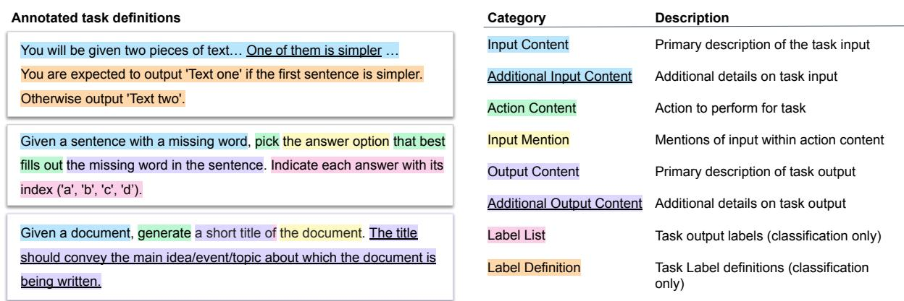
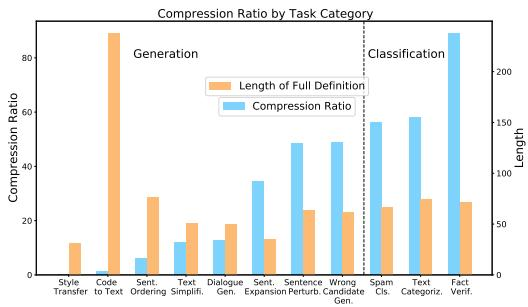
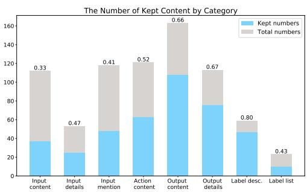
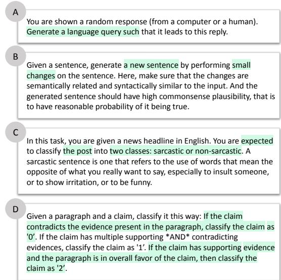

# Did You Read the Instructions? Rethinking the Effectiveness of Task Definitions in Instruction Learning

Fan Yin∗§, Jesse Vig♢†, Philippe Laban♢†,

Shafiq Joty†, Caiming Xiong†, Chien-Sheng Jason Wu†

§UCLA †Salesforce AI Research

fanyin20@cs.ucla.edu

jvig, plaban, sjoty, wu.jason, cxiong @salesforce.com

## Abstract

Large language models (LLMs) have shown impressive performance in following natural language instructions to solve unseen tasks. However, it remains unclear whether models truly understand task definitions and whether the human-written definitions are optimal. In this paper, we systematically study the role of task definitions in instruction learning. We first conduct an ablation analysis informed by human annotations to understand which parts of a task definition are most important, and find that model performance only drops substantially when removing contents describing the task output, in particular label information. Next, we propose an automatic algorithm to compress task definitions to a minimal supporting set of tokens, and find that 60% of tokens can be removed while maintaining or even improving model performance. Based on these results, we propose two strategies to help models better leverage task instructions: (1) providing only key information for tasks in a common structured format, and (2) adding a metatuning stage to help the model better understand the definitions. With these two strategies, we achieve a 4.2 Rouge-L improvement over 119 unseen test tasks.

## 1 Introduction

Large language models or LLMs (Devlin et al., 2019; Raffel et al., 2020; Brown et al., 2020) demonstrate the ability to perform zero-shot crosstask generalization through learning from instructions of tasks (Sanh et al., 2022; Wei et al., 2022a; Mishra et al., 2022; Wang et al., 2022b; Ouyang et al., 2022; OpenAI, 2023). By fine-tuning an LLM with task definitions and a few demonstration examples on upstream training tasks, the model acquires the power to perform new tasks with unseen definitions and example. This is known as instruction learning.

However, a natural question is: to what extent does the zero-shot generalization ability derive from the model’s understanding of task definitions? Recent work in prompt-based learning suggests models might not interpret even short prompts as people expect (Webson and Pavlick, 2022; Shin et al., 2020; Deng et al., 2022; Prasad et al., 2022). Task definitions are special prompts that are usually long and encode rich information. We imagine models’ understanding of definitions also departs from human expectation. To investigate this question, we conduct a systematic analysis using both human annotation and computational approaches. Our study is based on the English portion of the large-scale SUPER-NATURALINSTRUCTION (NIv2) dataset (Wang et al., 2022b), which comprises 757 training tasks and 119 unseen test tasks.

First, we explore which type of information in task definitions is necessary for maintaining model performance. We define eight categories of content and provide a fine-grained annotation for all the sentences in task definitions. Then, we retrain the model with every occurrence of each category in NIv2 ablated out, and measure the model performance on the validation set with the same ablation. We observe variable contributions to model performance across content types. For example, input descriptions are in general not helpful to generalization performance, i.e., removing them causes little to no degradation of performance. However, larger models tend to leverage them more. On the other hand, the label information is of great importance. Providing natural-language Label Definitions helps specify the task-specific meaning of common verbalizers while providing the label verbalizer only helps in generalizing to a new label space. We also find that we can achieve similar or even better performance compared to full definitions by only providing the models with a label space along with very basic task metadata, e.g., category, domain, reasoning type, etc. This suggests that costly human generation of task definitions may not always be more helpful than available basic metadata about the task.

<table><tr><td rowspan=1 colspan=1>RQ1: Which parts of task definitions are important when performing zero-shot instruction learning?</td></tr><tr><td rowspan=1 colspan=1>- For classification tasks, label-related information is crucial, as it helps the model identify the output space and identifyeach label&#x27;s meaning when generalizing.- Additional details or constraints besides primary mentions of input and output, in general, do not improve modelperformance. As model size increases, additional details become important.- Task definitions can be extensively compressed with no performanče degradation, particularly for generation tasks.</td></tr><tr><td rowspan=1 colspan=1>RQ2: Is natural language the most efficient format to communicate task instructions to models?</td></tr><tr><td rowspan=1 colspan=1>- Framing instructions as a structured input/action/output triplet is potentially a more efficient and effective way of creatingtask definitions.- In fact, using only basic metadata and the label space (without label definitions) in a structured format, we achievesimilar, or even better performance as with full definitions.</td></tr><tr><td rowspan=1 colspan=1>RQ3: How can we improve models&#x27; understanding of definitions as well as model performance?</td></tr><tr><td rowspan=1 colspan=1>- Adding a meta-tuning stage for adapting models to the writing styles of definitions improves the performance.</td></tr></table>

Table 1: Summary of research questions and key findings of the paper.

Second, motivated by Feng et al. (2018), to understand what is necessary for models to perform well, we propose Syntax-guided Task Definition Compression (STDC), an automatic approach to removing content in task definitions that is not helpful for model performance. STDC queries the model for predictions on inputs and only requires black-box access. We can remove around 60% of tokens while achieving ˜3 points of performance improvement of T5-XL on a held-out set. This implies that instead of understanding the whole definition of the task, the models are relying on particular text while ignoring the rest. Along with similar observations as the ablation study above, STDC reveals new patterns of how models understand definitions. For example, models usually do not need to see the whole label space, but might infer the rest with a partial label space.

Given our observations, we conclude that current instruction learning models rely on partial information in definitions. We imagine the lack of consistency in the creation process of task definitions might hinder the model from attending to all key information in definitions. Thus, we propose two complementary strategies to overcome this. The first strategy is to replace the full definition with a JSON-like formatted triplet of input, action, and output. A JSON-like triplet simplifies the creation of task definitions by asking authors of the definition to fill in blanks in templates instead of writing from scratch, and the common structure increases consistency between authors. The second strategy is to perform meta-tuning before instruction learning to adapt LLMs to any predefined styles of task definitions. We achieve 4.2, 4.0, and 2.1 Rouge-L improvements on BART-Large, T5-Large, and T5- XL, respectively, combining these two strategies. We summarize our key findings in Table 1. 1

## 2 Background

In this section, we introduce the formulation of instruction learning, as well as the models and benchmarks used in our study. Further details are presented in Appendix A.

Instruction Learning. Instruction learning aims to train a language model so that it understands natural language task instructions and is able to generalize to a new task by solely reading new instructions. A task instruction may include several elements. In this paper, we follow Wang et al. (2022b) and adopt instructions with 1) a task definition: a high-level description of the input and output of the task; and 2) demonstration examples: some input-output examples for the task. Note that other content such as things to avoid and negative examples may also be included but have been shown to be less effective (Mishra et al., 2022).

A task instruction is generally pre-pended to an input and passed to the LLM. The LLM is first finetuned on several upstream training tasks and then asked to conduct inference on an unseen test task, given only the task instruction.

Benchmark. We adopt the English portion of NIv2 (Wang et al., 2022b), which contains 757 training tasks and 119 unseen test tasks. The test tasks fall into 12 categories, including textual entailment, data-to-text generation, etc. However, we also consider a more coarse split of test tasks into classification and generation tasks, based on whether the output space is fixed or not. For each task, we select 100 examples for either fine-tuning or testing and report performance of Rouge-L (Lin, 2004), following Wang et al. (2022b). We use the task definition and two demonstration examples as the instruction. The original paper does not provide an official validation split, which we prepare by putting aside 76 training tasks. We fix the validation set for all experiments to ensure no data leakage. Note that for later experiments, results for Section 3 and Section 4 are reported on the validation split which we hold out ourselves while results for Section 5 are on the official test set.

  
Figure 1: Annotations of three examples that cover the eight categories of content in task definitions.

Models. We experiment with the T5-Large and T5-XL models (Raffel et al., 2020) since the family of T5 sequence-to-sequence models has been shown by Wang et al. (2022b) to achieve superior performance after fine-tuning compared to frozen models like GPT-3 (Brown et al., 2020) or Instruct-GPT (Ouyang et al., 2022) on NIv2 benchmark2. We also consider BART-Large (Lewis et al., 2020) in the experiments. All results are reported as average performance over three random seeds.

## 3 Ablation Analysis of Annotated Task Definitions

To explore what information exists in task definitions and how this impacts model performance, we manually examine all the task definitions in NIv2. We decompose and categorize definition text into eight types of content. These types cover the descriptions of input, action (the function the model should take, e.g., generate), and output for each task in a hierarchical manner. The description can either be a primary mention of an item or provide additional, secondary details. Figure 1 shows the final categories, along with example annotations.

Three of our authors annotated all task definitions with content categories, annotating at the sentence level and in some cases sub-sentence units when required, as shown in Figure 1. To establish annotation feasibility, we first annotated 150 common task definitions, and measured a high interannotator agreement of 0.91 Fleiss Kappa (Fleiss et al., 2013) across categories, confirming the clarity of the defined categories. The remaining task definitions are equally split and each task is labeled by a single annotator. Appendix B presents details of annotations.

## 3.1 Ablation Analysis

In this section, we analyze the performance of models with ablated task definitions to understand the role of different types of information in task definitions. We also establish several baselines to better interpret the ablation results.

Designs of Ablations. We design three groups of ablation studies as follows. Note for all these ablations, we retrain the model after ablating the corresponding elements, instead of ablating at test time. Results are averaged over three random seeds.

For the first group, we remove additional information from each task definition. Additional information includes secondary information on the input and output. The ablations are as follows: -input add, which removes all sentences marked as Additional Input Content; -output add, which removes all sentences marked as Additional Output Content; and -all add, which remove both of them.

<table><tr><td></td><td></td><td colspan="3">BART-Large (400M)</td><td colspan="3">T5-Large (770M)</td><td colspan="3">T5-XL (3B)</td></tr><tr><td>Methods</td><td>%C</td><td>All</td><td>Cls.</td><td>Gen.</td><td>All</td><td>Cls.</td><td>Gen.</td><td>All</td><td>Cls.</td><td>Gen.</td></tr><tr><td colspan="9">Baselines</td></tr><tr><td>Heuristics</td><td></td><td>39.22</td><td>53.36</td><td>28.94</td><td>39.22</td><td>53.36</td><td>28.94</td><td>39.22</td><td>53.36</td><td>28.94</td></tr><tr><td>No Def</td><td>0%</td><td>38.63</td><td>45.77</td><td>33.43</td><td>43.56</td><td>53.52</td><td>36.45</td><td>44.26</td><td>55.64</td><td>35.99</td></tr><tr><td>Shuffled</td><td>100%</td><td>39.73</td><td>49.08</td><td>32.94</td><td>45.25</td><td>57.17</td><td>36.59</td><td>48.57</td><td>64.10</td><td>37.26</td></tr><tr><td>Metadata</td><td></td><td>40.48</td><td>52.70</td><td>31.58</td><td>46.79</td><td>59.27</td><td>37.71</td><td>53.21</td><td>73.43</td><td>39.24</td></tr><tr><td colspan="9">Full task definitions</td></tr><tr><td>Full</td><td>100%</td><td>40.17</td><td>48.92</td><td>33.79</td><td>47.55</td><td>60.20</td><td>38.34</td><td>53.63</td><td>70.82</td><td>41.17</td></tr><tr><td colspan="9">Ablate Additional Information</td></tr><tr><td></td><td></td><td></td><td></td><td>33.68</td><td></td><td></td><td></td><td></td><td></td><td>40.03</td></tr><tr><td>- input add - output add</td><td>87% 69%</td><td>40.07 39.72</td><td>48.84 47.62</td><td>33.65</td><td>48.58 48.38</td><td>61.28 63.31</td><td>39.26 37.51</td><td>51.96 51.29</td><td>67.00 66.32</td><td>39.36</td></tr><tr><td>- all add</td><td>56%</td><td>39.81</td><td>47.90</td><td>33.71</td><td>48.04</td><td>62.01</td><td>37.89</td><td>52.16</td><td>66.70</td><td>40.60</td></tr><tr><td colspan="10">Ablate Output Information</td></tr><tr><td>- label list</td><td>92%</td><td>36.70</td><td>44.23</td><td>31.22</td><td>44.95</td><td>58.29</td><td>35.26</td><td>46.34</td><td>60.45</td><td>36.09</td></tr><tr><td>- label desc</td><td>89%</td><td>38.04</td><td>47.06</td><td>32.10</td><td>46.86</td><td>57.42</td><td>37.46</td><td>47.25</td><td>61.28</td><td>37.04</td></tr><tr><td>- all label</td><td>80%</td><td>36.99</td><td>42.79</td><td>32.78</td><td>43.58</td><td>55.14</td><td>35.17</td><td>43.85</td><td>55.30</td><td>35.53</td></tr><tr><td>- all output</td><td>34%</td><td>37.18</td><td>43.43</td><td>32.63</td><td>43.60</td><td>55.24</td><td>35.14</td><td>43.98</td><td>55.99</td><td>35.23</td></tr><tr><td colspan="10">Ablate Input Information</td></tr><tr><td>- all input</td><td>67%</td><td>39.75</td><td>48,85</td><td>33.14</td><td>50.01</td><td>64.69</td><td>39.33</td><td>51.61</td><td>64.94</td><td>41.92</td></tr></table>

Table 2: Comparisons of training BART-Large, T5-Large, T5-XL with full task definitions (cyan) and with other ablated alternatives. We include four baselines (gray) as well as ablation experiments for certain content categories (-\*). The column of %C is the compression ratio, which refers to the fraction of remaining tokens when the content of that row is removed. We report the Rouge-L on the development task set, on all tasks (All), classification tasks (Cls.), and generation tasks (Gens.). Results show that Label information is especially important, while inpu information contributes marginally to the current performance.

For the second group, we ablate the output descriptions. The primary output content, i.e., the Output Content class for classification tasks includes Label List and Label Definition. Considering the importance of the label space, we design the following ablations: -label list, which removes all sentences marked as Label List; -label desc, which removes all sentences marked as Label Definition; -all label, which removes all label information, including both label lists and Label Definitions; and -all output, which remove all sentences marked as Output Content and Additional Output Content.

For the third group, we ablate the input information. We remove all sentences marked as Input Content or Additional Input Content (-all input).

Baselines. We consider several baselines to adequately interpret relative model performance. The Heuristics baseline follows similar heuristics as Wang et al. (2022b) to serve as lower bounds of model performance. For generation tasks, this copies the input to the output. For classification tasks, it outputs a random label from the label space. The No def baseline removes the entire task definitions and only provides the model with the two demonstration examples. The Shuffled baseline provides the model with task definitions in shuffled word order. Finally, the Metadata baseline provides only categorical information about each task, such as its domain, reasoning type, and category, as collected by Wang et al. (2022b). For classification tasks, we add the label space as a metadata element. Then, we replace the original definition with a new one constructed by filling in a JSON-like template Category: 1. Reasoning type: 2. Domain: 3. Label list: 4, where 1, 2, 3, 4 are replaced with the corresponding information for each task. Note that for generation tasks, we use “generate free text” to replace 4. Otherwise, 4 is a comma-separated list of label verbalizers (e.g., ”Yes, No”).

Results. Results are shown in Table 2. We summarize our findings from each group as follows: Removing additional input/output information leads to little or no degradation in performance. For all three models, we find that model performance does not change substantially after taking out the additional details of input and output, even though they contain 44% of tokens in task definitions. However, as the model size grows, the additional information becomes slightly more influential. Removing them leads to no degradation for

<table><tr><td>Label space</td><td>Label List</td><td>Label Desc.</td></tr><tr><td>Seen</td><td>0.12</td><td>-13.21</td></tr><tr><td>Unseen</td><td>-15.85</td><td>-6.09</td></tr></table>

Table 3: Performance change on classification tasks when removing Label list and Label Definitions. We take the average on two groups of dev tasks based on whether the label space has been seen during training.

BART-Large and T5-Large but to a 2-point drop for T5-XL. This indicates that larger LMs can leverage the task definitions more comprehensively, another emergent ability of LLMs (Wei et al., 2022b).

Output content is helpful, particularly label information for classification tasks. When removing all label information (i.e., Label List and Label Definition), model performance drops to the lowest performance, similar to having no task definition. This shows the importance of incorporating the label information in task definitions. Moreover, as the model size grows, the Label Definition has a larger positive effect on performance. It is also interesting to see removing label information causes a slight performance drop on generation tasks, while removing all output contents, including those for generation tasks brings no further degradation.

Input descriptions are not necessary. Removing all direct descriptions of task inputs has nearly no negative impact on performance and leads to a slight improvement for the T5-Large model.

Comparisons with baselines. Looking at baseline performance, we find that models with shuffled definitions usually perform better than no definition at all, indicating that token presence, even in an ungrammatical and incoherent order, can be understood by the model to some extent. Overall, the BART-Large model’s performance is close to simple heuristics. We also find that the Metadata baseline achieves similar performance as full task definitions. This provides an alternative but a far more efficient path for instruction learning, as creating structured metadata is typically less demanding than writing full natural-language task definitions.

## 3.2 The Role of Label Information

We have shown that removing label information for classification tasks causes a substantial performance drop. We now inspect the effect of the Label List and Label Definition separately. We first split the development classification tasks into two sets: seen verbalizers and unseen verbalizers, based on whether the combined label verbalizers for that task appear in the training tasks. In Table 3, we aggregate the performance drop on these two sets when removing either the Label List or the Label Definition. We find that dropping Label List affects the performance of the unseen-verbalizer tasks most, but has no influence on the seen-verbalizer tasks. This indicates that explicitly specifying label verbalization only helps models generalize to new labels. On the other hand, dropping the Label Definitions negatively affects performance in both groups, but is more crucial in seen-verbalizer tasks. We hypothesize that models might be able to leverage the Label Definitions to disentangle the semantics of the same label names across different tasks.

## 4 Compressing Task Definitions

Analysis in Section 3 reveals that a large portion of information in human-written task definitions is not critical in improving model performance. This analysis is informed by human annotations. Now, to gain a model-centric perspective, we implement Syntax-guided Task Definition Compression (STDC), which iteratively discovers influential content from a task definition. The motivation behind using a syntax-guided and top-down algorithm is to preserve as much human readable content as possible to show the function of compressed definitions. In our preliminary experiments, we also adopt a vanilla word-by-word compression algorithm as (Feng et al., 2018). However, we find that it is either less efficient and producing compressed definitions with slightly degraded performance on the hold-out set.

In STDC, syntactically plausible content from the definition is iteratively removed if it does not cause a decrease in model performance. We first obtain the constituency parse tree for each definition.3 Then, in a top-down manner, we traverse the parse tree and check each phrasal node iteratively. If removing the phrase node does not cause any performance decrease, we remove the subtree rooted by that node. The algorithm stops after all leaf node removals are attempted. The framework is illustrated in Algorithm 1 of Appendix C.

Experimental Setup. We first train the models on the training task set with full task definitions. Then, we perform STDC during inference time on the development set for each model. The algorithm finds the compressed instruction based on a set of representative examples of task t, . To avoid over-fitting to these representatives, we test the model performance on another set of examples $\hat { \mathcal { D } } _ { t }$ from the same task. We use 100 examples for both $\mathcal { D } _ { t }$ and $\hat { \mathcal { D } } _ { t }$ . We report the averaged Rouge-L before and after the compression, the compression ratio, i.e., the fraction of tokens in definitions being kept, and the averaged coverage score, which is the fraction of examples for which compression leads to a performance increase.

<table><tr><td>Model</td><td>Compress.</td><td>Before</td><td>After</td><td>Coverage</td></tr><tr><td>BART-Large</td><td>0.52</td><td>40.7</td><td>41.9</td><td>0.89</td></tr><tr><td>T5-Large</td><td>0.34</td><td>47.7</td><td>49.3</td><td>0.92</td></tr><tr><td>T5-XL</td><td>0.41</td><td>50.3</td><td>53.1</td><td>0.89</td></tr></table>

Table 4: Compression experiments for task definitions. We show Rouge-L results on hold-out data Before and After compression. We also report the Compression ratio and averaged Coverage rate. Results suggest that all three models only partially understand the definitions.

Results. From the results presented in Table 4, we see that for the three tested models – BART-Large, T5-Large, and T5-XL – we are able to remove approximately half or more of the tokens in task definitions while improving overall performance. Specifically, for T5-XL, the performance increase by 2.8 Rouge-L points while keeping only 41% of averaged definition lengths. This echoes results in Section 3.1 that model performance relies on a portion of the information in task definitions. Note that the coverage averages around 90%, indicating that the increase in performance does not come from improving outlier performance, but affects a large majority of samples. Example compressions are shown in Figure 4. We find that most compressed definitions are composed of incomplete and unnatural sentences.

Compression Ratio Distribution. We break down the compression ratio of the STDC method by task category for the T5-XL model and show the result in Figure 2. Although the original definition length is roughly similar across task categories (with the exception of Code to Text), STDC compresses significantly more content in generation tasks than in classification tasks. Two potential hypotheses are that classification tasks generally require longer task definitions, or that existing generation task definitions are not interpreted by models accurately and can be compressed extensively.

  
Figure 2: The compression ratio for each task category. Models tend to need less definition information for generation tasks compared to classification.

  
Figure 3: The number of each content category in original and compressed definitions. We put the numerical value of the fraction of kept content on top of each bar.

Information Kept by Type By leveraging the human annotations of information types from Section 3.1, we gain insights into the information types kept after compression with STDC. In Figure 3, we analyze the amount of content from each information type in the original task definitions compared to the amount left in the compressed instruction.

The results mirror findings in Section 3.1. Specifically, 66% of Output content and 80% of Label Definitions are kept while only around 33% of Input content and 47% of Additional input details are kept, confirming that output content description is more essential than input content. The examples in Figure 4 (a, b and c) illustrate this trend.

The model-centric perspective of STDC enables additional insights. Through a qualitative case study on STDC results, we find that first, only a subset of label verbalizers in the label list is required to maintain model performance, indicating that models can infer the rest of the label space based on partial labels, as shown in Figure 4d. Second, models do not often rely on Action content, even the root verbs, with only 52% of the Action Content remaining in compressed definitions. The root verbs in Action Content are removed in examples in Figure 4a and b, even though compressed task definition leads to better performance from the model than the full definition.

  
Figure 4: Example compressions of task definitions, with retained content highlighted in green.

## 5 Improving Model Understanding of Task Definitions

Previous sections indicate that not all content in task definitions contribute to strong model performance, suggesting a mismatch between the intent and model interpretation of task definitions. A possible reason for the mismatch could be due to the crowdsourcing of task definitions by many experts, creating a lack of consistency and structure in task definitions, in turn complicating the extraction of the key information by the model. To investigate the hypothesis, we propose two approaches to reduce the mismatch and improve model understanding of task definitions. First, we organize the task definition into a (input, action, output) triplet. Second, we add a meta-tuning stage to prepare the model before instruction learning. This phase is intended to help adapt the language models to the writing style of task definitions.

Structuring Task Definitions with Triplets We extract input/action/output information from all task definitions in NIv2 and rewrite them into triplets, leveraging both human annotation and automated processing. This serves as a starting point for using structured key information as task definitions. Future work may explore directly writing task definitions in the triplet format.

More specifically, we use a JSON-like template with the following format: Task input: 1. Task action: 2. Task output: 3, where 1, 2 and 3 represent extracted portions of task definitions describing the input, action, and output, respectively. We populate the template based on the annotation we performed in Section 3. For the input and action entries, we first extract segments marked as Input Content and Action Content and run a syntactic parser to extract the key phrase from the corresponding sentences. We extract the noun phrase from Input Content for the input entry and the verb phrase from Action Content for the action entry. For the output entry, we use the task labels and Label Definitions for classification tasks. For generation tasks, we extract the output noun from the Action Content sentence with rule-based methods. We manually inspected all triplets generated, manually corrected parsing mistakes, and corrected several co-reference issues we found. Some examples are presented in Appendix D. Note that with this extraction process, we also fulfill the condensing of information in task definitions.

Meta-tuning We also propose a meta-tuning stage specifically designed for the triplet definitions that requires the model to output entries in triplets given two demonstration examples and the entry tag. We use the same demonstration examples in the meta-tuning and instruction-learning stages of model training to avoid giving out extra data.

Specifically, during the meta-tuning stage, we provide the model with a tag [Tag] and two demonstration examples [Example 1] and [Example 2]. The three options for [Tag] are Task input , Task action , Task output , i.e., the keys in JSON-like triplets. Therefore, a single task triplet will split produce three training instances in the meta-tuning stage. We organize the input into a sequence of tokens: Generate segments of task definitions based on the tag and two examples. [Tag]. [Example 1]. [Example 2]. Then, the model is trained to output the corresponding entry in task triplets for this tag with the Maximum Likelihood Estimation objective on the training task set. Finally, we initialize the parameters of instruction learning model with the meta-tuned parameters.

## 5.1 Experiments

We compare the performance of Tk-INSTRUCT (Wang et al., 2022b), the state-of-the-art instruction learning model on the NIv2 benchmark, with models trained with our strategies. Tk-INSTRUCT is the T5 model fine-tuned on the training tasks of the benchmark. For comparisons, we also show the performance of Heuristic baselines, T0, and InstructGPT on NIv2. The results are reported on the official test set of NIv2, with 100 balanced test samples for each task. We meta-tuned the model for 10 epochs with a constant $5 \times 1 0 ^ { - 6 }$ learning rate for BART-Large and a constant $1 \times 1 0 ^ { - 5 }$ learning rate for T5 models, both with batch size 16. We find that the performance is not sensitive to the hyperparameters as long as we keep a small learning rate and the number of epochs under 10. Hyperparameters for instruction learning are presented in Appendix E.

<table><tr><td>Model</td><td>Rouge-L</td></tr><tr><td>Heuristics</td><td>38.61</td></tr><tr><td>T0 (11B)</td><td>32.30</td></tr><tr><td>InstructĠPT (175B)</td><td>52.10</td></tr><tr><td>BART-Large (full def) (340M)</td><td>40.70±0.4</td></tr><tr><td>BART-Large + triplet (ours)</td><td>43.76±0.3</td></tr><tr><td>BART-Large + triplet + meta (ours)</td><td>44.89±0.3</td></tr><tr><td>Tk-INSTRUCT-Large (770M)</td><td> $4 7 . 5 0 { \scriptstyle \pm 0 . 2 }$ </td></tr><tr><td>Tk-INSTRUCT-Large + triplet (ours)</td><td> $5 0 . 8 4 { \scriptstyle \pm 0 . 1 }$ </td></tr><tr><td>Tk-INSTRUCT-Large + triplet + meta (ours)</td><td> ${ \bf 5 1 . 4 6 { \scriptstyle \pm 0 . 2 } }$ </td></tr><tr><td>Tk-INSTRUCT-XL (3B)</td><td> $5 4 . 0 8 { \pm } 0 . 3 $ </td></tr><tr><td>Tk-INSTRUCT-XL + triplet (ours)</td><td> $5 5 . 5 8 { \pm } 0 . 2 $ </td></tr><tr><td>Tk-INSTRUCT-XL + triplet + meta (ours)</td><td> ${ \bf 5 6 . 1 2 \pm 0 . 2 }$ </td></tr></table>

Table 5: Performances of our new strategies compared to using the standard full definitions. Standard Deviation is reported after the mean value over three random seeds.

Results Results are summarized in Table 5. We show that both structuring task definitions with triplets and conducting the meta-tuning stage help the instruction learning performance. For the smaller models, BART-Large (340M) and T5- Large (770M), we achieve around 4 points of improvement on Rouge-L, where around 3.1 points are from structuring definitions into triplets. For the larger T5-XL (3B), we find that the structuring strategy is relatively less effective, only leading to an improvement of 1.5 points, indicating that larger models might be more effective at key information extraction from unstructured task definitions, but can still benefit from triplet formatting.

## 6 Related Work

Instruction Learning. Language instructions are natural ways to define tasks and easy to follow by humans. Recent works have fine-tuned pre-trained LLMs to follow instructions and generalize to new tasks with language instructions (Sanh et al., 2022; Wei et al., 2022a; Ouyang et al., 2022; Wang et al., 2022b; Chung et al., 2022; OpenAI, 2023; Taori et al., 2023).

Benchmarks of Instruction Learning. In this work, we use the SUPER-NATURALINSTRUCTION (NIv2) dataset (Wang et al., 2022b), an enlarged task collection of Mishra et al. (2022), which contains around 800 tasks in English with crowd-sourced instructions. Prior to this work, Ye et al. (2021) test meta-learning for few-shot generalization with a collection of 160+ tasks in text-to-text format. Bach et al. (2022) provide another instruction learning benchmark PromptSource with shorter and more concise task definitions. T0 (Sanh et al., 2022) is trained on PromptSource.

There are also recent studies that adopt automatic approaches to collect the training data of instruction learning (Wang et al., 2022a; Honovich et al., 2022; Taori et al., 2023; Peng et al., 2023). Trained models using different training data are usually evaluated on the test set of NIv2 and real user examples (Wang et al., 2022a). Our annotations on the test set of NIv2 are still useful resources for analyzing those models.

Prompt Engineering. While great advance have been achieved in in-context learning (Brown et al., 2020) or prompt tuning (Li and Liang, 2021), recent work has shown that we can search for better prompts by either manual engineering (Schick and Schutze¨ , 2021b,a; Gao et al., 2021; Mishra et al., 2021) or automatic prompt searching (Shin et al., 2020; Prasad et al., 2022; Deng et al., 2022). We work with a special prompt: task definition, in the zero-shot setting. We show that better definitions can be found simply by compressing the current one. Also, we propose a new method to form definitions around structured triplets. There is also work searching for better demonstration examples (Liu et al., 2022), which is complementary to ours.

Prompt Analysis. Our work is most closely aligned with a line of work that analysis the role of prompts (Zhao et al., 2021; Webson et al., 2020; Min et al., 2022). However, we focus on task definitions instead of short prompts or in-context examples. Also, we consider the zero-shot setting. Webson et al. (2020) find that irrelevant prompts achieve similar performance as intuitively correct prompts. We show that using metadata of a task can be comparable to using a human-written task definitions. Min et al. (2022) find that label space is important for in-context learning. We further show that Label Definition can also be important, especially when needing to generalize previously seen labels in the training set to different meanings of those same labels at test time. A concurrent work with ours also analyzes the function of definitions and demonstration examples but focuses more on the label information (Kung and Peng, 2023).

## 7 Discussion

The field of instruction learning has moved rapidly since this paper was first written. We summarized the newly released models and benchmarks in Section 6. In this section, we discuss how we position the paper in the current context of instruction training, as well as how we deal with the current challenges.

More powerful instruction learning models Our analysis in the previous sections is still applicable to stronger instruction learning models such as Alpaca (Taori et al., 2023). More specifically, the compression algorithm STDC can be applied to any instruction learning model to understand which part of the definitions are most useful. Moreover, since many models are still evaluated on NIv2 test set, the annotations from this paper remain relevant for continued analysis. However, we imagine that some conclusions might change. We leave this to future work and recommend people try out the resources in this paper for their own instruction learning models. Also note that no matter how the models improve, it is always important to explain how they learn to leverage instructions to do generalization, and it remains an open question.

Automatically created training data for instruction learning The paradigm of prompting LLMs to generate instruction learning data has emerged as an efficient alternative to manually constructed training set. However, more efforts should be made towards improving the quality of the generated definitions under this paradigm (Wang et al., 2022a). We propose a simple method for organizing the key information in definitions. We hope later work can try combining this format with automatic instruction generations to better control the quality of data. We also notice that with the new paradigm, the boundary between content types can be vaguer than human written instructions, and there can be safety concerns regarding distilling LLMs to generate instruction tuning data (Gudibande et al., 2023).

From task instructions to instructions for openended generation The final goal of instruction learning is to facilitate a LLM to follow human instructions. This requires the model to advance from solving a typical NLP task like ‘Given a context, answer the following questions’ in a multiple-choice format, to ‘Tell me the procedure to book a flight ticket’, i.e., an open-ended generation. Our analysis mainly applies to the definitions for typical NLP tasks, especially classification tasks. Later work could focus more on understanding the instructions for open-ended generations.

## 8 Conclusion

This work investigates the effectiveness of task definitions in instruction learning. Our results indicate that different types of content in definitions have widely varying impacts on model performance. Specifically, we found that label information is critical for the model performance, whereas input descriptions and additional constraints are not important. We found that current natural-language formatted definitions can be extensively compressed. We also open the door for more efficient creation of task definitions; we may simply provide the model with structured information, even the metadata, by filling in a JSON-formatted template.

## 9 Limitations

In this section, we discuss the limitations of this work. First, this study is limited to Englishlanguage tasks, due to English being the common language of the annotators. It is possible that some conclusions from this work may not extend to task definitions written in other languages; we hope that future work can extend this analysis to a multilingual context. Further, the datasets and models used may contain biases reflecting the culture of the English-speaking population, as well as biases relating to gender, race, age, and other socioeconomic factors.

Second, in Section 5, we propose a common structured format to organize the key information for a task. We rewrite the original natural language definitions into triplets after extracting key information in it and observe improved performance. However, a complementary perspective is to write such a triplet from scratch, by filling in the blanks in triplet templates and seeing whether the improvements still hold. This directly reflects whether such an organizing method works. Our approach serves as a starting point to demonstrate the effectiveness of using a structured and condensed definition.

Third, larger language models can be tested. The largest model we adopt is a T5 model with 3B parameters. As we observe variant behavior as model size grows, later work can further extend our analysis to larger models. Also, new emergent ability of LMs might be discovered with larger models, like mathematical reasoning with larger models following instructions. That is beyond the scope of this paper.

Last, some observations cannot be easily explained in this paper. For example, we saw that removing label information for classification tasks during training eventually also affects the model performance on generation tasks, which can be counter-intuitive and requires further exploration. Later work can pick a few points in the paper and provide deeper analysis on them.

## Acknowledgements

We want to thank the members of Salesforce AI Research, UCLA-NLP and UCLA PLUS-Lab for their helpful feedback and suggestions. We want to thank Prof. Kai-Wei Chang for his generous help in discussing and supporting the project. We also want to thank anonymous reviewers and chairs at ACL’23 for their invaluable comments.

## References

Stephen H Bach, Victor Sanh, Zheng-Xin Yong, Albert Webson, Colin Raffel, Nihal V Nayak, Abheesht Sharma, Taewoon Kim, M Saiful Bari, Thibault Fevry, et al. 2022. Promptsource: An integrated development environment and repository for natural language prompts. arXiv preprint arXiv:2202.01279.

Tom B. Brown, Benjamin Mann, Nick Ryder, Melanie Subbiah, Jared Kaplan, Prafulla Dhariwal, Arvind Neelakantan, Pranav Shyam, Girish Sastry, Amanda Askell, Sandhini Agarwal, Ariel Herbert-Voss, Gretchen Krueger, T. J. Henighan, Rewon Child, Aditya Ramesh, Daniel M. Ziegler, Jeff Wu, Clemens Winter, Christopher Hesse, Mark Chen, Eric Sigler, Mateusz Litwin, Scott Gray, Benjamin Chess, Jack Clark, Christopher Berner, Sam McCandlish, Alec Radford, Ilya Sutskever, and Dario Amodei. 2020. Language models are few-shot learners. ArXiv, abs/2005.14165.

Hyung Won Chung, Le Hou, Shayne Longpre, Barret Zoph, Yi Tay, William Fedus, Eric Li, Xuezhi Wang, Mostafa Dehghani, Siddhartha Brahma, et al.

2022. Scaling instruction-finetuned language models. arXiv preprint arXiv:2210.11416.

Mingkai Deng, Jianyu Wang, Cheng-Ping Hsieh, Yihan Wang, Han Guo, Tianmin Shu, Meng Song, Eric P Xing, and Zhiting Hu. 2022. Rlprompt: Optimizing discrete text prompts with reinforcement learning. arXiv preprint arXiv:2205.12548.

Jacob Devlin, Ming-Wei Chang, Kenton Lee, and Kristina Toutanova. 2019. BERT: Pre-training of deep bidirectional transformers for language understanding. In Proceedings ofthe 2019 Conference of the North American Chapter ofthe Associationfor Computational Linguistics: Human Language Technologies, Volume 1 (Long and Short Papers), pages 4171–4186.

Shi Feng, Eric Wallace, Alvin Grissom II, Mohit Iyyer, Pedro Rodriguez, and Jordan Boyd-Graber. 2018. Pathologies of neural models make interpretations difficult. In Proceedings ofthe 2018 Conference on Empirical Methods in Natural Language Processing, pages 3719–3728.

Joseph L Fleiss, Bruce Levin, and Myunghee Cho Paik. 2013. Statistical methodsfor rates and proportions. john wiley & sons.

Tianyu Gao, Adam Fisch, and Danqi Chen. 2021. Making pre-trained language models better few-shot learners. In Proceedings of the 59th Annual Meeting ofthe Associationfor Computational Linguistics and the 11th International Joint Conference on Natural Language Processing (Volume 1: Long Papers), pages 3816–3830.

Arnav Gudibande, Eric Wallace, Charlie Snell, Xinyang Geng, Hao Liu, Pieter Abbeel, Sergey Levine, and Dawn Song. 2023. The false promise of imitating proprietary llms.

Or Honovich, Thomas Scialom, Omer Levy, and Timo Schick. 2022. Unnatural instructions: Tuning language models with (almost) no human labor. arXiv preprint arXiv:2212.09689.

Po-Nien Kung and Nanyun Peng. 2023. Do models really learn to follow instructions? an empirical study of instruction tuning.

Mike Lewis, Yinhan Liu, Naman Goyal, Marjan Ghazvininejad, Abdelrahman Mohamed, Omer Levy, Veselin Stoyanov, and Luke Zettlemoyer. 2020. BART: Denoising sequence-to-sequence pre-training for natural language generation, translation, and comprehension. In Proceedings of the 58th Annual Meeting of the Association for Computational Linguistics, pages 7871–7880.

Xiang Lisa Li and Percy Liang. 2021. Prefix-tuning: Optimizing continuous prompts for generation. In Proceedings ofthe 59th Annual Meeting ofthe Association for Computational Linguistics and the 11th International Joint Conference on Natural Language Processing (Volume 1: Long Papers), pages 4582– 4597.

Chin-Yew Lin. 2004. ROUGE: A package for automatic evaluation of summaries. In Text Summarization Branches Out, pages 74–81, Barcelona, Spain. Association for Computational Linguistics.

Jiachang Liu, Dinghan Shen, Yizhe Zhang, William B Dolan, Lawrence Carin, and Weizhu Chen. 2022. What makes good in-context examples for gpt-3? In Proceedings of Deep Learning Inside Out (Dee-LIO 2022): The 3rd Workshop on Knowledge Extraction and Integrationfor Deep Learning Architectures, pages 100–114.

Sewon Min, Xinxi Lyu, Ari Holtzman, Mikel Artetxe, Mike Lewis, Hannaneh Hajishirzi, and Luke Zettlemoyer. 2022. Rethinking the role of demonstrations: What makes in-context learning work? arXiv preprint arXiv:2202.12837.

Swaroop Mishra, Daniel Khashabi, Chitta Baral, Yejin Choi, and Hannaneh Hajishirzi. 2021. Reframing instructional prompts to gptk’s language. arXiv preprint arXiv:2109.07830.

Swaroop Mishra, Daniel Khashabi, Chitta Baral, and Hannaneh Hajishirzi. 2022. Cross-task generalization via natural language crowdsourcing instructions. In ACL.

OpenAI. 2023. Chatgpt. https://openai.com/ blog/chatgpt/. Accessed on May 3, 2023.

Long Ouyang, Jeff Wu, Xu Jiang, Diogo Almeida, Carroll L Wainwright, Pamela Mishkin, Chong Zhang, Sandhini Agarwal, Katarina Slama, Alex Ray, et al. 2022. Training language models to follow instructions with human feedback. arXiv preprint arXiv:2203.02155.

Baolin Peng, Chunyuan Li, Pengcheng He, Michel Galley, and Jianfeng Gao. 2023. Instruction tuning with gpt-4. arXiv preprint arXiv:2304.03277.

Archiki Prasad, Peter Hase, Xiang Zhou, and Mohit Bansal. 2022. Grips: Gradient-free, edit-based instruction search for prompting large language models.

Colin Raffel, Noam Shazeer, Adam Roberts, Katherine Lee, Sharan Narang, Michael Matena, Yanqi Zhou, Wei Li, and Peter J. Liu. 2020. Exploring the limits of transfer learning with a unified text-to-text transformer. Journal of Machine Learning Research, 21(140):1–67.

Victor Sanh, Albert Webson, Colin Raffel, Stephen H. Bach, Lintang A. Sutawika, Zaid Alyafeai, Antoine Chaffin, Arnaud Stiegler, Teven Le Scao, Arun Raja, Manan Dey, M Saiful Bari, Canwen Xu, Urmish Thakker, Shanya Sharma, Eliza Szczechla, Taewoon Kim, Gunjan Chhablani, Nihal V. Nayak, Debajyoti Datta, Jonathan Chang, Mike Tian-Jian Jiang, Han Wang, Matteo Manica, Sheng Shen, Zheng Xin Yong, Harshit Pandey, Rachel Bawden, Thomas Wang, Trishala Neeraj, Jos Rozen, Abheesht Sharma, Andrea Santilli, Thibault Fevry, Jason Alan Fries, Ryan´

Teehan, Stella Rose Biderman, Leo Gao, Tali Bers, Thomas Wolf, and Alexander M. Rush. 2022. Multitask prompted training enables zero-shot task generalization. ArXiv, abs/2110.08207.

Timo Schick and Hinrich Schutze. 2021a. Exploiting¨ cloze-questions for few-shot text classification and natural language inference. In Proceedings of the 16th Conference of the European Chapter of the Associationfor Computational Linguistics: Main Volume, pages 255–269.

Timo Schick and Hinrich Schutze. 2021b. Few-shot¨ text generation with natural language instructions. In Proceedings of the 2021 Conference on Empirical Methods in Natural Language Processing, pages 390– 402.

Taylor Shin, Yasaman Razeghi, Robert L. Logan IV, Eric Wallace, and Sameer Singh. 2020. AutoPrompt: Eliciting Knowledge from Language Models with Automatically Generated Prompts. In Proceedings of the 2020 Conference on Empirical Methods in Natural Language Processing (EMNLP), pages 4222– 4235.

Rohan Taori, Ishaan Gulrajani, Tianyi Zhang, Yann Dubois, Xuechen Li, Carlos Guestrin, Percy Liang, and Tatsunori B. Hashimoto. 2023. Stanford alpaca: An instruction-following llama model. https://github.com/tatsu-lab/ stanford\_alpaca.

Yizhong Wang, Yeganeh Kordi, Swaroop Mishra, Alisa Liu, Noah A Smith, Daniel Khashabi, and Hannaneh Hajishirzi. 2022a. Self-instruct: Aligning language model with self generated instructions. arXiv preprint arXiv:2212.10560.

Yizhong Wang, Swaroop Mishra, Pegah Alipoormolabashi, Yeganeh Kordi, Amirreza Mirzaei, Anjana Arunkumar, Arjun Ashok, Arut Selvan Dhanasekaran, Atharva Naik, David Stap, et al. 2022b. Super-naturalinstructions:generalization via declarative instructions on 1600+ tasks. In EMNLP.

Albert Webson, Zhizhong Chen, Carsten Eickhoff, and Ellie Pavlick. 2020. Do “Undocumented Workers” == “Illegal Aliens”? Differentiating Denotation and Connotation in Vector Spaces. In Proceedings of the 2020 Conference on Empirical Methods in Natural Language Processing (EMNLP), pages 4090–4105.

Albert Webson and Ellie Pavlick. 2022. Do promptbased models really understand the meaning of their prompts? In Proceedings of the 2022 Conference of the North American Chapter of the Association for Computational Linguistics: Human Language Technologies, pages 2300–2344, Seattle, United States. Association for Computational Linguistics.

Jason Wei, Maarten Bosma, Vincent Zhao, Kelvin Guu, Adams Wei Yu, Brian Lester, Nan Du, Andrew M. Dai, and Quoc V. Le. 2022a. Finetuned language models are zero-shot learners. ArXiv, abs/2109.01652.

Jason Wei, Yi Tay, Rishi Bommasani, Colin Raffel, Barret Zoph, Sebastian Borgeaud, Dani Yogatama, Maarten Bosma, Denny Zhou, Donald Metzler, et al. 2022b. Emergent abilities of large language models. arXiv preprint arXiv:2206.07682.

Thomas Wolf, Lysandre Debut, Victor Sanh, Julien Chaumond, Clement Delangue, Anthony Moi, Pierric Cistac, Tim Rault, Remi Louf, Morgan Funtowicz, Joe Davison, Sam Shleifer, Patrick von Platen, Clara Ma, Yacine Jernite, Julien Plu, Canwen Xu, Teven Le Scao, Sylvain Gugger, Mariama Drame, Quentin Lhoest, and Alexander Rush. 2020. Transformers: State-of-the-art natural language processing. In Proceedings ofthe 2020 Conference on Empirical Methods in Natural Language Processing: System Demonstrations, pages 38–45.

Qinyuan Ye, Bill Yuchen Lin, and Xiang Ren. 2021. Crossfit: A few-shot learning challenge for crosstask generalization in nlp. In Proceedings of the 2021 Conference on Empirical Methods in Natural Language Processing, pages 7163–7189.

Zihao Zhao, Eric Wallace, Shi Feng, Dan Klein, and Sameer Singh. 2021. Calibrate before use: Improving few-shot performance of language models. In International Conference on Machine Learning, pages 12697–12706. PMLR.

## A Dataset and Model Details

## A.1 Validation Task set

Since Wang et al. (2022b) do not provide an official split of the validation set, we present our own split here which is fixed across the experiments in the paper, Table 6 show the categories of tasks in the validation set. We find the validation tasks with the principle that there are roughly equal numbers of classification and generation tasks. The exact task names can be found in the official website 4.

<table><tr><td>Validation set Category</td><td># Tasks</td></tr><tr><td>Text Categorization</td><td>28</td></tr><tr><td>Sentence Ördering</td><td>3</td></tr><tr><td>Wrong Candidate Generation</td><td>15</td></tr><tr><td>Dialogue Generation</td><td>11</td></tr><tr><td>Style Transfer</td><td>2</td></tr><tr><td>Sentence Perturbation</td><td>4</td></tr><tr><td>Code to Text</td><td>4</td></tr><tr><td>Sentence Expansion</td><td>1</td></tr><tr><td>Text Simplification</td><td>4</td></tr><tr><td>Fact Verification</td><td>3</td></tr><tr><td>Spam Classification</td><td>1</td></tr></table>

Table 6: The task types in the validation set and the number of tasks in each category.

## A.2 Model Training

T5 models and BART-Large are implemented with Huggingface’s open-source library (Wolf et al., 2020) and the public model checkpoints 5, following the Tk-INSTRUCT code base6. The experiments are run on A100 GPUs with 40G memory, trained with Microsoft DeepSpeed 7. For all the models in Section 3.1, we conduct instruction learning for 2 epochs, with a constant learning rate of 5e-4, 5e-5, 1e-5, batch size 64, 32, 16 for BART-Large, T5- Large, and T5-XL, respectively. The maximum input is 1024 and the maximum output is 128. This reproduces the results in Wang et al. (2022b).

## B Annotation Procedure Details

We provide details of the annotation procedure for the task definitions in NIv2 benchmark. There are in total 876 tasks in the benchmark (757 training + 119 test). Three of our authors do the annotation work on the 876 tasks. Two of them are native speakers of English. One of them is a graduate student in the United States .

## B.1 Overview of the Annotation Procedure

To ensure the quality and objectiveness of our annotation, we adopt a three-step procedure for annotation. In the first step, the three authors look at all the task definitions and come up with a set of candidate categories. We do a trial annotation with these candidate categories on a set of randomly selected 50 tasks from the training tasks. We refine the candidate categories on these 50 task definitions until we set down with the final annotation categories. In the second step, we holdout another 150 tasks from the training tasks and everyone is asked to annotate these 150 tasks to calculate an inter-annotator agreement level. In the third step, we finish up the annotation job by equally splitting the rest tasks and assign each annotator 226 task definitions to annotate. Finally, one of the authors go through all the annotations to fix obvious errors in annotations.

## B.2 A Hierarchy of Content Types in Definitions

We come up with the candidate categories in a hierarchical manner. We first decide the three main categories to be input, action and output descriptions. We find that these three categories cover the functionality of all the sentences in task definitions. For the input and output sentences, we further divide them into two sub-categories: Input/Output Content and Additional Input/Output Details based on whether they are primary mentions of the input/output entities or additional details or constraints. Under the Output Content category, we create Label List and Label Definition for classification tasks, based on whether a sentence describes the semantics of the label space, or just presents a list of label verbalization. Finally, during the annotation of the first 50 task definitions, we find that sometimes the input entities will also occur in the Action Content sentence as part of the action phrase, for example, generate a summary based on the given passage. We thus design a new class for input to refer to this special type of mentions of inputs in the Action Content sentences, named Input Mention. We do not use a ‘Output Mention’ category because that mentions of output in Action Content is usually a primary mention of the output, which is covered by Output Content.

<table><tr><td>Category</td><td>Agreement</td></tr><tr><td>Input Content</td><td>0.92</td></tr><tr><td>Ačtion Content</td><td>0.98</td></tr><tr><td>Output Content</td><td>0.83</td></tr><tr><td>Label List</td><td>0.88</td></tr><tr><td>Label Definition</td><td>0.84</td></tr><tr><td>Additional Input Details</td><td>0.87</td></tr><tr><td>Additional Output Details</td><td>0.94</td></tr><tr><td>Input Mention</td><td>1.0</td></tr></table>

Table 7: Performance drop on classification tasks when removing Label list and Label Definitions. We take the average on two groups of dev tasks based on whether the label space has been seen during the training time.

## B.3 Inter-Annotator Agreement Level

We show Fleiss’ kappa (Fleiss et al., 2013) as a statistical measurement on the agreement level of our three annotators for each category of content. Results are in Table 7. The agreement level shows consistency among our annotators on all these categories, and further confirms that annotation with such a schema is acceptable.

## B.4 Pre-process and Post-process of The Annotations

Our annotation is in general in sentence-level. However, simply splitting a definition into sentences by the period mark is not enough for isolating the Input Content category, as the task definitions frequently use a pattern like Given a question, generate an answer.... In this case, if we simply split at a period mark, we will get a whole sentence containing Input Content, Action content, and Output Content. For these cases, we add a rule-based pre-processing step for further splitting: we do exact match with some patterns such as Given ..., Provided with ..., and You’re given ..., and split at the next punctuation if we encounter those patterns.

After the annotations, we need to post-process the sentences marked with Action Content to extract Input Mention and Output Content if any. We do a syntactic parser on Action Content sentences and extract the root verb and its verb phrase. Then, we do another round of human annotation to mark Input Mention and Output Content within that.

## C Compression Algorithm

We present the pseudo-code for the compression algorithm.

## D Examples of Triplet

We present examples of the input/action/output triplets as task definitions in Table 9.

Algorithm 1 STDC   
Input: A model f. a set of examples for a specific task ${ \overline { { S } } } ;$   
$\mathcal { D } _ { S } .$ The full task definition: $X _ { f u l l } = \{ w _ { 1 } , w _ { 2 } , . . . , w _ { n } \}$ . The   
performance of $f$ on $\mathcal { D } _ { S }$ with $x _ { f u l l } \colon f \left( \mathcal { D } _ { S } | X _ { f u l l } \right)$ . Con  
stituency tree for the task definition: $\tau .$   
Output: Compressed definition $X _ { c }$ compressed.   
1: Initialization: traverse the parse tree $\tau .$ Find the tree   
depth $D e p ( \mathcal { T } )$ . The set of nodes $N _ { i }$ at each layer $\mathrm { i } = 1 , 2 ,$   
$\cdots , D e p \bar { ( \tau ) } .$   
2: $X _ { e }$ compressed = Xfull   
3: for layer i in $1 , 2 , \cdots , D e p ( \mathscr { T } )$ do   
4: for each node $n _ { i }$ in $N _ { i }$ do   
5: Remove ni and compute the new performance of   
f with $X _ { f u l l } n n _ { i } \colon \hat { f } \left( \mathcal { D } _ { S } | X _ { f u l l } \hat { n } n _ { i } \right)$   
6: ${ \mathbf i } { \mathbf f } f ( \mathcal { D } _ { S } | \dot { X } _ { f u l l } n n _ { i } ) \geq f ( \dot { \mathcal { D } _ { S } } | X _ { f u l l } )$ then   
Remove n and its subtree.   
$X ,$ compressed $= X _ { c }$ compressednni   
7: end if   
8: end for   
9: end for   
10: return $X _ { c }$ compressed

## E Hyperparameters Tuning for Instruction Learning after Meta-Tuning

<table><tr><td>Hyperparameter Range</td><td></td></tr><tr><td>Learning rate</td><td> $1 \times 1 0 ^ { - 5 } , 5 \times 1 0 ^ { - 5 } , 1 \times 1 0 ^ { - 4 }$ </td></tr><tr><td>Batch size</td><td> $1 6 , 3 2 , 6 4 , 1 2 8$ </td></tr><tr><td># Epochs</td><td> $2 , 3 , 6$ </td></tr></table>

Table 8: Hyper-parameter choices

We find that we need slightly different hyperparameters for instruction learning after meta tuning. We conduct grid search of learning rate, batch size, and the number of epochs on the validation set. The list of candidates are shown in Table 8. The learning rate is scheduled with constant learning rate with warm up steps 300 for all models.

<table><tr><td rowspan=1 colspan=1>TASK1 task1292_yelp_review_full_text_categorization</td></tr><tr><td rowspan=1 colspan=1>You are given a review about a place. You need to provide a rating from &quot;1 star&quot; to &quot;5 stars&quot; for this place.</td></tr><tr><td rowspan=1 colspan=1>Input: [&quot;a review about a place&quot;]Action: [&quot;provide a rating from &quot; 1 star &quot; to &quot; 5 stars &quot; for this place&quot;]Output: [&quot;a rating from &quot; 1 star&quot; to &quot; 5 stars &quot;]</td></tr><tr><td rowspan=1 colspan=1>TASK2 task321_stereoset_classification_religion</td></tr><tr><td rowspan=1 colspan=1>Given two sentences regarding the stereotypes of religions, determine whether the second sentence is either a stereotype,anti-stereotype, or is unrelated with respect to the first sentence and the target. A stereotype is a widely held butoversimplified notion of a group of people. An anti-stereotype is an idea that goes against the widely held but oversimplifiednotion of a group of people. Sentences and targets are unrelated if there is no relevance between them.</td></tr><tr><td rowspan=1 colspan=1>Input: [&quot;two sentences regarding the stereotypes of religions&quot;]Action: [&quot;determine whether the second sentênce is either a stereotype , anti-stereotype , or is unrelated with respect tothe first sentence and the target&quot;]Output: [&quot;stereotype, anti-stereotype&quot;, &quot;A stereotype is a widely held but oversimplified notion of a group of people&quot;,&quot;An anti-stereotype is an idea that goes against the widely held but oversimplified notion of a group of people&quot;]</td></tr><tr><td rowspan=1 colspan=1>TASK3 task628_xlwic_word_with_different_meaning_sentence_generation</td></tr><tr><td rowspan=1 colspan=1>In this task, you are given a word, followed by a sentence. You should respond with a valid sentence which contains theword with the same meaning as in the given sentence. For example, if the given sentence refers to a &#x27;fly&#x27; as the insect, youshould not respond with a sentence which uses &#x27;fly’ as the verb. You may use the word in a different tense than is given.For example, you may use the word ’ended’ in the output where the given input word is &#x27;end&#x27;.</td></tr><tr><td rowspan=1 colspan=1>Input: [&quot;a word, followed by a sentence&quot;]Action: [&quot;respond with a valid sentence which contains the word with the same meaning as in the given sentence&quot;]Output: [&quot;a valid sentence&quot;]</td></tr><tr><td rowspan=1 colspan=1>TASK4 task405_narrativeqa_question_generation</td></tr><tr><td rowspan=1 colspan=1>You will be given a summary of a story. You need to create a question that can be answered from the story. You can createa question about characters, events, facts and beliefs, etc. Your question should be specific, try not to use pronouns insteadof full names. As the stories are sometimes movie plots, they will contain actor names in parentheses. You should not usethose names. Only use character names. Try to ask a question about all parts of the plot, not just the beginning.</td></tr><tr><td rowspan=1 colspan=1>Input: [&quot;a summary of a story&quot;]Action: [&quot;create a question that can be answered from the story&quot;]Output: [&quot;a question&quot;]</td></tr><tr><td rowspan=1 colspan=1>TASK5 task1202_atomic_classification_xneed</td></tr><tr><td rowspan=1 colspan=1>In this task, you are given two phrases: Head and Tail, separated with sep¿.. The Head and the Tail events are shortphrases possibly involving participants. The names of specific people have been replaced by generic words (e.g., PersonX,PersonY, PersonZ). PersonX is always the subject of the event. You have to determine whether it is plausible for the Headto desire the Tail or not. In this task, desire means desires of sentient entities. For example, doctors likely desire to cure apatient. Classify your answers into &quot;Yes&quot; and &quot;No&quot;. The phrase may also contain a placeholder that can be an object, aperson, and/or an action.</td></tr><tr><td rowspan=1 colspan=1>Input: [&quot;two phrases : Head and Tail , separated with  sep ¿&quot;]Action: [&quot;determine whether it is plausible for the Head to desire the Tail or not&quot;]Output: [&quot;Yes, No&quot;]</td></tr><tr><td rowspan=1 colspan=1>TASK6 task1580_eqasc-perturbed_question_generation</td></tr><tr><td rowspan=1 colspan=1>Given a statement, generate a question such that the answer is contained in that statement.</td></tr><tr><td rowspan=1 colspan=1>Input: [&quot;a statement&quot;]Action: [’generate a question such that the answer is contained in that statement&quot;]Output: [&quot;a question&quot;]</td></tr><tr><td rowspan=1 colspan=1>TASK7 task383_matres_classification</td></tr><tr><td rowspan=1 colspan=1>You will be given a context and a verb separated with a newline character, and you have to answer if the given verb is anegation or not. A verb is a negation if it is not going to exist, not happen, or has no effect. The output should be Yesïf theverb is a negation and Ñoötherwise.</td></tr><tr><td rowspan=1 colspan=1>Input: [&quot;a context and a verb separated with a newline character&quot;]Action: [’answer if the given verb is a negation or not&quot;]Output: $\mathrm { \Gamma [ ^ { \mathrm { 5 } } Y e s , N o ^ { \mathrm { 3 } } , ^ { \mathrm { 7 } } , \mathrm { 9 } \mathrm { 5 } ^ { \mathrm { 6 } } \mathrm { 5 } ^ { \mathrm { 7 } } }$ if the verb is a negation and &quot; No &quot; otherwise&quot;]</td></tr></table>

A For every submission: ✓ A1. Did you describe the limitations of your work? Section 9.

✓ A2. Did you discuss any potential risks of your work? Section 9.

✓ A3. Do the abstract and introduction summarize the paper’s main claims? Section 1

✗ A4. Have you used AI writing assistants when working on this paper? Left blank.

## B ✓ Did you use or create scientific artifacts?

Section 3, 4, and 5

✓ B1. Did you cite the creators of artifacts you used? Section 2 and 6

✓ B2. Did you discuss the license or terms for use and / or distribution of any artifacts? Appendix A

✓ B3. Did you discuss if your use of existing artifact(s) was consistent with their intended use, provided that it was specified? For the artifacts you create, do you specify intended use and whether that is compatible with the original access conditions (in particular, derivatives of data accessed for research purposes should not be used outside of research contexts)? Section 2

✗ B4. Did you discuss the steps taken to check whether the data that was collected / used contains any information that names or uniquely identifies individual people or offensive content, and the steps taken to protect / anonymize it? We use public datasets in the paper.

✓ B5. Did you provide documentation of the artifacts, e.g., coverage of domains, languages, and linguistic phenomena, demographic groups represented, etc.? Section 2, Appendix A

✓ B6. Did you report relevant statistics like the number of examples, details of train / test / dev splits, etc. for the data that you used / created? Even for commonly-used benchmark datasets, include the number of examples in train / validation / test splits, as these provide necessary context for a reader to understand experimental results. For example, small differences in accuracy on large test sets may be significant, while on small test sets they may not be. Section 2, Appendix A

## C ✓ Did you run computational experiments?

Section 3, 4, and 5

✓ C1. Did you report the number of parameters in the models used, the total computational budget (e.g., GPU hours), and computing infrastructure used? Section 2, Appendix A

✓ C2. Did you discuss the experimental setup, including hyperparameter search and best-found hyperparameter values? Section 2 and 5, Appendix A, Appendix E

✓ C3. Did you report descriptive statistics about your results (e.g., error bars around results, summary statistics from sets of experiments), and is it transparent whether you are reporting the max, mean, etc. or just a single run? Section 2, 3 and 5

✓ C4. If you used existing packages (e.g., for preprocessing, for normalization, or for evaluation), did you report the implementation, model, and parameter settings used (e.g., NLTK, Spacy, ROUGE, etc.)? Section 2 and Appendix A.

D ✓ Did you use human annotators (e.g., crowdworkers) or research with human participants? Section 3 and Appendix B

✓ D1. Did you report the full text of instructions given to participants, including e.g., screenshots, disclaimers of any risks to participants or annotators, etc.? Section 3 and Appendix B

✓ D2. Did you report information about how you recruited (e.g., crowdsourcing platform, students) and paid participants, and discuss if such payment is adequate given the participants’ demographic (e.g., country of residence)? Section 3 and Appendix B

✗ D3. Did you discuss whether and how consent was obtained from people whose data you’re using/curating? For example, if you collected data via crowdsourcing, did your instructions to crowdworkers explain how the data would be used? We didn’t collect new data. We annotate existing datasets.

 D4. Was the data collection protocol approved (or determined exempt) by an ethics review board? Not applicable. Left blank.

✓ D5. Did you report the basic demographic and geographic characteristics of the annotator population that is the source of the data? Appendix B. We provide the English proficiency for each annotator.