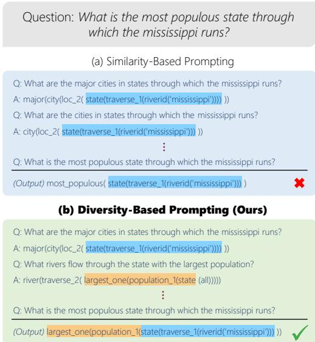
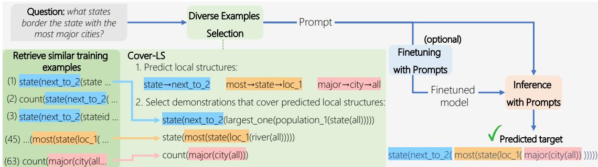
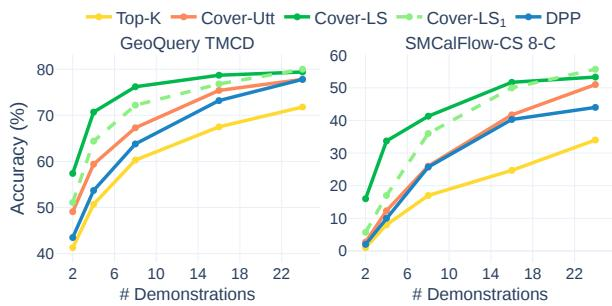
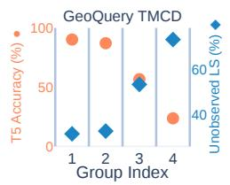
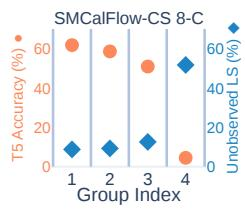
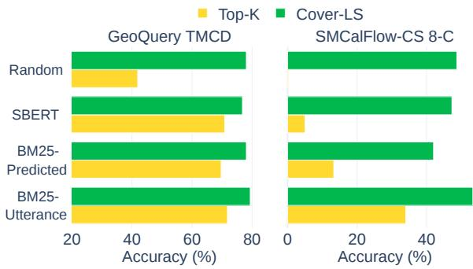

# Diverse Demonstrations Improve In-context Compositional Generalization

Itay Levy∗ Ben Bogin∗ Jonathan Berant The Blavatnik School of Computer Science, Tel-Aviv University {itay.levy,ben.bogin,joberant}@cs.tau.ac.il

## Abstract

In-context learning has shown great success in i.i.d semantic parsing splits, where the training and test sets are drawn from the same distribution. In this setup, models are typically prompted with demonstrations that are similar to the input utterance. However, in the setup of compositional generalization, where models are tested on outputs with structures that are absent from the training set, selecting similar demonstrations is insufficient, as often no example will be similar enough to the input. In this work, we propose a method to select diverse demonstrations that aims to collectively cover all of the structures required in the output program, in order to encourage the model to generalize to new structures from these demonstrations. We empirically show that combining diverse demonstrations with in-context learn ing substantially improves performance across three compositional generalization semantic parsing datasets in the pure in-context learning setup and when combined with finetuning.1

## 1 Introduction

Despite strong performance of pretrained language models (LMs) across many tasks, they have been shown to struggle in a compositional generalization setting (Lake and Baroni, 2018; Furrer et al., 2020; Shaw et al., 2021), when tested on their ability to process and generate novel combinations of previously observed elements. For example, a model might fail to interpret the request “Book a meeting with Jake’s supervisor” even when “Book a meeting with Jake” and “Who is Jake’s supervisor?” were observed during training. In semantic parsing, the task of mapping natural language utterances to formal queries, such generalization is important (especially in a real-world setting), since models are required to interpret new combinations that are not covered by the annotated training data (Herzig and Berant, 2019; Yin et al., 2021).

  
Figure 1: Compositional generalization setup: (a) Selecting demonstrations by considering only similarity to the input yields repetitive demonstrations that do not cover the structures in the target program. (b) However, choosing diverse demonstrations enables better coverage and leads to a correct prediction.

Recently, large LMs have shown impressive performance on downstream tasks by conditioning on a text-based prompt that contains a few training examples. This type of few-shot inference is known as in-context learning (ICL, Brown et al., 2020). A core component of in-context learning is the set of examples in the prompt, often termed task demonstrations. With the right demonstrations, ICL can be an effective approach to improving LMs’ compositional generalization abilities (Qiu et al., 2022b).

Selecting a relevant set of demonstrations is crucial for generalization. However, most past work only considered the relevance of each example in isolation, ignoring the quality of the entire set of examples (Liu et al., 2022). For instance, a retriever can be used to select the examples most similar to the input (Rubin et al., 2022). A set of demonstrations that are all highly relevant but highly similar to one another may not be as effective as a more diverse set. In compositional splits, where no single demonstration is sufficiently similar to the input, choosing diverse demonstrations can be especially beneficial since it leads to better coverage of structures in the target program (Fig. 1).

  
Figure 2: Overview of our framework. Given an utterance, we construct a prompt by selecting a set of diverse demonstrations. Feeding the prompt to the model yields the predicted target. Optionally, models can be finetuned (FT setup). In the bottom left corner, we see how Cover-LS selects diverse examples: predicting and covering local structures, thereby enabling the selection of complementary examples.

In this paper, we study how to leverage ICL to improve compositional generalization for semantic parsing, by optimizing the entire set of demonstrations and increasing the diversity of examples in this set. We investigate two approaches for increasing diversity: (a) a coverage-based approach, where we define a set of elements conditioned on the input utterance, and select examples that cover those elements (e.g., covering potential substructures in the output program), and (b) a second approach, where we select a subset of examples that are most dissimilar from one another, such that diversity is independent of the input utterance. Empirically, we find that coverage-based diversity results in better performance.

Our method can be used in the “pure” in-context learning setup without finetuning, which leverages the ability of large LMs, such as Codex (Chen et al., 2021), to generalize from the selected diverse demonstrations. Furthermore, it can be combined with finetuning by training a model with demonstrations as part of the input. This can be viewed as meta-learning, where the model learns to use demonstrations during training and build new structures based on them during inference (Finn et al., 2017; Lake, 2019; Conklin et al., 2021; Min et al., 2022; Chen et al., 2022). It can, however, lead to an over-reliance on demonstrations, especially in compositional splits. We address this by using “noisy” demonstrations during training.

We empirically test our method on three compositional generalization semantic parsing datasets. We show that diverse demonstrations, both with and without finetuning, improve performance by up to 23 absolute points (e.g., 50.3 73.5 on SMCalFlow-CS) compared to a baseline that retrieves demonstrations according to similarity alone, and lead to state-of-the-art results in multiple compositional setups. Finally, we show that our method reduces the number of demonstrations needed for generalization and improves test performance on hard examples.

## 2 Diversity for Compositional Generalization

In semantic parsing, we define compositional splits of datasets as splits where train and test programs do not overlap (Finegan-Dollak et al., 2018). Recent work has shown that increasing the number of different program structures a model sees during training improves performance on compositional splits. This can be done by augmenting the training set (Qiu et al., 2022a) or through efficient sampling of diverse examples (Oren et al., 2021; Bogin et al., 2022; Gupta et al., 2022). While past work focused on increasing structure diversity in the training set, we focus on diversity in the demonstration set within an ICL setup.

Increasing diversity is important as we want the demonstrations to cover all structures of the expected output program. In the few-shot setting, where the model is unfamiliar with the formal language of the output programs, increasing coverage also improves generalization simply since otherwise the model will be unaware of the required program symbols (predicates and logical operators). However, selecting demonstrations that cover larger structures (sub-trees of the program tree) are potentially more beneficial, for two reasons: (1) it reduces the amount of new structures that the model needs to produce, making demonstration fusion easier, and (2) it exposes the model to structure compositions in different contexts, providing the model with valuable information about how structures can be composed in the data.

## 3 Diverse Demonstrations Selection

Problem setup Given a training set $\begin{array} { r l } { \tau } & { { } = } \end{array}$ $\{ ( x _ { i } , y _ { i } ) \} _ { i = 1 } ^ { n }$ containing utterance-program pairs and a test utterance $x _ { \mathrm { { t e s t } } } ,$ our objective is to select a subset of training examples $\mathcal { D } = \{ ( x _ { j } , y _ { j } ) \} _ { j = 1 } ^ { k } \subset$ $\tau$ , where $k \ll n ,$ , termed demonstrations. Those demonstrations are then formatted as a text-based prompt P. When feeding the concatenation of the prompt and the test utterance $( [ P ; x _ { \mathrm { t e s t } } ] )$ to the model, the desired output is $y _ { \mathrm { t e s t } }$

Overview Fig. 2 provides an overview of our framework for obtaining and leveraging diverse demonstrations for better compositional generalization. Given an input utterance, $x _ { \mathrm { { t e s t } } } .$ , we propose two approaches for selecting demonstrations. In the first (§3.1), we optimize coverage: we define a set of elements that we want our demonstrations to cover (either structures in the program or utterance words), and then iteratively select examples that contain these elements. The second approach (§3.2) increases diversity by selecting a subset of examples with minimal similarity. Fig. 2 shows an example of the former approach (Cover-LS), where we predict and then attempt to cover local structures (LS), i.e., sub-trees of the output program. Local structures were shown to be key for compositional generalization in Bogin et al. (2022).

Having selected demonstrations, we use them to construct a prompt (§3.3). We show that our method can be combined with finetuning to metatrain the model to learn in-context (§3.4).

## 3.1 Coverage-based Selection

Bogin et al. (2022) have recently shown, in the context of finetuning semantic parsers, that models fail to generalize to programs with local structures that were not observed at training time, where local structures of a program are defined to be a set of its sub-trees. Inspired by this observation, we propose Cover-LS, an algorithm that given the test utterance $x _ { \mathrm { t e s t } }$ , attempts to choose examples that collectively cover as many local structures as possible from the set $ { S } _ { y _ { \mathrm { t e s t } } }$ of local structures of the program $y _ { \mathrm { t e s t } }$ . Since we have no access to $y _ { \mathrm { t e s t } }$ at test time, we predict what local structures are likely using an auxiliary model, assuming that predicting local structures is easier than predicting the entire program. Then, we iteratively select examples that cover the predicted local structures.

Local structures definition We follow the definition of Bogin et al. (2022), and given a program $y ,$ convert it to its abstract syntax tree, where each tree node is a program symbol and parent-child edges connect functions to their arguments. In addition, we add “sibling” edges between consecutive arguments. The local structures, $\begin{array} { r } { \mathcal { S } _ { y _ { \mathrm { t e s t } } } , } \end{array}$ are a subset of all of the connected sub-graphs in the abstract syntax tree (e.g., state next\_to\_2 and most state loc\_1 in Fig. 2, see more examples in Tab. 8), as defined in App. B. Unlike Bogin et al. (2022), we consider local structures with any number of nodes. In addition, we anonymize programs by replacing values such as strings and numbers with constants (string and number), since such values are usually not relevant for program coverage.

Predicting local structures As mentioned, we assume predicting local structures is easier than predicting an entire program. Thus, we train an auxiliary model by finetuning T5 (Raffel et al., 2020) on the training set in the standard manner, training it to output anonymized programs given input utterances with no demonstrations. Then, for each test utterance, $x _ { \mathrm { t e s t } }$ , we use beam search to output B candidate programs $\{ \tilde { y } _ { b } \} _ { b = \mathrm { . } } ^ { B }$ and define the set of local structures as $\begin{array} { r } { S _ { \tilde { y } _ { \mathrm { t e s t } } } = \bigcup _ { b = 1 } ^ { B } S _ { \tilde { y } _ { b } } } \end{array}$

Covering local structures Our goal is to choose a set of demonstrations, , that covers the local structures in $\boldsymbol { S } _ { \tilde { y } _ { \mathrm { t e s t } } } .$ . Choosing an example for each local structure is infeasible due to prompt length limitations, and thus we propose $\mathrm { A l g . }$ . 1, whose goal is to choose a small set of demonstrations that are (a) similar to the test utterance $x _ { \mathrm { t e s t } }$ and (b) cover as many local structures in $ { S _ { \tilde { y } _ { \mathrm { t e s t } } } }$ as possible.

We sort the LSs based on their size (number of nodes) in descending order (line 2). By first selecting training examples with programs that contain larger LSs from $\begin{array} { r } {  { \boldsymbol { S } } _ { \tilde { y } _ { \mathrm { t e s t } } } , } \end{array}$ we are more likely to include training examples similar to the test utterance, which should improve few-shot performance. Then, we iterate over all LSs, and for each local structure s we retrieve the most similar training example that contains s (line 6), and add it to (line 7). We then update the pool of LSs such that it will include only LSs that are not yet covered (line 8). To further encourage diversity, we remove from our example pool all examples that share the same template (program after anonymization) as the chosen examples (line 9). We keep choosing examples until reaching the desired amount of demonstrations, which might result in choosing more than one example for each local structure (lines 3-4).

Algorithm 1: Cover-LS Algorithm   
Input :List of candidate local structures to cover ;   
Pool of training examples ; Retriever R ;   
Desired number of output examples k   
Output :Set of training examples   
1 $\mathcal { D } = \emptyset$   
2 Sort from largest to smallest   
3 while $| { \mathcal { D } } | < k { \mathrm { ~ d } } \mathbf { 0 }$   
4 $\dot { S _ { \mathrm { u n c o v e r e d } } } = S$   
5 for $e a c h s \in S _ { u n c o \nu e r e d }$ do   
6 Retrieve with R an example $e \in { \mathcal { T } }$ that   
contains s   
7 Add e to   
8 Remove from $S _ { \mathrm { u n c o v e r e d } }$ LSs that appear in e   
9 Remove from all examples with same   
anonymized program as e   
10 $\mathbf { i f } \left| \mathcal { D } \right| = = k$ then   
11 break

We assume (line 6) access to a retriever that takes as input an utterance and returns similar training examples, from which we filter only examples that contain the desired structure. A variety of retrievers can be used, such as BM25 (Robertson and Zaragoza, 2009) or SBERT (Reimers and Gurevych, 2019).

We observe that in our setup, the running time of Cover-LS is negligible compared to the decoding time of the LMs.

Utterance coverage We propose a simpler variant that does not require predicting a set of local structures with an auxiliary model. This variant, termed Cover-Utt, uses the same coverage-oriented algorithm, but covers words in the input utterance, rather than predicted local structures. This is beneficial when the quality of the auxiliary model, and consequently predicted LSs, is low.

## 3.2 Diversity without Coverage

The primary challenge with coverage-based approaches is identifying the elements that need to be covered. An alternative approach is to define diversity more explicitly and select a subset of demonstrations that are dissimilar from one another (while being relevant for the input utterance).

A natural approach for choosing a subset of high-quality and diverse demonstrations from the training set is Determinantal Point Process (DPP) (Kulesza and Taskar, 2012), a probabilistic model that defines a probability distribution over subsets of items, giving high probability to subsets that contain relevant and diverse items. DPP requires a relevance score for each item and a similarity score between pairs of items. In our case, we define the relevance of a demonstration through its retriever score for the input test utterance. To compute the similarity between demonstration pairs, we first extract LSs and compute tf-idf vectors for each demonstration. The similarity of each pair is then the cosine similarity between their tf-idf vectors. Full implementation details are in App. E.

## 3.3 Prompt Construction

We order the chosen demonstrations according to their retriever score with respect to the input utterance in ascending order, in accordance to common practices (Liu et al., 2022). When finetuning the model (§3.4), demonstrations are shuffled. Demonstrations are formatted to a prompt according to the format in App. D, concatenated with the test utterance, and fed to the model.

## 3.4 Finetuning with Prompts

Despite the success of “pure” in-context learning, where model parameters are frozen, it has been by and large restricted to very large LMs. Conversely, finetuning requires more training data, but performs well even with smaller models. In-context learning can be easily integrated with finetuning by training a model with demonstrations as part of the input. This paradigm can be considered as meta-learning, where the model learns how to use demonstrations during training (Min et al., 2022).

When meta-learning is used in the i.i.d. setup, where the training and test examples are drawn from the same distribution, one can use the same procedure to select demonstrations at both training time and test time. However, in a compositional generalization setup, this does not work: at training time, the model will observe demonstrations that are similar to the target output and will learn to heavily rely on demonstrations and copy large chunks of them. Thus, the model will not learn to compose demonstration parts and will struggle with examples drawn from a different distribution.

To address this phenomenon, which we term over-copying, past work (Pasupat et al., 2021;

<table><tr><td>Dataset</td><td>Example</td></tr><tr><td>SMCalFlow-CS</td><td>Can you make a meeting with David Lax &#x27;s reports ? (Yield :output (CreateCommitEventWrapper :event (CreatePreflightEventWrapper :constraint (Constraint[Event] :attendees (AttendeeListHasPeople :people (FindReports :recipient (Execute :intension (refer (extensionConstraint (RecipientWithNameLike :constraint (Constraint[Recipient]) :name #(PersonName“David Lax&quot;)))))))))))</td></tr><tr><td>SMCalFlow-CS Simple</td><td>CreateEvent (with_attendee (FindReports (recipient= refer (Recipient? (name= LIKE (David Lax))))))</td></tr><tr><td>(natural) GeoQuery (natural)</td><td>What is the most populous state through which the mississippi runs ? largest_one (population_1 (state (traverse_1 (riverid (&quot;mississippi&quot;)))))</td></tr><tr><td>COVR-10 (synthetic)</td><td>What is the color of square dog ? query_attr[color] (filter (square, find (dog)))</td></tr></table>

Table 1: An example utterance-program pair for each of the datasets.

Zemlyanskiy et al., 2022) used sampling to add noise to the demonstrations. Here, we also reduce the similarity of demonstrations to the input utterance, but with a simpler approach. Recall that our Cover-LS algorithm picks similar examples by (a) finding demonstrations that share large LSs with the predicted program (lines 2-6 in Alg. 1), and (b) using a retriever to find the most similar examples among these. To address over-copying, we modify this: at training time, we only consider LSs of size 1, i.e., program symbols, and for each such LS we randomly choose an example that contains this symbol rather than use a powerful retriever.

## 4 Experiments

We present our experimental setup and results on different compositional semantic parsing tasks, with finetuning (FT) and without (NoFT).

## 4.1 Datasets

We evaluate our methods on three datasets (examples in Tab. 1).

SMCalFlow-CS is a few-shot compositional generalization dataset proposed by Yin et al. (2021) derived from SMCalFlow (Andreas et al., 2020). It contains single-turn natural sentences involving two domains (organization structure and event creation), each having its own set of program symbols. The test set of the compositional splits contains only cross-domain examples, where both domains appear. We show results for a few-shot setting (split k-C, where k  8, 16, 32 ) where the training set includes only k cross-domain examples, and a zero-shot setting (split 0-C). We also evaluate on an i.i.d. split2 where the test set contains only single-domain examples. Prior studies on the dataset employed LISP and LISPRESS program formats, resulting in v1 and v2 versions, respectively (see an example in Tab. 9). We default to using v1, unless otherwise specified.

For our FT experiments, we use SMCalFlow-CS Simple, which contains the same utterances as SMCalFlow-CS, but with programs that use a simplified syntax provided by Meron (2022). We opt for this version because programs are much shorter, leading to a smaller memory footprint and accelerating training and inference.

GeoQuery (Zelle and Mooney, 1996; Tang and Mooney, 2001) contains 880 natural language questions about US geography. We use the standard (i.i.d.) and compositional splits created by Shaw et al. (2021): (1) template split, where target programs are anonymized into templates and then the templates are randomly split between training and test sets (Finegan-Dollak et al., 2018); (2) TMCD split, which makes the distributions of compounds in training and test sets as divergent as possible (Keysers et al., 2020); and (3) length split, where test sequences are longer than training ones. Similar to prior work, we average results across three TMCD and template splits to reduce variance caused by the small dataset size.

COVR-10 COVR (Bogin et al., 2022) is a synthetic dataset based on a variable-free functional language. COVR-10 contains 10 compositional grammar splits, in which each test set includes programs featuring a particular set of local structures not observed at training time. Results are averaged

<table><tr><td rowspan="2"></td><td colspan="4">GeoQuery</td><td colspan="5">SMCalFlow-CS</td><td>COVR-10</td></tr><tr><td>i.i.d.</td><td>Templ.</td><td>TMCD</td><td> $\operatorname { L e n } .$ </td><td>i.i.d.</td><td>0-C</td><td>8-C</td><td>16-C</td><td>32-C</td><td></td></tr><tr><td>T5 (fine tuned w/o prompts)</td><td>90.3</td><td>85.9</td><td>75.4</td><td>36.0</td><td>88.5</td><td>0.0</td><td>34.5</td><td>39.0</td><td>50.0</td><td>21.5</td></tr><tr><td>Random</td><td>53.7</td><td>49.7</td><td>42.0</td><td>30.7</td><td>43.0</td><td>1.3</td><td>0.3</td><td>0.7</td><td>2.0</td><td>69.4</td></tr><tr><td>Top-K</td><td>86.3</td><td>78.0</td><td>71.8</td><td>64.3</td><td>81.7</td><td>17.0</td><td>34.0</td><td>35.7</td><td>50.3</td><td>61.8</td></tr><tr><td>Cover-Utt (ours)</td><td>89.0</td><td>82.1</td><td>77.8</td><td>73.7</td><td>83.3</td><td>35.3</td><td>51.0</td><td>51.3</td><td>69.7</td><td>78.1</td></tr><tr><td>DPP (ours)</td><td>87.0</td><td>81.2</td><td>77.8</td><td>74.3</td><td>79.3</td><td>34.7</td><td>44.0</td><td>50.0</td><td>59.7</td><td>62.7</td></tr><tr><td>Cover-LS (ours)</td><td>88.7</td><td>85.3</td><td>79.4</td><td>72.7</td><td>86.0</td><td>0.3</td><td>53.3</td><td>58.3</td><td>73.5</td><td>64.4</td></tr><tr><td>Top-K (Oracle)</td><td>86.3</td><td>74.5</td><td>76.2</td><td>55.7</td><td>85.0</td><td>0.0</td><td>33.0</td><td>54.0</td><td>59.6</td><td>35.4</td></tr><tr><td>Cover-LS (Oracle)</td><td>86.3</td><td>81.2</td><td>82.8</td><td>74.0</td><td>84.3</td><td>40.7</td><td>77.3</td><td>73.5</td><td>75.3</td><td>83.2</td></tr></table>

Table 2: Main results, NoFT setup. We show results of the Codex model on a random subset of 100 test examples across 3 seeds, with the results of a finetuned T5 model for comparison.

across the 10 splits.

## 4.2 Experimental setup

Models We use Codex (code-davinci-002) (Chen et al., 2021; Ouyang et al., 2022) for all NoFT experiments, and T5-large (Raffel et al., 2020) for FT experiments. T5-large is used to predict LSs in both the NoFT and FT setups.

Evaluation Like prior work, we use exact match accuracy as the main metric for evaluation. Results are averaged over 3 random seeds unless stated otherwise. In the FT setup, we use the entire test set for evaluation. In the NoFT setup, we use 100 test examples due to rate limits of the Codex inference API (and another 100 development examples for hyperparameter tuning).

Prompt We use a prompt size of k = 24 for NoFT experiments and $k = 3$ for FT experiments, unless stated otherwise. A prompt is truncated when its length exceeds the model’s context length (excluding the tokens reserved for generation). In FT experiments, we included only the programs in our demonstrations and discarded their utterances, due to limitations of memory and sequence length (preliminary experiments with utterances showed this does not affect accuracy).

Retrievers In NoFT setup, we use BM25 over lower-cased utterance words. In FT setup, we use BM25 over predicted program symbols in $ { S _ { \tilde { y } _ { \mathrm { t e s t } } } }$ (predicted using T5). In Cover-LS experiments we use a random retriever at training time to avoid over-copying. We analyze other possible retriever choices in §4.5.

Hyperparameter tuning and model selection We train two types of models in this work: (a) models for predicting LSs, and (b) models finetuned with prompts. For both cases, we use the development set whenever it is available for model selection, otherwise, we use the last checkpoint. Similarly, we use the development set to tune the number of beam candidates B when predicting local structures, and if there is no development set, we set B = 1. We detail finetuning hyperparameters in App. F.

Local structure size In some experiments, we limit the maximum size of local structures (the number of nodes they contain). A subscript notation (Cover-LS or $\mathrm { D P P } _ { d } )$ indicates a limit up to size d.

## 4.3 Baselines

Finetuning without prompts Vanilla-finetuned T5 model which is trained without demonstrations, similar to the one used to predict LSs (§3.1), except that it is trained on non-anonymized programs.

Top-K We construct the prompt with the top-k examples that are most similar to $x _ { \mathrm { t e s t } }$ according to the retriever score.

Random We construct a prompt by randomly sampling k training examples without repetition.

We also conduct oracle experiments, where at test time we have access to $y _ { \mathrm { t e s t } }$ both for retrieval and LS coverage. The retriever takes as input the gold program and scores demonstrations using BM25 over the gold program symbols. In oracle Cover-LS, we cover local structures from $ { S } _ { y _ { \mathrm { t e s t } } }$ without predicting them with a model.

## 4.4 Main Results

NoFT We observe (Tab. 2) that all methods for increasing diversity (Cover-Utt, DPP and Cover-LS) outperform Top-K, which selects similar demonstrations without accounting for diversity, in 7 out of 8 compositional splits. In fact, all non-oracle diversity methods outperform an oracle Top-K in

<table><tr><td></td><td colspan="4">GeoQuery</td><td colspan="6">SMCalFlow-CS</td></tr><tr><td></td><td>i.i.d.</td><td>Templ.</td><td>TMCD</td><td>Len.</td><td>i.i.d.</td><td>0-C</td><td>8-C</td><td>16-C</td><td></td><td>32-C</td></tr><tr><td>T5 Base (FT, Qiu et al. 2022a)</td><td>93.3</td><td>84.8</td><td>69.2</td><td>41.8</td><td> $8 4 . 7 ~ / ~ { \it \Delta } \mathrm { \Delta }$ </td><td></td><td>34.7 /</td><td></td><td>44.7 /</td><td>59.0 /  -</td></tr><tr><td>T5 Base + CSL-Aug (FT, Qiu et al. 2022a)</td><td>93.3</td><td>89.3</td><td>74.9</td><td>67.8</td><td>83.5 /  -</td><td></td><td>51.6 /</td><td></td><td>61.4 /</td><td>70.4 /</td></tr><tr><td>T5 Base (FT, Qiu et al. 2022b)</td><td>92.9</td><td>84.8</td><td>69.2</td><td>40.0</td><td>/ 82.8</td><td></td><td></td><td>/ 21.7</td><td>/ 43.6</td><td>/ 58.9</td></tr><tr><td>T5 11B (Prompt Tuning, Qiu et al. 2022b)</td><td>93.6</td><td>87.7</td><td>81.2</td><td>41.5</td><td>/ 83.1</td><td></td><td></td><td>/  0.0</td><td>/ 10.0</td><td>/ 23.6</td></tr><tr><td>PaLM 62B (FT, Qiu et al. 2022b)</td><td>92.5</td><td>85.1</td><td>72.7</td><td>44.2</td><td>/ 82.2</td><td></td><td></td><td>/ 26.9</td><td>/ 34.7</td><td>/ 51.1</td></tr><tr><td>PaLM 540B (ICL, Qiu et al. 2022b)</td><td>86.8</td><td>76.6</td><td>63.6</td><td>57.9</td><td>/ 58.3</td><td></td><td></td><td>/  4.7</td><td>/  5.0</td><td>/ 11.7</td></tr><tr><td>T5 Large (fine tuned w/o prompts)</td><td>92.5</td><td>83.8</td><td>73.5</td><td>37.2</td><td>85.3 / 83.3</td><td>0.0  / 0.0</td><td>34.3 /  6.9</td><td></td><td>43.0  / 33.6</td><td>56.1 / 53.6</td></tr><tr><td>Top-K (NoFT)</td><td>88.9</td><td>74.7</td><td>69.4</td><td>65.8</td><td>79.3 / 69.7</td><td>19.8 / 13.6</td><td>32.7 / 25.8</td><td></td><td>37.7 / 33.6</td><td>49.6 / 43.9</td></tr><tr><td>Cover-LS (NoFT)</td><td>91.4</td><td>81.6</td><td>76.3</td><td>70.0</td><td>82.2 / 73.6</td><td>0.0  /  0.0</td><td>52.5 / 36.7</td><td></td><td>60.9 / 60.3</td><td>75.1 / 64.7</td></tr></table>

Table 3: NoFT setup compared to past approaches on the entire test set (single seed). Since past work reported results on different versions of SMCalFlow-CS, we report accuracy for both versions (v1 / v2).

7 out of 8 compositional splits, suggesting that retrieval methods that only consider similarity are sub-optimal even in an oracle setup. Similarly, all diversity methods improve performance compared to a finetuned T5 model in all compositional splits except GeoQuery’s template splits. Furthermore, sampling random examples (Random baseline) results in poor performance in GeoQuery and SMCalFlow-CS, but achieves high accuracy in COVR-10, beating all methods except Cover-Utt. This can be explained by the synthetic nature and small vocabulary of COVR-10.

Comparing diversity methods, Cover-LS and Cover-Utt are better than DPP in 7 out of 10 splits, showing that covering the target input/program goes beyond simply picking diverse examples. Cover-Utt, which covers utterance words, works surprisingly well considering its simplicity. Coverage-based methods also outperform Top-K in i.i.d splits. One noticeable failure of Cover-LS is the 0-C split, where it fails to generalize, due to the poor T5 performance on this split (T5 baseline gets 0 accuracy). This emphasizes that if one cannot reasonably predict LSs, then covering input words is a viable alternative. Lastly, oracle methods outperform their non-oracle counterparts in most settings, but not always. This occurs because our oracle method, which has access to the gold program, does not guarantee the selection of the optimal set of demonstrations, a phenomenon also observed in Qiu et al. (2022b).

Tab. 3 shows accuracy on the entire test set (NoFT setup). Since the underlying models differ substantially, a fair comparison to previous work is impossible. Nevertheless, a comparison still provides a high-level overview for the state of these tasks. Results show that using Codex with Cover-LS outperforms a T5 finetuned with augmentation (Qiu et al., 2022a) in 4 compositional splits out of 6 (TMCD, Length, 8-C and 32-C), and outperforms non-finetuned PaLM 540B, where demonstrations are selected using BM25, in all splits.

  
Figure 3: Comparing model accuracy (NoFT setup) based on the number of demonstrations, with multiple methods for selecting demonstrations.

Number of demonstrations (NoFT) We examine how performance is affected by the number of demonstrations in Fig. 3. Cover-LS outperforms Top-K by a large margin across all prompt sizes. Moreover, Cover-LS requires just four demonstrations in order to obtain roughly the same results as Top-K with 24 demonstrations. The gap between Cover-LS and Cover-Utt or Cover-LS shows the importance of covering structures rather than just program symbols or utterance words, especially for small demonstration sets.

FT Finetuning results are shown in Tab. 4, where we detail separately the method used for demonstration selection at both training time and test time, as those may diverge to avoid over-copying.

First, using random demonstrations at test time, without controlling for diversity or using any retriever, is better compared to using no demonstrations at all. Our main method constructs prompts with Cover-LS at test time, but during training, prompts are retrieved with Cover-LS1, that only covers program symbols, but not local structures, to avoid over-copying (see §3.4). This combination leads to higher performance in all compositional splits compared to baselines that use Top-K or random sampling. Interestingly, using Top-K at both training time and test time yields low accuracy in compositional splits, but high results in i.i.d. splits. This corroborates our assumption that diversity is needed in compositional setups. Finally, A variant of our method, where Cover-LS1 is used both during training and test time, is comparable to our main method across all splits.

<table><tr><td>Training Method</td><td>Test Method</td><td colspan="4">GeoQuery</td><td colspan="4">SMCalFlow-CS Simple</td><td>COVR-10</td></tr><tr><td></td><td></td><td>i.i.d.</td><td>Templ.</td><td>TMCD</td><td> $\operatorname { L e n } .$ </td><td>i.i.d.</td><td>8-C</td><td>16-C</td><td>32-C</td><td></td></tr><tr><td>T5 (FT, w/o prompts)</td><td></td><td>92.5</td><td>83.8</td><td>73.5</td><td>37.2</td><td>83.7</td><td>9.7</td><td>37.5</td><td>59.4</td><td>19.4</td></tr><tr><td>Random</td><td>Random</td><td>93.2</td><td>85.0</td><td>76.8</td><td>39.8</td><td>83.5</td><td>28.3</td><td>46.4</td><td>58.0</td><td>23.2</td></tr><tr><td>Random</td><td>Top-K</td><td>93.0</td><td>84.6</td><td>75.9</td><td>39.8</td><td>83.4</td><td>24.4</td><td>40.6</td><td>54.8</td><td>22.8</td></tr><tr><td>Top-K</td><td>Top-K</td><td>90.7</td><td>54.7</td><td>57.4</td><td>20.8</td><td>83.2</td><td>8.8</td><td>22.1</td><td>46.1</td><td>19.6</td></tr><tr><td>Cover-LS1</td><td>Cover-LS1</td><td>92.9</td><td>85.3</td><td>76.6</td><td>41.9</td><td>83.9</td><td>31.0</td><td>51.3</td><td>62.6</td><td>29.8</td></tr><tr><td>Cover-LS1</td><td>Cover-LS</td><td>93.1</td><td>85.9</td><td>77.6</td><td>42.7</td><td>84.1</td><td>30.5</td><td>50.6</td><td>61.5</td><td>28.6</td></tr><tr><td>Cover-LS2</td><td>Cover-LS</td><td>92.6</td><td>84.9</td><td>75.6</td><td>39.8</td><td>83.7</td><td>28.8</td><td>46.3</td><td>60.5</td><td>28.8</td></tr><tr><td>Cover-LS</td><td>Cover-LS</td><td>91.8</td><td>80.7</td><td>69.4</td><td>37.7</td><td>82.9</td><td>21.2</td><td>34.1</td><td>53.8</td><td>13.6</td></tr><tr><td>Cover-LS1</td><td>Cover-LS (Oracle)</td><td>93.7</td><td>87.7</td><td>79.8</td><td>48.9</td><td>87.4</td><td>48.0</td><td>64.1</td><td>73.5</td><td>41.1</td></tr></table>

Table 4: FT results using T5. We detail the method used for demonstration selection at both training time and test time as those may differ to avoid over-copying.

  
Figure 4: Properties of test example groups, where grouping is based on NoFT prediction outcome: (1) Top-K succeeds; (2) Cover-LS succeeds; (3) only Cover-LS succeeds; and (4) both fail.

We observe that limiting coverage at training time to program symbols is crucial: accuracy drops in all splits if we limit Cover-LS to structures up to size 2 (Cover-LS ) instead of 1, or if we have no such limitation at all. The oracle Cover-LS outperforms all non-oracle models (unlike in NoFT, where this is not always the case).

## 4.5 Analysis

Stratified analysis Our main results show that Cover-LS outperforms Top-K in most compositional splits. But what examples does it perform better on? We analyze properties of test example groups, where grouping is based on NoFT prediction outcome: (1) Top-K succeeds; (2) Cover-LS succeeds; (3) only Cover-LS succeeds; and (4)

both fail. For each group we estimate difficulty by measuring the average accuracy achieved by a T5 model (finetuned without prompts), and also compute the percentage of examples that have an unobserved local structure (ULS) with respect to the training set. This measure is central to determining whether generalization to a test instance is hard, as shown in Bogin et al. (2022).3

We see (Fig. 4) that as the group index increases, T5 accuracy decreases and ULS rate increases. This finding confirms the claim in Bogin et al. (2022) that a test instance containing an ULS is hard. Examining groups 1 and 3, we observe that the group for which Cover-LS performs better than Top-K, is also tougher for T5 and has more ULS. Both methods fail on examples with low T5 accuracy and high ULS scores (group 4). This is also an evidence that T5 and Codex agree on the difficulty of examples, despite their different training and inference schemes. We provide error analysis in App. A.

Prompt metrics We analyze the characteristics of prompts constructed with different demonstration selection methods in Tab. 5. Symbol Coverage shows the average fraction of symbols in $y _ { \mathrm { t e s t } }$ that are covered by the demonstration set, and similarly LS Coverage the fraction of covered LSs. While symbol coverage is generally high across all methods when using 24 demonstrations, LS coverage is significantly higher in Cover-LS, suggesting that only covering relevant symbols in prompts isn’t as efficient as covering LSs. Utterance Similarity measures average cosine similarity between SBERT embeddings of the test utterance and prompt utterances, which is highest for Top-K as expected.

<table><tr><td rowspan="2">Prompt Metrics</td><td colspan="3">GeoQuery TMCD</td><td colspan="3">SMCalFlow-CS 8-C</td></tr><tr><td>Top-K</td><td>Cover-LS</td><td>DPP</td><td>Top-K</td><td>Cover-LS</td><td>DPP</td></tr><tr><td>Symbol Coverage</td><td>97.2</td><td>99.3</td><td>99.2</td><td>93.1</td><td>95.0</td><td>96.6</td></tr><tr><td>LS Coverage</td><td>69.2</td><td>73.0</td><td>71.0</td><td>70.0</td><td>86.8</td><td>76.1</td></tr><tr><td>Utterance Sim.</td><td>0.46</td><td>0.42</td><td>0.43</td><td>0.50</td><td>0.47</td><td>0.48</td></tr><tr><td>No. Unique LSs</td><td>306</td><td>505</td><td>484</td><td>2139</td><td>3647</td><td>4212</td></tr></table>

Table 5: Prompt metrics: coverage, similarity, and diversity in prompts with 24 demonstrations.

To approximate diversity between demonstrations, we calculate the average number of unique LSs in demonstrations, and observe it is substantially higher in Cover-LS and DPP compared to Top-K. This implies structural coverage and diversity are more important than input similarity in compositional splits.

Robustness to retrieval methods To assess our method’s robustness, we test how sensitive it is to the chosen retriever in the NoFT setup. First, we use our default retrievers, which are BM25 over utterance words (BM25-Utterance), and BM25 over predicted program symbols (BM25-Predicted). We add a random retriever that is identical to the RANDOM baseline introduced in §4.3 when combined with Top-K. We also evaluate the SBERT retriever (Reimers and Gurevych, 2019), which encodes input utterances and measures the cosine similarity between pairs of encodings. As seen in Fig. 5, Cover-LS outperforms Top-K in all settings by a significant margin. Moreover, while BM25- Utterance performs best, variance across retrievers is low for Cover-LS, but higher for Top-K.

## 5 Related Work

Example selection One of the central issues in incontext learning is the selection of examples, which can either be based on parameter-free retrievers (Wang et al., 2022; Zemlyanskiy et al., 2022) or neural-based retrievers (Pasupat et al., 2021; Liu et al., 2022; Rubin et al., 2022). These studies consider each example separately, which often leads to a lack of coverage and diversity.

Our approach is similar to the retrieval procedure in Zemlyanskiy et al. (2022), which makes a preliminary prediction and retrieves demonstrations with similar programs. However, while they use classic tf-idf with predicted tokens, we use predicted local structures and aim to cover them.

Some studies encourage diverse example selection regardless of prompting. To address multianswer retrieval, Nandigam et al. (2022) employ

  
Figure 5: Comparing model accuracy across different retrievers, with demonstrations selected using Top-K or Cover-LS.

DPP, and Min et al. (2021) autoregressively select instances based on previous selections. Other works include Su et al. (2022), which selects instances with varying confidence scores for annotation and (concurrent work) Ye et al. (2022) who propose a MMR-based selection strategy.

In-context learning for compositional generalization There have been previous attempts to address compositional generalization problems using LLMs equipped with demonstrations. When selecting demonstrations, some also consider target coverage or structure similarity, but only in oracle setups (Hosseini et al., 2022; Qiu et al., 2022b). Drozdov et al. (2022) try to cover the syntactic parse tree constituents with demonstrations but rely heavily on manually-picked examples.

## 6 Conclusion

In this paper, we studied how to leverage ICL to improve compositional generalization in semantic parsing, by increasing diversity among demonstrations. We found that choosing demonstrations that cover the structures required in the output program substantially improves performance across three compositional semantic parsing datasets in the pure in-context learning setup and when combined with finetuning. We further demonstrated that by aiming for structural coverage, we can reduce the number of demonstrations needed for generalization, and improve test performance on hard examples. Our approach can be applied to a wide range of NLP tasks where demonstrations should cover complementary aspects of the task, and we hope it will encourage further exploration of our method to improve generalization across diverse applications.

## Limitations

Demonstration selection methods We assume that diversity can be obtained by choosing demonstrations with different program structures. This is based on previous work that demonstrated the importance of diversifying program structures in semantic parsing tasks (Oren et al., 2021; Bogin et al., 2022; Gupta et al., 2022). We also try to diversify utterance words or program symbols but do not consider more complex utterance features that could be applied to a wider range of language understating tasks.

We also assume that recall matters more than precision when designing Cover-LS algorithm. That means we aim to choose a set of demonstrations that covers every predicted local structure in $\begin{array} { r } { S _ { \tilde { y } _ { \mathrm { t e s t } } } , } \end{array}$ since it has the potential to be a correct one. We do not predict whether a specific structure should be covered. Furthermore, our approach for increasing gold structure coverage by using additional beam candidates could be improved by employing search methods specifically targeted for diversity (Meister et al., 2021; Narayan et al., 2022).

Retrievers We used different retrievers for NoFT and FT setups based on the retriever that worked best on the development set. Future research should be conducted to understand why different retrievers are preferred in different setups. A potential method could be to consider both input utterances and programs for retrieval, as suggested in Zemlyanskiy et al. (2022).

## Ethics Statement

In this work, we studied methods for choosing diverse demonstrations to improve in-context compositional generalization in semantic parsing. We have only evaluated our methods on semantic parsing datasets in English. It is our hope, however, that improvements in compositional generalization will eventually allow systems to generalize better to languages that are not well represented in small training sets.

## Acknowledgements

We thank Shivanshu Gupta and Jonathan Herzig for their helpful comments. This research was partially supported by The Yandex Initiative for Machine Learning, and the European Research Council (ERC) under the European Union Horizons 2020 research and innovation programme (grant

ERC DELPHI 802800). This work was completed in partial fulfillment for the Ph.D degree of Ben Bogin.

## References

Jacob Andreas, John Bufe, David Burkett, Charles Chen, Josh Clausman, Jean Crawford, Kate Crim, Jordan DeLoach, Leah Dorner, Jason Eisner, Hao Fang, Alan Guo, David Hall, Kristin Hayes, Kellie Hill, Diana Ho, Wendy Iwaszuk, Smriti Jha, Dan Klein, Jayant Krishnamurthy, Theo Lanman, Percy Liang, Christopher H. Lin, Ilya Lintsbakh, Andy Mc-Govern, Aleksandr Nisnevich, Adam Pauls, Dmitrij Petters, Brent Read, Dan Roth, Subhro Roy, Jesse Rusak, Beth Short, Div Slomin, Ben Snyder, Stephon Striplin, Yu Su, Zachary Tellman, Sam Thomson, Andrei Vorobev, Izabela Witoszko, Jason Wolfe, Abby Wray, Yuchen Zhang, and Alexander Zotov. 2020. Task-oriented dialogue as dataflow synthesis. Transactions of the Association for Computational Linguistics, 8:556–571.

Ben Bogin, Shivanshu Gupta, and Jonathan Berant. 2022. Unobserved local structures make compositional generalization hard. In Proceedings of the 2022 Conference on Empirical Methods in Natural Language Processing, pages 2731–2747, Abu Dhabi, United Arab Emirates. Association for Computational Linguistics.

Dorian Brown. 2020. Rank-BM25: A Collection of BM25 Algorithms in Python.

Tom B. Brown, Benjamin Mann, Nick Ryder, Melanie Subbiah, Jared Kaplan, Prafulla Dhariwal, Arvind Neelakantan, Pranav Shyam, Girish Sastry, Amanda Askell, Sandhini Agarwal, Ariel Herbert-Voss, Gretchen Krueger, Tom Henighan, Rewon Child, Aditya Ramesh, Daniel M. Ziegler, Jeffrey Wu, Clemens Winter, Christopher Hesse, Mark Chen, Eric Sigler, Mateusz Litwin, Scott Gray, Benjamin Chess, Jack Clark, Christopher Berner, Sam McCandlish, Alec Radford, Ilya Sutskever, and Dario Amodei. 2020. Language models are few-shot learners. In Advances in Neural Information Processing Systems 33: Annual Conference on Neural Information Processing Systems 2020, NeurIPS 2020, December 6-12, 2020, virtual.

Mark Chen, Jerry Tworek, Heewoo Jun, Qiming Yuan, Henrique Ponde, Jared Kaplan, Harrison Edwards, Yura Burda, Nicholas Joseph, Greg Brockman, Alex Ray, Raul Puri, Gretchen Krueger, Michael Petrov, Heidy Khlaaf, Girish Sastry, Pamela Mishkin, Brooke Chan, Scott Gray, Nick Ryder, Mikhail Pavlov, Alethea Power, Lukasz Kaiser, Mohammad Bavarian, Clemens Winter, Philippe Tillet, Felipe Petroski Such, David W. Cummings, Matthias Plappert, Fotios Chantzis, Elizabeth Barnes, Ariel Herbert-Voss, William H. Guss, Alex Nichol, Igor Babuschkin, S. Arun Balaji, Shantanu Jain, Andrew Carr, Jan Leike, Joshua Achiam, Vedant Misra, Evan

Morikawa, Alec Radford, Matthew M. Knight, Miles Brundage, Mira Murati, Katie Mayer, Peter Welinder, Bob McGrew, Dario Amodei, Sam McCandlish, Ilya Sutskever, and Wojciech Zaremba. 2021. Evaluating large language models trained on code. ArXiv preprint, abs/2107.03374.

Yanda Chen, Ruiqi Zhong, Sheng Zha, George Karypis, and He He. 2022. Meta-learning via language model in-context tuning. In Proceedings ofthe 60th Annual Meeting of the Association for Computational Linguistics (Volume 1: Long Papers), pages 719–730, Dublin, Ireland. Association for Computational Linguistics.

Henry Conklin, Bailin Wang, Kenny Smith, and Ivan Titov. 2021. Meta-learning to compositionally generalize. In Proceedings of the 59th Annual Meeting ofthe Associationfor Computational Linguistics and the 11th International Joint Conference on Natural Language Processing (Volume 1: Long Papers), pages 3322–3335, Online. Association for Computational Linguistics.

Andrew Drozdov, Nathanael Scharli, Ekin Akyuurek, Nathan Scales, Xinying Song, Xinyun Chen, Olivier Bousquet, and Denny Zhou. 2022. Compositional semantic parsing with large language models. ArXiv preprint, abs/2209.15003.

Catherine Finegan-Dollak, Jonathan K. Kummerfeld, Li Zhang, Karthik Ramanathan, Sesh Sadasivam, Rui Zhang, and Dragomir Radev. 2018. Improving textto-SQL evaluation methodology. In Proceedings of the 56th Annual Meeting of the Association for Computational Linguistics (Volume 1: Long Papers), pages 351–360, Melbourne, Australia. Association for Computational Linguistics.

Chelsea Finn, Pieter Abbeel, and Sergey Levine. 2017. Model-agnostic meta-learning for fast adaptation of deep networks. In Proceedings of the 34th International Conference on Machine Learning, ICML 2017, Sydney, NSW, Australia, 6-11 August 2017, volume 70 of Proceedings ofMachine Learning Research, pages 1126–1135. PMLR.

Daniel Furrer, Marc van Zee, Nathan Scales, and Nathanael Scharli. 2020. Compositional generalization in semantic parsing: Pre-training vs. specialized architectures. ArXiv preprint, abs/2007.08970.

Matt Gardner, Joel Grus, Mark Neumann, Oyvind Tafjord, Pradeep Dasigi, Nelson F. Liu, Matthew Peters, Michael Schmitz, and Luke Zettlemoyer. 2018. AllenNLP: A deep semantic natural language processing platform. In Proceedings of Workshop for NLP Open Source Software (NLP-OSS), pages 1–6, Melbourne, Australia. Association for Computational Linguistics.

Shivanshu Gupta, Sameer Singh, and Matt Gardner. 2022. Structurally diverse sampling for sampleefficient training and comprehensive evaluation. In Findings of the Association for Computational Linguistics: EMNLP 2022, pages 4966–4979, Abu

Dhabi, United Arab Emirates. Association for Computational Linguistics.

Jonathan Herzig and Jonathan Berant. 2019. Don’t paraphrase, detect! rapid and effective data collection for semantic parsing. In Proceedings ofthe 2019 Conference on Empirical Methods in Natural Language Processing and the 9th International Joint Conference on Natural Language Processing (EMNLP-IJCNLP), pages 3810–3820, Hong Kong, China. Association for Computational Linguistics.

Arian Hosseini, Ankit Vani, Dzmitry Bahdanau, Alessandro Sordoni, and Aaron Courville. 2022. On the compositional generalization gap of in-context learning. In Proceedings of the Fifth BlackboxNLP Workshop on Analyzing and Interpreting Neural Networksfor NLP, pages 272–280, Abu Dhabi, United Arab Emirates (Hybrid). Association for Computational Linguistics.

Dieuwke Hupkes, Mario Giulianelli, Verna Dankers, Mikel Artetxe, Yanai Elazar, Tiago Pimentel, Christos Christodoulopoulos, Karim Lasri, Naomi Saphra, Arabella Sinclair, Dennis Ulmer, Florian Schottmann, Khuyagbaatar Batsuren, Kaiser Sun, Koustuv Sinha, Leila Khalatbari, Maria Ryskina, Rita Frieske, Ryan Cotterell, and Zhijing Jin. 2022. State-of-the-art generalisation research in NLP: a taxonomy and review. ArXiv preprint, abs/2210.03050.

Vishal Kaushal, Ganesh Ramakrishnan, and Rishabh K. Iyer. 2022. Submodlib: A submodular optimization library. ArXiv preprint, abs/2202.10680.

Daniel Keysers, Nathanael Schärli, Nathan Scales, Hylke Buisman, Daniel Furrer, Sergii Kashubin, Nikola Momchev, Danila Sinopalnikov, Lukasz Stafiniak, Tibor Tihon, Dmitry Tsarkov, Xiao Wang, Marc van Zee, and Olivier Bousquet. 2020. Measuring compositional generalization: A comprehensive method on realistic data. In 8th International Conference on Learning Representations, ICLR 2020, Addis Ababa, Ethiopia, April 26-30, 2020. OpenReview.net.

Alex Kulesza and Ben Taskar. 2012. Determinantal point processes for machine learning. Foundations and Trends® in Machine Learning, 5(2–3):123–286.

Brenden M. Lake. 2019. Compositional generalization through meta sequence-to-sequence learning. In Advances in Neural Information Processing Systems 32: Annual Conference on Neural Information Processing Systems 2019, NeurIPS 2019, December 8-14, 2019, Vancouver, BC, Canada, pages 9788–9798.

Brenden M. Lake and Marco Baroni. 2018. Generalization without systematicity: On the compositional skills of sequence-to-sequence recurrent networks. In Proceedings ofthe 35th International Conference on Machine Learning, ICML 2018, Stockholmsmässan, Stockholm, Sweden, July 10-15, 2018, volume 80 of Proceedings of Machine Learning Research, pages 2879–2888. PMLR.

Jiachang Liu, Dinghan Shen, Yizhe Zhang, Bill Dolan, Lawrence Carin, and Weizhu Chen. 2022. What makes good in-context examples for GPT-3? In Proceedings ofDeep Learning Inside Out (DeeLIO 2022): The 3rd Workshop on Knowledge Extraction and Integrationfor Deep Learning Architectures, pages 100–114, Dublin, Ireland and Online. Association for Computational Linguistics.

Ilya Loshchilov and Frank Hutter. 2019. Decoupled weight decay regularization. In 7th International Conference on Learning Representations, ICLR 2019, New Orleans, LA, USA, May 6-9, 2019. OpenReview.net.

Clara Meister, Martina Forster, and Ryan Cotterell. 2021. Determinantal beam search. In Proceedings of the 59th Annual Meeting of the Association for Computational Linguistics and the 11th International Joint Conference on Natural Language Processing (Volume 1: Long Papers), pages 6551–6562, Online. Association for Computational Linguistics.

Joram Meron. 2022. Simplifying semantic annotations of SMCalFlow. In Proceedings of the 18th Joint ACL - ISO Workshop on Interoperable Semantic Annotation within LREC2022, pages 81–85, Marseille, France. European Language Resources Association.

Sewon Min, Kenton Lee, Ming-Wei Chang, Kristina Toutanova, and Hannaneh Hajishirzi. 2021. Joint passage ranking for diverse multi-answer retrieval. In Proceedings of the 2021 Conference on Empirical Methods in Natural Language Processing, pages 6997–7008, Online and Punta Cana, Dominican Republic. Association for Computational Linguistics.

Sewon Min, Mike Lewis, Luke Zettlemoyer, and Hannaneh Hajishirzi. 2022. MetaICL: Learning to learn in context. In Proceedings of the 2022 Conference of the North American Chapter ofthe Associationfor Computational Linguistics: Human Language Technologies, pages 2791–2809, Seattle, United States. Association for Computational Linguistics.

Poojitha Nandigam, Nikhil Rayaprolu, and Manish Shrivastava. 2022. Diverse multi-answer retrieval with determinantal point processes. In Proceedings ofthe 29th International Conference on Computational Linguistics, pages 2220–2225, Gyeongju, Republic of Korea. International Committee on Computational Linguistics.

Shashi Narayan, Gonçalo Simões, Yao Zhao, Joshua Maynez, Dipanjan Das, Michael Collins, and Mirella Lapata. 2022. A well-composed text is half done! composition sampling for diverse conditional generation. In Proceedings of the 60th Annual Meeting of the Association for Computational Linguistics (Volume 1: Long Papers), pages 1319–1339, Dublin, Ireland. Association for Computational Linguistics.

Inbar Oren, Jonathan Herzig, and Jonathan Berant. 2021. Finding needles in a haystack: Sampling structurallydiverse training sets from synthetic data for compositional generalization. In Proceedings of the 2021

Conference on Empirical Methods in Natural Language Processing, pages 10793–10809, Online and Punta Cana, Dominican Republic. Association for Computational Linguistics.

Long Ouyang, Jeff Wu, Xu Jiang, Diogo Almeida, Carroll L. Wainwright, Pamela Mishkin, Chong Zhang, Sandhini Agarwal, Katarina Slama, Alex Ray, John Schulman, Jacob Hilton, Fraser Kelton, Luke E. Miller, Maddie Simens, Amanda Askell, Peter Welinder, Paul Francis Christiano, Jan Leike, and Ryan J. Lowe. 2022. Training language models to follow instructions with human feedback. ArXiv preprint, abs/2203.02155.

Panupong Pasupat, Yuan Zhang, and Kelvin Guu. 2021. Controllable semantic parsing via retrieval augmentation. In Proceedings of the 2021 Conference on Empirical Methods in Natural Language Processing, pages 7683–7698, Online and Punta Cana, Dominican Republic. Association for Computational Linguistics.

F. Pedregosa, G. Varoquaux, A. Gramfort, V. Michel, B. Thirion, O. Grisel, M. Blondel, P. Prettenhofer, R. Weiss, V. Dubourg, J. Vanderplas, A. Passos, D. Cournapeau, M. Brucher, M. Perrot, and E. Duchesnay. 2011. Scikit-learn: Machine learning in Python. Journal of Machine Learning Research, 12:2825–2830.

Linlu Qiu, Peter Shaw, Panupong Pasupat, Pawel Nowak, Tal Linzen, Fei Sha, and Kristina Toutanova. 2022a. Improving compositional generalization with latent structure and data augmentation. In Proceedings of the 2022 Conference of the North American Chapter of the Association for Computational Linguistics: Human Language Technologies, pages 4341–4362, Seattle, United States. Association for Computational Linguistics.

Linlu Qiu, Peter Shaw, Panupong Pasupat, Tianze Shi, Jonathan Herzig, Emily Pitler, Fei Sha, and Kristina Toutanova. 2022b. Evaluating the impact of model scale for compositional generalization in semantic parsing. In Proceedings of the 2022 Conference on Empirical Methods in Natural Language Processing, pages 9157–9179, Abu Dhabi, United Arab Emirates. Association for Computational Linguistics.

Colin Raffel, Noam Shazeer, Adam Roberts, Katherine Lee, Sharan Narang, Michael Matena, Yanqi Zhou, Wei Li, and Peter J. Liu. 2020. Exploring the limits of transfer learning with a unified text-to-text transformer. J. Mach. Learn. Res., 21:140:1–140:67.

Nils Reimers and Iryna Gurevych. 2019. Sentence-BERT: Sentence embeddings using Siamese BERTnetworks. In Proceedings ofthe 2019 Conference on Empirical Methods in Natural Language Processing and the 9th International Joint Conference on Natural Language Processing (EMNLP-IJCNLP), pages 3982–3992, Hong Kong, China. Association for Computational Linguistics.

Stephen Robertson and Hugo Zaragoza. 2009. The probabilistic relevance framework: Bm25 and beyond. Foundations and Trends® in Information Retrieval, 3(4):333–389.

Ohad Rubin, Jonathan Herzig, and Jonathan Berant. 2022. Learning to retrieve prompts for in-context learning. In Proceedings of the 2022 Conference of the North American Chapter ofthe Associationfor Computational Linguistics: Human Language Technologies, pages 2655–2671, Seattle, United States. Association for Computational Linguistics.

Peter Shaw, Ming-Wei Chang, Panupong Pasupat, and Kristina Toutanova. 2021. Compositional generalization and natural language variation: Can a semantic parsing approach handle both? In Proceedings ofthe 59th Annual Meeting ofthe Associationfor Computational Linguistics and the 11th International Joint Conference on Natural Language Processing (Volume 1: Long Papers), pages 922–938, Online. Association for Computational Linguistics.

Hongjin Su, Jungo Kasai, Chen Henry Wu, Weijia Shi, Tianlu Wang, Jiayi Xin, Rui Zhang, Mari Ostendorf, Luke Zettlemoyer, Noah A. Smith, and Tao Yu. 2022. Selective annotation makes language models better few-shot learners. ArXiv preprint, abs/2209.01975.

Lappoon R. Tang and Raymond J. Mooney. 2001. Using multiple clause constructors in inductive logic programming for semantic parsing. In ECML.

Shuohang Wang, Yichong Xu, Yuwei Fang, Yang Liu, Siqi Sun, Ruochen Xu, Chenguang Zhu, and Michael Zeng. 2022. Training data is more valuable than you think: A simple and effective method by retrieving from training data. In Proceedings ofthe 60th Annual Meeting of the Association for Computational Linguistics (Volume 1: Long Papers), pages 3170–3179, Dublin, Ireland. Association for Computational Linguistics.

Xi Ye, Srini Iyer, Asli Celikyilmaz, Ves Stoyanov, Greg Durrett, and Ramakanth Pasunuru. 2022. Complementary explanations for effective in-context learning. ArXiv preprint, abs/2211.13892.

Pengcheng Yin, Hao Fang, Graham Neubig, Adam Pauls, Emmanouil Antonios Platanios, Yu Su, Sam Thomson, and Jacob Andreas. 2021. Compositional generalization for neural semantic parsing via spanlevel supervised attention. In Proceedings ofthe 2021 Conference of the North American Chapter of the Association for Computational Linguistics: Human Language Technologies, pages 2810–2823, Online. Association for Computational Linguistics.

John M. Zelle and Raymond J. Mooney. 1996. Learning to parse database queries using inductive logic programming. In AAAI/IAAI, Vol. 2.

Yury Zemlyanskiy, Michiel de Jong, Joshua Ainslie, Panupong Pasupat, Peter Shaw, Linlu Qiu, Sumit Sanghai, and Fei Sha. 2022. Generate-and-retrieve:

Use your predictions to improve retrieval for semantic parsing. In Proceedings of the 29th International Conference on Computational Linguistics, pages 4946–4951, Gyeongju, Republic of Korea. International Committee on Computational Linguistics.

## A Additional Analysis

Error analysis We analyze errors (NoFT setup) and show results in Tab. 6. Inspired by the metrics in Qiu et al. (2022b), we automatically compute statistics for the following cases when the prediction is wrong: (1) Syntax Errors, when the model produces a program with invalid parentheses; (2) Over-Copying, when the entire prediction has the same anonymized form as one of the demonstrations; (3) OOV (out-of-vocabulary) Hallucination, where the anonymized predicted program contains a symbol missing from the gold program or any prompt demonstration; and (4) Missing Symbol(s), where the predicted program is missing at least one symbol.

The distribution of errors is similar across demonstration selection methods. Syntax errors are rare in both datasets. Many predictions are overcopied, especially in SMCalFlow-CS, but when diversity is increased with DPP, this number decreases significantly. Surprisingly, despite having a smaller vocabulary, GeoQuery has more out-ofvocabulary hallucinations. Almost all incorrect predictions have a missing symbol, but Top-K predictions are especially prone to this type of error.

Change of retriever in FT setup Tab. 7 shows results for the FT setup when using BM25 over lower-cased utterance words as retriever, instead of BM25 over predicted program symbols.

## B Local Structures

We follow the definition of local structures from Bogin et al. (2022), which were defined for structures of sizes 2-4, and extend them to local structures of any size. Given a program y, we parse it into a tree $T = ( \mathcal { V } , \mathcal { E } )$ , such that each node $v \in \mathcal V$ is labeled by the program symbol (function or value) that it represents in y (or a special symbol for the root node), and the set of edges $\mathcal { E } = \{ ( p , c ) \}$ expresses parent-child relations between the nodes.

We capture sibling relations by defining a graph based on the tree T that contains an edge set $\mathcal { E } _ { \mathrm { s i b } }$ of sibling edges: $G = ( \nu , \mathcal { E } \cup \mathcal { E } _ { \mathrm { s i b } } )$ . Specifically, for each parent node p, the program y induces an order over the children of p: $( c _ { 1 } ^ { p } , . . . , c _ { N _ { v } } ^ { p } )$ , where $N _ { p }$ is the number of children. We then define $\mathcal { E } _ { \mathrm { s i b } }$ = $\textstyle \bigcup _ { p } \{ c _ { i } ^ { p } , c _ { i + 1 } ^ { p } \} _ { i = 1 } ^ { N _ { p } }$ , that is, all consecutive siblings will be connected by edges.

We define a local structure of size n as the subset $G _ { L S }$ of all connected sub-graphs of size n in G such that for every pair $( x , y )$ of nodes in $G _ { L S }$ it holds that $( x , y ) \in \mathcal { E } _ { \mathrm { s i b } }$ iff x and y are both leaves in $G _ { L S }$ . That is, informally, the relations between nodes in the the sub-graph include parent-child and siblings, but not e.g. cousins or uncles. All program symbols are local structures of size 1. Tab. 8 shows a partial list of local structures for a given program.

<table><tr><td rowspan="2">Error Types</td><td colspan="3">GeoQuery TMCD</td><td colspan="3">SMCalFlow-CS 8-C</td></tr><tr><td>Top-K</td><td>Cover-LS</td><td>DPP</td><td>Top-K</td><td>Cover-LS</td><td>DPP</td></tr><tr><td>Syntax Error</td><td>1.0</td><td>0.0</td><td>0.9</td><td>5.0</td><td>2.9</td><td>9.5</td></tr><tr><td>Over-Copying</td><td>19.8</td><td>16.9</td><td>15.8</td><td>41.4</td><td>41.4</td><td>10.7</td></tr><tr><td>OOV Hallucination</td><td>20.0</td><td>17.8</td><td>22.9</td><td>8.0</td><td>3.5</td><td>5.4</td></tr><tr><td>Missing Symbol(s)</td><td>88.7</td><td>75.2</td><td>77.9</td><td>87.4</td><td>77.7</td><td>79.8</td></tr></table>

Table 6: Error analysis. We automatically compute the fraction of different error types.

## B.1 Fixes for Local Structure Extraction

We try to fix syntax errors in the predictions made using the auxiliary model to enable parsing them to ASTs and extraction of LSs. We add or remove closing parentheses based on the number of missing or redundant parentheses at the end of the program.

## C Dataset Details

We provide representative examples of the datasets used in this work in Tab. 1 and Tab. 9. We report dataset sizes in Tab. 10. Due to conversion errors, SMCalFlow-CS Simple has fewer training examples than SMCalFlow-CS. However, those missing examples are not cross-domain examples.

We used publicly available datasets from previous peer-reviewed studies. Those datasets do not contain any information that uniquely identifies individual people or offensive content. The COVR-10 dataset is completely synthetic. The GeoQuery dataset contains only basic information about U.S. geography. SMCalflow-CS contains crowd-sourced queries collected in a simulated environment.

## D Prompt Format and Examples

We add special prefixes “source:” and “target:” for retrieved source-target pairs and separate them with break lines. Tab. 11 shows prompt examples for different demonstration selection methods, where the only prompt that contains all the required program symbols and produces the correct prediction is Cover-LS’s prompt.

<table><tr><td>Training Method</td><td>Test Method</td><td colspan="4">GeoQuery</td><td colspan="4">SMCalFlow-CS Simple</td><td>COVR-10</td></tr><tr><td></td><td></td><td>i.i.d.</td><td>Templ.</td><td>TMCD</td><td>Len.</td><td>i.i.d.</td><td>8-C</td><td>16-C</td><td>32-C</td><td></td></tr><tr><td>Random</td><td>Top-K</td><td>93.0</td><td>84.9</td><td>76.1</td><td>40.3</td><td>82.9</td><td>26.7</td><td>41.0</td><td>53.9</td><td>23.1</td></tr><tr><td>Cover-  $\mathrm { L S _ { 1 } }$ </td><td>Cover-  $\mathrm { L S _ { 1 } }$ </td><td>93.3</td><td>85.7</td><td>76.3</td><td>42.2</td><td>83.2</td><td>31.9</td><td>48.6</td><td>61.5</td><td>28.3</td></tr><tr><td>Cover-LS1</td><td>Cover-LS</td><td>93.2</td><td>85.8</td><td>76.6</td><td>42.4</td><td>83.2</td><td>28.3</td><td>46.6</td><td>60.9</td><td>30.1</td></tr><tr><td>Cover-I  $. S _ { 2 }$ </td><td>Cover-LS</td><td>92.5</td><td>85.2</td><td>75.1</td><td>39.7</td><td>83.9</td><td>27.2</td><td>45.5</td><td>59.5</td><td>29.8</td></tr><tr><td>Cover-LS</td><td>Cover-LS</td><td>91.4</td><td>81.0</td><td>69.1</td><td>39.2</td><td>82.7</td><td>17.5</td><td>31.5</td><td>55.1</td><td>12.3</td></tr></table>

Table 7: FT results using T5. Same setup as in Tab. 4, except we use BM25 over lower-cased utterance words.

## E DPP Details

DPPs are probabilistic models that are effective at modeling a distribution on all the subsets of the ground set $\tau$ jointly considering the quality and diversity. A subset  is drawn according to the probability distribution :

$$
\mathcal { P } ( \mathcal { D } \subset \mathcal { T } ; L ) \propto \operatorname* { d e t } ( L _ { \mathcal { D } } )\tag{1}
$$

Where $\ b { L } \in \mathbb { R } ^ { n \times n }$ is a PSD matrix and $L _ { D }$ is the submatrix of L indexed by items in . L matrix takes into account the quality of each training example and its similarity to other training examples through:

$$
L _ { i j } = q _ { i } \phi _ { i } ^ { \top } \phi _ { j } q _ { j }\tag{2}
$$

with $q \in \mathbb { R } ^ { n }$ being normalized retriever scores that model the quality of each example; and $\{ \phi _ { i } \} _ { i = 1 } ^ { n }$ denoting normalized tf-idf vectors over LSs, which model the different aspects that are contained within each training example. The dot product of those vectors is used to model the similarity between two train examples.

log $\operatorname* { d e t } ( L _ { \mathcal { D } } )$ is a submodular function which satisfies the diminishing marginal returns property. Therefore, we can find a subset of training examples $\mathcal { D } \subset \mathcal { T } , | \mathcal { D } | = k$ that maximizes it in a feasible manner using a greedy optimizer (Kaushal et al., 2022). Specifically, we used the Naive Greedy optimizer. We used scikit-learn (Pedregosa et al., 2011) for calculating tf-idf vectors.

## F Finetuning Details

We provide implementation details for finetuning experiments (we use the same configuration for all FT experiments and training of the auxiliary model). We finetune the T5-large model (770 million parameters) with the AdamW optimizer (Loshchilov and Hutter, 2019) and a learning rate of $1 e ^ { - 5 }$ . We use a polynomial decay learning rate with an ending rate of 1e−6, and 100 warmup steps. We train for 250/50/70 epochs and evaluate on the validation set every 3/5/10 epochs for Geo/SMCalFlow (both versions)/COVR respectively. We use batches of size 8 for all datasets (and gradient accumulation in case batch cannot fit in memory). We used a single GPU for each T5-large finetuning experiment: Nvidia GeForce RTX 3090 when training on GeoQuery and COVR-10, and A100 (80GB) for SMCalFlow-CS and SMCalFlow-CS Simple. GeoQuery experiments with prompts trained for an average of 2 hours, COVR for 8 hours, and SMCalFlow-CS Simple for 41 hours.

We use the AllenNLP library (Gardner et al., 2018) for training and evaluation. We use Rank-BM25 (Brown, 2020) as a BM25 implementation.

Standard deviation We report standard deviation results in the FT setup in Tab. 13. Results are computed across 3 random seeds.

## G NoFT Details

All NoFT experiments were conducted using the OpenAI inference API with the sampling temperature set to 0. Our setup requires a single API call per test instance. The total number of API calls is estimated at 160K.

Standard deviation We report standard deviation results in NoFT setup in Tab. 12. Results are computed using 3 random seeds for a subset of 100 test examples.

Tuning the number of beam candidates We use the development set to tune the number of beam candidates B when predicting local structures. Tab. 14 shows the results of using different values of B in NoFT setup on a random subset of 100 development examples. Prompts are constructed using Cover-LS with k = 8 demonstrations.

## H Artifact Licensing

We include license information for all artifacts used in this work in Tab. 15. Our use of artifacts was

consistent with their intended purpose when it was specified.

## I GenBench Evaluation Card

Our GenBench (Hupkes et al., 2022) evaluation card is presented in Fig. 6.

<table><tr><td>Dataset</td><td>SMCalFlow-CS Simple</td></tr><tr><td>Utterance</td><td>Create a new meeting on Friday called Work on Project.</td></tr><tr><td>Program</td><td>CreateEvent (AND (has_subject (&quot;Work on Project&quot;), starts_at (NextDoW (&quot;Friday&quot;))))</td></tr><tr><td>Anonymized Program</td><td>CreateEvent (AND (has_subject (string), starts_at (NextDOW (string))))</td></tr><tr><td></td><td>CreateEvent AND</td></tr><tr><td>1</td><td>has_subject string starts_at NextDOW &lt;root&gt; → CreateEvent</td></tr><tr><td>2</td><td>CreateEvent → AND AND → has_subject AND → starts_at has_subject ↔ starts_at has_subject → string starts_at → NextDOW</td></tr><tr><td></td><td></td></tr><tr><td></td><td></td></tr><tr><td></td><td></td></tr><tr><td></td><td>starts_at → NextDOW → string</td></tr><tr><td></td><td></td></tr><tr><td>3</td><td>CreateEvent → AND → has_subject</td></tr><tr><td></td><td></td></tr><tr><td></td><td>NextDOW → string</td></tr><tr><td></td><td></td></tr><tr><td></td><td>&lt;root&gt; → CreateEvent → AND</td></tr><tr><td></td><td></td></tr><tr><td></td><td></td></tr><tr><td></td><td>CreateEvent → AND → starts_at</td></tr><tr><td></td><td>AND → has_subject ↔ starts_at</td></tr><tr><td></td><td>AND → has_subject → string</td></tr><tr><td></td><td>AND → starts_at → NextDOW</td></tr><tr><td></td><td></td></tr><tr><td></td><td></td></tr><tr><td></td><td></td></tr><tr><td></td><td></td></tr><tr><td></td><td></td></tr><tr><td></td><td></td></tr><tr><td></td><td></td></tr><tr><td></td><td></td></tr><tr><td></td><td></td></tr><tr><td>6</td><td></td></tr><tr><td></td><td></td></tr><tr><td></td><td></td></tr><tr><td></td><td></td></tr><tr><td></td><td>&lt;root&gt; → CreateEvent → AND → starts_at → NextDOW → string</td></tr><tr><td></td><td></td></tr><tr><td></td><td></td></tr><tr><td></td><td></td></tr><tr><td></td><td></td></tr><tr><td></td><td></td></tr><tr><td></td><td></td></tr><tr><td></td><td></td></tr><tr><td></td><td></td></tr><tr><td></td><td></td></tr><tr><td></td><td></td></tr><tr><td></td><td></td></tr><tr><td></td><td></td></tr><tr><td></td><td></td></tr><tr><td></td><td></td></tr><tr><td></td><td></td></tr><tr><td></td><td></td></tr><tr><td></td><td></td></tr><tr><td></td><td></td></tr><tr><td></td><td></td></tr><tr><td></td><td></td></tr><tr><td></td><td></td></tr><tr><td></td><td></td></tr><tr><td></td><td></td></tr><tr><td></td><td></td></tr><tr><td></td><td></td></tr><tr><td></td><td></td></tr><tr><td></td><td></td></tr><tr><td></td><td></td></tr><tr><td></td><td></td></tr><tr><td></td><td></td></tr><tr><td></td><td></td></tr><tr><td></td><td></td></tr><tr><td></td><td></td></tr><tr><td></td><td></td></tr><tr><td></td><td></td></tr><tr><td></td><td></td></tr><tr><td></td><td></td></tr><tr><td></td><td></td></tr></table>

Table 8: Local structures of different sizes for a specific example ( denotes parent-child relations,  denotes sibling relations)

<table><tr><td>Utterance</td><td>Can you make a meeting with David Lax &#x27;s reports ?</td></tr><tr><td>Version</td><td>Program</td></tr><tr><td>v1 (LISP)</td><td>(Yield :output (CreateCommitEventWrapper :event (CreatePreflightEventWrapper :constraint (Constraint[Event] :attendees (AttendeeListHasPeople :people (FindReports :recipient (Execute :intension (refer (extensionConstraint (RecipientWithNameLike :constraint (Constraint[Recipient]) :name #(PersonName “David Lax&quot;)))))))))))</td></tr><tr><td>v2 (LISPRESS)</td><td>(Yield (CreateCommitEventWrapper (CreatePreflightEventWrapper (Event.attendees_? (AttendeeListHasPeople (FindReports (Execute (refer (extensionConstraint (RecipientWithNameLike (^ (Recipient) EmptyStructConstraint) (PersonName.apply “David Lax&quot;)))))))))))</td></tr></table>

Table 9: An example from each version of SMCalFlow-CS dataset.

<table><tr><td>Dataset</td><td>Split</td><td>Train</td><td>Development</td><td>Test</td></tr><tr><td rowspan="7">GeoQuery</td><td>Standard</td><td>600</td><td></td><td>280</td></tr><tr><td>Template1</td><td>438</td><td>110</td><td>332</td></tr><tr><td>Template2</td><td>439</td><td>110</td><td>331</td></tr><tr><td>Template3</td><td>440</td><td>110</td><td>330</td></tr><tr><td>TMČD1</td><td>440</td><td>110</td><td>330</td></tr><tr><td>TMCD2</td><td>440</td><td>110</td><td>330</td></tr><tr><td>TMCD3</td><td>440</td><td>110</td><td>330</td></tr><tr><td>Length</td><td>440</td><td>110</td><td>330</td></tr><tr><td rowspan="5">SMCalFlow-CS v1</td><td>8-S</td><td>25412</td><td>662</td><td>662</td></tr><tr><td>0-C</td><td>25404</td><td>662</td><td>663</td></tr><tr><td>8-C</td><td>25412</td><td>662</td><td>663</td></tr><tr><td>16-C</td><td>25420</td><td>662</td><td>663</td></tr><tr><td>32-C</td><td>25436</td><td>662</td><td>663</td></tr><tr><td rowspan="5">SMCalFlow-CS v2</td><td>8-S</td><td>20965</td><td>360</td><td>360</td></tr><tr><td>0-C</td><td>20957</td><td>360</td><td>360</td></tr><tr><td>8-C</td><td>20965</td><td>360</td><td>360</td></tr><tr><td>16-C</td><td>20973</td><td>360</td><td>360</td></tr><tr><td>32-C</td><td>20989</td><td>360</td><td>360</td></tr><tr><td rowspan="4">SMCalFlow-CS Simple</td><td>8-S</td><td>25402</td><td>662</td><td>662</td></tr><tr><td>8-C</td><td>25402</td><td>662</td><td>663</td></tr><tr><td>16-C</td><td>25410</td><td>662</td><td>663</td></tr><tr><td>32-C</td><td>25426</td><td>662</td><td>662</td></tr><tr><td>COVR-10</td><td>Each split</td><td>3000</td><td></td><td>500</td></tr></table>

Table 10: Dataset sizes

<table><tr><td colspan="6">Motivation</td></tr><tr><td>Practical All</td><td colspan="3">Cognitive Intrinsic</td><td colspan="2">Fairness</td></tr><tr><td colspan="6">Generalisation type</td></tr><tr><td>Compositional All</td><td>Structural</td><td>Cross Task</td><td>Cross Language</td><td>Cross Domain</td><td>Robustness</td></tr><tr><td colspan="6">Shift type</td></tr><tr><td>Covariate All</td><td>Label</td><td></td><td>Full</td><td></td><td>Assumed</td></tr><tr><td colspan="6">Shift source</td></tr><tr><td>Naturally occurring</td><td>Partitioned natural GeoQuery</td><td></td><td>Generated shift</td><td></td><td>Fully generated COVR-10</td></tr><tr><td colspan="6">SMCalFlow-CS Shift locus</td></tr><tr><td colspan="6">Train-test Finetune train-test Pretrain-train All</td></tr></table>

Figure 6: GenBench (Hupkes et al., 2022) evaluation card.

<table><tr><td rowspan=3 colspan=6>Dataset              GeoQueryrun</td></tr><tr><td rowspan=1 colspan=3></td></tr><tr><td rowspan=1 colspan=3></td><td rowspan=1 colspan=3>(loc_2 (stateid (string)))))))</td></tr><tr><td rowspan=1 colspan=6>Selection Method   Prompt</td></tr><tr><td rowspan=1 colspan=6>source: which states does the mississippi river run through</td></tr><tr><td rowspan=1 colspan=1></td><td rowspan=1 colspan=4>target:answer (state (traverse_1 (river (riverid (string)))))</td><td rowspan=1 colspan=1></td></tr><tr><td rowspan=1 colspan=1></td><td rowspan=1 colspan=4></td><td rowspan=9 colspan=1>which states does the longest river run throughanswer (state (traverse_1 (longest (river(al1)))))hrough which states does the longest river in texas run</td></tr><tr><td rowspan=3 colspan=2>target:Top-K</td><td rowspan=1 colspan=3></td></tr><tr><td rowspan=2 colspan=3></td></tr><tr><td rowspan=1 colspan=1></td></tr><tr><td rowspan=1 colspan=2>target:</td><td rowspan=1 colspan=3></td></tr><tr><td rowspan=1 colspan=1></td><td rowspan=1 colspan=1>source:</td><td></td><td></td><td></td></tr><tr><td rowspan=1 colspan=1></td><td rowspan=1 colspan=1>target:</td><td></td><td></td><td></td></tr><tr><td rowspan=1 colspan=1></td><td rowspan=1 colspan=1>source: t</td><td></td><td></td><td></td></tr><tr><td rowspan=1 colspan=2>target:</td><td></td><td></td><td></td></tr><tr><td rowspan=1 colspan=2>source:</td><td rowspan=9 colspan=4>what states does the shortest river run through: answer (state (traverse_1 (shortest (river (all)))))hich states does the mississippi run through: answer (state (traverse_1 (riverid (string)))))which states does the missouri river run throughanswer (state (traverse_1 (river (riverid (string)))))hich states does the longest river run throughanswer (state (traverse_1 (longest (river(al1)))))hrough which states does the longest river in texas run</td></tr><tr><td rowspan=1 colspan=2>target</td></tr><tr><td rowspan=1 colspan=2>source: w</td></tr><tr><td rowspan=1 colspan=2>target</td></tr><tr><td rowspan=1 colspan=2>source:DPPtarget:</td></tr><tr><td rowspan=1 colspan=2>source: w</td></tr><tr><td rowspan=1 colspan=2>target:</td></tr><tr><td rowspan=1 colspan=2>source: t</td></tr><tr><td rowspan=1 colspan=2>target:</td></tr><tr><td rowspan=1 colspan=2>source:</td><td rowspan=3 colspan=4>source: what state borders the least states excluding alaska and excluding hawaiitarget: answer (fewest (state (next_to_2 (exclude (exclude (state (all),stateid (string)), stateid (string))))))source: what is the longest riverin texastarget: answer (longest (river(loc_2 (stateid (string)))))source: which states does the missouri river run throughtarget:answer (state (traverse_1 (river (riverid (string)))))source: which states does the longest river run throughtarget:answer (state (traverse_1 (longest (river(al1)))))source: through which states does the longest river in texas runtarget:</td></tr><tr><td rowspan=1 colspan=2></td></tr><tr><td rowspan=1 colspan=2>Cover-LS targetet</td></tr></table>

Table 11: Prompts produced with different demonstration selection methods for a specific test example. Each prompt contains k = 4 demonstrations.

<table><tr><td rowspan="2"></td><td colspan="4">GeoQuery</td><td colspan="5">SMCalFlow-CS</td><td>COVR-10</td></tr><tr><td>i.i.d.</td><td>Templ.</td><td>TMCD</td><td>Len.</td><td>i.i.d.</td><td>0-C</td><td>8-C</td><td>16-C</td><td>32-C</td><td></td></tr><tr><td>Random</td><td>1.5</td><td>6.6</td><td>2.5</td><td>5.0</td><td>4.6</td><td>0.6</td><td>0.6</td><td>0.6</td><td>3.5</td><td>3.1</td></tr><tr><td>Top-K</td><td>1.5</td><td>1.8</td><td>1.0</td><td>1.1</td><td>0.6</td><td>1.0</td><td>1.0</td><td>1.1</td><td>1.1</td><td>4.6</td></tr><tr><td>Cover-Utt</td><td>1.0</td><td>1.2</td><td>1.2</td><td>2.1</td><td>1.5</td><td>1.5</td><td>1.0</td><td>1.2</td><td>2.1</td><td>1.9</td></tr><tr><td>DPP</td><td>0.0</td><td>0.5</td><td>1.7</td><td>1.5</td><td>1.2</td><td>0.6</td><td>1.0</td><td>1.0</td><td>3.1</td><td>2.0</td></tr><tr><td>Cover-LS</td><td>1.5</td><td>1.1</td><td>2.4</td><td>2.1</td><td>1.4</td><td>0.6</td><td>1.1</td><td>0.6</td><td>3.5</td><td>4.2</td></tr></table>

Table 12: Standard deviation results in NoFT setup. Results are computed on a random subset of 100 test examples across 3 random seeds

<table><tr><td>Training Method</td><td>Test Method</td><td colspan="4">GeoQuery</td><td colspan="4">SMCalFlow-CS Simple</td><td>COVR-10</td></tr><tr><td></td><td></td><td>i.i.d.</td><td>Templ.</td><td>TMCD</td><td>Len.</td><td>i.i.d.</td><td>8-C</td><td>16-C</td><td>32-C</td><td></td></tr><tr><td>T5 (fine tuned w/o prompts)</td><td></td><td>0.2</td><td>0.8</td><td>1.6</td><td>0.5</td><td>0.7</td><td>1.4</td><td>4.6</td><td>1.5</td><td>1.7</td></tr><tr><td>Random</td><td>Random</td><td>0.0</td><td>1.2</td><td>1.0</td><td>0.9</td><td>0.3</td><td>3.2</td><td>2.7</td><td>0.4</td><td>2.7</td></tr><tr><td>Random</td><td>Top-K</td><td>0.2</td><td>1.4</td><td>1.3</td><td>2.3</td><td>0.4</td><td>3.3</td><td>1.2</td><td>1.2</td><td>2.7</td></tr><tr><td>Top-K</td><td>Top-K</td><td>0.6</td><td>3.5</td><td>2.1</td><td>0.7</td><td>0.3</td><td>1.9</td><td>1.9</td><td>1.3</td><td>3.9</td></tr><tr><td>Cover-LS1</td><td>Cover-LS1</td><td>0.6</td><td>0.8</td><td>0.9</td><td>2.6</td><td>0.5</td><td>2.0</td><td>0.2</td><td>1.7</td><td>4.8</td></tr><tr><td>Cover-LS1</td><td>Cover-LS</td><td>0.5</td><td>0.4</td><td>0.9</td><td>4.2</td><td>0.4</td><td>1.4</td><td>0.8</td><td>0.8</td><td>6.5</td></tr><tr><td>Cover-LS1</td><td>Cover-LS (Oracle)</td><td>0.2</td><td>0.7</td><td>0.9</td><td>2.6</td><td>0.3</td><td>0.6</td><td>0.6</td><td>0.8</td><td>12.1</td></tr></table>

Table 13: Standard deviation results in FT setup. Results are computed across 3 random seeds.

<table><tr><td></td><td colspan="7">GeoQuery</td><td colspan="5">SMCalFlow-CS</td></tr><tr><td>B</td><td>Templ. 1</td><td>Templ. 2</td><td>Templ. 3</td><td>TMCD 1</td><td>TMCD 2</td><td>TMCD 3</td><td>Len.</td><td>i.i.d.</td><td>0-C</td><td>8-C</td><td>16-C</td><td>32-C</td></tr><tr><td>1</td><td>85</td><td>74</td><td>77</td><td>66</td><td>65</td><td>84</td><td>62</td><td>73</td><td>0</td><td>36</td><td>47</td><td>63</td></tr><tr><td>3</td><td>85</td><td>75</td><td>75</td><td>69</td><td>59</td><td>88</td><td>60</td><td>65</td><td>0</td><td>42</td><td>49</td><td>67</td></tr><tr><td>5</td><td>84</td><td>76</td><td>72</td><td>69</td><td>64</td><td>87</td><td>60</td><td>64</td><td>1</td><td>44</td><td>51</td><td>68</td></tr></table>

Table 14: The effect of number of beam candidates B on accuracy in NoFT setup. Prompts are constructed using Cover-LS with k = 8 demonstrations. Results are computed on a random subset of 100 development examples (single seed).

<table><tr><td>Artifact</td><td>License</td><td>Reference</td></tr><tr><td>Models T5</td><td>Apache 2.0</td><td>HF model card</td></tr><tr><td>Codex</td><td>API usage policy</td><td>API documentation</td></tr><tr><td>Dataset</td><td></td><td></td></tr><tr><td>GeoQuery</td><td>GPL 2.0</td><td>Official website</td></tr><tr><td>GeoQuery compositional splits</td><td>Apache 2.0</td><td>Github repository</td></tr><tr><td>SMCalFlow-CS</td><td>MIT</td><td>Github repository</td></tr><tr><td>SMCalFlow Simple</td><td>MIT</td><td>Github repository</td></tr><tr><td>COVR-10</td><td>MIT</td><td>Github repository</td></tr><tr><td>Tools</td><td></td><td></td></tr><tr><td>AllenNLP</td><td>Apache 2.0</td><td>Github repository</td></tr><tr><td>Rank-BM25</td><td>Apache 2.0</td><td></td></tr><tr><td>SBERT</td><td>Apache 2.0</td><td>Github repository</td></tr><tr><td>DPP optimization</td><td>MIT</td><td>Github repository Github repository</td></tr></table>

Table 15: License information for all artifacts

A For every submission: ✓ A1. Did you describe the limitations of your work? Limitations

✓ A2. Did you discuss any potential risks of your work? Ethics Statement

✓ A3. Do the abstract and introduction summarize the paper’s main claims? Abstract and section 1

✗ A4. Have you used AI writing assistants when working on this paper? Left blank.

## B ✓ Did you use or create scientific artifacts?

Section 4

✓ B1. Did you cite the creators of artifacts you used? Section 4

✓ B2. Did you discuss the license or terms for use and / or distribution of any artifacts? Appendix H

✓ B3. Did you discuss if your use of existing artifact(s) was consistent with their intended use, provided that it was specified? For the artifacts you create, do you specify intended use and whether that is compatible with the original access conditions (in particular, derivatives of data accessed for research purposes should not be used outside of research contexts)? Appendix H

✓ B4. Did you discuss the steps taken to check whether the data that was collected / used contains any information that names or uniquely identifies individual people or offensive content, and the steps taken to protect / anonymize it? Appendix C

✓ B5. Did you provide documentation of the artifacts, e.g., coverage of domains, languages, and linguistic phenomena, demographic groups represented, etc.? Ethics Statement, Section 4.1

✓ B6. Did you report relevant statistics like the number of examples, details of train / test / dev splits, etc. for the data that you used / created? Even for commonly-used benchmark datasets, include the number of examples in train / validation / test splits, as these provide necessary context for a reader to understand experimental results. For example, small differences in accuracy on large test sets may be significant, while on small test sets they may not be. Appendix C

## C ✓ Did you run computational experiments?

Section 4

✓ C1. Did you report the number of parameters in the models used, the total computational budget (e.g., GPU hours), and computing infrastructure used? Appendices F - G

✓ C2. Did you discuss the experimental setup, including hyperparameter search and best-found hyperparameter values? Section 4, Appendices F - G

✓ C3. Did you report descriptive statistics about your results (e.g., error bars around results, summary statistics from sets of experiments), and is it transparent whether you are reporting the max, mean, etc. or just a single run? Section 4, Appendices F - G

✓ C4. If you used existing packages (e.g., for preprocessing, for normalization, or for evaluation), did you report the implementation, model, and parameter settings used (e.g., NLTK, Spacy, ROUGE, etc.)? Appendices D - G

D ✗ Did you use human annotators (e.g., crowdworkers) or research with human participants? Left blank.

 D1. Did you report the full text of instructions given to participants, including e.g., screenshots, disclaimers of any risks to participants or annotators, etc.? No response.

 D2. Did you report information about how you recruited (e.g., crowdsourcing platform, students) and paid participants, and discuss if such payment is adequate given the participants’ demographic (e.g., country of residence)? No response.

 D3. Did you discuss whether and how consent was obtained from people whose data you’re using/curating? For example, if you collected data via crowdsourcing, did your instructions to crowdworkers explain how the data would be used? No response.

 D4. Was the data collection protocol approved (or determined exempt) by an ethics review board? No response.

 D5. Did you report the basic demographic and geographic characteristics of the annotator population that is the source of the data? No response.