# Divide, Conquer, and Combine: Mixture of Semantic-Independent Experts for Zero-Shot Dialogue State Tracking

Qingyue Wang♠♣, Liang Ding♢, Yanan Cao♠∗, Yibing Zhan♢, Zheng Lin♠, Shi Wang♡, Dacheng Tao∇ and Li Guo♠

Institute of Information Engineering, Chinese Academy of Sciences, Beijing, China School of Cyber Security, University of Chinese Academy of Sciences, Beijing, China Institute of Computing Technology, Chinese Academy of Sciences, Beijing, China JD Explore Academy, JD.com Inc, China The University of Sydney, Australia {wangqingyue,caoyanan,linzheng,guoli}@iie.ac.cn, wangshi@ict.ac.cn {liangding.liam,zhanybjy,dacheng.tao}@gmail.com

## Abstract

Zero-shot transfer learning for Dialogue State Tracking (DST) helps to handle a variety of task-oriented dialogue domains without the cost of collecting in-domain data. Existing works mainly study common data- or modellevel augmentation methods to enhance the generalization but fail to effectively decouple the semantics of samples, limiting the zero-shot performance of DST. In this paper, we present a simple and effective “divide, conquer and combine” solution, which explicitly disentangles the semantics of seen data, and leverages the performance and robustness with the mixture of-experts mechanism. Specifically, we divide the seen data into semantically independent subsets and train corresponding experts, the newly unseen samples are mapped and inferred with mixture-of-experts with our designed en semble inference. Extensive experiments on MultiWOZ2.1 upon the T5-Adapter show our schema significantly and consistently improves the zero-shot performance, achieving the SOTA on settings without external knowledge, with only 10M trainable parameters1.

## 1 Introduction

Dialogue state tracking (DST) plays an important role in many task-oriented dialogue systems (Young et al., 2013). The goal of this task is to understand users’ needs and goals by exacting dialogue states at each turn, which are typically in the form of a list of slot-value pairs (Wu et al., 2019). Accurate DST performance can help downstream applications such as dialogue management.

However, collecting and annotating the dialogue state is notoriously hard and expensive (Budzianowski et al., 2018). This problem becomes pressing from single-domain to multi-domain scenarios. To train a multi-domain DST model, dialogue annotators need to indicate all slot-value pairs for each domain and turn. Therefore, tracking unseen slots in a new domain without any labels, i.e. zero-short prediction, is becoming an urgent demand for real-world deployments.

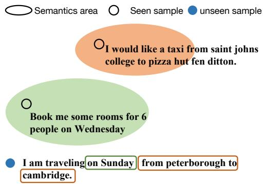  
Figure 1: An illustration of the semantics areas of seen data and perform inference on the newly unseen sample. For each sample, We omit previous turns and only show the current utterance from the user.

To make the DST module more practical, e.g. robust to unseen domains, various methods have been developed to improve the zero-shot capacity from the data-level or model-level. The first is to synthesize new dialogue samples or introduce other large labeled datasets (e.g QA datasets) to overcome the data scarcity issue (Campagna et al., 2020; Li et al., 2021; Shin et al., 2022). The second line of work is to develop the advanced model/ framework to improve the scalability of DST, such as span-based approach, copy-augmented decoder, or pre-trained language model (Chao and Lane, 2019; Wu et al., 2019; Wang et al., 2022; Zhong et al., 2023a). While empirically successful, we argue that the above data- or model-level augmentation methods have not explored the essence of zero-shot generalization, due to the lack of semantical disengagement ability to map the unseen sample to the seen data manifold (Lazaridou et al., 2015; Li et al., 2017).

To intuitively explain how the semantic areas of seen samples help in inferring the new unseen sample, we give an example in Figure 1. For an unseen sample from train domain, the booking rooms area can help predict unseen slot “train-day”, and the booking a taxi area also help predict slot “traindeparture” and “train-destination”. As seen, a new unseen sample may be hard to directly infer due to the compositional complexity but can be easy to handle if mapped to related semantic-independent areas. But the representation-level disentanglement is challenging and unstable, especially for situations that require accurate semantic dividing.

In response, we provide a simple yet effective “divide, conquer and combine” solution to navigate the unseen sample to correspondingly accurate semantic experts. The philosophy is to explicitly divide the seen data into different semantic areas and train corresponding experts, and such datalevel disentanglement provides flexibility to map the unseen sample to different semantic experts. The final output from the mixture-of-experts is expected to improve the zero-shot performance. In practice, we design a three-step framework, where stages 1&2 are for training and stage 3 is for inference: ❶dividing: encode and cluster the semantics of seen data into subsets, ❷conquering: train expert for each subset with dialogue state labels, and ❸combining: mine the relationship between newly unseen sample and seen semantics, and perform ensemble inference with weighted experts.

Experimentally, we implement our framework upon T5-Adapter and demonstrate the effectiveness and universality of our proposed schema. Specifically, we achieve averaging 5% 10% improvement on the MultiWOZ benchmark with negligible training and deployment costs, achieving state-ofthe-art zero-shot performance under settings without external information. Comprehensive analyses are reported to provide some insights to better understand our method.

## 2 Related Work

Dialogue State Tracking (DST) has been of broad interest to the dialogue research community. Existing DST models require plenty of state labels (Henderson et al., 2014; Zhong et al., 2018; Wu et al., 2020), which is hard to get in real scenarios.

Various studies on DST with zero-shot learning have been conducted to tackle unseen slots (Yang et al., 2022; Wang et al., 2022) from the data or model perspective. Firstly, data augmentation is widely used to improve the effectiveness of the existing DST models. Campagna et al. (2020) synthesizes dialogues for a new domain using domain templates derived from observing a small dataset and the ontology of the domain. Other studies utilize diverse labeled datasets from other tasks, such as dialogue summarization task (Shin et al., 2022) or generative question answering task (Lin et al., 2021a), also called zero-shot cross-task transfer. In this paper, we focus on zero-shot cross-domain DST, where the model is first trained on several domains and transferred into unknown domains.

Many works focus on developing the advantage model or framework to enhance the robustness of DST (Wu et al., 2019; Kumar et al., 2020; Wu et al., 2021). Chao and Lane (2019) adopts the Bert to produce context representations of dialogue context and applies span prediction modules to predict the slot value as a text span. Wu et al. (2019) encodes the whole dialogue context and decodes the value for every slot using a copy-augmented decoder. Recently, many pre-trained language models, such as GPT (Radford et al., 2018) and T5 (Raffel et al., 2019), demonstrate impressive zero-shot learning ability and attract many researchers. Friedman et al. (2021) proposes to model multi-dataset question answering with a collection of single-dataset experts – dataset-specific adapter modules (Houlsby et al., 2019). In DST, Lin et al. (2021b) first leverages the slot description as a prompt and generates the slot value for zero-shot cross-domain settings. Wang et al. (2022) models three types of slot dependency based on prompt learning and further improves the zero-shot performance. But these approaches mainly benefit from the similarity across slots and language knowledge inside pretrained models, ignoring the different semantics areas of seen data and failing to the effective inference on unseen domains.

## 3 Background

Notation. We define $\{ ( A _ { 1 } , U _ { 1 } ) , . . , ( A _ { T } , U _ { T } ) \}$ as a set of utterances from two speakers, where A and U represent the system response and user utterance, respectively. At turn t, we denote the dialogue context as $C _ { t } = \{ ( A _ { 1 } , U _ { 1 } ) , \ldots , ( A _ { t } , U _ { t } ) \}$ which includes t turns from system and user. The task of DST is to predict the dialogue state $B _ { t }$ given dialogue context $C _ { t }$ . The dialogue state, $B _ { t } ,$ , is represented as slot-value pairs, denoted as $B _ { t } = \{ ( s _ { 1 } , v _ { 1 } ) , \ldots , ( s _ { J } , v _ { J } ) \}$ where $s _ { j }$ and $v _ { j }$ denote the j-th slot name and value at turn t. J is the total number of slots in all domains.

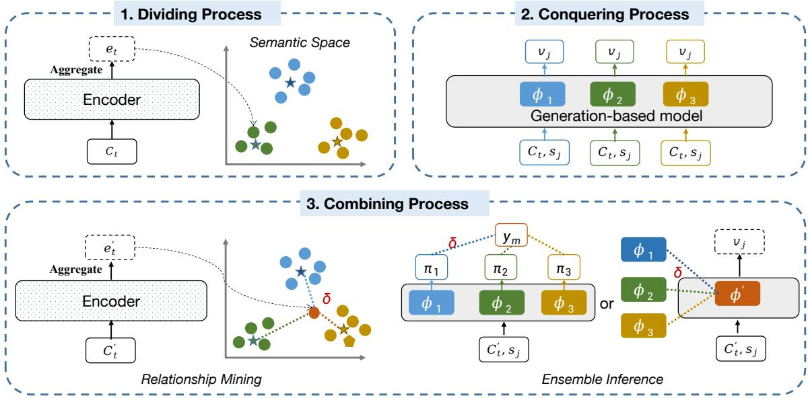  
Figure 2: Illustration of our proposed schema (best viewed in color).

Generation-based DST. Unifying the dialogue states tracking as generation task shows promising performance, where it follows an auto-regressive fashion (Lin et al., 2021b; Lee et al., 2021). For each turn, a pre-trained language model (e.g T5) takes the dialogue context $C _ { t }$ and the slot name $s _ { j }$ as input and decodes the corresponding slot value $v _ { j }$ . The objective $\mathcal { L }$ is to minimize the negative log-likelihood loss on all slots:

$$
\mathcal { L } = - \sum _ { j = 1 } ^ { J } l o g P ( v _ { j } | C _ { t } , s _ { j } )
$$

## 4 Methodology

(1)

Overviews Figure 2 illustrates the overview of our method following three steps. In the ❶dividing process, a context encoder $f$ encodes seen dialogue contexts into representations to construct semantic space $\mathcal { E } .$ . These samples are then divided into several sub-sets by clustering. After that, We train semantic-independent DST experts using labeled states of sub-sets, also called the ❷conquering process. During ❸combining, we first estimate the relationships δ between seen data and unseen sample $C _ { t } ^ { \prime } .$ , and perform the weighted mixture-of-experts inference conditioned on δ for the unseen sample.

## 4.1 Dividing Process

The goal of data division is to obtain (ideally) semantic-independent areas for seen data. Previous works have shown that semantic disenchanted representation effectively improves the zero-shot generalization in the CV (Chen et al., 2021; Ye et al., 2021b) and NLP fields (Shaw et al., 2021; Furrer et al., 2020), but it’s under-explored in dialogue, and also, we argue that data-level explicit dividing is simple and more interpretable than that of implicit representation-level dividing.

For the dialogue context, the division should consider multiple features, including domains, intentions of speakers even keywords of utterances, which is not feasible and costly in real scenarios. We, instead, use the easy-to-use clustering algorithm, e.g. Kmeans (Hartigan and Wong, 1979), to achieve the sub-set dividing, where the pretrained contextual encoder (Kenton and Toutanova, 2019; Raffel et al., 2019; Zhong et al., 2022b, 2023b), e.g. BERT and T5, is employed to accurately estimate the sample representation.

Specifically, given a dialogue context $C _ { t } .$ , a context encoder f is firstly applied to convert $C _ { t }$ into the vector $e _ { t } = \mathrm { A g g } [ f ( C _ { t } ) ]$ in semantic space $\mathcal { E } ,$ where Agg is an aggregation operation (e.g. mean pooling). Afterward, we assign each context vector to one of the sub-sets by clustering algorithms:

$$
\mathcal { D } _ { k } = \mathrm { c l u s t e r i n g } ( e _ { t } ) , k \in \{ 1 , . . . , K \} ,\tag{2}
$$

where $\mathcal { D } _ { k }$ represents the sample set of k-th sub-set and $K$ is the total number of sub-sets.

## 4.2 Conquering Process

In the conquering stage, sub-sets obtained in ❶dividing process are used to train semanticindependent experts, respectively. In practice, we adopt a generation-based backbone model to model the DST task, and the DST expert is trained with the samples of k-th sub-set :

$$
\mathcal { L } = - \frac { 1 } { N _ { k } } \sum _ { n = 1 } ^ { N _ { k } } \sum _ { j = 1 } ^ { J } l o g P ( v _ { j } | C _ { t } , s _ { j } ; \phi _ { k } ) ,\tag{3}
$$

where $N _ { k }$ is the number of samples in $D _ { k }$ and $\phi _ { k }$ represents the parameters of k-th adapter. To benefit from the knowledge inside pre-trained models and avoid over-fitting on a single sub-set, we adopt T5 (Raffel et al., 2019) as the generation backbone and only tune the corresponding adapter (Houlsby et al., 2019) for each expert.

## 4.3 Combining Process

Relationship Mining Given an unseen sample, we map its dialogue context $C _ { t } ^ { \prime }$ under space $\mathcal { E }$ to obtain the semantic vector $e _ { t } ^ { \prime } ( \mathrm { i . e . , } e _ { t } ^ { \prime } = \mathrm { A g g } [ f ( C _ { t } ^ { \prime } ) ] )$ . Then, the relationship between semantic areas and the unseen sample is computed by:

$$
\delta ( C _ { t } ^ { \prime } , \mu _ { k } ) = \frac { \exp ( d ( e _ { t } ^ { \prime } , \mu _ { k } ) / \tau ) } { \sum _ { k = 1 } ^ { K } \exp ( d ( e _ { t } ^ { \prime } , \mu _ { k } ) \tau ) } ,\tag{4}
$$

where d is a distance function and $\tau$ is a scalar temperature. $\mu _ { k }$ is the prototype of a semantic area by averaging all vectors of samples in $\mathcal { D } _ { k }$

Ensemble Inference We consider two ensemble strategies that are widely used in AI challenges (Ding and Tao, 2019, 2021) to realize the relation-based mixture-of-experts inference, also denoted as ensemble inference: parameters-level and token-level. (1) Parameter-level ensemble initializes a new adapter $\phi ^ { \prime }$ using the weighted sum parameters of trained-well adapters $\{ \phi _ { k } \} _ { k = 1 } ^ { K }$

$$
\phi ^ { \prime } = \sum _ { k = 1 } ^ { K } \delta ( C _ { t } ^ { \prime } , \mu _ { k } ) \phi _ { k }\tag{5}
$$

And then, the model returns the prediction with the maximum probability under $P ( v _ { j } | C _ { t } ^ { \prime } , s _ { j } ; \phi ^ { \prime } )$ . (2) Token-level ensemble combines the prediction of trained-well experts to generate one sequence step by step. Formally, we generates the m-th target token $y _ { m }$ of value vj with a weighted sum prediction

of adapters:

$$
\begin{array} { l } { { \pi _ { k } = l o g P ( w | y _ { ( < m ) } , C _ { t } ^ { \prime } , s _ { j } ; \phi _ { k } ) , } } \\ { { \qquad \displaystyle y _ { m } = \mathop { \mathrm { a r g m a x } } \sum _ { w \in \mathcal { W } } ^ { K } \delta ( C _ { t } ^ { \prime } , \mu _ { k } ) \cdot \pi _ { k } } } \end{array}\tag{6}
$$

where $\pi _ { k }$ is the predicted word distribution when using adapter $\phi _ { k }$ . Notably, parameter-level ensemble inference, requiring deploying only a new single adapter, enjoys extremely low deployment costs, while token-level one owns the better model capacity and is expected to perform better.

## 5 Experiments

Dataset We evaluate our method on widely-used multi-domain datasets MultiWOZ (Budzianowski et al., 2018) and Schema-Guided Dataset (Rastogi et al., 2020). The MultiWOZ dataset contains 10k+ dialogues across 7 domains. Each dialogue consists of one or multiple domains. We follow the previous pre-processing and evaluation setup (Lin et al., 2021b; Wang et al., 2022), where the restaurant, train, attraction, hotel, and taxi domains are used for zero-shot cross-domain experiments. The Schema-Guided Dialogue (SGD) dataset consists of over 16k+ multi-domain dialogues and covers 16 domains. The test set contains unseen data to measure the performance in the zero-shot setting. Detailed data statistics are shown in Appendix A.

Evaluation Metrics We follow Lin et al. (2021b) to use slot accuracy (SA) and joint goal accuracy (JGA) as evaluation metrics. SA is calculated as the ratio of individual slot in which its value is correctly predicted, and JGA measures the percentage of correct in all dialogue turns, where a turn is considered as correct if and only if all the slot values are correctly predicted. In zero-shot DST (Wu et al., 2019; Lin et al., 2021b), the model obtains all training data from the training dialogues except for an unseen domain, which is used to evaluate.

Comparison Baselines We evaluate our model against existing zero-shot DST baselines. TRADE (Wu et al., 2019) utilizes a copy mechanism to track slot values for unseen domains. MA-DST (Kumar et al., 2020) designs multiple layers of cross-attention to capture relationships at different levels of dialogue granularity. SUMBT (Lee et al., 2019) proposes a non-parametric method to score each candidate slot-value pair in a pre-defined ontology. TransferQA (Lin et al., 2021a) is a crosstask zero-shot DST method where the model is pre-trained on QA datasets and then applied to unseen domains. T5DST (Lin et al., 2021b) explores the slot description as a prompt to generate slot values. SlotDM-DST (Wang et al., 2022) models three types of slot dependency, i.e., slot-slot, slot-value, and slot-context, to improve zero-shot DST. SGD-baseline utilizes schema descriptions to predict the dialogue state of unseen domains. Moreover, we implement T5-Adapter that concatenates the dialogue context and slot name as inputs, following T5DST, as the fair baseline of our method. Different from other baselines finetuning all parameters, T5-Adapter only tunes the parameters of the adapter during training. All baselines listed here do not consider any information from new domains. For a fair comparison, we don’t include the in-context learning work on Hu et al. (2022) because they design specific prompts using the information from the unseen domain.

<table><tr><td rowspan="2">Model</td><td rowspan="2">#Trainable Parameters</td><td rowspan="2">Pretrained- model</td><td colspan="6">Joint Goal Accuracy</td></tr><tr><td>Attraction</td><td>Hotel</td><td>Restaurant</td><td>Taxi</td><td>Train</td><td>Average</td></tr><tr><td>TRADE (Wu et al., 2019)</td><td></td><td>N</td><td>19.87</td><td>13.70</td><td>11.52</td><td>60.58</td><td>22.37</td><td>25.76</td></tr><tr><td>MA-DST (Kumar et al., 2020)</td><td></td><td>N</td><td>22.46</td><td>16.28</td><td>13.56</td><td>59.27</td><td>22.76</td><td>26.87</td></tr><tr><td>SUMBT (Lee et al., 2019)</td><td>440M</td><td>Bert-base</td><td>22.60</td><td>19.80</td><td>16.50</td><td>59.50</td><td>22.50</td><td>28.18</td></tr><tr><td>T5DST (Lin et al., 2021b)</td><td>60M</td><td>T5-small</td><td>33.09</td><td>21.21</td><td>21.65</td><td>64.62</td><td>35.42</td><td>35.20</td></tr><tr><td>T5DST †(Lin et al., 2021b)</td><td>220M</td><td>T5-base</td><td>35.51</td><td>22.48</td><td>25.04</td><td>65.93</td><td>37.82</td><td>37.36</td></tr><tr><td>SlotDM-DST (Wang et al., 2022)</td><td>60M</td><td>T5-small</td><td>33.92</td><td>19.18</td><td>20.75</td><td>66.25</td><td>36.96</td><td>35.55</td></tr><tr><td>SlotDM-DST (Wang et al., 2022)</td><td>220M</td><td>T5-base</td><td>37.83</td><td>26.50</td><td>27.05</td><td>69.23</td><td>40.27</td><td>40.18</td></tr><tr><td>TransferQA (Lin et al., 2021a)</td><td>770M</td><td>T5-large</td><td>31.25</td><td>22.72</td><td>26.28</td><td>61.87</td><td>36.72</td><td>35.77</td></tr><tr><td rowspan="2">T5-Adapter†</td><td>0.8M 3.6M</td><td>T5-small</td><td>33.85</td><td>18.22</td><td>19.62</td><td>64.93</td><td>32.25</td><td>33.77</td></tr><tr><td></td><td>T5-base</td><td>39.98</td><td>23.28</td><td>28.58</td><td>65.03</td><td>36.98</td><td>38.77</td></tr><tr><td>Ours (Param-level) Ours (Token-level)</td><td>0.8M×K</td><td>T5-small</td><td>34.63 35.82</td><td>24.22 24.78</td><td>22.07 22.86</td><td>65.41 65.87</td><td>33.88 40.27</td><td>36.02 37.92</td></tr><tr><td>Ours (Param-level)</td><td></td><td></td><td>41.28</td><td>26.15</td><td>31.05</td><td>66.64</td><td>38.72</td><td></td></tr><tr><td>Ours (Token-level)</td><td>3.6M×K</td><td>T5-base</td><td>41.35</td><td>27.72</td><td>33.76</td><td>66.90</td><td>43.81</td><td>40.76 42.71</td></tr></table>

Table 1: Zero-shot results on MultiWOZ 2.1 dataset. All numbers are reported in joint goal accuracy (%) and the best results among each setting are bolded. K is a hyper-parameter and refers to the number of sub-sets. Expect for †, all results of baselines come from the original papers.

Implementation Our models are implemented in Pytorch (Paszke et al., 2019) using HuggingFace (Wolf et al., 2019) and the adapter-transformers library (Pfeiffer et al., 2020). In division processing, we utilize T5-base (Raffel et al., 2019) as the context encoder and apply mean pooling on the outputs of the encoder as the dialogue vectors. We choose Kmeans (Hartigan and Wong, 1979) as the clustering algorithm and set the number of sub-sets as 3. In conquer processing, T5 is employed as the DST expert with the default adapter configuration from Houlsby et al. (2019)2, which adds approximately 0.8M parameters to the T5-small (60M) and 3.6M parameters to the T5-base (220M). We freeze the transformer parameters and use a learning rate of 1e-4 on adapter parameters for each expert. For all experiments, we train each independent expert for 10 epochs. We use the AdamW optimizer (Loshchilov and Hutter, 2017) and set the batch size to 16. In the combining process, the scale temperatures are set to 2 and 0.2 in the token- and parameter-level ensemble inference, respectively. For a fair comparison, we process and evaluate the MultiWOZ datasets following T5DST (Lin et al., 2021a). In the SGD dataset, we process the data following TransferQA (Lin et al., 2021b) and use the official evaluation script3 to evaluate.

## 5.1 Main Results

Our method significantly improves zero-shot cross-domain performance. Table 1 shows the zero-shot DST results on MultiWOZ 2.1 dataset. Among these baselines, those methods using the T5 model have a much better performance than those without pre-trained models (e.g.TRADE), illustrating the strong transfer ability of pretrained models in zero-shot settings. Interestingly, the T5- Adapter yields +1.41% average over the fine-tuning on T5-base (T5DST), which has not been discussed in previous DST works, indicating that few trainable parameters are also effective in transfer learning. Among all models, our method achieves stateof-the-art performance on average (42.71%) with about 10M trainable parameters (when K=3). And there is a great improvement in the ‘train’ domain. The reason is that all slots in that domain are closely related to seen data, which easily benefits from the method we propose. Additionally, the token-level ensemble inference as expected obtains higher joint goal accuracy improvements than the parameterlevel one across all domains. However, the tokenlevel ensemble needs more computations during inference. Detailed analysis on ensemble inference is discussed in §6.3.

<table><tr><td>Domain</td><td>SGD-baseline</td><td>TransferQA</td><td>Seq2seq-DU</td><td>Ours</td></tr><tr><td>Messaging</td><td>10.2</td><td>13.3</td><td>4.9</td><td>28.7/22.1</td></tr><tr><td>Payment</td><td>11.5</td><td>24.7</td><td>7.2</td><td>19.4/19.1</td></tr><tr><td>Trains</td><td>13.6</td><td>17.4</td><td>16.8</td><td>42.3/40.6</td></tr><tr><td>Alarm</td><td>57.7</td><td>58.3</td><td>55.6</td><td>68.8/68.7</td></tr><tr><td>Average</td><td>20.5</td><td>25.9</td><td>20.3</td><td>39.8/37.6</td></tr></table>

Table 2: Zero-Shot results on SGD dataset. All results are reported in JGA (%). Our results are listed under the token-level/parameter-level ensemble.

Table 2 shows the zero-shot performance on the SGD dataset. In the SGD dataset, there are four domains in the testing set but are not in the training set. So we train the proposed model using the whole training set and test on these four unseen domains for the zero-shot setting. Compared with the SGD baseline, the zero-shot performance of our model is consistently higher in four unseen domains.

Our method also effectively enhances the fullshot performance. The philosophy of our mixture of semantic-independent experts has the potential to improve the full-shot settings. To validate our hypothesis, we conduct full-shot experiments and list the results in Table 3. As shown, our approach still shows superiority against the strong T5- Adapter baseline and other existing works, demonstrating the universality of our method.

## 6 Discussion

To better understand our proposed schema, we first present essential ablation studies in §6.1, and show in-depth analyses on clustering (§6.2) and ensemble inference (§6.3), respectively. Additionally, we discuss the complementarity of our framework

<table><tr><td>Model</td><td>#Trainable Parameter</td><td>Pre-trained Model</td><td>JGA</td></tr><tr><td>TRADE</td><td></td><td>N</td><td>45.60</td></tr><tr><td>STARC (Gao et al., 2020)</td><td>440M</td><td>Bert-base</td><td>49.48</td></tr><tr><td>SGD-baseline</td><td>440M</td><td>Bert-base</td><td>43.40</td></tr><tr><td>T5DST</td><td>220M</td><td>T5-base</td><td>53.15</td></tr><tr><td>T5-Adapter</td><td>3.6M</td><td>T5-base</td><td>52.14</td></tr><tr><td>Ours (Param-level)</td><td>3.6M×K</td><td>T5-base</td><td>52.54</td></tr><tr><td>Ours (Token-level)</td><td>3.6M×K</td><td>T5-base</td><td>54.35</td></tr></table>

Table 3: Full data results on MultiWOZ 2.1 dataset. For a fair comparison, only those generative models with the ability of zero-shot inference are listed here.

with others in §6.4.

## 6.1 Ablation Study

To understand the effects of major components, we conduct ablation studies on MultiWOZ 2.1 dataset.

Impact of Clustering Algorithms We study the effect of different clustering algorithms, including Kmeans (Hartigan and Wong, 1979), Birch (Zhang et al., 1996), Agglomerative (Gowda and Krishna, 1978), and GMM (Yang et al., 2012) on hotel domain in Figure 3. As shown, 1) all clustering algorithms perform better than the T5-Adapter (Red dotted line), showing the effectiveness and stability of our framework; and 2) GMM achieves the best performance on parameter-level ensemble inference while our chosen Kmeans wins on token-level ones. We believe advanced clustering may bring better division, thus achieving further improvement, which will be investigated in future work.

Impact of Number of Subsets We conduct experiments to observe the influence of the number of subsets during data division. Experiments on hotel domain with different K values are in Figure 4. We find that the joint goal accuracy performance increases with the value of K first and then decreases on T5-base. The results show that the optimal number of sub-sets is 2 for T5-small and 3 for the T5-base model. Noted that our model strongly depends on the data distribution and data partition, which means that the zero-shot performance may not increase linearly as K increases.

Impact of Temperature The scale of temperature in Equation 4 actually controls the smoothness of the weights and output distribution in the mixture of trained-well experts upon language models (Peng et al., 2023). As τ  + , the weights become smoother. Contrarily, the distance collapses to a point mass when τ 0. We study its influence on three domains in Figure 5. As shown, for token-level ensembles, larger temperature ( 1) achieves better performance while smaller temperatures ( 0.4) facilitate the parameter-level ensemble inference. We suppose that the parameter space of semantic-independent experts is nearly orthogonal so that a smoother weight combination may hurt its performance. Differently, smoother weights are suitable for the token-level since the predictions from different experts are required to be easily merged. And the performances can be further improved by hyper-parameters searching.

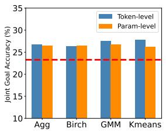

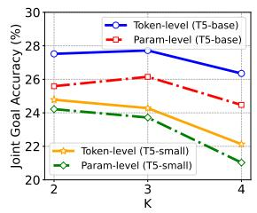  
Figure 3: Impact of differ- Figure 4: Impact of different clustering algorithms ent numbers of sub-sets on on hotel domain. hotel domain.

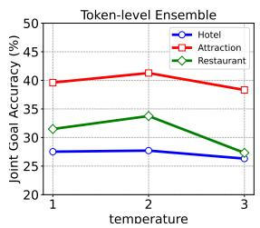

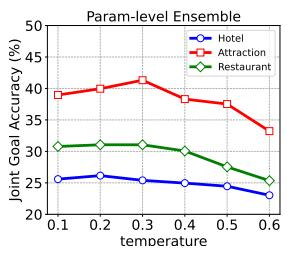  
Figure 5: Impact of different temperatures τ .

Impact of Weight in Combining Process Mapping the unseen sample to existing subsets and obtaining the mapping weights are central in ❸combing process. Besides adopting the weights by inference from the trained clustering model, we try other two weights: 1) argmax: assigning 1 for the subset with max mapping probability and 0 for others, and 2) average: assigning uniform probability for all subsets. As shown in Table 4, directly leveraging the inference weights shows the best performance for both parameter-level and tokenlevel ensemble inference, showing the necessity of reusing the clustering model as the proxy for relationship mining.

## 6.2 Analysis on Clustering

Robust to Different Context Encoders To check whether the clustering method is robust to different context encoders, e.g. RoBERTa (Liu et al., 2019) and T5 (Raffel et al., 2019). We visualize their representation in Figure 6 with their corresponding zero-shot performance attached, and show that 1) both context encoders nicely represent the seen data and could map them to visually separated semantic areas, and 2) better context encoder, i.e. T5, indeed brings much clear semantic separate degree, thus leading to better zero-shot performance, i.e. T5>RoBERTa. These findings confirm that clustering is simple, reasonable, and robust to different content encoders to obtain separate semantic areas.

<table><tr><td rowspan="2">Weights</td><td colspan="2">Hotel</td><td colspan="2">Taxi</td></tr><tr><td>Param-level</td><td>Token-level</td><td>Param-level</td><td>Token-level</td></tr><tr><td>Ours</td><td>26.15</td><td>27.72</td><td>66.64</td><td>66.90</td></tr><tr><td>Argmax</td><td>24.47</td><td>24.85</td><td>65.09</td><td>66.38</td></tr><tr><td>Average</td><td>20.62</td><td>25.87</td><td>59.61</td><td>65.51</td></tr></table>

Table 4: The Impact of weight in combing process.

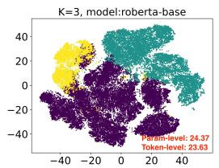

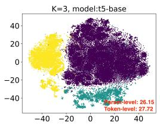  
Figure 6: The t-SNE visualizations of clustered subsets represented with T5 and RoBERTa. “Token-level” and “Param-level” show the zero-shot performance.

Brings Explicit Semantic Division in Data To explicitly analyze the semantics division of clustered subsets, we randomly sample four hundred for each sub-set and compute the slot distribution in Figure 7. As seen, we find obvious semantic differences across sub-sets. In the second sub-set (yellow bar), there are more slots related to location (“traindeparture” and “train-destination”) while the third sub-set (green bar) mainly involves some slots with numbers, e.g. restaurant-book people and taxileave at. Most dialogues from the attraction domain are assigned to the second sub-set (blue bar). We conclude that clustering can divide seen data into relatively semantic-independent areas.

Performs Better Than Using Domain Division One may doubt that explicitly dividing data might be better than implicit semantics division by clustering. To check this doubt, we construct an explicitly divided baseline according to domains and we train domain-independent experts following its division, where this baseline is named as DI-Experts. For a fair comparison, we average the dialogue vectors in the same domain as the prototype and apply ensemble inference for DI-Expert. As shown in Figure 8, DI-Experts, combining domain-independent experts, shows a significant decrease compared to ours in all domains. The reason may be the domain division on seen data focuses on the background of a conversation but ignores the more fine-grained semantics such as user intent, which can be well handled by our cluster method.

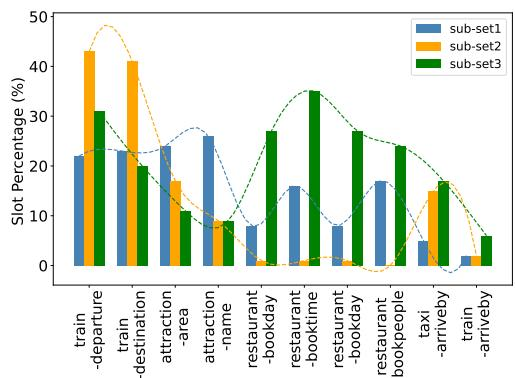  
Figure 7: Statistics of slot distribution across sub-sets.

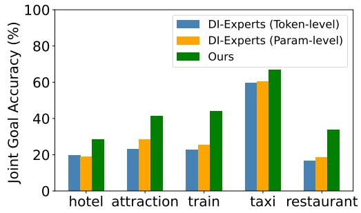  
Figure 8: The zero-shot performance of DI-Experts.

## 6.3 Analysis on Ensemble Inference

Integrates the Advantages of Experts Figure 9 makes a comparison of slot accuracy obtained by ensemble experts and individual experts. As shown, 1) the first expert is specialized in “hotel-area” and “hotel-name” slots, and the third expert performs better on “hotel-book day” and “hotel-book people”, which is consistent with their data-level slot distribution across sub-subsets in Figure 7, and 2) our ensemble inference methods, especially tokenlevel one, are more accurate, as expected, than the corresponding best expert in most slots, showing the necessity of adopting the ensemble inference.

Requires Lightweight Computational Cost Our method requires only tuning and deploying the adapter, which is super lightweight compared to the full pretrained language model training. Table 5 shows the training and inference overhead in different zero-shot DST models. For a fair comparison, all methods use T5-base as the basic model. As seen, we only consume 4.9% parameters compared to the T5-base “T5DST” during training, while for inference, our “Param-level” and “Token-level” only deploy extra +1.6% and +4.9% parameters, respectively. The total computing overhead is negligible but we gain significant performance boosts, up to averaging +5.4% JGA compared to T5-base.

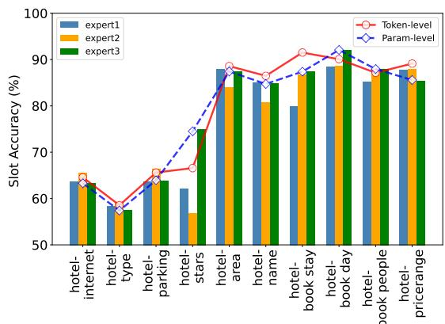  
Figure 9: Slot accuracy of different single experts and ensemble models on hotel domain.

<table><tr><td>Model</td><td>Training |Θ|</td><td>Inference |Θ|</td><td>Average (%)</td></tr><tr><td>T5DST</td><td>100%</td><td>100%</td><td>37.36</td></tr><tr><td>T5-Adapter</td><td>1.6%</td><td>+1.6%</td><td>37.92</td></tr><tr><td>Ours (Param-level)</td><td>4.9%</td><td>+1.6%</td><td>40.76+3.4</td></tr><tr><td>Ours (Token-level)</td><td>4.9%</td><td>+4.9%</td><td> $\overline { { 4 2 . 7 1 } } \ " 1 9 + 5 . 4$ </td></tr></table>

Table 5: Costs for training and inference of methods. Θ denotes the number of trained/ deployed parameters for training and inference, respectively.

## 6.4 Complementary to Existing Works

Our method for zero-shot DST is a new learning framework, which is expected to complement existing works, e.g. data-level and model-level strategies. Here we list two representative approaches and show the complementarity.

Data Augmentation Method Many methods improve the zero-shot performance and out-ofdomain generalization from a data augmentation perspective (Campagna et al., 2020; Manotumruksa et al., 2021; Ding et al., 2021, 2022). We train DST using raw data and augmented data from Campagna et al. (2020), respectively, to show further improvement. As shown in Table 6, both “Param-level” and “Token-level” achieve further improvements, i.e. 1.6% on average, showing the complementarity between ours and the data-level approach.

Slot-Slot Dependency Modeling Methods Various DST works utilize the correlations among slots and improve the performances on full-shot (Ye et al., 2021a; Feng et al., 2022) and zero-shot settings (Wang et al., 2022). To benefit from the correlations among slots, we collaborate our framework with “Slot Prompt Combination” technique proposed by Wang et al. (2022) and observe the zero-shot performance (See Table 7). As shown, our framework could push the SlotDM toward better zero-shot performance by averaging +0.96% on three domains, demonstrating the complementarity between ours and the model-level approach.

<table><tr><td>Model</td><td>Raw Data</td><td>Augmented Data</td></tr><tr><td>TRADE</td><td>19.50</td><td>28.30</td></tr><tr><td>Ours (Param-level)</td><td>26.15</td><td> $2 7 . 5 6 ^ { \Uparrow + 1 . 4 }$ </td></tr><tr><td>Ours (Token-level)</td><td>27.71</td><td> $2 9 . 3 6 ^ { \Uparrow + 1 . 7 }$ </td></tr></table>

Table 6: Complementarity between ours and data augmentation methods, in terms of zero-shot performance on hotel domain.
<table><tr><td>Model</td><td>Attraction</td><td>Hotel</td><td>Taxi</td></tr><tr><td>SlotDM</td><td>36.38</td><td>25.45</td><td>67.21</td></tr><tr><td>+Our Framework</td><td> $3 7 . 4 1 ^ { \Uparrow + 1 . 0 }$ </td><td> $2 6 . 5 8 ^ { \Uparrow + 1 . 1 }$ </td><td> $6 8 . 0 2 ^ { \Uparrow + 0 . 8 }$ </td></tr></table>

Table 7: Complementarity between ours and competitive model-level methods “SlotDM”, in terms of zeroshot performance on three domains.

## 7 Conclusion

In this paper, we propose a new learning schema “divide, conquer, and combine” to improve the zeroshot generalization in DST. The philosophy behind this is to explicitly divide the seen data into different semantic areas, such disentanglement provides flexibility for mapping the unseen sample to the different experts trained on corresponding semantic areas, and the ensemble results of experts are expected to improve the model generalization. The experimental results indicate that our model using small trainable parameters reaches state-of-art performances in zero-shot cross-domain DST.

## Limitations

We conclude the limitations of our schema into two aspects. Firstly, our method benefits from the assumption that there exists similar semantics between the seen data and unseen samples. However, our work might not own obvious advantages in the case where the correlation among domains is weak, such as medical assistant and movie service. But notably, in such cases, most zero-shot learning methods will also fail to show well generalization. Secondly, we propose to train semanticindependent DST experts, which is ideal but we believe advanced components could move towards this goal, such as using advanced clustering algorithms and pretrained language models.

## Ethics Statement

This work does not present any direct ethical issues. We focus on improving the zero-shot cross-domain generalization problem in DST. All experiments are conducted on open datasets and the findings and conclusions of this paper are reported accurately and objectively.

## Acknowledgments

This work is supported by the National Key Research and Development Program of China (NO.2022YFB3102200) and Strategic Priority Research Program of the Chinese Academy of Sciences with No. XDC02030400. We would like to thank the anonymous reviewers for their valuable comments.

## References

Paweł Budzianowski, Tsung-Hsien Wen, Bo-Hsiang Tseng, Iñigo Casanueva, Stefan Ultes, Osman Ramadan, and Milica Gasic. 2018. Multiwoz - a largescale multi-domain wizard-of-oz dataset for taskoriented dialogue modelling. In EMNLP.

Giovanni Campagna, Agata Foryciarz, M. Moradshahi, and Monica S. Lam. 2020. Zero-shot transfer learning with synthesized data for multi-domain dialogue state tracking. In ACL.

Guan-Lin Chao and Ian Lane. 2019. Bert-dst: Scalable end-to-end dialogue state tracking with bidirectional encoder representations from transformer. In Interspeech.

Zhi Chen, Yadan Luo, Ruihong Qiu, Sen Wang, Zi Huang, Jingjing Li, and Zheng Zhang. 2021. Semantics disentangling for generalized zero-shot learning. In ICCV.

Liang Ding and Dacheng Tao. 2019. The university of sydney’s machine translation system for wmt19. In WMT.

Liang Ding and Dacheng Tao. 2021. The usyd-jd speech translation system for iwslt2021. In IWSLT.

Liang Ding, Longyue Wang, Xuebo Liu, Derek F Wong, Dacheng Tao, and Zhaopeng Tu. 2021. Rejuvenating low-frequency words: Making the most of parallel data in non-autoregressive translation. In ACL.

Liang Ding, Longyue Wang, Shuming Shi, Dacheng Tao, and Zhaopeng Tu. 2022. Redistributing lowfrequency words: Making the most of monolingual data in non-autoregressive translation. In ACL.

Yue Feng, Aldo Lipani, Fanghua Ye, Qiang Zhang, and Emine Yilmaz. 2022. Dynamic schema graph fusion network for multi-domain dialogue state tracking. In ACL.

Dan Friedman, Ben Dodge, and Danqi Chen. 2021. Single-dataset experts for multi-dataset question answering. In EMNLP.

Daniel Furrer, Marc van Zee, Nathan Scales, and Nathanael Schärli. 2020. Compositional generalization in semantic parsing: Pre-training vs. specialized architectures. ArXiv.

Shuyang Gao, Sanchit Agarwal, Tagyoung Chung, Di Jin, and Dilek Z. Hakkani-Tür. 2020. From machine reading comprehension to dialogue state tracking: Bridging the gap. In ACL.

K. Chidananda Gowda and G. Krishna. 1978. Agglomerative clustering using the concept of mutual nearest neighbourhood. PR.

John A Hartigan and Manchek A Wong. 1979. Algorithm as 136: A k-means clustering algorithm. JRSSSC.

Shwai He, Liang Ding, Daize Dong, Miao Zhang, and Dacheng Tao. 2022. Sparseadapter: An easy approach for improving the parameter-efficiency of adapters. In EMNLP.

Matthew Henderson, Blaise Thomson, and Steve J. Young. 2014. Word-based dialog state tracking with recurrent neural networks. In SIGDIAL Conference.

Neil Houlsby, Andrei Giurgiu, Stanislaw Jastrzebski, Bruna Morrone, Quentin de Laroussilhe, Andrea Gesmundo, Mona Attariyan, and Sylvain Gelly. 2019. Parameter-efficient transfer learning for nlp. In ICML.

Yushi Hu, Chia-Hsuan Lee, Tianbao Xie, Tao Yu, Noah A Smith, and Mari Ostendorf. 2022. In-context learning for few-shot dialogue state tracking. ArXiv.

Jacob Devlin Ming-Wei Chang Kenton and Lee Kristina Toutanova. 2019. Bert: Pre-training of deep bidirectional transformers for language understanding. In NAACL.

Adarsh Kumar, Peter Ku, Anuj Kumar Goyal, Angeliki Metallinou, and Dilek Z. Hakkani-Tür. 2020. Ma-dst: Multi-attention based scalable dialog state tracking. In AAAI.

Angeliki Lazaridou, Georgiana Dinu, and Marco Baroni. 2015. Hubness and pollution: Delving into crossspace mapping for zero-shot learning. In ACL.

Chia-Hsuan Lee, Hao Cheng, and Mari Ostendorf. 2021. Dialogue state tracking with a language model using schema-driven prompting. In EMNLP.

Hwaran Lee, Jinsik Lee, and Tae-Yoon Kim. 2019. Sumbt: Slot-utterance matching for universal and scalable belief tracking. In ACL.

Shiyang Li, Semih Yavuz, Kazuma Hashimoto, Jia Li, Tong Niu, Nazneen Rajani, Xifeng Yan, Yingbo Zhou, and Caiming Xiong. 2021. Coco: Controllable counterfactuals for evaluating dialogue state trackers. In ICLR.

Yanan Li, Donghui Wang, Huanhang Hu, Yuetan Lin, and Yueting Zhuang. 2017. Zero-shot recognition using dual visual-semantic mapping paths. In CVPR.

Zhaojiang Lin, Bing Liu, Andrea Madotto, Seungwhan Moon, Paul A. Crook, Zhenpeng Zhou, Zhiguang Wang, Zhou Yu, Eunjoon Cho, Rajen Subba, and Pascale Fung. 2021a. Zero-shot dialogue state tracking via cross-task transfer. In ACL.

Zhaojiang Lin, Bing Liu, Seungwhan Moon, Paul A. Crook, Zhenpeng Zhou, Zhiguang Wang, Zhou Yu, Andrea Madotto, Eunjoon Cho, and Rajen Subba. 2021b. Leveraging slot descriptions for zero-shot cross-domain dialogue statetracking. In NAACL.

Yinhan Liu, Myle Ott, Naman Goyal, Jingfei Du, Mandar Joshi, Danqi Chen, Omer Levy, Mike Lewis, Luke Zettlemoyer, and Veselin Stoyanov. 2019. Roberta: A robustly optimized bert pretraining approach. ArXiv.

Ilya Loshchilov and Frank Hutter. 2017. Decoupled weight decay regularization. In ICLR.

Jarana Manotumruksa, Jeffrey Dalton, Edgar Meij, and Emine Yilmaz. 2021. Improving dialogue state tracking with turn-based loss function and sequential data augmentation. In EMNLP.

Adam Paszke, Sam Gross, Francisco Massa, Adam Lerer, James Bradbury, Gregory Chanan, Trevor Killeen, Zeming Lin, Natalia Gimelshein, Luca Antiga, Alban Desmaison, Andreas Köpf, Edward Yang, Zach DeVito, Martin Raison, Alykhan Tejani, Sasank Chilamkurthy, Benoit Steiner, Lu Fang, Junjie Bai, and Soumith Chintala. 2019. Pytorch: An imperative style, high-performance deep learning library. In NeurIPS.

Keqin Peng, Liang Ding, Qihuang Zhong, Li Shen, Xuebo Liu, Min Zhang, Yuanxin Ouyang, and Dacheng Tao. 2023. Towards making the most of chatgpt for machine translation. arXiv.

Jonas Pfeiffer, Andreas Rücklé, Clifton Poth, Aishwarya Kamath, Ivan Vulic, Sebastian Ruder, Kyunghyun Cho, and Iryna Gurevych. 2020. Adapterhub: A framework for adapting transformers. In EMNLP.

Alec Radford, Karthik Narasimhan, Tim Salimans, Ilya Sutskever, et al. 2018. Improving language understanding by generative pre-training.

Colin Raffel, Noam M. Shazeer, Adam Roberts, Katherine Lee, Sharan Narang, Michael Matena, Yanqi Zhou, Wei Li, and Peter J. Liu. 2019. Exploring the limits of transfer learning with a unified text-to-text transformer. JMLR.

Abhinav Rastogi, Xiaoxue Zang, Srinivas Sunkara, Raghav Gupta, and Pranav Khaitan. 2020. Towards scalable multi-domain conversational agents: The schema-guided dialogue dataset. In AAAI.

Peter Shaw, Ming-Wei Chang, Panupong Pasupat, and Kristina Toutanova. 2021. Compositional generalization and natural language variation: Can a semantic parsing approach handle both? In ACL.

Jamin Shin, Hangyeol Yu, Hyeongdon Moon, Andrea Madotto, and Juneyoung Park. 2022. Dialogue summaries as dialogue states (DS2), template-guided summarization for few-shot dialogue state tracking. In ACL.

Qingyue Wang, Yanan Cao, Piji Li, Yanhe Fu, Zheng Lin, and Li Guo. 2022. Slot dependency modeling for zero-shot cross-domain dialogue state tracking. In COLING.

Thomas Wolf, Lysandre Debut, Victor Sanh, Julien Chaumond, Clement Delangue, Anthony Moi, Pierric Cistac, Tim Rault, Rémi Louf, Morgan Funtowicz, and Jamie Brew. 2019. Transformers: State-of-theart natural language processing. In EMNLP.

Chien-Sheng Wu, Andrea Madotto, Ehsan Hosseini-Asl, Caiming Xiong, Richard Socher, and Pascale Fung. 2019. Transferable multi-domain state generator for task-oriented dialogue systems. In ACL.

Di Wu, Yiren Chen, Liang Ding, and Dacheng Tao. 2021. Bridging the gap between clean data training and real-world inference for spoken language understanding. arXiv.

Di Wu, Liang Ding, Fan Lu, and Jian Xie. 2020. Slotrefine: A fast non-autoregressive model for joint intent detection and slot filling. In EMNLP.

Miin-Shen Yang, Chien-Yo Lai, and Chih-Ying Lin. 2012. A robust em clustering algorithm for gaussian mixture models. PR.

Yuting Yang, Wenqiang Lei, Juan Cao, Jintao Li, and Tat-Seng Chua. 2022. Prompt learning for few-shot dialogue state tracking. ArXiv.

Fanghua Ye, Jarana Manotumruksa, Qiang Zhang, Shenghui Li, and Emine Yilmaz. 2021a. Slot selfattentive dialogue state tracking. In WWW.

Zihan Ye, Fuyuan Hu, Fan Lyu, Linyan Li, and Kaizhu Huang. 2021b. Disentangling semantic-to-visual confusion for zero-shot learning. TMM.

Steve J. Young, Milica Gasic, Blaise Thomson, and J. Williams. 2013. Pomdp-based statistical spoken dialog systems: A review. Proceedings ofthe IEEE.

Tian Zhang, Raghu Ramakrishnan, and Miron Livny. 1996. Birch: an efficient data clustering method for very large databases. ACM.

Qihuang Zhong, Liang Ding, Juhua Liu, Bo Du, and Dacheng Tao. 2022a. Panda: Prompt transfer meets knowledge distillation for efficient model adaptation. arXiv.

Qihuang Zhong, Liang Ding, Juhua Liu, Bo Du, and Dacheng Tao. 2023a. Can chatgpt understand too? a comparative study on chatgpt and fine-tuned bert. arXiv.

Qihuang Zhong, Liang Ding, Keqin Peng, Juhua Liu, Bo Du, Li Shen, Yibing Zhan, and Dacheng Tao. 2023b. Bag of tricks for effective language model pretraining and downstream adaptation: A case study on glue. arXiv.

Qihuang Zhong, Liang Ding, Yibing Zhan, Yu Qiao, Yonggang Wen, Li Shen, Juhua Liu, Baosheng Yu, Bo Du, Yixin Chen, et al. 2022b. Toward efficient language model pretraining and downstream adaptation via self-evolution: A case study on superglue. arXiv.

Victor Zhong, Caiming Xiong, and Richard Socher. 2018. Global-locally self-attentive encoder for dialogue state tracking. In ACL.

## A Dataset Statistics

There are 5 domains used in the MultiWOZ dataset in zero-shot settings, which is shown in Table 8. Additionally, the slot descriptions for all the dialogue state slots are provided in the dataset. The statistics of the SGD dataset are shown in Table 9

<table><tr><td rowspan=1 colspan=1>Domain</td><td rowspan=1 colspan=1>Slot</td><td rowspan=1 colspan=1>Train</td><td rowspan=1 colspan=1>Valid</td><td rowspan=1 colspan=1>Test</td></tr><tr><td rowspan=1 colspan=1>Attraction</td><td rowspan=1 colspan=1>area, name, type</td><td rowspan=1 colspan=1>2717</td><td rowspan=1 colspan=1>401</td><td rowspan=1 colspan=1>395</td></tr><tr><td rowspan=1 colspan=1>Hotel</td><td rowspan=1 colspan=1>area, internet, name,parking, price range,stars, type, book day,book people, book stay</td><td rowspan=1 colspan=1>3381</td><td rowspan=1 colspan=1>416</td><td rowspan=1 colspan=1>394</td></tr><tr><td rowspan=1 colspan=1>Restaurant</td><td rowspan=1 colspan=1>area, food, name,price range, book day,book people, book time</td><td rowspan=1 colspan=1>3813</td><td rowspan=1 colspan=1>438</td><td rowspan=1 colspan=1>437</td></tr><tr><td rowspan=1 colspan=1>Taxi</td><td rowspan=1 colspan=1>arriveby, departure,destination, leaveat</td><td rowspan=1 colspan=1>1654</td><td rowspan=1 colspan=1>207</td><td rowspan=1 colspan=1>195</td></tr><tr><td rowspan=1 colspan=1>Train</td><td rowspan=1 colspan=1>arrive by, day,departure, destination,leaveat, book people</td><td rowspan=1 colspan=1>3103</td><td rowspan=1 colspan=1>484</td><td rowspan=1 colspan=1>494</td></tr><tr><td rowspan=1 colspan=2>Total</td><td rowspan=1 colspan=1>8438</td><td rowspan=1 colspan=1>1000</td><td rowspan=1 colspan=1>1000</td></tr></table>

Table 8: The dataset statistics of MultiWOZ dataset.

<table><tr><td>Domain</td><td>#Dialogs</td><td>Domain</td><td>#Dialogs</td></tr><tr><td>Alarm</td><td>324</td><td>Movies</td><td>2339</td></tr><tr><td>Banks</td><td>1021</td><td>Music</td><td>1833</td></tr><tr><td>Buses</td><td>3135</td><td>Payment</td><td>222</td></tr><tr><td>Calendar</td><td>1602</td><td>RentalCars</td><td>2510</td></tr><tr><td>Events</td><td>4519</td><td>Restaurants</td><td>3218</td></tr><tr><td>Fights</td><td>3644</td><td>RideSharing</td><td>2223</td></tr><tr><td>Homes</td><td>1273</td><td>Services</td><td>2956</td></tr><tr><td>Hotels</td><td>4992</td><td>Trains</td><td>350</td></tr><tr><td>Media</td><td>1656</td><td>Travel</td><td>2808</td></tr><tr><td>Messaging</td><td>298</td><td>Weather</td><td>1783</td></tr></table>

Table 9: The dialogues for each domain across train, dev, and test sets in the SGD dataset. The “Alarm”, “Messaging”, “Payment” and “Train” domains are only present in the dev or test sets to test generalization to new domains.

## ACL 2023 Responsible NLP Checklist

## A For every submission:

✓ A1. Did you describe the limitations of your work? section 8: "Limitations"

 A2. Did you discuss any potential risks of your work? Not applicable. Left blank.

✓ A3. Do the abstract and introduction summarize the paper’s main claims? section 1

✗ A4. Have you used AI writing assistants when working on this paper? Left blank.

## B ✓ Did you use or create scientific artifacts?

section 5

✓ B1. Did you cite the creators of artifacts you used? section 5

✗ B2. Did you discuss the license or terms for use and / or distribution of any artifacts? We use the datasets (MultiWOZ 2.1 and SGD dataset) and codeframework (pytorch and adapter library) which are publicly and widely used. Also, we cite the creators of them.

✓ B3. Did you discuss if your use of existing artifact(s) was consistent with their intended use, provided that it was specified? For the artifacts you create, do you specify intended use and whether that is compatible with the original access conditions (in particular, derivatives of data accessed for research purposes should not be used outside of research contexts)? section 9: "Ethics Statement" All experiments are conducted on open datasets

✓ B4. Did you discuss the steps taken to check whether the data that was collected / used contains any information that names or uniquely identifies individual people or offensive content, and the steps taken to protect / anonymize it? section 9: "Ethics Statement" All experiments are conducted on open datasets

✓ B5. Did you provide documentation of the artifacts, e.g., coverage of domains, languages, and linguistic phenomena, demographic groups represented, etc.? section 5

✓ B6. Did you report relevant statistics like the number of examples, details of train / test / dev splits, etc. for the data that you used / created? Even for commonly-used benchmark datasets, include the number of examples in train / validation / test splits, as these provide necessary context for a reader to understand experimental results. For example, small differences in accuracy on large test sets may be significant, while on small test sets they may not be. Appendix A

## C ✓ Did you run computational experiments?

section 5

✓ C1. Did you report the number of parameters in the models used, the total computational budget (e.g., GPU hours), and computing infrastructure used? section 5; section 6.3

The Responsible NLP Checklist used at ACL 2023 is adoptedfrom NAACL 2022, with the addition ofa question on AI writing assistance.

✓ C2. Did you discuss the experimental setup, including hyperparameter search and best-found hyperparameter values? section 5

✓ C3. Did you report descriptive statistics about your results (e.g., error bars around results, summary statistics from sets of experiments), and is it transparent whether you are reporting the max, mean, etc. or just a single run? section 5. We report the results ofa single run

✓ C4. If you used existing packages (e.g., for preprocessing, for normalization, or for evaluation), did you report the implementation, model, and parameter settings used (e.g., NLTK, Spacy, ROUGE, etc.)? section 5

D ✗ Did you use human annotators (e.g., crowdworkers) or research with human participants? Left blank.

 D1. Did you report the full text of instructions given to participants, including e.g., screenshots, disclaimers of any risks to participants or annotators, etc.? No response.

 D2. Did you report information about how you recruited (e.g., crowdsourcing platform, students) and paid participants, and discuss if such payment is adequate given the participants’ demographic (e.g., country of residence)? No response.

 D3. Did you discuss whether and how consent was obtained from people whose data you’re using/curating? For example, if you collected data via crowdsourcing, did your instructions to crowdworkers explain how the data would be used? No response.

 D4. Was the data collection protocol approved (or determined exempt) by an ethics review board? No response.

 D5. Did you report the basic demographic and geographic characteristics of the annotator population that is the source of the data? No response.