# Do Androids Laugh at Electric Sheep? Humor “Understanding” Benchmarks from The New Yorker Caption Contest

Jack Hessel† Ana Marasovic´ Jena D. Hwang† Lillian Lee◦

Jeff Da‡ Rowan Zellers• Robert MankoffN Yejin Choi†‡

† The Allen Institute for AI  University of Utah ◦ Cornell University •OpenAI

‡ University of Washington N Air Mail and Cartoon Collections

jackh@allenai.org ana.marasovic@utah.edu jenah@allenai.org llee@cs.cornell.edu jzda,rowanz @cs.washington.edu bob@bobmankoff.com yejin@cs.washington.edu

## Abstract

Large neural networks can now generate jokes, but do they really “understand” humor? We challenge AI models with three tasks derived from the New Yorker Cartoon Caption Contest: matching a joke to a cartoon, identifying a winning caption, and explaining why a winning caption is funny. These tasks encapsulate progressively more sophisticated aspects of “understanding” a cartoon; key elements are the complex, often surprising relationships between images and captions and the frequent inclusion of indirect and playful allusions to human experience and culture. We investigate both multimodal and language-only models: the former are challenged with the cartoon images directly, while the latter are given multifaceted descriptions of the visual scene to simulate human-level visual understanding. We find that both types of models struggle at all three tasks. For example, our best multimodal models fall 30 accuracy points behind human performance on the matching task, and, even when provided ground-truth visual scene descriptors, human-authored explanations are preferred head-to-head over the best machine-authored ones (few-shot GPT-4) in more than 2/3 of cases. We release models, code, leaderboard, and corpus, which includes newly-gathered annotations describing the image’s locations/entities, what’s unusual in the scene, and an explanation of the joke.

## 1 Introduction

Humor can be dissected, as a frog can, but the thing dies in the process and the innards are discouraging to any but the pure scientific mind.

– White, E. B. (1941)

Each week, The New Yorker publishes a uncaptioned cartoon image, inviting readers to submit their funniest English-language caption for it. Editors choose three finalists from sometimes thousands of submissions; then, readers vote to pick the final winner. We develop a suite of three progressively harder tasks built around this contest to test how well AI models “understand” humor across vision and language: 1) matching jokes to cartoons, 2) identifying a winning caption, and 3) generating an explanation of why an image/caption combination is funny.

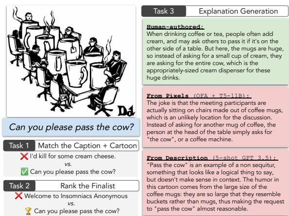  
Figure 1: We formulate three tasks using over a decade of New Yorker caption contests: models must 1) recognize a caption written about a cartoon (vs. options that were not); 2) evaluate that caption’s “quality” by scoring it more highly than a non-finalist/non-winner from the same contest; and 3) explain why the joke is funny. (Cartoon by Drew Dernavich, winning caption by Bennett Ellenbogen).

These tasks are difficult because the connection between a winning caption and image can be quite subtle, and the caption can make playful allusions to human experience, culture, and imagination. Consider the image and winning caption “Can you please pass the cow?” in Figure 1. Unlike literal image captions such as in MSCOCO (Lin et al., 2014), here, the caption’s relation to the image is indirect:1 the size of the mugs must first be recognized as unusual, and then, the caption invokes an association between a large mug and a large amount of cream/milk — perhaps a whole cow’s worth. Further, matching a caption to an image is not sufficient: non-finalist entries (e.g., “...Insomniacs Anonymous” in Figure 1) also match the image, but something else makes one seem funnier than the other. Finally, even if a model can accurately identify winning submissions, we would like it to also be able to explain why a particular highly rated/relevant caption is funny.

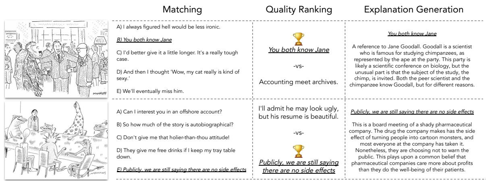  
Figure 2: Instances of our three tasks. Matching requires models to select the finalist caption for the given cartoon from among distractors that were finalists, but for other contests. Quality ranking requires models to differentiate a finalist from a non-finalist, both written for the given cartoon. Explanation requires models to generate free-text explanations of how a high-quality caption relates to the cartoon. Cartoons by Robert Mankoff and Mick Stevens.

We cover our three tasks in two settings: in the from pixels setting, models are given access only to the cartoon images at test time, and must perform computer vision; in thefrom description setting, we allow models access to a newly-collected, humanauthored corpus of cartoon descriptions, thus simulating access to a human-level computer-vision system — or, alternately, facilitating benchmarking of models that don’t have a built-in image-processing component. The annotations we collect and release are rich and multifaceted: they describe the image overall and its locations and entities, what’s unusual about the image, and an explanation of the joke. We view this effort as a significant contribution of our work.

Our results reveal a gap between AI and humanlevel humor “understanding.” In the from pixels setting, our best multimodal model (fine-tuned CLIP ViT-L/14 (Radford et al., 2021)) achieves 62% accuracy on a 5-way multiple choice task, but humans achieve 94% in the same setting. Even with significant manual annotation of the cartoons in the from description setting (and despite significant improvements in language modeling performance since this work’s submission2) large language models still fall short: human explanations are still preferred in more than two-thirds of cases compared to our best explanation model, 5-shot GPT-4.

We release our challenging NLP/vision benchmarks,3 annotations, models, leaderboard, and code at https://capcon.dev/. Beyond AI research, we also hope that our work will spur progress in human-AI collaboration tools for cartoonists, contest entrants, and beyond (see Appendix G for AIgenerated captions).

## 2 Datasets and Task Setups

Our corpus compiles 14 years of weekly New Yorker caption contests. Each contest consists of: (1) a captionless cartoon; (2) that week’s entries; (3) the three finalists, selected by New Yorker editors; and (4) for some contests, quality estimates for each submission collected via crowdsourcing.4

The corpus was constructed from two sources. The first is Jain et al. (2020), from which we obtain roughly 250 contests (mean/median 6.1K/5.7K unique captions per contest; 1.5M total), starting from #508.5 Crowd ratings in this corpus are gathered via the NEXT platform (Jamieson et al., 2015; Tanczos et al., 2017), where readers rate captions as “funny”, “somewhat funny”, or “unfunny”; we use the per-caption mean. There are over 114M ratings total (mean/median of 445K/471K per contest). We also sample three additional top captions that aren’t editorial picks to serve as additional “finalists.”

<table><tr><td># Train/val/test Matching # Train/val/test Quality ranking</td><td>1.6K / 538 / 538 1.6K / 523 / 523</td></tr></table>

Table 1: Basic size statistics for our three tasks. We extend Shahaf et al. (2015); Radev et al. (2016); Jain et al. (2020) by (a) proposing matching, quality ranking, and explanation tasks; (b) providing new, dense annotations for each cartoon (see Figure 3); (c) authoring a set of 651 joke explanations.

The second corpus, due to Shahaf et al. (2015); Radev et al. (2016) and derived from contests #1– #507, includes 2M unique captions (mean/median 5.2K/5.0K per contest), but no crowd ratings. We remove by hand 55 contests whose images’ resolutions are too low, and identify 80 low resolution (but usable) cases, taking special care when annotating this set (§2.2).

## 2.1 Task Setups

We pose three tasks. Matching and explanation are novel, whereas quality ranking extends the formulations introduced in Shahaf et al. (2015); Radev et al. (2016).

Matching. Can a model recognize when a caption is appropriate for a given cartoon? Five choices are given, only one of which truly corresponds. For the example in Figure 1, we supply the following possibilities:

(a) O.K. I’m at the window. To the right? Your right or my right?

(b) I’d killfor some cream cheese.

(c) Bob just came directly from work.

(d) Can you please pass the cow?

(e) They only allow one carry-on.

The correct caption is a finalist for the cartoon. Negative choices are randomly selected finalists from other contests, and as a result, are great captions for some other contest’s image.6 In some cases, matching depicted objects to their textual references may suffice, but in other cases, the relationship is more indirect. For example, Figure 2 (top) contains a subtle reference to Jane Goodall, thus requiring external knowledge; Figure 2 (bottom) relies on a stereotype of pharmaceutical companies being untrustworthy, hence requiring reasoning beyond the literal text.

Quality ranking. Can a model identify highly rated captions? For each finalist, we sample for comparison a caption that was not selected as a finalist, and ask models to identify which one (the real one or the distractor) was rated as higher quality. As preprocessing, we run one round of textonly filtering to discard submissions that are easily identifiable as low quality, and also perform semantic deduplication; more details in Appendix C. Here is the end result for Figure 1:

(a) Can you please pass the cow?

(b) Welcome to Insomniacs Anonymous.

Which caption a particular individual prefers can be a matter of personal taste; but there is a general preference among our human annotators for the true finalist (see §3).

Explanation. Can a model generate as good an explanation as a human for why a caption-andimage combination is funny? Free-form explanations of why captions are funny/appropriate for their corresponding image were written by an author of this paper.7 The rough annotation guidance was: “In a few sentences, explain the joke as if to a friend who doesn’t ‘get it’ yet.” Starting from a random finalist for each contest, after filtering out cases where the author did not understand the joke, a corpus of 651 human-created joke explanations to serve as comparison points was formed (mean/median 60/59 words, 39.3K total). We consider a model to succeed at this task if human judges, presented with (unlabeled) pairs of author/machine-generated explanations, do not show a preference for the author-generated ones.

Evaluation metrics. For matching and quality ranking, we evaluate using accuracy. For quality ranking, we report NYAcc — the average accuracy over instances where the finalist was an official New Yorker finalist — and CrowdAcc, where the “finalist” caption was selected by the crowd as high quality. These two measures allow us to account for different audience tastes. For explanation, we conduct pairwise human evaluations to test several hypotheses detailed in §3.2. To complement these human evaluations, we also report in Appendix E automatic metrics that take into account the human-written reference: (a) BLEU-4 (Papineni et al., 2002) using Post (2018)+ROUGE-L (Lin, 2004); and (b) word-level perplexity.

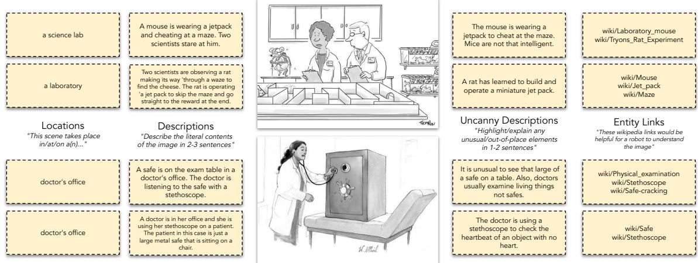  
Figure 3: For each of 704 cartoons, we gather several types of annotations from human participants, including locations, descriptions, descriptions of uncanniness, and relevant entities in the form of English Wikipedia links. Annotations shown are true random samples from the corpus. Cartoons by Mark Thompson and Will McPhail.

From Pixels + From Description. We consider two experimental settings. In From Pixels (FP), a vision+language model undertakes image processing, i.e., at test time, the only contest information available is the image itself. In the second setting, which we call From Description (FD), we factor out visual processing by providing the model with human written annotations, described in §2.2. FD models thus simulate access to a human-level computer-vision system.

## 2.2 Annotation of cartoons.

We collect several types of annotations about the 704 cartoons; these either serve as input to models in the from description setting, or as additional information available only at training time in the from pixels setting. For each cartoon, we gather:

(i) A phrase describing the setting of the scene, e.g., “an office” or “the park” (2 per cartoon)

(ii) A literal 1-3 sentence description of the scene (3 per cartoon)

(iii) A 1-3 sentence description or explanation of what makes the scene unusual (3 per cartoon)

(iv) 2-3 English Wikipedia links that an annotator identified as relevant, to serve as a proxy for world knowledge (2 per cartoon)

A random sample of annotations is shown in Figure 3. We used Amazon Mechanical Turk, and paid crowdworkers a minimum of \$15/hr. Lowresolution images involved special treatment: 1) we offered additional pay to crowdworkers; and 2) at least one of the annotations is conducted by an author of this work using the same HIT interface. Details including qualification rounds, screenshots of the HITs, etc. are given in Appendix A.

## 3 Experiments

We split the 704 cartoons into 5 cross-validation splits such that entire contests are held out at test time. Task construction details are in Appendix C; modeling details (e.g., hyperparameter sweeps, task formatting) are in Appendix B.

## From Pixels (FP) Models

We explore two vision+language models.

CLIP. We fine-tune CLIP ViT-L/14@366px (Radford et al., 2021) (428M parameters), which consists of a text Transformer (Vaswani et al., 2017) and a vision Transformer (Dosovitskiy et al., 2021) pretrained to align images/captions in the WebImageText corpus (400M pairs). For multiple choice, we use InfoNCE (Oord et al., 2018) to encourage the cosine similarity of the cartoon/correct answer to be higher than the incorrect ones. For zero-shot classification, we use the prompt a new yorker cartoon with winning caption. CLIP isn’t generative, so we can’t use it for explanation.

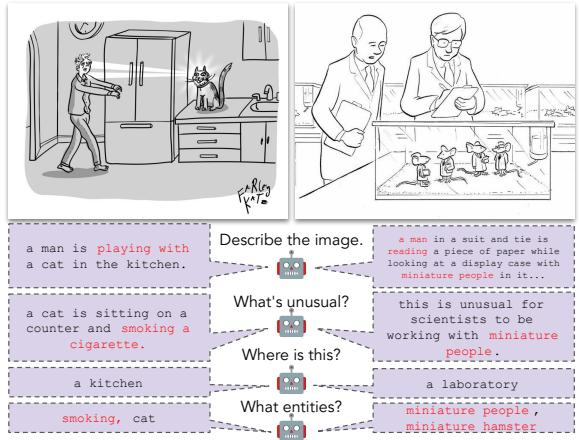  
Figure 4: Example predictions by fine-tuned OFA-Huge from images. The model recognizes many objects/actions/locations, but makes some mistakes (indicated in red): for the left image, for example, it falsely indicates that the cat is smoking, and, on the right, that the mice are small people or hamsters (hamsters have stubby tails). Cartoons by Farley Katz and Paul Noth.

OFA  LM. We use OFA Huge (930M parameters) (Wang et al., 2022), a seq2seq model that supports image/text inputs/outputs; it is pretrained on a variety of vision+language tasks. We finetune on the New Yorker corpus by training it to map from (cartoon, prompt)  descriptions for the four types of annotations described in §2.2; see Figure 4 for example predictions. We organize the OFA-predicted outputs in the same format as the human-authored descriptions in our From Description (FD) models detailed below (except the inputs are the outputs of OFA), and pass the result to a language model:8 this composition can be considered a Socratic Model (Zeng et al., 2022).

## From Description (FD) Models

We formulate multiple-choice tasks as text-to-text by concatenating the human-authored cartoon descriptions with the choices as input: the target is simply the letter corresponding to the answer, e.g., E. For explanation, we autoregressively generate the explanations conditioned on the descriptions/captions.

T5. We fine-tune T5-Large and T5-11B (Raffel et al., 2020); these encoder-decoder transformer models have 770M and 11.3B parameters respectively. For explanation, we sample with temperature 1.0 and nucleus sampling with p=.95 (Holtzman et al., 2020).

GPT-3, GPT-3.5, GPT-4. We use these three OpenAI models as both zero-shot and few-shot models. We provide the models with a description of the task, and, for the few-shot case, 5 random labelled in-context examples. Specifically, for GPT-3 we use text-davinci-002 (175B) (Brown et al., 2020), and for GPT-3.5/GPT-4, we use the May 12, 2023 versions (OpenAI, 2023). For GPT-3, we also consider a fine-tuned version (which is unavailable for GPT3.5/GPT-4).9 For zero-shot GPT-3.5/GPT-4, early experiments revealed that prompting models to “think” step-bystep with chain-of-thought (CoT) was helpful (Wei et al., 2022; Kojima et al., 2022). See §B.6 for GPT-3 details, and §B.7 for GPT-3.5/GPT-4 details.

## Baselines

Caption Only. In addition to a Random-guess baseline, we fine-tune T5-11B given just the caption, i.e., without knowledge of the cartoon (Trichelair et al., 2019; Poliak et al., 2018).

Human performance estimates. Three people (two authors and one person familiar with the project) each attempted 100 randomly sampled instances from both the matching and quality ranking tasks.10 It is important to note that human performance is not an upper bound for model performance on matching and quality ranking because labels are not generated by a single human and tastes can vary; it can (and does, see §3.1) happen that a machine might be able to reconstruct New Yorker editor preferences more reliably than an untrained human. Annotators were given access to the images, but not the descriptions (akin to the FP setting).

## Hardware+software details.

T5, CLIP, and OFA were trained using 8 A100 GPUs in pytorch (Paszke et al., 2019). We use the Transformers (Wolf et al., 2020) implementation of T5: T5-11B was trained with deepspeed (Rasley et al., 2020); T5-Large and CLIP were trained with Accelerate.11

<table><tr><td rowspan="2"></td><td>Matching</td><td colspan="2">Quality Ranking</td></tr><tr><td>Accuracy (↑)</td><td>CrowdAcc (↑)</td><td>NYAcc (↑)</td></tr><tr><td>Random</td><td>20.0</td><td>50.0</td><td>50.0</td></tr><tr><td>Caption Only (T5-11B)</td><td>19.4</td><td>59.4</td><td>64.5</td></tr><tr><td rowspan="3">CLIP ViT-L/14@336px (finetuned) Zero-shot P OFA-Huge → T5-Large</td><td>62.3</td><td>57.0</td><td>66.9</td></tr><tr><td>456.6</td><td>455.8</td><td>456.8</td></tr><tr><td>45.2</td><td>59.1</td><td>64.3</td></tr><tr><td>OFA-Huge → T5-11B</td><td>51.8</td><td>60.3</td><td>65.0</td></tr><tr><td>T5-Large T5-11B</td><td>59.6</td><td>61.8</td><td>64.8</td></tr><tr><td></td><td>70.8</td><td>62.3</td><td>65.6</td></tr><tr><td>GPT3-175B (finetuned)</td><td>75.1</td><td>64.8</td><td>69.8</td></tr><tr><td>5-shot FD</td><td>457.2</td><td>455.1</td><td>454.8</td></tr><tr><td>Zero-shot</td><td>451.6</td><td>456.2</td><td>455.6</td></tr><tr><td>GPT 3.5 (5-shot)</td><td>63.8</td><td>55.6</td><td>55.2</td></tr><tr><td> Zero-shot+CoT</td><td>450.4</td><td>452.8</td><td>455.4</td></tr><tr><td>GPT-4 (5-shot)</td><td>84.5</td><td>73.3</td><td>68.2</td></tr><tr><td>Zero-shot+CoT</td><td>481.9</td><td>466.2</td><td>464.3</td></tr><tr><td>Human Estimate From Pixels (FP)</td><td>94.0</td><td>83.7</td><td>64.6</td></tr></table>

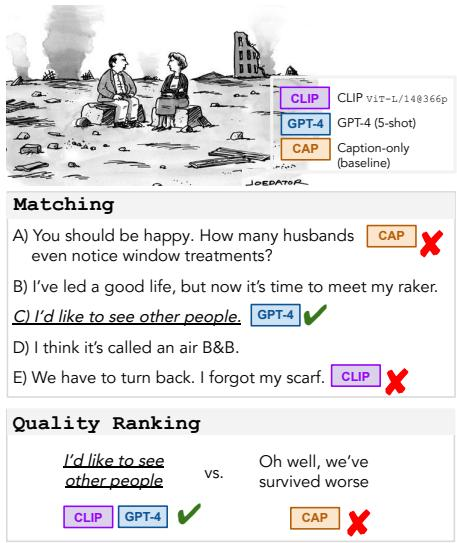  
Table 2: Prediction results for the matching and quality ranking tasks: averages over 5 cross-validation splits. Underlined results are the best model in the From Pixels (FP) setting, where at test time, models only have access to the cartoon images. Bold results are best in the From Description (FD) setting, where at test time, models have access to human-authored descriptions of the cartoons. Appendix D presents these results visually. Right: sample predictions by CLIP (finetuned), GPT-4 (5-shot), and the caption-only baseline over a matching/ranking instance. Cartoon by Joe Dator.

## 3.1 Matching and quality ranking results

Table 2 contains the results. Among the from description models, GPT-4 (5-shot) generally performs best, e.g., achieving 84.5% accuracy on matching. It (and fine-tuned GPT-3) also perform better at predicting New Yorker editor selections than our three humans (column NYAcc: GPT-3 69.8 vs. Human estimate, 64.6), but underperform at predicting crowd selections (CrowdAcc column: GPT-4 73.3 vs. 83.7).12 We also see that our from pixels models leave significant headroom compared to the human performance estimates.

Other observations include: 1) bothfrom pixels and from description models mostly outperform the Caption Only baseline (even for smaller model sizes), suggesting that the models are truly using feature interactions between cartoons/captions to improve their predictive accuracy; 2) fine-tuning CLIP tends to do best for matching in the from pixels setting, but OFA+T5-11B is competitive for quality ranking (and supports generation, see §3.2); and 3) the performance difference between T5 vs. OFA T5 exemplifies the effect of suboptimal visual recognition when shifting from the from pixels setting to the from description setting. Finally, while performance drops are incurred universally for zero-shot models, pointing towards the utility of the new annotated corpus we are releasing (§2.2), GPT-4’s zero-shot chain-of-thought incurs a smaller performance drop compared to other zero-shot models; see §B.7 for a sample chain-ofthought.

## 3.2 Human evaluation of explanation.

We gather judgments from 3 crowd-workers per test instance by asking them which of a pair of explanations they prefer, and take a majority vote to determine a winner. Results and annotator agreement are in Table 3, and samples of GPT-3, GPT-4, and human joke explanations are in Figure 5. Our evaluations address seven questions:

Q1: Do models utilize the image context of the caption to generate better explanations? Test: T5-11B vs. Caption-only T5-11B. Answer: Yes. Compared to the same model trained with no access to image information, the model with image information wins in 84.7% of cases.

Q2: Is computer vision a bottleneck for topquality explanation generation? Test: T5-11B (in the FD setting) vs. OFA T5-11B. Answer: Yes. Compared to the same model trained with access to human written descriptions available at test time (i.e., thefrom description setting), the model trained with access only to OFA-predictions loses in 74.6% of cases.

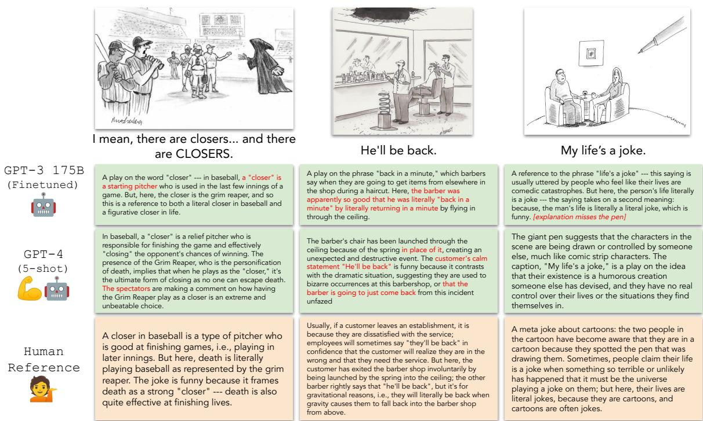  
Figure 5: A random sample of caption explanations generated by a fine-tuned version of GPT-3, GPT-4 with 5 shots, and human-written references. Errors are highlighted in red. Machine-authored generations are often on the right track, but frequently contain mistakes, e.g., by referring to a closing pitcher as a starter (GPT-3, left image) or suggesting that a barber, rather than a customer, was launched (GPT-4, middle image). Cartoons by Mort Gerberg, Tom Cheney, and Mick Stevens.

<table><tr><td></td><td>A</td><td>B</td><td>% A wins</td><td># ratings</td><td>G-γ</td></tr><tr><td>Q1</td><td>T5-11B</td><td>Caption only</td><td>84.7%</td><td>393</td><td>64.4</td></tr><tr><td>Q2</td><td>T5-11B</td><td>OFA → T5-11B</td><td>74.6%</td><td>393</td><td>41.6</td></tr><tr><td>Q3</td><td>T5-11B</td><td>T5-Large</td><td>68.5%</td><td>390</td><td>45.9</td></tr><tr><td>Q4</td><td>FT-GPT-3</td><td>In context GPT-3</td><td>50.0%</td><td>396</td><td>23.2</td></tr><tr><td>Q5</td><td>5-shot GPT-4</td><td>Zero-shot GPT-4</td><td>64.3%</td><td>396</td><td>19.7</td></tr><tr><td>Q6</td><td>5-shot GPT-4</td><td>5-shot GPT-3</td><td>93.0%</td><td>384</td><td>86.4</td></tr><tr><td>Q7</td><td>Human</td><td>5-shot GPT-4</td><td>67.7%</td><td>390</td><td>20.9</td></tr></table>

Table 3: Pairwise human evaluations for explanation, with per-instance agreement according to Gwet’s (2014) γ. Q1-Q7 notations refer to the corresponding paragraphs in §3.2.

Q3: Do bigger T5 models generate better explanations? Test: T5-11B vs. T5-Large. Answer: Yes. T5-11B with access to the same information at test time as T5-Large (770M) is preferred in 68.5% of cases.

Q4: Does fine-tuning an LLM model help vs. in-context learning for explanation generation? Test: FT-GPT3 vs. In context (=5-shot) GPT3. Answer: Not really. In contrast to the multiple choice tasks, we find that in-context explanation generations are comparable to fine-tuned ones according to pairwise human evaluations, even though the perplexity of the in-context model, reported in Appendix E, is much higher (107 vs. 21.8).13 We expect that the fine-tuned model more closely mirrors the style of the corpus, but that the in-context explanations also contain similar content, e.g., relevant entities.

Q5: Do supervised explanations help, even with GPT-4? Test: 5-shot GPT-4 vs. Zero-shot GPT-4. Answer: Yes. The zero-shot version of GPT-4 is missing access not only to the supervision of paired (caption, explanation) data, but also, explanations in the detailed style of our released corpus. Perhaps as a result, 5-shot GPT-4 (which also achieves significantly higher BLEU-4/Rouge-L) is preferred in 64% of cases.

Q6: Does GPT-4 outperform GPT-3? Test: 5- shot GPT-4 vs. 5-shot GPT-3. Answer: Yes, definitely. In our most definitive result, with equal amounts of supervision, GPT-4’s explanations are preferred nearly universally — specifically, in 93% of cases. Interestingly, GPT-3 performs slightly better on automatic evaluation metrics for explanation like BLEU-4 and Rouge-L (see Appendix E), which suggest that the earlier family of may fit the surface features of the generation task more effectively, e.g., 5-shot GPT-3 achieves 5.07 BLEU-4 compared to 4.99 for 5-shot GPT-4. This suggests that mirroring the surface form of our explanation corpus is not sufficient to generate the highest quality explanations.

Q7: Does our best model, GPT-4, explain jokes as well as humans? Test: Human vs. Few-shot GPT-4. Answer: No. Human-written explanations are preferred by annotators in 68% of pairwise cases.14 We qualitatively examine the 39/130 cases where the human reference receives 3/3 annotator votes. In these cases, the machine-generated explanations usually incorrectly interpret the image, e.g., in one case, a caption jokes about two cavepeople in a hole looking at a caveman in a cave with the caption “Personally, I’m not a big fan of modern architecture.”; GPT-4 incorrectly interprets the hole as “modern architecture” instead of the cave. We also examine the 8/130 cases where the GPT-4 produced caption was unanimously preferred: a close reading of these cases is provided in Appendix F. In 3 of these 8 cases, the human explanations, while on the right track, had slight inaccuracies, and in the remaining 5 cases, the human and machine explanations both express the same idea, but with different styles (GPT-4’s sometimes arguably being more formal, detailed, or fluent).

## 3.3 Error Analysis for Matching

We conduct an error analysis of a performantfrom pixels model (CLIP ViT-L/14@336px finetuned), and a performant from description model (GPT3-175B finetuned). We concatenate the test set predictions over the 5 cross validation splits, and ask:

Q8: Are some contests more difficult than others? Answer: Yes. Details: We conduct a $\chi ^ { 2 }$ test by forming a contest-by-correctness (704-by-2) contingency table, aggregating over the 3-6 matching instances for each contest, and find that errors are clustered according to contest (p < .05 for both CLIP and GPT-3).15 There’s a moderate Spearman correlation between the per-contest accuracy between the models $( \rho = . 2 8 , p \ll . 0 0 1 )$ , but (as a null hypothesis) only a slight correlation between contest date and difficulty for either (later contests easier, GPT3/CLIP $\rho = . 0 7 / . 0 8 , p = . 0 8 / . 0 5 )$ When the models’ predictions agree, they are correct 87% of the time. When GPT-3 is wrong, CLIP is right only 38% of the time; under the null hypothesis that their errors are uncorrelated, CLIP’s accuracy would be 62% (p  .001 errors are uncorrelated, permutation test). However, when we attempt to identify consistent factors that predict contest difficulty using various visual/linguistic predictors, we find hard vs. easy difficult to predict a priori; our best classifiers perform only slightly above random. We will distribute the hard vs. easy contest lists as a resource for future work.

## 4 Related Work

Humor. Raskin (1979) and Attardo (2008) highlight three “great families” of theories of the roots of humor: 1) hostility, claims of superiority over someone or something (Gruner, 1978; Billig, 2005); 2) release of a constraint (Freud, 1905; Fry, 1963; Mindess, 1971) and 3) incongruity, (sometimes “incongruity-resolution”; Mulder and Nijholt, 2002) the introduction (and subsequent resolution) of generally incompatible contexts (Schopenhauer, 1818; Shultz, 1976). Shahaf et al. (2015) note that most New Yorker caption contest cartoons involve incongruous situations.

NLP + The Caption Contest. King et al. (2013), Shahaf et al. (2015), and Radev et al. (2016) analyze 5, 16, and 50 New Yorker Caption Contests, respectively. Best-performing features for identifying the funniest among a set of caption choices include: perplexity, match to image setting and uncanniness description, readability, proper nouns (Shahaf et al., 2015), overlap with WordNet’s (Fellbaum, 1998) “person” and “relative” synsets, lexical centrality among submissions (Radev et al., 2016, inspired by Mihalcea and Pulman (2009)), and sentiment (both papers). Our “location” and “uncanny description” annotations are direct analogs of the “context” and “anomaly” tags of Shahaf et al. (2015), and our data incorporates that generously released by the previous researchers. Our extensions are (a) the addition of two novel tasks; (b) using new data/resources/models to curate ranking pairs (see §2); and (c) evaluating two distinct audience preferences: New Yorker editors vs. “the crowd”. Appendix H highlights efforts beyond the scope of peer reviewed AI venues, e.g., blog posts.

Measuring preferences over captions. While humor is ultimately subjective, work on the contest has studied modeling average preferences of raters. Tanczos et al. (2017) design quality ranking algorithms for the caption contest, framed as identifying the best “arm” in a multi-armed bandit setting; their crowdsourcing system NEXT (Jamieson et al., 2015) is used by The New Yorker. It does not directly use the content of the cartoons/contests. The result is Jain et al. (2020)’s continuously updated corpus, from which we draw some of our data.

Multimodal and computational humor. Chandrasekaran et al. (2016) explore humor recognition in images, and Castro et al. (2019); Hasan et al. (2019); Patro et al. (2021); Hasan et al. (2021) explore laughter prediction in TED-talks/sitcoms. Tsakona (2009); Fallianda et al. (2018) study political cartoons. Chakrabarty et al. (2022) recently proposed a version of NLI for figurative language, which can be humorous. Some work has tried to detect whether a sentence is humorous or not (Blinov et al., 2019; Annamoradnejad and Zoghi, 2020). More difficult to evaluate (Valitutti, 2011) are setups where the goal is to automatically generate humorous content in various contexts (Binsted and Ritchie, 1994; Stock and Strapparava, 2003; Mihalcea and Strapparava, 2005, 2006; Wang and Wen, 2015; Chandrasekaran et al., 2018; Yoshida et al., 2018; Sundaram, 2018; Shimomoto et al., 2019); a survey is provided by Amin and Burghardt (2020).

Explaining humor. In the taxonomy of Tan (2022), joke explanations are most related to proximal mechanisms: “This type of explanation attempts to provide the mechanism behind the predicted label, i.e., how to infer the label from the text”, or efficient cause a la Aristotle (Lombrozo, 2006). Chowdhery et al. (2022) undertake a qualitative exploration of (non-visual) joke explanations.

## 5 Conclusion

We demonstrate that today’s vision and language models still cannot recognize caption relevance, evaluate (at least in the sense of reproducing crowdsourced rankings), or explain The New Yorker Caption Contest as effectively as humans can. However, the partial capacity of today’s AI is still substantial, and may be sufficient for models to serve as creative collaborators, e.g., as brainstorming assistants for humorists/cartoonists. Specifically: 1) our matching/quality ranking models could help entrants receive quantitative feedback on the relevance/predicted quality of their submissions, and 2) the annotated corpus+explanations we introduce could be repurposed for generation (we explore generation of novel cartoons/captions in Appendix G). Finally, a promising avenue for future work focused on generating humorous captions (c.f. our focus of humor “understanding” benchmarks) would be to operationalize the feedback provided by our matching/ranking models in an reinforcement learning from human feedback (RLHF) loop.

A last remark. We cannot claim to know whether the human-machine ‘humor understanding gap’ will be closed sooner or later.16 But we encourage other researchers to have as much fun with the topic as we did!

## 6 Limitations

The New Yorker Cartoon Caption Contest represents a narrow slice of humor, deriving from a particular language, region, history, culture, style, and set of conventions. Hence, the results of this study do not represent or cover all types of humor.

Our framing of the quality ranking task could be interpreted as seemingly prescriptive (i.e., that joke A is “objectively” better than joke B), but New Yorker editorial selections should not be taken as ground truth for funniness; disagreement about what is funny is expected and valid. Our tasks operationalize the prediction of only average preferences (rather than individual ones), and these preferences may include a partiality or bias towards items that conform to the characteristics of prior contest winners or published New Yorker cartoons.

Finally, the explanations in our annotated corpus were largely written by a single author of this paper. While a larger pool of the crowdworkers judged these explanations to be of higher quality in comparison to machine generations, future work would be well-suited to compare the person-toperson variance in explaining why particular jokes are funny.

16Or never. Is never good for you?

## 7 Acknowledgements

We thank the cartoonists and contest entrants for their wonderful efforts! We additionally thank our crowd annotators for their diligent work, Lisa Watkins for contributing to the human performance estimates, and the anonymous reviewers for their constructive comments. This work was funded in part by DARPA MCS through NIWC Pacific (N66001-19-2-4031), the Allen Institute for AI, and a Google Focused Research Award. Jack Hessel conducted initial work while at Cornell University. Ana Marasovic conducted this work while at The´ Allen Institute for AI. Rowan Zellers conducted this work while at University of Washington.

## References

Miriam Amin and Manuel Burghardt. 2020. A survey on approaches to computational humor generation. In The 4th Joint SIGHUM Workshop on Computational Linguistics for Cultural Heritage, Social Sciences, Humanities and Literature.

Issa Annamoradnejad and Gohar Zoghi. 2020. Col-BERT: Using BERT sentence embedding for humor detection. arXiv preprint arXiv:2004.12765.

Salvatore Attardo. 2008. A primer for the linguistics of humor. The primer ofhumor research, 8:101–55.

Michael Billig. 2005. Laughter and ridicule: Towards a social critique ofhumour. Sage.

Kim Binsted and Graeme Ritchie. 1994. An implemented model of punning riddles. In AAAI.

Vladislav Blinov, Valeria Bolotova-Baranova, and Pavel Braslavski. 2019. Large dataset and language model fun-tuning for humor recognition. In ACL.

Tom B. Brown, Benjamin Mann, Nick Ryder, Melanie Subbiah, Jared Kaplan, Prafulla Dhariwal, Arvind Neelakantan, Pranav Shyam, Girish Sastry, Amanda Askell, Sandhini Agarwal, Ariel Herbert-Voss, Gretchen Krueger, Tom Henighan, Rewon Child, Aditya Ramesh, Daniel M. Ziegler, Jeffrey Wu, Clemens Winter, Christopher Hesse, Mark Chen, Eric Sigler, Mateusz Litwin, Scott Gray, Benjamin Chess, Jack Clark, Christopher Berner, Sam Mc-Candlish, Alec Radford, Ilya Sutskever, and Dario Amodei. 2020. Language models are few-shot learners. NeurIPS.

Santiago Castro, Devamanyu Hazarika, Veronica P´ erez-´ Rosas, Roger Zimmermann, Rada Mihalcea, and Soujanya Poria. 2019. Towards multimodal sarcasm detection (an Obviously perfect paper). In ACL.

Tuhin Chakrabarty, Arkadiy Saakyan, Debanjan Ghosh, and Smaranda Muresan. 2022. FLUTE: figurative language understanding and textual explanations. In EMNLP.

Arjun Chandrasekaran, Devi Parikh, and Mohit Bansal. 2018. Punny captions: Witty wordplay in image descriptions. In NAACL.

Arjun Chandrasekaran, Ashwin K. Vijayakumar, Stanislaw Antol, Mohit Bansal, Dhruv Batra, C. Lawrence Zitnick, and Devi Parikh. 2016. We are humor beings: Understanding and predicting visual humor. In CVPR.

Aakanksha Chowdhery, Sharan Narang, Jacob Devlin, Maarten Bosma, Gaurav Mishra, Adam Roberts, Paul Barham, Hyung Won Chung, Charles Sutton, Sebastian Gehrmann, Parker Schuh, Kensen Shi, Sasha Tsvyashchenko, Joshua Maynez, Abhishek Rao, Parker Barnes, Yi Tay, Noam Shazeer, Vinodkumar Prabhakaran, Emily Reif, Nan Du, Ben Hutchinson, Reiner Pope, James Bradbury, Jacob Austin, Michael Isard, Guy Gur-Ari, Pengcheng Yin, Toju Duke, Anselm Levskaya, Sanjay Ghemawat, Sunipa Dev, Henryk Michalewski, Xavier Garcia, Vedant Misra, Kevin Robinson, Liam Fedus, Denny Zhou, Daphne Ippolito, David Luan, Hyeontaek Lim, Barret Zoph, Alexander Spiridonov, Ryan Sepassi, David Dohan, Shivani Agrawal, Mark Omernick, Andrew M. Dai, Thanumalayan Sankaranarayana Pillai, Marie Pellat, Aitor Lewkowycz, Erica Moreira, Rewon Child, Oleksandr Polozov, Katherine Lee, Zongwei Zhou, Xuezhi Wang, Brennan Saeta, Mark Diaz, Orhan Firat, Michele Catasta, Jason Wei, Kathy Meier-Hellstern, Douglas Eck, Jeff Dean, Slav Petrov, and Noah Fiedel. 2022. PaLM: Scaling language modeling with pathways. arXiv preprint arXiv:2204.02311.

Alexey Dosovitskiy, Lucas Beyer, Alexander Kolesnikov, Dirk Weissenborn, Xiaohua Zhai, Thomas Unterthiner, Mostafa Dehghani, Matthias Minderer, Georg Heigold, Sylvain Gelly, Jakob Uszkoreit, and Neil Houlsby. 2021. An image is worth 16x16 words: Transformers for image recognition at scale. In ICLR.

Fallianda, Rani Yuni Astiti, and Zulvy Alivia Hanim. 2018. Analyzing humor in newspaper comic strips using verbal-visual analysis. Lingua Cultura, 12(4):383–388.

Christiane Fellbaum. 1998. WordNet: An Electronic Lexical Database. Bradford Books.

Sigmund Freud. 1905. Jokes and their Relation to the Unconscious, volume 8 of The Standard Edition of the Complete Psychological Works of Sigmund Freud. Hogarth, London.

William F. Fry. 1963. Sweet madness: A study of humor. Pacific Books, Palo Alto.

Charles R. Gruner. 1978. Understanding laughter: The workings of wit & humor. Nelson-Hall, Chicago.

Kilem Gwet. 2014. Handbook of Inter-Rater reliability: The Definitive Guide to Measuring the Extent of Agreement Among Raters, 4th edition edition. Advanced Analytics, LLC.

Md Kamrul Hasan, Sangwu Lee, Wasifur Rahman, Amir Zadeh, Rada Mihalcea, Louis-Philippe Morency, and Ehsan Hoque. 2021. Humor knowledge enriched transformer for understanding multimodal humor. In AAAI.

Md Kamrul Hasan, Wasifur Rahman, AmirAli Bagher Zadeh, Jianyuan Zhong, Md Iftekhar Tanveer, Louis-Philippe Morency, and Mohammed (Ehsan) Hoque. 2019. UR-FUNNY: a multimodal language dataset for understanding humor. In EMNLP.

Ari Holtzman, Jan Buys, Li Du, Maxwell Forbes, and Yejin Choi. 2020. The curious case of neural text degeneration. In ICLR.

Lalit Jain, Kevin Jamieson, Robert Mankoff, Robert Nowak, and Scott Sievert. 2020. The New Yorker cartoon caption contest dataset.

Kevin G. Jamieson, Lalit Jain, Chris Fernandez, Nicholas J. Glattard, and Rob Nowak. 2015. NEXT: A system for real-world development, evaluation, and application of active learning. In NeurIPS.

Ben King, Rahul Jha, Dragomir Radev, and Robert Mankoff. 2013. Random walk factoid annotation for collective discourse. In ACL.

Takeshi Kojima, Shixiang Shane Gu, Machel Reid, Yutaka Matsuo, and Yusuke Iwasawa. 2022. Large language models are zero-shot reasoners. In NeurIPS.

Chin-Yew Lin. 2004. ROUGE: A package for automatic evaluation of summaries. In Text summarization branches out.

Tsung-Yi Lin, Michael Maire, Serge Belongie, James Hays, Pietro Perona, Deva Ramanan, Piotr Dollar,´ and C. Lawrence Zitnick. 2014. Microsoft COCO: Common objects in context. In ECCV.

Tania Lombrozo. 2006. The structure and function of explanations. Trends in Cognitive Sciences, 10(10):464–470.

Ana Marasovic, Iz Beltagy, Doug Downey, and ´ Matthew E. Peters. 2022. Few-shot selfrationalization with natural language prompts. In Findings ofNAACL.

Rada Mihalcea and Stephen Pulman. 2009. Characterizing humour: An exploration of features in humorous texts. In Proceedings of the 8th International Conference on Computational Linguistics and Intelligent Text Processing, page 337–347, Berlin, Heidelberg. Springer-Verlag.

Rada Mihalcea and Carlo Strapparava. 2005. Making computers laugh: Investigations in automatic humor recognition. In EMNLP.

Rada Mihalcea and Carlo Strapparava. 2006. Technologies that make you smile: Adding humor to text-based applications. IEEE Intelligent Systems, 21(5):33–39.

Harvey Mindess. 1971. Laughter and Liberation. Nash.

Pamela Mishkin, Matt Daniels, Russell Goldenberg, Ilia Blinderman, and James Yu. 2022. The pudding caption contest experiments. https://pudding.cool/ projects/caption-contest/. Accessed: 2022-04-01.

Matthijs P. Mulder and Antinus Nijholt. 2002. Humour research: State ofthe art. Centre for Telematics and Information Technology, University of Twente.

Aaron van den Oord, Yazhe Li, and Oriol Vinyals. 2018. Representation learning with contrastive predictive coding. arXiv preprint arXiv:1807.03748.

OpenAI. 2023. Gpt-4 technical report.

Kishore Papineni, Salim Roukos, Todd Ward, and Wei-Jing Zhu. 2002. BLEU: a method for automatic evaluation of machine translation. In ACL.

Adam Paszke, Sam Gross, Francisco Massa, Adam Lerer, James Bradbury, Gregory Chanan, Trevor Killeen, Zeming Lin, Natalia Gimelshein, Luca Antiga, Alban Desmaison, Andreas Kopf, Edward Yang, Zachary DeVito, Martin Raison, Alykhan Tejani, Sasank Chilamkurthy, Benoit Steiner, Lu Fang, Junjie Bai, and Soumith Chintala. 2019. Pytorch: An imperative style, high-performance deep learning library. In NeurIPS.

Badri N. Patro, Mayank Lunayach, Deepankar Srivastava, Sarvesh, Hunar Singh, and Vinay P. Namboodiri. 2021. Multimodal humor dataset: Predicting laughter tracks for sitcoms. In WACV.

Adam Poliak, Jason Naradowsky, Aparajita Haldar, Rachel Rudinger, and Benjamin Van Durme. 2018. Hypothesis only baselines in natural language inference. In \*SEM.

Matt Post. 2018. A call for clarity in reporting BLEU scores. In WMT.

Dragomir Radev, Amanda Stent, Joel Tetreault, Aasish Pappu, Aikaterini Iliakopoulou, Agustin Chanfreau, Paloma de Juan, Jordi Vallmitjana, Alejandro Jaimes, Rahul Jha, and Robert Mankoff. 2016. Humor in collective discourse: Unsupervised funniness detection in the New Yorker cartoon caption contest. In LREC.

Alec Radford, Jong Wook Kim, Chris Hallacy, Aditya Ramesh, Gabriel Goh, Sandhini Agarwal, Girish Sastry, Amanda Askell, Pamela Mishkin, Jack Clark, Gretchen Krueger, and Ilya Sutskever. 2021. Learning transferable visual models from natural language supervision. In ICML.

Colin Raffel, Noam Shazeer, Adam Roberts, Katherine Lee, Sharan Narang, Michael Matena, Yanqi Zhou, Wei Li, and Peter J. Liu. 2020. Exploring the limits of transfer learning with a unified text-to-text transformer. JMLR.

Victor Raskin. 1979. Semantic mechanisms of humor. In Annual Meeting of the Berkeley Linguistics Society, volume 5, pages 325–335.

Jeff Rasley, Samyam Rajbhandari, Olatunji Ruwase, and Yuxiong He. 2020. Deepspeed: System optimizations enable training deep learning models with over 100 billion parameters. In KDD.

Nils Reimers and Iryna Gurevych. 2019. Sentence-BERT: Sentence embeddings using Siamese BERTnetworks. In EMNLP.

Arthur Schopenhauer. 1818. The world as will and idea, volume 1.

Dafna Shahaf, Eric Horvitz, and Robert Mankoff. 2015. Inside jokes: Identifying humorous cartoon captions. In KDD.

Erica K Shimomoto, Lincon S Souza, Bernardo B Gatto, and Kazuhiro Fukui. 2019. News2meme: An automatic content generator from news based on word subspaces from text and image. In Conference on Machine Vision Applications.

Thomas R Shultz. 1976. A cognitive-developmental analysis ofhumour. Transaction Publishers.

Oliviero Stock and Carlo Strapparava. 2003. Getting serious about the development of computational humor. In IJCAI.

Rajesh Shanmuga Sundaram. 2018. Generation ofHumorous Caption for Cartoon Images Using Deep Learning. Ph.D. thesis, Texas A&M University-Commerce.

Chenhao Tan. 2022. On the diversity and limits of human explanations. In NAACL.

Ervin Tanczos, Robert Nowak, and Bob Mankoff. 2017. A KL-LUCB algorithm for large-scale crowdsourcing. In NeurIPS.

Paul Trichelair, Ali Emami, Adam Trischler, Kaheer Suleman, and Jackie Chi Kit Cheung. 2019. How reasonable are common-sense reasoning tasks: A case-study on the Winograd schema challenge and SWAG. In EMNLP.

Villy Tsakona. 2009. Language and image interaction in cartoons: Towards a multimodal theory of humor. Journal ofPragmatics, 41(6):1171–1188.

Alessandro Valitutti. 2011. How many jokes are really funny? In Human-Machine Interaction in Translation: Proceedings of the 8th International NLPCS Workshop.

Ashish Vaswani, Noam Shazeer, Niki Parmar, Jakob Uszkoreit, Llion Jones, Aidan N Gomez, Łukasz Kaiser, and Illia Polosukhin. 2017. Attention is all you need. NeurIPS.

David Wallace. 2022. Lecture notes for MIT 2.00b toy product design: Innovation and associations.

Peng Wang, An Yang, Rui Men, Junyang Lin, Shuai Bai, Zhikang Li, Jianxin Ma, Chang Zhou, Jingren Zhou, and Hongxia Yang. 2022. Unifying architectures, tasks, and modalities through a simple sequence-to-sequence learning framework. In ICML.

William Yang Wang and Miaomiao Wen. 2015. I can has cheezburger? a nonparanormal approach to combining textual and visual information for predicting and generating popular meme descriptions. In NAACL.

Jason Wei, Xuezhi Wang, Dale Schuurmans, Maarten Bosma, Ed Chi, Quoc Le, and Denny Zhou. 2022. Chain-of-thought prompting elicits reasoning in large language models. In NeurIPS.

White, E. B. 1941. Preface. In E. B. White and Katherine S. White, editors, A Subtreasury Of American Humor, page xvii. The original version of this quote appeared as a preview in The Saturday Review (1941), credited to both Whites. But, the quote appears in the preface to A Subtreasury (1941) with authorship solely credited to E.B.. We thus credited the quote itself to E.B., and credited both E.B. and K.S. as editors of the anthology in which it appears in non-preview form.

Sarah Wiegreffe, Jack Hessel, Swabha Swayamdipta, Mark Riedl, and Yejin Choi. 2022. Reframing human-AI collaboration for generating free-text explanations. In NAACL.

Hannah Wilson. 2019. Project four - nobody knows you’re a bot.

Thomas Wolf, Lysandre Debut, Victor Sanh, Julien Chaumond, Clement Delangue, Anthony Moi, Pierric Cistac, Tim Rault, Remi Louf, Morgan Funtowicz, Joe Davison, Sam Shleifer, Patrick von Platen, Clara Ma, Yacine Jernite, Julien Plu, Canwen Xu, Teven Le Scao, Sylvain Gugger, Mariama Drame, Quentin Lhoest, and Alexander Rush. 2020. Transformers: State-of-the-art natural language processing. In EMNLP: System Demonstrations.

Kota Yoshida, Munetaka Minoguchi, Kenichiro Wani, Akio Nakamura, and Hirokatsu Kataoka. 2018. Neural joking machine: Humorous image captioning. In CVPR Language & Vision Workshop.

Michael Zelenko and Frank Bi. 2015. On the internet, nobody knows you’re a machine.

Andy Zeng, Maria Attarian, Brian Ichter, Krzysztof Choromanski, Adrian Wong, Stefan Welker, Federico Tombari, Aveek Purohit, Michael Ryoo, Vikas Sindhwani, Johnny Lee, Vincent Vanhoucke, and Pete Florence. 2022. Socratic models: Composing zero-shot multimodal reasoning with language. arXiv preprint arXiv:2204.00598.

## A Crowdworking Details

We use three Mechanical Turk interfaces to gather data. These are:

1. Cartoon description (Figure 6). We ran this HIT 3 times per cartoon.

2. Cartoon wikipedia links (Figure 7). We ran this HIT 2 times per cartoon.

3. Pairwise explanations (Figure 8). We ran this HIT 2.7K times to facilitate the comparisons in §3.2

Qualification+training rounds. To ensure our set of crowdworkers were properly trained for the annotations, we ran two types of qualification rounds: one for the description/link HITs, and one for the pairwise explanation HITs.

For the description/link HITs, our qualification round was based off an earlier and more involved HIT that involved a joint setup where, for 3 cartoons, users described cartoons, highlighted image regions, explained jokes, etc. We allowed users from AU, CA, NZ, GB, US with 10K prior approved HITs and a minimum acceptance rate of 97% on their previous HITs to participate. Some of the cartoons and captions contain mature themes; we provided the recommended disclaimer for this and other HITs: “WARNING: This HIT may contain adult content. Worker discretion is advised.” We manually graded the responses of 30 annotators in a qualification round, and qualified 21. Through a mix of the older, more involved HITs and the streamlined HIT in Figure 6, which is a pared-down version of the original HIT without captions, we gathered descriptions of the cartoons. We also gathered the locations/Wikipedia entity links from the qualified annotators. These annotations were gathered in mid-to-late 2021.

About 9 months later, we conducted a second set of Mechanical Turk studies for pairwise judgment evaluations for explanation. A second qualification round was run, in which we asked annotators to rate the quality of several joke explanations which we manually selected to be good/bad across various desirable axes. We qualified 29 out of 51 annotators who attempted the HIT via manual inspection of their responses. This set of annotators were given access to the final pairwise-judgment HITs.

Crowdworking studies of standard computer vision corpora (involving no personal disclosures) are not required by our IRB to be reviewed by them. While the authors of this work are not lawyers and this is not legal advice, this opinion is based on United States federal regulation 45 CFR 46, under which this study qualifies and as exempt. We hashed crowdworker IDs in the public release so annotations cannot be back-traced to individual workers.

## B Additional Experimental Details

## B.1 From Description details

For each cartoon, we have multiple annotations of each type, as detailed in §2.2. During training, we utilize all location/description/uncanny description/sets of links, but at test time, we randomly sample a single set of these four annotation types such that inference requires only a single forward pass. For fair comparison, the randomly sampled description available at test time is held constant between all methods.

More detail about how we managed multiple annotations: because we have 2 locations 3 descriptions 3 uncanny descriptions 2 entity links, there are potentially 36 possible combinations we could use to form a from description instance for each cartoon. However: tuples are constructed at the annotator level to account for potential dependencies between annotation types: because descriptions/uncanny descriptions were were collected in the same HIT, the uncanny description may reference entities from the description because they were authored at the same time by the same annotator in sequence. Similarly, the (locations, links) were collected in the same HIT. So, we instead consider all six possible tuples holding author constant between HITs, i.e., 3 (description, uncanny description) 2 (location, link). For test time, select a single random valid tuple of annotations for evaluation, which is fixed for all comparisons.

## B.2 CLIP

For fine-tuning results, we do linear warmup for 200 steps and conduct a small learning rate search on the validation set for each cross-validation split independently between 5e-5, 1e-5, 5e-6 , keeping batch size fixed at 32. To keep the entire cartoon in the 336px square input, we resize and pad. At training time, we perform data augmentations on the image, including: random horizontal flipping, random color jittering, and random grayscaling.

NOTE: The instructions have probably changed since the last time you did this HIT! While this HIT is similar, please take a moment to familiarize yourself with the modifications

## Your task is to analyze a given image.

## There are three parts

First, describe the literal contents of the image image by writing a 2-3 sentence summary. Consider focusing on:

• Where is the scene taking place?

• Who/what is in the scene? What are they doing?

• What objects and actions are being depicted?

• Is anyone particularly happy/unhappy/mad/etc.?

There's no need to be too formal, but please do your best to write full, grammatical sentences (see the examples below).

Second, these images may depict interesting/unusual situations. Highlight these uncanny/unusual elements, by giving a 1-2 sentence explanation of why they are uncanny, e.g., "Jobject/character/...] is unusual/uncanny/out-of-place because ...". Consider focusing on:

• Which obiects, actions, entities, etc, are out-of-place and why?

• Are the actions any characters are undertaking strange?

• Do the characters have any unusual identifying characteristics?

Third, in a single sentence, please write the guestion that vou most want answered about the scene, based on the image, your description, and your highlight of which parts are unusual/uncanny (see examples below). Optionally, you can include a second question that you would like answered if there are multiple uncanny elements to the scene.

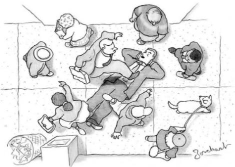

## Please describe the literal contents of the image in 2-3 sentences:

A man in a suit is lying down on a sidewalk in a busy city as pedestrians walk over him. The pedestrians seem to be frustrated ana confused that the lying down man is blocking their way, while the man himself seems to be carefree.

## Please highlight/explain any unusual/out-of-place elements in 1-2 sentences:

It's unusual that the man is lying in the middle of a sidewalk not only because this action is disruptive to other pedestrians, but also because he's in a nice suit that is likely to become dirty. Furthermore, his carefree expression indicates that, despite these downsides, he doesn't care and is in no rush to move.

the scene?

Why is the man lying on the sidewalk?  
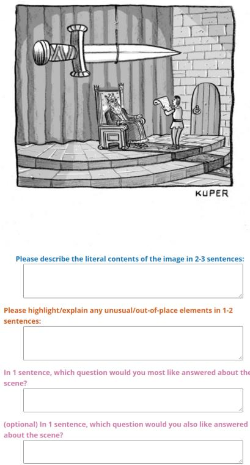  
Figure 6: Instructions, example, and interface for the Cartoon Description HIT. We gather, but do not use, the final “Which question?” annotation in our experiments.

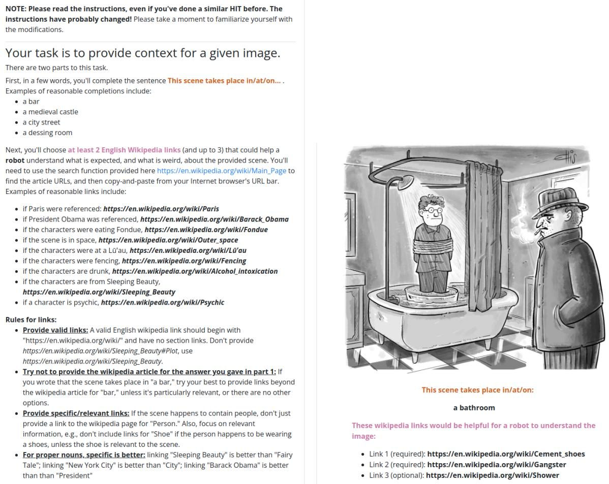  
Figure 7: Instructions and example for the Wikipedia links HIT.

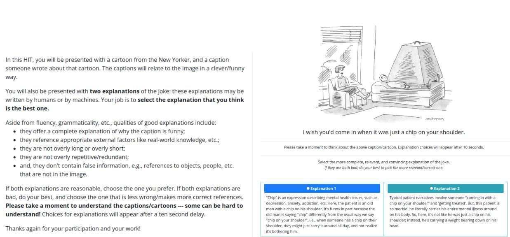  
Figure 8: Instructions and interface for the pairwise explanation judgment HIT.

## B.3 OFA

We use validation-set early stopping on crossentropy loss, and fine-tune OFA separately for each cross-validation split. After fine-tuning, we select the top-1 prediction according to beam search (n=5). We finetune OFA Huge with a learning rate of 5e-5, which was determined via a small grid search over the first cross-validation split. We use label-adjusted smoothed cross entropy loss as implemented by the OFA authors17 with smoothing of 0.1. We train for a maximum of 7 epochs with a warmup ratio of 6%. For each image, we query for the four different types of annotations shown in Figure 3. To facilitate this, in addition to providing OFA with the image, we also provide it with a per-annotation-type prompt:

1. for locations: “Where does this take place?”

2. for descriptions: “Describe this image.”

3. for uncanny: “What’s unusual about this image?”

4. for entities: “What entities are there?”

In early experiments, instead of composing with a language model, we did attempt to fine-tune OFA directly for the explanation task. However, we found that the resulting perplexity (roughly 300) was significantly higher than for other fine-tuned models, with the errors difficult to diagnose.

## B.4 T5-Large/T5-11B.

For T5-Large, we conduct a small, per-crossvalidation split learning rate search between 1e-4, 1e-5, 5e-5 and keep batch size fixed at 64. For T5-11B we use a fixed learning rate of 1e-5 and a batch size of 64.

## B.5 GPT-3 Zero Shot/In Context

We use GPT-3’s davinci-text-002 model for our main zero shot and in-context learning experiments. Examples of zero-shot prompts for all tasks are given in Figure 9. The in-context prompts are similar, except they contain 5 random samples from the training set. A full, randomly selected in-context prompt for the explanation generation task is given in Figure 10.

## B.6 GPT-3 Fine-tuning

We use the OpenAI fine-tuning API to fine-tune davinci, a 175B parameter language model.18

While the precise details of how the API works are not currently available (e.g., which parameters are updated, or which version of davinci is used), we use the same cross-validation setup as for the other models so that the results are comparable. The total fine-tuning cost is approximately (3 tasks) (5 cross-val splits)  (40 dollars per fine-tune) = 600 dollars.

## B.7 GPT 3.5/GPT-4 Details

Between submitting this work and its acceptance, OpenAI released two new models, GPT-3.5 (sometimes called ChatGPT when accessed through the chat interface) and GPT-4; we updated our results to include these models. Figure 11 provides an example of a prompt/response in the new “Chat” API, which requires a more structured conversational prompt compared to the GPT-3 “Completion” API; this prompt includes a “system” prompt, which describes the desired behavior of the model, e.g., “You are CaptionContestGPT...” We sample with default hyperparameters in all cases. The cost of GPT 3.5 is an order of magnitude less than GPT-4. In total our GPT-4 queries cost on the order of \$4K.

## C Task Construction Details

Identification of High Quality Captions. For each contest, our first step is to identify a set of high quality captions; these are involved in construction of instances for all three tasks. For cases where we have access to the three official New Yorker finalists, all are automatically added to the high quality set. Next, for cases where we have crowd ratings, we consider the top 5 crowd ranked captions according to the mean score provided by Jain et al. (2020). From these top 5, we select 3 diverse candidates among these using a semantic deduplication method: specifically, we compute the SBERT (Reimers and Gurevych, 2019) vector for each candidate using paraphrase-MiniLM-L6-v2, compute a hierarchical clustering of the candidates, and sample a single candidate from each cluster — the result is a set of candidates that is representative of all clusters. In total, there are 2.7K high quality captions across 704 contests. Each contest either has 3 high quality captions (coming from the official New Yorker finalists or, if those aren’t available, highly crowd-rated options), or 6 (if both official finalists and crowd rated are available).

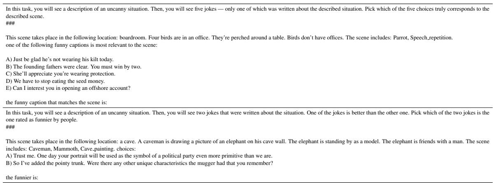

Figure 9: Example GPT-3 zero-shot prompts for Matching (top) and Quality ranking (bottom) tasks. In-context prompts are similar, except 5 random labelled training examples are also provided in the prompt.
<table><tr><td rowspan="2"></td><td>Matching</td><td colspan="2">Quality Ranking</td><td colspan="3">Explanation</td></tr><tr><td>Accuracy (↑)</td><td>CrowdAcc (↑)</td><td>NYAcc (↑)</td><td>B-4 (↑)</td><td>Rouge-L (↑)</td><td>PPL (↓)</td></tr><tr><td>Random</td><td>20.0</td><td>50.0</td><td>50.0</td><td></td><td>-</td><td></td></tr><tr><td>Caption Only (T5-11B finetuned)</td><td>19.4</td><td>59.4</td><td>64.5</td><td>3.61</td><td>17.8</td><td>34.0</td></tr><tr><td>text-ada-001 (in context, n=5)</td><td>20.1</td><td>50.8</td><td>49.9</td><td>2.04</td><td>15.9</td><td>2367</td></tr><tr><td>text-babbage-001 (in context, n=5)</td><td>19.0</td><td>51.3</td><td>51.1</td><td>2.18</td><td>17.2</td><td>137</td></tr><tr><td>text-curie-001 (in context, n=5)</td><td>20.4</td><td>51.0</td><td>50.0</td><td>2.99</td><td>18.1</td><td>108</td></tr><tr><td>text-davinci-001 (incontext, n=5)</td><td>35.6</td><td>54.4</td><td>53.8</td><td>3.79</td><td>19.5</td><td>151</td></tr><tr><td>text-davinci-002 (incontext, n=5)</td><td>57.2</td><td>55.1</td><td>54.8</td><td>5.07</td><td>20.5</td><td>107</td></tr></table>

Table 4: GPT-3 scaling experiment results, averaged over 5 cross-validation splits. In all cases, models are given access to the same sample of 5 in-context examples. Overall, text-davinci-002 performs best — this appears to be both because of scale (e.g., text-davinci-001 generally outperforms text-curie-001) and also because of training improvements in the updated 002 version of the model.

Forming Matching Instances. For each high quality caption, we create a matching instance that serves as the correct answer. Next, we randomly assign captions to mismatched contests to form negative, mismatched sets to serve as false options. While the assignment is random, we have two constraints: 1) we assign within cross-validation splits only, to ensure that training/validation/testing captions are disjoint; and 2) we construct the corpus with no answer-only biases by performing the negative assignment such that each answer appears exactly once as a correct answer and exactly 4 times as an incorrect answer in other instances.

Forming Quality ranking Instances. For each high quality caption, we aim to sample from the larger set of all submissions for the contest captions that are just “okay.” First, we note that 25 contests from early on in the contest’s history were missing entries, so we are limited to sampling negatives for 679 contests. Next, because many entries are exact duplicates, we deduplicate on string matching, such that “okay” captions are not exact copies of 1) the identified high quality captions; and 2) any other sampled “okay” captions.

Next, for later contests from Jain et al. (2020), we have estimated quality ratings based on crowd feedback for each entry already: in that case, we discard the top third and bottom third of captions according to mean crowd rating — the middle tertile form the “okay” set we sample from.

But, for earlier contests, we do not have direct ratings: we only have access to New Yorker finalists and a large pool of entries. For those cases, we aim to eliminate captions that are clearly likely to be low quality. To accomplish this, we train a quality ranking model (conditioned just on the caption text, rather than any information about the contest) using crowdlabelled data from 253 contests provided by Jain et al. (2020). We sample a good/bad set by selecting from each contest the top and bottom 1000 entries according to their mean crowdsource score: the resulting dataset forms a corpus of 506K captions. We form two sets of labelled data based on the parity of the contest number (i.e., even vs. odd). We train/validate two T5-Large models based on this split for the binary classification task. While the average validation accuracy we achieve is 65%, we achieve higher precision in identifying the “bad” label: precisionat-10 is 83, precision-at-20 is 77, precision-at-30 is 72. It appears to be harder to identify very good captions than very low rated ones: precision-at-10 is 77, precision-at-20 is 73, precision-at-30 is 70. Upon training these models, we perform inference on all captions in contests without crowd ratings, and discard the 25% of entries with the lowest predicted score. Entries with very low scores have some common characteristics, e.g., they don’t have the gestalt of a New Yorker caption, they have many typos/formatting issues, they include the contact information of the submitter, etc. Examples of discarded captions (some are obfuscated for privacy reasons) are:

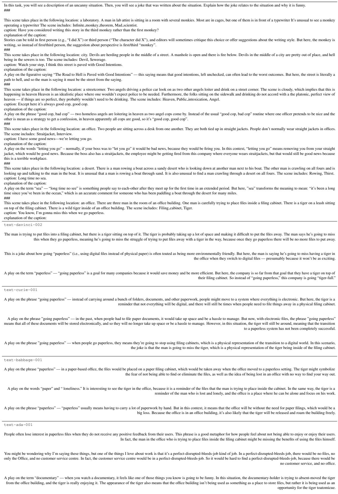  
Figure 10: An illustrative example of an in-context learning prompt for generating joke explanations (1095 tokens). 3 samples with temperature .8 from different GPT-3 engines are shown. According to our experiments, text-davinci-002 performs the best; qualitatively, as model size decreases, explanations become more nonsensical.

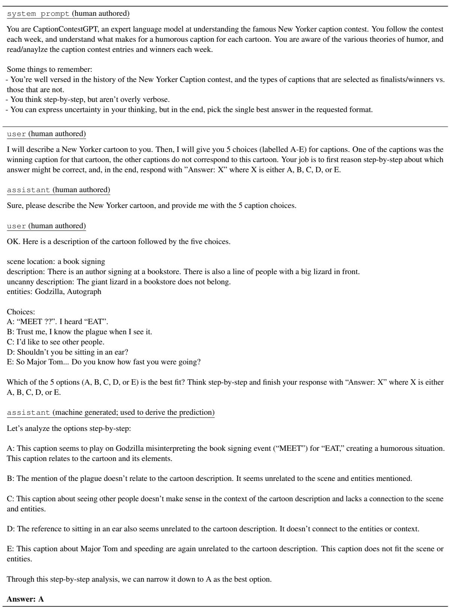  
Figure 11: An example of a zero-shot prompt+completion for GPT-4 (OpenAI, 2023) when applied to the matching task. In contrast to the text completion API of GPT-3, the GPT-4 chat API requires a more structured input involving a “system” prompt specifying the behavior of the model, followed by an interleaved conversation between a system and a user. While the training process of GPT-4 is opaque, in general, its “chain of thought” generations loop over all options and attempt to reason about how/why a caption might relate to the given scene.

• THEY COULDN’T WAIT TO MARRY SO THEY CAME TO RECITE THEIR VOWS BE-TWEEN TAKES FROM “ PRIMITIVE LOVE LIFE”

• You’re hurting me, will we ever break up?” (@ technology)

• The stressed is so “Bad’ in the world. “you or me ” did not see(BIG )( “FOOT)

• Too mammalian, needs reptile.” [NAME], [STATE] [EMAIL]@gmail.com

After identifying a set of captions that are not obviously bad, nor apparently among the top quality submissoins, our second step is to deduplicate entries. Because submitted captions for each contest are frequently identical to other submissions or play off the same core joke concept, we perform the same SBERT+hierarchical clustering semantic deduplication step as we did for sampling the diverse high quality set (described above). Specifically, we extract SentenceBERT embeddings (Reimers and Gurevych, 2019) for each of the N entries, and then compute a hierarchical clustering of the embeddings into .7  N clusters, sampling only a single representitive from each cluster to form a less-redundant set. This removes 30% of the data with close neighbors in the final set: for example, for a contest depicting two monsters eating buildings in New York City, this step downsamples 100 “tastes like chicken” jokes (which end up in a single cluster) to a single exemplar.

After filtering, for all contests, we are left with a (softly) deduplicated pool of candidate entries that are likely to be at least okay, but unlikely to be as good as the verifiably high quality entries. For each high quality entry, we sample an “okay” caption with: 1) similar estimated quality according to the text-only models; 2) similar length in words; 3) similar length in characters; 4) similar amount of punctuation; 5) a dissimilar SBERT embedding.

Explanation corpus. After several attempts to solicit high-quality explanations from crowdworkers fell short, one of the authors of this paper decided to simply annotate a corpus of explanations themselves. For each contest, a high quality caption was sampled for annotation — this high quality caption was sampled arbitrarily from the set of New Yorker finalists if they were available, and, in the few cases where New Yorker finalists weren’t available, from the set of high quality crowd captions. Of the 704 sampled explanations, the author reported understanding 651 of them, and wrote an explanation for each. This was a substantial effort: the resulting corpus has a mean of 60 words of explanation per cartoon, and the total length, 39.3K words, is comparable in length to a novella.

## D Graphical version of matching and ranking results.

In Figure 12, we use vertically-stacked bars to illustrate the difference between zero-shot (small dots), five-shot (vertical stripes), and fine-tuned (solid) versions of various models. Human results are set off by dark green lines.

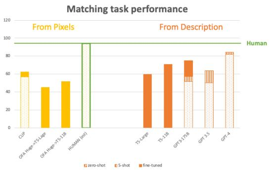  
Figure 12: Graphical version of the matching results given in Table 2.

The scatter-plot in Figure 13 uses the same graphical conventions to display the qualityranking results. Recall our caveat that crowd accuracy may be more statistically reliable, in the sense that crowd selectors, whose tastes underlie the y-axis results, vastly outnumber New Yorker

<table><tr><td rowspan="2"></td><td colspan="3">BLEU-4 (↑)</td></tr><tr><td>3.61</td><td>Rouge-L (↑) 17.8</td><td>PPL (↓) 34.0</td></tr><tr><td></td><td>Caption Only (T5-11B) OFA-Huge → T5-Large</td><td>3.36</td><td>17.5</td><td>50.7</td></tr><tr><td rowspan="2">P</td><td>OFA-Huge → T5-11B</td><td>3.63</td><td>17.9</td><td>30.3</td></tr><tr><td></td><td></td><td></td><td></td></tr><tr><td rowspan="8">P</td><td>T5-Large</td><td>3.54</td><td>18.2</td><td>41.2</td></tr><tr><td>T5-11B</td><td>4.33</td><td>19.0</td><td>23.7</td></tr><tr><td>GPT3-175B (finetuned)</td><td>5.42</td><td>20.1</td><td>21.8</td></tr><tr><td>45-shot Zero-shot</td><td>45.07 43.12</td><td>420.5 418.8</td><td>4107</td></tr><tr><td>GPT 3.5 (5-shot)</td><td>3.94</td><td>18.8</td><td>4225</td></tr><tr><td>Zero-shot+CoT</td><td>42.40</td><td>417.3</td><td></td></tr><tr><td>GPT-4 (5-shot)</td><td>4.99</td><td>20.0</td><td></td></tr><tr><td>Zero-shot+CoT</td><td>43.42</td><td>419.0</td><td></td></tr></table>

Table 5: Results for the explanation task using automatically computed metrics. Results are averages over 5 cross-validation splits. Underlined results are the best model in the From Pixels (FP) setting, where at test time, models only have access to the cartoon images. Bold results are best in the From Description (FD) setting, where at test time, models have access to humanauthored descriptions of the cartoons. GPT-3.5 and GPT-4’s API does not provide log probabilities, so we can’t compute perplexity for those models.

editors, whose tastes underlie the x-axis results.

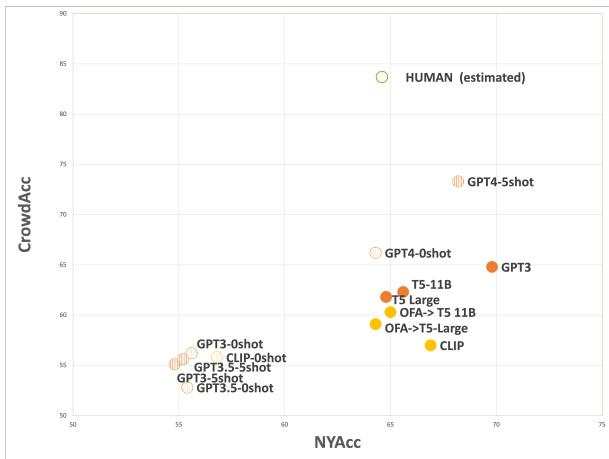  
Figure 13: Graphical version of the ranking results given in Table 2.

## E Automatic evaluation of explanations

For completeness, we provide the results for automatically-calculated explanation-evaluation metrics in Table 5. (Log probabilities are unavailable for GPT-3.5/GPT-4 so we cannot report perplexity for them.) However, we believe that the human evaluations reported in the main body of the text are better quality measures.

## F Machine explanations that were preferred over human ones

GPT-4 In 8/130 cases, for our human vs. GPT-4 5-shot experiments, the machine generation was preferred to the human reference by 3/3 annotators. In Figure 14 we conduct a close reading of these 8 instances to understand where the human references fell short. In all cases, both were topical, but, for a handful of cases, the machine generation is arguably better because it’s more succinct, or offers a more meaningful detail.

GPT-3 We also include a close reading of several instances where a majority of annotators preferred GPT-3 annotations vs. our human ones. This occured in 16/131 cases for our human vs. GPT-3 experiments: in 15 cases, 2/3 annotators preferred the machine generation, and in 1 case, 3/3 annotators preferred the machine generation. We present a few examples of these cases with comments in Figure 15. Similar to GPT-4, most commonly, both the explanations were reasonable, in one case, the human-written explanation missed a pop culture reference to “The Attack of the 50 Foot Woman” (1958) but GPT-3 mentions it. In six cases, we disagree with annotator consensus: the machine caption makes some correct references, but we believe it (sometimes subtly) misses the point.

## G Aiding humor generation with system-assisted brainstorming

Our main experiments focus on three tasks that probe machine capacity for matching, ranking, and explaining caption contest entries. But, given prior interest in generating caption entries, to provide a pointer towards more creative use cases, we developed a curated prompt that re-frames the corpus in a manner that enables the production of cartoon descriptions, concept brainstorming, and, ultimately, caption generation. In contrast to our existing annotations, we are inspired by Wallace (2022)’s framing, where free associations are used to connect-thedots from cartoons to concepts to captions. So, for 9 finalist captions, we reverse-engineer a plausible brainstorming process that could have given rise to the caption by listing several potential associations from the scene, and, from that list, selecting the 1-3 that underpin the basis for the winning joke. In the end, our prompt consists of 9 examples formatted as:

1. cartoon description (from our annotations)

2. uncanny description (from our annotations)

3. list of entities in scene (from our annotations)

4. list of concepts from the cartoon that could be used for a caption (hand-designed for the

<table><tr><td rowspan=1 colspan=6>Scene/caption         Our opinion re: annotator Human-authored explanation                  Machine-authored explanation (GPT-4 5-shot)decision</td></tr><tr><td rowspan=2 colspan=6>A person in a diver suit is Agree: The human anno- Sometimes, clothes you try on in a store look better We all experience situations where a garment looksout-of-place at a cocktail tation assumes the person when you are deciding to buy them or not. Here, the great in the store, but when we wear it out in a publicparty. Caption: This suit didn&#x27;t notice; the machine idea is taken to the extreme: the person in the diving setting, we feel awkward or mismatched. Here, thislooked way better in the explanation is more on suit bought the “suit&quot; without even noticing it was scene humorously exaggerates that feeling by havingstore.                                     a diving suit (and looks out of place for the party)/ the man wear an old diving suit to a seemingly pro-(0/3)                                    fessional office party. The situation creates comedictension because it&#x27;s an extreme example of beingunderdressed or out of place. (3/3)</td></tr><tr><td rowspan=1 colspan=1>point/coherent.</td></tr><tr><td rowspan=1 colspan=6>A man is on a cell phone</td></tr><tr><td rowspan=1 colspan=5>is in mid-air despite be-</td><td rowspan=1 colspan=1></td></tr><tr><td rowspan=1 colspan=5>ing thrown off a bucking</td><td></td></tr><tr><td rowspan=1 colspan=1>horse. He is smiling. Cap-</td><td></td><td rowspan=1 colspan=2>g. C</td><td rowspan=1 colspan=2>Cap-</td><td rowspan=1 colspan=1>of</td></tr><tr><td rowspan=3 colspan=1>tion: Hi Hon. Can you</td><td rowspan=3 colspan=4>1. Can ye</td><td></td></tr><tr><td rowspan=1 colspan=2>you</td><td></td></tr><tr><td rowspan=1 colspan=1>chine authored</td></tr><tr><td rowspan=1 colspan=5>meet me at the hospital in</td><td rowspan=1 colspan=1>explanatio</td></tr><tr><td rowspan=1 colspan=5>about ten minutes?</td><td rowspan=1 colspan=1>improved (“</td></tr><tr><td rowspan=1 colspan=5></td><td rowspan=1 colspan=1></td></tr><tr><td rowspan=1 colspan=5>A man in an office build-</td><td rowspan=1 colspan=1>Mostly agree: Although</td></tr><tr><td rowspan=1 colspan=5>ing is planting seedlings in</td><td rowspan=1 colspan=1>the machineexplanation</td></tr><tr><td rowspan=1 colspan=5>his cubicle. Caption: The</td><td rowspan=1 colspan=1>refers to  documents</td></tr><tr><td rowspan=1 colspan=5>third quarter is going to be</td><td rowspan=1 colspan=1>that arenot explicitly</td></tr><tr><td rowspan=1 colspan=5>delicious.</td><td rowspan=1 colspan=1>evident, the human ex-</td></tr><tr><td rowspan=1 colspan=5></td><td rowspan=1 colspan=1>planation assumes a less</td></tr><tr><td rowspan=2 colspan=5></td><td rowspan=2 colspan=1>in the future, which will make for delicious food. ments as plants and expecting positive results fromIt&#x27;s funny in part because the usual interpretation is this unorthodox method. (3/3)about dark enjoyment of office politics, but the literalinterpretation is about a wholesome vegetable feast.(0/3)</td></tr><tr><td rowspan=1 colspan=1></td></tr><tr><td rowspan=1 colspan=5>In a 17th century scene, a</td><td rowspan=1 colspan=1>Mostly agree: Both are</td></tr><tr><td rowspan=1 colspan=5>woman is walking in town,</td><td rowspan=1 colspan=1>good, but the machine ex-</td></tr><tr><td rowspan=1 colspan=5>but her ruff collar is comi-cally large. Caption: It de-</td><td rowspan=1 colspan=1>planation has a more spe-cific conclusion.</td></tr><tr><td rowspan=1 colspan=5>ployed when her carriage</td><td rowspan=1 colspan=1></td></tr><tr><td rowspan=1 colspan=5>rear-ended an ox cart.</td><td rowspan=1 colspan=1></td></tr><tr><td rowspan=1 colspan=5></td><td rowspan=1 colspan=1></td></tr><tr><td rowspan=1 colspan=5>A wolf trying on a sheep</td><td rowspan=1 colspan=1>Mostly agree:Thema-</td></tr><tr><td rowspan=1 colspan=5>skin as if it were a cos-</td><td rowspan=1 colspan=1>chine explanation is more</td></tr><tr><td rowspan=1 colspan=5>tume, looks in a mirror as</td><td rowspan=1 colspan=1>specific.</td></tr><tr><td rowspan=1 colspan=5>a butler looks on, holding</td><td rowspan=2 colspan=1></td></tr><tr><td rowspan=1 colspan=5>various other outfits. Cap-</td></tr><tr><td rowspan=1 colspan=5>tion: I&#x27;ll take this and the</td><td rowspan=1 colspan=1></td></tr><tr><td rowspan=1 colspan=5>granny dress.</td><td rowspan=2 colspan=1></td></tr><tr><td rowspan=1 colspan=5></td></tr><tr><td rowspan=1 colspan=5>A flying saucer trails a</td><td rowspan=1 colspan=1>Slightly disagree: Both</td></tr><tr><td rowspan=1 colspan=5>man and a woman driv-</td><td rowspan=1 colspan=1>take the joke in slightly</td></tr><tr><td rowspan=1 colspan=5>ing down the road. Cap-tion:When they said,&quot;Take us to your leader.&quot;</td><td rowspan=1 colspan=1>different ways, but thehuman explanation seemsmore plausible.</td></tr><tr><td rowspan=1 colspan=5>I don&#x27;t think they meant</td><td rowspan=1 colspan=1></td></tr><tr><td rowspan=1 colspan=5>your mother&#x27;s house.</td><td rowspan=1 colspan=1></td></tr><tr><td rowspan=1 colspan=6>this benign concern is on his mind in light of the factthat a giant spaceship is tailing them. (0/3)</td></tr><tr><td rowspan=1 colspan=5></td><td rowspan=3 colspan=1>A joke about Abraham Lincoln&#x27;s assassination, whichThe joke plays on two ideas. First, it suggests thatmirror as he gets ready,man one expresses the took place at a play. This man is getting ready to go the man&#x27;s reflection, which appears to be Abrahamto a play and has a vision of himself as Lincoln;Lincoln, might be causing the man to think he hasbecause he wants to avoid being assassinated, due to some connection or is somehow embodying Lincoln.this premonition, he suggests to his partner that they Second, it references a historical event, as Lincolnlet&#x27;s skip the play.                            not go to the play after all. (0/3)                was assassinated at a theater while watching a play.So, when the man says &quot;let&#x27;s skip the play,&quot; he ishumorously trying to avoid the same fate as Lincoln.(3/3)</td></tr><tr><td rowspan=1 colspan=5></td></tr><tr><td rowspan=1 colspan=5>tion: On second thought</td></tr><tr><td rowspan=7 colspan=6>A man driving talks to a Both are good:   both Moving a front seat up is an everyday request from The humor lies in the absurdity of having a whalea woman in the passengerexplanations express thepeople sitting in the backseat of cars if they don&#x27;tin the backseat of a car, a situation that should neverhave enough room. The whale is making this request: occur. The whale, being so large, would naturallythe contrast between how unusual it is that the whale require more room, so it&#x27;s funny that the only concernis in the backseat and the benign-ness of the request anyone in the cartoon appears to have is whether thefront seat passenger can move their seat up to giveup.                                                                               the whale more space, instead of questioning whythere&#x27;s a whale in the car in the first place. (3/3)</td></tr><tr><td rowspan=2 colspan=5>seat. In the backseat is a</td></tr><tr><td rowspan=4 colspan=5></td></tr><tr><td rowspan=1 colspan=1>the contrast between how</td></tr><tr><td rowspan=2 colspan=1>is in the baks tt an t</td></tr><tr><td rowspan=1 colspan=1>is what makes it</td></tr><tr><td rowspan=1 colspan=1></td></tr></table>

Figure 14: Examples of the small number of cases (8/130) where the machine-generated caption (5-shot GPT4) was preferred to the human-authored explanation by 3/3 annotators in our pairwise judgment setting.

<table><tr><td>Scene/caption</td><td>Our opinion re: annotator decision</td><td>Human-authored explanation</td><td>Machine-authored explanation</td></tr><tr><td>Two teachers walking through a hallway of an elementary school while the children walk on the ceilings and walls. Caption: Back in my day, kids had a little respect</td><td>Disagree: the machine caption starts off well, but concludes with a number of non-sequiturs. Perhaps the annotators only skim the later parts of a long ex-</td><td>(1/3) Normally “respecting laws&quot; are human-written laws — but here, the kids have somehow opted-out of respecting physical laws of gravity, which means they can walk on walls/ceilings.</td><td>(2/3) The kids in this school are violating the laws of physics by walking on the walls and ceiling. The teachers is complaining that kids used to respect grav- ity, but now they don&#x27;t. This is a funny complaint because whether or not kids respect gravity probably depends on the teacher&#x27;s training, not whether they were a kid in the past.</td></tr><tr><td>A doctor is performing a physical examination on Superman. Caption: They think now kryptonite is ac- tually good for you, in small doses.</td><td>Disagree: Both are okay, but the human-authored explanation is more specific in referencing the appropriate cultural phenomenon, and the machine-generated one hallucinates that kryp- tonite is medicinally helpful.</td><td>(1/3) A joke about modern medical findings some- times being counter-intuitive: some studies claim to show that things harmful in big quantities like alco- hol or chocolate are good in small doses. But here, the thing that&#x27;s bad for superman in large doses is kryptonite: it&#x27;s a funny parallel to the other stud- ies, and funny to think that scientists are studying kryptonite&#x27;s potential positive impacts.</td><td>(2/3) Kryptonite is a material that causes superman to become weak; however, the doctor is suggesting that kryptonite is good for him in small doses. This is funny because, while kryptonite might be helpful medicinally, it&#x27;s difficult to explain how small doses of something that kills superman could possibly be helpful.</td></tr><tr><td>3 people are going to ther- apy in a 3-tiered bunk-bed. Caption: And how do you feel about how she feels about how he feels?</td><td>Disagree: The machine caption omits the oddity of having three patients in- volved in what appears to be couples therapy. Nor is there wordplay involved.</td><td>(1/3) Couples therapy is already complex – pairs of people may have feelings about their partner&#x27;s feelings. Here, the joke is that if three people were getting therapy together, things would get even more complicated and meta, i.e., person 1 could feel strongly about person 2&#x27;s feelings about person 3 (and any permutation of such). It&#x27;s funny to think</td><td>(2/3) A wordplay joke about feelings — a therapist might ask a question like: “how do you feel about what happened with your brother?&quot;; in this case, the question is expanded to include the feelings of each party, e.g., “how do you feel about how he feels about what happened with your brother?&quot;; this is a very complicated/deeper concern that requires a lot</td></tr><tr><td>A board meeting is hap- pening in an office, but the employees are birds. Cap- tion: We have to stop eat- ing the seed money.</td><td>Agree: the machine expla- nation is probably better.</td><td>(0/3) Seed money is cash provided to a startup com- pany (like the ones the birds are running); but, the play on words implies that the birds spent the seed money literally on seeds to eat, because birds eat seeds.</td><td>(3/3) A play on the phrase “seed money&quot; — in the investment world, “seed money&quot; refers to the initial capital that is invested into a startup company. But here, “seed money&quot; refers to bird seed that these birds might eat: the joke is that they need to stop eating bird seed because it&#x27;s causing them not to be able to</td></tr><tr><td>A stack of cars with drivers in them. The driver on the topmost car is lean- ing out of the window yelling to the drivers be- low. Caption: I hope this</td><td>Both have pros/cons: The machine is more specific in referencing crashing and the implication for the drivers, but makes up “jumping the stack”mean-</td><td>(1/3) A reference to Evil Knievel, a stuntman who jumps motorcycles over cars. This pile of cars is going to be an obstacle in an Evil Knievel stunt, and the man in the top car is hoping that the stuntman coordinating this both knows how to jump over and also how to get the drivers out of this precarious situation.</td><td>afford investments like a real office/chair/table. (2/3) A reference to Evel Knievel, a famous stunt man that jumped cars and other objects. This is a joke about him jumping cars, but because the cars are stacked precariously, it&#x27;s a reference to Evel Knievel “jumping the stack&quot;, i.e., crashing, which would be a bad outcome for the drivers.</td></tr><tr><td>A person wearing boxing gloves is attempting to play a piano on a stage. Caption: I could have been a conductor.</td><td>Both bad: the human cap- tion gives a better mechan- ical explanation, but both miss that the caption is a play on a quote from &quot;On the Waterfront&quot; (1954), &quot;I</td><td>(1/3) It would be mechanically difficult to play a piano with boxing gloves because the keys are too small. if this person must wear boxing gloves and still wants to do music, they humorously reason that they should be a conductor — it would be easier for them to hold the conductor batons vs. play piano</td><td>(2/3) A joke about Muhammad Ali&#x27;s skill as a boxer, which sometimes takes a metaphorical meaning when referring to his boxing career. Here, the boxer is playing the piano, and is presumably not very good at it. But, the joke is that, if he wasn&#x27;t a boxer, he could have been a conductor, which requires a high level of skill. It&#x27;s funny in part because it&#x27;s not clear</td></tr><tr><td>A father and a child are standing in an office build- ing looking out the win- dow onto a giant woman straddling a nearby build- ing. Caption: Son, we finally attracted the fifty-foot-and-over demo-</td><td>Both bad: The human- authored explanation misses the direct reference to the movie “Attack of the 50-Foot-Woman&quot; (1958), and the machine focuses on non-sequiturs</td><td>(1/3) A play on the phrase “fifty and over demo- graphic&quot; — this phrase would usually refer to the group of people who are aged 50 or older, and would be of interest to people running businesses (like the father and son pictured) as a marketing target. But in- stead of the age 50+ demographic, they have attracted the height-of-fifty-foot+ demographic, of which this</td><td>(2/3) A play on the term “ fifty-foot-and-over&quot; and “over 18&quot;— in the media, advertisers sometimes say that they want to attract 18+ year old viewers to their product, because 18 is the legal age of consent, and thus, to attract 18+ year olds, they will say they want to attract viewers “over 18&quot;. But here, the company is trying to attract viewers “50-feet-and-over&quot; — the</td></tr></table>

Figure 15: Examples of the small number of cases (16/131) where the machine-generated caption (fine-tuned GPT-3 175B) was preferred to the human-authored explanation by at least 2/3 annotators.

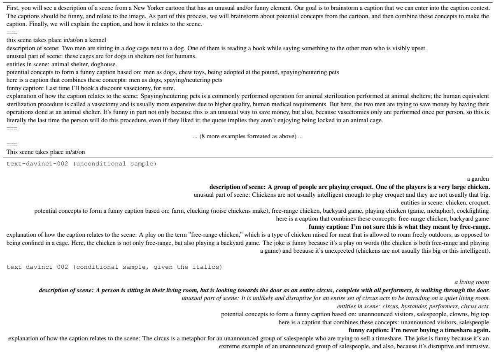  
Figure 16: A portion of a 2,407 token prompt that re-formulates various annotations within our corpus in a format conducive for creative collaborations with a language model. The full prompt is available here. Generating line-byline from this prompt could help to facilitate brainstorming for: unusual cartoon situations (first 4 lines), concepts about real or generated contests that could serve as a basis for a humorous caption (line 5), and, captions themselves (lines 6-8). As a demonstration, we present an unconditional sample, in which the model describes a garden party where a chicken is playing croquet (cherry picked from 3 outputs; temperature=.8, top p=.9, frequency penalty=.2, presence penalty=.05), and also, a conditional sample, given a basic description of Contest #818’s scene, which ran in mid-September 2022 (cherry picked from 5 outputs; same sampling parameters): the caption is arguably funny, but the explanation is not correct.

prompt)

5. a selected set of 1-3 ideas (selected from (4))

6. caption (a finalist)

7. explanation of the caption (from our annotations)

A portion of our prompt is given in Figure 16, along with an unconditional generation (where the cartoon concept and caption are generated) and a conditional generation. Within 5 samples, GPT-3 invents a scene where a large chicken is playing croquet in a yard, and the caption: “I’m not sure this is what they meant by free range.” Also, when conditioned on a basic description of a real contest which depicts a large group of circus performers intruding on an unsuspecting person in their living room (Contest #818), it generates “I’m never buying a timeshare again.” Looking forward, we expect the matching/quality ranking models could be used in conjunction with this prompt to automatically filter for scene-specific generations with style similar to previous finalists.

## H Related work beyond peer reviewed AI venues

Outside of peer-reviewed NLP venues, several projects have used computational techniques to analyze the contest, usually with the goal of generating AI-assisted entries:

• The Pudding: Mishkin et al. (2022) collaborated with GPT-3 (Brown et al., 2020) to generate entries.

• coolposts: Wilson (2019) used topic models to condition an RNN caption generator.

• LILY Lab @ Yale’s Spring 2017 projects include a number of caption contest efforts, including work by Prince, Friedman, Zucker, Anbarasu, and Dohrn.

• The Verge: Zelenko and Bi (2015) trained a Markov language model on previous winning entries.

## I Some of our favorite New Yorker cartoons

We list our favorite captions below. The corresponding images can be seen by clicking on the cartoonist/author names.

YC: “The doctor said it might help me quit.”

— Vince Conitzer/Jeffrey Adam Katzenstein

JD: “You are so smart. You look amazing. You inspire me. [Complimentary bread].”

— Seth Fleishman

JMH: “Thanks, I’ll write that down.”

— Victoria Roberts

JDH: “They’re from Earth. I wonder if they know Dan.”

— Benjamin Schwartz

LL: “I want to be feared as a tyrant, loved as a father, and revered as a god, but I also want them to think I’m funny.”

— Zachary Kanin

AM: “I can’t believe I’d been carrying them in my mouth.”

— Amy Hwang

RZ: “Well, there’s your problem.”

— Edward Koren

## ACL 2023 Responsible NLP Checklist

A For every submission: ✓ A1. Did you describe the limitations of your work? Limitations section 6

✓ A2. Did you discuss any potential risks of your work? Limitations section 6

✓ A3. Do the abstract and introduction summarize the paper’s main claims? The abstract

✗ A4. Have you used AI writing assistants when working on this paper? Left blank.

B ✓ Did you use or create scientific artifacts? yes, our new corpus/tasks. Section 2 describes them.

✓ B1. Did you cite the creators of artifacts you used? Yes, section 2

✓ B2. Did you discuss the license or terms for use and / or distribution of any artifacts? Yes, we discussed the distribution ofour dataset, which have made public under Creative Commons Attribution 4.0.

✓ B3. Did you discuss if your use of existing artifact(s) was consistent with their intended use, provided that it was specified? For the artifacts you create, do you specify intended use and whether that is compatible with the original access conditions (in particular, derivatives of data accessed for research purposes should not be used outside of research contexts)? Yes, section 2

✓ B4. Did you discuss the steps taken to check whether the data that was collected / used contains any information that names or uniquely identifies individual people or offensive content, and the steps taken to protect / anonymize it? Section 2 and appendix C

✓ B5. Did you provide documentation of the artifacts, e.g., coverage of domains, languages, and linguistic phenomena, demographic groups represented, etc.? Section 2

✓ B6. Did you report relevant statistics like the number of examples, details of train / test / dev splits, etc. for the data that you used / created? Even for commonly-used benchmark datasets, include the number of examples in train / validation / test splits, as these provide necessary context for a reader to understand experimental results. For example, small differences in accuracy on large test sets may be significant, while on small test sets they may not be. Section 2

## C ✓ Did you run computational experiments?

Section 3

✓ C1. Did you report the number of parameters in the models used, the total computational budget (e.g., GPU hours), and computing infrastructure used? Section 3 and appendix B

The Responsible NLP Checklist used at ACL 2023 is adoptedfrom NAACL 2022, with the addition ofa question on AI writing assistance.

✓ C2. Did you discuss the experimental setup, including hyperparameter search and best-found hyperparameter values? Section 3 and Appendix B

✓ C3. Did you report descriptive statistics about your results (e.g., error bars around results, summary statistics from sets of experiments), and is it transparent whether you are reporting the max, mean, etc. or just a single run? Section 3

✓ C4. If you used existing packages (e.g., for preprocessing, for normalization, or for evaluation), did you report the implementation, model, and parameter settings used (e.g., NLTK, Spacy, ROUGE, etc.)? Section 3

D ✓ Did you use human annotators (e.g., crowdworkers) or research with human participants? Section 2

✓ D1. Did you report the full text of instructions given to participants, including e.g., screenshots, disclaimers of any risks to participants or annotators, etc.? Appendix A

✓ D2. Did you report information about how you recruited (e.g., crowdsourcing platform, students) and paid participants, and discuss if such payment is adequate given the participants’ demographic (e.g., country of residence)? Section 2, Appendix A

✓ D3. Did you discuss whether and how consent was obtained from people whose data you’re using/curating? For example, if you collected data via crowdsourcing, did your instructions to crowdworkers explain how the data would be used? Section 2, Appendix A

✓ D4. Was the data collection protocol approved (or determined exempt) by an ethics review board? appendix A

✓ D5. Did you report the basic demographic and geographic characteristics of the annotator population that is the source of the data? We don’t know many specifics, other than country of IP: which we discuss in appendix A