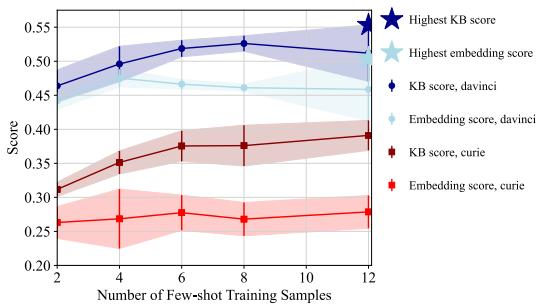

# Does GPT-3 Grasp Metaphors? Identifying Metaphor Mappings with Generative Language Models

Lennart Wachowiak King’s College London lennart.wachowiak@gmail.com

## Abstract

Conceptual metaphors present a powerful cognitive vehicle to transfer knowledge structures from a source to a target domain. Prior neural approaches focus on detecting whether natural language sequences are metaphoric or literal. We believe that to truly probe metaphoric knowledge in pre-trained language models, their capability to detect this transfer should be investigated. To this end, this paper proposes to probe the ability of GPT-3 to detect metaphoric language and predict the metaphor’s source domain without any pre-set domains. We experiment with different training sample configurations for fine-tuning and few-shot prompting on two distinct datasets. When provided 12 fewshot samples in the prompt, GPT-3 generates the correct source domain for a new sample with an accuracy of 65.15% in English and 34.65% in Spanish. GPT’s most common error is a hallucinated source domain for which no indicator is present in the sentence. Other common errors include identifying a sequence as literal even though a metaphor is present and predicting the wrong source domain based on specific words in the sequence that are not metaphorically related to the target domain.

## 1 Introduction

Metaphor processing with pre-trained language models (e.g. Conneau et al., 2020; Brown et al., 2020) has been dominated by metaphor detection, that is, the classification of expressions into metaphoric or literal (e.g. Aghazadeh et al., 2022; Leong et al., 2020). In metaphor interpretation, a common approach is to paraphrase metaphoric expressions into literal ones (e.g. Stowe et al., 2021a). Few approaches target metaphor identification, e.g. predicting the source domain of a metaphor in a linguistic sequence. For instance, Rosen (2018) relies on grammatical constructs and pre-defined labels. Instead, in this paper, we test a generative language model’s ability to predict the source domain given

Dagmar Gromann University of Vienna dagmar.gromann@gmail.com

a target domain and sequence without grammatical assumptions or fixed source domain labels.

Conceptual metaphor theory (CMT) (Lakoff and Johnson, 1980) starts from the assumption that metaphors represent a powerful cognitive mechanism to transfer physical knowledge structures to abstract domains. In natural language, He was bombarded by insults or Your words pierce my heart transfers the concrete domain of weapons to the abstract domain of words in the metaphor WORDS ARE WEAPONS. On the assumption that our cognitive organization relies on metaphors, automatically identifying metaphoric transfer holds the promise of contributing to more human-like computational models. From the overall success of pre-trained language models in metaphor detection, a certain degree of metaphoric knowledge in these models can be assumed (Aghazadeh et al., 2022).

This paper aims to evaluate whether this inherent knowledge extends beyond contextual clues to predict the concrete domains in the metaphoric transfer. Detecting a metaphor entails contrasting the physical with the abstract meaning of a sequence. However, the source domain is frequently a noncontextual attribute (Aghazadeh et al., 2022), while the target domain can be found directly using contextual clues. For instance, in the above example, pierce is more implicitly related to WEAPONS than the explicit words is to WORDS. To determine the accuracy of the predicted source domains from fine-tuning and few-shot prompting GPT-3 (Brown et al., 2020), we manually evaluate the results. To this end, we propose a classification of error types from too generic domains to relying on words in the sentence that are not connected to the metaphor, which we call trigger words. This provides further intuition on the nature and extent of metaphoric knowledge encoded in pre-trained language models. We compare methods to elicit metaphoric knowledge without any assumptions on grammar or source domains and test if it extends across languages, i.e., Spanish in addition to English. Finally, we evaluate its generalization by testing on two distinct datasets and a set of nonmetaphoric sentences.

## 2 Preliminaries

Two major pillars that build the foundation for this approach are conceptual metaphors and generative language models, which we briefly introduce here.

## 2.1 Conceptual Metaphors

The idea of metaphoric projection from a physical source domain to an abstract target domain is deeply rooted in the tradition of embodied cognition, which assumes that higher-level cognition is shaped by physical experiences (Barsalou, 1999). For instance, actual physical movement recruits similar areas in the brain as communicating with action verbs (Durand et al., 2018; Gibbs, 2006). Conceptual metaphors are deeply entrenched in our knowledge organization system and utilized in everyday communication to convey thoughts more precisely. In a large-scale study, Prabhakaran et al. (2021) evaluate the persuasiveness of metaphors and show that metaphoricity in political posts increases social media engagement. Citron and Goldberg (2014) show that metaphoric emotional language elicits a higher emotional response by recipients than literal use. To provide complex analyses of metaphoricity in language and analyze the metaphoric knowledge of generative language models, we believe that identifying concrete metaphoric projections in natural language is required.

## 2.2 Generative Language Models

Large generative language models are trained with the objective of predicting the next token in a sequence. During inference, this allows them to be prompted with some text by a user and then generate what they predict to be most likely to come next. Scaled to large training corpora based on web-data and multi-billion parameter architectures, this simple objective resulted in models such as GPT-3 (Brown et al., 2020) or its open-source variants BLOOM (Luccioni et al., 2022) and OPT-175 (Zhang et al., 2022). For a specific task, these models can be used either in a zero-shot, few-shot, or fine-tuning manner. For zero-shot text completion, the model is prompted with an instance of a task without being provided any example solution of other task instances. In comparison, for few-shot completions, the prompt already contains some samples of the task and the respective solutions. In both variants, the model weights are not changed anymore, only the prompt differs. In contrast, when fine-tuning the model, its weights are optimized to predict the task-specific output given some input/output task samples.

## 3 Related Work

Tong et al. (2021) provide a recent overview of architectures used for metaphor detection, available datasets, and further metaphor-related tasks. An overview by Rai and Chakraverty (2020) takes many different approaches to computational metaphor processing into account, additionally reflecting on the different theoretical and linguistic views on the definition of metaphors. While there are many metaphor-related tasks, the closest to ours are presented in the sections on paraphrasing and connecting source and target domains.

Detection. Metaphor detection, the simplest form of computational metaphor processing, is a binary classification task in which each word of a sentence is labeled as being used metaphorically or literally. In a 2020 shared task on metaphor detection, finetuning pre-trained language models led to the best results (Leong et al., 2020). To achieve small improvements in accuracy, different approaches enrich the model input by, for instance, providing dictionary definitions of the words being classified (Babieno et al., 2022) or concreteness measures that indicate to what extent something can be experienced via the senses (Brysbaert et al., 2014). Commonly used datasets for this task are the VU Amsterdam Metaphor (VUA) Corpus (Steen et al., 2010) and the TOEFL corpus (Klebanov et al., 2018), both human-annotated based on different protocols.

Model Insights. Other research explores the embeddings generated by language models and how they relate to metaphoricity. Pedinotti et al. (2021) show that BERT’s likelihood scores show a decreasing likelihood from literal sentences to conventional and novel metaphors and, lastly, to nonsense sentences; thus, BERT’s scores correlate with human-annotated plausibility scores. Moreover, for different layers, they explore cosine similarities between words used metaphorically, e.g., the flowers nodded in the wind, and their metaphorical paraphrases and literal synonyms. Similarly,

Aghazadeh et al. (2022) investigate which layers of different language models encode metaphoric knowledge across different languages and datasets via probing.

Paraphrasing. One common approach to metaphor interpretation is paraphrasing the metaphorical expression using only literal words. For example, the phrase to devour a novel could be rephrased as to enjoy a novel. An example of metaphor interpretation is the work by Mao et al. (2018), who propose to query WordNet for possible candidate translations, from which the best is selected based on similarities in the embedding space. On the other hand, there is also research on generating metaphoric paraphrases given a literal sentence as input. Recent work in metaphoric paraphrasing uses text-to-text models, such as T5 or BART (Stowe et al., 2021b,a). Most recently, Liu et al. (2022) proposed a new task for which they created a dataset of novel metaphors in the form of similes, for example The meteor was as bright as (New York City | coal), which the language model has then to interpret as very bright or not bright at all. A fine-tuned RoBERTa model outperforms various GPT variants on the task and comes close to human performance. The authors also show that the reverse of the tasks, i.e., predicting the metaphoric language given the literal answer, is more difficult.

Connecting Source and Target Domains. Trying to automate the process of identifying metaphor mappings is not a new endeavor. For instance, given manually collected metaphoric phrases of a specific target domain, Chung et al. (2004) propose to facilitate the identification of source domains by querying WordNet senses and the ontology SUMO. More recent research makes use of syntactical patterns metaphoric language often occurs in (Sullivan, 2013), thereby narrowing down the pool of sentences considered as metaphoric candidates. Dodge et al. (2015) use such patterns to find metaphor candidates that are further analyzed by identifying evoked frames and checking for whether the frames relate in MetaNet. Given a target domain and a corpus, they can use this system to see which source domains are frequently used to metaphorically talk about a target domain. This system, however, is limited by existing frame resources and relies on pre-defined grammatical structures. Also querying an existing database, Ge et al. (2022) use hypernym relations from WordNet to identify the source and target domains for pairs of literally used nouns and literally or metaphorically used verbs or adjectives. While the target domain identification reaches an accuracy of 87.3%, the source domain identification only reaches 67.3% based on the manual evaluation of a small subset of the data. Shutova et al. (2017) explore unsupervised methods for identifying clusters of source and target concepts as well as the connections between them. They limit their approach to verb–noun constructions, from which the verbs constitute the source domain clusters and the nouns the target domain clusters.

Mohler et al. (2016) provide a dataset with sentences from government discourse annotated with scores from -1 to 3 to indicate the level of metaphoricity. More importantly, 7,941 sentences are annotated for source–target domain mappings with 108 different source domains. Rosen (2018) uses this dataset to build a model to predict the source domain of a metaphor given a contextual sentence and a target domain referent. Compared to our approach, this work presupposes that a given sentence is metaphoric while also depending on specific grammatical dependencies when constructing the model input. Most importantly, it is limited to the 77 labels sub-sampled from the overall available 108 domains as experiments are done using feed-forward neural networks and LSTMs instead of text-to-text networks. Rosen also shows that the inter-annotator agreement for the original source domain annotations is rather low with a Cohen’s kappa of 0.544, which indicates the difficulty and potential ambiguity of the task.

In contrast to the existing work on computational extraction of source and target domains, our approach does not rely on any assumptions about grammatical structure or word types that supposedly indicate metaphorical language. Moreover, we are not limited to a pre-defined set of source or target domains due to the text-to-text approach.

## 4 Method

## 4.1 Task

In our experiments, we use GPT-3 to predict a metaphor’s source domain given a sentence and a target domain. For example, a prompt to identify the conceptual metaphor underlying the sentence You are wasting my time could look like this:

E x t r a c t t h e c o n c e p t u a l m e t a p h o r from t h e fo l l o w i n g s e n t e n c e :

S e n t e n c e : Our r e l a t i o n s h i p i s a t   
c r o s s r o a d s   
T a r g e t Domain : R e l a t i o n s h i p   
Source Domain : J o u r n e y   
S e n t e n c e : You a r e w a s t i n g my t i m e   
T a r g e t Domain : Time   
Source Domain : <<model c om p l e ti o n >>

In this prompt, the model is provided with one example of a metaphor mapping, which is RE-LATIONSHIP IS A JOURNEY. Afterwards, it is provided with the sentence and target domain for which we want to know the source domain. A correct prediction, in this case, would be TIME IS MONEY or TIME IS A RESOURCE.

## 4.2 Dataset

The main dataset was gathered by retrieving all natural language examples annotated with source and target domain from Lakoff’s Master Metaphor List1, called Metaphor List in the following. For this task, we randomly selected 446 sentences, with a maximum of three per metaphor, i.e., per unique combination of source and target domain. To ensure that the model does not simply assume all sentences to be metaphoric, we use non-metaphoric English sentences from the VUA corpus (Steen et al., 2010) by extracting sentences for which each word is labeled as literal by the annotators. For instance, He did not even see an English newspaper is an example of a non-metaphoric sentence. From the extracted non-metaphoric sentences, we manually chose 50 to be added to our dataset as many of the sentences were wrongly labeled or extremely short.

The resulting dataset is split into a train, validation, and test set detailed in Table 1. A unique combination of source and target domain, for example, BELIEFS (target) ARE PLANTS (source), does not appear in the validation or test set if it already appeared in the training set. This allows us to test whether the model can generalize to new, unseen metaphors. As the Metaphor List data only contains a limited number of domain combinations, the validation and test set contain the same combinations of source and target domains, however, with different unique sentences. Entirely new domain combinations in the test set are evaluated via sentences from additional datasets.

To test the ability to generalize across datasets, we use sentences from the LCC dataset (Mohler et al., 2016) (CC BY-NC-SA v4.0), where we use the provided source and target domains and the raw sentences without indication of the precise metaphor location. From the English and Spanish sentences, we use a subset of maximally 10 sentences per target domain, resulting in a set of 284 (EN) and 110 (ES) sentences. In comparison to the Metaphor List samples, the LCC dataset consists of much longer sentences using complicated, expert language from the political domain.

All multilingual samples, as well as sentences from the LCC corpus, are solely used as hold-out test set and do not play a role in the model and prompt selection process. These sentences, thus, test the model’s generalization ability to new source domains, a different language, i.e., Spanish, and more complex sentences. Model and prompt selection is based on the validation set created from the Metaphor List samples and the non-metaphoric VUA sentences. The number of samples from the training set that are actually used depends on the prompting type.

## 4.3 Experiments and Evaluation

Using two automated evaluation metrics (Sec. 4.3.1), we compare few-shot prompts and finetuned models on the validation set (Sec. 4.3.2). The test set evaluation is done manually (Sec. 4.3.3)

## 4.3.1 Evaluation Metric

While we manually evaluate the model on the test set, we use two automatically computed scores to evaluate on the validation set. The validation performance is used to select the best way to prompt or fine-tune the model. As the first score, we compute the embedding similarity of the gold standard source domain and the GPT-3-generated domain. We compute the similarity using the Gensim library (Reh˚u ˇ ˇrek and Sojka, 2010) with 300-dimensional GloVe vectors (Pennington et al., 2014).

To provide more context to the automated evaluation, we also use knowledge graph embeddings. We rely on the KGvec2go Web API (Portisch et al., 2020) created from the resources WordNet, Wiktionary, DBpedia, and WebIsALOD. We average the four returned similarity scores based on the different resources, called KB score in the following.

## 4.3.2 Prompt Selection

To see with what prompts the model returns the best source domains, we vary the number of labeled few-shot samples provided at the beginning of each prompt. We compute the scores described in Section 4.3.1 for generations obtained through prompts containing 2, 4, 6, 8, and 12 labeled samples. That means, in each few-shot setting, the model has at least 2 examples of correct domain mappings for orientation. For each of these five prompt variations, we choose three distinct sets of training samples. Thus, we generate three solutions to evaluate. This allows us to observe how much the model depends on specific training samples, and we can compute average scores and standard deviations. Moreover, we also fine-tune GPT-3 by using our samples to train the model for 4 epochs, during which the model’s weights are adapted, instead of just providing the samples as few-shot samples in the prompt. After fine-tuning, the model does not require any few-shot samples in the prompt, but can directly classify a sample from the validation set. We fine-tune two variants: (1) a model fine-tuned with all 132 sentences from the training set; and (2) a model fine-tuned with 34 sentences from the training set, one per unique source domain. The experiments of comparing different prompts with each other and the fine-tuned variants use the validation set. With GPT-3 being proprietary licensed by the OpenAI, L.L.C Terms of Use, the text generations with its API cost 42.73\$. Our code is available online2.

<table><tr><td>Dataset</td><td>Train Sentences</td><td>Val. Sen- tences</td><td>Test Sen- tences</td><td>Target Domains</td><td>Source Domains</td></tr><tr><td>Metaphor List</td><td>117</td><td>105</td><td>224</td><td>91</td><td>94</td></tr><tr><td>VUA non-metaphoric</td><td>15</td><td>15</td><td>15</td><td>47</td><td></td></tr><tr><td>LCC EN</td><td>0</td><td>0</td><td>284</td><td>30</td><td>90</td></tr><tr><td>LCC ES</td><td>0</td><td>0</td><td>110</td><td>11</td><td>67</td></tr><tr><td>Total</td><td>132</td><td>120</td><td>633</td><td>179</td><td>251</td></tr></table>

Table 1: Number of sentences and unique target and source domains in the different datasets.

For all generations, we set the temperature parameter to 0, which means that the text generation model samples words in a greedy fashion, i.e., it always generates the most likely next word. Increasing the temperature changes the likelihood with which words are sampled. For now, a temperature of 0 allows us to generate words in a deterministic, repeatable fashion. However, future experiments could include the temperature as a hyperparameter to be optimized. The GPT-3 architectures we used are davinci-002, the most powerful available model variant at the time of the experiments3, and curie-001, the second most powerful variant.

## 4.3.3 Manual Evaluation

Issues with the gold standard source domains, as well as the fact that the source domains can be phrased with different expressions and differ in their level of precision, make it difficult for the automated scores to be reliable enough to directly derive an accuracy score from them. Thus, to compute the final accuracy on the test set, we manually check the model’s output. After experimenting with the different prompting styles on the validation set, we choose the model with the best combined KB score and embedding similarity for manual evaluation on the hold-out test set. Two annotators, the authors of this paper, manually evaluate the correctness of the generated answers for English. Both annotators independently evaluated the model output and then discussed disagreements. One annotator evaluates the answers for Spanish. The source domain was considered correct if it corresponded to the gold standard or was deemed correct by the annotator(s).

While hard to automate, for humans it is often easy to detect a close correspondence between a gold domain, e.g. “musical harmony”, and a predicted domain, e.g. “music”. In difficult cases, annotators, following the Metaphor Identification Procedure (MIP) (Group, 2007), analyze words for their more basic, physical meaning and see if these are in concordance with the predicted source domain. For instance, the gold standard for You make me sick! is “nausea”, whereas sick is also defined as physically ill and thus related to the predicted “disease” domain. To gather more insights into the type of issues that can be observed from the predicted source domains, all predictions deemed incorrect are classified by type of error as detailed in Section 5.3.

  
Figure 1: Automatically computed scores on the validation set in relation to the number of examples provided in the prompt

## 5 Results

This section describes the results from the experiments that determine the manually evaluated test set predictions, their accuracy, and types of errors.

## 5.1 Prompt Selection Results

Figure 1 shows the automatically computed scores on the validation set achieved by davinci-002 and curie-001 with different numbers of few-shot samples. We can see that davinci-002 outperforms the smaller architecture by about 0.15 to 0.2 points. The highest embedding similarity and highest KB score are achieved by davinci-002 when prompted with 12 different few-shot training samples, achieving an embedding similarity of 0.505 and a KB score of 0.553. However, the standard deviation is very high for the models prompted with 12 samples, thus, showing the importance of the quality of those samples. Due to this fluctuation in performance, the average KB score over all three runs is highest for davinci-002 models prompted with 8 samples, and the average embedding score is highest for davinci-002 models prompted with 4 samples. The prompt based on 12 few-shot samples that led to the overall best results is available in the appendix.

In comparison, the fine-tuned models perform better than the curie-001 models but worse than the davinci-002 models. Fine-tuning a model with 36 samples, each with a unique source domain, leads to an embedding similarity of 0.303 and a KB score of 0.386. Fine-tuning GPT-3 on all available training samples results in improved scores of 0.413 and 0.513. Examining the completions of the model fine-tuned on all samples, we can see that it sticks more to the source domains already present in the training data while also predicting fewer distinct source domains overall: the completions from the best performing few-shot variant contain 74 unique source domains, from which 7 are also present in the training data; the completions of the model fine-tuned on 36 contain 78 unique source domains, from which 13 are present in the training data; and the completions of the model fine-tuned on all data contain only 50 unique source domains, from which 18 are present in the training data.

## 5.2 Manual Evaluation Results

We used the best prompt identified in the previous section to generate the source domains for the test set samples. The correctness of the generations was manually verified by two annotators. We used Cohen’s Kappa, a chance-corrected coefficient of agreement, to compute the inter-annotator agreement. Across all test data points, we obtained a Cohen’s Kappa of 0.51, corresponding to a moderate agreement according to Landis and Koch (1977). After disagreements were resolved through discussion, we computed the model’s accuracy, which is reported by dataset in Table 2. The model achieved an accuracy of 81.33% on the Metaphor List corpus, 53.74% on the English part of the LCC corpus, and 34.65% on the Spanish part of the LCC corpus. In addition, the model was able to achieve an accuracy of 42.11% in predicting a sentence is nonmetaphoric instead of predicting a source domain. Averaged by sample, this results in an accuracy of 60.22%. The decrease in performance on the LCC test set is not surprising as the sentences are on average much longer and often use domain-specific language. Moreover, the target domains specified by the LCC gold standard are often much harder to identify in the sentence as they are less precisely matched to the sentence’s words.

To provide insights into the adequacy of the evaluation metrics, we evaluate their correlation with the manual annotation decisions. As we have an ordinal variable (correctly classified, wrongly classified) and a continuous variable (KB score and embedding similarity), we used Spearman’s rank correlation coefficient. We achieve a correlation of 0.43 for the KB score and 0.40 for the embedding similarity. Both scores are statistically significant with $p < 0 . 0 5$ , and can be interpreted as a moderate correlation (Dancey and Reidy, 2007).

<table><tr><td rowspan="2">Dataset</td><td rowspan="2">Accuracy</td><td colspan="2">Inter-annotator Agreement</td></tr><tr><td>Cohen&#x27;s Kappa</td><td>Agreement in %</td></tr><tr><td>Metaphor List</td><td>81.33%</td><td>0.55 (Moderate)</td><td>87.6%</td></tr><tr><td>VUA non-metaphoric</td><td>42.11%</td><td>0.89 (Almost perfect)</td><td>94.7%</td></tr><tr><td>LCC EN</td><td>53.74%</td><td>0.45 (Moderate)</td><td>72.5%</td></tr><tr><td>LCC ES</td><td>34.65%</td><td></td><td></td></tr><tr><td>Average (weighted by samples)</td><td>60.22%</td><td>0.51 (Moderate)</td><td>79.7%</td></tr><tr><td>Average (unweighted)</td><td>52.96%</td><td>0.63 (Substantial)</td><td>84.9%</td></tr></table>

Table 2: Manually evaluated test performance

## 5.3 Type of Errors

We manually classified all errors on the English test sets based on the typology presented in Table 3: wrong with trigger, wrong without trigger, too literal, should be non-metaphoric, should be metaphoric, too specific, too general, wrong subelement mapping. Trigger here refers to words in the input that are clearly related to the predicted source domain. For instance, any mentions of animal-related terms, e.g. bullish mindset or trough ofpoverty, led the model to predict “animals” as source domain. The most common error class is being wrong without any trigger in the sentence, followed by erroneous predictions of non-metaphoric and being wrong with trigger. Some instances indicate a misinterpretation of words, e.g. dumbfounded likely leads to the entertaining prediction of “being\_stupid”. Furthermore, interesting errors can be found in the category of wrong subelement mappings, where the model identifies the general source domain but fails to pick the correct element of that domain for its prediction. For instance, in the sentence China is a fertile ground for revolt, the gold standard refers to “plants”, and the model predicts “land”, which is in the same domain of cultivation but not entirely the correct domain. Similarly, when a metaphor involved movement and locations and the true source domain referred to only one of them, the model regularly picked the wrong subelement. For instance, the model wrongly predicts EXISTANCE IS MOTION for the sentence It came into existence, where the true source domain would have been “location”.

For the Spanish LCC data, one annotator classified erroneous predictions according to our error typology. A vast majority of 62.12% of errors were predictions of non-metaphoric sequences which should be metaphoric, followed by 19.70% wrong without trigger. A trend to predict “family” without any trigger in the sentence for the target domain “government” in half of its occurrences could be observed. In the 13.64% cases of wrong with trigger, the model’s predictions mostly represented literal English translations of context words from the Spanish sentence. All source domain predictions were made in English, which was expected given that the source and target domains in the prompt were also in English. In total, 12 LCC sentences were disregarded since the gold standard was faulty.

## 6 Discussion

We experimented with different GPT-3 variants and prompts containing varying numbers of few-shot samples to see whether GPT-3 can generate the source domain of a conceptual metaphor mapping given a context and a target domain. The best results were achieved with a long few-shot prompt containing 12 example completions. The largest model variant davinci-002 strongly outperformed the next biggest variant and a fine-tuned GPT-3.

We also saw that fine-tuning the model can lead to a decrease in expressiveness, that is, fewer unique source domains being generated. In our case, this might be because the model fine-tuned on all data sees each source domain around three times per training. It might be possible to counteract the decrease in expressiveness by increasing the temperature parameter, thus, making less probable generations more likely.

Manually coding the errors made by the model, we saw that the model often fabricates source domains for which no related words are present in the sentence. Other common errors included predicting a literal meaning although a metaphor was present, and generating wrong source domains based on trigger words that were not metaphorically related to the target domain. Discerning whether to predict a source domain for a given sentence or to label it as non-metaphoric seems to be quite challenging for the model as well. Analyzing the errors of large language models as done here is essential to build appropriate trust or distrust in the model and allow for the use of error-correction methods in the future, for instance, the selection of better prompts or training samples.

<table><tr><td rowspan="2">Error Code</td><td rowspan="2">Definition</td><td colspan="2">Example</td><td rowspan="2">% of All Errors</td></tr><tr><td>Sentence</td><td>Wrong Prediction</td></tr><tr><td>ger</td><td>Wrong with trig- The model predicts a wrong source domain due to words in the sentence re-</td><td>The arms race</td><td>COMPETITION IS WAR</td><td>21.31</td></tr><tr><td>Wrong without trigger</td><td>lated to that domain wrong source domain to Sam without any noticeable triggers for that domain in</td><td></td><td>The model predicts a Sally gave the idea IDEAS ARE CHIL- 27.32 DREN</td><td></td></tr><tr><td>Too literal</td><td>the sentence The model predicts a lit- I&#x27;m down to my bot- MONEY IS IN- 7.10 eral relationship instead of tom dollar</td><td></td><td>VESTMENT</td><td></td></tr><tr><td>Should be non- metaphoric</td><td>a metaphoric mapping The model predicted a They saw him ad- MOVING IS COM- 7.65 metaphoric source domain vancing instead of non-metaphoric</td><td></td><td>ING</td><td></td></tr><tr><td>Should be metaphoric</td><td>The model wrongly pre- dicted non-metaphoric</td><td>Under the cover of DARKNESS darkness</td><td>IS non-metaphoric</td><td>25.14</td></tr><tr><td>Too specific</td><td>The predicted metaphor is He finally caught more specific than what up to schedule</td><td></td><td>t SCHEDULE IS PEOPLE</td><td>2.73</td></tr><tr><td>Too general</td><td>the sentence implies. The predicted source do- The idea slipped MIND IS SPACE main is too unspecific</td><td>through my fingers</td><td></td><td>1.09</td></tr><tr><td>ment mapping</td><td>Wrong subele- The model predicts an as- Let&#x27;s strip away the pect of the correct source unimportant details CLOTHING domain, however, it is not</td><td></td><td> IMPORTANCE IS 7.65</td><td></td></tr></table>

Table 3: The different types of errors made by the model

In the context of analyzing the model’s misclassifications, we also experienced issues with the dataset, e.g. unintuitive metaphor mappings or lack of contextual clues for the provided target domain. The dataset’s quality strongly affected the Spanish test results and clearly indicated that more multilingual resources for metaphor identification are needed. The difference in the nature and quality of the datasets is also the main reason for the strong variation in accuracy results. The Metaphor List dataset provides prototypical, general language examples, while the LCC dataset annotated real-world, domain-specific expert language. This affects the complexity as well as the length of sentences, both contributing to the difference in accuracy across datasets.

Application. Using GPT-3 to analyze metaphors used in an unlabeled corpus comes with two problems: (1) we do not know what target domains are the right ones to provide to the model, (2) there will be an overwhelming amount of output given that most sentences contain at least subtle metaphoric language that will largely not even be relevant to the domain we are interested in. Therefore, it would be useful to first filter sentences based on seed words whose usage interests us or that belong to a specific target domain we want to analyze (Wachowiak et al., 2022). As such an approach already narrows down the candidate sentences to a pre-specified target domain, we can include that target domain in the prompt for the language model. Lastly, it might help to restrict the context window around the words of interest so that the model is not distracted by other metaphors in the sentence. However, to confirm this, further research is needed.

Considering precise element mappings. As the capabilities of large neural language models continue to grow, it will be interesting to see if they can identify not only the correct source domains but also precise element-wise mappings between the concepts of the target and source domain. For example, the conceptual metaphor LOVE IS A JOUR-NEY involves mapping lovers to travelers, difficulties to roadblocks, and progress to distance traveled forward. Querying such an element-wise mapping could be facilitated through a set of the target domain’s core elements being provided to the model.

OpenAI Transparency Issues. An issue with researching the capabilities of large language models, such as GPT-3, is the accessibility and transparency. While GPT-3 variants are easily accessible via an API, the model stays a black-box, and researchers can not investigate the specific model weights. Moreover, there is no explicit mapping available of how the models advertised on the website relate to those described in OpenAI’s papers (Leike, 2022). Lastly, the model variant accessible for fine-tuning differs from the one accessible for direct zero- and few-shot text generation, which might also explain the drop in performance observed in our metaphor extraction task. On the other hand, comparable models for which the weights are publicly released, such as BLOOM (Luccioni et al., 2022) or OPT-175 (Zhang et al., 2022), have the issue that they are not hosted anywhere. Thus, researchers must provide the infrastructure to run them, which is only possible for very few academic institutions.

## 7 Conclusion

We analyzed how well GPT-3 can identify source domains of metaphors in natural language. Across three different datasets in English and Spanish, GPT-3 predicts the source domain with an accuracy of 60.22%. The best performance was achieved given 12 few-shot examples in the prompt, although the average performance was highest with 4 to 8 few-shot examples. However, the model still suffers from specific error types, such as hallucinating domains without any indicators being present. We believe future iterations of large language models like GPT-3 will become important tools in computational metaphor analysis, where one investigates conceptual metaphors in different domains, for instance, literature or political discourse. In the future, we want to experiment with using large language models to generate complete metaphors, i.e., generate both, source domain and target domain, given a sentence. We also plan to use the developed techniques in corpus analyses.

## Limitations

The approach of identifying source domains relies on having a contextual sentence but also a target domain available. The datasets available for evaluation do not always provide precise target domains. For example, the LCC dataset provides the target domain gun ownership for the sentence I just don’t know what it will takefor people in this country to embrace gun safety, or the target domain climate change for the sentence The event is billed as the largest meeting ofinfluentialfigures within the renewable energyfield. This mismatch often makes it difficult to provide precise source domains. A similar problem also exists when wanting to use our source domain prediction approach in the wild as we have to somehow provide the model with a target domain. While we can provide a target domain by selecting sentences based on seed-word lists designed for specific domains, we do not know how precisely this matches the target domain occurring in the sentence. In a multilingual setting, the issue becomes more pressing since there are very few multilingual metaphor datasets and for semiautomated approaches the seed-word lists would have to be provided for each language.

Another challenge is connected to the fact that the model output requires time-consuming manual evaluation to obtain a precise accuracy score. However, deciding what counts as a correct source domain can be difficult and might change depending on how strictly the annotators apply certain rules. For instance, whether an annotator sees a predicted source domain as too general or too specific is a matter of degree. Overall, this makes it hard to benchmark different approaches across papers, which is why further investigation of automated metrics, as presented in this paper, is crucial.

Lastly, there are issues regarding the accessibility of large neural language models, such as GPT-3, and the transparency of OpenAI’s API as described in the discussion section.

## Ethics Statement

Metaphor identification represents an analysis of people’s usage of language in communication as well as its grounding in the physical world. Using metaphoric language has been shown to increase the speaker’s persuasiveness and the listener’s emotional response. On the one hand, people might unconsciously use metaphors and might not appreciate their language being automatically analyzed in this regard. On the other hand, a model able to identify metaphors can be trained to actively utilize metaphoric language and thus become more persuasive and elicit a higher emotional response. In the long run, this could be viewed as a means to train language models to become more manipulative in their interaction with humans, e.g. in speech assistance or chat applications. The proposed approach served the purpose of probing the extent of metaphoric knowledge in a pre-trained language model and not to train it to manipulate users. As a matter of fact, the proposed method can also be utilized to detect the extent of metaphoric language produced by a language model and, thus, counteract this development. Nevertheless, we propose that the aspect of metaphoricity in language models might be worth including in discussions on ethics in AI.

The nature of the datasets utilized herein might also represent a number of biases. The Metaphor List has been introspectively curated by a white male Western person, i.e., George Lakoff, while the LCC dataset stems from online websites and political debates in American English respectively Mexican Spanish where the profile of the annotators remains unclear. Thus, the first bias is that not all genders, communities of speakers, and language varieties have been represented in this experiment. Second, the domains are limited to political and general language domains and the results might differ when applied to other domains. Third, the coverage of languages is limited to two due to the lack of datasets and annotators, i.e., for Russian in the case of the LCC dataset. Thus, it would be interesting and important to extend the scope of the experiment to investigate the utilization of metaphoric language by different speaker profiles of different languages and language varieties in the future.

## References

Ehsan Aghazadeh, Mohsen Fayyaz, and Yadollah Yaghoobzadeh. 2022. Metaphors in pre-trained language models: Probing and generalization across datasets and languages. In Proceedings of the 60th Annual Meeting ofthe Associationfor Computational Linguistics (Volume 1: Long Papers), pages 2037– 2050, Dublin, Ireland. Association for Computational Linguistics.

Mateusz Babieno, Masashi Takeshita, Dusan Radisavljevic, Rafal Rzepka, and Kenji Araki. 2022. MIss RoBERTa WiLDe: Metaphor identification using masked language model with wiktionary lexical definitions. Applied Sciences, 12(4):2081.

Lawrence W Barsalou. 1999. Perceptual symbol systems. Behavioral and brain sciences, 22(4):577–660.

Tom Brown, Benjamin Mann, Nick Ryder, Melanie Subbiah, Jared D Kaplan, Prafulla Dhariwal, Arvind Neelakantan, Pranav Shyam, Girish Sastry, Amanda Askell, et al. 2020. Language models are few-shot learners. Advances in neural information processing systems, 33:1877–1901.

Marc Brysbaert, Amy Beth Warriner, and Victor Kuperman. 2014. Concreteness ratings for 40 thousand generally known english word lemmas. Behavior research methods, 46(3):904–911.

Siaw-Fong Chung, Kathleen Ahrens, and Chu-Ren Huang. 2004. Using WordNet and SUMO to determine source domains of conceptual metaphors. In Recent Advancement in Chinese Lexical Semantics: Proceedings of5th Chinese Lexical Semantics Workshop (CLSW-5). Singapore: COLIPS, pages 91–98.

Francesca MM Citron and Adele E Goldberg. 2014. Metaphorical sentences are more emotionally engaging than their literal counterparts. Journal ofcognitive neuroscience, 26(11):2585–2595.

Alexis Conneau, Kartikay Khandelwal, Naman Goyal, Vishrav Chaudhary, Guillaume Wenzek, Francisco Guzmán, Edouard Grave, Myle Ott, Luke Zettlemoyer, and Veselin Stoyanov. 2020. Unsupervised cross-lingual representation learning at scale. In Proceedings of the 58th Annual Meeting of the Association for Computational Linguistics, pages 8440– 8451, Online. Association for Computational Linguistics.

Christine P Dancey and John Reidy. 2007. Statistics without maths for psychology. Pearson education, Essex.

Ellen Dodge, Jisup Hong, and Elise Stickles. 2015. MetaNet: Deep semantic automatic metaphor analysis. In Proceedings of the Third Workshop on Metaphor in NLP, pages 40–49, Denver, Colorado. Association for Computational Linguistics.

Edith Durand, Pierre Berroir, and Ana Ines Ansaldo. 2018. The neural and behavioral correlates of anomia recovery following poem – personalized observation, execution, and mental imagery therapy: A proof of concept. Neural Plasticity.

Mengshi Ge, Rui Mao, and Erik Cambria. 2022. Explainable metaphor identification inspired by conceptual metaphor theory. In Proceedings of the AAAI Conference on Artificial Intelligence, volume 36 (10), pages 10681–10689.

Raymond W Gibbs. 2006. Metaphor interpretation as embodied simulation. Mind & Language, 21(3):434– 458.

Pragglejaz Group. 2007. MIP: A method for identifying metaphorically used words in discourse. Metaphor and symbol, 22(1):1–39.

Beata Beigman Klebanov, Chee Wee Leong, and Michael Flor. 2018. A corpus of non-native written english annotated for metaphor. In Proceedings ofthe 2018 Conference ofthe North American Chapter of the Association for Computational Linguistics: Human Language Technologies, Volume 2 (Short Papers), pages 86–91.

George Lakoff and Mark Johnson. 1980. Metaphors we live by. University of Chicago press.

J. Richard Landis and Gary G. Koch. 1977. The Measurement of Observer Agreement for Categorical Data. Biometrics, 33(1).

Jan Leike. 2022. Psa: If you want to compare Instruct-GPT to a base model in your research, the closest comparison is "text-davinciplus-002" with "davinci" (you might need to request access to the former). it’s not a super clean comparison, because we haven’t deployed the exact paper models. Twitter post on June 29, 2022.

Chee Wee (Ben) Leong, Beata Beigman Klebanov, Chris Hamill, Egon Stemle, Rutuja Ubale, and Xianyang Chen. 2020. A report on the 2020 VUA and TOEFL metaphor detection shared task. In Proceedings of the Second Workshop on Figurative Language Processing, pages 18–29, Online. Association for Computational Linguistics.

Emmy Liu, Chenxuan Cui, Kenneth Zheng, and Graham Neubig. 2022. Testing the ability of language models to interpret figurative language. In Proceedings of the 2022 Conference of the North American Chapter ofthe Associationfor Computational Linguistics:

Human Language Technologies, pages 4437–4452, Seattle, United States. Association for Computational Linguistics.

Alexandra Sasha Luccioni, Sylvain Viguier, and Anne-Laure Ligozat. 2022. Estimating the carbon footprint of bloom, a 176b parameter language model. CoRR, abs/2211.02001.

Rui Mao, Chenghua Lin, and Frank Guerin. 2018. Word embedding and WordNet based metaphor identification and interpretation. In Proceedings of the 56th Annual Meeting ofthe Associationfor Computational Linguistics (Volume 1: Long Papers), pages 1222– 1231, Melbourne, Australia. Association for Computational Linguistics.

Michael Mohler, Mary Brunson, Bryan Rink, and Marc Tomlinson. 2016. Introducing the LCC metaphor datasets. In Proceedings of the Tenth International Conference on Language Resources and Evaluation (LREC’16), pages 4221–4227, Portorož, Slovenia. European Language Resources Association (ELRA).

Long Ouyang, Jeffrey Wu, Xu Jiang, Diogo Almeida, Carroll Wainwright, Pamela Mishkin, Chong Zhang, Sandhini Agarwal, Katarina Slama, Alex Ray, John Schulman, Jacob Hilton, Fraser Kelton, Luke Miller, Maddie Simens, Amanda Askell, Peter Welinder, Paul F Christiano, Jan Leike, and Ryan Lowe. 2022. Training language models to follow instructions with human feedback. In Advances in Neural Information Processing Systems, volume 35, pages 27730–27744. Curran Associates, Inc.

Paolo Pedinotti, Eliana Di Palma, Ludovica Cerini, and Alessandro Lenci. 2021. A howling success or a working sea? testing what BERT knows about metaphors. In Proceedings of the Fourth BlackboxNLP Workshop on Analyzing and Interpreting Neural Networks for NLP, pages 192–204, Punta Cana, Dominican Republic. Association for Computational Linguistics.

Jeffrey Pennington, Richard Socher, and Christopher Manning. 2014. GloVe: Global vectors for word representation. In Proceedings of the 2014 Conference on Empirical Methods in Natural Language Processing (EMNLP), pages 1532–1543, Doha, Qatar. Association for Computational Linguistics.

Jan Portisch, Michael Hladik, and Heiko Paulheim. 2020. KGvec2go – knowledge graph embeddings as a service. In Proceedings of the Twelfth Language Resources and Evaluation Conference, pages 5641–5647, Marseille, France. European Language Resources Association.

Vinodkumar Prabhakaran, Marek Rei, and Ekaterina Shutova. 2021. How metaphors impact political discourse: A large-scale topic-agnostic study using neural metaphor detection. In Proceedings of the Fifteenth International AAAI Conference on Web and Social Media, ICWSM 2021, held virtually, June 7-10, 2021, pages 503–512. AAAI Press.

Sunny Rai and Shampa Chakraverty. 2020. A survey on computational metaphor processing. ACM Comput. Surv., 53(2).

Radim Reh˚uˇ ˇrek and Petr Sojka. 2010. Software framework for topic modelling with large corpora. In Proceedings ofthe LREC 2010 Workshop on New Challengesfor NLP Frameworks, pages 45–50, Valletta, Malta. ELRA.

Zachary Rosen. 2018. Computationally constructed concepts: A machine learning approach to metaphor interpretation using usage-based construction grammatical cues. In Proceedings ofthe Workshop on Figurative Language Processing, pages 102–109, New Orleans, Louisiana. Association for Computational Linguistics.

Ekaterina Shutova, Lin Sun, Elkin Darío Gutiérrez, Patricia Lichtenstein, and Srini Narayanan. 2017. Multilingual Metaphor Processing: Experiments with Semi-Supervised and Unsupervised Learning. Computational Linguistics, 43(1):71–123.

Gerard Steen, Lettie Dorst, Berenike Herrmann, Anna Kaal, Tina Krennmayr, and Trijntje Pasma. 2010. A methodfor linguistic metaphor identification: From MIP to MIPVU, volume 14. John Benjamins Publishing, Amsterdam.

Kevin Stowe, Nils Beck, and Iryna Gurevych. 2021a. Exploring metaphoric paraphrase generation. In Proceedings ofthe 25th Conference on Computational Natural Language Learning, pages 323–336, Online. Association for Computational Linguistics.

Kevin Stowe, Tuhin Chakrabarty, Nanyun Peng, Smaranda Muresan, and Iryna Gurevych. 2021b. Metaphor generation with conceptual mappings. In Proceedings ofthe 59th Annual Meeting ofthe Associationfor Computational Linguistics and the 11th International Joint Conference on Natural Language Processing (Volume 1: Long Papers), pages 6724– 6736, Online. Association for Computational Linguistics.

Karen Sullivan. 2013. Frames and constructions in metaphoric language, volume 14. John Benjamins Publishing, Amsterdam.

Xiaoyu Tong, Ekaterina Shutova, and Martha Lewis. 2021. Recent advances in neural metaphor processing: A linguistic, cognitive and social perspective. In Proceedings ofthe 2021 Conference ofthe North American Chapter ofthe Association for Computational Linguistics: Human Language Technologies, pages 4673–4686, Online. Association for Computational Linguistics.

Lennart Wachowiak, Dagmar Gromann, and Chao Xu. 2022. Drum up SUPPORT: Systematic analysis of image-schematic conceptual metaphors. In Proceedings of the 3rd Workshop on Figurative Language Processing (FLP), pages 44–53, Abu Dhabi, United Arab Emirates (Hybrid). Association for Computational Linguistics.

Susan Zhang, Stephen Roller, Naman Goyal, Mikel Artetxe, Moya Chen, Shuohui Chen, Christopher Dewan, Mona T. Diab, Xian Li, Xi Victoria Lin, Todor Mihaylov, Myle Ott, Sam Shleifer, Kurt Shuster, Daniel Simig, Punit Singh Koura, Anjali Sridhar, Tianlu Wang, and Luke Zettlemoyer. 2022. OPT: open pre-trained transformer language models. CoRR, abs/2205.01068.

## Appendix

The 12 few-shot samples included in the best identified prompt and used for the generation of the completions on the test set:

E x t r a c t t h e c o n c e p t u a l m e t a p h o r from t h e fo l l o w i n g s e n t e n c e :   
S e n t e n c e : I ’ ve l o s t a l l hope o f a s o l u t i o n .   
T a r g e t Domain : hope   
S o u r c e Domain : p o s s e s s i o n s   
E x t r a c t t h e c o n c e p t u a l m e t a p h o r from t h e fo l l o w i n g s e n t e n c e :   
S e n t e n c e : Even i n b a c k r u p t c y he managed t o hang o n t o h i s c a r c o l l e c t i o n .   
T a r g e t Domain : p o s s e s s i o n   
Source Domain : h o l d i n g   
E x t r a c t t h e c o n c e p t u a l m e t a p h o r from t h e fo l l o w i n g s e n t e n c e :   
S e n t e n c e : A t i g r e s s i n bed .   
T a r g e t Domain : l u s t   
S o u r c e Domain : a n i m a l   
E x t r a c t t h e c o n c e p t u a l m e t a p h o r from t h e fo l l o w i n g s e n t e n c e :   
S e n t e n c e : He ’ s r e a l l y h i g h .   
T a r g e t Domain : e u p h o r i a   
Source Domain : up   
E x t r a c t t h e c o n c e p t u a l m e t a p h o r from t h e fo l l o w i n g s e n t e n c e :   
S e n t e n c e : We were made fo r e a c h o t h e r .   
T a r g e t Domain : l o v e   
Source Domain : p a r t −whole   
E x t r a c t t h e c o n c e p t u a l m e t a p h o r from t h e fo l l o w i n g s e n t e n c e :   
S e n t e n c e : Many t h e o r i e s s p r a n g up o u t o f t h e f e r t i l e s o i l o f h i s d i s c o v e r i e s   
T a r g e t Domain : t h e o r i e s   
S o u r c e Domain : b e i n g s   
E x t r a c t t h e c o n c e p t u a l m e t a p h o r from t h e fo l l o w i n g s e n t e n c e :   
S e n t e n c e : Her b l o o d r a n c o l d   
T a r g e t Domain : f e a r   
Source Domain : c o l d   
E x t r a c t t h e c o n c e p t u a l m e t a p h o r from t h e fo l l o w i n g s e n t e n c e :   
S e n t e n c e : t h e c o n t a g i o n o f d e m o c r a t i c i d e a s   
T a r g e t Domain : b e l i e f   
S o u r c e Domain : d i s e a s e   
E x t r a c t t h e c o n c e p t u a l m e t a p h o r from t h e fo l l o w i n g s e n t e n c e :   
S e n t e n c e : She i s made o f t o u g h e r s t u f f .   
T a r g e t Domain : p e r s o n a l i t y   
S o u r c e Domain : s u b s t a n c e   
E x t r a c t t h e c o n c e p t u a l m e t a p h o r from t h e fo l l o w i n g s e n t e n c e :   
S e n t e n c e : T h i n g s a r e a t a s t a n d s t i l l .   
T a r g e t Domain : p r o g r e s s

Source Domain : motion

E x t r a c t t h e c o n c e p t u a l m e t a p h o r from t h e fo l l o w i n g s e n t e n c e :

S e n t e n c e : She t o o k i n v e n t o r y o f h e r b e l i e f s .

T a r g e t Domain : b e l i e f s

S ou rc e Domain : c o m m o d i t i e s

E x t r a c t t h e c o n c e p t u a l m e t a p h o r from t h e fo l l o w i n g s e n t e n c e :

S e n t e n c e : But he he s a i d , don ’ t wash i t I wanna wear i t .

T a r g e t Domain : washing

Source Domain : n o t m e t a p h o r i c

A For every submission: ✓ A1. Did you describe the limitations of your work? Section 6 & Limitations section

✓ A2. Did you discuss any potential risks of your work? Section 6 & Ethics section

✓ A3. Do the abstract and introduction summarize the paper’s main claims? Abstract & Section 1

✗ A4. Have you used AI writing assistants when working on this paper? We did not use any AI writing assistants and all contents ofthe paper were written exclusively by the authors.

## B ✓ Did you use or create scientific artifacts?

Section 4 & 5

✓ B1. Did you cite the creators of artifacts you used? Section 1 & 2 & 3

✓ B2. Did you discuss the license or terms for use and / or distribution of any artifacts? Section 4.3.2

✓ B3. Did you discuss if your use of existing artifact(s) was consistent with their intended use, provided that it was specified? For the artifacts you create, do you specify intended use and whether that is compatible with the original access conditions (in particular, derivatives of data accessed for research purposes should not be used outside of research contexts)? Section 4

✓ B4. Did you discuss the steps taken to check whether the data that was collected / used contains any information that names or uniquely identifies individual people or offensive content, and the steps taken to protect / anonymize it? Section 4.3.3

✓ B5. Did you provide documentation of the artifacts, e.g., coverage of domains, languages, and linguistic phenomena, demographic groups represented, etc.? Section 4 & 5

✓ B6. Did you report relevant statistics like the number of examples, details of train / test / dev splits, etc. for the data that you used / created? Even for commonly-used benchmark datasets, include the number of examples in train / validation / test splits, as these provide necessary context for a reader to understand experimental results. For example, small differences in accuracy on large test sets may be significant, while on small test sets they may not be. Section 4.2

## C ✓ Did you run computational experiments?

Section 4 & 5

✓ C1. Did you report the number of parameters in the models used, the total computational budget (e.g., GPU hours), and computing infrastructure used? Section 4.3.2

The Responsible NLP Checklist used at ACL 2023 is adoptedfrom NAACL 2022, with the addition ofa question on AI writing assistance.

✓ C2. Did you discuss the experimental setup, including hyperparameter search and best-found hyperparameter values? Section 4 & 5

✓ C3. Did you report descriptive statistics about your results (e.g., error bars around results, summary statistics from sets of experiments), and is it transparent whether you are reporting the max, mean, etc. or just a single run? Section 5

✓ C4. If you used existing packages (e.g., for preprocessing, for normalization, or for evaluation), did you report the implementation, model, and parameter settings used (e.g., NLTK, Spacy, ROUGE, etc.)? Section 4

D ✓ Did you use human annotators (e.g., crowdworkers) or research with human participants? Section 4.3.3 & 5.2 & 5.3

✗ D1. Did you report the full text of instructions given to participants, including e.g., screenshots, disclaimers of any risks to participants or annotators, etc.? The authors of this paper performed the manual evaluation themselves.

✗ D2. Did you report information about how you recruited (e.g., crowdsourcing platform, students) and paid participants, and discuss if such payment is adequate given the participants’ demographic (e.g., country of residence)? The authors of this paper performed the manual evaluation themselves.

✗ D3. Did you discuss whether and how consent was obtained from people whose data you’re using/curating? For example, if you collected data via crowdsourcing, did your instructions to crowdworkers explain how the data would be used? The authors ofthis papers were the evaluators so no consentform was needed.

✗ D4. Was the data collection protocol approved (or determined exempt) by an ethics review board? There were no ethical concerns with the evaluation method.

✗ D5. Did you report the basic demographic and geographic characteristics of the annotator population that is the source of the data? We re-used two already published datasets and only manually evaluated the model’s predictions.