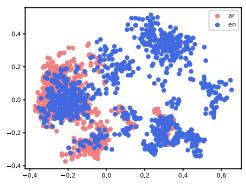
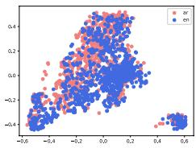
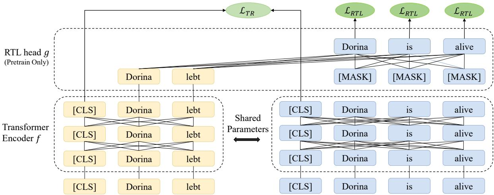
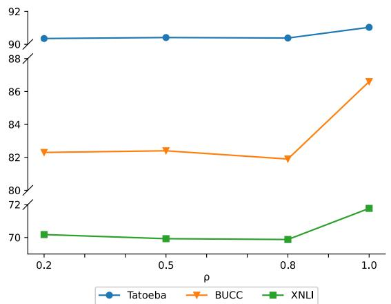
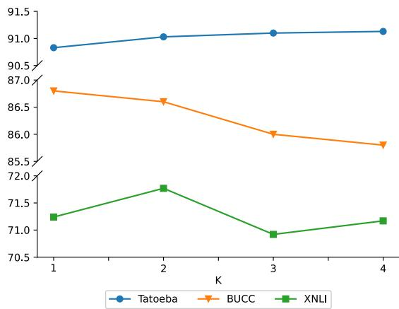

# Dual-Alignment Pre-training for Cross-lingual Sentence Embedding

Ziheng Li1,∗, Shaohan Huang2, Zihan Zhang2, Zhi-Hong Deng1,†, Qiang Lou2, Haizhen Huang2, Jian Jiao2, Furu Wei2, Weiwei Deng2, Qi Zhang2

1School of Intelligence Science and Technology, Peking University, Beijing, China 2Microsoft Corporation

{liziheng,zhdeng}@pku.edu.cn

{shaohanh, zihzha, qilou, hhuang, jiajia, fuwei, dedeng, qizhang}@microsoft.com

## Abstract

Recent studies have shown that dual encoder models trained with the sentence-level translation ranking task are effective methods for cross-lingual sentence embedding. However, our research indicates that token-level alignment is also crucial in multilingual scenarios, which has not been fully explored previously. Based on our findings, we propose a dual-alignment pre-training (DAP) framework for cross-lingual sentence embedding that incorporates both sentence-level and token-level alignment. To achieve this, we introduce a novel representation translation learning (RTL) task, where the model learns to use one-side contextualized token representation to reconstruct its translation counterpart. This reconstruction objective encourages the model to embed translation information into the token representation. Compared to other token-level alignment methods such as translation language modeling, RTL is more suitable for dual encoder architectures and is computationally efficient. Extensive experiments on three sentencelevel cross-lingual benchmarks demonstrate that our approach can significantly improve sentence embedding. Our code is available at https://github.com/ChillingDream/DAP.

## 1 Introduction

Cross-lingual sentence embedding encodes multilingual texts into a single unified vector space for a variety of Natural Language Processing (NLP) tasks, including cross-lingual sentence retrieval (Artetxe and Schwenk, 2019b) and crosslingual natural language inference (Conneau et al., 2018). The text sequences can be efficiently retrieved and compared using the inner product between their dense representations.

The task of sentence embedding now heavily depends on pre-trained language models (Devlin et al., 2019; Conneau and Lample, 2019; Conneau et al., 2020b,a). By fine-tuning the CLS token of the pre-trained model, they encode the input text sequence into a single vector representation. Recent research has shown that using the translation ranking task in combination with a dual pretrained encoder can result in superior sentence embeddings (Yang et al., 2019; Chidambaram et al., 2019; Yang et al., 2021; Chi et al., 2021; Feng et al., 2022). The purpose of fine-tuning the CLS token is to learn sentence-level alignment and to compress the entire sentence’s information into the CLS token. This method makes the CLS tokens of semantically relevant sentences have larger inner products. However, token-level alignment in multilingual scenarios is also crucial, and the fine-grained alignment task in cross-lingual sentence embedding has not been fully explored. As shown in Figure 1, we visualize the token representation similarities between a pair of parallel corpora. Training for an objective solely with regard to CLS token causes the token representations to disperse across the embedding space.

  
(a) Sentence Alignment.

  
(b) Dual Alignment.  
Figure 1: Visualization of token representations of 100 Tatoeba sentence pairs from Arabic and English. The high-dimensional vectors are projected onto a 2D space by Principle Component Analysis. We show the results of two models fine-tuned from multilingual BERT. The model shown in Figure 1(a) only fine-tunes with the translation ranking task, resulting in large misaligned areas. This misalignment can be effectively eliminated by the proposed RTL methods as shown in 1(b).

Based on our observations, we propose an efficient dual-alignment pre-training (DAP) framework for cross-lingual sentence embedding. The embedding model is trained towards both sentencelevel alignment and token-level alignment. Previous cross-lingual pre-training studies (Chi et al., 2021; Feng et al., 2022) employ translation language modeling (TLM) to achieve token alignment. In this paper, we introduce a novel representation translation learning (RTL) method that reconstructs the entire English input based on the token representations of parallel non-English sentences using a transformer model. By optimizing the RTL objective, the model learns to embed the information of English sentences into the representation of its non-English counterpart. Unlike TLM, computing RTL only needs one-side self-contextualized representation and does not involve extra feedforward propagation. We train our model on public corpora and evaluate it on three cross-lingual tasks: bitext retrieval, bitext mining, and cross-lingual natural language inference. Our results demonstrate DAP can effectively improve cross-lingual sentence embedding.

Our contributions are summarized as follows:

• We propose a novel cross-lingual pre-training framework DAP for sentence-level tasks, achieving both sentence-level and token-level alignment by representation translation learning, which is more suitable for dual encoders and computationally efficient compared with previous alignment methods.

• Extensive experiments on three cross-lingual tasks demonstrate DAP significantly improves sentence embedding.

• We train a model on a moderate-size dataset and find its performance comparable with that of the large-scale state-of-the-art pre-trained model.

## 2 Related Work

## 2.1 Cross-lingual Pre-training

Following the success of BERT for English (Devlin et al., 2019), multilingual BERT comes out by building a shared multilingual vocabulary and training on multiple monolingual corpora with the masked language modeling (MLM) objective. XLM (Conneau and Lample, 2019) proposes a translation language modeling (TLM) task which is the extension of MLM to bitext corpora, so that the model can learn the cross-lingual alignment from translation pairs. Unicoder (Huang et al., 2019) introduces three bitext pre-training tasks to help the model capture cross-lingual information from more perspectives. XLM-R (Conneau et al., 2020a) scales up the amount of monolingual data and training time. They achieve better performance than previous works without using parallel corpora.

## 2.2 Sentence Embedding

The dual encoder architecture is first proposed by Guo et al. (2018). They encode the source and target sentences to a unified embedding space, respectively, and compute the similarity score using inner product. The model is trained under a translation ranking task to make the model score higher for translation pairs than the negative examples. Yang et al. (2019) enhances the dual encoder by additive margin softmax, which further enlarges the distance between negative pairs. Based on additive margin softmax, LaBSE (Feng et al., 2022) combines the translation ranking task with MLM task and TLM task and trains on a larger corpus. InfoXLM (Chi et al., 2021) interprets the MLM, TLM and translation ranking task used in cross-lingual pre-training in a unified informationtheoretic framework, based on which they propose cross-lingual contrastive learning to maximize sentence-level mutual information.

## 3 Method

## 3.1 Preliminaries

Transformer Encoder Transformer encoder has been widely adopted in modern language models (Vaswani et al., 2017; Devlin et al., 2019; Conneau and Lample, 2019). It consists of an embedding layer and L stacked transformer blocks with self-attention modules. Each input token $x _ { i }$ will be encoded into a vector space as the initial hidden vector $h _ { i } ^ { 0 }$ . Then, in each transformer block, the hidden vector of the i-th token $h _ { i } ^ { l }$ is computed from the self-attentive fusion of all hidden vectors output from the previous layer:

$$
h ^ { l } = ( h _ { 1 } ^ { l } , h _ { 2 } ^ { l } , \cdot \cdot \cdot , h _ { S } ^ { l } ) = f ^ { l } ( h ^ { l - 1 } ) .\tag{1}
$$

We finally get the contextualized token representation $f ( x ) = f ^ { L } ( f ^ { L - 1 } ( \cdot \cdot \cdot f ^ { 1 } ( h ^ { 0 } ) ) )$ .

Cross-lingual Pre-training Masked language modeling (MLM) (Devlin et al., 2019) and Translation language modeling (TLM) (Conneau and Lample, 2019) are two typical tasks for cross-lingual pre-training. MLM is conducted on monolingual corpora. A randomly selected subset of input tokens will be replaced by a special [MASK] token or another random token, and models learn to recover these corrupted tokens according to the context. TLM extends MLM to cross-lingual scenarios with the following objective:

  
Figure 2: Workflow of the dual-alignment pre-training framework. We encode the bitext pair in dual encoder manner with a shared 12-layer transformer encoder and compute translation ranking loss and representation translation loss using sentence representation and token representations respectively.

$$
\mathcal { L } _ { T L M } ( x , y ) = \ell \left( x \oplus y , f ( m ( x ) \oplus m ( y ) ) \right) ,\tag{2}
$$

where  denotes sequence concatenation operator and m denotes element-wise random replacement. During training, models can predict the masked token using the unmasked token in the translation. In this way, models learn cross-lingual token-level alignment using the parallel corpora.

However, TLM is designed for a cross-encoder architecture in which tokens from the source and target sentences are mutually accessible in intermediate layers. As a result, models trained with TLM may rely on this information exchange, which is not available during the inference stage when sentences are independently encoded. Additionally, computing TLM requires an extra feedforward propagation, which inputs concatenated sentence pairs, resulting in increased training costs. Our proposed representation translation learning task can overcome both the weaknesses.

## 3.2 Model Structure

Our dual-alignment pre-training framework contains two transformer models: dual encoder model f and representation translation learning (RTL) head g.

For the encoder model, we adopt the most popular BERT architecture with 12 layers of transformer encoder blocks, 12 attention heads, and 768-dimension hidden states. Following Devlin et al. (2019), we prepend a special token [CLS] to the input:

$$
f ( x ) = f ( [ \mathrm { C L S } ] , x _ { 1 } , \dots , x _ { S } ) .\tag{3}
$$

We take the hidden vector of CLS token $h _ { c l s } ^ { L }$ as the representation of the whole sentence $f _ { s } ( x )$ Like other multilingual language models, our model is language-agnostic, which means all languages share the same single transformer.

The RTL head is a stack of K transformer encoder blocks with a vocabulary prediction head at the top. The function of RTL head is to reconstruct the translation sentence $y$ from the token representations of the source sentence $h ^ { L }$ (source sentences indicate non-English sentences in this paper):

$$
\begin{array} { r l } & { g ( h , y ) = \pi \left( W ^ { T } g ^ { K } \left( g ^ { K - 1 } \left( \cdot \cdot \cdot g ^ { 0 } ( h , y ) \right) \right) \right) , } \\ & { g ^ { 0 } ( h , y ) = ( h _ { 1 } ^ { L } , \cdot \cdot \cdot , h _ { S _ { x } } ^ { L } , \underbrace { [ \mathrm { M A S K } ] , \cdot \cdot \cdot , [ \mathrm { M A S K } ] } _ { \times S _ { y } } ) , } \end{array}\tag{4}
$$

where π is softmax function and W is the weight matrix of the vocabulary prediction head. In our experiments, we find a small RTL head with $K = 2$ performs best generally.

## 3.3 Pre-training Tasks

To achieve both sentence-level and token-level alignment, we design a pre-training framework consisting of two tasks: translation ranking task and representation translation learning task. These two objectives are leveraged simultaneously during training. The whole procedure is depicted in Figure 2.

## 3.3.1 Translation Ranking

Dual encoder models trained with the translation ranking (TR) task have been proven effective in learning cross-lingual embeddings (Yang et al., 2019; Feng et al., 2022; Chi et al., 2021). These models learn to maximize the similarity of the embedding pairs of parallel sentences and the dissimilarity of mismatched pairs. Therefore, they are well suited for solving retrieval and mining tasks that use inner product as ranking metrics. Following (Feng et al., 2022), we formulate the training task as follows:

$$
\mathcal { L } _ { T R } = - \frac { 1 } { N } \sum _ { i = 1 } ^ { N } \log \frac { e ^ { \phi ( x _ { i } , y _ { i } ) } } { \sum _ { j = 1 } ^ { B } e ^ { \phi ( x _ { i } , y _ { j } ) } } ,\tag{5}
$$

where B is the batch size and $\phi ( x , y )$ is defined as the similarity of the representation of each text, typically $f _ { s } ( x ) ^ { T } f _ { s } ( y )$ . In this paper, we use the hidden vector of CLS token to represent the sentence.

## 3.3.2 Representation Translation Learning

Minimizing $\mathcal { L } _ { T R }$ essentially maximize the lower bound of the mutual information $I ( x ; y )$ (Oord et al., 2018; Chi et al., 2021). However, it is hard for models to find an embedding perfectly containing all information of the sentence. Consequently, models may only pay attention to the high-level global information and neglect some local tokenlevel information. To this end, we add an auxiliary loss to force the models to preserve the token-level information throughout the entire model:

$$
\mathcal { L } _ { R T L } = \frac { 1 } { S } \sum _ { i = 1 } ^ { S } C E ( g ( f _ { * } ( x ) , y ) _ { i } , y _ { i } ) ,\tag{6}
$$

where $f _ { * } ( x )$ denotes all hidden vectors of x except CLS and CE denotes cross entropy. It is worth noting that we do not involve the CLS token in calculating RTL objective because we find it will make translation ranking objective hard to converge. To train the RTL head with a stable and consistent target, the reconstruction direction is always from non-English sentences to their English translations.

Combining with the translation ranking objective we get the final loss:

$$
\begin{array} { r } { \mathcal { L } _ { D A P } = \mathcal { L } _ { T R } + \mathcal { L } _ { R T L } . } \end{array}\tag{7}
$$

As RTL does not need an extra feedforward propagation, RTL only introduces a little computation and will not slow down the pre-training significantly. The only time-consuming operation is the softmax over the huge vocabulary which can be further relieved by techniques like negative sampling and hierarchical softmax (not used in our experiments).

## 4 Experiments

In this section, we first describe the training setup. Then we compare our method with previous works on three sentence-level cross-lingual tasks.

## 4.1 Pre-training data

Following Artetxe and Schwenk (2019b) we collect parallel training data for 36 languages (used in XTREME Tatoeba benchmark) by combining Europarl, United Nations Parallel Corpus, OpenSubtitles, Tanzil, CCMatrix and WikiMatrix corpora, which are downloaded from OPUS website (Tiedemann, 2012). As stated in section 3.3, we align all other languages with English, so we only collect parallel corpora that contain English. For each non-English language, we retain at most 1 million sentence pairs at random. The whole dataset has 5.7GB data, which is far less than typical largescale pre-training (Feng et al., 2022; Chi et al., 2021), but our method still achieves performance comparable with the state-of-the-art.

## 4.2 Implementation Details

We initialize the encoder model from multilingual BERT base or XLM-R base, respectively, using the checkpoint published on Huggingface model hub, and initialize the K-layer RTL head from the last K transformer layers by the corresponding encoder model. The maximum sentence length is restricted to 32 tokens, and sentences longer than 32 tokens will be truncated. We train the model for 100,000 steps using the AdamW optimizer with a learning rate of 5e-5 and a total batch size of 1024 on 8 Tesla V100 GPUs for 1 day. The results reported are the average of three different seeds.

<table><tr><td>Direction</td><td>xx→en</td><td></td><td></td><td>en→xx</td></tr><tr><td>Model</td><td>14 langs 28 langs</td><td>36 langs</td><td>14 langs 28 langs</td><td>36 langs</td></tr><tr><td>InfoXLM LaBSE</td><td>77.8 一 一</td><td>–</td><td>80.6</td><td>93.7</td></tr><tr><td>mBERT* mBERT (recomputed)</td><td>I 42.5 42.2</td><td>36.9</td><td>45.6 43.8</td><td>45.1 38.7 43.3 37.2</td></tr><tr><td>mBERT+TR mBERT+TR+TLM</td><td>94.0 93.8 94.1 93.8</td><td>90.1 90.2</td><td>93.2 93.4 93.5 93.5</td><td>90.1 90.3</td></tr><tr><td>mBERT+DAP</td><td>94.7 94.7</td><td>90.9</td><td>94.2 94.6</td><td>91.2</td></tr><tr><td>XLM-R*</td><td>1 -</td><td>–</td><td>60.6 63.7</td><td>57.7</td></tr><tr><td>XLM-R (recomputed)</td><td>59.4 60.1</td><td>55.3</td><td>57.5</td><td>58.9 53.3</td></tr><tr><td>XLM-R+TR</td><td>93.8 94.2</td><td>91.6</td><td>91.2</td><td>91.2</td></tr><tr><td></td><td></td><td></td><td></td><td>86.4</td></tr><tr><td>XLM-R+TR+TLM</td><td>93.2 92.8</td><td>89.2</td><td>94.4 94.5</td><td>92.4</td></tr><tr><td>XLM-R+DAP</td><td>95.0 94.7</td><td>91.3</td><td>95.1 95.2</td><td>92.7</td></tr><tr><td></td><td></td><td></td><td></td><td></td></tr></table>

Table 1: Average accuracy on Tatoeba bitext retrieval task. Direction $" \mathrm { x x } \mathrm { \to } \mathrm { e n } ^ { \prime \prime }$ means retrieval is performed over the English corpora, and vice versa. 14 langs and 28 langs mean different subsets of all 36 languages. For mBERT and XLM-R models, we report both the best implementation before (Results with \* are taken from (Hu et al., 2020)) and our recomputed accuracy. Results of InfoXLM and LaBSE are taken from their papers. For LaBSE we take the result using mBERT vocabulary for fair comparison. Bold font means that model performs the best among its group. We use underline to identify a state-of-the-art method that outperforms all our variants.

## 4.3 Compared models

To demonstrate the effectiveness of our proposed Representation Translation Learning, we first compare it with the base models (mBERT or XLM-R) and their TR-finetuned versions. Additionally, we also introduce a variant of our method that leverages TLM.

Furthermore, we also compare our approach with two state-of-the-art multilingual language models, InfoXLM (Chi et al., 2021) and LaBSE (Feng et al., 2022). It is worth noting that InfoXLM and LaBSE use 10 times more training data than our method and are trained longer with a larger batch size.

## 4.4 Bitext Retrieval

In bitext retrieval, given a query sentence from source language, models need to retrieve the most relevant sentence among a collection of sentences in the target language. Following previous works (Feng et al., 2022; Chi et al., 2021; Artetxe and Schwenk, 2019b), we use the Tatoeba dataset to evaluate our pre-training framework in a zeroshot manner.

Tatoeba contains parallel sentences in more than 300 languages, and we use the 36 languages version from XTREME benchmark (Hu et al., 2020). Each language has up to 1000 sentences paired with English.

Results We test on all 36 languages and report the average accuracy over 14 languages tested in LASER (Artetxe and Schwenk, 2019b) and 36 languages tested in XTREME. Besides, we set up a new group of 28 languages based on our observation of the low-resource test languages. Among the original 36 languages, some scarce languages have less than 1000 sentence pairs, and some of them even only have about 200 sentence pairs, and we observe that the accuracy of these languages is inconsistent between the two retrieval directions ("en xx" and "xx en" with a difference more than 30%) and also significantly lower than other languages with abundant resources. This indicates that the results obtained from small test sets are not as reliable as those from larger test sets. Therefore, we report a 28-language version where all languages contain 1000 test pairs. The retrieval accuracy for each language is reported in the appendix A.

In Table 1, we observe that our DAP method outperforms all other variants significantly. mBERT and XLM-R perform the worst because they lack a sentence-level objective. TLM improves TR’s performance in the direction "en xx" but hurts direction "xx en". By contrast, DAP brings consistent improvement. Compared with the two state-of-theart methods, our method performs much better than InfoXLM and only slightly falls behind LaBSE.

<table><tr><td rowspan="2">Model</td><td colspan="3">fr-en</td><td colspan="3">de-en</td><td colspan="3">ru-en</td><td colspan="3">zh-en</td><td rowspan="2">Avg F</td></tr><tr><td>P</td><td>R</td><td>F</td><td>P</td><td>R</td><td>F</td><td>P</td><td>R</td><td>F</td><td>P</td><td>R F</td><td></td></tr><tr><td>LaBSE</td><td>96.3</td><td>93.6</td><td>95.0</td><td>99.4</td><td>95.4</td><td>97.3</td><td>99.3</td><td>93.1</td><td>96.1</td><td>90.4</td><td>88.3</td><td>89.4</td><td>94.5</td></tr><tr><td>mBERT (recomputed)</td><td>75.1</td><td>68.2</td><td>71.5</td><td>77.8</td><td>69.0</td><td>73.1</td><td>70.1</td><td>52.9</td><td>60.3</td><td>63.1</td><td>50.6</td><td>56.2</td><td>65.3</td></tr><tr><td>mBERT+TR</td><td>96.1</td><td>90.9</td><td>93.4</td><td>98.8</td><td>94.0</td><td>96.3</td><td>98.4</td><td>89.8</td><td>93.9</td><td>96.0</td><td>93.8</td><td>94.9</td><td>94.6</td></tr><tr><td>mBERT+TR+TLM</td><td>95.6</td><td>90.9</td><td>93.2</td><td>98.3</td><td>94.0</td><td>96.1</td><td>97.0</td><td>89.7</td><td>93.2</td><td>93.9</td><td>95.7</td><td>94.8</td><td>94.3</td></tr><tr><td>mBERT+DAP</td><td>95.1</td><td>94.1</td><td>94.6</td><td>98.1</td><td>94.7</td><td>96.4</td><td>98.6</td><td>91.4</td><td>94.9</td><td>95.7</td><td>94.2</td><td>94.9</td><td>95.2</td></tr><tr><td>XLM-R (recomputed)</td><td>81.3</td><td>68.2</td><td>74.2</td><td>86.6</td><td>77.0</td><td>81.5</td><td>87.6</td><td>74.0</td><td>80.2</td><td>77.0</td><td>54.9</td><td>64.1</td><td>75.0</td></tr><tr><td>XLM-R+TR</td><td>92.6</td><td>92.1</td><td>92.4</td><td>96.3</td><td>94.6</td><td>95.4</td><td>97.3</td><td>91.0</td><td>94.0</td><td>96.6</td><td>87.5</td><td>91.8</td><td>93.4</td></tr><tr><td>XLM-R+TR+TLM</td><td>91.4</td><td>91.6</td><td>91.5</td><td>94.0</td><td>95.5</td><td>94.7</td><td>94.4</td><td>90.9</td><td>92.7</td><td>92.8</td><td>90.3</td><td>91.5</td><td>92.6</td></tr><tr><td>XLM-R+DAP</td><td>95.3</td><td>93.1</td><td>94.2</td><td>99.0</td><td>95.2</td><td>97.1</td><td>98.1</td><td>93.3</td><td>95.6</td><td>96.7</td><td>92.6</td><td>94.6</td><td>95.4</td></tr></table>

Table 2: Evaluation on BUCC training set. The thresholds are chosen to achieve the optimal F1 score.
<table><tr><td rowspan="2">Model</td><td colspan="2">fr-en</td><td colspan="2">de-en</td><td colspan="2"></td><td colspan="2">ru-en</td><td colspan="2">zh-en</td><td colspan="2"></td><td rowspan="2">Avg</td></tr><tr><td>P R</td><td>F</td><td>P</td><td>R</td><td>F</td><td>P</td><td>R</td><td>F</td><td>P</td><td>R</td><td>F</td><td>F</td></tr><tr><td>LaBSE</td><td>92.8</td><td>82.5</td><td>87.4</td><td>96.6</td><td>85.2</td><td>90.5</td><td>91.2</td><td>85.9</td><td>88.5</td><td>85.5</td><td>70.4</td><td>77.2</td><td>85.9</td></tr><tr><td>mBERT*</td><td>1</td><td>1</td><td>62.6</td><td></td><td></td><td>62.5</td><td></td><td></td><td>51.8</td><td></td><td></td><td>50.0</td><td>56.7</td></tr><tr><td>mBERT (recomputed)</td><td>80.1</td><td>42.1</td><td>55.2</td><td>83.7</td><td>38.2</td><td>52.5</td><td>69.1</td><td>28.9</td><td>40.8</td><td>65.8</td><td>20.2</td><td>30.9</td><td>44.8</td></tr><tr><td>mBERT+TR</td><td>93.6</td><td>75.2</td><td>83.4</td><td>97.3</td><td>77.1</td><td>86.0</td><td>91.3</td><td>77.2</td><td>83.6</td><td>93.0</td><td>69.7</td><td>79.7</td><td>83.2</td></tr><tr><td>mBERT+TR+TLM</td><td>92.4</td><td>75.0</td><td>82.8</td><td>96.2</td><td>78.2</td><td>86.3</td><td>90.1</td><td>77.2</td><td>83.1</td><td>90.9</td><td>75.8</td><td>82.6</td><td>83.7</td></tr><tr><td>mBERT+DAP</td><td>92.1</td><td>83.4</td><td>87.6</td><td>96.2</td><td>83.6</td><td>89.5</td><td>90.1</td><td>82.4</td><td>86.1</td><td>92.5</td><td>75.7</td><td>83.3</td><td>86.6</td></tr><tr><td>XLM-R*</td><td></td><td></td><td>67.5</td><td></td><td></td><td>66.5</td><td></td><td></td><td>73.5</td><td></td><td></td><td>56.7</td><td>66.0</td></tr><tr><td>XLM-R (recomputed)</td><td>85.9</td><td>47.3</td><td>61.0</td><td>88.6</td><td>48.3</td><td>62.5</td><td>85.8</td><td>54.3</td><td>66.5</td><td>77.7</td><td>27.3</td><td>40.4</td><td>57.6</td></tr><tr><td>XLM-R+TR</td><td>89.7</td><td>79.1</td><td>84.1</td><td>94.2</td><td>80.3</td><td>86.7</td><td>89.6</td><td>80.2</td><td>84.7</td><td>92.2</td><td>66.1</td><td>77.0</td><td>83.1</td></tr><tr><td>XLM-R+TR+TLM</td><td>88.1</td><td>75.8</td><td>81.5</td><td>91.2</td><td>79.8</td><td>85.1</td><td>86.3</td><td>80.6</td><td>83.4</td><td>89.6</td><td>72.6</td><td>80.2</td><td>82.5</td></tr><tr><td>XLM-R+DAP</td><td>92.1</td><td>82.1</td><td>86.8</td><td>96.6</td><td>81.1</td><td>88.2</td><td>89.5</td><td>88.1</td><td>88.8</td><td>93.7</td><td>75.0</td><td>83.3</td><td>86.8</td></tr></table>

Table 3: Evaluation on BUCC test set. The thresholds are chosen to achieve the optimal F1 score on training set. For mBERT and XLM-R models, we report both the best implementation before (Results with \* are taken from (Hu et al., 2020)) and our recomputed scores.

Considering the training cost, we think this result has demonstrated DAP’s potential.

## 4.5 Bitext Mining

In bitext mining, models need to detect the parallel sentence pairs (e.g., translations) from a pair of monolingual corpus. We use the BUCC 2018 dataset (Zweigenbaum et al., 2017) to perform evaluations, which contains four language pairs: fr-en, de-en, ru-en and zh-en. Each corpus contains 150k to 1.2M unpaired sentences and gold labels telling which sentences are translation pairs.

Following Artetxe and Schwenk (2019a), we employ the ratio between the cosine of a given candidate and the average cosine of its neighbours in both directions. The training set is used to learn the best threshold (Schwenk, 2018) to decide which pairs should be selected. More details of the scoring function and threshold can be found

in appendix B.

Results Table 2 shows the precision, recall and F1 score for four language pairs on training set after optimization. The results of LaBSE are produced using the checkpoints publicized in Huggingface model hub. We do not report the results of InfoXLM because this task was not evaluated in the original paper and we failed to produce reasonable results.

Our method outperforms all variants and even LaBSE, which means our model learns an embedding space with better separability. When testing the optimized model on test set, our model shows remarkable generalization ability and enlarges the gap against other methods as shown in Table 3. We outperform the state-of-the-art LaBSE by 0.9% and other variants by at least 3.0%. Similar to the retrieval task, mBERT and XLM-R perform the worst. TLM brings improvements for zh-en but gets worse for fr-en. DAP consistently performs the best on all metrics. Furthermore, the improvement observed in DAP’s performance is larger in comparison to the retrieval task. This indicates that DAP is more effective in enhancing performance on complex tasks, suggesting its potential as a valuable tool for addressing challenging problems.

<table><tr><td>Model</td><td>en fr</td><td>es</td><td>de</td><td>el</td><td>bg</td><td>ru</td><td>tr</td><td>ar vi</td><td>th</td><td>zh</td><td>hi</td><td>SW</td><td></td><td>ur</td></tr><tr><td>InfoXLM</td><td>86.4 80.3</td><td></td><td>80.9</td><td></td><td>79.3 77.8 79.3 77.6 75.6 74.2 77.1 74.6 77.0 72.2 67.5 67.3 76.5</td><td></td><td></td><td></td><td></td><td></td><td></td><td></td><td></td><td>Avg</td></tr><tr><td>LaBSE</td><td></td><td>85.4 80.2 80.5 78.8 78.6 80.1 77.5 75.1 75.0 76.5 69.0 75.8 71.9 71.5 68.1 76.3</td><td></td><td></td><td></td><td></td><td></td><td></td><td></td><td></td><td></td><td></td><td></td><td></td></tr><tr><td>mBERT</td><td></td><td></td><td></td><td>82.1 74.4 74.9 71.2 67.9 69.5 69.6 62.8 66.2 70.6 54.6 69.7 60.4 50.9 58.0 66.8</td><td></td><td></td><td></td><td></td><td></td><td></td><td></td><td></td><td></td><td></td></tr><tr><td>mBERT+TR</td><td></td><td></td><td></td><td></td><td>82.0 74.3 75.1 72.9 69.9 73.1 70.6 68.6 67.4 73.6 61.3 70.8 65.0 62.6 61.0 69.9</td><td></td><td></td><td></td><td></td><td></td><td></td><td></td><td></td><td></td></tr><tr><td>mBERT+TR+TLM</td><td></td><td></td><td></td><td>82.8 75.2 74.4 72.0 69.3 70.6 69.4 66.1 66.1 70.6 58.9 67.3 63.7 60.6 59.5 68.4</td><td></td><td></td><td></td><td></td><td></td><td></td><td></td><td></td><td></td><td></td></tr><tr><td>mBERT+DAP</td><td></td><td></td><td></td><td></td><td></td><td></td><td></td><td></td><td></td><td></td><td></td><td></td><td>81.8 75.6 76.2 74.4 72.6 74.9 72.0 71.3 69.7 74.4 63.6 72.3 67.3 67.3 63.2 71.8</td><td></td></tr><tr><td>XLM-R</td><td></td><td></td><td></td><td></td><td></td><td></td><td></td><td></td><td></td><td></td><td></td><td></td><td>83.8 77.6 78.2 75.4 75.0 77.0 74.8 72.7 72.0 74.5 72.1 72.9 69.6 64.2 66.0 73.7</td><td></td></tr><tr><td>XLM-R+TR</td><td></td><td>84.6 77.4 76.9 74.9 68.1 69.8 69.4 68.1 61.7 68.9 62.6 66.9 61.4 61.7 57.5 68.7</td><td></td><td></td><td></td><td></td><td></td><td></td><td></td><td></td><td></td><td></td><td></td><td>83.5 76.4 76.8 75.7 74.2 76.2 74.6 71.8 71.1 74.2 69.1 72.9 68.8 66.8 65.2 73.1</td></tr><tr><td>XLM-R+TR+TLM XLM-R+DAP</td><td></td><td></td><td></td><td></td><td></td><td></td><td></td><td></td><td></td><td></td><td></td><td></td><td></td><td></td></tr><tr><td></td><td></td><td></td><td></td><td></td><td></td><td></td><td></td><td></td><td></td><td></td><td></td><td></td><td></td><td>82.9 77.0 77.7 75.7 75.2 76.0 74.7 73.1 72.5 74.2 71.9 73.0 69.8 70.5 66.0 74.0</td></tr></table>

Table 4: Accuracy for XNLI cross-lingual natural language inference. Results of InfoXLM are taken from their paper.

## 4.6 Cross-lingual Natural Language Inference

Natural language inference (NLI) is a well-known task to evaluate models’ classification performance under fine-tuning. The goal is to predict the relationship between the input sentence pair. The candidate relationships are entailment, contradiction and neutral. XNLI (Conneau et al., 2018) extends NLI to the multilingual setting of 15 languages. Following Chi et al. (2021), we fine-tune the model with the English training set and directly evaluate on test sets of other languages. The hyperparameters of fine-tuning are reported in the appendix C.

Results Table 4 shows accuracy for 15 languages. We observe that the differences between variants are relatively small compared with retrieval and mining tasks. We think this is because judging the relationship between two sentences does not rely on cosine similarity, so the pre-training cannot be directly transferred to the downstream task. mBERT variants all show positive results and DAP has the largest improvement. But for XLM-R variants, only DAP maintains the performance as the base model. The TR and TLM variants suffer from performance degradation. We think this is because XLM-R has already been a well-trained multilingual model and our continued pre-training is insufficient to improve the classification capacity. However, we demonstrate DAP will not harm classification performance for a well-trained base model.

<table><tr><td rowspan=1 colspan=1>Direction</td><td rowspan=1 colspan=1>TatoebaBUCCXNLI</td></tr><tr><td rowspan=1 colspan=1>xx→en</td><td rowspan=1 colspan=1>91.0    86.6  71.8</td></tr><tr><td rowspan=1 colspan=1>en→xx</td><td rowspan=1 colspan=1>90.5    84.1   69.3</td></tr><tr><td rowspan=1 colspan=1>Both</td><td rowspan=1 colspan=1>90.8    86.3   70.5</td></tr></table>

Table 5: Performance of different RTL directions across three tasks. "xx en" means RTL head reconstructs English sentences using non-English token representations, and vice versa. "Both" means we calculate the RTL loss from both directions on half of the batch respectively and take the average.

## 5 Analysis

In this section, we conduct experiments to get a deeper understanding of DAP. In each setting, we report the average accuracy over 36 languages and two retrieval directions on Tatoeba, average F1 score on BUCC test set and average accuracy on XNLI. All variants are trained from mBERT.

## 5.1 Translation Direction

In our method, the RTL head only learns to translate from non-English to English. Here we investigate if the opposite direction can help the pretraining. To remind the model of the language to be reconstructed, we add language embeddings to the representation before the RTL head like TLM.

As shown in Table 5, translating from English to non-English performs much worse than the opposite direction. Also, the mixed-up training gets an intermediate performance. We attribute the difference between the two directions to the dispersion of the objective. We assume that RTL aligns the source language’s representation towards the target language. ${ \bf S 0 , }$ if the reconstruction target keeps switching among different languages, it will make RTL hard to converge.

  
Figure 3: Performance of varying reconstruction ratios across three tasks.

## 5.2 Reconstruction Ratio

To better understand the objective of the RTL task, we conduct experiments where RTL head only needs to reconstruct partial target sentences with the other target token representations accessible. The tokens to reconstruct are selected randomly with probability $\rho .$ Larger $\rho$ will make the RTL task harder.

From Figure 3, we can find the variants with $\rho <$ 1 have similar performance on all tasks and there is a steep increase at $\rho = 1$ . We think this is because the unmasked target token representations cause information leakage, so the RTL head does not need to learn the alignment from source sentences.

## 5.3 Complexity of RTL head

We investigate the relation between the RTL head’s complexity and the pre-training performance. We set $K = 1 , 2 , 3 , 4$ to give RTL head different capabilities to extract aligned information from the representation of the source sentence.

In Figure 4, the three tasks show different tendencies with regard to RTL head’s complexity. Only the accuracy on Tatoeba keeps increasing along with K but the gain from larger K is declining especially after $K = 2$ . For the other two tasks, larger K brings a negative effect. We hypothesize that a smaller K that makes RTL task harder will enforce the model to generate more informative representations. Setting K = 2 achieves the best general cross-lingual performance across three tasks.

  
Figure 4: Performance of varying numbers of RTL head layers across three tasks.

<table><tr><td>Model</td><td>FLOPs</td><td>s Latency</td></tr><tr><td>mBERT+TR mBERT+TR+TLM</td><td>11.0G</td><td>0.51</td></tr><tr><td></td><td>33.7G</td><td>1.34</td></tr><tr><td>mBERT+DAP</td><td>16.5G</td><td>0.88</td></tr></table>

Table 6: Computational efficiency of different pretraining methods. The unit of latency is milliseconds per sample.

## 5.4 Computational Efficiency

Computational efficiency is an important factor when designing pre-training tasks. A more efficient method enables models to train on a larger dataset for more steps. We calculate the feedforward floating point operations (FLOPs) for our method and TLM, respectively. In addition, we report the training latency in our training environment. We measure the latency with a total batch size of 512 on 8 Tesla V100 GPUs using PyTorch distributed data parallel.

From Table 6, we can find DAP only increases the training cost by about 50% against the TR-only baseline, which can be further improved if we use negative sampling to reduce the softmax over the huge vocabulary. By contrast, TLM introduces a training cost of more than 150% due to the extra feedforward propagation through the 12-layer encoder. Therefore, DAP is more efficient and scalable for cross-lingual pre-training.

## 6 Conclusion

In this paper, we find that token-level alignment is crucial for cross-lingual tasks. Based on this observation, we present a dual-alignment pre-training framework for cross-lingual sentence embedding that enables both sentence-level and token-level alignment. The framework consists of a translation ranking task and a newly proposed representation translation learning task, which encourages the token representation to contain all information from its translation counterpart in an efficient way.

We train our models on a moderate-size corpus. The model trained with DAP significantly outperforms variants without token-level alignment or using TLM as the alignment task across three sentence-level cross-lingual tasks, and achieves performance comparable with those state-of-the-art pre-training work trained on 10 times more data with larger batch size and training steps. These results show our approach brings essential improvement for cross-lingual sentence embedding.

## Limitations

Although our method is efficient and scalable, we have not conducted pre-training on large-scale corpora due to limited computational resources. The quality and quantity of data are crucial factors for a pre-training model. As our model only covers 36 languages, it cannot provide services for many rare languages. This paper just proposes a new pretraining direction and does not use many training tricks. Exploring DAP’s full capability is left for future work.

Besides, RTL task is not the only possible tokenalignment task for our DAP framework. Other objectives based on token representations are also worth investigating. The best objective form is still under research.

## References

Mikel Artetxe and Holger Schwenk. 2019a. Marginbased Parallel Corpus Mining with Multilingual Sentence Embeddings. In Proceedings ofthe 57th Conference of the Association for Computational Linguistics, ACL 2019, Florence, Italy, July 28- August 2, 2019, Volume 1: Long Papers, pages 3197–3203. Association for Computational Linguistics.

Mikel Artetxe and Holger Schwenk. 2019b. Massively Multilingual Sentence Embeddings for Zero-Shot Cross-Lingual Transfer and Beyond. Transactions of

the Associationfor Computational Linguistics, 7:597– 610.

Zewen Chi, Li Dong, Furu Wei, Nan Yang, Saksham Singhal, Wenhui Wang, Xia Song, Xian-Ling Mao, Heyan Huang, and Ming Zhou. 2021. InfoXLM: An information-theoretic framework for cross-lingual language model pre-training. In Proceedings ofthe 2021 Conference ofthe North American Chapter of the Associationfor Computational Linguistics: Human Language Technologies, pages 3576–3588, Online. Association for Computational Linguistics.

Muthu Chidambaram, Yinfei Yang, Daniel Cer, Steve Yuan, Yunhsuan Sung, Brian Strope, and Ray Kurzweil. 2019. Learning Cross-Lingual Sentence Representations via a Multi-task Dual-Encoder Model. In Proceedings ofthe 4th Workshop on Representation Learning for NLP (RepL4NLP-2019), pages 250–259, Florence, Italy. Association for Computational Linguistics.

Alexis Conneau, Kartikay Khandelwal, Naman Goyal, Vishrav Chaudhary, Guillaume Wenzek, Francisco Guzmán, Edouard Grave, Myle Ott, Luke Zettlemoyer, and Veselin Stoyanov. 2020a. Unsupervised Cross-lingual Representation Learning at Scale. In Proceedings of the 58th Annual Meeting of the Associationfor Computational Linguistics, pages 8440– 8451, Online. Association for Computational Linguistics.

Alexis Conneau and Guillaume Lample. 2019. Crosslingual Language Model Pretraining. In Advances in Neural Information Processing Systems, volume 32. Curran Associates, Inc.

Alexis Conneau, Ruty Rinott, Guillaume Lample, Adina Williams, Samuel Bowman, Holger Schwenk, and Veselin Stoyanov. 2018. XNLI: Evaluating Crosslingual Sentence Representations. In Proceedings of the 2018 Conference on Empirical Methods in Natural Language Processing, pages 2475–2485, Brussels, Belgium. Association for Computational Linguistics.

Alexis Conneau, Shijie Wu, Haoran Li, Luke Zettlemoyer, and Veselin Stoyanov. 2020b. Emerging Cross-lingual Structure in Pretrained Language Models. In Proceedings of the 58th Annual Meeting of the Associationfor Computational Linguistics, pages 6022–6034, Online. Association for Computational Linguistics.

Jacob Devlin, Ming-Wei Chang, Kenton Lee, and Kristina Toutanova. 2019. BERT: Pre-training of Deep Bidirectional Transformers for Language Understanding. In Proceedings ofthe 2019 Conference ofthe North American Chapter ofthe Associationfor Computational Linguistics: Human Language Technologies, Volume 1 (Long and Short Papers), pages 4171–4186, Minneapolis, Minnesota. Association for Computational Linguistics.

Fangxiaoyu Feng, Yinfei Yang, Daniel Cer, Naveen Arivazhagan, and Wei Wang. 2022. Language-agnostic

BERT Sentence Embedding. In Proceedings ofthe 60th Annual Meeting of the Association for Computational Linguistics (Volume 1: Long Papers), ACL 2022, Dublin, Ireland, May 22-27, 2022, pages 878– 891.

Mandy Guo, Qinlan Shen, Yinfei Yang, Heming Ge, Daniel Cer, Gustavo Hernández Ábrego, Keith Stevens, Noah Constant, Yun-Hsuan Sung, Brian Strope, and Ray Kurzweil. 2018. Effective Parallel Corpus Mining using Bilingual Sentence Embeddings. In Proceedings of the Third Conference on Machine Translation: Research Papers, WMT 2018, Belgium, Brussels, October 31 - November 1, 2018, pages 165–176. Association for Computational Linguistics.

Junjie Hu, Sebastian Ruder, Aditya Siddhant, Graham Neubig, Orhan Firat, and Melvin Johnson. 2020. XTREME: A Massively Multilingual Multitask Benchmark for Evaluating Cross-lingual Generalization. ArXiv:2003.11080 [cs].

Haoyang Huang, Yaobo Liang, Nan Duan, Ming Gong, Linjun Shou, Daxin Jiang, and Ming Zhou. 2019. Unicoder: A Universal Language Encoder by Pretraining with Multiple Cross-lingual Tasks. In Proceedings ofthe 2019 Conference on Empirical Methods in Natural Language Processing and the 9th International Joint Conference on Natural Language Processing (EMNLP-IJCNLP), pages 2485–2494, Hong Kong, China. Association for Computational Linguistics.

Aäron van den Oord, Yazhe Li, and Oriol Vinyals. 2018. Representation Learning with Contrastive Predictive Coding. CoRR, abs/1807.03748. ArXiv: 1807.03748.

Holger Schwenk. 2018. Filtering and Mining Parallel Data in a Joint Multilingual Space. In Proceedings of the 56th Annual Meeting of the Association for Computational Linguistics, ACL 2018, Melbourne, Australia, July 15-20, 2018, Volume 2: Short Papers, pages 228–234. Association for Computational Linguistics.

Jorg Tiedemann. 2012. Parallel Data, Tools and Interfaces in OPUS. In Proceedings of the 8th International Conference on Language Resources and Evaluation (LREC’2012).

Ashish Vaswani, Noam Shazeer, Niki Parmar, Jakob Uszkoreit, Llion Jones, Aidan N Gomez, Łukasz Kaiser, and Illia Polosukhin. 2017. Attention is All you Need. In Advances in Neural Information Processing Systems, volume 30. Curran Associates, Inc.

Yinfei Yang, Gustavo Hernández Ábrego, Steve Yuan, Mandy Guo, Qinlan Shen, Daniel Cer, Yun-Hsuan Sung, Brian Strope, and Ray Kurzweil. 2019. Improving Multilingual Sentence Embedding using Bidirectional Dual Encoder with Additive Margin Softmax. In Proceedings ofthe Twenty-Eighth International Joint Conference on Artificial Intelligence, IJ-

CAI 2019, Macao, China, August 10-16, 2019, pages 5370–5378.

Ziyi Yang, Yinfei Yang, Daniel Cer, Jax Law, and Eric Darve. 2021. Universal Sentence Representation Learning with Conditional Masked Language Model. In Proceedings ofthe 2021 Conference on Empirical Methods in Natural Language Processing, EMNLP 2021, Virtual Event / Punta Cana, Dominican Republic, 7-11 November, 2021, pages 6216–6228. Association for Computational Linguistics.

Pierre Zweigenbaum, Serge Sharoff, and Reinhard Rapp. 2017. Overview of the Second BUCC Shared Task: Spotting Parallel Sentences in Comparable Corpora. In Proceedings of the 10th Workshop on Building and Using Comparable Corpora, BUCC@ACL 2017, Vancouver, Canada, August 3, 2017, pages 60–67. Association for Computational Linguistics.

## A Full Tatoeba Results

We report the Tatoeba retrieval accuracy of all 36 languages in Table 7 and Table 8. Our approach consistently outperforms other baselines in both directions for most languages, with the advantage being particularly significant in the "en xx" direction. We observed that the performance of the TR-only model can vary much between the two directions, as demonstrated by languages such as jv, kk, sw, and tl. In contrast, our approach exhibits much more stable performance, which is beneficial for bidirectional applications.

## B Scoring Function For BUCC

In contrast to direction comparison between similarities, margin-based method accounts for the scale inconsistencies of measure. We adopted the method proposed by Artetxe and Schwenk (2019a):

$$
f ( x , y ) = \frac { \phi ( x , y ) } { \sum _ { z \in N _ { k } ( x ) } \frac { \phi ( x , y ) } { k } + \sum _ { z \in N _ { k } ( y ) } \frac { \phi ( z , y ) } { k } } ,\tag{8}
$$

where $N _ { k } ( x )$ denotes the set of k nearest neighbours of x in the other language. In our experiments, we set $k = 4$

With a certain threshold γ, sentence pairs such that $f ( x , y ) \geq \gamma$ are identified as aligned. For those x appearing in multiple aligned pairs, we select the pair with the highest score.

To decide the best threshold, we first compute the scores of all candidates and sort them into an ordered sequence. Next, we compute F1 score by setting γ to each middle point of two consecutive scores and find the optimal γ. This procedure is done on training set.

<table><tr><td>Model</td><td>af</td><td>ar</td><td>bg</td><td>de</td><td>el</td><td>es</td><td>et</td><td>eu</td><td>fa</td><td>fi</td><td>fr</td><td>he</td><td>hi</td><td>hu</td><td>id</td><td>it</td></tr><tr><td>mBERT+TR</td><td>95.5</td><td>90.3</td><td>94.5</td><td>88.8 99.1</td><td>96.4</td><td>98.1</td><td>97.4</td><td>95.1</td><td>94.0</td><td>96.5</td><td>95.3</td><td>90.6</td><td>95.5</td><td>96.8</td><td>95.4 94.4</td><td>96.1</td></tr><tr><td>mBERT+TR+TLM</td><td>95.9</td><td>89.7</td><td>94.6</td><td>87.0</td><td>99.1 95.6</td><td>98.3</td><td>96.8</td><td>95.0</td><td>94.0</td><td>95.7</td><td>95.4</td><td>91.5</td><td>95.6</td><td>95.6</td><td>95.0 93.8</td><td>95.0</td></tr><tr><td>mBERT+DAP</td><td>96.9</td><td>91.8</td><td>95.4</td><td>89.3</td><td>99.1 96.8</td><td>98.4</td><td>98.0</td><td>96.2</td><td>95.9</td><td>97.1</td><td>95.5</td><td>93.0</td><td>96.8</td><td>97.0</td><td>95.9 95.5</td><td>96.7</td></tr><tr><td>XLM-R+TR</td><td>95.0</td><td>90.0</td><td>92.9</td><td>89.3</td><td>99.1 93.9</td><td>98.1</td><td>97.8</td><td>95.3</td><td>95.3</td><td>96.9</td><td>95.3</td><td>91.1</td><td>96.4</td><td>97.0</td><td>95.1 94.4</td><td>96.1</td></tr><tr><td>XLM-R+TR+TLM</td><td>92.7</td><td>90.2</td><td>94.3</td><td>88.8 99.1</td><td>95.5</td><td>97.3</td><td>96.8</td><td>93.8</td><td>94.4</td><td>95.9</td><td>94.2</td><td>91.2</td><td></td><td></td><td></td><td></td></tr><tr><td>XLM-R+DAP</td><td>96.1</td><td>93.1</td><td>95.7</td><td>91.4 99.2</td><td>96.7</td><td>98.4</td><td>98.1</td><td>96.0</td><td>94.9</td><td>97.3</td><td>95.5</td><td>93.6</td><td>96.4 97.3</td><td>95.9 96.0 97.0</td><td>94.4</td><td>94.2</td></tr><tr><td></td><td>jv</td><td>ka</td><td></td><td></td><td>mr</td><td>nl</td><td>pt</td><td>ru</td><td>SW</td><td></td><td></td><td></td><td></td><td>96.4</td><td>96.3</td><td>96.2</td></tr><tr><td>mBERT+TR</td><td>29.3</td><td>81.0</td><td>kk 62.6</td><td>ko 91.2</td><td>ml 97.7 91.6</td><td>96.2</td><td>95.4</td><td>95.6</td><td>75.1</td><td>ta 84.0</td><td>te 90.2</td><td>th 96.2</td><td>tl 67.7</td><td>ur 89.6</td><td>vi 96.9</td><td>zh</td></tr><tr><td>mBERT+TR+TLM</td><td>31.2</td><td>79.2</td><td>64.7</td><td>91.8</td><td>97.5</td><td>92.0 95.9</td><td>95.4</td><td>94.8</td><td>77.2</td><td>85.3</td><td>89.7</td><td>96.0</td><td>71.0</td><td>98.2</td><td></td><td>95.3</td></tr><tr><td>mBERT+DAP</td><td>30.2</td><td>79.9</td><td>63.8</td><td>93.2</td><td>98.5</td><td>92.5 96.6</td><td>96.2</td><td>95.5</td><td>77.9</td><td>83.1</td><td>88.5</td><td>96.9</td><td>70.1</td><td>97.7 91.3 98.5 90.8</td><td>96.9 97.5</td><td>95.3 95.4</td></tr><tr><td>XLM-R+TR</td><td>46.3</td><td>90.5</td><td>75.7</td><td>92.7</td><td>98.5</td><td>93.2 96.7</td><td>95.4</td><td>94.7</td><td>73.3</td><td>84.4</td><td>93.6</td><td>96.7</td><td>74.2</td><td></td><td></td><td></td></tr><tr><td>XLM-R+TR+TLM</td><td>23.4</td><td>92.4</td><td>69.2</td><td>91.6</td><td>97.2</td><td>90.4</td><td>95.7 95.5</td><td>94.3</td><td>72.8</td><td>71.0</td><td>88.5</td><td>96.4</td><td></td><td>97.2</td><td>91.6 97.5</td><td>95.7</td></tr><tr><td>XLM-R+DAP</td><td>27.3</td><td>93.7</td><td>68.5</td><td>93.3</td><td>98.4</td><td>92.5</td><td>96.6 96.1</td><td>95.4</td><td>77.2</td><td>80.8</td><td>92.3</td><td>98.2</td><td>55.8 65.6</td><td>97.1 98.3</td><td>85.9 97.0 90.3 98.2</td><td>94.6 95.4</td></tr></table>

Table 7: Retrieval accuracy on 36 languages of direction xx en.
<table><tr><td>Model</td><td>af</td><td>ar</td><td>bg bn</td><td>de</td><td>el</td><td>es</td><td>et</td><td>eu</td><td>fa</td><td>fi</td><td>fr</td><td>he</td><td>hi</td><td>hu</td><td>id</td><td>it</td></tr><tr><td>mBERT+TR</td><td>94.8</td><td>88.7 93.3</td><td>86.2</td><td></td><td>98.8 95.4</td><td>97.4</td><td>96.3</td><td>94.7</td><td>94.3</td><td>95.6</td><td>95.8</td><td>89.7</td><td>95.0</td><td>95.6</td><td>94.3 95.1</td><td>95.9</td></tr><tr><td>mBERT+TR+TLM</td><td>95.7</td><td>88.0 93.8</td><td>85.8</td><td>98.9</td><td>96.1</td><td>97.6</td><td>96.3</td><td>94.8</td><td>93.7</td><td>94.8</td><td>95.3</td><td>89.6</td><td>95.3</td><td>94.4</td><td>94.1 94.1</td><td>95.3</td></tr><tr><td>mBERT+DAP</td><td>96.3</td><td>90.6</td><td>94.3 87.8</td><td></td><td>98.9 96.1</td><td>98.1</td><td>98.0</td><td>96.0</td><td>95.6</td><td>96.4</td><td>95.4</td><td>92.2</td><td>96.0</td><td>96.5</td><td>95.2 95.8</td><td>96.6</td></tr><tr><td>XLM-R+TR</td><td>87.6</td><td>90.3 92.0</td><td>85.5</td><td>98.3</td><td>95.9</td><td>96.2</td><td>95.9</td><td>92.8</td><td>93.1</td><td>95.4</td><td>92.4</td><td>91.6</td><td>94.3</td><td>95.6</td><td>94.0 94.4</td><td>90.9</td></tr><tr><td>XLM-R+TR+TLM</td><td>96.1</td><td>89.3 93.9</td><td>90.0</td><td>99.1</td><td>93.9</td><td>98.2</td><td>97.0</td><td>94.9</td><td>95.7</td><td>96.8</td><td>95.4</td><td>89.6</td><td>97.1</td><td>96.5</td><td>95.3 94.4</td><td>96.4</td></tr><tr><td>XLM-R+DAP</td><td>96.3</td><td>92.2 95.4</td><td>91.2</td><td>98.9</td><td>96.6</td><td>98.6</td><td>98.1</td><td>95.7</td><td>96.0</td><td>97.1</td><td>96.3</td><td>93.1</td><td>97.0</td><td>97.2 96.3</td><td></td><td>97.3</td></tr><tr><td></td><td>jv</td><td>ka kk</td><td>ko</td><td>ml</td><td>mr</td><td>nl</td><td>pt</td><td>ru</td><td>SW</td><td>ta</td><td>te</td><td>th</td><td>tl</td><td>ur</td><td>96.1 vi</td><td>zh</td></tr><tr><td>mBERT+TR</td><td>43.4</td><td>81.5</td><td>66.4</td><td>91.8</td><td>97.4 92.3</td><td>96.1</td><td>94.6</td><td>94.8</td><td>72.3</td><td>83.4</td><td>89.3</td><td>95.8</td><td>70.6</td><td>tr 96.8 89.5</td><td>97.3</td><td></td></tr><tr><td>mBERT+TR+TLM</td><td>46.3</td><td>78.0</td><td>67.8</td><td>92.5</td><td>98.0 92.2</td><td>95.9</td><td>94.7</td><td>94.2</td><td>74.9</td><td>84.0</td><td>89.7</td><td>95.8</td><td>74.6</td><td>96.8 90.4</td><td></td><td>94.3</td></tr><tr><td>mBERT+DAP</td><td>47.3</td><td>80.8</td><td>65.4 92.3</td><td></td><td>98.3 93.3</td><td>97.2</td><td>95.6</td><td>94.8</td><td>75.6</td><td>82.4</td><td>89.7</td><td>96.4</td><td>75.5</td><td></td><td>97.6</td><td>94.9</td></tr><tr><td>XLM-R+TR</td><td>16.1</td><td>88.3</td><td></td><td></td><td></td><td>95.4</td><td></td><td></td><td>59.5</td><td>62.5</td><td></td><td></td><td></td><td>98.2</td><td>91.7 97.8</td><td>95.3</td></tr><tr><td>XLM-R+TR+TLM</td><td></td><td></td><td>57.6</td><td>89.8</td><td>96.2</td><td>87.3</td><td>95.5</td><td>93.9</td><td></td><td></td><td>81.6</td><td>95.3</td><td>46.8</td><td>97.0</td><td>82.2 96.7</td><td>92.8</td></tr><tr><td>XLM-R+DAP</td><td>49.8</td><td>90.6</td><td>82.6</td><td>92.4</td><td>98.5</td><td>94.2 97.0</td><td>95.0</td><td>94.2</td><td>81.5</td><td>86.0</td><td>96.6</td><td>96.9</td><td>80.2</td><td>96.6</td><td>92.6 97.7</td><td>95.2</td></tr><tr><td></td><td>47.3</td><td>91.6</td><td>75.3</td><td>93.4</td><td>99.0</td><td>93.6 96.8</td><td>95.6</td><td>95.1</td><td>78.5</td><td>86.3</td><td>94.9</td><td>97.8</td><td>77.1</td><td>97.9</td><td>92.7 98.0</td><td>96.0</td></tr></table>

Table 8: Retrieval accuracy on 36 languages of direction en xx.

## C XNLI Fine-tuning

The fine-tuning hyperparamter setting is shown in Table 9. We searched the learning rate among {1e-5, 3e-5, 5e-5, 7e-5}.

<table><tr><td>Batch size</td><td>256</td></tr><tr><td>Learning rate</td><td rowspan="3">5e-5 2</td></tr><tr><td>Epochs</td></tr><tr><td>Max seq length 128</td></tr></table>

Table 9: Hyperparameter setting of XNLI fine-tuning.

A For every submission: ✓ A1. Did you describe the limitations of your work? 7

✗ A2. Did you discuss any potential risks of your work? Our research isfundamental. So, it will not cause much social impact.

✓ A3. Do the abstract and introduction summarize the paper’s main claims? 1

✗ A4. Have you used AI writing assistants when working on this paper? Left blank.

## B ✗ Did you use or create scientific artifacts?

Left blank.

 B1. Did you cite the creators of artifacts you used? No response.

 B2. Did you discuss the license or terms for use and / or distribution of any artifacts? No response.

 B3. Did you discuss if your use of existing artifact(s) was consistent with their intended use, provided that it was specified? For the artifacts you create, do you specify intended use and whether that is compatible with the original access conditions (in particular, derivatives of data accessed for research purposes should not be used outside of research contexts)? No response.

 B4. Did you discuss the steps taken to check whether the data that was collected / used contains any information that names or uniquely identifies individual people or offensive content, and the steps taken to protect / anonymize it? No response.

 B5. Did you provide documentation of the artifacts, e.g., coverage of domains, languages, and linguistic phenomena, demographic groups represented, etc.? No response.

 B6. Did you report relevant statistics like the number of examples, details of train / test / dev splits, etc. for the data that you used / created? Even for commonly-used benchmark datasets, include the number of examples in train / validation / test splits, as these provide necessary context for a reader to understand experimental results. For example, small differences in accuracy on large test sets may be significant, while on small test sets they may not be. No response.

## C ✓ Did you run computational experiments?

4 and 5

✓ C1. Did you report the number of parameters in the models used, the total computational budget (e.g., GPU hours), and computing infrastructure used? 4.2

✓ C2. Did you discuss the experimental setup, including hyperparameter search and best-found hyperparameter values? 4.2 and appendix C

✓ C3. Did you report descriptive statistics about your results (e.g., error bars around results, summary statistics from sets of experiments), and is it transparent whether you are reporting the max, mean, etc. or just a single run? 4

✓ C4. If you used existing packages (e.g., for preprocessing, for normalization, or for evaluation), did you report the implementation, model, and parameter settings used (e.g., NLTK, Spacy, ROUGE, etc.)? 4

D ✗ Did you use human annotators (e.g., crowdworkers) or research with human participants? Left blank.

 D1. Did you report the full text of instructions given to participants, including e.g., screenshots, disclaimers of any risks to participants or annotators, etc.? No response.

 D2. Did you report information about how you recruited (e.g., crowdsourcing platform, students) and paid participants, and discuss if such payment is adequate given the participants’ demographic (e.g., country of residence)? No response.

 D3. Did you discuss whether and how consent was obtained from people whose data you’re using/curating? For example, if you collected data via crowdsourcing, did your instructions to crowdworkers explain how the data would be used? No response.

 D4. Was the data collection protocol approved (or determined exempt) by an ethics review board? No response.

 D5. Did you report the basic demographic and geographic characteristics of the annotator population that is the source of the data? No response.