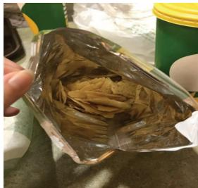
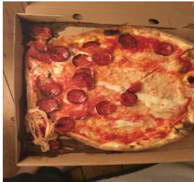
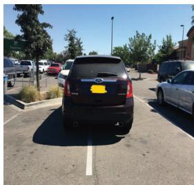
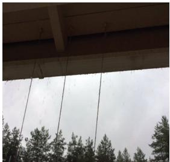
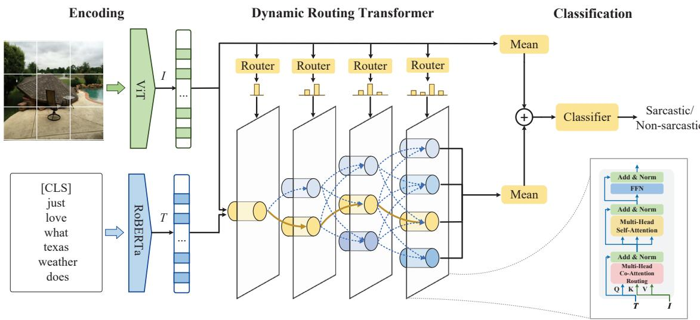
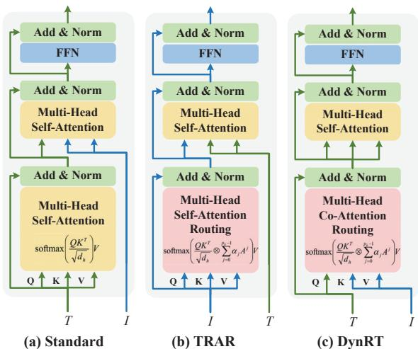
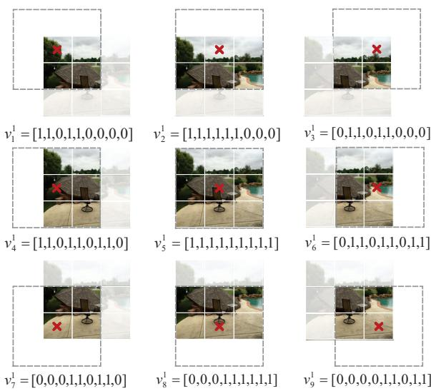
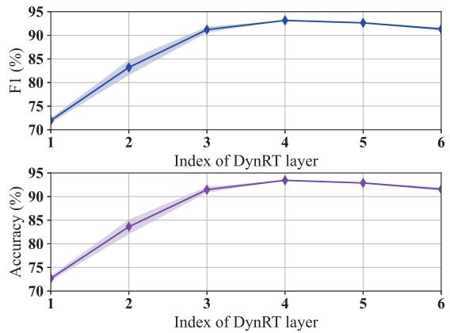
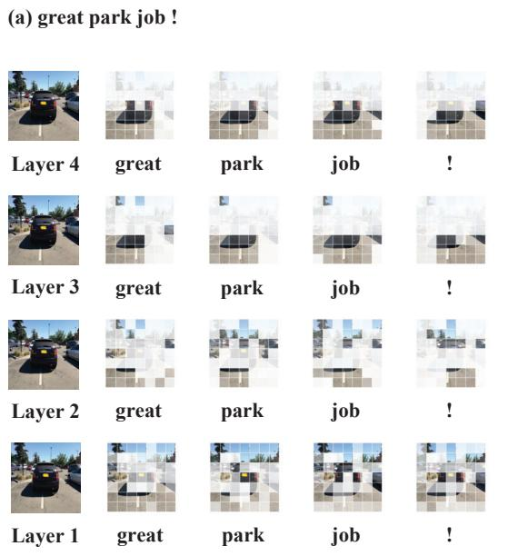
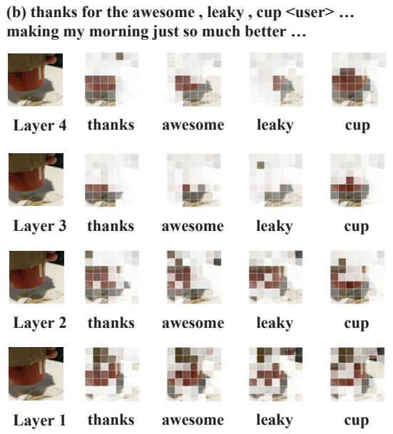

# Dynamic Routing Transformer Network for Multimodal Sarcasm Detection

Yuan Tian1,2, Nan Xu1,3\*, Ruike Zhang1,2, Wenji Mao1,2\*

1Institute of Automation, Chinese Academy of Sciences

2School of Artificial Intelligence, University of Chinese Academy of Sciences 3Beijing Wenge Technology Co., Ltd

{tianyuan2021,xunan2015,zhangruike2020,wenji.mao}@ia.ac.cn

## Abstract

Multimodal sarcasm detection is an important research topic in natural language processing and multimedia computing, and benefits a wide range of applications in multiple domains. Most existing studies regard the incongruity between image and text as the indicative clue in identifying multimodal sarcasm. To capture cross-modal incongruity, previous methods rely on fixed architectures in network design, which restricts the model from dynamically adjusting to diverse imagetext pairs. Inspired by routing-based dynamic network, we model the dynamic mechanism in multimodal sarcasm detection and propose the Dynamic Routing Transformer Network (DynRT-Net). Our method utilizes dynamic paths to activate different routing transformer modules with hierarchical co-attention adapting to cross-modal incongruity. Experimental results on a public dataset demonstrate the effectiveness of our method compared to the stateof-the-art methods. Our codes are available at https://github.com/TIAN-viola/DynRT.

## 1 Introduction

Sarcasm is a widely used figurative language to give the ironic expression in our daily life, which typically means the opposite of what it really wants to express (Joshi et al., 2017). As an important step to analyze people’s opinions and sentiments in communication, sarcasm detection benefits a wide range of applications such as natural language dialogue (Tepperman et al., 2006), public opinion mining (Riloff et al., 2013) and social media analysis (Tsur et al., 2010). With the rapid growth of multimodal user-generated content, multimodal sarcasm detection has gained increasing research attention in recent years (Cai et al., 2019; Xu et al., 2020; Pan et al., 2020; Wang et al., 2020; Liang et al., 2021; Pramanick et al., 2022; Liang et al.,

  
(b) well that looks appetising ... #ubereat

(a) hey <user> look at this really full bag of chips I got  
  
(c) great park job !

  
(d) what a wonderful weather !  
Figure 1: Examples of Twitter data with sarcasm. (a) A handful of chips in the picture is contrastive to the meaning of “full bag of chips” in the text. (b) There is a contrast between sick pizza in the image and the expression “looks appetising” in the text. (c) The angry feeling evoked by the park job in the picture is inconsistent with the pleasant feeling conveyed by “great park job” in the text. (d) The gloomy mood evoked by the rainy weather in the picture is inconsistent with the joyful mood conveyed by “what a wonderful weather” in the text.

2022; Liu et al., 2022), and has become an important research topic in natural language processing and multimedia computing.

The sarcastic clues of multimodal contents are mainly relevant to the incongruity across image and text (Xu et al., 2020; Pan et al., 2020; Wang et al., 2020; Liang et al., 2021; Pramanick et al., 2022; Liang et al., 2022; Liu et al., 2022). Existing studies model this characteristic of incongruity between image and text with various approaches, including decomposition and relation network (Xu et al.,

2020), attention mechanisms (Wang et al., 2020; Pan et al., 2020), graph-based methods (Liang et al., 2021, 2022), and optimal transport method (Pramanick et al., 2022). In addition, external knowledge is also introduced to boost the performance of multimodal sarcasm detection (Liu et al., 2022).

As it is shown in multimodal samples in Figure 1, there are diverse kinds of sarcastic image-text pairs. In some cases, the image and text express the incongruous meaning with local segments, where visual regions or objects are contrastive to the meaning of words or phrases in the text, as those in Figure 1 (a) and (b). In other cases, the feelings implied in the image and text respectively are totally opposite, as those in Figure 1 (c) and (d). To detect these sarcastic image-text pairs, current approaches mainly focus on modeling the cross-modal incongruity. However, these methods rely on static networks to capture the characteristic of incongruity, which use fixed architectures on different kinds of inputs, thus lacking the flexibility to adapt to diverse image-text pairs.

To tackle this problem, the dynamic aspect of incongruity between image and text should be considered. One possible solution is to model dynamic mechanism with a routing-based dynamic network, where a series of modules can capture the incongruity between image and text dynamically via selecting one or more most suitable modules according to different image-text pairs. Existing routing-based method in multimodal dynamic networks (Zhou et al., 2021) performs routing only on single-modality data, which is insufficient to model the dynamic image-text incongruity in cross-modal sarcasm detection. Therefore, we extend the existing routing scheme to multimodal setting with dynamic network design, aiming to better model the dynamic mechanism for multimodal sarcasm detection.

In this paper, we propose a novel Dynamic Routing Transformer Network, namely DynRT-Net, whose router helps model route on dynamic routing transformer modules with hierarchical co-attention adapting to cross-modal incongruity prevalent in diverse image-text pairs. The main contributions of our work are as follows:

• We identify the diversity of image-text sarcastic pairs, and for the first time, model crossmodal incongruity with dynamic network design, which focuses on the dynamic mechanism for multimodal sarcasm detection.

• We propose a dynamic routing transformer network via adapting dynamic paths to hierarchical co-attention between image and text conditioned on multimodal samples, which is capable of capturing cross-modal incongruity dynamically.

• Experimental results on a public dataset demonstrate the effectiveness of our proposed method for multimodal sarcasm detection.

## 2 Related Work

## 2.1 Image-text Sarcasm Detection

Traditional sarcasm detection mainly studies the sarcastic information in textual utterances (Zhang et al., 2016; Tay et al., 2018). With the prevalence of social media, many people tend to express their thoughts with sarcasm using both textual and visual messages online. Early studies utilize simple fusion methods of visual and textual information for multimodal sarcasm classification, such as concatenation of textual and visual embeddings (Schifanella et al., 2016) or hierarchical fusion representation of modalities (Cai et al., 2019). As multimodal sarcasm is often associated with an implicit incongruity between image and text, some studies capture this basic characteristic to detect multimodal contrast from various perspectives, such as modeling cross-modality contrast and semantic association simultaneously (Xu et al., 2020) or modeling intra-modality and inter-modality incongruity using attention mechanisms (Wang et al., 2020; Pan et al., 2020).

To represent more explicit incongruous relations, recent studies employ graph convolution networks to construct in-modal and cross-modal graphs for this task (Liang et al., 2021, 2022). Furthermore, Pramanick et al. (2022) utilize self-attention to model the intra-modal relation and optimal transport to model the cross-modal relation for multimodal sarcasm detection. In addition, Liu et al. (2022) explore external knowledge resources like image captions to enhance the model performance for image-text sarcasm detection.

Despite the promising results achieved for imagetext sarcasm detection, existing approaches rely on fixed architectures in network design. And thus, the computation mechanism to capture the cross-modal incongruity is static, which hinders the model from dynamically adjusting to diverse multimodal samples.

  
Figure 2: Overall architecture of our proposed DynRT-Net for multimodal sarcasm detection. Cylinders in different colors denote hierarchical co-attentions between textual tokens and visual patches in dynamic routing transformer layers.

## 2.2 Multimodal Dynamic Networks

Multimodal dynamic networks have shown good performance on multimodal tasks (de Vries et al., 2017; Perez et al., 2018; Zhou et al., 2021; Qu et al., 2021), which can be roughly divided into two categories: dynamic parameters and dynamic architectures. A typical model with dynamic parameters adapts its weights based on different inputs in the inference stage. For example, Perez et al. (2018) propose a model to adjust the parameters of ResNet conditioned on the text information for visual reasoning. Dynamic architectures adapt the network depth and width or perform routing according to different inputs. For example, Zhou et al. (2021) design a data-dependent routing scheme called Transformer Routing (TRAR) to dynamically select image attentions for visual question answering.

Routing-based method has the potential to dynamically identify cross-modal incongruity via activating different modules dynamically conditioned on different image-text inputs. However, the current work TRAR only performs routing on singlemodality data. To better model the dynamic mechanism in cross-modal sarcasm detection, we extend the existing routing scheme to multimodal setting with dynamic network design.

## 3 Method

Figure 2 shows the overall architecture of our proposed dynamic routing transformer network

DynRT-Net, which is composed of three components: encoding, dynamic routing transformer, and classification. We first encode the text and a paired image into multimodal features respectively via two pre-trained models. Then, we feed them into the dynamic routing transformer to route on hierarchical co-attention dynamically and learn crossmodal incongruity, resulting in the routed features with cross-modal information. Finally, we feed the routed features and image features into the classifier for multimodal sarcasm classification.

## 3.1 Encoding

Text Encoder To train our model from a good start of text embeddings, we use the pre-trained model RoBERTa (Liu et al., 2019) as the text encoder, which has implicitly acquired world knowledge from the large-scale dataset. We first split the text into a sequence of tokens T ext = $\left\{ \left[ C L S \right] , w _ { 1 } , \ldots , w _ { n - 1 } \right\}$ , where [CLS] denotes the global token and n is the length of all the tokens. After that, we feed Text into RoBERTa and get text features $T \in \mathbb { R } ^ { n \times d _ { t } }$ , which are represented by

$$
T = \mathrm { R o B E R T a } \left( T e x t \right) = \left[ t _ { 1 } , t _ { 2 } , \dots , t _ { n } \right] ,\tag{1}
$$

where $t _ { i } \in \mathbb { R } ^ { d _ { t } }$ is the text embedding of i-th token wi in the text and $d _ { t }$ is the dimension of text embedding.

Image Encoder To train our model from a good start of image embeddings, we use a pre-trained Vision Transformer (ViT) model (Dosovitskiy et al.,

  
Figure 3: Comparison among the standard multimodal transformer layer, TRAR layer, and our DynRT layer. I and T denote the features of image and text modalities respectively. TRAR employs routing on different attention grids on I before the interaction of two modalities. Our DynRT performs routing on the co-attention of two modalities. Add & Norm denotes addition and layer normalization. FFN denotes the feed-forward network.

2021) as the image encoder, which has recently achieved excellent performance. We first split an Image $\in \mathbb { R } ^ { H \times W \times C }$ into a sequence of m flattened 2D patches, where H, W and C denote the height, width, and the number of channels of the image. After that, we feed Image into ViT and get image features $\boldsymbol { I } \in \mathbb { R } ^ { m \times d _ { v } }$ of patches, which are represented by

$$
I = \mathrm { V i T } \left( I m a g e \right) = \left[ e _ { 1 } , e _ { 2 } , \ldots , e _ { m } \right] ,\tag{2}
$$

where $e _ { j } \in \mathbb { R } ^ { d _ { v } }$ is the image embedding of $j \mathrm { - t h }$ patch in the image and $d _ { v }$ is the dimension of image embedding.

## 3.2 Dynamic Routing Transformer

Previous approaches (Xu et al., 2020; Pan et al., 2020; Wang et al., 2020; Liang et al., 2021; Pramanick et al., 2022; Liang et al., 2022; Liu et al., 2022) capture the incongruity between image and text for multimodal sarcasm detection in a static manner, and thus are unable to dynamically adjust to diverse image-text pairs. To fill this gap, we propose the Dynamic Routing Transformer (DynRT), which performs routing on hierarchical co-attention of two modalities to capture cross-modal incongruity adapting to different image-text inputs.

## 3.2.1 Routing Space

In the Dynamic Routing Transformer, we feed the textual and visual embeddings to several DynRT

layers, which can be calculated as

$$
T _ { k } = \mathrm { D y n R T } _ { k } ( T _ { k - 1 } , I ) , k \in [ 1 , K ] ,\tag{3}
$$

where $T _ { k }$ is the output of k-th DynRT layer, $T _ { 0 } =$ $T$ is the input of the first layer, K is maximum index of DynRT layers, and the output of the last DynRT layer $T _ { K }$ is the final routed features.

## 3.2.2 Dynamic Routing Transformer Layer

Unlike the previous dynamic method TRAR (Zhou et al., 2021), which performs routing on attention grids of one modality, our DynRT layer routes on hierarchical co-attention of image and text conditioned on different inputs (see Figure 3 for a detailed comparison). Our DynRT layer is composed of a multi-head co-attention routing (MH-CAR) module (pink rectangle in Figure 3 (c)), a multi-head self-attention (MHA) module and a feed-forward network (FFN), where a residual connection and a normalization layer (LN) (Ba et al., 2016) follow each module. The k-th DynRT layer can be formulated as

$$
T _ { k - 1 } ^ { r } = \mathrm { L N } ( \mathrm { M H C A R } _ { k } ( T _ { k - 1 } , I ) + T _ { k - 1 } ) ,\tag{4}
$$

$$
T _ { k - 1 } ^ { a } = \mathrm { L N } ( \mathrm { M H A } _ { k } ( T _ { k - 1 } ^ { r } ) + T _ { k - 1 } ^ { r } ) ,\tag{5}
$$

$$
T _ { k } = \mathrm { L N } ( \mathrm { F F N } _ { k } ( T _ { k - 1 } ^ { a } ) + T _ { k - 1 } ^ { a } ) ,\tag{6}
$$

where $k \in [ 1 , K ]$ is the index of DynRT layers, $T _ { k } \in \mathbb { R } ^ { n \times d _ { t } }$ is the output of k-th DynRT layer, $T _ { k - 1 } ^ { r } \in \mathbb { R } ^ { n \times d _ { t } }$ and $T _ { k - 1 } ^ { a } \in \mathbb { R } ^ { n \times d _ { t } }$ are the output of MHCAR module and MHA module respectively.

The MHCAR in k-th DynRT layer performs h heads of attention functions in parallel with the hidden dimension $d _ { h } \left( d _ { h } = d _ { t } / h \right)$ which are concatenated and then projected, resulting in the final values of the MHCAR, which is calculated as

$$
\begin{array} { r } { \mathrm { M H C A R } _ { k } ( T _ { k - 1 } , I ) = \mathrm { c o n c a t } \left( [ h e a d _ { i } ^ { k } ] _ { i = 1 } ^ { h } \right) O _ { T } ^ { k } , } \end{array}\tag{7}
$$

where concat( ) is the concatenation operation, $O _ { T } ^ { k } \ \in \ \mathbb { R } ^ { d _ { t } \times d _ { t } }$ is the projection matrix and every head $h e a d _ { i } ^ { k } \in \mathbb { R } ^ { n \times d _ { h } }$ is calculated by a coattention routing (CAR) function, which routes on co-attention (CA) functions with different coattentions:

$$
\begin{array} { r l } & { \quad _ { h e a d } { _ { i } ^ { k } } = \mathrm { C A R } { _ { i } ^ { k } } \left( T _ { k - 1 } , I \right) } \\ & { \qquad = \displaystyle \sum _ { j = 0 } ^ { p _ { k } - 1 } \alpha _ { j } ^ { k } \mathrm { C A } _ { i , j } ^ { k } ( Q _ { i , j , k } , K _ { i , j , k } , V _ { i , j } ^ { k } , A ^ { j } ) } \\ & { \qquad = \displaystyle \sum _ { j = 0 } ^ { p _ { k } - 1 } \alpha _ { j } ^ { k } \sigma \left( \frac { Q _ { i , j , k } K _ { i , j , k } ^ { \top } } { \sqrt { d _ { h } } } \otimes A ^ { j } \right) V _ { i , j } ^ { k } , } \end{array}\tag{8}
$$

where $\sigma ( \cdot )$ denotes the softmax function, $\alpha _ { j } ^ { k }$ is the routing probability weight of j-th CA function with one kind of co-attention mask $A ^ { j }$ between image and text, $p _ { k }$ is the number of CA functions in k-th layer (we set $p _ { k } \ = \ k$ in our model), $M _ { i , j , k } = Q _ { i , j , k } K _ { i , j , k } ^ { \top } \in \mathbb { R } ^ { n \times m }$ is the attention matrix between two modalities in $h e a d _ { i } ^ { k }$ $Q _ { i , j , k } ~ = ~ T _ { k - 1 } W _ { i , j , k } ^ { Q } , K _ { i , k } ~ = ~ I W _ { i , j , k } ^ { K } , ~ V _ { i , j } ^ { k } ~ = ~$ $I W _ { i , j , k } ^ { V } , W _ { i , j , k } ^ { Q } \in \mathbb { R } ^ { d _ { t } \times d _ { h } } , W _ { i , j , k } ^ { K } \in \mathbb { R } ^ { d _ { v } \times d _ { h } }$ and $W _ { i , j , k } ^ { V } \in \mathbb { R } ^ { d _ { v } \times d _ { h } }$ are parameter matrices, $K _ { i , j , k } ^ { \top }$ denotes the transpose of matrix $K _ { i , j , k }$ , and denotes element-wise matrix product. The hierarchical coattention mechanism and construction of $A ^ { j }$ will be presented in the following section 3.2.3. The prediction of $\alpha _ { j } ^ { k }$ is controlled by a router, which will be presented in the following section 3.2.4.

To reduce the computation of the routing process in Eq. (8), we follow Zhou et al. (2021) to redefine the $h e a d _ { i } ^ { k }$ as

$$
h e a d _ { i } ^ { k } = \sigma \left( \frac { Q _ { i , k } K _ { i , k } ^ { \top } } { \sqrt { d _ { h } } } \otimes \sum _ { j = 0 } ^ { p _ { k } - 1 } \alpha _ { j } ^ { k } A ^ { j } \right) V _ { i } ^ { k } .\tag{9}
$$

## 3.2.3 Hierarchical Co-attention

We first describe how to construct the co-attention mask matrix $A ^ { j }$ in Eq. (8)(9). $A ^ { j }$ restricts the region of the image that text can see in the CA function. The s-order sliding window with a small patch of $( 2 s + 1 ) \times ( 2 s + 1 )$ grid traverses every patch of the image to get mask vector $v _ { l } ^ { s } \in \mathbb { R } ^ { m } ( l \in [ 1 , m ] )$ , whose visualization is shown in Figure 4. We construct $A ^ { s }$ by stacking the vector $v _ { l } ^ { s }$ for n times (n is the length of tokens) from $v _ { 1 } ^ { s }$ to $v _ { m } ^ { s }$ circularly:

$$
A ^ { s } = [ v _ { 1 } ^ { s } , v _ { 2 } ^ { s } , \ldots , v _ { n } ^ { s } ] \in \mathbb { R } ^ { n \times m } .\tag{10}
$$

Specifically, $A ^ { 0 }$ is an empty mask matrix, i.e. a matrix of all the ones, which gives words or global token [CLS] the opportunity to see the whole image.

To model the cross-modal incongruity in diverse image-text pairs gradually, we then design the hierarchical co-attention via making the kinds of co-attention masks diverse progressively with the increase of DynRT layers, the architecture of which is shown in Figure 2. In the k-th layer of DynRT, the group of co-attention mask matrices in Eq. (8)(9) that router can route on is $G _ { k } = [ A ^ { 0 } , A ^ { 1 } , \dots , A ^ { p _ { k } - 1 } ]$ , where $p _ { k } = k$ is the number of mask matrices in k-th DynRT layer $( p _ { k }$ also equals to the number of CA functions in Eq. (8)(9)).

  
Figure 4: Visualization of the mask vectors with 1-order sliding window. In this example, the size of the sliding mask patch is 3 3 and the dimension of the mask vector m is 9. The red cross denotes the center of the sliding mask patch.

## 3.2.4 Router

The routing probability $\pmb { \alpha } ^ { k } = [ \alpha _ { 0 } ^ { k } , \alpha _ { 1 } ^ { k } , \dots , \alpha _ { p _ { k } - 1 } ^ { k } ]$ for k-th DynRT layer can be obtained by the router conditioned on the input, which is calculated as

$$
\begin{array} { r } { \pmb { \alpha } ^ { k } = \sigma _ { g } \left( \mathrm { M L P } \left( \mathrm { A P o o l } \left( I \right) \right) \right) \in \mathbb { R } ^ { p _ { k } } , } \end{array}\tag{11}
$$

where $\sigma _ { g } ( \cdot )$ is Gumble Softmax (Zhou et al., 2021) with temperature t, APool( ) is a 1D adaptive average pooling over all the embeddings of patches in the image, MLP is a two-layer multilayer perceptron with hidden dimension $d _ { m }$ , and $p _ { k }$ is also the number of co-attention mask matrices in the k-th DynRT layer where $\alpha ^ { k }$ works in Eq. (8)(9).

## 3.3 Classification

Finally, we project the image features I and routed features $T _ { K }$ into global embeddings and predicts sarcastic tendency, which can be formulated as

$$
I _ { g } = \mathrm { M e a n } ( I ) ,
$$

$$
T _ { g } = \mathrm { M e a n } ( T _ { K } ) ,\tag{12}
$$

$$
y _ { g } = W _ { g } ( \mathrm { L N } ( I _ { g } + T _ { g } ) ) + b _ { g } ,\tag{13}
$$

$$
\hat { y } = \mathrm { S o f t m a x } ( W _ { o } y _ { g } + b _ { o } ) ,\tag{14}
$$

(15)

where Mean( ) is the average function on all the patch embeddings in I and all the token embeddings in $T _ { K } , I _ { g } \in \mathbb { R } ^ { d _ { v } }$ and $T _ { g } \in \mathbb { R } ^ { d _ { t } }$ denote global embeddings of image and text respectively, LN( ) is the layer normalization , $\boldsymbol { y _ { g } } \in \mathbb { R } ^ { d }$ is the global multimodal embedding (considering $d _ { v } = d _ { t } = d$ in our model, we omit the process of projecting embeddings of two modalities into the same dimension), $W _ { g } \in \mathbb { R } ^ { d \times d } , b _ { g } \in \mathbb { R } ^ { d } , W _ { o } \in \mathbb { R } ^ { d _ { p } \times d }$ and $b _ { o } \in \mathbb { R } ^ { d _ { p } }$ are trainable parameters, Softmax( ) is the softmax function, $\hat { \pmb y } \in \mathbb R ^ { d _ { p } }$ is the predicted probability of all the possible labels, and $d _ { p }$ is the number of possible labels (i.e. sarcastic and nonsarcastic).

<table><tr><td></td><td>Training</td><td>Development</td><td>Testing</td></tr><tr><td>Sarcastic</td><td>8642</td><td>959</td><td>959</td></tr><tr><td>Non-sarcastic</td><td>11174</td><td>1451</td><td>1450</td></tr><tr><td>Total</td><td>19816</td><td>2410</td><td>2409</td></tr></table>

Table 1: The statistics of the MSD dataset

## 3.4 Optimization

We optimize our model with cross-entropy loss, which is most commonly used in classification:

$$
\mathcal { L } = - \sum _ { i = 1 } ^ { N } \pmb { y } _ { i } ^ { \top } \log \hat { \pmb { y } } _ { i } ,\tag{16}
$$

where y is the ground truth and $\hat { \mathbf { \textit { y } } } _ { i }$ is the probability of predicted label for i-th image-text pair.

## 4 Experiments

## 4.1 Dataset

We evaluate our method on the Multimodal Sarcasm Detection (MSD) dataset (Cai et al., 2019), which is the only benchmark dataset for multimodal sarcasm detection. Cai et al. (2019) collect original image-text pairs from Twitter and randomly divide this dataset into the training set, development set, and test set with the ratio of 80%:10%:10%. The statistics of the MSD dataset are shown in Table 1. Cai et al. (2019) further discard tweets with regular words (sarcasm, sarcastic, reposting, irony, ironic, jokes, humor, humour and exgag) and URLs, and replace mentions with a certain symbol user . For a fair comparison, we use the MSD dataset after the above data preprocessing for experimentation, following the convention of all the previous studies.

## 4.2 Experimental Settings

The values of hyper-parameters are shown in Table 2. More information about experimental settings is shown in Appendix B.

<table><tr><td>Notation</td><td>Value</td><td>Description</td></tr><tr><td>n</td><td>100</td><td>maximum length of text tokens</td></tr><tr><td>m</td><td>49</td><td>number of image patches</td></tr><tr><td>K</td><td>4</td><td>number of DynRT layers</td></tr><tr><td>h</td><td>2</td><td>number of heads in MHCAR</td></tr><tr><td> $d _ { m }$ </td><td>384</td><td>hidden dimension of MLP</td></tr><tr><td> $d _ { v }$ </td><td>768</td><td>dimension of image embedding</td></tr><tr><td> $d _ { t }$ </td><td>768</td><td>dimension of text embedding</td></tr><tr><td> $d$ </td><td>768</td><td>dimension of multimodal embedding</td></tr><tr><td>t</td><td>10</td><td>temperature of Gumble Softmax</td></tr></table>

Table 2: The hyper-parameter values in our model.

## 4.3 Baseline Methods

We compare our method with existing unimodal baselines and representative methods for multimodal sarcasm detection.

Image-modality methods. The baseline methods using the image information for sarcasm detection are as follows:

• ResNet (Cai et al., 2019) uses the image embedding of the pooling layer of ResNet (He et al., 2016) for sarcasm classification;

• ViT (Dosovitskiy et al., 2021) is a pre-trained vision model based on Transformer architecture, which achieves excellent results.

Text-modality methods. The baseline methods using text information for sarcasm detection are as follows:

• TextCNN (Kim, 2014) is a network based on CNN for textual classification;

• Bi-LSTM (Liang et al., 2022) is a Bi-LSTM network for textual classification;

• SIARN (Tay et al., 2018) employs the attention mechanism for textual sarcasm detection;

• SMSD (Xiong et al., 2019) proposes a selfmatching network for sarcasm detection;

• BERT (Devlin et al., 2019) is a classical pretrained language model;

• RoBERTa (Liu et al., 2019) is an optimized BERT pre-trained language model.

Multimodal methods. The representative methods employing both image and text for sarcasm detection are as follows:

• HFM (Cai et al., 2019) fuses the information of text, image, and image attributes with a hierarchical network;

• D&R Net (Xu et al., 2020) uses a decomposition network and a relation network to exploit the contrastive and relative relationship between image and text;

• IIMI-MMSD (Pan et al., 2020) utilizes selfattention and co-attention mechanisms to model the intra-modality and inter-modality incongruity between image and text;

• Bridge (Wang et al., 2020) proposes a bridge layer based on RoBERTa and ResNet to capture the relationship between two modalities;

• InCrossMGs (Liang et al., 2021) utilizes a graph-based model to capture sarcastic relations between image and text;

• MuLOT (Pramanick et al., 2022) employs self-attention to learn intra-modal correspondence and optimal transport to learn crossmodal correspondence;

• CMGCN (Liang et al., 2022) proposes crossmodal graphs based on attribute-object pairs of image objects to capture sarcastic clues;

• Hmodel (Liu et al., 2022) models both atomiclevel incongruity and composition-level congruity with attention mechanism and graph neural networks respectively;

• HKEmodel (Liu et al., 2022) incorporates image captions as the external knowledge to enhance the ability of Hmodel to detect multimodal sarcasm, which is the state-of-the-art model in multimodal sarcasm detection.

## 4.4 Main Results

Following Liang et al. (2022), we use accuracy and macro-average F1-score as the evaluation metrics. Table 3 shows the comparative results of the representative methods and our method, which demonstrate that our proposed method outperforms all the baseline methods and achieves significant gains compared with the state-of-the-art method. For unimodal methods, text-modality methods achieve better performances than image-modality methods, which shows that textual information provides more sarcastic clues within modality than visual information. Compared with unimodal methods, multimodal methods perform better, which indicates that cross-modal interaction is important to capture multimodal sarcastic meanings in image-text pairs. The pre-trained models, which have learned large world knowledge related to background information of the multimodal sarcasm, help recent methods achieve significant improvements compared with HFM and D&R Net, which use shallow networks to model the interaction between image and text. IIMI-MMSD, Bridge, InCrossMGs, MuLOT, CMGCN and Hmodel provide multiple perspectives to capture the implicit incongruity in imagetext pairs for cross-modal sarcasm detection and achieve gradually improved performances. However, their architectures are static and inflexible, leading to computing redundancy and lacking the adaptability to diverse image-text pairs. In contrast, our method gains a great increase via adapting dynamic paths to hierarchical co-attention of image and text with dynamic network design. In addition, our method also performs better than HKEmodel, which uses external knowledge to enhance the performance. This result further verifies the effectiveness of our simple and dynamic method in capturing the cross-modal incongruity between image and text.

<table><tr><td>Modality</td><td>Method</td><td>Fl</td><td>Acc</td></tr><tr><td rowspan="2">Image</td><td>ResNet (Cai et al., 2019)</td><td>61.53*</td><td>64.76*</td></tr><tr><td>ViT (Dosovitskiy et al., 2021)</td><td>66.90 ± 0.09</td><td>68.79 ± 0.17</td></tr><tr><td rowspan="6">Text</td><td>TextCNN (Kim, 2014)</td><td>78.15*</td><td>80.03*</td></tr><tr><td>SIARN (Tay et al., 2018)</td><td>79.57*</td><td>80.57*</td></tr><tr><td>SMSD (Xiong et al., 2019)</td><td>79.51*</td><td>80.90*</td></tr><tr><td>Bi-LSTM (Liang et al., 2022)</td><td>80.55*</td><td>81.09*</td></tr><tr><td>BERT (Devlin et al., 2019)</td><td>81.09*</td><td>83.85*</td></tr><tr><td>RoBERTa (Liu et al., 2019)</td><td> $8 3 . 4 2 \pm 0 . 2 2$ </td><td>83.94 ± 0.14</td></tr><tr><td rowspan="9">Image + Text</td><td>HFM (Cai et al., 2019)</td><td>80.18*</td><td>83.44*</td></tr><tr><td>D&amp;R Net (Xu et al., 2020)</td><td>80.60*</td><td>84.02*</td></tr><tr><td>IIMI-MMSD (Pan et al., 2020)</td><td>82.92*</td><td>86.05*</td></tr><tr><td>Bridge (Wang et al., 2020)</td><td>86.05</td><td>88.51</td></tr><tr><td>InCrossMGs (Liang et al., 2021)</td><td>85.60*</td><td>86.10*</td></tr><tr><td>MuLOT (Pramanick et al., 2022)</td><td>86.33</td><td>87.41</td></tr><tr><td>CMGCN (Liang et al., 2022)</td><td>87.00*</td><td>87.55*</td></tr><tr><td>Hmodel† (Liu et al., 2022)</td><td> $8 8 . 9 2 \pm 0 . 5 1$ </td><td>89.34 ± 0.52</td></tr><tr><td>HKEmodel† (Liu et al., 2022)</td><td> $8 9 . 2 4 \pm 0 . 2 4$ </td><td> $8 9 . 6 7 \pm 0 . 2 3 $ </td></tr><tr><td></td><td>DynRT-Net†</td><td> ${ \bf 9 3 . 2 1 \pm 0 . 0 6 ^ { \bf 4 } }$ </td><td> ${ \bf 9 3 . 4 9 \pm 0 . 0 5 ^ { \bf \Delta a } }$ </td></tr></table>

Table 3: Results of the comparative methods and DynRT-Net on the MSD dataset. The results of baselines with are retrieved from (Liang et al., 2022). indicates that these methods use the same RoBERTa and ViT as backbones. - represents that our method is statistically significantly different from the Hmodel and HKEmodel $( p < 0 . 0 0 1 )$ .

## 4.5 Ablation Study

We conduct the ablation study to evaluate the impact of different components in our proposed model, using the following variants:

• DynRT-Net $( p _ { k } = K ) \colon$ sets the $p _ { k }$ in each

<table><tr><td rowspan="2">Variant</td><td colspan="4">Evaluation Metric</td></tr><tr><td>F1</td><td>Acc</td><td>∆F1</td><td>∆ Acc</td></tr><tr><td>DynRT-Net</td><td>93.21</td><td>93.49</td><td>-</td><td>-</td></tr><tr><td>DynRT-Net (pk = K)</td><td>91.08</td><td>91.40</td><td>-2.13</td><td>-2.09</td></tr><tr><td>DynRT-Net (pk = K − k + 1)</td><td>91.21</td><td>91.50</td><td>-2.00</td><td>-1.99</td></tr><tr><td>- DynRT, + TRAR</td><td>89.67</td><td>90.07</td><td>-3.54</td><td>-3.42</td></tr><tr><td>- DynRT, + Standard Transformer</td><td>87.83</td><td>88.22</td><td>-5.38</td><td>-5.27</td></tr><tr><td>- DynRT, + Concatenation</td><td>66.57</td><td>68.89</td><td>-26.64</td><td>-24.60</td></tr><tr><td>- Dynamic attention, + mean attention</td><td>84.91</td><td>85.44</td><td>-8.30</td><td>-8.05</td></tr><tr><td>- Dynamic attention, + fixed attention</td><td>75.81</td><td>76.54</td><td>-17.40</td><td>-16.95</td></tr></table>

Table 4: Results of the ablation study.

DynRT layer as K, which connects the same four DynRT layers with four co-attention mask matrices to replace DynRT layers with hierarchical co-attention in our model;

• DynRT-Net $( p _ { k } = K - k + 1 )$ : sets pk as $K - k + 1$ , which reduces the number of the types of co-attention mask matrices from four to one with the increase of DynRT layers;

• - DynRT, + TRAR: replaces the DynRT layer in our model with another routing-based scheme TRAR layer;

• - DynRT, + Standard Transformer: replaces the DynRT layer with the standard multimodal transformer layer;

• - DynRT, + Concatenation: removes DynRT layers in our model and feeds the concatenation of classification vectors of text encoder and image encoder to the final classifier;

• - Dynamic attention, + mean attention: replaces the dynamic attention scores predicted by the router with the average distribution of attention scores in every DynRT layer;

• - Dynamic attention, + fixed attention: replaces the dynamic attention score for the empty co-attention mask matrix with 1 and replaces the dynamic attention scores for other types of co-attention mask matrices with 0 in every DynRT layer.

Table 4 shows the results of the ablation study. We first extensively explore different ways of arrangement of co-attention mask matrices which are controlled by the parameter $p _ { k }$ in k-th DynRT layer. In our model, the kinds of co-attention mask matrices increase progressively with the rising of DynRT layers $( p _ { k } \ = \ k )$ . When we connect the same four DynRT layers with four types of coattention mask matrices, the performance reduces on both metrics. When the number of the types of co-attention mask matrices decreases with the increase of DynRT layers, the performance drops. The above variants show the effectiveness of our hierarchical co-attention, as increasing the types of co-attention mask matrices with the rising of DynRT layers gradually increases the degree of diversity of the model, which benefits the process of learning the cross-modal incongruity according to diverse image-text pairs.

  
Figure 5: Results of our model with different DynRT layers.

To evaluate the effectiveness of DynRT, which we design for multimodal sarcasm detection, we replace DynRT with other multimodal modules. Replacing DynRT with another routing-based dynamic scheme TRAR leads to a drop in performances, indicating that performing dynamic routing on unimodality only is insufficient to detect multimodal sarcasm. Using the standard multimodal transformer layer to replace our DynRT layer gets rid of the dynamic ability, thus performing worse, which further shows the advancement of our proposed dynamic module in modeling crossmodal incongruity. Ablating all the DynRT layers with the concatenation of classification vectors of text encoder and image encoder sharply slashes the results, which directly shows the advantage of our proposed DynRT.

To verify the effectiveness of dynamic attention predicted by the router in our model, we directly replace the dynamic attention scores with average probability or use fixed attention only focusing on empty mask matrices, leading to poorer performances, as the router predicts dynamic attention scores to balance the co-attention between image and text for detecting sarcastic incongruity according to different inputs. Besides, we can see that the variants with dynamic design perform better compared with the variants with static design, which further verifies the necessity to model cross-modal incongruity with the dynamic mechanism adjusting to diverse inputs for multimodal sarcasm detection.

  
Figure 6: Visualization of attentions between every text token and image patches in different DynRT layers.

## 4.6 Hyperparameter Analysis

To analyze the impact of the number of DynRT layers in our model, we experiment on varying the layer of DynRT from 1 to 6. The results are shown in Figure 5. In Figure 5, we can see that our model performance improves with the increase of DynRT layers in the first three layers, and then the performances drop slightly in the layers 4-6. The results indicate that, with more layers of DynRT, the ability of our model improves first, but with the further increase of layers, DynRT-Net encounters the performance bottleneck. Thus, we use the model with 4 layers of DynRT in the main experiment, which is relatively stable and achieves the best results for multimodal sarcasm detection.

## 4.7 Case Study

To further verify the adaptability of DynRT-Net, we visualize the learned attentions between text tokens and image patches in different DynRT layers. From the results in Figure 6, we can see that the tokens of objects are unable to focus on corresponding image regions in the first few layers, while their attentions move to corresponding image regions gradually with the increase of layers, which shows that our model learns semantic alignment relations between the image and text gradually. Specifically, in the 4th layer, the tokens of objects, such as park in Figure 6 (a) and cup in Figure 6 (b), can focus on the related image regions.

Moreover, the tokens which express sarcastic meanings can concentrate on the image regions which express inconsistent concepts in the 4th layer, thus verifying that our model can dynamically capture the incongruity between image and text. Specifically, in Figure 6 (a), the car takes two parking spaces, and great in the text expresses the sarcastic meaning, which has a higher attention score for the parking space in the image. Likewise, in Figure 6 (b), thanks and awesome in the text have higher attention scores with the region of the leaky cup in the picture.

## 5 Conclusion

To model the cross-modal incongruity that is adjustable to diverse image-text pairs, we propose the dynamic routing transformer network DynRT-Net to activate different modules with hierarchical coattention for multimodal sarcasm detection. This dynamic mechanism in network design can help capture the sarcastic clues in accordance with different image-text inputs. Experimental results on a public dataset demonstrate the effectiveness of our proposed method. Our future work shall explore diverse types of co-attention between image and text to further improve the adaptability of our method.

## Limitations

Our work has some limitations. The design of the co-attention in our method can be improved. Currently the design of co-attention in our method is limited to four types, which affects its adaptability. In addition, due to the fact that there is only one publicly available dataset in multimodal sarcasm detection, we conduct our experiments based on it. This has limited the evaluation of the generalization of our method.

## Acknowledgements

This work is supported in part by the Ministry of Science and Technology of China under Grants #2022YFB2703302 and #2020AAA0108401, and National Natural Science Foundation of China under Grants #62206287, #11832001 and #72293575. We thank all the anonymous reviewers for their valuable comments.

## References

Jimmy Ba, Jamie Ryan Kiros, and Geoffrey E. Hinton. 2016. Layer normalization. Computing Research Repository, arXiv:1607.06450.

Yitao Cai, Huiyu Cai, and Xiaojun Wan. 2019. Multimodal sarcasm detection in twitter with hierarchical fusion model. In Proceedings of the Annual Meeting ofthe Associationfor Computational Linguistics, pages 2506–2515.

Harm de Vries, Florian Strub, Jeremie Mary, Hugo Larochelle, Olivier Pietquin, and Aaron C Courville. 2017. Modulating early visual processing by language. In Proceedings of the International Conference on Neural Information Processing Systems, pages 6597–6607.

Jacob Devlin, Mingwei Chang, Kenton Lee, and Kristina Toutanova. 2019. BERT: Pre-training of deep bidirectional transformers for language understanding. In Proceedings of the Conference of the North American Chapter of the Association for Computational Linguistics, pages 4171–4186.

Alexey Dosovitskiy, Lucas Beyer, Alexander Kolesnikov, Dirk Weissenborn, Xiaohua Zhai, Thomas Unterthiner, Mostafa Dehghani, Matthias Minderer, Georg Heigold, Sylvain Gelly, Jakob Uszkoreit, and Neil Houlsby. 2021. An image is worth 16x16 words: Transformers for image recognition at scale. In Proceedings of the International Conference on Learning Representations, pages 1–22.

Kaiming He, Xiangyu Zhang, Shaoqing Ren, and Jian Sun. 2016. Deep residual learning for image recognition. In Proceedings of the IEEE Conference on

Computer Vision and Pattern Recognition, pages 770– 778.

Aditya Joshi, Pushpak Bhattacharyya, and Mark J Carman. 2017. Automatic sarcasm detection: A survey. ACM Computing Surveys, 50(5):1–22.

Yoon Kim. 2014. Convolutional neural networks for sentence classification. In Proceedings of the Conference on Empirical Methods in Natural Language Processing, pages 1746–1751.

Diederik P Kingma and Jimmy Ba. 2015. Adam: A method for stochastic optimization. In Proceedings ofthe International Conference on Learning Representations, pages 1–15.

Bin Liang, Chenwei Lou, Xiang Li, Lin Gui, Min Yang, and Ruifeng Xu. 2021. Multi-modal sarcasm detection with interactive in-modal and cross-modal graphs. In Proceedings of the ACM International Conference on Multimedia, pages 4707–4715.

Bin Liang, Chenwei Lou, Xiang Li, Min Yang, Lin Gui, Yulan He, Wenjie Pei, and Ruifeng Xu. 2022. Multimodal sarcasm detection via cross-modal graph convolutional network. In Proceedings of the Annual Meeting of the Association for Computational Linguistics, pages 1767–1777.

Hui Liu, Wenya Wang, and Haoliang Li. 2022. Towards multi-modal sarcasm detection via hierarchical congruity modeling with knowledge enhancement. In Proceedings ofthe Conference on Empirical Methods in Natural Language Processing, pages 4995–5006.

Yinhan Liu, Myle Ott, Naman Goyal, Jingfei Du, Mandar Joshi, Danqi Chen, Omer Levy, Mike Lewis, Luke Zettlemoyer, and Veselin Stoyanov. 2019. RoBERTa: A robustly optimized bert pretraining approach. Computing Research Repository, arXiv:1907.11692.

Hongliang Pan, Zheng Lin, Peng Fu, Yatao Qi, and Weiping Wang. 2020. Modeling intra and intermodality incongruity for multi-modal sarcasm detection. In Proceedings ofthe Conference on Empirical Methods in Natural Language Processing, pages 1383–1392.

Ethan Perez, Florian Strub, Harm De Vries, Vincent Dumoulin, and Aaron Courville. 2018. Film: Visual reasoning with a general conditioning layer. In Proceedings of the AAAI Conference on Artificial Intelligence, pages 3942–3951.

Shraman Pramanick, Aniket Roy, and Vishal M. Patel Johns. 2022. Multimodal learning using optimal transport for sarcasm and humor detection. In Proceedings of the IEEE/CVF Winter Conference on Applications of Computer Visio, pages 546–556.

Leigang Qu, Meng Liu, Jianlong Wu, Zan Gao, and Liqiang Nie. 2021. Dynamic modality interaction modeling for image-text retrieval. In Proceedings

of the International ACM SIGIR Conference on Research and Development in Information Retrieval, page 1104–1113.

Ellen Riloff, Ashequl Qadir, Prafulla Surve, Lalindra De Silva, Nathan Gilbert, and Ruihong Huang. 2013. Sarcasm as contrast between a positive sentiment and negative situation. In Proceedings ofthe Conference on Empirical Methods in Natural Language Processing, pages 704–714.

Rossano Schifanella, Paloma de Juan, Joel Tetreault, and Liangliang Cao. 2016. Detecting sarcasm in multimodal social platforms. In Proceedings ofthe ACM International Conference on Multimedia, pages 1136–1145.

Yi Tay, Anh Tuan Luu, Siu Cheung Hui, and Jian Su. 2018. Reasoning with sarcasm by reading inbetween. In Proceedings of the Annual Meeting of the Association for Computational Linguistics, pages 1010–1020.

Joseph Tepperman, David Traum, and Shrikanth Narayanan. 2006. "Yeah right": Sarcasm recognition for spoken dialogue systems. In Proceedings of the International Conference on Spoken Language Processing, pages 1838–1841.

Oren Tsur, Dmitry Davidov, and Ari Rappoport. 2010. Icwsm—a great catchy name: Semi-supervised recognition of sarcastic sentences in online product reviews. In Proceedings of the International AAAI Conference on Weblogs and Social Media, pages 162– 169.

Xinyu Wang, Xiaowen Sun, Tan Yang, and Hongbo Wang. 2020. Building a bridge: A method for imagetext sarcasm detection without pretraining on imagetext data. In Proceedings of the International Workshop on Natural Language Processing Beyond Text, pages 19–29.

Tao Xiong, Peiran Zhang, Hongbo Zhu, and Yihui Yang. 2019. Sarcasm detection with self-matching networks and low-rank bilinear pooling. In Proceedings of the World Wide Web Conference, pages 2115– 2124.

Nan Xu, Zhixiong Zeng, and Wenji Mao. 2020. Reasoning with multimodal sarcastic tweets via modeling cross-modality contrast and semantic association. In Proceedings of the Annual Meeting of the Association for Computational Linguistics, pages 3777–3786.

Meishan Zhang, Yue Zhang, and Guohong Fu. 2016. Tweet sarcasm detection using deep neural network. In Proceedings of the International Conference on Computational Linguistics, pages 2449–2460.

Yiyi Zhou, Tianhe Ren, Chaoyang Zhu, Xiaoshuai Sun, Jianzhuang Liu, Xinghao Ding, Mingliang Xu, and Rongrong Ji. 2021. Trar: Routing the attention spans in transformer for visual question answering. In Proceedings of the IEEE/CVF International Conference on Computer Visio, pages 2074–2084.

## A License of Scientific Artifacts

The license for RoBERTa is MIT License. The license for ViT is Apache-2.0 license. We were unable to find the license for the Multimodal Sarcasm Detection dataset from the original paper (Cai et al., 2019) and the online resources1.

## B More Details of Experimental Settings

We train all the models on GeForce RTX 2080 Ti GPUs. For each run, the model giving the best performance of macro-F1 in the development set is used for the test set. We provide details of the best model parameters in Table 2. We resize the image to the resolution of 224 224 pixels and use vit-base-patch32-2242 with $7 \times 7$ grids for the visual embedding. We use the first layer of roberta-$\mathrm { b a s e } ^ { 3 }$ for the text embedding. The dropout rate for classifier is 0.5. We optimize our model by Adam (Kingma and Ba, 2015) with learning rate $e ^ { - 6 }$ and weight decay 0.01, we train our models for 15 epochs with mini-batch size of 32. All experimental results reported are the averaged scores of five runs with different random seeds. The number of total parameters in our model is 238,289,140. The training time for our model is about 40 minutes.

A For every submission: ✓ A1. Did you describe the limitations of your work? 6 Limitations

✗ A2. Did you discuss any potential risks of your work? Our workfocuses on multimodal sarcasm detection, which is a classification problem. It won’t evoke potentially harmful effects like generatingfake profiles in other tasks.

✓ A3. Do the abstract and introduction summarize the paper’s main claims? Section Abstract and Section 1 Introduction

✗ A4. Have you used AI writing assistants when working on this paper? Left blank.

B ✓ Did you use or create scientific artifacts? Section 3.1, Section 4.1, Section 4.2 Appendix B

✓ B1. Did you cite the creators of artifacts you used? Section 3.1, Section 4.1, Section 4.2 Appendix B

✓ B2. Did you discuss the license or terms for use and / or distribution of any artifacts? Appendix A

✗ B3. Did you discuss if your use of existing artifact(s) was consistent with their intended use, provided that it was specified? For the artifacts you create, do you specify intended use and whether that is compatible with the original access conditions (in particular, derivatives of data accessed for research purposes should not be used outside of research contexts)? The pretrained models we used are released under a specified license MIT License and Apache-2.0 license. The data is sufficiently anonymized (like replacing mentions with a certain symbol <user> ) to make the identification ofindividuals impossible without significant effort.

✗ B4. Did you discuss the steps taken to check whether the data that was collected / used contains any information that names or uniquely identifies individual people or offensive content, and the steps taken to protect / anonymize it? We use a publicly released dataset from previous work which has removed information that names or uniquely identifies individual people or offensive content.

✓ B5. Did you provide documentation of the artifacts, e.g., coverage of domains, languages, and linguistic phenomena, demographic groups represented, etc.? Section 4.1

✓ B6. Did you report relevant statistics like the number of examples, details of train / test / dev splits, etc. for the data that you used / created? Even for commonly-used benchmark datasets, include the number of examples in train / validation / test splits, as these provide necessary context for a reader to understand experimental results. For example, small differences in accuracy on large test sets may be significant, while on small test sets they may not be. Section 4.1

The Responsible NLP Checklist used at ACL 2023 is adopted from NAACL 2022, with the addition of a question on AI writing assistance.

## C ✓ Did you run computational experiments?

✓ C1. Did you report the number of parameters in the models used, the total computational budget (e.g., GPU hours), and computing infrastructure used? Appendix B

✓ C2. Did you discuss the experimental setup, including hyperparameter search and best-found hyperparameter values? Section 4.2 Appendix B

✓ C3. Did you report descriptive statistics about your results (e.g., error bars around results, summary statistics from sets of experiments), and is it transparent whether you are reporting the max, mean, etc. or just a single run? Section 4.4, Appendix B

✓ C4. If you used existing packages (e.g., for preprocessing, for normalization, or for evaluation), did you report the implementation, model, and parameter settings used (e.g., NLTK, Spacy, ROUGE, etc.)? Section 4.2, Appendix B

D ✗ Did you use human annotators (e.g., crowdworkers) or research with human participants? Left blank.

 D1. Did you report the full text of instructions given to participants, including e.g., screenshots, disclaimers of any risks to participants or annotators, etc.? No response.

 D2. Did you report information about how you recruited (e.g., crowdsourcing platform, students) and paid participants, and discuss if such payment is adequate given the participants’ demographic (e.g., country of residence)? No response.

 D3. Did you discuss whether and how consent was obtained from people whose data you’re using/curating? For example, if you collected data via crowdsourcing, did your instructions to crowdworkers explain how the data would be used? No response.

 D4. Was the data collection protocol approved (or determined exempt) by an ethics review board? No response.

 D5. Did you report the basic demographic and geographic characteristics of the annotator population that is the source of the data? No response.