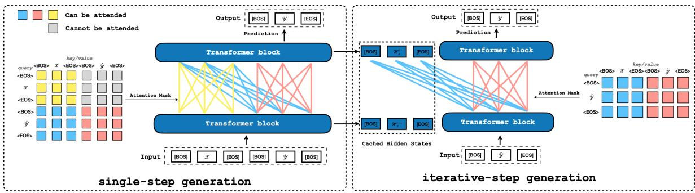
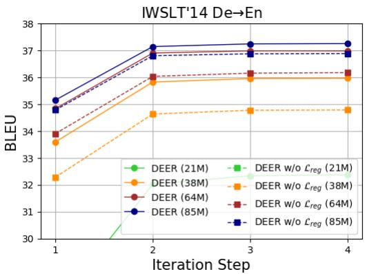
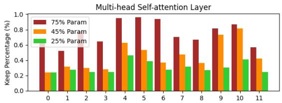
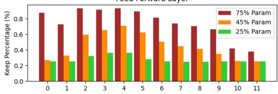
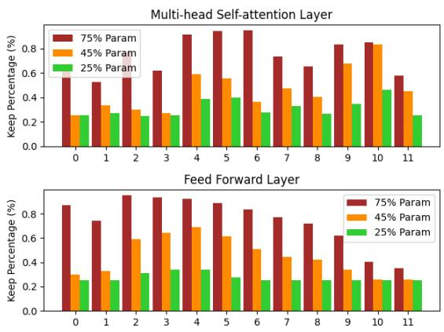
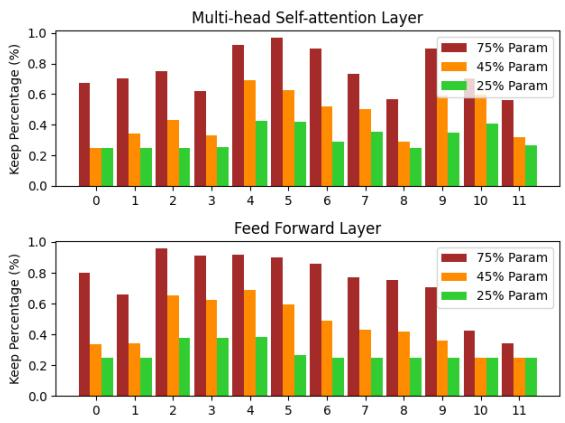

# Dynamic and Efficient Inference for Text Generation via BERT Family

Xiaobo Liang1 Juntao Li1∗ Lijun Wu2 Ziqiang Cao1 Min Zhang1

1Soochow University, 2Microsoft Research

xbliang3@stu.suda.edu.cn, {ljt,zqcao,minzhang}@suda.edu.cn lijuwu@microsoft.com

## Abstract

Despite the excellent performance of Pretrained Language Models on many text genera tion tasks, they suffer from inefficient inference on computation and memory due to their largescale parameters and the universal autoregressive decoding paradigm. In this work, we propose a novel fine-tuning method DEER, which can make a single pre-trained model support Dynamic and Efficient infERence and achieve an adaptive trade-off between model performance and latency. In particular, our critical insight is to jointly utilize the non-autoregressive (NAR) generation and dynamic parameter pruning techniques, which can flexibly control the decoding iteration steps and model sizes according to memory and latency limitations. Besides, we also explore the effectiveness of the pre-trained MLMs (i.e., the BERT family) for text generation tasks since their bidirectional attention nature is more suitable for the NAR training objective. Extensive experiments on both monolingual and multilingual pre-trained MLMs demonstrate the effectiveness of our proposed DEER method by consistently achieving (1) higher BLEU scores than the strong autoregressive Transformer model on three neural machine translation tasks with 3 12 times speedup, (2) competitive performance (but with much faster inference speed) compared with the BART model on four GLGE benchmark tasks. Our code will be publicly available at GitHub1.

## 1 Introduction

Large-scale pre-trained language models (Devlin et al., 2019; Radford et al., 2019; Brown et al., 2020; Chowdhery et al., 2022) have shown great potential in achieving impressive performance; however, they are accompanied by substantial computational complexities and occupy significant memory space. These factors pose obstacles to their practical implementation in real-world applications.

While recent studies (Sanh et al., 2019; Jiao et al., 2020) have made attempts to address the challenges associated with compressing and accelerating inference for pre-trained Transformer models, the majority of these efforts have concentrated on techniques such as knowledge distillation (Song et al., 2020), quantization (Bai et al., 2021; Tao et al., 2022), and parameter pruning (Xia et al., 2022). The pre-trained non-autoregressive generation paradigm has received limited attention and remains relatively unexplored.

To fill this blank, we first summarize two main difficulties in the deployment and application of large generative models. Firstly, the prevailing generative models currently employ an autoregressive approach to generate target tokens incrementally, as seen in models like BART (Lewis et al., 2020) and T5 (Raffel et al., 2020). While these models have gained popularity and demonstrated effectiveness, their autoregressive nature hinders efficient inference through parallelization, resulting in inefficiencies. Secondly, task-specific fine-tuning is crucial when deploying pre-trained models on diverse edge devices (Sun et al., 2020; Xu et al., 2021). It is impractical to adopt a single model for all devices due to variations in memory capacity and latency constraints. Consequently, multiple models with different architectural configurations need to be trained to meet these device-specific requirements, leading to additional resource consumption and increased carbon emissions. To address these challenges, we propose a novel joint training strategy called DEER. This strategy offers fast inference by employing a non-autoregressive generation approach and provides flexibility in model size through the utilization of dynamic block pruning.

Concretely, we choose the BERT family models to implement our DEER method because their bidirectional attention mechanism is more suitable for non-autoregressive generation tasks. To allow encoder-based models for text generation and reduce the error accumulation in length prediction, we combine the training objective of Connectionist Temporal Classification (Graves et al., 2006; Libovicky and Helcl\` , 2018) (CTC) and Levenshtein Transformer (Gu et al., 2019) for multi-task training. Compared with previous methods, this approach has a better result than the iterative approach at the first generation step and can further improve the iteration refinement performance with the obtained good initialization. Moreover, to easily adapt the BERT family to non-autoregressive generation without introducing extra parameters or cumbersome post-training, we design task-specific input formats and self-attention masks (Dong et al., 2019). Different input formats and self-attention masks can dynamically control the source and target information interaction and remedy the structural defects of the encoder-based model, making it competent for text generation.

Our DEER also incorporates dynamic block pruning for model training and inference to make the BERT family with adaptive model size. Meanwhile, we use score-based parameter mask and sparsity regularization to choose and train the suitable model size for current devices, referring to movement pruning (Sanh et al., 2020; Lagunas et al., 2021; Xia et al., 2022). Unlike current pruning works, DEER is a one-stage training method without two-stage fine-tuning for sub-models and can dynamically choose a model size instead of a fixed size. In inference, we gather the weight from the trained model for different devices when its importance score is larger than the global threshold. The sparsity regularization is also crucial, which can encourage the model to decrease the importance of weight score and control the sparsity level.

We conducted extensive experiments to validate and analyze the effectiveness of our proposed DEER method on both monolingual and multilingual models from the BERT family. In particular, our DEER method outperforms the AR model, achieving a 3  12 speedup on three neural machine translation tasks. Additionally, DEER overcomes the limitations of memory and latency, enabling support for various hardware devices without compromising the task performance of the original model. These results demonstrate the efficacy of our DEER method in improving inference speed and compatibility with diverse hardware devices, while maintaining or surpassing the task performance of the original models.

In a nutshell, our contributions are as follows:

• DEER leverages the combination of nonautoregressive training and the pre-trained BERT family to enhance performance while maintaining fast inference by modifying the iteration step.

• DEER integrates the CTC generator and Levenshtein editor to empower the Transformer encoder-based model with the ability to generate and produce favorable results for iterative refinement, eliminating the need for taskspecific length prediction modules.

• DEER utilizes dynamic block pruning to reduce the model size with only a marginal decrease in performance, enabling deployment on diverse hardware devices and overcoming limitations related to memory and latency.

• Benefits from the NAR generation and dynamic block pruning, we demonstrate that DEER achieves excellent performance on multiple text generation tasks, showcasing its remarkable generalization capability.

## 2 Related Works

## 2.1 Structured Pruning

Structured pruning methods (He et al., 2017; Molchanov et al., 2019; Guo et al., 2020) aim to search a sub-model for large-size models by pruning unimportant dimensions (McCarley et al., 2019; Prasanna et al., 2020), heads (Renda et al., 2019; Wang et al., 2020), and layers (Fan et al., 2019; Sajjad et al., 2020). Movement Pruning (Sanh et al., 2020; Lagunas et al., 2021; Xia et al., 2022) is a representative method that introduces a flexible parameter mask to obtain significant weights by scoring parameters during training. However, this approach only tries to find a high-performance submodel with target sparsity rather than a model that can adaptively adjust the model size. It is an urgent need to explore dynamic and efficient models for various common mobile platforms (Li et al., 2021), such as self-driving cars, smartphones, drones, and robots. Hou et al. (2020) propose a dynamic BERT model called DynaBERT, allowing both adaptive width and depth to satisfy the requirements of different edge devices. In order to make the model adaptable to different hardware devices and push sub-models to achieve competitive performance, our DEER combines the advantage of movement pruning and dynamic training to fine-tune the pretrained generative model.

  
Figure 1: The illustration of our proposed DEER for non-autoregressive generation, which contains two training objectives: single-step CTC generator (left) and iterative-based Levenshtein editor (right). We exhibit different self-attention masks to show different context information for query and key/value pairs. The gray block represents the hidden state of the query that is not used to attend to the hidden state of the key/value.

## 2.2 Non-autoregressive Generation

Recently, there has been a wide range of studies (Gu et al., 2018; Qi et al., 2021; Li et al., 2022a) for Non-autoregressive text generation to improve inference efficiency. The commonly used nonautoregressive methods can be categorized into two types, i.e., single-step generation (Qian et al., 2021; Ghazvininejad et al., 2020; Du et al., 2021) and iterative generation (Kasai et al., 2020; Gu et al., 2019; Saharia et al., 2020; Huang et al., 2021). For example, Libovicky and Helcl\` (2018) introduced CTC to the single-step non-autoregressive framework that models latent alignments with dynamic programming. Ghazvininejad et al. (2019) introduced the masked language modeling objective to non-autoregressively model predict and refine translations iteratively. Gu et al. (2019) proposed a new sequence generation model called Levenshtein Transformer, composed of the insertion and deletion operations, which facilitates not only generation but also sequence refinement by allowing dynamic length changes. However, the iterative model does not produce satisfactory results for single-step decoding and needs multiple-step refinement to improve performance. As a concurrent work, XLM-D (Wang et al., 2022) also delved into the implicit alignment and pre-trained models for non-autoregressive generation. However, we employed distinct methods and model architectures in research. Additionally, we conducted further exploration by incorporating model pruning to achieve additional compression of the model size, enhancing its suitability for a broader range of scenarios.

## 3 Methods

In this section, we first exhibit how to fine-tune the BERT family model (e.g., XLM-R and RoBERTa) as a NAR text generator, which supports single-step generation (§ 3.1) and iterative-based generation (§ 3.2), as shown in Figure 1. Then we introduce the dynamic block pruning for model training to reduce the computation and memory consumption in inference with dynamic model size (§ 3.3).

## 3.1 Single-step CTC Generator

The BERT family models comprise stacked bidirectional Transformer encoder blocks (Vaswani et al., 2017), in which each block contains two sub-layers: the multi-head self-attention layer and the fully connected feed-forward layer. For a given BERT variant $M _ { \mathsf { B E R T } }$ , the l-th encoder block takes the representation of the (l-1)-th block as input $\mathcal { H } ^ { l - 1 }$ , and sequentially processes it as:

$$
\begin{array} { r l } & { \mathcal { S } ^ { l } = 5 \mathrm { e l f \_ A t t e n t i o n } ( \mathcal { H } ^ { l - 1 } ) + \mathcal { H } ^ { l - 1 } , } \\ & { \mathcal { H } ^ { l } = \mathsf { F e e d \_ F o r w a r d } ( \mathcal { S } ^ { l } ) + \mathcal { S } ^ { l } , } \end{array}\tag{1}
$$

where $\mathcal { H } ^ { l }$ is the output of the encoder layer l, and there is also a residual connection and layer normalization for each sub-layer.

Given the paired training data $D \boldsymbol { = } ( \mathcal { X } , \mathcal { Y } )$ , the BERT family models can easily obtain the contextualized vector representation for source sentence $\mathcal { X } ,$ but their bidirectional attention mask mechanism makes them difficult to be applied to text generation tasks. Thus, we use the latent alignment model to train our model, which utilizes the Connectionist Temporal Classification (CTC) to model the token alignment between and . In this way, the model does not need to predict the length of the target sequence. The latent alignment assumption requires that the length of the source sentence is at least as long as the target. To satisfy this requirement, we utilize specific input formats and self-attention masks to control context information and generate target sentences in a NAR manner. As shown in Figure 1, we combine the source $\mathcal { X }$ and pseudo target $\hat { \mathcal { V } }$ as input and build a specific attention mask when the source sentence length is close with the target, which makes the $\hat { \mathcal { V } }$ attend to $x ,$ , but $\mathcal { X }$ cannot attend to $\hat { \mathcal { V } } ,$ , such as machine translation task. For example, we copy the source sentence twice uniformly as $\hat { \mathcal { V } } , \mathrm { e . g . } , \hat { \mathcal { V } } = \left\{ x _ { 1 } , x _ { 1 } , x _ { 2 } , x _ { 2 } , \dotsc , x _ { m } , x _ { m } \right\}$ , given the $\mathcal { X } = \{ x _ { 1 } , x _ { 2 } , \ldots , x _ { m } \}$ . Finally, we will compute the log-likelihood of the target and CTC loss function by marginalizing the latent alignments:

$$
\begin{array} { c } { { \log \mathcal { P } ( \mathcal { V } | \mathcal { X } ) = \log \displaystyle \sum _ { a \in \beta ( \mathcal { V } ) } \prod _ { i } \mathcal { P } ( a _ { i } | \hat { \mathcal { V } } , \mathcal { X } ) , } } \\ { { \mathcal { L } _ { \sf C T C } = - \log \mathcal { P } ( \mathcal { V } | \mathcal { X } ) , } } \end{array}\tag{2}
$$

where function $\beta ( \mathcal { V } )$ can generate the set of all possible alignments from $\mathcal { X }$ to , which can implement with an efficient dynamic programming algorithm (Graves et al., 2006).

It is worth noting that we have discovered that in tasks with rich resources, the model’s exclusive reliance on implicit alignment does not adequately capture the alignment patterns inherent in the dataset. The existence of numerous intricate patterns amplifies the challenges associated with model learning. Consequently, we adopt the Glancing strategy (Qian et al., 2021) to facilitate a progressive learning approach for the model.

## 3.2 Iterative-based Levenshtein Editor

Although the CTC model supports fast inference with the single-step generation, it relies on the conditional independence assumption for token alignments, which is incapable of handling multi-modal scenarios. Therefore, we introduce the iterative refinement mechanism using Levenshtein Editor (Gu et al., 2019), which shares parameters with the CTC model to correct the text error.

During training, we first build training data to imitate insertion and deletion behaviors in the text editor, which are basic operations from the Levenshtein Transformer. In particular, we corrupt the target as an initial state $\mathcal { V } _ { \sf D E L }$ by random deleting each token from and then reconstruct the original target sequence by three classifiers: 1) the placeholder classifier can predict the number of insertion tokens via the adjacent two tokens of DEL:

$$
\begin{array} { r } { \hat { \mathcal { N } } _ { \mathsf { P L H } } = \mathsf { P L H \_ C L S } ( M _ { \mathsf { B E R T } } ( \mathcal { H } _ { \mathcal { X } } , \mathcal { V } _ { \mathsf { D E L } } ) ) , } \\ { \mathcal { L } _ { \mathsf { P L H } } = \mathsf { C r o s s \_ E n t r o p y } ( \mathcal { V } _ { \mathsf { P L H } } , \hat { \mathcal { V } } _ { \mathsf { P L H } } ) , } \end{array}\tag{3}
$$

where the placeholder target label $\mathcal { V } _ { \sf P L H }$ is calculated by comparing $\mathcal { V }$ and $\mathcal { V } _ { \sf D E L }$ . Meanwhile, we concatenate the hidden states of the source sequence $\mathcal { H } _ { \mathcal { X } }$ and target sequence hidden states $\mathcal { H } _ { \mathcal { V } _ { \sf D E L } }$ as the attention key/value for Transformer selfattention layer, as shown in Figure 1. Especially, $\mathcal { H } _ { \mathcal { X } }$ is the cached hidden states from the CTC generation step; 2) we insert placeholder for $\mathcal { V } _ { \sf D E L }$ as the insertion classifier input $\mathcal { \partial } _ { \mathtt { I N S } }$ , and predict the missing token for each placeholder:

$$
\begin{array} { r l } & { \hat { \mathcal { Y } } _ { \mathtt { I N S } } = \mathtt { I N S \_ C L S } ( M _ { \mathtt { B E R T } } ( \mathcal { H } _ { \mathcal { X } } , \mathcal { Y } _ { \mathtt { I N S } } ) ) , } \\ & { \mathcal { L } _ { \mathtt { I N S } } = \mathtt { C r o s s \_ E n t r o p y } ( \mathcal { Y } , \hat { \mathcal { V } } _ { \mathtt { I N S } } ) ; } \end{array}\tag{4}
$$

3) the deletion classifier can predict whether the current token needs to be kept or removed for previous step results $\hat { \mathcal { V } } _ { \mathrm { I N S } }$

$$
\begin{array} { r } { \hat { \mathcal { N } } _ { \mathsf { D E L } } = \mathsf { D E L \_ C L S } ( M _ { \mathsf { B E R T } } ( \mathcal { H } _ { \mathcal { X } } , \hat { \mathcal { V } } _ { \mathrm { I N S } } ) ) , } \\ { \mathcal { L } _ { \mathsf { D E L } } = \mathsf { C r o s s \_ E n t r o p y } ( \bar { \mathcal { V } } _ { \mathsf { D E L } } , \hat { \mathcal { V } } _ { \mathsf { D E L } } ) , } \end{array}\tag{5}
$$

where the delete label $\bar { \mathcal { V } } _ { \sf D E L }$ is calculated by $\hat { \mathcal { V } } _ { \mathtt { I N S } } \neq$ $\mathcal { V } .$ During inference, we take the CTC result as input to feed the Levenshtein Editor sequentially through different classifiers (deletion classifier placeholder classifier insertion classifier) to obtain the target sequence. We refer the reader to Gu et al. (2019) for more details.

## 3.3 Dynamic Block Pruning

To achieve dynamic computation scales, we introduce the dynamic block pruning to fine-tune the BERT family with a task-specific dataset refer to movement pruning (Sanh et al., 2020). We select important weight from the pre-trained model by introducing the score-based parameter mask $M ( s )$ in each forward pass, i.e., $W ~ = ~ W ~ \odot$ $M ( s )$ .  is the score parameter for each parameter, which is calculated by the straight-through estimator (Bengio et al., 2013). The importance score can guide us to adjust the model size dynamically by setting a specific threshold $\tau , \mathrm { e . g . }$ ， $M ( S ) = 1$ when $s > \tau$ . Different from the pruning method, our method needs to modify the threshold value according to fixed model sparsity (such as 0%, 25%, 50%, 75% ) during training. The threshold τ is not needed to be updated every training step as it is time-consuming, and we found that setting the updating number to 200 works better in experiments. It is worth noting that we set two global thresholds for the self-attention layer and the feed-forward layer, respectively, considering their different designs and functions for Transformers.

The masked weight is required for each multihead self-attention and the fully connected feedforward layer in model training:

$$
\begin{array} { r l } & { \mathcal { Q } = \mathcal { H } ^ { l - 1 } W _ { q } \odot M ( \mathcal { S } _ { q } ) , } \\ & { K = \mathcal { H } ^ { l - 1 } W _ { k } \odot M ( \mathcal { S } _ { k } ) , } \\ & { \mathcal { V } = \mathcal { H } ^ { l - 1 } W _ { v } \odot M ( \mathcal { S } _ { v } ) , } \\ & { \mathcal { A } = \mathsf { S o f t m a x } ( \frac { Q K ^ { \top } } { \sqrt { d } } ) , } \\ & { \mathcal { S } ^ { l } = \mathcal { A } \mathcal { V } W _ { o } \odot M ( \mathcal { S } _ { o } ) + \mathcal { H } ^ { l - 1 } , } \\ & { \mathcal { H } ^ { l } = \mathsf { g e l u } ( \mathcal { S } ^ { l } W _ { f 1 } ) \odot M ( \mathcal { S } _ { f } ) \odot W _ { f 2 } + \mathcal { S } ^ { l } , } \end{array}\tag{6}
$$

where d is the dimension of hidden states, $W _ { q } ,$ $W _ { k } , W _ { v } , W _ { o } , W _ { f 1 }$ , and $W _ { f 2 }$ are the projection matrices. We use two kinds of block-wise score parameter (Lagunas et al., 2021): square blocks (32 32) for the self-attention layer, and dimension blocks (1 d and $d \times 1 )$ for feed-forward layer. We also add the L1 norm as a regularization item in training objectives to encourage more sparsity:

$$
\begin{array} { r } { \mathcal { L } _ { r e g } = \lambda \| \sigma ( S ) \| , } \end{array}\tag{7}
$$

where λ is the hyper-parameter, σ is the sigmoid function to limit the score boundary.

## 3.4 Joint Training Algorithm

The detailed training process of DEER is shown in Algorithm 1. Lines 2 to 5 are the dynamic block pruning process, i.e., randomly selecting target sparsity from the model size list $L _ { m }$ to initialize the weight mask. Lines 6 to 9 initialize the specific input to train the CTC generator for the first-step generation. Lines 11 to 20 will switch the self-attention mask and input formats to train the iterative-based Levenshtein Editor through three classifiers. The final training objective is the sum of all items: CTC loss, Levenshtein classifier loss, and weight sparsity regularization term (line 21).

## 4 Experiments

Datasets We evaluate DEER on multiple widely used text generation tasks to verify its effectiveness: 1) neural machine translation (NMT), we conduct experiments on three benchmark translation datasets: IWSLT’14 German English2 (De En), WMT’16 English Romanian3 (En Ro), and WMT’14 English German4 (En De). For all translation tasks, we report the results of raw (RAW) data and knowledge distilled (KD) data, respectively. We use the same training/validation/test sets as in previous works and the BELU score as the evaluation metric for a fair comparison. 2) monolingual text generation scenarios, we evaluate the efficacy of the proposed DEER on four GLGE benchmarks5, including text summarization (XSum (Narayan et al., 2018) and MSNews) and question generation tasks (SQuAD 1.1 (Rajpurkar et al., 2016) and MSQG). For each dataset, we first train BART Base as a teacher model and generate the distilled data as DEER training data, which can reduce the multi-modality problem (Zhou et al., 2019) to facilitate the learning of NAR models. The official script6 is used for evaluation. Descriptions and data statistics are shown in Appendix A.

Algorithm 1 Training model with DEER   
Require: Given data $\overline { { \mathcal { D } { = } \{ } ( \mathcal { X } , \mathcal { Y } ) \} }$ , BERT family   
model $M _ { \mathsf { B E R T } }$ and model size list $L _ { m } ,$ for example   
0.25, 0.5, 0.75, 1.0 .   
1: while not converged do   
2: ▷ Dynamic Block Sparsity   
3: Sample model size $m \sim L _ { m }$   
4: Calculate threshold by sorted weight   
5: Initialize $M ( s )$ when $\tau > s o r t ( \theta ) [ m | \theta | ]$   
6: ▷ Train Single-step CTC Generator   
7: switch self-attention mask for CTC   
8: Initialize $\hat { \mathcal { V } }$ by uniformly copy $\mathcal { X }$   
9: $\mathcal { L } _ { \mathtt { C T C } } = c r i t e r i o n ( \mathcal { V } , M _ { \mathtt { B E R T } } ( \chi , \hat { \mathcal { V } } ) )$   
10: ▷ Train Levenshtein Editor   
11: reswitch self-attention mask for Levenshtein   
12: Initialize DEL by random delete token from   
and calculate placeholder label $\mathcal { V } _ { \sf P L H }$   
13: $\hat { \mathcal { N } } _ { \mathsf { P L H } } = \mathsf { P L H \_ C L S } ( M _ { \mathsf { B E R T } } ( \mathcal { H } _ { x } , \mathcal { V } _ { \mathsf { D E L } } ) )$   
14: $\mathcal { L } _ { \sf P L H } = c r i t e r i o n ( \mathcal { V } _ { \sf P L H } , \hat { \mathcal { V } } _ { \sf P L H } )$   
15: Initialize $\mathcal { \partial } _ { \mathtt { I N S } }$ by insert mask token for   
16: $\grave { \mathcal { D } } _ { \mathtt { I N S } } = \mathtt { I N S \_ C L S } ( M _ { \mathtt { B E R T } } ( \mathcal { H } _ { x } , \mathcal { V } _ { \mathtt { I N S } } ) )$   
17: $\mathcal { L } _ { \mathrm { I N S } } = c r i t e r i o n ( \mathcal { V } , \hat { \mathcal { V } } _ { \mathrm { I N S } } )$   
18: Initialize $\bar { \mathcal { V } } _ { \sf D E L }$ as delete label   
19: $\hat { \mathcal { N } } _ { \sf D E L } = \sf { D E L \mathrm { _ - C L S } } ( M _ { \sf B E R T } ( \mathcal { H } _ { x } , \hat { \mathcal { V } } _ { \mathrm { I N S } } ) )$   
20: $\mathcal { L } _ { \sf D E L } = c r i t e r i o n ( \bar { \mathcal { N } } _ { \sf D E L } , \hat { \mathcal { N } } _ { \sf D E L } )$   
21: $\mathcal { L } = \mathcal { L } _ { \sf C T C } + \mathcal { L } _ { \sf P L H } + \mathcal { L } _ { \sf I N S } + \mathcal { L } _ { \sf D E L } + \mathcal { L } _ { \sf r e g }$   
22: Compute gradients and update weights   
23: end while

<table><tr><td rowspan="2">Method</td><td rowspan="2">Iter</td><td colspan="2">IWSLT&#x27;14 De→En</td><td colspan="2">KD</td><td colspan="2">WMT&#x27;16 En→Ro</td><td colspan="2"></td><td colspan="2">WMT&#x27;14 En→De KD</td><td rowspan="2">Speedup</td></tr><tr><td>RAW</td><td colspan="2"></td><td colspan="2">RAW</td><td colspan="2">KD</td><td colspan="2">RAW</td><td colspan="2"></td></tr><tr><td>Transformer (Vaswani et al., 2017)</td><td>#</td><td colspan="2">34.74</td><td colspan="2">35.05</td><td colspan="2">34.16</td><td colspan="2">34.6</td><td colspan="2">27.74</td><td colspan="2">28.3</td></tr><tr><td>CTC (Libovick and Helcl, 2018)</td><td>1</td><td colspan="2"></td><td colspan="2"></td><td colspan="2"></td><td colspan="2">32.2</td><td colspan="2">-</td><td colspan="2">25.7</td></tr><tr><td>GLAT (Qian et al., 2021)</td><td>1</td><td colspan="2"></td><td colspan="2">29.07</td><td colspan="2"></td><td colspan="2">32.79</td><td colspan="2"></td><td colspan="2">18.6 × 26.39</td></tr><tr><td>DSLP (Huang et al., 2022a)</td><td>1</td><td colspan="2"></td><td colspan="2"></td><td colspan="2"></td><td colspan="2">34.17</td><td colspan="2"></td><td colspan="2">15.3 × 27.02 14.8 × 7.0 ×</td></tr><tr><td>DAG (Huang et al., 2022b)</td><td>1</td><td colspan="2"></td><td colspan="2">-</td><td colspan="2"></td><td colspan="2"></td><td colspan="2">27.25</td><td colspan="2">27.91</td></tr><tr><td>CMLM (Ghazvininejad et al., 2019)</td><td>10</td><td colspan="2">32.10</td><td colspan="2">32.87</td><td colspan="2">32.86</td><td colspan="2"></td><td colspan="2"></td><td colspan="2">27.40</td></tr><tr><td>DisCo (Kasai et al., 2020)</td><td>2</td><td colspan="2"></td><td colspan="2"></td><td colspan="2"></td><td colspan="2">33.7 33.22</td><td colspan="2">25.64</td><td colspan="2">27.34</td></tr><tr><td>Levenshtein (Gu et al., 2019)</td><td>10</td><td colspan="2">33.2</td><td colspan="2">33.7</td><td colspan="2"></td><td colspan="2"></td><td colspan="2"></td><td colspan="2">27.27</td></tr><tr><td>CMLMC (Huang et al., 2021)</td><td>10</td><td colspan="2">34.21</td><td colspan="2">34.78</td><td colspan="2">34.14</td><td colspan="2">34.57</td><td colspan="2">26.40</td><td colspan="2">4.0 × 28.37</td></tr><tr><td>Imputer (Saharia et al., 2020)</td><td>8</td><td colspan="2"></td><td colspan="2"></td><td colspan="2"></td><td colspan="2">34.4</td><td colspan="2">25.0</td><td colspan="2">1.7 × 3.9 ×</td></tr><tr><td rowspan="4">CeMAT (Li et al., 2022b) DEER (RAW)</td><td>10</td><td></td><td></td><td>33.7</td><td></td><td></td><td></td><td>33.3</td><td></td><td></td><td>27.2</td><td></td><td></td></tr><tr><td></td><td>100%</td><td>75%</td><td>50%</td><td>25% 100%</td><td>75%</td><td>50%</td><td>25%</td><td>100%</td><td>75%</td><td>50%</td><td>25%</td><td></td></tr><tr><td>1</td><td>35.49 37.12</td><td>35.18 36.78</td><td>34.19 36.04</td><td>29.27</td><td>32.47</td><td>32.18 30.48 34.52 32.84</td><td>26.31 28.87</td><td>22.99 25.18</td><td>22.69 24.77</td><td>21.35 23.60</td><td>18.48</td><td>12.0 × 5.3 ×</td></tr><tr><td>2 4</td><td>37.24</td><td>36.91</td><td>36.16</td><td>32.37 32.59</td><td>34.79 34.93</td><td>34.67 33.01</td><td>29.14</td><td>25.49</td><td>25.14</td><td>23.96</td><td>20.82 21.20</td><td>3.3 ×</td></tr><tr><td rowspan="4">DEER (KD)</td><td></td><td>100%</td><td>75%</td><td>50%</td><td>25%</td><td>100%</td><td>75% 50%</td><td>25%</td><td>100%</td><td>75%</td><td>50%</td><td>25%</td><td></td></tr><tr><td></td><td></td><td></td><td></td><td></td><td>33.65</td><td>32.30</td><td>28.86</td><td>26.19</td><td>25.83</td><td>24.56</td><td>6.86</td><td>12.0 ×</td></tr><tr><td>1</td><td>35.84 35.77 37.34 37.26</td><td>34.89 36.54</td><td>31.47 33.81</td><td>33.95 35.41</td><td>35.07</td><td>34.07</td><td>30.99</td><td>28.39</td><td>27.82</td><td>26.94</td><td>15.75</td><td>5.3 ×</td></tr><tr><td>24</td><td>37.46 37.36</td><td>36.66</td><td>33.95</td><td>35.53</td><td>35.14</td><td>34.16</td><td>31.13</td><td>28.56</td><td>27.97</td><td>27.18</td><td>18.18</td><td>3.3 ×</td></tr></table>

Table 1: Comparison of our model with other non-autoregressive models on three NMT datasets. The results of prior work are trained from scratch, which evaluates the BLEU score using the average checkpoint. Instead, we only choose the best checkpoint without any augmentation techniques (such as LM re-ranking model or beam search).

Training Setups We use diverse BERT variants as backbone models for different tasks, e.g., XLM-R (Conneau et al., 2020) Base for NMT tasks and RoBERTa (Liu et al., 2019) for monolingual text generation. All pre-trained model contains 12 layers of encoder layer with 12 head for multi-head self-attention layer. The embedding size is 768; the feed-forward layer dimension is 3072; dropout and attention dropout is 0.1, and 85M model parameters are in total. For all experiments, we adopt the Adam (Kingma and Ba, 2014) as an optimization algorithm with an initial learning rate 5e 5, with learning rate schedule polynomial\_decay. Label smoothing is utilized in the loss function with a value of 0.1. We set hyper-parameter λ as 10 for all tasks. We select the best checkpoint based on the model performance on the validation set. We train models with target sparsity of {25%, 50%, 75%} for each dataset. We set batch size as 1 for all models and evaluate them on the corresponding test set with the same hardware setup on a single NVIDIA V100 GPU to measure inference speedup. All experiments are done using the sequence modeling toolkit Fairseq library (Ott et al., 2019).

Baselines We compare DEER against several baselines, including vanilla AR-based Transformers, single-step NAR models, and iterative-based NAR models. We also take several pre-trained language models as the strong baseline, e.g., pretrained AR model BART, ProphetNet, and CeMAT, and pre-trained NAR model BANG and ELMER.

## 5 Main Results

In this section, we explore whether DEER can provide dynamic and efficient inference on multiple tasks and datasets by evaluating its nonautoregressive capabilities and model performance with adaptive model sizes.

## 5.1 Neural Machine Translation

Table 1 shows the performance of our DEER compared with base models on three NMT datasets. DEER consistently achieves higher performance on the KD dataset by fine-tuning the BERT family model compared to the model trained from scratch. Remarkably, our model can improve nearly 2 to 3 BLEU scores for every dataset through single-step iterative refinement using Levenshtein Editor. Significantly, DEER exceeds the vanilla Transformer (AR model) by 2 BLEU score (37.46 v.s. 35.05) on the IWSLT’14 De En dataset and nearly 1 BLEU score (35.53 v.s. 34.6) on WMT’16 En Ro dataset with 4 iteration steps. For the fully NAR setting (single-step generation), our method also achieves comparable performance compared with strong baseline GLAT by only using CTC alignment training objective. Benefiting from the NAR speedup, DEER obtains efficient inference with faster 3 12 than the AR model, even though the BERT family model has more parameters and layers. For the raw data scenario, DEER obtains acceptable results on low-resource datasets but fails on the rich-resource dataset (WMT’14 En De). Obviously, the CTC-based model cannot handle the multi-modality problem in large-scale data, which confuses the model in learning the alignment effectively. Considering its complexity, we will leave it as future work.

<table><tr><td>Method</td><td>Iter</td><td>XSUM</td><td></td><td>Speedup</td><td>MSNews</td><td></td><td>Speedup</td></tr><tr><td>Metrics</td><td></td><td colspan="6">R-1/R-2/R-L</td></tr><tr><td>Transformer</td><td></td><td>30.5/10.4/24.2</td><td></td><td></td><td>33.0/15.4/30.0</td><td></td><td></td></tr><tr><td>ProphetNet</td><td></td><td>39.8/17.1/32.0</td><td></td><td></td><td>40.6/21.6/37.0</td><td></td><td></td></tr><tr><td>BART †</td><td></td><td>41.4/18.6/33.4</td><td></td><td>1.0 ×</td><td>43.1/23.9/39.2</td><td></td><td>1.0 ×</td></tr><tr><td>BANG</td><td></td><td>32.6/9.0/27.4</td><td></td><td></td><td></td><td></td><td></td></tr><tr><td>ELMER</td><td>1</td><td>38.3/14.2/29.9</td><td></td><td></td><td></td><td></td><td></td></tr><tr><td rowspan="4">DEER(Ours)</td><td></td><td>100% 75%</td><td>50%</td><td></td><td>100% 75%</td><td>50%</td><td></td></tr><tr><td></td><td>34.1/12.2/28.9 33.5/11.6/28.3</td><td>31.0/10.0/26.4</td><td>9.3 ×</td><td>36.5/17.2/33.8 35.9/16.8/33.2</td><td>34.8/15.9/32.3</td><td>5.8 ×</td></tr><tr><td></td><td>38.5/16.1/32.0 37.8/15.6/31.5</td><td>35.7/14.0/29.8</td><td>4.7 ×</td><td>40.5/21.6/37.4 39.8/21.2/36.9</td><td>38.4/20.0/35.6</td><td>2.7 ×</td></tr><tr><td></td><td>39.1/16.8/32.4 38.5/16.4/32.0</td><td>36.5/15.0/30.4</td><td>2.5 ×</td><td>41.1/22.2/37.8 40.4/21.8/37.3</td><td>39.0/20.7/36.1</td><td>1.7 ×</td></tr><tr><td>Method</td><td></td><td colspan="5">SQuAD 1.1</td><td></td></tr><tr><td>Metrics</td><td></td><td colspan="5">R-L/B-4/MTR</td><td></td></tr><tr><td>Transformer</td><td>#</td><td>30.7/4.8/10.9</td><td></td><td></td><td>29.3/5.1/16.6</td><td></td><td></td></tr><tr><td>ProphetNet</td><td></td><td>48.0/19.5/23.9</td><td></td><td></td><td>37.1/9.3/22.7</td><td></td><td></td></tr><tr><td>BART ↑</td><td></td><td>49.2/20.3/23.6</td><td></td><td>1.0 ×</td><td>38.1/10.2/22.9</td><td></td><td>1.0 ×</td></tr><tr><td>BANG</td><td></td><td>44.1/12.8/19.0</td><td></td><td></td><td></td><td></td><td></td></tr><tr><td>ELMER</td><td>1 1</td><td>40.2/13.5/20.1</td><td></td><td></td><td></td><td></td><td></td></tr><tr><td></td><td></td><td>100% 75%</td><td>50%</td><td>一</td><td>100% 75%</td><td>50%</td><td>-</td></tr><tr><td rowspan="4">DEER(Ours)</td><td>1</td><td>48.2/16.9/21.7 47.4/15.7/21.0</td><td>46.1/14.4/20.0</td><td>6.3 ×</td><td>35.7/7.8/19.7</td><td>35.3/7.6/19.5 34.3/6.9/18.6</td><td>4.6 ×</td></tr><tr><td>2</td><td>49.9/19.9/23.7 49.2/19.2/23.2</td><td>48.4/18.2/22.4</td><td>2.9 ×</td><td>38.7/10.0/22.7</td><td>38.7/9.9/22.5 37.9/9.4/21.8</td><td>2.1 ×</td></tr><tr><td>4</td><td>49.9/20.3/24.0 49.3/19.6/23.6</td><td>48.6/18.8/22.8</td><td>1.9 ×</td><td>38.7/9.7/23.3</td><td>38.8/9.8/23.1 38.2/9.5/22.5</td><td>1.2 ×</td></tr></table>

Table 2: Results on text generation tasks. We simplify the evaluation metrics: R-1: ROUGE-1. R-2: ROUGE-2. R-L: ROUGE-L. B-4: BLUE-4. MTR: METEOR. ( indicates the results of our re-implementation.)

## 5.2 Text Generation

Table 2 presents the experimental results for the monolingual text generation datasets. Compared to the pre-trained NAR model BANG (Qi et al., 2021) and ELMER (Li et al., 2022a), DEER obtains better performance on question generation task SQuAD 1.1 under the fully NAR setting. Besides, DEER also achieves $9 . 3 \times , 5 . 8 \times , 6 . 3 \times$ , and 4.6 inference speedup for XSUM, MSNews, SQuAD, and MSQG, respectively. Compared to the pre-trained AR model, DEER surpasses the ProphetNet (Qi et al., 2020) and achieves a comparable result with BART. These results well demonstrate that DEER supports dynamic and efficient inference and good trade-offs between performance and latency with flexible iteration steps.

<table><tr><td colspan="3">Scalable Transformer</td><td colspan="2">DEER</td></tr><tr><td>Param</td><td>beam=1</td><td>beam=4</td><td>Param</td><td>greedy</td></tr><tr><td>46M</td><td>26.7</td><td>27.1</td><td>38M</td><td>27.18</td></tr><tr><td>69M</td><td>27.4</td><td>27.9</td><td>64M</td><td>27.96</td></tr><tr><td>91M</td><td>27.8</td><td>28.4</td><td>85M</td><td>28.56</td></tr></table>

Table 3: Comparison with the Scalable Transformer.

## 5.3 Dynamic Model Size for Inference

We conducted further experiments to evaluate the performance of the models under different sizes pruning, to verify whether the models are overparameterized for various tasks. We partitioned the backbone networks of RoBERTa-base and XLMRbase into different proportions: 100%, 75%, 50%, and 25% (excluding the parameters of the embedding layer). In the experiments, it can be observed that our approach maintains satisfactory performance even after reducing the parameter size by half. Thus, we can effectively deploy DEER on different edge devices by adjusting the model sizes.

In Table 3, we compare the scalability for DEER and Scalable Transformer (Gao et al., 2021) (AR model) on the WMT’14 En De dataset, which contains multiple sub-Transformer that can be easily obtained from full Transformer by parameters pruning. Under the same memory constraint, DEER outperforms Scalable Transformer by comparing the sub-model performance with competitive parameters, which demonstrates the superiority of our dynamic block pruning.

<table><tr><td rowspan="2">Method</td><td rowspan="2">Dataset</td><td colspan="4">Iteration Step</td></tr><tr><td>1</td><td>2</td><td>3</td><td>4</td></tr><tr><td>DEER</td><td>Raw</td><td>35.49</td><td>37.12</td><td>37.23</td><td>37.24</td></tr><tr><td>w/o Levenshtein</td><td>Raw</td><td>32.41</td><td></td><td></td><td></td></tr><tr><td>w/o CTC</td><td>Raw</td><td>18.02</td><td>32.72</td><td>33.50</td><td>33.59</td></tr><tr><td>DEER</td><td>KD</td><td>35.84</td><td>37.34</td><td>37.45</td><td>37.46</td></tr><tr><td>w/o Levenshtein</td><td>KD</td><td>35.27</td><td></td><td></td><td></td></tr><tr><td>w/o CTC</td><td>KD</td><td>23.60</td><td>35.09</td><td>35.54</td><td>35.59</td></tr></table>

Table 4: Ablation study for IWSLT’14 De En.

  
Figure 2: Results with no sparsity regularization.

## 6 Analysis and Discussion

## 6.1 Ablation Study

To confirm the effectiveness of the CTC model and Levenshtein Editor combination, we separately train them by using the RoBERTa as the backbone model on the IWSLT’14 De En dataset. Table 4 shows that DEER achieves better performance than Levenshtein Transformer (w/o CTC) with nearly 3 BLEU scores, which benefits from the good CTC initialization at the first iteration step. We also observe that DEER performs better than a single CTC generator under the fully NAR setting, which indicates that their combination can enhance each other without sacrificing the model performance.

## 6.2 Sparsity Regularization

We continue to explore the effect of sparsity on dynamic block pruning, which is also the notable dissimilarity between DEER and related work DynaBERT (Hou et al., 2020). Figure 2 displays the results of DEER without sparsity regularization term $\mathcal { L } _ { r e g } .$ We can observe that the model performance drops significantly with the increase of the pruning scale. Experiments show that sparse regularization is crucial for model training, which ensures that the model performs well without post-tuning.

  
Figure 3: The kept weight in the pruned model.

## 6.3 Structures of Pruned Units

Furthermore, we study the pruned structures produced by DEER and show the proportion of kept weights on WMT’14 En De (please refer to Appendix B for other datasets) for each multi-head self-attention (MHA) layer and feed-forward (FFN) layer respectively, as shown in Figure 3. The model tends to prune the parameters of the top layer of the stacked transformer block rather than the bottom layer, which is consistent with the phenomenon in NLU model pruning (Xia et al., 2022). In addition, there is not much distinction for pruned structures on each MHA layer. We also test the model performance with a single mix threshold instead separately for different layers. Unfortunately, we do not obtain better results in experiments. The mixed threshold reduces numerous essential parameters in the MHA layer and seriously impairs the model inference because the FFN layer has much more parameters than the MHA layer.

## 7 Conclusion

In this work, we propose DEER, a novel fine-tuning method that supports dynamic and efficient inference to adapt to the memory and latency limitations during deployment. Our approach has achieved impressive results on multiple natural language processing tasks, including the GLGE benchmark and three machine translation datasets. Furthermore, we have observed that the issue of length prediction consistently limits the performance of the model, especially when dealing with raw datasets. The model struggles to accurately determine the length of the target data, which somewhat affects the model evaluation. In our future work, we will prioritize addressing the challenge of length prediction, aiming to make it more convenient and applicable to a wider range of tasks and scenarios.

## 8 Limitation

Although DEER has shown excellent performance on multiple datasets and tasks, we still found some limitations affecting its usability and efficiency: (1) The latent alignment model (such as CTC) cannot deal with the multi-modality problem in the largescale dataset, which also leads DEER to underfitting the multiple latent alignment targets that need to be aligned. (3) Although DEER does not need to perform length prediction, it relies on the assumption that the input length is large than the output, which causes the model to lose flexibility in length control. (3) We compared sequence-tosequence models such as BART and ProphetNet in the experimental part of this work. In fact, BART only through six layers on each forward pass, while the BERT family model needs to go through 12 layers, leading the inefficient inference due to latency accumulation of multiple iteration steps.

## 9 Ethics Statement

DEER relies on the pre-trained language models, e.g., RoBERTa and XLM-R, which may inherit problematic biases. However, we only use these models as a backbone rather than using their predictions. DEER is also a task-specific method that performs the fine-tuning process at the task-specific dataset, which also makes the generated result depend on the input of the dataset and reduces the inherent bias.

## Acknowledgements

This work is supported by the National Science Foundation of China (NSFC No. 62206194), the Natural Science Foundation of Jiangsu Province, China (Grant No. BK20220488). This work is also supported by Beijing Academy of Artificial Intelligence (BAAI).

## References

Haoli Bai, Wei Zhang, Lu Hou, Lifeng Shang, Jin Jin, Xin Jiang, Qun Liu, Michael Lyu, and Irwin King.

2021. Binarybert: Pushing the limit of bert quantization. In Proceedings of the 59th Annual Meeting of the Association for Computational Linguistics and the 11th International Joint Conference on Natural Language Processing (Volume 1: Long Papers), pages 4334–4348.

Yoshua Bengio, Nicholas Léonard, and Aaron Courville. 2013. Estimating or propagating gradients through stochastic neurons for conditional computation. arXiv preprint arXiv:1308.3432.

Tom Brown, Benjamin Mann, Nick Ryder, Melanie Subbiah, Jared D Kaplan, Prafulla Dhariwal, Arvind Neelakantan, Pranav Shyam, Girish Sastry, Amanda Askell, et al. 2020. Language models are few-shot learners. Advances in neural information processing systems, 33:1877–1901.

Aakanksha Chowdhery, Sharan Narang, Jacob Devlin, Maarten Bosma, Gaurav Mishra, Adam Roberts, Paul Barham, Hyung Won Chung, Charles Sutton, Sebastian Gehrmann, et al. 2022. Palm: Scaling language modeling with pathways. arXiv preprint arXiv:2204.02311.

Alexis Conneau, Kartikay Khandelwal, Naman Goyal, Vishrav Chaudhary, Guillaume Wenzek, Francisco Guzmán, Édouard Grave, Myle Ott, Luke Zettlemoyer, and Veselin Stoyanov. 2020. Unsupervised cross-lingual representation learning at scale. In Proceedings of the 58th Annual Meeting of the Associationfor Computational Linguistics, pages 8440– 8451.

Jacob Devlin, Ming-Wei Chang, Kenton Lee, and Kristina Toutanova. 2019. Bert: Pre-training of deep bidirectional transformers for language understanding. In Proceedings of the 2019 Conference of the North American Chapter of the Association for Computational Linguistics: Human Language Technologies, Volume 1 (Long and Short Papers), pages 4171– 4186.

Li Dong, Nan Yang, Wenhui Wang, Furu Wei, Xiaodong Liu, Yu Wang, Jianfeng Gao, Ming Zhou, and Hsiao-Wuen Hon. 2019. Unified language model pre-training for natural language understanding and generation. Advances in Neural Information Processing Systems, 32.

Cunxiao Du, Zhaopeng Tu, and Jing Jiang. 2021. Orderagnostic cross entropy for non-autoregressive machine translation. In International Conference on Machine Learning, pages 2849–2859. PMLR.

Angela Fan, Edouard Grave, and Armand Joulin. 2019. Reducing transformer depth on demand with structured dropout. In International Conference on Learning Representations.

Peng Gao, Shijie Geng, Yu Qiao, Xiaogang Wang, Jifeng Dai, and Hongsheng Li. 2021. Scalable transformers for neural machine translation. arXiv preprint arXiv:2106.02242.

Marjan Ghazvininejad, Vladimir Karpukhin, Luke Zettlemoyer, and Omer Levy. 2020. Aligned cross entropy for non-autoregressive machine translation. In ICML.

Marjan Ghazvininejad, Omer Levy, Yinhan Liu, and Luke Zettlemoyer. 2019. Mask-predict: Parallel decoding of conditional masked language models. In Proceedings of the 2019 Conference on Empirical Methods in Natural Language Processing and the 9th International Joint Conference on Natural Language Processing (EMNLP-IJCNLP), pages 6112–6121.

Alex Graves, Santiago Fernández, Faustino Gomez, and Jürgen Schmidhuber. 2006. Connectionist temporal classification: labelling unsegmented sequence data with recurrent neural networks. In Proceedings ofthe 23rd international conference on Machine learning, pages 369–376.

Jiatao Gu, James Bradbury, Caiming Xiong, Victor OK Li, and Richard Socher. 2018. Non-autoregressive neural machine translation. In International Conference on Learning Representations.

Jiatao Gu, Changhan Wang, and Junbo Zhao. 2019. Levenshtein transformer. Advances in Neural Information Processing Systems, 32.

Shaopeng Guo, Yujie Wang, Quanquan Li, and Junjie Yan. 2020. Dmcp: Differentiable markov channel pruning for neural networks. In Proceedings of the IEEE/CVF conference on computer vision and pattern recognition, pages 1539–1547.

Yihui He, Xiangyu Zhang, and Jian Sun. 2017. Channel pruning for accelerating very deep neural networks. In Proceedings ofthe IEEE international conference on computer vision, pages 1389–1397.

Lu Hou, Zhiqi Huang, Lifeng Shang, Xin Jiang, Xiao Chen, and Qun Liu. 2020. Dynabert: Dynamic bert with adaptive width and depth. Advances in Neural Information Processing Systems, 33:9782–9793.

Chenyang Huang, Hao Zhou, Osmar R Zaïane, Lili Mou, and Lei Li. 2022a. Non-autoregressive translation with layer-wise prediction and deep supervision. In Proceedings of the AAAI Conference on Artificial Intelligence, volume 36, pages 10776–10784.

Fei Huang, Hao Zhou, Yang Liu, Hang Li, and Minlie Huang. 2022b. Directed acyclic transformer for nonautoregressive machine translation. In Proceedings of the 39th International Conference on Machine Learning, ICML 2022.

Xiao Shi Huang, Felipe Perez, and Maksims Volkovs. 2021. Improving non-autoregressive translation models without distillation. In International Conference on Learning Representations.

Xiaoqi Jiao, Yichun Yin, Lifeng Shang, Xin Jiang, Xiao Chen, Linlin Li, Fang Wang, and Qun Liu. 2020. Tinybert: Distilling bert for natural language understanding. In Findings of the Association for Computational Linguistics: EMNLP 2020, pages 4163–4174.

Jungo Kasai, James Cross, Marjan Ghazvininejad, and Jiatao Gu. 2020. Non-autoregressive machine translation with disentangled context transformer. In International conference on machine learning, pages 5144–5155. PMLR.

Diederik P Kingma and Jimmy Ba. 2014. Adam: A method for stochastic optimization. International Conference on Learning Representations.

François Lagunas, Ella Charlaix, Victor Sanh, and Alexander M Rush. 2021. Block pruning for faster transformers. In Proceedings ofthe 2021 Conference on Empirical Methods in Natural Language Processing, pages 10619–10629.

Mike Lewis, Yinhan Liu, Naman Goyal, Marjan Ghazvininejad, Abdelrahman Mohamed, Omer Levy, Veselin Stoyanov, and Luke Zettlemoyer. 2020. Bart: Denoising sequence-to-sequence pre-training for natural language generation, translation, and comprehension. In Proceedings of the 58th Annual Meeting of the Association for Computational Linguistics, pages 7871–7880.

Changlin Li, Guangrun Wang, Bing Wang, Xiaodan Liang, Zhihui Li, and Xiaojun Chang. 2021. Dynamic slimmable network. In Proceedings of the IEEE/CVF Conference on Computer Vision and Pattern Recognition, pages 8607–8617.

Junyi Li, Tianyi Tang, Wayne Xin Zhao, Jian-Yun Nie, and Ji-Rong Wen. 2022a. Elmer: A nonautoregressive pre-trained language model for efficient and effective text generation. arXiv preprint arXiv:2210.13304.

Pengfei Li, Liangyou Li, Meng Zhang, Minghao Wu, and Qun Liu. 2022b. Universal conditional masked language pre-training for neural machine translation. In Proceedings of the 60th Annual Meeting of the Association for Computational Linguistics (Volume 1: Long Papers), pages 6379–6391.

Jindˇrich Libovicky and Jind\` ˇrich Helcl. 2018. End-toend non-autoregressive neural machine translation with connectionist temporal classification. In Proceedings ofthe 2018 Conference on Empirical Methods in Natural Language Processing, pages 3016– 3021.

Yinhan Liu, Myle Ott, Naman Goyal, Jingfei Du, Mandar Joshi, Danqi Chen, Omer Levy, Mike Lewis, Luke Zettlemoyer, and Veselin Stoyanov. 2019. Roberta: A robustly optimized bert pretraining approach. arXiv preprint arXiv:1907.11692.

JS McCarley, Rishav Chakravarti, and Avirup Sil. 2019. Structured pruning of a bert-based question answering model. arXiv preprint arXiv:1910.06360.

Pavlo Molchanov, Arun Mallya, Stephen Tyree, Iuri Frosio, and Jan Kautz. 2019. Importance estimation for neural network pruning. In Proceedings of the IEEE/CVF Conference on Computer Vision and Pattern Recognition, pages 11264–11272.

Shashi Narayan, Shay B Cohen, and Mirella Lapata. 2018. Don’t give me the details, just the summary! topic-aware convolutional neural networks for extreme summarization. In Proceedings of the 2020 Conference on Empirical Methods in Natural Language Processing (EMNLP), pages 1797–1807.

Myle Ott, Sergey Edunov, Alexei Baevski, Angela Fan, Sam Gross, Nathan Ng, David Grangier, and Michael Auli. 2019. fairseq: A fast, extensible toolkit for sequence modeling. In Proceedings of NAACL-HLT 2019: Demonstrations.

Sai Prasanna, Anna Rogers, and Anna Rumshisky. 2020. When bert plays the lottery, all tickets are winning. In Proceedings of the 2020 Conference on Empirical Methods in Natural Language Processing (EMNLP), pages 3208–3229.

Weizhen Qi, Yeyun Gong, Jian Jiao, Yu Yan, Weizhu Chen, Dayiheng Liu, Kewen Tang, Houqiang Li, Jiusheng Chen, Ruofei Zhang, et al. 2021. Bang: Bridging autoregressive and non-autoregressive generation with large scale pretraining. In International Conference on Machine Learning, pages 8630–8639. PMLR.

Weizhen Qi, Yu Yan, Yeyun Gong, Dayiheng Liu, Nan Duan, Jiusheng Chen, Ruofei Zhang, and Ming Zhou. 2020. Prophetnet: Predicting future n-gram for sequence-to-sequencepre-training. In Findings ofthe Associationfor Computational Linguistics: EMNLP 2020, pages 2401–2410.

Lihua Qian, Hao Zhou, Yu Bao, Mingxuan Wang, Lin Qiu, Weinan Zhang, Yong Yu, and Lei Li. 2021. Glancing transformer for non-autoregressive neural machine translation. In Proceedings ofthe 59th Annual Meeting ofthe Associationfor Computational Linguistics and the 11th International Joint Conference on Natural Language Processing (Volume 1: Long Papers), pages 1993–2003.

Alec Radford, Jeffrey Wu, Rewon Child, David Luan, Dario Amodei, Ilya Sutskever, et al. 2019. Language models are unsupervised multitask learners. OpenAI blog, 1(8):9.

Colin Raffel, Noam Shazeer, Adam Roberts, Katherine Lee, Sharan Narang, Michael Matena, Yanqi Zhou, Wei Li, and Peter J. Liu. 2020. Exploring the limits of transfer learning with a unified text-to-text transformer. Journal of Machine Learning Research, 21(140):1–67.

Pranav Rajpurkar, Jian Zhang, Konstantin Lopyrev, and Percy Liang. 2016. Squad: 100,000+ questions for machine comprehension of text. In Proceedings of the 2016 Conference on Empirical Methods in Natural Language Processing (EMNLP), pages 2383– 2392.

Alex Renda, Jonathan Frankle, and Michael Carbin. 2019. Comparing rewinding and fine-tuning in neural network pruning. In International Conference on Learning Representations.

Chitwan Saharia, William Chan, Saurabh Saxena, and Mohammad Norouzi. 2020. Non-autoregressive machine translation with latent alignments. In Proceedings of the 2020 Conference on Empirical Methods in Natural Language Processing, pages 1098–1108.

Hassan Sajjad, Fahim Dalvi, Nadir Durrani, and Preslav Nakov. 2020. Poor man’s bert: Smaller and faster transformer models. arXiv preprint arXiv:2004.03844.

Victor Sanh, Lysandre Debut, Julien Chaumond, and Thomas Wolf. 2019. Distilbert, a distilled version of bert: smaller, faster, cheaper and lighter. arXiv preprint arXiv:1910.01108.

Victor Sanh, Thomas Wolf, and Alexander Rush. 2020. Movement pruning: Adaptive sparsity by fine-tuning. Advances in Neural Information Processing Systems, 33:20378–20389.

Kaitao Song, Hao Sun, Xu Tan, Tao Qin, Jianfeng Lu, Hongzhi Liu, and Tie-Yan Liu. 2020. Lightpaff: A two-stage distillation framework for pre-training and fine-tuning. arXiv preprint arXiv:2004.12817.

Zhiqing Sun, Hongkun Yu, Xiaodan Song, Renjie Liu, Yiming Yang, and Denny Zhou. 2020. Mobilebert: a compact task-agnostic bert for resource-limited devices. In Proceedings ofthe 58th Annual Meeting of the Association for Computational Linguistics, pages 2158–2170.

Chaofan Tao, Lu Hou, Wei Zhang, Lifeng Shang, Xin Jiang, Qun Liu, Ping Luo, and Ngai Wong. 2022. Compression of generative pre-trained language models via quantization. In Proceedings of the 60th Annual Meeting of the Association for Computational Linguistics (Volume 1: Long Papers), pages 4821– 4836.

Ashish Vaswani, Noam Shazeer, Niki Parmar, Jakob Uszkoreit, Llion Jones, Aidan N Gomez, Łukasz Kaiser, and Illia Polosukhin. 2017. Attention is all you need. Advances in neural information processing systems, 30.

Yong Wang, Shilin He, Guanhua Chen, Yun Chen, and Daxin Jiang. 2022. XLM-D: Decorate cross-lingual pre-training model as non-autoregressive neural machine translation. In Proceedings of the 2022 Conference on Empirical Methods in Natural Language Processing, pages 6934–6946, Abu Dhabi, United Arab Emirates. Association for Computational Linguistics.

Ziheng Wang, Jeremy Wohlwend, and Tao Lei. 2020. Structured pruning of large language models. In Proceedings of the 2020 Conference on Empirical Methods in Natural Language Processing (EMNLP), pages 6151–6162.

Mengzhou Xia, Zexuan Zhong, and Danqi Chen. 2022. Structured pruning learns compact and accurate models. In Proceedings of the 60th Annual Meeting of the Association for Computational Linguistics (Volume 1: Long Papers), pages 1513–1528.

Jin Xu, Xu Tan, Renqian Luo, Kaitao Song, Jian Li, Tao Qin, and Tie-Yan Liu. 2021. Nas-bert: task-agnostic and adaptive-size bert compression with neural architecture search. In Proceedings of the 27th ACM SIGKDD Conference on Knowledge Discovery & Data Mining, pages 1933–1943.

Chunting Zhou, Jiatao Gu, and Graham Neubig. 2019. Understanding knowledge distillation in nonautoregressive machine translation. In International Conference on Learning Representations.

## A Dataset Statistics

The statistic of each dataset is shown in Table 5. We exhibit the number of examples in the train/dev/test set and the average number of words for the source and target sentence. In particular, the XSUM dataset consists of 227K online articles from the British Broadcasting Corporation (BBC), which contains professionally written single-sentence summaries. MSNews is a new News headline generation dataset, which contains online news articles, and each article contains a professionally written single-sentence headline. SQuAD 1.1 contains over 100K crowd-worker created questions in 536 Wikipedia articles. MSQG contains 220K passages as source sentences from a real-world search engine, and each passage contains a highlighted span as the target.

<table><tr><td>Corpus</td><td>Train</td><td>Dev</td><td>Test</td><td>Src</td><td>Tgt</td></tr><tr><td>XSUM</td><td>204,017</td><td>11,327</td><td>11,333</td><td>358.5</td><td>21.1</td></tr><tr><td>MSNews</td><td>136,082</td><td>7,496</td><td>7,562</td><td>310.7</td><td>9.7</td></tr><tr><td>SQuAD 1.1</td><td>75,722</td><td>10570</td><td>11,877</td><td>149.4</td><td>11.5</td></tr><tr><td>MSQG</td><td>198,058</td><td>11,008</td><td>11,022</td><td>45.9</td><td>5.9</td></tr></table>

Table 5: GLGE dataset descriptions and statistics

## B Structures of Pruned Models

Figure 5 and Figure 4 show the structures of the pruned model on IWSLT’14 De En dataset and WMT’16 En Ro dataset respectively. We can summarize from the experimental results that the pruning ratio of each layer (multi-head selfattention layer and feed-forward layer) in the model is similar even in different tasks.

  
Figure 4: The kept weight for WMT’16 En Ro.

  
Figure 5: The kept weight for IWSLT’14 De En.

## ACL 2023 Responsible NLP Checklist

A For every submission: ✓ A1. Did you describe the limitations of your work? We provide the limitations in Section 8.

✗ A2. Did you discuss any potential risks of your work? We think our general training method will not lead to any negative societal impact.

✓ A3. Do the abstract and introduction summarize the paper’s main claims? We summarize our contribution in section 7.

✗ A4. Have you used AI writing assistants when working on this paper? Left blank.

## B ✗ Did you use or create scientific artifacts? Left blank.

 B1. Did you cite the creators of artifacts you used? No response.

 B2. Did you discuss the license or terms for use and / or distribution of any artifacts? No response.

 B3. Did you discuss if your use of existing artifact(s) was consistent with their intended use, provided that it was specified? For the artifacts you create, do you specify intended use and whether that is compatible with the original access conditions (in particular, derivatives of data accessed for research purposes should not be used outside of research contexts)? No response.

 B4. Did you discuss the steps taken to check whether the data that was collected / used contains any information that names or uniquely identifies individual people or offensive content, and the steps taken to protect / anonymize it? No response.

 B5. Did you provide documentation of the artifacts, e.g., coverage of domains, languages, and linguistic phenomena, demographic groups represented, etc.? No response.

 B6. Did you report relevant statistics like the number of examples, details of train / test / dev splits, etc. for the data that you used / created? Even for commonly-used benchmark datasets, include the number of examples in train / validation / test splits, as these provide necessary context for a reader to understand experimental results. For example, small differences in accuracy on large test sets may be significant, while on small test sets they may not be. No response.

## C ✓ Did you run computational experiments?

In section 4

✓ C1. Did you report the number of parameters in the models used, the total computational budget (e.g., GPU hours), and computing infrastructure used? We provide computational information in section 4 training setup, which contains the computational budget, i.e., NVIDIA V100 GPU.

✓ C2. Did you discuss the experimental setup, including hyperparameter search and best-found hyperparameter values? We provide experimental setup including hyper-parameter setting and best-found in section 4.

✓ C3. Did you report descriptive statistics about your results (e.g., error bars around results, summary statistics from sets of experiments), and is it transparent whether you are reporting the max, mean, etc. or just a single run? We report the average results (number)for multiple runs ofmost experiments instead ofthe error bars.

✓ C4. If you used existing packages (e.g., for preprocessing, for normalization, or for evaluation), did you report the implementation, model, and parameter settings used (e.g., NLTK, Spacy, ROUGE, etc.)? We report the toolkit version in section 4.

D ✗ Did you use human annotators (e.g., crowdworkers) or research with human participants? Left blank.

 D1. Did you report the full text of instructions given to participants, including e.g., screenshots, disclaimers of any risks to participants or annotators, etc.? No response.

 D2. Did you report information about how you recruited (e.g., crowdsourcing platform, students) and paid participants, and discuss if such payment is adequate given the participants’ demographic (e.g., country of residence)? No response.

 D3. Did you discuss whether and how consent was obtained from people whose data you’re using/curating? For example, if you collected data via crowdsourcing, did your instructions to crowdworkers explain how the data would be used? No response.

 D4. Was the data collection protocol approved (or determined exempt) by an ethics review board? No response.

 D5. Did you report the basic demographic and geographic characteristics of the annotator population that is the source of the data? No response.