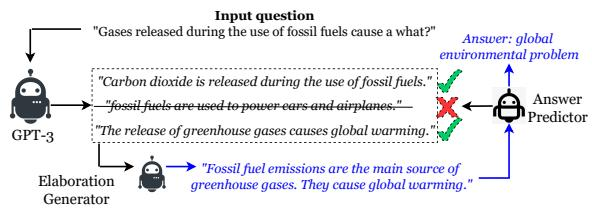
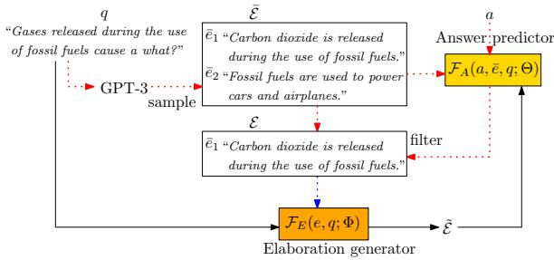
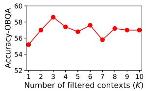
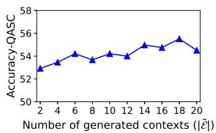
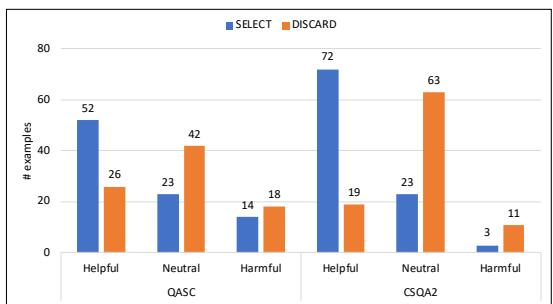
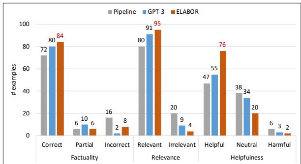

# Elaboration-Generating Commonsense Question Answering at Scale

Wenya Wang♡ Vivek Srikumar♢♠ Hanna Hajishirzi♡♠ Noah A. Smith♡♠

♡Paul G. Allen School of Computer Science & Engineering, University of Washington

♠Allen Institute for AI

♢School of Computing, University of Utah wwenya@cs.washington.edu

## Abstract

In question answering requiring common sense, language models (e.g., GPT-3) have been used to generate text expressing background knowledge that helps improve performance. Yet the cost of working with such models is very high; in this work, we finetune smaller language models to generate useful intermediate context, referred to here as elaborations. Our framework alternates between updating two language models—an elaboration generator and an answer predictor—allowing each to influence the other. Using less than 0.5% of the parameters of GPT-3, our model outperforms alternatives with similar sizes and closes the gap with GPT-3 on four commonsense question answering benchmarks. Human evaluations show that the quality of the generated elaborations is high.<sup>1</sup>

## 1 Introduction

Commonsense question answering (QA; Talmor et al., 2019) provides benchmarks used to evaluate the extent to which NLP models—increasingly based on language models—can “understand” questions and reason about their answers. For example, consider the question in Figure 1: Gases released during the use of fossil fuels cause a what? A reasonably informed human could give the answer global warming, by reasoning that: Fossilfuel emissions are the main source of greenhouse gases. They cause global warming.

It is common to use LMs to predict answers directly for QA tasks (Devlin et al., 2019; Liu et al., 2019; Khashabi et al., 2020). On challenging datasets whose questions rely on unstated background knowledge (Talmor et al., 2021; Mihaylov et al., 2018; Khot et al., 2020), some recent works rely on external knowledge, e.g., Wikipedia or structured knowledge bases (Mihaylov and Frank,

  
Figure 1: An overview of the framework that selectively distills knowledge from GPT-3 to a smaller elaboration generator via an answer predictor.

2018; Lin et al., 2019; Banerjee et al., 2019) for additional information that helps to answer the question. Such attempts are limited by the availability and coverage of the knowledge sources. Another line of study (Liu et al., 2022b; Paranjape et al., 2021; Shwartz et al., 2020) reveals that generating text that expresses additional background knowledge relevant to a question is beneficial for answer prediction. The ability to express such knowledge may promote model explainability by explicitly showing the reasoning process. However, expressing high-quality knowledge relies on massive (and thus, expensive) pretrained LMs, e.g., GPT-3 with 175B parameters (Brown et al., 2020).

In this work, we focus on a more practical setting and ask: Can smaller LMs, e.g., BART which is about 400 smaller than GPT-3, support reasoning and inference in an end-to-end manner? To this end, we propose a scalable framework, alternating ELABoration and answer predictOR (ELABOR), consisting of two interacting modules: an elaboration generator and an answer predictor. Here an elaboration refers to additional context describing some background knowledge about the question. Instead of generating elaborations independently, we propose a probabilistic framework that treats the elaboration as a latent variable and iteratively optimizes the elaboration generator after receiving feedback from the answer prediction. Specifically, for each question-answer pair (q, a), we decompose the distribution of the answer conditioned on the question $P ( a \mid q )$ into a distribution $P ( e \mid q )$ over a latent elaboration, modeled by the elaboration generator, and a likelihood distribution $\textstyle P ( a \mid e , q )$ over the answer, modeled by the answer predictor. We alternately train the elaboration generator and the answer predictor so that each can benefit the other. Earlier work either pre-constructs elaborations e from external knowledge (Mihaylov and Frank, 2018) or learns $P ( e \mid q )$ solely based on annotations (Rajani et al., 2019); we learn the elaboration generator by distilling high-quality knowledge from GPT-3. We do this using a procedure inspired by hard Expectation-Maximization (Min et al., 2019). This involves refining and filtering elaborations informed by the answer predictor, as shown in Figure 1. ELABOR is thus capable of propagating information in both directions: from elaboration generator to answer predictor and vice versa.

We conduct experiments on four commonsense QA datasets: CommonsenseQA (Talmor et al., 2019), CommonsenseQA 2.0 (Talmor et al., 2021), Scientific Commonsense (Khot et al., 2020), and OpenBookQA (Mihaylov et al., 2018). Our experiments reveal that (1) alternating training with smaller LMs (e.g., BART, and GPT-2) narrows the gap between small models and GPT-3; (2) the ability to generate and reason with background elaborations indeed brings larger performance gains than direct inference on more challenging Commonsense QA datasets; (3) the alternating framework helps to filter irrelevant elaborations generated from GPT-3 and the learned elaboration generator can express information that helps to answer the question, as shown through human evaluations.

## 2 Modeling Answers and Elaborations

We focus on the task of commonsense question answering in the multiple-choice setting: we seek to identify the answer to a commonsense question among provided candidate choices. Importantly, we are not provided with additional elaboration that may be needed to do so. We formalize the setting and define the model in this section, and Section 3 details the training procedure.

## 2.1 Elaborations as a Latent Variable

We formalize commonsense QA in a probabilistic framework. Given a question q and its correct answer a, we seek to train a model that maximizes the probability of the correct answer $P ( a \mid q )$ . Directly predicting the answer can be be challenging when complex understanding is needed. Moreover, doing so renders the provenance of the answer unclear. To address both issues, we assume that the answer depends on some latent elaboration $e \in E$ with E denoting a set of probable elaborations. With the latent variable, the training objective becomes

$$
\log P ( a \mid q ) = \log \sum _ { e \in E } P ( e \mid q ) P ( a \mid e , q ) .\tag{1}
$$

Here, the first term in the summation, $P ( e \mid q )$ denotes the probability of an elaboration e conditioned on question q and is captured by the elaboration generator. The second term $\textstyle P ( a \mid e , q )$ characterizes the distribution of the answer a conditioned on both the elaboration and the question and is captured by the answer predictor. The decomposition in $\operatorname { E q }$ . 1 has also been adopted by Lewis et al. (2020b), taking retrieved knowledge as the hidden variable. Different from the retrieval setting, the generation distribution $P ( e \mid q )$ is intractable. We instead resort to hard EM and alternating optimization.

## 2.2 A Joint Model

The elaboration generator seeks to generate an elaboration sequence e given the question q as a prompt. We denote the conditional probability of an elaboration given a question by ${ \mathcal { F } } _ { E } ;$ that is, using the notation from Eq. 1, we have $P ( e \mid q ) = \mathcal { F } _ { E } ( e , q ; \Phi )$ We model the elaboration generator using a generative language model that computes the distribution of tokens at each generation step:

$$
\mathcal { F } _ { E } ( e , q ; \Phi ) = \prod _ { t = 1 } ^ { m } p _ { \mathtt { G E N } } ( e _ { t } \mid q , e _ { 1 } , . . . , e _ { t - 1 } ) ,\tag{2}
$$

where $e = \{ e _ { 1 } , . . . , e _ { m } \}$ denotes the generated elaboration sequence. In our experiment, we adopt two generation models—BART (Lewis et al., 2020a) and GPT-2 (Radford et al., 2019)—to model p<sub>GEN</sub>.

The answer predictor, denoted ${ \mathcal { F } } _ { A }$ , aims to produce the probability of an answer sequence a given a question q and an elaboration e, i.e., $P ( a \mid e , q ) = \mathcal { F } _ { A } ( a , e , q ; \Theta )$ . Any language model could be adopted as the answer predictor. For generality, we select two commonly-used language models from two different paradigms, namely BERT (Devlin et al., 2019) as a masked language model and T5 (Raffel et al., 2020) as a generative language model. For T5, $\mathcal { F } _ { A } ( a , e , q ; \Theta )$ is computed for an answer sequence $a = \{ a _ { 1 } , . . . , a _ { n } \}$ using

$$
\mathcal { F } _ { A } ( a , e , q ; \Theta ) = \prod _ { t = 1 } ^ { n } p _ { \mathbb { T } 5 } ( a _ { t } \mid e , q , a _ { 1 } , . . . , a _ { t - 1 } ) ,\tag{3}
$$

with $p _ { \mathtt { T 5 } }$ denoting the generation probability of token $a _ { t }$ using T5. For BERT, $\mathcal { F } _ { A } ( a , e , q ; \Theta )$ is computed using a softmaxed linear layer over the representation of the [CLS] token:

$$
\mathcal { F } _ { A } ( a , e , q ; \Theta ) = \mathrm { s o f t m a x } ( \mathbf { W } \mathbf { h } _ { [ C L S ] } + \mathbf { b } )\tag{4}
$$

by giving “[CLS] elaboration [SEP] question [SEP] answer [SEP]” to BERT.

## 2.3 Inference

In the testing phase, for each question, we first use the trained elaboration generator $\mathcal { F } _ { E }$ to sample a set of elaborations $\tilde { \mathcal { E } } .$ . For each $\tilde { e } \in \tilde { \mathcal { E } }$ , we use the answer predictor ${ \mathcal { F } } _ { A }$ with softmax to produce a normalized distribution over the candidate set. By running the answer predictor for each sampled elaboration, we take the maximum probability as the score for candidate $a ^ { i }$ which is then used to produce the final prediction:

$$
a ^ { \prime } = \operatorname { a r g m a x } _ { a ^ { i } \in \mathcal { A } } \operatorname* { m a x } _ { \tilde { e } \in \tilde { \mathcal { E } } } \frac { \exp ^ { \mathcal { F } _ { A } ( a ^ { i } , \tilde { e } , q ; \Theta ) } } { \sum _ { a ^ { j } \in \mathcal { A } } \exp ^ { \mathcal { F } _ { A } ( a ^ { j } , \tilde { e } , q ; \Theta ) } }\tag{5}
$$

with  denoting the set of candidate answers.

## 3 Alternating Elaboration and Answer Predictor (ELABOR)

Many existing retrieval or knowledge-based QA methods only optimize $\textstyle P ( a \mid e , q )$ , assuming e is given and fixed. Explanation-based methods, on the other hand, train $P ( e \mid q )$ separately using human-annotated explanations. Doing so poses two problems: (1) we need an annotated explanation corpus, and (2) the elaboration generator cannot be calibrated towards the answer.

In this work, we propose an approach that tackles both problems by jointly training the elaboration generator and the answer predictor in an alternating framework. Figure 2 illustrates the overall architecture for training. In each iteration, the elaboration generator $\mathcal { F } _ { E }$ learns to produce high-quality elaborations using feedback from the answer predictor (Section 3.1). The answer predictor ${ \mathcal { F } } _ { A }$ then takes the generated elaborations as input to produce more reliable answers (Section 3.2). This strategy allows mutual interaction between the two components, propagating information in both directions.

  
Figure 2: The training framework, which alternates between learning the elaboration generator (dotted arrows) and learning the answer predictor (solid arrows). The elaboration generator is optimized via an EM-like algorithm with the E-step (red arrow) sampling and filtering high-quality elaborations and the M-step (blue arrow) maximizing the probability of .

To reduce the search space of possible elaborations, we propose to distill knowledge from the pretrained GPT-3 model in a selective way to learn a lightweight elaboration generator (Section 3.3).

## 3.1 An EM-Inspired Learner

Our goal is to optimize Eq. 1, rewritten below:

$$
\log P ( a \mid q ) = \log \mathbb { E } _ { e \sim P ( e \mid q ) } [ P ( a \mid e , q ) ] .\tag{6}
$$

Directly optimizing the elaboration generator in this expression is difficult.<sup>2</sup> Inspired by Qu et al. (2021), we adopt a hard EM framework to do so. The E-step first generates a set of elaborations related to the question and then selects “good” elaborations that help to predict the correct answer. The M-step maximizes the probability of generating these “good” elaborations.

E-Step. The E-step aims to identify a set of “good” elaborations from the posterior probability of an elaboration e after observing the correct answer a:

$$
P ( e \mid q , a ) \propto P ( e \mid q ) P ( a \mid e , q )\tag{7}
$$

The posterior approximation on the right-hand-side of Eq. 7 aligns with the intuition that the elaboration could have higher probability if it is both relevant to the question $( \mathrm { i . e . , } P ( e \mid q ) )$ and, when combined with the question, provides higher chance of predicting the correct answer $( { \mathrm { i . e . , } } P ( a \mid e , q ) )$ .

However, the intractable space of possible elaborations renders sampling from $P ( e \mid q ) P ( a \mid e , q )$

nontrivial. To alleviate this issue, we adopt two approximations. First, we use GPT-3 to produce more reliable distribution $P ( e \mid q )$ , and thus rewriting Eq. 7 as $P ( e \mid q , a ) \propto P _ { \tt G P T - 3 } ( e \mid q ) P ( a \mid e , q )$ Second, we approximate the sampling process via a two-step sample-and-filter procedure. Specifically, we first sample a set of elaborations $\bar { \mathcal { E } }$ from $P _ { \tt G P T - 3 } ( e \mid q )$ which will be discussed in Section 3.3. Then, we filter $\bar { \mathcal { E } }$ according to $\textstyle P ( a \mid e , q )$ Specifically, for each $\bar { e } \in \bar { \mathcal { E } }$ , we use the answer predictor<sup>3</sup> to produce $P ( a \mid \bar { e } , q ) = \mathcal { F } _ { A } ( a , \bar { e } , q )$ Then we select top-K elaborations from <sup>¯</sup> to form as the set of “good” elaborations. This operation allows the answer predictor to assist in learning how to select elaborations.

M-Step. With the selected context set $\mathcal { E }$ produced in the E-step, the M-step aims to maximize the probability of each elaboration $e \in { \mathcal { E } }$ to update the elaboration generator $\mathcal { F } _ { E }$ while keeping the answer predictor fixed:

$$
\operatorname* { m a x } _ { \Phi } \log P ( \mathcal { E } \mid q ) = \operatorname* { m a x } _ { \Phi } \sum _ { e \in \mathcal { E } } \log \mathcal { F } _ { E } ( e , q ; \Phi ) ,\tag{8}
$$

given $\begin{array} { r } { P ( \mathcal { E } \mid q ) = \prod _ { e \in \mathcal { E } } P ( e | q ) } \end{array}$ . In this way, the elaboration generator learns to produce elaborations that are both relevant to the question and with a higher probability of predicting the correct answer. Eq. 8 could also be viewed as a kind of selective distillation, which instead of distilling all the sampled elaborations $\bar { \mathcal { E } }$ from GPT-3, learns to filter out noisy elaborations before transferring knowledge to the elaboration generator.

## 3.2 Optimizing Answer Predictor

After updating the elaboration generator, the next step of the alternative training aims to update the answer predictor $\mathcal { F } _ { A } ( a , e , q ; \Theta )$ while keeping the elaboration generator fixed. To achieve that, we approximate the objective of Eq. 6 to log $P ( a$ $\tilde { e } , q )$ by sampling a set of elaborations $\tilde { e } \in \tilde { \mathcal { E } }$ from the elaboration generator $P ( \tilde { e } \mid q ) = \mathcal { F } _ { E } ( \tilde { e } , q ; \Phi )$ Then the objective becomes to maximize

$$
\log P ( a \mid \tilde { e } , q ) = \log \mathcal { F } _ { A } ( a , \tilde { e } , q ; \Theta )\tag{9}
$$

for the correct answer a. The sampled elaboration e˜ from the elaboration generator acts as additional background and explanation for the question, which helps to learn a more reliable prediction model to answer the question. The alternation between updating the answer predictor and the elaboration generator promotes mutual enhancement of each component. The entire training procedure of ELABOR can be found in Appendix A.1.

## 3.3 Distilling GPT-3

As discussed in the E-step, we use $\mathrm { G P T } { \cdot } 3 ^ { 4 }$ to sample possible elaborations to train our elaboration generator. Liu et al. (2022b) showed that, using a small number of prompts and a question, GPT-3 can generate useful knowledge to enhance answer prediction. Inspired by Hinton et al. (2015) and West et al. (2021), we adopt the idea of knowledge distillation to transfer knowledge from GPT-3 (expensive to deploy at inference time) to our (cheaper) elaboration generator. We first use GPT-3 to generate a set of elaborations given some predefined prompts. Following Liu et al. (2022b), for each task, we design the prompt as a short instruction followed by five demonstrative examples and a new-question placeholder. By plugging each question into the placeholder, we can repeatedly sample an elaboration e¯ as the continuation of the prompt. This yields a set of candidate elaborations, $\bar { \mathcal { E } } .$

Here we use nucleus sampling (Holtzman et al., 2020) to sample each elaboration e¯. For knowledge distillation, a naive strategy could be optimizing the elaboration generator by minimizing

$$
D ( P _ { \tt G P T - 3 } , P _ { s } ) = \mathbb { E } _ { \bar { e } \sim P _ { \tt G P T - 3 } } [ - \log P _ { s } ( \bar { e } \mid q ) ] ,
$$

with $P _ { s }$ denoting the student network, i.e., our elaboration generator. However, as shown in the experiments, GPT-3 is prone to generating noisy text sequences that may not be relevant to answer the question. This would lead to negative transfer. Our proposal in the E-step is a form of selective knowledge distillation (Kang et al., 2020) which filters elaborations generated from GPT-3 according to the answer score before optimizing our student model.

## 4 Experiments

In this section, we examine the question: Does jointly optimizing the elaboration generator with the answer predictor outperform approaches that merely retrieve knowledgefrom trained models, if at all? As a secondary objective, we also investigate the impact of the design choices in our approach, including the choice of the language model, the need for distillation, the choice of elaboration filtering and the decoding strategy.

<table><tr><td colspan="7">Elaboration model: GPT2-large</td></tr><tr><td>scratch</td><td>65.36</td><td>56.99</td><td>一</td><td>50.65</td><td>55.80</td><td></td></tr><tr><td>pipeline</td><td>66.42</td><td>56.63</td><td>53.54</td><td>52.48 49.13</td><td>56.60</td><td>55.00</td></tr><tr><td>ELABOR</td><td>67.32</td><td>58.72</td><td>57.58</td><td>54.21 50.22</td><td>58.60</td><td>56.40</td></tr></table>

<table><tr><td rowspan=1 colspan=1>DatasetFAEval set</td><td rowspan=1 colspan=1>CSQAT5-largedev.</td><td rowspan=1 colspan=1>CSQA2T5-largedev.  test</td><td rowspan=1 colspan=1>QASCT5-largedev.  test</td><td rowspan=1 colspan=1>OBQABERTdev.  test</td></tr><tr><td rowspan=1 colspan=1>vanilla</td><td rowspan=1 colspan=1>65.19</td><td rowspan=1 colspan=1>55.25 54.91</td><td rowspan=1 colspan=1>48.49 45.22</td><td rowspan=1 colspan=1>54.8051.00</td></tr><tr><td rowspan=1 colspan=1>COMETWikipedia</td><td rowspan=1 colspan=1>66.3463.14</td><td rowspan=1 colspan=1>52.11   -52.14   -</td><td rowspan=1 colspan=1>49.35   -48.16   -</td><td rowspan=1 colspan=1>55.00   -54.20   -</td></tr><tr><td rowspan=1 colspan=1>selftalkGPT-3</td><td rowspan=1 colspan=1>65.0367.23</td><td rowspan=1 colspan=1>55.88 54.8758.5656.98</td><td rowspan=1 colspan=1>50.22 46.8555.18 53.04</td><td rowspan=1 colspan=1>53.6054.4058.60 59.40</td></tr></table>

Table 1: Accuracies for the proposed model and baselines. GPT2-large is used as the elaboration generator.
<table><tr><td rowspan="2">Dataset Generator</td><td colspan="2">CSQA</td><td colspan="2">CSQA2</td><td colspan="2">QASC</td><td colspan="2">OBQA</td></tr><tr><td>BART</td><td>GPT2</td><td>BART</td><td>GPT2</td><td>BART</td><td>GPT2</td><td>BART</td><td>GPT2</td></tr><tr><td>scratch</td><td>64.29</td><td>65.36</td><td>55.45</td><td>56.99</td><td>49.14</td><td>50.65</td><td>55.80</td><td>55.80</td></tr><tr><td>pipeline</td><td>65.60</td><td>66.42</td><td>56.47</td><td>56.63</td><td>51.73</td><td>52.48</td><td>56.40</td><td>56.60</td></tr><tr><td>ELABOR</td><td>66.26</td><td>67.32</td><td>58.09</td><td>58.72</td><td>53.78</td><td>54.21</td><td>57.60</td><td>58.60</td></tr></table>

Table 2: Results on dev. set for different context generators: BART-large and GPT2-large.

## 4.1 Data and Setup

We select four multiple-choice commonsense QA datasets involving commonsense concepts or scientific facts: (1) CommonsenseQA (CSQA; Talmor et al., 2019), (2) CommonsenseQA 2.0 (CSQA2,Talmor et al., 2021) (3) Scientific Commonsense (QASC, Khot et al., 2020), and (4) Open-BookQA (OBQA; Mihaylov et al., 2018). The elaboration generator is implemented using GPT2- large (Radford et al., 2019) and BART-large (Lewis et al., 2020a). The answer predictor is implemented using T5-large (Raffel et al., 2020) and BERT-baseuncased (Devlin et al., 2019). We also experiment with more competitive and larger answer predictors, e.g., UnifiedQA-large/3b (Khashabi et al., 2020). We sample 20 elaborations from GPT-3, of which 3 are selected to form . We sample 10 elaborations from our elaboration generator during both training and inference. Appendix A.2 has more details on the datasets and experiment settings.

## 4.2 Baselines

We organize the baselines into four groups: (1) Direct answer prediction without additional knowledge (vanilla). (2) Answer prediction with retrieved knowledge: COMET (Bosselut et al., 2019) is trained on the ATOMIC corpus (Sap et al., 2019) to automatically generate causes and effects of a question. Wikipedia follows Chen et al. (2017), which retrieves and ranks text spans in Wikipedia articles. (3) Fixed elaboration generator: selftalk generates extra background knowledge based on some clarification questions (Shwartz et al., 2020). GPT-3 (Brown et al., 2020) samples 10 knowledge spans as continuations of the question using some demonstrative prompts. (4) Trained elaboration generator: scratch implements alternative training without distilling knowledge from GPT-3. pipeline first pretrains the generator using all the sequences generated from GPT-3, then finetunes the answer predictor. For fair comparisons, all four groups require training the answer predictor <sub>A</sub>. The second and third groups additionally involve intermediate contexts which are kept fixed. The last group learns both an elaboration generator and an answer predictor. During inference, we pick the choice with maximum score across all the knowledge sequences or generations following Eq. 5.

<table><tr><td rowspan="2">Dataset Predictor</td><td colspan="2">CSQA</td><td colspan="2">CSQA2</td><td colspan="2">QASC</td><td colspan="2">OBQA</td></tr><tr><td>T5-id</td><td>U-3b</td><td>T5-id</td><td>U-3b</td><td>T5-id</td><td>U-3b</td><td>T5-id</td><td>U-3b</td></tr><tr><td>vanilla</td><td>70.43</td><td>81.41</td><td>54.94</td><td>64.46</td><td>57.56</td><td>74.73</td><td>68.20</td><td>79.60</td></tr><tr><td>GPT-3</td><td>75.68</td><td>81.90</td><td>55.73</td><td>67.30</td><td>64.69</td><td>77.11</td><td>74.40</td><td>82.40</td></tr><tr><td>GenMC</td><td>72.67</td><td></td><td></td><td></td><td>58.06</td><td></td><td>71.60</td><td></td></tr><tr><td>ELABOR</td><td>74.61</td><td>81.10</td><td>57.62</td><td>65.53</td><td>64.04</td><td>76.78</td><td>73.20</td><td>83.80</td></tr></table>

Table 3: Results for T5-large with answer IDs as outputs (T5-id) and UnifiedQA-3b (U-3b) as answer predictors.

## 4.3 Results

Table 1 shows the main experimental results. Here we use T5-large as the answer predictor for CSQA, CSQA2, QASC, and BERT for OBQA. These are chosen according to the best performances given. To account for more general scenarios, we first use T5 in an open-domain QA setting where no answer choices are given as input, and the target output is the gold answer tokens. We also experiment with other input/output formats for T5 as will be shown in Section 4.4. From Table 1, the advantage of additional knowledge or elaborations is more evident for CSQA2, QASC, and OBQA, compared with CSQA (which contains relatively simpler questions). This confirms the importance of reasoning for complex QA problems. GPT-3 demonstrates performance gains over other knowledge sources. Using less than 5% of the parameters of GPT-3, ELABOR outperforms GPT-3 on two datasets. It also clearly outperforms those models having similar computational cost (e.g., scratch, pipeline). The performance gain of ELABOR over pipeline demonstrates the advantage of our alternating framework. The scratch model on the other hand is prone to learning meaningless shortcuts, e.g., “The correct answer: I know I’m not sure but

<table><tr><td rowspan=1 colspan=1>Setting</td><td rowspan=1 colspan=1>Variants</td><td rowspan=1 colspan=1>CSQA</td><td rowspan=1 colspan=1>CSQA2</td><td rowspan=1 colspan=1>QASC</td><td rowspan=1 colspan=2>OBQA</td></tr><tr><td rowspan=4 colspan=1>Elaborationfiltering</td><td rowspan=4 colspan=1>randomcorrectpos-negpos</td><td rowspan=1 colspan=1>66.34</td><td rowspan=1 colspan=1>57.58</td><td rowspan=1 colspan=1>52.27</td><td rowspan=1 colspan=2>55.40</td></tr><tr><td rowspan=1 colspan=1>66.34</td><td rowspan=1 colspan=1>57.97</td><td rowspan=1 colspan=1>54.10</td><td rowspan=1 colspan=2>56.20</td></tr><tr><td rowspan=2 colspan=1>66.5867.32</td><td rowspan=2 colspan=1>58.7258.72</td><td rowspan=2 colspan=1>54.0054.21</td><td rowspan=1 colspan=2>58.20</td></tr><tr><td rowspan=1 colspan=2>58.60</td></tr><tr><td rowspan=4 colspan=1>Elaborationintegration</td><td rowspan=4 colspan=1>concatenateprobabilitysimilaritymaximum</td><td rowspan=1 colspan=1>50.86</td><td rowspan=1 colspan=1>55.92</td><td rowspan=1 colspan=1>40.39</td><td rowspan=1 colspan=2>57.20</td></tr><tr><td rowspan=2 colspan=1>65.1965.77</td><td rowspan=1 colspan=1>57.58</td><td rowspan=1 colspan=1>52.48</td><td></td><td></td></tr><tr><td rowspan=1 colspan=1>56.47</td><td rowspan=2 colspan=1>52.1654.21</td><td rowspan=2 colspan=2>59.4058.60</td></tr><tr><td rowspan=1 colspan=1>67.32</td><td rowspan=1 colspan=1>58.72</td></tr><tr><td rowspan=3 colspan=1>Elaborationgeneration</td><td rowspan=3 colspan=1>greedybeamsample</td><td rowspan=1 colspan=1>64.13</td><td rowspan=1 colspan=1>55.14</td><td rowspan=1 colspan=1>50.86</td><td rowspan=1 colspan=2>59.00</td></tr><tr><td rowspan=2 colspan=1>66.0167.32</td><td rowspan=1 colspan=1>57.97</td><td rowspan=1 colspan=1>52.70</td><td rowspan=2 colspan=2>58.8058.60</td></tr><tr><td rowspan=1 colspan=1>58.72</td><td rowspan=1 colspan=1>54.21</td></tr></table>

Table 4: Results of model variations: (1) changing elaboration filtering criteria during E-step; (2) changing elaboration integration methods for inference; (3) changing generation settings for GPT2-large.

whatever.”

## 4.4 Analysis

In subsequent experiments, we use the development set of each corpus to make evaluations because the test set is not publicly available.

Elaboration Generator. Table 2 shows the effects of different LMs, specifically BART-large and GPT2-large, as elaboration generators. Both demonstrate consistent results across different training strategies (scratch, pipeline, ELABOR). In addition, GPT2-large slightly outperforms BART-large across all the experiments. The higher performance of GPT2-large could be credited to a larger parameter size (774M) compared to BART-large (406M). Another observation is that GPT2-large has more generation flexibility which appears to be less repetitive and cover more aspects relevant to the question, compared to BART-large.

Answer Predictor. Table 3 reveals the effect of our framework on more competitive settings and larger answer predictors. We consider another input/output format for T5, referred to as T5-id, which takes both IDs (we use (A), (B), etc. as answer IDs) and tokens of the answer choices as input, and the ID for the gold answer as output. This was adopted in GenMC (Huang et al., 2022). Obviously, T5-id outperforms T5 under the open-domain setting (Table 1) by a large margin, and ELABOR shows clear gains over GenMC. A larger model, UnifiedQA-3b, brings huge improvements even for the vanilla model. Still, additional elaborations (GPT-3 or ELABOR) bring further improvements across all the datasets.

Elaboration Filtering. The first block (Elaboration filtering) of Table 4 shows the effect of different filtering criteria as discussed in the E-step of Section 3.1. We implement three other filtering strategies. The random option filters GPT3- generated elaborations by randomly selecting 3 out of 20. The correct option selects all the elaborations that produce the correct answer when fed into the answer predictor. The pos-neg option computes the score difference between the correct answer and the average of incorrect answers, based on which 3 elaborations with highest scores are being selected. The pos option uses the answer predictor as adopted by ELABOR. Clearly, random selection produces inferior results among all the options, verifying the benefit of filtering high-quality elaborations for training the elaboration generator.

Elaboration Integration. The second block (Elaboration integration) of Table 4 investigates the effect of different elaboration integration methods during inference. Recall from Eq. 5 that ELABOR uses maximum pooling among all the generated elaborations $\tilde { \mathcal { E } }$ for final predictions. We are interested in how different inference strategies may affect the final performance. Specifically, instead of maximum pooling, we concatenate all the elaborations in $\tilde { \mathcal { E } }$ in a single sequence and feed it into the answer predictor (concatenate). This brings a clear performance drop on CSQA and QASC, probably due to the unexpected noise and the forgetting issue for long sequences. Another strategy is to formalize inference with a probabilistic view where each generated elaboration has a probability contributing to the final prediction via weighted aggregation (probability). To produce the probability, we apply a softmax layer on top of the output logit of each generated elaboration $\tilde { e } \in \tilde { \mathcal { E } } .$ . The last option is to compute the similarity between each elaboration and the question and use the most similar elaboration for final inference (similarity). We use sentence embeddings generated from sentence transformers (Reimers and Gurevych, 2019) with cosine similarity to select the optimal elaboration. As a result, maximum pooling outperforms other variations at most of the times.

Decoding Strategy. The last block (Elaboration generation) of Table 4 reflects how different decoding strategies inherent in the LMs may affect the final performance. We compare the results of greedy decoding (greedy) where each decoding step only selects the token with highest probability, beam search (beam) with size 10 at each decoding step and selecting top 10 sequences via nucleus sampling (sample) adopted in the proposed model ELABOR. Clearly, decoding via sampling produces the best results or comes very close.



  
Figure 3: Sensitivity analysis of ELABOR. The left figure depicts results on OBQA when varying the number of selected elaborations from GPT-3. The right figure depicts results on QASC when varying the number of generated elaborations.

Sensitivity Test. Figure 3 demonstrates the effects of changing (1) the number of filtered high-quality elaborations (K) from GPT-3 and (2) the size of set $\tilde { \mathcal { E } }$ corresponding to the total number of elaborations generated from the elaboration generator. The left plot demonstrates the performance increases when increasing K from 1 to 3, but decreases for $K > 3$ . This pattern verifies that GPT-3 may generate elaborations that negatively affect the final performance. On the other hand, increasing the number of sampled elaborations from the elaboration generator (from 2 to 20) during both training and testing phases brings gradual improvements. This is as expected, given that sampling a diverse set of elaborations should add up to a wide coverage of relevant knowledge for the question.

## 4.5 Human Evaluation

To evaluate the quality of elaborations for question answering, we conduct two sets of human evaluations on QASC and CSQA2. For the first experiment, we investigate whether the filtered elaborations from GPT-3 are considered more helpful to answer the question compared to those that are not selected by the model. For the second experiment, we evaluate the quality of the generated elaborations. Some concrete examples of questions and generations can be found in Appendix A.3. The annotation task was carried out in Amazon Mechanical Turk. We restrict annotators to those located in English-speaking countries and who have at least 99% approval rate over more than 1000 tasks. The results are aggregated using majority vote among annotations from 3 workers. Our institution’s IRB approved the study. We paid workers an estimated US\$15 per hour.

Effect of Filtering. Recall that we use the answer predictor to filter elaborations generated from GPT-3 in the E-step. To demonstrate whether the filtering process is capable of removing noisy elaborations, we randomly sample 100 questions from the training corpus of each of two datasets (QASC, CSQA2). For each instance, we present the crowd workers with a question, the correct answer, the GPT3-generated elaboration e that has the highest score $\textstyle P ( a \mid e , q )$ (denoted SELECT), and an elaboration randomly sampled from the remaining ones that are discarded by the answer predictor (denoted DISCARD). The workers are then asked to evaluate the SELECT and DISCARD elaborations by choosing 1-out-of-3 choices: helpful (the elaboration adds useful information to answer the question), neutral (the elaboration has no influence on the problem), and harmful (the elaboration is misleading). To avoid annotation bias, we randomize the order of SELECT and DISCARD elaborations for each example. The results are shown in Figure 4. Among 100 examples for each dataset, the number of helpful elaborations annotated by the workers is considerably higher for the selected category than that of the discarded category. In contrast, the workers agree that the selected elaborations are less likely to be neutral or harmful compared to those that are discarded. The difference is even more evident on CSQA2. This verifies the necessity of using the answer predictor to filter noisy elaborations generated by GPT-3 before distilling the knowledge.

  
Figure 4: Human evaluation results for SELECT and DISCARD elaborations generated by GPT-3.

Elaboration Quality. In another experiment, we compare the quality of the elaboration generators from the pipeline setup, GPT-3 and our proposed model ELABOR. We select only one elaboration generated from each model that gives the highest score of the predicted answer during inference, which is actually adopted to produce the final prediction. Adapting from the metrics provided by Shwartz et al. (2020) and Liu et al. (2022b), given a piece of automatically-generated text, we pick three aspects: (1) Factuality evaluates whether the text is entirely correct (factual), partially correct (partial) or entirely incorrect (incorrect); (2) Relevance evaluates whether the text is relevant or irrelevant to the topics discussed in the question; (3) Helpfulness evaluates whether the text provides useful information that helps answer the question (helpful), has no effect (neutral) or is misleading (harmful). The human evaluation results on 100 randomly sampled test examples from CSQA2 are shown in Figure 5. Clearly, ELABOR achieves better scores across all the three aspects, with the most evident improvement in terms of helpfulness. We additionally evaluate how humans benefit from those elaborations generated from our model. The detailed analysis is presented in Appendix A.4. Further analysis on how in general the generations from ELABOR and GPT-3 differ is shown in Appendix A.5.

  
Figure 5: Human evaluations on elaborations generated from the generator (Pipeline/ELABOR/GPT-3) which is finally adopted during inference.

<table><tr><td rowspan=1 colspan=1>Data</td><td rowspan=1 colspan=1>Count</td><td rowspan=1 colspan=1>No Elaboration</td><td rowspan=1 colspan=1>Random Elaboration</td><td rowspan=1 colspan=1>Helpful Elaboration</td></tr><tr><td rowspan=1 colspan=1>QASC</td><td rowspan=1 colspan=1>70</td><td rowspan=1 colspan=1>68.57</td><td rowspan=1 colspan=1>72.86</td><td rowspan=1 colspan=1>85.71</td></tr><tr><td rowspan=1 colspan=1>CSQA2</td><td rowspan=1 colspan=1>76</td><td rowspan=1 colspan=1>55.26</td><td rowspan=1 colspan=1>61.84</td><td rowspan=1 colspan=1>71.05</td></tr></table>

Table 5: Performance of ELABOR on 70 and 76 examples picked from 100 human-evaluated instances of QASC dev. set and CSQA2 dev. set, respectively, which contain helpful elaborations labeled by workers.

Based on the annotations given by crowdsourced workers, we collect only those instances containing an elaboration generated by our model that is labeled as helpful by the workers. This results in 70 and 76 instances from the development set of QASC and CSQA2, respectively. We then compare the performance of ELABOR under three different settings: (1) No Elaboration only presents the question to the model during inference; (2) Random Elaboration additionally provides a generated elaboration randomly selected after removing the one labeled as helpful; (3) Helpful Elaboration contains the single elaboration that is labeled as helpful by workers. The results are shown in Table 5. As expected, our model with helpful elaborations outperforms the other two settings by a large margin, aligning with our intuition that meaningful elaborations are beneficial to the task.

## 5 Related Work

Direct Inference. Given only natural-language commonsense questions, a straightforward solution is to directly use language models, either finetuned from the gold-annotated answers (Sakaguchi et al., 2021; Talmor et al., 2019; Khashabi et al., 2020; Talmor et al., 2021) or in an unsupervised setting (Trinh and Le, 2018; Petroni et al., 2019; Puri and Catanzaro, 2019; Yang et al., 2020; Jiang et al., 2020) that exploit knowledge already encoded in the pretrained parameters to perform inference. However, beyond the performance score, it is unclear how these models reach the final answer and whether they perform correct reasoning. It is also challenging to conduct direct inference without additional knowledge for complex queries.

Inference with External Knowledge. It has been shown that external knowledge such as knowledge bases or Wikipedia contains rich information that could assist inference. Knowledge bases, e.g., ConceptNet (Speer et al., 2017) or ATOMIC (Sap et al., 2019), contain relational knowledge that could be incorporated as additional inputs for commonsense QA (Mitra et al., 2019; Chang et al., 2020; Bian et al., 2021; Ma et al., 2021; Lv et al., 2020; Yasunaga et al., 2021). Large corpora are another knowledge source to retrieve question-related facts (Lin et al., 2017; Tandon et al., 2018; Banerjee et al., 2019; Joshi et al., 2020; Xiong et al., 2019; Lewis et al., 2020b). These knowledge-based approaches depend on the availability and coverage of the knowledge source, which usually depends on the problem domain.

Inference with Generation. To alleviate the dependence on external knowledge, recent trends advocate for automatic generation of additional knowledge related to the question via language models. One direction is to learn a generator to generate meaningful justifications for question answering via human-authored explanations (Camburu et al., 2018; Rajani et al., 2019; Latcinnik and Berant, 2020). Bosselut et al. (2021) adopted a pretrained commonsense generation model (Bosselut et al., 2019) to generate implications of the questions. These approaches, however, require goldannotated commonsense facts to train a good generator. Another direction explores zero-shot generations using pretrained language models. Shwartz et al. (2020) introduced Selftalk, which elicits question clarifications using a few pre-defined templates. Paranjape et al. (2021) proposed contrastive prompts that compare candidate options for choosing the correct answer. Liu et al. (2022b) generated additional texts as continuations of each question by feeding demonstrative prompts to GPT-3. Another work (Liu et al., 2022a) used reinforcement learning to guide meaningful generations. Huang et al. (2022) recently proposed to generate clues, which are short phrases or single tokens similar to the gold answers, before answering the question. Different from existing approaches, we seek to learn an effective generation model jointly with the answer prediction to allow for mutual enhancement.

## 6 Conclusion

We propose a framework for commonsense QA problems that alternates between learning a meaningful, relatively lightweight elaboration generator and producing an answer from the question and automatically generated elaboration. These two steps are trained interactively, propagating signals to each other. We narrow the performance gap between small LMs and GPT-3, with the elaboration generator producing elaborations judged useful by humans, and matching the performance of the much more expensive GPT-3 model as an elaboration generator. One limitation of ELABOR is lack of exploration beyond GPT-3. We consider investigating this problem as our future work.

## Limitations

Given the ability of ELABOR to generate free-text elaborations for commonsense question answering, we still observe some cases where the modelgenerated elaborations are not factually correct, or irrelevant to the question, distracting the answer predictor towards incorrect answers. This reflects a limitation of ELABOR on the controllability of its generations, which is also commonly discovered when using language models for text generation. We consider this as a possible future direction which aims at verifying the factuality and relevancy of model-generated texts before incorporating them for final inference or as a controlling mechanism during generation.

## Ethics & Broader Impact

In this work, we only experiment with publicly available datasets. For human evaluation, we do not have access to or collect any personal information from our crowd-sourced workers, except that we only restrict participants to be located in English-speaking countries and have higher qualifications in terms of approval rate. As we work on language model generations, it is possible that the model could produce unintended toxic contents that impede its safe deployment (Gehman et al., 2020). We do not address this issue here but leave it to the field of controlled generation and language detoxicity.

## Acknowledgments

The authors appreciate helpful feedback from the anonymous reviewers. We thank Jiacheng Liu for helpful discussions, and the members of H2lab and ARK lab for their constructive feedback. This work was funded in part by the DARPA MCS program through NIWC Pacific (N66001-19-2- 4031), NSF IIS-2044660 and NSF III-2007398. It was also supported by International Postdoctoral Fellowship, Nanyang Technological University.

## References

Pratyay Banerjee, Kuntal Kumar Pal, Arindam Mitra, and Chitta Baral. 2019. Careful selection of knowledge to solve open book question answering. In Proceedings ofthe 57th Annual Meeting ofthe Associationfor Computational Linguistics, pages 6120– 6129. Association for Computational Linguistics.

Ning Bian, Xianpei Han, Bo Chen, and Le Sun. 2021. Benchmarking knowledge-enhanced commonsense question answering via knowledge-to-text transformation. In Thirty-Fifth AAAI Conference on Artificial Intelligence, pages 12574–12582. AAAI Press.

Antoine Bosselut, Ronan Le Bras, and Yejin Choi. 2021. Dynamic neuro-symbolic knowledge graph construction for zero-shot commonsense question answering. In AAAI.

Antoine Bosselut, Hannah Rashkin, Maarten Sap, Chaitanya Malaviya, Asli Celikyilmaz, and Yejin Choi. 2019. COMET: Commonsense transformers for automatic knowledge graph construction. In Proceedings of the 57th Annual Meeting of the Association for Computational Linguistics, pages 4762–4779.

Tom Brown, Benjamin Mann, Nick Ryder, Melanie Subbiah, Jared D Kaplan, Prafulla Dhariwal, Arvind Neelakantan, Pranav Shyam, Girish Sastry, Amanda Askell, Sandhini Agarwal, Ariel Herbert-Voss,

Gretchen Krueger, Tom Henighan, Rewon Child, Aditya Ramesh, Daniel Ziegler, Jeffrey Wu, Clemens Winter, Chris Hesse, Mark Chen, Eric Sigler, Mateusz Litwin, Scott Gray, Benjamin Chess, Jack Clark, Christopher Berner, Sam McCandlish, Alec Radford, Ilya Sutskever, and Dario Amodei. 2020. Language models are few-shot learners. In Advances in Neural Information Processing Systems, volume 33, pages 1877–1901.

Oana-Maria Camburu, Tim Rocktäschel, Thomas Lukasiewicz, and Phil Blunsom. 2018. e-snli: Natural language inference with natural language explanations. In Advances in Neural Information Processing Systems, volume 31.

Ting-Yun Chang, Yang Liu, Karthik Gopalakrishnan, Behnam Hedayatnia, Pei Zhou, and Dilek Hakkani-Tur. 2020. Incorporating commonsense knowledge graph in pretrained models for social commonsense tasks. In Proceedings ofDeep Learning Inside Out (DeeLIO): The First Workshop on Knowledge Extraction and Integrationfor Deep Learning Architectures, pages 74–79. Association for Computational Linguistics.

Danqi Chen, Adam Fisch, Jason Weston, and Antoine Bordes. 2017. Reading Wikipedia to answer opendomain questions. In Proceedings ofthe 55th Annual Meeting of the Association for Computational Linguistics (Volume 1: Long Papers), pages 1870–1879.

Jacob Devlin, Ming-Wei Chang, Kenton Lee, and Kristina Toutanova. 2019. BERT: Pre-training of deep bidirectional transformers for language understanding. In Proceedings ofthe 2019 Conference of the North American Chapter ofthe Associationfor Computational Linguistics: Human Language Technologies, Volume 1 (Long and Short Papers), pages 4171–4186. Association for Computational Linguistics.

Samuel Gehman, Suchin Gururangan, Maarten Sap, Yejin Choi, and Noah A. Smith. 2020. RealToxicityPrompts: Evaluating neural toxic degeneration in language models. In Findings ofthe Association for Computational Linguistics: EMNLP 2020, pages 3356–3369.

Geoffrey Hinton, Oriol Vinyals, and Jeff Dean. 2015. Distilling the knowledge in a neural network.

Ari Holtzman, Jan Buys, Li Du, Maxwell Forbes, and Yejin Choi. 2020. The curious case of neural text degeneration. In International Conference on Learning Representations.

Zixian Huang, Ao Wu, Jiaying Zhou, Yu Gu, Yue Zhao, and Gong Cheng. 2022. Clues before answers: Generation-enhanced multiple-choice QA. In Proceedings of the 2022 Conference of the North American Chapter of the Association for Computational Linguistics: Human Language Technologies, pages 3272–3287.

Zhengbao Jiang, Frank F. Xu, Jun Araki, and Graham Neubig. 2020. How Can We Know What Language Models Know? Transactions ofthe Associationfor Computational Linguistics, 8:423–438.

Mandar Joshi, Kenton Lee, Yi Luan, and Kristina Toutanova. 2020. Contextualized representations using textual encyclopedic knowledge. CoRR, abs/2004.12006.

Junmo Kang, Giwon Hong, Haritz Puerto San Roman, and Sung-Hyon Myaeng. 2020. Regularization of distinct strategies for unsupervised question generation. In Findings of the Association for Computational Linguistics: EMNLP 2020, pages 3266–3277.

Daniel Khashabi, Sewon Min, Tushar Khot, Ashish Sabharwal, Oyvind Tafjord, Peter Clark, and Hannaneh Hajishirzi. 2020. UNIFIEDQA: Crossing format boundaries with a single QA system. In Findings of the Association for Computational Linguistics: EMNLP 2020, pages 1896–1907. Association for Computational Linguistics.

Tushar Khot, Peter Clark, Michal Guerquin, Peter Jansen, and Ashish Sabharwal. 2020. QASC: A dataset for question answering via sentence composition. In The Thirty-Fourth AAAI Conference on Artificial Intelligence, pages 8082–8090. AAAI Press.

Veronica Latcinnik and Jonathan Berant. 2020. Explaining question answering models through text generation. CoRR, abs/2004.05569.

Mike Lewis, Yinhan Liu, Naman Goyal, Marjan Ghazvininejad, Abdelrahman Mohamed, Omer Levy, Veselin Stoyanov, and Luke Zettlemoyer. 2020a. BART: Denoising sequence-to-sequence pre-training for natural language generation, translation, and comprehension. In Proceedings of the 58th Annual Meeting of the Association for Computational Linguistics, pages 7871–7880. Association for Computational Linguistics.

Patrick Lewis, Ethan Perez, Aleksandra Piktus, Fabio Petroni, Vladimir Karpukhin, Naman Goyal, Heinrich Küttler, Mike Lewis, Wen-tau Yih, Tim Rocktäschel, Sebastian Riedel, and Douwe Kiela. 2020b. Retrieval-augmented generation for knowledgeintensive nlp tasks. In Advances in Neural Information Processing Systems, volume 33, pages 9459– 9474.

Bill Yuchen Lin, Xinyue Chen, Jamin Chen, and Xiang Ren. 2019. KagNet: Knowledge-aware graph networks for commonsense reasoning. In Proceedings ofthe 2019 Conference on Empirical Methods in Natural Language Processing and the 9th International Joint Conference on Natural Language Processing (EMNLP-IJCNLP), pages 2829–2839. Association for Computational Linguistics.

Hongyu Lin, Le Sun, and Xianpei Han. 2017. Reasoning with heterogeneous knowledge for commonsense machine comprehension. In Proceedings ofthe 2017

Conference on Empirical Methods in Natural Language Processing, pages 2032–2043. Association for Computational Linguistics.

Jiacheng Liu, Skyler Hallinan, Ximing Lu, Pengfei He, Sean Welleck, Hannaneh Hajishirzi, and Yejin Choi. 2022a. Rainier: Reinforced knowledge introspector for commonsense question answering. In Proceedings of the 2022 Conference on Empirical Methods in Natural Language Processing (EMNLP).

Jiacheng Liu, Alisa Liu, Ximing Lu, Sean Welleck, Peter West, Ronan Le Bras, Yejin Choi, and Hannaneh Hajishirzi. 2022b. Generated knowledge prompting for commonsense reasoning. In Proceedings ofthe 60th Annual Meeting ofthe Associationfor Computational Linguistics (Volume 1: Long Papers), pages 3154–3169. Association for Computational Linguistics.

Yinhan Liu, Myle Ott, Naman Goyal, Jingfei Du, Mandar Joshi, Danqi Chen, Omer Levy, Mike Lewis, Luke Zettlemoyer, and Veselin Stoyanov. 2019. Roberta: A robustly optimized BERT pretraining approach. CoRR, abs/1907.11692.

Shangwen Lv, Daya Guo, Jingjing Xu, Duyu Tang, Nan Duan, Ming Gong, Linjun Shou, Daxin Jiang, Guihong Cao, and Songlin Hu. 2020. Graph-based reasoning over heterogeneous external knowledge for commonsense question answering. In AAAI, pages 8449–8456. AAAI Press.

Kaixin Ma, Filip Ilievski, Jonathan Francis, Yonatan Bisk, Eric Nyberg, and Alessandro Oltramari. 2021. Knowledge-driven data construction for zero-shot evaluation in commonsense question answering. In AAAI, pages 13507–13515. AAAI Press.

Todor Mihaylov, Peter Clark, Tushar Khot, and Ashish Sabharwal. 2018. Can a suit of armor conduct electricity? a new dataset for open book question answering. In Proceedings ofthe 2018 Conference on Empirical Methods in Natural Language Processing, pages 2381–2391. Association for Computational Linguistics.

Todor Mihaylov and Anette Frank. 2018. Knowledgeable reader: Enhancing cloze-style reading comprehension with external commonsense knowledge. In Proceedings of the 56th Annual Meeting of the Associationfor Computational Linguistics (Volume 1: Long Papers), pages 821–832. Association for Computational Linguistics.

Sewon Min, Danqi Chen, Hannaneh Hajishirzi, and Luke Zettlemoyer. 2019. A discrete hard EM approach for weakly supervised question answering. In Proceedings of the 2019 Conference on Empirical Methods in Natural Language Processing and the 9th International Joint Conference on Natural Language Processing, EMNLP-IJCNLP, pages 2851–2864.

Arindam Mitra, Pratyay Banerjee, Kuntal Kumar Pal, Swaroop Mishra, and Chitta Baral. 2019. Exploring

ways to incorporate additional knowledge to improve natural language commonsense question answering. CoRR, abs/1909.08855.

Bhargavi Paranjape, Julian Michael, Marjan Ghazvininejad, Hannaneh Hajishirzi, and Luke Zettlemoyer. 2021. Prompting contrastive explanations for commonsense reasoning tasks. In Findings of the Association for Computational Linguistics: ACL-IJCNLP 2021, pages 4179–4192.

Fabio Petroni, Tim Rocktäschel, Sebastian Riedel, Patrick Lewis, Anton Bakhtin, Yuxiang Wu, and Alexander Miller. 2019. Language models as knowledge bases? In Proceedings of the 2019 Conference on Empirical Methods in Natural Language Processing and the 9th International Joint Conference on Natural Language Processing (EMNLP-IJCNLP), pages 2463–2473. Association for Computational Linguistics.

Raul Puri and Bryan Catanzaro. 2019. Zero-shot text classification with generative language models.

Meng Qu, Junkun Chen, Louis-Pascal Xhonneux, Yoshua Bengio, and Jian Tang. 2021. {RNNL}ogic: Learning logic rules for reasoning on knowledge graphs. In International Conference on Learning Representations.

Alec Radford, Jeffrey Wu, Rewon Child, David Luan, Dario Amodei, and Ilya Sutskever. 2019. Language Models are Unsupervised Multitask Learners.

Colin Raffel, Noam Shazeer, Adam Roberts, Katherine Lee, Sharan Narang, Michael Matena, Yanqi Zhou, Wei Li, and Peter J. Liu. 2020. Exploring the limits of transfer learning with a unified text-to-text transformer. Journal ofMachine Learning Research, 21(140):1–67.

Nazneen Fatema Rajani, Bryan McCann, Caiming Xiong, and Richard Socher. 2019. Explain yourself! leveraging language models for commonsense reasoning. In Proceedings ofthe 57th Annual Meeting of the Association for Computational Linguistics, pages 4932–4942. Association for Computational Linguistics.

Nils Reimers and Iryna Gurevych. 2019. Sentence-BERT: Sentence embeddings using Siamese BERTnetworks. In Proceedings ofthe 2019 Conference on Empirical Methods in Natural Language Processing and the 9th International Joint Conference on Natural Language Processing (EMNLP-IJCNLP), pages 3982–3992, Hong Kong, China.

Keisuke Sakaguchi, Ronan Le Bras, Chandra Bhagavatula, and Yejin Choi. 2021. Winogrande: An adversarial winograd schema challenge at scale. Commun. ACM, 64(9):99–106.

Maarten Sap, Ronan Le Bras, Emily Allaway, Chandra Bhagavatula, Nicholas Lourie, Hannah Rashkin, Brendan Roof, Noah A. Smith, and Yejin Choi. 2019. ATOMIC: an atlas of machine commonsense for

if-then reasoning. In The Thirty-Third AAAI Con  
ference on Artificial Intelligence, pages 3027–3035   
AAAI Press.   
Vered Shwartz, Peter West, Ronan Le Bras, Chandra   
Bhagavatula, and Yejin Choi. 2020. Unsupervised   
commonsense question answering with self-talk. In   
Proceedings of the 2020 Conference on Empirical   
Methods in Natural Language Processing (EMNLP),   
pages 4615–4629. Association for Computational   
Linguistics.   
Robyn Speer, Joshua Chin, and Catherine Havasi. 2017   
Conceptnet 5.5: An open multilingual graph of gen  
eral knowledge. In Proceedings of the Thirty-First   
AAAI Conference on Artificial Intelligence, page   
4444–4451. AAAI Press.   
Alon Talmor, Jonathan Herzig, Nicholas Lourie, and   
Jonathan Berant. 2019. CommonsenseQA: A ques  
tion answering challenge targeting commonsense   
knowledge. In Proceedings ofthe 2019 Conference   
of the North American Chapter of the Association for   
Computational Linguistics: Human Language Tech   
nologies, Volume 1 (Long and Short Papers), pages   
4149–4158. Association for Computational Linguis   
tics.   
Alon Talmor, Ori Yoran, Ronan Le Bras, Chandra Bha  
gavatula, Yoav Goldberg, Yejin Choi, and Jonathan   
Berant. 2021. CommonsenseQA 2.0: Exposing the   
limits of AI through gamification. In Thirty-fifth Con  
ference on Neural Information Processing Systems   
Datasets and Benchmarks Track (Round 1).   
Niket Tandon, Bhavana Dalvi, Joel Grus, Wen-tau Yih,   
Antoine Bosselut, and Peter Clark. 2018. Reasoning   
about actions and state changes by injecting common  
sense knowledge. In Proceedings ofthe 2018 Con  
ference on Empirical Methods in Natural Language   
Processing, pages 57–66. Association for Computa   
tional Linguistics.   
Trieu H. Trinh and Quoc V. Le. 2018. A simple method   
for commonsense reasoning. CoRR, abs/1806.02847.   
Peter West, Chandrasekhar Bhagavatula, Jack Hessel,   
Jena D. Hwang, Liwei Jiang, Ronan Le Bras, Ximing   
Lu, Sean Welleck, and Yejin Choi. 2021. Symbolic   
knowledge distillation: from general language mod  
els to commonsense models. ArXiv, abs/2110.07178.   
Ronald J. Williams. 1992. Simple statistical gradient   
following algorithms for connectionist reinforcement   
learning. Machine Learning, 8:229–256.   
Wenhan Xiong, Mo Yu, Shiyu Chang, Xiaoxiao Guo,   
and William Yang Wang. 2019. Improving question   
answering over incomplete KBs with knowledge  
aware reader. In Proceedings of the 57th Annual   
Meeting of the Association for Computational Lin  
guistics, pages 4258–4264. Association for Compu  
tational Linguistics.

Jheng-Hong Yang, Sheng-Chieh Lin, Rodrigo Nogueira, Ming-Feng Tsai, Chuan-Ju Wang, and Jimmy Lin. 2020. Designing templates for eliciting commonsense knowledge from pretrained sequence-tosequence models. In Proceedings of the 28th International Conference on Computational Linguistics, pages 3449–3453.

Michihiro Yasunaga, Hongyu Ren, Antoine Bosselut, Percy Liang, and Jure Leskovec. 2021. QA-GNN: Reasoning with language models and knowledge graphs for question answering. In Proceedings of the 2021 Conference of the North American Chapter ofthe Associationfor Computational Linguistics: Human Language Technologies, pages 535–546. Association for Computational Linguistics.

## A Appendix

## A.1 Algorithm

The overall algorithm for training ELABOR is shown in Algorithm 1.

```latex
Algorithm 1 Training procedure of ELABOR.
1: Initialize: For each question q, use GPT-3 to sample a set
of knowledge $\bar { \mathcal { E } }$ as continuations of q (Section 3.3).
2: for epoch= $\mathbf { \Sigma } = 1 , . . . , T$ do
3: for batch= $1 , . . . , N$ do
4: Optimize Eq. 6 by alternating between A and B:
5: A. Optimize elaboration generator $\mathcal { F } _ { E }$ to produce
$P ( e | \bar { q } )$ (Section 3.1)
6: for a question-answer pair $( q , a )$ in batch do
7: E-Step: Select top-K elaborations $\varepsilon \quad =$
$\{ e _ { 1 } , . . . , e _ { K } \} \subseteq \bar { \mathcal { E } }$ given scores produced from
the answer predictor.
8: M-Step: Update the elaboration generator $\mathcal { F } _ { E }$
using Eq. 8 with $\mathcal { E }$ and q.
9: end for
10: B. Optimize answer predictor $\mathcal { F } _ { A }$ to produce $P ( a \mid$
$e , q )$ (Section 3.2)
11: for a question-answer pair $( q , a )$ in batch do
12: Sample a set of candidate elaborations $\tilde { \mathcal { E } }$ using
$\mathcal { F } _ { E }$ trained in the previous step.
13: For each $\tilde { e } \in \tilde { \mathcal { E } } ,$ update the answer predictor $\mathcal { F } _ { A }$
by maximizing Eq. 9 given a and e˜.
14: end for
15: end for
16: end for
```

## A.2 Data & Experimental Setup

(1) CommonsenseQA (CSQA; Talmor et al., 2019) is created based on commonsense knowledge from various concepts in ConceptNet. Most of the questions require implicit background knowledge that is trivial to humans. The dataset consists of 12,247 examples (80%/10%/10% train/dev./test split), each of which is a 5-way multiple-choice selection problem. (2) CommonsenseQA 2.0 (CSQA2; Talmor et al., 2021) is a more challenging dataset collected in an adversarial manner where a user is encouraged to create questions for which a well-trained ROBERTA model (Liu et al., 2019) fails to provide the correct answer. The dataset contains a total of 14,343 questions (9,282 train, 2,544 dev., 2,517 test) with binary answer choices (yes/no). (3) QASC (Khot et al., 2020) is a question answering dataset requiring compositions of multiple pieces of texts. It is collected from elementary and middleschool science questions. The dataset contains 9,980 questions (8,134 train, 926 dev., 920 test), each of which is followed by 8 different choices. Note that we do not use the gold-annotated background facts accompanied with the original data, in order to test the model’s ability to automatically elicit knowledge and reason. (4) OpenBookQA (OBQA; Mihaylov et al., 2018) is a collection of open book exams on elementary-level science facts. It contains a total of 5,957 questions (4,957 train, 500 dev., 500 test) with four candidate choices for each question. Similar to QASC, we also remove the gold-annotated science facts in the original release.

<table><tr><td rowspan=1 colspan=1>Question</td><td rowspan=1 colspan=1>Elaboration</td><td rowspan=1 colspan=1>Answer</td></tr><tr><td rowspan=1 colspan=1>What does your ear drum do when it hearssomething?</td><td rowspan=1 colspan=1>The ear drum is the part of the human body that is responsiblefor hearing. When you hear something, the ear drum vibrates.</td><td rowspan=1 colspan=1>Vibrates</td></tr><tr><td rowspan=1 colspan=1>How can we find out how much somethingweighs?</td><td rowspan=1 colspan=1>Weighing is done by using a scale. The amount of matter inan object is measured by weighing it.</td><td rowspan=1 colspan=1>using a scale</td></tr><tr><td rowspan=1 colspan=1>The period of most rapid growth after birthis when they are what?</td><td rowspan=1 colspan=1>The period of fastest growth is in the first few weeks.</td><td rowspan=1 colspan=1>a baby</td></tr><tr><td rowspan=1 colspan=1>What does predicting weather require?</td><td rowspan=1 colspan=1>Weathering prediction requires observation of weather conditions.Forecasting weather requires observing weather patterns and clouds.</td><td rowspan=1 colspan=1>meterologists</td></tr><tr><td rowspan=1 colspan=1>A polar bear does what to survive in itsenvironment?</td><td rowspan=1 colspan=1>Polar bears have thick fur to keep them warm. They are able toswim and hunt for food. Polar bears live in cold areas.</td><td rowspan=1 colspan=1>grows fur</td></tr><tr><td rowspan=1 colspan=1>Seismographs measure what aspect ofearthquakes?</td><td rowspan=1 colspan=1>Seismographs measure the height and direction of earthquakes.The seismic wave is measured by seismographs.</td><td rowspan=1 colspan=1>magnitude</td></tr><tr><td rowspan=1 colspan=1>What decreases tooth decay?</td><td rowspan=1 colspan=1>The use of fluoride in drinking water is used to decrease toothdecay. Fluoride is added to the water to prevent it from decaying.</td><td rowspan=1 colspan=1>drinking water</td></tr><tr><td rowspan=1 colspan=1>Some pelycosaurs gave rise to reptileancestral to?</td><td rowspan=1 colspan=1>Amphibians and mammals are both examples of animals that havereptilian characteristics.</td><td rowspan=1 colspan=1>mammals</td></tr><tr><td rowspan=1 colspan=1>Your polygenic traits determine?</td><td rowspan=1 colspan=1>Polygenic traits are inherited. The trait that determines your coloris your genes.</td><td rowspan=1 colspan=1>if you arewhite or brown</td></tr></table>

Table 6: Generated elaborations from our learned generator GPT2-large

For experimental setup, we use GPT-3 (Brown et al., 2020) under few-shot prompting and with nucleus sampling p = 0.5 (Holtzman et al., 2020) to sample 20 elaborations for each question. We use the same prompts as those from Liu et al. (2022b) and provide them in Table 7. During alternative training, for each iteration, we use 100 instances to update the elaboration generator followed by the answer predictor. We adopt Adam optimizer with learning rate initialized at 10−<sup>5</sup> for both components. The elaboration generator generates <sup>˜</sup> = 10 elaborations during both training and testing phases via nucleus sampling p = 0.95 and with temperature set as 0.7. We set K = 3 when forming the top-K elaboration set <sup>¯</sup> during the E-step. For elaboration generation, GPT2- large and BART-large has 774M and 406M parameters, respectively. For answer prediction, we use T5 with varying model sizes: 770M for T5- large/UnifiedQA-large and 3B for UnifiedQA-3b.

## A.3 Generations from ELABOR

We list some actual generations from ELABOR using the learned elaboration generator GPT2-large in Table 6. These examples are selected from those used for human evaluations. The listed elaboration for each question is the most confident elaboration that is used for final prediction.

## A.4 Human Evaluation

We additionally evaluate how humans benefit from those elaborations generated from our model across 100 random-sampled development examples from QASC. For each example, we first present the workers with the question and ask them to choose only one answer from multiple choices. In another round, we provide both the question and the generated elaboration to the workers and collect their answers. The two rounds of experiments recruit non-overlapping annotators to ensure validity. As a result, 78 questions are correctly answered by workers without seeing extra elaborations. On the other hand, 81 questions are correctly answered when elaborations are provided. This shows our elaboration generator is still beneficial to humans even though commonsense QA appears to be much easier for humans than machines.

<table><tr><td rowspan=1 colspan=1>Task</td><td rowspan=1 colspan=1>Prompt</td></tr><tr><td rowspan=1 colspan=1>CSQA</td><td rowspan=1 colspan=1>Generate some knowledge about the concepts in the input. Examples:Input: Google Maps and other highway and street GPS services have replaced what?Knowledge: Electronic maps are the modern version of paper atlas.Input: The fox walked from the city into the forest, what was it looking for?Knowledge: Natural habitats are usually away from cities.Input: You can share files with someone if you have a connection to a what?Knowledge: Files can be shared over the Internet.Input: Too many people want exotic snakes. The demand is driving what to carry them?Knowledge: Some people raise snakes as pets.Input: The body guard was good at his duties, he made the person who hired him what?Knowledge: The job of body guards is to ensure the safety and security of the employerInput: {question}Knowledge:</td></tr><tr><td rowspan=1 colspan=1>CSQA2</td><td rowspan=1 colspan=1>Generate some knowledge about the input. Examples:Input: Greece is larger than mexico.Knowledge: Greece is approximately 131,957 sq km, while Mexico is approximately 1,964,375 sq km, making Mexico1,389% larger than Greece.Input: Glasses always fog up.Knowledge: Condensation occurs on eyeglass lenses when water vapor from your sweat, breath, and ambient humiditylands on a cold surface, cools, and then changes into tiny drops of liquid, forming a film that you see as fog. Your lenseswill be relatively cool compared to your breath, especially when the outside air is cold.Input: A fish is capable of thinking.Knowledge: Fish are more intelligent than they appear. In many areas, such as memory, their cognitive powers match orexceed those of higher&#x27; vertebrates including non-human primates. Fish&#x27;s long-term memories help them keep track ofcomplex social relationships.Input: A common effect of smoking lots of cigarettes in one&#x27;s lifetime is a higher than normal chance of getting lung cancer.Knowledge: Those who consistently averaged less than one cigarette per day over their lifetime had nine times the risk ofdying from lung cancer than never smokers. Among people who smoked between one and 10 cigarettes per day, the risk ofdying from lung cancer was nearly 12 times higher than that of never smokers.Input: A rock is the same size as a pebble.Knowledge: A pebble is a clast of rock with a particle size of 4 to 64 millimetres based on the Udden-Wentworth scale ofsedimentology. Pebbles are generally considered larger than granules (2 to 4 millimetres diameter) and smaller than cobbles(64 to 256 millimetres diameter).Input: {question}Knowledge:</td></tr><tr><td rowspan=1 colspan=1>QASC</td><td rowspan=1 colspan=1>Generate some knowledge about the input. Examples:Input: What type of water formation is formed by clouds?Knowledge: Clouds are made of water vapor.Input: What can prevent food spoilage?Knowledge: Dehydrating food is used for preserving foodInput: The process by which genes are passed isKnowledge: Genes are passed from parent to offspring.Input: The stomach does what in the body?Knowledge: The stomach is part of the digestive systemInput: What can cause rocks to break down?Knowledge: Mechanical weathering is when rocks are broken down by mechanical means.Input: {question}Knowledge:</td></tr><tr><td rowspan=1 colspan=1>OBQA</td><td rowspan=1 colspan=1>Generate some knowledge given the question. Examples:Question: Which would likely transfer special heat via waves?Knowledge: Radiation is when heat is transferred through waves. Radiation is made by certain bombs.Question: When standing miles away from Mount RushmoreKnowledge: As distance to an object increases, that object will appear smaller.Question: Ducks might their webbed appendages toKnowledge: Webbed feet are used for moving faster through water by aquatic animals.Question: Which would a strawberry most rely on to ensure it gets planted?Knowledge: Birds are a vehicle for spreading the seeds of a plant.Question: A typhoon can potentially causeKnowledge: A typhoon can bring a lot of rainfall. Heavy rains cause flooding.Input: {question}Knowledge:</td></tr></table>

Table 7: Exact prompts used for each dataset. {question} indicates a placeholder for each input question.

## A.5 ELABOR vs. GPT-3

We select 50 examples from those used for human evaluation, half of which are correctly predicted by ELABOR but wrongly predicted by GPT-3 (denoted as D1). In the remaining 25 cases, the situation is the opposite (denoted as D2). Through manual inspection, we observe that in D1, ELABOR is often better off when the question is more general, e.g., “What is a simple mode of transportation?”. ELABOR can generate more specific information relevant to some answer choices and tends to speak more. For D2, ELABOR performs worse when the model overgenerates noisy information not related to the question context leading to wrong answers. For example, the question “What do choanocytes have to trap the particles?” causes ELABOR to generate “The particle is a virus. The choanocytes are part of the immune system. The antibodies that bind the virus and destroy it.” which does not answer the question.

## ACL 2023 Responsible NLP Checklist

## A For every submission:

 A1. Did you describe the limitations of your work? Left blank.

 A2. Did you discuss any potential risks of your work? Left blank.

 A3. Do the abstract and introduction summarize the paper’s main claims? Left blank.

 A4. Have you used AI writing assistants when working on this paper? Left blank.

B  Did you use or create scientific artifacts? Left blank.

 B1. Did you cite the creators of artifacts you used? Left blank.

 B2. Did you discuss the license or terms for use and / or distribution of any artifacts? Left blank.

 B3. Did you discuss if your use of existing artifact(s) was consistent with their intended use, provided that it was specified? For the artifacts you create, do you specify intended use and whether that is compatible with the original access conditions (in particular, derivatives of data accessed for research purposes should not be used outside of research contexts)? Left blank.

 B4. Did you discuss the steps taken to check whether the data that was collected / used contains any information that names or uniquely identifies individual people or offensive content, and the steps taken to protect / anonymize it? Left blank.

 B5. Did you provide documentation of the artifacts, e.g., coverage of domains, languages, and linguistic phenomena, demographic groups represented, etc.? Left blank.

 B6. Did you report relevant statistics like the number of examples, details of train / test / dev splits, etc. for the data that you used / created? Even for commonly-used benchmark datasets, include the number of examples in train / validation / test splits, as these provide necessary context for a reader to understand experimental results. For example, small differences in accuracy on large test sets may be significant, while on small test sets they may not be. Left blank.

## C  Did you run computational experiments?

Left blank.

 C1. Did you report the number of parameters in the models used, the total computational budget (e.g., GPU hours), and computing infrastructure used? Left blank.

 C2. Did you discuss the experimental setup, including hyperparameter search and best-found hyperparameter values? Left blank.

 C3. Did you report descriptive statistics about your results (e.g., error bars around results, summary statistics from sets of experiments), and is it transparent whether you are reporting the max, mean, etc. or just a single run? Left blank.

 C4. If you used existing packages (e.g., for preprocessing, for normalization, or for evaluation), did you report the implementation, model, and parameter settings used (e.g., NLTK, Spacy, ROUGE, etc.)? Left blank.

D  Did you use human annotators (e.g., crowdworkers) or research with human participants? Left blank.

 D1. Did you report the full text of instructions given to participants, including e.g., screenshots, disclaimers of any risks to participants or annotators, etc.? Left blank.

 D2. Did you report information about how you recruited (e.g., crowdsourcing platform, students) and paid participants, and discuss if such payment is adequate given the participants’ demographic (e.g., country of residence)? Left blank.

 D3. Did you discuss whether and how consent was obtained from people whose data you’re using/curating? For example, if you collected data via crowdsourcing, did your instructions to crowdworkers explain how the data would be used? Left blank.

 D4. Was the data collection protocol approved (or determined exempt) by an ethics review board? Left blank.

 D5. Did you report the basic demographic and geographic characteristics of the annotator population that is the source of the data? Left blank.