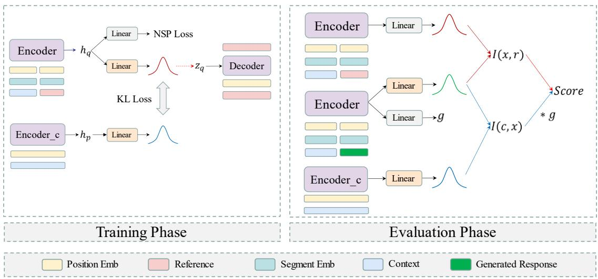
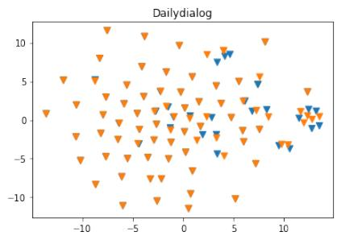
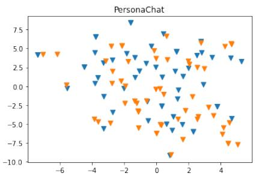
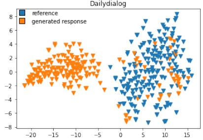
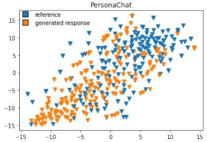

# Evaluating Open-Domain Dialogues in Latent Space with Next Sentence Prediction and Mutual Information

Kun Zhao1∗, Bohao Yang2∗, Chenghua Lin2†, Wenge Rong3,4,

Aline Villavicencio2, Xiaohui Cui1 †

1 Key Laboratory of Aerospace Information Security and Trusted Computing, Ministry of Education, School of Cyber Science and Engineering, Wuhan University, China 2 Department of Computer Science, The University of Sheffield, United Kingdom   
State Key Laboratory of Software Development Environment, Beihang University, China 4 School of Computer Science and Engineering, Beihang University, China {zhaokun, xcui}@whu.edu.cn, w.rong@buaa.edu.cn {byang27, c.lin, a.villavicencio}@sheffield.ac.uk

## Abstract

The long-standing one-to-many issue of the open-domain dialogues poses significant challenges for automatic evaluation methods, i.e., there may be multiple suitable responses which differ in semantics for a given conversational context. To tackle this challenge, we propose a novel learning-based automatic evaluation metric (CMN), which can robustly evaluate open-domain dialogues by augmenting Conditional Variational Autoencoders (CVAEs) with a Next Sentence Prediction (NSP) objective and employing Mutual Information (MI) to model the semantic similarity of text in the latent space. Experimental results on two opendomain dialogue datasets demonstrate the superiority of our method compared with a wide range of baselines, especially in handling responses which are distant to the golden reference responses in semantics.

## 1 Introduction

Open-domain dialogue generation is a prominent research direction in conversational AI due to a wide range of useful applications that it can facilitate, such as for personal digital assistants and customer service (Sai et al., 2020; Huang et al., 2020; Wang et al., 2021; Tang et al., 2023). While evaluating Natural Language Generation (NLG) systems is notoriously difficult, evaluation of open-domain dialogue generation introduces an extra layer of complexity, as a variety of responses can be generated, each semantically different and yet valid in the given context (Li et al., 2016; Gu et al., 2019; Qiu et al., 2019). For example, given the conversational context “Iverson is my all-time favourite player.”, responses such as “He is my favourite player too.” or “Yes, his quickness is amazing!” are both contextually relevant, yet semantically different.

Existing approaches for evaluating open-domain dialogue systems can be broadly divided into two different categories: reference-based and referencefree approaches. The reference-based metrics typically score a system by computing how similar an output response is compared to the goldstandard reference. Popular metrics under this category may rely on surface-form similarity by counting the n-gram overlap between the response candidate and the reference (e.g., BLEU (Papineni et al., 2002), ROUGE (Lin, 2004), and ME-TEOR (Banerjee and Lavie, 2005)), or by calculating the similarity based on embedding representations such as Embedding-Average (Wieting et al., 2016), or even via high-dimensional representations learned for the response and the reference such as BERTScore (Zhang et al., 2020). One noticeable limitation of reference-based metrics is that they are reference centric and do not take the context of the conversation into consideration. Furthermore, due to the well-known one-to-many issue in open-domain dialogue (Li et al., 2016; Gu et al., 2019; Qiu et al., 2019), a good response that matches well to its context could express significantly different semantics to its reference, for which the aforementioned metrics will be inadequate to handle.

To tackle the one-to-many issue, some works (Tao et al., 2018; Sinha et al., 2020; Ghazarian et al., 2019; Zhao et al., 2020) have proposed reference-free metrics to evaluate generated responses by measuring their similarity with the corresponding conversational context, by designing discriminative models trained on the context and the reference to judge whether the generated response matches the context well. As these discriminative metrics are typically trained using a single relevant (aka. positive) response and multiple negative samples, Sai et al. (2020) argue that such metrics should be trained with multiple relevant and irrelevant responses for any given context to allow for robust evaluation. However, most existing datasets do not contain multiple references due to high cost of acquisition, rendering this recommendation impractical.

Chan et al. (2021) take a different approach to the problem by evaluating generated responses in the latent space produced by Conditional Variational Autoencoders (CVAEs), as it can encode discrete text data into a smooth latent space (Li et al., 2020b; Zhang et al., 2022b). Specifically, they proposed to use the prior distribution to approximate the conditional distribution for all the feasible responses to tackle the one-to-many issue with limited data. However, there is no guarantee that the prior distribution can represent a rich set of feasible responses (Li et al., 2019). Zhang et al. (2022a) proposed a self-training framework for multi-domain dialogue evaluation. The model performance was boosted by training on augmented datasets of four different domains, which are first automatically labelled by a teacher model and then followed by a manual annotation process.

To our knowledge, no prior works have attempted to model the intra-relation between a context and a response through the Next Sentence Prediction (NSP) task and Mutual Information (MI) directly, which can provide a strong signal for indicating the sequential and semantic dependencies between the context and response.

To tackle the one-to-many issue, we design a reference-based automatic evaluation metric (CMN), which can robustly evaluate open-domain dialogues with a single gold-standard reference. Our method consists of a training stage and an evaluation stage. In the training stage, the CVAEs are augmented with a NSP objective (Devlin et al., 2019), which plays a crucial role in addressing the one-to-many issue in dialogue evaluation, especially when the semantics of the generated response are distant from the reference but still relate well to the context.

In the evaluation phase, we score a response candidate by calculating the MI of the contextresponse and response-reference pairs in the latent space, which are then combined through a weighting controlled by the NSP probability. However, it is intractable to calculate MI directly as we only have access to samples instead of the prior and posterior distributions (Paninski, 2003; McAllester and Stratos, 2018). To tackle this challenge, we propose to employ a contrastive learning method based on Noise Contrastive Estimation (NCE) (Gutmann and Hyvärinen, 2012; Logeswaran et al., 2018) to calculate the lower bound of MI. Overall, introducing the NSP objective and MI strengthens our model’s ability to capture the sequential dependencies between the context and response, as well as to better leverage the information from references.

Experimental results on two open-domain dialogue datasets show the superiority of our method compared to a wide range of baseline metrics based on both Pearson and Spearman correlations with human annotations. In addition, we provide a detailed analysis of the effectiveness of our proposed method in solving the one-to-many issue in open-domain dialogue evaluation. Our code is available at https://github.com/ Bernard-Yang/CMN-ACL2023.

## 2 Related Work

Reference-based metrics. Reference-based metrics mainly compare the semantic similarity between a ground-truth reference and a generated response. Representative metrics that calculate word overlap include BLEU (Papineni et al., 2002), METEOR (Banerjee and Lavie, 2005) and ROUGE (Lin, 2004).

Unlike metrics comparing the word overlap directly, embedding metrics first convert sentences into a high dimensional representation and calculate the semantic similarity between them. With the development of large-scale pre-training models, embedding metrics such as BERTScore (Zhang et al., 2020) and BLEURT (Sellam et al., 2020) have been shown to effectively enhance sentence representation. However, these automatic reference-based metrics cannot handle the wellknown one-to-many problem in the open-domain dialogue.

Reference-free metrics. Existing reference-free metrics attempt to design discriminative models to solve the one-to-many issue by calculating the similarity between the context and the response candidate. RUBER (Tao et al., 2018) is an unsupervised metric that calculates the similarity of the generated response with both the context and the response. MAUDE (Sinha et al., 2020) employs a large-scale pre-trained model to convert sentences into hidden representations and leverage the temporal transitions between them. Sai et al. (2020) argued that such models should be trained on datasets containing multiple responses. However, most existing datasets only contain a single relevant reference and making this recommendation impractical.

EMS (Chan et al., 2021) first attempted to utilise CVAEs to learn the reference information with limited data and approximate all feasible responses with the prior distribution. However, their model’s prior distribution and sampled variables do not necessarily contain all the feasible response information for a given context, as EMS is only trained with a single reference. We propose a reference-based method by augmenting CVAEs with the NSP objective and employing MI to evaluate the response candidates.

Zhang et al. (2022a) tackled multi-domain evaluation by training a teacher model with humanannotated data in a particular domain. The model then labels the data from dialogue datasets in four other domains. This teacher-annotated data is then used to introduce a new evaluator, which can generalise across multiple domains. However, this method requires human labelling and additional training data, which are not required by our method.

## 3 Methodology

## 3.1 Overall Architecture

In this section, we describe the proposed automatic evaluation framework CMN in detail. As shown in Figure 1, the overall architecture of CMN consists of two stages: training and evaluation. The primary purpose of the training stage is to capture the dialogue information in the latent space, which is strengthened by incorporating the NSP objective into the CVAEs model. In the evaluation stage, CMN evaluates the response candidates by calculating the MI of the context-response and response-reference pairs in the latent space, which are then combined through weighting with the NSP probability of the response candidate.

## 3.2 Training Stage

The training process of our proposed method is illustrated in the left part of Figure 1. We employ two BERT encoders: the first is used to encode the context-reference pairs, and the second encodes the context only. Formally, the encoding process is:

$$
\begin{array} { c } { h _ { q } = \operatorname { E n c o d e r } ( [ c ; r ] ) } \\ { h _ { p } = \operatorname { E n c o d e r } _ { \mathrm { c } } ( c ) } \\ { y = \operatorname { L i n e a r } ( h _ { q } ) } \end{array}\tag{1}
$$

where $h _ { q }$ is the representation of the contextreference pair $( c , r )$ , and is used to learn the aggregated posterior distribution $q ( \boldsymbol { z } | \boldsymbol { c } , \boldsymbol { r } )$ of CMN. In contrast to EMS (Chan et al., 2021) which does not model the order information of the contextreference pair, we introduce the segment embedding, which enables CMN to distinguish the order of the context and the reference. Finally, y is the output of the NSP task, and $h _ { p }$ is the representation of context, which is utilised to learn the prior distribution $p ( z | c )$

To address the one-to-many issue in opendomain dialogue evaluation, we introduce the NSP objective into the CVAEs’ training process to enhance our model’s discriminability of feasible responses given contexts. Introducing NSP leads to two different scenarios when training CMN. Specifically for the NSP task, we randomly replace the references fed to the encoder with the response from other conversations in the training set with a 0.5 probability, where the resulting contextresponse pairs are regarded as negative samples. Likewise, the contexts paired with the original references are positive samples. In terms of the input to the decoder, we use the original references (i.e. positive samples) during the whole training process, regardless of whether the inputs to the encoder are negative or positive samples.

Training with positive samples. When training with the positive samples, we add the NSP loss to the CVAEs’ loss, where the NSP loss can be viewed as an additional regularisation, which enables the CVAEs model to capture the sequential dependencies between the context and response during the training stage. As a result, the posterior and prior distributions and the sampled latent variables will contain rich sentence order and pair matching information.

$$
\begin{array} { r l } & { \mathcal { L } _ { \mathrm { t r a i n } } = \mathbb { E } _ { q ( z | c , r ) } [ \log p ( r | c , z ) ] } \\ & { - \mathrm { K L } ( q ( z | c , r ) | | p ( z | c ) ) - \log p ( y = 1 ) } \end{array}\tag{2}
$$

where E is expectation, $y = 1$ indicates positive samples while $y = 0$ indicates negative ones. The first term is the decoder reconstruction loss, the second term is the KL divergence, and the last term represents the cross entropy loss of the NSP task. Training with negative samples. When training with the negative samples, we exclude the KL divergence loss of CVAEs, as it is undesirable to optimise the prior $p ( z | c )$ to be close to the posterior $q ( z ^ { \prime } | c , r _ { n e g } )$ of negative examples.

  
Figure 1: The architecture of the proposed model. The left part is the training phase, containing two encoders to represent the context-response pair and context. The NSP task is incorporated after the encoding of the context and response pair. The right part is the evaluation phase, in which the generated text is the response candidate and will be evaluated via the MI method during this stage. The Segment Embeddings are used for the NSP task.

$$
\mathcal { L } _ { \mathrm { t r a i n } } = \mathbb { E } _ { p ( z | c ) } [ \log p ( r | c , z ) ] - \log p ( y = 0 )\tag{3}
$$

Here r is the reference from the datasets for guiding the decoder to generate reconstructed sentences. In addition, we use the prior distribution to sample z.

## 3.3 Evaluation Stage

In the evaluation stage, CMN learns to score a response candidate by calculating its MI with respect to the conversation context c and the reference r in the latent space. The representations of c and r are obtained in the training stage of CMN and contain rich sentence pair order and matching information.

However, it is intractable to calculate MI directly as we only have access to the samples instead of the underlying distributions. To tackle this challenge, we employ InfoNCE, a contrastive learning method based on NCE to calculate the lower bound of MI between the latent variables of the two posterior probabilities $q ( \boldsymbol { z } | \boldsymbol { c } , \boldsymbol { r } )$ and $q ( z | c , x )$ and prior probability $p ( z | c )$ (see Figure 1 for illustration). Formally, the lower bound of MI is given as

$$
\begin{array} { l } { \displaystyle I ( x , r ) \geq \mathbb { E } _ { ( x , r ) } [ F ( x , r ) ] + \log ( N - 1 ) } \\ { \displaystyle - \mathbb { E } _ { x } [ \log \frac { 1 } { N - 1 } \sum _ { r _ { n } \in R _ { n e g } } e ^ { F ( x , r _ { n } ) } ] } \end{array}\tag{4}
$$

where x is the response candidate, r is the groundtruth reference in the dataset, $r _ { n }$ represents the negative response sampled from the negative set

$R _ { n e g }$ , which contains the references from other conversation turns, and N is the number of negative samples.

As the underlying posterior distributions are unknown, we first sample from each posterior probability to obtain latent variables $z _ { 1 }$ and $z _ { 2 }$ , which contain the context-reference and the contextresponse sentence pairs information, respectively. The aforementioned sampling method, as well as the functions $F ( x , r )$ and $F ( x , r _ { n } )$ in Eq. 4, are defined as follows:

$$
\begin{array} { c } { { F ( x , r ) = z _ { 1 } \cdot z _ { 2 } } } \\ { { z _ { 1 } \sim q ( z | c , r ) } } \\ { { z _ { 2 } \sim q ( z | c , x ) } } \\ { { F ( x , r _ { n } ) = z _ { 1 } ^ { \prime } \cdot z _ { 2 } } } \\ { { z _ { 1 } ^ { \prime } \sim q ( z | c , r _ { n } ) } } \end{array}\tag{5}
$$

where $z _ { 1 }$ and $z _ { 2 }$ represent the positive latent variable samples while $z _ { 1 } ^ { \prime }$ represents the negative latent samples from the corresponding posterior distributions; represents the dot product operation. We can estimate the MI between response x and reference $r \ ( { \mathrm { i . e . } } \ I ( x , r ) )$ , as well as the MI between context c and response x $( \mathrm { i } . { \bf e } . \ I ( c , x ) )$ , based on Eq. 4 and Eq. 5.

When calculating the final score for a candidate response, we also consider the NSP probability of the response candidate x given conversational context c, in addition to the two MI values. The rationale is that InfoNCE might have difficulty measuring the semantic similarity between the response candidate x and the reference r when they are distant in semantics. The NSP probability acts as a natural weighting, informing the model of to what extent it should focus on $I ( c , x )$ , hence improving our method’s robustness. When feeding the context-response pair to the trained CVAEs in the evaluation stage, the NSP probability $g$ can be calculated according to the following formula:

$$
g = \sigma ( { \mathrm { L i n e a r } } ( { \mathrm { E n c o d e r } } ( [ c ; x ] ) ) )\tag{6}
$$

where $\sigma$ is the activation function, and $g$ is the probability that response $x$ is predicted as the next sentence of context c. A higher value of $g$ means that the degree of dependence between context c and response candidate x is higher, and vice versa.

Finally, we score a response candidate x with Eq. 7.

$$
{ \mathrm { S c o r e } } = g * I ( c , x ) + I ( x , r )\tag{7}
$$

The first term, $I ( c , x )$ , represents the semantic dependence of the context and the response candidate. In other words, it reflects how well the response candidate is related to the context. Thus using g to multiply $I ( c , x )$ controls the amount of information flowing from $I ( c , x )$ . In the second term, $I ( x , r )$ , we consider the semantic dependence of the response candidate and the reference based on their MI. Essentially, the relationship between x and c, and that between x and r, can be considered simultaneously via Eq. 7, and the one-to-many problem can be handled directly.

## 4 Experimental Setup

## 4.1 Datasets

To evaluate the effectiveness of our proposed automatic evaluation metric, we conduct experiments on two open dialogue datasets. The PersonaChat dataset (Zhang et al., 2018) is a large personaconditioned chit-chat style dialogue dataset which consists of 10,907 training dialogues, 1,000 validation dialogues, and 968 testing dialogues. The DailyDialog dataset (Li et al., 2017) is another widely-used large collection of human-human dialogues, consisting of a training set with 11,118 dialogues and validation and test sets with 1000 dialogues each.

## 4.2 Baselines

We choose the following two kinds of evaluation metrics as baseline methods:

Reference-Based Metrics. For the referencebased metrics, we use BLEU (Papineni et al., 2002), ROUGE (Lin, 2004), METEOR (Banerjee and Lavie, 2005), Embedding-Average (Wieting et al., 2016), Vector-Extrema (Forgues and Pineau, 2014), Greedy-Matching (Rus and Lintean, 2012), BERTScore (Zhang et al., 2020), and BLEURT (Sellam et al., 2020), which have been widely used in generative dialogue systems.

Reference-free Metrics. For the referencefree metrics, we compare with three learningbased methods, namely, RUBER (Tao et al., 2018), MAUDE (Sinha et al., 2020) and MDD-Eval (Zhang et al., 2022a). Note that we were not able to compare with EMS (Chan et al., 2021), as their code is unavailable. It is also infeasible to re-implement their approach due to the lack of sufficient implementation details in the paper.

## 4.3 Evaluation Set Construction

We follow the setting in Optimus (Li et al., 2020a) to use BERT (Devlin et al., 2019) and GPT-2 (Radford et al., 2019) as the encoder and the decoder for our CMN framework, respectively. We set the dimension of the latent variable z of CVAE to 32. In the evaluation phase, we follow Zhao et al. (2020) to generate response candidates based on the testset of DailyDialog and PersonaChat using several widely applied dialogue generation systems, including Seq2Seq (Sutskever et al., 2014), HRED (Serban et al., 2016), and GPT-2 (Radford et al., 2019).

After obtaining the generated response candidates, we construct an evaluation set consisting of a standard set, in which the sample references and generated responses are similar in semantics (i.e., for the standard evaluation setting), and a diverse set, in which the references and responses are distant in semantics (i.e., for the one-to-many setting). For the standard set, we collect 200 samples from both DailyDialog and PersonaChat that have the highest BLEU-1 scores between the reference and response among all the testing pairs. As our primary focus is to evaluate the model’s performance under the one-to-many setting, we constructed a diverse set containing a larger number of samples (i.e., 600), by sampling from the testing pairs whose BLEU-1 scores are lower than 0.2. These sampled data have a balanced split between DailyDialog and PersonaChat.

  
(a)

  
(c)

(b)  
  
(d)  
Figure 2: T-SNE visualisation of the sentence representation of references and generated responses. (a) and (b) for the standard set, and (c) and (d) for the diverse set.

## 4.4 Human Annotation

Evaluating the system performance requires measuring the correlation between the model prediction versus human evaluation scores. We recruited three human annotators to evaluate the evaluation set (i.e., the context-response pairs in our standard and diverse sets). All annotators hold at least a master’s degree in Computer Science and have full professional proficiency in English.

Specifically, annotators were asked to rate two aspects: Appropriateness, which measures the degree to which the output is appropriate within the given context, and Coherence, which assesses the extent to which the content of the output is presented in a well-structured, logical, and meaningful manner. These ratings were provided on a 1-5 Likert scale, with higher scores indicating better quality. For each context-response pair, we then average the Appropriateness and Coherence scores across all annotators to produce the final human annotation score. In the diverse set, 400 responses are rated as positive samples (4-5), while 200 are rated as negative samples (1-3). In contrast, all responses in the standard set are rated as positive samples since each response is semantically similar to the gold reference.

We examine the Inner-Annotator Agreement (IAA) using inter-annotator Kappa (Cohen, 1960). The average IAA score between every pair of annotators for the Personachat dataset is 0.55, indicating a moderately strong level of agreement (0.4-0.6 range). On the other hand, the average IAA score for the DailyDialog dataset is 0.65, demonstrating a substantially strong level of agreement (0.6-0.8 range). More details of the IAA scores can be found in Appendices A.2.

## 5 Results

In this section, we evaluate our model’s performance on evaluating open-domain dialogues under both standard and diverse settings.

## 5.1 Analysis of the Evaluation Set

Before presenting the evaluation results, we first provide some validation analysis on our standard and diverse sets using embedding-based semantic similarity BERTScore. For the standard set, the averaged BERTScore is 4.7 for DailyDialog and 2.56 for Personachat. However, the scores are only 0.23 (DailyDialog) and 0.27 (Personachat) for the diverse set, indicating that the semantic similarity between the response candidates and the goldstandard references is low.

We further use T-SNE to visualise the sentence representations of the reference and generated response pairs. As shown in Figure 2 (a) and (b), the response candidates are similar to the references in the standard set, where the corresponding data points are either very close to each other or overlapping (e.g., there are seemingly more orange points in 2 (a) due to overlapping). In contrast, the distributions of response candidates and references are more distinctive for the diverse set, as shown in Figure 2 (c) and (d). In summary, the analysis shows that the standard and diverse sets are a good fit for our evaluation purposes.

<table><tr><td colspan="3">DailyDialog</td><td colspan="2">PersonaChat</td></tr><tr><td>Metrics</td><td>Pearson&#x27;s ρ</td><td>Spearman&#x27;s τ</td><td>Pearson&#x27;s ρ</td><td>Spearman&#x27;s τ</td></tr><tr><td>BLEU-1</td><td>0.0465 (0.6782)</td><td>0.0049 (0.9652)</td><td>-0.0314 (0.8183)</td><td>-0.0372 (0.7856)</td></tr><tr><td>BLEU-2</td><td>0.0497 (0.6577)</td><td>0.0116 (0.9175)</td><td>-0.0601 (0.6597)</td><td>-0.0621 (0.6495)</td></tr><tr><td>BLEU-3</td><td>0.0462 (0.6803)</td><td>0.0399 (0.7219)</td><td>-0.0431 (0.7525)</td><td>-0.0213 (0.8760)</td></tr><tr><td>BLEU-4</td><td>0.0796 (0.4770)</td><td>0.0646 (0.5641)</td><td>-0.0149 (0.9134)</td><td>-0.064 (0.6395)</td></tr><tr><td>ROUGE-1</td><td>0.0718 (0.5213)</td><td>0.0304 (0.7861)</td><td>-0.0267 (0.8449)</td><td>0.0678 (0.6193)</td></tr><tr><td>ROUGE-2</td><td>0.0841 (0.4525)</td><td>0.0645 (0.5651)</td><td>0.0305 (0.8235)</td><td>0.0291 (0.8315)</td></tr><tr><td>ROUGE-L</td><td>0.0490 (0.6617)</td><td>0.0285 (0.7992)</td><td>-0.0013 (0.9924)</td><td>0.0834 (0.5413)</td></tr><tr><td>METEOR</td><td>0.0696 (0.5345)</td><td>0.0946 (0.3977)</td><td>-0.102 (0.4543)</td><td>-0.1066 (0.4344)</td></tr><tr><td>Embedding</td><td></td><td></td><td></td><td></td></tr><tr><td>Extrema</td><td>0.1211 (0.2784)</td><td>-0.0021 (0.9853)</td><td>0.0017 (0.9903)</td><td>0.0814 (0.5510)</td></tr><tr><td>Greedy</td><td>0.1117 (0.3176)</td><td>0.0940 (0.4008)</td><td>0.0949 (0.4866)</td><td>0.0891 (0.5136)</td></tr><tr><td>Average</td><td>0.1527 (0.1709)</td><td>0.1199 (0.2835)</td><td>0.1018 (0.4554)</td><td>0.1124 (0.4096)</td></tr><tr><td>BERTScore</td><td>0.0824 (0.4620)</td><td>-0.0076 (0.9457)</td><td>0.1097 (0.4211)</td><td>0.1724 (0.2038)</td></tr><tr><td>BLEURT</td><td>0.1163 (0.2983)</td><td>0.0940 (0.4008)</td><td>-0.1194 (0.3808)</td><td>-0.1143 (0.4016)</td></tr><tr><td>RUBER</td><td>0.0820 (0.4642)</td><td>0.1560 (0.1616)</td><td>0.0019 (0.9887)</td><td>-0.0329 (0.8095)</td></tr><tr><td>MAUDE</td><td>-0.1623 (0.1453)</td><td>-0.0145 (0.8974)</td><td>0.1353 (0.3201)</td><td>0.1104 (0.4178)</td></tr><tr><td>MDD-Eval</td><td>0.1029 (0.3574)</td><td>-0.0667 (0.5516)</td><td>0.1239 (0.3630)</td><td>0.2502 (0.0629)</td></tr><tr><td>Ours(w/o NSP)</td><td>0.2292 (0.0383)</td><td>0.2025 (0.0681)</td><td>0.2585 (0.0544)</td><td></td></tr><tr><td>Ours(w/o MI)</td><td>0.0833 (0.4568)</td><td>-0.0537 (0.6316)</td><td>0.1030 (0.4498)</td><td>0.3816 (0.0037) 0.1530 (0.2601)</td></tr><tr><td></td><td></td><td></td><td></td><td></td></tr><tr><td>Ours</td><td>0.2446 (0.0268)</td><td>0.2211 (0.0459)</td><td>0.2656 (0.0479)</td><td>0.3971 (0.0024)</td></tr></table>

Table 1: Pearson and Spearman correlations with human judgements on the standard set. Figures in parentheses are p-values.

## 5.2 Model evaluation in the standard setting

We compare our model with the baselines in terms of how well the evaluation scores generated by the model correlate with human judgments.

As shown in Table 1, the n-gram baselines, including BLEU, ROUGE, and METEOR, achieve negative or weak positive correlations with human annotations on both datasets. The embeddingbased approaches (including the ones using pretrained models such as BERTScore) slightly outperform the n-gram baselines, except that BLEURT performs worse on the PersonaChat. In contrast, learning-based metrics give the strongest performance among all baselines. Specifically, MAUDE and MDD-Eval achieve similar performance on the PersonaChat, and both outperform RUBER. However, RUBER gives better performance than these two metrics on DailyDialog. Our model achieves the best overall performance in terms of both Pearson and Spearman correlations on both datasets.

We further conducted ablation studies to evaluate the effectiveness of the MI (w/o NSP) and the NSP (w/o MI) components by excluding the other component when inferring the final evaluation score. It can be observed that CMN with the MI component alone (i.e., w/o NSP) gives better performance than the model variant with the NSP component only. This suggests that MI is more effective than NSP in evaluating dialogues when the response candidates are similar to the references in semantics (i.e. the standard setting).

## 5.3 Model evaluation in the one-to-many setting

In another set of experiments, we evaluate our model performance in the one-to-many setting using the diverse set.

As shown in Table 2, Extrema, Greedy, and Average achieve a negative or weakly positive correlation with human annotation on both datasets. In contrast, the embedding-based metrics which use pre-trained models to represent sentences achieve much better results. For instance, both BERTScore and BLEURT achieve close to 0.25 for both Pearson and Spearman correlations on DailyDialog, although the performance is less strong on Per-

<table><tr><td colspan="3">DailyDialog</td><td colspan="2">PersonaChat</td></tr><tr><td>Metrics</td><td>Pearson&#x27;s ρ</td><td>Spearman&#x27;s τ</td><td>Pearson&#x27;s ρ</td><td>Spearman&#x27;s τ</td></tr><tr><td>BLEU-1</td><td>0.2953 (&lt;0.0001)</td><td>0.2635 (&lt;0.0001)</td><td>-0.1533 (0.0361)</td><td>-0.1702 (0.0199)</td></tr><tr><td>BLEU-2</td><td>0.2733 (&lt;0.0001)</td><td>0.2638 (&lt;0.0001)</td><td>-0.1657 (0.0235)</td><td>-0.1810 (0.0132)</td></tr><tr><td>BLEU-3</td><td>0.2496 (&lt;0.0001)</td><td>0.2691 (&lt;0.0001)</td><td>-0.1654 (0.0237)</td><td>-0.1846 (0.0114)</td></tr><tr><td>BLEU-4</td><td>0.2319 (&lt;0.0001)</td><td>0.2737 (&lt;0.0001)</td><td>-0.1642 (0.0247)</td><td>-0.1790 (0.0142)</td></tr><tr><td>ROUGE-1</td><td>0.3275 (&lt;0.0001)</td><td>0.2865 (&lt;0.0001)</td><td>-0.0057 (0.9382)</td><td>0.0489 (0.5062)</td></tr><tr><td>ROUGE-2</td><td>0.2698 (&lt;0.0001)</td><td>0.2761 (&lt;0.0001)</td><td>-0.0340 (0.6441)</td><td>0.0937 (0.2023)</td></tr><tr><td>ROUGE-L</td><td>0.3362 (&lt;0.0001)</td><td>0.2945 (&lt;0.0001)</td><td>-0.0072 (0.9222)</td><td>0.0476 (0.5178)</td></tr><tr><td>METEOR</td><td>0.2948 (&lt;0.0001)</td><td>0.2858 (&lt;0.0001)</td><td>-0.0293 (0.6908)</td><td>-0.0507 (0.4904)</td></tr><tr><td>Embedding</td><td></td><td></td><td></td><td></td></tr><tr><td>Extrema</td><td>-0.3589 (&lt;0.0001)</td><td>-0.3524 (&lt;0.0001)</td><td>-0.1010 (0.1690)</td><td>-0.0390 (0.5966)</td></tr><tr><td>Greedy</td><td>-0.1580 (0.0006)</td><td>-0.1408 (0.0023)</td><td>-0.0380 (0.6052)</td><td>0.0113 (0.8776)</td></tr><tr><td>Average</td><td>-0.1350 (0.0034)</td><td>-0.1006 (0.0296)</td><td>-0.1093 (0.1364)</td><td>-0.0355 (0.6294)</td></tr><tr><td>BERTScore</td><td>0.2591 (&lt;0.0001)</td><td>0.2251 (&lt;0.0001)</td><td>0.0345 (0.6391)</td><td>0.0853 (0.2455)</td></tr><tr><td>BLEURT</td><td>0.2711 (&lt;0.0001))</td><td>0.2063 (&lt;0.0001))</td><td>0.1267 (0.0840)</td><td>0.1858 (0.0109)</td></tr><tr><td>RUBER</td><td>0.1027 (0.0263)</td><td>0.1714 (0.0002)</td><td>-0.0579 (0.4312)</td><td>-0.0592 (0.4206)</td></tr><tr><td>MAUDE</td><td>0.0551 (0.2344)</td><td>0.1782 (&lt;0.0001)</td><td>0.2640 (0.0003)</td><td>0.3267 (&lt;0.0001)</td></tr><tr><td>MDD-Eval</td><td>0.5567 (&lt;0.0001)</td><td>0.6160 (&lt;0.0001)</td><td>0.1264 (0.0848)</td><td>0.2582 (0.0004)</td></tr><tr><td></td><td></td><td></td><td></td><td></td></tr><tr><td>Ours(w/o NSP)</td><td>0.5453 (&lt;0.0001)</td><td>0.5555 (&lt;0.0001)</td><td>0.2947 (0.0025)</td><td>0.2224 (0.0022)</td></tr><tr><td>Ours(w/o MI)</td><td>0.6183 (&lt;0.0001)</td><td>0.5946 (&lt;0.0001)</td><td>0.2769 (0.0001)</td><td>0.1390 (0.0578)</td></tr><tr><td>Ours</td><td>0.6325 (&lt;0.0001)</td><td>0.6234 (&lt;0.0001)</td><td>0.4000 (&lt;0.0001)</td><td>0.2746 (0.0001)</td></tr></table>

Table 2: Pearson and Spearman correlations with human judgements on the diverse set.

sonaChat.

On the other hand, the word overlap metrics based on n-gram perform better than the above embedding-based metrics, with BLEU, ROUGE, and METEOR all having higher correlations than the embedding-based approaches. Nevertheless, the correlations of these metrics to human annotations are still relatively weak for both datasets.

For learning-based metrics, RUBER and MAUDE give weak positive correlations with human annotations on the DailyDialog dataset. However, RUBER gives a negative correlation with human scores on the PersonaChat. MAUDE, on the other hand, performs the best on the PersonaChat dataset in terms of Spearman correlation (0.3267), which is higher than that of our method (0.2746). Overall, MDD-Eval gives the best performance among all baselines on DailyDialog, whereas MAUDE is the best baseline on PersonaChat. Nevertheless, our CMN model achieves the best overall performances on both datasets, giving the highest Pearson (0.6325) and Spearman (0.6234) correlations on DailyDialog and the highest Pearson (0.4000) correlations on PersonaChat.

Our ablation studies show that NSP is crucial in evaluating dialogues when there is a significant difference between references and responses in semantics (i.e., the diverse setting). By introducing NSP, our model can effectively capture the contextual dependencies between the conversational context and the generated responses, and thus can better handle the one-to-many issue in open-domain dialogue evaluation.

<table><tr><td>Context:</td><td colspan="3">What do you need?</td></tr><tr><td>Reference:</td><td>I need to use the internet .</td><td colspan="2"></td></tr><tr><td>Response:</td><td>this.</td><td colspan="2">I think I need a deck that plays well with</td></tr><tr><td>Human 4.66</td><td>BLEU 0.90</td><td>MAUDE 4.81</td><td>RUBER 0.85</td></tr><tr><td>BERTScore</td><td>BLEURT</td><td>MDD-Eval</td><td>Ours</td></tr><tr><td>1.90</td><td>1.34</td><td>0.53</td><td>4.47</td></tr><tr><td>Context:</td><td>Do you like the outdoors?</td><td>I like taking my dogs hiking. What do</td><td></td></tr><tr><td>Reference:</td><td>you like to do for fun?</td><td></td><td></td></tr><tr><td>Response:</td><td>I do. I love to hike.</td><td></td><td></td></tr><tr><td>Human 5.0</td><td>BLEU 1.25</td><td>MAUDE 4.94</td><td>RUBER 0.76</td></tr><tr><td>BERTScore</td><td>BLEURT</td><td></td><td></td></tr><tr><td>1.66</td><td>2.12</td><td>MDD-Eval 3.93</td><td>Ours 4.26</td></tr></table>

Table 3: Samples from DailyDialog and PersonaChat dataset.

## 5.4 Case Studies

For qualitative analysis, we show two cases of our experiment in Table 3. Each case shows the conversational context as well as the corresponding goldstandard reference and the generated response. We compare our evaluation score with five different baselines. To simplify the comparison, we normalise all scores to a range of 1-5 to be consistent with the Likert scale of human evaluation. Note that the normalisation is applied to the case study only, rather than performed in our main experiments. In the first case, the generated response is relatively similar to the reference, whereas the reference and response are very different in the second case. For both cases, our CMN gives very similar scores to the human scores. More examples are provided in Appendices A.1.

## 6 Conclusions

In this paper, we propose a novel learning-based automatic evaluation metric which can robustly evaluate open-domain dialogue by augmenting CVAEs with an NSP objective and employing MI to model the semantic similarity of text in the latent space. Experimental results on two open-domain dialogue datasets show that our CMN model outperforms a wide range of baseline methods in terms of both Pearson and Spearman correlations with human annotation scores, and is superior in dealing with the one-to-many issue in open-domain dialogue evaluation.

## Ethics Statement

In this paper, we propose a new automatic evaluation metric CMN to evaluate the open-domain dialogue system. The positive impact of CMN is that it can deal with the one-to-many problem in the open-domain dialogue evaluation metrics. The negative impact lies in that the CMN may potentially give a high score to potentially inappropriate or offensive responses in some extreme cases. Consequrntly, the content of such training datasets should be assessed before training the CMN.

## Limitations

Although our proposed method performs well in evaluating the open-domain dialogue systems, it also has some limitations. Our method identifies the dependencies between context and response. However, according to Howcroft et al. (2020), human-evaluated metrics can contain a variety of attributes whilst we only identify the large-scale dependencies of semantics and do not disentangle the texts into the attributes of human-evaluated metrics. In the future, we will conduct disentanglement studies to disentangle the text into various attributes to optimise our model and further improve the interpretability of text evaluation methods based on these disentangled attributes.

## References

Satanjeev Banerjee and Alon Lavie. 2005. METEOR: An Automatic Metric for MT Evaluation with Improved Correlation with Human Judgments. In Proceedings ofthe ACL Workshop on Intrinsic and Extrinsic Evaluation Measures for Machine Translation and/or Summarization, pages 65–72, Ann Arbor, Michigan. Association for Computational Linguistics.

Zhangming Chan, Lemao Liu, Juntao Li, Haisong Zhang, Dongyan Zhao, Shuming Shi, and Rui Yan. 2021. Enhancing the Open-Domain Dialogue Evaluation in Latent Space. In Findings of the Association for Computational Linguistics: ACL-IJCNLP 2021, pages 4889–4900, Online. Association for Computational Linguistics.

Jacob Cohen. 1960. A coefficient of agreement for nominal scales. Educational and Psychological Measurement, 20(1):37–46.

Jacob Devlin, Ming-Wei Chang, Kenton Lee, and Kristina Toutanova. 2019. Bert: Pre-training of deep bidirectional transformers for language understanding. In NAACL.

Gabriel Forgues and Joelle Pineau. 2014. Bootstrapping dialog systems with word embeddings.

Sarik Ghazarian, Johnny Tian-Zheng Wei, A. G. Galstyan, and Nanyun Peng. 2019. Better automatic evaluation of open-domain dialogue systems with contextualized embeddings. ArXiv, abs/1904.10635.

Xiaodong Gu, Kyunghyun Cho, Jung-Woo Ha, and Sunghun Kim. 2019. Dialogwae: Multimodal response generation with conditional wasserstein autoencoder. ArXiv, abs/1805.12352.

Michael U. Gutmann and Aapo Hyvärinen. 2012. Noisecontrastive estimation of unnormalized statistical models, with applications to natural image statistics. J. Mach. Learn. Res., 13:307–361.

David M. Howcroft, Anya Belz, Miruna Clinciu, Dimitra Gkatzia, Sadid A. Hasan, Saad Mahamood, Simon Mille, Emiel van Miltenburg, Sashank Santhanam, and Verena Rieser. 2020. Twenty years of confusion in human evaluation: Nlg needs evaluation sheets and standardised definitions. In INLG.

Minlie Huang, Xiaoyan Zhu, and Jianfeng Gao. 2020. Challenges in Building Intelligent Open-domain Dialog Systems. Number: arXiv:1905.05709 arXiv:1905.05709 [cs].

Bohan Li, Junxian He, Graham Neubig, Taylor Berg-Kirkpatrick, and Yiming Yang. 2019. A surprisingly effective fix for deep latent variable modeling of text. In EMNLP.

Chunyuan Li, Xiang Gao, Yuan Li, Baolin Peng, Xiujun Li, Yizhe Zhang, and Jianfeng Gao. 2020a. Optimus: Organizing Sentences via Pre-trained Modeling of a Latent Space. arXiv:2004.04092 [cs, stat]. ArXiv: 2004.04092.

Jiwei Li, Michel Galley, Chris Brockett, Jianfeng Gao, and Bill Dolan. 2016. A Diversity-Promoting Objective Function for Neural Conversation Models. arXiv:1510.03055 [cs]. ArXiv: 1510.03055.

Ruizhe Li, Xiao Li, Guanyi Chen, and Chenghua Lin. 2020b. Improving variational autoencoder for text modelling with timestep-wise regularisation. In Proceedings of the 28th International Conference on Computational Linguistics, pages 2381–2397, Barcelona, Spain (Online). International Committee on Computational Linguistics.

Yanran Li, Hui Su, Xiaoyu Shen, Wenjie Li, Ziqiang Cao, and Shuzi Niu. 2017. Dailydialog: A manually labelled multi-turn dialogue dataset. In IJCNLP.

Chin-Yew Lin. 2004. ROUGE: A Package for Automatic Evaluation of Summaries. In Text Summarization Branches Out, pages 74–81, Barcelona, Spain. Association for Computational Linguistics.

Lajanugen Logeswaran, Honglak Lee, and Samy Bengio. 2018. Content preserving text generation with attribute controls. arXiv:1811.01135 [cs, stat]. ArXiv: 1811.01135.

David McAllester and Karl Stratos. 2018. Formal Limitations on the Measurement of Mutual Information.

Liam Paninski. 2003. Estimation of Entropy and Mutual Information. Neural Computation, 15(6):1191–1253.

Kishore Papineni, Salim Roukos, Todd Ward, and Wei-Jing Zhu. 2002. Bleu: a Method for Automatic Evaluation of Machine Translation. In Proceedings of the 40th Annual Meeting of the Association for Computational Linguistics, pages 311–318, Philadelphia, Pennsylvania, USA. Association for Computational Linguistics.

Lisong Qiu, Juntao Li, Wei Bi, Dongyan Zhao, and Rui Yan. 2019. Are Training Samples Correlated? Learning to Generate Dialogue Responses with Multiple References. In Proceedings ofthe 57th Annual Meeting ofthe Associationfor Computational Linguistics, pages 3826–3835, Florence, Italy. Association for Computational Linguistics.

Alec Radford, Jeff Wu, Rewon Child, David Luan, Dario Amodei, and Ilya Sutskever. 2019. Language models are unsupervised multitask learners.

Vasile Rus and Mihai C. Lintean. 2012. A comparison of greedy and optimal assessment of natural language student input using word-to-word similarity metrics. In BEA@NAACL-HLT.

Ananya B. Sai, Akash Kumar Mohankumar, Siddhartha Arora, and Mitesh M. Khapra. 2020. Improving Dialog Evaluation with a Multi-reference Adversarial Dataset and Large Scale Pretraining. Transactions of the Associationfor Computational Linguistics, 8:810– 827.

Thibault Sellam, Dipanjan Das, and Ankur P. Parikh. 2020. Bleurt: Learning robust metrics for text generation. In ACL.

Iulian Vlad Serban, Alessandro Sordoni, Ryan Lowe, Laurent Charlin, Joelle Pineau, Aaron Courville, and Yoshua Bengio. 2016. A Hierarchical Latent Variable Encoder-Decoder Model for Generating Dialogues. arXiv:1605.06069 [cs]. ArXiv: 1605.06069.

Koustuv Sinha, Prasanna Parthasarathi, Jasmine Wang, Ryan J. Lowe, William L. Hamilton, and Joelle Pineau. 2020. Learning an unreferenced metric for online dialogue evaluation. ArXiv, abs/2005.00583.

Ilya Sutskever, Oriol Vinyals, and Quoc V. Le. 2014. Sequence to Sequence Learning with Neural Networks. arXiv:1409.3215 [cs]. ArXiv: 1409.3215.

Chen Tang, Hongbo Zhang, Tyler Loakman, Chenghua Lin, and Frank Guerin. 2023. Terminology-aware medical dialogue generation. In ICASSP 2023-2023 IEEE International Conference on Acoustics, Speech and Signal Processing (ICASSP), pages 1–5. IEEE.

Chongyang Tao, Lili Mou, Dongyan Zhao, and Rui Yan. 2018. Ruber: An unsupervised method for automatic evaluation of open-domain dialog systems. In AAAI.

Dingmin Wang, Chenghua Lin, Qi Liu, and Kam-Fai Wong. 2021. Fast and scalable dialogue state tracking with explicit modular decomposition. In Proceedings of the 2021 Conference of the North American Chapter of the Association for Computational Linguistics: Human Language Technologies, pages 289–295, Online. Association for Computational Linguistics.

John Wieting, Mohit Bansal, Kevin Gimpel, and Karen Livescu. 2016. Towards universal paraphrastic sentence embeddings. CoRR, abs/1511.08198.

Chen Zhang, Luis Fernando D’Haro, Thomas Friedrichs, and Haizhou Li. 2022a. MDD-Eval: Self-Training on Augmented Data for Multi-Domain Dialogue Evaluation. ArXiv:2112.07194 [cs] version: 2.

Jianfei Zhang, Jun Bai, Chenghua Lin, Yanmeng Wang, and Wenge Rong. 2022b. Improving variational autoencoders with density gap-based regularization. In Advances in Neural Information Processing Systems.

Saizheng Zhang, Emily Dinan, Jack Urbanek, Arthur Szlam, Douwe Kiela, and Jason Weston. 2018. Personalizing Dialogue Agents: I have a dog, do you have pets too? In Proceedings of the 56th Annual Meeting of the Association for Computational Linguistics (Volume 1: Long Papers), pages 2204–2213, Melbourne, Australia. Association for Computational Linguistics.

Tianyi Zhang, Varsha Kishore, Felix Wu, Kilian Q. Weinberger, and Yoav Artzi. 2020. Bertscore: Evaluating text generation with bert. ArXiv, abs/1904.09675.

Tianyu Zhao, Divesh Lala, and Tatsuya Kawahara. 2020. Designing precise and robust dialogue response evaluators. ArXiv, abs/2004.04908.

## A Appendices

## A.1 Case Studies

We demonstrate more examples in Table 4, which shows the response and the reference conditioned on the same conversational context from the PersonaChat dataset. We compare our matching score with five different baselines. We notice that the matching score of our method correlated well with the human annotation score compared with other baselines.

<table><tr><td>Context:</td><td colspan="3">I love nature ! i&#x27;m going camping tomor- row night</td></tr><tr><td>Reference:</td><td></td><td colspan="2">It is too cold here to go camping.</td></tr><tr><td>Response:</td><td>beach.</td><td colspan="2">That sounds fun . i like to go to the</td></tr><tr><td>Human</td><td>BLEU</td><td>MAUDE</td><td>RUBER</td></tr><tr><td>4.5</td><td>0.8</td><td>4.96</td><td>0.44</td></tr><tr><td>BERTScore 2.01</td><td>BLEURT 1.71</td><td>MDD-Eval 2.90</td><td>Ours 4.21</td></tr><tr><td>Context:</td><td colspan="3">I have a cat. His name is spook. What</td></tr><tr><td>Reference:</td><td colspan="3">about you? I have a turtle. I named him leo.</td></tr><tr><td>Response:</td><td colspan="3">I&#x27;ve a dog, but he has black and white eyes, what about you?</td></tr><tr><td>Human</td><td colspan="3">BLEU MAUDE</td></tr><tr><td>4.5 BERTScore</td><td>0.35</td><td>4.98</td><td>RUBER 0.61</td></tr><tr><td>1.29</td><td>BLEURT 1.89</td><td>MDD-Eval 0.53</td><td>Ours 4.16</td></tr></table>

Table 4: Three samples from DailiDialog and PersonaChat dataset.

## A.2 Inter-Annotator Agreement (IAA)

We use cohen’s kappa (Cohen, 1960) to examine the IAA between every two annotators and demonstrate our IAA in Table 5. All the IAA scores of the Personachat dataset are higher than 0.4, which indicates that the annotators reached a moderately strong level agreement (0.4-0.6) or a substantially strong level agreement (0.6-0.8). Besides, the IAA scores of the DailyDialog dataset can reach a substantially strong level. The above IAA results indicate that the annotated data by different annotators are reliable.

<table><tr><td colspan="4">Annotator</td></tr><tr><td></td><td colspan="3">Cohen&#x27;s Kappa DailyDialog</td></tr><tr><td></td><td>Annotator1</td><td>Annotator2</td><td>Annotator3</td></tr><tr><td>Annotator1</td><td>-</td><td>0.6896</td><td>0.6035</td></tr><tr><td>Annotator2</td><td>0.6896</td><td></td><td>0.6434</td></tr><tr><td>Annotator3</td><td>0.6035</td><td>0.6434</td><td></td></tr><tr><td colspan="4">PersonaChat</td></tr><tr><td>Annotator</td><td>Annotator1</td><td>Annotator2</td><td>Annotator3</td></tr><tr><td>Annotator1</td><td></td><td>0.4496</td><td>0.5547</td></tr><tr><td>Annotator2</td><td>0.4496</td><td></td><td>0.6315</td></tr><tr><td>Annotator3</td><td>0.5547</td><td>0.6315</td><td></td></tr></table>

Table 5: Inter-Annotator agreement (IAA)

A For every submission: ✓ A1. Did you describe the limitations of your work? section Limitation

✓ A2. Did you discuss any potential risks of your work? section Ethical Impact

✓ A3. Do the abstract and introduction summarize the paper’s main claims? section abstract

✗ A4. Have you used AI writing assistants when working on this paper? Left blank.

B  Did you use or create scientific artifacts? Not applicable. Left blank.

 B1. Did you cite the creators of artifacts you used? Not applicable. Left blank.

 B2. Did you discuss the license or terms for use and / or distribution of any artifacts? Not applicable. Left blank.

 B3. Did you discuss if your use of existing artifact(s) was consistent with their intended use, provided that it was specified? For the artifacts you create, do you specify intended use and whether that is compatible with the original access conditions (in particular, derivatives of data accessed for research purposes should not be used outside of research contexts)? Not applicable. Left blank.

 B4. Did you discuss the steps taken to check whether the data that was collected / used contains any information that names or uniquely identifies individual people or offensive content, and the steps taken to protect / anonymize it? Not applicable. Left blank.

 B5. Did you provide documentation of the artifacts, e.g., coverage of domains, languages, and linguistic phenomena, demographic groups represented, etc.? Not applicable. Left blank.

✓ B6. Did you report relevant statistics like the number of examples, details of train / test / dev splits, etc. for the data that you used / created? Even for commonly-used benchmark datasets, include the number of examples in train / validation / test splits, as these provide necessary context for a reader to understand experimental results. For example, small differences in accuracy on large test sets may be significant, while on small test sets they may not be. Left blank.

## C ✓ Did you run computational experiments?

section 5

✗ C1. Did you report the number of parameters in the models used, the total computational budget (e.g., GPU hours), and computing infrastructure used? Left blank.

✓ C2. Did you discuss the experimental setup, including hyperparameter search and best-found hyperparameter values? section 4

✓ C3. Did you report descriptive statistics about your results (e.g., error bars around results, summary statistics from sets of experiments), and is it transparent whether you are reporting the max, mean, etc. or just a single run? section 5

✗ C4. If you used existing packages (e.g., for preprocessing, for normalization, or for evaluation), did you report the implementation, model, and parameter settings used (e.g., NLTK, Spacy, ROUGE, etc.)? Left blank.

D ✓ Did you use human annotators (e.g., crowdworkers) or research with human participants? section 4

✗ D1. Did you report the full text of instructions given to participants, including e.g., screenshots, disclaimers of any risks to participants or annotators, etc.? Left blank.

✗ D2. Did you report information about how you recruited (e.g., crowdsourcing platform, students) and paid participants, and discuss if such payment is adequate given the participants’ demographic (e.g., country of residence)? Left blank.

✗ D3. Did you discuss whether and how consent was obtained from people whose data you’re using/curating? For example, if you collected data via crowdsourcing, did your instructions to crowdworkers explain how the data would be used? Left blank.

 D4. Was the data collection protocol approved (or determined exempt) by an ethics review board? Not applicable. Left blank.

✗ D5. Did you report the basic demographic and geographic characteristics of the annotator population that is the source of the data? Left blank.