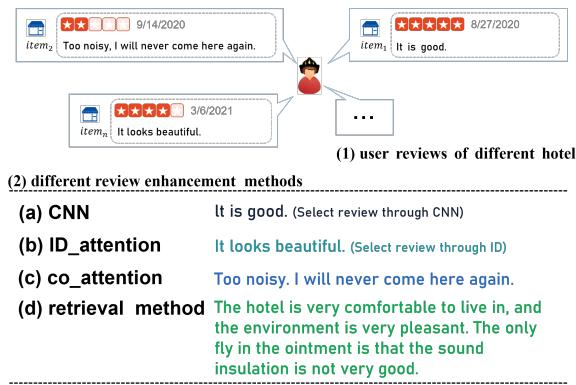
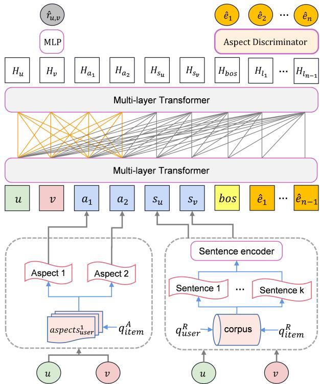
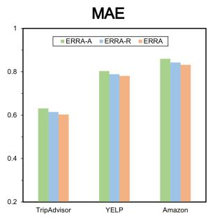
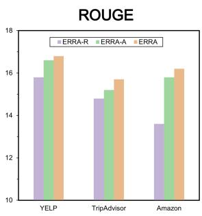

# Explainable Recommendation with Personalized Review Retrieval and Aspect Learning

Hao Cheng1, Shuo Wang1, Wensheng Lu1, Wei Zhang1

Mingyang Zhou1, Kezhong Lu1, Hao Liao1, 2, 3∗

1College of Computer Science and Software Engineering, Shenzhen University, China

2WeBank Institute of Financial Technology, Shenzhen University, China 3Ping An Bank Co., Ltd.

{2110276103, 2110276109, 2210273060, 2210275010}@email.szu.edu.cn {zmy, kzlu, haoliao}@szu.edu.cn

## Abstract

Explainable recommendation is a technique that combines prediction and generation tasks to produce more persuasive results. Among these tasks, textual generation demands large amounts of data to achieve satisfactory accuracy. However, historical user reviews of items are often insufficient, making it chal lenging to ensure the precision of generated explanation text. To address this issue, we propose a novel model, ERRA (Explainable Recommendation by personalized Review retrieval and Aspect learning). With retrieval enhancement, ERRA can obtain additional information from the training sets. With this additional information, we can generate more accurate and informative explanations. Furthermore, to better capture users’ preferences, we incorporate an aspect enhancement component into our model. By selecting the top-n aspects that users are most concerned about for different items, we can model user representation with more relevant details, making the explanation more persuasive. To verify the effectiveness of our model, extensive experiments on three datasets show that our model outperforms state-of-theart baselines (for example, 3.4% improvement in prediction and 15.8% improvement in explanation for TripAdvisor).

## 1 Introduction

Recent years have witnessed a growing interest in the development of explainable recommendation models (Ai et al., 2018; Chen et al., 2021). In general, there are three different kinds of frameworks for explainable recommendation models, which are post-hoc (Peake and Wang, 2018), embedded (Chen et al., 2018) and multi-task learning methods(Chen et al., 2019b). Post-hoc methods generate explanations for a pre-trained model after the fact, leading to limited diversity in explanations.

Embedded methods, on the other hand, demonstrate efficacy in acquiring general features from samples and mapping data to a high-dimensional vector space. However, since embedded methods rely on historical interactions or features to learn representations, they may struggle to provide accurate recommendations for users or items with insufficient data.

In addition to the two frameworks mentioned above, there has been a utilization of multi-task learning frameworks in explainable recommendation systems, where the latent representation shared between user and item embeddings is employed (Chen et al., 2019b; Ai et al., 2018). These frameworks often employ the Transformer (Vaswani et al., 2017; Li et al., 2021b), a powerful text encoder and decoder structure widely used for textual processing tasks. While efficient for prediction tasks, they encounter challenges in generation tasks due to limited review content, leading to a significant decline in performance. Furthermore, these previous transformer-based frameworks do not incorporate personalized information and treat heterogeneous textual data indiscriminately. To address these issues, we make adaptations to the existing multi-task learning framework by incorporating two main components: retrieval enhancement, which alleviates the problem of data scarcity, and aspect enhancement, which facilitates the generation of specific and relevant explanations.

Real-world datasets usually contain redundant reviews generated by similar users, making the selected reviews uninformative and meaningless, which is illustrated in Figure 1. To address this issue, a model-agnostic retrieval enhancement method has been employed to identify and select the most relevant reviews. Retrieval is typically implemented using established techniques, such as TF-IDF (Term Frequency-Inverse Document Frequency) or BM25 (Best Match 25) (Lewis et al., 2020), which efficiently match keywords with an inverted index and represent the question and context using high-dimensional sparse vectors. This approach facilitates the generation of sufficient specific text, thereby attaining enhanced textual quality for the user. Generally, Wikipedia is utilized as a retrieval corpus for the purpose of aiding statement verification (Karpukhin et al., 2020; Yamada et al., 2021). Here, we adopt a novel approach wherein the training set of each dataset is utilized as the retrieval corpus. By integrating this component into our framework, we are able to generate sentences with more specific and relevant details. Consequently, this enhancement facilitates the generation of explanations that are more accurate, comprehensive, and informative at a finer granularity.

  
Figure 1: A user’s reviews of different items and selected reviews by different models. Specifically, (a) a CNN-based method, by which the review selected is too general, (b) a user-id attention-based query method (Papineni et al., 2002), by which the review selected is not specific, (c) a Co-attention based method (Chen et al., 2019b), by which the review selected contain some details, (d) our model: retrieval-based method generates informative and personalized reviews that are relevant to the hotel.

Moreover, users rarely share a common preference (Papineni et al., 2002). Therefore, aspects (Zhang et al., 2014), extracted from corresponding reviews, can be utilized to assist in the modeling of user representation. The incorporation of aspect enhancement has resulted in not only improved prediction accuracy, but also more personalized and user-specific text during the text generation process. By incorporating retrieval enhancement and aspect enhancement into our model, we adjust the transformer architecture to meet our needs, achieving better performance in both prediction and generation tasks.

The main contributions of our framework are as follows:

• In response to the problem of insufficient historical reviews for users and items in explainable recommendation systems, we propose a retrieval enhancement technique to supplement the available information with knowledge bases obtained from a corpus. To the best of our knowledge, this study represents the first application of retrievalenhanced techniques to review-based explainable recommendations.

• We propose a novel approach wherein different aspects are selected for individual users when interacting with different items, and are subsequently utilized to facilitate the modeling of user representation, thereby leading to the generation of more personalized explanations.

• Experimental results on real-world datasets demonstrate the effectiveness of our proposed approach, achieving superior performance compared to state-of-the-art baselines2.

## 2 Related Work

## 2.1 Explainable Recommendation with Generation

Explainable recommendation systems (Zhang et al., 2020) have been extensively studied using two primary methodologies: machine learning and human-computer interaction. The former (Gedikli et al., 2014; Chen and Wang, 2017) investigates how humans perceive different styles of explanations, whereas the latter generates explanations through the application of explainable recommendation algorithms, which is more relevant to our research. Numerous approaches exist for explaining recommendations, including the use of definition templates (Li et al., 2021a), image visualization (Chen et al., 2019a), knowledge graphs (Xian et al., 2019), and rule justifications (Shi et al., 2020). Among these methods, natural language explanations (Chen et al., 2019b; Li et al., 2021b) are gaining popularity due to their user accessibility, advancements in natural language processing techniques, and the availability of vast amounts of text data on recommendation platforms. Several studies have employed Recurrent Neural Network (RNN) networks (Li et al., 2017), coupled with Long Short-Term Memory (LSTM) (Graves and Graves, 2012), for generating explanatory texts, while others have utilized co-attention and Gated

Recurrent Unit (GRU) (Cho et al., 2014) in conjunction with Convolutional Attentional Memory Networks (CAML) (Chen et al., 2019b) for text generation. More recently, transformer-based networks have seen increased utilization for score prediction and interpretation generation. (Li et al., 2021b)

## 2.2 Pre-trained Models

The pre-trained model has gained significant traction in the field of NLP recently. These models, such as (Devlin et al., 2019; Reimers and Gurevych, 2019) are trained on large-scale opendomain datasets utilizing self-supervised learning tasks, which enables them to encode common language knowledge. The ability to fine-tune these models with a small amount of labeled data has further increased their utility for NLP tasks (Qiu et al., 2020; Ren et al., 2021). For example, a pre-trained model is Sentence-BERT (Reimers and Gurevych, 2019), which utilizes a multi-layer bidirectional transformer encoder and incorporates Masked Language Model and Next Sentence Prediction to capture word and sentence-level representations. Another example is UniLM (Dong et al., 2019), which builds upon the architecture of BERT and has achieved outstanding performance in a variety of NLP tasks including unidirectional, bidirectional, and sequence-to-sequence prediction. Furthermore, research has demonstrated that pre-trained models possess the capability to capture hierarchysensitive and syntactic dependencies (Qiu et al., 2020), which is highly beneficial for downstream NLP tasks. The utilization of pre-trained models has proven to be a powerful approach in NLP field, with the potential to further improve performance on a wide range of tasks.

## 2.3 Retrieval Enhancement

Retrieval-enhanced text generation has recently received increased attention due to its capacity to enhance model performance in a variety of natural language processing (NLP) tasks (Ren et al., 2021; Qiu et al., 2020). For instance, in open-domain question answering, retrieval-enhanced text generation models can generate the most up-to-date answers by incorporating the latest information during the generation process (Li and Gaussier, 2021; Li et al., 2020a). This is not possible for traditional text generation models, which store knowledge through large parameters, and the stored information is immutable. Retrieval-based methods also have an advantage in scalability, as they require fewer additional parameters compared to traditional text generation models (Ren et al., 2021). Moreover, by utilizing relevant information retrieved from external sources as the initial generation condition (Ren et al., 2021), retrieval-enhanced text generation can generate more diverse and accurate text compared to text generation without any external information.

## 3 Problem Statement

Our task is to develop a model that can accurately predict ratings for a specific product and provide a reasonable explanation for the corresponding prediction. The model’s input is composed of various elements, namely the user ID, item ID, aspects, reviews, and retrieval sentences, whereas the resulting output of the model encompasses both a prediction and its explanation. We offer a detailed description of our models’ input and output data in this section.

## Input Data

• Heterogeneous information: The variables included in the framework encompass user ID u, item ID v, aspects A, retrieval sentences S and review R. Aspects A are captured in the form of a vector representing user’s attention, denoted as $( A _ { u , 1 } , \ldots , A _ { u , n } )$ , where $A _ { u , j }$ represents the j-th aspect extracted from the reviews provided by user u. As an illustration, the review The screen of this phone is too small encompasses the aspect (screen, small). Regarding users, we extract the most important sentence $S _ { u , j }$ from the set $( S _ { u , 1 } , . . . , S _ { u , n } )$ . Similar operations are performed for items, where $\mathit { S _ { v , j } }$ is employed. Ultimately, the user’s review for the item $R _ { u , v }$ is fed into the training process to enhance the ability to generate sentences.

## Output Data

• Prediction and explaination: Given a user u and an item v, we can obtain a rating prediction $\hat { r } _ { u , v } ,$ representing user u’s preference towards item v and a generated explanatory text $\mathbf { L } = ( l _ { 1 } , l _ { 2 } , \ldots , l _ { T } )$ , providing a rationale for the prediction outcome. In this context, $l _ { i }$ denotes the i-th word within the explanation text, while T represents the maximum length of the generated text.

## 4 Methodology

## 4.1 Overview of Model

Here we present a brief overview of ERRA model. As shown in Figure 2, our model mainly consists of three components, each corresponding to a subprocess of the information processing model:

• Retrieval Enhancement aims to retrieve external knowledge from the training sets.

• Aspect Enhancement aims to identify the most important aspects that users are concerned about in their reviews.

• Joint Enhancement Transformers is responsible for the integration of the retrieved sentences and aspects with a transformer structure for simultaneously performing the prediction and explanation tasks.

Next, we will provide an in-depth description of each component and how they are integrated into a unified framework.

## 4.2 Retrieval Enhancement

A major challenge in generating rich and accurate explanations for users is the lack of sufficient review data. However, this problem can be alleviated via retrieval-enhanced technology, which introduces external semantic information.

## 4.2.1 Retrieval Encode

The retrieval corpus is constructed using the training set. To obtain fine-grained information, lengthy reviews are divided into individual sentences with varied semantics. Using these sentences as searching unit allows the model to generate more fine-grained text. Sentence-BERT (Reimers and Gurevych, 2019) is utilized to encode each sentence in the corpus, which introduces no additional model parameters. We did not use other LLMs (Large Language Models) for retrieval encoding because it is optimized for dense retrieval and efficient for extensive experiments. Sentence-BERT is considerably faster than BERT-large or RoBERTa when encoding large-scale sentences and possesses an enhanced capacity for capturing semantic meaning, making it particularly well-suited for the retrieval task. The encoded corpus is saved as an embedding file, denoted as C. During the retrieval process, the most relevant information is directly searched from the saved vector C, which greatly improves the efficiency of retrieval.

## 4.2.2 Retrieval Method

We adopt a searching model commonly used in the field of question answering (QA) and utilize cosine similarity for querying as a simple and efficient retrieval method. Here, we use the average of the review embedding $U _ { a v g }$ of each user as the query. This representation is in the same semantic space and also captures user preferential information to a certain extent. The average embedding $U _ { a v g }$ of all the reviews for a user is used as a query to retrieve the most similar n sentences $( S _ { u , 1 } , . . . , S _ { u , n } )$ in the previous corpus $C .$ . Our approach incorporates the Approximate Nearest Neighbor (ANN) search technique, with an instantiation based on the Faiss3 library to improve retrieval speed through index creation. This optimization substantially decreases the total retrieval search duration. Then, in our implementation, we set n as 3 and stitch these sentences together to form a final sentence. Sentence-BERT is then used to encode this final sentence to obtain a vector $S _ { u , v } ,$ which represents the user for the item retrieval. Similarly, $S _ { v , u }$ is used for items to retrieve users.

## 4.3 Aspect Enhancement

Users’ preferences are often reflected in their reviews. To better represent users, we need to select the most important aspects of their reviews. Specifically, we first extract aspects from each user and item review using extraction tools. The extracted aspects from user reviews represent the style of the users in their reviews, while the extracted aspects from item reviews represent the most important features of the item. We aim to identify the most important aspects that users are concerned about in their reviews. It is worth noting that users’ interests may vary in different situations. For example, when choosing a hotel, a user may care more about the environment. Whereas, price is a key factor to consider when buying a mobile phone. To address this, we use the average vector $A _ { v _ { i } , a v g } , v _ { i } \in V .$ representing all aspects under the item reviews, as the query. This vector is encoded using Sentence-BERT. For each user, we construct a local corpus of their aspects collection $( A _ { u _ { i } , 1 } , . . . , A _ { u _ { i } , l } ) , u _ { i } \in U$ and use cosine similarity as the measurement indicator. We search for the top-n aspects from the local corpus by $A _ { v _ { i } , a v g }$ . These retrieved aspects represent the top-n aspects that the user is concerned about this item.

  
Figure 2: An overview of the ERRA framework.

## 4.4 Joint Enhancement Transformers

In our proposed model, we adopt the transformer structure in the prediction and explanation tasks. The transformer consists of multiple identical layers with each layer comprising two sub-layers: the multi-head self-attention and the position-wise feed feedback network. Previous research has made various modifications to the transformer architecture (Li et al., 2021b; Geng et al., 2022). Here we integrate the retrieved aspects with the encoding of multiple sentences in various ways. The retrieved sentences $S _ { U , j } , S _ { V , j }$ are encoded uniformly as the input hidden vector $s _ { u _ { v } } , \ s _ { v _ { u } }$ and are introduced into the first layer of the transformer.

Below, we use one layer as an example to introduce our calculation steps.

$$
\mathbf { A } _ { i , h } = \operatorname { s o f t m a x } \left( \frac { \mathbf { Q } _ { i , h } \mathbf { K } _ { i , h } ^ { \top } } { \sqrt { d } } \right) \mathbf { V } _ { i , h }\tag{1}
$$

$$
\mathbf { Q } _ { i , h } = \mathbf { S } _ { i - 1 } \mathbf { W } _ { i , h } ^ { Q } , \mathbf { K } _ { i , h } = \mathbf { S } _ { i - 1 } \mathbf { W } _ { i , h } ^ { K } ,\tag{2}
$$

$$
\mathbf { V } _ { i , h } = \mathbf { S } _ { i } \mathbf { W } _ { i , h } ^ { V }\tag{3}
$$

where $\mathbf { S } _ { i - 1 } \in \mathbb { R } ^ { | S | \times d }$ is the i-th layer’s output, $\mathbf { W } _ { i , h } ^ { Q } , \mathbf { W } _ { i , h } ^ { K } , \mathbf { W } _ { i , h } ^ { V } \in \mathbb { R } ^ { d \times \frac { d } { H } }$ are projection matrices, d denotes the dimension of embeddings and is set to 384. |S| denotes the length of the input sequence.

Subsequently, we incorporate aspect information into the model. As aspects are closely related to both users and items, we modify the internal mask structure of the model and combine the user’s aspects and ID information through a selfattention mechanism. Not only does this strategy account for the uniqueness of the ID when modeling users, but also increase the personalization of the user’s interactions with the item. Specifically, the same user may have different points of attention when interacting with different items. As illustrated in Figure 2, we make the information of the first four positions attend to each other, because the first two positions encode the unique user identifier, while the third and fourth positions encapsulate the personalized aspects of the user’s preferences. The underlying rationale for selecting these positions is to facilitate the attention mechanism in capturing the interactions between users and products, ultimately enhancing the model’s accuracy. At this point, our final input is as follows: $[ U _ { i d } , V _ { i d } , A _ { u 1 } , A _ { u 2 } , s _ { u _ { v } } , s _ { v _ { u } } , t _ { 1 } , \ldots , t _ { | t _ { l e n } | } ]$ . After including the location $[ P _ { 1 } , P _ { 2 } , P _ { 3 } , . . . , P _ { | s | } ]$ , where s is the length of the input, the final input becomes $[ H _ { 1 } , H _ { 2 } , H _ { 3 } , \dots , H _ { | s | } ]$

For the two different information of ID and aspects, we use them jointly to represent the user and item. We use the self-attention mechanism to combine these two different semantic information, however, we found that it causes the final ID embedding matrix to be very close to the word embedding matrix, resulting in the loss of unique ID information and high duplication in generated sentences. To address this problem, we adopt the strategy from previous research (Geng et al., 2022) that only uses an ID to generate texts, and compares the generated text with the real text to compute the loss $\mathcal { L } _ { c } .$ To a certain extent, this method preserves the unique ID information in the process of combining aspects, thereby reducing the problem of repetitive sentences.

$$
\mathcal { L } _ { c } = \sum _ { ( u , v ) \in \mathcal { T } } \frac { 1 } { | t _ { l e n } | } \sum _ { t = 1 } ^ { | t _ { l e n } | } - \log H _ { v } ^ { g _ { t i } }\tag{4}
$$

where $\tau$ denotes the training set. $g _ { t i }$ denotes that only use the hidden vector of the position $H _ { v }$ to generate the i-th word, $i \in { 1 , 2 . . . , t _ { l e n } }$

## 4.5 Rating Prediction

We utilized the two positions of the final layer (denoted as $H _ { v } )$ as the input. To combine the information of the ID and the hidden vector $H _ { v }$ , we employed a multi-layer perceptron (MLP) to map the input into a scalar. The loss function used in this model is the Root Mean Square Error (RMSE) function.

$$
\boldsymbol { \mathrm { r } } _ { u , v } = \mathrm { R e L U } \left( \left[ H _ { v } , u _ { i d } , v _ { i d } \right] \mathbf { W } _ { l , 1 } \right) \mathbf { W } _ { l , 2 }\tag{5}
$$

$$
\mathcal { L } _ { r } = \frac { 1 } { | T | } \sum _ { ( u , v ) \in \mathcal { T } } \left( r _ { u , v } - \hat { r } _ { u , v } \right) ^ { 2 }\tag{6}
$$

where where $\mathbf { W } _ { 1 } ~ \in ~ \mathbb { R } ^ { 3 d \times d } , \mathbf { W } _ { 2 } ~ \in ~ \mathbb { R } ^ { d \times 1 }$ are weight parameters, $r _ { u , v }$ is the ground-truth rating.

## 4.6 Explanation Generation

We adopt an auto-regressive methodology for word generation, whereby words are produced sequentially to form a coherent interpretation text. Specifically, we employ a greedy decoding strategy, wherein the model selects the word with the highest likelihood to sample at each time step. The model predicts the subsequent hidden vector based on the previously generated one, thereby ensuring the preservation of context throughout the entire generation process.

$$
\mathbf { e } _ { t } = \mathrm { s o f t m a x } \left( \mathbf { W } ^ { v } \mathbf { H } _ { L , t } + \mathbf { b } ^ { v } \right)\tag{7}
$$

where $\mathbf { W } ^ { v } \in \mathbb { R } ^ { | \mathcal { V } | \times d }$ and $\mathbf { b } ^ { v } \in \mathbb { R } ^ { | \nu | }$ are weight parameters. The vector $e _ { t }$ represents the probability distribution over the vocabulary V.

## 4.6.1 Aspect Discriminator

To increase the probability that the selected aspects appear in explanation generation. We use the previous method (Chen et al., 2019b) and adapt it to our task. We represent τ as the aspects that interest this user, $\tau \in \bar { \mathbb { R } } ^ { | \mathcal { V } | }$ . If the generated word at time t is an aspect, then $\tau _ { a }$ is 1. Otherwise, it is 0. The loss function is as follows:

$$
\mathcal { L } _ { a } = \frac { 1 } { | \mathcal { T } | } \sum _ { ( u , v ) \in \mathcal { T } } \frac { 1 } { | t _ { l e n } | } \sum _ { t = 1 } ^ { | t _ { l e n } | } ( - \tau _ { a } \log e _ { t , a } )\tag{8}
$$

## 4.6.2 Text Generation

We propose a mask mechanism that allows for the efficient integration of ID, aspects, and retrieved sentence information into the hidden vector of the Beginning of Sentence (BOS) position. At each time step, the word hidden vector is transformed into a vocabulary probability through a matrix, and the word with the highest probability is selected via the Greedy algorithm. The generation process terminates when the predicted word is the End of Sentence (EOS) marker. To ensure that the generated text adheres to a specific length, we employ a padding and truncation strategy. When the number of generated words falls short of the set length, we fill in the remaining positions with a padding token (PAD). Conversely, when the number of generated words exceeds the set length, we truncate the later words. Here we use the Negative log-likelihood loss as a generated text $\mathcal { L } _ { g }$ . This loss function ensures the similarity between the generated words and the ground truth ones.

Table 1: Statistics of the datasets
<table><tr><td>Datasets</td><td>Yelp</td><td>Amazon</td><td>TripAdvisor</td></tr><tr><td>Number of users</td><td>27,147</td><td>157,212</td><td>9,765</td></tr><tr><td>Number of items</td><td>20,266</td><td>48,186</td><td>6,280</td></tr><tr><td>Number of reviews</td><td>1,293,247</td><td>1,128,437</td><td>320,023</td></tr><tr><td>Records per user</td><td>47.64</td><td>7.18</td><td>32.77</td></tr><tr><td>Records per item</td><td>63.81</td><td>23.41</td><td>50.96</td></tr></table>

$$
\mathcal { L } _ { g } = \frac { 1 } { | T | } \sum _ { ( u , v ) \in \mathcal { T } } \frac { 1 } { | t _ { l e n } | } \sum _ { t = 1 } ^ { | t _ { l e n } | } - \log e _ { 6 + t } ^ { g _ { t } }\tag{9}
$$

where  denotes the training set. $g _ { t }$ denotes the utilization of the 6+t position hidden vector to generate the t-th word, $t \in { 1 , 2 . . . , t _ { l e n } }$ . 6 represents the initial first six positions vector information before the BOS, and t represents the current moment.

## 4.7 Multi-Task Learning

We aggregate losses to form the final objective function of our multi-task learning framework. The objective function is defined as:

$$
\begin{array} { r } { \mathcal { L } = p l \mathcal { L } _ { r } + \lambda _ { c } \mathcal { L } _ { c } + g l \mathcal { L } _ { g } + a l \mathcal { L } _ { a } + \lambda _ { l } \| \Theta \| _ { 2 } ^ { 2 } } \end{array}\tag{10}
$$

where $\mathcal { L } _ { g }$ represents the loss function of text generation and $\mathcal { L } _ { c }$ is the loss function for context prediction, with pl and gl as their weights, respectively. $\mathcal { L } _ { a }$ is the loss function for aspect discriminator and al is its weights. Θ contains all the neural parameters.

## 5 Experiments

## 5.1 Datasets

We performed experiments on three datasets, namely Amazon (cell phones), Yelp (restaurants), and TripAdvisor (hotels) (Li et al., 2020b). We filtered out users with fewer than 5 comments and re-divided the dataset into three sub-datasets in the ratio of 8:1:1. The details of the datasets are shown in Table 1. We use an aspects extraction tool (Zhang et al., 2014) to extract the aspects in each review and correspond it to the respective review.

Table 2: Results of prediction
<table><tr><td rowspan="2"></td><td colspan="2">Yelp</td><td colspan="2">Amazon</td><td colspan="2">TripAdvisor</td></tr><tr><td>R↓</td><td>M↓</td><td>R↓</td><td>M↓</td><td>R↓</td><td>M↓</td></tr><tr><td>PMF</td><td>1.097</td><td>0.883</td><td>1.235</td><td>0.913</td><td>0.870</td><td>0.704</td></tr><tr><td>SVD++ NARRE</td><td>1.022 1.028</td><td>0.793 0.791</td><td>1.196 1.176</td><td>0.871 0.865</td><td>0.811 0.796</td><td>0.623 0.612</td></tr><tr><td>DAML</td><td>1.014</td><td>0.784</td><td>1.173</td><td>0.858</td><td>0.793</td><td>0.617</td></tr><tr><td>NRT</td><td></td><td></td><td></td><td></td><td></td><td></td></tr><tr><td></td><td>1.016</td><td>0.796</td><td>1.188</td><td>0.853</td><td>0.797</td><td>0.611</td></tr><tr><td>CAML</td><td>1.026</td><td>0.798</td><td>1.191</td><td>0.878</td><td>0.818</td><td>0.622</td></tr><tr><td>PETER</td><td>1.017</td><td>0.793</td><td>1.181</td><td>0.863</td><td>0.814</td><td>0.635</td></tr><tr><td>ERRA</td><td>1.008</td><td>0.781</td><td>1.158</td><td>0.832</td><td>0.787</td><td>0.603</td></tr></table>

## 5.2 Evaluation Metrics

For rating prediction, in order to evaluate the recommendation performance, we employ two commonly used indicators: Root Mean Square Error (RMSE) and Mean Absolute Error (MAE), which measure the deviation between the predicted ratings r and the ground truth ratings $r ^ { * }$ . For generated text, we adopt a variety of indicators that consider the quality of the generated text from different levels. BLEU (Papineni et al., 2002), ROUGE (Lin, 2004) and BERTscore (Reimers and Gurevych, 2019) are commonly used metrics in natural language generation tasks. BLEU-N (N=1,4) mainly counts on the N-grams. R2-P, R2-R, R2-F, RL-P, RL-R and RL-F denote Precision, Recall and F1 of ROUGE-2 and ROUGE-L. BERT-S represents similarity scores using contextual embeddings to calculate. They are employed to objectively evaluate the similarity between the generated text and the targeted content.

## 5.3 Baseline Methods

## 5.3.1 Prediction

The performance in terms of accuracy of rating prediction is compared with two types of methods: Machine Learning and Deep Learning:

• Deep learning models: NARRE (Chen et al., 2018) is a popular type of neural network for textbased tasks. PETER (Li et al., 2021b) and NRT (Li et al., 2017) are deep learning models that use review text for prediction and explanation at the same time.

• Factorization methods: PMF (Salakhutdinov and

Mnih, 2007) is a matrix factorization method that uses latent factors to represent users and SVD++ (Koren, 2008) leverages a user’s interacted items to enhance the latent factors.

## 5.3.2 Explainability

To evaluate the performance of explainability, we compare against three explanation methods, namely CAML (Chen et al., 2019b) and ReXPlug (Hada et al., 2021) and NRT and PETER.

• ReXPlug uses GPT-2 to generate texts and is capable of rating prediction.

• CAML uses users’ historical reviews to represent users and uses co-attention mechanisms to pick the most relevant reviews and concepts and combine these concepts to generate text.

• NRT is an advanced deep learning method for explanation tasks. As a generative method, NRT mainly generates explanations based on predicted ratings and the distribution of words in tips.

• PETER is a powerful model improved by a transformer. This model effectively integrates the ID in the transformer and combines this ID information as the starting vector to generate text.

## 5.4 Reproducibility

We conduct experiments by randomly splitting the dataset into a training set (80%), validation set (10%), and test set (10%). The baselines are tuned by following the corresponding papers to ensure the best results. The embedded vector dimension is 384 and the value yielded superior performance after conducting a grid search within the range of [128, 256, 384, 512, 768, 1024]. The maximum length of the generated sentence is set to 15-20. The weight of the rating prediction $( p l )$ is set to 0.2, and the weight of the $\lambda _ { c }$ and al is set to either 0.8 or 0.05. For the explanation task, the parameter $_ { g l }$ is adjusted to 1.0 and is initialized using the Xavier method (Glorot and Bengio, 2010). The models are optimized using the Adam optimizer with a learning rate of 10−1 and L2 regularization of $1 0 ^ { - 4 }$ . When the model reaches the minimum loss in a certain epoch, the learning rate will be changed at that time and multiplied by 0.25. When the total loss of continuous three epochs has not decreased, the training process will terminate. More implementation details can be found on github4.

Table 3: Results of explanation
<table><tr><td rowspan=2 colspan=1>Datasets</td><td rowspan=2 colspan=1>Metrics</td><td rowspan=1 colspan=4>Baselines</td><td rowspan=1 colspan=3>Ours</td><td rowspan=2 colspan=1>Improvement</td></tr><tr><td rowspan=1 colspan=1>NRT</td><td rowspan=1 colspan=1>CAML</td><td rowspan=1 colspan=1>ReXPlug</td><td rowspan=1 colspan=1>PETER</td><td rowspan=1 colspan=1>ERRA-A</td><td rowspan=1 colspan=1>ERRA-R</td><td rowspan=1 colspan=1>ERRA</td></tr><tr><td rowspan=9 colspan=1>Amazon</td><td rowspan=1 colspan=1>BLEU1</td><td rowspan=1 colspan=1>13.37</td><td rowspan=1 colspan=1>11.19</td><td rowspan=1 colspan=1>10.8</td><td rowspan=1 colspan=1>13.78</td><td rowspan=1 colspan=1>14.07</td><td rowspan=1 colspan=1>13.28</td><td rowspan=1 colspan=1>14.38</td><td rowspan=1 colspan=1>4.17%</td></tr><tr><td rowspan=1 colspan=1>BLEU4</td><td rowspan=1 colspan=1>1.44</td><td rowspan=1 colspan=1>1.12</td><td rowspan=1 colspan=1>1.29</td><td rowspan=1 colspan=1>1.68</td><td rowspan=1 colspan=1>1.76</td><td rowspan=1 colspan=1>1.64</td><td rowspan=1 colspan=1>1.88</td><td rowspan=1 colspan=1>10.6%</td></tr><tr><td rowspan=1 colspan=1>R2-P</td><td rowspan=1 colspan=1>2.06</td><td rowspan=1 colspan=1>1.48</td><td rowspan=1 colspan=1>2.17</td><td rowspan=1 colspan=1>2.21</td><td rowspan=1 colspan=1>2.67</td><td rowspan=1 colspan=1>2.37</td><td rowspan=1 colspan=1>2.71</td><td rowspan=1 colspan=1>14.8%</td></tr><tr><td rowspan=1 colspan=1>R2-R</td><td rowspan=1 colspan=1>2.08</td><td rowspan=1 colspan=1>1.23</td><td rowspan=1 colspan=1>1.12</td><td rowspan=1 colspan=1>2.02</td><td rowspan=1 colspan=1>2.86</td><td rowspan=1 colspan=1>2.33</td><td rowspan=1 colspan=1>2.93</td><td rowspan=1 colspan=1>17.6%</td></tr><tr><td rowspan=1 colspan=1>R2-F</td><td rowspan=1 colspan=1>1.97</td><td rowspan=1 colspan=1>1.24</td><td rowspan=1 colspan=1>1.22</td><td rowspan=1 colspan=1>1.97</td><td rowspan=1 colspan=1>2.34</td><td rowspan=1 colspan=1>2.18</td><td rowspan=1 colspan=1>2.57</td><td rowspan=1 colspan=1>21.2%</td></tr><tr><td rowspan=1 colspan=1>RL-P</td><td rowspan=1 colspan=1>12.52</td><td rowspan=1 colspan=1>9.32</td><td rowspan=1 colspan=1>9.20</td><td rowspan=1 colspan=1>12.62</td><td rowspan=1 colspan=1>15.85</td><td rowspan=1 colspan=1>13.49</td><td rowspan=1 colspan=1>16.13</td><td rowspan=1 colspan=1>19.7%</td></tr><tr><td rowspan=1 colspan=1>RL-R</td><td rowspan=1 colspan=1>12.20</td><td rowspan=1 colspan=1>10.11</td><td rowspan=1 colspan=1>10.58</td><td rowspan=1 colspan=1>12.06</td><td rowspan=1 colspan=1>14.11</td><td rowspan=1 colspan=1>12.67</td><td rowspan=1 colspan=1>14.41</td><td rowspan=1 colspan=1>16.3%</td></tr><tr><td rowspan=1 colspan=1>RL-F</td><td rowspan=1 colspan=1>10.77</td><td rowspan=1 colspan=1>8.11</td><td rowspan=1 colspan=1>8.73</td><td rowspan=1 colspan=1>11.07</td><td rowspan=1 colspan=1>12.49</td><td rowspan=1 colspan=1>11.97</td><td rowspan=1 colspan=1>13.87</td><td rowspan=1 colspan=1>18.1%</td></tr><tr><td rowspan=1 colspan=1>BERT-S</td><td rowspan=1 colspan=1>75.4</td><td rowspan=1 colspan=1>74.9</td><td rowspan=1 colspan=1>75.3</td><td rowspan=1 colspan=1>76.2</td><td rowspan=1 colspan=1>78.1</td><td rowspan=1 colspan=1>77.3</td><td rowspan=1 colspan=1>79.8</td><td rowspan=1 colspan=1>4.5%</td></tr><tr><td rowspan=9 colspan=1>Yelp</td><td rowspan=1 colspan=1>BLEU1</td><td rowspan=1 colspan=1>10.5</td><td rowspan=1 colspan=1>9.91</td><td rowspan=1 colspan=1>8.59</td><td rowspan=1 colspan=1>10.29</td><td rowspan=1 colspan=1>10.62</td><td rowspan=1 colspan=1>10.59</td><td rowspan=1 colspan=1>10.71</td><td rowspan=1 colspan=1>3.92%</td></tr><tr><td rowspan=1 colspan=1>BLEU4</td><td rowspan=1 colspan=1>0.67</td><td rowspan=1 colspan=1>0.56</td><td rowspan=1 colspan=1>0.57</td><td rowspan=1 colspan=1>0.69</td><td rowspan=1 colspan=1>0.71</td><td rowspan=1 colspan=1>0.71</td><td rowspan=1 colspan=1>0.73</td><td rowspan=1 colspan=1>5.43%</td></tr><tr><td rowspan=1 colspan=1>R2-P</td><td rowspan=1 colspan=1>1.95</td><td rowspan=1 colspan=1>1.78</td><td rowspan=1 colspan=1>1.49</td><td rowspan=1 colspan=1>1.91</td><td rowspan=1 colspan=1>1.95</td><td rowspan=1 colspan=1>1.90</td><td rowspan=1 colspan=1>2.03</td><td rowspan=1 colspan=1>5.91%</td></tr><tr><td rowspan=1 colspan=1>R2-R</td><td rowspan=1 colspan=1>1.29</td><td rowspan=1 colspan=1>1.05</td><td rowspan=1 colspan=1>1.07</td><td rowspan=1 colspan=1>1.31</td><td rowspan=1 colspan=1>1.34</td><td rowspan=1 colspan=1>1.29</td><td rowspan=1 colspan=1>1.36</td><td rowspan=1 colspan=1>3.6%</td></tr><tr><td rowspan=1 colspan=1>R2-F</td><td rowspan=1 colspan=1>1.35</td><td rowspan=1 colspan=1>1.25</td><td rowspan=1 colspan=1>1.11</td><td rowspan=1 colspan=1>1.43</td><td rowspan=1 colspan=1>1.46</td><td rowspan=1 colspan=1>1.41</td><td rowspan=1 colspan=1>1.48</td><td rowspan=1 colspan=1>2.36%</td></tr><tr><td rowspan=1 colspan=1>RL-P</td><td rowspan=1 colspan=1>15.88</td><td rowspan=1 colspan=1>14.25</td><td rowspan=1 colspan=1>13.32</td><td rowspan=1 colspan=1>16.07</td><td rowspan=1 colspan=1>16.45</td><td rowspan=1 colspan=1>15.95</td><td rowspan=1 colspan=1>16.60</td><td rowspan=1 colspan=1>3.19%</td></tr><tr><td rowspan=1 colspan=1>RL-R</td><td rowspan=1 colspan=1>10.72</td><td rowspan=1 colspan=1>14.26</td><td rowspan=1 colspan=1>9.56</td><td rowspan=1 colspan=1>10.14</td><td rowspan=1 colspan=1>10.83</td><td rowspan=1 colspan=1>10.21</td><td rowspan=1 colspan=1>11.23</td><td rowspan=1 colspan=1>9.7%</td></tr><tr><td rowspan=1 colspan=1>RL-F</td><td rowspan=1 colspan=1>9.53</td><td rowspan=1 colspan=1>9.16</td><td rowspan=1 colspan=1>8.70</td><td rowspan=1 colspan=1>10.26</td><td rowspan=1 colspan=1>10.62</td><td rowspan=1 colspan=1>10.14</td><td rowspan=1 colspan=1>10.82</td><td rowspan=1 colspan=1>5.1%</td></tr><tr><td rowspan=1 colspan=1>BERT-S</td><td rowspan=1 colspan=1>83.6</td><td rowspan=1 colspan=1>83.2</td><td rowspan=1 colspan=1>82.2</td><td rowspan=1 colspan=1>83.3</td><td rowspan=1 colspan=1>84.7</td><td rowspan=1 colspan=1>83.1</td><td rowspan=1 colspan=1>85.2</td><td rowspan=1 colspan=1>2.2%</td></tr><tr><td rowspan=9 colspan=1>TripAdvisor</td><td rowspan=1 colspan=1>BLEU1</td><td rowspan=1 colspan=1>15.78</td><td rowspan=1 colspan=1>14.43</td><td rowspan=1 colspan=1>12.64</td><td rowspan=1 colspan=1>15.33</td><td rowspan=1 colspan=1>15.93</td><td rowspan=1 colspan=1>15.43</td><td rowspan=1 colspan=1>16.13</td><td rowspan=1 colspan=1>5.9%</td></tr><tr><td rowspan=1 colspan=1>BLEU4</td><td rowspan=1 colspan=1>0.85</td><td rowspan=1 colspan=1>0.86</td><td rowspan=1 colspan=1>0.71</td><td rowspan=1 colspan=1>0.89</td><td rowspan=1 colspan=1>1.02</td><td rowspan=1 colspan=1>0.95</td><td rowspan=1 colspan=1>1.06</td><td rowspan=1 colspan=1>15.8%</td></tr><tr><td rowspan=1 colspan=1>R2-P</td><td rowspan=1 colspan=1>1.98</td><td rowspan=1 colspan=1>1.49</td><td rowspan=1 colspan=1>1.61</td><td rowspan=1 colspan=1>1.92</td><td rowspan=1 colspan=1>2.03</td><td rowspan=1 colspan=1>1.97</td><td rowspan=1 colspan=1>2.09</td><td rowspan=1 colspan=1>8.1%</td></tr><tr><td rowspan=1 colspan=1>R2-R</td><td rowspan=1 colspan=1>1.92</td><td rowspan=1 colspan=1>1.91</td><td rowspan=1 colspan=1>1.49</td><td rowspan=1 colspan=1>2.01</td><td rowspan=1 colspan=1>2.1</td><td rowspan=1 colspan=1>1.98</td><td rowspan=1 colspan=1>2.15</td><td rowspan=1 colspan=1>9.7%</td></tr><tr><td rowspan=1 colspan=1>R2-F</td><td rowspan=1 colspan=1>1.9</td><td rowspan=1 colspan=1>1.92</td><td rowspan=1 colspan=1>1.61</td><td rowspan=1 colspan=1>1.94</td><td rowspan=1 colspan=1>2.02</td><td rowspan=1 colspan=1>1.99</td><td rowspan=1 colspan=1>2.05</td><td rowspan=1 colspan=1>5.3%</td></tr><tr><td rowspan=1 colspan=1>RL-P</td><td rowspan=1 colspan=1>14.85</td><td rowspan=1 colspan=1>13.36</td><td rowspan=1 colspan=1>11.38</td><td rowspan=1 colspan=1>13.54</td><td rowspan=1 colspan=1>15.3</td><td rowspan=1 colspan=1>14.84</td><td rowspan=1 colspan=1>15.40</td><td rowspan=1 colspan=1>8.6%</td></tr><tr><td rowspan=1 colspan=1>RL-R</td><td rowspan=1 colspan=1>14.03</td><td rowspan=1 colspan=1>12.38</td><td rowspan=1 colspan=1>10.22</td><td rowspan=1 colspan=1>14.75</td><td rowspan=1 colspan=1>14.93</td><td rowspan=1 colspan=1>14.77</td><td rowspan=1 colspan=1>15.02</td><td rowspan=1 colspan=1>1.81%</td></tr><tr><td rowspan=1 colspan=1>RL-F</td><td rowspan=1 colspan=1>12.25</td><td rowspan=1 colspan=1>12.39</td><td rowspan=1 colspan=1>9.97</td><td rowspan=1 colspan=1>12.61</td><td rowspan=1 colspan=1>13.08</td><td rowspan=1 colspan=1>12.79</td><td rowspan=1 colspan=1>13.17</td><td rowspan=1 colspan=1>4.50%</td></tr><tr><td rowspan=1 colspan=1>BERT-S</td><td rowspan=1 colspan=1>82.7</td><td rowspan=1 colspan=1>84.8</td><td rowspan=1 colspan=1>83.2</td><td rowspan=1 colspan=1>86.4</td><td rowspan=1 colspan=1>87.6</td><td rowspan=1 colspan=1>86.9</td><td rowspan=1 colspan=1>88.1</td><td rowspan=1 colspan=1>1.96%</td></tr></table>

## 5.5 Explainability Study

Explainability results: Table 3 shows that our proposed ERRA method consistently outperforms the baselines in terms of BLEU and ROUGE on different datasets. For instance, take BLEU as an example, our method demonstrates the largest improvement on the TripAdvisor dataset. It is likely due to the smaller size of the dataset and the relatively short length of the reviews, which allows for additional information from the retrieved sentences and aspects to supplement the generated sentences, leading to an enhancement in their richness and accuracy. In contrast, the increase in BLEU on the Yelp dataset is relatively small. It is due to the large size of the Yelp dataset, which allows the model to be trained on a vast amount of data. The GPT (Brown et al., 2020) series also prove this case, large amounts of data can train the model well, resulting in our retrieval not having as obvious an improvement compared to other datasets.

Similarly, when compared with NRT and PE-

TER, our model consistently outperforms them in all metrics. Whether it is in terms of the fluency of the sentence, the richness of the text, or the consistency with the real label, our model has achieved excellent results.

Case study: We take three cases generated from three datasets by NRT, PETER, and ERRA method as examples. Table 4 shows that ERRA model can predict keywords, which are both closer to the original text and match the consumers’ opinions, generating better explanations compared to the baseline. While the baseline model always generates statements and explanations that are not specific and detailed enough, our model can generate personalized, targeted text, such as the battery doesn’t last long in Case 2 and excellent! The food here is very delicious! in Case 3. This either is the same as or similar to the ground truth.

Human evaluation: We also evaluate the model’s usefulness in generated sentences via the fluency evaluation experiment, which is done by human judgment. We randomly selected 1000 samples and invited 10 annotators to assign scores. Five points mean very satisfied, and 1 point means very bad. Table 5 reports the human evaluation results. Kappa (Li et al., 2019) is an indicator for measuring classification accuracy. Results demonstrate that our model outperforms the other three methods on fluency and Kappa metrics.

  
(a)

  
(b)  
Figure 3: Ablation analysis of prediction and explanation tasks

## 5.6 Accuracy of Prediction

The evaluation result of prediction accuracy is shown in Table 2. As we can see, it shows that our method consistently outperforms baseline methods including PMF, NRT, and PETER in RMSE and MSE for all datasets. We mainly compare the performance of our model with the PETER model, which is a state-of-the-art method. Our model demonstrates a significant improvement over the baseline methods on the TripAdvisor dataset. We attribute this improvement to the way we model users. By taking aspects into consideration, our model is capable of accurately modeling users. And this in turn can generate more accurate predictions. As shown in Table 2, ERRA’s predictive indicator is the best result on each dataset.

## 5.7 Ablation Analysis

In order to investigate the contribution of individual modules in our proposed model, we performed ablation studies by removing the retrieval enhancement and aspect module denoted as "ERRA-R" and "ERRA-A", From Figure 3(a), we can see that the retrieval module plays a crucial role in enhancing the performance of the explanation generation task. Specifically, for the Amazon and TripAdvisor datasets, the difference between "ERRA-R" and ERRA is the largest for explanation generation, while showing mediocrity in the prediction task.

Additionally, we also evaluated the impact of the aspect enhancement module on performance. Without this key module, discernible degradation can be observed in both the prediction and explanation tasks, which is shown in Figure 3(b). This can be attributed to the diverse attention points of individual users. The aspects can more accurately represent the user’s preference, thus making the prediction more accurate and the generated text more personalized.

Table 4: Explanations generated by ERRA and Baseline.
<table><tr><td rowspan=1 colspan=1>Case 1 -Truth</td><td rowspan=1 colspan=1>The environment of this hotel is comfortable and the trans-portation is very convenient and the sound insulation effectis great. Aspects:(environment, comfortable) (hotel, insula-tion)</td></tr><tr><td rowspan=1 colspan=1>NRT</td><td rowspan=1 colspan=1>The environment of this hotel is best!</td></tr><tr><td rowspan=1 colspan=1>PETER</td><td rowspan=1 colspan=1>The hotel service is pretty good! looks very nice!</td></tr><tr><td rowspan=1 colspan=1>ERRA</td><td rowspan=1 colspan=1>The room environment is pretty comfortable! The traffichere is very convenient.</td></tr><tr><td rowspan=1 colspan=1>Case 2 -Truth</td><td rowspan=1 colspan=1>The screen of this phone is too small and his battery drainsfast so I can&#x27;t stand it. Aspects:(screen, too small) (battery,fast)</td></tr><tr><td rowspan=1 colspan=1>NRT</td><td rowspan=1 colspan=1>The phone is bad.</td></tr><tr><td rowspan=1 colspan=1>PETER</td><td rowspan=1 colspan=1>The phone is bad, It works poorly and I don&#x27;t like it.</td></tr><tr><td rowspan=1 colspan=1>ERRA</td><td rowspan=1 colspan=1>I really hate this phone, the battery doesn&#x27;t last long, thescreen is faulty.</td></tr><tr><td rowspan=1 colspan=1>Case 3 -Truth</td><td rowspan=1 colspan=1>Delicious! The customer service is pretty good and theopen all the way to 3 am in the morning. The prime foodsare excellent! Aspects:(service, good) (foods, excellent)</td></tr><tr><td rowspan=1 colspan=1>NRT</td><td rowspan=1 colspan=1>The service is pretty good.</td></tr><tr><td rowspan=1 colspan=1>PETER</td><td rowspan=1 colspan=1>he tastes delicious! The service is pretty good!</td></tr><tr><td rowspan=1 colspan=1>ERRA</td><td rowspan=1 colspan=1>excellent! The service here is pretty good. The food hereis very delicious! There are many unique foods in it andopen till dawn.</td></tr></table>

Table 5: Results of the fluency evaluation.
<table><tr><td>Measures</td><td>NRT</td><td>CAML</td><td>ReXPlug</td><td>ERRA</td></tr><tr><td>Fluency Kappa</td><td>2.73 (0.67)</td><td>2.92 (0.63)</td><td>3.11 (0.74)</td><td>3.45 (0.79)</td></tr></table>

## 6 Conclusion

In this paper, we propose a novel model, called ERRA, that integrates personalized aspect selection and retrieval enhancement for prediction and explanation tasks. To address the issue of incorrect embedding induced by data sparsity, we incorporate personalized aspect information and rich review knowledge corpus into our model. Experimental results demonstrate that our approach is highly effective compared with state-of-the-art baselines on both the accuracy of recommendations and the quality of corresponding explanations.

## 7 Limitation

Despite the promising results obtained in our model, there are still several areas for improvement. Firstly, when dealing with a large corpus, the online retrieval function becomes challenging as it requires a significant amount of computational resources and time. Additionally, creating a vectorized corpus dynamically every time becomes difficult. Secondly, the process of collecting a large number of reviews from users raises privacy concerns. The collection of data, especially from private and non-public sources, may pose difficulties.

## 8 Acknowledgments

The authors thank all the anonymous reviewers for their valuable comments and constructive feedback. The authors acknowledge financial support from the National Natural Science Foundation of China (Grant Nos. 62276171 and 62072311), Shenzhen Fundamental Research-General Project (Grant Nos. JCYJ20190808162601658, 20220811155803001, 20210324094402008 and 20200814105901001), CCF-Baidu Open Fund (Grant No. OF2022028), and Swiftlet Fund Fintech funding. Hao Liao is the corresponding author.

## References

Qingyao Ai, Vahid Azizi, Xu Chen, and Yongfeng Zhang. 2018. Learning heterogeneous knowledge base embeddings for explainable recommendation. Algorithms, 11(9):137.

Tom Brown, Benjamin Mann, Nick Ryder, Melanie Subbiah, Jared D Kaplan, Prafulla Dhariwal, Amanda, et al. 2020. Language models are few-shot learners. Advances in neural information processing systems, 33:1877–1901.

Chong Chen, Min Zhang, Yiqun Liu, and Shaoping Ma. 2018. Neural attentional rating regression with review-level explanations. In Proceedings of the 2018 World Wide Web Conference on World Wide Web, pages 1583–1592.

Hanxiong Chen, Xu Chen, Shaoyun Shi, and Yongfeng Zhang. 2021. Generate natural language explanations for recommendation. CoRR, abs/2101.03392.

Li Chen and Feng Wang. 2017. Explaining recommendations based on feature sentiments in product reviews. In Proceedings ofthe 22nd International Conference on Intelligent User Interfaces, page 17–28.

Xu Chen, Hanxiong Chen, Hongteng Xu, Yongfeng Zhang, Yixin Cao, Zheng Qin, and Hongyuan Zha. 2019a. Personalized fashion recommendation with visual explanations based on multimodal attention network: Towards visually explainable recommendation. In Proceedings ofthe 42nd International ACM SIGIR Conference on Research and Development in Information Retrieval, page 765–774.

Zhongxia Chen, Xiting Wang, Xing Xie, Tong Wu, Guoqing Bu, Yining Wang, and Enhong Chen. 2019b. Co-attentive multi-task learning for explainable recommendation. In Proceedings of the Twenty-Eighth International Joint Conference on Artificial Intelligence, pages 2137–2143.

Kyunghyun Cho, Bart van Merriënboer, Caglar Gulcehre, Dzmitry Bahdanau, Fethi Bougares, Holger Schwenk, and Yoshua Bengio. 2014. Learning phrase representations using RNN encoder–decoder for statistical machine translation. In Proceedings of the 2014 Conference on Empirical Methods in Natural Language Processing, pages 1724–1734.

Jacob Devlin, Ming-Wei Chang, Kenton Lee, and Kristina Toutanova. 2019. BERT: pre-training of deep bidirectional transformers for language understanding. In Proceedings of the 2019 Conference of the North American Chapter of the Association for Computational Linguistics: Human Language Technologies, pages 4171–4186.

Li Dong, Nan Yang, Wenhui Wang, Furu Wei, Xiaodong Liu, Yu Wang, Jianfeng Gao, Ming Zhou, and Hsiao-Wuen Hon. 2019. Unified language model pre-training for natural language understanding and generation. In Proceedings ofthe 33rd International Conference on Neural Information Processing Systems, pages 13063–13075.

Fatih Gedikli, Dietmar Jannach, and Mouzhi Ge. 2014. How should i explain? a comparison of different explanation types for recommender systems. International Journal of Human-Computer Studies, 72(4):367–382.

Shijie Geng, Zuohui Fu, Yingqiang Ge, Lei Li, Gerard de Melo, and Yongfeng Zhang. 2022. Improving personalized explanation generation through visualization. In Proceedings ofthe 60th Annual Meeting of the Association for Computational Linguistics, pages 244–255.

Xavier Glorot and Yoshua Bengio. 2010. Understanding the difficulty of training deep feedforward neural networks. In Proceedings of the Thirteenth International Conference on Artificial Intelligence and Statistics, volume 9 of JMLR Proceedings, pages 249–256.

Alex Graves and Alex Graves. 2012. Long short-term memory. Supervised sequence labelling with recurrent neural networks, pages 37–45.

Deepesh V. Hada, Vijaikumar M, and Shirish K. Shevade. 2021. Rexplug: Explainable recommendation using plug-and-play language model. In The 44th International ACM SIGIR Conference on Research and Development in Information Retrieval, pages 81–91.

Vladimir Karpukhin, Barlas Oguz, and Wen-tau Yih. 2020. Dense passage retrieval for open-domain question answering. In Proceedings of the 2020 Conference on Empirical Methods in Natural Language

Processing, EMNLP 2020, Online, November 16-20, 2020, pages 6769–6781.

Yehuda Koren. 2008. Factorization meets the neighborhood: a multifaceted collaborative filtering model. In Proceedings of the 14th ACM SIGKDD International Conference on Knowledge Discovery and Data Mining, pages 426–434.

Patrick Lewis, Ethan Perez, Aleksandra Piktus, Fabio Petroni, Vladimir Karpukhin, Naman Goyal, Heinrich Küttler, Mike Lewis, Wen-tau Yih, Tim Rocktäschel, et al. 2020. Retrieval-augmented generation for knowledge-intensive nlp tasks. Advances in Neural Information Processing Systems, 33:9459–9474.

Canjia Li, Andrew Yates, Sean MacAvaney, Ben He, and Yingfei Sun. 2020a. Parade: Passage representation aggregation for document reranking. arXiv preprint arXiv:2008.09093.

Junyi Li, Wayne Xin Zhao, Ji-Rong Wen, and Yang Song. 2019. Generating long and informative reviews with aspect-aware coarse-to-fine decoding. In Proceedings of the 57th Annual Meeting of the Associationfor Computational Linguistics, pages 1969– 1979.

Lei Li, Li Chen, and Ruihai Dong. 2021a. Caesar: context-aware explanation based on supervised attention for service recommendations. Journal ofIntelligent Information Systems, 57:147–170.

Lei Li, Yongfeng Zhang, and Li Chen. 2020b. Generate neural template explanations for recommendation. In Proceedings ofthe 29th ACM International Conference on Information and Knowledge Management, pages 755–764.

Lei Li, Yongfeng Zhang, and Li Chen. 2021b. Personalized transformer for explainable recommendation. In Proceedings of the 59th Annual Meeting of the Associationfor Computational Linguistics and the 11th International Joint Conference on Natural Language Processing, pages 4947–4957.

Minghan Li and Eric Gaussier. 2021. Keybld: Selecting key blocks with local pre-ranking for long document information retrieval. In Proceedings of the 44th International ACM SIGIR Conference on Research and Development in Information Retrieval, pages 2207–2211.

Piji Li, Zihao Wang, Zhaochun Ren, Lidong Bing, and Wai Lam. 2017. Neural rating regression with abstractive tips generation for recommendation. In Proceedings ofthe 40th International ACM SIGIR conference on Research and Development in Information Retrieval, pages 345–354.

Chin-Yew Lin. 2004. Rouge: A package for automatic evaluation of summaries. In Text summarization branches out, pages 74–81.

Kishore Papineni, Salim Roukos, Todd Ward, and Wei-Jing Zhu. 2002. Bleu: a method for automatic evaluation of machine translation. In Proceedings ofthe 40th Annual Meeting of the Association for Computational Linguistics, pages 311–318.

Georgina Peake and Jun Wang. 2018. Explanation mining: Post hoc interpretability of latent factor models for recommendation systems. In Proceedings of the 24th ACM SIGKDD International Conference on Knowledge Discovery & Data Mining, pages 2060– 2069.

Xipeng Qiu, Tianxiang Sun, Yige Xu, Yunfan Shao, Ning Dai, and Xuanjing Huang. 2020. Pre-trained models for natural language processing: A survey. Science China Technological Sciences, 63:1872– 1897.

Nils Reimers and Iryna Gurevych. 2019. Sentence-bert: Sentence embeddings using siamese bert-networks. In Proceedings of the 2019 Conference on Empirical Methods in Natural Language Processing and the 9th International Joint Conference on Natural Language Processing, pages 3980–3990.

Ruiyang Ren, Yingqi Qu, Jing Liu, Wayne Xin Zhao, Qiaoqiao She, Hua Wu, Haifeng Wang, and Ji-Rong Wen. 2021. Rocketqav2: A joint training method for dense passage retrieval and passage re-ranking. In Proceedings of the 2021 Conference on Empirical Methods in Natural Language Processing, pages 2825–2835.

Ruslan Salakhutdinov and Andriy Mnih. 2007. Probabilistic matrix factorization. In Advances in Neural Information Processing Systems 20, Proceedings of the Twenty-First Annual Conference on Neural Information Processing Systems, pages 1257–1264.

Shaoyun Shi, Hanxiong Chen, Weizhi Ma, Jiaxin Mao, Min Zhang, and Yongfeng Zhang. 2020. Neural logic reasoning. In Proceedings of the 29th ACM International Conference on Information & Knowledge Management, pages 1365–1374.

Ashish Vaswani, Noam Shazeer, Niki Parmar, Jakob Uszkoreit, Llion Jones, Aidan N. Gomez, Lukasz Kaiser, and Illia Polosukhin. 2017. Attention is all you need. In Advances in Neural Information Processing Systems 30: Annual Conference on Neural Information Processing Systems, pages 5998–6008.

Yikun Xian, Zuohui Fu, S. Muthukrishnan, Gerard de Melo, and Yongfeng Zhang. 2019. Reinforcement knowledge graph reasoning for explainable recommendation. In Proceedings ofthe 42nd International ACM SIGIR Conference on Research and Development in Information Retrieval, page 285–294.

Ikuya Yamada, Akari Asai, and Hannaneh Hajishirzi. 2021. Efficient passage retrieval with hashing for open-domain question answering. In Proceedings of the 59th Annual Meeting of the Association for Computational Linguistics and the 11th International

Joint Conference on Natural Language Processing, pages 979–986.

Yongfeng Zhang, Xu Chen, et al. 2020. Explainable recommendation: A survey and new perspectives. Foundations and Trends in Information Retrieval, 14(1):1–101.

Yongfeng Zhang, Guokun Lai, and Shaoping Ma. 2014. Explicit factor models for explainable recommendation based on phrase-level sentiment analysis. In The 37th International ACM SIGIR Conference on Research and Development in Information Retrieval, pages 83–92.

## ACL 2023 Responsible NLP Checklist

A For every submission: ✓ A1. Did you describe the limitations of your work? 7

 A2. Did you discuss any potential risks of your work? Not applicable. Left blank.

✓ A3. Do the abstract and introduction summarize the paper’s main claims? 1

 A4. Have you used AI writing assistants when working on this paper? Not applicable. Left blank.

B ✗ Did you use or create scientific artifacts? Left blank.

 B1. Did you cite the creators of artifacts you used? Not applicable. Left blank.

 B2. Did you discuss the license or terms for use and / or distribution of any artifacts? Not applicable. Left blank.

 B3. Did you discuss if your use of existing artifact(s) was consistent with their intended use, provided that it was specified? For the artifacts you create, do you specify intended use and whether that is compatible with the original access conditions (in particular, derivatives of data accessed for research purposes should not be used outside of research contexts)? Not applicable. Left blank.

 B4. Did you discuss the steps taken to check whether the data that was collected / used contains any information that names or uniquely identifies individual people or offensive content, and the steps taken to protect / anonymize it? Not applicable. Left blank.

 B5. Did you provide documentation of the artifacts, e.g., coverage of domains, languages, and linguistic phenomena, demographic groups represented, etc.? Not applicable. Left blank.

 B6. Did you report relevant statistics like the number of examples, details of train / test / dev splits, etc. for the data that you used / created? Even for commonly-used benchmark datasets, include the number of examples in train / validation / test splits, as these provide necessary context for a reader to understand experimental results. For example, small differences in accuracy on large test sets may be significant, while on small test sets they may not be. Not applicable. Left blank.

## C ✓ Did you run computational experiments?

✓ C1. Did you report the number of parameters in the models used, the total computational budget (e.g., GPU hours), and computing infrastructure used?

✓ C2. Did you discuss the experimental setup, including hyperparameter search and best-found hyperparameter values? 5

✓ C3. Did you report descriptive statistics about your results (e.g., error bars around results, summary statistics from sets of experiments), and is it transparent whether you are reporting the max, mean, etc. or just a single run? 5

✓ C4. If you used existing packages (e.g., for preprocessing, for normalization, or for evaluation), did you report the implementation, model, and parameter settings used (e.g., NLTK, Spacy, ROUGE, etc.)? 5

D ✓ Did you use human annotators (e.g., crowdworkers) or research with human participants? 5.5

 D1. Did you report the full text of instructions given to participants, including e.g., screenshots, disclaimers of any risks to participants or annotators, etc.? Not applicable. Left blank.

 D2. Did you report information about how you recruited (e.g., crowdsourcing platform, students) and paid participants, and discuss if such payment is adequate given the participants’ demographic (e.g., country of residence)? Not applicable. Left blank.

 D3. Did you discuss whether and how consent was obtained from people whose data you’re using/curating? For example, if you collected data via crowdsourcing, did your instructions to crowdworkers explain how the data would be used? Not applicable. Left blank.

 D4. Was the data collection protocol approved (or determined exempt) by an ethics review board? Not applicable. Left blank.

 D5. Did you report the basic demographic and geographic characteristics of the annotator population that is the source of the data? Not applicable. Left blank.